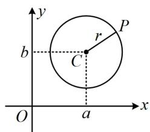
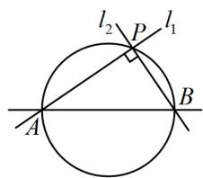
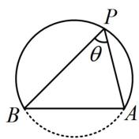
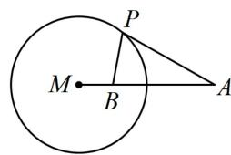
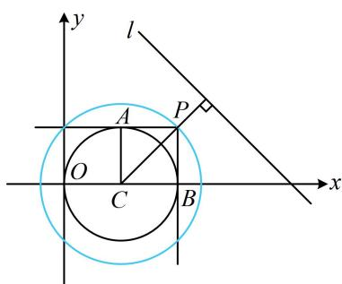
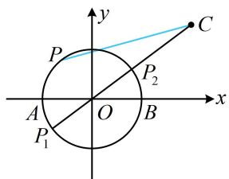
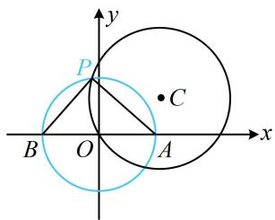
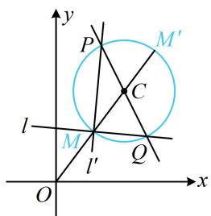
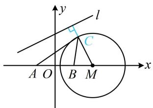

# 内容提要

本节归纳高考中几类常见的隐圆问题:

1. 定长对定点: 平面上到定点 $C(a, b)$ 的距离等于定长 $r$ 的点 $P$ 的轨迹是圆, 如图 1.  
2. 定长对定角:

①平面上过两定点 $A$ 和 $B$ 的直线 $l_{1}$ 、 $l_{2}$ 互相垂直，则它们交点 $P$ 的轨迹为圆，如图2.  
②平面上与两定点 $A$ 和 $B$ 所成视角为固定锐角或钝角的点的轨迹为一段圆弧，如图3.

3. 定长对定比（阿氏圆）：设 $A$ 和 $B$ 是平面内两定点，若点 $P$ 满足 $\frac{|PA|}{|PB|} = \lambda (\lambda > 0$ 且 $\lambda \neq 1)$ ，则点 $P$ 的轨迹是圆，该圆被称为阿氏圆，如图4.

text_image

y
P
r
b
C
O
a
x

图1

text_image

l₂
P
l₁
A
B

图2

  
图3

text_image

M
B
P
A

图4

# 类型 I：定长对定点

【例 1】如果圆 $C:(x-a)^{2}+(y-1)^{2}=1$ 上存在两个点到原点 O 的距离为 2，则正实数 a 的取值范围是 \_\_\_\_.

解析：某点到原点距离为2，意味着该点在圆 $O: x^{2} + y^{2} = 4$ 上，故条件等价于圆C与圆O有两个交点，由题意，圆C的圆心为 $C(a,1)$ ，半径 $r_{1} = 1$ ，圆O的半径 $r_{2} = 2$ ，所以 $|OC| = \sqrt{a^{2} + 1}$ ，

两圆相交 $\Rightarrow |r_1 - r_2| < |OC| < r_1 + r_2 \Rightarrow 1 < \sqrt{a^2 + 1} < 3$ ，结合 $a > 0$ 可解得： $0 < a < 2\sqrt{2}$ .

答案: $(0, 2 \sqrt{2})$

【例 2】过圆 $C:(x-1)^{2}+y^{2}=1$ 外一点 P 作圆 C 的两条切线 PA, PB, 切点分别为 A 和 B, 若 $PA \perp PB$ , 则点 P 到直线 $l: x+y-4=0$ 的距离的最小值为 \_\_\_\_.

解析：要求目标最小值，需先找点 $P$ 的运动轨迹。∠APB的大小由 $|PC|$ 决定，故可由 $PA \perp PB$ 求 $|PC|$ ，如图， $PA \perp PB \Rightarrow \angle APC = 45^{\circ} \Rightarrow \triangle PAC$ 是等腰直角三角形，所以 $|PC| = \sqrt{2}|AC| = \sqrt{2}$ ，

注意到 $C$ 是定点，所以点 $P$ 的轨迹是以 $C(1,0)$ 为圆心， $\sqrt{2}$ 为半径的圆，如图，

接下来就是圆上动点到定直线距离的最值问题了, 先求圆心 $C$ 到直线 $l$ 的距离 $d$ ， $d = \frac{|1 - 4|}{\sqrt{1^2 + 1^2}} = \frac{3\sqrt{2}}{2} >\sqrt{2}$

直线 l 与点 P 所在的圆相离，图中点 P 即为所求距离最小的情形，所以点 $P$ 到直线 $l$ 的距离的最小值为 $\frac{3\sqrt{2}}{2} -\sqrt{2} = \frac{\sqrt{2}}{2}$

text_image

y
l
A
P
O
C
B
x

答案： $\frac{\sqrt{2}}{2}$

【反思】从上面两道题可以看出，动点 $P$ 与定点 $C$ 之间的距离为定值这种条件隐含了点 $P$ 的轨迹是圆，在诸多问题中，发现这一特征，往往是解题的关键.

# 类型Ⅱ：定长对定角

【例 3】已知点 A(-2,0)，B(2,0)，C(4,3)，动点 P 满足 PA⊥PB，则 |PC| 的取值范围是（）

A. [2,5]

B. [2,8]

C. [3,7]

D. [4,6]

解析： $A, B$ 是定点，由 $PA \perp PB$ 可知点 $P$ 的轨迹是以 $AB$ 为直径的圆，先求出该圆，

由题意，点 $P$ 在圆 $x^{2} + y^{2} = 4$ 上（不含 $A, B$ 两点），

如图，点 $C$ 在圆外， $|PC|$ 的最大、最小值分别在 $P_{1}$ ， $P_{2}$ 处取得，

因为 $|OC| = \sqrt{4^2 + 3^2} = 5$ ，所以 $|PC|_{\max} = |OC| + |OP_1| = 7$ ， $|PC|_{\min} = |OC| - |OP_2| = 3$ .

答案: C

text_image

y
P
C
P₂
A
O
B
x
P₁

【变式1】已知点 $A(a,0)$ ， $B(-a,0)$ ， $a > 0$ ，若圆 $C:(x - \sqrt{3})^2 +(y - 1)^2 = 4$ 上存在点 $P$ ，使 $\angle APB = 90^\circ$ ，则 $a$ 的取值范围是（）

A. (0,4)

B. $(0,4]$

C. [2,3]

D. [1,2]

解析: $\angle A P B = 90^{\circ}$ 隐含了点 $P$ 的轨迹是圆, 先把该圆找到,

因为 $\angle APB = 90^{\circ}$ , 所以点 $P$ 在以 $AB$ 为直径的圆上, 该圆的圆心为原点 $O$ , 半径 $r_1 = a$ , 点 $P$ 也在圆 $C$ 上, 于是两圆应有交点, 如图, 可根据圆与圆的位置关系来求 $a$ 的范围,

由题意，圆 $C$ 的圆心为 $C(\sqrt{3},1)$ ，半径 $r_2 = 2$ ，所以 $\vert OC\vert = 2$

两圆有交点 $\Rightarrow |r_1 - r_2| \leq |OC| \leq r_1 + r_2$ ，所以 $|a - 2| \leq 2 \leq a + 2$ ，

结合 $a > 0$ 解得： $0 < a \leq 4$

答案: B

text_image

y
P
C
B O A x

【变式2】已知 $m$ ， $n$ 不同时为0，过点 $P(2,6)$ 作直线 $l:2mx - (4m + n)y + 2n = 0$ 的垂线 $l'$ ，垂足为 $M$ ， $O$ 为原点，则 $|OM|$ 的取值范围是（）

A. $[5 - 2\sqrt{5}, 5 + 2\sqrt{5}]$

B. $[5 - \sqrt{5}, 5 + \sqrt{5}]$

C. $[5 - \sqrt{3}, 5 + \sqrt{3}]$

D. $[5,5 + \sqrt{5} ]$

解析：直线 l 含参，先看看它是否过定点， $2mx - (4m + n)y + 2n = 0 \Rightarrow m(2x - 4y) + n(2 - y) = 0$ ，

令 $\left\{ \begin{array}{l} 2x - 4y = 0 \\ 2 - y = 0 \end{array} \right.$ 可得： $\left\{ \begin{array}{l} x = 4 \\ y = 2 \end{array} \right.$ ，所以直线 $l$ 过定点 $Q(4,2)$ ，

如图， $l \perp l'$ ，垂足为 $M$ ，所以点 $M$ 的轨迹是以 $PQ$ 为直径的圆，

圆心为 $C(3,4)$ ，半径 $r = \frac{1}{2} |PQ| = \sqrt{5}$ ，

接下来就是圆外定点与圆上动点距离的范围问题了， $|OM|$ 最小

的情形如图，最大时 M 为图中的 $M'$ ，

因为 $|OC| = \sqrt{3^2 + 4^2} = 5$ ，所以图中 $|OM| = |OC| - r = 5 - \sqrt{5}$ ，

text_image

y
P
M'
C
l
M
Q
l'
O
x

$\left|OM'\right| = \left|OC\right| + r = 5 + \sqrt{5}$ ，故 $\left|OM\right|$ 的取值范围是 $[5 - \sqrt{5}, 5 + \sqrt{5}]$ .

答案: B

【反思】从例 3 和两个变式可以看出，涉及过两定点的两动直线互相垂直时，它们的交点的轨迹是圆.

类型III：定长对定比（阿氏圆）

【例 4】若点 C 到 $A(-1,0)$ ， $B(1,0)$ 的距离之比为 $\sqrt{3}$ ，则点 C 到直线 $l: x - 2y + 3 = 0$ 的距离的最小值为 \_\_\_\_.

解析：要求目标，需找 $C$ 的轨迹，可设 $C$ 的坐标，利用两点距离公式翻译距离之比的条件，

设 $C(x,y)$ ，则由 $\frac{|CA|}{|CB|} = \sqrt{3}$ 可得 $\frac{\sqrt{(x + 1)^2 + y^2}}{\sqrt{(x - 1)^2 + y^2}} = \sqrt{3}$ ，整理得： $(x - 2)^2 +y^2 = 3$

所以点 $C$ 在圆心为 $M(2,0)$ , 半径 $r = \sqrt{3}$ 的圆上, 圆心 $M$ 到直线 $l$ 的距

离 $d = \frac{|2 + 3|}{\sqrt{1^2 + (-2)^2}} = \sqrt{5} >\sqrt{3}$

直线 $l$ 与圆 $M$ 相离，图中的点 $C$ 即为到 $l$ 距离最小的情形，

由图可知，所求距离的最小值为 $d - r = \sqrt{5} -\sqrt{3}$

答案: $\sqrt{5} - \sqrt{3}$

text_image

y
l
C
A O B M x

# 强化训练

1. (2024·山东济南二模·★★☆)

已知圆 $C: x^2 + y^2 = 1$ ， $A(4, a)$ ， $B(4, -a)$ ，若圆 $C$ 上有且仅有一点 $P$ 使 $PA \perp PB$ ，则正实数 $a$ 的取值为（）

A. 2 或 4

B. 2 或 3

C. 4 或 5

D. 3 或 5

# 2. (★★★)

若圆 $C: x^{2} + y^{2} - 6x - 6y - m = 0$ 上有到点 $P(-1,0)$ 的距离为1的点，则实数 $m$ 的取值范围是（）

A. $[-18,6]$

B. $[-2,6]$

C. $[-2,18]$

D. [4,18]

# 3. (★★★)

在平面直角坐标系 $xOy$ 中，已知点 $A(1,0)$ ， $B(4,0)$ ，若直线 $x - y + m = 0$ 上存在点 $P$ 使 $\left|PB\right| = 2\left|PA\right|$ ，则实数 $m$ 的取值范围为 \_\_\_\_.

4. (2022·安徽黄山模拟·★★★☆)

已知点 $P(-3,0)$ 在动直线 $l: mx + ny - (m + 3n) = 0$ 上的投影为 $M$ ，若点 $N\left(2, \frac{3}{2}\right)$ ，则 $|MN|$ 的最大值为（）

A. 1 B. $\frac{3}{2}$ C. 2 D. $\frac{11}{2}$

5.（2022·河南模拟·★★★★）

已知点 $M(0, -a)$ ， $N(0, a)$ ， $a > 0$ ，若圆 $C: (x - 3)^2 + (y + 4)^2 = 9$ 上存在点 $P$ 使得 $\angle MPN$ 为钝角，则 $a$ 的取值范围是 \_\_\_\_.