# 强化训练

1. (2023·全国甲卷·★★)

设 $F_{1}$ ， $F_{2}$ 为椭圆 $C:\frac{x^2}{5} +y^2 = 1$ 的两个焦点，点 $P$ 在 $C$ 上，若 $\overrightarrow{PF_1}\cdot \overrightarrow{PF_2} = 0$ ，则 $\left|PF_1\right|\cdot \left|PF_2\right| =$ （）

A. 1

B. 2

C. 4

D. 5

1. B

解析：涉及 $PF_{1}$ 和 $PF_{2}$ ，想到椭圆定义，由题意， $a = \sqrt{5}$ ，

$$
b = 1, \quad c = \sqrt {a ^ {2} - b ^ {2}} = 2, \quad \left| F _ {1} F _ {2} \right| = 2 c = 4,
$$

设 $\left|PF_{1}\right|=m,\quad\left|PF_{2}\right|=n$ ，由 $\overrightarrow{PF_{1}}\cdot\overrightarrow{PF_{2}}=0$ 可得 $PF_{1}\perp PF_{2}$ ，

结合椭圆定义可得 $\left\{ \begin{array}{ll}m + n = 2a = 2\sqrt{5} & ①\\ m^2 +n^2 = \left|F_1F_2\right|^2 = 16 & ② \end{array} \right.$

怎样由①②求 mn？我们发现配方即可，

由②可得 $(m+n)^{2}-2mn=16$ ，将①代入可求得mn=2。

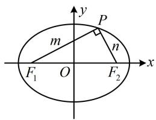

text_image

y
P
m
n
F₁ O F₂ x

2. (2024·湖北武汉四调·★★)

设椭圆 $\frac{x^2}{25} +\frac{y^2}{12} = 1$ 的左右焦点为 $F_{1}$ ， $F_{2}$ ，椭圆上点 $P$ 满足 $\left|PF_1\right|\colon \left|PF_2\right| = 2:3$ ，则 $\triangle PF_1F_2$ 的面积为

2. 12

解析：条件涉及 $\left|PF_{1}\right|$ 和 $\left|PF_{2}\right|$ ，想到联系椭圆定义处理，

由题意， $a = 5$ ， $b = 2\sqrt{3}$ ， $c = \sqrt{a^2 - b^2} = \sqrt{13}$

由椭圆定义， $\left|PF_{1}\right|+\left|PF_{2}\right|=2a=10$ ，

结合 $\left|PF_{1}\right|\left|PF_{2}\right|=2:3$ 可得 $\left|PF_{1}\right|=4,\quad\left|PF_{2}\right|=6,$

又 $\left|F_{1}F_{2}\right| = 2c = 2\sqrt{13}$ ，所以 $\left|PF_1\right|^2 +\left|PF_2\right|^2 = 52 = \left|F_1F_2\right|^2$

从而 $PF_{1} \perp PF_{2}$ ，故 $S_{\triangle PF_1F_2} = \frac{1}{2} |PF_1| \cdot |PF_2| = \frac{1}{2} \times 4 \times 6 = 12$ 。

3. (2022·江西模拟·★★☆)

设椭圆 $C: \frac{x^2}{a^2} + \frac{y^2}{b^2} = 1 (a > b > 0)$ 的左、右焦点分别为 $F_1, F_2$ ，点 $M, N$ 在 $C$ 上，且 $M, N$ 关于原点 $O$ 对称，若 $\left|MN\right| = \left|F_1F_2\right|$ ， $\left|NF_2\right| = 3\left|MF_2\right|$ ，则椭圆 $C$ 的离心率为 \_\_\_\_.

3. $\frac{\sqrt{10}}{4}$

解析：如图，因为 $M$ ， $N$ 关于原点对称， $\left|MN\right| = \left|F_1F_2\right|$

所以四边形 $MF_{1}NF_{2}$ 是矩形，故 $MF_{1} \perp MF_{2}$ ，

且 $\left|MF_1\right| = \left|NF_2\right|$ ，观察发现 $\triangle MF_1F_2$ 是焦点三角形，可把

条件转换到该三角形中来，结合椭圆定义处理，

又 $\left|NF_2\right| = 3\left|MF_2\right|$ ，所以 $\left|MF_1\right| = 3\left|MF_2\right|$ ，可设 $\left|MF_2\right| = m$

则 $\left|MF_1\right| = 3m$ ，所以 $\left|F_1F_2\right| = \sqrt{\left|MF_2\right|^2 + \left|MF_1\right|^2} = \sqrt{10} m$

故 $C$ 的离心率 $e = \frac{c}{a} = \frac{2c}{2a} = \frac{\left|F_1F_2\right|}{\left|MF_1\right| + \left|MF_2\right|} = \frac{\sqrt{10}m}{m + 3m} = \frac{\sqrt{10}}{4}$

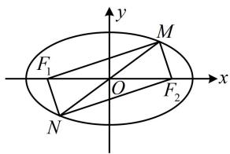

text_image

F₁
M
O
F₂
N
x
y

4. (2024·湖北武汉二调·★★★)

设椭圆 $\frac{x^2}{9} +\frac{y^2}{5} = 1$ 的左右焦点为 $F_{1}$ ， $F_{2}$ ，过点 $F_{2}$ 的直线与该椭圆交于 $A$ ， $B$ 两点，若线段 $AF_{2}$ 的中垂线过点 $F_{1}$ ，则 $\left|BF_2\right| = \_$ .

4. $\frac{10}{7}$

解析：椭圆的长半轴长 $a = 3$ ，短半轴长 $b = \sqrt{5}$ ，半焦距 $c = \sqrt{a^2 - b^2} = 2$ ，所以 $\left|F_1F_2\right| = 2c = 4$

如图，设 $AF_{2}$ 的中点为 $I$ ，由题意， $IF_{1} \perp AF_{2}$

所以 $\left|AF_{1}\right|=\left|F_{1}F_{2}\right|=4$ ，

由椭圆定义， $\left|AF_{2}\right|=2a-\left|AF_{1}\right|=6-4=2$ ，

所以 $\left|IA\right|=\left|IF_{2}\right|=1,\quad\left|IF_{1}\right|=\sqrt{\left|AF_{1}\right|^{2}-\left|IA\right|^{2}}=\sqrt{15}$

怎样求 $\left|BF_{2}\right|$ ？观察发现只要设其为未知数，则 $\left|BF_{1}\right|$ 也能用该未知数表示，可在 $\triangle BIF_{1}$ 中用勾股定理建立方程求解 $\left|BF_{2}\right|$ ，设 $\left|BF_{2}\right|=m$ ，则 $\left|BF_{1}\right|=2a-\left|BF_{2}\right|=6-m$ ，

$$
\left| I B \right| = \left| I F _ {2} \right| + \left| B F _ {2} \right| = 1 + m,
$$

在 $\triangle BIF_{1}$ 中， $\left|IF_1\right|^2 +\left|IB\right|^2 = \left|BF_1\right|^2$

所以 $15 + (1 + m)^2 = (6 - m)^2$ ，解得： $m = \frac{10}{7}$ ，故 $\left|BF_2\right| = \frac{10}{7}$

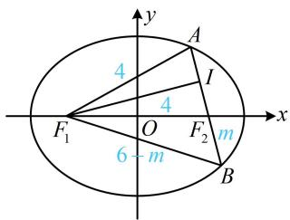

text_image

y
4
A
I
4
F₁ O F₂ m
6 - m B
x

5. (2022·广西南宁模拟·★★★)

已知 $F$ 是椭圆 $E: \frac{x^2}{a^2} + \frac{y^2}{b^2} = 1 (a > b > 0)$ 的左焦点，过原点的直线 $l$ 与 $E$ 相交于 $P$ ， $Q$ 两点，若 $|PF| = 5|QF|$ ， $\angle PFQ = 120^\circ$ ，则椭圆的离心率为（）

A. $\frac{\sqrt{7}}{6}$

B. $\frac{1}{3}$

C. $\frac{\sqrt{21}}{6}$

D. $\frac{\sqrt{21}}{5}$

5. C

解析：看到过原点的直线与椭圆交于 $P, Q$ 两点，想到与焦点构成平行四边形，

如图，设右焦点为 $F'$ ，则四边形 $PFQF'$ 为平行四边形，

为了运用椭圆的定义，将条件转移到 $\triangle PFF'$ 中来，

$\left|PF^{\prime}\right| = \left|QF\right|$ ，又 $\left|PF\right| = 5\left|QF\right|$ ，所以 $\left|PF\right| = 5\left|PF^{\prime}\right|$ ①，

由椭圆定义， $\left|PF\right|+\left|PF'\right|=2a$ ，

结合①可得 $\left|PF\right|=\frac{5a}{3}$ ， $\left|PF'\right|=\frac{a}{3}$ ，

还剩 $\angle PFQ = 120^{\circ}$ 这个条件没用，可据此求出 $\angle FPF'$ ，在 $\triangle PFF'$ 中由余弦定理建立方程求离心率，

$\angle FPF' = 180^{\circ} - \angle PFQ = 60^{\circ}$ ， $|FF'| = 2c$ ，由余弦定理，

$$
\left| F F ^ {\prime} \right| ^ {2} = \left| P F \right| ^ {2} + \left| P F ^ {\prime} \right| ^ {2} - 2 \left| P F \right| \cdot \left| P F ^ {\prime} \right| \cdot \cos \angle F P F ^ {\prime},
$$

所以 $4c^{2} = \frac{25a^{2}}{9} +\frac{a^{2}}{9} -2\times \frac{5a}{3}\times \frac{a}{3}\times \cos 60^{\circ},$

整理得： $\frac{c^2}{a^2} = \frac{7}{12}$ ，故离心率 $e = \frac{c}{a} = \frac{\sqrt{21}}{6}$

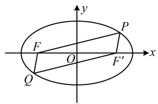

text_image

y
P
F
O
x
Q
F'

6. (2022·江西萍乡三模·★★★)

设 $F_{1}$ ， $F_{2}$ 是椭圆 $C:y^{2} + \frac{x^{2}}{t} = 1(0 < t < 1)$ 的焦点，若椭圆 $C$ 上存在点 $P$ ，满足 $\angle F_1PF_2 = 120^\circ$ ，则 $t$ 的取值范围是（）

A. $\left(0, \frac{1}{4}\right]$

B. $\left[\frac{1}{4}, 1\right)$

C. $\left(0,\frac{\sqrt{2}}{2}\right]$

D. $\left[\frac{\sqrt{2}}{2}, 1\right)$

6. A

解法 1: 先把 $\angle F_{1} P F_{2} = 120^{\circ}$ 的情形画出来, 如图 1, 在焦点三角形中, 首先考虑椭圆定义,

设 $\left|PF_{1}\right|=m,\quad\left|PF_{2}\right|=n$ ，由题意，椭圆的长半轴长a=1，

半焦距 $c = \sqrt{1 - t}$ ，所以 $m + n = 2a = 2$ ①，

还有角度的条件，可在 $\triangle PF_{1}F_{2}$ 中用余弦定理，

$$
\left| F _ {1} F _ {2} \right| ^ {2} = \left| P F _ {1} \right| ^ {2} + \left| P F _ {2} \right| ^ {2} - 2 \left| P F _ {1} \right| \cdot \left| P F _ {2} \right| \cdot \cos \angle F _ {1} P F _ {2},
$$

所以 $4(1 - t) = m^2 + n^2 - 2mn\cos 120^\circ$

故 $4(1 - t) = m^2 + n^2 + mn$ ②,

要求 t 的范围，应建立关于 t 的不等式，结合式①知可对式②配方，用不等式 $mn \leq \left(\frac{m+n}{2}\right)^{2}$ 来实现，

所以 $4(1 - t) = (m + n)^2 - mn \geq (m + n)^2 - \left(\frac{m + n}{2}\right)^2$

$= \frac{3(m + n)^2}{4}$ ，将式①代入可得 $4(1 - t)\geq 3$ ，故 $t\leq \frac{1}{4}$

取等条件是 $m = n = 1$ ，又 $0 < t < 1$ ，所以 $t \in \left(0, \frac{1}{4}\right]$ .

解法2：也可直接用最大张角结论，当 $P$ 在椭圆上运动时， $\angle F_{1}PF_{2}$ 的最大值在短轴端点处取得，

要使椭圆上存在点 $P$ ，满足 $\angle F_{1}PF_{2} = 120^{\circ}$

只需图2所示的 $\angle F_{1}PF_{2}\geq 120^{\circ}$ 即可，即图中 $\alpha \geq 60^{\circ}$

所以 $\cos \alpha = \frac{|OP|}{|PF_1|} = \frac{\sqrt{t}}{1} \leq \frac{1}{2}$ ，结合 $0 < t < 1$ 解得： $0 < t \leq \frac{1}{4}$ .

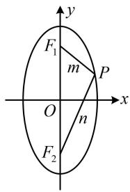

text_image

F₁
m
P
O
n
F₂
x
y

图1

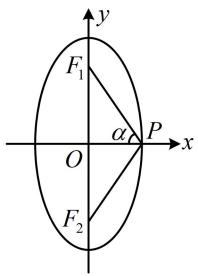

text_image

F₁
α
O
P
x
F₂
y

图2

7. (2024·广东广州一模·★★★)

设 $B$ ， $F_{2}$ 分别是椭圆 $C:\frac{y^2}{a^2} +\frac{x^2}{b^2} = 1(a > b > 0)$ 的右顶点和上焦点，点 $P$ 在 $C$ 上，且 $\overrightarrow{BF_2} = 2\overrightarrow{F_2P}$ ，则 $C$ 的离心率为（）

A. $\frac{\sqrt{3}}{3}$

B. $\frac{\sqrt{65}}{13}$

C. $\frac{1}{2}$

D. $\frac{\sqrt{3}}{2}$

7. A

解法1：如图，由 $\overrightarrow{BF_2} = 2\overrightarrow{F_2P}$ 得 $\left|BF_2\right| = 2\left|F_2P\right|$ ，于是联想到相似比，故考虑通过构造相似三角形求 $P$ 的坐标，代入椭圆方程，过 $P$ 作 $PQ \perp y$ 轴于点 $Q$ ，则 $\triangle PQF_2 \sim \triangle BOF_2$

由 $\overrightarrow{BF_2} = 2\overrightarrow{F_2P}$ 可得 $\frac{|PQ|}{|OB|} = \frac{|QF_2|}{|OF_2|} = \frac{|PF_2|}{|BF_2|} = \frac{1}{2}$

又因为 $|OB|=b$ ， $|OF_{2}|=c$ ，所以 $|PQ|=\frac{1}{2}|OB|=\frac{b}{2}$ ，

$$
\left| Q F _ {2} \right| = \frac {1}{2} \left| O F _ {2} \right| = \frac {c}{2}, \quad \left| O Q \right| = \left| O F _ {2} \right| + \left| Q F _ {2} \right| = c + \frac {c}{2} = \frac {3 c}{2},
$$

故 $P\left(-\frac{b}{2}, \frac{3c}{2}\right)$ ，代入 $C$ 的方程得 $\frac{\left(\frac{3c}{2}\right)^2}{a^2} + \frac{\left(-\frac{b}{2}\right)^2}{b^2} = 1$

所以 $\frac{9}{4} e^2 +\frac{1}{4} = 1$ ，故 $C$ 的离心率 $e = \frac{\sqrt{3}}{3}$

解法2：在 $\overrightarrow{BF_2} = 2\overrightarrow{F_2P}$ 中，注意到 $F_{2}$ 和 $B$ 的坐标容易表示出来，故也可用坐标翻译它，求得 $P$ 的坐标，

设 $P(x_0,y_0)$ ，由题意， $B(b,0)$ ， $F_{2}(0,c)$

所以 $\overrightarrow{BF_2} = (-b,c)$ ， $\overrightarrow{F_2P} = (x_0,y_0 - c)$

因为 $\overrightarrow{BF_2} = 2\overrightarrow{F_2P}$ ，所以 $\left\{ \begin{array}{l} -b = 2x_0\\ c = 2(y_0 - c) \end{array} \right.$ ，从而 $x_0 = -\frac{b}{2}$

$y_{0}=\frac{3c}{2}$ ，故 $P\left(-\frac{b}{2},\frac{3c}{2}\right)$ ，接下来同解法1.

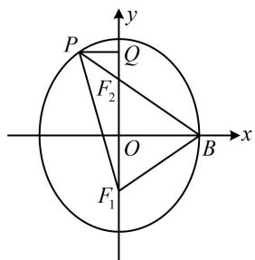

text_image

P
Q
F₂
O
B
x
F₁
y

8. (2024·广东深圳二模·★★★☆)

设 $P$ 是椭圆 $C: \frac{x^2}{a^2} + \frac{y^2}{b^2} = 1 (a > b > 0)$ 上一点， $F_1, F_2$ 是 $C$ 的两个焦点， $\overrightarrow{PF_1} \cdot \overrightarrow{PF_2} = 0$ ，点 $Q$ 在 $\angle F_1PF_2$ 的平分线上， $O$ 为原点， $OQ \parallel PF_1$ ，且 $\left|OQ\right| = b$ ，则 $C$ 的离心率为（）

A. $\frac{1}{2}$

B. $\frac{\sqrt{3}}{3}$

C. $\frac{\sqrt{6}}{3}$

D. $\frac{\sqrt{3}}{2}$

8. C

解析： $P$ 在椭圆上， $F_{1}$ ， $F_{2}$ 是两个焦点，故考虑用椭圆的定义处理，下面我们先通过分析几何关系来表示有关线段的长，如图，设 $\left|PF_1\right| = m$ ， $\left|F_1F_2\right| = 2c$ ，延长 $OQ$ 交 $PF_{2}$ 于点 $A$ ，由题意， $OQ / / PF_{1}$ ， $O$ 为 $F_{1}F_{2}$ 的中点，所以 $A$ 为 $PF_{2}$ 的中点，又因为 $\overrightarrow{PF_1}\cdot \overrightarrow{PF_2} = 0$ ，所以 $PF_{1}\bot PF_{2}$

结合 $OQ \parallel PF_{1}$ 可得 $OQ \perp PF_{2}$ ，故 $\angle QAP = \frac{\pi}{2}$ ，

又因为 $PQ$ 是 $\angle F_{1}PF_{2}$ 的角平分线，所以 $\angle QPA = \frac{\pi}{4}$

故 $\triangle AQP$ 是等腰直角三角形，

因为 $\left|OA\right|=\frac{1}{2}\left|PF_{1}\right|=\frac{m}{2}$ ， $\left|OQ\right|=b$ ，所以 $\left|QA\right|=\left|OA\right|-\left|OQ\right|$

$= \frac{m}{2} - b$ ，从而 $\left|PA\right| = \frac{m}{2} -b$ ，故 $\left|PF_2\right| = m - 2b$

有关线段的长都有了，下面我们建立方程，求离心率本身需要一个关于 $a, b, c$ 的方程，又引入了 $m$ ，故需两个方程，怎样建立？由椭圆定义可以建立一个方程，另一个呢？有 $PF_{1} \perp PF_{2}$ 和 $\triangle PF_{1}F_{2}$ 的三边长，故考虑用勾股定理建立方程，由椭圆定义， $|PF_{1}| + |PF_{2}| = m + m - 2b = 2a$ ，

所以 $m = a + b$ ①,

因为 $PF_{1} \perp PF_{2}$ ，所以 $\left|PF_{1}\right|^{2} + \left|PF_{2}\right|^{2} = \left|F_{1}F_{2}\right|^{2}$ ，

故 $m^2 +(m - 2b)^2 = 4c^2$ ②，

将①代入②得 $(a + b)^2 +(a - b)^2 = 4c^2$

化简得： $a^2 + b^2 = 2c^2$ ，所以 $a^2 + a^2 - c^2 = 2c^2$

从而 $2a^{2} = 3c^{2}$ ，故离心率 $e = \frac{c}{a} = \frac{\sqrt{6}}{3}$

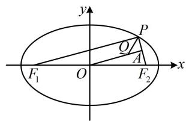

text_image

y
P
O
A
F₁ O F₂ x

9. (2019·浙江卷·★★★☆)

已知椭圆 $\frac{x^2}{9} +\frac{y^2}{5} = 1$ 的左焦点为 $F$ ，点 $P$ 在椭圆上且在 $x$ 轴的上方，若线段 $PF$ 的中点在以原点 $O$ 为圆心， $|OF|$ 为半径的圆上，则直线 $PF$ 的斜率是

9. $\sqrt{15}$

解析：如图，涉及中点，可尝试构造中位线。

由题意， $a = 3$ ， $c = 2$ ，记右焦点为 $F_{1}$ ，PF中点为O，

因为 $O$ 是 $FF_{1}$ 的中点，所以 $\left|PF_{1}\right| = 2\left|OO\right| = 4$

有了 $\left|PF_{1}\right|$ ，就能结合椭圆定义求 $\left|PF\right|$ ，于是 $\triangle PFF_{1}$ 已知三边，可用余弦定理推论求 $\cos\angle PFF_{1}$ ，再求 $\tan\angle PFF_{1}$ ，

$$
\left| P F \right| + \left| P F _ {1} \right| = 2 a \Rightarrow \left| P F \right| = 2 a - \left| P F _ {1} \right| = 6 - 4 = 2,
$$

又 $\left|FF_{1}\right| = 2c = 4$ ，所以 $\cos \angle PFF_{1} = \frac{\left|PF\right|^{2} + \left|FF_{1}\right|^{2} - \left|PF_{1}\right|^{2}}{2\left|PF\right|\cdot\left|FF_{1}\right|}$

$= \frac{4 + 16 - 16}{2\times 2\times 4} = \frac{1}{4}$ ，故 $\tan \angle PFF_{1} = \frac{\sin\angle PFF_{1}}{\cos\angle PFF_{1}} = \sqrt{15}$

即直线 $PF$ 的斜率为 $\sqrt{15}$ 。

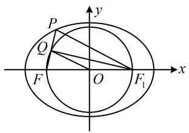

text_image

P
Q
F
O
F₁
x
y

10. (2023·湖南模拟·★★★★)

已知椭圆 $C: \frac{x^2}{a^2} + \frac{y^2}{b^2} = 1 (a > b > 0)$ 的左、右焦点分别为 $F_1, F_2$ ，过点 $F_2$ 且倾斜角为 $60^\circ$ 的直线 $l$ 与 $C$ 交于 $A$ ， $B$ 两点，若 $\triangle AF_1F_2$ 的面积是 $\triangle BF_1F_2$ 面积的 2 倍，则 $C$ 的离心率为 \_\_\_\_.

10. $\frac{2}{3}$

解析：怎样翻译 $S_{\triangle AF_1F_2} = 2S_{\triangle BF_1F_2}$ ？注意到两个 $\triangle$ 有公共边 $F_1F_2$ ，又容易得到 $\angle AF_2F_1$ 和 $\angle BF_2F_1$ ，故用 $F_1F_2$ 和此二角求面积，如图，由题意，直线 $AB$ 的倾斜角为 $60^\circ$ ，

所以 $\angle AF_2F_1 = 60^\circ$ ， $\angle BF_2F_1 = 120^\circ$

故 $S_{\triangle AF_1F_2} = \frac{1}{2}\left|F_1F_2\right|\cdot \left|AF_2\right|\cdot \sin 60^\circ = \frac{\sqrt{3}}{4}\left|F_1F_2\right|\cdot \left|AF_2\right|$

$$
S _ {\triangle B F _ {1} F _ {2}} = \frac {1}{2} \big | F _ {1} F _ {2} \big | \cdot \big | B F _ {2} \big | \cdot \sin 1 2 0 ^ {\circ} = \frac {\sqrt {3}}{4} \big | F _ {1} F _ {2} \big | \cdot \big | B F _ {2} \big | ,
$$

因为 $S_{\triangle AF_{1}F_{2}} = 2S_{\triangle BF_{1}F_{2}}$ ,

所以 $\frac{\sqrt{3}}{4}\left|F_1F_2\right|\cdot \left|AF_2\right| = 2\times \frac{\sqrt{3}}{4}\left|F_1F_2\right|\cdot \left|BF_2\right|$ ，故 $\left|AF_2\right| = 2\left|BF_2\right|$

有了 $\left|AF_{2}\right|$ 和 $\left|BF_{2}\right|$ 的倍数关系，可考虑设一段长，结合椭圆定义求其它线段的长，

设 $\left|BF_{2}\right|=m$ ，则 $\left|AF_{2}\right|=2m$ ，由椭圆定义， $\left|AF_{1}\right|+\left|AF_{2}\right|=2a$ ，所以 $\left|AF_{1}\right|=2a-\left|AF_{2}\right|=2a-2m$ ，同理， $\left|BF_{1}\right|=2a-m$ ，

如图，所有线段的长都有了，怎样求离心率？注意到已知 $\angle AF_2F_1$ 和 $\angle BF_2F_1$ ，故可在上下两个△中用余弦定理建立方程，在 $\triangle BF_{1}F_{2}$ 中，由余弦定理，

$$
\left| B F _ {1} \right| ^ {2} = \left| F _ {1} F _ {2} \right| ^ {2} + \left| B F _ {2} \right| ^ {2} - 2 \left| F _ {1} F _ {2} \right| \cdot \left| B F _ {2} \right| \cdot \cos \angle B F _ {2} F _ {1},
$$

所以 $(2a - m)^{2} = 4c^{2} + m^{2} - 2\times 2c\times m\times \left(-\frac{1}{2}\right),$

化简得： $m = \frac{2a^2 - 2c^2}{2a + c}$ ①，同理，在 $\triangle AF_1F_2$ 中，

$$
\left| A F _ {1} \right| ^ {2} = \left| F _ {1} F _ {2} \right| ^ {2} + \left| A F _ {2} \right| ^ {2} - 2 \left| F _ {1} F _ {2} \right| \cdot \left| A F _ {2} \right| \cdot \cos \angle A F _ {2} F _ {1},
$$

所以 $(2a - 2m)^{2} = 4c^{2} + 4m^{2} - 2\times 2c\times 2m\times \frac{1}{2}$

$$
m = \frac {a ^ {2} - c ^ {2}}{2 a - c} \quad ②,
$$

由①②可得 $\frac{2a^2 - 2c^2}{2a + c} = \frac{a^2 - c^2}{2a - c}$ ，化简得离心率 $e = \frac{c}{a} = \frac{2}{3}$ .

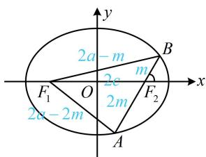

text_image

2a - m
F₁ O 2e 2m F₂ A
2a - 2m
y
x
B
m

11. (2022·湖北模拟·★★★★)

已知 $F_{1}$ ， $F_{2}$ 是椭圆 $C:\frac{x^2}{a^2} +\frac{y^2}{b^2} = 1(a > b > 0)$ 的左、右焦点，点 $P$ 在椭圆 $C$ 的第一象限上，过 $F_{2}$ 作 $\angle F_1PF_2$ 的外角平分线的垂线，垂足为 $A$ ， $O$ 为原点，若 $\left|OA\right| = \sqrt{3} b$ ，则椭圆 $C$ 的离心率为

11. $\frac{\sqrt{6}}{3}$

解析：看到向外角平分线作垂线，涉及角平分线+垂直，想到三线合一，可构造等腰三角形，

如图，设直线 $F_{2}A$ 和 $F_{1}P$ 交于点 $Q$

由题意， $PA$ 是 $\angle F_{2}PQ$ 的平分线，且 $PA\perp F_2Q$ ，

所以 $\left|PF_{2}\right|=\left|PQ\right|$ ，且A是 $F_{2}Q$ 的中点，

又 $O$ 是 $F_{1}F_{2}$ 的中点，所以 $\left|F_1Q\right| = 2\left|OA\right| = 2\sqrt{3} b$

另一方面， $\left|F_{1}Q\right|=\left|PF_{1}\right|+\left|PQ\right|=\left|PF_{1}\right|+\left|PF_{2}\right|=2a$

所以 $2a = 2\sqrt{3} b$ ，从而 $a = \sqrt{3} b$ ，故 $a^2 = 3b^2 = 3(a^2 - c^2)$

整理得： $\frac{c^2}{a^2} = \frac{2}{3}$ ，所以椭圆 $C$ 的离心率 $e = \frac{c}{a} = \frac{\sqrt{6}}{3}$

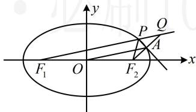

text_image

y
P Q
A
F₁ O F₂ x

12. (2022·新课标Ⅰ卷·★★★★)

已知椭圆 $C: \frac{x^2}{a^2} + \frac{y^2}{b^2} = 1 (a > b > 0)$ ， $C$ 的上顶点为 $A$ ，两个焦点为 $F_1$ ， $F_2$ ，离心率为 $\frac{1}{2}$ ，过 $F_1$ 且垂直于 $AF_2$ 的直线交 $C$ 于 $D$ ， $E$ 两点， $|DE| = 6$ ，则 $\triangle ADE$ 的周长是 \_\_\_\_.

12. 13

解析：先由离心率分析 $a, b, c$ 的关系，将变量归一化，

椭圆的离心率为 $\frac{1}{2} \Rightarrow \frac{c}{a} = \frac{1}{2} \Rightarrow a = 2c$ ， $b = \sqrt{a^2 - c^2} = \sqrt{3}c$ ，

所以椭圆方程可化为 $\frac{x^2}{4c^2} +\frac{y^2}{3c^2} = 1$

且 $\left|AF_1\right| = \left|AF_2\right| = a = 2c = \left|F_1F_2\right|$ ，故 $\triangle AF_1F_2$ 为正三角形，

如图，可由此求得直线 $DE$ 的斜率，写出其方程，可与椭圆联立计算弦长 $\left|DE\right|$ ，建立方程解 $c$

由题意， $DE \perp AF_{2}$ ，所以 $\angle EF_{1}F_{2} = 30^{\circ}$ ，从而直线 $DE$ 的斜率为 $\frac{\sqrt{3}}{3}$ ，故其方程为 $y = \frac{\sqrt{3}}{3}(x + c)$ ，即 $x = \sqrt{3} y - c$ ，

联立 $\left\{ \begin{array}{l} x = \sqrt{3} y - c \\ \frac{x^2}{4c^2} + \frac{y^2}{3c^2} = 1 \end{array} \right.$ 消去 $x$ 整理得： $13y^{2} - 6\sqrt{3} cy - 9c^{2} = 0$

判别式 $\Delta = (-6\sqrt{3} c)^2 - 4 \times 13 \times (-9c^2) = (24c)^2$

所以 $\left|DE\right|=\sqrt{1+(\sqrt{3})^{2}}\cdot\frac{\sqrt{(24c)^{2}}}{13}=\frac{48c}{13}$ ,

由题意， $|DE|=6$ ，所以 $\frac{48c}{13}=6$ ，故 $c=\frac{13}{8}$ ，

最后算 $\triangle ADE$ 的周长, 若通过求 $D$ , $E$ 的坐标来算 $|AD|$ 和 $|AE|$ , 则比较麻烦, 结合图形的对称性会发现可转化为 $\triangle DEF_{2}$ 来算周长, 只需用椭圆的定义即可快速求出,

由 $\triangle AF_1F_2$ 是正三角形， $DE$ 过 $F_{1}$ 且与 $AF_{2}$ 垂直可知 $DE$ 是 $AF_{2}$ 的中垂线，所以 $\left|AE\right| = \left|EF_2\right|$ ， $\left|AD\right| = \left|DF_2\right|$

故 $\triangle ADE$ 的周长 $L = |AD| + |AE| + |DE| = |DF_2| + |EF_2| + |DE|$

$$
= \left| D F _ {2} \right| + \left| E F _ {2} \right| + \left| D F _ {1} \right| + \left| E F _ {1} \right| = 4 a = 8 c = 8 \times \frac {1 3}{8} = 1 3.
$$

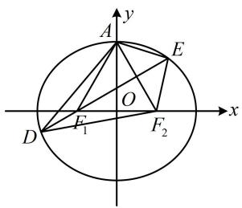

text_image

y
A
E
O
x
D
F₁
F₂

