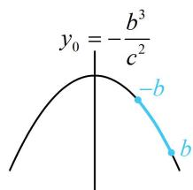
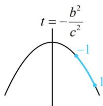
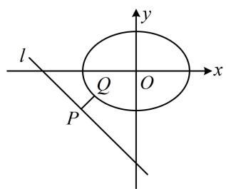
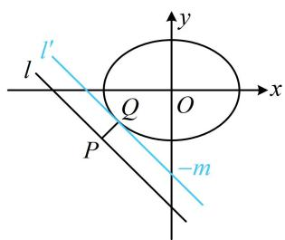
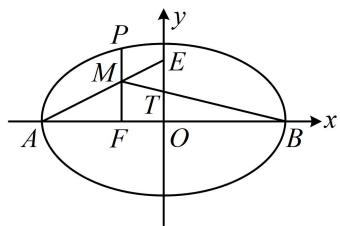
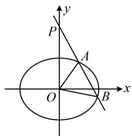

# 内容提要

1. 若点 $P$ 在椭圆 $C: \frac{x^2}{a^2} + \frac{y^2}{b^2} = 1 (a > b > 0)$ 上运动，由此而产生的求最值（求范围）问题，设动点 $P$ 的坐标并用它表示求最值的目标量是常用解法之一，动点 $P$ 的设法主要有两种：

①设 $P(x_0, y_0)$ ，用该坐标表示的目标量往往有 $x_0$ 和 $y_0$ 两个变量，可利用 $P$ 在椭圆上（即 $\frac{x_0^2}{a^2} + \frac{y_0^2}{b^2} = 1$ ）来消元化单变量函数分析最值（范围）.

②利用 $\cos^2\theta + \sin^2\theta = 1$ 进行三角换元，可令 $\left\{ \begin{array}{l} \frac{x}{a} = \cos \theta \\ \frac{y}{b} = \sin \theta \end{array} \right.$ ，则 $\left\{ \begin{array}{l} x = a\cos \theta \\ y = b\sin \theta \end{array} \right.$ ，于是可设 $P(a\cos \theta, b\sin \theta)$ ，将求最值的目标量表示成关于 $\theta$ 的三角函数，再分析最值（范围）.

2. 设直线 $l$ 与椭圆 $C$ 交于 $A$ 、 $B$ 两点，由此产生的诸多问题中，需要将直线 $l$ 与椭圆 $C$ 的方程联立，但联立后我们往往不去解方程组，求交点 $A$ ， $B$ 的坐标，而是消去 $y$ （或 $x$ ）整理得出关于 $x$ （或 $y$ ）的一元二次方程，结合韦达定理来计算一些目标量，如数量积、弦长、面积等。

# 类型 I：设点求最值方法

【例1】已知椭圆 $\frac{y^2}{a^2} + x^2 = 1 (a > 1)$ 的离心率 $e = \frac{2\sqrt{5}}{5}$ ， $P$ 为椭圆上的一个动点， $B(-1,0)$ ，则 $|PB|$ 的最大值为（）

A. $\frac{3}{2}$

B. 2

C. $\frac{5}{2}$

D. 3

解法1：由题意，椭圆的离心率 $e = \frac{c}{a} = \frac{\sqrt{a^2 - 1}}{a} = \frac{2\sqrt{5}}{5}$ ，解得： $a = \sqrt{5}$ ，椭圆的方程为 $\frac{y^2}{5} + x^2 = 1$ ， $|PB|$ 可用两点间的距离公式来算，于是设 $P$ 的坐标，设 $P(x_0, y_0)$ ，则 $|PB| = \sqrt{(x_0 + 1)^2 + y_0^2}$ ①，有 $x_0$ ， $y_0$ 两个变量，可结合椭圆方程消元， $y_0$ 只有平方项，所以消 $y_0$ ，因为点 $P$ 在椭圆上，所以 $\frac{y_0^2}{5} + x_0^2 = 1$ ，故 $y_0^2 = 5 - 5x_0^2$ ，代入①整理得： $|PB| = \sqrt{-4x_0^2 + 2x_0 + 6} = \sqrt{-4\left(x_0 - \frac{1}{4}\right)^2 + \frac{25}{4}}$ ，其中 $-1 \leq x_0 \leq 1$ ，所以当 $x_0 = \frac{1}{4}$ 时， $|PB|$ 取得最大值 $\frac{5}{2}$ .

解法2：求 $a$ 的过程同解法1，接下来也可将点 $P$ 的坐标设为三角的形式，

设 $P(\cos \theta, \sqrt{5}\sin \theta)$ ，则 $|PB| = \sqrt{(\cos \theta + 1)^2 + 5\sin^2\theta} = \sqrt{\cos^2\theta + 2\cos\theta + 1 + 5\sin^2\theta}$ ②，

要求式②的最大值，可用 $\sin^2\theta = 1 - \cos^2\theta$ 化同名， $|PB| = \sqrt{\cos^2\theta + 2\cos\theta + 1 + 5(1 - \cos^2\theta)}$

$= \sqrt{-4\cos^2\theta + 2\cos\theta + 6} = \sqrt{-4\left(\cos\theta - \frac{1}{4}\right)^2 + \frac{25}{4}}$ ，所以当 $\cos \theta = \frac{1}{4}$ 时， $|PB|$ 取得最大值 $\frac{5}{2}$ .

答案: C

【反思】椭圆上动点到定点的距离最值问题, 常用两种做法: ①设动点 $P$ 的坐标为 $(x_0, y_0)$ , 利用椭圆方程消去目标式中只含平方项的变量, 再求最值; ②将动点 $P$ 设为三角形式, 用函数的方法求最值.

【变式】(2021·全国乙卷) 设 $B$ 是椭圆 $C: \frac{x^2}{a^2} + \frac{y^2}{b^2} = 1 (a > b > 0)$ 的上顶点, 若 $C$ 上的任意一点 $P$ 都满足 $|PB| \leq 2b$ , 则椭圆 $C$ 的离心率的取值范围是 ( )

A. $\left[\frac{\sqrt{2}}{2}, 1\right)$

B. $\left[\frac{1}{2}, 1\right)$

C. $\left(0,\frac{\sqrt{2}}{2}\right]$

D. $\left(0,\frac{1}{2}\right]$

解法 1: $|PB| \leq 2b$ 恒成立, 即 $\left|PB\right|_{\max} \leq 2b$ , 所以先分析 $|PB|$ 的最大值, 可设点 $P$ 的坐标,

由题意， $B(0,b)$ ，设 $P(x_0,y_0)$ ，则 $\left|PB\right|^2 = x_0^2 +(y_0 - b)^2$ ①，有两个变量，可利用椭圆的方程消元，

因为点 $P$ 在椭圆 $C$ 上，所以 $\frac{x_0^2}{a^2} +\frac{y_0^2}{b^2} = 1$ ，故 $x_0^2 = a^2 -\frac{a^2}{b^2} y_0^2$

代入①得： $\left|PB\right|^{2}=a^{2}-\frac{a^{2}}{b^{2}}y_{0}^{2}+y_{0}^{2}-2by_{0}+b^{2}=-\frac{c^{2}}{b^{2}}y_{0}^{2}-2by_{0}+a^{2}+b^{2},\quad-b\leq y_{0}\leq b,$

这个关于 $y_{0}$ 的二次函数含参，直接求最值的话，需讨论区间 $[-b, b]$ 与对称轴的位置关系，较麻烦，但若注意到 $|PB| \leq 2b$ 中的 $2b$ 恰好是短轴长，使 $|PB|$ 等于 $2b$ 的点 $P$ 容易找到，则可简化分析过程，

当 $P$ 为椭圆下顶点时， $|PB| = 2b$ ，结合 $|PB| \leq 2b$ 恒成立知 $|PB|$ 的最大值在下顶点处取得，

即当 $y_0 = -b$ 时， $\left|PB\right|^2 = -\frac{c^2}{b^2} y_0^2 -2by_0 + a^2 +b^2$ 取得最大值，

可由此约束对称轴与区间的位置关系，建立不等式求离心率的范围，

上述关于 $y_{0}$ 的二次函数的对称轴为 $y_{0} = -\frac{b^{3}}{c^{2}}$ ，如图1，应有 $-b\geq -\frac{b^3}{c^2}$

所以 $c^2 \leq b^2 = a^2 - c^2$ ，故 $\frac{c^2}{a^2} \leq \frac{1}{2}$ ，结合 $0 < e < 1$ 可得 $e \in \left(0, \frac{\sqrt{2}}{2}\right]$ .

解法2：也可将点 $P$ 的坐标设为三角形式，来分析 $|PB|$ 的最值，

设 $P(a\cos \theta ,b\sin \theta)$ ，则 $\left|PB\right|^2 = a^2\cos^2\theta +(b\sin \theta -b)^2 = a^2\cos^2\theta +b^2\sin^2\theta -2b^2\sin \theta +b^2,$

为了统一函数名，将 $\cos^2\theta$ 换成 $1 - \sin^2\theta$

所以 $\left|PB\right|^2 = a^2 -a^2\sin^2\theta +b^2\sin^2\theta -2b^2\sin \theta +b^2 = -c^2\sin^2\theta -2b^2\sin \theta +a^2 +b^2,$

只需将 $\sin \theta$ 换元成 $t$ ，即可转化成二次函数分析最值，接下来的求解过程和解法1类似，

令 $t = \sin \theta$ ，则 $\left|PB\right|^2 = -c^2 t^2 - 2b^2 t + a^2 + b^2 (-1 \leq t \leq 1)$

因为 $|PB| \leq 2b$ ，且当 $P$ 为下顶点 $(0, -b)$ 时， $|PB| = 2b$ ，此时 $\begin{cases} \cos \theta = 0 \\ \sin \theta = -1 \end{cases}$ ，即 $t = -1$ ，

所以上述关于 $t$ 的二次函数应在 $t = -1$ 处取得最大值，

可由此约束对称轴与区间的位置关系，求离心率的范围，

如图2，应有 $-\frac{b^2}{c^2} \leq -1$ ，所以 $c^2 \leq b^2 = a^2 - c^2$ ，故 $\frac{c^2}{a^2} \leq \frac{1}{2}$

结合 $0 < e < 1$ 可得 $e \in \left(0, \frac{\sqrt{2}}{2}\right]$ .

答案: C

text_image

y₀ = -b³/c²
-b
b

图1

text_image

t = -\frac{b^2}{c^2}
-1
1

图2

【例 2】已知 $F_{1}$ ， $F_{2}$ 是椭圆 $E: \frac{x^{2}}{4} + \frac{y^{2}}{3} = 1$ 的两个焦点，P 是椭圆 E 上任意一点，则 $\overrightarrow{F_{1}P} \cdot \overrightarrow{F_{2}P}$ 的取值范围是 \_\_\_\_.

解析： $\overrightarrow{F_1P}\cdot \overrightarrow{F_2P}$ 可用坐标计算，故考虑设点 $P$ 的坐标，设 $P(x,y)$ ，由题意， $F_{1}(-1,0)$ ， $F_{2}(1,0)$

所以 $\overrightarrow{F_1P} = (x + 1,y)$ ， $\overrightarrow{F_2P} = (x - 1,y)$ ，故 $\overrightarrow{F_1P}\cdot \overrightarrow{F_2P} = (x + 1)(x - 1) + y^2 = x^2 +y^2 -1$ ①，

有 $x, y$ 两个变量，且都为平方项，可利用椭圆方程来消元，消谁都行，不妨消 $y$ ,

因为点 $P$ 在椭圆上，所以 $\frac{x^2}{4} +\frac{y^2}{3} = 1$ ，故 $y^{2} = 3 - \frac{3}{4} x^{2}$ ，代入①整理得： $\overrightarrow{F_1P}\cdot \overrightarrow{F_2P} = \frac{1}{4} x^2 +2$

因为 $-2 \leq x \leq 2$ ，所以 $0 \leq x^2 \leq 4$ ，故 $2 \leq \overrightarrow{F_1P} \cdot \overrightarrow{F_2P} \leq 3$ .

答案：[2,3]

【反思】本题也可设三角形式的坐标，请自行尝试.

【例 3】若点 P 在直线 $l: x + y + 7 = 0$ 上，点 Q 在椭圆 $C: \frac{x^{2}}{16} + \frac{y^{2}}{9} = 1$ 上，则 $|PQ|$ 的最小值是 \_\_\_\_.

解法1: 如图1, 若固定 $Q$ , 则无论点 $Q$ 在何处, 总有当 $PQ \perp l$ 时, $|PQ|$ 最小, 故只需求点 $Q$ 到直线 $l$ 的距离的最小值. 点 $Q$ 在椭圆 $C$ 上运动, 可将其坐标设为三角形式,

设 $Q(4\cos \theta ,3\sin \theta)$ ，则点 $Q$ 到直线 $l$ 的距离 $d = \frac{|4\cos\theta + 3\sin\theta + 7|}{\sqrt{1^2 + 1^2}} = \frac{|5\sin(\theta + \varphi) + 7|}{\sqrt{2}} = \frac{5\sin(\theta + \varphi) + 7}{\sqrt{2}}$

所以当 $\sin (\theta +\varphi) = -1$ 时， $d$ 取得最小值 $\sqrt{2}$ ，故 $\left|PQ\right|_{\min} = \sqrt{2}$

解法2: 也可从图形来看最值在何处取, 如图2, 将 $l$ 上移至恰好与椭圆 $C$ 相切的位置, 则该切点 $Q$ 到直线 $l$ 的距离即为 $|PQ|$ 的最小值, 可先求出该切线的方程, 用平行线间的距离公式算答案,

设图2中 $l^{\prime}:x + y + m = 0$ ，联立 $\left\{ \begin{array}{l}x + y + m = 0\\ \frac{x^2}{16} +\frac{y^2}{9} = 1 \end{array} \right.$ 消去 $y$ 整理得： $25x^{2} + 32mx + 16m^{2} - 144 = 0$

因为 $l'$ 与椭圆 $C$ 相切，所以判别式 $\Delta = (32m)^2 - 4 \times 25 \times (16m^2 - 144) = 0$ ，解得： $m = \pm 5$

由图可知 $l'$ 在 $y$ 轴上的截距 $-m < 0$ ，所以 $m > 0$ ，从而 $m = 5$ ，故 $\left|PQ\right|_{\min} = \frac{\left|7 - m\right|}{\sqrt{1^2 + 1^2}} = \sqrt{2}$ .

答案: $\sqrt{2}$

text_image

l
P
Q
O
x
y

图1

text_image

l'
l
P
O
x
y
-m

图2

【反思】①和例1、例2不同，本题若将 $Q$ 的坐标设为 $(x, y)$ ，则 $d = \frac{|x + y + 7|}{\sqrt{2}}$ ， $x$ 和 $y$ 都有一次项，利用椭圆方程消元不易，故而舍弃这种设法；②注意：有的题目条件较为隐蔽，要学会翻译，例如本题不给 $l$ 的方程，换成给出 $P$ 的坐标为 $(m, -m - 7)$ ，也要发现点 $P$ 在直线 $l: x + y + 7 = 0$ 上.

【总结】从类型 I 的这些题可以看出，涉及与椭圆上的动点有关的量（如数量积、距离等）的最值，都可设出动点坐标求解，具体设为 $(x_{0}, y_{0})$ ，还是三角形式的坐标，因题而异.

# 类型 II：设点、设线翻译条件

【例 4】(2016·新课标III卷) 已知 O 为坐标原点, F 是椭圆 $C: \frac{x^{2}}{a^{2}} + \frac{y^{2}}{b^{2}} = 1 (a > b > 0)$ 的左焦点, A, B 分别为 C 的左、右顶点, P 为 C 上一点, 且 $PF \perp x$ 轴, 过点 A 的直线 l 与线段 PF 交于点 M, 与 y 轴交于点 E. 若直线 BM 经过 OE 的中点, 则 C 的离心率为 ( )

A. $\frac{1}{3}$

B. $\frac{1}{2}$

C. $\frac{2}{3}$

D. $\frac{3}{4}$

解析：如图，用几何的方法不易翻译已知条件，分析发现点 $M$ 在线段 $PF$ 上运动，只要设 $M$ 的坐标，就能表示 $E, T$ 的坐标，进而利用 $B, T, M$ 三点共线建立方程求离心率，

不妨设 $P$ 位于 $x$ 轴上方，设 $M(-c, y_0)(y_0 > 0)$ ，则由 $\frac{|AF|}{|AO|} = \frac{|MF|}{|OE|}$ 得： $\frac{a - c}{a} = \frac{y_0}{|OE|}$ ，解得： $|OE| = \frac{ay_0}{a - c}$ ，

所以 $E\left(0, \frac{ay_0}{a - c}\right)$ , $OE$ 中点为 $T\left(0, \frac{ay_0}{2(a - c)}\right)$ ,

由题意，B，T，M三点共线，所以 $k_{BT}=k_{BM}$ ，

即 $\frac{\frac{ay_0}{2(a - c)}}{-a} = \frac{y_0}{-c - a}$ ，化简得： $a = 3c$ ，所以 $e = \frac{c}{a} = \frac{1}{3}$ .

text_image

P
M
E
T
A
F
O
B
x
y

答案: A

【反思】①对于某些条件，几何方法不好翻译时，我们可考虑设点、设线，用坐标去翻译已知条件；②解析几何中三点共线常用斜率相等来翻译.

【例 5】过点 $P(0,2)$ 且斜率存在的直线 l 与椭圆 $\frac{x^{2}}{4} + \frac{y^{2}}{2} = 1$ 交于不同的 A, B 两点，O 为坐标原点，若 $\angle AOB$ 为锐角，则直线 l 的斜率 k 的取值范围是 \_\_\_\_.

解析：如图，A, O, B 不共线，故 $\angle AOB$ 为锐角 $\Leftrightarrow \overrightarrow{OA} \cdot \overrightarrow{OB} > 0$ ，而 $\overrightarrow{OA} \cdot \overrightarrow{OB}$ 可用坐标来算，故设坐标，直线 l 方程为 $y = kx + 2$ ，设 $A(x_{1}, y_{1})$ ， $B(x_{2}, y_{2})$ ，则 $\overrightarrow{OA} = (x_{1}, y_{1})$ ， $\overrightarrow{OB} = (x_{2}, y_{2})$ ， $\overrightarrow{OA} \cdot \overrightarrow{OB} = x_{1}x_{2} + y_{1}y_{2}$ ，此时发现应将直线 l 代入椭圆的方程，结合韦达定理来算 $\overrightarrow{OA} \cdot \overrightarrow{OB}$ ，

将 $y = kx + 2$ 代入 $\frac{x^2}{4} +\frac{y^2}{2} = 1$ 消去 $y$ 整理得： $(2k^{2} + 1)x^{2} + 8kx + 4 = 0$

判别式 $\Delta = 64k^2 - 4(2k^2 + 1) \times 4 > 0$ ，解得： $k < -\frac{\sqrt{2}}{2}$ 或 $k > \frac{\sqrt{2}}{2}$ ①，

由韦达定理， $x_{1} + x_{2} = -\frac{8k}{2k^{2} + 1}, x_{1}x_{2} = \frac{4}{2k^{2} + 1},$

text_image

y
P
A
O
B
x

算 $\overrightarrow{OA} \cdot \overrightarrow{OB}$ 还要用到 $y_{1}y_{2}$ ，可利用点在线上转化为 $x_{1} + x_{2}$ 和 $x_{1}x_{2}$ 来算，

$$
y _ {1} y _ {2} = \left(k x _ {1} + 2\right) \left(k x _ {2} + 2\right) = k ^ {2} x _ {1} x _ {2} + 2 k \left(x _ {1} + x _ {2}\right) + 4 = k ^ {2} \cdot \frac {4}{2 k ^ {2} + 1} + 2 k \left(- \frac {8 k}{2 k ^ {2} + 1}\right) + 4 = \frac {4 - 4 k ^ {2}}{2 k ^ {2} + 1},
$$

所以 $\overrightarrow{OA} \cdot \overrightarrow{OB} = x_1x_2 + y_1y_2 = \frac{8 - 4k^2}{2k^2 + 1} > 0$ ，解得： $-\sqrt{2} < k < \sqrt{2}$ ，结合①可得 $k \in \left(-\sqrt{2}, -\frac{\sqrt{2}}{2}\right) \cup \left(\frac{\sqrt{2}}{2}, \sqrt{2}\right)$ .

答案： $\left(-\sqrt{2}, - \frac{\sqrt{2}}{2}\right)\cup \left(\frac{\sqrt{2}}{2},\sqrt{2}\right)$

【反思】①涉及直线与椭圆交于 $A, B$ 两点，常设直线方程和交点坐标，把直线与椭圆联立消去 $x$ 或 $y$ ，得到一个一元二次方程，但很多时候我们并不去解此方程，而是结合韦达定理来计算有关的量，这种设而不求思想的应用非常广泛, 更多具体的设点设线与计算思路我们将在 “模块 6: 解析几何大题” 中, 为大家展现; ②在解析几何中, $\angle AOB$ 为锐角常翻译成 $\overrightarrow{OA} \cdot \overrightarrow{OB} > 0$ , $\angle AOB$ 为直角常翻译成 $\overrightarrow{OA} \cdot \overrightarrow{OB} = 0$ , $\angle AOB$ 为钝角常翻译成 $\overrightarrow{OA} \cdot \overrightarrow{OB} < 0$ , 再代入坐标运算, 但需考虑 $A, O, B$ 共线的情形.

# 强化训练

1. (2021·全国乙卷·★★☆)

设 $B$ 是椭圆 $C: \frac{x^2}{5} + y^2 = 1$ 的上顶点， $P$ 在 $C$ 上，则 $\left|PB\right|$ 的最大值为（）

A. $\frac{5}{2}$

B. $\sqrt{6}$

C. $\sqrt{5}$

D. 2

2. (★★★)

已知椭圆 $C: \frac{x^2}{a^2} + \frac{y^2}{b^2} = 1 (a > b > 0)$ ，直线 $y = kx (k \in \mathbf{R})$ 与 $C$ 的一个交点为 $B$ ，若 $|OB|$ 的取值范围是 $(b, 2b]$ ，则椭圆 $C$ 的离心率为（）

A. $\frac{1}{2}$

B. $\frac{\sqrt{2}}{2}$

C. $\frac{\sqrt{3}}{2}$

D. $\frac{3}{4}$

3. (★★★)

点 P 在椭圆 $\frac{x^{2}}{4} + y^{2} = 1$ 上运动，则当点 P 到直线 $l: x + y - 4 = 0$ 的距离最小时，点 P 的坐标为 \_\_\_\_.

4. (2022·辽宁沈阳模拟·★★★☆)

已知椭圆 $C: x^2 + 4y^2 = m (m > 0)$ 的左、右焦点分别为 $F_1$ ， $F_2$ ， $P$ 是椭圆 $C$ 上的动点，若 $\overrightarrow{PF_1} \cdot \overrightarrow{PF_2}$ 的最小值为 $-1$ ，则 $\overrightarrow{PF_1} \cdot \overrightarrow{PF_2}$ 的最大值为（）

A. 4

B. 2

C. $\frac{1}{4}$

D. $\frac{1}{2}$

5.（2022·上海模拟·★★★★）

已知定点 $A(a,0)(a > 0)$ 到椭圆 $\frac{x^2}{9} +\frac{y^2}{4} = 1$ 上的点的距离的最小值为1，则 $a$ 的值为

6. (★★★☆)

已知椭圆 $C: \frac{x^2}{a^2} + \frac{y^2}{b^2} = 1 (a > b > 0)$ 的焦距为 2，右顶点为 $A$ ，过原点且与 $x$ 轴不重合的直线交 $C$ 于 $M, N$ 两点，线段 $AM$ 的中点为 $B$ ，若直线 $BN$ 经过 $C$ 的右焦点，则椭圆 $C$ 的方程为（）

A. $\frac{x^2}{4} +\frac{y^2}{3} = 1$

B. $\frac{x^2}{6} +\frac{y^2}{5} = 1$

C. $\frac{x^2}{9} +\frac{y^2}{8} = 1$

D. $\frac{x^2}{36} +\frac{y^2}{32} = 1$

7.（2022·河南模拟·★★★☆）

椭圆 $C: \frac{x^2}{18} + \frac{y^2}{9} = 1$ 的上、下顶点分别为 $A$ 和 $B$ , 点 $P(x_0, y_0)(x_0 \neq 0)$ 在椭圆 $C$ 上, 若点 $Q(x_1, y_1)$ 满足 $AP \perp AQ$ , $BP \perp BQ$ , 则 $\frac{x_1}{x_0} = (\quad)$

A. $-\frac{1}{3}$

B. $-\frac{1}{2}$

C. $-\frac{\sqrt{2}}{2}$

D. $-\frac{2}{3}$

8. (2022·四川成都模拟·★★★★)

过点 $M(0,2)$ 且斜率为 $k$ 的直线 $l$ 与椭圆 $C: \frac{x^2}{2} +$

$y^{2}=1$ 交于不同的两点P和Q，若原点O在以PQ为直径的圆的外部，则k的取值范围是\_\_\_\_.