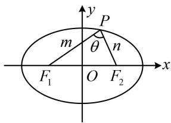
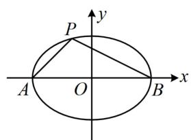
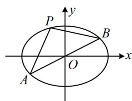
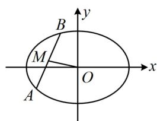
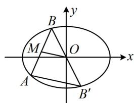
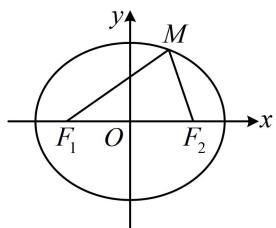
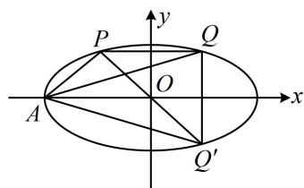
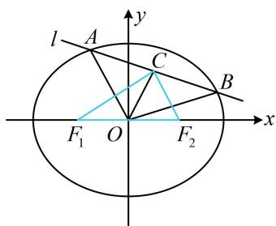
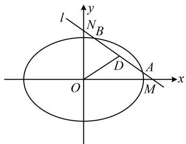
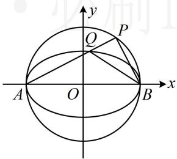

# 内容提要

解析几何中存在无数的二级结论，本节筛选出了一些在高考中比较常用的椭圆二级结论，记住这些结论可适当缩短解题时间.

1. 焦点三角形面积公式：如图1，设 $P$ 是椭圆 $\frac{x^2}{a^2} + \frac{y^2}{b^2} = 1 (a > b > 0)$ 上一点， $F_1(-c,0), F_2(c,0)$ 分别是椭圆的左、右焦点， $\angle F_1PF_2 = \theta$ ，则 $S_{\triangle PF_1F_2} = c|y_P| = b^2 \tan \frac{\theta}{2}$ .

证明：一方面， $\triangle PF_{1}F_{2}$ 的边 $F_{1}F_{2}$ 上的高 $h = |y_{P}|$ ，所以 $S_{\triangle PF_1F_2} = \frac{1}{2}|F_1F_2| \cdot h = \frac{1}{2} \times 2c \times |y_P| = c|y_P|$ ；另一方面，记 $|PF_1| = m$ ， $|PF_2| = n$ ，则由椭圆定义， $m + n = 2a$ ①，

在 $\triangle PF_{1}F_{2}$ 中，由余弦定理， $\left|F_{1}F_{2}\right|^{2} = \left|PF_{1}\right|^{2} + \left|PF_{2}\right|^{2} - 2\left|PF_{1}\right|\cdot \left|PF_{2}\right|\cdot \cos \angle F_{1}PF_{2}$ ，

所以 $4c^{2} = m^{2} + n^{2} - 2mn\cos \theta = (m + n)^{2} - 2mn - 2mn\cos \theta = (m + n)^{2} - 2mn(1 + \cos \theta)$ ②，

将式①代入式②可得： $4c^{2}=4a^{2}-2mn(1+\cos\theta)$ ，所以 $mn=\frac{4a^{2}-4c^{2}}{2(1+\cos\theta)}=\frac{2b^{2}}{1+\cos\theta}$

故 $S_{\triangle PF_1F_2} = \frac{1}{2} mn\sin \theta = \frac{1}{2}\cdot \frac{2b^2}{1 + \cos\theta}\cdot \sin \theta = b^2\cdot \frac{\sin\theta}{1 + \cos\theta}$

$$
= b ^ {2} \cdot \frac {2 \sin \frac {\theta}{2} \cos \frac {\theta}{2}}{2 \cos^ {2} \frac {\theta}{2}} = b ^ {2} \tan \frac {\theta}{2}.
$$

text_image

y
P
m
θ
n
F₁ O F₂ x

图1

2. 焦半径公式：设椭圆 $\frac{x^2}{a^2} + \frac{y^2}{b^2} = 1 (a > b > 0)$ 的左、右焦点分别为 $F_1, F_2$ ，点 $P(x_0, y_0)$ 为椭圆上任意一点，则左焦半径 $\left|PF_1\right| = a + ex_0$ ，右焦半径 $\left|PF_2\right| = a - ex_0$ ，其中 $e$ 为椭圆的离心率.

证明： $F_{1}(-c,0)$ ，设 $P(x_{0},y_{0})$ ，则 $\left|PF_{1}\right|=\sqrt{(x_{0}+c)^{2}+y_{0}^{2}}$ ①，

因为点 $P$ 在椭圆上，所以 $\frac{x_0^2}{a^2} +\frac{y_0^2}{b^2} = 1$ ，故 $y_{0}^{2} = b^{2} - \frac{b^{2}}{a^{2}} x_{0}^{2}$

代入①得： $\left|PF_{1}\right|=\sqrt{x_{0}^{2}+2cx_{0}+c^{2}+b^{2}-\frac{b^{2}}{a^{2}}x_{0}^{2}}=\sqrt{\left(1-\frac{b^{2}}{a^{2}}\right)x_{0}^{2}+2cx_{0}+a^{2}}$

$$
= \sqrt {\frac {c ^ {2}}{a ^ {2}} x _ {0} ^ {2} + 2 c x _ {0} + a ^ {2}} = \sqrt {\left(\frac {c}{a} x _ {0} + a\right) ^ {2}} = \left| \frac {c}{a} x _ {0} + a \right| = | a + e x _ {0} |,
$$

因为 $0 < e < 1$ ， $-a \leq x_0 \leq a$ ，所以 $a + ex_0 > 0$ ，故 $\left|PF_1\right| = a + ex_0$ ；同理可证 $\left|PF_2\right| = a - ex_0$

3. 基于椭圆第三定义的斜率积结论：如图2，设 $A, B$ 分别是椭圆 $\frac{x^2}{a^2} + \frac{y^2}{b^2} = 1 (a > b > 0)$ 的左、右顶点， $P$ 是椭圆上不与 $A, B$ 重合的任意一点，则 $k_{PA} \cdot k_{PB} = -\frac{b^2}{a^2}$ .

注：上述结论中 $A, B$ 是椭圆的左、右顶点，可将其推广为椭圆上关于原点对称的任意两点，如图3，只要直线 $PA, PB$ 的斜率都存在，就仍然满足 $k_{PA} \cdot k_{PB} = -\frac{b^2}{a^2}$ ，下面给出证明.

证明：设 $A(x_{1},y_{1})$ ， $P(x_{2},y_{2})$ ，则 $B(-x_{1},-y_{1})$ ，所以 $k_{PA} \cdot k_{PB} = \frac{y_{2} - y_{1}}{x_{2} - x_{1}} \cdot \frac{y_{2} + y_{1}}{x_{2} + x_{1}} = \frac{y_{2}^{2} - y_{1}^{2}}{x_{2}^{2} - x_{1}^{2}}$ ①，

因为点 A 在椭圆上，所以 $\frac{x_{1}^{2}}{a^{2}} + \frac{y_{1}^{2}}{b^{2}} = 1$ ，

故 $y_{1}^{2}=b^{2}\left(1-\frac{x_{1}^{2}}{a^{2}}\right)=-\frac{b^{2}}{a^{2}}(x_{1}^{2}-a^{2})$ ，同理， $y_{2}^{2}=-\frac{b^{2}}{a^{2}}(x_{2}^{2}-a^{2})$

所以 $y_{2}^{2} - y_{1}^{2} = -\frac{b^{2}}{a^{2}} (x_{2}^{2} - a^{2} - x_{1}^{2} + a^{2}) = -\frac{b^{2}}{a^{2}} (x_{2}^{2} - x_{1}^{2})$ ，代入①得： $k_{PA}\cdot k_{PB} = -\frac{b^2}{a^2}$

在上述条件中令 $A(-a,0)$ , $B(a,0)$ , 即得内容提要第 3 点的特殊情况下的结论.

4. 中点弦斜率积结论：如图 4, AB 是椭圆 $\frac{x^2}{a^2} + \frac{y^2}{b^2} = 1 (a > b > 0)$ 的一条不与坐标轴垂直且不过原点的弦， $M$ 为 $AB$ 中点，则 $k_{AB} \cdot k_{OM} = -\frac{b^2}{a^2}$ ，此结论可用下面的点差法来证明.

证明：设 $A(x_{1},y_{1})$ ， $B(x_{2},y_{2})$ ， $x_{1}\neq x_{2}$ ， $y_{1}\neq y_{2}$ ，因为 $A$ ， $B$ 都在椭圆上，所以 $\left\{ \begin{array}{l} \frac{x_1^2}{a^2} +\frac{y_1^2}{b^2} = 1\\ \frac{x_2^2}{a^2} +\frac{y_2^2}{b^2} = 1 \end{array} \right.$

两式作差得： $\frac{x_{1}^{2}-x_{2}^{2}}{a^{2}}+\frac{y_{1}^{2}-y_{2}^{2}}{b^{2}}=0$ ，整理得： $\frac{y_{1}-y_{2}}{x_{1}-x_{2}}\cdot\frac{y_{1}+y_{2}}{x_{1}+x_{2}}=-\frac{b^{2}}{a^{2}}$ ①，

注意到 $\frac{y_1 - y_2}{x_1 - x_2} = k_{AB}$ ， $\frac{y_1 + y_2}{x_1 + x_2} = \frac{2y_M}{2x_M} = \frac{y_M}{x_M} = k_{OM}$ ，所以式①即为 $k_{AB}\cdot k_{OM} = -\frac{b^2}{a^2}$

text_image

P
A O B
x
y

图2

text_image

P
y
B
O
x
A

图3

text_image

y
B
M
O
x
A

图4

text_image

y
B
M
O
x
A
B'

图5

注：中点弦结论和上面的第三定义斜率积结论的结果都是 $-\frac{b^2}{a^2}$ ，这是巧合吗？不是，两者之

间有必然的联系. 如上面图 5, 设 $B'$ 为 $B$ 关于原点的对称点, 则 $B'$ 也在该椭圆上, 且 $O$ 为 $BB'$ 中点, 结合 $M$ 为 $AB$ 中点可得 $OM \parallel AB'$ , 所以 $k_{AB} \cdot k_{OM} = k_{AB} \cdot k_{AB'}$ , 于是又回到了椭圆上的点 $A$ 与椭圆上关于原点对称的 $B$ 和 $B'$ 的连线的斜率积.

# 类型 I：焦点三角形面积

【例 1】设 $F_{1}$ ， $F_{2}$ 是椭圆 $\frac{x^{2}}{8} + \frac{y^{2}}{b^{2}} = 1 (0 < b < 2\sqrt{2})$ 的两个焦点，点 P 在椭圆上， $\angle F_{1}PF_{2} = 60^{\circ}$ ，且 $\triangle F_{1}PF_{2}$ 的面积为 $\frac{4\sqrt{3}}{3}$ ，则 b = \_\_\_\_.

解析：给出 $\angle F_{1}PF_{2}$ ，可直接代公式 $S = b^{2}\tan \frac{\theta}{2}$ 算焦点三角形面积，

因为 $\angle F_{1}PF_{2} = 60^{\circ}$ ，所以 $S_{\triangle F_1PF_2} = b^2\tan 30^\circ = \frac{\sqrt{3}}{3} b^2$ ，由题意， $S_{\triangle F_1PF_2} = \frac{4\sqrt{3}}{3}$ ，所以 $\frac{\sqrt{3}}{3} b^2 = \frac{4\sqrt{3}}{3}$ ，故 $b = 2$ ：

答案: 2

【变式】设 $F_{1}$ , $F_{2}$ 是椭圆 $\frac{x^{2}}{4} + \frac{y^{2}}{2} = 1$ 的左、右焦点, $P$ 是椭圆在第一象限上的一点, 且 $\angle F_{1}PF_{2} = 60^{\circ}$ , 则点 $P$ 的坐标为 \_\_\_\_.

解析：给出 $\angle F_{1}PF_{2}$ ，可由焦点三角形面积公式 $S = c|y_{p}| = b^{2}\tan \frac{\theta}{2}$ 来建立方程求点 $P$ 的纵坐标，

由题意， $a = 2$ ， $b = \sqrt{2}$ ， $c = \sqrt{a^2 - b^2} = \sqrt{2}$ ，设 $P(x_0,y_0)(x_0 > 0,y_0 > 0)$

则 $S_{\triangle F_1PF_2} = c|y_0| = cy_0 = b^2\tan \frac{\angle F_1PF_2}{2}$ ，所以 $\sqrt{2} y_0 = 2\tan 30^\circ$ ，解得： $y_{0} = \frac{\sqrt{6}}{3}$

又点 $P$ 在椭圆上，所以 $\frac{x_0^2}{4} +\frac{y_0^2}{2} = 1$ ，从而 $x_0 = \sqrt{4 - 2y_0^2} = \frac{2\sqrt{6}}{3}$ ，故点 $P$ 的坐标为 $\left(\frac{2\sqrt{6}}{3},\frac{\sqrt{6}}{3}\right)$

答案： $\left(\frac{2\sqrt{6}}{3},\frac{\sqrt{6}}{3}\right)$

【反思】从上面两道题可以看出，当题干给出 $\angle F_{1}PF_{2}$ 时，可用 $S_{\triangle PF_1F_2} = b^2\tan \frac{\theta}{2}$ （其中 $\theta = \angle F_1PF_2$ ）来算焦点三角形的面积；由 $S_{\triangle PF_1F_2} = c|y_P| = b^2\tan \frac{\theta}{2}$ 还可以建立顶角 $\theta$ 和 $|y_P|$ 之间的等量关系.

# 类型Ⅱ：焦半径公式

【例 2】椭圆 $\frac{x^{2}}{6}+\frac{y^{2}}{2}=1$ 的左、右焦点分别为 $F_{1}$ ， $F_{2}$ ，椭圆上的一点 P 满足 $\left|PF_{1}\right|=3\left|PF_{2}\right|$ ，若 P 在第一象限，则点 P 的坐标为 \_\_\_\_.

解析：条件涉及焦半径 $\left|PF_{1}\right|$ 和 $\left|PF_{2}\right|$ ，要求坐标，可用焦半径公式，由题意， $a=\sqrt{6}$ ，c=2， $e=\frac{\sqrt{6}}{3}$ ，设 $P(x_{0},y_{0})(x_{0}>0,y_{0}>0)$ ，则由焦半径公式， $\left|PF_{1}\right|=\sqrt{6}+\frac{\sqrt{6}}{3}x_{0}$ ， $\left|PF_{2}\right|=\sqrt{6}-\frac{\sqrt{6}}{3}x_{0}$ ，

因为 $\left|PF_{1}\right|=3\left|PF_{2}\right|$ ，所以 $\sqrt{6}+\frac{\sqrt{6}}{3}x_{0}=3\left(\sqrt{6}-\frac{\sqrt{6}}{3}x_{0}\right)$ ，解得： $x_{0}=\frac{3}{2}$

代入椭圆方程结合 $y_0 > 0$ 可解得： $y_0 = \frac{\sqrt{5}}{2}$ ，故点 $P$ 的坐标为 $\left(\frac{3}{2}, \frac{\sqrt{5}}{2}\right)$ .

答案： $\left(\frac{3}{2},\frac{\sqrt{5}}{2}\right)$

【变式】(2019·新课标III卷) 设 $F_{1}$ , $F_{2}$ 为椭圆 $C: \frac{x^{2}}{36} + \frac{y^{2}}{20} = 1$ 的两个焦点, $M$ 为 $C$ 上一点且在第一象限, 若 $\triangle MF_{1}F_{2}$ 为等腰三角形, 则 $M$ 的坐标为 \_\_\_\_.

解法1：由题意， $a = 6$ ， $b = 2\sqrt{5}$ ， $c = \sqrt{a^2 - b^2} = 4$ ，椭圆 $C$ 的离心率 $e = \frac{c}{a} = \frac{2}{3}$

题干给出 $\triangle MF_{1}F_{2}$ 为等腰三角形，应先判断谁是底，谁是腰，可通过比较三边的长来判断，

如图，点 $M$ 在第一象限 $\Rightarrow \left|MF_1\right| > \left|MF_2\right|$ ，又 $\left|MF_1\right| + \left|MF_2\right| = 2a = 12$ ，所以 $\left|MF_2\right| < 6$ ，

而 $\left|F_{1}F_{2}\right| = 2c = 8$ ，所以 $\left|MF_2\right| <   \left|F_1F_2\right|$ ，故只能 $\left|MF_1\right| = \left|F_1F_2\right| = 8$

涉及焦半径 $\left|MF_{1}\right|$ ，可用焦半径公式来求M的坐标，

设 $M(x_0,y_0)(x_0 > 0,y_0 > 0)$ ，由焦半径公式， $\left|MF_1\right| = 6 + \frac{2}{3} x_0 = 8$ ，所以 $x_0 = 3$

又点 $M$ 在椭圆 $C$ 上，所以 $\frac{x_0^2}{36} +\frac{y_0^2}{20} = 1$ ，结合 $\left\{ \begin{array}{l}x_0 = 3\\ y_0 > 0 \end{array} \right.$ 可得： $y_{0} = \sqrt{15}$ ，故 $M(3,\sqrt{15})$

解法2：得出 $\left|MF_1\right| = \left|F_1F_2\right| = 8$ 的过程同解法1，接下来也可用两点间距离来翻译 $\left|MF_1\right| = 8$

由题意， $F_{1}(-4,0)$ ，设 $M(x_0,y_0)(x_0 > 0,y_0 > 0)$ ，则 $\left|MF_1\right| = \sqrt{(x_0 + 4)^2 + y_0^2} = 8$ ①，

还差一个方程，可把点 $M$ 代入椭圆方程来建立，

因为 $M$ 在椭圆 $C$ 上，所以 $\frac{x_0^2}{36} +\frac{y_0^2}{20} = 1$ ②，

联立①②，结合 $\left\{ \begin{array}{l}x_0 > 0\\ y_0 > 0 \end{array} \right.$ 解得： $\left\{ \begin{array}{l}x_0 = 3\\ y_0 = \sqrt{15} \end{array} \right.$ ，故 $M(3,\sqrt{15})$

答案: $(3, \sqrt{15})$

text_image

y
M
F₁ O F₂ x

# 类型III：第三定义、中点弦斜率积结论

【例 3】已知椭圆 $C: \frac{x^{2}}{a^{2}} + \frac{y^{2}}{b^{2}} = 1 (a > b > 0)$ ，点 A，B 为长轴的两个端点，若在椭圆上存在点 P 使直线 AP 和 BP 的斜率之积 $k_{AP} \cdot k_{BP} \in \left(-\frac{1}{3}, 0\right)$ ，则椭圆 C 的离心率 e 的取值范围是 \_\_\_\_.

解析： $A$ ， $B$ 为长轴端点，又涉及 $k_{AP}\cdot k_{BP}$ ，所以想到椭圆的第三定义斜率积结论，

由题意， $-\frac{1}{3} < k_{AP}\cdot k_{BP} = -\frac{b^2}{a^2} < 0$ ，所以 $\frac{b^2}{a^2} < \frac{1}{3}$ ，从而 $a^2 >3b^2 = 3(a^2 -c^2)$ ，故 $\frac{c^2}{a^2} >\frac{2}{3}$

所以 $e = \frac{c}{a} >\frac{\sqrt{6}}{3}$ ，又 $0 <   e <   1$ ，所以 $\frac{\sqrt{6}}{3} <  e <   1.$

答案： $\left(\frac{\sqrt{6}}{3},1\right)$

【反思】椭圆中涉及与椭圆上关于原点对称的两点的连线斜率积，可考虑用第三定义斜率积结论.

【变式 1】(2022·全国甲卷) 椭圆 $C: \frac{x^{2}}{a^{2}} + \frac{y^{2}}{b^{2}} = 1 (a > b > 0)$ 的左顶点为 $A$ , 点 $P, Q$ 均在 $C$ 上, 且关于 $y$ 轴对称, 若直线 $AP, AQ$ 的斜率之积为 $\frac{1}{4}$ , 则 $C$ 的离心率为 ( )

A. $\frac{\sqrt{3}}{2}$

B. $\frac{\sqrt{2}}{2}$

C. $\frac{1}{2}$

D. $\frac{1}{3}$

解法1: 条件涉及斜率积, 先看看能否用第三定义或中点弦斜率积结论处理. 如图, $P$ , $Q$ 关于 $y$ 轴对称,貌似不是两结论的使用场景, 但只需作 $P$ 或 $Q$ 关于 $x$ 轴的对称点, 就能产生关于原点对称的两点, 构造出第三定义斜率积结论的条件, 设点 $Q$ 关于 $x$ 轴的对称点为 $Q'$ , 则 $P$ , $Q'$ 关于原点对称, 且 $k_{AQ'} = -k_{AQ}$ ①,由椭圆第三定义斜率积结论的推广知 $k_{AP} \cdot k_{AQ'} = -\frac{b^2}{a^2}$ , 将①代入得: $k_{AP} \cdot (-k_{AQ}) = -\frac{b^2}{a^2}$ , 故 $k_{AP} \cdot k_{AQ} = \frac{b^2}{a^2}$ , 又 $k_{AP} \cdot k_{AQ} = \frac{1}{4}$ , 所以 $\frac{b^2}{a^2} = \frac{1}{4}$ , 故 $a^2 = 4b^2 = 4(a^2 - c^2)$ , 整理得: $\frac{c^2}{a^2} = \frac{3}{4}$ , 所以 $C$ 的离心率 $e = \frac{c}{a} = \frac{\sqrt{3}}{2}$ .

解法2：也可直接设点的坐标来算 $AP$ ， $AQ$ 的斜率积，设 $P(x_0,y_0)$ ，则 $Q(-x_0,y_0)$

由题意， $A(-a,0)$ ，所以 $k_{AP}\cdot k_{AQ} = \frac{y_0}{x_0 + a}\cdot \frac{y_0}{-x_0 + a} = \frac{y_0^2}{a^2 - x_0^2}$ ②，有 $x_0$ ， $y_0$ 两个变量，可用椭圆方程消元，

因为点 $P$ 在椭圆 $C$ 上，所以 $\frac{x_0^2}{a^2} +\frac{y_0^2}{b^2} = 1$ ，故 $y_{0}^{2} = b^{2}\left(1 - \frac{x_{0}^{2}}{a^{2}}\right) = \frac{b^{2}}{a^{2}} (a^{2} - x_{0}^{2})$

代入②得： $k_{AP} \cdot k_{AQ} = \frac{b^{2}}{a^{2}}$ ，接下来同解法1.

答案: A

text_image

P
Q
O
A
x
y
Q'

【变式2】已知 $M, N$ 是椭圆 $C: \frac{x^2}{a^2} + \frac{y^2}{b^2} = 1 (a > b > 0)$ 上关于原点对称的两点， $P$ 是椭圆 $C$ 上的动点，直线 $PM, PN$ 的斜率分别为 $k_1, k_2 (k_1 k_2 \neq 0)$ ，若 $\left|k_1\right| + \left|k_2\right|$ 的最小值为 1，则椭圆 $C$ 的离心率为 \_\_\_\_.

解析：看到椭圆上的 $M, N$ 关于原点对称，想到用第三定义斜率积结论建立 $k_{1}$ 和 $k_{2}$ 的关系，

由题意， $k_{1}k_{2} = -\frac{b^{2}}{a^{2}}$ ，所以 $\left|k_1\right| + \left|k_2\right|\geq 2\sqrt{\left|k_1\right|\cdot\left|k_2\right|} = 2\sqrt{\left|k_1k_2\right|} = \frac{2b}{a}$ ，当且仅当 $\left|k_1\right| = \left|k_2\right|$ 时取等号，

所以 $\left|k_{1}\right| + \left|k_{2}\right|$ 的最小值为 $\frac{2b}{a}$ ，又 $\left|k_{1}\right| + \left|k_{2}\right|$ 的最小值为1，所以 $\frac{2b}{a} = 1$

故 $a^2 = 4b^2 = 4(a^2 - c^2)$ ，整理得： $\frac{c^2}{a^2} = \frac{3}{4}$ ，所以椭圆 $C$ 的离心率 $e = \frac{c}{a} = \frac{\sqrt{3}}{2}$ .

答案： $\frac{\sqrt{3}}{2}$

【例 4】直线 $l: x + 3y - 7 = 0$ 与椭圆 $\frac{x^2}{9} + \frac{y^2}{b^2} = 1 (0 < b < 3)$ 相交于 $A, B$ 两点，椭圆的两个焦点分别为 $F_1, F_2$ ，线段 $AB$ 的中点为 $C(1,2)$ ，则 $\triangle CF_1F_2$ 的面积为 \_\_\_\_.

解析：椭圆中涉及弦中点，想到中点弦斜率积结论，如图， $k_{OC} \cdot k_{AB} = -\frac{b^{2}}{9}$ ①,

$$
C (1, 2) \Rightarrow k _ {O C} = 2, \quad x + 3 y - 7 = 0 \Rightarrow y = - \frac {1}{3} x + \frac {7}{3} \Rightarrow k _ {A B} = - \frac {1}{3},
$$

代入①可得 $2\times\left(-\frac{1}{3}\right)=-\frac{b^{2}}{9}$ ，所以 $b^{2}=6$ ，

从而 $c = \sqrt{9 - b^2} = \sqrt{3}$ ，故 $S_{\triangle CF_1F_2} = \frac{1}{2}\big|F_1F_2\big|\cdot |y_C| = \frac{1}{2}\times 2\sqrt{3}\times 2 = 2\sqrt{3}.$

答案: $2 \sqrt { 3 }$

text_image

l
A
y
C
B
F₁ O F₂ x

【反思】在椭圆中，涉及弦中点的问题都可以考虑用中点弦斜率积结论来建立方程，求解需要的量.

【变式】(2022·新课标Ⅱ卷) 已知直线 $l$ 与椭圆 $\frac{x^2}{6} + \frac{y^2}{3} = 1$ 在第一象限交于 $A, B$ 两点, $l$ 与 $x$ 轴、 $y$ 轴分别相交于 $M, N$ 两点, 且 $\left|MA\right| = \left|NB\right|$ , $\left|M N\right| = 2\sqrt{3}$ , 则直线 $l$ 的方程为 \_\_\_\_.

解析：涉及直线与两条坐标轴的交点，不妨设直线的截距式方程，

设 $l: \frac{x}{m} + \frac{y}{n} = 1$ ，则 $M(m,0)$ ， $N(0,n)$ ，因为 $l$ 与椭圆的交点都在第一象限，所以 $m > 0$ ， $n > 0$ ，

接下来建立方程组求 $m$ 和 $n$ ，先翻译 $\left|MN\right| = 2\sqrt{3}$ ，因为 $\left|M N\right| = \sqrt{m^2 + n^2} = 2\sqrt{3}$ ，所以 $m^2 + n^2 = 12$ ①，

$|MA|=|NB|$ 这一条件怎么用？直接计算 $|MA|$ 和 $|NB|$ 比较困难，于是画图来看．如图， $|MA|=|NB|$ 隐含了 MN 的中点也是 AB 的中点，涉及弦中点，可用中点弦斜率积结论，

设 $AB$ 中点为 $D$ ，则 $D\left(\frac{m}{2},\frac{n}{2}\right)$ ，所以 $k_{OD} = \frac{n}{m}$ ，直线 $l$ 的斜率 $k_{AB} = -\frac{n}{m}$

由中点弦斜率积结论， $k_{OD}\cdot k_{AB} = \frac{n}{m}\cdot \left(-\frac{n}{m}\right) = -\frac{1}{2}$ ，所以 $m^2 = 2n^2$ ②，

联立①②，结合 $m > 0$ ， $n > 0$ 可求得 $m = 2\sqrt{2}$ ， $n = 2$

所以直线 $l$ 的方程为 $\frac{x}{2\sqrt{2}} +\frac{y}{2} = 1$ ，整理得： $x + \sqrt{2} y - 2\sqrt{2} = 0$

答案： $x + \sqrt{2} y - 2\sqrt{2} = 0$

text_image

l
y
N
B
D
A
O
x
M

【反思】在高考中, 弦中点除了直接给出之外, 还可能隐含在长度相等、等腰、中垂线、外心等各种条件中,从这些条件中挖掘出弦中点, 运用中点弦斜率积结论可以巧解问题.

# 强化训练

1. (★★)

设 $F_{1}$ ， $F_{2}$ 是椭圆 $\frac{x^2}{5} +\frac{y^2}{4} = 1$ 的两个焦点，点 $P$ 在椭圆上， $\angle F_1PF_2 = 30^\circ$ ，则 $\triangle PF_1F_2$ 的面积为

2. (2023·全国甲卷·★★★)

椭圆 $\frac{x^2}{9} +\frac{y^2}{6} = 1$ 的两焦点为 $F_{1}$ ， $F_{2}$ ， $O$ 为原点， $P$ 为椭圆上一点， $\cos \angle F_1PF_2 = \frac{3}{5}$ ，则 $\left|OP\right| =$ （）

A. $\frac{2}{5}$

B. $\frac{\sqrt{30}}{2}$

C. $\frac{3}{5}$

D. $\frac{\sqrt{35}}{2}$

3. (★★)

椭圆 $\frac{x^2}{6} +\frac{y^2}{2} = 1$ 的左、右焦点分别为 $F_{1}$ ， $F_{2}$ ，点 $P$ 在椭圆上，则 $\left|PF_1\right|\cdot \left|PF_2\right|$ 的取值范围为

4. (2023·广东南粤名校联考·★★★☆)

设椭圆 $\frac{x^2}{5} + y^2 = 1$ 的左、右焦点分别为 $F_{1}$ ， $F_{2}$ ，点 $M$ 在椭圆 $C$ 上，且 $\angle F_{1}MF_{2} = 120^{\circ}$ ，（ $O$ 为原点），则 $\left|OM\right| =$ \_\_\_\_.

5. (2022·广西模拟·★★★)

已知椭圆 $C: \frac{x^2}{a^2} + \frac{y^2}{b^2} = 1 (a > b > 0)$ 的左焦点为 $F$ ，过 $F$ 作倾斜角为 $45^\circ$ 的直线与椭圆 $C$ 交于 $A, B$ 两点，若点 $M(-3,2)$ 是线段 $AB$ 的中点，则椭圆 $C$ 的离心率是（）

A. $\frac{\sqrt{3}}{3}$

B. $\frac{1}{2}$

C. $\frac{2}{5}$

D. $\frac{\sqrt{5}}{5}$

6. (2023·重庆模拟·★★★☆)

已知点 $A(-5,0)$ ， $B(5,0)$ ，动点 $P(m,n)$ 满足直线 $PA$ ， $PB$ 的斜率之积为 $-\frac{16}{25}$ ，则 $4m^{2}+n^{2}$ 的取值范围是（）

A. [16,100]

B. [25,100]

C. [16,100)

D. (25,100)

7. (2023·浙江温州三模·★★★☆)

如图， $A$ ， $B$ 是椭圆 $C:\frac{x^2}{a^2} +\frac{y^2}{b^2} = 1(a > b > 0)$ 的左、右顶点， $P$ 是 $\odot O:x^{2} + y^{2} = a^{2}$ 上不同于 $A$ ， $B$ 的动点，线段 $PA$ 与椭圆 $C$ 交于点 $Q$ ，若 $\tan \angle PBA = 3\tan \angle QBA$ ，则椭圆 $C$ 的离心率为（）

A. $\frac{1}{3}$

B. $\frac{\sqrt{2}}{3}$

C. $\frac{\sqrt{3}}{3}$

D. $\frac{\sqrt{6}}{3}$

text_image

y
O
P
A
O
B
x

8. (2022·安徽蚌埠模拟·★★★★)

若椭圆 $C: \frac{x^2}{a^2} + \frac{y^2}{4} = 1 (a > 2)$ 上存在 $A(x_1, y_1), B(x_2, y_2)(x_1 \neq x_2)$ 到点 $P\left(\frac{a}{5}, 0\right)$ 的距离相等，则椭圆 $C$ 的离心率的取值范围是（）

A. $\left(0, \frac{\sqrt{5}}{5}\right)$

B. $\left(\frac{\sqrt{5}}{5},1\right)$

C. $\left(0, \frac{\sqrt{3}}{3}\right)$

D. $\left(\frac{\sqrt{3}}{3},1\right)$