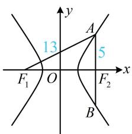
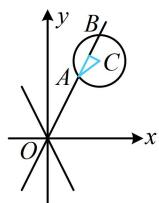
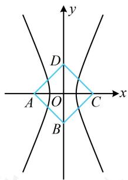
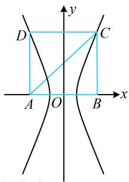
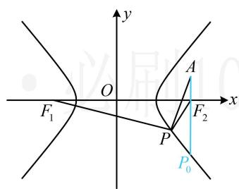
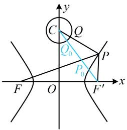

# 强化训练

1. (2024·新课标Ⅰ卷·★)

设双曲线 $C: \frac{x^2}{a^2} - \frac{y^2}{b^2} = 1 (a > 0, b > 0)$ 的左、右焦点分别为 $F_1$ ， $F_2$ ，过 $F_2$ 作平行于 $y$ 轴的直线交 $C$ 于 $A$ ， $B$ 两点，若 $|F_1 A| = 13$ ， $|AB| = 10$ ，则 $C$ 的离心率为 \_\_\_\_.

1. $\frac{3}{2}$

解析：如图，由 $|AB|=10$ 结合对称性可知 $|AF_{2}|=5$ ，

又 $\left|F_{1}A\right|=13$ ，所以 $\left|AF_{1}\right|-\left|AF_{2}\right|=13-5=8=2a$ ，故a=4，

由图可知焦距 $2c = \left|F_{1}F_{2}\right| = \sqrt{\left|AF_{1}\right|^{2} - \left|AF_{2}\right|^{2}} = \sqrt{13^{2} - 5^{2}} = 12$ ，所以 $c = 6$ ，故离心率 $e = \frac{c}{a} = \frac{6}{4} = \frac{3}{2}$

text_image

y
13
A
5
x
F₁ O F₂ B

2. (2021·全国乙卷·★)

已知双曲线 $C: \frac{x^2}{m} - y^2 = 1 (m > 0)$ 的一条渐近线为 $\sqrt{3} x + my = 0$ ，则 $C$ 的焦距为 \_\_\_\_.

2.4

解析：给出了一条渐近线，可通过比较渐近线斜率求 $m$

由题意， $a = \sqrt{m}$ ， $b = 1\Rightarrow C$ 的渐近线为 $y = \pm \frac{1}{\sqrt{m}} x$

$\sqrt{3} x + my = 0 \Rightarrow y = -\frac{\sqrt{3}}{m} x$ ，因为 $y = -\frac{\sqrt{3}}{m} x$ 是其中一条

渐近线，所以 $-\frac{\sqrt{3}}{m} = -\frac{1}{\sqrt{m}}$ ，解得： $m = 3$

所以 $c=\sqrt{m+1}=2$ ，故 C 的焦距为 4.

3. (★☆)

若方程 $\frac{x^2}{m + 1} +\frac{y^2}{m - 2} = 1$ 表示焦点在 $x$ 轴上的双曲线，则实数 $m$ 的取值范围为

3. $(-1,2)$

解析：所给方程表示焦点在 $x$ 轴上的双曲线，可将其化为标准方程 $\frac{x^2}{a^2} -\frac{y^2}{b^2} = 1$ 的形式，再比较系数，由 $\frac{x^2}{m + 1} +\frac{y^2}{m - 2} = 1$ 可得 $\frac{x^2}{m + 1} -\frac{y^2}{2 - m} = 1$

所以 $\left\{ \begin{array}{l}a^2 = m + 1 > 0\\ b^2 = 2 - m > 0 \end{array} \right.$ ，解得： $-1 <   m <   2$

4. (2024·全国甲卷·★★)

已知双曲线的两个焦点分别为(0,4)，(0,-4)，点(-6,4)在该双曲线上，则该双曲线的离心率为（）

A. 4

B. 3

C. 2

D. $\sqrt{2}$

4. C

解法1：由题意，双曲线的焦点 $(0, \pm 4)$ 在 $y$ 轴上，可设其方程为 $\frac{y^2}{a^2} - \frac{x^2}{b^2} = 1 (a > 0, b > 0)$ ，则 $a^2 + b^2 = 4^2 = 16$ ①，

又点 $(-6,4)$ 在该双曲线上，所以 $\frac{4^2}{a^2} -\frac{(-6)^2}{b^2} = 1$ ②，

由①②解得： $a = 2$ ，故双曲线的离心率 $e = \frac{c}{a} = \frac{4}{2} = 2$

解法2：观察发现 $(-6,4)$ 到两个焦点的距离好求，故可用双曲线定义快速求得 $a$ ，记 $F_{1}(0,4)$ ， $F_{2}(0, - 4)$ ， $P(-6,4)$

则 $\left|PF_{1}\right|=6,\quad\left|PF_{2}\right|=\sqrt{\left[0-(-6)\right]^{2}+(-4-4)^{2}}=10,$

所以 $\left|PF_2\right| - \left|PF_1\right| = 4 = 2a$ ，故 $a = 2$ ，又由题意，双曲线的半焦距 $c = 4$ ，所以其离心率 $e = \frac{c}{a} = \frac{4}{2} = 2$

5. (2023·全国甲卷·★★☆)

双曲线 $\frac{x^2}{a^2} -\frac{y^2}{b^2} = 1(a > 0,b > 0)$ 的离心率为 $\sqrt{5}$ ，其中一条渐近线与圆 $(x - 2)^2 +(y - 3)^2 = 1$ 交于 $A$ ， $B$ 两点，则 $\left|AB\right| =$ （）

A. $\frac{1}{5}$

B. $\frac{\sqrt{5}}{5}$

C. $\frac{2\sqrt{5}}{5}$

D. $\frac{4\sqrt{5}}{5}$

5. D

解析：由题意，双曲线的离心率 $e = \frac{c}{a} = \frac{\sqrt{a^2 + b^2}}{a} = \sqrt{5}$ ，

所以 $\frac{b}{a} = 2$ ，故双曲线的渐近线为 $y = \pm 2x$

如图，与所给圆交于 $A$ ， $B$ 两点的是渐近线 $y = 2x$

涉及圆的弦长，考虑用公式 $L = 2\sqrt{r^2 - d^2}$ 计算，先求 $d$

圆心为 $C(2,3)$ ， $y = 2x$ 可化为 $2x - y = 0$

所以 $C$ 到该渐近线的距离 $d = \frac{|2\times 2 - 3|}{\sqrt{2^2 + (-1)^2}} = \frac{1}{\sqrt{5}}$

故 $\left|AB\right|=2\sqrt{r^{2}-d^{2}}=2\sqrt{1-\frac{1}{5}}=\frac{4\sqrt{5}}{5}$ .

6. (2022·广东佛山二模·★★★)

已知双曲线 $E: \frac{x^2}{a^2} - \frac{y^2}{b^2} = 1 (a > 0, b > 0)$ 以正方形ABCD的两个顶点为焦点，且经过该正方形的另外两个顶点.若正方形ABCD的边长为2，则 $E$ 的实轴长为（）

A. $2 \sqrt{2} - 2$

B. $2 \sqrt{2} + 2$

C. $\sqrt{2} - 1$

D. $\sqrt{2} + 1$

6. A

解析：先画图看双曲线的焦点到底是正方形对角的两个顶点，还是相邻的两个顶点，

若焦点是正方形对角的两个顶点，如图1，双曲线 $E$ 不可能过正方形的另外两个顶点，不合题意，

若焦点是正方形相邻的两个顶点，如图2，

要求实轴长 $2a$ ，可用双曲线的定义，

因为正方形边长为2，所以 $\left|CA\right|-\left|CB\right|=2a$

$= 2\sqrt{2} - 2$ ，故双曲线 $E$ 的实轴长为 $2\sqrt{2} - 2$

text_image

y
D
A O C x
B

图1

text_image

y
D	C
A	O	B
x

图2

7. (2020·新高考Ⅰ卷·★★★) (多选)

已知曲线 $C:mx^{2} + ny^{2} = 1$ （）

A. 若 $m > n > 0$ ，则 $C$ 是椭圆，其焦点在 $y$ 轴上  
B. 若 $m = n > 0$ ，则 $C$ 是圆，其半径为 $\sqrt{n}$   
C. 若 $mn < 0$ ，则 $C$ 是双曲线，其渐近线方程为 $y = \pm \sqrt{-\frac{m}{n}} x$   
D. 若 $m = 0, n > 0$ ，则 $C$ 是两条直线

7. ACD

解析：A项，当 $m > n > 0$ 时， $0 < \frac{1}{m} < \frac{1}{n}$ ，

接下来把曲线 $C$ 化为标准方程，看焦点在哪里，

由 $mx^{2} + ny^{2} = 1$ 可得 $\frac{x^2}{\frac{1}{m}} +\frac{y^2}{\frac{1}{n}} = 1$ ，所以 $C$ 是焦点在 $y$ 轴上的椭圆，故A项正确；

B 项，若 m=n>0，则 $mx^{2}+ny^{2}=1$ 即为 $x^{2}+y^{2}=\frac{1}{n}$ ，

它表示半径为 $\sqrt{\frac{1}{n}}$ 的圆，故B项错误；

C项，若 $mn < 0$ ，则 $C$ 是双曲线，此处不清楚焦点在哪条坐标轴，可用求渐近线的统一方法，

在所给方程中将1换成0得 $mx^{2}+ny^{2}=0$ ，所以 $y^{2}=$ $-\frac{m}{n}x^{2}$ ，从而渐近线为 $y=\pm\sqrt{-\frac{m}{n}}x$ ，故 C 项正确；

D 项，若 m=0，n>0，则所给方程可化为 $y^{2}=\frac{1}{n}$ ，

即 $y = \pm \sqrt{\frac{1}{n}}$ ，所以 $C$ 是两条直线，故D项正确.

# 8. (★★★)

双曲线 $\frac{x^2}{3} -\frac{y^2}{6} = 1$ 的左、右焦点分别为 $F_{1}$ ， $F_{2}$ ，点 $A(3,1)$ ， $P$ 为双曲线右支上一动点，则 $\left|PA\right| - \left|PF_1\right|$ 的最大值为

# 8. $1 - 2\sqrt{3}$

解析：如图，直接分析 $|PA| - |PF_{1}|$ 的最大值不易，涉及

$\left|PF_{1}\right|$ ，可利用双曲线定义转化为 $\left|PF_{2}\right|$ 来看，

由题意， $F_{2}(3,0)$ ， $\left|PF_1\right| - \left|PF_2\right| = 2\sqrt{3}$ ，所以 $\left|PF_1\right| =$

$\left|PF_{2}\right|+2\sqrt{3}$ ，故 $\left|PA\right|-\left|PF_{1}\right|=\left|PA\right|-\left|PF_{2}\right|-2\sqrt{3}$ ①，

由三角形两边之差小于第三边知 $\left|PA\right|-\left|PF_{2}\right|\leq\left|AF_{2}\right|=1$ ，

当且仅当 $P$ 位于图中 $P_0$ 处时等号成立，

结合①可得 $\left|PA\right|-\left|PF_{1}\right|\leq1-2\sqrt{3}$ ，

所以 $\left|PA\right|-\left|PF_{1}\right|$ 的最大值为 $1-2\sqrt{3}$ .

text_image

y
O
F₁
A
x
F₂
P
P₀

# 9. (2022·江西鹰潭二模·★★★☆)

已知双曲线 $\frac{x^2}{m} -\frac{y^2}{5} = 1(m > 0)$ 的一条渐近线方程为 $\sqrt{5} x + 2y = 0$ ，左焦点为 $F$ ，点 $P$ 在双曲线右支上运动，点 $Q$ 在圆 $C:x^{2} + (y - 4)^{2} = 1$ 上运动，则 $\left|PQ\right| + \left|PF\right|$ 的最小值为（）

A. $2 \sqrt{2} + 4$

B. 8

C. $2 \sqrt{2} + 5$

D. 9

# 9. B

解析：双曲线的渐近线为 $y = \pm \sqrt{\frac{5}{m}} x$ ，由 $\sqrt{5} x + 2y = 0$ 可

得 $y = -\frac{\sqrt{5}}{2} x$ ，因为 $y = -\frac{\sqrt{5}}{2}$ 是其中一条渐近线，

所以 $-\sqrt{\frac{5}{m}} = -\frac{\sqrt{5}}{2}$ ，解得： $m = 4$ ，再看 $|PQ| + |PF|$ 的最小值， $P, Q$ 都在动，不好处理，可先取定一个。由于圆上动点到圆外定点的距离最值模型比较简单，故考虑先取定 $P$ ，

如图，当 $Q$ 在圆 $C$ 上运动时， $|PQ| \geq |PC| - 1$

当且仅当点 $Q$ 为线段 $PC$ 与圆 $C$ 交点时取等号，

所以 $\left|PQ\right|+\left|PF\right|\geq\left|PC\right|-1+\left|PF\right|=\left|PC\right|+\left|PF\right|-1$ ①,

再求 $|PC| + |PF|$ 的最小值，直接分析不易，涉及 $|PF|$ ，可用双曲线定义转化到右焦点来看，

记双曲线的右焦点为 $F^{\prime}(3,0)$ ，则 $\left|PF\right| - \left|PF^{\prime}\right| = 4$

所以 $\left|PF\right|=\left|PF'\right|+4$ ，故 $\left|PC\right|+\left|PF\right|=\left|PC\right|+\left|PF'\right|+4$ ②，

由三角形两边之和大于第三边可得 $\left|PC\right| + \left|PF'\right| \geq \left|CF'\right|$

$$
= \sqrt {\left| O C \right| ^ {2} + \left| O F ^ {\prime} \right| ^ {2}} = 5,
$$

代入②得 $|PC| + |PF| \geq 9$ ，再代入①得 $|PQ| + |PF| \geq 8$ ，

当 $P, Q$ 分别与图中 $P_{0}, Q_{0}$ 重合时取等号，

所以 $(|PQ| + |PF|)_{\min} = 8$

text_image

y
C Q
Q₀ P
P₀
F O F' x

