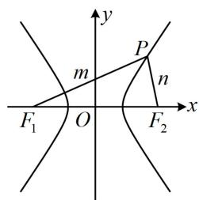
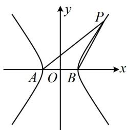
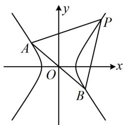
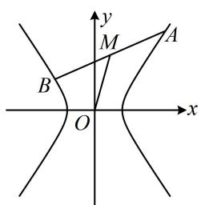
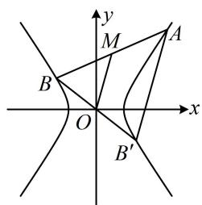
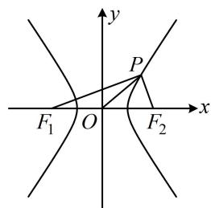
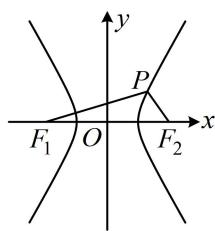
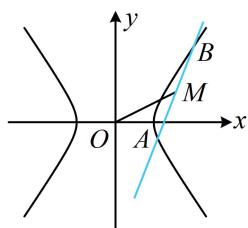
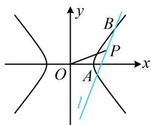

# 内容提要

解析几何中存在无数的二级结论，本节筛选出了一些在高考中比较常用的双曲线二级结论，记住这些结论可适当缩短解题时间.

1. 焦点三角形面积公式：如图1，设 $P$ 是双曲线 $\frac{x^2}{a^2} -\frac{y^2}{b^2} = 1(a > 0,b > 0)$ 上的一点， $F_{1}(-c,0)$ ， $F_{2}(c,0)$ 分别是双曲线的左、右焦点， $\angle F_{1}PF_{2} = \theta$ ，则 $S_{\triangle PF_1F_2} = c|y_P| = \frac{b^2}{\tan\frac{\theta}{2}}.$

text_image

y
P
m
n
F₁ O F₂ x

图1

text_image

y
P
A O B x

图2

text_image

y
P
A
O
x
B

图3

证明：一方面， $\triangle PF_{1}F_{2}$ 的边 $F_{1}F_{2}$ 上的高 $h = |y_{P}|$ ，所以 $S_{\triangle PF_1F_2} = \frac{1}{2}|F_1F_2| \cdot h = \frac{1}{2} \cdot 2c \cdot |y_P| = c|y_P|$ ；另一方面，记 $|PF_1| = m$ ， $|PF_2| = n$ ，则 $|m - n| = 2a$ ①，

在 $\triangle PF_{1}F_{2}$ 中，由余弦定理， $\left|F_1F_2\right|^2 = \left|PF_1\right|^2 +\left|PF_2\right|^2 -2\left|PF_1\right|\cdot \left|PF_2\right|\cdot \cos \angle F_1PF_2$

所以 $4c^{2} = m^{2} + n^{2} - 2mn\cos \theta = (m - n)^{2} + 2mn - 2mn\cos \theta = (m - n)^{2} + 2mn(1 - \cos \theta)$ ②，

将式①代入式②可得： $4c^{2}=4a^{2}+2mn(1-\cos\theta)$ ，所以 $mn=\frac{4c^{2}-4a^{2}}{2(1-\cos\theta)}=\frac{2b^{2}}{1-\cos\theta}$

故 $S_{\triangle PF_1F_2} = \frac{1}{2} mn\sin \theta = \frac{1}{2}\cdot \frac{2b^2}{1 - \cos\theta}\cdot \sin \theta = b^2\cdot \frac{\sin\theta}{1 - \cos\theta} = b^2\cdot \frac{2\sin\frac{\theta}{2}\cos\frac{\theta}{2}}{2\sin^2\frac{\theta}{2}} = \frac{b^2}{\tan\frac{\theta}{2}}.$

2. 基于双曲线第三定义的斜率积结论: 如上图 2, 设 A, B 分别是双曲线 $\frac{x^{2}}{a^{2}} - \frac{y^{2}}{b^{2}} = 1 (a > 0, b > 0)$ 的左、右顶点, P 是双曲线上不与 A, B 重合的任意一点, 则 $k_{PA} \cdot k_{PB} = \frac{b^{2}}{a^{2}}$ .

注: 上述结论中 $A, B$ 是双曲线的左、右顶点, 可将其推广为双曲线上关于原点对称的任意两点, 如上图 3, 只要直线 $PA, PB$ 的斜率都存在, 就仍然满足 $k_{PA} \cdot k_{PB} = \frac{b^{2}}{a^{2}}$ , 下面给出证明.

证明：设 $A(x_{1},y_{1})$ ， $P(x_{2},y_{2})$ ，则 $B(-x_{1},-y_{1})$ ，所以 $k_{PA} \cdot k_{PB} = \frac{y_{2} - y_{1}}{x_{2} - x_{1}} \cdot \frac{y_{2} + y_{1}}{x_{2} + x_{1}} = \frac{y_{2}^{2} - y_{1}^{2}}{x_{2}^{2} - x_{1}^{2}}$ ①，

因为点 A 在双曲线上，所以 $\frac{x_{1}^{2}}{a^{2}} - \frac{y_{1}^{2}}{b^{2}} = 1$ ，

故 $y_{1}^{2}=b^{2}\left(\frac{x_{1}^{2}}{a^{2}}-1\right)=\frac{b^{2}}{a^{2}}(x_{1}^{2}-a^{2})$ ，同理， $y_{2}^{2}=\frac{b^{2}}{a^{2}}(x_{2}^{2}-a^{2})$

所以 $y_{2}^{2} - y_{1}^{2} = \frac{b^{2}}{a^{2}} (x_{2}^{2} - a^{2} - x_{1}^{2} + a^{2}) = \frac{b^{2}}{a^{2}} (x_{2}^{2} - x_{1}^{2})$ ，代入①得： $k_{PA}\cdot k_{PB} = \frac{b^2}{a^2}$

在上述条件中令 $A(-a,0)$ , $B(a,0)$ , 即得内容提要第 2 点的特殊情况下的结论.

3. 中点弦斜率积结论：如图4， $AB$ 是双曲线 $\frac{x^2}{a^2} -\frac{y^2}{b^2} = 1(a > 0,b > 0)$ 的一条不与坐标轴垂直且不过原点的弦， $M$ 为 $AB$ 中点，则 $k_{AB}\cdot k_{OM} = \frac{b^2}{a^2}$ ，此结论可用下面的点差法来证明.

text_image

y
M
A
B
O
x

图4

text_image

y
M
A
B
O
x
B'

图5

证明：设 $A(x_{1},y_{1})$ ， $B(x_{2},y_{2})$ ， $x_{1}\neq x_{2}$ ， $y_{1}\neq y_{2}$ ，因为 $A,B$ 都在双曲线上，所以 $\left\{ \begin{array}{l} \frac{x_1^2}{a^2} -\frac{y_1^2}{b^2} = 1\\ \frac{x_2^2}{a^2} -\frac{y_2^2}{b^2} = 1 \end{array} \right.$

两式作差得： $\frac{x_1^2 - x_2^2}{a^2} -\frac{y_1^2 - y_2^2}{b^2} = 0$ ，整理得： $\frac{y_1 - y_2}{x_1 - x_2}\cdot \frac{y_1 + y_2}{x_1 + x_2} = \frac{b^2}{a^2}$ ①，

注意到 $\frac{y_1 - y_2}{x_1 - x_2} = k_{AB}$ ， $\frac{y_1 + y_2}{x_1 + x_2} = \frac{2y_M}{2x_M} = \frac{y_M}{x_M} = k_{OM}$ ，所以式①即为 $k_{AB} \cdot k_{OM} = \frac{b^2}{a^2}$ 。

注：中点弦结论和上面的第三定义斜率积结论的结果都是 $\frac{b^2}{a^2}$ ，这是巧合吗？不是，两者之间有必然的联系。如上图5，设 $B'$ 为 $B$ 关于原点的对称点，则 $B'$ 也在该双曲线上，且 $O$ 为 $BB'$ 中点，结合 $M$ 为 $AB$ 中点可得 $OM \parallel AB'$ ，所以 $k_{AB} \cdot k_{OM} = k_{AB} \cdot k_{AB'}$ ，于是又回到了双曲线上的点 $A$ 与双曲线上关于原点对称的 $B$ 和 $B'$ 的连线的斜率积。

# 类型 I：焦点三角形面积

【例 1】(2020·新课标 I 卷) 设 $F_{1}$ ， $F_{2}$ 是双曲线 $C: x^{2}-\frac{y^{2}}{3}=1$ 的两个焦点，O 为原点，点 P 在 C 上且 $|OP|=2$ ，则 $\triangle PF_{1}F_{2}$ 的面积为（）

A. 7 B. 3 C. $\frac{5}{2}$ D. 2

解法1：求焦点三角形面积可考虑代公式 $S = \frac{b^2}{\tan \frac{\theta}{2}}$ ，但本题未给 $\angle F_{1}PF_{2}$ ，故先看能不能求出它，

如图，双曲线 $C$ 的半焦距 $c = \sqrt{1 + 3} = 2 \Rightarrow |F_1F_2| = 4$ ，因为 $|OP| = 2$ ，所以 $|OP| = \frac{1}{2}|F_1F_2|$

从而 $\angle F_{1}PF_{2} = 90^{\circ}$ ，故 $S_{\triangle PF_1F_2} = \frac{b^2}{\tan\frac{\theta}{2}} = \frac{3}{\tan45^\circ} = 3.$

解法2：也可考虑代公式 $S = c|y_{p}|$ 求 $\triangle PF_1F_2$ 的面积，于是先算 $y_{p}$

因为 $|OP|=2$ ，所以 $\sqrt{x_{P}^{2}+y_{P}^{2}}=2$ ①，又点P在双曲线C上，所以 $x_{P}^{2}-\frac{y_{P}^{2}}{3}=1$ ②，
联立①②解得： $y_{P}=\pm\frac{3}{2}$ ，双曲线C的半焦距 $c=\sqrt{1+3}=2$ ，所以 $S_{\triangle PF_{1}F_{2}}=c|y_{P}|=3$ .

答案: B

text_image

y
P
x
F₁ O F₂

【变式】已知 $F_{1}$ , $F_{2}$ 是双曲线 $C: x^{2} - \frac{y^{2}}{3} = 1$ 的左、右焦点, $P$ 为双曲线 $C$ 右支上的一点, $\angle F_{1}PF_{2} = 120^{\circ}$ , 则点 $P$ 的纵坐标为 \_\_\_\_, $\left|PF_{1}\right| =$ \_\_\_\_.

解析：给出 $\angle F_{1}PF_{2}$ ，可由 $S = \frac{b^{2}}{\tan\frac{\theta}{2}}$ 求出 $\triangle PF_{1}F_{2}$ 的面积，再由 $S = c|y_{P}|$ 解出 $y_{P}$ ，

由题意，双曲线 $C$ 的半焦距 $c = 2$ ， $S_{\triangle PF_1F_2} = \frac{b^2}{\tan\frac{\theta}{2}} = \frac{3}{\tan60^\circ} = \sqrt{3}$

又 $S_{\triangle PF_1F_2} = c|y_P| = 2|y_P|$ ，所以 $2|y_P| = \sqrt{3}$ ，解得： $y_P = \pm \frac{\sqrt{3}}{2}$ ；

再求 $\left|PF_{1}\right|$ ，涉及 $\left|PF_{1}\right|$ ，可联想到由双曲线定义，如图，由双曲线定义， $\left|PF_{1}\right|-\left|PF_{2}\right|=2$ ①，
只需再找一个关于 $\left|PF_{1}\right|$ 和 $\left|PF_{2}\right|$ 的方程，就能求出 $\left|PF_{1}\right|$ ，由于已知 $S_{\triangle PF_{1}F_{2}}$ ，故将它用 $\left|PF_{1}\right|$ 和 $\left|PF_{2}\right|$ 表示，

因为 $S_{\triangle PF_1F_2} = \frac{1}{2}\big|PF_1\big|\cdot \big|PF_2\big|\cdot \sin \angle F_1PF_2 = \frac{\sqrt{3}}{4}\big|PF_1\big|\cdot \big|PF_2\big| = \sqrt{3}$ ，所以 $\left|PF_1\right|\cdot \left|PF_2\right| = 4$ ②，

由①可得 $\left|PF_{2}\right|=\left|PF_{1}\right|-2$ ，代入②整理得： $\left|PF_{1}\right|^{2}-2\left|PF_{1}\right|-4=0$ ，

解得： $\left|PF_{1}\right|=1+\sqrt{5}$ 或 $1-\sqrt{5}$ （舍去）.

答案： $\pm \frac{\sqrt{3}}{2}$ ， $1 + \sqrt{5}$

text_image

y
P
x
F₁ O F₂

【反思】从上面两道题可以看出，当题干给出 $\angle F_{1}PF_{2}$ 时，可用 $S_{\triangle PF_1F_2} = \frac{b^2}{\tan\frac{\theta}{2}}$ （其中 $\theta = \angle F_{1}PF_{2}$ ）来算焦点三角形的面积；由 $S_{\triangle PF_1F_2} = c|y_P| = \frac{b^2}{\tan\frac{\theta}{2}}$ 还可以建立顶角 $\theta$ 和 $|y_P|$ 之间的等量关系.

# 类型Ⅱ：第三定义、中点弦斜率积结论

【例 2】设双曲线 $C: \frac{x^{2}}{a^{2}} - y^{2} = 1 (a > 0)$ 与直线 y = kx 交于 A, B 两点，P 为 C 右支上的一动点，记

直线 $PA, PB$ 的斜率分别为 $k_{PA}, k_{PB}, C$ 的左、右焦点分别为 $F_{1}, F_{2}$ ，若 $k_{PA} \cdot k_{PB} = \frac{1}{9}$ ，则下列说法正确的是（）

A. $a = \sqrt{3}$   
B. 双曲线 $C$ 的渐近线方程为 $y = \pm \sqrt{3} x$   
C. 若 $PF_{1} \perp PF_{2}$ , 则 $\triangle PF_{1}F_{2}$ 的面积为 2  
D. 双曲线 $C$ 的离心率为 $\frac{\sqrt{10}}{3}$

解析：由对称性可得 $A$ ， $B$ 关于原点对称，又涉及斜率之积 $k_{PA}\cdot k_{PB}$ ，故想到第三定义斜率积结论，

因为 $k_{PA} \cdot k_{PB} = \frac{1}{a^2} = \frac{1}{9}$ ，所以 $a = 3$ ，从而双曲线 $C$ 的渐近线方程为 $y = \pm \frac{1}{3} x$

离心率 $e = \frac{\sqrt{a^2 + 1}}{a} = \frac{\sqrt{10}}{3}$ ，故A项和B项错误，D项正确；

对于C项，求焦点三角形面积，代公式 $S = \frac{b^2}{\tan\frac{\theta}{2}}$ 即可，

当 $PF_{1} \perp PF_{2}$ 时， $\angle F_{1}PF_{2} = 90^{\circ}$ ，所以 $S_{\triangle PF_1F_2} = \frac{b^2}{\tan \frac{\theta}{2}} = \frac{1}{\tan 45^{\circ}} = 1$ ，故C项错误.

答案: D

【反思】涉及双曲线 $\frac{x^2}{a^2} -\frac{y^2}{b^2} = 1(a > 0,b > 0)$ 上的点 $P$ 与双曲线上关于原点对称的 $A$ ， $B$ 两点连线的斜率之积，考虑用第三定义斜率积结论 $k_{PA}\cdot k_{PB} = \frac{b^2}{a^2}$ ，其推导方法请参考本节内容提要.

【例 3】已知 A, B 是双曲线 $C: \frac{x^{2}}{2} - \frac{y^{2}}{3} = 1$ 上的两点，线段 AB 的中点是 $M(2,1)$ ，则直线 AB 的方程为 \_\_\_\_.

解析：条件涉及弦中点，想到中点弦斜率积结论，

因为 $M(2,1)$ 是弦 $AB$ 的中点，所以 $k_{AB} \cdot k_{OM} = k_{AB} \cdot \frac{1}{2} = \frac{3}{2}$ ，故 $k_{AB} = 3$

如图，直线 $AB$ 过点 $M$ ，故其方程为 $y - 1 = 3(x - 2)$ ，整理得： $3x - y - 5 = 0$

答案: $3 x - y - 5 = 0$

text_image

y
B
M
O
A
x

【反思】在双曲线中，涉及弦中点的问题都可以考虑用中点弦斜率积结论来建立方程，求解需要的量.

【变式】已知双曲线 $C: x^{2} - y^{2} = 1$ ，过点 $P(m,1)(m > 0)$ 的直线 $l$ 与双曲线 $C$ 交于 $A$ ， $B$ 两点，若 $P$ 为线段 $AB$ 的中点，则 $m$ 的取值范围是 \_\_\_\_.

解析：涉及弦中点，想到中点弦斜率积结论，由题意， $k_{AB}\cdot k_{OP} = k_{AB}\cdot \frac{1}{m} = 1$ ，所以 $k_{AB} = m$

如图，直线 $l$ 过点 $P$ ，故其方程为 $y - 1 = m(x - m)$ ，整理得： $y = mx + 1 - m^2$

直线 $l$ 是随 $m$ 而变化的动直线，且应满足 $l$ 与 $C$ 有两个交点，于是联立方程用 $\Delta > 0$ 来求 $m$ 的范围，联立 $\left\{ \begin{array}{l} y = mx + 1 - m^2 \\ x^2 - y^2 = 1 \end{array} \right.$ 消去 $y$ 整理得： $(1 - m^2)x^2 - 2m(1 - m^2)x + 2m^2 - 2 - m^4 = 0$

因为直线 l 与双曲线 C 有 2 个交点，

所以 $\left\{ \begin{array}{ll}1 - m^2\neq 0 & ①\\ \Delta = 4m^2 (1 - m^2)^2 -4(1 - m^2)(2m^2 -2 - m^4) > 0 & ② \end{array} \right.$

由①得 $m \neq \pm 1$ ，由②得 $(1 - m^2)[m^2(1 - m^2) - 2m^2 + 2 + m^4] = (1 - m^2)(2 - m^2) > 0$

所以 $m^2 < 1$ 或 $m^2 > 2$ ，结合 $m > 0$ 可得 $0 < m < 1$ 或 $m > \sqrt{2}$ .

答案： $(0,1)\cup (\sqrt{2}, + \infty)$

text_image

y
B
P
O
A
x
l

# 强化训练

1. (2024·江苏南通模拟·★)

已知 $F_{1}$ , $F_{2}$ 是双曲线 $E: \frac{x^{2}}{9} - \frac{y^{2}}{16} = 1$ 的两个焦点, 点 $M$ 在 $E$ 上, 如果 $\overrightarrow{MF_{1}} \perp \overrightarrow{MF_{2}}$ , 则 $\triangle MF_{1}F_{2}$ 的面积为 \_\_\_\_.

2. (2022·陕西汉中模拟·★★)

已知双曲线 $\frac{x^2}{4} - \frac{y^2}{b^2} = 1 (b > 0)$ 的左焦点为 $F$ , 过 $F$ 作斜率为 2 的直线与双曲线交于 $A, B$ 两点, $P$ 是 $AB$ 中点, $O$ 为原点, 若直线 $OP$ 的斜率为 $\frac{1}{4}$ , 则双曲线的离心率为 ( )

A. $\frac{\sqrt{6}}{2}$

B. 2

C. $\frac{3}{2}$

D. $\sqrt{2}$

3. (★★★)

已知 $A$ ， $B$ 为双曲线 $E$ 的左、右顶点，点 $M$ 在 $E$ 上， $\triangle ABM$ 为等腰三角形，且顶角为 $120^{\circ}$ ，则 $E$ 的离心率为（）

A. $\sqrt{5}$

B. 2

C. $\sqrt{3}$ D. $\sqrt{2}$

4. (2023·福建厦门二模·★★★☆)

不与 $x$ 轴重合的直线 $l$ 过点 $N(x_{N},0)(x_{N} \neq 0)$ ，双曲线 $C: \frac{x^{2}}{a^{2}} - \frac{y^{2}}{b^{2}} = 1 (a > 0, b > 0)$ 上存在两点 $A$ ， $B$ 关于 $l$ 对称， $AB$ 中点 $M$ 的横坐标为 $x_{M}$ 。若 $x_{N} = 4x_{M}$ ，则 $C$ 的离心率为 \_\_\_\_.

5. (2024·河北邯郸一模·★★★★)

设双曲线 $C: \frac{x^2}{a^2} - \frac{y^2}{b^2} = 1 (a > 0, b > 0)$ 的左、右焦点分别为 $F_1$ ， $F_2$ ，点 $P$ 在双曲线 $C$ 上，过点 $P$ 作两条渐近线的垂线，垂足分别为 $D$ ， $E$ ，若 $\overrightarrow{PF_1} \cdot \overrightarrow{PF_2}$

$= 0$ ，且 $3\left|PD\right|\cdot \left|PE\right| = S_{\triangle PF_1F_2}$ ，则双曲线 $C$ 的离心率为（）

A. $\frac{2\sqrt{3}}{3}$

B. $\sqrt{2}$

C. $\sqrt{3}$

D. 2

6. (2024·浙江绍兴模拟·★★★★)

已知点 $A, B, C$ 都在双曲线 $\Gamma: \frac{x^2}{a^2} - \frac{y^2}{b^2} = 1 (a > 0,$

$b > 0)$ 上，且点 $A$ ， $B$ 关于原点对称， $\angle CAB = 90^{\circ}$ ，过 $A$ 作垂直于 $x$ 轴的直线分别交 $\Gamma$ ， $BC$ 于点 $M$ ， $N$ 。若 $\overrightarrow{AN} = 3\overrightarrow{AM}$ ，则 $\Gamma$ 的离心率是（）

A. $\sqrt{2}$

B. $\sqrt{3}$

C. 2

D. $2 \sqrt{3}$