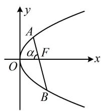
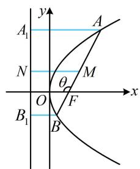
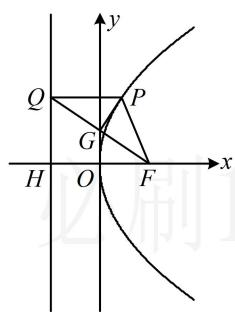
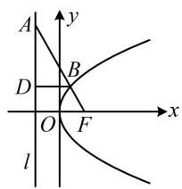
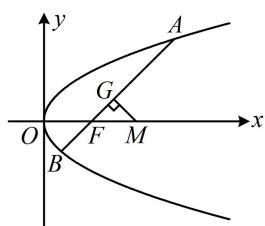
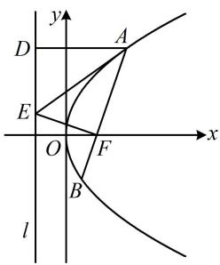

# 强化训练

1. (2020·新高考Ⅰ卷·★★)

斜率为 $\sqrt{3}$ 的直线过抛物线 $C: y^2 = 4x$ 的焦点，且与 $C$ 交于 $A, B$ 两点，则 $\vert AB\vert = \underline{\quad}$ .

1. $\frac{16}{3}$

解法1：直线 $AB$ 过焦点且已知斜率，可写出其方程，与抛物线联立，用坐标版焦点弦公式求 $\vert AB\vert$

由题意， $p = 2$ ，抛物线 $C$ 的焦点为 $F(1,0)$

过 $F$ 且斜率为 $\sqrt{3}$ 的直线为 $y = \sqrt{3}(x - 1)$ ，

联立 $\left\{ \begin{array}{l} y = \sqrt{3}(x - 1) \\ y^2 = 4x \end{array} \right.$ 消去 $y$ 整理得： $3x^{2} - 10x + 3 = 0$

所以 $x_{A} + x_{B} = \frac{10}{3}$ ，故 $\left|AB\right| = x_A + x_B + 2 = \frac{16}{3}$

解法2：由斜率能求出倾斜角，故也可用角版焦点弦公式算 $|AB|$ ，由题意， $p = 2$ ，直线 $AB$ 的斜率为 $\sqrt{3}$ ，

所以其倾斜角 $\alpha = 60^{\circ}$ ，故 $\left|AB\right| = \frac{2p}{\sin^2\alpha} = \frac{4}{\sin^260^\circ} = \frac{16}{3}$

2. (★★)

设 $F$ 为抛物线 $C: y^2 = 3x$ 的焦点，过 $F$ 且倾斜角为 $30^\circ$ 的直线交 $C$ 于 $A$ ， $B$ 两点， $O$ 为原点，则 $\triangle AOB$ 的面积为 \_\_\_\_.

2. $\frac{9}{4}$

解析：已知直线的倾斜角，代公式 $S = \frac{p^2}{2\sin\alpha}$ 即可求 $\triangle AOB$ 的面积，由题意， $p = \frac{3}{2}$ ，直线 $AB$ 的倾斜角 $\alpha = 30^\circ$ ，

所以 $S_{\triangle AOB} = \frac{p^2}{2\sin\alpha} = \frac{\left(\frac{3}{2}\right)^2}{2\sin 30^\circ} = \frac{9}{4}.$

3. (★★★)

过抛物线 $y^{2} = 2x$ 的焦点 $F$ 作直线交抛物线于 $A$ ， $B$ 两点，若 $|AB| = \frac{25}{12}$ ， $|AF| < |BF|$ ，则 $|AF| =$ \_\_\_\_.

3. $\frac{5}{6}$

解法 1: 已知 $|AB|$ , 可由角版焦点弦公式求角, 再代入焦半径公式算 $|AF|$ ,

不妨设直线 $AB$ 为如图所示的情形，设 $\angle AFO = \alpha$ ，

其中 $0 < \alpha < \frac{\pi}{2}$ ，则 $\left|AB\right| = \frac{2}{\sin^2\alpha} = \frac{25}{12} \Rightarrow \sin \alpha = \frac{2\sqrt{6}}{5}$ ，

$\cos \alpha = \sqrt{1 - \sin^2\alpha} = \frac{1}{5}$ 所以 $\left|AF\right| = \frac{1}{1 + \cos\alpha} = \frac{1}{1 + \frac{1}{5}} = \frac{5}{6}$ .

解法2： $|AB|$ 可转换成 $\left|AF\right| + \left|BF\right|$ ，把 $\left|AF\right|$ ， $\left|BF\right|$ 看成未知数，结合 $\frac{1}{\left|AF\right|} + \frac{1}{\left|BF\right|} = \frac{2}{p}$ 即可求解 $\left|AF\right|$ ，

由题意， $p = 1$ ，所以 $\frac{1}{|AF|} +\frac{1}{|BF|} = \frac{2}{p} = 2$ ①

又 $|AB| = |AF| + |BF| = \frac{25}{12}$ ②,

由①得 $\frac{|AF| + |BF|}{|AF|\cdot|BF|} = 2$ ，结合式②得 $|AF|\cdot|BF| = \frac{25}{24}$ ③，

由②③知 $\left|AF\right|$ ， $\left|BF\right|$ 是一元二次方程 $x^{2}-\frac{25}{12}x+\frac{25}{24}=0$

的两根，解得： $x = \frac{5}{6}$ 或 $\frac{5}{4}$

因为 $\left|AF\right|<\left|BF\right|$ ，所以 $\left|AF\right|=\frac{5}{6}$ .

text_image

y
A
α
F
O
x
B

4.（2023·广东深圳模拟·★★★）

过抛物线 $C: y^{2} = 4x$ 焦点 $F$ 的直线 $l$ 交抛物线 $C$ 于 $A, B$ 两点，且 $\overrightarrow{AF} = 3\overrightarrow{FB}$ ，若 $M$ 为 $AB$ 的中点，则 $M$ 到 $y$ 轴的距离为 \_\_\_\_.

4. $\frac{5}{3}$

解法1：如图，由 $M$ 到 $y$ 轴的距离联想到 $M$ 到准线的距离，此距离可利用梯形的中位线与 $A$ ， $B$ 到准线的距离建立联系，由题意，抛物线 $C$ 的焦点到准线的距离 $p = 2$ ，准线方程为 $x = -1$

过 $A$ ， $M$ ， $B$ 分别作准线的垂线，垂足分别为 $A_{1}$ ， $N$ ， $B_{1}$ ，则点 $M$ 到 $y$ 轴的距离 $d = |MN| - 1 = \frac{|AA_1| + |BB_1|}{2} -1$ ①，由抛物线定义， $\left|AA_{1}\right| = \left|AF\right|$ ， $\left|BB_{1}\right| = \left|BF\right|$

代入①得 $d = \frac{|AF| + |BF|}{2} - 1$ ②，

条件给出 $\overrightarrow{AF} = 3\overrightarrow{FB}$ ，要由此求 $|AF|$ 和 $|BF|$ ，可将其转换成长度关系，用角版焦半径公式来翻译，

设 $\angle AFO = \theta$ ，则 $\angle BFO = \pi -\theta$ ，因为 $\overrightarrow{AF} = 3\overrightarrow{FB}$

所以 $\left|AF\right|=3\left|BF\right|$ ，故 $\frac{p}{1+\cos\theta}=3\cdot\frac{p}{1+\cos(\pi-\theta)}=\frac{3p}{1-\cos\theta}$

解得： $\cos \theta = -\frac{1}{2}$ ，所以 $\left|AF\right| = \frac{p}{1 + \cos\theta} = \frac{2}{1 - \frac{1}{2}} = 4$

$\left|BF\right| = \frac{1}{3}\left|AF\right| = \frac{4}{3}$ ，代入②得 $d = \frac{5}{3}$

解法2：按解法1得到式②后，注意到 $\overrightarrow{AF} = 3\overrightarrow{FB}$ 可翻译为 $|AF| = 3|BF|$ ，故也可结合 $\frac{1}{|AF|} + \frac{1}{|BF|} = \frac{2}{p}$ 求 $|AF|$ 和 $|BF|$ ，由题意， $p = 2$ ，所以 $\frac{1}{|AF|} +\frac{1}{|BF|} = \frac{2}{p} = 1$ ③，

又 $\overrightarrow{AF} = 3\overrightarrow{FB}$ ，所以 $|AF| = 3|BF|$

结合式③可得 $\left|AF\right|=4,\quad\left|BF\right|=\frac{4}{3}$ ，代入②得 $d=\frac{5}{3}$ .

text_image

y
A₁
N
θ
M
O
F
x
B₁
B
A

5. (2024·湖北武汉二调·★★★)

设抛物线 $y^{2} = 2x$ 的焦点为 $F$ ，过抛物线上点 $P$ 作其准线的垂线，设垂足为 $Q$ ，若 $\angle PQF = 30^{\circ}$ ，则 $|PQ| = (\quad)$

A. $\frac{2}{3}$

B. $\frac{\sqrt{3}}{3}$

C. $\frac{3}{4}$

D. $\frac{\sqrt{3}}{2}$

5. A

解法1：看到题干的过抛物线上的点 $P$ 向准线作垂线，马上想到抛物线定义，故连接 $PF$

如图，由抛物线定义， $|PQ| = |PF|$

所以 $\triangle PQF$ 是等腰三角形，且由题意， $\angle PQF = 30^{\circ}$ ，

观察发现只要求出 $|QF|$ ，就能求得 $|PQ|$ ，由于抛物线方程已知，所以 $|HF|$ 已知，故考虑在 $\triangle QHF$ 中算 $|QF|$ ，

由图可知， $PQ \parallel x$ 轴，所以 $\angle QFH = \angle PQF = 30^{\circ}$ ，

又由抛物线方程为 $y^{2} = 2x$ 可知 $p = 1$ ，所以 $|HF| = 1$ ，

故 $\left|QF\right|=\frac{\left|HF\right|}{\cos\angle QFH}=\frac{2\sqrt{3}}{3}$ ，取QF中点G，连接PG，

则 $PG \perp QF$ ， $\left|QG\right| = \frac{1}{2}\left|QF\right| = \frac{\sqrt{3}}{3}$

在 $\triangle PQG$ 中， $|PQ| = \frac{|QG|}{\cos\angle PQG} = \frac{\frac{\sqrt{3}}{3}}{\cos 30^\circ} = \frac{2}{3}$ .

text_image

y
Q
P
G
H
O
F
x

解法2：注意到 $|PQ| = |PF|$ ，故只需算 $|PF|$ ，结合图形我们发现 $\angle PFO$ 容易求得，故也可代角版焦半径公式求 $|PF|$ ，如图，由抛物线定义， $|PQ| = |PF|$ ，

又 $\angle PQF = 30^{\circ}$ ，所以 $\angle PFQ = 30^{\circ}$ ，因为 $PQ / / x$ 轴，

所以 $\angle QFH = \angle PQF = 30^{\circ}$ ，故 $\angle PFO = 60^{\circ}$

由角版焦半径公式， $\left|PF\right|=\frac{1}{1+\cos60^{\circ}}=\frac{2}{3}$ ，所以 $\left|PQ\right|=\frac{2}{3}$ .

6. (★★★)

已知抛物线 $C: y^{2} = 2px (p > 0)$ 的焦点为 $F$ ，准线为 $l$ ，过点 $F$ 作倾斜角为 $120^{\circ}$ 的直线与准线 $l$ 相交于点 $A$ ，线段 $AF$ 与 $C$ 相交于点 $B$ ，且 $\left|AB\right| = \frac{4}{3}$ ，则 $C$ 的方程为 \_\_\_\_.

6. $y^{2} = 2x$

解析：如图，过 $B$ 作 $BD \perp l$ 于 $D$ ，直线 $AF$ 的倾斜角为 $120^{\circ}$ ，所以 $\angle AFO = \angle ABD = 60^{\circ}$

已知 $\left|AB\right|=\frac{4}{3}$ ，可在 $\triangle ABD$ 中求 $\left|BD\right|$ ，结合抛物线定义得出 $\left|BF\right|$ ，再由角版焦半径公式建立方程求p，

$\left|BD\right| = \left|AB\right|\cdot \cos \angle ABD = \frac{2}{3}$ ，由抛物线定义， $\left|BF\right| =$

$\left|BD\right| = \frac{2}{3}$ ，又 $\left|BF\right| = \frac{p}{1 + \cos\angle BFO} = \frac{p}{1 + \cos60^{\circ}} = \frac{2p}{3}$

所以 $\frac{2p}{3} = \frac{2}{3}$ ，解得： $p = 1$ ，故 $C$ 的方程为 $y^{2} = 2x$ 。

text_image

A
y
B
D
O
F
x
l

# 7. (★★★☆)

已知 $F$ 为抛物线 $y^{2} = 2px(p > 0)$ 的焦点，过 $F$ 且倾斜角为 $45^{\circ}$ 的直线 $l$ 与抛物线交于 $A$ ， $B$ 两点，线段 $AB$ 的中垂线与 $x$ 轴交于点 $M$ ，则 $\frac{4p}{|FM|} =$ \_\_\_\_.

7.2

解法1：涉及中垂线，可先把直线 $l$ 与抛物线联立，结合韦达定理求出 $AB$ 中点，写出中垂线的方程，

由题意， $F\left(\frac{p}{2},0\right)$ ，直线AB的方程为 $y=x-\frac{p}{2}$ ，

即 $x = y + \frac{p}{2}$ ，设 $A(x_{1},y_{1})$ ， $B(x_{2},y_{2})$ ，将 $x = y + \frac{p}{2}$ 代入

$y^{2}=2px$ 消去 x 整理得： $y^{2}-2py-p^{2}=0$ ，

判别式 $\Delta = (-2p)^2 - 4 \times 1 \times (-p^2) = 8p^2 > 0$

由韦达定理， $y_{1} + y_{2} = 2p$ ，所以 $x_{1} + x_{2} = y_{1} + \frac{p}{2} +y_{2} + \frac{p}{2}$

$= y_{1} + y_{2} + p = 3p$ ，故 $AB$ 中点 $G$ 为 $\left(\frac{3p}{2},p\right)$

所以 $AB$ 中垂线的方程为 $y - p = -\left(x - \frac{3p}{2}\right)$ ①，

由此中垂线可求 M 的坐标，进而求得 $\left|FM\right|$ ，

在①中令 $y = 0$ 得： $x = \frac{5p}{2}$ ，故 $M\left(\frac{5p}{2},0\right)$

所以 $\left|FM\right|=\frac{5p}{2}-\frac{p}{2}=2p$ ，故 $\frac{4p}{\left|FM\right|}=2$ 。

解法2：如图，要求 $|FM|$ ，注意到 $\angle GFM$ 是已知的，故可先求 $|FG|$ ，因为 $G$ 为 $AB$ 中点，

所以 $\left|FG\right|=\left|AF\right|-\left|AG\right|=\left|AF\right|-\frac{1}{2}\left|AB\right|$ ①，已知l的倾斜角，可用角版焦半径和焦点弦公式来算 $\left|AF\right|$ 和 $\left|AB\right|$

直线 $l$ 的倾斜角为 $45^{\circ} \Rightarrow \angle GFM = 45^{\circ} \Rightarrow \angle AFO = 135^{\circ}$

所以 $\left|AF\right|=\frac{p}{1+\cos135^{\circ}}$ ， $\left|AB\right|=\frac{2p}{\sin^{2}135^{\circ}}$

代入①得： $\left|FG\right|=\frac{p}{1+\cos135^{\circ}}-\frac{1}{2}\cdot\frac{2p}{\sin^{2}135^{\circ}}=\sqrt{2}p$

又 $\angle GFM = 45^{\circ}$ ，所以 $\triangle GFM$ 是等腰直角三角形，

从而 $\left|FM\right|=\sqrt{2}\left|FG\right|=2p$ ，故 $\frac{4p}{\left|FM\right|}=2$ 。

text_image

y
A
G
O
F
M
x
B

8. (2025·全国Ⅰ卷·★★★) (多选)

设抛物线 $C: y^{2} = 6x$ 的焦点为 $F$ ，过 $F$ 的直线交 $C$ 于 $A, B$ ，过 $A$ 作 $l: x = -\frac{3}{2}$ 的垂线，垂足为 $D$ ，过 $F$ 且垂直于 $AB$ 的直线交 $l$ 于 $E$ ，则（）

A. $\left|AD\right| = \left|AF\right|$

B. $|AE| = |AB|$

C. $|AB| \geq 6$

D. $|AE|\cdot|BE|\geq18$

8. ACD

解析：抛物线 $C$ 的焦点为 $F\left(\frac{3}{2},0\right)$ ，准线为 $l:x = -\frac{3}{2}$

A项，如图，由抛物线定义， $|AD| = |AF|$ ，故A项正确；

B项， $|AB|$ 是焦点弦，可代角版焦点弦公式计算，那 $\vert AE\vert$ 呢？注意到 $AF \perp EF$ ，故可考虑到 $\triangle AEF$ 中来分析，

设 $\angle AFO = \theta (0 < \theta < \pi)$ ，则由角版焦点弦、焦半径公式，

$$
\left| A B \right| = \frac {2 p}{\sin^ {2} \theta} = \frac {6}{\sin^ {2} \theta}, \quad \left| A F \right| = \frac {p}{1 + \cos \theta} = \frac {3}{1 + \cos \theta},
$$

由图可知 $AD \parallel x$ 轴，所以 $\angle DAF = \angle AFx = \pi - \angle AFO$

$$
= \pi - \theta ,
$$

又 $\angle ADE = \angle AFE = \frac{\pi}{2}$ ， $|AD| = |AF|$ ， $|AE| = |AE|$

所以 $\triangle ADE\cong \triangle AFE$ ，从而 $\angle DAE = \angle FAE$

故 $\angle FAE = \frac{1}{2}\angle DAF = \frac{\pi - \theta}{2} = \frac{\pi}{2} - \frac{\theta}{2}$

在 $\triangle AEF$ 中， $|AE| = \frac{|AF|}{\cos \angle FAE} = \frac{\frac{3}{1 + \cos \theta}}{\cos\left(\frac{\pi}{2} - \frac{\theta}{2}\right)}$

$$
= \frac {3}{(1 + \cos \theta) \sin \frac {\theta}{2}} = \frac {3}{2 \cos^ {2} \frac {\theta}{2} \sin \frac {\theta}{2}} = \frac {3}{\sin \theta \cos \frac {\theta}{2}} \neq \frac {6}{\sin^ {2} \theta},
$$

所以 $|AE|$ 与 $|AB|$ 不相等，故B项错误；

C项，由图可知 $0 < \theta < \pi$ ，所以 $0 < \sin \theta \leq 1$

从而 $\left|AB\right|=\frac{6}{\sin^{2}\theta}\geq6$ ，故C项正确；

D 项, 判断结论需要 $|BE|$ , 怎样求 $|BE|$ ? 要仿照求 $|AE|$ 的方法再来一遍吗? 不用, 两者的差别不外乎就是把 $A$ 换成了 $B$ , 也就是把 $\angle AFO$ 换成 $\angle BFO$ (即 $\pi - \theta$ ), 故直接在 $|AE|$ 的结果中用 $\pi - \theta$ 替换 $\theta$ , 即可得到 $|BE|$ ,

在 $\left|AE\right|=\frac{3}{(1+\cos\theta)\sin\frac{\theta}{2}}$ 中将 $\theta$ 换成 $\pi-\theta$ 得 $\left|BE\right|=$

$$
\frac {3}{[ 1 + \cos (\pi - \theta) ] \sin \frac {\pi - \theta}{2}} = \frac {3}{(1 - \cos \theta) \cos \frac {\theta}{2}},
$$

所以 $\left|AE\right|\cdot\left|BE\right|=\frac{3}{(1+\cos\theta)\sin\frac{\theta}{2}}\cdot\frac{3}{(1-\cos\theta)\cos\frac{\theta}{2}}$

$$
= \frac {9}{(1 - \cos^ {2} \theta) \sin \frac {\theta}{2} \cos \frac {\theta}{2}} = \frac {9}{\sin^ {2} \theta \frac {1}{2} \sin \theta} = \frac {1 8}{\sin^ {3} \theta} \geq 1 8,
$$

故D项正确.

text_image

y
D
A
E
O
F
x
l
B

一数·必刷100讲