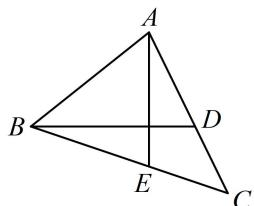
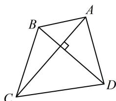
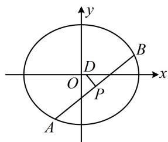
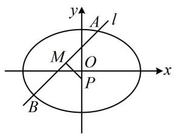
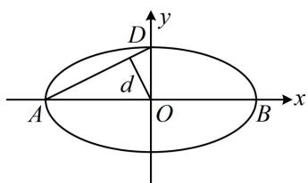
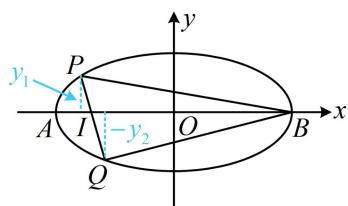
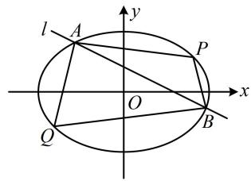
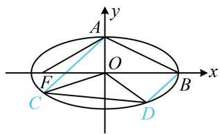
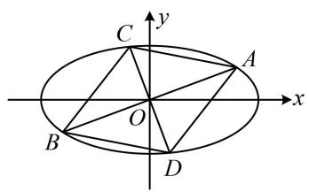
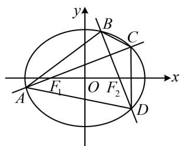

# 模块六 解析几何大题

# 第 1 节 解析几何大题条件翻译：长度与面积（★★★★）

# 内容提要

解析几何大题虽然以计算为主，但我们要学会合理地翻译各种题设条件，才能让计算变得更加有效、高效。我们将通过4节来学习各种常见条件的翻译方法，本节主要介绍长度、面积这两类条件的翻译。

1. 弦长的计算方法

①设 $A(x_{1},y_{1})$ ， $B(x_{2},y_{2})$ 是直线 $l:y = kx + t$ 上任意两点，则 $\left|AB\right| = \sqrt{(x_1 - x_2)^2 + (y_1 - y_2)^2}$

上述平面上两点间的距离公式是一切弦长公式的起点，其它计算方法都是由它演变而来的.

例如，将 $\left\{ \begin{array}{l} y_{1} = kx_{1} + t \\ y_{2} = kx_{2} + t \end{array} \right.$ 代入上式，则可化为 $|AB| = \sqrt{1 + k^2} \cdot |x_1 - x_2|$ ，所以当 $x_{1}$ ， $x_{2}$ 容易求出时，可按 $|AB| = \sqrt{1 + k^2} \cdot |x_1 - x_2|$ 计算 $|AB|$ ；

当 A, B 是直线 l 与二次曲线 $f(x,y)=0$ （一般指圆、椭圆、双曲线、抛物线）的两个交点时，常可联立 $\left\{\begin{aligned}y&=kx+t\\ f(x,y)&=0\end{aligned}\right.$ 消去 y，得到关于 x 的一元二次方程 $ax^{2}+bx+c=0(a\neq0)$ ，则由韦达定理推论， $\left|x_{1}-x_{2}\right|=\frac{\sqrt{\Delta}}{\left|a\right|}$ ，代入 $\left|AB\right|=\sqrt{1+k^{2}}\cdot\left|x_{1}-x_{2}\right|$ 可得 $\left|AB\right|=\sqrt{1+k^{2}}\cdot\frac{\sqrt{\Delta}}{\left|a\right|}$ .

②设 $A(x_{1},y_{1})$ ， $B(x_{2},y_{2})$ 是直线 $l:x = my + n$ 上任意两点，则 $\left|AB\right| = \sqrt{(x_1 - x_2)^2 + (y_1 - y_2)^2}$

若 $y_{1}$ ， $y_{2}$ 容易求出，则可按 $\left|AB\right| = \sqrt{1 + m^2}\cdot \left|y_1 - y_2\right|$ （推导方法与①相同）计算 $\left|AB\right|$

当 $A, B$ 是直线 $l$ 与二次曲线 $f(x, y) = 0$ 的两个交点时，常可联立 $\left\{ \begin{array}{l} x = my + n \\ f(x, y) = 0 \end{array} \right.$ 消去 $x$ ，得到关于 $y$ 的一元二次方程 $ay^2 + by + c = 0 (a \neq 0)$ ，按 $\left|AB\right| = \sqrt{1 + m^2} \cdot \frac{\sqrt{\Delta}}{\left|a\right|}$ 来计算 $\left|AB\right|$ .

2. 面积的计算: 算面积常伴随着算弦长, 我们分三角形和四边形来归纳面积的计算方法.

①对于三角形面积的计算，常见的方法有五种：

(i) $S = \frac{1}{2}$ 底 $\times$ 高，在题干没有特殊条件的情况下，常用此法算三角形的面积.

(ii)用 “水平宽” 或 “铅垂高” 算面积: 如图 1,

$$
S _ {\triangle A B C} = \frac {1}{2} \big | A E \big | \cdot \big | x _ {B} - x _ {C} \big | = \frac {1}{2} \big | B D \big | \cdot \big | y _ {A} - y _ {C} \big |.
$$

text_image

A
B
D
E
C

图1

text_image

Geometric diagram of quadrilateral ABCD with diagonals AC and BD intersecting at point B, forming right angles at C and D.

图2

(iii)用两边及夹角： $S_{\triangle ABC} = \frac{1}{2}\big|AB|\cdot |AC|\cdot \sin \angle BAC$ ，此法常用于内角已知的情况.  
(iv)转化：当直接计算某三角形的面积不方便时，还可以考虑利用其它条件（如相似等）转化为其它容易求面积的三角形来算面积.  
(v)原点三角形面积公式：对于 $\triangle AOB$ （其中 $O$ 为原点），若其它方法计算 $S_{\triangle AOB}$ 不易，但 $A$ ， $B$ 的坐标已知或容易求得，则还可以考虑按 $S_{\triangle AOB} = \frac{1}{2}\left|x_A y_B - x_B y_A\right|$ 来算面积。需注意，此二级结论不宜直接使用，应先推导，推导方法请参考本节例3。

另外，当三角形没有顶点在原点时，也有类似的公式，我们可以通过平移三角形把其中一个顶点移到原点，再套上述公式。以 $\triangle ABC$ 为例，把三个顶点的坐标同时减去 $A$ 的坐标，就将 $A$ 移到了原点，平移后 $B$ ， $C$ 的坐标分别等于 $\overrightarrow{AB}$ ， $\overrightarrow{AC}$ 的坐标，假设 $\overrightarrow{AB} = (x_1, y_1)$ ， $\overrightarrow{AC} = (x_2, y_2)$ ，则 $S_{\triangle ABC} = \frac{1}{2} |x_1y_2 - x_2y_1|$ 。

②对于四边形面积的计算，常见的方法有两种：

(i)特殊四边形，如上面图2，四边形ABCD的对角线互相垂直，则 $S_{ABCD}=\frac{1}{2}\left|AC\right|\cdot\left|BD\right|$ ;   
(ii)一般的四边形，可用一条对角线分割成两个三角形分别算面积.

# 类型 I：弦长的计算

【例1】已知椭圆 $C: \frac{x^2}{a^2} + \frac{y^2}{b^2} = 1 (a > b > 0)$ 的离心率为 $\frac{1}{2}$ ，椭圆短轴的一个端点与两个焦点构成的三角形的面积为 $\sqrt{3}$ ，过椭圆 $C$ 的右焦点的动直线 $l$ 与椭圆 $C$ 交于 $A, B$ 两点.

(1) 求椭圆 C 的方程;  
（2）若线段 $AB$ 的垂直平分线与 $x$ 轴交于唯一的点 $D$ ，弦 $AB$ 的中点为 $P$ ， $|AB| = 4\sqrt{2}|DP|$ ，求直线 $l$ 的方程.

解：（1）设椭圆的半焦距为 $c$ ，由题意，椭圆的离心率 $e = \frac{c}{a} = \frac{1}{2}$ ，所以 $a = 2c$ ①，

又因为椭圆短轴的一个端点与两个焦点构成的三角形面积为 $\sqrt{3}$ ，所以 $\frac{1}{2} \times 2c \cdot b = bc = \sqrt{3}$ ②，

由①②结合 $c^2 = a^2 - b^2$ 可解得 $a = 2, b = \sqrt{3}, c = 1$ ，所以椭圆 $C$ 的方程为 $\frac{x^2}{4} + \frac{y^2}{3} = 1$ .

(2) (翻译 $|AB|=4\sqrt{2}|DP|$ 需要计算 $|AB|$ 和 $|DP|$ ，下面先算 $|AB|$ ，可设直线l的方程，与椭圆联立，用弦长公式计算。直线l过x轴上定点，一般设横截式方程，需先考虑 $l\perp y$ 轴的情形)

当 $l \perp y$ 轴时， $A, B$ 为长轴端点，所以 $|AB| = 4$ ，此时 $D$ 与 $P$ 重合于原点，所以 $|DP| = 0$ ，不满足题意；当 $l$ 不与 $y$ 轴垂直时，由（1）知椭圆的右焦点为 $(1,0)$ ，故可设 $l: x = my + 1$ ，设 $A(x_1, y_1), B(x_2, y_2)$ ，

联立 $\left\{ \begin{array}{l} x = my + 1 \\ \frac{x^2}{4} + \frac{y^2}{3} = 1 \end{array} \right.$ 消去 $x$ 整理得： $(3m^2 + 4)y^2 + 6my - 9 = 0$ ③，

判别式 $\Delta = (6m)^2 - 4(3m^2 + 4) \cdot (-9) = 144(m^2 + 1) > 0$

由弦长公式， $\left|AB\right|=\sqrt{1+m^{2}}\cdot\left|y_{1}-y_{2}\right|=\sqrt{1+m^{2}}\cdot\frac{\sqrt{144(m^{2}+1)}}{3m^{2}+4}=\frac{12(m^{2}+1)}{3m^{2}+4}$

(再求 $|DP|$ , 显然 $P$ 的坐标可由韦达定理计算, 那 $D$ 呢? 要写出 $AB$ 中垂线的方程, 与 $x$ 轴联立求 $D$ 的横坐标吗? 其实不用, 因为 $D$ 的纵坐标是已知的, 所以我们选择纵坐标计算弦长即可)

对方程③，由韦达定理， $y_{1} + y_{2} = -\frac{6m}{3m^{2} + 4}$ ，所以 $y_{P} = \frac{y_{1} + y_{2}}{2} = -\frac{3m}{3m^{2} + 4}$ ，

因为 $AB$ 的中垂线与 $x$ 轴交于唯一的点 $D$ ，所以 $AB$ 不与 $x$ 轴垂直，故 $m \neq 0$

所以 $\left|DP\right|=\sqrt{1+\left(-\frac{1}{m}\right)^{2}}\cdot\left|y_{D}-y_{P}\right|=\sqrt{\frac{m^{2}+1}{m^{2}}}\cdot\left|0-\left(-\frac{3m}{3m^{2}+4}\right)\right|=\frac{3\sqrt{m^{2}+1}}{3m^{2}+4}$

由题意， $\left|AB\right|=4\sqrt{2}\left|DP\right|$ ，所以 $\frac{12(m^{2}+1)}{3m^{2}+4}=4\sqrt{2}\cdot\frac{3\sqrt{m^{2}+1}}{3m^{2}+4}$ ，解得： $m=\pm1$ ，

所以直线 l 的方程为 x-y-1=0 或 $x+y-1=0$ .

text_image

y
B
D
O
P
x
A

【反思】本题弦长的两种算法都用到了，A，B 是 l 与椭圆的两个交点且不知道坐标，所以用 $\left|AB\right|=\sqrt{1+m^{2}}\cdot\frac{\sqrt{\Delta}}{\left|a\right|}$ 求 $\left|AB\right|$ ；而 P 的纵坐标好求，D 的纵坐标已知，故按 $\left|DP\right|=\sqrt{1+\left(-\frac{1}{m}\right)^{2}}\cdot\left|y_{D}-y_{P}\right|$ 求 $\left|DP\right|$ .

【变式】已知椭圆 $E: \frac{x^2}{a^2} + \frac{y^2}{b^2} = 1 (a > b > 0)$ 的离心率为 $\frac{\sqrt{2}}{2}$ ，且过点 $T\left(\sqrt{3}, \frac{\sqrt{6}}{2}\right)$ .

(1) 求椭圆 E 的方程;

(2) 若斜率不为 0 的直线 $l$ 与椭圆 $E$ 交于点 $A, B$ , 过点 $P \left(0, -\frac{1}{3}\right)$ 的直线垂直平分线段 $AB$ , 且交 $AB$ 于点 $M$ , $\left|AM\right| = 2\left|PM\right|$ , 求直线 $l$ 的方程.

解：（1）由题意，椭圆的离心率 $e = \frac{\sqrt{a^2 - b^2}}{a} = \frac{\sqrt{2}}{2}$ ，化简得： $a = \sqrt{2} b$ ，

又因为椭圆过点 $T\left(\sqrt{3}, \frac{\sqrt{6}}{2}\right)$ ，所以 $\frac{3}{a^2} + \frac{3}{2b^2} = 1$ ，结合 $a = \sqrt{2} b$ 解得： $a = \sqrt{6}$ ， $b = \sqrt{3}$ ，

所以椭圆 $E$ 的方程为 $\frac{x^2}{6} +\frac{y^2}{3} = 1$

(2) (翻译条件 $|AM| = 2|PM|$ 需要计算 $|AM|$ 和 $|PM|$ , 其中 $|AM| = \frac{1}{2}|AB|$ , 而 $|AB|$ 可用弦长公式计算, 故设出直线 $AB$ 的方程和 $A$ , $B$ 的坐标)

因为直线 l 斜率不为 0，所以可设 $l: y = kx + m (k \neq 0)$ ，设 $A(x_{1}, y_{1})$ ， $B(x_{2}, y_{2})$ ，则 $\left|AB\right| = \sqrt{1 + k^{2}} \cdot \left|x_{1} - x_{2}\right|$ ①，（上式中的 $\left|x_{1} - x_{2}\right|$ 可由韦达定理推论计算，于是联立直线 l 和椭圆的方程）

联立 $\left\{ \begin{array}{l} y = kx + m \\ \frac{x^2}{6} + \frac{y^2}{3} = 1 \end{array} \right.$ 消去 $y$ 整理得： $(1 + 2k^2)x^2 + 4kmx + 2m^2 - 6 = 0$

判别式 $\Delta = (4km)^2 - 4(1 + 2k^2)(2m^2 - 6) = 8(6k^2 - m^2 + 3)$ ，由韦达定理推论， $\left|x_1 - x_2\right| = \frac{\sqrt{8(6k^2 - m^2 + 3)}}{1 + 2k^2}$ ，

代入①得 $\left|AB\right|=\sqrt{1+k^{2}}\cdot\frac{\sqrt{8(6k^{2}-m^{2}+3)}}{1+2k^{2}}$ ，（再算 $|PM|$ ，如图，注意到点P的横坐标为0，故只需求出点M的横坐标 $x_{M}$ ，就能用 $|PM|=\sqrt{1+k_{PM}^{2}}\cdot|x_{P}-x_{M}|$ 求 $|PM|$ ，而 $x_{M}=\frac{x_{1}+x_{2}}{2}$ ，可用韦达定理计算）

由韦达定理， $x_{1} + x_{2} = -\frac{4km}{1 + 2k^{2}}$ ，因为 $PM$ 是 $AB$ 的中垂线，所以 $M$ 为 $AB$ 中点，故 $x_{M} = \frac{x_{1} + x_{2}}{2} = -\frac{2km}{1 + 2k^{2}}$ 又 $PM\bot l$ ，且直线 $l$ 的斜率为 $k$ ，所以直线 $PM$ 的斜率为 $-\frac{1}{k}$

故 $\left|PM\right|=\sqrt{1+\left(-\frac{1}{k}\right)^{2}}\cdot\left|0-\left(-\frac{2km}{1+2k^{2}}\right)\right|=\sqrt{1+\frac{1}{k^{2}}}\cdot\left|\frac{2km}{1+2k^{2}}\right|=\frac{\sqrt{k^{2}+1}}{\left|k\right|}\cdot\left|\frac{2km}{1+2k^{2}}\right|=\frac{2\left|m\right|\sqrt{k^{2}+1}}{1+2k^{2}}$

由题意， $|AM| = 2|PM|$ ，所以 $|AB| = 4|PM|$ ，故 $\sqrt{1 + k^2} \cdot \frac{\sqrt{8(6k^2 - m^2 + 3)}}{1 + 2k^2} = 4 \cdot \frac{2|m|\sqrt{k^2 + 1}}{1 + 2k^2}$ ，

化简得： $3m^{2} = 2k^{2} + 1$ ②，（求 $k$ 和 $m$ 还差一个方程，怎样建立？可用 $PM \perp l$ 建立一个方程）

因为点 $M$ 在直线 $l$ 上，所以 $y_{M} = kx_{M} + m = k\cdot \left(-\frac{2km}{1 + 2k^{2}}\right) + m = \frac{m}{1 + 2k^{2}}$ ，又因为 $PM\perp l$ ，所以 $k_{PM}\cdot k = -1$

故 $\frac{-\frac{1}{3} - \frac{m}{1 + 2k^2}}{0 - \left(-\frac{2km}{1 + 2k^2}\right)}\cdot k = -1$ ，化简得： $1 + 2k^{2} - 3m = 0$ ③，

联立②③解得： $m = 1$ ， $k = \pm 1$ ，经检验，满足 $\Delta >0$

所以直线 l 的方程为 $y = x + 1$ 或 $y = -x + 1$ .

text_image

y
A
l
M
O
x
P
B

【反思】可以发现这题比例 1 计算更复杂，但本质思路大同小异，所以想做好圆锥曲线大题，除了学会翻译条件的常见思路，还得锻炼出强大的计算能力.

# 类型 II：面积的计算

【例 2】已知椭圆 $\frac{x^{2}}{a^{2}}+\frac{y^{2}}{b^{2}}=1(a>b>0)$ 的离心率为 $\frac{\sqrt{3}}{2}$ ，左、右顶点分别为 A, B，上顶点为 D，
坐标原点 O 到直线 AD 的距离为 $\frac{2\sqrt{5}}{5}$ .

(1) 求椭圆的方程;   
（2）过点 $(- \sqrt{2}, 0)$ 的直线与椭圆交于 $P$ ， $Q$ 两点，求 $\triangle BPQ$ 面积的最大值.

解：（1）由题意，椭圆的离心率 $e = \frac{\sqrt{a^2 - b^2}}{a} = \frac{\sqrt{3}}{2}$ ，化简得： $a = 2b$ ①，

设原点 $O$ 到直线 $AD$ 的距离为 $d$ ，如图，由 $S_{\triangle AOD} = \frac{1}{2}|AD| \cdot d = \frac{1}{2}|OA| \cdot |OD|$ 可得 $d = \frac{|OA| \cdot |OD|}{|AD|} = \frac{ab}{\sqrt{a^2 + b^2}}$

又由题意， $d=\frac{2\sqrt{5}}{5}$ ，所以 $\frac{ab}{\sqrt{a^{2}+b^{2}}}=\frac{2\sqrt{5}}{5}$ ，结合①解得：a=2，b=1，故椭圆的方程为 $\frac{x^{2}}{4}+y^{2}=1$ 。

（2）解法1：（求 $S_{\triangle BPQ}$ 可用 $PQ$ 为底，而 $|PQ|$ 可联立直线 $PQ$ 与椭圆的方程，用弦长公式计算，故先设直线 $PQ$ 的方程. 直线 $PQ$ 过 $x$ 轴上定点，考虑设横截式方程，下面先看斜率为0的情况）

当直线 $PQ \perp y$ 轴时， $P, Q$ 中有一个与 $B$ 重合，构不成三角形；

当直线 $PQ$ 不与 $y$ 轴垂直时，可设其方程为 $x = my - \sqrt{2}$ ，

代入 $\frac{x^2}{4} + y^2 = 1$ 整理得： $(m^2 + 4)y^2 - 2\sqrt{2}my - 2 = 0$ ，判别式 $\Delta = (-2\sqrt{2}m)^2 - 4(m^2 + 4) \cdot (-2) = 16(m^2 + 2) > 0$ ，设 $P(x_1, y_1)$ ， $Q(x_2, y_2)$ ，由弦长公式， $|PQ| = \sqrt{1 + m^2} \cdot |y_1 - y_2| = \sqrt{1 + m^2} \cdot \frac{\sqrt{16(m^2 + 2)}}{m^2 + 4} = \sqrt{1 + m^2} \cdot \frac{4\sqrt{m^2 + 2}}{m^2 + 4}$ ，直线 $PQ$ 的方程可化为 $x - my + \sqrt{2} = 0$ ，所以点 $B(2,0)$ 到直线 $PQ$ 的距离 $d' = \frac{|2 + \sqrt{2}|}{\sqrt{1^2 + (-m)^2}} = \frac{2 + \sqrt{2}}{\sqrt{1 + m^2}}$ 故 $S_{\triangle BPQ} = \frac{1}{2}\big|PQ\big|\cdot d' = \frac{1}{2}\times \sqrt{1 + m^2}\cdot \frac{4\sqrt{m^2 + 2}}{m^2 + 4}\times \frac{2 + \sqrt{2}}{\sqrt{1 + m^2}} = \frac{(4 + 2\sqrt{2})\sqrt{m^2 + 2}}{m^2 + 4}$ ②，

（ $\sqrt{m^2 + 2}$ 可看成关于 $m$ 的一次式，则式②为“ $\frac{\text{一次}}{\text{二次}}$ ”，可将“一次”换元成 $t$ ，再上下同除以 $t$ 分析）令 $t = \sqrt{m^2 + 2}$ ，则 $t \geq \sqrt{2}$ ，且 $m^2 = t^2 - 2$ ，代入②得 $S_{\triangle BPQ} = \frac{(4 + 2\sqrt{2})t}{t^2 + 2} = \frac{4 + 2\sqrt{2}}{t + \frac{2}{t}} \leq \frac{4 + 2\sqrt{2}}{2\sqrt{t \cdot \frac{2}{t}}} = \sqrt{2} + 1$ ，当且仅当 $t = \frac{2}{t}$ ，即 $t = \sqrt{2}$ 时取等号，此时 $m = 0$ ，满足题意，所以 $\triangle BPQ$ 面积的最大值为 $\sqrt{2} + 1$ .

text_image

y
D
d
A O B x

图1

text_image

y
P
y₁
A I -y₂ O B x
Q

图2

解法2：（如图2，也可按 $S_{\triangle BPQ} = \frac{1}{2}|IB|\cdot |y_1 - y_2|$ 计算 $S_{\triangle BPQ}$ ，其中 $|IB|$ 可用 $I$ ， $B$ 的横坐标计算， $|y_{1} - y_{2}|$ 可通过联立直线 $PQ$ 和椭圆的方程，用韦达定理推论计算.联立和求 $\Delta$ 的过程同解法1，这里不再重复）$S_{\triangle BPQ} = \frac{1}{2}\left|IB\right|\cdot \left|y_1 - y_2\right| = \frac{1}{2}\times \left|2 - (-\sqrt{2})\right|\cdot \frac{\sqrt{16(m^2 + 2)}}{m^2 + 4} = \frac{(4 + 2\sqrt{2})\sqrt{m^2 + 2}}{m^2 + 4}$ ，接下来同解法1.

【反思】本题解法1用“ $\frac{1}{2}$ 底×高”计算 $S_{\triangle BPQ}$ ，解法2用“铅垂高”计算 $S_{\triangle BPQ}$ ，这是两种最常用的求三角形面积的方法.

【变式】已知椭圆 $C: \frac{x^2}{a^2} + \frac{y^2}{b^2} = 1 (a > b > 0)$ 的离心率为 $\frac{\sqrt{2}}{2}$ ，且过点 $D\left(\sqrt{3}, \frac{\sqrt{6}}{2}\right)$ .

(1) 求椭圆 C 的标准方程;

（2）设 $P(2,1)$ ， $Q(-2,-1)$ ，若动直线 $l: y = -\frac{1}{2} x + m (1 \leq m < 2)$ 与椭圆 $C$ 交于 $A$ ， $B$ 两点，求四边形 $PAQB$ 面积的最大值.

解：（1）由题意，离心率 $e = \frac{\sqrt{a^2 - b^2}}{a} = \frac{\sqrt{2}}{2}$ ①，又椭圆过点 $D\left(\sqrt{3}, \frac{\sqrt{6}}{2}\right)$ ，所以 $\frac{3}{a^2} + \frac{3}{2b^2} = 1$ ②，

联立①②解得： $a = \sqrt{6}$ ， $b = \sqrt{3}$ ，所以椭圆 $C$ 的标准方程为 $\frac{x^2}{6} +\frac{y^2}{3} = 1$

(2) (如图, 四边形 $PAQB$ 形状不特殊, 也没有对角线互相垂直, 不方便直接算面积, 故考虑将其拆分成 $\triangle PAB$ 和 $\triangle QAB$ 分别计算, 以 $AB$ 为公共底, $P$ , $Q$ 到直线 $l$ 的距离为高, 下面先算 $|AB|$ )

将 $y = -\frac{1}{2} x + m$ 代入 $\frac{x^2}{6} +\frac{y^2}{3} = 1$ 消去 $y$ 整理得： $3x^{2} - 4mx + 4m^{2} - 12 = 0$

判别式 $\Delta = (-4m)^2 - 4 \times 3 \times (4m^2 - 12) = 16(9 - 2m^2)$ ，由题意， $1 \leq m < 2$ ，所以 $\Delta > 0$ ，

设 $A(x_{1},y_{1})$ ， $B(x_{2},y_{2})$ ，则由弦长公式， $\left|AB\right| = \sqrt{1 + \left(-\frac{1}{2}\right)^2}\cdot \left|x_1 - x_2\right| = \frac{\sqrt{5}}{2}\cdot \frac{\sqrt{16(9 - 2m^2)}}{3} = \frac{2\sqrt{5}}{3}\cdot \sqrt{9 - 2m^2}$

直线 $l$ 的方程可化为 $x + 2y - 2m = 0$ ，所以点 $P$ ， $Q$ 到 $l$ 的距离分别为 $d_{1} = \frac{|2 + 2\times 1 - 2m|}{\sqrt{1^{2} + 2^{2}}} = \frac{|4 - 2m|}{\sqrt{5}}$

$d_{2} = \frac{|-2 + 2\times(-1) - 2m|}{\sqrt{1^{2} + 2^{2}}} = \frac{|4 + 2m|}{\sqrt{5}}$ ，结合 $1\leq m <   2$ 可得 $d_{1} = \frac{4 - 2m}{\sqrt{5}}$ ， $d_{2} = \frac{4 + 2m}{\sqrt{5}}$

所以四边形 $PAQB$ 的面积 $S = S_{\triangle PAB} + S_{\triangle QAB} = \frac{1}{2}\big|AB\big|\cdot d_1 + \frac{1}{2}\big|AB\big|\cdot d_2$

$$
= \frac {1}{2} | A B | \cdot (d _ {1} + d _ {2}) = \frac {1}{2} \times \frac {2 \sqrt {5}}{3} \cdot \sqrt {9 - 2 m ^ {2}} \times \left(\frac {4 - 2 m}{\sqrt {5}} + \frac {4 + 2 m}{\sqrt {5}}\right) = \frac {8 \sqrt {9 - 2 m ^ {2}}}{3},
$$

故当 $m = 1$ 时， $S$ 取得最大值 $\frac{8\sqrt{7}}{3}$ .

text_image

l
A
y
P
O
x
Q
B

【反思】当四边形不特殊时，可考虑用它的一条对角线将四边形分割成两个同底的三角形来计算面积.

【例 3】已知 A, B 分别为椭圆 $\Gamma: \frac{x^{2}}{a^{2}} + \frac{y^{2}}{b^{2}} = 1 (a > b > 0)$ 的上顶点和右顶点， $|AB| = \sqrt{5}$ ，F 为 $\Gamma$ 的左焦点， $\angle AFB = 30^{\circ}$ .

(1) 求 $\Gamma$ 的方程;

（2）设直线 $AC$ ， $BD$ 与 $\Gamma$ 的另一个交点分别为 $C$ ， $D$ ， $AC \parallel BD$ ， $O$ 为坐标原点，判断 $\triangle OCD$ 面积是否可能大于 1，并说明理由.

解：（1）如图，由题意， $\left|AB\right|=\sqrt{a^{2}+b^{2}}=\sqrt{5}$ ①，

设椭圆的半焦距为 $c$ ，因为 $\angle AFB = 30^{\circ}$ ，所以 $\tan \angle AFB = \frac{|OA|}{|OF|} = \frac{b}{c} = \frac{\sqrt{3}}{3}$ ②，

联立①②结合 $a^2 - b^2 = c^2$ 可解得： $a = 2, b = 1, c = \sqrt{3}$ ，故椭圆 $\Gamma$ 的方程为 $\frac{x^2}{4} + y^2 = 1$ .

(2) (目标 $\triangle OCD$ 的面积如何计算? 容易想到设直线 $CD$ 的方程为 $y = kx + m$ , 以 $CD$ 为底边, 原点到 $CD$ 的距离为高, 求出 $S_{\triangle OCD}$ , 但经尝试, 这样做不易通过翻译 $AC // BD$ 来寻找 $k$ 和 $m$ 的关系, 怎么办呢? 注意到 $A, B$ 两点坐标已知, 于是 $C, D$ 的坐标好求, 故可按 $S_{\triangle OCD} = \frac{1}{2} |x_C y_D - x_D y_C|$ 求 $S_{\triangle OCD}$ , 下面我们先设 $AC, BD$ 的斜率, 写出它们的方程, 与椭圆的方程联立求 $C, D$ 的坐标)

由（1）可得 $A(0,1)$ ， $B(2,0)$ ，如图， $AC$ 与 $BD$ 平行，它们的斜率必都存在，

所以可设 $AC$ 的方程为 $y = kx + 1$ ，BD的方程为 $y = k(x - 2)$

联立 $\left\{ \begin{array}{l} y = kx + 1 \\ \frac{x^2}{4} + y^2 = 1 \end{array} \right.$ 消去 $y$ 整理得： $(1 + 4k^2)x^2 + 8kx = 0$ ，解得： $x = 0$ 或 $-\frac{8k}{1 + 4k^2}$ ，

所以 $x_{C} = -\frac{8k}{1 + 4k^{2}}$ ， $y_{C} = kx_{C} + 1 = \frac{1 - 4k^{2}}{1 + 4k^{2}}$ ，故 $C\left(-\frac{8k}{1 + 4k^2},\frac{1 - 4k^2}{1 + 4k^2}\right)$ ③，

联立 $\left\{ \begin{array}{l} y = k(x - 2) \\ \frac{x^2}{4} + y^2 = 1 \end{array} \right.$ 消去 $y$ 整理得： $(1 + 4k^2)x^2 - 16k^2x + 16k^2 - 4 = 0$

判别式 $\Delta = (-16k^2)^2 - 4(1 + 4k^2)(16k^2 - 4) = 16 > 0$ ，由韦达定理， $x_{B}x_{D} = 2x_{D} = \frac{16k^{2} - 4}{1 + 4k^{2}}$

所以 $x_{D} = \frac{8k^{2} - 2}{1 + 4k^{2}}$ ， $y_{D} = k(x_{D} - 2) = -\frac{4k}{1 + 4k^{2}}$ ，故 $D\left(\frac{8k^2 - 2}{1 + 4k^2}, - \frac{4k}{1 + 4k^2}\right)$ ④，

（有了 $C, D$ 的坐标，可按前述结论求 $S_{\triangle OCD}$ ，因为是解答题，所以先推导该结论再使用）

$$
\begin{array}{l} S _ {\triangle O C D} = \frac {1}{2} | \overrightarrow {O C} | \cdot | \overrightarrow {O D} | \cdot \sin \angle C O D = \frac {1}{2} | \overrightarrow {O C} | \cdot | \overrightarrow {O D} | \cdot \sqrt {1 - \cos^ {2} \angle C O D} = \frac {1}{2} | \overrightarrow {O C} | \cdot | \overrightarrow {O D} | \cdot \sqrt {1 - \left(\frac {\overrightarrow {O C} \cdot \overrightarrow {O D}}{| \overrightarrow {O C} | \cdot | \overrightarrow {O D} |}\right) ^ {2}} \\ = \frac {1}{2} \sqrt {\left| \overrightarrow {O C} \right| ^ {2} \cdot \left| \overrightarrow {O D} \right| ^ {2} - (\overrightarrow {O C} \cdot \overrightarrow {O D}) ^ {2}} = \frac {1}{2} \sqrt {(x _ {C} ^ {2} + y _ {C} ^ {2}) (x _ {D} ^ {2} + y _ {D} ^ {2}) - (x _ {C} x _ {D} + y _ {C} y _ {D}) ^ {2}} \\ = \frac {1}{2} \sqrt {x _ {C} ^ {2} x _ {D} ^ {2} + x _ {C} ^ {2} y _ {D} ^ {2} + y _ {C} ^ {2} x _ {D} ^ {2} + y _ {C} ^ {2} y _ {D} ^ {2} - (x _ {C} ^ {2} x _ {D} ^ {2} + y _ {C} ^ {2} y _ {D} ^ {2} + 2 x _ {C} x _ {D} y _ {C} y _ {D})} \\ = \frac {1}{2} \sqrt {x _ {C} ^ {2} y _ {D} ^ {2} + y _ {C} ^ {2} x _ {D} ^ {2} - 2 x _ {C} x _ {D} y _ {C} y _ {D}} = \frac {1}{2} \sqrt {\left(x _ {C} y _ {D} - x _ {D} y _ {C}\right) ^ {2}} = \frac {1}{2} \left| x _ {C} y _ {D} - x _ {D} y _ {C} \right|, \\ \end{array}
$$

将③④代入上式得 $S_{\triangle OCD} = \frac{1}{2}\left| -\frac{8k}{1 + 4k^2}\left(-\frac{4k}{1 + 4k^2}\right) - \frac{8k^2 - 2}{1 + 4k^2} \cdot \frac{1 - 4k^2}{1 + 4k^2}\right|$

$$
= \frac {1}{2} \left| \frac {3 2 k ^ {2} - (8 k ^ {2} - 2) (1 - 4 k ^ {2})}{(1 + 4 k ^ {2}) ^ {2}} \right| = \left| \frac {1 6 k ^ {2} + (4 k ^ {2} - 1) ^ {2}}{(1 + 4 k ^ {2}) ^ {2}} \right| = \left| \frac {(4 k ^ {2} + 1) ^ {2}}{(1 + 4 k ^ {2}) ^ {2}} \right| = 1,
$$

所以 $\triangle OCD$ 的面积不可能大于1.

text_image

A
y
O
x
F
C
D
B

【反思】当三角形的一个顶点是原点时，若用其它方法求面积不方便，但三角形的另外两个顶点的坐标容易求得，则可按 $S = \frac{1}{2}\left|x_{1}y_{2} - x_{2}y_{1}\right|$ 计算三角形的面积，其中 $(x_{1},y_{1})$ ， $(x_{2},y_{2})$ 分别为另外两个顶点的坐标.

【例4】已知椭圆 $E: \frac{x^2}{a^2} + \frac{y^2}{b^2} = 1 (a > b > 0)$ 经过点 $\left(1, \frac{\sqrt{3}}{2}\right)$ ，一个焦点在直线 $y = \sqrt{3} x - 3$ 上.

(1) 求椭圆 E 的方程;  
(2) 设经过原点 $O$ 的两条互相垂直的直线分别与椭圆 $E$ 相交于 $A, B$ 两点和 $C, D$ 两点, 求四边形 $ACBD$ 的面积的最小值.

解：（1）因为椭圆 $E$ 经过点 $\left(1, \frac{\sqrt{3}}{2}\right)$ ，所以 $\frac{1}{a^2} + \frac{3}{4b^2} = 1$ ①，

又因为椭圆 $E$ 的一个焦点在 $y = \sqrt{3} x - 3$ 上，而椭圆 $E$ 的焦点在 $x$ 轴上，

所以该直线与 $x$ 轴的交点即为椭圆的一个焦点，联立 $\left\{ \begin{array}{l} y = \sqrt{3} x - 3 \\ y = 0 \end{array} \right.$ 解得： $\left\{ \begin{array}{l} x = \sqrt{3} \\ y = 0 \end{array} \right.$ ，

所以 $(\sqrt{3},0)$ 是椭圆的一个焦点，故 $a^2 - b^2 = 3$ ，结合①可解得： $a = 2$ ， $b = 1$

故椭圆 $E$ 的方程为 $\frac{x^2}{4} + y^2 = 1$ .

(2) 解法 1: (如图, 四边形 $ACBD$ 对角线互相垂直, 可按 $S = \frac{1}{2} |AB| \cdot |CD|$ 算面积, 故只需求 $|AB|$ 和 $|CD|$ ) 当两条直线分别与 $x$ 轴、 $y$ 轴垂直时, $S_{ACBD} = \frac{1}{2} \times 2a \times 2b = 2ab = 4$ ;

当两条直线都不与坐标轴垂直时，不妨设 $AB$ 的方程为 $y = kx (k \neq 0)$ ，则 $CD$ 的方程为 $y = -\frac{1}{k} x$

将 $y = kx$ 代入 $\frac{x^2}{4} + y^2 = 1$ 消去 $y$ 整理得： $(1 + 4k^2)x^2 = 4$ ，解得： $x = \pm \frac{2}{\sqrt{1 + 4k^2}}$ ，它们即为 $A, B$ 的横坐标，

所以由弦长公式， $\left|AB\right|=\sqrt{1+k^{2}}\cdot\left|x_{A}-x_{B}\right|=\sqrt{1+k^{2}}\cdot\left|\frac{2}{\sqrt{1+4k^{2}}}-\left(-\frac{2}{\sqrt{1+4k^{2}}}\right)\right|=\frac{4\sqrt{1+k^{2}}}{\sqrt{1+4k^{2}}}$ ②，

（要用类似的方法再求 $|CD|$ 吗？不用，直线 $CD$ 与直线 $AB$ 的差别只是把 $k$ 换成了 $-\frac{1}{k}$ ，其它都一样，故直接按此代换即可得到 $|CD|$ ）在②中将 $k$ 换成 $-\frac{1}{k}$ 可得 $|CD| = \frac{4\sqrt{1 + \left(-\frac{1}{k}\right)^2}}{\sqrt{1 + 4\left(-\frac{1}{k}\right)^2}} = \frac{4\sqrt{k^2 + 1}}{\sqrt{k^2 + 4}}$ ，

因为 $AB \perp CD$ ，所以 $S_{ACBD} = \frac{1}{2}|AB| \cdot |CD| = \frac{1}{2} \cdot \frac{4\sqrt{1 + k^2}}{\sqrt{1 + 4k^2}} \cdot \frac{4\sqrt{k^2 + 1}}{\sqrt{k^2 + 4}} = \frac{8(k^2 + 1)}{\sqrt{(1 + 4k^2)(k^2 + 4)}}$ ③，

(怎样求上式的最小值？可尝试先把分子的 $k^2 + 1$ 也拿到根号里面，再做观察)

$$
S _ {A C B D} = \frac {8}{\sqrt {\frac {(1 + 4 k ^ {2}) (k ^ {2} + 4)}{(k ^ {2} + 1) ^ {2}}}} = \frac {8}{\sqrt {\frac {4 k ^ {4} + 1 7 k ^ {2} + 4}{k ^ {4} + 2 k ^ {2} + 1}}} = \frac {8}{\sqrt {\frac {4 (k ^ {4} + 2 k ^ {2} + 1) + 9 k ^ {2}}{k ^ {4} + 2 k ^ {2} + 1}}} = \frac {8}{\sqrt {4 + \frac {9 k ^ {2}}{k ^ {4} + 2 k ^ {2} + 1}}} = \frac {8}{\sqrt {4 + \frac {9}{k ^ {2} + \frac {1}{k ^ {2}} + 2}}},
$$

因为 $k^2 + \frac{1}{k^2} \geq 2\sqrt{k^2 \cdot \frac{1}{k^2}} = 2$ ，取等条件是 $k^2 = \frac{1}{k^2}$ ，即 $k = \pm 1$ ，所以 $S_{ACBD} \geq \frac{8}{\sqrt{4 + \frac{9}{2 + 2}}} = \frac{16}{5}$ ；

因为 $\frac{16}{5} < 4$ ，所以四边形 $ACBD$ 面积的最小值为 $\frac{16}{5}$

解法2: (按解法1得到式③后, 若注意到将分母的 $1 + 4k^{2}$ 和 $k^{2} + 4$ 相加, 恰好可与分子约分化为常数, 则可直接对分母用基本不等式, 求得 $S_{ABCD}$ 的最小值)

因为 $0 < \sqrt{(1 + 4k^2)(k^2 + 4)} \leq \frac{1 + 4k^2 + k^2 + 4}{2} = \frac{5}{2}(k^2 + 1)$ ，所以 $S_{ABCD} =$

$\frac{8(k^2 + 1)}{\sqrt{(1 + 4k^2)(k^2 + 4)}} \geq \frac{8(k^2 + 1)}{\frac{5}{2}(k^2 + 1)} = \frac{16}{5}$ ，取等条件是 $1 + 4k^2 = k^2 + 4$ ，即 $k = \pm 1$

因为 $\frac{16}{5} < 4$ ，所以四边形 $ACBD$ 面积的最小值为 $\frac{16}{5}$

text_image

C
y
A
O
x
B
D

【反思】①当四边形 $ACBD$ 对角线互相垂直时, 可按 $S = \frac{1}{2} |AB| \cdot |CD|$ 求其面积; ②计算同类对象时, 求出其中一个后, 可通过观察另一个与它的区别, 用替换的方法直接得到另一对象的结果 (如本题求出 $|AB|$ , 再求 $|CD|$ 时就用到了替换方法), 这种替换的思想在解析几何中很重要, 恰当地运用它, 可以避免一些不必要的计算.

# 强化训练

1. (2025·全国Ⅱ卷·★★★)

已知椭圆 $C: \frac{x^2}{a^2} + \frac{y^2}{b^2} = 1 (a > b > 0)$ 的离心率为 $\frac{\sqrt{2}}{2}$ ，长轴长为4.

(1) 求 C 的方程;  
（2）过点 $(0, - 2)$ 的直线 $l$ 与 $C$ 交于 $A$ ， $B$ 两点， $O$ 为坐标原点．若 $\triangle OAB$ 的面积为 $\sqrt{2}$ ，求 $|AB|$

2. (2024·新课标Ⅰ卷·★★★☆)

已知 $A(0,3)$ 和 $P\left(3,\frac{3}{2}\right)$ 为椭圆 $C:\frac{x^2}{a^2} +\frac{y^2}{b^2} = 1(a > b > 0)$ 上两点.

(1) 求 C 的离心率;  
（2）若过 $P$ 的直线 $l$ 交 $C$ 于另一点 $B$ ，且 $\triangle ABP$ 的面积为9，求 $l$ 的方程.

3. (2025·全国Ⅰ卷·★★★★)

设椭圆 $C: \frac{x^2}{a^2} + \frac{y^2}{b^2} = 1 (a > b > 0)$ 的离心率为 $\frac{2\sqrt{2}}{3}$ ，下顶点为 $A$ ，右顶点为 $B$ ， $|AB| = \sqrt{10}$ .

(1) 求 C 的方程;  
（2）已知动点 $P$ 不在 $y$ 轴上，点 $R$ 在射线 $AP$ 上，且满足 $\left|AR\right|\cdot \left|AP\right| = 3$ ：  
(i) 设 $P(m, n)$ ，求点 $R$ 的坐标（用 $m, n$ 表示）；  
（ii）设 O 为坐标原点，Q 是 C 上的动点，直线 OR 的斜率为直线 OP 的斜率的 3 倍，求 $\left|PQ\right|$ 的最大值.

4. (2021·新高考Ⅱ卷·★★★☆)

已知椭圆 $C$ 的方程为 $\frac{x^2}{a^2} +\frac{y^2}{b^2} = 1(a > b > 0)$ ，右焦点为 $F(\sqrt{2},0)$ ，离心率为 $\frac{\sqrt{6}}{3}$

(1) 求椭圆 C 的方程;  
（2）设 $M$ ， $N$ 是椭圆 $C$ 上的两点，直线 $MN$ 与曲线 $x^{2} + y^{2} = b^{2}(x > 0)$ 相切.证明： $M$ ， $N$ ， $F$ 三点共线的充要条件是 $\left|MN\right| = \sqrt{3}$ ：

5. (2023·江苏苏北七市二调·★★★★)

已知椭圆 $E: \frac{x^2}{a^2} + \frac{y^2}{b^2} = 1 (a > b > 0)$ 的离心率为 $\frac{\sqrt{2}}{2}$ ，焦距为 2，过 $E$ 的左焦点 $F$ 的直线 $l$ 与 $E$ 相交于 $A$ ， $B$ 两点，与直线 $x = -2$ 相交于点 $M$ .

（1）若 $M(-2,-1)$ ，求证： $\left|MA\right|\cdot\left|BF\right|=\left|MB\right|\cdot\left|AF\right|$ ;

(2)过点 $F$ 作直线 $l$ 的垂线 $m$ 与 $E$ 相交于 $C, D$ 两点，与直线 $x = -2$ 相交于点 $N$ . 求 $\frac{1}{|MA|} + \frac{1}{|MB|} + \frac{1}{|NC|} + \frac{1}{|ND|}$ 的最大值.

6. (2024·江苏泰州模拟·★★★★)

已知椭圆 $W: \frac{x^2}{a^2} + \frac{y^2}{b^2} = 1 (a > b > 0)$ 的左、右焦点分别为 $F_1$ ， $F_2$ ，且 $\left|F_1F_2\right| = 2$ ，椭圆上一动点 $P$ 满足 $\left|PF_1\right| + \left|PF_2\right| = 2\sqrt{3}$ .

（1）求椭圆 W 的标准方程及离心率；

（2）如图，过点 $F_{1}$ 作直线 $l_{1}$ 与椭圆 $W$ 交于点 $A, C$ ，过点 $F_{2}$ 作直线 $l_{2} \perp l_{1}$ ，且 $l_{2}$ 与椭圆 $W$ 交于点 $B, D$ ，试求四边形ABCD面积的最大值.

text_image

y
B
C
x
A
F₁
O
F₂
D

