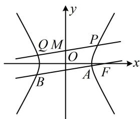
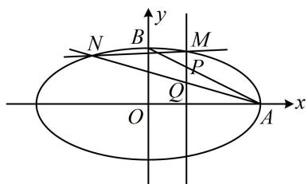
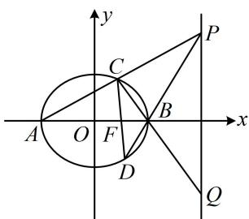

# 内容提要

1. 定值问题主要有证明类定值问题、探究类定值问题两类，解题的一般步骤为：

①设出直线的方程 $y = kx + b$ 或 $x = my + t$ 、点的坐标；  
②通过题干所给的已知条件, 进行正确的运算, 将需要用到的所有中间结果 (如长度、面积、斜率等) 用引入的参数 $(k, t, m, b$ 等) 表示出来;  
③将上述中间结果代入目标量，通过计算化简得出目标量与引入的参数无关，是一个常数.

注：对于探究类定值问题，在参数关系复杂，不好直接正面计算时，可考虑先用特值探路，猜出问题的答案，再进行证明，从而将探究类定值问题转化成证明类定值问题处理.

2. 证明动直线在一定条件下过定点是解析几何中的一类重要题型, 这类问题一般有两种解题方法.

方法1：设直线，求解参数关系．一般的解题步骤为：

①设出直线的方程 $y = kx + b$ 或 $x = my + t$ ;  
②通过题干所给的已知条件，进行正确的运算，找到 $k$ 和 $b, m$ 和 $t$ 的关系，或者解出 $b, t$ 的值；  
③根据②中得出的结果，找出直线过的定点.

方法2：求两点，猜定点，证向量共线．一般的解题步骤为：

①通过题干条件，求出直线上的两个点 $A, B$ 的坐标（含参）；  
②取两个具体的参数值, 分别求出对应的直线 $A B$ , 并求出它们的交点 $P$ , 该点即为直线过的定点;  
③证明 $\overrightarrow{PA}$ 与 $\overrightarrow{PB}$ 共线，得出直线 AB 过定点 P.

注：上面的两个解法中，解法2的计算量通常要大一些，故一般首选解法1.

# 类型I：证明类定值问题

【例1】已知双曲线 $\frac{x^2}{a^2} -\frac{y^2}{b^2} = 1$ 过点 $\left(3,\frac{5}{2}\right)$ 和点 $(4,\sqrt{15})$

(1) 求双曲线的方程;   
(2) 过 $M(0,1)$ 的直线与双曲线交于 $P, Q$ 两点, 过双曲线的右焦点 $F$ 且与 $PQ$ 平行的直线交双曲线于 $A, B$ 两点, 证明: $\frac{|MP| \cdot |MQ|}{|AB|}$ 是定值.

解：（1）将 $\left(3, \frac{5}{2}\right)$ 和 $(4, \sqrt{15})$ 代入双曲线方程可得 $\left\{ \begin{array}{l} \frac{9}{a^2} - \frac{25}{4b^2} = 1 \\ \frac{16}{a^2} - \frac{15}{b^2} = 1 \end{array} \right.$ ，解得： $\left\{ \begin{array}{l} a = 2 \\ b = \sqrt{5} \end{array} \right.$ ，

所以双曲线的方程为 $\frac{x^2}{4} -\frac{y^2}{5} = 1.$

(2) $(|MP|, |MQ|, |AB|$ 都可由弦长公式 $\sqrt{1 + k^2} \cdot |x_1 - x_2|$ 来算，故先设斜率和有关点的坐标）

如图，过 $M$ 的直线要与双曲线交于 $P$ ， $Q$ 两点，其斜率必定存在，设为 $k$

设 $P(x_{1},y_{1})$ ， $Q(x_{2},y_{2})$ ， $A(x_{3},y_{3})$ ， $B(x_4,y_4)$

由弦长公式， $|MP| = \sqrt{1 + k^2}\cdot |0 - x_1| = \sqrt{1 + k^2}\cdot |x_1|$ ， $|MQ| = \sqrt{1 + k^2}\cdot |0 - x_2| = \sqrt{1 + k^2}\cdot |x_2|$

由题意， $AB / / PQ$ ，所以直线 $AB$ 的斜率也为 $k$ ，故 $\left|AB\right| = \sqrt{1 + k^2}\cdot \left|x_3 - x_4\right|$

所以 $\frac{|MP|\cdot|MQ|}{|AB|} = \frac{\sqrt{1 + k^2}\cdot|x_1|\cdot\sqrt{1 + k^2}\cdot|x_2|}{\sqrt{1 + k^2}\cdot|x_3 - x_4|} = \frac{\sqrt{1 + k^2}\cdot|x_1x_2|}{|x_3 - x_4|}$ ①，

(有 $x_{1}x_{2}$ , $\left|x_{3}-x_{4}\right|$ , 故想到联立直线 $PQ$ , $AB$ 与双曲线的方程, 结合韦达定理及其推论来计算它们)

直线 $PQ$ 的方程为 $y = kx + 1$ ，代入 $\frac{x^2}{4} -\frac{y^2}{5} = 1$ 整理得： $(5 - 4k^{2})x^{2} - 8kx - 24 = 0$

因为直线 $PQ$ 与双曲线有2个交点，所以 $\left\{ \begin{array}{l}5 - 4k^2\neq 0\\ \Delta = 64k^2 -4(5 - 4k^2)\cdot (-24) > 0 \end{array} \right.$

解得： $-\frac{\sqrt{6}}{2} < k < \frac{\sqrt{6}}{2}$ 且 $k \neq \pm \frac{\sqrt{5}}{2}$ ，由韦达定理， $x_{1}x_{2} = -\frac{24}{5 - 4k^{2}}$ ②，

双曲线的半焦距 $c = \sqrt{a^2 + b^2} = 3$ ，故其右焦点为 $F(3,0)$

所以直线 $AB$ 的方程为 $y = k(x - 3)$ ，代入 $\frac{x^2}{4} -\frac{y^2}{5} = 1$ 整理得： $(5 - 4k^2)x^2 +24k^2x - 36k^2 -20 = 0$

因为直线 $AB$ 与双曲线有2个交点，所以 $\left\{ \begin{array}{l}5 - 4k^2\neq 0\\ \Delta ' = (24k^2)^2 -4(5 - 4k^2)(-36k^2 -20) = 400(k^2 +1) > 0 \end{array} \right.$

故 $k \neq \pm \frac{\sqrt{5}}{2}$ ，由韦达定理推论， $\left|x_{3} - x_{4}\right| = \frac{\sqrt{\Delta^{\prime}}}{\left|5 - 4k^{2}\right|} = \frac{20\sqrt{k^{2} + 1}}{\left|5 - 4k^{2}\right|}$ ③，

将②③代入①可得 $\frac{|MP|\cdot|MQ|}{|AB|} = \frac{\sqrt{1 + k^2}\cdot|x_1x_2|}{|x_3 - x_4|} = \frac{\sqrt{1 + k^2}\cdot\left[-\frac{24}{5 - 4k^2}\right]}{\frac{20\sqrt{k^2 + 1}}{|5 - 4k^2|}} = \frac{6}{5}$ ，所以 $\frac{|MP|\cdot|MQ|}{|AB|}$ 为定值 $\frac{6}{5}$ .

text_image

y
Q M P
O
x
B A F

【反思】在条件清晰的情况下，直接设变量，正面计算目标量，化简得出目标量为定值即可解决问题.

# 类型 II：探究类定值问题

【例 2】已知抛物线 $C: y^{2} = 2px (0 < p < 3)$ 的焦点为 F，点 $P(1,1)$ ， $\left|PF\right| = \frac{\sqrt{5}}{2}$ .

(1) 求抛物线 C 的方程;

(2) 过点 $\left(-\frac{1}{2}, 0\right)$ 的动直线 $l$ 与 $C$ 交于 $A, B$ 两点, $C$ 上是否存在定点 $M$ 使 $k_{MA} + k_{MB}$ 为定值 (其中 $k_{MA}, k_{MB}$ 分别为直线 $MA, MB$ 的斜率)? 若存在, 求出 $M$ 的坐标; 若不存在, 说明理由.

解：（1）抛物线 C 的焦点为 $F\left(\frac{p}{2},0\right)$ ，由题意， $\left|PF\right|=\sqrt{\left(\frac{p}{2}-1\right)^{2}+(0-1)^{2}}=\frac{\sqrt{5}}{2}$ ，解得：p=1 或 3，
又因为 0 < p < 3，所以 p = 1，故抛物线 C 的方程为 $y^{2} = 2x$ .

(2) (求 $k_{MA}$ 和 $k_{MB}$ 需要 $M, A, B$ 的坐标, 故先设坐标, 表示出 $k_{MA} + k_{MB}$ , 再看怎样计算)

设 $M(x_0,y_0)$ ， $A(x_{1},y_{1})$ ， $B(x_{2},y_{2})$ ，则 $k_{MA} + k_{MB} = \frac{y_1 - y_0}{x_1 - x_0} +\frac{y_2 - y_0}{x_2 - x_0}$ ①，

(式①涉及的变量较多, 注意到 $M$ , $A$ , $B$ 都在抛物线 $C$ 上, 故可利用 $C$ 的方程来将式①消元化简)

因为 $M, A, B$ 在抛物线 $C$ 上，所以 $x_0 = \frac{y_0^2}{2}$ ， $x_1 = \frac{y_1^2}{2}$ ， $x_2 = \frac{y_2^2}{2}$ ，

代入①得 $k_{MA} + k_{MB} = \frac{y_1 - y_0}{\frac{y_1^2}{2} - \frac{y_0^2}{2}} + \frac{y_2 - y_0}{\frac{y_2^2}{2} - \frac{y_0^2}{2}} = \frac{2}{y_1 + y_0} + \frac{2}{y_2 + y_0} = \frac{2(y_1 + y_2 + 2y_0)}{y_1y_2 + y_0(y_1 + y_2) + y_0^2}$ ②，

(式②中有 $y_{1} + y_{2}$ 和 $y_{1}y_{2}$ , 想到设直线 $l$ 的方程, 与抛物线 $C$ 联立, 结合韦达定理计算它们)

因为直线 l 过点 $\left(-\frac{1}{2},0\right)$ ，且与抛物线 C 有 2 个交点，所以 l 不与坐标轴垂直，可设其方程为 $x=my-\frac{1}{2}$ ，代入 $y^{2}=2x$ 消去 x 整理得： $y^{2}-2my+1=0$ ，判别式 $\Delta=(-2m)^{2}-4\times1\times1=4(m^{2}-1)>0$ ，所以 $m^{2}>1$ ，

由韦达定理， $y_{1} + y_{2} = 2m$ ， $y_{1}y_{2} = 1$ ，代入②得 $k_{MA} + k_{MB} = \frac{2(2m + 2y_0)}{1 + y_0 \cdot 2m + y_0^2} = \frac{4m + 4y_0}{2y_0m + y_0^2 + 1}$ ③，

(怎样能使式③为定值, 不随 $m$ 的变化而改变? 把分子、分母看成关于 $m$ 的一次函数, 只需对应系数成比例即可. 举个例子, $\frac{4m+2}{2m+1}$ 不随 $m$ 的变化而改变, 为定值 2 , 原因是 $\frac{4}{2}=\frac{2}{1}$ , 对应系数成比例)

要使式③为定值，应有 $\frac{4}{2y_0} = \frac{4y_0}{y_0^2 + 1}$ ，解得： $y_0 = \pm 1$ ，此时 $x_0 = \frac{y_0^2}{2} = \frac{1}{2}$ ，

当 $y_0 = 1$ 时，代入③得 $k_{MA} + k_{MB} = \frac{4m + 4}{2m + 2} = 2$ ，当 $y_0 = -1$ 时，代入③得 $k_{MA} + k_{MB} = \frac{4m - 4}{-2m + 2} = -2$

所以 $C$ 上存在定点 $M\left(\frac{1}{2}, \pm 1\right)$ ，使 $k_{MA} + k_{MB}$ 为定值.

【反思】对于探究类定值问题，若定值的目标式容易计算，则先计算该式，再分析怎样能使其为定值。常见的定值模型有分式型 $f(m)=\frac{a_{0}+a_{1}m+a_{2}m^{2}+\cdots+a_{n}m^{n}}{b_{0}+b_{1}m+b_{2}m^{2}+\cdots+b_{n}m^{n}}$ 和多项式型 $f(m)=a_{0}+a_{1}m+a_{2}m^{2}+\cdots+a_{n}m^{n}$ 。

对于分式型，要使 $f(m)$ 不随 m 的变化而改变，应有 $\frac{a_{0}}{b_{0}} = \frac{a_{1}}{b_{1}} = \frac{a_{2}}{b_{2}} = \cdots = \frac{a_{n}}{b_{n}} = t$ （这里面如果有系数为 0 的，则另一个对应系数也为 0。例如，若 $b_{2} = 0$ ，则 $a_{2} = 0$ ），且此时 $f(m) = t$ 。

对于多项式型，要使 $f(m)$ 不随 m 的变化而改变，只能 $a_{1}=a_{2}=\cdots=a_{n}=0$ ，且此时 $f(m)=a_{0}$ .

# 类型III：直线过定点问题

【例 3】椭圆 $E: \frac{x^{2}}{a^{2}} + \frac{y^{2}}{b^{2}} = 1 (a > b > 0)$ 的长轴长为 4，由 E 的三个顶点构成的三角形的面积为 2.

(1) 求 E 的方程;

(2) 记 $E$ 的右顶点和上顶点分别为 $A, B$ , 点 $P$ 在线段 $AB$ 上运动, 垂直于 $x$ 轴的直线 $PQ$ 交 $E$ 于点 $M$ (点 $M$ 在第一象限), $P$ 为线段 $QM$ 的中点, 设直线 $AQ$ 与

$E$ 的另一个交点为 $N$ ，证明：直线 $MN$ 过定点.

解：（1）由题意，椭圆 $E$ 的长轴长 $2a = 4$ ，所以 $a = 2$

text_image

N
B
M
P
Q
O
A
x
y

又由椭圆 E 的三个顶点构成的三角形的面积为 2,

所以 $\frac{1}{2} \times 2a \times b = 2$ 或 $\frac{1}{2} \times 2b \times a = 2$ ，化简都得到 $ab = 2$ ，所以 $b = 1$ ，

故椭圆 E 的方程为 $\frac{x^{2}}{4} + y^{2} = 1$ .

(2) 解法 1: (题干点的产生过程较复杂, 我们是直接设直线 $MN$ 的方程, 还是设 $M, N$ 的坐标呢? 既然要证直线 $MN$ 过定点, 后续运算肯定需要 $M, N$ 的坐标, 可以想象, 正面求 $M, N$ 的坐标比较麻烦, 于是考虑先设 $M, N$ 的坐标, 逐步翻译已知条件, 找到两个坐标间的联系)

设 $M(x_{1},y_{1})$ ， $N(x_{2},y_{2})$ ，则直线 $PQ$ 的方程为 $x = x_{1}$ ，由（1）知 $A(2,0)$ ， $B(0,1)$

所以直线 $AB$ 的截距式方程为 $\frac{x}{2} +\frac{y}{1} = 1$ ，与 $x = x_{1}$ 联立解得： $y = 1 - \frac{x_1}{2}$ ，所以 $P\left(x_{1},1 - \frac{x_{1}}{2}\right)$

又 $P$ 为线段 $QM$ 的中点，所以 $x_{Q} = x_{1}$ ，且 $\frac{y_Q + y_1}{2} = 1 - \frac{x_1}{2}$ ，所以 $y_{Q} = 2 - x_{1} - y_{1}$ ，故 $Q(x_{1},2 - x_{1} - y_{1})$

(接下来要用直线 $AQ$ 与椭圆联立求 $N$ 的坐标, 从而建立所设坐标的方程吗? 这样做显然太麻烦, 根据 $A$ , $Q$ , $N$ 三点共线, 翻译为直线 $AQ$ , $AN$ 斜率相等更简单, 且观察图形可发现这里斜率一定存在)

因为 $N$ 是直线 $AQ$ 与椭圆的交点，所以 $A, Q, N$ 三点共线，从而 $k_{AQ} = k_{AN}$ ，故 $\frac{2 - x_1 - y_1}{x_1 - 2} = \frac{y_2}{x_2 - 2}$ ，

所以 $-1 - \frac{y_1}{x_1 - 2} = \frac{y_2}{x_2 - 2}$ 故 $\frac{y_1}{x_1 - 2} +\frac{y_2}{x_2 - 2} = -1$ ①，

(可以想象, 式①关于 $x_{1}$ 和 $x_{2}$ , $y_{1}$ 和 $y_{2}$ 是对称的, 故若设直线 $MN$ 的方程, 并用它消去 $y_{1}$ , $y_{2}$ , 得到的结果关于 $x_{1}$ , $x_{2}$ 必定也是对称的, 于是可联立直线 $MN$ 与椭圆的方程, 用韦达定理处理)

由图可知 $MN$ 斜率存在，可设其方程为 $y = kx + m$ ，则 $\left\{ \begin{array}{l} y_{1} = kx_{1} + m \\ y_{2} = kx_{2} + m \end{array} \right.$ ，代入①得 $\frac{kx_1 + m}{x_1 - 2} + \frac{kx_2 + m}{x_2 - 2} = -1$

所以 $\frac{(kx_1 + m)(x_2 - 2) + (kx_2 + m)(x_1 - 2)}{(x_1 - 2)(x_2 - 2)} = -1$ ，故 $\frac{2kx_1x_2 + (m - 2k)(x_1 + x_2) - 4m}{x_1x_2 - 2(x_1 + x_2) + 4} = -1$ ②，

联立 $\left\{ \begin{array}{l} y = kx + m \\ \frac{x^2}{4} + y^2 = 1 \end{array} \right.$ 消去 $y$ 整理得： $(1 + 4k^2)x^2 + 8kmx + 4m^2 - 4 = 0$

由韦达定理， $x_{1} + x_{2} = -\frac{8km}{1 + 4k^{2}}$ ， $x_{1}x_{2} = \frac{4m^{2} - 4}{1 + 4k^{2}}$ ，代入②得 $\frac{2k\cdot\frac{4m^2 - 4}{1 + 4k^2} + (m - 2k)\cdot\left(-\frac{8km}{1 + 4k^2}\right) - 4m}{\frac{4m^2 - 4}{1 + 4k^2} - 2\left(-\frac{8km}{1 + 4k^2}\right) + 4} = -1$

所以 $\frac{2k(4m^2 - 4) - 8km(m - 2k) - 4m(1 + 4k^2)}{4m^2 - 4 + 16km + 4 + 16k^2} = -1$ ，化简得： $\frac{1}{m + 2k} = 1$ ，所以 $m = 1 - 2k$

所以直线 $MN$ 的方程为 $y = kx + 1 - 2k$ ，即 $y = k(x - 2) + 1$ ，故直线 $MN$ 过定点(2,1).

解法2: (按解法1得到式①后, 看到 $\frac{y_1}{x_1 - 2} + \frac{y_2}{x_2 - 2}$ 这种结构, 想到可利用齐次化思想来算它, 只要联立直线和椭圆时, 刻意化成 $A\left(\frac{y}{x - 2}\right)^2 + B \cdot \frac{y}{x - 2} + C = 0$ 这种形式, 就能直接由韦达定理求 $\frac{y_1}{x_1 - 2} + \frac{y_2}{x_2 - 2}$ , 下面我们按此操作. 注意到我们的目标结构是 $\frac{y}{x - 2}$ , 所以把直线和椭圆方程中的 $x$ 凑成 $x - 2$ )

直线 $y = kx + m$ 可变形成 $y = k(x - 2) + 2k + m$ ，即 $y - k(x - 2) = 2k + m$ ③，

椭圆 $\frac{x^2}{4} + y^2 = 1$ 可变形成 $\frac{[(x - 2) + 2]^2}{4} + y^2 = 1$ ，进一步可化为 $(x - 2)^2 + 4(x - 2) + 4y^2 = 0$ ④，

(此式关于 $x - 2$ 和 $y$ 不齐次, 我们需要把一次项 $4(x - 2)$ 也化为二次的, 怎么化? 可用式③化)

在式④两端乘以 $2k + m$ 可得 $(2k + m)(x - 2)^{2} + 4(2k + m)(x - 2) + 4(2k + m)y^{2} = 0$ ⑤，

(观察发现将式⑤一次项前面的 $2k + m$ 换成 $y - k(x - 2)$ , 就能将式⑤化为关于 $x - 2$ 和 $y$ 的二次齐次式)

结合式③可将式⑤化为 $(2k + m)(x - 2)^{2} + 4[y - k(x - 2)](x - 2) + 4(2k + m)y^{2} = 0$

整理得： $4(2k + m)y^{2} + 4(x - 2)y + (m - 2k)(x - 2)^{2} = 0$

两端同除以 $(x - 2)^{2}$ 可得 $4(2k + m)\left(\frac{y}{x - 2}\right)^{2} + 4\cdot \frac{y}{x - 2} +m - 2k = 0$

因为 $M, N$ 的坐标满足上述方程，所以由韦达定理， $\frac{y_1}{x_1 - 2} +\frac{y_2}{x_2 - 2} = -\frac{1}{2k + m}$

代入式①得 $-\frac{1}{2k + m} = -1$ ，所以 $m = 1 - 2k$ ，从而直线 $MN$ 的方程为 $y = kx + 1 - 2k$ ，即 $y = k(x - 2) + 1$ ，故直线 $MN$ 过定点(2,1).

【反思】当容易设直线的方程处理时，可考虑设直线的方程，翻译已知条件寻找所设直线方程中参数的关系，从而找到直线所过的定点.

【例 4】已知椭圆 $E: \frac{x^{2}}{4} + \frac{y^{2}}{3} = 1$ 的右焦点为 F，左、右顶点分别为 A, B，点 C 在 E 上， $P(4, y_{P})$ ， $Q(4, y_{Q})$ 分别为直线 AC，BC 上的点.

(1) 求 $y_{P}y_{Q}$ 的值;  
（2）设直线 $BP$ 与 $E$ 的另一个交点为 $D$ ，求证：直线 $CD$ 经过 $F$ .

解: (1) (观察发现 $P, Q$ 的横坐标均为 4, 所以可将它们看成直线 $A C$ , $B C$ 与直线 $x = 4$ 的交点, 故可考虑设 $C$ 的坐标, 写出直线 $A C$ , $B C$ 的方程, 与 $x = 4$ 联立求 $P, Q$ 的纵坐标)

由题意， $A(-2,0)$ ， $B(2,0)$ ，设 $C(x_0,y_0)(x_0\neq \pm 2)$ ，则 $AC$ 的方程为 $y = \frac{y_0}{x_0 + 2} (x + 2)$ ，令 $x = 4$ 得 $y_{P} = \frac{6y_{0}}{x_{0} + 2}$ 直线 $BC$ 的方程为 $y = \frac{y_0}{x_0 - 2} (x - 2)$ ，令 $x = 4$ 得 $y_{Q} = \frac{2y_{0}}{x_{0} - 2}$

所以 $y_{P}y_{Q} = \frac{12y_{0}^{2}}{x_{0}^{2} - 4}$ ①，（此式有2个变量，可用椭圆方程消元）

因为点 $C$ 在椭圆 $E$ 上，所以 $\frac{x_0^2}{4} +\frac{y_0^2}{3} = 1$ ，故 $y_{0}^{2} = 3\left(1 - \frac{x_{0}^{2}}{4}\right) = \frac{3}{4} (4 - x_{0}^{2})$ ，代入①得 $y_{P}y_{Q} = -9$

(2) (若用求得的 $P$ 写直线 $PB$ 的方程, 则会有 $x_0$ , $y_0$ 两个变量, 与椭圆联立求点 $D$ 比较难算. 注意到图形可看成 $PA$ , $PB$ 分别与椭圆交于 $C$ , $D$ 两点, 故可考虑设 $P$ 的坐标, 只需设 1 个参数, 用它来写 $PA$ , $PB$ 的方程, 与椭圆联立求 $C$ , $D$ 两点)

设 $P(4,t)$ ，则直线 $PA$ 的方程为 $y = \frac{t}{6} (x + 2)$ ，代入 $\frac{x^2}{4} + \frac{y^2}{3} = 1$ 化简得： $(t^2 + 27)x^2 + 4t^2x + 4t^2 - 108 = 0$ ，

判别式 $\Delta_{1} = (4t^{2})^{2} - 4(t^{2} + 27)(4t^{2} - 108) = 108^{2} > 0$ ，由韦达定理， $x_{A}x_{C} = -2x_{C} = \frac{4t^{2} - 108}{t^{2} + 27}$ ，所以 $x_{C} = \frac{54 - 2t^{2}}{t^{2} + 27}$ $y_{C} = \frac{t}{6} (x_{C} + 2) = \frac{18t}{t^{2} + 27}$ ，故 $C\left(\frac{54 - 2t^2}{t^2 + 27},\frac{18t}{t^2 + 27}\right)$

直线 $PB$ 的方程为 $y = \frac{t}{2} (x - 2)$ ，代入 $\frac{x^2}{4} +\frac{y^2}{3} = 1$ 化简得： $(t^2 +3)x^2 -4t^2 x + 4t^2 -12 = 0$

判别式 $\Delta_{2} = (-4t^{2})^{2} - 4(t^{2} + 3)(4t^{2} - 12) = 144 > 0$ ，由韦达定理， $x_{B}x_{D} = 2x_{D} = \frac{4t^{2} - 12}{t^{2} + 3}$ ，所以 $x_{D} = \frac{2t^{2} - 6}{t^{2} + 3}$

$y_{D} = \frac{t}{2} (x_{D} - 2) = -\frac{6t}{t^{2} + 3}$ 故 $D\left(\frac{2t^2 - 6}{t^2 + 3}, -\frac{6t}{t^2 + 3}\right)$

(要证直线 CD 过点 F，只需证 $\overrightarrow{FC}$ 与 $\overrightarrow{FD}$ 共线，故先求这两个向量的坐

text_image

y
P
C
A O F B x
D
Q

标，再观察它们的倍数关系）

由题意， $F(1,0)$ ，所以 $\overrightarrow{FC} = \left(\frac{27 - 3t^2}{t^2 + 27},\frac{18t}{t^2 + 27}\right)$ ， $\overrightarrow{FD} = \left(\frac{t^2 - 9}{t^2 + 3}, - \frac{6t}{t^2 + 3}\right),$

从而 $\overrightarrow{FD} = -\frac{t^2 + 27}{3(t^2 + 3)}\overrightarrow{FC}$ ，故 $F, C, D$ 三点共线，即直线 $CD$ 过点 $F$ .

【反思】像本题这样不方便设直线 $CD$ 的方程处理时, 可考虑先求出 $C, D$ 两点的坐标, 用特值探路找到直线 $CD$ 过的定点 $F$ , 再用向量法证明 $F, C, D$ 三点共线, 就能得到直线 $CD$ 过定点 $F$ .

# 强化训练

1. (2019·北京卷·★★★☆)

已知椭圆 $C: \frac{x^2}{a^2} + \frac{y^2}{b^2} = 1$ 的右焦点为 $(1,0)$ ，且经过点 $A(0,1)$ 。

(1) 求椭圆 C 的方程;  
（2）设 $O$ 为原点，直线 $l:y = kx + t(t\neq \pm 1)$ 与椭圆 $C$ 交于两个不同点 $P$ ， $Q$ ，直线 $AP$ 与 $x$ 轴交于点 $M$ ，直线 $AQ$ 与 $x$ 轴交于点 $N$ ， $\left|OM\right|\cdot \left|ON\right| = 2$ ，求证：直线 $l$ 经过定点.

2. (2024·吉林模拟·★★★★)

已知椭圆 $C: \frac{x^2}{a^2} + \frac{y^2}{b^2} = 1 (a > b > 0)$ 的离心率为 $\frac{1}{2}$ ，短轴长为 $2\sqrt{3}$ .

(1) 求椭圆 C 的方程;  
（2）过点(1,0)的直线 $l$ 交椭圆 $C$ 于 $A$ ， $B$ 两点，在 $x$ 轴上是否存在定点 $P$ ，使得 $\overrightarrow{PA} \cdot \overrightarrow{PB}$ 为定值？若存在，求出点 $P$ 的坐标和 $\overrightarrow{PA} \cdot \overrightarrow{PB}$ 的值；若不存在，请说明理由.

3. (2024·贵州贵阳模拟·★★★★)

在直角坐标平面内，已知 $A(-2,0)$ ， $B(2,0)$ ，动点 $P$ 满足直线 $PA$ 与直线 $PB$ 斜率之积等于 $-\frac{1}{2}$ ，记动点 $P$ 的轨迹为 $E$ .

(1) 求 E 的方程;  
（2）过直线 $l: x = 4$ 上任意一点 $Q$ 作直线 $QA$ 与 $QB$ ，分别交 $E$ 于 $M, N$ 两点，则直线 $MN$ 是否过定点？若是，求出该点坐标；若不是，说明理由.

4. (2023·全国乙卷·★★★★)

已知椭圆 $C: \frac{y^2}{a^2} + \frac{x^2}{b^2} = 1 (a > b > 0)$ 的离心率为 $\frac{\sqrt{5}}{3}$ ，点 $A(-2,0)$ 在 $C$ 上.

(1) 求 C 的方程;  
(2) 过点 $(-2,3)$ 的直线交 $C$ 于 $P$ , $Q$ 两点, 直线 $AP$ , $AQ$ 与 $y$ 轴的交点分别为 $M$ , $N$ , 证明: 线段 $MN$ 的中点为定点.