# 强化训练

1. (2025·山东模拟·★★)

从 5 名男生和 4 名女生中选出 4 人去参加一项创新大赛，如果 4 人中必须既有男生又有女生，则不同的选法共有 \_\_\_\_ 种.

1. 120

解析：选出的4人既有男生又有女生，有3男1女、2男2女、1男3女三类情况，故据此分类考虑，

若选到3名男生1名女生，则有 $\mathrm{C}_5^3\mathrm{C}_4^1 = 40$ 种选法；

若选到2名男生2名女生，则有 $\mathrm{C}_5^2\mathrm{C}_4^2 = 60$ 种选法；

若选到1名男生3名女生，则有 $\mathrm{C}_5^1\mathrm{C}_4^3 = 20$ 种选法；

由分类加法计数原理，不同的选法有 $40 + 60 + 20 = 120$ 种.

2. (2023·新课标Ⅰ卷·★★)

某学校开设了 4 门体育类选修课和 4 门艺术类选修课，学生需从这 8 门课中选 2 门或 3 门课，并且每类选修课至少选 1 门，则不同的选课方案共有\_\_\_\_种。（用数字作答）

2.64

解析：由于一共可以选2门或3门，所以据此分类，

若选2门，则只能体育类、艺术类各选1门，

有 $C_{4}^{1}C_{4}^{1}=16$ 种选法；

若选3门，则可以体育1门艺术2门，

或体育2门艺术1门，有 $\mathrm{C}_4^1\mathrm{C}_4^2 +\mathrm{C}_4^2\mathrm{C}_4^1 = 48$ 种选法；

由分类加法计数原理，不同的选课方案共有 $16 + 48 = 64$ 种.

3. (2024·九省联考·★★★)

甲、乙、丙等 5 人站成一排，且甲不在两端，乙和丙之间恰有 2 人，则不同排法共有（）

A. 20 种

B. 16 种

C. 12 种

D. 8 种

3. B

解法1：由于乙、丙之间恰有2人，所以乙和丙可以站在第1，4位，也可以站在第2，5位，故可按此分别考虑，

假设有甲、乙、丙、丁、戊五人，若乙、丙站在第1，4位，则乙、丙有 $\mathrm{A}_2^2$ 种排法，排好后如图1，

接下来由于甲不在两端，所以甲只能排在乙、丙之间的两个位置，有 $\mathrm{A}_2^1$ 种排法，排好后如图2，

剩下的丁和戊可以随意站，有 $\mathrm{A}_2^2$ 种排法，所以这一类共有 $\mathrm{A}_2^2\mathrm{A}_2^1\mathrm{A}_2^2 = 8$ 种排法；

同理，当乙、丙站在第2，5位时，也有8种排法，所以不同的排法共有 $8+8=16$ 种.

解法2：由于乙、丙之间恰有2人，所以这2人中必有1人是甲，否则甲会站在两端，与题意不符，故也可先把乙、丙以及他们中间的两人排好，再排最后的剩下的1个人，

假设有甲、乙、丙、丁、戊五人，先把乙、丙两人排好，有 $\mathrm{A}_2^2$ 种排法；再从丁、戊中选1人，和甲一起排到乙丙之间，有 $\mathrm{C}_2^1\mathrm{A}_2^2$ 种排法；最后排剩下的人，可以排在上述4人的左边或右边，有 $\mathrm{A}_2^1$ 种排法；

由分步乘法计数原理，不同的排法共有 $\mathrm{A}_2^2\mathrm{C}_2^1\mathrm{A}_2^2\mathrm{A}_2^1 = 16$ 种.

乙 丙 乙 甲 丙

图1

图2

4. (2023·重庆模拟·★★★)

春节文艺汇演中需要将 $A, B, C, D, E, F$ 六个节目进行排序，若 $A, B$ 两个节目必须相邻，且都不能排在3号位置，则不同的排序方式有\_\_\_\_种.

4. 144

解析：元素必须相邻用捆绑法，先把 $A$ ， $B$ 捆绑在一起，看成一个节目，与其余4个节目一起排列，

由于 $A, B$ 都不能排在3号位置，所以捆绑后 $A, B$ 不能排在如图所示的两个蓝色位置上，

结合 $A$ ， $B$ 内部可交换顺序知 $A$ ， $B$ 的排法有 $\mathrm{A}_3^1\mathrm{A}_2^2$ 种，其余4个节目可随便排，有 $\mathrm{A}_4^4$ 种，

由分步乘法计数原理，不同的排法共有 $\mathrm{A}_3^1\mathrm{A}_2^2\mathrm{A}_4^4 = 144$ 种.

AB

5. (2023·宁夏模拟·★★★)

五声音阶是中国古乐基本音阶，故有成语 “五音不全”，中国古乐中的五声音阶依次为宫、商、角、徵、羽，把这五个音阶排成一列，形成一个音序，若徵、羽两音阶相邻且在宫音阶之后，则可排成不同的音序的种数为\_\_\_\_。（用数字作答）

5. 24

解析：元素必须相邻用捆绑法，先把徵、羽捆绑在一起，看成一个音阶，与其余3个音阶一起排列，如图，有4个位置，由于捆绑后的徵、羽都在宫之后，所以先排它们，从4个位置中任选2个位置即可，有 $\mathrm{C}_4^2$ 种选法，

把宫和徵、羽排到选出的两个位置上去只有1种方法，不能交换，徵、羽内部可交换顺序，有 $\mathrm{A}_2^2$ 种方法，

最后再排商、角，有 $\mathrm{A}_2^2$ 种排法，由分步乘法计数原理，可排成不同的音序的种数为 $C_4^2 A_2^2 A_2^2 = 24$

宫
徵羽
＞不能交换
——

6. (2024·陕西模拟·★★)

亚运会火炬传递，假设某段线路由甲、乙等6人传递，每人传递一棒，且甲不从乙手中接棒，乙不从甲手中接棒，则不同的传递方案共有（）

A. 288 种

B. 360 种

C. 480 种

D. 504 种

6. C

解析：题设条件等价于甲、乙不能相邻，涉及元素不相邻，可考虑用“插空法”排，

第一步：先将除甲、乙外的4人（假设为丙、丁、戊、己）进行排序，共有 $\mathrm{A}_4^4 = 24$ 种排法，不妨设排好后如图，

第二步：将甲、乙插入到4个人形成的5个空位中，共有 $\mathrm{A}_5^2 = 20$ 种排法，

由分步乘法原理，全部的排法共有 $24 \times 20 = 480$ 种.

丙丁戊己

7.（2024·湖南长沙模拟·★★★）

有 4 名男生、3 名女生和 2 个不同的道具（记作 A 和 B）参与一个活动，活动要求：所有人（男生和女生）必须站成一排，女生必须站在一起，并且她们之间按照身高从左到右由高到低的顺序排列（假设女生的身高各不相同）；两个道具 A 和 B 必须被分配给队伍中的两个人（可以是男生，也可以是女生），但这两人不能站在一起。满足上述所有条件的排列方式共有（）

A. 2400 种

B. 3600 种

C. 2880 种

D. 4200种

7. B

解析：可以先把人排好，再安排道具，3名女生站在一起，这是涉及元素相邻的排列，常考虑捆绑法，将3名女生按身高从高到低排列好并看成一个元素，与4名男生一起排列，有 $A_{5}^{5}=120$ 种排法，

再安排道具，道具不能给相邻的两个人，正面分析较难，可考虑间接法，

若不考虑拿到道具的2人是否相邻，则在这7人中选2人拿 $A$ ， $B$ 两种道具，共有 $\mathrm{A}_7^2 = 42$ 种方法，若拿到道具的2人相邻，则有 $6\mathrm{A}_2^2 = 12$ 种方法，所以拿道具的两个人不相邻的情况共有 $42 - 12 = 30$ 种，故满足题意的排列方式共有 $120\times 30 = 3600$ 种.

8. (2024·湖北武汉二调·★★★)

将 3 个相同的红球和 3 个相同的黑球装入三个不同的袋中，每袋均装 2 个球，则不同的装法种数为（）

A. 7

B. 8

C. 9

D. 10

8. A

解法1：假设3个袋子分别为 $A, B, C$ ，不妨从 $A$ 袋出发考虑， $A$ 袋的装法有2个红球、2个黑球、1红1黑三种可能，故分别讨论这三种情况下 $B$ 袋和 $C$ 袋的装法即可，

若 $A$ 袋装2个红球，则 $B$ 袋可装1红1黑，或2个黑球，只要 $B$ 袋装好了，剩下的就装 $C$ 袋，所以这一类共2种装法；同理，若 $A$ 袋装2个黑球，也有2种装法；

若 $A$ 袋装1红1黑，则 $B$ 袋可装2个红球，或2个黑球，或1红1黑， $B$ 袋装好后，剩下的装 $C$ 袋，故这一类共3种装法；由分类加法计数原理，不同的装法共有 $2 + 2 + 3 = 7$ 种.

解法 2: 能否从球的角度来考虑呢? 能, 以 3 个红球为例, 红球至少装入 2 个袋子, 最多装入 3 个袋子, 故据此分类,

若红球装入3个袋子，则必定是每个袋子都装1红1黑，只有1种装法；

若红球装入2个袋子，则3个袋子中红球的个数必定分别为2，1，0，所以红球有 $\mathrm{A}_3^3$ 种装法，只要红球装好了，再把黑球装进来，将每个袋子补足2个球即可，只有1种补法，故这一类共 $\mathrm{A}_3^3 = 6$ 种装法；

由分类加法计数原理，不同的装法共有 $1 + 6 = 7$ 种.

【反思】在将若干元素分配给某几个不同对象的问题中，若元素是相同的，则只需关注每个对象分配的元素个数；若元素不同，那么除了关注每个对象分配几个元素之外，还应考虑分配的是哪几个元素.

9. (2021·全国乙卷·★★★)

将 5 名北京冬奥会志愿者分配到花样滑冰、短道速滑、冰球和冰壶 4 个项目进行培训，每名志愿者只分配到 1 个项目，每个项目至少分配 1 名志愿者，则不同的分配方案共有（）

A. 60 种

B. 120种

C. 240 种

D. 480 种

9. C

解法1：志愿者人数比项目数多，故可先将志愿者进行分组，使组数与项目个数相等，便于安排，

将5名志愿者分成4组，人数设置只能为 $2 + 1 + 1 + 1$ 局部均匀分组，需消序，有 $\frac{\mathrm{C}_5^2\mathrm{C}_3^1\mathrm{C}_2^1\mathrm{C}_1^1}{\mathrm{A}_3^3} = 10$ 种分法，

再将4组志愿者派到4个项目，有 $\mathrm{A}_4^4 = 24$ 种派法，由分步乘法计数原理，不同的分配方案有 $10\times 24 = 240$ 种.

解法2：由于只有1个项目要安排2名志愿者，故也可先把这个项目和安排的人确定下来，再安排其它项目，

从4个项目中选1个，有 $\mathrm{C}_4^1$ 种选法，从5名志愿者中选2名，安排到刚才选出的项目中，有 $\mathrm{C}_5^2$ 种选法，

余下3人和3个项目可随意安排，有 $\mathrm{A}_3^3$ 种方法，由分步乘法计数原理，不同的分配方案共有 $C_4^1 C_5^2 A_3^3 = 240$ 种.

【反思】本题和上一题相比, 不同之处是本题的 5 个人互不相同, 上一题的 8 块巧克力是相同的, 不同元素的分配问题用先分后派, 而相同元素的分配问题, 则直接考虑每个对象分到的个数即可.

10. (2023·全国模拟·★★★)

安排5名学生去3个社区进行志愿者服务，每人只去1个社区，要求每个社区至少安排1名学生，则不同的安排方法有（）

A. 360 种

B. 300 种

C. 150 种

D. 125 种

10. C

解法1：学生人数比社区数多，故可先将学生进行分组，使组数与社区个数相等，便于安排，将5名学生分成3组，按人数构成，有 $3 + 1 + 1$ 和 $2 + 2 + 1$ 两类，

若为 $3 + 1 + 1$ ，则有 $\frac{\mathrm{C}_5^3\mathrm{C}_2^1\mathrm{C}_1^1}{\mathrm{A}_2^2} = 10$ 种分法，

若为 $2 + 2 + 1$ ，则有 $\frac{C_5^2C_3^2C_1^1}{A_2^2} = 15$ 种分法，

所以分组的方法共 $10 + 15 = 25$ 种，分好组后，再把3组学生派到3个社区即可，有 $\mathrm{A}_3^3$ 种不同的派法，

由分步乘法计数原理，不同的安排方法有 $25\mathrm{A}_3^3 = 150$ 种.

解法2：先看 $3 + 1 + 1$ 这一类，可先把3人的社区安排好，

从3个社区中选1个，并从5名学生中选3人安排到该社区，有 $\mathrm{C}_3^1\mathrm{C}_5^3$ 种安排方法，

余下的2人分别安排到剩下的两个社区，有 $\mathrm{A}_2^2$ 种安排方法，所以这一类共 $\mathrm{C}_3^1\mathrm{C}_5^3\mathrm{A}_2^2 = 60$ 种安排方法；

再看 $2 + 2 + 1$ 这一类，有一个社区只安排1人，先把这个社区安排好，从3个社区中选1个，并从5人中选1人安排到该社区，有 $\mathrm{C}_3^1\mathrm{C}_5^1$ 种安排方法，

还剩2个社区（假设剩 $A$ ， $B$ 两个社区），每个安排2人，逐个安排即可，不妨先考虑其中的 $A$ 社区，可从余下4人中选2人，有 $\mathrm{C}_4^2$ 种安排方法，再考虑 $B$ 社区，有 $\mathrm{C}_2^2$ 种安排方法，所以这一类共有 $\mathrm{C}_3^1\mathrm{C}_5^1\mathrm{C}_4^2\mathrm{C}_2^2 = 90$ 种安排方法；

由分类加法计数原理，共有 $60 + 90 = 150$ 种安排方法.

11. (2024·河北邯郸一模·★★★)

在第 33 届夏季奥运会期间，中国中央电视台体育频道在某比赛日安排甲、乙、丙、丁 4 个人参加当天 A, B, C 三个比赛场地的现场报道，且每个场地至少安排一人，甲不在 A 场地的不同安排方法数为（）

A. 32

B. 24

C. 18

D. 12

11. B

解法1： $A$ 场地有特殊要求，可先安排 $A$ 场地， $A$ 场地可能安排1人，也可能2人，故据此分类，

若 $A$ 场地安排1人，该人不能是甲，则 $A$ 场地有 $\mathrm{C}_3^1$ 种安排方法，还剩 $B$ ， $C$ 两个场地，从中选一个安排2人，有 $\mathrm{C}_2^1\mathrm{C}_3^2$ 种安排方法，最后的1个人安排到剩下的场地，只有1种方法，所以这一类共 $\mathrm{C}_3^1\mathrm{C}_2^1\mathrm{C}_3^2 = 18$ 种安排方法；

若 $A$ 场地安排2人，则 $A$ 场地有 $\mathrm{C}_3^2$ 种安排方法，剩下2人安排到剩下的两个场地，有 $\mathrm{A}_2^2$ 种安排方法，

所以这一类共 $C_3^2 A_2^2 = 6$ 种安排方法；由分类加法计数原理，满足题意的安排方法共有 $18 + 6 = 24$ 种.

解法2：4个人安排到3个场地，每个场地至少1人，则必定有2人去同一场地，可先把4人分成3组，再作安排，

从4人中任选2人作为一组，有 $C_4^2$ 种选法，余下2人各自作为一组，分组就完成了，

由于甲不在 $A$ 场地，所以甲所在的组可以安排到 $B$ 或 $C$ 场地，有 $\mathrm{C}_2^1$ 种安排方法，

剩下的两组人员可随意安排，有 $\mathrm{A}_2^2$ 种安排方法，由分步乘法计数原理，满足题意的安排方法共有 $\mathrm{C}_4^2\mathrm{C}_2^1\mathrm{A}_2^2 = 24$ 种.

12. (2023·全国模拟·★★☆)

由数字 0, 1, 2, 3, 4, 5, 6, 7 组成没有重复数字的三位数，则能被 5 整除的三位数共有 \_\_\_\_ 个.

12. 78

解析：要能被5整除，最低位必须是0或5，两种情况对最高位的安排影响不同，故应分类考虑最低位，

①若最低位为0，则百位和十位可随便安排，有 $A_{7}^{2}=42$ 种；

② 若最低位为 5，则百位不能排 0 或 5，有 $A_{6}^{1}$ 种，十位不能排已用的 2 个数字，有 $A_{6}^{1}$ 种，共 $A_{6}^{1}A_{6}^{1}=36$ 种；

综上所述，能被5整除的三位数共有 $42 + 36 = 78$ 个.

13. (2024·山东济南模拟·★★★)

由0，1，2，3，4，5组成没有重复数字的六位数，其中任意两个偶数都不相邻，则满足条件的六位数的个数为（）

A. 60

B. 108

C. 132

D. 144

13. B

解析：涉及元素不相邻，考虑用插空法，如图1，先把3个奇数数字排好，有 $\mathrm{A}_3^3$ 种排法，排好后产生4个空位，

将剩下的0，2，4三个偶数数字插到这4个空位中，需注意，0不能在最高位，所以先把0插空，有3个空位可选，所以0的排法有 $\mathrm{A}_3^1$ 种，0排好后如图2，剩下的数字2和4可从余下的3个空位中任选2个插空，有 $\mathrm{A}_3^2$ 种插法，

由分步乘法计数原理，满足条件的六位数共有 $\mathrm{A}_3^3\mathrm{A}_3^1\mathrm{A}_3^2 =$

108个.

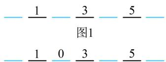

text_image

— 1 — 3 — 5 —
图1
— 1 0 3 — 5 —

图2

14. (2022·广东广州模拟·★★★)

用数字 0, 1, 2, 3, 4, 5 可以组成没有重复数字，且比 20000 大的五位偶数共 \_\_\_\_ 个.

14. 240

解析：要求排出的数比 20000 大，我们知道最高位的数字对数的大小影响最大，故先排最高位，可以是 2, 3, 4, 5，且最高位排奇数、偶数对最低位的影响不同，应分类，

①若最高位为2或4，则最高位有 $\mathrm{A}_2^1$ 种排法，且排出的数字必定比20000大，再考虑最低位，偶数数字已用掉1个，还剩2个，任选1个排到最低位即可，有 $\mathrm{A}_2^1$ 种排法，其余三个位置可随意排，数字还剩4个，所以有 $\mathrm{A}_4^3$ 种排法，故这一类共有 $\mathrm{A}_2^1\mathrm{A}_2^1\mathrm{A}_4^3 = 96$ 种；

② 若最高位为 3 或 5，则最高位有 $A_{2}^{1}$ 种排法，且排出的数字必定比 20000 大，再考虑最低位，可排 0，2，4 中的任意一个数字，有 $A_{3}^{1}$ 种排法，其余三个位置可随意排，数字还剩 4 个，有 $A_{4}^{3}$ 种排法，故这一类共有 $A_{2}^{1}A_{3}^{1}A_{4}^{3}=144$ 种；

综上所述，比20000大的五位偶数共 $96+144=240$ 个.

15. (2023·天津和平三模·★★★)

如图，现要用 5 种不同的颜色对某市的 4 个区县的地图进行涂色，要求有公共边的两个地区不能用同一种颜色，共有 \_\_\_\_ 种不同的涂色方法.

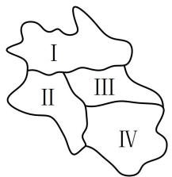

text_image

I
II III
IV

15. 180

解析：涂色问题用“跳格分类”处理，观察地图发现I和IV属跳格，故讨论它们同色和不同色两种情况，

不妨将5种颜色记作①，②，③，④，⑤，若I和IV同色，则它们有 $C_{5}^{1}$ 种涂法，涂好后如图1，再涂Ⅱ，有 $C_{4}^{1}$ 种涂法，涂好后如图2，最后的Ⅲ有 $C_{3}^{1}$ 种涂法，所以这一类共有 $C_{5}^{1}C_{4}^{1}C_{3}^{1}=60$ 种涂法；

若I和IV不同色，则它们有 $\mathrm{A}_5^2$ 种涂法，涂好后如图3，再涂II，有 $\mathrm{C}_3^1$ 种涂法，涂好后如图4，最后的III有 $\mathrm{C}_2^1$ 种涂法，所以这一类共有 $\mathrm{A}_5^2\mathrm{C}_3^1\mathrm{C}_2^1 = 120$ 种涂法；

综上所述，全部的涂法共有 $60 + 120 = 180$ 种.

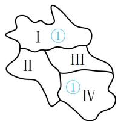  
图1

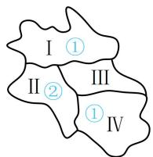  
图2

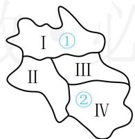

text_image

I ①
II III
② IV

图3

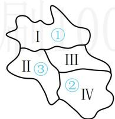

text_image

I ①
II ③ III
② IV

图4

16. (2023·广东珠海模拟·★★★)

五一期间，某公园准备用不同的花卉装扮一个有五个区域的矩形花坛（如图），要求同一个区域用同一种花卉，相邻区域不能使用同种花卉，现有 5 种花卉可供选择，则不同的装扮方法共有\_\_\_\_种。（用数字作答）

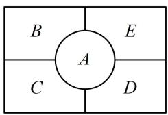

text_image

B
A
E
C
D

16. 420

解析：注意到 $A$ 与 $B, C, D, E$ 都相邻，所以先装扮 $A, A$ 用过的，其它几块都不能用了，

记五种不同的花卉分别为①，②，③，④，⑤，由题意，A有 $C_{5}^{1}$ 种装扮方法，再来看B，C，D，E，此时可用“跳格分类”

处理，B，D 属跳格，不妨对它们分类，

若 B, D 装扮相同的花卉，则 B, D 有 $C_{4}^{1}$ 种，

如图1，接下来 $C$ ， $E$ 各自有 $\mathrm{C}_3^1$ 种装扮方法，

所以这一类共有 $\mathrm{C}_5^1\mathrm{C}_4^1\mathrm{C}_3^1\mathrm{C}_3^1 = 180$ 种装扮方法；

若 B, D 装扮不同的花卉，则 B, D 有 $A_{4}^{2}$ 种，

如图2，接下来 $C$ ， $E$ 各自有 $\mathrm{C}_2^1$ 种装扮方法，

所以这一类共有 $\mathrm{C}_5^1\mathrm{A}_4^2\mathrm{C}_2^1\mathrm{C}_2^1 = 240$ 种装扮方法；

综上所述，不同的装扮方法共有 $180 + 240 = 420$ 种.

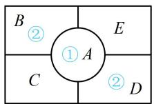  
图1

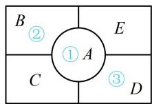  
图2

# 17. (2022·重庆模拟·★★★★)

某地高考规定每一考场安排24名考生，编成六行四列就座，若甲乙两位考生在同一考场，那么他们既不前后相邻，也不左右相邻的坐法有\_\_\_\_种.

# 17. 476

解析：可先安排甲的座位，再看乙有几种坐法，按照与之相邻的座位个数，可把位置分三类，

① 若甲坐在四个角落，则甲有 $\mathrm{A}_4^1$ 种坐法，如图1，甲坐好后，乙有3个位置不能坐（含甲已坐的位置），所以乙有 $\mathrm{A}_{21}^{1}$ 种坐法，故这一类有 $\mathrm{A}_4^1\mathrm{A}_{21}^1 = 84$ 种；  
② 若甲坐考场外围除去四个角落的位置，则甲有 $\mathrm{A}_{12}^{1}$ 种坐法，如图2，甲坐好后，乙有4个位置不能坐（含甲已坐的位置），所以乙有 $\mathrm{A}_{20}^{1}$ 种坐法，故这一类有 $\mathrm{A}_{12}^{1}\mathrm{A}_{20}^{1} = 240$ 种；  
③若甲坐中间的这些位置，则甲有 $\mathrm{A}_8^1$ 种坐法，如图3，甲坐好后，乙有5个位置不能坐（含甲已坐的位置），所以乙有 $\mathrm{A}_{19}^{1}$ 种坐法，故这一类有 $\mathrm{A}_8^1\mathrm{A}_{19}^1 = 152$ 种；

由分类加法计数原理，满足题意的坐法共有 $84 + 240 + 152 = 476$ 种.

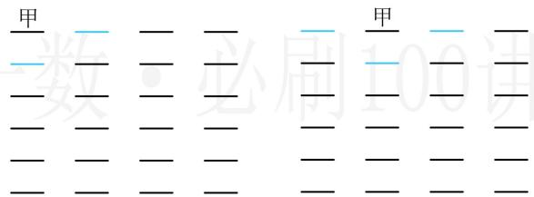

text_image

甲
一
二
三
四
五
六
七
八
九
十
十一
十二
十三
十四
十五
十六
十七
十八
十九
二十
二十一
二十二
二十三
二十四
二十五
二十六
二十七
二十八
二十九
三十
三十一
三十二
三十三
三十四
三十五
三十六
三十七
三十八
三十九
四十
四十一
四十二
四十三
四十四
四十五
四十六
四十七
四十八
四十九
五十
五十一
五十二
五十三
五十四
五十五
五十六
五十七
五十八
五十九
六十
七十一
七十二
七十三
七十四
七十五
七十六
七十七
七十八
七十九
八十
九十一
九十二
九十三
九十四
九十五
九十六
九十七
九十八
九十九
一百

图1  
图2

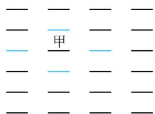

text_image

甲

图3