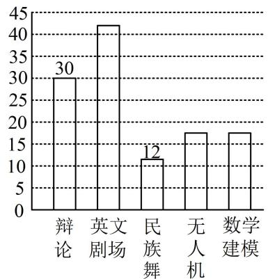
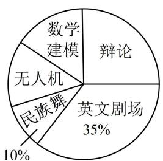

# 强化训练

1. (2023·四川成都模拟·★)

某校为了解高二学生的身高情况，打算在高二年级12个班中抽取3个班，再到每个班抽取一定数量的男生和女生作为样本，正确的抽样方法是（）

A. 简单随机抽样   
B. 先用分层抽样，再用随机数法  
C. 分层抽样  
D. 先用抽签法，再用分层抽样

1. D

解析：12个班彼此之间的差异较小，且班数不多，宜采用简单随机抽样抽取3个班，可用抽签法；在班内抽取时，由于男生和女生身高差异一般较大，为了提高样本的代表性，可考虑用按比例分配的分层抽样，故选D.

2. (2023·山东青岛模拟·★)

若某校高二年级共有学生 1000 人，其中男生 480 人，按性别进行分层，用分层随机抽样的方法从高二全体学生中抽取一个样本量为 50 的样本，若样本按比例分配，则女生应抽取的人数为 \_\_\_\_.

2. 26

解析：因为是按比例分层抽取，所以可利用女生层的抽取率等于总体的抽取率来建立方程，

设女生应抽取 $x$ 人，则 $\frac{x}{1000 - 480} = \frac{50}{1000}$ ，解得： $x = 26$ 。

3. (2023·江西模拟·★)

我国古代数学名著《九章算术》中有一抽样问题：“今有北乡若干人，西乡四百人，南乡两百人，凡三乡，发役六十人，而北向需遗十，问北乡人数几何？”其意思为：今有某地北面若干人，西面有400人，南面有200人，这三面要征调60人，而北面共征调10人（用按比例分配的分层抽样法），则北面共有（）人。

A. 200 B. 100 C. 120 D. 140

3. C

解析：设北面共 $x$ 人，则 $\frac{10}{x} = \frac{60}{x + 400 + 200}$

解得：x=120，所以北面共有120人.

4. (2023·新课标Ⅱ卷·★☆)

某学校为了解学生参加体育运动的情况，用比例分配的分层随机抽样作抽样调查，拟从初中部和高中部两层共抽取60名学生，已知该校初中部和高中部分别有400名和200名学生，则不同的抽样结果共有（）

A. $\mathrm{C}_{400}^{45}\cdot \mathrm{C}_{200}^{15}$ 种 B. $\mathrm{C}_{400}^{20}\cdot \mathrm{C}_{200}^{40}$ 种  
C. $C_{400}^{30} \cdot C_{200}^{30}$ 种 D. $C_{400}^{40} \cdot C_{200}^{20}$ 种

4. D

解析：应先找到两层中各抽多少人，因为是比例分配的分层抽取，故各层的抽取率都等于总体的抽取率，

设初中部抽取 $x$ 人，则 $\frac{x}{400} = \frac{60}{400 + 200}$

解得： $x = 40$ ，所以初中部抽40人，高中部抽20人，

故不同的抽样结果共有 $\mathrm{C}_{400}^{40}\cdot \mathrm{C}_{200}^{20}$ 种.

5.（2022·湖北襄阳模拟·★★）

有甲、乙两种产品共 120 件，现用按比例分配的分层随机抽样方法抽取 10 件进行产品质量调查，若抽取的甲产品比乙产品的 2 倍还多 1 件，那么甲产品共有\_\_\_\_件，抽取的乙产品有\_\_\_\_件.

5. 84, 3

解析：因为是按比例分层抽取，所以可由各层的抽取率相等来建立方程求解需要的量，

设抽取乙产品 $x$ 件，甲产品共有 $y$ 件，则抽取甲产品 $2x + 1$ 件，乙产品共有 $120 - y$ 件，

由题意， $\left\{\begin{aligned}x+(2x+1)=10\\\frac{x}{120-y}=\frac{2x+1}{y}\end{aligned}\right.$ ，解得：x=3，y=84，

所以甲产品共有84件，抽取的乙产品有3件.

6. (2022·黑龙江哈尔滨模拟·★★)

某企业三月中旬生产 $A, B, C$ 三种产品共 3000 件，根据按比例分配的分层抽样方法抽取了一个样本，企业统计员制作了如下的统计表格（如下表），由于不小心，表格中 $A, C$ 产品的有关数据已被污染看不清，统计员记得 $A$ 产品的样本量比 $C$ 产品的样本量多 10，根据以上信息，可以推断 $C$ 产品的数量是 \_\_\_\_ 件.

<table><tr><td>产品类别</td><td>A</td><td>B</td><td>C</td></tr><tr><td>产品数量/件</td><td></td><td>1500</td><td></td></tr><tr><td>样本量/件</td><td></td><td>150</td><td></td></tr></table>

6. 700

解析：因为是按比例分层抽取，所以可由各层的抽取率相等来建立方程，

设 $C$ 产品共有 $x$ 件，抽取了 $y$ 件，则 $A$ 产品共有

$3000 - x - 1500 = 1500 - x$ 件，抽取了 $y + 10$ 件，

所以 $\frac{y + 10}{1500 - x} = \frac{150}{1500} = \frac{y}{x}$ ，解得： $x = 700$ ， $y = 70$ ，

所以 C 产品的数量是 700 件.

7.（2023·广东模拟·★★）（多选）

某学校组建了辩论、英文剧场、民族舞、无人机和数学建模五个社团，高一学生全员参加，且每位学生只能参加一个社团。学校根据学生参加情况绘制如下统计图，已知无人机社团和数学建模社团的人数相等。下列说法正确的是（）

A. 高一年级学生人数为 $120$ 人  
B. 无人机社团的学生人数为 17 人  
C. 若按比例分层抽样从各社团选派 20 人, 则无人机社团选派人数为 3 人  
D. 若甲、乙、丙三人报名参加社团，则共有60种不同的报名方法

bar

| 类别 | 数值 |
|---|---|
| 辩论 | 30 |
| 英文剧场 | 42 |
| 民族舞 | 12 |
| 无人机 | 18 |
| 数学建模 | 18 |

pie

| 类别 | 占比 (%) |
|---|---|
| 辩论 | 35 |
| 英文剧场 | 35 |
| 民族舞 | 10 |
| 无人机 | 0 |
| 数学建模 | 0 |

7. AC

解析：A 项，条形图中有辩论和民族舞的人数，饼状图中有民族舞和英文剧场的百分比，于是民族舞既有人数，又有百分比，可由此求出高一年级学生总人数，

设高一年级学生总人数为 $a$ ，则 $a \times 10\% = 12$

解得： $a = 120$ ，故A项正确；

B 项, 已知总人数, 且无人机和数学建模人数相同, 故只要由饼状图求出英文剧场的人数, 就能得到无人机社团的人数, 由饼状图可知英文剧场的占 $35 \%$ ，有 $120 \times 35 \% = 42$ 人, 所以无人机社团的人数有 $\frac{120 - 30 - 42 - 12}{2} = 18$ 人, 故 B 项错误;

C项, 按比例分配的分层抽样, 抓住各层抽取率相等, 且都等于总体的抽取率建立方程即可, 设无人机社团选派 $x$ 人, 则 $\frac{x}{18} = \frac{20}{120}$ , 解得: $x = 3$ , 故 C 项正确;

D 项，甲、乙、丙每人都可从 5 个社团任选 1 个报名，所以三人共有 $5 \times 5 \times 5 = 125$ 种不同的报名方法，故 D 项错误.

8. (2023·辽宁模拟·★★)

为庆祝中国共产主义青年团成立100周年，某高中团委举办了共青团史知识竞赛（满分100分），其中高一、高二、高三年级参赛的共青团员的人数分别为800，600，600，现用按比例分配的分层随机抽样方法从三个年级中抽取样本，经计算可得高一、高二年级共青团员成绩的样本平均数分别为85，90，全校共青团员成绩的样本平均数为88，则高三年级共青团员成绩的样本平均数为（）

A. 87

B. 89

C. 90

D. 91

8. C

解析：因为不知道总样本量，所以设一个参数，同时把要求的量也设出来，由题意，可设高一、高二、高三的样本量分别为 $4a, 3a, 3a$ ，设高三年级的样本平均数为 $x$ ，

则 $\frac{4a\cdot 85 + 3a\cdot 90 + 3ax}{4a + 3a + 3a} = 88$ ，解得： $x = 90$

所以高三年级共青团员成绩的样本平均数为90.