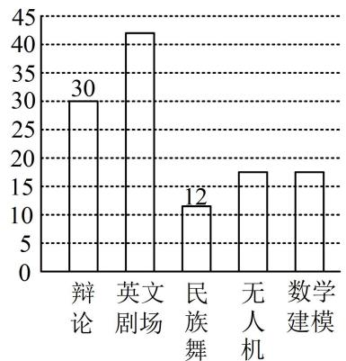
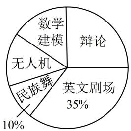

# 模块一 统计

# 第1节 抽样（★☆）

# 内容提要

高中数学中需掌握的抽样方法有简单随机抽样、分层随机抽样两种.

1. 简单随机抽样：简单随机抽样常用抽签法、随机数法来实现，它有方法简单、直观等特点，是一种基本的抽样方法。但当总体很大时，操作起来不方便，且简单随机抽样没有利用其它辅助信息，估计效率往往不高。  
2. 分层随机抽样: 在个体差异较大的情形下, 只要选取的分层变量合适, 使得各层间差异明显、层内差异不大, 分层随机抽样的效果一般会好于简单随机抽样, 且分层随机抽样除了能得到总体的估计外, 还能得到每层的估计.

3. 两种抽样估计总体平均数的方法

①简单随机抽样：从总体中用简单随机抽样抽取一个容量为 n 的样本，它们的变量值分别为 $y_{1}, y_{2}, \cdots, y_{n}$ ，则称 $\overline{y} = \frac{y_{1} + y_{2} + \cdots + y_{n}}{n}$ 为样本均值，又称样本平均数，我们常用样本平均数 $\overline{y}$ 去估计总体平均数.

②分层随机抽样：核心方法是用样本中各层的平均数估计总体中各层的平均数.

以将总体分2层为例，设第1层各个个体的变量值分别为 $X_{1},X_{2},\cdots,X_{M}$ ，从第1层中抽取的样本的变量值分别为 $x_{1},x_{2},\cdots,x_{m}$ ，则可用第1层的样本平均数 $\overline{x}=\frac{x_{1}+x_{2}+\cdots+x_{m}}{m}$ 来估计第1层的总体平均数 $\overline{X}=\frac{X_{1}+X_{2}+\cdots+X_{M}}{M}$ .

同理，设第2层的各个个体的变量值分别为 $Y_{1}, Y_{2}, \cdots, Y_{N}$ ，从第2层中抽取的样本的变量值分别为 $y_{1}, y_{2}, \cdots, y_{n}$ ，则可用第2层的样本平均数 $\overline{y} = \frac{y_{1} + y_{2} + \cdots + y_{n}}{n}$ 来估计第2层的总体平均数 $\overline{Y} = \frac{Y_{1} + Y_{2} + \cdots + Y_{N}}{N}$ .

所以总体的平均数的估计值为 $\frac{M\cdot\overline{x} + N\cdot\overline{y}}{M + N} = \frac{M}{M + N}\overline{x} +\frac{N}{M + N}\overline{y}.$

在按比例分配的分层随机抽样中， $\frac{m}{M} = \frac{n}{N} = \frac{m + n}{M + N}$ ，所以 $\frac{M}{M + N} = \frac{m}{m + n}$ ， $\frac{N}{M + N} = \frac{n}{m + n}$ ，从而 $\frac{M}{M + N}\overline{x} + \frac{N}{M + N}\overline{y} = \frac{m}{m + n}\overline{x} + \frac{n}{m + n}\overline{y}$ ，其中 $\frac{m}{m + n}\overline{x} + \frac{n}{m + n}\overline{y}$ 即为总样本平均数，故可直接用总样本平均数估计总体平均数.

# 类型 I：抽样方法的选择

【例 1】现要完成下列两项抽样调查：①从 20 盒饼干中抽取 4 盒进行食品卫生检查；②某中学有 360 名教职工，其中一般教师 280 名，行政人员 55 名，后勤人员 25 名，为了了解教职工对学校在校务公开方面的意见，拟抽取一个样本量为 72 的样本；较为合理的抽样方法是（）

A. ①简单随机抽样，②分层抽样

B. ①简单随机抽样，②简单随机抽样

C. ①分层抽样，②分层抽样

D. ①分层抽样，②简单随机抽样

解析：①总体个体数较少，采用简单随机抽样；②总体是由差异明显的几部分组成，采用分层抽样.

答案: A

【例 2】某班有男生 20 人，女生 30 人，从中抽取 10 人为样本，恰好抽到了 4 名男生和 6 名女生，则下列说法正确的是（）

A. 该抽样可能是比例分配的分层随机抽样  
B. 该抽样必定是比例分配的分层随机抽样  
C. 该抽样一定不是用随机数法  
D. 该抽样中每个女生被抽到的概率大于每个男生被抽到的概率

解析：A 项，可由总体中男女比例计算样本中应抽取的男生、女生人数，看是否与抽样结果吻合，若是比例分配的分层随机抽样，则男生应抽取 $10 \times \frac{20}{20 + 30} = 4$ 人，女生应抽取 $10 \times \frac{30}{20 + 30} = 6$ 人，与题干所给抽样结果吻合，故 A 项正确；

B 项，简单随机抽样也可能获得 4 男 6 女的样本，故 B 项错误；

C 项，用随机数法有可能抽到 4 名男生和 6 名女生，故 C 项错误；

D 项，若用的是简单随机抽样，则每个个体被抽到的概率相等，故 D 项错误.

答案: A

# 类型Ⅱ：分层随机抽样中抽取个数的计算

【例 3】一支田径队有运动员 98 人, 其中男运动员 56 人, 按男女比例用分层随机抽样, 从全体运动员中抽取一个样本量为 42 的样本, 那么应抽取女运动员的人数是 \_\_\_\_.

解析：按比例分层抽取，只需抓住各层的抽取率相等且都等于总体的抽取率来建立方程即可，由题意，女运动员有 $98 - 56 = 42$ 人，设抽取女运动员 $x$ 人，则 $\frac{x}{42} = \frac{42}{98}$ ，解得： $x = 18$ .

答案: 18

【变式 1】为了贯彻落实中央新疆工作座谈会和全国对口支援新疆工作会议精神，促进新疆教育事业发展，要从甲、乙、丙三个城市选取 300 名教师支援新疆的教育事业。已知乙城市教师人数有 18600 人，丙城市教师人数有 41400 人，若用按比例分配的分层随机抽样方法，甲城市需要选派 100 人，那么甲城市总共的教师人数为（）

A. 10000

B. 20000

C. 24000

D. 30000

解析：因为是比例分配，所以甲城市的抽取率应等于三个城市教师总体的抽取率，可由此建立方程，设甲城市的教师总人数为 $x$ ，则 $\frac{100}{x} = \frac{300}{x + 18600 + 41400}$ ，解得： $x = 30000$ ：

答案: D

【变式2】某中学有高中生1800人，初中生1200人，为了解学生的课外锻炼情况，用按比例分配的分层随机抽样方法从学生中抽取一个样本量为 $n$ 的样本，已知从高中生中抽取的人数比从初中生中抽取的人数多24，则 $n = (\quad)$

A. 48

B. 72

C. 60

D. 120

解析：因为是按比例分层抽取，所以初中和高中两层的抽取率相等，可由此建立方程，

设从初中生中抽取 $x$ 人，则 $\frac{x}{1200} = \frac{x + 24}{1800}$ ，解得： $x = 48$ ，所以 $n = x + (x + 24) = 120$ 。

答案: D

【总结】在按比例分配的分层随机抽样中，涉及抽取个数的有关计算问题，往往抓住各层的抽取率相等且等于总体的抽取率来建立方程并求解.

# 类型III：总体平均数的估计

【例 4】（多选）现有同类型的 A, B 两种产品 1000 件，其中 A 产品 400 件，B 产品 600 件，为了调查这 1000 件产品的质量指标值，用分层随机抽样的方法得到了一个样本，样本中 A 产品和 B 产品质量指标值的平均数分别为 84 和 90，则下列说法正确的是（）

A. 若是按比例分配分层抽取, 且样本量是 100 , 则 $A$ 产品抽取了 40 件  
B. 若是按比例分配分层抽取, 则可估计 1000 件产品的质量指标值为 87.6  
C. 若 $A, B$ 产品分别抽取了 20 件和 80 件, 则可估计 1000 件产品的质量指标值为 88.8  
D. 若 $A, B$ 产品分别抽取了20件和80件，则可估计1000件产品的质量指标值为87.6

解析：A项，若按比例分配，则 $A$ 产品抽取的件数为 $100 \times \frac{400}{400 + 600} = 40$ ，故A项正确；

B项，按比例分配的分层随机抽样中，可用样本平均数估计总体平均数，

设样本量为 $a$ ，则 $A$ 产品抽取了 $\frac{400}{1000} a = \frac{2a}{5}$ 件， $B$ 产品抽取了 $\frac{600}{1000} a = \frac{3a}{5}$ 件，

所以样本平均数为 $\frac{\frac{2a}{5} \times 84 + \frac{3a}{5} \times 90}{a} = 87.6$ ，可估计1000件产品的质量指标值为87.6，故B项正确；

C 项, 不是比例分配, 不能用样本平均数估计总体平均数, 应该用样本中各层的平均数估计总体中各层的平均数, 若 $A$ , $B$ 产品分别抽取 20 件和 80 件, 则可用 $A$ 产品的样本平均数估计 $A$ 产品的总体平均数, 用 $B$ 产品的样本平均数估计 $B$ 产品的总体平均数, 所以总体平均数的估计值为 $\frac{400 \times 84 + 600 \times 90}{1000} = 87.6$ , 故 C 项错误, D 项正确.

答案: ABD

【总结】对于分层随机抽样, 若是按比例抽取, 则可用总样本的平均数估计总体的平均数; 若不是按比例抽取,则常用样本中各层的平均数来估计总体中各层的平均数, 再计算总体的平均数.

# 强化训练

1. (2023·四川成都模拟·★)

某校为了解高二学生的身高情况，打算在高二年级12个班中抽取3个班，再到每个班抽取一定数量的男生和女生作为样本，正确的抽样方法是（）

A. 简单随机抽样   
B. 先用分层抽样，再用随机数法  
C. 分层抽样  
D. 先用抽签法，再用分层抽样

2. (2023·山东青岛模拟·★)

若某校高二年级共有学生 1000 人, 其中男生 480 人, 按性别进行分层, 用分层随机抽样的方法从高二全体学生中抽取一个样本量为 50 的样本, 若样本按比例分配, 则女生应抽取的人数为 \_\_\_\_.

3. (2023·江西模拟·★)

我国古代数学名著《九章算术》中有一抽样问题：“今有北乡若干人，西乡四百人，南乡两百人，凡三乡，发役六十人，而北向需遗十，问北乡人数几何？”其意思为：今有某地北面若干人，西面有400人，南面有200人，这三面要征调60人，而北面共征调10人（用按比例分配的分层抽样法），则北面共有（）人.

A. 200 B. 100 C. 120 D. 140

4. (2023·新课标Ⅱ卷·★☆)

某学校为了解学生参加体育运动的情况，用比例分配的分层随机抽样作抽样调查，拟从初中部和高中部两层共抽取60名学生，已知该校初中部和高中部分别有400名和200名学生，则不同的抽样结果共有（）

A. $\mathrm{C}_{400}^{45}\cdot \mathrm{C}_{200}^{15}$ 种 B. $\mathrm{C}_{400}^{20}\cdot \mathrm{C}_{200}^{40}$ 种  
C. $\mathrm{C}_{400}^{30}\cdot \mathrm{C}_{200}^{30}$ 种 D. $\mathrm{C}_{400}^{40}\cdot \mathrm{C}_{200}^{20}$ 种

5. (2022·湖北襄阳模拟·★★)

有甲、乙两种产品共 120 件，现用按比例分配的分层随机抽样方法抽取 10 件进行产品质量调查，若抽取的甲产品比乙产品的 2 倍还多 1 件，那么甲产品共有\_\_\_\_件，抽取的乙产品有\_\_\_\_件.

6. (2022·黑龙江哈尔滨模拟·★★)

某企业三月中旬生产 $A, B, C$ 三种产品共 3000 件，根据按比例分配的分层抽样方法抽取了一个样本，企业统计员制作了如下的统计表格（如下表），由于不小心，表格中 $A, C$ 产品的有关数据已被污染看不清，统计员记得 $A$ 产品的样本量比 $C$ 产品的样本量多 10，根据以上信息，可以推断 $C$ 产品的数量是 \_\_\_\_ 件.

<table><tr><td>产品类别</td><td>A</td><td>B</td><td>C</td></tr><tr><td>产品数量/件</td><td></td><td>1500</td><td></td></tr><tr><td>样本量/件</td><td></td><td>150</td><td></td></tr></table>

7.（2023·广东模拟·★★）（多选）

某学校组建了辩论、英文剧场、民族舞、无人机和数学建模五个社团，高一学生全员参加，且每位学生只能参加一个社团。学校根据学生参加情况绘制如下统计图，已知无人机社团和数学建模社团的人数相等。下列说法正确的是（）

A. 高一年级学生人数为 $120$ 人  
B. 无人机社团的学生人数为 17 人  
C. 若按比例分层抽样从各社团选派 20 人, 则无人机社团选派人数为 3 人  
D. 若甲、乙、丙三人报名参加社团，则共有 60 种不同的报名方法

bar

| 类别 | 数值 |
|---|---|
| 辩论 | 30 |
| 英文剧场 | 42 |
| 民族舞 | 12 |
| 无人机 | 18 |
| 数学建模 | 18 |

pie

| 类别 | 占比 (%) |
|---|---|
| 辩论 | 35 |
| 英文剧场 | 35 |
| 民族舞 | 10 |
| 无人机 | 0 |
| 数学建模 | 0 |

8. (2023·辽宁模拟·★★)

为庆祝中国共产主义青年团成立100周年，某高中团委举办了共青团史知识竞赛（满分100分），其中高一、高二、高三年级参赛的共青团员的人数分别为800，600，600，现用按比例分配的分层随机抽样方法从三个年级中抽取样本，经计算可得高一、高二年级共青团员成绩的样本平均数分别为85，90，全校共青团员成绩的样本平均数为88，则高三年级共青团员成绩的样本平均数为（）

A. 87

B. 89

C. 90

D. 91

一数·必刷100讲