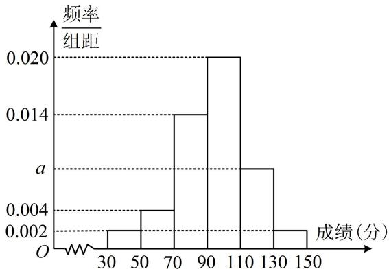
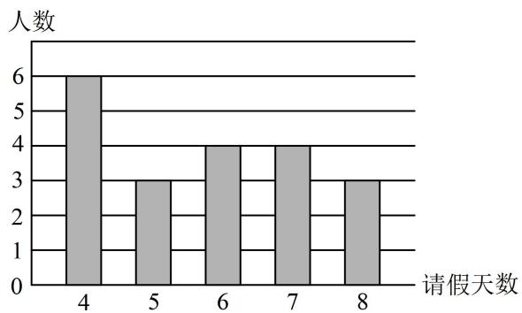
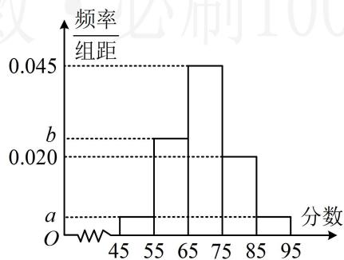
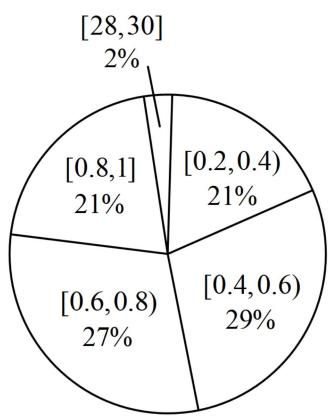
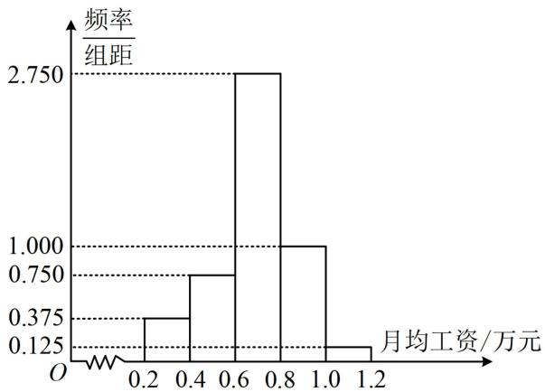
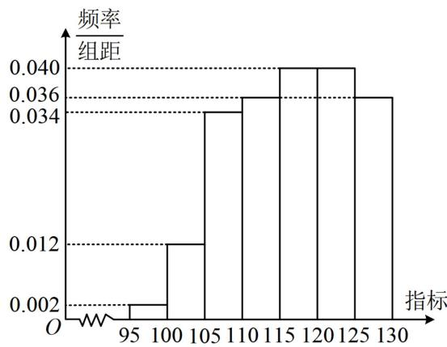
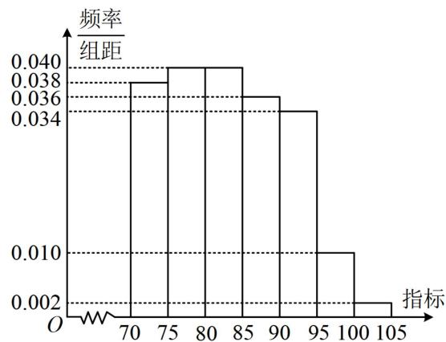

# 强化训练

1. (2023·江苏模拟·★★)(多选)

某校1000名学生在高三一模测试中数学成绩的频率分布直方图如图所示（同一组中的数据用该组区间的中点值作代表），分数不低于 $X$ 即为优秀，已知优秀学生有80人，则（）

A. $a = 0.008$

B. $X = 120$

C. 70 分以下的人数约为 6 人

D. 本次考试的平均分约为93.6

histogram

| 成绩 (分) | 频率/组距 |
| :--- | :--- |
| 30-50 | 0.002 |
| 50-70 | 0.004 |
| 70-90 | 0.014 |
| 90-110 | 0.020 |
| 110-130 | 0.012 |
| 130-150 | 0.002 |

1. AD

解析：A项，由题意， $(0.002 + 0.004 + 0.014 + 0.02+$

$a + 0.002) \times 20 = 1$ ，解得： $a = 0.008$ ，故A项正确；

B项，优秀的学生有80人 $\Rightarrow$ 优秀的频率为 $\frac{80}{1000} = 0.08$

于是要求 $X$ ，只需找到从右至左频率和为0.08的位置，

由图可知，[130,150]这组的频率为 $0.002 \times 20 = 0.04$

[110,130) 这组的频率为 $20a = 0.16$ ，所以 $X$ 在[110,130)内，

且 $(130 - X)\times 0.008 + 0.04 = 0.08$ ，解得： $X = 125$

故 B 项错误;

C项，由图可知70分以下的频率为 $(0.002 + 0.004)\times 20 =$

0.12，所以频数为 $1000 \times 0.12 = 120$ ，故C项错误；

D项，本次考试的平均分的估计值为 $\overline{x} = 40\times 0.04+$

$$
6 0 \times 0. 0 8 + 8 0 \times 0. 2 8 + 1 0 0 \times 0. 4 + 1 2 0 \times 0. 1 6 + 1 4 0 \times 0. 0 4
$$

=93.6，故D项正确.

2. (2024·广东模拟·★★)(多选)

某部门30名员工一年中请假天数（未请假则请假天数为0）与对应人数的柱形图（图中只有请假天数为0的未显示）如图所示，则（）

bar

| 请假天数 | 人数 |
| :--- | :--- |
| 4 | 6 |
| 5 | 3 |
| 6 | 4 |
| 7 | 4 |
| 8 | 3 |

A. 该部门一年中请假天数为0的人数为10  
B. 该部门一年中请假天数大于 $5$ 的人数为 10  
C. 这 30 名员工一年中请假天数的第 40 百分位数为 4  
D. 这 30 名员工一年中请假天数的平均数小于 4

2. ACD

解析：A项，由图可知请假天数为4，5，6，7，8的人数分别为6，3，4，4，3，剩下的都是请假天数为0的人，所以该部门一年中请假天数为0的人数为

30-6-3-4-4-3=10，故A项正确；

B 项，该部门一年中请假天数大于 5 的人数为 $4 + 4 + 3 = 11 \neq 10$ ，故 B 项错误；

C项，求第40百分位数，先求i， $i=30\times40\%=12$ ，

因为 $i$ 是整数，所以取第 $i$ 个和第 $i + 1$ 个数据的平均值作为第40百分位数，将30名员工一年中请假的天数从小到大排列，有10个0，接下来是6个4，所以第12和第13个数据都是4，从而所求的第40百分位数为 $\frac{4 + 4}{2} = 4$ ，故C项正确；

D 项，30 名员工一年中请假天数的平均数为

$$
\frac {1 0 \times 0 + 6 \times 4 + 3 \times 5 + 4 \times 6 + 4 \times 7 + 3 \times 8}{3 0} = \frac {2 3}{6} <   4,
$$

故D项正确.

3. (2024·江苏南通二模·★★☆)

某同学在一次数学测试中的成绩是班级第三名（假设测试成绩两两不同），成绩处于第90百分位数，则该班级的人数可能为（）

A. 15

B. 25

C. 30

D. 35

3. B

解法1：条件涉及第90百分位数，可考虑设班级总人数为 $x$ ，按照百分位数的求法，来寻找 $x$ 满足的条件，

设该班共有 $x$ 人，将这些人的成绩按从小到大排列，第三名的那位学生应该在第 $x - 2$ 个数据， $i = x \cdot 90\% = 0.9x$ ， $i$ 是否为整数，对第90百分位数的取值方法有影响，故应先对此分析，

若 $i$ 是整数，则应取第 $i$ 个和第 $i + 1$ 个数据的平均数作为第90百分位数，而题干说成绩两两不同，故上述平均值不在原始成绩中，与第90百分位数为第三名的成绩不符，故 $i$ 不是整数，故应取第 $[i] + 1$ 个数据作为第90百分位数（其中 $[i]$ 表示不超过 $i$ 的最大整数），所以第90百分位数是第 $[0.9x] + 1$ 个数据，

又因为第90百分位数是第 $x - 2$ 个数据，

所以 $[0.9x] + 1 = x - 2$ ，从而 $[0.9x] = x - 3$

故 $x - 3 < 0.9x < x - 2$ ，解得： $20 < x < 30(x\in \mathbf{N}^{*})$

结合选项可知选 B.

解法2：若不会用正面推理求该班级的人数，也可直接代选项验证，下面我们验证A、B两个选项，

A项，若该班级的人数为15，则由 $i = 15\times 90\% = 13.5$ 可得该班成绩的第90百分位数为从小到大的第14个数据，

所以该同学应为班级的第二名，与题意不符，故A项错误；

B项，若该班的人数为25，则由 $i = 25 \times 90\% = 22.5$ 可得该班成绩的第90百分位数为从小到大的第23个数据，

所以该同学应为班级的第三名，与题意吻合，故B项正确，此为单选题，故答案为B，对于C、D两项，可类似验证.

4.（2023·新课标Ⅰ卷·★★☆）（多选）

有一组样本数据 $x_{1}, x_{2}, \cdots, x_{6}$ ，其中 $x_{1}$ 是最小值， $x_{6}$ 是最大值，则（）

A. $x_{2}, x_{3}, x_{4}, x_{5}$ 的平均数等于 $x_{1}, x_{2}, \cdots, x_{6}$ 的平均数

B. $x_{2}, x_{3}, x_{4}, x_{5}$ 的中位数等于 $x_{1}, x_{2}, \cdots, x_{6}$ 的中位数

C. $x_{2}, x_{3}, x_{4}, x_{5}$ 的标准差不小于 $x_{1}, x_{2}, \cdots, x_{6}$ 的标准差

D. $x_{2}, x_{3}, x_{4}, x_{5}$ 的极差不大于 $x_{1}, x_{2}, \cdots, x_{6}$ 的极差

4. BD

解析：A项，可以想象， $x_{1}$ 和 $x_{6}$ 偏离平均数的程度不一定相同，去掉它们后，平均数可能发生变化，下面举个例子，

不妨设这组数据为0，2，3，4，5，6，则原平均数 $\overline{x} =$

$\frac{0+2+3+4+5+6}{6}=\frac{10}{3}$ ，去掉0和6之后的平均数 $\overline{x}^{\prime}=$

$\frac{2+3+4+5}{4}=\frac{7}{2}\neq\overline{x}$ ，故A项错误；

B 项，不妨假设 $x_{1} \leq x_{2} \leq \cdots \leq x_{6}$ ，则 $x_{2}, x_{3}, x_{4}, x_{5}$ 和

$x_{1},x_{2},\cdots,x_{6}$ 的中位数都是 $\frac{x_{3}+x_{4}}{2}$ ，故 B 项正确；

C项， $x_{1}$ 和 $x_{6}$ 偏离平均数较大，去掉它们后，标准差可能减小，故通过直观想象能得出C项错误，下面举个例子，

不妨设这组数据为1，2，3，5，6，7，

则 $\overline{x} = \frac{1 + 2 + 3 + 5 + 6 + 7}{6} = 4$

$$
s ^ {2} = \frac {1}{6} \times [ (1 - 4) ^ {2} + (2 - 4) ^ {2} + (3 - 4) ^ {2} + (5 - 4) ^ {2} + (6 - 4) ^ {2} +
$$

$(7-4)^{2}]=\frac{14}{3}$ ，去掉1和7后， $\overline{x}=\frac{2+3+5+6}{4}=4$ ，

$$
s ^ {\prime 2} = \frac {1}{4} [ (2 - 4) ^ {2} + (3 - 4) ^ {2} + (5 - 4) ^ {2} + (6 - 4) ^ {2} ] = \frac {5}{2},
$$

所以 $s'^{2}<s^{2}$ ，从而 $s'<s$ ，故 C 项错误；

D 项，沿用 B 项的假设，则 $x_{2}, x_{3}, x_{4}, x_{5}$ 的极差为 $x_{5} - x_{2}$ ，

$x_{1},x_{2},\cdots,x_{6}$ 的极差为 $x_{6}-x_{1}$ ,

要比较两个极差的大小，可再将它们作差判断正负，

因为 $(x_{6} - x_{1}) - (x_{5} - x_{2}) = (x_{6} - x_{5}) + (x_{2} - x_{1})\geq 0$

所以 $x_{5} - x_{2}\leq x_{6} - x_{1}$ ，故D项正确.

5. (2024·山东济南二模·★★★)

现有 $A, B$ 两组数据，其中 $A$ 组有4个数据，平均数为2，方差为6， $B$ 组有6个数据，平均数为7，方差为

1. 若将这两组数据混合成一组，则新的一组数据的方差为\_\_\_\_。

5.9

解析：新数据组的方差不易直接获得，可设出两组数据，表示出已知和所求，再观察二者的联系，

设 $A$ 组的数据为 $x_{1}$ ， $x_{2}$ ， $x_{3}$ ， $x_{4}$

则 $\left\{ \begin{array}{l} \overline{x} = \frac{x_1 + x_2 + x_3 + x_4}{4} = 2 \\ \sigma_1^2 = \frac{1}{4}(x_1^2 + x_2^2 + x_3^2 + x_4^2) - \overline{x}^2 = 6 \end{array} \right.$

所以 $\left\{ \begin{array}{l}x_{1} + x_{2} + x_{3} + x_{4} = 8\\ x_{1}^{2} + x_{2}^{2} + x_{3}^{2} + x_{4}^{2} = 40 \end{array} \right.$

设 B 组的数据为 $y_{1}$ ， $y_{2}$ ，…， $y_{6}$ ，

则 $\left\{\begin{aligned}\overline{y}&=\frac{y_{1}+y_{2}+\cdots+y_{6}}{6}=7\\ \sigma_{2}^{2}&=\frac{1}{6}(y_{1}^{2}+y_{2}^{2}+\cdots+y_{6}^{2})-\overline{y}^{2}=1\end{aligned}\right.$

所以 $\left\{\begin{aligned}y_{1}+y_{2}+\cdots+y_{6}&=42\\ y_{1}^{2}+y_{2}^{2}+\cdots+y_{6}^{2}&=300\end{aligned}\right.$

将两组数据混合后，新数据组的平均数

$$
\overline {{{{x}}}} ^ {\prime} = \frac {x _ {1} + x _ {2} + x _ {3} + x _ {4} + y _ {1} + y _ {2} + \cdots + y _ {6}}{1 0} = \frac {8 + 4 2}{1 0} = 5,
$$

所以新数据组的方差 $\sigma^2 = \frac{1}{10} (x_1^2 + x_2^2 + x_3^2 + x_4^2 + y_1^2 + y_2^2 +$

$$
\dots + y _ {6} ^ {2}) - \overline {{{{x}}}} ^ {\prime 2} = \frac {1}{1 0} \times (4 0 + 3 0 0) - 5 ^ {2} = 9.
$$

6. (2023·广东模拟·★★★) (多选)

有一组样本数据 $x_{1}, x_{2}, \cdots, x_{n}$ ，其样本平均数为 $\bar{x}$ ，现加入一个新数据 $x_{n+1}(x_{n+1} < \bar{x})$ ，组成新的样本数据 $x_{1}, x_{2}, \cdots, x_{n}, x_{n+1}$ ，与原样本数据相比，新的样本数据可能（）

A. 平均数不变

B. 众数不变

C. 极差变小

D. 第20百分位数变大

6. BD

解析：A项，直观感觉可知加入小于平均值的数据，会拉低平均数，下面给出严格论证，

因为 $x_{n + 1} < \overline{x}$ ，所以新样本数据的平均数 $\overline{x}' =$

$\frac{x_{1}+\cdots+x_{n}+x_{n+1}}{n+1}=\frac{n\overline{x}+x_{n+1}}{n+1}<\frac{n\overline{x}+\overline{x}}{n+1}=\overline{x}$ ，故A项错误；

B项，无论新加入一个什么数据，出现次数最多的数都可能不变，所以众数可能不变，故B项正确；

C 项，由于 $x_{n+1} < \overline{x}$ ，所以加入 $x_{n+1}$ 后，样本中最大的数据必定不变，当 $x_{n+1}$ 不小于原来的最小数据时，极差不变，当 $x_{n+1}$ 小于原最小数据时，极差会变大，从而极差不可能变小，故 C 项错误；

D 项, 直观感觉可知只要加入的 $x_{n+1}$ 比原来的第 20 百分位数大, 那么加入后由于数据个数变多了, 第 20 百分位数可能后移,从而变大, 下面举个例子,

假设原样本数据是 1, 2, 3, …, 100, 共 100 个,

因为 $i = 100 \times 20\% = 20$ ，所以该组数据的第20百分位数为 $\frac{20 + 21}{2} = 20.5$ ，现在新加入数据 $x_{101} = 21$ ，

则此时 $i = 101 \times 20\% = 20.2$ ，从而新样本数据的第20百分位数为第21个数据，也即21，比原来大，故D项正确.

7. (2020·新课标III卷·★★★)

在一组样本数据中，1，2，3，4出现的频率分别为 $p_1$ ， $p_2$ ， $p_3$ ， $p_4$ ，且 $\sum_{i = 1}^{4}p_{i} = 1$ ，则下面四种情形中，对应样本的标准差最大的一组是（）

A. $p_1 = p_4 = 0.1, p_2 = p_3 = 0.4$ B. $p_1 = p_4 = 0.4, p_2 = p_3 = 0.1$

C. $p_1 = p_4 = 0.2, p_2 = p_3 = 0.3$ D. $p_1 = p_4 = 0.3, p_2 = p_3 = 0.2$

7. B

解析：若计算标准差再比较，则较为繁琐，可从标准差的统计意义来分析，标准差可刻画数据的波动程度，波动程度越大，标准差越大，

由所给数据的等间距性和对应频率的对称性可知四个选项求得的样本平均数都是2.5，

远离平均数的数据越多，则数据波动程度越大，标准差也就越大，

因为 1, 2, 3, 4 四个数据中 1 和 4 偏离样本平均数较大，所以它们出现的频率越高，则标准差越大，故选 B.

【反思】由标准差的计算公式 $s=\sqrt{(x_{1}-\overline{x})^{2}f_{1}+(x_{2}-\overline{x})^{2}f_{2}+\cdots+(x_{n}-\overline{x})^{2}f_{n}}$ （其中 $f_{i}(i=1,2,\cdots,n)$ 表示数据 $x_{i}$ 出现的频率）知，远离平均数的数据越多，标准差越大.

8. (2023·河南模拟·★★★)

为了让学生了解环保知识，增强环保意识，某班举行了一次环保知识有奖竞赛活动，有20名学生参加活动，已知这20名学生得分的平均数为 $m$ ，方差为 $n$ ，若将 $m$ 当成一个学生的分数与原来的20名学生的分数一起，算出这21个分数的平均数为 $m'$ ，方差为 $n'$ ，则（）

A. $20m = 21m'$ ， $21n = 20n'$

B. $m = m'$ , $20n = 21n'$

C. $20m = 21m'$ ， $20n = 21n'$

D. $m = m'$ , $21n = 20n'$

8. B

解析：直接观察不易得出结果，可代平均数、方差的计算公式来看，本题可以代基本公式 $s^2 = \frac{1}{n}\sum_{i=1}^{n}(x_i - \overline{x})^2$ 来对比，但用 $s^2 = \frac{1}{n}\sum_{i=1}^{n}x_i^2 -\overline{x}^2$ 更方便，

记原来的 20 名学生的得分分别为 $x_{1}, x_{2}, \cdots, x_{20}$ ,

则 $m=\frac{x_{1}+x_{2}+\cdots+x_{20}}{20}$ ，所以 $x_{1}+x_{2}+\cdots+x_{20}=20m$ ，

故 $m'=\frac{x_{1}+x_{2}+\cdots+x_{20}+m}{21}=\frac{20m+m}{21}=m$

$$
n = \frac {1}{2 0} (x _ {1} ^ {2} + x _ {2} ^ {2} + \dots + x _ {2 0} ^ {2}) - m ^ {2} \quad ①,
$$

$$
n ^ {\prime} = \frac {1}{2 1} (x _ {1} ^ {2} + x _ {2} ^ {2} + \dots + x _ {2 0} ^ {2} + m ^ {2}) - m ^ {\prime 2}
$$

$$
= \frac {1}{2 1} (x _ {1} ^ {2} + x _ {2} ^ {2} + \dots + x _ {2 0} ^ {2} + m ^ {2}) - m ^ {2} \quad ②,
$$

由①可得 $x_{1}^{2} + x_{2}^{2} + \dots +x_{20}^{2} = 20(n + m^{2})$

代入②得 $n' = \frac{1}{21} [20(n + m^2) + m^2] - m^2 = \frac{20}{21} n$

所以 $20n = 21n'$

9. (2023·辽宁模拟·★★★)

某班为了了解学生每月购买零食的支出情况，利用分层随机抽样抽取了一个9人的样本，统计如下：

<table><tr><td></td><td>学生数</td><td>平均支出(元)</td><td>支出平方的累加值</td><td>方差</td></tr><tr><td>女生</td><td>4</td><td> $\overline{x} = {115}$ </td><td> $\mathop{\sum }\limits_{{i = 1}}^{4}{x}_{i}^{2} = {53800}$ </td><td>225</td></tr><tr><td>男生</td><td>5</td><td> $\overline{y} = {106}$ </td><td> $\mathop{\sum }\limits_{{i = 1}}^{5}{y}_{i}^{2} = {57700}$ </td><td>304</td></tr></table>

则样本的9人每月购买零食支出的平均数为\_\_\_\_元，方差为\_\_\_\_。（精确到小数点后一位）

9. 110, 288.9

解析：由表中数据可知样本的9人每月购买零食支出的平均数为 $\frac{4\overline{x} + 5\overline{y}}{9} = \frac{4\times 115 + 5\times 106}{9} = 110$ 元；

表中数据给的是 $\sum_{i=1}^{4} x_i^2$ 和 $\sum_{i=1}^{5} y_i^2$ ，故算方差用内容提要第7点①的公式 $s^2 = \frac{1}{n} \sum_{i=1}^{n} x_i^2 - \overline{x}^2$

所以方差 $s^2 = \frac{1}{9}\left(\sum_{i=1}^{4} x_i^2 + \sum_{i=1}^{5} y_i^2\right) - 110^2$

$$
= \frac {1}{9} \times (5 3 8 0 0 + 5 7 7 0 0) - 1 2 1 0 0 \approx 2 8 8. 9.
$$

10.（2022·上海模拟改·★★）

某高校承办了奥运会的志愿者选拔面试工作，现随机抽取了100名候选者的面试成绩并分成五组：[45,55)，[55,65)，[65,75)，[75,85)，[85,95]，绘制成如图所示的频率分布直方图，已知第三、四、五组的频率之和为0.7，第一组和第五组的频率相同.

histogram

| 分数 | 频率/组距 |
|---|---|
| 45-55 | a |
| 55-65 | b |
| 65-75 | 0.045 |
| 75-85 | a |
| 85-95 | a |

(1) 求图中 a, b 的值;  
(2) 估计这 100 名候选者面试成绩的平均数、方差和第 60 百分位数（精确到 0.1）.

参考数据： $69.5^{2} = 4830.25$

10. 解: (1) (由面积和为 1, 第三、四、五组的频率之和为

0.7 可分别建立一个方程，求出 $a$ 和 $b$ )

由题意， $\left\{ \begin{array}{l}10\times a + 10\times b + 10\times 0.045 + 10\times 0.02 + 10\times a = 1\\ 10\times 0.045 + 10\times 0.02 + 10\times a = 0.7 \end{array} \right.$

解得： $a = 0.005$ ， $b = 0.025$

（2）设100名候选者面试成绩的平均数为 $\overline{x}$ ，方差为 $s^2$

则 $\overline{x} = 50\times 0.05 + 60\times 0.25 + 70\times 0.45 + 80\times 0.2 + 90\times 0.05$

$$
\begin{array}{l} = 6 9. 5, \quad s ^ {2} = 5 0 ^ {2} \times 0. 0 5 + 6 0 ^ {2} \times 0. 2 5 + 7 0 ^ {2} \times 0. 4 5 + \\ 8 0 ^ {2} \times 0. 2 + 9 0 ^ {2} \times 0. 0 5 - 6 9. 5 ^ {2} = 8 4. 7 5 \approx 8 4. 8; \\ \end{array}
$$

(再估计第60百分位数，只需在频率分布直方图中找到从左至右频率和为0.6的位置即可)

由图可知前两组的频率和为 $0.05 + 0.25 = 0.3 < 0.6$

前三组的频率和为 $0.05 + 0.25 + 0.45 = 0.75 > 0.6$

所以第60百分位数应在[65,75)这一组，设为 $y$

则 $0.3 + (y - 65) \times 0.045 = 0.6$ ①,

解得： $y \approx 71.7$ ，故可估计这100名候选者面试成绩的平均数为69.5，方差为84.8，第60百分位数为71.7.

【反思】若不清楚解答过程中的式①怎么来的，可参考本节例2的变式2.

# 11. (2022·全国模拟·★★★)

已知 $A$ ， $B$ 两家公司的员工月均工资（单位：万元）的情况分别如图1，图2所示：

pie

| Range | Percentage (%) |
|---|---|
| [28,30] | 2 |
| [0.2,0.4) | 21 |
| [0.4,0.6) | 29 |
| [0.6,0.8) | 27 |
| [0.8,1] | 21 |

图1

histogram

| 月均工资/万元 | 频率/组距 |
|---|---|
| 0.2 | 0.125 |
| 0.4 | 0.375 |
| 0.6 | 0.750 |
| 0.8 | 2.750 |
| 1.0 | 1.000 |
| 1.2 | 0.125 |

图2

(1) 以每组数据的区间中点值为代表, 根据图 1 估计 $A$ 公司员工月均工资的平均数、中位数, 你认为哪个数据更能反映该公司普通员工的工资水平? 请说明理由;  
(2) 小明拟到 A, B 两家公司中的一家应聘，以公司普通员工的工资水平作为决策依据，他应该选哪家公司？

11. 解：（1）设 $A$ 公司共有 $a$ 名员工，该公司员工月均工资的

平均数为 $\overline{x}_A$ ，中位数为 $x_{A}$

则 $\overline{x}_A = \frac{1}{a} (0.21a\times 0.3 + 0.29a\times 0.5 + 0.27a\times 0.7 +$

$$
0. 2 1 a \times 0. 9 + 0. 0 2 a \times 2 9) = 1. 1 6 6 \text {万元，}
$$

因为 $[0.2, 0.4)$ 与 $[0.4, 0.6)$ 的频率和为 $0.21 + 0.29 = 0.5$

所以 $A$ 公司员工月均工资的中位数 $x_{A}$ 约为0.6万元，

(要分析平均数和中位数谁更有参考性, 应先找到平均数明显大于中位数的原因, 再加以阐释)

因为平均数会受少数极端数据的影响，该公司有 $2\%$ 的少数员工的月均工资大幅高于普通员工，从而拉高了员工的月均工资平均数，在这种情况下，平均数不能很好地反映普通员工的工资水平，而中位数不受少数极端数据的影响，可以较好地反映普通员工的工资水平，所以中位数更能反映该公司普通员工的工资水平.

(2) (要做决策, 先计算 $B$ 公司员工月均工资的平均数和中位数, 与前面的 $x_{A}$ 比较)

设 $B$ 公司员工的月均工资平均数的估计值为 $\overline{x}_B$ ，中位数的估计值为 $x_{B}$ ，则由图可知 $\overline{x}_B = 0.2\times (0.375\times 0.3+$

$$
0. 7 5 \times 0. 5 + 2. 7 5 \times 0. 7 + 1 \times 0. 9 + 0. 1 2 5 \times 1. 1) = 0. 6 9,
$$

图2中前两组的频率和 $0.2 \times (0.375 + 0.75) = 0.225 < 0.5$

前三组的频率和 $0.2 \times (0.375 + 0.75 + 2.75) = 0.775 > 0.5$

所以中位数 $x_{B}$ 在[0.6,0.8)内，

且 $0.225 + (x_{B} - 0.6)\times 2.75 = 0.5$ ，解得： $x_{B} = 0.7$

(求出了 B 公司员工月均工资的平均数和中位数，应先结合图形阐释他们是否有代表性，再与 A 公司比较)

从图 2 可以看出，B 公司员工月均工资数据比较集中，且没有出现极端值，月均工资的平均数和中位数都能很好地反映该公司普通员工的工资水平，B 公司员工月均工资的平均数和中位数均大于 A 公司员工月均工资的中位数，故以公司普通员工的工资

水平作为决策依据，他应该选 B 公司.

# 12. (2021·全国乙卷·★★★)

某厂研制了一种生产高精产品的设备，为检验新设备生产产品的某项指标有无提高，用一台旧设备和一台新设备各生产了10件产品，得到各件产品该项指标数据如下：

<table><tr><td>旧设备</td><td>9.8</td><td>10.3</td><td>10.0</td><td>10.2</td><td>9.9</td><td>9.8</td><td>10.0</td><td>10.1</td><td>10.2</td><td>9.7</td></tr><tr><td>新设备</td><td>10.1</td><td>10.4</td><td>10.1</td><td>10.0</td><td>10.1</td><td>10.3</td><td>10.6</td><td>10.5</td><td>10.4</td><td>10.5</td></tr></table>

旧设备和新设备生产产品的该项指标的样本平均数分别记为 $\overline{x}$ 和 $\overline{y}$ ，样本方差分别记为 $s_1^2$ 和 $s_2^2$ .

(1) 求 $\overline{x}$ ， $\overline{y}$ ， $s_{1}^{2}$ ， $s_{2}^{2}$ ;

(2) 判断新设备生产产品的该项指标的均值较旧设备是否有显著提高 (如果 $\overline{y} - \overline{x} \geq 2\sqrt{\frac{s_1^2 + s_2^2}{10}}$ , 则认为新设备生产产品的该项指标的均值较旧设备有显著提高, 否则不认为有显著提高).

# 12. 解: (1) (计算平均数前, 最好先将数据排序, 梳理出重

复数据，例如，旧设备的数据可整理为9.7，2个9.8，9.9，2个10，10.1，2个10.2，10.3，这样计算时就不会遗漏或看错）由表中数据可得， $\overline{x} =$

$$
\begin{array}{l} \frac {1}{1 0} \times (9. 7 + 9. 8 \times 2 + 9. 9 + 1 0 \times 2 + 1 0. 1 + 1 0. 2 \times 2 + 1 0. 3) = 1 0, \\ \overline {{{y}}} = \frac {1}{1 0} \times (1 0 + 1 0. 1 \times 3 + 1 0. 3 + 1 0. 4 \times 2 + 1 0. 5 \times 2 + 1 0. 6) = 1 0. 3, \\ s _ {1} ^ {2} = \frac {1}{1 0} \times [ (9. 7 - 1 0) ^ {2} + 2 \times (9. 8 - 1 0) ^ {2} + (9. 9 - 1 0) ^ {2} \\ + 2 \times (1 0 - 1 0) ^ {2} + (1 0. 1 - 1 0) ^ {2} + 2 \times (1 0. 2 - 1 0) ^ {2} \\ + (1 0. 3 - 1 0) ^ {2} ] = 0. 0 3 6, \\ s _ {2} ^ {2} = \frac {1}{1 0} \times [ (1 0 - 1 0. 3) ^ {2} + 3 \times (1 0. 1 - 1 0. 3) ^ {2} + (1 0. 3 - 1 0. 3) ^ {2} + \\ 2 \times (1 0. 4 - 1 0. 3) ^ {2} + 2 \times (1 0. 5 - 1 0. 3) ^ {2} + (1 0. 6 - 1 0. 3) ^ {2} ] = 0. 0 4. \\ \end{array}
$$

(2)（读完题可发现，只需结合（1）的结果计算 $\overline{y} -\overline{x}$ 和 $2\sqrt{\frac{s_1^2 + s_2^2}{10}}$ ，并加以比较，即可解决问题）

由（1）知 $\overline{y} -\overline{x} = 0.3$ ， $2\sqrt{\frac{s_1^2 + s_2^2}{10}} = 2\sqrt{\frac{0.036 + 0.04}{10}}$

$=2\sqrt{0.0076}$ ，（要比较大小，简单估算一下即可）

因为 $2\sqrt{0.0076} < 2\sqrt{0.01} = 2 \times 0.1 = 0.2 < 0.3$

所以 $\overline{y} -\overline{x} >2\sqrt{\frac{s_1^2 + s_2^2}{10}}$ ，故新设备生产产品的该项指标的均值较旧设备有显著提高.

# 13. (2023·新课标II卷·★★★)

某研究小组经过研究发现某种疾病的患病者与未患病者的某项医学指标有明显差异，经过大量调查，得到如下的患病者和未患病者该项指标的频率分布直方图：

histogram

| 指标 | 频率/组距 |
| :--- | :--- |
| 95 | 0.002 |
| 100 | 0.012 |
| 105 | 0.034 |
| 110 | 0.036 |
| 115 | 0.040 |
| 120 | 0.040 |
| 125 | 0.036 |
| 130 | 0.036 |

患病者

histogram

| 指标 | 频率/组距 |
| ---- | --------- |
| 70   | 0.038     |
| 75   | 0.040     |
| 80   | 0.040     |
| 85   | 0.036     |
| 90   | 0.036     |
| 95   | 0.010     |
| 100  | 0.002     |
| 105  | 0.002     |

未患病者

利用该指标制定一个检测标准，需要确定临界值 $c$ ，将该指标大于 $c$ 的人判定为阳性，小于或等于 $c$ 的人判定为阴性.此检测标准的漏诊率是将患病者判定为阴性的概率，记为 $p(c)$ ；误诊率是将未患病者判定为阳性的概率，记为 $q(c)$ .假设数据在组内均匀分布．以事件发生的频率作为相应事件发生的概率.

（1）当漏诊率 $p(c) = 0.5\%$ 时，求临界值 $c$ 和误诊率 $q(c)$ ；  
（2）设函数 $f(c) = p(c) + q(c)$ . 当 $c \in [95,105]$ 时，求 $f(c)$ 的解析式，并求 $f(c)$ 在区间[95,105]的最小值.

13. 解: (1) (给的是漏诊率, 故先看患病者的图, 漏诊率为

0.5%即小于或等于c的频率为0.5%，可由此求c)

由患病者的图可知，[95,100)这组的频率为 $5\times 0.002$

$= 0.01 > 0.005$ ，所以 $c$ 在[95,100)内，

且 $(c - 95)\times 0.002 = 0.005$ ，解得： $c = 97.5$

(要求 $q(c)$ ，再来看未患病者的图， $q(c)$ 是误诊率，也即未患病者判定为阳性（指标大于 c）的概率)

由未患病者的图可知指标大于97.5的概率为

$(100 - 97.5) \times 0.01 + 5 \times 0.002 = 0.035$ ，所以 $q(c) = 3.5\%$ .

(2) ([95,105] 包含两个分组，故应分类讨论)

当 $95 \leq c < 100$ 时， $p(c) = (c - 95) \times 0.002$

$$
q (c) = (1 0 0 - c) \times 0. 0 1 + 5 \times 0. 0 0 2,
$$

所以 $f(c)=p(c)+q(c)=-0.008c+0.82$

故 $f(c) > -0.008 \times 100 + 0.82 = 0.02$ ①;

当 $100 \leq c \leq 105$ 时， $p(c) = 5 \times 0.002 + (c - 100) \times 0.012$

$$
q (c) = (1 0 5 - c) \times 0. 0 0 2,
$$

所以 $f(c)=p(c)+q(c)=0.01c-0.98$

故 $f(c)\geq f(100) = 0.01\times 100 - 0.98 = 0.02$ ②;

所以 $f(c)=\left\{\begin{aligned}-0.008c+0.82,95&\leq c<100\\0.01c-0.98,100&\leq c\leq105\end{aligned}\right.$

且由①②可得 $f(c)_{\min} = 0.02$