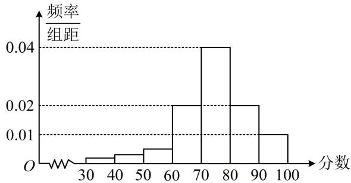
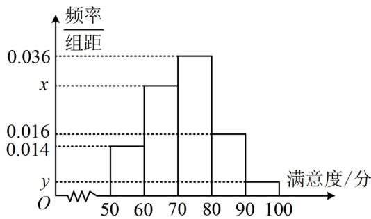

# 第 3 节 二项分布与超几何分布（★★★）

# 内容提要

二项分布与超几何分布是两个容易混淆的概念，本节归纳与之相关的一些常见题型，下面先梳理二项分布、超几何分布的概念.

1. 二项分布: 在 $n$ 重伯努利试验中, 设每次试验中事件 $A$ 发生的概率为 $p (0 < p < 1)$ , 用 $X$ 表示事件 $A$ 发生的次数, 则 $X$ 的分布列为 $P(X = k) = \mathrm{C}_n^k p^k (1 - p)^{n - k}$ , 其中 $k = 0, 1, 2, \dots, n$ , 称随机变量 $X$ 服从二项分布, 记作 $X \sim B(n, p)$ .  
2. 期望和方差：若 $X \sim B(n, p)$ ，则 $E(X) = np$ ， $D(X) = np(1 - p)$ .  
3. 超几何分布: 设一批产品共有 $N$ 件, 其中次品 $M$ 件, 其余为合格品, 从 $N$ 件产品中随机抽取 $n$ 件, 记取到次品的件数为随机变量 $X$ , 则 $P(X = k) = \frac{\mathrm{C}_M^k\mathrm{C}_{N - M}^{n - k}}{\mathrm{C}_N^n}$ , 其中 $k = m, m + 1, m + 2, \cdots, r$ , 且 $m = \max \{0, n - N + M\}$ , $r = \min \{n, M\}$ . 具有上述概率分布的随机变量 $X$ 即为服从超几何分布的随机变量, 其均值 $E(X) = n \cdot \frac{M}{N} = np$ , 其中 $p = \frac{M}{N}$ 表示抽取一件产品取到次品的概率. 上面的表述较为抽象, 可结合例4的几道题来理解.  
4. 二项分布与超几何分布的关系：对于不放回的抽取，当 $n$ 远小于 $N$ 时，每抽取一次后，对 $N$ 的影响很小，此时，超几何分布可用二项分布近似.

# 类型 I：二项分布概念题

【例 1】假设苏州肯帝亚球队在某赛季的任一场比赛中输球的概率都等于 $p(0 < p < 1)$ ，且各场比赛互不影响。令 $X$ 表示连续 9 场比赛中输球的场数，且 $P(X = 5) = P(X = 6)$ ，则球队在这连续 9 场比赛中输球场数的期望为 \_\_\_\_.

解析：9场比赛可看成9次独立试验，每场比赛输球的概率相同，满足重复性，所以这是独立重复试验，故输球的场数服从二项分布，可用其概率分布计算 $P(X=5)$ 和 $P(X=6)$ ，从而建立方程求p，

由题意，9场比赛中输球的场数 $X \sim B(9, p)$ ，所以 $P(X = 5) = \mathrm{C}_9^5 p^5 (1 - p)^4$ ， $P(X = 6) = \mathrm{C}_9^6 p^6 (1 - p)^3$

故 $P(X = 5) = P(X = 6)$ 即为 $\mathrm{C}_9^5 p^5 (1 - p)^4 = \mathrm{C}_9^6 p^6 (1 - p)^3$ ，解得： $p = \frac{3}{5}$ ，所以 $E(X) = 9p = \frac{27}{5}$

答案: $\frac{27}{5}$

【变式1】甲与乙进行投篮游戏，在每局游戏中两人分别投篮两次，每局投进的次数之和不小于3则该局游戏胜利，已知甲、乙两名队员投篮相互独立且投进的概率均为 $\frac{2}{3}$ ，现进行27局游戏，设 $X$ 为甲、乙两名队员胜利的局数，则 $X$ 的期望为\_\_\_\_。

解析：27局游戏可看成27重伯努利试验，胜利的次数 $X$ 服从二项分布，故先求一局游戏胜利的概率，

由于甲、乙每球投进的概率都是 $\frac{2}{3}$ ，所以各投两球可看成共投4球，由题意，至少进3球即成功，

投的这4球又可看成4重伯努利试验，4次投篮中投进的次数也服从二项分布，

设投进的次数为 $Y$ ，则 $Y \sim B\left(4, \frac{2}{3}\right)$ ，所以 $P(Y \geq 3) = P(Y = 3) + P(Y = 4) = C_4^3 \times \left(\frac{2}{3}\right)^3 \times \left(1 - \frac{2}{3}\right) + C_4^4 \times \left(\frac{2}{3}\right)^4 = \frac{16}{27}$ ，

即一局游戏胜利的概率为 $\frac{16}{27}$ ，所以 $X \sim B\left(27, \frac{16}{27}\right)$ ，故 $E(X) = 27 \times \frac{16}{27} = 16$ 。

答案: 16

【反思】在分析 $n$ 次独立重复试验时，一定要先弄清楚一次试验中的成功概率，一次试验不一定是投一次篮，或抛一枚硬币，也可能是投多次篮，或抛几次硬币，要看题干如何规定.

【变式2】已知随机变量 $\xi_{i}$ 的分布列如下：

<table><tr><td> $\xi_{i}$ </td><td>0</td><td>1</td><td>2</td></tr><tr><td>P</td><td> $(1-p_{i})^{2}$ </td><td> $2p_{i}(1-p_{i})$ </td><td> $p_{i}^{2}$ </td></tr></table>

其中 $i = 1,2$ ，若 $\frac{1}{2} < p_1 < p_2 < 1$ ，则（）

A. $E(\xi_1) < E(\xi_2)$ , $D(3\xi_1 + 1) < D(3\xi_2 + 1)$

B. $E(\xi_1) < E(\xi_2)$ , $D(3\xi_1 + 1) > D(3\xi_2 + 1)$

C. $E(\xi_1) > E(\xi_2)$ , $D(3\xi_1 + 1) < D(3\xi_2 + 1)$

D. $E(\xi_1) > E(\xi_2)$ , $D(3\xi_1 + 1) > D(3\xi_2 + 1)$

解析：本题若代公式 $E(X) = \sum_{i=1}^{n} x_i p_i$ 和 $D(X) = \sum_{i=1}^{n} [x_i - E(X)]^2 p_i$ 去算期望和方差，则计算量偏大，观察发现给的分布列恰好是服从二项分布的随机变量的分布列，那期望和方差就好算了，

所给分布列满足 $P(\xi_i = k) = \mathrm{C}_2^k p_i^k (1 - p_i)^{2 - k}$ ，其中 $k = 0,1,2$ ，所以 $\xi_{i}\sim B(2,p_{i})$ ，即 $\xi_1\sim B(2,p_1)$ ， $\xi_{2}\sim B(2,p_{2})$ 所以 $E(\xi_1) = 2p_1$ ， $E(\xi_2) = 2p_2$ ，因为 $\frac{1}{2} < p_1 < p_2 < 1$ ，所以 $E(\xi_1) < E(\xi_2)$

再看 $D(3\xi_{i} + 1)$ ，可先求 $D(\xi_{i})$ 并加以比较，再结合方差性质比较 $D(3\xi_1 + 1)$ 和 $D(3\xi_2 + 1)$ 的大小，

又 $D(\xi_{i}) = 2p_{i}(1 - p_{i}) = -2\left(p_{i} - \frac{1}{2}\right)^{2} + \frac{1}{2}$ ，所以 $D(\xi_1) = -2\left(p_1 - \frac{1}{2}\right)^2 + \frac{1}{2}$ ， $D(\xi_2) = -2\left(p_2 - \frac{1}{2}\right)^2 + \frac{1}{2}$ ，

函数 $y = -2\left(x - \frac{1}{2}\right)^2 + \frac{1}{2}$ 在 $\left(\frac{1}{2}, 1\right)$ 上 $\searrow$ ，结合 $\frac{1}{2} < p_1 < p_2 < 1$ 可得 $D(\xi_1) > D(\xi_2)$ ，

而 $D(3\xi_1 + 1) = 9D(\xi_1)$ ， $D(3\xi_{2} + 1) = 9D(\xi_{2})$ ，所以 $D(3\xi_1 + 1) > D(3\xi_2 + 1)$

答案: B

【反思】这类由含参分布列比较期望、方差大小的题，都可用特值法求解.例如，本题可取 $p_1 = \frac{2}{3}$ ， $p_2 = \frac{3}{4}$ 代入分布列求出 $\xi_{1}$ 和 $\xi_{2}$ 的期望和方差再比较.

# 类型Ⅱ：二项分布综合题

【例 2】某学校高三年级学生参加某项体育测试，根据男女学生人数比例，使用分层抽样的方法从中抽取了 100 名学生，记录他们的分数，将数据分成 7 组：[30,40)，[40,50)，…，[90,100]，整理得到如下的频率分布直方图：

histogram

| 分数 | 频率/组距 |
|---|---|
| 30-40 | 0.002 |
| 40-50 | 0.003 |
| 50-60 | 0.005 |
| 60-70 | 0.02 |
| 70-80 | 0.04 |
| 80-90 | 0.02 |
| 90-100 | 0.01 |

(1) 若规定小于 60 分为 “不及格”, 从该学校高三年级学生中随机抽取 1 人, 估计该学生不及格的概率;  
(2) 若规定分数在[80,90)为“良好”, [90,100]为“优秀”, 用频率估计概率, 从该校高三年级 (总人数较多) 随机抽取3人, 记该项测试分数为“良好”或“优秀”的人数为 $X$ , 求 $X$ 的分布列, 期望和方差.

解：（1）由图可估计抽到不及格学生的概率为 $1 - 10 \times (0.02 + 0.04 + 0.02 + 0.01) = 0.1$

（2）由图可知从该学校高三年级学生中随机抽1人，抽到“良好”的概率为 $10 \times 0.02 = 0.2$ ，抽到“优秀”的概率为 $10 \times 0.01 = 0.1$ ，所以抽到“良好”或“优秀”的概率为 $0.2 + 0.1 = 0.3$ ，

(由于这 3 人是从整个高三年级中抽取的, 总人数较多, 抽取人数远小于总人数, 所以每抽取 1 人后, 下次再抽时, 抽到 “优秀” 或 “良好” 的概率几乎不变, 故可按二项分布处理)

由题意， $X\sim B(3,0.3)$ ，所以 $P(X = 0) = \mathrm{C}_3^0\times (1 - 0.3)^3 = 0.343$ ， $P(X = 1) = \mathrm{C}_3^1\times 0.3\times (1 - 0.3)^2 = 0.441$ $P(X = 2) = \mathrm{C}_3^2\times 0.3^2\times (1 - 0.3) = 0.189$ ， $P(X = 3) = \mathrm{C}_3^3\times 0.3^3 = 0.027$ ，故 $X$ 的分布列为：

<table><tr><td>X</td><td>0</td><td>1</td><td>2</td><td>3</td></tr><tr><td>P</td><td>0.343</td><td>0.441</td><td>0.189</td><td>0.027</td></tr></table>

因为 $X \sim B(3,0.3)$ ，所以 $E(X) = 3 \times 0.3 = 0.9$ ， $D(X) = 3 \times 0.3 \times (1 - 0.3) = 0.63$ .

【反思】像这种从某处取几个人，求取到某类个体的个数的分布列这种题，一定要注意是从总体中取，还是从个体数较少的样本中取。若是前者，由于抽取的人数往往远小于总人数，所以常按二项分布处理；而后者，则按超几何分布来求分布列。

【例 3】某芯片研发团队表示已自主研发成功多维先进封装技术 XDFOI，可以实现 4nm 手机 SOC 芯片的封装，这是中国芯片技术的又一个重大突破，对中国芯片的发展具有极为重要的意义。可以说国产 4nm 先进封装技术的突破，激发了中国芯片的潜力，证明了知名院士倪光南所说的先进的技术是买不来的，求不来的，自主研发才是最终的出路。研发团队准备在国内某著名大学招募人才，准备了 3 道测试题，答对其中任意 2 道就可以被录用，甲、乙两人报名参加测试，假设他们答对每道题的概率均为 $p(0 < p < 1)$ ，且每人是否答对每道题相互独立，若甲 3 道试题均作答，乙随机选择了 2 道题作答。

(1) 分别求甲和乙被录用的概率;  
（2）设甲和乙中被录用的人数为 $\xi$ ，请判断是否存在唯一的 $p$ ，使 $E(\xi) = 1.5$ ？并说明理由.

解: (1) 甲答对题目的个数服从二项分布 $B(3, p)$ , 所以甲被录用的概率 $p_{1} = \mathrm{C}_{3}^{2} p^{2}(1 - p) + \mathrm{C}_{3}^{3} p^{3} = 3 p^{2} - 2 p^{3}$ , (再看乙, 乙选到的是哪两道题不确定, 录用的概率与选的题有关, 可据此划分样本空间, 套用全概率公

# 式求乙被录用的概率)

将3道题编号为1,2,3，记乙选到1,2题，1,3题，2,3题分别为事件 $A_{1}, A_{2}, A_{3}$ ，乙被录用为事件 $B$ ，则由全概率公式， $P(B) = P(A_{1})P(B|A_{1}) + P(A_{2})P(B|A_{2}) + P(A_{3})P(B|A_{3}) = \frac{1}{3}p^{2} + \frac{1}{3}p^{2} + \frac{1}{3}p^{2} = p^{2}$ .

（2）由题意， $\xi$ 可能的取值有0，1，2，且 $P(\xi = 0) = (1 - p_{1})[1 - P(B)]$

$$
\begin{array}{l} P (\xi = 1) = p _ {1} [ 1 - P (B) ] + (1 - p _ {1}) P (B), \quad P (\xi = 2) = p _ {1} P (B), \\ \text {所以} E (\xi) = 0 \times P (\xi = 0) + 1 \times P (\xi = 1) + 2 \times P (\xi = 2) = p _ {1} [ 1 - P (B) ] + (1 - p _ {1}) P (B) + 2 p _ {1} P (B) \\ = p _ {1} + P (B) = 3 p ^ {2} - 2 p ^ {3} + p ^ {2} = 4 p ^ {2} - 2 p ^ {3}, \\ \end{array}
$$

(观察发现 $E(\xi)=1.5$ 是关于 p 的一元三次方程，不便于直接求解，可作差构造函数求导分析)

$E(\xi)-1.5=-2p^{3}+4p^{2}-1.5$ ，设 $f(p)=-2p^{3}+4p^{2}-1.5(0<p<1)$ ，则 $f'(p)=-6p^{2}+8p=-2p(3p-4)>0$ ，

所以 $f(p)$ 在 $(0,1)$ 上单调递增，又 $f(0) = -1.5 < 0$ ， $f(1) = 0.5 > 0$ ，所以 $f(p)$ 有唯一的零点，

从而方程 $E(\xi) - 1.5 = 0$ 有唯一的实根，故存在唯一的 $p$ ，使 $E(\xi) = 1.5$

【总结】在概率统计综合大题中，二项分布常作为其中的一部分出现，这类题的难点是融入了陌生的实际情境中，且综合性强，所以熟悉各种基本概念是解决这类题的前提.

# 类型III：超几何分布概念题

【例 4】现有 10 件产品，其中有 2 件次品，其余为合格品，从中任取 2 件，记抽到次品的件数为 X，则 $E(X)=$ \_\_\_\_.

解析：从 10 件产品中取 2 件，取到次品的件数服从超几何分布，可按古典概率算分布列，需注意此处次品件数与合格品件数都不少于抽取件数，

由题意， $X$ 可能的取值为0，1，2，且 $P(X = 0) = \frac{C_8^2}{C_{10}^2} = \frac{28}{45}$ ， $P(X = 1) = \frac{C_8^1C_2^1}{C_{10}^2} = \frac{16}{45}$ ， $P(X = 2) = \frac{C_2^2}{C_{10}^2} = \frac{1}{45}$

所以 $E(X) = 0 \times \frac{28}{45} + 1 \times \frac{16}{45} + 2 \times \frac{1}{45} = \frac{2}{5}$ .

答案： $\frac{2}{5}$

【反思】若熟悉超几何分布的期望公式 $E(X) = n \cdot \frac{M}{N}$ ，也可速求期望，本题中， $n = 2$ ， $M = 2$ ， $N = 10$ .

【变式1】现有10件产品, 其中有1件次品, 其余为合格品, 从中任取2件, 记抽到次品的件数为 $X$ , 则 $E(X) = \_$ .

解析：次品件数小于抽取件数，所以 $X$ 不能取完0，1，2的所有值，应先分析 $X$ 的可能取值，

$X$ 可能的取值为0，1，且 $P(X = 0) = \frac{C_9^2}{C_{10}^2} = \frac{4}{5}$ ， $P(X = 1) = \frac{C_9^1C_1^1}{C_{10}^2} = \frac{1}{5}$ ，故 $E(X) = 0\times \frac{4}{5} +1\times \frac{1}{5} = \frac{1}{5}$

答案: $\frac{1}{5}$

【反思】也可由 $E(X)=n\cdot\frac{M}{N}$ 求期望，本题 n=2，M=1，N=10.

【变式2】现有10件产品, 其中有1件合格品, 其余为次品, 从中任取2件, 记抽到次品的件数为 $X$ , 则 $E(X) = \_$ .

解析：合格品件数小于抽取件数，所以 $X$ 不能取完0，1，2的所有值，应先分析 $X$ 的可能取值，

由题意， $X$ 可能的取值为1，2，且 $P(X = 1) = \frac{\mathrm{C}_9^1\mathrm{C}_1^1}{\mathrm{C}_{10}^2} = \frac{1}{5}$ ， $P(X = 2) = \frac{\mathrm{C}_9^2}{\mathrm{C}_{10}^2} = \frac{4}{5}$ ，所以 $E(X) = 1\times \frac{1}{5} +2\times \frac{4}{5} = \frac{9}{5}$

答案： $\frac{9}{5}$

【反思】也可由 $E(X)=n\cdot\frac{M}{N}$ 求期望，本题 n=2，M=9，N=10。

【变式 3】现有 6 件产品, 其中有 3 件次品, 其余为合格品, 从中任取 4 件, 记抽到次品的件数为 $X$ , 则 $E(X) = \_$ .

解析：次品、合格品件数都小于抽取件数，所以 $X$ 不能取完0，1，2，3，4，应先分析 $X$ 的可能取值，由题意， $X$ 的可能取值为1，2，3，且 $P(X = 1) = \frac{C_3^1 C_3^3}{C_6^4} = \frac{1}{5}$ ， $P(X = 2) = \frac{C_3^2 C_3^2}{C_6^4} = \frac{3}{5}$ ， $P(X = 3) = \frac{C_3^3 C_3^1}{C_6^4} = \frac{1}{5}$ ，所以 $E(X) = 1 \times \frac{1}{5} + 2 \times \frac{3}{5} + 3 \times \frac{1}{5} = 2$ .

答案: 2

【总结】变式 3 也可用 $E(X) = n \cdot \frac{M}{N}$ 求期望, 所以从上面几道题可以看出, 无论次品件数、合格品件数与抽取件数的大小关系如何, 超几何分布的分布列都按古典概率计算, 且几种情况的期望公式都是 $E(X) = n \cdot \frac{M}{N}$ .

# 类型IV：超几何分布与条件概率结合

【例 5】在某校举办 “青春献礼二十大，强国有我新征程” 的知识能力测评中，随机抽查了 100 名学生，其中共有 4 名女生和 3 名男生的成绩在 90 分以上，从这 7 名同学中每次随机抽取 1 人在全校做经验分享，每人最多分享一次，记第一次抽到女生为事件 A，第二次抽到男生为事件 B.

(1) 求 $P(B \mid A)$ ， $P(B)$ ;

(2) 若把抽取学生的方式更改为: 从这 7 名学生中随机抽取 3 人进行经验分享, 记被抽取的 3 人中女生的人数为 $X$ , 求 $X$ 的分布列和数学期望.

解: (1) 在 $A$ 发生的条件下, 第二次抽取时, 共 3 男 3 女 6 人, 此时抽到男生的概率 $P(B \mid A) = \frac{3}{6} = \frac{1}{2}$ , (第二次抽取时的男女构成受第一次结果影响, 故按第一次结果划分样本空间, 用全概率公式求 $P(B)$ )由全概率公式, $P(B) = P(A)P(B \mid A) + P(\overline{A})P(B \mid \overline{A}) = \frac{4}{7} \times \frac{3}{6} + \frac{3}{7} \times \frac{2}{6} = \frac{3}{7}$ .

（2）（从7名学生中抽3人，抽到女生的人数应服从超几何分布，按古典概率计算分布列即可）由题意， $X$ 可能的取值有0，1，2，3，且 $P(X = 0) = \frac{\mathrm{C}_3^3}{\mathrm{C}_7^3} = \frac{1}{35}$ ， $P(X = 1) = \frac{\mathrm{C}_3^2\mathrm{C}_4^1}{\mathrm{C}_7^3} = \frac{12}{35}$ ，

$P(X = 2) = \frac{\mathrm{C}_3^1\mathrm{C}_4^2}{\mathrm{C}_7^3} = \frac{18}{35}, P(X = 3) = \frac{\mathrm{C}_4^3}{\mathrm{C}_7^3} = \frac{4}{35}$ ，所以 $X$ 的分布列为：

<table><tr><td>X</td><td>0</td><td>1</td><td>2</td><td>3</td></tr><tr><td>P</td><td> $\frac{1}{35}$ </td><td> $\frac{12}{35}$ </td><td> $\frac{18}{35}$ </td><td> $\frac{4}{35}$ </td></tr></table>

故 $X$ 的数学期望 $E(X) = 0 \times \frac{1}{35} + 1 \times \frac{12}{35} + 2 \times \frac{18}{35} + 3 \times \frac{4}{35} = \frac{12}{7}$ .

【反思】服从超几何分布的随机变量，求期望也可直接套用公式 $E(X) = n \cdot \frac{M}{N}$ ，当然，也可用此公式验证上述结果是否正确.

# 强化训练

1. (★★)

某人参加一次考试，共3道题，至少答对其中2道才能合格，若他答对每道题的概率均为0.6，则他能合格的概率为\_\_\_\_。

2. (2021·天津卷·★★)

甲、乙两人在每次猜谜活动中各猜一个谜语，若一方猜对且另一方猜错，则猜对的一方获胜，否则本次平局。已知每次活动中，甲、乙猜对的概率分别为 $\frac{5}{6}$ 和 $\frac{1}{5}$ ，且每次活动中甲、乙猜对与否互不影响，各次活动也互不影响，则1次活动中，甲获胜的概率为\_\_\_\_；3次活动中，甲至少获胜2次的概率为\_\_\_\_。

一数·必刷100讲

3. (2022·福建福州模拟·★★★)

为了保障我国民众的身体健康, 某产品在进入市场前必须进行两轮检测, 只有两轮检测都合格才能进行销售, 否则不能销售. 已知该产品第一轮检测不合格的概率为 $\frac{1}{9}$ , 第二轮检测不合格的概率为 $\frac{1}{10}$ , 两轮检测是否合格相互之间没有影响, 若产品可以销售, 则每件产品获利 40 元, 若产品不能销售, 则每件亏损 80 元, 已知一箱中有尚未检测的 4 件产品, 记该箱产品总共获利 $X$ 元, 则 $P(X \geq -80) = (\quad)$

A. $\frac{96}{625}$

B. $\frac{256}{625}$

C. $\frac{608}{625}$

D. $\frac{209}{625}$

4. (2023·新课标Ⅱ卷·★★★★★) (多选)

在信道内传输0,1信号,信号的传输相互独立. 发送0时,收到1的概率为 $\alpha (0 < \alpha < 1)$ , 收到0的概率为 $1 - \alpha$ ; 发送1时,收到0的概率为 $\beta (0 < \beta < 1)$ , 收到1的概率为 $1 - \beta$ . 考虑两种传输方案: 单次传输和三次传输. 单次传输是指每个信号只发送1次,三次传输是指每个信号重复发送3次. 收到的信号需要译码,译码规则如下: 单次传输时,收到的信号即为译码;三次传输时,收到的信号中出现次数多的即为译码(例如,若依次收到1,0,1,则译码为1).()

A. 采用单次传输方案, 若依次发送 $1,0,1$ , 则依次收到 $1,0,1$ 的概率为 $(1 - \alpha)(1 - \beta)^{2}$   
B. 采用三次传输方案, 若发送 1 , 则依次收到 1 , 0 , 1 的概率为 $\beta (1 - \beta)^{2}$   
C. 采用三次传输方案, 若发送 1 , 则译码为 1 的概率为 $\beta (1 - \beta)^{2} + (1 - \beta)^{3}$   
D. 当 $0 < \alpha < 0.5$ 时, 若发送 0 , 则采用三次传输方案译码为 0 的概率大于采用单次传输方案译码为 0 的概率

5. (2023·四川成都七中模拟·★★★)

随着人民生活水平的不断提高，“衣食住行”愈发被人们所重视，其中对饮食的要求也越来越高。某地区为了解当地餐饮情况，随机抽取了100人对该地区的餐饮情况进行了问卷调查。请根据下面尚未完成并有局部污损的频率分布表和频率分布直方图解决下列问题。

<table><tr><td>组别</td><td>分组</td><td>频数</td><td>频率</td></tr><tr><td>第1组</td><td>[50,60)</td><td>14</td><td>0.14</td></tr><tr><td>第2组</td><td>[60,70)</td><td>m</td><td></td></tr><tr><td>第3组</td><td>[70,80)</td><td>36</td><td>0.36</td></tr><tr><td>第4组</td><td>[80,90)</td><td></td><td>0.16</td></tr><tr><td>第5组</td><td>[90,100]</td><td>4</td><td>n</td></tr></table>

histogram

| 满意度/分 | 频率/组距 |
| :--- | :--- |
| 50-60 | 0.014 |
| 60-70 | 0.036 |
| 70-80 | 0.016 |
| 80-90 | 0.014 |
| 90-100 | 0.008 |

(1) 求 m, n, x, y 的值;  
（2）若将满意度在80分以上的人群称为“美食客”，将频率视为概率，用样本估计总体，从该地区中随机抽取3人，记其中“美食客”的人数为 $\xi$ ，求 $\xi$ 的分布列和期望.

6. (2023·青海模拟·★★★)

2021年国庆期间，某县书画协会在县宣传部门的领导下组织了国庆书画展，参展的200幅书画作品反映了该县人民在党的领导下进行国家建设中的艰苦卓绝，这些书画作品的作者的年龄都在[25,85]内，根据统计结果，得到如图所示的频率分布直方图：

histogram

| 年龄 | 频率/组距 |
|---|---|
| 25-35 | 0.005 |
| 35-45 | 0.010 |
| 45-55 | 0.015 |
| 55-65 | 0.035 |
| 65-75 | 0.020 |
| 75-85 | 0.015 |

（1）求这200位作者年龄的平均数 $\bar{x}$ 和方差 $s^2$ ；（同一组数据用该区间的中点值作代表）  
（2）县委宣传部从年龄在[35,45)和[65,75)的作者中，用按比例分配的分层抽样方法抽取6人参加县委组织的表彰大会，现要从6人中选出3人作为代表发言，设这3位发言者的年龄落在区间[35,45)的人数为 $X$ ，求 $X$ 的分布列和数学期望.

7. (2023·江西模拟·★★★)

党的二十大是全党全国各族人民迈上全面建设社会主义现代化国家的新征程、向第二个百年奋斗目标进军的关键时刻召开的一次十分重要的大会，认真学习宣传和全面贯彻落实党的二十大精神，是当前和今后一个时期的首要政治任务和头等大事。某校计划举行党的二十大知识竞赛，对前来报名者进行初试，初试合格者进入正赛。初试有备选题6道，从备选题中随机挑出4道题进行测试，至少答对3道题者视为合格。已知甲、乙两人报名参加初试，在这6道题中甲能答对4道，乙能答对每道题的概率均为 $\frac{2}{3}$ ，且甲、乙两人各题是否答对相互独立。

(1) 分别求甲、乙两人进入正赛的概率;  
（2）记甲、乙两人中进入正赛的人数为 $\xi$ ，求 $\xi$ 的分布列及 $E(2\xi -1)$

8. (2023·浙江温州三模·★★★☆)

某校开展“学习二十大，永远跟党走”网络知识竞赛。每人可参加多轮答题活动，每轮答题情况互不影响。每轮比赛共有两组题，每组都有两道题，只有第一组的两道题均答对，方可进行第二组答题，否则本轮答题结束。已知甲同学第一组每道题答对的概率均为 $\frac{3}{4}$ ，第二组每道题答对的概率均为 $\frac{1}{2}$ ，两组题至少答对 3 题才可获得一枚纪念章。

（1）记甲同学在一轮比赛答对的题目数为 $X$ ，请写出 $X$ 的分布列，并求 $E(X)$ ；  
(2) 若甲同学进行了 10 轮答题, 试问获得多少枚纪念章的概率最大.

9. (2023·四省联考·★★★★)

一个池塘里的鱼的数目记为 $N$ ，从池塘里捞出 200 尾鱼，并给鱼作上标记，然后把鱼放回池塘里，过一小段时间后再从池塘里捞出 500 尾鱼， $X$ 表示捞出的 500 尾鱼中有标识的鱼的数目.

(1) 若 $N = 5000$ , 求 $X$ 的数学期望;  
（2）已知捞出的500尾鱼中15尾有标识，试给出 $N$ 的估计值。（以使得 $P(X = 15)$ 最大的 $N$ 的值作为 $N$ 的估计值）