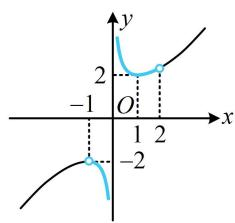
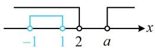
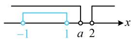
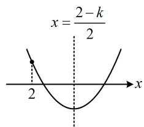
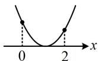
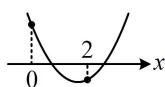
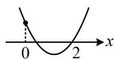

# 强化训练

1. (2023·全国模拟·★★)(多选)

已知 $a, b, c, d \in \mathbf{R}$ ，则下列命题正确的是（）

A. 若 $a > b$ ， $c > d$ ，则 $a - d > b - c$   
B. 若 $a > b$ ， $c > d$ ，则 $ac > bd$   
C. 若 $a > b$ ， $c > d > 0$ ，则 $\frac{a}{d} >\frac{b}{c}$   
D. 若 $ab > 0$ ， $bc - ad > 0$ ，则 $\frac{c}{a} > \frac{d}{b}$

1. AD

解析：A项，结论中 $d$ 和 $c$ 前面都有负号，故考虑在 $c > d$ 两端乘以-1，朝目标靠拢，

因为 $c > d$ ，所以 $-c < -d$ ，故 $-d > -c$ ，又 $a > b$ ，由同向不等式的可加性得 $a - d > b - c$ ，故A项正确；

B项，同向同正的不等式才能相乘，B项只满足同向，没有同正，故不对，下面举个反例，

取 $a = 2$ ， $b = 1$ ， $c = -2$ ， $d = -3$ ，满足 $a > b$ ， $c > d$

但 $ac = -4 < bd = -3$ ，故B项错误；

C 项， $\frac{a}{d} > \frac{b}{c}$ 可以看成 $a \cdot \frac{1}{d} > b \cdot \frac{1}{c}$ ，由 $c > d > 0$ 可以得到 $\frac{1}{d} > \frac{1}{c} > 0$ ，但 $a > b$ 中没规定 $a, b$ 都为正数，不满足同向同正可乘的条件，所以 C 项不对，下面举个反例，

取 $a = -1$ ， $b = -2$ ， $c = 2$ ， $d = 1$

满足 $a > b$ ， $c > d > 0$ ，但 $\frac{a}{d} = \frac{b}{c} = -1$ ，故C项错误；

D项，由 $bc - ad > 0$ 可得 $bc > ad$ ，又 $ab > 0$ ，所以 $\frac{1}{ab} > 0$

在 $bc > ad$ 两端同乘以 $\frac{1}{ab}$ 可得 $bc\cdot \frac{1}{ab} >ad\cdot \frac{1}{ab}$

化简得： $\frac{c}{a} >\frac{d}{b}$ ，故D项正确.

2. (2022·吉林模拟·★★★) (多选)

已知实数 $a, b, c$ 满足 $a < b < c$ ，且 $a + b + c = 0$ ，则下列不等关系正确的是（）

A. ${ac} < {bc}$

B. $\frac{1}{ab} >\frac{1}{bc}$

C. $ab^{2} < cb^{2}$

D. $\frac{c - a}{c - b} > 1$

2. AD

解析：a，b，c 关系清晰，可先取特值看能否排除选项，

取 $a = -3$ ， $b = 1$ ， $c = 2$ ，经检验， $\frac{1}{ab} < \frac{1}{bc}$ ，排除B项，

取 $a = -2$ ， $b = 0$ ， $c = 2$ ，经检验， $ab^{2} = cb^{2}$ ，排除C项，

多选题到此已可确定选AD，下面也给出严格的分析过程，观察选项发现要用 $a, b, c$ 的正负情况，故先判断，

由 $a < b < c$ ， $a + b + c = 0$ 得 $\left\{ \begin{array}{l}0 = a + b + c <   c + c + c = 3c\\ 0 = a + b + c > a + a + a = 3a \end{array} \right.$

所以 c > 0，a < 0，b 的正负均有可能，

A项，在 $a < b$ 两端同乘以 $c$ 可得 $ac < bc$ ，故A项正确；

B 项，由前面的分析可知 $\frac{1}{a} < 0 < \frac{1}{c}$ ，但 $b$ 的正负不确定，所以 B 选项不对，下面举个反例，

取 $a = -3$ ， $b = 1$ ， $c = 2$ ，满足题设条件，

此时 $\frac{1}{ab} = -\frac{1}{3} < \frac{1}{bc} = \frac{1}{2}$ ，故B项错误；

C 项，取 a = -1，b = 0，c = 1 得 $ab^{2} = cb^{2} = 0$ ，故 C 项错误；

D项，要比较 $\frac{c - a}{c - b}$ 与1的大小，可作差来看，

$$
\frac {c - a}{c - b} - 1 = \frac {c - a - (c - b)}{c - b} = \frac {b - a}{c - b},
$$

因为 $a < b < c$ ，所以 $b - a > 0$ ， $c - b > 0$

故 $\frac{c - a}{c - b} - 1 = \frac{b - a}{c - b} > 0$ ，所以 $\frac{c - a}{c - b} > 1$ ，故D项正确.

3. (2023·江西模拟·★★)

方程 $x^{2}-mx+1=0$ 在区间 $(-1,2)$ 上有根，则实数 m 的取值范围是 \_\_\_\_.

3. $(- \infty, -2) \cup [2, +\infty)$

解析：只说有根，没规定几个根，考虑参变分离，

$$
x ^ {2} - m x + 1 = 0 \Leftrightarrow m x = x ^ {2} + 1 \quad (1),
$$

接下来两端除以 $x$ 即可分离出 $m$ ，但需考虑 $x = 0$ 的情形，

当 $x = 0$ 时，方程①不成立，所以0不是方程①的解；

当 $x \in (-1,0) \cup (0,2)$ 时，方程①等价于 $m = x + \frac{1}{x}$ ，

函数 $y = x + \frac{1}{x}$ 的大致图象如图所示，

该函数在 $(-1,0)\cup (0,2)$ 上值域为 $(-\infty , - 2)\cup [2, + \infty)$

所以 $m$ 的取值范围是 $(- \infty, -2) \cup [2, +\infty)$ .

line

| x | y |
|---|---|
| -1 | 2 |
| 0 | 2 |
| 1 | 2 |
| 2 | -2 |

4. (2022·安徽模拟·★★☆)

已知关于 $x$ 的不等式 $(x - a)(x - 2) > 0$ 成立的一个充分不必要条件是 $-1 < x < 1$ ，则实数 $a$ 的取值范围是（）

A. $(- \infty, -1]$

B. $(- \infty, 0)$

C. $[2, +\infty)$

D. $[1, +\infty)$

4. D

解析：先求解 $(x - a)(x - 2) > 0$ ， $a$ 与2的大小不定，需讨论，

记 $(x - a)(x - 2) > 0$ 的解集为 $A$ ， $B = (-1,1)$

题干的条件等价于 $B \subsetneq A$ ，

当 $a = 2$ 时， $(x - a)(x - 2) > 0$ 即为 $(x - 2)^{2} > 0$

解得： $x\neq 2$ ，所以 $A = (-\infty ,2)\cup (2, + \infty)$ ，满足 $B\subsetneq A$

当 $a > 2$ 时， $(x - a)(x - 2) > 0\Leftrightarrow x <   2$ 或 $x > a$

所以 $A = (-\infty, 2) \cup (a, +\infty)$ ，如图1，满足 $B \subsetneq A$ ；

当 $a < 2$ 时， $(x - a)(x - 2) > 0 \Leftrightarrow x < a$ 或 $x > 2$

故 $A = (-\infty, a) \cup (2, +\infty)$ ，如图2，要使 $B \subsetneq A$ ，应有 $1 \leq a < 2$ ；

综上所述，实数 $a$ 的取值范围是 $[1, +\infty)$ 。

  
图1

  
图2

5. (2025·天津模拟·★★☆)

关于 $x$ 的方程 $x^{2} + (k - 2)x + 5 - k = 0$ 的两个不相等实根都大于2，则实数 $k$ 的取值范围是

5. $(-5, - 4)$

解析：规定了 $(2, +\infty)$ 上根的个数为 2，故考虑画二次函数的图象来看，

设 $f(x) = x^{2} + (k - 2)x + 5 - k$ ，若原方程有2个大于2的实根，则 $f(x)$ 的大致图象如图，

所以 $\left\{ \begin{array}{l} f(2) = 2^2 + (k - 2) \cdot 2 + 5 - k = k + 5 > 0 \\ \Delta = (k - 2)^2 - 4(5 - k) = k^2 - 16 > 0 \\ \text{对称轴} x = \frac{2 - k}{2} > 2 \end{array} \right.$ ，故 $-5 < k < -4$ 。

text_image

x = \frac{2-k}{2}

6. (2025·广东模拟·★★★)

若关于 $x$ 的不等式 $x^{2} - ax - 3 < 0$ 的解集为 $(x_0, x_0 + 4)$ ，则实数 $a =$ \_\_\_\_.

6. ±2

解析：观察发现解集的端点都含参，但差值不变，故可由韦达定理求出 $\left|x_{1}-x_{2}\right|$ ，从而建立方程求a，

因为 $x^{2} - ax - 3 < 0$ 的解集为 $(x_0, x_0 + 4)$ ，所以 $x_0$ 和 $x_0 + 4$ 是方程 $x^{2} - ax - 3 = 0$ 的两根，

记 $x_{1} = x_{0}$ ， $x_{2} = x_{0} + 4$ ，则由韦达定理， $\left\{ \begin{array}{l}x_1 + x_2 = a\\ x_1x_2 = -3 \end{array} \right.$

故 $\left|x_{1} - x_{2}\right| = \sqrt{(x_{1} + x_{2})^{2} - 4x_{1}x_{2}} = \sqrt{a^{2} - 4\times (-3)}$

$$
= \sqrt {a ^ {2} + 1 2} , \text {又} \left| x _ {1} - x _ {2} \right| = \left| x _ {0} - (x _ {0} + 4) \right| = 4 ,
$$

所以 $\sqrt{a^2 + 12} = 4$ ，解得： $a = \pm 2$

【反思】对于一元二次方程 $ax^2 + bx + c = 0$ ，除两根之和、两根之积的韦达定理外，两根之差的绝对值 $\left|x_1 - x_2\right| = \sqrt{(x_1 + x_2)^2 - 4x_1x_2} = \frac{\sqrt{\Delta}}{|a|}$ 也需要掌握，它在解析几何中有广泛的应用.

7.（2023·湖南模拟·★★★☆）

若函数 $f(x) = ax^{2} + (2 - a)x - 2$ 在(0,2)上有且仅有1个零点，则实数 $a$ 的取值范围是

7. $[-1, +\infty) \cup \{-2\}$

解析：平方项系数为字母，先讨论其等于0的情形，

当 $a = 0$ 时， $f(x) = 2x - 2$ ， $f(x) = 0 \Leftrightarrow x = 1$ ，满足题意；

当 $a \neq 0$ 时， $f(x) = 0 \Leftrightarrow ax^2 + (2 - a)x - 2 = 0 \Leftrightarrow x^2 +$ $\frac{2-a}{a}x-\frac{2}{a}=0$ ，问题等价于此方程在 $(0,2)$ 上有1个实根，

设 $g(x) = x^{2} + \frac{2 - a}{a} x - \frac{2}{a}$ ，注意到 $g(0) = -\frac{2}{a} \neq 0$ ，

所以 $g(x)$ 的图象有下面四种满足要求的情形，

若为图1，则 $\Delta = \frac{(2 - a)^2}{a^2} +\frac{8}{a} = 0$ ，解得： $a = -2$

经检验，此时 $g(x)=0$ 即为 $(x-1)^{2}=0$ ，

解得： $x = 1$ ，满足题意；

若为图2或图3，此时要再分别考虑吗？不用，我们发现两种情况都只需 $g(0)$ 和 $g(2)$ 异号，故可按此统一处理，

所以 $g(0)g(2) = -\frac{2}{a}\left(4 + \frac{4 - 2a}{a} -\frac{2}{a}\right) <   0$

整理得： $a+1>0$ ，故 $a>-1(a\neq0)$ ;

若为图4，则 $g(2) = 4 + \frac{4 - 2a}{a} -\frac{2}{a} = 0$ ，解得： $a = -1$

此时 $g(x) = x^{2} - 3x + 2$ ，由 $g(x) = 0$ 可得 $x = 1$ 或2，

满足 $g(x)$ 在 $(0,2)$ 上有且仅有1个零点；

综上所述，实数 $a$ 的取值范围是 $[-1, +\infty) \cup \{-2\}$ .

  
图1

  
图2

  
图3

  
图4

8. (2023·新课标Ⅱ卷·★★★☆)(多选)

若函数 $f(x) = a\ln x + \frac{b}{x} + \frac{c}{x^2} (a \neq 0)$ 既有极大值也有极小值，则（）

A. $bc > 0$

B. $ab > 0$

C. $b^{2} + 8ac > 0$

D. ${ac} < 0$

8. BCD

解析：由题意， $f'(x)=\frac{a}{x}-\frac{b}{x^{2}}-\frac{2c}{x^{3}}=\frac{ax^{2}-bx-2c}{x^{3}}(x>0)$

函数 $f(x)$ 既有极大值，又有极小值，所以 $f^{\prime}(x)$ 在 $(0, + \infty)$ 上有两个变号零点，

故方程 $ax^2 - bx - 2c = 0$ 在 $(0, +\infty)$ 上有两个不相等实根，

所以 $\left\{ \begin{array}{l} \Delta = (-b)^2 - 4a(-2c) > 0 \\ x_1x_2 = -\frac{2c}{a} > 0 \\ x_1 + x_2 = \frac{b}{a} > 0 \end{array} \right.$ ①(保证有两根) ②(保证两根同号) ，

由①可得 $b^{2}+8ac>0$ ，故C项正确；

由②可得 $\frac{c}{a} < 0$ ，所以 $a, c$ 异号，故 $ac < 0$ ，故D项正确；

由③可得 a, b 同号，所以 ab > 0 ，故 B 项正确；

因为 $a, c$ 异号， $a, b$ 同号，所以 $b, c$ 异号，

从而 bc < 0，故 A 项错误.