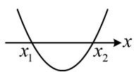
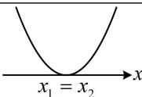
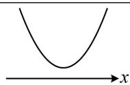
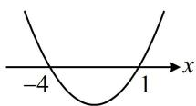
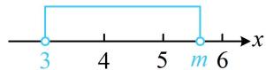
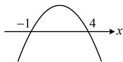
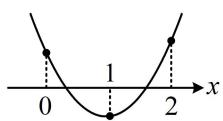
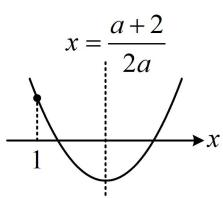

# 第二章 一元二次函数、方程与不等式

# 模块一 不等式与二次函数（★★）

# 内容提要

本节包含不等式性质、一元二次不等式、一元二次方程根的分布三部分内容.

1. 不等式的性质

①对称性： $a > b \Leftrightarrow b < a$ ；②传递性：a > b 且 $b > c \Rightarrow a > c$ ；③可加性： $a > b \Rightarrow a + c > b + c$ ；  
④可乘性： $a > b$ 且 $c > 0\Rightarrow ac > bc$ ； $a > b$ 且 $c <   0\Rightarrow ac <   bc$   
⑤同向可加性： $a > b$ 且 $c > d \Rightarrow a + c > b + d$   
⑥同向同正可乘性： $a > b > 0$ 且 $c > d > 0 \Rightarrow ac > bd$ ；⑦可乘方性： $a > b > 0 \Rightarrow a^n > b^n (n \in \mathbf{N}^*)$ .

2. 二次函数与一元二次方程、不等式的解（以平方项系数 $a > 0$ 为例）

<table><tr><td></td><td> $\Delta >0$ </td><td> $\Delta = 0$ </td><td> $\Delta < 0$ </td></tr><tr><td>函数  $y=ax^{2}+bx+c$  的图象</td><td></td><td></td><td></td></tr><tr><td>方程  $ax^{2}+bx+c=0$  的实根</td><td>两个不等实根 $x_{1}$  和  $x_{2}(x_{1} < x_{2})$ </td><td>两个相等的实根 $x_{1}=x_{2}=-\frac{b}{2a}$ </td><td>没有实根</td></tr><tr><td>不等式  $ax^{2}+bx+c>0$  的解集</td><td> $\{x|x< x_{1} 或 x>x_{2}\}$ </td><td> $\left\{x\mid x\neq-\frac{b}{2a}\right\}$ </td><td>R</td></tr><tr><td>不等式  $ax^{2}+bx+c<0$  的解集</td><td> $\{x|x_{1}<x< x_{2}\}$ </td><td>∅</td><td>∅</td></tr></table>

3. 根据一元二次方程在某区间上根的情况求参:

① 若只说有根，没规定根的个数，则考虑参变分离，再对变量一侧求值域，即可得到参数的范围.  
②若规定了根的个数，则常画出二次函数的图象，考虑判别式、对称轴、端点值.

# 类型I：用不等式性质判断不等式是否正确

【例1】下列说法正确的是（）

A. 若 $a > b$ ，则 $ac^2 > bc^2$

B. 若 $a > b$ ， $c > d$ ，则 $a - c > b - d$

C. 若 $a > b$ ， $c > d$ ，则 $ac > bd$

D. 若 $a > b$ ， $c > d$ ，则 $a + c > b + d$

解析：A项，当 $c = 0$ 时， $ac^2 = bc^2$ ，故A项错误；

B项，同向不等式可以相加，但不能相减，所以B项不对，下面举个反例，

取 $a = 2$ ， $b = 1$ ， $c = 3$ ， $d = 1$ ，则 $a - c = -1 < b - d = 0$ ，故B项错误；

C 项，同向同正的不等式才可以相乘，条件中没有同正，所以不对，下面举个反例，

取 $a = 1$ ， $b = 0$ ， $c = -1$ ， $d = -2$ ，则 $ac = -1 < bd = 0$ ，故C项错误；

D 项，根据同向不等式的可加性，由 $\left\{\begin{aligned}a>b\\ c>d\end{aligned}\right.$ 可得 $a+c>b+d$ ，故 D 项正确.

答案: D

【反思】取特值检验不等式只能结合排除法用. 若将特值代入不等式不成立, 则此选项必定错误; 反之, 若特值满足不等式, 该不等式却不一定恒成立. 例如, 本题的选项 B 中, 若取 $a = 4$ , $b = 1$ , $c = 0$ , $d = -1$ , 则满足 $a - c > b - d$ , 但此不等式不是恒成立的.

【例2】（多选）已知 $a > b > 0 > c$ ，则下列不等关系正确的是（）

A. $\frac{b - c}{a - c} < \frac{b}{a}$

B. $\frac{b - c}{a} < \frac{a - c}{b}$

C. $a(c + 2) > b(c + 2)$

D. $ab + c^2 >ac + bc$

解法1：条件 $a > b > 0 > c$ 非常简单，可考虑由此取特值来检验选项，用排除法选答案，

取 $a = 2$ ， $b = 1$ ， $c = -2$ ，则 $\frac{b - c}{a - c} = \frac{3}{4}$ ， $\frac{b}{a} = \frac{1}{2}$ ，所以 $\frac{b - c}{a - c} >\frac{b}{a}$ ，故A项错误；

又 $a(c + 2) = b(c + 2) = 0$ ，所以C项错误，此题为多选题，故选BD.

解法2：A项，直接观察不易判断是否正确，可作差比较， $\frac{b - c}{a - c} -\frac{b}{a} = \frac{a(b - c) - b(a - c)}{(a - c)a} = \frac{(b - a)c}{(a - c)a}$

因为 $a > b > 0 > c$ ，所以 $b - a < 0$ ， $a - c > 0$ ，故 $\frac{b - c}{a - c} -\frac{b}{a} = \frac{(b - a)c}{(a - c)a} >0$ ，所以 $\frac{b - c}{a - c} >\frac{b}{a}$ ，故A项错误；

B项， $\frac{b - c}{a} -\frac{a - c}{b} = \frac{b(b - c) - a(a - c)}{ab} = \frac{b^2 - bc - a^2 + ac}{ab} = \frac{(b + a)(b - a) - c(b - a)}{ab} = \frac{(b - a)(b + a - c)}{ab},$

因为 $a > b > 0 > c$ ，所以 $ab > 0$ ， $b - a < 0$ ， $b + a - c > 0$ ，故 $\frac{b - c}{a} -\frac{a - c}{b} = \frac{(b - a)(b + a - c)}{ab} < 0$

所以 $\frac{b - c}{a} < \frac{a - c}{b}$ ，故B项正确；

C 项，此选项即为在 $a > b$ 两端同乘以了 $c + 2$ ，当 $c < 0$ 时 $c + 2$ 可能为负，

若为负，则 $a(c + 2) < b(c + 2)$ ，故C项错误；

D 项， $ab + c^{2} - (ac + bc) = a(b - c) + c(c - b) = (b - c)(a - c)$ ，因为 $a > b > 0 > c$ ，所以 $b - c > 0$ ， $a - c > 0$ ，

故 $ab + c^2 -(ac + bc) = (b - c)(a - c) > 0$ ，所以 $ab + c^2 >ac + bc$ ，故D项正确.

答案: BD

【总结】①判断不等式是否成立这类题，特值法是取巧的办法，而若要推证，则应严格按照内容提要中所列的几条不等式的性质来进行等价变形；②当两个数无法直接看出大小时，不妨考虑作差比较.

# 类型Ⅱ：一元二次函数、方程、不等式的关系

【例 3】不等式 $x^{2} + 3x - 4 \geq 0$ 的解集为（）

A. $(- \infty, -4) \cup (1, +\infty)$

B. $(- \infty, -4] \cup [1, +\infty)$

C. $(-4,1)$

D. $[-4,1]$

解析：要解一元二次不等式，先解对应的一元二次方程，再画图来看，

由 $x^{2} + 3x - 4 = 0$ 可得 $(x + 4)(x - 1) = 0$ ，解得： $x = -4$ 或1，

所以二次函数 $y = x^{2} + 3x - 4$ 的大致图象如图，

由图可知，不等式 $x^{2} + 3x - 4\geq 0$ 的解集为 $(- \infty , - 4]\bigcup [1, + \infty)$

答案: B

【反思】上面的过程给出了解一元二次不等式的基本原理, 熟练后可直接将 $x^{2} + 3x - 4$ 分解因式, 再取解集即可,本节后续题目解析将不再阐释上述原理.

【变式 1】若关于 x 的不等式 $x^{2}-(m+3)x+3m<0$ 的解集中恰有 2 个整数，则实数 m 的取值范围是 \_\_\_\_.

解析： $x^{2} - (m + 3)x + 3m <   0\Leftrightarrow (x - 3)(x - m) <   0$ ，两根中 $m$ 与3的大小不确定，故需讨论，

当 $m = 3$ 时， $(x - 3)(x - m) < 0$ 即为 $(x - 3)^2 < 0$ ，无解，不合题意；

当 $m > 3$ 时， $(x - 3)(x - m) < 0$ 的解集为 $(3, m)$ ，如图1，要使解集中有2个整数，应有 $5 < m \leq 6$ ；

当 $m < 3$ 时， $(x - 3)(x - m) < 0$ 的解集为 $(m,3)$ ，如图2，要使解集中有2个整数，应有 $0 \leq m < 1$ ；

综上所述，实数 $m$ 的取值范围是 $[0,1) \cup (5,6]$ .

答案： $[0,1)\cup (5,6]$

  
图1

  
图2

【变式2】若不等式 $ax^2 + bx + c > 0$ 的解集是 $\{x \mid -1 < x < 4\}$ ，则不等式 $b(x^2 - 1) + a(x + 3) + c > 0$ 的解集为 \_\_\_\_.

解析：给出 $ax^2 + bx + c > 0$ 的解集是 $\{x \mid -1 < x < 4\}$ ，也就是给出了对应的方程 $ax^2 + bx + c = 0$ 的根是-1和4，可以直接将根代入方程，也可结合韦达定理建立 $a, b, c$ 的关系，这里我们不妨用韦达定理，

因为 $ax^2 + bx + c > 0$ 的解集是 $\{x \mid -1 < x < 4\}$ ，所以二次函数 $y = ax^2 + bx + c$ 的大致图象如图，故 $a < 0$

且-1和4是方程 $ax^{2}+bx+c=0$ 的两根，由韦达定理，有 $\left\{\begin{aligned}-1+4&=-\frac{b}{a}\quad①\\ -1\times4&=\frac{c}{a}\quad②\end{aligned}\right.$

目标不等式中有 $a, b, c$ 三个参数，可由上面两式将它们统一起来，判断出了 $a < 0$ ，故统一成 $a$ 由①可得 $b = -3a$ ，由②可得 $c = -4a$ ，代入 $b(x^{2} - 1) + a(x + 3) + c > 0$

可得 $-3a(x^{2}-1)+a(x+3)-4a>0$ ，两端同除以 -a 整理得： $3x^{2}-x-2>0$ ，所以 $(3x+2)(x-1)>0$ ，解得： $x<-\frac{2}{3}$ 或 x>1 。

答案： $\left\{x\mid x <   - \frac{2}{3}\text{或} x > 1\right\}$

【总结】一元二次函数、方程、不等式三者是紧密联系的，从一方的条件，可以推知另外两方的结论.

# 类型III：一元二次方程在某区间有实根

【例 4】方程 $ax^{2} + 2x + 1 = 0$ 在 $(1,2)$ 上有根，则实数 a 的取值范围为 \_\_\_\_.

解析：只说有根，没规定有几个根，若画二次函数图象来看，则需讨论较多的情况，故考虑参变分离，当 $x \in (1,2)$ 时， $ax^2 + 2x + 1 = 0 \Leftrightarrow ax^2 = -2x - 1 \Leftrightarrow a = -\frac{2x + 1}{x^2}$ ①，

方程①有根，意味着 $a$ 在 $-\frac{2x + 1}{x^2}$ 的值域范围内，故求出 $-\frac{2x + 1}{x^2}$ 在(1,2)上的值域，即为 $a$ 的范围， $-\frac{2x + 1}{x^2} = -\frac{2}{x} - \frac{1}{x^2} = -\left(\frac{1}{x} + 1\right)^2 + 1$ ，由 $1 < x < 2$ 可得 $\frac{1}{2} < \frac{1}{x} < 1$ ，

所以 $\frac{3}{2} < \frac{1}{x} + 1 < 2$ ，从而 $\frac{9}{4} < \left(\frac{1}{x} + 1\right)^2 < 4$ ，故 $-3 < -\left(\frac{1}{x} + 1\right)^2 + 1 < -\frac{5}{4}$ ，所以 $a$ 的取值范围是 $\left(-3, -\frac{5}{4}\right)$ .

答案： $\left(-3, - \frac{5}{4}\right)$

【反思】若一元二次方程在某区间有根，但没说几个根，则考虑参变分离，再对变量一侧求值域即可.

# 类型IV：一元二次方程在某区间实根个数已知

【例5】一元二次方程 $ax^2 + 5x + 4 = 0$ 有一个正根和一个负根的充要条件是（）

A. $a <   0$

B. $a > 0$

C. $a < -2$

D. $a > 1$

解析：已经说了是一元二次方程，无需考虑 $a = 0$ 的情况，只规定根的正负，考虑判别式+韦达即可，

设原方程的两根分别为 $x_{1}$ ， $x_{2}$ ，由题意， $\left\{ \begin{array}{l} \Delta = 25 - 16a > 0 \\ x_{1}x_{2} = \frac{4}{a} < 0 \end{array} \right.$ ，解得： $a < 0$

答案: A

【变式1】若关于 $x$ 的方程 $x^{2} - (m + 1)x + 4m^{2} = 0$ 在 $(0,1)$ ， $(1,2)$ 内各有一个实数根，则实数 $m$ 的取值范围是 \_\_\_\_.

解析：规定了两个区间上根的个数，由此容易想象二次函数图象的大致样子，故考虑画图来分析，设 $f(x) = x^{2} - (m + 1)x + 4m^{2}$ ，要使原方程在(0,1)，(1,2)上各有1根，则 $f(x)$ 的大致图象应如图，

所以 $\left\{ \begin{array}{l} f(0) = 4m^2 > 0 \\ f(1) = 4m^2 - m < 0 \\ f(2) = 4m^2 - 2m + 2 > 0 \end{array} \right.$ ，解得： $0 < m < \frac{1}{4}$ .

答案： $\left(0,\frac{1}{4}\right)$

【变式2】方程 $ax^{2} - (a + 2)x + 4 = 0$ 在 $(1, +\infty)$ 上有两个不相等实根，则实数 $a$ 的取值范围为 \_\_\_\_.

解析：规定了给定区间上根的个数，故考虑画二次函数图象来看，但 $a$ 的正负未定，所以开口不定，要讨论吗？不用，为了回避讨论，可在方程两端同除以 $a$ ，将平方项系数化1，但需先考虑 $a = 0$ 的情形，当 $a = 0$ 时，原方程即为 $-2x + 4 = 0$ ，解得： $x = 2$ ，原方程只有一根，不合题意；

当 $a \neq 0$ 时， $ax^2 - (a + 2)x + 4 = 0 \Leftrightarrow x^2 - \frac{a + 2}{a}x + \frac{4}{a} = 0$ ①，

设 $f(x) = x^{2} - \frac{a + 2}{a} x + \frac{4}{a}$ ，要使方程①在 $(1, +\infty)$ 上有两个不相等的实根，函数 $f(x)$ 的大致图象应如图，要让 $f(x)$ 的图象为如图所示的情形，需从判别式、对称轴、端点值三方面考虑，

所以 $\left\{ \begin{array}{l} \Delta = \frac{(a + 2)^2}{a^2} - \frac{16}{a} > 0 \\ \text{对称轴} x = \frac{a + 2}{2a} > 1 \\ f(1) = 1 - \frac{a + 2}{a} + \frac{4}{a} > 0 \end{array} \right.$ ③（保证对称轴右边的根大于1），

text_image

x = \frac{a + 2}{2a}
1
x

将②化简得： $a^2 - 12a + 4 > 0$ ，所以 $(a - 6)^2 > 32$ ，故 $a < 6 - 4\sqrt{2}$ 或 $a > 6 + 4\sqrt{2}$ ，

由④可得 $\frac{2}{a} > 0$ ，所以 $a > 0$ ，从而③可化为 $a + 2 > 2a$ ，故 $a < 2$ ，于是 $0 < a < 2$ ，

综上所述，实数 $a$ 的取值范围是 $(0,6 - 4\sqrt{2})$ 。

答案： $(0,6 - 4\sqrt{2})$

【总结】若规定了一元二次方程在某区间上根的个数，则可画出二次函数的图象，再考虑判别式、对称轴、端点值，但有时只需考虑其中一两点即可，只要它能使图象成为我们需要的情形.

# 强化训练

1. (2023·全国模拟·★★)(多选)

已知 $a, b, c, d \in \mathbf{R}$ ，则下列命题正确的是（）

A. 若 $a > b$ ， $c > d$ ，则 $a - d > b - c$   
B. 若 $a > b$ ， $c > d$ ，则 $ac > bd$   
C. 若 $a > b$ ， $c > d > 0$ ，则 $\frac{a}{d} >\frac{b}{c}$   
D. 若 $ab > 0$ ， $bc - ad > 0$ ，则 $\frac{c}{a} > \frac{d}{b}$

2. (2022·吉林模拟·★★★) (多选)

已知实数 $a, b, c$ 满足 $a < b < c$ ，且 $a + b + c = 0$ ，则下列不等关系正确的是（）

A. $ac < bc$

B. $\frac{1}{ab} >\frac{1}{bc}$

C. $ab^{2} < cb^{2}$

D. $\frac{c - a}{c - b} > 1$

3. (2023·江西模拟·★★)

方程 $x^{2}-mx+1=0$ 在区间 $(-1,2)$ 上有根，则实数 m 的取值范围是 \_\_\_\_.

4. (2022·安徽模拟·★★☆)

已知关于 $x$ 的不等式 $(x - a)(x - 2) > 0$ 成立的一个充分不必要条件是 $-1 < x < 1$ ，则实数 $a$ 的取值范围是（）

A. $(- \infty, -1]$

B. $(- \infty, 0)$

C. $[2, +\infty)$

D. $[1, +\infty)$

5. (2025·天津模拟·★★☆)

关于 $x$ 的方程 $x^{2} + (k - 2)x + 5 - k = 0$ 的两个不相等实根都大于2，则实数 $k$ 的取值范围是

6. (2025·广东模拟·★★★)

若关于 $x$ 的不等式 $x^{2} - ax - 3 < 0$ 的解集为 $(x_0, x_0 + 4)$ ，则实数 $a =$ \_\_\_\_.

7. (2023·湖南模拟·★★★☆)

若函数 $f(x)=ax^{2}+(2-a)x-2$ 在 $(0,2)$ 上有且仅有 1 个零点，则实数 a 的取值范围是 \_\_\_\_.

8. (2023·新课标II卷·★★★☆)(多选)

若函数 $f(x) = a\ln x + \frac{b}{x} + \frac{c}{x^2} (a \neq 0)$ 既有极大值也有极小值，则（）

A. $bc > 0$

B. ${ab} > 0$

C. $b^{2} + 8ac > 0$

D. $ac < 0$