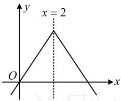
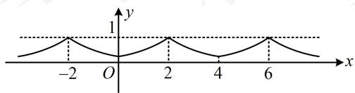
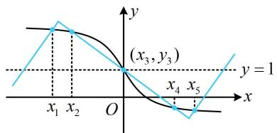
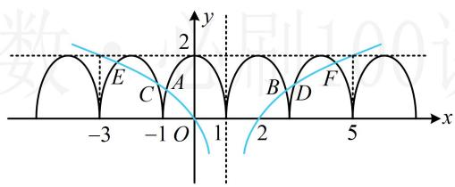
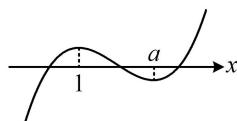

# 强化训练

1. (2022·四川成都模拟·★★★)

已知函数 $y = f(x)$ 满足 $f(4 + x) - f(-x) = 0 (x \in \mathbf{R})$ ，且 $f(x)$ 在 $[2, +\infty)$ 上为减函数，则（）

A. $f(\log_23) > f(\log_25) > f(3)$   
B. $f(\log_25) > f(\log_23) > f(3)$   
C. $f(\log ,5) > f(3) > f(\log ,3)$   
D. $f(\log_23) > f(3) > f(\log_25)$

1. B

解析： $f(4 + x) - f(-x) = 0\Rightarrow f(x)$ 关于直线 $x = 2$ 对称，

结合 $f(x)$ 在 $[2, +\infty)$ 上为减函数可得当自变量与2的距离越大时，函数值越小，如图，

要比较自变量与2的距离，可分析它们与2之差的绝对值，

$$
\left| \log_ {2} 3 - 2 \right| = \left| \log_ {2} \frac {3}{4} \right| = \log_ {2} \frac {4}{3}, \quad \left| \log_ {2} 5 - 2 \right| = \log_ {2} \frac {5}{4}, \quad \left| 3 - 2 \right| = 1,
$$

因为 $\log_2\frac{5}{4} < \log_2\frac{4}{3} < 1$ ，所以 $f(3) < f(\log_23) < f(\log_25)$

text_image

y
x = 2
O
x

2. (2023·山东潍坊三模·★★★)

已知函数 $f(x)$ 的定义域为 $\mathbf{R}$ ， $f(x + 1)$ 为偶函数，

$f(x + 4) = f(-x)$ ，则（）

A. 函数 $f(x)$ 为偶函数  
B. $f(3) = 0$   
C. $f\left(\frac{1}{2}\right) = -f\left(\frac{5}{2}\right)$   
D. $f(2023) = 0$

2. A

解析：所给的两个条件都与 $f(x)$ 的对称性有关，故可由此推周期，下面先将 $f(x + 1)$ 为偶函数翻译为 $f(x)$ 的对称性， $f(x + 1)$ 为偶函数 $\Rightarrow f(x + 1)$ 关于 $y$ 轴对称，而 $f(x + 1)$ 可由 $f(x)$ 左移1个单位得到，所以 $f(x)$ 关于 $x = 1$ 对称①，又 $f(x + 4) = f(-x)$ ，所以 $f(x)$ 关于直线 $x = 2$ 对称，

结合①可得 $f(x)$ 周期为2，则4也是 $f(x)$ 的周期，所以

$f(x + 4) = f(x)$ ，代入 $f(x + 4) = f(-x)$ 得 $f(x) = f(-x)$

所以 $f(x)$ 为偶函数，此为单选题，故选 A.

3. (★★★) (多选)

设 $f(x)$ 是定义在 $\mathbf{R}$ 上的偶函数，且对 $\forall x\in \mathbf{R}$ ， $f(x + 2) = f(2 - x)$ ，当 $x\in [0,2]$ 时， $f(x) = \left(\frac{1}{2}\right)^{2 - x}$ ，则（）

A. $f(x)$ 是周期函数，且周期为2

B. $f(x)$ 的最大值是1，最小值是 $\frac{1}{4}$

C. $f(x)$ 在[2,4]上单调递减，在[4,6]上单调递增

D. 当 $x \in [2,4]$ 时， $f(x) = \left(\frac{1}{2}\right)^{2 - x}$

3. BC

解析：A项， $f(x)$ 是偶函数 $\Rightarrow f(x)$ 关于 $x = 0$ 对称，

$f(x + 2) = f(2 - x)\Rightarrow f(x)$ 关于 $x = 2$ 对称，

所以 $f(x)$ 是以 4 为周期的周期函数，故 A 项错误；

B项，由于是周期函数，画图看最值比较方便，故考虑画图，可结合[0,2]上的解析式和偶函数、周期性来画图，

当 $x \in [0,2]$ 时， $f(x) = \left(\frac{1}{2}\right)^{2 - x}$ ，结合 $f(x)$ 是周期为4的偶函数可作出 $f(x)$ 的大致图象如图，

所以 $f(x)_{\min} = f(0) = \frac{1}{4}$ ， $f(x)_{\max} = f(2) = 1$ ，故B项正确；

C 项，由图可知 C 项正确；

D 项，由图可知 $f(x)$ 在 [2,4] 上 $\searrow$ ，

而 $y=\left(\frac{1}{2}\right)^{2-x}$ 在 $[2,4]$ 上 $\nearrow$ ，故 D 项错误.

text_image

y
1
-2 O 2 4 6 x

4. (★★★)

已知函数 $f(x)=\ln(\sqrt{x^{2}+1}-x)+1$ ，定义域为 R 的函数 $g(x)$ 满足 $g(-x)+g(x)=2$ ，若函数 $y=f(x)$ 与 $y=g(x)$ 的图象的交点为 $(x_{1},y_{1})$ ， $(x_{2},y_{2})$ ，…， $(x_{5},y_{5})$ ，则 $\sum_{i=1}^{5}(x_{i}+y_{i})=(\quad)$

A. 0 B. 5 C. 10 D. 15

4. B

解析： $g(x)$ 没给解析式，给的是 $g(-x) + g(x) = 2$ ，只能得出对称性，所以也要研究 $f(x)$ 的对称性，

注意到 $y = \ln (\sqrt{x^2 + 1} - x)$ 为奇函数，其图象关于原点对称，

所以 $f(x)$ 的图象关于点 $(0,1)$ 对称，

又 $g(-x) + g(x) = 2$ ，所以 $g(x)$ 的图象也关于点(0,1)对称，

故 $f(x)$ 与 $g(x)$ 的交点关于点(0,1)对称，

所以两函数的草图如图，由图可知， $x_{1}+x_{2}+\cdots+x_{5}=0$ ，

$y_{1}+y_{2}+\cdots+y_{5}=5$ ，所以 $\sum_{i=1}^{5}(x_{i}+y_{i})=5$ 。

text_image

y
(x₃, y₃)
y = 1
x₁ x₂ O x
x₄ x₅
x

5. (2022·江苏模拟·★★★)

偶函数 $f(x)$ 满足 $f(x) = f(2 - x)(x \in \mathbf{R})$ ，当 $x \in$

[0,1]时， $f(x) = 2 - 2x^{2}$ ，则函数 $g(x) = f(x) -$

$2\log_{4}|x - 1|$ 的所有零点之和为（）

A. 4

B. 6

C. 8

D. 10

5. B

解析： $f(x) = f(2 - x)\Rightarrow f(x)$ 的图象关于 $x = 1$ 对称，

$f(x)$ 为偶函数 $\Rightarrow f(x)$ 的图象关于 $y$ 轴对称，

所以 $f(x)$ 的周期为2， $g(x) = 0 \Leftrightarrow f(x) = 2\log_4|x - 1|$ ，

作出 $y = f(x)$ 和 $y = 2\log_4|x - 1|$ 的图象如图，两图象有6个交点，且它们两两关于直线 $x = 1$ 对称，

由图可知， $\frac{x_A + x_B}{2} = 1$ ，所以 $x_{A} + x_{B} = 2$

同理， $x_{C} + x_{D} = x_{E} + x_{F} = 2$

故 $g(x)$ 的零点之和为 $x_{A} + x_{B} + x_{C} + x_{D} + x_{E} + x_{F} = 6$

text_image

y
2
E C A B D F
-3 -1 O 1 2 5 x

6. (2023·山东青岛模拟·★★★☆)

设 $f(x)$ 为定义在整数集上的函数， $f(1) = 1$ ， $f(2) = 0$ ， $f(-1) < 0$ ，对任意的整数 $x$ ， $y$ 均有 $f(x + y) = f(x)f(1 - y) + f(1 - x)f(y)$ ，则 $f(55) =$ \_\_\_\_.

6. -1

解析： $f(55)$ 离给的 $f(1)$ ， $f(2)$ 较远，猜想 $f(x)$ 可能有周期，故先尝试推周期，所给关系式中有 x 和 y，可考虑对 y 赋值，令 y=0 得 $f(x)=f(x)f(1)+f(1-x)f(0)$ ，

结合 $f(1) = 1$ 化简得： $f(1 - x)f(0) = 0$

因为 $f(1-x)$ 不恒为 0，所以 $f(0)=0$ ，

给了 $f(2)$ ，故考虑再取 $y = 2$ ，

令 $y = 2$ 得 $f(x + 2) = f(x)f(-1) + f(1 - x)f(2)$

结合 $f(2) = 0$ 可得 $f(x + 2) = f(x)f(-1)$ ①，

式①中有 $f(-1)$ ，题干刚好也给出了 $f(-1) < 0$ ，故考虑求

$f(-1)$ ，为了构造出 $f(-1)$ ，可尝试取 $y = -1$

令 $y = -1$ 得 $f(x - 1) = f(x)f(2) + f(1 - x)f(-1)$

结合 $f(2) = 0$ 可得 $f(x - 1) = f(1 - x)f(-1)$ ②，

在②中令 $x = 2$ 得 $f(1) = f(-1)^2$ ，结合 $f(1) = 1$ 得 $f(-1)^2 =$

1，又由题意， $f(-1)<0$ ，所以 $f(-1)=-1$ ，

代入①得 $f(x + 2) = -f(x)$

在此式中将 $x$ 换成 $x + 2$ 可得 $f(x + 4) = -f(x + 2) = f(x)$ ，

所以 $f(x)$ 的周期为4，故 $f(55) = f(14\times 4 - 1) = f(-1) = -1$

提示：以下几题均为压轴难度.

# 7. (★★★★)

已知 $f'(x)$ 是函数 $f(x)$ 的导函数，若 $f(x+2)$ 和 $f'(x)$ 均为奇函数，且 $f(0)=2$ ，则 $f(2)+f(4)+\cdots$

$$
+ f (2 0 2 4) = \underline {{{\quad}}}.
$$

7.0

解析：条件涉及 $f(x + 2)$ 和 $f'(x)$ 的对称性，所求为 $f(x)$ 的函数值之和，故考虑先将条件翻译成 $f(x)$ 的对称性，

$f(x + 2)$ 为奇函数 $\Rightarrow f(x)$ 关于点(2,0)对称 $\Rightarrow f(2) = 0$

$f'(x)$ 为奇函数 $\Rightarrow f(x)$ 为偶函数，（理由见内容提要 7④）所以 $f(x)$ 的图象关于 y 轴对称，故 $f(x)$ 的周期为 8，

因为 $f(0) = 2$ ，且 $f(x)$ 关于 $(2,0)$ 对称，所以 $f(4) = -2$

又 $f(x)$ 为偶函数，且周期为 8，

所以 $f(6) = f(-2) = f(2) = 0$ ， $f(8) = f(0) = 2$

从而 $f(2) + f(4) + f(6) + f(8) = 0 + (-2) + 0 + 2 = 0$

故 $f(2)+f(4)+\cdots+f(2024)=[f(2)+f(4)+f(6)+f(8)]+$

$$
[ f (1 0) + f (1 2) + f (1 4) + f (1 6) ] + \dots +
$$

$$
[ f (2 0 1 8) + f (2 0 2 0) + f (2 0 2 2) + f (2 0 2 4) ] = 0.
$$

# 8. (2024·新课标II卷·★★★★★) (多选)

设函数 $f(x)=2x^{3}-3ax^{2}+1$ ，则（）

A. 当 $a > 1$ 时， $f(x)$ 有三个零点

B. 当 $a < 0$ 时， $x = 0$ 是 $f(x)$ 的极大值点

C. 存在 $a, b$ , 使得 $x = b$ 为曲线 $y = f(x)$ 的对称轴

D. 存在 $a$ ，使得点 $(1, f(1))$ 为曲线 $y = f(x)$ 的对称中心

8. AD

解析：A 项，研究三次函数的零点，考虑求导分析单调性，再画草图来看，

由题意， $f'(x)=6x^{2}-6ax=6x(x-a)$ ，当a>1时，

$f^{\prime}(x) > 0\Leftrightarrow x <   0$ 或 $x > a$ ， $f^{\prime}(x) <   0\Leftrightarrow 0 <   x <   a$

所以 $f(x)$ 在 $(- \infty, 0)$ 和 $(a, +\infty)$ 上 $\nearrow$ ，在 $(0, a)$ 上 $\searrow$ ，

又因为 $f(0) = 1 > 0$ ， $f(a) = 2a^{3} - 3a\cdot a^{2} + 1 = 1 - a^{3} <   0$

所以 $f(x)$ 的草图如图，由图可知， $f(x)$ 有3个零点，

故 A 项正确;

B项，当 $a < 0$ 时， $f^{\prime}(x) > 0\Leftrightarrow x < a$ 或 $x > 0$

$f^{\prime}(x) <   0\Leftrightarrow a <   x <   0$ ，故 $f(x)$ 在 $(-\infty ,a)$ 和 $(0, + \infty)$ 上，

在 $(a,0)$ 上 $\searrow$ ，所以 $x = 0$ 是 $f(x)$ 的极小值点，

故 B 项错误;

C 项，可以想象，所有三次函数的图象都没有对称轴，故此选项错误，怎样严格论证？正面论证 $f(x)$ 没有对称轴较难，可用反证法，先假设 $x = b$ 是对称轴，再推矛盾，

假设 $f(x)$ 关于 $x = b$ 对称，则 $f(2b - x) = f(x)$ ，

所以 $f(2b - x) - f(x) =$

$$
2 (2 b - x) ^ {3} - 3 a (2 b - x) ^ {2} + 1 - 2 x ^ {3} + 3 a x ^ {2} - 1
$$

$$
= 2 \left[ (2 b - x) ^ {3} - x ^ {3} \right] - 3 a \left[ (2 b - x) ^ {2} - x ^ {2} \right]
$$

$$
= 2 (2 b - x - x) [ (2 b - x) ^ {2} + (2 b - x) x + x ^ {2} ] -
$$

$$
3 a (2 b - x + x) (2 b - x - x)
$$

$$
= 4 (b - x) \left(4 b ^ {2} - 2 b x + x ^ {2}\right) - 1 2 a b (b - x)
$$

$= 4(b - x)(x^{2} - 2bx - 3ab + 4b^{2}) = 0$ 恒成立，这不可能，

所以曲线 $y = f(x)$ 不可能关于 $x = b$ 对称，故C项错误；

D 项，三次函数 $y = mx^3 + nx^2 + px + q (m \neq 0)$ 的图象必有对称中心，且对称中心的横坐标是 $-\frac{n}{3m}$ （有极值点时即为极值点的平均数）。若熟悉这一结论，则可直接判断出当 $a = 2$ 时， $(1, f(1))$ 就是 $y = f(x)$ 的对称中心，此选项正确，下面我们给出严格推导，

由题意， $f(1) = 3 - 3a$ ，所以 $y = f(x)$ 关于 $(1, f(1))$ 对称等价于 $f(2 - x) + f(x) = 6 - 6a$ 恒成立，

$$
f (2 - x) + f (x) = 2 (2 - x) ^ {3} - 3 a (2 - x) ^ {2} + 1 + 2 x ^ {3} - 3 a x ^ {2} + 1
$$

$$
= 2 [ (2 - x) ^ {3} + x ^ {3} ] - 3 a [ (2 - x) ^ {2} + x ^ {2} ] + 2
$$

$$
= 2 (2 - x + x) [ (2 - x) ^ {2} - (2 - x) x + x ^ {2} ] -
$$

$$
3 a (4 - 4 x + x ^ {2} + x ^ {2}) + 2
$$

$$
= 4 (3 x ^ {2} - 6 x + 4) - 3 a (2 x ^ {2} - 4 x + 4) + 2
$$

$$
= (1 2 - 6 a) x ^ {2} + (1 2 a - 2 4) x + 1 8 - 1 2 a,
$$

令 $(12 - 6a)x^{2} + (12a - 24)x + 18 - 12a = 6 - 6a$

则 $\left\{ \begin{array}{l} 12 - 6a = 0 \\ 12a - 24 = 0 \\ 18 - 12a = 6 - 6a \end{array} \right.$ ，解得： $a = 2$

所以当 $a = 2$ 时，曲线 $y = f(x)$ 关于 $(1, f(1))$ 对称，

故D项正确.

# 9. (2022·全国乙卷·★★★★)

已知函数 $f(x)$ ， $g(x)$ 的定义域均为 $\mathbf{R}$ ，且 $f(x)+$

$g(2 - x) = 5$ ， $g(x) - f(x - 4) = 7$ .若 $y = g(x)$ 的图象关于直线 $x = 2$ 对称， $g(2) = 4$ ，则 $\sum_{k = 1}^{22}f(k) =$ （）

A. -21

B. -22

C. -23

D. -24

9. D

解析：要求 $\sum_{k=1}^{22} f(k)$ ，得研究 $f(x)$ 的性质，条件给出了两个 $f(x)$ 与 $g(x)$ 混合的关系式，故考虑先把 $g(x)$ 消掉，

在 $g(x) - f(x - 4) = 7$ 中将 $x$ 换成 $2 - x$ 可得

$g(2 - x) - f(-2 - x) = 7$ ，所以 $g(2 - x) = f(-2 - x) + 7$

代入 $f(x) + g(2 - x) = 5$ 可得 $f(x) + f(-2 - x) + 7 = 5$

所以 $f(x) + f(-2 - x) = -2$ ，故 $f(x)$ 关于 $(-1, - 1)$ 对称 ①，

题干给出了 $g(x)$ 关于 $x = 2$ 对称，而 $g(x)$ 和 $f(x)$ 显然是有关系的，可以由此条件再推导 $f(x)$ 的对称性，

由 $g(x) - f(x - 4) = 7$ 可得 $f(x - 4) = g(x) - 7$

将 $x$ 换成 $x + 4$ 可得 $f(x) = g(x + 4) - 7$

从而 $f(x)$ 可由 $g(x)$ 左移4个单位，下移7个单位得到，

故 $f(x)$ 关于直线 $x = -2$ 对称 ②，

结合①②可得 $f(x)$ 是以4为周期的周期函数，

接下来求一个周期的整点函数值，就可以算出 $\sum_{k=1}^{22} f(k)$ ，

首先， $f(x)$ 关于 $(-1, - 1)$ 对称，所以 $f(-1) = -1$

结合 $f(x)$ 周期为 4 可得 $f(3)=f(-1)=-1$ ，

又 $f(x)$ 关于 $x = -2$ 对称，所以 $f(-3) = f(-1) = -1$

结合周期为4可得 $f(1)=f(-3)=-1$ ，

只要求出 $f(2)$ 和 $f(4)$ , 就大功告成, 条件中 $g(2) = 4$ 还没用, 先在题干给的等式中将 $g(2)$ 构造出来,

因为 $g(2) = 4$ ，在 $f(x) + g(2 - x) = 5$ 中取 $x = 0$ 可得

$f(0) + g(2) = 5$ ，所以 $f(0) = 5 - g(2) = 1$ ，故 $f(4) = 1$

由 $f(0) = 1$ 以及 $f(x)$ 关于 $(-1, - 1)$ 对称可得 $f(-2) = -3$

结合周期为4可得 $f(2)=-3$ ，

所以 $\sum_{k=1}^{22} f(k) = 5 \times [f(1) + f(2) + f(3) + f(4)] + f(1) + f(2)$

$$
= 5 \times (- 1 - 3 - 1 + 1) - 1 - 3 = - 2 4.
$$

10. (2022·新课标Ⅱ卷·★★★★)

若函数 $f(x)$ 的定义域为 $\mathbf{R}$ ，且 $f(x + y) + f(x - y)$

$= f(x)f(y),\quad f(1) = 1$ ，则 $\sum_{k = 1}^{22}f(k) =$ （

A. -3

B. -2

C. 0

D. 1

10. A

解法1：要求的是 $\sum_{k=1}^{22} f(k)$ ，猜想 $f(x)$ 应该会有周期性，可在 $f(x+y)+f(x-y)=f(x)f(y)$ 中对 $y$ 赋值来判断，

在 $f(x + y) + f(x - y) = f(x)f(y)$ 中令 $y = 1$ 可得

$$
f (x + 1) + f (x - 1) = f (x) \quad ①,
$$

在①中将 $x$ 换成 $x + 1$ 可得 $f(x + 2) + f(x) = f(x + 1)$ ，

结合式①可得 $f(x + 2) + f(x) = f(x) - f(x - 1)$

所以 $f(x + 2) = -f(x - 1)$ ，从而 $f(x + 3) = -f(x)$

故 $f(x+6)=-f(x+3)=f(x)$ ，所以 $f(x)$ 的周期为6；

有了周期，只需计算一个周期内的整点函数值，问题就解决了．因为已知 $f(1)$ ，所以可以在 $f(x+y)+f(x-y)=f(x)f(y)$ 通过赋值构造出 $f(1)$ 和其它的函数值，

记 $f(x + y) + f(x - y) = f(x)f(y)$ 为式②，

在②中令 $x = 1$ ， $y = 0$ 可得 $2f(1) = f(1)f(0)$

又 $f(1) = 1$ ，所以 $f(0) = 2$ ，结合周期为6可得 $f(6) = 2$

在②中令 x=y=1 可得 $f(2)+f(0)=f^{2}(1)$ ,

所以 $f(2) = f^{2}(1) - f(0) = -1$

在②中令 $x = 2$ ， $y = 1$ 可得 $f(3) + f(1) = f(2)f(1)$

所以 $f(3) = f(2)f(1) - f(1) = -2$

在 $f(x + 3) = -f(x)$ 中令 $x = 1$ 可得 $f(4) = -f(1) = -1$

在 $f(x + 3) = -f(x)$ 中令 $x = 2$ 可得 $f(5) = -f(2) = 1$

所以 $f(1)+f(2)+\cdots+f(6)=1-1-2-1+1+2=0$

故 $\sum_{k=1}^{22} f(k) = f(1) + f(2) + f(3) + f(4) = 1 - 1 - 2 - 1 = -3$ .

解法2：可尝试举个具体的 $f(x)$ 来求解答案，怎么找呢？由 $f(x + y) + f(x - y) = f(x)f(y)$ 可联想到 $\cos (x + y) + \cos$

$(x - y) = 2\cos x\cos y$ ，故考虑余弦，但若直接设 $f(x) = \cos x$ ，则会发现满足的是 $f(x + y) + f(x - y) = 2f(x)f(y)$ ，故需调整系数，经尝试，改为 $f(x) = 2\cos x$ 就满足系数要求了，但此时 $f(1) \neq 1$ ，故再调整为 $f(x) = 2\cos \frac{\pi}{3} x$ ，

设 $f(x) = 2\cos \frac{\pi}{3} x$ ，经检验，满足题干所有条件，

由于 $f(x)$ 的周期为6，故先算一个周期内的整点函数值，

$$
f (1) = 1, \quad f (2) = - 1, \quad f (3) = - 2,
$$

$$
f (4) = - 1, \quad f (5) = 1, \quad f (6) = 2,
$$

故 $f(1)+f(2)+\cdots+f(6)=1+(-1)+(-2)+(-1)+1+2=0$

结合 $f(x)$ 的周期为 6 可得 $f(7)+f(8)+\cdots+f(12)=$

$$
f (1 3) + f (1 4) + \dots + f (1 8) = 0,
$$

故 $\sum_{k=1}^{22} f(k) = f(19) + f(20) + f(21) + f(22)$

$$
= f (1) + f (2) + f (3) + f (4) = - 3.
$$