# 强化训练

1. (2023·全国甲卷·★)

曲线 $y = \frac{\mathrm{e}^x}{x + 1}$ 在点 $\left(1,\frac{\mathrm{e}}{2}\right)$ 处的切线方程为（）

A. $y = \frac{\mathrm{e}}{4} x$

B. $y = \frac{\mathrm{e}}{2} x$

C. $y = \frac{\mathrm{e}}{4} x + \frac{\mathrm{e}}{4}$

D. $y = \frac{\mathrm{e}}{2} x + \frac{3\mathrm{e}}{4}$

1. C

解析：由题意， $y' = \frac{\mathrm{e}^x(x + 1) - \mathrm{e}^x}{(x + 1)^2} = \frac{x\mathrm{e}^x}{(x + 1)^2}$ ，故 $y'|_{x=1} = \frac{\mathrm{e}}{4}$ ，

故所求切线方程为 $y - \frac{\mathrm{e}}{2} = \frac{\mathrm{e}}{4}(x - 1)$ ，即 $y = \frac{\mathrm{e}}{4} x + \frac{\mathrm{e}}{4}$ .

2. (2024·全国甲卷·★★)

设函数 $f(x) = \frac{\mathrm{e}^x + 2\sin x}{1 + x^2}$ ，则曲线 $y = f(x)$ 在点(0,1)处的切线与两坐标轴所围成的三角形的面积为（）

A. $\frac{1}{6}$

B. $\frac{1}{3}$

C. $\frac{1}{2}$

D. $\frac{2}{3}$

2. A

解析： $f^{\prime}(x) = \frac{(\mathrm{e}^{x} + 2\cos x)(1 + x^{2}) - 2x(\mathrm{e}^{x} + 2\sin x)}{(1 + x^{2})^{2}}$

所以 $f'(0)=3$ ，又因为 $f(0)=1$ ，所以 $f(x)$ 在 $(0,1)$ 处的切线方程为 $y-1=3(x-0)$ ，即 $y=3x+1$ ①，

在①中令 $y = 0$ 得 $3x + 1 = 0$ ，所以 $x = -\frac{1}{3}$

故该直线与 $x$ 轴的交点为 $A\left(-\frac{1}{3},0\right)$

在①中令 $x = 0$ 得 $y = 1$ ，故该直线与 $y$ 轴的交点为 $B(0,1)$

如图， $S_{\triangle AOB} = \frac{1}{2}\big|OA|\cdot |OB|$ $= \frac{1}{2}\times \frac{1}{3}\times 1 = \frac{1}{6}.$

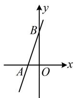

3. (2023·山东潍坊三模·★★☆)

若 $P$ 为函数 $f(x) = \frac{1}{2}\mathrm{e}^{x} - \sqrt{3} x$ 图象上的一个动点，以 $P$ 为切点作曲线 $y = f(x)$ 的切线，则切线倾斜角的取值范围是（）

A. $\left[0, \frac{2\pi}{3}\right)$

B. $\left(\frac{\pi}{2},\frac{2\pi}{3}\right)$

C. $\left(\frac{2\pi}{3},\pi\right)$

D. $\left[0, \frac{\pi}{2}\right) \cup \left(\frac{2\pi}{3}, \pi\right)$

3. D

解析：要求切线倾斜角的范围，可先求切线斜率的范围，而切线斜率即为导数，

由题意，切线的斜率 $k = f'(x) = \frac{1}{2}\mathrm{e}^x -\sqrt{3} > - \sqrt{3}$

设切线的倾斜角为 $\alpha (0\leq \alpha <  \pi)$ ，则 $k = \tan \alpha > - \sqrt{3}$

要由此求 $\alpha$ 的范围，可画正切函数 $y = \tan \alpha$ 的图象来看，

如图，在 $[0, \pi)$ 内，满足 $\tan \alpha > -\sqrt{3}$ 的 $\alpha$ 的取值范围是

$\left[0, \frac{\pi}{2}\right) \cup \left( \frac{2\pi}{3}, \pi \right)$ .

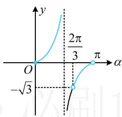

text_image

y
2π/3
O
-√3
π
α

4. (2024·新课标Ⅰ卷·★★☆)

若曲线 $y = \mathrm{e}^{x} + x$ 在点(0,1)处的切线也是曲线 $y = \ln (x + 1) + a$ 的切线，则 $a =$ \_\_\_\_.

4. $\ln 2$

解析： $y = e^{x} + x \Rightarrow y' = e^{x} + 1 \Rightarrow y' |_{x=0} = e^{0} + 1 = 2$

所以 $y = \mathrm{e}^{x} + x$ 在(0,1)处的切线方程为 $y - 1 = 2(x - 0)$

即 $y = 2x + 1$ ，由题意，该直线与 $y = \ln (x + 1) + a$ 也相切，

知道相切，但不知道切点，可考虑设切点横坐标，再翻译切点处满足的条件，

设切点的横坐标为 $x_0$ ， $y = \ln (x + 1) + a\Rightarrow y^{\prime} = \frac{1}{x + 1}$

如图， $\left\{ \begin{array}{l} \ln (x_0 + 1) + a = 2x_0 + 1 \\ \frac{1}{x_0 + 1} = 2 \end{array} \right.$ ①（ $x_0$ 处是切线与曲线的交点）

由②可得 $x_0 = -\frac{1}{2}$ ，代入①得 $\ln \left(-\frac{1}{2} + 1\right) + a = 2 \times \left(-\frac{1}{2}\right) + 1$ ，

所以 $a = -\ln \frac{1}{2} = \ln 2$

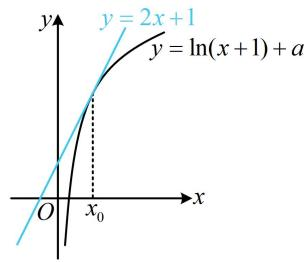

text_image

y = 2x + 1
y = ln(x + 1) + a
O
x₀
x

5. (2019·江苏卷·★★★)

点 A 在曲线 $y = \ln x$ 上，且该曲线在点 A 处的切线经过点 $(-e, -1)$ ，则点 A 的坐标是 \_\_\_\_.

5. (e,1)

解析：设 $A(x_0, \ln x_0)$ ，因为 $y' = \frac{1}{x}$ ，所以曲线 $y = \ln x$ 在点 $A$ 处的切线方程为 $y - \ln x_0 = \frac{1}{x_0}(x - x_0)$ ，

将点 $(-e, -1)$ 代入得： $-1 - \ln x_0 = \frac{1}{x_0} (-e - x_0)$

整理得： $x_0\ln x_0 = e$ ①，观察可得 $x_0 = e$ 是方程①的解，这个方程还有其它解吗？可以画图看看，

如图，过点 $(-e, -1)$ 只能作曲线 $y = \ln x$ 的1条切线，

所以 $x_0 = \mathbf{e}$ 是方程①的唯一解，故点 $A$ 的坐标是(e,1).

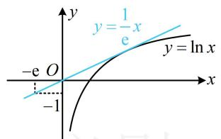

text_image

y
y = 1/e x
-y = ln x
O
-1
x

6. (2022·新课标Ⅰ卷·★★★)

若曲线 $y = (x + a)\mathrm{e}^x$ 有两条过坐标原点的切线，则 $a$ 的取值范围为 \_\_\_\_.

6. $(- \infty, -4) \cup (0, +\infty)$

解析：设切点为 $P(x_0, (x_0 + a)e^{x_0})$ ，因为 $y' = (x + a + 1)e^x$ ，

所以曲线 $y = (x + a)\mathrm{e}^{x}$ 在点 $P$ 处的切线的方程为

$$
y - (x _ {0} + a) \mathrm{e} ^ {x _ {0}} = (x _ {0} + a + 1) \mathrm{e} ^ {x _ {0}} (x - x _ {0}) \quad ①,
$$

将原点 $(0,0)$ 代入①得 $-(x_0 + a)\mathrm{e}^{x_0} = (x_0 + a + 1)\mathrm{e}^{x_0}\cdot (-x_0)$

整理得： $x_{0}^{2} + ax_{0} - a = 0$ ，所给曲线有两条过原点的切线等价于上述关于 $x_{0}$ 的方程有两个实数解，

所以 $\Delta = a^2 + 4a > 0$ ，解得： $a < -4$ 或 $a > 0$ .

7. (2023·湖北十一校联考·★★★)

已知定义在 $(0, +\infty)$ 上的函数 $f(x) = x^2 - m$ ， $g(x) = 6\ln x - 4x$ ，设曲线 $y = f(x)$ 与 $y = g(x)$ 在公共点处的切线相同，则实数 $m =$ \_\_\_\_.

7.5

解析：如图，两曲线在公共点处切线相同，可从公共点处的函数值、导数值两方面来翻译，建立方程组求 $m$

设两曲线公共点的横坐标为 $x_0$ ，由题意， $f^{\prime}(x) = 2x$

$g'(x)=\frac{6}{x}-4$ ，因为两曲线在公共点处切线相同，

所以 $\left\{\begin{aligned}f(x_{0})&=g(x_{0})(x_{0}\text{处是公共点})\\ f'(x_{0})&=g'(x_{0})(x_{0}\text{处切线斜率相同})\end{aligned}\right.$

故 $\left\{ \begin{array}{l} x_0^2 - m = 6\ln x_0 - 4x_0 \\ 2x_0 = \frac{6}{x_0} - 4 \end{array} \right.$ ，解得： $m = 5$ ：

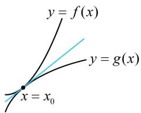

text_image

y = f(x)
y = g(x)
x = x₀

8. (2024·广东惠州一模·★★★☆)

函数 $f(x)$ 的定义域为 $\mathbf{R}$ ， $f(3x - 1)$ 为奇函数，且 $f(x - 1)$ 的图象关于 $x = 1$ 对称。若曲线 $y = f(x)$ 在 $x = 1$ 处的切线斜率为2，则曲线 $y = f(x)$ 在 $x = 2023$ 处的切线方程为（）

A. $y = -2x + 4046$ B. $y = 2x + 4046$

C. $y = 2x - 4046$ D. $y = -2x - 4046$

8. A

解析：计算目标需要 $f(2023)$ 和 $f'(2023)$ ，自变量 $x$ 较大，猜想 $f(x)$ 可能有周期，我们先分析已知条件，看能否找到周期。 $f(3x - 1)$ 为奇函数意味着 $f(x - 1)$ 为奇函数，所以 $f(x)$ 关于点 $(-1,0)$ 对称，下面我们给出严格证明，

设 $g(x) = f(3x - 1)$ ，则 $g(x)$ 为奇函数 $\Rightarrow g(-x) = -g(x)$ ，

所以 $f(3(-x) - 1) = -f(3x - 1)\Rightarrow f(-3x - 1) + f(3x - 1) = 0$

将 $x$ 换成 $\frac{x}{3}$ 可得 $f(-x - 1) + f(x - 1) = 0$

所以 $f(x)$ 关于点 $(-1,0)$ 对称，

因为 $f(x - 1)$ 关于 $x = 1$ 对称，而 $f(x - 1)$ 是由 $f(x)$ 右移1个单位得到的，所以 $f(x)$ 关于直线 $x = 0$ 对称，

结合 $f(x)$ 关于点 $(-1,0)$ 对称可得 $f(x)$ 是以4为周期的周期函数，所以 $f(2023) = f(4 \times 506 - 1) = f(-1)$ ，

怎样求 $f(-1)$ ？注意到 $(-1,0)$ 是对称中心，故可通过对 $f(-x - 1) + f(x - 1) = 0$ 赋值求 $f(-1)$ ，

在 $f(-x - 1) + f(x - 1) = 0$ 中取 $x = 0$ 得 $f(-1) + f(-1) = 0$ ，所以 $f(-1) = 0$ ，故 $f(2023) = 0$

还差 $f^{\prime}(2023)$ ，可以想象， $f'(x)$ 与 $f(x)$ 应有相同的周期，下面我们先给出推导，

因为 $f(x)$ 周期为4，所以 $f(x + 4) = f(x)$

两端求导得 $f'(x+4)=f'(x)$ ，

所以 $f'(x)$ 周期也为 4，故 $f'(2023)=f'(-1)$ ，

题干给出的是 $x = 1$ 处的切线斜率，即 $f^{\prime}(1)$ ，怎样求 $f^{\prime}(-1)$ ？注意到 $f(x)$ 关于 $x = 0$ 对称，可以想象，其图象上关于 $y$ 轴对称的两个点处的切线斜率必然相反（如图），下面我们也给出代数层面的推导，

因为 $f(x)$ 关于直线 $x = 0$ 对称，所以 $f(x)$ 为偶函数，

故 $f(-x)=f(x)$ ，两端求导得 $-f'(-x)=f'(x)$ ，

所以 $f'(-x) = -f'(x)$ ，取 x = 1 得 $f'(-1) = -f'(1)$ ，

由题意， $f'(1) = 2$ ，所以 $f'(-1) = -2$ ，故曲线 $y = f(x)$ 在 $x = 2023$ 处的切线方程为 $y - f(2023) = f'(2023)(x - 2023)$ ，

即 $y - 0 = -2(x - 2023)$ ，整理得： $y = -2x + 4046$

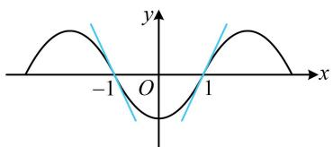

text_image

-1
O
1
x
y

9. (2022·广东深圳模拟·★★★☆)

已知 $a > 0$ ，若过点 $P(a,b)$ 可作曲线 $y = x^3$ 的三条切线，则（）

A. $b <   0$

B. $0 < b < a^{3}$

C. $b > a^{3}$

D. $b(b - a^{3}) = 0$

9. B

解法1：不知道切点，可先设切点，设切点为 $(t,t^3)$

因为 $y' = 3x^2$ ，所以切线方程为 $y - t^3 = 3t^2(x - t)$ ，

将点 $(a,b)$ 代入整理得： $2t^{3} - 3at^{2} + b = 0$ ，故问题等价于关于 $t$ 的方程 $2t^3 -3at^2 +b = 0$ 有3个实数解，

该方程无法直接解，可将 $t$ 看成自变量，构造函数分析，

设 $f(t)=2t^{3}-3at^{2}+b$ ，则 $f(t)$ 有3个零点，

又 $f'(t)=6t^{2}-6at=6t(t-a)$ 且 a>0，

所以 $f^{\prime}(t) > 0\Leftrightarrow t <   0$ 或 $t > a$ ， $f^{\prime}(t) <   0\Leftrightarrow 0 <   t <   a$

故 $f(t)$ 在 $(-\infty,0)$ 上 $\nearrow$ ， $(0,a)$ 上 $\searrow$ ， $(a, + \infty)$ 上 $\nearrow$

要使 $f(t)$ 有3个零点，则 $f(t)$ 的大致图象如图1，

由图可知 $\left\{ \begin{array}{l} f(0) = b > 0 \\ f(a) = b - a^3 < 0 \end{array} \right.$ ，故 $0 < b < a^3$

解法2：所给曲线不复杂，也可考虑画图观察.由于曲线 $y = x^{3}$ 和 $x$ 轴将 $y$ 轴右侧区域分成5个部分，故分别考虑，当点 $P$ 在曲线 $y = x^{3}$ 上方时，如图2，

过点 $P$ 只能作1条切线，不合题意；

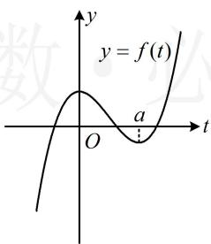

text_image

y
y = f(t)
O
a
t

图1

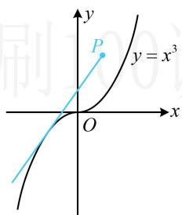

text_image

y
P
y = x³
O
x

图2

当点 P 在曲线 $y = x^{3}$ 上时，如图 3，

过点 P 只能作 2 条切线，不合题意；

当点 $P$ 在曲线 $y = x^3$ 与 $x$ 轴之间时，如图4，

过点 $P$ 可作3条切线，满足题意，此时，点 $P$ 的纵坐标 $b$ 应大于0且小于 $y = x^3$ 在 $x = a$ 处的函数值，故 $0 < b < a^3$

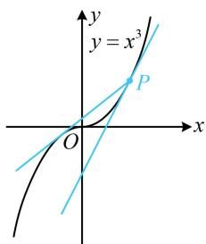

text_image

y
y = x^3
P
O
x

图3

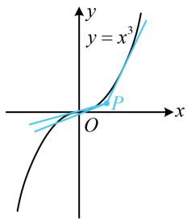

text_image

y
y = x^3
P
O
x

图4

当点 P 在 x 轴上时，如图 5，

过点 $P$ 只能作2条切线，不合题意；

当点 P 在 x 轴下方时，如图 6，

过点 P 只能作 1 条切线，不合题意.

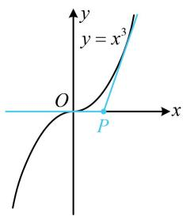

text_image

y
y = x³
O
P
x

图5

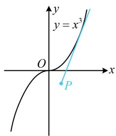

text_image

y
y = x³
O
x
P

图6

【反思】对比两个解法会发现，解法2比解法1更直观，计算量更小，像这种研究过某点可作某函数图象几条切线的问题，若函数的图象较为简单，则画图分析往往是优越的解法.

10. (2022·浙江金华期末·★★★★)

已知函数 $f(x) = |\ln x|$ 的图象在点 $(x_{1},f(x_{1}))$ 与 $(x_{2},f(x_{2}))$ 处的切线互相垂直且交于点 $P(x_0,y_0)$ ，则（）

A. $x_{1} x_{2} = - 1$

B. $x_{1} x_{2} = \mathrm{e}$

C. $x_0 = \frac{x_1 + x_2}{2}$

D. $x_0 = \frac{2}{x_1 + x_2}$

10. D

解析：先画图看看两个切点的位置，如图，要使两切线垂直，则两个切点分别在 $(0,1)$ 和 $(1, +\infty)$ 上，

因为 $f(x) = |\ln x|$ ，所以 $f(x) = \begin{cases} -\ln x, & 0 < x < 1 \\ \ln x, & x \geq 1 \end{cases}$ ，

故 $f'(x)=\left\{\begin{aligned}-\frac{1}{x},&0<x<1\\ \frac{1}{x},&x>1\end{aligned}\right.$

不妨设 $P_{1}(x_{1}, - \ln x_{1})$ ， $P_{2}(x_{2},\ln x_{2})$ ，且 $0 <   x_{1} <   1 <   x_{2}$

要寻找 $x_{1}$ ， $x_{2}$ 的关系，可翻译切线垂直这一条件，

因为两切线互相垂直，所以 $f^{\prime}(x_{1})f^{\prime}(x_{2}) = -\frac{1}{x_{1}}\cdot \frac{1}{x_{2}} = -1$

从而 $x_{1}x_{2} = 1$ ，故选项A、B均错误；

要判断 C、D 两个选项，得求出两切线的交点 P 的横坐标 $x_{0}$ ，可写出两切线的方程，联立求解，

点 $P_{1}$ 处的切线方程为 $y - (-\ln x_{1}) = -\frac{1}{x_{1}} (x - x_{1})$

整理得： $y = -\frac{1}{x_1} x + 1 - \ln x_1$ ①，

点 $P_{2}$ 处的切线方程为 $y - \ln x_{2} = \frac{1}{x_{2}} (x - x_{2})$

整理得： $y=\frac{1}{x_{2}}x+\ln x_{2}-1$ ②，

联立①②解得： $x = (2 - \ln x_{1} - \ln x_{2})\frac{x_{1}x_{2}}{x_{1} + x_{2}}$

结合 $x_{1}x_{2} = 1$ 可得 $x = \frac{2}{x_1 + x_2}$ ，即 $x_0 = \frac{2}{x_1 + x_2}$ ，故选D.

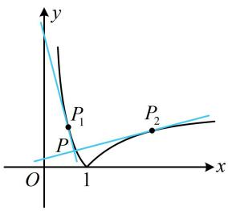

text_image

y
P₁
P
O
1
x
P₂

11.（2024·江苏南通模拟·★★★☆）

已知函数 $f(x) = x^{2} + 2x$ 和 $g(x) = -x^{2} + a$ ，如果直线 $l$ 同时是 $f(x)$ 和 $g(x)$ 的切线，则称 $l$ 是 $f(x)$ 和 $g(x)$ 的公切线，若 $f(x)$ 和 $g(x)$ 有且仅有一条公切线，则 $a =$ \_\_\_\_.

11. $-\frac{1}{2}$

解法1：公切线与两个函数的切点不知道，故考虑设切点，分别写出公切线的斜截式方程，比较系数建立方程组求 $a$

设直线 $l$ 与 $f(x)$ 相切于点 $A(x_{1},x_{1}^{2} + 2x_{1})$ ，与 $g(x)$ 相切于点 $B(x_{2}, - x_{2}^{2} + a)$ ，由题意， $f^{\prime}(x) = 2x + 2$ ， $g^{\prime}(x) = -2x$

$f(x)$ 在 $A$ 处的切线方程为 $y - (x_{1}^{2} + 2x_{1}) = (2x_{1} + 2)(x - x_{1})$

化简得： $y=(2x_{1}+2)x-x_{1}^{2}$ ①，

$g(x)$ 在 $B$ 处的切线方程为 $y - (-x_2^2 + a) = -2x_2(x - x_2)$ ，

化简得： $y = -2x_{2}x + x_{2}^{2} + a$ ②，

注意到①②都是切线 $l$ 的斜截式方程，那么它们的对应系数必定相等，由此可建立方程组分析，

由①②可知 $\left\{ \begin{array}{l} 2x_{1} + 2 = -2x_{2} \\ -x_{1}^{2} = x_{2}^{2} + a \end{array} \right.$ ③，由③得 $x_{2} = -x_{1} - 1$

代入④整理得： $2x_{1}^{2}+2x_{1}+1+a=0$ ⑤，

因为 $f(x)$ 和 $g(x)$ 只有1条公切线，所以方程⑤有唯一的实数解，故 $\Delta = 2^{2} - 4 \times 2 \times (1 + a) = -4 - 8a = 0 \Rightarrow a = -\frac{1}{2}$ .

解法2：注意到 $f(x)$ 和 $g(x)$ 都是二次函数，其图象比较简单，故也可尝试画图分析，

要使两函数有且仅有1条公切线，则两函数图象的位置关系只能是图1，不能是图2（2条公切线）或图3（无公切线），所以 $f(x)$ 和 $g(x)$ 的图象有唯一的公共点，且公共点处切线相同，设公共点的横坐标为 $x_0$ ，

则 $\left\{ \begin{array}{l} x_0^2 + 2x_0 = -x_0^2 + a \text{(在公共点} x_0 \text{处的函数值相等)} \\ 2x_0 + 2 = -2x_0 (x_0 \text{处切线斜率相等}) \end{array} \right.$

解得： $a = -\frac{1}{2}$

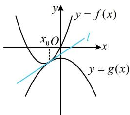

text_image

y
y = f(x)
x₀ O
l
x
y = g(x)

图1

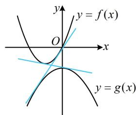

text_image

y
y = f(x)
O
x
y = g(x)

图2

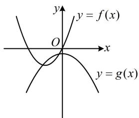

text_image

y
y = f(x)
O
x
y = g(x)

图3