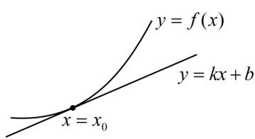
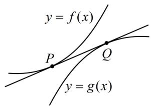
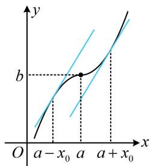
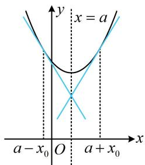
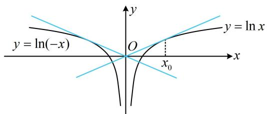
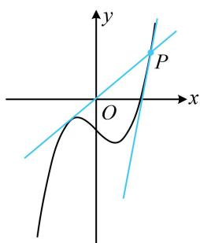
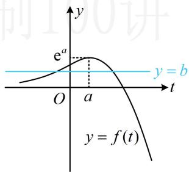
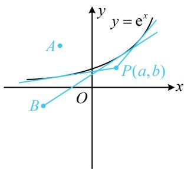
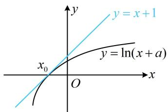
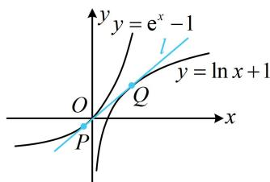

# 模块三 导数常规题型

# 第1节 函数图象切线的计算（★★☆）

# 内容提要

函数的切线方程相关计算在高考中主要有以下几类题型：

1. 求曲线 $y = f(x)$ 在点 $P(x_0, f(x_0))$ 处的切线：切线的斜率 $k = f'(x_0)$ ，结合切点坐标可知切线的方程为 $y - f(x_0) = f'(x_0)(x - x_0)$ .  
2. 求曲线 $y = f(x)$ 过点 $Q(m, n)$ 的切线：由于不知道切点坐标，故需设切点为 $P(x_0, f(x_0))$ ，写出切线方程为 $y - f(x_0) = f'(x_0)(x - x_0)$ ，将点 $Q(m, n)$ 代入得到 $n - f(x_0) = f'(x_0)(m - x_0)$ ，由此方程解出 $x_0$ ，得到切点坐标，即可求出切线的方程.  
3. 已知直线 $y = kx + b$ 与函数 $y = f(x)$ 的图象相切求参（参数在直线上或在 $f(x)$ 解析式中）：这类问题的处理方法是：如图1，设切点横坐标为 $x_0$ ，可从切线斜率即为 $f'(x_0)$ 以及切点为切线与函数图象交点两方面建立方程组 $\begin{cases} k = f'(x_0) \\ kx_0 + b = f(x_0) \end{cases}$ ，解此方程组即可求出参数的值.  
4. 两个函数 $y = f(x)$ 和 $y = g(x)$ 的图象有公切线：如图2，这类题一般先设公切线与两个图象的切点分别为 $P(x_{1},f(x_{1}))$ ， $Q(x_{2},g(x_{2}))$ ，再写出 $f(x)$ 在点 $P$ 处和 $g(x)$ 在点 $Q$ 的切线方程，比较系数建立方程组，研究方程组解的情况。

text_image

y = f(x)
y = kx + b
x = x₀

图1

text_image

y = f(x)
P
Q
y = g(x)

图2

# 类型 I：求函数在某点处的切线

【例1】函数 $f(x) = \frac{\ln x}{x}$ 在点(1,0)处的切线方程为 \_\_\_\_.

解析：由题意， $f(1) = 0$ ， $f'(x) = \frac{1 - \ln x}{x^2}$ ，所以 $f'(1) = 1$ ，故所求切线方程为 $y = x - 1$ .

答案: $y = x - 1$

【变式 1】(2020·新课标 I 卷) 曲线 $y = \ln x + x + 1$ 的一条切线的斜率为 2，则该切线的方程为 \_\_\_\_.

解析：已知切线斜率，可先由此求切点， $y' = \frac{1}{x} + 1$ ，令 $y' = 2$ 得： $\frac{1}{x} + 1 = 2$ ，所以 $x = 1$ ，

代入 $y = \ln x + x + 1$ 可得 $y = 2$ ，所以切点的坐标为(1,2)，故所求切线方程为 $y - 2 = 2(x - 1)$ ，即 $y = 2x$ .

答案: $y = {2x}$

【变式2】已知 $f(x)$ 是定义在 $\mathbf{R}$ 上的奇函数，当 $x < 0$ 时， $f(x) = \ln (-2x) + 1$ ，则曲线 $y = f(x)$ 在 $x = \frac{1}{2}$ 处的切线方程为（）

A. $y = x - 4$

B. $y = x$

C. $y = -2x$

D. $y = -2x + 2$

解法1: 奇函数中, 已知 $x < 0$ 时的解析式, 可先求出 $x > 0$ 时的解析式,

由题意，当 $x < 0$ 时， $f(x) = \ln (-2x) + 1$ ，所以当 $x > 0$ 时， $f(x) = -f(-x) = -[\ln (-2(-x)) + 1] = -\ln (2x) - 1$

故 $f'(x) = -\frac{1}{2x} \cdot 2 = -\frac{1}{x}$ ，所以 $f'\left(\frac{1}{2}\right) = -2$ ， $f\left(\frac{1}{2}\right) = -1$ ，故所求切线方程为 $y - (-1) = -2\left(x - \frac{1}{2}\right)$ ，即 $y = -2x$ .

解法2：也可直接由 $x < 0$ 的解析式求 $f^{\prime}\left(-\frac{1}{2}\right)$ ，再用奇函数的对称性得出 $f^{\prime}\left(\frac{1}{2}\right)$ ，

由题意，当 $x < 0$ 时， $f(x) = \ln (-2x) + 1$

此时， $f^{\prime}(x) = \frac{1}{-2x}\cdot (-2) = \frac{1}{x}$ ，所以 $f^{\prime}\left(-\frac{1}{2}\right) = -2$

又 $f(x)$ 为奇函数，所以 $f^{\prime}\left(\frac{1}{2}\right) = f^{\prime}\left(-\frac{1}{2}\right) = -2$ ，（原因见反思）

$$
f \left(\frac {1}{2}\right) = - f \left(- \frac {1}{2}\right) = - \left(\ln \left(- 2 \times \left(- \frac {1}{2}\right)\right) + 1\right) = - 1,
$$

故所求切线的方程为 $y - (-1) = -2\left(x - \frac{1}{2}\right)$ ，整理得： $y = -2x$ .

text_image

y
b
O a - x₀ a a + x₀ x

图1

text_image

x = a
y
a - x₀ O a + x₀
x

图2

答案: C

【反思】①如图1，若函数的图象关于点 $(a, b)$ 对称，则图象上关于 $(a, b)$ 对称的两个点处导数值相等；②如图2，若函数的图象关于直线 $x = a$ 对称，则图象上关于 $x = a$ 对称的两个点处，导数值相反.

# 类型 II：求函数过某点的切线

【例 2】(2022·新高考 II 卷) 曲线 $y = \ln |x|$ 过坐标原点的两条切线的方程为 \_\_\_\_, \_\_\_\_.

解析：曲线 $y = \ln |x|$ 如图，由对称性，可先求该曲线位于 $y$ 轴右侧部分的过原点的切线，

此部分的解析式为 $y = \ln x$ ，由于不知道切点，所以设切点为 $(x_0, \ln x_0)$ ，

因为 $(\ln x)' = \frac{1}{x}$ ，所以该切线的方程为 $y - \ln x_0 = \frac{1}{x_0} (x - x_0)$ ，

将原点 $(0,0)$ 代入可得： $-\ln x_0 = \frac{1}{x_0}\cdot (-x_0)$ ，解得： $x_0 = e$

故切线方程为 $y - \ln e = \frac{1}{e} (x - e)$ ，整理得： $y = \frac{1}{e} x$

由对称性知另一条切线为 $y = -\frac{1}{\mathrm{e}} x$ .

答案： $y=\frac{1}{e}x,\quad y=-\frac{1}{e}x$

text_image

y = ln(-x)
O
x₀
y = ln x

【变式 1】曲线 $y = x^{3} - x - 2$ 过点 $P(2,4)$ 的切线方程为 \_\_\_\_.

解析：不知道切点，先设切点，设切点为 $(x_0, x_0^3 - x_0 - 2)$ ，

由题意， $y' = 3x^{2} - 1$ ，所以切线方程为 $y - (x_{0}^{3} - x_{0} - 2) = (3x_{0}^{2} - 1)(x - x_{0})$ ①，

text_image

y
P
O
x

将点(2,4)代入得： $4-(x_{0}^{3}-x_{0}-2)=(3x_{0}^{2}-1)(2-x_{0})$ ，整理得： $x_{0}^{3}-3x_{0}^{2}+4=0$ ，

解一元三次方程可先试根，观察可得 $x_{0} = -1$ 是上述方程的一个解，那么因式

分解就有了方向，

$$
x _ {0} ^ {3} - 3 x _ {0} ^ {2} + 4 = x _ {0} ^ {3} + x _ {0} ^ {2} - 4 x _ {0} ^ {2} + 4 = x _ {0} ^ {2} \left(x _ {0} + 1\right) - 4 \left(x _ {0} + 1\right) \left(x _ {0} - 1\right) = \left(x _ {0} + 1\right) \left(x _ {0} - 2\right) ^ {2},
$$

所以 $(x_0 + 1)(x_0 - 2)^2 = 0$ ，解得： $x_0 = -1$ 或2，

代入式①得所求切线为 $y = 2x$ 或 $y = 11x - 18$ . (两条切线如图)

答案： $y = 2x$ 或 $y = 11x - 18$

【反思】求函数过某点的切线方程，常按设切点，写出切线方程，将已知点代入求得切点的流程求解.

【变式 2】(2021·新高考 I 卷) 若过点 $(a,b)$ 可以作曲线 $y=e^{x}$ 的两条切线，则（）

A. $\mathbf{e}^{b} < a$

B. $\mathrm{e}^a < b$

C. $0 < a < \mathrm{e}^{b}$

D. $0 < b < \mathrm{e}^{a}$

解法1：不知道切点，可先设切点，设切点为 $(t,\mathsf{e}^t)$ ，因为 $y' = \mathsf{e}^x$ ，所以切线方程为 $y - \mathsf{e}^t = \mathsf{e}^t (x - t)$

将点 $(a, b)$ 代入整理得： $b = \mathrm{e}^{t}(a + 1 - t)$ ，故问题等价于关于 $t$ 的方程 $b = \mathrm{e}^{t}(a + 1 - t)$ 有2个实数解，

该方程无法直接解，可考虑将 $t$ 看成自变量，构造函数分析，设 $f(t) = \mathrm{e}^t (a + 1 - t)$ ，则 $f'(t) = \mathrm{e}^t (a - t)$ ，

所以 $f^{\prime}(t) > 0\Leftrightarrow t <   a$ ， $f^{\prime}(t) <   0\Leftrightarrow t > a$ ，故 $f(t)$ 在 $(-\infty ,a)$ 上 $\nearrow$ ，在 $(a, + \infty)$ 上 $\searrow$

又 $f(a) = \mathsf{e}^a$ ， $\lim_{t\to -\infty}f(t) = 0$ ， $\lim_{t\to +\infty}f(t) = -\infty$ ，所以 $y = f(t)$ 的大致图象如图1，

方程 $b = \mathrm{e}^{t}(a + 1 - t)$ 有2个实数解等价于直线 $y = b$ 与 $y = f(t)$ 的图象有2个交点，由图可知 $0 < b < \mathrm{e}^a$ .

解法2: 观察选项B、D可发现, 它们分别表示点 $(a, b)$ 在曲线 $y = \mathrm{e}^{x}$ 上方和点 $(a, b)$ 在曲线 $y = \mathrm{e}^{x}$ 与 $x$ 轴之间, 故也可考虑直接画图分析怎样能过点 $(a, b)$ 作出曲线 $y = \mathrm{e}^{x}$ 的两条切线,

①对于曲线 $y = e^{x}$ 上方的点，如图2中的点 A，作不出过点 A 的切线；

②对于曲线 $y = e^{x}$ 上的点，显然只能作 1 条切线；

③对于曲线 $y = \mathrm{e}^{x}$ 和 $x$ 轴之间的点，如图2的 $P(a, b)$ ，过 $P$ 可作2条切线，此时，点 $P$ 的纵坐标 $b$ 应大于0且小于 $y = \mathrm{e}^{x}$ 在 $x = a$ 处的函数值，所以 $0 < b < \mathrm{e}^{a}$ ；

④对于 $x$ 轴上或 $x$ 轴下方的点，如图2中的点 $B$ ，只能作1条切线；

综上所述， $0 < b < \mathrm{e}^{a}$

text_image

y
e^a
O a t
y = b
y = f(t)

图1

text_image

y = e^x
A
P(a,b)
B
O
x

图2

答案: D

【反思】数形结合是一种重要的数学思想，像这种研究过某点可作某函数图象几条切线的问题，若函数的图象较为简单，则画图分析往往是优越的解法.

# 类型III：已知某直线与函数相切求参

【例 3】已知直线 $y = x + 1$ 与曲线 $y = \ln(x + a)$ 相切，则 $a =$ \_\_\_\_ .

解析：已知切线求参，用内容提要3的方法，

$y=\ln(x+a)\Rightarrow y'=\frac{1}{x+a}$ ，设切点横坐标为 $x_{0}$ ，

如图， \(\left\{ \begin{array}{ll} \frac{1}{x\_0 + a} = 1 & ① (x\_0\) 处的导数与切线斜率相等)\\ x\_0 + 1 = \ln (x\_0 + a) & ② (x\_0\) 处是切线和函数图象的交点) \end{array} \right.\)

由①可得 $x_0 + a = 1$ ，代入②可解得： $x_0 = -1$ ，所以 $a = 1 - x_0 = 2$

text_image

y = x + 1
x₀
O
x
y = ln(x + a)

答案: 2

【总结】已知直线与函数图象相切求参这类问题，常抓住切点处导数等于切线斜率、切点是切线与函数图象交

点这两方面来建立方程组求解参数.

# 类型IV（此类型较难）：两个函数图象不同切点的公切线问题

【例 4】已知直线 l 是曲线 $y = e^{x} - 1$ 与 $y = \ln x + 1$ 的公切线，则 l 的方程为 \_\_\_\_.

解析：直线 l 与两曲线的切点均未知，可设两个切点，分别写出切线 l 的方程，比较系数，如图，设两个切点分别为 $P(x_{1}, e^{x_{1}} - 1)$ ， $Q(x_{2}, \ln x_{2} + 1)$ ，

因为 $(\mathrm{e}^x - 1)' = \mathrm{e}^x$ ，所以 $l$ 的方程为 $y - (\mathrm{e}^{x_1} - 1) = \mathrm{e}^{x_1}(x - x_1)$ ，整理得： $y = \mathrm{e}^{x_1}x + (1 - x_1)\mathrm{e}^{x_1} - 1$ ①，又 $(\ln x + 1)' = \frac{1}{x}$ ，所以 $l$ 的方程为 $y - (\ln x_2 + 1) = \frac{1}{x_2}(x - x_2)$ ，整理得： $y = \frac{1}{x_2} x + \ln x_2$ ②，

由于①和②都是切线 l 的方程，所以 $\left\{\begin{aligned}\mathrm{e}^{x_{1}}&=\frac{1}{x_{2}}\\ (1-x_{1})\mathrm{e}^{x_{1}}&-1=\ln x_{2}\end{aligned}\right.$ ③，

由③可得 $x_{2} = \mathrm{e}^{-x_{1}}$ ，代入④得： $(1 - x_{1})\mathrm{e}^{x_{1}} - 1 = \ln \mathrm{e}^{-x_{1}}$

化简得： $(x_{1} - 1)(\mathrm{e}^{x_{1}} - 1) = 0$ ，解得： $x_{1} = 1$ 或0，

代入①得直线 l 的方程为 y = ex - 1 或 y = x.

答案： $y = \mathrm{e}x - 1$ 或 $y = x$

text_image

y = e^x - 1
y = \ln x + 1
O
Q
P
x

【反思】不同切点处的公切线问题的通用思路：先设两个切点，分别写出切线 $l$ 的方程，再比较系数建立方程组求解或分析解的个数。有时候，列出方程的后续分析会比较复杂，如下面变式。

【变式】若曲线 $y = \mathrm{e}^{x - 1}$ 和曲线 $y = \sqrt{ax} (a > 0)$ 存在公切线，则 $a$ 的最大值为 \_\_\_\_.

解析：涉及两曲线的公切线问题，考虑设两个切点，分别写出切线，再比较系数，

设公切线与所给两曲线的切点分别为 $P(x_{1},\mathrm{e}^{x_{1} - 1})$ ， $Q(x_{2},\sqrt{ax_{2}})$

因为 $(\mathrm{e}^{x - 1})' = \mathrm{e}^{x - 1}$ ，所以公切线为 $y - \mathrm{e}^{x_1 - 1} = \mathrm{e}^{x_1 - 1}(x - x_1)$ ，整理得： $y = \mathrm{e}^{x_1 - 1}x + (1 - x_1)\mathrm{e}^{x_1 - 1}$ ①，

因为 $(\sqrt{ax})' = \frac{\sqrt{a}}{2\sqrt{x}}$ ，所以公切线也为 $y - \sqrt{ax_2} = \frac{\sqrt{a}}{2\sqrt{x_2}} (x - x_2)$ ，整理得： $y = \frac{\sqrt{a}}{2\sqrt{x_2}} x + \frac{\sqrt{ax_2}}{2}$ ②，

比较①②可得 $\left\{ \begin{array}{ll}\mathrm{e}^{x_1 - 1} = \frac{\sqrt{a}}{2\sqrt{x_2}} & ③ \\ (1 - x_1)\mathrm{e}^{x_1 - 1} = \frac{\sqrt{ax_2}}{2} & ④ \end{array} \right.$ ，要求 $a$ 的最大值，考虑反解出 $a$ ，并消元化单变量函数分析，

③×④可得 $(1-x_{1})\mathrm{e}^{2x_{1}-2}=\frac{a}{4}$ ，所以 $a=4(1-x_{1})\mathrm{e}^{2x_{1}-2}$ ⑤，

式⑤可看成是 $a$ 关于 $x_{1}$ 的函数，要求 $a$ 的最大值，需先研究 $x_{1}$ 的范围，观察发现可由式④来分析，

由④可得 $(1 - x_{1})\mathrm{e}^{x_{1} - 1} = \frac{\sqrt{ax_{2}}}{2} >0$ ，所以 $x_{1} <   1$ ，设 $f(x) = 4(1 - x)\mathrm{e}^{2x - 2}$ ， $x <   1$

则 $f^{\prime}(x) = 4[-1\cdot \mathrm{e}^{2x - 2} + (1 - x)\cdot 2\mathrm{e}^{2x - 2}] = 4(1 - 2x)\mathrm{e}^{2x - 2}$ ，所以 $f^{\prime}(x) > 0\Leftrightarrow x <   \frac{1}{2}$ ， $f^{\prime}(x) <   0\Leftrightarrow \frac{1}{2} <  x <   1$

故 $f(x)$ 在 $\left(-\infty, \frac{1}{2}\right)$ 上 $\nearrow$ ，在 $\left(\frac{1}{2}, 1\right)$ 上 $\searrow$ ，所以 $f(x)_{\max} = f\left(\frac{1}{2}\right) = \frac{2}{\mathrm{e}}$ ，由⑤知 $a = f(x_1)$ ，故 $a_{\max} = \frac{2}{\mathrm{e}}$ .

答案： $\frac{2}{\mathrm{e}}$

# 强化训练

1. (2023·全国甲卷·★)

曲线 $y = \frac{\mathrm{e}^x}{x + 1}$ 在点 $\left(1,\frac{\mathrm{e}}{2}\right)$ 处的切线方程为（）

A. $y = \frac{\mathrm{e}}{4} x$

B. $y = \frac{\mathrm{e}}{2} x$

C. $y = \frac{\mathrm{e}}{4} x + \frac{\mathrm{e}}{4}$

D. $y = \frac{\mathrm{e}}{2} x + \frac{3\mathrm{e}}{4}$

2. (2024·全国甲卷·★★)

设函数 $f(x) = \frac{\mathrm{e}^x + 2\sin x}{1 + x^2}$ ，则曲线 $y = f(x)$ 在点(0,1)处的切线与两坐标轴所围成的三角形的面积为（）

A. $\frac{1}{6}$

B. $\frac{1}{3}$

C. $\frac{1}{2}$

D. $\frac{2}{3}$

3. (2023·山东潍坊三模·★★☆)

若 $P$ 为函数 $f(x) = \frac{1}{2}\mathrm{e}^{x} - \sqrt{3} x$ 图象上的一个动点，以 $P$ 为切点作曲线 $y = f(x)$ 的切线，则切线倾斜角的取值范围是（）

A. $\left[0, \frac{2\pi}{3}\right)$

B. $\left(\frac{\pi}{2},\frac{2\pi}{3}\right)$

C. $\left(\frac{2\pi}{3},\pi\right)$

D. $\left[0, \frac{\pi}{2}\right) \cup \left(\frac{2\pi}{3}, \pi\right)$

4. (2024·新课标Ⅰ卷·★★☆)

若曲线 $y = \mathrm{e}^{x} + x$ 在点(0,1)处的切线也是曲线 $y = \ln (x + 1) + a$ 的切线，则 $a =$ \_\_\_\_.

5. (2019·江苏卷·★★★)

点 A 在曲线 $y = \ln x$ 上，且该曲线在点 A 处的切线经过点 $(-e, -1)$ ，则点 A 的坐标是 \_\_\_\_.

6. (2022·新课标Ⅰ卷·★★★)

若曲线 $y = (x + a)\mathrm{e}^x$ 有两条过坐标原点的切线，则 $a$ 的取值范围为 \_\_\_\_.

7. (2023·湖北十一校联考·★★★)

已知定义在 $(0, +\infty)$ 上的函数 $f(x) = x^2 - m$ ， $g(x) = 6\ln x - 4x$ ，设曲线 $y = f(x)$ 与 $y = g(x)$ 在公共点处的切线相同，则实数 $m =$ \_\_\_\_.

8. (2024·广东惠州一模·★★★☆)

函数 $f(x)$ 的定义域为 $\mathbf{R}$ ， $f(3x - 1)$ 为奇函数，且 $f(x - 1)$ 的图象关于 $x = 1$ 对称。若曲线 $y = f(x)$ 在 $x = 1$ 处的切线斜率为2，则曲线 $y = f(x)$ 在 $x = 2023$ 处的切线方程为（）

A. $y = -2x + 4046$

B. $y = 2x + 4046$

C. $y = 2x - 4046$

D. $y = -2x - 4046$

9. (2022·广东深圳模拟·★★★☆)

已知 $a > 0$ ，若过点 $P(a,b)$ 可作曲线 $y = x^3$ 的三条切线，则（）

A. $b <   0$

B. $0 < b < a^{3}$

C. $b > a^{3}$

D. $b(b - a^3) = 0$

10. (2022·浙江金华期末·★★★★)

已知函数 $f(x) = |\ln x|$ 的图象在点 $(x_{1},f(x_{1}))$ 与 $(x_{2},f(x_{2}))$ 处的切线互相垂直且交于点 $P(x_0,y_0)$ ，则（）

A. $x_{1} x_{2} = - 1$

B. $x_{1}x_{2} = \mathrm{e}$

C. $x_0 = \frac{x_1 + x_2}{2}$

D. $x_0 = \frac{2}{x_1 + x_2}$

11. (2024·江苏南通模拟·★★★☆)

已知函数 $f(x) = x^{2} + 2x$ 和 $g(x) = -x^{2} + a$ ，如果直线 $l$ 同时是 $f(x)$ 和 $g(x)$ 的切线，则称 $l$ 是 $f(x)$ 和 $g(x)$ 的公切线，若 $f(x)$ 和 $g(x)$ 有且仅有一条公切线，则 $a =$ \_\_\_\_.