# 第 2 节 分段函数中的动态分段点问题（★★★）

# 内容提要

上一节我们学习了当分段函数解析式含参时，怎样根据函数的单调性求参数的范围，本节我们归纳当参数在分段点上时的有关问题，此时分段点是随着参数的变化而变化的，由此衍生出的函数问题，如研究零点、最值等，往往采用分类讨论或数形结合的方法求解.

# 类型 I：研究分段点含参的分段函数的零点

【例1】已知 $a > 0$ ，若函数 $f(x) = \begin{cases} x + 2, & x \leq a \\ \ln x + 2, & x > a \end{cases}$ 有两个不同的零点，则 $a$ 的取值范围是（）

A. $\left(0, \frac{1}{\mathrm{e}^2}\right)$

B. (0,1)

C. $\left(\frac{1}{\mathrm{e}^2}, +\infty\right)$

D. $[1, +\infty)$

解法1：分段函数研究零点，分段分别考虑，注意到 $f(x)$ 在 $(- \infty, a]$ 和 $(a, +\infty)$ 上均 $\nearrow$

所以要使 $f(x)$ 有2个零点，应满足 $f(x)$ 在 $(- \infty, a]$ 和 $(a, +\infty)$ 上各有1个零点，

当 $x \in (-\infty, a]$ 时， $f(x) = x + 2$ ，令 $f(x) = 0$ 可得 $x = -2$ ，

因为 $a > 0$ ，所以 $-2\in (-\infty ,a]$ ，故-2是 $f(x)$ 的1个零点；

当 $x \in (a, +\infty)$ 时， $f(x) = \ln x + 2$ ，令 $f(x) = 0$ 可得 $x = \frac{1}{\mathrm{e}^2}$ ，所以 $\frac{1}{\mathrm{e}^2} \in (a, +\infty)$ ，故 $0 < a < \frac{1}{\mathrm{e}^2}$ .

解法2: $f(x)$ 在两段上的解析式都很简单, 可画图分析, 注意到 $\ln x + 2 = 0 \Leftrightarrow x = \mathrm{e}^{-2}$ , 所以按 $a$ 和 $\mathrm{e}^{-2}$ 的大小来讨论, 先把 $y = x + 2$ 和 $y = \ln x + 2$ 的完整曲线画出来, 如图1,

当 $0 < a < \mathrm{e}^{-2}$ 时， $f(x)$ 的图象如图2，由图可知 $f(x)$ 在 $(- \infty, a]$ 和 $(a, +\infty)$ 上各有1个零点，满足题意；

当 $a = \mathrm{e}^{-2}$ 时， $f(x)$ 的图象如图3，由图可知 $f(x)$ 仅在 $(- \infty, a]$ 上有1个零点，不合题意；

当 $a > \mathrm{e}^{-2}$ 时， $f(x)$ 的图象如图4，由图可知 $f(x)$ 仅在 $(- \infty, a]$ 上有1个零点，不合题意；

综上所述， $a$ 的取值范围是 $(0,\mathrm{e}^{-2})$ ，即 $\left(0,\frac{1}{\mathrm{e}^2}\right)$

答案: A

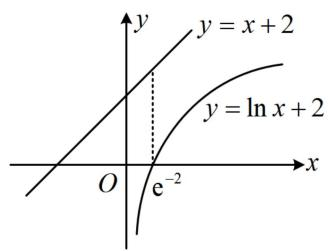

text_image

y
y = x + 2
y = \ln x + 2
O
e^{-2}
x

图1

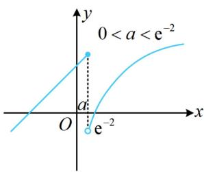

text_image

0 < a < e^{-2}
a
e^{-2}

图2

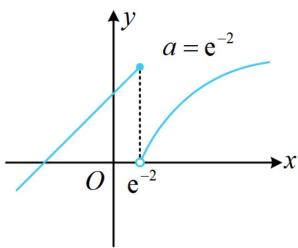

text_image

a = e^{-2}
O
e^{-2}
x
y

图3

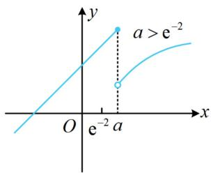

text_image

y
a > e⁻²
O e⁻² a x

图4

【变式】已知函数 $f(x) = \begin{cases} |x - m| + 2m, & x \leq 2m \\ -x^2 + 4mx - 2m^2, & x > 2m \end{cases}$ ，其中 $m > 0$ ，若存在实数 $b$ ，使得方程 $f(x) = b$ 有三个不同的实数解，则 $m$ 的取值范围为（）

A. (0,1)

B. $(1, +\infty)$

C. $\left(0, \frac{3}{2}\right)$

D. $\left(\frac{3}{2}, +\infty\right)$

解析：由题意，问题等价于存在直线 $y = b$ 与 $f(x)$ 的图象有3个交点，

要画 $f(x)$ 的图象, 不妨先把 $x \leq 2 m$ 那一段的绝对值去掉, 将解析式细分为三段, 分别作图,

当 $x \in (-\infty, m)$ 时， $f(x) = -(x - m) + 2m = 3m - x$ ；当 $x \in [m, 2m]$ 时， $f(x) = (x - m) + 2m = x + m$ ；

所以 $f(x)$ 在 $(- \infty, m)$ 上 $\searrow$ ，在 $[m, 2m]$ 上 $\nearrow$ ;

当 $x > 2m$ 时， $f(x) = -x^2 + 4mx - 2m^2 = -(x - 2m)^2 + 2m^2$ ，所以 $f(x)$ 在 $(2m, +\infty)$ 上 $\searrow$ ；

水平直线 $y = b$ 与 $y = f(x)$ 图象可能的交点个数与间断点 $x = 2m$ 处的拼接情况有关，故应据此讨论，

记 $f(x)$ 图象上的两个分段点分别为 $A(m,2m)$ ， $B(2m,2m^2)$ ，

若 A, B 等高或 A 在 B 的上方，如图 1、图 2，都不存在直线 y = b 与 $f(x)$ 的图象有 3 个交点；

若 $A$ 在 $B$ 的下方，如图3和图4，存在直线 $y = b$ 与 $f(x)$ 的图象有3个交点，所以 $2m < 2m^2$ ，故 $m > 1$

答案: B

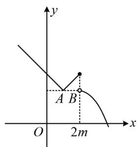

text_image

y
A B
O 2m x

图1

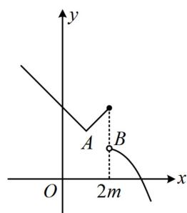

text_image

y
A B
O 2m x

图2

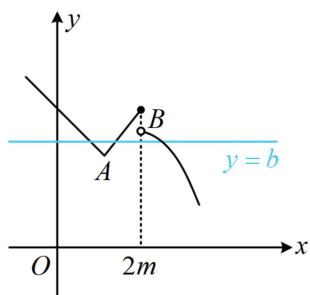

text_image

y
A
B
y = b
O
2m
x

图3

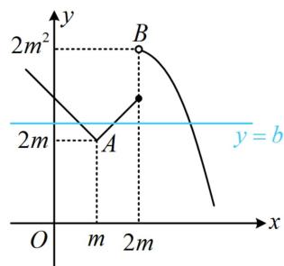

text_image

2m²
y
2m
A
B
y = b
O
m
2m
x

图4

【总结】含参的分段函数问题，常考虑画图辅助分析，会比较直观，想象分段点变化时图形的运动过程，抓住关键位置，但注意不要遗漏.

# 类型Ⅱ：研究分段点含参的分段函数的最值

【例 2】(2022·北京卷) 设函数 $f(x)=\left\{\begin{aligned}-ax+1,x<a\\ (x-2)^{2},x\geq a\end{aligned}\right.$ ，若 $f(x)$ 存在最小值，则 a 的一个值为 \_\_\_\_，a 的最大值为 \_\_\_\_.

解析：因为当 $x < a$ 时， $f(x) = -ax + 1$ 的单调性与 $a$ 的正负有关，所以由此讨论，画出 $f(x)$ 的图象，

当 $a < 0$ 时， $f(x)$ 的图象如图1，由图可知 $f(x)$ 无最小值，不合题意；

当 $a = 0$ 时， $f(x)$ 的图象如图2，由图可知 $f(x)$ 有最小值，满足题意；第一空可填0；

当 $a > 0$ 时，由于当 $x \geq a$ 时， $f(x) = (x - 2)^2$ ，函数 $y = (x - 2)^2$ 的对称轴是 $x = 2$ ，故又讨论 $a$ 与 2 的大小，

若 $0 < a < 2$ ，则要使 $f(x)$ 存在最小值， $f(x)$ 的图象应如图3，

射线 $y = -ax + 1 (x < a)$ 的右端点不能落到 $x$ 轴下方，所以 $-a^2 + 1 \geq 0$ ，故 $0 < a \leq 1$ ；

若 $a \geq 2$ ，则要使 $f(x)$ 存在最小值， $f(x)$ 的图象应如图4或图5，

所以 $-a^2 + 1 \geq (a - 2)^2$ ，整理得： $2a^2 - 4a + 3 \leq 0$ ，无解；

综上所述，当 $f(x)$ 存在最小值时， $a$ 的取值范围是[0,1]，所以 $a$ 的最大值为1.

答案: 0 (答案不唯一, 见解析), 1

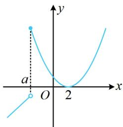

text_image

y
a
O 2 x

图1

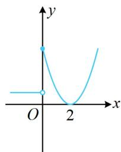

line

| x | y |
|---|---|
| 0 | 0 |
| 1 | 1 |
| 2 | 0 |

图2

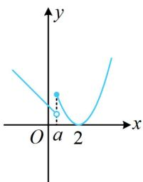

text_image

y
O a 2 x

图3

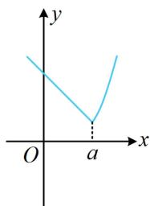

text_image

y
O
a
x

图4

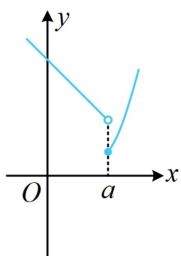

text_image

y
O
a
x

图5

【反思】本题难点在于如何准确分类, 不妨思考一下分类的依据: 要确定 $f(x)$ 的最小值, 就得明确函数两段的单调性, 而 $a$ 与 0 的大小关系决定左段射线的单调性, $a$ 与 2 的大小决定右段单调性, 故根据 0, 2 顺次分类,

即可明确图象找到最小值.

# 强化训练

1. (★★☆)

设函数 $f(x) = \begin{cases} x^2, & x \leq a \\ \sqrt{x}, & x > a \end{cases}$ ，其中 $a > 0$ ，若存在实数 $b$ ，使得函数 $g(x) = f(x) - b$ 有 3 个零点，则实数 $a$ 的取值范围为 \_\_\_\_.

2. (2022·北京模拟·★★★)

设函数 $f(x) = \begin{cases} x^2, & x \leq a \\ x^2 - 2ax + a, & x > a \end{cases}$ ，若存在实数 $b$ ，使得函数 $g(x) = f(x) - b$ 有3个零点，则 $a$ 的取值范围为 \_\_\_\_.

3. (2024·江苏南通模拟·★★★☆)

设函数 $f(x) = \begin{cases} x^3 - 3x, & x \leq a \\ -2x, & x > a \end{cases}$ ，若 $f(x)$ 无最大值，则实数 $a$ 的取值范围是（）

A. $(- \infty, -1)$

B. $(- \infty, -1]$

C. $(- \infty, 2]$

D. $(-1,2]$

4.（2023·福建厦门第四次质检·★★★★）

函数 $f(x) = \begin{cases} \cos \pi x, & 0 < x < a \\ x^2 - 4ax + 8, & x \geq a \end{cases}$ ，当 $a = 1$ 时， $f(x)$ 的零点个数为 \_\_\_\_；若 $f(x)$ 恰有 4 个零点，则 $a$ 的取值范围是 \_\_\_\_.