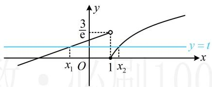
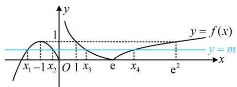

# 强化训练

1. (2022·江西赣州期末·★★★)

已知函数 $f(x) = \begin{cases} \frac{1}{\mathrm{e}} (x + 2), & x < 1 \\ \ln x, & x \geq 1 \end{cases}$ ，若 $f(x_{1}) = f(x_{2})$ ，且 $x_{2} > x_{1}$ ，则 $x_{2} - x_{1}$ 的最小值为 \_\_\_\_.

1.2

解析：欲求 $x_{2} - x_{1}$ 的最小值，先通过设 $t$ 将变量统一起来，

设 $f(x_{1}) = f(x_{2}) = t$ ，如图，由图可知 $0\leq t <   \frac{3}{\mathrm{e}}$

且 $x_{1} < 1 \leq x_{2}$ ，所以 $f(x_{1}) = \frac{1}{\mathrm{e}} (x_{1} + 2) = t \Rightarrow x_{1} = \mathrm{e}t - 2$

$f(x_{2}) = \ln x_{2} = t\Rightarrow x_{2} = \mathrm{e}^{t}$ ，从而 $x_{2} - x_{1} = \mathrm{e}^{t} - \mathrm{e}t + 2$

统一了变量，接下来将右侧构造成函数，求导研究最值，

设 $\varphi(t) = \mathrm{e}^t -\mathrm{e}t + 2\left(0\leq t <   \frac{3}{\mathrm{e}}\right)$ ，则 $\varphi'(t) = \mathrm{e}^t -\mathrm{e}$

所以 $\varphi'(t) > 0 \Leftrightarrow 1 < t < \frac{3}{\mathrm{e}}$ ， $\varphi'(t) < 0 \Leftrightarrow 0 \leq t < 1$ ，

从而 $\varphi(t)$ 在 $[0,1)$ 上 $\searrow$ ，在 $\left(1,\frac{3}{\mathrm{e}}\right)$ 上 $\nearrow$ ，

故 $\varphi (t)_{\min} = \varphi (1) = 2$ ，即 $x_{2} - x_{1}$ 的最小值为2.

text_image

y
3/e
y = t
x₁ O 1 x₂
x

2. (2023·湖北八市联考·★★★☆)

已知函数 $f(x) = \begin{cases} -x^2 - 2x, & x \leq 0 \\ |1 - \ln x|, & x > 0 \end{cases}$ ，若 $f(x) = m$ 存在四个不相等的实根 $x_1, x_2, x_3, x_4$ ，且 $x_1 < x_2 < x_3 < x_4$ ，则 $x_4 - (x_1 + x_2)x_3$ 的最小值是 \_\_\_\_.

2. $2 \sqrt{2} e$

解析：可由水平直线 $y = m$ 与 $y = f(x)$ 图象的交点情况来分析方程 $f(x) = m$ 解的情况，故先画图，并标出一些关键点，

函数 $f(x)$ 的大致图象如图，直线 $y = m$ 要与之产生4个交点，应有 $0 < m < 1$ ，且由图可知， $x_{1}$ 和 $x_{2}$ 关于-1对称，

所以 $\frac{x_1 + x_2}{2} = -1$ ，从而 $x_{1} + x_{2} = -2$

故 $x_{4} - (x_{1} + x_{2})x_{3} = x_{4} + 2x_{3}$ ①，

要求式①的最小值，考虑寻找 $x_{3}$ 和 $x_{4}$ 的关系，可由

$f(x_{3})=f(x_{4})$ 来找，由图可知， $1<x_{3}<e<x_{4}<e^{2}$

所以 $0 < \ln x_{3} < 1$ ， $1 < \ln x_{4} < 2$

由 $f(x_{3}) = f(x_{4})$ 可得 $\left|1 - \ln x_3\right| = \left|1 - \ln x_4\right|$

所以 $1 - \ln x_{3} = \ln x_{4} - 1$ ，从而 $\ln x_3 + \ln x_4 = \ln (x_3x_4) = 2$

故 $x_{3}x_{4} = \mathrm{e}^{2}$ ，所以由①可得 $x_{4} - (x_{1} + x_{2})x_{3} = x_{4} + 2x_{3}$

$\geq2\sqrt{x_{4}\cdot2x_{3}}=2\sqrt{2}e$ ，取等条件是 $x_{4}=2x_{3}$ ，

结合 $x_{3}x_{4} = \mathrm{e}^{2}$ 可得 $x_{3} = \frac{\sqrt{2}\mathrm{e}}{2}, x_{4} = \sqrt{2}\mathrm{e}$

故 $[x_4 - (x_1 + x_2)x_3]_{\min} = 2\sqrt{2}\mathrm{e}$

text_image

y
1
y = f(x)
x₁ - 1 x₂ O 1 x₃ e x₄ e²
y = m

一数·必刷100讲