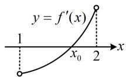
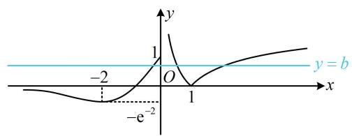
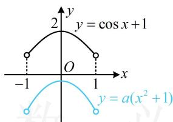
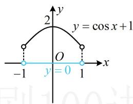
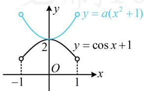
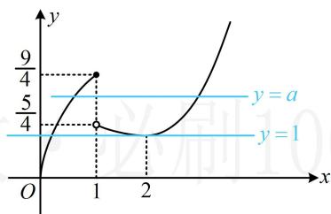
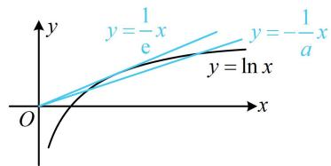
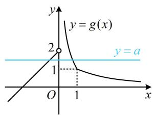
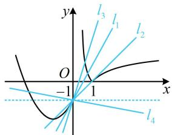
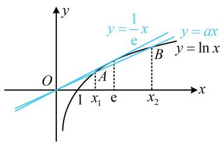

# 强化训练

1. (2024·河南模拟·★★☆)

已知函数 $f(x) = \frac{1}{3} x^3 + \mathrm{e}^{x - 1} + mx - 3$ ，若当 $x \in (1,2)$ 时，函数 $f(x)$ 存在最小值，则实数 $m$ 的取值范围是 \_\_\_\_.

1. $(-e - 4, -2)$

解析：注意到(1,2)为开区间，最值不可能在端点取，所以要使 $f(x)$ 在(1,2)上有最小值，则最小值一定在区间内部取得，可导函数区间内部的最值必为极值，于是求导分析 $f(x)$ 的极值情况，

由题意， $f^{\prime}(x) = x^{2} + \mathrm{e}^{x - 1} + m$ ，因为在(1,2)上， $y = x^{2}$ 和

$y = \mathrm{e}^{x - 1} + m$ 都 $\nearrow$ ，所以 $f^{\prime}(x)$ 也 $\nearrow$ ，要使 $f(x)$ 在(1,2)上存在最小值，则 $f^{\prime}(x)$ 在(1,2)上存在变号零点，

如图，应有 $\left\{ \begin{array}{l} f'(1) = 1 + \mathrm{e}^0 + m < 0 \\ f'(2) = 4 + \mathrm{e}^1 + m > 0 \end{array} \right. \Rightarrow -\mathrm{e} - 4 < m < -2$

此时 $f^{\prime}(x)$ 在(1,2)上有零点 $x_0$ ，且由图可知当 $x\in (1,x_0)$ 时， $f^{\prime}(x) <   0$ ，当 $x\in (x_0,2)$ 时， $f^{\prime}(x) > 0$

所以 $f(x)$ 在 $(1,x_0)$ 上 $\searrow$ ，在 $(x_0,2)$ 上 $\nearrow$

所以 $f(x)$ 在(1,2)上有最小值 $f(x_0)$ ，满足题意，

故实数 m 的取值范围是 $(-e-4,-2)$ .

2. (★★★) (多选)

设函数 $f(x) = \begin{cases} |\ln x|, & x > 0 \\ (x + 1)\mathrm{e}^x, & x \leq 0 \end{cases}$ ，若函数 $g(x) = f(x) - b$ 有3个零点，则实数 $b$ 的取值可能是（）

A. 0 B. $\frac{1}{2}$ C. 1 D. 2

2. BC

解析：先将参数 $b$ 全分离出来，便于作图研究交点， $g(x) = 0 \Leftrightarrow f(x) - b = 0 \Leftrightarrow f(x) = b$

当 $x \leq 0$ 时， $f(x) = (x + 1)\mathrm{e}^x$ ， $f'(x) = (x + 2)\mathrm{e}^x$

所以 $f^{\prime}(x) < 0 \Leftrightarrow x < -2$ ， $f^{\prime}(x) > 0 \Leftrightarrow -2 < x \leq 0$

故 $f(x)$ 在 $(- \infty, -2)$ 上 $\searrow$ ，在 $(-2,0]$ 上 $\nearrow$ ， $f(0) = 1$ ， $f(-2) = -\frac{1}{\mathrm{e}^2}$ ，且当 $x \to -\infty$ 时， $f(x) \to 0$ ，

据此可作出 $f(x)$ 的草图如图， $g(x)$ 有3个零点等价于直线 $y = b$ 与 $f(x)$ 的图象有3个交点，

由图可知 $0 < b \leq 1$ ，故选B、C.

text_image

y
1
-2
O
1
x
-y = b
-e⁻²

# 3. (2024·新课标II卷·★★★)

设函数 $f(x) = a(x + 1)^2 - 1$ ， $g(x) = \cos x + 2ax$ （ $a$ 为常数），当 $x \in (-1, 1)$ 时，曲线 $y = f(x)$ 与 $y = g(x)$ 恰有一个交点，则 $a = (\quad)$

A. -1

B. $\frac{1}{2}$

C. 1

D. 2

3. D

解法1：涉及交点，可考虑画图分析，直接画图比较麻烦，观察发现将 $f(x)$ 的 $a(x + 1)^2$ 展开，与 $g(x)$ 有 $2ax$ 这一相同的项，故先把这部分抵消掉再画图，

$$
f (x) = g (x) \Leftrightarrow a (x + 1) ^ {2} - 1 = \cos x + 2 a x
$$

$\Leftrightarrow a(x^{2} + 1) = \cos x + 1$ ，所以题设条件等价于 $y = a(x^{2} + 1)$ 与 $y = \cos x + 1$ 在 $(-1,1)$ 上的图象恰有1个交点，下面画图分析， $a$ 的正负会影响 $y = a(x^{2} + 1)$ 的开口，故据此讨论，

当 $a < 0$ 时，如图1，两图象没有交点，不合题意；

当 $a = 0$ 时，如图2，两图象没有交点，不合题意；

当 $a > 0$ 时，如图3，要使两图象恰有1个交点，则交点只能在 $x = 0$ 处，所以 $a(0^2 + 1) = \cos 0 + 1$ ，故 $a = 2$

综上所述，a=2。

text_image

y
2
y = cos x + 1
O
-1
1
x
y = a(x² + 1)

图1

text_image

y
2
y = cos x + 1
O
-1
y = 0
1
x

图2

text_image

y
y = a(x² + 1)
2
y = cos x + 1
O
-1
1
x

图3

解法2：观察发现抵消掉 $2ax$ 这部分后，余下的全是偶函数，故也可从奇偶性的角度来发现零点，

$$
f (x) = g (x) \Leftrightarrow a (x + 1) ^ {2} - 1 = \cos x + 2 a x
$$

$$
\Leftrightarrow a (x ^ {2} + 1) - \cos x - 1 = 0,
$$

令 $h(x)=a(x^{2}+1)-\cos x-1,\quad-1<x<1$

则题设条件等价于 $h(x)$ 恰有1个零点，注意到 $h(-x) =$

$$
a [ (- x) ^ {2} + 1 ] - \cos (- x) - 1 = a (x ^ {2} + 1) - \cos x - 1 = h (x),
$$

所以 $h(x)$ 为偶函数，其零点除 $x = 0$ 外，必定以相反数成对出现，故 $h(x)$ 的零点只能是0，即 $h(0) = a - 2 = 0 \Rightarrow a = 2$ 。

4. (2019·天津卷·★★★)

已知函数 $f(x) = \begin{cases} 2\sqrt{x}, & 0 \leq x \leq 1 \\ \frac{1}{x}, & x > 1 \end{cases}$ ，若关于 $x$ 的方程 $f(x) = -\frac{1}{4} x + a$ 恰有两个互异的实数解，则 $a$ 的取值范围为（）

A. $\left[\frac{5}{4},\frac{9}{4}\right]$

B. $\left(\frac{5}{4},\frac{9}{4}\right]$

C. $\left(\frac{5}{4},\frac{9}{4}\right]\cup \{1\}$

D. $\left[\frac{5}{4},\frac{9}{4}\right]\cup \{1\}$

4. D

解析：先全分离，转化为水平直线与函数图象交点问题， $f(x) = -\frac{1}{4} x + a \Leftrightarrow f(x) + \frac{1}{4} x = a$ ，

令 $g(x) = f(x) + \frac{1}{4} x$ ，则 $g(x) = \left\{ \begin{array}{l}2\sqrt{x} +\frac{x}{4},0\leq x\leq 1\\ \frac{1}{4}\Bigg(x + \frac{4}{x}\Bigg),x > 1 \end{array} \right.$

作出函数 $y = g(x)$ 的图象如图，

当且仅当 $a = 1$ 或 $\frac{5}{4} \leq a \leq \frac{9}{4}$ 时，直线 $y = a$ 与 $y = g(x)$ 的图象有2个交点，满足题意.

line

| x | y |
|---|---|
| 0 | 0 |
| 1 | 9/4 |
| 2 | 5/4 |
| 3 | 1 |
y = a
y = 1

【反思】本题用半分离方法直接作图研究 $y = f(x)$ 和 $y = -\frac{1}{4}x + a$ 的交点也行，但模型更复杂，不妨自行尝试.

5. (2022·山东济宁二模·★★★☆)

已知函数 $f(x) = \begin{cases} x, & x \leq 0 \\ a \ln x, & x > 0 \end{cases}$ ，若函数 $g(x) = f(x) - f(-x)$ 有5个零点，则实数 $a$ 的取值范围是（）

A. $(-e,0)$

B. $\left(-\frac{1}{e},0\right)$

C. $(- \infty, -\mathrm{e})$

D. $\left(-\infty, -\frac{1}{\mathrm{e}}\right)$

5. C

解析：观察可得 $g(x)$ 为奇函数，可先用对称性将研究的范围缩小，由题意， $g(-x) = f(-x) - f(x) = -g(x)$ ，

所以 $g(x)$ 为奇函数，由对称性， $g(x)$ 有5个零点等价于 $g(x)$ 在 $(0, +\infty)$ 上有2个零点，接下来在 $(0, +\infty)$ 上考虑，

当 $x \in (0, +\infty)$ 时， $g(x) = a \ln x - (-x) = a \ln x + x$

所以 $g(x) = 0 \Leftrightarrow a\ln x + x = 0 \Leftrightarrow a\ln x = -x$

接下来全分离、半分离均可，我们以半分离为例，两端同除以 $a$ ，转化为直线 $y = -\frac{x}{a}$ 与 $y = \ln x$ 有2个交点来研究，

当 $a = 0$ 时， $a \ln x = -x$ 即为 $0 = -x$ ，所以 $x = 0$ ，

不满足题意；

当 $a \neq 0$ 时， $a \ln x = -x \Leftrightarrow \ln x = -\frac{x}{a}$ ，如图，曲线 $y = \ln x$ 过原点的切线为 $y = \frac{1}{e} x$ ，所以要使 $y = -\frac{x}{a}$ 与 $y = \ln x$ 有2个交点，应有 $0 < -\frac{1}{a} < \frac{1}{e}$ ，故 $a < -e$ 。

text_image

y
y = \frac{1}{e}x
y = -\frac{1}{a}x
y = \ln x
O
x

6. (2022·山东烟台模拟·★★★★)

已知函数 $f(x) = \begin{cases} |\ln x|, & x > 0 \\ x^2 + 2x - 1, & x \leq 0 \end{cases}$ ，若方程 $f(x) = ax - 1$ 有3个实根，则实数 $a$ 的取值范围是（）

A. (0,1)

B. $(0,2)$

C. $(1, +\infty)$

D. $(2, +\infty)$

6. B

解法1：观察可得方程 $f(x) = ax - 1$ 中参数 $a$ 可以全分离，故先试试全分离，由题意， $f(0) = -1$ ，所以 $x = 0$ 是方程 $f(x) = ax - 1$ 的1个实根；

当 $x \neq 0$ 时， $f(x) = ax - 1 \Leftrightarrow a = \frac{f(x) + 1}{x}$ ，

由题意，直线 $y = a$ 与 $y = \frac{f(x) + 1}{x}$ 的图象应有2个交点，

设 $g(x) = \frac{f(x) + 1}{x} (x\neq 0)$ ，则 $g(x) = \left\{ \begin{array}{l}\frac{\left|\ln x\right| + 1}{x},x > 0\\ x + 2,x <   0 \end{array} \right.$

要画 $g(x)$ 的图象，需将 $x > 0$ 的部分去绝对值、求导，

当 $0 < x < 1$ 时， $g(x) = \frac{1 - \ln x}{x}$ ，所以 $g'(x) = \frac{\ln x - 2}{x^2} < 0$ ，故 $g(x)$ 在 $(0,1)$ 上 $\searrow$

当 $x > 1$ 时， $g(x) = \frac{\ln x + 1}{x}$ ，所以 $g'(x) = -\frac{\ln x}{x^2} < 0$

故 $g(x)$ 在 $(1, +\infty)$ 上 $\searrow$

又 $\lim_{x\to 0^{+}}g(x) = +\infty$ ， $g(1) = 1$ ， $\lim_{x\to +\infty}g(x) = 0$

所以 $g(x)$ 的大致图象如图1，由图可知当且仅当 $0 < a < 2$ 时，直线 $y = a$ 与函数 $y = \frac{f(x) + 1}{x}$ 的图象有2个交点.

解法2：本题半分离也可行，但模型较复杂，下面直接作图研究直线 $y = ax - 1$ 和 $y = f(x)$ 的图象的交点，以切线 $l_{1}$ 和水平线作为临界状态讨论，

如图2，直线 $l_{1}$ 是 $f(x)$ 的图象在点 $(0, - 1)$ 处的切线，

当 $x < 0$ 时， $f'(x) = 2x + 2$ ，所以该切线的斜率为2，

由图可知 $l_{1}$ 与 $f(x)$ 的图象有2个交点，不合题意；

当 $a > 2$ 时，直线 $y = ax - 1$ 如图中的 $l_{3}$ ， $l_{3}$ 与 $f(x)$ 的图象有2个交点，不合题意；

当 $0 < a < 2$ 时，如图中的 $l_{2}$ ，两图象有3个交点，满足题意；

当 $a \leq 0$ 时，如图中的 $l_{4}$ ，两图象有2个交点，不合题意；

综上所述，实数 $a$ 的取值范围是(0,2).

text_image

y
y = g(x)
2
y = a
1
O
1
x

图1

text_image

y
l₃ l₁ l₂
O
-1 1 x
l₄

图2

7.（2022·安徽模拟·★★★★）

已知函数 $f(x) = ax - \ln x (a \in \mathbf{R})$ 有两个零点，分别为 $x_{1}$ ， $x_{2}$ ，且 $2x_{1} < x_{2}$ ，则 $a$ 的取值范围是（）

A. $\left(-\infty, \frac{\ln 2}{2}\right)$

B. $\left(0, \frac{\ln 2}{2}\right)$

C. $\left(\frac{\ln 2}{2},\frac{1}{\mathrm{e}}\right)$

D. $\left(\frac{\ln 2}{2}, +\infty\right)$

7. B

解析：先将 $f(x) = 0$ 半分离， $f(x) = 0 \Leftrightarrow ax = \ln x$ ，注意

到直线 $y = \frac{1}{\mathrm{e}} x$ 与曲线 $y = \ln x$ 相切于 $x = \mathrm{e}$ 处，如图，

故当 $0 < a < \frac{1}{\mathrm{e}}$ 时，直线 $y = ax$ 与曲线 $y = \ln x$ 有2个交点，

那怎样才能满足题干规定的 $2x_{1} < x_{2}$ 呢？可以这么看，当 $0 < a < \frac{1}{\mathrm{e}}$ 时，若 $a$ 增大，则 $x_{1}$ 增大， $x_{2}$ 减小，所以 $\frac{x_{2}}{x_{1}}$ 减小，故只需求出 $a$ 在 $\frac{x_{2}}{x_{1}} = 2$ 时的临界值即可，

设此时 $y = ax$ 与 $y = \ln x$ 的两个交点分别为 $A$ 和 $B$ ，如图，

因为 $x_{2} = 2x_{1}$ ，且 $A$ ， $B$ 都在直线 $y = ax$ 上，

所以 $A(x_{1},ax_{1})$ ， $B(2x_{1},2ax_{1})$ ，

又 A, B 两点都在曲线 $y = \ln x$ 上，故 $\left\{\begin{aligned} ax_{1} &= \ln x_{1} \\ 2ax_{1} &= \ln(2x_{1})\end{aligned}\right.$ ①，

②-①可得 $ax_{1} = \ln 2$ ，代入①得 $x_{1} = 2$ ，所以 $a = \frac{\ln 2}{2}$

由图可知 a 越小， $\frac{x_{2}}{x_{1}}$ 越大，所以 $0 < a < \frac{\ln 2}{2}$ 满足题意.

text_image

y
y = 1/e x
y = ax
y = ln x
O
A
B
x₁ e
x₂
x

