# 强化训练

1. (2022·河南郑州期末·★★★)

设函数 $f(x) = \begin{cases} 2^x, & x \leq 0 \\ \log_2 x, & x > 0 \end{cases}$ ，则函数 $y = f(f(x)) - 1$ 的零点个数为 \_\_\_\_.

1. 2

解析：设 $t = f(x)$ ，则 $f(f(x)) - 1 = 0$ 即为 $f(t) - 1 = 0$

也即 $f(t) = 1$ ，观察解析式可得 $f(t) = 1$ 在两段都很好解，所以下面通过讨论求解此方程，

当 $t \leq 0$ 时， $f(t) = 2^t = 1 \Rightarrow t = 0$ ；

当 $t > 0$ 时， $f(t) = \log_2 t = 1 \Rightarrow t = 2$ ；

故方程 $f(t) = 1$ 的解为 $t = 0$ 或2，故 $f(x) = 0$ 或 $f(x) = 2$

要再讨论 $x$ ，代入解析式求解上述两个方程吗？不用，画图看交点更简单，

函数 $y = f(x)$ 的大致图象如图，直线 $y = 0$ 和 $y = 2$ 各与该图象有1个交点，所以 $y = f(f(x)) - 1$ 的零点个数为2.

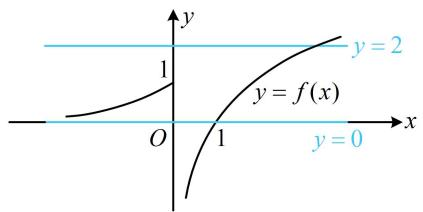

text_image

y
1
y = f(x)
O
1
x
y = 2
y = 0

2. (2022·安徽期中·★★★☆)

已知函数 $f(x) = \begin{cases} x + \frac{1}{x}, & x < 0 \\ \ln x, & x > 0 \end{cases}$ ，则函数 $g(x) = f(f(x) + 2) + 2$ 的零点个数为（）

A. 3

B. 4

C. 5

D. 6

2. B

解析： $g(x) = 0\Leftrightarrow f(f(x) + 2) + 2 = 0$

设 $t = f(x) + 2$ ，则 $f(t) + 2 = 0$ ，所以 $f(t) = -2$

要由此解 $t$ ，可通过讨论 $t$ 与0的大小，代入解析式，

当 t<0 时， $f(t)=t+\frac{1}{t}$ ，所以 $f(t)=-2$ 即为 $t+\frac{1}{t}=-2$ ，

解得： $t = -1$ ，满足 $t < 0$

当 $t > 0$ 时， $f(t) = \ln t$ ，所以 $f(t) = -2$ 即为 $\ln t = -2$ ，

解得： $t = \frac{1}{\mathrm{e}^2}$ ，满足 $t > 0$

求出了 $t$ ，再代回 $t = f(x) + 2$ ，看看 $x$ 有几个解，

所以 $f(x) + 2 = -1$ 或 $f(x) + 2 = \frac{1}{\mathrm{e}^2}$

故 $f(x) = -3$ 或 $f(x) = \frac{1}{\mathrm{e}^2} -2$

要研究 $g(x)$ 的零点个数，可画图看直线 $y = -3$ 和 $y =$

$\frac{1}{e^{2}}-2$ 与 $f(x)$ 的图象的交点个数，

如图， $y = -3$ 与 $f(x)$ 的图象有3个交点， $y = \frac{1}{\mathrm{e}^2} -2$

与 $f(x)$ 的图象有 1 个交点，故 $g(x)$ 有 4 个零点.

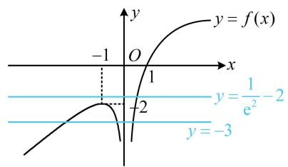

line

| x    | y = f(x) | y = 1/e² - 2 |
| ---- | -------- | ------------ |
| -1   | -1       | -            |
| 0    | 0        | 1            |
| 1    | 1        | 1            |
| 2    | 2        | 1            |
| 3    | 3        | 1            |

3. (2024·山东济南二模·★★★☆)

已知函数 $f(x) = x\mathrm{e}^{1 - x}$ ，若方程 $f(x) + \frac{1}{f(x) + 1} = a$ 有三个不相等的实数解，则实数 $a$ 的取值范围为 \_\_\_\_.

3. $\left(1, \frac{3}{2}\right)$

解析：所给方程较复杂，观察发现含 $x$ 的部分以 $f(x)$ 的形式整体出现，可考虑将 $f(x)$ 换元成 $t$ ，使该方程简化，

令 $t = f(x)$ ，则方程 $f(x) + \frac{1}{f(x) + 1} = a$ 即为 $t + \frac{1}{t + 1} = a$ ，即 $t(t + 1) + 1 = a(t + 1)$ ，化简得： $t^2 +(1 - a)t + 1 - a = 0$ ①，

怎样能使原方程有3个不相等的实数解？注意到我们由①解出 $t$ 后，要代回 $t = f(x)$ 去研究 $x$ 的解的情况，那我们不妨先分析函数 $f(x)$ ，看看要使 $t = f(x)$ 有3个不相等的实数解，需要什么样的 $t$ ，

由题意， $f(x) = x\mathrm{e}^{1 - x}$ ，所以 $f^{\prime}(x) = \mathrm{e}^{1 - x} + x\cdot (-\mathrm{e}^{1 - x})$

$= (1 - x)\mathrm{e}^{1 - x}$ ，从而 $f^{\prime}(x) > 0\Leftrightarrow x <   1$ ， $f^{\prime}(x) <   0\Leftrightarrow x > 1$

故 $f(x)$ 在 $(-\infty, 1)$ 上 $\nearrow$ ，在 $(1, +\infty)$ 上 $\searrow$

所以 $f(x)_{\max} = f(1) = 1$

又当 $x \to -\infty$ 时， $\mathrm{e}^{1 - x} \to +\infty$ ， $f(x) = x\mathrm{e}^{1 - x} \to -\infty$

当 $x \to +\infty$ 时， $f(x) = x \mathrm{e}^{1 - x} = \frac{\mathrm{e}x}{\mathrm{e}^x} \to 0$ ， $f(x)$ 的草图如图1，

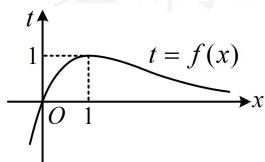

line

| x    | t     |
| ---- | ----- |
| 0    | 1     |
| 1    | 1     |

图1

观察发现一条水平直线与 $f(x)$ 图象的交点个数只可能是0,1,2,故要使 $t = f(x)$ 有3个实数解,至少需要2条水平直线,而方程①最多也只能有2个不相等的实数解,于是方程①应恰有两个不相等的实根,这两根分布在哪里呢?我们发现有一根必须在(0,1)上,另一根可以为1,也可以在 $(-\infty,0]$ 上,故据此讨论,

(i)当方程①有一根恰好为1时，

将 $t = 1$ 代入①得 $1 + 1 - a + 1 - a = 0$ ，解得： $a = \frac{3}{2}$

此时方程①即为 $t^2 - \frac{1}{2} t - \frac{1}{2} = 0$ ，也即 $2t^2 - t - 1 = 0$

所以 $t = 1$ 或 $-\frac{1}{2}$ ，另一根为 $-\frac{1}{2}$ ，不在(0,1)上，不合题意；

(ii)当方程①的两根分别在 $(- \infty, 0]$ 和 $(0,1)$ 上时，

设 $g(t)=t^{2}+(1-a)t+1-a$ ，此时要按图2列出不等式组 $\left\{\begin{aligned}\Delta=(1-a)^{2}-4(1-a)>0(\text{确保方程①有两个不相等实根})\\ g(0)=1-a\leq0(\text{保证}t_{1}\leq0)\\ g(1)=3-2a>0(\text{保证}0<t_{2}<1)\end{aligned}\right.$ 吗？务必注意，

图 3 的情况（有一根恰好为 0，另一根小于 0）也是满足上述不等式组的，但它不满足题意，所以要单独考虑这种情况，

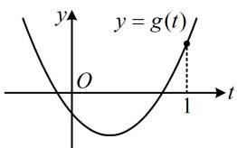

text_image

y
y = g(t)
O
1
t

图2

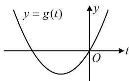

text_image

y = g(t)
O
t

图3

若方程①恰有一根为0，则将 $t = 0$ 代入①得 $1 - a = 0$

所以 a=1 ，此时方程①即为 $t^{2}=0$ ，解得：t=0 ，

所以方程①只有唯一的实根，不合题意；

若方程①的两根分别在 $(- \infty, 0)$ 和 $(0,1)$ 上，则如图2，

应有 $\left\{ \begin{array}{l} g(0) = 1 - a < 0 (\text{保证} t_1 < 0) \\ g(1) = 3 - 2a > 0 (\text{保证} 0 < t_2 < 1) \end{array} \right.$ ，解得： $1 < a < \frac{3}{2}$ ；

综上所述，实数 $a$ 的取值范围为 $\left(1, \frac{3}{2}\right)$ .

# 4. (★★★★)

设函数 $f(x) = \begin{cases} |\lg x|, & x > 0 \\ -x^2 - 2x, & x \leq 0 \end{cases}$ ，若函数 $y = 2f^2(x) + 1$ 与 $y = af(x)$ 的图象有8个交点，则实数 $a$ 的取值范围为 \_\_\_\_.

# 4. $(2\sqrt{2},3)$

解析：由题意，方程 $2f^{2}(x) + 1 = af(x)$ 有8个实根，

$$
2 f ^ {2} (x) + 1 = a f (x) \Leftrightarrow 2 f ^ {2} (x) - a f (x) + 1 = 0 \quad ①,
$$

所以问题等价于关于 $x$ 的方程①有8个实数解，

因为含 $x$ 的部分是 $f(x)$ 的整体形式，所以将 $f(x)$ 换元，

设 $t = f(x)$ ，则式①为 $2t^{2} - at + 1 = 0$ ， $t = f(x)$ 的图象如图1，一条水平线与该图象的交点个数可能为1，2，3，4，怎样能使方程①有8个解？只能是方程 $2t^{2} - at + 1 = 0$ 有2根 $t_1$ ， $t_2$ ，且 $t_1 = f(x)$ 和 $t_2 = f(x)$ 都有4个解，

所以 $t_1$ ， $t_2$ 都位于(0,1)上，故二次函数 $\varphi (t) = 2t^2 - at + 1$ 的图象应如图2所示，所以 $\left\{ \begin{array}{ll}\Delta = a^2 -8 > 0\\ 0 <   \frac{a}{4} <  1\\ \varphi (1) = 3 - a > 0\\ \varphi (0) = 1 > 0 \end{array} \right.$

解得： $2\sqrt{2}<a<3$

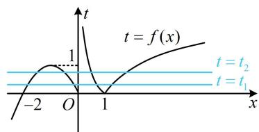

text_image

t = f(x)
t = t₂
t = t₁
-2
O
1
x
t

图1

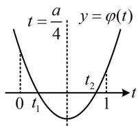  
图2

# 5. (★★★★)

已知 $f(x) = \begin{cases} ax + 1, & x \leq 0 \\ \log_2 x, & x > 0 \end{cases}$ ，若函数 $y = f(f(x)) + 1$ 有4个零点，则实数 $a$ 的取值范围为 \_\_\_\_.

# 5. $(0, + \infty)$

解析：设 $t = f(x)$ ，则 $f(f(x)) + 1 = 0$ 可化为 $f(t) = -1$

可由直线 $y = -1$ 与 $y = f(t)$ 的图象交点的横坐标来看此方程的解的情况，所以画图，需讨论 $a$ 的正负，

当 $a \leq 0$ 时，如图1， $f(t) = -1 \Leftrightarrow \log_2 t = -1 \Leftrightarrow t = \frac{1}{2}$ ，

所以 $f(x) = \frac{1}{2}$ ，如图2，直线 $y = \frac{1}{2}$ 与 $y = f(x)$ 的图象只有1个交点，从而 $y = f(f(x)) + 1$ 仅有1个零点，不合题意；

当 $a > 0$ 时，如图3，直线 $y = -1$ 与 $y = f(t)$ 的图象有2个交点，其横坐标分别为 $t_0(t_0 < 0)$ 和 $\frac{1}{2}$ ，

如图4， $y = \frac{1}{2}$ 与 $y = f(x)$ 的图象有2个交点， $y = t_0$ 与 $y = f(x)$ 的图象也有2个交点，

故方程 $f(x) = t_0$ 和 $f(x) = \frac{1}{2}$ 共有4个实数解，满足题意；

综上所述，实数 a 的取值范围是 $(0, +\infty)$ .

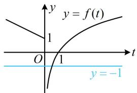

text_image

y
y = f(t)
1
O
1
t
y = -1

图1

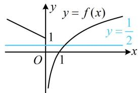

text_image

y
y = f(x)
1
y = \u00bd/2
O
1
x

图2

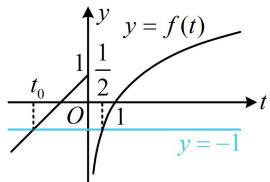

line

| t | y = f(t) |
|---|---|
| 0 | 1/2 |
| -1 | -1 |

图3

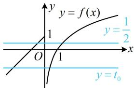

text_image

y
y = f(x)
1
y = \frac{1}{2}
O
1
x
y = t₀

图4

# 6. (★★★★☆)

若关于 $x$ 的方程 $2\mathrm{e}^{2x} = \frac{a}{x^2} -\frac{\mathrm{e}^x}{x} (a\in \mathbf{R})$ 有4个不同的实根，则 $a$ 的取值范围为

# 6. $\left(-\frac{1}{8}, \frac{2 - e}{e^2}\right)$

解析：题设条件的变形方向比较难想，其实形式上隐藏着“猫腻”，如果两端同乘以 $x^{2}$ ，就可发现变为了复合结构，

$$
\begin{array}{l} 2 \mathrm{e} ^ {2 x} = \frac {a}{x ^ {2}} - \frac {\mathrm{e} ^ {x}}{x} \Leftrightarrow 2 x ^ {2} \mathrm{e} ^ {2 x} = a - x \mathrm{e} ^ {x} (x \neq 0) \\ \Leftrightarrow 2 (x \mathrm{e} ^ {x}) ^ {2} + x \mathrm{e} ^ {x} - a = 0 (x \neq 0), \\ \end{array}
$$

含 $x$ 的部分都是 $x \mathrm{e}^{x}$ 这一整体结构, 所以将 $x \mathrm{e}^{x}$ 换元,

设 $t = x\mathrm{e}^{x}$ ，则 $2t^{2} + t - a = 0$ ，等会儿要把解得的 $t$ 用来和函数 $y = x\mathrm{e}^{x}$ 的图象看交点，故先研究这个函数，

设 $f(x) = x\mathrm{e}^{x}(x\in \mathbf{R})$ ，则 $f^{\prime}(x) = (x + 1)\mathrm{e}^{x}$

所以 $f^{\prime}(x) > 0\Leftrightarrow x > -1$ ， $f^{\prime}(x) <   0\Leftrightarrow x <   - 1$

从而 $f(x)$ 在 $(- \infty, -1)$ 上 $\searrow$ ，在 $(-1, +\infty)$ 上 $\nearrow$

又 $\lim_{x\to +\infty}f(x) = +\infty$ ， $\lim_{x\to -\infty}f(x) = 0$ ， $f(-1) = -\frac{1}{\mathsf{e}}$

所以 $f(x)$ 的大致图象如图1，由图可知一条水平直线与 $f(x)$ 的图象可能有0，1，2个交点，

故要使原方程有4根，方程 $2t^{2} + t - a = 0$ 应有2根 $t_1,t_2$

且 $t_1 = f(x)$ 和 $t_2 = f(x)$ 都有2根，故 $t_1, t_2$ 都在 $\left(-\frac{1}{\mathrm{e}}, 0\right)$ 上，

所以二次函数 $\varphi (t) = 2t^{2} + t - a$ 的大致图象如图2，

故 $\left\{\begin{aligned}\Delta&=1+8a>0\\\varphi\left(-\frac{1}{e}\right)&=\frac{2}{e^{2}}-\frac{1}{e}-a>0\end{aligned}\right.$ ，解得： $-\frac{1}{8}<a<\frac{2-e}{e^{2}}$ .

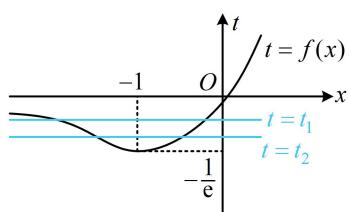

text_image

t = f(x)
-1 O x
t = t₁
t = t₂
-½e

图1

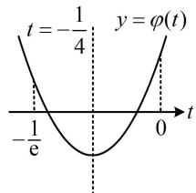

text_image

t = -\frac{1}{4} \quad y = \varphi(t)
-\frac{1}{e} \quad 0 \quad t

图2

【反思】本题难度颇高，其复合结构是隐藏的。所以对于复杂的形式，我们要注意观察各部分的结构联系，找到变形的思路。