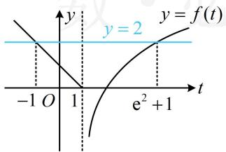
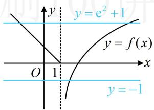
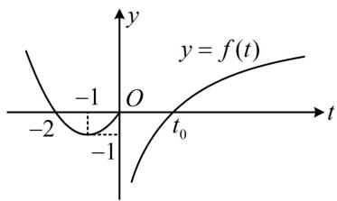
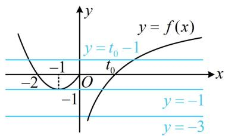
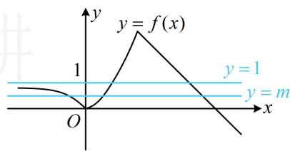
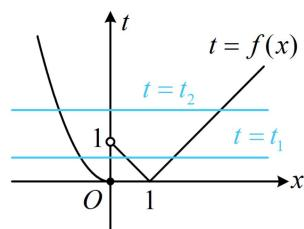
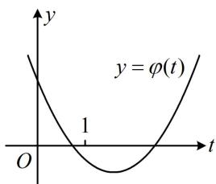
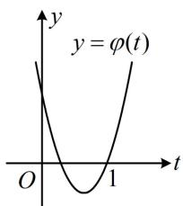
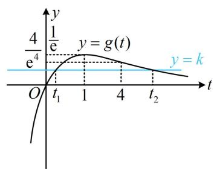
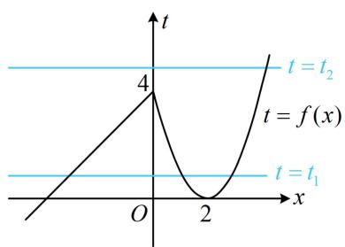

# 模块六 复合函数综合

# 第1节 复合函数方程问题（★★★★）

内容提要

含有 $f(f(x))$ ， $f(g(x))$ 这类结构的方程称为复合函数方程，复合函数方程问题一般用换元法来求解，可设内层的函数为 $t$ ，将一个双层的方程问题化归成两个单层的方程问题来处理。由于复合函数方程相关模拟题颇难，所以本节整体难度较高。

# 类型Ⅰ：不含参的复合函数方程问题

【例1】已知函数 $f(x) = \begin{cases} 1 - x, & x \leq 1 \\ \ln (x - 1), & x > 1 \end{cases}$ ，则函数 $g(x) = f(f(x)) - 2$ 的零点个数为（）

A. 1 
B. 2 
C. 3 
D. 4

解析：在零点问题中，看到复合函数结构 $f(f(x))$ ，一般会将内层换元成 $t$ ，先解 $t$ ，再解 $x$ ，

由题意， $g(x) = 0\Leftrightarrow f(f(x)) = 2$ ，设 $t = f(x)$ ，则 $f(t) = 2$

通过讨论 $t$ 与1的大小，代入解析式求解上述方程可行，但画直线 $y = 2$ 与 $y = f(t)$ 的图象来看更简单，如图1， $f(t) = 2$ 的解是 $t = -1$ 或 $\mathrm{e}^2 + 1$ ，求出了 $t$ ，再代回 $t = f(x)$ ，看看 $x$ 有几个解，

将 $t = -1$ 和 $t = \mathrm{e}^2 + 1$ 代入 $t = f(x)$ 可得 $-1 = f(x)$ ， $\mathrm{e}^2 + 1 = f(x)$ ，

如图2， $g(x)$ 的零点个数即为直线 $y = -1$ 和 $y = \mathrm{e}^2 +1$ 与 $y = f(x)$ 图象的交点个数，

由图可知交点个数为 3，故选 C.

text_image

y
y = 2
y = f(t)
-1 O 1 e² + 1 t

图1

text_image

y = e² + 1
y = f(x)
O 1 x
y = -1

图2

答案: C

【变式】已知函数 $f(x) = \begin{cases} \ln x - \frac{1}{x}, & x > 0 \\ x^2 + 2x, & x \leq 0 \end{cases}$ ，则函数 $y = f(f(x) + 1)$ 的零点个数是（）

A. 2 B. 3 C. 4 D. 5

解析： $f(f(x)+1)$ 仍是双层结构，研究零点时可将内层换元成 t，化整为零，先解 t，再解 x，设 $t=f(x)+1$ ，则 $f(f(x)+1)=0$ 即为 $f(t)=0$ ，下面画图看 $f(t)=0$ 的解的情况，

当 $t > 0$ 时， $f(t) = \ln t - \frac{1}{t}$ ，所以 $f'(t) = \frac{1}{t} + \frac{1}{t^2} > 0$ ，故 $f(t)$ 在 $(0, +\infty)$ 上 $\nearrow$

因为 $f(1) = -1 < 0$ ， $f(2) = \ln 2 - \frac{1}{2} > 0$ ，所以 $f(t)$ 在 $(0, +\infty)$ 上有唯一的零点 $t_0$ ，且 $t_0 \in (1, 2)$ ，

又 $\lim_{t\to 0^{+}}f(t) = -\infty$ ， $\lim_{t\to +\infty}f(t) = +\infty$ ，所以函数 $y = f(t)$ 的大致图象如图1，

由图可知 $f(t) = 0$ 有 $t = -2, 0, t_0$ 三个解，下面将这三个解代回 $t = f(x) + 1$ 再看 $x$ 的解的个数，所以 $-2 = f(x) + 1$ 或 $0 = f(x) + 1$ 或 $t_0 = f(x) + 1$ ，从而 $f(x) = -3$ 或 $f(x) = -1$ 或 $f(x) = t_0 - 1$ ，

故只需看直线 $y = -3$ ， $y = -1$ ， $y = t_0 - 1$ 和函数 $y = f(x)$ 的图象共有几个交点，

如图2, 上述三条水平的直线与函数 $y = f(x)$ 的图象共有5个交点, 故选D.

答案: D

line

| t    | y = f(t) |
| ---- | -------- |
| -2   | -1       |
| 0    | 0        |
| 2    | -1       |

图1

text_image

y
y = f(x)
y = t₀ - 1
t₀
-2
O
x
y = -1
-1
y = -3

图2

【总结】研究 $y = f(g(x))$ 的零点，同样可类似例1，设 $t = g(x)$ ，先由 $f(t) = 0$ 求出 $t$ ，再代回 $t = g(x)$ 解 $x$ .

# 类型 II：含参的复合函数方程问题

【例 2】已知函数 $f(x)=\left\{\begin{aligned}&\left|2^{x}-1\right|,x\leq2\\ &5-x,x>2\end{aligned}\right.$ ，若方程 $[f(x)]^{2}-(m+1)f(x)+m=0$ 有 5 个不同的实数根，则实数 m 的取值范围为（）

A. 0

B. $(0,1)$

C. $[0,1)$

D. (1,3)

解析：观察发现若将 $f(x)$ 看作一个整体，则原方程可分解因式，故先按此化简原方程，

由题意， $[f(x)]^2 -(m + 1)f(x) + m = 0\Leftrightarrow [f(x) - 1][f(x) - m] = 0$ ，所以 $f(x) = 1$ 或 $f(x) = m$

原方程有 5 根等价于上述两个方程共有 5 根，

即直线 $y = 1$ 和 $y = m$ 与 $f(x)$ 的图象共有5个交点，

如图，直线 $y = 1$ 与 $f(x)$ 的图象有2个交点，

所以 $y = m$ 与 $f(x)$ 的图象应有3个交点，故 $0 < m < 1$ .

text_image

y
y = f(x)
1
y = 1
y = m
O
x

答案: B

【反思】本题研究 5 根的组成方式是求解 m 范围关键，由于 $f(x)=1$ 有 2 根，所以 $f(x)=m$ 必有 3 根，从而据此求得 m 的取值范围.

【变式】已知函数 $f(x) = \begin{cases} |x - 1|, & x > 0 \\ x^2, & x \leq 0 \end{cases}$ ，若 $g(x) = f^2(x) + kf(x) + 2$ 有5个零点，则实数 $k$ 的取值范围是（）

A. $(- \infty, -3)$

B. $(- \infty, -3]$

C. $(- \infty, -2 \sqrt{3})$

D. $(-3, - 2\sqrt{2})$

解析： $g(x) = 0 \Leftrightarrow f^{2}(x) + kf(x) + 2 = 0$ ，此方程含 $x$ 的部分是 $f(x)$ 这一整体结构，可考虑将其换元成 $t$ ，设 $t = f(x)$ ，则 $t^2 + kt + 2 = 0$ ，不易分解因式，于是直接分析该方程根的分布情况，

函数 $t = f(x)$ 的大致图象如图1，由图可知，当 $t$ 变化时，方程 $t = f(x)$ 的解的个数可能为0，2，3，所以要使 $g(x)$ 有5个零点，方程 $t^2 + kt + 2 = 0$ 应有2个解 $t_1, t_2$

且 $t_1 = f(x)$ 和 $t_2 = f(x)$ 分别有3个，2个解，故 $t_1 \in (0,1)$ ， $t_2 \in [1, +\infty) \cup \{0\}$ ，

注意到0不是方程 $t^2 +kt + 2 = 0$ 的解，所以只能 $t_1\in (0,1)$ ， $t_2\in [1, + \infty)$

接下来就是一元二次方程根的分布问题了，可根据根的分布，画出对应的二次函数可能的图象，二次函数 $\varphi(t) = t^2 + kt + 2$ 的大致图象只能如图2或图3，

若为图2，则 $\left\{ \begin{array}{l} \varphi(0) = 2 > 0 \\ \varphi(1) = k + 3 < 0 \end{array} \right.$ ，解得： $k < -3$ ；若为图3，则 $\varphi(1) = k + 3 = 0$ ，解得： $k = -3$ ，

经检验，此时方程 $t^2 + kt + 2 = 0$ 的另一根为2，所以不会出现图3所示的情形，故 $k = -3$ 不合题意；综上所述， $k$ 的取值范围是 $(- \infty, -3)$ .

答案: A

text_image

t
t = f(x)
t = t₂
1
t = t₁
O
1
x

图1

text_image

y
y = φ(t)
1
O
t

图2

text_image

y
y = φ(t)
O
1
t

图3

【反思】与例2相比，本题的核心仍是基于研究5根的组成方式来求 $m$ 的范围，不同之处在于令 $t = f(x)$ 后所得方程 $t^2 + kt + 2 = 0$ 不好解，故画图分析 $t = f(x)$ 可能的解的个数，进而发现5根的组成方式只能为 $3 + 2$ ：

【例 3】设函数 $f(x)=\left\{\begin{aligned}x+4,x&\leq0\\ (x-2)^{2},&x>0\end{aligned}\right.$ ， $g(x)=\frac{x}{\mathrm{e}^{x}}$ ，若方程 $g(f(x))-k=0(k\in\mathbf{R})$ 有 4 个实根，则实数 k 的取值范围为 \_\_\_\_.

解析：设 $t = f(x)$ ，则 $g(f(x)) - k = 0$ 即为 $g(t) = k$ ，此方程无法直接解，考虑画图来看解的情况，

由题意， $g'(t)=\frac{1-t}{e'}$ ，所以 $g'(t)>0\Leftrightarrow t<1$ ， $g'(t)<0\Leftrightarrow t>1$ ，故 $g(t)$ 在 $(-∞,1)$ 上 $↗$ ，在 $(1,+∞)$ 上 $↘$ ，

又 $g(1) = \frac{1}{\mathrm{e}}$ ， $\lim_{t\to +\infty}g(t) = 0$ ， $\lim_{t\to -\infty}g(t) = -\infty$ ，所以 $y = g(t)$ 的大致图象如图1，

由图可知直线 $y = k$ 和 $y = g(t)$ 的图象的交点个数可能为0，1，2，

那么交点个数为 0 或 1 行不行？为 0 则原方程无解，显然不行；为 1 呢？也不行！

因为 $t = f(x)$ 的大致图象如图 2，所以 1 条水平直线与该图象可产生 1, 2, 3 个交点，故原方程最多 3 根，从而 y = k 与 $y = g(t)$ 的图象必须有 2 个交点，即方程 $g(t) = k$ 有 2 根，所以 $0 < k < \frac{1}{e}$ ,

由图1知此时的两根满足 $0 < t_{1} < 1 < t_{2}$ , 现在我们来看看直线 $t = t_{1}$ 和 $t = t_{2}$ 与 $t = f(x)$ 图象的交点情况, 如图2, $t = t_{1}$ 与 $t = f(x)$ 的图象必有3个交点, 所以 $t = t_{2}$ 应与 $t = f(x)$ 的图象有1个交点, 故 $t_{2} > 4$ , 怎样能使 $t_{2} > 4$ 呢, $t_{2}$ 是 $y = k$ 与 $y = g(t)$ 的一个交点的横坐标, 于是又回到图1来看,

注意到 $g(4) = \frac{4}{\mathrm{e}^4}$ ，由图可知要使 $t_2 > 4$ ，只需 $0 < k < \frac{4}{\mathrm{e}^4}$ .

答案： $\left(0,\frac{4}{\mathrm{e}^4}\right)$

line

| t    | y = g(t) |
| ---- | -------- |
| 0    | 0        |
| t₁   | 1/2      |
| 1    | 1/2      |
| 4    | 0.5      |
| t₂   | 0        |

图1

line

| x | f(x) |
|---|------|
| 0 | 0    |
| 4 | 4    |
| 2 | 0    |

图2

【反思】本题令 $t = f(x)$ 后所得的方程 $g(t) - k = 0$ 不再是一元二次方程，但是你看，解题思路还是大同小异吧？先分析 $g(t) = k$ 的根的分布情况，再研究 $t = f(x)$ 的解的个数。结合上面的几道题，相信你已摸清本节题型的思

# 考流程.

# 强化训练

1. (2022·河南郑州期末·★★★)

设函数 $f(x) = \begin{cases} 2^x, & x \leq 0 \\ \log_2 x, & x > 0 \end{cases}$ ，则函数 $y = f(f(x)) - 1$ 的零点个数为 \_\_\_\_.

2.（2022·安徽期中·★★★☆）

已知函数 $f(x) = \begin{cases} x + \frac{1}{x}, & x < 0 \\ \ln x, & x > 0 \end{cases}$ ，则函数 $g(x) = f(f(x) + 2) + 2$ 的零点个数为（）

A. 3 B. 4 C. 5 D. 6

3. (2024·山东济南二模·★★★☆)

已知函数 $f(x) = x\mathrm{e}^{1 - x}$ ，若方程 $f(x) + \frac{1}{f(x) + 1} = a$ 有三个不相等的实数解，则实数 $a$ 的取值范围为 \_\_\_\_.

4. (★★★★)

设函数 $f(x) = \begin{cases} |\lg x|, & x > 0 \\ -x^2 - 2x, & x \leq 0 \end{cases}$ ，若函数 $y = 2f^2(x) + 1$ 与 $y = af(x)$ 的图象有8个交点，则实数 $a$ 的取值范围为 \_\_\_\_.

5. (★★★★)

已知 $f(x) = \begin{cases} ax + 1, & x \leq 0 \\ \log_2 x, & x > 0 \end{cases}$ ，若函数 $y = f(f(x)) + 1$ 有4个零点，则实数 $a$ 的取值范围为 \_\_\_\_.

6. (★★★★☆)

若关于 $x$ 的方程 $2\mathrm{e}^{2x} = \frac{a}{x^2} -\frac{\mathrm{e}^x}{x} (a\in \mathbf{R})$ 有4个不同的实根，则 $a$ 的取值范围为