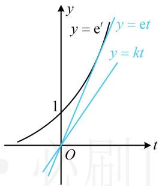
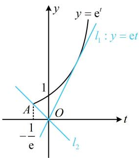
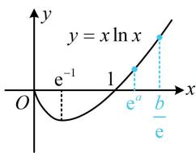
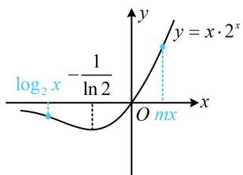
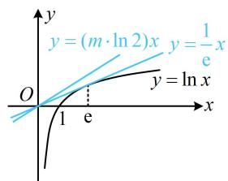

# 强化训练

# 1. (★★★)

已知 $x, y \in \mathbf{R}$ ，若 $x + y > \cos x - \cos y$ ，则下面式子一定成立的是（）

A. $x + y <   0$ B. $x + y > 0$

C. $x - y > 0$ D. $x - y <   0$

1. B

解析：所给不等式中 $x$ 和 $y$ 的部分结构类似，先将它们分离到不等号两侧，看能否化为同构形式，

$$
x + y > \cos x - \cos y \Leftrightarrow x - \cos x > - y - \cos y \quad ①,
$$

此时左右两侧结构类似，但不完全相同，观察发现可以用 $\cos y = \cos (-y)$ 来调整为同构形式，

由 $\cos y = \cos (-y)$ 可得式①即为 $x - \cos x > -y - \cos (-y)$ ，

设 $f(x) = x - \cos x(x\in \mathbf{R})$ ，则 $f^{\prime}(x) = 1 + \sin x\geq 0$

所以 $f(x)$ 在 $\mathbf{R}$ 上 $\nearrow$ ，又因为 $x - \cos x > -y - \cos (-y)$ 即为

$f(x) > f(-y)$ ，所以 $x > -y$ ，故 $x + y > 0$

# 2. (2022·福建南平模拟·★★★☆)

对 $\forall x_{1},x_{2}\in (1,3]$ ，当 $x_{1} <   x_{2}$ 时， $x_{1} - x_{2} - \frac{a}{3}\ln \frac{x_1}{x_2} >0$ 恒成立，则实数 $a$ 的取值范围是（）

A. $[3, +\infty)$ B. $(3, +\infty)$

C. $[9, +\infty)$ D. $(9, +\infty)$

2. C

解析：观察发现所给不等式中 $x_{1}$ 和 $x_{2}$ 的部分结构类似，先将它们分离到不等号的两侧，看能否化同构形式，

$$
x _ {1} - x _ {2} - \frac {a}{3} \ln \frac {x _ {1}}{x _ {2}} > 0 \Leftrightarrow x _ {1} - x _ {2} - \frac {a}{3} (\ln x _ {1} - \ln x _ {2}) > 0
$$

$\Leftrightarrow x_{1} - \frac{a}{3}\ln x_{1} > x_{2} - \frac{a}{3}\ln x_{2}$ ，这样就同构了，可构造函数分析，设 $f(x) = x - \frac{a}{3}\ln x$ ，则 $f(x_{1}) > f(x_{2})$

所以问题等价于 $f(x)$ 在 $(1,3]$ 上 $\searrow$

从而 $f^{\prime}(x) = 1 - \frac{a}{3x}\leq 0$ 在(1,3]上恒成立，故 $a\geq 3x$

因为当 $x \in (1,3]$ 时， $(3x)_{\max} = 9$ ，所以 $a \geq 9$ ：

# 3. (★★★★)

已知实数 $a$ ， $b$ 满足 $3^a + a = 7$ ， $\log_3 \sqrt[3]{3b + 1} + b = 2$ ，则 $a + 3b =$ \_\_\_\_.

3.6

解析：已知的两个方程都无法解出 $a$ 和 $b$ ，尝试同构，

$\log_{3}\sqrt[3]{3b+1}+b=2$ 这个式子较复杂，先尝试化简，

$$
\log_ {3} \sqrt [ 3 ]{3 b + 1} + b = 2 \Leftrightarrow \frac {1}{3} \log_ {3} (3 b + 1) + b = 2
$$

$$
\Leftrightarrow \log_ {3} (3 b + 1) + 3 b = 6,
$$

上式括号里面是 $3b + 1$ ，于是把外面的 $3b$ 也加1，

所以 $\log_3(3b + 1) + (3b + 1) = 7$ ，与 $3^{a} + a = 7$ 对比发现这就

是 $3^{x} + x$ 与 $\log_3x + x$ 之间的同构，属基础同构模型，

因为 $3^{a} + a = 7$ ，所以 $3^{a} + \log_{3} 3^{a} = 7$ ，这个式子和

$\log_{3}(3b+1)+(3b+1)=7$ 同构，可构造函数分析，

设 $f(x) = \log_3x + x(x > 0)$ ，则 $f(3^{a}) = f(3b + 1) = 7$

注意到 $f(x)$ 在 $(0, +\infty)$ 上 $\nearrow$ ，所以 $3^{a} = 3b + 1$

代入 $3^{a} + a = 7$ 可得 $(3b + 1) + a = 7$ ，故 $a + 3b = 6$

# 4. (★★★★)

已知函数 $f(x) = x\mathrm{e}^{x + 1}$ ， $g(x) = k(\ln x + x + 1)$ ，其中 $k > 0$ ，设 $h(x) = f(x) - g(x)$ ，若 $h(x) \geq 0$ 恒成立，则 $k$ 的取值范围是 \_\_\_\_.

4. (0,e]

解析：由题意， $h(x)\geq 0\Leftrightarrow x\mathrm{e}^{x + 1} - k(\ln x + x + 1)\geq 0$

若把 $x\mathrm{e}^{x + 1}$ 调整为 $\mathrm{e}^{\ln x + x + 1}$ ，则可将 $\ln x + x + 1$ 整体换元，

所以 $\mathrm{e}^{\ln x + x + 1} - k(\ln x + x + 1)\geq 0$ ，设 $t = \ln x + x + 1$

则 $t \in \mathbf{R}$ ，且 $\mathrm{e}^t - kt \geq 0$ ，所以 $\mathrm{e}^t \geq kt$ ，

如图，注意到 $y = \mathrm{e}^{t}$ 过原点的切线为 $y = \mathrm{e}t$ ，

所以当且仅当 $0 < k \leq \mathbf{e}$ 时， $\mathbf{e}^t \geq kt$ 恒成立.

text_image

y = e'
y = et
y = kt
1
O
t

5. (2022·广东广州三模·★★★★)

若对任意的 $x > 0$ ，都有 $x^{x} - ax\ln x\geq 0$ ，则 $a$ 的取值范围为（）

A. $[0,\mathrm{e}]$

B. $\left[-\mathrm{e}^{1 - \frac{1}{\mathrm{e}}},\mathrm{e}\right]$

C. $\left(-\infty, -\mathrm{e}^{1 - \frac{1}{\mathrm{e}}}\right]\bigcup [\mathrm{e}, + \infty)$

D. $(- \infty, e]$

5. B

解析： $x^{x}$ 的底数和指数都有 x，不易直接分析，怎么办呢？可通过取对数把指数部分的 x 拿下来，

因为 $x^{x} = \mathrm{e}^{\ln x^{x}} = \mathrm{e}^{x\ln x}$ ，所以 $x^{x} - ax\ln x\geq 0\Leftrightarrow \mathrm{e}^{x\ln x} - ax\ln x$

≥0，含x的部分为 $x\ln x$ 的整体结构，故换元，

令 $t = x\ln x$ ，则 $\mathrm{e}^{x\ln x} - ax\ln x\geq 0$ 即为 $\mathbf{e}^t -at\geq 0$

既然换了元，就得研究新元的范围，可求导分析，

因为 $t' = \ln x + 1$ ，所以 $t' > 0 \Leftrightarrow x > \frac{1}{\mathrm{e}}$ ， $t' < 0 \Leftrightarrow 0 < x < \frac{1}{\mathrm{e}}$

从而 $t = x\ln x$ 在 $\left(0,\frac{1}{\mathbf{e}}\right)$ 上 $\searrow$ ，在 $\left(\frac{1}{\mathbf{e}}, + \infty\right)$ 上单调递增，

故当 $x = \frac{1}{\mathrm{e}}$ 时， $t$ 取得最小值 $-\frac{1}{\mathrm{e}}$ ，即 $t \geq -\frac{1}{\mathrm{e}}$

因为 $\mathrm{e}^t - at \geq 0$ ，所以 $\mathrm{e}^t \geq at$

函数 $y=e^{t}$ 和 y=at 都很简单，接下来作图分析最方便，

如图，要使 $\mathsf{e}^t\geq at$ 在 $\left[-\frac{1}{\mathsf{e}}, + \infty\right)$ 上恒成立，直线 $y = at$ 可从切线 $l_{1}$ 绕原点顺时针旋转至 $l_{2}$

切线 $l_{1}$ 的斜率为 $\mathbf{e}$ ，直线 $l_{2}$ 过原点和点 $A\left(-\frac{1}{\mathrm{e}}, \mathrm{e}^{-\frac{1}{\mathrm{e}}}\right)$ ，

其斜率为 $\frac{\mathrm{e}^{-\frac{1}{\mathrm{c}}}}{-\frac{1}{\mathrm{e}}} = -\mathrm{e}^{1 - \frac{1}{\mathrm{c}}}$ ，所以 $a$ 的取值范围为 $\left[-\mathrm{e}^{1 - \frac{1}{\mathrm{c}}},\mathrm{e}\right]$

text_image

y = e^t
l_1 : y = et
1
A
O
-t
-1/e
l_2

【反思】高中阶段，看到 $x^{x}(x > 0)$ 这一结构，常通过取对数将指数部分的 $x$ 拿下来，可将其调整为 $\mathrm{e}^{x\ln x}$ .

6. (2022·广东广州模拟·★★★★)

若不等式 $\ln (mx + 1) - x - 1 > mx - \mathrm{e}^x$ 在 $(0, + \infty)$ 上恒成立，则正实数 $m$ 的最大值为

6.1

解析：左边是 $\ln (mx + 1)$ ，所以将右侧的 $mx$ 移至左侧，凑

成 $\ln (mx + 1) - (mx + 1)$ 这一典型结构，

$$
\ln (m x + 1) - x - 1 > m x - \mathrm{e} ^ {x} \Leftrightarrow \ln (m x + 1) - (m x + 1) > x - \mathrm{e} ^ {x},
$$

接下来就是 $\ln x - x$ 与 $x - \mathrm{e}^{x}$ 的同构了，

$$
\ln (m x + 1) - (m x + 1) > x - \mathrm{e} ^ {x} \Leftrightarrow \ln (m x + 1) - (m x + 1)
$$

$$
> \ln \mathrm{e} ^ {x} - \mathrm{e} ^ {x} \quad ①,
$$

设 $f(x) = \ln x - x (x > 1)$ ，则不等式①即 $f(mx + 1) > f(\mathrm{e}^x)$ ，

因为 $f'(x)=\frac{1-x}{x}<0$ ，所以 $f(x)$ 在 $(1,+\infty)$ 上 $\searrow$

因为 $m > 0$ ， $x > 0$ ，所以 $mx + 1 > 1$ ， $\mathrm{e}^x >1$

故 $f(mx + 1) > f(\mathrm{e}^x)\Leftrightarrow mx + 1 <   \mathrm{e}^x$ ，画图分析此不等式最方便，如图，注意到曲线 $y = \mathrm{e}^x$ 在(0,1)处的切线为 $y = x + 1$

所以当且仅当 $0 < m \leq 1$ 时， $mx + 1 < \mathrm{e}^x$ 在 $(0, +\infty)$ 上恒成立，

故正实数 $m$ 的最大值为1.

text_image

y = e^x
y = x + 1
y = mx + 1
1
O
x

7. (★★★★)

已知 $\ln m - \frac{1}{\mathrm{e}^m} + 2m = 0$ ，则 $m\mathrm{e}^m =$ \_\_\_\_.

7.1

解析：由已知的等式无法求出 $m$ ，于是尝试同构，等式中

有 $\ln m + 2m$ ，考虑凑出 $\ln m + m$ 这一典型结构，

所给等式 $\Leftrightarrow \ln m + m = \frac{1}{\mathrm{e}^m} - m \Leftrightarrow \ln m + m = \mathrm{e}^{-m} + (-m)$

观察发现可按 $\ln x + x$ 与 $\mathrm{e}^x + x$ 的基本同构模型来处理，

所以 $\ln m + \mathrm{e}^{\ln m} = \mathrm{e}^{-m} + (-m)$ ①，设 $f(x) = \mathrm{e}^{x} + x(x\in \mathbf{R})$

则 $f'(x) = \mathrm{e}^x + 1 > 0$ ，所以 $f(x)$ 在 $\mathbf{R}$ 上 $\nearrow$ ，

且式①即为 $f(\ln m) = f(-m)$ ，所以 $\ln m = -m$ ，

我们要求的是 $me^{m}$ ，所以两端取指数，化对为指，

所以 $\mathrm{e}^{\ln m} = \mathrm{e}^{-m}$ ，从而 $m = \frac{1}{\mathrm{e}^m}$ ，故 $m\mathrm{e}^{m} = 1$

# 8. (2022·T8联考·★★★★)

设 $a, b$ 都为正数，e 为自然对数的底数，若 $a\mathrm{e}^{a + 1} + b < b\ln b$ ，则（）

A. $ab > \mathrm{e}$

B. $b > \mathrm{e}^{a + 1}$

C. $ab <   \mathrm{e}$

D. $b <   \mathbf{e}^{a + 1}$

8. B

解析：原不等式 $\Leftrightarrow a\mathrm{e}^{a + 1} < b(\ln b - 1) \Leftrightarrow a\mathrm{e}^{a + 1} < b\ln \frac{b}{\mathrm{e}}$

此时可发现，只要两端同除以 $\mathbf{e}$ ，就能转化为 $x\mathrm{e}^x$ 和 $x\ln x$ 的

同构模型， $ae^{a+1}<b\ln\frac{b}{e}\Leftrightarrow ae^{a}<\frac{b}{e}\ln\frac{b}{e}\Leftrightarrow\ln e^{a}\cdot e^{a}<\frac{b}{e}\ln\frac{b}{e}$

左右两侧同构了，接下来可构造函数分析，

设 $f(x) = x \ln x (x > 0)$ ，则 $f'(x) = 1 + \ln x$ ，

所以 $f'(x)>0\Leftrightarrow x>e^{-1}$ ， $f'(x)<0\Leftrightarrow0<x<e^{-1}$ ，

从而 $f(x)$ 在 $(0, \mathrm{e}^{-1})$ 上 $\searrow$ ，在 $(\mathrm{e}^{-1}, +\infty)$ 上 $\nearrow$

注意到当 $0 < x < 1$ 时， $f(x) < 0$ ，所以 $f(x)$ 的草图如图，

不等式 $\ln \mathbf{e}^a\cdot \mathbf{e}^a <   \frac{b}{\mathbf{e}}\ln \frac{b}{\mathbf{e}}$ 即为 $f(\mathbf{e}^{a}) <   f\left(\frac{b}{\mathbf{e}}\right),$

注意到 $a > 0$ ，所以 $\mathbf{e}^a >1$

由图可知要使 $f(\mathfrak{e}^a) < f\left(\frac{b}{\mathfrak{e}}\right)$ ，只能 $\mathfrak{e}^a < \frac{b}{\mathfrak{e}}$ ，所以 $b > \mathfrak{e}^{a + 1}$ .

text_image

y
y = x ln x
e⁻¹ 1
O eᵃ b/e
x

# 9. (2022·四川成都模拟·★★★★)

若不等式 $\log_2 x - m \cdot 2^{mx} \leq 0$ 对任意的 $x > 0$ 都成立，则正实数 $m$ 的取值范围为 \_\_\_\_.

9. $\left[\frac{1}{\mathrm{e}\ln 2}, + \infty\right)$

解析：指、对的底数是2，不是e，能同构吗？能，其实 $x\mathrm{e}^{x}$ 和 $x\ln x$ 的同构方法，也适用于其它底数的情形，所以我们先移项把指、对分开，再观察 $\log_{2}x$ 和 $m\cdot2^{mx}$ 这两个部分，可发现同乘以x就能转化为 $x\log_{2}x$ 和 $mx\cdot2^{mx}$ ，

$$
\begin{array}{l} \log_ {2} x - m \cdot 2 ^ {m x} \leq 0 \Leftrightarrow \log_ {2} x \leq m \cdot 2 ^ {m x} \Leftrightarrow x \log_ {2} x \leq m x \cdot 2 ^ {m x} \\ \Leftrightarrow 2 ^ {\log_ {2} x} \cdot \log_ {2} x \leq m x \cdot 2 ^ {m x} \quad (1), \\ \end{array}
$$

此时左右两侧结构相同了，接下来构造函数研究单调性，

设 $f(x) = x\cdot 2^{x}(x\in \mathbf{R})$ ，则不等式①即为 $f(\log_2x)\leq$

$f(mx)$ ，且 $f^{\prime}(x) = 2^{x} + x\cdot 2^{x}\cdot \ln 2 = 2^{x}(1 + x\cdot \ln 2)$

所以 $f^{\prime}(x) > 0\Leftrightarrow x > - \frac{1}{\ln 2}, f^{\prime}(x) <   0\Leftrightarrow x <   - \frac{1}{\ln 2},$

故 $f(x)$ 在 $\left(-\infty, -\frac{1}{\ln 2}\right)$ 上 $\searrow$ ，在 $\left(-\frac{1}{\ln 2}, +\infty\right)$ 上 $\nearrow$

又 $\lim_{x\to -\infty}f(x) = 0$ ， $\lim_{x\to +\infty}f(x) = +\infty$ ， $f(0) = 0$

所以 $f(x)$ 的大致图象如图1所示，因为 $m > 0$ ， $x > 0$

所以 $mx > 0$ ，故 $f(\log_2x)\leq f(mx)\Leftrightarrow \log_2x\leq mx$

接下来可以全分离，也可以换底后画图分析，下面我们把两种方法都给出来，

法 1: 将 $\log_ {2} x \leq m x$ 全分离, 求导研究最值,

$\log_2 x \leq mx \Leftrightarrow m \geq \frac{\log_2 x}{x}$ ，设 $\varphi(x) = \frac{\log_2 x}{x} (x > 0)$ ，

则 $\varphi'(x) = \frac{\frac{1}{x\ln 2} \cdot x - \log_2 x}{x^2} = \frac{\frac{1}{\ln 2} - \log_2 x}{x^2} = \frac{\log_2 e - \log_2 x}{x^2}$ ,

所以 $\varphi'(x) > 0 \Leftrightarrow 0 < x < \mathrm{e}$ , $\varphi'(x) < 0 \Leftrightarrow x > \mathrm{e}$ ,

从而 $\varphi(x)$ 在 $(0, e)$ 上 $\nearrow$ ，在 $(e, +\infty)$ 上 $\searrow$ ，

故 $\varphi (x)_{\max} = \varphi (\mathrm{e}) = \frac{\log_2\mathrm{e}}{\mathrm{e}} = \frac{1}{\mathrm{e}\ln 2},$

因为 $m \geq \varphi(x)$ 恒成立，所以 $m \geq \frac{1}{\mathrm{e}\ln 2}$ .

法2：也可通过换底公式，化为 $\ln x$ ，画图求参数范围，

因为 $\log_2 x = \frac{\ln x}{\ln 2}$ ，所以 $\log_2 x \leq mx \Leftrightarrow \frac{\ln x}{\ln 2} \leq mx$

$$
\Leftrightarrow \ln x \leq (m \cdot \ln 2) x \quad ②,
$$

如图2，注意到 $y = \ln x$ 过原点的切线为 $y = \frac{1}{\mathrm{e}} x$ ，

所以要使不等式②恒成立，应有 $m \geq \frac{1}{\mathrm{e}\ln 2}$ .

line

y = x \cdot 2^x
log₂ x - (1/ln 2)
O mx

图1

text_image

y = (m \u03c9 \u03b1 2) x
y = \u00bd x
O
1 e
x
y = \u03c9 ln x

图2