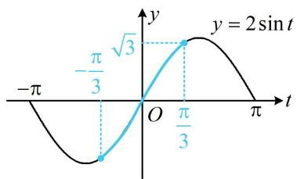
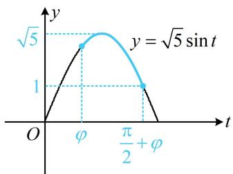

# 模块二 三角恒等变换

第1节 和差角、辅助角、二倍角、积化和差与和差化积公式（★★☆）内容提要

和差角、辅助角、二倍角公式是三角函数的核心公式，本节涉及一些有关公式应用的基础题，让大家熟悉公式的简单应用，并适当拓展积化和差与和差化积公式，下面先梳理这些公式.

1. 和差角公式

① $\sin(\alpha + \beta) = \sin \alpha \cos \beta + \cos \alpha \sin \beta, \quad \sin(\alpha - \beta) = \sin \alpha \cos \beta - \cos \alpha \sin \beta;$   
② $\cos (\alpha +\beta) = \cos \alpha \cos \beta -\sin \alpha \sin \beta ,\quad \cos (\alpha -\beta) = \cos \alpha \cos \beta +\sin \alpha \sin \beta ;$   
③ $\tan (\alpha +\beta) = \frac{\tan\alpha + \tan\beta}{1 - \tan\alpha\tan\beta},\quad \tan (\alpha -\beta) = \frac{\tan\alpha - \tan\beta}{1 + \tan\alpha\tan\beta}.$

2. 辅助角公式: $a \sin x + b \cos x = \sqrt{a^2 + b^2} \sin (x + \varphi)$ , 其中 $\cos \varphi = \frac{a}{\sqrt{a^2 + b^2}}$ , $\sin \varphi = \frac{b}{\sqrt{a^2 + b^2}}$ , $\tan \varphi = \frac{b}{a}$ . 在辅助角公式中, 若 $a > 0$ , 则 $\varphi \in \left(-\frac{\pi}{2}, \frac{\pi}{2}\right)$ ; 若 $a < 0$ , 可先提负号到外面, 再用辅助角公式合并.

3. 二倍角公式及其变形

①二倍角公式： $\sin 2\alpha = 2\sin \alpha \cos \alpha$ ， $\cos 2\alpha = \cos^2\alpha -\sin^2\alpha = 2\cos^2\alpha -1 = 1 - 2\sin^2\alpha$ $\tan 2\alpha = \frac{2\tan\alpha}{1 - \tan^2\alpha}.$   
②降次公式： $\sin^2\alpha = \frac{1 - \cos 2\alpha}{2},\cos^2\alpha = \frac{1 + \cos 2\alpha}{2},\sin \alpha \cos \alpha = \frac{1}{2}\sin 2\alpha .$   
③ 升次公式： $1 + \cos 2\alpha = 2\cos^{2}\alpha$ ， $1 - \cos 2\alpha = 2\sin^{2}\alpha$ ， $1 \pm \sin 2\alpha = (\sin \alpha \pm \cos \alpha)^{2}$ ， $1 = \sin^{2}\alpha + \cos^{2}\alpha$ .

4. 积化和差与和差化积公式

①积化和差公式： $\cos \alpha \cos \beta = \frac{1}{2} [\cos (\alpha +\beta) + \cos (\alpha -\beta)]$

$$
\sin \alpha \sin \beta = - \frac {1}{2} [ \cos (\alpha + \beta) - \cos (\alpha - \beta) ]; \quad \sin \alpha \cos \beta = \frac {1}{2} [ \sin (\alpha + \beta) + \sin (\alpha - \beta) ].
$$

②和差化积公式： $\cos \alpha +\cos \beta = 2\cos \frac{\alpha + \beta}{2}\cos \frac{\alpha - \beta}{2};$ $\cos \alpha -\cos \beta = -2\sin \frac{\alpha + \beta}{2}\sin \frac{\alpha - \beta}{2};$

$$
\sin \alpha + \sin \beta = 2 \sin \frac {\alpha + \beta}{2} \cos \frac {\alpha - \beta}{2}; \quad \sin \alpha - \sin \beta = 2 \cos \frac {\alpha + \beta}{2} \sin \frac {\alpha - \beta}{2}.
$$

【例1】已知 $\sin \left(\frac{\pi}{4} +\alpha\right) = \frac{1}{3}$ ，则 $\sin 2\alpha =$

解法 1: 先尝试简单的思路, 把所给条件展开, 看它与要求的 $\sin 2 \alpha$ 的联系,

$$
\sin \left(\frac {\pi}{4} + \alpha\right) = \frac {1}{3} \Rightarrow \sin \frac {\pi}{4} \cos \alpha + \cos \frac {\pi}{4} \sin \alpha = \frac {\sqrt {2}}{2} (\cos \alpha + \sin \alpha) = \frac {1}{3} \Rightarrow \cos \alpha + \sin \alpha = \frac {\sqrt {2}}{3},
$$

所以 $(\cos \alpha + \sin \alpha)^2 = \cos^2 \alpha + \sin^2 \alpha + 2\cos \alpha \sin \alpha = 1 + \sin 2\alpha = \frac{2}{9}$ ，故 $\sin 2\alpha = -\frac{7}{9}$ .

解法2：给值求值问题，也可尝试找角的关系，先将已知角换元以方便观察，把求值的角化为已知角，

设 $t = \frac{\pi}{4} +\alpha$ ，则 $\alpha = t - \frac{\pi}{4}$ ，且 $\sin t = \frac{1}{3}$ ，所以 $\sin 2\alpha = \sin 2\left(t - \frac{\pi}{4}\right) = \sin \left(2t - \frac{\pi}{2}\right) = -\cos 2t = 2\sin^2 t - 1 = -\frac{7}{9}.$

答案: $-\frac{7}{9}$

【变式】（2022·新课标Ⅱ卷）若 $\sin (\alpha +\beta) + \cos (\alpha +\beta) = 2\sqrt{2}\cos \left(\alpha +\frac{\pi}{4}\right)\sin \beta$ ，则（

A. $\tan (\alpha +\beta) = 1$

B. $\tan (\alpha +\beta) = -1$

C. $\tan (\alpha -\beta) = 1$

D. $\tan (\alpha -\beta) = -1$

解法1：先尝试简单的思路，直接将题干所给等式左右两侧都展开，看能否进一步变形，

由题意， $(\sin \alpha \cos \beta +\cos \alpha \sin \beta) + (\cos \alpha \cos \beta -\sin \alpha \sin \beta) = 2\sqrt{2}\left(\frac{\sqrt{2}}{2}\cos \alpha -\frac{\sqrt{2}}{2}\sin \alpha\right)\sin \beta ,$

整理得： $(\sin \alpha \cos \beta -\cos \alpha \sin \beta) + (\cos \alpha \cos \beta +\sin \alpha \sin \beta) = 0$

此时恰好又凑成了正弦、余弦的差角公式，故再将其合并，

所以 $\sin (\alpha -\beta) + \cos (\alpha -\beta) = 0$ ，故 $\tan (\alpha -\beta) = \frac{\sin(\alpha - \beta)}{\cos(\alpha - \beta)} = -1$

解法 2: 注意到左侧的 $\sin (\alpha + \beta) + \cos (\alpha + \beta)$ 可以合并, 故先将其合并, 再看能否进一步变形,

$\sin (\alpha +\beta) + \cos (\alpha +\beta) = \sqrt{2}\sin \left(\alpha +\beta +\frac{\pi}{4}\right)$ ，代入题干等式化简得： $\sin \left(\alpha +\beta +\frac{\pi}{4}\right) = 2\cos \left(\alpha +\frac{\pi}{4}\right)\sin \beta$ ①，

注意到右侧的两个角是 $\alpha + \frac{\pi}{4}$ 和 $\beta$ ，所以把左侧的 $\alpha + \beta + \frac{\pi}{4}$ 调整为 $\left(\alpha + \frac{\pi}{4}\right) + \beta$ ，再展开看看，

又 $\sin \left(\alpha +\beta +\frac{\pi}{4}\right) = \sin \left[\left(\alpha +\frac{\pi}{4}\right) + \beta \right] = \sin \left(\alpha +\frac{\pi}{4}\right)\cos \beta +\cos \left(\alpha +\frac{\pi}{4}\right)\sin \beta ,$

所以代入式①可得 $\sin \left(\alpha +\frac{\pi}{4}\right)\cos \beta +\cos \left(\alpha +\frac{\pi}{4}\right)\sin \beta = 2\cos \left(\alpha +\frac{\pi}{4}\right)\sin \beta$

整理得： $\sin \left(\alpha +\frac{\pi}{4}\right)\cos \beta -\cos \left(\alpha +\frac{\pi}{4}\right)\sin \beta = 0$ ，故 $\sin \left(\alpha +\frac{\pi}{4} -\beta\right) = 0$

所以 $\alpha + \frac{\pi}{4} - \beta = k\pi$ ，从而 $\alpha - \beta = k\pi - \frac{\pi}{4} (k \in \mathbf{Z})$ ，故 $\tan (\alpha - \beta) = \tan \left(k\pi - \frac{\pi}{4}\right) = \tan \left(-\frac{\pi}{4}\right) = -\tan \frac{\pi}{4} = -1$ 。

答案: D

【总结】当条件中有形如 $\sin\left(\alpha+\frac{\pi}{4}\right)$ ， $\sin(\alpha+\beta)$ 的多角混合三角等式时，常有两个考虑的方向，一是把括号拆开，观察它与目标之间的关联；二是寻求这些角与目标中的角的整体联系.

类型Ⅱ：正切的和差角、二倍角公式的应用【例 2】若 $\tan\left(\alpha-\frac{\pi}{4}\right)=\frac{1}{6}$ ，则 $\tan\alpha=$ \_\_\_\_.

解析：由题意， $\tan \left(\alpha -\frac{\pi}{4}\right) = \frac{\tan\alpha - \tan\frac{\pi}{4}}{1 + \tan\alpha\tan\frac{\pi}{4}} = \frac{\tan\alpha - 1}{1 + \tan\alpha} = \frac{1}{6}$ ，解得： $\tan \alpha = \frac{7}{5}$

答案: $\frac{7}{5}$

【变式1】已知 $\tan \alpha = -2$ ， $\tan (\alpha +\beta) = \frac{1}{7}$ ，则 $\tan 2\beta$ 的值为

解析：看到 $\tan (\alpha +\beta)$ ，先尝试展开，由题意， $\tan (\alpha +\beta) = \frac{\tan\alpha + \tan\beta}{1 - \tan\alpha\tan\beta} = \frac{1}{7}$ ①

已知 $\tan \alpha$ ，我们发现代入上式可求出 $\tan \beta$ ，进而用二倍角公式求 $\tan 2\beta$

将 $\tan \alpha = -2$ 代入式①可得 $\frac{-2 + \tan\beta}{1 + 2\tan\beta} = \frac{1}{7}$ ，解得： $\tan \beta = 3$ ，所以 $\tan 2\beta = \frac{2\tan\beta}{1 - \tan^2\beta} = -\frac{3}{4}$

答案: $-\frac{3}{4}$

【变式2】已知 $\alpha$ ， $\beta$ 均为锐角， $(1 - \sqrt{3}\tan \alpha)(1 - \sqrt{3}\tan \beta) = 4$ ，则 $\alpha +\beta =$ （

A. $\frac{\pi}{3}$

B. $\frac{2\pi}{3}$

C. $\frac{3\pi}{4}$

D. $\frac{\pi}{2}$

解析：先展开等式观察形式，由题意， $(1-\sqrt{3}\tan\alpha)(1-\sqrt{3}\tan\beta)=1-\sqrt{3}(\tan\alpha+\tan\beta)+3\tan\alpha\tan\beta=4$ ，上式中有 $\tan\alpha+\tan\beta$ ， $\tan\alpha\tan\beta$ 这些结构，自然想到往 $\tan(\alpha+\beta)$ 的展开式去变形，

所以 $-(\tan \alpha + \tan \beta) = \sqrt{3}(1 - \tan \alpha \tan \beta)$ ，从而 $\frac{\tan \alpha + \tan \beta}{1 - \tan \alpha \tan \beta} = -\sqrt{3}$ ，故 $\tan (\alpha + \beta) = -\sqrt{3}$ ，

又 $\alpha$ ， $\beta$ 都是锐角，所以 $\alpha +\beta \in (0,\pi)$ ，故 $\alpha +\beta = \frac{2\pi}{3}$

答案: B

# 类型III：数字角三角代数式求值

【例 3】 $\cos15^{\circ}\cos45^{\circ}-\cos75^{\circ}\sin45^{\circ}=$ \_\_\_\_.

解析：看到这个式子，想到往和差角公式凑形式，把 $\cos 75^{\circ}$ 变成 $\sin 15^{\circ}$ ，就凑成了余弦和角公式， $\cos 15^{\circ} \cos 45^{\circ} - \cos 75^{\circ} \sin 45^{\circ} = \cos 15^{\circ} \cos 45^{\circ} - \sin 15^{\circ} \sin 45^{\circ} = \cos (15^{\circ} + 45^{\circ}) = \cos 60^{\circ} = \frac{1}{2}$ .

答案： $\frac{1}{2}$

【变式1】 $\frac{\sin 110^{\circ}\sin 20^{\circ}}{\cos^{2}155^{\circ} - \sin^{2}155^{\circ}} =$

解析：先看角之间的关联， $110^{\circ} = 90^{\circ} + 20^{\circ}$ ，所以分子诱导后可以利用正弦倍角公式合并，

原式 $= \frac{\sin(90^{\circ} + 20^{\circ})\sin 20^{\circ}}{\cos 310^{\circ}} = \frac{\cos 20^{\circ}\sin 20^{\circ}}{\cos(360^{\circ} - 50^{\circ})} = \frac{\frac{1}{2}\sin 40^{\circ}}{\cos 50^{\circ}} = \frac{1}{2}\cdot \frac{\sin 40^{\circ}}{\sin 40^{\circ}} = \frac{1}{2}.$

答案： $\frac{1}{2}$

【变式2】 $\tan 25^{\circ} + \tan 35^{\circ} + \sqrt{3}\tan 25^{\circ}\tan 35^{\circ} =$

解析：看到 $\tan 25^{\circ} + \tan 35^{\circ}$ 和 $\tan 25^{\circ}\tan 35^{\circ}$ ，联想到 $\tan (25^{\circ} + 35^{\circ})$ ，故将其展开，观察与所求式的联系，因为 $\tan 60^{\circ} = \tan (25^{\circ} + 35^{\circ}) = \frac{\tan 25^{\circ} + \tan 35^{\circ}}{1 - \tan 25^{\circ} \tan 35^{\circ}} = \sqrt{3}$ ，所以 $\tan 25^{\circ} + \tan 35^{\circ} = \sqrt{3} - \sqrt{3} \tan 25^{\circ} \tan 35^{\circ}$ ，故 $\tan 25^{\circ} + \tan 35^{\circ} + \sqrt{3}\tan 25^{\circ}\tan 35^{\circ} = \sqrt{3}$

答案： $\sqrt{3}$

【总结】给数字角求值，关键是寻找角的关系，如相加、相减为特殊角可考虑用和差角公式，相加、相减为 $90^{\circ}$ 、 $180^{\circ}$ 等可考虑用诱导公式，或者角度之间有2倍关系，可考虑用二倍角公式.

# 类型IV：辅助角公式的应用

【例 4】设 $f(x)=\sin x-\sqrt{3}\cos x$ ，则 $f(x)$ 的最大值为 \_\_\_\_.

解析：观察发现直接由辅助角公式将所给解析式合并，即可求出 $f(x)$ 的最大值，

由辅助角公式， $f(x) = \sqrt{1^2 + (-\sqrt{3})^2}\sin (x + \varphi) = 2\sin (x + \varphi)$ ，所以 $f(x)_{\mathrm{max}} = 2$

答案: 2

【反思】因为本题 $f(x)$ 的定义域为 $\mathbf{R}$ ，所以不用去求辅助角 $\varphi$ 的值，就能得出最大值。接下来的两道题我们还会看到必须求 $\varphi$ 的情形下， $\varphi$ 是特殊角和 $\varphi$ 不是特殊角的处理方法。

【变式1】设 $f(x) = \sin x - \sqrt{3}\cos x\left(0\leq x\leq \frac{2\pi}{3}\right)$ ，则 $f(x)$ 的最大值为 \_\_\_\_.

解析：由辅助角公式， $f(x)=\sqrt{1^{2}+(-\sqrt{3})^{2}}\sin(x+\varphi)=2\sin(x+\varphi)$ ，这里规定了 $0\leq x\leq\frac{2\pi}{3}$ ，故必须求出 $\varphi$ ，因为 $\tan\varphi=-\sqrt{3}$ 且 $\varphi\in\left(-\frac{\pi}{2},\frac{\pi}{2}\right)$ ，所以 $\varphi=-\frac{\pi}{3}$ ，故 $f(x)=2\sin\left(x-\frac{\pi}{3}\right)$ ，

接下来可将 $x - \frac{\pi}{3}$ 换元成 $t$ ，借助 $y = 2\sin t$ 的图象来求最值，

设 $t = x - \frac{\pi}{3}$ ，则 $f(x) = 2\sin t$ ，当 $0\leq x\leq \frac{2\pi}{3}$ 时， $-\frac{\pi}{3}\leq t = x - \frac{\pi}{3}\leq \frac{\pi}{3},$ 函数 $y=2\sin t$ 的部分图象如图所示，由图可知当 $t = \frac{\pi}{3}$ 时， $f(x)$ 取得最大值 $\sqrt{3}$ .

答案: $\sqrt{3}$

line

| t | y = 2 sin t |
|---|---|
| -π/3 | √3 |
| π/3 | 2 sin t |

【变式2】已知 $f(x) = \sin x + 2\cos x \left(0 \leq x \leq \frac{\pi}{2}\right)$ ，则 $f(x)$ 的值域为 \_\_\_\_.

解析：由辅助角公式， $f(x)=\sqrt{1^{2}+2^{2}}\sin(x+\varphi)=\sqrt{5}\sin(x+\varphi)$ ，为了求值域，可先将 $x+\varphi$ 换元成t，
设 $t = x + \varphi$ ，则 $f(x) = \sqrt{5} \sin t$ ，因为 $0 \leq x \leq \frac{\pi}{2}$ ，所以 $\varphi \leq t \leq \frac{\pi}{2} + \varphi$ ，

接下来必须研究辅助角 $\varphi$ ，才能求出 $y=\sqrt{5}\sin t$ 在 $\left[\varphi,\frac{\pi}{2}+\varphi\right]$ 上的值域，

由辅助角公式知 $\sin \varphi = \frac{2\sqrt{5}}{5}$ ， $\cos \varphi = \frac{\sqrt{5}}{5}$ ，所以 $\varphi$ 在第一象限，不妨设 $\varphi \in \left(0, \frac{\pi}{2}\right)$ ，

从而 $y = \sqrt{5}\sin t$ 在 $\left[\varphi ,\frac{\pi}{2}\right]$ 上 $\nearrow$ ，在 $\left[\frac{\pi}{2},\frac{\pi}{2} +\varphi \right]$ 上 $\searrow$ ，故当 $t = \frac{\pi}{2}$ 时， $f(x)$ 取得最大值 $\sqrt{5}$

对于最小值，根据单调性，只需比较左右端点谁更小即可，

又 $\sin \varphi = \frac{2\sqrt{5}}{5} >\sin \left(\frac{\pi}{2} +\varphi\right) = \cos \varphi = \frac{\sqrt{5}}{5},$

所以 $y = \sqrt{5}\sin t$ 在 $\left[\varphi ,\frac{\pi}{2} +\varphi \right]$ 上的图象如图所示，

由图可知，当 $t = \frac{\pi}{2} +\varphi$ 时， $f(x)$ 取得最小值1，故 $f(x)$ 的值域为 $[1,\sqrt{5} ]$

答案： $[1,\sqrt{5} ]$

line

| t         | y          |
| --------- | ---------- |
| 0         | 0          |
| φ         | √5        |
| π/2 + φ   | √5        |

【反思】在辅助角公式 $a \sin x + b \cos x = \sqrt{a^2 + b^2} \sin (x + \varphi)$ 中，若需要用到辅助角 $\varphi$ ，但 $\varphi$ 又不是特殊角，则我们可以利用 $\cos \varphi = \frac{a}{\sqrt{a^2 + b^2}}$ ， $\sin \varphi = \frac{b}{\sqrt{a^2 + b^2}}$ 来解决问题.

# 类型V：积化和差与和差化积公式的应用

【例5】在 $\triangle ABC$ 中，证明： $\sin A + \sin B + \sin C = 4\cos \frac{A}{2}\cos \frac{B}{2}\cos \frac{C}{2}$ .

证法 1: (直接由左边往右边化, 或右边往左边化, 方向都不明朗, 考虑把它们作差来看. 作差后, 为了进一步变形, 可尝试利用内角和为 $\pi$ 消去一个角, 三个角具有轮换对称性, 消谁都行, 不妨消 $C$ )

$$
\begin{array}{l} \sin A + \sin B + \sin C - 4 \cos \frac {A}{2} \cos \frac {B}{2} \cos \frac {C}{2} = \sin A + \sin B + \sin [ \pi - (A + B) ] - 4 \cos \frac {A}{2} \cos \frac {B}{2} \cos \frac {\pi - (A + B)}{2} \\ = \sin A + \sin B + \sin (A + B) - 4 \cos \frac {A}{2} \cos \frac {B}{2} \sin \frac {A + B}{2}, \\ \end{array}
$$

(此时可发现, 若将 $\sin (A + B)$ 化为 $2 \sin \frac{A + B}{2} \cos \frac{A + B}{2}$ , 则它与最后一项有公因式可提, 故按此操作)

所以 $\sin A + \sin B + \sin C - 4\cos \frac{A}{2}\cos \frac{B}{2}\cos \frac{C}{2} = \sin A + \sin B + 2\sin \frac{A + B}{2}\cos \frac{A + B}{2} -4\cos \frac{A}{2}\cos \frac{B}{2}\sin \frac{A + B}{2}$

$$
\begin{array}{l} = \sin A + \sin B + 2 \sin \frac {A + B}{2} \left(\cos \frac {A + B}{2} - 2 \cos \frac {A}{2} \cos \frac {B}{2}\right) \\ = \sin A + \sin B + 2 \sin \frac {A + B}{2} \left(\cos \frac {A}{2} \cos \frac {B}{2} - \sin \frac {A}{2} \sin \frac {B}{2} - 2 \cos \frac {A}{2} \cos \frac {B}{2}\right) \\ = \sin A + \sin B - 2 \sin \frac {A + B}{2} \left(\cos \frac {A}{2} \cos \frac {B}{2} + \sin \frac {A}{2} \sin \frac {B}{2}\right) = \sin A + \sin B - 2 \sin \frac {A + B}{2} \cos \frac {A - B}{2}, \\ \end{array}
$$

(接下来怎么化? 涉及 A, B, $\frac{A+B}{2}$ , $\frac{A-B}{2}$ 四个角, 考虑寻求它们的联系, 观察发现 $A=\frac{A+B}{2}+\frac{A-B}{2}$ , $B=\frac{A+B}{2}-\frac{A-B}{2}$ , 故可尝试将 A, B 按此替换, 再展开)

故 $\sin A + \sin B + \sin C - 4\cos \frac{A}{2}\cos \frac{B}{2}\cos \frac{C}{2} = \sin \left(\frac{A + B}{2} +\frac{A - B}{2}\right) + \sin \left(\frac{A + B}{2} -\frac{A - B}{2}\right) - 2\sin \frac{A + B}{2}\cos \frac{A - B}{2}$

$$
= \sin \frac {A + B}{2} \cos \frac {A - B}{2} + \cos \frac {A + B}{2} \sin \frac {A - B}{2} + \sin \frac {A + B}{2} \cos \frac {A - B}{2} - \cos \frac {A + B}{2} \sin \frac {A - B}{2} - 2 \sin \frac {A + B}{2} \cos \frac {A - B}{2} = 0,
$$

所以 $\sin A + \sin B + \sin C = 4\cos \frac{A}{2}\cos \frac{B}{2}\cos \frac{C}{2}$

证法 2: (证法 1 的过程相对较复杂, 有没有简单的方法? 观察发现要证的式子的左侧有 “正弦+正弦” 这种结构, 可尝试用和差化积公式来变形)

$$
\sin A + \sin B + \sin C = 2 \sin \frac {A + B}{2} \cos \frac {A - B}{2} + \sin C = 2 \sin \frac {\pi - C}{2} \cos \frac {A - B}{2} + \sin C = 2 \cos \frac {C}{2} \cos \frac {A - B}{2} + \sin C,
$$

(此时可发现若将 $\sin C$ 化为 $2\sin\frac{C}{2}\cos\frac{C}{2}$ ，则可提公因式 $2\cos\frac{C}{2}$ ，朝目标式右侧形式靠拢，故按此处理)

所以 $\sin A + \sin B + \sin C = 2\cos \frac{C}{2}\cos \frac{A - B}{2} +2\sin \frac{C}{2}\cos \frac{C}{2} = 2\cos \frac{C}{2}\left(\cos \frac{A - B}{2} +\sin \frac{C}{2}\right)$

$$
= 2 \cos \frac {C}{2} \left[ \cos \frac {A - B}{2} + \sin \frac {\pi - (A + B)}{2} \right] = 2 \cos \frac {C}{2} \left(\cos \frac {A - B}{2} + \cos \frac {A + B}{2}\right) \tag {①}
$$

(括号内出现了“余弦+余弦”这种结构, 故可考虑对这部分再用和差化积公式变形)

$$
\cos \frac {A - B}{2} + \cos \frac {A + B}{2} = 2 \cos \frac {\frac {A - B}{2} + \frac {A + B}{2}}{2} \cos \frac {\frac {A - B}{2} - \frac {A + B}{2}}{2} = 2 \cos \frac {A}{2} \cos \left(- \frac {B}{2}\right) = 2 \cos \frac {A}{2} \cos \frac {B}{2},
$$

代入①得 $\sin A + \sin B + \sin C = 2\cos \frac{C}{2}\times 2\cos \frac{A}{2}\cos \frac{B}{2} = 4\cos \frac{A}{2}\cos \frac{B}{2}\cos \frac{C}{2}$

【反思】和差化积（积化和差）公式虽不要求记忆，但我们需熟悉其推导方法。无论是证明三角恒等式，还是求值，亦或求最值、范围等问题中，遇到“正弦+正弦”、“余弦+余弦”（或正、余弦式的乘积）的结构时，若想不到其它变形方法，都可以试试推导和差化积（或积化和差）公式，再用它来变形。在本节的习题中，我们还会给出一个2025年真题中的实例。

# 强化训练

1. (2025·全国Ⅱ卷·★★)

已知 $0 < \alpha < \pi$ ， $\cos \frac{\alpha}{2} = \frac{\sqrt{5}}{5}$ ，则 $\sin \left(\alpha -\frac{\pi}{4}\right) = (\quad)$

A. $\frac{\sqrt{2}}{10}$

B. $\frac{\sqrt{2}}{5}$

C. $\frac{3\sqrt{2}}{10}$

D. $\frac{7\sqrt{2}}{10}$

2. (2020·新课标III卷·★★)

已知 $2\tan \theta -\tan \left(\theta +\frac{\pi}{4}\right) = 7$ ，则 $\tan \theta =$ （

A. -2

B. -1

C. 1

D. 2

3. (2021·全国乙卷·★★)

$$
\cos^ {2} \frac {\pi}{1 2} - \cos^ {2} \frac {5 \pi}{1 2} = (\quad)
$$

A. $\frac{1}{2}$

B. $\frac{\sqrt{3}}{3}$

C. $\frac{\sqrt{2}}{2}$

D. $\frac{\sqrt{3}}{2}$

4.（2023·江苏省苏北七市一调·★★☆）

已知 $\sin \left(\alpha -\frac{\pi}{6}\right) + \cos \alpha = \frac{3}{5}$ ，则 $\cos \left(2\alpha +\frac{\pi}{3}\right) =$ （

A. $-\frac{7}{25}$

B. $\frac{7}{25}$

C. $-\frac{24}{25}$

D. $\frac{24}{25}$

5.（2024·新课标Ⅰ卷·★★☆）

已知 $\cos (\alpha +\beta) = m$ ， $\tan \alpha \tan \beta = 2$ ，则 $\cos (\alpha -\beta) =$ （

A. $-3m$

B. $-\frac{m}{3}$

C. $\frac{m}{3}$

D. $3m$

6. (2023·新课标Ⅰ卷·★★★)

已知 $\sin (\alpha -\beta) = \frac{1}{3}$ ， $\cos \alpha \sin \beta = \frac{1}{6}$ ，则 $\cos (2\alpha +$

$$
2 \beta) = (\quad)
$$

A. $\frac{7}{9}$

B. $\frac{1}{9}$

C. $-\frac{1}{9}$

D. $-\frac{7}{9}$

7. (2022·江苏常州模拟·★★★)

已知 $a = \frac{\sqrt{2}}{2} (\cos 1^{\circ} - \sin 1^{\circ})$ ， $b = \frac{1 - \tan^2 22.5^{\circ}}{1 + \tan^2 22.5^{\circ}}$ ， $c = \sin 22^{\circ}\cos 24^{\circ} + \cos 22^{\circ}\sin 24^{\circ}$ ，则 $a, b, c$ 的大小关系为（）

A. $b > a > c$ B. $c > b > a$   
C. $c > a > b$ D. $b > c > a$

8. (★★★)

设当 $x = \theta$ 时，函数 $f(x) = \sin x - 2\cos x$ 取得最大值，则 $\cos \theta =$ \_\_\_\_.

9.（2024·浙江模拟·★★★★）

设函数 $f(x) = \sin x + \sqrt{3}\cos x + 1$ 。若实数 $a, b, \varphi$ 使 $af(x) + bf(x - \varphi) = 1$ 对任意 $x \in \mathbf{R}$ 恒成立，则 $a - b\cos \varphi =$ （）

A. -1

B. 0

C. 1

D. ±1

10. (2025·全国Ⅰ卷（节选）·★★★)

设函数 $f(x) = 5\cos x - \cos 5x$ ，求 $f(x)$ 在 $\left[0, \frac{\pi}{4}\right]$ 上的最大值.