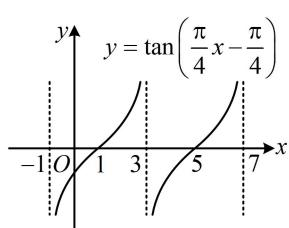
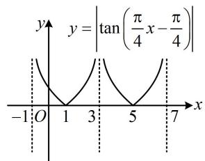
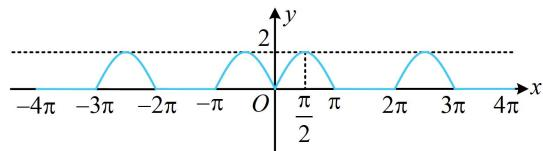
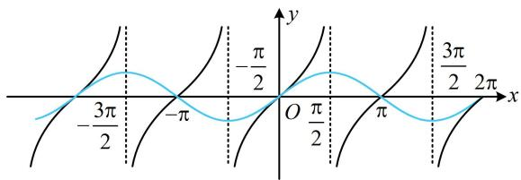
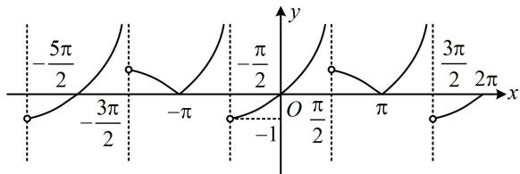
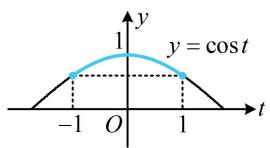
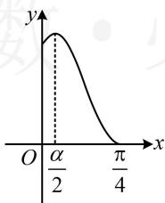
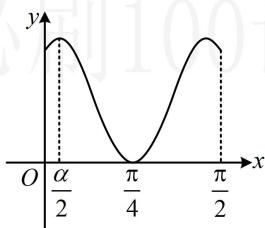
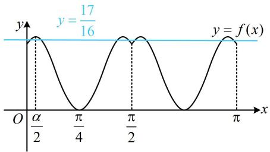

# 强化训练

1. (2020·新课标III卷·★★★)

关于函数 $f(x) = \sin x + \frac{1}{\sin x}$ 有如下四个命题：

① $f(x)$ 的图象关于 $y$ 轴对称；  
② $f(x)$ 的图象关于原点对称；  
③ $f(x)$ 的图象关于直线 $x = \frac{\pi}{2}$ 对称；  
④ $f(x)$ 的最小值为 2.

其中所有真命题的序号是\_\_\_\_。

1. ②③

解析：①项， $f(-x) = \sin (-x) + \frac{1}{\sin(-x)} = -\sin x - \frac{1}{\sin x}$

$= -f(x)\Rightarrow f(x)$ 为奇函数，

所以 $f(x)$ 的图象关于原点对称，故①项错误，②项正确；

③项，这里要判断 $f(x)$ 是否关于 $x = \frac{\pi}{2}$ 对称，只需验证 $f(x)$ 是否满足 $f(\pi - x) = f(x)$ ，

$$
f (\pi - x) = \sin (\pi - x) + \frac {1}{\sin (\pi - x)} = \sin x + \frac {1}{\sin x} = f (x),
$$

所以 $f(x)$ 的图象关于 $x = \frac{\pi}{2}$ 对称，故③项正确；

④项，当 $\sin x < 0$ 时， $f(x) < 0$ ，所以 $f(x)$ 的最小值肯定不是2，故④项错误.

2. (2022·广东深圳模拟·★★★)

若函数 $f(x) = |\tan (\omega x - \omega)|(\omega > 0)$ 的最小正周期为4，则下列区间中 $f(x)$ 单调递增的是（）

A. $\left(-1, \frac{1}{3}\right)$

B. $\left(\frac{1}{3},\frac{5}{3}\right)$

C. $\left(\frac{5}{3}, 3\right)$

D. (3,4)

2. C

解析：题干给了周期，可由此求 $\omega$ ，正切类函数整体加绝对值不改变周期，

$y = |\tan (\omega x - \omega)|$ 的最小正周期与 $y = \tan (\omega x - \omega)$ 相同，

因为 $y = \tan (\omega x - \omega)$ 的最小正周期 $T = \frac{\pi}{\omega}$ ，所以 $\frac{\pi}{\omega} = 4$ ，

从而 $\omega = \frac{\pi}{4}$ ，故 $f(x) = \left|\tan \left(\frac{\pi}{4} x - \frac{\pi}{4}\right)\right|$

函数 $y = \tan \left( \frac{\pi}{4} x - \frac{\pi}{4} \right)$ 的图象可通过找零点和周期快速画出，再留上翻下即得 $f(x)$ 的图象，故画图判断选项，

令 $\frac{\pi}{4} x - \frac{\pi}{4} = k\pi$ 得 $x = 4k + 1 (k \in \mathbf{Z})$ ，所以 $y = \tan \left(\frac{\pi}{4} x - \frac{\pi}{4}\right)$

有零点 $x=1,5,\cdots$ ，结合周期为 4 可得其大致图象如图 1，

所以 $f(x) = \left|\tan \left(\frac{\pi}{4} x - \frac{\pi}{4}\right)\right|$ 的大致图象如图2，

由图可知 $f(x)$ 在 $\left(-1, \frac{1}{3}\right)$ 上 $\searrow$ ；在 $\left(\frac{1}{3}, \frac{5}{3}\right)$ 上先 $\searrow$ 后 $\nearrow$ ；

在 $\left(\frac{5}{3},3\right)$ 上↗；在 $(3,4)$ 上↘，故选C.

line

| x | y = tan(π/4 x - π/4) |
|---|---|
| -1 | 0 |
| 0 | 1 |
| 1 | 2 |
| 3 | 3 |
| 5 | 4 |
| 7 | 5 |

图1

text_image

y = |tan(π/4 x - π/4)|
-1 O 1 3 5 7 x

图2

3. (2019·新课标Ⅰ卷·★★★☆)

关于函数 $f(x) = \sin |x| + |\sin x|$ 有下述四个结论：

① $f(x)$ 是偶函数；  
② $f(x)$ 在区间 $\left(\frac{\pi}{2},\pi\right)$ 单调递增；  
③ $f(x)$ 在 $[- \pi, \pi]$ 有4个零点；  
④ $f(x)$ 的最大值为2.

其中所有正确结论的编号是（）

A. ①②④

B. ②④

C. ①④

D. ①③

3. C

解法1：①项， $f(-x) = \sin | - x| + |\sin (-x)| = \sin |x| + |\sin x|$ $= \sin |x| + |\sin x| = f(x)$ ，所以 $f(x)$ 为偶函数，故①项正确；

②项，限定了 $x$ 的范围，先据此去掉绝对值，

当 $x \in \left(\frac{\pi}{2}, \pi\right)$ 时， $\sin x > 0$ ，所以 $f(x) = 2\sin x$ ，

从而 $f(x)$ 在区间 $\left(\frac{\pi}{2},\pi\right)$ 上 $\searrow$ ，故②项错误；

③项，我们已经得出了 $f(x)$ 是偶函数，可先看 $[0, \pi]$ 上的零点情况，此时可去掉绝对值，

当 $x \in [0, \pi]$ 时， $\sin x \geq 0$ ，所以 $f(x) = \sin x + \sin x = 2\sin x$

故 $f(x) = 0$ 即为 $2\sin x = 0$ ，解得： $x = 0$ 或 $\pi$

由偶函数的对称性知 $-\pi$ 也是 $f(x)$ 的零点，

所以 $f(x)$ 在 $[- \pi, \pi]$ 有3个零点，故③项错误；

④项，因为 $\left\{ \begin{array}{l} \sin |x| \leq 1 \\ |\sin x| \leq 1 \end{array} \right.$ ，所以 $f(x) = \sin |x| + |\sin x| \leq 2$

又 $f\left(\frac{\pi}{2}\right) = 2$ ，所以 $f(x)_{\mathrm{max}} = 2$ ，故④项正确.

解法2：判断出选项①后，其余选项也可通过画图来判断，因为 $f(x)$ 是偶函数，所以可先画 $[0, +\infty)$ 上的图象，再由对称性画出 $(- \infty, 0)$ 上的图象，

当 $x \in [0, +\infty)$ 时， $f(x) = \sin x + |\sin x|$ ， $f(x + 2\pi) =$

$$
\sin (x + 2 \pi) + | \sin (x + 2 \pi) | = \sin x + | \sin x | = f (x),
$$

所以 $f(x)$ 在 $[0, +\infty)$ 上的图象以 $2\pi$ 为周期重复出现，先看 $[0, 2\pi)$ 的情形，此时可通过讨论去绝对值，

当 $0 \leq x \leq \pi$ 时， $\sin x \geq 0$ ，故 $f(x) = \sin x + \sin x = 2\sin x$ ；

当 $\pi < x < 2\pi$ 时， $\sin x < 0$ ，故 $f(x) = \sin x + (-\sin x) = 0$ ；

所以 $f(x)$ 的部分图象如图中蓝色曲线，

由图可知 $f(x)$ 在 $\left(\frac{\pi}{2},\pi\right)$ 上 $\searrow$ ， $f(x)$ 在 $[- \pi, \pi]$ 上有3个

零点， $f(x)_{\max}=2$ ，所以选项②③错误，④正确.

text_image

-4π
-3π
-2π
-π
O
2
π/2
π
2π
3π
4π
x
y

4.（2022·江西景德镇模拟·★★★★）（多选）

已知函数 $f(x) = \begin{cases} \tan x, \tan x > \sin x \\ \sin x, \tan x \leq \sin x \end{cases}$ ，则（）

A. $f(x)$ 的最小正周期是 $2 \pi$   
B. $f(x)$ 的值域是 $(-1, +\infty)$   
C. 当且仅当 $k\pi - \frac{\pi}{2} < x \leq k\pi (k \in \mathbf{Z})$ 时， $f(x) \leq 0$   
D. $f(x)$ 的单调递增区间是 $\left[k\pi, k\pi + \frac{\pi}{2}\right)(k \in \mathbf{Z})$

4. AB

解析：本题 $f(x)$ 是分段函数，两段上的解析式都很简单，可以画出 $f(x)$ 的图象，来判断选项，

在同一坐标系下画出 $y = \tan x$ 和 $y = \sin x$ 的图象如图1，

二者的公共周期是 $2 \pi$ ，不妨先在 $(0, 2 \pi)$ 上分段考虑，

在 $\left(0,\frac{\pi}{2}\right)$ 那一段， $\left\{\begin{aligned}0<\cos x&<1\\ 0<\sin x&<1\end{aligned}\right.$ ，所以 $\tan x=\frac{\sin x}{\cos x}>\sin x$ ，

故 $y = \tan x$ 在 $\left(0, \frac{\pi}{2}\right)$ 上的图象始终在 $y = \sin x$ 图象的上方，

其余部分 $\tan x$ 与 $\sin x$ 的大小由图1容易看出，

故可画出 $f(x)$ 的图象如图2，由图可知A项和B项正确；

对于 C 项，我们可先在 $\left(-\frac{\pi}{2},\frac{\pi}{2}\right)\cup\left(\frac{\pi}{2},\frac{3\pi}{2}\right)$ 这个周期上求 $f(x)\leq0$ 的解集，再加上 $2k\pi$ 即为全部的解，由图可知 $f(x)\leq0$ 在 $\left(-\frac{\pi}{2},\frac{\pi}{2}\right)\cup\left(\frac{\pi}{2},\frac{3\pi}{2}\right)$ 上的解集为 $(- \frac{\pi}{2},0]\cup\{\pi\}$ ，

所以全部的解集为 $\left(2k\pi -\frac{\pi}{2},2k\pi \right]\bigcup \{\pi +2k\pi \} (k\in \mathbf{Z})$ ，故C项错误；

函数 $f(x)$ 的单调递增区间除了D选项给的那部分，还有

$\left(2k\pi - \frac{\pi}{2}, 2k\pi\right]$ ，例如 $\left(-\frac{\pi}{2}, 0\right]$ ，故D项错误.

text_image

-3π/2
-π
-π/2
O π/2
π
3π/2
2π
x
y

图1

line

| x | y |
|---|---|
| -5π/2 | 0 |
| -3π/2 | 0.5 |
| -π | 0 |
| -1 | 0.25 |
| O | 0 |
| π | 0 |
| 3π/2 | 0.5 |
| 2π | 1 |

图2

# 5.（★★★★）（多选）

已知函数 $f(x) = \cos (\sin x)$ ，则下列关于该函数性质的说法中正确的是（）

A. $f(x)$ 的一个周期为 $2\pi$   
B. $f(x)$ 的值域是 $[-1, 1]$   
C. $f(x)$ 的图象关于直线 $x = \pi$ 对称  
D. $\frac{\pi}{2}$ 是 $f(x)$ 在区间 $(0, \pi)$ 上唯一的极值点

# 5. ACD

解法1：A项， $f(x + 2\pi) = \cos (\sin (x + 2\pi)) = \cos (\sin x)$

$= f(x) \Rightarrow f(x)$ 的一个周期是 $2\pi$ ，故A项正确；

B 项, 要求值域, 可将 $\sin x$ 换元成 $t$ , 再画图分析,

设 $t = \sin x$ ，则 $f(x) = \cos t$ ，且 $-1\leq t\leq 1$

函数 $y = \cos t$ 的部分图象如图，由图可知当 $t \in [-1, 1]$ 时，

$\cos 1 \leq \cos t \leq 1$ ，从而 $f(x)$ 的值域是 $[\cos 1, 1]$ ，故 B 项错误；

C 项，要判断 $f(x)$ 是否关于 $x = \pi$ 对称，就看 $f(2\pi - x) = f(x)$ 是否成立，

$$
f (2 \pi - x) = \cos (\sin (2 \pi - x)) = \cos (- \sin x) = \cos (\sin x)
$$

$= f(x)\Rightarrow f(x)$ 的图象关于直线 $x = \pi$ 对称，故C项正确；

D项，判断极值点就是判断单调性，这里的函数可以看成复合函数，用同增异减准则来判断，

函数 $y = f(x)$ 是由 $y = \cos t$ 和 $t = \sin x$ 复合而成，

结合内层函数 $t = \sin x$ 的单调区间，我们把 $(0, \pi)$ 分成

$\left(0,\frac{\pi}{2}\right)$ 和 $\left(\frac{\pi}{2},\pi\right)$ 两段分别考虑，

当 $x \in \left(0, \frac{\pi}{2}\right)$ 时， $t = \sin x \nearrow$ ，且 $t \in (0,1)$ ，

因为 $y = \cos t$ 在 $(0,1)$ 上 $\searrow$ ，所以 $f(x)$ 在 $\left(0, \frac{\pi}{2}\right)$ 上 $\searrow$ ；

当 $x \in \left(\frac{\pi}{2}, \pi\right)$ 时， $t = \sin x \searrow$ ，且 $t \in (0,1)$ ，

因为 $y = \cos t$ 在 (0,1) 上也 $\searrow$ ，所以 $f(x)$ 在 $\left(\frac{\pi}{2},\pi\right)$ 上 $\nearrow$ ；

从而 $\frac{\pi}{2}$ 是 $f(x)$ 在 $(0, \pi)$ 上唯一的极值点，故D项正确.

解法2：选项A、B、C的判断方法同解法1，要判断选项D，也可通过求导来分析单调性，

由题意， $f'(x) = -\sin(\sin x)\cos x$

下面先判断 $\sin (\sin x)$ 这部分的正负，

因为 $0 < x < \pi$ ，所以 $0 < \sin x \leq 1$ ，从而 $\sin (\sin x) > 0$

故 $f^{\prime}(x) > 0\Leftrightarrow \cos x <   0\Leftrightarrow \frac{\pi}{2} <  x <   \pi$

$$
f ^ {\prime} (x) <   0 \Leftrightarrow \cos x > 0 \Leftrightarrow 0 <   x <   \frac {\pi}{2},
$$

所以 $f(x)$ 在 $\left(0, \frac{\pi}{2}\right)$ 上 $\searrow$ ，在 $\left(\frac{\pi}{2}, \pi\right)$ 上 $\nearrow$

故 $\frac{\pi}{2}$ 是 $f(x)$ 在区间 $(0,\pi)$ 上唯一的极值点.

text_image

y
1
y = cos t
-1 O 1 t

6. (2024·广西模拟·★★★★) (多选)

已知函数 $f(x) = |\sin 2x| + \cos 4x$ ，则（）

A. $f(x)$ 的最大值为 $\frac{5}{4}$   
B. $f(x)$ 的最小正周期为 $\frac{\pi}{2}$   
C. 曲线 $y = f(x)$ 关于直线 $x = \frac{k\pi}{4} (k \in \mathbf{Z})$ 轴对称  
D. 当 $x \in [0, \pi]$ 时，函数 $g(x) = 16f(x) - 17$ 有9个零点

6. BC

解析：A项，解析式中涉及的角有 $4x$ 和 $2x$ ，不方便直接分析最值，考虑统一角度，可对 $\cos 4x$ 用二倍角公式，同时为了让函数名也统一，我们选择 $\cos 4x = 1 - 2\sin^2 2x$ ，

$$
f (x) = \left| \sin 2 x \right| + \cos 4 x = \left| \sin 2 x \right| + 1 - 2 \left| \sin 2 x \right| ^ {2}
$$

$= -2\left(\left|\sin 2x\right| - \frac{1}{4}\right)^{2} + \frac{9}{8}$ ，其中 $\left|\sin 2x\right| \in [0,1]$

所以当 $|\sin 2x| = \frac{1}{4}$ 时， $f(x)$ 有最大值，且最大值为 $\frac{9}{8}$ ，

故A项错误；

B项， $f\left(x + \frac{\pi}{2}\right) = \left|\sin 2\left(x + \frac{\pi}{2}\right)\right| + \cos 4\left(x + \frac{\pi}{2}\right)$

$$
= \left| \sin (2 x + \pi) \right| + \cos (4 x + 2 \pi) = \left| - \sin 2 x \right| + \cos 4 x
$$

$= |\sin 2x| + \cos 4x = f(x)$ ，所以 $\frac{\pi}{2}$ 是 $f(x)$ 的周期，

那 $\frac{\pi}{2}$ 是最小正周期吗？结合 $|\sin 2x|$ 和 $\cos 4x$ 的最小正周期都是 $\frac{\pi}{2}$ 可以猜想 $f(x)$ 的最小正周期也是 $\frac{\pi}{2}$ ，怎样严格论证？可考虑分析 $f(x)$ 在 $\left[0, \frac{\pi}{2}\right]$ 这个周期上的单调性，画出其草图来看，当 $x \in \left[0, \frac{\pi}{2}\right]$ 时， $2x \in [0, \pi]$ ，所以 $\sin 2x \geq 0$ ，

故 $f(x) = |\sin 2x| + \cos 4x = \sin 2x + \cos 4x$ ，怎样分析 $f(x)$ 的单调性？考虑到其结构相对较复杂，我们试试求导，

$$
\begin{array}{l} f ^ {\prime} (x) = 2 \cos 2 x - 4 \sin 4 x = 2 \cos 2 x - 8 \sin 2 x \cos 2 x \\ = 2 \cos 2 x (1 - 4 \sin 2 x), \\ \end{array}
$$

当 $x \in \left[0, \frac{\pi}{4}\right]$ 时， $2x \in \left[0, \frac{\pi}{2}\right]$ ，所以 $\cos 2x \geq 0$

故 $f^{\prime}(x)\geq 0\Leftrightarrow 1 - 4\sin 2x\geq 0\Leftrightarrow \sin 2x\leq \frac{1}{4}$ ①，

在 $\left[0, \frac{\pi}{2}\right]$ 上存在唯一的 $\alpha$ 使 $\sin \alpha = \frac{1}{4}$ ,

且当 $0 \leq x \leq \alpha$ 时， $\sin x \leq \frac{1}{4}$ ，当 $\alpha \leq x \leq \frac{\pi}{2}$ 时， $\sin x \geq \frac{1}{4}$ ，

所以不等式①等价于 $0 \leq 2x \leq \alpha$ ，即 $0 \leq x \leq \frac{\alpha}{2}$ ，

同理， $f^{\prime}(x)\leq 0\Leftrightarrow \frac{\alpha}{2}\leq x\leq \frac{\pi}{4},$

所以 $f(x)$ 在 $\left[0, \frac{\alpha}{2}\right]$ 上 $\nearrow$ ，在 $\left[\frac{\alpha}{2}, \frac{\pi}{4}\right]$ 上 $\searrow$ ，

故 $f(x)$ 在 $\left[0, \frac{\pi}{4}\right]$ 上的大致图象如图1，

又因为 $f\left(\frac{\pi}{2} - x\right) = \left|\sin 2\left(\frac{\pi}{2} - x\right)\right| + \cos 4\left(\frac{\pi}{2} - x\right)$

$$
= \left| \sin (\pi - 2 x) \right| + \cos (2 \pi - 4 x) = \left| \sin 2 x \right| + \cos 4 x = f (x),
$$

所以 $f(x)$ 的图象关于直线 $x = \frac{\pi}{4}$ 对称，

故 $f(x)$ 在 $\left[0, \frac{\pi}{2}\right]$ 上的大致图象如图2，

由图2可知， $f(x)$ 没有比 $\frac{\pi}{2}$ 更小的周期，

所以 $\frac{\pi}{2}$ 是 $f(x)$ 的最小正周期，故B项正确；

line

| x | y |
|---|---|
| 0 | 0 |
| α/2 | Peak |
| π/4 | 0 |

图1

line

| x | y |
|---|---|
| 0 | 100 |
| π/4 | 0 |
| π/2 | 100 |

图2

C 项，若 $f(x)$ 关于直线 $x=\frac{k\pi}{4}$ 对称，则应有 $f\left(\frac{k\pi}{2}-x\right)$

$=f(x)$ ，故据此判断，

$$
f \left(\frac {k \pi}{2} - x\right) = \left| \sin 2 \left(\frac {k \pi}{2} - x\right) \right| + \cos 4 \left(\frac {k \pi}{2} - x\right)
$$

$$
= \left| \sin (k \pi - 2 x) \right| + \cos (2 k \pi - 4 x) = \left| \pm \sin 2 x \right| + \cos (- 4 x)
$$

$= \left|\sin 2x\right| + \cos 4x = f(x)(k \in \mathbf{Z})$ ，所以曲线 $y = f(x)$ 关于直线 $x = \frac{k\pi}{4} (k \in \mathbf{Z})$ 轴对称，故C项正确；

D项，显然解方程不易，对于零点个数问题，也常通过画图看交点个数，这里已有 $f(x)$ 一个周期内的草图，故可直接画图，

$$
g (x) = 0 \Leftrightarrow 1 6 f (x) - 1 7 = 0 \Leftrightarrow f (x) = \frac {1 7}{1 6},
$$

因为 $f(0) = 1 < \frac{17}{16}$ ， $f(x)_{\max} = \frac{9}{8} > \frac{17}{16}$ ，所以如图3，

直线 $y = \frac{17}{16}$ 与 $y = f(x)$ 在 $[0, \pi]$ 上的图象有8个交点，

从而 $g(x)$ 在 $[0,\pi]$ 上有 8 个零点，故 D 项错误.

line

| x       | y          |
| ------- | ---------- |
| 0       | 17/16      |
| α/2     | 17/16      |
| π/4     | 0          |
| π/2     | 17/16      |
| π       | 0          |

图3