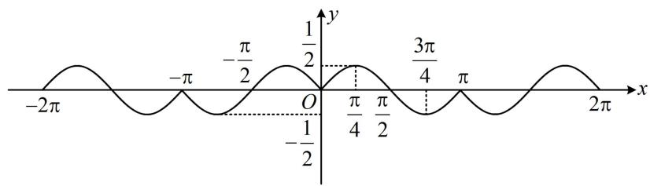
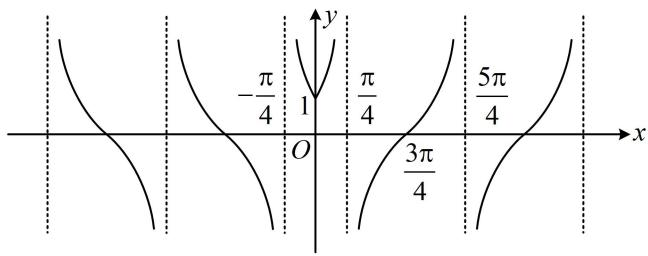
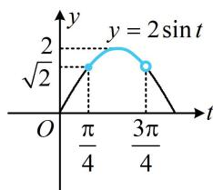
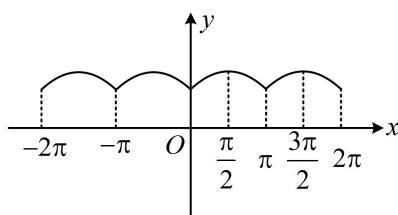

# 第 2 节 非合一结构的图象性质综合题（★★★☆）

# 内容提要

对于不能化成 $y = A\sin (\omega x + \varphi) + B$ 这种形式的三角函数图象性质的综合题,一般优先尝试看能否画图分析;对于不易画图的,若有绝对值,就分类讨论去绝对值,若有根号,则凑平方去根号;否则就直接用代数的方法验证选项(如单调性可求导,对称性、周期性可验证解析式是否满足对应的恒等式等).

# 类型 I：绝对值型

【例1】（多选）已知函数 $f(x) = |\sin x| \cos x$ ，则下列说法正确的是（）

A. $f(x)$ 的最小正周期是 $4 \pi$   
B. $f(x)$ 的值域是 $\left[-\frac{1}{2},\frac{1}{2}\right]$   
C. $f(x)$ 在区间 $\left(\frac{\pi}{4},\frac{3\pi}{4}\right)$ 上单调递减  
D. $f(x)$ 的图象关于点 $\left(\frac{\pi}{2}, 0\right)$ 对称

解析：A项， $\sin x$ 和 $\cos x$ 的周期都是 $2\pi$ ，所以猜想 $2\pi$ 是 $f(x)$ 的周期，可用周期的定义式来验证， $f(x + 2\pi) = |\sin (x + 2\pi)|\cos (x + 2\pi) = |\sin x|\cos x = f(x) \Rightarrow 2\pi$ 是 $f(x)$ 的周期，故 A 项错误；

B项，已知了 $2\pi$ 是周期，不妨在 $[0, 2\pi)$ 这个周期内来求值域，可讨论 $\sin x$ 的正负，去掉绝对值，

当 $0 \leq x \leq \pi$ 时， $\sin x \geq 0$ ， $f(x) = \sin x \cos x = \frac{1}{2} \sin 2x$ ；

当 $\pi < x < 2\pi$ 时， $\sin x < 0$ ， $f(x) = -\sin x \cos x = -\frac{1}{2} \sin 2x$ ；

结合 $f(x)$ 周期为 $2\pi$ 可得 $f(x)$ 的大致图象如图，由图可知 $f(x)$ 的值域为 $\left[-\frac{1}{2}, \frac{1}{2}\right]$ ，故B项正确；

C 项，由图可知 $f(x)$ 在 $\left(\frac{\pi}{4}, \frac{3\pi}{4}\right)$ 上 $\searrow$ ，故 C 项正确；

D 项，观察图形可发现 D 项正确，若没看出来图象关于 $\left(\frac{\pi}{2},0\right)$ 对称，也可用对称结论来判断。 $f(x)$ 是否关于点 $\left(\frac{\pi}{2},0\right)$ 对称，取决于 $f(x + \pi) + f(-x) = 0$ 是否成立，

因为 $f(x + \pi) + f(-x) = |\sin (x + \pi)|\cos (x + \pi) + |\sin (-x)|\cos (-x) = |-\sin x|(-\cos x) + |-\sin x|\cos x$

$= -\left|\sin x\right|\cos x + \left|\sin x\right|\cos x = 0$ ，所以 $f(x)$ 的图象关于点 $\left(\frac{\pi}{2},0\right)$ 对称，故D项正确.

答案: BCD

text_image

-2π
-π
-π/2
1/2
3π/4
π
-1/2
O
π/4
π/2
2π
x
y

【反思】遇到让判断 $f(x)$ 的图象是否关于某点或某直线对称的问题，在第三章的第一模块“抽象函数问题”有详细归纳，如有疑惑可以查阅.

【变式】（多选）关于函数 $f(x) = \tan \left( |x| + \frac{\pi}{4} \right)$ ，则（）

A. $f(x)$ 的图象关于 $y$ 轴对称  
B. $f(x)$ 的最小正周期为 $\pi$   
C. $f(x)$ 在 $\left(0, \frac{\pi}{4}\right)$ 上单调递增  
D. $f(x)$ 的图象关于点 $\left(\frac{3\pi}{4}, 0\right)$ 对称

解析： $f(-x) = \tan \left(\left| -x\right| + \frac{\pi}{4}\right) = \tan \left(\left|x\right| + \frac{\pi}{4}\right) = f(x)\Rightarrow f(x)$ 为偶函数，其图象关于 $y$ 轴对称，故A项正确；

剩下的三个选项都可以通过画出 $f(x)$ 的图象来判断，因为 $f(x)$ 是偶函数，所以先画 $f(x)$ 在 $[0, +\infty)$ 上的图象，再对称翻折到 $y$ 轴左侧即可，

当 $x \geq 0$ 时， $f(x) = \tan \left(x + \frac{\pi}{4}\right)$ ，它就是把 $y = \tan x$ 左移

了 $\frac{\pi}{4}$ 个单位，（只取 $[0, +\infty)$ 的部分）

所以 $f(x)$ 的图象如图，由图可知， $f(x)$ 不是周期函数，其图象也没有对称中心，所以选项B、D错误；

而 $f(x)$ 在 $\left(0, \frac{\pi}{4}\right)$ 上 $\nearrow$ ，故 C 项正确.

text_image

-π/4
1
O
3π/4
5π/4
x
y

答案: AC

【总结】若绝对值套在函数外面，则可按函数值的正负讨论，如有周期，则可在一个周期内去绝对值研究；若绝对值加在自变量 $x$ 上，则按 $x$ 的正负分类讨论。另外，若能画图，一般画图分析更直观。

# 类型Ⅱ：根号型

【例 2】（多选）已知函数 $f(x)=\sqrt{1+\cos x}+\sqrt{1-\cos x}$ ，则下列说法正确的有（）

A. 函数 $f(x)$ 是偶函数  
B. 函数 $f(x)$ 的最小正周期为 $2 \pi$   
C. 函数 $f(x)$ 的值域为 $[\sqrt{2}, 2]$   
D. 函数 $f(x)$ 的图象的相邻两条对称轴间的距离为 $\pi$

解析：A项， $f(x)$ 的定义域为 $\mathbf{R}$ ，且 $f(-x) = \sqrt{1 + \cos(-x)} + \sqrt{1 - \cos(-x)} = \sqrt{1 + \cos x} + \sqrt{1 - \cos x} = f(x)$ ，所以 $f(x)$ 是偶函数，故A项正确；

B项， $2\pi$ 显然是 $f(x)$ 的周期，但是不是最小正周期呢？常常会尝试它的一半，看看 $\pi$ 是否为周期，

$f(x + \pi) = \sqrt{1 + \cos(x + \pi)} +\sqrt{1 - \cos(x + \pi)} = \sqrt{1 - \cos x} +\sqrt{1 + \cos x} = f(x)\Rightarrow \pi$ 是 $f(x)$ 的一个周期，

所以 $f(x)$ 的最小正周期不是 $2\pi$ ，故 B 项错误；

C项，要求值域，先化简 $f(x)$ 的解析式，看到 $1 + \cos x$ 和 $1 - \cos x$ ，自然想到升次公式，

$$
f (x) = \sqrt {1 + \cos x} + \sqrt {1 - \cos x} = \sqrt {2 \cos^ {2} \frac {x}{2}} + \sqrt {2 \sin^ {2} \frac {x}{2}} = \sqrt {2} \left(\left| \cos \frac {x}{2} \right| + \left| \sin \frac {x}{2} \right|\right),
$$

根号已经去掉了, 但还有绝对值, 前面我们已经得到了 $\pi$ 是 $f(x)$ 的一个周期, 所以可在 $[0, \pi)$ 这个周期内考虑, 先去绝对值, 再求值域,

当 $x \in [0, \pi)$ 时， $\frac{x}{2} \in \left[0, \frac{\pi}{2}\right)$ ，所以 $\cos \frac{x}{2} > 0$ ， $\sin \frac{x}{2} \geq 0$ ，从而 $f(x) = \sqrt{2} \left( \cos \frac{x}{2} + \sin \frac{x}{2} \right) = 2 \sin \left( \frac{x}{2} + \frac{\pi}{4} \right)$ ，

要求此函数的值域，可将 $\frac{x}{2} +\frac{\pi}{4}$ 换元成 $t$ ，借助 $y = 2\sin t$ 的图象来分析，

令 $t = \frac{x}{2} +\frac{\pi}{4}$ ，则 $f(x) = 2\sin t$ ，因为 $0\leq x <   \pi$ ，所以 $\frac{\pi}{4}\leq t <   \frac{3\pi}{4}$

函数 $y = 2\sin t$ 的部分图象如图1所示，由图可知 $f(x)$ 的值域为 $[\sqrt{2}, 2]$ ，故 C 项正确；

D 项，由 C 项知当 $x \in [0, \pi)$ 时， $f(x) = 2\sin \left(\frac{x}{2} + \frac{\pi}{4}\right)$ ，

所以 $f(x)$ 的部分图象如图2，

由图可知 $f(x)$ 的图象相邻两条对称轴间的距离为 $\frac{\pi}{2}$ ，故 D 项错误.

答案: AC

line

| t | y |
|---|---|
| 0 | √(2) |
| π/4 | 2 |
| 3π/4 | √(2) |
| >3π/4 | 0 |

图1

text_image

-2π
-π
O
π/2
π
3π/2
2π
y
x

图2

# 类型III：复合函数型

【例3】已知函数 $f(x) = \sin (\cos x) + \cos x$ ，现有如下说法：

①直线 $x = \pi$ 为函数 $f(x)$ 图象的一条对称轴；②函数 $f(x)$ 在 $[\pi, 2\pi]$ 上单调递增；③ $\exists x \in \mathbf{R}$ ， $f(x) \geq \frac{\sqrt{3}}{2} + 1$ 。则上述说法中正确的个数为（）

A. 0 B. 1 C. 2 D. 3

解析：①项，可以想象，图不好画，故考虑用对称结论来判断，只需看 $f(2\pi - x) = f(x)$ 是否成立， $f(2\pi - x) = \sin (\cos (2\pi - x)) + \cos (2\pi - x) = \sin (\cos x) + \cos x = f(x)$ ，所以 $f(x)$ 关于 $x = \pi$ 对称，故①项正确；

②项，观察解析式发现只要把 $\cos x$ 换元，就可将解析式简化，令 $t = \cos x$ ，则 $f(x) = \sin t + t$ ，函数 $y = f(x)$ 可以看成由外层的 $y = \sin t + t$ 和内层的 $t = \cos x$ 复合而成，可用同增异减准则判断单调性，先看外层， $y = \sin t + t \Rightarrow y' = \cos t + 1 \geq 0 \Rightarrow y = \sin t + t$ 在 $\mathbf{R}$ 上 $\nearrow$

再看内层，当 $x \in [\pi, 2\pi]$ 时， $t = \cos x$ 也 $\nearrow$ ，所以 $f(x)$ 在 $[\pi, 2\pi]$ 上 $\nearrow$ ，故②项正确；

注：此选项也可直接求导判断， $f'(x) = \cos (\cos x) \cdot (-\sin x) + (-\sin x) = -\sin x [\cos (\cos x) + 1]$ ，

当 $x \in [\pi, 2\pi]$ 时， $\sin x \leq 0$ ， $\cos (\cos x) + 1 \geq 0$ ，所以 $f'(x) \geq 0$ ，故 $f(x)$ 在 $[\pi, 2\pi]$ 上 $\nearrow$ ；

③项，只要求出函数的最大值，就能判断此选项是否正确，而求最值，常用单调性，结合前两个选项，我们可以得出 $f(x)$ 在 $[0, \pi]$ 上 $\searrow$ ，在 $[\pi, 2\pi]$ 上 $\nearrow$ ，所以 $f(x)$ 在 $[0, 2\pi]$ 上的最大值可求，

$\left\{ \begin{array}{l} f(0) = \sin (\cos 0) + \cos 0 = \sin 1 + 1 \\ f(2\pi) = \sin (\cos 2\pi) + \cos 2\pi = \sin 1 + 1 \end{array} \right. \Rightarrow f(x)$ 在 $[0,2\pi]$ 上的最大值为 $\sin 1 + 1$

注意到 $f(x + 2\pi) = \sin (\cos (x + 2\pi)) + \cos (x + 2\pi) = \sin (\cos x) + \cos x = f(x)$ ，所以 $f(x)$ 周期为 $2\pi$ ，

故 $f(x)$ 在 $\mathbf{R}$ 上的最大值也是 $\sin 1 + 1$ ，所以只需比较 $\sin 1 + 1$ 和 $\frac{\sqrt{3}}{2} + 1$ 的大小，即比较 $\sin 1$ 和 $\frac{\sqrt{3}}{2}$ ，

因为 $0 < 1 < \frac{\pi}{3} < \frac{\pi}{2}$ ，且 $y = \sin x$ 在 $\left(0, \frac{\pi}{2}\right)$ 上 $\nearrow$ ，所以 $\sin 1 < \sin \frac{\pi}{3} = \frac{\sqrt{3}}{2}$ ，从而 $\sin 1 + 1 < \frac{\sqrt{3}}{2} + 1$ ，故③项错误.

答案: C

【总结】非合一结构的三角函数性质研究，很多时候需要用到一般化的函数分析方法（如用对称结论分析对称性、求导分析单调性等），只需对应翻译所给性质即可；再次强调，能画图的优先考虑画图分析.

# 强化训练

1. (2020·新课标III卷·★★★)

关于函数 $f(x) = \sin x + \frac{1}{\sin x}$ 有如下四个命题：

① $f(x)$ 的图象关于 $y$ 轴对称；  
② $f(x)$ 的图象关于原点对称；  
③ $f(x)$ 的图象关于直线 $x = \frac{\pi}{2}$ 对称；  
④ $f(x)$ 的最小值为2.

其中所有真命题的序号是\_\_\_\_。

2. (2022·广东深圳模拟·★★★)

若函数 $f(x) = |\tan (\omega x - \omega)|(\omega > 0)$ 的最小正周期为4，则下列区间中 $f(x)$ 单调递增的是（）

A. $\left(-1,\frac{1}{3}\right)$

B. $\left(\frac{1}{3},\frac{5}{3}\right)$

C. $\left(\frac{5}{3},3\right)$

D. (3,4)

3. (2019·新课标Ⅰ卷·★★★☆)

关于函数 $f(x) = \sin |x| + |\sin x|$ 有下述四个结论：

① $f(x)$ 是偶函数；  
② $f(x)$ 在区间 $\left(\frac{\pi}{2},\pi\right)$ 单调递增；

③ $f(x)$ 在 $[- \pi, \pi]$ 有4个零点；

④ $f(x)$ 的最大值为2.

其中所有正确结论的编号是（）

A. ①②④

B. ②④

C. ①④

D. ①③

4.（2022·江西景德镇模拟·★★★★）（多选）

已知函数 $f(x) = \begin{cases} \tan x, \tan x > \sin x \\ \sin x, \tan x \leq \sin x \end{cases}$ ，则（）

A. $f(x)$ 的最小正周期是 $2 \pi$   
B. $f(x)$ 的值域是 $(-1, +\infty)$   
C. 当且仅当 $k\pi - \frac{\pi}{2} < x \leq k\pi (k \in \mathbf{Z})$ 时， $f(x) \leq 0$   
D. $f(x)$ 的单调递增区间是 $\left[k\pi, k\pi + \frac{\pi}{2}\right)(k \in \mathbf{Z})$

5. (★★★★) (多选)

已知函数 $f(x) = \cos (\sin x)$ ，则下列关于该函数性质的说法中正确的是（）

A. $f(x)$ 的一个周期为 $2 \pi$   
B. $f(x)$ 的值域是 $[-1, 1]$   
C. $f(x)$ 的图象关于直线 $x = \pi$ 对称  
D. $\frac{\pi}{2}$ 是 $f(x)$ 在区间 $(0, \pi)$ 上唯一的极值点

6. (2024·广西模拟·★★★★★) (多选)

已知函数 $f(x) = |\sin 2x| + \cos 4x$ ，则（）

A. $f(x)$ 的最大值为 $\frac{5}{4}$   
B. $f(x)$ 的最小正周期为 $\frac{\pi}{2}$   
C. 曲线 $y = f(x)$ 关于直线 $x = \frac{k\pi}{4} (k \in \mathbf{Z})$ 轴对称  
D. 当 $x \in [0, \pi]$ 时，函数 $g(x) = 16f(x) - 17$ 有9个零点