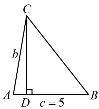

# 强化训练

1. (★★)

在 $\triangle ABC$ 中， $A = 30^{\circ}$ ， $B = 45^{\circ}$ ， $a = 2$ ，则 $c = \_$ .

1. $\sqrt{6} +\sqrt{2}$

解析：已知 $A, B$ 可求 $C$ ，则题干的 $a, c, A, C$ 即为两边两对角，可用正弦定理求 $c$ ，

由题意， $A = 30^{\circ}$ ， $B = 45^{\circ}$ ，所以 $C = 180^{\circ} - A - B = 105^{\circ}$

故 $\sin C = \sin 105^{\circ} = \sin (60^{\circ} + 45^{\circ})$

$$
= \sin 6 0 ^ {\circ} \cos 4 5 ^ {\circ} + \cos 6 0 ^ {\circ} \sin 4 5 ^ {\circ} = \frac {\sqrt {6} + \sqrt {2}}{4},
$$

由正弦定理， $\frac{a}{\sin A} = \frac{c}{\sin C}$ ，所以 $c = \frac{a\sin C}{\sin A} = \sqrt{6} +\sqrt{2}$

2. (2025·全国Ⅱ卷·★★)

在 $\triangle ABC$ 中， $BC = 2$ ， $AC = 1 + \sqrt{3}$ ， $AB = \sqrt{6}$ ，则 $A =$ （

A. $45^{\circ}$

B. $60^{\circ}$

C. ${120}^{ \circ  }$

D. ${135}^{ \circ  }$

2. A

解析：已知三边，可先用余弦定理推论求 $\cos A$ ，再求 $A$

由余弦定理推论， $\cos A = \frac{AC^2 + AB^2 - BC^2}{2AC\cdot AB}$

$$
= \frac {(1 + \sqrt {3}) ^ {2} + (\sqrt {6}) ^ {2} - 2 ^ {2}}{2 \times (1 + \sqrt {3}) \times \sqrt {6}} = \frac {\sqrt {2}}{2},
$$

结合 $0^{\circ} < A < 180^{\circ}$ 可得 $A = 45^{\circ}$ .

3. (★★)

在 $\triangle ABC$ 中，内角 $A, B, C$ 所对的边长分别为 $a, b, c$ ，若 $A = \frac{\pi}{3}$ ， $b = 4$ ， $\triangle ABC$ 的面积为 $3\sqrt{3}$ ，则 $\sin B = (\quad)$

A. $\frac{2\sqrt{39}}{13}$

B. $\frac{\sqrt{39}}{13}$

C. $\frac{5\sqrt{2}}{13}$

D. $\frac{3\sqrt{13}}{13}$

3. A

解析：给出了 A, b 和面积，那面积可用 $S = \frac{1}{2} bc \sin A$ 来算，

$$
S _ {\triangle A B C} = \frac {1}{2} b c \sin A = \frac {1}{2} \times 4 \times c \times \sin \frac {\pi}{3} = \sqrt {3} c = 3 \sqrt {3} \Rightarrow c = 3,
$$

到此就已知了两边及夹角，可先用余弦定理求第三边，再用正弦定理求 $\sin B$ ，由余弦定理， $a^2 = b^2 + c^2 - 2bc\cos A = 16 + 9 - 2\times 4\times 3\times \cos \frac{\pi}{3} = 13$ ，所以 $a = \sqrt{13}$

由正弦定理， $\frac{a}{\sin A} = \frac{b}{\sin B}\Rightarrow \sin B = \frac{b\sin A}{a} = \frac{2\sqrt{39}}{13}.$

4. (2023·全国乙卷·★★★)

在 $\triangle ABC$ 中，已知 $\angle BAC = 120^{\circ}$ ， $AB = 2$ ， $AC = 1$

(1) 求 $\sin\angle ABC$ ;   
（2）若 D 为 BC 上一点，且 $\angle BAD = 90^{\circ}$ ，求 $\triangle ADC$ 的面积.

4. 解：（1）（已知两边及夹角，可先用余弦定理求第三边，再

用正弦定理求角）

由余弦定理， $BC^{2} = AB^{2} + AC^{2} - 2AB\cdot AC\cdot \cos \angle BAC$

$= 2^{2} + 1^{2} - 2 \times 2 \times 1 \times \cos 120^{\circ} = 7$ ，所以 $BC = \sqrt{7}$

由正弦定理， $\frac{AC}{\sin\angle ABC} = \frac{BC}{\sin\angle BAC}$

所以 $\sin \angle ABC = \frac{AC\cdot\sin\angle BAC}{BC} = \frac{1\times\sin 120^{\circ}}{\sqrt{7}} = \frac{\sqrt{21}}{14}$

（2）如图，因为 $\angle BAC = 120^{\circ}$ ， $\angle BAD = 90^{\circ}$

所以 $\angle CAD = 30^{\circ}$ ，（求 $S_{\triangle ADC}$ 还差 $AD$ ，只要求出 $\angle ABC$

就能在 $\triangle ABD$ 中求 $AD, \angle ABC$ 可放到 $\triangle ABC$ 中来求)

由余弦定理推论， $\cos \angle ABC = \frac{AB^2 + BC^2 - AC^2}{2AB\cdot BC}$

$$
= \frac {2 ^ {2} + (\sqrt {7}) ^ {2} - 1 ^ {2}}{2 \times 2 \times \sqrt {7}} = \frac {5}{2 \sqrt {7}},
$$

所以 $BD = \frac{AB}{\cos\angle ABC} = \frac{4\sqrt{7}}{5}$ ， $AD = \sqrt{BD^2 - AB^2} = \frac{2\sqrt{3}}{5}$

故 $S_{\triangle ADC} = \frac{1}{2} AC\cdot AD\cdot \sin \angle CAD = \frac{1}{2}\times 1\times \frac{2\sqrt{3}}{5}\times \sin 30^{\circ} = \frac{\sqrt{3}}{10}.$

text_image

C
D
√7
1
A
2
B

5. (2023·新课标Ⅰ卷·★★★)

已知在 $\triangle ABC$ 中， $A + B = 3C$ ， $2\sin (A - C) = \sin B$ ：

(1) 求 $\sin A$ ;

(2) 设 AB = 5，求 AB 边上的高.

5. 解: (1) 由题意, $A + B = \pi - C = 3C$ , 所以 $C = \frac{\pi}{4}$ ,

（要求的是 $\sin A$ ，故用 $C = \frac{\pi}{4}$ 和 $A + B = \frac{3\pi}{4}$ 将 $2\sin (A - C)$

$=\sin B$ 消元，把变量统一成 A)

由 $A + B = 3C = \frac{3\pi}{4}$ 可得 $B = \frac{3\pi}{4} - A$

代入 $2\sin (A - C) = \sin B$ 可得 $2\sin \left(A - \frac{\pi}{4}\right) = \sin \left(\frac{3\pi}{4} - A\right)$ ，

所以 $2\left(\sin A\cos \frac{\pi}{4} -\cos A\sin \frac{\pi}{4}\right) = \sin \frac{3\pi}{4}\cos A - \cos \frac{3\pi}{4}\sin A$

整理得： $\cos A = \frac{1}{3}\sin A$

代入 $\sin^2 A + \cos^2 A = 1$ 可得 $\sin^2 A + \frac{1}{9}\sin^2 A = 1$

所以 $\sin A = \pm \frac{3\sqrt{10}}{10}$ ，结合 $0 < A < \pi$ 可得 $\sin A = \frac{3\sqrt{10}}{10}$ .

（2）设内角 $A$ ， $B$ ， $C$ 的对边分别为 $a$ ， $b$ ， $c$

则 $c = AB = 5$ ，如图，作 $CD \perp AB$ 于点 $D$

则 $AB$ 边上的高 $CD = b\sin A = \frac{3\sqrt{10}}{10} b$ ①，

(接下来求 b. 已知 A, C 可用内角和为 $\pi$ 求 B, 题干又

给了 $c$ , 故已知三角一边, 用正弦定理求 $b)$

$$
\sin B = \sin \left(\frac {3 \pi}{4} - A\right) = \frac {\sqrt {2}}{2} \cos A + \frac {\sqrt {2}}{2} \sin A = \frac {2}{\sqrt {5}},
$$

由正弦定理， $\frac{b}{\sin B} = \frac{c}{\sin C}$ ，所以 $b = \frac{c\sin B}{\sin C} = 2\sqrt{10}$

代入①得 $CD = \frac{3\sqrt{10}}{10}\times 2\sqrt{10} = 6$ ，故 $AB$ 边上的高为6.

text_image

C
b
A D c = 5 B

6. (2023·浙江杭州二模·★★★☆)

在 $\triangle ABC$ 中，内角 $A, B, C$ 的对边分别为 $a, b, c$ ，且 $\cos B + \sin \frac{A + C}{2} = 0$ .

(1) 求角 B 的大小;  
（2）若 $a:c = 3:5$ ，且 $AC$ 边上的高为 $\frac{15\sqrt{3}}{14}$ ，求 $\triangle ABC$ 的周长.

6. 解: (1) (要求的是 $B$ , 故考虑将条件等式中的 $A + C$ 换成

$\pi - B$ ，得到只含 $B$ 的方程并求解）

由题意， $\cos B + \sin \frac{A + C}{2} = \cos B + \sin \frac{\pi - B}{2}$

$$
= \cos B + \sin \left(\frac {\pi}{2} - \frac {B}{2}\right) = \cos B + \cos \frac {B}{2} = 0 \quad ①,
$$

（接下来统一角度，显然式①中的 $\frac{B}{2}$ 不好变为 $B$ ，故对 $\cos B$ 用倍角公式 $\cos B = 2\cos^2\frac{B}{2} -1$ ，将角度统一成 $\frac{B}{2}$ ）

又 $\cos B = 2\cos^2\frac{B}{2} -1$ ，所以代入①可得 $2\cos^2\frac{B}{2} -1 + \cos \frac{B}{2}$

$= 0$ ，解得： $\cos \frac{B}{2} = \frac{1}{2}$ 或-1，因为 $0 < B < \pi$

所以 $0 < \frac{B}{2} < \frac{\pi}{2}$ ，从而 $\cos \frac{B}{2} = \frac{1}{2}$ ，故 $\frac{B}{2} = \frac{\pi}{3}$ ，故 $B = \frac{2\pi}{3}$ 。

(2) (求周长就是求边, 故考虑建立边的方程. 条件中的 $AC$ 边上的高怎么用? 注意到还已知 $a, c$ 的比值和 $B$ , 所以想到用等面积法建立一个关于边的方程)

由题意， $S_{\triangle ABC} = \frac{1}{2} b\cdot \frac{15\sqrt{3}}{14} = \frac{15\sqrt{3}}{28} b$

又由（1）可知 $B = \frac{2\pi}{3}$ ，所以 $S_{\triangle ABC} = \frac{1}{2} ac\sin B = \frac{\sqrt{3}}{4} ac$

故 $\frac{15\sqrt{3}}{28} b = \frac{\sqrt{3}}{4} ac$ ，化简得： $15b = 7ac$ ②，

(已知 $a: c$ , 还差一个方程才能求解, 可对已知的 $B$ 用余弦定理, 再建立一个关于三边的方程)

由余弦定理， $b^{2}=a^{2}+c^{2}-2ac\cos B$ ，

结合 $B = \frac{2\pi}{3}$ 可得 $b^{2} = a^{2} + c^{2} + ac$ ③，

因为 $a:c = 3:5$ ，所以可设 $a = 3k(k > 0)$ ， $c = 5k$

代入②得 $15b=7\times3k\times5k$ ，所以 $b=7k^{2}$ ，

从而式③可化为 $49k^{4} = 9k^{2} + 25k^{2} + 15k^{2}$

结合 $k > 0$ 解得： $k = 1$ ，故 $a = 3$ ， $b = 7$ ， $c = 5$

所以 $\triangle ABC$ 的周长为 $a + b + c = 3 + 7 + 5 = 15$ .

一数·必刷100讲