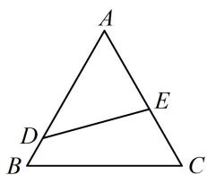

# 内容提要

在三角形中，对于求值或范围等问题除了化角之外，还可以用正弦定理、余弦定理化边来分析。当化为了某条边长的代数式时，常需要限定该边的取值范围，下面归纳常见的限定方式：

①对于任意三角形，都有任意两边之和大于第三边；

②对于锐角三角形，有 $\left\{ \begin{array}{l} \cos A = \frac{b^2 + c^2 - a^2}{2bc} > 0 \\ \cos B = \frac{a^2 + c^2 - b^2}{2ac} > 0 \\ \cos C = \frac{a^2 + b^2 - c^2}{2ab} > 0 \end{array} \right.$ 所以 $\left\{ \begin{array}{l} b^2 + c^2 - a^2 > 0 \\ a^2 + c^2 - b^2 > 0 \\ a^2 + b^2 - c^2 > 0 \end{array} \right.$ ;

③对于钝角三角形，例如 $A$ 为钝角，则 $\cos A = \frac{b^2 + c^2 - a^2}{2bc} < 0$ ，故 $b^{2} + c^{2} - a^{2} < 0$

# 类型Ⅰ：用余弦定理化边分析

【例 1】在 $\triangle ABC$ 中，内角 A, B, C 的对边分别为 a, b, c，已知 $c(\cos A + 1) = a \cos C$ ，且 a, b, c 是公差为 -2 的等差数列，则 a = \_\_\_\_.

解析：三边构成公差为-2的等差数列，则用一个变量 $a$ 即可表示 $b, c$ ，减少变量个数，

因为 $a, b, c$ 是公差为-2的等差数列，所以 $b = a - 2, c = a - 4$

只要再来一个关于 $a$ 的方程，就能求出 $a$ ，考虑到要求的是边，我们用余弦定理将所给等式角化边，

由题意， $c(\cos A + 1) = a\cos C$ ，所以 $c\left(\frac{b^2 + c^2 - a^2}{2bc} +1\right) = a\cdot \frac{a^2 + b^2 - c^2}{2ab}$ ，整理得： $c^2 -a^2 +bc = 0$

将 $\left\{ \begin{array}{l} b = a - 2 \\ c = a - 4 \end{array} \right.$ 代入可得： $(a - 4)^2 - a^2 + (a - 2)(a - 4) = 0$ ，解得： $a = 12$ 或2，

若 $a = 2$ ，则 $b = 0$ ，不合题意，所以 $a = 12$

答案: 12

【反思】当所给边长条件较多，而边角等式中又有内角余弦值时，可考虑用余弦定理推论将其化边.

【变式】在 $\triangle ABC$ 中，内角 $A, B, C$ 的对边分别为 $a, b, c$ ，已知 $B = \frac{\pi}{3}$ ， $\triangle ABC$ 的面积为 $\frac{\sqrt{3}}{4} b^2$ ，则 $\frac{a}{c} =$ \_\_\_\_.

解析：已知角 $B$ ，故求面积将其用上，因为 $B = \frac{\pi}{3}$ ，所以 $S_{\triangle ABC} = \frac{1}{2} ac\sin B = \frac{\sqrt{3}}{4} ac$

又由题意， $S_{\triangle ABC}=\frac{\sqrt{3}}{4}b^{2}$ ，所以 $\frac{\sqrt{3}}{4}ac=\frac{\sqrt{3}}{4}b^{2}$ ，故 $b^{2}=ac$ ①，

若将式①边化角，则下一步较难推进，考虑到要求的是 $a$ 和 $c$ 的比值，故应将 $b^{2}$ 消去，想到余弦定理，由余弦定理， $b^{2} = a^{2} + c^{2} - 2ac\cos B = a^{2} + c^{2} - ac$ ，

结合式①可得 $a^2 + c^2 - ac = ac$ ，整理得： $(a - c)^2 = 0$ ，从而 $a = c$ ，故 $\frac{a}{c} = 1$ .

答案: 1

【反思】像 $b^{2} = ac$ 这种边的二次齐次式，若用正弦定理化角不易推进，也可考虑用余弦定理化简.

# 类型Ⅱ：余弦定理化边与不等式综合

【例 2】在 $\triangle ABC$ 中，内角 $A, B, C$ 的对边分别为 $a, b, c$ ，且 $2\sin B - \sin C = 2\sin A\cos C$ .

（1）求 $A$ ；（2）若 $\frac{1}{2} bc\sin A = 4\sqrt{3}$ ，求 $a$ 的取值范围.

解：（1）（所给等式右侧有 $\sin A\cos C$ ，故拆左侧的 $\sin B$ ，也会出现这一结构，可进一步化简）

因为 $\sin B = \sin [\pi -(A + C)] = \sin (A + C) = \sin A\cos C + \cos A\sin C$ ，代入 $2\sin B - \sin C = 2\sin A\cos C$ 可得

$2(\sin A\cos C + \cos A\sin C) - \sin C = 2\sin A\cos C$ ，整理得： $\sin C(2\cos A - 1) = 0$ ①，

又 $0 < C < \pi$ ，所以 $\sin C > 0$ ，从而在①中约去 $\sin C$ 得 $2\cos A - 1 = 0$ ，故 $\cos A = \frac{1}{2}$ ，结合 $0 < A < \pi$ 得 $A = \frac{\pi}{3}$ .

（2）由（1）知 $A = \frac{\pi}{3}$ ，又 $\frac{1}{2} bc\sin A = 4\sqrt{3}$ ，所以 $\frac{\sqrt{3}}{4} bc = 4\sqrt{3}$ ，故 $bc = 16$

(有了 $b, c$ 的关系, 可由余弦定理将 $a$ 用 $b, c$ 表示, 再分析 $a$ 的范围)

由余弦定理， $a^2 = b^2 +c^2 -2bc\cos A = b^2 +c^2 -bc\geq 2bc - bc = bc = 16$ ，所以 $a\geq 4$

当且仅当 $b = c = 4$ 时取等号，故 $a$ 的取值范围是 $[4, +\infty)$ .

【反思】余弦定理是沟通 $a^2$ ， $b + c$ 和 $bc$ 的桥梁，所以涉及相关最值，可考虑运用余弦定理.

【变式 1】如图，公园里有一块边长为 4 的等边三角形草坪（记为 $\triangle ABC$ ），图中 $DE$ 把草坪分成面积相等的两部分， $D$ 在 $AB$ 上， $E$ 在 $AC$ 上，如果要沿 $DE$ 铺设灌溉水管，则水管的最短长度为（）

text_image

A
D
E
B
C

A. $2 \sqrt{2}$

B. $\sqrt{2}$

C. 3

D. $2 \sqrt{3}$

解析：由题意可知 $A = \frac{\pi}{3}$ ，所以求 $\triangle ADE$ 的面积时将 $A$ 用上，

设 $AD = x$ ， $AE = y$ ，其中 $0 <   x\leq 4$ ， $0 <   y\leq 4$ ，则 $S_{\triangle ADE} = \frac{1}{2} xy\sin A = \frac{\sqrt{3}}{4} xy$

由题意， $S_{\triangle ADE} = \frac{1}{2} S_{\triangle ABC} = \frac{1}{2}\times \frac{1}{2}\times 4\times 4\times \sin \frac{\pi}{3} = 2\sqrt{3}$ ，所以 $\frac{\sqrt{3}}{4} xy = 2\sqrt{3}$ ，故 $xy = 8$

要求 $DE$ 的最小值，可先把 $DE$ 用 $x$ 和 $y$ 表示，已知两边及夹角，用余弦定理，

在 $\triangle ADE$ 中，由余弦定理， $DE^2 = x^2 + y^2 - 2xy\cos A = x^2 + y^2 - xy \geq 2xy - xy = xy = 8$ ，所以 $DE \geq 2\sqrt{2}$ ，当且仅当 $x = y = 2\sqrt{2}$ 时取等号，故 $DE$ 的最小值为 $2\sqrt{2}$ .

答案: A

【变式2】在 $\triangle ABC$ 中，内角 $A, B, C$ 的对边分别为 $a, b, c$ ，若 $4a^{2} = 3(b^{2} - c^{2})$ ，则当 $A$ 最大时， $\sin C = (\quad)$

A. $\frac{3\sqrt{7}}{7}$

B. $\frac{\sqrt{2}}{4}$

C. $\frac{\sqrt{7}}{4}$

D. $\frac{4\sqrt{7}}{7}$

解析：想让 $A$ 最大，只需让 $\cos A$ 最小。已知的是边的关系，故用余弦定理推论将 $\cos A$ 化边分析最值，由余弦定理推论， $\cos A = \frac{b^2 + c^2 - a^2}{2bc}$ ①，又 $4a^{2} = 3(b^{2} - c^{2})$ ，所以 $a^2 = \frac{3}{4} (b^2 -c^2)$

代入式①可得 $\cos A = \frac{b^2 + c^2 - \frac{3}{4}(b^2 - c^2)}{2bc} = \frac{b^2 + 7c^2}{8bc} = \frac{1}{8}\left(\frac{b}{c} + \frac{7c}{b}\right) \geq \frac{1}{8} \times 2\sqrt{\frac{b}{c} \cdot \frac{7c}{b}} = \frac{\sqrt{7}}{4}$ ,

当且仅当 $\frac{b}{c} = \frac{7c}{b}$ ，即 $b = \sqrt{7} c$ 时取等号，所以 $\cos A$ 的最小值为 $\frac{\sqrt{7}}{4}$ ，此时 $A$ 最大，

下面求此时的 $\sin C$ ，可先将边统一化为 $c$ ，用余弦定理推论求 $\cos C$ ，再求 $\sin C$ ，

将 $b = \sqrt{7} c$ 代入 $a^2 = \frac{3}{4} (b^2 - c^2)$ 可得 $a = \frac{3\sqrt{2}}{2} c$ ，所以 $\cos C = \frac{a^2 + b^2 - c^2}{2ab} = \frac{\frac{9}{2}c^2 + 7c^2 - c^2}{2 \times \frac{3\sqrt{2}}{2}c \times \sqrt{7}c} = \frac{\sqrt{14}}{4}$ ，

又因为 $0 < C < \pi$ ，所以 $\sin C = \sqrt{1 - \cos^2 C} = \frac{\sqrt{2}}{4}$

答案: B

【反思】在知道边长关系的前提下，角的最值常通过取余弦值，再化边，结合基本不等式来分析.

【例 3】在 $\triangle ABC$ 中，内角 $A, B, C$ 的对边分别为 $a, b, c$ ，已知 $b \sin C = 2\sqrt{2}c \cos B, b = \sqrt{3}$ ，则当 $\triangle ABC$ 的周长最大时， $\triangle ABC$ 的面积为（）

A. $\frac{3\sqrt{2}}{4}$

B. $\frac{3 \sqrt{3}}{4}$

C. $\frac{9\sqrt{3}}{4}$

D. $3 \sqrt{2}$

解析：因为 $b = \sqrt{3}$ ，所以 $\triangle ABC$ 的周长 $a + b + c = a + c + \sqrt{3}$ ，故当 $a + c$ 最大时，周长也最大，

$b\sin C = 2\sqrt{2} c\cos B \Rightarrow \sin B\sin C = 2\sqrt{2}\sin C\cos B$ ①,

又 $0 < C < \pi$ ，所以 $\sin C > 0$ ，从而在式①中约去 $\sin C$ 可得 $\sin B = 2\sqrt{2}\cos B$ ，故 $\tan B = 2\sqrt{2}$ ②，

由式②可求出 $B$ ，欲求 $a + c$ 的最大值，考虑到余弦定理配方可凑出该式，故对 $B$ 用余弦定理分析，

由②知 $\tan B > 0$ ，所以 $B$ 为锐角，故 $\cos B = \frac{1}{3}$ ， $\sin B = \frac{2\sqrt{2}}{3}$

由余弦定理， $b^{2} = a^{2} + c^{2} - 2ac\cos B$ ，所以 $3 = a^2 +c^2 -\frac{2}{3} ac = (a + c)^2 -\frac{8}{3} ac$

要求的是 $a + c$ 的最大值，所以将上式的 $ac$ 也变成 $a + c$ 的结构，

因为 $ac \leq \left(\frac{a + c}{2}\right)^2$ ，所以 $3 = (a + c)^2 - \frac{8}{3} ac \geq (a + c)^2 - \frac{8}{3}\left(\frac{a + c}{2}\right)^2 = \frac{(a + c)^2}{3}$ ，故 $a + c \leq 3$ ，

取等条件是 $a = c = \frac{3}{2}$ ，所以当 $\triangle ABC$ 的周长最大时， $S_{\triangle ABC} = \frac{1}{2} ac\sin B = \frac{1}{2} \times \frac{3}{2} \times \frac{3}{2} \times \frac{2\sqrt{2}}{3} = \frac{3\sqrt{2}}{4}$ .

答案: A

# 强化训练

1. (2022·安徽肥东县模拟·★★)

在 $\triangle ABC$ 中，内角 $A, B, C$ 的对边分别为 $a, b, c$ ，若 $2a^{2} = 2b^{2} + bc$ ， $\cos A = \frac{1}{4}$ ，则 $\frac{b}{c} = (\quad)$

A. $\frac{1}{2}$

B. $\sqrt{2}$

C. 1

D. 2

2. (2022·辽宁期末·★★★)

在 $\triangle ABC$ 中，内角 $A, B, C$ 的对边分别为 $a, b, c$ ，且 $\triangle ABC$ 的面积 $S = \frac{1}{4} abc$ ，若 $C = \frac{\pi}{3}$ ，则 $S$ 的最大值为（）

A. $2 \sqrt{3}$

B. $\frac{2\sqrt{6}}{3}$

C. $2 \sqrt{6}$

D. $\frac{3\sqrt{3}}{4}$

3. (2022·湖南宁乡市期末·★★★☆)

在 $\triangle ABC$ 中，角 $A, B, C$ 的对边分别为 $a, b, c$ ，若 $\cos B + \sqrt{3} \sin B = 2$ ， $\frac{\cos B}{b} + \frac{\cos C}{c} = \frac{2 \sin A \sin B}{3 \sin C}$ ，则

$$
\frac {a + b + c}{\sin A + \sin B + \sin C} = (\quad)
$$

A. 2

B. 4

C. 6

D. 8

4. (2023·福建厦门二模·★★)

$\triangle ABC$ 的内角 $A, B, C$ 的对边分别为 $a, b, c$ , 已知 $2a - c = 2b \cos C$ , 求 $B$ .

5.（2023·山东烟台一模（节选）·★★☆）

已知 $\triangle ABC$ 的内角 $A, B, C$ 的对边分别为 $a, b, c$ ，且 $ac\sin B = b^2 - (a - c)^2$ ，求 $\sin B$ 。

6. (2022·陕西安康期中·★★★)

已知 $a, b, c$ 分别为 $\triangle ABC$ 的内角 $A, B, C$ 的对边， $\sin B + 2\sin C\cos A = 0$ 。

(1) 证明: $a^2 - c^2 = 2b^2$ ;   
(2) 请问角 $B$ 是否存在最大值? 若存在, 求出角 $B$ 的最大值; 若不存在, 说明理由.

7. (2023·全国甲卷·★★★)

记 $\triangle ABC$ 的内角 $A, B, C$ 的对边分别为 $a, b, c$ , 已知 $\frac{b^2 + c^2 - a^2}{\cos A} = 2$ .

(1) 求 bc;   
(2) 若 $\frac{a\cos B - b\cos A}{a\cos B + b\cos A} - \frac{b}{c} = 1$ ，求 $\triangle ABC$ 的面积.

8. (2023·广东模拟·★★★☆)

已知锐角 $\triangle ABC$ 的内角 $A, B, C$ 的对边分别为 $a, b, c, \frac{\sqrt{3}c}{b\cos A} = \tan A + \tan B$ .

(1) 求 B;   
(2) 若 c=4，求 $\triangle ABC$ 面积的取值范围.