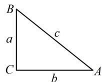

# 强化训练

1. (2022·山东滨州期末·★★)

在 $\triangle ABC$ 中，若 $\cos C = \frac{b}{2a}$ ，则此三角形一定是（）

A. 等腰三角形  
B. 直角三角形  
C. 等腰直角三角形  
D. 既非等腰也非直角三角形

1. A

解法 1: 所给等式右侧有边的齐次分式, 可边化角,

因为 $\cos C = \frac{b}{2a}$ ，所以 $\cos C = \frac{\sin B}{2\sin A}$

故 $2\sin A\cos C = \sin B$ ①,

左侧有 $\sin A\cos C$ ，可拆右侧的 $\sin B$ ，进一步化简，

因为 $\sin B = \sin [\pi -(A + C)] = \sin (A + C)$

$$
= \sin A \cos C + \cos A \sin C,
$$

代入式①得： $2\sin A\cos C=\sin A\cos C+\cos A\sin C$

所以 $\sin A\cos C - \cos A\sin C = 0$ ，故 $\sin (A - C) = 0$

因为 $A, C \in (0, \pi)$ ，所以 $A - C \in (-\pi, \pi)$ ，从而 $A - C = 0$ ，

故 $A = C$ ，所以 $\triangle ABC$ 一定是等腰三角形.

解法2：若用余弦定理推论将左侧的 $\cos C$ 角化边，则能得到只含边的等式，故也可尝试按此找边的关系来判断形状，

由余弦定理推论， $\cos C = \frac{a^2 + b^2 - c^2}{2ab}$

代入题设的等式得 $\frac{a^2 + b^2 - c^2}{2ab} = \frac{b}{2a}$ ，化简得： $a = c$

所以 $\triangle ABC$ 一定是等腰三角形.

2. (2022·河南安阳模拟·★★☆)

在 $\triangle ABC$ 中，角 $A, B, C$ 的对边分别为 $a, b, c$ ，且 $2b^{2} - 3c^{2} - ac = 0$ ， $\sin C = 2\sin A$ ，则 $\cos C =$ \_\_\_\_.

2. $\frac{2\sqrt{7}}{7}$

解析：若将 $\sin C = 2\sin A$ 角化边，则结合 $2b^{2} - 3c^{2} - ac = 0$ 可将边统一起来，由余弦定理推论求 $\cos C$

因为 $\sin C = 2\sin A$ ，所以 $c = 2a$ ，代入 $2b^{2} - 3c^{2} - ac = 0$

可得 $2b^{2} - 3\cdot (2a)^{2} - a\cdot 2a = 0$ ，所以 $b = \sqrt{7} a$ ，由余弦定理推论， $\cos C = \frac{a^2 + b^2 - c^2}{2ab} = \frac{a^2 + 7a^2 - 4a^2}{2a\cdot\sqrt{7} a} = \frac{2\sqrt{7}}{7}$

3. (2022·河南濮阳模拟·★★★)

设 $\triangle ABC$ 的内角 $A, B, C$ 的对边分别为 $a, b, c$ , 且 $(a + b + c)(a + b - c) = 3ab$ , $2\cos A\sin B = \sin C$ , 则 $\triangle ABC$ 是（）

A. 直角三角形 B. 等边三角形  
C. 钝角三角形 D. 等腰直角三角形

3. B

解法1：因为 $(a + b + c)(a + b - c) = 3ab$ ，所以 $(a + b)^2 -c^2$

$= 3ab$ ，整理得： $a^2 + b^2 - c^2 = ab$

故 $\cos C = \frac{a^2 + b^2 - c^2}{2ab} = \frac{ab}{2ab} = \frac{1}{2}$ ，结合 $0 < C < \pi$ 得 $C = \frac{\pi}{3}$ ；

等式 $2\cos A\sin B = \sin C$ 左侧有 $\cos A\sin B$ ，故可拆右侧的

$\sin C$ ，进一步化简，因为 $\sin C = \sin [\pi -(A + B)]$

$$
= \sin (A + B) = \sin A \cos B + \cos A \sin B,
$$

代入 $2\cos A\sin B = \sin C$ 可得 $2\cos A\sin B =$

$\sin A\cos B + \cos A\sin B$ ，所以 $\sin A\cos B - \cos A\sin B = 0$

故 $\sin (A - B) = 0$ ，又 $A,B\in (0,\pi)$ ，所以 $A - B\in (-\pi ,\pi)$

从而 A-B=0，故 A=B，

结合 $C = \frac{\pi}{3}$ 可得 $\triangle ABC$ 是等边三角形.

解法2: 得到 $C = \frac{\pi}{3}$ 的过程同解法1, $2\cos A\sin B = \sin C$ 的左右分别有 $\sin B$ 和 $\sin C$ , 可用正弦定理角化边, 而 $\cos A$ 则可用余弦定理推论角化边, 故也可尝试角化边分析,

因为 $2\cos A\sin B = \sin C$ ，所以 $2\cdot \frac{b^2 + c^2 - a^2}{2bc}\cdot b = c$

整理得： $b^{2} - a^{2} = 0$ ，故 $b = a$

结合 $C = \frac{\pi}{3}$ 可得 $\triangle ABC$ 是等边三角形.

# 4. (★★★☆)

在 $\triangle ABC$ 中，角 $A, B, C$ 的对边分别为 $a, b, c$ ，已知 $ac=\frac{3\sqrt{2}}{4}$ ， $\sin A\sin C=\frac{\sqrt{2}}{3}$ ， $\sin B=\frac{1}{3}$ ，则 $b=$ \_\_\_\_.

4. $\frac{1}{2}$

解析：题干涉及两边与三内角正弦，要求第三边，考虑正弦定理.若不知道怎么求，就都写出来再看，

由正弦定理， $\frac{a}{\sin A} = \frac{b}{\sin B} = \frac{c}{\sin C}$

为了凑出条件的形式，我们想到把 $\frac{a}{\sin A}$ 与 $\frac{c}{\sin C}$ 相乘，

所以 $\frac{a}{\sin A} \cdot \frac{c}{\sin C} = \frac{b^2}{\sin^2 B}$ ,

从而 $b^{2} = \frac{ac\sin^{2}B}{\sin A\sin C} = \frac{\frac{3\sqrt{2}}{4}\times\left(\frac{1}{3}\right)^{2}}{\frac{\sqrt{2}}{3}} = \frac{1}{4}$ ，故 $b = \frac{1}{2}$

# 5. (2022·四川绵阳期末·★★★☆)

在 $\triangle ABC$ 中，角 $A, B, C$ 的对边分别为 $a, b, c$ ，已知 $\sin (C - B) = 2\sin B\cos C$ ，且 $2\sin A + b\sin B = c\sin C$ ，则 $a = (\quad)$

A. 2 B. 4 C. 6 D. 8

5. B

解析：因为 $\sin (C - B) = 2\sin B\cos C$

所以 $\sin C\cos B - \cos C\sin B = 2\sin B\cos C$

故 $\sin C\cos B = 3\sin B\cos C$ ①，

$2\sin A + b\sin B = c\sin C$ 的边不齐次，不能边化角，故只能角化边，于是把式①也角化边，联合分析，

因为 $2\sin A + b\sin B = c\sin C$ ，所以 $2a + b^{2} = c^{2}$

故 $c^{2}-b^{2}=2a$ ②,

由式①可得： $c \cdot \frac{a^{2} + c^{2} - b^{2}}{2ac} = 3b \cdot \frac{a^{2} + b^{2} - c^{2}}{2ab}$

整理得： $a^2 = 2(c^2 - b^2)$ ③，

将式②代入式③消去 $c^{2}-b^{2}$ 可得： $a^{2}=4a$ ，

所以 $a = 4$ 或0（舍去）.

6. (2024·全国甲卷·★★★☆)

记 $\triangle ABC$ 的内角 $A, B, C$ 的对边分别为 $a, b, c$ , 已知 $B = \frac{\pi}{3}$ , $b^2 = \frac{9}{4} ac$ , 则 $\sin A + \sin C = (\quad)$

A. $\frac{3}{2}$

B. $\sqrt{2}$

C. $\frac{\sqrt{7}}{2}$

D. $\frac{\sqrt{3}}{2}$

6. C

解析：让求的是角，故可考虑将边的齐次式 $b^{2} = \frac{9}{4} ac$ 化角分析，因为 $b^{2} = \frac{9}{4} ac$ ，所以 $\sin^2 B = \frac{9}{4}\sin A\sin C$ ，

结合 $B = \frac{\pi}{3}$ 可得 $\sin A\sin C = \frac{1}{3}$

到此容易想到利用 $A + C = \frac{2\pi}{3}$ 将上式消元，求出 $A$ ，再得到 $C$ .但经尝试， $A,C$ 不是特殊角，怎么办呢？看到已知的 $\sin A\sin C$ 和所求的 $\sin A + \sin C$ ，想到配方，需要 $\sin^2 A + \sin^2 C$ ，有平方，于是又想到对 $B$ 用余弦定理，

由余弦定理， $b^{2}=a^{2}+c^{2}-2ac\cos B$ ，

结合 $B = \frac{\pi}{3}$ 可得 $b^{2} = a^{2} + c^{2} - ac$

所以 $\sin^2 B = \sin^2 A + \sin^2 C - \sin A\sin C$

从而 $(\sin A + \sin C)^2 - 3\sin A\sin C = \sin^2 B = \frac{3}{4}$

故 $(\sin A + \sin C)^2 = \frac{3}{4} + 3\sin A\sin C = \frac{7}{4}$ ，又 $A, C \in (0, \pi)$ ，

所以 $\sin A + \sin C > 0$ ，故 $\sin A + \sin C = \frac{\sqrt{7}}{2}$

7. (2025·全国Ⅰ卷·★★★★★) (多选)

已知 $\triangle ABC$ 的面积为 $\frac{1}{4}$ ，若 $\cos 2A + \cos 2B +$

$2\sin C=2,\quad\cos A\cos B\sin C=\frac{1}{4}$ ，则（）

A. $\sin C = \sin^2 A + \sin^2 B$

B. $AB = \sqrt{2}$

C. $\sin A + \sin B = \frac{\sqrt{6}}{2}$

D. $AC^{2} + BC^{2} = 3$

7. ABC

解法 1: A 项, 题干给出 3 个条件, 观察发现在 $\cos 2 A +$

$\cos 2B + 2\sin C = 2$ 这个条件中对 $\cos 2A$ 和 $\cos 2B$ 用二倍角公式，可产生此项结论中的 $\sin^2 A$ ， $\sin^2 B$ ，故尝试按此变形，因为 $\cos 2A + \cos 2B + 2\sin C = 2$ ，

所以 $1 - 2\sin^2 A + 1 - 2\sin^2 B + 2\sin C = 2$

化简得： $\sin C = \sin^2 A + \sin^2 B$ ，故A项正确；

B项，此项结论与边有关，考虑角化边，从哪里切入？现已得到 $\sin C = \sin^2 A + \sin^2 B$ ，若是齐次式 $\sin^2 C = \sin^2 A + \sin^2 B$ ，则可用正弦定理化边，但这里不齐次，怎么办呢？可考虑通过放缩使其齐次，

因为 $C \in (0, \pi)$ ，所以 $0 < \sin C \leq 1$ ，由前面的分析可知 $\sin^2 A + \sin^2 B = \sin C \geq \sin^2 C$ ，所以 $a^2 + b^2 \geq c^2$

从而 $a^2 + b^2 - c^2 \geq 0$ ，故 $\cos C = \frac{a^2 + b^2 - c^2}{2ab} \geq 0$

结合 $C\in (0,\pi)$ 可得 $0 < C\leq \frac{\pi}{2}$

上述结果怎么用？我们发现 $C$ 有可能为 $\frac{\pi}{2}$ ，这一情况比较特殊，于是我们再分 $0 < C < \frac{\pi}{2}$ 和 $C = \frac{\pi}{2}$ 分别考虑，

若 $0 < C < \frac{\pi}{2}$ ，则结合 $A + B = \pi - C$ 可得 $\frac{\pi}{2} < A + B < \pi$ ，

所以 $A > \frac{\pi}{2} - B$ ， $B > \frac{\pi}{2} - A$ ，又 $\cos A \cos B \sin C = \frac{1}{4} > 0$ ，

且 $\sin C > 0$ ，所以 $\cos A\cos B > 0$ ，故 $\cos A$ 与 $\cos B$ 同号，

由于 $\triangle ABC$ 最多只有一个钝角，即最多只有一个内角余弦值为负，所以 $\cos A$ 与 $\cos B$ 只能同正，故 $A, B$ 都是锐角，所以 $\frac{\pi}{2} - A$ ， $\frac{\pi}{2} - B$ 也都为锐角，

结合 $A > \frac{\pi}{2} - B$ ， $B > \frac{\pi}{2} - A$ 得 $\sin A > \sin \left(\frac{\pi}{2} - B\right) = \cos B$

$$
\sin B > \sin \left(\frac {\pi}{2} - A\right) = \cos A,
$$

所以 $\sin C = \sin^2 A + \sin^2 B > \sin A\cos B + \sin B\cos A$

$= \sin (A + B) = \sin (\pi -C) = \sin C$ ，矛盾，故只能 $C = \frac{\pi}{2}$

此时 $\sin C = 1$ ，且 $B = \pi - A - C = \frac{\pi}{2} - A$

所以 $\sin^2 A + \sin^2 B = \sin^2 A + \sin^2\left(\frac{\pi}{2} -A\right)$

$= \sin^2 A + \cos^2 A = 1 = \sin C$ ，满足要求，

有了角 $C$ ，怎样求 $AB$ ？条件所给面积能与边长联系起来，故又来翻译它，记 $A, B, C$ 所对的边分别为 $a, b, c,$

由题意， $S_{\triangle ABC}=\frac{1}{2}ab=\frac{1}{4}\Rightarrow ab=\frac{1}{2}$

有了 $ab$ ，若能求出 $\sin A\sin B$ ，就能按 $\frac{c^2}{\sin^2C} = \frac{ab}{\sin A\sin B}$ 求 $c$ ，观察发现由题设条件容易求 $\cos A\cos B$ ，而 $C = \frac{\pi}{2}$ ，于是 $A + B = \frac{\pi}{2}$ 由此可将 $\cos A\cos B$ 换算成 $\sin A\sin B$ ，

将 $C = \frac{\pi}{2}$ 代入 $\cos A\cos B\sin C = \frac{1}{4}$ 可得 $\cos A\cos B = \frac{1}{4}$ ，

又 $A + B = \pi - C = \frac{\pi}{2}$ ，所以 $A = \frac{\pi}{2} - B$ ， $B = \frac{\pi}{2} - A$ ，

故 $\cos A\cos B = \cos \left(\frac{\pi}{2} -B\right)\cos \left(\frac{\pi}{2} -A\right) = \sin B\sin A$

所以 $\sin A\sin B = \cos A\cos B = \frac{1}{4}$ ,

由正弦定理， $\frac{a}{\sin A} = \frac{b}{\sin B} = \frac{c}{\sin C} = 2R$

其中 R 为 $\triangle ABC$ 的外接圆半径，

所以 $\frac{c^2}{\sin^2C} = 4R^2 = \frac{a}{\sin A}\cdot \frac{b}{\sin B} = \frac{ab}{\sin A\sin B} = \frac{\frac{1}{2}}{\frac{1}{4}} = 2$

从而 $c^2 = 2\sin^2 C = 2$ ，故 $c = \sqrt{2}$ ，即 $AB = \sqrt{2}$

故B项正确；

C项，已有 $A$ ， $B$ 的关系，不妨考虑把 $\sin A + \sin B$ 消元，再看如何计算它，由前面的分析可知， $B = \frac{\pi}{2} -A$

所以 $\sin A + \sin B = \sin A + \sin \left(\frac{\pi}{2} - A\right)$

$$
\begin{array}{l} = \sin A + \cos A = \sqrt {(\sin A + \cos A) ^ {2}} \\ = \sqrt {\sin^ {2} A + \cos^ {2} A + 2 \sin A \cos A} = \sqrt {1 + 2 \sin A \cos A} \quad ①, \\ \end{array}
$$

故只需求 $\sin A\cos A$ ，已有 $\sin A\sin B$ ，将 $\sin B$ 换成 $\cos A$ ，就能得到 $\sin A\cos A$

因为 $\sin A\sin B = \sin A\sin \left(\frac{\pi}{2} -A\right) = \sin A\cos A = \frac{1}{4}$ ，所以代入①得 $\sin A + \sin B = \sqrt{1 + 2\times\frac{1}{4}} = \frac{\sqrt{6}}{2}$ ，故C项正确；

D 项，因为 $C = \frac{\pi}{2}$ ，所以 $AC^{2} + BC^{2} = AB^{2} = 2 \neq 3$ ，

故D项错误.

解法 2: A、D 两项的判断和 B 项得到 $C = \frac{\pi}{2}$ 和 $ab = \frac{1}{2}$ 的过程同解法 1, 再看最后一个条件 $\cos A \cos B \sin C = \frac{1}{4}$ , 由于已有 $\triangle ABC$ 是直角三角形, 故也可直接用边来翻译此条件, 看能否结合 $ab = \frac{1}{2}$ 求出 AB,

在 $\triangle ABC$ 中，因为 $C = \frac{\pi}{2}$ ，所以如图，

$\cos A\cos B\sin C = \frac{b}{c}\times \frac{a}{c}\times 1 = \frac{ab}{c^2},$

又由题意， $\cos A\cos B\sin C = \frac{1}{4}$ ，所以 $\frac{ab}{c^2} = \frac{1}{4}$

结合 $ab = \frac{1}{2}$ 可得 $c = \sqrt{2}$ ，即 $AB = \sqrt{2}$ ，故B项正确；

对于 C 项，由于结论中涉及的量都容易用边表示，故也可考虑先用边表示，再作分析，

$$
\sin A + \sin B = \frac {a}{c} + \frac {b}{c} = \frac {a + b}{c} = \frac {a + b}{\sqrt {2}},
$$

又 $a^2 + b^2 = c^2 = 2$ ，所以 $a + b = \sqrt{(a + b)^2}$

$$
= \sqrt {a ^ {2} + b ^ {2} + 2 a b} = \sqrt {2 + 2 \times \frac {1}{2}} = \sqrt {3},
$$

从而 $\sin A + \sin B = \frac{a + b}{\sqrt{2}} = \frac{\sqrt{3}}{\sqrt{2}} = \frac{\sqrt{6}}{2}$ ，故C项正确.

8. (2024·江苏模拟·★★★)

在 $\triangle ABC$ 中，角 $A, B, C$ 的对边分别为 $a, b, c$ ，且 $(2b - c)\cos A = a\cos C$ 。

(1) 求 A;   
(2) 若 $\triangle ABC$ 的面积为 $\sqrt{3}$ , $BC$ 边上的高为 1, 求 $\triangle ABC$ 的周长.

8. 解: (1) (所给等式左右有齐次的边, 所求为角, 可考虑用

正弦定理边化角分析）

因为 $(2b - c)\cos A = a\cos C$ ，所以由正弦定理，

(2sin B - sin C) cos A = sin A cos C,

故 $2\sin B\cos A = \sin A\cos C + \sin C\cos A = \sin (A + C)$

$$
= \sin (\pi - B) = \sin B \quad ①,
$$

又 $0 < B < \pi$ ，所以 $\sin B > 0$ ，故式①可化为 $2\cos A = 1$

解得： $\cos A = \frac{1}{2}$ ，结合 $0 < A < \pi$ 可得 $A = \frac{\pi}{3}$

(2) (题干给出了 $\triangle ABC$ 的面积和 $BC$ 边上的高, 故用该高表示面积, 可建立方程求出 $BC$ )

由题意， $S_{\triangle ABC} = \frac{1}{2} a\times 1 = \sqrt{3}$ ，所以 $a = 2\sqrt{3}$

（求周长还差 $b$ 和 $c$ ，考虑建立关于 $b, c$ 的方程，怎样建立？已有 $A$ ，则也可按 $S_{\triangle ABC} = \frac{1}{2} bc \sin A$ 求 $\triangle ABC$ 的面积，由此可建立一个关于 $b, c$ 的方程）

由（1）可知 $S_{\triangle ABC} = \frac{1}{2} bc\sin A = \frac{1}{2} bc\sin \frac{\pi}{3} = \frac{\sqrt{3}}{4} bc$

所以 $\frac{\sqrt{3}}{4} bc = \sqrt{3}$ ，故 $bc = 4$ ②，

(还差一个方程, 在已知 $A$ 和 $a$ 的情况下, 用余弦定理又可建立一个关于 $b$ , $c$ 的方程)

由余弦定理， $a^2 = b^2 +c^2 -2bc\cos A$

所以 $12 = b^{2} + c^{2} - bc$ ，故 $(b + c)^{2} - 3bc = 12$

结合式②可得 $(b + c)^2 = 12 + 3bc = 12 + 3\times 4 = 24$

所以 $b + c = 2\sqrt{6}$

故 $\triangle ABC$ 的周长为 $a + b + c = 2\sqrt{3} + 2\sqrt{6}$ .

9. (2024·湖北武汉四调·★★★)

已知 $\triangle ABC$ 三个内角 $A, B, C$ 所对的边分别为 $a, b, c$ , 且 $\frac{\cos C}{c} = \frac{\cos A}{3b - a}$ .

(1) 求 $\sin C$ 的值;

(2) 若 $\triangle ABC$ 的面积 $S = 5\sqrt{2}$ ，且 $c = \sqrt{6}(a - b)$ ，求 $\triangle ABC$ 的周长.

9. 解: (1) (所给等式左右分母上有齐次的边, 所求又与角有

关，故考虑用正弦定理边化角分析）

因为 $\frac{\cos C}{c} = \frac{\cos A}{3b - a}$ ，所以由正弦定理，

$$
\frac {\cos C}{\sin C} = \frac {\cos A}{3 \sin B - \sin A},
$$

从而 $3\sin B\cos C - \sin A\cos C = \cos A\sin C$

故 $3\sin B\cos C = \sin A\cos C + \cos A\sin C$ ①，

又 $\sin A\cos C + \cos A\sin C = \sin (A + C) = \sin (\pi -B) = \sin B$

所以代入①得 $3\sin B\cos C = \sin B$ ②，

因为 $0 < B < \pi$ ，所以 $\sin B > 0$

从而式②可化为 $3\cos C = 1$ ，故 $\cos C = \frac{1}{3}$ ，

又 $0 < C < \pi$ ，所以 $\sin C > 0$ ，故 $\sin C = \sqrt{1 - \cos^2 C} = \frac{2\sqrt{2}}{3}$

（2）（要求周长，考虑建立关于边的方程，我们先来翻译条件给出的面积，已有 $\sin C$ ，考虑代公式 $S = \frac{1}{2} ab\sin C$ 算面积）由

（1）可得 $S = \frac{1}{2} ab\sin C = \frac{1}{2} ab\cdot \frac{2\sqrt{2}}{3} = \frac{\sqrt{2}}{3} ab$

又由题意， $S=5\sqrt{2}$ ，所以 $\frac{\sqrt{2}}{3}ab=5\sqrt{2}$ ，故ab=15 ③，

(结合 $c=\sqrt{6}(a-b)$ ，已有2个方程，求 a, b, c 还差一个方程，怎样建立？有 $\cos C$ ，可用余弦定理建立方程)

因为 $\cos C = \frac{1}{3}$ ，所以由余弦定理，

$c^2 = a^2 + b^2 - 2ab\cos C = a^2 + b^2 - \frac{2}{3} ab$ ④，（三个方程都有了，怎样求解？观察 $c = \sqrt{6}(a - b)$ 和式③可发现，将式④按 $a^2 + b^2 = (a - b)^2 + 2ab$ 配方处理，可先求出 $c$ ）

由④可得 $c^2 = (a - b)^2 +\frac{4}{3} ab$ ，结合 $c = \sqrt{6} (a - b)$ 和 $ab = 15$ 可得 $c^2 = \frac{c^2}{6} +20$ ，解得： $c = 2\sqrt{6}$

代入④得 $24 = a^{2} + b^{2} - \frac{2}{3} ab = (a + b)^{2} - \frac{8}{3} ab$

$= (a + b)^{2} - \frac{8}{3}\times 15 = (a + b)^{2} - 40$ ，所以 $a + b = 8$

故 $\triangle ABC$ 的周长为 $a + b + c = 8 + 2\sqrt{6}$

【反思】可以发现，余弦定理不仅能沟通 $b+c$ 与bc，还可沟通b-c与bc.

10. (2022·广东汕头模拟·★★★★)

在 $\triangle ABC$ 中，角 $A, B, C$ 的对边分别为 $a, b, c$ ，边长均为正整数，且 $b = 4$ ：

(1) 若 B 为钝角，求 $\triangle ABC$ 的面积；

(2) 若 A = 2B，求 a.

10. 解: (1) (因为边长均为正整数, 所以可将 $a$ 和 $c$ 满足的

条件翻译出来，再逐个筛选排查）

因为 B 为钝角，且 b=4 ，所以 $\cos B=\frac{a^{2}+c^{2}-b^{2}}{2ac}$

$= \frac{a^2 + c^2 - 16}{2ac} < 0$ ，故 $a^2 + c^2 < 16$

又 $a + c > b = 4$ ，结合 $a$ 和 $c$ 均为正整数知 $a$ 和 $c$ 可能的取值为 $\left\{ \begin{array}{l}a = 3\\ c = 2 \end{array} \right.$ 或 $\left\{ \begin{array}{l}a = 2\\ c = 3 \end{array} \right.$ ，所以 $\cos B = \frac{a^2 + c^2 - b^2}{2ac} = -\frac{1}{4}$

$\sin B = \sqrt{1 - \cos^2B} = \frac{\sqrt{15}}{4}$ 故 $S_{\triangle ABC} = \frac{1}{2} ac\sin B = \frac{3\sqrt{15}}{4}$ .

(2) (像 $A = 2B$ 这类条件, 一般两端取正弦, 再角化边)

因为 A=2B ，所以 $\sin A=\sin 2B$ ，

从而 $\sin A = 2\sin B\cos B$ ，故 $a = 2b\cdot \frac{a^2 + c^2 - b^2}{2ac}$

将 $b = 4$ 代入可得 $a = \frac{4(a^2 + c^2 - 16)}{ac}$

两端同乘以 $ac$ 可得 $a^2 c = 4a^2 + 4(c^2 - 16)$ ，

所以 $a^2 (c - 4) - 4(c + 4)(c - 4) = 0$

从而 $(c - 4)[a^2 - 4(c + 4)] = 0$

故 $c - 4 = 0$ 或 $a^2 - 4(c + 4) = 0$

若 $c - 4 = 0$ ，则 $c = 4$ ，所以 $c = b$ ，故 $C = B$

又 $A = 2B$ ，所以 $A + B + C = 4B = \pi$

从而 $B = \frac{\pi}{4}, C = \frac{\pi}{4}, A = \frac{\pi}{2}$

故 $\triangle ABC$ 是等腰直角三角形，所以 $a = 4\sqrt{2} \notin \mathbf{N}^*$ ，

与题意不符，所以 $a^2 - 4(c + 4) = 0$ ，故 $c = \frac{a^2}{4} - 4$

（要求 $a$ ，可先由两边之和大于第三边求 $a$ 的范围，再结合 $c\in \mathbf{N}^*$ 来取值）因为 $\left\{ \begin{array}{l}a + b > c\\ a + c > b\\ b + c > a \end{array} \right.$ ，所以 $\left\{ \begin{array}{l}a + 4 > \frac{a^2}{4} -4\\ a + \frac{a^2}{4} -4 > 4,\\ 4 + \frac{a^2}{4} -4 > a \end{array} \right.$

解得： $4 < a < 8$ ，结合 $a \in \mathbf{N}^{*}$ 知 $a = 5$ ，6或7，

又当 $a = 5$ 或7时， $c = \frac{a^2}{4} -4\notin \mathbf{N}^*$ ，所以 $a = 6$