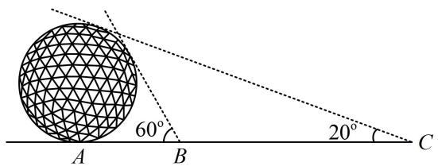
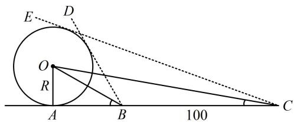
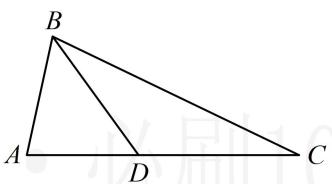
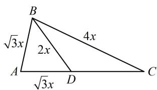
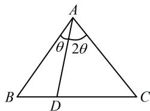
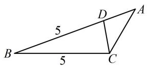
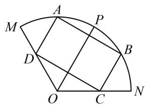
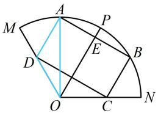

# 强化训练

1. (★)

在 $\triangle ABC$ 中，角 $A, B, C$ 所对的边分别为 $a, b, c$ ，已知 $b\cos C + c\cos B = 2b$ ，则 $\frac{a}{b} =$ \_\_\_\_.

1. 2

解析：看到 $b \cos C + c \cos B$ ，想到射影定理，将 $b \cos C +$

$c\cos B = a$ 代入 $b\cos C + c\cos B = 2b$ 得 $a = 2b \Rightarrow \frac{a}{b} = 2$

2. (★★)

在 $\triangle ABC$ 中，已知 $b = \sqrt{3}$ ， $(3 - c)\cos A = a\cos C$ ，则 $\cos A =$ \_\_\_\_.

2. $\frac{\sqrt{3}}{3}$

解法1：所给等式左右没有齐次的边，但我们可以把3换成 $\sqrt{3} b$ ，凑出齐次的边，再边化角分析，

因为 $b = \sqrt{3}$ ， $(3 - c)\cos A = a\cos C$ ，所以 $(\sqrt{3} b - c)\cos A = a\cos C$ ，从而 $(\sqrt{3}\sin B - \sin C)\cos A = \sin A\cos C$

故 $\sqrt{3}\sin B\cos A = \sin A\cos C + \sin C\cos A = \sin (A + C)$

$= \sin (\pi - B) = \sin B$ ①，又 $0 < B < \pi$ ，所以 $\sin B > 0$

故在式①中约去 $\sin B$ 可得 $\cos A = \frac{\sqrt{3}}{3}$ .

解法2：观察发现由所给等式移项可凑出 $c \cos A + a \cos C$ 这一结构，故可考虑用射影定理来快速化简，

$$
(3 - c) \cos A = a \cos C \Rightarrow 3 \cos A = c \cos A + a \cos C,
$$

由射影定理， $c\cos A + a\cos C = b$ ，代入上式得 $3\cos A = b$

又 $b = \sqrt{3}$ ，所以 $\cos A = \frac{b}{3} = \frac{\sqrt{3}}{3}$

3. (2023·江苏省苏北七市二调·★★★)

古代数学家刘徽编撰的《重差》是中国最早的一部测量学著作，也为地图学提供了数学基础。现根据刘徽的《重差》测量一个球体建筑物的高度，已知点 $A$ 是球体建筑物与水平地面的接触点（切点），地面上 $B$ ， $C$ 两点与点 $A$ 在同一条直线上，且在点 $A$ 的同侧。若在 $B$ ， $C$ 处分别测得球体建筑物的最大仰角为 $60^{\circ}$ 和 $20^{\circ}$ ，且 $BC = 100\mathrm{m}$ ，则该球体建筑物的高度约为（）（ $\cos 10^{\circ} \approx 0.985$ ）

A. $49.25 \mathrm{~m}$

B. $50.76 \mathrm{~m}$

C. $56.74 \mathrm{~m}$

D. $58.60 \mathrm{~m}$

text_image

60°
20°
A B C

3. B

解析：建筑物的高度即为球的直径 $2 R$ ，不妨先画出过球心的截面，并标出已知条件，再分析，

如图，由题意， $BC = 100\mathrm{m}$ ， $\angle ABD = 60^{\circ}$

$\angle ACE=20^{\circ}$ ，所以 $\angle ABO=30^{\circ}$ ， $\angle BCO=10^{\circ}$ ，

已知 $\angle ABO$ ，只要求出 Rt $\triangle AOB$ 的任何一边，都能求 $R$ 。观察发现 $\triangle OBC$ 各内角都好求，又有 $BC$ ，故可由正弦定理求 $OB$ ，在 $\triangle OBC$ 中， $\angle BOC = \angle ABO - \angle BCO = 20^{\circ}$ ，

由正弦定理， $\frac{OB}{\sin\angle BCO}=\frac{BC}{\sin\angle BOC}$ ，所以 OB=

$$
\frac {B C \cdot \sin \angle B C O}{\sin \angle B O C} = \frac {1 0 0 \sin 1 0 ^ {\circ}}{\sin 2 0 ^ {\circ}} = \frac {1 0 0 \sin 1 0 ^ {\circ}}{2 \sin 1 0 ^ {\circ} \cos 1 0 ^ {\circ}} = \frac {5 0}{\cos 1 0 ^ {\circ}},
$$

故 $R = OA = OB\cdot \sin \angle ABO = \frac{50}{\cos 10^{\circ}}\times \sin 30^{\circ} = \frac{25}{\cos 10^{\circ}}$

$\approx\frac{25}{0.985}\approx25.38\ m$ ，故球体建筑物的高度为 $2R\approx50.76\ m$ .

text_image

E
D
O
R
A
B
100
C

# 4. (★★★)

如图， $\triangle ABC$ 中， $D$ 是边 $AC$ 上的点， $AB = AD$ ， $2AB = \sqrt{3} BD$ ， $BC = 2BD$ ，则 $\sin C = (\quad)$

A. $\frac{\sqrt{3}}{3}$

B. $\frac{\sqrt{3}}{6}$

C. $\frac{\sqrt{6}}{3}$

D. $\frac{\sqrt{6}}{6}$

text_image

B
A D C

4. D

解析：分析已知条件可发现诸多线段都与 $AB$ 有关系，先把 $AB$ 设成未知数，并表示其他线段，

设 $AB = \sqrt{3} x$ ，则 $AD = \sqrt{3} x$ ， $BD = 2x$ ， $BC = 4x$

如图，已知 $\triangle ABD$ 的三边比例，可先在 $\triangle ABD$ 中求 $A$ ，再到 $\triangle ABC$ 中由正弦定理求 $\sin C$

在 $\triangle ABD$ 中，由余弦定理推论， $\cos A = \frac{AB^2 + AD^2 - BD^2}{2AB \cdot AD}$

$= \frac{1}{3}$ ，又 $0 < A < \pi$ ，所以 $\sin A = \sqrt{1 - \cos^2 A} = \frac{2\sqrt{2}}{3}$

在 $\triangle ABC$ 中，由正弦定理， $\frac{AB}{\sin C} = \frac{BC}{\sin A}$

所以 $\sin C = \frac{AB\cdot\sin A}{BC} = \frac{\sqrt{3}x\cdot\frac{2\sqrt{2}}{3}}{4x} = \frac{\sqrt{6}}{6}$

text_image

B
√3x
2x
4x
A
√3x
D
C

5. (2024·新疆乌鲁木齐一模·★★★☆)

在 $\triangle ABC$ 中， $\overrightarrow{AD} = \frac{2}{3}\overrightarrow{AB} +\frac{1}{3}\overrightarrow{AC}$ ， $\angle BAD = \theta$

$\angle CAD = 2\theta$ ，则下列各式一定成立的是（）

A. $\sin B = \cos \theta \sin C$   
B. $\sin C = \cos \theta \sin B$   
C. $\sin B = \sin \theta \sin C$   
D. $\sin C = \sin \theta \sin B$

5. B

解法1: 条件 $\overrightarrow{AD} = \frac{2}{3}\overrightarrow{AB} + \frac{1}{3}\overrightarrow{AC}$ 怎样处理? 可用它确定点 $D$ 的位置. 注意到该式右边系数和为 1, 所以 $D$ 必在 $BC$ 上. 为了确定其具体位置, 可考虑将左边也按右边的系数进行拆分, 再重组化简,

由 $\overrightarrow{AD} = \frac{2}{3}\overrightarrow{AB} +\frac{1}{3}\overrightarrow{AC}$ 可得 $\frac{2}{3}\overrightarrow{AD} +\frac{1}{3}\overrightarrow{AD} = \frac{2}{3}\overrightarrow{AB} +\frac{1}{3}\overrightarrow{AC},$

所以 $\frac{2}{3} (\overrightarrow{AD} -\overrightarrow{AB}) = \frac{1}{3} (\overrightarrow{AC} -\overrightarrow{AD})$ ，故 $2\overrightarrow{BD} = \overrightarrow{DC}$ ，如图，

观察选项，怎样能把 $\sin B$ ， $\sin C$ 和 $\sin \theta$ ， $\cos \theta$ 联系起来？既然涉及了这么多正弦值，当然考虑正弦定理，

在 $\triangle ABD$ 中，由正弦定理， $\frac{BD}{\sin\theta} = \frac{AD}{\sin B}$

同理，在 $\triangle ACD$ 中， $\frac{CD}{\sin 2\theta} = \frac{AD}{\sin C}$

两式相除得： $\frac{BD\cdot\sin 2\theta}{CD\cdot\sin\theta} = \frac{\sin C}{\sin B}$

由 $2\overrightarrow{BD} = \overrightarrow{DC}$ 可得 $\frac{BD}{CD} = \frac{1}{2}$ ，所以 $\frac{\sin 2\theta}{2\sin\theta} = \frac{\sin C}{\sin B}$ ，

从而 $\frac{2\sin\theta\cos\theta}{2\sin\theta} = \frac{\sin C}{\sin B}$ ，故 $\sin C = \cos \theta \sin B$ ：

text_image

A
θ 2θ
B D C

解法2：得到 $2\overrightarrow{BD} = \overrightarrow{DC}$ 的过程同解法1，接下来若注意到由 $2\overrightarrow{BD} = \overrightarrow{DC}$ 可求出 $\triangle ABD$ 和 $\triangle ACD$ 的面积之比，而这一比值也能用 $AB, AD, AC, \theta$ 来表示，则可由此建立关于 $\theta$ 的方程，再看它与选项的关联，

设 $\triangle ABC$ 的 $BC$ 边上的高为 $h$ ，则

$$
\frac {S _ {\triangle A B D}}{S _ {\triangle A C D}} = \frac {\frac {1}{2} B D \cdot h}{\frac {1}{2} C D \cdot h} = \frac {B D}{C D} = \frac {1}{2},
$$

又因为 $\frac{S_{\triangle ABD}}{S_{\triangle ACD}} = \frac{\frac{1}{2} AB\cdot AD\cdot\sin\theta}{\frac{1}{2} AC\cdot AD\cdot\sin 2\theta} = \frac{AB\cdot\sin\theta}{AC\cdot 2\sin\theta\cos\theta}$

$$
= \frac {A B}{2 A C \cdot \cos \theta},
$$

所以 $\frac{AB}{2AC\cdot\cos\theta} = \frac{1}{2}$ ，故 $\frac{AB}{AC\cdot\cos\theta} = 1$ ①，

选项皆为角的关系，故考虑把 $\frac{AB}{AC}$ 这一边的齐次分式在 $\triangle ABC$ 中用正弦定理边化角，

因为 $\frac{AB}{AC} = \frac{\sin C}{\sin B}$ ，所以代入①得 $\frac{\sin C}{\sin B\cos\theta} = 1$ ，

故 $\sin C = \cos \theta \sin B$

6. (2023·广东深圳模拟·★★★)

已知 $a, b, c$ 分别为 $\triangle ABC$ 三个内角 $A, B, C$ 的对边，且 $c \cos B + 3b \cos C = a - b$ .

(1) 求 C;

（2）若 $a = 5$ ， $\cos B = \frac{13}{14}$ ， $D$ 为 $AB$ 边上一点，且 $BD = 5$ ，求 $\triangle ACD$ 的面积.

6. 解: (1) (条件等式各项都有齐次的边, 且所求为角, 故考

虑用正弦定理边化角分析）因为 $c\cos B + 3b\cos C = a - b$

所以 $\sin C\cos B + 3\sin B\cos C = \sin A - \sin B$ ①,

(式①变量较多, 可考虑用内角和为 $\pi$ 来消元. 注意到左边有 $\sin C \cos B$ 和 $\sin B \cos C$ , 所以消 $A$ 可进一步化简)

$$
\sin A = \sin [ \pi - (B + C) ] = \sin (B + C)
$$

$$
= \sin B \cos C + \cos B \sin C \quad ②,
$$

代入①得 $\sin C\cos B + 3\sin B\cos C = \sin B\cos C+$

$\cos B \sin C - \sin B$ ，化简得： $2 \sin B \cos C = -\sin B$ ③，

又 $0 < B < \pi$ ，所以 $\sin B > 0$ ，故在式③中约去 $\sin B$ 可得 $2\cos C = -1$ ，故 $\cos C = -\frac{1}{2}$ ，结合 $0 < C < \pi$ 可得 $C = \frac{2\pi}{3}$

(2) (如图, 已知 $B$ 和 $C$ , 则 $A$ 容易由内角和为 $\pi$ 求出,

故求 $S_{\triangle ACD}$ 考虑用角 $A$ ）因为 $\cos B = \frac{13}{14}$ ，所以 $B$ 为锐角，

且 $\sin B = \sqrt{1 - \cos^2B} = \frac{3\sqrt{3}}{14}$ ，代入②结合 $C = \frac{2\pi}{3}$ 可得

$$
\sin A = \frac {3 \sqrt {3}}{1 4} \times \left(- \frac {1}{2}\right) + \frac {1 3}{1 4} \times \frac {\sqrt {3}}{2} = \frac {5 \sqrt {3}}{1 4},
$$

(求 $S_{\triangle ACD}$ 还差边 $AC$ 和 $AD$ , 到此 $\triangle ABC$ 已知三角一边, 可先由正弦定理求得 $b$ 和 $c$ , 那么 $AC$ 和 $AD$ 也就有了)

由正弦定理， $\frac{a}{\sin A} = \frac{b}{\sin B} = \frac{c}{\sin C}$

所以 $\frac{5}{\frac{5\sqrt{3}}{14}} = \frac{b}{\frac{3\sqrt{3}}{14}} = \frac{c}{\frac{\sqrt{3}}{2}}$ ，解得： $b = 3$ ， $c = 7$

所以 $AD = c - BD = 7 - 5 = 2$

故 $S_{\triangle ACD} = \frac{1}{2} AD\cdot AC\cdot \sin A = \frac{1}{2}\times 2\times 3\times \frac{5\sqrt{3}}{14} = \frac{15\sqrt{3}}{14}.$

7. (2023·四川模拟·★★★☆)

如图，在扇形 $MON$ 中， $ON = 3$ ， $\angle MON = \frac{2\pi}{3}$ ， $\angle MON$ 的平分线交扇形弧于点 $P$ ，点 $A$ 是扇形弧 $PM$ 上一点（不包括端点），过 $A$ 作 $OP$ 的垂线交扇形弧于另一点 $B$ ，分别过 $A$ ， $B$ 作 $OP$ 的平行线，交 $OM$ ， $ON$ 于点 $D$ ， $C$ .

（1）若 $\angle AOB = \frac{\pi}{3}$ ，求 $AD$   
（2）设 $\angle AOP = x$ ， $x\in \left(0,\frac{\pi}{3}\right)$ ，求四边形ABCD的面积的最大值.

text_image

Geometric diagram with labeled points and lines, showing a semicircle with inscribed quadrilateral ABCD and diagonals intersecting at O.

7. 解：（1）（如图，要求 $AD$ ，可到 $\triangle AOD$ 中考虑，先分析哪

些量是已知的）由 $\angle AOB = \frac{\pi}{3}$ 可得 $\angle AOP = \frac{\pi}{6}$ ，

$\angle AOD = \frac{\pi}{6}$ ，又 $AD / / OP$ ，所以 $\angle ADM = \angle POM = \frac{\pi}{3}$

故 $\angle ADO = \frac{2\pi}{3}$ ， $OA = ON = 3$ ，（此时可发现 $\triangle AOD$ 中，已知和要求的刚好是两边两对角，故用正弦定理求 $AD$ ）

在 $\triangle AOD$ 中，由正弦定理， $\frac{AD}{\sin\angle AOD} = \frac{OA}{\sin\angle ADO}$

所以 $AD = \frac{OA\cdot\sin\angle AOD}{\sin\angle ADO} = \frac{3\sin\frac{\pi}{6}}{\sin\frac{2\pi}{3}} = \sqrt{3}$

(2) (由图可知四边形 $ABCD$ 是矩形, 求面积关键是算 $AD$ 和 $AB$ , $AD$ 算法和第 (1) 问相同)

因为 $\angle AOP = x$ ，所以 $\angle AOD = \frac{\pi}{3} -x$

在 $\triangle AOD$ 中，由正弦定理， $\frac{AD}{\sin\angle AOD} = \frac{OA}{\sin\angle ADO}$

所以 $AD = \frac{OA\cdot\sin\angle AOD}{\sin\angle ADO} = \frac{3\sin\left(\frac{\pi}{3} - x\right)}{\sin\frac{2\pi}{3}} = 2\sqrt{3}\sin \left(\frac{\pi}{3} -x\right),$

(再求 $AB$ , 如图, 可先在 $\triangle AOE$ 中求 $AE$ )

设 $AB$ 与 $OP$ 交于点 $E$ ，则由对称性可知 $E$ 为 $AB$ 的中点，

在 $\triangle AOE$ 中， $AE = OA\cdot \sin \angle AOE = 3\sin x$

所以 $AB = 2AE = 6\sin x$

故矩形ABCD的面积 $S = AD\cdot AB = 2\sqrt{3}\sin \left(\frac{\pi}{3} -x\right)\cdot 6\sin x$

$$
\begin{array}{l} = 2 \sqrt {3} \left(\frac {\sqrt {3}}{2} \cos x - \frac {1}{2} \sin x\right) \cdot 6 \sin x = (3 \cos x - \sqrt {3} \sin x) \cdot 6 \sin x \\ = 1 8 \sin x \cos x - 6 \sqrt {3} \sin^ {2} x = 9 \sin 2 x - 6 \sqrt {3} \cdot \frac {1 - \cos 2 x}{2} \\ = 9 \sin 2 x + 3 \sqrt {3} \cos 2 x - 3 \sqrt {3} = 3 (3 \sin 2 x + \sqrt {3} \cos 2 x - \sqrt {3}) \\ = 3 \left[ 2 \sqrt {3} \sin \left(2 x + \frac {\pi}{6}\right) - \sqrt {3} \right], \\ \end{array}
$$

因为 $x \in \left(0, \frac{\pi}{3}\right)$ ，所以 $2x + \frac{\pi}{6} \in \left(\frac{\pi}{6}, \frac{5\pi}{6}\right)$ ，

故当 $2x + \frac{\pi}{6} = \frac{\pi}{2}$ 时， $S$ 取得最大值 $3\sqrt{3}$ .

text_image

Geometric diagram with labeled points and lines, including a semicircle and quadrilateral inscribed in a circle

