# 第2节 三角形的各种线（★★★）

# 内容提要

1. 中线问题: 如图 1, 在 $\triangle ABC$ 中, $AD$ 是边 $BC$ 上的中线, 有关计算常采用下面的几种方法, 这些方法在已知中线, 或者求中线的问题中都可以尝试.

方法1：在左右两个三角形中计算 $\cos \angle ADB$ 和 $\cos \angle ADC$ ，利用 $\angle ADB$ 与 $\angle ADC$ 互补，建立方程求解.

方法2：借助 $\overrightarrow{AD} = \frac{1}{2} (\overrightarrow{AB} +\overrightarrow{AC})$ ，并将其平方来计算目标.

方法3：将 $\triangle ABC$ 补全为如图2所示的平行四边形 $ABEC$ ，转化到 $\triangle ABE$ 中完成相关的计算.

2. 比例线问题: 如图 3, 在 $\triangle ABC$ 中, $D$ 在 $BC$ 上但不是中点, 且已知 $BD$ 与 $CD$ 的长度之比, 这类问题可采用上面的方法 1 和方法 2 求解.  
3. 角平分线问题：如图4，在 $\triangle ABC$ 中， $AD$ 是 $\angle BAC$ 的平分线，有关问题常用下面两种方法求解.

方法1：用角平分线性质定理 $\frac{AB}{AC} = \frac{BD}{CD}$ 来研究 $BD$ 和 $CD$ 的比例关系，从而将问题转化为上述第2类问题。大题中，可先用面积比证明该定理， $\frac{S_{\triangle ABD}}{S_{\triangle ACD}} = \frac{\frac{1}{2} AB \cdot AD \cdot \sin \angle BAD}{\frac{1}{2} AC \cdot AD \cdot \sin \angle CAD} = \frac{\frac{1}{2} BD \cdot h}{\frac{1}{2} CD \cdot h}$ （其中 $h$ 为 $\triangle ABC$ 的边 $BC$ 上的高），所以 $\frac{AB}{AC} = \frac{BD}{CD}$ 。

方法 2：如图 4，设 $\angle BAC = 2\alpha$ ，由 $S_{\triangle ABD} + S_{\triangle ACD} = S_{\triangle ABC}$ 可得 $\frac{1}{2}c \cdot AD \cdot \sin \alpha + \frac{1}{2}b \cdot AD \cdot \sin \alpha = \frac{1}{2}bc \sin 2\alpha$ ，化简得 $(b + c)AD = 2bc \cos \alpha$ ，很多时候我们可以运用这一关于 b, c, AD 和 $\alpha$ 的方程来解决问题.

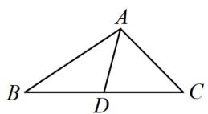  
图1

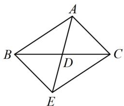

text_image

A
B
D
C
E

图2

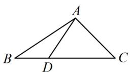  
图3

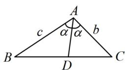  
图4

# 类型 I：中线类问题

【例 1】在 $\triangle ABC$ 中，b=4， $c=\sqrt{10}$ ，BC 边上的中线 AD=2，则 a= \_\_\_\_.

解法1：如图1，观察发现只有 $CD$ 和 $BD$ 未知，可利用 $\angle ADC$ 和 $\angle ADB$ 互补建立方程求解它们，设 $BD = CD = x$ ，由图可知 $\angle ADC = \pi -\angle ADB$ ，所以 $\cos \angle ADC = \cos (\pi -\angle ADB) = -\cos \angle ADB$ ，

从而 $\frac{4 + x^2 - 16}{2 \times 2x} = -\frac{4 + x^2 - 10}{2 \times 2x}$ ，故 $x = 3$ ，所以 $a = 2x = 6$ 。

解法2: 已知 $b$ 和 $c$ , 只要求出 $\cos A$ , 就能用余弦定理求 $a$ , 可将 $\overrightarrow{AD}$ 用 $\overrightarrow{AB}$ 和 $\overrightarrow{AC}$ 表示, 平方求出 $\cos A$ , 因为 $D$ 是 $BC$ 的中点, 所以 $\overrightarrow{AD} = \frac{1}{2} (\overrightarrow{AB} + \overrightarrow{AC})$ , 故 $\left|\overrightarrow{AD}\right|^2 = \frac{1}{4} (\left|\overrightarrow{AB}\right|^2 + \left|\overrightarrow{AC}\right|^2 + 2\overrightarrow{AB} \cdot \overrightarrow{AC})$ ,

将已知条件代入可得 $4 = \frac{1}{4} (10 + 16 + 2 \times \sqrt{10} \times 4 \times \cos A)$ ，故 $\cos A = -\frac{\sqrt{10}}{8}$ ，

由余弦定理， $a^2 = b^2 + c^2 - 2bc\cos A = 4^2 + (\sqrt{10})^2 - 2 \times 4 \times \sqrt{10} \times \left(-\frac{\sqrt{10}}{8}\right) = 36$ ，所以 $a = 6$

解法3：借助平行四边形对角线互相平分的性质，可将 $\triangle ABC$ 补全为如图2所示的平行四边形 $ABEC$

由图可知， $CE = AB = \sqrt{10}$ ， $AE = 2AD = 4$

在 $\triangle ACE$ 中， $\cos \angle ACE = \frac{AC^2 + CE^2 - AE^2}{2AC \cdot CE} = \frac{\sqrt{10}}{8}$ ，

所以 $\cos A = \cos (\pi -\angle ACE) = -\cos \angle ACE = -\frac{\sqrt{10}}{8},$

在 $\triangle ABC$ 中，由余弦定理， $a^2 = b^2 + c^2 - 2bc\cos A$

$= 4^{2} + (\sqrt{10})^{2} - 2 \times 4 \times \sqrt{10} \times \left(-\frac{\sqrt{10}}{8}\right) = 36$ ，所以 $a = 6$

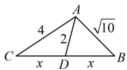  
图1

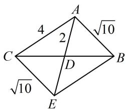

text_image

A
4
√10
2
C
D
B
√10
E

图2

答案: 6

【反思】中线有关的计算常用上面的三种方法，后续变式都可一题多解，为了篇幅简洁，后两题都用解法1作答，解法1可称为“双余弦法”。

【变式1】在 $\triangle ABC$ 中，角 $A, B, C$ 的对边分别为 $a, b, c$ ，且 $\frac{\sin B + \sin C}{\sin A - \sin C} = \frac{a}{b - c}$ .

（1）求 B；（2）若 D 为边 AC 的中点，且 a=3，c=4，求中线 BD 的长.

解：（1）（所给等式可边化角，也可角化边，但若边化角，则下一步按角化简不易，故角化边）

因为 $\frac{\sin B + \sin C}{\sin A - \sin C} = \frac{a}{b - c}$ ，所以 $\frac{b + c}{a - c} = \frac{a}{b - c}$ ，从而 $(b + c)(b - c) = a(a - c)$ ，故 $a^2 + c^2 - b^2 = ac$

所以 $\cos B = \frac{a^2 + c^2 - b^2}{2ac} = \frac{ac}{2ac} = \frac{1}{2}$ ，结合 $0 < B < \pi$ 可得 $B = \frac{\pi}{3}$ .

(2) (如图, $\triangle ABC$ 已知两边及夹角, 可先由余弦定理求第三边)

由余弦定理， $b^{2}=a^{2}+c^{2}-2ac\cos B=9+16-2\times3\times4\times\cos\frac{\pi}{3}=13$ ，所以 $b=\sqrt{13}$ ，故 $AD=CD=\frac{\sqrt{13}}{2}$

（只有 $BD$ 未知了，可用“双余弦法”求 $BD$ ）设 $BD = x$ ，由图可知， $\angle BDC = \pi - \angle BDA$ ，

所以 $\cos \angle BDC = \cos (\pi -\angle BDA) = -\cos \angle BDA$ ，故 $\frac{x^2 + \frac{13}{4} - 9}{2x\cdot\frac{\sqrt{13}}{2}} = -\frac{x^2 + \frac{13}{4} - 16}{2x\cdot\frac{\sqrt{13}}{2}}$

解得： $x = \frac{\sqrt{37}}{2}$ ，所以 $BD = \frac{\sqrt{37}}{2}$

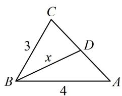

text_image

C
3
x
D
B
4
A

【变式2】在 $\triangle ABC$ 中，角 $A, B, C$ 的对边分别为 $a, b, c$ ，且 $a = 2$ ， $\frac{a^2 + c^2 - b^2}{4a\cos A} = \frac{\tan A}{\tan B}$ .

（1）若 $\triangle ABC$ 的面积 $S$ 满足 $S = 2\cos A$ ，求角 $A$   
(2) 若边 $BC$ 上的中线为 $AD$ , 求 $AD$ 长的最小值.

解：（1）（看到 $a^2 + c^2 - b^2$ ，想到余弦定理）由余弦定理， $b^2 = a^2 + c^2 - 2ac\cos B$ ，故 $a^2 + c^2 - b^2 = 2ac\cos B$ ，代入 $\frac{a^2 + c^2 - b^2}{4a\cos A} = \frac{\tan A}{\tan B}$ 可得 $\frac{2ac\cos B}{4a\cos A} = \frac{\tan A}{\tan B}$ ，所以 $\frac{c\cos B}{2\cos A} = \frac{\sin A\cos B}{\cos A\sin B}$ ①，（可约去 $\frac{\cos B}{\cos A}$ ，再角化边）

由题意， $A \neq \frac{\pi}{2}$ ， $B \neq \frac{\pi}{2}$ ，所以 $\cos A \neq 0$ ， $\cos B \neq 0$ ，故在式①中约掉 $\frac{\cos B}{\cos A}$ 可得 $\frac{c}{2} = \frac{\sin A}{\sin B}$ ，

所以 $\frac{c}{2} = \frac{a}{b}$ ，故 $bc = 2a = 4$ ，所以 $S = \frac{1}{2} bc\sin A = 2\sin A$

由题意， $S=2\cos A$ ，所以 $2\sin A=2\cos A$ ，故 $\tan A=1$ ，结合 $0<A<\pi$ 可得 $A=\frac{\pi}{4}$ .

(2) (已知了 $bc = 4$ , 故先把 $AD$ 用 $b$ 和 $c$ 表示, 可由 $\angle ADB$ 与 $\angle ADC$ 互补建立方程求 $AD$ )

由题意， $BD = CD = 1$ ，如图，在 $\triangle ABD$ 中， $\cos \angle ADB = \frac{AD^2 + BD^2 - AB^2}{2AD\cdot BD} = \frac{AD^2 + 1 - c^2}{2AD}$

在 $\triangle ADC$ 中， $\cos \angle ADC = \frac{AD^2 + CD^2 - AC^2}{2AD \cdot CD} = \frac{AD^2 + 1 - b^2}{2AD}$ ，

因为 $\angle ADB = \pi -\angle ADC$ ，所以 $\cos \angle ADB = \cos (\pi -\angle ADC) = -\cos \angle ADC$

从而 $\frac{AD^2 + 1 - c^2}{2AD} = -\frac{AD^2 + 1 - b^2}{2AD}$ ，故 $AD^2 = \frac{b^2 + c^2}{2} - 1$ ，由（1）知 $bc = 4$ ，

所以 $AD^2 = \frac{b^2 + c^2}{2} - 1 \geq bc - 1 = 3$ ，故 $AD \geq \sqrt{3}$ ，

当且仅当 $b = c = 2$ 时取等号，所以 $AD_{\mathrm{min}} = \sqrt{3}$

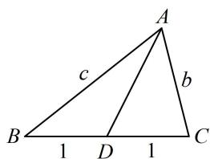

text_image

A
b
c
B 1 D 1 C

# 类型Ⅱ：比例线有关的问题

【例 2】在 $\triangle ABC$ 中， $b=2\sqrt{3}$ ，c=2，D 为边 BC 上一点，BD=3CD，若 $AD=\sqrt{7}$ ，则 a= \_\_\_\_.

解法1：如图，边长中仅有 $BD$ 和 $CD$ 未知，可利用 $\angle ADB$ 和 $\angle ADC$ 互补建立方程求解它们，

由题意，可设 $CD = x (x > 0)$ ，则 $BD = 3x$ ，由图可知， $\angle ADB = \pi - \angle ADC$ ，

所以 $\cos \angle ADB = \cos (\pi -\angle ADC) = -\cos \angle ADC$ ，故 $\frac{7 + 9x^2 - 4}{2\times\sqrt{7}\times 3x} = -\frac{7 + x^2 - 12}{2\times\sqrt{7}\times x}$ ，解得： $x = 1$ ，所以 $a = 4$

解法2: 给出了 $BD$ 和 $CD$ 的比值关系, 就能把 $\overrightarrow{AD}$ 用 $\overrightarrow{AB}$ 和 $\overrightarrow{AC}$ 表示,

因为 $BD = 3CD$ ，所以 $\overrightarrow{AD} = \overrightarrow{AB} +\overrightarrow{BD} = \overrightarrow{AB} +\frac{3}{4}\overrightarrow{BC} = \overrightarrow{AB} +\frac{3}{4} (\overrightarrow{AC} -\overrightarrow{AB}) = \frac{1}{4}\overrightarrow{AB} +\frac{3}{4}\overrightarrow{AC},$

由于 $|\overrightarrow{AD} |$ ， $|\overrightarrow{AB} |$ ， $|\overrightarrow{AC} |$ 均已知，故将上式平方可求得 $\overrightarrow{AB}$ 与 $\overrightarrow{AC}$ 的夹角 $A$

所以 $\left|\overrightarrow{AD}\right|^{2}=\frac{1}{16}\left|\overrightarrow{AB}\right|^{2}+\frac{9}{16}\left|\overrightarrow{AC}\right|^{2}+\frac{3}{8}\overrightarrow{AB}\cdot\overrightarrow{AC}$

故 $7 = \frac{1}{16} \times 4 + \frac{9}{16} \times 12 + \frac{3}{8} \times 2 \times 2\sqrt{3} \times \cos A$ ，解得： $\cos A = 0$ ，

所以 $A=90^{\circ}$ ，故 $a=\sqrt{b^{2}+c^{2}}=4$ 。

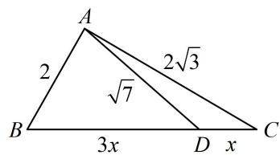

text_image

A
2
2√3
√7
B
3x
D x
C

答案: 4

【反思】当 $D$ 不再是中点, 而是三等分点、四等分点这些情况时, 双余弦、向量的方法仍然适用.

【变式】(2022·全国甲卷) 在 $\triangle ABC$ 中, 内角 $A, B, C$ 的对边分别为 $a, b, c$ , 点 $D$ 在边 $BC$ 上, $\angle ADB = 120^{\circ}$ , $AD = 2$ , $CD = 2BD$ , 当 $\frac{b}{c}$ 取得最小值时, $BD = \_$ .

解析：如图，若设 $BD = x$ ， $CD = 2x$ ，则可在 $\triangle ABD$ 和 $\triangle ACD$ 中用余弦定理分别建立 $c$ 和 $b$ 与 $x$ 的关系，从而将 $\frac{b}{c}$ 用 $x$ 表示，化为单变量函数求最值，

在 $\triangle ABD$ 中，由余弦定理， $c^2 = x^2 + 2^2 - 2x \cdot 2 \times \cos 120^\circ = x^2 + 2x + 4$

在 $\triangle ACD$ 中， $\angle ADC = 180^{\circ} - \angle ADB = 60^{\circ}$ ，由余弦定理， $b^{2} = (2x)^{2} + 2^{2} - 2 \times 2x \times 2 \times \cos 60^{\circ} = 4x^{2} - 4x + 4$ ，我们发现 $\frac{b^{2}}{c^{2}}$ 是一个“ $\frac{\text{二次函数}}{\text{二次函数}}$ ”的结构，可通过拆项化为“ $\frac{\text{一次函数}}{\text{二次函数}}$ ”的结构，

所以 $\frac{b^2}{c^2} = \frac{4x^2 - 4x + 4}{x^2 + 2x + 4} = \frac{4(x^2 + 2x + 4) - 12x - 12}{x^2 + 2x + 4} = 4 - \frac{12(x + 1)}{x^2 + 2x + 4} = 4 - \frac{12(x + 1)}{(x + 1)^2 + 3}$

$$
= 4 - \frac {1 2}{(x + 1) + \frac {3}{x + 1}} \geq 4 - \frac {1 2}{2 \sqrt {(x + 1) \cdot \frac {3}{x + 1}}} = 4 - 2 \sqrt {3},
$$

当且仅当 $x + 1 = \frac{3}{x + 1}$ 时取等号，此时 $x = \sqrt{3} - 1$

所以当 $\frac{b}{c}$ 取得最小值时， $BD = \sqrt{3} -1$

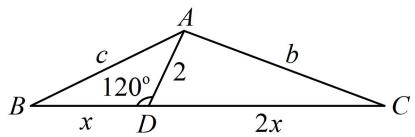

text_image

A
b
c
120°
2
B x D 2x C

答案: $\sqrt{3} - 1$

【反思】比例线问题常用双余弦、向量两种方法求解, 但具体选哪种, 还需看实际情况. 例如本题若将 $\overrightarrow{AD}$ 用 $\overrightarrow{AB}$ 和 $\overrightarrow{AC}$ 表示, 则 $\angle ADB = 120^{\circ}$ 这条件就不方便使用了, 故本题应选择双余弦的方法.

# 类型III：角平分线有关的问题

【例 3】在 $\triangle ABC$ 中，角 A, B, C 的对边分别为 a, b, c，已知 b = 2, c = 4, $\angle BAC = 120^{\circ}$ ， $\angle BAC$ 的角平分线交边 BC 于点 D，则 AD = \_\_\_\_.

解析：要求 $AD$ ，可用小三角形面积之和等于大三角形面积来建立关于 $AD$ 的方程，

因为 $\angle BAC = 120^{\circ}$ , $AD$ 是 $\angle BAC$ 的平分线, 所以 $\angle CAD = \angle BAD = 60^{\circ}$ ,

又 $S_{\triangle ACD} + S_{\triangle ABD} = S_{\triangle ABC}$ ，所以 $\frac{1}{2}\times 2\times AD\times \sin 60^{\circ} + \frac{1}{2}\times 4\times AD\times \sin 60^{\circ}$

$= \frac{1}{2}\times 2\times 4\times \sin 120^{\circ}$ ，解得： $AD = \frac{4}{3}$

答案： $\frac{4}{3}$

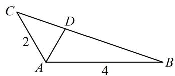

text_image

C
2
D
A
4
B

【反思】利用小三角形面积之和等于大三角形面积建立方程的方法可称为“等面积法”，常解决已知或求顶角的平分线的相关问题.

【变式1】在 $\triangle ABC$ 中，角 $A, B, C$ 的对边分别为 $a, b, c$ ，已知 $b=2, c=4$ ， $\angle BAC$ 的角平分线交边 $BC$ 于点 $D$ ，且 $AD=2$ ，则 $\cos\angle BAC=$ \_\_\_\_.

解析：如图， $AB$ ， $AC$ ， $AD$ 已知， $AD$ 为角平分线，可用“等面积法”建立 $\alpha$ 的方程，两倍即为 $\angle BAC$ 由题意，可设 $\angle CAD = \angle BAD = \alpha$ ，因为 $S_{\triangle ACD} + S_{\triangle ABD} = S_{\triangle ABC}$

所以 $\frac{1}{2} \times 2 \times 2 \times \sin \alpha + \frac{1}{2} \times 2 \times 4 \times \sin \alpha = \frac{1}{2} \times 2 \times 4 \times \sin 2\alpha$

整理得： $3\sin\alpha=2\sin2\alpha$ ，所以 $3\sin\alpha=4\sin\alpha\cos\alpha$ ①，

显然 $\alpha$ 为锐角，从而 $\sin \alpha > 0$ ，故在式①中约掉 $\sin \alpha$ 可得 $\cos \alpha = \frac{3}{4}$

所以 $\cos \angle BAC = \cos 2\alpha = 2\cos^2\alpha -1 = \frac{1}{8}.$

答案: $\frac{1}{8}$

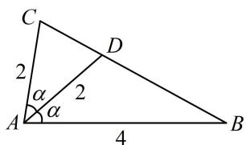

text_image

C
2
α
A
α
2
D
4
B

【变式2】已知 $\triangle ABC$ 的内角 $A, B, C$ 的对边分别为 $a, b, c$ , 若 $A=\frac{2\pi}{3}$ , 点 $D$ 在 $BC$ 上, 且 $AD$ 平分角 $A, AD=1$ , 则 $a$ 的最小值为\_\_\_\_.

解析：已知 $A$ ，要求 $a$ 的最小值，可先用余弦定理把 $a$ 用 $b$ 和 $c$ 表示，

由余弦定理， $a^2 = b^2 +c^2 -2bc\cos A = b^2 +c^2 +bc$ ①，

表示的结果有 $b$ 和 $c$ 两个变量，要求最值需先找 $b, c$ 的关系，可用等面积法建立方程，

如图，因为 $A = \frac{2\pi}{3}$ ，且 $AD$ 是角 $A$ 的平分线，所以 $\angle CAD = \angle BAD = \frac{\pi}{3}$

由图可知， $S_{\triangle ACD} + S_{\triangle ABD} = S_{\triangle ABC}$ ，所以 $\frac{1}{2} b\sin \frac{\pi}{3} +\frac{1}{2} c\sin \frac{\pi}{3} = \frac{1}{2} bc\sin \frac{2\pi}{3}$ ，整理得： $b + c = bc$ ②，

由式②想到将式①配方，调整为 $b + c$ 和 $bc$ 的形式，由式①可得 $a^2 = b^2 + c^2 + bc = (b + c)^2 - bc$

将式②代入可得 $a^2 = b^2c^2 - bc$ ③，下面先求 $bc$ 的范围，可由式②来分析，

由②可得 $bc = b + c \geq 2\sqrt{bc}$ ，所以 $bc \geq 4$ ，

当且仅当 $b = c = 2$ 时取等号，由式③知 $a^2 = \left(bc - \frac{1}{2}\right)^2 -\frac{1}{4}$

所以当 $bc = 4$ 时， $a^2$ 取得最小值12，故 $a$ 的最小值为 $2\sqrt{3}$ .

答案： $2\sqrt{3}$

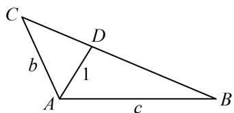

text_image

C
b
1
A
c
B
D

【变式3】在 $\triangle ABC$ 中，角 $A, B, C$ 的对边分别为 $a, b, c$ ，已知 $A = \frac{2\pi}{3}$ ，若 $D$ 为边 $BC$ 上一点，且 $DA \perp BA$ ， $BD = 4DC$ ，求 $\cos C$ 。

解法1: (如图, 只要找到 $a, b, c$ 的比例关系, 就能用余弦定理推论求出 $\cos C$ , 故考虑建立两个关于 $a, b, c$ 的方程, 怎么建呢? 以一方面, 已知 $A$ , 可用余弦定理建立一个方程)

由余弦定理， $a^2 = b^2 +c^2 -2bc\cos A = b^2 +c^2 +bc$ ①，

(观察发现由 BD=4DC 可求得 $\frac{S_{\triangle ABD}}{S_{\triangle ACD}}$ ，而这一面积比也能用 b 和 c 表示，故由此可建立第二个方程)

如图，因为 $A = \frac{2\pi}{3}$ ， $DA\bot BA$ ，所以 $\angle BAD = \frac{\pi}{2}$ ， $\angle CAD = \frac{\pi}{6}$

因为 $\frac{S_{\triangle ABD}}{S_{\triangle ACD}} = \frac{\frac{1}{2}c\cdot AD}{\frac{1}{2}b\cdot AD\cdot \sin\frac{\pi}{6}} = \frac{\frac{1}{2}BD\cdot h}{\frac{1}{2}DC\cdot h}$ （其中 $h$ 为 $\triangle ABC$ 的 $BC$ 边上的高），所以 $\frac{2c}{b} = \frac{BD}{DC} = 4$ ，故 $c = 2b$

代入式①可得 $a^2 = 7b^2$ ，所以 $a = \sqrt{7} b$ ，故 $\cos C = \frac{a^2 + b^2 - c^2}{2ab} = \frac{7b^2 + b^2 - 4b^2}{2\sqrt{7}b^2} = \frac{2\sqrt{7}}{7}$

解法2: (按解法1得到式①后, 也可抓住 $\sin \angle ADB = \sin \angle ADC$ 来找 $b$ 和 $c$ 的关系, 下面先在 $\triangle ACD$ 中计算 $\sin \angle ADC$ ) 设 $DC = x$ , 则 $BD = 4x$ , 在 $\triangle ACD$ 中, 由正弦定理, $\frac{DC}{\sin \angle CAD} = \frac{AC}{\sin \angle ADC}$ ②,

因为 $A = \frac{2\pi}{3}$ ， $DA\bot BA$ ，所以 $\angle BAD = \frac{\pi}{2}$ ， $\angle CAD = \frac{\pi}{6}$

代入式②可得 $\sin \angle ADC = \frac{AC \cdot \sin \angle CAD}{DC} = \frac{b\sin\frac{\pi}{6}}{x} = \frac{b}{2x}$ ，（接下来在 $\triangle ABD$ 中计算 $\sin \angle ADB$ ）

在 $\triangle ABD$ 中， $\sin \angle ADB = \frac{AB}{BD} = \frac{c}{4x}$ ，

因为 $\angle ADB = \pi -\angle ADC$ ，所以 $\sin \angle ADB = \sin (\pi -\angle ADC) = \sin \angle ADC$

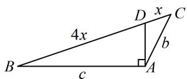

text_image

4x
b
c
A
D x C
B

从而 $\frac{b}{2x} = \frac{c}{4x}$ ，故 $c = 2b$ ，接下来同解法1.

【反思】AD不再是角平分线，但解法1的思路源于角平分线性质定理的推导过程，利用面积比得到边长比；解法2则抓住 $\angle ADB$ 和 $\angle ADC$ 互补，构造方程，这也是本节题型常用的建立等量关系的方法.

# 强化训练

1. (★★)

在 $\triangle ABC$ 中， $a = 4$ ， $b = 3\sqrt{3}$ ， $c = 5$ ，则 $BC$ 边上的中线 $AD$ 的长为

2. (2022·福建厦门模拟·★★★)

在 $\triangle ABC$ 中，内角 $A, B, C$ 的对边分别为 $a, b, c$ ，若 $b\sin C + a\sin A = b\sin B + c\sin C$ ，则内角 $A =$ \_\_\_\_；若 $D$ 是边 $BC$ 的中点， $c = 2$ ， $AD = \sqrt{13}$ ，则 $a =$ \_\_\_\_.

3. (★★★)

在 $\triangle ABC$ 中， $b = 4$ ， $c = 2$ ，则 $BC$ 边上的中线 $AD$ 的长的取值范围是

4. (★★☆)

在 $\triangle ABC$ 中，内角 $A, B, C$ 的对边分别为 $a, b, c$ ，已知 $b = 4$ ， $c = \sqrt{10}$ ， $D$ 为 $BC$ 边上一点， $CD = 2BD$ ，若 $AD = 2$ ，则 $a =$ \_\_\_\_.

5. (2023·全国甲卷·★★☆)

$\triangle ABC$ 中， $\angle BAC = 60^{\circ}$ ， $AB = 2$ ， $BC = \sqrt{6}$ ， $AD$ 平分 $\angle BAC$ 交 $BC$ 于点 $D$ ，则 $AD = \_$ .

6.（2023·江苏省苏锡常镇四市一模·★★★）

在 $\triangle ABC$ 中， $\angle BAC = \frac{2\pi}{3}$ ， $\angle BAC$ 的角平分线 $AD$ 交 $BC$ 于点 $D$ ， $\triangle ABD$ 的面积是 $\triangle ADC$ 面积的 3 倍，则 $\tan B = (\quad)$

A. $\frac{\sqrt{3}}{7}$

B. $\frac{\sqrt{3}}{5}$

C. $\frac{3\sqrt{3}}{5}$

D. $\frac{6 - \sqrt{3}}{33}$

7. (2021·新高考Ⅰ卷·★★★)

记 $\triangle ABC$ 的内角 $A, B, C$ 的对边分别为 $a, b, c$ . 已知 $b^{2} = ac$ ，点 $D$ 在边 $AC$ 上， $BD\sin \angle ABC = a\sin C$ .

（1）证明： $BD = b$

(2) 若 AD = 2DC，求 $\cos \angle ABC$ .

8. (2024·福建漳州一模·★★★☆)

在 $\triangle ABC$ 中， $A, B, C$ 的对边分别为 $a, b, c$ ，且满足 \_\_\_\_.

请在① $(a - b)\sin (A + C) = (a - c)(\sin A + \sin C)$

② $\sin \left(\frac{\pi}{6} - C\right) \cos \left(C + \frac{\pi}{3}\right) = \frac{1}{4}$ ，这两个中任选一个作为条件，补充在横线上，并解答问题.

(1) 求 C;

(2) 若 $\triangle ABC$ 的面积为 $5\sqrt{3}$ , $D$ 为 $AC$ 的中点, 求 $BD$ 的最小值.

9. (2022·湖南岳阳模拟·★★★)

在 $\triangle ABC$ 中，角 $A, B, C$ 的对边分别为 $a, b, c$ ，且 $\sqrt{3} a - 2b\sin A = 0$ .

(1) 求 B;   
（2）若 B 为钝角，且角 B 的平分线与 AC 交于点 D， $BD = \sqrt{2}$ ，求 $\triangle ABC$ 的面积的最小值.