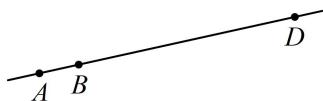

# 第1节 向量的基本运算（★★）

# 内容提要

本节归纳与向量共线、向量数量积的定义、向量的模有关的小题，下面先梳理一些会用到的知识点.

1. 共线向量定理: 对于平面上任意两个向量 $a$ 和 $b (b \neq 0)$ , $a \parallel b \Leftrightarrow$ 存在唯一一个实数 $\lambda$ , 使得 $a = \lambda b$ , 且当 $\lambda > 0$ 时, $a$ 和 $b$ 同向, 当 $\lambda < 0$ 时, $a$ 和 $b$ 反向.  
2. 数量积: 设向量 a 和 b 的夹角为 $\theta$ ，则 $a \cdot b = |a| \cdot |b| \cdot \cos \theta$ 。特别地， $a^{2} = a \cdot a = |a| \cdot |a| \cdot \cos 0^{\circ} = |a|^{2}$ ，所以涉及模的问题，常考虑将模平方，与向量的数量积联系起来。  
3. 夹角余弦公式：设 $\theta$ 是非零向量 $a, b$ 的夹角，则 $\cos \theta = \frac{a \cdot b}{|a| \cdot |b|}$ . 向量问题中涉及角度，常用该公式.

# 类型 I：共线向量定理的应用

【例 1】已知向量 a 和 b 不共线，且 $\lambda a + b$ 与 $a + (2\lambda - 1)b$ 的方向相反，则实数 $\lambda$ 的值为（）

A. 1 B. $-\frac{1}{2}$ C. 1或 $-\frac{1}{2}$ D. -1或 $-\frac{1}{2}$

解析：方向相反属于共线的情形，故可考虑用共线向量定理处理，

因为 $\lambda a + b$ 和 $a + (2\lambda - 1)b$ 方向相反，所以存在 $\mu < 0$ ，使得 $\lambda a + b = \mu[a + (2\lambda - 1)b]$ ，

整理得： $\lambda \pmb {a} + \pmb {b} = \mu \pmb {a} + \mu (2\lambda -1)\pmb {b}$ ，所以 $\left\{ \begin{array}{ll}\lambda = \mu \\ 1 = \mu (2\lambda -1) \end{array} \right.$ ，解得： $\lambda = -\frac{1}{2}$ 或1，又 $\lambda = \mu < 0$ ，所以 $\lambda = -\frac{1}{2}$

答案: B

【变式】设 $\vec{e}_1$ ， $\vec{e}_2$ 是两个不共线的向量，已知 $\overrightarrow{AB} = \vec{e}_1 + k\vec{e}_2$ ， $\overrightarrow{BC} = 5\vec{e}_1 + 4\vec{e}_2$ ， $\overrightarrow{DC} = -\vec{e}_1 - 2\vec{e}_2$ ，且 $A$ ， $B$ ， $D$ 三点共线，则实数 $k =$ \_\_\_\_.

解析： $A, B, D$ 三点共线可用向量共线翻译，即存在 $\lambda$ 使 $\overrightarrow{AD} = \lambda \overrightarrow{AB}$ ，故将 $\overrightarrow{AD}$ 和 $\overrightarrow{AB}$ 用 $\vec{e}_1, \vec{e}_2$ 表示，

由题意， $\overrightarrow{AD} = \overrightarrow{AB} +\overrightarrow{BC} +\overrightarrow{CD} = \overrightarrow{AB} +\overrightarrow{BC} -\overrightarrow{DC} = \vec{e}_1 + k\vec{e}_2 + 5\vec{e}_1 + 4\vec{e}_2 - (-\vec{e}_1 - 2\vec{e}_2) = 7\vec{e}_1 + (k + 6)\vec{e}_2,$

如图，因为 $A, B, D$ 三点共线，所以 $\overrightarrow{AB}$ 与 $\overrightarrow{AD}$ 共线，故存在实数 $\lambda$ 使 $\overrightarrow{AD} = \lambda \overrightarrow{AB}$ ，

即 $7\vec{e}_1 + (k + 6)\vec{e}_2 = \lambda \vec{e}_1 + \lambda k\vec{e}_2$ ，所以 $\left\{ \begin{array}{l}7 = \lambda \\ k + 6 = \lambda k \end{array} \right.$ ，解得： $k = 1$

答案: 1

# 类型 II：模的常见处理方法

【例 2】已知 a, b 为单位向量， $|a-b|=1$ ，则 $|a-3b|=$ \_\_\_\_.

解析：看到模，先试试平方，由题意， $|a| = 1$ ， $|b| = 1$ ， $|a - b| = 1$ ，所以 $\left|\boldsymbol {a} - \boldsymbol {b}\right|^2 = \boldsymbol {a}^2 +\boldsymbol {b}^2 -2\boldsymbol {a}\cdot \boldsymbol {b} = 2 - 2\boldsymbol {a}\cdot \boldsymbol {b} = 1$ 从而 $\pmb {a}\cdot \pmb {b} = \frac{1}{2}$ ，故 $\left|\boldsymbol {a} - 3\boldsymbol {b}\right|^2 = \boldsymbol {a}^2 +9\boldsymbol {b}^2 -6\boldsymbol {a}\cdot \boldsymbol {b} = 10 - 6\times \frac{1}{2} = 7$ ，所以 $|\boldsymbol {a} - 3\boldsymbol {b}| = \sqrt{7}$

答案: $\sqrt{7}$

【变式】平面向量 a，b 满足 $\left|a\right|=\left|b\right|=1$ ，对任意的实数 t， $\left|\boldsymbol{a}-\frac{1}{2}\boldsymbol{b}\right|\leq\left|\boldsymbol{a}+tb\right|$ 恒成立，则 a 与 b 的夹角为 \_\_\_\_； $\left|b-ta\right|$ 的最小值为 \_\_\_\_.

解析：给了模的不等式，先试试平方去掉模，看能得到什么，设 $a$ 与 $b$ 的夹角为 $\theta$

因为 $\left|\pmb {a} - \frac{1}{2}\pmb {b}\right|\leq \left|\pmb {a} + tb\right|$ 恒成立，所以 $\left|\pmb {a} - \frac{1}{2}\pmb {b}\right|^2\leq \left|\pmb {a} + tb\right|^2$ ，故 $a^2 +\frac{1}{4} b^2 -a\cdot b\leq a^2 +t^2 b^2 +2ta\cdot b$

结合 $|\pmb{a}| = |\pmb{b}| = 1$ 可得 $\frac{5}{4} -\cos \theta \leq 1 + t^2 +2t\cos \theta$ ，整理得： $t^2 +(2\cos \theta)t + \cos \theta -\frac{1}{4}\geq 0$ ①，

此为关于 $t$ 的一元二次不等式恒成立问题，考虑判别式即可，不等式①应有 $\Delta = 4\cos^2\theta - 4\cos \theta + 1 \leq 0$ 即 $(2\cos \theta - 1)^2 \leq 0$ ，所以只能 $2\cos \theta - 1 = 0$ ，故 $\cos \theta = \frac{1}{2}$ ，结合 $0 \leq \theta \leq \pi$ 可得 $\theta = \frac{\pi}{3}$ ；

由条件得到了 $\theta$ ，再求 $|b - ta|$ 的最小值，包含模优先考虑平方，发现可化为关于 $t$ 的函数，

$$
\left| \boldsymbol {b} - t \boldsymbol {a} \right| ^ {2} = \boldsymbol {b} ^ {2} + t ^ {2} \boldsymbol {a} ^ {2} - 2 t \boldsymbol {a} \cdot \boldsymbol {b} = 1 + t ^ {2} - 2 t \left| \boldsymbol {a} \right| \cdot \left| \boldsymbol {b} \right| \cdot \cos \theta = t ^ {2} - t + 1 = \left(t - \frac {1}{2}\right) ^ {2} + \frac {3}{4},
$$

所以当 $t = \frac{1}{2}$ 时， $\left|\pmb {b} - t\pmb {a}\right|^2$ 取得最小值 $\frac{3}{4}$ ，故 $\left|\pmb {b} - t\pmb {a}\right|_{\min} = \frac{\sqrt{3}}{2}$

答案： $\frac{\pi}{3}$ ； $\frac{\sqrt{3}}{2}$

【总结】涉及模的问题，常考虑（但不是一定）将模平方，因为这样可以去掉模，以及沟通数量积、夹角.

# 类型III：数量积定义式的应用

【例 3】(2021·浙江卷) 已知非零向量 a, b, c，则 “ $a \cdot c = b \cdot c$ ” 是 “a = b” 的（）

A. 充分不必要条件

B. 必要不充分条件

C. 充要条件

D. 既不充分也不必要条件

解析：先看充分性，可将两个数量积用定义表示出来再分析，

设 $a, b$ 与 $c$ 的夹角分别为 $\alpha, \beta$ ，则 $a \cdot c = b \cdot c$ 即为 $|a| \cdot |c| \cdot \cos \alpha = |b| \cdot |c| \cdot \cos \beta$ ，所以 $|a| \cdot \cos \alpha = |b| \cdot \cos \beta$ ，不能得出 $a = b$ ，故充分性不成立；而当 $a = b$ 时，满足 $a \cdot c = b \cdot c$ ，所以必要性成立，故选 B.

答案: B

【反思】向量的数量积的运算满足分配律，但不能对向量约分，即不能在 $a \cdot c = b \cdot c$ 两端把 $c$ 约掉.

【例 4】已知 $\left|a\right|=4,\left|b\right|=2,a$ 与 b 的夹角为 $60^{\circ}$ ，若 c=2a-kb， $d=a+kb$ ，且 $c\perp d$ ，则 k= \_\_\_\_.

解析： $c\perp d$ 可用数量积翻译，由题意， $\pmb {c}\cdot \pmb {d} = (2\pmb {a} - kb)\cdot (\pmb {a} + kb) = 2\pmb{a}^2 +2ka\cdot \pmb {b} - ka\cdot \pmb {b} - k^2\pmb{b}^2 = 0$ ①

只需求 $a^2$ ， $b^{2}$ ， $a\cdot b$ ，而 $\pmb{a}$ 和 $\pmb{b}$ 既有长度，又有夹角，故都能算，由题意， $a^2 = |a|^2 = 16$ ， $b^{2} = |b|^{2} = 4$ ， $a\cdot b = |a|\cdot |b|\cdot \cos \theta = 4\times 2\times \cos 60^{\circ} = 4$ ，代入①整理得： $-4k^{2} + 4k + 32 = 0$ ，解得： $k = \frac{1\pm\sqrt{33}}{2}$

答案： $\frac{1\pm\sqrt{33}}{2}$

【反思】设 $a, b$ 为非零向量，则 $a \perp b \Leftrightarrow a \cdot b = 0$ .

【例 5】(2021·新高考Ⅱ卷) 已知向量 $a + b + c = 0$ ， $|a| = 1$ ， $|b| = |c| = 2$ ，则 $a \cdot b + b \cdot c + c \cdot a =$ \_\_\_\_ .

解法1：涉及三个向量的关系，且已知模长，考虑消去一个，常用移项再平方的方法，

由 $a + b + c = 0$ 可得 $c = -a - b$ ，所以 $c^2 = (-a - b)^2 = a^2 +b^2 +2a\cdot b$

又 $|a|=1$ ， $|b|=|c|=2$ ，所以 $4=1+4+2a\cdot b$ ，故 $a\cdot b=-\frac{1}{2}$ ，

同理，将 $\pmb{b} = -\pmb{a} - \pmb{c}$ 和 $\pmb{a} = -\pmb{b} - \pmb{c}$ 分别平方可得 $\pmb{a} \cdot \pmb{c} = -\frac{1}{2}$ ， $\pmb{b} \cdot \pmb{c} = -\frac{7}{2}$ ，故 $\pmb{a} \cdot \pmb{b} + \pmb{b} \cdot \pmb{c} + \pmb{c} \cdot \pmb{a} = -\frac{1}{2} - \frac{1}{2} - \frac{7}{2} = -\frac{9}{2}$ .

解法2：观察发现将 $a + b + c = 0$ 平方，就会产生目标式 $a \cdot b + b \cdot c + c \cdot a$ ，故也可试试直接平方，

$$
\boldsymbol {a} + \boldsymbol {b} + \boldsymbol {c} = \mathbf {0} \Rightarrow (\boldsymbol {a} + \boldsymbol {b} + \boldsymbol {c}) ^ {2} = | \boldsymbol {a} | ^ {2} + | \boldsymbol {b} | ^ {2} + | \boldsymbol {c} | ^ {2} + 2 (\boldsymbol {a} \cdot \boldsymbol {b} + \boldsymbol {b} \cdot \boldsymbol {c} + \boldsymbol {c} \cdot \boldsymbol {a}) = 9 + 2 (\boldsymbol {a} \cdot \boldsymbol {b} + \boldsymbol {b} \cdot \boldsymbol {c} + \boldsymbol {c} \cdot \boldsymbol {a}) = 0,
$$

所以 $a \cdot b + b \cdot c + c \cdot a = -\frac{9}{2}$ .

答案： $-\frac{9}{2}$

【反思】给出三个向量的线性方程，可考虑移项再平方（解法1），消去一个并产生另外两向量的数量积.

【例 6】若两个非零向量 a，b 满足 $\left|a+b\right|=\left|a-b\right|=2\left|a\right|$ ，则 a-b 与 a 的夹角为 \_\_\_\_.

解析：向量问题中涉及夹角，一般考虑夹角余弦公式，先算它们的数量积，看看还差什么，

不妨设 $|\pmb {a} + \pmb {b}| = |\pmb {a} - \pmb {b}| = 2|\pmb {a}| = 2k(k > 0)$ ，则 $|\pmb {a}| = k$ ，所以 $(\pmb {a} - \pmb {b})\cdot \pmb {a} = \pmb{a}^2 -\pmb {a}\cdot \pmb {b} = k^2 -\pmb {a}\cdot \pmb{b}$ ①，

故需计算 $a \cdot b$ ，可把 $|a + b| = |a - b|$ 平方，因为 $|a + b| = |a - b|$ ，所以 $|a + b|^2 = |a - b|^2$

从而 $a^2 + b^2 + 2a \cdot b = a^2 + b^2 - 2a \cdot b$ ，故 $a \cdot b = 0$ ，代入①得： $(a - b) \cdot a = k^2$

设 $\pmb{a} - \pmb{b}$ 与 $\pmb{a}$ 的夹角为 $\theta (0\leq \theta \leq \pi)$ ，则 $\cos \theta = \frac{(\pmb {a} - \pmb{b})\cdot\pmb{a}}{|\pmb {a} - \pmb{b}|\cdot|\pmb{a}|} = \frac{k^2}{2k\cdot k} = \frac{1}{2}$ ，结合 $0\leq \theta \leq \pi$ 可得 $\theta = \frac{\pi}{3}$

答案： $\frac{\pi}{3}$

【反思】夹角余弦公式 $\cos \theta = \frac{a \cdot b}{|a| \cdot |b|}$ 可以很好地沟通角度与向量，所以在涉及角度的向量问题中常考虑该公式.

# 强化训练

1. (★) (多选)

设 $a, b$ 是两个向量，则下列命题正确的是（）

A. 若 $a \parallel b$ ，则存在唯一实数 $\lambda$ ，使 $a = \lambda b$

B. 若向量 $a, b$ 所在的直线是异面直线，则 $a, b$ 一定不共面

C. 若 $a$ 是非零向量，则 $\frac{a}{|a|}$ 是与 $a$ 同向的单位向量

D. 若 $a, b$ 都是非零向量，则 $\frac{a}{|a|} + \frac{b}{|b|} = 0$ ”是“ $a$ 与 $b$ 共线”的充分不必要条件

2. (2024·浙江模拟·★)

已知向量 $\vec{e}_1$ ， $\vec{e}_2$ 是平面上两个不共线的单位向量，且 $\overrightarrow{AB} = \vec{e}_1 + 2\vec{e}_2$ ， $\overrightarrow{BC} = -3\vec{e}_1 + 2\vec{e}_2$ ， $\overrightarrow{DA} = 3\vec{e}_1 - 6\vec{e}_2$ ，则（）

A. $A, B, C$ 三点共线  
B. $A, B, D$ 三点共线  
C. $A, C, D$ 三点共线  
D. B, C, D 三点共线

3. (2023·新课标Ⅱ卷·★★)

已知向量 a，b 满足 $\left|a-b\right|=\sqrt{3}$ ， $\left|a+b\right|=\left|2a-b\right|$ ，则 $\left|b\right|=$ \_\_\_\_.

4. (★★☆) (多选)

下列命题正确的是（）

A. $\left\| \boldsymbol {a}\right| - \left|\boldsymbol {b}\right|\leq \left|\boldsymbol {a} + \boldsymbol {b}\right|\leq \left|\boldsymbol {a}\right| + \left|\boldsymbol {b}\right|$   
B. 若 $a, b$ 为非零向量，且 $\vert a + b \vert = \vert a - b\|$ ，则 $a \perp b$   
C. $|\pmb{a}| - |\pmb{b}| = |\pmb{a} + \pmb{b}|$ 是 $\pmb{a}$ , $\pmb{b}$ 共线的充要条件  
D. 若 $a, b$ 为非零向量，且 $\|a| - |b| = |a - b|$ ，则 $a$ 与 $b$ 同向

5. (2023·广东深圳模拟·★★)

已知向量 $a$ ， $b$ 满足 $a \perp (a + 4b)$ ， $b \perp (a + 3b)$ ，则向量 $a$ ， $b$ 的夹角为（）

A. $\frac{\pi}{6}$   
C. $\frac{2\pi}{3}$

B. $\frac{\pi}{3}$

D. $\frac{5 \pi}{6}$

6. (★★☆)

若向量 a, b, c 满足 $3a + 4b + 5c = 0$ ， $|a| = |b| = |c| = 1$ ，则 $a \cdot (b + c) =$ \_\_\_\_.

7. (2024·江苏南通模拟·★★★)

已知向量 $\vec{a} \neq \vec{e}$ ， $|\vec{e}| = 1$ ，对任意实数 $t$ ，恒有

$\left|\vec{a} - t\vec{e}\right| \geq \left|\vec{a} - \vec{e}\right|$ ，则（）

A. $\vec{a} \perp \vec{e}$

B. $\vec{e} \perp (\vec{a} - \vec{e})$

C. $\vec{a} \perp (\vec{a} - \vec{e})$

D. $(\vec{a} +\vec{e})\perp (\vec{a} -\vec{e})$

8. (2022·天津卷·★★★☆)

在 $\triangle ABC$ 中， $\overrightarrow{CA} = a$ ， $\overrightarrow{CB} = b$ ， $D$ 是 $AC$ 中点， $\overrightarrow{CB} = 2\overrightarrow{BE}$ ，试用 $a$ ， $b$ 表示 $\overrightarrow{DE}$ 为 \_\_\_\_；若 $\overrightarrow{AB} \perp \overrightarrow{DE}$ ，则 $\angle ACB$ 的最大值为 \_\_\_\_.