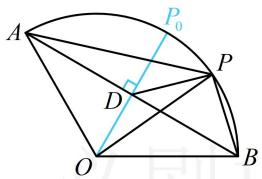
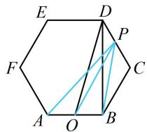
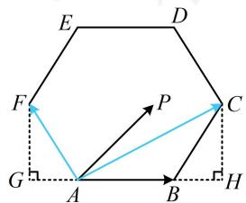
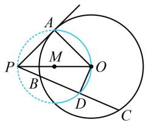
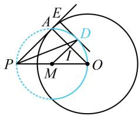
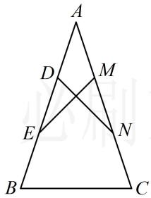
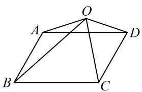
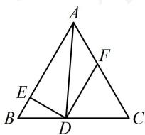

# 强化训练

# 1. (★★★)

如图，扇形 AOB 的圆心角为 $120^{\circ}$ ，半径为 2，P 是圆弧 AB 上的动点，则 $\overrightarrow{PA} \cdot \overrightarrow{PB}$ 的最小值是 \_\_\_\_.

text_image

A
P
O
B

1. -2

解析： $\overrightarrow{PA}$ ， $\overrightarrow{PB}$ 共起点，且底边长不变，故可用极化恒等式计算 $\overrightarrow{PA} \cdot \overrightarrow{PB}$ ，如图，设 $AB$ 中点为 $D$ ，由极化恒等式，

$$
\overrightarrow {P A} \cdot \overrightarrow {P B} = | P D | ^ {2} - | A D | ^ {2},
$$

而 $|AD| = |OA|\sin \angle AOD = 2\sin 60^{\circ} = \sqrt{3}$ ，所以 $\overrightarrow{PA} \cdot \overrightarrow{PB} =$

$\left|PD\right|^2 -\left|AD\right|^2 = \left|PD\right|^2 -3$ ①，故只需求 $\left|PD\right|$ 的最小值，

由三角形两边之差小于第三边可知， $|PD|\geq |OP| - |OD| =$

$\left|OP_0\right| - \left|OD\right| = \left|P_0D\right|$ ，故当 $P$ 与图中 $P_{0}$ 重合时， $\left|PD\right|$ 最小，

$$
\text {且} \left| P D \right| _ {\min} = \left| P _ {0} D \right| = \left| O P _ {0} \right| - \left| O D \right| = 2 - \left| O A \right| \cos \angle A O D
$$

$= 2 - 2\cos 60^{\circ} = 1$ ，代入①得 $\overrightarrow{PA}\cdot \overrightarrow{PB}$ 的最小值是-2.

text_image

A
P₀
D
P
O
B

# 2. (2024·湖北武汉四调·★★★)

点 $P$ 是边长为 1 的正六边形 $A B C D E F$ 边上的动点, 则 $\overrightarrow {P A} \cdot \overrightarrow {P B}$ 的最大值为 ( )

A. 2

B. $\frac{11}{4}$

C. 3

D. $\frac{13}{4}$

2. C

解析：注意到 $\overrightarrow{PA}$ 与 $\overrightarrow{PB}$ 共起点，且底边长 $AB$ 已知，故可考虑用极化恒等式来求 $\overrightarrow{PA} \cdot \overrightarrow{PB}$ ，再分析最值，

设 $AB$ 中点为 $O$ ，则由极化恒等式， $\overrightarrow{PA}\cdot \overrightarrow{PB} = OP^2 -OA^2$

$= OP^{2} - \frac{1}{4}$ ①，故只需求 $OP$ 的最大值，可结合图形来看，

如图，当 $P$ 与 $D$ 或 $E$ 重合时， $OP$ 最大，

在 $\triangle BCD$ 中， $BC = CD = 1$ ， $\angle BCD = 120^{\circ}$

由余弦定理， $BD^{2} = BC^{2} + CD^{2} - 2BC\cdot CD\cdot \cos \angle BCD$

$$
= 1 ^ {2} + 1 ^ {2} - 2 \times 1 \times 1 \times \cos 1 2 0 ^ {\circ} = 3,
$$

由图形的对称性， $BD\bot OB$ ，所以 $OD = \sqrt{OB^2 + BD^2}$

$= \sqrt{\left(\frac{1}{2}\right)^2 + 3} = \frac{\sqrt{13}}{2}$ ，故 $OP_{\mathrm{max}} = \frac{\sqrt{13}}{2}$

代入①得 $\overrightarrow{PA} \cdot \overrightarrow{PB}$ 的最大值为 $\left(\frac{\sqrt{13}}{2}\right)^2 - \frac{1}{4} = 3$ .

text_image

Geometric diagram of a hexagon with labeled vertices and internal points, showing diagonals and segments.

3. (2020·新高考Ⅰ卷·★★★)

已知 $P$ 是边长为 2 的正六边形 $A B C D E F$ 内一点, 则 $\overrightarrow{AP} \cdot \overrightarrow{AB}$ 的取值范围是 ( )

A. $(-2,6)$

B. $(-6, 2)$

C. $(-2,4)$

D. $(-4,6)$

3. A

解析： $\overrightarrow{AB}$ 不动， $\overrightarrow{AP}$ 在 $\overrightarrow{AB}$ 上的投影向量也容易分析，故用投影法，如图，作 $CH\perp AB$ 于 $H$ ， $FG\perp AB$ 于 $G$ 为了便于阐述，先假设 $P$ 能取边界，则当 $P$ 与 $C$ 重合时，

$\overrightarrow{AP}$ 在 $\overrightarrow{AB}$ 上的投影向量为 $\overrightarrow{AH}$ ，

此时投影向量与 $\overrightarrow{AB}$ 同向且长度最大，

$$
\text {且} \left| \overrightarrow {A H} \right| = \left| \overrightarrow {A B} \right| + \left| \overrightarrow {B H} \right| = 2 + \left| \overrightarrow {B C} \right| \cos \angle C B H = 2 + 2 \cos 6 0 ^ {\circ} = 3,
$$

$$
\text {故} (\overrightarrow {A P} \cdot \overrightarrow {A B}) _ {\max} = \overrightarrow {A B} \cdot \overrightarrow {A H} = \left| \overrightarrow {A B} \right| \cdot \left| \overrightarrow {A H} \right| \cdot \cos 0 ^ {\circ} = 2 \times 3 \times 1 = 6 ;
$$

当 P 与 F 重合时， $\overrightarrow{AP}$ 在 $\overrightarrow{AB}$ 上的投影向量为 $\overrightarrow{AG}$ ，

此时投影向量与 $\overrightarrow{AB}$ 反向且长度最大，

$$
\text {且} \left| \overrightarrow {A G} \right| = \left| \overrightarrow {A F} \right| \cos \angle F A G = 2 \cos 6 0 ^ {\circ} = 1, \text {所以} (\overrightarrow {A P} \cdot \overrightarrow {A B}) _ {\min} =
$$

$$
\overrightarrow {A B} \cdot \overrightarrow {A G} = | \overrightarrow {A B} | \cdot | \overrightarrow {A G} | \cdot \cos 1 8 0 ^ {\circ} = 2 \times 1 \times (- 1) = - 2;
$$

因为 $P$ 只能在正六边形ABCDEF内部运动，不能取边界，

所以 $\overrightarrow{AP} \cdot \overrightarrow{AB}$ 的取值范围是 $(-2,6)$ .

text_image

E
D
F
P
C
G
A
B
H

4.（2023·全国乙卷·★★★☆）

已知 $\odot O$ 半径为1，直线 $PA$ 与 $\odot O$ 相切于点 $A$ ，直线 $PB$ 与 $\odot O$ 交于 $B,C$ 两点， $D$ 为 $BC$ 的中点，若 $\left|PO\right| = \sqrt{2}$ 则 $\overrightarrow{PA} \cdot \overrightarrow{PD}$ 的最大值为（）

A. $\frac{1 + \sqrt{2}}{2}$

B. $\frac{1 + 2\sqrt{2}}{2}$

C. $1 + \sqrt{2}$

D. $2 + \sqrt{2}$

4. A

解析：如图1，由题意， $|OA|=1$ ， $|PO|=\sqrt{2}$ ，

所以 $\left|PA\right|=\sqrt{\left|PO\right|^{2}-\left|OA\right|^{2}}=1$ ，

注意到 $\overrightarrow{PA}$ 不变，可考虑通过分析 $\overrightarrow{PD}$ 在 $\overrightarrow{PA}$ 上的投影向量来求最值，故尝试找点 $D$ 的轨迹，

因为 D 为 BC 中点，所以 $OD \perp BC$ ，即 $\angle ODP = 90^{\circ}$ ，

故点 $D$ 在以 $OP$ 为直径的圆 $M$ 上运动（圆 $O$ 内部分），

所以当 $D$ 位于如图2所示位置时， $\overrightarrow{PD}$ 在 $\overrightarrow{PA}$ 上的投影向量正向最长，其中 $DE\perp PA$ 且 $DE$ 与圆 $M$ 相切，

故 $(\overrightarrow{PA} \cdot \overrightarrow{PD})_{\max} = \overrightarrow{PA} \cdot \overrightarrow{PE} = |\overrightarrow{PA}| \cdot |\overrightarrow{PE}| = |\overrightarrow{PE}|$ ①,

设 $MD$ 与 $OA$ 交于点 $I$ ，因为 $MD \perp DE$ ， $PE \perp DE$ ，

所以 $MD \parallel PE$ ，结合 $M$ 是 $OP$ 中点可得 $I$ 是 $OA$ 中点，

所以 $\left|MI\right|=\frac{1}{2}\left|PA\right|=\frac{1}{2}$ ， $\left|ID\right|=\left|MD\right|-\left|M I\right|=\frac{\sqrt{2}-1}{2}$ ，

故 $\left|PE\right|=\left|PA\right|+\left|AE\right|=\left|PA\right|+\left|ID\right|=\frac{1+\sqrt{2}}{2}$ ，

代入①可得 $(\overrightarrow{PA} \cdot \overrightarrow{PD})_{\max} = \frac{1 + \sqrt{2}}{2}$ .

text_image

Geometric diagram showing a circle with tangent and secant lines, labeled points A, B, C, D, M, O, P, and a dashed circle.

图1

text_image

Geometric diagram showing a circle with points P, O, A, D, E, M, I and intersecting lines forming triangles and chords.

图2

# 5. (2022·天津模拟·★★★)

如图，在等腰 $\triangle ABC$ 中， $AB = AC = 3$ ， $D$ ， $E$ 与 $M$ ， $N$ 分别是 $AB$ ， $AC$ 的三等分点，且 $\overrightarrow{DN} \cdot \overrightarrow{ME} = -1$ ，则 $\tan A = \_\_\_\_,$ ， $\overrightarrow{AB} \cdot \overrightarrow{BC} = \_\_\_\_.$

text_image

A
D
M
E
N
B
C

5. $\frac{4}{3}, -\frac{18}{5}$

解析：投影向量不易分析，也没有固定的底边，可尝试拆解法， $AB$ ， $AC$ 给了长度，虽然不知道夹角，但若选 $\overrightarrow{AB}$ ， $\overrightarrow{AC}$ 为基底，代入 $\overrightarrow{DN} \cdot \overrightarrow{ME} = -1$ 正好可求出夹角 $A$ ，

由题意， $\overrightarrow{DN} = \overrightarrow{DA} +\overrightarrow{AN} = -\frac{1}{3}\overrightarrow{AB} +\frac{2}{3}\overrightarrow{AC}$

$$
\overrightarrow {M E} = \overrightarrow {M A} + \overrightarrow {A E} = - \frac {1}{3} \overrightarrow {A C} + \frac {2}{3} \overrightarrow {A B},
$$

所以 $\overrightarrow{DN} \cdot \overrightarrow{ME} = \left(-\frac{1}{3}\overrightarrow{AB} + \frac{2}{3}\overrightarrow{AC}\right) \cdot \left(-\frac{1}{3}\overrightarrow{AC} + \frac{2}{3}\overrightarrow{AB}\right)$

$$
= - \frac {2}{9} \overrightarrow {A B} ^ {2} - \frac {2}{9} \overrightarrow {A C} ^ {2} + \frac {5}{9} \overrightarrow {A B} \cdot \overrightarrow {A C} = - \frac {2}{9} \times 3 ^ {2} - \frac {2}{9} \times 3 ^ {2} +
$$

$\frac{5}{9} \times 3 \times 3 \times \cos A = -4 + 5 \cos A = -1$ ，解得： $\cos A = \frac{3}{5}$ ，

结合 $0 < A < \pi$ 可得 $\sin A = \sqrt{1 - \cos^2 A} = \frac{4}{5}$

所以 $\tan A = \frac{\sin A}{\cos A} = \frac{4}{3}$ ，故 $\overrightarrow{AB}\cdot \overrightarrow{BC} = \overrightarrow{AB}\cdot (\overrightarrow{AC} -\overrightarrow{AB})$

$$
= \overrightarrow {A B} \cdot \overrightarrow {A C} - \overrightarrow {A B} ^ {2} = 3 \times 3 \times \frac {3}{5} - 3 ^ {2} = - \frac {1 8}{5}.
$$

6. (2023·湖南九校联考·★★★☆)

如图， $O$ 是平行四边形ABCD所在平面内的一点，且满足 $\angle AOB = \frac{1}{2}\angle BOC = \frac{\pi}{6}, 2\sqrt{3}|\overrightarrow{OA}| = 2|\overrightarrow{OB}| = 3|\overrightarrow{OC}| = 6,$ 则 $\left|\overrightarrow{OD}\right| = (\quad)$

A. 2

B. $\sqrt{3}$

C. $\sqrt{2}$

D. 1

text_image

Geometric diagram of a quadrilateral ABCD with diagonals intersecting at O and point B on side BC, forming triangles.

6. D

解析：注意到 $\overrightarrow{OA}$ ， $\overrightarrow{OB}$ ， $\overrightarrow{OC}$ 知道长度和夹角，故若能将 $\overrightarrow{OD}$ 用它们表示，则可通过平方求 $\left|\overrightarrow{OD}\right|$ ，

由题意， $\overrightarrow{OD} = \overrightarrow{OC} +\overrightarrow{CD}$ ①，

又 ABCD 是平行四边形，所以 $\overrightarrow{CD} = \overrightarrow{BA} = \overrightarrow{OA} - \overrightarrow{OB}$ ，

代入①得 $\overrightarrow{OD} = \overrightarrow{OC} +\overrightarrow{OA} -\overrightarrow{OB}$

所以 $\left|\overrightarrow{OD}\right|^2 = (\overrightarrow{OC} +\overrightarrow{OA} -\overrightarrow{OB})^2 = \left|\overrightarrow{OC}\right|^2 +\left|\overrightarrow{OA}\right|^2 +\left|\overrightarrow{OB}\right|^2 +$

$$
2 \overrightarrow {O C} \cdot \overrightarrow {O A} - 2 \overrightarrow {O C} \cdot \overrightarrow {O B} - 2 \overrightarrow {O A} \cdot \overrightarrow {O B} \quad ②,
$$

因为 $2\sqrt{3}\left|\overrightarrow{OA}\right| = 2\left|\overrightarrow{OB}\right| = 3\left|\overrightarrow{OC}\right| = 6$ ，所以 $\left|\overrightarrow{OA}\right| = \sqrt{3}$

$\left|\overrightarrow{OB}\right| = 3$ ， $\left|\overrightarrow{OC}\right| = 2$ ，又 $\angle AOB = \frac{1}{2}\angle BOC = \frac{\pi}{6}$

所以 $\angle BOC = \frac{\pi}{3}$ ， $\angle AOC = \angle AOB + \angle BOC = \frac{\pi}{2}$

故 $\overrightarrow{OC} \cdot \overrightarrow{OA} = |\overrightarrow{OC}| \cdot |\overrightarrow{OA}|\cos \angle AOC = 0$

$$
\overrightarrow {O A} \cdot \overrightarrow {O B} = \left| \overrightarrow {O A} \right| \cdot \left| \overrightarrow {O B} \right| \cos \angle A O B = \frac {9}{2},
$$

$$
\overrightarrow {O C} \cdot \overrightarrow {O B} = \left| \overrightarrow {O C} \right| \cdot \left| \overrightarrow {O B} \right| \cos \angle B O C = 3,
$$

将以上各式代入②得 $\left|\overrightarrow{OD}\right|^{2}=1$ ，所以 $\left|\overrightarrow{OD}\right|=1$ 。

【反思】本来平面内两个不共线的向量就能作为平面的一个基底，但这里无论选择 $\overrightarrow{OA}$ ， $\overrightarrow{OB}$ ， $\overrightarrow{OC}$ 中的哪两个，都不方便表示 $\overrightarrow{OD}$ ，而用它们三个一起表示 $\overrightarrow{OD}$ 却很简单，所以可按此灵活处理，用拆解法求 $|\overrightarrow{OD}|$ .

7. (2021·天津卷·★★★★)

在边长为 1 的等边三角形 ABC 中，D 为线段 BC 上的动点， $DE \perp AB$ 且交 AB 于点 E， $DF \parallel AB$ 且交 AC 于点 F，则 $\left|2\overrightarrow{BE} + \overrightarrow{DF}\right|$ 的值为 \_\_\_\_； $(\overrightarrow{DE} + \overrightarrow{DF}) \cdot \overrightarrow{DA}$ 的最小值为 \_\_\_\_.

7. 1; $\frac{11}{20}$

解法1：如图， $D$ 在 $BC$ 上运动时， $BD$ 的长会随之而改变，故可设 $BD$ 的长，并用于计算其它长度，

设 $|BD|=x(0<x<1)$ ，则 $|CD|=1-x$ ，

因为 $DF \parallel AB$ ，所以 $\triangle CDF$ 是正三角形，故 $|DF| = 1 - x$ ，

在 $\triangle BED$ 中， $\angle B = 60^{\circ}$ ， $DE \perp BE$

所以 $|BE| = |BD|\cos \angle B = \frac{x}{2}$ ， $|DE| = |BD|\sin \angle B = \frac{\sqrt{3}}{2}x$ ，

由 $DF \parallel AB$ 可知 $\overrightarrow{BE}$ 与 $\overrightarrow{DF}$ 同向，

所以 $\left|2\overrightarrow{BE} +\overrightarrow{DF}\right| = \left|2\overrightarrow{BE}\right| + \left|\overrightarrow{DF}\right| = 2\cdot \frac{x}{2} +1 - x = 1;$

再算 $(\overrightarrow{DE} +\overrightarrow{DF})\cdot \overrightarrow{DA}$ ，考虑拆解法，虽然三角形已知，但尝试可发现若都往三角形边上分解会很麻烦，所以考虑将 $\overrightarrow{DA}$ 拆解成 $\overrightarrow{DE} +\overrightarrow{EA}$ 或 $\overrightarrow{DF} +\overrightarrow{FA}$ ，由于 $DE\bot AE$ ，故拆解成 $\overrightarrow{DE} +\overrightarrow{EA}$ 比较好算，

$$
\begin{array}{l} (\overrightarrow {D E} + \overrightarrow {D F}) \cdot \overrightarrow {D A} = (\overrightarrow {D E} + \overrightarrow {D F}) \cdot (\overrightarrow {D E} + \overrightarrow {E A}) = \overrightarrow {D E} ^ {2} + \overrightarrow {D E} \cdot \overrightarrow {E A} + \\ \overrightarrow {D F} \cdot \overrightarrow {D E} + \overrightarrow {D F} \cdot \overrightarrow {E A} = \left(\frac {\sqrt {3}}{2} x\right) ^ {2} + \left| \overrightarrow {D F} \right| \cdot \left| \overrightarrow {E A} \right| \cdot \cos 0 ^ {\circ} \\ = \frac {3}{4} x ^ {2} + (1 - x) \left(1 - \frac {x}{2}\right) = \frac {5}{4} x ^ {2} - \frac {3}{2} x + 1 \\ = \frac {5}{4} \left(x ^ {2} - \frac {6}{5} x\right) + 1 = \frac {5}{4} \left(x - \frac {3}{5}\right) ^ {2} + \frac {1 1}{2 0}, \\ \end{array}
$$

所以当 $x = \frac{3}{5}$ 时， $(\overrightarrow{DE} +\overrightarrow{DF})\cdot \overrightarrow{DA}$ 取得最小值 $\frac{11}{20}$

解法2：求 $\left|2\overrightarrow{BE} +\overrightarrow{DF}\right|$ 的过程同解法1，

$$
(\overrightarrow {D E} + \overrightarrow {D F}) \cdot \overrightarrow {D A} = \overrightarrow {D E} \cdot \overrightarrow {D A} + \overrightarrow {D F} \cdot \overrightarrow {D A} \quad ①,
$$

观察图形发现 $\overrightarrow{DA}$ 在 $\overrightarrow{DE}$ 上的投影向量是 $\overrightarrow{DE}$ ，而 $DF // AB$ ，所以 $\overrightarrow{DA}$ 在 $\overrightarrow{DF}$ 和 $\overrightarrow{BA}$ 上的投影向量相等，都是 $\overrightarrow{EA}$ ，故两个投影向量都好找，用投影法算数量积较方便，

$$
\begin{array}{l} \overrightarrow {D E} \cdot \overrightarrow {D A} = \overrightarrow {D E} ^ {2} = \frac {3}{4} x ^ {2}, \quad \overrightarrow {D F} \cdot \overrightarrow {D A} = \overrightarrow {D F} \cdot \overrightarrow {E A} = | \overrightarrow {D F} | \cdot | \overrightarrow {E A} | \\ = (1 - x) \left(1 - \frac {x}{2}\right) = 1 - \frac {3}{2} x + \frac {x ^ {2}}{2}, \\ \end{array}
$$

代入①得 $(\overrightarrow{DE} + \overrightarrow{DF}) \cdot \overrightarrow{DA} = \frac{5}{4} x^2 - \frac{3}{2} x + 1 = \frac{5}{4}\left(x - \frac{3}{5}\right)^2 + \frac{11}{20}$

故当 $x = \frac{3}{5}$ 时， $(\overrightarrow{DE} +\overrightarrow{DF})\cdot \overrightarrow{DA}$ 取得最小值 $\frac{11}{20}$

text_image

A
F
E
B
D
C

【反思】拆解法也不一定是往边上拆，从解法1可发现，本题 $\overrightarrow{DE}$ ， $\overrightarrow{EA}$ 垂直且长度可算，往它们拆解更好.