# 第 3 节 向量的分解与共线性质（★★★）

# 内容提要

本节归纳与平面向量基底表示有关的题型，下面先梳理涉及到的一些知识和结论.

1. 平面向量基本定理: 设 $a, b$ 是平面内两个不共线的向量, 则它们可以作为平面的一组基底 (其中 $a, b$ 叫做基向量), 对平面内任意一个向量 $p$ , 都存在唯一的一对实数 $x, y$ , 使 $p = xa + yb$ .  
2. 三点共线的充要条件: 如图1, $A$ , $B$ 是直线 $l$ 上不同的两点, $O$ 是直线 $l$ 外一点, 对于平面内任意的点 $P$ , 若 $\overrightarrow{OP} = x\overrightarrow{OA} + y\overrightarrow{OB}$ , 则 $A$ , $B$ , $P$ 三点共线的充要条件是 $x + y = 1$ .

①特别地，当 $P$ 为 $AB$ 中点时， $x = y = \frac{1}{2}$ ，即 $\overrightarrow{OP} = \frac{1}{2}\overrightarrow{OA} + \frac{1}{2}\overrightarrow{OB}$ ，我们把这一结论称为向量中线定理.  
② 若已知 $A, B, P$ 共线，且 $\overrightarrow{AP} = y\overrightarrow{AB}$ ，则 $\overrightarrow{OP} = (1 - y)\overrightarrow{OA} + y\overrightarrow{OB}$ ，用此结论可快速找到把 $\overrightarrow{OP}$ 用 $\overrightarrow{OA}$ 和 $\overrightarrow{OB}$ 表示的系数.  
3. 等和线定理: $\overrightarrow{OA}$ 和 $\overrightarrow{OB}$ 构成平面的一组基底, 对于平面内的向量 $\overrightarrow{OP}$ , 设 $\overrightarrow{OP} = \lambda \overrightarrow{OA} + \mu \overrightarrow{OB} (\lambda, \mu \in \mathbf{R})$ , 若点 $P$ 在直线 $AB$ 或 $AB$ 的平行线上运动, 则 $\lambda + \mu$ 为定值, 反之也成立. 如图2, 我们把直线 $AB$ 及 $AB$ 的平行线 $l$ 称为等和线. 记 $\lambda + \mu = k$ , 则 $|k| = \frac{|OP|}{|OQ|} = \frac{|OA_1|}{|OA|} = \frac{|OB_1|}{|OB|}$ .

①当等和线 l 恰为直线 AB 时，k=1，此时 A, P, B 三点共线，如图 1;  
②当等和线 $l$ 在 $O$ 与直线 $AB$ 之间时， $0 < k < 1$ ，如图3；  
③当直线 $AB$ 在点 $O$ 与等和线 $l$ 之间时， $k > 1$ ，如图4；  
④当等和线 l 过点 O 时，k=0；  
⑤若点 O 在直线 AB 与等和线 l 之间，则 k < 0，如图 5.

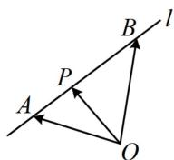  
图1

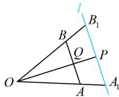

text_image

l
B₁
B
Q
P
O
A
A₁

图2

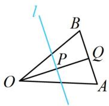  
图3

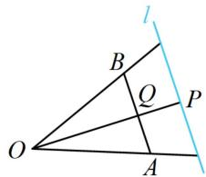

text_image

l
B
Q
P
O
A

图4

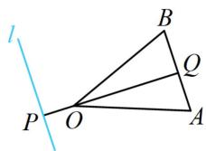  
图5

# 类型 I：平面向量的基底表示

【例1】已知矩形ABCD中， $E$ 为 $AB$ 边中点，线段 $AC$ 和 $DE$ 交于点 $F$ ，则 $\overrightarrow{BF} =$ （）

A. $-\frac{1}{3}\overrightarrow{AB} +\frac{2}{3}\overrightarrow{AD}$

B. $\frac{1}{3}\overrightarrow{AB} -\frac{2}{3}\overrightarrow{AD}$

C. $\frac{2}{3}\overrightarrow{AB} -\frac{1}{3}\overrightarrow{AD}$

D. $-\frac{2}{3}\overrightarrow{AB} +\frac{1}{3}\overrightarrow{AD}$

解析：如图， $\overrightarrow{BF} = \overrightarrow{BA} +\overrightarrow{AF} = -\overrightarrow{AB} +\overrightarrow{AF}$ ①，要进一步把 $\overrightarrow{AF}$ 化为基底，需分析 $F$ 在 $AC$ 上的位置，

由 $\triangle AEF\sim \triangle CDF$ 可得 $\frac{|AF|}{|FC|} = \frac{|AE|}{|CD|} = \frac{1}{2}$ ，所以 $\overrightarrow{AF} = \frac{1}{3}\overrightarrow{AC} = \frac{1}{3} (\overrightarrow{AB} +\overrightarrow{AD})$

代入①可得 $\overrightarrow{BF} = -\frac{2}{3}\overrightarrow{AB} +\frac{1}{3}\overrightarrow{AD}$

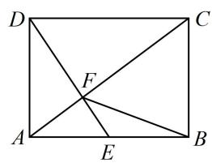

text_image

Geometric diagram of rectangle ABCD with diagonals and internal points E, F labeled

答案: D

【反思】向量按基底分解的原则是尽量往容易化基底的向量转化，例如 $\overrightarrow{BF}$ 还可按 $\overrightarrow{BC} +\overrightarrow{CF}$ 等方式来化.

【变式1】如图，在平行四边形ABCD中， $E$ ， $F$ 分别为 $BC$ ， $CD$ 上的点，$\overrightarrow{CE} = 2\overrightarrow{EB}$ ， $\overrightarrow{CF} = 2\overrightarrow{FD}$ ，若线段 $EF$ 上存在一点 $M$ ，使 $\overrightarrow{AM} = x\overrightarrow{AB} +\frac{1}{2}\overrightarrow{AD}$ $(x \in \mathbf{R})$ ，则 $x = \_\_\_\_$ .

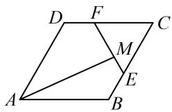

text_image

D F C
M
A B E

解析: $M$ 在 $E F$ 上, 可设 $\overrightarrow{E M} = \lambda \overrightarrow{E F}$ , 由此能将 $\overrightarrow{A M}$ 用 $\overrightarrow{A B}$ 和 $\overrightarrow{A D}$ 表示, 与题设的表示对比系数, 从而求出 $x$ . 由图知从 $A$ 到 $M$ 与基向量关联较强的路径是 $A \rightarrow B \rightarrow E \rightarrow M$ ,

因为 $M$ 在 $EF$ 上，所以可设 $\overrightarrow{EM} = \lambda \overrightarrow{EF}$ ，则 $\overrightarrow{AM} = \overrightarrow{AB} + \overrightarrow{BE} + \overrightarrow{EM} = \overrightarrow{AB} + \frac{1}{3} \overrightarrow{AD} + \lambda \overrightarrow{EF}$

$$
= \overrightarrow {A B} + \frac {1}{3} \overrightarrow {A D} + \lambda (\overrightarrow {E C} + \overrightarrow {C F}) = \overrightarrow {A B} + \frac {1}{3} \overrightarrow {A D} + \lambda \left(\frac {2}{3} \overrightarrow {A D} - \frac {2}{3} \overrightarrow {A B}\right) = \left(1 - \frac {2 \lambda}{3}\right) \overrightarrow {A B} + \frac {1 + 2 \lambda}{3} \overrightarrow {A D} \quad ①,
$$

由题意， $\overrightarrow{AM} = x\overrightarrow{AB} +\frac{1}{2}\overrightarrow{AD}$ ，与 $①$ 对比系数得： $x = 1 - \frac{2\lambda}{3}$ ， $\frac{1}{2} = \frac{1 + 2\lambda}{3}$ ，解得： $x = \frac{5}{6}$

答案: $\frac{5}{6}$

【变式2】在平行四边形ABCD中， $\overrightarrow{BE} = \frac{1}{2}\overrightarrow{EC}$ ， $\overrightarrow{DF} = 2\overrightarrow{FC}$ ，设 $\overrightarrow{AE} = a$ ， $\overrightarrow{AF} = b$ ，则 $\overrightarrow{AC} = (\quad)$

A. $\frac{6}{7} a + \frac{3}{7} b$

B. $\frac{3}{7} a + \frac{6}{7} b$

C. $\frac{3}{4} a + \frac{1}{3} b$

D. $\frac{1}{3} a + \frac{3}{4} b$

解析：如图，直接用 $a$ ， $b$ 表示 $\overrightarrow{AC}$ 较难，考虑换基底，注意到用 $\overrightarrow{AB}$ ， $\overrightarrow{AD}$ 容易表示其它向量，故若设 $\overrightarrow{AC} = xa + yb$ ，则只要把 $a$ 和 $b$ 也用 $\overrightarrow{AB}$ ， $\overrightarrow{AD}$ 表示，就能与 $\overrightarrow{AC} = \overrightarrow{AB} + \overrightarrow{AD}$ 比较系数，求出 $x, y$ ，

设 $\overrightarrow{AC} = x\pmb{a} + y\pmb{b}$ ，由题意， $\pmb{a} = \overrightarrow{AE} = \overrightarrow{AB} + \overrightarrow{BE} = \overrightarrow{AB} + \frac{1}{3}\overrightarrow{AD}$ ， $\pmb{b} = \overrightarrow{AF} = \overrightarrow{AD} + \overrightarrow{DF} = \overrightarrow{AD} + \frac{2}{3}\overrightarrow{AB}$ ，

所以 $\overrightarrow{AC} = x\left(\overrightarrow{AB} +\frac{1}{3}\overrightarrow{AD}\right) + y\left(\overrightarrow{AD} +\frac{2}{3}\overrightarrow{AB}\right) = \left(x + \frac{2y}{3}\right)\overrightarrow{AB} +\left(\frac{x}{3} +y\right)\overrightarrow{AD}$ ①，

又因为 ABCD 为平行四边形，所以 $\overrightarrow{AC} = \overrightarrow{AB} + \overrightarrow{AD}$ ，

与①比较可得 $\left\{\begin{aligned}x+\frac{2y}{3}&=1\\ \frac{x}{3}+y&=1\end{aligned}\right.$ ，解得： $\left\{\begin{aligned}x&=\frac{3}{7}\\ y&=\frac{6}{7}\end{aligned}\right.$ ，所以 $\overrightarrow{AC}=\frac{3}{7}a+\frac{6}{7}b$ .

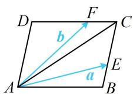

答案: B

【反思】选择相同基底，按两种方法表示同一向量，通过对比系数构造方程是向量分解问题的一种手段.

# 类型 II：三点共线定理的应用

【例 2】如图，在 $\triangle ABC$ 中， $AD$ 为 $BC$ 边上的中线， $E$ 为 $AD$ 的中点，则 $\overrightarrow{EB}=$ （）

A. $\frac{3}{4}\overrightarrow{AB} -\frac{1}{4}\overrightarrow{AC}$

B. $\frac{1}{4}\overrightarrow{AB} -\frac{3}{4}\overrightarrow{AC}$

C. $\frac{3}{4}\overrightarrow{AB} +\frac{1}{4}\overrightarrow{AC}$

D. $\frac{1}{4}\overrightarrow{AB} +\frac{3}{4}\overrightarrow{AC}$

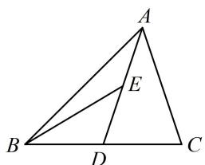

text_image

A
E
B
D
C

解析：由题意， $\overrightarrow{EB} = \overrightarrow{EA} + \overrightarrow{AB} = -\frac{1}{2}\overrightarrow{AD} + \overrightarrow{AB}$ ①，其中 $\overrightarrow{AD}$ 为中线向量，可用内容提要2的向量中线定理，因为 $D$ 为 $BC$ 中点，所以 $\overrightarrow{AD} = \frac{1}{2}\overrightarrow{AB} + \frac{1}{2}\overrightarrow{AC}$ ，代入①得： $\overrightarrow{EB} = -\frac{1}{2}\left(\frac{1}{2}\overrightarrow{AB} + \frac{1}{2}\overrightarrow{AC}\right) + \overrightarrow{AB} = \frac{3}{4}\overrightarrow{AB} - \frac{1}{4}\overrightarrow{AC}$ .

答案: A

【变式】设 $O$ 为 $\triangle ABC$ 的外心，若 $\overrightarrow{OA} +\overrightarrow{OB} +\overrightarrow{OC} = \overrightarrow{OM}$ ，则 $M$ 是 $\triangle ABC$ 的（）

A. 重心

B. 内心

C. 垂心

D. 外心

解析：等式涉及的向量起点都是 O，可两两组合减少项数，例如可将 $\overrightarrow{OA}$ 与 $\overrightarrow{OB}$ 合并， $\overrightarrow{OC}$ 与 $\overrightarrow{OM}$ 合并，

如图，设 $D$ 为 $AB$ 中点，则 $OD \perp AB$ ，且 $\overrightarrow{OA} + \overrightarrow{OB} = 2\overrightarrow{OD}$

因为 $\overrightarrow{OA} +\overrightarrow{OB} +\overrightarrow{OC} = \overrightarrow{OM}$ ，所以 $2\overrightarrow{OD} +\overrightarrow{OC} = \overrightarrow{OM}$

故 $2\overrightarrow{OD} = \overrightarrow{OM} -\overrightarrow{OC} = \overrightarrow{CM}$ ，结合 $OD\bot AB$ 可得 $CM\bot AB$

同理可得 $AM \perp BC$ ， $BM \perp AC$ ，所以 $M$ 是垂心.

答案: C

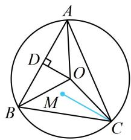

text_image

A
D
O
B
M
C

【总结】①图形有中点可考虑使用向量中线定理（如例2）；②当两个向量共起点时，可以考虑用向量中线定理合并向量，减少向量的个数（如例2的变式）.

【例3】在 $\triangle ABC$ 中， $\overrightarrow{AN} = \frac{1}{2}\overrightarrow{NC}$ ，点 $P$ 在 $BN$ 上，若 $\overrightarrow{AP} = \left(m + \frac{1}{3}\right)\overrightarrow{AB} + \frac{1}{9}\overrightarrow{AC}$ ，则 $m = (\quad)$

A. $\frac{1}{9}$

B. $\frac{2}{9}$

C. $\frac{2}{3}$

D. $\frac{1}{3}$

解析：注意到第二个等式共起点 $A$ ，故若将其中的 $\overrightarrow{AC}$ 换成 $\overrightarrow{AN}$ ，就可用 $B, P, N$ 三点共线构造方程，因为 $\overrightarrow{AN} = \frac{1}{2}\overrightarrow{NC}$ ，所以 $\overrightarrow{AC} = 3\overrightarrow{AN}$ ，代入 $\overrightarrow{AP} = \left(m + \frac{1}{3}\right)\overrightarrow{AB} + \frac{1}{9}\overrightarrow{AC}$ 可得 $\overrightarrow{AP} = \left(m + \frac{1}{3}\right)\overrightarrow{AB} + \frac{1}{3}\overrightarrow{AN}$ ，

因为 B, P, N 三点共线，由内容提要 2, $m + \frac{1}{3} + \frac{1}{3} = 1$ ，解得： $m = \frac{1}{3}$ .

答案: D

【反思】向量问题中，可用三点共线的系数和为 1 构造方程，有时需通过转化，让起点相同终点共线.

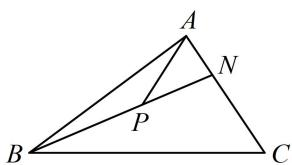

text_image

A
N
P
B
C

【变式】如图，在平行四边形ABCD中，M是BC的中点，若 $\overrightarrow{AC}=\lambda\overrightarrow{AM}-\mu\overrightarrow{BD}$ ，则 $\lambda+\mu=$ \_\_\_\_.

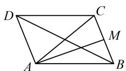

解析： $\overrightarrow{AC}$ ， $\overrightarrow{AM}$ ， $\overrightarrow{BD}$ 不共起点，但可平移 $\overrightarrow{BD}$ ，使其共起点，再看能否用三点共线结论求系数和，如图，延长 $CB$ 至 $E$ ，使 $CB = BE$ ，则 $BE$ 和 $AD$ 平行且相等，

所以四边形 $ADBE$ 是平行四边形，故 $\overrightarrow{BD} = -\overrightarrow{AE}$

代入 $\overrightarrow{AC} = \lambda \overrightarrow{AM} -\mu \overrightarrow{BD}$ 得 $\overrightarrow{AC} = \lambda \overrightarrow{AM} +\mu \overrightarrow{AE}$

因为 $C, M, E$ 三点共线，所以 $\lambda + \mu = 1$ .

答案: 1

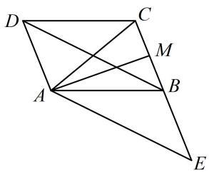

text_image

Geometric diagram with labeled points A, B, C, D, E, and M, showing intersecting lines within a parallelogram-like structure.

【反思】例 3 是由长度比例化为终点共线，而变式是通过平移使共起点，进而可用共线系数和结论.

# 类型III：等和线的应用

【例 4】在正六边形 ABCDEF 中，点 P 为 CE 上任意一点，若 $\overrightarrow{AP}=x\overrightarrow{AB}+y\overrightarrow{AF}$ ，则 $x+y=$ \_\_\_\_.

解析：涉及向量基底表示的系数和问题，常可考虑用等和线速解，先找到系数和为1的等和线，

如图， $BF$ 是系数和为1的等和线，在正六边形中， $CE \parallel BF$ ，所以 $CE$ 也是等和线，

故由内容提要3的等和线定理， $x + y = \frac{|AP|}{|AQ|} = \frac{|AG|}{|AK|}$ ①，

由正六边形几何性质可知 $AD \perp BF$ ，

设 $|AB|=1$ ，则 $|AK|=|AB|\cdot\sin\angle ABK=1\times\sin30^{\circ}=\frac{1}{2}$

$\left|AG\right| = \left|AK\right| + \left|KG\right| = \left|AK\right| + \left|EF\right| = \frac{1}{2} + 1 = \frac{3}{2}$ ，所以 $\frac{\left|AG\right|}{\left|AK\right|} = 3$ ，代入①得： $x + y = 3$ 。

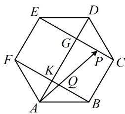

text_image

E
D
G
F
K
P
C
Q
A
B

答案: 3

【反思】基底表示的系数和问题可考虑用等和线速解，其核心是找基向量终点连线的平行线和求相似比.

# 强化训练

# 类型 I：向量的分解与共线

1. (2022·新课标Ⅰ卷·★)

在 $\triangle ABC$ 中，点 $D$ 在边 $AB$ 上， $BD = 2DA$ ，记 $\overrightarrow{CA} = \boldsymbol{m}$ ， $\overrightarrow{CD} = \boldsymbol{n}$ ，则 $\overrightarrow{CB} = (\quad)$

A. $3 m - 2 n$

B. $-2m + 3n$

C. $3 \mathbf{m} + 2 \mathbf{n}$

D. $2 \mathbf{m} + 3 \mathbf{n}$

2. (2023·广东模拟·★★)

在平行四边形 $ABCD$ 中， $E$ 为 $AD$ 中点， $F$ 为 $BE$ 与 $AC$ 的交点，则 $\overrightarrow{DF} = (\quad)$

A. $\frac{1}{3}\overrightarrow{AB} +\frac{2}{3}\overrightarrow{AD}$

B. $\frac{1}{3}\overrightarrow{AB} -\frac{2}{3}\overrightarrow{AD}$

C. $\frac{1}{4}\overrightarrow{AB} +\frac{3}{4}\overrightarrow{AD}$

D. $\frac{1}{4}\overrightarrow{AB} -\frac{3}{4}\overrightarrow{AD}$

3. (2022·安徽芜湖模拟·★★★)

如图， $O$ 是 $\triangle ABC$ 的重心， $D$ 是边 $BC$ 上一点，且 $\overrightarrow{BD} = 3\overrightarrow{DC}$ ， $\overrightarrow{OD} = \lambda \overrightarrow{AB} +\mu \overrightarrow{AC}$ ，则 $\frac{\lambda}{\mu} =$ （）

A. $-\frac{1}{5}$

B. $- \frac{1}{4}$

C. $\frac{1}{5}$

D. $\frac{1}{4}$

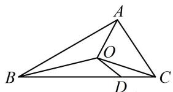

text_image

Geometric diagram of triangle ABC with internal points O and D, showing segments AD and BD

4. (2024·江苏南通三模·★★)

在梯形 $ABCD$ 中， $AB \parallel CD$ ，且 $AB = 2CD$ ，点 $M$ 是 $BC$ 的中点，则 $\overrightarrow{AM} = (\quad)$

A. $\frac{2}{3}\overrightarrow{AB} -\frac{1}{2}\overrightarrow{AD}$

B. $\frac{1}{2}\overrightarrow{AB} +\frac{2}{3}\overrightarrow{AD}$

C. $\overrightarrow{AB} +\frac{1}{2}\overrightarrow{AD}$

D. $\frac{3}{4}\overrightarrow{AB} +\frac{1}{2}\overrightarrow{AD}$

5. (★★☆)

已知 $\triangle ABC$ 内接于圆 $O$ ， $\left|\overrightarrow{CA} +\overrightarrow{CB}\right| = \left|\overrightarrow{CA} -\overrightarrow{CB}\right|$ ，若 $P$ 为线段 $OC$ 的中点，则 $\overrightarrow{OP} =$ （）

A. $\frac{1}{3}\overrightarrow{AC} -\frac{1}{2}\overrightarrow{AB}$

B. $\frac{1}{4}\overrightarrow{AC} -\frac{1}{2}\overrightarrow{AB}$

C. $\frac{1}{2}\overrightarrow{AC} -\frac{1}{4}\overrightarrow{AB}$

D. $\frac{1}{2}\overrightarrow{AC} -\frac{1}{3}\overrightarrow{AB}$

6. (2023·江苏省苏北七市二调·★★★)

在 $\square ABCD$ 中， $\overrightarrow{BE} = \frac{1}{2}\overrightarrow{BC}$ ， $\overrightarrow{AF} = \frac{1}{3}\overrightarrow{AE}$ ，若 $\overrightarrow{AB} = m\overrightarrow{DF} + n\overrightarrow{AE}$ ，则 $m + n = (\quad)$

A. $\frac{1}{2}$

B. $\frac{3}{4}$

C. $\frac{5}{6}$

D. $\frac{4}{3}$

7. (2022·重庆模拟·★★★☆)

如图，已知点 $G$ 是 $\triangle ABC$ 的重心，过点 $G$ 作直线分别与 $AB$ ， $AC$ 两边交于 $M$ ， $N$ 两点（ $M$ ， $N$ 与 $B$ ， $C$ 不重合），设 $\overrightarrow{AB} = x\overrightarrow{AM}$ ， $\overrightarrow{AC} = y\overrightarrow{AN}$ ，则 $\frac{1}{x + 1} +\frac{1}{y + 1}$ 的最小值为（）

A. $\frac{1}{2}$

B. $\frac{2}{3}$

C. $\frac{3}{4}$

D. $\frac{4}{5}$

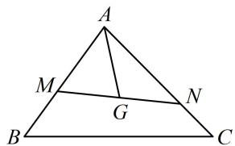

text_image

A
M
G
N
B
C

8.（2023·江苏省苏锡常镇四市一模·★★★☆）

在 $\triangle ABC$ 中，已知 $\overrightarrow{BD} = 2\overrightarrow{DC}$ ， $\overrightarrow{CE} = \overrightarrow{EA}$ ， $BE$ 与 $AD$ 交于点 $O$ ，若 $\overrightarrow{CO} = x\overrightarrow{CB} +y\overrightarrow{CA}(x,y\in \mathbf{R})$ ，则 $x + y =$

# 类型 II：等和线的运用

# 9. (★★★)

如图，在扇形 OAB 中， $\angle AOB = 90^{\circ}$ ，C 为弧 AB 上的一个动点，若 $\overrightarrow{OC} = x\overrightarrow{OA} + y\overrightarrow{OB}$ ，则 $x + y$ 的最大值是 \_\_\_\_.

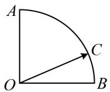

# 10. (2023·山东模拟·★★★)

已知正 $\triangle ABC$ 的边长为1，动点 $P$ 满足 $\left|\overrightarrow{AP}\right| = 1$ ， $\overrightarrow{AP} = \lambda \overrightarrow{AB} +\mu \overrightarrow{AC}$ ，则 $\lambda +\mu$ 的最小值为（）

A. $-\sqrt{3}$

B. $-\frac{2\sqrt{3}}{3}$

C. 0

D. 3