# 强化训练

1. (2023·浙江温州二模·★)

已知向量 $a = (1,2)$ ， $b = (2,\lambda)$ ，若 $(a + b) // (a - b)$ ，则 $\lambda = \_$ .

1.4

解法1：有 $a, b$ 的坐标，可先求 $a + b$ 和 $a - b$ 的坐标，再用坐标翻译所给的平行条件，

由题意， $\boldsymbol{a} + \boldsymbol{b} = (3,2 + \lambda)$ ， $\boldsymbol{a} - \boldsymbol{b} = (-1,2 - \lambda)$ ，

又 $(\pmb {a} + \pmb {b}) / / (\pmb {a} - \pmb {b})$ ，所以 $3\times (2 - \lambda) = -1\times (2 + \lambda)\Rightarrow \lambda = 4$

解法2：注意到 $a + b$ 和 $a - b$ 的图形特征比较明显，故也可考虑直接画图分析，

如图，当 $\pmb{a}$ 与 $\pmb{b}$ 不共线时， $\pmb{a} + \pmb{b}$ 和 $\pmb{a} - \pmb{b}$ 分别为平行四边形的两条对边构成的向量，它们不共线，所以要使 $(\pmb{a} + \pmb{b}) / / (\pmb{a} - \pmb{b})$ 只能 $\pmb{a} / / \pmb{b}$ ，从而 $1 \times \lambda = 2 \times 2$ ，故 $\lambda = 4$ 。

2. (2023·新课标Ⅰ卷·★)

已知向量 $a = (1,1)$ ， $\pmb {b} = (1, - 1)$ ，若 $(\pmb {a} + \lambda \pmb {b})\perp (\pmb {a} + \mu \pmb {b})$ ，则（）

A. $\lambda +\mu = 1$

B. $\lambda +\mu = -1$

C. $\lambda \mu = 1$

D. $\lambda \mu = -1$

2. D

解析：向量垂直可用数量积为 0 来翻译，此处可以先求两个向量的坐标，再算数量积，但若注意到 $a \cdot b = 0$ ，则会发现直接展开计算量更小，

因为 $(\pmb{a} + \lambda \pmb{b}) \perp (\pmb{a} + \mu \pmb{b})$ ，所以 $(\pmb{a} + \lambda \pmb{b}) \cdot (\pmb{a} + \mu \pmb{b}) =$

$$
\boldsymbol {a} ^ {2} + (\lambda + \mu) \boldsymbol {a} \cdot \boldsymbol {b} + \lambda \mu \boldsymbol {b} ^ {2} = 0 \quad ①,
$$

又 $\boldsymbol{a}=(1,1)$ ， $\boldsymbol{b}=(1,-1)$ ，所以 $a^{2}=1^{2}+1^{2}=2$ ，

$$
\boldsymbol {b} ^ {2} = 1 ^ {2} + (- 1) ^ {2} = 2, \quad \boldsymbol {a} \cdot \boldsymbol {b} = 1 \times 1 + 1 \times (- 1) = 0,
$$

代入①得： $2+2\lambda\mu=0$ ，所以 $\lambda\mu=-1$ 。

3. (2024·广东惠州二调·★★)

若向量 a, b 满足 $\boldsymbol{a} = (\sqrt{3}, 1)$ , $|b| = \sqrt{2}$ , $(2a - b) \cdot b$

$= 3$ ，则向量 $\pmb{b}$ 在向量 $\pmb{a}$ 上的投影向量为（）

A. $\left(\frac{5\sqrt{3}}{8}, \frac{5}{8}\right)$

B. $\left(\frac{5\sqrt{3}}{4},\frac{5}{4}\right)$

C. $\left(\frac{\sqrt{3}}{8},\frac{1}{8}\right)$

D. $\left(\frac{\sqrt{3}}{4},\frac{1}{4}\right)$

3. A

解析：算投影向量，可代内容提要1中的公式⑦，其核心是算 $a \cdot b$ ，观察发现把 $(2a - b) \cdot b = 3$ 展开，就能产生 $a \cdot b$ ，

$$
(2 \boldsymbol {a} - \boldsymbol {b}) \cdot \boldsymbol {b} = 3 \Rightarrow 2 \boldsymbol {a} \cdot \boldsymbol {b} - \boldsymbol {b} ^ {2} = 3 \Rightarrow 2 \boldsymbol {a} \cdot \boldsymbol {b} - | \boldsymbol {b} | ^ {2} = 3
$$

$$
\Rightarrow \boldsymbol {a} \cdot \boldsymbol {b} = \frac {3 + | \boldsymbol {b} | ^ {2}}{2} = \frac {3 + (\sqrt {2}) ^ {2}}{2} = \frac {5}{2},
$$

又 $\left|a\right|=\sqrt{(\sqrt{3})^{2}+1^{2}}=2$ ，所以向量b在向量a上的投影向量为 $\frac{a\cdot b}{a^{2}}a=\frac{\frac{5}{2}}{2^{2}}a=\frac{5}{8}a=\left(\frac{5\sqrt{3}}{8},\frac{5}{8}\right)$ .

4. (2025·全国Ⅰ卷·★★☆)

帆船比赛中，运动员可借助风力计测定风速的大小和方向，测出的结果在航海学中称为视风风速，视风风速对应的向量，是真风风速对应的向量与船行风速对应的向量之和，其中船行风速对应的向量与船速对应的向量大小相等，方向相反。图1给出了部分风力等级、名称与风速大小的对应关系。已知某帆船运动员在某时刻测得的视风风速对应的向量与船速对应的向量如图2（风速的大小和向量的大小相同，单位m/s），则真风为（）

<table><tr><td>等级</td><td>风速大小(m/s)</td><td>名称</td></tr><tr><td>2</td><td>1.1~3.3</td><td>轻风</td></tr><tr><td>3</td><td>3.4~5.4</td><td>微风</td></tr><tr><td>4</td><td>5.5~7.9</td><td>和风</td></tr><tr><td>5</td><td>8.0~10.1</td><td>劲风</td></tr></table>

图1

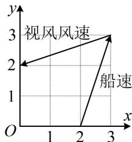

text_image

视风风速
船速
O
1
2
3
x
y

图2

A. 轻风

B. 微风

C. 和风

D. 劲风

4. A

解析：由所给信息可发现，涉及的是向量的加法、减法，且有关向量放到了坐标系下，故考虑用坐标运算处理，为了便于分析，下面先设出有关向量，

设视风风速、真风风速、船行风速、船速对应的向量分别为 $\pmb{v}_{\text {视}}$ ， $\pmb{v}_{\text {真}}$ ， $\pmb{v}_{\text {船行风速}}$ ， $\pmb{v}_{\text {船速}}$

则由题意， $\pmb{v}_{\text{视}} = \pmb{v}_{\text{真}} + \pmb{v}_{\text{船行风速}}$ ， $\pmb{v}_{\text{船行风速}} = -\pmb{v}_{\text{船速}}$

由图2可知， $\pmb{\nu}_{\text{视}} = (-3, - 1)$ ， $\pmb{\nu}_{\text{船速}} = (1,3)$

所以 $v_{船行风速} = -v_{船速} = (-1, -3)$ ，故由 $v_{视} = v_{真} + v_{船行风速}$ 可

得 $\pmb{v}_{真} = \pmb{v}_{视} - \pmb{v}_{船行风速} = (-3, -1) - (-1, -3) = (-2, 2)$ ,

所以 $\left|\boldsymbol{v}_{\text{真}}\right|=\sqrt{(-2)^{2}+2^{2}}=2\sqrt{2}\approx2.828\mathrm{~m/s}$

结合图 1 可知真风为轻风，故选 A.

5. (★★★)

已知向量 a，b 满足 $\left|a\right|=4$ ，b 在 a 上的投影向量与 a 反向且长度为 2，则 $\left|a-3b\right|$ 的最小值为 \_\_\_\_.

5. 10

解法1：已知 $|a|$ 和 $b$ 在 $a$ 上的投影向量，则 $a$ 和 $b$ 容易搬进坐标系，故可建系，用向量的坐标运算来解决问题，

如图1，可设 $a = \overrightarrow{OA} = (4,0)$ ， $b = \overrightarrow{OB}$ ，由 $\pmb{b}$ 在 $\pmb{a}$ 上的投影向量与 $\pmb{a}$ 反向且长度为2知 $B$ 在直线 $x = -2$ 上运动，

所以可设 $\boldsymbol{b}=(-2,y)$ ，其中 $y\in R$ ，

故 $\left|a-3b\right|=\left|(4,0)-3(-2,y)\right|=\left|(10,-3y)\right|=\sqrt{100+9y^{2}}$

所以当 $y = 0$ 时， $\vert a - 3b\vert$ 取得最小值10.

解法 2: 所求为模, 也可考虑将模平方, 去掉模再看,

由题意， $\left|a-3b\right|^{2}=a^{2}-6a\cdot b+9b^{2}=16-6a\cdot b+9b^{2}$ ①,

如图2，因为 $\pmb{b}$ 在 $\pmb{a}$ 上的投影向量与 $\pmb{a}$ 反向且长度为2，

所以 $a \cdot b = -4 \times 2 = -8$ ，代入①得 $\left|a - 3b\right|^{2} = 64 + 9b^{2}$ ②，

由图2可知， $|b|$ 不小于 $\pmb{b}$ 在 $\pmb{a}$ 上的投影向量的模，

所以 $|b|\geq2$ ，当b与a反向时取等，如图3，

结合②可得 $\left|a-3b\right|^{2}\geq64+9\times2^{2}=100$ ，

所以 $|a-3b|\geq10$ ，故 $|a-3b|$ 的最小值为10.

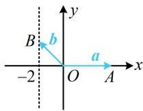  
图1

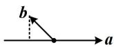  
图2

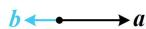  
图3

6. (2023·重庆三诊·★★★)

已知 $\pmb{a}$ 是单位向量，向量 $b(b \neq a)$ 满足 $b - a$ 与 $\pmb{a}$ 成角 $60^{\circ}$ ，则 $|\pmb{b}|$ 的取值范围是（）

A. $\left(\frac{1}{2}, +\infty\right)$

B. $\left(\frac{\sqrt{3}}{3},+\infty\right)$

C. $(1, +\infty)$

D. $\left(\frac{2\sqrt{3}}{3}, +\infty\right)$

6. C

解法 1: 涉及向量夹角, 可考虑夹角余弦公式,

由题意， $\cos <  b - a,a > = \frac{(b - a)\cdot a}{|b - a|\cdot|a|} = \frac{1}{2}$

结合 $|\boldsymbol{a}| = 1$ 可得 $\frac{(\boldsymbol{b} - \boldsymbol{a})\cdot\boldsymbol{a}}{|\boldsymbol{b} - \boldsymbol{a}|} = \frac{1}{2}$ ①，若将 $\boldsymbol{a},\boldsymbol{b}$ 搬进坐标系，则容易翻译式①，故可考虑设坐标处理，

由题意，不妨设 $\boldsymbol{a}=(1,0)$ ， $\boldsymbol{b}=(x,y)$ ，则 $\boldsymbol{b}-\boldsymbol{a}=(x-1,y)$ ，

所以 $(\pmb {b} - \pmb {a})\cdot \pmb {a} = x - 1$ ， $|\pmb {b} - \pmb {a}| = \sqrt{(x - 1)^2 + y^2}$

代入式①可得 $\frac{x - 1}{\sqrt{(x - 1)^2 + y^2}} = \frac{1}{2}$ ②，

化简得： $y^{2} = 3(x - 1)^{2}$ ，所以 $\left|\pmb {b}\right| = \sqrt{x^2 + y^2}$

$$
= \sqrt {x ^ {2} + 3 (x - 1) ^ {2}} = \sqrt {4 x ^ {2} - 6 x + 3} = \sqrt {4 \left(x - \frac {3}{4}\right) ^ {2} + \frac {3}{4}} \quad ③,
$$

还需 $x$ 的范围，才能求 $\vert b\vert$ 的范围，可由式②来看，

由②可得 $x - 1 > 0$ ，所以 $x > 1$

结合③可得 $|\pmb{b}| > \sqrt{4 \times \left(1 - \frac{3}{4}\right)^2 + \frac{3}{4}} = 1$

解法2: $b - a$ 与 $a$ 的位置关系容易用图形表示, 故也可考虑画图分析 $|b|$ 的取值范围,

如图，记 $a = \overrightarrow{OA}$ ， $b = \overrightarrow{OB}$ ，则当点 B 在如图所示的蓝色射线（由 $b \neq a$ 可知不含点 A）上运动时，满足 b - a 与 a 的夹角为 $60^{\circ}$ ，因为 $|a| = 1$ ，所以由图可知， $|b|$ 的取值范围是 $(1, +\infty)$ .

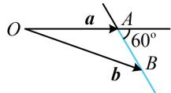

7. (2024·湖南长沙模拟·★★★☆)(多选)

如图所示，在边长为3的等边三角形ABC中， $\overrightarrow{AD}$

$= \frac{2}{3}\overrightarrow{AC}$ ，且点 $P$ 在以 $AD$ 中点 $O$ 为圆心， $OA$ 为半径的半圆上， $\overrightarrow{BP} = x\overrightarrow{BA} +y\overrightarrow{BC}$ ，则下列说法正确的是（）

A. $\frac{1}{3} \leq x \leq 1$   
B. $\overrightarrow{BD} = \frac{1}{3}\overrightarrow{BA} +\frac{2}{3}\overrightarrow{BC}$   
C. $\frac{9}{2} \leq \overrightarrow{BP} \cdot \overrightarrow{BC} \leq 9$

D. $x + y$ 的最大值为 $\frac{2\sqrt{3}}{9} + 1$

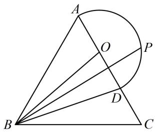

text_image

Geometric diagram showing triangle ABC with inscribed circle and intersecting lines, labeled points A, B, C, D, O, P

7. BCD

解析：涉及圆上动点，可考虑建系，利用圆的方程把动点坐标设为三角形式，结合图形可发现也容易建系，故按此处理，以点 $B$ 为原点建立如图所示的平面直角坐标系，

则 $B(0,0)$ ， $A\left(\frac{3}{2},\frac{3\sqrt{3}}{2}\right)$ ， $C(3,0)$

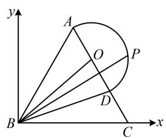

text_image

y
A
O
P
B
D
C
x

由 $\overrightarrow{AD} = \frac{2}{3}\overrightarrow{AC}$ 可知 $D$ 是 $AC$ 的三等分点，所以 $D\left(\frac{5}{2},\frac{\sqrt{3}}{2}\right)$ ，又因为 $O$ 是 $AD$ 的中点，所以 $O(2,\sqrt{3})$

由题意， $P$ 在半圆 $(x - 2)^{2} + (y - \sqrt{3})^{2} = 1$ 上运动，

所以可设 $P(2 + \cos \theta, \sqrt{3} + \sin \theta)$ ，其中 $\theta \in \left[-\frac{\pi}{3}, \frac{2\pi}{3}\right]$ ，

A 项， $\overrightarrow{BA}=\left(\frac{3}{2},\frac{3\sqrt{3}}{2}\right)$ ， $\overrightarrow{BC}=(3,0)$ ，

$$
\overrightarrow {B P} = (2 + \cos \theta , \sqrt {3} + \sin \theta),
$$

因为 $\overrightarrow{BP} = x\overrightarrow{BA} +y\overrightarrow{BC}$ ，所以 $\left\{ \begin{array}{l}2 + \cos \theta = \frac{3}{2} x + 3y\\ \sqrt{3} +\sin \theta = \frac{3\sqrt{3}}{2} x \end{array} \right.$

解得： $\left\{ \begin{array}{l}x = \frac{2}{3} +\frac{2\sqrt{3}}{9}\sin \theta \\ y = -\frac{\sqrt{3}}{9}\sin \theta +\frac{1}{3}\cos \theta +\frac{1}{3} \end{array} \right.$

因为 $\theta \in \left[-\frac{\pi}{3},\frac{2\pi}{3}\right]$ ，所以 $\sin \theta \in \left[-\frac{\sqrt{3}}{2},1\right]$

从而 $x = \frac{2}{3} +\frac{2\sqrt{3}}{9}\sin \theta \in \left[\frac{1}{3},\frac{6 + 2\sqrt{3}}{9}\right]$ ，故A项错误；

B项， $\overrightarrow{BD} = \overrightarrow{BA} +\overrightarrow{AD} = \overrightarrow{BA} +\frac{2}{3}\overrightarrow{AC} = \overrightarrow{BA} +\frac{2}{3} (\overrightarrow{BC} -\overrightarrow{BA})$

$= \frac{1}{3}\overrightarrow{BA} +\frac{2}{3}\overrightarrow{BC}$ ，故B项正确；

C 项， $\overrightarrow{BP}\cdot\overrightarrow{BC}=(2+\cos\theta)\cdot3=6+3\cos\theta$

由 $\theta \in \left[-\frac{\pi}{3},\frac{2\pi}{3}\right]$ 得 $\cos \theta \in \left[-\frac{1}{2},1\right]$

所以 $\overrightarrow{BP} \cdot \overrightarrow{BC} = 6 + 3\cos \theta \in \left[\frac{9}{2}, 9\right]$ ，故 $C$ 项正确；

D 项， $x + y = \frac{2}{3} + \frac{2\sqrt{3}}{9}\sin\theta - \frac{\sqrt{3}}{9}\sin\theta + \frac{1}{3}\cos\theta + \frac{1}{3}$

$$
= \frac {\sqrt {3}}{9} \sin \theta + \frac {1}{3} \cos \theta + 1 = \frac {2 \sqrt {3}}{9} \sin \left(\theta + \frac {\pi}{3}\right) + 1,
$$

$$
\theta \in \left[ - \frac {\pi}{3}, \frac {2 \pi}{3} \right] \Rightarrow \theta + \frac {\pi}{3} \in [ 0, \pi ],
$$

所以当 $\theta +\frac{\pi}{3} = \frac{\pi}{2}$ 时， $\sin \left(\theta +\frac{\pi}{3}\right)$ 取得最大值1，

此时 $x + y$ 取得最大值 $\frac{2\sqrt{3}}{9} + 1$ ，故D项正确.

8. (2025·上海卷·★★★☆)

已知函数 $f(x) = \begin{cases} 1, & x > 0 \\ 0, & x = 0 \\ -1, & x < 0 \end{cases}$ ， $a, b, c$ 是平面内三个不同的单位向量，若 $f(a \cdot b) + f(b \cdot c) + f(c \cdot a) = 0$ ，则 $|a + b + c|$ 的取值范围是 \_\_\_\_.

8. $(1, \sqrt{5})$

解法1: 条件 $f(a \cdot b) + f(b \cdot c) + f(c \cdot a) = 0$ 怎样翻译? 注意到 $f(x)$ 的函数值只能是 1, 0 或 -1 , 所以要使该式成立, 则 $f(a \cdot b)$ , $f(b \cdot c)$ , $f(c \cdot a)$ 中要么三个都为 0 , 要么三个分别取 1, 0, -1 (顺序可交换), 故先分别考虑这两种情况,

若 $f(\pmb {a}\cdot \pmb {b}) = f(\pmb {b}\cdot \pmb {c}) = f(\pmb {c}\cdot \pmb {a}) = 0$ ，则 $\pmb {a}\cdot \pmb {b} = \pmb {b}\cdot \pmb {c} = \pmb {c}\cdot \pmb {a} = 0$ ，于是 $\pmb {a},\pmb {b},\pmb{c}$ 两两垂直，在同一平面上，这不可能，

所以要使 $f(\pmb {a}\cdot \pmb {b}) + f(\pmb {b}\cdot \pmb {c}) + f(\pmb {c}\cdot \pmb {a}) = 0$

只能 $f(\pmb {a}\cdot \pmb{b})$ ， $f(\pmb {b}\cdot \pmb {c})$ ， $f(\pmb {c}\cdot \pmb{a})$ 取遍1，0，-1三个值，

不妨设 $f(\pmb {a}\cdot \pmb {b}) = 0$ ， $f(\pmb {b}\cdot \pmb {c}) = 1$ ， $f(\pmb {c}\cdot \pmb {a}) = -1$

所以 $a \cdot b = 0$ ， $b \cdot c > 0$ ， $c \cdot a < 0$ ，故 $a \perp b$ ，

且 $c$ 与 $\pmb{b}$ 的夹角为锐角， $c$ 与 $\pmb{a}$ 的夹角为钝角，

条件翻译完了，怎样求 $|a+b+c|$ 的取值范围？已有a, b, c的长度和夹角特征，可考虑画出图形来观察，

如图1，记 $\overrightarrow{OA} = \boldsymbol{a}$ ， $\overrightarrow{OB} = \boldsymbol{b}$ ， $\overrightarrow{OC} = \boldsymbol{c}$

要使 $c$ 与 $b$ 的夹角为锐角, $c$ 与 $a$ 的夹角为钝角, 则点 $C$ 只能在如图所示的四分之一圆上运动 (不含端点), 要分析的是 $\left|a + b + c\right|$ 的取值范围, 于是我们先在图中把 $a + b + c$ 作出来, 再看怎样算它,

如图2，以 $OA$ ，OB为邻边作正方形OADB，则 $\pmb {a} + \pmb {b} = \overrightarrow{OD}$

以 OC，OD 为邻边作平行四边形 OCED，

则 $a + b + c = \overrightarrow{OD} + \overrightarrow{OC} = \overrightarrow{OE}$ ，设 $\angle COD = \theta$ ，

则 $\theta \in \left(\frac{\pi}{4},\frac{3\pi}{4}\right)$ ，且 $\angle ECO = \pi -\angle COD = \pi -\theta$ 在 $\triangle COE$ 中， $CE = OD = \sqrt{2}$ ， $OC = 1$

由余弦定理， $OE^2 = OC^2 +CE^2 -2OC\cdot CE\cdot \cos \angle ECO$

$$
= 1 ^ {2} + (\sqrt {2}) ^ {2} - 2 \times 1 \times \sqrt {2} \times \cos (\pi - \theta) = 3 + 2 \sqrt {2} \cos \theta \quad ①,
$$

因为 $\theta \in \left(\frac{\pi}{4},\frac{3\pi}{4}\right)$ ，所以 $\cos \theta \in \left(-\frac{\sqrt{2}}{2},\frac{\sqrt{2}}{2}\right),$

结合①得 $OE^2 \in (1,5)$ ，所以 $OE \in (1,\sqrt{5})$ ，

又 $a + b + c = \overrightarrow{OE}$ ，所以 $\left|a + b + c\right| \in (1, \sqrt{5})$ .

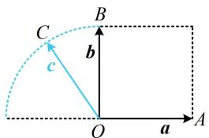

text_image

C
b
c
O
a
A
B

图1

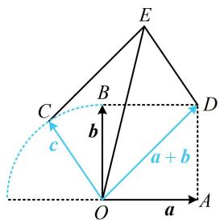

text_image

E
B
C
D
b
a + b
c
O
a
A

图2

解法2：按解法1得到图1后，观察发现图形容易建系，故也可考虑通过建系来分析 $|a + b + c|$ 的范围，

如图3建系，则 $\pmb {a} = (1,0)$ ， $\pmb {b} = (0,1)$

可设 $\boldsymbol{c}=(\cos\alpha,\sin\alpha)$ ，其中 $\alpha\in\left(\frac{\pi}{2},\pi\right)$ ,

则 $a + b + c = (1 + \cos \alpha, 1 + \sin \alpha)$ ,

所以 $\left|\pmb {a} + \pmb {b} + \pmb {c}\right| = \sqrt{(1 + \cos\alpha)^2 + (1 + \sin\alpha)^2}$

$$
\begin{array}{l} = \sqrt {1 + 2 \cos \alpha + \cos^ {2} \alpha + 1 + 2 \sin \alpha + \sin^ {2} \alpha} \\ = \sqrt {3 + 2 (\sin \alpha + \cos \alpha)} = \sqrt {3 + 2 \sqrt {2} \sin \left(\alpha + \frac {\pi}{4}\right)} \quad ②, \\ \end{array}
$$

因为 $\alpha \in \left(\frac{\pi}{2},\pi\right)$ ，所以 $\alpha +\frac{\pi}{4}\in \left(\frac{3\pi}{4},\frac{5\pi}{4}\right),$

故 $\sin \left(\alpha +\frac{\pi}{4}\right)\in \left(-\frac{\sqrt{2}}{2},\frac{\sqrt{2}}{2}\right),$

所以 $3 + 2\sqrt{2}\sin \left(\alpha +\frac{\pi}{4}\right)\in (1,5)$

结合②得 $\left|a+b+c\right|\in(1,\sqrt{5})$ .

# 9. (2024·天津卷·★★★☆)

在边长为1的正方形ABCD中，点E为线段CD的三等分点， $CE=\frac{1}{2}DE,\overrightarrow{BE}=\lambda\overrightarrow{BA}+\mu\overrightarrow{BC}$ ，则 $\lambda+\mu=$ \_\_\_\_；若F为线段BE上的动点，G为AF中点，则 $\overrightarrow{AF}\cdot\overrightarrow{DG}$ 的最小值为\_\_\_\_。

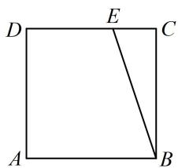

text_image

D
E
C
A
B

9. $\frac{4}{3}$ ; $-\frac{5}{18}$

解法1：如图1，设 $EH\perp AB$ 于 $H$ ，则BCEH是矩形，

所以 $\overrightarrow{BE} = \overrightarrow{BH} +\overrightarrow{BC} = \frac{1}{3}\overrightarrow{BA} +\overrightarrow{BC}$ ，又 $\overrightarrow{BE} = \lambda \overrightarrow{BA} +\mu \overrightarrow{BC}$

所以 $\lambda=\frac{1}{3}$ ， $\mu=1$ ，故 $\lambda+\mu=\frac{4}{3}$ ;

怎样计算 $\overrightarrow{AF} \cdot \overrightarrow{DG}$ ？图形主体是正方形，可考虑建系处理，

如图1建系，则 $B(1,0)$ ， $E\left(\frac{2}{3},1\right)$ ， $A(0,0)$ ， $D(0,1)$

求 $\overrightarrow{AF} \cdot \overrightarrow{DG}$ 关键是求点 $F$ 的坐标，怎样求它？由于 $F$ 在线段 $BE$ 上，故可先写出直线 $BE$ 的方程，由该方程将 $F$ 的坐标设为单变量形式，因为 $k_{BE} = \frac{0 - 1}{1 - \frac{2}{3}} = -3$ ，所以直线 $BE$ 的方程为 $y = -3(x - 1)$ ，即 $y = 3 - 3x$

因为 $F$ 在线段 $BE$ 上，所以可设 $F(x,3 - 3x)$ ， $\frac{2}{3} \leq x \leq 1$

则 $G\left(\frac{x}{2}, \frac{3 - 3x}{2}\right)$ ，所以 $\overrightarrow{AF} = (x, 3 - 3x)$ ， $\overrightarrow{DG} = \left(\frac{x}{2}, \frac{1 - 3x}{2}\right)$ ，

故 $\overrightarrow{AF} \cdot \overrightarrow{DG} = x \cdot \frac{x}{2} + (3 - 3x) \cdot \frac{1 - 3x}{2} = 5\left(x - \frac{3}{5}\right)^2 - \frac{3}{10}$ ,

因为函数 $g(x) = 5\left(x - \frac{3}{5}\right)^2 - \frac{3}{10}$ 在 $\left[\frac{2}{3}, 1\right]$ 上 $\nearrow$

所以当 $x = \frac{2}{3}$ 时， $\overrightarrow{AF} \cdot \overrightarrow{DG}$ 取得最小值 $-\frac{5}{18}$ .

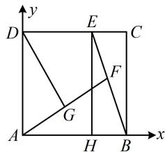

text_image

y
D E C
G F
A H B x

图1

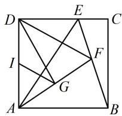

text_image

Geometric diagram of a square with labeled points and intersecting lines, likely for a math problem or proof.

图2

解法2：求 $\lambda +\mu$ 的过程同解法1，对于 $\overrightarrow{AF}\cdot \overrightarrow{DG}$ ，注意到 $\overrightarrow{AF} = 2\overrightarrow{AG}$ ，故可将其转化为 $2\overrightarrow{AG}\cdot \overrightarrow{DG}$ ，即 $2\overrightarrow{GA}\cdot \overrightarrow{GD}$ ，这是共起点的且底边长已知的数量积，可考虑用极化恒等式计算，如图2，设 $I$ 为 $AD$ 中点，则 $\overrightarrow{AF}\cdot \overrightarrow{DG} = 2\overrightarrow{AG}\cdot \overrightarrow{DG}$

$$
= 2 \overrightarrow {G A} \cdot \overrightarrow {G D} \quad ①,
$$

由极化恒等式， $\overrightarrow{GA}\cdot \overrightarrow{GD} = GI^2 -ID^2 = GI^2 -\frac{1}{4},$

代入①得 $\overrightarrow{AF} \cdot \overrightarrow{DG} = 2GI^{2} - \frac{1}{2}$ ②,

又 $GI$ 是 $\triangle ADF$ 的中位线，所以 $GI = \frac{1}{2} DF$

代入②得 $\overrightarrow{AF} \cdot \overrightarrow{DG} = \frac{1}{2} DF^2 - \frac{1}{2}$ ,

故核心是求 $DF$ 的最小值，这个从图上就可以看出来了，

如图2，当 $F$ 与 $E$ 重合时， $DF$ 取得最小值 $\frac{2}{3}$ ，

所以 $(\overrightarrow{AF} \cdot \overrightarrow{DG})_{\min} = \frac{1}{2} \times \left(\frac{2}{3}\right)^2 - \frac{1}{2} = -\frac{5}{18}$ .