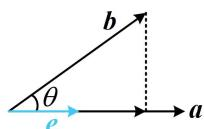
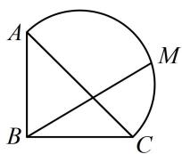
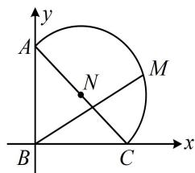
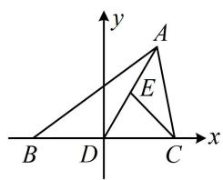
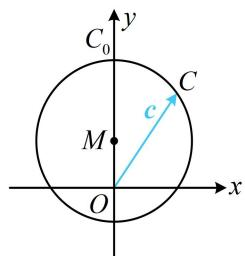
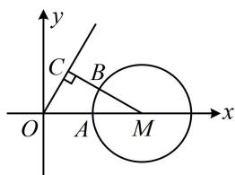
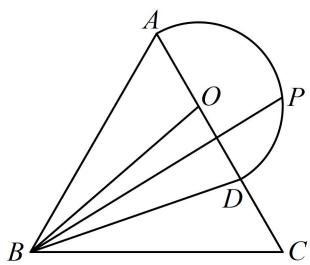
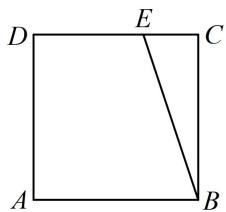

# 第 4 节 向量的坐标运算与建系运用（★★★）

# 内容提要

本节归纳与平面向量坐标运算有关的题型.

1. 坐标运算规则

①加减法：设 $a = (x_{1},y_{1})$ ， $\pmb {b} = (x_2,y_2)$ ，则 $\pmb {a}\pm \pmb {b} = (x_1\pm x_2,y_1\pm y_2)$

②数乘：设 $a = (x,y)$ ， $\lambda \in \mathbf{R}$ ，则 $\lambda a = (\lambda x,\lambda y)$

③两点连线向量坐标：设 $A(x_{1},y_{1})$ ， $B(x_{2},y_{2})$ ，则 $\overrightarrow{AB} = (x_2 - x_1,y_2 - y_1)$

④数量积：设 $a=(x_{1},y_{1})$ ， $b=(x_{2},y_{2})$ ，则 $a\cdot b=x_{1}x_{2}+y_{1}y_{2}$ ；

⑤模：设 $a = (x, y)$ ，则 $|a| = \sqrt{x^2 + y^2}$ ；

⑥向量共线坐标公式：设 $a = (x_{1},y_{1})$ ， $\pmb {b} = (x_2,y_2)$ ，则 $a / / b\Leftrightarrow x_1y_2 = x_2y_1$

⑦投影向量计算公式: 如图, e 为与 a 同向的单位向量, 则 b 在 a 上的投影向量为 $(|b|\cos\theta)e$ , 由于 $e=\frac{a}{|a|}$ , 所以 $(|b|\cos\theta)e=(|b|\cos\theta)\frac{a}{|a|}=\frac{|b|\cos\theta}{|a|}a=\frac{|a|\cdot|b|\cos\theta}{|a|^2}a=\frac{a\cdot b}{|a|^2}a$ .

2. 向量几何问题中的建系方法: 在一些几何图形中研究向量问题, 若用几何的方法来求解不易, 可考虑建系, 用向量的坐标运算来解决问题.  
3. 向量代数问题中的建系方法: 有时题干直接给出几个向量的模、夹角、数量积等条件, 没有图形, 我们也可以考虑把这些向量放到坐标系下, 设出它们的坐标, 用向量的坐标运算来解决问题。

# 类型 I：向量的坐标运算

【例1】已知平面向量 $\pmb {a} = (3,4)$ ， $\pmb {b} = (-k,2)$ ，若 $(\pmb {a} + \pmb {b}) / / k\pmb{a}$ ，则实数 $k(k\neq 0)$ 的值为（）

A. $-\frac{1}{2}$

B. $\frac{1}{2}$

C. $-\frac{3}{2}$

D. $\frac{3}{2}$

解析：有坐标，翻译向量平行用 $x_{1}y_{2} = x_{2}y_{1}$ ，由题意， $\pmb {a} + \pmb {b} = (3 - k,6)$ ， $k\pmb {a} = (3k,4k)$

因为 $(\pmb{a} + \pmb{b}) // k\pmb{a}$ ，所以 $(3 - k) \cdot 4k = 3k \cdot 6$ ，解得： $k = -\frac{3}{2}$ 或 $0$ ，又 $k \neq 0$ ，所以 $k = -\frac{3}{2}$ .

答案: C

【例 2】(2022·新课标 II 卷) 已知向量 $a = (3,4)$ , $b = (1,0)$ , $c = a + tb$ , 若 $<a, c> = <b, c>$ , 则实数 $t = (\quad)$

A. -6

B. -5

C. 5

D. 6

解析：涉及向量的夹角，考虑夹角余弦公式，由题意， $c=a+tb=(3+t,4)$ ，因为 $<a,c>=<b,c>$ ，

所以 $\cos < a, c > = \cos < b, c>$ ，从而 $\frac{a \cdot c}{|a| \cdot |c|} = \frac{b \cdot c}{|b| \cdot |c|}$ ，故 $\frac{3(3 + t) + 16}{5|c|} = \frac{3 + t}{|c|}$ ，所以 $\frac{3(3 + t) + 16}{5} = 3 + t$ ，故 $t = 5$ .

答案: C

【例3】已知向量 $\pmb{a}$ ， $\pmb{b}$ 满足 $a \cdot b = 10$ ， $b = (-3,4)$ ，则 $\pmb{a}$ 在 $\pmb{b}$ 上的投影向量为（）

A. $(-6,8)$ B. $(6, - 8)$ C. $\left(-\frac{6}{5},\frac{8}{5}\right)$ D. $\left(\frac{6}{5}, - \frac{8}{5}\right)$

解析：算投影向量，可代内容提要1的公式⑦，a在b上的投影向量为 $\frac{a\cdot b}{|b|^{2}}b=\frac{10}{(-3)^{2}+4^{2}}(-3,4)=\left(-\frac{6}{5},\frac{8}{5}\right)$ .
答案：C

# 类型Ⅱ：向量几何问题中的建系方法

【例4】如图，在 $\triangle ABC$ 中， $\angle ABC = 90^{\circ}$ ， $AB = BC = 1$ ，以 $AC$ 为直径的半圆上有一点 $M$ ， $\overrightarrow{BM} = \lambda \overrightarrow{BC} + \sqrt{3} \lambda \overrightarrow{BA}$ ，则 $\lambda = (\quad)$

A. $\frac{\sqrt{3} + 1}{4}$ B. $\frac{\sqrt{3} + 1}{2}$ C. $\frac{\sqrt{3}}{2}$ D. $\sqrt{3}$

解析：用几何方法分析不易，图形比较特殊，可考虑建系，用向量的坐标运算来解决问题，

建立如图所示的平面直角坐标系，则 $B(0,0)$ ， $A(0,1)$ ， $C(1,0)$ ， $AC$ 中点为 $N\left(\frac{1}{2}, \frac{1}{2}\right)$ ， $|AC| = \sqrt{2}$ ，所以图中半圆的方程为 $\left(x - \frac{1}{2}\right)^2 +\left(y - \frac{1}{2}\right)^2 = \frac{1}{2}$ ①，

设 $M(x,y)$ ，则 $M$ 的坐标满足方程①，且 $\overrightarrow{BM} = (x,y)$ ，而 $\lambda \overrightarrow{BC} +\sqrt{3}\lambda \overrightarrow{BA} = \lambda (1,0) + \sqrt{3}\lambda (0,1) = (\lambda ,\sqrt{3}\lambda)$

因为 $\overrightarrow{BM} = \lambda \overrightarrow{BC} +\sqrt{3}\lambda \overrightarrow{BA}$ ，所以 $\left\{ \begin{array}{l}x = \lambda \\ y = \sqrt{3}\lambda \end{array} \right.$

代入①可得 $\left(\lambda-\frac{1}{2}\right)^{2}+\left(\sqrt{3}\lambda-\frac{1}{2}\right)^{2}=\frac{1}{2}$ ，解得： $\lambda=\frac{\sqrt{3}+1}{4}$ 或0，

当 $\lambda = 0$ 时 $M$ 与 $B$ 重合，不在所给的半圆上，所以 $\lambda = \frac{\sqrt{3} + 1}{4}$ .

text_image

y
A
N
M
B
C
x

答案: A

【反思】遇到特殊图形（如直角三角形，等腰、等边三角形，平行四边形，圆等），建系可将思维量较大的几何问题转化为流程化处理的坐标运算问题.

【例 5】(2021·上海卷) 在 $\triangle ABC$ 中, $D$ 为 $BC$ 中点, $E$ 为 $AD$ 中点, 则以下结论: ①存在 $\triangle ABC$ , 使得 $\overrightarrow{AB} \cdot \overrightarrow{CE} = 0$ ; ②存在 $\triangle ABC$ , 使得 $\overrightarrow{CE} // (\overrightarrow{CB} + \overrightarrow{CA})$ ; 它们成立的情况是 ( )

A. ①成立；②成立 
B. ①成立；②不成立

C. ①不成立；②成立 D. ①不成立；②不成立

解析：垂直、平行都容易通过坐标运算来判断，故考虑建系． $\triangle ABC$ 形状虽未定，但依然可尝试建系，常取一条边为 $x$ 轴，例如将 $BC$ 放 $x$ 轴上， $BC$ 中点为原点．点 $A$ 位置不确定，故把 $A$ 的坐标设成变量，建立如图所示的平面直角坐标系，不妨设 $B(-1,0)$ ， $C(1,0)$ ， $A(2x,2y)$ ， $y \neq 0$ ，则 $E(x,y)$ ，

所以 $\overrightarrow{AB} = (-1 - 2x, -2y)$ ， $\overrightarrow{CE} = (x - 1,y)$ ，故 $\overrightarrow{AB}\cdot \overrightarrow{CE} = (-1 - 2x)(x - 1) - 2y^{2} = -2\left[\left(x - \frac{1}{4}\right)^{2} + y^{2} - \frac{9}{16}\right]$

上式可以为0，例如，当 $x = \frac{1}{4}$ ， $y = \frac{3}{4}$ 时， $\overrightarrow{AB}\cdot \overrightarrow{CE} = 0$ ，故①成立；

$$
\overrightarrow {C B} + \overrightarrow {C A} = (- 2, 0) + (2 x - 1, 2 y) = (2 x - 3, 2 y),
$$

若 $\overrightarrow{CE} // (\overrightarrow{CB} + \overrightarrow{CA})$ ，则 $(x - 1) \cdot 2y = (2x - 3)y$ ，

因为 $y \neq 0$ ，所以约去 y 可得 $2(x - 1) = 2x - 3$ ，此方程无解，故②不成立.

text_image

y
A
E
B D C x

答案: B

【反思】即使不是特殊图形，有时也可考虑建系来解决问题；对于未定的图形，把坐标设成变量即可.

# 类型III：向量代数问题中的建系方法

【例 6】已知单位向量 a，b 的夹角为 $60^{\circ}$ ，若向量 c 满足 $\left|a-2b+3c\right|\leq3$ ，则 $|c|$ 的最大值为 \_\_\_\_.解析：没图直接分析不易，而 $a, b$ 的长度夹角均已知，容易搬进坐标系，故用坐标翻译条件，设 $\boldsymbol{a}=(1,0)$ ， $\boldsymbol{b}=\left(\frac{1}{2},\frac{\sqrt{3}}{2}\right)$ ， $\boldsymbol{c}=(x,y)$ ，不难验证满足 $\left|\boldsymbol{a}\right|=\left|\boldsymbol{b}\right|=1$ ，且 a，b 的夹角为 $60^{\circ}$ ，

此时 $a-2b+3c=(3x,3y-\sqrt{3})$ ，所以 $\left|a-2b+3c\right|\leq3$ 即为 $\sqrt{9x^{2}+(3y-\sqrt{3})^{2}}\leq3$ ，化简得： $x^{2}+\left(y-\frac{\sqrt{3}}{3}\right)^{2}\leq1$ ①，有了 x，y 满足的关系，就找到了 c 的终点轨迹，可画图分析 $|c|$ 的最大值，

由①知 c 可以看成从原点 O 出发，指向圆面 $M: x^{2} + \left(y - \frac{\sqrt{3}}{3}\right)^{2} \leq 1$ 上动点 C 的向量，如图，因为 $|OM| = \frac{\sqrt{3}}{3}$ ，所以 $|c|$ 的最大值为 $1 + \frac{\sqrt{3}}{3}$ ，此时点 $C$ 与图中 $C_0$ 重合.答案： $1 + \frac{\sqrt{3}}{3}$

text_image

C₀
y
C
c
M
O
x

【反思】有时题干没给图形，也可考虑设向量的坐标，把条件翻译为坐标关系，再来解决问题.

【变式】已知平面向量 a, b, c 满足 $\left|a\right|=1$ , $\cos<a, c>=\frac{1}{2}$ , $b^{2}-4a\cdot b+3=0$ , 则 $\left|b-c\right|$ 的最小值是（）

A. $\frac{\sqrt{3} - 1}{2}$

B. $\frac{\sqrt{3}}{2}$

C. $\sqrt{3}$

D. $\sqrt{3} - 1$

解析：所给条件为代数形式，较抽象，但长度与夹角条件容易搬进坐标系，故考虑用坐标翻译条件，不妨设 $\boldsymbol{a}=\overrightarrow{OA}=(1,0)$ ， $\cos<\boldsymbol{a},\boldsymbol{c}>=\frac{1}{2}\Rightarrow<\boldsymbol{a},\boldsymbol{c}>=\frac{\pi}{3}$ ，所以可设 $c=\overrightarrow{OC}$ ，且终点 C 在射线 $y=\sqrt{3}x(x>0)$ 上，设 $\boldsymbol{b}=\overrightarrow{OB}=(x,y)$ ，由 $b^{2}-4a\cdot b+3=0$ 可得 $x^{2}+y^{2}-4x+3=0$ ，配方得： $(x-2)^{2}+y^{2}=1$ ①，条件已翻译完毕，现在可把上述坐标化的结果画到图形中来看，

由①知点 $B$ 可在图中的圆 $M$ 上运动，且 $\left|\pmb {b} - \pmb {c}\right| = \left|\overrightarrow{OB} -\overrightarrow{OC}\right| = \left|\overrightarrow{CB}\right|$

显然如图所示即为 $|\overrightarrow{CB}|$ 最小的情形，

因为 $M(2,0)$ 到射线 $y = \sqrt{3} x (x > 0)$ 的距离 $\left|MC\right| = \left|OM\right|\sin \angle MOC = 2\sin 60^{\circ} = \sqrt{3}$ , 所以 $\left|b - c\right|_{\min} = \sqrt{3} - 1$ .

text_image

y
C
B
O
A
M
x

答案: D

# 强化训练

1. (2023·浙江温州二模·★)

已知向量 $a = (1,2)$ ， $b = (2,\lambda)$ ，若 $(a + b) // (a - b)$ ，则 $\lambda = \underline{\quad}$ 。

2. (2023·新课标Ⅰ卷·★)

已知向量 $a = (1,1)$ ， $\pmb {b} = (1, - 1)$ ，若 $(\pmb {a} + \lambda \pmb {b})\perp (\pmb {a} + \mu \pmb {b})$ ，则（）

A. $\lambda +\mu = 1$

B. $\lambda + \mu = -1$

C. $\lambda \mu = 1$

D. $\lambda \mu = -1$

3. (2024·广东惠州二调·★★)

若向量 a, b 满足 $\boldsymbol{a} = (\sqrt{3}, 1)$ ， $\left|\boldsymbol{b}\right| = \sqrt{2}$ ， $(2\boldsymbol{a} - \boldsymbol{b}) \cdot \boldsymbol{b} = 3$ ，则向量 b 在向量 a 上的投影向量为（）

A. $\left(\frac{5\sqrt{3}}{8},\frac{5}{8}\right)$

B. $\left(\frac{5\sqrt{3}}{4},\frac{5}{4}\right)$

C. $\left(\frac{\sqrt{3}}{8},\frac{1}{8}\right)$

D. $\left(\frac{\sqrt{3}}{4},\frac{1}{4}\right)$

4. (2025·全国Ⅰ卷·★★☆)

帆船比赛中, 运动员可借助风力计测定风速的大小和方向, 测出的结果在航海学中称为视风风速, 视风风速对应的向量, 是真风风速对应的向量与船行风速对应的向量之和, 其中船行风速对应的向量与船速对应的向量大小相等, 方向相反. 图 1 给出了部分风力等级、名称与风速大小的对应关系. 已知某帆船运动员在某时刻测得的视风风速对应的向量与船速对应的向量如图 2 (风速的大小和向量的大小相同, 单位 $\mathrm{m}/\mathrm{s}$ ), 则真风为 ( )

<table><tr><td>等级</td><td>风速大小(m/s)</td><td>名称</td></tr><tr><td>2</td><td>1.1~3.3</td><td>轻风</td></tr><tr><td>3</td><td>3.4~5.4</td><td>微风</td></tr><tr><td>4</td><td>5.5~7.9</td><td>和风</td></tr><tr><td>5</td><td>8.0~10.1</td><td>劲风</td></tr></table>

图1

text_image

视风风速
船速
O
1
2
3
y
2
1
x

图2

A. 轻风

B. 微风

C. 和风

D. 劲风

# 5. (★★★)

已知向量 a, b 满足 $\left|a\right|=4$ ，b 在 a 上的投影向量与 a 反向且长度为 2，则 $\left|a-3b\right|$ 的最小值为 \_\_\_\_.

# 6. (2023·重庆三诊·★★★)

已知 $a$ 是单位向量，向量 $b(b \neq a)$ 满足 $b - a$ 与 $a$ 成角 $60^{\circ}$ ，则 $|b|$ 的取值范围是（）

A. $\left(\frac{1}{2}, +\infty\right)$

B. $\left(\frac{\sqrt{3}}{3},+\infty\right)$

C. $(1, +\infty)$

D. $\left(\frac{2\sqrt{3}}{3}, +\infty\right)$

7. (2024·湖南长沙模拟·★★★☆)(多选)

如图所示，在边长为3的等边三角形 $ABC$ 中， $\overrightarrow{AD} = \frac{2}{3}\overrightarrow{AC}$ ，且点 $P$ 在以 $AD$ 中点 $O$ 为圆心， $OA$ 为半径的半圆上， $\overrightarrow{BP} = x\overrightarrow{BA} +y\overrightarrow{BC}$ ，则下列说法正确的是（）

A. $\frac{1}{3} \leq x \leq 1$   
B. $\overrightarrow{BD} = \frac{1}{3}\overrightarrow{BA} +\frac{2}{3}\overrightarrow{BC}$   
C. $\frac{9}{2} \leq \overrightarrow{BP} \cdot \overrightarrow{BC} \leq 9$

D. $x + y$ 的最大值为 $\frac{2\sqrt{3}}{9} + 1$

text_image

Geometric diagram showing triangle ABC with inscribed circle and intersecting lines, labeled points A, B, C, D, O, P

8. (2025·上海卷·★★★☆)

已知函数 $f(x) = \begin{cases} 1, & x > 0 \\ 0, & x = 0 \\ -1, & x < 0 \end{cases}$ ， $a$ ， $b$ ， $c$ 是平面内三个不同的单位向量，若 $f(a \cdot b) + f(b \cdot c) + f(c \cdot a) = 0$ ，则 $|a + b + c|$ 的取值范围是 \_\_\_\_.

9. (2024·天津卷·★★★☆)

在边长为1的正方形ABCD中，点E为线段CD的三等分点， $CE=\frac{1}{2}DE$ ， $\overrightarrow{BE}=\lambda\overrightarrow{BA}+\mu\overrightarrow{BC}$ ，则 $\lambda+\mu=$ \_\_\_\_；若F为线段BE上的动点，G为AF中点，则 $\overrightarrow{AF}\cdot\overrightarrow{DG}$ 的最小值为\_\_\_\_。

text_image

D
E
C
A
B

