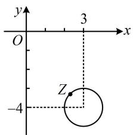
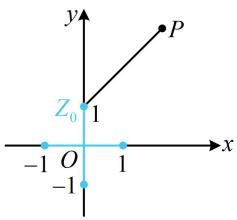

# 强化训练

1. (2023·新课标Ⅰ卷·★)

已知 $z = \frac{1 - \mathrm{i}}{2 + 2\mathrm{i}}$ ，则 $z - \overline{z} =$ （

A. -i

B. i

C. 0

D. 1

1. A

解析：由题意， $z = \frac{1 - \mathrm{i}}{2 + 2\mathrm{i}} = \frac{(1 - \mathrm{i})(2 - 2\mathrm{i})}{(2 + 2\mathrm{i})(2 - 2\mathrm{i})} = \frac{2 - 2\mathrm{i} - 2\mathrm{i} + 2\mathrm{i}^2}{4 - 4\mathrm{i}^2}$

$= \frac{-4\mathrm{i}}{8} = -\frac{1}{2}\mathrm{i}$ ，所以 $\overline{z} = \frac{1}{2}\mathrm{i}$ ，故 $z - \overline{z} = -\frac{1}{2}\mathrm{i} - \frac{1}{2}\mathrm{i} = -\mathrm{i}$

2. (2024·新课标Ⅰ卷·★)

若 $\frac{z}{z - 1} = 1 + \mathrm{i}$ ，则 $z =$ （

A. -1-i

B. $-1 + \mathrm{i}$

C. $1 - \mathrm{i}$

D. $1 + \mathrm{i}$

2. C

解析： $\frac{z}{z - 1} = 1 + \mathrm{i}\Rightarrow z = (1 + \mathrm{i})z - (1 + \mathrm{i})\Rightarrow \mathrm{i}z = 1 + \mathrm{i},$

所以 $z = \frac{1 + \mathrm{i}}{\mathrm{i}} = \frac{(1 + \mathrm{i})(-\mathrm{i})}{\mathrm{i}(-\mathrm{i})} = -\mathrm{i} - \mathrm{i}^2 = 1 - \mathrm{i}$

3. (2025·全国Ⅰ卷·★)

(1+5i)i 的虚部为（）

A. -1

B. 0

C. 1

D. 6

3. C

解析： $(1 + 5\mathrm{i})\mathrm{i} = \mathrm{i} + 5\mathrm{i}^2 = \mathrm{i} - 5 = -5 + \mathrm{i}$

所以 $(1 + 5\mathrm{i})\mathrm{i}$ 的虚部为1.

4. (2024·浙江五校联考·★)

已知复数 $z$ 满足 $\frac{z}{3 - \mathrm{i}} = 1 + \mathrm{i}$ ，则 $z$ 的共轭复数 $\overline{z}$ 在复平面上对应的点位于（）

A. 第一象限

B. 第二象限

C. 第三象限

D. 第四象限

4. D

解析：由 $\frac{z}{3 - \mathrm{i}} = 1 + \mathrm{i}$ 可得 $z = (3 - \mathrm{i})(1 + \mathrm{i}) = 3 + 3\mathrm{i} - \mathrm{i} - \mathrm{i}^2$

$= 4 + 2\mathrm{i}$ ，所以 $\overline{z} = 4 - 2\mathrm{i}$

故 $\overline{z}$ 在复平面上对应的点为 $(4, -2)$ ，在第四象限.

5. (★★)

已知复数 $z$ 满足 $z - \mathrm{i}\in \mathbf{R}$ ，且 $\frac{2 - z}{z}$ 是纯虚数，则 $z =$ （

A. -1-i

B. $-1 + \mathrm{i}$

C. $1 - \mathrm{i}$

D. $1 + \mathrm{i}$

5. D

解析：设 $z = a + b\mathrm{i}(a,b\in \mathbf{R})$ ，则 $z - \mathrm{i} = a + (b - 1)\mathrm{i}\in \mathbf{R}$

所以 b-1=0 ，解得：b=1 ，故 $z=a+i$ ，

$$
\frac {2 - z}{z} = \frac {2 - (a + \mathrm{i})}{a + \mathrm{i}} = \frac {2 - a - \mathrm{i}}{a + \mathrm{i}} = \frac {(2 - a - \mathrm{i}) (a - \mathrm{i})}{(a + \mathrm{i}) (a - \mathrm{i})}
$$

$$
= \frac {(2 - a) a - (2 - a) \mathrm{i} - a \mathrm{i} + \mathrm{i} ^ {2}}{a ^ {2} - \mathrm{i} ^ {2}} = \frac {(2 - a) a - 1 - 2 \mathrm{i}}{a ^ {2} + 1}
$$

$= -\frac{(a - 1)^2}{a^2 + 1} - \frac{2}{a^2 + 1}\mathrm{i}$ ，因为 $\frac{2 - z}{z}$ 是纯虚数，

所以 $-\frac{(a - 1)^2}{a^2 + 1} = 0$ 且 $-\frac{2}{a^2 + 1} \neq 0$ ，解得： $a = 1$ ，故 $z = 1 + \mathrm{i}$ .

6. (2024·广东广州一模·★★)

已知复数 $z$ 满足 $\left|z - 3 + 4\mathrm{i}\right| = 1$ ，则 $z$ 在复平面内对应的点位于（）

A. 第一象限

B. 第二象限

C. 第三象限

D. 第四象限

6. D

解析：由 $|z - 3 + 4\mathrm{i}| = 1$ 不方便直接求出 $z$ ，故考虑设 $z$ 的代数形式，翻译已知条件来分析，

设 $z = x + y\mathrm{i}(x,y\in \mathbf{R})$ ，则 $z - 3 + 4\mathrm{i} = x + y\mathrm{i} - 3 + 4\mathrm{i}$

$$
= (x - 3) + (y + 4) \mathrm{i},
$$

所以 $\left|z-3+4i\right|=\sqrt{(x-3)^{2}+(y+4)^{2}}=1$

两端平方得 $(x - 3)^2 +(y + 4)^2 = 1$

故复数 $z$ 在复平面上对应的点 $(x,y)$ 的轨迹是以(3,-4)为圆心，1为半径的圆，如图，该圆全部位于第四象限，所以 $z$ 在复平面内对应的点位于第四象限.

text_image

y
O
3
x
-4
Z

7. (2024·浙江模拟·★★☆)

若复数 $z$ 的实部大于0，且 $\overline{z} (z + 1) = \frac{20}{3 + \mathrm{i}}$ ，则 $z = (\quad)$

A. $1 - 2\mathrm{i}$

B. $-1 - 2\mathrm{i}$

C. $-1 + 2 \mathrm{i}$

D. $1 + 2 \mathrm{i}$

7. D

解析：由所给等式不方便直接分离出 $z$ ，故考虑设 $z$ 的代数形式，代入所给等式，

设 $z = a + b\mathrm{i}(a > 0,b\in \mathbf{R})$ ，则 $\overline{z} = a - b\mathrm{i}$ ，所以 $\overline{z} (z + 1) =$

$$
z \cdot \overline {{{{z}}}} + \overline {{{{z}}}} = (a + b \mathrm{i}) (a - b \mathrm{i}) + (a - b \mathrm{i}) = a ^ {2} + b ^ {2} + a - b \mathrm{i},
$$

$$
\frac {2 0}{3 + \mathrm{i}} = \frac {2 0 (3 - \mathrm{i})}{(3 + \mathrm{i}) (3 - \mathrm{i})} = \frac {6 0 - 2 0 \mathrm{i}}{9 - \mathrm{i} ^ {2}} = \frac {6 0 - 2 0 \mathrm{i}}{1 0} = 6 - 2 \mathrm{i},
$$

由题意， $\overline{z} (z + 1) = \frac{20}{3 + \mathrm{i}}$ ，所以 $a^2 +b^2 +a - bi = 6 - 2\mathrm{i}$

故 $\left\{ \begin{array}{l}a^2 +b^2 +a = 6\\ -b = -2 \end{array} \right.$ ，解得： $\left\{ \begin{array}{ll}a = 1\\ b = 2 \end{array} \right.$ 或 $\left\{ \begin{array}{ll}a = -2\\ b = 2 \end{array} \right.$

又因为 $a > 0$ ，所以 $a = 1$ ， $b = 2$ ，故 $z = 1 + 2\mathrm{i}$

8. (2024·九省联考·★★★) (多选)

已知复数 $z, w$ 均不为0，则（）

A. $z^2 = |z|^2$

B. $\frac{z}{\overline{z}} = \frac{z^2}{|z|^2}$

C. $\overline{z - w} = \overline{z} -\overline{w}$

D. $\left|\frac{z}{w}\right| = \frac{|z|}{|w|}$

8. BCD

解析：A项，复数的平方可能是虚数，而复数的模是实数，平方后仍为实数，故 $z^2$ 与 $\left|z\right|^2$ 不一定相等，下面举个反例，

设 $z = 1 + \mathrm{i}$ ，则 $z^2 = (1 + \mathrm{i})^2 = 1^2 +2\mathrm{i} + \mathrm{i}^2 = 2\mathrm{i}$

而 $|z| = \sqrt{1^2 + 1^2} = \sqrt{2}$ ，所以 $|z|^2 = (\sqrt{2})^2 = 2$

从而 $z^2 \neq |z|^2$ ，故A项错误；

B项，直接观察不易判断结论的正误，但我们发现两端可约去 $z$ ，于是先约分，再进行判断，

由题意， $z \neq 0$ ，所以 $\frac{z}{\overline{z}} = \frac{z^2}{|z|^2} \Leftrightarrow \frac{1}{\overline{z}} = \frac{z}{|z|^2} \Leftrightarrow z \cdot \overline{z} = |z|^2$ ①，

设 $z = a + b\mathrm{i}(a,b\in \mathbf{R}$ ，且 $a,b$ 不同时为0），

则 $z \cdot \overline{z} = (a + bi)(a - bi) = a^2 - b^2\mathrm{i}^2 = a^2 + b^2 = |z|^2$

所以式①成立，从而 $\frac{z}{\overline{z}} = \frac{z^2}{|z|^2}$ 成立，故B项正确；

C项，直接分析不易，考虑设复数 $z$ ， $w$ 的代数形式来验证，

设 $z = a + b\mathrm{i}$ ， $w = c + d\mathrm{i}$ ，其中 $a,b,c,d\in \mathbf{R}$ ，且 $a,b$ 不同时为0， $c,d$ 不同时为0，

则 $z - w = a + b\mathrm{i} - (c + d\mathrm{i}) = (a - c) + (b - d)\mathrm{i}$

所以 $\overline{z - w} = (a - c) - (b - d)\mathrm{i}$ ，而 $\overline{z} = a - bi$ ， $\overline{w} = c - di$

所以 $\overline{z} -\overline{w} = a - b\mathrm{i} - (c - d\mathrm{i}) = (a - c) - (b - d)\mathrm{i}$

从而 $\overline{z-w}=\overline{z}-\overline{w}$ ，故 C 项正确；

D 项，因为 $w \neq 0$ ，所以 $\left|\frac{z}{w}\right| = \frac{|z|}{|w|}$ ，故 D 项正确.

9. (2025·上海卷·★★★)

已知复数 $z$ 满足 $z^2 = (\overline{z})^2$ ， $\left|z\right|\leq 1$ ，则 $\left|z - 2 - 3\mathrm{i}\right|$ 的最小值是

9. $2 \sqrt{2}$

解析：怎样翻译 $z^2 = (\overline{z})^2$ ？若无思路，不妨设复数 $z$ 的代数形式，再代入分析，设 $z = x + yi(x,y\in \mathbf{R})$ ，

则 $\overline{z} = x - yi$ ，因为 $z^2 = (\overline{z})^2$ ，所以 $(x + yi)^2 = (x - yi)^2$

故 $x^{2} + y^{2}\mathrm{i}^{2} + 2xy\mathrm{i} = x^{2} + y^{2}\mathrm{i}^{2} - 2xy\mathrm{i}$

化简得： $xy\mathrm{i} = 0$ ，所以 $x = 0$ 或 $y = 0$

这意味着复数 $z$ 在复平面上对应的点 $Z(x,y)$ 在实轴或虚轴上，题干还给出了 $|z|\leq 1$ ，由此可进一步限定 $Z$ 的位置，

又 $|z|\leq 1$ ，所以复数 $z$ 在复平面上对应的点 $Z$ 在如图所示的两条蓝色线段上，而 $\left|z - 2 - 3\mathrm{i}\right|$ 表示 $Z$ 与定点 $P(2,3)$ 的距离，所以当 $Z$ 与 $Z_{0}(0,1)$ 重合时，线段 $PZ$ 的长取得最小值 $\sqrt{(2 - 0)^2 + (3 - 1)^2} = 2\sqrt{2}$ ，故 $\left|z - 2 - 3\mathrm{i}\right|_{\min} = 2\sqrt{2}$ ：

text_image

y
P
Z₀ 1
-1 O 1
-1 x

