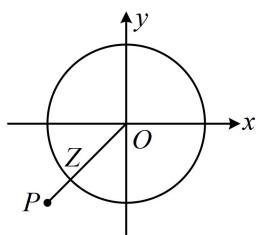
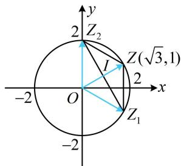

# 内容提要

复数绝大部分考题难度都不高，主要考查复数的基本概念和四则运算，下面先梳理相关的基础知识.

1. 复数的概念: 形如 $a + b\mathrm{i}(a, b \in \mathbf{R})$ 的数叫做复数, 其中 $\mathrm{i}$ 叫做虚数单位, $\mathrm{i}^2 = -1$ ; $a$ 叫做实部, $b$ 叫做虚部 (注意, 不是 $b\mathrm{i}$ 为虚部).  
2. 对于复数 $z = a + b\mathrm{i}(a,b\in \mathbf{R})$ ， $z$ 为实数 $\Leftrightarrow b = 0$ ； $z$ 为虚数 $\Leftrightarrow b\neq 0$ ； $z$ 为纯虚数 $\Leftrightarrow \left\{ \begin{array}{l}a = 0\\ b\neq 0 \end{array} \right.$   
3. 复数相等：设 $z_{1} = a + b\mathrm{i}$ ， $z_{2} = c + d\mathrm{i}$ ，其中 $a, b, c, d \in \mathbf{R}$ ，则 $z_{1} = z_{2} \Leftrightarrow a = c$ 且 $b = d$ 。  
4. 复数的几何意义：复数 $z = a + b\mathrm{i}(a,b\in \mathbf{R})$ 与复平面内的点 $Z(a,b)$ 一一对应，与复平面内的向量 $\overrightarrow{OZ}$ 一一对应.  
5. 复数的模：设复数 $z = a + b\mathrm{i}(a, b \in \mathbf{R})$ ，我们把 $\overrightarrow{OZ}$ 的模叫做 $z$ 的模，记作 $|z|$ ， $|z| = \sqrt{a^2 + b^2}$ .  
6. 共轭复数：复数 $z = a + b\mathrm{i}(a,b\in \mathbf{R})$ 的共轭复数为 $a - b\mathrm{i}$ ，记作 $\overline{z} = a - b\mathrm{i}$ ； $z\cdot \overline{z} = |z|^2$ 。  
7. 复数的四则运算：设复数 $z_{1} = a + b\mathrm{i}$ ， $z_{2} = c + d\mathrm{i}$ ，其中 $a, b, c, d \in \mathbf{R}$ ，则

① $z_{1}+z_{2}=a+bi+c+d\mathrm{i}=(a+c)+(b+d)\mathrm{i}$ ；② $z_{1}-z_{2}=a+bi-c-d\mathrm{i}=(a-c)+(b-d)\mathrm{i}$   
③ $z_{1}z_{2} = (a + bi)(c + di) = ac + adi + bci + bdi^{2} = (ac - bd) + (ad + bc)i$   
④ $\frac{z_1}{z_2} = \frac{a + bi}{c + di} = \frac{(a + bi)(c - di)}{(c + di)(c - di)} = \frac{ac - adi + bc\mathrm{i} - bd\mathrm{i}^2}{c^2 - d^2\mathrm{i}^2} = \frac{(ac + bd) + (bc - ad)\mathrm{i}}{c^2 + d^2}.$

8. 小结论:

①设 $z_{1}$ ， $z_{2}$ 为两个复数，则 $\left|z_1z_2\right| = \left|z_1\right|\cdot \left|z_2\right|$ ， $\left|\frac{z_1}{z_2}\right| = \frac{\left|z_1\right|}{\left|z_2\right|}$ ；（设复数的代数形式，代入此两式即可证明）

②设 $k \in \mathbf{N}$ ，则 $\mathrm{i}^{4k} = 1$ ， $\mathrm{i}^{4k + 1} = \mathrm{i}$ ， $\mathrm{i}^{4k + 2} = -1$ ， $\mathrm{i}^{4k + 3} = -\mathrm{i}$ ；

③ $\left|z\right|^{2}\neq z^{2}$ .（设 $z=a+b\mathrm{i}(a,b\in\mathbf{R},b\neq0)$ ，则 $\left|z\right|^{2}=a^{2}+b^{2}$ ， $z^{2}=a^{2}-b^{2}+2ab\mathrm{i}$ ，显然不等）

# 类型 I：复数的四则运算

【例 1】(2022·天津卷) 已知 i 是虚数单位, 化简 $\frac{11 - 3\mathrm{i}}{1 + 2\mathrm{i}}$ 的结果为 \_\_\_\_.

解析：计算复数的除法，可分子分母同乘以分母的共轭复数，将分母实数化，

$$
\frac {1 1 - 3 \mathrm{i}}{1 + 2 \mathrm{i}} = \frac {(1 1 - 3 \mathrm{i}) (1 - 2 \mathrm{i})}{(1 + 2 \mathrm{i}) (1 - 2 \mathrm{i})} = \frac {1 1 - 2 2 \mathrm{i} - 3 \mathrm{i} + 6 \mathrm{i} ^ {2}}{1 - 4 \mathrm{i} ^ {2}} = \frac {5 - 2 5 \mathrm{i}}{5} = 1 - 5 \mathrm{i}.
$$

答案: $1 - 5 \mathrm{i}$

【变式】设 i 为虚数单位，已知复数 $z = \frac{5}{a + \mathrm{i}}$ 满足 $|z| = \sqrt{5}$ ，其中 $a \in \mathbf{R}$ 且 $a > 0$ ，则 $z =$ \_\_\_\_.

解法1：可先计算 $z$ ，再求模，由题意， $z = \frac{5}{a + \mathrm{i}} = \frac{5(a - \mathrm{i})}{(a + \mathrm{i})(a - \mathrm{i})} = \frac{5a - 5\mathrm{i}}{a^2 - \mathrm{i}^2} = \frac{5a - 5\mathrm{i}}{a^2 + 1} = \frac{5a}{a^2 + 1} -\frac{5}{a^2 + 1}\mathrm{i}$ ①，所以 $|z| = \sqrt{\left(\frac{5a}{a^2 + 1}\right)^2 + \left(-\frac{5}{a^2 + 1}\right)^2} = \sqrt{\frac{25a^2 + 25}{(a^2 + 1)^2}} = \frac{5}{\sqrt{a^2 + 1}}$ ，由题意， $|z| = \sqrt{5}$ ，所以 $\frac{5}{\sqrt{a^2 + 1}} = \sqrt{5}$

结合 $a > 0$ 可得 $a = 2$ ，代入①得： $z = 2 - \mathrm{i}$

解法2：也可先由模的性质 $\left|\frac{z_1}{z_2}\right| = \frac{|z_1|}{|z_2|}$ 求 $|z|$ ， $z = \frac{5}{a + \mathrm{i}} \Rightarrow |z| = \left|\frac{5}{a + \mathrm{i}}\right| = \frac{|5|}{|a + \mathrm{i}|} = \frac{5}{\sqrt{a^2 + 1}}$ ，由题意， $|z| = \sqrt{5}$ ，所以 $\frac{5}{\sqrt{a^2 + 1}} = \sqrt{5}$ ，结合 $a > 0$ 可得 $a = 2$ ，故 $z = \frac{5}{a + \mathrm{i}} = \frac{5}{2 + \mathrm{i}} = \frac{5(2 - \mathrm{i})}{(2 + \mathrm{i})(2 - \mathrm{i})} = \frac{5(2 - \mathrm{i})}{4 - \mathrm{i}^2} = \frac{5(2 - \mathrm{i})}{5} = 2 - \mathrm{i}$ .

答案: $2 - \mathrm{i}$

【例2】（2021·全国甲卷）已知 $(1 - \mathrm{i})^2 z = 3 + 2\mathrm{i}$ ，则 $z =$ （

A. $-1 - \frac{3}{2}\mathrm{i}$

B. $-1 + \frac{3}{2}\mathrm{i}$

C. $-\frac{3}{2} + \mathrm{i}$

D. $-\frac{3}{2} -\mathrm{i}$

解析：复数 $z$ 由方程的形式给出，先由该方程分离出 $z$ ，再进行计算，

因为 $(1 - \mathrm{i})^2 z = 3 + 2\mathrm{i}$ ，所以 $z = \frac{3 + 2\mathrm{i}}{(1 - \mathrm{i})^2} = \frac{3 + 2\mathrm{i}}{1 - 2\mathrm{i} + \mathrm{i}^2} = \frac{3 + 2\mathrm{i}}{-2\mathrm{i}} = \frac{(3 + 2\mathrm{i})2\mathrm{i}}{(-2\mathrm{i})\cdot 2\mathrm{i}} = \frac{6\mathrm{i} + 4\mathrm{i}^2}{-4\mathrm{i}^2} = \frac{6\mathrm{i} - 4}{4} = -1 + \frac{3}{2}\mathrm{i}.$

答案: B

【反思】当复数 $z$ 以方程的形式给出时，如果 $z$ 好分离，就将 $z$ 分离到一侧，再对另一侧进行化简.

# 类型II：复数代数形式的运用

【例 3】（2022·全国乙卷）已知 z=1-2i，且 $z+a\overline{z}+b=0$ ，其中 a, b 为实数，则（）

A. $a = 1, b = -2$

B. $a = -1, b = 2$

C. $a = 1, b = 2$

D. $a = -1, b = -2$

解析： $z = 1 - 2\mathrm{i}\Rightarrow \overline{z} = 1 + 2\mathrm{i}$ ，代入 $z + a\overline{z} +b = 0$ 得： $1 - 2\mathrm{i} + a(1 + 2\mathrm{i}) + b = 0$ ，所以 $1 + a + b + (2a - 2)\mathrm{i} = 0$ 两个复数相等，则实部和虚部对应相等，右侧的0可看成 $0 + 0\cdot \mathrm{i}$ ，故 $\left\{ \begin{array}{l}1 + a + b = 0\\ 2a - 2 = 0 \end{array} \right.$ ，解得： $\left\{ \begin{array}{l}a = 1\\ b = -2 \end{array} \right.$

答案: A

【变式】已知 i 为虚数单位，复数 z 满足 $\left|z-2i\right|=\left|z\right|$ ，则 z 的虚部为 \_\_\_\_.

解析：所给方程有模，无法分离出 $z$ ，故设 $z$ 的代数形式，代入 $\vert z - 2\mathrm{i}\vert = \vert z\vert$ 求解，

设 $z = a + b\mathrm{i}(a,b\in \mathbf{R})$ ，则 $z - 2\mathrm{i} = a + (b - 2)\mathrm{i}$ ，由题意， $\left|z - 2\mathrm{i}\right| = \left|z\right|$

所以 $\sqrt{a^2 + (b - 2)^2} = \sqrt{a^2 + b^2}$ ，解得： $b = 1$ ，故复数 $z$ 的虚部为1.

答案: 1

【总结】当不便于通过简单的变形分离出复数 $z$ 再计算时，可考虑设 $z = a + b\mathrm{i}$ ，翻译已知条件，建立方程组求出 $a$ 和 $b$ ，得到复数 $z$ .

# 类型III：复数的运算性质

【例 4】已知 $\overline{z}$ 是复数 z 的共轭复数，则下列式子中与 $z \cdot \overline{z}$ 不相等的是（）

A. $|\overline{z}^2|$ B. $|z|^2$ C. $|z^2|$ D. $\overline{z}^2$

解法1：诸多选项涉及复数的模，可用模的运算性质 $\left|z_1z_2\right| = \left|z_1\right|\cdot \left|z_2\right|$ 来快速判断选项，

设 $z = a + bi$ ，则 $\overline{z} = a - bi$ ，所以 $\left|z\right| = \left|\overline{z}\right| = \sqrt{a^2 + b^2}$ ，且 $z\cdot \overline{z} = (a + bi)(a - bi) = a^2 -b^2\mathrm{i}^2 = a^2 +b^2$ ①，

A 项， $\left|\overline{z}^{2}\right|=\left|\overline{z}\cdot\overline{z}\right|=\left|\overline{z}\right|\cdot\left|\overline{z}\right|=\left|\overline{z}\right|^{2}=a^{2}+b^{2}=z\cdot\overline{z}$   
B项，因为 $\left|z\right|^{2}=a^{2}+b^{2}$ ，结合①知 $z\cdot\overline{z}=\left|z\right|^{2}$ ;  
C 项， $\left|z^{2}\right|=\left|z\cdot z\right|=\left|z\right|\cdot\left|z\right|=\left|z\right|^{2}=a^{2}+b^{2}$ ，结合①知 $\left|z^{2}\right|=z\cdot\overline{z}$ ；  
D 项， $\overline{z}^{2}=(a-b\mathrm{i})^{2}=a^{2}+b^{2}\mathrm{i}^{2}-2ab\mathrm{i}=a^{2}-b^{2}-2ab\mathrm{i}\neq z\cdot\overline{z}$ ，故选 D.

解法 2: 若不熟悉模的性质, 也可设复数的代数形式, 逐个验证选项,

设 $z = a + bi$ ，则 $\overline{z} = a - bi$ ，所以 $z\cdot \overline{z} = (a + bi)(a - bi) = a^2 -b^2\mathrm{i}^2 = a^2 +b^2$

$$
= \sqrt {a ^ {4} + 2 a ^ {2} b ^ {2} + b ^ {4}} = \sqrt {(a ^ {2} + b ^ {2}) ^ {2}} = a ^ {2} + b ^ {2} = z \cdot \overline {{{{z}}}};
$$

A 项， $\left|\overline{z}^{2}\right|=\left|(a-b\mathrm{i})^{2}\right|=\left|a^{2}+b^{2}\mathrm{i}^{2}-2ab\mathrm{i}\right|=\left|a^{2}-b^{2}-2ab\mathrm{i}\right|=\sqrt{(a^{2}-b^{2})^{2}+(-2ab)^{2}}$   
B 项， $\left|z\right|^{2}=(\sqrt{a^{2}+b^{2}})^{2}=a^{2}+b^{2}=z\cdot\overline{z}$ ;  
C 项， $\left|z^{2}\right|=\left|(a+bi)^{2}\right|=\left|a^{2}+b^{2}i^{2}+2abi\right|=\left|a^{2}-b^{2}+2abi\right|=\sqrt{(a^{2}-b^{2})^{2}+4a^{2}b^{2}}=\sqrt{(a^{2}+b^{2})^{2}}=a^{2}+b^{2}=z\cdot\overline{z}$   
D 项，判断方法同解法 1.

答案: D

【反思】 $z \cdot \overline{z} = |z|^2 = |\overline{z}|^2$ 是共轭复数的重要性质；若遇到拿不准的性质，可设复数的代数形式来检验.

【变式】（2022·全国甲卷）若 $z = -1 + \sqrt{3}\mathrm{i}$ ， $\frac{z}{z\overline{z} - 1} =$ （

A. $-1 + \sqrt{3}\mathrm{i}$ B. $-1 - \sqrt{3}\mathrm{i}$ C. $-\frac{1}{3} +\frac{\sqrt{3}}{3}\mathrm{i}$ D. $-\frac{1}{3} -\frac{\sqrt{3}}{3}\mathrm{i}$

解析： $z = -1 + \sqrt{3}\mathrm{i}\Rightarrow z\overline{z} = |z|^2 = (\sqrt{(-1)^2 + (\sqrt{3})^2})^2 = 4$ ，所以 $\frac{z}{z\overline{z} - 1} = \frac{-1 + \sqrt{3}\mathrm{i}}{4 - 1} = -\frac{1}{3} +\frac{\sqrt{3}}{3}\mathrm{i}.$

答案: C

【例5】（多选）设 $z_{1}$ ， $z_{2}$ ， $z_{3}$ 为复数， $z_{1} \neq 0$ ，下列命题中正确的是（）

A. 若 $\left|z_{2}\right|=\left|z_{3}\right|$ ，则 $z_{2}=\pm z_{3}$ B. 若 $z_{1}z_{2}=z_{1}z_{3}$ ，则 $z_{2}=z_{3}$   
C. 若 $\overline{z}_2 = z_3$ ，则 $\left|z_1z_2\right| = \left|z_1z_3\right|$ D. 若 $z_1z_2 = \left|z_1\right|^2$ ，则 $z_1 = z_2$

解法1：A项， $|z_{2}| = |z_{3}|$ 可看成复平面内 $\left|\overrightarrow{OZ_2}\right| = \left|\overrightarrow{OZ_3}\right|$ ，但方向未定，故 $z_{2} = \pm z_{3}$ 不一定成立，举个反例，取 $z_{2} = \sqrt{3} +\mathrm{i}$ ， $z_{3} = 1 + \sqrt{3}\mathrm{i}$ ，则 $\left|z_2\right| = \left|z_3\right| = 2$ ，但 $z_{2}\neq \pm z_{3}$ ，故A项错误；

B项，由 $z_{1}z_{2} = z_{1}z_{3}$ 两端同除以非零复数 $z_{1}$ 可得 $z_{2} = z_{3}$ ，故B项正确；

C项，看到 $\left|z_{1}z_{2}\right|$ ，想到模的性质 $\left|z_{1}z_{2}\right|=\left|z_{1}\right|\cdot\left|z_{2}\right|$ ，因为 $\overline{z}_{2}=z_{3}$ ，所以 $\left|\overline{z}_{2}\right|=\left|z_{3}\right|$ ，又 $\left|\overline{z}_{2}\right|=\left|z_{2}\right|$ ，所以 $\left|z_{2}\right|=\left|z_{3}\right|$ ，从而 $\left|z_{1}z_{2}\right|- \left|z_{1}z_{3}\right|=\left|z_{1}\right|\cdot\left|z_{2}\right|- \left|z_{1}\right|\cdot\left|z_{3}\right|=\left|z_{1}\right|\left(\left|z_{2}\right|- \left|z_{3}\right)\right)=0$ ，故 $\left|z_{1}z_{2}\right|=\left|z_{1}z_{3}\right|$ ，故C项正确；

D 项，我们知道， $z_{1}\cdot\overline{z}_{1}=\left|z_{1}\right|^{2}$ ，故要使 $z_{1}z_{2}=\left|z_{1}\right|^{2}$ ，只需 $\overline{z}_{1}=z_{2}$ 即可，而不是 $z_{1}=z_{2}$ ，下面举个反例，取 $z_{1}=1+i$ ， $z_{2}=1-i$ ，满足 $z_{1}z_{2}=(1+i)(1-i)=1-i^{2}=2=\left|z_{1}\right|^{2}$ ，但 $z_{1}\neq z_{2}$ ，故 D 项错误.

解法 2: A、B、D 三项的判断方法同解法 1, 对于 C 项, 也可设复数的代数形式来验证,

设 $z_{1} = a + bi$ ， $z_{2} = c + di$ ，其中 $a,b,c,d\in \mathbf{R}$ ，因为 $\overline{z}_2 = z_3$ ，所以 $z_{3} = c - di$

故 $\left|z_{1}z_{2}\right|=\left|(a+bi)(c+di)\right|=\left|ac+ad\mathrm{i}+bc\mathrm{i}+bd\mathrm{i}^{2}\right|=\left|(ac-bd)+(ad+bc)\mathrm{i}\right|=\sqrt{(ac-bd)^{2}+(ad+bc)^{2}}$

$$
= \sqrt {a ^ {2} c ^ {2} + b ^ {2} d ^ {2} - 2 a c b d + a ^ {2} d ^ {2} + b ^ {2} c ^ {2} + 2 a d b c} = \sqrt {a ^ {2} c ^ {2} + b ^ {2} d ^ {2} + a ^ {2} d ^ {2} + b ^ {2} c ^ {2}},
$$

$$
\left| z _ {1} z _ {3} \right| = \left| (a + b \mathrm{i}) (c - d \mathrm{i}) \right| = \left| a c - a d \mathrm{i} + b c \mathrm{i} - b d \mathrm{i} ^ {2} \right| = \left| (a c + b d) + (b c - a d) \mathrm{i} \right| = \sqrt {(a c + b d) ^ {2} + (b c - a d) ^ {2}}
$$

$$
= \sqrt {a ^ {2} c ^ {2} + b ^ {2} d ^ {2} + 2 a c b d + b ^ {2} c ^ {2} + a ^ {2} d ^ {2} - 2 b c a d} = \sqrt {a ^ {2} c ^ {2} + b ^ {2} d ^ {2} + b ^ {2} c ^ {2} + a ^ {2} d ^ {2}},
$$

所以 $\left|z_{1}z_{2}\right|=\left|z_{1}z_{3}\right|$ ，故C项正确.

答案: BC

【反思】实数方程的一些变形方法也适用于复数方程，例如在复数方程两端加上或减去相同的复数，方程依然成立；在复数方程两端同时乘以相同的复数，或同时除以相同的非零复数，方程也依然成立.

# 类型IV：复数的几何意义

【例 6】在复平面内，复数 $\frac{a+2i}{i}(a\in\mathbf{R})$ 对应的点在第四象限，则实数 a 的取值范围是（）

A. $(0, +\infty)$

B. $(- \infty, 0)$

C. $(2, +\infty)$

D. $(- \infty, 2)$

解析：要找所给复数在复平面内对应的点，先将其化为代数形式， $\frac{a + 2\mathrm{i}}{\mathrm{i}} = \frac{(a + 2\mathrm{i})(-\mathrm{i})}{\mathrm{i}(-\mathrm{i})} = \frac{-a\mathrm{i} - 2\mathrm{i}^2}{-\mathrm{i}^2} = 2 - a\mathrm{i}$ ，所以复数 $\frac{a + 2\mathrm{i}}{\mathrm{i}}$ 在复平面内对应的点是 $(2, -a)$ ，由题意，该点在第四象限，故 $-a < 0$ ，解得： $a > 0$ 。

答案: A

【变式】在复平面内， $O$ 为坐标原点，复数 $z_{1} = \mathrm{i}(-4 + 3\mathrm{i})$ ， $z_{2} = 7 + \mathrm{i}$ 对应的点分别为 $Z_{1}$ ， $Z_{2}$ ，则 $\angle Z_{1}OZ_{2}$ 的大小为（）

A. $\frac{\pi}{3}$

B. $\frac{2\pi}{3}$

C. $\frac{3\pi}{4}$

D. $\frac{5\pi}{6}$

解析： $\angle Z_{1}OZ_{2}$ 可看成 $\overrightarrow{OZ_1}$ 和 $\overrightarrow{OZ_2}$ 的夹角，可用夹角余弦公式来处理，

由题意， $z_{1} = \mathrm{i}(-4 + 3\mathrm{i}) = -4\mathrm{i} + 3\mathrm{i}^{2} = -3 - 4\mathrm{i}$ ，所以 $\overrightarrow{OZ_1} = (-3, - 4)$ ，又 $z_{2} = 7 + \mathrm{i}$ ，所以 $\overrightarrow{OZ_2} = (7,1)$

从而 $\cos \angle Z_{1}OZ_{2} = \frac{\overrightarrow{OZ_1}\cdot\overrightarrow{OZ_2}}{\left|\overrightarrow{OZ_1}\right|\cdot\left|\overrightarrow{OZ_2}\right|} = \frac{-3\times 7 + (-4)\times 1}{\sqrt{(-3)^{2} + (-4)^{2}}\times\sqrt{7^{2} + 1^{2}}} = -\frac{\sqrt{2}}{2}$ 故 $\angle Z_{1}OZ_{2} = \frac{3\pi}{4}$

答案: C

【例7】已知i是虚数单位，复数 $z$ 满足 $\vert z\vert = 1$ ，则 $\vert z + 1 + \mathrm{i}\vert$ 的最小值为（）

A. $\sqrt{2} - 1$

B. $\sqrt{2}$

C. $2 \sqrt{2} - 2$

D. 1

解析：已知的 $|z| = 1$ 和所求的 $\left|z + 1 + \mathrm{i}\right|$ 都容易用 $z$ 的代数形式翻译，故设 $z$ 的代数形式来处理，

设 $z = x + yi$ ，则 $\left|z\right| = \sqrt{x^2 + y^2} = 1$ ，所以 $x^{2} + y^{2} = 1$ ①，

且 $|z + 1 + \mathrm{i}| = |x + 1 + (y + 1)\mathrm{i}| = \sqrt{(x + 1)^2 + (y + 1)^2}$ ②，

由方程①可知复数 $z$ 在复平面上对应的点 $Z(x, y)$ 在单位圆上运动，式②可看成点 $Z$ 与定点 $P(-1, -1)$ 的距离，故画图来看，

如图，因为 $|OP| = \sqrt{(-1)^2 + (-1)^2} = \sqrt{2}$ ，所以 $\left|PZ\right|_{\min} = \sqrt{2} - 1$

故 $\left|z+1+i\right|$ 的最小值为 $\sqrt{2}-1$ .

text_image

y
x
O
Z
P

答案: A

【反思】遇到模的最值问题，可考虑数形结合来分析.

【变式】(2020·新课标Ⅱ卷) 设复数 $z_{1}$ , $z_{2}$ 满足 $\left|z_{1}\right| = \left|z_{2}\right| = 2$ , $z_{1} + z_{2} = \sqrt{3} + \mathrm{i}$ , 则 $\left|z_{1} - z_{2}\right| =$ \_\_\_\_.

解法1: 已知与所求有何关联? 若看不出, 不妨设复数的代数形式, 翻译已知和所求, 再作观察. 由于有 $z_{1} + z_{2} = \sqrt{3} + \mathrm{i}$ , 所以为了减少变量个数, 我们只设 $z_{1}$ , 用上式求 $z_{2}$ ,

设 $z_{1} = x + y\mathrm{i}(x,y\in \mathbf{R})$ ，则由 $z_{1} + z_{2} = \sqrt{3} +\mathrm{i}$ 可得 $z_{2} = \sqrt{3} -x + (1 - y)\mathrm{i}$

所以 $z_{1} - z_{2} = 2x - \sqrt{3} +(2y - 1)\mathrm{i}$ ，故 $\left|z_1 - z_2\right| = \sqrt{(2x - \sqrt{3})^2 + (2y - 1)^2} = \sqrt{4(x^2 + y^2) - 4(\sqrt{3} x + y) + 4}$ ①，

条件中还有 $|z_{1}| = |z_{2}| = 2$ 没用到，把它翻译出来，

因为 $\left|z_{1}\right|=\left|z_{2}\right|=2$ ，所以 $\left|z_{1}\right|^{2}=\left|z_{2}\right|^{2}=4$ ，故 $\left\{\begin{aligned}x^{2}+y^{2}&=4②\\\left(\sqrt{3}-x\right)^{2}+(1-y)^{2}&=4③\end{aligned}\right.$

由②③可以解出 $x$ 和 $y$ , 再来算 $\left|z_{1} - z_{2}\right|$ , 但计算量较大, 观察发现①②有共同结构 $x^{2} + y^{2}$ , 若将③展开, 则①③有共同结构 $\sqrt{3} x + y$ , 故按此处理, 看能否整体计算式①,

由③得： $3-2\sqrt{3}x+x^{2}+1-2y+y^{2}=4$ ，结合式②整理得： $\sqrt{3}x+y=2$ ④，

此时我们发现把②④整体代入①恰好可求得 $\left|z_{1}-z_{2}\right|$ ,

所以 $\left|z_{1} - z_{2}\right| = \sqrt{4(x^{2} + y^{2}) - 4(\sqrt{3}x + y) + 4} = \sqrt{4\times 4 - 4\times 2 + 4} = 2\sqrt{3}$

解法2：看到 $z_{1} + z_{2}$ 和 $z_{1} - z_{2}$ ，想到它们有明确的几何意义，故也可考虑画图分析，设复数 $z_{1}$ ， $z_{2}$ 在复平面对应的点为 $Z_{1}$ ， $Z_{2}$ ，从条件来看， $\overrightarrow{OZ_1}$ 和 $\overrightarrow{OZ_2}$ 的模是已知的，但夹角不知道，夹角由条件 $z_{1} + z_{2} = \sqrt{3} + \mathrm{i}$ 决定，故综合这些信息来分析图形的特征，因为 $z_{1} + z_{2} = \sqrt{3} + \mathrm{i}$ ，所以 $\overrightarrow{OZ_1} + \overrightarrow{OZ_2} = (\sqrt{3}, 1)$ ，

记 $\overrightarrow{OZ} = \overrightarrow{OZ_1} +\overrightarrow{OZ_2}$ ，则四边形 $OZ_{1}ZZ_{2}$ 为平行四边形，

因为 $\left|\overrightarrow{OZ}\right|=\left|\overrightarrow{OZ_{1}}+\overrightarrow{OZ_{2}}\right|=\sqrt{(\sqrt{3})^{2}+1^{2}}=2=\left|\overrightarrow{OZ_{1}}\right|=\left|\overrightarrow{OZ_{2}}\right|$ ，所以 $\triangle OZZ_{1}$ 和 $\triangle OZZ_{2}$ 都是边长为 2 的正三角形，故如图， $\left|z_{1}-z_{2}\right|=\left|\overrightarrow{OZ_{1}}-\overrightarrow{OZ_{2}}\right|=\left|\overrightarrow{Z_{2}Z_{1}}\right|=2\left|\overrightarrow{IZ_{1}}\right|=2\left|\overrightarrow{OZ_{1}}\right|\cdot\sin\angle IOZ_{1}=2\times2\sin60^{\circ}=2\sqrt{3}$ .

答案: $2 \sqrt { 3 }$

text_image

y
2 Z₂
I
Z(√3,1)
-2 O 2 x
Z₁
-2

【反思】对于模的处理，有代数和几何两种思路。本题是填空题倒数第二题，画图分析显然更优于代数计算，在分析模的时候，可把复数的加减法和向量的加减法对应起来，即 $\left|z_{1}\pm z_{2}\right|=\left|\overrightarrow{OZ_{1}}\pm\overrightarrow{OZ_{2}}\right|$ 。

# 类型V：复数的高次方运算

【例8】（2023·全国乙卷）设 $z = \frac{2 + \mathrm{i}}{1 + \mathrm{i}^2 + \mathrm{i}^5}$ ，则 $\overline{z} = (\quad)$

A. $1 - 2 \mathrm{i}$

B. $1 + 2\mathrm{i}$

C. $2 - \mathrm{i}$

D. $2 + \mathrm{i}$

解析：由题意， $z = \frac{2 + \mathrm{i}}{1 + \mathrm{i}^2 + \mathrm{i}^5} = \frac{2 + \mathrm{i}}{1 - 1 + (\mathrm{i}^2)^2\mathrm{i}} = \frac{2 + \mathrm{i}}{\mathrm{i}} = \frac{(2 + \mathrm{i})\mathrm{i}}{\mathrm{i}^2} = -\mathrm{i}^2 -2\mathrm{i} = 1 - 2\mathrm{i}$ ，所以 $\overline{z} = 1 + 2\mathrm{i}$

答案: B

【变式】已知复数 $z$ 满足 $z \cdot \overline{z} = 4$ ，且 $z + \overline{z} + |z| = 0$ ，则 $z^{2022} = (\quad)$

A. 1

B. $2^{2022}$

C. -1

D. $- 2 ^ { 2 0 2 2 }$

解析：复数 $z$ 无法直接求出，故可先设复数 $z$ 的代数形式，由已知条件建立方程求出 $z$

设 $z = a + bi(a, b \in \mathbf{R})$ ，则 $\overline{z} = a - bi$ ，由题意， $z \cdot \overline{z} = (a + bi)(a - bi) = a^2 - b^2\mathrm{i}^2 = a^2 + b^2 = 4$ ①，

又 $z + \overline{z} + |z| = 0$ ，所以 $a + bi + a - bi + \sqrt{a^2 + b^2} = 0$ ，所以 $2a + \sqrt{a^2 + b^2} = 0$ ②，

将①代入②可求得： $a = -1$ ，代回①可求得 $b = \pm \sqrt{3}$ ，所以 $z = -1 \pm \sqrt{3} \mathrm{i}$

接下来讨论两种情况，分别计算 $z^{2022}$ ，涉及复数的高次方计算，可先从低次方开始算，

当 $z = -1 + \sqrt{3}\mathrm{i}$ 时， $z^2 = (-1 + \sqrt{3}\mathrm{i})^2 = 1 + 3\mathrm{i}^2 - 2\sqrt{3}\mathrm{i} = -2 - 2\sqrt{3}\mathrm{i}$ ，

所以 $z^3 = z \cdot z^2 = (-1 + \sqrt{3}\mathrm{i})(-2 - 2\sqrt{3}\mathrm{i}) = 2 + 2\sqrt{3}\mathrm{i} - 2\sqrt{3}\mathrm{i} - 6\mathrm{i}^2 = 8$ ，故 $z^{2022} = (z^3)^{674} = 8^{674} = (2^3)^{674} = 2^{2022}$ ；

当 $z = -1 - \sqrt{3}\mathrm{i}$ 时， $z^2 = (-1 - \sqrt{3}\mathrm{i})^2 = 1 + 3\mathrm{i}^2 + 2\sqrt{3}\mathrm{i} = -2 + 2\sqrt{3}\mathrm{i}$ ，

所以 $z^3 = z \cdot z^2 = (-1 - \sqrt{3}\mathrm{i})(-2 + 2\sqrt{3}\mathrm{i}) = 2 - 2\sqrt{3}\mathrm{i} + 2\sqrt{3}\mathrm{i} - 6\mathrm{i}^2 = 8$ ，故 $z^{2022} = (z^3)^{674} = 8^{674} = (2^3)^{674} = 2^{2022}$ ；

综上所述， $z^{2022} = 2^{2022}$

答案: B

【反思】涉及复数的高次方计算，往往先计算低次方，寻找规律.

# 强化训练

1. (2023·新课标Ⅰ卷·★)

已知 $z = \frac{1 - \mathrm{i}}{2 + 2\mathrm{i}}$ ，则 $z - \overline{z} =$ （

A. -i

B. i

C. 0

D. 1

2. (2024·新课标Ⅰ卷·★)

若 $\frac{z}{z - 1} = 1 + \mathrm{i}$ ，则 $z =$ （

A. -1-i

B. $-1 + \mathrm{i}$

C. $1 - \mathrm{i}$

D. $1 + \mathrm{i}$

3. (2025·全国Ⅰ卷·★)

$(1 + 5\mathrm{i})\mathrm{i}$ 的虚部为（）

A. -1

B. 0

C. 1

D. 6

4. (2024·浙江五校联考·★)

已知复数 $z$ 满足 $\frac{z}{3 - \mathrm{i}} = 1 + \mathrm{i}$ ，则 $z$ 的共轭复数 $\overline{z}$ 在复平面上对应的点位于（）

A. 第一象限

B. 第二象限

C. 第三象限

D. 第四象限

5. (★★)

已知复数 $z$ 满足 $z - \mathrm{i}\in \mathbf{R}$ ，且 $\frac{2 - z}{z}$ 是纯虚数，则 $z =$ （）

A. -1-i

B. $-1 + \mathrm{i}$

C. $1 - \mathrm{i}$

D. $1 + \mathrm{i}$

6. (2024·广东广州一模·★★)

已知复数 $z$ 满足 $\left|z - 3 + 4\mathrm{i}\right| = 1$ ，则 $z$ 在复平面内对应的点位于（）

A. 第一象限

B. 第二象限

C. 第三象限

D. 第四象限

7. (2024·浙江模拟·★★☆)

若复数 $z$ 的实部大于0，且 $\overline{z} (z + 1) = \frac{20}{3 + \mathrm{i}}$ ，则 $z = (\quad)$

A. $1 - 2 \mathrm{i}$

B. $- 1 - {2i}$

C. $-1 + 2\mathrm{i}$

D. $1 + 2 \mathrm{i}$

8.（2024·九省联考·★★★）（多选）

已知复数 $z, w$ 均不为0，则（）

A. $z^2 = |z|^2$

B. $\frac{z}{\overline{z}} = \frac{z^2}{|z|^2}$

C. $\overline{z - w} = \overline{z} -\overline{w}$

D. $\left|\frac{z}{w}\right| = \frac{|z|}{|w|}$

9. (2025·上海卷·★★★)

已知复数 $z$ 满足 $z^2 = (\overline{z})^2$ ， $\vert z\vert \leq 1$ ，则 $\vert z - 2 - 3\mathrm{i}\vert$ 的最小值是