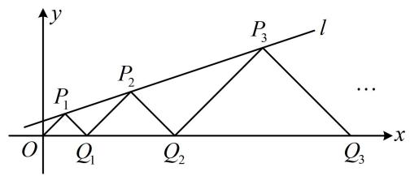

# 内容提要

数列综合小题种类繁多，若是压轴小题，难度往往较大，本节归纳了下面几类常见的题型：

1. 数列的单调性: $\{a_{n}\}$ 为递增数列 $\Leftrightarrow a_{n} < a_{n+1}$ 恒成立, $\{a_{n}\}$ 为递减数列 $\Leftrightarrow a_{n} > a_{n+1}$ 恒成立. 分析数列的最大项或最小项, 常需要判断数列的单调性, 若通项不复杂, 则可根据 $a_{n} = f(n)$ , 用函数的方法来判断单调性. 若通项较复杂或没给通项, 只给了递推公式, 则可通过作差判断 $a_{n+1} - a_{n}$ 的正负来研究 $\{a_{n}\}$ 的单调性; 若是正项数列, 也可作商判断 $\frac{a_{n+1}}{a_n}$ 与 1 的大小.  
2. 两数列的公共项问题：对于数列 $\{a_{n}\}$ 和 $\{b_{n}\}$ 的公共项有关问题，在小题中有时可列出若干项，观察规律就能解决。若要严格论证，由于公共项在两数列中的位置不同，故常设 $a_{m} = b_{n}$ ，建立 $m$ 和 $n$ 的关系，结合 $m, n$ 都为正整数来分析它们的取值情况。  
3. 递推式裂项: 有的递推公式通过变形, 可产生同一数列前后项的差 (裂项), 那么就可对其求和, 进而分析一些问题.  
4. 数列中构造函数分析：在数列问题中，若涉及到指数、对数、三角与多项式混合的超越式，往往考虑构造函数分析问题.  
5. 放缩求和: 当数列 $\{a_{n}\}$ 无法求和, 而问题又与其前 $n$ 项和有关时, 可考虑将 $a_{n}$ 放缩成能求和的式子来处理, 放缩时应往与 $a_{n}$ 形式接近的能求和的结构去尝试. 常见的有放缩成等比数列、可裂项结构等.  
6. 找规律: 这类题会给出一列数, 或一些图形, 解题的突破口往往是观察它们的规律, 找到了规律, 就能运用数列的方法进行接下来的推理.  
7. 综合提升题：这部分收录一些未进行归类的数列综合小题。

# 类型I：数列的单调性与最大最小项

【例 1】已知 $\{a_{n}\}$ 为递减数列，若 $a_{n} = -n^{2} + \lambda n$ ，则实数 $\lambda$ 的取值范围是 \_\_\_\_.

解析： $\{a_{n}\}$ 为递减数列可翻译成 $a_{n} > a_{n + 1}$ ，将通项代入再看怎样能使此不等式恒成立即可，

由题意， $a_{n} > a_{n + 1}$ 即为 $-n^2 +\lambda n > -(n + 1)^2 +\lambda (n + 1)$ ，整理得： $\lambda <  2n + 1$ ，因为 $(2n + 1)_{\mathrm{min}} = 3$ ，所以 $\lambda <  3$

答案： $(-\infty ,3)$

【变式1】若 $a_{n} = \lambda (2^{n} - 1) - n^{2} + 4n$ ，且数列 $\{a_n\}$ 为递增数列，则实数 $\lambda$ 的取值范围是

解析： $\{a_{n}\}$ 为递增数列可翻译成 $a_{n} < a_{n + 1}$ ，从而建立关于 $n$ 的不等式来看，

由题意， $a_{n} < a_{n + 1}$ 即为 $\lambda (2^{n} - 1) - n^{2} + 4n <   \lambda (2^{n + 1} - 1) - (n + 1)^{2} + 4(n + 1)$

整理得： $\lambda \cdot 2^{n} - 2n + 3 > 0$ ，所以 $\lambda > \frac{2n - 3}{2^{n}}$ ，故只需求 $\frac{2n - 3}{2^n}$ 的最大值，此为新的数列，先分析单调性，

令 $b_{n} = \frac{2n - 3}{2^{n}}$ ，则 $b_{n + 1} - b_n = \frac{2(n + 1) - 3}{2^{n + 1}} -\frac{2n - 3}{2^n} = \frac{2n - 1}{2^{n + 1}} -\frac{2(2n - 3)}{2^{n + 1}} = \frac{5 - 2n}{2^{n + 1}}$

当 $n = 1$ 或2时， $b_{n + 1} - b_n > 0$ ，所以 $b_{n + 1} > b_n$ ；当 $n\geq 3$ 时， $b_{n + 1} - b_n <   0$ ，所以 $b_{n + 1} <   b_n$

从而 $b_{1} < b_{2} < b_{3} > b_{4} > b_{5} > \dots$ ，故 $(b_{n})_{\max} = b_{3} = \frac{3}{8}$ ，因为 $\lambda > b_{n}$ 恒成立，所以 $\lambda > \frac{3}{8}$ .

答案： $\left(\frac{3}{8}, + \infty\right)$

【变式2】设数列 $\{a_{n}\}$ 的前 $n$ 项和为 $S_{n}$ ，已知 $a_{1} = 1$ ， $a_{n} > 0$ ，且 $S_{n}^{2} - (2n - 1)S_{n} = S_{n - 1}^{2} + (2n - 1)S_{n - 1}$ ，其中 $n \geq 2$ ，则 $b_{n} = \frac{S_{n}^{2}}{2^{a_{n}}}$ 的最大值是 \_\_\_\_.

解析：所给关系式较复杂，先尝试化简，观察发现将 $S_{n}$ 和 $S_{n - 1}$ 按次数组合可提公因式，

因为 $S_{n}^{2} - (2n - 1)S_{n} = S_{n - 1}^{2} + (2n - 1)S_{n - 1}$ ，所以 $(S_{n} + S_{n - 1})(S_{n} - S_{n - 1}) - (2n - 1)(S_{n} + S_{n - 1}) = 0$

故 $(S_{n} + S_{n - 1})[S_{n} - S_{n - 1} - (2n - 1)] = 0$ ①，

因为 $a_{n} > 0$ ，所以 $S_{n} + S_{n - 1} > 0$ ，从而式①可化为 $S_{n} - S_{n - 1} - (2n - 1) = 0$ ，故 $a_{n} = S_{n} - S_{n - 1} = 2n - 1(n\geq 2)$

又 $a_1 = 1$ 也满足上式，所以 $\forall n\in \mathbf{N}^*$ ，都有 $a_{n} = 2n - 1$

因为 $a_{n + 1} - a_n = 2(n + 1) - 1 - (2n - 1) = 2$ ，所以 $\{a_n\}$ 是等差数列，故 $S_{n} = \frac{n(1 + 2n - 1)}{2} = n^{2}$ ， $b_{n} = \frac{S_{n}^{2}}{2^{a_{n}}} = \frac{n^{4}}{2^{2n - 1}}$

研究 $b_{n}$ 的最大值，先判断其单调性。观察发现通项的次数较高，不好分析，怎么办呢？由于 $b_{n} > 0$ ，故可先开根号将通项化简，再作差判断单调性，记 $c_{n} = \sqrt{b_{n}} = \sqrt{\frac{n^{4}}{2^{2n - 1}}} = \sqrt{\frac{n^{4}}{(2^{n})^{2} \cdot 2^{-1}}} = \sqrt{\frac{2n^4}{(2^n)^2}} = \frac{\sqrt{2} n^2}{2^n}$ ，

则 $c_{n + 1} - c_n = \frac{\sqrt{2}(n + 1)^2}{2^{n + 1}} -\frac{\sqrt{2}n^2}{2^n} = \frac{\sqrt{2}(n + 1)^2 - 2\sqrt{2}n^2}{2^{n + 1}} = \frac{\sqrt{2}(-n^2 + 2n + 1)}{2^{n + 1}}$

当 $n = 1$ 或2时， $-n^2 +2n + 1 > 0$ ，所以 $c_{n + 1} - c_n > 0$ ，故 $c_{n + 1} > c_n$

当 $n \geq 3$ 时， $2 - n \leq -1$ ，所以 $-n^2 + 2n + 1 = n(2 - n) + 1 \leq -n + 1 < 0$ ，从而 $c_{n+1} - c_n < 0$ ，故 $c_{n+1} < c_n$ ；

为了清晰地看出 $\{c_{n}\}$ 中谁最大，我们把上面论证的结果用不等式串起来，

所以 $c_{1} < c_{2} < c_{3} > c_{4} > c_{5} > \dots$ ，故 $c_{n}$ 的最大值为 $c_{3} = \frac{9\sqrt{2}}{8}$ ，又 $b_{n} = c_{n}^{2}$ ，所以 $b_{n}$ 的最大值为 $\frac{81}{32}$ .

答案： $\frac{81}{32}$

【总结】常通过比较 $a_{n}$ 与 $a_{n+1}$ 的大小来判断数列 $\{a_{n}\}$ 的单调性，有时会考虑先化简再作差（商）.

# 类型 II：两数列的公共项问题

【例 2】(2020·新高考 I 卷) 将数列 $\{2n-1\}$ 与 $\{3n-2\}$ 的公共项从小到大排列得到数列 $\{a_{n}\}$ ，则 $\{a_{n}\}$ 的前 n 项和为 \_\_\_\_.

解法1：作为填空题，可列出两个数列前面的若干项，看看公共项是哪些，总结规律即可，

数列 $\{2n-1\}$ 中的项为 1, 3, 5, 7, 9, 11, 13, 15, 17, 19, …,

数列 $\{3n-2\}$ 中的项为 1, 4, 7, 10, 13, 16, 19, …,

观察可得两个数列的公共项为 1, 7, 13, 19, …，所以 $\{a_{n}\}$ 构成首项为 1，公差为 6 的等差数列，

故 $\{a_{n}\}$ 的前 $n$ 项和 $S_{n} = n\times 1 + \frac{n(n - 1)}{2}\times 6 = 3n^{2} - 2n$

解法2：上面的解法1是观察归纳出来的，若要严格论证，可用通项来建立等量关系，设数列 $\{2n - 1\}$ 的第 $n$ 项与 $\{3n - 2\}$ 的第 $m$ 项相等，即 $2n - 1 = 3m - 2$ ，所以 $n = \frac{3m - 1}{2} (m, n \in \mathbf{N}^*)$ ，

因为当且仅当 m 为正奇数时，3m-1 才能被 2 整除，此时 n 为正整数，即 m 可取 1, 3, 5, …，所以数列 $\{3n-2\}$ 的奇数项即为两个数列的公共项，

若设 $b_{n}=3n-2$ ，则 $\{a_{n}\}$ 的前n项和 $S_{n}=b_{1}+b_{3}+b_{5}+\cdots+b_{2n-1}$

因为 $b_{1}$ ， $b_{3}$ ， $b_{5}$ ，…， $b_{2n-1}$ 仍构成等差数列，所以 $S_{n}=\frac{n(b_{1}+b_{2n-1})}{2}=\frac{n[1+3(2n-1)-2]}{2}=3n^{2}-2n$ .

答案: $3n^{2} - 2n$

【总结】数列 $\{a_{n}\}$ 和 $\{b_{n}\}$ 的公共项问题，有限罗列总结规律是小题中常用的方法之一。若要严格论证，可设 $a_{m} = b_{n}$ ，建立 $m$ 和 $n$ 的关系，再结合 $m, n \in \mathbb{N}^{*}$ 来分析各自的取值情况，从而解决问题。

# 类型III：递推式裂项

【例 3】设数列 $\{a_{n}\}$ 满足 $a_{1}=\frac{1}{2}$ ， $a_{n+1}=a_{n}^{2}+a_{n}$ ，用 [x] 表示不超过 x 的最大整数，则 $\left[\frac{1}{a_{1}+1}+\frac{1}{a_{2}+1}+\cdots+\frac{1}{a_{100}+1}\right]=()$

A. 1

B. 2

C. 3

D. 4

解析：所求式子中有数列 $\left\{\frac{1}{a_n + 1}\right\}$ 的前100项和，故尝试由所给递推公式变出 $\frac{1}{a_n + 1}$ 这一结构，

因为 $a_{n + 1} = a_n^2 +a_n$ ，所以 $a_{n + 1} = a_n(a_n + 1)$ ①，两端取倒数可产生 $\frac{1}{a_n + 1}$ ，先分析左右是否为0，

由 $a_{1}>0$ 及 $a_{2}=a_{1}^{2}+a_{1}$ 得 $a_{2}>0$ ，由 $a_{2}>0$ 及 $a_{3}=a_{2}^{2}+a_{2}$ 得 $a_{3}>0,\cdots$ ，以此类推可知 $a_{n}>0$ 恒成立，
所以式①可变形成 $\frac{1}{a_{n+1}}=\frac{1}{a_{n}(a_{n}+1)}=\frac{1}{a_{n}}-\frac{1}{a_{n}+1}$ ，故 $\frac{1}{a_{n}+1}=\frac{1}{a_{n}}-\frac{1}{a_{n+1}}$

$$
\frac {1}{a _ {1} + 1} + \frac {1}{a _ {2} + 1} + \dots + \frac {1}{a _ {1 0 0} + 1} = \frac {1}{a _ {1}} - \frac {1}{a _ {2}} + \frac {1}{a _ {2}} - \frac {1}{a _ {3}} + \dots + \frac {1}{a _ {9 9}} - \frac {1}{a _ {1 0 0}} + \frac {1}{a _ {1 0 0}} - \frac {1}{a _ {1 0 1}} = \frac {1}{a _ {1}} - \frac {1}{a _ {1 0 1}} = 2 - \frac {1}{a _ {1 0 1}} \quad ②,
$$

要分析 $2 - \frac{1}{a_{101}}$ 的范围，需估计 $a_{101}$ 的范围，可通过分析 $\{a_n\}$ 的单调性来研究 $a_{101}$ 的取值情况，

由 $a_{n + 1} = a_n^2 +a_n$ 得 $a_{n + 1} - a_n = a_n^2\geq 0$ ，所以 $a_{n + 1}\geq a_n$ ，又 $a_1 = \frac{1}{2}$ ，所以 $a_2 = a_1^2 +a_1 = \frac{3}{4}$ ， $a_3 = a_2^2 +a_2 = \frac{21}{16} >1$

从而 $a_{101} \geq a_3 > 1$ ，故 $1 < 2 - \frac{1}{a_{101}} < 2$ ，结合式②可得 $\left[\frac{1}{a_1 + 1} + \frac{1}{a_2 + 1} + \dots + \frac{1}{a_{100} + 1}\right] = 1$ .

答案: A

【总结】对递推式裂项，常从要求和的式子出发，由递推式凑出该结构，并分离出来，达到裂项的效果.

# 类型IV：数列中构造函数分析

【例 4】已知数列 $\{a_{n}\}$ 满足 $0 < a_{1} < 1$ ， $a_{n+1} = a_{n} + \ln(2 - a_{n})$ ，则下列说法正确的是（）

A. $0 < a_{100} < \frac{1}{2}$

B. $\frac{1}{2} < a_{100} < 1$

C. $1 < a_{100} < \frac{3}{2}$

D. $\frac{3}{2} < a_{100} < 2$

解析：递推式中有 $\ln (2 - a_{n})$ ，对递推式变形较困难，可尝试把 $a_{n}$ 看成自变量，构造函数分析，

设 $f(x) = x + \ln (2 - x)$ ，其中 $x < 2$ ，则 $a_{n + 1} = f(a_n)$ ，且 $f^{\prime}(x) = 1 + \frac{1}{2 - x}\cdot (-1) = \frac{1 - x}{2 - x},$

所以 $f^{\prime}(x) > 0\Leftrightarrow x <   1$ ， $f^{\prime}(x) <   0\Leftrightarrow 1 <   x <   2$ ，故 $f(x)$ 在 $(-\infty ,1)$ 上 $\nearrow$ ，在(1,2)上 $\searrow$

有了 $f(x)$ 的单调性，我们可以先把 $a_1$ 的范围代进去，分析 $a_2$ 的范围，以此类推，寻找规律，

因为 $0 < a_{1} < 1$ ，且 $a_{2} = f(a_{1})$ ，所以 $f(0) < a_{2} < f(1)$ ，即 $\ln 2 < a_{2} < 1$ ①，

注意到 $(\ln 2,1) \subseteq (0,1)$ ，于是我们由 $a_1 \in (0,1)$ 和 $a_2 = f(a_1)$ 得出了 $a_2 \in (0,1)$ ，这一过程可重复下去，

同理，由 $\left\{\begin{aligned}a_{2}\in(0,1)\\ a_{3}=f(a_{2})\end{aligned}\right.$ 可得出 $a_{3}\in(0,1)$ ，由 $\left\{\begin{aligned}a_{3}\in(0,1)\\ a_{4}=f(a_{3})\end{aligned}\right.$ 可得出 $a_{4}\in(0,1)$ ， $\cdots$ ，

以此类推可知数列 $\{a_{n}\}$ 中的项都在(0,1)上，故排除C、D选项，

此时观察 A、B 选项发现只需再判断 $a_{100}$ 与 $\frac{1}{2}$ 的大小，可结合 $\{a_n\}$ 的单调性来看，

因为 $0 < a_{n} < 1$ ，且 $a_{n + 1} = a_n + \ln (2 - a_n)$ ，所以 $a_{n + 1} - a_n = \ln (2 - a_n) > 0$ ，故 $a_{n + 1} > a_n$

所以 $\{a_{n}\}$ 为递增数列，故 $a_{100} > a_{2}$ ，由①知 $a_{2} > \ln 2 > \frac{1}{2}$ ，所以 $a_{100} > \frac{1}{2}$ ，故 $\frac{1}{2} < a_{100} < 1$ 。

答案: B

【例5】已知等差数列 $\{a_{n}\}$ 的前 $n$ 项和为 $S_{n}$ ， $\sin (a_4 - 1) + 2a_4 - 5 = 0$ ， $\sin (a_8 - 1) + 2a_8 + 1 = 0$ ，则下列结论正确的是（）

A. $S_{11} = 11$ ， $a_4 < a_8$

B. $S_{11} = 22$ ， $a_4 < a_8$

C. $S_{11} = 22$ ， $a_4 > a_8$

D. $S_{11} = 11$ ， $a_4 > a_8$

解析：条件是关于 $a_4$ 和 $a_8$ 的，故用它们求 $S_{11}$ ， $\{a_n\}$ 是等差数列 $\Rightarrow S_{11} = \frac{11(a_1 + a_{11})}{2} = \frac{11(a_4 + a_8)}{2}$ ①，

由给的两个等式求不出 $a_4$ 和 $a_8$ ，观察发现它们的形式比较接近，可考虑化同构形式，构造函数分析，

$$
\sin (a _ {4} - 1) + 2 a _ {4} - 5 = 0 \Rightarrow \sin (a _ {4} - 1) + 2 (a _ {4} - 1) - 3 = 0 \quad ②,
$$

$$
\sin \left(a _ {8} - 1\right) + 2 a _ {8} + 1 = 0 \Rightarrow - \sin \left(a _ {8} - 1\right) - 2 a _ {8} - 1 = 0 \Rightarrow \sin \left(1 - a _ {8}\right) + 2 \left(1 - a _ {8}\right) - 3 = 0 \quad ③,
$$

设 $f(x) = \sin x + 2x - 3 (x \in \mathbf{R})$ ，则 $f'(x) = \cos x + 2 > 0$ ，所以 $f(x)$ 在 $\mathbf{R}$ 上 $\nearrow$ ，

由式②③可得 $f(a_{4}-1)=f(1-a_{8})=0$ ，所以 $a_{4}-1=1-a_{8}$ ，故 $a_{4}+a_{8}=2$ ，代入①得 $S_{11}=11$ ；

再比较 $a_{4}$ 和 $a_{8}$ 的大小，注意到 $a_{4} - 1$ 和 $1 - a_{8}$ 都是 $f(x)$ 的零点，故只需估算零点的范围即可，

因为 $f(1) = \sin 1 - 1 < 0$ ， $f(2) = \sin 2 + 1 > 0$ ，所以 $f(x)$ 的零点在(1,2)上，

从而 $\left\{ \begin{array}{l} 1 < a_{4} - 1 < 2 \\ 1 < 1 - a_{8} < 2 \end{array} \right.$ ，故 $\left\{ \begin{array}{l} 2 < a_{4} < 3 \\ -1 < a_{8} < 0 \end{array} \right.$ ，所以 $a_{4} > a_{8}$ .

答案: D

【总结】由上面两道题可以看出，当所给条件为指数、对数、三角与多项式混合的超越结构时，这类式子不大可能通过简单变形就解决问题，故常考虑构造函数分析.

# 类型V：放缩求和

【例6】（多选）已知数列 $\{a_{n}\}$ 满足 $a_1 = 1$ ， $a_{n + 1} = 3a_{n} + 1$ ，则（）

A. $\left\{a_{n} + \frac{1}{2}\right\}$ 是等比数列

B. $a_{n} = \frac{3^{n} - 2}{2}$

C. $\frac{1}{a_1 + 1} +\frac{1}{a_2 + 1} +\dots +\frac{1}{a_n + 1} <  1$

D. $\frac{1}{a_1} + \frac{1}{a_2} + \dots + \frac{1}{a_n} < \frac{3}{2}$

解析：要分析 $\left\{a_{n} + \frac{1}{2}\right\}$ 是否为等比数列，可由所给递推公式凑出这一形式来看，

因为 $a_{n + 1} = 3a_n + 1$ ，所以 $a_{n + 1} + \frac{1}{2} = 3a_n + 1 + \frac{1}{2} = 3\left(a_n + \frac{1}{2}\right)$ ①，

又 $a_1 = 1$ ，所以 $a_1 + \frac{1}{2} = \frac{3}{2} \neq 0$ ，结合式①可得数列 $\left\{a_n + \frac{1}{2}\right\}$ 是首项为 $\frac{3}{2}$ ，公比为3的等比数列，

所以 $a_{n} + \frac{1}{2} = \frac{3}{2}\times 3^{n - 1}$ ，从而 $a_{n} = \frac{3^{n} - 1}{2}$ ，故A项正确，B项错误；

C 项, $\frac{1}{a_{n} + 1} = \frac{2}{3^{n} + 1}$ , 为了大致判断此选项是否成立, 先取 $n = 1,2,3$ 检验, 可发现结论都成立, 且随着项数的增加, 后面加上去的项越来越小, 故猜想 C 项正确, 再尝试证明. 尽管 $\left\{\frac{1}{a_n + 1}\right\}$ 无法直接求和, 但我们发现只要把分母的 1 丢掉, 就可以求和了, 于是先试试直接丢项放缩,

$\frac{1}{a_n + 1} = \frac{2}{3^n + 1} < \frac{2}{3^n} \Rightarrow \frac{1}{a_1 + 1} + \frac{1}{a_2 + 1} + \dots + \frac{1}{a_n + 1} < \frac{2}{3^1} + \frac{2}{3^2} + \dots + \frac{2}{3^n} = \frac{\frac{2}{3}\left[1 - \left(\frac{1}{3}\right)^n\right]}{1 - \frac{1}{3}} = 1 - \left(\frac{1}{3}\right)^n < 1$ ，故C项正确；

对于 D 项， $\frac{1}{a_{n}}=\frac{2}{3^{n}-1}$ ，仍可通过取 n=1,2,3 检验发现结论都成立，故猜想 D 项也正确，再尝试证明。此处若直接丢项，得到的是 $\frac{1}{a_{n}}=\frac{2}{3^{n}-1}>\frac{2}{3^{n}}$ ，放缩的方向都不对，怎么办呢？从 $\frac{1}{a_{n}}$ 的结构来看，放缩成公比为 $\frac{1}{3}$ 的等比数列这一思路是正确的，但需调整系数，于是用待定系数法，先设 $\frac{2}{3^{n}-1}\leq p\left(\frac{1}{3}\right)^{n}(p>0)$ ，再将其求和，根据要证的结果来反推需要什么样的 p，即 $\sum_{k=1}^{n}p\left(\frac{1}{3}\right)^{k}=\frac{p}{2}-\frac{p}{2}\cdot\left(\frac{1}{3}\right)^{n}<\frac{p}{2}$ ，故应取 $\frac{p}{2}=\frac{3}{2}$ ，此时 p=3，代回 $\frac{2}{3^{n}-1}\leq p\left(\frac{1}{3}\right)^{n}$ 可得 $\frac{2}{3^{n}-1}\leq\left(\frac{1}{3}\right)^{n-1}$ ，下面先作差分析此不等式是否成立，

因为 $\frac{2}{3^n - 1} -\left(\frac{1}{3}\right)^{n - 1} = \frac{2}{3^n - 1} -\frac{3}{3^n} = \frac{2\times 3^n - 3(3^n - 1)}{(3^n - 1)3^n} = \frac{3 - 3^n}{(3^n - 1)3^n}\leq 0$ ，所以 $\frac{2}{3^n - 1}\leq \left(\frac{1}{3}\right)^{n - 1}$ ，即 $\frac{1}{a_n}\leq \left(\frac{1}{3}\right)^{n - 1}$

从而 $\frac{1}{a_1} +\frac{1}{a_2} +\dots +\frac{1}{a_n}\leq \left(\frac{1}{3}\right)^0 +\left(\frac{1}{3}\right)^1 +\dots +\left(\frac{1}{3}\right)^{n - 1} = \frac{1 - \left(\frac{1}{3}\right)^n}{1 - \frac{1}{3}} = \frac{3}{2} -\frac{3}{2}\times \left(\frac{1}{3}\right)^n <   \frac{3}{2},$ 故D项正确.

答案: ACD

【反思】若要放缩成等比数列求和，直接丢项是最简单的放缩方法，但若尝试后发现不行，则可用待定系数法来调整。另外，本题的不等式 $\frac{2}{3^n - 1} \leq \left(\frac{1}{3}\right)^{n - 1}$ 也可用糖水不等式来证，即 $\frac{2}{3^n - 1} \leq \frac{2 + 1}{3^n - 1 + 1} = \left(\frac{1}{3}\right)^{n - 1}$ 。

# 类型VI：找规律

【例 7】已知 $k \in N^{*}$ ，数列 1，1，2，1，1，2，4，2，1，1，2，4，8，4，2，1，…，1，2，4，…， $2^{k-2}$ ， $2^{k-1}$ ， $2^{k-2}$ ，…，4，2，1，…的前 n 项和为 $S_{n}$ ，若 $S_{n} > 2024$ ，则 n 的最小值为 \_\_\_\_.

解析：条件中给出了数列足够多的项，应先观察这些项的规律，

为了便于分析，记所给数列为 $\{a_{n}\}$ ，将 $\{a_{n}\}$ 按连续的1的中间为分界进行分组，并画成下面的图，

<table><tr><td>第1行</td><td>1</td></tr><tr><td>第2行</td><td>1 2 1</td></tr><tr><td>第3行</td><td>1 2 4 2 1</td></tr><tr><td>第4行</td><td>1 2 4 8 4 2 1</td></tr><tr><td>......</td><td>......</td></tr></table>

第k行 1 2 4 … $2^{k-2}$ $2^{k-1}$ $2^{k-2}$ … 4 2 1

我们应判断恰使 $S_{n} > 2024$ 的最后一项 $a_{n}$ 位于第几行，可先求出第 $k$ 行的和，再用它求前 $k$ 行的和，记第 k 行的和为 $b_{k}$ ，数列 $\{b_{k}\}$ 的前 k 项和为 $T_{k}$ ，由上图， $b_{k}=1+2+4+\cdots+2^{k-2}+2^{k-1}+2^{k-2}+\cdots+4+2+1=2(1+2+4+\cdots+2^{k-1})-2^{k-1}=2\times\frac{1-2^{k}}{1-2}-2^{k-1}=2(2^{k}-1)-2^{k-1}=4\times2^{k-1}-2-2^{k-1}=3\times2^{k-1}-2$

前 k 行的和 $T_{k}=b_{1}+b_{2}+\cdots+b_{k}=3\times2^{0}-2+3\times2^{1}-2+\cdots+3\times2^{k-1}-2=3\times\frac{1-2^{k}}{1-2}-2k=3(2^{k}-1)-2k$

由 $b_{k} > 0$ 知 $\{T_k\}$ 是递增数列，又 $T_{9} = 3\times (2^{9} - 1) - 18 = 1515 <   2024$ ， $T_{10} = 3\times (2^{10} - 1) - 20 = 3049 > 2024$

所以刚好能使 $S_{n} > 2024$ 成立的 $a_{n}$ 应在第10行，接下来分析 $a_{n}$ 是第10行的第几项，

因为 $2024 - T_{9} = 2024 - 1515 = 509$ ，所以第10行的第1项到 $a_{n}$ 这一项的和应恰好大于509，

第 10 行为 1, 2, 4, …, $2^{8}$ , $2^{9}$ , $2^{8}$ , …, 4, 2, 1，因为 $1+2+4+\cdots+2^{7}=\frac{1-2^{8}}{1-2}=255<509$ ,

$1+2+4+\cdots+2^{8}=\frac{1-2^{9}}{1-2}=511>509$ ，所以刚好能使 $S_{n}>2024$ 成立的 $a_{n}$ 为第10行的第9个数，

由图可知第 k 行有 2k-1 个数，前 9 行共 $1+3+5+\cdots+17=\frac{9\times(1+17)}{2}=81$ 个数，

所以使 $S_{n} > 2024$ 成立的 $n$ 最小时， $a_{n}$ 为第 $81 + 9 = 90$ 项.

答案: 90

# 类型VII：综合提升题

【例 8】(2022·北京卷（改）) 已知数列 $\{a_{n}\}$ 的各项均为正数， $a_{1}=2,\quad\{a_{n}\}$ 的前 n 项和 $S_{n}$ 满足 $a_{n}S_{n}=a_{n+1}^{2}+a_{n+1}S_{n}(n\in\mathbf{N}^{*})$ ，给出下列四个结论：① $a_{2}<1$ ；② $\{a_{n}S_{n}\}$ 为常数列；③ $\{a_{n}\}$ 为递增数列；

④ $\{a_{n}\}$ 中存在小于 $\frac{1}{100}$ 的项. 其中所有正确结论的序号是 \_\_\_\_.

解析：①项，在 $a_{n}S_{n} = a_{n + 1}^{2} + a_{n + 1}S_{n}$ 中取 $n = 1$ 可得 $a_1S_1 = a_2^2 +a_2S_1$ ，又 $S_{1} = a_{1} = 2$ ，所以 $4 = a_2^2 +2a_2$

解得： $a_2 = \pm \sqrt{5} -1$ ，又 $\{a_n\}$ 各项均为正数，所以 $a_2 = \sqrt{5} -1 > 1$ ，故①错误；

②项， $a_{n}S_{n} = a_{n + 1}^{2} + a_{n + 1}S_{n}\Rightarrow a_{n}S_{n} = a_{n + 1}(a_{n + 1} + S_{n}) = a_{n + 1}S_{n + 1}$ ，所以 $\{a_nS_n\}$ 为常数列，故②正确；

③项，注意到 $\{a_{n}\}$ 为正项数列，由②中 $a_{n}S_{n} = a_{n + 1}S_{n + 1}$ 可变出 $\frac{a_{n + 1}}{a_n}$ ，判断它与1的大小即得单调性，

$a_{n}S_{n} = a_{n + 1}S_{n + 1}\Rightarrow \frac{a_{n + 1}}{a_n} = \frac{S_n}{S_{n + 1}}$ ，因为 $\{a_{n}\}$ 各项均为正数，所以 $S_{n + 1} = S_n + a_{n + 1} > S_n > 0$ ，从而 $\frac{S_n}{S_{n + 1}} < 1$

故 $\frac{a_{n + 1}}{a_n} = \frac{S_n}{S_{n + 1}} < 1$ ，所以 $a_{n + 1} < a_n$ ，故 $\{a_n\}$ 为递减数列，故③错误；

④项, 正面分析较难, 可从反面考虑. 直观想象可知若 $\{a _ { n } \}$ 的项都不小于 $\frac { 1 } { 1 0 0 }$ , 则当 $n \to + \infty$ 时, $S _ { n } \to + \infty$ , 而 $a _ { n } \geq \frac { 1 } { 1 0 0 }$ , 从而必有 $a _ { n } S _ { n } \to + \infty$ , $\{a _ { n } S _ { n } \}$ 不可能为常数列, 下面用反证法来严格论证,

假设 $\{a_{n}\}$ 中不存在小于 $\frac{1}{100}$ 的项，则 $a_{n} \geq \frac{1}{100}$ 恒成立，因为 $\{a_{n} S_{n}\}$ 为常数列，所以 $a_{n} S_{n} = a_{1} S_{1} = a_{1}^{2} = 4$

故当 $n > 40000$ 时， $a_{n}S_{n} \geq \frac{S_{n}}{100} > \frac{S_{40000}}{100} \geq \frac{40000 \times \frac{1}{100}}{100} = 4$ ，矛盾，故 $\{a_{n}\}$ 中存在小于 $\frac{1}{100}$ 的项，故④正确.

答案：②④

【反思】当正面证明结论较困难时，可考虑用反证法，即先假设结论不成立，并由此出发推出矛盾，从而否定假设，得出结论.

# 强化训练

提醒：本节包含诸多压轴小题，难度较高，请同学们做好心理准备。

1. (2023·全国模拟·★★★)

已知数列 $\{a_{n}\}$ 的通项公式为 $a_{n} = (20 - n)\cdot \left(\frac{3}{2}\right)^{n}$ ，则 $a_{n}$ 取得最大值时， $n = \_$ .

2. (2023·湖北武汉四调·★★★)

“中国剩余定理”又称“孙子定理”，1852年英国来华传教士伟烈亚力将《孙子算经》中“物不知数”问题的解法传至欧洲。1874年英国数学家马西森指出此法符合1801年由高斯得出的关于同余式解法的一般性定理，因而西方称之为“中国剩余定理”，“中国剩余定理”讲的是一个关于同余的问题。现有这样一个问题：将正整数中能被3除余1且被2除余1的数按由小到大的顺序排成一列，构成数列 $\{a_{n}\}$ ，则 $a_{10} = (\quad)$

A. 55

B. 49

C. 43

D. 37

3. (2023·浙江温州三模·★★★)

已知数列 $\{a_{n}\}$ 各项为正数， $\{b_{n}\}$ 满足 $a_{n}^{2} = b_{n}b_{n + 1}$ ， $a_{n} + a_{n + 1} = 2b_{n + 1}$ ，则（）

A. $\{b_{n}\}$ 是等差数列

B. $\{b_{n}\}$ 是等比数列

C. $\{\sqrt{b_n}\}$ 是等差数列

D. $\{\sqrt{b_n}\}$ 是等比数列

4. (2024·新课标Ⅰ卷·★★★☆)

已知函数 $f(x)$ 的定义域为 $\mathbf{R}$ ， $f(x) > f(x - 1) + f(x - 2)$ ，且当 $x < 3$ 时， $f(x) = x$ ，则下列结论中一定正确的是（）

A. $f(10) > 100$

B. $f(20) > 1000$

C. $f(10) < 1000$

D. $f(20) < 10000$

5. (2023·全国模拟·★★★☆)

已知数列 $\{a_{n}\}$ 满足 $a_{n + 1} = \log_2(a_n + 1)$ ，若 $\{a_{n}\}$ 是递增数列，则 $a_1$ 的取值范围是（）

A. (0,1)

B. $(0, \sqrt{2})$

C. $(-1,0)$

D. $(1, +\infty)$

6. (2023·福建厦门第二次质检·★★★)

数列 $\{a_{n}\}$ 满足 $a_{n+1}=\frac{1+a_{n}}{1-a_{n}}$ ， $a_{1}=2$ ，若 $T_{n}=a_{1}a_{2}a_{3}\cdots a_{n}$ ，则 $T_{10}=$ \_\_\_\_.

7. (2024·江苏南通模拟·★★★☆)

将正整数数列 1, 2, 3, 4, 5, … 的各项按照上小下大、左小右大的原则写成如下的三角形数表:

$$
\begin{array}{c c c c} & 1 \\ & 2 & 3 \\ 4 & 5 & 6 \\ & \dots \end{array}
$$

将每行的第一个数与每行的最后一个数依次相加，前 $n$ 行的和为 \_\_\_\_.

8. (2023·四川模拟·★★★★)

如图，直线 $l: y = \frac{1}{3}x + 1$ 上的点 $P_{i}(i = 1, 2, \cdots, n)$ 与 x 轴正半轴上的点 $Q_{i}(i = 1, 2, \cdots, n)$ 及原点 O 构成一系列等腰直角 $\triangle OP_{1}Q_{1}$ ， $\triangle Q_{1}P_{2}Q_{2}$ ， $\triangle Q_{2}P_{3}Q_{3}$ ，…， $\triangle Q_{n-1}P_{n}Q_{n}$ ，且 $\angle P_{i} = 90^{\circ}(i = 1, 2, \cdots, n)$ ，记点 $Q_{n}$ 的横坐标为 $a_{n}$ ，则 $a_{1} =$ \_\_\_\_ ； $a_{n} =$ \_\_\_\_ .

text_image

y
P₁ P₂ P₃ l
O Q₁ Q₂ Q₃ ...

9. (2023·重庆模拟·★★★★)

记 $[x]$ 表示不超过 $x$ 的最大整数，例如， $[2.3] = 2, [-1.2] = -2$ 。已知数列 $\{a_n\}$ 满足 $a_1 = \frac{7}{3}$ ，且 $a_{n+1} = a_n^2 - a_n + 1$ ，则 $\left[\frac{1}{a_1} + \frac{1}{a_2} + \cdots + \frac{1}{a_{2023}}\right] =$ \_\_\_\_。

10.（2023·黑龙江牡丹江模拟·★★★★）

数列 $\{a_{n}\}$ 满足 $0 < a_{1} < 1$ ， $\mathrm{e}^{a_{n + 1}} = (3 - a_n)\mathrm{e}^{a_n}$ ，则下列说法正确的是（）

A. 数列 $\{a_{n}\}$ 为递减数列  
B. 存在 $n \in \mathbf{N}^{*}$ , 使得 $a_{n}<0$   
C. 存在 $n \in \mathbf{N}^*$ , 使得 $a_{n} > 2$   
D. 存在 $n \in \mathbf{N}^*$ ，使得 $a_{n} > \frac{4}{3}$

11. (2022·辽宁模拟·★★★★)

设 $[x]$ 表示不超过 $x$ 的最大整数，正项数列 $\{a_{n}\}$ 的前 $n$ 项和为 $S_{n}$ ， $a_{1} = 1$ ，且 $a_{n} + 2S_{n-1} = \frac{1}{a_{n}} (n \geq 2)$ ，则 $\left[\frac{1}{S_1} + \frac{1}{S_2} + \dots + \frac{1}{S_{80}}\right] =$ \_\_\_\_.