# 模块一 立体图形的结构探究

# 第1节 几何体的表面积与体积（★★）

# 内容提要

本节涉及空间几何体的表面积和体积计算，下面先梳理一些必备公式.

1. 多面体的表面积与体积（表面积即各个面的面积之和，没有统一的公式）

①棱锥的体积： $V=\frac{1}{3}Sh$ ；②棱柱的体积：V=Sh；③棱台的体积： $V=\frac{1}{3}(S+S'+\sqrt{SS'})h$ .

2. 旋转体的表面积与体积

①圆柱：如图1，体积 $V = Sh = \pi r^{2}h$ ，侧面积 $S_{\text{侧}} = 2\pi rh$ ，表面积 $S = 2\pi rh + 2\pi r^{2}$ ；

②圆锥：如图2，体积 $V=\frac{1}{3}Sh=\frac{1}{3}\pi r^{2}h$ ，侧面积 $S_{侧}=\pi rl$ ，表面积 $S=\pi rl+\pi r^{2}$ ；

③圆台：如图3，体积 $V = \frac{1}{3} (S + S' + \sqrt{SS'}) h = \frac{\pi}{3} (r_1^2 + r_2^2 + r_1 r_2) h$ ，侧面积 $S_{\text{侧}} = \pi (r_1 + r_2) l$ ，表面积 $S = \pi (r_1 + r_2) l + \pi r_1^2 + \pi r_2^2$ ;

④球：如图4，体积 $V=\frac{4}{3}\pi R^{3}$ ，表面积 $S=4\pi R^{2}$ .

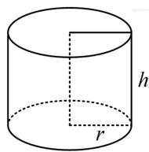  
图1

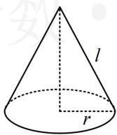  
图2

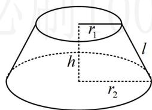

text_image

r₁
h
l
r₂

图3

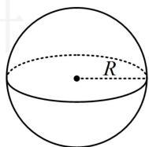  
图4

# 类型 I：简单几何体的表面积与体积

【例 1】底面积为 $2 \pi$ ，侧面积为 $6 \pi$ 的圆锥的体积是（）

A. $8\pi$ B. $\frac{8\pi}{3}$ C. $2\pi$ D. $\frac{4\pi}{3}$

解析：已有底面积，算圆锥体积还差高，可由所给条件建立圆锥关键参数的方程组，

如图，圆锥的底面积 $S = \pi r^2 = 2\pi \Rightarrow r = \sqrt{2}$

圆锥的侧面积 $S' = \pi rl = \sqrt{2}\pi l = 6\pi \Rightarrow$ 母线长 $l = 3\sqrt{2}$

所以圆锥的高 $h = \sqrt{l^2 - r^2} = 4$ ，故体积 $V = \frac{1}{3} Sh = \frac{1}{3}\times 2\pi \times 4 = \frac{8\pi}{3}$

答案: B

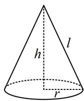

【例 2】(2023·全国甲卷) 在三棱锥 P-ABC 中, $\triangle ABC$ 是边长为 2 的等边三角形, PA=PB=2, $PC=\sqrt{6}$ , 则该棱锥的体积为 ( )

A. 1 B. $\sqrt{3}$ C. 2 D. 3

解析：以 $\triangle ABC$ 为底面，求体积还差高，故需过 $P$ 作面 $ABC$ 的垂线，垂足在哪儿呢？由于 $\triangle ABP$ 和 $\triangle ABC$

都是正三角形，常见的作辅助线方法是取公共底边 $AB$ 的中点 $O$ ，即可找到高，

如图，取 $AB$ 中点 $O$ ，连接 $OC$ ， $OP$ ，则 $AB \perp OP$ ，由所给数据可求得 $OP = OC = \sqrt{3}$ 又 $PC = \sqrt{6}$ ，所以 $OP^2 + OC^2 = 6 = PC^2$ ，故 $PO \perp OC$ 结合 $PO \perp AB$ 可得 $PO \perp$ 平面 $ABC$ , 故 $PO$ 是高,

所以 $V_{P - ABC} = \frac{1}{3} S_{\triangle ABC}\cdot PO = \frac{1}{3}\times \frac{1}{2}\times 2\times 2\times \sin 60^{\circ}\times \sqrt{3} = 1.$

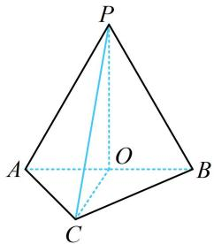

text_image

P
A O B
C

答案: A

【反思】①有时求体积的参数（例如本题的高）需要我们自己作出来；②本题的模型很常见，我们一般称之为“双等腰三角形模型（两个等腰 $\triangle ABP$ 和 $\triangle ABC$ 共用底边 $AB$ ）．取公共底边中点，构造与底边垂直的截面（如本题的截面 $POC$ ），是这一模型中常用的添加辅助线的方法．即使本题改变 $PC$ 的长，使 $PO$ 与 $OC$ 不垂直，过 $P$ 作面 $ABC$ 的垂线，垂足也一定落在直线 $OC$ 上．后续还会多次遇见该模型.

【例 3】(2022·新课标 I 卷) 南水北调工程缓解了北方一些地区水资源短缺问题, 其中一部分水蓄入某水库. 已知该水库水位为海拔 $148.5 \mathrm{~m}$ 时, 相应水面的面积为 $140.0 \mathrm{~km}^{2}$ ; 水位为海拔 $157.5 \mathrm{~m}$ 时, 相应水面的面积为 $180.0 \mathrm{~km}^{2}$ . 将该水库在这两个水位间的形状看作一个棱台, 则该水库水位从海拔 $148.5 \mathrm{~m}$ 上升到 $157.5 \mathrm{~m}$ 时, 增加的水量约为 ( ) ( $\sqrt{7} \approx 2.65$ )

A. $1.0 \times 10^{9} \mathrm{~m}^{3}$

B. $1.2 \times 10^{9} \mathrm{~m}^{3}$

C. $1.4 \times 10^{9} \mathrm{~m}^{3}$

D. $1.6 \times 10^{9} \mathrm{~m}^{3}$

解析：算棱台的体积，代公式即可，先找到 $S$ 和 $S'$ ，以及棱台的高 $h$

如图，该棱台的两个底面面积分别为 $S = 140\mathrm{km}^2$ ， $S^{\prime} = 180\mathrm{km}^{2}$

高 $h = 157.5 - 148.5 = 9\mathrm{m} = 9\times 10^{-3}\mathrm{km}$

所以棱台的体积 $V = \frac{1}{3} (S + S' + \sqrt{SS'}) h = \frac{1}{3} \times (140 + 180 + \sqrt{140 \times 180}) \times 9 \times 10^{-3} \mathrm{km}^3$

$$
= 3 \times (3 2 0 + 6 0 \sqrt {7}) \times 1 0 ^ {- 3} \mathrm{km} ^ {3} \approx 3 \times (3 2 0 + 6 0 \times 2. 6 5) \times 1 0 ^ {- 3} \mathrm{km} ^ {3} = 1. 4 3 7 \mathrm{km} ^ {3} \approx 1. 4 \times 1 0 ^ {9} \mathrm{m} ^ {3}.
$$

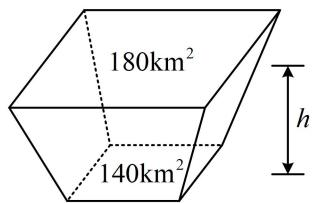

text_image

180km²
140km²
h

答案: C

【总结】对于简单几何体的表面积与体积，把该几何体的关键参数代入内容提要对应公式计算即可.

# 类型Ⅱ：组合体的表面积与体积

【例 4】如图，四边形 ABCD 中， $AD \perp AB$ ， $\angle ADC = 135^{\circ}$ ，AB = 3， $CD = \sqrt{2}$ ，AD = 1，则四边形 ABCD 绕 AD 旋转一周所成几何体的表面积为（）

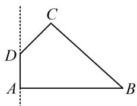

text_image

C
D
A
B

A. $(6 + 4\sqrt{2})\pi$

B. $(9 + 4\sqrt{2})\pi$

C. $(9 + 9\sqrt{2})\pi$

D. $(9 + 10\sqrt{2})\pi$

解析：原图形绕 $AD$ 旋转一周得到的几何体如图，它是一个圆台在上方挖去了一个圆锥后余下的部分，该组合体的表面积由三部分构成，下方的圆，中间圆台的侧面，上方挖去的圆锥的侧面，需分别计算，由题意， $\angle CDE = 180^{\circ} - \angle ADC = 45^{\circ}$ ，所以 $CE = DE = \frac{\sqrt{2}}{2} CD = 1$ ， $AF = 1$ ， $BF = AB - AF = 2$

$$
C F = A E = A D + D E = 2, \quad B C = \sqrt {C F ^ {2} + B F ^ {2}} = \sqrt {2 ^ {2} + 2 ^ {2}} = 2 \sqrt {2},
$$

图中圆 A 的面积为 $S_{1}=\pi\times3^{2}=9\pi$ ,

圆台的侧面积 $S_{2} = \pi (CE + AB)\cdot BC = \pi \times (3 + 1)\times 2\sqrt{2} = 8\sqrt{2}\pi$

上方挖去的圆锥的侧面积 $S_{3} = \pi \cdot CE\cdot CD = \sqrt{2}\pi$

故所求表面积为 $S_{1} + S_{2} + S_{3} = (9 + 9\sqrt{2})\pi .$

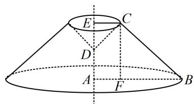

text_image

E
C
D
A
F
B

答案: C

【例 5】如图是一个棱长为 2 的正方体被过棱 $A_{1}B_{1}$ , $A_{1}D_{1}$ 的中点 $M, N$ , 顶点 $A$ 和过点 $N$ , 顶点 $D$ , $C_{1}$ 的两个截面截去两个角后所得的几何体, 则该几何体的体积为 ( )

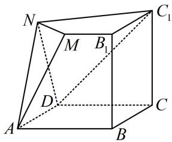

text_image

N
M B₁
C₁
D
A B C

A. 5 B. 6 C. 7 D. 8

解析：所给几何体由正方体截得，故先画出完整的正方体，再看怎样算体积，如图，截去的部分是三棱锥 $A - A_{1}MN$ 和 $D - C_{1}D_{1}N$ ，正方体的体积 $V = 2^{3} = 8$

$$
V _ {A - A _ {1} M N} = \frac {1}{3} S _ {\triangle A _ {1} M N} \cdot A A _ {1} = \frac {1}{3} \times \frac {1}{2} \times 1 \times 1 \times 2 = \frac {1}{3}, V _ {D - C _ {1} D _ {1} N} = \frac {1}{3} S _ {\triangle C _ {1} D _ {1} N} \cdot D D _ {1}
$$

$= \frac{1}{3}\times \frac{1}{2}\times 2\times 1\times 2 = \frac{2}{3}$ ，故所求几何体的体积为 $8 - \frac{1}{3} -\frac{2}{3} = 7$

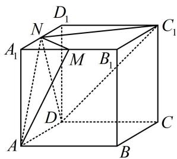

text_image

D₁
N
A₁
M
B₁
C₁
D
A
B
C

答案: C

【例 6】如图，某多面体是由两个直三棱柱重叠后而成，重叠后的底面为正方形，直三棱柱的底面是顶角为 $120^{\circ}$ ，腰为 3 的等腰三角形，则该多面体的体积为（）

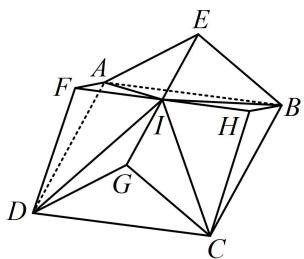

text_image

Geometric diagram of a polyhedron with labeled vertices and internal points, used in spatial geometry problems.

A. 23 B. 24 C. 26 D. 27

解析: 多面体可看成由五部分组成: 正四棱锥 $I - A B C D$ , 四个全等的三棱锥 $I - C D G$ , $I - A B E$ , $I - A D F$ , $I - B C H$ . 先算正四棱锥的体积, 求底面积要用 $B C$ , 可在 $\triangle B H C$ 中用余弦定理来求,

$$
B C ^ {2} = B H ^ {2} + C H ^ {2} - 2 B H \cdot C H \cdot \cos \angle B H C = 3 ^ {2} + 3 ^ {2} - 2 \times 3 \times 3 \times \cos 1 2 0 ^ {\circ} = 2 7 \Rightarrow S _ {A B C D} = B C ^ {2} = 2 7,
$$

再算高, 注意到 $F H \parallel$ 平面 $A B C D$ , 所以 $I$ 到平面 $A B C D$ 的距离等于 $H$ 到平面 $A B C D$ 的距离,

如图，取 $BC$ 中点 $K$ ，连接 $HK$ ，则 $HK \perp BC$ ，又 $BHC - AFD$ 为直三棱柱，所以 $CD \perp$ 平面 $BHC$

故 $CD \perp HK$ ，所以 $HK \perp$ 平面ABCD， $HK = CH \cdot \sin \angle HCK = 3\sin 30^{\circ} = \frac{3}{2}$

即正四棱锥 $I - ABCD$ 的高为 $\frac{3}{2}$ ，所以 $V_{I - ABCD} = \frac{1}{3} \times 27 \times \frac{3}{2} = \frac{27}{2}$ ；

再求三棱锥 $I - CDG$ 的体积, 这部分天然就有 $IG \perp$ 平面 $CDG$ ,

$$
V _ {I - C D G} = \frac {1}{3} S _ {\triangle C D G} \cdot I G = \frac {1}{3} S _ {\triangle C D G} \cdot \frac {1}{2} B C = \frac {1}{3} \times \frac {1}{2} \times 3 \times 3 \times \sin 1 2 0 ^ {\circ} \times \frac {1}{2} \times 3 \sqrt {3} = \frac {2 7}{8},
$$

所以整个几何体的体积 $V = V_{I - ABCD} + 4V_{I - CDG} = \frac{27}{2} + 4 \times \frac{27}{8} = 27$ .

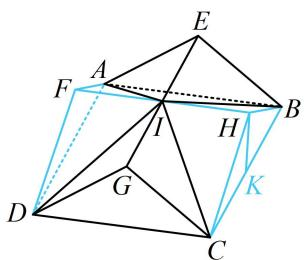

text_image

Geometric diagram of a polyhedron with labeled vertices and internal points, used in spatial geometry problems.

答案: D

【总结】对于组合体，不管是求表面积还是体积，都只需弄清楚它的组成方式，再分别计算即可.

# 强化训练

1. (2022·上海卷·★)

已知圆柱的高为 4，底面积为 $9\pi$ ，则圆柱的侧面积为 \_\_\_\_.

2. (2018·天津卷·★★)

已知正方体 $ABCD - A_{1}B_{1}C_{1}D_{1}$ 的棱长为 1，除面 $ABCD$ 外，该正方体其余各面的中心分别为点 $E, F, G, H, M$ （如图），则四棱锥 $M - EFGH$ 的体积为 \_\_\_\_.

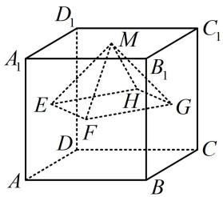

text_image

D₁
A₁ M C₁
E H G
D F C
A B C

3. (2024·新课标Ⅰ卷·★★☆)

已知圆柱和圆锥的底面半径相等，侧面积相等，且它们的高均为 $\sqrt{3}$ ，则圆锥的体积为（）

A. $2 \sqrt{3} \pi$

B. $3 \sqrt{3} \pi$

C. $6 \sqrt{3} \pi$

D. $9 \sqrt{3} \pi$

4.（2021·新高考Ⅱ卷（改）·★★★）

正四棱台的上、下底面的边长分别为2, 4, 侧棱长为2, 则其体积为\_\_\_\_；侧面积为\_\_\_\_。

5. (2023·湖北十一校联考·★★★)

甲、乙两个圆锥的底面积相等，侧面展开图的圆心角之和为 $2\pi$ ，侧面积分别为 $S_{\text{甲}}$ ， $S_{\text{乙}}$ ，体积分别为 $V_{\text{甲}}$ ， $V_{\text{乙}}$ 若 $\frac{S_{\text{甲}}}{S_{\text{乙}}} = 2$ ，则 $\frac{V_{\text{甲}}}{V_{\text{乙}}}$ 等于（）

A. $\sqrt{10}$

B. $\frac{4\sqrt{10}}{5}$

C. $\frac{2\sqrt{10}}{5}$

D. $\frac{5\sqrt{10}}{6}$

6. (2024·浙江模拟·★★★☆)

如图，将正四棱台切割成九个部分，其中一个部分为长方体，四个部分为直三棱柱，四个部分为四棱锥。已知每个直三棱柱的体积为3，每个四棱锥的体积为1，则该正四棱台的体积为（）

A. 36

B. 32

C. 28

D. 24

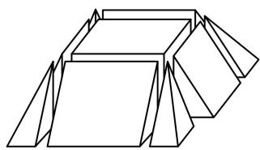

natural_image

Abstract geometric line drawing of overlapping 3D shapes (no text or symbols)

