# 强化训练

1. (★★) (多选)

如图， $\triangle A'B'C'$ 表示水平放置的 $\triangle ABC$ 根据斜二测画法得到的直观图， $A'B'$ 在 $x'$ 轴上， $B'C'$ 与 $x'$ 轴垂直，且 $B'C' = \sqrt{2}$ ，则下列说法正确的是（）

A. $\triangle ABC$ 的边 $AB$ 上的高为 2  
B. $\triangle ABC$ 的边 $AB$ 上的高为 4  
C. $AC > BC$   
D. $AC < BC$

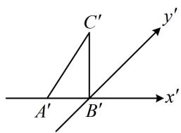

text_image

C'
A'
B'
x'
y'

1. BD

解析：要求 $\triangle ABC$ 的边 $AB$ 上的高，可先把直观图中与高对应的线段画出来，需注意原图中与 $AB$ 垂直的线段在直观图中应与 $A'B'$ 成 $45^{\circ}$ 角，

如图1，过 $C'$ 作 $y'$ 轴的平行线交 $x'$ 轴于 $D'$ ，则原图中 $CD \parallel y$ 轴，如图2，所以 $CD$ 即为 $AB$ 边上的高，

在图1中， $\triangle B^{\prime}C^{\prime}D^{\prime}$ 为等腰直角三角形，且 $B^{\prime}C^{\prime} = \sqrt{2}$

所以 $C^{\prime}D^{\prime} = 2$ ，故在图2中， $CD = 4$ ，所以 $\triangle ABC$ 的边 $AB$ 上的高为4，故A项错误，B项正确；

由图2可知 $AC < BC$ ，故C项错误，D项正确.

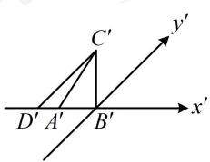

text_image

C'
y'
D' A' B' x'

图1

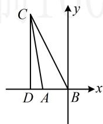  
图2

2. (2022·安徽定远模拟·★★)

如图，正三棱柱 $ABC - A_{1}B_{1}C_{1}$ 中， $AA_{1} = 4$ ， $AB = 1$ ，一只蚂蚁从点 $A$ 出发，沿每个侧面爬到 $A_{1}$ ，路线为 $A \to M \to N \to A_{1}$ ，则蚂蚁爬行的最短路程是（）

A. 4 B. 5 C. 6 D. $2 \sqrt{5} + 1$

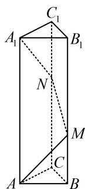

text_image

C₁
A₁ B₁
N
M
C
A B

2. B

解析：涉及最短路径问题，把空间图形展开到平面上来看，

如图是正三棱柱沿 $AA_{1}$ 的侧面展开图，

最短路径即为图中蓝色线段，其长度为 $\sqrt{3^2 + 4^2} = 5$

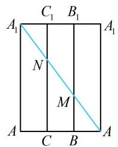

text_image

C₁ B₁
A₁ N M A₁
A C B A

# 3. (★★☆)

如图, 在正四棱柱 $ABCD-A_{1}B_{1}C_{1}D_{1}$ 中, 底面边长为 2 , 高为 1 , 则点 $D$ 到平面 $ACD_{1}$ 的距离是

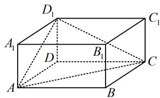

text_image

D₁
A₁
D
B₁
C₁
A
B
C

3. $\frac{\sqrt{6}}{3}$

解析：如图，直接算距离需作高，较麻烦，但观察发现 $V_{D_1 - ACD}$ 和 $S_{\triangle ACD_1}$ 好求，故用等体积法算距离，

由题意， $AC = \sqrt{AD^2 + CD^2} = 2\sqrt{2}$

$$
A D _ {1} = \sqrt {A D ^ {2} + D D _ {1} ^ {2}} = \sqrt {5}, C D _ {1} = \sqrt {C D ^ {2} + D D _ {1} ^ {2}} = \sqrt {5},
$$

故等腰 $\triangle ACD_{1}$ 的边 $AC$ 上的高 $h = \sqrt{AD_1^2 - \left(\frac{1}{2} AC\right)^2}$

$$
= \sqrt {3}, S _ {\triangle A C D _ {1}} = \frac {1}{2} A C \cdot h = \sqrt {6},
$$

设所求距离为 $d$ ，则 $V_{D - ACD_1} = \frac{1}{3} S_{\triangle ACD_1}\cdot d = \frac{\sqrt{6}}{3} d$

又 $V_{D - ACD_1} = V_{D_1 - ACD} = \frac{1}{3} S_{\triangle ACD}\cdot DD_1 = \frac{1}{3}\times \frac{1}{2}\times 2\times 2\times 1 = \frac{2}{3},$

所以 $\frac{\sqrt{6}}{3} d = \frac{2}{3}$ ，解得： $d = \frac{\sqrt{6}}{3}$ .

# 4. (★★★)

如图，直四棱柱 $ABCD - A_{1}B_{1}C_{1}D_{1}$ 的底面是菱形， $AA_{1} = 4$ ， $AB = 2$ ， $\angle BAD = 60^{\circ}$ ， $E$ 是 $BC$ 的中点，则点 $C$ 到平面 $C_{1}DE$ 的距离为 \_\_\_\_.

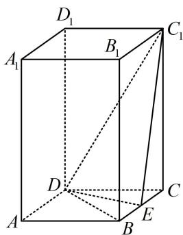

text_image

D₁
A₁ B₁ C₁
D
A B C
E

4. $\frac{4\sqrt{17}}{17}$

解析：直接求距离需作垂线，较麻烦，注意到 $V_{C_1 - CDE}$ 和 $S_{\triangle C_1DE}$ 好求，故用等体积法，

因为 ABCD 为菱形，所以 BC = CD ，又 $\angle BAD = 60^{\circ}$

所以 $\angle BCD = 60^{\circ}$ ，故 $\triangle BCD$ 为正三角形，

因为 AB = 2 ，所以 $DE = \sqrt{3}$ ，

又 $C_1C = AA_1 = 4$ ，所以 $C_1D = \sqrt{CD^2 + CC_1^2} = 2\sqrt{5}$

因为 $CE = 1$ ，所以 $C_1E = \sqrt{CE^2 + CC_1^2} = \sqrt{17}$

从而 $DE^{2} + C_{1}E^{2} = 20 = C_{1}D^{2}$ ，故 $DE\perp EC_{1}$

所以 $S_{\triangle C_1DE} = \frac{1}{2}\times \sqrt{3}\times \sqrt{17} = \frac{\sqrt{51}}{2}$

设点 C 到平面 $C_{1}DE$ 的距离为 d,

则 $V_{C - C_1DE} = \frac{1}{3}\times \frac{\sqrt{51}}{2} d = \frac{\sqrt{51}}{6} d$ ，另一方面， $V_{C - C_1DE} =$

$$
V _ {C _ {1} - C D E} = \frac {1}{3} S _ {\triangle C D E} \cdot C C _ {1} = \frac {1}{3} \times \frac {1}{2} \times 1 \times \sqrt {3} \times 4 = \frac {2 \sqrt {3}}{3},
$$

所以 $\frac{\sqrt{51}}{6} d = \frac{2\sqrt{3}}{3}$ ，解得： $d = \frac{4\sqrt{17}}{17}$

故点 $C$ 到平面 $C_1DE$ 的距离为 $\frac{4\sqrt{17}}{17}$ .

# 5. (★★★)

在棱长为2的正方体 $ABCD - A_{1}B_{1}C_{1}D_{1}$ 中， $E, F$ 分别为 $DD_{1}, DB$ 的中点，则三棱锥 $B_{1} - CEF$ 的体积为 \_\_\_\_.

5.1

解析：如图，以 $B_{1}$ 为顶点求体积，则高不好找，故尝试转换顶点，观察发现 $CF \perp$ 面 $B_{1}EF$ ，故选 $C$ 为顶点，

因为 $CB = CD$ ， $F$ 为 $DB$ 中点，所以 $CF\bot DB$ ，又 $BB_{1}\bot$

平面 $ABCD$ ，所以 $CF \perp BB_{1}$ ，故 $CF \perp$ 平面 $BB_{1}D_{1}D$

所以 $V_{B_{1}-CEF}=V_{C-B_{1}EF}=\frac{1}{3}S_{\triangle B_{1}EF}\cdot CF$ ①,

又 $S_{\triangle B_1EF} = S_{BB_1D_1D} - S_{\triangle B_1D_1E} - S_{\triangle DEF} - S_{\triangle BB_1F}$

$$
= 2 \times 2 \sqrt {2} - \frac {1}{2} \times 2 \sqrt {2} \times 1 - \frac {1}{2} \times 1 \times \sqrt {2} - \frac {1}{2} \times \sqrt {2} \times 2 = \frac {3 \sqrt {2}}{2},
$$

$CF=\frac{1}{2}BD=\sqrt{2}$ ，代入①得 $V_{B_{1}-CEF}=\frac{1}{3}\times\frac{3\sqrt{2}}{2}\times\sqrt{2}=1$ .

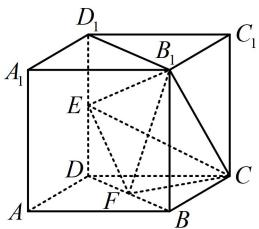

text_image

Geometric diagram of a cube with labeled vertices and internal points, used for spatial geometry problems.

# 6. (★★★☆)

三棱柱 $ABC - A_{1}B_{1}C_{1}$ 的所有棱长都为 1，侧棱 $AA_{1} \perp$ 底面 $ABC, E, F$ 分别为 $BC$ 和 $A_{1}C_{1}$ 的中点，若经过点 $A, E, F$ 的平面将此三棱柱分割成两部分，则这两部分中体积较大者与体积较小者的体积之比为 \_\_\_\_.

6. 17:7

解析：如图， $F$ 和 $AE$ 分别在上、下两个面内，且过 $F$ 在面 $A_{1}B_{1}C_{1}$ 内易作 $AE$ 的平行线，故作平行线扩大截面，

取 $B_{1}C_{1}$ 中点 $G$ ， $C_1G$ 中点 $H$ ，连接 $A_{1}G$ ，FH，EH，

则 $FH \parallel A_{1}G \parallel AE$ ，所以截面即为 $AEHF$

此截面右侧部分为三棱台，可先求它的体积，

由题意， $S_{\triangle ABC} = \frac{1}{2}\times 1\times 1\times \frac{\sqrt{3}}{2} = \frac{\sqrt{3}}{4},$ $S_{\triangle AEC} = \frac{1}{2} S_{\triangle ABC}$

$$
= \frac {\sqrt {3}}{8}, S _ {\triangle C _ {1} F H} = \frac {1}{4} S _ {\triangle A _ {1} G C _ {1}} = \frac {1}{4} S _ {\triangle A E C} = \frac {\sqrt {3}}{3 2},
$$

所以截面右侧部分三棱台的体积

$$
V _ {1} = \frac {1}{3} \times \left(\frac {\sqrt {3}}{8} + \frac {\sqrt {3}}{3 2} + \sqrt {\frac {\sqrt {3}}{8} \cdot \frac {\sqrt {3}}{3 2}}\right) \times 1 = \frac {7 \sqrt {3}}{9 6},
$$

又三棱柱 $ABC - A_{1}B_{1}C_{1}$ 的体积 $V = \frac{\sqrt{3}}{4}\times 1 = \frac{\sqrt{3}}{4}$

所以截面左侧的体积为 $V_{2} = \frac{\sqrt{3}}{4} -\frac{7\sqrt{3}}{96} = \frac{17\sqrt{3}}{96}$

故所求体积之比为17:7.

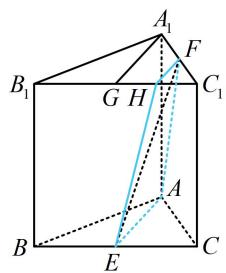

text_image

A₁
B₁ G H C₁
A
B E C

7. (2023·新课标Ⅰ卷·★★★★★) (多选)

下列物体中，能够被整体放入棱长为1（单位：m）的正方体容器（容器壁厚度忽略不计）内的有（）

A. 直径为 $0.99 \mathrm{~m}$ 的球体

B. 所有棱长均为 $1.4 \mathrm{~m}$ 的正四面体

C. 底面直径为 $0.01 \mathrm{~m}$ , 高为 $1.8 \mathrm{~m}$ 的圆柱体

D. 底面直径为 $1.2 \mathrm{~m}$ , 高为 $0.01 \mathrm{~m}$ 的圆柱体

7. ABD

解析：A 项，因为正方体的内切球直径为 $1 \mathrm{~m}$ ，所以直径为 $0.99 \mathrm{~m}$ 的球体可以放入正方体容器，故 A 项正确；

B项，我们想让正四面体尽可能大，联想正方体内特殊的正四面体，进而想到由面对角线可构成正四面体，

如图1，蓝色正四面体的棱长为 $\sqrt{2}$ ，比1.4大，从而所有棱长均为 $1.4\mathrm{m}$ 的正四面体可以放入正方体容器，故B项正确；

C项，注意到圆柱的底面直径很小，圆柱很细长，不妨将其近似成线段，故先看 $1.8\mathrm{m}$ 的线段能否放入正方体，

如图1，正方体的棱长为1，则正方体表面上任意两点之间距离的最大值为 $BD_{1} = \sqrt{3} < 1.8$

所以高为 $1.8\mathrm{m}$ 的圆柱不可能放入该正方体，故C项错误；

D项，注意到圆柱的高很小，不妨将圆柱近似看成圆，故先分析直径为 $1.2\mathrm{m}$ 的圆能否放入正方体，为了研究这一问题，我们得先找正方体的尽可能大的截面，正方体有一个非常特殊的截面，我们不妨来看看，

如图2， $E$ ， $F$ ， $G$ ， $H$ ， $I$ ， $J$ 分别为所在棱的中点，则 $EFGHIJ$ 是边长为 $\frac{\sqrt{2}}{2}$ 的正六边形，

其内切圆如图3，其中 $K$ 为 $HI$ 中点，则内切圆半径 $r =$

$OK=\frac{\sqrt{2}}{2}\times\frac{\sqrt{3}}{2}=\frac{\sqrt{6}}{4}$ ，直径 $2r=\frac{\sqrt{6}}{2}>1.2$ ，

所以可以想象，底面直径为 $1.2\mathrm{m}$ ，高为 $0.01\mathrm{m}$ 的圆柱体能放进正方体容器，故D项正确【反思】本题不同于常规考法，无需准确计算，更多的是考大家的经验。事实上，B项提及的正四面体（图1）就是正方体内最大的正四面体了。因为该正四面体和正方体有相同的外接球，若正四面体再大一点，就会超出该外接球，必然也会超出正方体的范围。D项提及的截面（图2）也是正方体面积最大、内切圆半径最大的截面，但要严格论证这一结论，需要大量篇幅，此处略去。

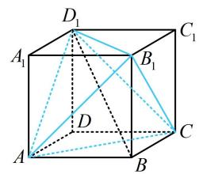

text_image

D₁
A₁
B₁
C₁
D
A
B
C

图1

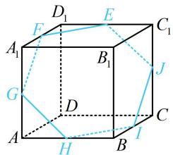

text_image

D₁
E
C₁
F
A₁
B₁
J
G
D
C
A
H
B
I

图2

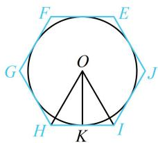

text_image

F
E
G
O
J
H
K
I

图3