# 强化训练

1. (2024·湖北武汉四调·★★☆)

设 $m$ ， $n$ 是两条不同的直线， $\alpha$ ， $\beta$ 是两个不同的平面，则下列命题中正确的是（）

A. 若 $\alpha \perp \beta, m \parallel \alpha$ ，则 $m \perp \beta$   
B. 若 $\alpha \perp \beta$ ， $m \subset \alpha$ ，则 $m \perp \beta$   
C. 若 $m \parallel \alpha, n \perp \alpha$ ，则 $m \perp n$   
D. 若 $m \perp n, m \parallel \alpha$ ，则 $n \perp \alpha$

1. C

解析：A项，如图1， $\alpha \perp \beta$ ， $m / / \alpha$ ，但 $m$ 与 $\beta$ 可以不垂直，故A项错误；

B项，如图2， $\alpha \perp \beta$ ， $m\subset \alpha$ ，但 $m$ 与 $\beta$ 可以不垂直，故B项错误；

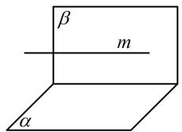

text_image

β
m
α

图1

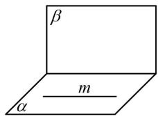  
图2

C 项, 如图 3, 可以想象, 当 $m \parallel \alpha$ , $n \perp \alpha$ 时, $m \perp n$ 成立, 下面给出严格的证明,

因为 $m / / \alpha$ ，所以 $\alpha$ 内存在与 $m$ 平行的直线 $m^{\prime}$

因为 $n \perp \alpha$ ， $m' \subset \alpha$ ，所以 $n \perp m'$

又 $m \parallel m'$ ，所以 $m \perp n$ ，故C项正确；

D 项，如图 4， $m \perp n$ ， $m \parallel \alpha$ ，但 n 与 $\alpha$ 可以不垂直，故 D 项错误.

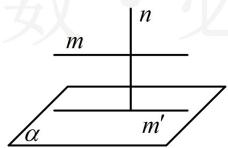  
图3

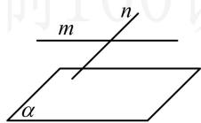  
图4

2.（2023·全国模拟·★★★）（多选）

已知 $m$ ， $n$ 为异面直线，直线 $l$ 与 $m$ ， $n$ 都垂直，则下列说法正确的是（）

A. 若 $l \perp$ 平面 $\alpha$ ，则 $m \parallel \alpha, n \parallel \alpha$   
B. 存在平面 $\alpha$ ，使 $l \perp \alpha$ ， $m \subset \alpha$ ， $n \parallel \alpha$   
C. 有且仅有一对互相平行的平面 $\alpha$ 和 $\beta$ , 其中 $m \subset \alpha, n \subset \beta$   
D. 有且仅有一对互相垂直的平面 $\alpha$ 和 $\beta$ , 其中 $m \subset \alpha$ , $n \subset \beta$

2. BC

解析：条件中有平行、垂直、异面，直接想象不易，而正方体中有这些位置关系，故考虑用正方体来分析，

A 项，如图 1 所示的情形满足 $l \perp \alpha$ ， $l$ 与 $m$ ， $n$ 都垂直，但 $m \subset \alpha$ ，故 A 项错误；

B项，图1所示的情形即为满足B选项的一种情况，故B项正确；

C 项，如图 2，图中画出了一对互相平行的平面 $\alpha$ ， $\beta$ ，且 $m \subset \alpha$ ， $n \subset \beta$ ，除此之外，没有其它满足要求的平行平面了，这是因为由 $\alpha // \beta$ ， $m \subset \alpha$ 可得 $m // \beta$ ，所以在 $\beta$ 内必定存在直线 $m'$ 与 $m$ 平行，由于 $m$ ， $n$ 是异面直线，所以 $m'$ 与 $n$ 相交，两条相交直线可唯一确定一个平面 $\beta$ ，同理， $\alpha$ 也是唯一的，故 C 项正确；

D 项，如图 3 和图 4，m，n， $\beta$ 是一样的， $\alpha$ 不同，都能满足 $\alpha \perp \beta$ ， $m \subset \alpha$ ， $n \subset \beta$ ，故 D 项错误.

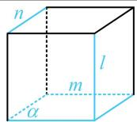  
图1

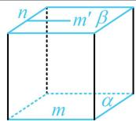  
图2

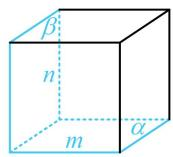  
图3

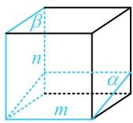  
图4

3.（2023·四省联考·★★★）（多选）

已知平面 $\alpha \cap$ 平面 $\beta = l$ ， $B$ ， $D$ 是 $l$ 上两点，直线 $AB\subset \alpha$ 且 $AB\cap l = B$ ，直线 $CD\subset \beta$ 且 $CD\cap l = D$ ，下列结论中，错误的有（）

A. 若 $AB \perp l$ ， $CD \perp l$ ，且 $AB = CD$ ，则 $ABCD$ 是平行四边形  
B. 若 $M$ 是 $AB$ 中点, $N$ 是 $CD$ 中点, 则 $MN \parallel AC$   
C. 若 $\alpha \perp \beta, AB \perp l, AC \perp l$ ，则 $CD$ 在 $\alpha$ 上的射影是 $BD$   
D. 直线 $AB$ , $CD$ 所成角的大小与二面角 $\alpha - l - \beta$ 的大小相等

3. ABD

解析：A项，如图1，ABCD是空间四边形，不是平行四边形，故A项错误；

B项，如图2，MN和AC是异面直线，故B项错误；

C项，给出了两个线线垂直，先用它们推线面垂直，

如图3， $\left\{ \begin{array}{l}AB\perp l\\ AC\perp l \end{array} \right.\Rightarrow l\perp$ 平面 $ABC\Rightarrow l\perp BC$

结合 $\alpha \perp \beta$ 可得 $BC\perp \alpha$ ，所以 $CD$ 在 $\alpha$ 上的射影是 $BD$ ，故C项正确；

D 项，由二面角的平面角的定义可得 D 项错误，若不放心，可考虑极端情况，

如图4，在二面角 $\alpha - l - \beta$ 中，假设 $AB$ ， $CD$ 都近似与 $l$ 重合，则直线 $AB$ ， $CD$ 所成的角就接近0，不等于二面角 $\alpha - l - \beta$ （图中的 $\angle EBF$ 是其平面角），故D项错误.

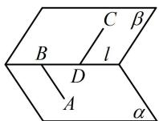  
图1

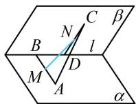  
图2

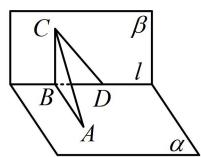  
图3

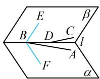  
图4