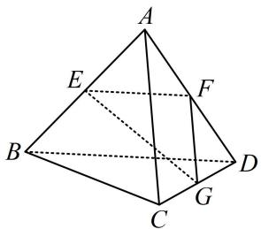
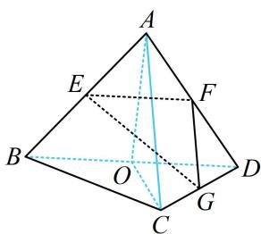
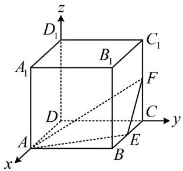

# 模块三 空间向量及其应用

# 第1节 空间向量的基本运算（★☆）

# 内容提要

本节为预备小节，主要熟悉空间向量的概念和运算规则，大量内容和平面向量类似，此处不一一罗列了，仅梳理一些常用的考点.

1. 设 $\pmb{a} = (a_{1}, a_{2}, a_{3})$ ， $\pmb{b} = (b_{1}, b_{2}, b_{3})$ ，则：

①加减法： $\boldsymbol{a}\pm\boldsymbol{b}=(a_{1}\pm b_{1},a_{2}\pm b_{2},a_{3}\pm b_{3})$ ；

②数乘： $\lambda a = (\lambda a_{1},\lambda a_{2},\lambda a_{3})$

③共线：若 $a \parallel b$ 且 $b \neq 0$ ，则存在唯一的实数 $\lambda$ ，使得 $a = \lambda b$ ，即 $\left\{ \begin{array}{l} a_1 = \lambda b_1 \\ a_2 = \lambda b_2 \\ a_3 = \lambda b_3 \end{array} \right.$ ；

④模： $\left|\boldsymbol{a}\right|=\sqrt{a_{1}^{2}+a_{2}^{2}+a_{3}^{2}}$ ；

⑤数量积： $a \cdot b = a_{1}b_{1} + a_{2}b_{2} + a_{3}b_{3}$ ；当 $a \perp b$ 时， $a \cdot b = 0$ ；

⑥夹角余弦公式： $\cos <  a,b > = \frac{a\cdot b}{|a|\cdot|b|} = \frac{a_1b_1 + a_2b_2 + a_3b_3}{\sqrt{a_1^2 + a_2^2 + a_3^2}\cdot\sqrt{b_1^2 + b_2^2 + b_3^2}};$

⑦两点连线向量的坐标公式：设 $A(x_{1},y_{1},z_{1})$ ， $B(x_{2},y_{2},z_{2})$ ，则 $\overrightarrow{AB} = (x_2 - x_1,y_2 - y_1,z_2 - z_1)$

⑧投影向量计算公式：向量 b 在向量 a 上的投影向量为 $\frac{a \cdot b}{a^{2}} a$ .

2. 共面向量定理：设 $a, b$ 是空间中不共线的两个向量，则空间中的向量 $p$ 与 $a, b$ 共面的充要条件是存在实数 $x, y$ ，使得 $p = xa + yb$ .

3. 四点共面系数和结论：设 $A, B, C$ 是平面 $\alpha$ 上不共线的三点， $O$ 是平面 $\alpha$ 外一点，则对于空间中任意一点 $D$ ，设 $\overrightarrow{OD} = x\overrightarrow{OA} + y\overrightarrow{OB} + z\overrightarrow{OC}$ ，则 $D$ 在平面 $\alpha$ 内 $\Leftrightarrow x + y + z = 1$ .

4. 法向量的计算步骤:

①求出平面 $\alpha$ 内的两个不共线的向量 $\overrightarrow{AB}$ 和 $\overrightarrow{AC}$ ;

②设法向量为 $\boldsymbol{n}=(x,y,z)$ ，并由 $\left\{\begin{aligned}\boldsymbol{n}\cdot\overrightarrow{AB}&=0\\ \boldsymbol{n}\cdot\overrightarrow{AC}&=0\end{aligned}\right.$ 建立关于 x, y, z 的三元一次方程组；

③对其中一个变量赋值，求出另外两个变量，即可得到平面 $\alpha$ 的一个法向量.

# 类型 I：空间向量的运算

【例1】（多选）如图，已知四面体ABCD所有棱长均为2， $E$ ， $F$ ， $G$ 分别为棱 $AB$ ， $AD$ ， $DC$ 的

中点，则下列说法正确的有（）

A. $\overrightarrow{AB}$ 与 $\overrightarrow{CD}$ 不共面

B. $\overrightarrow{AB} +\overrightarrow{BC} -\overrightarrow{GC} -\overrightarrow{EG} = \overrightarrow{EB}$

C. $\overrightarrow{AB} \cdot \overrightarrow{AC} = 2$

D. $\overrightarrow{EF} \perp \overrightarrow{FG}$

解析：A项，向量可以平移，空间中任意两个向量都可平移到同一平面上去，故A项错误；

B 项， $\overrightarrow{AB}+\overrightarrow{BC}-\overrightarrow{GC}-\overrightarrow{EG}=\overrightarrow{AB}+\overrightarrow{BC}+\overrightarrow{CG}+\overrightarrow{GE}=\overrightarrow{AE}=\overrightarrow{EB}$ ，故 B 项正确；

C 项， $\overrightarrow{AB}\cdot\overrightarrow{AC}=\left|\overrightarrow{AB}\right|\cdot\left|\overrightarrow{AC}\right|\cos\angle BAC=2\times2\times\cos60^{\circ}=2$ ，故 C 项正确；

D项，若熟悉正三棱锥对棱垂直的结论，则可快速判断，这一性质前面小节已有提及，下面先证明，如图，取 $BD$ 中点 $O$ ，连接 $OA$ ， $OC$

则 $BD \perp OA$ ， $BD \perp OC$ ，所以 $BD \perp$ 平面 $AOC$ ，故 $BD \perp AC$

接下来做本题就简单了，显然 $EF$ ，FG都可利用中位线性质转到对棱，

又 $EF \parallel BD$ ， $FG \parallel AC$ ，所以 $EF \perp FG$ ，从而 $\overrightarrow{EF} \perp \overrightarrow{FG}$ ，故D项正确.

答案: BCD

text_image

Geometric diagram of a tetrahedron with labeled vertices and internal points, used for spatial geometry problems.

text_image

Geometric diagram of a triangular pyramid with labeled vertices and internal points, used for spatial geometry problems.

【例2】（多选）已知空间向量 $a = (-2, -1, 1)$ ， $b = (3, 4, 5)$ ，则下列结论正确的是（）

A. $(2a + b) // a$

B. $5|\pmb {a}| = \sqrt{3} |\pmb {b}|$

C. $a \perp (5a + 4b)$

D. $a$ 在 $b$ 上的投影向量为 $-\frac{1}{10} b$

解析：A项，由题意， $2a+b=(-4,-2,2)+(3,4,5)=(-1,2,7)$ ，观察发现不存在实数 $\lambda$ ，使得 $2a+b=\lambda a$ ，所以 $2a+b$ 与a不平行，故A项错误；

B 项， $\left|a\right|=\sqrt{(-2)^{2}+(-1)^{2}+1^{2}}=\sqrt{6}$ ， $\left|b\right|=\sqrt{3^{2}+4^{2}+5^{2}}=5\sqrt{2}$ ，所以 $5\left|a\right|=\sqrt{3}\left|b\right|=5\sqrt{6}$ ，故 B 项正确；

C 项， $\boldsymbol{a}\cdot(5\boldsymbol{a}+4\boldsymbol{b})=5\boldsymbol{a}^{2}+4\boldsymbol{a}\cdot\boldsymbol{b}=5\times(\sqrt{6})^{2}+4\times[(-2)\times3+(-1)\times4+1\times5]=10\neq0$

所以 a 与 $5a + 4b$ 不垂直，故 C 项错误；

D项，求投影向量，代内容提要第1点的公式⑧即可，

由题意， $a$ 在 $\pmb{b}$ 上的投影向量为 $\frac{\pmb{a} \cdot \pmb{b}}{|\pmb{b}|^2} \pmb{b} = \frac{-5}{(5\sqrt{2})^2} \pmb{b} = -\frac{1}{10} \pmb{b}$ ，故D项正确.

答案: BD

【总结】可以发现，空间向量不管是图形规则，还是坐标运算，都与平面向量类似.

# 类型 II：共面与基底的判定

【例 3】已知 $\{a,b,c\}$ 是空间的一个基底，若 m=a-2b， $n=a+b+c$ ， $p=3a+xb+c$ ，且 $\{m,n,p\}$ 不能构成空间的基底，则实数 x 的值为 \_\_\_\_.

解析：不能构成基底，说明共面．可发现 m 与 n 不共线，故 p 与 m，n 共面等价于 p 能用 m 和 n 表示，设 $p = \lambda m + \mu n$ ，则 $3a + xb + c = \lambda (a - 2b) + \mu (a + b + c)$ ，整理得： $3a + xb + c = (\lambda + \mu)a + (\mu - 2\lambda)b + \mu c$ ，

所以 $\left\{ \begin{array}{l}3 = \lambda +\mu \\ x = \mu -2\lambda ,\\ 1 = \mu \end{array} \right.$ 解得： $x = -3$

答案: -3

【反思】①空间中判断三个向量 $m, n, p$ （其中 $m, n$ 不共线）是否共面，就看是否存在实数 $x, y$ 使 $p = xm + yn$ ；②三个向量是否能作为空间的基底也是据此判定，只要三个向量不共面，就可以作为基底.

# 类型III：简单建系运算与法向量求法

【例 4】（多选）在如图所示的空间直角坐标系中， $ABCD-A_{1}B_{1}C_{1}D_{1}$ 为正方体，E，F 分别为 BC， $CC_{1}$ 的中点，则（）

text_image

z
D₁
A₁
B₁
C₁
F
D
C
y
A
E
B
x

A. $A_{1}C \perp AB_{1}$

B. $A_{1} B$ 与 $A D_{1}$ 所成的角为 $60^{\circ}$

C. $DD_{1} \perp AF$

D. 平面 $AEF$ 的一个法向量为 $\pmb{m} = (4,2,4)$

解析：A项，判断两直线是否垂直，只需看它们的方向向量数量积是否为0，

不妨设 AB=2，则 $A_{1}(2,0,2)$ ， $C(0,2,0)$ ， $A(2,0,0)$ ， $B_{1}(2,2,2)$ ，所以 $\overrightarrow{A_{1}C}=(-2,2,-2)$ ， $\overrightarrow{AB_{1}}=(0,2,2)$ ，因为 $\overrightarrow{A_{1}C}\cdot\overrightarrow{AB_{1}}=-2\times0+2\times2+(-2)\times2=0$ ，所以 $A_{1}C\perp AB_{1}$ ，故 A 项正确；

B项，求线线角，可用两直线的方向向量算夹角余弦， $B(2,2,0)$ ， $D_{1}(0,0,2)$ ， $\overrightarrow{A_{1}B}=(0,2,-2)$ ， $\overrightarrow{AD_{1}}=(-2,0,2)$ ，所以 $\left|\cos<\overrightarrow{A_{1}B},\overrightarrow{AD_{1}}> \right|=\frac{\left|\overrightarrow{A_{1}B}\cdot\overrightarrow{AD_{1}}\right|}{\left|\overrightarrow{A_{1}B}\right|\cdot\left|\overrightarrow{AD_{1}}\right|}=\frac{4}{2\sqrt{2}\times2\sqrt{2}}=\frac{1}{2}$ ，从而 $A_{1}B$ 与 $AD_{1}$ 所成的角为 $60^{\circ}$ ，故B项正确；

C 项， $F(0,2,1)$ ， $\overrightarrow{DD_{1}}=(0,0,2)$ ， $\overrightarrow{AF}=(-2,2,1)$ ，所以 $\overrightarrow{DD_{1}}\cdot\overrightarrow{AF}=2\neq0\Rightarrow DD_{1}$ 与 AF 不垂直，故 C 项错误；
D 项， $E(1,2,0)$ ， $\overrightarrow{AE}=(-1,2,0)$ ，设平面 AEF 的法向量为 $\boldsymbol{n}=(x,y,z)$ ，则 $\left\{\begin{aligned}\boldsymbol{n}\cdot\overrightarrow{AE}&=-x+2y=0\\\boldsymbol{n}\cdot\overrightarrow{AF}&=-2x+2y+z=0\end{aligned}\right.$

此方程组有无数组解，任取一组非零解，都可以得到法向量，故对其中一个变量赋值，求另外两个，令 $x = 2$ 可得 $y = 1$ ， $z = 2$ ，所以 $\pmb {n} = (2,1,2)$ 是平面 $AEF$ 的一个法向量，与 $\pmb{n}$ 共线的非零向量都是法向量，而 $\pmb {m} = (4,2,4) = 2\pmb{n}$ ，所以 $\pmb{m}$ 也是平面 $AEF$ 的法向量，故D项正确.

答案: ABD

【反思】求法向量是流程化的步骤，务必熟悉，且为了计算方便，宜把法向量调整为不含分数的形式.

# 强化训练

1. (2023·四川乐山模拟·★)

在四面体 $ABCD$ 中， $E$ ， $F$ 分别为 $BC$ ， $AD$ 的中点，若 $\overrightarrow{AB} = a$ ， $\overrightarrow{AC} = b$ ， $\overrightarrow{AD} = c$ ，则 $\overrightarrow{EF} = (\quad)$

A. $\frac{1}{2} (\pmb {c} - \pmb {a} - \pmb{b})$

B. $\frac{1}{2} (\pmb {c} + \pmb {a} + \pmb{b})$

C. $\frac{1}{2} (\pmb {a} + \pmb {b} - \pmb{c})$

D. $-\frac{1}{2} (\pmb {c} + \pmb {a} - \pmb{b})$

2. (2023·河南模拟·★)

已知空间向量 $a = (2, -1, 2)$ ， $b = (1, -2, 1)$ ，则 $a \cdot b =$ \_\_\_\_；向量 $b$ 在向量 $a$ 上的投影向量是 \_\_\_\_.

3. (2023·广东信宜模拟·★★)

已知向量 $a = (1, - 1,3)$ ， $\pmb {b} = (-1,4, - 2)$ ， $c = (1,5,x)$ ，若 $\pmb {a},\pmb {b},\pmb{c}$ 共面，则实数 $x =$ （

A. 3 B. 2 C. 15 D. 5

4. (2023·四川绵阳模拟·★★)

已知 $\{a, b, c\}$ 是空间的一组基底，则下列各项中能构成基底的一组向量是（）

A. $a, a + b, a - b$ B. $b, a + b, a - b$

C. $c, a + b, a - b$ D. $a + 2b, a + b, a - b$

5. (2023·广东饶平模拟·★★)(多选)

已知空间中三点 $A(0,1,0)$ ， $B(2,2,0)$ ， $C(-1,3,1)$ ，则下列说法正确的是（）

A. $AB \perp AC$

B. 与 $\overrightarrow{AB}$ 同向的单位向量是 $\left(\frac{2\sqrt{5}}{5}, \frac{\sqrt{5}}{5}, 0\right)$

C. $\overrightarrow{AB}$ 和 $\overrightarrow{BC}$ 的夹角余弦值是 $\frac{\sqrt{55}}{11}$

D. 平面 $ABC$ 的一个法向量是 $(1, -2, 5)$