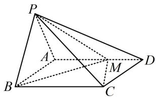
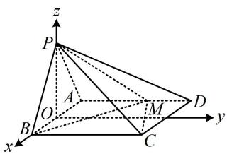
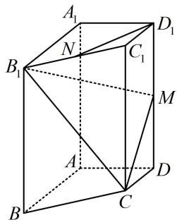
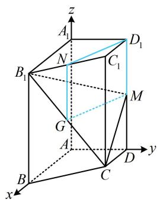
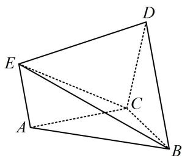
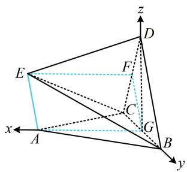
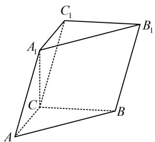
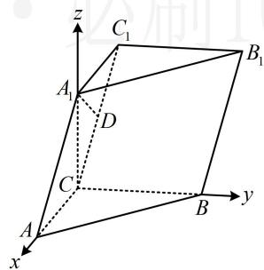

# 强化训练

1. (2023·山西模拟·★★★)

如图，在四棱锥 $P - ABCD$ 中，平面 $PAB \perp$ 平面 $ABCD$ ，底面 $ABCD$ 为矩形， $PA = PB = \sqrt{5}$ ， $AB = 2$ ， $AD = 3$ ， $M$ 是棱 $AD$ 上一点，且 $AM = 2MD$ 。

（1）求点 $B$ 到直线 $PM$ 的距离；  
(2) 求平面 PMB 与平面 PMC 的夹角余弦值.

text_image

P
A
B
C
M
D

1. 解: (1) (条件中有平面 $PAB \perp$ 平面 $ABCD$ , 先找与交线 $AB$ 垂直的直线, 构造线面垂直, 便于建系处理)

取 $AB$ 中点 $O$ ，连接 $OP$ ，因为 $PA = PB = \sqrt{5}$ ， $AB = 2$ ，所以 $OP \perp AB$ ，且 $OA = OB = 1$ ， $OP = \sqrt{PB^2 - OB^2} = 2$ ，因为平面 $PAB \perp$ 平面 $ABCD$ ，平面 $PAB \cap$ 平面 $ABCD = AB$ ， $OP \subset$ 平面 $PAB$ ， $OP \perp AB$ ，所以 $OP \perp$ 平面 $ABCD$ ，建立如图所示的空间直角坐标系，则 $B(1,0,0)$ ， $P(0,0,2)$ ，因为 $AM = 2MD$ ， $AD = 3$ ，所以 $AM = 2$ ，故 $M(-1,2,0)$ ，所以 $\overrightarrow{BP} = (-1,0,2)$ ， $\overrightarrow{PM} = (-1,2,-2)$ ，

(算点到直线的距离要用直线的单位方向向量, 先求它)

直线 $PM$ 的一个单位方向向量为 $\pmb{u} = \frac{\overrightarrow{PM}}{\left|\overrightarrow{PM}\right|} = \left(-\frac{1}{3},\frac{2}{3}, - \frac{2}{3}\right),$

由内容提要第1点的公式，点 $B$ 到直线 $PM$ 的距离

$$
d = \sqrt {\overrightarrow {B P} ^ {2} - (\overrightarrow {B P} \cdot \boldsymbol {u}) ^ {2}} = \sqrt {5 - (- 1) ^ {2}} = 2.
$$

（2） $C(1,3,0)$ ，所以 $\overrightarrow{MC} = (2,1,0)$ ，设平面PMB，PMC的法向量分别为 $\pmb {m} = (x_1,y_1,z_1)$ ， $\pmb {n} = (x_2,y_2,z_2)$

则 $\left\{ \begin{array}{l} \pmb{m} \cdot \overrightarrow{BP} = -x_1 + 2z_1 = 0 \\ \pmb{m} \cdot \overrightarrow{PM} = -x_1 + 2y_1 - 2z_1 = 0 \end{array} \right.$ ，令 $x_1 = 2$ ，则 $\left\{ \begin{array}{l} y_1 = 2 \\ z_1 = 1 \end{array} \right.$ ，

所以平面 PMB 的一个法向量为 $\boldsymbol{m} = (2, 2, 1)$ ,

$$
\left\{ \begin{array}{l l} {\pmb {n} \cdot \overrightarrow {P M} = - x _ {2} + 2 y _ {2} - 2 z _ {2} = 0} \\ {\pmb {n} \cdot \overrightarrow {M C} = 2 x _ {2} + y _ {2} = 0} \end{array} \right., \text {令} x _ {2} = 2, \text {则} \left\{ \begin{array}{l l} {y _ {2} = - 4} \\ {z _ {2} = - 5} \end{array} \right.,
$$

所以平面 PMC 的一个法向量为 $\boldsymbol{n}=(2,-4,-5)$ ,

从而 $|\cos < m, n >| = \frac{|m \cdot n|}{|m| \cdot |n|} = \frac{\sqrt{5}}{5}$ ,

故平面 PMB 与平面 PMC 的夹角余弦值为 $\frac{\sqrt{5}}{5}$ .

text_image

z
P
A
O
B
x
C
M
D
y

# 2. (2024·天津卷·★★★)

已知四棱柱 $ABCD - A_{1}B_{1}C_{1}D_{1}$ 中，底面 $ABCD$ 为梯形， $AB \parallel CD$ ， $A_{1}A \perp$ 平面 $ABCD$ ， $AD \perp AB$ ，其中 $AB = AA_{1} = 2$ ， $AD = DC = 1$ ， $N$ 是 $B_{1}C_{1}$ 的中点， $M$ 是 $DD_{1}$ 的中点.

(1) 求证: $D_{1} N \parallel$ 平面 $C B_{1} M$ ;  
(2) 求平面 $CB_{1}M$ 与平面 $BB_{1}C_{1}C$ 的夹角余弦值;  
(3) 求点 $B$ 到平面 $CB_{1}M$ 的距离.

text_image

A₁
B₁
N
C₁
D₁
M
A
C
D
B

2. 解: (1) (证线面平行, 先找线线平行. 如图, 将 $N D_{1}$ 移至

MG 处，则 $MGND_{1}$ 像平行四边形，思路就有了）

如图，取 $B_{1}C$ 中点 $G$ ，因为 $N$ 是 $B_{1}C_{1}$ 的中点，

所以 $NG \parallel CC_{1}$ 且 $NG = \frac{1}{2} CC_{1}$ ,

又 $ABCD - A_{1}B_{1}C_{1}D_{1}$ 为四棱柱，且 $M$ 是 $DD_{1}$ 的中点，

所以 $D_{1}M \parallel CC_{1}$ 且 $D_{1}M = \frac{1}{2} CC_{1}$ ，从而 $D_{1}M \parallel NG$

且 $D_{1}M = NG$ ，故四边形 $MGND_{1}$ 是平行四边形，

所以 $ND_{1} // MG$ ，因为 $ND_{1} \not\subset$ 平面 $CB_{1}M$ ，

$MG \subset$ 平面 $CB_{1}M$ ，所以 $ND_{1} //$ 平面 $CB_{1}M$ .

(2) (算夹角余弦, 考虑建系, 图形本身就有 $AB$ , $AD$ , $AA_{1}$ 两两垂直, 可直接建系)

以 $A$ 为原点建立如图所示的空间直角坐标系，

则 $B_{1}(2,0,2)$ ， $B(2,0,0)$ ， $C(1,1,0)$ ， $M(0,1,1)$

所以 $\overrightarrow{BB_1} = (0,0,2)$ ， $\overrightarrow{CB_1} = (1, - 1,2)$ ， $\overrightarrow{MC} = (1,0, - 1)$

设平面 $BB_{1}C_{1}C$ 和平面 $CB_{1}M$ 的法向量分别为

$$
\boldsymbol {m} = (x _ {1}, y _ {1}, z _ {1}), \quad \boldsymbol {n} = (x _ {2}, y _ {2}, z _ {2}),
$$

则 $\left\{ \begin{array}{l} \pmb{m} \cdot \overrightarrow{BB_1} = 2z_1 = 0 \\ \pmb{m} \cdot \overrightarrow{CB_1} = x_1 - y_1 + 2z_1 = 0 \end{array} \right.$ ，令 $x_1 = 1$ ，则 $\left\{ \begin{array}{l} y_1 = 1 \\ z_1 = 0 \end{array} \right.$ ，

所以 $\boldsymbol{m}=(1,1,0)$ 是平面 $BB_{1}C_{1}C$ 的一个法向量，

又 $\left\{ \begin{array}{l} \pmb{n} \cdot \overrightarrow{CB_1} = x_2 - y_2 + 2z_2 = 0 \\ \pmb{n} \cdot \overrightarrow{MC} = x_2 - z_2 = 0 \end{array} \right.$ ，令 $x_2 = 1$ ，则 $\left\{ \begin{array}{l} y_2 = 3 \\ z_2 = 1 \end{array} \right.$ ，

所以 $\boldsymbol{n}=(1,3,1)$ 是平面 $CB_{1}M$ 的一个法向量，

设平面 $CB_{1}M$ 与平面 $BB_{1}C_{1}C$ 的夹角为 $\theta$ ，

则 $\cos \theta = |\cos < m, n >| = \frac{|m \cdot n|}{|m| \cdot |n|} = \frac{4}{\sqrt{2} \times \sqrt{11}} = \frac{2\sqrt{22}}{11}$ ,

所以平面 $CB_{1}M$ 与平面 $BB_{1}C_{1}C$ 的夹角余弦值为 $\frac{2\sqrt{22}}{11}$

(3) (已有 $\overrightarrow{BB_1}$ 和平面 $CB_{1}M$ 的法向量, 可直接代公式求 $B$ 到平面 $CB_{1}M$ 的距离) 设点 $B$ 到平面 $CB_{1}M$ 的距离为 $d$ ,

则 $d = \frac{\left|\overrightarrow{BB_1}\cdot\boldsymbol{n}\right|}{\left|\boldsymbol{n}\right|} = \frac{2}{\sqrt{11}} = \frac{2\sqrt{11}}{11}.$

text_image

z
A₁
D₁
N
C₁
B₁
M
G
A
C
D
y
x
B

3. (2023·四川泸县模拟·★★★)

如图，在多面体 $ABCDE$ 中， $\triangle ABC$ ， $\triangle BCD$ ， $\triangle CDE$ 都是边长为2的正三角形，平面 $ABC \perp$ 平面 $BCD$ ，平面 $CDE \perp$ 平面 $BCD$ .

(1) 求证: $AE \parallel BD$ ;   
(2) 求点 B 到平面 ACE 的距离.

text_image

Geometric diagram of a tetrahedron with labeled vertices A, B, C, D, E and solid/dashed edges indicating 3D perspective.

3. 解: (1) (有两个面面垂直, 想到作交线的垂线构造线面垂

直，作出来就发现有平行四边形）

如图，取 $BC$ 中点 $G$ ， $CD$ 中点 $F$ ，连接 $EF$ ，FG，AG，

因为 $\triangle ABC$ ， $\triangle CDE$ 是边长为2的正三角形，

所以 $AG = EF = \sqrt{3}$ ，且 $AG\bot BC$ ， $EF\bot CD$

又平面 $ABC \perp$ 平面 $BCD$ ，平面 $ABC \cap$ 平面 $BCD = BC$ ，

$AG \subset$ 平面 $ABC$ ，所以 $AG \perp$ 平面 $BCD$ ，

同理，由平面 $CDE \perp$ 平面 $BCD$ 可得 $EF \perp$ 平面 $BCD$

所以 $EF \parallel AG$ 且 $EF = AG$ ，故四边形AEFG是平行四边形，

所以 $AE \parallel FG$ ，又 $FG \parallel BD$ ，所以 $AE \parallel BD$ .

（2）连接 $DG$ ，则 $DG \perp BC$ ，结合平面 $ABC \perp$ 平面 $BCD$ 可得 $DG \perp$ 平面 $ABC$ ，所以 $AG$ ， $GB$ ， $GD$ 两两垂直，

以 $G$ 为原点建立如图所示的空间直角坐标系，

则 $B(0,1,0)$ ， $A(\sqrt{3},0,0)$ ， $C(0, - 1,0)$ ， $D(0,0,\sqrt{3})$

所以 $\overrightarrow{CB}=(0,2,0)$ ， $\overrightarrow{CA}=(\sqrt{3},1,0)$ ，

（求平面 $ACE$ 的法向量还需 $\overrightarrow{AE}$ 或 $\overrightarrow{CE}$ ，不妨用 $\overrightarrow{AE}$ ，若写 $E$ 的坐标，就得找它在面 $ABC$ 内的投影，较为麻烦，可借助平行关系将 $\overrightarrow{AE}$ 转化为好算的向量来求，如 $\overrightarrow{BD}$ ）

由（1）可得 $\overrightarrow{AE} = \overrightarrow{GF} = \frac{1}{2}\overrightarrow{BD} = \frac{1}{2}(0, - 1,\sqrt{3}) = \left(0, - \frac{1}{2},\frac{\sqrt{3}}{2}\right),$

设平面 ACE 的法向量为 $\boldsymbol{n}=(x,y,z)$ ,则 $\left\{ \begin{array}{l} \pmb{n} \cdot \overrightarrow{CA} = \sqrt{3} x + y = 0 \\ \pmb{n} \cdot \overrightarrow{AE} = -\frac{1}{2} y + \frac{\sqrt{3}}{2} z = 0 \end{array} \right.$ ，令 $x = 1$ ，则 $\left\{ \begin{array}{l} y = -\sqrt{3} \\ z = -1 \end{array} \right.$ ，

所以 $\boldsymbol{n}=(1,-\sqrt{3},-1)$ 是平面 ACE 的一个法向量，

故点 $B$ 到平面 $ACE$ 的距离 $d = \frac{\left|\overrightarrow{CB} \cdot \boldsymbol{n}\right|}{\left|\boldsymbol{n}\right|} = \frac{2\sqrt{15}}{5}$ .

text_image

z
D
E
F
C
G
A
B
x
y

【反思】在求向量坐标时，若遇到某些点的坐标不好找，不妨考虑借助平行关系转化为好求的向量来算.

# 4. (2023·全国甲卷·★★★★)

在三棱柱 $ABC - A_{1}B_{1}C_{1}$ 中， $AA_{1} = 2$ ， $A_{1}C \perp$ 底面 $ABC$ ， $\angle ACB = 90^{\circ}$ ， $A_{1}$ 到平面 $BCC_{1}B_{1}$ 的距离为1.

（1）证明： $AC = A_{1}C$   
(2) 若直线 $AA_{1}$ 与 $BB_{1}$ 的距离为 2，求 $AB_{1}$ 与平面 $BCC_{1}B_{1}$ 所成角的正弦值.

text_image

C₁
A₁
B₁
C
A
B

4. 解: (1) (题干给出 $A_{1}$ 到面 $BCC_{1}B_{1}$ 的距离为 1, 此条件怎

么用？由题意不难发现 $BC \perp$ 面 $ACC_{1}A_{1}$ ，于是面 $BCC_{1}B_{1} \perp$ 面 $ACC_{1}A_{1}$ ，故由面面垂直的性质定理，过 $A_{1}$ 易作面 $BCC_{1}B_{1}$ 的垂线，只需作交线 $CC_{1}$ 的垂线即可）

如图，作 $A_{1}D \perp CC_{1}$ 于点 $D$ ，由题意， $A_{1}C \perp$ 平面 $ABC$

$BC \subset$ 平面 $ABC$ ，所以 $BC \perp A_{1}C$ ，

又 $BC \perp AC$ ，且 $AC, A_{1}C \subset$ 平面 $ACC_{1}A_{1}$

$AC \cap A_{1}C = C$ ，所以 $BC \perp$ 平面 $ACC_{1}A_{1}$ ，

因为 $A_{1}D \subset$ 平面 $ACC_{1}A_{1}$ ，所以 $A_{1}D \perp BC$ ，

结合 $A_{1}D \perp CC_{1}$ 可得 $A_{1}D \perp$ 平面 $BCC_{1}B_{1}$ ，

(由 $A_{1}D$ 的长恰为 $CC_{1}$ 的一半可联想到直角三角形斜边上的中线等于斜边的一半，由此能证 $A_{1}D$ 是中线，根据三线合一就可证得 $A_{1}C = A_{1}C_{1}$ ，故结论成立)

因为 $A_{1}$ 到平面 $BCC_{1}B_{1}$ 的距离为1，所以 $A_{1}D = 1$

又 $AA_{1} = 2$ ，所以 $CC_{1} = 2$

由 $A_{1}C \perp$ 平面 $ABC$ 可得 $A_{1}C \perp AC$ ，又 $A_{1}C_{1} // AC,$

所以 $A_{1}C \perp A_{1}C_{1}$ ，结合 $A_{1}D = \frac{1}{2} CC_{1}$ 得 D 为 $CC_{1}$ 的中点，

又 $A_{1}D \perp CC_{1}$ ，所以 $A_{1}C = A_{1}C_{1}$ ，

因为 $AC = A_{1}C_{1}$ ，所以 $A_{1}C = AC$ 。

(2) (条件中本身就有三条两两垂直的直线, 故可直接建系处理) 以 $C$ 为原点建立如图所示的空间直角坐标系,由 (1) 的结论可得 $\triangle AA_{1}C$ 是等腰直角三角形,

因为 $AA_{1} = 2$ ，所以 $AC = A_{1}C = \sqrt{2}$

(要写涉及到的点的坐标, 还差 $BC$ 的长, 可设为未知数, 用直线 $AA_{1}$ 与 $BB_{1}$ 的距离为 2 来求解)

设 $BC = a(a > 0)$ ，则 $A(\sqrt{2},0,0)$ ， $A_{1}(0,0,\sqrt{2})$ ， $B(0,a,0)$

所以 $\overrightarrow{AA_1} = (-\sqrt{2},0,\sqrt{2})$ ， $\overrightarrow{AB} = (-\sqrt{2},a,0)$

故直线 $AA_{1}$ 的单位方向向量为 $\boldsymbol{u}=\left(-\frac{\sqrt{2}}{2},0,\frac{\sqrt{2}}{2}\right)$ ,

它也是直线 $BB_{1}$ 的方向向量，所以点 $A$ 到直线 $BB_{1}$ 的距离

$$
d = \sqrt {\overrightarrow {A B} ^ {2} - (\overrightarrow {A B} \cdot \boldsymbol {u}) ^ {2}} = \sqrt {2 + a ^ {2} - 1} = \sqrt {a ^ {2} + 1},
$$

因为直线 $AA_{1}$ 与 $BB_{1}$ 的距离为2，所以点 $A$ 到直线 $BB_{1}$ 的距离为2，即 $\sqrt{a^2 + 1} = 2$ ，从而 $a = \sqrt{3}$ ，故 $B(0, \sqrt{3}, 0)$ ，

(求目标需用 $B_{1}$ , $C_{1}$ 的坐标, 找它们在面 $ABC$ 的投影较麻烦, 可用向量的线性运算来回避这一难点)

所以 $\overrightarrow{CB} = (0,\sqrt{3},0)$ ， $\overrightarrow{CC_1} = \overrightarrow{AA_1} = (-\sqrt{2},0,\sqrt{2})$

$$
\overrightarrow {A B _ {1}} = \overrightarrow {A B} + \overrightarrow {B B _ {1}} = \overrightarrow {A B} + \overrightarrow {A A _ {1}} = (- \sqrt {2}, \sqrt {3}, 0) + (- \sqrt {2}, 0, \sqrt {2})
$$

$= (-2\sqrt{2},\sqrt{3},\sqrt{2})$ ，设平面 $BCC_{1}B_{1}$ 的法向量为 $\pmb {n} = (x,y,z)$

则 $\left\{ \begin{array}{l} \pmb{n} \cdot \overrightarrow{CB} = \sqrt{3} y = 0 \\ \pmb{n} \cdot \overrightarrow{CC_1} = -\sqrt{2} x + \sqrt{2} z = 0 \end{array} \right.$ ，令 $x = 1$ ，则 $\left\{ \begin{array}{l} y = 0 \\ z = 1 \end{array} \right.$ ，

所以 $\boldsymbol{n}=(1,0,1)$ 是平面 $BCC_{1}B_{1}$ 的一个法向量，

从而 $\left|\cos<\overrightarrow{AB_{1}},n>\right|=\frac{\left|\overrightarrow{AB_{1}}\cdot n\right|}{\left|\overrightarrow{AB_{1}}\right|\cdot|n|}=\frac{\sqrt{13}}{13}$

故直线 $AB_{1}$ 与平面 $BCC_{1}B_{1}$ 所成角的正弦值为 $\frac{\sqrt{13}}{13}$ .

text_image

z
C₁
A₁
D
C
B
y
A
x
B₁

【反思】其实第1问也可建系翻译所给的点到平面的距离，但在未证出 $AC = A_{1}C$ 前， $AC$ ， $A_{1}C$ ， $BC$ 长度都未知，需设三个未知数，较麻烦，故没用这种方法.