# 一遍过®

# 高效学习手册

# 学思用 XUESI YONG

博学之·慎思之·笃行之


<details>
<summary>natural_image</summary>

Cartoon character with yellow star wearing a blue patterned suit and yellow tie, holding a rolled-up document (no text or symbols visible)
</details>

高中数学

必修第一册

RJA

免费

赠阅

# 目录

# 第一章 集合与常用逻辑用语

第一节 集合的概念 01

第二节 集合间的基本关系 03

第三节 集合的基本运算 04

第四节 充分条件与必要条件 07

第五节 全称量词与存在量词 09

# 第二章 一元二次函数、方程和不等式

第一节 等式性质与不等式性质 11

第二节 基本不等式 13

第三节 二次函数与一元二次方程、不等式 16

★ 微专题 不等式有解或恒成立问题 19

# 第三章 函数的概念与性质

第一节 函数的概念及其表示 21

第二节 函数的基本性质 24

★微专题1 二次函数的最值问题 32

★微专题2 函数性质的综合应用 33

★ 微专题 3 数形结合思想在函数中的应用 34

第三节 幂函数 35

第四节 函数的应用（一） 36

# 第四章 指数函数与对数函数

第一节 指数 38

第二节 指数函数 40

★微专题1 与指数函数有关的复合函数 43

第三节 对数 45

第四节 对数函数 47

★微专题2 与对数函数有关的复合函数 51

★ 微专题 3 幂、指、对的比较大小问题 53

第五节 函数的应用（二） 55

★微专题4 嵌套函数的零点问题 62

# 第五章 三角函数

第一节 任意角和弧度制 64

第二节 三角函数的概念 67

第三节 诱导公式 71

第四节 三角函数的图象与性质 73

第五节 三角恒等变换 77

★微专题1 三角恒等变换的常用策略 81

第六节 函数 $y = A\sin (\omega x + \varphi)$ 83

★微专题2 三角函数中 $\omega$ 的取值范围问题 85

第七节 三角函数的应用 87

# 第一节 集合的概念


# 学·核心知识

知识点① 元素与集合

<table><tr><td>集合与元素</td><td colspan="5">一般地,我们把研究对象统称为元素.通常用小写拉丁字母a,b,c,...表示.把一些元素组成的总体叫作集合.通常用大写拉丁字母A,B,C,...表示.</td></tr><tr><td rowspan="3">集合中元素的特征一组对象若不具备这些特性,则这组对象也就不能构成集合.</td><td>确定性</td><td colspan="4">集合中的元素必须是确定的.也就是说,对于一个给定的集合,任何一个对象或者是这个集合中的元素,或者不是它的元素,两种情况必有一种且只有一种成立.</td></tr><tr><td>互异性</td><td colspan="4">一个集合中的任意两个元素是不同的,相同的对象归入同一个集合时只能算作集合的一个元素.</td></tr><tr><td>无序性</td><td colspan="4">集合中的元素是没有先后顺序的.</td></tr><tr><td>元素与集合的关系</td><td colspan="5">(1)a是集合A中的元素,读作“a属于集合A”,记作“a∈A”;(2)a不是集合A中的元素,读作“a不属于集合A”,记作“a∉A”.</td></tr><tr><td rowspan="2">常见数集及其记法</td><td colspan="2">自然数集(非负整数集)</td><td>正整数集</td><td>整数集</td><td>有理数集</td></tr><tr><td colspan="2">N</td><td>N*或N+</td><td>Z</td><td>Q</td></tr></table>

# 名师点评

# 对 $\in$ 和 $\notin$ 的理解

(1)对于一个元素 $a$ 与一个集合 $A$ 而言, 只有 “ $a \in A$ ” 与 “ $a \notin A$ ” 这两种结果.  
(2) $\in$ 和 $\notin$ 具有方向性, 左边是元素, 右边是集合.

# 知识点② 集合的表示方法

# 1. 自然语言

用文字叙述的形式描述集合的方法叫作自然语言法.

2. 符号语言

<table><tr><td>方法</td><td>含义</td><td>优点</td><td>缺点</td><td>适用范围</td></tr><tr><td>列举法</td><td>把集合的所有元素一一列举出来,并用花括号“{}”括起来表示集合的方法.</td><td>方便,快捷,集合中的元素一目了然.</td><td>不易看出元素所具有的特征,且有些集合是不能用列举法表示的,如2x-3&gt;0的解集.</td><td>适用于表示元素个数较少的集合.</td></tr><tr><td>描述法</td><td>一般地,设A是一个集合,把集合A中所有具有共同特征P(x)的元素x所组成的集合表示为{x∈A|P(x)},这种表示集合的方法称为描述法.</td><td>语言简洁、抽象,元素的规律与性质能清楚地表示出来.</td><td>不易看出集合中的具体元素.</td><td>适用于表示无限集或元素个数较多的集合.</td></tr></table>

注意 ①对于含较多元素的集合,如果构成该集合的元素有明显规律,可用列举法,但是必须把元素间的规律显示清楚后才能用省略号表示.

(2)一定要写清楚集合的代表元素,如 $\{x \mid y = x^2 - 2x + 1\}$ , $\{y \mid y = x^2 - 2x + 1\}$ 和 $\{(x, y) \mid y = x^2 - 2x + 1\}$ 表示不同的集合.

# 思·要点突破

# 要点① 元素与集合关系的判断

判断一个元素是不是某个集合中的元素就是判断这个元素是否具有这个集合中的元素的共同特征,若具有,则属于这个集合,否则不属于这个集合.

典例1-1（多选）下列关系中正确的为 （）

A. $\frac{1}{3} \in \mathbf{R}$

B. $\sqrt{3} \in \mathbf{Q}$

C. $-3 \notin \mathbf{Z}$

D. $-\sqrt{3} \notin \mathbf{N}$

解析 因为 $\frac{1}{3} \in \mathbf{R}, \sqrt{3} \notin \mathbf{Q}, -3 \in \mathbf{Z}, -\sqrt{3} \notin \mathbf{N}$ , 所以 AD 正确.

▶ 答案 AD

典例1-2 已知集合 $A = \{y \mid y = x^2 + 1, x \in \mathbf{R}\}$ , 集合 $B = \{(x, y) \mid y = x^2 + 1, x \in \mathbf{R}\}$ , 则 ( )

A. $2 \in A$ , 且 $2 \in B$

B. $(1,2)\in A$ ，且 $(1,2)\in B$

C. $2 \in A$ , 且 $(3,10) \in B$

D. $(3,10)\in A$ ，且 $2\in B$

解析 集合 A 中元素是实数, 不是有序实数对, 故 B, D 不正确; 集合 B 中的元素是有序实数对而不是实数, 所以 A 不正确, 选项 C 经验证正确.

▶ 答案 C

典例1-3 已知 $A = \{x \mid x = 3k + 1, k \in \mathbf{Z}\}$ , 则 -1,5,7 这三个数中, 是 $A$ 中元素的是 \_\_\_\_.

解析 令 $3k + 1 = -1$ , 解得 $k = -\frac{2}{3}, k \notin \mathbf{Z}$ , 所以 $-1 \notin A$ . 令 $3k + 1 = 5$ , 解得 $k = \frac{4}{3}, k \notin \mathbf{Z}$ , 所以 $5 \notin A$ . 令 $3k + 1 = 7$ , 解得 $k = 2, k \in \mathbf{Z}$ , 所以 $7 \in A$ , 所以 7 是 $A$ 中的元素.

▶ 答案 7

名师点评 当 $a \in A$ 时, 若集合 $A$ 是用描述法表示的, 则 $a$ 一定满足集合 $A$ 中元素的共同特征, 如满足方程 (组)、不等式 (组) 等; 若集合 $A$ 是用列举法表示的, 则 $a$ 一定等于集合 $A$ 中的一个元素. 当 $a \notin A$ 时, 结论恰恰相反.

# 要点② 集合中的元素

# 考向 1 判断集合中元素的个数

判断集合中元素的个数问题,其实质是要考虑集合中元素的特性,同时要注意元素的互异性.

典例2-1 已知集合 $A = \{-1,0,1,2\}$ , 集合 $B = \{y \mid y = |x|, x \in A\}$ , 则集合 $B$ 中元素的个数为 ( )

A. 1

B. 2

C. 3

D. 4

解析 由题意得 $B = \{0,1,2\}$ , 即 $B$ 中元素的个数为 3.

▶ 答案 C

典例2-2 已知集合 $M$ 是由满足 $y = \frac{12}{x}$ (其中 $x \in \mathbf{N}^*$ , $\frac{12}{x} \in \mathbf{Z}$ ) 的实数 $y$ 组成的, 则 $M$ 中含有的元素个数为( )

A. 4

B. 6

C. 8

D. 12

解析 由题意, 可知 y 可取的值为 1, 2, 3, 4, 6, 12, 共 6 个, 所以选 B.

▶ 答案 B

# 考向 2 求参数的值或取值范围

典例2-3（多选）已知 $x^{2} \in \{1,0,2x\}$ ，则实数 $x$ 的取值可以是 （ ）

A. 0

B. 1

C. - 1

D. 2

解析 分3种情况讨论: ①若 $x^{2}=1$ , 则 $x=\pm1$ . 当x=1时, $\{1,0,2x\}=\{1,0,2\}$ , 满足题意; 当x=-1时, $\{1,0,2x\}=\{1,0,-2\}$ , 满足题意. ②若 $x^{2}=0$ , 则x=0, 此时2x=0, 不满足集合中元素的互异性, 舍去. ③若 $x^{2}=2x$ , 则x=0(舍去)或x=2, 当x=2时, $\{1,0,2x\}=\{1,0,4\}$ , 满足题意. 综上, x的取值为-1, 1, 2.

▶ 答案 BCD

典例2-4 已知集合 $A = \{x \mid 2 - a < x \leqslant a\}$ 中有且只有三个整数, 则实数 $a$ 的取值范围是

解析 由题得 $4 > a - (2 - a) > 2$ , 可得 $2 < a < 3$ .

▶答案 {a|2<a<3}

典例2-5 设 $y = x^{2} - ax + b, A = \{x \mid y - x = 0\}$ ，若 $A = \{-3, 1\}$ ，求实数 $a, b$ 的值.

解析 由 $y = x^{2} - ax + b$ ，得 $A = \{x \mid y - x = 0\} = \{x \mid x^{2} - (a + 1)x + b = 0\}$ .

又 $A = \{-3,1\}$ , 所以关于 $x$ 的方程 $x^{2} - (a + 1)x + b = 0$ 的两个根为 $-3,1$ .

由根与系数的关系,得 $\left\{\begin{aligned}-3+1&=a+1,\\ -3\times1&=b,\end{aligned}\right.$ 解得 $\left\{\begin{aligned}a&=-3,\\ b&=-3.\end{aligned}\right.$

# 第二节 集合间的基本关系


# 学·核心知识

# 知识点· 集合间的基本关系

<table><tr><td>关系</td><td>自然语言</td><td>符号语言</td><td>Venn图</td><td>一些重要结论</td></tr><tr><td>子集</td><td>集合A中任意一个元素都是集合B中的元素.</td><td>A⊆B(或B⊇A)</td><td>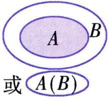</td><td rowspan="3">(1)空集是任何集合的子集,空集是任何非空集合不含任何元素的集合称为空集,记作∅.的真子集.(2)任何一个集合是它本身的子集,即A⊆A.(3)传递性:对于集合A,B,C,若A⊆B且B⊆C,则A⊆C;若A∉B,B∉C,则A∉C.(4)若A⊆B,则A=B或A∉B.(5)若集合A中含有n(n∈N*)个元素,则它的子集的个数为 $2^n$ ,真子集的个数为 $2^n-1$ ,非空真子集的个数为 $2^n-2$ .</td></tr><tr><td>相等</td><td>集合A,B中元素相同或集合A,B互为子集.</td><td>A=B</td><td>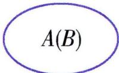</td></tr><tr><td>真子集</td><td>集合A⊆B,但存在元素x∈B,且x∉A.</td><td>A∉B(或B∉A)</td><td>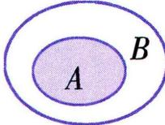</td></tr></table>

# 名师点评 0,{0},∅之间的关系

(1) $\varnothing$ 不含任何元素, $\{0\}$ 表示只含有一个元素 0 的集合, 所以 $0 \notin \varnothing, 0 \in \{0\}$ .  
(2) $\varnothing$ 是任何集合的子集, 所以 $\varnothing \subseteq \{0\}$ .


# 思·要点突破

# 要点① 集合间的关系的判断

# 判断两个集合之间的关系的方法:

(1) 将元素一一列举出来进行判断.   
(2)从集合中的元素入手,先判断集合 A 中的任意一个元素是否属于集合 B,再判断集合 B 中的任意一个元素是否属于集合 A,最后下结论.  
(3) 当集合为不等式的解集时, 可借助数轴进行判断.

教材拓展 (1) 若 $A \subseteq B, B \subseteq A$ , 则 $A = B$ ;

(2) 若 $A \subseteq B, B \not\subseteq A$ , 则 $A \subsetneq B$ ;  
(3) 若 $A \not\subseteq B, B \subseteq A$ , 则 $B \not\subsetneq A$ .

典例 1-1 (多选) 下列关系正确的是 ( )

A. $\{a,b,c\} \subseteq \{c,b,a\}$

B. $\{x \mid x < 1\} \subseteq \{x \mid x > -1\}$

C. $0 \in \{0\}$

D. $\varnothing \in \{0\}$

解析

<table><tr><td>A</td><td>√</td><td>因为任何集合都是它本身的子集,所以{a,b,c}⊆{c,b,a}.</td></tr><tr><td>B</td><td>×</td><td>如图,在数轴上表示出两集合,则由图知B错误. 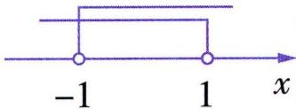</td></tr></table>

<table><tr><td>C</td><td>√</td><td rowspan="2">{0}是指元素为0的集合,所以0∈{0},∅∈{0}错误.</td></tr><tr><td>D</td><td>×</td></tr></table>

▶ 答案 AC

典例1-2 设集合 $M = \{x \mid x = \frac{k}{2} + \frac{1}{4}, k \in \mathbf{Z}\}$ , $N = \{x \mid x = \frac{k}{4} + \frac{1}{2}, k \in \mathbf{Z}\}$ , 则 ( )

A. $M = N$

B. $M \subsetneq N$

C. $N \subsetneq M$

D. $M \supseteq  N$

解析 由题知 $M = \{x \mid x = \frac{2k + 1}{4}, k \in \mathbf{Z}\}$ , $N = \{x \mid x = \frac{k + 2}{4}, k \in \mathbf{Z}\}$ .

方法一 $M = \{\cdots, -\frac{1}{4}, \frac{1}{4}, \frac{3}{4}, \frac{5}{4}, \cdots\}$ , $N = \{\cdots, -\frac{1}{4}, 0, \frac{1}{4}, \frac{2}{4}, \frac{3}{4}, \frac{4}{4}, \frac{5}{4}, \cdots\}$ ，所以 $M \subsetneq N$ .

方法二 因为 $2k + 1$ 是奇数, $k + 2$ 是整数, 所以 $M \subsetneq N$ .

▶答案 B

# 要点② 集合间的关系的应用

根据集合之间的关系求参:

(1) 明确集合之间的关系;  
(2)转化条件为方程或不等式;   
(3)求解并验证.

典例2-1 已知集合 $A = \{x \mid -2 < x < 1\}$ , $B = \{x \mid -m \leqslant x \leqslant m\}$ , 若 $B \subseteq A$ , 则实数 $m$ 的取值范围是 ( )

A. $\{m \mid m < 1\}$

B. $\{m \mid 0 < m \leqslant 2\}$

C. $\{m \mid m \geqslant 1\}$

D. $\{m \mid m \geqslant 2\}$

解析 当 $B = \varnothing$ 时, 满足 $B \subseteq A$ , 此时 $-m > m$ , 即 $m < 0$ .

不要忽略 $B = \varnothing$ 的情况.

当 $B \neq \emptyset$ 时, $m \geqslant 0$ 且 $\left\{ \begin{array}{l} -m > -2, \\ m < 1, \end{array} \right.$ 得 $0 \leqslant m < 1$ . 综上, 实数 $m$ 的取值范围为 $\{m \mid m < 1\}$ .

▶ 答案 A

典例2-2已知集合 $A = \{a \in \mathbf{N} \mid \frac{6}{a - 1} \in \mathbf{N}\}$ , $B = \{2, 3\}$ , 集合 $C$ 满足 $B \subseteq C \subseteq A$ , 则所有满足条件的集合 $C$ 的个数为 ( )

A. 3

B. 4

C. 5

D. 6

解析 $A = \{a \in \mathbf{N} \mid \frac{6}{a - 1} \in \mathbf{N}\} = \{2,3,4,7\}$ . 因为 $B = \{2,3\}, B \subseteq C$ , 故集合 $C$ 中必含有元素 2 和 3. 又 $C \subseteq A$ , 故集合 $C$ 可以为 $\{2,3\}, \{2,3,4\}, \{2,3,7\}, \{2,3,4,7\}$ , 则满足题意的集合 $C$ 的个数是 4.

▶ 答案 B

典例 2-3 已知集合 $A = \{x \mid x^2 - ax + b = 0, a \in \mathbf{R}, b \in \mathbf{R}\}$ .

(1) 若 $A = \{1\}$ , 求 $a, b$ 的值;

(2) 若 $B = \{x \in \mathbf{Z} \mid -3 < x < 0\}$ , 且 $A = B$ , 求 $a, b$ 的值.

解析 (1) 若 $A = \{1\}$ , 则 $\left\{ \begin{array}{l} 1 - a + b = 0, \\ \Delta = a^2 - 4b = 0, \end{array} \right.$ 解得 $\left\{ \begin{array}{l} a = 2, \\ b = 1. \end{array} \right.$

(2) 因为 $B = \{x \in \mathbf{Z} \mid -3 < x < 0\} = \{-2, -1\}$ , 且 $A = B$ , 所以 $\left\{ \begin{array}{l} 4 + 2a + b = 0, \\ 1 + a + b = 0, \end{array} \right.$ 解得 $\left\{ \begin{array}{l} a = -3, \\ b = 2. \end{array} \right.$

# 第三节 集合的基本运算


# 学·核心知识

知识点· 集合的基本运算

<table><tr><td></td><td>自然语言</td><td>符号语言</td><td>图形语言</td><td>性质</td></tr><tr><td>并集</td><td>由所有属于集合A或属于集合B的元素组成的集合,称为A与B的并集,记作 $A \cup B$ 。</td><td> $A \cup B = \{x \mid x \in A, \text{或} x \in B\}$ 。</td><td>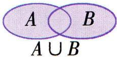</td><td>(1) $A \cup B = B \cup A$ , $A \cup A = A$ , $A \cup \varnothing = \varnothing \cup A = A$ , $A \subseteq (A \cup B)$ , $B \subseteq (A \cup B)$ 。(2)若 $A \cup B = A$ ,则 $B \subseteq A$ ;反之,若 $B \subseteq A$ ,则 $A \cup B = A$ 。(3)若 $A \subsetneq B$ ,则 $A \cup B = B$ ;反之不一定成立。(4)若 $A = B$ ,则 $A \cup B = A = B$ 。</td></tr><tr><td>交集</td><td>由所有属于集合A且属于集合B的元素组成的集合,称为A与B的交集,记作 $A \cap B$ 。</td><td> $A \cap B = \{x \mid x \in A, \text{且} x \in B\}$ 。</td><td>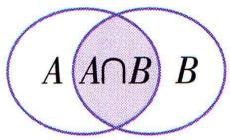</td><td>(1) $A \cap B = B \cap A$ , $A \cap A = A$ , $A \cap \varnothing = \varnothing \cap A = \varnothing$ , $(A \cap B) \subseteq A$ , $(A \cap B) \subseteq B$ 。(2)若 $A \cap B = A$ ,则 $A \subseteq B$ ;反之,若 $A \subseteq B$ ,则 $A \cap B = A$ 。(3)若 $A \subsetneq B$ ,则 $A \cap B = A$ ;反之不一定成立。(4)若 $A = B$ ,则 $A \cap B = A = B$ 。</td></tr><tr><td>全集、补集</td><td>全集:一般地,如果一个集合含有所研究问题中涉及的所有元素,那么就称这个集合为全集,通常记作U.补集:对于一个集合A,由全集U中不属于集合A的所有元素组成的集合称为集合A相对于全集U的补集,简称为集合A的补集,记作 $C_U A$ 。</td><td> $C_U A = \{x \mid x \in U, \text{且} x \notin A\}$ 。</td><td>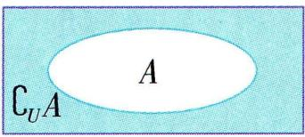</td><td>(1) $C_U (C_U A) = A$ 。(2) $C_U U = \varnothing$ , $C_U \varnothing = U$ 。(3) $A \cup (C_U A) = U$ , $A \cap (C_U A) = \varnothing$ 。(4) $C_U (A \cap B) = (C_U A) \cup (C_U B)$ , $C_U (A \cup B) = (C_U A) \cap (C_U B)$ 。(5) $A \subseteq B \Leftrightarrow C_U A \supseteq C_U B$ 。(6) $A = B \Leftrightarrow C_U A = C_U B$ 。摩根定律。</td></tr></table>

注意 (1)补集也是集合之间的一种运算,求集合 $A$ 在 $U$ 中的补集的前提是 $A$ 是 $U$ 的子集.

(2) 补集是相对于全集而存在的, 当全集发生变化时, 补集也随之改变, 所以在讨论一个集合的补集时, 必须说明该集合是在哪个集合中的补集.

# 思·要点突破

# 要点① 集合的混合运算

解决此类题目首先应弄清集合中元素的属性,是数集还是点集,并化简,然后按下列规律进行运算:

(1)如果集合是有限集,则可以先把集合中的元素一一列举出来,然后结合交、并、补运算分别求出.  
(2)如果集合中的元素由部分连续实数构成,则常借助数轴,把集合分别表示在数轴上,然后利用交、并、补运算去求解,这样处理比较形象直观,但解答过程中需注意端点值是否取到.

典例 1-1 已知全集 $U = \{1,2,3,4,5,6\}$ , 集合 $M = \{1,2,3\}, N = \{3,4\}$ , 则 $(C_U M) \cup (C_U N) =$ ()

A. $\{3\}$

B. $\{5,6\}$

C. $\{1,2,3,4\}$

D. $\{1,2,4,5,6\}$

解析 方法一 由于 $C_{U}M=\{4,5,6\},C_{U}N=\{1,2,5,6\}$ ，所以 $(C_{U}M)\cup(C_{U}N)=\{1,2,4,5,6\}$ .

方法二 由于 $M \cap N = \{3\}$ , 所以 $(C_U M) \cup (C_U N) = C_U (M \cap N) = \{1, 2, 4, 5, 6\}$ .

▶ 答案 D

典例1-2(多选)图中 $U$ 是全集, $M, N$ 是 $U$ 的两个子集, 则图中的阴影部分可以表示为 ( )

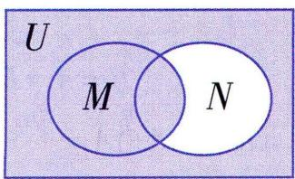

A. $M \cup (\complement_U N)$

B. $N \cup (\complement_U M)$

C. $\left[\complement_{U}(M\cap N)\right]\cup M$

D. $[\complement_U(M\cup N)]\cup M$

解析 如图, 将图中各部分区域标号, 则图中阴影部分为①+②+④. 对于 A, $M = ① + ②$ , $C_{U}N = ① + ④$ , 则 $M \cup (C_{U}N) = ① + ② + ④$ , 故 A 正确;

对于 B, $\complement_{U}M = ③ + ④$ , N = ② + ③, 则 $N \cup (\complement_{U}M) = ② + ③ + ④$ , 故 B 错误; 对于 C, $M \cap N = ②$ , $\complement_{U}(M \cap N) = ① + ③ + ④$ , 则 $[\complement_{U}(M \cap N)] \cup M = ① + ② + ③ + ④$ , 故 C 错误; 对于 D, $M \cup N = ① + ② + ③$ , $\complement_{U}(M \cup N) = ④$ , 则 $[\complement_{U}(M \cup N)] \cup M = ① + ② + ④$ , 故 D 正确.

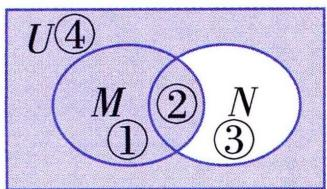

▶ 答案 AD

典例1-3 已知全集 $U = \{x \mid x \leqslant 4\}$ , 集合 $A = \{x \mid -2 < x < 3\}$ , $B = \{x \mid -3 < x < 3\}$ . 求 $\complement_U A, A \cap B, \complement_U (A \cap B), (\complement_U A) \cap B$ .

解析 把全集 $U$ 和集合 $A, B$ 在数轴上表示出来, 如图:

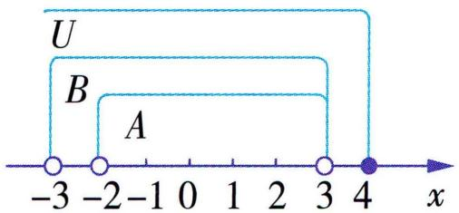

<details>
<summary>text_image</summary>

U
B
A
-3 -2 -1 0 1 2 3 4 x
</details>

由图可知, $\complement_{U}A=\left\{x\mid x\leqslant-2\text{或}3\leqslant x\leqslant4\right\}$ ,

$$
A \cap B = \{x \mid - 2 <   x <   3 \},
$$

$\complement_{U}(A\cap B)=\{x|x\leqslant-2\text{或}3\leqslant x\leqslant4\}$

$$
\left(\complement_ {U} A\right) \cap B = \{x \mid - 3 <   x \leqslant - 2 \}.
$$

# 名师点评

解决此类题目时,若是用列举法表示的数集, 可用直接法或用 Venn 图求解; 若是用描述法表示的数集, 可借助数轴, 此时要注意当端点不在集合中时, 应用“空心圈”表示.

# 要点② 集合运算的求参问题

根据集合运算的结果求参的解题思路如下:

(1) 将集合的运算结果转化为两个集合之间的关系;   
(2)依据集合之间的关系列出方程(组)或不等式(组);  
(3)解方程(组)或解不等式(组),即可求得参数的值或取值范围.

典例2-1已知集合 $A = \{x \mid -2 < x < 7\}$ , $B = \{x \mid a \leqslant x \leqslant 3a - 2\}$ .

(1) 若 $A \cap B = \{x \mid 4 \leqslant x < 7\}$ , 求实数 $a$ 的值;  
(2) 若 $A \cup (\complement_{\mathbf{R}} B) = \mathbf{R}$ , 求实数 $a$ 的取值范围.

解析（1）因为 $A = \{x \mid -2 < x < 7\}$ , $B = \{x \mid a \leqslant x \leqslant 3a - 2\}$ , 且 $A \cap B = \{x \mid 4 \leqslant x < 7\}$ , 所以 $a = 4$ 且 $3a - 2 \geqslant 7$ , 解得 $a = 4$ ,

故实数 $a$ 的值为 4.

(2) 当 $B = \varnothing$ 时, $a > 3a - 2$ , 即 $a < 1$ , 此时 $\complement_{\mathbf{R}} B = \mathbf{R}$ , 符合题意.

当 $B \neq \emptyset$ 时, $a \geqslant 1$ , 此时 $\complement_{\mathbb{R}} B = \{x \mid x < a \text{ 或 } x > 3a - 2\}$ .

若 $A \cup (\complement_{\mathbb{R}} B) = \mathbf{R}$ , 则 $\left\{ \begin{array}{l} a \geqslant 1, \\ a > -2, \\ 3a - 2 < 7, \end{array} \right.$ 解得 $1 \leqslant a < 3$ .

综上,实数 a 的取值范围是 $\{a \mid a < 3\}$ .

典例2-2 已知集合 $A = \{y \mid y > a^2 + 1 \text{ 或 } y < a\}$ , $B = \{y \mid 2 \leqslant y \leqslant 4\}$ , 若 $A \cap B \neq \varnothing$ , 求实数 $a$ 的取值范围.

解析 当 $A \cap B = \emptyset$ 时, 有 $\left\{ \begin{array}{l} a \leqslant 2, \\ a^2 + 1 \geqslant 4, \end{array} \right.$

得 $\left\{\begin{aligned}a&\leqslant2,\\ a&\geqslant\sqrt{3}\text{或}a\leqslant-\sqrt{3},\end{aligned}\right.$

故 $a \leqslant -\sqrt{3}$ 或 $\sqrt{3} \leqslant a \leqslant 2$ .

所以当 $A \cap B \neq \emptyset$ 时， $-\sqrt{3} < a < \sqrt{3}$ 或 $a > 2$

$A \cap B = \varnothing$ 时的 a 的取值范围的补集.

即实数 $a$ 的取值范围为 $\{a \mid -\sqrt{3} < a < \sqrt{3}$ 或 $a > 2\}$ .

# 名师点评

运用补集思想求参数取值范围的步骤:

①否定已知条件,考虑反面问题;  
②求解反面问题对应参数的取值范围;  
③将反面问题对应参数的取值范围取补集.


# 用·高分探究

# 探究·集合中的新定义问题

解决以集合为背景的新定义问题,要抓住两点:

(1)紧扣新定义. 分析新定义, 把新定义的本质弄清楚, 并能够应用到具体的解题过程中, 这是破解集合中的新定义问题的关键.  
(2)用好集合的性质. 解题时要善于从试题中发现可以使用集合性质的一些因素, 在关键之处用好集合的性质.

典例 1 对于两个正整数 m, n, 定义某种运算“ $\odot$ ”: 当 m, n 都为正偶数或正奇数时, $m \odot n = m + n$ ; 当 m, n 中有一个为正偶数, 另一个为正奇数时, $m \odot n = mn$ . 在此定义下, 集合 $M = \{(p, q) | p \odot q = 10, p \in \mathbf{N}^*, q \in \mathbf{N}^*\}$ 中元素的个数是 ( )

A. 9

B. 13

C. 4

D. 12

解析 集合 $M = \{(p, q) | p \odot q = 10, p \in \mathbf{N}^*, q \in \mathbf{N}^*\} = \{(1,9), (2,8), (3,7), (4,6), (5,5), (6,4), (7,3), (8,2), (9,1), (1,10), (2,5), (5,2), (10,1)\}$ , 共 13 个元素.  
▶ 答案 B

典例2(多选)通常我们把一个以集合作为元素的集合称为族. 若以集合 $X$ 的子集为元素的族 $\Gamma$ , 满足下列三个条件: (1) $\varnothing$ 和 $X$ 在 $\Gamma$ 中, (2) $\Gamma$ 中的有限个元素的交集在 $\Gamma$ 中, (3) $\Gamma$ 中的任意多个元素的并集在 $\Gamma$ 中, 则称族 $\Gamma$ 为集合 $X$ 上的一个拓扑. 已知全集 $U = \{1, 2, 3, 4\}$ , $A, B$ 为 $U$ 的非空真子集, 且 $A \neq B$ , 则 ( )

A. 族 $P = \{\varnothing, U\}$ 为集合 $U$ 上的一个拓扑  
B. 族 $P = \{\varnothing, A, U\}$ 为集合 $U$ 上的一个拓扑  
C. 族 $P = \{\varnothing, A, B, U\}$ 为集合 $U$ 上的一个拓扑

D. 若族 $P$ 为集合 $U$ 上的一个拓扑, 将 $P$ 中的每个元素的补集放在一起构成族 $Q$ , 则族 $Q$ 也是集合 $U$ 上的一个拓扑

解析

<table><tr><td>A</td><td>√</td><td>1∅,U∈P,满足条件(1);2P中的有限个元素的交集为∅,在P中,满足条件(2);3P中的任意多个元素的并集为U,在P中,满足条件(3).</td></tr><tr><td>B</td><td>√</td><td>1∅,U∈P,满足条件(1);2P中的有限个元素的交集为∅或A,都在P中,满足条件(2);3P中的任意多个元素的并集为U或A,都在P中,满足条件(3).</td></tr><tr><td>C</td><td>×</td><td>不妨设A={1,2},B={2,3},则A∩B={2},A∪B={1,2,3},都不在P={∅,A,B,U}中.</td></tr><tr><td>D</td><td>√</td><td>不妨设族P={∅,A1,···,An,U}(n≥1)为集合U上的一个拓扑,则Q={U,CuA1,···,Cua,n,∅}(n≥1).证明Q也是集合U上的一个拓扑即可.1∅,U∈Q,满足条件(1);2设Qi1,Qi2,···,Qi∈Q(k≤n+2,k∈N*),则Qi1∩Qi2∩···∩Qik=CU[(CUQi1)∪(CUQi2)∪···∪(CUQi_k)],而CUQi1,CUQi2,···,CUQi∈P,故(CUQi1)∪(CUQi2)∪···∪(CUQi_k)∈P,故Qi1∩Qi2∩···∩Qik∈Q,同理可证Qi1∪Qi2∪···∪Qi∈Q,满足条件(2)(3).</td></tr></table>

▶ 答案 ABD

# 第四节 充分条件与必要条件


# 学·核心知识

# 知识点① 充分条件、必要条件、充要条件

<table><tr><td>充分条件</td><td rowspan="2">一般地,“若p,则q”为真命题,是指由p通过推理可以得出q.这时,我们就说,由p可推出q,记作p⇒q,并且说p是q的充分条件,q是p的必要条件.</td></tr><tr><td>必要条件</td></tr><tr><td>充要条件</td><td>一般地,如果既有p⇒q,又有q⇒p,就记作p⇔q.此时,我们说,p是q的充分必要条件,简称充要条件.显然,如果p是q的充要条件,那么q也是p的充要条件.</td></tr></table>

# 知识点② 对充分条件、必要条件的理解

设 $A = \{x\mid x$ 满足条件 $p\}$ ， $B = \{x\mid x$ 满足条件 $q\}$ ，则

<table><tr><td>类型</td><td>关系式</td><td>从集合观点看</td></tr><tr><td>p是q的充分条件</td><td>p⇒q</td><td>A⊆B</td></tr><tr><td>p是q的必要条件</td><td>q⇒p</td><td>A⊇B</td></tr><tr><td>p是q的充分不必要条件</td><td>p⇒q,q≠p</td><td>A∉B</td></tr><tr><td>p是q的必要不充分条件</td><td>q⇒p,p≠q</td><td>A∉B</td></tr><tr><td>p是q的充要条件</td><td>q⇔p</td><td>A=B</td></tr><tr><td>p是q的既不充分也不必要条件</td><td>p≠q,q≠p</td><td>A∉B,B∉A</td></tr></table>

# 教材拓展

(1) 充分条件与必要条件的两个特征:

①若 $p$ 是 $q$ 的充分条件, 则 $q$ 是 $p$ 的必要条件, 即 “ $p \Rightarrow q$ ” $\Leftrightarrow$ “ $q \Leftarrow p$ ”.  
②传递性. 若 $p$ 是 $q$ 的充分 (必要) 条件, $q$ 是 $r$ 的充分 (必要) 条件, 则 $p$ 是 $r$ 的充分 (必要) 条件.  
(2) 注意区分“p 是 q 的充分条件”与“p 的一个充分条件是 q”两者的不同, 前者是“ $p \Rightarrow q$ ”, 而后者是“ $q \Rightarrow p$ ”.


# 思·要点突破

# 要点 1 充分条件、必要条件的判断

(1) 定义法: ① 分清哪个是条件, 哪个是结论; ② 判断 $p$ 能否推出 $q, q$ 能否推出 $p$ ; ③ 下结论.  
(2)集合法:写出集合 $A = \{x \mid x$ 满足的条件 $p\}$ , $B = \{x \mid x$ 满足的条件 $q\}$ , 利用集合之间的包含关系进行判断.  
(3)等价转化法:将命题转化为另一个与之等价的且便于判断真假的命题.   
(4) 特殊值法: 可以取一些特殊值来说明由条件 (结论) 不能推出结论 (条件).

典例 1-1 已知 $a \in \mathbf{R}$ , 若集合 $M = \{1, a\}, N = \{-1, 0, 1\}$ , 则“ $M \subseteq N$ ”是“ $a = 0$ ”的 ( )

A. 充分不必要条件

B. 必要不充分条件

C. 充要条件

D. 既不充分也不必要条件

解析 若 $M \subseteq N$ , 则 $a = 0$ 或 $a = -1$ , 故 “ $M \subseteq N$ ” 推不出 “ $a = 0$ ”. 反之, 若 $a = 0$ , 则 $M \subseteq N$ , 故 “ $M \subseteq N$ ” 是 “ $a = 0$ ” 的必要不充分条件.

▶答案 B

典例1-2（多选）下列选项中,满足p是q的充分不必要条件的是()

A. $p: x > 1, q: x > 0$

B. $p: |x| \neq 2, q: x^2 \neq 4$

C. $p: x = 0, q: xy = 0$

D. $p: x > y, q: x^{2} > y^{2}$

解析

<table><tr><td>A</td><td>√</td><td>p⇒q,q≠p,即p是q的充分不必要条件.</td></tr><tr><td>B</td><td>×</td><td>p:x≠±2,q:x≠±2,所以p⇔q,即p是q的充要条件.</td></tr><tr><td>C</td><td>√</td><td> $xy = 0 \Rightarrow x = 0$ 或 $y = 0$ ,所以 $p \Rightarrow q, q \nRightarrow p$ ,即 $p$ 是 $q$ 的充分不必要条件.</td></tr><tr><td>D</td><td>×</td><td>取 $x = -1,y = -2$ ,则 $x >y$ ,但 $x^2 < y^2$ ,所以 $p \nRightarrow q$ ;取 $x = -1,y = 0$ ,则 $x^2 >y^2$ ,但 $x < y$ ,所以 $q \nRightarrow p$ ,即 $p$ 是 $q$ 的既不充分也不必要条件.</td></tr></table>

▶答案 AC

# 要点② 充分条件、必要条件的探求与证明

1. 在求某结论的充要条件时,可以从充分性和必要性两方面入手,也可以将原命题等价转化,获得充要条件.在求某结论的充分不必要条件或必要不充分条件时,一般是先求出结论的充要条件,然后将所得条件的范围缩小或扩大,即可得到所需要的结论.

2. 证明充分条件、必要条件时,要注意:

(1) 分别证明充分性和必要性, 在解题时要避免混淆充分性与必要性.  
(2)等价法:从条件(或结论)开始,逐步推出结论(或条件),但要注意每一步都是可逆的,即反过来也能推出.

典例2-1（多选）不等式 $|a| < 4$ 的充分不必要条件可以是 （）

A. $a <   4$

B. $\left| a\right|  < {3}$

C. $a^{2} < 16$

D. $0 < a < 3$

解析 $|a| < 4$ 的解集是 $M = \{a | -4 < a < 4\}$ , 对于 A, 因为 $M \subsetneq \{a | a < 4\}$ , 所以 $a < 4$ 是 $|a| < 4$ 的必要不充分条件; 对于 B, $|a| < 3$ 的解集是 $\{a | -3 < a < 3\}$ , 因为 $\{a | -3 < a < 3\} \subsetneq M$ , 所以 $|a| < 3$ 是 $|a| < 4$ 的充分不必要条件; 对于 C, 因为 $a^2 < 16$ 的解集是 $\{a | -4 < a < 4\} = M$ , 所以 $a^2 < 16$ 是 $|a| < 4$ 的充要条件; 对于 D, 因为 $\{a | 0 < a < 3\} \subsetneq M$ , 所以 $0 < a < 3$ 是 $|a| < 4$ 的充分不必要条件.

▶ 答案 BD

典例2-2 已知 $a, b \in \mathbf{R}$ , 则“ $ab \neq 0$ ”的一个必要条件是 ( )

A. $a + b \neq 0$

B. $a^{2} + b^{2} \neq 0$

C. $a^3 + b^3 \neq 0$

D. $\frac{1}{a} + \frac{1}{b} \neq 0$

解析 当 $a = 3, b = -3$ 时, $ab \neq 0$ , 此时 $a + b = 0, a^3 + b^3 = 0, \frac{1}{a} + \frac{1}{b} = 0$ , 故 $a + b \neq 0, a^3 + b^3 \neq 0, \frac{1}{a} + \frac{1}{b} \neq 0$ 都不是 $ab \neq 0$ 的必要条件, 故 A, C, D 错误. 对于 B, $ab \neq 0 \Rightarrow a^2 + b^2 \neq 0$ , 当 $a^2 + b^2 \neq 0$ 时, $a, b$ 不同时为 0, 但 ab 可以为 0, 故 $a^2 + b^2 \neq 0$ 是 $ab \neq 0$ 的必要条件, 故 B 正确.

▶ 答案 B

典例2-3 设 $\triangle ABC$ 的内角 $A, B, C$ 的对边长分别为 $a, b, c$ . 求证: “关于 $x$ 的方程 $x^{2} + 2ax + b^{2} = 0$ 与 $x^{2} + 2cx - b^{2} = 0$ 有公共根”的充要条件是“ $A = 90^{\circ}$ ”.

解析 ① 必要性:

设关于 $x$ 的方程 $x^{2} + 2ax + b^{2} = 0$ 与 $x^{2} + 2cx - b^{2} = 0$ 有公共根 $x_0$ ，则 $x_0^2 + 2ax_0 + b^2 = 0, x_0^2 + 2cx_0 - b^2 = 0$ .

两式相减, 可得 $x_{0}=\frac{b^{2}}{c-a}$ ,

代入 $x_{0}^{2} + 2ax_{0} + b^{2} = 0$ ，可得 $b^{2} + c^{2} = a^{2}$ ，故 $A = 90^{\circ}$ .

②充分性:

因为 $A = 90^{\circ}$ ，所以 $b^{2} + c^{2} = a^{2}$ 故 $b^{2} = a^{2} - c^{2}$

将 $b^{2} = a^{2} - c^{2}$ 代入方程 $x^{2} + 2ax + b^{2} = 0$

可得 $x^{2} + 2ax + a^{2} - c^{2} = 0$

所以 $(x + a - c)(x + a + c) = 0$

得 $x = c - a$ 或 $x = -(a + c)$ .

将 $b^{2} = a^{2} - c^{2}$ 代入方程 $x^{2} + 2cx - b^{2} = 0$

可得 $x^{2} + 2cx + c^{2} - a^{2} = 0$

所以 $(x + c - a)(x + c + a) = 0$

得 $x = a - c$ 或 $x = -(a + c)$ .

故两个方程有公共根 $x = -(a + c)$ .

综合①②, 可知“关于 x 的方程 $x^{2} + 2ax + b^{2} = 0$ 与 $x^{2} + 2cx - b^{2} = 0$ 有公共根”的充要条件是“ $A = 90^{\circ}$ ”.

# 要点


# 由充分条件、必要条件求参数的值或取值范围

根据充分条件与必要条件求参数的取值范围的步骤:

(1) 记集合 $M = \{x \mid x \text{ 满足条件 } p\}$ , $N = \{x \mid x \text{ 满足条件 } q\}$ ;  
(2) 若 $p$ 是 $q$ 的充分不必要条件, 则 $M \subsetneq N$ , 若 $p$ 是 $q$ 的必要不充分条件, 则 $N \subsetneq M$ , 若 $p$ 是 $q$ 的充要条件, 则 $M = N$ ;

(3)根据集合的关系列不等式(组);  
(4)解不等式(组)得结果.

典例3-1已知 $p: -3 \leqslant x \leqslant 1, q: x \leqslant a$ . 若 $q$ 的一个充分不必要条件是 $p$ , 则实数 $a$ 的取值范围是

解析 因为 $q$ 的一个充分不必要条件是 $p$ , 所以 $\{x \mid -3 \leqslant x \leqslant 1\} \subsetneqq \{x \mid x \leqslant a\}$ , 则 $a \geqslant 1$ .  
▶ 答案 $\{a \mid a \geqslant 1\}$

典例 3-2 已知集合 $A = \{x \mid 2 - a \leqslant x \leqslant 2 + a\}$ , $B = \{x \mid 1 \leqslant x \leqslant 8\}$ .

(1) 若 $A \cap B = \{x \mid 1 \leqslant x \leqslant 4\}$ , 求实数 $a$ 的值;  
(2) 若 $A \neq \emptyset$ , 且 “ $x \in B$ ” 是 “ $x \in A$ ” 的必要不充分条件,

求实数 a 的取值范围.

解析（1）因为 $B = \{x \mid 1 \leqslant x \leqslant 8\}$ , $A \cap B = \{x \mid 1 \leqslant x \leqslant 4\}$ ,

所以 $\left\{\begin{aligned}2+a=4,\\ 2-a\leqslant1,\end{aligned}\right.$ 解得a=2.

(2) 因为 $A \neq \emptyset$ , 所以 $2 + a \geqslant 2 - a$ , 即 $a \geqslant 0$ .

因为“ $x \in B$ ”是“ $x \in A$ ”的必要不充分条件，

所以 $A \subsetneqq B$ ，所以 $\left\{\begin{aligned}&2-a\geqslant1,\\ &2+a\leqslant8,\end{aligned}\right.$ 解得 $a \leqslant 1$ .

这两个等号不能同时成立.

因此,实数 a 的取值范围为 $\{a \mid 0 \leqslant a \leqslant 1\}$ .

# 第五节 全称量词与存在量词


# 学·核心知识

知识点① 全称量词及全称量词命题

<table><tr><td rowspan="2">全称量词</td><td>定义</td><td>短语“所有的”“任意一个”在逻辑中通常叫作全称量词.</td></tr><tr><td>符号表示</td><td>∀</td></tr><tr><td rowspan="3">全称量词命题</td><td>定义</td><td>含有全称量词的命题,叫作全称量词命题.</td></tr><tr><td>一般形式</td><td>对M中任意一个x,p(x)成立(M表示变量x的取值范围).</td></tr><tr><td>符号表示</td><td>∀x∈M,p(x).</td></tr><tr><td>全称量词命题的否定</td><td colspan="2">∃x∈M,¬p(x).全称量词命题的否定是存在量词命题.</td></tr></table>

知识点 ② 存在量词及存在量词命题

<table><tr><td rowspan="2">存在量词</td><td>定义</td><td>短语“存在一个”“至少有一个”在逻辑中通常叫作存在量词.</td></tr><tr><td>符号表示</td><td>∃</td></tr><tr><td rowspan="3">存在量词命题</td><td>定义</td><td>含有存在量词的命题,叫作存在量词命题.</td></tr><tr><td>一般形式</td><td>存在M中的元素x,p(x)成立(M表示变量x的取值范围).</td></tr><tr><td>符号表示</td><td>∃x∈M,p(x).</td></tr><tr><td>存在量词命题的否定</td><td colspan="2">∀x∈M,¬p(x).存在量词命题的否定是全称量词命题.</td></tr></table>

注意 常见的全称量词还有“一切”“每一个”“任给”等. 常见的存在量词还有“有些”“对某些”“有一个”“有的”等.

# 温馨提示

<table><tr><td>词语</td><td>词语的否定</td><td>词语</td><td>词语的否定</td></tr><tr><td>等于</td><td>不等于</td><td>大于</td><td>不大于(即小于或等于)</td></tr><tr><td>小于</td><td>不小于(即大于或等于)</td><td>是</td><td>不是</td></tr><tr><td>都是</td><td>不都是与“都不是”区别开.</td><td>至少一个</td><td>一个也没有</td></tr><tr><td>至多一个</td><td>至少两个</td><td></td><td></td></tr></table>


# 思·要点突破

# 要点①

# 全称量词命题与存在量词命题的真假判断

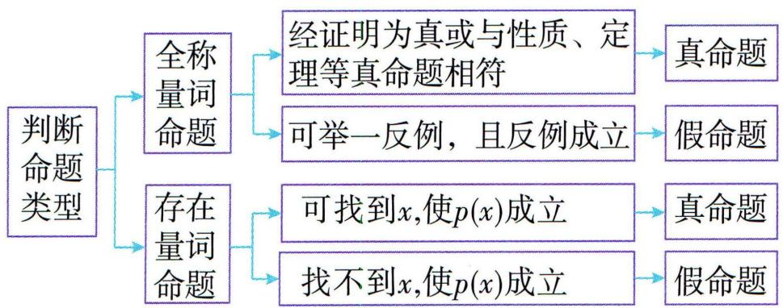

<details>
<summary>flowchart</summary>

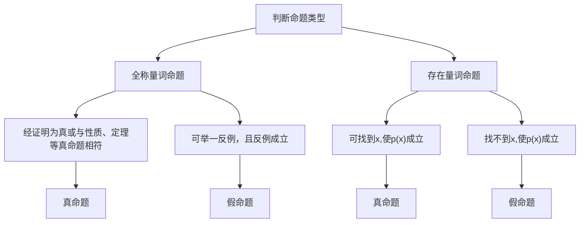
</details>

注意 对全称量词命题与存在量词命题进行否定,得到的命题与原命题真假性相反.

典例 1 (多选)下列命题是真命题的是 ( )

A. 每个三角形至少有两个锐角  
B. $\forall x \in \{x \mid x \text{是无理数}\}, x^3$ 是无理数  
C. $\exists x \in N, \sqrt{x^{2} + 1} \in N$   
D. $\exists x \in \mathbf{Z}, x^{2} + 1$ 是 4 的倍数

解析

<table><tr><td>A</td><td>√</td><td>假设一个三角形只有一个锐角或没有锐角,即该三角形有两个或三个大于等于90°的角,则三角形内角和大于180°,故假设不成立,即每个三角形至少有两个锐角.</td></tr><tr><td>B</td><td>×</td><td>令 $x = \sqrt[3]{2}$ ,则 $x^3 = (\sqrt[3]{2})^3 = 2$ 是有理数.</td></tr><tr><td>C</td><td>√</td><td>令 $x=0$ ,则 $\sqrt{x^2+1} = 1 \in \mathbb{N}$ .</td></tr><tr><td>D</td><td>×</td><td>当x是奇数时,不妨设 $x = 2k + 1,k \in \mathbb{Z}$ ,则 $x^2 + 1 = 4k^2 + 4k + 2 = 4(k^2 + k + \frac{1}{2})$ ,由于 $k \in \mathbb{Z}$ ,故 $k^2 + k + \frac{1}{2} \notin \mathbb{Z}$ ,故 $x^2 + 1$ 不是4的倍数;当x是偶数时, $x^2 + 1$ 是奇数,不是4的倍数.</td></tr></table>

▶答案 AC

# 要点 ② 全称量词命题与存在量词命题的否定

典例 2 (多选)下列命题的否定正确的是 ( )

A. 命题 $p: \forall x \in \mathbf{R}, x > 0, p$ 的否定: $\exists x \in \mathbf{R}, x \leqslant 0$   
B. 命题 $p: \exists x \in \mathbf{R}, x^2 \leqslant -1, p$ 的否定: $\exists x \in \mathbf{R}, x^2 > -1$

C. 命题 $p: \exists x, y \in \mathbf{N}^{*}, 2x + 6y \geqslant 10, p$ 的否定: $\forall x, y \in \mathbf{N}^{*}, 2x + 6y < 10$   
D. 命题 $p: \forall x \in \mathbf{R}, x^2 + 1 \neq 0, p$ 的否定: $\exists x \in \mathbf{R}, x^2 + 1 = 0$

解析 对于 B, p 的否定: $\forall x \in R, x^{2} > -1$ , B 错误. A, C, D 正确.

▶答案 ACD

# 要点

# 3

# 由全称量词命题或存在量词命题的真假求参

典例 3-1 (多选) 已知命题 $p: \exists x \in \mathbf{R}, x^2 + 2x + 2 - a = 0$ 为真命题, 则实数 $a$ 的取值可以是 ( )

A. 1

B. 0

C. 3

D. -3

解析 由命题 $p: \exists x \in \mathbf{R}, x^2 + 2x + 2 - a = 0$ 为真命题,得 $\Delta = 2^2 - 4(2 - a) = 4a - 4 \geqslant 0$ , 解得 $a \geqslant 1$ . 符合条件的为 A, C 选项.  
▶答案 AC

典例3-2已知集合 $A = \{x \mid 6 \leqslant x \leqslant 20\}$ , 集合 $B = \{x \mid x \leqslant 2a\}$ , 命题 $p: \exists x \in A, x \in B$ , 命题 $q: \forall x \in \mathbf{R}, x^2 + 2x - a > 0$ .

(1)若命题 $p$ 为假命题,求实数 $a$ 的取值范围;  
(2)若命题 p 和命题 q 至少有一个为真命题,求实数 a 的取值范围.

解析(1)若p为真命题,则 $A\cap B\neq\varnothing$ ,

所以 $2a \geqslant 6$ ，所以 $a \geqslant 3$ ，

所以命题 p 为假命题时, a 的取值范围为 $\{a \mid a < 3\}$ .

(2) 当 q 为假命题时, 即“ $\exists x \in R, x^{2} + 2x - a \leqslant 0$ ”为真命题,

即 $\exists x\in \mathbf{R},(x + 1)^2\leqslant 1 + a$ ，则 $1 + a\geqslant 0$ ，即 $a\geqslant -1$ ，所以 $a$ 的取值范围为 $\{a|a\geqslant -1\}$

所以当 $p, q$ 均为假命题时 $a$ 的取值范围为 $\{a \mid a < 3\} \cap \{a \mid a \geqslant -1\} = \{a \mid -1 \leqslant a < 3\}$ ,

所以当命题 $p$ 和命题 $q$ 至少有一个为真命题时, $a$ 的取值范围为 $\{a \mid a < -1 \text{ 或 } a \geqslant 3\}$ .

# 第一节 等式性质与不等式性质


# 学·核心知识

# 知识点① 不等关系与不等式

(1) 用不等号 (>、<、≥、≤、≠) 连接的式子, 叫作不等式;  
(2)不等式研究的范围是实数集 $\mathbf{R}$ ;  
(3) 常见不等式的文字语言与符号语言之间的转换:

<table><tr><td>文字语言</td><td>大于,高于,超过</td><td>小于,低于,少于</td><td>大于等于,至少,不低于,不少于</td><td>小于等于,至多,不多于,不超过</td></tr><tr><td>符号语言</td><td>&gt;</td><td>&lt;</td><td>≥</td><td>≤</td></tr></table>

# 知识点② 不等式的基本性质

<table><tr><td>名称</td><td>内容</td><td>注意</td></tr><tr><td>性质1</td><td>相反性:a&gt;b⇔b&lt; a</td><td>可逆</td></tr><tr><td>性质2</td><td>传递性:a&gt;b,b&gt;c⇒a&gt;c</td><td>不可逆</td></tr><tr><td>性质3</td><td>可加性:a&gt;b⇔a+c&gt;b+c</td><td>可逆</td></tr></table>

续表

<table><tr><td>名称</td><td>内容</td><td>注意</td></tr><tr><td>性质4</td><td>可乘性: $\begin{cases}a>b,\\c>0\end{cases}\Rightarrow ac>bc;$  $\begin{cases}a>b,\\c<0\end{cases}\Rightarrow ac同的符号</td><td>c的符号</td></tr><tr><td>性质5</td><td>同向可加性:\(\begin{cases}a>b,\\c>d\end{cases}\Rightarrow a+\\c>b+d$ </td><td rowspan="2">同向</td></tr><tr><td>性质6</td><td>同向同正可乘性: $\begin{cases}a>b>0,\\c>d>0\end{cases}\Rightarrow ac>bd$ </td></tr><tr><td>性质7</td><td>可乘方性: $a>b>0\Rightarrow a^{n}>b^{n}(n\in\mathbf{N},n\geqslant2)$ </td><td>同正</td></tr></table>

教材拓展 可开方性: $a > b > 0 \Rightarrow \sqrt[n]{a} > \sqrt[n]{b}$ ( $n \in \mathbf{N}$ , $n \geqslant 2$ ).

倒数法则: 若 a > b, 且 ab > 0, 则 $\frac{1}{a} < \frac{1}{b}$ .

糖水不等式: 若 b > a > 0, m > 0, 则 $\frac{a}{b} < \frac{a + m}{b + m}$ .


# 思·要点突破

# 要点① 用不等式(组)表示不等关系

典例 1 铁路总公司关于乘车行李规定如下:乘坐动车组列车,旅客随身携带的每件物品外部尺寸长、宽、高之和不超过 130 cm,且体积不超过 72 000 cm $^{3}$ . 设每件携带物品外部尺寸长、宽、高分别为 a,b,c(单位:cm),这个规定用不等式可表示为 ( )

A. $a + b + c < 130$ 且 $abc < 72000$   
B. $a + b + c > 130$ 且 $abc > 72000$   
C. $a + b + c \leqslant 130$ 且 $abc \leqslant 72000$   
D. $a + b + c \geqslant 130$ 且 $abc \geqslant 72000$

解析 由长、宽、高之和不超过 $130 \mathrm{~cm}$ , 得 $a + b + c \leqslant 130$ . 由体积不超过 $72000 \mathrm{~cm}^{3}$ , 得 $abc \leqslant 72000$ .  
▶ 答案 C

名师点评 (1) 不等式是不等关系的符号表示, 在用不等式表示不等关系时, 应特别注意能否取等号, 像本题中“不超过”包含相等的情况, 应该取等号.

(2) 将实际的不等关系写成对应的不等式时, 应注意实际问题中的关键性的文字与对应的数学符号之间的正确转换, 同时要保证不重、不漏, 尤其要检验实际问题中变量的取值范围.

# 要点② 比较大小

<table><tr><td>方法</td><td>依据</td><td>步骤</td></tr><tr><td>作差法</td><td> $a - b >0 \Leftrightarrow a >b$ , $a - b = 0 \Leftrightarrow a = b$ , $a - b < 0 \Leftrightarrow a < b$ .</td><td>作差→变形→判断差与可采用配方、通分、有理化等方法。0的大小→下结论。</td></tr><tr><td>作商法</td><td>(1)若 $a >0, b >0$ ,则 $\frac{a}{b} >1 \Leftrightarrow a >b; \frac{a}{b} = 1 \Leftrightarrow a = b; \frac{a}{b} < 1 \Leftrightarrow a < b$ 。(2)若 $a < 0, b < 0$ , $a, b$ 同正或同负。则 $\frac{a}{b} >1 \Leftrightarrow a < b; \frac{a}{b} = 1 \Leftrightarrow a = b; \frac{a}{b} < 1 \Leftrightarrow a >b$ 。</td><td>作商→变形→判断商与1的大小→下结论。</td></tr><tr><td>介值比较法</td><td>(1) $a >b, b >c \Leftrightarrow a >c$ ;(2) $a < b, b < c \Leftrightarrow a < c$ 。</td><td>恰当放缩→找介值。</td></tr><tr><td>平方法</td><td>(1) $a >0, b >0, a^2 >b^2 \Leftrightarrow a >b$ 。(2) $a < 0, b < 0, a^2 >b^2 \Leftrightarrow a, b$ 同正或同负。 $a < b$ 。</td><td>平方→用作差法或作商法比较大小。</td></tr></table>

典例2-1 比较 $A = a^{2} + b^{2} + c^{2} + 14$ 和 $B = 2a + 4b + 6c$ 的大小.

解析 $A - B = a^{2} + b^{2} + c^{2} + 14 - 2a - 4b - 6c = (a^{2} -$ 作差法.

$$
\begin{array}{r l} & {2 a + 1) + (b ^ {2} - 4 b + 4) + (c ^ {2} - 6 c + 9) = (a - 1) ^ {2} + (b -} \\ & {2) ^ {2} + (c - 3) ^ {2} \geqslant 0, \text {即} A - B \geqslant 0, \text {故} A \geqslant B.} \end{array}
$$

典例2-2 (1)已知 $a > 2$ ，试比较 $A = \sqrt{a + 1} +\sqrt{a}$ 与 $B = \sqrt{a + 2} +\sqrt{a - 2}$ 的大小；

(2)已知 a > 1 > b > 0，比较 $\frac{a}{b}$ ， $\frac{b}{a}$ ， $\frac{a^{2}}{b}$ ， $\frac{b^{2}}{a}$ 的大小.

解析（1）因为 $a > 2, A = \sqrt{a + 1} + \sqrt{a} > 0, B = \sqrt{a + 2} + \sqrt{a - 2} > 0,$

所以 $A^{2}-B^{2}=2a+1+2\sqrt{a(a+1)}-[2a+$ 平方法.

$$
\left. 2 \sqrt {(a + 2) (a - 2)} \right] = 1 + 2 \left(\sqrt {a ^ {2} + a} - \sqrt {a ^ {2} - 4}\right).
$$

又 $a > 2$ ，所以 $(a^2 + a) - (a^2 - 4) = a + 4 > 0$

所以 $a^{2}+a>a^{2}-4>0$ , 所以 $\sqrt{a^{2}+a}>\sqrt{a^{2}-4}$

所以 $A^{2}-B^{2}>0$ , 所以 A>B.

(2) 分析知 $\frac{a}{b}, \frac{a^{2}}{b}$ 均大于 1, $\frac{b}{a}, \frac{b^{2}}{a}$ 均小于 1.

因为 $\frac{\frac{b^{2}}{a}}{\frac{b}{a}}=b<1$ ，所以 $\frac{b^{2}}{a}<\frac{b}{a}$ .
作商法.

因为 $\frac{\frac{a^{2}}{b}}{\frac{a}{b}}=a>1$ ，所以 $\frac{a}{b}<\frac{a^{2}}{b}$ .

综上， $\frac{b^{2}}{a}<\frac{b}{a}<\frac{a}{b}<\frac{a^{2}}{b}.$

# 要点③ 不等式性质的应用

# 考向 1 求代数式的取值范围

一般思路：

(1)借助性质,转化为同向不等式相加或同正同向不等式相乘进行解答;   
(2)借助所给条件整体使用,切不可随意拆分.

典例 3-1 已知 $2 < x < 3, 2 < y < 3$ . 分别求:

(1) $z_{1}=2x+y$ 的取值范围；  
(2) $z_{2}=x-y$ 的取值范围；  
(3) $z_{3}=xy$ 的取值范围;  
(4) $z_{4}=\frac{x}{y}$ 的取值范围.

解析 (1) 因为 $2 < x < 3, 2 < y < 3$ , 所以 $4 < 2x < 6$ , 所以 $6 < 2x + y < 9$ , 故 $z_{1} = 2x + y$ 的取值范围为 $\{z_{1} \mid 6 < z_{1} < 9\}$ .

(2) 因为 $2 < x < 3, 2 < y < 3$ , 所以 $-3 < -y < -2$ , 所以 $-1 < x - y < 1$ , 故 $z_{2} = x - y$ 的取值范围为 $\{z_{2} \mid -1 < z_{2} < 1\}$ .  
(3) 因为 $2 < x < 3, 2 < y < 3$ , 所以 $4 < xy < 9$ , 故 $z_{3} = xy$ 的取值范围为 $\{z_{3} \mid 4 < z_{3} < 9\}$ .  
(4) 因为 $2 < x < 3, 2 < y < 3$ , 所以 $\frac{1}{3} < \frac{1}{y} < \frac{1}{2}$ , 所以 $\frac{2}{3} < \frac{x}{y} < \frac{3}{2}$ , 故 $z_{4} = \frac{x}{y}$ 的取值范围为 $\{z_{4} \mid \frac{2}{3} < z_{4} < \frac{3}{2}\}$ .

典例 3-2 已知 $1 \leqslant 2a + b \leqslant 4, -1 \leqslant a - 2b \leqslant 2$ , 求 $10a - 5b$ 的取值范围.

解析 方法一(换元法) 设 $u = 2a + b, v = a - 2b$ ,

则 $a = \frac{2u + v}{5}, b = \frac{u - 2v}{5}$ , 所以 $10a - 5b = 10 \times \frac{2u + v}{5} - 5 \times \frac{u - 2v}{5} = 3u + 4v$ .

因为 $1 \leqslant u \leqslant 4, -1 \leqslant v \leqslant 2$ ，所以 $-1 \leqslant 3u + 4v \leqslant 20$ ，即 $-1 \leqslant 10a - 5b \leqslant 20$ ，

所以 10a - 5b 的取值范围为 $[-1, 20]$ .

方法二(整体法) 令 $10a - 5b = x(2a + b) + y(a - 2b) = (2x + y)a + (x - 2y)b$

则 $\left\{ \begin{array}{l} 2x + y = 10, \\ x - 2y = -5, \end{array} \right.$ 解得 $\left\{ \begin{array}{l} x = 3, \\ y = 4, \end{array} \right.$

所以 $10a - 5b = 3(2a + b) + 4(a - 2b)$ .

因为 $1 \leqslant 2a + b \leqslant 4, -1 \leqslant a - 2b \leqslant 2$ ，所以 $3 \leqslant 3(2a + b) \leqslant$

12, $-4 \leqslant 4(a - 2b) \leqslant 8$ , 所以 $-1 \leqslant 3(2a + b) + 4(a - 2b) \leqslant 20$ , 即 $-1 \leqslant 10a - 5b \leqslant 20$ ,

故 $10a - 5b$ 的取值范围为 $[-1, 20]$ .

# 考向 2 证明不等式

典例3-3 已知 $a > b > 0, c < d < 0, e < 0$ , 求证: $\frac{e}{(a - c)^2} > \frac{e}{(b - d)^2}$ .

解析 因为 $c < d < 0$ , 所以 $-c > -d > 0$ .

又 $a > b > 0$ ，所以 $a - c > b - d > 0.$

所以 $(a-c)^{2}>(b-d)^{2}>0,$

所以 $0 < \frac{1}{(a - c)^2} < \frac{1}{(b - d)^2}$ .

又 $e < 0$ ，所以 $\frac{e}{(a - c)^2} >\frac{e}{(b - d)^2}.$

典例 3-4 已知 $a, b, c$ 为三角形的三边长, 证明: $\frac{a}{b + c} + \frac{b}{a + c} + \frac{c}{a + b} < 2$ .

解析 因为 $a, b, c$ 为三角形的三边长，

所以 $0 < a < b + c, 0 < b < c + a, 0 < c < a + b,$

所以 $\frac{a}{b + c} < \frac{a + a}{a + b + c}, \frac{b}{a + c} < \frac{b + b}{a + b + c}, \frac{c}{a + b} < \frac{c + c}{a + b + c}$ ,

糖水不等式.

将以上不等式左右两边分别相加得 $\frac{a}{b + c} + \frac{b}{a + c} + \frac{c}{a + b} <$

$$
\frac {a + a}{a + b + c} + \frac {b + b}{a + b + c} + \frac {c + c}{a + b + c} = 2,
$$

所以 $\frac{a}{b + c} +\frac{b}{a + c} +\frac{c}{a + b} <  2.$

# 第二节 基本不等式


# 学·核心知识

# 知识点·基本不等式

<table><tr><td>定义</td><td>如果 $a>0,b>0$ ,那么 $\frac{a+b}{2} \geqslant \sqrt{ab}$ ,当且仅当 $a=b$ 时,等号成立.我们称上述不等式为基本不等式. $a,b$ 的算术平均数. $a,b$ 的几何平均数.</td></tr><tr><td>常用结论</td><td>(1) $a^{2}+b^{2} \geqslant 2ab(a,b\in\mathbb{R})$ .(2) $\frac{b}{a}+\frac{a}{b} \geqslant 2(a,b$ 同号), $\frac{b}{a}+\frac{a}{b} \leqslant -2(a,b$ 异号).特别地, $a+\frac{1}{a} \geqslant 2(a>0)$ , $a+\frac{1}{a} \leqslant -2(a<0)$ .(3) $\frac{a^{2}+b^{2}}{2} \geqslant \frac{(a+b)^{2}}{4} \geqslant ab(a,b\in\mathbb{R})$ .(4) $\sqrt{\frac{a^{2}+b^{2}}{2}} \geqslant \frac{a+b}{2} \geqslant \sqrt{ab} \geqslant \frac{2}{\frac{1}{a}+\frac{1}{b}} (a>0,b>0)$ .</td></tr><tr><td>最值定理</td><td>(1)和定积最大:若 $x+y=S(x>0,y>0,S$ 为定值),则当 $x=y$ 时,积 $xy$ 有最大值,为 $\frac{S^{2}}{4}$ ;(2)积定和最小:若 $xy=P(x>0,y>0,P$ 为定值),则当 $x=y$ 时,和 $x+y$ 有最小值,为 $2\sqrt{P}$ .</td></tr><tr><td>利用基本不等式求最值需要满足的条件</td><td>“一正”就是各项必须为正数.“二定”就是要求和的最小值,必须把构成和的两项之积转化成定值;要求积的最大值,必须把构成积的两个因式的和转化成定值.“三相等”就是检验等号成立的条件,只有等号成立,才能利用基本不等式求最值.</td></tr></table>

# 教材拓展

(1)三元基本不等式: $\frac{a+b+c}{3} \geqslant \sqrt[3]{abc} (a \geqslant 0, b \geqslant 0, c \geqslant 0)$ , 当且仅当 $a=b=c$ 时, 等号成立.

(2) $n$ 元基本不等式: $\frac{a_1 + a_2 + \cdots + a_n}{n} \geqslant \sqrt[n]{a_1 a_2 \cdots a_n} (a_1 \geqslant 0, a_2 \geqslant 0, \cdots, a_n \geqslant 0)$ , 当且仅当 $a_1 = a_2 = \cdots = a_n$ 时, 等号成立.


# 思·要点突破

# 要点① 运用基本不等式求最值

用基本不等式求最大(小)值,三个条件(即“一正、二定、三相等”)必须同时具备才能应用.当不能直接运用基本不等式时,需要对其进行一定的变形,如裂项拆项、分组并项、配凑、“1”的代换、消元等.

典例1-1（多选）下列说法正确的是 （ ）

A. 若 $x < 0$ , 则 $x + \frac{1}{x}$ 的最大值为 -2  
B. 若 $x \in \mathbf{R}$ , 则 $\frac{x^2 + 2}{\sqrt{x^2 + 1}}$ 的最小值为 2  
C. 若 $x \neq 0$ , 则 $|x + \frac{1}{x}|$ 的最小值为 2  
D. 若 $a > 1, b > 1$ , 则 $(a + \frac{1}{b})^2 + (b + \frac{1}{a})^2$ 的最小值为 8

解析

<table><tr><td>A</td><td>√</td><td> $x + \frac{1}{x} = -(-x + \frac{1}{-x}) \leqslant -2\sqrt{-x \cdot \frac{1}{-x}} = -2$ ,当且仅当  $x = -1$  时取等号.</td></tr><tr><td>B</td><td>√</td><td> $\frac{x^{2}+2}{\sqrt{x^{2}+1}} = \frac{x^{2}+1+1}{\sqrt{x^{2}+1}} = \sqrt{x^{2}+1} + \frac{1}{\sqrt{x^{2}+1}} \geqslant$ 裂项拆项. $2\sqrt{\sqrt{x^{2}+1} \cdot \frac{1}{\sqrt{x^{2}+1}}} = 2$ ,当且仅当  $x = 0$  时取等号.</td></tr><tr><td>C</td><td>√</td><td>当  $x > 0$  时, $x + \frac{1}{x} \geqslant 2\sqrt{x \cdot \frac{1}{x}} = 2$ ,当且仅当  $x = 1$  时取等号.结合 A 选项,当  $x \neq 0$  时, $|x + \frac{1}{x}| \geqslant 2$ .</td></tr><tr><td>D</td><td>×</td><td>若  $a > 0,b > 0$ ,则  $(a + \frac{1}{b})^{2} + (b + \frac{1}{a})^{2} = a^{2} + \frac{2a}{b} + \frac{1}{b^{2}} + b^{2} + \frac{2b}{a} + \frac{1}{a^{2}} = a^{2} + \frac{1}{a^{2}} + b^{2} + \frac{1}{b^{2}} + \frac{2a}{b} + \frac{2b}{a} \geqslant$ 分组并项. $2\sqrt{a^{2} \cdot \frac{1}{a^{2}}} + 2\sqrt{b^{2} \cdot \frac{1}{b^{2}}} + 2\sqrt{\frac{2a}{b} \cdot \frac{2b}{a}} = 8$ ,当且仅当  $a = b = 1$  时等号成立,而  $a > 1,b > 1$ ,故等号取不到.</td></tr></table>

▶答案 ABC

典例1-2(1)已知 $0 < x < 2$ , 求 $x(2 - x)$ 的最大值;

(2)已知 $x > \frac{3}{2}$ , 求 $x + \frac{4}{2x - 3}$ 的最小值.

解析 (1) 因为 $0 < x < 2$ , 所以 $2 - x > 0$ , 则 $x(2 - x) \leqslant \left(\frac{x + 2 - x}{2}\right)^{2} = 1$ , 当且仅当 $x = 2 - x$ , 即 $x = 1$ 时取等号, 所以 $x(2 - x)$ 的最大值为 1.

(2) 方法一 因为 $x > \frac{3}{2}$ ，所以 $x - \frac{3}{2} > 0$ ，则 $x + \frac{4}{2x - 3} = x - \frac{3}{2} + \frac{4}{2(x - \frac{3}{2})} + \frac{3}{2} \geqslant 2\sqrt{(x - \frac{3}{2}) \times \frac{4}{2(x - \frac{3}{2})}} + \frac{3}{2} =$

配凑。

$2\sqrt{2}+\frac{3}{2}$ ，当且仅当 $x-\frac{3}{2}=\frac{4}{2(x-\frac{3}{2})}$ ，即 $x=\sqrt{2}+\frac{3}{2}$ 时等号成立，所以 $x+\frac{4}{2x-3}$ 的最小值为 $2\sqrt{2}+\frac{3}{2}$ .

方法二 因为 $x > \frac{3}{2}$ , 所以 $2x - 3 > 0$ . 令 $t = 2x - 3$ , 则 $x = \frac{t}{2} + \frac{3}{2}, t > 0$ , 所以 $x + \frac{4}{2x - 3} = \frac{t}{2} + \frac{3}{2} + \frac{4}{t} \geqslant 2\sqrt{\frac{t}{2} \cdot \frac{4}{t}} + \frac{3}{2} = 2\sqrt{2} + \frac{3}{2}$ , 当且仅当 $\frac{t}{2} = \frac{4}{t}$ , 即 $t = 2\sqrt{2}$ , 即 $x = \frac{3}{2} + \sqrt{2}$ 时等号成立, 所以 $x + \frac{4}{2x - 3}$ 的最小值为 $2\sqrt{2} + \frac{3}{2}$ .

典例1-3 已知正数 $a, b$ 满足 $\frac{1}{a} + \frac{1}{b} = 3$ , 求 $a + b$ 的最小值.

解析 方法一 由 $\frac{1}{a} + \frac{1}{b} = 3$ ，得 $a + b = 3ab$ ，

所以 $b=\frac{a}{3a-1}$ .

又 $a > 0, b > 0$ ，所以 $a > \frac{1}{3}$ .

于是 $a + b = a + \frac{a}{3a - 1} = a + \frac{1}{3} \times \frac{3a - 1 + 1}{3a - 1} = a +$ 消元.

$$
\frac {1}{3} + \frac {1}{9 (a - \frac {1}{3})} = a - \frac {1}{3} + \frac {1}{9 (a - \frac {1}{3})} + \frac {2}{3} \geqslant
$$

$2\sqrt{(a-\frac{1}{3})\cdot\frac{1}{9(a-\frac{1}{3})}}+\frac{2}{3}=\frac{4}{3}$ ，当且仅当 $a-\frac{1}{3}=$ $\frac{1}{9(a-\frac{1}{3})}$ ，即 $a=\frac{2}{3}$ 时取等号，所以 $a+b$ 的最小值为 $\frac{4}{3}$ .

方法二 由 $\frac{1}{a} + \frac{1}{b} = 3$ ，得 $a + b = 3ab$ . 因为 $ab \leqslant (\frac{a + b}{2})^2$ ，所以 $\frac{a + b}{3} \leqslant (\frac{a + b}{2})^2$ ，即 $4(a + b) \leqslant 3(a + b)^2$ ，所以 $a + b \geqslant \frac{4}{3}$ ，当且仅当 $a = b = \frac{2}{3}$ 时等号成立，所以 $a + b$ 的最小值为 $\frac{4}{3}$ .

方法三 由 $\frac{1}{a} +\frac{1}{b} = 3$ ，得 $\frac{1}{3a} +\frac{1}{3b} = 1$

所以 $a + b = (a + b)\left(\frac{1}{3a} + \frac{1}{3b}\right) = \frac{2}{3} + \frac{a}{3b} + \frac{b}{3a} \geqslant \frac{2}{3} +$ “1”的代换.

$2\sqrt{\frac{a}{3b}\cdot\frac{b}{3a}}=\frac{4}{3}$ ，当且仅当 $\frac{a}{3b}=\frac{b}{3a}$ ，即 $a=b=\frac{2}{3}$ 时取等号，所以 $a+b$ 的最小值为 $\frac{4}{3}$ .

# 要点② 运用基本不等式证明不等式

典例2-1 设 $a, b, c$ 都是正数, 求证: $\frac{bc}{a} + \frac{ca}{b} + \frac{ab}{c} \geqslant a + b + c$ .

解析 因为 a, b, c 都是正数, 所以 $\frac{bc}{a}$ , $\frac{ca}{b}$ , $\frac{ab}{c}$ 都是正数.

所以 $\frac{bc}{a} +\frac{ca}{b}\geqslant 2c$ ，当且仅当 $a = b$ 时，等号成立；

$\frac{ca}{b}+\frac{ab}{c}\geqslant2a$ , 当且仅当 b=c 时, 等号成立;

$\frac{ab}{c}+\frac{bc}{a}\geqslant2b$ , 当且仅当 a=c 时, 等号成立.

三式相加, 得 $2\left(\frac{bc}{a}+\frac{ca}{b}+\frac{ab}{c}\right)\geqslant2(a+b+c)$ ,

即 $\frac{bc}{a}+\frac{ca}{b}+\frac{ab}{c}\geqslant a+b+c$ ,当且仅当a=b=c时,等号成立.
连续使用基本不等式时,注意取等号的条件.

典例2-2 已知 $a, b, c$ 为正数, 且满足 $abc = 1$ , 求证: $\frac{1}{a} + \frac{1}{b} + \frac{1}{c} \leqslant a^2 + b^2 + c^2$ .

解析 因为 $abc = 1$ ，所以 $\frac{1}{a} + \frac{1}{b} + \frac{1}{c} = \left( \frac{1}{a} + \frac{1}{b} + \frac{1}{c} \right) \cdot abc = bc + ac + ab.$

又 $2(a^{2} + b^{2} + c^{2}) = (a^{2} + b^{2}) + (b^{2} + c^{2}) + (c^{2} + a^{2}) \geqslant 2ab + 2bc + 2ac,$

当且仅当 $a = b = c$ 时取等号，

所以 $2(a^{2} + b^{2} + c^{2})\geqslant 2(\frac{1}{a} +\frac{1}{b} +\frac{1}{c})$ ，即 $\frac{1}{a} +\frac{1}{b} +\frac{1}{c}\leqslant$ $a^2 +b^2 +c^2.$

名师点评 很多不等式中都含有特征数字,这些特征数字往往可以成为我们证明不等式的突破口,比较常见的是“1”的代换,具体表现为将“1”表示的含字母的代数式代入待证不等式中,经变式整理成能使用基本不等式的形式完成证明.

# 要点 ③ 基本不等式在实际问题中的应用

典例 3 某合作社需要分装一批蔬菜. 已知这批蔬菜只由一名男社员分装时, 需要 12 天完成, 只由一名女社员分装时, 需要 18 天完成. 为了让市民尽快吃到这批蔬菜, 要求一天内分装完毕. 由于现有的男、女社员人数都不足以单独完成任务, 所以需要若干名男社员和若干名女社员共同分装. 已知分装这批蔬菜时会不可避免地造成一些损耗, 根据以往经验, 这批蔬菜分装完毕后, 参与任务的所有男社员会损耗蔬菜共 $80 \mathrm{~kg}$ , 参与任务的所有女社员会损耗蔬菜共 $30 \mathrm{~kg}$ . 则参与分装蔬菜的男社员的平均损耗蔬菜量 (单位: $\mathrm{kg}$ ) 与女社员的平均损耗蔬菜量 (单位: $\mathrm{kg}$ ) 之和的最小值为 ( )

A. 10 B. 15 C. 30 D. 45

解析 设安排男社员 x 名, 女社员 y 名. 根据题意, 可得 $\frac{x}{12} + \frac{y}{18} = 1$ , 平均损耗蔬菜量之和为 $\left(\frac{80}{x} + \frac{30}{y}\right)$ kg. 又 $\frac{80}{x} + \frac{30}{y} = \left(\frac{80}{x} + \frac{30}{y}\right) \left(\frac{x}{12} + \frac{y}{18}\right) = \frac{40y}{9x} + \frac{5x}{2y} + \frac{25}{3} \geqslant 2\sqrt{\frac{40y}{9x} \cdot \frac{5x}{2y}} + \frac{25}{3} = \frac{20}{3} + \frac{25}{3} = 15$ , 当且仅当 $\frac{40y}{9x} = \frac{5x}{2y}$ , 即 x = 8, y = 6 时等号成立.

▶ 答案 B


# 用·高分探究

# 探究 ① 柯西不等式

柯西不等式是一种在数学中广泛使用的不等式,它是由法国数学家奥古斯丁·路易斯·柯西提出的,柯西不等式可以用于证明其他不等式,也可以用于解决一些数学问题.

# 柯西不等式的二维离散形式:

对于 $a_1, a_2, b_1, b_2 \in \mathbb{R}$ , 且 $b_1b_2 \neq 0$ , $(a_1^2 + a_2^2)(b_1^2 + b_2^2) \geqslant (a_1b_1 + a_2b_2)^2$ , 当且仅当 $a_1b_2 - a_2b_1 = 0$ , 即 $\frac{a_1}{b_1} = \frac{a_2}{b_2}$ 时, 等号成立.

# 注意 可采用作差法证明柯西不等式.

# 柯西不等式的高维离散形式:

$\forall a_{1},a_{2},\cdots,a_{n},b_{1},b_{2},\cdots,b_{n}\in\mathbf{R}$ ，且 $b_{1}b_{2}\cdots b_{n}\neq0$ $(a_{1}^{2}+a_{2}^{2}+\cdots+a_{n}^{2})(b_{1}^{2}+b_{2}^{2}+\cdots+b_{n}^{2})\geqslant(a_{1}b_{1}+a_{2}b_{2}+\cdots+a_{n}b_{n})^{2}$ ，当且仅当 $\frac{a_{1}}{b_{1}}=\frac{a_{2}}{b_{2}}=\cdots=\frac{a_{n}}{b_{n}}$ 时，等号成立.

例:已知 $x + 2y = 2$ ，由柯西不等式知 $(x^{2} + y^{2})(1^{2} + 2^{2}) \geqslant (x + 2y)^{2}$ ，当且仅当 $\frac{x}{1} = \frac{y}{2}$ ，即 $x = \frac{2}{5}, y = \frac{4}{5}$ 时，等号成立，可得 $(x^{2} + y^{2})_{\min} = \frac{4}{5}$ .

典例 1 [2025 河北省石家庄二十八中月考] 由柯西不等式, 解决下面问题.

(1) 若 $a^{2} + b^{2} = 1$ ，求 $2a + 3b$ 的最小值；  
(2) 若 $x + 2y + 2z = 3\sqrt{3}$ ，求 $x^{2} + y^{2} + z^{2}$ 的最小值；  
(3) 求 $\sqrt{x} + \sqrt{3x - 32} + \sqrt{17 - x}$ 的最大值.

解析 (1) 根据柯西不等式得 $(a^{2} + b^{2})(2^{2} + 3^{2}) \geqslant (2a + 3b)^{2}$ ,

因为 $a^2 + b^2 = 1$ ，所以 $(2^2 + 3^2) \geqslant (2a + 3b)^2$ ，即 $13 \geqslant (2a + 3b)^2$ ，

所以 $-\sqrt{13}\leqslant2a+3b\leqslant\sqrt{13}$ ，则 $(2a+3b)_{\min}=-\sqrt{13}$ ，当且仅当 3a=2b<0，即 $a=-\frac{2\sqrt{13}}{13}$ ， $b=-\frac{3\sqrt{13}}{13}$ 时取等号.

所以 $2a + 3b$ 的最小值为 $-\sqrt{13}$ .

(2) 由柯西不等式可得 $(x^{2} + y^{2} + z^{2})(1^{2} + 2^{2} + 2^{2})\geqslant$ $(x + 2y + 2z)^{2}$

又 $x + 2y + 2z = 3\sqrt{3}$

所以 $(x^{2} + y^{2} + z^{2})(1^{2} + 2^{2} + 2^{2})\geqslant (3\sqrt{3})^{2}$ ，即 $x^{2} + y^{2}+$ $z^2 \geqslant 3$ ，当且仅当 $x = \frac{\sqrt{3}}{3}, y = z = \frac{2\sqrt{3}}{3}$ 时取等号，

所以 $x^{2} + y^{2} + z^{2}$ 的最小值为 3.

(3)由柯西不等式可得 $\left[x+3x-32+4(17-x)\right]\left[1^{2}+\right.$

凑和定.

$$
\left. 1 ^ {2} + \left(\frac {1}{2}\right) ^ {2} \right] \geqslant \left(\sqrt {x} + \sqrt {3 x - 3 2} + \sqrt {1 7 - x}\right) ^ {2},
$$

又 $x + 3x - 32 + 4(17 - x) = 36$

所以 $36 \times [1^2 + 1^2 + (\frac{1}{2})^2] \geqslant (\sqrt{x} + \sqrt{3x - 32} +$

$\sqrt{17-x}$ ) $^{2}$ ，即 $(\sqrt{x}+\sqrt{3x-32}+\sqrt{17-x})^{2}\leqslant81$ ，当且仅当 $\sqrt{x}=\sqrt{3x-32}=4\sqrt{17-x}$ ，即x=16时取等号，
故 $\sqrt{x}+\sqrt{3x-32}+\sqrt{17-x}\leqslant9$

即 $\sqrt{x} + \sqrt{3x - 32} + \sqrt{17 - x}$ 的最大值为9.

# 探究 ② 权方和不等式

设 $a, b, x, y > 0$ , 则 $\frac{a^2}{x} + \frac{b^2}{y} \geqslant \frac{(a + b)^2}{x + y}$ , 当且仅当 $\frac{a}{x} = \frac{b}{y}$ 时取等号.

证明如下：

$\frac{a^2}{x} + \frac{b^2}{y} \geqslant \frac{(a + b)^2}{x + y}$ 两边同时乘 $x + y$ ，得 $(\frac{a^2}{x} + \frac{b^2}{y})(x + y) \geqslant (a + b)^2$ .

方法一 $\left(\frac{a^2}{x} +\frac{b^2}{y}\right)(x + y) = a^2 +b^2 +a^2\cdot \frac{y}{x} +b^2\cdot$

$$
\frac {x}{y} \geqslant a ^ {2} + b ^ {2} + 2 \sqrt {a ^ {2} \cdot \frac {y}{x} \cdot b ^ {2} \cdot \frac {x}{y}} = a ^ {2} + b ^ {2} + 2 a b =
$$

$(a + b)^2$ ，当且仅当 $a^2 \cdot \frac{y}{x} = b^2 \cdot \frac{x}{y}$ 即 $\frac{a}{x} = \frac{b}{y}$ 时取等号.

方法二(利用柯西不等式) $\left(\frac{a^2}{x} +\frac{b^2}{y}\right)(x + y) =$

$$
\left[ \left(\frac {a}{\sqrt {x}}\right) ^ {2} + \left(\frac {b}{\sqrt {y}}\right) ^ {2} \right] \left[ (\sqrt {x}) ^ {2} + (\sqrt {y}) ^ {2} \right] \geqslant \left(\frac {a}{\sqrt {x}} \cdot \sqrt {x} + \frac {b}{\sqrt {y}} \cdot \right.
$$

$\sqrt{y})^{2} = (a + b)^{2}$ , 当且仅当 $\frac{a}{\sqrt{x}} \cdot \sqrt{y} = \frac{b}{\sqrt{y}} \cdot \sqrt{x}$ , 即 $\frac{a}{x} = \frac{b}{y}$ 时取等号.

注意 由方法二可知权方和不等式是柯西不等式的变形.

典例 2 [2025 安徽合肥期末] 已知 $x + y = 3$ ，且 x > 0, y > 0，则 $\frac{1}{x} + \frac{1}{y + 1}$ 的最小值是（）

A. 1

B. 2

C. $\frac{1}{2}$

D. $2\sqrt{2}$

解析 $\frac{1}{x} + \frac{1}{y + 1} = \frac{1^2}{x} + \frac{1^2}{y + 1} \geqslant \frac{(1 + 1)^2}{x + y + 1} = \frac{4}{3 + 1} = 1$ , 当且仅当 $\frac{1}{x} = \frac{1}{y + 1}$ , 即 $x = 2, y = 1$ 时取等号.

▶ 答案 A

名师点评 本题也可以用基本不等式求解,过程如下:

因为 $x + y = 3$ ，所以 $x + y + 1 = 4, \frac{1}{4} [x + (y + 1)] =$

1, 所以 $\frac{1}{x} + \frac{1}{y + 1} = \frac{1}{4}[x + (y + 1)]\left(\frac{1}{x} + \frac{1}{y + 1}\right) =$

$$
\frac {1}{4} (2 + \frac {y + 1}{x} + \frac {x}{y + 1}) \geqslant \frac {1}{4} (2 + 2 \sqrt {\frac {y + 1}{x} \cdot \frac {x}{y + 1}}) = 1,
$$

当且仅当 $\frac{y + 1}{x} = \frac{x}{y + 1}$ 即 $x = 2, y = 1$ 时取等号.

对比发现,利用权方和不等式可快速求解一些与分式和有关的最值问题.

# 第三节 二次函数与一元二次方程、不等式


# 学·核心知识

# 知识点·一元二次不等式的解法

# 1. 定义

形如 $ax^2 + bx + c > 0 (\geqslant 0)$ 或 $ax^2 + bx + c < 0 (\leqslant 0)$ (其中 $a \neq 0$ ) 的不等式, 叫作一元二次不等式.

# 2.二次函数、一元二次方程、一元二次不等式间的关系

<table><tr><td> $\Delta = b^{2} - 4ac$ </td><td> $\Delta >0$ </td><td> $\Delta = 0$ </td><td> $\Delta < 0$ </td></tr><tr><td>二次函数  $y = ax^{2} + bx + c (a >0)$  的图象</td><td>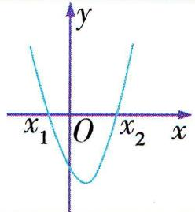</td><td>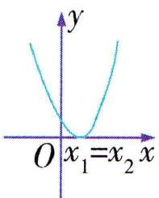</td><td>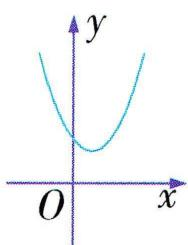</td></tr><tr><td>二次函数  $y = ax^{2} + bx + c (a >0)$  的零点</td><td>有两个零点  $x_{1}, x_{2}$ </td><td>有一个零点  $x_{1}(x_{2})$ </td><td>没有零点</td></tr><tr><td>一元二次方程  $ax^{2} + bx + c = 0 (a >0)$  的根</td><td>有两个不相等的实根  $x_{1}, x_{2}$ </td><td>有两个相等的实根  $x_{1} = x_{2} = -\frac{b}{2a}$ </td><td>没有实数根</td></tr><tr><td> $ax^{2} + bx + c >0 (a >0)$  的解集</td><td> $\{x | x < x_{1} \text{或} x >x_{2}\}$ </td><td> $\{x | x \neq x_{1}\}$ </td><td>R</td></tr><tr><td> $ax^{2} + bx + c < 0 (a >0)$  的解集</td><td> $\{x | x_{1} < x < x_{2}\}$ </td><td>∅</td><td>∅</td></tr></table>

注意 当一元二次不等式的二次项系数 a 小于零时,通过不等式两边同乘 -1 ,转化为二次项系数大于零后,再求解.

# 3. 解一元二次不等式的一般步骤

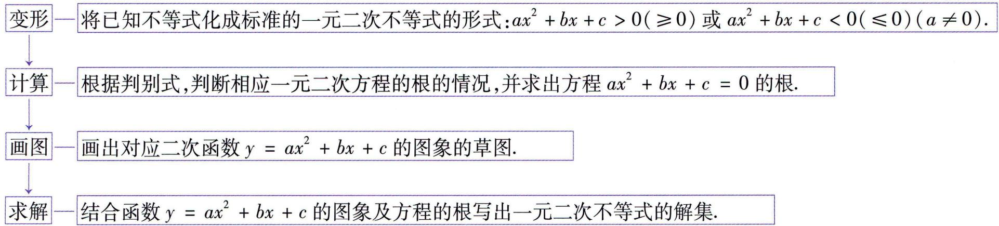

<details>
<summary>flowchart</summary>

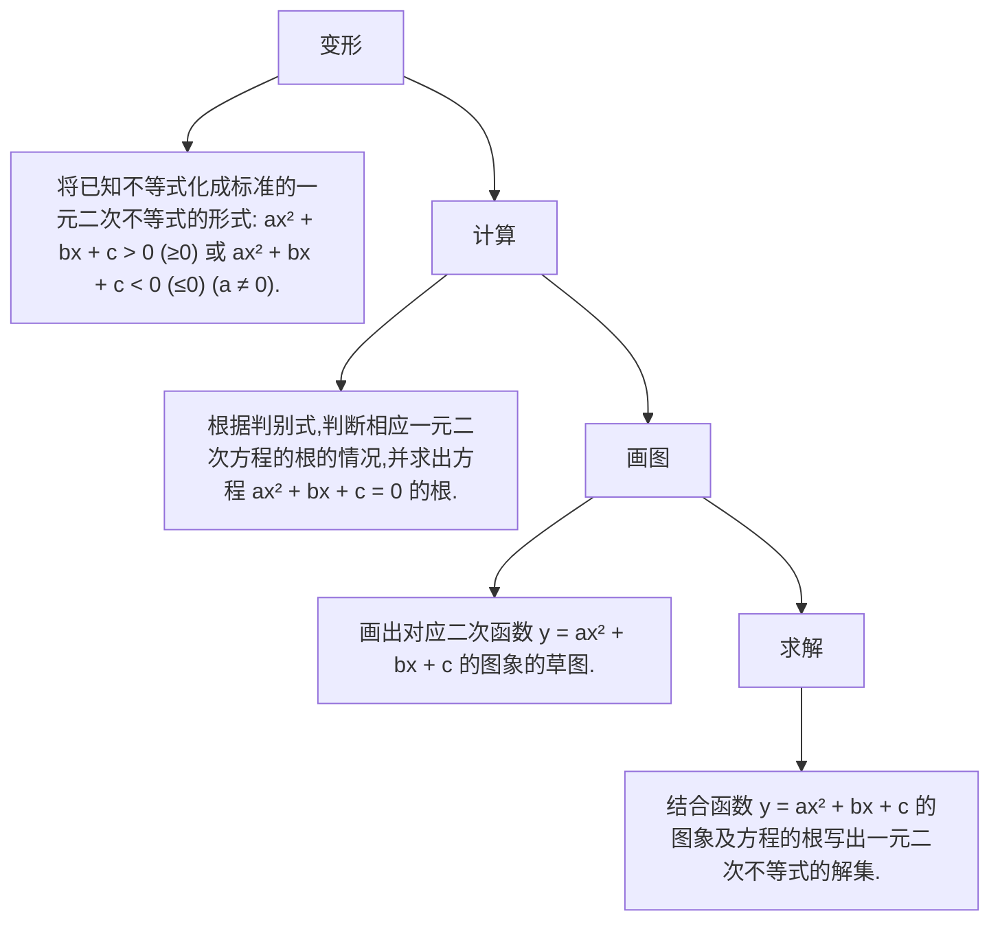
</details>


# 思·要点突破

# 要点① 解一元二次不等式

# 考向 1 解不含参数的一元二次不等式

# 典例 1- 1 解下列不等式:

(1) $-3x^{2}+6x>2;$   
(2) $-1 < x^{2} + 2x - 1 \leqslant 2$ .

解析（1）由 $-3x^{2}+6x>2$ ，整理得 $3x^{2}-6x+2<0$ .

因为 $\Delta = 12 > 0$ ，方程 $3x^{2} - 6x + 2 = 0$ 的解是 $x_{1} = 1 - \frac{\sqrt{3}}{3}$ ， $x_{2}=1+\frac{\sqrt{3}}{3}$ ,

故原不等式的解集是 $\{x \mid 1 - \frac{\sqrt{3}}{3} < x < 1 + \frac{\sqrt{3}}{3}\}$ .

(2) 由 $\left\{ \begin{array}{l} x^2 + 2x - 1 > -1, \\ x^2 + 2x - 1 \leqslant 2, \end{array} \right.$

整理得 $\left\{\begin{aligned}x^{2}+2x>0,\quad①\\ x^{2}+2x-3\leqslant0.\quad②\end{aligned}\right.$

解不等式①,因为方程 $x^{2}+2x=0$ 的两根为 $x_{1}=-2, x_{2}=0$ ,
所以不等式 $x^{2} + 2x > 0$ 的解集为 $\{x \mid x < -2 \text{ 或 } x > 0\}$ .

解不等式②, 因为方程 $x^{2} + 2x - 3 = 0$ 的两根为 $x_{3} = -3, x_{4} = 1$ , 所以不等式 $x^{2} + 2x - 3 \leqslant 0$ 的解集为 $\{x \mid -3 \leqslant x \leqslant 1\}$ .

故原不等式的解集为 $\{x \mid -3 \leqslant x < -2$ 或 $0 < x \leqslant 1\}$ .

# 考向 2 解含参数的一元二次不等式

对于含有参数的不等式,由于参数的取值范围不同,其结果就不同,因此必须对参数进行讨论.

典例 1-2 (1) 解关于 $x$ 的不等式 $x^{2} + x - m (m - 1) > 0$ $(m \in \mathbf{R})$ .

(2)解关于 $x$ 的不等式 $x^{2} - 2(a + 1)x + 1 <   0 (a\in \mathbf{R})$

(3) 解关于 $x$ 的不等式 $ax^2 - 2 \geqslant 2x - ax (a \in \mathbf{R})$ .

解析 (1) 原不等式可以化为 $(x + m)(x - m + 1) > 0$ ,

当 $-m > m - 1$ , 即 $m < \frac{1}{2}$ 时, 原不等式的解集为 $\{x \mid x <$ 依据两根的大小分类讨论.

$m - 1$ 或 $x > -m\}$

当 $-m = m - 1$ ，即 $m = \frac{1}{2}$ 时，原不等式的解集为 $\{x \mid x \neq -\frac{1}{2}\}$ ；

当 $-m < m - 1$ , 即 $m > \frac{1}{2}$ 时, 原不等式的解集为 $\{x \mid x < -m \text{ 或 } x > m - 1\}$ .

综上, 当 $m < \frac{1}{2}$ 时, 不等式的解集为 $\{x \mid x < m - 1 \text{ 或 } x > -m\}$ ;
当 $m=\frac{1}{2}$ 时, 不等式的解集为 $\left\{x\mid x\neq-\frac{1}{2}\right\}$ ;

当 $m > \frac{1}{2}$ 时, 不等式的解集为 $\{x \mid x < -m \text{ 或 } x > m - 1\}$ .

(2) $\Delta=4(a+1)^{2}-4=0$ 时, 解得 a=0 或 -2.
对 $\Delta$ 进行分类讨论.

当 a=0 或 -2 时, 不等式化为 $(x\pm1)^{2}<0$ , 此时不等式的解集为 $\varnothing$ ;

由 $\Delta > 0$ 解得 $a > 0$ 或 $a < -2$ , 此时不等式化为

$[x - (a + 1) - \sqrt{a^2 + 2a}][x - (a + 1) + \sqrt{a^2 + 2a}] < 0$ ，解得 $a + 1 - \sqrt{a^2 + 2a} < x < a + 1 + \sqrt{a^2 + 2a}$ ，此时不等式的解集为 $\{x \mid a + 1 - \sqrt{a^2 + 2a} < x < a + 1 + \sqrt{a^2 + 2a}\}$ ；

$\Delta<0$ , 即 -2<a<0 时, 不等式的解集为 $\varnothing$ .

综上, 当 $-2 \leqslant a \leqslant 0$ 时, 不等式的解集为 $\varnothing$ ;

当 a > 0 或 a < -2 时, 不等式的解集为 $\{x \mid a + 1 - \sqrt{a^{2} + 2a} < x < a + 1 + \sqrt{a^{2} + 2a}\}$ .

(3) 原不等式可以化为 $ax^2 + (a - 2)x - 2 \geqslant 0$ ,

即 $(x+1)(ax-2)\geqslant0.$

当 $a > 0$ 时, 解集为 $\{x \mid x \geqslant \frac{2}{a} \text{或 } x \leqslant -1\}$ ; 对二次项系数进行分类讨论.

当a=0时,解集为 $\{x\mid x\leqslant-1\}$ ;

当 $-2 < a < 0$ 时, 解集为 $\{x \mid \frac{2}{a} \leqslant x \leqslant -1\}$ ;

当a=-2时,解集为 $\{x\mid x=-1\}$ ;

当 $a < -2$ 时, 解集为 $\{x \mid -1 \leqslant x \leqslant \frac{2}{a}\}$ .

综上, 当 a > 0 时, 不等式的解集为 $\{x \mid x \geqslant \frac{2}{a} \text{ 或 } x \leqslant -1\}$ ;
当 a = 0 时, 不等式的解集为 $\{x \mid x \leqslant -1\}$ ;

当 -2 < a < 0 时, 不等式的解集为 $\left\{x \mid \frac{2}{a} \leqslant x \leqslant -1\right\}$ ;
当 a = -2 时, 不等式的解集为 $\{x \mid x = -1\}$ ;

当 $a < -2$ 时, 不等式的解集为 $\{x \mid -1 \leqslant x \leqslant \frac{2}{a}\}$ .

温馨提示 (1) 解形如 $ax^{2} + bx + c > 0 (\geqslant 0, < 0$ 或 $\leqslant 0)$ 的不等式时要注意对参数进行分类讨论. 讨论一般分为三个层次:

第一层次是二次项系数 a 为零或不为零, 当二次项的系数 a 不为零时, 分二次项系数 a 大于零和小于零两种情况;

第二层次是有没有实数根,即判别式 $\Delta > 0, \Delta = 0, \Delta < 0;$ 第三层次是根的大小.

(2)一元二次不等式的解集与二次项系数有直接的关系,对于一元二次不等式 $a(x - x_1)(x - x_2) > 0 (x_1 < x_2)$ , 当 $a > 0$ 时, 其解集是 $\{x \mid x < x_1 \text{ 或 } x > x_2\}$ , 当 $a < 0$ 时, 其解集是 $\{x \mid x_1 < x < x_2\}$ .

# 考向 3 解分式不等式、高次不等式

典例1-3 解下列不等式.

(1) $\frac{2x+4}{x-3}>0;$   
(2) $\frac{2x+4}{x-3}\leqslant1;$   
(3) $\frac{y^2 - 3}{2y - 4} - y \geqslant 0.$

解析 (1) $\frac{2x + 4}{x - 3} > 0$ 的同解不等式为 $(2x + 4)(x - 3) > 0$ , 解得 $x < -2$ 或 $x > 3$ .

所以原不等式的解集为 $\{x \mid x < -2$ 或 $x > 3\}$ .

(2) 方法一 原不等式可化为 $\left\{\begin{aligned}x-3&>0,\\ 2x+4&\leqslant x-3\end{aligned}\right.$ 或 $\left\{\begin{aligned}x-3<0,\\ 2x+4&\geqslant x-3,\end{aligned}\right.$ 即 $x\in\varnothing$ 或 $-7\leqslant x<3,$

则原不等式的解集为 $\{x \mid -7 \leqslant x < 3\}$ .

方法二 移项得 $\frac{2x + 4}{x - 3} - 1 \leqslant 0$ ，即 $\frac{x + 7}{x - 3} \leqslant 0$

所以 $\left\{\begin{aligned}(x+7)(x-3)\leqslant0,\\ x-3\neq0,\end{aligned}\right.$ 解得 $-7\leqslant x<3.$

所以原不等式的解集为 $\{x \mid -7 \leqslant x < 3\}$ .

方法三 由题意知 $x - 3 \neq 0$ , 所以 $(x - 3)^2 > 0$ , 原不等式两边同时乘以 $(x - 3)^2$ , 可得 $(2x + 4)(x - 3) \leqslant (x - 3)^2$ 且 $x - 3 \neq 0$ , 即 $\left\{ \begin{array}{l} (x - 3)(x + 7) \leqslant 0, \\ x - 3 \neq 0, \end{array} \right.$ 解得 $-7 \leqslant x < 3$ , 所以原不等式的解集为 $\{x \mid -7 \leqslant x < 3\}$ .

(3) 由 $\frac{y^2 - 3}{2y - 4} - y \geqslant 0$ , 得 $\frac{y^2 - 3 - 2y^2 + 4y}{2y - 4} \geqslant 0$ , 所以 $\frac{y^2 - 4y + 3}{2y - 4} \leqslant 0$ , 所以 $\left\{ \begin{array}{l} (y^2 - 4y + 3)(2y - 4) \leqslant 0, \\ 2y - 4 \neq 0, \end{array} \right.$ 即 $\left\{ \begin{array}{l} (y - 1)(y - 3)(2y - 4) \leqslant 0, \\ 2y - 4 \neq 0, \end{array} \right.$ 解得 $y \leqslant 1$ 或 $2 < y \leqslant 3$ , 故原不等式的解集为 $\{y | y \leqslant 1$ 或 $2 < y \leqslant 3\}$ .

# 要点 ② 三个“二次”之间的关系

三个“二次”之间关系的实质可利用数形结合思想进行解读：

(1) $ax^{2}+bx+c=0$ 的解 $\Leftrightarrow y=ax^{2}+bx+c$ 的图象与x轴交点的横坐标；  
(2) $ax^{2}+bx+c>0$ 的解集 $\Leftrightarrow y=ax^{2}+bx+c$ 的图象上的点 $(x,y)$ 在x轴上方时,对应的x的取值集合;  
(3) $ax^{2}+bx+c<0$ 的解集 $\Leftrightarrow y=ax^{2}+bx+c$ 的图象上的点 $(x,y)$ 在x轴下方时,对应的x的取值集合.

典例2-1 已知二次函数 $y = ax^{2} + bx + c$ 的图象如图所示,则不等式 $ax^{2} + bx + c > 0$ 的解集是 ( )

A. $\{x \mid -2 < x < 1\}$   
B. $\{x \mid x < -2 \text{ 或 } x > 1\}$   
C. $\{x \mid -2 \leqslant x \leqslant 1\}$   
D. $\{x \mid x \leqslant -2 \text{ 或 } x \geqslant 1\}$

解析由二次函数图象知, 当 $ax^{2} + bx + c > 0$ 时, 有 -2 < x < 1.

▶ 答案 A

典例2-2 若关于 $x$ 的不等式 $ax^2 + bx + c \geqslant 0$ 的解集为 $\{x \mid -\frac{1}{3} \leqslant x \leqslant 2\}$ , 求关于 $x$ 的不等式 $cx^2 - bx + a < 0$ 的解集.

解析 由 $ax^2 + bx + c \geqslant 0$ 的解集为 $\{x \mid -\frac{1}{3} \leqslant x \leqslant 2\}$ , 知 $a < 0$ , 且 $-\frac{1}{3}, 2$ 是关于 $x$ 的一元二次方程 $ax^2 + bx + c = 0$ 的两个实根,

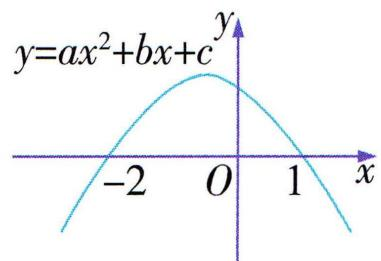

<details>
<summary>text_image</summary>

y=ax²+bx+c
-2 O 1 x
</details>

所以 $\left\{ \begin{array}{l} -\frac{1}{3} + 2 = -\frac{b}{a}, \\ -\frac{1}{3} \times 2 = \frac{c}{a}, \end{array} \right.$ 所以 $b = -\frac{5}{3} a, c = -\frac{2}{3} a,$

所以不等式 $cx^{2} - bx + a < 0$ 可变形为 $(- \frac{2}{3} a)x^{2} - (-\frac{5}{3} a)x + a < 0$ ，即 $2ax^{2} - 5ax - 3a > 0$ .

又 $a < 0$ ，所以 $2x^{2} - 5x - 3 < 0$ ，解得 $-\frac{1}{2} < x < 3$

所以所求不等式的解集为 $\{x \mid -\frac{1}{2} < x < 3\}$ .

名师点评 已知一元二次方程的根,可以写出相应不等式的解集;反之,已知不等式的解集也可以写出相应一元二次方程的根,进一步可求得方程中的系数或得到系数之间的关系.

# 要点③ 一元二次不等式的实际应用

典例 3 某水产养殖户投资 243 万元建一个龙虾养殖基地, 已知 x 年内付出的各种维护费用之和 y 满足二次函数 $y = ax^{2} + c$ , 且第一年付出的各种维护费用为 3 万元, 第二年付出的各种维护费用为 9 万元, 龙虾养殖基地每年收入 90 万元.

(1)扣除投资和各种维护费用,求该龙虾养殖基地从第几年开始获取纯利润.  
(2)若干年后该水产养殖户为了投资其他项目,对该龙虾养殖基地有两种处理方案:

①年平均利润最大时,以138万元出售该龙虾养殖基地;

②纯利润总和最大时,以30万元出售该龙虾养殖基地.问该水产养殖户会选择哪种方案?

解析（1）由已知得，当 $x = 1$ 时， $y = 3$ ；当 $x = 2$ 时， $y = 12$ ，即 $\left\{ \begin{array}{l} a + c = 3, \\ 4a + c = 12, \end{array} \right.$ 解得 $a = 3, c = 0$ ，所以 $y = 3x^2$ .

又投资 243 万元, x 年共收入 90x 万元,

设 x 年共获得的纯利润为 P 万元, 则 $P = 90x - 3x^{2} - 243(x \in \mathbf{N}^{*})$ .

令 P > 0，即 $90x - 3x^{2} - 243 > 0$ ，即 $x^{2} - 30x + 81 < 0$ ，解得 $3 < x < 27 (x \in \mathbf{N}^{*})$ ，

所以从第 4 年开始获得纯利润.

(2) 方案①:

年平均利润 $t=\frac{90x-243-3x^{2}}{x}=90-3\left(\frac{81}{x}+x\right)\leqslant90-3\times$ $2\sqrt{\frac{81}{x}\cdot x}=36$ （万元），当且仅当 x=9 时，取等号，

所以当 x=9 时, t 取最大值 36,

此时以 138 万元出售该基地共获得利润 $36 \times 9 + 138 = 462$ (万元).

方案②:

由(1)知 $P=90x-3x^{2}-243=-3(x-15)^{2}+432(x\in\mathbf{N}^{*})$ ,

当 x=15 时, 纯利润总和最大, 为 432 万元,

此时以 30 万元出售该基地共获得利润 $432 + 30 = 462$ (万元).

两种方案盈利相同,但方案①时间比较短,所以选择方案①.

# 微专题 不等式有解或恒成立问题

求与不等式有关的能成立(有解)、恒成立问题的常用方法有:

# 1. 判别式法

(1)不等式 $ax^2 + bx + c > (\geqslant)0 (a, b$ 不同时为 0)能成立(有解)的条件是: $a \geqslant 0$ 或 $\left\{ \begin{array}{l} a < 0, \\ \Delta > (\geqslant)0. \end{array} \right.$   
(2)不等式 $ax^2 +bx + c <   (\leqslant)0(a,b$ 不同时为0)能成立(有解)的条件是: $a\leqslant 0$ 或 $\left\{ \begin{array}{l}a > 0,\\ \Delta >(\geqslant)0. \end{array} \right.$   
(3)不等式 $ax^2 + bx + c > (\geqslant)0$ 恒成立的条件是: 当 $a = 0$ 时, $b = 0, c > (\geqslant)0$ ; 当 $a \neq 0$ 时, $\left\{ \begin{array}{l} a > 0, \\ \Delta < (\leqslant)0. \end{array} \right.$   
(4) 不等式 $ax^2 + bx + c < (\leqslant)0$ 恒成立的条件是: 当 $a = 0$ 时, $b = 0, c < (\leqslant)0$ ; 当 $a \neq 0$ 时, $\left\{ \begin{array}{l} a < 0, \\ \Delta < (\leqslant)0. \end{array} \right.$

# 2. 分离参数法

首先根据不等式或等式性质将参数分离, 将式子变为一边是参数, 另一边是变量式的形式, 然后求解变量式的最值, 并根据最值求出参数的取值范围.

若参数为 a, 变量式为 y,

则 $a > (\geqslant) y$ 能成立 $\Leftrightarrow a > (\geqslant) y_{\min}; a < (\leqslant) y$ 能成立 $\Leftrightarrow a < (\leqslant) y_{\max}$ ;

$a > (\geqslant)y$ 恒成立 $\Leftrightarrow a > (\geqslant)y_{\max};a <   (\leqslant)y$ 恒成立 $\Leftrightarrow a <   (\leqslant)y_{\min}.$

# 3. 更换主元法

更换主元法是通过变换问题中的变量主次关系,将复杂问题简化的解题技巧,其核心思路是通过重新选择主变量,将高次、多变量问题转化为更易处理的低次或单一变量问题,比如把已知取值范围的参数(如 t)当成主元,把要求取值范围的未知数 x 看成参数.

# 类型 ① 不等式有解问题

典例 1-1 若 $a > 0$ , 且关于 $x$ 的不等式 $ax^{2} - 3ax + a^{2} - 3 < 4$ 在 $\mathbf{R}$ 上有解, 则 ( )

A. $0 < a < \frac{7}{4}$

B. $\frac{7}{4} < a < \frac{9}{4}$

C. $0 < a < 4$

D. $\frac{7}{4} < a < 4$

解析 方法一(判别式法) 关于 $x$ 的不等式 $ax^2 - 3ax + a^2 - 3 < 4$ 可变形为 $ax^2 - 3ax + a^2 - 7 < 0$ , 由题可得 $\Delta = (-3a)^2 - 4a(a^2 - 7) > 0$ , 解得 $-\frac{7}{4} < a < 4$ . 又 $a > 0$ , 所以 $0 < a < 4$ .

方法二(分离变量法) 因为 a > 0, 所以关于 x 的不等式 $ax^{2} - 3ax + a^{2} - 3 < 4$ 可变形为 $x^{2} - 3x < \frac{7 - a^{2}}{a}$ . 因为 $x^{2} - 3x = \left(x - \frac{3}{2}\right)^{2} - \frac{9}{4} \geqslant -\frac{9}{4}$ , 所以 $-\frac{9}{4} < \frac{7 - a^{2}}{a}$ , 解得 $-\frac{7}{4} < a < 4$ . 又 a > 0, 所以 0 < a < 4.

▶ 答案 C

典例1-2 若对于 $x < -1$ , 不等式 $x^{2} + mx + m + 3 < 0$ 有解, 则实数 $m$ 的取值范围为 \_\_\_\_.

解析 对于 $x < -1, x^2 + mx + m + 3 < 0$ 有解, 即对于 $x < -1, (x + 1)m < -x^2 - 3$ 有解. 又 $x + 1 < 0$ , 所以 $(x + 1)m < -x^2 - 3$ 等价于 $m > \frac{-x^2 - 3}{x + 1} = -(x + 1) + \frac{4}{-(x + 1)} + 2$ . 又 $-(x + 1) + \frac{4}{-(x + 1)} + 2 \geqslant$

$2\sqrt{-(x+1)\cdot\frac{4}{-(x+1)}}+2=6,$ 当且仅当 $\left\{\begin{aligned}x<-1,\\ -(x+1)=\frac{4}{-(x+1)},\end{aligned}\right.$ 即 $x+1=-2,$ 即 x=-3 时等号成立,所以 m>6.

▶答案 {m|m>6}

# 类型 ② 不等式恒成立问题

典例2-1 设 $x > 0, y > 0$ , 不等式 $\frac{1}{x} + \frac{1}{y} + \frac{m}{x + y} \geqslant 0$ 恒成立, 则实数 $m$ 的最小值是 ( )

A. -2

B. 2

C. 1

D. -4

解析 因为 $x > 0, y > 0$ , 不等式 $\frac{1}{x} + \frac{1}{y} + \frac{m}{x + y} \geqslant 0$ 恒成立, 即 $m \geqslant -\left(\frac{1}{x} + \frac{1}{y}\right)(x + y)$ 恒成立. 因为 $(\frac{1}{x} + \frac{1}{y})$ 分离参数.

$\frac{1}{y}$ $(x+y)=2+\frac{x}{y}+\frac{y}{x}\geqslant2+2\sqrt{\frac{x}{y}\cdot\frac{y}{x}}=4$ , 当且仅当 x=y 时取等号, 所以 $-\left(\frac{1}{x}+\frac{1}{y}\right)(x+y)\leqslant-4$ , 所以 $m\geqslant-4$ , 所以 m 的最小值为 -4.

▶ 答案 D

典例2-2 已知不等式 $ax^{2} + (1 - a)x + a - 1 < 0$ .

(1)若不等式对任意实数 x 恒成立,求实数 a 的取值范围;

(2) 若不等式对 $a \in \{a \mid 0 \leqslant a \leqslant \frac{1}{2}\}$ 恒成立, 求实数 $x$ 的取值范围.

解析 (1) 当 $a = 0$ 时, 不等式为 $x - 1 < 0$ , 解得 $x < 1$ , 不符合题意.

当 $a \neq 0$ 时, 由已知得 $\left\{ \begin{array}{l} a < 0, \\ (1 - a)^2 - 4a(a - 1) < 0, \end{array} \right.$

即 $\left\{\begin{aligned}a<0,\\ 3a^{2}-2a-1>0,\end{aligned}\right.$ 解得 $a<-\frac{1}{3}.$

综上,实数 a 的取值范围为 $\left\{a \mid a < -\frac{1}{3}\right\}$ .

(2) 方法一(分离参数法) 因为 $ax^{2} + (1 - a)x + a - 1 < 0$ , 所以 $a(x^{2} - x + 1) + x - 1 < 0$ ,

又 $x^{2} - x + 1 = (x - \frac{1}{2})^{2} + \frac{3}{4} >0$ 恒成立，

所以 $a < \frac{1 - x}{x^2 - x + 1}$ ,

则 $\frac{1 - x}{x^2 - x + 1} >\frac{1}{2}$ 即 $x^{2} + x - 1 <   0$

解得 $\frac{-1-\sqrt{5}}{2}<x<\frac{-1+\sqrt{5}}{2}$ ，所以实数x的取值范围为

$$
\{x \mid \frac {- 1 - \sqrt {5}}{2} <   x <   \frac {- 1 + \sqrt {5}}{2} \}.
$$

方法二(更换主元法) 原不等式可化为 $(x^{2}-x+1)a+x-1<0$ ,

由题意, 当 $a \in \{a \mid 0 \leqslant a \leqslant \frac{1}{2}\}$ 时, $(x^{2} - x + 1)a + x - 1 < 0$ 恒成立, 所以 $\left\{\begin{aligned}&x - 1 < 0,\\ &\frac{1}{2}(x^{2} - x + 1) + x - 1 < 0,\end{aligned}\right.$

解得 $\frac{-1 - \sqrt{5}}{2} < x < \frac{-1 + \sqrt{5}}{2}$ ,

所以实数 $x$ 的取值范围为 $\{x \mid \frac{-1 - \sqrt{5}}{2} < x < \frac{-1 + \sqrt{5}}{2}\}$ .

# 第一节 函数的概念及其表示


# 学·核心知识

# 知识点① 函数的概念

<table><tr><td colspan="2">函数的概念</td><td colspan="2">设A,B是非空的实数集,如果对于集合A中的任意一个数x,按照某种确定的对应关系f,在集合B中都有唯一确定的数y和它对应,那么就称f:A→B为从集合A到集合B的一个函数,记作y=f(x), x∈A.</td></tr><tr><td rowspan="3">三要素</td><td>对应关系</td><td>f</td><td rowspan="2">如果两个函数的定义域相同,并且对应关系完全一致,即相同的自变量对应的函数值也相同,那么这两个函数就是同一个函数.</td></tr><tr><td>定义域</td><td>集合A(自变量x的取值范围)</td></tr><tr><td>值域</td><td colspan="2">与x的值相对应的y值叫作函数值,函数值的集合{f(x)|x∈A}叫作函数的值域.</td></tr></table>

注意 (1)集合 $A, B$ 必须是非空实数集, 定义域或值域为空集的函数是不存在的.

(2) $f(x)$ 是函数符号, $f$ 表示对应关系, $f(x)$ 表示 $x$ 对应的函数值,不能理解为 $f$ 与 $x$ 的乘积. 函数除了用符号 $f(x)$ 表示外,还可用 $g(x), F(x)$ 等表示.

(3)两个非空实数集间的对应关系能否构成函数,主要看是否满足:任意性、存在性、唯一性.

# 知识点② 函数的表示法

<table><tr><td>方法</td><td>定义</td><td>优点</td><td>缺点</td></tr><tr><td>解析法</td><td>用解析式表示两个变量之间的对应关系.</td><td>一是简明、全面概括了变量间的关系;二是利用解析式可求任一函数值.</td><td>不够形象、直观,且并不是所有函数都有解析式.</td></tr><tr><td>列表法</td><td>列出表格来表示两个变量之间的对应关系.</td><td>不需计算可以直接看出与自变量对应的函数值.</td><td>仅能表示自变量取较少的有限值时的对应关系.</td></tr><tr><td>图象法</td><td>用图象表示两个变量之间的对应关系.</td><td>能形象直观地表示函数的变化情况.</td><td>只能近似求出自变量所对应的函数值,而且有时误差较大.</td></tr></table>

# 知识点 ③ 分段函数

若函数在其定义域的不同子集上,因对应关系不同而分别用几个不同的式子来表示,这种函数称为分段函数.

温馨提示 (1)分段函数各段定义域之间不能有重叠的部分.

(2)分段函数的定义域等于各段函数的定义域的并集,其值域等于各段函数的值域的并集,分段函数虽由几部分组成,但它表示的是一个函数.

(3)作分段函数图象时,应分别作出每一段的图象.


# 思·要点突破

# 要点① 函数的“三要素”

# 考向1 函数的对应关系

典例 1-1(多选)已知集合 $A = \{x \mid 0 \leqslant x \leqslant 8\}$ , 集合 $B = \{y \mid 0 \leqslant y \leqslant 4\}$ , 则下列对应关系中, 可看作是从 $A$ 到 $B$ 的函数关系的是 ( )

A. $f: x \to y = \frac{1}{8} x$

B. $f: x \to y = \frac{1}{4} x$

C. $f: x \rightarrow y = \frac{1}{2}x$

D. $f : x \rightarrow  y = x$

解析 根据函数定义可得 A 中的每一个元素在 B 中都能找到唯一与之对应的元素. 若 $0 \leqslant x \leqslant 8$ , 则 $\frac{1}{8}x \in [0, 1] \subseteq B$ , $\frac{1}{4}x \in [0, 2] \subseteq B$ , $\frac{1}{2}x \in [0, 4] \subseteq B$ , 故 A, B, C 正确; 因为区间 $[0, 8]$ 不是集合 B 的子集, 故 D 错误.

▶ 答案 ABC

# 考向 2 函数的定义域

# 1. 已知函数的解析式求其定义域

(1)若解析式为分式,则要求分母不等于零;   
(2)若解析式为偶次根式,则要求被开方的式子大于或等于零;   
(3)若解析式中出现 $a^0$ ，则 $a \neq 0$   
(4) 如果 $f(x)$ 是由几部分式子构成的, 那么函数的定义域是使各部分式子都有意义的实数构成的集合.

典例1-2 函数 $f(x) = \frac{\sqrt{-x^2 + 5x + 6}}{x + 1}$ 的定义域是（）

A. $(- \infty, -1] \cup [6, +\infty)$

B. $(- \infty, -1) \cup [6, +\infty)$

C. $(-1,6]$

D. $(2,3]$

解析 要使原函数有意义, 则 $\left\{\begin{aligned}-x^{2}+5x+6&\geqslant0,\\ x+1&\neq0,\end{aligned}\right.$ 解得 $-1<x\leqslant6$ , 故函数 $f(x)$ 的定义域是 $(-1,6]$ .

▶ 答案 C

# 2. 求抽象函数的定义域

(1)已知 $f(x)$ 的定义域为A,求 $f(\varphi(x))$ 的定义域,其

两者取值范围相同.

实质是已知 $\varphi(x)$ 的取值范围为 $A$ , 求 $x$ 的取值范围.

(2)已知 $f(\varphi(x))$ 的定义域为B,求 $f(x)$ 的定义域,其实质是已知 $f(\varphi(x))$ 中的x的取值范围为B,求 $\varphi(x)$ 的取值范围,此取值范围就是 $f(x)$ 的定义域.  
(3)已知 $f(\varphi(x))$ 的定义域,求 $f(h(x))$ 的定义域, $\varphi(x)$ 与 $h(x)$ 的取值范围相同.

先由 x 的取值范围, 求出 $\varphi(x)$ 的取值范围, 即 $h(x)$ 的取值范围, 进而根据 $h(x)$ 的取值范围求出 $h(x)$ 中的 x 的取值范围, 此取值范围就是 $f(h(x))$ 的定义域.

注意 (1) 函数 $f(x)$ 的定义域是指 $x$ 的取值范围.

(2) 函数 $f(\varphi(x))$ 的定义域是指 x 的取值范围, 而不是 $\varphi(x)$ 的取值范围.  
(3) 同在对应关系 f 下的变量的范围相同, 即 $f(t)$ , $f(\varphi(x))$ , $f(h(x))$ 三个函数中的 $t, \varphi(x)$ , $h(x)$ 的范围相同.

典例1-3 (1)已知函数 $f(x)$ 的定义域为 $[0, 1]$ , 求 $f(x^{2} + 1)$ 的定义域;

(2) 若函数 $f(x^{2} - 2)$ 的定义域为 $[-1, 3]$ , 求函数 $f(x)$ 的定义域;  
(3)已知函数 $f(x+3)$ 的定义域为 $[-5,-2]$ ，求函数 $f(2x-1)$ 的定义域.

解析 (1) 因为函数 $f(x)$ 的定义域为 $[0, 1]$ ,

所以 $0 \leqslant x^{2} + 1 \leqslant 1$ ，即 $-1 \leqslant x^{2} \leqslant 0$ ，所以 x = 0。

故函数 $f(x^{2}+1)$ 的定义域为 $\{x\mid x=0\}$ .

(2) 因为函数 $f(x^{2}-2)$ 的定义域为 $[-1,3]$ , 即 $-1 \leqslant x \leqslant 3$ , 所以 $0 \leqslant x^{2} \leqslant 9, -2 \leqslant x^{2}-2 \leqslant 7$ .

故 $f(x)$ 的定义域为 $[-2,7]$ .

(3) 因为函数 $f(x + 3)$ 的定义域为 $[-5, -2]$ , 所以 $-5 \leqslant x \leqslant -2$ , 所以 $-2 \leqslant x + 3 \leqslant 1$ , 所以 $f(x)$ 的定义域为 $[-2, 1]$ . 令 $-2 \leqslant 2x - 1 \leqslant 1$ , 解得 $-\frac{1}{2} \leqslant x \leqslant 1$ , 所以函数 $f(2x - 1)$ 的定义域为 $[- \frac{1}{2}, 1]$ .

# 3. 求实际问题中函数的定义域

除了要使解析式有意义,还需要考虑问题的实际意义.

典例1-4 欲用一段长为 $20 \mathrm{~m}$ 的篱笆围成一个一边靠墙的矩形菜园, 墙长 $18 \mathrm{~m}$ , 求这个菜园的面积范围时, 设矩形菜园与墙壁所在直线垂直的边的长为 $x \mathrm{~m}$ , 则 $x$ 的取值范围是 \_\_\_\_.

解析 由题意知 $0 < 20 - 2x \leqslant 18$ , 解得 $1 \leqslant x < 10$ , 则 $x$ 的取值范围是 [1,10).

▶答案 [1,10)

# 考向 3 函数的值域

求函数值域的常用方法有：

<table><tr><td>观察法</td><td>利用熟知的基本函数的值域,或利用函数的图象的“最高点”和“最低点”,观察得到函数的值域.</td></tr><tr><td>配方法</td><td>对于形如  $y = ax^{2} + bx + c (a \neq 0)$  的函数,可通过配方后再结合二次函数的性质求值域,这里要特别注意给定区间求二次函数的值域问题.</td></tr><tr><td>换元法</td><td>形如  $y = ax + b \pm \sqrt{cx + d} (a,b,c,d \in \mathbb{R},ac \neq 0)$  的函数常用换元法求值域,即先令  $t = \sqrt{cx + d}$ ,表示出  $x$ ,并注明  $t$  的取值范围,再代入上式将  $y$  表示成关于  $t$  的二次函数,最后用配方法求值域.</td></tr><tr><td>基本不等式法</td><td>若函数解析式中某些元素直接或间接(通过配凑、拆项等)满足基本不等式的应用条件,则可利用基本不等式求最值,进而得到函数的值域.</td></tr><tr><td>判别式法</td><td>对于形如  $y = \frac{a_{1}x^{2} + b_{1}x + c_{1}}{a_{2}x^{2} + b_{2}x + c_{2}} (a_{1}, a_{2}$  不同时为 0 )的函数,常转化成关于  $x$  的二次方程,通过方程有实数根,即判别式  $\Delta \geqslant 0$  来求函数的值域.</td></tr><tr><td>分离常数法</td><td>将其变形为  $y = \frac{c}{a} + \frac{ad - bc}{a(ax + b)}$  的形式,其值域为  $\{y \mid y \neq \frac{c}{a}\}$ .</td></tr><tr><td>反求法</td><td>通过反解用  $y$  来表示  $x$ ,再由  $x$  的取值范围,通过解不等式,得出  $y$  的取值范围,即函数的值域.</td></tr></table>

典例1-5 求下列函数的值域：

(1) $y=\frac{2}{x^{2}+1}(x\in[0,1])$ ;   
(2) $y = 3x^{2} - x + 2$ ;   
(3) $y = x + 4\sqrt{1 - x}$ ;   
(4) $y = 3x + 1 + \frac{9}{3x - 2}(x < \frac{2}{3})$ ;

(5) $y=\frac{3x+1}{x-2};$

(6) $y=\frac{x+4}{x+1}(x\in(-2,-1))$ ;

(7) $y=\frac{2x^{2}+4x-7}{x^{2}+2x+3}.$

解析 (1)(观察法) 因为 $x \in [0, 1]$ ,

所以 $x^{2} + 1\in [1,2]$ ，所以 $y = \frac{2}{x^2 + 1}\in [1,2]$

即 $y = \frac{2}{x^2 + 1} (x \in [0,1])$ 的值域为 $[1,2]$ .

(2)(配方法) $y=3x^{2}-x+2=3\left(x-\frac{1}{6}\right)^{2}+\frac{23}{12}\geqslant\frac{23}{12},$

所以 $y=3x^{2}-x+2$ 的值域为 $\left[\frac{23}{12},+\infty\right)$ .

(3)(换元法)设 $t=\sqrt{1-x}$ ，则 $t\geqslant0,x=1-t^{2}$

所以原函数可化为 $y = 1 - t^2 + 4t = -(t - 2)^2 + 5 (t \geqslant 0)$ ，所以 $y \leqslant 5$ ，

所以 $y = x + 4\sqrt{1 - x}$ 的值域为 $(-∞, 5]$ .

(4)(基本不等式法)因为 $x < \frac{2}{3}$ ，所以 2 - 3x > 0，

可得 $-(3x + 1 + \frac{9}{3x - 2}) = (2 - 3x) + \frac{9}{2 - 3x} - 3 \geqslant 2\sqrt{(2 - 3x) \cdot \frac{9}{2 - 3x}} - 3 = 3$ ，当且仅当 $2 - 3x = \frac{9}{2 - 3x}$ ，

即 $x = -\frac{1}{3}$ 时, 等号成立, 所以 $y \leqslant -3$ , 所以函数的值域为 $(-∞, -3]$ .

(5)(分离常数法) $y=\frac{3x+1}{x-2}=\frac{3(x-2)+7}{x-2}=3+\frac{7}{x-2}$ ,

因为 $\frac{7}{x - 2} \neq 0$ ，所以 $3 + \frac{7}{x - 2} \neq 3$

所以 $y = \frac{3x + 1}{x - 2}$ 的值域为 $(- \infty, 3) \cup (3, +\infty)$ .

(6)(反求法)由 $y=\frac{x+4}{x+1}$ ，得 $x=-\frac{y-4}{y-1}$ .

因为 $x \in (-2, -1)$ ，所以 $-2 < -\frac{y-4}{y-1} < -1$ ，解得 y < -2，所以 $y = \frac{x + 4}{x + 1} (x \in (-2, -1))$ 的值域为 $(-∞, -2)$ .

(7)(判别式法)因为 $x^{2}+2x+3=(x+1)^{2}+2>0$ , 所以函数的定义域为 R.

原函数可以化为 $x^{2}y + 2xy + 3y = 2x^{2} + 4x - 7$ ，整理得

$(y-2)x^{2}+2(y-2)x+3y+7=0,$

当 $y \neq 2$ 时, 上式可以看成关于 x 的二次方程, 故 $\Delta = [2(y - 2)]^{2} - 4(y - 2)(3y + 7) \geqslant 0$ ,

所以 $y \in \left[-\frac{9}{2}, 2\right)$ .

当 y=2 时, 方程不成立.

综上, 函数 $y=\frac{2x^{2}+4x-7}{x^{2}+2x+3}$ 的值域为 $\left[-\frac{9}{2},2\right)$ .

# 要点② 同一个函数的判断

函数的定义域和对应关系一经确定, 值域也随之确定, 所以判断两个函数是不是同一个函数, 只需判断两个函数的定义域和对应关系是否一样.

典例 2 (多选)下列四组函数中为同一函数的是
()

A. $y = x$ 与 $y = \sqrt[3]{x^3}$   
B. $f(x) = 1$ 与 $f(x) = x^0$   
C. $y = |x + 1|$ 与 $y = \sqrt{x^2 + 2x + 1}$   
D. $y = x$ 与 $y = \frac{x^2}{x}$

解析 对于 A, 函数 $y = x$ 的定义域为 R, 函数 $y = \sqrt[3]{x^3} = x$ 的定义域为 R, 定义域与对应关系均相同, 所以为同一函数, 故 A 正确; 对于 B, 函数 $f(x) = 1$ 的定义域为 R, 函数 $f(x) = x^0$ 的定义域为 $\{x \mid x \neq 0\}$ , 定义域不同, 所以不是同一函数, 故 B 错误; 对于 C, 函数 $y = |x + 1|$ 的定义域为 R, 函数 $y = \sqrt{x^2 + 2x + 1} = \sqrt{(x + 1)^2} = |x + 1|$ 的定义域为 R, 定义域与对应关系均相同, 所以为同一函数, 故 C 正确; 对于 D, 函数 $y = x$ 的定义域为 R, 函数 $y = \frac{x^2}{x}$ 的定义域为 $\{x \mid x \neq 0\}$ , 定义域不同, 所以不是同一函数, 故 D 错误.

▶ 答案 AC

# 要点 ③ 分段函数

典例 3-1 已知函数 $f(x) = \begin{cases} 4 - x^2, & x > 0, \\ 2, & x = 0, \\ 1 - 2x, & x < 0. \end{cases}$

(1) 求 $f(a^{2}+1)(a \in \mathbf{R})$ , $f(f(3))$ 的值;  
(2) 当 $-4 \leqslant x < 3$ 时, 求 $f(x)$ 的取值集合.  
解析 (1) 因为 $a^{2} + 1 \geqslant 1$ , 所以 $f(a^{2} + 1) = 4 - (a^{2} + 1)^{2} = 3 - 2a^{2} - a^{4}$ . 关键: 判断自变量所在区间, 再代入相应解析式.

$f(f(3)) = f(-5) = 11.$

(2) 当 $-4 \leqslant x < 0$ 时, $f(x) = 1 - 2x \in (1, 9]$ ;

当 x=0 时, $f(x)=f(0)=2$ ;

当 0 < x < 3 时, $f(x) = 4 - x^{2} \in (-5, 4)$ .

故当 $-4 \leqslant x < 3$ 时, $f(x)$ 的取值集合为 $(-5, 9]$ .

典例3-2 某市出租车的计价标准是 $4 \mathrm{~km}$ 以内 10 元, 超过 $4 \mathrm{~km}$ 且不超过 $18 \mathrm{~km}$ 的部分 1.2 元/km, 超过 $18 \mathrm{~km}$ 的部分 1.8 元/km.

(1)如果不计其他费用,写出车费 y(元)与行车里程 x(km)的函数关系式;

(2)如果某人乘车行驶了 $20 \mathrm{~km}$ , 他要付多少车费?

解析 (1) 由题意知, 当 $0 < x \leqslant 4$ 时, $y = 10$ ;

当 $4 < x \leqslant 18$ 时, $y = 10 + 1.2(x - 4) = 1.2x + 5.2$ ;

当 $x > 18$ 时， $y = 10 + 1.2 \times 14 + 1.8(x - 18) = 1.8x - 5.6$ .

所以 $y=\left\{\begin{aligned}10,0<x&\leqslant4,\\ 1.2x+5.2,4&<x\leqslant18,\\ 1.8x-5.6,x&>18.\end{aligned}\right.$

(2) 当 $x = 20$ 时, $y = 1.8 \times 20 - 5.6 = 30.4$ ,

所以要付 30.4 元的车费.

名师点评 求分段函数的解析式,应注意“先分后合”,根据不同定义域写出相应的函数解析式,最后再合并,注意分段函数是一个函数,而不是几个函数.

要点④ 求函数解析式

<table><tr><td>代入法</td><td>如已知 $f(x) = x^{2} - 1$ ,求 $f(x + x^{2})$ 时,有 $f(x + x^{2}) = (x + x^{2})^{2} - 1$ .</td></tr><tr><td>待定系数法</td><td>已知 $f(x)$ 的函数类型,求 $f(x)$ 的解析式,可根据函数类型设出其解析式,然后确定其系数.</td></tr><tr><td>配凑法</td><td>已知 $f(g(x))$ 的解析式,要求 $f(x)$ 时,可从 $f(g(x))$ 的解析式中拼凑出 $g(x)$ ,即用 $g(x)$ 来表示 $f(g(x))$ ,再将解析式两边的 $g(x)$ 用 $x$ 代替即可.</td></tr><tr><td>换元法</td><td>已知 $f(g(x)) = h(x)$ ,求 $f(x)$ 时,可设 $g(x) = t$ ,解出 $x$ ,代入 $h(x)$ 即可.</td></tr><tr><td>方程组法</td><td>已知 $f(x)$ 与 $f(g(x))$ 满足的关系式,要求 $f(x)$ 时,可用 $g(x)$ 代替两边所有的 $x$ ,得到关于 $f(x)$ 与 $f(g(x))$ 的方程组,消去 $f(g(x))$ 解出 $f(x)$ 即可.</td></tr><tr><td>特殊值法(赋值法)</td><td>通过取某些特殊值代入题设中的等式,可使抽象的问题具体化、简单化,从而找到规律,求出函数解析式.</td></tr></table>

典例4-1 已知 $f(x)$ 为二次函数, 且 $f(x + 1) + f(x - 1) = 2x^{2} - 4x$ , 求 $f(x)$ 的解析式.

解析 设 $f(x) = ax^2 + bx + c (a \neq 0)$ ，则 $f(x + 1) + f(x - 1) = a(x + 1)^2 + b(x + 1) + c + a(x - 1)^2 + b(x - 1) + c = 2ax^2 + 2bx + 2a + 2c = 2x^2 - 4x$ ，

所以 $\left\{\begin{aligned}2a&=2,\\ 2b&=-4,\\ 2a+2c&=0,\end{aligned}\right.$ 解得 $\left\{\begin{aligned}a&=1,\\ b&=-2,\\ c&=-1,\end{aligned}\right.$

所以 $f(x)=x^{2}-2x-1$ .

典例 4-2 给出下列条件,分别求出 $f(x)$ 的解析式.

(1) $f(\sqrt{x-1})=2x-3\sqrt{x+1}$ ;   
(2) $2f(x)+f(\frac{1}{x})=3x.$

解析 (1) 方法一(换元法) 令 $t = \sqrt{x - 1}$ ,

则 $t \geqslant 0, x = t^2 + 1$

$$
f (t) = 2 \left(t ^ {2} + 1\right) - 3 \sqrt {t ^ {2} + 2},
$$

所以 $f(x) = 2(x^{2} + 1) - 3\sqrt{x^{2} + 2} (x \geqslant 0)$ .

方法二（配凑法） $f(\sqrt{x - 1}) = 2(\sqrt{x - 1})^2 +2-$

$$
3 \sqrt {(x - 1) + 2} = 2 (\sqrt {x - 1}) ^ {2} + 2 - 3 \sqrt {(\sqrt {x - 1}) ^ {2} + 2},
$$

所以 $f(x)=2x^{2}-3\sqrt{x^{2}+2}+2(x \geqslant 0)$ .

(2)(方程组法)已知 $2f(x)+f(\frac{1}{x})=3x(x\neq0)$ ,

用 $\frac{1}{x}$ 代替 $x$ 得 $2f\left(\frac{1}{x}\right) + f(x) = \frac{3}{x} (x \neq 0)$ ,

消去 $f(\frac{1}{x})$ ，得 $f(x)=2x-\frac{1}{x}(x\neq0)$ .

典例4-3 已知定义在 $\mathbf{R}$ 上的函数 $f(x)$ 满足 $\forall x, y \in \mathbf{R}, f(2xy + 3) = f(x) \cdot f(y) - 3f(y) - 6x + 9, f(0) = 3$ , 求 $f(x)$ 的解析式.

解析 令 $x = y = 0$ , 得 $f(3) = f(0) \cdot f(0) - 3f(0) + 9 = 9$ . 令 $y = 0$ , 则 $f(3) = f(x) \cdot f(0) - 3f(0) - 6x + 9$ , 即 $9 = 3f(x) - 9 - 6x + 9$ , 解得 $f(x) = 2x + 3$ .

# 第二节 函数的基本性质


# 学·核心知识

知识点 ① 函数的单调性

<table><tr><td>名称</td><td>单调递增</td><td>单调递减</td></tr><tr><td rowspan="2">定义</td><td colspan="2">一般地,设函数 $f(x)$ 的定义域为 $I$ ,区间 $D \subseteq I$ </td></tr><tr><td>如果 $\forall x_1,x_2\in D$ ,当 $x_1 < x_2$ 时,都有 $f(x_1) < f(x_2)$ ,那么就称函数 $f(x)$ 在区间 $D$ 上单调递增.</td><td>如果 $\forall x_1,x_2\in D$ ,当 $x_1 < x_2$ 时,都有 $f(x_1)>f(x_2)$ ,那么就称函数 $f(x)$ 在区间 $D$ 上单调递减.</td></tr><tr><td>图形表示</td><td>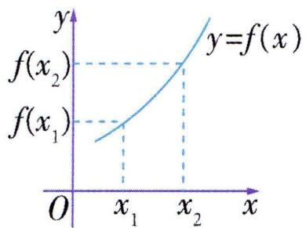图象在区间D上呈上升趋势</td><td>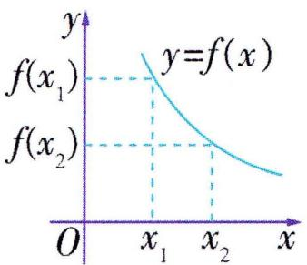图象在区间D上呈下降趋势</td></tr></table>

教材拓展 (1) 函数单调性定义中的 $x_{1}, x_{2}$ 有三个特征: 一是任意性, 二是有大小, 三是同属于一个单调区间. 三者缺一不可.

(2) 常函数既不是增函数也不是减函数.  
(3) $f(x)$ 在区间 $D_{1}, D_{2}$ 上都单调递增 (减) 时, 一般说 $f(x)$ 在 $D_{1}$ 和 (也可用 “ , ”, 但不能用 “ $\cup$ ”) $D_{2}$ 上单调递增 (减).

# 知识点② 函数的最大值和最小值

1. 定义

<table><tr><td>前提</td><td colspan="2">函数y=f(x)的定义域为I</td></tr><tr><td>条件</td><td>(1)对于任意x∈I,都有f(x)≤M;(2)存在x0∈I,使得f(x0)=M.</td><td>(1)对于任意x∈I,都有f(x)≥M;(2)存在x0∈I,使得f(x0)=M.</td></tr><tr><td>结论</td><td>M为最大值</td><td>M为最小值</td></tr></table>

2. 函数最值与单调性的联系

<table><tr><td>图示</td><td>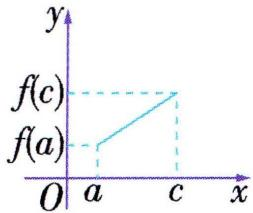</td><td>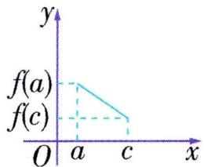</td><td>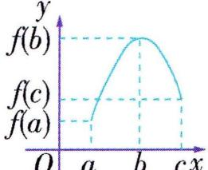</td><td>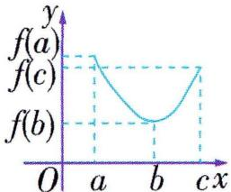</td></tr><tr><td>函数f(x)的单调性</td><td>在区间[a,c]上单调递增</td><td>在区间[a,c]上单调递减</td><td>在区间[a,b]上单调递增,在区间[b,c]上单调递减</td><td>在区间[a,b]上单调递减,在区间[b,c]上单调递增</td></tr><tr><td>最值</td><td>最大值:f(c)最小值:f(a)</td><td>最大值:f(a)最小值:f(c)</td><td>最大值:f(b)最小值:min{f(a),f(c)}</td><td>最大值:max{f(a),f(c)}最小值:f(b)</td></tr></table>

# 知识点 ③ 函数的奇偶性

1. 定义及图象特征

<table><tr><td></td><td>偶函数</td><td>奇函数</td></tr><tr><td>定义</td><td>设f(x)的定义域为I,如果∀x∈I,都有-x∈I,且f(-x)=f(x),那么函数f(x)叫作偶函数.</td><td>设f(x)的定义域为I,如果∀x∈I,都有-x∈I,且f(-x)=-f(x),那么函数f(x)叫作奇函数.</td></tr><tr><td>图象特征</td><td>关于y轴对称</td><td>关于原点对称</td></tr></table>

2. 判断函数奇偶性的原则

判断函数奇偶性要注意定义域优先原则,即首先要看定义域是否关于原点对称.

温馨提示 (1)根据奇函数的定义,如果一个奇函数在 $x = 0$ 处有定义,即 $f(0)$ 有意义,那么一定有 $f(0) = 0$ . 有时可以用 $f(0) \neq 0$ 来否定一个函数为奇函数.

(2) 偶函数的一个重要性质: $f(|x|) = f(x)$ , 它能使自变量化到 $[0, +\infty)$ 上, 避免分类讨论.

# 思·要点突破

# 要点① 函数的单调性

# 考向1 判断或证明函数的单调性

# 1. 判断或证明函数单调性的常用方法

(1) 定义法:

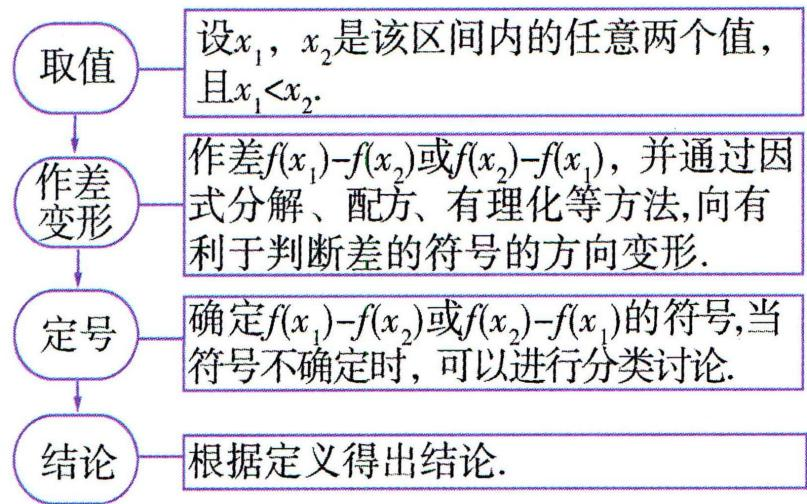

<details>
<summary>flowchart</summary>

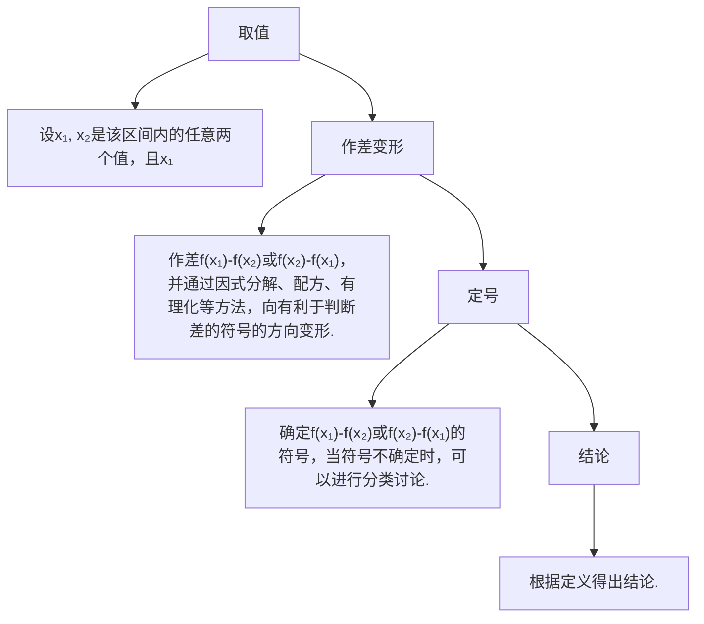
</details>

注意 也可通过判断 $\frac{f(x_{1})-f(x_{2})}{x_{1}-x_{2}}$ 或 $(x_{1}-x_{2})$

$\left[f(x_{1})-f(x_{2})\right]$ 的符号来确定函数的单调性

(2) 图象法: 若函数 $f(x)$ 是以图象形式给出的, 或者 $f(x)$ 的图象易作出, 则可由函数 $f(x)$ 的图象的上升或下降来确定函数 $f(x)$ 的单调性.  
(3) 利用已学函数的单调性判断所求函数的单调性.  
(4) 利用函数单调性的常用结论(如下)判断所求函数的单调性.

# 2. 函数单调性的常用结论

若函数 $f(x), g(x)$ 在给定区间 D 上具有单调性, 则在这个区间上:

(1) $f(x)$ 与 $f(x)+c$ (c为常数)具有相同的单调性.   
(2) 函数 $y = af(x) (a \neq 0)$ 与函数 $y = f(x)$ ，当 a > 0 时，单调性相同。当 a < 0 时，单调性相反。  
(3) 当 $f(x)$ 恒为正或恒为负时, 函数 $y = \frac{1}{f(x)}$ 与 $y = f(x)$ 的单调性相反.  
(4) 当 $f(x)$ , $g(x)$ 在 D 上都单调递增 (减) 时, $f(x) + g(x)$ 在 D 上单调递增 (减).  
(5) 若 $f(x)$ , $g(x)$ 在 D 上都单调递增 (减), 当 $f(x) > 0$ 且 $g(x) > 0$ 时, $f(x)g(x)$ 在 D 上单调递增 (减); 当 $f(x) < 0$ 且 $g(x) < 0$ 时, $f(x)g(x)$ 在 D 上单调递减 (增).

# 3. 抽象函数的单调性

解决抽象函数的单调性问题的思路:

抽象函数一般由方程确定,这类函数的单调性问题一般用单调性的定义来处理,但要注意运用好所给的条件,判断出函数值之间的关系.

常见思路是:

先在所证区间上设出任意 $x_{1}, x_{2} (x_{1} < x_{2})$ ，然后利用题设条件向已知区间上转化，最后运用函数单调性的定义解决问题.

典例 1-1 (多选) 下列函数中满足“对任意 $x_{1}, x_{2} \in (0, +\infty)$ , 都有 $(x_{1} - x_{2}) [f(x_{1}) - f(x_{2})] > 0$ ”的是 ( )

$$
\begin{array}{l} \mathrm{A.} f (x) = - \frac {2}{x} \\ \mathrm{B.} f (x) = - 3 x + 1 \\ \mathrm{C.} f (x) = x ^ {2} + 4 x + 3 \\ \mathrm{D.} f (x) = x - \frac {1}{x} \\ \end{array}
$$

解析 若对任意 $x_{1}, x_{2} \in (0, +\infty)$ , 都有 $(x_{1} - x_{2}) [f(x_{1}) - f(x_{2})] > 0$ , 则 $x_{1} - x_{2}$ 与 $f(x_{1}) - f(x_{2})$ 同号, 所以 $f(x)$ 在区间 $(0, +\infty)$ 上单调递增. $f(x) = -\frac{2}{x}$ 在 $(0, +\infty)$ 上单调递增, 故 A 正确; $f(x) = -3x + 1$ 在 $(0, +\infty)$ 上单调递减, 故 B 错误; $f(x) = x^{2} + 4x + 3$ 图象的对称轴为直线 $x = -2$ , 开口向上, 所以该函数在 $(0, +\infty)$ 上单调递增, 故 C 正确; $f(x) = x - \frac{1}{x}$ , 因为 $y = x$ 在 $(0, +\infty)$ 上单调递增, $y = -\frac{1}{x}$ 在 $(0, +\infty)$ 上单调递增, 所以 $f(x) = x - \frac{1}{x}$ 在 $(0, +\infty)$ 上单调递增, 故 D 飘带函数 $y = ax + \frac{b}{x} (a > 0, b < 0)$ 在 $(- \infty, 0)$ 和 $(0, +\infty)$ 上单调递增. 正确.

▶答案 ACD

典例1-2 已知 $f(x)$ 在 $(0, +\infty)$ 上单调递增，且 $f(x) > 0, f(3) = 1$ 。试判断 $g(x) = f(x) + \frac{1}{f(x)}$ 在 $(0,3]$ 上的单调性，并加以证明。

解析 函数 $g(x)$ 在 $(0,3]$ 上单调递减. 证明如下:

任取 $x_{1}, x_{2} \in (0,3]$ , 且 $x_{1} < x_{2}$ , 则

$$
\begin{array}{l} g \left(x _ {1}\right) - g \left(x _ {2}\right) = \left[ f \left(x _ {1}\right) + \frac {1}{f \left(x _ {1}\right)} \right] - \left[ f \left(x _ {2}\right) + \frac {1}{f \left(x _ {2}\right)} \right] = \\ \left[ f (x _ {1}) - f (x _ {2}) \right] \left[ 1 - \frac {1}{f (x _ {1}) f (x _ {2})} \right]. \\ \end{array}
$$

因为 $f(x)$ 在 $(0, +\infty)$ 上单调递增，

所以 $f(x_{1}) - f(x_{2}) < 0.$

又 $f(x)>0,f(3)=1$ ,

所以 $0 < f(x_{1}) < f(x_{2}) \leqslant f(3) = 1$ ,

则 $0 < f(x_{1})f(x_{2}) < 1$ ，即 $\frac{1}{f(x_1)f(x_2)} > 1$

即 $1 - \frac{1}{f(x_1)f(x_2)} < 0$

所以 $g(x_{1}) - g(x_{2}) > 0$ ，即 $g(x_{1}) > g(x_{2})$ ，

故 $g(x) = f(x) + \frac{1}{f(x)}$ 在 $(0,3]$ 上单调递减.

典例1-3 函数 $f(x)$ 满足 $f(x+y)+2=f(x)+f(y)$ ，且 $f(1)=0$ 。当x>1时， $f(x)<0$ 。

(1) 求 $f(-1)$ 的值;

(2) 判断并证明 $f(x)$ 在 $\mathbf{R}$ 上的单调性.

解析 (1) 对于 $f(x + y) + 2 = f(x) + f(y)$ ,

令 x=y=0, 可得 $f(0)=2$ .

再令 x=1, y=-1，可得 $f(0)+2=f(1)+f(-1)$ ，可得 $f(-1)=4$ .

(2) $f(x)$ 为R上的减函数.证明如下:

设 $\forall x_{1},x_{2}\in \mathbf{R}$ 且 $x_{1} <   x_{2}$

令 $x = x_{1}, y = x_{2} - x_{1}$ , 则 $x + y = x_{2}$ ,

则 $f(x_{2}) + 2 = f(x_{1}) + f(x_{2} - x_{1})$ ,

$$
\begin{array}{l} 2 = f \left(x _ {2} - x _ {1} + 1\right) + f (- 1) - 2 - 2 = f \left(x _ {2} - x _ {1} + 1\right) + 4 - 2 - \\ 2 = f \left(x _ {2} - x _ {1} + 1\right). \\ \end{array}
$$

则 $f(x_{2}) - f(x_{1}) = f(x_{2} - x_{1}) - 2 = f((x_{2} - x_{1} + 1) - 1) -$

由 $x_{1} < x_{2}$ , 得 $x_{2} - x_{1} > 0, x_{2} - x_{1} + 1 > 1$ .

又当 $x > 1$ 时， $f(x) < 0$ ，所以 $f(x_{2} - x_{1} + 1) < 0$

所以 $f(x_{2})-f(x_{1})<0$ ，即 $f(x_{2})<f(x_{1})$ ，所以 $f(x)$ 为R上的减函数.

名师点评 若给出的是和型 $(f(x+y)=\cdots)$ 抽象函数,判定符号时的常用变形为 $f(x_{2})-f(x_{1})=f((x_{2}-x_{1})+x_{1})-f(x_{1}),f(x_{2})-f(x_{1})=f(x_{2})-f((x_{1}-x_{2})+x_{2})$ ;

若给出的是积型 $(f(xy)=\cdots)$ 抽象函数,判定符号时的常用变形为 $f(x_{2})-f(x_{1})=f(x_{1}\cdot\frac{x_{2}}{x_{1}})-f(x_{1})$ ,

$$
f (x _ {2}) - f (x _ {1}) = f (x _ {2}) - f (x _ {2} \cdot \frac {x _ {1}}{x _ {2}}).
$$

# 考向 2 求函数的单调区间

求函数的单调区间时可通过画函数图象或结合复合函数的单调性求解.

复合函数 $y = f(g(x))$ 单调区间的求解步骤：

(1) 将复合函数分解成 $y = f(u), u = g(x)$ 的形式.

(2) 分别确定分解后各个函数的定义域.

(3) 分别确定分解后各个函数的单调区间.

(4) 若两个函数在对应区间上的单调性是同增或同减, 则 $y = f(g(x))$ 单调递增; 若为一增一减, 则 $y = f(g(x))$ 单调递减.

该法可简记为“同增异减法”.

典例1-4 函数 $f(x) = (x - 4) \cdot |x|$ 的单调递增区间是 （）

A. $(-∞,0]$   
B. $(-\infty, 0] \cup [2, +\infty)$   
C. $(-∞,0]$ 和 $[2,+∞)$   
D. $[2, +\infty)$

解析 $f(x)=(x-4)\cdot|x|=\left\{\begin{aligned}x^{2}-4x,x&\geqslant0,\\ -x^{2}+4x,x&<0,\end{aligned}\right.$ 函数 $f(x)$ 的图象如图所示,由图可知函数 $f(x)$ 的单调递增

区间为 $(-∞,0]$ 和 $[2,+∞)$ ，故选C.

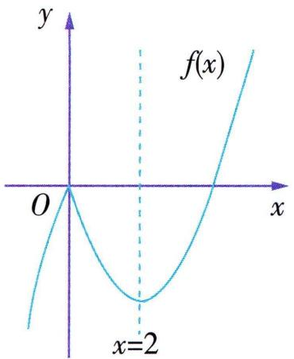

<details>
<summary>text_image</summary>

y
f(x)
O
x
x=2
</details>

▶ 答案 C

典例1-5 已知函数 $f(x) = \frac{1}{x^2 - 2x}$ ，则函数 $f(x)$ 的单调递减区间为（）

A. $[1,2)$ 和 $(2, +\infty)$

B. $(-∞,0)$ 和 $(0,1]$

C. $(- \infty, 1)$

D. $(1, +\infty)$

解析 要使函数有意义, 则 $x^{2} - 2x \neq 0$ , 即 $x \neq 0, x \neq 2$ . 易知 $u = x^{2} - 2x$ 在 $(- \infty, 0)$ 和 $(0, 1]$ 上单调递减, 在 $[1, 2)$ 和 $(2, +\infty)$ 上单调递增. $y = \frac{1}{u}$ 在 $(- \infty, 0)$ 和 $(0, +\infty)$ 上单调递减, 所以 $f(x) = \frac{1}{x^{2} - 2x}$ 在 $[1, 2)$ 和 $(2, +\infty)$ 上单调递减, 所以 $f(x)$ 的单调递减区间是 $[1, 2)$ 和 $(2, +\infty)$ .

▶ 答案 A

# 考向 3 单调性的应用

# 1. 求参数的值或取值范围

典例1-6已知函数 $f(x)=\left\{\begin{aligned}-x^{2}-ax-5,x&\leqslant1,\\ \frac{a}{x},&x>1\end{aligned}\right.$ 是R上的增函数,则实数a的取值范围是()

A. $(- \infty, -2)$

B. $(-∞,0)$

C. $(-3,-2]$

D. $[-3, -2]$

解析 因为函数 $f(x)$ 是 $\mathbf{R}$ 上的增函数, 所以 $\left\{ \begin{array}{l} a < 0, \\ -\frac{a}{2} \geqslant 1, \\ -1 - a - 5 \leqslant a, \end{array} \right.$ 解得 $-3 \leqslant a \leqslant -2$ .

▶ 答案 D

典例1-7 已知函数 $f(x) = x + \frac{a}{x}$ ，若函数 $f(x)$ 在区间 $[2, +\infty)$ 上单调递增，则实数 $a$ 的取值范围为 \_\_\_\_.

解析 当 $a \leqslant 0$ 时, $f(x)$ 在 $[2, +\infty)$ 上单调递增; 当 $a > 0$ 时, $f(x) = x + \frac{a}{x}$ 在 $(0, \sqrt{a}]$ 上单调递减, 在 $[\sqrt{a}, +\infty)$ 上单调递增, 所以要使 $f(x)$ 在区间 $[2, +\infty)$ 上单调递增, 则 $\sqrt{a} \leqslant 2$ , 即 $0 < a \leqslant 4$ . 综上, 实数 $a$ 的取值范围为 $(- \infty, 4]$ .

▶答案（-∞,4]

# 2. 比较大小、解不等式

可以利用单调递增、单调递减的定义实现自变量的大小关系与函数值的大小关系的直接转化.

(1) 单调递增: $x_{1} < x_{2} \Leftrightarrow f(x_{1}) < f(x_{2})$ ;   
(2) 单调递减: $x_{1} < x_{2} \Leftrightarrow f(x_{1}) > f(x_{2})$ .

典例1-8 已知函数 $y = f(x)$ 是定义在 $[-2, 2]$ 上的增函数, 则 $f(x^2) > f(-x)$ 的解集是 \_\_\_\_.

解析 由函数 $y = f(x)$ 在 $[-2, 2]$ 上单调递增，且 $f(x^2) >$

$f(-x)$ ，得 $\left\{ \begin{array}{l} -2\leqslant x^2\leqslant 2,\\ -2\leqslant -x\leqslant 2,\\ \text{注意函数的定义域}\\ x^{2} > - x, \end{array} \right.$ 解得 $-\sqrt{2}\leqslant x <   - 1$ 或 $0 <$

$$
x \leqslant \sqrt {2}.
$$

▶答案 $[ -\sqrt{2}, -1) \cup (0, \sqrt{2}]$

典例1-9 已知函数 $f(x)=x^{2}-4x+n$ ，试比较 $f(-1)$ ， $f(2)$ ， $f(4)$ 的大小.

解析 由题意得函数 $f(x)$ 的图象关于直线 $x = 2$ 对称, 所以 $f(-1) = f(5)$ .

分析知 $f(x)$ 在 $[2, +\infty)$ 上单调递增，

所以 $f(2) < f(4) < f(5)$ ,

即 $f(2) < f(4) < f(-1)$ .

注意 利用函数单调性比较大小应注意将自变量放在同一单调区间内.

# 要点② 函数的最值

# 1. 函数的最值与值域、单调性之间的联系

(1)对一个函数来说,其值域是确定的,但它不一定有最值,如函数 $y=\frac{1}{x}$ . 如果有最值,则最值一定是值域中的一个元素.  
(2) 若函数 $f(x)$ 在闭区间 $[a, b]$ 上单调, 则 $f(x)$ 的最值必在区间端点处取得.

若函数 $y=f(x)$ 有多个单调区间, 先求出各区间上的最值, 再从各区间的最大 (小) 值中求出最大 (小) 值, 则这个值就是 $f(x)$ 在定义域内的最大 (小) 值.

# 2. 求函数最大（小）值的常用方法

(1) 配方法: 对于二次函数, 一般通过配方法来求最值,但要考虑是否符合定义域.  
(2) 图象法: 对于容易画出图象的函数, 可借助函数的图象求最值.  
(3)单调性法:对于较复杂的函数,分析函数的单调性(需给出证明)后,依据单调性求出最值.   
(4)换元法:对于某些较复杂的函数,可通过换元将函数化为熟知的函数(如二次函数等),再借助熟知函数的性质求出最值.  
(5) 基本不等式法: 对形如 $y = ax + \frac{b}{x} (ab > 0)$ 的函数, 可利用基本不等式求出最值.

# 考向1 求函数的最值

典例2-1（多选）已知函数 $y = f(x)$ 的定义域为 $[-1, 5]$ ，其图象如图所示，则下列说法正确的是（）

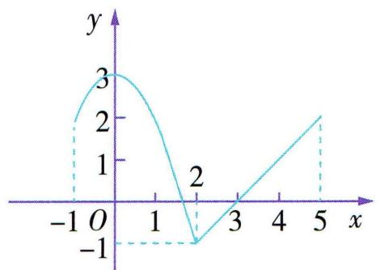

<details>
<summary>line</summary>

| x   | y   |
| --- | --- |
| -1  | 2   |
| 0   | 3   |
| 1   | 2   |
| 2   | -1  |
| 3   | 0   |
| 4   | 1   |
| 5   | 2   |
</details>

A. $f(x)$ 的单调递减区间为 $[0, 2]$   
B. $f(x)$ 的最大值为 3  
C. $f(x)$ 的最小值为 $-1$   
D. $f(x)$ 的单调递增区间为 $[-1,0] \cup [2,5]$

解析

<table><tr><td>A</td><td>√</td><td>由图象可知 $f(x)$ 的单调递减区间为[0,2].</td></tr><tr><td>B</td><td>√</td><td>当 $x=0$ 时, $f(x)_{\max } = 3$ .</td></tr><tr><td>C</td><td>√</td><td>当 $x=2$ 时, $f(x)_{\min } = -1$ .</td></tr><tr><td>D</td><td>×</td><td>由图象可知 $f(x)$ 的单调递增区间为[-1,0]和[2,5].不能用“∪”连接.</td></tr></table>

▶ 答案 ABC

典例2-2（多选）下列结论中正确的是 （）

A. 当 $0 < x \leqslant 2$ 时, $f(x) = x - \frac{1}{x}$ 无最大值  
B. 当 $x \geqslant 3$ 时, $f(x) = x + \frac{1}{x - 1}$ 的最小值为 3  
C. 当 $x > 2$ 时, $f(x) = \sqrt{x - 2} - x$ 有最大值  
D. 当 $x < 0$ 时, $f(x) = 4x + \frac{1}{x}$ 的最大值为 -4

解析 由函数 $y = x$ 和 $y = -\frac{1}{x}$ 都在 $(0,2]$ 上单调递增，得函数 $f(x) = x - \frac{1}{x}$ 在 $(0,2]$ 上单调递增，所以 $f(x) = x - \frac{1}{x}$ 在 $(0,2]$ 上的最大值为 $f(2) = \frac{3}{2}$ ，故 A 错误。当 $x > 1$ 时， $x - 1 > 0, x + \frac{1}{x - 1} = x - 1 + \frac{1}{x - 1} + 1 \geqslant 2\sqrt{(x - 1) \cdot \frac{1}{x - 1}} + 1 = 3$ ，当且仅当 $x - 1 = \frac{1}{x - 1}$ ，即 $x = 2$ 时，等号成立，又 $x \geqslant 3$ ，所以取不到等号，故 B 错误。令 $\sqrt{x - 2} = t \in (0, +\infty)$ ，则 $\sqrt{x - 2} - x = -t^2 + t - 2 = -(t - \frac{1}{2})^2 - \frac{7}{4}$ ，所以当 $t = \frac{1}{2}$ ，即 $x = \frac{9}{4}$ 时， $\sqrt{x - 2} - x$ 取最大值 $-\frac{7}{4}$ ，故 C 正确。当 $x < 0$ 时， $-x > 0$ ，故 $f(x) = 4x + \frac{1}{x} = -(-4x + \frac{1}{-x}) \leqslant -4$ ，当且仅当

-4x = - $\frac{1}{x}$ , 即 $x = -\frac{1}{2}$ 时, 等号成立, 故 x < 0 时, $f(x) = 4x + \frac{1}{x}$ 的最大值为 -4, 故 D 正确.

▶ 答案 CD

# 考向 2 函数最值的应用

# 1. 利用函数的最值求参

典例2-3（多选）若函数 $f(x)=\left\{\begin{aligned}-x^{2}-2x,x&\leqslant a,\\-x,x>a\end{aligned}\right.$ 存在最大值，则实数a的值可能是()

A. -2

B. - 1

C. 1

D. 2

解析 函数 $y = -x^{2} - 2x$ 的图象的对称轴为直线 $x = -1$ . ①若 $a \geqslant -1$ , 则当 $x \leqslant a$ 时, $f(x) = -x^{2} - 2x$ 有最大值 $f(-1) = 1$ ; 当 $x > a$ 时, $x > -1$ , 所以 $-x < 1$ . 所以当 $a \geqslant -1$ 时, $f(x)$ 有最大值 1. ②若 $a < -1$ , 则当 $x \leqslant a$ 时, $f(x) = -x^{2} - 2x$ 有最大值 $f(a) = -a^{2} - 2a$ ; 当 $x > a$ 时, $-x < -a$ , 因为 $f(x)$ 存在最大值, 所以 $-a^{2} - 2a \geqslant -a$ , 解得 $-1 \leqslant a \leqslant 0$ , 与 $a < -1$ 矛盾, 不符合题意. 综上, $a \geqslant -1$ , 故选 BCD.

▶ 答案 BCD

典例2-4 已知函数 $f(x)=\frac{2x-1}{x+1}$ . 若 $x\in[1,m]$ 时, 函数 $f(x)$ 的最大值与最小值的差为 $\frac{1}{2}$ , 则 m= \_\_\_\_.

解析 由题意可知, $f(x)=\frac{2x-1}{x+1}=2-\frac{3}{x+1}$ . 又 $y=\frac{3}{x+1}$ 在 $(-1,+\infty)$ 上单调递减, 所以 $f(x)$ 在 $(-1,+\infty)$ 上单调递增, 所以函数 $f(x)$ 在 $[1,m]$ 上的最大值为 $f(m)=\frac{2m-1}{m+1}$ , 最小值为 $f(1)=\frac{1}{2}$ , 所以 $f(m)-f(1)=\frac{1}{2}$ , 即 $\frac{2m-1}{m+1}-\frac{1}{2}=\frac{1}{2}$ , 解得 m=2.

▶ 答案 2

# 2. 利用函数的最值解决任意、存在问题

# (1) 单变量的任意、存在问题

利用函数求解单变量的任意、存在问题时,一般先分离参数,再转化为求函数在给定区间上的最值问题,即

$$
\forall   x \in M, f (  x  ) > a  , \text {则}   f (  x  ) _ {\min} > a  ,
$$

$$
\exists   x \in M, f (  x  ) > a  , \text { 则 }   f (  x  ) _ {\max} > a  ;
$$

$$
\forall   x \in M, f (  x  ) <   a  , \text {则}   f (  x  ) _ {\max} <   a  ,
$$

$$
\exists   x \in M, f (  x  ) <   a  , \text { 则 }   f (  x  ) _ {\min} <   a.
$$

# (2) 双变量的任意、存在问题

① $\forall x_{1} \in M, \forall x_{2} \in N, f(x_{1}) \geqslant g(x_{2}) \Leftrightarrow f(x)_{\min} \geqslant g(x)_{\max}$ , 如图 1 所示；

② $\exists x_{1} \in M, \forall x_{2} \in N, f(x_{1}) \geqslant g(x_{2}) \Leftrightarrow f(x)_{\max} \geqslant g(x)_{\max}$ ,
如图 2 所示；

③ $\exists x_{1}\in M,\exists x_{2}\in N,f(x_{1})\geqslant g(x_{2})\Leftrightarrow f(x)_{\max}\geqslant g(x)_{\min},$

如图 3 所示;

④ $\forall x_{1} \in M, \exists x_{2} \in N, f(x_{1}) \geqslant g(x_{2}) \Leftrightarrow f(x)_{\min} \geqslant g(x)_{\min}$ ,
如图 4 所示.

注:以上 $f(x)$ 的最值是在M上的最值, $g(x)$ 的最值是在N上的最值.

⑤ $\forall x_{1} \in M, \exists x_{2} \in N, f(x_{1}) = g(x_{2}) \Leftrightarrow f(x)$ 在 M 上的值域是 $g(x)$ 在 N 上的值域的子集, 如图 5 所示.

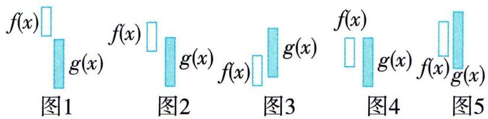

<details>
<summary>text_image</summary>

f(x)
g(x)
f(x)
g(x)
f(x)
g(x)
f(x)
g(x)
图1
图2
图3
图4
图5
</details>

典例2-5已知函数 $f(x)=\frac{1-x}{1+x},x\in(-1,1)$ .

(1)用定义证明 $f(x)$ 在(-1,1)上单调递减；

(2) 若关于 $x$ 的不等式 $f(x) \geqslant a (x^2 - 3x + 2)$ 对于任意 $x \in (-1, 1)$ 恒成立, 求实数 $a$ 的取值范围.

解析（1）任取 $x_{1}, x_{2} \in (-1, 1)$ ，且 $x_{1} < x_{2}$

则 $f(x_{1}) - f(x_{2}) = \frac{1 - x_{1}}{1 + x_{1}} -\frac{1 - x_{2}}{1 + x_{2}} = \frac{2(x_{2} - x_{1})}{(1 + x_{1})(1 + x_{2})}.$

又 $x_{1}, x_{2} \in (-1, 1), x_{1} < x_{2}$ .

所以 $(1 + x_{1})(1 + x_{2}) > 0, x_{2} - x_{1} > 0,$

所以 $f(x_{1}) - f(x_{2}) > 0$ ，即 $f(x_{1}) > f(x_{2})$

所以 $f(x)$ 在 $(-1,1)$ 上单调递减.

(2) 因为 $y = x^{2} - 3x + 2 = (x - 1)(x - 2)$ 在 $(-1, 1)$ 上单调递减且恒有 y > 0，

所以不等式 $f(x) \geqslant a (x^{2} - 3x + 2)$ 对于任意 $x \in (-1, 1)$ 恒成立，等价于 $a \leqslant \frac{f(x)}{x^{2} - 3x + 2}$ 对于任意 $x \in (-1, 1)$ 恒成立.

$$
\begin{array}{r l} {\text {令} g (x) = \frac {f (x)}{x ^ {2} - 3 x + 2}} & {= \frac {\frac {1 - x}{1 + x}}{(x - 1) (x - 2)}} \\ {- \frac {1}{(1 + x) (x - 2)} = - \frac {1}{(x - \frac {1}{2}) ^ {2} - \frac {9}{4}},} \end{array}
$$

当 $x = \frac{1}{2}$ 时， $g(x)$ 取得最小值，为 $\frac{4}{9}$ ，

所以实数 a 的取值范围是 $(-∞, \frac{4}{9}]$ .

典例2-6 已知函数 $f(x)=x^{2}+2x$ .

(1) 若 $x \in [-2, a]$ , 求 $f(x)$ 的值域;

(2) 若存在 $x \in [1,3]$ , 使得 $f(x + t) \leqslant 3x + t^2$ 成立, 求实数 $t$ 的取值范围.

解析 (1) 函数 $f(x) = x^{2} + 2x$ 的图象开口向上, 对称轴为直线 $x = -1$ .

①当 $-2 < a \leqslant -1$ 时, $f(x)$ 在 $[-2, a]$ 上单调递减,

$f(x)_{\max} = f(-2) = 0, f(x)_{\min} = f(a) = a^2 + 2a,$

所以 $f(x)$ 的值域为 $[a^{2}+2a,0]$ .

②当 $-1 < a \leqslant 0$ 时, $f(x)$ 在 $[-2, -1]$ 上单调递减, 在 $[-1, a]$ 上单调递增,

所以 $f(x)_{\max}=f(-2)=0,f(x)_{\min}=f(-1)=-1,$

所以 $f(x)$ 的值域为 $[-1,0]$ .

③当 a > 0 时, $f(x)$ 在 $[-2, -1]$ 上单调递减, 在 $[-1, a]$ 上单调递增, 且 $f(-2) < f(a)$ ,

所以 $f(x)_{\max}=f(a)=a^{2}+2a,f(x)_{\min}=f(-1)=-1$

所以 $f(x)$ 的值域为 $[-1, a^{2} + 2a]$ .

(2) $f(x+t)\leqslant3x+t^{2}$ 可化为 $2t(x+1)\leqslant x-x^{2}$ ,

即存在 $x \in [1,3]$ , 使得 $2t(x + 1) \leqslant x - x^2$ 成立,

只需 $t \leqslant \frac{x - x^2}{2(x + 1)}$ 对 $x \in [1,3]$ 能成立，

只需 $t \leqslant \left[\frac{x - x^2}{2(x + 1)}\right]_{\max}$ , 其中 $x \in [1,3]$ .

记 $g(x) = \frac{x - x^2}{2(x + 1)}, x \in [1,3]$ .

任取 $1 \leqslant x_{1} < x_{2} \leqslant 3$

则 $g(x_{1}) - g(x_{2}) = \frac{x_{1} - x_{1}^{2}}{2(x_{1} + 1)} -\frac{x_{2} - x_{2}^{2}}{2(x_{2} + 1)} =$

$$
\frac {\left(x _ {1} - x _ {2}\right) \left(1 - x _ {1} x _ {2} - x _ {1} - x _ {2}\right)}{2 \left(x _ {1} + 1\right) \left(x _ {2} + 1\right)}.
$$

因为 $1 \leqslant x_{1} < x_{2} \leqslant 3$ ，所以 $x_{1} - x_{2} < 0, 1 - x_{1}x_{2} - x_{1} - x_{2} < 0, x_{1} + 1 > 0, x_{2} + 1 > 0,$

所以 $g(x_{1}) > g(x_{2})$ ，即 $g(x)$ 在 $[1,3]$ 上单调递减，

所以 $g(x)_{\max}=g(1)=0$ , 所以 $t\leqslant0$

即实数 t 的取值范围为 $(-∞,0]$ .

典例2-7 已知函数 $f(x) = x^{2} + 2|x - a|(a > 0)$ .

(1) 若 $a = 1$ , 对任意的 $x_{1}, x_{2} \in [-1, 1]$ 都有 $f(x_{1}) - f(x_{2}) \leqslant k$ 成立, 求实数 $k$ 的最小值;

(2) 存在不相等的实数 $x_{1}, x_{2} \in [-1, 1]$ 使得 $f(x_{1}) = f(x_{2})$ 成立, 求正实数 $a$ 的取值范围.

解析 (1) 由题意可得, 只需满足 $f(x)_{\max} - f(x)_{\min} \leqslant k$ 成立即可.

当 $x \in [-1, 1]$ 时， $f(x) = x^2 + 2|x - 1| = x^2 - 2x + 2 = (x - 1)^2 + 1$

所以 $f(x)$ 在 $[-1,1]$ 上单调递减，

所以 $f(x)_{\max}=f(-1)=5,f(x)_{\min}=f(1)=1$ ,

所以 $k \geqslant f(x)_{\max} - f(x)_{\min} = 4$ ,

所以实数 k 的最小值为 4.

(2)由题意可得,若存在不相等的实数 $x_{1},x_{2}\in[-1,1]$ 使得 $f(x_{1})=f(x_{2})$ 成立,则只需满足 $f(x)$ 在 $[-1,1]$ 上不单调即可.

$$
f (x) = \left\{ \begin{array}{l} x ^ {2} + 2 x - 2 a, x \geqslant a, \\ x ^ {2} - 2 x + 2 a, x <   a, \end{array} \right.
$$

若 $a \geqslant 1$ ，则 $f(x)$ 在 $[-1, 1]$ 上单调递减，不合题意，

若 0 < a < 1，则 $f(x)$ 在 $[-1, a]$ 上单调递减，在 $[a, 1]$ 上单调递增，符合题意，

所以实数 a 的取值范围是 $(0,1)$ .

# 要点③ 函数的奇偶性

# 考向 1 判断函数的奇偶性

判断函数奇偶性的方法

<table><tr><td>图象法</td><td>函数f(x)的图象关于原点对称⇔f(x)是奇函数;函数f(x)的图象关于y轴对称⇔f(x)是偶函数.</td></tr><tr><td>性质法</td><td>(1)在同一定义域内,偶函数的和、差、积、商(分母不为零)仍为偶函数;(2)在同一定义域内,奇函数的和、差仍为奇函数;(3)在同一定义域内,一个奇函数与一个偶函数的积为奇函数;(4)在同一定义域内,两个奇函数的积(或商)是偶函数.</td></tr><tr><td>定义法</td><td>步骤:(1)考虑定义域是否关于原点对称;(2)验证f(-x)=-f(x)或f(-x)=f(x)对定义域中任意的x是否成立;(3)得出结论.</td></tr></table>

典例 3-1 判断下列函数的奇偶性:

(1) $f(x)=\sqrt{\frac{1-2x}{1+2x}}$ ;

(2) $f(x)=\left\{\begin{aligned}x^{2}-2x+3,x>0,\\ 0,x=0,\\ -x^{2}-2x-3,x<0.\end{aligned}\right.$

解析（1）由 $\frac{1 - 2x}{1 + 2x} \geqslant 0$ ，得 $-\frac{1}{2} < x \leqslant \frac{1}{2}$ ，

定义域不关于原点对称，

故函数 $f(x)$ 既不是奇函数也不是偶函数.

(2) 函数 $f(x)$ 的定义域为 R, 关于原点对称.

①当 x=0 时，-x=0，所以 $f(-x)=f(0)=0, f(x)=f(0)=0$ ，所以 $f(-x)=-f(x)$ ;

②当 x > 0 时，-x < 0，所以 $f(-x) = -(-x)^{2} - 2(-x) - 3 = -(x^{2} - 2x + 3) = -f(x)$ ;

③当 x<0 时，-x>0，所以 $f(-x)=(-x)^{2}-2(-x)+3=-(-x^{2}-2x-3)=-f(x)$ .

综上, 可知函数 $f(x)$ 为奇函数.

# 考向 2 函数奇偶性的应用

函数奇偶性的应用类型及解题策略

<table><tr><td>求解析式</td><td>先将待求区间上的自变量转化到已知区间上,再利用奇偶性求出 $f(x)$ 的解析式,或充分利用奇偶性构造关于 $f(x)$ 的方程(组),从而得到 $f(x)$ 的解析式.</td></tr><tr><td>求函数值</td><td>利用函数的奇偶性将待求函数值转化为已知区间上的函数值.</td></tr><tr><td>求参数值</td><td>利用待定系数法求解,根据 $f(x)\pm f(-x)=0$ 得到关于待求参数的恒等式,由系数的对等性,进而得出参数的值.对于在x=0处有定义的奇函数 $f(x)$ ,可考虑利用 $f(0)=0$ 求解.</td></tr><tr><td>解不等式</td><td>利用奇、偶函数的图象特征或根据奇函数在对称区间上的单调性一致,偶函数在对称区间上的单调性相反,将问题转化到同一单调区间上求解,涉及偶函数时常用 $f(x) = f(|x|)$ ,将问题转化到 $[0, +\infty)$ 上求解.</td></tr></table>

典例3-2 设函数 $f(x) = \frac{(x + 1)(x + a)}{x}$ 为奇函数, 则 $a =$ \_\_\_\_.

解析 方法一(定义法) 因为 $f(x)$ 为奇函数,所以 $f(-x) = -f(x)$ ,即 $\frac{(-x+1)(-x+a)}{-x} = -\frac{(x+1)(x+a)}{x}$ ,所以 $-\frac{(x-1)(x-a)}{x} = -\frac{(x+1)(x+a)}{x}$ ,所以a=-1.

方法二(特殊值法) 因为 $f(x)$ 为奇函数,所以 $f(1)+f(-1)=0$ ,即 $\frac{(1+1)(1+a)}{1}+\frac{(-1+1)(-1+a)}{-1}=0$ ,所以a=-1.

▶ 答案 - 1

典例3-3 已知函数 $f(x)$ 是定义在R上的奇函数, 则 $f(0)=$ \_\_\_\_; 若函数 $g(x)=f(x)+x^{2}-x$ , $g(-1)=5$ , 则 $g(1)=$ \_\_\_\_.

解析 因为 $f(x)$ 是定义在 R 上的奇函数, 所以 $f(0)=0$ ; 因为 $g(-1)=f(-1)+2=5$ , 所以 $f(-1)=3$ , 所以 $f(1)=-f(-1)=-3$ , 所以 $g(1)=f(1)+1-1=-3$ .

▶ 答案 0 -3

典例3-4 已知 $f(x)$ 是定义在 R 上的偶函数. 若函数 $f(x)$ 在 $[0, +\infty)$ 上单调递增, 则满足 $f(x - 1) \leqslant f(2)$ 的实数 $x$ 的取值范围是\_\_\_\_; 若当 $x \geqslant 0$ 时, $f(x) = x^2 + x$ , 则当 $x < 0$ 时, $f(x)$ 的解析式是\_\_\_\_.

解析 因为 $f(x)$ 是 $\mathbf{R}$ 上的偶函数, 且 $f(x)$ 在 $[0, +\infty)$ 上单调递增, 所以 $f(x)$ 在 $(- \infty, 0)$ 上单调递减, 所以 $f(x - 1) \leqslant f(2) \Leftrightarrow |x - 1| \leqslant 2$ , 即 $-1 \leqslant x \leqslant 3$ , 所以实数 $x$ 的取值范围是 $[-1, 3]$ . 当 $x < 0$ 时, $-x > 0$ , $f(x) = f(-x) = (-x)^2 + (-x) = x^2 - x$ .

▶答案 [ -1,3 ] $f(x) = x^{2} - x$


# 用·高分探究

# 探究 • 函数图象的对称性

1. 函数图象关于直线 $x = m$ 对称的问题

<table><tr><td>y=f(x)在定义域内恒满足的条件</td><td>y=f(x)图象的对称轴</td></tr><tr><td>f(a+x)=f(a-x)</td><td>直线x=a</td></tr><tr><td>f(x)=f(a-x)</td><td>直线x=a/2</td></tr><tr><td>f(a+x)=f(b-x)</td><td>直线x=a+b/2</td></tr><tr><td>函数y=f(x+a)是偶函数</td><td>直线x=a</td></tr></table>

2. 函数图象关于点 $(m,0)$ 对称的问题

<table><tr><td>y=f(x)在定义域内恒满足的条件</td><td>y=f(x)图象的对称中心</td></tr><tr><td>f(a-x)=-f(a+x)</td><td>点(a,0)</td></tr><tr><td>f(x)=-f(a-x)</td><td>点( $\frac{a}{2}$ ,0)</td></tr><tr><td>f(a+x)=-f(b-x)</td><td>点( $\frac{a+b}{2}$ ,0)</td></tr></table>

3. 函数图象关于点 $(m, n)$ 对称的问题典例 1 (多选) 对于定义在 R 上的函数 $f(x)$ , 下列说法正确的是 ( )

<table><tr><td>y=f(x)在定义域内恒满足的条件</td><td>y=f(x)图象的对称中心</td></tr><tr><td>f(a-x)+f(a+x)=2b</td><td>点(a,b)</td></tr><tr><td>f(x)+f(a-x)=b</td><td>点( $\frac{a}{2}$ , $\frac{b}{2}$ )</td></tr><tr><td>f(a+x)+f(b-x)=c</td><td>点( $\frac{a+b}{2}$ , $\frac{c}{2}$ )</td></tr><tr><td>函数 y=f(x+a)-b是奇函数</td><td>点(a,b)</td></tr></table>

A. 若 $f(x)$ 是奇函数, 则 $f(x - 1)$ 的图象关于点 (1, 0) 对称  
B. 若 $\forall x \in \mathbf{R}$ , 有 $f(x + 1) = f(x - 1)$ , 则 $f(x)$ 的图象关于直线 $x = 1$ 对称  
C. 若函数 $f(x + 1)$ 的图象关于直线 $x = -1$ 对称, 则 $f(x)$ 为偶函数  
D. 若 $f(1 + x) + f(1 - x) = 2$ , 则 $f(x)$ 的图象关于点 (1, 1) 对称

解析 $f(x)$ 的图象关于原点对称, 将其向右平移 1 个单位长度, 得到 $f(x - 1)$ 的图象, 故 $f(x - 1)$ 的图象关于点 $(1,0)$ 对称, 故 A 正确. 由 $f(x + 1) = f(x - 1)$ , 得 $f(x + 2) = f(x)$ , 不能说明其图象关于直线 $x = 1$ 对称, 故 B 错误. 将 $f(x + 1)$ 的图象向右平移 1 个单位长度, 得到 $f(x)$ 的图象, 若函数 $f(x + 1)$ 的图象关于直线 $x = -1$ 对称, 则 $f(x)$ 的图象关于 $y$ 轴对称, 故 $f(x)$ 为偶函数, 故 C 正确. 由 $f(1 + x) + f(1 - x) = 2$ , 得 $f(x)$ 的图象关于点 $(1,1)$ 对称, 故 D 正确.

▶答案 ACD

典例 2 已知函数 $y=f(x+1)-2$ 为奇函数, $g(x)=\frac{2x-1}{x-1}$ , 且 $f(x)$ 与 $g(x)$ 图象的交点为 $(x_{1},y_{1})$ , $(x_{2},y_{2})$ , $\cdots$ , $(x_{6},y_{6})$ , 则 $x_{1}+x_{2}+\cdots+x_{6}+y_{1}+y_{2}+\cdots+y_{6}=$ \_\_\_\_.

解析 因为函数 $y=f(x+1)-2$ 为奇函数, 所以 $f(x+1)-2=-\left[f(-x+1)-2\right]$ , 即 $f(x+1)+f(-x+1)=4$ , 所以函数 $y=f(x)$ 的图象关于点 $(1,2)$ 对称. 因为 $g(x)=\frac{2x-1}{x-1}=2+\frac{1}{x-1}$ , 所以函数 $y=g(x)$ 的图象关于点 $(1,2)$ 对称, 所以两个函数图象的交点也关于点 $(1,2)$ 对称. 因为 $f(x)$ 与 $g(x)$ 图象的交点为 $(x_{1},y_{1})$ , $(x_{2},y_{2}),\cdots,(x_{6},y_{6})$ , 两两关于点 $(1,2)$ 对称, 所以 $x_{1}+x_{2}+\cdots+x_{6}+y_{1}+y_{2}+\cdots+y_{6}=3\times2+3\times4=18$ .

▶ 答案 18

典例 3 已知函数 $f(x)$ 的定义域为 $[-1,3]$ , 且图象关于点 $(1,1)$ 对称, 当 $1 < x \leqslant 3$ 时, $f(x) = x + 1 - \frac{1}{x}$ , 则满足 $f(x - 1) + f(x) \leqslant 2$ 的 $x$ 的取值范围是 \_\_\_\_.

解析 因为函数 $y = x, y = -\frac{1}{x}$ 在(1,3]上单调递增, 所以当 $1 < x \leqslant 3$ 时, $f(x)$ 单调递增. 因为 $f(x)$ 的图象关于点(1,1)对称, 所以 $f(x) + f(2 - x) = 2$ , 且 $f(x)$ 在[-1,3]上单调递增. 不等式 $f(x - 1) + f(x) \leqslant 2$ 可整理为 $f(x - 1) + f(x) \leqslant f(x) + f(2 - x)$ , 即 $f(x - 1) \leqslant$ $f(2 - x)$ ，则 $\left\{ \begin{array}{l} -1\leqslant x - 1\leqslant 3,\\ -1\leqslant 2 - x\leqslant 3,\\ x - 1\leqslant 2 - x, \end{array} \right.$ 解得 $0\leqslant x\leqslant \frac{3}{2}$

▶答案 $[0, \frac{3}{2}]$

# 微专题 1 二次函数的最值问题

探求二次函数在给定区间上的最值问题,一般要先画出二次函数的大致图象,然后根据图象进行研究.特别要注意二次函数图象的对称轴与所给区间的位置关系,它是求解二次函数在已知区间上最值问题的主要依据,且最大(小)值不一定在顶点处取得.

以求二次函数 $f(x) = ax^{2} + bx + c (a > 0)$ 在区间 $[m, n]$ 上的最值为例,一般分为以下几种情况:

(1) 若 $x = -\frac{b}{2a}$ 在区间 $[m, n]$ 内, 则最小值为 $f(-\frac{b}{2a})$ , 最大值为 $f(m), f(n)$ 中较大者 (区间端点 $m, n$ 中与直线 $x = -\frac{b}{2a}$ 距离较远的一个对应的函数值为最大值);  
(2) 若 $x = -\frac{b}{2a} < m$ ，则 $f(x)$ 在区间 $[m, n]$ 上单调递增，最小值为 $f(m)$ ，最大值为 $f(n)$ ；  
(3) 若 $x = -\frac{b}{2a} > n$ , 则 $f(x)$ 在区间 $[m, n]$ 上单调递减, 最小值为 $f(n)$ , 最大值为 $f(m)$ .

注:对于 a<0,有类似结论.

# 类型 1 定轴定区间

典例 1 若对于任意 $x \in [1,2]$ , 不等式 $m + 2 - x^{2} \leqslant 0$ 恒成立, 则实数 $m$ 的取值范围是 ( )

A. $(-\infty, -1]$

B. $(-\infty, 0]$

C. $(-\infty, 1]$

D. $(-\infty, 2\sqrt{2}]$

解析 令 $f(x) = m + 2 - x^{2} (x \in [1, 2])$ ，则 $f(x)$ 在 $[1, 2]$ 上单调递减， $f(x)_{\max} = f(1) = m + 1$ . 因为对于任意 $x \in [1, 2]$ ，不等式 $m + 2 - x^{2} \leqslant 0$ 恒成立，于是 $m + 1 \leqslant 0$ ，所以 $m \leqslant -1$ .

▶ 答案 A

# 类型 ② 动轴定区间

典例 2 已知 $f(x)=2x^{2}+ax+1, x\in[-1,1]$ ，求 $f(x)$ 的最小值 $g(a)$ .

解析 $f(x) = 2x^{2} + ax + 1 = 2\left(x + \frac{a}{4}\right)^{2} + 1 - \frac{a^{2}}{8}$ , 故 $f(x)$ 的图象的对称轴为直线 $x = -\frac{a}{4}$ .

当 $-\frac{a}{4} \in [-1, 1]$ , 即 $-4 \leqslant a \leqslant 4$ 时, $g(a) = f(-\frac{a}{4}) = 1 - \frac{a^2}{8}$ ,

当 $-\frac{a}{4} > 1$ ，即 $a < -4$ 时， $g(a) = f(1) = 2 + a + 1 = 3 + a$ ，当 $-\frac{a}{4} < -1$ ，即 $a > 4$ 时， $g(a) = f(-1) = 2 - a + 1 = 3 - a.$

故 $g(a) = \begin{cases} 3 + a, & a < -4, \\ 1 - \frac{a^2}{8}, & -4 \leqslant a \leqslant 4, \\ 3 - a, & a > 4. \end{cases}$

# 类型 ③ 定轴动区间

典例 3 已知函数 $f(x) = -x^{2} + 2x + 3$ 在区间 $[0, t]$ 上的最大值是 4 , 最小值是 3 , 则实数 $t$ 的取值范围是 ( )

A. $[1,2]$ B. $(0,1]$ C. $[1,+\infty)$ D. $(0,2]$

解析 $f(x) = -(x - 1)^{2} + 4, f(0) = f(2) = 3, f(1) = 4$ . 如图, 画出 $f(x)$ 的图象, 由图可知 $t \in [1, 2]$ .

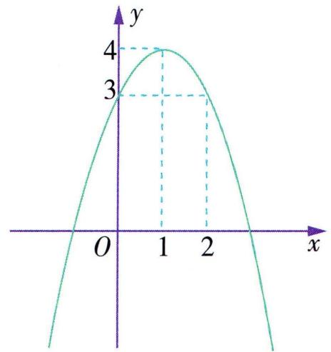

<details>
<summary>line</summary>

| x | y |
|---|---|
| 0 | 0 |
| 1 | 4 |
| 2 | -3 |
</details>

▶ 答案 A

# 类型 4 动轴动区间

典例 4 设函数 $f(x) = |ax| - (x + a)^{2} + 3$ , 其中 $a \in \mathbb{R}$ . 若 $x \in [a, a + 1]$ , 求函数 $f(x)$ 的最大值.

解析 ①当 $a \geqslant 0$ 时, 因为 $x \in [a, a + 1]$ , 所以 $f(x) = -x^{2} - ax - a^{2} + 3 = -(x + \frac{a}{2})^{2} - \frac{3a^{2}}{4} + 3$ .

由二次函数的单调性, 可知 $f(x)$ 在 $[a, a + 1]$ 上单调递减, 所以 $f(x)_{\max} = f(a) = -3a^{2} + 3$ .

②当 $a + 1 \leqslant 0$ ，即 $a \leqslant -1$ 时， $f(x) = -x^2 - ax - a^2 +$

$3 = -(x + \frac{a}{2})^2 - \frac{3a^2}{4} + 3, f(x)$ 在 $[a, a + 1]$ 上单调递增，

所以 $f(x)_{\max} = f(a + 1) = -3a^2 - 3a + 2.$

③当 -1 < a < 0 时, $f(x) = \left\{ \begin{aligned} & -x^{2} - ax - a^{2} + 3, & x \in [a,0], \\ & -x^{2} - 3ax - a^{2} + 3, & x \in (0,a + 1]. \end{aligned} \right.$ $f(x)$ 在 $[a,0]$ 上单调递增, 所以 $f(x)$ 在 $[a,0]$ 上的最大值为 $f(0) = -a^{2} + 3$ .

当 $a + 1 > -\frac{3a}{2}$ , 即 $-\frac{2}{5} < a < 0$ 时, $f(x)$ 在 $(0, -\frac{3a}{2}]$ 上单调递增, 在 $[- \frac{3a}{2}, a + 1]$ 上单调递减, 所以 $f(x)$ 在 $(0, a + 1]$ 上的最大值为 $f(-\frac{3a}{2}) = \frac{5a^2}{4} + 3$ .

因为 $f(0) < f(-\frac{3a}{2})$ ，所以当 $-\frac{2}{5} < a < 0$ 时， $f(x)_{\max} = f(-\frac{3a}{2}) = \frac{5a^2}{4} + 3$ .

当 $a + 1 \leqslant -\frac{3a}{2}$ , 即 $-1 < a \leqslant -\frac{2}{5}$ 时, $f(x)$ 在 $(0, a + 1]$ 上单调递增, 所以 $f(x)$ 在 $(0, a + 1]$ 上的最大值为 $f(a + 1) = -5a^2 - 5a + 2$ .

因为 $f(a+1)-f(0)=-4a^{2}-5a-1=-(4a+1)(a+1)>0,$

所以 $f(0) < f(a + 1)$ , 所以当 $-1 < a \leqslant -\frac{2}{5}$ 时, $f(x)_{\max} = f(a + 1) = -5a^2 - 5a + 2$ .

综上, $f(x)_{\max}=\left\{\begin{aligned}-3a^{2}-3a+2,a&\leqslant-1,\\ -5a^{2}-5a+2,-1<a&\leqslant-\frac{2}{5},\\ \frac{5a^{2}}{4}+3,-\frac{2}{5}<a<0,\\ -3a^{2}+3,a&\geqslant0.\end{aligned}\right.$

# 微专题 2 函数性质的综合应用

<table><tr><td>奇偶性</td><td>单调性</td><td>最值</td><td>图示</td></tr><tr><td>奇函数</td><td>在关于原点对称的区间上有相同的单调性.</td><td>在关于原点对称的区间上的最大值与最小值互为相反数,取最值时的自变量互为相反数.</td><td>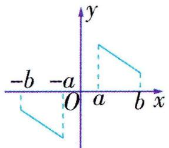</td></tr><tr><td>偶函数</td><td>在关于原点对称的区间上有相反的单调性.</td><td>在关于原点对称的区间上有相同的最大(小)值,取最值时的自变量互为相反数.</td><td>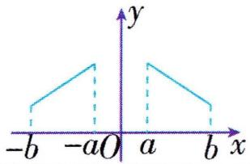</td></tr></table>

典例 1 已知函数 $f(x)$ 是偶函数, 且在区间 $[0,5]$ 上单调. 若 $f(-4) < f(-2)$ , 则 ( )

A. $f(-1) < f(3)$ B. $f(2) < f(3)$

C. $f(-3) < f(5)$ D. $f(0) > f(1)$

解析 由题意可得, 函数 $f(x)$ 在区间 $[-5,0]$ 上也单

调,再根据 $f(-4) < f(-2)$ , 可得函数 $f(x)$ 在区间 $[-5,0]$ 上单调递增, 所以函数 $f(x)$ 在区间 $[0,5]$ 上单调递减, 故 $f(-1) = f(1) > f(3), f(2) > f(3), f(-3) = f(3) > f(5), f(0) > f(1)$ . 故选 D.

▶ 答案 D

典例 2 已知函数 $f(x)$ 为奇函数,且在 $(-∞,0)$ 上单调递减. 若 $f(-2)=0$ ,则 $xf(x)<0$ 的解集为 ( )

A. $(-1,0) \cup (2, +\infty)$   
B. $(- \infty, -2) \cup (0, 2)$   
C. $(- \infty, -2) \cup (2, +\infty)$   
D. $(-2,0) \cup (0,2)$

解析 不等式 $xf(x) < 0$ 可化为 $\left\{ \begin{array}{l} x > 0, \\ f(x) < 0 \end{array} \right.$ 或 $\left\{ \begin{array}{l} x < 0, \\ f(x) > 0. \end{array} \right.$ 利用函数的性质画出函数 $f(x)$ 的简图, 如图所示, 由图可知 $x > 2$ 或 $x < -2$ , 故选 C.

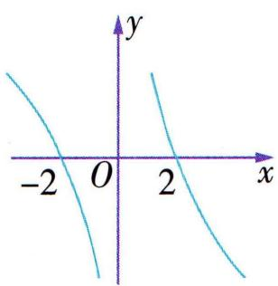

<details>
<summary>text_image</summary>

-2
O
2
x
y
</details>

▶ 答案 C

典例 3 已知函数 $f(x)=\frac{x}{x^{2}+4}, x \in (-3,3)$ ，若对任意 $x \in (-3,3)$ ，总存在 $a \in [-1,2]$ ，使得不等式 $f(x)+at+t^{2}-\frac{1}{4}<0$ 恒成立，则实数 t 的取值范围为（）

A. $(-2,0)$

B. $(-1,0) \cup (0,2)$

C. $(0,1)$

D. $(-2,0) \cup (0,1)$

解析 $f(-x) = \frac{-x}{x^2 + 4} = -f(x)$ , 则 $f(x)$ 是 $(-3, 3)$ 上的奇函数. 当 $0 < x < 3$ 时, $f(x) = \frac{1}{x + \frac{4}{x}}, f(x)$ 在 $(0, 2)$

上单调递增, 在(2,3)上单调递减, 则 $f(x)_{\max} = f(2) = \frac{1}{4}$ , 所以当 $0 < x < 3$ 时, $f(x) \in (0, \frac{1}{4}]$ . 又 $f(x)$ 为奇函数, 所以当 $-3 < x < 0$ 时, $f(x) \in [-\frac{1}{4}, 0)$ , 所以当 $x \in (-3, 3)$ 时, $f(x) \in [-\frac{1}{4}, \frac{1}{4}]$ . 又存在 $a \in [-1, 2]$ , 使得不等式 $f(x) + at + t^2 - \frac{1}{4} < 0$ 恒成立, 则存在 $a \in [-1, 2]$ , 使得 $at + t^2 - \frac{1}{4} < [-f(x)]_{\min} = -\frac{1}{4}$ , 即存在 $a \in [-1, 2]$ , 使得 $at + t^2 < 0$ . 令 $g(a) = ta + t^2$ , 则 $g(-1) = t^2 - t < 0$ 或 $g(2) = t^2 + 2t < 0$ , 解得 $0 < t < 1$ 或 $-2 < t < 0$ , 所以实数 $t$ 的取值范围为 $(-2, 0) \cup (0, 1)$ .

▶答案D

# 微专题 3 数形结合思想在函数中的应用

数形结合的思想方法就是根据数与形之间的对应关系,通过数与形的相互转化来解决数学问题的一种重要思想方法.运用数形结合思想解题,能使复杂问题简单化,抽象问题具体化,起到事半功倍之效.

典例 1（多选）已知函数 $f(x)=\left\{\begin{aligned}\sqrt{x},&0\leqslant x\leqslant4,\\ -x+6,x&>4,\end{aligned}\right.$ 若 $f(x)$ 在区间 $[a,b]$ 上的值域为 $[-2,2]$ ，则 $a+b$ 的一个可能的值为（）

A. 8

B. 11

C. 14

D. 17

解析 作出函数 $f(x)$ 的图象如图所示. 由图可知, 若函数 $f(x)$ 在区间 $[a, b]$ 上的值域为 $[-2, 2]$ , 则 $b = 8, 0 \leqslant a \leqslant 4$ , 所以 $a + b = a + 8 \in [8, 12]$ . 故选 AB.

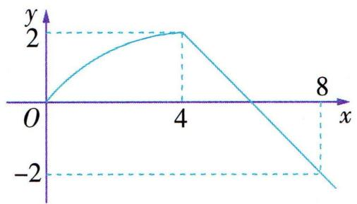

<details>
<summary>line</summary>

| x | y |
|---|---|
| 0 | 0 |
| 4 | 2 |
| 8 | -2 |
</details>

▶答案 AB

典例 2 已知函数 $f(x)=\left\{\begin{aligned}&2x+1,x>0,\\ &0,x=0,\\ &2x-1,x<0,\end{aligned}\right.$ 若不等式 $f(x-$ 1）+ $f(\frac{m}{x})>0$ 对任意的x>0恒成立，则实数m的取值范围为

A. $(-\infty, 0)$

B. $\left(\frac{1}{4},+\infty\right)$

C. $[0, +\infty)$

D. $(0, \frac{1}{4})$

解析 设 $x > 0$ , 则 $-x < 0$ , 则 $f(-x) = -2x - 1 =$

$-(2x+1)=-f(x)$ . 设 x<0，则 -x>0，则 $f(-x)=-2x+1=-(2x-1)=-f(x)$ ，所以函数 $f(x)$ 为定义

域上的奇函数,其图象如图所示.由图象可知, $f(x)$ 为定义域上的增函数.由不等式 $f(x-1)+f(\frac{m}{x})>0$ 对任意的x>0恒成立,即 $f(\frac{m}{x})>-f(x-1)=$

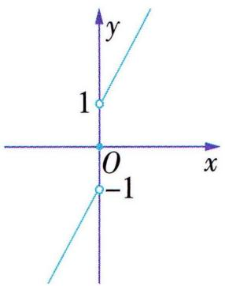

<details>
<summary>text_image</summary>

y
1
O
x
-1
</details>

$f(1-x)$ 对任意的x>0恒成立,即 $\frac{m}{x}>1-x$ 对任意的x>0恒成立,可得 $m> - x^{2}+x$ 对任意的x>0恒成立.
又 $-x^{2} + x = -(x - \frac{1}{2})^{2} + \frac{1}{4} \leqslant \frac{1}{4}$ ，当且仅当 $x = \frac{1}{2}$ 时取等号，所以 $m > \frac{1}{4}$ .

▶ 答案 B

典例 3 函数 $f(x)=x|x-a|$ 在区间 $(0,1)$ 上既有最大值又有最小值，则实数 a 的取值范围是（）

A. $[-2\sqrt{2} - 2,0)$

B. $(0, 2\sqrt{2} - 2)$

C. $\left[\frac{\sqrt{2}}{2}, 1\right)$

D. $[2\sqrt{2} - 2, 1)$

解析 函数 $f(x) = x \mid x - a \mid = \begin{cases} x^2 - ax, & x \geqslant a, \\ -x^2 + ax, & x < a. \end{cases}$ 若 $a = 0$ , 则 $f(x) = \begin{cases} x^2, & x \geqslant 0, \\ -x^2, & x < 0, \end{cases}$ 且函数 $f(x)$ 在 (0,1) 上单调递增,所以函数 $f(x)$ 在(0,1)上无最值.若a<0,作出函数 $f(x)$ 的大致图象,如图1所示,易得函数 $f(x)$ 在区间(0,1)上无最值.若a>0,作出函数 $f(x)$ 的大致图象,如图2所示,要使函数 $f(x)$ 在区间(0,1)上既有最

大值又有最小值,则 $\left\{\begin{aligned}0<a<1,\\ f(1)\leqslant&f(\frac{a}{2}),\end{aligned}\right.$

即 $\left\{\begin{aligned}0<a<1,\\ 1-a\leqslant-\left(\frac{a}{2}\right)^{2}+\frac{a^{2}}{2},\end{aligned}\right.$ 解得 $2\sqrt{2}-2\leqslant a<1.$

综上,实数 a 的取值范围是 $[2\sqrt{2}-2,1)$ .

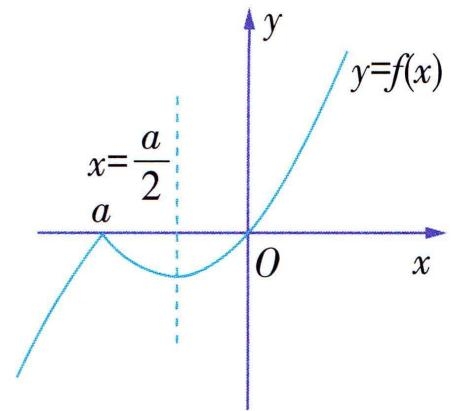

<details>
<summary>text_image</summary>

y
y=f(x)
x=\frac{a}{2}
a
O
x
</details>

图 1

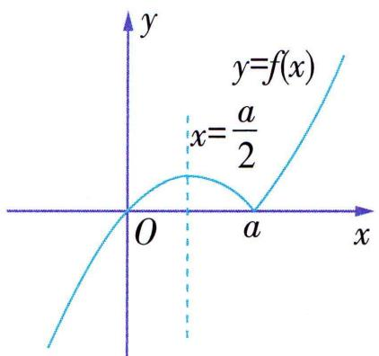

<details>
<summary>text_image</summary>

y
y=f(x)
x=\frac{a}{2}
O
a
x
</details>

图 2

▶ 答案 D

典例 4 （多选）已知 $f(x)=\left\{\begin{aligned}x^{2}+4x,x&<0,\\ -x^{2}+ax,x&\geqslant0,\end{aligned}\right.$ 且 $f(-x)=-f(x)$ 对于一切 $x \in R$ 恒成立，若 $f(x)$ 在 $[m, n]$ 上的值域为 $[-4,4]$ ，则（）

A. $a = -4$   
B. $f(f(5))=5$   
C. $|m - n|$ 的最大值为 $4 + 4\sqrt{2}$   
D. $|m - n|$ 的最小值为 4

解析 由 $f(-x) = -f(x)$ 对于一切 $x \in \mathbb{R}$ 恒成立得 $f(1) = -f(-1)$ ，代入得 $-1 + a = -(1 - 4) \Rightarrow a = 4$ ，故 A 错误； $f(5) = -25 + 4 \times 5 = -5$ ，所以 $f(f(5)) = f(-5) = 5$ ，故 B 正确；由奇函数定义知 $f(0) = 0$ ，所以当 $x \geqslant 0$ 时， $f(x) = -x^2 + 4x = -(x - 2)^2 + 4$ ，当 $x < 0$ 时， $f(x) = x^2 + 4x$ ，画出 $f(x)$ 的图象，如图，令 $f(x) = 4$ ，解得 $x = 2$ 或 $x = -2 - 2\sqrt{2}$ ，令 $f(x) = -4$ ，解得 $x = -2$ 或 $x = 2 + 2\sqrt{2}$ ，由图象可知，要使值域为 $[-4, 4]$ ， $|m - n|_{\max} = |-2 - 2\sqrt{2} - (2 + 2\sqrt{2})| = 4 + 4\sqrt{2}$ ， $|m - n|_{\min} = |-2 - 2\sqrt{2} - (-2)| = 2\sqrt{2}$ ，故 C 正确，D 错误。

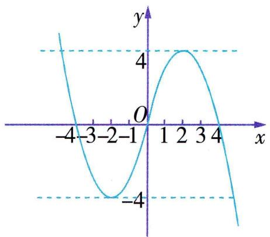

<details>
<summary>line</summary>

| x  | y  |
|----|----|
| -4 | 5  |
| -3 | 0  |
| -2 | -4 |
| -1 | 0  |
| 0  | 0  |
| 1  | 4  |
| 2  | 5  |
| 3  | 0  |
| 4  | -5 |
</details>

▶ 答案 BC

# 第三节 幂函数


# 学·核心知识

# 知识点① 幂函数的概念

一般地, 函数 $y = x^{\alpha}$ 叫作幂函数, 其中 x 是自变量, $\alpha$ 是常数.

$x^{\alpha}$ 的系数为 1.

知识点② 幂函数的图象与性质 

<table><tr><td>特征性质\特征\函数</td><td> $y = x$ </td><td> $y = x^{2}$ </td><td> $y = x^{3}$ </td><td> $y = x^{\frac{1}{2}}$ </td><td> $y = x^{-1}$ </td></tr><tr><td>定义域</td><td>R</td><td>R</td><td>R</td><td> $[0, +\infty)$ </td><td> $(-\infty, 0) \cup (0, +\infty)$ </td></tr><tr><td>值域</td><td>R</td><td> $[0, +\infty)$ </td><td>R</td><td> $[0, +\infty)$ </td><td> $(-\infty, 0) \cup (0, +\infty)$ </td></tr><tr><td>奇偶性</td><td>奇函数</td><td>偶函数</td><td>奇函数</td><td>既不是奇函数也不是偶函数</td><td>奇函数</td></tr><tr><td>单调性</td><td>增函数</td><td>在区间 $[0, +\infty)$ 上单调递增;在区间 $(-\infty, 0]$ 上单调递减.</td><td>增函数</td><td>增函数</td><td>在区间 $(-\infty, 0)$ 和 $(0, +\infty)$ 上单调递减.</td></tr><tr><td>过定点</td><td colspan="5">(1,1)</td></tr></table>

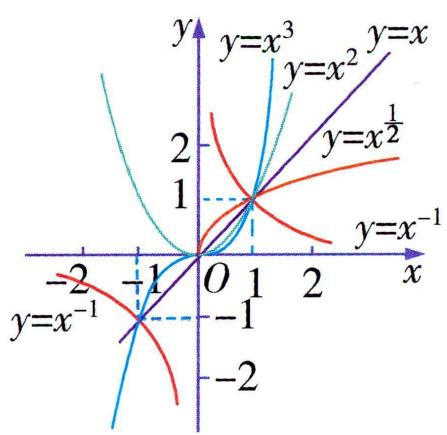

<details>
<summary>line</summary>

| x    | y=x³  | y=x²  | y=x¹/² | y=x⁻¹ |
| ---- | ----- | ----- | ------ | ----- |
| -2   | -     | -     | -      | -     |
| -1   | 2     | 0     | 0      | -     |
| 0    | 1     | 1     | 1      | 0     |
| 1    | 0     | 2     | 2      | 1     |
| 2    | -     | 3     | 3      | 2     |
| 3    | -     | 4     | 4      | 3     |
| 4    | -     | 5     | 5      | 4     |
| 5    | -     | 6     | 6      | 5     |
| 6    | -     | 7     | 7      | 6     |
| 7    | -     | 8     | 8      | 7     |
| 8    | -     | 9     | 9      | 8     |
| 9    | -     | 10    | 10     | 9     |
| 10   | -     | 11    | 11     | 10    |
| 11   | -     | 12    | 12     | 11    |
| 12   | -     | 13    | 13     | 12    |
| 13   | -     | 14    | 14     | 13    |
| 14   | -     | 15    | 15     | 14    |
| 15   | -     | 16    | 16     | 15    |
| 16   | -     | 17    | 17     | 16    |
| 17   | -     | 18    | 18     | 17    |
| 18   | -     | 19    | 19     | 18    |
| 19   | -     | 20    | 20     | 19    |
| 20   | -     | 21    | 21     | 20    |
| 21   | -     | 22    | 22     | 21    |
| 22   | -     | 23    | 23     | 22    |
| 23   | -     | 24    | 24     | 23    |
| 24   | -     | 25    | 25     | 24    |
| 25   | -     | 26    | 26     | 25    |
| 26   | -     | 27    | 27     | 26    |
| 27   | -     | 28    | 28     | 27    |
| 28   | -     | 29    | 29     | 28    |
| 29   | -     | 30    | 30     | 29    |
| 30   | -     | 31    | 31     | 30    |
| 31   | -     | 32    | 32     | 31    |
| 32   | -     | 33    | 33     | 32    |
| 33   | -     | 34    | 34     | 33    |
| 34   | -     | 35    | 35     | 34    |
| 35   | -     | 36    | 36     | 35    |
| 36   | -     | 37    | 37     | 36    |
| 37   | -     | 38    | 38     | 37    |
| 38   | -     | 39    | 39     | 38    |
| 39   | -     | 40    | 40     | 39    |
| 40   | -     |        |        |       |
|            |       |       |        |       |
|            |       |       |        |       |
|            |       |       |        |       |
|            |       |       |        |       |
|            |       |       |        |       |
|            |       |       |        |       |
|            |       |       |        |       |
|            |       |       |        |       |
|            |       |       |        |       |
|            |       |       /       (at x=0) for x=-1, x=1, x=2, x=3, x=4, x=5, x=6, x=7, x=8, x=9, x=10, x=11, x=12, x=13, x=14, x=15, x=16, x=17, x=18, x=19, x=20, x=21, x=22, x=23, x=24, x=25, x=26, x=27, x=28, x=29, x=30, x=31, x=32, x=33, x=34, x=35, x=36, x=37, x=38, x=39, x=40, x=41, x=42, x=43, x=44, x=45, x=46, x=47, x=48, x=49, x=50, x=51, x=52, x=53, x=54, x=55, x=56, x=57, x=58, x=59, x=60, x=61, x=62, x=63, x=64, x=65, x=66, x=67, x=68, x=69, x=70, x=71, x=72, x=73, x=74, x=75, x=76, x=77, x=78, x=79, x=80, x=81, x=82, x=83, x=84, x=85, x=86, x=87, x=88, x=89, x=90, x=91, x=92, x=93, x=94, x=95, x=96, x=97, x=98, x=99,         y = -x^(-1) for all other points. The chart is a line graph of the output of the hyperbola. <|caption_end|>
<|content_start|>| Point Label (x)                                                                                     | y = -x^(-1) or (x) = +x^(-1) or (x) = +x^(-1) or (x) = +x^(-1) or (x) = +x^(-1) or (x) = +x^(-1) or (x) = +x^(-1) or (x) = +x^(-1) or (x) = +x^(-1) or (x) = +x^(-1) or (x) = +y^(-x^(-1)) / (x) = y = y^(-x^(-1)) / (x) = y = y^(-x^(-1)) / (x) = y = y^(-x^(-1)) / (x) = y = y^(-x^(-1)) / (x) = y = y^(-x^(-1)) / (x) = y = y^(-x^(-1)) / (x) = y = y^(-x^(-1)) / (y) = y = y^(-x^(-1)) / (y) = y = y^(-x^(-1)) / (y) = y = y^(-x^(-1)) / (y) = y = y^(-x^(-1)) / (y) = y = y^(-x^(-1)) / (y) = y = y^(-x^(-1)) / (y) = y = y^(-x^-(x)-y)^(-x^(-1)) / (y) = y^(-x^(-1)) / (y) = y^(-x^(-1)) / (y) = y^(-x^(-1)) / (y) = y = y^(-x^(-1)) / (y) = y = y^(-x^(-1)) / (y) = y = y^(-x^(-1)) / (y) = y = y^(-x^-(x)-y)^(-x^(-1)) / (y) = y^(-x^(-1)) / (y) = y^(-x\(^{-1}\)) / (y) = y^(-x\(^{-1}\)) / (y) = y^(-x\(^{-1}\)) / (y) = y^(-x\(^{-1}\)) / (y) = y^(-x\(^{-1}\)) / (y) = y^(-x\(^{-1}\)) / (y) = y^(-x\(^{-1}\)) / (y) = y^(-y\(^{-1}\)) / (y) = y^(-y\(^{-1}\)) / (y) = y^(-y\(^{-1}\)) / (y) = y^(-y\(^{-1}\)) / (y) = y^(-y\(^{-1}\)) / (y) = y^(-y\(^{-1}\)) / (y) = y^(-y\(^{-1}\)) / (y)=y\(^{-x^{(-1)}}\) / (y)=y\(^{-x^{(-1)}}\) / (y)=y\(^{-x^{(-1)}}\) / (y)=y\(^{-x^{(-1)}}\) / (y)=y\(^{-x^{(-1)}}\) / (y)=y\(^{-x^{(-1)}}\) / (y)=y\(^{-x^{(-1)}}\) / (y)=y\(^{-x^{(-}}\) / (y)=y\(^{-x^{(-)}\) / (y)=y\(^{-x^{(-)}}\)/(y)=y\(^{-x^{(-)}}\)/(y)=y\(^{-x^{(-)}}\)/(y)=y\(^{-x^{(-)}}\)/(y)=y\(^{-x^{(-)}}\)/(y)=y\(^{-x^{(-)}}\)/(y)=y\(^{-x^{(-)}}\)/(y)=y\(^{-x^{(-)}}\)/(y)=y\(^{-x^{(\text{元})}}\) / (y)=y\(^{-x^{(\text{元})}}\) / (y)=y\(^{-x^{(\text{元})}}\) / (y)=y\(^{-x^{(\text{元})}}\) / (y)=y\(^{-x^{(\text{元})}}\) / (y)=y\(^{-x^{(\text{元})}}\) / (y)=y\(^{-x^{(\text{元})}})\n\n        [Line Chart: Lines for different functions of the hyperbola are not explicitly labeled in the code; the lines are labeled with mathematical notations like 'a', 'b', 'c', etc.]
</details>

温馨提示 (1) 所有的幂函数在 $(0, +\infty)$ 上都有定义, 并且图象都过点 $(1, 1)$ .

(2) 当 $\alpha > 0$ 时, 幂函数的图象都过原点, 且在区间 $[0, +\infty)$ 上单调递增; 当 $\alpha < 0$ 时, 幂函数在区间 $(0, +\infty)$ 上单调递减.  
(3)无论 $\alpha$ 为何值,幂函数的图象一定经过第一象限,一定不经过第四象限.  
(4) 若幂函数的图象与坐标轴相交, 则交点一定是原点.


# 思·要点突破

# 要点 • 幂函数的图象与性质的应用

典例 1 幂函数 $f(x) = x^{3m - 5} (m \in \mathbb{N})$ 在 $(0, +\infty)$ 上单调递减，且 $f(-x) = f(x)$ ，则 $m =$ \_\_\_\_.

解析 因为 $f(x) = x^{3m - 5} (m \in \mathbb{N})$ 在 $(0, +\infty)$ 上单调递减, 所以 $3m - 5 < 0$ , 故 $m < \frac{5}{3}$ . 又 $m \in \mathbb{N}$ , 所以 $m = 0$ 或 $m = 1$ . 当 $m = 0$ 时, $f(x) = x^{-5}, f(-x) \neq f(x)$ , 不符合题意; 当 $m = 1$ 时, $f(x) = x^{-2}, f(-x) = f(x)$ , 符合题意. 综上, 知 $m = 1$ .

▶ 答案 1

典例 2 已知幂函数 $f(x)=(m^{2}-3m+3)x^{m+1}(m\in\mathbf{R})$ 为奇函数.

(1) 求 $f(2)$ 的值;

(2) 若 $f(2a-1) > f(a)$ ，求 $a + \frac{4}{a-1}$ 的最小值.

解析（1）由题知， $m^{2}-3m+3=1$ ，解得 m=2 或 m=1。

当 m=1 时, $f(x)=x^{2}$ 为偶函数,不满足题意,舍去.

当 m=2 时, $f(x)=x^{3}$ 为奇函数,

所以 $f(2)=2^{3}=8.$

(2)由(1)知函数 $f(x)=x^{3}$ ，在R上单调递增，所以2a-1>a，解得a>1.

所以 $a + \frac{4}{a - 1} = a - 1 + \frac{4}{a - 1} + 1 \geqslant 2\sqrt{(a - 1) \cdot \frac{4}{a - 1}} + 1 = 5,$

当且仅当 $a-1=\frac{4}{a-1}$ ，即 a=3 时，等号成立.

故 $a + \frac{4}{a - 1}$ 的最小值为5.

# 第四节 函数的应用(一)


# 学·核心知识

知识点① 几类常见的函数模型

<table><tr><td>函数模型</td><td>函数解析式</td><td rowspan="4"></td><td>函数模型</td><td>函数解析式</td></tr><tr><td>一次函数模型</td><td>f(x) = ax + b (a, b 为常数, a ≠ 0)</td><td>幂函数模型</td><td>f(x) = ax^n + b (a, b, n 为常数, a ≠ 0)</td></tr><tr><td>二次函数模型</td><td>f(x) = ax^2 + bx + c (a, b, c 为常数, a ≠ 0)</td><td>对勾函数模型</td><td>f(x) = ax + 1/bx (a ≠ 0, b ≠ 0)</td></tr><tr><td>反比例函数模型</td><td>f(x) = k/x + b (k, b 为常数, k ≠ 0)</td><td>分段函数模型</td><td>f(x) = {f1(x), x ∈ D1, f2(x), x ∈ D2, ...... fn(x), x ∈ Dn}</td></tr></table>

# 知识点② 函数模型的应用

# 建立函数模型解决实际问题的步骤

(1)审题. 找出已知条件,建立条件与问题的关系.  
(2) 建模. 引进数学符号, 建立数学模型.  
(3) 求模. 利用函数的知识对得到的数学模型予以解答.  
(4)还原. 将数学问题的解代入实际问题进行检验, 舍去不合题意的解, 并作答.

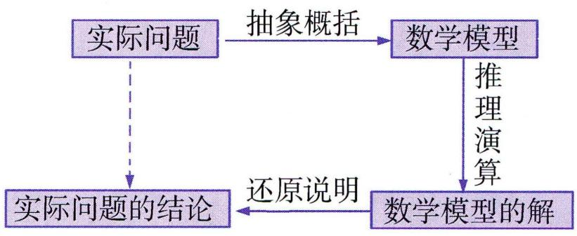

<details>
<summary>flowchart</summary>

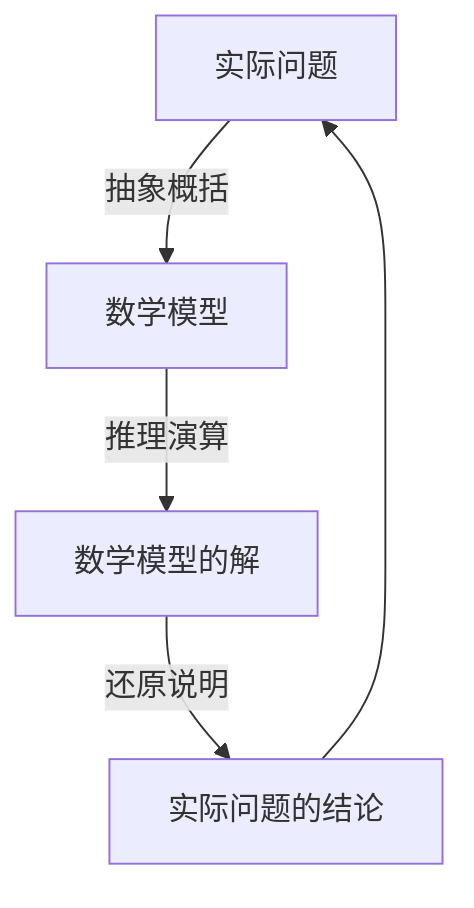
</details>

# 思·要点突破

# 要点 函数模型的应用

典例 1 某公司为改善营运环境,年初以 50 万元的价格购进一辆豪华客车. 已知该客车每年的营运总收入为 30 万元, 使用 x 年 $(x \in \mathbf{N}^{*})$ 所需的各种费用总计为 $(2x^{2} + 6x)$ 万元.

(1)该车营运第几年开始赢利(总收入超过总支出,今年为第一年)?  
(2)该车若干年后有两种处理方案:

①当赢利总额达到最大值时,以10万元价格卖出;  
②当年平均赢利总额达到最大值时,以 12 万元的价格卖出.

问:哪一种方案较为合算?并说明理由.

解析 (1) 已知客车每年的营运总收入为 30 万元, 使用 $x$ 年 $(x \in \mathbf{N}^{*})$ 所需的各种费用总计为 $(2x^{2} + 6x)$ 万元, 若该车第 $x$ 年开始赢利, 则 $30x > 2x^{2} + 6x + 50$ , 即 $x^{2} - 12x + 25 < 0$ , 因为 $x \in \mathbf{N}^{*}$ , 所以 $3 \leqslant x \leqslant 9, x \in \mathbf{N}^{*}$ , 所以该车营运第 3 年开始赢利.

(2) 方案①: 赢利总额 $y_{1} = 30x - (2x^{2} + 6x + 50) = -2x^{2} + 24x - 50 = -2(x - 6)^{2} + 22$ , 所以 $x = 6$ 时赢利总额达到最大值为 22 万元,

故6年后卖出客车,可获利润总额为 $22+10=32$ (万元).

方案②:年平均赢利总额 $y_{2}=\frac{-2x^{2}+24x-50}{x}=-2x-\frac{50}{x}+24=24-2\left(x+\frac{25}{x}\right)\leqslant4$ (当且仅当 x=5 时取等号), 所以 x=5 时年平均赢利总额达到最大值 4 万元,

故5年后卖出客车,可获利润总额为 $4 \times 5 + 12 = 32$ (万元). 因为两种方案的利润总额一样,但方案②的时间短,所以方案②合算.

典例 2 据气象中心观察和
预测: 发生于 M 地的沙尘暴
一直向正南方向移动, 其移动
速度 $v(\mathrm{km} \cdot \mathrm{h}^{-1})$ 与时间 $t(\mathrm{h})$ 的函数关系如图所示, 过线段

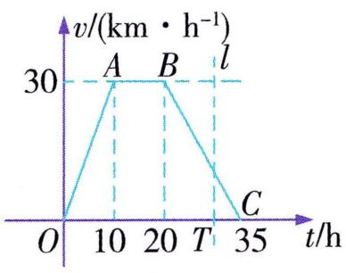

<details>
<summary>line</summary>

| Point | Time (t/h) | Velocity (v/(km·h⁻¹)) |
|---|---|---|
| A | 10 | 30 |
| B | 20 | 30 |
| C | 35 | 0 |
</details>

$OC$ 上一点 $T(t,0)$ 作横轴的垂线 $l$ , 梯形 $OABC$ 在直线 $l$ 左侧部分的面积即 $t(\mathrm{h})$ 内沙尘暴所经过的路程 $s(\mathrm{km})$ .

(1) 当 t=4 时, 求 s 的值.  
(2) 将 s 随 t 变化的规律用函数解析式表示出来.  
(3) 若 N 城位于 M 地正南方向, 且距 M 地650 km, 试判断这场沙尘暴是否会侵袭到 N 城. 如果会, 在沙尘暴发生后多长时间它将侵袭到 N 城? 如果不会, 请说明理由.

解析 (1) 由图象, 可知当 $t = 4$ 时, $v = 3 \times 4 = 12$ ,

所以 $s=\frac{1}{2}\times4\times12=24.$

(2) 当 $0 \leqslant t \leqslant 10$ 时, $s = \frac{1}{2} \cdot t \cdot 3t = \frac{3}{2} t^2$ ;

当 $10 < t \leqslant 20$ 时, $s = \frac{1}{2} \times 10 \times 30 + 30 (t - 10) = 30t - 150$ ;

当 $20 < t \leqslant 35$ 时, $s = \frac{1}{2} \times 10 \times 30 + 10 \times 30 + (t - 20) \times 30 - \frac{1}{2} \times (t - 20) \times 2(t - 20) = -t^2 + 70t - 550.$

综上, 可知 $s = \begin{cases} \frac{3}{2} t^{2}, & t \in [0, 10], \\ 30t - 150, & t \in (10, 20], \\ -t^{2} + 70t - 550, & t \in (20, 35]. \end{cases}$

(3) 这场沙尘暴会侵袭到 N 城.

当 $t \in [0,10]$ 时， $s_{\max} = \frac{3}{2} \times 10^2 = 150 < 650$

当 $t \in (10, 20]$ 时, $s_{\max} = 30 \times 20 - 150 = 450 < 650$ ,

当 $t \in (20, 35]$ 时，令 $-t^2 + 70t - 550 = 650$

解得 $t_{1}=30, t_{2}=40.$

因为 $20 < t \leqslant 35$ ，所以 $t = 30$ ，

所以沙尘暴发生 $30 \mathrm{~h}$ 后将侵袭到 $\mathrm{N}$ 城.

# 第一节 指数


# 学·核心知识

# 知识点·指数

<table><tr><td rowspan="2">n次方根</td><td>定义</td><td colspan="3">一般地,如果xn=a,那么x叫作a的n次方根,其中n&gt;1,且n∈N*.</td></tr><tr><td>性质</td><td colspan="3">(1)当n是奇数时,正数的n次方根是一个正数,负数的n次方根是一个负数.这时,a的n次方根用符号√n/a表示.(2)当n是偶数时,正数的n次方根有两个,这两个数互为相反数.这时,正数a的正的n次方根用符号√n/a表示,负的n次方根用符号-√n/a表示.正的n次方根与负的n次方根可以合并写成±√n/a(a&gt;0).(3)负数没有偶次方根.(4)0的任何次方根都是0,记作√n/0=0.</td></tr><tr><td rowspan="2">根式</td><td>定义</td><td colspan="3">式子√n/a叫作根式,这里的n叫作根指数,a叫作被开方数.</td></tr><tr><td>性质</td><td colspan="3">(1)(√n/a)n=a(n∈N*,且n&gt;1);(2)√n/√a^n=a,n为大于1的奇数,|a|,n为大于0的偶数.</td></tr><tr><td rowspan="3">分数指数幂</td><td colspan="2">正分数指数幂</td><td>am/n=√n/√a^m</td><td rowspan="2">a&gt;0,m,n∈N*,n&gt;1.</td></tr><tr><td colspan="2">负分数指数幂</td><td>a-m/n=1/a^m/n=1/√a^m</td></tr><tr><td colspan="2">0的分数指数幂</td><td colspan="2">0的正分数指数幂等于0,0的负分数指数幂没有意义.</td></tr><tr><td>有理数指数幂运算法则</td><td colspan="4">ar/s = ar+s (a&gt;0,r,s∈Q); (ar)s = ars (a&gt;0,r,s∈Q); (ab)^r = arb^r (a&gt;0,b&gt;0,r∈Q).</td></tr><tr><td>无理数指数幂</td><td colspan="4">一般地,无理数指数幂α (a&gt;0,α是无理数)是一个确定的实数.有理数指数幂的运算性质同样适用于无理数指数幂.</td></tr></table>


# 温馨提示

$\sqrt[n]{a^n}$ 与 $(\sqrt[n]{a})^n (n\in \mathbf{N}^*,n > 1)$ 的区别

(1) $\sqrt[n]{a^n} (n \in \mathbf{N}^*, n > 1)$ 是实数 $a^n$ 的 $n$ 次方根, 是一个恒有意义的式子, $a \in \mathbb{R}$ , 不受 $n$ 的奇偶限制, 但这个式子的值受 $n$ 的奇偶限制. $(\sqrt[n]{a})^n (n \in \mathbf{N}^*, n > 1)$ 是实数 $a$ 的 $n$ 次方根的 $n$ 次幂, 其中实数 $a$ 的取值由 $n$ 的奇偶决定, 且当 $n$ 为奇数时, $a \in \mathbb{R}$ , 当 $n$ 为偶数时, $a \geqslant 0$ .  
(2) $\sqrt[n]{a^n}$ 的算法是对 $a$ 先乘方, 再开方 (都是 $n$ 次), 结果不一定等于 $a$ . 当 $n$ 为奇数时, $\sqrt[n]{a^n} = a$ ; 当 $n$ 为偶数时, $\sqrt[n]{a^n} = |a| = \begin{cases} a, & a \geqslant 0, \\ -a, & a < 0. \end{cases} (\sqrt[n]{a})^n$ 的算法是对 $a$ 先开方, 再乘方 (都是 $n$ 次), 结果恒等于 $a$ .


# 思·要点突破

# 要点① 分数指数幂与根式的互化

# 分数指数幂与根式互化的关键与技巧

1. 关键: 灵活应用 $a^{\frac{m}{n}} = \sqrt[n]{a^{m}}, a^{-\frac{m}{n}} = \frac{1}{\sqrt[n]{a^{m}}} (a > 0, m, n \in \mathbf{N}^{*}, m, n$ 互质, 且 $n > 1$ ).  
2. 技巧: 当代数式中的根号较多时, 要搞清被开方数, 由内向外 (或由外向内) 用分数指数幂的形式写出来, 再利用相关的运算性质进行化简.

典例 1 $\sqrt{\frac{a^2}{b}\sqrt{\frac{b^3}{a}\sqrt{\frac{a}{b^3}}}} (a > 0, b > 0)$ 用分数指数幂可表示为 \_\_\_\_.

解析 方法一(由内向外化)

原式 $= \sqrt{\frac{a^2}{b}\sqrt{\frac{b^3}{a}\cdot\left(\frac{a}{b^3}\right)^{\frac{1}{2}}}} = \sqrt{\frac{a^2}{b}\cdot\left(\frac{b^3}{a}\cdot\frac{a^{\frac{1}{2}}}{b^{\frac{3}{2}}}\right)^{\frac{1}{2}}} =$

$$
\begin{array}{l} \sqrt {\frac {a ^ {2}}{b} \cdot \left(\frac {b ^ {3}}{a}\right) ^ {\frac {1}{2}} \cdot \left(\frac {a ^ {\frac {1}{2}}}{b ^ {\frac {3}{2}}}\right) ^ {\frac {1}{2}}} = \sqrt {\frac {a ^ {2}}{b} \cdot \frac {b ^ {\frac {3}{2}}}{a ^ {\frac {1}{2}}} \cdot \frac {a ^ {\frac {1}{4}}}{b ^ {\frac {3}{4}}}} = (a ^ {2 + \frac {1}{4} - \frac {1}{2}} \cdot \\ \left. b ^ {\frac {3}{2} - 1 - \frac {3}{4}}\right) ^ {\frac {1}{2}} = \left(a ^ {\frac {7}{4}} b ^ {- \frac {1}{4}}\right) ^ {\frac {1}{2}} = a ^ {\frac {7}{8}} b ^ {- \frac {1}{8}}. \\ \end{array}
$$

方法二(由外向内化)

$$
\sqrt {\frac {a ^ {2}}{b} \sqrt {\frac {b ^ {3}}{a} \sqrt {\frac {a}{b ^ {3}}}}} = (\frac {a ^ {2}}{b} \sqrt {\frac {b ^ {3}}{a} \sqrt {\frac {a}{b ^ {3}}}}) ^ {\frac {1}{2}} = [ \frac {a ^ {2}}{b} \cdot
$$

$$
\left(\frac {b ^ {3}}{a} \sqrt {\frac {a}{b ^ {3}}}\right) ^ {\frac {1}{2}} ] ^ {\frac {1}{2}} = \{\frac {a ^ {2}}{b} \left[ \frac {b ^ {3}}{a} \left(\frac {a}{b ^ {3}}\right) ^ {\frac {1}{2}} \right] ^ {\frac {1}{2}} \} ^ {\frac {1}{2}} = \left(\frac {a ^ {2}}{b}\right) ^ {\frac {1}{2}}.
$$

$$
\left(\frac {b ^ {3}}{a}\right) ^ {\frac {1}{4}} \cdot \left(\frac {a}{b ^ {3}}\right) ^ {\frac {1}{8}} = \frac {a}{b ^ {\frac {1}{2}}} \cdot \frac {b ^ {\frac {3}{4}}}{a ^ {\frac {1}{4}}} \cdot \frac {a ^ {\frac {1}{8}}}{b ^ {\frac {3}{8}}} = a ^ {\frac {7}{8}} b ^ {- \frac {1}{8}}.
$$

▶答案 $a^{\frac{7}{8}}b^{-\frac{1}{8}}$

# 要点② 指数幂的运算

# 1. 指数幂的运算过程遵循的原则

(1) 负指数化为正指数；  
(2) 根式化为分数指数幂;  
(3)底数与指数是小数的化为分数;   
(4) 当底数为负数, 指数为奇数时, 将底数中的负号放至括号外; 当底数为负数, 指数为偶数时, 直接去掉负号.

# 2. 指数幂的化简结果的要求

有关有理数指数幂的化简结果不要同时含有根式和分数指数幂,也不要既有分母又含有负指数幂,即尽量化成最简结果.

典例 2 求下列各式的值:

(1) $0.027^{-\frac{1}{3}} - \left(-\frac{1}{7}\right)^{-2} + \left(2\frac{7}{9}\right)^{\frac{1}{2}} - (\sqrt{2} - \sqrt{5})^0;$   
(2) $0.064^{-\frac{1}{3}} - (-\frac{7}{2})^0 + [(-2)^{-\frac{4}{3}}]^3 + 16^{-0.75} + | -0.01|^{\frac{1}{2}};$   
(3) $(-2\frac{4}{5})^0 + 3^{-2} \times (2\frac{1}{4})^{-\frac{1}{2}} - 0.001^{\frac{1}{3}};$   
(4) $4^{\sqrt{2}+1}\times2^{3-2\sqrt{2}}\times8^{-\frac{2}{3}}.$

解析（1）原式 $= \left(\frac{27}{1000}\right)^{-\frac{1}{3}} - (-1)^{-2}\left(\frac{1}{7}\right)^{-2} + \left(\frac{25}{9}\right)^{\frac{1}{2}} -$ $1 = \frac{10}{3} -49 + \frac{5}{3} -1 = -45.$

(2) 原式 $= \left(\frac{64}{1000}\right)^{-\frac{1}{3}} - 1 + (-2)^{-4} + 2^{-3} + \frac{1}{10} = \frac{10}{4} - 1 + \frac{1}{16} + \frac{1}{8} + \frac{1}{10} = \frac{143}{80}$ .  
(3) 原式 $= 1 + \frac{1}{9} \times \left(\frac{4}{9}\right)^{\frac{1}{2}} - \left(\frac{1}{1000}\right)^{\frac{1}{3}} = 1 + \frac{2}{27} - \frac{1}{10} = \frac{263}{270}$ .  
(4) 原式 $= (2^{2})^{\sqrt{2} + 1} \times 2^{3 - 2\sqrt{2}} \times (2^{3})^{-\frac{2}{3}} = 2^{2\sqrt{2} + 2} \times 2^{3 - 2\sqrt{2}} \times 2^{-2} = 2^{2\sqrt{2} + 2 + 3 - 2\sqrt{2} - 2} = 2^{3} = 8.$

# 要点 ③ 有关指数幂的条件求值

有关指数幂的条件求值问题,不需要将未知数一一求解出来,只需认真分析已知式和所求式的结构特征,通过变形并结合乘法公式把它们联系起来,然后采用“整体代换”或“先求值后代换”的方法求值.

典例 3 已知 $2^{x} + 2^{-x} = 5$ , 求:

(1) $4^{x}+4^{-x}$ ;   
(2) $8^{x}+8^{-x}$ .

解析 $(1)4^{x} + 4^{-x} = (2^{2})^{x} + (2^{2})^{-x} = (2^{x})^{2} + (2^{-x})^{2} =$   
$(2^{x} + 2^{-x})^{2} - 2 = 5^{2} - 2 = 23.$   
(2) $8^{x}+8^{-x}=(2^{3})^{x}+(2^{3})^{-x}=(2^{x})^{3}+(2^{-x})^{3}=(2^{x}+2^{-x})[(2^{x})^{2}-2^{x}\times2^{-x}+(2^{-x})^{2}]=(2^{x}+2^{-x})(4^{x}+4^{-x}-1)=5\times(23-1)=110.$

# 名师点评

形如 $a^x + a^{-x} (a > 0$ 且 $a \neq 1)$ 的代数式,通常用平方法进行解决,平方后观察条件和结论的关系,变形求解即可.本题中用到了两个公式 $(a+b)^{2}=a^{2}+2ab+b^{2},a^{3}+b^{3}=(a+b)(a^{2}-ab+b^{2})$ .

# 第二节 指数函数


# 学·核心知识

# 知识点① 指数函数的概念

<table><tr><td>定义</td><td>结构特征</td></tr><tr><td>一般地,函数 $y = a^x$ (a&gt;0,且a≠1)叫作指数函数,其中指数x是自变量,函数的定义域是R.形式化定义:指数函数是定义在实数集上,且满足 $f(x)f(y) = f(x+y)$ 的非常值连续函数.</td><td>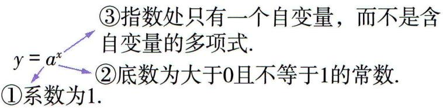注意:指数函数是形式定义,判断一个函数是指数函数的关键为上述123,且需同时满足这三点.</td></tr></table>

# 知识点② 指数函数的图象和性质

<table><tr><td> $y = a^{x}$ </td><td>a&gt;1</td><td>0</td></tr><tr><td>图象</td><td>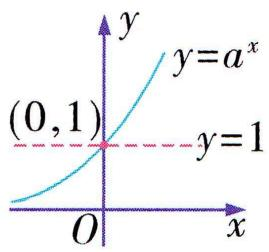</td><td>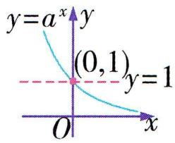</td></tr><tr><td>定义域</td><td colspan="2">R</td></tr><tr><td>值域</td><td colspan="2">(0,+∞)</td></tr><tr><td rowspan="3">性质</td><td colspan="2">过定点(0,1)</td></tr><tr><td>当x&gt;0时,y&gt;1;当x=0时,y=1;当x&lt;0时,0当x&gt;0时,0当x&lt;0时,y&gt;1.x→+∞时,y→+∞.x→-∞时,y→0.</td><td>当x&gt;0时,0当x=0时,y=1;当x&lt;0时,y&gt;1.x→+∞时,y→0.x→-∞时,y→+∞.</td></tr><tr><td>增函数</td><td>减函数</td></tr><tr><td>对称性</td><td colspan="2">函数 $y=a^{x}(a>0$ ,且 $a\neq1$ )的图象与 $y=(\frac{1}{a})^{x}$ 的图象关于y轴对称.</td></tr></table>


# 思·要点突破

# 要点① 指数函数的图象及其应用

考向1 过定点问题

<table><tr><td>解题依据</td><td>指数函数 $y = a^{x}$ (a&gt;0且 $a \neq 1$ )的图象过定点(0,1).</td></tr><tr><td>解题通法</td><td>解决形如 $y = k \cdot a^{x+c} + b$ ( $k \neq 0$ ,a&gt;0且 $a \neq 1$ )的函数图象过定点的问题,通常令 $x + c = 0$ ,即 $x = -c$ ,得 $y = k + b$ ,故函数图象过定点(-c, $k + b$ ).</td></tr></table>

典例 1-1 若函数 $f(x) = a^{x+m} + 2 (a > 0 \text{ 且 } a \neq 1)$ 的图象过定点 $(2, n)$ , 则 $\left(\frac{3}{2}\right)^m + \left(3^{-\frac{1}{3}}\right)^n =$ \_\_\_\_.

解析 因为 $f(-m) = a^{-m + m} + 2 = a^0 + 2 = 3$ ，所以函数 $f(x)$ 的图象过定点 $(-m, 3)$ ，所以 $\left\{ \begin{array}{l} -m = 2, \\ 3 = n, \end{array} \right.$ 即 $\left\{ \begin{array}{l} m = -2, \\ n = 3, \end{array} \right.$ 所以 $\left(\frac{3}{2}\right)^m + \left(3^{-\frac{1}{3}}\right)^n = \left(\frac{3}{2}\right)^{-2} + \left(3^{-\frac{1}{3}}\right)^3 = \frac{4}{9} + \frac{1}{3} = \frac{7}{9}$ .

▶答案 $\frac{7}{9}$

# 考向 2 图象的识别问题

<table><tr><td rowspan="5">识别角度</td><td>函数的定义域</td><td>判断图象的左右位置.</td></tr><tr><td>函数的值域</td><td>判断图象的上下位置.</td></tr><tr><td>函数的单调性</td><td>判断图象的变化趋势.</td></tr><tr><td>函数的奇偶性</td><td>判断图象的对称性.</td></tr><tr><td>函数的特征点</td><td>排除不符合要求的图象.</td></tr></table>

典例1-2 函数 $f(x)=\frac{2^{x}|x|}{4^{x}+1}$ 的大致图象为（）

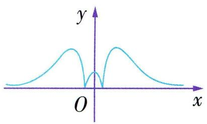

<details>
<summary>text_image</summary>

y
O
x
</details>

A

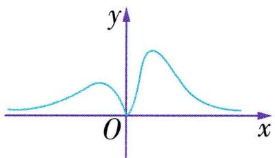

<details>
<summary>text_image</summary>

y
O
x
</details>

B

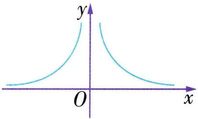

<details>
<summary>text_image</summary>

y
O
x
</details>

C

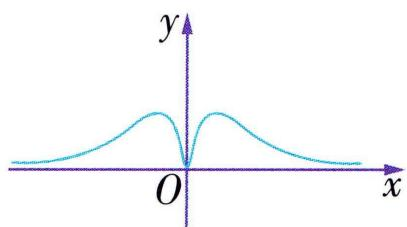

<details>
<summary>text_image</summary>

y
O
x
</details>

D

解析 $\forall x \in \mathbf{R}, 4^x + 1 > 0$ , 则函数 $f(x)$ 的定义域为 $\mathbf{R}$ , 排除 C 选项; $f(x) = \frac{|x|}{2^x + 2^{-x}}, f(-x) = \frac{| -x|}{2^{-x} + 2^x} = \frac{|x|}{2^x + 2^{-x}} = f(x)$ , 所以函数 $f(x)$ 为偶函数, 排除 B 选项; 因为 $f(0) = 0$ , 所以排除 A 选项, 故选 D.

▶ 答案 D

# 考向 3 图象的应用

对于一些指数型方程、不等式等问题的求解,一般先画出相应的指数型函数图象,再利用数形结合求解.在画指数型函数的图象时,往往会用到变换作图法.常用的变换作图法主要有以下三类:

# 1. 平移变换

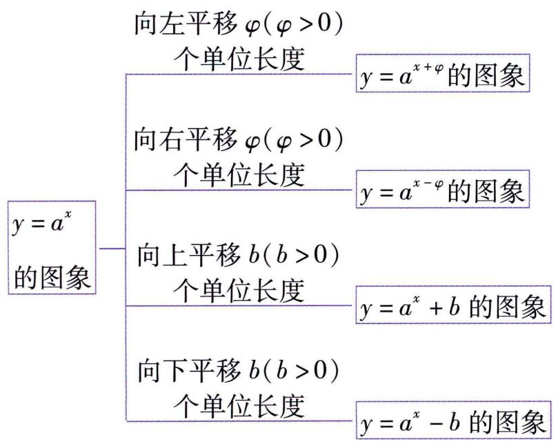

<details>
<summary>flowchart</summary>


</details>

# 2. 对称变换


<details>
<summary>flowchart</summary>


</details>

# 3. 翻折变换


<details>
<summary>flowchart</summary>


</details>

典例1-3 已知函数 $f(x) = \begin{cases} 2^x - 1, & 0 \leqslant x < 2, \\ 6 - x, & x \geqslant 2, \end{cases}$ 那么不等式 $f(x) \geqslant \sqrt{x}$ 的解集为 （）

A. $(0,1]$

B. $(0,2]$

C. $[1,4]$

D. $[1,6]$

解析 作出函数 $y = f(x)$ 与 $y = \sqrt{x}$ 的图象, 如图所示. 由图可知, 不等式 $f(x) \geqslant \sqrt{x}$ 的解集为[1,4].


<details>
<summary>line</summary>

| x | y = f(x) | y = √x |
|---|----------|--------|
| 0 | 0        | 0      |
| 1 | 1        | 1      |
| 2 | 3        | 2      |
| 4 | 2        | 2      |
| 6 | 0        | 3      |
</details>

▶ 答案 C

典例1-4（多选）已知函数 $f(x) = |5^{x} - 1|$ ，若存在实数 $m > r > n$ ，使得 $f(m) = f(n) > f(r)$ ，则 （）

A. $5^{m} + 5^{n} = 2$

B. $5^{m} + 5^{r} > 2$

C. $5^{r} + 5^{n} > 2$

D. ${5}^{r} > 2$

解析 作出函数 $f(x) = |5^{x} - 1|$ 的图象如图所示. 因为存在实数 $m > r > n$ , 使得 $f(m) = f(n) > f(r)$ , 所以由图可知 $5^{m} - 1 = 1 - 5^{n}$ , 即 $5^{m} +$


<details>
<summary>line</summary>

| x   | y   |
| --- | --- |
| n   | 1   |
| r   | 0.5 |
| O   | 0   |
| m   | 1   |
</details>

$5^{n}=2$ , A 正确. 因为函数 $y=5^{x}$ 为增函数, 所以 $5^{m}>5^{r}>5^{n}>0$ , 所以 $5^{m}+5^{r}>5^{m}+5^{n}=2$ , B 正确. $5^{r}+5^{n}<5^{m}+5^{n}=2$ , C 错误. $5^{r}<5^{m}<5^{m}+5^{n}=2$ , D 错误.

▶ 答案 AB

典例1-5 若函数 $f(x) = 2^{|x - a|} (a \in \mathbb{R})$ 满足 $f(1 + x) = f(1 - x)$ ，且 $f(x)$ 在 $[m, +\infty)$ 上单调递增，则实数 $m$ 的最小值为 \_\_\_\_.

解析 因为 $f(1+x)=f(1-x)$ ，所以函数 $f(x)$ 的图象关于直线x=1对称，所以a=1。作出函数 $f(x)=2^{|x-1|}$ 的图结合图象平移变换得到。


<details>
<summary>text_image</summary>

y
O 1 x
</details>

象,如图所示. 因为函数 $f(x)$ 在 $[m,$

$+\infty$ ) 上单调递增, 所以 $m \geqslant 1$ , 所以实数 m 的最小值为 1.

▶ 答案 1

# 要点② 指数函数的性质及其应用

考向 1 比较指数式的大小

<table><tr><td>类型</td><td>方法</td></tr><tr><td>底数相同,指数不同</td><td>利用指数函数的单调性来判断.</td></tr><tr><td>底数不同,指数相同</td><td>1利用底数不同的指数函数的图象变化规律(y轴右侧“底大图高”,y轴左侧“底大图低”)来判断(如图).2作商,然后利用指数函数的单调性来判断.3利用幂函数的单调性来判断. </td></tr><tr><td>底数不同,指数不同</td><td>借助中间量来比较.</td></tr></table>

注意 对于 3 个(或 3 个以上)代数式的大小比较,应先根据值的大小(特别是与 0.1 的大小比较)进行分组,再比较各组代数式的大小.

典例2-1 比较下列各组数的大小：

(1) $1.7^{-2.5},1.7^{-3}$ ;(2) $1.7^{0.3},1.5^{0.3}$ ;(3) $1.7^{0.3},0.8^{3.1}$ .

解析(1)因为 1.7 > 1, 所以 $y = 1.7^{x}$ 是增函数.

又 -2.5 > -3, 所以 $1.7^{-2.5} > 1.7^{-3}$ .

(2) 方法一(利用图象关系) 因为 $1.7 > 1.5$ ,

所以在 $x \in (0, +\infty)$ 上, $y = 1.7^{x}$ 的图象位于 $y = 1.5^{x}$ 的图象的上方. 又 $0.3 > 0$ , 所以 $1.7^{0.3} > 1.5^{0.3}$ .

方法二(作商) 因为 $\frac{1.7^{0.3}}{1.5^{0.3}}=\left(\frac{1.7}{1.5}\right)^{0.3},\frac{1.7}{1.5}>1,0.3>$

0, 所以 $\left(\frac{1.7}{1.5}\right)^{0.3} > 1$ , 又 $1.5^{0.3} > 0$ , 所以 $1.7^{0.3} > 1.5^{0.3}$ .

方法三(利用幂函数的单调性) 因为 $y = x^{0.3}$ 是增函

数,且1.7>1.5,所以 $1.7^{0.3}>1.5^{0.3}$ .

(3) 因为 $1.7^{0.3} > 1.7^0 = 1, 0.8^{3.1} < 0.8^0 = 1$ , 所以 $1.7^{0.3} > 0.8^{3.1}$ .

典例2-2 比较大小: $\left(\frac{4}{3}\right)^{\frac{1}{3}}, 2^{\frac{2}{3}}, \left(-\frac{2}{3}\right)^{3}, \left(\frac{3}{4}\right)^{\frac{1}{2}}$ .

解析 先将这 4 个数分类.

①负数: $\left(-\frac{2}{3}\right)^{3}$ .

②大于1的数: $\left(\frac{4}{3}\right)^{\frac{1}{3}},2^{\frac{2}{3}}.$

③大于0且小于1的数: $\left(\frac{3}{4}\right)^{\frac{1}{2}}$ .

又②中, $\left(\frac{4}{3}\right)^{\frac{1}{3}}<2^{\frac{1}{3}}<2^{\frac{2}{3}}$ （也可在同一平面直角坐标系中，分别作出函数 $y=\left(\frac{4}{3}\right)^{x},y=2^{x}$ 的图象，再分别取 $x=\frac{1}{3},x=\frac{2}{3}$ ，比较对应函数值的大小，如图所示），


<details>
<summary>text_image</summary>

y
y=2^x
1
y=(4/3)^x
O
1/3 2/3 1 x
</details>

故有 $\left(-\frac{2}{3}\right)^{3}<\left(\frac{3}{4}\right)^{\frac{1}{2}}<\left(\frac{4}{3}\right)^{\frac{1}{3}}<2^{\frac{2}{3}}.$

考向 2 解含指数式的不等式

<table><tr><td>类型</td><td>解法</td></tr><tr><td rowspan="6"> $a^{f(x)} >a^{g(x)}$ (a&gt;0且a≠1)</td><td>性质法.借助指数函数 $y = a^x$ (a&gt;0且a≠1)的单调性求解,一般步骤为:</td></tr><tr><td>当a&gt;1时,转化为 $f(x)>g(x)$ </td></tr><tr><td>当0</td></tr><tr><td>求解</td></tr><tr><td>结论</td></tr><tr><td>把求得的解写成集合(或区间)的形式</td></tr><tr><td> $a^x >b$ </td><td>隐含性质法.将b转化为以a为底数的指数幂的形式,再借助指数函数的单调性求解.</td></tr><tr><td> $a^x >b^x$ </td><td>图象法.画出 $y = a^x$ , $y = b^x$ 的图象,再利用对应的函数图象求解.</td></tr><tr><td> $a^{2x} + b \cdot a^x + c > 0$ (或&lt;0)</td><td>换元法.通过换元,令 $t = a^x$ (注意确定t的范围),转化为 $t^2 + bt + c > 0$ (或&lt;0)的形式进行求解.</td></tr></table>

典例2-3 (1)关于 $x$ 的不等式 $3^{x - 1} > 9^x$ 的解集为\_\_\_\_；

(2)关于 $x$ 的不等式 $0.2^{x} < 25$ 的解集为  
(3)关于 $x$ 的不等式 $2^{x} > 3^{x}$ 的解集为

解析 (1) 因为 $3^{x - 1} > 9^x$ , 所以 $3^{x - 1} > 3^{2x}$ , 又 $y = 3^x$ 是增函数, 所以 $x - 1 > 2x$ , 所以 $x < -1$ .

故原不等式的解集为 $\{x \mid x < -1\}$ .

(2) 因为 $25 = 0.2^{-2}$ , 所以 $0.2^{x} < 0.2^{-2}$ , 又 $y = 0.2^{x}$ 是减函数, 所以 $x > -2$ . 故原不等式的解集为 $\{x \mid x > -2\}$ .  
(3) 由 $y = 2^x$ 与 $y = 3^x$ 的图象 (图略) 可知, 原不等式的解集为 $\{x \mid x < 0\}$ .

▶答案 (1) $\{x \mid x < -1\}$ ; (2) $\{x \mid x > -2\}$ ; (3) $\{x \mid x < 0\}$

典例2-4 求关于 $x$ 的不等式 $a^{5x} > a^{x + 8} (a > 0$ , 且 $a \neq 1)$ 的解集.  
解析当 $a > 1$ 时, 由 $a^{5x} > a^{x + 8}$ , 得 $5x > x + 8$ , 解得 $x > 2$ . 注意分类讨论.

当0<a<1时,由 $a^{5x}>a^{x+8}$ ,得 $5x<x+8$ ,解得x<2.

综上所述,当 a > 1 时,不等式的解集为 $\{x \mid x > 2\}$ ;

当 0 < a < 1 时, 不等式的解集为 $\{x \mid x < 2\}$ .

典例2-5 解不等式: $4^{x} - 6 \times 2^{x - 1} - 4 < 0$ .

解析 令 $t = 2^{x}$ , 则 $t > 0$ , 于是原不等式可化为 $t^{2} - 3t - 4 < 0$ , 解得 $-1 < t < 4$ .

又 t > 0 ，所以 0 < t < 4 ，即 $0 < 2^{x} < 4$ 。

因为 $y=2^{x}$ 是增函数, 所以 x<2.

故原不等式的解集是 $\{x \mid x < 2\}$ .

# 考向 3 求参数的值或取值范围

典例2-6 若函数 $y = f(x) = a^x - 1 (a > 0 \text{且} a \neq 1)$ 的定义域和值域都是[0,2], 则实数 $a =$ \_\_\_\_.

解析 当 a > 1 时, 若 $x \in [0, 2]$ , 则 $y \in [0, a^{2} - 1]$ , 所以 $a^{2} - 1 = 2$ , 得 $a = \sqrt{3}$ 或 $a = -\sqrt{3}$ (舍去). 当 0 < a < 1 时, 若 $x \in [0, 2]$ , 则 $y \in [a^{2} - 1, 0]$ , 不符合题意. 综上, $a = \sqrt{3}$ .  
▶答案 $\sqrt{3}$

典例2-7 已知函数 $f(x) = \begin{cases} (1 - 3a)x + 10a, & x \leqslant 7, \\ a^{x - 7}, & x > 7 \end{cases}$ 是减函数,则实数 $a$ 的取值范围是

解析因为函数 $f(x)$ 是减函数，

所以 $\left\{\begin{aligned}1-3a<0,\\ 0<a<1,\\ (1-3a)\times7+10a\geqslant a^{0},\end{aligned}\right.$ 即 $\left\{\begin{aligned}a>\frac{1}{3},\\ 0<a<1,\\ 7-11a\geqslant1,\end{aligned}\right.$

解得 $\frac{1}{3}<a\leqslant\frac{6}{11}.$

▶ 答案 $\left(\frac{1}{3},\frac{6}{11}\right]$

# 微专题 1 与指数函数有关的复合函数

1. 与指数函数有关的复合函数的定义域、值域和单调性

<table><tr><td>问题类型
函数类型</td><td>定义域</td><td>值域</td><td>单调性</td></tr><tr><td>y=a^{f(x)}型函数
(a&gt;0且a≠1)</td><td>由于指数函数 y=a^x (a&gt;0且a≠1)的定义域是R,所以函数 y=a^{f(x)}的定义域与函数 f(x)的定义域相同.</td><td>令u=f(x),求出u=f(x)的值域,再结合y=a^u的单调性求出y=a^{f(x)}的值域.</td><td>利用复合函数的单调性,转化为由外层函数y=a^u及内层函数u=f(x)的单调性来处理.</td></tr><tr><td>y=f(a^x)型函数
(a&gt;0且a≠1)</td><td>若y=f(x)的定义域为A,则使a^x∈A成立的x的取值集合即y=f(a^x)的定义域.</td><td>令u=a^x,求出u=a^x的值域,再结合y=f(u)的单调性求出y=f(a^x)的值域.</td><td>由内层函数u=a^x及外层函数y=f(u)的单调性来处理.</td></tr></table>

注意 指数函数的单调性与底数有关,因此讨论指数函数的单调性时,一定要明确底数与1的大小关系.

# 2. 与指数函数有关的复合函数的奇偶性

指数函数本身不具有奇偶性,但是与指数函数有关的复合函数可以具有奇偶性.研究与指数函数有关的复合函数的奇偶性时,一般要根据奇偶性的定义直接验证.

# 类型 1 形如 $f(x) = a^{Ax^2 + Bx + C} (a > 0 \text{ 且 } a \neq 1)$ 的函数

典例1-1 函数 $y = \left(\frac{1}{2}\right)^{x^2 - 2x}$ 的值域为（）

A. $(0,2]$

B. $(0, +\infty)$

C. $[2, +\infty)$

D. $[1, +\infty)$

解析 依题意,令 $t = x^{2} - 2x$ , 则 $t = x^{2} - 2x = (x - 1)^{2} - 1 \geqslant -1$ , 因为 $y = \left(\frac{1}{2}\right)^{t}$ 是减函数, 且 $y = \left(\frac{1}{2}\right)^{t} > 0$ , 所以 $y = \left(\frac{1}{2}\right)^{t} \leqslant \left(\frac{1}{2}\right)^{-1} = 2$ , 所以 $y \in (0,2]$ . 故选 A.

▶ 答案 A

典例1-2 若函数 $f(x) = 3^{-2x^2 + ax}$ 在区间(1,4)上单调递减,则实数 $a$ 的取值范围是 ( )

A. $(-\infty, 4]$

B. $[4, 16]$

C. $(16, +\infty)$

D. $[16, +\infty)$

解析 设 $u = -2x^{2} + ax$ ，则它在 $\left[\frac{a}{4}, +\infty\right)$ 上单调递减。因为 $f(x) = 3^{-2x^{2} + ax}$ 在区间 $(1, 4)$ 上单调递减，函数 $y = 3^{u}$ 为增函数，所以函数 $u = -2x^{2} + ax$ 在区间 $(1, 4)$ 上单调递减，所以 $\frac{a}{4} \leqslant 1$ ，解得 $a \leqslant 4$ 。

▶答案 A

# 类型 2 形如 $f(x)=A(a)+B\cdot a+C(a>0$ 且 $a\neq1)$ 的函数

典例 2 (多选) 定义在 $[-1, 1]$ 上的函数 $f(x) = -2 \cdot 9^{x} + 4 \cdot 3^{x}$ , 则 ( )

A. $f(x)$ 的单调递减区间是 $(0,1)$   
B. $f(x)$ 的单调递增区间是 $(-1, 1)$   
C. $f(x)$ 的最大值是 $f(0) = 2$   
D. $f(x)$ 的最小值是 $f(1) = -6$

解析 设 $t = 3^{x}$ , 因为 $x \in [-1, 1]$ , 所以 $t \in [\frac{1}{3}, 3]$ . 因为 $y = -2t^{2} + 4t = -2(t - 1)^{2} + 2$ 在 $(\frac{1}{3}, 1)$ 上单调递增, 在 $(1, 3)$ 上单调递减, 所以 $f(x)$ 在 $(-1, 0)$ 上单调递增, 在 $(0, 1)$ 上单调递减, 即 $f(x)_{\max} = f(0) = 2$ . 又 $f(-1) = \frac{10}{9}, f(1) = -6$ , 所以 $f(x)_{\min} = f(1) = -6$ .

▶答案 ACD

# 类型 ③ 形如 $f(x)=\frac{a^{x}-1}{a^{x}+1}(a>0$ 且 $a\neq1)$ 的函数

典例 3 已知函数 $f(x)=\frac{3^{x+1}-1}{3^{x}-1}$ ，函数 $g(x)=2-f(-x)$ .

(1) 判断函数 $g(x)$ 的奇偶性;  
(2) 若当 $x \in (-1, 0)$ 时, $g(x) < tf(x)$ 恒成立, 求实数 $t$ 的最大值.

解析 (1) 由条件, 得 $g(x) = 2 - \frac{3^{-x + 1} - 1}{3^{-x} - 1} = 2 - \frac{3 - 3^x}{1 - 3^x} = \frac{3^x + 1}{3^x - 1}$ , 其定义域是 $\{x \mid x \neq 0\}$ , 关于原点对称,

$$
g (- x) = \frac {3 ^ {- x} + 1}{3 ^ {- x} - 1} = \frac {1 + 3 ^ {x}}{1 - 3 ^ {x}} = - \frac {3 ^ {x} + 1}{3 ^ {x} - 1} = - g (x),
$$

故 $g(x)$ 是奇函数.

(2) 方法一 由 $g(x) < tf(x)$ , 得 $\frac{3^x + 1}{3^x - 1} < t \cdot \frac{3^{x+1} - 1}{3^x - 1}$ , ①

当 $x \in (-1,0)$ 时， $\frac{1}{3} < 3^x < 1, -\frac{2}{3} < 3^x - 1 < 0,$

所以①式可化为 $3^{x} + 1 > t(3^{x + 1} - 1)$ ，②

设 $u = 3^{x}$ , 则 $u \in (\frac{1}{3}, 1)$ , 从而②式可化为 $(3t - 1)u - t - 1 < 0$ .

再设 $h(u) = (3t - 1)u - t - 1, u \in \left[\frac{1}{3}, 1\right]$ ,

变换主元,看成关于u的一次函数.

则 $g(x) < tf(x)$ 恒成立等价于 $\left\{\begin{aligned} h(\frac{1}{3}) &\leqslant0,\\ h(1) &\leqslant0,\end{aligned}\right.$

即 $\left\{\begin{aligned}\frac{1}{3}(3t-1)-t-1&\leqslant0,\\ (3t-1)-t-1&\leqslant0,\end{aligned}\right.$ 解得 $t\leqslant1$ ,

故实数 $t$ 的最大值为 1.

方法二 当 $x \in (-1,0)$ 时, $\frac{1}{3} < 3^x < 1$ , $-\frac{2}{3} < 3^x - 1 < 0, 0 < 3^{x+1} - 1 < 2$ , 所以 $f(x) < 0$ .

由 $g(x) < tf(x)$ , 得 $t < \frac{3^x + 1}{3^{x+1} - 1} = \frac{3^x - \frac{1}{3} + \frac{4}{3}}{3^{x+1} - 1} = \frac{1}{3} + \frac{\frac{4}{3}}{3^{x+1} - 1}$ , 易得 $\frac{\frac{4}{3}}{3^{x+1} - 1} > \frac{2}{3}$ ,

所以 $t \leqslant 1$ ，即实数 t 的最大值为 1。

# 类型 4 形如 $f(x)=A(a+a)$ $C(a>0$ 且 $a\neq1)$ 的函数

典例 4 设函数 $f(x) = 2^{x} - 2^{-x}$ .

(1)若不等式 $f(x)>a\cdot2^{x}-1$ 有解,求实数a的取值范围;  
(2) 设 $g(x) = 4^{x} + 4^{-x} - 8f(x)$ , 求 $g(x)$ 在 $[1, +\infty)$ 上的最小值.

解析（1）不等式 $f(x) > a \cdot 2^{x} - 1$ 有解，即 $a < -\left(\frac{1}{2^{x}}\right)^{2} + \frac{1}{2^{x}} + 1$ 有解，等价于 $a < \left[-\left(\frac{1}{2^{x}}\right)^{2} + \frac{1}{2^{x}} + 1\right]_{\max}$ .

因为 $\frac{1}{2^x} > 0$ ，所以 $-\left(\frac{1}{2^x}\right)^2 + \frac{1}{2^x} + 1 = -\left(\frac{1}{2^x} - \frac{1}{2}\right)^2 + \frac{5}{4} \leqslant \frac{5}{4}$ ，当且仅当 $\frac{1}{2^x} = \frac{1}{2}$ ，即 $x = 1$ 时取等号，

所以 $a < \frac{5}{4}$ ，即实数 a 的取值范围是 $(-∞, \frac{5}{4})$ .

(2) $g(x)=4^{x}+4^{-x}-8(2^{x}-2^{-x})=(2^{x}-2^{-x})^{2}-8(2^{x}-2^{-x})+2.$

令 $t = 2^{x} - 2^{-x}$ , 函数 $y = 2^{x}, y = -2^{-x}$ 在 $[1, +\infty)$ 上都单调递增，

则函数 $t = 2^{x} - 2^{-x}$ 在 $[1, +\infty)$ 上单调递增，所以 $t \geqslant \frac{3}{2}$ .

令 $h(t) = t^2 - 8t + 2 = (t - 4)^2 - 14, t \geqslant \frac{3}{2}$ , 则函数 $h(t)$

在 $\left[\frac{3}{2}, 4\right]$ 上单调递减，在 $[4, +\infty)$ 上单调递增，

因此当 t=4 时, $h(t)_{\min}=-14$ , 此时 $2^{x}-2^{-x}=4$ .

故 $g(x)$ 在 $[1, +\infty)$ 上的最小值是-14.

# 第三节 对数


# 学·核心知识

# 知识点·对数

<table><tr><td rowspan="2">对数的定义</td><td colspan="3">一般地,如果 $a^x = N (a > 0$ ,且 $a \neq 1)$ ,那么数 $x$ 叫作以 $a$ 为底 $N$ 的对数,记作 $x = \log_a N$ ,其中 $a$ 叫作对数的底数, $N$ 叫作真数.</td></tr><tr><td colspan="3">对数与指数的关系: $a^x = N \Leftrightarrow x = \log_a N (a > 0, a \neq 1, N > 0)$ .</td></tr><tr><td rowspan="2">两种特殊的对数</td><td colspan="3">通常我们将以10为底的对数叫作常用对数,并把 $\log_{10}N$ 记作 $\lg N$ .</td></tr><tr><td colspan="3">以 $e(e=2.71828\cdots)$ 为底的对数称为自然对数,并且把 $\log_e N$ 记为 $\ln N$ .</td></tr><tr><td rowspan="2">基本恒等式</td><td colspan="2"> $a^{\log_a N} = N$ </td><td rowspan="5"> $a > 0$ ,且 $a \neq 1, N > 0, b \in \mathbb{R}$ </td></tr><tr><td colspan="2"> $\log_a a^b = b$ </td></tr><tr><td rowspan="3">基本性质</td><td colspan="2">负数和0没有对数</td></tr><tr><td colspan="2"> $\log_a 1 = \log_a a^0 = 0$ </td></tr><tr><td colspan="2"> $\log_a a = \log_a a^1 = 1$ </td></tr><tr><td rowspan="3">运算性质</td><td colspan="2"> $\log_a (MN) = \log_a M + \log_a N$ </td><td rowspan="3"> $a > 0, a \neq 1, M > 0, N > 0$ </td></tr><tr><td colspan="2"> $\log_a \frac{M}{N} = \log_a M - \log_a N$ </td></tr><tr><td colspan="2"> $\log_a M^n = n \log_a M (n \in \mathbb{R})$ </td></tr><tr><td rowspan="4">换底公式</td><td colspan="2"> $\log_b N = \frac{\log_a N}{\log_a b}$ </td><td> $a > 0, a \neq 1, b > 0, b \neq 1, N > 0$ </td></tr><tr><td rowspan="3">推论</td><td> $\log_a b = \frac{1}{\log_b a}$ </td><td> $a > 0, a \neq 1, b > 0, b \neq 1$ </td></tr><tr><td> $\log_{a^m} b^n = \frac{n}{m} \log_a b$ </td><td> $a > 0, a \neq 1, b > 0, m \neq 0$ </td></tr><tr><td> $\log_a b \cdot \log_b c \cdot \log_c a = 1$ </td><td> $a > 0, a \neq 1, b > 0, b \neq 1, c > 0, c \neq 1$ </td></tr></table>

# 思·要点突破

# 要点 • 对数的化简与求值

# 考向 1 对数式的化简与求值

# 对数式化简或求值的常用方法和技巧

(1) 化简的常用方法:

①“收”, 即逆用对数的运算性质, 将同底对数的和 (差)“收”成积(商)的对数, 即把多个对数式转化为一个对数式;  
②“拆”,即正用对数的运算性质,将对数式“拆”成对数的和(差).   
(2)对常用对数的化简要创设情境,充分利用“ $\lg 5 + \lg 2 = 1$ ”来解题.  
(3) 对含有多重对数符号的对数, 应从内向外逐层化简.  
(4)当真数是形如“ $\sqrt{} \pm \sqrt{}$ ”的式子时,常用方法是“先平方后开方”.

典例1 (1) $625^{\frac{1}{4}} + \log_2(\log_2\sqrt[6]{4}) + (\frac{1}{2})^{-2\log_23} +$ $\log_2(\sqrt{2} +\frac{\sqrt{2}}{2}) = \_$

(2) $(\log_2\sqrt{2})^{-1} - 2^{2\log_23} + \frac{1}{2}\lg 4 - \lg \frac{1}{5} =$   
(3) $\left[(1 - \log_6 3)^2 + \log_6 2 \times \log_6 18\right] \div \log_6 4 =$

解析（1）原式 $= (5^{4})^{\frac{1}{4}} + \log_{2}(\log_{2}2^{2 \times \frac{1}{6}}) + (2^{-1})^{-\log_{2}3^{2}}+$

$$
\begin{array}{l} \frac {1}{2} \log_ {2} (\sqrt {2} + \frac {\sqrt {2}}{2}) ^ {2} = 5 + \log_ {2} \frac {1}{3} + 9 + \frac {1}{2} \log_ {2} \frac {9}{2} = 1 4 - \\ \log_ {2} 3 + \frac {1}{2} (\log_ {2} 9 - \log_ {2} 2) = \frac {2 7}{2}. \\ \end{array}
$$

(2) 原式 $= \left(\frac{1}{2}\right)^{-1} - 2^{\log_29} + (\lg 2 + \lg 5) = 2 - 9 + 1 = -6.$

(3) 原式 $= \left[1 - 2\log_63 + (\log_63)^2 + \log_6\frac{6}{3} \times \log_6(6 \times \right.$

3) $\div \log_64 = [1 - 2\log_63 + (\log_63)^2 + (1 - \log_63)(1 +$

$$
\begin{array}{l} \left. \log_ {6} 3\right) ] \div \log_ {6} 4 = \left[ 1 - 2 \log_ {6} 3 + \left(\log_ {6} 3\right) ^ {2} + 1 - \left(\log_ {6} 3\right) ^ {2} \right] \div \\ \log_ {6} 4 = \frac {2 (1 - \log_ {6} 3)}{2 \log_ {6} 2} = \frac {\log_ {6} 6 - \log_ {6} 3}{\log_ {6} 2} = \frac {\log_ {6} 2}{\log_ {6} 2} = 1. \\ \end{array}
$$

▶答案 (1) $\frac{27}{2}$ ;(2)-6;(3)1

# 考向 2 对数换底公式的应用

(1)换底公式的主要作用就是把不同底的对数化为同底的对数,再用运算性质进行运算.  
(2)换底公式中的底可由条件决定,通常选择10(或e)为底数进行换底.

典例 2 已知 $\log_{18} 9 = a, 18^{b} = 5$ , 则 $\log_{36} 45$ 用 $a, b$ 表示为

解析 方法一(化成以 18 为底)

因为 $18^{b} = 5$ ，所以 $\log_{18}5 = b$ ，所以 $\log_{36}45 = \frac{\log_{18}45}{\log_{18}36} =$ $\frac{\log_{18}(9\times 5)}{\log_{18}(18\times 2)} = \frac{\log_{18}9 + \log_{18}5}{1 + \log_{18}2} = \frac{a + b}{1 + \log_{18}\frac{18}{9}} =$

$$
\frac {a + b}{1 + (\log_ {1 8} 1 8 - \log_ {1 8} 9)} = \frac {a + b}{2 - a}.
$$

方法二(化成以 10 为底)

因为 $\log_{18}9 = a, 18^b = 5$ ，所以 $\lg 9 = \lg 18, \lg 5 = b\lg 18$

所以 $\log_{36}45 = \frac{\lg 45}{\lg 36} = \frac{\lg(9\times 5)}{\lg\frac{18^2}{9}} = \frac{\lg 9 + \lg 5}{2\lg 18 - \lg 9} =$

$$
\frac {a \lg 1 8 + b \lg 1 8}{2 \lg 1 8 - a \lg 1 8} = \frac {a + b}{2 - a}.
$$

答案 $\frac{a + b}{2 - a}$

典例 3 定义 $f(n)=\log_{(n+1)}(n+2)(n\in\mathbf{N}^{*})$ ，则使 $f(1)\cdot f(2)\cdot f(3)\cdot\cdots\cdot f(k)=4$ 的k的值为\_\_\_\_.

解析 因为 $f(n) = \log_{(n+1)} (n + 2) = \frac{\lg(n + 2)}{\lg(n + 1)}$ ，故 $f(1) \cdot$

$f(2)\cdot f(3)\cdot \dots \cdot f(k) = \frac{\lg 3}{\lg 2}\times \frac{\lg 4}{\lg 3}\times \dots \times \frac{\lg (k + 2)}{\lg (k + 1)} =$

$\frac{\lg(k+2)}{\lg 2}=\log_{2}(k+2)=4$ , 即 $2^{4}=k+2$ , 解得 k=14.

▶ 答案 14

# 考向 3 对数方程的求解

典例 4 解下列关于 x 的方程:

(1) $\log_2 x \cdot \log_3 4 \cdot \log_5 9 = 8$ ;   
(2) $\log_5(2x + 1) = \log_5(x^2 - 2)$ ;   
(3) $(\lg x)^2 + \lg x^3 - 10 = 0.$

解析(1)因为 $\log_{2}x \cdot \log_{3}4 \cdot \log_{5}9 = 8$ ,

所以 $\frac{\lg x}{\lg 2} \cdot \frac{2\lg 2}{\lg 3} \cdot \frac{2\lg 3}{\lg 5} = 8$

所以 $\lg x = 2\lg 5 = \lg 25$ ，所以 $x = 25$

(2) 因为 $\log_{5}(2x+1)=\log_{5}(x^{2}-2)$ ,

所以 $\left\{\begin{aligned}&2x+1>0,\\ &x^{2}-2>0,\\ &2x+1=x^{2}-2,\end{aligned}\right.$ 注意真数大于0.

(3) 原方程可化为 $(\lg x)^{2} + 3 \lg x - 10 = 0$ ,

即 $(\lg x + 5)(\lg x - 2) = 0$

所以 $\lg x = -5$ 或 $\lg x = 2$ ，解得 $x = 10^{-5}$ 或 $x = 10^{2}$

# 第四节 对数函数


# 学·核心知识

# 知识点① 对数函数的概念

<table><tr><td>定义</td><td>结构特征</td></tr><tr><td>一般地,函数 $y = \log_a x (a > 0$ ,且 $a \ne 1$ )叫作对数函数.其中 $x$ 是自变量,定义域是 $(0, +\infty)$ .形式化定义:对数函数是定义在正实数集上,且满足 $f(xy) = f(x) + f(y)$ 的非常值连续函数.</td><td>3真数处只有一个自变量,而不是含自变量的多项式.1系数为1.2底数为大于0且不等于1的常数.注意:对数函数是形式定义,判断一个函数是对数函数的关键为上述123,且需同时满足这三点.</td></tr></table>

# 知识点② 对数函数的图象与性质

<table><tr><td colspan="2"> $y = \log_a x$ </td><td>a&gt;1</td><td>0</td></tr><tr><td colspan="2">图象</td><td></td><td></td></tr><tr><td colspan="2">定义域</td><td colspan="2">(0, +∞)</td></tr><tr><td colspan="2">值域</td><td colspan="2">R</td></tr><tr><td rowspan="3">性质</td><td>过定点</td><td colspan="2">过定点(1,0)</td></tr><tr><td>函数值的变化</td><td>当x&gt;1时,y&gt;0;当0当x&gt;1时,y&lt;0;当0</td><td>当x&gt;1时,y&lt;0;当0</td></tr><tr><td>单调性</td><td>增函数</td><td>减函数</td></tr><tr><td colspan="2">联系</td><td colspan="2">函数 $y = \log_a x (a > 0$ ,且 $a \ne 1$ )的图象与 $y = \log_{\frac{1}{a}} x$ (即 $y = -\log_a x$ )的图象关于x轴对称,即底数互为倒数的两个对数函数的图象关于x轴对称.</td></tr></table>

# 知识点③ 反函数

一般地, 指数函数 $y = a^{x} (a > 0$ , 且 $a \neq 1$ ) 与对数函数 $y = \log_{a} x (a > 0$ , 且 $a \neq 1$ ) 互为反函数, 它们的定义域与值域正好互换, 图象关于直线 $y = x$ 对称.

<table><tr><td>图象</td><td> a&gt;1 0 &lt; a &lt; 1图象关于直线 y = x 对称.</td></tr><tr><td>定义域</td><td rowspan="2">反函数的值域是原函数的定义域,反函数的定义域是原函数的值域.</td></tr><tr><td>值域</td></tr><tr><td>图象经过的点</td><td>若原函数图象上有一点(a,b),则(b,a)必在其反函数的图象上.</td></tr><tr><td>单调性</td><td>单调函数的反函数与原函数有相同的单调性.</td></tr></table>

# 知识点④ 不同函数增长的差异

<table><tr><td>函数</td><td> $y = a^{x} (a > 1)$ </td><td> $y = \log_{a} x (a > 1)$ </td><td> $y = ax (a > 0)$ </td></tr><tr><td>在(0, +∞)上的单调性</td><td>单调递增</td><td>单调递增</td><td>单调递增</td></tr><tr><td>增长速度</td><td>越来越快,呈爆炸性增长</td><td>增长速度平缓,越来越慢</td><td>保持不变</td></tr><tr><td>图象的变化</td><td>随着x的增大,图象越来越陡</td><td>随着x的增大,图象越来越平缓</td><td>随着x的增大,图象陡峭程度不变</td></tr></table>


# 思·要点突破

# 要点① 对数函数的图象及其应用

# 考向1 过定点问题

<table><tr><td>解题依据</td><td>对数函数 $y = \log_a x (a > 0 \text{且} a \neq 1)$ 的图象过定点(1,0).</td></tr><tr><td>解题通法</td><td>解决形如 $y = k\log_a(x + c) + b (k \neq 0, a > 0 \text{且} a \neq 1)$ 的函数图象过定点的问题,通常令 $x + c = 1$ ,即 $x = 1 - c$ ,得 $y = b$ ,故函数图象过定点(1-c,b).</td></tr></table>

典例 1-1 若函数 $y = \log_a (x + k) (a > 0$ ，且 $a \neq 1$ 的图象恒过点(0,0)，则函数 $y = \log_{\frac{1}{a}} (x - k)$ 的图象恒过点 \_\_\_\_.

解析 由题意, 得 $\log_a k = 0$ , 所以 $k = 1$ , 所以 $y = \log_{\frac{1}{a}} (x - k) = \log_{\frac{1}{a}} (x - 1)$ 的图象恒过点 $(2,0)$ .  
▶ 答案 (2,0)

# 考向 2 图象的识别问题

与指数型函数图象的识别类似,可从函数的定义域、值域、单调性、奇偶性、特殊点进行判断.

典例 1-2 函数 $f(x)=\frac{x-2}{x-\ln x}$ 的图象大致为（）


<details>
<summary>line</summary>

| x | y |
|---|---|
| 0 | 0 |
| 1 | Peak |
| 2 | Minimum |
</details>


<details>
<summary>line</summary>

| x    | y     |
| ---- | ----- |
| 0    | -1.5  |
| 1    | 0.0   |
| 2    | 0.5   |
| 3    | 2.0   |
</details>


<details>
<summary>line</summary>

| x | y |
|---|---|
| 0 | 0 |
| 1 | -1 |
| 2 | 0 |
| 3 | -2 |
</details>


<details>
<summary>line</summary>

| x | y |
|---|---|
| 0 | 0 |
| 1 | -1 |
| 2 | 0 |
</details>

解析 方法一 由 $f(1) = -1 < 0$ ，排除 A；由 $f(\mathrm{e}) = \frac{\mathrm{e} - 2}{\mathrm{e} - 1} > 0$ ，排除 C；因为 $f\left(\frac{1}{\mathrm{e}^2}\right) - f(1) = \frac{\frac{1}{\mathrm{e}^2} - 2}{\frac{1}{\mathrm{e}^2} + 2} + 1 = \frac{\frac{2}{\mathrm{e}^2}}{\frac{1}{\mathrm{e}^2} + 2} > 0$ ，所以 $f\left(\frac{1}{\mathrm{e}^2}\right) > f(1)$ ，排除 B。故选 D。

方法二 当 $x \to 0$ 时, $x - \ln x \to +\infty$ , $f(x) \to 0$ , 排除 B; 由 $f(3) = \frac{1}{3 - \ln 3} > 0$ , 排除 A, C. 故选 D.

▶ 答案 D

# 考向 3 图象的应用

对于一些对数型方程、不等式等问题的求解,常转化为相应函数图象问题,利用数形结合求解.在画对数型函数的图象时,常用到以下变换:

# 1. 平移变换


<details>
<summary>flowchart</summary>


</details>

# 2. 对称变换


<details>
<summary>flowchart</summary>


</details>

# 3. 翻折变换


<details>
<summary>flowchart</summary>


</details>

典例1-3 若 $y = |\log_2 x|$ 的定义域为 $[a, b]$ , 值域为 $[0, 2]$ , 则 $b - a$ 的最小值为 ( )

A. $\frac{3}{4}$

B. 3

C. 2

D. $\frac{3}{2}$

解析 作出 $y = |\log_2 x|$ 的图象, 如图所示. 由 $y = 2$ , 得 $x_1 = \frac{1}{4}, x_2 = 4$ ; 由 $y = 0$ , 得 $x = 1$ . 由图象, 可知当 $a = \frac{1}{4}$ 时, $b \in [1, 4]$ ; 当 $a \in (\frac{1}{4}, 1]$ 时, $b = 4$ . 故当 $a = \frac{1}{4}, b = 1$ 时, $b - a$ 最小, 为 $\frac{3}{4}$ .


<details>
<summary>line</summary>

| x | y |
|---|---|
| 1/4 | 2 |
| 1 | 0 |
| 4 | 2 |
</details>

▶ 答案 A

典例1-4 已知函数 $f(x) = \begin{cases} \lg x, & x \geqslant \frac{3}{2}, \\ \lg (3 - x), & x < \frac{3}{2}, \end{cases}$ 若方程 $f(x)=k$ 无实数根,则实数k的取值范围为\_\_\_\_.

解析 作出函数 $f(x)$ 的图象, 如图所示, 由于方程 $f(x)=k$ 无实数根, 所以函数 $f(x)$ 的图象与 $y=k$ 的图象无交点, 故 $k<\lg \frac{3}{2}$ .


<details>
<summary>text_image</summary>

y
y=f(x)
lg(3/2)
O
3/2
x
</details>

▶答案 $(-∞, \lg \frac{3}{2})$

# 要点② 对数函数单调性的应用

考向1 比较对数式的大小

<table><tr><td>类型</td><td>方法</td></tr><tr><td>底数相同,真数不同</td><td>利用对数函数的单调性来判断.</td></tr><tr><td>真数相同,底数不同</td><td>1转化为同底(利用换底公式)进行解决.2利用函数的图象进行解决.如图所示,01时,由图可知, $\log_a x > \log_b x > \log_c x > \log_d x$ ;当0</td></tr><tr><td>底数不同,真数也不同</td><td></td></tr></table>

注意 对于 3 个(或 3 个以上)代数式的大小比较, 可以先根据值的大小(特别是与 0,1 的大小比较)进行分组, 再比较各组数的大小.

典例2-1 比较下列各组中两个数的大小.

(1) $\log_{0.3}2, \log_{0.3}3$ ; (2) $\log_{1.3}2, \log_{1.2}2$ ;   
(3) $\log_53, \log_{\frac{1}{5}} 3$ ; (4) $\log_{16} 3, \log_9 2$ ;   
(5) $\log_60.6, \log_50.5$ ; (6) $\log_23, \log_34$ .

解析 (1) 因为 $y = \log_{0.3} x$ 在 $(0, +\infty)$ 上单调递减, 所以 $\log_{0.3} 2 > \log_{0.3} 3$ .

(2) 方法一(化为同底) $\log_{1.3}2=\frac{1}{\log_{2}1.3},\log_{1.2}2=\frac{1}{\log_{2}1.2}.$ 因为函数 $y = \log_{2}x$ 为增函数, 所以 $\log_{2}1.3 > \log_{2}1.2 > 0$ , 所以 $\frac{1}{\log_{2}1.3} < \frac{1}{\log_{2}1.2}$ , 即 $\log_{1.3}2 < \log_{1.2}2$ .

方法二(利用函数图象) 在同一直角坐标系中作出 $y = \log_{1.3} x, y = \log_{1.2} x$ 的图象, 如图所示. 由图象可知 $\log_{1.3} 2 < \log_{1.2} 2$ .


<details>
<summary>line</summary>

| x    | y=log₁.₂x | y=log₁.₃x |
| ---- | -------- | -------- |
| 0    | -        | -        |
| 1    | 0        | 0        |
| 2    | log₁.₂   | log₁.₃   |
</details>

(3) $0 = \log_5 1 < \log_5 3, \log_{\frac{1}{5}} 3 < \log_{\frac{1}{5}} 1 = 0$ ，所以 $\log_5 3 > \log_{\frac{1}{5}} 3$ .  
(4) $\log_{16}3 = \frac{1}{\log_316} >\frac{1}{\log_327} = \frac{1}{3},\log_92 = \frac{1}{\log_29} <  \frac{1}{\log_28} = \frac{1}{3},$ 所以 $\log_{16}3 > \log_92.$

(5)方法一(利用中间值) 因为 $y = \log_{6}x$ 为增函数, 所以 $\log_{6}0.6 > \log_{6}0.5$ , 又 $\log_{6}0.5 > \log_{5}0.5$ , 所以 $\log_{6}0.6 > \log_{5}0.5$ .

方法二（化为同底） $\log_60.6 = \log_66 - \log_610 = 1 - \log_610 = 1 - \frac{1}{\lg 6},\log_50.5 = \log_55 - \log_510 = 1 - \log_510 = 1 - \frac{1}{\lg 5},$

因为 $\lg 6 > \lg 5 > 0$ ，所以 $\frac{1}{\lg 6} < \frac{1}{\lg 5}$ ，故 $1 - \frac{1}{\lg 6} > 1 - \frac{1}{\lg 5}$ ，即 $\log_6 0.6 > \log_5 0.5$ .

(6) $2\log_{2}3=\log_{2}9>3,2\log_{3}4=\log_{3}16<3$ ,所以 $2\log_{2}3>$ 乘以相同倍数.

$2\log_{3}4$ , 即 $\log_{2}3 > \log_{3}4$ .

# 考向 2 解对数不等式

对数不等式的类型及解题方法

<table><tr><td>常见类型</td><td>解题方法</td></tr><tr><td> $\log_a f(x) > \log_a g(x)$ </td><td>借助函数  $y = \log_a x$  的单调性求解,如果  $a$  的取值不确定,需分  $a > 1$  与  $0 < a < 1$  两种情况讨论.</td></tr><tr><td> $\log_a f(x) > b$ </td><td>先将  $b$  化为以  $a$  为底数的对数式的形式,再借助函数  $y = \log_a x$  的单调性求解.</td></tr><tr><td> $\log_a f(x) > \log_b g(x)$ </td><td>将不等式两边化为同底的两个对数式,利用对数函数的单调性“脱去”对数符号,同时应保证真数大于零.</td></tr></table>

典例2-2 (1)不等式 $\ln (x^{2} + 1) > \ln (3x + 5)$ 的解集为 （）

A. $(4, +\infty)$

B. $(-1,4)$

C. $(- \frac{5}{3}, -1) \cup (4, +\infty)$

D. $(- \infty, -1) \cup (4, +\infty)$

(2)已知 $\log_{\sqrt{2}}x > \log_{2}(3 - 2x)$ ，则实数 x 的取值范围是 \_\_\_\_.

解析（1）原不等式等价于 $x^{2} + 1 > 3x + 5 > 0$ ，解得 $-\frac{5}{3} < x < -1$ 或 $x > 4$

(2) 由已知得 $2 \log_{2} x > \log_{2}(3 - 2x)$ , 即 $\log_{2} x^{2} > \log_{2}(3 - 2x)$ , 则 $\left\{ \begin{array}{l} x^{2} > 3 - 2x, \\ x > 0, \\ 3 - 2x > 0, \end{array} \right.$ 解得 $1 < x < \frac{3}{2}$ , 所以实数 $x$ 的取值范围是 $(1, \frac{3}{2})$ .

▶答案 (1) C; (2) $(1, \frac{3}{2})$

典例2-3 已知函数 $f(x)$ 是定义在 $(-1,1)$ 上的偶函数, 当 $x \in [0,1)$ 时, $f(x) = x - \log_{2}(1 - x)$ .

(1) 求函数 $f(x)$ 在 $(-1, 1)$ 上的解析式;  
(2) 求不等式 $f(\log_2\sqrt{x}) - \frac{3}{2} < 0$ 的解集.

解析（1）若 $x \in (-1, 0)$ ，则 $-x \in (0, 1)$ ，

所以 $f(-x) = -x - \log_2(1 + x)$

又函数 $f(x)$ 是定义在 $(-1,1)$ 上的偶函数，

所以 $f(-x)=f(x)$ ，则

$$
f (x) = f (- x) = - x - \log_ {2} (1 + x),
$$

故 $f(x)=\left\{\begin{aligned}x-\log_{2}(1-x),&x\in[0,1),\\ -x-\log_{2}(1+x),&x\in(-1,0).\end{aligned}\right.$

(2) 因为 $f\left(\frac{1}{2}\right)=\frac{1}{2}-\log_{2}\left(1-\frac{1}{2}\right)=\frac{3}{2}$ ，所以不等式 $f(\log_{2}\sqrt{x})-\frac{3}{2}<0$ 可化为 $f(\log_{2}\sqrt{x})<f(\frac{1}{2})$ .

又偶函数 $f(x)$ 在[0,1)上单调递增,则原不等式可化为 $-\frac{1}{2}<\log_{2}\sqrt{x}<\frac{1}{2}$ ，即 $-1<\log_{2}x<1$ ，解得 $\frac{1}{2}<x<2$ 。
所以所求不等式的解集为 $(\frac{1}{2},2)$ .

# 考向 3 求参数的值或取值范围

典例2-4 已知函数 $f(x) = \log_2 x (x \in [\frac{1}{a}, a])$ 的最大值与最小值的差为 2, 则 $a$ 的值为 ( )

A. 4

B. 3

C. 2

D. $\sqrt{2}$

解析 由题意得 $f(x)$ 在 $\left[\frac{1}{a}, a\right]$ 上单调递增, 所以 $f(x)_{\min} = f\left(\frac{1}{a}\right) = \log_2 \frac{1}{a}, f(x)_{\max} = f(a) = \log_2 a$ , 所以 $\log_2 a - \log_2 \frac{1}{a} = \log_2 a^2 = 2$ , 解得 $a = \pm 2$ . 又 $a > 0$ , 所以 $a = 2$ .

▶ 答案 C

典例2-5 已知 $f(x)=\left\{\begin{aligned}x^{2}&-(2a-1)x+3a,x\leqslant2,\\ -\log_{a}(2x-3),&x>2\end{aligned}\right.$ 是减函数,则实数a的取值范围是()

A. $\left[\frac{5}{2}, 6\right]$

B. $\left[\frac{5}{2}, +\infty\right)$

C. $(1,6]$

D. $(1, \frac{5}{2}]$

解析 由题意得 $\left\{ \begin{array}{l} \frac{2a - 1}{2} \geqslant 2, \\ a > 1, \\ 4 - 2(2a - 1) + 3a \geqslant 0, \end{array} \right.$ 解得 $\frac{5}{2} \leqslant$

$$
a \leqslant 6.
$$

▶ 答案 A

# 要点 ③ 指数函数与对数函数的关系

典例3-1 已知对数函数 $f(x) = \log_a x (a > 0$ ，且 $a \neq 1)$ ，其图象过点(9,2)，若 $f(x)$ 的反函数为 $g(x)$ ，则 $g(x)$ 的解析式是（）

A. $g(x) = 4^{x}$

B. $g(x) = 2^{x}$

C. $g(x) = 9^{x}$

D. $g(x) = 3^{x}$

解析 由题意, 得 $\log_a 9 = 2$ , 故 $a = 3$ , 所以 $f(x) = \log_3 x$ , 所以 $f(x)$ 的反函数 $g(x) = 3^x$ .

▶答案 D

典例 3-2 已知 $x_{1}$ 是方程 $\mathrm{e}^{x} + x - 4 = 0$ 的根, $x_{2}$ 是方程 $\ln x + x - 4 = 0$ 的根, 则 $\mathrm{e}^{x_{1}} + \ln x_{2}$ 的值为 ( )

A. ${\mathrm{e}}^{2} + \ln 3$

B. $\mathrm{e} + \ln 3$

C. 3

D. 4

解析 作出函数 $y = \mathrm{e}^{x}, y = \ln x, y = -x + 4, y = x$ 的图象, 如图所示.


<details>
<summary>line</summary>

| Point | x    | y = e^x | y = ln x |
|-------|------|---------|----------|
| P1    | 1    | 3       | 1        |
| P2    | 3    | 1       | 1        |
| P3    | 2    | 2       | 2        |
</details>

由题意, 可知 $x_{1}, x_{2}$ 的值分别为图中点 $P_{1}, P_{2}$ 的横坐标, 则 $\mathrm{e}^{x_{1}}, \ln x_{2}$ 的值分别为图中点 $P_{1}, P_{2}$ 的纵坐标. 设直线 $y = x$ 与 $y = -x + 4$ 的交点为 $P_{3}$ , 则 $P_{3}(2, 2)$ . 由函数 $y = \mathrm{e}^{x}$ 与函数 $y = \ln x$ 的图象关于直线 $y = x$ 对称, 反函数性质.

可知点 $P_{1}$ 与 $P_{2}$ 关于点 $P_{3}$ 对称,所以 $e^{x_{1}}+\ln x_{2}=2\times2=4.$

▶ 答案 D

# 微专题 2 与对数函数有关的复合函数

1.与对数函数有关的复合函数的定义域、值域和单调性

<table><tr><td>问题类型
函数类型</td><td>定义域</td><td>值域</td><td>单调性</td></tr><tr><td>y=loga f(x)(a&gt;0,且a≠1)</td><td>使得f(x)&gt;0成立的x的取值集合即y=loga f(x)的定义域.</td><td>令u=f(x),求出u=f(x)的值域,再结合y=logau的单调性求出y=loga f(x)的值域.</td><td>函数y=loga f(x)的单调性与函数u=f(x)(f(x)&gt;0)的单调性在a&gt;1时相同,在0&lt;a&lt;1时相反.</td></tr><tr><td>y=f(logax)(a&gt;0,且a≠1)</td><td>若函数y=f(x)的定义域为A,则使logax∈A成立的x的取值集合即y=f(logax)的定义域.</td><td>令t=logax,求出t=logax的值域,再结合y=f(t)的单调性求出y=f(logax)的值域.</td><td>研究函数y=f(logax)的单调性,一般用换元法,即令t=logax,则只需研究t=logax及y=f(t)的单调性即可.</td></tr></table>

# 2. 与对数函数有关的复合函数的奇偶性

对数函数本身不具有奇偶性,但是与对数函数有关的复合函数可以具有奇偶性.研究与对数函数有关的复合函数的奇偶性时,一般要根据奇偶性的定义直接验证.

常见的具有奇偶性的对数型复合函数有：

<table><tr><td>函数解析式</td><td>奇偶性</td><td>单调性</td></tr><tr><td> $f(x) = \ln(a^x + a^{-x})(a > 0, \text{且} a \neq 1)$ </td><td>偶</td><td>在 $(-∞,0)$ 上单调递减,在 $(0,+\infty)$ 上单调递增</td></tr><tr><td rowspan="2"> $f(x) = \ln\frac{ax+b}{ax-b}(a \neq 0)$ </td><td rowspan="2">奇</td><td>ab&gt;0时, $f(x)$ 在 $(-∞,-\frac{b}{a}),(\frac{b}{a},+\infty)$ 上单调递减</td></tr><tr><td>ab&lt;0时, $f(x)$ 在 $(-∞,\frac{b}{a}),(-\frac{b}{a},+\infty)$ 上单调递增</td></tr><tr><td> $f(x) = \ln(\sqrt{k^2x^2+1}-kx), k > 0$ </td><td>奇</td><td>f(x)在R上单调递减</td></tr><tr><td> $f(x) = \ln(\sqrt{k^2x^2+1}+kx), k > 0$ </td><td>奇</td><td>f(x)在R上单调递增</td></tr></table>

除此之外, 函数 $f(x) = \log_a (a^{bx} + 1) - \frac{bx}{2} (a > 0 \text{, 且 } a \neq 1)$ 为偶函数. 熟悉这几类函数模型, 有助于我们秒解客观题, 因此要灵活运用.

# 类型

形如 $f(x)=\log_{a}(Ax^{2}+Bx+C)(a>0$ 且 $a\neq1)$ 的函数

典例 1-1 (多选) 已知函数 $f(x) = \log_{2}(x + 6) + \log_{2}(4 - x)$ , 则 ( )

A. $f(x)$ 的定义域是 $(-6, 4)$   
B. $f(x)$ 有最大值  
C. 不等式 $f(x) < 4$ 的解集是 $(- \infty, -4) \cup (2, +\infty)$   
D. $f(x)$ 在 $[0, 4]$ 上单调递增

解析

<table><tr><td>A</td><td>√</td><td>由题意可得 $\left\{\begin{array}{l}x+6>0,\\4-x>0,\end{array}\right.$ 解得-6</td></tr><tr><td>B</td><td>√</td><td> $f(x)=\log_{2}(-x^{2}-2x+24)$ ,因为 $y=-x^{2}-2x+24$ 在(-6,-1)上单调递增,在(-1,4)上单调递减, $y=\log_{2}x$ 在(0,+∞)上单调递增,所以 $f(x)$ 在(-6,-1)上单调递增,在(-1,4)上单调递减,所以 $f(x)_{\max}=f(-1)=2\log_{2}5$ .</td></tr><tr><td>C</td><td>×</td><td>由 $f(x)<4$ ,得 $\log_{2}(-x^{2}-2x+24)<4$ ,即 $-x^{2}-2x+24<16$ ,得x&lt;-4或x&gt;2,又 $f(x)$ 的定义域为(-6,4),所以不等式 $f(x)<4$ 的解集是(-6,-4)∪(2,4).</td></tr><tr><td>D</td><td>×</td><td>因为 $f(x)$ 在(-1,4)上单调递减,所以D错误.</td></tr></table>

▶答案 AB

典例1-2 已知函数 $f(x) = \log_a (x^2 - ax + 3) (a > 0 \text{且} a \neq 1)$ ，若对任意的 $x_1 < x_2 \leqslant \frac{a}{2}, f(x_1) - f(x_2) > 0$ 都成立，则实数 $a$ 的取值范围为 \_\_\_\_.

解析 由题意可知, 函数 $f(x)$ 在 $(-∞, \frac{a}{2}]$ 上单调递减, 由于内层函数 $t = u(x) = x^{2} - ax + 3$ 在区间 $(-∞, \frac{a}{2}]$ 上单调递减, 所以外层函数 $y = \log_{a} t$ 单调递增, 所以 $a > 1$ , 且当 $x ∈ (-∞, \frac{a}{2}]$ 时, $u(x) > 0$ 恒成立, 即 $u(\frac{a}{2}) = (\frac{a}{2})^{2} - \frac{a^{2}}{2} + 3 = 3 - \frac{a^{2}}{4} > 0$ , 解得 $-2\sqrt{3} < a < 2\sqrt{3}$ . 因为 $a > 1$ , 所以 $1 < a < 2\sqrt{3}$ . 因此实数 $a$ 的取值范围是 $(1, 2\sqrt{3})$ .

▶答案 $(1,2\sqrt{3})$

典例 1-3 对于函数 $f(x) = \log_{\frac{1}{2}} (ax^2 - 2x + 4) (a \in \mathbb{R})$ .

(1) 当 a = -1 时, 函数 $g(x) = \sqrt{f(x)}$ , 求函数 $g(x)$ 的定义域;  
(2) 若 $f(x)$ 的值域为 $[-3, +\infty)$ ，求实数 a 的值.

解析（1）当 $a = -1$ 时，

函数 $g(x)=\sqrt{f(x)}=\sqrt{\log_{\frac{1}{2}}(-x^{2}-2x+4)}$ ,

所以 $\left\{\begin{aligned}-x^{2}-2x+4&>0,\\ \log_{\frac{1}{2}}(-x^{2}-2x+4)&\geqslant0,\end{aligned}\right.$

解得 $-1 - \sqrt{5} < x \leqslant -3$ 或 $1 \leqslant x < -1 + \sqrt{5}$ ,

所以函数 $g(x)$ 的定义域为 $(-1-\sqrt{5},-3]\cup[1,-1+\sqrt{5})$ .

(2) 令 $z(x) = ax^{2} - 2x + 4$ .

因为 $f(x)$ 的值域为 $[-3, +\infty)$ ,

所以 $z(x)$ 需取遍 $(0,8]$ 内的每个值, 且 $z(x) \leqslant 8$ .

当 $a \geqslant 0$ 时, 不符合题意, 舍去;

当 a<0 时, 函数 $z(x)$ 的图象的对称轴方程为 $x=\frac{1}{a}$ ,

所以 $a \cdot \frac{1}{a^2} - \frac{2}{a} + 4 = 8$ ，解得 $a = -\frac{1}{4}$ ，符合题意。

综上所述, $a=-\frac{1}{4}$ .

# 类型


形如 $f(x)=A(\log_{a}x)^{2}+B\log_{a}x+C(a>0$ 且 $a\neq1$ 的函数

典例2-1 已知 $f(x) = 1 + \log_3 x (1 \leqslant x \leqslant 9)$ ，设 $g(x) = [f(x)]^2 + f(x^2)$ ，则函数 $y = g(x)$ 的值域为 \_\_\_\_.

解析 由题意得 $\left\{ \begin{array}{l} 1 \leqslant x \leqslant 9, \\ 1 \leqslant x^2 \leqslant 9, \end{array} \right.$ 则 $1 \leqslant x \leqslant 3$ , 即 $g(x)$ 的定义域为 $[1,3]$ . $g(x) = [f(x)]^2 + f(x^2) = (1 + \log_3 x)^2 + 1 + \log_3 x^2 = (\log_3 x)^2 + 4 \log_3 x + 2$ . 令 $t = \log_3 x, x \in [1,3]$ , 则 $t \in [0,1], (\log_3 x)^2 + 4 \log_3 x + 2 = t^2 + 4t + 2$ . 又 $y = t^2 + 4t + 2 = (t + 2)^2 - 2$ 在 $[0,1]$ 上单调递增, 所以 $y = t^2 + 4t + 2$ 在 $[0,1]$ 上的值域为 $[2,7]$ , 即函数 $y = g(x)$ 的值域为 $[2,7]$ .

▶ 答案 [2,7]

典例2-2 设函数 $f(x)=\log_{2}4x\cdot\log_{2}2x,x\in[\frac{1}{8},8]$ .

(1) 求函数 $f(x)$ 的最大值和最小值, 并求出取得最值时对应的 x 的值;  
(2)解不等式 $f(x)-12>0$ .

解析 (1) $f(x) = \log_{2} 4 x \cdot \log_{2} 2 x = (\log_{2} 4 + \log_{2} x) \cdot$

$$
\begin{array}{l} \left(\log_ {2} 2 + \log_ {2} x\right) = (2 + \log_ {2} x) (1 + \log_ {2} x) = (\log_ {2} x) ^ {2} + \\ 3 \log_ {2} x + 2, \end{array}
$$

令 $t = \log_2x, x \in [\frac{1}{8}, 8]$ ，则 $t \in [-3, 3]$ ，

$$
\left(\log_ {2} x\right) ^ {2} + 3 \log_ {2} x + 2 = t ^ {2} + 3 t + 2, t \in [ - 3, 3 ].
$$

根据二次函数的性质,可得当 $t = -\frac{3}{2}$ , 即 $x = 2^{-\frac{3}{2}} = \frac{\sqrt{2}}{4}$ 时, $y = t^{2} + 3t + 2 (t \in [-3, 3])$ 取得最小值, 为 $-\frac{1}{4}$ ; 当 t = 3, 即 $x = 2^{3} = 8$ 时, $y = t^{2} + 3t + 2 (t \in [-3, 3])$ 取得最大值, 为 20.

综上, 当 x=8 时, $f(x)$ 取得最大值, 为 20; 当 $x=\frac{\sqrt{2}}{4}$ 时, $f(x)$ 取得最小值, 为 $-\frac{1}{4}$ .

(2) 由(1)知, $f(x)-12>0$ 可化为 $t^{2}+3t-10>0$ , 解得 t>2 或 t<-5,

又 $t \in [-3, 3]$ , 所以 $2 < t \leqslant 3$ , 即 $2 < \log_2 x \leqslant 3$ ,

所以 $4 < x \leqslant 8$ .

故不等式 $f(x)-12>0$ 的解集为 $\{x\mid4<x\leqslant8\}$ .

类型 3 形如 $f(x) = \log_a \frac{Ax + B}{Cx + D} (a > 0 \text{ 且 } a \neq 1)$ 的函数

典例 3 已知函数 $f(x) = \log_{\frac{1}{4}}(6 - x) - \log_{\frac{1}{4}}(6 + x)$ .

(1) 判断函数 $f(x)$ 的奇偶性;  
(2) 判断函数 $f(x)$ 的单调性;  
(3) 若 $f(2k+1) < f(5-k)$ ，求实数 k 的取值范围.

解析 (1) 由 $\left\{ \begin{array}{l} 6 - x > 0, \\ 6 + x > 0, \end{array} \right.$ 得 $-6 < x < 6$ , 即函数 $f(x)$ 的定义域为 $(-6, 6)$ , 关于原点对称.

$$
\begin{array}{r l} & {\text {又} f (- x) = \log_ {\frac {1}{4}} (6 + x) - \log_ {\frac {1}{4}} (6 - x) = - \left[ \log_ {\frac {1}{4}} (6 - x) - \log_ {\frac {1}{4}} (6 + x) \right] = - f (x),} \end{array}
$$

所以函数 $f(x)$ 为奇函数.

(2) $f(x)=\log_{\frac{1}{4}}(6-x)-\log_{\frac{1}{4}}(6+x)=\log_{\frac{1}{4}}\frac{6-x}{6+x}=$ $\log_{\frac{1}{4}}(-1+\frac{12}{6+x})$ ,

因为 $y = -1 + \frac{12}{6 + x}$ 在 $(-6, 6)$ 上单调递减， $y = \log_{\frac{1}{4}} x$ 在 $(0,+\infty)$ 上单调递减，

所以 $f(x)$ 在 $(-6,6)$ 上单调递增.

(3) 因为 $f(x)$ 在(-6,6)上单调递增, $f(2k+1)<f(5-k)$ ,

所以 $\left\{\begin{aligned}-6&<2k+1<6,\\ -6&<5-k<6,\end{aligned}\right.$ 解得 $-1<k<\frac{4}{3},$ $2k+1<5-k,$

即实数 k 的取值范围为 $(-1, \frac{4}{3})$ .

# 微专题 3 幂、指、对的比较大小问题

# 思路 1 利用函数单调性比较大小

典例 1 (多选)下列选项正确的是 ( )

A. $3^{\frac{3}{5}} > 3^{\frac{1}{5}}$

B. $\left(\frac{3}{4}\right)^{-3} > \left(\frac{1}{4}\right)^{-3}$

C. $\log_3 5 > \log_3 2$

D. $\log_{0.3} 14 > 2 \log_{0.3} 7$

解析 因为函数 $y = 3^x$ 是增函数, 且 $\frac{3}{5} > \frac{1}{5}$ , 所以 $3^{\frac{3}{5}} > 3^{\frac{1}{5}}$ , 故 A 正确; 因为函数 $y = x^{-3}$ 在 $(0, +\infty)$ 上单调递减, 且 $\frac{3}{4} > \frac{1}{4}$ , 所以 $(\frac{3}{4})^{-3} < (\frac{1}{4})^{-3}$ , 故 B 错误; $y = \log_3 x$ 是增函数, 且 $5 > 2$ , 所以 $\log_3 5 > \log_3 2$ , 故 C 正确; $2\log_{0.3} 7 = \log_{0.3} 7^2 = \log_{0.3} 49$ , 因为 $y = \log_{0.3} x$ 是减函数, 且 $14 < 49$ , 所以 $\log_{0.3} 14 > \log_{0.3} 49 = 2\log_{0.3} 7$ , 故 D 正确.

▶ 答案 ACD

# 思路② 寻找中间值比较大小

有时两个数的大小不好直接比较时,可以先取一个中间值,由不等式的传递性(若 a > b, b > c, 则 a > c)进行比较,先将要比较的两个数确定到具体的整点区间内,若两数在同一整点区间内,一般取该区间的中点为中间值.一般指、对比大小应优先以0和1为中间值.对数式确定符号的口诀:真数与底数在1的同侧为正,异侧为负.

常用中间值构造有: $a^0 = 1, \log_a a = 1, \log_a 1 = 0$ , $\log_a \sqrt{a} = \frac{1}{2}$ .

典例2-1 已知 $a = \left(\frac{1}{7}\right)^{0.7}, b = -\log_{0.7} \frac{5}{3}, c = 0.7^{\frac{1}{7}}$ 则 （）

A. $b > a > c$

B. $b > c > a$

C. $c > b > a$

D. $a > c > b$

解析 因为函数 $y = \left(\frac{1}{7}\right)^x$ 为减函数, 所以 $\left(\frac{1}{7}\right)^{0.7} < \left(\frac{1}{7}\right)^{\frac{1}{7}}$ . 又函数 $y = x^{\frac{1}{7}}$ 在区间 $(0, +\infty)$ 上单调递增, 所以 $\left(\frac{1}{7}\right)^{\frac{1}{7}} < 0.7^{\frac{1}{7}} < 1$ , 即 $a < c < 1$ . $b = -\log_{0.7}\frac{5}{3} = \log_{\frac{10}{7}}\frac{5}{3}$ , 因为 $y = \log_{\frac{10}{7}}x$ 为增函数, 所以 $b = \log_{\frac{10}{7}}\frac{5}{3} > \log_{\frac{10}{7}}\frac{10}{7} = 1$ , 故 $b > c > a$ .

▶ 答案 B

典例2-2 已知 $a = \log_{0.2}0.5, b = \log_{0.5}0.2, c = 0.5^{0.2}$ , 则 ( )

A. $b > c > a$

B. $b > a > c$

C. $a > c > b$

D. $c > b > a$

解析 由 $0 = \log_{0.2}1 < \log_{0.2}0.5 < \log_{0.2}\sqrt{0.2} = \frac{1}{2}$ , 可得 $0 < a < \frac{1}{2}. b = \log_{0.5}0.2 > \log_{0.5}0.25 = 2$ , 又 $\frac{1}{2} = 0.5^{1} < 0.5^{0.2} = c < 0.5^{0} = 1$ , 所以 $\frac{1}{2} < c < 1$ , 所以 $b > c > a$ .

▶ 答案 A

# 思路 ③ 乘相同倍数或取相同次方比较大小

乘相同倍数或取相同次方比较大小,一般是将要比较的两个数同时扩大相同倍数(一般针对对数式)或取相同次方(一般针对指数式),再进行比较.

典例 3 设 $a=5^{\frac{1}{4}}$ , $b=\frac{5}{4}$ , $c=\log_{4}5$ , 则 ( )

A. $a > b > c$

B. $a > c > b$

C. $b > a > c$

D. $b > c > a$

解析 因为函数 $y = x^4$ 在 $(0, +\infty)$ 上单调递增，且 $(5^{\frac{1}{4}})^4 = 5 > \frac{625}{256} = (\frac{5}{4})^4$ ，所以 $5^{\frac{1}{4}} > \frac{5}{4}$ ，即 $a > b$ . 又 $4b = 5, 4c = 4\log_4 5 = \log_4 5^4$ ，且 $4^5 = 4 \times 256 > 5^4 = 625$ ，所以 $4c = \log_4 5^4 < \log_4 4^5 = 5 = 4b$ ，所以 $b > c$ ，所以 $a > b > c$ .

▶答案 A

# 思路 4 利用函数图象比较大小

典例4-1 已知 $m, n, z$ 均为大于0的实数，且 $2^{m} = 3^{n} = \log_{5}z$ ，则 （）

A. $m > n > z$

B. $m > z > n$

C. $z > m > n$

D. $z > n > m$

解析 令 $t = 2^{m} = 3^{n} = \log_{5}z$ . 因为 $m, n, z$ 均为大于0的实数, 所以 $t > 1$ , 进而可将问题转化为函数 $y = 2^{x}, y = 3^{x}, y = \log_{5}x$ 的图象与直线 $y = t(t > 1)$ 的交点的横坐标的关系. 作出函数图象如图所示, 由图可知 $z > m > n$ .


<details>
<summary>line</summary>

| x    | y=3^x | y=2^x | y=log₅x |
| ---- | ----- | ----- | ------- |
| 0    | 0     | 0     | 0       |
| n    | 1     | 1     | 1       |
| m    | 1     | 1     | 1       |
| 1    | 1     | 1     | 1       |
| z    | 1     | 1     | 1       |
</details>

▶ 答案 C

典例4-2 已知 $a = \ln \pi, b = \log_3\pi, c = \sqrt{\pi}\ln 2$ ，则（）

A. $b < a < c$

B. $a < b < c$

C. $c < b < a$

D. $b < c < a$

解析 因为 $e < 3 < \pi$ , 所以 $a = \log_{e} \pi > \log_{3} \pi = b > \log_{3} 3 = 1$ , 即 $a > b > 1$ . $a = \ln \pi = \ln (\sqrt{\pi})^{2}$ , $c = \sqrt{\pi} \ln 2 = \ln 2^{\sqrt{\pi}}$ , 下面比较 $(\sqrt{\pi})^{2}$ 与 $2^{\sqrt{\pi}}$ 的大小. 作出函数 $y = x^{2}$ 与 $y = 2^{x}$ 的图象如图所示. 因为 $\sqrt{\pi} < 2$ , 所以 $(\sqrt{\pi})^{2} < 2^{\sqrt{\pi}}$ , 故 $\ln \pi < \ln 2^{\sqrt{\pi}}$ , 即 $a < c$ , 所以 $b < a < c$ .


<details>
<summary>text_image</summary>

y
y=x²
y=2ˣ
O
2
4
x
</details>

▶ 答案 A

# 思路 5 构造函数比较大小

典例 5 若 $2^{x}-2^{y}<3^{-x}-3^{-y}$ ，则 （）

A. $\ln (y - x + 1) > 0$

B. $\ln (y - x + 1) < 0$

C. $\ln |x - y| > 0$

D. $\ln |x - y| < 0$

解析 由 $2^{x} - 2^{y} < 3^{-x} - 3^{-y}$ , 得 $2^{x} - 3^{-x} < 2^{y} - 3^{-y}$ , 即 $2^{x} - \left(\frac{1}{3}\right)^{x} < 2^{y} - \left(\frac{1}{3}\right)^{y}$ . 设 $f(x) = 2^{x} - \left(\frac{1}{3}\right)^{x}$ , 则 $f(x) < f(y)$ . 因为函数 $y = 2^{x}$ 在 $\mathbf{R}$ 上为增函数, $y = -\left(\frac{1}{3}\right)^{x}$ 在 $\mathbf{R}$ 上为增函数, 所以 $f(x) = 2^{x} - \left(\frac{1}{3}\right)^{x}$ 在 $\mathbf{R}$ 上为增函数, 则 $x < y$ , 所以 $y - x > 0$ , 即 $y - x + 1 > 1$ , 所以 $\ln (y - x + 1) > 0$ .

▶ 答案 A

# 第五节 函数的应用(二)


# 学·核心知识

# 知识点① 函数的零点与方程的根

# 1. 函数的零点的概念及函数的零点与方程的根的关系

<table><tr><td>定义</td><td>等价转化</td><td>注意事项</td></tr><tr><td>对于函数  $y = f(x)$ ,我们把使 $f(x) = 0$ 的实数 $x$ 叫作函数  $y = f(x)$ 的零点.</td><td></td><td>(1)函数零点是一个数,不是一个点。(2)并不是所有的函数都有零点,如  $y = 1,y = x^2 + 1$  都没有零点.</td></tr></table>

# 2. 函数零点存在定理

<table><tr><td>定理</td><td>如果函数 $y=f(x)$ 在区间 $[a,b]$ 上的图象是一条连续不断的曲线,且有 $f(a)f(b)<0$ ,那么,函数 $y=f(x)$ 在区间 $(a,b)$ 内至少有一个零点,即存在 $c\in(a,b)$ ,使得 $f(c)=0$ ,这个 $c$ 也就是方程 $f(x)=0$ 的解.</td></tr><tr><td>知识延伸</td><td>(1)该定理不可逆,即 $f(a)\cdot f(b)<0$ 是方程 $f(x)=0$ 在区间 $(a,b)$ 内有解的充分而不必要条件.如图1,函数 $f(x)$ 在区间 $[a,b]$ 上的图象是一条连续的曲线,且在区间 $(a,b)$ 内有零点,但此时 $f(a)\cdot f(b)>0$ .(2)利用零点存在定理只能判断出零点是否存在,而不能确定零点的个数,如图2和图3均满足零点存在定理的条件,但图2中的函数在区间 $(a,b)$ 内有4个零点,图3中的函数在区间 $(a,b)$ 内只有1个零点.需要注意的是,如果函数 $f(x)$ 在区间 $[a,b]$ 上除了满足零点存在定理的条件外,还满足在区间 $(a,b)$ 上单调(如图3、图4),则函数 $f(x)$ 在区间 $(a,b)$ 内有唯一的零点.图1 图2 图3 图4</td></tr></table>

# 知识点② 计算函数零点近似值的二分法

<table><tr><td>二分法的概念</td><td>对于在区间[a,b]上图象连续不断且f(a)f(b)&lt;0的函数y=f(x),通过不断地把它的零点所在区间一分为二,使所得区间的两个端点逐步逼近零点,进而得到零点近似值的方法叫作二分法.</td></tr><tr><td>适用条件</td><td>若用二分法求函数y=f(x)零点的近似值,必须具备两个条件:(1)函数y=f(x)在区间[a,b]上的图象连续不断.例如函数 $y=\begin{cases}x^{3}-2,x<1,\\x^{2}-5,x>2\end{cases}$ 的图象不连续,要求它在[0,3]上零点的近似值,而区间[0,3]的中点1.5不在定义域内,因此不能用二分法.(2)必须满足f(a)f(b)&lt;0,这说明y=f(x)在区间(a,b)上一定有零点,否则若f(a)f(b)&gt;0,则不能保证y=f(x)在区间(a,b)上有零点,因此不能用二分法.</td></tr><tr><td>用二分法求函数零点近似值的一般步骤</td><td>给定精确度 ε,用二分法求函数 y=f(x)零点 x0 的近似值的一般步骤如下:(1)确定零点 x0 的初始区间 [a,b],验证 f(a)f(b)&lt;0.(2)求区间 (a,b) 的中点 c.(3)计算 f(c),并进一步确定零点所在的区间:若 f(c)=0(此时 x0=c),则 c 就是函数的零点;若 f(a)f(c)&lt;0(此时 x0∈(a,c)),则令 b=c;若 f(c)f(b)&lt;0(此时 x0∈(c,b)),则令 a=c.(4)判断是否达到精确度 ε:若 |a-b|&lt;ε,则得到零点的近似值 a(或 b);否则重复(2)~(4).</td></tr><tr><td>二分法的优缺点</td><td>(1)优点:思想简单易懂,即“取区间中点,层层逼近零点”的原则,体现了过程的机械性和简单性.(2)缺点:求解过程中计算量较大,必要时要用到计算器,计算要求准确性高.</td></tr></table>

# 知识点 ③ 函数模型

<table><tr><td>函数模型</td><td>函数解析式</td><td>函数模型</td><td>函数解析式</td></tr><tr><td>指数型函数模型</td><td> $f(x) = b \cdot a^{x} + c (a, b, c \text{为常数}, b \neq 0, a > 0 \text{且 } a \neq 1)$ </td><td>幂型函数模型</td><td> $f(x) = ax^{\alpha} + b (a, b, \alpha \text{为常数}, a \neq 0)$ </td></tr><tr><td>对数型函数模型</td><td> $f(x) = b \log_{a} x + c (a, b, c \text{为常数}, b \neq 0, a > 0 \text{且 } a \neq 1)$ </td><td>对勾函数模型</td><td> $y = ax + \frac{b}{x} (a, b \text{为常数}, ab > 0)$ </td></tr></table>

名师点评 (1)当描述增长速度变化很快时,常常选用指数型函数模型.

(2)当要求不断增长,但又不会增长过快,也不会增长到很大时,常常选用对数型函数模型.  
(3) 幂函数模型 $y = x^n (n > 0)$ 可以描述增长幅度不同的变化, 当 $n$ 较小 ( $0 < n \leqslant 1$ ) 时, 增长较慢; 当 $n$ 较大 ( $n > 1$ ) 时, 增长较快.


# 思·要点突破

# 要点① 函数的零点

考向 1 求函数的零点

<table><tr><td>代数法</td><td>通过解方程求出方程 $f(x) = 0$ 的实数根,即得函数 $f(x)$ 的零点.</td></tr><tr><td>几何法</td><td>画出函数 $f(x)$ 的图象,图象与 $x$ 轴交点的横坐标就是函数的零点.</td></tr></table>

典例1-1 已知 $f(x) = \begin{cases} x + 2, & x \leqslant -1, \\ x^2, & -1 < x < 2, \\ 2x, & x \geqslant 2, \end{cases}$ 则函数 $y =$

$f(x) - 1$ 的零点为 （）

A. $- \sqrt{3}$

B. -1 和 1

C. $\frac{1}{2}$ 和 1

D. 0

解析 方法一(代数法) 函数 $y = f(x) - 1$ 的零点即方程 $f(x) = 1$ 的实数根. 当 $x \leqslant -1$ 时, 令 $x + 2 = 1$ , 解得 x = -1, 满足; 当 -1 < x < 2 时, 令 $x^{2} = 1$ , 解得 $x = \pm 1$ , 可得 x = 1 满足; 当 $x \geqslant 2$ 时, 令 2x = 1, 解得 $x = \frac{1}{2}$ , 不满足. 综上, 函数 $y = f(x) - 1$ 的零点为 -1 和 1.

方法二(几何法) 函数 $y=f(x)-1$ 的零点即函数y=

$f(x)$ 的图象与直线 y=1 的交点的横坐标. 在同一直角坐标系内作出函数 $y=f(x)$ 的图象和直线 y=1, 如图所示. 由图象, 知函数 $y=f(x)$ 的图象与直线 y=1 的交点坐标分别为 $(-1,1)$ , $(1,1)$ , 即函数 $y=f(x)-1$ 的零点为 -1 和 1.

▶ 答案 B


<details>
<summary>line</summary>

| x    | y=f(x) |
| ---- | ------ |
| -1   | 1      |
| 1    | 1      |
</details>

考向 2 判断函数零点所在的区间

<table><tr><td>定理法</td><td>利用零点存在定理进行判断.</td></tr><tr><td>图象法</td><td>画出函数的图象,其与x轴交点的横坐标就是函数的零点,以此来判断零点所在区间.</td></tr></table>

典例1-2 函数 $f(x) = \log_{3}x - \frac{2}{x}$ 的零点所在的区间是（）

A. $(1,2)$

B. $(2,3)$

C. (3,4)

D. $(4,5)$

解析 方法一(定理法) 函数 $f(x)$ 为增函数, $f(1)=\log_{3}1-\frac{2}{1}=-2<0,f(2)=\log_{3}2-\frac{2}{2}<0,f(3)=\log_{3}3-$ $\frac{2}{3} = \frac{1}{3} > 0, f(2)f(3) < 0$ ，故函数 $f(x)$ 的零点在区间 $(2,3)$ 内.

方法二(图象法) 在同一平面直角坐标系内画出 $y = \log_{3}x$ 和 $y = \frac{2}{x} (x > 0)$ 的图象, 如图所示, 由图可知, 函数 $y = \log_{3}x$ 和 $y = \frac{2}{x} (x > 0)$


<details>
<summary>line</summary>

| x    | y = 2/x (x > 0) | y = log₃ x |
| ---- | --------------- | ---------- |
| 0    | 3               | -1         |
| 1    | 2               | 0          |
| 2    | 1               | 1          |
| 3    | 0               | 1          |
</details>

的图象相交的点的横坐标位于区间(2,3)内,故选B.

▶ 答案 B

# 考向 3 判断函数零点的个数

判断函数零点的个数的主要方法:

<table><tr><td>直接法</td><td>解方程 $f(x) = 0$ ,则有几个解就有几个零点.</td></tr><tr><td>定理法</td><td>利用函数零点存在定理来确定零点的存在性,然后借助函数的单调性(或奇偶性)判断零点的个数.</td></tr><tr><td>图象法</td><td>利用函数图象交点的个数判断函数零点的个数.</td></tr></table>

注意 (1) 判断二次函数 $f(x) = ax^{2} + bx + c (a \neq 0)$ 的零点个数就是判断关于 $x$ 的一元二次方程 $ax^{2} + bx + c = 0 (a \neq 0)$ 的实根个数。一般地，由判别式 $\Delta > 0, \Delta = 0, \Delta < 0$ 来完成。

(2)对于二次函数在某个区间上零点的个数不能用 $\Delta$ 判断时, 可结合二次函数的图象进行判断.

典例 1-3 求函数 $f(x) = 2^x + \lg (x + 1) - 2$ 的零点个数.

解析 方法一 因为 $f(0) = 1 + 0 - 2 = -1 < 0$ , $f(1) = 2 + \lg 2 - 2 > 0$ , 所以 $f(x)$ 在 $(0,1)$ 内必定存在零点.

又 $f(x)=2^{x}+\lg(x+1)-2$ 在 $(-1,+\infty)$ 上单调递增，
故函数 $f(x)$ 有且只有一个零点.

方法二 在同一平面直角坐标系中作出 $h(x)=2-2^{x}$ 和 $g(x)=\lg(x+1)$ 的大致图象, 如图所示.


<details>
<summary>text_image</summary>

h(x)=2-2^x
g(x)=lg(x+1)
O
1
y
1
x
</details>

由图象,知 $g(x)$ 的图象和 $h(x)$ 的图象有且只有一个交点,即函数 $f(x)$ 有且只有一个零点.

# 考向 4 利用函数的零点求参数的值或取值范围

已知函数有零点(方程有根)求参数时常用的方法:

<table><tr><td>直接法</td><td>直接根据题设条件构建关于参数的不等式,再通过解不等式确定参数范围.</td></tr><tr><td>分离 参数法</td><td>将参数分离,转化成求函数值域的问题加以解决.</td></tr><tr><td>数形 结合法</td><td>先对解析式变形,在同一平面直角坐标系中,画出函数的图象,然后数形结合求解.</td></tr></table>

典例1-4 已知一次函数 $f(x) = 2mx + 4$ ，若在 $[-2,0]$ 上存在 $x_0$ 使 $f(x_0) = 0$ ，则实数 $m$ 的取值范围是 \_\_\_\_.

解析 因为在 $[-2,0]$ 上存在 $x_0$ 使 $f(x_0) = 0$ , 即函数 $f(x)$ 在 $[-2,0]$ 内有一个零点, 所以 $f(-2)f(0) \leqslant 0$ , 即 $(-4m + 4)(0 + 4) \leqslant 0$ , 解得 $m \geqslant 1$ .

▶ 答案 $[1, +\infty)$

典例1-5 已知函数 $f(x) = \begin{cases} |\ln x|, & x > 0, \\ x^2 + 4x + 1, & x \leqslant 0, \end{cases} g(x) = f(x) - a$ . 讨论函数 $g(x)$ 的零点个数，并写出相应的实数 $a$ 的取值范围.

解析 根据题意, $g(x)=f(x)-a$ 的零点的个数即y=f(x)的图象与直线y=a交点的个数.

函数 $f(x)=\left\{\begin{aligned}&|\ln x|,x>0,\\ &x^{2}+4x+1,x\leqslant0\end{aligned}\right.$ 的图象如图所示.


<details>
<summary>line</summary>

| x   | y    |
| --- | ---- |
| -2  | -3   |
| 0   | 0    |
| 1   | 1    |
</details>

①当 a < -3 时, $y = f(x)$ 的图象与直线 y = a 没有交点, 所以函数 $g(x)$ 没有零点;

②当 a = -3 时, $y = f(x)$ 的图象与直线 y = a 有 1 个交点, 所以函数 $g(x)$ 有 1 个零点;

③当 -3 < a < 0 时, $y = f(x)$ 的图象与直线 y = a 有 2 个交点, 所以函数 $g(x)$ 有 2 个零点;

④当 a=0 或 a>1 时, $y=f(x)$ 的图象与直线 y=a 有 3 个交点, 所以函数 $g(x)$ 有 3 个零点;

⑤当 $0 < a \leqslant 1$ 时, $y = f(x)$ 的图象与直线 $y = a$ 有4个交点, 所以函数 $g(x)$ 有4个零点.

典例 1-6 若关于 x 的方程 $2^{2x} + 2^{x}a + a + 1 = 0$ 有实根, 求实数 a 的取值范围.

解析 方法一（分离参数法） 由原方程, 得 $a = -\frac{2^{2x} + 1}{2^x + 1}$ , 设 $t = 2^x (t > 0)$ ,

则 $a = -\frac{t^2 + 1}{t + 1} = -(t + 1 + \frac{2}{t + 1} - 2) = 2 - (t + 1 + \frac{2}{t + 1})$ ，其中 $t + 1 > 1$ ，

又 $t + 1 + \frac{2}{t + 1} \geqslant 2\sqrt{2}$ （当且仅当 $t + 1 = \frac{2}{t + 1}$ ，即 $t = \sqrt{2} - 1$ 时等号成立），所以 $a \leqslant 2 - 2\sqrt{2}$ .

所以实数 a 的取值范围是 $(-∞,2-2\sqrt{2}]$ .

方法二(换元法) 设 $t=2^{x}(t>0)$ ，则原方程可变为 $t^{2}+at+a+1=0$ ，（\*）

原方程有实根,即方程(\*)有正根.

令 $f(t)=t^{2}+at+a+1$ .

①若方程(\*)有两个正实根 $t_{1}, t_{2}$ ,

则 $\left\{ \begin{array}{l} \Delta = a^2 - 4(a + 1) \geqslant 0, \\ t_1 + t_2 = -a > 0, \\ t_1t_2 = a + 1 > 0, \end{array} \right.$ 解得 $-1 < a \leqslant 2 - 2\sqrt{2}$ ;

②若方程(\*)有一个正实根和一个负实根,则 $f(0)=a+1<0$ ,解得a<-1;

③若方程 $(\ast)$ 有一个正实根和一个零根, 则 $f(0) = 0$ 且 $-\frac{a}{2} > 0$ , 解得 $a = -1$ .

综上,实数 a 的取值范围是 $(-∞,2-2\sqrt{2}]$ .

# 温馨提示

解决 $a=f(x)$ 有解的问题时, 可以通

过求函数 $y=f(x)$ 的值域来解决.

# 要点② 利用二分法求方程的近似解

典例 2 用二分法求方程 $x^{2}-2x-1=0$ 的一个大于零的近似解(精确度为 0.1).

解析 设 $f(x)=x^{2}-2x-1$ ，先画出函数 $f(x)$ 的大致图象，如图所示.


<details>
<summary>text_image</summary>

y
O
2 x₁ 3 x
</details>

因为 $f(2)=-1<0,f(3)=2>0,$

所以在区间(2,3)上,方程 $x^{2}-2x-1=0$ 有一解,记为 $x_{1}$ ,取2和3的中间数2.5,

因为 $f(2.5)=0.25>0$ ，所以 $x_{1}\in(2,2.5)$ .

再取 2 与 2.5 的中间数 2.25,

因为 $f(2.25) = -0.4375 < 0$

所以 $x_{1} \in (2.25, 2.5)$ .

如此继续下去,得 $f(2.375)<0,f(2.4375)>0$ ,

则 $x_{1}\in (2.375,2.4375)$

因为 $|2.4375 - 2.375| = 0.0625 < 0.1$

所以此方程大于零的近似解可取为 2.4375.


注意 运用二分法的前提是先判断某根所在的大

概区间.

# 要点 ③ 指数型函数模型

典例 3 衣柜里的樟脑丸会随着时间而挥发,且体积缩小,刚放进的新丸体积为 a, 经过 t 天后的体积 V 与天数 t 的关系式为 $V = a \cdot e^{-kt}$ . 若新丸经过 50 天后,体积变为 $\frac{4}{9}a$ , 则一个新丸的体积变为 $\frac{8}{27}a$ 需经过 \_\_\_\_ 天.

解析 由题意, 得 $a \cdot e^{-50k} = \frac{4}{9} a$ , 所以 $e^{-50k} = \frac{4}{9}$ . 由 $a \cdot e^{-kt} = \frac{8}{27} a$ , 得 $e^{-(t-50)k} = \frac{2}{3}$ , 将 $e^{-(t-50)k} = \frac{2}{3}$ 两边平方, 得 $e^{-(2t-100)k} = \frac{4}{9}$ , 故 $2t - 100 = 50$ , 解得 $t = 75$ , 即一个新丸经过 75 天后, 体积变为 $\frac{8}{27} a$ .

▶ 答案 75

# 要点④ 对数型函数模型

典例 4 直播带货是通过互联网直播平台进行商品线上展示、咨询答疑、导购销售的新型营销模式. 据统计,某职业主播的粉丝量不低于2万人时,其商品销售利润 y(单位:万元)随粉丝量 x(单位:万人)的变化情况如表所示:

<table><tr><td>x/万人</td><td>2</td><td>3</td><td>5</td></tr><tr><td>y/万元</td><td> $\frac{1}{4}$ </td><td> $\frac{5}{4}$ </td><td> $\frac{9}{4}$ </td></tr></table>

(1)根据表中数据,分别求模型① $y=\log_{a}(x+m)+b(a>0$ 且 $a\neq1,m,b\in\mathbf{R}$ )和② $y=c\sqrt{x+n}+d(c,n,d\in\mathbf{R})$ 对应的函数解析式.

(2)已知该主播的粉丝量为9万人时,商品销售利润为3.3万元,你认为(1)中哪个函数模型更合理?说明理由.(参考数据: $\sqrt{57}\approx7.55$ )

解析（1）对于模型① $y=\log_{a}(x+m)+b$ ，

由题意得 $\left\{\begin{aligned}\log_{a}(2+m)+b&=\frac{1}{4},\\ \log_{a}(3+m)+b&=\frac{5}{4},\\ \log_{a}(5+m)+b&=\frac{9}{4},\end{aligned}\right.$ 解得 $\left\{\begin{aligned}a=2,\\ m=-1,\\ b=\frac{1}{4},\end{aligned}\right.$

所以 $y=\log_{2}(x-1)+\frac{1}{4}(x\geqslant2)$ .

对于模型② $y=c\sqrt{x+n}+d$ ,

由题意得 $\left\{ \begin{array}{l} c\sqrt{2 + n} + d = \frac{1}{4}, \\ c\sqrt{3 + n} + d = \frac{5}{4}, \\ c\sqrt{5 + n} + d = \frac{9}{4}, \end{array} \right.$ 解得 $\left\{ \begin{array}{l} c = \sqrt{2}, \\ n = -\frac{15}{8}, \\ d = -\frac{1}{4}, \end{array} \right.$

所以 $y=\sqrt{2}\cdot\sqrt{x-\frac{15}{8}}-\frac{1}{4}(x\geqslant2)$ .

(2) 对于函数 $y = \log_2(x - 1) + \frac{1}{4}$ ,

当 $x = 9$ 时， $y = \frac{13}{4} = 3.25$ .

对于函数 $y = \sqrt{2} \cdot \sqrt{x - \frac{15}{8} - \frac{1}{4}}$ ,

当 $x = 9$ 时， $y = \frac{\sqrt{57}}{2} - \frac{1}{4}$ .

因为 $\left|\frac{\sqrt{57}}{2}-\frac{1}{4}-3.3\right|\approx0.225>|3.25-3.3|=0.05$ ，

所以选择模型①更合理.


# 用·高分探究

# 探究 •• 一元二次方程的实根分布问题

关于 $x$ 的一元二次方程 $ax^2 + bx + c = 0 (a \neq 0)$ 的根从几何意义上来说就是抛物线 $y = ax^2 + bx + c$ 与 $x$ 轴交点的横坐标, 所以研究方程 $ax^2 + bx + c = 0$ 的实根情况, 可从函数 $f(x) = ax^2 + bx + c$ 的图象上进行研究.

表 1 两根与 0 的大小比较(根的正负情况)

<table><tr><td colspan="2">分布情况</td><td>两个负根即两根都小于 $0(x_1 < x_2 < 0)$ </td><td>两个正根即两根都大于 $0(x_2 >x_1 >0)$ </td><td>一正根一负根即一个根小于0,另一个根大于 $0(x_1 < 0 < x_2)$ </td></tr><tr><td rowspan="2">a&gt;0</td><td>大致图象</td><td></td><td></td><td></td></tr><tr><td>得出结论</td><td></td><td></td><td></td></tr><tr><td rowspan="2">a&lt;0</td><td>大致图象</td><td></td><td></td><td></td></tr><tr><td>得出结论</td><td></td><td></td><td>f(0)&gt;0</td></tr><tr><td>综合结论(不讨论a)</td><td></td><td></td><td>a·f(0)&lt;0</td></tr></table>

表 2 两根与 k 的大小比较 (k=0 时, 即表 1 中的情况)

<table><tr><td colspan="2">分布情况</td><td>两根都小于k即 $x_1 < x_2 < k$ </td><td>两根都大于k即 $x_2 >x_1 >k$ </td><td>一个根小于k,另一个根大于k即 $x_1 < k < x_2$ </td></tr><tr><td rowspan="2">a&gt;0</td><td>大致图象</td><td></td><td></td><td></td></tr><tr><td>得出结论</td><td> $\begin{cases} \Delta >0, \\ -\frac{b}{2a} < k, \\ f(k) >0 \end{cases}$ </td><td> $\begin{cases} \Delta >0, \\ -\frac{b}{2a} >k, \\ f(k) >0 \end{cases}$ </td><td>f(k)&lt;0</td></tr><tr><td rowspan="2">a&lt;0</td><td>大致图象</td><td></td><td></td><td></td></tr><tr><td>得出结论</td><td> $\begin{cases} \Delta >0, \\ -\frac{b}{2a} < k, \\ f(k) < 0 \end{cases}$ </td><td> $\begin{cases} \Delta >0, \\ -\frac{b}{2a} >k, \\ f(k) < 0 \end{cases}$ </td><td>f(k)&gt;0</td></tr><tr><td colspan="2">综合结论(不讨论a)</td><td> $\begin{cases} \Delta >0, \\ -\frac{b}{2a} < k, \\ a \cdot f(k) >0 \end{cases}$ </td><td> $\begin{cases} \Delta >0, \\ -\frac{b}{2a} >k, \\ a \cdot f(k) >0 \end{cases}$ </td><td>a·f(k)&lt;0</td></tr></table>

表 3 根在区间上的分布

<table><tr><td colspan="2">分布情况</td><td>两根均在(m,n)内,即 $m < x_1 < x_2 < n$ </td><td>两根有且仅有一根在(m,n)内(图象有两种情况,只画了一种),且 $f(m) \neq 0, f(n) \neq 0$ </td><td>一个根在(m,n)内,另一个根在(p,q)内,即 $m < x_1 < n < p < x_2 < q$ </td></tr><tr><td rowspan="2">a&gt;0</td><td>大致图象</td><td></td><td></td><td></td></tr><tr><td>得出结论</td><td> $\begin{cases}\Delta >0,\\f(m)>0,\\f(n)>0,\\m<-\frac{b}{2a}<n\end{cases}$ </td><td> $f(m) \cdot f(n)<0$ </td><td> $\begin{cases}f(m)>0,\\f(n)<0,\\f(p)<0,\\f(q)>0\end{cases}$ </td></tr><tr><td rowspan="2">a&lt;0</td><td>大致图象</td><td></td><td></td><td></td></tr><tr><td>得出结论</td><td> $\begin{cases}\Delta>0,\\f(m)<0,\\f(n)<0,\\m<-\frac{b}{2a}<n\end{cases}$ </td><td> $f(m)\cdot f(n)<0$ </td><td> $\begin{cases}f(m)<0,\\f(n)>0,\\f(p)>0,\\f(q)<0\end{cases}$ </td></tr><tr><td colspan="2">综合结论(不讨论a)</td><td> $\begin{cases}\Delta>0,\\a\cdot f(m)>0,\\a\cdot f(n)>0,\\m<-\frac{b}{2a}<n\end{cases}$ </td><td> $f(m)\cdot f(n)<0$ </td><td> $\begin{cases}f(m)f(n)<0,\\f(p)f(q)<0\end{cases}$ </td></tr></table>

另外,根在区间上的分布还有一种情况:两根分别在区间 $(m,n)$ 外,即在区间两侧 $x_{1}<m,x_{2}>n$ ,大致图象分别如下.


<details>
<summary>text_image</summary>

y
O x₁ m n x₂ x
</details>


需满足的条件:

(1) 当 $a > 0$ 时, $\left\{ \begin{array}{l} f(m) < 0, \\ f(n) < 0; \end{array} \right.$ (2) 当 $a < 0$ 时, $\left\{ \begin{array}{l} f(m) > 0, \\ f(n) > 0. \end{array} \right.$

对以上的根的分布表中一些特殊情况进行说明:①两根有且仅有一根在(m,n)内时,若f(m)=0或f(n)=0,则此时 $f(m)\cdot f(n)<0$ 不成立,但对于这种情况是知道了方程有一根为m或n,可以求出另外一根,然后根据另一根在区间(m,n)内,从而求出参数的值.②当两根相等且根在(m,n)内时,需 $\left\{\begin{aligned}\Delta&=0,\\ m&<-\frac{b}{2a}<n.\end{aligned}\right.$

典例 1 若关于 x 的方程 $x^{2}+(m-2)x+2m-1=0$ 恰有一实数根在区间 $(0,1)$ 内, 则实数 m 的取值范围是 ( )

A. $\left[\frac{1}{2}, \frac{3}{2}\right]$

B. $(\frac{1}{2}, \frac{2}{3}]$

C. $\left[\frac{1}{2},2\right)$

D. $\left(\frac{1}{2},\frac{2}{3}\right]\cup\left\{6-2\sqrt{7}\right\}$

解析 设函数 $f(x) = x^{2} + (m - 2)x + 2m - 1$ ，由题意知函数 $f(x)$ 在(0,1)上有且仅有一个零点。当 $f(x)$ 仅有一个零点时，即方程 $x^{2} + (m - 2)x + 2m - 1 = 0$ 有两个相同的实数根，则 $\Delta = (m - 2)^{2} - 4(2m - 1) = 0$ ，且 $0 < -\frac{m - 2}{2} < 1$ ，所以 $m = 6 - 2\sqrt{7}$ 。当 $f(x)$ 有两个零点时，

若 $f(0)=0$ ，则 $m=\frac{1}{2}$ ，此时 $f(x)=x^{2}-\frac{3}{2}x$ ，另一个零点为 $\frac{3}{2}\notin(0,1)$ ，不合题意，舍去；若 $f(1)=0$ ，则 m= $\frac{2}{3}$ ，此时 $f(x)=x^{2}-\frac{4}{3}x+\frac{1}{3}$ ，另一个零点为 $\frac{1}{3}\in(0,1)$ ，符合题意；若 $f(0)f(1)\neq0$ ，则 $f(0)\cdot f(1)<0$ ，即 $(2m-1)(3m-2)<0$ ，解得 $\frac{1}{2}<m<\frac{2}{3}$ 。综上，实数 m 的取值范围为 $\left(\frac{1}{2},\frac{2}{3}\right]\cup\{6-2\sqrt{7}\}$ 。

▶ 答案 D

典例 2 关于 x 的方程 $x^{2} + (m - 3)x + m = 0$ 有两个实根.

(1)有一正根一负根,求实数 m 的取值范围;  
(2)有两个正实根,求实数 m 的取值范围.

解析 (1) 设 $f(x) = x^{2} + (m - 3)x + m$ , 它的图象是开口向上的抛物线.

因为方程 $x^{2} + (m - 3)x + m = 0$ 有一正根一负根，所以 $f(0) <   0$ ，即 $m <   0$

所以实数 m 的取值范围为 $(-∞,0)$ .

(2) 由题意, 得 $\left\{\begin{aligned}\Delta &= (m-3)^{2} - 4m \geqslant 0, \\ 3 - m &>0, \\ m &>0,\end{aligned}\right.$

解得 $0 < m \leqslant 1$ ，所以实数 m 的取值范围为 $(0,1]$ .

典例 3 已知关于 x 的方程 $x^{2} + 2(m - 1)x + 2m + 6 = 0$ .

(1) 若方程有两个实根, 且一个比 2 大, 一个比 2 小, 求实数 $m$ 的取值范围;  
(2)若方程有两个实根 $\alpha, \beta$ , 且满足 $0 < \alpha < 1 < \beta < 4$ , 求实数 $m$ 的取值范围;  
(3)若方程至少有一个正根,求实数 m 的取值范围.

解析（1）设 $f(x)=x^{2}+2(m-1)x+2m+6$ ，

$f(x)$ 的大致图象如图所示，


<details>
<summary>text_image</summary>

y
O
2
x
</details>

所以 $f(2)<0$ ，即 $4+4(m-1)+2m+6<0$ ，得m<-1，
所以实数 m 的取值范围为 $(-∞, -1)$ .

(2) $f(x)$ 的大致图象如图所示,


<details>
<summary>line</summary>

| x | y |
|---|---|
| 0 | 1 |
| α | 0 |
| β | 0 |
| 4 | 1 |
</details>

所以 $\left\{\begin{aligned}f(0)&=2m+6>0,\\ f(1)&=4m+5<0,\\ f(4)&=10m+14>0,\end{aligned}\right.$ 解得 $-\frac{7}{5}<m<-\frac{5}{4},$

所以实数 m 的取值范围为 $\left(-\frac{7}{5}, -\frac{5}{4}\right)$ .

(3)方程至少有一个正根,则有三种情况.

①有两个正根,此时如图1,可得 $\left\{\begin{aligned}\Delta&\geqslant0,\\ f(0)&>0,\\ \frac{2(m-1)}{-2}&>0,\end{aligned}\right.$

即 $\left\{\begin{aligned}m&\leqslant-1\text{或}m\geqslant5,\\ m&>-3,\\ m&<1,\end{aligned}\right.$ 所以 $-3<m\leqslant-1.$

  
图1

  
图2

  
图3

②有一个正根,一个负根,此时如图2,可得 $f(0)<0$ ,得m<-3.  
③有一个正根, 另一根为 0 , 此时如图 3 , 可得 $\left\{ \begin{array}{l} 2m + 6 = 0, \\ \frac{2(m - 1)}{-2} > 0, \end{array} \right.$ 所以 $m = -3$ .

综上所述,当方程至少有一个正根时,实数 m 的取值范围为 $(-∞,-1]$ .

# 名师点评

一元二次方程与二次函数联系紧密，

关于一元二次方程问题常常会转化为二次函数问题,借助二次函数图象求解. 若在 R 内研究方程 $ax^{2} + bx + c = 0 (a \neq 0)$ 的实根情况,可根据判别式以及根与系数的关系判断,即

方程有两个正根 $\Leftrightarrow \Delta \geqslant 0, x_{1} + x_{2} > 0, x_{1}x_{2} > 0$ ;

方程有两个负根 $\Leftrightarrow \Delta \geqslant 0, x_{1} + x_{2} < 0, x_{1}x_{2} > 0$ ;

方程有一个正根与一个负根 $\Leftrightarrow \Delta > 0, x_{1}x_{2} < 0$ .

# 微专题 4 嵌套函数的零点问题

# 类型

# 形如 $y = a[f(x)]^{2} + bf(x) + c$ 的零点问题

已知函数 $f(x)$ ，求解与函数 $y = a[f(x)]^2 + bf(x) + c (a \neq 0)$ 的零点（关于 $x$ 的方程 $a[f(x)]^2 + bf(x) + c = 0 (a \neq 0)$ 的根）的个数有关的问题.

(1) $a[f(x)]^{2}+bf(x)+c$ 可因式分解

解题技巧: 解 $a[f(x)]^{2} + bf(x) + c = 0$ , 得 $f(x) = t_{1}$ 或 $f(x) = t_{2}$ , 原问题可转化为关于 x 的方程 $f(x) = t_{1}$ 和 $f(x) = t_{2}$ 的根的个数问题, 然后转化成函数 $y = f(x)$ 和 $y = t_{1}$ 及 $y = t_{2}$ 的图象的交点个数问题.

(2) $a[f(x)]^{2}+bf(x)+c$ 不可因式分解
解题技巧:换元,令 $t=f(x)$ , 原问题可转化为关于 t 的一元二次方程 $at^{2}+bt+c=0$ 的根的分布问题.

典例1-1已知函数 $f(x) = \begin{cases} |\ln (x - 1)|, & x > 1, \\ -x^2 - 2x + 3, & x \leqslant 1, \end{cases}$ 函数 $g(x) = 2[f(x)]^2 + (1 - 2m)f(x) - m$ , 若函数 $g(x)$ 恰有5个零点, 则实数 $m$ 的取值范围是 ( )

A. (0,4)

B. $[0,4]$

C. $[0, +\infty)$

D. $(- \infty, 4]$

解析 当 $x \leqslant 1$ 时, $f(x) = -x^{2} - 2x + 3 = -(x + 1)^{2} + 4$ , 当 $x \in (-\infty, -1]$ 时, $f(x)$ 单调递增, 当 $x \in [-1, 1]$ 时, $f(x)$ 单调递减, $f(x)_{\max} = f(-1) = 4$ . 当 $x > 1$ 时, $f(x) = |\ln (x - 1)| = \begin{cases} \ln (x - 1), & x \geqslant 2, \\ -\ln (x - 1), & 1 < x < 2, \end{cases}$ 所以当 $x \in (1, 2)$ 时, $f(x)$ 单调递减, 当 $x \in [2, +\infty)$ 时, $f(x)$ 单调递增, $f(x)_{\min} = f(2) = 0$ . 令 $g(x) = 0$ , 即 $2[f(x)]^{2} + (1 - 2m)f(x) - m = 0$ , 则 $[f(x) - m][2f(x) + 1] = 0$ , 所以 $f(x) = m$ 或 $f(x) = -\frac{1}{2}$ . 作出函数 $f(x)$ 的图象如图所示, 由图可知方程 $f(x) = -\frac{1}{2}$ 有唯一实数根. 若要

使 $g(x)$ 恰有5个零点, 则方程 $f(x) = m$ 有四个不同的实数根, 结合函数 $f(x)$ 的图象可得 $m \in (0,4)$ .


<details>
<summary>line</summary>

| x    | y     |
| ---- | ----- |
| -1   | 4     |
| 1    | 0     |
| 2    | 1.5   |
</details>

▶ 答案 A

典例1-2（多选）已知函数 $f(x) = |3^x - 1|$ , $g(x) = [f(x)]^2 - (m + 2)f(x) + m (m \in \mathbb{R})$ , 下列叙述正确的有 （）

A. 任意 $m > 0$ , 函数 $g(x)$ 恰有 3 个不同的零点  
B. 存在 $m \in \mathbf{R}$ , 使函数 $g(x)$ 没有零点  
C. 任意 $m < 0$ , 函数 $g(x)$ 恰有 1 个零点  
D. 存在 $m \in \mathbf{R}$ , 使函数 $g(x)$ 有 4 个不同的零点

解析 函数 $f(x) = |3^x - 1|$ 的图象如图所示, 令 $f(x) = t (t \geqslant 0)$ , 则 $g(x) = [f(x)]^2 - (m + 2)f(x) + m (m \in \mathbf{R})$ 化为 $h(t) = t^2 - (m +$

2) $t+m(m\in\mathbf{R})$ . 令 $h(t)=0$ , 则 $t^{2}-(m+2)t+m=0$ ,
由 $\Delta=(m+2)^{2}-4m=m^{2}+4>0$ , 得 $t^{2}-(m+2)t+m=0$ 有两个不同的实数根, 设为 $t_{1},t_{2}$ , 且 $t_{1}<t_{2}$ , 则 $t_{1}+t_{2}=m+2,t_{1}t_{2}=m.$ 由 $(t_{1}-1)\cdot(t_{2}-1)=t_{1}t_{2}-(t_{1}+t_{2})+1=-1<0$ , 得 $t_{1}<1<t_{2}.$


<details>
<summary>text_image</summary>

y
1
O
x
</details>

<table><tr><td>A</td><td>√</td><td>任意m&gt;0,则0</td></tr><tr><td>B</td><td>×</td><td rowspan="3">当m=0时,t1t2=0,t1+t2=2,此时t1=0,t2=2,故此时函数g(x)有2个零点;当m&gt;0时,由选项A知,g(x)有3个不同的零点;当m&lt;0时,t1t2=m&lt;0,有t1&lt;0,t2&gt;1,此时函数g(x)有1个零点.</td></tr><tr><td>C</td><td>√</td></tr><tr><td>D</td><td>×</td></tr></table>

▶ 答案 AC

# 类型 ② 形如 $y = g(f(x)) - a$ 的零点问题

求解与函数 $y = g(f(x)) - a$ 的零点（关于 $x$ 的方程 $g(f(x)) = a$ 的根）的个数有关的问题.

解题技巧:换元,令 $t=f(x)$ , 先求出方程 $g(t)=a$ 的解 $t_{1}, t_{2}, \cdots$ , 再根据函数 $y=f(x)$ 和 $y=t_{i} (i=1,2,\cdots)$ 的图象的交点个数求参数的取值范围.

典例2（多选）已知函数 $f(x) = \begin{cases} kx + 1, & x \leqslant 0, \\ \ln x, & x > 0, \end{cases}$ 则下列关于函数 $y = f(f(x)) + 1$ 的零点个数的判断正确的是（）

A. 当 $k > 0$ 时, 有3个零点  
B. 当 $k < 0$ 时, 有 2 个零点  
C. 当 $k > 0$ 时, 有 4 个零点  
D. 当 $k < 0$ 时, 有 1 个零点

解析 令 $f(x)=t$ ，由 $f(f(x))+1=0$ ，得 $f(t)=-1$ 。

当 $k > 0$ 时, 方程 $f(t) = -1$ 的根为 $t_1 = -\frac{2}{k}, t_2 = \frac{1}{\mathrm{e}}$ . 如图1所示, 在同一平面直角坐标系中, 作出函数 $y = f(x)$ 的图象与直线 $y = t_1, y = t_2$ , 由图可知函数 $y = f(f(x)) + 1$ 有4个零点.


<details>
<summary>text_image</summary>

y
1
y=f(x)
y=t₂
O
1
x
y=t₁
</details>

图 1


<details>
<summary>text_image</summary>

y
y=f(x)
y=\frac{1}{e}
O
1
x
</details>

图 2

当 $k < 0$ 时, 若 $x \leqslant 0$ , 则 $kx + 1 \geqslant 1$ , 故方程 $f(t) = -1$ 的根为 $\frac{1}{\mathrm{e}}$ . 如图2所示, 在同一平面直角坐标系中, 作出函数 $y = f(x)$ 的图象与直线 $y = \frac{1}{\mathrm{e}}$ , 由图可知函数 $y = f(f(x)) + 1$ 有1个零点.

▶ 答案 CD

# 第一节 任意角和弧度制


# 学·核心知识

# 知识点① 任意角

# 1. 角的分类

<table><tr><td rowspan="3">按旋转方向分类</td><td>正角</td><td>一条射线绕其端点按逆时针方向旋转所形成的角.</td><td rowspan="2"></td></tr><tr><td>负角</td><td>一条射线绕其端点按顺时针方向旋转所形成的角.</td></tr><tr><td>零角</td><td colspan="2">一条射线没有作任何旋转,称它为零角.</td></tr><tr><td rowspan="2">按终边所在位置分类</td><td>象限角</td><td colspan="2">角的终边(除端点外)在第几象限,就说这个角是第几象限角.</td></tr><tr><td>轴线角</td><td colspan="2">如果角的终边在坐标轴上,称这个角为轴线角.</td></tr></table>

# 2. 终边相同的角

一般地, 所有与角 $\alpha$ 终边相同的角, 连同角 $\alpha$ 在内, 可构成一个集合 $S = \{\beta | \beta = \alpha + k \cdot 360^\circ, k \in \mathbf{Z}\}$ , 即任一与角 $\alpha$ 终边相同的角, 都可以表示成角 $\alpha$ 与整数个周角的和.

# 3. 象限角的集合表示

<table><tr><td>类型</td><td>角的集合</td></tr><tr><td>第一象限角</td><td>{α|k·360°&lt;α</td></tr><tr><td>第二象限角</td><td>{α|k·360°+90°&lt;α</td></tr><tr><td>第三象限角</td><td>{α|k·360°+180°&lt;α</td></tr><tr><td>第四象限角</td><td>{α|k·360°-90°&lt;α</td></tr></table>

# 名师点评

锐角、 $0^{\circ} \sim 90^{\circ}$ 的角、小于 $90^{\circ}$ 的角、第一象限角四者的区别

<table><tr><td>类型</td><td>角的集合表示</td></tr><tr><td>锐角</td><td> $A = \{ \alpha |0^\circ < \alpha < 90^\circ \}$ </td></tr><tr><td>0°~90°的角</td><td> $B = \{ \alpha |0^\circ \leqslant \alpha < 90^\circ \}$ </td></tr><tr><td>小于90°的角</td><td> $C = \{ \alpha | \alpha < 90^\circ \}$ </td></tr><tr><td>第一象限角</td><td> $D = \{ \alpha |k \cdot 360^\circ < \alpha < k \cdot 360^\circ + 90^\circ, k \in \mathbf{Z} \}$ </td></tr></table>


<details>
<summary>text_image</summary>

小于90°的角
0°~90°的角
锐角
第一象限角
</details>

# 4. 轴线角的集合表示

<table><tr><td>类型</td><td>角的集合</td></tr><tr><td>终边落在x轴的非负半轴上的角</td><td>{α|α=k·360°,k∈Z}</td></tr><tr><td>终边落在x轴的非正半轴上的角</td><td>{α|α=180°+k·360°,k∈Z}</td></tr><tr><td>终边落在x轴上的角</td><td>{α|α=k·180°,k∈Z}</td></tr><tr><td>终边落在y轴的非负半轴上的角</td><td>{α|α=90°+k·360°,k∈Z}</td></tr><tr><td>终边落在y轴的非正半轴上的角</td><td>{α|α=-90°+k·360°,k∈Z}</td></tr><tr><td>终边落在y轴上的角</td><td>{α|α=90°+k·180°,k∈Z}</td></tr><tr><td>终边落在坐标轴上的角</td><td>{α|α=k·90°,k∈Z}</td></tr></table>

# 知识点② 弧度制

<table><tr><td>弧度制的定义</td><td>把长度等于半径长的弧所对的圆心角叫作1弧度的角,记作1 rad.用弧度作为角的单位来度量角的单位制称为弧度制.</td></tr><tr><td>角α的弧度数的计算</td><td>|α|=l/r(l,r分别是α所对应的弧长与半径).</td></tr><tr><td>弧度制与角度制的换算</td><td>1°=π/180 rad≈0.017 45 rad,1 rad=(180/π)°≈57.30°.</td></tr><tr><td>弧度数与实数的对应关系</td><td>正角的弧度数是一个正数;负角的弧度数是一个负数;零角的弧度数是零.</td></tr></table>

温馨提示 (1) 1 rad 的角的大小与所取的圆的半径大小无关.

(2)以弧度为单位表示角的大小时,“弧度”二字或“rad”通常省略不写,但用度为单位表示角的大小时,“度”或“°”就一定不能省略.

# 一些特殊角的度数与弧度数的对应关系

<table><tr><td>度</td><td>0°</td><td>1°</td><td>30°</td><td>45°</td><td>60°</td><td>90°</td><td>120°</td><td>135°</td><td>150°</td><td>180°</td><td>270°</td><td>360°</td></tr><tr><td>弧度</td><td>0</td><td> $\frac{\pi}{180}$ </td><td> $\frac{\pi}{6}$ </td><td> $\frac{\pi}{4}$ </td><td> $\frac{\pi}{3}$ </td><td> $\frac{\pi}{2}$ </td><td> $\frac{2\pi}{3}$ </td><td> $\frac{3\pi}{4}$ </td><td> $\frac{5\pi}{6}$ </td><td> $\pi$ </td><td> $\frac{3\pi}{2}$ </td><td>2 $\pi$ </td></tr></table>

# 知识点 ③ 扇形的弧长及面积公式

<table><tr><td></td><td>角度制</td><td>弧度制</td></tr><tr><td>弧长公式</td><td> $l = \frac{|n|\pi r}{180}$ </td><td> $l = |\alpha|r$ </td></tr><tr><td>面积公式</td><td> $S = \frac{|n|\pi r^2}{360}$ </td><td> $S = \frac{1}{2}lr = \frac{1}{2}|\alpha|r^2$ </td></tr></table>

其中 r 为扇形的半径, n 为圆心角的角度数, $\alpha$ 为圆心角的弧度数, l 为圆心角所对的弧长, S 为扇形的面积.

注意 在弧度制下,已知 $\alpha, r, l, S$ 中的任意两个量,就可求出其余两个量.


# 思·要点突破

# 要点① 任意角

# 考向 1 求终边相同的角

当角的始边相同时,相等的角的终边一定相同,而终边相同的角不一定相等,终边不同的角一定不相等. 终边相同的角有无数个,它们相差 $360^{\circ}$ (或 $2\pi$ ) 的整数倍.

典例 1-1 (多选) 若角 $\theta$ 的终边与角 $\frac{6\pi}{7}$ 的终边相同, 则在 $[0,2\pi)$ 内与角 $\frac{\theta}{3}$ 的终边相同的角是 ( )

A. $\frac{2 \pi}{7}$

B. $\frac{6 \pi}{7}$

C. $\frac{12 \pi}{7}$

D. $\frac{34 \pi}{21}$

解析 由题意得 $\theta = \frac{6\pi}{7} + 2k\pi (k \in \mathbf{Z})$ ，则 $\frac{\theta}{3} = \frac{2\pi}{7} + \frac{2k\pi}{3} (k \in \mathbf{Z})$ 。令 $0 \leqslant \frac{2\pi}{7} + \frac{2k\pi}{3} < 2\pi$ ，得 $-\frac{3}{7} \leqslant k < \frac{18}{7}$ ，所以 $k = 0, 1, 2$ ，其对应的角为 $\frac{2\pi}{7}, \frac{20\pi}{21}, \frac{34\pi}{21}$ 。

▶ 答案 AD

名师点评 求在某范围内与已知角 $\theta$ 的终边相同的角时, 先将这样的角表示成 $k \cdot 360^{\circ} + \theta (k \in \mathbf{Z})$ 或 $2k\pi + \theta (k \in \mathbf{Z})$ 的形式, 然后采用赋值法或解不等式, 确定 $k$ 的值, 求出满足条件的角.

# 考向 2 判断角的终边的位置

1. 判断角 $\beta$ 是第几象限角时, 只需把角 $\beta$ 写成 $[0, 2\pi)$ 范围内的一个角 $\alpha$ 与 $2\pi$ 的整数倍的和, 然后判断角 $\alpha$ 是第几象限角即可.

2. 判断角 $\frac{\alpha}{n} (n \in \mathbf{N}^{*})$ 的终边所在象限的方法

(1) 分类讨论法. 利用已知条件写出角 $\alpha$ 的范围 (用含有 $k, k \in \mathbf{Z}$ 的式子表示), 由此确定角 $\frac{\alpha}{n}$ 的范围, 然后对 $k$ 进行分类讨论, 从而确定角 $\frac{\alpha}{n}$ 的终边所在的象限.

(2)等分象限法. 先把各象限分为 $n$ 等份, 再从 $x$ 轴的非负半轴的上方起, 按逆时针方向依次将各区域标上一、二、三、四, 一、二、三、四……则 $\alpha$ 原来是第几象限角, 标号为几的区域为角 $\frac{\alpha}{n}$ 的终边所在的区域.

典例1-2 若 $\alpha$ 是第一象限角, 求角 $2\alpha, \frac{\alpha}{3}$ 的终边所在的位置.

解析 因为 $\alpha$ 是第一象限角，

所以 $k \cdot 360^{\circ} < \alpha < k \cdot 360^{\circ} + 90^{\circ} (k \in \mathbf{Z})$ .

① $2k \cdot 360^{\circ} < 2\alpha < 2k \cdot 360^{\circ} + 180^{\circ}(k \in \mathbf{Z})$ ,

所以角 $2 \alpha$ 的终边位于第一、第二象限或 $y$ 轴的非负半轴上.

② $k \cdot 120^{\circ} < \frac{\alpha}{3} < k \cdot 120^{\circ} + 30^{\circ} (k \in \mathbf{Z})$ .

方法一(分类讨论法) 当 $k = 3n (n \in \mathbf{Z})$ 时, $n \cdot 360^\circ < \frac{\alpha}{3} < n \cdot 360^\circ + 30^\circ (n \in \mathbf{Z})$ , 所以角 $\frac{\alpha}{3}$ 的终边位于第一象限; 当 $k = 3n + 1 (n \in \mathbf{Z})$ 时, $n \cdot 360^\circ + 120^\circ < \frac{\alpha}{3} < n \cdot 360^\circ + 150^\circ (n \in \mathbf{Z})$ , 所以角 $\frac{\alpha}{3}$ 的终边位于第二象限; 当 $k = 3n + 2 (n \in \mathbf{Z})$ 时, $n \cdot 360^\circ + 240^\circ < \frac{\alpha}{3} < n \cdot 360^\circ + 270^\circ (n \in \mathbf{Z})$ , 所以角 $\frac{\alpha}{3}$ 的终边位于第三象限. 综上, 角 $\frac{\alpha}{3}$ 的终边位于第一、第二或第三象限.

方法二(等分象限法) 如图, 先将各个象限三等分, 再从 x 轴的正方向的上方起, 依次将各区域标上 1, 2, 3, 4, 则标有 1 的区域为角 $\frac{\alpha}{3}$ 的终边所在的区


<details>
<summary>text_image</summary>

y
4
3
2
1
O
x
4
3
2
1
4
</details>

域,故角 $\frac{\alpha}{3}$ 的终边位于第一、第二或第三象限.

# 考向 3 区域角的集合表示

区域角(终边落在平面直角坐标系中某个区域的角)的写法步骤:

(1) 按逆时针方向找到区域的起始和终止边界;

(2) 在 $0^{\circ} \sim 360^{\circ}$ (一个周角) 范围内, 由小到大分别标出起始、终止边界对应的角 $\alpha, \beta$ , 写出所有与 $\alpha, \beta$ 终边相同的角;

(3)用不等式表示区域内的角,最后写出区域角的集合.

典例1-3 如图,若角 $\alpha$ 的终边落在函数 $y = x (x \geqslant 0)$ 与 $y = -x (x \leqslant 0)$ 的图象所夹的区域(图中阴影部分,包含边界)内,求角 $\alpha$ 的集合.


<details>
<summary>text_image</summary>

y=-x(x≤0)
y
y=x(x≥0)
O
x
</details>

解析 终边落在函数 $y = x (x \geqslant 0)$ 的图象上的角的集合是 $\{\theta | \theta = 45^{\circ} + k \cdot 360^{\circ}, k \in \mathbf{Z}\}$ ,

终边落在函数 $y = -x (x \leqslant 0)$ 的图象上的角的集合是 $\{\theta | \theta = 135^{\circ} + k \cdot 360^{\circ}, k \in \mathbf{Z}\}$ ,

所以所求角 $\alpha$ 的集合是 $\{\alpha|45^{\circ}+k\cdot360^{\circ}\leqslant\alpha\leqslant135^{\circ}+k\cdot360^{\circ},k\in\mathbf{Z}\}$ .

# 要点② 弧度制与角度制的互化

典例 2 将下列角度与弧度进行互化:

(1) $20^{\circ}$ ; (2) $112^{\circ}30'$ ; (3) $\frac{7\pi}{12}$ rad; (4) $-\frac{11\pi}{5}$ rad.

解析 (1) $20^{\circ} = \frac{20}{180}\pi \mathrm{rad} = \frac{\pi}{9} \mathrm{rad}$ .

(2) $112^{\circ}30' = 112.5^{\circ} = \frac{225}{2} \times \frac{\pi}{180} \mathrm{rad} = \frac{5\pi}{8} \mathrm{rad}$ .

(3) $\frac{7\pi}{12}\mathrm{rad} = (\frac{7\pi}{12}\times \frac{180}{\pi})^{\circ} = 105^{\circ}.$

(4) $-\frac{11\pi}{5}\mathrm{rad} = (-\frac{11\pi}{5}\times \frac{180}{\pi})^{\circ} = -396^{\circ}.$

温馨提示 (1)仅出现度的,可以直接乘以 $\frac{\pi}{180} \mathrm{rad}$ ,

约分化简即可;出现分、秒的应先化为度,然后再换算.

(2)用弧度作单位时,常常把弧度数写成多少个 $\pi$ 的形式,如不作特殊情况说明不必将 $\pi$ 写成小数.

# 要点 ③ 弧度制下的弧长公式与扇形面积公式的应用

应用弧度制下的弧长公式和扇形面积公式解决问题时应注意：

(1)角的单位必须是弧度;   
(2)求扇形面积的最值问题,常转化为二次函数的最值问题,并利用配方法求解,或利用基本不等式求最值;  
(3) 合理利用圆心角所在的三角形.

典例3-1（多选）如图， $A, B$ 是单位圆上的两个点，点 $B$ 的坐标为 $(1, 0)$ ， $\angle xOA = 60^{\circ}$ ，点 $A$ 以 $1 \mathrm{rad} / \mathrm{s}$ 的角速度、点 $B$ 以 $2 \mathrm{rad} / \mathrm{s}$ 的角速度均按逆时针方向开始在单位圆上运动，则


<details>
<summary>text_image</summary>

y
1
A
-1 O B
1 x
-1
</details>

( )

A. 1 s 时, $\angle BOA$ 的弧度数为 $\frac{\pi}{3} + 3$   
B. $\frac{\pi}{12}$ s 时, 扇形 $OAB$ 的弧长为 $\frac{\pi}{4}$   
C. $\frac{\pi}{6}$ s 时, 扇形 $OAB$ 的面积为 $\frac{\pi}{12}$   
D. $\frac{1}{3} \mathrm{~s}$ 时, 点 $A$ 、点 $B$ 在单位圆上第一次重合

解析 1 s 时, 点 A 按逆时针方向运动 1 rad, 点 B 按逆时针方向运动 2 rad, 此时 $\angle BOA$ 的弧度数为 $\frac{\pi}{3}-1$ , A 不正确; $\frac{\pi}{12}$ s 时, $\angle BOA$ 的弧度数为 $\frac{\pi}{12}+\frac{\pi}{3}-2\times\frac{\pi}{12}=\frac{\pi}{4}$ , 故扇形 OAB 的弧长为 $\frac{\pi}{4}\times1=\frac{\pi}{4}$ , B 正确; $\frac{\pi}{6}$ s 时, $\angle BOA$ 的弧度数为 $\frac{\pi}{6}+\frac{\pi}{3}-2\times\frac{\pi}{6}=\frac{\pi}{6}$ , 故扇形 OAB 的面积为 $S=\frac{1}{2}\times\frac{\pi}{6}\times1^{2}=\frac{\pi}{12}$ , C 正确; 设 t s 时, 点 A、点 B 在单位圆上第一次重合, 则 $t+\frac{\pi}{3}=2t$ , 解得 $t=\frac{\pi}{3}$ , D 不正确.

▶ 答案 BC

典例3-2（多选）孔尚任在《桃花扇》中写道：“何处瑶天笙弄，听云鹤缥缈，玉佩丁冬”。玉佩是我国古人身上常佩戴的一种饰品。现有一玉佩如图1所示，其平面图形可以看成扇形的一部分（如图2），已知 $AD \parallel BC$ ，

$AD = 2AB = 2CD = 2BC = 4$ ，则 （）


<details>
<summary>natural_image</summary>

Faded decorative panel depicting two figures in dynamic poses, possibly mythological or religious, with no visible text or symbols.
</details>

图 1


<details>
<summary>text_image</summary>

A
B
C
D
</details>

图2

A. $\angle ABC = \frac{2\pi}{3}$   
B. 弧 ${AD}$ 的长为 $\frac{2\pi }{3}$   
C. 该平面图形的周长为 $6 + \frac{4\pi}{3}$   
D. 该平面图形的面积为 $\frac{8 \pi}{3} - \sqrt{3}$

解析 如图, 分别延长 AB 与 DC 交于点 O. 分析知 $\triangle AOD \sim \triangle BOC$ , 得 AO = DO = 2AB = 4, 所以 $\triangle AOD$ 为等边三角形, $\angle BOC = \angle BAD = \frac{\pi}{3}$ , 所以


<details>
<summary>text_image</summary>

A
B
C
D
O
</details>

$\angle ABC = \frac{2\pi}{3}, \widehat{AD} = AO \cdot \angle BOC = \frac{4\pi}{3}$ . 该平面图形的周长为 $3AB + \widehat{AD} = 6 + \frac{4\pi}{3}$ , 面积为 $\frac{1}{2}\widehat{AD} \cdot AO - \frac{1}{2} \times 2 \times \sqrt{3} = \frac{8\pi}{3} - \sqrt{3}$ .

▶答案 ACD

# 第二节 三角函数的概念


# 学·核心知识

# 知识点① 三角函数的概念

# 1. 三角函数的概念

在平面直角坐标系内, 设 $\alpha$ 是一个任意角, $\alpha \in \mathbf{R}$ , 它的终边 $OP(O$ 为坐标原点)与单位圆相交于点 $P(x, y)$ .

<table><tr><td></td><td>正弦函数</td><td>余弦函数</td><td>正切函数</td></tr><tr><td>定义</td><td>把点P的纵坐标y叫作α的正弦函数,记作sinα,即y=sinα.</td><td>把点P的横坐标x叫作α的余弦函数,记作cosα,即x=cosα.</td><td> $\frac{y}{x}(x\neq0)$ 叫作α的正切函数,记作tanα,即 $\frac{y}{x}=\tan\alpha(x\neq0)$ .</td></tr><tr><td>定义域</td><td>R</td><td>R</td><td> $\{\alpha|\alpha\neq\frac{\pi}{2}+k\pi,k\in\mathbf{Z}\}$ </td></tr><tr><td>在各象限的符号</td><td></td><td></td><td></td></tr></table>


# 温馨提示

三角函数值在各象限的符号判断口诀:一全正、二正弦、三正切、四余弦.

# 2. 部分特殊角的三角函数值表

<table><tr><td>角度</td><td>0°</td><td>30°</td><td>45°</td><td>60°</td><td>90°</td><td>120°</td><td>135°</td><td>150°</td><td>180°</td><td>270°</td></tr><tr><td>弧度</td><td>0</td><td> $\frac{\pi}{6}$ </td><td> $\frac{\pi}{4}$ </td><td> $\frac{\pi}{3}$ </td><td> $\frac{\pi}{2}$ </td><td> $\frac{2\pi}{3}$ </td><td> $\frac{3\pi}{4}$ </td><td> $\frac{5\pi}{6}$ </td><td> $\pi$ </td><td> $\frac{3\pi}{2}$ </td></tr><tr><td>正弦值</td><td>0</td><td> $\frac{1}{2}$ </td><td> $\frac{\sqrt{2}}{2}$ </td><td> $\frac{\sqrt{3}}{2}$ </td><td>1</td><td> $\frac{\sqrt{3}}{2}$ </td><td> $\frac{\sqrt{2}}{2}$ </td><td> $\frac{1}{2}$ </td><td>0</td><td>-1</td></tr><tr><td>余弦值</td><td>1</td><td> $\frac{\sqrt{3}}{2}$ </td><td> $\frac{\sqrt{2}}{2}$ </td><td> $\frac{1}{2}$ </td><td>0</td><td> $-\frac{1}{2}$ </td><td> $-\frac{\sqrt{2}}{2}$ </td><td> $-\frac{\sqrt{3}}{2}$ </td><td>-1</td><td>0</td></tr><tr><td>正切值</td><td>0</td><td> $\frac{\sqrt{3}}{3}$ </td><td>1</td><td> $\sqrt{3}$ </td><td>不存在</td><td> $-\sqrt{3}$ </td><td>-1</td><td> $-\frac{\sqrt{3}}{3}$ </td><td>0</td><td>不存在</td></tr></table>

# 3. 诱导公式一

<table><tr><td>角度制</td><td>弧度制</td></tr><tr><td>sin(α+k·360°)=sin α(k∈Z)</td><td>sin(α+k·2π)=sin α (k∈Z)</td></tr><tr><td>cos(α+k·360°)=cos α(k∈Z)</td><td>cos(α+k·2π)=cos α (k∈Z)</td></tr><tr><td>tan(α+k·360°)=tan α(k∈Z)</td><td>tan(α+k·2π)=tan α (k∈Z)</td></tr></table>

# 知识点 ② 同角三角函数的基本关系

<table><tr><td>关系</td><td>公式</td><td>常见变形</td></tr><tr><td>平方关系</td><td> $\sin^{2}\alpha + \cos^{2}\alpha = 1.$ </td><td> $\sin^{2}\alpha = 1 - \cos^{2}\alpha, \cos^{2}\alpha = 1 - \sin^{2}\alpha;$  $\sin\alpha = \pm \sqrt{1 - \cos^{2}\alpha}, \cos\alpha = \pm \sqrt{1 - \sin^{2}\alpha};$ 由 $\alpha$ 终边所在的象限确定. $(\sin\alpha \pm \cos\alpha)^{2} = 1 \pm 2\sin\alpha\cos\alpha;$  $(\sin\alpha + \cos\alpha)^{2} + (\sin\alpha - \cos\alpha)^{2} = 2.$ </td></tr><tr><td>商数关系</td><td> $\frac{\sin\alpha}{\cos\alpha} = \tan\alpha, \alpha \neq k\pi + \frac{\pi}{2} (k \in \mathbf{Z}).$ </td><td> $\sin\alpha = \cos\alpha\tan\alpha, \frac{\sin\alpha}{\tan\alpha} = \cos\alpha, 1 + \tan^{2}\alpha = \frac{1}{\cos^{2}\alpha}.$ </td></tr></table>


# 思·要点突破

# 要点① 三角函数概念的应用

由三角函数的定义求三角函数值的题型与方法:

<table><tr><td>题型</td><td>解题方法</td></tr><tr><td>已知角α终边上一点P(异于原点),求三角函数值.</td><td>首先求出点P到坐标原点O的距离OP,然后利用三角函数的定义求解.</td></tr><tr><td>已知角α终边在直线上,求三角函数值.</td><td>首先在直线上坐标原点的两侧各取一点,分别求得这两点到坐标原点的距离,然后利用三角函数的定义求解.</td></tr></table>

典例1-1 已知角 $\alpha$ 的终边过点 $P(-8m, -6\sin 30^{\circ})$ , 且 $\cos \alpha = -\frac{4}{5}$ , 则实数 $m$ 的值为 ( )

A. $- \frac{1}{2}$

B. $\frac{1}{2}$

C. $- \frac{\sqrt{3}}{2}$

D. $\frac{\sqrt{3}}{2}$

解析 因为点 $P$ 到原点的距离为 $\sqrt{64m^2 + 9}$ , 所以 $\cos \alpha = \frac{-8m}{\sqrt{64m^2 + 9}} = -\frac{4}{5}$ , 所以 $m > 0, \frac{4m^2}{64m^2 + 9} = \frac{1}{25}$ , 所以 $m = \frac{1}{2}$ .

▶ 答案 B

典例1-2 若角 $\alpha$ 的终边落在直线 $y = \frac{1}{2} x$ 上, 则 $5 \sin \alpha + \frac{2}{\cos \alpha} =$ （ ）

A. $2\sqrt{5}$

B. $- 2\sqrt{5}$

C. $\pm 2 \sqrt{5}$

D. 0

解析 ①从直线 $y = \frac{1}{2} x$ 位于第一象限内的部分取点 $P(2,1)$ ，则 $OP = \sqrt{5}$ （ $O$ 为坐标原点），由三角函数的定义可得 $\sin \alpha = \frac{1}{\sqrt{5}} = \frac{\sqrt{5}}{5}, \cos \alpha = \frac{2}{\sqrt{5}} = \frac{2\sqrt{5}}{5}$ ，所以 $5\sin \alpha + \frac{2}{\cos \alpha} = 5 \times \frac{\sqrt{5}}{5} + \frac{2}{\frac{2\sqrt{5}}{5}} = 2\sqrt{5}$ .

②从直线 $y=\frac{1}{2}x$ 位于第三象限内的部分取点 Q(-2, -1)，则 $OQ=\sqrt{5}$ ，由三角函数的定义可得 $\sin\alpha=\frac{-1}{\sqrt{5}}=-\frac{\sqrt{5}}{5}$ ， $\cos\alpha=\frac{-2}{\sqrt{5}}=-\frac{2\sqrt{5}}{5}$ ，所以 $5\sin\alpha+\frac{2}{\cos\alpha}=5\times(-\frac{\sqrt{5}}{5})+\frac{2}{-\frac{2\sqrt{5}}{5}}=-2\sqrt{5}$ .

▶ 答案 C

# 要点② 三角函数值的符号

典例2-1 已知 $\sin \theta \cos \theta > 0$ ，且 $|\cos \theta| = \cos \theta$ ，则角 $\theta$ 是 （）

A. 第一象限角

B. 第二象限角

C. 第三象限角

D. 第四象限角

解析 因为 $\sin \theta \cos \theta > 0$ , 且 $|\cos \theta| = \cos \theta$ , 所以 $\sin \theta > 0, \cos \theta > 0$ , 所以 $\theta$ 是第一象限角.

▶ 答案 A

典例2-2下列结果为负值的是 （）

A. $\sin (-980^{\circ})$

B. $\cos (-2200^{\circ})$

C. $\tan (-10)$

D. $\sin \frac{7 \pi}{10}$

解析

<table><tr><td>A</td><td>×</td><td>sin( -980°) = sin( -3 × 360° + 100°) = sin 100° &gt;0.</td></tr><tr><td>B</td><td>×</td><td>cos( -2 200°) = cos( -7 × 360° + 320°) = cos 320° &gt;0.</td></tr><tr><td>C</td><td>√</td><td>tan( -10) = tan[ -4π + (4π - 10) ] = tan(4π - 10). 因为 $\frac{\pi}{2} < 4\pi - 10 < \pi$ ,所以tan(4π - 10) &lt; 0,即tan( -10) &lt; 0.</td></tr><tr><td>D</td><td>×</td><td>因为 $\frac{\pi}{2} < \frac{7\pi}{10} < \pi$ ,所以sin $\frac{7\pi}{10} >0$ .</td></tr></table>

▶ 答案 C

# 要点③ 同角三角函数的基本关系的应用

同角三角函数基本关系式的应用技巧

<table><tr><td>技巧</td><td>解读</td></tr><tr><td>正余互化</td><td>利用公式 $sin^{2}\theta=1-cos^{2}\theta$ 或 $cos^{2}\theta=1-sin^{2}\theta$ 进行转化.</td></tr><tr><td>切弦互化</td><td>利用公式 $tan\theta=\frac{sin\theta}{cos\theta}$ 化成正弦、余弦,或者利用公式 $\frac{\sin\theta}{\cos\theta}=\tan\theta$ 化成正切.可将关于 $sin\theta$ , $cos\theta$ 的齐次式化为关于 $tan\theta$ 的式子.</td></tr><tr><td>和积转换</td><td>利用关系式 $(sin\theta\pm cos\theta)^{2}=1\pm2sin\theta cos\theta$ 进行变形、转化.</td></tr><tr><td>“1”的变换</td><td> $1=sin^{2}\theta+cos^{2}\theta=cos^{2}\theta(1+tan^{2}\theta)=(sin\theta\pm cos\theta)^{2}\mp2sin\theta cos\theta=tan\frac{\pi}{4}.$ </td></tr></table>

# 考向1 利用同角三角函数的基本关系求值

典例3-1 若 $\alpha \in (-\frac{\pi}{2}, \pi)$ , 且 $6 \cos^{2} \alpha + 8 \sin \alpha + 2 = 0$ , 则 $\tan \alpha$ 的值为 \_\_\_\_.

解析 由 $6\cos^2\alpha + 8\sin \alpha + 2 = 0$ ，得 $3\sin^2\alpha - 4\sin \alpha - 4 = 0$ ，得 $\sin \alpha = -\frac{2}{3}$ 或 $\sin \alpha = 2$ （舍去）。由 $\sin \alpha = -\frac{2}{3} < 0$ ，且 $\alpha \in (-\frac{\pi}{2}, \pi)$ ，得 $\alpha \in (-\frac{\pi}{2}, 0)$ ，所以 $\cos \alpha = \frac{\sqrt{5}}{3}$ ，所以 $\tan \alpha = -\frac{2\sqrt{5}}{5}$ 。

▶答案 $-\frac{2\sqrt{5}}{5}$

# 考向 2 正、余弦齐次式的求值

典例3-2 已知 $\tan \alpha = 3$ , 求下列各式的值.

(1) $\frac{4\sin\alpha - \cos\alpha}{3\sin\alpha + 5\cos\alpha}$ ;

(2) $\frac{\sin^2\alpha - 2\sin\alpha\cos\alpha - \cos^2\alpha}{4\cos^2\alpha - 3\sin^2\alpha}$ ;

(3) $\frac{3}{4}\sin^2\alpha + \frac{1}{2}\cos^2\alpha.$

解析 因为 $\tan \alpha = 3$ ，所以 $\cos \alpha \neq 0$ .

(1) 原式的分子、分母同除以 $\cos \alpha$ , 得原式 $= \frac{4 \tan \alpha - 1}{3 \tan \alpha + 5} = \frac{4 \times 3 - 1}{3 \times 3 + 5} = \frac{11}{14}$ .

(2) 原式的分子、分母同除以 $\cos^2\alpha$ ，得原式 $= \frac{\tan^2\alpha - 2\tan\alpha - 1}{4 - 3\tan^2\alpha} = \frac{9 - 2 \times 3 - 1}{4 - 3 \times 3^2} = -\frac{2}{23}$ .

(3) 原式 = $\frac{\frac{3}{4}\sin^{2}\alpha + \frac{1}{2}\cos^{2}\alpha}{\sin^{2}\alpha + \cos^{2}\alpha} = \frac{\frac{3}{4}\tan^{2}\alpha + \frac{1}{2}}{\tan^{2}\alpha + 1} = \frac{\frac{3}{4}\times9 + \frac{1}{2}}{9 + 1} = \frac{29}{40}.$

# 考向 3 利用 $\sin \theta \pm \cos \theta$ 与 $\sin \theta \cos \theta$ 之间的关系求值

典例3-3 已知 $\sin \alpha + \cos \alpha = \sin \alpha \cos \alpha = m$ ，则 $m$ 的值为 （）

A. $1 + \sqrt{2}$

B. $1 - \sqrt{2}$

C. $1 \pm  \sqrt{2}$

D. 不存在

解析 $(\sin \alpha + \cos \alpha)^2 = \sin^2 \alpha + \cos^2 \alpha + 2 \sin \alpha \cos \alpha = 1 + 2 \sin \alpha \cos \alpha$ ，又 $\sin \alpha + \cos \alpha = \sin \alpha \cos \alpha = m$ ，所以 $m^2 = 1 + 2m$ ，解得 $m = 1 \pm \sqrt{2}$ ，由三角函数的值域可知， $\sin \alpha + \cos \alpha = 1 + \sqrt{2}$ 不成立，故 $m = 1 - \sqrt{2}$ .

▶ 答案 B

典例3-4 已知 $\alpha$ 是三角形的内角, 且 $\sin \alpha + \cos \alpha = \frac{1}{2}$ , 则 $\frac{1}{\cos^2 \alpha - \sin^2 \alpha} =$ \_\_\_\_.

解析 因为 $\sin \alpha + \cos \alpha = \frac{1}{2}$ , 两边平方可得 $(\sin \alpha + \cos \alpha)^2 = \sin^2 \alpha + \cos^2 \alpha + 2\sin \alpha \cos \alpha = 1 + 2\sin \alpha \cos \alpha = \frac{1}{4}$ , 所以 $2\sin \alpha \cos \alpha = -\frac{3}{4}$ , 又 $\alpha$ 是三角形的内角, 所以 $\sin \alpha > 0$ , 所以 $\cos \alpha < 0$ , $\sin \alpha - \cos \alpha > 0$ , 所以由 $(\sin \alpha - \cos \alpha)^2 = \sin^2 \alpha + \cos^2 \alpha - 2\sin \alpha \cos \alpha = 1 - 2\sin \alpha \cos \alpha = \frac{7}{4}$ , 可得 $\sin \alpha - \cos \alpha = \frac{\sqrt{7}}{2}$ , 所以 $(\sin \alpha + \cos \alpha)(\sin \alpha - \cos \alpha) = \sin^2 \alpha - \cos^2 \alpha = \frac{1}{2} \times \frac{\sqrt{7}}{2} = \frac{\sqrt{7}}{4}$ , 所以 $\frac{1}{\cos^2 \alpha - \sin^2 \alpha} = -\frac{4}{\sqrt{7}} = -\frac{4\sqrt{7}}{7}$ .

▶答案 $-\frac{4\sqrt{7}}{7}$

# 考向 4 证明三角恒等式

# 证明三角恒等式的方法

(1) 直接法: 从一边开始, 证得它等于另一边, 一般是由比较复杂的一边开始化简到另一边, 其依据是相等关系的传递性.  
(2) 左右归一法: 即证明左右两边都等于同一个式子, 其依据是等于同一个量的两个量相等.  
(3) 综合法: 即由一个已知成立的等式 (如公式等) 恒等变形得到所要证明的等式, 其依据是等价转化的思想.  
(4)作差法:即证左边 - 右边 = 0.

典例3-5 求证: $\frac{\tan \alpha \sin \alpha}{\tan \alpha - \sin \alpha} = \frac{\tan \alpha + \sin \alpha}{\tan \alpha \sin \alpha}$ .

解析 方法一(从左往右)

左边 $= \frac{\tan\alpha\sin\alpha(\tan\alpha + \sin\alpha)}{\tan^2\alpha - \sin^2\alpha}$

$$
= \frac {\tan \alpha \sin \alpha (\tan \alpha + \sin \alpha)}{\tan^ {2} \alpha - \tan^ {2} \alpha \cos^ {2} \alpha}
$$

$$
= \frac {\tan \alpha \sin \alpha (\tan \alpha + \sin \alpha)}{\tan^ {2} \alpha (1 - \cos^ {2} \alpha)}
$$

$$
= \frac {\tan \alpha \sin \alpha (\tan \alpha + \sin \alpha)}{\tan^ {2} \alpha \sin^ {2} \alpha}
$$

$$
= \frac {\tan \alpha + \sin \alpha}{\tan \alpha \sin \alpha}
$$

$$
= \text { 右边 },
$$

所以原等式成立.

方法二(从右往左)

右边 $= \frac{\tan^2\alpha - \sin^2\alpha}{(\tan\alpha - \sin\alpha)\tan\alpha\sin\alpha}$

$$
= \frac {\tan^ {2} \alpha - \tan^ {2} \alpha \cos^ {2} \alpha}{(\tan \alpha - \sin \alpha) \tan \alpha \sin \alpha}
$$

$$
= \frac {\tan^ {2} \alpha (1 - \cos^ {2} \alpha)}{(\tan \alpha - \sin \alpha) \tan \alpha \sin \alpha}
$$

$$
= \frac {\tan^ {2} \alpha \sin^ {2} \alpha}{(\tan \alpha - \sin \alpha) \tan \alpha \sin \alpha}
$$

$$
= \frac {\tan \alpha \sin \alpha}{\tan \alpha - \sin \alpha}
$$

$$
= \text {   左边，   }
$$

所以原等式成立.

方法三(左右归一)

左边 $= \frac{\frac{\sin\alpha}{\cos\alpha}\cdot\sin\alpha}{\frac{\sin\alpha}{\cos\alpha} - \sin\alpha} = \frac{\sin\alpha}{1 - \cos\alpha},$

右边 $= \frac{\frac{\sin\alpha}{\cos\alpha} + \sin\alpha}{\frac{\sin\alpha}{\cos\alpha}\cdot\sin\alpha}$

$$
= \frac {1 + \cos \alpha}{\sin \alpha}
$$

$$
= \frac {1 - \cos^ {2} \alpha}{\sin \alpha (1 - \cos \alpha)}
$$

$$
= \frac {\sin^ {2} \alpha}{\sin \alpha (1 - \cos \alpha)}
$$

$$
= \frac {\sin \alpha}{1 - \cos \alpha},
$$

所以左边 $=$ 右边，原等式成立.

方法四(作差法)

因为 $\frac{\tan\alpha\sin\alpha}{\tan\alpha - \sin\alpha} -\frac{\tan\alpha + \sin\alpha}{\tan\alpha\sin\alpha}$

$$
= \frac {\tan^ {2} \alpha \sin^ {2} \alpha - (\tan^ {2} \alpha - \sin^ {2} \alpha)}{\tan \alpha \sin \alpha (\tan \alpha - \sin \alpha)}
$$

$$
= \frac {\tan^ {2} \alpha \sin^ {2} \alpha - \tan^ {2} \alpha + \sin^ {2} \alpha}{\tan \alpha \sin \alpha (\tan \alpha - \sin \alpha)}
$$

$$
= \frac {\tan^ {2} \alpha (\sin^ {2} \alpha - 1) + \sin^ {2} \alpha}{\tan \alpha \sin \alpha (\tan \alpha - \sin \alpha)}
$$

$$
= \frac {- \tan^ {2} \alpha \cos^ {2} \alpha + \sin^ {2} \alpha}{\tan \alpha \sin \alpha (\tan \alpha - \sin \alpha)}
$$

$$
= \frac {- \sin^ {2} \alpha + \sin^ {2} \alpha}{\tan \alpha \sin \alpha (\tan \alpha - \sin \alpha)}
$$

$$
= 0,
$$

所以 $\frac{\tan\alpha\sin\alpha}{\tan\alpha - \sin\alpha} = \frac{\tan\alpha + \sin\alpha}{\tan\alpha\sin\alpha}$ .

方法五(综合法)

因为当 $\tan \alpha \neq \sin \alpha$ 时， $(\tan \alpha - \sin \alpha)(\tan \alpha + \sin \alpha) = \tan^2 \alpha - \sin^2 \alpha = \tan^2 \alpha - \tan^2 \alpha \cos^2 \alpha = \tan^2 \alpha (1 - \cos^2 \alpha) = \tan^2 \alpha \sin^2 \alpha,$

所以 $\frac{\tan\alpha\sin\alpha}{\tan\alpha - \sin\alpha} = \frac{\tan\alpha + \sin\alpha}{\tan\alpha\sin\alpha}$ .

# 第三节 诱导公式


# 学·核心知识

# 知识点·三角函数的诱导公式（二\~六）

<table><tr><td>公式</td><td>二</td><td>三</td><td>四</td><td>五</td><td>六</td></tr><tr><td>角</td><td> $\pi + \alpha$ </td><td> $-\alpha$ </td><td> $\pi - \alpha$ </td><td> $\frac{\pi}{2} - \alpha$ </td><td> $\frac{\pi}{2} + \alpha$ </td></tr><tr><td>正弦</td><td> $-\sin \alpha$ </td><td> $-\sin \alpha$ </td><td> $\sin \alpha$ </td><td> $\cos \alpha$ </td><td> $\cos \alpha$ </td></tr><tr><td>余弦</td><td> $-\cos \alpha$ </td><td> $\cos \alpha$ </td><td> $-\cos \alpha$ </td><td> $\sin \alpha$ </td><td> $-\sin \alpha$ </td></tr><tr><td>正切</td><td> $\tan \alpha$ </td><td> $-\tan \alpha$ </td><td> $-\tan \alpha$ </td><td></td><td></td></tr><tr><td>口诀</td><td colspan="3">函数名不变,符号看象限</td><td colspan="2">函数名改变,符号看象限</td></tr></table>

# 名师点评

任意一个角都可以表示为 $k \cdot \frac{\pi}{2} + \alpha, k \in Z$ 的形式. 当 $k$ 为偶数时, 得角 $\alpha$ 的同名三角函数值;当 $k$ 为奇数时, 得角 $\alpha$ 的异名三角函数值, 然后在前面加上把角 $\alpha$ 看成锐角时原函数值的符号, 概括为“奇变偶不变, 符号看象限”.


# 思·要点突破

# 要点① 利用诱导公式求值、化简与证明

利用诱导公式把任意角的三角函数转化为锐角三角函数的基本步骤


<details>
<summary>flowchart</summary>


</details>

典例 1-1 (1) 若 $\sin (\pi + \alpha) + \cos (\frac{\pi}{2} + \alpha) = -m$ , 则 $\cos (\frac{3\pi}{2} - \alpha) + 2\sin (2\pi - \alpha)$ 的值为 \_\_\_\_；

(2)已知 $\cos\left(\frac{\pi}{6}+\theta\right)=\frac{\sqrt{3}}{3}$ ，则 $\sin\left(\frac{\pi}{3}-\theta\right)=$ \_\_\_\_；
(3) 当 $\theta \in (0, \pi)$ 时，若 $\cos\left(\frac{5\pi}{6}-\theta\right) = -\frac{3}{5}$ ，则 $\tan\left(\theta + \frac{\pi}{6}\right)$ 的值为 \_\_\_\_.

解析（1）由 $\sin (\pi +\alpha) + \cos (\frac{\pi}{2} +\alpha) = -m$ ，可得 $-\sin \alpha -\sin \alpha = -m$ ，即 $\sin \alpha = \frac{m}{2}$ 所以 $\cos (\frac{3\pi}{2} -\alpha) +$ $2\sin (2\pi -\alpha) = -\sin \alpha -2\sin \alpha = -\frac{3m}{2}.$

(2) $\sin \left(\frac{\pi}{3} - \theta\right) = \sin \left[\frac{\pi}{2} - \left(\frac{\pi}{6} + \theta\right)\right] = \cos \left(\frac{\pi}{6} + \theta\right) = \frac{\sqrt{3}}{3}$ . 和为 $\frac{\pi}{2}$ .

(3) 因为 $0 < \theta < \pi$ , 所以 $-\frac{\pi}{6} < \frac{5\pi}{6} - \theta < \frac{5\pi}{6}$ . 又 $\cos (\frac{5\pi}{6} - \theta) = -\frac{3}{5} < 0$ , 所以 $\frac{\pi}{2} < \frac{5\pi}{6} - \theta < \frac{5\pi}{6}$ , 所以 $\sin (\frac{5\pi}{6} - \theta) = \sqrt{1 - \cos^2 (\frac{5\pi}{6} - \theta)} = \frac{4}{5}$ , 所以 $\tan (\frac{5\pi}{6} - \theta) = \frac{\sin (\frac{5\pi}{6} - \theta)}{\cos (\frac{5\pi}{6} - \theta)} = -\frac{4}{3}$ , 所以 $\tan (\theta + \frac{\pi}{6}) =$ $\tan [\pi - (\frac{5\pi}{6} - \theta)] = -\tan (\frac{5\pi}{6} - \theta) = \frac{4}{3}$ . 和为 $\pi$ .

答案（1） $-\frac{3m}{2}$ ;(2) $\frac{\sqrt{3}}{3}$ ;(3) $\frac{4}{3}$

典例1-2 化简：

(1) $\frac{\cos(\alpha + \pi)\sin(-\alpha)\tan(-\alpha)}{\cos(-3\pi - \alpha)\sin(-\alpha - 4\pi)\tan(\pi - \alpha)};$ (2) $\frac{\cos(\alpha - \frac{\pi}{2})}{\sin(\frac{5\pi}{2} + \alpha)} \cdot \sin(\alpha - 2\pi) \cdot \cos(2\pi - \alpha).$

解析 (1) 原式 $= \frac{(-\cos \alpha)(- \sin \alpha)(- \tan \alpha)}{(-\cos \alpha)(- \sin \alpha)(- \tan \alpha)} = 1.$ (2) 原式 $= \frac{\sin \alpha}{\cos \alpha} \cdot \sin \alpha \cdot \cos \alpha = \sin^2\alpha .$

典例1-3 已知 $\alpha \in (2k\pi + \frac{\pi}{2}, 2k\pi + \frac{3\pi}{2}), k \in \mathbf{Z}$ , 证明: $\tan (\pi + \alpha) - \frac{1}{\cos (2\pi - \alpha)} = \sqrt{\frac{1 + \cos (\alpha - \frac{3}{2}\pi)}{1 - \cos (\alpha - \frac{3}{2}\pi)}}$ .

解析 左边 $= \tan \alpha - \frac{1}{\cos \alpha} = \frac{\sin \alpha - 1}{\cos \alpha}$ , 右边 $= \sqrt{\frac{1 - \sin \alpha}{1 + \sin \alpha}} = \sqrt{\frac{(1 - \sin \alpha)^2}{(1 + \sin \alpha)(1 - \sin \alpha)}} =$

$$
\sqrt {\frac {(1 - \sin \alpha) ^ {2}}{1 - \sin^ {2} \alpha}} = \frac {1 - \sin \alpha}{| \cos \alpha |},
$$

因为 $\theta \in (2k\pi + \frac{\pi}{2}, 2k\pi + \frac{3\pi}{2}), k \in \mathbf{Z}$ , 所以 $\cos \alpha < 0$ , 故 $\frac{1 - \sin \alpha}{|\cos \alpha|} = \frac{\sin \alpha - 1}{\cos \alpha}$ , 左边 = 右边.

故 $\tan (\pi +\alpha) - \frac{1}{\cos(2\pi - \alpha)} = \sqrt{\frac{1 + \cos(\alpha - \frac{3}{2}\pi)}{1 - \cos(\alpha - \frac{3}{2}\pi)}}.$

# 要点② 诱导公式在三角形中的应用

在 $\triangle ABC$ 中,常用到以下结论:

(1) $\sin (A + B) = \sin (\pi - C) = \sin C$ ;   
(2) $\cos (A + B) = \cos (\pi - C) = -\cos C;$   
(3) $\tan (A + B) = \tan (\pi - C) = -\tan C;$   
(4) $\sin \left(\frac{A}{2} + \frac{B}{2}\right) = \sin \left(\frac{\pi}{2} - \frac{C}{2}\right) = \cos \frac{C}{2}$ ;   
(5) $\cos \left(\frac{A}{2} + \frac{B}{2}\right) = \cos \left(\frac{\pi}{2} - \frac{C}{2}\right) = \sin \frac{C}{2}$ ;

(6) 当 $\cos C = \cos B$ 或 $\sin C = \sin B$ 时, 一定有 $C = B$ .

典例 2 在 $\triangle ABC$ 中,若 $\sin(2\pi-A)=-\sqrt{2}\sin(\pi-B)$ , $\sqrt{3}\cos A=-\sqrt{2}\cos(\pi-B)$ ,求 $\triangle ABC$ 的三个内角.

解析 由已知得 $\left\{ \begin{array}{l} \sin A = \sqrt{2} \sin B \\ \sqrt{3} \cos A = \sqrt{2} \cos B \end{array} \right.$ ①, ②.

① $^{2}$ + ②得 $2\cos^{2}A=1$ ，即 $\cos A=\pm\frac{\sqrt{2}}{2}$ .

当 $\cos A = \frac{\sqrt{2}}{2}$ 时， $\cos B = \frac{\sqrt{3}}{2}$ ，

又 $A, B$ 是三角形的内角, 所以 $A = \frac{\pi}{4}, B = \frac{\pi}{6}$ ,

所以 $C = \pi -(A + B) = \frac{7\pi}{12}.$

当 $\cos A = -\frac{\sqrt{2}}{2}$ 时， $\cos B = -\frac{\sqrt{3}}{2}$ ，

又 $A, B$ 是三角形的内角，

所以 $A=\frac{3\pi}{4}$ , $B=\frac{5\pi}{6}$ , 此时 $A+B>\pi$ , 故舍去.

综上, $A=\frac{\pi}{4},B=\frac{\pi}{6},C=\frac{7\pi}{12}.$

右边 $= \sqrt{\frac{1 - \sin\alpha}{1 + \sin\alpha}} = \sqrt{\frac{(1 - \sin\alpha)^2}{(1 + \sin\alpha)(1 - \sin\alpha)}}$

# 第四节 三角函数的图象与性质


# 学·核心知识

# 知识点① 周期函数

一般地, 设函数 $f(x)$ 的定义域为 $D$ , 如果存在一个非零常数 $T$ , 使得对每一个 $x \in D$ 都有 $x + T \in D$ , 且 $f(x + T) = f(x)$ , 那么函数 $f(x)$ 叫作周期函数, 非零常数 $T$ 叫作这个函数的周期.

如果在周期函数 $f(x)$ 的所有周期中存在一个最小的正数,那么这个最小正数叫作函数 $f(x)$ 的最小正周期.

# …教材拓展

<table><tr><td>函数f(x)满足的条件</td><td>函数f(x)的一个周期</td><td>函数f(x)满足的条件</td><td>函数f(x)的一个周期</td></tr><tr><td>f(x) = -f(x+a)(a≠0)</td><td>2|a|</td><td>f(x)的图象关于直线x=a和直线x=b对称</td><td>2|a-b|</td></tr><tr><td>f(x+a)=f(x-a)(a≠0)</td><td>2|a|</td><td>f(x)的图象关于直线x=a和点(b,0)对称</td><td>4|a-b|</td></tr><tr><td>f(x)=1/f(x+a)(a≠0)</td><td>2|a|</td><td>f(x)的图象关于点(a,0)和点(b,0)对称</td><td>2|a-b|</td></tr><tr><td>f(x)=-1/f(x+a)(a≠0)</td><td>2|a|</td><td></td><td></td></tr></table>

# 知识点 ② 正弦函数、余弦函数、正切函数的图象与性质

<table><tr><td>函数</td><td> $y = \sin x$ </td><td> $y = \cos x$ </td><td> $y = \tan x$ </td></tr><tr><td>图象</td><td></td><td></td><td></td></tr><tr><td>定义域</td><td>R</td><td>R</td><td> $\{x \mid x \neq k\pi + \frac{\pi}{2}, k \in \mathbf{Z}\}$ </td></tr><tr><td>值域</td><td>[-1,1]</td><td>[-1,1]</td><td>R</td></tr><tr><td>最值</td><td>当 $x=2k\pi+\frac{\pi}{2}(k\in\mathbf{Z})$ 时, $y_{\max }=1$ ;当 $x=2k\pi-\frac{\pi}{2}(k\in\mathbf{Z})$ 时, $y_{\min }=-1$ .</td><td>当 $x=2k\pi(k\in\mathbf{Z})$ 时, $y_{\max }=1$ ;当 $x=2k\pi+\pi(k\in\mathbf{Z})$ 时, $y_{\min }=-1$ .</td><td>既无最大值也无最小值.</td></tr><tr><td>最小正周期</td><td> $2\pi$ </td><td> $2\pi$ </td><td> $\pi$ </td></tr><tr><td>奇偶性</td><td>奇函数</td><td>偶函数</td><td>奇函数</td></tr><tr><td>单调性</td><td>在区间 $[2k\pi-\frac{\pi}{2},2k\pi+\frac{\pi}{2}]$ ( $k\in\mathbf{Z}$ )上都单调递增,在区间 $[2k\pi+\frac{\pi}{2},2k\pi+\frac{3\pi}{2}]$ ( $k\in\mathbf{Z}$ )上都单调递减.</td><td>在区间 $[2k\pi-\pi,2k\pi](k\in\mathbf{Z})$ 上都单调递增,在区间 $[2k\pi,2k\pi+\pi](k\in\mathbf{Z})$ 上都单调递减.</td><td>在区间 $(k\pi-\frac{\pi}{2},k\pi+\frac{\pi}{2})(k\in\mathbf{Z})$ 上都单调递增.无单调递减区间,在整个定义域内不单调.</td></tr><tr><td>对称性</td><td>对称中心为点 $(k\pi,0)$ ( $k\in\mathbf{Z}$ ),对称轴为直线 $x=k\pi+\frac{\pi}{2}(k\in\mathbf{Z})$ .</td><td>对称中心为点 $(k\pi+\frac{\pi}{2},0)(k\in\mathbf{Z})$ ,对称轴为直线 $x=k\pi(k\in\mathbf{Z})$ .</td><td>对称中心为点 $(\frac{k\pi}{2},0)(k\in\mathbf{Z})$ ,无对称轴.</td></tr></table>


# 温馨提示

(1) 正弦曲线(余弦曲线)的对称轴一定过正弦曲线(余弦曲线)的最高点或最低点, 即此时的

正弦值(余弦值)取最大值或最小值.

(2) 正弦曲线(余弦曲线)的对称中心一定是正弦曲线(余弦曲线)与 $x$ 轴的交点, 即此时的正弦值(余弦值)为 0.


# 思·要点突破

# 要点 ① 与三角函数有关的定义域和值域问题

(1)求解与三角函数有关的函数的定义域问题时,常构造简单的三角函数不等式(组),借助三角函数的图象来求解.

(2)求解与三角函数有关的函数的值域(最值),常见的类型有:

①形如 $y = a \sin^{2} x + b \sin x + c (a \neq 0)$ 的函数, 可设 t = $\sin x$ , 化为关于 t 的二次函数求值域(最值);

②形如 $y=\frac{a\sin x+b}{c\sin x+d}(a,b,c,d\in\mathbf{R},c\neq0)$ 的函数, 分离常数后利用 $y=\sin x$ 的有界性求值域(最值).

典例1-1（1）函数 $y = \ln (2\sin x - \sqrt{2}) + \sqrt{1 - 2\cos x}$ 的定义域是\_\_\_\_；

(2) 函数 $y = \frac{1}{\tan x - 1}$ 的定义域为 \_\_\_\_.

解析（1）由题可得 $\left\{ \begin{array}{l} 2 \sin x - \sqrt{2} > 0, \\ 1 - 2 \cos x \geqslant 0, \end{array} \right.$ 即 $\left\{ \begin{array}{l} \sin x > \frac{\sqrt{2}}{2}, \\ \cos x \leqslant \frac{1}{2}. \end{array} \right.$ 借

助正弦曲线解 $\sin x > \frac{\sqrt{2}}{2}$ , 得 $\frac{\pi}{4} + 2k\pi < x < 2k\pi + \frac{3\pi}{4}, k \in \mathbf{Z}$ ; 借助余弦曲线解 $\cos x \leqslant \frac{1}{2}$ , 得 $\frac{\pi}{3} + 2k\pi \leqslant x \leqslant 2k\pi + \frac{5\pi}{3}, k \in \mathbf{Z}$ , 求其交集可得 $\frac{\pi}{3} + 2k\pi \leqslant x < 2k\pi + \frac{3\pi}{4}, k \in \mathbf{Z}$ , 故所求函数的定义域是 $[\frac{\pi}{3} + 2k\pi, 2k\pi + \frac{3\pi}{4}) (k \in \mathbf{Z})$ .

(2) 由题意, 知 $\tan x \neq 1$ , 即 $x \neq \frac{\pi}{4} + k\pi, k \in \mathbf{Z}$ . 又 $x \neq \frac{\pi}{2} + k\pi, k \in \mathbf{Z}$ , 故所求函数的定义域为 $\{x \mid x \neq \frac{\pi}{4} + k\pi$ 且 $x \neq \frac{\pi}{2} + k\pi, k \in \mathbf{Z}\}$ .

▶答案（1） $\left[\frac{\pi}{3}+2k\pi,2k\pi+\frac{3\pi}{4}\right)(k\in\mathbf{Z})$ ;

(2) $\{x \mid x \neq \frac{\pi}{4} + k\pi \text{且 } x \neq \frac{\pi}{2} + k\pi, k \in \mathbf{Z}\}$

典例 1-2 求下列函数的值域.

(1) $y = \sin x + \tan x, x \in \left[-\frac{\pi}{4}, \frac{\pi}{4}\right]$ ;

(2) $y = \frac{\cos x + 1}{2\cos x - 1};$

(3) $y = 2\sin^2 x + 2\sin x - \frac{1}{2}, x \in [\frac{\pi}{6}, \frac{5\pi}{6}]$ .

解析 (1) 因为 $y = \sin x$ 在 $[- \frac{\pi}{4}, \frac{\pi}{4}]$ 上单调递增, $y = \tan x$ 在 $[- \frac{\pi}{4}, \frac{\pi}{4}]$ 上也单调递增, 所以函数 $y = \sin x + \tan x$ 在 $[- \frac{\pi}{4}, \frac{\pi}{4}]$ 上单调递增, 所以当 $x = -\frac{\pi}{4}$ 时, 函数取得最小值, 为 $\sin (-\frac{\pi}{4}) + \tan (-\frac{\pi}{4}) = -\frac{\sqrt{2}}{2} - 1$ ; 当 $x = \frac{\pi}{4}$ 时, 函数取得最大值, 为 $\sin \frac{\pi}{4} + \tan \frac{\pi}{4} = \frac{\sqrt{2}}{2} + 1$ . 所以函数的值域为 $[- \frac{\sqrt{2}}{2} - 1, \frac{\sqrt{2}}{2} + 1]$ .

(2) 令 $\cos x = t$ ，则 $t \in [-1, \frac{1}{2}) \cup (\frac{1}{2}, 1]$ ，

$$
y = \frac {t + 1}{2 t - 1} = \frac {\frac {1}{2} (2 t - 1) + \frac {3}{2}}{2 t - 1} = \frac {1}{2} + \frac {3}{2} \cdot \frac {1}{2 t - 1}.
$$

又 $2t - 1 \in [-3,0) \cup (0,1]$ ,

所以 $\frac{1}{2t - 1} \in (-\infty, -\frac{1}{3}] \cup [1, +\infty)$ ,

所以 $\frac{3}{2} \cdot \frac{1}{2t - 1} \in (-\infty, -\frac{1}{2}] \cup [\frac{3}{2}, +\infty)$ ,

所以 $y \in (-\infty, 0] \cup [2, +\infty)$ .

(3) 令 $t = \sin x, y = g(t)$ .

因为 $x \in \left[\frac{\pi}{6}, \frac{5\pi}{6}\right]$ , 所以 $\frac{1}{2} \leqslant \sin x \leqslant 1$ , 即 $\frac{1}{2} \leqslant t \leqslant 1$ ,

所以 $y = g(t) = 2t^{2} + 2t - \frac{1}{2} = 2\left(t + \frac{1}{2}\right)^{2} - 1, t \in \left[\frac{1}{2}, 1\right]$ ，该函数在 $\left[\frac{1}{2}, 1\right]$ 上单调递增，

所以 $g(t)$ 的最小值为 $g(\frac{1}{2})=1$ ，最大值为 $g(1)=\frac{7}{2}$ ，
故所求函数的值域为 $[1,\frac{7}{2}]$ .

# 要点 ② 三角函数的周期性

(1) 函数 $y = A \sin (\omega x + \varphi)$ 和 $y = A \cos (\omega x + \varphi)$ 的最小正周期为 $\frac{2\pi}{|\omega|}, y = \tan (\omega x + \varphi)$ 的最小正周期为 $\frac{\pi}{|\omega|}$ .

(2) 绝对值对三角函数周期的影响典例 2 (多选) 下列函数中, 最小正周期为 $\pi$ 的函数是 ( )

<table><tr><td>函数</td><td>y=sin|x|</td><td>y=|sin x|</td><td>y=|Asin(ωx+φ)|</td></tr><tr><td>最小正周期</td><td>无周期</td><td>π</td><td>π/|ω|</td></tr></table>

<table><tr><td>函数</td><td>y=cos|x|</td><td>y=|cos x|</td><td>y=|Acos(ωx+φ)|</td></tr><tr><td>最小正周期</td><td>2π</td><td>π</td><td>π/|ω|</td></tr></table>

<table><tr><td>函数</td><td>y=tan|x|</td><td>y=|tan x|</td><td>y=|Atan(ωx+φ)|</td></tr><tr><td>最小正周期</td><td>无周期</td><td>π</td><td>π/|ω|</td></tr></table>

A. $y = \tan 2x$

B. $y = |2\sin (2x + \frac{\pi}{6})|$

C. $y = |\sin x|$

D. $y = \cos \left(\frac{3\pi}{2} - 2x\right)$

解析

<table><tr><td>A</td><td>×</td><td> $y = \tan 2x$ 的最小正周期为 $T = \frac{\pi}{2}$ .</td></tr><tr><td>B</td><td>×</td><td>利用P74结论得 $y = |2\sin(2x + \frac{\pi}{6})|$ 的最小正周期为 $T = \frac{\pi}{2}$ .</td></tr><tr><td>C</td><td>√</td><td>利用P74结论得 $y = |\sin x|$ 的最小正周期为 $T = \pi$ .</td></tr><tr><td>D</td><td>√</td><td> $y = \cos(\frac{3\pi}{2} - 2x) = -\sin 2x$ 的最小正周期为 $T = \frac{2\pi}{2} = \pi$ .</td></tr></table>

▶ 答案 CD

# 要点③ 三角函数的奇偶性

常用结论：

(1) 若 $y = A \sin(\omega x + \varphi)$ 为偶函数, 则有 $\varphi = k\pi + \frac{\pi}{2} (k \in \mathbf{Z})$ ; 若为奇函数, 则有 $\varphi = k\pi (k \in \mathbf{Z})$ .  
(2) 若 $y = A \cos (\omega x + \varphi)$ 为偶函数, 则有 $\varphi = k\pi (k \in \mathbf{Z})$ ; 若为奇函数, 则有 $\varphi = k\pi + \frac{\pi}{2} (k \in \mathbf{Z})$ .  
(3) 若 $y = A \tan (\omega x + \varphi)$ 为奇函数, 则有 $\varphi = \frac{k\pi}{2} (k \in \mathbf{Z})$ .

典例 3-1 函数 $f(x) = x \cos x + \sin x \ln |x|$ 的部分图象大致为 ( )


<details>
<summary>text_image</summary>

-\frac{\pi}{2}\nO\n\frac{\pi}{2}\nx
</details>

A


<details>
<summary>text_image</summary>

-π/2
O
π/2
x
y
</details>

B


<details>
<summary>text_image</summary>

-π/2
O
π/2
x
y
</details>

C


<details>
<summary>text_image</summary>

-π/2
O
π/2
x
y
</details>

D

解析 函数 $f(x) = x \cos x + \sin x \ln |x|$ 的定义域为 $\{x \mid x \neq 0\}$ ，且 $f(-x) = -x \cos (-x) + \sin (-x) \cdot \ln |-x| = -x \cos x - \sin x \ln |x| = -f(x)$ ，所以函数 $f(x)$ 是奇函数，其函数图象关于(0,0)对称，所以选项 C, D 错误；又 $f(\frac{\pi}{2}) = \frac{\pi}{2} \cos \frac{\pi}{2} + \sin \frac{\pi}{2} \cdot \ln |\frac{\pi}{2}| = \ln \frac{\pi}{2} > 0$ ，所以选项 B 错误.

▶ 答案 A

典例3-2 已知函数 $f(x) = \sqrt{2} \sin \left( x + \frac{\pi}{3} + \varphi \right)$ 是奇函数, 则 $\varphi$ 的值可以为 (写出一个即可).

解析 由题意, 得 $\frac{\pi}{3} + \varphi = k\pi (k \in \mathbf{Z})$ , 所以 $\varphi = k\pi - \frac{\pi}{3} (k \in \mathbf{Z})$ . 令 $k = 1$ , 故 $\varphi = \frac{2\pi}{3}$ , 符合条件.

▶答案 $\frac{2\pi}{3}$ (答案不唯一)

要点 ④ 三角函数图象的对称性

<table><tr><td>函数</td><td>对称轴</td><td>对称中心</td></tr><tr><td> $y = A \sin(\omega x + \varphi)$ </td><td>令  $\omega x + \varphi = k\pi + \frac{\pi}{2} (k \in \mathbf{Z})$ ,得  $x = \frac{1}{\omega} (k\pi + \frac{\pi}{2} - \varphi) (k \in \mathbf{Z})$ ,为对称轴方程</td><td>令  $\omega x + \varphi = k\pi (k \in \mathbf{Z})$ ,得  $x = \frac{1}{\omega} (k\pi - \varphi) (k \in \mathbf{Z})$ ,为对称中心横坐标</td></tr><tr><td> $y = A \cos(\omega x + \varphi)$ </td><td>令  $\omega x + \varphi = k\pi (k \in \mathbf{Z})$ ,得  $x = \frac{1}{\omega} (k\pi - \varphi) (k \in \mathbf{Z})$ ,为对称轴方程</td><td>令  $\omega x + \varphi = k\pi + \frac{\pi}{2} (k \in \mathbf{Z})$ ,得  $x = \frac{1}{\omega} (k\pi + \frac{\pi}{2} - \varphi) (k \in \mathbf{Z})$ ,为对称中心横坐标</td></tr><tr><td> $y = A \tan(\omega x + \varphi)$ </td><td>无</td><td>令  $\omega x + \varphi = \frac{k\pi}{2} (k \in \mathbf{Z})$ ,得  $x = \frac{1}{\omega} (\frac{k\pi}{2} - \varphi) (k \in \mathbf{Z})$ ,为对称中心横坐标</td></tr></table>

典例 4-1 当 $x = \frac{\pi}{4}$ 时, 函数 $f(x) = A\sin (x + \varphi)(A > 0)$ 取得最小值, 则 $y = f(\frac{\pi}{4} - x)$ 是 ( )

A. 奇函数且图象关于点 $(\frac{\pi}{2}, 0)$ 对称  
B. 偶函数且图象关于直线 $x = \frac{\pi}{2}$ 对称  
C. 奇函数且图象关于直线 $x = \frac{\pi}{2}$ 对称  
D. 偶函数且图象关于点 $(\frac{\pi}{2}, 0)$ 对称

解析 当 $x = \frac{\pi}{4}$ 时, 函数 $f(x) = A\sin (x + \varphi) (A > 0)$ 取得最小值, 所以 $\frac{\pi}{4} + \varphi = 2k\pi - \frac{\pi}{2} (k \in \mathbf{Z})$ , 得 $\varphi = 2k\pi - \frac{3\pi}{4} (k \in \mathbf{Z})$ , 所以 $f(x) = A\sin (x + 2k\pi - \frac{3\pi}{4}) = A\sin (x - \frac{3\pi}{4})$ , 所以 $y = f(\frac{\pi}{4} - x) = A\sin (-x - \frac{\pi}{2}) = -A\cos x$ , 所以 $y = f(\frac{\pi}{4} - x)$ 是偶函数, 且图象关于点 $(\frac{\pi}{2}, 0)$ 对称.

▶ 答案 D

典例 4-2 已知函数 $f(x) = 3\tan \left(\frac{\omega}{2} x + \frac{\pi}{3}\right) (\omega > 0)$ 的图象的两个相邻对称中心之间的距离为 $\frac{\pi}{4}$ , 则 $\omega =$ ( )

A. 2

B. 4

C. 8

D. 16

解析 设 $f(x)$ 的最小正周期为 $T$ , 由函数 $f(x) = 3\tan(\frac{\omega}{2}x + \frac{\pi}{3})(\omega > 0)$ 的图象的两个相邻对称中心之间的距离为 $\frac{\pi}{4}$ , 知 $\frac{T}{2} = \frac{\pi}{4}$ , 即 $T = \frac{\pi}{2}$ . 又 $T = \frac{\pi}{\frac{\omega}{2}} = \frac{2\pi}{\omega}$ , 所以 $\frac{\pi}{2} = \frac{2\pi}{\omega}$ , 则 $\omega = 4$ .

▶ 答案 B

典例4-3 若函数 $f(x) = \cos (x + 2\varphi)$ 的图象关于点 $(\frac{\pi}{4},0)$ 对称,且 $\varphi > 0$ ,则 $\varphi$ 的最小值为 \_\_\_\_.

解析 由题意可知 $\frac{\pi}{4} + 2\varphi = \frac{\pi}{2} + k\pi, k \in \mathbf{Z}$ , 解得 $\varphi = \frac{\pi}{8} + \frac{k\pi}{2}, k \in \mathbf{Z}$ . 当 $k = 0$ 时, $\varphi = \frac{\pi}{8}$ .

▶答案 $\frac{\pi}{8}$

# 要点⑤ 三角函数的单调性

# 考向1 利用单调性比较大小

用三角函数的单调性比较大小时,应先将异名化为同名,把不在同一单调区间内的角用诱导公式转化到同一单调区间内,再利用单调性来比较大小.

典例 5-1 设 $a = \sin 33^{\circ}, b = \cos 55^{\circ}, c = \tan 35^{\circ}$ ，则（）

A. $a > b > c$

B. $c > b > a$

C. $a > c > b$

D. $c > a > b$

解析 因为 $a = \sin 33^{\circ} < b = \cos 55^{\circ} = \sin 35^{\circ}, c = \tan 35^{\circ} = \frac{\sin 35^{\circ}}{\cos 35^{\circ}} > \sin 35^{\circ} = b$ , 所以 $c > b > a$ , 故选 B.

▶ 答案 B

典例5-2 已知函数 $f(x) = A \sin (\omega x + \varphi) (A, \omega)$ 均为常数，且均大于0)的最小正周期为 $\pi$ ，当 $x = \frac{2\pi}{3}$ 时，函数 $f(x)$ 取得最小值，则（）

A. $f(-2) < f(2) < f(0)$

B. $f(2) < f(-2) < f(0)$

C. $f(-2) < f(0) < f(2)$

D. $f(0) < f(-2) < f(2)$

解析 由函数 $f(x)$ 的最小正周期为 $\pi$ 且 $\omega > 0$ , 可得 $\omega = \frac{2\pi}{\pi} = 2$ . 又当 $x = \frac{2\pi}{3}$ 时, 函数 $f(x)$ 取得最小值, 所以 $2 \times \frac{2\pi}{3} + \varphi = 2k\pi + \frac{3\pi}{2}, k \in \mathbf{Z}$ , 解得 $\varphi = 2k\pi + \frac{\pi}{6}, k \in \mathbf{Z}$ , 所以 $f(x) = A\sin(2x + 2k\pi + \frac{\pi}{6}) = A\sin(2x + \frac{\pi}{6})$ ,

所以 $f(-2) = A\sin \left(-4 + \frac{\pi}{6}\right) = A\sin \left(\frac{\pi}{6} - 4 + 2\pi\right) > 0, f(2) = A\sin \left(4 + \frac{\pi}{6}\right) < 0, f(0) = A\sin \frac{\pi}{6} = A\sin \frac{5\pi}{6} > 0.$ 又 $\frac{3\pi}{2} > 4 + \frac{\pi}{6} > \frac{\pi}{6} - 4 + 2\pi > \frac{5\pi}{6} > \frac{\pi}{2}, f(x) = A\sin x$ 在 $(\frac{\pi}{2}, \frac{3\pi}{2})$ 上单调递减，所以 $f(2) < f(-2) < f(0)$ ，故选B.

▶ 答案 B

# 考向 2 求三角函数的单调区间

求形如 $y = A \sin(\omega x + \varphi)$ (其中 A > 0, $\omega > 0$ ) 的函数的单调区间, 可以通过解不等式的方法解答. 列不等式的原则:

(1) 把“ $\omega x + \varphi (\omega > 0)$ ”视为一个“整体”；
(2) 函数 $y = A \sin(\omega x + \varphi) (A > 0, \omega > 0)$ 的单调递增区间可利用 $\omega x + \varphi \in [2k\pi - \frac{\pi}{2}, 2k\pi + \frac{\pi}{2}]$ ， $k \in Z$ 求解；单调递减区间可利用 $\omega x + \varphi \in [2k\pi + \frac{\pi}{2}, 2k\pi + \frac{3\pi}{2}]$ ， $k \in Z$ 求解.

教材拓展 (1) 函数 $y = A \cos (\omega x + \varphi) (A > 0, \omega > 0)$ 的单调递增区间可利用 $\omega x + \varphi \in [2k\pi - \pi, 2k\pi]$ , $k \in \mathbf{Z}$ 求解; 单调递减区间可利用 $\omega x + \varphi \in [2k\pi, 2k\pi + \pi]$ , $k \in \mathbf{Z}$ 求解.

(2) 函数 $y = A \tan (\omega x + \varphi) (A > 0, \omega > 0)$ 的单调递增区间可利用 $\omega x + \varphi \in (k\pi - \frac{\pi}{2}, k\pi + \frac{\pi}{2})$ , $k \in Z$ 求解.

(3) 求含有绝对值的三角函数的单调区间时, 通常要画出图象, 结合图象判断.

典例5-3 函数 $y = \sin \left( {-{2x} + \frac{\pi }{6}}\right)$ 的单调递增区间是（ ）

A. $\left[-\frac{\pi}{6} + 2k\pi, \frac{\pi}{3} + 2k\pi\right] (k \in \mathbf{Z})$

B. $\left[\frac{\pi}{3} + 2k\pi, \frac{5\pi}{6} + 2k\pi\right] (k \in \mathbf{Z})$

C. $\left[-\frac{\pi}{6} + k\pi, \frac{\pi}{3} + k\pi\right] (k \in \mathbf{Z})$

D. $\left[\frac{\pi}{3} + k\pi, \frac{5\pi}{6} + k\pi\right] (k \in \mathbf{Z})$

解析 函数 $y = \sin \left( -2x + \frac{\pi}{6} \right) = -\sin \left( 2x - \frac{\pi}{6} \right)$ 的单调递增区间是函数 $y = \sin \left( 2x - \frac{\pi}{6} \right)$ 的单调递减区间. 令 $2k\pi + \frac{\pi}{2} \leqslant 2x - \frac{\pi}{6} \leqslant 2k\pi + \frac{3\pi}{2}, k \in \mathbf{Z}$ , 得 $k\pi + \frac{\pi}{3} \leqslant x \leqslant k\pi + \frac{5\pi}{6}, k \in \mathbf{Z}$ , 故函数 $y = \sin \left( -2x + \frac{\pi}{6} \right)$ 的单调递增区间为 $\left[ \frac{\pi}{3} + k\pi, \frac{5\pi}{6} + k\pi \right], k \in \mathbf{Z}$ , 故选 D.

▶ 答案 D

# 考向 3 由三角函数的单调性求参

典例5-4 已知 $\omega > 0$ , 函数 $f(x) = \cos (\omega x + \frac{\pi}{3})$ 在 $(\frac{\pi}{3}, \frac{\pi}{2})$ 上单调递增, 则 $\omega$ 的取值范围是 ( )

A. $(\frac{2}{3}, \frac{10}{3})$

B. $\left[\frac{2}{3}, \frac{10}{3}\right]$

C. $[2, \frac{10}{3}]$

D. $(2, \frac{10}{3})$

解析 因为函数 $f(x) = \cos (\omega x + \frac{\pi}{3})$ 在 $(\frac{\pi}{3}, \frac{\pi}{2})$ 上单调递增，所以 $\left\{ \begin{array}{l} \frac{\pi}{3}\omega + \frac{\pi}{3} \geqslant 2k\pi - \pi, \\ \frac{\pi}{2}\omega + \frac{\pi}{3} \leqslant 2k\pi, \end{array} \right. \quad k \in \mathbf{Z}$ ，得

$\left\{ \begin{array}{l} \omega \geqslant 6k - 4, \\ \omega \leqslant 4k - \frac{2}{3}, \end{array} \right.$ $k \in \mathbf{Z}$ . 因为 $\omega > 0$ , 且 $4k - \frac{2}{3} \geqslant 6k - 4$ , 所以 $k = 1$ , 可得 $2 \leqslant \omega \leqslant \frac{10}{3}$ .

▶ 答案 C

温馨提示 对于已知函数的单调区间的某一部分确定参数 $\omega$ 的取值范围问题, 首先, 明确已知的单调区间应为函数的单调区间的子集; 其次, 确定已知函数的单调区间, 然后利用它们之间的关系求解.

典例 5-5 直线 $y = \frac{1}{2}$ 与函数 $f(x) = \tan (2\omega x + \frac{\pi}{6})$ ( $\omega > 0$ ) 的图象的相邻两个交点的距离为 $\pi$ . 若 $f(x)$ 在 $(-m, m) (m \in \mathbf{N}^*)$ 上单调递增, 则 $m$ 的值为 \_\_\_\_.

解析 因为直线 $y = \frac{1}{2}$ 与函数 $f(x)$ 的图象的相邻两个交点的距离为一个最小正周期, 所以 $\frac{\pi}{2\omega} = \pi$ , 所以 $\omega = \frac{1}{2}$ , 所以 $f(x) = \tan (x + \frac{\pi}{6})$ . 由 $k\pi - \frac{\pi}{2} < x + \frac{\pi}{6} < k\pi + \frac{\pi}{2}, k \in \mathbf{Z}$ , 得 $k\pi - \frac{2\pi}{3} < x < k\pi + \frac{\pi}{3}, k \in \mathbf{Z}$ . 取 $k = 0$ , 则 $f(x)$ 在 $(- \frac{2\pi}{3}, \frac{\pi}{3})$ 上单调递增, 故 $(-m, m) \subseteq (-\frac{2\pi}{3}, \frac{\pi}{3})$ , 解得 $0 < m \leqslant \frac{\pi}{3}$ . 又 $m \in \mathbb{N}^*$ , 所以 $m$ 的值为 1.

▶ 答案 1

# 第五节 三角恒等变换


# 学·核心知识

# 知识点·三角恒等变换

<table><tr><td>两角和、差公式</td><td> $S_{(\alpha+\beta)} : \sin(\alpha+\beta) = \sin\alpha\cos\beta + \cos\alpha\sin\beta; S_{(\alpha-\beta)} : \sin(\alpha-\beta) = \sin\alpha\cos\beta - \cos\alpha\sin\beta;$  $C_{(\alpha+\beta)} : \cos(\alpha+\beta) = \cos\alpha\cos\beta - \sin\alpha\sin\beta; C_{(\alpha-\beta)} : \cos(\alpha-\beta) = \cos\alpha\cos\beta + \sin\alpha\sin\beta;$  $T_{(\alpha+\beta)} : \tan(\alpha+\beta) = \frac{\tan\alpha + \tan\beta}{1 - \tan\alpha\tan\beta}; T_{(\alpha-\beta)} : \tan(\alpha-\beta) = \frac{\tan\alpha - \tan\beta}{1 + \tan\alpha\tan\beta}.$ 变形:(1) $\tan\alpha + \tan\beta = \tan(\alpha+\beta)(1 - \tan\alpha\tan\beta), \tan\alpha + \tan\beta + \tan\alpha\tan\beta\tan(\alpha+\beta) = \tan(\alpha+\beta),$  $\tan\alpha\tan\beta = 1 - \frac{\tan\alpha + \tan\beta}{\tan(\alpha+\beta)};$ (2) $\tan\alpha - \tan\beta = \tan(\alpha-\beta)(1 + \tan\alpha\tan\beta), \tan\alpha - \tan\beta - \tan\alpha\tan\beta\tan(\alpha-\beta) = \tan(\alpha-\beta), \tan\alpha\tan\beta = \frac{\tan\alpha - \tan\beta}{\tan(\alpha-\beta)} - 1.$ </td></tr><tr><td>二倍角公式</td><td> $S_{2\alpha} : \sin 2\alpha = 2\sin\alpha\cos\alpha; C_{2\alpha} : \cos 2\alpha = \cos^{2}\alpha - \sin^{2}\alpha = 2\cos^{2}\alpha - 1 = 1 - 2\sin^{2}\alpha;$  $T_{2\alpha} : \tan 2\alpha = \frac{2\tan\alpha}{1 - \tan^{2}\alpha}.$ 变形:(1) $\frac{\sin 2\alpha}{2\sin\alpha} = \cos\alpha, \frac{\sin 2\alpha}{2\cos\alpha} = \sin\alpha; (2)(\sin\alpha \pm \cos\alpha)^{2} = 1 \pm \sin 2\alpha;$ (3) $\sin^{2}\alpha = \frac{1 - \cos 2\alpha}{2}, \cos^{2}\alpha = \frac{1 + \cos 2\alpha}{2}.$ </td></tr><tr><td>半角公式</td><td> $\sin\frac{\alpha}{2} = \pm\sqrt{\frac{1 - \cos\alpha}{2}}; \cos\frac{\alpha}{2} = \pm\sqrt{\frac{1 + \cos\alpha}{2}}; \tan\frac{\alpha}{2} = \pm\sqrt{\frac{1 - \cos\alpha}{1 + \cos\alpha}} = \frac{\sin\alpha}{1 + \cos\alpha} = \frac{1 - \cos\alpha}{\sin\alpha}.$ 变形:(1) $1 + \cos\alpha = 2\cos^{2}\frac{\alpha}{2}, 1 - \cos\alpha = 2\sin^{2}\frac{\alpha}{2}; (2)\sin\frac{\alpha}{2}\cos\frac{\alpha}{2} = \frac{1}{2}\sin\alpha, 1 \pm \sin\alpha = (\sin\frac{\alpha}{2} \pm \cos\frac{\alpha}{2})^{2}.$ </td></tr><tr><td>积化和差公式</td><td>sin αcos β =  $\frac{1}{2}[\sin(\alpha + \beta) + \sin(\alpha - \beta)]$ ; cos αsin β =  $\frac{1}{2}[\sin(\alpha + \beta) - \sin(\alpha - \beta)]$ ;cos αcos β =  $\frac{1}{2}[\cos(\alpha + \beta) + \cos(\alpha - \beta)]$ ; sin αsin β =  $-\frac{1}{2}[\cos(\alpha + \beta) - \cos(\alpha - \beta)]$ .</td></tr><tr><td>和差化积公式</td><td>sin θ + sin φ = 2sin  $\frac{\theta + \varphi}{2}$ cos  $\frac{\theta - \varphi}{2}$ ; sin θ - sin φ = 2cos  $\frac{\theta + \varphi}{2}$ sin  $\frac{\theta - \varphi}{2}$ ;cos θ + cos φ = 2cos  $\frac{\theta + \varphi}{2}$ cos  $\frac{\theta - \varphi}{2}$ ; cos θ - cos φ = -2sin  $\frac{\theta + \varphi}{2}$ sin  $\frac{\theta - \varphi}{2}$ .以上4个式子,可由θ =  $\frac{\theta + \varphi}{2} + \frac{\theta - \varphi}{2}$ ,φ =  $\frac{\theta + \varphi}{2} - \frac{\theta - \varphi}{2}$ 推导出来.</td></tr><tr><td>万能公式</td><td>sin α = 2sin  $\frac{\alpha}{2}$ cos  $\frac{\alpha}{2}$ =  $\frac{2\sin\frac{\alpha}{2}\cos\frac{\alpha}{2}}{\cos^{2}\frac{\alpha}{2} + \sin^{2}\frac{\alpha}{2}}$ =  $\frac{2\tan\frac{\alpha}{2}}{1 + \tan^{2}\frac{\alpha}{2}}$ ;cos α = cos $^{2}$  $\frac{\alpha}{2}$  - sin $^{2}$  $\frac{\alpha}{2}$ =  $\frac{\cos^{2}\frac{\alpha}{2} - \sin^{2}\frac{\alpha}{2}}{\cos^{2}\frac{\alpha}{2} + \sin^{2}\frac{\alpha}{2}}$ =  $\frac{1 - \tan^{2}\frac{\alpha}{2}}{1 + \tan^{2}\frac{\alpha}{2}}$ ;tan α =  $\frac{2\tan\frac{\alpha}{2}}{1 - \tan^{2}\frac{\alpha}{2}}$ .</td></tr><tr><td>辅助角公式</td><td>asin x + bcos x =  $\sqrt{a^{2} + b^{2}}$ sin(x + φ),其中sin φ =  $\frac{b}{\sqrt{a^{2} + b^{2}}}$ ,cos φ =  $\frac{a}{\sqrt{a^{2} + b^{2}}}$ .</td></tr></table>


# 思·要点突破

# 要点① 两角和与差的三角函数公式的应用

# 考向1 求值、求角

# 1. 三角函数求值的三种类型

(1) 给角求值: 关键是正确地选用公式, 以便把非特殊角的三角函数转化为特殊角的三角函数.  
(2) 给值求角: 关键是先求出该角的某一个三角函数值 (一般与特殊角对应), 再结合该角所在区间上的三角函数的图象确定符合题意的角的个数, 从而达到解题的目的.  
(3) 给值求值: 关键是找出已知式与待求式之间的联系及函数的差异.

①一般可以适当变换已知式,求得另外函数式的值,以备应用;  
②变换待求式,便于将已知式求得的函数值代入,从而达到解题的目的.

# 2. 常见的配角技巧

(1) $2\alpha=(\alpha+\beta)+(\alpha-\beta),2\beta=(\alpha+\beta)-(\alpha-\beta),$

$$
\alpha = \frac {\alpha + \beta}{2} + \frac {\alpha - \beta}{2}, \beta = \frac {\alpha + \beta}{2} - \frac {\alpha - \beta}{2};
$$

(2) $\alpha - \gamma = (\alpha - \beta) + (\beta - \gamma)$ ;

(3) $\alpha = (\alpha + \beta) - \beta = \beta - (\beta - \alpha)$ ;

$$
\alpha + \beta = (2 \alpha + \beta) - \alpha = (\alpha + 2 \beta) - \beta ;
$$

(4) $\frac{\alpha - \beta}{2} = (\alpha + \frac{\beta}{2}) - (\frac{\alpha}{2} + \beta)$ .

典例 1-1(多选)下列等式成立的是 ( )

A. $\sin 75^{\circ} - \cos 75^{\circ} = \frac{\sqrt{2}}{2}$   
B. $\frac{1 - \tan 75^{\circ}}{1 + \tan 75^{\circ}} = -\frac{\sqrt{3}}{3}$   
C. $\cos 24^{\circ}\cos 36^{\circ} + \cos 66^{\circ}\cos 54^{\circ} = \frac{1}{2}$   
D. $\frac{2\cos 10^{\circ} - \sin 20^{\circ}}{\cos 20^{\circ}} = \frac{\sqrt{3}}{3}$

解析

<table><tr><td>A</td><td>√</td><td> $\sin 75^{\circ} - \cos 75^{\circ} = \sqrt{2} \left( \frac{\sqrt{2}}{2} \sin 75^{\circ} - \frac{\sqrt{2}}{2} \cos 75^{\circ} \right) =$  $\sqrt{2} \sin (75^{\circ} - 45^{\circ}) = \sqrt{2} \sin 30^{\circ} = \frac{\sqrt{2}}{2}.$ </td></tr><tr><td>B</td><td>√</td><td> $\frac{1 - \tan 75^{\circ}}{1 + \tan 75^{\circ}} = \frac{\tan 45^{\circ} - \tan 75^{\circ}}{1 + \tan 45^{\circ} \tan 75^{\circ}} = \tan (45^{\circ} - 75^{\circ}) = \tan (-30^{\circ}) = -\frac{\sqrt{3}}{3}.$ </td></tr><tr><td>C</td><td>×</td><td> $\cos 24^{\circ} \cos 36^{\circ} + \cos 66^{\circ} \cos 54^{\circ} = \sin 66^{\circ} \cos 36^{\circ} + \cos 66^{\circ} \sin 36^{\circ} = \sin (66^{\circ} + 36^{\circ}) = \sin 102^{\circ} \neq \frac{1}{2}.$ </td></tr><tr><td>D</td><td>×</td><td> $\frac{2 \cos 10^{\circ} - \sin 20^{\circ}}{\cos 20^{\circ}} = \frac{2 \cos (30^{\circ} - 20^{\circ}) - \sin 20^{\circ}}{\cos 20^{\circ}} =$  $\frac{2 (\cos 30^{\circ} \cos 20^{\circ} + \sin 30^{\circ} \sin 20^{\circ}) - \sin 20^{\circ}}{\cos 20^{\circ}} = \sqrt{3}.$ </td></tr></table>

▶答案 AB

典例1-2已知 $\tan (\alpha -\beta) = \frac{1}{2},\tan \beta = -\frac{1}{7}$ ，且 $\alpha \in$

$(0, \frac{\pi}{4}), \beta \in (\frac{\pi}{2}, \pi)$ .

(1) 求 $\tan \alpha$ 的值;  
(2) 求 $2 \alpha - \beta$ 的值.

解析（1）由题意可得 $\tan \alpha = \tan [(\alpha - \beta) + \beta] =$

$$
\frac {\tan (\alpha - \beta) + \tan \beta}{1 - \tan (\alpha - \beta) \tan \beta} = \frac {\frac {1}{2} - \frac {1}{7}}{1 + \frac {1}{1 4}} = \frac {1}{3}.
$$

(2) 由(1)可知, $\tan\alpha=\frac{1}{3}$ ,

则 $\tan\left(2\alpha-\beta\right)=\tan\left[\left(\alpha-\beta\right)+\alpha\right]=$ 配角.

$$
\frac {\tan (\alpha - \beta) + \tan \alpha}{1 - \tan (\alpha - \beta) \tan \alpha} = \frac {\frac {1}{2} + \frac {1}{3}}{1 - \frac {1}{2} \times \frac {1}{3}} = 1,
$$

因为 $0 < \alpha < \frac{\pi}{4}, \frac{\pi}{2} < \beta < \pi$ ，则 $0 < 2\alpha < \frac{\pi}{2}, -\pi < -\beta < -\frac{\pi}{2}$ ，可得 $-\pi < 2\alpha - \beta < 0$ ，

故 $2\alpha - \beta = -\frac{3\pi}{4}$ .

# 考向2 证明三角恒等式

典例1-3（多选）下列等式中恒成立的是 （）

A. $\frac{\sin\alpha}{1 + \cos\alpha} = \frac{1 - \cos\alpha}{\sin\alpha}$   
B. $\cos \alpha \sin \beta = \frac{\sin (\alpha + \beta) + \sin (\alpha - \beta)}{2}$   
C. $\frac{\sin(2\alpha + \beta)}{\sin\alpha} - 2\cos(\alpha + \beta) = \frac{\sin\beta}{\sin\alpha}$   
D. $\frac{1 - 2\sin x\cos x}{\cos^2x - \sin^2x} = \frac{1 - \tan x}{1 + \tan x}$

解析 对于 A, 由 $\frac{\sin \alpha}{1 + \cos \alpha} = \frac{1 - \cos \alpha}{\sin \alpha}$ , 得 $\sin^2\alpha = 1 -$

$\cos^2\alpha = \sin^2\alpha$ 成立，故A正确.对于B，

$$
\frac {\sin (\alpha + \beta) + \sin (\alpha - \beta)}{2} =
$$

$$
\frac {\sin \alpha \cos \beta + \cos \alpha \sin \beta + \sin \alpha \cos \beta - \cos \alpha \sin \beta}{2} =
$$

$\sin \alpha \cos \beta$ ，当 $\alpha = \frac{\pi}{3},\beta = \frac{\pi}{6}$ 时， $\sin \alpha \cos \beta = \frac{\sqrt{3}}{2}\times \frac{\sqrt{3}}{2} =$

$\frac{3}{4}, \cos \alpha \sin \beta = \frac{1}{2} \times \frac{1}{2} = \frac{1}{4}$ , 此时 $\cos \alpha \sin \beta \neq \sin \alpha \cos \beta$ ,

故 B 不正确. 对于 C, $\frac{\sin(2\alpha+\beta)}{\sin\alpha}-2\cos(\alpha+\beta)=$

$$
\frac {\sin [ \alpha + (\alpha + \beta) ]}{\sin \alpha} - 2 \cos (\alpha + \beta) =
$$

$$
\frac {\sin \alpha \cos (\alpha + \beta) + \cos \alpha \sin (\alpha + \beta)}{\sin \alpha} - 2 \cos (\alpha + \beta) =
$$

$$
\frac {\cos \alpha \sin (\alpha + \beta) - \sin \alpha \cos (\alpha + \beta)}{\sin \alpha} = \frac {\sin [ (\alpha + \beta) - \alpha ]}{\sin \alpha} =
$$

$\frac{\sin \beta}{\sin \alpha}$ , 故 C 正确. 对于 D, 因为 $\frac{1 - \tan x}{1 + \tan x} = \frac{1 - \frac{\sin x}{\cos x}}{1 + \frac{\sin x}{\cos x}} =$

$$
\begin{array}{r l r} \frac {\cos x - \sin x}{\cos x} & = & \frac {\cos x - \sin x}{\cos x + \sin x}, \quad \frac {1 - 2 \sin x \cos x}{\cos^ {2} x - \sin^ {2} x} = \\ \frac {\cos x + \sin x}{\cos x} & = & \end{array}
$$

$\frac{(\cos x - \sin x)^2}{(\cos x + \sin x)(\cos x - \sin x)} = \frac{\cos x - \sin x}{\cos x + \sin x}$ 所以

$\frac{1-2\sin x\cos x}{\cos^{2}x-\sin^{2}x}=\frac{1-\tan x}{1+\tan x}$ 成立,故D正确.

▶ 答案 ACD

# 要点② 二倍角公式与半角公式的应用

二倍角公式和半角公式在三角函数式的化简求值中的主要功能是变幂. 解题时需先分析出三角函数的次数是低次的升幂, 还是高次的降幂, 然后结合题中的要求, 正确选用二倍角公式或半角公式, 从而使次数统一.

(1)对半角的理解:“ $\frac{\alpha}{2}$ ”是“ $\alpha$ ”的半角,“ $\frac{\alpha}{4}$ ”是“ $\frac{\alpha}{2}$ ”的半角,“ $\frac{\alpha}{8}$ ”是“ $\frac{\alpha}{4}$ ”的半角,即半角是相对而言的.  
(2)在半角公式中根号前的“±”符号,取决于角 $\frac{\alpha}{2}$ 所属象限.如果没有给出决定符号的条件,则在根号前保留正负两个符号,若给出了角 $\alpha$ 的具体取值范围,则可通过确定 $\frac{\alpha}{2}$ 的取值范围,选择合适的符号.

典例2-1 设 $\cos (\alpha + \frac{\pi}{10}) = \frac{1}{5}$ , 则 $\sin (2\alpha - \frac{3\pi}{10}) =$

A. $-\frac{3}{5}$

B. $\frac{3}{5}$

C. $-\frac{23}{25}$

D. $\frac{23}{25}$

解析 方法一 设 $\beta = \alpha + \frac{\pi}{10}$ , 则 $\alpha = \beta - \frac{\pi}{10}$ , 所以 $2\alpha - \frac{3\pi}{10} = 2\beta - \frac{\pi}{2}$ . 因为 $\cos (\alpha + \frac{\pi}{10}) = \frac{1}{5}$ , 所以 $\cos \beta = \frac{1}{5}$ , 则 $\sin (2\alpha - \frac{3\pi}{10}) = \sin (2\beta - \frac{\pi}{2}) = -\cos 2\beta = 1 - 2\cos^2\beta = 1 - 2 \times \frac{1}{25} = \frac{23}{25}$ , 故选 D.

方法二 由题意, 得 $\frac{1}{25} = \cos^2 (\alpha + \frac{\pi}{10}) =$

$$
\frac {1 + \cos (2 \alpha + \frac {\pi}{5})}{2} = \frac {1 + \sin [ \frac {\pi}{2} - (2 \alpha + \frac {\pi}{5}) ]}{2} =
$$

$\frac{1 + \sin\left(\frac{3\pi}{10} - 2\alpha\right)}{2} = \frac{1 - \sin\left(2\alpha - \frac{3\pi}{10}\right)}{2}$ , 解得 $\sin (2\alpha - \frac{3\pi}{10}) = \frac{23}{25}$ , 故选 D.

▶ 答案 D

典例2-2 (1)已知 $0 < \theta < \pi$ , 则

$$
\frac {(1 + \sin \theta + \cos \theta) (\sin \frac {\theta}{2} - \cos \frac {\theta}{2})}{\sqrt {2 + 2 \cos \theta}} = \underline {{{\quad}}};
$$

(2) 已知 $\sin \alpha = \frac{1}{2} + \cos \alpha$ , 且 $\alpha \in (0, \frac{\pi}{2})$ , 则 $\frac{\cos 2\alpha}{\sin (\alpha - \frac{\pi}{4})} = \underline{\hspace{2cm}}$ .

解析 (1) 原式 =

$$
\frac {(1 + 2 \sin \frac {\theta}{2} \cos \frac {\theta}{2} + 2 \cos^ {2} \frac {\theta}{2} - 1) (\sin \frac {\theta}{2} - \cos \frac {\theta}{2})}{\sqrt {2 + 2 (2 \cos^ {2} \frac {\theta}{2} - 1)}} =
$$

$$
\frac {2 \cos \frac {\theta}{2} (\sin \frac {\theta}{2} + \cos \frac {\theta}{2}) (\sin \frac {\theta}{2} - \cos \frac {\theta}{2})}{2 | \cos \frac {\theta}{2} |} = \frac {- \cos \frac {\theta}{2} \cdot \cos \theta}{| \cos \frac {\theta}{2} |}.
$$

因为 $0 < \theta < \pi$ ，所以 $0 < \frac{\theta}{2} < \frac{\pi}{2}$ 所以 $\cos \frac{\theta}{2} > 0$ ，所以原式 $= -\cos \theta$

(2) 方法一 因为 $\sin \alpha = \frac{1}{2} + \cos \alpha$ , 所以 $\sin \alpha - \cos \alpha = \frac{1}{2}$ , 所以 $\sin (\alpha - \frac{\pi}{4}) = \frac{\sqrt{2}}{4}$ . 又 $\alpha \in (0, \frac{\pi}{2})$ , 所以 $\alpha - \frac{\pi}{4} \in (-\frac{\pi}{4}, \frac{\pi}{4})$ , 所以 $\cos (\alpha - \frac{\pi}{4}) = \frac{\sqrt{14}}{4}$ , 所以 $\cos 2\alpha = -\sin [2(\alpha - \frac{\pi}{4})] = -2\sin (\alpha - \frac{\pi}{4}) \cdot \cos (\alpha - \frac{\pi}{4}) = -\frac{\sqrt{7}}{4}$ , 所以 $\frac{\cos 2\alpha}{\sin (\alpha - \frac{\pi}{4})} = -\frac{\sqrt{14}}{2}$ .

方法二 因为 $\sin \alpha = \frac{1}{2} +\cos \alpha$ ，所以 $\sin \alpha -\cos \alpha =$ $\frac{1}{2}$ 所以 $(\sin \alpha -\cos \alpha)^2 = 1 - 2\sin \alpha \cos \alpha = \frac{1}{4}$ ，所以 $2\sin \alpha \cos \alpha = \frac{3}{4}.$ 因为 $\alpha \in (0,\frac{\pi}{2}),(\sin \alpha +\cos \alpha)^2 =$ $1 + 2\sin \alpha \cos \alpha = 1 + \frac{3}{4} = \frac{7}{4}$ ，所以 $\sin \alpha +\cos \alpha = \frac{\sqrt{7}}{2}$ 所以 $\frac{\cos 2\alpha}{\sin(\alpha - \frac{\pi}{4})} = \frac{\cos^2\alpha - \sin^2\alpha}{\frac{\sqrt{2}}{2} (\sin\alpha -\cos\alpha)} =$ $-\sqrt{2} (\sin \alpha +\cos \alpha) = -\sqrt{2}\times \frac{\sqrt{7}}{2} = -\frac{\sqrt{14}}{2}.$

▶答案（1）-cosθ；（2）- $\frac{\sqrt{14}}{2}$

典例2-3(1)已知 $\alpha \in (0, \frac{\pi}{2}), \beta \in (0, \frac{\pi}{2}), \cos (\alpha - \beta) - \cos (\alpha + \beta) = \frac{8}{13}, \tan \frac{\alpha}{2} + \frac{1}{\tan \frac{\alpha}{2}} = \frac{26}{5}$ , 则 $\cos 2\beta$ 的值为 \_\_\_\_；

(2) 已知 $\tan 2\theta = \frac{3}{4}, \theta \in (0, \frac{\pi}{4})$ ，则 $\frac{\sin^2\theta + \cos 2\theta}{\sin(\theta + \frac{\pi}{4})} =$ \_\_\_\_.

解析（1）由 $\cos (\alpha -\beta) - \cos (\alpha +\beta) = \frac{8}{13}$ ，得 $\cos \alpha \cos \beta+$ $\sin \alpha \sin \beta -\cos \alpha \cos \beta +\sin \alpha \sin \beta = \frac{8}{13}$ 即 $\sin \alpha \sin \beta =$ $\frac{4}{13}.$ 又 $\tan \frac{\alpha}{2} +\frac{1}{\tan\frac{\alpha}{2}} = \frac{\sin\frac{\alpha}{2}}{\cos\frac{\alpha}{2}} +\frac{\cos\frac{\alpha}{2}}{\sin\frac{\alpha}{2}} = \frac{1}{\sin\frac{\alpha}{2}\cos\frac{\alpha}{2}} =$ $\frac{2}{\sin\alpha} = \frac{26}{5}$ 即 $\sin \alpha = \frac{5}{13}$ 所以 $\sin \beta = \frac{4}{5}$ ，所以 $\cos 2\beta =$ $1 - 2\sin^2\beta = 1 - 2\times (\frac{4}{5})^2 = -\frac{7}{25}.$

(2) 由 $\tan 2\theta = \frac{2\tan\theta}{1 - \tan^2\theta} = \frac{3}{4}, \theta \in (0, \frac{\pi}{4})$ ，得 $\tan \theta = \frac{1}{3}$ ，所以 $\sin \theta = \frac{\sqrt{10}}{10}, \cos \theta = \frac{3\sqrt{10}}{10}$ ，所以 $\frac{\sin^2\theta + \cos 2\theta}{\sin(\theta + \frac{\pi}{4})} =$

$$
\frac {\sin^ {2} \theta + \cos^ {2} \theta - \sin^ {2} \theta}{\frac {\sqrt {2}}{2} (\sin \theta + \cos \theta)} = \frac {\sqrt {2} \cos^ {2} \theta}{\sin \theta + \cos \theta} = \frac {9 \sqrt {5}}{2 0}.
$$

答案（1） $-\frac{7}{25}$ ;(2) $\frac{9\sqrt{5}}{20}$

# 要点 ③ 积化和差、和差化积公式的应用

典例 3 (1) $\cos \frac{\pi}{8} + \cos \frac{3\pi}{8} - 2\sin \frac{\pi}{4} \cos \frac{\pi}{8} =$ \_\_\_\_；

(2) 已知 $\cos (\alpha - \beta) = -\frac{1}{2}, \cos (\alpha + \beta) = \frac{1}{3}$ , 则 $\cos \alpha \cos \beta = \_\_\_\_, \sin \alpha \sin \beta = \_\_\_\_.$

解析（1）原式 $= 2\cos \frac{\frac{\pi}{8} + \frac{3\pi}{8}}{2}\cos \frac{\frac{\pi}{8} - \frac{3\pi}{8}}{2} -\sqrt{2}\cos \frac{\pi}{8} =$ $2\cos \frac{\pi}{4}\cos \frac{\pi}{8} -\sqrt{2}\cos \frac{\pi}{8} = \sqrt{2}\cos \frac{\pi}{8} -\sqrt{2}\cos \frac{\pi}{8} = 0.$

(2) $\cos \alpha \cos \beta = \frac{1}{2} [\cos (\alpha +\beta) + \cos (\alpha -\beta)] = \frac{1}{2}\times$ $(\frac{1}{3} -\frac{1}{2}) = -\frac{1}{12},\sin \alpha \sin \beta = -\frac{1}{2} [\cos (\alpha +\beta) -$ $\cos (\alpha -\beta)] = -\frac{1}{2}\times (\frac{1}{3} +\frac{1}{2}) = -\frac{5}{12}.$

▶答案 (1)0; (2) $-\frac{1}{12}$ $-\frac{5}{12}$

# 要点④ 辅助角公式的应用

利用辅助角公式将形如 $y = a \sin x + b \cos x$ 的函数变换为形如 $y = A \sin (\omega x + \varphi)$ 的函数, 进而研究其图象和性质, 有时需要利用二倍角公式或两角和(或差)公式将已知函数转化为 $y = a \sin x + b \cos x$ 的形式.

典例 4 已知函数 $f(x)=2\cos x+3\sin x$ 对于任意 $x\in R$ ，都有 $f(x)\geqslant f(x_{0})$ 成立，则 $\sin x_{0}=$ \_\_\_\_.

解析 $f(x)=2\cos x+3\sin x=\sqrt{13}\sin(x+\theta)$ ，其中 $\sin\theta=\frac{2\sqrt{13}}{13},\cos\theta=\frac{3\sqrt{13}}{13}.$

因为对于任意 $x \in \mathbf{R}$ , 都有 $f(x) \geqslant f(x_0)$ 成立, 所以 $f(x)_{\min} = f(x_0)$ , 所以 $x_0 + \theta = -\frac{\pi}{2} + 2k\pi, k \in \mathbf{Z}$ , 即 $x_0 = -\frac{\pi}{2} - \theta + 2k\pi, k \in \mathbf{Z}$ , 所以 $\sin x_0 = \sin(-\frac{\pi}{2} - \theta + 2k\pi) = -\cos \theta = -\frac{3\sqrt{13}}{13}$ .

▶答案 $-\frac{3\sqrt{13}}{13}$

# 微专题 1 三角恒等变换的常用策略

# 策略 ① 角度的变换

当已知条件中的角与所求角不同时,需要通过“拆”“配”等方法实现角的转化,一般先寻求它们的和、差、倍、半关系,再通过三角恒等变换得出所要求的结果.在解决求值问题时,常常需要用到将非特殊角转化为特殊角以及角的拆拼、变换等技巧,使已知角与所求角之间具有某种关系.

典例1-1 若 $0 < \alpha < \frac{\pi}{2}, 0 < \beta < \frac{\pi}{2}, \cos (\alpha + \beta) = \frac{3}{5},$ $\sin (\beta - \frac{\pi}{4}) = \frac{5}{13}$ , 则 $\cos (\alpha + \frac{\pi}{4}) =$ （）

A. $\frac{\sqrt{2}}{2}$

B. $\frac{3}{2}$

C. $\frac{56}{65}$

D. $\frac{36}{65}$

解析 因为 $0 < \alpha < \frac{\pi}{2}, 0 < \beta < \frac{\pi}{2}$ , 所以 $0 < \alpha + \beta < \pi$ , 所以 $\sin (\alpha + \beta) = \sqrt{1 - \cos^2 (\alpha + \beta)} = \frac{4}{5}$ . 又 $-\frac{\pi}{4} < \beta - \frac{\pi}{4} < \frac{\pi}{4}$ , 所以 $\cos (\beta - \frac{\pi}{4}) = \sqrt{1 - \sin^2 (\beta - \frac{\pi}{4})} = \frac{12}{13}$ , 所以 $\cos (\alpha + \frac{\pi}{4}) = \cos [(\alpha + \beta) - (\beta - \frac{\pi}{4})] =$

找到角之间的关系.

$$
\begin{array}{l} \cos (\alpha + \beta) \cos (\beta - \frac {\pi}{4}) + \sin (\alpha + \beta) \sin (\beta - \frac {\pi}{4}) = \frac {3}{5} \times \\ \frac {1 2}{1 3} + \frac {4}{5} \times \frac {5}{1 3} = \frac {5 6}{6 5}. \end{array}
$$

▶ 答案 C

典例1-2 已知 $\sin (\frac{3\pi}{4} +\alpha) = \frac{5}{13},\cos (\frac{\pi}{4} -\beta) = \frac{3}{5}$ ，且 $0 <   \alpha <  \frac{\pi}{4} <  \beta <  \frac{3\pi}{4}$ 求 $\cos (\alpha -\beta)$

解析 因为 $0 < \alpha < \frac{\pi}{4} < \beta < \frac{3\pi}{4}$ ,

所以 $\frac{3\pi}{4} < \frac{3\pi}{4} + \alpha < \pi, -\frac{\pi}{2} < \frac{\pi}{4} - \beta < 0.$

又 $\sin \left(\frac{3\pi}{4} +\alpha\right) = \frac{5}{13},\cos \left(\frac{\pi}{4} -\beta\right) = \frac{3}{5},$

所以 $\cos\left(\frac{3\pi}{4}+\alpha\right)=-\frac{12}{13},\sin\left(\frac{\pi}{4}-\beta\right)=-\frac{4}{5},$

所以 $\cos(\alpha-\beta)=\cos\left[\left(\frac{3\pi}{4}+\alpha\right)+\left(\frac{\pi}{4}-\beta\right)-\pi\right]=$

变角

$$
\begin{array}{l} - \cos \left[ \left(\frac {3 \pi}{4} + \alpha\right) + \left(\frac {\pi}{4} - \beta\right) \right] = - \cos \left(\frac {3 \pi}{4} + \alpha\right) \cdot \\ \cos \left(\frac {\pi}{4} - \beta\right) + \sin \left(\frac {3 \pi}{4} + \alpha\right) \sin \left(\frac {\pi}{4} - \beta\right) = \frac {1 2}{1 3} \times \frac {3}{5} + \frac {5}{1 3} \times \\ \left(- \frac {4}{5}\right) = \frac {1 6}{6 5}. \\ \end{array}
$$

# 策略② 名称变换

名称变换是为了减少函数名称或者统一函数而进行的变换. 在解题过程中, 若题目中同时出现弦、切函数, 常利用同角三角函数基本关系中的除数关系进行“弦切互化”. 有时也可以用诱导公式、倍角公式和同角三角函数基本关系中的平方关系进行名称变换.

典例2-1 已知 $\sin (\alpha - \frac{\pi}{3}) + \sqrt{3} \cos \alpha = \frac{1}{3}$ , 则 $\sin (2\alpha + \frac{\pi}{6})$ 的值为

A. $\frac{1}{3}$

B. $- \frac{1}{3}$

C. $\frac{7}{9}$

D. $- \frac{7}{9}$

解析 因为 $\sin (\alpha - \frac{\pi}{3}) + \sqrt{3} \cos \alpha = \frac{1}{2} \sin \alpha - \frac{\sqrt{3}}{2} \cos \alpha + \sqrt{3} \cos \alpha = \frac{1}{2} \sin \alpha + \frac{\sqrt{3}}{2} \cos \alpha = \sin (\alpha + \frac{\pi}{3}) = \sin (\frac{\pi}{2} + \alpha - \frac{\pi}{6}) = \cos (\alpha - \frac{\pi}{6}) = \frac{1}{3}$ , 所以 $\sin (2\alpha + \frac{\pi}{6}) = \sin (\frac{\pi}{2} + 2\alpha - \frac{\pi}{3}) = \cos (2\alpha - \frac{\pi}{3}) = 2\cos^2 (\alpha - \frac{\pi}{6}) -$

利用诱导公式化正弦为余弦.

$$
1 = 2 \times (\frac {1}{3}) ^ {2} - 1 = - \frac {7}{9}.
$$

▶ 答案 D

典例2-2 已知 $\alpha \in (0, \frac{\pi}{2}), \sqrt{3} \tan \alpha + 4 \sin \alpha = 1$ , 则 $\alpha$ 的值为

A. $\frac{\pi}{18}$

B. $\frac{\pi}{9}$

C. $\frac{\pi}{12}$

D. $\frac{2 \pi}{9}$

解析 因为 $\sqrt{3} \tan \alpha + 4 \sin \alpha = 1$ , 所以 $\frac{\sqrt{3} \sin \alpha}{\cos \alpha} + 4 \sin \alpha =$

切化弦

1, 即 $\sqrt{3} \sin \alpha + 4 \sin \alpha \cos \alpha = \cos \alpha$ , 所以 $\sqrt{3} \sin \alpha - \cos \alpha = -4 \sin \alpha \cos \alpha$ , 即 $\sin (\alpha - \frac{\pi}{6}) = -\sin 2\alpha$ , 即 $\sin (\frac{\pi}{6} - \alpha) = \sin 2\alpha$ . 因为 $\alpha \in (0, \frac{\pi}{2})$ , 所以 $\frac{\pi}{6} - \alpha \in (-\frac{\pi}{3}, \frac{\pi}{6}), 2\alpha \in (0, \pi)$ , 所以 $\sin 2\alpha > 0$ , 则 $\sin (\frac{\pi}{6} - \alpha) > 0$ , 所以 $\frac{\pi}{6} - \alpha \in (0, \frac{\pi}{6}), \alpha \in (0, \frac{\pi}{6})$ , 所以 $2\alpha \in (0, \frac{\pi}{3})$ . 因为 $y = \sin x$ 在 $(0, \frac{\pi}{2})$ 上单调递增, 所以 $\frac{\pi}{6} - \alpha = 2\alpha$ , 解得 $\alpha = \frac{\pi}{18}$ .

▶ 答案 A

# 策略 3 常数代换

用某些特殊角的三角函数或三角函数式代替某些常数,使代换后能运用相关的公式,这种代换称为常数代换.其中要特别注意的是“1”的代换,如 $1 = \sin^{2}\alpha + \cos^{2}\alpha, 1 = \tan 45^{\circ} = \frac{1}{\tan 45^{\circ}} = \sin 90^{\circ}$ . 另外,还要熟记特殊角的三角函数值,如 $\frac{1}{2} = \cos 60^{\circ} = \sin 30^{\circ}, \frac{\sqrt{3}}{2} = \sin 60^{\circ} = \cos 30^{\circ}, \sqrt{3} = \tan 60^{\circ} = \frac{1}{\tan 30^{\circ}}$ .

典例 3 (1) $\frac{1-\tan21^{\circ}}{1+\tan21^{\circ}}=$ \_\_\_\_；

(2)已知 $\tan \alpha = -\frac{1}{3}$ , 则 $\frac{1}{1 - \sin \alpha \cos \alpha} =$ \_\_\_\_. 解析 (1) 原式 $= \frac{\tan 45^{\circ} - \tan 21^{\circ}}{1 + \tan 45^{\circ} \tan 21^{\circ}} = \tan (45^{\circ} - 21^{\circ}) = \tan 24^{\circ}$ .

(2) 原式 $= \frac{\sin^2\alpha + \cos^2\alpha}{\sin^2\alpha + \cos^2\alpha - \sin\alpha\cos\alpha} = \frac{\tan^2\alpha + 1}{\tan^2\alpha + 1 - \tan\alpha} =$ $\frac{10}{13}$ .

▶答案 (1) $\tan 24^{\circ}$ ;(2) $\frac{10}{13}$

# 策略 4 升幂、降幂变换

当所给条件出现根式时, 常用升幂公式去根号, 当所给条件出现正、余弦的平方时, 常用降幂公式将三角函数的指数幂由 2 次变为 1 次. 常见的公式有: $1 \pm \sin x = (\sin \frac{x}{2} \pm \cos \frac{x}{2})^2$ , $1 + \cos x = 2 \cos^2 \frac{x}{2}$ , $1 - \cos x = 2 \sin^2 \frac{x}{2}$ . 可以看出, 从左至右是“幂升角变半”, 而从右至左则是“幂降角变倍”.

典例4-1 已知 $0 < \theta < \frac{\pi}{4}$ , 则 $\sqrt{1 - \sin 2\theta} =$ ( )

A. $\cos \theta - \sin \theta$

B. $\sin \theta - \cos \theta$

C. $\sqrt{2} \cos \theta$

D. $2\cos \theta$

解析 $\sqrt{1 - \sin 2\theta} = \sqrt{\sin^2\theta + \cos^2\theta - 2\sin\theta\cos\theta} = |\sin \theta - \cos \theta|$ , 因为 $0 < \theta < \frac{\pi}{4}$ , 所以 $\sin \theta < \cos \theta$ , 所以 $\sqrt{1 - \sin 2\theta} = |\sin \theta - \cos \theta| = \cos \theta - \sin \theta$ , 故选 A.

▶ 答案 A

典例4-2 函数 $y = \frac{\sin 3x\sin^3 x + \cos 3x\cos^3 x}{\cos 2x}$ 的最小正周期为 \_\_\_\_.

解析 因为 $\sin 3x\sin^{3} x + \cos 3x\cos^{3} x = (\sin x\sin 3x) \cdot \sin^{2} x + (\cos x\cos 3x)\cos^{2} x = \frac{1}{2} [(\cos 2x - \cos 4x)\sin^{2} x +$

积化和差公式

$(\cos 2x + \cos 4x)\cos^2 x] = \frac{1}{2} [(\sin^2 x + \cos^2 x)\cos 2x + (\cos^2 x - \sin^2 x)\cos 4x] = \frac{1}{2} (\cos 2x + \cos 2x\cos 4x) = \cos 2x \cdot \frac{1 + \cos 4x}{2}$ , 所以 $y = \frac{\sin 3x\sin^3 x + \cos 3x\cos^3 x}{\cos 2x} = \frac{\cos 2x \cdot \frac{1 + \cos 4x}{2}}{\cos 2x} = \frac{1}{2}\cos 4x + \frac{1}{2}$ , 故原函数的最小正周期 $T = \frac{2\pi}{4} = \frac{\pi}{2}$ .

▶答案 $\frac{\pi}{2}$

# 第六节 函数 $y = A \sin (\omega x + \varphi)$


# 学·核心知识

# 知识点① $y = A \sin (\omega x + \varphi)$ 的图象与性质

# 1. $\varphi$ 对 $y = \sin (x + \varphi)$ 的图象的影响

(1) 当 $\varphi > 0$ 时, $y = \sin x$ 的图象上所有的点向左平移 $|\varphi|$ 个单位长度;  
(2) 当 $\varphi < 0$ 时, $y = \sin x$ 的图象上所有的点向右平移 $|\varphi|$ 个单位长度.

# 2. $\omega (\omega >0)$ 对 $y = \sin (\omega x + \varphi)$ 的图象的影响

(1) 当 $\omega > 1$ 时, $y = \sin (x + \varphi)$ 的图象上所有点的横坐标缩短到原来的 $\frac{1}{\omega}$ 倍, 纵坐标不变;  
(2) 当 $0 < \omega < 1$ 时, $y = \sin (x + \varphi)$ 的图象上所有点的横坐标伸长到原来的 $\frac{1}{\omega}$ 倍, 纵坐标不变.

# 3. $A(A > 0)$ 对 $y = A\sin (\omega x + \varphi)$ 的图象的影响

(1) 当 A > 1 时, $y = \sin(\omega x + \varphi)$ 的图象上所有点的纵坐标伸长到原来的 A 倍, 横坐标不变;  
(2) 当 0 < A < 1 时, $y = \sin(\omega x + \varphi)$ 的图象上所有点的纵坐标缩短到原来的 A 倍, 横坐标不变.

# 知识点 ② $y = A\sin (\omega x + \varphi)$ 的图象的基本变换

一般地, 函数 $y = A \sin (\omega x + \varphi) (A > 0, \omega > 0)$ 的图象可以用下面两种方法得到:

(1) 方法一(先平移, 后伸缩)

(2) 方法二 (先伸缩, 后平移)


<details>
<summary>flowchart</summary>

```mermaid
graph TD
    A["函数y=sin x 的图象"] -->|向左(φ>0)或向右(φ<0)平移 |φ|个单位长度| B["函数y=sin(x+φ)的图象"]
    B -->|横坐标变为原来的1/ω倍 纵坐标不变| C["函数y=Asin(ωx+φ)的图象"]
    C -->|纵坐标变为原来的A倍 横坐标不变| D["函数y=sin(ωx+φ)的图象"]
```
</details>


<details>
<summary>flowchart</summary>

```mermaid
graph TD
    A["函数y=sin x 的图象"] -->|横坐标变为原来的1/ω (ω>0)倍 纵坐标不变| B["函数y=sin ωx 的图象"]
    B -->|向左(φ>0)或向右(φ<0)平移 | C["|φ/ω|个单位长度"]
    C --> D["函数y=sin(ωx+φ) 的图象"]
    D -->|纵坐标变为原来的A倍 横坐标不变| E["函数y=sin(ωx+φ)的图象"]
```
</details>


# 思·要点突破

# 要点① 函数 $y = A \sin(\omega x + \varphi)$ 的图象变换

典例 1 (多选)要得到函数 $y = \cos\left(2x + \frac{\pi}{6}\right)$ 的图象, 可以将函数 $y = \sin x$ 的图象 ( )

A. 先将各点横坐标变为原来的 $\frac{1}{2}$ (纵坐标不变), 再向左平移 $\frac{\pi}{3}$ 个单位长度  
B. 先将各点横坐标变为原来的 2 倍(纵坐标不变), 再向左平移 $\frac{\pi}{3}$ 个单位长度  
C. 先将各点横坐标变为原来的 $\frac{1}{2}$ (纵坐标不变), 再向右平移 $\frac{2\pi}{3}$ 个单位长度  
D. 先向左平移 $\frac{2 \pi}{3}$ 个单位长度, 再将各点横坐标变为原

来的 $\frac{1}{2}$ (纵坐标不变)

解析 $y = \sin x = \cos (x - \frac{\pi}{2})$ , (1) 将函数 $y = \cos (x - \frac{\pi}{2})$ 图象上各点横坐标变为原来的 $\frac{1}{2}$ (纵坐标不变), 得到 $y = \cos (2x - \frac{\pi}{2})$ 的图象, 再向左平移 $\frac{\pi}{3}$ 个单位长度得到 $y = \cos [2(x + \frac{\pi}{3}) - \frac{\pi}{2}] = \cos (2x + \frac{\pi}{6})$ 的图象, A 正确, B 错误; (2) 将函数 $y = \cos (x - \frac{\pi}{2})$ 图象的各点横坐标变为原来的 $\frac{1}{2}$ (纵坐标不变), 得到 $y = \cos (2x - \frac{\pi}{2})$ 的图象, 再向右平移 $\frac{2\pi}{3}$ 个单位长度得到 $y = \cos [2(x - \frac{2\pi}{3}) - \frac{\pi}{2}] = \cos (2x - \frac{11\pi}{6}) = \cos (2x + \frac{\pi}{6})$ 的图象, C正确;(3)将函数 $y=\cos\left(x-\frac{\pi}{2}\right)$ 的图象向左平移 $\frac{2\pi}{3}$ 个单位长度, 得到 $y=\cos\left(x+\frac{2\pi}{3}-\frac{\pi}{2}\right)=\cos\left(x+\frac{\pi}{6}\right)$ 的图象, 再将各点横坐标变为原来的 $\frac{1}{2}$ (纵坐标不变), 得到 $y=\cos\left(2x+\frac{\pi}{6}\right)$ 的图象, D 正确.

▶ 答案 ACD

# 要点② 作函数 $y = A \sin (\omega x + \varphi)$ 的图象

1. 用“五点法”作函数 $y = A \sin (\omega x + \varphi) (A > 0, \omega > 0)$ 在一个周期内的图象, 设 $X = \omega x + \varphi$ , 由 $X$ 取 $0, \frac{\pi}{2}, \pi, \frac{3\pi}{2}$ , $2\pi$ 求出相应的 $x$ , 列表计算得出五点坐标 (如下表所示), 描点连线后得出图象.

<table><tr><td>X</td><td>0</td><td> $\frac{\pi}{2}$ </td><td> $\pi$ </td><td> $\frac{3\pi}{2}$ </td><td> $2\pi$ </td></tr><tr><td>x</td><td> $-\frac{\varphi}{\omega}$ </td><td> $\frac{\pi}{2}-\varphi$  $\omega$ </td><td> $\frac{\pi-\varphi}{\omega}$ </td><td> $\frac{3\pi}{2}-\varphi$  $\omega$ </td><td> $\frac{2\pi-\varphi}{\omega}$ </td></tr><tr><td>y</td><td>0</td><td>A</td><td>0</td><td>-A</td><td>0</td></tr></table>

2. 若对定义域没有限制, 则可结合图象的平移、伸缩变换作图.

典例 2 某同学用“五点法”画函数 $f(x) = 2\sin \left( \frac{1}{3} x - \frac{\pi}{6} \right)$ 的图象, 先列表并填写了一些数据, 如下表:

<table><tr><td> $\frac{1}{3}x - \frac{\pi}{6}$ </td><td>0</td><td> $\frac{\pi}{2}$ </td><td> $\pi$ </td><td> $\frac{3\pi}{2}$ </td><td> $2\pi$ </td></tr><tr><td> $x$ </td><td></td><td></td><td></td><td></td><td></td></tr><tr><td> $f(x)$ </td><td></td><td></td><td></td><td></td><td></td></tr></table>

(1)请将表格填写完整,并画出函数 $f(x)$ 在一个周期内的简图;

(2)写出如何由 $y = \sin x$ 的图象变化得到 $f(x) = 2\sin\left(\frac{1}{3}x - \frac{\pi}{6}\right)$ 的图象,要求用箭头的形式写出变化的三个步骤.

解析 (1) $f(x)=2\sin(\frac{1}{3}x-\frac{\pi}{6})$ ,

当 $\frac{1}{3}x-\frac{\pi}{6}=0$ 时, $x=\frac{\pi}{2},f(x)=0$ ,

当 $\frac{1}{3}x-\frac{\pi}{6}=\frac{\pi}{2}$ 时, $x=2\pi,f(x)=2$ ,

当 $\frac{1}{3}x-\frac{\pi}{6}=\pi$ 时, $x=\frac{7\pi}{2},f(x)=0$ ,

当 $\frac{1}{3} x - \frac{\pi}{6} = \frac{3\pi}{2}$ 时， $x = 5\pi, f(x) = -2$

当 $\frac{1}{3}x-\frac{\pi}{6}=2\pi$ 时, $x=\frac{13\pi}{2},f(x)=0$ ,

表格如下：

<table><tr><td> $\frac{1}{3}x - \frac{\pi}{6}$ </td><td>0</td><td> $\frac{\pi}{2}$ </td><td> $\pi$ </td><td> $\frac{3\pi}{2}$ </td><td> $2\pi$ </td></tr><tr><td> $x$ </td><td> $\frac{\pi}{2}$ </td><td> $2\pi$ </td><td> $\frac{7\pi}{2}$ </td><td> $5\pi$ </td><td> $\frac{13\pi}{2}$ </td></tr><tr><td> $f(x)$ </td><td>0</td><td>2</td><td>0</td><td>-2</td><td>0</td></tr></table>

画出函数 $f(x)$ 在区间 $\left[\frac{\pi}{2},\frac{13\pi}{2}\right]$ 上的图象,如图.


<details>
<summary>line</summary>

| x | y |
|---|---|
| 0 | 0 |
| π/2 | 0 |
| 2π | 2 |
| 7π/2 | 0 |
| 5π | -2 |
| 13π/2 | 0 |
</details>

(2) 第一步: $y = \sin x$ 的图象 $\xrightarrow{\text{向右平移}\frac{\pi}{6}\text{个单位长度}} y = \sin(x - \frac{\pi}{6})$ 的图象;

第二步： $y = \sin\left(x - \frac{\pi}{6}\right)$ 的图象

横坐标伸长到原来的3倍,纵坐标不变 $y = \sin\left(\frac{1}{3}x - \frac{\pi}{6}\right)$ 的图象;

第三步： $y = \sin\left(\frac{1}{3}x - \frac{\pi}{6}\right)$ 的图象

纵坐标伸长到原来的2倍,横坐标不变 $f(x) = 2\sin\left(\frac{1}{3}x - \frac{\pi}{6}\right)$ 的图象.

# 要点 ③ 由图家确定 $y = A\sin (\omega x + \varphi) + b$ (A > 0, ω > 0) 的解析式

确定 $y = A \sin(\omega x + \varphi) + b (A > 0, \omega > 0)$ 的解析式的步骤和方法：

<table><tr><td>求A,b</td><td>确定函数的最大值M和最小值m</td><td> $A = \frac{M - m}{2}, b = \frac{M + m}{2}$ .特别地,当b=0时,A=M=-m.</td></tr><tr><td>求ω</td><td>确定函数的最小正周期T</td><td>1相邻的两条对称轴(或两个对称中心)之间的距离为 $\frac{T}{2}$ .2对称中心到相邻的对称轴的距离为 $\frac{T}{4}$ .3相邻的两个最低点(或最高点)之间的距离为T.</td></tr><tr><td rowspan="2">求φ</td><td>代入法</td><td>把图象上的一个已知点的坐标代入函数解析式求解(此时A,ω,b已知).注:当已知最值点时,最好使用最值点,减少出错机会.</td></tr><tr><td>五点法</td><td>确定φ值时,往往以“五点法”中的某一个点为突破口.</td></tr></table>

注意 一般情况下, $\omega$ 的值是唯一确定的,但 $\varphi$ 的值是不确定的,它有无数个,若求出的 $\varphi$ 的值不在指定范围内,则可以通过加减T的整数倍达到目的.

典例 3 (多选) 如图是函数 $y = A \sin (\omega x + \varphi) + B (0 < \varphi < \pi)$ 的部分图象, 则下列说法正确的是 ( )


<details>
<summary>line</summary>

| x  | y  |
|----|----|
| 0  | 17 |
| 6  | 10 |
| 10 | 20 |
| 14 | 30 |
| 18 | 10 |
| 22 | 17 |
</details>

A. 该函数的周期是 16  
B. 该函数在区间(2021,2025)上单调递增  
C. 该函数图象的一个对称中心为(18,20)  
D. 该函数的解析式是 $y = 10 \sin \left( {\frac{\pi }{8}x + \frac{3\pi }{4}}\right)  + {20}$

解析 方法一 由题图可得函数 $y = A \sin (\omega x + \varphi) + B (0 < \varphi < \pi)$ 的周期 $T = 2 \times (14 - 6) = 16$ ，故 A 正确。因为 $2021 = 126T + 5, 2025 = 126T + 9$ ，又由题图可知函数在(5,9)上不单调，所以该函数在区间(2021,2025)上不单调，故 B 错误。由题图可知函数图象的一个对称中心为(10,20)，又 $18 = 10 + \frac{T}{2}$ ，所以(18,20)也是该函数图象的一个对称中心，C 正确。 $\omega = \frac{2\pi}{16} = \frac{\pi}{8}$ 。若 $A > 0$ ，则 $\begin{cases} A + B = 30, \\ -A + B = 10, \end{cases}$ 即 $\begin{cases} A = 10, \\ B = 20, \end{cases}$ 此时 $y = 10 \sin (\frac{\pi}{8}x + \varphi) + 20$ ，又当 $x = 6$ 时， $y = 10$ ，所以 $10 = 10 \sin (\frac{\pi}{8} \times 6 +$

$\varphi)+20$ , 故 $\frac{3\pi}{4}+\varphi=2k\pi+\frac{3\pi}{2}, k\in Z$ , 因为 $0<\varphi<\pi$ , 所以 $\varphi=\frac{3\pi}{4}$ , 故 $y=10\sin\left(\frac{\pi}{8}x+\frac{3\pi}{4}\right)+20$ . 若 A<0, 则 $\left\{\begin{aligned}&A+B=10,\\ &-A+B=30,\end{aligned}\right.$ 故 $\left\{\begin{aligned}&A=-10,\\ &B=20,\end{aligned}\right.$ 故 $y=-10\sin\left(\frac{\pi}{8}x+\varphi\right)+20$ , 又当 x=6 时, y=10, 所以 $10=-10\sin\left(\frac{\pi}{8}\times6+\varphi\right)+20$ , 故 $\frac{3\pi}{4}+\varphi=2k\pi+\frac{\pi}{2}, k\in Z$ , 因为 $0<\varphi<\pi$ , 所以此时无解. 故 $y=10\sin\left(\frac{\pi}{8}x+\frac{3\pi}{4}\right)+20$ , 故 D 正确.

方法二 A, D 选项的判断方法同方法一.

当 $x \in (2021, 2025)$ 时, $\frac{\pi}{8} x + \frac{3\pi}{4} \in (252\pi + \frac{11\pi}{8}, 252\pi + \frac{15\pi}{8})$ , 因为 $252\pi + \frac{\pi}{2} < 252\pi + \frac{11\pi}{8} < 252\pi + \frac{3\pi}{2} < 252\pi + \frac{15\pi}{8}$ , 所以 $y = \sin t$ 在 $(252\pi + \frac{11\pi}{8}, 252\pi + \frac{15\pi}{8})$ 上不单调, 故 $y = 10\sin (\frac{\pi}{8} x + \frac{3\pi}{4}) + 20$ 在 $(2021, 2025)$ 上不单调, 故 B 错误. 令 $\frac{\pi}{8} x + \frac{3\pi}{4} = k\pi, k \in \mathbf{Z}$ , 得 $x = 8k - 6, k \in \mathbf{Z}$ , 故该函数图象的对称中心为 $(8k - 6, 20), k \in \mathbf{Z}$ , 取 $k = 3$ , 则该函数图象的一个对称中心为 $(18, 20)$ , 故 C 正确. 故选 ACD.

▶ 答案 ACD

# 微专题 2 三角函数中 $\omega$ 的取值范围问题

# 求 $\omega$ 的取值范围的常用解题思路

# 1. 依托于三角函数的周期性

因为 $f(x) = A \sin (\omega x + \varphi) (\omega > 0)$ 的最小正周期是 $T = \frac{2\pi}{\omega}$ , 所以 $\omega = \frac{2\pi}{T}$ , 也就是说只要确定了最小正周期 $T$ 的范围, 就可以确定 $\omega$ 的取值范围.

# 2. 利用三角函数的单调性

已知 $y = A \sin(\omega x + \varphi) (A > 0, \omega > 0)$ 在 $[x_{1}, x_{2}]$ 上单调递增（或递减），求 $\omega$ 的取值范围的步骤如下：

第一步:根据题意可知区间 $\left[x_{1},x_{2}\right]$ 的长度不大于该函数最小正周期的一半,即 $x_{2}-x_{1}\leqslant\frac{1}{2}T=\frac{\pi}{\omega}$ ,求得 $0<\omega\leqslant\frac{\pi}{x_{2}-x_{1}}$ ;

第二步:利用所给区间与单调区间之间的包含关系,求出 $\omega$ 的取值范围,以单调递增为例,利用 $[\omega x_{1} + \varphi, \omega x_{2} + \varphi] \subseteq [-\frac{\pi}{2} + 2k\pi, \frac{\pi}{2} + 2k\pi], k \in Z$ , 解得 $\omega$ 的取值范围;

第三步:结合第一步求出的 $\omega$ 的范围对 k 进行赋值,从而求出 $\omega$ (不含参数 k) 的取值范围.

# 3. 利用三角函数图象的对称性

(1)三角函数 $f(x)=A\sin(\omega x+\varphi)$ 的图象中两条相邻对称轴或两个相邻对称中心之间的“水平间隔”为 $\frac{T}{2}$ ，相邻的对称轴和对称中心之间的“水平间隔”为 $\frac{T}{4}$ ，也就是说，我们可以根据三角函数图象的对称性来研究其周期性，进而可以确定 $\omega$ 的取值范围.

(2)三角函数 $f(x)=A\sin(\omega x+\varphi)$ 的图象的对称轴必经过图象的最高点或最低点,函数图象的对称中心就是其图象与x轴的交点,也就是说我们可以利用函数的最值、零点之间的“差距”来确定其周期的范围,进而可以确定 $\omega$ 的取值范围.

# 类型 ① 结合单调性求 $\omega$ 的取值范围

典例 1 [2025 湖南长沙模考]已知函数 $f(x)=\sin \omega x+2\cos^{2}\frac{\omega x}{2}(\omega>0)$ 在区间 $\left(\frac{\pi}{2},\frac{3\pi}{4}\right)$ 上单调递增, 则 $\omega$ 的取值范围是 ( )

A. (0,4]

B. $(0, \frac{2}{3}] \cup [\frac{8}{3}, 4]$

C. $(0, \frac{1}{3}] \cup [\frac{5}{2}, 3]$

D. $\left[\frac{5}{2}, 3\right]$

解析 $f(x) = \sin \omega x + 2\cos^2\frac{\omega x}{2} = \sin \omega x + \cos \omega x + 1 =$ $\sqrt{2}\sin (\omega x + \frac{\pi}{4}) + 1$ ，因为 $x\in (\frac{\pi}{2},\frac{3\pi}{4})$ ，所以 $\omega x + \frac{\pi}{4}\in$ $(\frac{\pi}{2}\omega +\frac{\pi}{4},\frac{3\pi}{4}\omega +\frac{\pi}{4})$ .因为函数 $f(x)$ 在区间 $(\frac{\pi}{2},\frac{3\pi}{4})$ 上单调递增，所以函数 $y = \sin x$ 在 $(\frac{\pi}{2}\omega +\frac{\pi}{4},\frac{3\pi}{4}\omega +\frac{\pi}{4})$ 上单调递增，且 $\frac{3\pi}{4} -\frac{\pi}{2}\leqslant \frac{1}{2} T = \frac{\pi}{\omega}$ 即 $0 <   \omega \leqslant 4$ ，所以 $(\frac{\pi}{2}\omega+$ $\frac{\pi}{4},\frac{3\pi}{4}\omega +\frac{\pi}{4})\subseteq (\frac{\pi}{4},\frac{13\pi}{4})$ ，所以 $\frac{3\pi}{4}\omega +\frac{\pi}{4}\leqslant \frac{\pi}{2}$ 或 $\left\{ \begin{array}{l}\frac{3\pi}{4}\omega +\frac{\pi}{4}\leqslant \frac{5\pi}{2},\\ \frac{\pi}{2}\omega +\frac{\pi}{4}\geqslant \frac{3\pi}{2}, \end{array} \right.$ 解得 $0 <   \omega \leqslant \frac{1}{3}$ 或 $\frac{5}{2}\leqslant \omega \leqslant 3$ ，所以 $\omega$ 的取值范围是 $(0,\frac{1}{3} ]\cup [\frac{5}{2},3]$

▶ 答案 C

# 类型②

# 结合对称性（对称轴、对称中心）求 $\omega$ 的取值范围

典例2-1 若存在唯一的实数 $t \in (0, \frac{\pi}{2})$ ，使得曲线 $y = \cos(\omega x - \frac{\pi}{3})(\omega > 0)$ 关于点 $(t, 0)$ 对称，求 $\omega$ 的取值范围.

解析 因为 $t \in (0, \frac{\pi}{2})$ , 所以 $\omega t - \frac{\pi}{3} \in (-\frac{\pi}{3}, \frac{\omega \pi}{2} - \frac{\pi}{3})$ , 因为存在唯一的实数 $t \in (0, \frac{\pi}{2})$ , 使得曲线 $y = \cos (\omega x - \frac{\pi}{3})(\omega > 0)$ 关于点 $(t, 0)$ 对称, 所以 $\frac{\pi}{2} < \frac{\omega \pi}{2} - \frac{\pi}{3} \leqslant \frac{3\pi}{2}$ , 解得 $\frac{5}{3} < \omega \leqslant \frac{11}{3}$ . 故 $\omega$ 的取值范围是 $(\frac{5}{3}, \frac{11}{3}]$ .

典例2-2 将函数 $f(x) = \sin x$ 的图象向左平移 $\varphi (0 < \varphi < \frac{\pi}{2})$ 个单位长度, 再将所得函数图象上所有点的横坐标变为原来的 $\frac{1}{\omega} (\omega > 0)$ , 纵坐标不变, 得到函数 $g(x)$ 的图象. 若函数 $g(x)$ 的图象经过点 $(0, \frac{1}{2})$ , 且在区间 $(0, \pi)$ 上有且仅有一个对称中心和一条对称轴,

求 $\omega$ 的取值范围.

解析 由题知 $g(x) = \sin (\omega x + \varphi)$ ,

因为 $g(x)$ 的图象过点 $(0, \frac{1}{2})$ ，所以 $\sin \varphi = \frac{1}{2}$ ，

又 $0 < \varphi < \frac{\pi}{2}$ , 所以 $\varphi = \frac{\pi}{6}$ , 所以 $g(x) = \sin (\omega x + \frac{\pi}{6})$ .

因为 $0 < x < \pi$ ，所以 $\frac{\pi}{6} < \omega x + \frac{\pi}{6} < \omega \pi + \frac{\pi}{6}$

令 $\omega x + \frac{\pi}{6} = t$ ，则 $h(t) = \sin t$ 的图象在区间 $(\frac{\pi}{6}, \omega \pi + \frac{\pi}{6})$ 上有且仅有一个对称中心和一条对称轴，

所以 $\pi < \omega \pi + \frac{\pi}{6} \leqslant \frac{3\pi}{2}$ , 即 $\frac{5}{6} < \omega \leqslant \frac{4}{3}$ ,

所以 $\omega$ 的取值范围为 $\left(\frac{5}{6},\frac{4}{3}\right]$ .

# 类型 ③ 结合最值求 $\omega$ 的取值范围

典例 3 已知函数 $f(x) = \cos(\omega x + \varphi) (\omega > 0, 0 < \varphi < \pi)$ 的图象与 $y$ 轴交点的纵坐标为 $\frac{1}{2}$ ，且在区间 $(\pi, 2\pi)$ 上没有最值，则 $\omega$ 的取值范围为 \_\_\_\_.

解析 由题意可知, $f(0)=\cos\varphi=\frac{1}{2}$ , 又 $0<\varphi<\pi$ , 所以 $\varphi=\frac{\pi}{3}$ . 又 $f(x)$ 在区间 $(\pi,2\pi)$ 上没有最值, 所以 $\frac{T}{2}\geqslant\pi$ , 即 $0<\omega\leqslant1$ . 因为 $x\in(\pi,2\pi)$ , 所以 $\omega x+\frac{\pi}{3}\in(\omega\pi+\frac{\pi}{3},2\omega\pi+\frac{\pi}{3})$ . 若 $f(x)$ 在区间 $(\pi,2\pi)$ 上存在最值, 则 $\omega\pi+\frac{\pi}{3}<k\pi<2\omega\pi+\frac{\pi}{3}, k\in\mathbf{Z}$ , 即 $\frac{k}{2}-\frac{1}{6}<\omega<k-\frac{1}{3}, k\in\mathbf{Z}$ , 又 $0<\omega\leqslant1$ , 所以 k 可取 1,2, 得 $\omega\in(\frac{1}{3},\frac{2}{3})\cup(\frac{5}{6},1]$ . 故 $f(x)$ 在区间 $(\pi,2\pi)$ 上没有最值时, $\omega\in(0,\frac{1}{3}]\cup[\frac{2}{3},\frac{5}{6}]$ .

答案 $(0, \frac{1}{3}] \cup [\frac{2}{3}, \frac{5}{6}]$

# 类型 4 结合零点求 $\omega$ 的取值范围

典例 4 函数 $f(x)$ 的图象是由函数 $y = \sin x$ 的图象向右平移 $\frac{\pi}{6}$ 个单位长度, 再将图象上所有点的横坐标变为原来的 $\frac{1}{\omega} (\omega > 0)$ , 纵坐标不变得到的, 若函数 $f(x)$ 在区间 $[0, \pi]$ 上有且仅有两个零点, 则 $\omega$ 的取值范围是 ( )

A. $\left[\frac{7}{6}, \frac{13}{6}\right)$

B. $\left[\frac{5}{6}, \frac{11}{6}\right]$

C. $\left[\frac{7}{6}, \frac{13}{6}\right]$

D. $\left[\frac{5}{6}, \frac{11}{6}\right)$

解析 将函数 $y = \sin x$ 的图象向右平移 $\frac{\pi}{6}$ 个单位长度, 可得 $y = \sin \left( {x - \frac{\pi}{6}}\right)$ 的图象; 再将图象上每个点的横坐标变为原来的 $\frac{1}{\omega }\left( {\omega  > 0}\right)$ ,纵坐标不变,得到函数 $y =$

$\sin (\omega x - \frac{\pi}{6})$ 的图象, 所以 $f(x) = \sin (\omega x - \frac{\pi}{6})$ . 因为函数 $f(x)$ 在区间 $[0, \pi]$ 上有且仅有两个零点, $\omega \cdot 0 - \frac{\pi}{6} = -\frac{\pi}{6}$ , 所以 $\omega \pi - \frac{\pi}{6} \in [\pi, 2\pi)$ , 所以 $\omega \in [\frac{7}{6}, \frac{13}{6})$ .

▶ 答案 A

# 第七节 三角函数的应用


# 学·核心知识

# 知识点① 三角函数模型在物理中的应用

在物理学中,描述简谐运动的物理量,如振幅、周期和频率等都与函数 $y = A \sin (\omega x + \varphi)$ 中的常数有关:

<table><tr><td>A</td><td>它表示做简谐运动的物体离开平衡位置的最大距离,称为振幅.</td></tr><tr><td>T</td><td> $T = \frac{2\pi}{\omega}$ ,它表示做简谐运动的物体往复运动一次所需要的时间,称为周期.</td></tr><tr><td>f</td><td> $f = \frac{1}{T} = \frac{\omega}{2\pi}$ ,它表示做简谐运动的物体在单位时间内往复运动的次数,称为频率.</td></tr><tr><td>φ</td><td> $\omega x + \varphi$ 称为相位; $x = 0$ 时的相位φ称为初相.</td></tr></table>

温馨提示 当 A<0 或 $\omega<0$ 时, 应先用诱导公式将三角函数符号前的数或 x 的系数化为正数, 再确定初相 $\varphi$ . 如函数 $y = -\sin\left(2x - \frac{\pi}{3}\right)$ 的初相不是 $\varphi = -\frac{\pi}{3}$ , 因为 A = -1 < 0, $y = -\sin\left(2x - \frac{\pi}{3}\right) = \sin\left[\pi + \left(2x - \frac{\pi}{3}\right)\right] = \sin\left(2x + \frac{2\pi}{3}\right)$ , 所以初相 $\varphi = \frac{2\pi}{3}$ .

# 知识点② 三角函数模型的建立及应用

三角函数作为描述现实世界中周期现象的一种数学模型,可用来研究很多实际问题.

利用三角函数模型解决实际问题的具体步骤如下:


<details>
<summary>flowchart</summary>


</details>


# 思·要点突破

# 要点 ① 三角函数模型在物理中的应用

典例 1-1 已知某简谐运动可用函数 $f(x) = 2\sin \left( \frac{\pi}{2} x + \varphi \right) \left( |\varphi| < \frac{\pi}{2} \right)$ 表示, 其图象经过点 (0,1), 则该简谐运动的振幅为 , 初相为 .

解析 由 $f(x)$ 的解析式可得振幅为2. 因为图象过点(0,1)，所以 $1=2\sin\varphi$ ，即 $\sin\varphi=\frac{1}{2}$ . 又 $|\varphi|<\frac{\pi}{2}$ ，故 $\varphi=\frac{\pi}{6}$ . 故简谐运动的初相为 $\frac{\pi}{6}$ .

▶答案 2 $\frac{\pi}{6}$

典例1-2 若单摆中小球相对静止位置的位移 $x(\mathrm{cm})$ 随时间 $t(\mathrm{s})$ 的变化而周期性变化, 如图所示, 请回答下列问题:


<details>
<summary>line</summary>

| Point | Time (s) | x (cm) |
|-------|----------|--------|
| A     | 0        | 2      |
| B     | 0.2      | 0      |
| C     | 0.4      | -2     |
| D     | 0.6      | 0      |
| E     | 0.8      | 2      |
| F     | 1.0      | 0      |
| G     | 1.2      | -2     |
| H     | 1.4      | 0      |
</details>

(1)单摆运动的周期是多少?   
(2)从 O 点算起,到曲线上的哪一点表示完成了一次往复运动? 若从 A 点算起呢?  
(3) 当 $t = 11 \mathrm{~s}$ 时, 单摆中小球相对于静止位置的位移是多少?

解析 (1)从题图可以看出,单摆运动的周期是0.4 s.

(2) 若从 O 点算起, 到曲线上的 D 点表示完成了一次往复运动; 若从 A 点算起, 到曲线上的 E 点表示完成了一次往复运动.

(3) $11 = 0.4 \times 27 + 0.2$ , 所以小球经过 $11 \mathrm{~s}$ 相对于静止位置的位移是 $0 \mathrm{~cm}$ .

# 要点 ② 三角函数模型在生活中的应用

大海中的潮汐现象、日常生活中的气温变化、季节更替等都具有周期性,因此常用三角函数模型来解决这些问题.

典例2-1 某种商品一年内每件出厂价在7千元的基础上,按月呈 $f(x)=A\sin(\omega x+\varphi)+B$ 的模型波动 $(f(x))$ 的单位:千元, $A>0,\omega>0,|\varphi|<\frac{\pi}{2},x$ 为月份, $1\leqslant x\leqslant12$ 且 $x\in N^{*}$ ).已知3月出厂价最高,为9千元,7月出厂价最低,为5千元,则 $f(x)$ 的解析式为()

A. $f(x) = 2\sin \left(\frac{\pi}{4} x + \frac{\pi}{4}\right) + 7$

B. $f(x) = 9\sin \left(\frac{\pi}{4} x - \frac{\pi}{4}\right)$

C. $f(x) = 2\sqrt{2}\sin \frac{\pi}{4} x + 7$

D. $f(x) = 2\sin \left(\frac{\pi}{4} x - \frac{\pi}{4}\right) + 7$

解析 由题意得 $\left\{ \begin{array}{l} A + B = 9, \\ -A + B = 5, \end{array} \right.$ 解得 $\left\{ \begin{array}{l} A = 2, \\ B = 7. \end{array} \right.$ 又最小正周期为 $2 \times (7 - 3) = 8$ ，所以 $\omega = \frac{2\pi}{8} = \frac{\pi}{4}, f(x) = 2\sin \left(\frac{\pi}{4} x + \varphi\right) + 7.$ 将(3,9)代入，得 $2\sin \left(\frac{3\pi}{4} + \varphi\right) + 7 = 9$ ，则 $\frac{3\pi}{4} + \varphi = \frac{\pi}{2} + 2k\pi, k \in \mathbf{Z}$ . 因为 $|\varphi| < \frac{\pi}{2}$ ，所以 $\varphi = -\frac{\pi}{4}$ ，所以 $f(x) = 2\sin \left(\frac{\pi}{4} x - \frac{\pi}{4}\right) + 7.$

▶ 答案 D

典例2-2 通常情况下, 同一地区一天的温度 $y$ (单位: ℃) 随时间 $t$ (单位: h) 变化的曲线接近于函数 $y = A \sin (\omega t + \varphi) + b (A > 0, \omega > 0, |\varphi| < \pi, t \in [0, 24)$ ) 的图象. 已知 2022 年 1 月下旬某地区连续几天最高温度都出现在 $14 \mathrm{~h}$ , 最高温度为 $14^{\circ} \mathrm{C}$ ; 最低温度都出现在 $2 \mathrm{~h}$ , 最低温度为 $-2^{\circ} \mathrm{C}$ .

(1)求出该地区一天的温度 $y$ 与时间 $t$ 的函数解析式; (2)1月29日 $9 \mathrm{~h}$ 某高中将举行期末考试,如果温度低于 $10^{\circ} \mathrm{C}$ ,教室就要开空调,请问举行考试时教室应该开空调吗?

解析（1）由题意可知， $A = \frac{14 - (-2)}{2} = 8, b =$

$\frac{14 + (-2)}{2} = 6, T = 2 \times (14 - 2) = 24$ ，所以 $\omega = \frac{2\pi}{T} = \frac{\pi}{12}$ .

由 $\frac{\pi}{12}\times2+\varphi=-\frac{\pi}{2}+2k\pi(k\in\mathbf{Z})$ ，得 $\varphi=-\frac{2\pi}{3}+2k\pi(k\in\mathbf{Z})$ .

又 $|\varphi|<\pi$ ，所以 $\varphi=-\frac{2\pi}{3}$ ，所以 $y=8\sin\left(\frac{\pi}{12}t-\frac{2\pi}{3}\right)+6,t\in[0,24)$ .

(2) 当 t=9 时, $y=8\sin\left(\frac{\pi}{12}\times9-\frac{2\pi}{3}\right)+6=8\sin\frac{\pi}{12}+6<8\sin\frac{\pi}{6}+6=10$ ,

所以教室应该开空调.

# 要点 ③ 三角函数模型的建立及其应用

典例 3 如图,一只蚂蚁(可看成 P)绕一个竖直放置的圆环逆时针匀速爬行,已知圆环的半径为8 m,圆环的圆心 O 距离地面的高度为10 m,蚂蚁每12 分钟爬行一圈,若蚂蚁的起始位置在最低点 $P_{0}$ 处.


<details>
<summary>text_image</summary>

y
O
x
P₀
P
</details>

(1)试确定在开始爬行后的时刻 $t(\min)$ ，蚂蚁距离地面的高度 $h(\mathrm{m})$ ;  
(2)在蚂蚁绕圆环爬行一圈的过程中,有多长时间蚂蚁距离地面不低于14 m?

解析 (1) 设在时刻 $t$ 时蚂蚁到达点 $P$ ,

则以 Ox 为始边, OP 为终边的角的大小为 $\frac{2\pi}{12}t - \frac{\pi}{2} = \frac{\pi}{6}t - \frac{\pi}{2}$ ,
故 P 点的纵坐标为 $8\sin\left(\frac{\pi}{6}t-\frac{\pi}{2}\right)$ ,

则 $h = 8\sin \left(\frac{\pi}{6} t - \frac{\pi}{2}\right) + 10 = 10 - 8\cos \frac{\pi}{6} t,$

所以在时刻 t 时蚂蚁距离地面的高度 $h = 10 - 8 \cos \frac{\pi}{6} t$ $(t \geqslant 0)$ .

(2) 由(1)知 $h = 10 - 8\cos \frac{\pi}{6} t$ .

令 $10 - 8\cos \frac{\pi}{6} t\geqslant 14$ ，可得 $\cos \frac{\pi}{6} t\leqslant -\frac{1}{2},$

所以 $\frac{2}{3}\pi + 2k\pi \leqslant \frac{\pi}{6} t \leqslant \frac{4}{3}\pi + 2k\pi (k \in \mathbf{Z})$

解得 $4 + 12k \leqslant t \leqslant 8 + 12k (k \in \mathbf{Z})$

当 $0 \leqslant t \leqslant 12$ 时, $4 \leqslant t \leqslant 8$ , 即在蚂蚁绕圆环爬行一圈的过程中, 有 4 min 蚂蚁距离地面不低于 14 m.

# 学

核心知识

主干知识清单化，

概念辨析图表化，

核心知识一目了然。

好记、好用！

# 思

要点突破

重要考点集中强化，

综合难点专项突破，

结合典例举一反三。

实用、高效！

# 用

高分探究

精选典型考试题目，

误区警示

引入创新命题方向，

综合创新

扫除解题思维盲点。

会做题、考高分！

学思用，学习好的都在用!


<details>
<summary>natural_image</summary>

Yellow star-shaped mascot with a red '100' badge, wearing a blue patterned suit and white boots, holding a rolled document (no text or symbols on the character itself)
</details>

全科AA+初中教辅资源导航  


<details>
<summary>text_image</summary>

QR code with a blue cube logo in the center, likely linking to a digital resource or website.
</details>

教辅资源更新，关注公众号★全科AA+


<details>
<summary>text_image</summary>

QR code with a central logo featuring a triangle and plus sign, likely linking to a digital resource or website.
</details>