# 一遍过®

# 高效学习手册

# 学思田 XUESI YONG

XUESI

YONG

博学之·慎思之·笃行之

natural_image

Cartoon star-shaped mascot wearing a purple and yellow outfit with stars, holding rolled documents (no text or symbols visible)

免费

赠阅

高中数学

选择性必修第一册 RJA

# CONTENTS

# 目录

# 第一章 空间向量与立体几何

第一节 空间向量及其运算 …… 01

第二节 空间向量基本定理 04

第三节 空间向量及其运算的坐标表示 05

第四节 空间向量的应用 07

微专题1 空间直角坐标系的构建 …… 14

微专题 2 利用空间向量解决动点问题 …… 16

微专题3 利用空间向量解决翻折问题 …… 19

# 第二章 直线和圆的方程

第一节 直线的倾斜角与斜率 …… 20

第二节 直线的方程 …… 21

第三节 直线的交点坐标与距离公式 …… 24

微专题1 与直线有关的对称问题 …… 27

第四节 圆的方程 30

第五节 直线与圆、圆与圆的位置关系 …… 32

微专题2 隐圆问题 39

微专题 3 与圆有关的最值问题 …… 41

微专题 4 与圆有关的定点、定值、定直线问题 …… 43

# 第三章 圆锥曲线的方程

第一节 椭圆 44

微专题1 与椭圆有关的定点、定值、定直线问题 …… 49

第二节 双曲线 50

微专题 2 与双曲线有关的定点、定值、定直线问题 …… 56

第三节 抛物线 57

微专题 3 与抛物线有关的定点、定值、定直线问题 …… 62

微专题 4 与圆锥曲线有关的最值或取值范围问题 …… 63

natural_image

Illustration of a graduate jumping to lift a graduation cap, standing at a desk with books and papers (no text or symbols)

# 第一节 空间向量及其运算

# 学·核心知识

# 知识点① 空间向量的有关概念

<table><tr><td>名称</td><td>定义</td><td>名称</td><td>定义</td></tr><tr><td>空间向量</td><td>在空间中,既有大小又有方向的量</td><td>相等向量</td><td>长度相等且方向相同的向量</td></tr><tr><td>模(长度)</td><td>空间向量的大小</td><td>相反向量</td><td>长度相等而方向相反的向量</td></tr><tr><td>单位向量</td><td>模为1的向量</td><td>共线向量(平行向量)</td><td>表示空间向量的有向线段所在的直线互相平行或重合的向量</td></tr><tr><td>零向量</td><td>长度为0的向量</td><td>共面向量</td><td>平行于同一个平面的向量</td></tr></table>

注意(1)单位向量只规定了向量的模而没有规定方向,因此单位向量有无数个,但它们不一定相等.

(2)零向量与任意向量共线.任意两个空间向量共面.   
(3) 空间向量不能比较大小,但空间向量的模可以比较大小.

# 知识点 ② 空间向量的运算

# 1. 空间向量的线性运算

<table><tr><td>运算</td><td>法则(或几何意义)</td><td colspan="2">图形表示</td><td>运算律</td></tr><tr><td>加法 $a + b$ </td><td>三角形法则: $a + b = \overrightarrow{OA} + \overrightarrow{AB} = \overrightarrow{OB}$ ;平行四边形法则: $a + b = \overrightarrow{OA} + \overrightarrow{OC} = \overrightarrow{OB}$ .</td><td rowspan="2" colspan="2">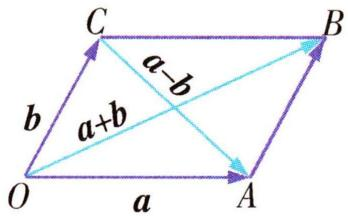</td><td rowspan="3">(1)交换律: $a + b = b + a$ .(2)结合律: $(a + b) + c = a + (b + c)$ , $\lambda(\mu a) = \lambda \mu a (\lambda, \mu \in \mathbb{R})$ .(3)分配律: $(\lambda + \mu)a = \lambda a + \mu a$ , $\lambda(a + b) = \lambda a + \lambda b, \lambda, \mu \in \mathbb{R}$ .</td></tr><tr><td>减法 $a - b$ </td><td> $a - b = \overrightarrow{OA} - \overrightarrow{OC} = \overrightarrow{CA}$ .</td></tr><tr><td>数乘 $\lambda a$ ( $a \neq 0$ )</td><td>大小: $|\lambda a| = |\lambda ||a|$ .方向:当 $\lambda >0$ 时, $\lambda a$ 的方向与 $a$ 的方向相同;当 $\lambda <0$ 时, $\lambda a$ 的方向与 $a$ 的方向相反;当 $\lambda =0$ 时, $\lambda a =0$ .</td><td colspan="2">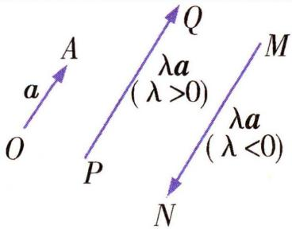</td></tr></table>

# 教材拓展

# 空间向量加法运算的推广——多边形法则

(1)首尾连接的若干个空间向量 $a_{1}, a_{2}, \cdots, a_{n}$ 相加, 等于由起始向量 $a_{1}$ 的起点指向末向量 $a_{n}$ 的终点的向量, 如图所示.  
(2)若首尾连接的若干个空间向量构成一个封闭图形,则它们的和为零向量,即 $\overrightarrow{A_{1}A_{2}}+\overrightarrow{A_{2}A_{3}}+\cdots+\overrightarrow{A_{n-2}A_{n-1}}+\overrightarrow{A_{n-1}A_{n}}+\overrightarrow{A_{n}A_{1}}=\mathbf{0}$ .

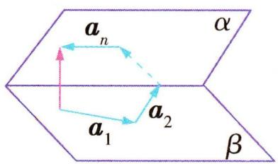

text_image

a_n
α
a_1
a_2
β

# 2. 空间向量的数量积运算

<table><tr><td>定义</td><td>已知两个非零向量 $a,b$ ,则 $|a||b|\cos\langle a,b\rangle$ 叫作向量 $a,b$ 的数量积,记作 $a·b$ ,即 $a·b=|a||b|\cos\langle a,b\rangle$ .向量 $a,b$ 的夹角,且 $0\leqslant\langle a,b\rangle\leqslant\pi$ .不能表示为 $a×b$ 或 $ab$ .注意1零向量与任意向量的数量积为0.2当θ为锐角时, $a·b>0$ ,但当 $a·b>0$ 时, $θ$ 不一定是锐角,因为θ也可能为0;当θ为钝角时, $a·b<0$ ,但当 $a·b<0$ 时, $θ$ 不一定是钝角,因为θ也可能为π.</td></tr><tr><td>投影向量</td><td>向量 $a$ 在向量 $b$ 上的投影向量 $c=|a|\cos\langle a,b\rangle\frac{b}{|b|}$ .</td></tr><tr><td>运算律</td><td>1(λa)·b=λ(a·b)(λ∈R);2a·b=b·a(交换律);3(a+b)·c=a·c+b·c(分配律).</td></tr><tr><td>性质</td><td>1a⊥b⇔a·b=0;2|a|2=a·a;3cos{a,b}=a·b/|a||b|;4|a·b|≤|a||b|.</td></tr></table>

# 知识点③ 共线向量定理与共面向量定理

<table><tr><td colspan="2">定理</td><td>推论</td><td>应用</td></tr><tr><td>共线向量定理</td><td>对空间任意两个向量 $\boldsymbol{a},\boldsymbol{b}(\boldsymbol{a}\neq\boldsymbol{0}),\boldsymbol{b}$ 与 $\boldsymbol{a}$ 共线的充要条件是存在实数 $\lambda$ ,使 $\boldsymbol{b}=\lambda\boldsymbol{a}$ .</td><td> $A,P,B$ 三点共线 $\Leftrightarrow\overrightarrow{AP}=\lambda\overrightarrow{AB}$  $\Leftrightarrow\overrightarrow{OP}=\overrightarrow{OA}+\lambda\overrightarrow{AB}$  $\Leftrightarrow\overrightarrow{OP}=x\overrightarrow{OA}+y\overrightarrow{OB}(x+y=1)$ </td><td>判断直线平行或三点共线</td></tr><tr><td>共面向量定理</td><td>如果两个向量 $\boldsymbol{a},\boldsymbol{b}$ 不共线,那么向量 $\boldsymbol{p}$ 与向量 $\boldsymbol{a},\boldsymbol{b}$ 共面的充要条件是存在唯一的有序实数对 $(x,y)$ ,使得 $\boldsymbol{p}=xa+yb$ .</td><td> $P,A,B,C$ 四点共面 $\Leftrightarrow\overrightarrow{AP}=m\overrightarrow{AB}+n\overrightarrow{AC}$  $\Leftrightarrow\overrightarrow{OP}=\overrightarrow{OA}+m\overrightarrow{AB}+n\overrightarrow{AC}$  $\Leftrightarrow\overrightarrow{OP}=x\overrightarrow{OA}+y\overrightarrow{OB}+z\overrightarrow{OC}(x+y+z=1)$ </td><td>判断线面平行或四点共面</td></tr></table>

# 思·要点突破

# 要点① 空间向量的线性运算

典例 1 如图所示, 在三棱柱 $ABC - A_{1}B_{1}C_{1}$ 中, $M$ 是 $BB_{1}$ 的中点, 化简下列各式, 并在图中标出化简得到的向量.

(1) $\overrightarrow{CB}+\overrightarrow{BA_{1}};$   
(2) $\overrightarrow{AC} +\overrightarrow{CB} +\frac{1}{2}\overrightarrow{AA_1};$   
(3) $\frac{1}{2}\overrightarrow{AA_1} -\frac{1}{2}\overrightarrow{B_1B} -\overrightarrow{AC} -\overrightarrow{CB}.$

解析 (1) $\overrightarrow{CB} + \overrightarrow{BA_1} = \overrightarrow{CA_1}$ .

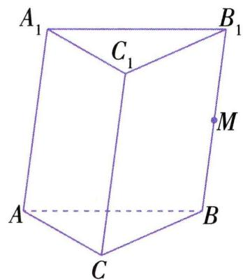

text_image

A₁
C₁
B₁
M
A
B
C

(2) 因为 M 是 $BB_{1}$ 的中点, 所以 $\overrightarrow{BM} = \frac{1}{2} \overrightarrow{BB_{1}}$ , 又 $\overrightarrow{AA_{1}} = \overrightarrow{BB_{1}}$ , 所以 $\overrightarrow{AC} + \overrightarrow{CB} + \frac{1}{2} \overrightarrow{AA_{1}} = \overrightarrow{AB} + \overrightarrow{BM} = \overrightarrow{AM}$ .  
(3) $\frac{1}{2}\overrightarrow{AA_1} -\frac{1}{2}\overrightarrow{B_1B} -\overrightarrow{AC} -\overrightarrow{CB} = \frac{1}{2}\left(\overrightarrow{AA_1} +\overrightarrow{BB_1}\right) -$ $(\overrightarrow{AC} +\overrightarrow{CB}) = \overrightarrow{AA_1} -\overrightarrow{AB} = \overrightarrow{BA_1}.$

向量 $\overrightarrow{CA_{1}},\overrightarrow{AM},\overrightarrow{BA_{1}}$ 如图所示.

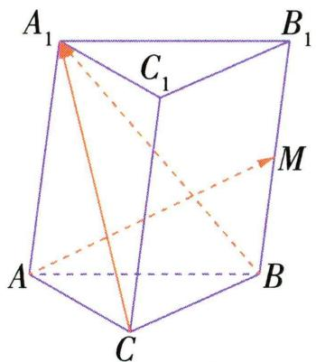

text_image

A₁
C₁
B₁
M
A
B
C

# 要点 ② 共线与共面问题

(1)对空间三点 P, A, B 可通过共线向量定理的推论 (见本节知识点 3) 来证明三点共线.
(2) 对空间四点 P, A, B, C 可通过共面向量定理的推论 (见本节知识点 3) 来证明四点共面.  
典例 2 如图, 已知 O, A, B, C, D, E, F, G, H 为空间的 9 个点, 且 $\overrightarrow{OE} = k \overrightarrow{OA}, \overrightarrow{OF} = k \overrightarrow{OB}, \overrightarrow{OH} = k \overrightarrow{OD}, \overrightarrow{AC} = \overrightarrow{AD} +$

$m\overrightarrow{AB},\overrightarrow{EG} = \overrightarrow{EH} + m\overrightarrow{EF}$ ，其中 $k\neq 0$ $m\neq 0.$

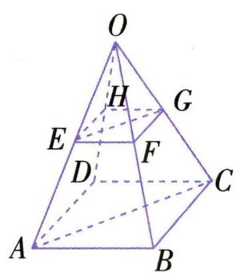

text_image

O
H
G
E
F
D
C
A
B

(1) 求证: A, B, C, D 四点共面, E, F, G, H 四点共面;  
(2) 求证: $O, G, C$ 三点共线.

解析（1）因为 $\overrightarrow{AC} = \overrightarrow{AD} + m\overrightarrow{AB}, m \neq 0$

所以 $\overrightarrow{AC},\overrightarrow{AD},\overrightarrow{AB}$ 共面,即A,B,C,D四点共面.

因为 $\overrightarrow{EG}=\overrightarrow{EH}+m\overrightarrow{EF},m\neq0,$

所以 $\overrightarrow{EG},\overrightarrow{EH},\overrightarrow{EF}$ 共面,即E,F,G,H四点共面.

(2) 连接 $HF, BD$ .

由题意可知 $\overrightarrow{EG} = \overrightarrow{EH} + m\overrightarrow{EF} = \overrightarrow{OH} -\overrightarrow{OE} + m(\overrightarrow{OF} -$ $\overrightarrow{OE}) = k(\overrightarrow{OD} -\overrightarrow{OA}) + km(\overrightarrow{OB} -\overrightarrow{OA}) = k\overrightarrow{AD} +km\overrightarrow{AB} =$ $k(\overrightarrow{AD} +m\overrightarrow{AB}) = k\overrightarrow{AC},k\neq 0,$

所以 $\overrightarrow{OG} = \overrightarrow{OE} +\overrightarrow{EG} = k\overrightarrow{OA} +k\overrightarrow{AC} = k(\overrightarrow{OA} +\overrightarrow{AC}) = k\overrightarrow{OC},$ $k\neq 0.$

所以 O, G, C 三点共线.

# 要点 ③ 空间向量的数量积

# 考向1 求空间向量的数量积及最值

典例 3-1 [2025 河北石家庄十七中月考] 在正三棱柱 $ABC - A_{1}B_{1}C_{1}$ 中, $AB = 2$ , $BB_{1} = 3$ , 则 $\overrightarrow{AB_1} \cdot \overrightarrow{AC} =$ ( )

A. 1

B. 2

C. 3

D. 4

解析 如图, 根据题意得 $\overrightarrow{AA_{1}} \cdot \overrightarrow{AC} = 0$ , 在等边三角形 ABC 中, $\overrightarrow{AB} \cdot \overrightarrow{AC} = |\overrightarrow{AB}| |\overrightarrow{AC}| \cos 60^{\circ} = 2 \times 2 \times \frac{1}{2} = 2$ , 所以 $\overrightarrow{AB_{1}} \cdot \overrightarrow{AC} = (\overrightarrow{AA_{1}} + \overrightarrow{AB}) \cdot \overrightarrow{AC} = \overrightarrow{AA_{1}} \cdot \overrightarrow{AC} + \overrightarrow{AB} \cdot \overrightarrow{AC} = 2$ .

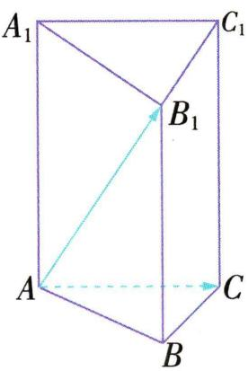

text_image

A₁
B₁
C₁
A
B
C

▶ 答案 B

典例3-2 [2025 山东淄博期中]已知圆柱 $O_{1}O_{2}$ 的轴截面是边长为2的正方形,AB为圆 $O_{1}$ 的直径,P为圆 $O_{2}$ 上的点,则( $\overrightarrow{PA}+\overrightarrow{PB}$ )· $\overrightarrow{AB}$ 的最大值为()

A. 4

B. $4\sqrt{2}$

C. 5

D. $5\sqrt{5}$

解析 如图所示, 连接 $O_{1}P, O_{2}P, O_{1}O_{2}$ , 则 $AB = 2, PO_{1} = \sqrt{2^{2} + 1^{2}} = \sqrt{5}$ , 因为 $O_{1}$ 为 AB 的中点, 所以 $\overrightarrow{PO_{1}} = \frac{1}{2} (\overrightarrow{PA} + \overrightarrow{PB})$ , 所以 $(\overrightarrow{PA} + \overrightarrow{PB}) \cdot \overrightarrow{AB} = 2 \overrightarrow{PO_{1}} \cdot \overrightarrow{AB} = 2 |\overrightarrow{PO_{1}}| \cdot$

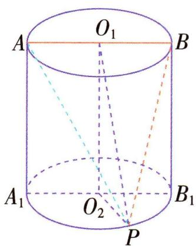

text_image

A
O₁
B
A₁
O₂
P
B₁

$|\overrightarrow{AB}|\cos\langle\overrightarrow{PO_{1}},\overrightarrow{AB}\rangle=4\sqrt{5}\cos\langle\overrightarrow{PO_{1}},\overrightarrow{AB}\rangle$ ，当 $AP\parallel O_{1}O_{2}$ 时，即P在 $A_{1}$ 处时， $\langle\overrightarrow{PO_{1}},\overrightarrow{AB}\rangle$ 最小，此时 $\cos\langle\overrightarrow{PO_{1}},\overrightarrow{AB}\rangle$ 取得最大值，为 $\frac{\sqrt{5}}{5}$ ，所以 $(\overrightarrow{PA}+\overrightarrow{PB})\cdot\overrightarrow{AB}$ 的最大值为4.

▶ 答案 A

# 考向 2 空间向量的数量积的应用

<table><tr><td>求异面直线所成的角</td><td>求异面直线AB与CD所成的角,可设向量AB与 $\overrightarrow{CD}$ 的夹角为θ,则cos θ= $\frac{\overrightarrow{AB} \cdot \overrightarrow{CD}}{|\overrightarrow{AB}| |\overrightarrow{CD} |}$ ,可得两异面直线所成的角为θ或π-θ.空间中两条异面直线所成的角的范围为(0, $\frac{\pi}{2}$ ].</td></tr><tr><td>求长度(距离)</td><td>运用公式|a|2=a·a,将线段长度的计算转化为向量数量积的计算.</td></tr><tr><td>证明垂直</td><td>利用a⊥b⇔a·b=0(a≠0,b≠0),将证明垂直转化为向量数量积的计算.</td></tr></table>

典例3-3（多选）如图，在三棱柱 $ABC - A_{1}B_{1}C_{1}$ 中， $M, N$ 分别是 $A_{1}B, B_{1}C_{1}$ 上的点，且 $BM = 2A_{1}M, C_{1}N = 2B_{1}N$ . 设 $\overrightarrow{AB} = a, \overrightarrow{AC} = b, \overrightarrow{AA_{1}} = c$ ，若 $\angle BAC = 90^{\circ}, \angle BAA_{1} = \angle CAA_{1} = 60^{\circ}, AB = AC = AA_{1} = 1$ ，则（）

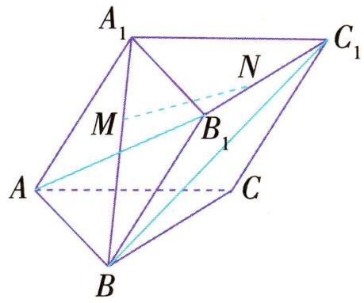

text_image

A₁
N
M
B₁
C₁
A
B
C

A. $\overrightarrow{MN} = \frac{1}{3}\boldsymbol {a} + \frac{1}{3}\boldsymbol {b} + \frac{1}{3}\boldsymbol {c}$   
B. $|\overrightarrow{MN}| = \frac{\sqrt{5}}{3}$   
C. 直线 $AB_{1}$ 和直线 $BC_{1}$ 垂直  
D. 直线 $AB_{1}$ 和直线 $BC_{1}$ 所成角的余弦值为 $\frac{1}{6}$

解析 $\overrightarrow{MN} = \overrightarrow{MA_1} +\overrightarrow{A_1C_1} +\overrightarrow{C_1N} = \frac{1}{3}\overrightarrow{BA_1} +\overrightarrow{AC} +\frac{2}{3}\overrightarrow{CB} =$ $\frac{1}{3} (\overrightarrow{AA_1} -\overrightarrow{AB}) + \overrightarrow{AC} +\frac{2}{3} (\overrightarrow{AB} -\overrightarrow{AC}) = \frac{1}{3}\overrightarrow{AB} +\frac{1}{3}\overrightarrow{AA_1} +$

$\frac{1}{3}\overrightarrow{AC} = \frac{1}{3}\boldsymbol {a} + \frac{1}{3}\boldsymbol {b} + \frac{1}{3}\boldsymbol {c}$ ，故A正确.因为 $AB = AC =$ $AA_{1} = 1$ ，所以 $|\pmb {a}| = |\pmb {b}| = |\pmb {c}| = 1.$ 因为 $\angle BAC = 90^{\circ}$ ，所以 $\pmb {a}\cdot \pmb {b} = 0.$ 因为 $\angle BAA_{1} = \angle CAA_{1} = 60^{\circ}$ ，所以 $\pmb {a}\cdot \pmb {c} =$ $\pmb {b}\cdot \pmb {c} = \frac{1}{2}$ ，所以 $|\overrightarrow{MN}|^2 = \frac{1}{9} (\pmb {a} + \pmb {b} + \pmb {c})^2 = \frac{1}{9} (\pmb{a}^2 +$

$b^{2}+c^{2}+2a\cdot b+2a\cdot c+2b\cdot c)=\frac{5}{9}$ ，即 $|\overrightarrow{MN}|=\frac{\sqrt{5}}{3}$ 故 B 正确. 因为 $\overrightarrow{AB_{1}} = a + c, \overrightarrow{BC_{1}} = c + b - a$ , 所以

$\cos \langle \overrightarrow{AB_1},\overrightarrow{BC_1}\rangle$ $= \frac{(\pmb {a} + \pmb{c})\cdot(\pmb {c} + \pmb{b} - \pmb{a})}{\sqrt{(\pmb{a} + \pmb{c})^2}\sqrt{(\pmb{c} + \pmb{b} - \pmb{a})^2}} =$

$\frac{\frac{1}{2} - 1 + 1 + \frac{1}{2} - \frac{1}{2}}{\sqrt{3} \times \sqrt{1 + 1 + 1 + 1 - 1}} = \frac{1}{6}$ , 故 C 错误, D 正确. 故选 ABD.

▶ 答案 ABD

# 考向 3 投影向量

典例 3-4 如图, 在三棱锥 $P - ABC$ 中, $PA \perp$ 平面 $ABC, BC \perp AB, AB = BC = a, PA = b$ .

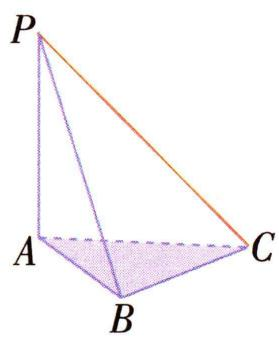

text_image

P
A
B
C

(1) 确定 $\overrightarrow{PC}$ 在 $\overrightarrow{AC}$ 方向上的投影向量, 并求出投影的数量;
(2) 确定 $\overrightarrow{PC}$ 在 $\overrightarrow{AB}$ 方向上的投影的数量

解析 (1) 因为 $PA \perp$ 平面 $ABC, AC \subset$ 平面 $ABC$ , 所以 $PA \perp AC$ ,

所以 $\overrightarrow{PC}$ 在 $\overrightarrow{AC}$ 方向上的投影向量为 $\overrightarrow{AC}$ .

在 $\triangle ABC$ 中, $AB \perp BC$ , $AB = BC = a$ , 所以 $AC = \sqrt{2} a$ , 即 $\overrightarrow{PC}$ 在 $\overrightarrow{AC}$ 方向上的投影的数量为 $\sqrt{2} a$ .

(2) 因为 $PA \perp$ 平面 $ABC, AB \subset$ 平面 $ABC$ ,

所以 $PA \perp AB$ ，所以 $\overrightarrow{PA} \cdot \overrightarrow{AB} = 0$ .

因为 $BC \perp AB$ ，所以 $\overrightarrow{BC} \cdot \overrightarrow{AB} = 0$ ，

所以 $\overrightarrow{PC} \cdot \overrightarrow{AB} = (\overrightarrow{PA} + \overrightarrow{AB} + \overrightarrow{BC}) \cdot \overrightarrow{AB} = \overrightarrow{PA} \cdot \overrightarrow{AB} + \overrightarrow{AB^2} + \overrightarrow{BC} \cdot \overrightarrow{AB} = a^2$ .

又 $|\overrightarrow{AB}|=a$ ,

所以 $\overrightarrow{PC}$ 在 $\overrightarrow{AB}$ 方向上的投影的数量为 $|\overrightarrow{PC}|\cos \langle \overrightarrow{PC},\overrightarrow{AB}\rangle = |\overrightarrow{PC}|\frac{\overrightarrow{PC}\cdot\overrightarrow{AB}}{|\overrightarrow{PC}||\overrightarrow{AB}|} = \frac{\overrightarrow{PC}\cdot\overrightarrow{AB}}{|\overrightarrow{AB}|} = a.$

# 第二节 空间向量基本定理

# 学·核心知识

# 知识点① 空间向量基本定理

如果三个向量 a, b, c 不共面, 那么对任意一个空间向量 p, 存在唯一的有序实数组 $(x, y, z)$ , 使得 $p = xa + yb + zc$ . 把 $\{a, b, c\}$ 叫作空间的一个基底, a, b, c 都叫作基向量.

注意(1)空间任意三个不共面的向量都可构成空间的一个基底,基底选定后,空间的所有向量均可由基底唯一表示;(2)因为零向量与任意一个非零向量共线,与任意两个非零向量共面,所以若三个向量不共面,就说明它们都不是零向量.

# 知识点② 单位正交基底

如果空间的一个基底中的三个基向量两两垂直,且长度都为1,那么这个基底叫作单位正交基底,常用 $\{i,j,k\}$ 表示.由空间向量基本定理可知,对空间中的任意向量a,均可以分解为三个向量xi,yj,zk,使 $a=xi+yj+zk$ .像这样,把一个空间向量分解为三个两两垂直的向量,叫作把空间向量进行正交分解.

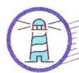

# 思·要点突破

# 要点 ① 基底的判断

已知向量 $a, b, c$ , 判断它们能否作为空间的一个基底的方法:

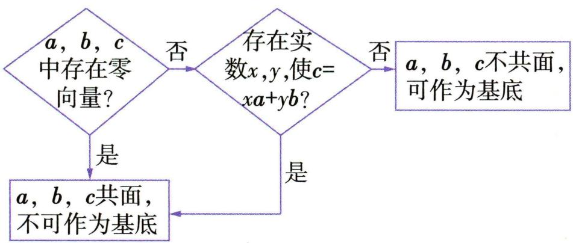

flowchart

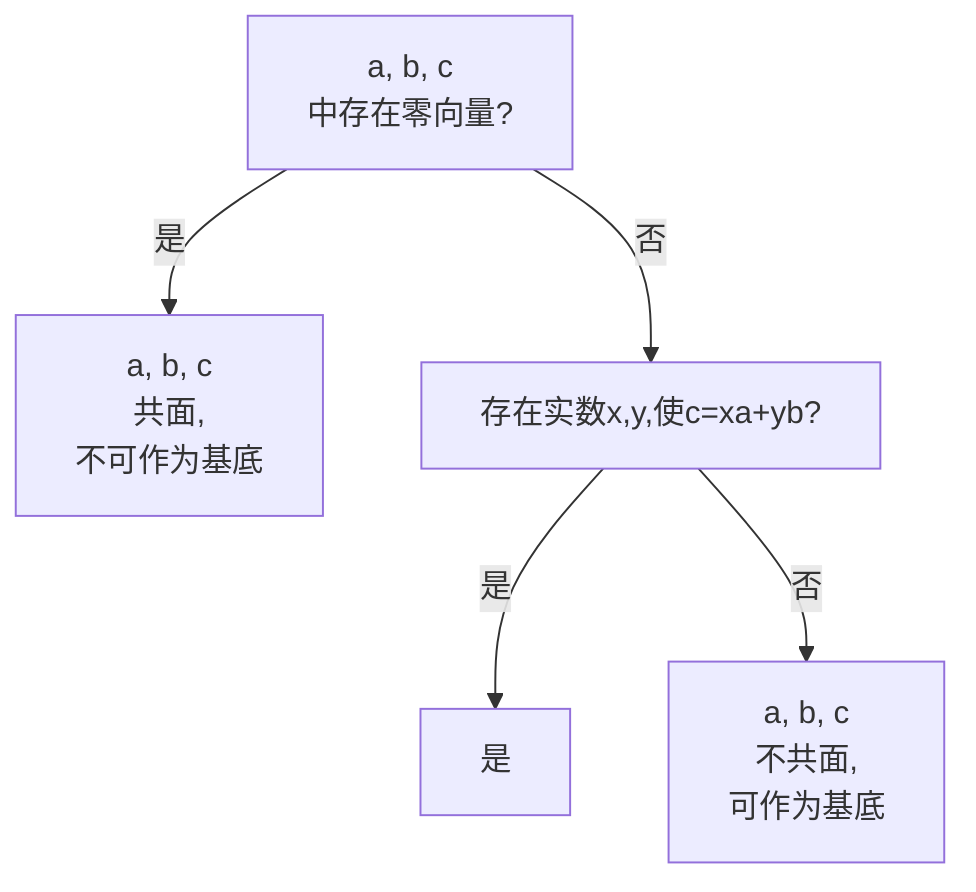

典例 1 (多选) 设 $x = a + b, y = b + c, z = c + a$ , 且 $\{a, b, c\}$ 是空间的一个基底, 则下列向量组可以作为空间的一个基底的是 ( )

A. $a, b, x$

B. $x, y, z$

C. $b, c, z$

D. $x, y, a + b + c$

解析 结合长方体, 如图, 设合理借助几何体可快速解题.

$\overrightarrow{AB} = \boldsymbol{a},\overrightarrow{AD} = \boldsymbol{b},\overrightarrow{AA_1} = \boldsymbol{c}$ .由题意可知向量 $\pmb {a},\pmb {b},\pmb{x}$ 共面；向量 $\pmb{x}$ $y,z$ 不共面；向量 $\pmb {b},\pmb {c},\pmb {z}$ 不共面；向量 $\pmb {x},\pmb {y},\pmb {a} + \pmb {b} + \pmb{c}$ 也不共面.

▶ 答案 BCD

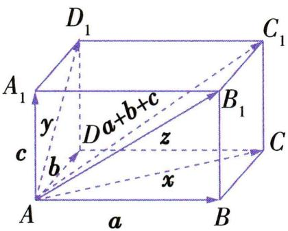

text_image

D₁
A₁
y
c
b
D a+b+c
z
x
B₁
C₁
A
a
B

# 要点 ② 用基底表示向量

用基底表示空间向量,一般要用向量的加法、减法、数乘的运算法则,逐步向基向量转化,直到全部用基向量表示.另外,也可以利用待定系数法,先利用未知系数确定

向量的线性表示,再根据空间向量基本定理建立对应系数之间的关系,将问题转化为方程(组)问题求解.

典例 2 [2025 四川省射洪中学校期中] 如图所示, 在平行六面体 $ABCD - A_{1}B_{1}C_{1}D_{1}$ 中, M 为 $A_{1}C_{1}$ 与 $B_{1}D_{1}$ 的交点, 若 $\overrightarrow{AB} = a, \overrightarrow{AD} = b, \overrightarrow{AA_{1}} = c$ , 则 $\overrightarrow{BM}$ 等于

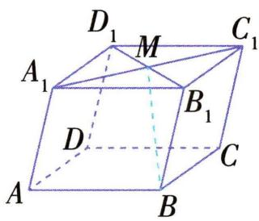

text_image

D₁
M
C₁
A₁
B₁
D
C
A
B

A. $-\frac{1}{2} a - \frac{1}{2} b + c$

B. $-\frac{1}{2} a + \frac{1}{2} b + c$

C. $\frac{1}{2} a - \frac{1}{2} b + c$

D. $\frac{1}{2} a + \frac{1}{2} b + c$

解析 由题意,结合题图可得 $\overrightarrow{BM}=\overrightarrow{BB_{1}}+\overrightarrow{B_{1}M}=\overrightarrow{AA_{1}}+\frac{1}{2}\overrightarrow{B_{1}D_{1}}=\overrightarrow{AA_{1}}+\frac{1}{2}\overrightarrow{BD}=\overrightarrow{AA_{1}}+\frac{1}{2}(\overrightarrow{AD}-\overrightarrow{AB})=-\frac{1}{2}\overrightarrow{AB}+\frac{1}{2}\overrightarrow{AD}+\overrightarrow{AA_{1}}=-\frac{1}{2}\boldsymbol{a}+\frac{1}{2}\boldsymbol{b}+\boldsymbol{c}.$

▶ 答案 B

# 要点 ③ 空间向量基本定理的应用

典例 3-1 中国古代数学名著《九章算术》中, 将底面为矩形且一侧棱垂直于底面的四棱锥称为阳马. 如图, 四棱锥 $P - ABCD$ 为阳马, $PA \perp$ 平面 $ABCD$ , 且 $EC =$ 2PE, 若 $\overrightarrow{DE}=x\overrightarrow{AB}+y\overrightarrow{AC}+z\overrightarrow{AP}$ ，则 $x-y+z=$ （）

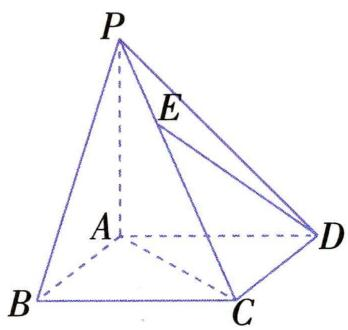

text_image

P
E
A
B
C
D

A. 3

B. $\frac{7}{3}$

C. $\frac{5}{3}$

D. 1

解析 因为 $EC = 2PE$ ，所以 $\overrightarrow{PE} = \frac{1}{3}\overrightarrow{PC}$ ，所以 $\overrightarrow{DE} = \overrightarrow{AE} - \overrightarrow{AD} = \overrightarrow{AP} + \overrightarrow{PE} - \overrightarrow{AD} = \overrightarrow{AP} + \frac{1}{3}\overrightarrow{PC} - \overrightarrow{AD} = \overrightarrow{AP} + \frac{1}{3} (\overrightarrow{AC} - \overrightarrow{AP}) - \overrightarrow{AD} = \frac{2}{3}\overrightarrow{AP} + \frac{1}{3}\overrightarrow{AC} - \overrightarrow{AD} = \frac{2}{3}\overrightarrow{AP} + \frac{1}{3}\overrightarrow{AC} - \overrightarrow{BC} = \frac{2}{3}\overrightarrow{AP} + \frac{1}{3}\overrightarrow{AC} - (\overrightarrow{AC} - \overrightarrow{AB}) = \frac{2}{3}\overrightarrow{AP} - \frac{2}{3}\overrightarrow{AC} + \overrightarrow{AB}$ ，所以 $x = 1, y = -\frac{2}{3}, z = \frac{2}{3}$ ，所以 $x - y + z = \frac{7}{3}$ .

▶ 答案 B

典例3-2（多选）[2025 河北石家庄联考]如图,在斜三棱柱 $ABC - A_{1}B_{1}C_{1}$ 中, $\angle BAC = \frac{\pi}{2}, \angle BAA_{1} = \frac{2\pi}{3}, \angle CAA_{1} = \frac{\pi}{3}, AB = AC = 1, AA_{1} = 2$ , 点 $O$ 是 $B_{1}C$ 与 $BC_{1}$ 的交点, 若 $\overrightarrow{AB} = a, \overrightarrow{AC} = b, \overrightarrow{AA_{1}} = c, \{a, b, c\}$ 构成空间的一个基底, 则下列结论正确的是 ( )

A. $\overrightarrow{AO} = \frac{1}{2} (\pmb {a} + \pmb {b} + \pmb{c})$

B. $|\overrightarrow{AO}| = \frac{\sqrt{6}}{2}$

C. AO 与 BC 所成角的余弦值为 $\frac{\sqrt{6}}{6}$

D. 平面 $ABC \perp$ 平面 $B_{1} B C C_{1}$

解析 对于 A, $\overrightarrow{AO} = \overrightarrow{AB} + \overrightarrow{BO} = \overrightarrow{AB} + \frac{1}{2} (\overrightarrow{BC} + \overrightarrow{BB_{1}}) = \overrightarrow{AB} + \frac{1}{2} (\overrightarrow{AC} - \overrightarrow{AB} + \overrightarrow{AA_{1}}) = \frac{1}{2} (\overrightarrow{AB} + \overrightarrow{AC} + \overrightarrow{AA_{1}}) = \frac{1}{2} (a + b + c)$ ，故 A 正确；对于 B, $|a| = |b| = 1, |c| = 2, a \cdot$

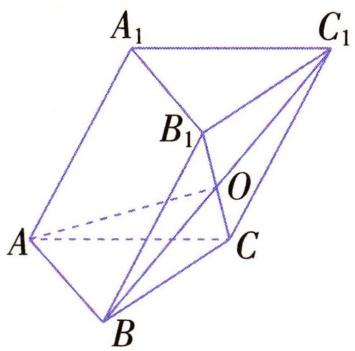

text_image

A₁
B₁
C₁
O
A
B
C

$b=0,b\cdot c=1,a\cdot c=-1$ , 由 A 可得, $\overrightarrow{AO}=\frac{1}{2}(a+b+c)$ , 则 $\left|\overrightarrow{AO}\right|^{2}=\frac{1}{4}(a^{2}+b^{2}+c^{2}+2a\cdot b+2b\cdot c+2a\cdot c)=\frac{1}{4}\times(1+1+4+0+2-2)=\frac{3}{2}$ , 则 $\left|\overrightarrow{AO}\right|=\frac{\sqrt{6}}{2}$ , 故 B 正确; 对于 C, $\overrightarrow{BC}=b-a,\overrightarrow{AO}=\frac{1}{2}(a+b+c)$ ,
所以 $\overrightarrow{AO}\cdot\overrightarrow{BC}=\frac{1}{2}(a+b+c)\cdot(b-a)=\frac{1}{2}(a\cdot b-a^{2}+b^{2}-a\cdot b+b\cdot c-a\cdot c)=\frac{1}{2}(0-1+1-0+1+1)=1,|\overrightarrow{AO}|=\frac{\sqrt{6}}{2},|\overrightarrow{BC}|=\sqrt{1^{2}+1^{2}}=\sqrt{2}$ , 所以 $\cos\langle\overrightarrow{AO},\overrightarrow{BC}\rangle=\frac{\overrightarrow{AO}\cdot\overrightarrow{BC}}{|\overrightarrow{AO}||\overrightarrow{BC}|}=\frac{1}{\frac{\sqrt{6}}{2}\times\sqrt{2}}=\frac{\sqrt{3}}{3}$ , 故 C 错误; 对于 D,

如图,取 BC 的中点 E, 连接 AE,
则 $\overrightarrow{AE} = \frac{1}{2} (\overrightarrow{AB} + \overrightarrow{AC}) = \frac{1}{2} (\boldsymbol{a} +$

b), 因为 AB = AC, E 为 BC 的中点,
所以 $AE \perp BC$ . 因为 $\overrightarrow{AE} \cdot \overrightarrow{BB_{1}} = \frac{1}{2} (\boldsymbol{a} + \boldsymbol{b}) \cdot \boldsymbol{c} = \frac{1}{2} (\boldsymbol{a} \cdot \boldsymbol{c} + \boldsymbol{b} \cdot \boldsymbol{c}) =$

$\frac{1}{2}(-1+1)=0$ , 所以 $AE \perp BB_{1}$ . 又 $BC \cap BB_{1}=B, BC,$ $BB_{1}\subset$ 平面 $B_{1}BCC_{1}$ ，所以 $AE \perp$ 平面 $B_{1}BCC_{1}$ ，又 $AE \subset$ 平面 ABC，故平面 $ABC \perp$ 平面 $B_{1}BCC_{1}$ ，故 D 正确.

▶答案 ABD

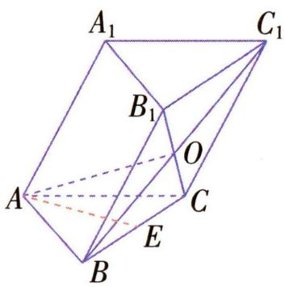

text_image

A₁
B₁
C₁
O
A
C
E
B

# 第三节 空间向量及其运算的坐标表示

# 学·核心知识

# 知识点·空间点、向量及其运算的坐标表示

<table><tr><td>空间点的坐标表示</td><td>(1)在空间直角坐标系Oxyz中,i,j,k为坐标向量,对空间任意一点A,对应一个向量 $\overrightarrow{OA}$ ,且点A的位置由向量 $\overrightarrow{OA}$ 唯一确定,由空间向量基本定理,存在唯一的有序实数组(x,y,z),使 $\overrightarrow{OA}=xi+yj+zk$ .在单位正交基底{i,j,k}下与向量 $\overrightarrow{OA}$ 对应的有序实数组(x,y,z),叫作点A在空间直角坐标系中的坐标,记作A(x,y,z).(2)过点A分别作垂直于x轴、y轴和z轴的平面,依次交x轴、y轴和z轴于点B,C和D,设B,C和D在x轴、y轴和z轴上的坐标分别是x,y和z,那么点A的坐标为(x,y,z).</td></tr><tr><td>空间向量的坐标表示</td><td>设A(x1,y1,z1),B(x2,y2,z2),则 $\overrightarrow{AB}=(x_2-x_1,y_2-y_1,z_2-z_1)$ .</td></tr></table>

<table><tr><td rowspan="3">空间向量运算的坐标表示</td><td>坐标运算</td><td>设 $\boldsymbol{a} = (a_1, a_2, a_3), \boldsymbol{b} = (b_1, b_2, b_3)$ . $\boldsymbol{a} + \boldsymbol{b} = (a_1 + b_1, a_2 + b_2, a_3 + b_3), \boldsymbol{a} - \boldsymbol{b} = (a_1 - b_1, a_2 - b_2, a_3 - b_3), \lambda \boldsymbol{a} = (\lambda a_1, \lambda a_2, \lambda a_3) (\lambda \in \mathbb{R})$ , $\boldsymbol{a} \cdot \boldsymbol{b} = a_1 b_1 + a_2 b_2 + a_3 b_3$ .</td></tr><tr><td>平行、垂直</td><td>(1) $\boldsymbol{a} // \boldsymbol{b} (\boldsymbol{b} \neq \boldsymbol{0}) \Leftrightarrow \boldsymbol{a} = \lambda \boldsymbol{b} \Leftrightarrow a_1 = \lambda b_1, a_2 = \lambda b_2, a_3 = \lambda b_3 (\lambda \in \mathbb{R})$ .(2) $\boldsymbol{a} \perp \boldsymbol{b} \Leftrightarrow \boldsymbol{a} \cdot \boldsymbol{b} = 0 \Leftrightarrow a_1 b_1 + a_2 b_2 + a_3 b_3 = 0$ .</td></tr><tr><td>模、夹角和距离公式</td><td>(1) $|\boldsymbol{a}| = \sqrt{\boldsymbol{a} \cdot \boldsymbol{a}} = \sqrt{a_1^2 + a_2^2 + a_3^2}$ .(2) $\cos\langle \boldsymbol{a}, \boldsymbol{b} \rangle = \frac{\boldsymbol{a} \cdot \boldsymbol{b}}{|\boldsymbol{a}| |\boldsymbol{b}|} = \frac{a_1 b_1 + a_2 b_2 + a_3 b_3}{\sqrt{a_1^2 + a_2^2 + a_3^2} \cdot \sqrt{b_1^2 + b_2^2 + b_3^2}}$ .(3)若点 $A(a_1, b_1, c_1), B(a_2, b_2, c_2)$ ,则 $A, B$ 两点间的距离 $d_{AB} = |\overrightarrow{AB}| = \sqrt{(a_2 - a_1)^2 + (b_2 - b_1)^2 + (c_2 - c_1)^2}$ .</td></tr></table>

# 教材拓展

# 特殊向量的坐标表示

当向量 a 平行于平面 Oxy 时, $\boldsymbol{a} = (x, y, 0)$ ; 当向量 a 平行于平面 Oyz 时, $\boldsymbol{a} = (0, y, z)$ ; 当向量 a 平行于平面 Ozx 时, $\boldsymbol{a} = (x, 0, z)$ .

# 思·要点突破

# 要点 • 空间向量及运算的坐标表示

利用空间向量的坐标运算解决问题的关键是熟记空间向量坐标运算的法则,同时需要掌握下列技巧:

(1)在运算中注意相关公式的灵活运用,如 $(a+b)\cdot(a-b)=a^{2}-b^{2}$ ;  
(2)运算时可以先代入坐标再运算,也可以先进行向量式的化简再代入坐标运算,如计算 $(a+b)\cdot(a-b)$ 时,既可以先求 $a+b,a-b$ ,再求数量积,也可以先把 $(a+b)\cdot(a-b)$ 写成 $a^{2}-b^{2}$ ,再计算.

典例 1 设点 B 是 A(2,3,5) 关于坐标平面 Oxy 的对称点, 则 $\left|\overrightarrow{AB}\right| =$ ( )

A. 10

B. $\sqrt{10}$

C. 38

D. $\sqrt{38}$

解析 因为点 B 是 $A(2,3,5)$ 关于坐标平面 Oxy 的对称点，所以 $B(2,3,-5)$ ，所以 $\left|\overrightarrow{AB}\right|=\sqrt{(2-2)^{2}+(3-3)^{2}+(5+5)^{2}}=10.$   
▶ 答案 A

典例 2(多选)已知空间向量 $\boldsymbol{a}=(-2,-1,1)$ , $\boldsymbol{b}=(3,4,5)$ , 则 ( )

A. $c = (-3,1,8)$ 与 $\pmb{a},\pmb{b}$ 共面  
B. $(2a + b) // a$   
C. $a$ 在 $b$ 上的投影向量的模为 $\frac{\sqrt{2}}{2}$   
D. a 与 b 夹角的余弦值为 $-\frac{\sqrt{3}}{6}$

解析

<table><tr><td>A</td><td>√</td><td>设 $c = xa + yb, x, y \in \mathbb{R}$ ,则 $(-3,1,8) = x(-2,-1,1) + y(3,4,5) = (-2x + 3y, -x + 4y, x + 5y)$ ,得 $\begin{cases} -2x + 3y = -3, \\ -x + 4y = 1, \\ x + 5y = 8, \end{cases}$ 可得 $\begin{cases} x = 3, \\ y = 1, \end{cases}$ 所以 $c = 3a + b$ ,所以 $c$ 与 $a,b$ 共面.</td></tr><tr><td>B</td><td>×</td><td>因为 $a = (-2, -1,1), 2a + b = (-1,2,7), \frac{-1}{-2} \neq \frac{2}{-1} \neq \frac{7}{1}$ ,所以 $2a + b$ 与 $a$ 不平行.</td></tr><tr><td>C</td><td>√</td><td> $a$ 在 $b$ 上的投影向量的模为 $|a\cos\langle a, b\rangle| = \frac{|a \cdot b|}{|b|} = \frac{|-6-4+5|}{\sqrt{3^2+4^2+5^2}} = \frac{\sqrt{2}}{2}.$ </td></tr><tr><td>D</td><td>√</td><td> $a$ 与 $b$ 夹角的余弦值为 $\cos\langle a, b\rangle = \frac{a \cdot b}{|a||b|} = \frac{-6-4+5}{\sqrt{4+1+1} \times \sqrt{9+16+25}} = -\frac{\sqrt{3}}{6}.$ </td></tr></table>

▶ 答案 ACD

典例 3 已知 $a = (1,5,-1), b = (-2,3,5)$ , 则当 $(\lambda a + b) // (a - 3b)$ 时, 实数 $\lambda$ 的值为 \_\_\_\_; 当 $(\lambda a + b) \perp (a - 3b)$ 时, 实数 $\lambda$ 的值为 \_\_\_\_.

解析 因为 $a = (1,5,-1), b = (-2,3,5)$ , 所以 $\lambda a + b = (\lambda - 2,5\lambda + 3, -\lambda + 5), a - 3b = (7, -4, -16)$ . 因为 $(\lambda a + b) // (a - 3b)$ , 所以 $\frac{\lambda - 2}{7} = \frac{5\lambda + 3}{-4} = \frac{-\lambda + 5}{-16}$ , 解得 $\lambda = -\frac{1}{3}$ . 因为 $(\lambda a + b) \perp (a - 3b)$ , 所以 $(\lambda\boldsymbol{a}+\boldsymbol{b})\cdot(\boldsymbol{a}-3\boldsymbol{b})=0$ ,所以 $7(\lambda-2)-4(5\lambda+3)-16(-\lambda+5)=0$ ,解得 $\lambda=\frac{106}{3}$ .

答案 $-\frac{1}{3}$ $\frac{106}{3}$

典例 4《九章算术》第五卷中涉及一种几何体——羡除, 它下广六尺, 上广一丈, 深三尺, 末广八尺, 无深, 褒七尺. 该羡除是一个多面体 ABCDFE, 如图, 四边形ABCD, ABEF 均为等腰梯形, AB // CD // EF, 平面ABCD⊥平面ABEF, 梯形ABCD, ABEF 的高分别为3, 7, 且 AB = 6, CD = 10, EF = 8, 则 $\overrightarrow{AD} \cdot \overrightarrow{BF} =$ \_\_\_\_, $|\overrightarrow{DE}| =$ \_\_\_\_.

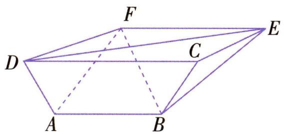

text_image

F
D	C	E
A	B

解析 过 A 分别作 CD, EF 的垂线, 垂足分别为 N, M, 如图所示. 由 $AN \perp CD$ , 可得 $AN \perp AB$ . 又平面 $ABCD \perp$ 平面 ABEF, 平面 $ABCD \cap$ 平面 ABEF = AB, $AN \subset$ 平面 ABCD, 所以 $AN \perp$ 平面 ABEF, 所以 $AN \perp AM$ . 因为 $AB \parallel EF$ , 所以 $AM \perp AB$ , 故 AN, AB, AM 两两垂直, 以 A 为坐标原点, $\overrightarrow{AB}, \overrightarrow{AM}, \overrightarrow{AN}$ 的方向分别为 x, y, z 轴的正方向, 建立空间直角坐标系, 则 A(0,0,0), B(6,0,0), D(-2,0,3), F(-1,7,0), E(7,7,0), 所以 $\overrightarrow{BF} = (-7,7,0)$ , $\overrightarrow{AD} = (-2,0,3)$ , $\overrightarrow{DE} = (9,7,-3)$ , 所以 $\overrightarrow{AD} \cdot \overrightarrow{BF} = 14$ , $|\overrightarrow{DE}| = \sqrt{9^{2} + 7^{2} + (-3)^{2}} = \sqrt{139}$ .

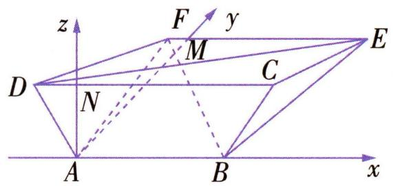

text_image

z
F
y
M
E
D
N
C
A
B
x

▶ 答案 14 $\sqrt{139}$

# 第四节 空间向量的应用

# 学·核心知识

知识点① 空间中点、直线和平面的向量表示

<table><tr><td>空间中点的向量表示</td><td>在空间中,取一定点O作为基点,那么空间中任意一点P就可以用向量 $\overrightarrow{OP}$ 来表示,把向量 $\overrightarrow{OP}$ 称为点P的位置向量.</td><td>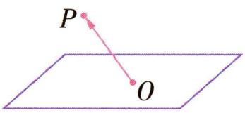</td></tr><tr><td>空间中直线的向量表示</td><td>a是直线l的方向向量,取定空间中的任意一点O,可以得到点P在直线l上的充要条件是存在实数t,使 $\overrightarrow{OP} = \overrightarrow{OA} + ta$  1,将 $\overrightarrow{AB} = a$ 代入得 $\overrightarrow{OP} = \overrightarrow{OA} + t\overrightarrow{AB}$  2.1式和2式都称为空间中直线的向量表示式.空间任意直线由直线上一点及直线的方向向量唯一确定.</td><td>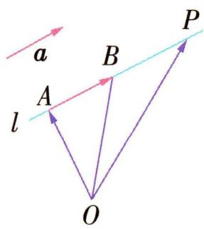</td></tr><tr><td>空间中平面的向量表示</td><td>取定空间任意一点O,可以得到空间一点P位于平面ABC内的充要条件是存在实数x,y,使 $\overrightarrow{OP} = \overrightarrow{OA} + x\overrightarrow{AB} + y\overrightarrow{AC}$  3.3式称为空间平面ABC的向量表示式.空间一点及两个不共线向量唯一确定一个平面.</td><td>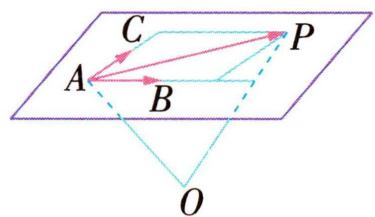</td></tr></table>

# 知识点 ② 平面的法向量

如图, 直线 $l \perp \alpha$ , 取直线 $l$ 的方向向量 $\pmb{a}$ , 我们称向量 $\pmb{a}$ 为平面 $\alpha$ 的法向量.

给定一个点 A 和一个向量 a, 那么过点 A, 且以向量 a 为法向量的平面完全确定, 可以表示为集合 $\{P \mid a \cdot \overrightarrow{AP} = 0\}$ .

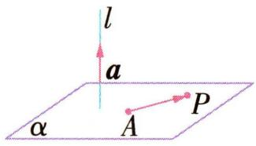

# 知识点③ 空间向量的应用

设直线 l, m 的方向向量分别为 a, b, 平面 $\alpha, \beta$ 的法向量分别为 u, v.

<table><tr><td rowspan="3">平行问题</td><td>线线平行</td><td> $l//m\Leftrightarrow a//b\Leftrightarrow \exists \lambda \in \mathbf{R}$ ,使得  $a = \lambda b$ .</td></tr><tr><td>线面平行</td><td> $l//\alpha\Leftrightarrow a \perp u\Leftrightarrow a \cdot u = 0$ (此时  $l\not\subset\alpha$ ).</td></tr><tr><td>面面平行</td><td> $\alpha // \beta\Leftrightarrow u // v\Leftrightarrow \exists \lambda \in \mathbf{R}$ ,使得  $u = \lambda v$ .</td></tr><tr><td rowspan="3">垂直问题</td><td>线线垂直</td><td> $l \perp m \Leftrightarrow a \perp b \Leftrightarrow a \cdot b = 0.$ </td></tr><tr><td>线面垂直</td><td> $l \perp \alpha \Leftrightarrow a // u \Leftrightarrow \exists \lambda \in \mathbb{R}$ ,使得  $a = \lambda u$ .</td></tr><tr><td>面面垂直</td><td> $\alpha \perp \beta \Leftrightarrow u \perp v \Leftrightarrow u \cdot v = 0.$ </td></tr><tr><td rowspan="2">距离问题</td><td>点到直线的距离</td><td>点P到直线l的距离 $d = PQ = \sqrt{|\overrightarrow{AP}|^{2} - |\overrightarrow{AQ}|^{2}} = \sqrt{|\overrightarrow{AP}|^{2} - (\frac{a}{|a|} \cdot \overrightarrow{AP})^{2}}$ .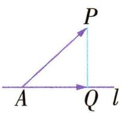</td></tr><tr><td>点到平面的距离</td><td>点P到平面α的距离 $d = PQ = \frac{|\overrightarrow{AP} \cdot u|}{|u|}$ .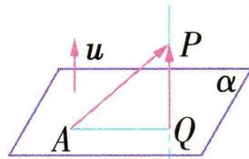</td></tr><tr><td rowspan="3">夹角问题</td><td>线线角</td><td>设l,m所成的角为θ,则 $\cos \theta = |\cos \langle a,b\rangle| = \frac{|a \cdot b|}{|a||b|}$ .</td></tr><tr><td>线面角</td><td>设l,α所成的角为θ,则 $\sin \theta = |\cos \langle a,u\rangle| = \frac{|a \cdot u|}{|a||u|}$ .</td></tr><tr><td>面面角</td><td>设α,β的夹角为θ,则 $\cos \theta = |\cos \langle u,v\rangle| = \frac{|u \cdot v|}{|u||v|}$ .</td></tr></table>

# 温馨提示

# 求空间角时的注意点

(1) 注意角的范围.

<table><tr><td>角的分类</td><td>异面直线所成的角</td><td>直线与平面所成的角</td><td>平面与平面的夹角</td><td>二面角</td></tr><tr><td>范围</td><td>(0,π/2]</td><td>[0,π/2]</td><td>[0,π/2]</td><td>[0,π]</td></tr></table>

(2)在求解二面角的相关问题时,可依据两个半平面的法向量“一进一出相等(如图1,图2),同进同出互补(如图3,图4)”求解.

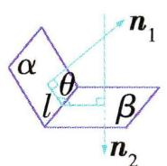  
图1

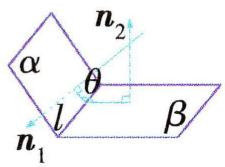  
图2

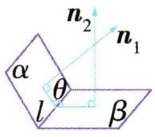  
图3

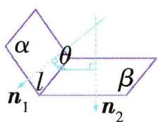  
图4

# 思·要点突破

# 要点 ① 用空间向量证明空间中的平行关系

# 考向1 线线平行的证明

# 证明线线平行的向量法有两种：

(1)建立空间直角坐标系,通过坐标运算,利用向量平行的坐标表示证明;  
(2)用基向量表示出要证明的两条直线的方向向量,通过向量的线性运算,利用向量共线的充要条件证明.

典例 1-1 长方体 $ABCD - A_{1}B_{1}C_{1}D_{1}$ 的底面 $ABCD$ 是边长为 1 的正方形, 高为 2, E, F 分别在 $A_{1}D, AC$ 上, 且 $A_{1}E = \frac{2}{3} A_{1}D, AF = \frac{1}{3} AC$ . 求证: $EF \parallel BD_{1}$ .

解析 方法一(基向量法) 因为 $\overrightarrow{BD_{1}} = \overrightarrow{BD} + \overrightarrow{DD_{1}} = \overrightarrow{BA} + \overrightarrow{BC} + \overrightarrow{AA_{1}} = -\overrightarrow{AB} + \overrightarrow{AD} + \overrightarrow{AA_{1}}$ ,

$$
\overrightarrow {E F} = \overrightarrow {E A _ {1}} + \overrightarrow {A _ {1} A} + \overrightarrow {A F} = \frac {2}{3} \overrightarrow {D A _ {1}} - \overrightarrow {A A _ {1}} + \frac {1}{3} \overrightarrow {A C} = \frac {2}{3} (\overrightarrow {D A} +
$$

$$
\begin{array}{l} \overrightarrow {A A _ {1}}) - \overrightarrow {A A _ {1}} + \frac {1}{3} (\overrightarrow {A B} + \overrightarrow {A D}) = - \frac {1}{3} \overrightarrow {A A _ {1}} - \frac {1}{3} \overrightarrow {A D} + \\ \frac {1}{3} \overrightarrow {A B} = - \frac {1}{3} (- \overrightarrow {A B} + \overrightarrow {A D} + \overrightarrow {A A _ {1}}), \\ \end{array}
$$

所以 $\overrightarrow{EF} = -\frac{1}{3}\overrightarrow{BD_1}$ , 所以 $EF \parallel BD_1$ .

方法二(建系法) 以 D 为原点, 建立如图所示的空间直角坐标系, 则 $D(0,0,0)$ , $A(1,0,0)$ , $C(0,1,0)$ , $B(1,1,0)$ , $D_{1}(0,0,2)$ , $A_{1}(1,0,2)$ .

因为 $A_{1}E=\frac{2}{3}A_{1}D$ ，所以 DE= $\frac{1}{3}DA_{1}$ ，所以 $\overrightarrow{DE}=\frac{1}{3}\overrightarrow{DA}_{1}=(\frac{1}{3},$

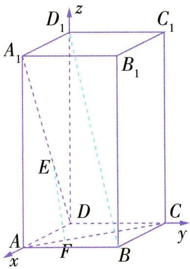

text_image

D₁
z
C₁
A₁
B₁
E
D
C
A
F
B
y
x

$0, \frac{2}{3}$ , 所以 $E(\frac{1}{3}, 0, \frac{2}{3})$ .

因为 $AF = \frac{1}{3}AC$ ，所以 $\overrightarrow{AF} = \frac{1}{3}\overrightarrow{AC} = (-\frac{1}{3}, \frac{1}{3}, 0)$ ，

所以 $F\left(\frac{2}{3},\frac{1}{3},0\right)$ ，所以 $\overrightarrow{EF}=\left(\frac{1}{3},\frac{1}{3},-\frac{2}{3}\right)$ ，

又 $\overrightarrow{BD_{1}}=(-1,-1,2)$ ,

所以 $\overrightarrow{EF} = -\frac{1}{3}\overrightarrow{BD_1}$ , 所以 $EF \parallel BD_1$ .

# 考向 2 线面平行的证明

# 证明线面平行的向量法有三种：

(1)取直线 l 的方向向量 a 与平面 $\alpha$ 的法向量 n, 证明 $a \cdot n = 0$ ;  
(2)在平面 $\alpha$ 内取基向量 $e_{1}, e_{2}$ ，证明存在实数 $\lambda_{1}, \lambda_{2}$ ，使直线 l 的方向向量 $a = \lambda_{1}e_{1} + \lambda_{2}e_{2}$ ，然后说明直线 l 不在平面 $\alpha$ 内；  
(3)在平面 $\alpha$ 内若能找到两点 A, B, 使直线 l 的方向向量 $n \parallel \overrightarrow{AB}$ , 则 $l \parallel \alpha$ .

典例1-2 如图所示,在正方体 $ABCD - A_{1}B_{1}C_{1}D_{1}$ 中, $M,N$ 分别是 $C_1C,B_1C_1$ 的中点. 求证: $MN \parallel$ 平面 $A_{1}BD$ .

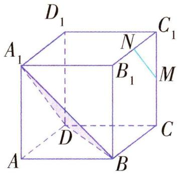

text_image

D₁
A₁
N
B₁
C₁
M
D
C
A
B

解析 方法一 以 D 为坐标原点, $\overrightarrow{DA}, \overrightarrow{DC}, \overrightarrow{DD_{1}}$ 的方向分别为 x 轴、y 轴、z 轴的正方向, 建立空间直角坐标系, 设正方体的棱长为 1, 则 $D(0,0,0), M(0,1, \frac{1}{2})$ , $N(\frac{1}{2},1,1), A_{1}(1,0,1), B(1,1,0)$ ,

则 $\overrightarrow{MN} = (\frac{1}{2}, 0, \frac{1}{2}), \overrightarrow{DA_1} = (1, 0, 1), \overrightarrow{DB} = (1, 1, 0)$ .

设平面 $A_{1}BD$ 的法向量为 $\boldsymbol{n}=(x,y,z)$ ,

则 $\left\{\begin{aligned}\boldsymbol{n}\cdot\overrightarrow{DA_{1}}&=0,\\ \boldsymbol{n}\cdot\overrightarrow{DB}&=0,\end{aligned}\right.$ 所以 $\left\{\begin{aligned}x+z&=0,\\ x+y&=0,\end{aligned}\right.$

取 x=1 ，得 y=-1 , z=-1 ，所以 $\boldsymbol{n}=(1,-1,-1)$ 是平面 $A_{1}BD$ 的一个法向量.

因为 $\overrightarrow{MN} \cdot \boldsymbol{n} = (\frac{1}{2}, 0, \frac{1}{2}) \cdot (1, -1, -1) = 0$

所以 $\overrightarrow{MN}\perp n.$

又 $MN \not\subset$ 平面 $A_{1}BD$ , 所以 $MN \parallel$ 平面 $A_{1}BD$ .

方法二 因为 $\overrightarrow{MN} = \overrightarrow{C_1N} -\overrightarrow{C_1M} = \frac{1}{2}\overrightarrow{C_1B_1} -\frac{1}{2}\overrightarrow{C_1C} =$ $\frac{1}{2} (\overrightarrow{D_1A_1} -\overrightarrow{D_1D}) = \frac{1}{2}\overrightarrow{DA_1},$ 所以 $\overrightarrow{MN} / / \overrightarrow{DA_1}.$

又 $MN \not\subset$ 平面 $A_{1}BD$ , 所以 $MN \parallel$ 平面 $A_{1}BD$ .

# 考向 3 面面平行的证明

# 证明面面平行的向量法有两种：

(1) 分别求出两平面的法向量, 再证明两法向量平行;

(2)证明一个平面中有两不共线向量平行于另一平面,转化为线面平行的问题.

典例1-3 [2025 河南许昌期中] 如图所示, 四边形ABCD为矩形, $PA \perp$ 平面ABCD, PA = AD, M, N, Q分别是PC, AB, CD的中点.

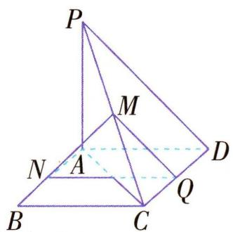

text_image

P
M
N
A
B
C
Q
D

(1) 求证: $MN \parallel$ 平面 PAD;

(2) 求证: 平面 $MNQ \parallel$ 平面 $PAD$ .

解析(1)因为 $PA \perp$ 平面ABCD, AB, AD⊂平面ABCD,所以 $PA \perp AB, PA \perp AD$ ,

因为四边形 ABCD 为矩形, 所以 $AB \perp AD$ ,

所以 AB, AD, AP 两两互相垂直，

所以以 A 为原点, 建立如图所示的空间直角坐标系.

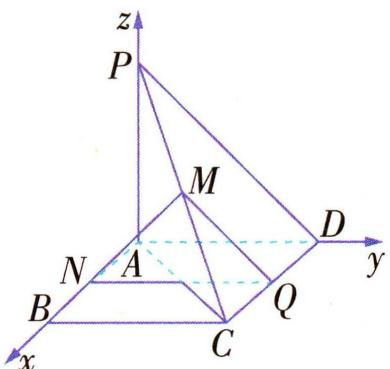

text_image

z
P
M
N
A
B
C
Q
D
y
x

设 $B(b,0,0), D(0,d,0)$ , 则 $P(0,0,d), C(b,d,0)$ , 因为 $M, N, Q$ 分别是 $PC, AB, CD$ 的中点,

所以 $M(\frac{b}{2},\frac{d}{2},\frac{d}{2}),N(\frac{b}{2},0,0),Q(\frac{b}{2},d,0)$ ,

所以 $\overrightarrow{MN} = (0, -\frac{d}{2}, -\frac{d}{2})$

因为平面 PAD 的一个法向量为 $\boldsymbol{m}=(1,0,0)$ ,

所以 $\overrightarrow{MN}\cdot m=0$ ，即 $\overrightarrow{MN}\perp m$ ，

又 $MN \not\subset$ 平面 PAD, 所以 $MN \parallel$ 平面 PAD.

(2) 方法一 因为 $\overrightarrow{QN} = (0, -d, 0)$ ，所以 $\overrightarrow{QN} \cdot m = 0$ ，
所以 $\overrightarrow{QN} \perp m$ ,

又 $QN \not\subset$ 平面 $PAD$ , 所以 $QN \parallel$ 平面 $PAD$ .

又 $MN \cap QN = N, MN, QN \subset$ 平面 MNQ,

所以平面 $MNQ \parallel$ 平面 $PAD$ .

方法二 由(1)得 $\overrightarrow{AB}=(b,0,0),\overrightarrow{MN}=(0,-\frac{d}{2},-\frac{d}{2})$ ,
所以 $\overrightarrow{AB}\cdot\overrightarrow{MN}=0$ ,即 $AB\perp MN$ .

又 $AB \perp NQ, MN \cap NQ = N, MN, NQ \subset$ 平面 MNQ,

所以 $AB \perp$ 平面 MNQ, 所以 $\overrightarrow{AB} = (b, 0, 0)$ 为平面 MNQ 的一个法向量.

由(1)知平面 PAD 的一个法向量为 $\boldsymbol{m} = (1, 0, 0)$ ，所以 $\overrightarrow{AB} \parallel \boldsymbol{m}$ ，

所以平面 $MNQ \parallel$ 平面 $PAD$ .

# 要点 ② 用空间向量证明空间中的垂直关系

# 考向1 线线垂直的证明

# 证明线线垂直的方法通常有三种：

(1) 建系法. 根据图形的特征, 建立适当的空间直角坐标系, 写出相关点的坐标, 表示出两条直线的方向向量, 计算出其数量积为 0 即可.  
(2) 基向量法. 利用向量的线性运算, 结合图形, 将要证明的两条直线的方向向量用基向量表示出来, 利用数量积运算证明两向量的数量积为 0 即可.  
(3) 几何法. ①转化为线面垂直来证明; ②利用三垂线定理来证明.

典例2-1 如图, 在四棱锥

P-ABCD中, $PC\perp$ 底面ABCD,
底面 ABCD 为正方形, CD =
CP = 4, E 为 PD 的中点.

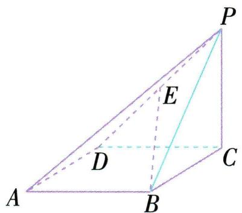

text_image

P
E
D
C
A
B

(1) 求证: $CD \perp BP$ .   
(2)在棱 $BC$ 上是否存在点 $F$ , 使得 $AF \perp BE$ ? 若存在, 求出 $BF$ 的长; 若不存在, 请说明理由.

解析(1)方法一(建系法) 由题意知 $CD, CB, CP$ 两两互相垂直, 如图, 以 $C$ 为坐标原点, 建立空间直角坐标系,

则 $C(0,0,0),D(4,0,0),B(0,$ $4,0),P(0,0,4)$

所以 $\overrightarrow{CD} = (4, 0, 0)$ , $\overrightarrow{BP} = (0, -4, 4)$ ,

因为 $\overrightarrow{CD}\cdot\overrightarrow{BP}=(4,0,0)\cdot(0,-4,4)=0,$ 所以 $\overrightarrow{CD}\perp\overrightarrow{BP}$ ，所以 $CD\perp BP$ .

方法二(基向量法) $\overrightarrow{CD} \cdot \overrightarrow{BP} = \overrightarrow{CD} \cdot (\overrightarrow{BC} + \overrightarrow{CP}) = \overrightarrow{CD} \cdot \overrightarrow{BC} + \overrightarrow{CD} \cdot \overrightarrow{CP} = 0$ , 所以 $\overrightarrow{CD} \perp \overrightarrow{BP}$ , 所以 $CD \perp BP$ .

方法三(三垂线定理) 因为 $PC \perp$ 底面 $ABCD$ , 所以 $BP$ 在平面 $ABCD$ 内的射影为 $BC$ ,

又 $BC \perp CD$ , 所以 $CD \perp BP$ .

(2) 方法一(建系法) 设 $BF = t (0 \leqslant t \leqslant 4)$ ,

则 $A(4,4,0), F(0,4 - t,0), E(2,0,2)$ ,

所以 $\overrightarrow{AF}=(-4,-t,0)$ , $\overrightarrow{BE}=(2,-4,2)$ .

要使 $AF \perp BE$ , 只需 $\overrightarrow{AF} \cdot \overrightarrow{BE} = (-4) \times 2 + (-t) \times (-4) + 0 \times 2 = 0$ , 解得 t = 2.

所以在棱 BC 上存在点 F, 使得 $AF \perp BE$ , 此时 BF = 2.
方法二(基向量法) 假设在棱 BC 上存在点 F, 使得 $AF \perp BE$ . 不妨设 $\overrightarrow{BF} = t \overrightarrow{BC} (0 \leqslant t \leqslant 1)$ ,

则 $\overrightarrow{AF}=\overrightarrow{AB}+\overrightarrow{BF}=\overrightarrow{AB}+t\overrightarrow{BC}$ ,

$$
\overrightarrow {B E} = \overrightarrow {B C} + \overrightarrow {C E} = \overrightarrow {B C} + \frac {1}{2} \overrightarrow {C D} + \frac {1}{2} \overrightarrow {C P}.
$$

由题意, 得 $\overrightarrow{AB} \cdot \overrightarrow{BC} = 0, \overrightarrow{AB} \cdot \overrightarrow{CD} = -\overrightarrow{AB}^{2} = -16, \overrightarrow{AB} \cdot \overrightarrow{CP} = 0, \overrightarrow{BC}^{2} = 16, \overrightarrow{BC} \cdot \overrightarrow{CD} = 0, \overrightarrow{BC} \cdot \overrightarrow{CP} = 0,$

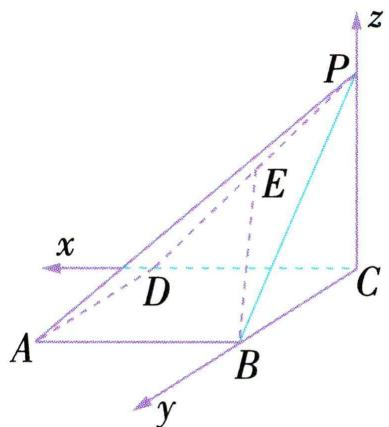

text_image

x
y
A
B
C
D
E
P
z

所以 $\overrightarrow{AF} \cdot \overrightarrow{BE} = (\overrightarrow{AB} + t\overrightarrow{BC}) \cdot (\overrightarrow{BC} + \frac{1}{2}\overrightarrow{CD} + \frac{1}{2}\overrightarrow{CP}) =$

$$
\frac {1}{2} \overrightarrow {A B} \cdot \overrightarrow {C D} + t \overrightarrow {B C ^ {2}} = \frac {1}{2} \times (- 1 6) + 1 6 t = 1 6 t - 8.
$$

要使 $AF \perp BE$ ，只需 $\overrightarrow{AF} \cdot \overrightarrow{BE} = 0$ ，即 $t = \frac{1}{2}$ .

故在棱 $BC$ 上存在点 $F$ , 使得 $AF \perp BE$ , 此时 $BF = 2$ .

# 考向 2 线面垂直的证明

# 证明线面垂直的向量法有两种：

(1)选基底,将相关向量用基底表示出来,然后利用向量的计算来证明.   
(2)建立空间直角坐标系,将向量的运算转化为实数 (坐标)的运算,以达到证明的目的.

典例2-2 如图所示, 在正方体 $ABCD - A_{1}B_{1}C_{1}D_{1}$ 中, $E, F$ 分别是 $BB_{1}$ , $D_{1}B_{1}$ 的中点. 求证: $EF \perp$ 平面 $B_{1}AC$ .

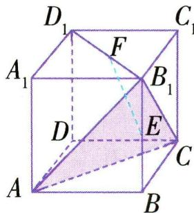

text_image

D₁
C₁
A₁
F
B₁
D
E
C
A
B

解析 方法一 设 $\overrightarrow{AB} = a, \overrightarrow{AD} = c$ ,

$\overrightarrow{AA_{1}}=b$ , 连接 BD, 则 $\overrightarrow{EF}=\overrightarrow{EB_{1}}+\overrightarrow{B_{1}F}=\frac{1}{2}\left(\overrightarrow{BB_{1}}+\overrightarrow{B_{1}D_{1}}\right)=$

$$
\frac {1}{2} (\overrightarrow {A A _ {1}} + \overrightarrow {B D}) = \frac {1}{2} (\overrightarrow {A A _ {1}} + \overrightarrow {A D} - \overrightarrow {A B}) = \frac {1}{2} (\boldsymbol {b} + \boldsymbol {c} - \boldsymbol {a}).
$$

因为 $\overrightarrow{AB_{1}}=\overrightarrow{AB}+\overrightarrow{AA_{1}}=\boldsymbol{a}+\boldsymbol{b}$ ,

所以 $\overrightarrow{EF} \cdot \overrightarrow{AB_1} = \frac{1}{2} (\pmb{b} + \pmb{c} - \pmb{a}) \cdot (\pmb{a} + \pmb{b}) = \frac{1}{2} (\pmb{b}^2 - \pmb{a}^2) = 0,$

所以 $\overrightarrow{EF} \perp \overrightarrow{AB_1}$ , 即 $EF \perp AB_1$ .

同理, $EF \perp B_{1}C.$

又 $AB_{1} \cap B_{1}C = B_{1}$ ,

所以 $EF \perp$ 平面 $B_{1}AC$ .

方法二 设正方体的棱长为 $2a$ , 建立如图所示的空间直角坐标系.

则 $A(2a,0,0),C(0,2a,0)$ $B_{1}(2a,2a,2a),E(2a,2a,a),F(a,a,2a)$ ，所以 $\overrightarrow{EF} =$ （-a，-a,a）， $\overrightarrow{AB_1} = (0,2a,2a),\overrightarrow{AC} = (-2a,2a,0).$

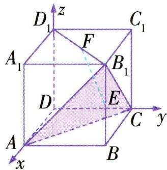

text_image

D₁
z
C₁
F
A₁
B₁
D
E
C
y
A
x
B

因为 $\overrightarrow{EF} \cdot \overrightarrow{AB_1} = (-a, -a, a) \cdot (0, 2a, 2a) = 0,$ $\overrightarrow{EF} \cdot \overrightarrow{AC} = (-a, -a, a) \cdot (-2a, 2a, 0) = 0,$

所以 $EF \perp AB_{1}, EF \perp AC$ .

又 $AB_{1} \cap AC = A$ ，所以 $EF \perp$ 平面 $B_{1}AC$ .

# 考向 3 面面垂直的证明

# 证明面面垂直的方法通常有两种：

(1) 利用面面垂直的判定定理, 转化为线面垂直、线线垂直去证明;  
(2)证明两个平面的法向量互相垂直.

典例2-3 在四棱锥 $S - ABCD$ 中, 底面 $ABCD$ 是正方形, $AS \perp$ 底面 $ABCD$ , 且 $AS = AB$ , $E$ 是 $SC$ 的中点. 求证: 平面 $BDE \perp$ 平面 $ABCD$ .

解析 设 AS = AB = 1, 建立如图所示的空间直角坐标系 Axyz, 则 $A(0,0,0)$ , $B(1,0,0)$ , $D(0,1,0)$ , $S(0,0,1)$ , $E(\frac{1}{2},\frac{1}{2},\frac{1}{2})$ .

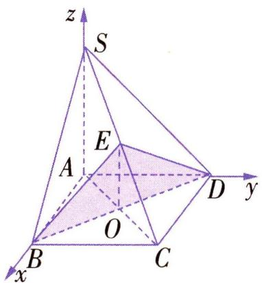

text_image

z
S
E
A
D
y
O
B
C
x

方法一 如图, 连接 AC, 交 BD 于点 O, 连接 OE,

则点 O 的坐标为 $\left(\frac{1}{2},\frac{1}{2},0\right)$ .

又 $\overrightarrow{AS} = (0,0,1),\overrightarrow{OE} = (0,0,\frac{1}{2})$ ，所以 $\overrightarrow{OE} = \frac{1}{2}\overrightarrow{AS},$

所以OE∥AS.

又 $AS \perp$ 底面 $ABCD$ , 所以 $OE \perp$ 平面 $ABCD$ .

转化为线面垂直.

又 $OE \subset$ 平面 BDE, 所以平面 $BDE \perp$ 平面 ABCD.

方法二 设平面 BDE 的法向量为 $\boldsymbol{n}_{1}=(x,y,z)$ .

又 $\overrightarrow{BD} = (-1, 1, 0), \overrightarrow{BE} = (-\frac{1}{2}, \frac{1}{2}, \frac{1}{2})$

所以由 $\left\{\begin{aligned}\boldsymbol{n}_{1}\perp\overrightarrow{BD},\\ \boldsymbol{n}_{1}\perp\overrightarrow{BE},\end{aligned}\right.$ 得 $\left\{\begin{aligned}\boldsymbol{n}_{1}\cdot\overrightarrow{BD}&=-x+y=0,\\ \boldsymbol{n}_{1}\cdot\overrightarrow{BE}&=-\frac{1}{2}x+\frac{1}{2}y+\frac{1}{2}z=0.\end{aligned}\right.$

令 $x = 1$ ，可得平面BDE的一个法向量为 $\pmb{n}_{1} = (1,1,0)$

因为 $AS \perp$ 底面 ABCD, 所以平面 ABCD 的一个法向量为 $\boldsymbol{n}_{2} = \overrightarrow{AS} = (0, 0, 1)$ .

因为 $n_{1}\cdot n_{2}=0$ ，所以平面BDE⊥平面ABCD.

证明两法向量垂直.

# 要点 ③ 用空间向量研究距离问题

# 考向 1 点到直线、两平行直线间的距离

用向量法求点到直线、平行直线间的距离时,需要注意以下两点:

(1) 直线 l 上的点可任意选取, 因此可选取易求得坐标的特殊点;  
(2) 直线 l 的方向向量可任意选取.

典例 3-1 如图, 在长方体 $ABCD - A'B'C'D'$ 中, $AB = 1$ , $BC = 1$ , $AA' = 2$ , 求点 $B$ 到直线 $A'C$ 的距离.

解析 方法一 以 A 为坐标原点, 建立空间直角坐标系如图所示,

因为 AB = 1, BC = 1, $AA' = 2$ ,

所以 $A'(0,0,2)$ , $C(1,1,0)$ , $B(1,0,0)$ ,

所以 $\overrightarrow{A^{\prime}C}=(1,1,-2),\overrightarrow{BC}=(0,1,0)$ ,
则 $\overrightarrow{BC}$ 在 $\overrightarrow{A^{\prime}C}$ 上的投影向量的模为

$$
| \overrightarrow {B C} \cdot \frac {\overrightarrow {A ^ {\prime} C}}{| \overrightarrow {A ^ {\prime} C} |} | =
$$

$$
\frac {| 0 \times 1 + 1 \times 1 + (- 2) \times 0 |}{\sqrt {1 ^ {2} + 1 ^ {2} + (- 2) ^ {2}}} = \frac {1}{\sqrt {6}},
$$

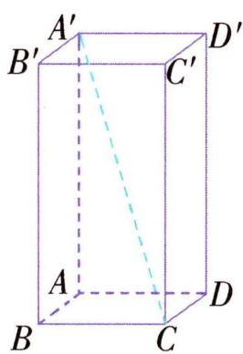

text_image

A'
B'
C'
D'
A
B
C
D

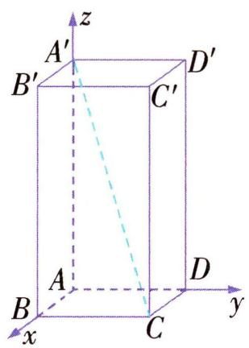

text_image

z
A'
B'
C'
D'
A
B
x
y
C
D

所以点 B 到直线 $A^{\prime}C$ 的距离为

$$
d = \sqrt {| \overrightarrow {B C} | ^ {2} - | \overrightarrow {B C} \cdot \frac {\overrightarrow {A ^ {\prime} C}}{| \overrightarrow {A ^ {\prime} C} |} | ^ {2}} = \sqrt {1 - \frac {1}{6}} = \frac {\sqrt {3 0}}{6}.
$$

方法二 连接 $A'B$ , 过点 $B$ 作 $BE$ 垂直 $A'C$ , 垂足为点 $E$ . 在长方体 $ABCD-A'B'C'D'$ 中, $BC \perp$ 平面 $AA'B'B$ , 所以 $BC \perp A'B$ .

又 BC = 1, $A'B = \sqrt{5}$ , $A'C = \sqrt{6}$ ,

所以由等面积法得 $S_{\triangle A^{\prime}BC}=\frac{1}{2}A^{\prime}B\times BC=\frac{1}{2}A^{\prime}C\times BE,$ 即 $\frac{1}{2}\times\sqrt{5}\times1=\frac{1}{2}\times\sqrt{6}BE$ ，所以 $BE=\frac{\sqrt{30}}{6}.$

故点 B 到直线 $A^{\prime}C$ 的距离为 $\frac{\sqrt{30}}{6}$ .

# 考向 2 点到平面的距离、直线到平面的距离、平面到平面的距离

线面距、面面距实质上都可以归纳为点面距,求线面距、面面距的前提是直线与平面平行、平面与平面平行.

求点到平面的距离的三种方法：

<table><tr><td>定义法</td><td>首先过点向平面作垂线,确定垂足的位置,然后把该垂线归结到一个直角三角形中,解三角形求得.</td></tr><tr><td>等体积法</td><td>把点到平面的距离视为三棱锥某个底面上的高,利用三棱锥转换底面求体积,进而求得距离.</td></tr><tr><td>向量法</td><td>点A到平面α的距离 $d = \frac{|\overrightarrow{AB} \cdot n|}{|n|}$ ,其中 $A \notin \alpha$ , $B \in \alpha$ ,n是平面α的一个法向量.</td></tr></table>

典例 3-2 如图, 在四棱锥 $P - ABCD$ 中, 底面 $ABCD$ 为矩形, 侧棱 $PD \perp$ 平面 $ABCD$ , $E$ 为 $PC$ 的中点, $AD = 3$ , $PD = 4$ , $PC = 5$ .

(1) 证明: $PA \parallel$ 平面 $BDE$ ;  
(2) 求点 $A$ 到平面 $PBC$ 的距离.

解析 (1) 如图, 连接 AC 交 BD 于点 O, 连接 EO. 因为底面 ABCD 为矩形,

所以 O 为 AC 的中点.

在 $\triangle PAC$ 中, $O,E$ 分别为 $AC,PC$ 的中点,所以 $EO//PA$ .

又 $EO \subset$ 平面 $BDE, PA \not\subset$ 平面 $BDE$ , 所以 $PA \parallel$ 平面 $BDE$ .

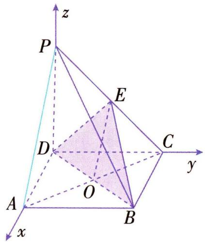

text_image

z
P
E
D
C
y
A
O
B
x

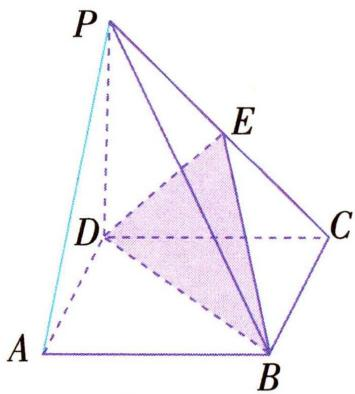

text_image

P
E
D
C
A
B

(2) 方法一(向量法) 以 D 为坐标原点, 建立如图所示的空间直角坐标系.

由题意得 $CD = \sqrt{5^{2} - 4^{2}} = 3, P(0,0,4), A(3,0,0)$ ， $B(3,3,0), C(0,3,0)$ ，

所以 $\overrightarrow{PB}=(3,3,-4)$ , $\overrightarrow{PC}=(0,3,-4)$ , $\overrightarrow{AP}=(-3,0,4)$ .

设 $\boldsymbol{n}=(x,y,z)$ 为平面 PBC 的法向量，

则 $\left\{ \begin{array}{l} \overrightarrow{PB} \cdot \boldsymbol{n} = 0, \\ \overrightarrow{PC} \cdot \boldsymbol{n} = 0, \end{array} \right.$ 即 $\left\{ \begin{array}{l} 3x + 3y - 4z = 0, \\ 3y - 4z = 0, \end{array} \right.$

令 y=4，则 x=0,z=3，则 $\boldsymbol{n}=(0,4,3)$ 为平面 PBC 的一个法向量.

设点 A 到平面 PBC 的距离为 d,

则 $d=\frac{|n\cdot\overrightarrow{AP}|}{|n|}=\frac{|0\times(-3)+4\times0+3\times4|}{\sqrt{4^{2}+3^{2}}}=\frac{12}{5}$ ，即

点 A 到平面 PBC 的距离为 $\frac{12}{5}$ .

方法二(等体积法) 设点 $A$ 到平面 $PBC$ 的距离为 $d$ .

由 $V_{A-PBC}=V_{P-ABC}$ ，得 $\frac{1}{3}S_{\triangle PBC}\times d=\frac{1}{3}S_{\triangle ABC}\times PD.$

由题意, 得 $PD \perp DC, BC \perp PC,$

所以 $CD = \sqrt{PC^2 - PD^2} = \sqrt{5^2 - 4^2} = 3, S_{\triangle PBC} = \frac{1}{2} \times$

$$
B C \times P C = \frac {1}{2} \times 3 \times 5 = \frac {1 5}{2}.
$$

又 $S_{\triangle ABC}=\frac{1}{2}\times AB\times BC=\frac{1}{2}\times3\times3=\frac{9}{2},PD=4,$

所以 $\frac{1}{3}\times\frac{15}{2}\times d=\frac{1}{3}\times\frac{9}{2}\times4$ , 解得 $d=\frac{12}{5}$ .

所以点 A 到平面 PBC 的距离为 $\frac{12}{5}$ .

# 考向 3 异面直线间的距离

如图,设 A, P 分别为异面直线 a, b 上的点, n 是与直线 a, b 都垂直的向量, 从而异面直线 a, b 间的距离 d = $\frac{|\overrightarrow{AP} \cdot n|}{|n|}$ , 即向量 $\overrightarrow{AP}$ 在向量 n 上的投

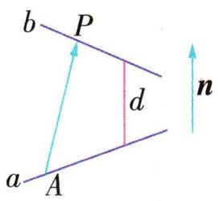

影的数量.

典例3-3 [2025 辽宁省部分名校联考]在直四棱柱 $ABCD - A_{1}B_{1}C_{1}D_{1}$ 中, 底面 $ABCD$ 为菱形, $AC = 2$ , $BD = AA_{1} = 4$ , $E$ 为棱 $BB_{1}$ 的中点, $M, N$ 分别为直线 $DE, CD_{1}$ 上的动点, 则线段 $MN$ 的长度的最小值为 \_\_\_\_.

解析 要求线段 MN 的长度的最小值, 即求异面直线

DE 与 $CD_{1}$ 之间的距离. 设 $AC \cap BD = O$ , 以 O 为原点, 建立如图所示的空间直角坐标系, 则 $C(1,0,0)$ , $D(0,2,0)$ , $D_{1}(0,2,4)$ , $E(0,-2,2)$ , 所以 $\overrightarrow{CD_{1}} = (-1,2,4)$ , $\overrightarrow{DE} = (0,-4,2)$ , $\overrightarrow{CD} = (-1,2,0)$ . 设

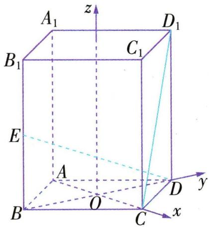

text_image

A₁
z
D₁
B₁
C₁
E
A
O
B
C
D
y
x

与 $\overrightarrow{CD_1},\overrightarrow{DE}$ 都垂直的一个向量为 $n = (x,y,z)$ ，则 $\left\{ \begin{array}{l} n\cdot \overrightarrow{CD_1} = 0,\\ n\cdot \overrightarrow{DE} = 0, \end{array} \right.$ 即 $\left\{ \begin{array}{l} -x + 2y + 4z = 0,\\ -4y + 2z = 0, \end{array} \right.$ 令 $z = 2$ ，则 $y = 1$ ， $x = 10$ ，所以与 $\overrightarrow{CD_1},\overrightarrow{DE}$ 都垂直的一个向量为 $n = (10,1,2)$ ，则线段 $MN$ 的长度的最小值为 $\frac{|\boldsymbol{n}\cdot\overrightarrow{CD}|}{|\boldsymbol{n}|} = \frac{8}{\sqrt{105}} = \frac{8\sqrt{105}}{105}$ .

答案 $\frac{8\sqrt{105}}{105}$

# 要点 ④ 用空间向量研究夹角问题

# 考向1 线线角

# 求异面直线所成角 $\theta$ 的方法:

(1) 建系法: ①建立空间直角坐标系; ②求出两直线的方向向量 $\pmb{v}_{1}, \pmb{v}_{2}$ ; ③代入公式 $\cos \theta = |\cos \langle \pmb{v}_{1}, \pmb{v}_{2} \rangle| = \frac{|\pmb{v}_{1} \cdot \pmb{v}_{2}|}{|\pmb{v}_{1}| |\pmb{v}_{2}|}$ 求解.  
(2) 基向量法: 选取基向量, 运用向量的线性运算并结合向量的夹角公式求 $\theta$ .  
(3) 几何法: 平移, 变异面直线为相交直线, 然后通过解三角形求 $\theta$ .

典例4-1 在直三棱柱 $ABC-A_{1}B_{1}C_{1}$ 中, $AA_{1}=2A_{1}B_{1}=2B_{1}C_{1}$ ，且 $AB\perp BC$ ，点M是 $A_{1}C_{1}$ 的中点，则异面直线MB与 $AA_{1}$ 所成角的余弦值为()

A. $\frac{1}{3}$

B. $\frac{2 \sqrt{2}}{3}$

C. $\frac{\sqrt{2}}{4}$

D. $\frac{1}{2}$

解析 方法一(建系法) 由题意知 $AB, BC, BB_{1}$ 两两垂直, 所以以 $B$ 为坐标原点, $BA, BC, BB_{1}$ 所在直线分

别为x轴、y轴、z轴建立空间直角坐标系Bxyz，如图1.设 $AA_{1}=2A_{1}B_{1}=2B_{1}C_{1}=2$ ，则 $B(0,0,0)$ ， $A(1,0,0)$ ， $A_{1}(1,0,2)$ ， $M(\frac{1}{2},\frac{1}{2},2)$ ，所以 $\overrightarrow{MB}=(-\frac{1}{2},-\frac{1}{2},-2)$ ， $\overrightarrow{AA_{1}}=(0,0,2)$ .

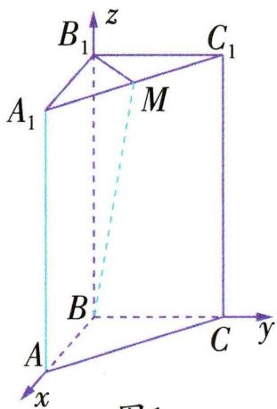

text_image

B₁
z
C₁
A₁
M
B
A
C
y
x

设异面直线 MB 与 $AA_{1}$ 所成的角为 $\theta$ ,图1

则 $\cos \theta = \frac{|\overrightarrow{MB} \cdot \overrightarrow{AA_1}|}{|\overrightarrow{MB}| |\overrightarrow{AA_1}|} = \frac{4}{\sqrt{\frac{9}{2}} \times 2} = \frac{2\sqrt{2}}{3}$ , 所以异面直线 $MB$

与 $AA_{1}$ 所成角的余弦值为 $\frac{2\sqrt{2}}{3}$ .

方法二（基向量法） $\overrightarrow{BM} = \overrightarrow{BB_1} +\overrightarrow{B_1M} = \overrightarrow{BB_1} +$ $\frac{1}{2} (\overrightarrow{B_1A_1} +\overrightarrow{B_1C_1})$ ，令 $AA_{1} = 2A_{1}B_{1} = 2B_{1}C_{1} = 2$ ，则 $\overrightarrow{BM}\cdot$

$$
\overrightarrow {A A _ {1}} = \left[ \overrightarrow {B B _ {1}} + \frac {1}{2} \left(\overrightarrow {B _ {1} A _ {1}} + \overrightarrow {B _ {1} C _ {1}}\right) \right] \cdot \overrightarrow {A A _ {1}} = \overrightarrow {B B _ {1}} \cdot \overrightarrow {A A _ {1}} +
$$

$\frac{1}{2}\overrightarrow{B_1A_1} \cdot \overrightarrow{AA_1} + \frac{1}{2}\overrightarrow{B_1C_1} \cdot \overrightarrow{AA_1} = 4$ ，由 $AB \perp BC$ ，得 $A_1B_1 \perp B_1C_1$ ，所以 $B_1M = \frac{1}{2} A_1C_1 = \frac{\sqrt{2}}{2}, BM = \sqrt{BB_1^2 + B_1M^2} = \sqrt{2^2 + (\frac{\sqrt{2}}{2})^2} = \frac{3\sqrt{2}}{2}$ ，所以 $\cos \langle \overrightarrow{BM}, \overrightarrow{AA_1} \rangle = \frac{\overrightarrow{BM} \cdot \overrightarrow{AA_1}}{|\overrightarrow{BM}| |\overrightarrow{AA_1}|} = \frac{2\sqrt{2}}{3}$ ，又异面直线所成角的取值范围为 $(0, \frac{\pi}{2}]$ ，所以所求角的余弦值为 $\frac{2\sqrt{2}}{3}$ .方法三(几何法) 由题意知 $AA_{1} // BB_{1}$ , 则异面直线 $MB$ 与 $AA_{1}$ 所成的角为 $\angle MBB_{1}$ , 如图2. 因为 $\triangle BB_{1}M$ 为直角三角形, 所以 $\cos \angle MBB_{1} = \frac{BB_{1}}{MB}$ . 在直三棱柱 $ABC - A_{1}B_{1}C_{1}$ 中, 设 $AA_{1} = 2A_{1}B_{1} = 2B_{1}C_{1} = 2$ , 由 $AB \perp BC$ , 得 $A_{1}B_{1} \perp$ $B_{1}C_{1}$ ，所以 $B_{1}M = \frac{1}{2} A_{1}C_{1} = \frac{\sqrt{2}}{2}$ 故 $BM = \sqrt{2^2 + (\frac{\sqrt{2}}{2})^2} =$ $\frac{3\sqrt{2}}{2}$ 所以 $\cos \angle MBB_{1} = \frac{BB_{1}}{BM} = \frac{2\sqrt{2}}{3}.$

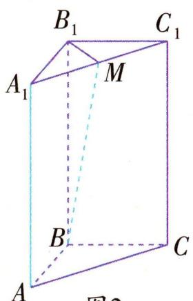

text_image

B₁
C₁
A₁
M
B
C
A
图2

图2

▶ 答案 B

# 考向2 线面角

# 求直线与平面所成角 $\theta$ 的方法:

(1) 建系法: ①建立空间直角坐标系; ②求出直线 l 的一个方向向量 a, 平面 $\alpha$ 的一个法向量 n; ③代入公式 $\sin \theta = |\cos \langle a, n \rangle| = \frac{|a \cdot n|}{|a||n|}$ 求解.

(2) 几何法: 先找 (或作) 出线面角, 然后通过解三角形求 $\theta$ .

典例4-2 在平行四边形ABCD中, $AB = BD = CD = 3$ , $AB \perp BD$ , $CD \perp BD$ . 将 $\triangle ABD$ 沿 $BD$ 折起, 使得平面 $ABD \perp$ 平面 $BCD$ , 如图所示, $M$ 为线段 $AD$ 上一点, 且 \_\_\_\_.

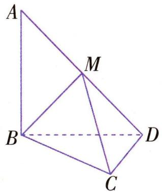

text_image

A
M
B
D
C

(1) 证明: $AB \perp CD$ ;

(2)求直线 $AD$ 与平面 $MBC$ 所成角的正弦值.

从①M 为 AD 的中点, ②AM = 2MD, ③DM = 2AM 这三个条件中任选一个, 补充在上面的问题中并作答.

解析 方案一 选择条件①.

(1) 因为平面 $ABD \perp$ 平面 BCD, 平面 $ABD \cap$ 平面 BCD = BD, $AB \subset$ 平面 ABD, $AB \perp BD$ ,
所以 $AB \perp$ 平面 BCD,
又 $CD \subset$ 平面 BCD, 所以 $AB \perp CD$ .

(2) 建立如图 1 所示的空间直角坐标系，

因为 AB = BD = CD = 3, $AB \perp BD$ , $CD \perp BD$ ,

所以 $B(0,0,0)$ , $C(3,3,0)$ , $A(0,0,3)$ , $D(0,3,0)$ , $M(0,\frac{3}{2},\frac{3}{2})$ ,

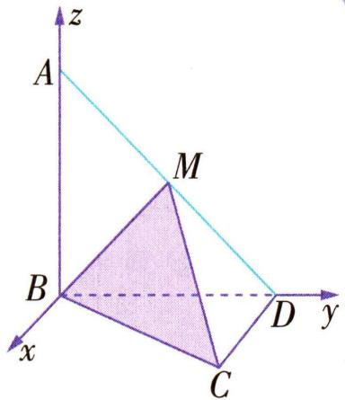

text_image

z
A
M
B
x
C
D y

图 1

则 $\overrightarrow{AD} = (0,3, - 3),\overrightarrow{BC} = (3,3,0),\overrightarrow{BM} = (0,\frac{3}{2},\frac{3}{2}).$

设平面 MBC 的法向量为 $\boldsymbol{n}=(x,y,z)$ ,

则 $\left\{ \begin{array}{l} n \cdot \overrightarrow{BC} = 3x + 3y = 0, \\ n \cdot \overrightarrow{BM} = \frac{3}{2} y + \frac{3}{2} z = 0, \end{array} \right.$ 令 $y = -1$ ，则 $x = 1, z = 1$

故 $\boldsymbol{n}=(1,-1,1)$ 为平面 MBC 的一个法向量.

设直线 AD 与平面 MBC 所成的角为 $\theta$ ,

则 $\sin \theta = |\cos \langle n, \overrightarrow{AD}\rangle| = \frac{|\pmb{n} \cdot \overrightarrow{AD}|}{|\pmb{n}| |\overrightarrow{AD}|} = \frac{\sqrt{6}}{3}$ .

# 方案二 选择条件②.

(1) 同方案一.

(2) 建立如图 2 所示的空间直角坐标系，

因为 $AB = BD = CD = 3, AB \perp BD, CD \perp BD, AM = 2MD,$

所以 $B(0,0,0),C(3,3,0),A(0,$ $0,3),D(0,3,0),M(0,2,1)$

则 $\overrightarrow{AD} = (0,3, - 3),\overrightarrow{BC} = (3,3,0),\overrightarrow{BM} = (0,2,1)$

设平面 MBC 的法向量为 $\boldsymbol{n}=(x,y,z)$ ,

则 $\left\{ \begin{array}{l} n \cdot \overrightarrow{BC} = 3x + 3y = 0, \\ n \cdot \overrightarrow{BM} = 2y + z = 0, \end{array} \right.$ 令 $y = -1$ ，则 $x = 1, z = 2$

故 $n=(1,-1,2)$ 为平面MBC的一个法向量.

设直线 AD 与平面 MBC 所成的角为 $\theta$ ,

则 $\sin \theta = |\cos \langle n, \overrightarrow{AD} \rangle| = \frac{|\pmb{n} \cdot \overrightarrow{AD}|}{|\pmb{n}| |\overrightarrow{AD}|} = \frac{\sqrt{3}}{2}$ .

# 方案三 选择条件③.

(1) 同方案一.

(2) 建立如图 3 所示的空间直角坐标系，

因为 $AB = BD = CD = 3, AB \perp BD, CD \perp BD, DM = 2AM,$

所以 $B(0,0,0),C(3,3,0),A(0,$ $0,3),D(0,3,0),M(0,1,2)$

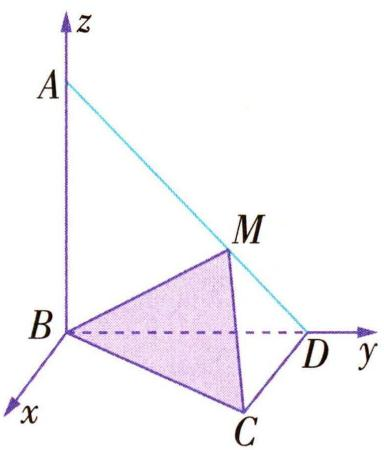

text_image

z
A
M
B
D y
x
C

图 2

则 $\overrightarrow{AD}=(0,3,-3)$ , $\overrightarrow{BC}=(3,3,0)$ , $\overrightarrow{BM}=(0,1,2)$ .

设平面 MBC 的法向量为 $\boldsymbol{n}=(x,y,z)$ ,

text_image

z
A
M
B
D y
x
C

图 3

则 $\left\{ \begin{array}{l} n \cdot \overrightarrow{BC} = 3x + 3y = 0, \\ n \cdot \overrightarrow{BM} = y + 2z = 0, \end{array} \right.$

令 $y = -2$ ，则 $x = 2, z = 1$

故 $\boldsymbol{n}=(2,-2,1)$ 为平面 MBC 的一个法向量.

设直线 $AD$ 与平面 $MBC$ 所成的角为 $\theta$ ,

则 $\sin \theta = |\cos \langle n, \overrightarrow{AD} \rangle| = \frac{|\pmb{n} \cdot \overrightarrow{AD}|}{|\pmb{n}| |\overrightarrow{AD}|} = \frac{\sqrt{2}}{2}$ .

# 考向 3 面面角

如图所示, 若 AB, CD 分别是二面角 $\alpha - l - \beta$ 的两个半平面 $\alpha, \beta$ 内与棱 l 垂直的两条射线, 则 $\langle \overrightarrow{AB}, \overrightarrow{CD} \rangle$ 的大小等于二面角的大小; 若 m, n 分别是二面角 $\alpha - l - \beta$ 的两个半平面 $\alpha, \beta$ 的法向量, 则 m, n 的夹角 $\langle m, n \rangle$ 与二面角 $\alpha - l - \beta$ 的平面角相等或互补.

典例4-3 如图所示, 正三棱柱 $ABC - A_{1}B_{1}C_{1}$ 的所有棱长都为 2, $D$ 为 $CC_{1}$ 的中点, 求平面 $AA_{1}D$ 与平面 $BA_{1}D$ 的夹角的余弦值.

text_image

A
C
D
B
B₁
A₁
C₁

解析 取 BC 的中点 O, 连接 AO.

因为 $\triangle ABC$ 是正三角形, 所以 $AO \perp BC$ .

因为在正三棱柱 $ABC - A_{1}B_{1}C_{1}$ 中, 平面 $ABC \perp$ 平面 $BCC_{1}B_{1}$ , 平面 $ABC \cap$ 平面 $BCC_{1}B_{1} = BC, AO \subset$ 平面 ABC, 所以 $AO \perp$ 平面 $BCC_{1}B_{1}$ .

取 $B_{1}C_{1}$ 的中点 $O_{1}$ , 连接 $OO_{1}$ , 以 $O$ 为坐标原点, 分别以 $OB, OO_{1}, OA$ 所在直线为 $x$ 轴、 $y$ 轴、 $z$ 轴, 建立空间直角坐标系 $Oxyz$ , 如图所示,

则 $B(1,0,0)$ , $D(-1,1,0)$ , $A_{1}(0,2,\sqrt{3})$ , $A(0,0,\sqrt{3})$ .

设平面 $AA_{1}D$ 的法向量为 $\boldsymbol{n} = (x, y, z)$ ,

text_image

z
A
A₁
O C D C₁
B B₁ O₁ y
x

$\overrightarrow{AD} = (-1, 1, -\sqrt{3}), \overrightarrow{AA_1} = (0, 2, 0)$ .

因为 $n \perp \overrightarrow{AD}, n \perp \overrightarrow{AA_{1}}$ ，所以 $\left\{\begin{aligned} &n \cdot \overrightarrow{AD} = 0, \\ &n \cdot \overrightarrow{AA_{1}} = 0,\end{aligned}\right.$

得 $\left\{\begin{aligned}-x+y-\sqrt{3}z&=0,\\2y&=0,\end{aligned}\right.$ 令z=1,得 $\boldsymbol{n}=(-\sqrt{3},0,1)$ 为平面 $AA_{1}D$ 的一个法向量.

设平面 $BA_{1}D$ 的法向量为 $\boldsymbol{m}=(x_{1},y_{1},z_{1})$ ,

$$
\overrightarrow {B D} = (- 2, 1, 0), \overrightarrow {B A _ {1}} = (- 1, 2, \sqrt {3}),
$$

因为 $m \perp \overrightarrow{BD}, m \perp \overrightarrow{BA_{1}}$ ，所以 $\left\{\begin{aligned}m & \cdot \overrightarrow{BD} = 0, \\ m & \cdot \overrightarrow{BA_{1}} = 0,\end{aligned}\right.$

得 $\left\{ \begin{array}{l} -2x_{1} + y_{1} = 0, \\ -x_{1} + 2y_{1} + \sqrt{3}z_{1} = 0, \end{array} \right.$ 令 $x_{1} = 1$ ，则 $\pmb{m} = (1,2,$ $-\sqrt{3})$ 是平面 $BA_{1}D$ 的一个法向量，

所以 $\cos \langle n, m \rangle = \frac{n \cdot m}{|n||m|} = \frac{-\sqrt{3} - \sqrt{3}}{2 \times 2\sqrt{2}} = -\frac{\sqrt{6}}{4}$ .

所以平面 $AA_{1}D$ 与平面 $BA_{1}D$ 的夹角的余弦值为 $\frac{\sqrt{6}}{4}$ .

# 微专题 1 空间直角坐标系的构建

运用“坐标法”解答空间几何体问题时,往往需要建立空间直角坐标系.依据空间几何体的结构特征,充分利用图形中的垂直关系或构造垂直关系建立空间直角坐标系,是解决问题的基础和关键.

# 类型 ① 利用共顶点的互相垂直的三条棱建系

像正方体、长方体这类几何体有明显的两两互相垂直的三条棱,可以直接利用共顶点的互相垂直的三条棱建系,有些题目虽然没有直接给出两两互相垂直的线段,但是稍微挖掘一下题设中的条件便能得到共顶点的互相垂直的三条线段.

典例 1 如图, 在直三棱柱 ABC - $A_{1}B_{1}C_{1}$ 中, AB = AC = 2, $AA_{1} = 4$ , $AB \perp AC$ , $BE \perp AB_{1}$ 交 $AA_{1}$ 于点 E, D 为 $CC_{1}$ 的中点.

(1) 求证: $BE \perp$ 平面 $AB_{1}C$ ;

(2) 求直线 $B_{1} D$ 与平面 $A B_{1} C$ 所成角的正弦值.

text_image

A₁
B₁
C₁
E
D
A
B
C

解析 (1) 因为三棱柱 $ABC - A_{1}B_{1}C_{1}$ 为直三棱柱,

所以 $AA_{1} \perp$ 平面 ABC.

又 $AC \subset$ 平面 ABC, 所以 $AA_{1} \perp AC$ .

又 $AC \perp AB, AB \cap AA_{1} = A, AB \subset$ 平面 $AA_{1}B_{1}B, AA_{1} \subset$ 平面 $AA_{1}B_{1}B$ , 所以 $AC \perp$ 平面 $AA_{1}B_{1}B$ .

因为 $BE \subset$ 平面 $AA_{1}B_{1}B$ ，所以 $AC \perp BE$ 。

又 $BE \perp AB_{1}, AC \cap AB_{1} = A, AC \subset$ 平面 $AB_{1}C, AB_{1} \subset$ 平面 $AB_{1}C$ , 所以 $BE \perp$ 平面 $AB_{1}C$ .

(2) 由(1)知 $AB, AC, AA_{1}$ 两两垂直, 如图建立空间直角坐标系 $Axyz$ ,

则 $A(0,0,0), B_{1}(2,0,4), B(2,0,0), D(0,2,2)$ .

设 $E(0,0,a),\overrightarrow{AB_1} = (2,0,4),\overrightarrow{BE} =$ $(-2,0,a)$

text_image

z
A₁
B₁
C₁
E
D
B
A
C
x
y

因为 $AB_{1} \perp BE$ ，所以 $\overrightarrow{AB_{1}} \cdot \overrightarrow{BE} = 4a - 4 = 0$ ，

即 a=1，则 $\overrightarrow{BE}=(-2,0,1)$ .

由(1)知,平面 $AB_{1}C$ 的一个法向量为 $\overrightarrow{BE}=(-2,0,1)$ .

又 $\overrightarrow{B_{1}D}=(-2,2,-2)$ ,

设直线 $B_{1}D$ 与平面 $AB_{1}C$ 所成角的大小为 $\theta (0\leqslant \theta \leqslant$ $\frac{\pi}{2}$ ），则 $\sin \theta = |\cos \langle \overrightarrow{BE}, \overrightarrow{B_1D} \rangle| = \frac{|\overrightarrow{BE} \cdot \overrightarrow{B_1D}|}{|\overrightarrow{BE}| |\overrightarrow{B_1D}|} =$

$$
\frac {2}{\sqrt {5} \times 2 \sqrt {3}} = \frac {\sqrt {1 5}}{1 5},
$$

因此直线 $B_{1}D$ 与平面 $AB_{1}C$ 所成角的正弦值为 $\frac{\sqrt{15}}{15}$ .

# 类型 ② 利用线面垂直关系建系

若题目条件给出线面垂直,如所给条件为 $l \perp \alpha$ , 则一般将直线 l 或平行于直线 l 的直线作为一条坐标轴, 再在平面 $\alpha$ 内找到或作出一对互相垂直的直线, 即可得到两两互相垂直的三条直线.

典例 2 如图, 在四棱锥 P-ABCD 中, 底面 ABCD 为

矩形, $AB \perp$ 平面 PAD,E 是 AD 的中点, $\triangle PAD$ 为等腰直角三角形, $DP \perp$

$$
A P, P A = \sqrt {2} A B = \sqrt {2}.
$$

text_image

C
B
E
D
A
P

(1) 求证: $PE \perp BD$ ;

(2) 求点 A 到平面 PBE 的距离.

解析 (1) 因为 $AB \perp$ 平面 $PAD, PE \subset$ 平面 $PAD$ ,

所以 $PE \perp AB$ .

因为 $\triangle PAD$ 是等腰直角三角形, $E$ 是斜边 $AD$ 的中点, 所以 $PE \perp AD$ .

又 $AD \subset$ 平面 ABCD, $AB \subset$ 平面 ABCD, $AB \cap AD = A$ ,

所以 $PE \perp$ 平面ABCD.

又 $BD \subset$ 平面ABCD, 所以 $PE \perp BD$ .

(2) 在平面 ABCD 内, 过 E 点作 AD 的垂线 EF, 交 BC 于点 F, 则 $EF \parallel AB$ ,

又 $AB \perp$ 平面 $PAD$ , 所以 $EF \perp$ 平面 $PAD$ .

又 $EP \perp EA$ , 则 $EP, EA, EF$ 两两垂直,

以 E 为原点, 分别以 EP, EA, EF 所在直线为 x 轴、

y 轴、z 轴, 建立空间直角坐标系 Exyz, 如图.

因为 $PA = \sqrt{2} AB = \sqrt{2}$

所以 $E(0,0,0)$ , $B(0,1,1)$ , $A(0,1,0)$ , $P(1,0,0)$ ,

text_image

C
F
B
E
D
A
y
P
z

则 $\overrightarrow{EB}=(0,1,1)$ , $\overrightarrow{EP}=(1,0,0)$ , $\overrightarrow{PA}=(-1,1,0)$ .

设平面 PBE 的一个法向量为 $\boldsymbol{n}=(x,y,z)$ ,

则 $\left\{ \begin{array}{l} \overrightarrow{EB} \cdot \boldsymbol{n} = y + z = 0, \\ \overrightarrow{EP} \cdot \boldsymbol{n} = x = 0, \end{array} \right.$ 取 $y = 1$ ，则 $z = -1$ ，故 $\boldsymbol{n} = (0,$

1, -1) 为平面 $PBE$ 的一个法向量.

设点 $A$ 到平面 $PBE$ 的距离为 $h$ , 则 $h = \frac{|\overrightarrow{PA} \cdot \boldsymbol{n}|}{|\boldsymbol{n}|} = \frac{1}{\sqrt{2}} = \frac{\sqrt{2}}{2}$ ,

所以点 A 到平面 PBE 的距离为 $\frac{\sqrt{2}}{2}$ .

# 类型 ③ 利用面面垂直关系建系

若题目条件给出面面垂直,如所给条件为 $\alpha \perp \beta$ , 交线为 m, 则可在平面 $\alpha$ 内作直线 $l \perp m$ , 则直线 $l \perp \beta$ , 所以利用此垂线 l 和交线 m 为两条坐标轴, 再在平面 $\beta$ 内找到或作出一条与交线 m 垂直的直线作为另外一条坐标轴.

典例 3 如图, 在四棱锥 $P - ABCD$ 中, 底面 $ABCD$ 为菱形, $\angle BAD = 60^{\circ}, Q$ 为 $AD$ 的中点.

text_image

P
M
Q
D
A
B
C

(1) 若 $PA = PD$ , 求证: 平面 $PQB \perp$ 平面 $PAD$ ;

(2) 若点 M 在线段 PC 上, $PM = \frac{1}{3}PC$ , 平面 $PAD \perp$ 平面 ABCD, 且 PA = PD = AD = 2, 求二面角 M - BQ - C 的大小.

解析 (1) 因为底面 $ABCD$ 为菱形, $\angle BAD = 60^{\circ}$ , $Q$ 为 $AD$ 的中点, 所以 $BQ \perp AD$ .

又 $PA = PD$ ，所以 $PQ \perp AD$ .

又 $PQ \cap BQ = Q, PQ \subset$ 平面 $PQB, BQ \subset$ 平面 $PQB$ , 所以 $AD \perp$ 平面 $PQB$ .

又 $AD \subset$ 平面 PAD, 所以平面 $PQB \perp$ 平面 PAD.

(2)由(1)知 $PQ \perp AD$ .

又平面 $PAD \perp$ 平面 $ABCD$ , 平面 $PAD \cap$ 平面 $ABCD = AD, PQ \subset$ 平面 $PAD$ , 所以 $PQ \perp$ 平面 $ABCD$ ,

以 Q 为坐标原点, 分别以 QA, QB, QP 所在直线为 x, y, z 轴, 建立如图所示的空间直角坐标系,

text_image

z
P
M
Q
D
A
x
B
y
C

由题意知 $Q(0,0,0)$ , $P(0,0, \sqrt{3})$ , $B(0,\sqrt{3},0)$ , $C(-2,\sqrt{3},0)$ ,

则 $\overrightarrow{PC} = (-2, \sqrt{3}, -\sqrt{3}), \overrightarrow{PQ} = (0, 0, -\sqrt{3}), \overrightarrow{QB} = (0,$

$\sqrt{3},0)$ ，所以 $\overrightarrow{QM}=\frac{1}{3}\overrightarrow{PC}-\overrightarrow{PQ}=(-\frac{2}{3},\frac{\sqrt{3}}{3},\frac{2\sqrt{3}}{3})$ .

设 $n_{1}=(x,y,z)$ 是平面MBQ的法向量，

则 $\left\{ \begin{array}{l} \pmb{n}_{1} \cdot \overrightarrow{QM} = 0, \\ \pmb{n}_{1} \cdot \overrightarrow{QB} = 0, \end{array} \right.$ 即 $\left\{ \begin{array}{l} -\frac{2}{3} x + \frac{\sqrt{3}}{3} y + \frac{2\sqrt{3}}{3} z = 0, \\ \sqrt{3} y = 0, \end{array} \right.$

令 z=1 , 得 $\boldsymbol{n}_{1}=(\sqrt{3},0,1)$ 是平面 MBQ 的一个法向量.

又 $\boldsymbol{n}_{2}=(0,0,1)$ 是平面 BQC 的一个法向量，

所以 $\cos \langle \pmb{n}_1, \pmb{n}_2 \rangle = \frac{\pmb{n}_1 \cdot \pmb{n}_2}{|\pmb{n}_1| |\pmb{n}_2|} = \frac{1}{2}$ ,

由题图知二面角 M-BQ-C 是锐角，

所以二面角 M-BQ-C 的大小是 $60^{\circ}$ .

# 类型 4 利用底面的中心与高所在的直线建系

对于旋转体及底面为正多边形的多面体,可以利用底面的中心与高所在的直线建系,通常以底面的中心与高所在的直线为z轴,再从底面中心出发在底面找到或作出两条相互垂直的直线(作出两条相互垂直的直线时,一般先考虑特殊点,如几何体的顶点或棱的中点、三分点等).

典例 4 如图, 在四棱锥 P-ABCD 中, 底面 ABCD 是菱形, AC 交 BD 于点 O, 且 AB=4, $\angle BAD=60^{\circ}, PO\perp$ 底面 ABCD.

text_image

P
D
O
A
B
C

(1) 若 $PO = 4, E, F$ 分别为  
$PA, PB$ 的中点, 求四面体 $F - AEC$ 的体积;  
(2) 若二面角 $B - CP - D$ 的余弦值为 $\frac{1}{3}$ , 求 $PO$ 的长度.

解析 (1) $BP$ 与平面 $AEC$ 相交于点 $P$ , 且 $F$ 是 $PB$ 的中点, 则点 $B$ 到平面 $AEC$ 的距离是点 $F$ 到平面 $AEC$ 的距离的 2 倍,

所以 $V_{F-AEC} = \frac{1}{2} V_{B-AEC} = \frac{1}{2} V_{E-ABC} = \frac{1}{4} V_{P-ABC} = \frac{1}{4} \times$

$$
\frac {1}{3} S _ {\triangle A B C} \times P O = \frac {1}{1 2} \times \frac {1}{2} A B ^ {2} \sin 1 2 0 ^ {\circ} \times 4 = \frac {4 \sqrt {3}}{3}.
$$

(2) 以 O 为原点, 分别以 OB, OC, OP 所在直线为 x, y, z 轴, 建立空间直角坐标系(如图).

text_image

z
P
D
O
A
B
x
y
C

因为底面 ABCD 是菱形, AC A 交 BD 于 O, 且 AB = 4, $\angle BAD =$

所以 $B(2,0,0)$ , $C(0,2\sqrt{3},0)$ , $D(-2,0,0)$ ,

设 $P(0,0,h)(h > 0)$

所以 $\overrightarrow{BC} = (-2, 2\sqrt{3}, 0), \overrightarrow{BP} = (-2, 0, h), \overrightarrow{DC} = (2, 2\sqrt{3}, 0), \overrightarrow{DP} = (2, 0, h)$ ,

设平面 $BCP$ 的法向量为 $\pmb {n} = (x,y,z)$

则 $\left\{ \begin{array}{l} \boldsymbol{n} \cdot \overrightarrow{BC} = 0, \\ \boldsymbol{n} \cdot \overrightarrow{BP} = 0, \end{array} \right.$ 得 $\left\{ \begin{array}{l} -2x + 2\sqrt{3}y = 0, \\ -2x + hz = 0, \end{array} \right.$

取 $x=\sqrt{3}h$ ，得 $\boldsymbol{n}=(\sqrt{3}h,h,2\sqrt{3})$ 为平面 BCP 的一个法向量.

设平面 DCP 的法向量为 $\boldsymbol{m}=(a,b,c)$ ,

则 $\left\{ \begin{array}{l} \boldsymbol{m} \cdot \overrightarrow{DC} = 0, \\ \boldsymbol{m} \cdot \overrightarrow{DP} = 0, \end{array} \right.$ 得 $\left\{ \begin{array}{l} 2a + 2\sqrt{3}b = 0, \\ 2a + hc = 0, \end{array} \right.$ 取 $a = \sqrt{3}h$ , 得 $\boldsymbol{m} = (\sqrt{3}h, -h, -2\sqrt{3})$ 为平面 $DCP$ 的一个法向量.

依据“一进一出相等”可得 $\cos\left\langle m,n\right\rangle=\frac{m\cdot n}{|m||n|}=$ $\frac{2h^{2}-12}{4h^{2}+12}=\frac{1}{3}$ ,

解得 $h = 2\sqrt{6}$ ( $h = -2\sqrt{6}$ 舍去)，

所以 $PO = 2\sqrt{6}$

# 微专题 2 利用空间向量解决动点问题

利用空间向量解决动点问题的步骤:

第一步:建立适当的空间直角坐标系,将已知点、已知向量用坐标表示.

第二步:假设所求的点存在,引入参数并用其表示相关点的坐标,根据线、面满足的位置关系、数量关系,构建方程(组)求解,若能求出参数的值且符合限定的范围,则存在,否则不存在.

# 类型 ① 动点在线上

思路 1 若动点所在直线与坐标轴平行或重合，则可直接设动点的坐标

典例 1-1 在直三棱柱 $ABC - A_{1}B_{1}C_{1}$ 中, $\angle BAC = \frac{\pi}{2}$ , $AB = AC = AA_{1} = 1$ . 已知 $G, E$ 分别为 $A_{1}B_{1}, CC_{1}$ 的中点, $D, F$ 分别为线段 $AC, AB$ 上的动点 (不包括端点). 若 $GD \perp EF$ , 则线段 $DF$ 长度的取值范围为 ( )

A. $\left[\frac{\sqrt{5}}{5},1\right)$

B. $\left[\frac{\sqrt{2}}{5}, \frac{\sqrt{2}}{4}\right]$

C. $\left[\frac{\sqrt{2}}{5},\sqrt{2}\right)$

D. $[\sqrt{2},\sqrt{3}]$

解析 建立如图所示的空间直角坐标系, 则 $E(1,0,\frac{1}{2})$ ,

$G(0,\frac{1}{2},1)$ ，设 $D(m,0,0)$ ，

text_image

B₁
G z
C₁
A₁
E
y
B
F
C
x
D
A

$F(0,n,0)$ ，其中0<m<1，
0<n<1，故 $\overrightarrow{EF}=(-1,n,$ $-\frac{1}{2})$ , $\overrightarrow{GD}=(m,-\frac{1}{2},-1)$ ,

$\overrightarrow{DF}=(-m,n,0)$ . 因为 $GD \perp EF$ , 所以 $\overrightarrow{EF} \cdot \overrightarrow{GD} = -m - \frac{1}{2}n + \frac{1}{2} = 0$ , 即 $n = -2m + 1$ , 又 0 < n < 1, 所以 $0 < m < \frac{1}{2}$ , 所以 $|\overrightarrow{DF}| = \sqrt{m^{2} + n^{2}} = \sqrt{5m^{2} - 4m + 1} =$ 两动点中的参数取值范围相互制约.

$\sqrt{5(m-\frac{2}{5})^{2}+\frac{1}{5}}\in\left[\frac{\sqrt{5}}{5},1\right)$ ，故线段DF长度的取值范围为 $\left[\frac{\sqrt{5}}{5},1\right)$ .

▶ 答案 A

# 思路2 若动点所在直线与坐标轴不平行也不重合，则可利用向量共线引入参数 $\lambda$ 表示动点坐标

常见设法：

(1) 若 P 在直线 AB 上, 则 $\exists \lambda \in R$ , 使得 $\overrightarrow{AP} = \lambda \overrightarrow{AB}$ ;  
(2) 若 $P$ 在射线 $AB$ 上, 则 $\exists \lambda \in [0, +\infty)$ , 使得 $\overrightarrow{AP} = \lambda \overrightarrow{AB}$ ;  
(3) 若 $P$ 在线段 $AB$ 上, 则 $\exists \lambda \in [0,1]$ , 使得 $\overrightarrow{AP} = \lambda \overrightarrow{AB}$ .

典例1-2 已知四棱锥 $P - ABCD$ 的底面为正方形, $PD \perp$ 平面 $ABCD, PD = AD$ , 点 $E$ 是线段 $PB$ 上的动点, 则直线 $DE$ 与平面 $PBC$ 所成角的最大值为 ( )

A. $\frac{\pi}{6}$

B. $\frac{\pi}{4}$

C. $\frac{\pi}{3}$

D. $\frac{\pi}{2}$

解析因为四边形 ABCD 为正方形, 且 $PD \perp$ 底面 ABCD, 所以 $AD \perp DC$ , $PD \perp AD$ , $PD \perp DC$ . 以 D 为坐标原点, DA, DC, DP 所在直线分别为 x, y, z 轴, 建立如图所示的空间直角坐

text_image

z
P
D
C
y
A
E
B
x

标系. 设 $PD = AD = 1$ , 则 $D(0,0,0), B(1,1,0)$ , $C(0,1,0), P(0,0,1)$ , 所以 $\overrightarrow{PB} = (1,1,-1), \overrightarrow{PC} = (0,1,-1)$ , 设 $\overrightarrow{PE} = \lambda \overrightarrow{PB}, \lambda \in [0,1]$ , 则 $\overrightarrow{PE} = (\lambda, \lambda, -\lambda)$ , 所以 $E(\lambda, \lambda, 1-\lambda)$ , 所以 $\overrightarrow{DE} = (\lambda, \lambda, 1-\lambda)$ .

利用向量共线引入参数表示出点的坐标.

设平面 PBC 的法向量为 $\boldsymbol{n} = (x, y, z)$ ，则 $\left\{\begin{aligned}\boldsymbol{n}\cdot\overrightarrow{PB}&=x+y-z=0,\\ \boldsymbol{n}\cdot\overrightarrow{PC}&=y-z=0,\end{aligned}\right.$ 解得 x=0,y=z,取 y=z=1,则 $n=(0,1,1)$ 是平面 PBC 的一个法向量. 设直线 DE 与平面 PBC 所成角为 $\theta$ , 则 $\sin\theta=|\cos\langle\boldsymbol{n},\overrightarrow{DE}\rangle|=$ $\frac{|n\cdot\overrightarrow{DE}|}{|n||\overrightarrow{DE}|}=\frac{|\lambda+(1-\lambda)|}{\sqrt{2}\times\sqrt{2\lambda^{2}+(1-\lambda)^{2}}}$

$\frac{1}{\sqrt{2} \times \sqrt{3\left(\lambda - \frac{1}{3}\right)^2 + \frac{2}{3}}}$ , 所以当 $\lambda = \frac{1}{3}$ 时, $\sin \theta$ 取得最

大值 $\frac{\sqrt{3}}{2}$ , 此时 $\theta$ 取得最大值 $\frac{\pi}{3}$ , 即直线 $DE$ 与平面 $PBC$ 所成角的最大值为 $\frac{\pi}{3}$ .

▶ 答案 C

典例1-3 如图,在四棱锥 $P - ABCD$ 中,平面 $ABCD \perp$ 平面 $PCD$ ,底面 $ABCD$ 为直角梯形, $AB \parallel CD,AD \perp$

$DC$ ，且 $AB = 1,AD = DC = DP = 2,\angle PDC = 120^{\circ}.$

text_image

P
M
D
C
A
B
N

(1)线段 $BC$ 上是否存在一点 $F$ (异于端点), 使得平面 $PDF \perp$ 平面 $PAC$ ? 若存在, 求出 $\frac{BF}{BC}$ 的值; 若不存在, 请说明理由.  
(2) 若 M 是棱 PA 的中点, N 为线段 BC 上任意一点, 求证: MN 与 PC 一定不平行.

解析(1)第一步,建立适当的空间直角坐标系,将相关点表示出来.

以 D 为原点, $\overrightarrow{DA}, \overrightarrow{DC}$ 的方向分别为 x 轴、y 轴的正方向, 建立如图所示的空间直角坐标系, 则 $D(0,0,0)$ , $P(0,-1,\sqrt{3})$ , $C(0,2,0)$ , $A(2,0,0)$ , $B(2,1,0)$ .

text_image

P
z
M
D
G
C y
A
B
N
F
x

第二步,假设所求点存在,引入参数列关系,解方程.

假设存在满足题意的 F, 则可设 $\frac{BF}{BC} = \lambda (0 < \lambda < 1)$ , 则 $\overrightarrow{BF} = \lambda \overrightarrow{BC}$ .

$\overrightarrow{PB} = (2,2, - \sqrt{3}),\overrightarrow{BC} = (-2,1,0),\overrightarrow{PA} = (2,1, - \sqrt{3})$ $\overrightarrow{PC} = (0,3, - \sqrt{3}),\overrightarrow{PD} = (0,1, - \sqrt{3})$ ，则 $\overrightarrow{PF} = \overrightarrow{PB} +\overrightarrow{BF} =$ $\overrightarrow{PB} +\lambda \overrightarrow{BC} = (2 - 2\lambda ,2 + \lambda , - \sqrt{3}).$

设平面 PAC 的一个法向量为 $\boldsymbol{m}=(x_{1},y_{1},z_{1})$ ,

则 $\left\{ \begin{array}{l} \overrightarrow{PA} \cdot \boldsymbol{m} = 0, \\ \overrightarrow{PC} \cdot \boldsymbol{m} = 0, \end{array} \right.$ 即 $\left\{ \begin{array}{l} 2x_{1} + y_{1} - \sqrt{3}z_{1} = 0, \\ 3y_{1} - \sqrt{3}z_{1} = 0, \end{array} \right.$

令 $z_{1} = \sqrt{3}$ ，则 $y_{1} = 1, x_{1} = 1$ ，所以 $\pmb{m} = (1, 1, \sqrt{3})$

设平面 PDF 的一个法向量为 $\boldsymbol{n}=(x_{2},y_{2},z_{2})$ ,

则 $\left\{ \begin{array}{l} \overrightarrow{PD} \cdot \boldsymbol{n} = 0, \\ \overrightarrow{PF} \cdot \boldsymbol{n} = 0, \end{array} \right.$ 即 $\left\{ \begin{array}{l} y_2 - \sqrt{3} z_2 = 0, \\ (2 - 2\lambda)x_2 + (2 + \lambda)y_2 - \sqrt{3} z_2 = 0, \end{array} \right.$

令 $z_{2} = \sqrt{3}$ ，则 $y_{2} = 3,x_{2} = \frac{3 + 3\lambda}{2\lambda - 2}$ 所以 $\pmb {n} = (\frac{3 + 3\lambda}{2\lambda - 2},3,\sqrt{3})$

若平面 $PDF \perp$ 平面 PAC, 则 $m \cdot n = 0$ , 即 $\frac{3 + 3\lambda}{2\lambda - 2} + 6 = 0$ ,
解得 $\lambda=\frac{3}{5}$ .

所以线段 BC 上存在一点 F, 使得平面 $PDF \perp$ 平面 PAC, 此时 $\frac{BF}{BC} = \frac{3}{5}$ .

(2) 假设 $MN \parallel PC$ .

如图,取 AC 的中点 G, 连接 MG.

在 $\triangle PAC$ 中,因为 $M,G$ 分别是 $AP,AC$ 的中点,所以 $MG//PC$ .

又 $MN \parallel PC$ , 且点 $G$ 与点 $N$ 不重合, 这与过直线外一点只有一条直线和已知直线平行矛盾,

故 $MN$ 与 $PC$ 一定不平行.

名师点评 解决存在性问题时,先假设题中的数学对象存在(或结论成立),然后在这个前提下进行逻辑推理,若能推导出与条件吻合的数据或事实,说明假设成立,即存在;若推导出与条件或实际情况相矛盾的结果,则说明假设不成立,即不存在.

# 类型 2 动点在面上

# 思路 1 若动点所在平面与坐标平面平行或重合, 则直接设动点坐标

典例2-1 在棱长为4的正方体 $ABCD - A_{1}B_{1}C_{1}D_{1}$ 中， $E$ 为棱 $BC$ 的中点，点 $P$ 在底面 $ABCD$ 内移动，且满足 $B_{1}P \perp D_{1}E$ ，则线段 $B_{1}P$ 的长度的最大值为 \_\_\_\_.

解析如图, 以 D 为坐标原点, $\overrightarrow{DA}, \overrightarrow{DC}, \overrightarrow{DD_{1}}$ 的方向分别为 x 轴、y 轴、z 轴的正方向, 建立空间直角坐标系, 因为正方体 ABCD - A₁B₁C₁D₁ 的棱长为 4, 所以 E(2, 4, 0), D₁(0, 0, 4), B₁(4, 4, 4),

text_image

z
D₁
C₁
A₁
B₁
D
P
C
y
A
E
B
x

则 $\overrightarrow{D_1E} = (2,4, - 4)$ .设 $P(x,y,0),0\leqslant x\leqslant 4,0\leqslant y\leqslant 4,$ 则 $\overrightarrow{B_1P} = (x - 4,y - 4, - 4)$ ，因为 $B_{1}P\bot D_{1}E$ ，所以 $\overrightarrow{B_1P}\bot$ $\overrightarrow{D_1E}$ ，则 $\overrightarrow{B_1P}\cdot \overrightarrow{D_1E} = 0$ ，即 $2(x - 4) + 4(y - 4) + 16 =$ 0，化简得 $x + 2y - 4 = 0$ ，所以 $x = 4 - 2y$ ，又 $0\leqslant x\leqslant 4$ ， $0\leqslant y\leqslant 4$ ，所以 $\left\{ \begin{array}{ll}0\leqslant y\leqslant 4,\\ 0\leqslant 4 - 2y\leqslant 4, \end{array} \right.$ 解得 $0\leqslant y\leqslant 2$ ，所以

注意取值范围的改变.

$B_{1}P^{2}=|\overrightarrow{B_{1}P}|^{2}=(x-4)^{2}+(y-4)^{2}+(-4)^{2}=(4-2y-4)^{2}+(y-4)^{2}+(-4)^{2}=5y^{2}-8y+32=5(y-\frac{4}{5})^{2}+\frac{144}{5}$ ，所以由二次函数的图象与性质知当 y=2 时， $B_{1}P^{2}$ 取得最大值 36，所以 $B_{1}P$ 的最大值为 6.

▶ 答案 6

# 思路 2 若动点所在平面与坐标平面不平行也不重合，则利用向量共面引入参数 $\lambda$ 和 $\mu$ 表示动点坐标

常见设法: 若 P 在平面 AMN 内, 则 $\exists \lambda, \mu$ , 使得 $\overrightarrow{AP} = \lambda \overrightarrow{AM} + \mu \overrightarrow{AN}$ .

典例2-2 [2025重庆渝中区期末]如图所示,在三棱

锥 P-ABC 中, PA=PC=2, AB=4, 二面角 P-AC-B 为直二面角, CB⊥平面 PAC. 记 $\triangle APB$ 的重心为 G, 若异面直线 PC 与 AB 所成角的余弦值为 $\frac{1}{4}$ , 在侧面

text_image

P
G
A
B
C

PBC 内是否存在一点 M, 使得 $GM \perp$ 平面 PBC? 若存在, 求出点 M 到平面 ABC 的距离; 若不存在, 请说明理由.

解析因为二面角 $P - AC - B$ 为直二面角，

所以平面 $PAC \perp$ 平面 $ABC$ .

如图,取 AC 的中点 O, 取 AB 的中点 E, 连接 CE, OE, 则 $OE \parallel CB$ ,

因为 $CB \perp$ 平面 PAC, OP, AC ⊂ 平面 PAC,

所以 $CB \perp AC, CB \perp OP,$

所以 $OE \perp AC, OE \perp OP$ ，又 PA = PC，故 $OP \perp AC$ ，

则 OC, OE, OP 两两互相垂直,

以 O 为原点, 建立如图所示的空间直角坐标系.

设 OC = a (0 < a < 2),

则 $C(a,0,0),P(0,0,\sqrt{4 - a^2})$

$$
A (- a, 0, 0), B (a, 2 \sqrt {4 - a ^ {2}}, 0),
$$

故 $\overrightarrow{PC} = (a,0, - \sqrt{4 - a^2})$

$$
\overrightarrow {A B} = (2 a, 2 \sqrt {4 - a ^ {2}}, 0),
$$

所以 $|\cos \langle \overrightarrow{PC},\overrightarrow{AB}\rangle | = \frac{|\overrightarrow{PC}\cdot\overrightarrow{AB}|}{|\overrightarrow{PC}||\overrightarrow{AB}|} =$

$$
\frac {2 a ^ {2}}{2 \times 4} = \frac {a ^ {2}}{4}.
$$

text_image

z
P
G
M
y
A
E
B
O
C
x

因为异面直线 $PC$ 与 $AB$ 所成角的余弦值为 $\frac{1}{4}$ ,

所以 $\frac{a^2}{4} = \frac{1}{4}$ , 得 $a = 1$ ,

故 $A(-1,0,0), B(1,2\sqrt{3},0), C(1,0,0), P(0,0,\sqrt{3})$

则重心 $G(0, \frac{2\sqrt{3}}{3}, \frac{\sqrt{3}}{3})$ .

假设在侧面 PBC 内存在一点 M,

$$
\overrightarrow {P B} = (1, 2 \sqrt {3}, - \sqrt {3}), \overrightarrow {P C} = (1, 0, - \sqrt {3}),
$$

设 $\overrightarrow{PM}=\lambda\overrightarrow{PB}+\mu\overrightarrow{PC}=(\lambda+\mu,2\sqrt{3}\lambda,-\sqrt{3}\lambda-\sqrt{3}\mu)$

$$
(\lambda \geqslant 0, \mu \geqslant 0, \lambda + \mu \leqslant 1),
$$

所以 $M(\lambda + \mu, 2\sqrt{3}\lambda, \sqrt{3} - \sqrt{3}\lambda - \sqrt{3}\mu)$ .

因为 $MG \perp$ 平面 PBC,

$$
\overrightarrow {M G} = \left(- \lambda - \mu , \frac {2 \sqrt {3}}{3} - 2 \sqrt {3} \lambda , - \frac {2 \sqrt {3}}{3} + \sqrt {3} \lambda + \sqrt {3} \mu\right),
$$

$$
\overrightarrow {B C} = (0, - 2 \sqrt {3}, 0),
$$

所以 $\left\{\begin{aligned}\overrightarrow{MG}\cdot\overrightarrow{BC}&=0,\\\overrightarrow{MG}\cdot\overrightarrow{PB}&=0,\end{aligned}\right.$

即 $\left\{ \begin{array}{l} -2\sqrt{3}\left(\frac{2\sqrt{3}}{3} - 2\sqrt{3}\lambda\right) = 0, \\ -\lambda - \mu + 2\sqrt{3}\left(\frac{2\sqrt{3}}{3} - 2\sqrt{3}\lambda\right) - \sqrt{3}\left(-\frac{2\sqrt{3}}{3} + \sqrt{3}\lambda + \sqrt{3}\mu\right) = 0, \end{array} \right.$

解得 $\left\{\begin{aligned}\lambda&=\frac{1}{3},\\ \mu&=\frac{1}{6},\end{aligned}\right.$

所以在侧面 PBC 内存在一点 M, 使得 $GM \perp$ 平面 PBC,

此时点 M 到平面 ABC 的距离为 $\left|\sqrt{3}-\sqrt{3}\lambda-\sqrt{3}\mu\right|=\frac{\sqrt{3}}{2}$ .

# 微专题 3 利用空间向量解决翻折问题

flowchart

典例[2025 湖南长沙市一中期中]如图1,在等腰梯形ABCD中, $AB \parallel CD,AD = AB = BC = 2,CD = 4,E$ 为CD中点,AE与BD交于点O,将△ADE沿AE折起,使点D到达点P的位置( $P \notin$ 平面ABCE),如图2所示.

  
图1

text_image

P
A
O
Q
B
E
C

图 2

(1) 证明: 平面 $POB \perp$ 平面 $PBC$ .  
(2) 若 $PB = \sqrt{6}$ ，则线段 PB 上是否存在一点 Q（异于端点），使得直线 PC 与平面 AEQ 所成角的正弦值为 $\frac{\sqrt{15}}{5}$ ？若存在，求出三棱锥 P - AQE 的体积；若不存在，说明理由。  
解析 (1) 在题图 1 中, 连接 BE,

由于 $AB \parallel DE, AB = DE,$

所以四边形 ABED 是平行四边形，

又 AB = AD, 所以四边形 ABED 是菱形, 所以 $AE \perp BD$ .
因为 $AB \parallel CE, AB = CE$ ，所以四边形 ABCE 是平行四边形，所以 $BC \parallel AE$ ，所以 $BC \perp BD$ 。

在翻折过程中, $AE \perp OD, AE \perp OB$ 保持不变,即 $BC \perp OD, BC \perp OB$ 保持不变,

所以在翻折后的图形中, $AE \perp OP, BC \perp OB,$

(【指点迷津】在翻折前后, 可知 AE 与 OD, OB 的位置关系不变, 利用平行线的传递性, 可得垂直关系.)

又 $OP \cap OB = O, OP, OB \subset$ 平面 $POB$ ,

所以 $BC \perp$ 平面 $POB$ .

又 $BC \subset$ 平面 PBC, 所以平面 $POB \perp$ 平面 PBC.

(2) 第一步: 找变与不变的量. 翻折前后, OB, OP (OD) 的长度没有变化, 可在平面图形中计算; 而 BP (BD) 的长度发生变化, 应在空间图形中的 $\triangle OBP$ 中计算.

在题图 1 中, 因为 $BC \perp BD$ , 所以 $BD = \sqrt{4^{2} - 2^{2}} = 2\sqrt{3}$ ,
所以 OB = OD = $\sqrt{3}$ .

折叠后, 若 $PB = \sqrt{6}$ , 则 $PO^{2} + OB^{2} = PB^{2}$ ,

所以 $PO \perp OB$ ,

所以 OE, OB, OP 两两互相垂直, 以 O 为原点, 建立如图所示的空间直角坐标系,

text_image

z
P
A
O
Q
B
E
C
x
y

$OE = OA = \sqrt{2^2 - (\sqrt{3})^2} = 1$ ，故

$P(0,0,\sqrt{3}),C(2,\sqrt{3},0),A(-1,0,0),E(1,0,0)$ ，则 $\overrightarrow{PC}=(2,\sqrt{3},-\sqrt{3}),\overrightarrow{AE}=(2,0,0).$

第二步:选取关键点 Q, 设点 Q 的坐标, 并指明参数范围, 完成后续计算.

在 $\triangle POB$ 中, $\angle POB=90^{\circ},PO=BO=\sqrt{3}$ ,所以 $\angle PBO=45^{\circ}$ ,故可设 $Q(0,t,\sqrt{3}-t),0<t<\sqrt{3}$ ,

对于t的取值范围,保证点Q在线段PB上(异于端点).则 $\overrightarrow{AQ}=(1,t,\sqrt{3}-t)$ .

设平面 AEQ 的一个法向量为 $\boldsymbol{n}=(x,y,z)$ ,

则 $\left\{\begin{aligned}\boldsymbol{n}\cdot\overrightarrow{AE}=2x=0,\\\boldsymbol{n}\cdot\overrightarrow{AQ}=x+ty+(\sqrt{3}-t)z=0,\end{aligned}\right.$ 可取 $\boldsymbol{n}=(0,t-\sqrt{3},t)$ .

设直线 $PC$ 与平面 $AEQ$ 所成角为 $\theta$ , 则 $\sin \theta = |\cos \langle \overrightarrow{PC}, n\rangle| = \frac{|\boldsymbol{n} \cdot \overrightarrow{PC}|}{|\boldsymbol{n}| |\overrightarrow{PC}|} = \frac{3}{\sqrt{2t^2 - 2\sqrt{3}t + 3} \times \sqrt{10}} = \frac{\sqrt{15}}{5}$ ,

整理得 $4t^{2}-4\sqrt{3}t+3=0$ ，解得 $t=\frac{\sqrt{3}}{2}$ ，

所以 $Q(0, \frac{\sqrt{3}}{2}, \frac{\sqrt{3}}{2})$ ，即 Q 是 PB 的中点.

第三步:根据等体积法求三棱锥 P-AQE 的体积.

由于 y 轴与平面 PAE 垂直, 所以 Q 到平面 PAE 的距离为 $\frac{\sqrt{3}}{2}$ ,

所以 $V_{P-AQE}=V_{Q-PAE}=\frac{1}{3}\times\frac{1}{2}\times2\times\sqrt{3}\times\frac{\sqrt{3}}{2}=\frac{1}{2}.$

# 第一节 直线的倾斜角与斜率

# 学·核心知识

# 知识点① 倾斜角与斜率

1. 倾斜角和斜率

如图, 直线 PQ 的斜率 $k = \frac{y_{2} - y_{1}}{x_{2} - x_{1}} = \tan \alpha.$

注意 (1) 与 $x$ 轴平行或重合的直线的倾斜角为 0 , 因此直线的倾斜角 $\alpha$ 的取值范围是 $\{\alpha \mid 0 \leqslant \alpha < \pi\}$ .

(2) 若直线 l 的斜率为 k，它的一个方向向量的坐标为 $(x, y)$ ，则 $k = \frac{y}{x}$ ，此时直线 l 的一个法向量的坐标为 $(-y, x)$ 或 $(-k, 1)$ .

2. 倾斜角与斜率的关系

设直线的倾斜角为 $\alpha$ ，斜率为 k.

直线的斜率与直线的倾斜角(90°除外)为一一对应关系.

text_image

y
Q(x₂,y₂)
P(x₁,y₁)
α
O
x
y₂-y₁
x₂-x₁
倾斜角

<table><tr><td>α的大小</td><td>0°</td><td>0°&lt;α&lt;90°</td><td>90°</td><td>90°&lt;α&lt;180°</td></tr><tr><td>k的范围</td><td>k=0</td><td>k&gt;0随α的增大而增大.</td><td>不存在所有直线都有倾斜角,但倾斜角为90°的直线没有斜率.</td><td>k&lt;0随α的增大而增大.</td></tr><tr><td>图示</td><td></td><td></td><td></td><td></td></tr></table>

# 知识点② 两条直线平行和垂直的判定

1. 平行、垂直与倾斜角的关系

设两条不重合的直线 $l_{1}, l_{2}$ 的倾斜角分别为 $\alpha_{1}, \alpha_{2}$ , 则 $l_{1} \parallel l_{2} \Leftrightarrow \alpha_{1} = \alpha_{2}; l_{1} \perp l_{2} \Leftrightarrow |\alpha_{1} - \alpha_{2}| = 90^{\circ}$ .

2. 平行、垂直与斜率的关系

对于斜率分别为 $k_{1}, k_{2}$ 的两条直线 $l_{1}, l_{2}$ , 有 $l_{1} \parallel l_{2} \Leftrightarrow k_{1} = k_{2}; l_{1} \perp l_{2} \Leftrightarrow k_{1} k_{2} = -1$ .

前提条件是两条直线的斜率都存在.

注意（1）当两直线的斜率均不存在时，两直线也平行；

(2)当两直线中的一条直线的斜率为0,另一条直线的斜率不存在时,两直线也垂直.

# 思·要点突破

# 要点 ① 直线的倾斜角与斜率问题

考向1 求倾斜角或斜率的值或取值范围

典例 1-1（多选）设直线 l 过坐标原点, 其倾斜角为 $\alpha$ , 将直线 l 绕坐标原点按逆时针方向旋转 $45^{\circ}$ , 得到直线 $l_{1}$ , 则直线 $l_{1}$ 的倾斜角为 ( )

A. $\alpha + 45^{\circ}$

B. $\alpha - 135^{\circ}$

C. $135^{\circ} - \alpha$

D. $\alpha  - {45}^{ \circ  }$

解析 由倾斜角的取值范围知, 当 $0^{\circ} \leqslant \alpha < 135^{\circ}$ 时, $l_{1}$ 的倾斜角为 $\alpha + 45^{\circ}$ . 当 $135^{\circ} \leqslant \alpha < 180^{\circ}$ 时, $l_{1}$ 的倾斜角为 $\alpha - 135^{\circ}$ .

▶ 答案 AB

典例1-2 已知两点 $M(m + 2, m^2), N(1, 1)$ , 若直线 $MN$ 的斜率为 $-2m$ , 则 $m =$ \_\_\_\_.

解析 因为两点 $M(m + 2, m^2), N(1, 1)$ , 且直线 $MN$ 的斜率为 -2m, 所以 $m + 2 \neq 1$ 且 $\frac{m^{2} - 1}{m + 1} = -2m$ , 解得 $m = \frac{1}{3}$ . 易忽略.

▶答案 $\frac{1}{3}$

典例1-3 直线 $l$ 过点 $P(1,0)$ , 且与以 $A(2,1), B(0, \sqrt{3})$ 为端点的线段有公共点, 则直线 $l$ 的倾斜角 $\theta$ 的范围是\_\_\_\_; 若直线 $l$ 的斜率 $k$ 存在, 则 $k$ 的取值范围为 \_\_\_\_.

解析 如图, 因为 $k_{AP} = \frac{1 - 0}{2 - 1} = 1, k_{BP} = \frac{\sqrt{3} - 0}{0 - 1} = -\sqrt{3}$ ，所以 $\angle APx = \frac{\pi}{4}$ ， $\angle BPx=\frac{2\pi}{3}$ ，结合图象可知直线l的倾

text_image

y
B
A
O
P
x

斜角 $\theta$ 的范围是 $[\frac{\pi}{4}, \frac{2\pi}{3}]$ . 若直线 $l$ 的斜率 $k$ 存在, 则 $k \in (-\infty, -\sqrt{3}] \cup [1, +\infty)$ .

▶答案 $\left[\frac{\pi}{4},\frac{2\pi}{3}\right]$ $(-∞,-\sqrt{3}]\cup[1,+∞)$

名师点评 (1) 解决直线的倾斜角与斜率问题, 常采用数形结合的思想. 注意区分倾斜角含有 $\frac{\pi}{2}$ 和不含 $\frac{\pi}{2}$ 这两种情况.

(2)根据倾斜角求斜率的范围时,要分 $\left[0,\frac{\pi}{2}\right)$ 与 $\left(\frac{\pi}{2},\pi\right)$ 两种情况讨论.

# 考向 2 直线斜率的应用

典例1-4 [2025黑龙江大庆练习]已知点 $A(-1 - \sqrt{3}, - 1), B(3,0)$ , 若点 $M(x,y)$ 在线段 $AB$ 上, 则 $\frac{y - 2}{x + 1}$ 的取值范围是 ( )

A. $(-\infty, -\frac{1}{2}] \cup [\sqrt{3}, +\infty)$

B. $[-1, -\frac{1}{2}]$

C. $(-\infty, -1] \cup [\sqrt{3}, +\infty)$

D. $\left[-\frac{1}{2}, \frac{1}{2}\right]$

解析 如图, $\frac{y-2}{x+1}$ 可看作过点 $M(x,y)$ 与 $N(-1,2)$ 的直线的斜率, 则 $k_{AN} = y \uparrow$

$$
\frac {- 1 - 2}{- 1 - \sqrt {3} + 1} = \sqrt {3}, k _ {B N} = \frac {2 - 0}{- 1 - 3} =
$$

$-\frac{1}{2}$ , 因为点 $M$ 在线段 $AB$ 上,

text_image

y
N
O
A
B
x

所以 $\frac{y - 2}{x + 1}$ 的取值范围为 $(- \infty, -\frac{1}{2}] \cup [\sqrt{3}, +\infty)$ .

▶ 答案 A

名师点评

求形如 $\frac{y - b}{x - a}$ 的代数式的取值范围，可

利用 $\frac{y-b}{x-a}$ 的几何意义(过定点 $(a,b)$ 与动点 $(x,y)$ 的直线的斜率),借助图形,将求代数式取值范围的问题转化为求斜率取值范围的问题,简化运算过程.

# 要点 ② 两直线平行或垂直问题

典例 2 已知直线 $l_{1}$ 经过点 $A(3,m)$ , $B(m-1,2)$ ,
直线 $l_{2}$ 经过点 $C(1,2)$ , $D(-2,m+2)$ .

(1) 若 $l_{1} \parallel l_{2}$ , 求实数 $m$ 的值;

(2) 若 $l_{1} \perp l_{2}$ , 求实数 $m$ 的值.

解析 (1) 因为直线 $l_{2}$ 的斜率 $k_{l_{2}} = \frac{m + 2 - 2}{-2 - 1} = -\frac{m}{3}, l_{1} // l_{2}$ , 所以 $l_{1}$ 的斜率 $k_{l_{1}} = k_{l_{2}}$ , 即 $\frac{m - 2}{3 - m + 1} = -\frac{m}{3}$ , 解得 $m = 1$ 或 6.

验证可知 m=1 或 6 时, $l_{1}$ 与 $l_{2}$ 均不重合,符合题意,故实数 m 的值为 1 或 6.

(2) 当 $k_{l_{2}} = -\frac{m}{3} = 0$ 时, m = 0, 则 $A(3, 0)$ , $B(-1, 2)$ ,
直线 $l_{1}$ 的斜率存在, 不符合题意, 舍去;

当 $k_{l_2} = -\frac{m}{3}\neq 0$ 时， $k_{l_1} = \frac{m - 2}{4 - m},$

故 $-\frac{m}{3} \cdot \frac{m - 2}{4 - m} = -1$ ，解得 $m = 3$ 或 $m = -4$ .

综上,实数 m 的值为 3 或 -4.

# 第二节 直线的方程

# 学·核心知识

# 知识点① 直线的方程

# 1. 截距

直线 l 与 y 轴的交点 $(0, b)$ 的纵坐标 b 叫作直线 l 在 y 轴上的截距, 直线 l 与 x 轴的交点 $(a, 0)$ 的横坐标 a 叫作直线 l 在 x 轴上的截距.

# 2. 直线方程的几种形式

<table><tr><td>名称</td><td>已知条件</td><td>直线方程</td><td>适用范围</td></tr><tr><td>点斜式</td><td>直线上一定点  $P_1(x_1,y_1)$  和斜率  $k$ </td><td> $y - y_1 = k(x - x_1)$ </td><td>斜率存在</td></tr><tr><td>斜截式</td><td>斜率  $k$  和直线在  $y$  轴上的截距  $b$ </td><td> $y = kx + b$ </td><td>斜率存在</td></tr><tr><td>两点式</td><td>直线经过点  $P_1(x_1,y_1)$  和  $P_2(x_2,y_2)$ </td><td> $\frac{y - y_1}{y_2 - y_1} = \frac{x - x_1}{x_2 - x_1}$ </td><td> $x_1 \neq x_2$  且  $y_1 \neq y_2$ </td></tr><tr><td>截距式</td><td>直线在  $x$  轴上的截距  $a$  和在  $y$  轴上的截距  $b$ </td><td> $\frac{x}{a} + \frac{y}{b} = 1$ </td><td>不垂直于坐标轴且不过原点</td></tr><tr><td>一般式</td><td></td><td> $Ax + By + C = 0 (A, B \text{ 不同时为 } 0)$ </td><td>任何情况</td></tr></table>

温馨提示 (1) 求直线方程时, 若不能断定直线的斜率是否存在, 则应对斜率存在与不存在加以讨论, 如用截距式时, 应先判断截距是否为 0 , 若不确定, 则需分类讨论.

(2)几种特殊位置的直线方程:

x 轴: y = 0; y 轴: x = 0;

平行于 $x$ 轴的直线: $y = b (b \neq 0)$ ; 平行于 $y$ 轴的直线: $x = a (a \neq 0)$ ;

过原点的直线: y = kx 或 x = 0.

(3)截距是一个实数,它是直线与坐标轴交点的横坐标或纵坐标,可正可负,也可以为0.当直线过原点时,它在x轴、y轴上的截距都为0.

# 知识点② 利用直线方程(斜截式和一般式)判断两直线位置关系

<table><tr><td rowspan="2">直线方程</td><td>斜截式</td><td>一般式</td></tr><tr><td> $l_1:y=k_1x+b_1;l_2:y=k_2x+b_2$ </td><td> $l_1:A_1x+B_1y+C_1=0;l_2:A_2x+B_2y+C_2=0$ </td></tr><tr><td> $l_1//l_2$ </td><td> $\begin{cases} k_1=k_2, \\ b_1\neq b_2\end{cases}$ </td><td> $\begin{cases} A_1B_2-A_2B_1=0, \\ A_1C_2-A_2C_1\neq 0\end{cases} \text{或} \begin{cases} A_1B_2-A_2B_1=0, \\ B_1C_2-B_2C_1\neq 0\end{cases}$ </td></tr><tr><td> $l_1\perp l_2$ </td><td> $k_1\cdot k_2=-1$ </td><td> $A_1A_2+B_1B_2=0$ </td></tr><tr><td> $l_1$ 与 $l_2$ 相交</td><td> $k_1\neq k_2$ </td><td> $A_1B_2-A_2B_1\neq 0$ </td></tr><tr><td> $l_1$ 与 $l_2$ 重合</td><td> $\begin{cases} k_1=k_2, \\ b_1=b_2\end{cases}$ </td><td> $\begin{cases} A_1B_2-A_2B_1=0, \\ A_1C_2-A_2C_1=0\end{cases} \text{或} \begin{cases} A_1B_2-A_2B_1=0, \\ B_1C_2-B_2C_1=0\end{cases}$ </td></tr></table>

名师点评 当 $A_{2}B_{2}C_{2} \neq 0$ 时, 也可以利用下述方法判断直线 $l_{1}$ 与 $l_{2}$ 的位置关系:

(1) $l_{1} \parallel l_{2} \Leftrightarrow \frac{A_{1}}{A_{2}} = \frac{B_{1}}{B_{2}} \neq \frac{C_{1}}{C_{2}}$ ; (2) $l_{1} \perp l_{2} \Leftrightarrow \frac{A_{1}}{B_{1}} \cdot \frac{A_{2}}{B_{2}} = -1 (B_{1} \neq 0)$ ; (3) $l_{1}$ 与 $l_{2}$ 重合 $\Leftrightarrow \frac{A_{1}}{A_{2}} = \frac{B_{1}}{B_{2}} = \frac{C_{1}}{C_{2}}$ .

要利用此方法判断,需要先考虑系数为零的情况.

# 思·要点突破

# 要点 ① 直线方程的求解

典例1-1 已知 $\triangle ABC$ 的三个顶点分别为 $A(0,4)$ , $B(-2,6)$ , $C(-8,4)$ , 则边 $AB$ 所在直线的方程为 \_\_\_\_, 边 $AC$ 所在直线的方程为 \_\_\_\_.

解析 由直线的两点式方程得, 边 AB 所在直线的方程为 $\frac{y-4}{6-4} = \frac{x-0}{-2-0}$ ，即 $x + y - 4 = 0$ 。边 AC 所在直线使用两点式时，首先要确保斜率存在且不为 0。

的斜率为0,则边 ${AC}$ 所在直线的方程为 $y = 4$ .

▶ 答案 $x + y - 4 = 0$ $y = 4$

温馨提示 用两点式求直线的方程,首先要判断已知两点的横坐标与纵坐标是否都不相等.若相等,则只需借助图形,直接得到结果;若不相等,则利用两点式,即可求出直线的方程.

典例1-2 分别求适合下列条件的直线 $l$ 的方程：

(1) 经过点 $P(3,2)$ , 且在两坐标轴上的截距相等;

(2)倾斜角是直线 $y = -\sqrt{3}x + 1$ 的倾斜角的 $\frac{1}{4}$ ，且在 y 轴上的截距是 -5.

解析 (1)方法一 设直线 $l$ 在 $x, y$ 轴上的截距均为 $a$ . 若 $a = 0$ , 即 $l$ 过点 $(0, 0)$ 和 $(3, 2)$ ,

注意截距为0时,不能使用截距式.

则 l 的方程为 $y=\frac{2}{3}x$ ，即 2x-3y=0。

若 $a \neq 0$ , 则 $l$ 的方程为 $\frac{x}{a} + \frac{y}{a} = 1$ ,

因为 l 过点 $(3,2)$ ，所以 $\frac{3}{a} + \frac{2}{a} = 1$ ，所以 a = 5，
所以 l 的方程为 $x + y - 5 = 0$ .

综上, 直线 l 的方程为 2x - 3y = 0 或 $x + y - 5 = 0$ .

方法二 由题意,直线 l 的斜率存在且不为 0.

使用点斜式时首先要判断斜率的情况.

设直线 $l$ 的方程为 $y - 2 = k(x - 3)$ .

令 $y = 0$ ，得 $x = 3 - \frac{2}{k}$

令 $x = 0$ ，得 $y = 2 - 3k.$

由已知得 $3 - \frac{2}{k} = 2 - 3k$ ，解得 $k = -1$ 或 $k = \frac{2}{3}$

所以直线 l 的方程为 $y - 2 = -(x - 3)$ 或 $y - 2 = \frac{2}{3}(x - 3)$ ，即 $x + y - 5 = 0$ 或 2x - 3y = 0.

(2) 因为直线 $y = -\sqrt{3}x + 1$ 的斜率 $k = -\sqrt{3}$ ，所以其倾斜角为 $120^{\circ}$ .

由题意,得所求直线的倾斜角为 $30^{\circ}$ ,

故所求直线的斜率为 $\tan 30^{\circ} = \frac{\sqrt{3}}{3}$ .

又所求直线在 y 轴上的截距为 -5，

所以所求直线的方程为 $y=\frac{\sqrt{3}}{3}x-5$ .

# 名师点评 设直线方程的一些常用技巧

(1) 当直线在 $y$ 轴上的截距为 $b$ 且斜率存在时, 通常设其方程为 $y = kx + b$ .

(2) 当直线在 $x$ 轴上的截距为 $a$ 且斜率不为 0 时, 通常设其方程为 $x = my + a$ .

(3)当直线斜率存在时,通常设其方程为 $y = kx + b$ .

(4) 当直线斜率存在且过点 $P(x_0, y_0)$ 时, 通常设其方程为 $y - y_0 = k(x - x_0)$ .

# 要点 ② 直线的斜率、截距与直线的位置的关系

对于直线 $y = kx + b$

(1) $k$ 对直线位置的影响:

①当 k > 0 时, 直线向右上方倾斜;

②当 k<0 时, 直线向右下方倾斜;

③当 k=0 时,倾斜角为 $0^{\circ}$ , 直线与 x 轴平行或重合.

(2) $b$ 对直线位置的影响:

①当 b > 0 时, 直线与 y 轴正半轴相交;

②当 b<0 时, 直线与 y 轴负半轴相交;

③当 b=0 时, 直线过原点.

典例2-1（多选）已知 $k \in \mathbf{R}, b = k^2 - 2k + 3$ ，则下列直线的方程可能是 $y = kx + b$ 的是 （）

text_image

y
-3
-3/2 O x

A

text_image

y
2
O 2 x

B

  
C

  
D

解析 因为 $b = k^{2} - 2k + 3 = (k - 1)^{2} + 2 \geqslant 2$ , 所以直线 $y = kx + b$ 在 $y$ 轴上的截距不小于 2, 且当 $k = 1$ 时, 在 $y$ 轴上的截距为 2, 故 D 正确. 当 $k = -1$ 时, $b = 6$ , 故 B 不正确. 当 $b = 3$ 时, $k = 0$ 或 $k = 2$ , 由题图知 A, C 正确.

▶ 答案 ACD

典例2-2 如果 $ac > 0, bc > 0$ ，那么直线 $ax + by + c = 0$ 不经过 （）

A. 第一象限

B. 第二象限

C. 第三象限

D. 第四象限

解析 方法一 分析知, 直线方程可化为 $y = -\frac{a}{b}x - \frac{c}{b}$ . 直线的斜率 $k = -\frac{a}{b}$ , 直线在 y 轴上的截距为 $-\frac{c}{b}$ , 因为 ac > 0, bc > 0, 所以 $k = -\frac{a}{b} < 0, -\frac{c}{b} < 0$ , 因此直线 $ax + by + c = 0$ 不经过第一象限.

方法二 分析知, $a\neq0,b\neq0$ ,所以令y=0,解得 $x=-\frac{c}{a}$ ;令x=0,解得 $y=-\frac{c}{b}$ ,所以直线在x轴、y轴上的截距分别为 $-\frac{c}{a},-\frac{c}{b}$ .因为ac>0,bc>0,所以 $-\frac{c}{a}<0,-\frac{c}{b}<0$ ,即直线在两坐标轴上的截距都小于0,所以直线 $ax+by+c=0$ 不经过第一象限.

▶ 答案 A

# 要点 ③ 由直线平行或垂直求参

典例 3 已知直线 $l_{1}: ax + 2y + 6 = 0$ 和直线 $l_{2}: x + (a - 1)y + a^{2} - 1 = 0$ .

(1)试判断 $l_{1}$ 与 $l_{2}$ 是否平行；  
(2) 当 $l_{1} \perp l_{2}$ 时, 求实数 a 的值.

解析 (1) 方法一 当 $a = 1$ 时,

$l_{1}:x+2y+6=0,l_{2}:x=0,l_{1}$ 与 $l_{2}$ 不平行.

当 a=0 时， $l_{1}:y=-3$ ， $l_{2}:x-y-1=0$ ， $l_{1}$ 与 $l_{2}$ 不平行.

当 $a \neq 1$ 且 $a \neq 0$ 时,两直线可化为

分类讨论思想:对斜率是否存在进行分类讨论.

$$
l _ {1}: y = - \frac {a}{2} x - 3, l _ {2}: y = \frac {1}{1 - a} x - (a + 1),
$$

$l_{1} \parallel l_{2} \Leftrightarrow \left\{ \begin{aligned} -\frac{a}{2} &= \frac{1}{1-a}, \\ -3 & \neq -(a+1), \end{aligned} \right.$ 解得 a = -1.

综上可知, 当 a = -1 时, $l_{1} \parallel l_{2}$ , 否则 $l_{1}$ 与 $l_{2}$ 不平行.

方法二 由两直线平行的充要条件，

得 $\left\{\begin{aligned}a(a-1)-1\times2=0,\\ a(a^{2}-1)-1\times6\neq0,\end{aligned}\right.$

该方法可避免对斜率是否存在进行讨论.

即 $\left\{\begin{aligned}a^{2}-a-2&=0,\\ a(a^{2}-1)&\neq6,\end{aligned}\right.$ 解得a=-1,

故当 a = -1 时, $l_{1} \parallel l_{2}$ , 否则 $l_{1}$ 与 $l_{2}$ 不平行.

(2) 方法一 当 $a = 1$ 时, $l_{1}: x + 2y + 6 = 0$ , $l_{2}: x = 0$ , $l_{1}$ 与 $l_{2}$ 不垂直, 故 $a = 1$ 不成立.

当 a=0 时, $l_{1}:y=-3$ , $l_{2}:x-y-1=0$ , $l_{1}$ 与 $l_{2}$ 不垂直,
故 a=0 不成立. 当 $a \neq 1$ 且 $a \neq 0$ 时,

$$
l _ {1}: y = - \frac {a}{2} x - 3, l _ {2}: y = \frac {1}{1 - a} x - (a + 1),
$$

由 $\left(-\frac{a}{2}\right)\cdot\frac{1}{1-a}=-1$ ，解得 $a=\frac{2}{3}$ .

综上可知, 当 $l_{1} \perp l_{2}$ 时, 实数 a 的值为 $\frac{2}{3}$ .

方法二 由两直线垂直的充要条件, 得 $a + 2(a - 1) = 0$ ,
即 $a=\frac{2}{3}$ .

故当 $l_{1} \perp l_{2}$ 时, 实数 a 的值为 $\frac{2}{3}$ .

方法三 由题中条件知, 直线 $l_{1}$ 的一个法向量 $\pmb{v}_{1} = (a,2)$ , 直线 $l_{2}$ 的一个法向量 $\pmb{v}_{2} = (1,a - 1)$ .

又 $l_{1} \perp l_{2}$ , 所以 $\pmb{v}_{1} \cdot \pmb{v}_{2} = 0$ ,

即 $a + 2(a - 1) = 0$ ，得 $a = \frac{2}{3}$

故当 $l_{1} \perp l_{2}$ 时, 实数 a 的值为 $\frac{2}{3}$ .

# 第三节 直线的交点坐标与距离公式

# 学·核心知识

# 知识点① 两条直线的交点

已知 $l_{1}: A_{1}x + B_{1}y + C_{1} = 0, l_{2}: A_{2}x + B_{2}y + C_{2} = 0.$

<table><tr><td>方程组 $\left\{\begin{array}{l}A_{1}x+B_{1}y+C_{1}=0,\\A_{2}x+B_{2}y+C_{2}=0\end{array}\right.$ 的解的组数</td><td>一组</td><td>无解</td><td>无数组</td></tr><tr><td>直线 $l_1$ 和 $l_2$ 的公共点的个数</td><td>1</td><td>0</td><td>无数个</td></tr><tr><td>直线 $l_1$ 和 $l_2$ 的位置关系</td><td>相交</td><td>平行</td><td>重合</td></tr></table>

# 温馨提示

(1) 若 $\left\{\begin{aligned}A_{1}B_{2}-A_{2}B_{1}&=0,\\ A_{1}C_{2}-A_{2}C_{1}&=0\end{aligned}\right.$ 或 $\left\{\begin{aligned}A_{1}B_{2}-A_{2}B_{1}&=0,\\ B_{1}C_{2}-B_{2}C_{1}&=0,\end{aligned}\right.$ 则方程组有无数组解，此时两条直线重合；

(2) 若 $\left\{\begin{aligned}A_{1}B_{2}-A_{2}B_{1}&=0,\\ A_{1}C_{2}-A_{2}C_{1}&\neq0\end{aligned}\right.$ 或 $\left\{\begin{aligned}A_{1}B_{2}-A_{2}B_{1}&=0,\\ B_{1}C_{2}-B_{2}C_{1}&\neq0,\end{aligned}\right.$ 则方程组无解，此时两条直线平行；

(3) 若 $A_{1}B_{2}- A_{2}B_{1} \neq 0$ , 则方程组有唯一解, 此时两条直线相交, 此解即两条直线交点的坐标.

# 知识点 ② 两点间的距离公式、点到直线的距离公式、两条平行直线间的距离

<table><tr><td>名称</td><td>条件</td><td>公式</td><td>图示</td></tr><tr><td>两点间的距离</td><td>两点 $P_1(x_1,y_1),P_2(x_2,y_2)$ </td><td> $|P_1P_2| = \sqrt{(x_2 - x_1)^2 + (y_2 - y_1)^2}$ .特别地,原点 $O(0,0)$ 与任意一点 $P(x,y)$ 间的距离 $|OP| = \sqrt{x^2 + y^2}$ .</td><td></td></tr><tr><td>点到直线的距离</td><td>点 $P(x_0,y_0)$ ,直线 $l:Ax+By+C=0$ (其中A,B不全为0)一般式方程.</td><td> $d = \frac{|Ax_0 + By_0 + C|}{\sqrt{A^2 + B^2}}$ .</td><td></td></tr><tr><td>两条平行直线间的距离</td><td>平行直线 $l_1:Ax+By+C_1=0$ 和 $l_2:Ax+By+C_2=0$ 一般式方程,且x,y的系数分别对应相等.(其中A,B不全为0,且 $C_1 \neq C_2$ )</td><td> $d = \frac{|C_1 - C_2|}{\sqrt{A^2 + B^2}}$ .</td><td></td></tr></table>

# 温馨提示

(1) 在应用点到直线的距离公式时, 若给出的直线的方程不是一般式, 则应先把方程化为一

(2)两条平行直线间的距离公式适用于两条直线的方程都是一般式,并且x,y的系数分别对应相等的情况,若x,y对应的系数不相等,则应先化为相等,再求距离.

(3)点到几种特殊直线的距离：

①点 $P(x_{0},y_{0})$ 到 x 轴的距离 $d=|y_{0}|$ ; ②点 $P(x_{0},y_{0})$ 到 y 轴的距离 $d=|x_{0}|$ ;  
③点 $P(x_{0},y_{0})$ 到直线 y=a 的距离 $d=|y_{0}-a|$ ; ④点 $P(x_{0},y_{0})$ 到直线 x=b 的距离 $d=|x_{0}-b|$ .

# 思·要点突破

# 要点 ① 直线的交点问题

# 考向1 两直线的交点问题

典例 1-1 若两直线 $kx - y + 1 = 0$ 和 $x - ky = 0$ 相交且交点在第二象限, 则实数 $k$ 的取值范围是 ( )

A. $(-1,0)$

B. $(0,1]$

C. $(0,1)$

D. $(1, +\infty)$

解析 显然 $k \neq \pm 1$ . 由 $\left\{ \begin{array}{l} kx - y + 1 = 0, \\ x - ky = 0, \end{array} \right.$ 得 $\left\{ \begin{array}{l} x = \frac{k}{1 - k^2}, \\ y = \frac{1}{1 - k^2}. \end{array} \right.$

由题意可得 $\left\{\begin{aligned}\frac{k}{1-k^{2}}&<0,\\ \frac{1}{1-k^{2}}&>0,\end{aligned}\right.$ 解得-1<k<0.故选A.

▶ 答案 A

# 考向 2 直线过定点问题

求直线恒过定点的常用方法:

(1) 将直线方程化成点斜式方程 $y - b = k(x - a)$ ，则该直线恒过定点 $(a, b)$ ;  
(2) 特殊值法, 给参数赋予两个特殊值, 得到直线系中的两条直线, 联立两直线方程, 得到两直线的交点

坐标,该交点即直线恒过的定点;

(3) 将直线方程整理为 $A_{1} x + B_{1} y + C_{1} + \lambda (A_{2} x + B_{2} y + C_{2}) = 0$ 的形式, 从而将直线恒过的定点转化为两直线 $A_{1} x + B_{1} y + C_{1} = 0, A_{2} x + B_{2} y + C_{2} = 0$ 的交点, 解方程组求出交点坐标, 即得所求的定点.

典例1-2 已知直线 $l: kx - y + 1 + 2k = 0 (k \in \mathbf{R})$ ，则该直线所过的定点的坐标为 \_\_\_\_.

解析 方法一(特殊值法) 分别令 k=0,1, 则对应的两直线方程为 $-y+1=0$ , $x-y+3=0$ . 由 $\left\{\begin{aligned}x-y+3&=0,\\ -y+1&=0,\end{aligned}\right.$ 得 $\left\{\begin{aligned}x&=-2,\\ y&=1,\end{aligned}\right.$ 故所求定点坐标为 $(-2,1)$ .

方法二（转化成交点） $kx - y + 1 + 2k = 0$ 可化为 $k(x + 2) + (-y + 1) = 0$ ，由 $\left\{ \begin{array}{l}x + 2 = 0,\\ -y + 1 = 0, \end{array} \right.$ 得 $\left\{ \begin{array}{ll}x = -2,\\ y = 1, \end{array} \right.$ 故所求定点坐标为(-2,1).

方法三(化成点斜式方程) $kx - y + 1 + 2k = 0$ 可化为 $y - 1 = k(x + 2)$ ，该方程表示过点 $(-2, 1)$ ，斜率为 k 的直线，故所求定点坐标为 $(-2, 1)$ .

▶ 答案 $(-2,1)$

# 要点 ② 距离公式及其应用

# 考向 1 两点间的距离公式的应用

典例2-1 已知 $\triangle ABC$ 的三个顶点是 $A(-a,0)$ , $B(a,0), C(\frac{a}{2}, \frac{\sqrt{3} a}{2})$ , 则 $\triangle ABC$ 的形状是 ( )

A. 等腰三角形

B. 等边三角形

C. 直角三角形

D. 钝角三角形

解析 方法一 由两点间的距离公式, 得 $\left|AB\right| = \sqrt{4a^{2}}$ , $\left|AC\right| = \sqrt{3a^{2}}$ , $\left|BC\right| = \sqrt{a^{2}}$ , 所以 $\left|AB\right|^{2} = \left|AC\right|^{2} + \left|BC\right|^{2}$ , 所以 $\triangle ABC$ 为直角三角形.

方法二 由 A, B, C 三点的坐标, 得 $k_{AC} = \frac{\sqrt{3}}{3}$ , $k_{BC} = -\sqrt{3}$ ,
则 $k_{AC} \cdot k_{BC} = -1$ ，所以 $AC \perp BC$ ，所以 $\triangle ABC$ 为直角三角形.

▶ 答案 C

# 考向 2 点到直线的距离公式的应用

典例2-2 已知 $\triangle ABC$ 的三个顶点是 $A(-1,4)$ , $B(-2,-1),C(2,3)$ .

(1) 求 BC 边上的高所在直线的方程;

(2) 求 $\triangle ABC$ 的面积 $S$ .

解析 (1) 设 $BC$ 边上的高所在直线为 $l$ ,

由题意知 $k_{BC} = \frac{3 - (-1)}{2 - (-2)} = 1$ ，则 $k_{l} = \frac{-1}{k_{BC}} = -1$ .

又点 $A(-1,4)$ 在直线 $l$ 上，所以直线 $l$ 的方程为 $y - 4 = -(x + 1)$ ，即 $x + y - 3 = 0$

故 BC 边上的高所在直线的方程为 $x + y - 3 = 0$ .

(2) $BC$ 边所在直线的方程为 $y + 1 = x + 2$ , 即 $x - y + 1 = 0$ ,

点 $A(-1,4)$ 到直线 $BC$ 的距离 $d = \frac{|-1 - 4 + 1|}{\sqrt{1^2 + (-1)^2}} = 2\sqrt{2}$ .

又 $|BC|=\sqrt{(-2-2)^{2}+(-1-3)^{2}}=4\sqrt{2}$ ,

所以 $S=\frac{1}{2}\times|BC|\times d=\frac{1}{2}\times4\sqrt{2}\times2\sqrt{2}=8.$

# 考向 3 两平行直线间的距离公式的应用

典例2-3（多选）若 $P, Q$ 分别为 $l_{1}: 3x + 4y - 12 = 0$ , $l_{2}: ax + 8y + c = 0$ 上的动点，且满足 $l_{1} // l_{2}$ ，则（）

A. $a = 6$

B. $c \neq  - {24}$

C. 当 c 确定时, $\left|PQ\right|$ 有最小值, 没有最大值

D. 当 $|PQ|$ 的最小值为3时, c=3

解析 因为 $l_{1} \parallel l_{2}$ , 所以 $4a = 3 \times 8 = 24, \frac{8}{4} \neq \frac{c}{-12}$ , 所以 $a = 6, c \neq -24$ , 故 A, B 正确; $|PQ|$ 的最小值为 $l_{1}, l_{2}$ 之间的距离, 又 $l_{1} \parallel l_{2}, l_{1}: 3x + 4y - 12 = 0$ , 即 $6x + 8y - 24 = 0$ , 所以 $l_{1}, l_{2}$ 之间的距离 $d = \frac{|c + 24|}{\sqrt{6^{2} + 8^{2}}} = \frac{|c + 24|}{10}$ , 所以当 $c$ 确定时, $|PQ|$ 有最小值 $\frac{|c + 24|}{10}$ , 没有最大值, 故 C 正确; 当 $\frac{|c + 24|}{10} = 3$ 时, $c = 6$ 或 $c = -54$ , 故 D 错误.

▶ 答案 ABC

# 用·高分探究

# 探究·直线系方程

直线系方程把具有某一共同性质的直线表示成一个含参数的方程. 直线系方程的常见类型:

<table><tr><td>已知条件</td><td>方程</td></tr><tr><td>过定点  $P(x_0, y_0)$ </td><td> $y - y_0 = k(x - x_0)$  和  $x = x_0$ ,还可以表示为  $A(x - x_0) + B(y - y_0) = 0 (A^2 + B^2 \neq 0)$ .</td></tr><tr><td>平行于直线  $Ax + By + C = 0$ </td><td> $Ax + By + \lambda = 0 (\lambda \text{ 是参数}, \lambda \neq C)$ .</td></tr><tr><td>垂直于直线  $Ax + By + C = 0$ </td><td> $Bx - Ay + \lambda = 0 (\lambda \text{ 是参数})$ .</td></tr><tr><td>过直线  $l_1: A_1x + B_1y + C_1 = 0$  和直线  $l_2: A_2x + B_2y + C_2 = 0$  的交点</td><td> $A_1x + B_1y + C_1 + \lambda (A_2x + B_2y + C_2) = 0 (\lambda \text{ 是参数})$ ,该直线系方程不能表示直线  $l_2$ .</td></tr></table>

典例 1 已知直线 l 与直线 $x + 2y - 2 = 0$ 平行, 且它在 x 轴上的截距为 8, 则直线 l 的方程为 \_\_\_\_.

解析 方法一(斜截式方程) 因为直线 l 与直线 $x + 2y - 2 = 0$ 平行, 所以直线 l 的斜率 $k = -\frac{1}{2}$ . 又直线 l 在 x 轴上的截距为 8, 所以其方程为 $y = -\frac{1}{2}(x - 8)$ , 即 $x + 2y - 8 = 0$ .

方法二(直线系方程) 因为直线 l 与直线 $x + 2y - 2 = 0$ 平行, 所以可设直线 l 的方程为 $x + 2y + n = 0 (n \neq -2)$ . 又它在 x 轴上的截距为 8, 所以 n = -8, 所以直线 l 的方程为 $x + 2y - 8 = 0$ .

▶ 答案 $x + 2y - 8 = 0$

典例 2 求经过直线 $l_{1}:3x+2y-1=0$ 和 $l_{2}:5x+2y+1=0$ 的交点,且垂直于直线 $l_{3}:3x-5y+6=0$ 的直线 l 的方程.

解析 方法一(点斜式方程) 由 $\left\{ \begin{array}{l}3x + 2y - 1 = 0, \\ 5x + 2y + 1 = 0, \end{array} \right.$ 得

$l_{1},l_{2}$ 的交点坐标为(-1,2).

因为 $l_{3}$ 的斜率为 $\frac{3}{5}$ ，所以 l 的斜率为 $-\frac{5}{3}$ ，所以直线 l 的方程为 $y-2=-\frac{5}{3}(x+1)$ ，即 $5x+3y-1=0$ 。

方法二(直线系方程) 因为 $l \perp l_{3}$ ，所以可设直线 l 的方程为 $5x + 3y + C = 0$ ，

由 $\left\{\begin{aligned}3x+2y-1=0,\\ 5x+2y+1=0,\end{aligned}\right.$ 得 $l_{1},l_{2}$ 的交点坐标为 $(-1,2)$ ,

又 $l$ 过 $l_{1}, l_{2}$ 的交点，

所以 $5 \times (-1) + 3 \times 2 + C = 0$ ，所以 C = -1，

所以直线 l 的方程为 $5x + 3y - 1 = 0$ .

方法三(直线系方程) 因为 l 过 $l_{1}, l_{2}$ 的交点,

所以可设直线 l 的方程为 $3x + 2y - 1 + \lambda(5x + 2y + 1) = 0$ ，将其整理，得 $(3 + 5\lambda)x + (2 + 2\lambda)y + (-1 + \lambda) = 0$ ，

由 $l\perp l_{3}$ ，得直线l的斜率 $k=-\frac{3+5\lambda}{2+2\lambda}=-\frac{5}{3}$ ，解得 $\lambda=\frac{1}{5}$

所以直线 l 的方程为 $5x + 3y - 1 = 0$ .

# 微专题 1 与直线有关的对称问题

# 类型 ① 点与直线、直线与直线间的对称问题

1. 点与直线、直线与直线间的对称问题的求解方法

<table><tr><td colspan="2"></td><td>图示</td><td>特征</td><td>求解方法</td></tr><tr><td colspan="2">点关于直线对称</td><td>求点 $P(x_0,y_0)$ 关于直线 $l:Ax+By+C=0$ 的对称点 $P'(x',y')$ .</td><td>(1) $PP'$ 的中点 $O$ 在直线 $l$ 上;(2) $k_{PP'}k_l=-1$ .</td><td>线段 $PP'$ 的中点 $O$ 在直线 $l$ 上且直线 $PP'$ 与直线 $l$ 垂直,即 $\begin{cases}A\cdot\frac{x_0+x'}{2}+B\cdot\frac{y_0+y'}{2}+C=0,\\A(y'-y_0)-B(x'-x_0)=0,\end{cases}$ ,解此方程组可得 $x',y'$ ,即得点 $P'$ 的坐标.</td></tr><tr><td colspan="2">直线关于点对称</td><td>求直线 $l$ 关于点 $O$ 对称的直线 $l'$ 的方程.</td><td>(1)直线 $l//$ 直线 $l'$ ;(2)点 $O$ 到直线 $l$ 和直线 $l'$ 的距离相等;(3)直线 $l$ 上任一点 $M$ 关于点 $O$ 的对称点 $M'$ 在直线 $l'$ 上.</td><td>方法一 在直线 $l$ 上取两点 $M,N$ ,求出这两点关于点 $O$ 的对称点 $M',N'$ ,则直线 $M'N'$ 的方程即为直线 $l'$ 的方程.方法二 在直线 $l$ 上取一点 $M$ ,求出它关于点 $O$ 的对称点 $M'$ ,再结合直线 $l'//$ 直线 $l$ ,求得直线 $l'$ 的方程.方法三 设直线 $l'$ 上的任一点 $M'(x_0,y_0)$ ,求出点 $M'$ 关于点 $O$ 的对称点 $M$ ,根据点 $M$ 在直线 $l$ 上,得出关于 $x_0,y_0$ 的方程,即直线 $l'$ 的方程.</td></tr><tr><td>直线关于直线对称</td><td>两直线平行</td><td>直线 $l:Ax+By+C_1=0$ 与直线 $l_0:Ax+By+C=0$ 平行,求 $l$ 关于 $l_0$ 对称的直线 $l'$ 的方程.</td><td>(1)直线 $l//$ 直线 $l'$ ;(2)直线 $l$ 与直线 $l'$ 到直线 $l_0$ 的距离相等;(3)直线 $l$ 上任一点关于 $l_0$ 的对称点在直线 $l'$ 上.</td><td>方法一 由直线 $l//$ 直线 $l'$ ,设直线 $l':Ax+By+C_2=0$ ,再利用直线 $l'$ 与直线 $l_0$ 间的距离等于直线 $l$ 与直线 $l_0$ 间的距离,列方程求解.方法二 由直线 $l//$ 直线 $l'$ ,设直线 $l'$ 的方程为 $Ax+By+C_2=0$ ,求出直线 $l$ 上任意一点 $M$ 关于直线 $l_0$ 对称的点 $M'$ ,再将点 $M'$ 的坐标代入 $Ax+By+C_2=0$ 中,解出 $C_2$ 即可.</td></tr><tr><td>直线关于直线对称</td><td>两直线相交</td><td>直线 $l$ 与直线 ${l}_{0}$ 交于点 $O$ ,求 $l$ 关于 ${l}_{0}$ 对称的直线 ${l}^{\prime }$ 的方程.</td><td>(1)直线 $l$ 与直线 ${l}_{0}$ 的交点 $O$ 在直线 ${l}^{\prime }$ 上;(2)直线 $l$ 上的任一点 $M$ 关于直线 ${l}_{0}$ 的对称点 ${M}^{\prime }$ 在直线 ${l}^{\prime }$ 上.</td><td>求出直线 $l$ 上任意一点 $M$ 关于直线 ${l}_{0}$ 对称的点 ${M}^{\prime }$ ,由点 $O$ 和点 ${M}^{\prime }$ 均在直线 ${l}^{\prime }$ 上,求出直线 ${l}^{\prime }$ 的方程.</td></tr></table>

# 2. 常见的点关于直线、直线关于直线的对称结论

<table><tr><td>点关于直线的对称</td><td>直线关于直线的对称</td></tr><tr><td>1点 $P(x_0,y_0)$ 关于x轴的对称点是 $P'(x_0,-y_0)$ ;2点 $P(x_0,y_0)$ 关于y轴的对称点是 $P'(-x_0,y_0)$ ;3点 $P(x_0,y_0)$ 关于直线y=x的对称点是 $P'(y_0,x_0)$ ;4点 $P(x_0,y_0)$ 关于直线y=-x的对称点是 $P'(-y_0,-x_0)$ ;5点 $P(x_0,y_0)$ 关于直线x=m的对称点是 $P'(2m-x_0,y_0)$ ;6点 $P(x_0,y_0)$ 关于直线y=n的对称点是 $P'(x_0,2n-y_0)$ ;7点 $P(x_0,y_0)$ 关于直线y=x+m的对称点是 $P'(y_0-m,x_0+m)$ ;8点 $P(x_0,y_0)$ 关于直线y=-x+m的对称点是 $P'(-y_0+m,-x_0+m)$ .</td><td>设直线 $l:Ax+By+C=0$ ,1l关于x轴对称的直线的方程是 $Ax+B(-y)+C=0$ ;2l关于y轴对称的直线的方程是 $A(-x)+By+C=0$ ;3l关于直线y=x对称的直线的方程是 $Bx+Ay+C=0$ ;4l关于直线y=-x对称的直线的方程是 $A(-y)+B(-x)+C=0$ ;5l关于直线y=x+m对称的直线的方程是 $A(y-m)+B(x+m)+C=0$ ;6l关于直线y=-x+m对称的直线的方程是 $A(-y+m)+B(-x+m)+C=0$ .</td></tr></table>

典例 1-1 已知直线 $y = 2x$ 是 $\triangle ABC$ 中角 $C$ 的平分线所在的直线, 若点 $A(-4,2), B(3,1)$ , 则点 $C$ 的坐标为 ( )

A. $(-2,4)$

B. $(-2,-4)$

C. (2,4)

D. $(2,-4)$

解析 设 $A(-4, 2)$ 关于直线 $y = 2x$ 的对称点为

点关于直线对称.

$A'(x_{0},y_{0})$ ，则 $\left\{\begin{aligned}\frac{y_{0}-2}{x_{0}+4}\times2&=-1,\\ \frac{y_{0}+2}{2}&=2\times\frac{-4+x_{0}}{2},\end{aligned}\right.$ 解得 $\left\{\begin{aligned}x_{0}&=4,\\ y_{0}&=-2,\end{aligned}\right.$ 所

以 $A^{\prime}(4, - 2)$ .由题意知，点 $A^\prime$ 在直线 $BC$ 上，所以直线 $BC$ 的方程为 $\frac{y + 2}{1 + 2} = \frac{x - 4}{3 - 4}$ 即 $3x + y - 10 = 0.$ 由 $\left\{ \begin{array}{l}3x + y - 10 = 0,\\ y = 2x, \end{array} \right.$ 解得 $\left\{ \begin{array}{ll}x = 2,\\ y = 4, \end{array} \right.$ 则 $C(2,4).$

▶ 答案 C

典例1-2 已知直线 $l_{1}: x - y + 3 = 0$ , 直线 $l: x - y - 1 = 0$ , 若直线 $l_{1}$ 关于直线 $l$ 的对称直线为 $l_{2}$ , 求直线 $l_{2}$ 的方程.

解析 方法一 由题意知 $l_{1} \parallel l_{2}$ , 设直线 $l_{2}: x - y + m = 0 (m \neq 3, m \neq -1)$ , 则 $l_{1}$ 与 $l$ 之间的距离与 $l_{2}$ 与 $l$ 之间的距离相等, 即 $\frac{|3 - (-1)|}{\sqrt{1 + 1}} = \frac{|m - (-1)|}{\sqrt{1 + 1}}$ , 解得

$m = -5$ 或 $m = 3$ （舍去），

所以直线 $l_{2}$ 的方程为 $x - y - 5 = 0$ .

方法二 由题意知 $l_{1} \parallel l_{2}$ , 设直线 $l_{2}: x - y + m = 0 (m \neq 3, m \neq -1)$ .

在直线 $l_{1}$ 上取点 $M(0,3)$ ，设点 M 关于直线 l 的对称点为 $M'(a,b)$ ，

则 $\left\{\begin{aligned}\frac{b-3}{a}\times1&=-1,\\ \frac{a+0}{2}-\frac{b+3}{2}-1&=0,\end{aligned}\right.$ 解得 $\left\{\begin{aligned}a&=4,\\ b&=-1,\end{aligned}\right.$ 即 $M'(4,-1)$ ,

将 $M'(4,-1)$ 代入 $l_{2}$ 的方程得 $4+1+m=0$ ，解得 m=-5，所以直线 $l_{2}$ 的方程为 x-y-5=0。

典例1-3 求直线 $l_{1}: 2x + y - 4 = 0$ 关于直线 $l: 3x + 4y - 1 = 0$ 对称的直线 $l_{2}$ 的方程.

解析 由 $\left\{ \begin{array}{l} 2x + y - 4 = 0, \\ 3x + 4y - 1 = 0, \end{array} \right.$ 得直线 $l_{1}$ 与 $l$ 的交点为 $N(3, -2)$ .

方法一 在直线 $l_{1}: 2x + y - 4 = 0$ 上取一点 $A(2,0)$ , 设点 $A$ 关于直线 $l$ 的对称点 $A'$ 的坐标为 $(x_{0}, y_{0})$ ,

则 $\left\{ \begin{array}{l}3\times \frac{2 + x_0}{2} +4\times \frac{0 + y_0}{2} -1 = 0,\\ \frac{y_0 - 0}{x_0 - 2}\times (-\frac{3}{4}) = -1, \end{array} \right.$ 解得 $\left\{ \begin{array}{l}x_0 = \frac{4}{5},\\ y_0 = -\frac{8}{5}, \end{array} \right.$

故 $A'(\frac{4}{5}, -\frac{8}{5})$ .

故直线 $NA'$ 的方程为 $\frac{y - (-2)}{-\frac{8}{5} - (-2)} = \frac{x - 3}{\frac{4}{5} - 3}$ ,

即直线 $l_{2}$ 的方程为 $2x + 11y + 16 = 0$ .

方法二 设直线 $l_{2}$ 的斜率为 k，则由到角公式得 $\frac{-2-(-\frac{3}{4})}{1+(-2)\times(-\frac{3}{4})}=\frac{-\frac{3}{4}-k}{1-\frac{3}{4}k},$ 解得 $k=-\frac{2}{11}$ ,

故直线 $l_{2}$ 的方程为 $y+2=-\frac{2}{11}(x-3)$ ，即 $2x+11y+16=0$ .

# 名师点评 到角公式和夹角公式

已知直线 $l_{1}$ 与 $l_{2}$ 相交, 其斜率分别为 $k_{1}, k_{2}$ .

①将直线 $l_{1}$ 绕着与 $l_{2}$ 的交点逆时针旋转到与 $l_{2}$ 第一次重合时所转的角叫作从 $l_{1}$ 到 $l_{2}$ 的角, 若记为 $\alpha$ , 则 $\tan \alpha = \frac{k_{2} - k_{1}}{1 + k_{1} k_{2}}$ .

②直线 $l_{1}$ 与 $l_{2}$ 的夹角, 即 $l_{1}$ 与 $l_{2}$ 相交所成的四个角中的最小角, 若记为 $\beta$ , 则 $\tan \beta = |\frac{k_{2} - k_{1}}{1 + k_{1}k_{2}}|$ .

典例1-4 已知直线 $l: 2x - 3y + 1 = 0$ , 点 $A(-1, -2)$ , 求直线 $l$ 关于点 $A$ 对称的直线 $l'$ 的方程.

解析 方法一 在直线 l 上任取两点 $M(1,1)$ , $N(4,3)$ ，则 M, N 关于点 A 的对称点分别为 $M'(-3,-5)$ , $N'(-6,-7)$ ，所以直线 $M'N'$ 的方程为 $\frac{y-(-5)}{-7-(-5)}=\frac{x-(-3)}{-6-(-3)}$ ，即 2x-3y-9=0，即直线 $l'$ 的方程为 2x-3y-9=0。

方法二 由题意知直线 l 与 $l'$ 斜率相等, 则设直线 $l'$ : $2x - 3y + b = 0 (b \neq 1)$ , 又点 A 到直线 l 与到直线 $l'$ 的距离相等, 故 $\frac{|-2 + 6 + 1|}{\sqrt{4 + 9}} = \frac{|-2 + 6 + b|}{\sqrt{4 + 9}}$ , 解得 b = -9 或 b = 1 (舍去), 故直线 $l'$ 的方程为 $2x - 3y - 9 = 0$ .

方法三 在直线 $l'$ 上取一点 $N(x, y)$ , 则 $N$ 关于点 $A$ 的对称点为 $N'(-2 - x, -4 - y)$ .

又点 $N'$ 在直线 $l$ 上, 则 $2(-2 - x) - 3(-4 - y) + 1 = 0$ , 整理得 $2x - 3y - 9 = 0$ , 即直线 $l'$ 的方程为 $2x - 3y - 9 = 0$ .

类型 ② 利用对称解决最值问题

<table><tr><td>类型</td><td>图示</td><td>最值</td></tr><tr><td rowspan="2">线段之和最小问题(在直线m上找一点P,使得|PA|+|PB|最小)</td><td>点A,B在直线m同侧. </td><td>(|PA|+|PB|)min=|A&#x27;B|</td></tr><tr><td>点A,B在直线m异侧. </td><td>(|PA|+|PB|)min=|AB|</td></tr><tr><td rowspan="2">线段之差绝对值最大问题(在直线m上找一点P,使得||PA|-|PB||最大)</td><td>点A,B在直线m同侧. </td><td>||PA|-|PB||max=|AB|</td></tr><tr><td>点A,B在直线m异侧. </td><td>||PA|-|PB||max=|A&#x27;B|</td></tr></table>

典例 2 已知平面上两点 A(4,1) 和 B(0,4)，在直线 l: 3x - y - 1 = 0 上求一点 M.

(1) 使 $|MA| + |MB|$ 最小；

(2)使 $||MA| - |MB||$ 最大.

解析 (1) 要使 $|MA| + |MB|$ 最小, 只需 $A, B, M$ 共线, 所以 $(|MA| + |MB|)_{\min} = |AB| = 5$ .

直线 $AB$ 的方程为 $\frac{y - 1}{4 - 1} = \frac{x - 4}{0 - 4}$ , 整理得 $3x + 4y - 16 = 0$ .

由 $\left\{\begin{aligned}3x+4y-16&=0,\\ 3x-y-1&=0,\end{aligned}\right.$ 得 $\left\{\begin{aligned}x&=\frac{4}{3},\\ y&=3,\end{aligned}\right.$ 即 $M(\frac{4}{3},3)$ ,

所以当 M 的坐标为 $\left(\frac{4}{3},3\right)$ 时， $|MA|+|MB|$ 取得最小值 5.

(2) 若 $C(m, n)$ 为点 B 关于直线 l 的对称点, 连接 BC, 则线段 BC 的中点 $\left(\frac{m}{2}, \frac{n+4}{2}\right)$ 在直线 l 上, 且线段 BC

与直线 l 垂直，

所以 $\left\{\begin{aligned}3\times\frac{m}{2}-\frac{n+4}{2}-1=0,\\ \frac{n-4}{m}\times3&=-1,\end{aligned}\right.$ 解得 $\left\{\begin{aligned}m=3,\\ n=3,\end{aligned}\right.$ 则 $C(3,3)$ .

又 $|MB| = |MC|$ ，所以 $||MA| - |MB|| = ||MA| - |MC|| \leqslant |AC|$ ，当且仅当A,C,M共线时等号成立，

所以 $||MA| - |MB||_{\max} = |AC| = \sqrt{5}$ .

直线 $AC$ 的方程为 $\frac{y - 1}{3 - 1} = \frac{x - 4}{3 - 4}$ , 整理得 $2x + y - 9 = 0$ .

由 $\left\{\begin{aligned}&2x+y-9=0,\\ &3x-y-1=0,\end{aligned}\right.$ 得 $\left\{\begin{aligned}x=2,\\ y=5,\end{aligned}\right.$ 即M(2,5)，所以当M的坐标为(2,5)时， $||MA|-|MB||$ 取得最大值 $\sqrt{5}$ .

# 类型 3 利用对称解决光线反射问题

如图, 点 A, B 分别为入射光线、反射光线上的点, 点 A, B 关于 l 的对称点分别为 $A'$ , $B'$ , 则点 $A'$ 在反射光线所在的直线上, 点 $B'$ 在入射光线所

在的直线上,故可利用两点式求得入射光线或反射光线所在的直线方程.

典例 3 已知光线从点 A(-1,2) 射出, 经直线 y = -x 反射, 若反射光线过点 B(4, -2), 则入射光线所在直线的方程是 ( )

A. $2 x + y = 0$

B. $2 x + y + 4 = 0$

C. $x - 2y + 5 = 0$

D. $x + 2y - 3 = 0$

解析 设点 $B(4, -2)$ 关于直线 $y = -x$ 的对称点为

$B^{\prime}(x,y)$ ，则 $\left\{ \begin{array}{l} \frac{x + 4}{2} +\frac{y - 2}{2} = 0,\\ \frac{y + 2}{x - 4} = 1, \end{array} \right.$ 解得 $\left\{ \begin{array}{ll} x = 2,\\ y = -4, \end{array} \right.$ 即 $B^{\prime}(2,$

-4), 所以入射光线所在直线的方程为 $\frac{y - 2}{-4 - 2} = \frac{x + 1}{2 + 1}$ , 即 $2x + y = 0$ .

▶ 答案 A

# 第四节 圆的方程

# 学·核心知识

# 知识点① 圆的标准方程

# 1. 定义

圆心为 $A(a,b)$ ，半径为 r 的圆的方程 $(x-a)^{2}+(y-b)^{2}=r^{2}$ 叫作圆的标准方程.

圆的标准方程右端 $r^2 > 0$ .

# 2. 几种特殊位置的圆的标准方程

<table><tr><td>条件</td><td>方程形式</td></tr><tr><td>单位圆</td><td> $x^{2} + y^{2} = 1$ </td></tr><tr><td>过原点</td><td> $(x - a)^{2} + (y - b)^{2} = a^{2} + b^{2}$ </td></tr><tr><td>圆心在原点</td><td> $x^{2} + y^{2} = r^{2}$ </td></tr><tr><td>圆心在x轴上</td><td> $(x - a)^{2} + y^{2} = r^{2}$ </td></tr><tr><td>圆心在y轴上</td><td> $x^{2} + (y - b)^{2} = r^{2}$ </td></tr><tr><td>圆心在x轴上且过原点</td><td> $(x - a)^{2} + y^{2} = a^{2}$ </td></tr><tr><td>圆心在y轴上且过原点</td><td> $x^{2} + (y - b)^{2} = b^{2}$ </td></tr><tr><td>与x轴相切</td><td> $(x - a)^{2} + (y - b)^{2} = b^{2}$ </td></tr><tr><td>与y轴相切</td><td> $(x - a)^{2} + (y - b)^{2} = a^{2}$ </td></tr></table>

# 知识点 ② 圆的一般方程

# 1. 定义

方程 $x^{2}+y^{2}+Dx+Ey+F=0(D^{2}+E^{2}-4F>0)$ 叫
特点:① $x^{2}$ , $y^{2}$ 项的系数均为1;②没有xy项;③ $D^{2}+E^{2}-4F>0$ .

作圆的一般方程.

# 2. 对方程 $x^{2} + y^{2} + Dx + Ey + F = 0$ 的说明

由方程 $x^{2} + y^{2} + Dx + Ey + F = 0$ 得 $(x + \frac{D}{2})^2 + (y + \frac{E}{2})^2 = \frac{D^2 + E^2 - 4F}{4}$ .

<table><tr><td>方程</td><td>条件</td><td>图形</td></tr><tr><td rowspan="3"> $x^{2} + y^{2} + Dx + Ey + F = 0$ </td><td> $D^{2} + E^{2} - 4F > 0$ </td><td>表示以 $(-\frac{D}{2}, -\frac{E}{2})$ 为圆心, $\frac{\sqrt{D^{2} + E^{2} - 4F}}{2}$ 为半径的圆</td></tr><tr><td> $D^{2} + E^{2} - 4F = 0$ </td><td>表示一个点 $(-\frac{D}{2}, -\frac{E}{2})$ </td></tr><tr><td> $D^{2} + E^{2} - 4F < 0$ </td><td>不表示任何图形</td></tr></table>

# 教材拓展

若 $A(x_{1},y_{1}),B(x_{2},y_{2})$ ，则以线段AB

为直径的圆的方程为 $(x - x_{1})(x - x_{2}) + (y - y_{1})(y - y_{2}) = 0.$

# 思·要点突破

# 要点 1 方程表示圆的条件

典例 1 已知方程 $x^{2} + y^{2} - 2(m - 1)x - 2(2m + 3)y + 5m^{2} + 10m + 6 = 0$ ，此方程是否表示一个圆？若是，当 m 变化时，它的圆心和半径有什么规律？若不是，请说明理由。

解析 由方程 $x^{2}+y^{2}-2(m-1)x-2(2m+3)y+5m^{2}+10m+6=0$ , 变形得 $[x-(m-1)]^{2}+[y-(2m+3)]^{2}=4$ , 配方后, 看方程右边是否大于零.

因为 4 > 0, 所以方程 $x^{2} + y^{2} - 2(m - 1)x - 2(2m + 3)y + 5m^{2} + 10m + 6 = 0$ 表示一个圆,

该圆的圆心坐标为 $(m - 1,2m + 3)$ ，半径为2，

设圆心为点 $(x,y)$ ，则 $\left\{\begin{aligned}x=m-1,\\ y=2m+3,\end{aligned}\right.$ 消去m可得 $y=2x+5$ ，所以该圆的圆心在直线 $2x-y+5=0$ 上，半径不变，恒为2.

# 要点 ② 圆的方程的求解

# 求圆的方程的常用方法

# 1. 几何法

根据圆的几何性质,直接求出圆心坐标和半径,进而写出圆的方程.

常用的几何性质:

(1) 圆的弦的垂直平分线过圆心;   
(2) 圆的半径 $r$ , 弦长的一半 $h$ , 弦心距 $d$ 满足 $r^{2} = h^{2} + d^{2}$ .

# 2. 待定系数法

用待定系数法的一般步骤:

$$
\text { 设(设含待定系数的方程) } \rightarrow \text { 列(利用条件列出系数所满足的方程组) } \rightarrow \text { 求(解方程组) } \rightarrow \text { 写(写出所求方程) }
$$

典例2-1 已知圆 $C$ 过点 $P(1,1)$ , 且与圆 $M: (x+2)^{2} + (y+2)^{2} = r^{2} (r > 0)$ 关于直线 $x+y+2=0$ 对称, 则圆 $C$ 的方程为 \_\_\_\_.

解析 设圆心 $C(a, b)$ , 则 $\left\{ \begin{array}{l} \frac{a - 2}{2} + \frac{b - 2}{2} + 2 = 0, \\ \frac{b + 2}{a + 2} = 1, \end{array} \right.$ 解得

$\left\{ \begin{array}{l} a = 0, \\ b = 0, \end{array} \right.$ 所以圆 $C$ 的方程为 $x^{2} + y^{2} = r^{2}$ . 因为圆 $C$ 过点 $P(1,1)$ , 所以 $r^{2} = 2$ , 故圆 $C$ 的方程为 $x^{2} + y^{2} = 2$ .

▶答案 $x^{2} + y^{2} = 2$

典例2-2 已知 $\triangle ABC$ 的三个顶点分别为 $A(0,5)$ , $B(1,-2),C(-3,-4)$ , 求该三角形的外接圆的标准方程.

解析 方法一(待定系数法) 设该三角形的外接圆的标准方程为 $(x-a)^{2}+(y-b)^{2}=r^{2}$ .

因为 $A(0,5), B(1,-2), C(-3,-4)$ 都在圆上，所以 $\left\{ \begin{array}{l} (0 - a)^2 + (5 - b)^2 = r^2, \\ (1 - a)^2 + (-2 - b)^2 = r^2, \\ (-3 - a)^2 + (-4 - b)^2 = r^2, \end{array} \right.$ 得 $\left\{ \begin{array}{l} a = -3, \\ b = 1, \\ r^2 = 25, \end{array} \right.$ 所以该三

角形的外接圆的标准方程是 $(x+3)^{2}+(y-1)^{2}=25$ .

方法二(几何法) 因为 $A(0,5)$ , $B(1,-2)$ , 所以线段 AB 的中点的坐标为 $\left(\frac{1}{2},\frac{3}{2}\right)$ .

又直线 $AB$ 的斜率 $k_{AB} = \frac{-2 - 5}{1 - 0} = -7$

所以线段 AB 的垂直平分线的方程是 $y - \frac{3}{2} = \frac{1}{7}(x - \frac{1}{2})$ ，即 $x - 7y + 10 = 0$ .

同理可得线段 $BC$ 的垂直平分线的方程是 $2x + y + 5 = 0$ .

由 $\left\{\begin{aligned}x-7y+10&=0,\\ 2x+y&=5&=0,\end{aligned}\right.$ 得 $\triangle ABC$ 的外接圆的圆心的坐标为 $(-3,1)$ .

又该圆的半径 $r = \sqrt{(-3 - 0)^2 + (1 - 5)^2} = 5$

所以 $\triangle ABC$ 的外接圆的标准方程是 $(x + 3)^2 + (y - 1)^2 = 25$ .

# 要点 ③ 判断点与圆的位置关系

已知点 $P(x_{0}, y_{0})$ ，圆 C 的标准方程为 $(x - a)^{2} + (y - b)^{2} = r^{2} (r > 0)$ .

<table><tr><td>位置关系</td><td>几何法</td><td>代数法</td></tr><tr><td>点P在圆C内</td><td>|PC| &lt; r</td><td> $(x_0 - a)^2 + (y_0 - b)^2 < r^2$ </td></tr><tr><td>点P在圆C上</td><td>|PC| = r</td><td> $(x_0 - a)^2 + (y_0 - b)^2 = r^2$ </td></tr><tr><td>点P在圆C外</td><td>|PC| &gt;r</td><td> $(x_0 - a)^2 + (y_0 - b)^2 >r^2$ </td></tr></table>

注:对圆的一般方程有类似的判断方法.

典例 3 已知点 A(-1,2) 在圆 $x^{2} + y^{2} + 2x + 3y + m = 0$ 外, 则实数 m 的取值范围是 \_\_\_\_.

解析 方法一(代数法) 因为点 $A(-1,2)$ 在圆外, 所以 $(-1)^{2} + 2^{2} + 2 \times (-1) + 3 \times 2 + m > 0$ , 解得 $m > -9$ . 又 $x^{2} + y^{2} + 2x + 3y + m = 0$ 表示圆, 所以 $4 + 9 - 4m >$

切勿忽略方程表示圆的条件.

0, 解得 $m < \frac{13}{4}$ . 综上, 得实数 m 的取值范围是 $(-9, \frac{13}{4})$ .

方法二(几何法) 圆的方程可化为 $(x+1)^{2}+(y+\frac{3}{2})^{2}=$ $\frac{13}{4}-m$ , 圆心为点 $(-1, -\frac{3}{2})$ , 半径为 $\sqrt{\frac{13}{4}-m}$ , 结合点 A

在圆外, 可得 $\left\{\begin{aligned}\sqrt{(-1+1)^{2}+(-\frac{3}{2}-2)^{2}}&>\sqrt{\frac{13}{4}-m},\\ \frac{13}{4}-m>0,\end{aligned}\right.$ 解

得 $-9 < m < \frac{13}{4}$ .

▶答案 $(-9,\frac{13}{4})$

# 用·高分探究

# 探究 • 与圆有关的轨迹问题

与圆有关的轨迹方程的求法

<table><tr><td>直接法</td><td>根据题目的条件,设出动点的坐标,并找出动点坐标所满足的关系式.</td></tr><tr><td>定义法</td><td>当列出的关系式符合圆的定义时,即可利用定义写出动点的轨迹方程.</td></tr><tr><td>代入法(相关点法)</td><td>若动点 $P(x,y)$ 随着圆上另一动点 $Q(x_1,y_1)$ 运动而运动,且 $x_1,y_1$ 可用x,y表示,则可将Q点的坐标代入已知圆的方程,即得动点P的轨迹方程.</td></tr></table>

典例 1 在平面直角坐标系 $xOy$ 中, 已知点 $A(0, -2), N(1,1)$ . 若动点 $M$ 满足 $\frac{|MA|}{|MO|} = \sqrt{2}$ , 则点 $M$ 的轨迹方程为 \_\_\_\_, $\overrightarrow{OM} \cdot \overrightarrow{ON}$ 的取值范围是 \_\_\_\_.

解析 设 $M(x, y)$ , 则由 $\frac{|MA|}{|MO|} = \sqrt{2}$ , 得 $\frac{\sqrt{x^2 + (y + 2)^2}}{\sqrt{x^2 + y^2}} = \sqrt{2}$ ,

直接法.

化简得 $x^{2} + y^{2} - 4y - 4 = 0$ ，即 $x^{2} + (y - 2)^{2} = 8$ ，则点 $M$ 的轨迹方程为 $x^{2} + (y - 2)^{2} = 8.$ 设 $M(2\sqrt{2}\cos \theta ,2+$ $2\sqrt{2}\sin \theta)$ ，则 $\overrightarrow{OM}\cdot \overrightarrow{ON} = 2\sqrt{2}\cos \theta +2 + 2\sqrt{2}\sin \theta =$ $2 + 4\sin (\theta +\frac{\pi}{4})\in [-2,6].$

▶答案 $x^{2}+(y-2)^{2}=8$ [ -2,6]

典例 2 已知圆心为 C 的圆经过点 A(1,1) 和 B(2,-2)，且圆心 C 在直线 l:x-y+1=0 上.

(1) 求圆 C 的方程;

(2)若线段 PQ 的端点 P 的坐标是 $(5,0)$ ，端点 Q 在圆 C 上运动，求线段 PQ 的中点 M 的轨迹方程.

解析 (1) 设点 $D$ 为线段 $AB$ 的中点, 直线 $m$ 为线段 $AB$ 的垂直平分线, 则 $D(\frac{3}{2}, -\frac{1}{2})$ .

因为 $k_{AB} = -3$ ，所以 $k_{m} = \frac{1}{3}$ 所以直线 $m$ 的方程为 $y + \frac{1}{2} = \frac{1}{3}(x - \frac{3}{2})$ ，即 $x - 3y - 3 = 0.$

由 $\left\{\begin{aligned}x-3y-3&=0,\\ x-y+1&=0,\end{aligned}\right.$ 得 $\left\{\begin{aligned}x&=-3,\\ y&=-2,\end{aligned}\right.$

所以圆心 $C(-3, -2)$ ,

半径 $r = |CA| = \sqrt{(-3 - 1)^2 + (-2 - 1)^2} = 5$

所以圆 C 的方程为 $(x+3)^{2}+(y+2)^{2}=25$ .

(2) 设点 $M(x_{1}, y_{1}), Q(x_{0}, y_{0})$ .

因为点 P 的坐标为 $(5,0)$ ,

所以 $\left\{ \begin{array}{l} x_{1} = \frac{x_{0} + 5}{2}, \\ y_{1} = \frac{y_{0} + 0}{2}, \end{array} \right.$ 即 $\left\{ \begin{array}{l} x_{0} = 2x_{1} - 5, \\ y_{0} = 2y_{1}. \end{array} \right.$

又点 $Q(x_{0}, y_{0})$ 在圆 $C: (x + 3)^{2} + (y + 2)^{2} = 25$ 上运动, 所以 $(x_{0} + 3)^{2} + (y_{0} + 2)^{2} = 25$ , 即 $(2x_{1} - 5 + 3)^{2} + (2y_{1} + 2)^{2} = 25$ , 代入法.

所以线段 PQ 的中点 M 的轨迹方程为 $(x-1)^{2} + (y+1)^{2} = \frac{25}{4}$ .

# 第五节 直线与圆、圆与圆的位置关系

# 学·核心知识

# 知识点① 直线与圆的位置关系及其判断

<table><tr><td colspan="2">位置关系</td><td>相交</td><td>相切</td><td>相离</td></tr><tr><td colspan="2">图示</td><td></td><td></td><td></td></tr><tr><td colspan="2">公共点个数</td><td>2</td><td>1</td><td>0</td></tr><tr><td rowspan="2">判断方法</td><td>代数法</td><td> $\Delta >0$ </td><td> $\Delta = 0$ </td><td> $\Delta < 0$ </td></tr><tr><td>几何法</td><td> $d < r$ </td><td> $d = r$ </td><td> $d >r$ </td></tr></table>

注: $\Delta$ 是由 $\left\{\begin{array}{l}Ax+By+C=0,\\x^{2}+y^{2}+Dx+Ey+F=0,\end{array}\right.$ 消去y(或x)得到的一元二次方程的判别式;

d 是圆心到直线的距离, r 是圆的半径.

代数法不需要求出方程的解, 只得出 $\Delta$ 即可.

# 知识点② 圆与圆的位置关系及其判断

<table><tr><td rowspan="2" colspan="2">位置关系</td><td rowspan="2">相交</td><td colspan="2">相切</td><td colspan="2">相离</td></tr><tr><td>外切</td><td>内切</td><td>外离</td><td>内含</td></tr><tr><td colspan="2">图示</td><td></td><td></td><td></td><td></td><td></td></tr><tr><td colspan="2">公共点个数</td><td>2</td><td>1</td><td>1</td><td>0</td><td>0</td></tr><tr><td rowspan="2">判断方法</td><td>代数法</td><td> $\Delta >0$ </td><td> $\Delta = 0$ </td><td> $\Delta = 0$ </td><td> $\Delta < 0$ </td><td> $\Delta < 0$ </td></tr><tr><td>几何法</td><td> $|r_1 - r_2| < d < r_1 + r_2$ </td><td> $d = r_1 + r_2$ </td><td> $d = |r_1 - r_2|$ </td><td> $d >r_1 + r_2$ </td><td> $d < |r_1 - r_2|$ </td></tr></table>

注： $\Delta$ 是由 $\left\{ \begin{array}{l} x^2 + y^2 + D_1x + E_1y + F_1 = 0, \\ x^2 + y^2 + D_2x + E_2y + F_2 = 0, \end{array} \right.$ 消去 $y$ （或 $x$ ）得到的一元二次方程的判别式；

d 是两圆的圆心距, $r_{1},r_{2}$ 分别是两圆的半径. 当用代数法求得 $\Delta=0$ 或 $\Delta<0$ 时,还需进一步判断两圆的位置关系.

# 思·要点突破

# 要点 ① 直线与圆的位置关系

# 考向 1 直线与圆的位置关系的判定

典例 1-1 若过点 $A(3,0)$ 的直线 $l$ 与圆 $(x - 1)^2 + y^2 = 1$ 有公共点, 则直线 $l$ 的斜率的取值范围为 ( )

A. $(- \sqrt {3}, \sqrt {3})$

B. $[- \sqrt {3}, \sqrt {3}]$

C. $(- \frac{\sqrt{3}}{3}, \frac{\sqrt{3}}{3})$

D. $\left[-\frac{\sqrt{3}}{3}, \frac{\sqrt{3}}{3}\right]$

解析 方法一(代数法) 分析知直线 l 的斜率存在, 设直线 l 的斜率为 k, 则直线 l 的方程为 $y = k(x - 3)$ . 代入圆的方程, 消去 y, 得 $(k^{2} + 1)x^{2} - (6k^{2} + 2)x + 9k^{2} = 0$ , $\Delta = (6k^{2} + 2)^{2} - 4(k^{2} + 1) \times 9k^{2} \geqslant 0$ , 整理得 $1 - 3k^{2} \geqslant 0$ , 解得 $-\frac{\sqrt{3}}{3} \leqslant k \leqslant \frac{\sqrt{3}}{3}$ .

方法二(几何法) 分析知直线 l 的斜率存在, 设直线 l 的斜率为 k, 则直线 l 的方程为 $y = k(x - 3)$ , 即 kx - y - 3k = 0. 由已知得圆心 $(1, 0)$ 到直线 l 的距离不大于圆的半径, 即 $\frac{|k - 0 - 3k|}{\sqrt{k^2 + (-1)^2}} \leqslant 1$ , 整理得 $3k^2 \leqslant 1$ , 解得 $-\frac{\sqrt{3}}{3} \leqslant k \leqslant \frac{\sqrt{3}}{3}$ .

▶ 答案 D

# 考向 2 直线与圆的相交问题

# 求弦长的方法

设直线 $y = kx + b$ 与圆 $(x - x_{0})^{2} + (y - y_{0})^{2} = r^{2}$ 的两个交点分别为 $A(x_{1}, y_{1}), B(x_{2}, y_{2})$ .

(1) 代数法: 联立直线与圆的方程, 得方程组, 消元后, 得到关于 x 或 y 的一元二次方程, 进而得到关于 $x_{1} + x_{2}, x_{1}x_{2}$ 或 $y_{1} + y_{2}, y_{1}y_{2}$ 的关系式,

则 $|AB|=\sqrt{(1+k^{2})(x_{1}-x_{2})^{2}}=\sqrt{(1+k^{2})[(x_{1}+x_{2})^{2}-4x_{1}x_{2}]}$ ，
或 $|AB|=\sqrt{(1+\frac{1}{k^{2}})(y_{1}-y_{2})^{2}}=\sqrt{(1+\frac{1}{k^{2}})[(y_{1}+y_{2})^{2}-4y_{1}y_{2}]}$ $(k\neq0)$ .

温馨提示 设联立并消元后的方程为 $ax^2 + bx + c = 0$ ，若 $\Delta = b^2 - 4ac \geqslant 0$ ，则 $x_1 + x_2 = -\frac{b}{a}, x_1x_2 = \frac{c}{a}$ ，所以 $(x_1 + x_2)^2 - 4x_1x_2 = \frac{b^2 - 4ac}{a^2} = \frac{\Delta}{a^2}$ ，故弦长公式可简记为 $|AB| = \sqrt{(1 + k^2)\frac{\Delta}{a^2}}$ 。

(2) 几何法: 如图, 过圆心 O 作直线 l 的垂线, 垂足为 C, 则由圆的性质知点 C 为弦 AB 的中点, 且 $OC \perp AB$ , 连接 OA, 则 $|AB| = 2|AC| = 2\sqrt{r^{2} - d^{2}}$ .

text_image

O
r
d
C
A
B
l

注意 理论上,也可联立直线与圆的方程,求出 A,B 两点的坐标,再由两点间的距离公式求弦长 $\left|AB\right|$ ,但此方法计算较麻烦,因此一般用于能够分解因式的方程.

典例1-2 在平面直角坐标系 $xOy$ 中, 过点 $P(0,1)$ 且互相垂直的两条直线分别与圆 $O: x^{2} + y^{2} = 4$ 交于 $A, B$ 两点, 与圆 $M: (x - 2)^{2} + (y - 1)^{2} = 1$ 交于 $C, D$ 两点.

(1) 当 $\left|AB\right|=\frac{3\sqrt{7}}{2}$ 时, 求 $\left|CD\right|$ ;

(2) 当 $\triangle ABM$ 的面积为 $\frac{4\sqrt{19}}{5}$ 时, 求直线 AB 的方程.

解析 (1) 由题意, 知直线 $AB$ 的斜率存在, 设其斜率为 $k$ , 则直线 $AB$ 的方程为 $y = kx + 1$ .

因为点 O 到直线 AB 的距离为 $d_{1}=\frac{1}{\sqrt{k^{2}+1}}$ ,

所以 $\left(\frac{|AB|}{2}\right)^2 +\left(\frac{1}{\sqrt{k^2 + 1}}\right)^2 = 4,$

又 $|AB|=\frac{3\sqrt{7}}{2}$ ，所以 $k^{2}=15$ .

因为直线 $AB$ 与直线 $CD$ 互相垂直，

所以直线 $CD:y = -\frac{1}{k} x + 1$

则点 $M$ 到直线 $CD$ 的距离为 $d_{2} = \frac{|-\frac{2}{k} + 1 - 1|}{\sqrt{1 + (-\frac{1}{k})^{2}}} = \frac{2}{\sqrt{k^{2} + 1}} = \frac{1}{2},$

故 $|CD|=2\sqrt{1-d_{2}^{2}}=2\sqrt{1-\frac{1}{4}}=\sqrt{3}.$

(2) 由题意, 知直线 AB 的斜率存在, 设其斜率为 $k_{1}$ , 则直线 AB 的方程为 $y = k_{1}x + 1$ , 设 $A(x_{1}, y_{1}), B(x_{2}, y_{2})$ ,

由 $\left\{\begin{aligned}y&=k_{1}x+1,\\ x^{2}&+y^{2}=4,\end{aligned}\right.$ 得 $(k_{1}^{2}+1)y^{2}-2y+1-4k_{1}^{2}=0,$

$$
\Delta = 4 - 4 \left(k _ {1} ^ {2} + 1\right) \left(1 - 4 k _ {1} ^ {2}\right) = 4 k _ {1} ^ {2} \left(4 k _ {1} ^ {2} + 3\right) > 0,
$$

则 $k_{1} \neq 0$

所以 $y_{1} + y_{2} = \frac{2}{k_{1}^{2} + 1}, y_{1}y_{2} = \frac{1 - 4k_{1}^{2}}{k_{1}^{2} + 1}$

因为 $S_{\triangle ABM} = \frac{1}{2}\times |PM|\times |y_1 - y_2| = |y_1 - y_2| =$

$$
\sqrt {\left(y _ {1} + y _ {2}\right) ^ {2} - 4 y _ {1} y _ {2}} = \sqrt {\left(\frac {2}{k _ {1} ^ {2} + 1}\right) ^ {2} - 4 \times \frac {1 - 4 k _ {1} ^ {2}}{k _ {1} ^ {2} + 1}} =
$$

$\frac{4\sqrt{19}}{5}$ , 化简得 $24k_{1}^{4}-77k_{1}^{2}-76=0$ ,

解得 $k_{1}^{2}=4$ ，即 $k_{1}=\pm2$ ，

所以直线 AB 的方程为 $y = \pm 2x + 1$ .

此时直线 $CD: y = \pm \frac{1}{2} x + 1$ ，点 $M(2,1)$ 到直线 $CD$ 的距离为 $\frac{2\sqrt{5}}{5} < 1$ ，所以满足题意。

故直线 $AB$ 的方程为 $y = \pm 2x + 1$ .

# 考向 3 直线与圆的相切问题

1. 自一点 $P$ 引圆 $C$ 的切线的条数

<table><tr><td>点P与圆C的位置关系</td><td>切线的条数</td></tr><tr><td>点P在圆C外</td><td>2</td></tr><tr><td>点P在圆C上</td><td>1</td></tr><tr><td>点P在圆C内</td><td>0</td></tr></table>

# 2. 经过圆外一点 $P(x_0, y_0)$ 的切线方程

# (1) 几何法

当切线斜率存在时,设为 k, 则切线方程为 $y - y_{0} = k(x - x_{0})$ , 即 $kx - y + y_{0} - kx_{0} = 0$ . 由圆心到切线的距离等于半径, 即可求出 k, 进而得出切线方程.

注意要验证当切线斜率不存在时, 直线 $x = x_{0}$ 是否
勿忘考虑此情况.

是切线.

# (2)代数法

当切线斜率存在时,设为 k, 则切线方程为 $y - y_{0} = k(x - x_{0})$ , 即 $y = kx - kx_{0} + y_{0}$ , 代入圆的方程, 得到一个关于 x 的一元二次方程, 由 $\Delta = 0$ , 求得 k, 即可求出切线方程.

注意要验证当切线斜率不存在时, 直线 $x = x_{0}$ 是否是切线.

# 3. 经过圆上的一点 $P(x_{0}, y_{0})$ 的切线方程

(1)先求切点与圆心的连线所在直线的斜率 k. 若 k 存在且不为 0, 则切线的斜率为 $-\frac{1}{k}$ , 结合点斜式方程可得切线方程; 若 k=0, 则切线的斜率不存在, 从而切线方程为 $x=x_{0}$ ; 若 k 不存在, 则切线的斜率为 0, 从而切线方程为 $y=y_{0}$ .

(2) 利用结论求方程:

<table><tr><td>圆的方程</td><td>切线方程</td></tr><tr><td> $x^{2} + y^{2} = r^{2} (r > 0)$ </td><td> $x_{0}x + y_{0}y = r^{2}$ </td></tr><tr><td> $(x - a)^{2} + (y - b)^{2} = r^{2} (r > 0)$ </td><td> $(x_{0} - a)(x - a) + (y_{0} - b) \cdot (y - b) = r^{2}$ </td></tr><tr><td> $x^{2} + y^{2} + Dx + Ey + F = 0(D^{2} + E^{2} - 4F > 0)$ </td><td> $x_{0}x + y_{0}y + D \cdot \frac{x + x_{0}}{2} + E \cdot \frac{y + y_{0}}{2} + F = 0$ </td></tr></table>

# 4. 切线长公式

# (1) 几何法

如图, 过圆 O 外一点 P 作切线, 则切线长为 $\sqrt{|PO|^{2}-r^{2}}$ .

(2)经过圆外的一点 $P(x_0, y_0)$ 引圆的两条切线，

<table><tr><td>圆的方程</td><td>切线长公式</td></tr><tr><td> $(x - a)^{2} + (y - b)^{2} = r^{2} (r > 0)$ </td><td> $\sqrt{(x_{0} - a)^{2} + (y_{0} - b)^{2} - r^{2}}$ </td></tr><tr><td> $x^{2} + y^{2} + Dx + Ey + F = 0 (D^{2} + E^{2} - 4F > 0)$ </td><td> $\sqrt{x_{0}^{2} + y_{0}^{2} + Dx_{0} + Ey_{0} + F}$ </td></tr></table>

# 5. 切点弦所在直线的方程

过圆 $(x-a)^{2}+(y-b)^{2}=r^{2}$ 外一点 $P(x_{0},y_{0})$ 引圆的两条切线,切点分别为A,B,则过A,B两点的直线方程为 $(x-a)(x_{0}-a)+(y-b)(y_{0}-b)=r^{2}$ .

典例1-3 若过点 $P(3,1)$ 总有两条直线和圆 $C:(x - 2k)^{2} + (y - k)^{2} = k(k > 0)$ 相切，则实数 $k$ 的取值范围是 （）

A. $(0,2)$

B. $(1,2)$

C. $(2,+\infty)$

D. $(0,1)\cup(2,+\infty)$

解析 圆 $C: (x - 2k)^{2} + (y - k)^{2} = k (k > 0)$ 的圆心为 $C(2k, k)$ , 半径 $r = \sqrt{k}$ . 因为过点 $P(3,1)$ 总有两条直线和圆 $C$ 相切, 所以点 $P$ 在圆 $C$ 外, 所以 $|PC| > r$ , 即 $\sqrt{(3 - 2k)^{2} + (1 - k)^{2}} > \sqrt{k}$ , 整理得 $k^{2} - 3k + 2 > 0$ , 解得 $k < 1$ 或 $k > 2$ . 因为 $k > 0$ , 所以实数 $k$ 的取值范围是 $(0,1) \cup (2, +\infty)$ .

▶ 答案 D

典例1-4（多选）已知圆 $M: (x - 2)^{2} + y^{2} = 1$ ，点 $P$ 是直线 $l: x + y = 0$ 上一动点，过点 $P$ 作圆 $M$ 的切线 $PA, PB$ ，切点分别是 $A, B$ ，则 （）

A. 圆 $M$ 上恰有一个点到直线 $l$ 的距离为 $\frac{\sqrt{2}}{2}$   
B. 切线长 $|PA|$ 的最小值为 1  
C. 四边形 AMBP 面积的最小值为 1  
D. 直线 $AB$ 恒过定点 $(\frac{3}{2}, -\frac{1}{2})$

解析 对于 A, 由圆 $M: (x - 2)^{2} + y^{2} = 1$ , 可知圆心 $M(2,0)$ , 半径 $r = 1$ , 所以圆心 $M(2,0)$ 到直线 $l: x + y = 0$ 的距离为 $\frac{2}{\sqrt{2}} = \sqrt{2}$ , 所以圆 $M$ 上的点到直线 $l$ 的最小

和最大距离分别为 $\sqrt{2} - 1$ 和 $\sqrt{2} + 1$ , 由于 $\sqrt{2} - 1 < \frac{\sqrt{2}}{2} < \sqrt{2} + 1$ , 所以圆 $M$ 上有两个点到直线 $l$ 的距离为 $\frac{\sqrt{2}}{2}$ , 故 $A$ 错误. 对于 $B$ , 由圆的性质可得切线长 $|PA| = \sqrt{|PM|^2 - r^2} = \sqrt{|PM|^2 - 1}$ , 所以当 $|PM|$ 最小时, $|PA|$ 有最小值. 又 $|PM|_{\min} = \sqrt{2}$ , 所以 $|PA|_{\min} = 1$ , 故 $B$ 正确. 对于 $C$ , 因为四边形 $AMBP$ 的面积为 $2 \times \frac{1}{2} |PA| \cdot |MA| = |PA|$ , $|PA|_{\min} = 1$ , 所以四边形 $AMBP$ 面积的最小值为 1, 故 $C$ 正确. 对于 $D$ , 设 $P(t, -t)$ , 由题可知点 $A, B$ 在以 $PM$ 为直径的圆上, 又 $M(2,0)$ , 所以该圆的方程为 $(x - t)(x - 2) + (y + t)(y - 0) = 0$ , 即 $x^2 + y^2 - (t + 2)x + ty + 2t = 0$ , 圆 $M$ 的方程 $(x - 2)^2 + y^2 = 1$ 可化为 $x^2 + y^2 - 4x + 3 = 0$ , 两圆方程相减得直线 $AB$ 的方程为 $(2 - t)x + ty - 3 + 2t = 0$ , 即 $2x - 3 - t(x - y -$

2) = 0, 由 $\left\{\begin{aligned}2x - 3 &= 0, \\ x - y - 2 &= 0,\end{aligned}\right.$ 得 $\left\{\begin{aligned}x &= \frac{3}{2}, \\ y &= -\frac{1}{2},\end{aligned}\right.$ 即直线 AB 恒过
定点 $\left(\frac{3}{2},-\frac{1}{2}\right)$ ，故D正确.

▶ 答案 BCD

典例1-5 已知点 $P(\sqrt{2} + 1, 2 - \sqrt{2})$ ，点 $M(3,1)$ ，圆 $C: (x - 1)^2 + (y - 2)^2 = 4$ .

(1) 求过点 P 的圆 C 的切线方程;  
(2)求过点 M 的圆 C 的切线方程,并求出切线长.

解析 由题意得圆心 $C(1,2)$ , 半径 $r = 2$ .

(1) 方法一 因为 $\left|PC\right|^{2}=\left(\sqrt{2}+1-1\right)^{2}+\left(2-\sqrt{2}-2\right)^{2}=4$ ，所以点 P 在圆 C 上.

又 $k_{PC} = \frac{2 - \sqrt{2} - 2}{\sqrt{2} + 1 - 1} = -1$ ，所以切线的斜率 $k = -\frac{1}{k_{PC}} = 1$

所以过点 P 的圆 C 的切线方程是 $y - (2 - \sqrt{2}) = x - (\sqrt{2} + 1)$ ，即 $x - y + 1 - 2\sqrt{2} = 0$ .

方法二 因为点 P 为圆 C 上一点, 所以过点 P 的切线方程为 $(\sqrt{2} + 1 - 1)(x - 1) + (2 - \sqrt{2} - 2)(y - 2) = 4$ , 即 $x - y + 1 - 2\sqrt{2} = 0$ .

(2) 因为 $\left|MC\right|^{2}=\left(3-1\right)^{2}+\left(1-2\right)^{2}=5>4$ ,

所以点 M 在圆 C 外部.

当过点 M 的直线斜率不存在时, 直线方程为 x = 3, 即 x - 3 = 0.

又点 $C(1,2)$ 到直线 $x - 3 = 0$ 的距离 $d = 3 - 1 = 2$ ,

所以直线 x=3 是圆 C 的切线.

当切线的斜率存在时,设切线方程为 $y - 1 = k(x - 3)$ , 即 $kx - y + 1 - 3k = 0$ ,

则圆心 C 到切线的距离 $d=\frac{|k-2+1-3k|}{\sqrt{k^{2}+1}}=2$ ,

解得 $k=\frac{3}{4}$ ,

所以切线方程为 $y-1=\frac{3}{4}(x-3)$ ，即 3x-4y-5=0。

综上, 过点 M 的圆 C 的切线方程为 x-3=0 或 3x-4y-5=0, 切线长为 $\sqrt{|MC|^{2}-r^{2}}=\sqrt{5-4}=1$ .

# 要点 2 圆与圆的位置关系

# 考向1 圆与圆的位置关系的判断

典例2-1 已知圆 $C_{1}: x^{2} + y^{2} - 2ax + 4y + a^{2} - 5 = 0$ 和圆 $C_{2}: x^{2} + y^{2} + 2x - 2ay + a^{2} - 3 = 0$ , 当 $a$ 为何值时, 圆 $C_{1}$ 与圆 $C_{2}$ (1) 外切; (2) 相交; (3) 外离; (4) 内切?

解析 将两圆方程写成标准方程,则

圆 $C_{1}:(x-a)^{2}+(y+2)^{2}=9$ ,

圆 $C_{2}:(x+1)^{2}+(y-a)^{2}=4.$

所以两圆的圆心和半径分别为 $C_{1}(a,-2)$ , $r_{1}=3$ , $C_{2}(-1,a), r_{2}=2.$

设两圆的圆心距为 $d$

则 $d^2 = (a + 1)^2 + (-2 - a)^2 = 2a^2 + 6a + 5.$

(1) 当 $d = 5$ , 即 $2a^{2} + 6a + 5 = 25$ 时, 两圆外切, 此时 $a = -5$ 或 $a = 2$ .

(2) 当 $1 < d < 5$ , 即 $1 < 2a^{2} + 6a + 5 < 25$ 时, 两圆相交, 此时 $-5 < a < -2$ 或 $-1 < a < 2$ .  
(3) 当 d > 5，即 $2a^{2} + 6a + 5 > 25$ 时，两圆外离，此时 a > 2 或 a < -5。  
(4) 当 $d = 1$ , 即 $2a^{2} + 6a + 5 = 1$ 时, 两圆内切, 此时 $a = -1$ 或 $a = -2$ .

# 考向 2 两圆的公切线问题

和两个圆相切的直线叫作这两个圆的公切线. 如果两个圆在公切线的同侧, 则这条公切线叫作两圆的外公切线; 如果两个圆在公切线的异侧, 则这条公切线叫作两圆的内公切线.

# (1)两圆的位置关系与公切线条数的关系

<table><tr><td>两圆的位置关系</td><td>公切线条数</td><td>图示</td></tr><tr><td>外离</td><td>4</td><td></td></tr><tr><td>外切</td><td>3</td><td></td></tr><tr><td>相交</td><td>2</td><td></td></tr><tr><td>内切</td><td>1</td><td></td></tr><tr><td>内含</td><td>0</td><td></td></tr></table>

# (2)两圆公切线的求法

求两圆的公切线方程时,可借助图形,先判断公切线的倾斜角为 $90^{\circ}$ 时是否符合题意.

公切线的倾斜角不为 $90^{\circ}$ 时，

①设公切线方程为 $y=kx+b$ ，利用两个圆的圆心到公切线的距离等于相应的半径，即可求出公切线的方程.  
②若圆 $O_{1}, O_{2}$ 相切, 且圆 $O_{1}: (x - a)^{2} + (y - b)^{2} = r^{2}$ , 设其中一条公切线与圆 $O_{1}$ 相切于点 $P(x_{0}, y_{0})$ , 则该公切线 l 的方程为 $(x_{0} - a)(x - a) + (y_{0} - b)(y - b) = r^{2}$ , 由点 P 在圆 $O_{1}$ 上, 及圆心 $O_{2}$ 到切线 l 的距离等于圆 $O_{2}$ 的半径列方程组, 即可求出公切线方程.

注意 公切线的特殊情况

(1) 内切的两圆只有一条公切线, 两圆方程相减即可

得到该公切线方程;

(2) 外切的两圆有三条公切线, 其中一条过两圆切点, 两圆方程相减即可得到该公切线方程;  
(3) 若公切线垂直于坐标轴, 一般画图即可直观得出其方程;  
(4)两圆半径相等时,若两圆外离、相交或外切,均存在平行于两圆圆心连线的公切线,此时先求出公切线斜率再设方程,可减少计算量,如图,圆C与圆D半径相等,则其公切线 $l_{1},l_{2}$ 均平行于直线CD.

text_image

C
O
x
y
l₂
D
l₁

# (3) 求外公切线长和内公切线长

已知圆 $O_{1}$ 的半径为 $r_{1}$ , 圆 $O_{2}$ 的半径为 $r_{2}$ .

当圆 $O_{1}$ 和圆 $O_{2}$ 外离、外切或相交时，如图1、图2、图3，可求其外公切线的长 $d_{1}$ ，此时 $d_{1} = \sqrt{|O_{1}O_{2}|^{2} - (r_{1} - r_{2})^{2}}$ .

  
图1

  
图2

  
图3

当圆 $O_{1}$ 和圆 $O_{2}$ 外离时，如图4，可求其内公切线长 $d_{2}$ ，此时 $d_{2} = \sqrt{|O_{1}O_{2}|^{2} - (r_{1} + r_{2})^{2}}.$

text_image

O₁
r₁
d₂
r₂
O₂
图4

图4

典例2-2 已知圆 $M$ 与圆 $N: (x - \frac{5}{3})^2 + (y + \frac{5}{3})^2 = r^2 (r > 0)$ 关于直线 $y = x$ 对称, 且点 $D(-\frac{5}{3}, \frac{1}{3})$ 在圆 $M$ 上, 则圆 $M$ 与圆 $N$ 的公切线的条数为 \_\_\_\_.

解析 因为圆心 $N\left(\frac{5}{3}, -\frac{5}{3}\right)$ 关于直线 $y = x$ 的对称点 $M$ 的坐标为 $(- \frac{5}{3}, \frac{5}{3})$ ，所以 $r = |MD| = \frac{5}{3} - \frac{1}{3} = \frac{4}{3}$ . 因为 $|MN| = \sqrt{\left(-\frac{5}{3} - \frac{5}{3}\right)^2 + \left(\frac{5}{3} + \frac{5}{3}\right)^2} = \frac{10\sqrt{2}}{3} > 2r$ ，所以圆 $M$ 与圆 $N$ 外离，所以圆 $M$ 与圆 $N$ 有4条公切线.

▶ 答案 4

典例2-3 [2025陕西榆林期中]

如图,半径为1的圆P与x轴和y轴都相切.当圆P沿x轴向右滚动到与出发位置时的圆相外切时,记此时圆心为 M; 当圆 P 沿 y 轴向上滚动到与出发位置时的圆相外切时,记此时圆心为 N. 若直线 l 与圆 M 和圆 N 都相切,且与圆 P 相离,则直线 l 的方程为 \_\_\_\_.

text_image

y
N
P
M
O
x

解析 依题意知圆 $P: (x - 1)^{2} + (y - 1)^{2} = 1$ , 圆 $M: (x - 3)^{2} + (y - 1)^{2} = 1$ , 圆 $N: (x - 1)^{2} + (y - 3)^{2} = 1$ , $M(3,1), N(1,3)$ , 连接 $MN$ , 则 $|MN| = 2\sqrt{2} > 1 + 1$ , 即圆 $M$ 和圆 $N$ 外离, 它们有4条公切线, 其中两条内公切线方程分别为 $x = 1$ 和 $y = 1$ , 都与圆 $P$ 相切, 不符合求公切线时先画图, 若有与坐标轴垂直的公切线, 可直观看出. 题意. 由圆 $M$ 和圆 $N$ 是等圆, 得圆 $M$ 和圆 $N$ 的两条外公切线都与直线 $MN$ 平行, 则外公切线的斜率 $k =$ 关键: 若忽略这一点, 会增加计算量.

$\frac{3 - 1}{1 - 3} = -1$ . 设外公切线方程为 $x + y + m = 0$ , 于是 $\frac{|3 + 1 + m|}{\sqrt{1 + 1}} = 1$ , 解得 $m = -4 - \sqrt{2}$ 或 $m = -4 + \sqrt{2}$ . 当 $m = -4 - \sqrt{2}$ 时, 公切线方程为 $x + y - 4 - \sqrt{2} = 0$ , 点 $P(1,1)$ 到此直线的距离为 $\frac{|1 + 1 - 4 - \sqrt{2}|}{\sqrt{2}} = \sqrt{2} + 1 > 1$ , 此直线与圆 $P$ 相离; 当 $m = -4 + \sqrt{2}$ 时, 公切线方程为 $x + y - 4 + \sqrt{2} = 0$ , 点 $P(1,1)$ 到此直线的距离为 $\frac{|1 + 1 - 4 + \sqrt{2}|}{\sqrt{2}} = \sqrt{2} - 1 < 1$ , 此直线与圆 $P$ 相交, 舍去. 综上, 直线 $l$ 的方程为 $x + y - 4 - \sqrt{2} = 0$ .

▶ 答案 $x + y - 4 - \sqrt{2} = 0$

典例2-4 已知圆 $C_1: x^2 + y^2 - 4x = 0$ ，圆 $C_2: x^2 + y^2 + 4x + 3 = 0$ ，则圆 $C_1$ 和圆 $C_2$ 的公切线的长为 \_\_\_\_.

解析 圆 $C_{1}: x^{2} + y^{2} - 4x = 0$ , 即 $(x - 2)^{2} + y^{2} = 4$ , $C_{1}(2,0), r_{1} = 2$ . 圆 $C_{2}: x^{2} + y^{2} + 4x + 3 = 0$ , 即 $(x + 2)^{2} + y^{2} = 1, C_{2}(-2,0), r_{2} = 1$ . $|C_{1}C_{2}| = 4 > 3 = r_{1} + r_{2}$ , 故两圆外离, 共有 4 条公切线, 2 条长度相同的外公切线和 2 条长度相同的内公切线. 外公切线长 $d_{1} = \sqrt{|C_{1}C_{2}|^{2} - (r_{2} - r_{1})^{2}} = \sqrt{15}$ , 内公切线长 $d_{2} =$

$$
\sqrt {\left| C _ {1} C _ {2} \right| ^ {2} - \left(r _ {2} + r _ {1}\right) ^ {2}} = \sqrt {7}.
$$

▶答案 $\sqrt{15}$ 或 $\sqrt{7}$

典例2-5 求圆 $O: x^{2} + y^{2} = 36$ 与圆 $M: x^{2} + y^{2} - 10y + 16 = 0$ 公切线的方程.

解析 方法一 圆 O 的圆心为 $O(0,0)$ ，半径 $r_{1}=6$ ，圆 M 的圆心为 $M(0,5)$ ，半径 $r_{2}=3$ 。如图，由图知公切线斜率存在，设其方程为 $y=kx+b$ ，则 $\left\{\begin{aligned}\frac{|0-0+b|}{\sqrt{k^{2}+1}}&=6,\\ \frac{|0-5+b|}{\sqrt{k^{2}+1}}&=3,\end{aligned}\right.$ 两式相除得 $\frac{|b|}{|b-5|}=2$ ，解得b=10

或 $b = \frac{10}{3}$

当 b=10 时, $k=\pm\frac{4}{3}$ , 当 $b=\frac{10}{3}$ 时，k 无解，

故公切线方程为 $y = \pm \frac{4}{3} x +$

text_image

y
M
B
O
x

10, 即 $4x + 3y - 30 = 0$ 或 $4x - 3y + 30 = 0$ .

方法二 如图, 圆 M 的圆心 $M(0,5)$ , 半径 r = 3.

设两圆的一条公切线切圆 O 于点 $B(x_{0}, y_{0})$ ,

则该公切线的方程为 $x_{0}x + y_{0}y = 36$ .

因为点 M 到公切线的距离为 3，

所以 $\frac{|x_0\cdot 0 + 5\cdot y_0 - 36|}{\sqrt{x_0^2 + y_0^2}} = 3.$

因为 $x_0^2 + y_0^2 = 36, |y_0| \leqslant 6$

所以 $-(5y_0 - 36) = 18$ ，得 $y_0 = \frac{18}{5}$

所以 $x_0 = \pm \sqrt{36 - y_0^2} = \pm \frac{24}{5},$

所以公切线方程为 $\frac{24}{5} x + \frac{18}{5} y - 36 = 0$ 或 $-\frac{24}{5} x + \frac{18}{5} y - 36 = 0$ ，即 $4x + 3y - 30 = 0$ 或 $4x - 3y + 30 = 0$ .

# 考向 3 两圆的公共弦问题

当两个圆相交时,两个交点的连线叫公共弦.

(1) 求两圆公共弦所在的直线的方程

设圆 $C_{1}: x^{2} + y^{2} + D_{1}x + E_{1}y + F_{1} = 0$ ，①

圆 $C_{2}:x^{2}+y^{2}+D_{2}x+E_{2}y+F_{2}=0$ ，②

若两圆相交,则它们有一条公共弦,

由①-②,得 $(D_{1}-D_{2})x+(E_{1}-E_{2})y+F_{1}-F_{2}=0$ 为公共弦所在的直线方程. 前提是 $x^{2},y^{2}$ 的系数分别相等.

# (2) 求两圆公共弦的长

①代数法:求出公共弦所在直线的方程,将所得方程与任一个圆的方程联立,由此解出两交点的坐标,再利用两点间的距离公式求出公共弦长.  
②几何法:求出公共弦所在的直线方程,利用勾股定理解直角三角形,求出公共弦长.

典例2-6 求两圆 $x^{2} + y^{2} - 2x + 10y - 24 = 0$ 和 $x^{2} + y^{2} + 2x + 2y - 8 = 0$ 的公共弦所在直线的方程及公共弦长.

解析 由 $\left\{ \begin{array}{l} x^{2} + y^{2} - 2x + 10y - 24 = 0, \\ x^{2} + y^{2} + 2x + 2y - 8 = 0, \end{array} \right.$ 得 $x - 2y + 4 = 0$

即两圆公共弦所在的直线方程.

方法一(代数法) 设两圆相交于点 A, B,

由 $\left\{\begin{aligned}x-2y+4=0,\\ x^{2}+y^{2}+2x+2y-8=0,\end{aligned}\right.$ 得 $\left\{\begin{aligned}x&=-4,\\ y&=0\end{aligned}\right.$ 或 $\left\{\begin{aligned}x&=0,\\ y&=2,\end{aligned}\right.$

所以 $|AB| = \sqrt{(-4 - 0)^2 + (0 - 2)^2} = 2\sqrt{5}$ ,

即公共弦长为 $2 \sqrt{5}$ .

方法二(几何法) 由 $x^{2} + y^{2} - 2x + 10y - 24 = 0$ , 得 $(x - 1)^{2} + (y + 5)^{2} = 50$ ,

则圆心坐标为 $(1,-5)$ ，半径 $r=5\sqrt{2}$ ，

圆心 $(1, -5)$ 到直线 $x - 2y + 4 = 0$ 的距离 $d = \frac{|1 - 2 \times (-5) + 4|}{\sqrt{1 + (-2)^2}} = 3\sqrt{5}$ .

设公共弦长为 2l，由勾股定理得 $r^{2}=d^{2}+l^{2}$ ，

即 $50 = (3\sqrt{5})^2 + l^2$ ，解得 $l = \sqrt{5}$ ，故公共弦长 $2l = 2\sqrt{5}$ .

# 用·高分探究

# 探究 · 圆系方程

具有某些共同性质的圆的集合称为圆系, 它们的方程叫作圆系方程. 常用的圆系方程如下表:

<table><tr><td>类型</td><td>所设方程</td></tr><tr><td>以(a,b)为圆心的同心圆系方程</td><td> $(x - a)^{2} + (y - b)^{2} = \lambda^{2} (\lambda > 0)$ </td></tr><tr><td>过直线l:Ax+By+C=0与圆 $x^{2} + y^{2} + Dx + Ey + F = 0$ 的交点的圆系方程</td><td> $x^{2} + y^{2} + Dx + Ey + F + \lambda (Ax + By + C) = 0 (\lambda \in \mathbb{R})$ </td></tr><tr><td>过圆 $C_{1}:x^{2} + y^{2} + D_{1}x + E_{1}y + F_{1} = 0$ 与圆 $C_{2}:x^{2} + y^{2} + D_{2}x + E_{2}y + F_{2} = 0$ 的交点的圆系方程</td><td> $x^{2} + y^{2} + D_{1}x + E_{1}y + F_{1} + \lambda (x^{2} + y^{2} + D_{2}x + E_{2}y + F_{2}) = 0 (\lambda \neq -1$ ,该方程不包含圆 $C_{2}$ ,解题时注意检验圆 $C_{2}$ 是否满足题意,以防漏解)</td></tr></table>

温馨提示 在第 3 种类型的圆系方程中, 当 $\lambda = -1$ 时, 方程表示直线 $l: (D_{1} - D_{2})x + (E_{1} - E_{2})y + (F_{1} - F_{2}) = 0$ (当两圆是同心圆时, 此直线不存在).

①若两圆相交,则直线 l 为两圆公共弦所在的直线;  
②若两圆相切,则直线 l 为公切线;  
③若两圆外离,则直线 l 为与两圆圆心连线垂直的直线.

典例 1 与圆 $x^{2} + y^{2} - 8x + 12y + 30 = 0$ 同圆心,且过点 $(1, -1)$ 的圆的方程是 ()

A. $x^{2} + y^{2} - 8x + 12y - 18 = 0$   
B. $x^{2} + y^{2} - 8x + 12y + 18 = 0$

C. $x^{2} + y^{2} + 8x - 12y - 18 = 0$   
D. $x^{2} + y^{2} + 8x - 12y + 18 = 0$

解析 圆 $x^{2} + y^{2} - 8x + 12y + 30 = 0$ 的方程可化为 $(x - 4)^{2} + (y + 6)^{2} = 22$ . 由于两圆同圆心, 所以可设所求圆的方程为 $(x - 4)^{2} + (y + 6)^{2} = r^{2}$ , 把 $x = 1, y = -1$ 代入, 得 $(1 - 4)^{2} + (-1 + 6)^{2} = r^{2}$ , 解得 $r^{2} = 34$ , 所以所求圆的方程为 $(x - 4)^{2} + (y + 6)^{2} = 34$ , 即 $x^{2} + y^{2} - 8x + 12y + 18 = 0$ , 故选 B.

▶ 答案 B

典例 2 圆心在直线 x - y - 4 = 0 上, 且经过圆 $x^{2} + y^{2} - 4x - 6 = 0$ 与圆 $x^{2} + y^{2} - 4y - 6 = 0$ 的交点的圆的方程为 \_\_\_\_.

解析 方法一 由 $\left\{ \begin{array}{l} x^{2} + y^{2} - 4x - 6 = 0, \\ x^{2} + y^{2} - 4y - 6 = 0, \end{array} \right.$ 解得

$\left\{ \begin{array}{l} x = -1, \\ y = -1 \end{array} \right.$ 或 $\left\{ \begin{array}{l} x = 3, \\ y = 3. \end{array} \right.$ 故圆 $x^{2} + y^{2} - 4x - 6 = 0$ 与圆 $x^{2} + y^{2} - 4y - 6 = 0$ 的交点为 $A(-1, -1), B(3, 3)$ ，线段 $AB$ 的垂直平分线的方程为 $y - 1 = -(x - 1)$ ，由 $\left\{ \begin{array}{l} y - 1 = -(x - 1), \\ x - y - 4 = 0, \end{array} \right.$ 解得 $\left\{ \begin{array}{l} x = 3, \\ y = -1. \end{array} \right.$ 所以所求圆的圆心坐标为 $(3, -1)$ ，半径为 $\sqrt{(3 - 3)^2 + (3 + 1)^2} = 4$ ，所以所求圆的方程为 $(x - 3)^2 + (y + 1)^2 = 16$ .

方法二 同方法一,求得两圆的交点坐标为 $A(-1, - 1),B(3,3)$ .设所求圆的方程为 $(x - a)^{2} + (y - b)^{2} =$

$r^{2}(r>0)$ . 由 $\left\{\begin{aligned}a-b-4&=0,\\ (-1-a)^{2}+( -1-b)^{2}&=r^{2},\\ (3-a)^{2}+(3-b)^{2}&=r^{2},\end{aligned}\right.$ 解得

$a = 3,$ $b = -1$ ，所以所求圆的方程为 $(x - 3)^2 +(y + 1)^2 = 16.$ $r^2 = 16.$

方法三 设所求圆的方程为 $x^{2} + y^{2} - 4x - 6 + \lambda (x^{2} + y^{2} - 4y - 6) = 0 (\lambda \neq -1)$ , 则所求圆的圆心坐标为由题知圆 $x^{2} + y^{2} - 4y - 6 = 0$ 不符合题意.

$(\frac{2}{1 + \lambda}, \frac{2\lambda}{1 + \lambda})$ ，将其代入方程 $x - y - 4 = 0$ ，得 $\lambda = -\frac{1}{3}$ .

故所求圆的方程为 $x^{2} + y^{2} - 6x + 2y - 6 = 0$ ，即 $(x - 3)^{2} + (y + 1)^{2} = 16$ .

答案 $(x - 3)^{2} + (y + 1)^{2} = 16$

典例 3 已知点 $P(-1, -2)$ 在圆 C 上, 且圆 C 经过直线 $x + y = 0$ 与圆 $C_{1}: x^{2} + y^{2} + 2x - 4y - 8 = 0$ 的交点, 求圆 C 的方程.

解析 方法一 由 $\left\{\begin{aligned}x+y=0,\\ x^{2}+y^{2}+2x-4y-8=0,\end{aligned}\right.$

得 $\left\{\begin{aligned}x=1,\\ y=-1\end{aligned}\right.$ 或 $\left\{\begin{aligned}x&=-4,\\ y&=4,\end{aligned}\right.$

# 微专题 2

在直线与圆、圆与圆的综合问题中,有时题设条件并没有直接给出相关圆的信息,而是隐含在题目中,要通过分析和转化,得到圆的方程,从而将问题转化,最终利用圆的知识来求解,这类问题常被称为“隐圆”问题.该类问题的难点是破解题意,找到隐圆(或圆的方程),常见的包含隐圆的情境有如下几种.

# 情境 ① 到定点的距离等于定长（圆的定义）

典例 1 [2025 河南商丘十校期中] 已知点 P 为圆 C: $(x-2)^{2}+y^{2}=r^{2}(r>0)$ 上一动点, 若直线 $x-\sqrt{3}y+6=0$ 上存在两点 A, B, 满足 $\left|\overrightarrow{PA}+\overrightarrow{PB}\right|=4$ , 则 r 的最小值为 ( )

A. 4

B. 3

C. 2

D. 1

解析 设 AB 的中点为 M, 由 $\left|\overrightarrow{PA} + \overrightarrow{PB}\right| = 4$ , 可得 $2\left|\overrightarrow{PM}\right| = 4$ , 即 $\left|\overrightarrow{PM}\right| = 2$ , 所以点 P 在圆 M 上, 圆 M 为以直线 $x - \sqrt{3}y + 6 = 0$ 上一点为圆心, 以 R = 2 为半径的圆, 则圆 C 与圆 M 有公共点. 圆心 $C(2,0)$ 到直线 $x - \sqrt{3}y + 6 = 0$ 的距离为 $d = \frac{\left|2 - \sqrt{3} \times 0 + 6\right|}{\sqrt{1 + \left(-\sqrt{3}\right)^2}} = 4$ , 当圆 C 与圆 M 外切, 且 CM 与直线 $x - \sqrt{3}y + 6 = 0$ 垂直时, r 取得最小值, 为 d - R = 4 - 2 = 2.

▶ 答案 C

所以直线 $x + y = 0$ 与圆 $C_{1}$ 交于点 $A(1, -1)$ 和点 $B(-4, 4)$ .

设所求圆 C 的方程为 $x^{2} + y^{2} + Dx + Ey + F = 0 (D^{2} + E^{2} - 4F > 0)$ ,

将点 $A, B, P$ 的坐标代入, 得 $\left\{ \begin{array}{l} 1 + 1 + D - E + F = 0, \\ 16 + 16 - 4D + 4E + F = 0, \\ 1 + 4 - D - 2E + F = 0, \end{array} \right.$

解得 $\left\{\begin{aligned}D&=3,\\ E&=-3,\\ F&=-8,\end{aligned}\right.$ 满足 $D^{2}+E^{2}-4F>0,$

所以所求圆 C 的方程为 $x^{2} + y^{2} + 3x - 3y - 8 = 0$ .

方法二 设所求圆 C 的方程为 $x^{2} + y^{2} + 2x - 4y - 8 + \lambda(x + y) = 0$ .

因为点 $P(-1, -2)$ 在圆 $C$ 上，

所以 $(-1)^{2}+(-2)^{2}+2\times(-1)-4\times(-2)-8+$ $\lambda(-1-2)=0$ , 解得 $\lambda=1$ ,

所以所求圆 C 的方程为 $x^{2} + y^{2} + 2x - 4y - 8 + x + y = 0$ ，
即 $x^{2} + y^{2} + 3x - 3y - 8 = 0.$

# 隐圆问题

# 情境

# 动点 $P$ 与定点 $A, B$ 满足 $|PA| = \lambda |PB|$ ( $\lambda > 0$ 且 $\lambda \neq 1$ )

已知平面上两点 A, B, 则所有满足 $\frac{|PA|}{|PB|} = \lambda (\lambda > 0 \text{ 且 } \lambda \neq 1)$ 的动点 P 的轨迹是一个圆.

推导过程:设 $A(-c,0)$ , $B(c,0)$ , $P(x,y)$ . 因为 $|PA| = \lambda |PB| (c > 0, \lambda > 0 \text{ 且 } \lambda \neq 1)$ , 所以由两点间距离公式得 $\sqrt{(x+c)^{2} + y^{2}} = \lambda \sqrt{(x-c)^{2} + y^{2}}$ , 化简得 $(x - \frac{\lambda^{2} + 1}{\lambda^{2} - 1} c)^{2} + y^{2} = (\frac{2\lambda}{\lambda^{2} - 1} c)^{2}$ , 所以点 P 的轨迹是以 $(\frac{\lambda^{2} + 1}{\lambda^{2} - 1} c, 0)$ 为圆心, 以 $|\frac{2\lambda}{\lambda^{2} - 1} c|$ 为半径的圆.

典例 2 若平面内两定点 A, B 间的距离为 2, 动点 P 满足 $\frac{|PA|}{|PB|} = \sqrt{2}$ , 求 $|PA|^{2} + |PB|^{2}$ 的最小值.

解析 以经过 A, B 的直线为 x 轴, 线段 AB 的垂直平分线为 y 轴建立平面直角坐标系, 如图所示,

则 $A(-1,0), B(1,0)$ , 设点 $P(x,y)$ ,

text_image

y
P
A O B C x

因为 $\frac{|PA|}{|PB|}=\sqrt{2}$ ，即 $\frac{\sqrt{(x+1)^{2}+y^{2}}}{\sqrt{(x-1)^{2}+y^{2}}}=\sqrt{2}$ ，整理可得 $x^{2}+y^{2}-6x+1=0$ ，即 $(x-3)^{2}+y^{2}=8$ ，

所以点 P 的轨迹是以 $C(3,0)$ 为圆心, $2\sqrt{2}$ 为半径(记为 r) 的圆,

则 $|PA|^{2}+|PB|^{2}=(x+1)^{2}+y^{2}+(x-1)^{2}+y^{2}=2(x^{2}+y^{2})+2=2|OP|^{2}+2,$

因为 $|OP|_{\min}=|OC|-r=3-2\sqrt{2}$ ,

所以 $(|PA|^2 + |PB|^2)_{\min} = 2 \times (3 - 2\sqrt{2})^2 + 2 = 36 - 24\sqrt{2}$ .

情境

动点 P 与定点 A，B 满足 $\left|PA\right|^{2} + \left|PB\right|^{2} = \lambda\left(\lambda > \frac{\left|AB\right|^{2}}{2}\right)$

已知两定点 A, B, 动点 P 满足 $\left|PA\right|^{2} + \left|PB\right|^{2} = \lambda (\lambda > \frac{\left|AB\right|^{2}}{2})$ 的轨迹是圆.

推导过程: $|PA|^{2}+|PB|^{2}=(\overrightarrow{PA}+\overrightarrow{PB})^{2}-2\overrightarrow{PA}\cdot\overrightarrow{PB}.$ 设 AB 的中点为 M，则由向量关系与极化恒等式，可知 $(\overrightarrow{PA}+\overrightarrow{PB})^{2}-2\overrightarrow{PA}\cdot\overrightarrow{PB}=4\overrightarrow{PM}^{2}-2(\overrightarrow{PM}^{2}-\frac{1}{4}\overrightarrow{AB}^{2})=$ λ, 整理可得 $|PM|=\sqrt{\frac{\lambda}{2}-\frac{|AB|^{2}}{4}}$ ，显然动点 P 是以 M 为圆心， $\sqrt{\frac{\lambda}{2}-\frac{1}{4}|AB|^{2}}$ 为半径的圆.

典例 3 在平面直角坐标系 $xOy$ 中, 已知圆 $C: x^{2} + y^{2} - 4x = 0$ 及点 $A(-1,0), B(1,2)$ .

(1)若直线 l 平行于 AB, 且与圆 C 相交于 M, N 两点, $\left|MN\right| = \left|AB\right|$ , 求直线 l 的方程.  
(2) 在圆 C 上是否存在点 P, 使得 $\left|PA\right|^{2} + \left|PB\right|^{2} = 12$ ? 若存在, 求出点 P 的个数; 若不存在, 请说明理由.

解析 (1) 圆 $C$ 的标准方程为 $(x - 2)^{2} + y^{2} = 4$ , 所以圆心为 $C(2,0)$ , 半径为 2.

因为直线 l 平行于 $AB, A(-1,0), B(1,2)$ ,

所以直线 l 的斜率为 $\frac{2-0}{1-(-1)}=1$ ,

故可设直线 l 的方程为 $x - y + m = 0$ ,

则圆心 C 到直线 l 的距离为 $d=\frac{|2+m|}{\sqrt{2}}$ .

因为 $|MN| = |AB| = 2\sqrt{2}, 2^2 = d^2 + \left(\frac{|MN|}{2}\right)^2$ ,

所以 $4 = \frac{(2 + m)^2}{2} + 2$ ，解得 $m = 0$ 或 $m = -4$ ，

故直线 l 的方程为 x - y = 0 或 x - y - 4 = 0.

(2) 假设圆 C 上存在满足条件的点 P.

设 $P(x_0, y_0)$ , 则 $(x_0 - 2)^2 + y_0^2 = 4$ ,

$|PA|^2 + |PB|^2 = (x_0 + 1)^2 + (y_0 - 0)^2 + (x_0 - 1)^2 + (y_0 - 2)^2 = 12,$

即 $x_0^2 + y_0^2 - 2y_0 - 3 = 0$ ，即 $x_0^2 + (y_0 - 1)^2 = 4$ .

因为 $0 = 2 - 2 < \sqrt{(2 - 0)^{2} + (0 - 1)^{2}} = \sqrt{5} < 2 + 2 = 4$ ,
所以圆 C 与圆 $x^{2}+(y-1)^{2}=4$ 相交，

所以满足条件的点 $P$ 的个数为 2.

情境

动点 P 与定点 A, B 满足 $\overrightarrow{PA} \cdot \overrightarrow{PB} = \lambda (\lambda > -\frac{1}{4} |AB|^{2})$

已知两定点 A, B, 动点 P 满足 $\overrightarrow{PA} \cdot \overrightarrow{PB} = \lambda (\lambda > -\frac{1}{4} |AB|^{2})$ 的轨迹为圆.

推导过程:设 AB 的中点为 M, 由于 $\left|AB\right|$ 为定值, 则根据平面向量的极化恒等式, 可得 $\overrightarrow{PA} \cdot \overrightarrow{PB} = \overrightarrow{PM^{2}} - \frac{1}{4}\overrightarrow{AB^{2}} = \lambda \Rightarrow \left|PM\right| = \sqrt{\lambda + \frac{1}{4}\left|AB\right|^{2}}$ , 故动点 P 是以 AB 的中点 M 为圆心, $\sqrt{\lambda + \frac{1}{4}\left|AB\right|^{2}}$ 为半径的圆.

典例4-1已知点 $A(-3,0), B(3,0)$ , 若在直线 $l$ 上有唯一点 $P$ 满足 $\overrightarrow{PA} \cdot \overrightarrow{PB} = 0$ , 且有唯一点 $Q$ 满足 $|QA| = 2|QB|$ , 则符合条件的 $l$ 有 ( )

A. 4 条

B. 3 条

C. 2 条

D. 1 条

解析 若 $\overrightarrow{PA} \cdot \overrightarrow{PB} = 0$ ，则 P 在以 AB 为直径的圆上，则点 P 的轨迹方程为 $x^{2} + y^{2} = 9$ 。令 $Q(x_{0}, y_{0})$ ，由题得 $(x_{0} + 3)^{2} + y_{0}^{2} = 4(x_{0} - 3)^{2} + 4y_{0}^{2}$ ，整理得 $(x_{0} - 5)^{2} + y_{0}^{2} = 16$ ，所以直线 l 与圆 $x^{2} + y^{2} = 9, (x - 5)^{2} + y^{2} = 16$ 均有且只有一个交点，即直线 l 与两圆都相切，又两圆的圆心距为 5，两圆的半径之和为 7，故两圆相交，它们的公切线有 2 条，所以符合条件的 l 有 2 条。

▶ 答案 C

典例4-2在平面直角坐标系中, $A(-12,0), B(0,6)$ , 点 $P$ 在圆 $O: x^{2} + y^{2} = 50$ 上. 若 $\overrightarrow{PA} \cdot \overrightarrow{PB} = 20$ , 则点 $P$ 的横坐标是 \_\_\_\_.

解析 设 $P(x_0, y_0)$ , 因为 $\overrightarrow{PA} \cdot \overrightarrow{PB} = 20$ , 所以 $(-12 - x_0)(-x_0) + (-y_0)(6 - y_0) = 20$ , 即 $x_0^2 + 12x_0 + y_0^2 - 6y_0 = 20$ , 由 $\left\{ \begin{array}{l} x_0^2 + y_0^2 = 50, \\ x_0^2 + 12x_0 + y_0^2 - 6y_0 = 20, \end{array} \right.$ 得 $x_0^2 + 4x_0 - 5 = 0$ , 解得 $x_0 = -5$ 或 $x_0 = 1$ , 所以点 $P$ 的横坐标为 $-5$ 或 $1$ .

▶ 答案 -5 或 1

# 微专题 3 与圆有关的最值问题

# 类型 ① 距离的最值问题

<table><tr><td>类型</td><td>图示</td><td>最值</td></tr><tr><td>圆O上任意一点到定点P的距离d</td><td></td><td>r为圆O的半径.1点P在圆外(如点P1)时,dmax=|OP1|+r,dmin=|OP1|-r.2点P在圆内(如点P2)时,dmax=|OP2|+r,dmin=r-|OP2|.</td></tr><tr><td>直线l与圆O相离,圆O上任意一点到直线l的距离D</td><td></td><td>设d为圆心O到直线l的距离,r为圆O的半径,则Dmax=d+r,Dmin=d-r.</td></tr><tr><td>直线l与圆O相离,过直线l上一点作圆的切线,切线长的值</td><td></td><td>设d为圆心O到直线l的距离,r为圆O的半径,则切线长的最小值为 $\sqrt{d^2 - r^2}$ ,无最大值.</td></tr><tr><td>过圆内定点P的直线被圆截得的弦长</td><td></td><td>设r为圆O的半径,则弦长的最小值为弦垂直于圆心和定点的连线时弦长最短. $2\sqrt{r^2 - |OP|^2}$ ,最大值为2r.</td></tr><tr><td>圆C1与圆C2外离,圆C1上任意一点P与圆C2上任意一点Q的距离</td><td></td><td>设r1,r2分别为圆C1、圆C2的半径,则|PQ|max=|C1C2|+r1+r2,|PQ|min=|C1C2|-r1-r2.</td></tr><tr><td>圆C1与圆C2相交,圆C1上任意一点P与圆C2上任意一点Q的距离</td><td></td><td>设r1,r2分别为圆C1、圆C2的半径,则|PQ|max=|C1C2|+r1+r2,|PQ|min=0.</td></tr><tr><td>动点P为直线l上一点,A,B分别为直线l同侧的圆C1、圆C2上的点</td><td></td><td>设r1,r2分别为圆C1、圆C2的半径,圆C1&#x27;为圆C1关于直线l对称的圆,点A关于l对称的点为A&#x27;,则(|PA|+|PB|)min=|C1&#x27;C2|-r1-r2,P,A&#x27;,B分别位于图中P1,A1,B1处时取得,(|PB|-|PA|)max=|C1C2|+r1+r2,P,A,B分别位于图中P2,A2,B2处时取得.</td></tr><tr><td>动点P为直线l上一点,A,B分别为直线l两侧的圆C1、圆C2上的点</td><td></td><td>设r1,r2分别为圆C1、圆C2的半径,圆C1&#x27;为圆C1关于直线l对称的圆,点A关于l对称的点为A&#x27;,则(|PA|+|PB|)min=|C1C2|-r1-r2,P,A,B分别位于图中P1,A1,B1处时取得,(|PB|-|PA|)max=|C1&#x27;C2|+r1+r2,P,A&#x27;,B分别位于图中P2,A2,B2处时取得.</td></tr></table>

典例 1-1 已知圆的方程为 $x^{2} + y^{2} - 2x - 4y - 4 = 0$ ，设该圆过点 $M(1,3)$ 的最短弦和最长弦分别为 $AC$ 和 $BD$ ，则 $|AC| \cdot |BD| =$ （）

A. $4\sqrt{2}$

B. 6

C. ${12}\sqrt{2}$

D. $24 \sqrt{2}$

解析 由 $x^{2} + y^{2} - 2x - 4y - 4 = 0$ ，得 $(x - 1)^{2} + (y - 2)^{2} =$

9, 圆心为 $N(1,2)$ , 半径为 $r=3$ . 当过点 $M(1,3)$ 的直线与 $NM$ 垂直时, 弦长最短, 故 $|AC|=2\sqrt{r^2-|NM|^2}=4\sqrt{2}$ , 当过点 $M(1,3)$ 的直线也过圆心时, 弦长最长, 故 $|BD|=2r=6$ , 因此 $|AC|\cdot|BD|=4\sqrt{2}\times6=24\sqrt{2}$ .

▶ 答案 D

典例1-2 已知圆 $C_1: (x - 2)^2 + (y - 3)^2 = 1$ ，圆 $C_2$ :

$(x-3)^{2}+(y-4)^{2}=9$ , M, N 分别为圆 $C_{1}$ ，圆 $C_{2}$ 上的点，P 为 x 轴上的动点，则 $|PM|+|PN|$ 的最小值为（）

A. $\sqrt{17}$

B. $\sqrt{17} - 1$

C. $6 - 2 \sqrt{2}$

D. $5\sqrt{2} - 4$

解析 如图所示, 圆 $C_{1}$ 关于 x 轴对称的圆的圆心为 A(2, -3), 半径为 1, 圆 $C_{2}$ 的圆心为 $C_{2}(3, 4)$ , 半径为 3. 连接 $AC_{2}$ . 设 $M'$ 为点 M 关于 x 轴对称的点, 由图象可知, 当 A, $M', P, N, C_{2}$ 这五个点共线, 且 $M', N$ 位于 A, $C_{2}$ 之间时, $|PM|+|PN|=|PM'|+|PN|$ 取得最小值,故 $|PM|+|PN|$ 的最小值为圆A与圆 $C_{2}$ 的圆心距减去两个圆的半径之和,即 $|AC_{2}|-(3+1)=\sqrt{(3-2)^{2}+(4+3)^{2}}-4=5\sqrt{2}-4.$

text_image

y
7
6
5
4
C₂
3
C₁
2
1
O
N
-2-1 1 2P3 4 5 6 x
-1
-2
-3
M'
A

▶ 答案 D

典例1-3（多选）圆 $C: x^{2} + y^{2} + 4x - 6y - 3 = 0$ ，直线 $l: 3x - 4y - 7 = 0$ ，点 $P$ 在圆 $C$ 上，点 $Q$ 在直线 $l$ 上，则下列结论正确的是 （）

A. 点 $P$ 到点 $(4,3)$ 的距离的取值范围为 $[2,10]$   
B. $|PQ|$ 的最小值是 1  
C. 若点 $P$ 到直线 $l$ 的距离为 2 , 则点 $P$ 有 2 个  
D. 从 Q 点向圆 C 引切线, 则切线段的最小值是 4

解析 由 $C: x^{2} + y^{2} + 4x - 6y - 3 = 0$ 得 $(x + 2)^{2} + (y - 3)^{2} = 16$ , 圆心 $C(-2,3)$ 到点 $(4,3)$ 的距离为 $4 - (-2) = 6$ , 故点 $P$ 到点 $(4,3)$ 的最大距离为 $6 + 4 = 10$ , 最小距离为 $6 - 4 = 2$ , 故 A 正确; 点 $P$ 在圆 $C$ 上, 点 $Q$ 在直线 $l$ 上, 圆心 $C(-2,3)$ 到直线 $l: 3x - 4y - 7 = 0$ 的距离为 5 , 故 $|PQ|$ 的最小值是 $5 - 4 = 1$ , 故 B 正确; 由 B 的分析可知, 圆上的点到直线 $l$ 的距离的最小值为 1 , 最大值

为 $5 + 4 = 9$ ，故若点 $P$ 到直线 $l$ 的距离为2，则点 $P$ 有2个，故C正确；如图所示，从 $Q$ 点向圆 $C$ 引切线，设切点为 $M, CM \perp QM$ ，则切线段的长为 $|QM| = \sqrt{|CQ|^2 - 16}$ ，当 $CQ \perp l$ 时, $|CQ|$ 最小,最小值为5,此时切线段的最小值是 $\sqrt{5^{2}-16}=3$ ,故D错误.

text_image

y
C
O
Q
x
M

▶答案 ABC

# 类型 ② 代数式的最值问题

已知 $P(x,y)$ 为圆 C 上任意一点, 求下列几种形式的代数式的最值.

(1)形如 $u=\frac{y-b}{x-a}$ 的最值问题, 可转化为圆 C 上的点 $(x,y)$ 与定点 $(a,b)$ 连线所在直线斜率的最值问题求解.  
(2) 求形如 $u = ax + by$ 的最值, 可转化为求动直线截距的最值. 具体方法是:

①数形结合法, 当直线 $y = -\frac{a}{b}x + \frac{u}{b}$ 与圆 C 相切时, 直线在 y 轴上的截距取得最值;  
②把 $u = ax + by$ 代入圆 $C$ 的方程中, 消去 $y$ 得到关于 $x$ 的一元二次方程, 由 $\Delta \geqslant 0$ 求得 $u$ 的范围, 进而求得最值.  
(3)求形如 $u=(x-a)^{2}+(y-b)^{2}$ 的最值, 可转化为圆 C 上的点到定点 $(a,b)$ 的距离的最值, 即把 $(x-a)^{2}+(y-b)^{2}$ 看作是点 $(a,b)$ 与圆 C 上的点 $(x,y)$ 的距离的平方, 利用数形结合法求解.

典例 2(多选)已知实数 x, y 满足圆 C 的方程 $x^{2} + y^{2} - 2x - 3 = 0$ ，则下列选项正确的是（）

A. 点(4,4)到圆 C 上点的距离的最大值为 7  
B. $x^{2} + y^{2}$ 的最大值是 3  
C. $x + y$ 的最小值是 $1 - 2 \sqrt{2}$   
D. $\frac{y + 2}{x}$ 的取值范围是 $(- \infty, -\frac{4}{3}] \cup [0, +\infty)$

解析 圆 C 的方程 $x^{2} + y^{2} - 2x - 3 = 0$ ，即 $(x - 1)^{2} + y^{2} = 4$ ，圆心 $C(1,0)$ ，半径 r = 2，设 $A(4,4)$ ，则点 $A(4,4)$ 到圆 C 上点的距离的最大值为 $|AC| + r = \sqrt{(4 - 1)^{2} + (4 - 0)^{2}} + 2 = 7$ ，故 A 正确； $x^{2} + y^{2} = (x - 0)^{2} + (y - 0)^{2}$ ，即 $x^{2} + y^{2}$ 表示圆上一点到原点距离的平方，延长 OC 交圆 C 于点 D，则 $(x^{2} + y^{2})_{\max} = |OD|^{2} = (r + 1)^{2} = 9$ ，故 B 错误；令 $z = x + y$ ，则 $y = -x + z$ ，则 $x + y$ 的值为与圆有交点的直线 $y = -x + z$ 在纵轴上的截距，显然该直线与圆相切时， $x + y$ 取得最值，即点 C 到直线 $y = -x + z$ 的距离 $d = \frac{|z - 1|}{\sqrt{2}} = r = 2$ ，解得 z =

$\pm2\sqrt{2}+1$ , 所以 $(x+y)_{\min}=1-2\sqrt{2}$ , 故 C 正确; $\frac{y+2}{x}=\frac{y-(-2)}{x-0}$ , 即 $\frac{y+2}{x}$ 表示圆 C 上一点与点 $(0,-2)$ 连线所在直线的斜率, 易知该直线与圆 C 相切时斜率取得最值, 可设该切线方程为 y=kx-2, 则 $\frac{|k-2|}{\sqrt{k^{2}+1}}=r=2$ ,解得 $k = 0$ 或 $k = -\frac{4}{3}$ , 由图（图略）可知 $k \in (-\infty, -\frac{4}{3}] \cup [0, +\infty)$ , 故 D 正确.

▶ 答案 ACD

# 微专题 4 与圆有关的定点、定值、定直线问题

典例 1 如图, 已知圆 O: $x^{2} + y^{2} = 1$ 和定点 $T(3,2)$ , 由圆 O 外一动点 $P(m,n)$ 向圆 O 引切线 PQ, 切点为 Q, 且满足 $|PQ| = |PT|$ .

text_image

y
2
1
-1 O 1 2 3 4 x
-1 Q P
-2

(1) 求证: 动点 P 在定直线上; (2) 求线段 PQ 长的最小值并写出此时点 P 的坐标.

解析 (1) 连接 $OQ, OP$ ,

由 $|PQ|=|PT|$ ，得 $|PQ|^{2}=|OP|^{2}-1=|PT|^{2}$ ，

所以 $m^{2} + n^{2} - 1 = (m - 3)^{2} + (n - 2)^{2}$ ,

所以 $3m + 2n - 7 = 0$ ,

所以动点 P 在定直线 $3x + 2y - 7 = 0$ 上.

(2) 因为 $\left|PQ\right| = \left|PT\right|$ ，所以要求 $\left|PQ\right|$ 的最小值即求 $\left|PT\right|$ 的最小值，

因为点 P 在直线 $3x + 2y - 7 = 0$ 上，

所以 $|PQ|_{\min}=|PT|_{\min}=\frac{|3\times3+2\times2-7|}{\sqrt{3^{2}+2^{2}}}=\frac{6\sqrt{13}}{13}.$

此时直线 PT 与直线 $3x + 2y - 7 = 0$ 垂直，

则直线 PT 的方程为 2x - 3y = 0，

由 $\left\{\begin{aligned}2x-3y=0,\\ 3x+2y-7=0,\end{aligned}\right.$ 得 $\left\{\begin{aligned}x&=\frac{21}{13},\\ y&=\frac{14}{13},\end{aligned}\right.$

即点 P 的坐标为 $\left(\frac{21}{13}, \frac{14}{13}\right)$ .

典例2 如图,已知定圆 C:

$x^{2}+(y-3)^{2}=4$ , 定直线 $m: x + 3y + 6 = 0$ , 过点 A(-1,0) 的一条动直线 l 与直线 m 相交于点 N, 与圆 C 相交于 P, Q 两点, M 是 PQ 的中点.

(1) 当 l 与 m 垂直时, 求证: l 过圆心 C.

(2) 设 $t = |AM| \cdot |AN|$ ，试问 t 是否为定值？若为定值，请求出 t 的值；若不为定值，请说明理由。

解析（1）由题意可知直线 m 的斜率 $k_{m} = -\frac{1}{3}$ ,

由 l 与 m 垂直, 得直线 l 的斜率 k = 3,

所以直线 l 的方程为 $y=3(x+1)$ ,

圆心 $C(0,3)$ 满足上述方程，

所以 l 过圆心 C.

(2) ①当 $l$ 的斜率不存在, 即 $l$ 与 $x$ 轴垂直时, 得讨论斜率是否存在.

$$
M (- 1, 3), N (- 1, - \frac {5}{3}),
$$

则 $|AM|=3,|AN|=\frac{5}{3}$ ，此时 $t=|AM|\cdot|AN|=5.$

text_image

y
C
M Q
P
A O x
l N m

②当 $l$ 的斜率存在时, 设直线 $l$ 的方程为 $y = k(x + 1), M(x_{M}, y_{M}), P(x_{1}, y_{1}), Q(x_{2}, y_{2})$ .

由 $\left\{ \begin{array}{l} y = k(x + 1), \\ x^2 + (y - 3)^2 = 4, \end{array} \right.$ 消去 $y$ 得 $(1 + k^2)x^2 + (2k^2 - 6k)x + k^2 - 6k + 5 = 0$ ，则 $x_M = \frac{x_1 + x_2}{2} = \frac{-k^2 + 3k}{1 + k^2}, y_M = k(x_M + 1) = \frac{3k^2 + k}{1 + k^2}$ ，

即 $M\left(\frac{-k^2 + 3k}{1 + k^2}, \frac{3k^2 + k}{1 + k^2}\right)$ , 所以 $\overrightarrow{AM} = \left(\frac{3k + 1}{1 + k^2}, \frac{3k^2 + k}{1 + k^2}\right)$ .

由 $\left\{\begin{aligned}y&=k(x+1),\\ x&+3y+6=0,\end{aligned}\right.$ 得 $N\left(\frac{-3k-6}{1+3k},\frac{-5k}{1+3k}\right)$ ，则 $\overrightarrow{AN}=$ $\left(\frac{-5}{1+3k},\frac{-5k}{1+3k}\right)$ ,

则 $t = |AM| \cdot |AN| = -\overrightarrow{AM} \cdot \overrightarrow{AN} = -\left[\frac{-15k - 5}{(1 + k^2)(1 + 3k)} + \frac{-5k(3k^2 + k)}{(1 + k^2)(1 + 3k)}\right] =$

$\frac{5(1 + 3k)(1 + k^2)}{(1 + 3k)(1 + k^2)} = 5.$

综上, $t$ 为定值5.

典例 3 已知直线 $l:4x+3y+10=0$ ，半径为 2 的圆 C 与 l 相切，圆心 C 在 x 轴上且在直线 l 的右上方.

(1)求圆 C 的方程.

(2) 过点 $M(1,0)$ 的斜率不为 0 的直线与圆 $C$ 交于 $A$ , $B$ 两点, 问在 $x$ 轴的正半轴上是否存在定点 $N$ , 使得 $x$ 轴平分 $\angle ANB$ ? 若存在, 请求出点 $N$ 的坐标; 若不存在, 请说明理由.

解析（1）设圆心 $C(a,0)(a > - \frac{5}{2})$

则 $\frac{|4a + 10|}{5} = 2$ ，解得 $a = 0$ 或 $a = -5$ （舍去），

所以圆 $C: x^{2} + y^{2} = 4$ .

(2) 当直线 $AB \perp x$ 轴时, x 轴平分 $\angle ANB$ .

当直线 AB 的斜率存在时, 设直线 AB 的方程为 $y = k(x - 1) (k \neq 0)$ , $N(t, 0) (t > 0)$ , $A(x_{1}, y_{1})$ , $B(x_{2}, y_{2})$ .

由 $\left\{\begin{aligned}x^{2}+y^{2}&=4,\\ y=k(x-1)\end{aligned}\right.$ 得 $(k^{2}+1)x^{2}-2k^{2}x+k^{2}-4=0,$

所以 $x_{1} + x_{2} = \frac{2k^{2}}{k^{2} + 1}, x_{1}x_{2} = \frac{k^{2} - 4}{k^{2} + 1}$ .

若 $x$ 轴平分 $\angle ANB$ ，则 $k_{AN} = -k_{BN}$ ，即 $\frac{y_1}{x_1 - t} + \frac{y_2}{x_2 - t} = 0$ ，即 $\frac{k(x_1 - 1)}{x_1 - t} + \frac{k(x_2 - 1)}{x_2 - t} = 0$ ，即 $2x_1x_2 - (t + 1)(x_1 + x_2) + 2t = 0$ ，所以 $\frac{2(k^2 - 4)}{k^2 + 1} - \frac{2k^2(t + 1)}{k^2 + 1} + 2t = 0$ ，解得 $t = 4$ .

综上,在 x 轴的正半轴上存在定点 N,使得 x 轴平分 $\angle ANB$ ,点 N 的坐标为 $(4,0)$ .

# 第一节 椭圆

# 学·核心知识

# 知识点 椭圆及其方程

<table><tr><td colspan="2">定义</td><td colspan="2">平面内到两个定点 $F_1,F_2$ 的距离之和等于常数(大于 $|F_1F_2|$ )的点的轨迹叫作椭圆.这两个定点 $F_1,F_2$ 叫作椭圆的焦点,两个焦点间的距离 $|F_1F_2|$ 叫作椭圆的焦距.椭圆的定义用集合语言描述为 $P=\{M||MF_1|+|MF_2|=2a,0<|F_1F_2|<2a\}$ .若 $|F_1F_2|=2a$ ,则动点的轨迹为线段 $F_1F_2$ ;若 $|F_1F_2|>2a$ ,则动点的轨迹不存在.</td></tr><tr><td colspan="2">标准方程</td><td>焦点在x轴上: $\frac{x^2}{a^2}+\frac{y^2}{b^2}=1(a>b>0)$ </td><td>焦点在y轴上: $\frac{y^2}{a^2}+\frac{x^2}{b^2}=1(a>b>0)$ </td></tr><tr><td colspan="2">图形</td><td></td><td></td></tr><tr><td rowspan="7">简单几何性质</td><td>范围</td><td>-a≤x≤a,-b≤y≤b</td><td>-b≤x≤b,-a≤y≤a</td></tr><tr><td>对称性</td><td colspan="2">对称轴:x轴、y轴.对称中心:原点.</td></tr><tr><td>焦点</td><td> $F_1(-c,0),F_2(c,0)$ </td><td> $F_1(0,-c),F_2(0,c)$ </td></tr><tr><td>顶点</td><td> $A_1(-a,0),A_2(a,0),B_1(0,-b),B_2(0,b)$ </td><td> $A_1(0,-a),A_2(0,a),B_1(-b,0),B_2(b,0)$ </td></tr><tr><td>长轴、短轴</td><td colspan="2">线段 $A_1A_2,B_1B_2$ 分别叫作椭圆的长轴和短轴,且 $|A_1A_2|=2a,|B_1B_2|=2b$ .a,b分别叫作椭圆的长半轴长和短半轴长.</td></tr><tr><td>离心率</td><td colspan="2"> $e=\frac{c}{a}=\sqrt{1-\frac{b^2}{a^2}},e\in(0,1)$ .e越接近于1,椭圆越扁;e越接近于0,椭圆越圆.</td></tr><tr><td>a,b,c的关系</td><td colspan="2"> $c^2=a^2-b^2$ </td></tr></table>

# 关于椭圆的两个重要结论

(1)椭圆的通径为过焦点且垂直于长轴的弦,通径长为 $\frac{2b^{2}}{a}$ ,且在椭圆的焦点弦中最短的是通径.   
(2) 若 $F_{1}, F_{2}$ 为椭圆 $\frac{x^{2}}{a^{2}} + \frac{y^{2}}{b^{2}} = 1 (a > b > 0)$ 的两焦点, 过 $F_{1}$ 的直线 AB (斜率不为 0) 与椭圆交于 A, B 两点, 则 $\triangle ABF_{2}$ 的周长为定值 4a.

教材拓展 (1) 椭圆的第二定义: 平面内到定点 F 的距离和到定直线 $l(F \text{ 不在 } l \text{ 上})$ 的距离的比是常数 $e = \frac{c}{a} (0 < e < 1)$ 的点的轨迹叫作椭圆, 定点 F 为椭圆的焦点, 称对应的直线 l 为准线, 且

<table><tr><td>左焦点F(-c,0)</td><td>右焦点F(c,0)</td><td>下焦点F(0,-c)</td><td>上焦点F(0,c)</td></tr><tr><td>左准线l:x=- $\frac{a^{2}}{c}$ </td><td>右准线l:x= $\frac{a^{2}}{c}$ </td><td>下准线l:y=- $\frac{a^{2}}{c}$ </td><td>上准线l:y= $\frac{a^{2}}{c}$ </td></tr></table>

(2)椭圆的第三定义:平面内到两定点的斜率乘积等于定值(小于0)的点的轨迹叫作椭圆.当定点为A(a,0),B(-a,0)时,椭圆的焦点在x轴上,且斜率乘积等于 $e^{2}-1$ (e为椭圆的离心率);当定点为A(0,a),B(0,-a)时,椭圆的焦点在y轴上,且斜率乘积等于 $\frac{1}{e^{2}-1}$ .(注意:第三定义中的轨迹不包含两个定点.)

# 思·要点突破

# 要点 1 求椭圆的标准方程

# 求椭圆标准方程的常用方法

(1) 定义法: 根据焦点位置确定标准方程的形式, 再结合椭圆的定义求出 $a^{2}, b^{2}$ 的值, 写出椭圆的标准方程.

(2)待定系数法

已知椭圆的中心在坐标原点,则

<table><tr><td>满足条件</td><td>椭圆的方程可设为</td></tr><tr><td>焦点在x轴上</td><td> $\frac{x^{2}}{a^{2}}+\frac{y^{2}}{b^{2}}=1(a>b>0)$ </td></tr><tr><td>焦点在y轴上</td><td> $\frac{y^{2}}{a^{2}}+\frac{x^{2}}{b^{2}}=1(a>b>0)$ </td></tr><tr><td>焦点在坐标轴上</td><td> $mx^{2}+ny^{2}=1(m>0,n>0,m\neq n)$ </td></tr><tr><td>与椭圆 $\frac{x^{2}}{a^{2}}+\frac{y^{2}}{b^{2}}=1(a>b>0)$ 有公共焦点</td><td> $\frac{x^{2}}{a^{2}+\lambda}+\frac{y^{2}}{b^{2}+\lambda}=1(a>b>0,\lambda>-b^{2})$ </td></tr><tr><td>与椭圆 $\frac{x^{2}}{a^{2}}+\frac{y^{2}}{b^{2}}=1(a>b>0)$ 有相同离心率</td><td> $\frac{x^{2}}{a^{2}}+\frac{y^{2}}{b^{2}}=k_{1}(k_{1}>0, \text{焦点在}x \text{轴上})$ 或 $\frac{y^{2}}{a^{2}}+\frac{x^{2}}{b^{2}}=k_{2}(k_{2}>0, \text{焦点在}y \text{轴上})$ </td></tr></table>

典例 1-1 已知椭圆 $C: \frac{x^{2}}{a^{2}} + \frac{y^{2}}{b^{2}} = 1 (a > b > 0)$ 的两焦点间的距离为 $2 \sqrt{2}$ , 且过点 $A(\sqrt{3}, \sqrt{2})$ , 则椭圆 $C$ 的标准方程为 ( )

A. $\frac{x^2}{4} +\frac{y^2}{2} = 1$

B. $\frac{x^{2}}{6} +\frac{y^{2}}{4} = 1$

C. $\frac{x^{2}}{8} +\frac{y^{2}}{6} = 1$

D. $\frac{x^{2}}{5} + \frac{y^{2}}{3} = 1$

解析 方法一(定义法) 由题意知,椭圆 C 的焦点坐标为 $(\pm\sqrt{2},0)$ ，由椭圆的定义，得 $2a=\sqrt{(\sqrt{3}+\sqrt{2})^{2}+2}+\sqrt{(\sqrt{3}-\sqrt{2})^{2}+2}=\sqrt{7+2\sqrt{6}}+\sqrt{7-2\sqrt{6}}=\sqrt{(\sqrt{6}+1)^{2}}+\sqrt{(\sqrt{6}-1)^{2}}=(\sqrt{6}+1)+(\sqrt{6}-1)=2\sqrt{6}$ ，所以 $a=\sqrt{6},b=\sqrt{a^{2}-c^{2}}=\sqrt{6-2}=2.$ 所以椭圆 C 的标准方程为 $\frac{x^{2}}{6} + \frac{y^{2}}{4} = 1$ .

方法二(待定系数法) 由点 $A(\sqrt{3},\sqrt{2})$ 在椭圆C上,得 $\frac{(\sqrt{3})^{2}}{a^{2}}+\frac{(\sqrt{2})^{2}}{b^{2}}=1$ ①.又两焦点间的距离为 $2\sqrt{2}$ ,所以 $c=\sqrt{2}$ ,则 $a^{2}-b^{2}=c^{2}=2$ ②.联立①②,解得 $a^{2}=6$ , $b^{2}=4$ ,故椭圆C的标准方程为 $\frac{x^{2}}{6}+\frac{y^{2}}{4}=1$ .

▶ 答案 B

典例 1-2 与椭圆 $\frac{x^{2}}{9} + \frac{y^{2}}{4} = 1$ 有相同焦点, 且满足短半轴长为 $2 \sqrt{5}$ 的椭圆的标准方程是 ( )

A. $\frac{x^2}{25} +\frac{y^2}{20} = 1$

B. $\frac{x^2}{20} + \frac{y^2}{25} = 1$

C. $\frac{x^2}{20} +\frac{y^2}{45} = 1$

D. $\frac{x^{2}}{80} +\frac{y^{2}}{85} = 1$

解析 方法一 因为椭圆 $\frac{x^2}{9} + \frac{y^2}{4} = 1$ 的焦点坐标为 $(\pm \sqrt{5}, 0)$ , 所以设所求椭圆的标准方程为 $\frac{x^2}{a^2} + \frac{y^2}{b^2} = 1 (a > b > 0)$ , 则 $c = \sqrt{5}, b = 2\sqrt{5}$ , 所以 $a^2 = b^2 + c^2 = 20 + 5 = 25$ , 所以所求椭圆的标准方程为 $\frac{x^2}{25} + \frac{y^2}{20} = 1$ .

方法二 设与椭圆 $\frac{x^{2}}{9}+\frac{y^{2}}{4}=1$ 有相同焦点的椭圆的标准方程为 $\frac{x^{2}}{9+k}+\frac{y^{2}}{4+k}=1(k>-4)$ . 又椭圆的短半轴长为 $2\sqrt{5}$ , 所以 $4+k=(2\sqrt{5})^{2}$ , 解得k=16, 因此所求椭圆的标准方程为 $\frac{x^{2}}{25}+\frac{y^{2}}{20}=1$ .

▶ 答案 A

# 要点 ② 椭圆的焦点三角形

椭圆上一点 $P(x_{0}, y_{0})$ 与两个焦点 $F_{1}, F_{2}$ 构成的 $\triangle PF_{1}F_{2}$ 叫作焦点三角形(如图). 设 $\angle F_{1}PF_{2} = \theta$ .

text_image

y
P
θ
F₁ O F₂
x

text_image

y
F₂ θ P
O x
F₁

(1) 当点 P 为短轴端点时, $\theta$ 最大.

(2)焦点三角形的周长为 $2(a+c)$ .

(3) $|F_{1}F_{2}|^{2}=|PF_{1}|^{2}+|PF_{2}|^{2}-2|PF_{1}|\cdot|PF_{2}|\cos\theta.$

(4) $\left|PF_{1}\right|\cdot\left|PF_{2}\right|$ 的最大值为 $a^{2}$ （当且仅当P为短轴端点时取得），最小值为 $b^{2}$ （当且仅当P为长轴端点时取得）.

$\overrightarrow{PF_{1}}\cdot\overrightarrow{PF_{2}}$ 的最大值为 $b^{2}$ （当且仅当P为长轴端点时取得），最小值为 $b^{2}-c^{2}$ （当且仅当P为短轴端点时取得）.

(5) $S_{\triangle PF_1F_2} = \frac{1}{2} |PF_1| \cdot |PF_2| \sin \theta = b^2 \cdot \frac{\sin \theta}{1 + \cos \theta} = b^2 \tan \frac{\theta}{2} = \begin{cases} c |y_0|, & \text{椭圆焦点在 } x \text{ 轴上}, \\ c |x_0|, & \text{椭圆焦点在 } y \text{ 轴上}. \end{cases}$

由（3）及 $\left|PF_{1}\right|^{2}+\left|PF_{2}\right|^{2}=\left(\left|PF_{1}\right|+\left|PF_{2}\right|\right)^{2}-2\left|PF_{1}\right|\left|PF_{2}\right|$ 可推导出.

当 P 为短轴端点时, $S_{\triangle PF_{1}F_{2}}$ 取最大值,为 bc.

(6)椭圆上一动点与焦点的距离称为焦半径,且 $|PF_{1}|,|PF_{2}|\in[a-c,a+c]$ .

由椭圆的第二定义知, 当 $F_{1}, F_{2}$ 分别为椭圆的左、右焦点时, $\left|PF_{1}\right|=a+ex_{0},\left|PF_{2}\right|=a-ex_{0}$ ; 当 $F_{1}, F_{2}$ 分

利用椭圆的焦半径公式时,注意椭圆焦点的位置.

别为椭圆的下、上焦点时， $\left|PF_{1}\right|=a+ey_{0},\left|PF_{2}\right|=a-ey_{0}$

典例2-1 已知 $F_{1}, F_{2}$ 分别是椭圆 $C: \frac{x^{2}}{a^{2}} + \frac{y^{2}}{b^{2}} = 1 (a > b > 0)$ 的两个焦点, $P$ 为椭圆 $C$ 上一点, 且 $\angle F_{1}PF_{2} = \frac{2\pi}{3}$ , 若 $\triangle PF_{1}F_{2}$ 的面积为 $9\sqrt{3}$ , 则 $b =$ ()

A. 9

B. 3

C. 4

D. 8

解析 方法一 设 $|PF_{1}| = m, |PF_{2}| = n, m > 0, n > 0$ , 则 $m + n = 2a, (2c)^{2} = m^{2} + n^{2} - 2mn\cos \frac{2\pi}{3} = (m + n)^{2} -$

或根据 $mn=\frac{2b^{2}}{1+\cos\angle F_{1}PF_{2}}$ 直接得出结论.

mn, 所以 $4b^{2}=mn$ . 又 $\frac{1}{2}mn\sin\frac{2\pi}{3}=9\sqrt{3}$ , 所以 $2b^{2}\times\frac{\sqrt{3}}{2}=9\sqrt{3}$ , 解得 b=3.

方法二 由焦点三角形的面积公式得 $S_{\triangle PF_1F_2} = b^2 \tan \frac{\angle F_1PF_2}{2} = b^2 \tan \frac{\pi}{3} = 9\sqrt{3}$ , 得 $b = 3$ .

▶ 答案 B

典例2-2（多选）已知椭圆 $C: \frac{x^2}{16} + \frac{y^2}{9} = 1$ 的左、右焦点分别为 $F_1, F_2$ ，点 $P$ 为椭圆 $C$ 上的动点（ $P$ 不在 $x$ 轴上），则 （）

A. 椭圆 C 的焦点坐标为 $(\pm\sqrt{7},0)$   
B. $\triangle PF_{1}F_{2}$ 的周长为 $8 + 2\sqrt{7}$   
C. $|PF_{1}|$ 的取值范围为 $\left[\frac{9}{4}, 4\right)$   
D. $\tan \angle F_{1}PF_{2}$ 的最大值为 $3\sqrt{7}$

解析

<table><tr><td>A</td><td>√</td><td>由椭圆C的方程可知, $c = \sqrt{16 - 9} = \sqrt{7}$ ,所以焦点坐标为( $\pm\sqrt{7},0$ ).</td></tr><tr><td>B</td><td>√</td><td> $\triangle PF_{1}F_{2}$ 的周长为 $2a + 2c = 8 + 2\sqrt{7}$ .</td></tr><tr><td>C</td><td>×</td><td>因为点P不在x轴上,所以 $a - c < |PF_{1}| < a + c$ ,所以 $|PF_{1}|$ 的取值范围为 $(4 - \sqrt{7},4 + \sqrt{7})$ .</td></tr><tr><td>D</td><td>√</td><td>设椭圆的上顶点为B,则 $0 < \angle F_{1}PF_{2} \leqslant \angle F_{1}BF_{2} < \frac{\pi}{2}$ ,所以 $\tan\angle F_{1}PF_{2}$ 的最大值为 $\tan\angle F_{1}BF_{2}$ .设 $\angle OBF_{2} = \alpha$ (O为坐标原点),则 $\tan\alpha = \frac{\sqrt{7}}{3}$ 且 $\angle F_{1}BF_{2} = 2\alpha$ ,则 $\tan 2\alpha = \frac{2\tan\alpha}{1 - \tan^{2}\alpha} = 3\sqrt{7}$ ,所以 $\tan\angle F_{1}PF_{2}$ 的最大值为 $3\sqrt{7}$ .</td></tr></table>

▶ 答案 ABD

要点 ③ 利用定义解决椭圆中距离之和（差）的最值

典例 3 已知点 $A(4,0), B(2,2)$ , 椭圆 $\frac{x^{2}}{25} + \frac{y^{2}}{9} = 1, M$ 是椭圆上的动点, 求 $|MA| + |MB|$ 的最小值和最大值.

解析 由已知, 得 A(4,0) 是椭圆的右焦点, 设左焦点为 F(-4,0).

根据椭圆的定义,得 $|MA|+|MB|=2a-|MF|+|MB|=10+|MB|-|MF|$ .

因为 $||MB| - |MF|| \leqslant |FB| = 2\sqrt{10}$ (当 $M, B, F$ 共线时取等号), 转化为几何问题.

所以 $|MB|-|MF|\in\left[-2\sqrt{10},2\sqrt{10}\right]$ ,

故 $|MA| + |MB|$ 的最小值和最大值分别为 $10 - 2\sqrt{10}$ 和 $10 + 2\sqrt{10}$ .

# 要点 4 椭圆的离心率的求解

# 求椭圆离心率的值或取值范围的三种思路

(1)求出 a, b, c 中任意两个的值. 若易求 a, c, 则由 $e = \frac{c}{a}$ 求解; 若易求 b, c, 则由 $e = \frac{c}{\sqrt{b^{2} + c^{2}}}$ 求解; 若易求 a, b, 则由 $e = \frac{\sqrt{a^{2} - b^{2}}}{a}$ 求解.

(2) 求出 $a, b, c$ 中任意两个的比值或比值范围, 然后再求离心率.  
(3)构造关于离心率 e 的方程或不等式.一般先列出关于 a, c 的齐次方程或不等式,列式时若含有 b,常用 $\sqrt{a^{2}-c^{2}}$ 代替式子中的 b,然后转化为关于 e 的方程或不等式,解方程或不等式即可,注意 0 < e < 1.

典例4-1 [2025黑龙江齐齐哈尔期末]已知圆 $C_1$ : $x^2 + y^2 = 1$ , 圆 $C_2: x^2 + y^2 = 2$ , 若椭圆 $E: \frac{x^2}{a^2} + \frac{y^2}{b^2} = 1 (a > b > 0)$ 与圆 $C_1$ 和圆 $C_2$ 都只有两个公共点, 则椭圆 $E$ 的离心率为 ( )

A. $\frac{\sqrt{2}}{2}$

B. $\frac{\sqrt{3}}{2}$

C. $\frac{\sqrt{2}}{4}$

D. $\frac{\sqrt{3}}{4}$

解析由题意及圆和椭圆的对称性,知椭圆 E 与圆 $C_{1}$ 的公共点为椭圆的上、下顶点,椭圆 E 与圆 $C_{2}$ 的公共点为椭圆的左、右顶点,故 $2a = 2\sqrt{2}, 2b = 2$ ,所以 a = $\sqrt{2}, b = 1$ ,则椭圆的离心率 $e = \sqrt{1 - \frac{b^{2}}{a^{2}}} = \sqrt{1 - \frac{1}{2}} = \frac{\sqrt{2}}{2}$ .

▶ 答案 A

典例4-2 已知椭圆 $\frac{x^{2}}{a^{2}} + \frac{y^{2}}{b^{2}} = 1 (a > b > 0)$ 与圆 $x^{2} + y^{2} = c^{2}$ 在第二象限的交点是 $P, F_{1}(-c, 0)$ 是椭圆的左焦点， $O$ 为坐标原点， $O$ 到直线 $PF_{1}$ 的距离是 $\frac{\sqrt{3}}{2} c$ ，

则椭圆的离心率是 （）

A. $\sqrt{2} - 1$

B. $\sqrt{3} - 1$

C. $\frac{\sqrt{5} - 1}{2}$

D. $\frac{\sqrt{6} - 1}{3}$

解析 如图, 连接 $PF_{2}$ , 则 $PF_{1} \perp PF_{2}$ . 过 $O$ 作 $ON \parallel$ 点 $P$ 在圆上.

$PF_{2}$ ，交 $PF_{1}$ 于点 N，则 $PF_{1} \perp ON$ 。因为 O 为 $F_{1}F_{2}$ 的

中点，所以 ON 为 $\triangle PF_{1}F_{2}$ 的中位线，又 O 到直线 $PF_{1}$ 的距离是 $\frac{\sqrt{3}}{2}c$ ，
所以 $\left|PF_{2}\right|=2\left|ON\right|=$ $\sqrt{3}c$ ，所以 $\left|PF_{1}\right|=\sqrt{\left|F_{1}F_{2}\right|^{2}-\left|PF_{2}\right|^{2}}=$

text_image

y
P
N
F₁ O F₂ x

$\sqrt{4c^2 - 3c^2} = c.$ 根据椭圆的定义可得， $\vert PF_1\vert +\vert PF_2\vert =$ $c + \sqrt{3} c = 2a$ ，即 $\frac{c}{a} = \frac{2}{1 + \sqrt{3}} = \sqrt{3} -1.$

▶ 答案 B

典例4-3已知椭圆 $C: \frac{x^2}{a^2} + \frac{y^2}{b^2} = 1 (a > b > 0)$ 的右焦点为 $F$ , 直线 $x = \frac{a^2}{c}$ 与 $x$ 轴的交点为 $A$ , 若在椭圆上存在点 $P$ 满足线段 $AP$ 的垂直平分线过点 $F$ , 则椭圆的离心率的取值范围是 ( )

A. $(0, \frac{1}{2}]$

B. $\left[\frac{1}{2}, 1\right)$

C. $(0, \frac{\sqrt{2}}{2}]$

D. $\left[\frac{\sqrt{2}}{2}, 1\right)$

解析 若椭圆上存在点 $P$ , 使得线段 $AP$ 的垂直平分线过点 $F$ , 则 $|PF| = |FA| = \frac{a^2}{c} - c = \frac{b^2}{c}$ , 又 $|PF| \in [a - c, a + c]$ , 所以 $\frac{b^2}{c} \in [a - c, a + c]$ , 所以 $ac - c^2 \leqslant b^2 \leqslant ac + c^2$ , 即 $\left\{ \begin{array}{l} ac - c^2 \leqslant a^2 - c^2, \\ ac + c^2 \geqslant a^2 - c^2, \end{array} \right.$ 可得 $2e^2 + e - 1 \geqslant 0$ , 解得 $e \geqslant \frac{1}{2}$ 或 $e \leqslant -1$ (舍去). 又 $e \in (0,1)$ , 所以 $e \in [\frac{1}{2}, 1)$ .

▶ 答案 B

# 要点 ⑤ 直线与椭圆的位置关系

1. 直线与椭圆的位置关系有三种：相离、相切、相交.

2. 直线与椭圆的位置关系的判断

将直线方程与椭圆方程联立组成方程组, 消去未知数 $y$ (或 $x$ ) 得到一个关于 $x$ (或 $y$ ) 的一元二次方程.

(1) $\Delta<0\Leftrightarrow$ 原方程组无实数解 $\Leftrightarrow$ 直线与椭圆相离；  
(2) $\Delta=0\Leftrightarrow$ 原方程组有两组相同的实数解 $\Leftrightarrow$ 直线与椭圆相切；  
(3) $\Delta>0\Leftrightarrow$ 原方程组有两组不同的实数解 $\Leftrightarrow$ 直线与椭圆相交.

3. 弦长公式

设直线被椭圆截得的弦为 AB，且 A, B 两点的坐标分别是 $A(x_{1}, y_{1})$ , $B(x_{2}, y_{2})$ .

若设直线方程为 $y = kx + b$ ，则 $|AB| = \sqrt{(x_1 - x_2)^2 + (y_1 - y_2)^2} = \sqrt{1 + k^2} |x_1 - x_2| = \sqrt{(1 + k^2)[(x_1 + x_2)^2 - 4x_1x_2]}$ ，或当 $k \neq 0$ 时， $|AB| = \sqrt{1 + \frac{1}{k^2}} |y_1 - y_2| = \sqrt{(1 + \frac{1}{k^2})[(y_1 + y_2)^2 - 4y_1y_2]}$ . 同理，若设直线方程为 $x = my + n$ ，则 $|AB| = \sqrt{(1 + m^2)[(y_1 + y_2)^2 - 4y_1y_2]}$ ，或当 $m \neq 0$ 时， $|AB| = \sqrt{(1 + \frac{1}{m^2})[(x_1 + x_2)^2 - 4x_1x_2]}$ .

教材拓展

椭圆 $\frac{x^2}{a^2} +\frac{y^2}{b^2} = 1(a > b > 0)$ 上一点

$P(x_{0},y_{0})$ 处的切线方程是 $\frac{x_{0}x}{a^{2}}+\frac{y_{0}y}{b^{2}}=1.$

4. 中点弦

<table><tr><td rowspan="2">常用的求解方法</td><td>根与系数的关系</td><td>联立直线与椭圆的方程得到方程组,化为关于x(或y)的一元需关注直线的斜率是否存在.二次方程后,由根与系数的关系求解.</td></tr><tr><td>点差法</td><td>设出弦的两个端点的坐标,代入椭圆方程,并将两式相减,式中含有 $x_{1}+x_{2},y_{1}+y_{2},\frac{y_{1}-y_{2}}{x_{1}-x_{2}}$ 三个未知量,借用中点坐标公式即可求得弦所在直线的斜率.</td></tr><tr><td>椭圆中的垂径定理</td><td colspan="2">设直线l与椭圆交于A,B两点,M为弦AB的中点,O为坐标原点,AB不与坐标轴平行,则当椭圆方程为 $\frac{x^{2}}{a^{2}}+\frac{y^{2}}{b^{2}}=1(a>b>0)$ 时, $k_{OM}\cdot k_{AB}=-\frac{b^{2}}{a^{2}}$ ;当椭圆方程为 $\frac{y^{2}}{a^{2}}+\frac{x^{2}}{b^{2}}=1(a>b>0)$ 时, $k_{OM}\cdot k_{AB}=-\frac{a^{2}}{b^{2}}$ .</td></tr></table>

典例5-1 定义曲线 $\frac{a^2}{x^2} + \frac{b^2}{y^2} = 1 (x \neq 0, y \neq 0)$ 为椭圆 $\frac{x^2}{a^2} + \frac{y^2}{b^2} = 1 (a > b > 0)$ 的“倒椭圆”. 已知椭圆 $C_1: \frac{x^2}{4} + y^2 = 1$ , 它的倒椭圆为 $C_2$ , 过 $C_2$ 上任意一点 $P$ 作直线 $PA$ 垂直 $x$ 轴于点 $A$ , 作直线 $PB$ 垂直 $y$ 轴于点 $B$ , 则直线 $AB$ 与椭圆 $C_1$ 的公共点的个数为 ( )

A. 0

B. 1

C. 2

D. 与点 $P$ 的位置有关

解析 由题意知 $C_2$ 的方程为 $\frac{4}{x^2} + \frac{1}{y^2} = 1 (x \neq 0, y \neq 0)$ . 设 $P(s, t) (s \neq 0, t \neq 0)$ , 则 $\frac{4}{s^2} + \frac{1}{t^2} = 1, \frac{4}{s^2} = 1 - \frac{1}{t^2} = \frac{t^2 - 1}{t^2}$ . 因为 $A(s, 0), B(0, t)$ , 所以直线 $AB$ 的方程为

$\frac{x}{s} + \frac{y}{t} = 1$ ，即 $y = t(1 - \frac{x}{s})$ 。由 $\left\{ \begin{array}{l} y = t\left(1 - \frac{x}{s}\right), \\ \frac{x^2}{4} + y^2 = 1, \end{array} \right.$ 得

$(1 + \frac{4t^2}{s^2})x^2 - \frac{8t^2}{s}x + 4t^2 - 4 = 0$ ，则 $\Delta = (-\frac{8t^2}{s})^2 - 4(1 + \frac{4t^2}{s^2})(4t^2 - 4) = \frac{64t^4}{s^2} - (16t^2 + \frac{64t^4}{s^2} - 16 - \frac{64t^2}{s^2}) = -16t^2 + 16 + 16t^2 \times \frac{4}{s^2} = -16t^2 + 16 + 16t^2 \times \frac{t^2 - 1}{t^2} = 0$ ，所以直线 $AB$ 与椭圆 $C_1$ 有 1 个公共点.

▶ 答案 B

典例5-2 已知斜率为2的直线经过椭圆 $\frac{x^2}{5} + \frac{y^2}{4} = 1$ 的右焦点 $F_1$ , 且与椭圆交于 $A, B$ 两点, 则弦 $AB$ 的长为 \_\_\_\_.

解析 因为直线 $AB$ 过椭圆 $\frac{x^2}{5} + \frac{y^2}{4} = 1$ 的右焦点 $F_{1}(1,0)$ , 且斜率为 2 , 所以直线 $AB$ 的方程为 $y = 2(x - 1)$ , 即 $2x - y - 2 = 0$ .

方法一 由 $\left\{ \begin{array}{l} 2x - y - 2 = 0, \\ \frac{x^2}{5} + \frac{y^2}{4} = 1, \end{array} \right.$ 得交点 $A(0, -2), B(\frac{5}{3}, \frac{4}{3})$ （或 $A(\frac{5}{3}, \frac{4}{3}), B(0, -2)$ ）. 所以 $|AB| = \sqrt{(0 - \frac{5}{3})^2 + (-2 - \frac{4}{3})^2} = \frac{5\sqrt{5}}{3}$ .

方法二 设 $A(x_{1},y_{1}),B(x_{2},y_{2})$ .由 $\left\{\frac{x^2}{5} +\frac{y^2}{4} = 1,\right.$ 消去 $y$ ，得 $3x^{2} - 5x = 0$ ，则 $x_{1} + x_{2} = \frac{5}{3},x_{1}x_{2} = 0.$ 所以 $|AB| = \sqrt{(1 + k_{AB}^2)[(x_1 + x_2)^2 - 4x_1x_2]} =$ $\sqrt{(1 + 2^2)[(\frac{5}{3})^2 - 4\times 0]} = \frac{5\sqrt{5}}{3}.$

方法三 设 $A(x_{1},y_{1}),B(x_{2},y_{2})$ .由 $\left\{\frac{x^2}{5} +\frac{y^2}{4} = 1,\right.$ 消去 $x$ ，得 $3y^{2} + 2y - 8 = 0$ ，则 $y_{1} + y_{2} = -\frac{2}{3},y_{1}y_{2} =$ $-\frac{8}{3}$ 所以 $|AB| = \sqrt{(1 + \frac{1}{k_{AB}^2})[(y_1 + y_2)^2 - 4y_1y_2]} =$ $\sqrt{(1 + \frac{1}{4})[(-\frac{2}{3})^2 - 4\times(-\frac{8}{3})]} = \frac{5\sqrt{5}}{3}.$

▶答案 $\frac{5\sqrt{5}}{3}$

典例5-3 过点 $M(1,1)$ 的直线 $l$ 交椭圆: $\frac{x^{2}}{5}+\frac{y^{2}}{4}=1$ 于 $A,B$ 两点, 若 $\overrightarrow{AM}=\overrightarrow{MB}$ , 则直线 $l$ 的斜率为 \_\_\_\_.

解析 方法一 由题意知直线 l 的斜率存在, 设直线 l

的方程为 $y = k(x - 1) + 1$ ，代入 $\frac{x^{2}}{5} + \frac{y^{2}}{4} = 1$ ，得 $(5k^{2} + 4)x^{2} - (10k^{2} - 10k)x + 5k^{2} - 10k - 15 = 0$ ，又 $\overrightarrow{AM} = \overrightarrow{MB}$ ，所以 M 是线段 AB 的中点，所以 $\frac{10k^{2} - 10k}{5k^{2} + 4} = 2$ ，得 $k = -\frac{4}{5}$ .

方法二(点差法) 设 $A(x_{1},y_{1}), B(x_{2},y_{2})$ ，因为 $\overrightarrow{AM} = \overrightarrow{MB}$ ，所以 M 是线段 AB 的中点，所以 $\left\{\begin{aligned} x_{1} + x_{2} &= 2, \\ y_{1} + y_{2} &= 2. \end{aligned}\right.$ 又 A，

B 在椭圆上, 所以 $\left\{\begin{aligned}\frac{x_{1}^{2}}{5}+\frac{y_{1}^{2}}{4}&=1,\\ \frac{x_{2}^{2}}{5}+\frac{y_{2}^{2}}{4}&=1,\end{aligned}\right.$ 两式作差, 得 $\frac{x_{1}^{2}-x_{2}^{2}}{5}+$ $\frac{y_{1}^{2}-y_{2}^{2}}{4}=\frac{(x_{1}+x_{2})(x_{1}-x_{2})}{5}+\frac{(y_{1}+y_{2})(y_{1}-y_{2})}{4}=0,$ 所以 $\frac{y_{1}-y_{2}}{x_{1}-x_{2}}=-\frac{4}{5}$ ，所以直线l的斜率为 $-\frac{4}{5}$ .

方法三(垂径定理) 因为 $\overrightarrow{AM} = \overrightarrow{MB}$ ，所以 M 是线段 AB 的中点。由题意知 AB 不与坐标轴平行，所以 $k_{OM} \cdot k_{AB} = -\frac{b^{2}}{a^{2}}$ ，所以 $k_{AB} = -\frac{b^{2}}{a^{2}} \cdot \frac{1}{k_{OM}} = -\frac{4}{5}$ 。

▶答案 - $\frac{4}{5}$

# 要点⑥ 与椭圆有关的实际问题

典例6 如图,一种电影放映灯的反射镜面是旋转椭圆面(椭圆绕其对称轴旋转一周形成的曲面)的一部分.光源位于椭圆的一个焦点 $F_{1}$ 上,片门位于另

text_image

反射镜面
F₁
F₂
透明窗

一个焦点 $F_{2}$ 上. 由椭圆的焦点 $F_{1}$ 发出的光线, 经过旋转椭圆面反射后集中到另一个焦点 $F_{2}$ 上. 已知此椭圆的离心率为 $\frac{5}{9}$ , 且 $\left|F_{1}F_{2}\right|=5\ cm$ , 则光源发出的光线经反射镜面反射后到达片门时所经过的路程为 ( )

A. $9 \mathrm{~cm}$

B. $10 \mathrm{~cm}$

C. $14 \mathrm{~cm}$

D. $18 \mathrm{~cm}$

解析 不妨设椭圆的方程为 $\frac{x^2}{a^2} + \frac{y^2}{b^2} = 1 (a > b > 0)$ . 因为此椭圆的离心率为 $\frac{5}{9}$ , 且 $|F_1 F_2| = 5 \mathrm{~cm}$ , 所以 $e = \frac{c}{a} = \frac{5}{9}, 2c = 5$ , 所以 $a = \frac{9}{2}, c = \frac{5}{2}$ . 结合椭圆的定义得光源发出的光线经反射镜面反射后到达片门时所经过的路程为 $2a$ , 即 $9 \mathrm{~cm}$ .

▶答案 A

# 微专题 1 与椭圆有关的定点、定值、定直线问题

# 1. 定点、定值问题的两种常见解法

<table><tr><td></td><td>定点问题</td><td>定值问题</td></tr><tr><td>引进参数法</td><td>引进动点的坐标或动直线方程中的参数来表示变化量,再研究变化量与参数何时没有关系,找到定点.</td><td></td></tr><tr><td>特殊到一般</td><td>根据动点或动直线的特殊情况探索出定点,再证明该定点与变量无关.</td><td>从特殊入手,求出定值,再证明这个值与变量无关.</td></tr></table>

# 2. 定直线问题的两种常见解法

<table><tr><td>引进参数法</td><td>此法实质是求动点的轨迹方程,需首先根据题意引入参数,用参数表示定直线上的动点坐标,将其代入已知条件中,并根据问题所给的条件建立关系式,然后消去参数,即可得到定直线的方程.</td></tr><tr><td>相关点法</td><td>用一个点的坐标把另外一些点的坐标表示出来,再代入已知的曲线方程和直线方程中,便可求出定直线的方程.</td></tr></table>

典例 1 已知椭圆 $C: \frac{x^2}{a^2} + \frac{y^2}{b^2} = 1 (a > b > 0)$ 的离心率为 $\frac{1}{2}$ , 其左焦点到点 $P(2,1)$ 的距离为 $\sqrt{10}$ .

(1)求椭圆 C 的标准方程;  
(2) 若直线 $l: y = kx + m$ 与椭圆 C 交于 A, B 两点 (A, B 均不是左、右顶点), 且以 AB 为直径的圆过椭圆 C 的右顶点, 求证: 直线 l 过定点, 并求出该定点的坐标.

解析（1）由题目条件,知离心率 $e=\frac{c}{a}=\frac{1}{2}$ . ①

左焦点 $(-c, 0)$ 到点 $P(2, 1)$ 的距离 $d = \sqrt{(2 + c)^2 + 1^2} = \sqrt{10}$ . ②

由①②及 $a^2 = b^2 + c^2$ ，得 $a^2 = 4, b^2 = 3, c^2 = 1$

所以椭圆 C 的标准方程为 $\frac{x^{2}}{4} + \frac{y^{2}}{3} = 1$ .

(2) 设 $A(x_{1}, y_{1})$ , $B(x_{2}, y_{2})$ .

由 $\left\{\begin{aligned}y&=kx+m,\\ \frac{x^{2}}{4}&+\frac{y^{2}}{3}=1,\end{aligned}\right.$ 得 $(3+4k^{2})x^{2}+8mkx+4(m^{2}-3)=0,$

所以 $\Delta = 64m^{2}k^{2} - 16(3 + 4k^{2})(m^{2} - 3) = -48(m^{2} - 3 - 4k^{2}) > 0$ ，即 $3 + 4k^{2} - m^{2} > 0$

所以 $x_{1} + x_{2} = -\frac{8mk}{3 + 4k^{2}}, x_{1}x_{2} = \frac{4(m^{2} - 3)}{3 + 4k^{2}}$

所以 $y_{1}y_{2} = (kx_{1} + m)\cdot (kx_{2} + m) = k^{2}x_{1}x_{2} + mk(x_{1} + x_{2}) + m^{2} = \frac{3(m^{2} - 4k^{2})}{3 + 4k^{2}}.$

因为以 $AB$ 为直径的圆过椭圆的右顶点 $D(2,0)$ ,

所以 $\overrightarrow{AD} \cdot \overrightarrow{BD} = 0$ ，即 $y_{1}y_{2} + x_{1}x_{2} - 2(x_{1} + x_{2}) + 4 = 0$

即 $\frac{3(m^2 - 4k^2)}{3 + 4k^2} + \frac{4(m^2 - 3)}{3 + 4k^2} + \frac{16mk}{3 + 4k^2} + 4 = 0,$

即 $7m^{2} + 16mk + 4k^{2} = 0$ ,

解得 $m = -2k$ 或 $m = -\frac{2k}{7}$ ,

显然都满足 $3 + 4k^{2} - m^{2} > 0$ .

当 $m = -2k$ 时, $l: y = k(x - 2)$ , 直线过定点 $(2,0)$ , 与已知矛盾;

当 $m = -\frac{2k}{7}$ 时, $l: y = k(x - \frac{2}{7})$ , 直线过定点 $(\frac{2}{7}, 0)$ .

综上可知, 直线 l 过定点, 定点坐标为 $\left(\frac{2}{7}, 0\right)$ .

典例 2 在平面直角坐标系 xOy 中, 椭圆 $C: \frac{x^{2}}{a^{2}} + \frac{y^{2}}{b^{2}} = 1 (a > b > 0)$ 的离心率为 $\frac{\sqrt{2}}{2}$ , 短轴的一个端点的坐标为 $(0, -2)$ .

(1) 求椭圆 C 的标准方程;  
(2)设椭圆 C 的右焦点为 F, 如图, 过点 $G(4,0)$ 作斜率不为 0 的直线交椭圆 C 于 M, N 两点, 设直线 FM 和 FN 的斜率分别为 $k_{1}, k_{2}$ , 证明: $k_{1} + k_{2}$ 为定值, 并求出该定值.

text_image

y
N
M
O F G x

解析 (1) 设椭圆 $C$ 的半焦距为 $c$ .

因为 C 的短轴的一个端点的坐标为 $(0, -2)$ ，所以 b = 2，
又 $b^{2} + c^{2} = a^{2}, e = \frac{c}{a} = \frac{\sqrt{2}}{2}$ ，所以 $a = 2\sqrt{2}, c = 2$ ，

所以椭圆 C 的标准方程为 $\frac{x^{2}}{8} + \frac{y^{2}}{4} = 1$ .

(2) 设直线 $MN$ 的方程为 $x = my + 4, M(x_{1}, y_{1}), N(x_{2}, y_{2})$ ,

由 $\left\{\begin{aligned}x&=my+4,\\ x^{2}&+2y^{2}=8,\end{aligned}\right.$ 得 $(m^{2}+2)y^{2}+8my+8=0,$

则 $y_{1} + y_{2} = -\frac{8m}{m^{2} + 2}, y_{1}y_{2} = \frac{8}{m^{2} + 2}$

所以 $k_{1} + k_{2} = \frac{y_{1}}{x_{1} - 2} +\frac{y_{2}}{x_{2} - 2} = \frac{y_{1}}{my_{1} + 2} +\frac{y_{2}}{my_{2} + 2} =$

$$
\frac {2 m y _ {1} y _ {2} + 2 \left(y _ {1} + y _ {2}\right)}{m ^ {2} y _ {1} y _ {2} + 2 m \left(y _ {1} + y _ {2}\right) + 4},
$$

因为 $2my_{1}y_{2} + 2(y_{1} + y_{2}) = \frac{16m}{m^{2} + 2} -\frac{16m}{m^{2} + 2} = 0,$

所以 $k_{1} + k_{2} = 0$ .

所以 $k_{1} + k_{2}$ 为定值, 且 $k_{1} + k_{2} = 0$ .

典例 3 已知离心率为 $\frac{1}{2}$ 的椭圆 $E:\frac{x^{2}}{a^{2}}+\frac{y^{2}}{b^{2}}=1(a>b>$

0)的左顶点及右焦点分别为点 $A, F$ , 且 $|AF| = 3$ .

(1) 求 E 的方程;

(2) 若过点 $F$ 的直线 $l$ 与 $E$ 交于 $M, N$ 两点, $P$ 是直线 $l$ 上异于 $F$ 的点, 且 $|MF| \cdot |PN| = |NF| \cdot |PM|$ , 证明: 点 $P$ 在定直线上.

解析（1）由题意得 $\left\{\begin{aligned}e&=\frac{c}{a}=\frac{1}{2},\\ a+c&=3,\\ a^{2}&=b^{2}+c^{2},\end{aligned}\right.$ 解得 $\left\{\begin{aligned}a&=2,\\ c&=1,\\ b&=\sqrt{3},\end{aligned}\right.$ 所以椭

圆 E 的方程是 $\frac{x^{2}}{4} + \frac{y^{2}}{3} = 1$ .

(2) 当直线 l 的斜率不存在时, $\left|MF\right| = \left|NF\right|$ , 则 $\left|PN\right| = \left|PM\right|$ , 即点 P 与点 F 重合, 不合题意,

故直线 l 的斜率存在, 设直线 l 的方程为 $y = k(x - 1)$ ,

由 $\left\{\begin{aligned}y&=k(x-1),\\ \frac{x^{2}}{4}&+\frac{y^{2}}{3}=1,\end{aligned}\right.$ 得 $(3+4k^{2})x^{2}-8k^{2}x+4k^{2}-12=0,$

$$
\Delta = 1 4 4 (k ^ {2} + 1) > 0.
$$

设 $M(x_{1},y_{1}),N(x_{2},y_{2}),P(x_{0},y_{0})$

则 $x_{1} + x_{2} = \frac{8k^{2}}{3 + 4k^{2}}, x_{1}x_{2} = \frac{4k^{2} - 12}{3 + 4k^{2}}.$

若点 P 在 M, N 之间, 因为 $\left|MF\right| \cdot \left|PN\right| = \left|NF\right| \cdot \left|PM\right|$ ,

所以 $(x_{1} - 1)(x_{0} - x_{2}) = (1 - x_{2})(x_{1} - x_{0})$

点拨:由 M,N,P,F 四点共线简化计算.

整理得 $(x_{0}-1)(x_{1}-x_{2})=0$ ,

又 $x_{1} \neq x_{2}$ , 所以 $x_{0} = 1$ , 则此时点 $P$ 与点 $F$ 重合, 不符合题意.

若点 P 不在线段 MN 上，

因为 $\left|MF\right|\cdot\left|PN\right|=\left|NF\right|\cdot\left|PM\right|$ ,

所以 $(1 - x_{1})(x_{0} - x_{2}) = (x_{2} - 1)(x_{0} - x_{1})$

整理得 $2x_{0} = (x_{1} + x_{2})(1 + x_{0}) - 2x_{1}x_{2}$

所以 $2x_{0} = \frac{8k^{2}}{3 + 4k^{2}} (1 + x_{0}) - 2\times \frac{4k^{2} - 12}{3 + 4k^{2}},$

解得 $x_0 = 4$

所以点 P 在定直线 x = 4 上.

# 第二节 双曲线

# 学·核心知识

知识点① 双曲线及其方程

<table><tr><td>定义</td><td colspan="2">平面内到两个定点 $F_1$ , $F_2$ 的距离之差的绝对值等于常数(大于零且小于 $|F_1F_2|$ )的点的轨迹叫作双曲线。若去掉“绝对值”,则点的轨迹只能是双曲线中的一支。线。这两个定点 $F_1$ , $F_2$ 叫作双曲线的焦点,两个焦点间的距离叫作双曲线的焦距。双曲线的定义用集合语言描述为 $P = \{M||MF_1|-|MF_2||=2a,0<2a<|F_1F_2|\}$ 。若a=0,则动点的轨迹是线段 $F_1F_2$ 的垂直平分线;若 $2a=|F_1F_2|$ ,则动点的轨迹是以 $F_1$ 或 $F_2$ 为端点的射线;若 $2a>|F_1F_2|$ ,则动点的轨迹不存在。</td></tr><tr><td>标准方程</td><td>焦点在x轴上: $\frac{x^2}{a^2}-\frac{y^2}{b^2}=1(a>0,b>0)$ </td><td>焦点在y轴上: $\frac{y^2}{a^2}-\frac{x^2}{b^2}=1(a>0,b>0)$ </td></tr><tr><td>图形</td><td></td><td></td></tr></table>

<table><tr><td rowspan="8">简单几何性质</td><td>范围</td><td>|x|≥a,y∈R</td><td>|y|≥a,x∈R</td></tr><tr><td>对称性</td><td colspan="2">对称轴:x轴、y轴.对称中心:原点.</td></tr><tr><td>焦点</td><td> $F_1(-c,0),F_2(c,0)$ </td><td> $F_1(0,-c),F_2(0,c)$ </td></tr><tr><td>顶点</td><td> $A_1(-a,0),A_2(a,0)$ </td><td> $A_1(0,-a),A_2(0,a)$ </td></tr><tr><td>实轴、虚轴</td><td colspan="2">线段 $A_1A_2$ 叫作双曲线的实轴,它的长度等于2a,其中a叫作双曲线的实半轴长;线段 $B_1B_2$ 叫作双曲线的虚轴,它的长度等于2b,其中b叫作双曲线的虚半轴长.</td></tr><tr><td>离心率</td><td colspan="2"> $e=\frac{c}{a}=\sqrt{1+\frac{b^2}{a^2}},e\in(1,+\infty)$  $e$ 越接近于1,双曲线的开口越小; $e$ 越接近于+ $\infty$ ,双曲线的开口越大.</td></tr><tr><td>渐近线</td><td>直线 $y=\pm\frac{b}{a}x$ </td><td>直线 $y=\pm\frac{a}{b}x$ </td></tr><tr><td>a,b,c的关系</td><td colspan="2"> $a^2=c^2-b^2$ </td></tr></table>

# 教材拓展

# 双曲线的第二定义及第三定义

(1) 双曲线的第二定义: 平面内到定点 $F$ 的距离和到定直线 $l(F$ 不在 $l$ 上) 的距离的比是常数 $e = \frac{c}{a} (e > 1)$ 的点的轨迹叫作双曲线, 定点 $F$ 为双曲线的焦点, 称对应的直线 $l$ 为准线, 且

<table><tr><td>左焦点F(-c,0)</td><td>右焦点F(c,0)</td><td>下焦点F(0,-c)</td><td>上焦点F(0,c)</td></tr><tr><td>左准线l:x=- $\frac{a^2}{c}$ </td><td>右准线l:x= $\frac{a^2}{c}$ </td><td>下准线l:y=- $\frac{a^2}{c}$ </td><td>上准线l:y= $\frac{a^2}{c}$ </td></tr></table>

(2)双曲线的第三定义:平面内到两定点的斜率乘积等于定值(大于0)的点的轨迹叫作双曲线.当定点为 $A(a,0)$ , $B(-a,0)$ 时,双曲线的焦点在x轴上,且斜率乘积等于 $e^{2}-1$ (e为双曲线的离心率);当定点为 $A(0,a)$ , $B(0,-a)$ 时,双曲线的焦点在y轴上,且斜率乘积等于 $\frac{1}{e^{2}-1}$ .(注意:第三定义中的轨迹不包含两个定点.)

# 知识点② 椭圆与双曲线的比较

<table><tr><td>曲线</td><td>椭圆</td><td>双曲线</td></tr><tr><td>标准方程</td><td> $\frac{x^{2}}{a^{2}} + \frac{y^{2}}{b^{2}} = 1$ 或 $\frac{y^{2}}{a^{2}} + \frac{x^{2}}{b^{2}} = 1 (a > b > 0)$ </td><td> $\frac{x^{2}}{a^{2}} - \frac{y^{2}}{b^{2}} = 1$ 或 $\frac{y^{2}}{a^{2}} - \frac{x^{2}}{b^{2}} = 1 (a > 0, b > 0)$ </td></tr><tr><td>曲线上点的特征</td><td> $|PF_{1}| + |PF_{2}| = 2a (|F_{1}F_{2}| = 2c, 2a > 2c)$ </td><td> $||PF_{1}| - |PF_{2}|| = 2a (|F_{1}F_{2}| = 2c, 2a < 2c)$ </td></tr><tr><td>图形特征</td><td>封闭的连续曲线</td><td>分两支,不封闭</td></tr><tr><td>a,b,c的关系</td><td> $a^{2} = b^{2} + c^{2} (a \text{最大})$ </td><td> $c^{2} = a^{2} + b^{2} (c \text{最大})$ </td></tr><tr><td>通径</td><td>过焦点垂直于长轴的弦,长为 $\frac{2b^{2}}{a}$ </td><td>过焦点垂直于实轴所在直线的弦,长为 $\frac{2b^{2}}{a}$ </td></tr><tr><td>e的范围</td><td>(0,1)</td><td>(1,+∞)</td></tr><tr><td>焦点三角形(其中 $\angle F_{1}PF_{2} = \theta$ )</td><td> $S_{\triangle PF_{1}F_{2}} = b^{2} \tan \frac{\theta}{2} = c |y_{P}|$ </td><td> $S_{\triangle PF_{1}F_{2}} = \frac{b^{2}}{\tan \frac{\theta}{2}} = c |y_{P}|$ </td></tr></table>

# 思·要点突破

# 要点 ① 求双曲线的标准方程

# 求双曲线标准方程的常用方法

(1) 定义法: 根据焦点位置确定标准方程的形式, 再利用双曲线的定义求出 $a^{2}, b^{2}$ 的值, 从而求得标准方程.  
(2)待定系数法:

<table><tr><td>满足条件</td><td>可设方程</td></tr><tr><td>中心在坐标原点,焦点在x轴上</td><td> $\frac{x^{2}}{a^{2}} - \frac{y^{2}}{b^{2}} = 1 (a > 0, b > 0)$ </td></tr><tr><td>中心在坐标原点,焦点在y轴上</td><td> $\frac{y^{2}}{a^{2}} - \frac{x^{2}}{b^{2}} = 1 (a > 0, b > 0)$ </td></tr><tr><td>中心在坐标原点,焦点在坐标轴上</td><td> $mx^{2} - ny^{2} = 1 (mn > 0)$ </td></tr><tr><td>与双曲线 $\frac{x^{2}}{a^{2}} - \frac{y^{2}}{b^{2}} = 1 (a > 0, b > 0)$ 有相同的渐近线</td><td> $\frac{x^{2}}{a^{2}} - \frac{y^{2}}{b^{2}} = \lambda (\lambda \neq 0)$ </td></tr><tr><td>渐近线方程为y=kx</td><td> $k^{2} x^{2} - y^{2} = \lambda (\lambda \neq 0)$ </td></tr><tr><td>渐近线方程为nx±my=0</td><td> $n^{2} x^{2} - m^{2} y^{2} = \lambda (\lambda \neq 0)$ </td></tr><tr><td>与双曲线 $\frac{x^{2}}{a^{2}} - \frac{y^{2}}{b^{2}} = 1 (a > 0, b > 0)$ 有相同的焦点</td><td> $\frac{x^{2}}{a^{2} - k} - \frac{y^{2}}{b^{2} + k} = 1 (-b^{2} < k < a^{2})$ </td></tr><tr><td>与椭圆 $\frac{x^{2}}{a^{2}} + \frac{y^{2}}{b^{2}} = 1 (a > b > 0)$ 有相同的焦点</td><td> $\frac{x^{2}}{a^{2} - \lambda} + \frac{y^{2}}{b^{2} - \lambda} = 1 (b^{2} < \lambda < a^{2})$ </td></tr></table>

典例 1-1 已知双曲线 $C: \frac{x^2}{a^2} - \frac{y^2}{b^2} = 1 (a > 0, b > 0)$ 的一条渐近线方程为 $y = \frac{\sqrt{5}}{2} x$ ，且与椭圆 $\frac{x^2}{12} + \frac{y^2}{3} = 1$ 有公共焦点，则双曲线 $C$ 的标准方程为 （）

A. $\frac{x^{2}}{8} -\frac{y^{2}}{10} = 1$   
B. $\frac{x^{2}}{4} -\frac{y^{2}}{5} = 1$   
C. $\frac{x^{2}}{5} -\frac{y^{2}}{4} = 1$   
D. $\frac{x^{2}}{4} -\frac{y^{2}}{3} = 1$

解析 方法一 由双曲线 C 的渐近线方程, 知 $\frac{b}{a} = \frac{\sqrt{5}}{2}$ , 即 $b = \frac{\sqrt{5}}{2} a$ . 因为椭圆 $\frac{x^{2}}{12} + \frac{y^{2}}{3} = 1$ 的焦点坐标为 $(\pm 3, 0)$ , 所以 $c^{2} = a^{2} + b^{2} = 9$ , 所以 $a^{2} + \frac{5}{4} a^{2} = 9$ , 解得 $a^{2} = 4$ , 所以 $b^{2} = \frac{5}{4} a^{2} = 5$ , 所以双曲线 C 的标准方程为 $\frac{x^{2}}{4} - \frac{y^{2}}{5} = 1$ .

方法二 由条件可设所求双曲线的方程为 $\frac{x^{2}}{12-\lambda}+\frac{y^{2}}{3-\lambda}=1(3<\lambda<12)$ ，则 $a^{2}=12-\lambda,b^{2}=\lambda-3$ 。由双

曲线 C 的渐近线方程, 知 $\frac{b}{a} = \frac{\sqrt{5}}{2}$ , 即 $b^{2} = \frac{5}{4} a^{2}$ , 所以 $\lambda - 3 = \frac{5}{4}(12 - \lambda)$ , 解得 $\lambda = 8$ , 则双曲线 C 的标准方程为 $\frac{x^{2}}{4} - \frac{y^{2}}{5} = 1$ .

方法三 由条件可设所求双曲线的方程为 $5x^{2} - 4y^{2} = \lambda (\lambda >0)$ ，则 $a^2 = \frac{\lambda}{5}, b^2 = \frac{\lambda}{4}$ . 因为椭圆的焦点为（±3,0），所以 $a^2 + b^2 = 9$ ，即 $\frac{\lambda}{5} + \frac{\lambda}{4} = 9$ ，解得 $\lambda = 20$ ，所以双曲线 $C$ 的标准方程为 $\frac{x^2}{4} - \frac{y^2}{5} = 1$ .

▶ 答案 B

典例1-2 已知圆 $C: (x - 2)^{2} + y^{2} = 9$ , 过点 $M(-2, 0)$ 且与 $x$ 轴不重合的直线 $l$ 交圆 $C$ 于 $A, B$ 两点, 点 $A$ 在点 $M$ 与点 $B$ 之间. 过点 $M$ 作直线 $AC$ 的平行线交直线 $BC$ 于点 $P$ , 则点 $P$ 的轨迹方程为 \_\_\_\_.

解析 如图, 由已知条件可知 $|AC| = |BC|$ , 所以 $\triangle ABC$ 是等腰三角形, $\angle CAB = \angle CBA$ . 因为 $MP \parallel AC$ , 所以 $\angle CAB = \angle AMP$ , 所以 $\angle AMP = \angle CBA$ , 则 $\triangle BMP$ 是等腰三角形, 且 $|PM| = |PB|$ , 所以 $|PM| -$

$|PC|=|PB|-|PC|=|BC|=3<|MC|=4$ ,所以点P的轨迹是以点M,C分别为左、右焦点的双曲线的右支(不含右顶点),且2a=3,c=2,所以 $b^{2}=\frac{7}{4}$ ,所以点P的轨迹方程为 $\frac{x^{2}}{\frac{9}{4}}-\frac{y^{2}}{\frac{7}{4}}=1(x>\frac{3}{2})$ .

text_image

y
B
A
C
M
O
x
P

▶ 答案 $\frac{x^{2}}{\frac{9}{4}} - \frac{y^{2}}{\frac{7}{4}} = 1 (x > \frac{3}{2})$

# 要点 ② 双曲线的焦点三角形

已知 $P(x_{0},y_{0})$ 为双曲线 $\frac{x^{2}}{a^{2}}-\frac{y^{2}}{b^{2}}=1(a>0,b>0)$ 上的点, $F_{1},F_{2}$ 分别为双曲线的左、右焦点.

# 1. 焦点三角形的面积公式

设 $|PF_{1}|=r_{1},|PF_{2}|=r_{2},\angle F_{1}PF_{2}=\theta$ ，根据余弦定理 $|F_{1}F_{2}|^{2}=r_{1}^{2}+r_{2}^{2}-2r_{1}r_{2}\cos\theta$ 及 $r_{1}^{2}+r_{2}^{2}=(r_{1}-r_{2})^{2}+2r_{1}r_{2}$ 可得， $S_{\triangle PF_{1}F_{2}}=c|y_{0}|=\frac{1}{2}r_{1}r_{2}\sin\theta=b^{2}\cdot\frac{\sin\theta}{1-\cos\theta}=\frac{b^{2}}{\tan\frac{\theta}{2}}.$

# 2. 焦半径

$$
\left| P F _ {1} \right|, \left| P F _ {2} \right| \in [ c - a, + \infty).
$$

由双曲线的第二定义知,若点 P 在右支上,则 $\left|PF_{1}\right|=ex_{0}+a,\left|PF_{2}\right|=ex_{0}-a;$

若点 $P$ 在左支上, 则 $|PF_{1}| = -ex_{0} - a, |PF_{2}| = -ex_{0} + a$ .

典例 2 若 $F_{1}, F_{2}$ 是双曲线 $\frac{x^{2}}{9}-\frac{y^{2}}{16}=1$ 的左、右焦点，P 是双曲线左支上的点，且 $\triangle F_{1}PF_{2}$ 的面积是 16，则 $|PF_{1}| \cdot |PF_{2}| =$ \_\_\_\_ .

解析 由题得 $a = 3, b = 4, c = \sqrt{a^2 + b^2} = \sqrt{9 + 16} = 5$ . 设 $\angle F_{1}PF_{2} = \theta (0 < \theta < \pi)$ , 则 $|PF_{2}| - |PF_{1}| = 2a = 6$ ①, $|F_{1}F_{2}| = 2c = 10$ ②. 在 $\triangle F_{1}PF_{2}$ 中, $|F_{1}F_{2}|^{2} = |PF_{2}|^{2} + |PF_{1}|^{2} - 2|PF_{2}| \cdot |PF_{1}| \cos \theta$ ③, 由 ①②③, 得 $|PF_{1}| \cdot |PF_{2}| = \frac{32}{1 - \cos \theta}$ . 故 $S_{\triangle F_1PF_2} = \frac{1}{2}|PF_1| \cdot |PF_2|\sin \theta = \frac{1}{2} \times \frac{32}{1 - \cos \theta} \times \sin \theta = \frac{16}{\tan \frac{\theta}{2}} =$

也可由焦点三角形的结论直接得到.

16, 即 $\tan \frac{\theta}{2} = 1$ . 又 $0 < \theta < \pi$ , 即 $0 < \frac{\theta}{2} < \frac{\pi}{2}$ , 所以 $\frac{\theta}{2} = \frac{\pi}{4}$ , 即 $\theta = \frac{\pi}{2}$ , 所以 $|PF_1| \cdot |PF_2| = 32$ .

▶ 答案 32

# 要点 ③ 利用定义解决双曲线中距离之和（差）的最值

典例 3 已知 $A(-3,0)$ ，B 是圆 $x^{2}+(y-4)^{2}=1$ 上的点，点 P 在双曲线 $\frac{x^{2}}{4}-\frac{y^{2}}{5}=1$ 的右支上，则 $|PA|+|PB|$ 的最小值为（）

A. 9

B. $2\sqrt{5}+4$

C. 8

D. 7

解析由题意得 A 为双曲线的左焦点, 记双曲线的右焦点为 $A'(3,0)$ , 圆 $x^{2} + (y - 4)^{2} = 1$ 的圆心为 C, 则 $|A'C| = 5$ , $|PB| \geqslant |PC| - 1$ , $|PA| = |PA'| + 4$ , 所以 $|PB| + |PA| \geqslant |PC| + |PA'| + 3 \geqslant |A'C| + 3 = 8$ , 当且仅当 P, B 在线段 $A'C$ 上时取等号.

▶ 答案 C

# 要点 4 双曲线的渐近线与离心率

# 1. 求双曲线的渐近线的方法

求双曲线 $\frac{x^2}{a^2} -\frac{y^2}{b^2} = 1(a > 0,b > 0)$ 的渐近线方程的方法是令 $\frac{x^2}{a^2} -\frac{y^2}{b^2} = 0$ ，得 $y = \pm \frac{b}{a} x.$

求双曲线 $\frac{y^2}{a^2} -\frac{x^2}{b^2} = 1(a > 0,b > 0)$ 的渐近线方程的方法是令 $\frac{y^2}{a^2} -\frac{x^2}{b^2} = 0$ ，得 $y = \pm \frac{a}{b} x.$

# 2. 求双曲线的离心率的值或取值范围的思路

(1)求出 $a, b, c$ 中任意两个的值. 若易求 $a, c$ , 则由

$e=\frac{c}{a}$ 求解;若易求b,c,则由 $e=\frac{c}{\sqrt{c^{2}-b^{2}}}$ 求解;若易求a,b,则由 $e=\frac{\sqrt{a^{2}+b^{2}}}{a}$ 求解.

(2)求出 a, b, c 中任意两个的比值或比值范围, 然后再求离心率.

(3)构造关于离心率 e 的方程或不等式. 一般先列出含有 a, c 的齐次方程或不等式, 列式时若含有 b, 常借助 $b^{2} = c^{2} - a^{2}$ 消去 b, 然后转化成关于 e 的方程或不等式求解.

典例4-1 双曲线 $C: \frac{x^2}{a^2} - \frac{y^2}{b^2} = 1 (a > 0, b > 0)$ 的右焦点为 $F(3,0)$ , 且点 $F$ 到双曲线 $C$ 的一条渐近线的距离为 1 , 则双曲线 $C$ 的离心率为 （）

A. $\frac{3 \sqrt{2}}{4}$

B. $\sqrt{2}$

C. $2\sqrt{3}$

D. $\frac{2\sqrt{3}}{3}$

解析 方法一 因为双曲线 C 的渐近线方程为 $bx \pm ay = 0$ ，所以焦点 F 到渐近线的距离 $d = \frac{3b}{\sqrt{a^{2} + b^{2}}} = 1$ ，
化简得 $a^{2}=8b^{2}$ ，所以双曲线的离心率 $e=\sqrt{1+\frac{b^{2}}{a^{2}}}=\sqrt{\frac{9}{8}}=\frac{3\sqrt{2}}{4}$ .

方法二 因为双曲线的焦点到渐近线的距离为 b，所以 b=1，又 c=3，所以 $a=\sqrt{c^{2}-b^{2}}=2\sqrt{2}$ ，所以 $e=\frac{c}{a}=\frac{3\sqrt{2}}{4}$ .

▶ 答案 A

典例4-2 [2025 安徽宿州期中]已知双曲线 $C: \frac{y^2}{a^2} - \frac{x^2}{b^2} = 1 (a > 0, b > 0)$ 的上、下焦点分别为 $F_1, F_2, P$ 是双曲线 $C$ 上支上的一点（不在 $y$ 轴上）， $PF_2$ 与 $x$ 轴交于点 $A, \triangle PAF_1$ 的内切圆在边 $AF_1$ 上的切点为 $B$ , 若 $|AB| > 2b$ , 则双曲线 $C$ 的离心率的取值范围是（）

A. $(1, \frac{\sqrt{5}}{2})$

B. $\left(\frac{\sqrt{5}}{2},+\infty\right)$

C. $(1, \frac{3}{2})$

D. $(\frac{3}{2}, +\infty)$

解析 如图, 设 $\triangle PAF_{1}$ 的内切圆在边 $PF_{1}, PA$ 上的切点分别为 $D, E$ , 则有 $|AB| = |AE|$ , $|PD| = |PE|$ , $|F_{1}B| = |F_{1}D|$ . 又 $|PF_{2}| - |PF_{1}| = 2a$ , $|AF_{1}| = |AF_{2}|$ , 所以 $|AB| = |AF_{1}| - |F_{1}B| = |AF_{2}| - |F_{1}D| = |PF_{2}| - |PE| - |AE| - (|PF_{1}| - |PD|) = |PF_{2}| - |PE| - |AB| - |PF_{1}| + |PE| = |PF_{2}| -$

text_image

y
F₁ D P
B E
O A x
F₂

$\left|PF_{1}\right|-\left|AB\right|$ ，即 $2\left|AB\right|=2a,\left|AB\right|=a.$ 又 $\left|AB\right|>2b,$

即 $a > 2b$ ，所以 $\frac{b}{a} < \frac{1}{2}$ 所以 $e = \sqrt{1 + \frac{b^2}{a^2}}\in (1,\frac{\sqrt{5}}{2}).$

▶ 答案 A

典例4-3 设 $F_{1}, F_{2}$ 分别为椭圆 $\frac{x^{2}}{a^{2}} + \frac{y^{2}}{b^{2}} = 1 (a > b >$

0)与双曲线 $\frac{x^2}{m^2} -\frac{y^2}{n^2} = 1(m > 0,n > 0)$ 的公共焦点，

P 为它们的一个公共点, 且 $\angle F_{1}PF_{2}=60^{\circ}$ , 则当这两条曲线的离心率之积最小时, 双曲线的渐近线方程是解析 设 $F_{1}(-c,0), F_{2}(c,0)$ , 不妨设 $|PF_{1}| - |PF_{2}| > 0$ . 由椭圆和双曲线的性质可得 $\left\{ \begin{array}{l} |PF_{1}| + |PF_{2}| = 2a, \\ |PF_{1}| - |PF_{2}| = 2m, \end{array} \right.$ 解得 $\left\{ \begin{array}{l} |PF_{1}| = a + m, \\ |PF_{2}| = a - m. \end{array} \right.$ 因为椭圆的离心率 $e_{1} = \frac{c}{a}$ , 双曲线的离心率 $e_{2} = \frac{c}{m}$ , 所以 $e_{1}e_{2} = \frac{c^{2}}{am}$ . 在 $\triangle F_{1}PF_{2}$ 中, 由余弦定理得 $|F_{1}F_{2}|^{2} = |PF_{1}|^{2} + |PF_{2}|^{2} - 2|PF_{1}|\cdot |PF_{2}| \cos \angle F_{1}PF_{2}$ , 整理得 $4c^{2} = a^{2} + 3m^{2}$ , 即 $\frac{4c^{2}}{am} = \frac{a}{m} + \frac{3m}{a} \geqslant 2\sqrt{\frac{a}{m} \cdot \frac{3m}{a}} = 2\sqrt{3}$ , 当且仅当 $\frac{a}{m} = \frac{3m}{a}$ , 即 $a = \sqrt{3}m$ 时, 等号成立, 即当两条曲线的离心率之积 $e_{1}e_{2} = \frac{c^{2}}{am}$ 最小时, $a = \sqrt{3}m$ . 由 $\left\{ \begin{array}{l} 4c^{2} = a^{2} + 3m^{2}, \\ c^{2} = m^{2} + n^{2}, \\ a = \sqrt{3}m, \end{array} \right.$ 解得 $\frac{n}{m} = \frac{\sqrt{2}}{2}$ ,即当两条曲线的离心率之积最小时,双曲线的渐近线方程为 $y = \pm \frac{\sqrt{2}}{2} x$ .

▶答案 $y = \pm \frac{\sqrt{2}}{2}x$

# 要点 ⑤ 直线与双曲线的位置关系

1. 直线与双曲线的位置关系有三种: 相离、相切、相交.

2. 判断直线与双曲线的位置关系

将直线(非渐近线)方程与双曲线方程联立组成方程组,消去未知数 y(或 x)得到一个关于 x(或 y)的方程.

(1) 若得到的方程为一次方程, 即直线与双曲线的渐近线平行, 此时直线与双曲线相交且只有一个公共点.
(2) 若得到的方程为一元二次方程, 则

$\Delta < 0 \Leftrightarrow$ 原方程组无实数解 $\Leftrightarrow$ 直线与双曲线相离; $\Delta = 0 \Leftrightarrow$ 原方程组有两组相同的实数解 $\Leftrightarrow$ 直线与双曲线相切; $\Delta > 0 \Leftrightarrow$ 原方程组有两组不同的实数解 $\Leftrightarrow$ 直线与双曲线相交.

注意 直线与双曲线只有一个公共点时有两种情形.

# 3. 弦长公式

设直线被双曲线截得的弦为 AB，且 A, B 两点的坐标分别是 $A(x_{1}, y_{1})$ , $B(x_{2}, y_{2})$ .

若设直线方程为 $y = kx + b$ ,

$$
\begin{array}{l} = \sqrt {1 + k ^ {2}} \left| x _ {1} - x _ {2} \right| \\ = \sqrt {\left(1 + k ^ {2}\right) \left[ \left(x _ {1} + x _ {2}\right) ^ {2} - 4 x _ {1} x _ {2} \right]}, \\ \end{array}
$$

则 $|AB| = \sqrt{(x_1 - x_2)^2 + (y_1 - y_2)^2}$

或当 $k \neq 0$ 时，

$$
\begin{array}{l} \vert A B \vert = \sqrt {1 + \frac {1}{k ^ {2}}} \vert y _ {1} - y _ {2} \vert \\ = \sqrt {\left(1 + \frac {1}{k ^ {2}}\right) \left[ \left(y _ {1} + y _ {2}\right) ^ {2} - 4 y _ {1} y _ {2} \right]}. \\ \end{array}
$$

同理,若设直线方程为 $x = my + n$ , 则

$$
\left| A B \right| = \sqrt {\left(1 + m ^ {2}\right) \left[ \left(y _ {1} + y _ {2}\right) ^ {2} - 4 y _ {1} y _ {2} \right]},
$$

或当 $m \neq 0$ 时, $|AB| = \sqrt{(1 + \frac{1}{m^2})[(x_1 + x_2)^2 - 4x_1x_2]}$ .

# 教材拓展

双曲线 $\frac{x^2}{a^2} -\frac{y^2}{b^2} = 1(a > 0,b > 0)$ 上一点

$P(x_{0},y_{0})$ 处的切线方程是 $\frac{x_{0}x}{a^{2}}-\frac{y_{0}y}{b^{2}}=1.$

# 4. 中点弦

<table><tr><td rowspan="2">常用的求解方法</td><td>点差法</td><td>设出弦的两个端点的坐标分别为 $(x_1, y_1)$ ,  $(x_2, y_2)$ ,代入双曲线方程,并将两式相减,式中含有 $x_1 + x_2$ , $y_1 + y_2$ , $\frac{y_1 - y_2}{x_1 - x_2}$ 三个未知量,借用中点坐标公式即可求得弦所在的直线的斜率.</td></tr><tr><td>根与系数的关系</td><td>联立直线与双曲线的方程得到方程需关注直线的斜率是否存在.组,化为关于x(或y)的一元二次方程后,由根与系数的关系求解.</td></tr><tr><td colspan="2">双曲线中的垂径定理</td><td>设直线l与双曲线交于A,B两点,M为弦AB的中点,O为坐标原点.AB不与坐标轴平行,则当双曲线方程为 $\frac{x^2}{a^2} - \frac{y^2}{b^2} = 1 (a > 0, b > 0)$ 时, $k_{OM} \cdot k_{AB} = \frac{b^2}{a^2}$ ;当双曲线方程为 $\frac{y^2}{a^2} - \frac{x^2}{b^2} = 1 (a > 0, b > 0)$ 时, $k_{OM} \cdot k_{AB} = \frac{a^2}{b^2}$ .</td></tr></table>

温馨提示 椭圆、双曲线中垂径定理的记忆技巧

设圆锥曲线方程为 $\frac{x^{2}}{m}+\frac{y^{2}}{n}=1(mn\neq0,$ 且m,n不同时小于 $0,m\neq n)$ ，直线l与曲线交于A,B两点,M为弦AB的中点,O为坐标原点,AB与坐标轴不平行，则 $k_{OM}\cdot k_{AB}=-\frac{n}{m}$ .

注意 过椭圆内一点作直线,与椭圆交于两点,使该点为弦的中点,这样的直线一定存在,但在双曲线中,则不能确定这样的直线是否存在,要注意检验.

典例5-1 已知斜率为1的直线与双曲线 $C: \frac{x^{2}}{a^{2}} - \frac{y^{2}}{b^{2}} = 1 (a > 0, b > 0)$ 相交于 $A, B$ 两点, $O$ 为坐标原点, $AB$ 的中点为 $P$ , 若直线 $OP$ 的斜率为2, 则双曲线 $C$ 的离心率为 ( )

A. $\sqrt{3}$

B. 2

C. $\sqrt{5}$

D. 3

解析 由双曲线中的垂径定理可知 $k_{AB} \cdot k_{OP} = \frac{b^2}{a^2}$ , 即 $\frac{b^2}{a^2} = 2$ , 故 $e = \frac{c}{a} = \sqrt{1 + \frac{b^2}{a^2}} = \sqrt{3}$ .

▶ 答案 A

典例5-2已知双曲线 $x^{2} - \frac{y^{2}}{8} = 1$ 的左、右焦点分别为 $F_{1}, F_{2}$ , 过 $F_{1}$ 作斜率为 $2 \sqrt{6}$ 的直线, 交双曲线于 $A$ , $B$ 两点, 则 $AB$ 的长是 \_\_\_\_.

解析 设 $A(x_{1},y_{1}), B(x_{2},y_{2})$ ，双曲线的左焦点为 $F_{1}(-3,0)$ ，则直线 $AB$ 的方程为 $y = 2\sqrt{6}(x + 3)$ ，由 $\left\{ \begin{array}{l} y = 2\sqrt{6}(x + 3), \\ x^{2} - \frac{y^{2}}{8} = 1, \end{array} \right.$ 消去 $y$ ，得 $x^{2} + 9x + 14 = 0$ ，则有 $x_{1} + x_{2} = -9, x_{1}x_{2} = 14$ ，则 $|AB| = \sqrt{1 + k^{2}} \cdot \sqrt{(x_{1} + x_{2})^{2} - 4x_{1}x_{2}} = \sqrt{1 + 24} \times \sqrt{81 - 4 \times 14} = 25.$

▶ 答案 25

典例5-3已知双曲线 $C: \frac{x^2}{a^2} - \frac{y^2}{b^2} = 1 (a > 0, b > 0)$ 与椭圆 $\frac{x^2}{4} + y^2 = 1$ 有相同的焦点, 且经过点 $M(\sqrt{2}, -\sqrt{2})$ .

(1) 求双曲线 C 的方程.

(2) 是否存在双曲线 C 的一条弦 AB 以 $P(1,2)$ 为中点？如果存在，求弦 AB 所在直线的方程；如果不存在，请说明理由.

解析 (1) 因为椭圆 $\frac{x^2}{4} + y^2 = 1$ 的焦点坐标为 $(\pm \sqrt{3}, 0)$ , 所以双曲线的焦点坐标为 $(\pm \sqrt{3}, 0)$ ,

因为 $M(\sqrt{2}, -\sqrt{2})$ 在双曲线上, 所以 $\frac{2}{a^{2}} - \frac{2}{b^{2}} = 1$ .

又 $c^{2}=a^{2}+b^{2}$ ，所以 $a^{2}=1,b^{2}=2$ ，

所以双曲线 C 的方程为 $x^{2}-\frac{y^{2}}{2}=1$ .

(2) 假设存在.

设 $A(x_{1},y_{1}),B(x_{2},y_{2})$ ，所以 $\left\{ \begin{array}{l}2x_1^2 -y_1^2 = 2,\\ 2x_2^2 -y_2^2 = 2, \end{array} \right.$ 两式相减

可得 $2x_{1}^{2} - 2x_{2}^{2} = y_{1}^{2} - y_{2}^{2}$ ，所以 $2\times \frac{x_1 + x_2}{y_1 + y_2} = \frac{y_1 - y_2}{x_1 - x_2},$

又 $x_{1} + x_{2} = 2x_{P} = 2, y_{1} + y_{2} = 2y_{P} = 4,$

所以 $\frac{y_1 - y_2}{x_1 - x_2} = k_{AB} = 1$ ，所以弦 $AB$ 所在直线的方程为 $y - 2 = x - 1$ ，即 $x - y + 1 = 0$

由 $\left\{\begin{aligned}2x^{2}-y^{2}&=2,\\ x-y+1&=0,\end{aligned}\right.$ 得 $x^{2}-2x-3=0$ ，因为 $\Delta=4+12=$ 16>0, 故所求直线与双曲线有 2 个交点,

注意检验.

故存在,且弦 AB 所在直线的方程为 $x - y + 1 = 0$ .

# 要点⑥ 与双曲线有关的实际问题

典例6 某高校的科研小组决定开发一款“猫捉老鼠”的游戏,其中A,B两个信号源相距10 m,O是AB的中点,过O点的直线l与直线AB的夹角为45°,机器猫在直线l上运动,机器鼠的运动轨迹始终满足:接收到A点的信号比接收到B点的信号晚 $\frac{8}{v_{0}}$ s.已知信号传播速度为 $v_{0}$ m/s,在 $t_{0}$ 时刻,测得机器鼠距离O点4 m.以O为坐标原点,直线AB为x轴建立平面直角坐标系(如图).

text_image

y
l
A O B x

(1) 求 $t_{0}$ 时刻机器鼠所在位置的坐标.

(2) 游戏设定: 当机器鼠在距离直线 l 不超过 1.5 m 的区域运动时, 有“被抓”的风险. 若机器鼠保持目前的运动轨迹不变, 是否有“被抓”的风险?

解析 (1) 设机器鼠的位置为点 $P$ .

由题意可得 $\frac{|PA|}{v_0} -\frac{|PB|}{v_0} = \frac{8}{v_0}$ 即 $|PA| - |PB| = 8 <   |AB| = 10$

所以点 P 的轨迹为双曲线的右支, 且 2c = 10, 2a = 8,
所以c=5,a=4,b=3,

所以机器鼠的运动轨迹方程为 $\frac{x^{2}}{16}-\frac{y^{2}}{9}=1(x\geqslant4)$ ,

在 $t_{0}$ 时刻, $|OP|=4$ , 即 $P(4,0)$ , 可得机器鼠所在位置的坐标为 $(4,0)$ .

(2)设与直线 l 平行且与双曲线的右支相切的直线 $l_{1}$ 的方程为 $y = x + m$ ,

由 $\left\{\begin{aligned}\frac{x^{2}}{16}-\frac{y^{2}}{9}&=1(x\geqslant4),\\ y&=x+m,\end{aligned}\right.$ 得 $7x^{2}+32mx+16m^{2}+144=0,$

令 $\Delta=(32m)^{2}-28(16m^{2}+144)=0$ , 得 $m^{2}=7$ .

又直线 $l_{1}$ 与双曲线的右支相切，

所以 $-\frac{32m}{7} > 0$ ，所以 $m = -\sqrt{7}$ ，

即直线 $l_{1}: y = x - \sqrt{7}$ 与双曲线的右支相切, 且切点即

双曲线右支上距离 l 最近的点，

此时 l 与 $l_{1}$ 间的距离 $d=\frac{|-\sqrt{7}|}{\sqrt{2}}=\frac{\sqrt{14}}{2}$ ，即机器鼠到直线 l 的最小距离为 $\frac{\sqrt{14}}{2}>1.5$ ，

所以若机器鼠保持目前的运动轨迹不变,没有“被抓”的风险.

# 微专题 2 与双曲线有关的定点、定值、定直线问题

此类题的解法与椭圆类似,可见微专题1.

典例 1 设双曲线 $\frac{x^{2}}{a^{2}}-\frac{y^{2}}{b^{2}}=1(a>0,b>0)$ ，其虚轴长为 $2\sqrt{2}$ ，且离心率为 $\sqrt{5}$ .

(1) 求双曲线 C 的方程;

(2) 过点 $P(3,1)$ 的动直线与双曲线的左、右两支分别交于点 A, B, 在线段 AB 上取点 M, 使得 $\frac{|AM|}{|MB|} = \frac{|AP|}{|PB|}$ , 证明: 点 M 落在定直线上.

解析（1）由题意得 $2 \sqrt{2} = 2 b, e = \frac{c}{a} = \sqrt{5}$ .

又 $c^2 = a^2 + b^2$ ，所以 $b^2 = 2, a^2 = \frac{1}{2}$ ，

所以双曲线 C 的方程为 $2x^{2}-\frac{y^{2}}{2}=1$ .

(2) 设点 $M(x, y), A(x_{1}, y_{1}), B(x_{2}, y_{2})$ ，且 $x_{1} < x_{2} < 3$ .

因为 $\frac{|AM|}{|MB|}=\frac{|AP|}{|PB|}$ ，所以 $\frac{x-x_{1}}{x_{2}-x}=\frac{3-x_{1}}{3-x_{2}}$

即 $[6 - (x_{1} + x_{2})]x = 3(x_{1} + x_{2}) - 2x_{1}x_{2}$ . ①

设直线 l 的方程为 $y - 1 = k(x - 3)$ ，②

将②代入 $2x^{2} - \frac{y^{2}}{2} = 1$ 中，整理得 $(4 - k^2)x^2 + (6k^2 - 2k)x - 9k^2 + 6k - 3 = 0$

所以 $x_{1} + x_{2} = \frac{2k - 6k^{2}}{4 - k^{2}}, x_{1}x_{2} = \frac{-9k^{2} + 6k - 3}{4 - k^{2}}$

代入①中整理得 $12x - 3 = k(x - 3)$ ,

联立②消去 k, 得 12x - y - 2 = 0.

所以点 M 落在定直线 12x - y - 2 = 0 上.

典例 2 如图, 已知椭圆 $C_{1}: \frac{x^{2}}{3} + y^{2} = 1, C_{1}$ 的左、右焦点 $F_{1}, F_{2}$ 分别是双曲线 $C_{2}$ 的左、右顶点, $C_{2}$ 的离心率为 $\sqrt{2}$ . 点 $E$ 在 $C_{2}$ 上 (异于 $F_{1}, F_{2}$ 两点), 过点 $E$ 和 $F_{1}, F_{2}$ 分别作直线交椭圆 $C_{1}$ 于点 $F, G$ 和点 $M, N$ .

text_image

y
F
G F₁ O F₂ M x
E N

(1) 求证: $k_{FG} \cdot k_{MN}$ 为定值;

(2) 求证: $\frac{1}{|FG|} + \frac{1}{|MN|}$ 为定值.

解析 (1) 设双曲线 $C_{2}$ 的方程为 $\frac{x^{2}}{a^{2}} - \frac{y^{2}}{b^{2}} = 1 (a > 0, b > 0)$ , 半焦距为 $c$ .

由题意知 $F_{1}(-\sqrt{2},0), F_{2}(\sqrt{2},0)$ ，所以 $a = \sqrt{2}$ .

又双曲线的离心率 $e = \frac{c}{a} = \sqrt{2}$ 所以 $c = 2$ ，所以 $b^{2} = c^{2} - a^{2} = 2$ ，所以 $C_2: \frac{x^2}{2} - \frac{y^2}{2} = 1.$

设 $E(x_0, y_0)$ , 则 $\frac{x_0^2}{2} - \frac{y_0^2}{2} = 1 (x_0 \neq \pm \sqrt{2})$ ,

所以 $k_{FG} \cdot k_{MN} = k_{EF_1} \cdot k_{EF_2} = \frac{y_0}{x_0 + \sqrt{2}} \cdot \frac{y_0}{x_0 - \sqrt{2}} = \frac{y_0^2}{x_0^2 - 2} = \frac{x_0^2 - 2}{x_0^2 - 2} = 1$ ，即 $k_{FG} \cdot k_{MN}$ 为定值1.

(2)由 E 异于 $F_{1}, F_{2}$ 两点, 知直线 FG, MN 的斜率均存在, 设其方程分别为 $y = k_{1}(x + \sqrt{2})$ , $y = k_{2}(x - \sqrt{2})$ , $F(x_{1}, y_{1})$ , $G(x_{2}, y_{2})$ .

由 $\left\{\begin{aligned}y&=k_{1}(x+\sqrt{2}),\\ \frac{x^{2}}{3}&+y^{2}=1,\end{aligned}\right.$ 得 $(3k_{1}^{2}+1)x^{2}+6\sqrt{2}k_{1}^{2}x+6k_{1}^{2}-3=0,$

所以 $x_{1} + x_{2} = -\frac{6\sqrt{2}k_{1}^{2}}{3k_{1}^{2} + 1}, x_{1}x_{2} = \frac{6k_{1}^{2} - 3}{3k_{1}^{2} + 1},$

所以 $|FG| = \sqrt{1 + k_1^2} |x_1 - x_2| = \sqrt{1 + k_1^2}$

$$
\sqrt {\left(x _ {1} + x _ {2}\right) ^ {2} - 4 x _ {1} x _ {2}} = 2 \sqrt {3} \cdot \frac {k _ {1} ^ {2} + 1}{3 k _ {1} ^ {2} + 1}.
$$

同理可得 $|MN|=2\sqrt{3}\cdot\frac{k_{2}^{2}+1}{3k_{2}^{2}+1}.$

又由(1)知 $k_{1}k_{2}=1$ ，即 $k_{2}=\frac{1}{k_{1}}$

故 $|MN|=2\sqrt{3}\cdot\frac{\frac{1}{k_{1}^{2}}+1}{\frac{3}{k_{1}^{2}}+1}=2\sqrt{3}\cdot\frac{1+k_{1}^{2}}{3+k_{1}^{2}}$ ,

所以 $\frac{1}{|FG|} +\frac{1}{|MN|} = \frac{1}{2\sqrt{3}}\cdot (\frac{3k_1^2 + 1}{k_1^2 + 1} +\frac{3 + k_1^2}{k_1^2 + 1}) = \frac{4}{2\sqrt{3}} = \frac{2\sqrt{3}}{3},$

即 $\frac{1}{|FG|} +\frac{1}{|MN|}$ 为定值 $\frac{2\sqrt{3}}{3}$

典例 3 已知双曲线 $C: \frac{x^2}{a^2} - \frac{y^2}{b^2} = 1 (a > 0, b > 0)$ 的右焦点为 $F(c,0)$ , 离心率为 2 , 直线 $x = \frac{a^2}{c}$ 与 $C$ 的一条渐近线交于点 $P$ , 且 $|PF| = \sqrt{3}$ .

(1)求双曲线 C 的标准方程.  
(2) 设 Q 为双曲线 C 右支上的一个动点, 在 x 轴的负半轴上是否存在定点 M, 使得 $\angle QFM = 2\angle QMF$ ? 若存在, 求出点 M 的坐标; 若不存在, 请说明理由.

解析（1）根据双曲线的对称性不妨设直线 $x=\frac{a^{2}}{c}$ 与渐近线 $y=\frac{b}{a}x$ 的交点为P，

则由 $\left\{\begin{aligned}x&=\frac{a^{2}}{c},\\ y&=\frac{b}{a}x,\end{aligned}\right.$ 得 $P(\frac{a^{2}}{c},\frac{ab}{c}).$

由 $|PF|=\sqrt{3}$ ，得 $\left(\frac{ab}{c}\right)^{2}+\left(c-\frac{a^{2}}{c}\right)^{2}=3$ ，

又离心率 $e = 2$ ，即 $\frac{c^2}{a^2} = \frac{a^2 + b^2}{a^2} = 4$ ，故 $a^2 = 1, b^2 = 3$

所以双曲线的标准方程为 $x^{2} - \frac{y^{2}}{3} = 1$

(2) 假设存在点 $M(t,0) (t < 0)$ 满足题设条件.

由(1)知双曲线的右焦点为 $F(2,0)$ .

设 $Q(x_0, y_0) (x_0 \geqslant 1)$ 为双曲线 $C$ 右支上一点，则 $x_0^2 -$

$\frac{y_0^2}{3} = 1.$

①当 $x_{0}=2$ 时, $y_{0}=\pm3$ .

因为 $\angle QFM = 2\angle QMF = 90^{\circ}$ , 所以 $\angle QMF = 45^{\circ}$ , 于是 $|MF| = |QF| = |y_{0}| = 3$ , 所以 $t = -1$ , 即 $M(-1,0)$ .

② 当 $x_0 \neq 2$ 时, $\tan \angle QFM = -k_{QF} = -\frac{y_0}{x_0 - 2}$ ,

$$
\tan \angle Q M F = k _ {Q M} = \frac {y _ {0}}{x _ {0} - t}.
$$

因为 $\angle QFM = 2\angle QMF$ ，所以 $-\frac{y_0}{x_0 - 2} = \frac{2\times(\frac{y_0}{x_0 - t})}{1 - (\frac{y_0}{x_0 - t})^2}.$

(i) 当 $y_{0} \neq 0$ 时, 上式化简得 $3x_{0}^{2} - y_{0}^{2} - (4 + 4t)x_{0} + 4t + t^{2} = 0$ ,

又 $x_0^2 -\frac{y_0^2}{3} = 1$ ，即 $3x_{0}^{2} - y_{0}^{2} = 3$ ，所以 $-(4 + 4t)x_{0} + 3 + 4t+$ $t^2 = 0$

又点 $Q$ 为一个动点, 所以 $\left\{ \begin{array}{l} - (4 + 4t) = 0, \\ 3 + 4t + t^2 = 0, \end{array} \right.$ 解得 $t = -1$ , 即 $M(-1,0)$ .

(ii) 当 $y_0 = 0$ 时, $M(-1,0)$ 也能满足 $\angle QFM = 2\angle QMF$ .

综上,满足条件的点 M 存在,其坐标为 $(-1,0)$ .

# 第三节 抛物线

# 学·核心知识

知识点 ① 抛物线及其方程

<table><tr><td>定义</td><td colspan="4">我们把平面内与一个定点F和一条定直线 $l$ ( $l$ 不经过点F)的距离相等的点的轨迹叫作抛物线.若定点F在定直线l上,动点M的轨迹是过点F且垂直于直线l的一条直线.点F叫作抛物线的焦点,直线l叫作抛物线的准线.</td></tr><tr><td>标准方程</td><td> $y^{2} = 2px (p >0)$ </td><td> $y^{2} = -2px (p >0)$ </td><td> $x^{2} = 2py (p >0)$ </td><td> $x^{2} = -2py (p >0)$ </td></tr><tr><td>简图</td><td></td><td></td><td></td><td></td></tr><tr><td>焦点</td><td> $(\frac{p}{2},0)$ </td><td> $(-\frac{p}{2},0)$ </td><td> $(0,\frac{p}{2})$ </td><td> $(0,-\frac{p}{2})$ </td></tr><tr><td>顶点</td><td colspan="4">(0,0)</td></tr><tr><td>准线方程</td><td> $x = -\frac{p}{2}$ </td><td> $x = \frac{p}{2}$ </td><td> $y = -\frac{p}{2}$ </td><td> $y = \frac{p}{2}$ </td></tr><tr><td>对称轴</td><td>x轴</td><td>x轴</td><td>y轴</td><td>y轴</td></tr><tr><td>范围</td><td> $x \geqslant 0,y \in \mathbb{R}$ </td><td> $x \leqslant 0,y \in \mathbb{R}$ </td><td> $y \geqslant 0,x \in \mathbb{R}$ </td><td> $y \leqslant 0,x \in \mathbb{R}$ </td></tr><tr><td>开口方向</td><td>向右</td><td>向左</td><td>向上</td><td>向下</td></tr><tr><td>离心率</td><td colspan="4"> $e = 1$ </td></tr></table>

# 温馨提示

# 四种位置的抛物线的特点

①原点在抛物线上,且原点为顶点;   
②焦点在坐标轴上;   
③焦点的非零坐标是一次项系数的 $\frac{1}{4}$ ;  
④准线和坐标轴的交点与抛物线的焦点关于原点对称；

⑤一次项的变量如果为 x(或 y)，则 x 轴(或 y 轴)是抛物线的对称轴；  
⑥一次项系数的正负决定开口方向；  
⑦一次项系数的绝对值越大,开口越大.

# 知识点② 焦点弦

# 1. 焦半径、焦点弦的定义

<table><tr><td>焦半径</td><td>若抛物线方程为  $y^{2}=2px(p>0)$ ,F为其焦点, $P(x_{0},y_{0})$ 是抛物线上任意一点,则线段 PF 叫作抛物线的一条焦半径.</td></tr><tr><td>焦点弦</td><td>过抛物线焦点的直线与抛物线相交所形成的线段,称为抛物线的焦点弦.</td></tr><tr><td>通径</td><td>过抛物线的焦点且垂直于对称轴的弦称为通径,抛物线的通径长为 2p.通径是焦点弦中最短的弦.</td></tr></table>

# 2. 焦半径、焦点弦的长

设抛物线的焦点为 F，点 $P(x_{0}, y_{0})$ 为抛物线上任意一点，过 F 的直线与抛物线的交点为 $A(x_{1}, y_{1})$ ， $B(x_{2}, y_{2})$ ，则

<table><tr><td>抛物线的标准方程</td><td>焦半径</td><td>焦点弦长</td></tr><tr><td> $y^{2} = 2px (p >0)$ </td><td> $|PF| = x_{0} + \frac{p}{2}$ </td><td> $|AB| = x_{1} + x_{2} + p$ </td></tr><tr><td> $y^{2} = -2px (p >0)$ </td><td> $|PF| = -x_{0} + \frac{p}{2}$ </td><td> $|AB| = -(x_{1} + x_{2}) + p$ </td></tr><tr><td> $x^{2} = 2py (p >0)$ </td><td> $|PF| = y_{0} + \frac{p}{2}$ </td><td> $|AB| = y_{1} + y_{2} + p$ </td></tr><tr><td> $x^{2} = -2py (p >0)$ </td><td> $|PF| = -y_{0} + \frac{p}{2}$ </td><td> $|AB| = -(y_{1} + y_{2}) + p$ </td></tr></table>

# 思·要点突破

# 要点 1 抛物线的标准方程的求解方法

# 1. 求抛物线的标准方程的步骤

(1) 定位, 即根据题中条件确定抛物线的焦点位置;  
(2) 定量, 即求出方程中 p 的值, 从而求出方程.

# 2. 常用的两种方法

(1) 定义法: 先判断所求点的轨迹是否符合抛物线的定义, 进而求出方程.  
(2)待定系数法:先设出抛物线的方程,再根据题中条件,确定参数的值.

典例 1 已知抛物线的顶点在坐标原点,焦点在 y 轴上,抛物线上一点 $M(m,-3)$ 到焦点 F 的距离为 5,求 m 的值、抛物线方程及其准线方程.

解析 方法一 设所求抛物线的方程为 $x^{2} = -2py (p > 0)$ , 则焦点 $F$ 的坐标为 $(0, -\frac{p}{2})$ .

因为 $M(m, -3)$ 在抛物线上, 且 $|MF| = 5$ ,

所以 $\left\{ \begin{array}{l} m^2 = 6p, \\ \sqrt{m^2 + (-3 + \frac{p}{2})^2} = 5, \end{array} \right.$ 解得 $\left\{ \begin{array}{l} p = 4, \\ m = \pm 2\sqrt{6}, \end{array} \right.$

所以 $m = \pm 2\sqrt{6}$ ，所求抛物线的方程为 $x^{2} = -8y$ ，准线方程为 y = 2。

方法二 设所求的抛物线方程为 $x^{2}=-2py(p>0)$ ，则焦点 $F(0,-\frac{p}{2})$ ，准线 $l:y=\frac{p}{2}$ 。又 $|MF|=5$ ，所以由抛

物线的定义,知 $3 + \frac{p}{2} = 5$ , 所以 p = 4, 所以所求抛物线的方程为 $x^{2} = -8y$ , 准线方程为 y = 2. 由 $m^{2} = -8 \times (-3)$ , 得 $m = \pm 2\sqrt{6}$ .

# 要点 ② 抛物线的焦点弦

# 1. 焦点弦的几个常用性质

如图, 设 AB 是过抛物线 $y^{2}=2px$ $(p>0)$ 的焦点 F 的弦, 直线 AB 的倾斜角为 $\alpha, A(x_{1}, y_{1}), B(x_{2}, y_{2})$ , 过 A, B 分别向抛物线的准线作垂线, 垂足分别为 $A', B'$ , 则

(1) $x_{1}x_{2}=\frac{p^{2}}{4},y_{1}y_{2}=-p^{2};$   
(2) $|AB| = |AF| + |BF| = x_{1} + \frac{p}{2} + x_{2} + \frac{p}{2} = x_{1} + x_{2} +$

$$
p = \frac {2 p}{\sin^ {2} \alpha},
$$

$$
\vert A F \vert = \frac {p}{1 - \cos \alpha}, \vert B F \vert = \frac {p}{1 + \cos \alpha};
$$

(3) 若直线 $AB$ 的斜率 $k$ 存在, 则 $|AB| = 2p\left(1 + \frac{1}{k^2}\right)$ ;  
(4) $\frac{1}{|FA|} + \frac{1}{|FB|} = \frac{2}{p}, \frac{|AF|}{|BF|} = \frac{1 + \cos \alpha}{1 - \cos \alpha};$

text_image

y
A'
A
O
F
x
B'
B

(5) $S_{\triangle AOB}=\frac{p^{2}}{2\sin\alpha}$ （推导过程：过点O作 $OE\perp AB$ 于点E，则 $|OE|=|OF|\sin\alpha=\frac{p}{2}\sin\alpha,S_{\triangle AOB}=\frac{1}{2}|AB||OE|=\frac{1}{2}\times\frac{2p}{\sin^{2}\alpha}\times\frac{p}{2}\sin\alpha=\frac{p^{2}}{2\sin\alpha}$ ）；  
(6)以弦 AB 为直径的圆与准线相切,且切点为 $A^{\prime}B^{\prime}$ 的中点;  
(7) 以 AF 或 BF 为直径的圆与 y 轴相切;  
(8) $A, O, B'$ 共线, $A', O, B$ 共线;   
(9) $\angle A'FB' = 90^\circ$ .

# 2.与焦点弦有关的切线性质

如图,AB 是抛物线 $x^{2}=2py(p>0)$ 过焦点的一条弦,分别过 A,B 作抛物线的切线,两切线交于点 P,连接 PF,则有以下结论:

(1) 点 P 的轨迹是一条直线, 即抛物线的准线 $l: y = -\frac{p}{2}$ .

(2)两切线互相垂直, 即 $PA \perp PB$ .

(3) $PF \perp AB$ .

(4) 点 P 的坐标为 $\left(\frac{x_{A} + x_{B}}{2}, -\frac{p}{2}\right)$ .

text_image

y
F
B
A
O
x
P
l

典例2-1(多选)已知 O 为坐标原点, 抛物线 $C: y^{2} = 2px (p > 0)$ 的焦点为 $F(1, 0)$ , 过 F 的直线 l 与 C 交于 $A(x_{1}, y_{1})$ , $B(x_{2}, y_{2})$ 两点, 则 ( )

A. $|AB|$ 的最小值为 2  
B. 以 $AB$ 为直径的圆与直线 $m: x = -1$ 相切  
C. $\overrightarrow{OA} \cdot \overrightarrow{OB} = -3$   
D. $\frac{1}{|AF|} + \frac{1}{|BF|} = 2$

解析 由抛物线焦点为 $F(1,0)$ , 得 $\frac{p}{2} = 1$ , 则 $p = 2$ , 故抛物线 $C: y^{2} = 4x$ .

<table><tr><td>A</td><td>×</td><td>通径是抛物线的最短弦,所以|AB|的最小值为2p=4.</td></tr><tr><td>B</td><td>√</td><td>不妨设以AB为直径的圆的圆心为C,作CE⊥m于E,AD⊥m于D,BG⊥m于G,由抛物线定义知,|BF|=|BG|,|AF|=|AD|,故|AD|+|BG|=|AF|+|BF|=|AB|,又C为AB的中点,故|CE|= $\frac{|AD| + |BG|}{2} = \frac{|AB|}{2}$ ,故以AB为直径的圆与直线m:x=-1相切.</td></tr><tr><td>C</td><td>√</td><td> $\overrightarrow{OA} \cdot \overrightarrow{OB} = x_1x_2 + y_1y_2 = \frac{p^2}{4} + (-p^2) = 1 - 4 = -3.$ </td></tr><tr><td>D</td><td>×</td><td> $\frac{1}{|AF|} + \frac{1}{|BF|} = \frac{2}{p} = 1.$ </td></tr></table>

▶ 答案 BC

典例2-2 已知椭圆 $\frac{x^{2}}{4} + \frac{y^{2}}{3} = 1$ 的右焦点 $F$ 是抛物线 $y^{2} = 2px (p > 0)$ 的焦点, 若过 $F$ 作倾斜角为 $60^{\circ}$ 的直线, 交抛物线于 $A, B$ ( $A$ 在 $x$ 轴上方) 两点, 则 $\frac{|AF|}{|BF|}$ 的值为 \_\_\_\_.

解析 方法一 由椭圆 $\frac{x^2}{4} + \frac{y^2}{3} = 1$ ，可得右焦点 $F$ 为 $(1,0)$ ，所以 $\frac{p}{2} = 1$ ，解得 $p = 2$ ，直线 $AB$ 的方程为 $y = \sqrt{3}(x - 1)$ 。设 $A(x_1, y_1), B(x_2, y_2) (x_1 > x_2)$ ，由 $\left\{ \begin{array}{l} y = \sqrt{3}(x - 1), \\ y^2 = 4x, \end{array} \right.$ 得 $3x^2 - 10x + 3 = 0$ ，可得 $x_1 = 3, x_2 =$

$\frac{1}{3}$ , 所以 $\frac{|AF|}{|BF|} = \frac{x_1 + \frac{p}{2}}{x_2 + \frac{p}{2}} = \frac{3 + 1}{\frac{1}{3} + 1} = 3.$

方法二 $\frac{|AF|}{|BF|} = \frac{\frac{p}{1 - \cos 60^\circ}}{\frac{p}{1 + \cos 60^\circ}} = \frac{1 + \frac{1}{2}}{1 - \frac{1}{2}} = 3.$

▶ 答案 3

典例2-3 过抛物线 $y^{2} = 4x$ 的焦点 $F$ 的直线交该抛物线于 $A, B$ 两点，点 $O$ 是坐标原点，若 $|AF| = 3$ ，则 $\triangle AOB$ 的面积为 \_\_\_\_.

解析 方法一 设抛物线的准线为 $l, A(x_1, y_1), B(x_2, y_2) (y_1 > 0, y_2 < 0)$ . 如图所示, 过点 $A$ 作 $AC \perp l$ 于点 $C$ , 则 $|AF| = |AC| = x_1 + 1 = 3$ , 所以 $x_1 = 2$ , $y_1 = 2\sqrt{2}$ , 所以直线 $AB$ 的方程为 $y = 2\sqrt{2}(x - 1)$ , 由 $\left\{ \begin{array}{l} y^2 = 4x, \\ y = 2\sqrt{2}(x - 1), \end{array} \right.$ 可得 $B(\frac{1}{2},$

text_image

y
C
A
O
F
x
B
l

$-\sqrt{2}$ ), 所以 $S_{\triangle AOB} = S_{\triangle OFA} + S_{\triangle OFB} = \frac{1}{2} \times 1 \times (y_1 - y_2) = \frac{3\sqrt{2}}{2}$ .

方法二 不妨设点 $A$ 在第一象限, 直线 $AB$ 的倾斜角为 $\alpha$ , 则 $|AF| = \frac{p}{1 - \cos \alpha} = \frac{2}{1 - \cos \alpha} = 3$ , 所以 $\cos \alpha = \frac{1}{3}$ , 则 $\sin \alpha = \frac{2\sqrt{2}}{3}$ 或 $\sin \alpha = -\frac{2\sqrt{2}}{3}$ (舍去), 所以 $S_{\triangle AOB} = \frac{p^2}{2\sin \alpha} = \frac{4}{2 \times \frac{2\sqrt{2}}{3}} = \frac{3\sqrt{2}}{2}$ .

答案 $\frac{3\sqrt{2}}{2}$

# 要点 ③ 利用定的最值

# 利用定义解决抛物线中距离之和（差）的最值

涉及与焦点或准线有关的距离问题,可利用抛物线的定义(即抛物线上的点到准线的距离等于该点到焦点的距离)或两点间线段最短等使问题获解.

典例 3 [2025 浙江十二校联考] 已知点 $M(20,40)$ , 抛物线 $y^{2}=2px(p>0)$ 的焦点为 $F$ . 若对于抛物线上的一点 $P, |PM|+|PF|$ 的最小值为 41 , 则实数 $p$ 的值为 \_\_\_\_.

解析 当 $40^{2} < 2p \times 20$ , 即 $p > 40$ 时, 如图1, 过点 $P$ 作抛物线准线 $l$ 的垂线, 垂足为 $D$ , 则 $|PF| = |PD|$ , $|PM| + |PF| = |PM| + |PD|$ , 当 $M, P, D$ 三点共线时, $|PM| + |PF|$ 的值最小, 为 $20 + \frac{p}{2} = 41$ , 解得 $p = 42$ . 当 $40^{2} \geqslant 2p \times 20$ , 即 $p \leqslant 40$ 时, 如图2, 连接 $MF$ , 则当 $F, P, M$ 三点共线时, $|PM| + |PF|$ 的值最小, 为 $|MF| = \sqrt{(20 - \frac{p}{2})^{2} + 40^{2}} = 41$ , 解得 $p = 22$ 或 $p = 58$ (舍去). 综上, $p = 42$ 或 $p = 22$ .

text_image

y
D
P
M
O
F
x
l

图 1

text_image

y
M
P
O F x

图 2

▶ 答案 42 或 22

# 要点 ④ 直线与抛物线的位置关系

1. 直线与抛物线的位置关系有三种：相交、相切、相离。

2. 判断直线与抛物线的位置关系

设直线 $l: Ax + By + C = 0 (A, B$ 不同时为 0) 与抛物线 $f(x, y) = 0$ ，由 $\left\{\begin{aligned} Ax + By + C &= 0, \\ f(x, y) &= 0, \end{aligned}\right.$ 消去 y，得到关于 x 的方程 $ax^{2} + bx + c = 0$ （也可以消去 x 得到关于 y 的方程），通过方程解的情况判断直线与抛物线的位置关系，见下表：

<table><tr><td colspan="3">方程  $ax^{2} + bx + c = 0$  的解</td><td>直线l与抛物线的位置关系</td></tr><tr><td>a=0</td><td>b≠0</td><td>有一解(直线l与抛物线的对称轴平行)</td><td>相交(一个交点)</td></tr><tr><td rowspan="3">a≠0</td><td>Δ&gt;0</td><td>两个不相等的解</td><td>相交(两个交点)</td></tr><tr><td>Δ=0</td><td>两个相等的解</td><td>相切(一个交点)</td></tr><tr><td>Δ&lt;0</td><td>无实数解</td><td>相离(无交点)</td></tr></table>

注意

直线与抛物线只有一个交点时有两种情形.

教材拓展 抛物线 $y^{2}=2px$ 上一点 $P(x_{0},y_{0})$ 处的切线方程是 $y_{0}y=p(x+x_{0})$ .

# 3. 弦长公式

设直线被抛物线截得的弦为 AB，且 A, B 两点的坐标分别是 $A(x_{1}, y_{1})$ , $B(x_{2}, y_{2})$ .

若设直线 $AB$ 的方程为 $y = kx + b$ ，则 $|AB| = \sqrt{(x_1 - x_2)^2 + (y_1 - y_2)^2} = \sqrt{1 + k^2} |x_1 - x_2| = \sqrt{(1 + k^2)[(x_1 + x_2)^2 - 4x_1x_2]}$ ，

或当 $k \neq 0$ 时，

$$
\vert A B \vert = \sqrt {1 + \frac {1}{k ^ {2}}} \left| y _ {1} - y _ {2} \right| = \sqrt {\left(1 + \frac {1}{k ^ {2}}\right) \left[ \left(y _ {1} + y _ {2}\right) ^ {2} - 4 y _ {1} y _ {2} \right]}.
$$

同理, 若设直线 AB 的方程为 $x = my + n$ , 则 $\left|AB\right| = \sqrt{\left(1 + m^{2}\right)\left[\left(y_{1} + y_{2}\right)^{2} - 4y_{1}y_{2}\right]}$ , 或当 $m \neq 0$ 时, $\left|AB\right| = \sqrt{\left(1 + \frac{1}{m^{2}}\right)\left[\left(x_{1} + x_{2}\right)^{2} - 4x_{1}x_{2}\right]}$ .

# 4. 弦的中点问题

<table><tr><td rowspan="2">常用的求解方法</td><td>根与系数的关系</td><td>联立直线与抛物线的方程得到方程组,化为关于x(或y)的一元需关注直线的斜率是否存在.二次方程后,由根与系数的关系求解.</td></tr><tr><td>点差法</td><td>设出弦的两个端点的坐标,代入抛物线方程,并将两式相减,式中含有 $x_{1}+x_{2},\frac{y_{1}-y_{2}}{x_{1}-x_{2}}$ 或 $y_{1}+y_{2},\frac{y_{1}-y_{2}}{x_{1}-x_{2}}$ 两个未知量,借用中点坐标公式即可求得弦所在的直线的斜率.</td></tr><tr><td>中点弦的斜率</td><td colspan="2">1若抛物线 $y^{2}=2px(p>0)$ 的弦AB的中点为 $(x_{0},y_{0})(y_{0}\neq0)$ ,则 $k_{AB}=\frac{p}{y_{0}}$ ;2若抛物线 $y^{2}=-2px(p>0)$ 的弦AB的中点为 $(x_{0},y_{0})(y_{0}\neq0)$ ,则 $k_{AB}=-\frac{p}{y_{0}}$ ;3若抛物线 $x^{2}=2py(p>0)$ 的弦AB的中点为 $(x_{0},y_{0})(x_{0}\neq0)$ ,则 $k_{AB}=\frac{x_{0}}{p}$ ;4若抛物线 $x^{2}=-2py(p>0)$ 的弦AB的中点为 $(x_{0},y_{0})(x_{0}\neq0)$ ,则 $k_{AB}=-\frac{x_{0}}{p}$ .</td></tr></table>

典例4-1 已知直线 $l$ 过抛物线 $y^{2} = 4x$ 的焦点 $F$ , 且与抛物线交于 $A, B$ 两点, 线段 $AB$ 中点的纵坐标为 1, $O$ 为坐标原点, 则点 $O$ 到直线 $AB$ 的距离为 ( )

A. $\frac{2 \sqrt{5}}{5}$

B. $\frac{3 \sqrt{5}}{5}$

C. $\sqrt{5}$

D. $\frac{2}{5}$

解析 焦点 $F(1,0)$ , 设 $A(x_1,y_1), B(x_2,y_2)$ , 则 $\left\{ \begin{array}{l} y_1^2 = 4x_1, \\ y_2^2 = 4x_2, \end{array} \right.$ 两式相减, 得 $y_1^2 - y_2^2 = 4(x_1 - x_2)$ , 即 $\frac{y_1 - y_2}{x_1 - x_2} = \frac{4}{y_1 + y_2}$ . 因为线段 $AB$ 中点的纵坐标为 1 , 所以 $y_1 + y_2 = 2$ , 所以 $\frac{y_1 - y_2}{x_1 - x_2} = 2$ , 即 $k_{AB} = 2$ , (【另解】 $k_{AB} = \frac{p}{1} = 2$ ) 所以直线 $AB$ 的方程为 $y = 2(x - 1)$ , 即 $2x - y - 2 = 0$ , 所以点 $O$ 到直线 $AB$ 的距离 $d = \frac{|-2|}{\sqrt{2^2 + (-1)^2}} = \frac{2\sqrt{5}}{5}$ .

▶ 答案 A

典例4-2（多选）已知抛物线： $x^{2} = 2py(p > 0)$ ，过其准线上的点 $M(t, -1)$ 作两条切线，切点分别为 $A, B$ 且直线 $AB$ 的方程为 $y = \frac{t}{2} x + 1$ ，则 （）

A. $p = 2$   
B. 当 $t = -1$ 时, $MA \perp MB$   
C. 当 t=1 时, 直线 AB 的斜率为 2  
D. $\triangle MAB$ 面积的最小值为 4

解析

<table><tr><td>A</td><td>√</td><td>因为抛物线 $x^{2}=2py$ 的准线方程为 $y=-\frac{p}{2}$ ,又点 $M(t,-1)$ 在准线上,所以 $p=2$ ,所以抛物线的方程为 $x^{2}=4y$ .</td></tr><tr><td>B</td><td>√</td><td>当 $t=-1$ 时, $M(-1,-1)$ ,设过 $M$ 的直线 $y+1=k(x+1)$ 为抛物线 $x^{2}=4y$ 的切线,代入 $x^{2}=4y$ ,得 $\frac{x^{2}}{4}-kx-k+1=0$ .因为直线与抛物线 $x^{2}=4y$ 相切,所以 $\Delta_{1}=k^{2}+k-1=0$ .设 $MA,MB$ 的斜率分别为 $k_{1},k_{2}$ ,则 $k_{1},k_{2}$ 是方程 $k^{2}+k-1=0$ 的两根,故 $k_{1}k_{2}=-1$ ,故 $MA\perp MB$ .</td></tr><tr><td>C</td><td>×</td><td>当 $t=1$ 时,由条件可得直线 $AB$ 的方程为 $y=\frac{1}{2}x+1$ ,所以直线 $AB$ 的斜率为 $\frac{1}{2}$ .</td></tr><tr><td>D</td><td>√</td><td>由 $\begin{cases}y=\frac{t}{2}x+1,\\x^{2}=4y,\end{cases}$ 得 $x^{2}-2tx-4=0$ ,判别式 $\Delta_{2}=4t^{2}+16>0$ .设 $A(x_{1},y_{1})$ , $B(x_{2},y_{2})$ ,则 $x_{1}+x_{2}=2t$ , $x_{1}x_{2}=-4$ ,故 $|x_{1}-x_{2}|=\sqrt{(x_{1}+x_{2})^{2}-4x_{1}x_{2}}=2\sqrt{t^{2}+4}$ .又 $(t,-1)$ 到 $tx-2y+2=0$ 的距离 $d=\frac{|t^{2}+4|}{\sqrt{t^{2}+4}}=\sqrt{t^{2}+4}$ ,故 $S_{\triangle MAB}=\frac{1}{2}|AB|\cdot d=\frac{1}{2}\sqrt{1+\frac{t^{2}}{4}}|x_{1}-x_{2}|d=\frac{1}{2}(t^{2}+4)^{\frac{3}{2}}$ ,故当 $t=0$ 时, $\triangle MAB$ 的面积取最小值,最小值为 $\frac{1}{2}\times4^{\frac{3}{2}}=4$ .</td></tr></table>

▶ 答案 ABD

# 要点 ⑤ 抛物线的实际应用

破解此类实际应用问题的关键:一是建立抛物线的模型;二是利用待定系数法求抛物线的方程.

典例 5 如图, 马路 l 南边有一小池塘, 池塘岸线 MN 长 40 m, 池塘的最远端 O 到 l 的距离为 400 m, 且池塘的边界 (不包含线段 MN) 为抛物线形, 现要在池塘的周边建一个等腰梯形的环池塘小路 AB, BC, CD, 且 AB, BC, CD 均与小池塘岸线相切, 记 $\angle BAD = \theta$ .

text_image

DM
NA
l
北
东
COB

(1)求小路的总长(用 $\theta$ 表示);  
(2)若在小路与小池塘之间(图中阴影区域)铺上草坪,求草坪面积最小时 $\tan \theta$ 的值.  
解析 (1) 以 $O$ 为原点, $BC$ 所在直线为 $x$ 轴, 过点 $O$ 作垂直于 $x$ 轴的直线为 $y$ 轴, 建立如图所示的直角坐标系, 则 $M(-20,400), N(20,400)$ .

text_image

DM
NA
l
COB
x
y

因为小池塘的边界(不包含线段 MN)为抛物线形,所以可设边界所在的抛物线方程为 $x^{2}=2py(p>0)$ .

因为 $M(-20,400)$ 是抛物线上一点, 所以 $(-20)^{2}=2p\times400$ , 解得 $p=\frac{1}{2}$ , 即抛物线的方程为 $y=x^{2}$ .

设 $AB$ 所在的直线方程为 $y = kx + t (k = \tan \theta, k > 0)$ , 由 $\left\{ \begin{array}{l} y = kx + t, \\ y = x^2, \end{array} \right.$ 得 $x^2 - kx - t = 0$ ,

因为直线 AB 与抛物线相切, 所以 $\Delta = k^{2} + 4t = 0$ . ①记直线 AB 与抛物线切于点 Q, 所以 Q 点的横坐标为 $\frac{k}{2} \in (0, 20)$ , 即 $k \in (0, 40)$ .

由题意可得点 $B(-\frac{t}{k},0)$ ，点 $A(\frac{400 - t}{k},400)$ ，由对称性可知 $C(\frac{t}{k},0)$ ，点 $D(-\frac{400 - t}{k},400)$

所以小路总长为 $|AB| + |BC| + |CD| = -\frac{2t}{k} + 2\sqrt{\left(\frac{400}{k}\right)^2 + 400^2}$ ，

由①及 $k = \tan \theta$ 可知 $\left| AB \right| + \left| BC \right| + \left| CD \right| = \frac{\tan \theta}{2} + 2\sqrt{\left( \frac{400}{\tan \theta} \right)^{2} + 400^{2}} = \frac{\tan \theta}{2} + \frac{800}{\sin \theta} (0 < \tan \theta < 40)$ .

(2)记草坪面积为 S, 梯形面积为 $S_{1}$ , 小池塘面积为 $S_{2}$ , 则 $S = S_{1} - S_{2}$ . 因为小池塘面积 $S_{2}$ 为定值, 要使得草坪面积最小, 则梯形面积最小.

$$
\begin{array}{l} S _ {1} = \frac {1}{2} (| B C | + | A D |) \times 4 0 0 = \frac {1}{2} \times 2 (- \frac {t}{k} + \frac {4 0 0 - t}{k}) \times \\ 4 0 0, \end{array}
$$

由（1）知 $k^{2} + 4t = 0$ ，所以 $S_{1} = 200 \left( \frac{800}{k} + k \right) \geqslant 8000\sqrt{2}$ ，当且仅当 $\frac{800}{k} = k$ ，即 $k = 20\sqrt{2}$ 时取“=”，

所以当 $\tan\theta=k=20\sqrt{2}$ 时, 梯形面积最小, 即草坪面积最小.

# 微专题 3 与抛物线有关的定点、定值、定直线问题

此类题的解法与椭圆类似,可见微专题1.

典例 1 [2025 广东东莞期末]已知点 M(m,4) 在抛物线 $\Gamma: x^{2} = 2py (p > 0)$ 上，点 F 为 $\Gamma$ 的焦点，且 $|MF| = 5$ . 过点 F 的直线 l 与 $\Gamma$ 及圆 $x^{2} + (y - 1)^{2} = 1$ 依次相交于点 A, B, C, D, 如图.

text_image

y
B
l
D
A
C
F
O
x

(1)求抛物线 $\Gamma$ 的方程及点 M 的坐标;  
(2) 证明: $|AC| \cdot |BD|$ 为定值.

解析(1)因为点 $M(m,4)$ 在抛物线 $\Gamma: x^{2} = 2py (p > 0)$ 上, 点 F 为抛物线的焦点, 且 $|MF| = 5$ ,

所以 $4 + \frac{p}{2} = 5$ , 解得 p = 2.

所以抛物线 $\Gamma$ 的方程为 $x^{2}=4y$ .

由 $m^{2}=4\times4=16$ , 解得 $m=\pm4$

故点 M 的坐标为 $(4,4)$ 或 $(-4,4)$ .

(2)由(1)知 $F(0,1)$ ，显然直线l的斜率存在，

所以设直线 l 的方程为 $y = kx + 1$ .

由 $\left\{\begin{aligned}y&=kx+1,\\ x^{2}&=4y,\end{aligned}\right.$ 得 $x^{2}-4kx-4=0.$

设 $A(x_{1},y_{1}),B(x_{2},y_{2})$ ，则 $x_{1}x_{2}=-4$ .

由抛物线的定义得 $|AF|=y_{1}+1,|BF|=y_{2}+1$ ,

所以 $|AC|\cdot|BD|=(|AF|-1)(|BF|-1)=y_{1}y_{2}=\frac{x_{1}^{2}x_{2}^{2}}{16}=$ $\frac{(-4)^{2}}{16}=1$ , 即 $|AC|\cdot|BD|$ 为定值 1.

典例 2 已知 F 为抛物线 $C: x^{2} = 2py (p > 0)$ 的焦点, 直线 $l: y = 2x + 1$ 与 C 交于 A, B 两点且 $|AF| + |BF| = 20$ .

(1)求 $C$ 的方程;

(2) 若直线 $m: y = 2x + t (t \neq 1)$ 与 $C$ 交于 $M, N$ 两点，且 $AM$ 与 $BN$ 相交于点 $T$ , 证明: 点 $T$ 在定直线上.

解析（1）设 $A(x_{1},y_{1}),B(x_{2},y_{2})$ ，由 $\left\{ \begin{array}{l}y = 2x + 1,\\ x^2 = 2py, \end{array} \right.$ 得 $y^{2} - (8p + 2)y + 1 = 0$ ，则 $y_{1} + y_{2} = 8p + 2,$

从而 $|AF| + |BF| = y_{1} + \frac{p}{2} + y_{2} + \frac{p}{2} = 9p + 2 = 20$ ，解得 $p = 2$ ，故 $C$ 的方程为 $x^{2} = 4y$ .

(2) 设 $M(x_{3}, y_{3})$ , $N(x_{4}, y_{4})$ , $T(x_{0}, y_{0})$ , $\overrightarrow{TM} = \lambda \overrightarrow{TA} (\lambda \neq 1)$ .

因为 $AB \parallel MN$ ，所以 $\overrightarrow{TN} = \lambda \overrightarrow{TB}$ .

由 $\left\{\begin{aligned}x_{1}^{2}&=4y_{1},\\ x_{2}^{2}&=4y_{2},\end{aligned}\right.$ 得 $(x_{1}+x_{2})(x_{1}-x_{2})=4(y_{1}-y_{2})$ ,

则 $x_{1} + x_{2} = \frac{4(y_{1} - y_{2})}{x_{1} - x_{2}} = 8$ ，同理得 $x_{3} + x_{4} = 8.$

又 $\left\{ \begin{array}{l} x_{3} - x_{0} = \lambda (x_{1} - x_{0}), \\ x_{4} - x_{0} = \lambda (x_{2} - x_{0}), \end{array} \right.$ 两式相加得 $x_{3} + x_{4} - 2x_{0} =$ $\lambda (x_{1} + x_{2} - 2x_{0})$ ，即 $(4 - x_0)(1 - \lambda) = 0,$

由于 $\lambda \neq 1$ ，所以 $x_{0} = 4$ 。

故点 $T$ 在定直线 $x = 4$ 上.

典例 3 已知点 P 是曲线 C 上任意一点, 点 P 到点 $F(1,0)$ 的距离比到 y 轴的距离大 1.

(1) 求曲线 C 的方程;

(2)若过不在曲线 C 上的一点 M 作互相垂直的两条直线 $l_{1}, l_{2}$ 分别与曲线在 y 轴右侧的部分相切于 A, B 两点，求证：直线 AB 过定点，并求出定点坐标.

解析 (1) 设 $P(x, y)$ , 当 $x < 0$ 时, $y = 0$ 符合题意;

当 $x \geqslant 0$ 时, 因为点 $P$ 到点 $F(1,0)$ 的距离比到 $y$ 轴的距离大 1 , 则点 $P$ 到点 $F(1,0)$ 的距离与到直线 $x = -1$ 的距离相等,

因此曲线 C 是以点 $F(1,0)$ 为焦点, 顶点在原点的抛物线, 其方程为 $y^{2}=4x$ .

所以曲线 C 的方程是 $y^{2}=4x(x\geqslant0)$ 与 $y=0(x<0)$ .

(2) 过点 $M(x_{0}, y_{0})$ 的抛物线 C 的切线斜率存在且不为 0, 设切线方程为 $y - y_{0} = k(x - x_{0})$ ,

由 $\left\{\begin{aligned}y-y_{0}&=k(x-x_{0}),\\ y^{2}&=4x,\end{aligned}\right.$ 得 $\frac{k}{4}\cdot y^{2}-y+y_{0}-kx_{0}=0,$ ①

$$
\Delta = 1 - k \left(y _ {0} - k x _ {0}\right) = x _ {0} k ^ {2} - y _ {0} k + 1 = 0,
$$

设切线 $l_{1},l_{2}$ 的斜率分别为 $k_{1},k_{2}$ ，则 $k_{1} + k_{2} = \frac{y_{0}}{x_{0}},k_{1}k_{2} = \frac{1}{x_{0}}$ . 设 $A(x_{1},y_{1}),B(x_{2},y_{2})$ ，

当 $k=k_{1}$ 时, 切点为 A, 此时①式有两个相等实根 $y_{1}$ ,
所以 $2y_{1}=\frac{4}{k_{1}}$ , 即 $y_{1}=\frac{2}{k_{1}}$ , 同理 $y_{2}=\frac{2}{k_{2}}$ ,

于是得 $A\left(\frac{1}{k_1^2}, \frac{2}{k_1}\right), B\left(\frac{1}{k_2^2}, \frac{2}{k_2}\right)$ ,

则 $\overrightarrow{BA} = (\frac{1}{k_1^2} -\frac{1}{k_2^2},\frac{2}{k_1} -\frac{2}{k_2}).$

设直线 AB 上任意一点 $Q(x,y)$ ，则 $\overrightarrow{AQ}=(x-\frac{1}{k_{1}^{2}},y-\frac{2}{k_{1}})$ ，
由 $\overrightarrow{AQ}\parallel\overrightarrow{BA}$ 得 $\left(\frac{2}{k_{1}}-\frac{2}{k_{2}}\right)\left(x-\frac{1}{k_{1}^{2}}\right)-\left(\frac{1}{k_{1}^{2}}-\frac{1}{k_{2}^{2}}\right)\left(y-\frac{2}{k_{1}}\right)=0$ ，化简整理得 $2x-\frac{k_{1}+k_{2}}{k_{1}k_{2}}y+\frac{2}{k_{1}k_{2}}=0$ ，

则直线 $AB$ 的方程为 $2x - y_0y + 2x_0 = 0$ .

因为直线 $l_{1}, l_{2}$ 互相垂直, 所以 $\frac{1}{x_{0}} = k_{1}k_{2} = -1$ , 即 $x_{0} = -1$ ,
于是得直线 AB: $2x - y_{0}y - 2 = 0$ , 即 $2(x - 1) - y_{0}y = 0$ , 无论 $y_{0}$ 取何值, 直线 AB 都过点 (1,0),

所以直线 AB 过定点, 定点坐标为 $(1,0)$ .

# 微专题 4 与圆锥曲线有关的最值或取值范围问题

1. 圆锥曲线中最值问题的解决方法一般分两种:

<table><tr><td>几何法</td><td>从圆锥曲线的几何性质的角度考虑,根据圆锥曲线的几何性质求最值.</td></tr><tr><td>代数法</td><td>从代数的角度考虑,通过建立函数、不等式等模型,利用二次函数或基本不等式、换元法等求最值.</td></tr></table>

2. 解决圆锥曲线中的取值范围问题常从以下方面考虑：

(1) 利用圆锥曲线的几何性质或判别式构造不等关系, 从而确定参数的取值范围;  
(2) 利用已知参数的范围求新参数的范围, 解这类问题的核心是建立两个参数之间的等量关系;  
(3) 利用已知或隐含的不等关系建立不等式, 从而求出参数的取值范围;  
(4)建立关于某变量的一元二次方程,利用判别式求参数的范围;  
(5)利用求函数的值域的方法将待求量表示为其他变量的函数,求其值域,从而确定参数的取值范围.

典例 1 设椭圆 $\Gamma:\frac{x^{2}}{a^{2}}+\frac{y^{2}}{b^{2}}=1(a>b>0)$ 的离心率为 $\frac{\sqrt{3}}{2}$ ，点 A, B, C 分别为 $\Gamma$ 的上、左、右顶点，且 $|BC|=4$ .

(1)求椭圆 $\Gamma$ 的标准方程;  
(2) 点 D 为直线 AB 上的动点, 过点 D 作 l 平行于 AC, 设 l 与椭圆 $\Gamma$ 的交点为 P, Q, 求 $|PD| \cdot |QD|$ 的最大值.

解析(1)由题意得 $2a = |BC| = 4$ , 解得 $a = 2$ .

又 $e = \frac{c}{a} = \frac{\sqrt{3}}{2}$ , 所以 $c = \sqrt{3}$ , 则 $b^{2} = a^{2} - c^{2} = 1$ , 所以椭圆 $\Gamma$ 的标准方程为 $\frac{x^2}{4} + y^2 = 1$ .

(2) 方法一 由(1)可得 $A(0,1), B(-2,0), C(2,0)$ , 则 $k_{AC} = -\frac{1}{2}$ , 直线 $AB$ 的方程为 $x - 2y + 2 = 0$ .

设直线 l 的方程为 $y = -\frac{1}{2}x + \lambda (\lambda \neq 1)$ .

由 $\left\{\begin{aligned}y&=-\frac{1}{2}x+\lambda,\\ x&-2y+2=0,\end{aligned}\right.$ 得 $D(\lambda-1,\frac{\lambda+1}{2})$ .

由 $\left\{\begin{aligned}y&=-\frac{1}{2}x+\lambda,\\ &\text{得 }x^{2}-2\lambda x+2\lambda^{2}-2=0.\\\frac{x^{2}}{4}+y^{2}&=1,\end{aligned}\right.$

由 $\Delta=4\lambda^{2}-4(2\lambda^{2}-2)=8-4\lambda^{2}>0$ , 得 $-\sqrt{2}<\lambda<\sqrt{2}$

设 $P(x_{1}, - \frac{1}{2} x_{1} + \lambda), Q(x_{2}, - \frac{1}{2} x_{2} + \lambda)$

则 $x_{1} + x_{2} = 2\lambda ,x_{1}x_{2} = 2\lambda^{2} - 2.$

由两点间距离公式得 $|PD|=\frac{\sqrt{5}}{2}|x_{1}-(\lambda-1)|,|QD|=$ $\frac{\sqrt{5}}{2}|x_{2}-(\lambda-1)|$ ，所以 $|PD|\cdot|QD|=\frac{5}{4}|x_{1}x_{2}-$ $(\lambda-1)(x_{1}+x_{2})+(\lambda-1)^{2}|=\frac{5}{4}|\lambda^{2}-1|$ .

又 $\lambda\in(-\sqrt{2},\sqrt{2})$ 且 $\lambda\neq1$ , 所以当 $\lambda=0$ 时, $|PD|\cdot|QD|$ 有最大值 $\frac{5}{4}$ .

方法二 由(1)可得 $A(0,1), B(-2,0), C(2,0)$ ,

则 $\overrightarrow{AB} = (-2, -1), k_{AC} = -\frac{1}{2}$ .

设 $\overrightarrow{AD}=\lambda\overrightarrow{AB}=\lambda(-2,-1)=(-2\lambda,-\lambda)$ 且 $\lambda\neq0$ ,
则 $D(-2\lambda,1-\lambda)$ ,

所以直线 l 的方程为 $y - (1 - \lambda) = -\frac{1}{2}(x + 2\lambda)$ ,

即 $y = -\frac{1}{2} x - 2\lambda + 1.$

由 $\left\{\begin{aligned}y&=-\frac{1}{2}x-2\lambda+1,\\ &\frac{x^{2}}{4}+y^{2}=1,\end{aligned}\right.$ 得 $x^{2}+(4\lambda-2)x+8\lambda^{2}-8\lambda=0.$

由 $\Delta=(4\lambda-2)^{2}-4(8\lambda^{2}-8\lambda)>0,$

解得 $\frac{1 - \sqrt{2}}{2} < \lambda < \frac{1 + \sqrt{2}}{2}$ .

设 $P(x_{1}, - \frac{1}{2} x_{1} - 2\lambda +1),Q(x_{2}, - \frac{1}{2} x_{2} - 2\lambda +1)$

则 $x_{1} + x_{2} = 2 - 4\lambda ,x_{1}x_{2} = 8\lambda^{2} - 8\lambda .$

由两点间距离公式可知 $|PD|=\frac{\sqrt{5}}{2}|x_{1}+2\lambda|$ ， $|QD|=$ $\frac{\sqrt{5}}{2}|x_{2}+2\lambda|$ ，所以 $|PD|\cdot|QD|=\frac{5}{4}|x_{1}x_{2}+2\lambda(x_{1}+x_{2})+4\lambda^{2}|=\frac{5}{4}|4\lambda^{2}-4\lambda|=5|\lambda^{2}-\lambda|$

又 $\lambda\in\left(\frac{1-\sqrt{2}}{2},\frac{1+\sqrt{2}}{2}\right)$ 且 $\lambda\neq0$ ，所以当 $\lambda=\frac{1}{2}$ 时， $|PD|\cdot|QD|$ 有最大值 $\frac{5}{4}$ .

典例 2 [2025 河北唐山期末] 如图, 抛物线 $C: y^{2} = 2px (p > 0)$ 经过点 $A(2, \frac{2}{p})$ , 经过点 A 作一斜率为 $k (k > 0)$ 的直线 $l_{1}$ 与抛物线 C的另一交点为 P, 直线 $l_{2}$ 与直线 $l_{1}$ 关于直线 x = 2 对称且与抛物线 C 的另一交点为 Q.

text_image

y
l₂
l₁
A
O
x
P
Q

(1) 求抛物线 C 的方程;

(2)求直线 $P Q$ 的斜率;

(3) 若点 A 在以线段 PQ 为直径的圆内, 求实数 k 的取值范围.

解析(1)因为抛物线 $C: y^{2} = 2px (p > 0)$ 经过点 $A(2, \frac{2}{p})$ ，所以 $\frac{4}{p^{2}} = 4p$ ，解得 p = 1，

所以抛物线 C 的方程为 $y^{2}=2x$ .

(2) 由(1)知 $A(2,2)$ , 则直线 $l_{1}$ 的方程为 $y - 2 = k(x - 2)$ . 设 $P(x_{1}, y_{1}), Q(x_{2}, y_{2})$ ,

由 $\left\{\begin{aligned}y-2&=k(x-2),\\ y^{2}&=2x,\end{aligned}\right.$ 得 $ky^{2}-2y+4-4k=0,$

所以 $y_{1} + 2 = \frac{2}{k}, y_{1} \times 2 = \frac{4 - 4k}{k}$ ,

所以 $y_{1}=\frac{2}{k}-2=\frac{2-2k}{k}.$

因为直线 $l_{2}$ 与直线 $l_{1}$ 关于直线 x=2 对称，
所以直线 $l_{2}$ 的方程为 $y-2=-k(x-2)$ ,

同理可得 $y_{2}=\frac{2+2k}{-k}$ ,

所以 $y_{1} + y_{2} = -4, y_{1}y_{2} = \frac{4k^{2} - 4}{k^{2}} = 4 - \frac{4}{k^{2}}$

所以直线 $PQ$ 的斜率 $k_{PQ} = \frac{y_2 - y_1}{x_2 - x_1} = \frac{2}{y_1 + y_2} = -\frac{1}{2}$ .

(3) 因为点 A 在以线段 PQ 为直径的圆内, 所以 $\overrightarrow{AP} \cdot \overrightarrow{AQ} < 0$ .

$$
\overrightarrow {A P} \cdot \overrightarrow {A Q} = (x _ {1} - 2, y _ {1} - 2) \cdot (x _ {2} - 2, y _ {2} - 2) = x _ {1} x _ {2} -
$$

$$
2 \left(x _ {1} + x _ {2}\right) + y _ {1} y _ {2} - 2 \left(y _ {1} + y _ {2}\right) + 8 = \left(\frac {y _ {1} y _ {2}}{2}\right) ^ {2} - 2 \times
$$

$$
\frac {y _ {1} ^ {2} + y _ {2} ^ {2}}{2} + y _ {1} y _ {2} - 2 \left(y _ {1} + y _ {2}\right) + 8 = \left(2 - \frac {2}{k ^ {2}}\right) ^ {2} - [ (- 4) ^ {2} -
$$

$2 \times (4 - \frac{4}{k^{2}}) ] + (4 - \frac{4}{k^{2}}) - 2 \times (-4) + 8 = (2 - \frac{2}{k^{2}})^{2} - \frac{12}{k^{2}} + 12,$

令 $t = \frac{2}{k^2}$ , 得 $\overrightarrow{AP} \cdot \overrightarrow{AQ} = (2 - t)^2 - 6t + 12 = t^2 - 10t + 16 < 0$ , 解得 $2 < t < 8$ ,

所以 $2 < \frac{2}{k^2} < 8$ ，所以 $\frac{1}{4} < k^2 < 1$

又 k > 0, 所以实数 k 的取值范围为 $\left(\frac{1}{2}, 1\right)$ .

典例 3 [2025 浙江杭州期中]已知双曲线 $C: \frac{x^{2}}{a^{2}} - \frac{y^{2}}{b^{2}} = 1 (a > 0, b > 0)$ 的离心率为 $\sqrt{2}$ ，且 C 的一个焦点到其一条渐近线的距离为 1.

(1) 求双曲线 C 的方程;

(2)设点 A 为双曲线 C 的左顶点, 若过点 $(3,0)$ 的直线 l 与双曲线 C 的右支交于 P, Q 两点, 且直线 AP, AQ 与 y 轴分别交于 M, N 两点, 记四边形 PQNM 的面积为 $S_{1}, \triangle AMN$ 的面积为 $S_{2}$ , 求 $\frac{S_{1}}{S_{2}}$ 的取值范围.

解析(1)由题意可知,双曲线 C 的一条渐近线方程为 bx - ay = 0, 右焦点为 $(c, 0)$ ,

所以右焦点到渐近线 bx - ay = 0 的距离 $d = \frac{|bc|}{\sqrt{a^{2} + b^{2}}} = 1$ ，解得 b = 1。

又离心率 $e = \frac{c}{a} = \sqrt{2}, a^2 + b^2 = c^2$ ，所以 $a = 1$

所以双曲线 C 的方程为 $x^{2}-y^{2}=1$ .

(2)由题意得直线 l 的斜率不为 0, 故设直线 l 的方程为 $x = ty + 3 (t \neq \pm 1)$ , $P(x_{1}, y_{1})$ , $Q(x_{2}, y_{2})$ ,

$t = \pm 1$ 时, 直线l与双曲线C的渐近线平行, 仅有1个交点.
由 $\left\{\begin{aligned}x&=ty+3,\\ x^{2}-y^{2}&=1,\end{aligned}\right.$ 得 $(t^{2}-1)y^{2}+6ty+8=0,$

$\Delta=4t^{2}+32>0$ 恒成立, $y_{1}+y_{2}=\frac{-6t}{t^{2}-1},y_{1}y_{2}=\frac{8}{t^{2}-1},$

直线 l 与双曲线 C 的右支交于两点, 所以 $y_{1}y_{2}=\frac{8}{t^{2}-1}<0$ , 解得 -1<t<1.

$\frac{S_1 + S_2}{S_2} = \frac{S_{\triangle APQ}}{S_{\triangle AMN}} = \frac{\frac{1}{2}|AP|\cdot|AQ|\cdot\sin\angle PAQ}{\frac{1}{2}|AM|\cdot|AN|\cdot\sin\angle MAN} = \frac{|AP|}{|AM|}\cdot$

$$
\frac {| A Q |}{| A N |} = (x _ {1} + 1) (x _ {2} + 1) = (t y _ {1} + 4) (t y _ {2} + 4) = t ^ {2} y _ {1} y _ {2} +
$$

$$
4 t \left(y _ {1} + y _ {2}\right) + 1 6 = \frac {8 t ^ {2}}{t ^ {2} - 1} - \frac {2 4 t ^ {2}}{t ^ {2} - 1} + 1 6 = \frac {1 6}{1 - t ^ {2}} \in [ 1 6, + \infty),
$$

所以 $\frac{S_1}{S_2} \in [15, +\infty)$ .

# 学

核心知识

主干知识清单化，

概念辨析图表化，

核心知识一目了然。

好记、好用！

# 思

要点突破

重要考点集中强化，

综合难点专项突破，

结合典例举一反三。

实用、高效！

# 用

高分探究

精选典型考试题目，

误区警示

引入创新命题方向，

综合创新

扫除解题思维盲点。

会做题、考高分!

学思用，学习好的都在用！

natural_image

Yellow cartoon star character wearing a purple and yellow outfit with stars, holding rolled scrolls against a blue background (no text or symbols)

全科AA+初中教辅资源导航  

text_image

QR code with a blue 3D cube logo in the center, likely linking to a digital resource or website.

教辅资源更新，关注公众号★全科AA+

text_image

QR code with a central logo featuring a triangle and plus sign, likely linking to a digital resource or website.

