# 一遍过®

# 3 区 8 过高效刷题法

# 6维 答案解析

1维

答案速查
知对错

2维

试题详解补薄弱

3维

图表分析
明思路

4维

一题多解
拓思维

5维

拉线批注
破关键

6维

归纳总结
快提分

# 高中数学

必修第一册 RJA

南京师范大学出版社

第一章

<table><tr><td>P1</td><td>过基础</td><td>1.AD</td><td>2.C</td><td>3.AD</td><td>4.C</td><td>5.A</td><td>6.C</td></tr><tr><td></td><td></td><td>7.A</td><td>8.D</td><td>9.D</td><td>10.AB</td><td></td><td></td></tr><tr><td>P2</td><td>过能力</td><td>1.C</td><td>2.B</td><td>3.C</td><td>4.B</td><td>5.ACD</td><td></td></tr><tr><td>P3</td><td>过基础</td><td>1.B</td><td>2.B</td><td>3.C</td><td>4.B</td><td>5.BCD</td><td>6.CD</td></tr><tr><td></td><td></td><td>7.D</td><td>8.AC</td><td>9.A</td><td>10.BD</td><td>11.C</td><td></td></tr><tr><td>P4</td><td>过能力</td><td>1.C</td><td>2.B</td><td>3.A</td><td>4.A</td><td>5.B</td><td></td></tr><tr><td>P5</td><td>过基础</td><td>1.B</td><td>2.B</td><td>3.B</td><td>5.B</td><td>6.B</td><td>7.C 9.D</td></tr><tr><td></td><td></td><td>10.B</td><td>11.C</td><td>12.A</td><td>13.AD</td><td></td><td></td></tr><tr><td>P6</td><td>过能力</td><td>1.D</td><td>2.A</td><td>3.D</td><td>4.B</td><td>5.D</td><td></td></tr><tr><td>P7</td><td>过易错</td><td>1.B</td><td>4.C</td><td>5.B</td><td>6.B</td><td>7.C</td><td>8.C</td></tr><tr><td>P8</td><td>过专项</td><td>1.C</td><td>2.D</td><td>3.D</td><td>4.CD</td><td>6.C</td><td>7.C 8.A</td></tr><tr><td></td><td></td><td>9.C</td><td>10.B</td><td></td><td></td><td></td><td></td></tr></table>

<table><tr><td>P9</td><td>过基础</td><td>1.A</td><td>2.AD</td><td>3.A</td><td>4.D</td><td>5.B</td><td>6.CD</td><td>8.B</td></tr><tr><td>P10</td><td>过能力</td><td>1.C</td><td>2.C</td><td>3.C</td><td>4.ABC</td><td>5.BC</td><td>6.B</td><td></td></tr><tr><td>P11</td><td>过基础</td><td>1.C</td><td>2.ABD</td><td>3.BD</td><td>5.B</td><td>6.D</td><td>8.C</td><td></td></tr><tr><td>P12</td><td>过能力</td><td>1.B</td><td>2.B</td><td>3.AB</td><td>4.AB</td><td></td><td></td><td></td></tr><tr><td>P13</td><td>过易错</td><td>1.A</td><td>2.AD</td><td>3.D</td><td>4.D</td><td></td><td></td><td></td></tr><tr><td>P13</td><td>过疑难</td><td>1.BC</td><td></td><td></td><td></td><td></td><td></td><td></td></tr><tr><td>P14</td><td>过素养</td><td>1.ACD</td><td>2.BCD</td><td></td><td></td><td></td><td></td><td></td></tr><tr><td>P15</td><td>过高考</td><td>1.B</td><td>2.C</td><td>3.A</td><td>4.A</td><td>5.A</td><td>6.A</td><td>7.D</td></tr><tr><td></td><td></td><td>8.A</td><td>9.B</td><td>10.A</td><td>11.A</td><td>12.B</td><td>13.C</td><td></td></tr><tr><td></td><td></td><td>14.B</td><td></td><td></td><td></td><td></td><td></td><td></td></tr><tr><td>P16</td><td>过综合</td><td>1.B</td><td>2.D</td><td>3.B</td><td>4.C</td><td>5.C</td><td>6.B</td><td>7.B</td></tr><tr><td></td><td></td><td>8.C</td><td>9.ABD</td><td>10.ABD</td><td>11.BC</td><td></td><td></td><td></td></tr></table>

第二章

<table><tr><td rowspan="2">P19</td><td rowspan="2">过基础</td><td>1.C</td><td>2.D</td><td>3.A</td><td>4.B</td><td>5.AD</td><td>6.A</td></tr><tr><td>7.B</td><td>9.AC</td><td></td><td></td><td></td><td></td></tr><tr><td rowspan="2">P20</td><td rowspan="2">过能力</td><td>1.D</td><td>2.AB</td><td>3.B</td><td>4.C</td><td>5.A</td><td>6.A</td></tr><tr><td>7.ABD</td><td>8.ACD</td><td></td><td></td><td></td><td></td></tr><tr><td rowspan="3">P21</td><td rowspan="3">过基础</td><td>1.C</td><td>2.AD</td><td>3.AD</td><td>4.A</td><td>5.A</td><td>6.A</td></tr><tr><td>7.D</td><td>8.C</td><td>9.C</td><td colspan="2">10.ACD</td><td>11.B</td></tr><tr><td>12.C</td><td>16.C</td><td></td><td></td><td></td><td></td></tr><tr><td>P23</td><td>过能力</td><td>1.B</td><td>2.C</td><td>3.AC</td><td>4.A</td><td>5.ACD</td><td>6.CD</td></tr><tr><td rowspan="2">P24</td><td rowspan="2">过基础</td><td>1.D</td><td>2.A</td><td>3.ABD</td><td>5.A</td><td>6.CD</td><td>8.B</td></tr><tr><td>11.C</td><td>12.C</td><td>13.C</td><td>15.C</td><td>16.A</td><td></td></tr></table>

<table><tr><td></td><td></td><td>17.B</td><td>18.A</td><td>19.B</td><td></td><td></td><td></td></tr><tr><td rowspan="2">P26</td><td rowspan="2">过能力</td><td>1.C</td><td>2.B</td><td>3.BD</td><td>4.C</td><td>5.D</td><td>6.D</td></tr><tr><td colspan="6">7.ACD</td></tr><tr><td>P28</td><td>过易错</td><td>1.C</td><td>3.B</td><td>4.AC</td><td></td><td></td><td></td></tr><tr><td>P29</td><td>过专项</td><td>1.C</td><td>2.B</td><td>4.C</td><td>5.ABD</td><td>6.D</td><td></td></tr><tr><td>P30</td><td>过素养</td><td>1.A</td><td>2.D</td><td>4.B</td><td></td><td></td><td></td></tr><tr><td>P30</td><td>过高考</td><td>1.C</td><td>2.B</td><td>3.BC</td><td></td><td></td><td></td></tr><tr><td rowspan="2">P31</td><td rowspan="2">过综合</td><td>1.B</td><td>2.B</td><td>3.A</td><td>4.A</td><td>5.D</td><td>6.B</td></tr><tr><td>8.A</td><td>9.BC</td><td>10.ABC</td><td>11.ACD</td><td></td><td></td></tr></table>

第三章

<table><tr><td rowspan="3">P34</td><td rowspan="3">过基础</td><td>1.ACD</td><td>3.D</td><td>4.D</td><td>5.D</td><td>6.A</td><td>9.C</td></tr><tr><td>10.C</td><td>11.B</td><td>12.C</td><td>13.BC</td><td>14.BC</td><td></td></tr><tr><td>17.B</td><td colspan="5">18.ABD</td></tr><tr><td>P36</td><td>过能力</td><td>1.B</td><td>2.D</td><td>3.C</td><td>4.AC</td><td>5.A</td><td>6.BC</td></tr><tr><td rowspan="2">P37</td><td rowspan="2">过基础</td><td>1.C</td><td>2.D</td><td>3.BC</td><td>5.B</td><td>6.D</td><td>7.A</td></tr><tr><td>8.A</td><td>9.D</td><td>11.B</td><td>12.AD</td><td>13.A</td><td></td></tr><tr><td>P39</td><td>过能力</td><td>1.B</td><td>2.ACD</td><td>3.B</td><td>4.AC</td><td>5.B</td><td></td></tr><tr><td>P40</td><td>过易错</td><td>1.D</td><td>2.C</td><td>6.B</td><td></td><td></td><td></td></tr><tr><td rowspan="2">P41</td><td rowspan="2">过基础</td><td>1.D</td><td>2.BC</td><td>3.B</td><td>4.ABD</td><td>6.C</td><td>8.B</td></tr><tr><td>9.B</td><td>10.C</td><td>11.B</td><td>14.A</td><td>15.B</td><td>16.D</td></tr><tr><td>P43</td><td>过能力</td><td>1.A</td><td>2.D</td><td>3.B</td><td>4.C</td><td>5.ABD</td><td>6.C</td></tr><tr><td>P44</td><td>过基础</td><td>1.B</td><td>2.D</td><td>3.D</td><td>4.B</td><td>6.D</td><td>7.B</td></tr><tr><td>P45</td><td>过能力</td><td>1.B</td><td>2.A</td><td>3.ACD</td><td>4.B</td><td></td><td></td></tr><tr><td>P46</td><td>过专项</td><td>1.A</td><td>5.B</td><td>7.B</td><td></td><td></td><td></td></tr><tr><td>P47</td><td>过专项</td><td>1.C</td><td>2.A</td><td>3.AB</td><td>5.D</td><td></td><td></td></tr><tr><td>P48</td><td>过基础</td><td>1.B</td><td>2.B</td><td>4.C</td><td>5.B</td><td>6.AC</td><td>8.B</td></tr></table>

<table><tr><td></td><td></td><td>10.C</td><td>11.A</td><td>13.B</td><td>14.A</td><td>17.AD</td></tr><tr><td>P50</td><td>过能力</td><td>1.C</td><td>2.D</td><td>3.A</td><td>4.BD</td><td></td></tr><tr><td>P51</td><td>过易错</td><td>1.C</td><td></td><td></td><td></td><td></td></tr><tr><td>P51</td><td>过疑难</td><td>1.D</td><td>2.A</td><td>3.BD</td><td></td><td></td></tr><tr><td>P52</td><td>过专项</td><td>1.C</td><td>2.B</td><td>3.BC</td><td>4.ABD</td><td>5.A</td></tr><tr><td>P53</td><td>过专项</td><td>1.C</td><td>2.D</td><td>3.C</td><td>4.ACD</td><td>5.C 6.AD</td></tr><tr><td></td><td></td><td>7.D</td><td></td><td></td><td></td><td></td></tr><tr><td>P54</td><td>过基础</td><td>1.B</td><td>2.C</td><td>4.C</td><td>5.B</td><td>6.BC 8.D</td></tr><tr><td></td><td></td><td>9.ABD</td><td></td><td></td><td></td><td></td></tr><tr><td>P55</td><td>过能力</td><td>1.B</td><td>2.C</td><td>3.A</td><td>4.B</td><td>5.ABC</td></tr><tr><td>P56</td><td>过基础</td><td>1.C</td><td>2.BD</td><td>5.D</td><td>6.D</td><td>7.A 8.BD</td></tr><tr><td>P58</td><td>过能力</td><td>1.D</td><td>2.B</td><td></td><td></td><td></td></tr><tr><td>P59</td><td>过素养</td><td>1.D</td><td>2.BCD</td><td>5.D</td><td></td><td></td></tr><tr><td>P60</td><td>过高考</td><td>1.C</td><td>2.D</td><td>3.B</td><td></td><td></td></tr><tr><td>P61</td><td>过综合</td><td>1.C</td><td>2.D</td><td>3.A</td><td>4.B</td><td>5.C 6.C 7.D</td></tr><tr><td></td><td></td><td>8.B</td><td>9.AC</td><td>10.BD</td><td>11.CD</td><td></td></tr></table>

第四章

<table><tr><td>P64</td><td>过基础</td><td>1.C</td><td>2.ACD</td><td>4.A</td><td>5.CD</td><td>6.BD</td><td>11.A</td></tr><tr><td>P65</td><td>过能力</td><td>1.C</td><td>2.D</td><td>3.D</td><td>4.B</td><td>5.D</td><td></td></tr></table>

<table><tr><td>P66</td><td>过基础</td><td>1.B</td><td>2.ACD</td><td>3.C</td><td>4.D</td><td>5.C</td><td>6.B</td></tr><tr><td></td><td></td><td>7.BCD</td><td>8.D</td><td>[变式]</td><td>BD</td><td>9.A</td><td>11.C</td></tr></table>

# 答案速查

<table><tr><td></td><td></td><td>12.BC</td><td>13.B</td><td>[变式] C</td><td>14.A</td><td>15.A</td><td></td><td></td><td>[变式] D</td><td>8.A</td><td>9.D</td><td>10.B</td><td>11.C</td></tr><tr><td rowspan="2">P68</td><td rowspan="2">过能力</td><td>1.A</td><td>2.B</td><td>3.A</td><td>4.B</td><td>5.AD</td><td>6.A</td><td></td><td>12.BC</td><td>13.D</td><td>14.A</td><td></td><td></td></tr><tr><td colspan="6">7.AC</td><td rowspan="3">P80</td><td>过基础</td><td>1.B</td><td>2.A</td><td>3.B</td><td>4.C</td></tr><tr><td>P69</td><td>过疑难</td><td>1.D</td><td>2.BC</td><td colspan="4">3.ABC</td><td>9.A</td><td>10.A</td><td>11.B</td><td>12.C</td><td>15.D</td></tr><tr><td>P70</td><td>过专项</td><td>1.ACD</td><td colspan="5">6.A</td><td>17.C</td><td></td><td></td><td></td><td></td></tr><tr><td rowspan="2">P71</td><td rowspan="2">过基础</td><td>1.D</td><td>2.AC</td><td>3.D</td><td>5.D</td><td>6.AC</td><td>7.A</td><td>P82</td><td>过能力</td><td>1.C</td><td>2.D</td><td>3.B</td><td>4.ABC</td></tr><tr><td>9.B</td><td>10.B</td><td colspan="4">11.D</td><td>P83</td><td>过基础</td><td>1.C</td><td>2.BCD</td><td>4.C</td><td>5.D</td></tr><tr><td>P72</td><td>过能力</td><td>1.C</td><td>2.D</td><td>3.B</td><td>4.BCD</td><td>5.C</td><td>6.A</td><td>P84</td><td>过基础</td><td>1.A</td><td>2.C</td><td>3.AD</td><td>5.B</td></tr><tr><td rowspan="3">P73</td><td rowspan="3">过基础</td><td>1.D</td><td>4.B</td><td>5.B</td><td>6.A</td><td>7.A</td><td>8.ABD</td><td>P86</td><td>过能力</td><td>1.B</td><td>2.ABD</td><td>3.ACD</td><td></td></tr><tr><td>11.C</td><td>12.B</td><td>13.D</td><td>14.B</td><td colspan="2">15.BCD</td><td>P87</td><td>过专项</td><td>1.B</td><td>2.D</td><td>3.B</td><td>4.C</td></tr><tr><td>19.C</td><td>20.A</td><td colspan="4">21.D</td><td>P88</td><td>过素养</td><td>1.C</td><td>2.ABC</td><td>4.ACD</td><td></td></tr><tr><td>P75</td><td>过能力</td><td>1.A</td><td>2.A</td><td>3.C</td><td>4.A</td><td colspan="2">5.BC</td><td rowspan="5">P89</td><td>过高考</td><td>1.B</td><td>2.C</td><td>4.B</td><td>5.A</td></tr><tr><td>P76</td><td>过基础</td><td>1.A</td><td>2.A</td><td>3.B</td><td colspan="3">4.BCD</td><td>8.C</td><td>9.B</td><td>10.D</td><td>11.D</td><td>12.B</td></tr><tr><td>P77</td><td>过易错</td><td>1.A</td><td>2.A</td><td colspan="4">3.C</td><td>15.C</td><td>17.D</td><td>18.D</td><td>19.ACD</td><td></td></tr><tr><td>P77</td><td>过疑难</td><td>1.D</td><td colspan="5">2.ACD</td><td>过综合</td><td>1.C</td><td>2.B</td><td>3.A</td><td>4.C</td></tr><tr><td>P78</td><td>过专项</td><td>1.ABC</td><td>3.AB</td><td colspan="4">6.ACD</td><td>8.D</td><td>9.BCD</td><td>10.ACD</td><td>11.ABD</td><td></td></tr><tr><td>P79</td><td>过专项</td><td>1.B</td><td>2.D</td><td>3.D</td><td>4.A</td><td>5.A</td><td>6.D</td><td>7.A</td><td></td><td></td><td></td><td></td><td></td></tr></table>

第五章

<table><tr><td>P94</td><td>过基础</td><td colspan="6">1.A 2.ABC 4.C 5.D 6.BD 7.C[变式] CD 8.B 9.D</td><td>P113</td><td>过基础</td><td colspan="6">1.B 2.C 3.C 4.A 5.D 9.C10.B</td></tr><tr><td>P95</td><td>过能力</td><td colspan="6">1.A [变式] C 2.C 3.BCD 4.BD</td><td>P114</td><td>过基础</td><td colspan="6">1.C 2.A 3.B 4.B 7.C 8.A 9.B</td></tr><tr><td>P96</td><td>过基础</td><td colspan="6">1.B 2.C 4.CD 5.B 8.B</td><td></td><td></td><td colspan="6">10.C 11.ABC 15.D 16.A 17.B</td></tr><tr><td>P97</td><td>过能力</td><td colspan="6">1.ACD 2.D 3.B 4.AC</td><td></td><td></td><td colspan="6">18.B 19.B</td></tr><tr><td>P98</td><td>过基础</td><td colspan="6">1.A 2.B 3.BD 5.B 6.C 7.BCD8.CD 10.B 11.B</td><td>P116</td><td>过能力</td><td colspan="6">1.B 2.A 3.C 4.C 5.AC 6.BC</td></tr><tr><td></td><td></td><td colspan="6"></td><td>P117</td><td>过基础</td><td colspan="6">1.D 2.C 3.D 6.B 7.C 8.D 9.B</td></tr><tr><td>P99</td><td>过能力</td><td colspan="6">1.D 2.B 3.AC 4.AB</td><td></td><td></td><td colspan="6">11.A 12.B 13.A</td></tr><tr><td>P100</td><td>过基础</td><td colspan="6">1.A 2.A 3.B 5.A 8.C 9.A10.AD</td><td>P118</td><td>过能力</td><td colspan="6">1.A 2.C 3.A 4.D 5.BC</td></tr><tr><td></td><td></td><td colspan="6"></td><td>P119</td><td>过基础</td><td colspan="6">1.D 2.C 3.A 6.B 7.A 8.C</td></tr><tr><td>P101</td><td>过能力</td><td colspan="6">1.C 2.B 3.C 4.A 5.AC</td><td></td><td></td><td colspan="6">10.A 11.B 13.B 14.A 15.C</td></tr><tr><td>P102</td><td>过基础</td><td colspan="6">1.A 2.BD 3.B 4.B</td><td>P120</td><td>过能力</td><td colspan="6">1.D 2.D 3.D 4.C 5.C 6.A</td></tr><tr><td>P103</td><td>过能力</td><td colspan="6">1.C 2.B 3.A 4.B 5.ACD</td><td>P121</td><td>过易错</td><td colspan="6">1.C 2.BCD 5.A 6.D</td></tr><tr><td>P104</td><td>过易错</td><td colspan="6">1.D</td><td>P122</td><td>过专项</td><td colspan="6">1.A 2.D 5.A 6.B 8.A 10.B 11.D</td></tr><tr><td>P104</td><td>过疑难</td><td colspan="6">1.D 2.BC</td><td>P123</td><td>过基础</td><td colspan="6">1.D 2.C 3.A 4.AB 5.C 6.D</td></tr><tr><td>P105</td><td>过基础</td><td colspan="6">1.C 2.AB 3.C 5.D 6.C[变式] ABC 7.AC 8.C</td><td></td><td></td><td colspan="6">8.A 9.ACD</td></tr><tr><td></td><td></td><td colspan="6"></td><td>P125</td><td>过能力</td><td colspan="6">1.C [变式] C 2.A 3.B 4.B5.ABC 6.CD</td></tr><tr><td>P106</td><td>过基础</td><td colspan="6">1.D 2.D 5.AC 6.C 7.C 8.AB[变式] C 9.AC 10.A</td><td>P127</td><td>过专项</td><td colspan="6">1.B 4.A 6.A 7.C 8.A</td></tr><tr><td></td><td></td><td colspan="6"></td><td>P128</td><td>过基础</td><td colspan="6">1.BCD 2.C 4.BCD 6.D</td></tr><tr><td>P107</td><td>过能力</td><td colspan="6">1.B 2.C 3.C 4.AC 5.AC 6.B</td><td>P130</td><td>过能力</td><td colspan="6">1.D 2.A 3.D</td></tr><tr><td>P108</td><td>过基础</td><td colspan="6">1.A 2.A 3.BD 4.A 7.A 8.C 9.D</td><td>P131</td><td>过素养</td><td colspan="6">1.A 2.BCD 4.B 5.C 6.B</td></tr><tr><td>P109</td><td>过能力</td><td colspan="6">1.D 2.B 3.C 4.B 5.AD</td><td>P132</td><td>过高考</td><td colspan="6">1.B 2.B 3.C 4.A 5.D 6.B 7.D[变式] C 8.BC 9.D 10.C 11.A</td></tr><tr><td>P110</td><td>过基础</td><td colspan="6">1.B 2.B 3.C 4.BC 5.AC 7.C8.ACD</td><td></td><td></td><td colspan="6">12.C 13.C 20.D 21.B 22.A</td></tr><tr><td>P111</td><td>过能力</td><td colspan="6">1.C 2.D 3.B 4.A 5.ABD 6.A</td><td></td><td></td><td colspan="6">23.B 24.C</td></tr><tr><td>P112</td><td>过专项</td><td colspan="6">1.CD 2.A 3.BD [变式] A 5.A6.ABD 8.D 9.B</td><td>P135</td><td>过综合</td><td colspan="6">1.B 2.A 3.B 4.A 5.B 6.A 7.A8.B 9.ABC 10.ABD 11.BCD</td></tr></table>

# 第一章 集合与常用逻辑用语

# 第一节 集合的概念

# 过基础 教材必备知识精练

1 AD 

<table><tr><td>A</td><td>√</td><td>某校2025年入学的全体高一年级新生确定,元素确定,能构成集合.</td></tr><tr><td>B</td><td>×</td><td>精确度不一样得到的近似值不一样,元素不确定,不能构成集合.</td></tr><tr><td>C</td><td>×</td><td>学习成绩较好是相对的,故这些学生不确定,不能构成集合.</td></tr><tr><td>D</td><td>√</td><td>不等式3x-10&lt;0的所有正整数解为1,2,3,元素确定,能构成集合.</td></tr></table>

2 C 由 $x^{2} = 1$ ，解得 $x = -1$ 或 $x = 1$ ，对应集合为 $\{-1, 1\}$ ，而不是 $\{(-1, 1)\}$ ，A 错误； $a \neq 1$ 时，解集为 $\{a, 1\}$ ， $a = 1$ 时，解集为 $\{1\}$ ，故方程 $(x - 1)(x - a) = 0$ 的实数解构成的集合不能写成集合 $\{a, 1\}$ ，B 错误；集合中的元素满足无序性，C 正确；集合中的元素具有互异性，故由 1, 0, 5, 1, 2, 5 组成的集合为 $\{0, 1, 2, 5\}$ ，有 4 个元素，D 错误.

3 AD 由集合中元素的互异性可知 $2a \neq a^{2} - a$ ，即 $3a \neq a^{2}$ ，故 $a \neq 0$ 且 $a \neq 3$ ，因此 a 可取除去 0 和 3 以外的所有实数，故选 AD.

4 C $\sqrt{2}$ 是实数, 故 A 错误; 由 $\mathbf{N}^{*}$ 是正整数集, 可知 $0 \notin \mathbf{N}^{*}$ , 故 B 错误; $\frac{1}{3}$ 是有理数, 故 C 正确; $\sqrt{\pi^{2}} = \pi$ 是无理数, Z 是整数集, 故 D 错误.

5 A 由题意得 $-3 \in A$ 且 $-3 \notin B$ ，所以 x = -3.

6 C $A = \{ x \in N \mid -\sqrt{3} \leqslant x \leqslant \sqrt{3} \} = \{ 0, 1 \}$ ，结合选项知选 C.

7 A 由 $1 \notin A$ ，可得 $1^{2} + a \times 1 + 6 \geqslant 0$ ，解得 $a \geqslant -7$ .

8 D $\{x\in N|x-2<2\}=\{x\in N|x<4\}=\{0,1,2,3\}$

9 D 因为 $A = \{-1, 3\}$ ，所以 $\{(x, y) \mid x \in A, y \in A\} = \{(-1, -1), (-1, 3), (3, -1), (3, 3)\}$ .

10 AB $\{x \mid x$ 是不大于 9 的非负奇数 $\}$ 表示的集合是 $\{1,3,5,7,9\}$ ，A 正确； $\{x \mid x = 2k + 1, k \leqslant 4 \text{ 且 } k \in \mathbf{N}\}$ 表示的集合是 $\{1,3,5,7,9\}$ ，B 正确； $\{x \mid x \leqslant 9, x \in \mathbf{N}^{*}\}$ 表示的集合是 $\{1,2,3,4,5,6,7,8,9\}$ ，C 错误； $\{x \mid 0 \leqslant x \leqslant 9, x \in Z\}$ 表示的集合是 $\{0,1,2,3,4,5,6,7,8,9\}$ ，D 错误.

11 解析 (1) 因为大于 1 且小于 70 的正整数较多, 所以可利用描述法表示, 集合 $A = \{x \in \mathbf{N}^{*} \mid 1 < x < 70\}$ .

(2) 因为小于 8 的质数有 2,3,5,7, 所以可利用列举法表示, 集合 $B = \{2,3,5,7\}$ .

(3) 因为满足条件的点有无限个, 所以可利用描述法表示, 集合 $C = \{(x, y) | y = -2x^2 + x\}$ .

(4) 因为满足条件的点有无限个, 所以可利用描述法表示, 集合 $D = \{(x, y) | x < 0, y > 0\}$ .

# 过能力 学科关键能力构建

1 C 当 x > 0, y > 0 时, m = 3; 当 x < 0, y < 0 时, m = -1 - 1 + 1 = -1; 若 x, y 异号, 不妨设 x > 0, y < 0, 则 m = 1 + (-1) + (-1) = -1. 综上, m = 3 或 -1, 即 M = {-1, 3}.

2 B 因为 $\frac{6}{3-x}\in N^{*},x\in N^{*}$ ，所以3-x=1,2,3,6，解得 $x=2,1(x=0,-3$ 舍去 $)$ ，所以 $A=\{1,2\}$ .

【变式】 $\{1,2,3,6\}$ 解析 因为 $\frac{6}{3 - x} \in \mathbf{N}^*, x \in \mathbf{Z}$ , 所以 $3 - x = 6,3,2,1$ , 则 $y = 1,2,3,6$ , 所以集合 $A = \{1,2,3,6\}$ .

3 C 因为集合 A 是关于 x 的方程 $ax^{2} + 2x + 1 = 0$ 的解集, 所以当 a = 0 时, $A = \left\{-\frac{1}{2}\right\}$ , 符合题意; 当 $a \neq 0$ 时, 关于 x 的方程 $ax^{2} + 2x + 1 = 0$ 应有两个相等的实数根, 则 $\Delta = 4 - 4a = 0$ , 解得 a = 1, 此时 $A = \{-1\}$ , 符合题意. 综上, a = 0 或 1.

4 B 方法一 对于 A, 有 $\left\{\begin{aligned}x-y=3,\\ x+y=-1,\end{aligned}\right.$ 解得 $\left\{\begin{aligned}x=1,\\ y=-2,\end{aligned}\right.$ 不满足 y=2x, 故 $(3,-1)\notin M$ , 故 A 错误; 对于 B, 有 $\left\{\begin{aligned}x-y=-1,\\ x+y=3,\end{aligned}\right.$ 解得 $\left\{\begin{aligned}x=1,\\ y=2,\end{aligned}\right.$ 满足 y=2x, 故 $(-1,3)\in M$ , 故

B 正确; 对于 C, 有 $\left\{\begin{aligned}x-y&=-1,\\ x+y&=2,\end{aligned}\right.$ 解得 $\left\{\begin{aligned}x&=\frac{1}{2},\\ y&=\frac{3}{2},\end{aligned}\right.$ 不满足 y=

$2x$ ，故 $(-1,2)\notin M$ ，故C错误；对于D，有 $\left\{ \begin{array}{l}x - y = 2,\\ x + y = -1, \end{array} \right.$ 解

得 $\left\{\begin{aligned}x&=\frac{1}{2},\\ y&=-\frac{3}{2},\end{aligned}\right.$ 不满足y=2x,故 $(2,-1)\notin M$ ,故D错误.

方法二 令 $x - y = m, x + y = n$ ，则 $x = \frac{m + n}{2}, y = \frac{n - m}{2}$ ，代入 $y = 2x$ ，得 $3m + n = 0$ ①. 将 $(3, -1), (-1, 3), (-1, 2), (2, -1)$ 分别代入①式，只有 $(-1, 3)$ 满足，故选 B.

5 ACD $A_{1} = \{x\mid x = 2n + 1,n\in \mathbf{Z}\}$ ，因为 $2025 = 2\times$ $1012 + 1$ ，所以 $2025\in A_1$ ，则A正确. $A_{3} = \{x|x = 6n + 1,n\in$ $\mathbf{Z}\}$ ，当 $a = 1\in A_1$ ， $ab = 1\in A_3$ 时， $b = 1\in A_1$ ，则B错误. $A_{2} =$ $\{x\mid x = 4n + 1,n\in \mathbf{Z}\}$ ，由 $a\in A_2,b\in A_3$ ，可设 $a = 4n_{1} + 1(n_{1}\in$ $\mathbf{Z})$ ， $b = 6n_{2} + 1(n_{2}\in \mathbf{Z})$ ，则 $ab = 24n_{1}n_{2} + 4n_{1} + 6n_{2} + 1 =$ $2(12n_{1}n_{2} + 2n_{1} + 3n_{2}) + 1,3a + 2b = 12n_{1} + 3 + 12n_{2} + 2 =$ $4(3n_{1} + 3n_{2} + 1) + 1.$ 因为 $n_1,n_2\in \mathbf{Z},$ 所以 $12n_{1}n_{2} + 2n_{1}+$ $3n_2\in \mathbf{Z},3n_1 + 3n_2 + 1\in \mathbf{Z},$ 所以 $ab\in A_1,3a + 2b\in A_2,$ 则C，D正确.

6 $\{a\mid0\leqslant a<4\}$ 解析 由题知集合中的整数元素为1, 2,3,4,5,6,7,8,所以 $0\leqslant\frac{a}{4}<1$ , 解得 $0\leqslant a<4$ .

7 1 解析 因为集合 $S = \{-1, a, a^2 + 2\}$ 中的最大元素为3，所以 $3 \in \{-1, a, a^2 + 2\}$ ，所以 $a = 3$ 或 $a^2 + 2 = 3$ ，即 $a = 3$ 或 $a = 1$ 或 $a = -1$ 。当 $a = 3$ 时， $a^2 + 2 = 11 > 3$ ，不合题意；当 $a = -1$ 时，不符合集合中元素的互异性；当 $a = 1$ 时，集合 $S = \{-1, 1, 3\}$ 中的最大元素为3。所以 $a = 1$ 。

8 解析 (1) 因为 $M$ 中只有 1 个元素, 且 $x \in M, 8 - x \in M$ , 所以 $x = 8 - x$ , 得 $x = 4$ , 所以 $M = \{4\}$ .

(2) 因为集合 $M$ 中的元素为自然数, $x \in M, 8 - x \in M$ , 所以 $x$ 可取 0,1,2,3,4,5,6,7,8,8-x 对应为 8,7,6,5,4,3,2,1,0,又集合 $M$ 中只有 2 个元素, 所以集合 $M$ 为 0,

8}, {1,7}, {2,6}, {3,5}.

9 解析 (1) 若 $7 \in M$ ，则 $a^{2} - b^{2} = (a + b)(a - b) = 7$ .

又 $a, b \in \mathbf{Z}$ , 所以 $\left\{\begin{array}{l} a + b = 7, \\ a - b = 1 \end{array}\right.$ 或 $\left\{\begin{array}{l} a + b = 1, \\ a - b = 7 \end{array}\right.$ 或 $\left\{\begin{array}{l} a + b = -7, \\ a - b = -1 \end{array}\right.$ 或 $\left\{\begin{array}{l} a + b = -1, \\ a - b = -7 \end{array}\right.$

解得 $\left\{ \begin{array}{l}a = 4,\\ b = 3 \end{array} \right.$ 或 $\left\{ \begin{array}{l}a = 4,\\ b = -3 \end{array} \right.$ 或 $\left\{ \begin{array}{l}a = -4,\\ b = -3 \end{array} \right.$ 或 $\left\{ \begin{array}{l}a = -4,\\ b = 3, \end{array} \right.$ 满足要

求,所以 $7 \in M$ .

(2) $x_{1}x_{2}\in M.$ 证明如下：

由于 $x_{1}, x_{2} \in M$ ，不妨设 $m^{2} - n^{2} = x_{1}, c^{2} - d^{2} = x_{2}$ ，其中 $m, n, c, d \in \mathbf{Z}$ ，

所以 $x_{1}x_{2}=(m^{2}-n^{2})(c^{2}-d^{2})=(m^{2}c^{2}+n^{2}d^{2})-(m^{2}d^{2}+n^{2}c^{2})=(mc+nd)^{2}-(md+nc)^{2}$ ,

又 $mc + nd, md + nc \in \mathbf{Z}$ , 所以 $x_{1}x_{2} \in M$ .

# 第二节 集合间的基本关系

# 过基础 教材必备知识精练

1 B 由题意可得 $M = \{x \in \mathbf{Z} \mid -1 < x < 3\} = \{0, 1, 2\}$ , 所以 $-1 \notin M, \{1\} \subseteq M, 2 \in M, 3 \notin M$ , 即 $\{3\}$ 不是集合 $M$ 的子集, 故 B 正确, A, C, D 错误.

2 B 由 $N=\{1,0\}$ ，知 $N \subsetneq M$ ，故选 B.

3 C 要使 $x \in A, \sqrt{x} \in Z$ ，则 x = 1, 4, 9，故 B 中含有 3 个元素，所以 B 的非空子集个数为 $2^{3} - 1 = 7$ ，分别是 $\{1\}, \{4\}, \{9\}, \{1, 4\}, \{1, 9\}, \{4, 9\}, \{1, 4, 9\}$ .

4 B 集合 $D = \{(x, y) \mid \begin{cases} x + y = 4, \\ 2x - y = 2 \end{cases} = \{(2, 2)\}$ ，集合 $C = \{(x, y) \mid y = x\}$ 表示函数 y = x 图象上的点组成的集合，所以 $D \subseteq C$ .

5 BCD 对于 A, $0 \in \{0\}$ ，所以 A 错误。对于 B，因为 Z 表示的是整数集，所以 $\{1, 2\} \subsetneq Z$ ，所以 B 正确。对于 C，因为空集是任何非空集合的真子集，所以 $\varnothing \subsetneq \{0\}$ ，所以 C 正确。对于 D， $\{0, 1\}$ 和 $\{1, 0\}$ 是两个相等的集合，所以 $\{0, 1\} \subseteq \{1, 0\}$ ，所以 D 正确。

6 CD 2 是质数,但不是奇数,所以 $\{x \mid x$ 为质数 $\}$ 不是 $\{x \mid x$ 为奇数 $\}$ 的子集,A 错误;空集是任何集合的子集,所以集合 $\{1,2,3\}$ 与集合 $\{4,5,6\}$ 有相同的子集,为空集,B 错误;易知 C 正确;因为 $A \subsetneq B, B \subseteq C$ ,所以 $A \subsetneq C, D$ 正确.

7 D 选项 A, B, C 都表示点集, 都不满足题意. 由 $x^{2} - 2026x + 2025 = 0$ 解得 x = 1 或 x = 2025, 所以 $\{x \mid x^{2} - 2026x + 2025 = 0\} = \{1, 2025\}$ , D 正确.

8 AC 因为 $P \subseteq Q, Q \subseteq P$ ，所以 P = Q。对于 A, P 和 Q 都只有两个元素 1, 2，所以 P = Q，故 A 正确；对于 B, $1 \in P$ , $1 \notin Q$ ，所以 $P \neq Q$ ，故 B 错误；对于 C, $P = Q = \{0, 1\}$ ，故 C 正确；对于 D，集合 P 是数集，集合 Q 是点集，所以 $P \neq Q$ ，故 D 错误。

9 A 因为集合 $M = \{1, 2m + 1\}$ , $N = \{-1, m^{2}\}$ ，且 M = N，所以 $\left\{\begin{aligned}&2m+1=-1,\\ &m^{2}=1,\end{aligned}\right.$ 解得 m = -1.

10 BD 若 $a + 2 = 2$ ，则 $a = 0$ ，则 $A = \{1,2\} ,B = \{0,1,$ $2\}$ ，满足题意.若 $a + 2 = a^2$ ，则 $a = 2$ 或 $a = -1.$ 当 $a = 2$ 时， $A = \{1,4\} ,B = \{1,2,4\}$ ，满足题意；当 $a = -1$ 时， $a+$ $2 = 1$ ，不满足集合中元素的互异性，舍去.综上， $a = 0$ 或 $a = 2.$ 故选BD.

11 C 依题意得 $A = \{1, -1\}$ . 由于 $A \subseteq B$ , 所以 $a \leqslant -1$ .

12 $\{m \mid m \geqslant -1\}$ 解析 由题意, 得 $A = \{x \mid -1 \leqslant x \leqslant 3\}$ , $B = \{x \mid 2m + 1 \leqslant x \leqslant m + 2\}$ . ① 当 $B = \varnothing$ , 即 $m + 2 < 2m + 1$ , 即 $m > 1$ 时, $B \subsetneq A$ , 满足题意; ② 当 $B \neq \varnothing$ , 即 $m \leqslant 1$ 时, 若 $B \subsetneq A$ , 则 $\left\{\begin{array}{l}2m + 1 \geqslant -1, \\ m + 2 < 3\end{array}\right.$ 或 $\left\{\begin{array}{l}2m + 1 > -1, \\ m + 2 \leqslant 3, \end{array}\right.$ 解得 $-1 \leqslant m \leqslant 1$ . 综上, 实数 $m$ 的取值范围为 $\{m \mid m \geqslant -1\}$ .

13 解析 (1)由题意,得 $A=\{x \mid a<x\leqslant a+5\}$ .

易知 $A \neq \emptyset$ .

因为 $A \subseteq B$ ，所以 $\left\{ \begin{array}{l} a + 5 \leqslant 6, \\ -\frac{a}{2} \leqslant a, \end{array} \right.$ 解得 $0 \leqslant a \leqslant 1$

所以实数 a 的取值范围是 $\{a \mid 0 \leqslant a \leqslant 1\}$ .

(2) 当 $B = \emptyset$ ，即 $-\frac{a}{2} \geqslant 6$ ，即 $a \leqslant -12$ 时，满足 $B \subseteq A$ ；

当 $B \neq \emptyset$ ，即 $a > -12$ 时，若 $B \subseteq A$ ，则 $\left\{ \begin{array}{l} a + 5 \geqslant 6, \\ a \leqslant -\frac{a}{2}, \end{array} \right.$ 无解.

综上,实数 a 的取值范围是 $\{a \mid a \leqslant -12\}$ .

(3) 方法一 集合 A 与 B 不可能相等. 理由如下:

若 A = B，则有 $\left\{\begin{aligned}a + 5 &= 6,\\ -\frac{a}{2} &= a,\end{aligned}\right.$ 无解，

故集合 A 与 B 不可能相等.

方法二 集合 A 与 B 不可能相等. 理由如下:

若 $A = B$ ，则 $A \subseteq B$ 且 $B \subseteq A$ . 由(1)(2)，得不存在实数 $a$ 使得 $A \subseteq B$ 与 $B \subseteq A$ 同时成立，故集合 $A$ 与集合 $B$ 不可能相等.

# 过能力 学科关键能力构建

1 C $3 \notin A$ , 故 A 错误; $2 \in \{x \mid -1 < x < 3\}$ , 但 $2 \notin A$ , 故 B 错误; $0 \in A$ , 所以 $\{0\} \subsetneq A$ , 故 C 正确; $\{x \mid -4 < x < 2\}$ 是集合 $A$ 本身, 不是 $A$ 的真子集, 故 D 错误.

2 B 因为 $\{1,3\} \subsetneq A \subseteq \{x \mid y = \frac{15}{x}, x \in N^{*}, y \in N^{*}\}$ ，所以 $\{1,3\} \subsetneq A \subseteq \{1,3,5,15\}$ ，所以 $A = \{1,3,5\}$ 或 $A = \{1,3,15\}$ 或 $A = \{1,3,5,15\}$ ，共 3 个.

名师拆题 本题集合 A 中必有元素 1,3, 同时至少含 5 和 15 中的一个元素, 即集合 A 的个数等于集合 $\{5,15\}$ 的非空子集的个数 $(2^{2}-1=3)$ .

3 A ①当 $a < 0$ 时, $B = \{x \mid ax + 1 \leqslant 0\} = \{x \mid x \geqslant -\frac{1}{a}\}$ , 由 $B \subseteq A$ , 得 $-\frac{1}{a} \geqslant 3$ , 所以 $-\frac{1}{3} \leqslant a < 0$ ; ②当 $a = 0$ 时, $B = \{x \mid ax + 1 \leqslant 0\} = \emptyset$ , 满足 $B \subseteq A$ ; ③当 $a > 0$ 时, $B = \{x \mid ax + 1 \leqslant 0\} = \{x \mid x \leqslant -\frac{1}{a}\}$ , 由 $B \subseteq A$ , 得 $-\frac{1}{a} < -1$ , 解得 $0 < a < 1$ . 综上, $-\frac{1}{3} \leqslant a < 1$ .

4 A 因为 $A=\{x \mid x=2(k+1)-1, k \in \mathbf{Z}\}$ , $B=\{x \mid x=2k-1, k \in \mathbf{Z}\}$ , $C=\{x \mid x=2 \times (2k)-1, k \in \mathbf{Z}\}$ , $k, k+1$ 表示整数，而 2k 表示偶数，所以 $C \subsetneq A = B$ .

5 B 因为 $A \odot B = \{x \mid x = \sqrt{a^{2} + b^{2}}, a \in A, b \in B\}$ , A =$\{n,-1\},B=\{\sqrt{2},1\}$ ，所以x的所有可能取值为 $\sqrt{2},\sqrt{3},\sqrt{2+n^{2}},\sqrt{1+n^{2}}$ 。当 $\sqrt{2}=\sqrt{2+n^{2}}$ 时，n=0，此时 $A\odot B=\{\sqrt{3},\sqrt{2},1\}$ ，满足题意；当 $\sqrt{2}=\sqrt{1+n^{2}}$ 时，n=1或n=-1（舍去），此时 $A\odot B=\{\sqrt{3},\sqrt{2}\}$ ，不符合题意；当 $\sqrt{3}=\sqrt{2+n^{2}}$ 时，n=1或n=-1（舍去），此时 $A\odot B=\{\sqrt{3},\sqrt{2}\}$ ，不符合题意；当 $\sqrt{3}=\sqrt{1+n^{2}}$ 时， $n=\pm\sqrt{2}$ ，此时 $A\odot B=\{\sqrt{3},\sqrt{2},2\}$ ，满足题意。综上，实数n的所有取值组成的集合为 $\{0,\sqrt{2},-\sqrt{2}\}$ ，其非空真子集的个数为 $2^{3}-2=6$ 。

6 1 解析 方法一(分类讨论) 由 $a, \frac{b}{a}, 1$ 组成一个集合, 可知 $a \neq 0, a \neq 1$ . 由题意可得 $\frac{b}{a} = 0$ , 即 $b = 0$ , 此时两集合中的元素分别为 $a, 0, 1$ 和 $a^2, a, 0$ , 因此 $a^2 = 1$ , 解得 $a = -1$ 或 $a = 1$ (不满足集合中元素的互异性, 舍去), 经验证 $a = -1$ 满足题意, 因此 $a = -1$ , 且 $b = 0$ , 所以 $a^{2026} + b^{2026} = (-1)^{2026} + 0 = 1$ .

方法二(整体法) 因为由 $a, \frac{b}{a}, 1$ 组成的集合与由 $a^{2}, a + b,$

0 组成的集合相等, 所以 $\left\{\begin{aligned}a+\frac{b}{a}+1&=a^{2}+a+b+0,\\ a\cdot\frac{b}{a}\cdot1&=a^{2}\cdot(a+b)\cdot0,\end{aligned}\right.$ 解得

$\left\{\begin{aligned}a&=-1,\\ b&=0\end{aligned}\right.$ 或 $\left\{\begin{aligned}a&=1,\\ b&=0\end{aligned}\right.$ （不满足集合中元素的互异性，舍去），所以 $a^{2026}+b^{2026}=(-1)^{2026}+0=1.$

78 解析 集合 $S$ 的所有非空子集中含有元素 $a_1$ 的子集有： $\{a_1\}, \{a_1, a_2\}, \{a_1, a_3\}, \{a_1, a_4\}, \{a_1, a_5\}, \{a_1, a_2, a_3\}, \{a_1, a_2, a_4\}, \{a_1, a_2, a_5\}, \{a_1, a_3, a_4\}, \{a_1, a_3, a_5\}, \{a_1, a_4, a_5\}, \{a_1, a_2, a_3, a_4\}, \{a_1, a_2, a_3, a_5\}, \{a_1, a_2, a_4, a_5\}, \{a_1, a_3, a_4, a_5\}, \{a_1, a_2, a_3, a_4, a_5\}$ ，共 16 个。同理得集合 $S$ 的所有非空子集中含有元素 $a_2, a_3, a_4, a_5$ 的子集都各有 16 个，则依题意可知， $16(a_1 + a_2 + a_3 + a_4 + a_5) = 128$ ，所以 $a_1 + a_2 + a_3 + a_4 + a_5 = 8$ 。

8 解析 (1) 当 $b = 4$ 时, 方程 $x^{2} - 3x + 4 = 0$ 的判别式 $\Delta = (-3)^{2} - 4 \times 1 \times 4 < 0$ , 该方程无实数解, 所以 $P = \varnothing$ . 又 $P$ 为 $M$ 的真子集, 所以 $M$ 为非空集合.

又 $Q=\{x|(x+1)(x^{2}+3x-4)=0\}=\{-4,-1,1\}$ ，M 为 Q 的真子集，所以 M 是 Q 的非空真子集，

则集合 M 可以为 $\{-4\}, \{-1\}, \{1\}, \{-4, -1\}, \{-4, 1\}, \{-1, 1\}$ .

(2)由(1)知 $Q=\{-4,-1,1\}$ .

当 $P = \varnothing$ 时, P 是 Q 的一个子集, 此时对于方程 $x^{2} - 3x + b = 0$ , 有 $\Delta = 9 - 4b < 0$ , 得 $b > \frac{9}{4}$ .

当 $P \neq \emptyset$ 时，若 $-1 \in P$ ，则 $(-1)^2 - 3 \times (-1) + b = 0$ ，即 $b = -4$ ，此时 $P = \{x | x^2 - 3x - 4 = 0\} = \{4, -1\}$ ，

因为 $4 \notin Q$ ，所以 P 不是 Q 的子集；

若 $-4 \in P$ ，则 b = -28，此时 $P = \{7, -4\}$ ，不是 Q 的子集；
若 $1 \in P$ ，则 b = 2，此时 $P = \{1, 2\}$ ，不是 Q 的子集.

综上,实数 b 的取值范围是 $\{b|b>\frac{9}{4}\}$ .

9 解析 (1) 当 $m = n = 3$ 时, $\frac{m + n}{1 + mn} = \frac{3 + 3}{1 + 3 \times 3} = \frac{3}{5}$ ,

当 $m = n = 4$ 时， $\frac{m + n}{1 + mn} = \frac{4 + 4}{1 + 4\times 4} = \frac{8}{17},$

当 m=3, n=4 或 m=4, n=3 时， $\frac{m+n}{1+mn}=\frac{3+4}{1+3\times4}=\frac{7}{13}$ ，
所以 $B=\left\{\frac{3}{5},\frac{8}{17},\frac{7}{13}\right\}$ .

(2) 当 m = n = 2 时, $\frac{m + n}{1 + mn} = \frac{2 + 2}{1 + 2 \times 2} = \frac{4}{5}$ ,

当 $m = n = a$ 时， $\frac{m + n}{1 + mn} = \frac{2a}{1 + a^2},$

当 $m = 2, n = a$ 或 $m = a, n = 2$ 时， $\frac{m + n}{1 + mn} = \frac{2 + a}{1 + 2a}$ .

因为 B 的子集个数为 4, 所以 B 中有 2 个元素,

所以 $\frac{4}{5} = \frac{2a}{1 + a^2}$ 或 $\frac{2a}{1 + a^2} = \frac{2 + a}{1 + 2a}$ 或 $\frac{2 + a}{1 + 2a} = \frac{4}{5},$

解得 $a = \pm 1$ 或 $a = \frac{1}{2}$ (a = 2 舍去).

“遭坑”不满足集合中元素的互异性.

当 $a = 1$ 时， $B = \{\frac{4}{5}, 1\}$ ，符合题意；

当 $a = -1$ 时， $B = \{-1, \frac{4}{5}\}$ ，符合题意；

当 $a = \frac{1}{2}$ 时， $B = \{\frac{4}{5}, \frac{5}{4}\}$ ，符合题意。

所以 $a=\frac{1}{2}$ 或 $\pm1$ .

# 第三节 集合的基本运算

# 过基础 教材必备知识精练

1 B $A=\{x\mid-1<x<1\}$ , $B=\{x\mid0<x\leqslant2\}$ , 所以 $A\cup B=\{x\mid-1<x\leqslant2\}$ .

2 B $B = \{x \mid x^{2} - 1 = 0\} = \{1, -1\}$ ，所以 $A \cup B = \{-1, 1, 2, 3\}$ .

3 B 因为 $A=\{1,2,3\}, A \cup B=\{1,2,3,4,5,6\}$ ，则集合 B 中的元素一定有 4,5,6, B 中剩下的元素构成的集合恰好是集合 A 的子集，所以集合 B 的个数等于集合 A 的子集的个数，为 $2^{3}=8$ .

4 $\{a|a\leqslant2\}$ 解析 $A=\{x|x-2<0\}=\{x|x<2\}$ . 由 $A\cup B=R$ , 得 $a\leqslant2$ .

5 B $A=\{x\mid-2\leqslant x-1\leqslant5\}=\{x\mid-1\leqslant x\leqslant6\},B=\{x\mid5\leqslant x\leqslant7\}$ ，故 $A\cap B=\{x\mid5\leqslant x\leqslant6\}$ .

6 B 因为 $A = \{x \in Z \mid -3 < x < 1\} = \{-2, -1, 0\}$ ，所以

$B=\{y\mid y=2x,x\in A\}=\{-4,-2,0\}$ ，所以 $A\cap B=\{-2,0\}$ ，所以 $A\cap B$ 中的元素个数为2.

7 C 因为 $A = \{1, 2, a^{2}\}$ , $B = \{a, -1, 4\}$ , $A \cap B = \{4\}$ , 所以 $a^{2} = 4$ , 解得 $a = \pm 2$ . 若 a = 2, 则 $A = \{1, 2, 4\}$ , $B = \{2, -1, 4\}$ , $A \cap B = \{2, 4\}$ , 与题意不符, 舍去. 经验证, a = -2 时满足题意. 故选 C.

8 $\{a|a<6$ 或 a>9\} 解析 已知集合 $A=\{x|2a+1\leqslant x\leqslant3a-5\}$ , $B=\{x|x<0$ 或 x>19\}. 若 $A\subseteq(A\cap B)$ ，则 $A\subseteq B.$ 当 $2a+1>3a-5$ ，即 a<6 时， $A=\varnothing$ 满足条件；当 $2a+1\leqslant3a-5$ ，即 $a\geqslant6$ 时，若 $A\subseteq B.$ 则 3a-5<0 或 $2a+1>19$ ，解得 $a<\frac{5}{3}$ （舍去）或 a>9. 综上，实数 a 的取值范围是 $\{a|a<6$ 或 a>9\}.

9 D 根据补集的定义知选 D.

10 B 方法一 由题意得 $\complement_{U}A=\{6\},\complement_{U}B=\{-2\}$ ，所以

$(\complement_U A) \cup (\complement_U B) = \{-2, 6\}$ .

方法二 因为 $A \cap B = \{2, 4\}$ , 所以 $(C_U A) \cup (C_U B) = C_U (A \cap B) = \{-2, 6\}$ .

# 教材拓展

# 摩根定律

$\complement_{U}(A \cap B) = (\complement_{U} A) \cup (\complement_{U} B), \complement_{U}(A \cup B) = (\complement_{U} A) \cap (\complement_{U} B)$ .

11 C 因为 $A = \{x \mid -3 < x \leqslant 5\}$ , $B = \{x \mid 3 < x < 8\}$ , 所以 $A \cap B = \{x \mid 3 < x \leqslant 5\}$ , 所以 $\complement_{\mathbb{R}}(A \cap B) = \{x \mid x \leqslant 3 \text{ 或 } x > 5\}$ .

12 A 由题意得 $-1 \in U$ 且 $4 \in M$ ，所以 $3 - x^{2} = -1$ 且 $x^{2} - x + 2 = 4$ ，解得 x = 2.

13 AD 方法一 由 $M \cup P = P$ , 得 $M \subseteq P, B$ 错误; 由 $M \cap N = N$ , 得 $N \subseteq M$ , 所以 $N \subseteq P$ , 所以 $N \cup P = P, N \cap P = N, N \cap (\complement_p M) = \emptyset$ , A 正确, C 错误, D 正确.

方法二 由 $M \cap N = N$ ，得 $N \subseteq M$ ，由 $M \cup P = P$ ，得 $M \subseteq P$ ，画出Venn图，如图，可知A，D正确.

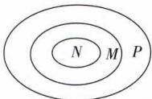

text_image

N M P

14 {1} 解析 因为 $\complement_{U}A=\{5\}$ ，所以 $5\in U$ ，则 $5^{2}-6\times5+a=0$ ，解得 a=5，所以 $U=\{x|x^{2}-6x+5=0\}=\{1,5\}$ 。又 $\complement_{U}A=\{5\}$ ，所以 $A=\{1\}$ 。

15 $\{m\mid 2\leqslant m <   3\}$ 解析由 $B = \{x\mid x > m\}$ ，得 $\mathbb{C}_{\mathbb{R}}B =$ $\{x\mid x\leqslant m\}$ .若 $A\cap (\mathbb{C}_{\mathbb{R}}B)$ 中有三个元素，则 $2\leqslant m <   3$ ，即实数 $m$ 的取值范围是 $\{m\mid 2\leqslant m <   3\}$

# 过能力 学科关键能力构建

1 D 由题中 Venn 图知阴影部分表示的集合为 $(\complement_{U}M) \cap (\complement_{U}N)$ . 由题可得 $\complement_{U}M = \{-3, -2, -1, 0\}$ , $\complement_{U}N = \{-3, -2, 2, 3\}$ , 所以 $(\complement_{U}M) \cap (\complement_{U}N) = \{-3, -2\}$ . (另解) 题图中阴影部分表示的集合为 $\complement_{U}(N \cup M) = \{-2, -3\}$

2 A 由 $A \cup B = \{0,1,4\}, A = \{a^2,1\}$ , 得 $a^2 = 0$ 或 $a^2 = 4$ , 即 $a = 0$ 或 $a = 2$ 或 $a = -2$ . 当 $a = 0$ 时, $A = \{0,1\}, B = \{6,0\}$ , 则 $A \cup B \neq \{0,1,4\}$ , 不合题意; 当 $a = 2$ 时, $A = \{4,1\}, B = \{8,0\}$ , 则 $A \cup B \neq \{0,1,4\}$ , 不合题意; 当 $a = -2$ 时, $A = \{4,1\}, B = \{4,0\}$ , 则 $A \cup B = \{0,1,4\}$ , 符合题意. 综上, $a = -2$ .

3 D 方法一 将集合 M, N 表示在数轴上, 如图, 则 $\{x \mid x \leqslant -2\} = \complement_{U}(M \cup N) = (\complement_{U} M) \cap (\complement_{U} N)$ , 故选 D.

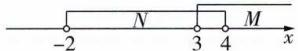

方法二 由题可得 $\complement_{U}M=\{x\mid x\leqslant3\},\complement_{U}N=\{x\mid x\leqslant-2$ 或 $x\geqslant4\}$ .对于A, $M\cap(\complement_{U}N)=\{x\mid x\geqslant4\}$ ,A错误;对于B, $M\cap N=\{x\mid3<x<4\},\complement_{U}(M\cap N)=\{x\mid x\leqslant3$ 或 $x\geqslant4\}$ ,B错误;对于C, $(\complement_{U}M)\cap N=\{x\mid-2<x\leqslant3\}$ ,C错误;对于D, $(\complement_{U}M)\cap(\complement_{U}N)=\{x\mid x\leqslant-2\}$ ,D正确.

4 B 方法一 根据题意画出 Venn 图, 如图, 分别是 $A \cap B \neq \varnothing$ 和 $A \cap B = \varnothing$ 的两种情况.

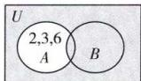

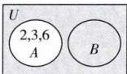

由图知阴影部分为 $\left(\complement_{U}A\right)\cup B$ ，所以 $\left(\complement_{U}A\right)\cup B=\{4,5,7,8\}$ .

方法二 由题意及摩根定律可知 $(\complement_U A) \cup B = \complement_U [A \cap (\complement_U B)] = \{4, 5, 7, 8\}$ .

5 D 若 $(A \otimes B) \subseteq B$ ，当 $B$ 中有一个元素时， $B = \{1\}$ ， $A = \{2\}$ 或 $B = \{2\}$ ， $A = \{4\}$ ；当 $B$ 中有两个元素时， $B = \{1, 2\}$ ， $A = \{3\}$ 或 $B = \{1, 3\}$ ， $A = \{4\}$ 或 $B = \{1, 4\}$ ， $A =$

$\{5\}$ 或 $B = \{2,3\}, A = \{5\}$ ; 当 $B$ 中有三个元素时, $B = \{1,2,3\}, A = \{4\}$ ; 当 $B$ 中有四个元素时, $B = \{1,2,3,4\}, A = \{5\}$ ; 当 $B$ 中有五个元素时, 集合 $A$ 不存在. 所以满足条件的不同的 $B$ 的个数为 8, 故选 D.

6 19 481 解析 方法一 设不订报纸的有 x 人, 如图所示, 则由图可得 $184 + 150 + 147 + x = 500$ , 解得 x = 19, 又 500 - 19 = 481, 所以至少订一种报纸的有 481 人.

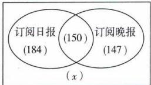

text_image

订阅日报
(184)
(150)
订阅晚报
(147)
(x)

方法二 设 $I = \{x \mid x$ 是调查的市民 $\}, A = \{x \mid x$ 是订阅日报的人 $\}, B = \{x \mid x$ 是订阅晚报的人 $\}$ , 则 $\operatorname{card}(A \cap B) = 150, \operatorname{card}(A) = 334, \operatorname{card}(B) = 297. A \cup B = \{x \mid x$ 是至少订一种报纸的人 $\}$ , 则 $\operatorname{card}(A \cup B) = \operatorname{card}(A) + \operatorname{card}(B) - \operatorname{card}(A \cap B) = 334 + 297 - 150 = 481. \complement_I(A \cup B) = \{x \mid x$ 是不订报纸的人 $\}$ , 则 $\operatorname{card}(\complement_I(A \cup B)) = \operatorname{card}(I) - \operatorname{card}(A \cup B) = 500 - 481 = 19$ . 故不订报纸的有 19 人, 至少订一种报纸的有 481 人.

# 归纳总结

# 容斥原理的常用结论：

(1) $\text{card}(A \cup B) = \text{card}(A) + \text{card}(B) - \text{card}(A \cap B)$ ;
(2) $\text{card}(A \cup B \cup C) = \text{card}(A) + \text{card}(B) + \text{card}(C) - \text{card}(A \cap B) - \text{card}(A \cap C) - \text{card}(B \cap C) + \text{card}(A \cap B \cap C)$ .

其 Venn 图解释如图所示.

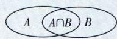  
(1)

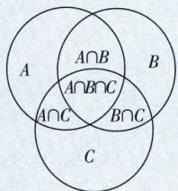

text_image

A ∩ B
A∩B∩C
A∩C
B∩C
C
B

(2)

7 解析 (1) 方法一 由 $(\complement_{\mathbf{R}} A) \cup B = \mathbf{R}$ , 得 $A \subseteq B$ ,

所以 $\left\{\begin{aligned}a&\leqslant0,\\ 3&-2a\geqslant2,\end{aligned}\right.$ 得 $a\leqslant0,$

所以实数 $a$ 的取值范围是 $\{a \mid a \leqslant 0\}$ .

方法二 由集合 $A = \{x\mid 0\leqslant x\leqslant 2\}$

得 $\complement_{\mathbb{R}}A = \{x|x < 0$ 或 $x > 2\}$

又 $B = \{x\mid a\leqslant x\leqslant 3 - 2a\}$ ，所以要使 $(\complement_{\mathbf{R}}A)\cup B = \mathbf{R},$ 如图，则需 $\left\{ \begin{array}{ll}a\leqslant 0,\\ 3 - 2a\geqslant 2, \end{array} \right.$ 解得 $a\leqslant 0$

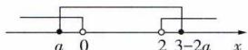

所以实数 $a$ 的取值范围是 $\{a \mid a \leqslant 0\}$ .

(2) 若 $A \cap B = B$ , 则 $B \subseteq A$ .

当 $B = \emptyset$ 时，有 $3 - 2a < a$ ，解得 $a > 1$

当 $B \neq \emptyset$ ，即 $a \leqslant 1$ 时，

要使 $B \subseteq A$ ，如图，则需 $\left\{ \begin{array}{l} a \geqslant 0, \\ 3 - 2a \leqslant 2, \end{array} \right.$ 得 $\frac{1}{2} \leqslant a \leqslant 1.$

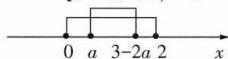

综上,当 $A\cap B=B$ 时,实数a的取值范围是 $\{a|a\geqslant\frac{1}{2}\}$ .

故当 $A \cap B \neq B$ 时, 实数 $a$ 的取值范围是 $\{a \mid a < \frac{1}{2}\}$ .

# 名师拆题

补集思想是一种重要的数学思想,是一种正难则反的逆向思维,本题从正面直接求解当 $A\cap B\neq B$ 时a的取值范围较难,可考虑问题的反面当 $A\cap B=B$ 时的情况,此时 $B\subseteq A$ ,得出a的取值范围,然后再取其补集,即可得 $A\cap B\neq B$ 时a的取值范围.

8 解析 (1)依题意知 $A = \{-3,2\}$ .

因为 $C = \{-1, 2\}$ ，且 $B \cap C \neq \varnothing, (B \cap C) \subseteq A$ ，

所以 $B \cap C = \{2\}$ ，则 $2 \in B$ ，

因此 4a - 2 = 0, 解得 $a = \frac{1}{2}$ .

由 $\frac{1}{2}x^{2}-x=0$ , 得 x=0 或 x=2, 所以 $B=\{0,2\}$ , 符合题意.

综上, $a=\frac{1}{2},B=\{0,2\}$ .

(2)依题意, $U=\{-3,-2,-1,0,1,2\}$ .

由 $\complement_U(A\cup B\cup C) = \{1\}$ ，得 $A\cup B\cup C = \{-3, - 2, - 1,0,2\}$

由(1)知 $A\cup C=\{-3,-1,2\}$ ，因此 $B=\{-2,0\}$ .

由 $4a + 2 = 0$ ，解得 $a = -\frac{1}{2}$ ，经验证符合题意。

$\complement_{U}A=\{-2,-1,0,1\},\complement_{U}B=\{-3,-1,1,2\}$ ，则 $(\complement_{U}A)\cap(\complement_{U}B)=\{-1,1\}$ .

(另解) $A \cup B = \{-3, -2, 0, 2\}$ ，则 $(\complement_U A) \cap (\complement_U B) = \complement_U (A \cup B) = \{-1, 1\}$

综上, $a=-\frac{1}{2},(\complement_{U}A)\cap(\complement_{U}B)=\{-1,1\}$ .

# 易错疑难集训（一）

# 过易错 教材易混易错集训

1 B 因为 $a \in \{1, a^2 - 2a + 2\}$ , 所以 $a = 1$ 或 $a = a^2 - 2a + 2$ . 当 $a = 1$ 时, $a^2 - 2a + 2 = 1$ , 不满足集合中元素的互异

避坑求出参数后,要验证是否满足集合中元素的互异性.
性,舍去;由 $a=a^{2}-2a+2$ , 解得 a=1 (舍去) 或 a=2, 经验证, a=2 时符合题意, 故 a=2.

2 $\{t\mid-1\leqslant t<0$ 或 $0<t\leqslant1\}$ 解析 由 $B\subseteq A$ ，得 $-1\leqslant t\leqslant3,$ $-1\leqslant-t\leqslant3,$ 解得 $-1\leqslant t\leqslant1$ 且 $t\neq0$ ，故实数 t 的取值范 $t \neq -t,$

围是 $\{t\mid -1\leqslant t <   0$ 或 $0 <   t\leqslant 1\}$

3 解析 因为 $A \cap B = \{9\}$ ，所以 $9 \in A$ ，

所以 2m-1=9 或 $m^{2}=9$ ，解得 m=5 或 $m=\pm3$ .

①当 m=5 时， $A=\{-4,9,25\}$ ， $B=\{0,-4,9\}$ ， $A\cap B=\{-4,9\}$ ，不合题意；  
②当 m=3 时, m-5=1-m=-2, 集合 B 中的元素不满足互异性, 舍去;  
③当 m = -3 时, $A = \{-4, -7, 9\}$ , $B = \{-8, 4, 9\}$ , $A \cap B = \{9\}$ , 符合题意.

综上所述,实数 m 的值为 -3.

4 C $A \cap B = \{x \mid -3 < x < 7\} \cap \{x \in N \mid x > 3\} = \{4, 5, 6\}$ .   
5 B 因为集合 $M = \{x \mid y = \sqrt{x + 1}\} = \{x \mid x + 1 \geqslant 0\} = \{x \mid x \geqslant -1\}$ , 集合 $N = \{y \mid y = \sqrt{x + 1}\} = \{y \mid y \geqslant 0\}$ , 所以 $N \subseteq M$ , 所以 $M \cup N = M$ . 故选 B.  
6 B 当 a=1 时，由 $(a,b)\in\{(x,y)\mid y^{2}=x\}$ ，知 $b^{2}=1$ ，又 $b\in\{1,2,3,4\}$ ，所以 b=1，此时 a=b，不符合集合中元素的互异性，舍去；当 a=2 时，由 $(a,b)\in\{(x,y)\mid y^{2}=x\}$ ，知 $b^{2}=2$ ，又 $b\in\{1,2,3,4\}$ ，所以无解；当 a=3 时，由 $(a,b)\in\{(x,y)\mid y^{2}=x\}$ 知， $b^{2}=3$ ，又 $b\in\{1,2,3,4\}$ ，所以无解；当 a=4 时，由 $(a,b)\in\{(x,y)\mid y^{2}=x\}$ ，知 $b^{2}=4$ ，又 $b\in\{1,2,3,4\}$ ，所以 b=2，此时 a-b=2。综上，a-b=2。  
7 C 若 $a \leqslant 1$ ，则 $B = \varnothing \subseteq A$ 满足题意；若 $a > 1$ ，且 $B \subseteq A$ ，则 $1 < a \leqslant 2$ 。综上，实数 $a$ 的取值范围是 $\{a \mid a \leqslant 2\}$ 。

【变式】 $\{a|a < 2\}$ 解析 若 $a \leqslant 1$ ，则 $B = \emptyset \subsetneq A$ 满足题意；若 $a > 1$ ，且 $B \subsetneq A$ ，则 $1 < a < 2$ 。综上，实数 $a$ 的取值范围是 $\{a|a < 2\}$ 。

8 C 集合 $A = \{x \in \mathbf{Z} \mid -1 < x < 3\} = \{0, 1, 2\}$ , 由 $B = \{x \mid 3x - a < 0\} = \{x \mid x < \frac{a}{3}\}$ , 可得 $\complement_{\mathbb{R}} B = \{x \mid x \geqslant \frac{a}{3}\}$ , 因为 $A \cap (\complement_{\mathbb{R}} B) = \{1, 2\}$ , 所以 $0 < \frac{a}{3} \leqslant 1$ , 解得 $0 < a \leqslant 3$ , 即实数 $a$ 的取值范围是 $\{a \mid 0 < a \leqslant 3\}$ .  
9 $\{a \mid a < -8$ 或 $a \geqslant 3\}$ 解析 用数轴表示两集合的位置关系, 如图1和图2所示, 由图知要使 $B \subseteq A$ , 只需 $a + 3 < -5$ 或 $a + 1 \geqslant 4$ , 解得 $a < -8$ 或 $a \geqslant 3$ .

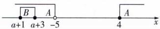  
图1

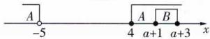  
图 2

10 $\{a \mid a < \frac{2}{3}$ 或 $a \geqslant 2\}$ 解析 由 $A \cap B = B$ , 得 $B \subseteq A$ , 当 $B = \varnothing$ 时, 满足 $B \subseteq A$ , 此时 $\frac{1}{2} a > 2a - 1$ , 即 $a < \frac{2}{3}$ ; 当 $B \neq \varnothing$ 时, 由 $B \subseteq A$ , 得 $1 \leqslant \frac{1}{2} a \leqslant 2a - 1$ , 解得 $a \geqslant 2$ . 综上, 实数 $a$ 的取值范围是 $\{a \mid a < \frac{2}{3}$ 或 $a \geqslant 2\}$ .  
11 解析 (1) 当 $m = -1$ 时, $B = \{x \mid -2 < x < 2\}$ .

又 $A = \{x\mid 1 <   x <   3\}$ ，所以 $A\cup B = \{x\mid -2 <   x <   3\}$

(2) 由 $A \subseteq B$ , 知 $\left\{ \begin{array}{l} 1 - m > 2m, \\ 2m \leqslant 1, \\ 1 - m \geqslant 3, \end{array} \right.$ 解得 $m \leqslant -2$ ,

所以实数 $m$ 的取值范围是 $\{m \mid m \leqslant -2\}$ .

(3)①若 $B = \emptyset$ ，则 $A\cap B = \emptyset$ ，此时 $2m\geqslant 1 - m$ ，即 $m\geqslant \frac{1}{3}$   
②若 $B \neq \emptyset$ ，则 $\left\{ \begin{array}{l} m < \frac{1}{3}, \\ 1 - m \leqslant 1 \end{array} \right.$ 或 $\left\{ \begin{array}{l} m < \frac{1}{3}, \\ 2m \geqslant 3, \end{array} \right.$ 解得 $0 \leqslant m < \frac{1}{3}$ .

综上,实数 m 的取值范围为 $\{m \mid m \geqslant 0\}$ .

# 避坑指南

解答此类问题的过程中,一定要注意对空集的讨论. 当集合 A 不是空集时, (1) 若 $A \cap B = \varnothing$ , 则要分 $B = \varnothing$ 以及 $B \neq \varnothing$ 两种情况讨论; (2) 若 $A \cup B = A$ , 即 $B \subseteq A$ , 则要分 $B = \varnothing$ 以及 $B \neq \varnothing$ 两种情况讨论.

# 专项拓展训练 集合基本关系、基本运算的综合训练

# 过专项 阶段强化专项训练

1 C 因为 $A = \{x\} - 1 < x < 3$ , $B = \{-1, 0, 1, 2, 3\}$ , 所以 $A \cap B = \{0, 1, 2\}$ . 又 $C = \{1, 2, 3\}$ , 所以 $(A \cap B) \cup C = \{0, 1, 2, 3\}$ .

2 D 由题意, 得 $B = \{6,7,8\}$ , 则 $U = A \cup B = \{4,5,6,7,8\}, A \cap B = \{6,7\}$ , 所以 $\complement_U(A \cap B) = \{4,5,8\}$ , 其子集的个数为 $2^3 = 8$ .

3 D $A \cup B = \{x \mid x \leqslant 0 \text{ 或 } x > 2\}$ , $A \cap B = \{x \mid x \leqslant -2 \text{ 或 } x \geqslant 5\}$ , 所以题图中阴影部分表示的集合为 $\complement_{(A \cup B)} (A \cap B) = \{x \mid -2 < x \leqslant 0 \text{ 或 } 2 < x < 5\}$ .

4 CD 令 $U = \{1,2,3,4\}, A = \{2,3,4\}, B = \{1,2\}$ , 满足 $(\complement_U A) \cup B = B$ , 但 $A \cap B \neq \emptyset, A \cap B \neq B$ , 故 $A, B$ 均不正确. 由 $(\complement_U A) \cup B = B$ , 知 $\complement_U A \subseteq B$ , 所以 $U = A \cup (\complement_U A) \subseteq A \cup B$ , 所以 $A \cup B = U$ ; 由 $\complement_U A \subseteq B$ , 知 $\complement_U B \subseteq A$ , 所以 $(\complement_U B) \cup A = A$ , 故 $C, D$ 均正确.

5 $\{-3, -1, 0, 1, 2\}$ 解析 全集 $U = \{x \in \mathbf{Z} \mid -5 < x \leqslant 4\} = \{-4, -3, -2, -1, 0, 1, 2, 3, 4\}$ . 因为 $A \cap B = \varnothing$ , 所以 $(\complement_U A) \cap B = \{-2, 3\}, (\complement_U B) \cap A = A = \{-4, 4\}$ , 所以 $A \cup B = \{-4, -2, 3, 4\}$ , 所以 $(\complement_U A) \cap (\complement_U B) = \complement_U (A \cup B) = \{-3, -1, 0, 1, 2\}$ .

6 C 因为 $U=\{1,2,3,4,5\}$ , $A=\{1,a+6,5\}$ , $\int_{U}A=\{2,a^{2}-1\}$ , 所以由补集的定义可知 $a+6$ 的可能取值为 3 或 4. 当 $a+6=3$ 即 a=-3 时, $a^{2}-1=8$ 不满足题意; 当 $a+6=4$ 即 a=-2 时, $a^{2}-1=3$ , 此时 $A=\{1,4,5\}$ , $\int_{U}A=\{2,3\}$ , 满足题意. 综上, a=-2.

7 C 因为 $A \cup B \subseteq A$ ，所以 $B \subseteq A$ 。当 $B = \varnothing$ 时， $2m + 3 < m + 1$ ，即 m < -2，符合题意；当 $B \neq \varnothing$ 时， $\left\{\begin{aligned}m+1&\leqslant2m+3,\\ m+1&\geqslant-1,\\ 2m+3&\leqslant3,\end{aligned}\right.$ 解得 $-2\leqslant m\leqslant0.$ 综上，实数 m 的取值范围为 $(-∞,0]$ .

8 A 由 $Q \cap (\complement_U P) = \emptyset$ ，得 $Q \subseteq P$ . 分两种情况讨论：①当 $Q = \emptyset$ 时， $1 - m > 1 + m$ ，即 $m < 0$ ，符合题意；②当 $Q \neq$

$\varnothing$ 时, $m\geqslant0$ ,由 $Q\subseteq P$ ,得 $\left\{\begin{aligned}1-m&\geqslant-2,\\ 1+m&\leqslant10,\end{aligned}\right.$ 得 $0\leqslant m\leqslant3$ .综上, $m\leqslant3$ .

9 C 因为 $A \cap (\complement_{\mathbb{R}} B) = \{2\}$ ，所以 $2 \in A$ ，所以 $4 + 2p - 6 = 0$ ，解得 p = 1。当 p = 1 时，由 $x^{2} + x - 6 = 0$ ，解得 x = 2 或 x = -3，所以 $-3 \in B$ ，故 $9 - 3q + 2 = 0$ ，解得 $q = \frac{11}{3}$ ，经检验，符合题意，所以 $p + q = 1 + \frac{11}{3} = \frac{14}{3}$ ，故选 C.

10 B 因为 $\complement_{R}A = \{x \mid -4 \leqslant x \leqslant 2\}$ ，所以 $A = \{x \mid x < -4 \text{ 或 } x > 2\}$ 。因为 $B = \{x \mid x \leqslant -3 \text{ 或 } x \geqslant a\} (a > -3)$ ，所以 $\complement_{R}B = \{x \mid -3 < x < a\}$ 。又 $x \in A$ 且 $x \in \complement_{R}B$ ，即 $x \in A \cap (\complement_{R}B)$ ，如图所示，可得 $4 < a \leqslant 5$ 。

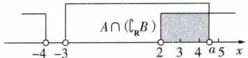

text_image

A \cap (\mathbb{C}_R B)
-4 -3 2 3 4 a 5 x

11 解析 (1) 由题意, 得 $B = \{x \mid a + 1 < x < 2a - 1\}$ . 因为 $(\complement_U A) \subseteq (\complement_U B)$ , 所以 $B \subseteq A$ .

提示 也可先求出集合A,B的补集,再根据题意求解.

当 $B = \emptyset$ ，即 $a + 1\geqslant 2a - 1$ ，即 $a\leqslant 2$ 时，符合题意；  
当 $B\neq \emptyset$ ，即 $a > 2$ 时，由 $B\subseteq A$ ，得 $a + 1\geqslant 4$ 或 $2a - 1\leqslant 0$ 得 $a\geqslant 3.$

综上,实数 a 的取值范围为 $\{a \mid a \leqslant 2 \text{ 或 } a \geqslant 3\}$ .

(2) $\complement_{U}A=\{x\mid0<x<4\}$ ，若 $(\complement_{U}A)\cap B=B$ ，则 $B\subseteq(\complement_{U}A)$ .

当 $B = \emptyset$ ，即 $a\leqslant 2$ 时，符合题意；

当 $B \neq \emptyset$ 时，需满足 $\left\{ \begin{array}{l} a + 1 \geqslant 0, \\ 2a - 1 \leqslant 4, \\ a > 2, \end{array} \right.$ 解得 $2 < a \leqslant \frac{5}{2}$ .

所以当 $(\complement_U A) \cap B = B$ 时， $a \leqslant \frac{5}{2}$ ，

所以当 $(\complement_{U}A)\cap B\neq B$ 时, $a>\frac{5}{2}$ ，即实数a的取值范围为 $\{a|a>\frac{5}{2}\}$ .

提示“补集思想.

# 第四节 充分条件与必要条件

# 过基础 教材必备知识精练

1 A 由 $\sqrt{x^2} = x$ ，得 $x\geqslant 0.$ 因为“ $x > 0$ ” $\Rightarrow "x\geqslant 0"$ ，但“ $x\geqslant$ 0”推不出“ $x > 0$ ”，所以“ $x > 0$ ”是“ $\sqrt{x^2} = x$ ”的充分不必要条件.

2 AD 对于 A, 由 a > 1, 能推出 $\frac{1}{a} < 1$ , 但是由 $\frac{1}{a} < 1$ , 不能推出 a > 1, 例如当 a < 0 时, 符合 $\frac{1}{a} < 1$ , 但是不符合 a > 1, 所以 “a > 1” 是 “ $\frac{1}{a} < 1$ ” 的充分不必要条件, A 正确; 对于 B, 当 x < -1 时, $x^{2} > 1$ , B 错误; 对于 C, 由 $x \geqslant 2$ 且 $y \geqslant 2$ 能推出 $x^{2} + y^{2} \geqslant 4$ , 但是 $x^{2} + y^{2} \geqslant 4$ 推不出 $x \geqslant 2$ 且 $y \geqslant 2$ , 例如 x = 0, y = 3, 满足 $x^{2} + y^{2} \geqslant 4$ , 但是不满足 $x \geqslant 2$ 且 $y \geqslant 2$ , 所以 “ $x \geqslant 2$ 且 $y \geqslant 2$ ” 是 “ $x^{2} + y^{2} \geqslant 4$ ” 的充分不必要条件, C 错误; 对于 D, $ab \neq 0 \Leftrightarrow a \neq 0$ 且 $b \neq 0$ , 则由 a ≠ 0 推不出 ab ≠ 0, 由 ab ≠ 0 可推出 a ≠ 0, 所以 “a ≠ 0” 是 “ab ≠ 0” 的必要不充分条件, D 正确.

3 A 由题意可知“龙城飞将在”⇒“不教胡马度阴山”，

而“不教胡马度阴山”不一定能推出“龙城飞将在”，所以“不教胡马度阴山”是“龙城飞将在”的必要条件.

4 D 因为“对角线相等”“对角线互相垂直”“对角线互相平分”都不能推出四边形是菱形,只有“对角线互相垂直平分”可推出四边形是菱形,所以对角线互相垂直平分是四边形为菱形的充分条件,故选 D.

5 B 由不等式 $|x-1|<2$ , 得 -2<x-1<2, 解得 -1<x<3.

<table><tr><td>A</td><td>×</td><td>-1＜x＜3是|x-1|＜2的充要条件.</td></tr><tr><td>B</td><td>√</td><td>{x|-1＜x＜3}⊆{x|-3＜x＜3},所以-3＜x＜3是|x-1|＜2的一个必要不充分条件.</td></tr><tr><td>C</td><td>×</td><td>{x|0＜x＜3}⊆{x|-1＜x＜3},所以0＜x＜3是|x-1|＜2的一个充分不必要条件.</td></tr><tr><td>D</td><td>×</td><td>{x|0＜x＜4}与{x|-1＜x＜3}不是包含关系,所以0＜x＜4是|x-1|＜2的既不充分也不必要条件.</td></tr></table>

6 CD

<table><tr><td>A</td><td>×</td><td>因为 $A\cap B=A$ ,所以 $A\subseteq B$ ,不满足题意.</td></tr><tr><td>B</td><td>×</td><td>若 $(\complement_{\mathbf{R}}A)\cap B=\mathbf{R}$ ,则 $\complement_{\mathbf{R}}A=\mathbf{R}$ 且 $B=\mathbf{R}$ ,只有 $A=\varnothing$ 且 $B=\mathbf{R}$ 时成立,不满足题意.</td></tr><tr><td>C</td><td>√</td><td>若 $\complement_{\mathbf{R}}A\subseteq\complement_{\mathbf{R}}B$ ,则 $B\subseteq A$ ,同时若 $B\subseteq A$ ,则 $\complement_{\mathbf{R}}A\subseteq\complement_{\mathbf{R}}B$ ,满足题意.</td></tr><tr><td>D</td><td>√</td><td>若 $A\cup(\complement_{\mathbf{R}}B)=\mathbf{R}$ ,则 $B\subseteq A$ ,同时若 $B\subseteq A$ ,则 $A\cup(\complement_{\mathbf{R}}B)=\mathbf{R}$ ,满足题意.</td></tr></table>

7 x>0,y>0(答案不唯一) 解析 因为当x>0,y>0时,xy>0一定成立;而当xy>0时,可能有x>0,y>0,也可能有x<0,y<0,所以“x>0,y>0”是“xy>0”的充分不必要条件.(注:满足题意的答案均可.)

8 B 因为 $x \in A$ 是 $x \in B$ 的必要条件, 所以 $B \subseteq A$ , 所以 $m \geqslant 3$ .

9 1 或 $-\frac{1}{2}$ 解析 由题意可知, x=2 是 $m^{2}x^{2}-(m+3)x+4=0$ 的一个解, 因此 $4m^{2}-2(m+3)+4=0$ , 解得 m=1 或 $m=-\frac{1}{2}$ .

【变式】 $-\frac{1}{2}$ 解析 由题意可知，x=2 是 $m^{2}x^{2}-(m+3)x+4=0$ 的解，但不是唯一的解。将 x=2 代入方程，得 $4m^{2}-2(m+3)+4=0$ ，解得 m=1 或 $m=-\frac{1}{2}$ 。当 m=1 时，x=2 是 $x^{2}-4x+4=0$ 的唯一解，不满足题意；当 $m=-\frac{1}{2}$ 时，原方程为 $\frac{1}{4}x^{2}-\frac{5}{2}x+4=0$ ，即 $x^{2}-10x+16=0$ ，解得 x=2 或 x=8，满足题意。综上， $m=-\frac{1}{2}$ 。

10 解析 方案一 选择条件①.

因为 $x \in A$ 是 $x \in B$ 的充分不必要条件, 所以 $A \subsetneq B$ , 则 $1 - a \leqslant 0$ 且 $1 + a \geqslant 4$ (两个等号不能同时取到).

又 a>0, 所以 $a \geqslant 3$ ,

所以存在 a 满足条件, 且 a 的取值范围为 $\{a \mid a \geqslant 3\}$ .

方案二 选择条件②.

因为 $x \in A$ 是 $x \in B$ 的必要不充分条件, 所以 $B \subsetneq A$ , 则 $1 - a \geqslant 0$ 且 $1 + a \leqslant 4$ (两个等号不能同时取到).

又 a > 0，所以 $0 < a \leqslant 1$ ，

所以存在 a 满足条件, 且 a 的取值范围为 $\{a \mid 0 < a \leqslant 1\}$ .

方案三 选择条件③.

因为 $x \in A$ 是 $x \in B$ 的充要条件, 所以 A = B,

则 1 - a = 0 且 $1 + a = 4$ ，无解，所以不存在满足条件的 a.

# 过能力 学科关键能力构建

1 C $ab + 1 = a + b \Leftrightarrow (a - 1)(b - 1) = 0 \Leftrightarrow a = 1$ 或 b = 1，故“ $ab + 1 = a + b$ ”的充要条件是“a, b 中至少有一个为 1”。

2 C 选项 A, “开关 A 闭合” 是“灯泡 B 亮”的充分不必要条件; 选项 B, “开关 A 闭合” 是“灯泡 B 亮”的充要条件; 选项 C, “开关 A 闭合” 是“灯泡 B 亮”的必要不充分条

件;选项 D,“开关 A 闭合”是“灯泡 B 亮”的既不充分也不必要条件.

3 C 由小明手中的两张卡牌的编号之和为3, 可知小明手中的两张卡牌的编号分别为1,2; 若小明手中的两张卡牌的编号均不超过2, 则其手中的卡牌的编号有1,1和1,2及2,2三种可能, 又其编号之和为奇数, 所以只能为1,2, 故甲是乙的充要条件. 故选C.

4 ABC 因为 $x \in M$ 是 $x \in A$ 的充分条件, 且 $x \in N$ 是 $x \in A$ 的必要不充分条件, 所以 $M \subseteq A, A \subsetneq N$ , 所以选项 A, B, C 符合要求.

5 BC 由题意, 得 $p \Rightarrow r, r \Rightarrow q, r \Leftrightarrow s, s \Rightarrow p$ , 则 $p \Leftrightarrow r \Leftrightarrow s \Rightarrow q$ . 故选 BC.

6 B 若 $a \in B$ , 则 $a = -1$ 或 $a = 3$ 或 $a = a^2$ , 则 $a = -1$ 或 $a = 3$ 或 $a = 1$ 或 $a = 0$ , 当 $a = 3$ 时, $a^2 = 9 \notin U$ , 不符合题意, 所以 $a \in \{-1, 0, 1\}$ . 因为 $A$ 中元素有 1, 所以要使 $A \subseteq B$ , 则 $1 \in B$ , 所以 $a + 1 = 1$ 或 $a^2 = 1$ , 解得 $a = 0$ 或 $a = \pm 1$ , 即 $a \in \{-1, 0, 1\}$ , 验证得 $a = 1$ 时不满足 $A \subseteq B$ , $a = 0$ 或 $a = -1$ 时满足 $A \subseteq B$ , 所以 $a \in \{-1, 0\}$ . 因为 $\{-1, 0\} \subsetneq \{-1, 0, 1\}$ , 所以甲是乙的必要不充分条件.

7 证明 充分性:

因为 a=2 时, $b^{2}+c^{2}-2(b+c)=bc-4$ 可化为 $b^{2}+c^{2}-a(b+c)=bc-a^{2}$ , 即 $a^{2}+b^{2}+c^{2}=ab+ac+bc$ ,

所以 $2a^{2}+2b^{2}+2c^{2}=2ab+2ac+2bc$ ，即 $(a-b)^{2}+(b-c)^{2}+(a-c)^{2}=0$ ，

所以 a-b=b-c=a-c=0，即 a=b=c，即 $\triangle ABC$ 为等边三角形，充分性成立.

必要性：

因为 $\triangle ABC$ 为等边三角形，且 $a = 2$ ，所以 $a = b = c = 2$ ，则 $b^{2} + c^{2} - 2(b + c) = 0,bc - 4 = 0$ ，所以 $b^{2} + c^{2} - 2(b + c) = bc - 4$ ，必要性成立.

故 $\triangle ABC$ 为等边三角形的充要条件是 $b^{2} + c^{2} - 2(b + c) = bc - 4.$

8 解析 （1）因为 $16 \notin A$ ，所以当 $A \neq \varnothing$ 时， $\left\{\begin{aligned}&2m+9>4,\\ &2m+9<16,\end{aligned}\right.$ 解得 $-\frac{5}{2}<m<\frac{7}{2}$ ,

当 $A = \emptyset$ 时， $2m + 9 \leqslant 4$ ，解得 $m \leqslant -\frac{5}{2}$ ，

所以 $m < \frac{7}{2}$ .

因为 $12 \in B$ ，所以 $B \neq \emptyset$

所以 $2m - 2 \leqslant 12 \leqslant 3m + 3$ ，解得 $3 \leqslant m \leqslant 7$ .

综上， $m$ 的取值范围是 $\{m\mid 3\leqslant m <   \frac{7}{2}\} .$

(2)由(1)可知,当 $12\in B$ 时, $3\leqslant m\leqslant7$ ,此时 $A\neq\varnothing,B\neq\varnothing$ ,
又 p 是 q 的必要不充分条件,所以 $B \subsetneq A$ ,

所以 $\left\{\begin{aligned}2m-2&>4,\\ 3m+3&\leqslant2m+9,\end{aligned}\right.$ 解得 $3<m\leqslant6$ ,

综上， $m$ 的取值范围是 $\{m \mid 3 < m \leqslant 6\}$ .

# 第五节 全称量词与存在量词

# 过基础 教材必备知识精练

1 C 该命题的另一种表述是“任选一个 $x \in \mathbf{R}$ , 都有 $x^2 > 3$ ”.

2 ABD A 选项含有存在量词“至少有一个”, B 选项含有存在量词“有的”, D 选项含有“∃”, C 选项省略了全称

量词“所有”，故根据全称量词命题和存在量词命题的定义可以判断选项 A, B, D 是存在量词命题，C 是全称量词命题.

3 BD 对于 A, 因为 $a^{2}=3a-2$ , 所以 $a^{2}-3a+2=0$ , 即 $(a-2)(a-1)=0$ , 解得 a=2 或 a=1, 所以 a<3, 故 A 错误；对于B，当 $x_0 = 1$ 时， $x_0^3 = 1 > 0$ ，故B正确；对于C，若 $x_0 = \sqrt{3} +1$ ，则 $x_0^2 = 4 + 2\sqrt{3}\notin \mathbf{Q}$ ，故C错误；对于D， $\forall x\in$ $\mathbf{N}^{*},\frac{3x + 2}{x + 1} = 3 - \frac{1}{x + 1}\notin \mathbf{N}$ ，故D正确.

4 (1) $\exists x \in \mathbf{R}, x$ 不能写成小数形式; (2) $\forall x \in \{x \mid x \text{ 是凸 } n \text{ 边形 }\}, x$ 的外角和等于 $360^{\circ}$

5 B 命题“ $\exists x > 1, x^2 - x > 0$ ”为存在量词命题，其否定为“ $\forall x > 1, x^2 - x \leqslant 0$ ”.

6 D 全称量词命题的否定为存在量词命题, 故 A, C 错误; 条件“大于 2 的偶数”不变, 故哥德巴赫猜想的否定为“存在一个大于 2 的偶数不能写成两个质数之和”. 故选 D.

7 解析 （1）命题“所有能被3整除的整数都是奇数”的否定是“存在一个能被3整除的整数不是奇数”，是真命题，例如，6是能被3整除的整数，且6不是奇数.

(2) 命题“四边形的四个顶点在同一个圆上”的否定是“存在一个四边形, 它的四个顶点不在同一个圆上”, 是真命题.

(3) 命题“存在 $x \in Z, x^{2}$ 的个位数字等于 3”的否定是“对任意 $x \in Z, x^{2}$ 的个位数字不等于 3”，是真命题.

8 C 因为 $|x| \geqslant 0$ ，所以 $|x| + 2 \geqslant 2$ ，所以若“ $\exists x \in R, |x| + 2 = a$ ”为真命题，则 $a \geqslant 2$ ，即实数a的取值范围为 $\{a | a \geqslant 2\}$ .

9 $\{k|k\leqslant-1\}$ 解析 命题“ $\exists-1\leqslant x\leqslant2,2x+1<k$ ”为假命题，则其否定“ $\forall-1\leqslant x\leqslant2,2x+1\geqslant k$ ”为真命题，又当 $-1\leqslant x\leqslant2$ 时， $-1\leqslant2x+1\leqslant5$ ，所以 $k\leqslant-1$ ，所以实数k的取值范围为 $\{k|k\leqslant-1\}$ .

10 $\{m|m\geqslant3\}$ 解析 因为 q 的否定为假命题,所以 q 为真命题,所以 $m\geqslant1$ . 因为命题 p 为真命题,所以 $m\geqslant3$ ,故实数 m 的取值范围为 $\{m|m\geqslant3\}\cap\{m|m\geqslant1\}=\{m|m\geqslant3\}$ .

# 过能力 学科关键能力构建

1 B 当 x=0 时, $|x|=-x$ 成立, 故命题 p 为真命题, p 的否定为假命题; 当 x=1 时, $x^{2}-1=0$ , 故命题 q 为假命题, q 的否定为真命题. 故选 B.

2 B 命题“ $\exists 1 < x < 2, x^2 \leqslant a$ ”为真命题， $1 < x < 2$ 时， $1 < x^2 < 4$ ，所以 $a > 1$ ，因为 $\{a \mid a \geqslant 4\} \subsetneq \{a \mid a > 1\}$ ，且 $\{a \mid a \geqslant 1\}, \{a \mid a \geqslant -2\}, \{a \mid a = 0\}$ 均不是 $\{a \mid a > 1\}$ 的真子集，所以命题“ $\exists 1 < x < 2, x^2 \leqslant a$ ”为真命题的一个充分不必要条件是 B 选项.

3 AB 因为“ $\exists x\in M,x>-3$ ”为假命题,所以 $\forall x\in M$ ,

$x \leqslant -3$ ，可得 $M \subseteq \{x \mid x \leqslant -3\}$ . 又“ $\forall x \in M, |x| > x$ ”为真命题，故 $M \subseteq \{x \mid x < 0\}$ . 综上， $M \subseteq \{x \mid x \leqslant -3\}$ . 故选AB.

4 AB 因为 $P \cap Q = Q$ ，且 $P \neq Q$ ，所以 $Q \subsetneq P$ ，画出 Venn 图如图所示，所以 A, B 正确，C, D 错误.

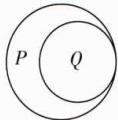

5 解析 命题“ $\exists m \in \mathbf{R}$ , 使得 $A \cap B \neq \emptyset$ ”为假命题, 则该命题的否定“ $\forall m \in \mathbf{R}, A \cap B = \emptyset$ ”为真命题.

当 a<0 时, 集合 A=∅, 符合 $A \cap B = \varnothing$ ;

当 $a \geqslant 0$ 时，因为 $m^2 + 3 > 0$ ，所以由 $\forall m \in \mathbf{R}, A \cap B = \varnothing$ ，得 $a < m^2 + 3$ 对于任意 $m \in \mathbf{R}$ 恒成立，又 $m^2 + 3 \geqslant 3$ ，所以 $a < 3$ ，则 $0 \leqslant a < 3$ .

综上,实数 a 的取值范围为 $\{a \mid a < 3\}$ .

6 解析 若 p 是真命题, 则 $a \leqslant x^{2}$ 对于 $x \in \{x \mid 1 \leqslant x \leqslant 2\}$ 恒成立, 所以 $a \leqslant (x^{2})_{\min} = 1$ .

若 q 是真命题, 则关于 x 的方程 $x^{2} + 3x + 2 - a = 0$ 有实数根, 所以 $\Delta = 9 - 4(2 - a) = 1 + 4a \geqslant 0$ , 即 $a \geqslant -\frac{1}{4}$ .

若 p 和 q 同时为真命题, 则 $-\frac{1}{4} \leqslant a \leqslant 1$ ,

提示 正难则反.

所以当 p 和 q 中至少有一个是假命题时, 有 $a < -\frac{1}{4}$ 或 a > 1, 即实数 a 的取值范围是 $\{a \mid a < -\frac{1}{4}$ 或 a > 1\}.

7 解析 (1) 因为命题“ $\forall x \in A, x \in B$ ”是真命题, 所以 $A \subseteq B$ .

又 $B \neq \emptyset$ ，所以 $\left\{ \begin{array}{l} 2m - 1 \geqslant 7, \\ -3m + 4 \leqslant 2, \\ -3m + 4 \leqslant 2m - 1, \end{array} \right.$ 解得 $m \geqslant 4$

故 m 的取值范围为 $\{m \mid m \geqslant 4\}$ .

(2) 因为 $B \neq \varnothing$ ，所以 $-3m + 4 \leqslant 2m - 1$ ，解得 $m \geqslant 1$ .

由命题“ $\exists x\in B,x\in A$ ”为真命题,得 $A\cap B\neq\varnothing$ .

当 $A \cap B = \emptyset$ 时， $-3m + 4 > 7$ 或 $2m - 1 < 2$ ，解得 $m < \frac{3}{2}$ ，所以当 $A \cap B \neq \emptyset$ 时， $m \geqslant \frac{3}{2}$ .

又 $m \geqslant 1$ ，故 m 的取值范围为 $\{m \mid m \geqslant \frac{3}{2}\}$ .

# 易错疑难集训（二）

# 过易错 教材易混易错集训

1 A 当 $a > b > c > 0$ 时，显然 $a + b > c$ 成立，所以 $a > b > c$ 可以推出 $a + b > c$ ；当 $a + b > c$ 时，不妨取 $a = 3, b = 1, c = 2$ ，此时 $3 + 1 > 2$ ，但是 $a > c > b$ ，所以 $a + b > c$ 不能推出 $a > b > c$ 。所以“ $a > b > c$ ”是“ $a + b > c$ ”的充分不必要条件，故选A.

2 AD $-\frac{11}{2}<5x-3<12$ , 解得 $-\frac{1}{2}<x<3, \{x|-\frac{1}{2}<x<3\}$ 是 $\{x|-\frac{1}{2}<x<4\}$ 的子集, 故 $-\frac{1}{2}<x<4$ 是 $-\frac{11}{2}<5x-3<12$ 的一个必要条件, A 正确; $\{x|-\frac{1}{2}<x<3\}$ 是 $\{x|-1<x<6\}$ 的子集, 故 $-1<x<6$ 是 $-\frac{11}{2}<5x-3<12$ 的一个必要条件, D 正确; B, C 选项均不满足要求.

3 D 原命题的否定是“方程 $x^{2}-8x+15=0$ 没有一个

根是偶数”，故选D.

4 D 存在量词命题的否定为全称量词命题, 排除 A, C 选项. 由 $\frac{3}{x+2}$ , 得 $x \neq -2$ , 所以 $\frac{3}{x+2} > 0$ 的否定是 $\frac{3}{x+2} \leqslant 0$ 或 x = -2, 故 D 正确.

5 $\exists a\geqslant 0$ ，使得 $ax^{2} - 3x - 1 <   - 2$ 或 $ax^2 -3x - 1 > 0$ 解析“ $\forall a\geqslant 0$ ，都有 $-2\leqslant ax^2 -3x - 1\leqslant 0$ ”的否定： $\exists a\geqslant 0$ ，使得 $ax^{2} - 3x - 1 <   - 2$ 或 $ax^2 -3x - 1 > 0.$

# 过疑难 常考疑难问题突破

1 BC 由题意得 $A \subseteq B$ ，所以 $\left\{ \begin{array}{l} 1 \leqslant a \leqslant 4, \\ 1 \leqslant a^2 \leqslant 4, \\ a \neq a^2, \end{array} \right.$ 解得 $1 < a \leqslant 2$ ，则 B, C 符合题意.

2 $\{m|m\geqslant 1\}$ 解析因为 $[x]$ 表示不超过 $x$ 的最大整数，所以 $[x]\leqslant x,0\leqslant x - [x] <   1$ ，即 $A = \{y|y = x - [x]\} =$ $\{y\mid0\leqslant y<1\}$ . 因为 $y\in A$ 是 $y\in B$ 的充分不必要条件, 所以 $A\not\subseteq B$ . 又 $B=\{y\mid0\leqslant y\leqslant m\}$ , 所以 $m\geqslant1$ , 即 m 的取值范围是 $\{m\mid m\geqslant1\}$ .

3 (1) $\{a \mid a > 2\}$ ; (2) $\{a \mid 0 < a < 2\}$ 解析 (1) 设命题 p 对应的集合为 $A = \{x \mid x - 2 > 0\}$ ，即 $A = \{x \mid x > 2\}$ ，命题 q 对应的集合为 $B = \{x \mid ax - 4 > 0\}$ .

因为 p 是 q 的充分不必要条件, 所以 $A \subsetneq B$ , 即 $\left\{\frac{4}{a} < 2,\right.$ 解得 a > 2,

故实数 a 的取值范围为 $\{a \mid a > 2\}$ .

(2) 因为 p 是 q 的必要不充分条件, 所以由(1)知 $B \subsetneq A$ .

①当 a > 0 时，由 $B \subsetneq A$ ，得 $\frac{4}{a} > 2$ ，得 0 < a < 2；  
②当 a<0 时， $\frac{4}{a}<0, B=\{x|ax-4>0\}=\{x|x<\frac{4}{a}\}$ ，不满足题意.

综上,实数 a 的取值范围为 $\{a \mid 0 < a < 2\}$ .

4 证明 充分性: 若 $xy \geqslant 0$ , 则有 xy = 0 和 xy > 0 两种情况. 当 xy = 0 时, 不妨设 x = 0, 则 $|x + y| = |y|$ , $|x| + |y| = |y|$ , 所以 $|x + y| = |x| + |y|$ 成立.

当 $xy > 0$ 时， $x > 0, y > 0$ 或 $x < 0, y < 0$

若 $x > 0, y > 0$ ，则 $|x + y| = x + y, |x| + |y| = x + y,$

所以 $|x+y|=|x|+|y|$ 成立；

若 x<0, y<0，则 $\left|x+y\right|=-\left(x+y\right)$ ， $\left|x\right|+\left|y\right|=-x-y$ ，
所以 $\left|x+y\right|=\left|x\right|+\left|y\right|$ 成立.

所以当 $xy \geqslant 0$ 时， $|x + y| = |x| + |y|$ 成立.

必要性：

若 $|x+y|=|x|+|y|$ 且 $x,y\in R,$

则 $|x+y|^{2}=(|x|+|y|)^{2}$ ,

即 $x^{2} + 2xy + y^{2} = x^{2} + y^{2} + 2|x||y|$ ,

所以 $xy = |xy|$ ，所以 $xy \geqslant 0$ .

综上, 可知“ $|x+y|=|x|+|y|$ ”的充要条件是“ $xy\geqslant0$ ”.

避坑指南 证明 p 是 q 的充要条件时, 需从 $p \Rightarrow q$ (充分性) 和 $p \Leftarrow q$ (必要性) 两方面进行论证.

# 章末培优专练

# 过素养 综合素养创新应用

1 ACD 因为 $23 = 3 \times 7 + 2 = 5 \times 4 + 3 = 7 \times 3 + 2$ ，所以 $23 \in A \cap B \cap C$ ，故 A 正确。因为 $38 = 7 \times 5 + 3$ ，所以 $38 \notin C$ ，故 B 错误。因为 $128 = 3 \times 42 + 2 = 5 \times 25 + 3 = 7 \times 18 + 2$ ，所以 $128 \in A \cap B \cap C$ ，故 C 正确。 $233 = 3 \times 77 + 2 = 5 \times 46 + 3 = 7 \times 33 + 2$ ，故 $233 \in A \cap B \cap C$ ，故 D 正确。

2 BCD 对于 A, $M \cup N = \{x \in Q \mid x \neq 1\} \neq Q$ , A 错误; 对于 B, $M \cup N = Q$ , $M \cap N = \varnothing$ , M 中的每一个元素都小于 N 中的每一个元素, B 正确; 对于 C, 设 $M = \{x \in Q \mid x \leqslant 1\}$ , $N = \{x \in Q \mid x > 1\}$ , 此时 M 中有最大元素 1, N 中没有最小元素, 满足 (M, N) 是一个戴德金分割, C 正确; 对于 D, 如 B 选项, 此时 M 中没有最大元素, N 中没有最小元素, 满足 (M, N) 是一个戴德金分割, D 正确.

3 解析 (1) 由题意知, $A \times B = \{(2024, 2023), (2025, 2023)\}$ , $B \times A = \{(2023, 2024), (2023, 2025)\}$ .

(2) 先证充分性:

若 $A_{1} \times A_{2} = A_{2} \times A_{1}$ , 任取 $x_{0} \in A_{1}$ , 则对于任意 $y \in A_{2}$ , 有 $(x_{0}, y) \in A_{1} \times A_{2}$ , 因为 $A_{1} \times A_{2} = A_{2} \times A_{1}$ , 所以 $(x_{0}, y) \in A_{2} \times A_{1}$ , 所以 $x_{0} \in A_{2}$ , 故 $A_{1} \subseteq A_{2}$ .

任取 $y_{0}\in A_{2}$ ，则对于任意 $x\in A_{1}$ ，有 $(y_{0},x)\in A_{2}\times A_{1}$ ，因为 $A_{2}\times A_{1}=A_{1}\times A_{2}$ ，所以 $(y_{0},x)\in A_{1}\times A_{2}$ ，所以 $y_{0}\in A_{1}$ ，故 $A_{2}\subseteq A_{1}$ .

综上, $A_{1}=A_{2}$ ,充分性成立.

再证必要性：

若 $A_{1}=A_{2}$ ，设 $A_{1}=A_{2}=M$ ，

则 $A_{1} \times A_{2} = M \times M = A_{2} \times A_{1}$ ，必要性成立.

综上，“ $A_{1}=A_{2}$ ”的充要条件是“ $A_{1}\times A_{2}=A_{2}\times A_{1}$ ”.

4 $\{-2,-1,1,3,5\}$ 解析 方法一 A 的所有三元子集共有 10 个, A 中的每个元素在这些三元子集中均出现了 $\frac{10\times3}{5}=6$ (次), 故 $(a_{1}\times a_{2}\times a_{3}\times a_{4}\times a_{5})^{6}=(-30)\times$

$(-15)\times(-10)\times(-6)\times(-5)\times(-3)\times2\times6\times10\times15=30^{6}$ ，所以 $|a_{1}\times a_{2}\times a_{3}\times a_{4}\times a_{5}|=30$ ，因为集合B中的元素有6个负数和4个正数，故集合A中的元素有2个负数和3个正数，所以 $a_{1}\times a_{2}\times a_{3}\times a_{4}\times a_{5}=30$ 。不妨设

$|a_{1}| \leqslant |a_{2}| \leqslant |a_{3}| \leqslant |a_{4}| \leqslant |a_{5}|$ ，三个元素之积的绝对值最大时， $a_{3} \times a_{4} \times a_{5} = -30, a_{1} \times a_{2} = -1$ ，又 A 为整数集合，所以 $a_{1} = 1, a_{2} = -1$ 或 $a_{1} = -1, a_{2} = 1$ ；三个元素之积的绝对值最小时， $a_{1} \times a_{2} \times a_{3} = 2$ ，又 $a_{1} \times a_{2} = -1$ ，所以 $a_{3} = -2, a_{4} \times a_{5} = 15$ ，因为集合 A 中的元素有 2 个负数和 3 个正数，所以 $a_{4}, a_{5}$ 均为正整数，所以 $a_{4} = 3, a_{5} = 5$ ，故 $A = \{-2, -1, 1, 3, 5\}$ .

方法二 集合 B 中绝对值为质数的元素有三个：-5，-3,2，其中 $-5=5\times1\times(-1)$ ， $-3=3\times1\times(-1)$ ， $2=-2\times1\times(-1)$ ，经验证，符合题意，故 $A=\{-2,-1,1,3,5\}$ .

5 1888 解析 $|A \cap B| = |A| + |B| - |A \cup B| \geqslant 2000 + 1978 - 2024 = 1954, |A \cap C| = |A| + |C| - |A \cup C| \geqslant 2000 + 1958 - 2024 = 1934, |B \cap C| = |B| + |C| - |B \cup C| \geqslant 1978 + 1958 - 2024 = 1912$ ，由集合容斥原理得 $|A \cap B \cap C| = |A \cup B \cup C| - |A| - |B| - |C| + |A \cap B| + |A \cap C| + |B \cap C| \geqslant 2024 - 2000 - 1978 - 1958 + 1954 + 1934 + 1912 = 1888$ ，等号可在 $A \cup B = A \cup C = B \cup C = U$ 时取得.

6 解析 由 A 中的任意两个数不互素可知存在素数 P, A 中的每个数均被 P 整除，

故在数集 $\{1,2,3,\cdots,2\ 024\}$ 的 $n(n\geqslant2)$ 元子集中使得任意两个数不互素且元素个数最多的子集是 $\{2,4,\cdots,2\ 024\}$ .

$\{2,4,\cdots,2\ 024\}$ 共有 1 012 个元素, 而其中有的元素满足整除关系, 注意到 1 012 的 2 倍是 2 024,

于是，集合 $\{1\ 014,1\ 016,\cdots,2\ 024\}$ 中，任意两个数既不互素又不存在整除关系，此时该集合中有506个元素.

若从 $\{2k\mid1\leqslant k\leqslant506, k\in N\}$ 中任取一数，

则它与集合 $\{1\ 014,1\ 016,\cdots,2\ 024\}$ 中的某个数存在整除关系.

因此,506 是 n 的最大值.

# 过高考 高考真题同步挑战

1 B 因为 $A = \{1, 2, 3, 4\}$ , $B = \{2, 3, 4, 5\}$ ，所以 $A \cap B = \{2, 3, 4\}$ .

2 C 由集合的并运算, 得 $M \cup N = \{x \mid -3 < x < 4\}$ .

3 A 由 $M = \{x \mid x \in P \text{ 且 } x \notin Q\}$ 知, $M = \{1\}$ . 故选 A.

4 A 因为 $(-3)^{3}=-27<-5,-5<(-1)^{3}=-1<5,-5<0^{3}=0<5,2^{3}=8>5,3^{3}=27>5$ ，所以 $-1\in A,0\in A,-3\notin A,2\notin A,3\notin A$ ，所以 $A\cap B=\{-1,0\}$ .

5 A 由题意知 $\complement_{U} N = \{2,4,8\}$ , 所以 $M \cup \complement_{U} N = \{0,2,4,6,8\}$ . 故选 A.

6 A $A \cap (\complement_{U} B) = \{0, 1, 2\} \cap \{-2, 0, 1\} = \{0, 1\}$ .

7 D 由题意得 $B = \{1,4,9,16,25,81\}$ , 所以 $A \cap B = \{1,4,9\}$ , 则 $\complement_A(A \cap B) = \{2,3,5\}$ .

8 A $M \cup N = \{x \mid x < 2\}$ ，所以 $\complement_{U}(M \cup N) = \{x \mid x \geqslant 2\}$ .

9 B 依题意,有 a-2=0 或 2a-2=0. 当 a-2=0 时, 解得 a=2, 此时 $A=\{0,-2\}$ , $B=\{1,0,2\}$ , 不满足 $A \subseteq B$ ; 当 2a-2=0 时, 解得 a=1, 此时 $A=\{0,-1\}$ , $B=\{-1,0,1\}$ , 满足 $A \subseteq B$ . 所以 a=1, 故选 B.

10 A 通解(列举法) $M = \{\cdots, -2, 1, 4, 7, 10, \cdots\}$ , $N = \{\cdots, -1, 2, 5, 8, 11, \cdots\}$ , 所以 $M \cup N = \{\cdots, -2, -1, 1, 2, 4, 5, 7, 8, 10, 11, \cdots\}$ , 所以 $\complement_U(M \cup N) = \{\cdots, -3, 0, 3, 6, 9, \cdots\}$ , 其元素都是3的倍数, 即 $\complement_U(M \cup N) = \{x | x = 3k, k \in \mathbf{Z}\}$ , 故选A.

优解(描述法) 集合 $M \cup N$ 表示被 3 除余 1 或 2 的整数集, 则它在整数集中的补集是恰好被 3 整除的整数集, 故选 A.

11 A 当 x 为整数时, $2x + 1$ 必为整数, 充分性成立; 当 $2x + 1$ 为整数时, x 不一定是整数, 如当 $2x + 1 = 2$ 时, $x = \frac{1}{2}$ , 所以必要性不成立. 故 “x 为整数” 是 “ $2x + 1$ 为整数”

的充分不必要条件. 故选 A.

12 B 因为“ $a^{2}=b^{2}$ ” $\Leftrightarrow$ “a=-b 或 a=b”，“ $a^{2}+b^{2}=2ab$ ” $\Leftrightarrow$ “a=b”，所以本题可以转化为判断“a=-b 或 a=b”与“a=b”的关系，又“a=-b 或 a=b”是“a=b”的必要不充分条件，所以“ $a^{2}=b^{2}$ ”是“ $a^{2}+b^{2}=2ab$ ”的必要不充分条件.

13 C 因为 $xy \neq 0$ ，所以 $x \neq 0$ 且 $y \neq 0$ 。若 $x + y = 0$ ，则 $x = -y \neq 0$ ，所以 $\frac{y}{x} = \frac{x}{y} = -1$ ，所以 $\frac{y}{x} + \frac{x}{y} = -2$ ；若 $\frac{y}{x} + \frac{x}{y} = -2$ ，则 $\frac{x^{2} + y^{2}}{xy} = -2$ ，所以 $x^{2} + y^{2} = -2xy$ ，所以 $x^{2} + y^{2} + 2xy = 0$ ，即 $(x + y)^{2} = 0$ ，所以 $x + y = 0$ 。综上，若 $xy \neq 0$ ，则 “ $x + y = 0$ ” 是 “ $\frac{y}{x} + \frac{x}{y} = -2$ ” 的充要条件。故选 C.

14 B 方法一 因为 $\forall x \in R, |x + 1| \geqslant 0$ ，所以命题 p 为假命题，所以 $\neg p$ 为真命题。因为 $x^{3} = x$ ，所以 $x^{3} - x = 0$ ，所以 $x(x^{2} - 1) = 0$ ，即 $x(x + 1)(x - 1) = 0$ ，解得 x = -1 或 x = 0 或 x = 1，所以 $\exists x > 0$ ，使得 $x^{3} = x$ ，所以命题 q 为真命题，所以 $\neg q$ 为假命题，所以 $\neg p$ 和 q 都是真命题，故选 B。方法二（特殊值法） 在命题 p 中，当 x = -1 时， $|x + 1| = 0$ ，所以命题 p 为假命题， $\neg p$ 为真命题。在命题 q 中，因为立方根等于本身的实数有 -1, 0, 1，所以 $\exists x > 0$ ，使得 $x^{3} = x$ ，所以命题 q 为真命题， $\neg q$ 为假命题，所以 $\neg p$ 和 q 都是真命题，故选 B。

# 全章综合检测

# 过综合 全章学习成果反馈

1 B “⊆”表示集合间的关系,而0是A中的元素,故A错误,B正确; $\{1\}$ 为集合,正确表述为 $\{1\}\subseteq A$ ,故C错误;集合 $\{1,2,3\}$ 中的 $3\notin A$ ,故D错误.

2 D 命题 p 为存在量词命题, 其否定为 $\forall x < 0, x^{2} + 1 \neq 0.$

3 B 由 $B \subseteq A$ ，得 $x = 1, x + 2 = 3$ ，故选 B.

4 C 根据题意可知阴影部分为集合 M 的外部与集合 N, P 交集内部的公共部分, 即 $(\complement_{U}M) \cap (N \cap P)$ , 故选 C.

5 C 因为集合 A 中至多有一个元素, 所以当 a=0 时, $A=\{x\mid-3x+2=0\}=\{\frac{2}{3}\}$ , 只有一个元素, 符合题意; 当 $a\neq0$ 时, 关于 x 的方程 $ax^{2}-3x+2=0$ 有两个相等的实数根或没有实数根, 则 $\Delta=9-8a\leqslant0$ , 解得 $a\geqslant\frac{9}{8}$ . 所以 a=0 或 $a\geqslant\frac{9}{8}$ .

6 B 根据题意, a > -4, 则 $\complement_{R}B = \{x \mid -4 < x \leqslant a\}$ , 又 $A = \{x \mid x < -3 \text{ 或 } x > 1\}$ , $A \cap (\complement_{R}B)$ 中恰好含有 2 个整数, 所以 $A \cap (\complement_{R}B) = \{x \mid -4 < x < -3 \text{ 或 } 1 < x \leqslant a\}$ , 所以 $3 \leqslant a < 4$ . 故选 B.

7 B 设集合 A, B, C 分别表示选择球类项目、径赛项目、其他健身项目的学生组成的集合.

方法一 由题意, $\text{card}(A) = 25$ , $\text{card}(B) = 20$ , $\text{card}(C) = 18$ , $\text{card}(A \cap B) = 6$ , $\text{card}(A \cap C) = 4$ , $\text{card}(B \cap C) = 3$ , 因为全班同学每人至少选择一类项目且没有同学同时选择三类项目, 所以这个班的人数是 $\text{card}(A \cup B \cup C) = \text{card}(A) + \text{card}(B) + \text{card}(C) - \text{card}(A \cap B) - \text{card}(A \cap C) - \text{card}(B \cap C) = 25 + 20 + 18 - 6 - 4 - 3 = 50$ .

方法二 如图,由 Venn 图可知这个班的人数为 $25 + 20 + 18 - 6 - 4 - 3 = 50$ .

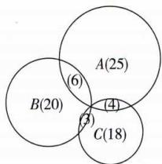

text_image

A(25)
B(20)
C(18)
(6)
(4)
(3)

8 C $U=\{x\in N^{*}\mid x\leqslant6\}=\{1,2,3,4,5,6\},A\subseteq U$ ，由题意可知，若 $1\in A$ ，则 $3\notin A$ ，若 $1\in\complement_{U}A$ ，则 $3\notin\complement_{U}A$ ，若 $2\in A$ ，则 $6\notin A$ ，若 $2\in\complement_{U}A$ ，则 $6\notin\complement_{U}A$ ，4和5没有限制，综上，满提示即1,3不能同时出现也不能同时无，2,6不能同时出现也不能同时无.

足条件的集合 A 可为： $\{1,2\},\{1,2,4\},\{1,2,5\},\{1,2,4,5\},\{1,6\},\{1,6,4\},\{1,6,5\},\{1,6,4,5\},\{2,3\},\{2,3,4\},\{2,3,5\},\{2,3,4,5\},\{3,6\},\{3,6,4\},\{3,6,5\},\{3,6,4,5\}$ ，共 16 个.

9 ABD 把 $x = 4$ 代入 $x^{2} - 3x - 4 = 0$ 中，成立，所以命题“若 $x = 4$ ，则 $x^{2} - 3x - 4 = 0$ ”为真命题，A正确；由 $x^{2} - 3x - 4 = 0$ ，解得 $x = -1$ 或 $x = 4$ ，又 $\{4\}$ 是 $\{-1,4\}$ 的真子集，所以“ $x = 4$ ”是“ $x^{2} - 3x - 4 = 0$ ”的充分不必要条件，B正确；因为 $m > 0$ ，所以 $\Delta = 1 + 4m > 0$ ，所以 $m > 0$ 时，方程 $x^{2} + x - m = 0$ 有实数根，故命题“若 $m > 0$ ，则关于 $x$ 的方程 $x^{2} + x - m = 0$ 有实数根”为真命题，所以该命题的否定为假命题，C错误；因为 $m^2 +n^2 = 0$ ，所以 $m = 0$ 且 $n = 0$ 所以命题“若 $m^2 +n^2 = 0$ ，则 $m = 0$ 且 $n = 0$ ”为真命题，D正确.

10 ABD 对于 A, 因为 $B \subseteq A$ , 所以 $A \cup B = A$ , A 正确; 对于 B, 因为 $A \cap C = \varnothing$ , 所以 $A \subseteq \complement_{R} C$ , 所以 $A \cap (\complement_{R} C) = A$ , $A \cup (\complement_{R} C) = \complement_{R} C \neq R$ , B 正确, C 错误; 对于 D, 由 $A \subseteq \complement_{R} C$ , 且 $B \subseteq A$ , 得 $B \subseteq \complement_{R} C$ , 故 $B \cap (\complement_{R} C) = B$ , D 正确.

11 BC 因为 $U = \{x \mid x < 10, x \in \mathbf{N}\}$ , 所以 $U = \{0, 1, 2, 3, 4, 5, 6, 7, 8, 9\}$ , 因为 $A \cap (\complement_U B) = \{1, 5\}$ , 所以 $1, 5 \in A, 1, 5 \notin B$ , 因为 $(\complement_U A) \cap (\complement_U B) = \{3, 7, 9\} = \complement_U (A \cup B)$ , 所以 $3, 7, 9 \notin A, 3, 7, 9 \notin B$ , 又 $A \cap B = \{4\}$ , 所以 $4 \in A, 4 \in B$ , 画出 Venn 图如图.

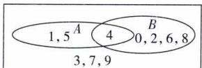

text_image

1,5 A 4 B
3,7,9 0,2,6,8

$8 \in B, A$ 错误； $\{5\} \subseteq A, B$ 正确； $7 \in \complement_{U}(A \cup B), C$ 正确；A 的真子集的个数为 $2^{3}-1=7, D$ 错误.

12 x<-1(答案不唯一) 解析 由 $|x|>1$ , 得 x<-1 或 x>1. 因为 p 是 q 的一个充分不必要条件, 所以 p 可以为 x<-1. (注: 满足题意的 p 均可.)

13 -2 或 0 解析 由题意得, $2 \in N$ . ① 若 $a^2 + a = 2$ , 则 $a = 1$ 或 $a = -2$ . 当 $a = 1$ 时, 集合 $M$ 中, $a^2 + 1 = 2$ , 不符合集合中元素的互异性, 舍去; 当 $a = -2$ 时, $M = \{2, 3, 5\}$ , $N = \{2, 0, -1\}$ , 符合题意. ② 若 $a + 2 = 2$ , 则 $a = 0$ , 此时 $M = \{2, 3, 1\}$ , $N = \{0, 2, -1\}$ , 符合题意. 综上, 实数 $a$ 的值为 -2 或 0.

14 $\frac{1}{10}$ 解析 由 $M, N$ 都是集合 $\{x \mid 1 \leqslant x \leqslant 2\}$ 的子集，得 $\left\{\begin{array}{l} m \geqslant 1, \\ m + \frac{1}{2} \leqslant 2 \end{array}\right.$ 和 $\left\{\begin{array}{l} n - \frac{3}{5} \geqslant 1, \\ n \leqslant 2, \end{array}\right.$ 解得 $\left\{\begin{array}{l} 1 \leqslant m \leqslant \frac{3}{2}, \\ \frac{8}{5} \leqslant n \leqslant 2. \end{array}\right.$ 要使 $M \cap N$

的“长度”最小,只需m取最小值、n取最大值或m取最大值、n取最小值.当 $m=1,n=2$ 时, $M\cap N=\{x\mid\frac{7}{5}\leqslant x\leqslant\frac{3}{2}\}$ ,其“长度”为 $\frac{3}{2}-\frac{7}{5}=\frac{1}{10}$ ,当 $m=\frac{3}{2},n=\frac{8}{5}$ 时, $M\cap N=\{x\mid\frac{3}{2}\leqslant x\leqslant\frac{8}{5}\}$ ,其“长度”为 $\frac{8}{5}-\frac{3}{2}=\frac{1}{10}$ ,故集合 $M\cap N$ 的“长度”的最小值是 $\frac{1}{10}$ .（另解）M的“长度”为 $\frac{1}{2},N$ 的“长度”为 $\frac{3}{5},\frac{1}{2}+\frac{3}{5}=\frac{11}{10}>1$ ,所以 $M\cap N$ 的“长度”的最小值是 $\frac{3}{5}+\frac{1}{2}-1=\frac{1}{10}$ )

15 解析 (1) 当 $a = 1, b = 3$ 时, $A = \{x\} - 1 \leqslant x \leqslant 4\}$ . (2分)

又 $B = \{ x \mid -\frac{1}{2} \leqslant x \leqslant 2 \}$ ,

所以 $A \cup B = \{x \mid -1 \leqslant x \leqslant 4\}$ ，(4 分)

$\complement_{R}B=\{x\mid x<-\frac{1}{2}或x>2\}.$ (6分)

(2) 假设存在实数 a, b 满足条件.

因为 a > 0，所以由 $2 - b \leqslant ax \leqslant 2b - 2$ ，得 $\frac{2 - b}{a} \leqslant x \leqslant \frac{2b - 2}{a}$ .
(8 分)

由 A=B，得 $\left\{\begin{aligned}\frac{2-b}{a}&=-\frac{1}{2},\\ \frac{2b-2}{a}&=2,\end{aligned}\right.$ 解得 $\left\{\begin{aligned}a&=2,\\ b&=3.\end{aligned}\right.$ (12 分)

故存在 a=2, b=3, 使得 A=B. (13 分)

16 解析 （1）因为“ $x \in B$ ”是“ $x \in A$ ”的必要不充分条件，所以 A 是 B 的真子集，（2 分）

则 $\left\{\begin{aligned}1-a<-1,\\ 1+a\geqslant2,\end{aligned}\right.$ 解得a>2,

所以实数 a 的取值范围为 $\{a \mid a > 2\}$ . (5 分)

(2) 因为“ $x \in B$ ”是“ $x \in A$ ”的充分不必要条件, 所以 B 是 A 的真子集. (7 分)

①当 $1-a\geqslant1+a$ ，即 $a\leqslant0$ 时，A=R，符合题意；（10分）

避坑注意不要忽略.

②当 $1 - a < 1 + a$ ，即 a > 0 时，则需满足 $\left\{\begin{aligned}a &>0,\\ 1 &-a \geqslant -1,\\ 1 &+a < 2,\end{aligned}\right.$ 解得
0 < a < 1.
(14 分)

综上,实数 a 的取值范围为 $\{a \mid a < 1\}$ . (15 分)

17 解析 (1) $x^{2}-2x-3m=(x-1)^{2}-3m-1$ ，(1分)

若命题 $p$ 为真命题，

则 $-3m - 1 > 0$ ，解得 $m < -\frac{1}{3}$ （3分）

所以实数 m 的取值范围是 $\{m \mid m < -\frac{1}{3}\}$ . (4 分)

(2) $x^{2}+4x+m=(x+2)^{2}+m-4,$ (5分)

若命题 q 为假命题, 则命题 q 的否定: $\forall x \in R, x^{2} + 4x + m \geqslant 0$ 为真命题, (7 分)

则 $m - 4 \geqslant 0$ ，解得 $m \geqslant 4$ ，(9分)

所以实数 m 的取值范围是 $\{m \mid m \geqslant 4\}$ . (10 分)

(3)由(1)(2)可知若命题p与命题q均为假命题，

则 $\left\{\begin{aligned}m&\geqslant-\frac{1}{3},\\ m&\geqslant4.\end{aligned}\right.$ 解得 $m\geqslant4.$ (13分)

故命题 $p$ 与命题 $q$ 中至少有一个为真命题时， $m < 4$

所以实数 m 的取值范围是 $\{m \mid m < 4\}$ . (15 分)

18 解析 (1) $A=\{x\mid x^{2}-8x+12=0\}=\{2,6\}$ . (1分)

因为 $A \cap B = \{2\}$ , 所以 $2 \in B$ ,

则 $2^{2} + 2(a + 1) \times 2 + a^{2} - 13 = 0$ ，即 $a^{2} + 4a - 5 = 0$ ，解得 a = 1 或 a = -5.
(2 分)

当 $a = 1$ 时， $B = \{x \mid x^2 + 4x - 12 = 0\} = \{-6, 2\}$ ，

则 $A \cap B = \{2\}$ , 满足题意;

当 $a = -5$ 时， $B = \{x \mid x^2 - 8x + 12 = 0\} = \{2,6\}$ ，

则 $A \cap B = \{2, 6\}$ , 不满足题意.

综上,若 $A \cap B = \{2\}$ , 则 a = 1. (4 分)

(2) 若 $A \cup B = A$ ，则 $B \subseteq A.$ (5 分)

①当 $B = \varnothing$ 时, 关于 x 的方程 $x^{2} + 2(a + 1)x + a^{2} - 13 = 0$ 没有实数根,

则 $\Delta = 4(a + 1)^2 - 4(a^2 - 13) = 8(a + 7) < 0$

解得 a < -7，

故当 $a < -7$ 时， $B = \varnothing \subseteq A$ 满足题意. (7分)

②当 $B \neq \emptyset$ ，即 $a \geqslant -7$ 时，

若集合 B 中只有一个元素, 则 $\Delta = 8(a + 7) = 0$ ,

得 a = -7，此时 $B = \{x \mid x^{2} - 12x + 36 = 0\} = \{6\} \subseteq \{2, 6\}$ ， $B \subseteq A$ ，满足题意；(9 分)

若集合 $B$ 中有两个元素，则 $\Delta = 8(a + 7) > 0$

得 $a > -7$ ，要使 $B\subseteq A$ ，则 $B = A = \{2,6\}$

结合(1)知 a = -5, 满足条件 a > -7. (12 分)

综上,实数 a 的取值范围为 $\{a \mid a \leqslant -7 \text{ 或 } a = -5\}$ . (13 分)

(3) 若全集 $U = R, A \cap (\complement_{U} B) = A$ ,

则 $A \subseteq \complement_{U} B$ ，即 $A \cap B = \varnothing$ . (14分)

又 $A = \{2,6\}$ ， $B = \{x|x^2 +2(a + 1)x + a^2 -13 = 0\}$

所以 $2 \notin B$ ，且 $6 \notin B$

则 $\left\{\begin{aligned}2^{2}+4(a+1)+a^{2}-13\neq0,\\ 6^{2}+12(a+1)+a^{2}-13\neq0,\end{aligned}\right.$ (15分)

解得 $a \neq 1$ 且 $a \neq -5$ 且 $a \neq -7$ .

所以实数 a 的取值范围为 $\{a \in R \mid a \neq 1 \text{ 且 } a \neq -5 \text{ 且 } a \neq -7\}$ . (17 分)

19 解析 (1) $S=\{2,4,6\}$ ，(1分)

$T=\{0,2\}$ . (2分)

(2) 因为 T = A，所以 T 中也只包含四个元素且必有 $0 \in T$ .
(3 分)

因为 $x_{1}<x_{2}<x_{3}<x_{4}$ ，所以 $0<x_{2}-x_{1}<x_{3}-x_{1}<x_{4}-x_{1}$ ，
所以 $T=\left\{0,x_{2}-x_{1},x_{3}-x_{1},x_{4}-x_{1}\right\}$ ，(4分)

又 $T = A = \{x_{1}, x_{2}, x_{3}, x_{4}\}$ ，所以 $x_{1} = 0$ ，即 $T = \{0, x_{2}, x_{3}, x_{4}\}$ .
(5 分)

又 $0 < x_{3} - x_{2} < x_{4} - x_{2} < x_{4} - x_{1}$ ，所以 $x_{3} - x_{2} = x_{2}, x_{4} - x_{2} =$

$x_{3}$ ，从而 $x_{3}=2x_{2}, x_{4}=x_{2}+x_{3}=3x_{2}$ ，(7 分)

此时 $x_{4}-x_{3}=x_{2}$ ，满足题意，所以 $x_{4}=3x_{2}$ . (8 分)

(3) 设 $A = \{a_{1}, a_{2}, \cdots, a_{k}\}$ ，其中 $1 \leqslant k \leqslant 2025, k \in Z$ ，不妨设 $a_{1} < a_{2} < \cdots < a_{k}$ ，(9 分)

则 $2a_{1}<a_{1}+a_{2}<a_{1}+a_{3}<\cdots<a_{1}+a_{k}<a_{2}+a_{k}<a_{3}+a_{k}<\cdots<a_{k-1}+a_{k}<2a_{k}$ ，所以 $|S|\geqslant2k-1$ ，(11分)

因为 $0 = a_{1} - a_{1} < a_{2} - a_{1} < a_{3} - a_{1} < \cdots < a_{k} - a_{1}$ ,

所以 $|T|\geqslant k,$ (12分)

因为 $S \cap T = \varnothing$ ，所以 $|S \cup T| = |S| + |T| \geqslant 3k - 1$ ，(13 分)

又 $S \cup T$ 中最小的元素为 0, 最大的元素为 $2a_{k}$ ,

所以 $|S\cup T|\leqslant2a_{k}+1$ ,

所以 $3k - 1 \leqslant 2a_{k} + 1 \leqslant 2 \times 2024 + 1$ ,

解得 $k \leqslant 1\ 350, k \in N^{*}$ . (16 分)

综上, $|A|$ 的最大值为1350. (17分)

# 第二章 一元二次函数、方程和不等式

# 第一节 等式性质与不等式性质

# 过基础 教材必备知识精练

1 C 导火线燃烧的时间为 $\frac{x}{0.5}$ s, 人在这段时间跑的路程为 $(4\times\frac{x}{0.5})$ m. 由题意可得 $4\times\frac{x}{0.5}>100$ . 故选 C.

2 D 因为甲班的分数大于乙班的分数,所以 x > y, 又甲班和乙班的分数之和大于 170, 且不大于 190, 所以 $170 < x + y \leqslant 190$ . 故选 D.

3 A

<table><tr><td>A</td><td>√</td><td>由a&gt;b,得a-c&gt;b-c.</td></tr><tr><td>B</td><td>×</td><td>当c=0时,ac=bc.</td></tr><tr><td>C</td><td>×</td><td rowspan="2">当a=-3,b=-7时,a&gt;b,而|a|=3,|b|=7,则|a|</td></tr><tr><td>D</td><td>×</td></tr></table>

4 B 因为 c > b > a，所以 c - a > c - b > 0，所以 $\frac{1}{c - b} > \frac{1}{c - a}$ ，充分性成立。若 $\frac{1}{c - b} > \frac{1}{c - a}$ ，不妨设 $\frac{1}{c - b} > 0, \frac{1}{c - a} < 0$ ，则 c - b > 0, c - a < 0，即 a > c > b，必要性不成立。故 “c > b > a” 是 “ $\frac{1}{c - b} > \frac{1}{c - a}$ ” 的充分不必要条件。

5 AD 因为 $ac^{2} > bc^{2}$ ，所以 $c \neq 0, c^{2} \neq 0$ ，所以 $\frac{1}{c^{2}} > 0$ ，所以 $ac^{2} \times \frac{1}{c^{2}} > bc^{2} \times \frac{1}{c^{2}}$ ，即 a > b，A 正确；当 a = 2, b = 1, c = 0, d = -2 时，有 a > b, c > d，但此时 a - c = 2, b - d = 3, a - c < b - d，B 错误；当 a = 1, b = 2, c = 1 时，有 b > a > 0, c > 0，但此时 $\frac{b + c}{a + c} = \frac{3}{2}, \frac{b}{a} = 2, \frac{b + c}{a + c} < \frac{b}{a}$ ，C 错误；因为 a > b > 0，所以 ab > 0, $\frac{1}{ab} > 0$ ，所以 $a \times \frac{1}{ab} > b \times \frac{1}{ab}$ ，即 $\frac{1}{b} > \frac{1}{a}$ ，所以 $a + \frac{1}{b} > b + \frac{1}{a}$ ，D 正确.

6 A 因为 $M-N=2a(a-2)-(a+1)(a-3)=2a^{2}-4a-(a^{2}-2a-3)=a^{2}-2a+3=(a-1)^{2}+2>0$ 恒成立，所以 M>N.

7 B 方法一(平方法) 因为 $A=\sqrt{a}+\sqrt{b}, B=\sqrt{a+b}$ ，所以 $A^{2}-B^{2}=a+b+2\sqrt{ab}-a-b=2\sqrt{ab}>0$ ，所以 $A^{2}>B^{2}$ ，又 A>0, B>0，所以 A>B.

方法二(赋值法) 令 a=1, b=1，则 A=2, $B=\sqrt{2}$ ，所以 A>B.

8 解析 方法一(作差法) $\frac{a^{2}-b^{2}}{a^{2}+b^{2}}-\frac{a-b}{a+b}=$

$$
\frac {(a + b) (a ^ {2} - b ^ {2}) - (a ^ {2} + b ^ {2}) (a - b)}{(a ^ {2} + b ^ {2}) (a + b)} =
$$

$$
\frac {(a - b) [ (a + b) ^ {2} - (a ^ {2} + b ^ {2}) ]}{(a ^ {2} + b ^ {2}) (a + b)} = \frac {2 a b (a - b)}{(a ^ {2} + b ^ {2}) (a + b)},
$$

因为 a > b > 0，所以 $a + b > 0, a - b > 0, 2ab > 0, a^{2} + b^{2} > 0$ ，所以 $\frac{2ab(a - b)}{(a^{2} + b^{2})(a + b)} > 0$ ，所以 $\frac{a^{2} - b^{2}}{a^{2} + b^{2}} > \frac{a - b}{a + b}$ .

方法二(作商法) 因为 a > b > 0,

所以 $\frac{a^{2}-b^{2}}{a^{2}+b^{2}}>0,\frac{a-b}{a+b}>0,2ab>0,$

壁坑当两个数都是正数或负数时,才可以用作商法. $a^{2}-b^{2}$

故 $\frac{a^{2}+b^{2}}{\frac{a-b}{a+b}}=\frac{(a+b)^{2}}{a^{2}+b^{2}}=\frac{a^{2}+b^{2}+2ab}{a^{2}+b^{2}}=1+\frac{2ab}{a^{2}+b^{2}}>1,$

所以 $\frac{a^{2}-b^{2}}{a^{2}+b^{2}}>\frac{a-b}{a+b}.$

9 AC

<table><tr><td>A</td><td>√</td><td>因为 $1 \leqslant a \leqslant 2,3 \leqslant b \leqslant 5$ ,所以 $4 \leqslant a + b \leqslant 7$ .</td></tr><tr><td>B</td><td>×</td><td>因为 $-2 \leqslant -a \leqslant -1$ ,所以 $1 \leqslant b - a \leqslant 4$ .</td></tr><tr><td>C</td><td>√</td><td>因为 $1 \leqslant a \leqslant 2,3 \leqslant b \leqslant 5$ ,所以 $3 \leqslant ab \leqslant 10$ .</td></tr><tr><td>D</td><td>×</td><td>因为 $\frac{1}{5} \leqslant \frac{1}{b} \leqslant \frac{1}{3}$ ,所以 $\frac{1}{5} \leqslant \frac{a}{b} \leqslant \frac{2}{3}$ .</td></tr></table>

10 $\{y\mid-1<y<0\}$ 解析 因为 $\alpha<\beta$ ，所以 $\alpha-\beta<0$ ，又 $-13<\alpha<-12,-13<\beta<-12$ ，所以 $12<-\beta<13$ ，所以 $-1<\alpha-\beta<1$ ，故 $-1<\alpha-\beta<0$ 。

【变式】 $\{z\mid-14<z<-12\}$ 解析 因为 $-13<\alpha<\beta<-12$ ，所以 $-13<\alpha<-12,12<-\beta<13$ ，且 $\alpha-\beta<0$ ，所以 $-1 < \alpha - \beta < 0$ ，所以 $-14 < (\alpha - \beta) + \alpha < -12$ ，所以避坑因为题干条件 $\alpha < \beta$ 的限制，所以不能直接将 $\alpha$ 乘 2 再减 $\beta - 14 < 2\alpha - \beta < -12$ 。

# 过能力 学科关键能力构建

1 D 方法一(赋值法) 由 0 < x < 1, 可取 $x = \frac{1}{4}$ , 所以 $\frac{1}{x} = 4, \sqrt{x} = \frac{1}{2}, x^{2} = \frac{1}{16}$ , 因为 $4 > \frac{1}{2} > \frac{1}{4} > \frac{1}{16}$ , 所以最小的是 $x^{2}$ .

方法二（作商法）因为 $0 < x < 1$ ，所以 $\frac{1}{x} > 1, 0 < \sqrt{x} < 1$ ， $0 < x^2 < 1$ ，因为 $\frac{x}{\sqrt{x}} = \sqrt{x} < 1, \frac{x^2}{x} = x < 1$ ，所以 $x < \sqrt{x}, x^2 < x$ 即 $x^2 < x < \sqrt{x} < \frac{1}{x}$ . 所以最小的是 $x^2$ .

方法三(作差法) 因为 0 < x < 1，所以 $\frac{1}{x} > 1, 0 < \sqrt{x} < 1, 0 < x^{2} < 1$ ，由 $x - \sqrt{x} = \sqrt{x} (\sqrt{x} - 1) < 0$ ，得 $x < \sqrt{x}$ ，由 $x - x^{2} = x (1 - x) > 0$ ，得 $x > x^{2}$ ，即 $x^{2} < x < \sqrt{x} < \frac{1}{x}$ ，所以最小的是 $x^{2}$ .

2 AB 因为 a < b < 0，所以两边同乘以 b，由不等式的性质，得 $ab > b^{2}$ ，A 正确；因为 a < b < 0，所以 0 < -b < -a，又 0 < c < d，由不等式的性质，得 -bc < -ad，所以 bc > ad，B 正确； $\frac{b}{a} - \frac{d}{c} = \frac{bc - ad}{ac}$ ，由题意知 ac < 0，且 bc - ad > 0，所以 $\frac{b}{a} - \frac{d}{c} = \frac{bc - ad}{ac} < 0$ ，所以 $\frac{b}{a} < \frac{d}{c}$ ，C 错误；取 a = -3, b = -1, $c = \frac{1}{2}$ , d = 2，此时 $ac = -\frac{3}{2} > -2 = bd$ ，D 错误.

3 B 方法一 $a - c = \sqrt{2} - (\sqrt{6} - \sqrt{2}) = 2\sqrt{2} - \sqrt{6} = \sqrt{8} - \sqrt{6} > 0$ ，故 $a > c$ ，排除 C, D. $b - c = (\sqrt{7} - \sqrt{3}) - (\sqrt{6} - \sqrt{2}) = (\sqrt{7} + \sqrt{2}) - (\sqrt{6} + \sqrt{3})$ ，又 $(\sqrt{7} + \sqrt{2})^2 = 9 + 2\sqrt{14}$ ， $(\sqrt{6} + \sqrt{3})^2 = 9 + 2\sqrt{18}$ ，且 $\sqrt{14} < \sqrt{18}$ ，所以 $(\sqrt{7} + \sqrt{2})^2 < (\sqrt{6} + \sqrt{3})^2$ ，即 $b - c < 0$ ，所以 $c > b$ 。综上， $a > c > b$ ，故选 B.

方法二 $b = \sqrt{7} -\sqrt{3} = \frac{4}{\sqrt{7} + \sqrt{3}},c = \sqrt{6} -\sqrt{2} = \frac{4}{\sqrt{6} + \sqrt{2}},a =$ $\sqrt{2} = \frac{4}{2\sqrt{2}}.$ 因为 $\sqrt{7} +\sqrt{3} >\sqrt{6} +\sqrt{2} >2\sqrt{2} >0$ ，所以 $0<$ $\frac{1}{\sqrt{7} + \sqrt{3}} <  \frac{1}{\sqrt{6} + \sqrt{2}} <  \frac{1}{2\sqrt{2}}$ 所以 $0 <   \frac{4}{\sqrt{7} + \sqrt{3}} <  \frac{4}{\sqrt{6} + \sqrt{2}} <  \frac{4}{2\sqrt{2}}$ 即 $b <   c <   a.$ 故选B.

4 C 因为 $c - b = a^{2} - 4a + 5 = (a - 2)^{2} + 1 > 0$ ，所以 c > b。由 $b + c = 6 - 4a + 3a^{2}$ ， $c - b = 5 - 4a + a^{2}$ ，两式相减，得 $2b = 1 + 2a^{2}$ ，所以 $b - a = a^{2} - a + \frac{1}{2} = \left( a - \frac{1}{2} \right)^{2} + \frac{1}{4} > 0$ ，所以 b > a，因此 c > b > a。

5 A 设第一次油价为 a 元/升, 第二次油价为 b 元/升, $a \neq b, a, b > 0$ . 方案一的平均油价为 $\frac{400}{\frac{200}{a} + \frac{200}{b}} = \frac{2ab}{a + b}$ , 方案二的平均油价为 $\frac{30a + 30b}{60} = \frac{a + b}{2}$ . 又 $\frac{2ab}{a + b} - \frac{a + b}{2} = \frac{4ab - (a + b)^2}{2(a + b)} = \frac{-(a - b)^2}{2(a + b)} < 0$ , 故 $\frac{2ab}{a + b} < \frac{a + b}{2}$ . 故选 A.

6 A 设选辩题 $A$ 的男生有 $x$ 人, 选辩题 $A$ 的女生有 $y$ 人, 选辩题 $B$ 的男生有 $m$ 人, 选辩题 $B$ 的女生有 $n$ 人. 已知该班女生人数多于男生人数, 即 $y + n > x + m$ ; 又知选辩题 $A$ 的人数多于选辩题 $B$ 的人数, 即 $x + y > m + n$ . 将这两个不等式相加得到 $2y + x + n > 2m + x + n$ , 两边同时加上 $-(x + n)$ 得到 $2y > 2m$ , 即 $y > m$ . 这就意味着选辩题 $A$ 的女生人数多于选辩题 $B$ 的男生人数. 故选 A.

7 ABD 若 m > n，则 $m - n > 0$ ，所以 $\frac{b + m}{a + m} = \frac{b + n + (m - n)}{a + n + (m - n)} > \frac{b + n}{a + n}$ ，故 x > y，A 正确；同理，若 m < n，提示糖水不等式.

则 $x < y$ ，若 $m = n$ ，显然有 $x = y$ ，B正确；若 $m > n$ ，则 $\frac{m + n}{2}>$ $n$ ，所以 $\frac{b + \frac{m + n}{2}}{a + \frac{m + n}{2}} >\frac{b + n}{a + n}$ 所以 $\frac{2b + m + n}{2a + m + n} >\frac{b^{*} + n}{a + n},$ C错误；由题设，结合不等式性质显然有 $\frac{b + m}{a + m} < 1 < \frac{a + n}{b + n},$ D正确.

# 归纳总结

# 糖水不等式的推论

推论1: 若 $a > b, m_{1} > m_{2} > m_{3} > \cdots > m_{n}$ ，则 $1 > \frac{b + m_{1}}{a + m_{1}} > \frac{b + m_{2}}{a + m_{2}} > \frac{b + m_{3}}{a + m_{3}} > \cdots > \frac{b}{a}$ ，该推论可以理解为真分数的性质，即对于一个真分数 $\frac{b}{a}$ ，分子分母同时加上一个正数 m，那么该分数就会变大，且所加的正数 m 越大，分数就越大；从实际角度可理解为向糖水里加入的糖越多，糖水会越甜.

推论2: 若 $a_{1} > b_{1} > 0, a_{2} > b_{2} > 0$ ，且 $\frac{b_{1}}{a_{1}} < \frac{b_{2}}{a_{2}}$ ，则 $\frac{b_{1}}{a_{1}} < \frac{b_{1} + b_{2}}{a_{1} + a_{2}} < \frac{b_{2}}{a_{2}}$ ，该推论可以理解为两杯浓度不同的糖水，一杯较淡，一杯较浓，那么这两杯混合后的糖水一定是比浓的更淡，且比淡的更浓.

8 ACD 由题意可得 $-3 \leqslant 3a \leqslant 12$ ，即 $1 \leqslant a \leqslant 4$ ，A 正确；由 $-5 \leqslant a - b \leqslant 4$ ，可得 $-4 \leqslant b - a \leqslant 5$ ，则 $-8 \leqslant 2b - 2a \leqslant 10$ ，又 $2 \leqslant 2a + b \leqslant 8$ ，所以 $-6 \leqslant 3b \leqslant 18$ ，即 $-2 \leqslant b \leqslant 6$ ，B 错误；由 $-4 \leqslant b - a \leqslant 5, 2 \leqslant 2a + b \leqslant 8$ ，得 $-2 \leqslant a + 2b \leqslant 13$ ，C 正确；设 $2a - 5b = x(a - b) + y(2a + b)$ ，则 $\left\{ \begin{array}{l} x + 2y = 2, \\ -x + y = -5, \end{array} \right.$ 解得 $\left\{ \begin{array}{l} x = 4, \\ y = -1, \end{array} \right.$ 因为 $-20 \leqslant 4(a - b) \leqslant 16$ ， $-8 \leqslant -(2a + b) \leqslant -2$ ，所以 $-28 \leqslant 2a - 5b \leqslant 14$ （另解）（换元法）令 $a - b = u, 2a + b = v$ ，则 $-5 \leqslant u \leqslant 4, 2 \leqslant v \leqslant 8$ ， $a = \frac{u + v}{3}, b = \frac{v - 2u}{3}$ ，则 $2a - 5b = 2 \times \frac{u + v}{3} - 5 \times \frac{v - 2u}{3} = 4u - v$ ，又 $-5 \leqslant u \leqslant 4, 2 \leqslant v \leqslant 8$ ，所以 $-20 \leqslant 4u \leqslant 16, -8 \leqslant -v \leqslant -2$ ，所以 $-28 \leqslant 4u - v \leqslant 14$ ）D 正确.

9 证明 (1) 因为 $\frac{a^2}{a + b} - \frac{3a - b}{4} = \frac{4a^2 - (3a - b)(a + b)}{4(a + b)} = \frac{(a - b)^2}{4(a + b)}, a, b$ 为正实数，所以 $\frac{(a - b)^2}{4(a + b)} \geqslant 0$

所以 $\frac{a^{2}}{a+b}\geqslant\frac{3a-b}{4}$ ，当且仅当a=b时，取等号.

(2) 由(1)知 $\frac{a^2}{a + b} \geqslant \frac{3a - b}{4}$ , 及 $a, b, c$ 为正实数, 两边同时乘以 $a$ , 得 $\frac{a^3}{a + b} \geqslant \frac{3a^2 - ab}{4}$ .

同理, 得 $\frac{b^{3}}{b+c} \geqslant \frac{3b^{2}-bc}{4}, \frac{c^{3}}{c+a} \geqslant \frac{3c^{2}-ac}{4}$ ,

所以 $\frac{a^3}{a + b} +\frac{b^3}{b + c} +\frac{c^3}{c + a}\geqslant \frac{3a^2 - ab + 3b^2 - bc + 3c^2 - ac}{4} =$

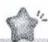

# 第二节

$$
\begin{array}{l} \frac {a b + b c + a c + \frac {3}{2} \left(a ^ {2} + b ^ {2} + c ^ {2} - a b - b c - a c\right)}{2} \\ \frac {a b + b c + a c + \frac {3}{4} \left[ (a - b) ^ {2} + (b - c) ^ {2} + (a - c) ^ {2} \right]}{2} \\ \end{array}
$$

=

$\frac{ab+bc+ac}{2}$ ，当且仅当a=b=c时，取等号.

# 过基础 教材必备知识精练

1 C 由基本不等式可知,要使 $ab + \frac{1}{ab} \geqslant 2$ 成立,则 ab > 0,所以 a, b 同号,所以①③④均可以.

2 AD

<table><tr><td>A</td><td>√</td><td> $\forall a,b\in\mathbf{R},(a-b)^{2}\geqslant0$ 恒成立,即 $a^{2}+b^{2}\geqslant2ab$ 恒成立.</td></tr><tr><td>B</td><td>×</td><td>当 $a<0,b<0$ 时, $a+b<0$ ,而 $2\sqrt{ab}>0$ ,不等式不成立.</td></tr><tr><td>C</td><td>×</td><td>当 $a<0,b<0$ 时, $\frac{1}{a}+\frac{1}{b}<0$ ,而 $\frac{2}{\sqrt{ab}}>0$ ,不等式不成立.</td></tr><tr><td>D</td><td>√</td><td>由 $a,b\in\mathbf{R}$ ,且 $ab>0$ ,得 $\frac{b}{a}>0,\frac{a}{b}>0$ ,则 $\frac{b}{a}+\frac{a}{b}\geqslant2\sqrt{\frac{b}{a}\cdot\frac{a}{b}}=2$ ,当且仅当 $\frac{b}{a}=\frac{a}{b}$ ,即 $a=b$ 时取等号.</td></tr></table>

3 AD

<table><tr><td>A</td><td>√</td><td>因为ab≠0,所以 $\frac{|b|}{|a|}$ , $\frac{|a|}{|b|}$ 均大于零,所以 $\frac{|b|}{|a|}+\frac{|a|}{|b|}\geqslant2\sqrt{\frac{|b|}{|a|}\cdot\frac{|a|}{|b|}}=2$ ,当且仅当|a|=|b|时等号成立.</td></tr><tr><td>B</td><td>×</td><td> $\frac{4}{a}+a\geqslant2\sqrt{\frac{4}{a}\cdot a}=4$ ,当且仅当a=2时等号成立,不符合a&gt;3.</td></tr><tr><td>C</td><td>×</td><td>因为a&lt;0,所以 $\frac{4}{a}+a<0$ (提示当a为正数时,才可使用基本不等式)</td></tr><tr><td>D</td><td>√</td><td>由基本不等式推导过程知该选项正确.</td></tr></table>

归纳总结 利用基本不等式求最值时,要把握三个条件:一正——各项都是正数;二定——积或和是定值;三相等——等号能取到.

4 A 因为 x > 0, A = x - 2, $B = -\frac{1}{x}$ , 所以 A - B = x - 2 + $\frac{1}{x} \geqslant 2\sqrt{x \cdot \frac{1}{x}} - 2 = 0$ , 即 $A \geqslant B$ , 当且仅当 x = 1 时等号成立.

5 A 因为 $a > 0, b > 0$ ，所以 $\frac{2ab}{a + b} \leqslant \frac{2ab}{2\sqrt{ab}} = \sqrt{ab}, \sqrt{ab} \leqslant \frac{a + b}{2}, \sqrt{\frac{a^2 + b^2}{2}} = \sqrt{\frac{2(a^2 + b^2)}{4}} \geqslant \sqrt{\frac{(a + b)^2}{4}} = \frac{a + b}{2}$ ，当且

仅当 $a = b$ 时，以上等号成立，则 $\frac{2ab}{a + b} \leqslant \sqrt{ab} \leqslant \frac{a + b}{2} \leqslant \sqrt{\frac{a^2 + b^2}{2}}$ . 故选A.

6 A 方法一 因为 x > 0, y > 0, 所以 $\frac{1}{x} > 0$ , $\frac{1}{y} > 0$ , 又 xy = 4, 所以 $\frac{1}{x} + \frac{1}{y} \geqslant 2\sqrt{\frac{1}{x} \cdot \frac{1}{y}} = 2 \times \frac{1}{2} = 1$ , 当且仅当 x = y = 2 时取等号, 则 $\frac{1}{x} + \frac{1}{y}$ 的最小值为 1.

方法二 $\frac{1}{x}+\frac{1}{y}=\frac{x+y}{xy}=\frac{x+y}{4}$ . 因为 $x+y\geqslant2\sqrt{xy}=4$ , 当且仅当 x=y=2 时等号成立, 所以 $\frac{1}{x}+\frac{1}{y}$ 的最小值为 1. 方法三(消元法) 由题意得 $\frac{1}{x}=\frac{y}{4}$ , 所以 $\frac{1}{x}+\frac{1}{y}=\frac{y}{4}+\frac{1}{y}\geqslant2\sqrt{\frac{y}{4}\cdot\frac{1}{y}}=1$ , 当且仅当 y=2 时, 等号成立.

7 D 当 $0 < x < \frac{3}{2}$ 时, $x(3 - 2x) = \frac{1}{2} \cdot 2x \cdot (3 - 2x) \leqslant \frac{1}{2} \cdot \left(\frac{2x + 3 - 2x}{2}\right)^2 = \frac{9}{8}$ , 当且仅当 2x = 3 - 2x, 即 $x = \frac{3}{4}$ 时

所求式中隐含的和定: $2x + (3 - 2x) = 3$ .

等号成立, 故选 D.

8 C 因为 x > 2，所以 x - 2 > 0，由基本不等式得 $y = x + \frac{4}{x - 2} = x - 2 + \frac{4}{x - 2} + 2 \geqslant 2\sqrt{(x - 2) \cdot \frac{4}{x - 2}} + 2 = 6$ ，当

域题点配凑，满足积定.

且仅当 x = 4 时等号成立，故选 C.

【变式1】 $4\sqrt{2} + 4$ 解析 因为 $x > 2$ ，所以 $x - 2 > 0$ ，所以 $y = 2x + \frac{4}{x - 2} = 2(x - 2) + \frac{4}{x - 2} +4\geqslant 2\sqrt{2(x - 2)\cdot\frac{4}{x - 2}} +4 =$

破题点配凑,满足积定.

$4\sqrt{2}+4$ , 当且仅当 $2(x-2)=\frac{4}{x-2}$ 且 x>2, 即 $x=2+\sqrt{2}$ 时等号成立, 所以 $y=2x+\frac{4}{x-2}$ 的最小值为 $4\sqrt{2}+4$ .

【变式2】-2 解析 因为 x<2，所以 2-x>0，所以提示变形，得“一正”.

$$
x + \frac {4}{x - 2} = - [ (2 - x) + \frac {4}{2 - x} ] + 2 \leqslant - 2 \sqrt {(2 - x) \cdot \frac {4}{2 - x}} +
$$

破题点配凑,满足积定.

$2 = -2 \times 2 + 2 = -2$ , 当且仅当 $2 - x = \frac{4}{2 - x}$ 且 x < 2, 即 x = 0 时等号成立, 所以 $y = x + \frac{4}{x - 2}$ 的最大值为 -2.

9 C $p=x+\frac{1}{x}+y+\frac{1}{y}\geqslant2\sqrt{x\cdot\frac{1}{x}}+2\sqrt{y\cdot\frac{1}{y}}=2+2=$ 4, 当且仅当 $x=\frac{1}{x}$ 且 $y=\frac{1}{y}$ ，即 x=1 且 y=1 时等号成立，

避坑多次使用基本不等式,各等号需同时取得.则p的最小值为4.

【变式】5 解析 方法一 $p=x+\frac{1}{x}+y+\frac{1}{y}=1+\frac{1}{xy}$ .
因为 x>0, y>0 且 $x+y=1$ ，所以 $xy \leqslant \left(\frac{x+y}{2}\right)^{2} = \frac{1}{4}$ ，当且仅当 $x=y=\frac{1}{2}$ 时等号成立，所以 p 的最小值为 5.

方法二 $p = x + \frac{1}{x} + y + \frac{1}{y} = (x + y) + \frac{x + y}{x} + \frac{x + y}{y} = 3 +$ 础题点 利用“1”的代换进行变形.

$\frac{y}{x}+\frac{x}{y}\geqslant3+2\sqrt{\frac{y}{x}\cdot\frac{x}{y}}=5$ ，当且仅当 $\frac{y}{x}=\frac{x}{y}$ ，即x=y= $\frac{1}{2}$ 时等号成立，故p的最小值为5.

方法三 $p = x + \frac{1}{x} + y + \frac{1}{y} = (x + y) + (\frac{1}{x} + \frac{1}{y})(x + y) =$ $1 + 1 + 1 + \frac{x}{y} + \frac{y}{x} \geqslant 3 + 2\sqrt{\frac{x}{y} \cdot \frac{y}{x}} = 5$ , 当且仅当 $\frac{x}{y} = \frac{y}{x}$ ,

即 $x = y = \frac{1}{2}$ 时等号成立, 故 $p$ 的最小值为 5.

# 避坑指南

此题易认为 $x + \frac{1}{x} \geqslant 2, y + \frac{1}{y} \geqslant 2$ ，所以$p \geqslant 4$ , 从而得到错解 4, 错误的原因是 x, y 不能同时取到 1.

10 ACD $2xy = x \cdot 2y \leqslant \left(\frac{x + 2y}{2}\right)^2 = 4$ ，当且仅当 $x = 2y = 2$ 时取等号，A 正确； $\frac{x^2 + 4y^2}{2} \geqslant \frac{1}{4}(x + 2y)^2 = 4$ ，所以 $x^2 + 4y^2 \geqslant 8$ ，当且仅当 $x = 2y = 2$ 时取等号，（另解）由柯西不等式得 $[x^2 + (2y)^2](1^2 + 1^2) \geqslant (x + 2y)^2$ ，即 $x^2 + 4y^2 \geqslant \frac{(x + 2y)^2}{2} = \frac{4^2}{2} = 8$ ，当且仅当 $\frac{x}{1} = \frac{2y}{1}$ ，即 $x = 2y = 2$ 时等号成立）B 错误； $\frac{2}{y} + \frac{1}{x} = \frac{1}{4}(x + 2y)(\frac{2}{y} + \frac{1}{x}) = \frac{1}{4}(5 + \frac{2x}{y} + \frac{2y}{x}) \geqslant \frac{1}{4}(5 + 2\sqrt{\frac{2x}{y} \cdot \frac{2y}{x}}) = \frac{9}{4}$ ，当且仅当 $x = y = \frac{4}{3}$ 时取等号，C 正确； $\sqrt{x} + \sqrt{2y} = \sqrt{x + 2y + 2\sqrt{x \cdot 2y}} \leqslant \sqrt{4 + x + 2y} = 2\sqrt{2}$ ，当且仅当 $x = 2y = 2$ 时取等号，（另解）由柯西不等式得 $[(x^2)^2 + (\sqrt{2y})^2](1^2 + 1^2) \geqslant (\sqrt{x} + \sqrt{2y})^2$ ，即 $\sqrt{x} + \sqrt{2y} \leqslant \sqrt{2(x + 2y)} = \sqrt{2 \times 4} = 2\sqrt{2}$ ，当且仅当 $\frac{x}{1} = \frac{2y}{1}$ ，即 $x = 2y = 2$ 时等号成立）D 正确.

11 B 因为正实数 a, b 满足 $\frac{1}{a} + \frac{2}{b} = 1$ ，所以 $2a + b + 1 = (2a + b)(\frac{1}{a} + \frac{2}{b}) + 1 = \frac{b}{a} + \frac{4a}{b} + 5 \geqslant 2\sqrt{\frac{b}{a} \cdot \frac{4a}{b}} + 5 = 9$ ，
破题点“1”的代换.
破题点 积为定值.
当且仅当 $\frac{b}{a}=\frac{4a}{b}$ ，即b=2a=4时等号成立.故选B.

# 避坑指南

若如下求解: $2a+b+1=(2a+b)+(\frac{1}{a}+$

$\frac{2}{b}$ $=\left(2a+\frac{1}{a}\right)+\left(b+\frac{2}{b}\right)\geqslant2\sqrt{2a\cdot\frac{1}{a}}+2\sqrt{b\cdot\frac{2}{b}}=4\sqrt{2}$ ，则是错误的，错误的原因是两次使用基本不等式时，等号不能同时成立.

12 C 实数 a, b 满足 ab > 0，则 $y = a^{2} + 4b^{2} + \frac{1}{ab} \geqslant 4ab + \frac{1}{ab} \geqslant 4$ ，当且仅当 a = 2b 且 $ab = \frac{1}{2}$ ，即 $\left\{\begin{aligned}a &= 1, \\ b &= \frac{1}{2}\end{aligned}\right.$ 或

$^{③}$ 多次连用基本不等式,要注意取等号的条件的一致性. $a = -1,$ $b = -\frac{1}{2}$ 时等号成立. 故选 C.

13 $\frac{\sqrt{3}}{6}$ 解析 由 $x > 1$ ，得 $x - 1 > 0$ ，则 $\frac{x - 1}{x^2 - 2x + 4} = \frac{x - 1}{(x - 1)^2 + 3} = \frac{1}{x - 1 + \frac{3}{x - 1}} \leqslant \frac{1}{2\sqrt{(x - 1) \cdot \frac{3}{x - 1}}} = \frac{\sqrt{3}}{6}$ ，当且

仅当 $x-1=\frac{3}{x-1}$ ，即 $x=1+\sqrt{3}$ 时取等号，所以 $\frac{x-1}{x^{2}-2x+4}$ 的最大值为 $\frac{\sqrt{3}}{6}$ .

14 证明 由基本不等式, 可知 $ab + cd \geqslant 2\sqrt{abcd}$ , 当且仅当 ab = cd 时, 等号成立;

$ac + bd \geqslant 2\sqrt{acbd}$ ，当且仅当 ac = bd 时，等号成立，

所以 $(ab+cd)(ac+bd)\geqslant2\sqrt{abcd}\cdot2\sqrt{acbd}=4abcd$ ，即 $(ab+cd)(ac+bd)\geqslant4abcd$

当且仅当 ab = cd 且 ac = bd，即 a = d, b = c 时，等号成立.

15 证明 因为 a, b, c > 0，且 $a + b + c = 1$ ，

所以 $\frac{1}{a}+\frac{1}{b}+\frac{1}{c}=\left(\frac{1}{a}+\frac{1}{b}+\frac{1}{c}\right)\underbrace{(a+b+c)}=1+\frac{b}{a}+\frac{c}{a}+$

$\frac{a}{b}+1+\frac{c}{b}+\frac{a}{c}+\frac{b}{c}+1=\left(\frac{b}{a}+\frac{a}{b}\right)+\left(\frac{c}{a}+\frac{a}{c}\right)+\left(\frac{c}{b}+\frac{b}{c}\right)+3\geqslant2\sqrt{\frac{b}{a}\cdot\frac{a}{b}}+2\sqrt{\frac{c}{a}\cdot\frac{a}{c}}+2\sqrt{\frac{c}{b}\cdot\frac{c}{c}}+3=9,$

当且仅当 $a=b=c=\frac{1}{3}$ 时等号成立, 所以 $\frac{1}{a}+\frac{1}{b}+\frac{1}{c}\geqslant9$ .

16 C 由题意可知行车的总费用为 $\left[56+8\left(3+\frac{x^{2}}{360}\right)\right]\cdot\frac{200}{x}=\frac{16\ 000}{x}+\frac{160x}{36}=160\left(\frac{100}{x}+\frac{x}{36}\right)$ ，其中 $50\leqslant x\leqslant100$ ，由基本不等式可得 $160\left(\frac{100}{x}+\frac{x}{36}\right)\geqslant160\times2\sqrt{\frac{100}{x}\times\frac{x}{36}}=\frac{1\ 600}{3}$ ，当且仅当 $\frac{100}{x}=\frac{x}{36}$ ，即x=60时，等号成立，因此在最经济的情况下，车速是60 km/h.

17 10 解析 由题得 $nx = 6000$ . 设总费用为 $y$ 元, 则 $y = 300n + \frac{x}{2} \times 10 = 300n + 5x = 300n + \frac{30000}{n}$ . 因为 $n > 0$ , 所以 $300n + \frac{30000}{n} \geqslant 2\sqrt{300n \cdot \frac{30000}{n}} = 6000$ , 当且仅当 $300n = \frac{30000}{n}$ , 即 $n = 10$ 时, $y$ 取最小值, 即总费用最低.

18 解析 (1) 由题意得 $4a + 6b = 36$ ，即 $2a + 3b = 18, a > 0, b > 0$ ，
设每间虎笼面积为 $S \mathrm{~m}^2$ ，则 $S = ab$ ，

因为 $18 = 2a + 3b \geqslant 2\sqrt{2a \times 3b} = 2\sqrt{6ab}$ , 当且仅当 $2a = 3b = 9$ , 即 $a = \frac{9}{2}, b = 3$ 时等号成立,

所以 $\sqrt{ab} \leqslant \frac{18}{2\sqrt{6}} = \frac{9}{\sqrt{6}}$ ，即 $ab \leqslant \frac{27}{2}$ ，

所以每间虎笼的长为 $\frac{9}{2}$ m、宽为3 m时，可使每间虎笼面积最大，面积最大为 $\frac{27}{2}$ m $^{2}$ .

(2)由题意可得 ab=24, a>0, b>0,

设钢筋网总长为 $l \, m$ ，则 $l = 4a + 6b$ ，

因为 $4a + 6b \geqslant 2\sqrt{4a \times 6b} = 4\sqrt{6ab} = 48$ ，当且仅当 4a = 6b = 24，即 a = 6, b = 4 时等号成立，

所以每间虎笼的长为6 m、宽为4 m时,可使围成四间虎笼的钢筋网总长最小,最小值为48 m.

# 过能力 学科关键能力构建

1 B $\frac{1}{a} + \frac{1}{b} + \frac{16}{a + b} = \frac{a + b}{ab} + \frac{16}{a + b} = a + b + \frac{16}{a + b} \geqslant 2\sqrt{(a + b) \cdot \frac{16}{a + b}} = 8$ , 当且仅当 $a + b = \frac{16}{a + b}$ , 即 $a + b = 4$ , 即 $\left\{\begin{aligned} a &= 2 + \sqrt{3}, \\ b &= 2 - \sqrt{3} \end{aligned}\right.$ 或 $\left\{\begin{aligned} a &= 2 - \sqrt{3}, \\ b &= 2 + \sqrt{3} \end{aligned}\right.$ 时等号成立.

2 C 令两直角边长为 a, b，斜边长为 c = 6，则 $a^{2} + b^{2} = c^{2} = 36$ 。因为 $2ab \leqslant a^{2} + b^{2}$ ，所以 $a^{2} + 2ab + b^{2} \leqslant 2(a^{2} + b^{2}) = 72$ ，即 $(a + b)^{2} \leqslant 72$ ，又 $a + b > 0$ ，则 $a + b \leqslant 6\sqrt{2}$ ，当且仅当 $a = b = 3\sqrt{2}$ 时，等号成立，所以 $a + b + c \leqslant 6 + 6\sqrt{2}$ ，即这个直角三角形周长的最大值为 $6 + 6\sqrt{2}$ 。

3 AC 根据题图, 在 Rt $\triangle ADB$ 中, 利用射影定理得 $CD^{2}=AC\cdot CB$ , 所以 $CD^{2}=ab$ . 由 $OD\geqslant CD$ , 得 $\frac{a+b}{2}\geqslant\sqrt{ab}(a>0,b>0)$ , 当且仅当 a=b 时取等号. 在 Rt $\triangle OCD$ 中, 由射影定理得 $CD^{2}=DE\cdot OD$ , 所以 $DE=\frac{CD^{2}}{OD}=\frac{ab}{\frac{a+b}{2}}$ .

又 $CD \geqslant DE$ ，所以 $\sqrt{ab} \geqslant \frac{2ab}{a+b} = \frac{2}{\frac{1}{a} + \frac{1}{b}} (a > 0, b > 0)$ ，当且仅当a=b时取等号.故选AC.

# 归纳总结

$$
① a ^ {2} + b ^ {2} \geqslant \frac {(a + b) ^ {2}}{2}; ② a b \leqslant
$$

$$
\frac {a ^ {2} + b ^ {2}}{2}; \textcircled {3} a b \leqslant \frac {1}{4} (a + b) ^ {2}; \textcircled {4} (\frac {a + b}{2}) ^ {2} \leqslant \frac {a ^ {2} + b ^ {2}}{2};
$$

$$
⑤ (a + b) ^ {2} \geqslant 4 a b; ⑥ \sqrt {a b} \geqslant \frac {2}{\frac {1}{a} + \frac {1}{b}}; ⑦ \frac {a + b + c}{3} \geqslant \sqrt [ 3 ]{a b c}.
$$

对于以上各式,要明确其成立的条件和取“=”的条件.

4 A 当两个弹簧并联时, $k_{4}=k_{1}+k_{2}$ ,拉伸距离 $d=\frac{m}{k_{4}}=\frac{m}{k_{1}+k_{2}}$ ,要使d最大,则需 $k_{4}=k_{1}+k_{2}$ 最小.依题意得 $k_{3}=\frac{20}{1}=20$ ,即 $\frac{1}{20}=\frac{1}{k_{1}}+\frac{1}{k_{2}}=\frac{k_{1}+k_{2}}{k_{1}k_{2}}$ ,即 $20(k_{1}+k_{2})=k_{1}k_{2}$ .又 $k_{1}k_{2}\leqslant\frac{(k_{1}+k_{2})^{2}}{4}$ ,故 $k_{1}+k_{2}\geqslant80$ ,当且仅当 $k_{1}=k_{2}=40$ 时等号成立,则 $k_{4}$ 最小为80,此时d最大,为 $\frac{20}{80}=\frac{1}{4}(cm)$ .故选A.

5 ACD 

<table><tr><td>A</td><td>√</td><td>因为 $x^{2}+y^{2}\geqslant2xy$ ,当且仅当 $x=y$ 时等号成立,且 $x^{2}+y^{2}-xy=3$ ,所以 $x^{2}+y^{2}-3=xy\leqslant\frac{x^{2}+y^{2}}{2}$ ,即 $x^{2}+y^{2}\leqslant6$ ,当且仅当 $x=y=\pm\sqrt{3}$ 时等号成立.</td></tr><tr><td>B</td><td>×</td><td rowspan="2"> $x^{2}+y^{2}-xy=(x+y)^{2}-3xy=3$ ,则 $(x+y)^{2}-3=3xy\leqslant3\times\frac{(x+y)^{2}}{4}$ ,当且仅当 $x=y$ 时取等号,则 $(x+y)^{2}\leqslant12$ ,即 $-2\sqrt{3}\leqslant x+y\leqslant2\sqrt{3}$ ,所以当 $x=y=\sqrt{3}$ 时, $x+y$ 取得最大值 $2\sqrt{3}$ ,当 $x=y=-\sqrt{3}$ 时, $x+y$ 取得最小值 $-2\sqrt{3}$ .</td></tr><tr><td>C</td><td>√</td></tr><tr><td>D</td><td>√</td><td> $x^{2}+y^{2}-xy=3\geqslant2xy-xy$ ,则 $xy\leqslant3$ ,当且仅当 $x=y=\pm\sqrt{3}$ 时等号成立.</td></tr></table>

6 CD 由 a > 0, b > 0, $a + b^{2} = 1$ ，得 $\sqrt{a} + b \leqslant 2\sqrt{\frac{(\sqrt{a})^{2} + b^{2}}{2}} = \sqrt{2}$ ，当且仅当 $\sqrt{a} = b$ ，即 $a = \frac{1}{2}$ ， $b = \frac{\sqrt{2}}{2}$ 时，等号成立，所以 $\sqrt{a} + b \leqslant \sqrt{2}$ ，A 错误； $\frac{1}{b^{2}} - a = \frac{1}{b^{2}} - (1 - b^{2}) = \frac{1}{b^{2}} + b^{2} - 1 \geqslant 2\sqrt{\frac{1}{b^{2}} \cdot b^{2}} - 1 = 1$ ，当且仅当 $\frac{1}{b^{2}} = b^{2}$ ，即 b = 1 时取等号，又 b = 1 时 a = 0，不满足题意，故 $\frac{1}{b^{2}} - a > 1$ ，

# 避坑 注意前提条件.

B 错误；因为 $b = \sqrt{1 - a}$ ，所以 $b\sqrt{a} = \sqrt{1 - a} \cdot \sqrt{a} \leqslant \frac{1 - a + a}{2} = \frac{1}{2}$ ，当且仅当 $\sqrt{a} = \sqrt{1 - a}$ ，即 $a = \frac{1}{2}$ 时，等号成立，所以 $b\sqrt{a} \leqslant \frac{1}{2}$ ，C 正确； $\frac{1}{a} + \frac{4}{b^{2}} = (\frac{1}{a} + \frac{4}{b^{2}})(a + b^{2}) = 5 + \frac{b^{2}}{a} + \frac{4a}{b^{2}} \geqslant 5 + 2\sqrt{\frac{b^{2}}{a} \cdot \frac{4a}{b^{2}}} = 9$ ，当且仅当 $\frac{b^{2}}{a} = \frac{4a}{b^{2}}$ ，即 $a = \frac{1}{3}$ ， $b = \frac{\sqrt{6}}{3}$ 时，等号成立，所以 $\frac{1}{a} + \frac{4}{b^{2}} \geqslant 9$ ，（另解）（权方和不等式） $\frac{1}{a} + \frac{4}{b^{2}} \geqslant \frac{(1 + 2)^{2}}{a + b^{2}} = 9$ ，当且仅当 $\frac{1}{a} = \frac{2}{b^{2}}$ ，即 $a = \frac{1}{3}$ ， $b = \frac{\sqrt{6}}{3}$ 时，等号成立）D 正确.

# 教材拓展

权方和不等式是数学中重要的不等式，其形式为 $\frac{x^{2}}{a}+\frac{y^{2}}{b}\geqslant\frac{(x+y)^{2}}{a+b}(a,b,x,y$ 均为正数 $)$ ，当且仅当 $\frac{b}{a}x^{2}=\frac{a}{b}y^{2}$ ，即 $\frac{x}{a}=\frac{y}{b}$ 时取等号.利用权方和不等式可快速求得分式和形式的最值问题(仅限于选择题、填空题，不能用于证明题，且使用时需注意前提条件).

其证明过程为： $\left(\frac{x^2}{a} +\frac{y^2}{b}\right)(a + b) = x^2 +y^2 +\frac{b}{a} x^2 +\frac{a}{b} y^2\geqslant$ $x^{2} + y^{2} + 2\sqrt{\frac{b}{a}x^{2}\cdot\frac{a}{b}y^{2}} = x^{2} + y^{2} + 2xy = (x + y)^{2},$ 又 $a + b$ $>0$ ，所以 $\frac{x^2}{a} +\frac{y^2}{b}\geqslant \frac{(x + y)^2}{a + b}$ ，当且仅当 $\frac{b}{a} x^2 = \frac{a}{b} y^2$ ，即 $\frac{x}{a} =$ $\frac{y}{b}$ 时取等号.也可利用柯西不等式证明： $\left[(\frac{x}{\sqrt{a}})^2 +\right.$

$$
\left(\frac {y}{\sqrt {b}}\right) ^ {2} ] \cdot [ (\sqrt {a}) ^ {2} + (\sqrt {b}) ^ {2} ] \geqslant \left(\frac {x}{\sqrt {a}} \cdot \sqrt {a} + \frac {y}{\sqrt {b}} \cdot \sqrt {b}\right) ^ {2} = (x + y) ^ {2},
$$

提示 权方和不等式可看作柯西不等式的变形.

即 $\frac{x^2}{a} +\frac{y^2}{b}\geqslant \frac{(x + y)^2}{a + b}.$

7 $\{b|b\geqslant\frac{1}{4}\}$ 解析 方法一 因为0<a<1,所以1-a>0,所以 $\frac{b}{a}+\frac{b}{1-a}\geqslant1$ 恒成立等价于 $b\geqslant a(1-a)$ 恒成立,即 $b\geqslant a(1-a)$ 的最大值,又 $a(1-a)\leqslant(\frac{a+1-a}{2})^{2}=\frac{1}{4}$ ,当且仅当 $a=\frac{1}{2}$ 时取等号,故 $b\geqslant\frac{1}{4}$ .

方法二(权方和不等式) 因为 0 < a < 1，所以 0 < 1 - a < 1，又分析知 b > 0，所以 $\frac{b}{a} + \frac{b}{1 - a} \geqslant \frac{\left(\sqrt{b} + \sqrt{b}\right)^2}{a + 1 - a} = 4b$ ，当且仅当 $\frac{\sqrt{b}}{a} = \frac{\sqrt{b}}{1 - a}$ ，即 $a = \frac{1}{2}$ 时取等号，又 $\frac{b}{a} + \frac{b}{1 - a} \geqslant 1$ 恒成立，所以 $4b \geqslant 1$ 恒成立，所以 $b \geqslant \frac{1}{4}$ .

8 $1 + 2\sqrt{2}$ 解析 $\frac{x^{2} + 3y}{xy} = \frac{x^{2} + (x + 2y)y}{xy} = \frac{x}{y} + 1 + \frac{2y}{x} \geqslant$ 破题点化为齐次. 破题点拆分.

$1+2\sqrt{\frac{x}{y}\cdot\frac{2y}{x}}=1+2\sqrt{2}$ （当且仅当 $\frac{x}{y}=\frac{2y}{x}$ ，即 $x=3\sqrt{2}-3$ ， $y=3-\frac{3\sqrt{2}}{2}$ 时，等号成立）.

【变式】 $9+4\sqrt{5}$ 解析 方法一（化为齐次再求解） $\frac{x+2y+3}{xy}=\frac{x(x+y)+2y(x+y)+3(x+y)^{2}}{xy}=\frac{4x^{2}+9xy+5y^{2}}{xy}=$

# 第三节 二次函数与一元二次方程、不等式

# 过基础 教材必备知识精练

1 D $-2x^{2}+x+3<0$ , 即 $2x^{2}-x-3>0$ , 即 $(2x-3)(x+1)>0$ , 所以 $x>\frac{3}{2}$ 或 x<-1.

2 A 不等式 $(x+5)(3-2x)\geqslant6$ 可化为 $2x^{2}+7x-9\leqslant0$ ，即 $(x-1)(2x+9)\leqslant0$ ，解得 $-\frac{9}{2}\leqslant x\leqslant1$ .

3 ABD 方法一 $4x^{2}-4x+1=(2x-1)^{2}\geqslant0$ ，不等式的解集为 R，故 A 正确； $x^{2}-2x+2=(x-1)^{2}+1>0$ ，故 $-x^{2}+2x-2<0$ ，即不等式的解集为 R，故 B 正确； $x^{2}-3x+2>0$ 的解集为 $\{x|x<1 \text{ 或 }x>2\}$ ，故 C 不正确； $x^{2}-x+1=(x-\frac{1}{2})^{2}+\frac{3}{4}>0$ ，不等式的解集为 R，故 D 正确.

方法二

<table><tr><td>A</td><td>√</td><td> $\Delta = (-4)^{2} - 4 \times 4 \times 1 = 0$ ,不等式的解集为R.</td></tr><tr><td>B</td><td>√</td><td> $\Delta = 2^{2} - 4 \times (-1) \times (-2) = -4 < 0$ ,不等式的解集为R.</td></tr><tr><td>C</td><td>×</td><td> $\Delta = (-3)^{2} - 4 \times 1 \times 2 = 1 > 0$ ,不等式的解集不为R.</td></tr><tr><td>D</td><td>√</td><td> $\Delta = (-1)^{2} - 4 \times 1 \times 1 = -3 < 0$ ,不等式的解集为R.</td></tr></table>

4 (1) $\{x \mid x < -1 \text{ 或 } x > \frac{1}{3}\}$ ; (2) $\{x \mid 0 \leqslant x \leqslant 4\}$ ; (3) $\{x \mid x < -2 \text{ 或 } -1 < x < 1 \text{ 或 } x > 2\}$

解析 （1）由 $\frac{1}{x^{2}} - \frac{2}{x} - 3 < 0$ ，可得 $1 - 2x - 3x^{2} < 0$

破题点 两边同乘以 $x^{2}$ , 化为整式不等式. $(x \neq 0)$ , 即 $(x + 1)(3x - 1) > 0 (x \neq 0)$ , 解得 $x < -1$ 或 $x > \frac{1}{3}$ .

(2) 由 $x - \sqrt{x} - 2 \leqslant 0$ , 可得 $(\sqrt{x})^2 - \sqrt{x} - 2 \leqslant 0$ , 即 $(\sqrt{x} - 2) \cdot (\sqrt{x} + 1) \leqslant 0$ , 解得 $-1 \leqslant \sqrt{x} \leqslant 2$ , 又 $\sqrt{x} \geqslant 0$ , 所以 $0 \leqslant \sqrt{x} \leqslant 2$ , 所以 $0 \leqslant x \leqslant 4$ .

$9+\frac{4x}{y}+\frac{5y}{x}\geqslant9+2\sqrt{\frac{4x}{y}\cdot\frac{5y}{x}}=9+4\sqrt{5}$ ，当且仅当 $\frac{4x}{y}=\frac{5y}{x}$ ，
即 $x=5-2\sqrt{5}, y=2\sqrt{5}-4$ 时取等号.

方法二（“1”的妙用）由题意可得 $\frac{x + 2y + 3}{xy} = \frac{x + 2y + 3x + 3y}{xy} = \frac{4x + 5y}{xy} = \frac{4}{y} +\frac{5}{x} = (\frac{4}{y} +\frac{5}{x})\cdot (x + y) =$ $9 + \frac{4x}{y} +\frac{5y}{x}\geqslant 9 + 2\sqrt{\frac{4x}{y}\cdot\frac{5y}{x}} = 9 + 4\sqrt{5},$ 当且仅当 $\frac{4x}{y} = \frac{5y}{x},$ 即 $x = 5 - 2\sqrt{5},y = 2\sqrt{5} -4$ 时取等号.

9 证明 $\frac{1}{a} + \frac{1}{b} + \frac{1}{c} = \frac{1}{2}\left[(\frac{1}{a} + \frac{1}{b}) + (\frac{1}{b} + \frac{1}{c}) + (\frac{1}{a} + \frac{1}{c})\right] = \frac{1}{2}\left(\frac{a + b}{ab} + \frac{b + c}{bc} + \frac{a + c}{ac}\right)$ .

因为 a, b, c 均为正实数，

所以 $ab \leqslant \left(\frac{a + b}{2}\right)^2, bc \leqslant \left(\frac{b + c}{2}\right)^2, ac \leqslant \left(\frac{a + c}{2}\right)^2,$

当且仅当 a=b=c 时, 等号同时成立,

所以 $\frac{1}{a} +\frac{1}{b} +\frac{1}{c} = \frac{1}{2}\left(\frac{a + b}{ab} +\frac{b + c}{bc} +\frac{a + c}{ac}\right)\geqslant \frac{1}{2}\left(\frac{4}{a + b} +\right.$ $\frac{4}{b + c} +\frac{4}{a + c}) = \frac{2}{a + b} +\frac{2}{b + c} +\frac{2}{a + c},$

所以 $\frac{1}{2a} +\frac{1}{2b} +\frac{1}{2c}\geqslant \frac{1}{b + c} +\frac{1}{c + a} +\frac{1}{a + b}.$

(3) 方法一（分类讨论） $x^{2}-3|x|+2>0$ 等价于 $\left\{\begin{aligned}x^{2}-3x+2&>0,\\ x&\geqslant0\end{aligned}\right.$ 或 $\left\{\begin{aligned}x^{2}+3x+2&>0,\\ x&<0.\end{aligned}\right.$ 分别解这两个不等式组，得 $0\leqslant x<1$ 或x>2，-1<x<0或x<-2，即x<-2或-1<x<1或x>2.

方法二(将 $|x|$ 视为整体) $x^{2}-3|x|+2>0$ 可化为 $|x|^{2}-3|x|+2>0$ ，即 $(|x|-1)(|x|-2)>0$ ，所以 $0\leqslant|x|<1$ 或 $|x|>2$ ，即-1<x<1或x>2或x<-2.

5 A 因为 $a^{2}+1-a=(a-\frac{1}{2})^{2}+\frac{3}{4}>0$ ，所以 $a^{2}+1>a$ ，所以不等式 $(x-a)(x-a^{2}-1)<0$ 的解集为 $\{x\mid a<x<a^{2}+1\}$ .

6 CD 原不等式可化为 $(x - 1)(x - a) > 0.$

<table><tr><td>A</td><td>×</td><td>当a=1时,原不等式为 $(x-1)^{2}>0$ ,解得 $x\neq1$ .</td></tr><tr><td>B</td><td>×</td><td>当a&gt;1时,不等式的解集为 $\{x|x<1\text{或}x>a\}$ .</td></tr><tr><td>C</td><td>√</td><td>当a&lt;1时,不等式的解集为 $\{x|x1\}.</td></tr><tr><td>D</td><td>√</td><td>对于一元二次方程\( x^{2}-(a+1)x+a=0,\Delta=(a+1)^{2}-4a=(a-1)^{2}\geqslant0$ ,所以无论a取何值,不等式的解集均不为空集.</td></tr></table>

7 解析 ①当 $a + 1 = 0$ ，即 $a = -1$ 时，原不等式变为破题点当二次项系数含参时需分类讨论. $-x + 2 < 0$ ，即 $x > 2$ .

②当 $a+1>0$ ，即a>-1时，原不等式可化为 $(x-2)(x-\frac{1}{a+1})<0$ ，

若 $-1 < a < -\frac{1}{2}$ , 则 $\frac{1}{a + 1} > 2$ , 解得 $2 < x < \frac{1}{a + 1}$ ;

题眼 不等式对应的一元二次方程的两根含参时,应讨论两根的大小.

若 $a = -\frac{1}{2}$ , 则 $\frac{1}{a + 1} = 2$ , 无解;

若 $a > -\frac{1}{2}$ , 则 $\frac{1}{a + 1} < 2$ , 解得 $\frac{1}{a + 1} < x < 2$ .

③当 $a+1<0$ ，即a<-1时，原不等式可化为 $(x- \frac{1}{a+1})>0$ ，

因为 a < -1，所以 $\frac{1}{a+1} < 2$ ，解得 $x < \frac{1}{a+1}$ 或 x > 2。

综上可知，当 $a > -\frac{1}{2}$ 时，原不等式的解集为 $\{x\mid \frac{1}{a + 1} < x < 2\}$ ；当 $a = -\frac{1}{2}$ 时，原不等式的解集为 $\varnothing$ ；当 $-1 < a < -\frac{1}{2}$ 时，原不等式的解集为 $\{x\mid 2 < x < \frac{1}{a + 1}\}$ ；当 $a = -1$ 时，原不等式的解集为 $\{x|x > 2\}$ ；当 $a < -1$ 时，原不等式的解集为 $\{x|x < \frac{1}{a + 1}\text{或} x > 2\}$ .

8 B $\frac{x-1}{x-3}\leqslant0$ 可化为 $\left\{\begin{aligned}(x-1)(x-3)\leqslant0,\\ x-3\neq0,\end{aligned}\right.$ 解得 $1\leqslant x<3$ , 所

避坑注意分母不等于0.

以不等式 $\frac{x-1}{x-3}\leqslant0$ 的解集为 $\{x\mid1\leqslant x<3\}$ .

9 (1) $\{x \mid -2 < x < -1 \text{ 或 } x > 1\}$ ; (2) $\{x \mid x < -4 \text{ 或 } -1 < x < 1 \text{ 或 } 1 < x < 2\}$ 解析 (1) 方法一 将不等式 $(x + 1) \cdot$

$(x-1)(x+2)>0$ 化为以下 4 个不等式组： $\begin{cases}x+1>0,\\x-1>0,\\x+2>0\end{cases}$ $\left\{\begin{aligned}&x+1>0,\\&x-1<0,\\&x+2<0\end{aligned}\right.$ 或 $\left\{\begin{aligned}&x+1<0,\\&x-1>0,\\&x+2<0\end{aligned}\right.$ 或 $\left\{\begin{aligned}&x+1<0,\\&x-1<0,\\&x+2>0,\end{aligned}\right.$ 解得 x>1 或无解或

无解或 -2 < x < -1，故原不等式的解集为 $\{x \mid -2 < x < -1$ 或 $x > 1\}$ .

方法二 将方程 $(x+1)(x-1)(x+2)=0$ 的三个根-2,-1,1标在数轴上，用穿针引线法依次通过每一个根（如图所示）.

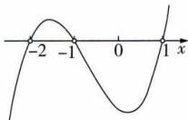

text_image

-2
-1
0
1
x

由图可知原不等式的解集为 $\{x\mid-2<x<-1$ 或 x>1.

(2) \( \frac{(x+1)(x-2)}{(x-1)^{2}(x+4)}<0 \)  可化为 \( (x+1)(x-2)(x-1)^{2}(x+4)<0 \) ，将方程 \( (x+1)(x-2)(x-1)^{2}(x+4)=0 \)  的根-4,-1,1,2标在数轴上，用穿针引线法依次通过，如图，则原不等式的解集为 \( \{x|x<-4 \)  或 -1<x<1 或 1<x<2\} \) .

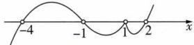

# 归纳总结 高次不等式的解题步骤(穿针引线法):

1. 标准化: 将不等式左侧化为未知数的形式, 右侧化为 0.

2. 分解因式: 将标准化的不等式左侧化为若干个一次因式或高次因式的乘积, 且各因式中未知数的系数均为正.

3. 求根: 求出所有根, 并在数轴上表示出来, 按照从小到大的顺序标注.

4. 穿针引线: 从右上方开始引线, 依次通过每一个根画曲线, 遇奇次重根穿过, 遇偶次重根不穿过 (即“奇穿偶不穿”).

5. 得出解集: 根据不等式的符号(“≥”“≤”“>”或“<”), 找出解集.

10 $\{x\mid0<x<2\}$ 解析 若 $\frac{x-2}{x}\geqslant0$ ，则 $\left|\frac{x-2}{x}\right|=\frac{x-2}{x}$ 恒成立，不合题意，因此 $\frac{x-2}{x}<0$ ，即 $x(x-2)<0$ ，解得0<x<2，所以原不等式的解集是 $\{x\mid0<x<2\}$ .

11 C 因为关于 x 的不等式 $x^{2} + bx + c - 1 \leqslant 0$ 的解集为 $\{x \mid -\frac{3}{2} \leqslant x \leqslant 2\}$ ，所以 $-\frac{3}{2}, 2$ 是关于 x 的方程 $x^{2} + bx + c - 1 = 0$ 的两个不等实数根，所以 $\left\{\begin{aligned}-\frac{3}{2}+2&=-b,\\-\frac{3}{2}\times2&=c-1,\end{aligned}\right.$ 解得 $\left\{\begin{aligned}b&=-\frac{1}{2},\\c&=-2,\end{aligned}\right.$ 所以 $b+c=-\frac{5}{2}.$

归纳总结 若关于 $x$ 的一元二次不等式 $ax^2 + bx + c > 0 (a < 0)$ 的解集为 $\{x \mid x_1 < x < x_2\} (x_1 < x_2)$ ，则 $\left\{ \begin{array}{l} x_1 + x_2 = -\frac{b}{a}, \\ x_1 \cdot x_2 = \frac{c}{a}. \end{array} \right.$ 当 $a > 0$ 时，也有类似的结论.

12 C 因为不等式 $kx^{2}-2x+k<0$ 的解集为 $\{x\mid x\neq m\}$ ,
所以 $\left\{\begin{aligned}&k<0,\\ &\Delta=4-4k^{2}=0,\\ &m=\frac{2}{2k},\end{aligned}\right.$ 解得k=-1,m=-1,故 $m+k=-2.$

13 C 因为不等式 $ax^{2}-bx+c<0$ 的解集为 $\{x|x>1$ 或 x<-2\}, 所以 a<0, 且 $\left\{\begin{aligned}\frac{c}{a}&=-2,\\ \frac{b}{a}&=-1,\end{aligned}\right.$ 即 $\left\{\begin{aligned}c&=-2a,\\ b&=-a,\end{aligned}\right.$ 所以 $y=ax^{2}+bx+c=ax^{2}-ax-2a=a(x^{2}-x-2)=a(x-2)(x+1)$ , 所以函数 $y=ax^{2}+bx+c$ 的图象开口向下, 两个零点为 $x_{1}=2,x_{2}=-1$ . 故选 C.

14 $\{a\mid-25\leqslant a<-24$ 或 $0<a\leqslant1\}$ 解析 因为关于 x 的不等式 $x^{2}-ax-6a<0$ 的解集是 $\{x\mid m<x<n\}$ 且 m<n，所以 m,n 是关于 x 的方程 $x^{2}-ax-6a=0$ 的两个根，所以 $\Delta=a^{2}+24a>0$ ，即 $a(a+24)>0$ ，所以 a<-24 或 a>0.

方法一 由求根公式得 $m = \frac{a - \sqrt{a^2 + 24a}}{2}, n = \frac{a + \sqrt{a^2 + 24a}}{2}$ , 因为 $n - m \leqslant 5$ , 所以 $\frac{a + \sqrt{a^2 + 24a}}{2} - \frac{a - \sqrt{a^2 + 24a}}{2} \leqslant 5$ , 即 $\sqrt{a^2 + 24a} \leqslant 5$ , 即 $a^2 + 24a - 25 \leqslant 0$ , 即 $(a - 1)(a + 25) \leqslant 0$ , 解得 $-25 \leqslant a \leqslant 1$ . 综上, 得 $-25 \leqslant a < -24$ 或 $0 < a \leqslant 1$ .

方法二 因为 $n - m \leqslant 5$ ，所以 $(n - m)^2 \leqslant 25$ ，则 $n^2 + m^2 - 2mn \leqslant 25$ ，则 $(n + m)^2 - 4mn \leqslant 25$ 。由根与系数的关系得 $n + m = a, mn = -6a$ ，则 $a^2 + 24a - 25 \leqslant 0$ ，即 $(a - 1)(a + 25) \leqslant 0$ ，解得 $-25 \leqslant a \leqslant 1$ 。综上，得 $-25 \leqslant a < -24$ 或 $0 < a \leqslant 1$ 。

15 C 方法一 若关于 x 的不等式 $x^{2}-4x-2-a\leqslant0$ 有解，则 $\Delta=16+4(2+a)\geqslant0$ ，解得 $a\geqslant-6$ 。故选 C.

方法二(分离参数法) 因为关于 x 的不等式 $x^{2}-4x-2-a\leqslant0$ 有解, 所以关于 x 的不等式 $a\geqslant x^{2}-4x-2=(x-2)^{2}-6$ 有解, 所以 $a\geqslant[(x-2)^{2}-6]_{\min}=-6$ .

16 A 方法一 不等式 $x^{2}-2x+5\geqslant a^{2}-3a$ 对任意实数x 恒成立等价于不等式 $x^{2}-2x+5-a^{2}+3a\geqslant0$ 对任意实数 x 恒成立，所以 $\Delta=(-2)^{2}-4\times(5-a^{2}+3a)\leqslant0$ ，解得 $-1\leqslant a\leqslant4$ ，故选 A.

方法二 $x^{2}-2x+5=(x-1)^{2}+4$ 的最小值为 4，所以要使 $x^{2}-2x+5\geqslant a^{2}-3a$ 对任意实数 x 恒成立，只需 $a^{2}-3a\leqslant4$ ，解得 $-1\leqslant a\leqslant4$ ，故选 A.

# 归纳总结

一元二次不等式恒成立时需满足的条件：

(1) 当 $ax^{2} + bx + c > 0$ 恒成立（或解集为 R）时，需满足 $\left\{\begin{aligned}a &>0,\\ \Delta &<0;\end{aligned}\right.$   
(2) 当 $ax^{2} + bx + c \geqslant 0$ 恒成立（或解集为 R）时，需满足 $\left\{\begin{aligned}a &>0,\\ \Delta &\leqslant 0;\end{aligned}\right.$   
(3) 当 $ax^{2} + bx + c < 0$ 恒成立（或解集为 R）时，需满足 $\left\{\begin{aligned}a &< 0,\\ \Delta &< 0;\end{aligned}\right.$   
(4) 当 $ax^{2} + bx + c \leqslant 0$ 恒成立（或解集为 R）时，需满足 $\left\{\begin{aligned}&a<0,\\ &\Delta\leqslant0.\end{aligned}\right.$

17 B 当 a=3 时，-1<0，不等式成立；当 $a\neq3$ 时，有 $\left\{\begin{aligned}\Delta&=(a-3)^{2}-4(a-3)\times(-1)<0,\\ a-3&<0,\end{aligned}\right.$ 解得 -1<a<3. 综上，实数 a 的取值范围是 $\{a|-1<a\leqslant3\}$ .  
18 A 由题意知, 当 $1 \leqslant x \leqslant 5$ 时, 不等式 $x^{2} - ax - 5 > 0$ 有解, 只需 25 - 5a - 5 > 0 或 1 - a - 5 > 0, 解得 a < 4.  
19 B 由题意,每台电脑的售价为0.5万元,则 $0.5x-(-0.1x^{2}+10.5x+750)>0$ ,所以x>150,故最少售出151台才能盈利.  
20 $\{x\mid0<x\leqslant10\}$ 解析 因为三块花圃的面积均为 $150\ m^{2}$ ，所以长为 $\frac{150}{x}\ m$ ，又矩形花圃的长比宽至少多 $5\ m$ ，所以 $\frac{150}{x}\geqslant x+5$ ，即 $x^{2}+5x-150\leqslant0$ ，即 $(x-10)(x+15)\leqslant0$ ，所以 $0<x\leqslant10$ .

避坑实际问题中,宽应大于0.

21 解析 (1) 设蓄水池中存水 y 吨,

则 $y=400+60t-120\sqrt{6t}=60\left(\sqrt{t}-\sqrt{6}\right)^{2}+40(0\leqslant t\leqslant24)$ ，当 t=6 时，y 的值最小，为 40，

故供水6小时后,蓄水池中的存水量最少,最少水量为40吨.

(2) 令 $\sqrt{6t}=x$ ，则 $t=\frac{1}{6}x^{2}$ ，即 $y=400+10x^{2}-120x$ .

由 $400 + 10x^{2} - 120x < 80$ ，得 $x^{2} - 12x + 32 < 0$ ，解得 $4 < x < 8$ ，即 $4 < \sqrt{6t} < 8, \frac{8}{3} < t < \frac{32}{3}$ .

又 $\frac{32}{3}-\frac{8}{3}=8$ ,

所以 24 小时内有 8 个小时出现供水紧张现象.

# 过能力 学科关键能力构建

1 C 由 $\frac{x^2 - 7}{x - 1} > 1$ ，得 $\frac{x^2 - 7}{x - 1} - 1 > 0$ ，得 $\frac{x^2 - x - 6}{x - 1} > 0$ ，即 $\frac{(x + 2)(x - 3)}{x - 1} > 0$ ，即 $(x - 1)(x + 2)(x - 3) > 0$ ，解得 $-2 < x < 1$ 或 $x > 3$ ，所以原不等式的解集为 $\{x \mid -2 < x < 1$ 或 $x > 3\}$ .

2 B 由 $\left\{ \begin{array}{l} x^2 - 4x + 3 < 0, \\ x^2 - 6x + 8 < 0, \end{array} \right.$ 解得 $\left\{ \begin{array}{l} 1 < x < 3, \\ 2 < x < 4, \end{array} \right.$ 即 $2 < x < 3$ . 由

题知,关于 x 的不等式 $x^{2}-3x+a<0$ 的解集包含 $\{x\mid2<x<3\}$ ，则 $\left\{\begin{aligned}&\Delta=9-4a>0,\\ &2^{2}-3\times2+a\leqslant0,\\ &3^{2}-3\times3+a\leqslant0,\end{aligned}\right.$ 解得 $a\leqslant0$ ，故选 B.

3 BD 由题中图象开口向上知 a > 0，又由二次函数的对称轴方程为 $x = -\frac{b}{2a}$ ，知 $-\frac{b}{2a} = \frac{-1 + 2}{2} = \frac{1}{2}$ ，所以 b = -a < 0，A 错误；由题图知不等式 $ax^{2} + bx + c > 0$ 的解集为 $\{x \mid x < -1 \text{ 或 } x > 2\}$ ，B 正确；由题图知当 x = 1 时，函数值为负数，所以 $a + b + c < 0$ ，C 错误；由题图可知 -1, 2 是关于 x 的方程 $ax^{2} + bx + c = 0$ 的两个根，所以 $\left\{\begin{aligned}-\frac{b}{a} &= -1 + 2 = 1, \\ \frac{c}{a} &= -1 \times 2 = -2,\end{aligned}\right.$ 得 $\left\{\begin{aligned}b &= -a, \\ c &= -2a,\end{aligned}\right.$ 所以 $-2ax^{2} - ax + a > 0$ ，又 a > 0，得 $2x^{2} + x - 1 < 0$ ，即 $(2x - 1)(x + 1) < 0$ ，解得 $-1 < x < \frac{1}{2}$ ，D 正确.

4 C 因为 a, b 都是非零常数，且 $x_{1} < x_{2}$ ，若 a > 0, b > 0，则 $A = \{x \mid x < x_{1} \text{ 或 } x > x_{2}\}$ ， $B = \{x \mid x \leqslant x_{1} \text{ 或 } x \geqslant x_{2}\}$ ，可知 $A \subseteq B$ ，可得 $A \cup B = B \neq R$ ；若 a < 0, b < 0，则 $A = \{x \mid x_{1} < x < x_{2}\}$ ， $B = \{x \mid x_{1} \leqslant x \leqslant x_{2}\}$ ，可知 $A \subseteq B$ ，可得 $A \cup B = B \neq R$ ；若 a > 0, b < 0，则 $A = \{x \mid x < x_{1} \text{ 或 } x > x_{2}\}$ ， $B = \{x \mid x_{1} \leqslant x \leqslant x_{2}\}$ ，此时 $A \cup B = R$ ；若 a < 0, b > 0，则 $A = \{x \mid x_{1} < x < x_{2}\}$ ， $B = \{x \mid x \leqslant x_{1} \text{ 或 } x \geqslant x_{2}\}$ ，此时 $A \cup B = R$ 。综上，“ab < 0”是“ $A \cup B = R$ ”的充要条件。

5 D 由两个正实数 x, y 满足 $4x + y = 2xy$ ，得 $\frac{1}{x} + \frac{4}{y} = 2$ ，则 $x + \frac{y}{4} = \frac{1}{2}\left(\frac{1}{x} + \frac{4}{y}\right)\left(x + \frac{y}{4}\right) = \frac{1}{2}\left(2 + \frac{4x}{y} + \frac{y}{4x}\right) \geqslant \frac{1}{2}\left(2 + 2\sqrt{\frac{4x}{y} \cdot \frac{y}{4x}}\right) = 2$ ，当且仅当 $\frac{4x}{y} = \frac{y}{4x}$ ，即 y = 4x = 4 时取等号。由不等式 $x + \frac{y}{4} < m^{2} - m$ 有解，得 $m^{2} - m > 2$ ，解得 m < -1 或 m > 2。

6 D 由不等式的解集, 可得一元二次方程 $x^{2}-(m+1)x+2m-1=0$ 的根为 $x_{1}, x_{2}$ ，则 $x_{1}+x_{2}=m+1, x_{1}x_{2}=2m-1$ 。由 $\Delta=(m+1)^{2}-4(2m-1)>0$ ，得 m<1 或 m>5。由 $\frac{1}{x_{1}}+\frac{1}{x_{2}}=\frac{x_{1}+x_{2}}{x_{1}x_{2}}=\frac{m+1}{2m-1}<1$ ，得 $\frac{m+1-2m+1}{2m-1}<0$ ，即 $(m-2)(2m-1)>0$ ，解得 $m<\frac{1}{2}$ 或 m>2。综上，实数 m 的取值范围是 $\{m|m<\frac{1}{2}$ 或 m>5。

7 ACD 原不等式可化为 $ax^{2} + 2ax - 3a + 2 > 0$ ，所以 a < 0，且 $\left\{\begin{aligned}x_{1} + x_{2} &= -2, \\ x_{1}x_{2} &= \frac{2}{a} - 3,\end{aligned}\right.$ 所以 $x_{1} + x_{2} + 2 = 0, x_{1}x_{2} + 3 = \frac{2}{a} < 0$ ，故 A, D 正确。令 $y = a(x - 1)(x + 3)$ ，则该二次函数的零点分别为 -3, 1，且其图象开口向下，如图，由图知 $x_{1} < -3 < 1 < x_{2}, |x_{1} - x_{2}| > 4$ ，故 B 错误，C 正确。

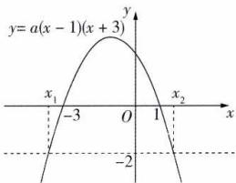

line

| x | y |
|---|---|
| -3 | -2 |
| 0 | 0 |
| 1 | 1 |
| -2 | -2 |

8 (1) $\{m \mid -2 < m < 2\}$ ; (2) $\{m \mid m < 2\}$ 解析 (1) 由题意得 $\Delta = 4m^{2} - 16 < 0$ , 解得 -2 < m < 2.

(2) 方法一 当 x=0 时, 4>0 恒成立. 当 x>0 时, 关于 x 的不等式 $x^{2}-2mx+4>0$ 恒成立, 即 $2mx<x^{2}+4$ , 则 $m<\frac{x^{2}+4}{2x}$ 在 $x\in(0,+\infty)$ 上恒成立, 又 $\frac{x^{2}+4}{2x}=\frac{x}{2}+\frac{2}{x}\geqslant2\sqrt{\frac{x}{2}\cdot\frac{2}{x}}=2$ , 当且仅当 x=2 时等号成立, 因此 m<2.

方法二 令 $y = x^{2} - 2mx + 4$ ，其图象开口向上，对称轴方程为 x = m。若 m < 0，如图 1 所示，此时 $\forall x \geqslant 0, y > 0$ 恒成立。若 $m \geqslant 0$ ，如图 2 所示，则 $\Delta < 0$ ，即 $4m^{2} - 16 < 0$ ，得 $0 \leqslant m < 2$ 。综上，m < 2。

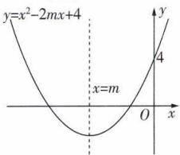

line

| x | y |
|---|---|
| 0 | 0 |
| x = m | 0 |
| y = x² - 2mx + 4 | y = 4 |

图 1

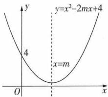

text_image

y
y=x²-2mx+4
4
x=m
O
x

图 2

9 18 解析 依题意可得 $20 = k \cdot M \cdot 36^2$ ，所以 $k \cdot M = \frac{20}{36^2}$ 。又卡车司机发现障碍物到踩刹车需要经过 $1\mathrm{~s}$ ，这 $1\mathrm{~s}$ 内卡车行驶的距离为 $\frac{1000v}{3600} = \frac{5v}{18} (\mathrm{m})$ 。由题意得 $\frac{5v}{18} + k \cdot 2Mv^2 < 20 - 5$ ，即 $\frac{5v}{18} + 2 \times \frac{20}{36^2} \cdot v^2 < 15$ ，即 $\frac{2}{18^2} \cdot v^2 + \frac{v}{18} - 3 < 0$ ，所以 $(v + 27)(v - 18) < 0$ ，解得 $-27 < v < 18$ 。根据速度的意义，得 $0 < v < 18$ 。所以卡车行驶的最高速度应低于 $18\mathrm{km/h}$ 。

10 $\{a\mid -1\leqslant a <   - \frac{1}{2}$ 或 $\frac{3}{2} <  a\leqslant 2\}$ 解析 关于 $x$ 的不等式 $x^{2} - (2a + 1)x + 2a <   0$ 可化为 $(x - 1)(x - 2a) <   0.$ 当 $2a > 1$ 时，解得 $1 <   x <   2a$ ，要使解集中恰有两个整数，则 $3 <   2a\leqslant 4$ ，得 $\frac{3}{2} <  a\leqslant 2$ ；当 $2a = 1$ 时，不等式化为 $(x-$ $1)^{2} <   0$ ，此时无解；当 $2a <   1$ 时，解得 $2a <   x <   1$ ，要使解集中恰有两个整数，则 $-2\leqslant 2a <   - 1$ ，得 $-1\leqslant a <   - \frac{1}{2}.$ 综上，实数 $a$ 的取值范围是 $\{a\mid -1\leqslant a <   - \frac{1}{2}$ 或 $\frac{3}{2} <  a\leqslant 2\}$

11 解析 (1) 当 $m = 2$ 时, $x^{2} - 2mx - 3m^{2} < 0$ 可化为 $x^{2} - 4x - 12 < 0$ , 解得 $-2 < x < 6$ ,

所以 $B=\{x\mid-2<x<6\}$ .

又 $A = \{x\mid -2 <   x\leqslant 3\}$ ，所以 $A\cup B = \{x\mid -2 <   x <   6\}$

(2) 方案一 选集合 B.

由 $x^{2}-2mx-3m^{2}<0$ , 得 $(x+m)(x-3m)<0$ 。因为 m>0 ，所以 -m<x<3m ，即 $B=\{x|-m<x<3m\}$

由 p 是 q 的必要条件, 知 $B \subseteq A$ ,

所以 $\left\{\begin{aligned}-m&\geqslant-2,\\ 3m&\leqslant3,\end{aligned}\right.$ 得 $0<m\leqslant1$ ,

即实数 m 的取值范围为 $\{m \mid 0 < m \leqslant 1\}$ .

方案二 选集合 C.

由 $\frac{2x+1}{x-m}<1$ ,得 $\frac{x+m+1}{x-m}<0$ ,等价于 $(x+m+1)(x-m)<0$ .

又 m>0, 所以 -m-1<x<m,

即 $C = \{x \mid -m - 1 < x < m\}$ .

由 p 是 q 的必要条件, 知 $C \subseteq A$ ,

所以 $\left\{\begin{aligned}-m-1&\geqslant-2,\\ m&\leqslant3,\end{aligned}\right.$ 得 $0<m\leqslant1$ ,

即实数 m 的取值范围为 $\{m \mid 0 < m \leqslant 1\}$ .

12 解析 因为 DN 的长为 $x \, m$ ，所以 AN 的长为 $(x + 2) \, \text{m}$ .

因为 $\frac{DN}{AN}=\frac{DC}{AM}$ ，所以 $AM=\frac{3(x+2)}{x}$ ，

所以 $S_{矩形AMPN}=AN\cdot AM=\frac{3(x+2)^{2}}{x}.$

(1) 由 $S_{矩形AMPN} > 32$ ，得 $\frac{3(x+2)^{2}}{x} > 32.$

又 x > 0，所以 $3x^{2} - 20x + 12 > 0$ ，

解得 $0 < x < \frac{2}{3}$ 或 x > 6，

即 x 的取值范围是 $\{x \mid 0 < x < \frac{2}{3}$ 或 x > 6\}.

(2) $S_{\text{矩形}AMPN} = AN \cdot AM = \frac{3(x + 2)^2}{x} = 3x + \frac{12}{x} + 12 \geqslant 2\sqrt{3x \cdot \frac{12}{x}} + 12 = 24$ ，当且仅当 $3x = \frac{12}{x}$ ，即 $x = 2$ 时等号成立.

所以当 x = 2 时, 矩形 AMPN 的面积取得最小值, 为 $24 \, m^{2}$ .

# 易错疑难集训

# 过易错 教材易混易错集训

1 C 

<table><tr><td>A</td><td>×</td><td>令a=-2,b=-1,有 $\frac{1}{a-b}=\frac{1}{-1}=-1=\frac{1}{b}$ .</td></tr><tr><td>B</td><td>×</td><td>由于aab.</td></tr><tr><td>C</td><td>√</td><td> $\frac{|b|}{|a|}<\frac{|b|+1}{|a|+1}\Leftrightarrow|a||b|+|b|<|a||b|+|a|\Leftrightarrow |b|<|a|. 由于a0.</td></tr><tr><td>D</td><td>×</td><td>令n=0,得\( a^{n}=b^{n}=1$ .</td></tr></table>

2 解析 (1) 由 $-3 \leqslant a + b \leqslant 2, -1 \leqslant a - b \leqslant 4,$

两式相加, 得 $-4 \leqslant 2a \leqslant 6$ , 即 $-2 \leqslant a \leqslant 3$ .

由 $-1 \leqslant a - b \leqslant 4$ , 得 $-4 \leqslant -a + b \leqslant 1$ .

又 $-3 \leqslant a + b \leqslant 2$ ，两式相加，得 $-7 \leqslant 2b \leqslant 3$ ，

即 $-\frac{7}{2}\leqslant b\leqslant\frac{3}{2}.$

所以实数 a 的取值范围为 $\{a \mid -2 \leqslant a \leqslant 3\}$ ，实数 b 的取值范围为 $\{b \mid -\frac{7}{2} \leqslant b \leqslant \frac{3}{2}\}$ .

(2) 方法一(换元法) 设 $u = a + b, v = a - b$ ,

则 $a=\frac{u+v}{2}$ , $b=\frac{u-v}{2}$ , 所以 3a-2b= $\frac{1}{2}u+\frac{5}{2}v$ .

因为 $-3 \leqslant u \leqslant 2, -1 \leqslant v \leqslant 4,$

所以 $-\frac{3}{2}\leqslant\frac{1}{2}u\leqslant1,-\frac{5}{2}\leqslant\frac{5}{2}v\leqslant10,$

所以 $-4\leqslant \frac{1}{2} u + \frac{5}{2} v\leqslant 11$ ，即 $-4\leqslant 3a - 2b\leqslant 11$

所以 $x = 3a - 2b$ 的取值范围是 $\{x\mid -4\leqslant x\leqslant 11\}$ 方法二(待定系数法) 设 $3a - 2b = m(a + b) + n(a - b) = (m + n)a + (m - n)b$ ,

则 $\left\{\begin{aligned}m+n=3,\\ m-n=-2,\end{aligned}\right.$ 解得 $\left\{\begin{aligned}m=\frac{1}{2},\\ n=\frac{5}{2},\end{aligned}\right.$

所以 $3a - 2b = \frac{1}{2}(a + b) + \frac{5}{2}(a - b)$ .

又 $-3 \leqslant a + b \leqslant 2, -1 \leqslant a - b \leqslant 4,$

所以 $-\frac{3}{2} \leqslant \frac{1}{2}(a + b) \leqslant 1, -\frac{5}{2} \leqslant \frac{5}{2}(a - b) \leqslant 10,$

所以 $-4 \leqslant \frac{1}{2}(a + b) + \frac{5}{2}(a - b) \leqslant 11$ ,

即 $-4 \leqslant 3a - 2b \leqslant 11$ ,

所以 $x = 3a - 2b$ 的取值范围是 $\{x\mid -4\leqslant x\leqslant 11\}$

(3) $ab = \frac{1}{4} [(a + b)^2 - (a - b)^2]$ ,

因为 $-3 \leqslant a + b \leqslant 2, -1 \leqslant a - b \leqslant 4,$

所以 $0 \leqslant (a + b)^{2} \leqslant 9, -16 \leqslant -(a - b)^{2} \leqslant 0$

所以 $-16 \leqslant (a + b)^{2} - (a - b)^{2} \leqslant 9$ ,

所以 $-4 \leqslant ab \leqslant \frac{9}{4}$ ,

所以 y = ab 的取值范围为 $\{y \mid -4 \leqslant y \leqslant \frac{9}{4}\}$ .

# 避坑指南 求解本题第(2)问时容易出现如下错误：

由(1)，得 $-2\leqslant a\leqslant3,-\frac{7}{2}\leqslant b\leqslant\frac{3}{2}$ ，所以 $-6\leqslant3a\leqslant9,-3\leqslant-2b\leqslant7$ ，所以 $-6-3\leqslant3a-2b\leqslant9+7$ ，即 $-9\leqslant3a-2b\leqslant16$ 。

产生错误的根本原因在于 a, b 并不是相互独立的关系, 而是由不等式组决定的相互制约的关系, a 取得最大(小)值时, b 并不能同时取得最小(大)值.

因此,在利用不等式性质求代数式的范围时,需借助所给条件整体使用,切不可随意拆分所给条件.

3 B 负实数 x, y 满足 $x + y = -2$ ，则 x = -2 - y，则 $x - \frac{1}{y} = -2 - y - \frac{1}{y} = -2 + [(-y) + \frac{1}{-y}] \geqslant$

$2\sqrt{(-y)\times\frac{1}{-y}}-2=0$ , 当且仅当 $-y=\frac{1}{-y}$ , 即 y=-1 时

提示 -y>0, 才可用基本不等式.

取等号,即 $x-\frac{1}{y}$ 的最小值为 0.

4 AC 

<table><tr><td>A</td><td>√</td><td>由基本不等式可得 $\sqrt{x}+\frac{1}{\sqrt{x}}\geqslant2\sqrt{\sqrt{x}\cdot\frac{1}{\sqrt{x}}}=2$ ,当且仅当 $\sqrt{x}=\frac{1}{\sqrt{x}}$ ,即x=1时等号成立.</td></tr><tr><td>B</td><td>×</td><td>由基本不等式可得 $x+\frac{1}{x}\geqslant2\sqrt{x\cdot\frac{1}{x}}=2$ ,当且仅当 $x=\frac{1}{x}$ ,即x=1时等号成立,而x&gt;2,故等号不成立,故 $x+\frac{1}{x}$ 没有最小值.</td></tr><tr><td>C</td><td>√</td><td>由基本不等式可得 $\frac{x}{y}+\frac{y}{x}\geqslant2\sqrt{\frac{x}{y}\cdot\frac{y}{x}}=2$ ,当且仅当 $\frac{x}{y}=\frac{y}{x}$ ,即x=y时等号成立.</td></tr></table>

<table><tr><td>D</td><td>×</td><td>方法一 当x&lt;2时,2-x&gt;0,则y=x-1+ $\frac{1}{x-2}$ =- $(2-x+\frac{1}{2-x})+1\leqslant-2\sqrt{(2-x)\cdot\frac{1}{2-x}}+1$ =-1,当且仅当2-x= $\frac{1}{2-x}$ ,即x=1时等号成立,故y=x-1+ $\frac{1}{x-2}$ 没有最小值,有最大值,为-1.方法二 取x=-5,则x-1+ $\frac{1}{x-2}$ =-6- $\frac{1}{7}$ &lt;3,故3不是y=x-1+ $\frac{1}{x-2}$ 的最小值.</td></tr></table>

5 $\frac{25}{2}$ 解析 $(a + \frac{1}{a})^2 +(b + \frac{1}{b})^2 = a^2 + b^2 + \frac{1}{a^2} + \frac{1}{b^2} + 4 = (a^2 + b^2)(1 + \frac{1}{a^2b^2}) + 4 = [(a + b)^2 - 2ab](1 + \frac{1}{a^2b^2}) + 4 = (1 -$

$2ab)(1+\frac{1}{a^{2}b^{2}})+4.$ 由 $a+b=1$ ，得 $ab\leqslant(\frac{a+b}{2})^{2}=\frac{1}{4}$ （当且仅当 $a=b=\frac{1}{2}$ 时等号成立），所以 $1-2ab\geqslant1-\frac{1}{2}=\frac{1}{2}$ ，且 $\frac{1}{a^{2}b^{2}}\geqslant16$ ，所以 $(a+\frac{1}{a})^{2}+(b+\frac{1}{b})^{2}\geqslant\frac{1}{2}\times(1+16)+4=\frac{25}{2}$ （当且仅当 $a=b=\frac{1}{2}$ 时等号成立），所以 $(a+\frac{1}{a})^{2}+(b+\frac{1}{b})^{2}$ 的最小值为 $\frac{25}{2}$ .

# 避坑指南 本题考查利用基本不等式求解最小值问

题,易错解为: $\left(a+\frac{1}{a}\right)^{2}+\left(b+\frac{1}{b}\right)^{2}=a^{2}+b^{2}+\frac{1}{a^{2}}+\frac{1}{b^{2}}+4\geqslant2ab+\frac{2}{ab}+4\geqslant4\sqrt{ab\cdot\frac{1}{ab}}+4=8.$ 原因是利用了两次基本不等式,而这两次等号成立的条件是不一致的.第一次等号成立的条件是a=b,第二次等号成立的条件是 $ab=\frac{1}{ab}$ (且此等号取不到),因此8不是最小值.

# 过疑难 常考疑难问题突破

1 解析 关于 x 的方程 $(x - a)(x - a^{2}) = 0$ 的两个根为 $x_{1} = a, x_{2} = a^{2}$ .

①若 $x_{1}=x_{2}$ ，即 $a=a^{2}$ ，解得 a=0 或 a=1。

当 a=1 时, 原不等式为 $(x-1)^{2}<0$ , 无解.

当 a=0 时, 原不等式为 $x^{2}<0$ , 无解.

②若 $x_{1}>x_{2}$ ，则 $a>a^{2}$ ，即 0<a<1，此时原不等式的解集为 $\{x\mid a^{2}<x<a\}$ .

③若 $x_{1}<x_{2}$ ，则 $a<a^{2}$ ，即 a<0 或 a>1，此时原不等式的解集为 $\{x\mid a<x<a^{2}\}$ .

综上，当 $a = 0$ 或 $a = 1$ 时，不等式的解集为 $\varnothing$

当 0 < a < 1 时, 不等式的解集为 $\{x \mid a^{2} < x < a\}$ ;

当 $a < 0$ 或 $a > 1$ 时，不等式的解集为 $\{x \mid a < x < a^2\}$ .

2 解析 (1) 因为关于 $x$ 的不等式 $y + a^2 x + 1 - a^2 < 0$ 的解集为 $\varnothing$ ,

即关于 x 的不等式 $ax^{2}-ax+1<0$ 的解集为 ∅.

当 $a = 0$ 时，满足题意；

当 $a \neq 0$ 时， $\left\{ \begin{array}{l} a > 0, \\ \Delta = (-a)^2 - 4a \leqslant 0, \end{array} \right.$ 解得 $0 < a \leqslant 4$ .

综上，实数 $a$ 的取值范围为 $\{a\mid 0\leqslant a\leqslant 4\}$ (2) 不等式 $ax^{2}-(a^{2}+a)x+a^{2}<0$ ，即 $a(x-1)(x-a)<0$ 。当 a=0 时，不等式无解；

当 a<0 时, 不等式可化为 $(x-1)(x-a)>0$ , 解得 x>1 或 x<a;

当 a=1 时, 不等式为 $(x-1)^{2}<0$ , 则不等式无解;

当 a > 1 时, 不等式可化为 $(x - 1)(x - a) < 0$ , 解得 1 < x < a;

当0<a<1时,不等式可化为 $(x-1)(x-a)<0$ ,解得a<x<1.

综上, 当 a=0 或 a=1 时, 不等式的解集为 $\varnothing$ ;

当 a<0 时, 不等式的解集为 $\{x \mid x < a \text{ 或 } x > 1\}$ ;

当 $a > 1$ 时，不等式的解集为 $\{x\mid 1 <   x <   a\}$

当0<a<1时,不等式的解集为 $\{x\mid a<x<1\}$ .

# 专项拓展训练 不等式有解或恒成立问题

# 过专项 阶段强化专项训练

1 C 因为 $x^{2} - 2x + 3 = (x - 1)^{2} + 2 > 0$ 恒成立，所以原问题等价于关于 $x$ 的不等式 $4x + m \geqslant 2(x^{2} - 2x + 3)$ 有解，即关于 $x$ 的不等式 $2x^{2} - 8x + 6 - m \leqslant 0$ 有解，所以 $\Delta = 64 - 8(6 - m) \geqslant 0$ ，解得 $m \geqslant -2$ ，（理解）即关于 $x$ 的不等式 $m \geqslant 2x^{2} - 8x + 6$ 有解，所以 $m \geqslant (2x^{2} - 8x + 6)_{\min}$ ，又 $2x^{2} - 8x + 6 = 2(x - 2)^{2} - 2 \geqslant -2$ ，所以 $m \geqslant -2$ 即实数 $m$ 的取值范围为 $\{m \mid m \geqslant -2\}$ .

2 B 因为 $1 \leqslant x \leqslant 4, x^2 - (m + 1)x + 9 \leqslant 0$ 有解，所以 $m + 1 \geqslant x + \frac{9}{x} (1 \leqslant x \leqslant 4)$ 有解，所以 $m + 1 \geqslant \left(x + \frac{9}{x}\right)_{\min}(1 \leqslant$

# 贴题点分离参数.

$x \leqslant 4$ ). 又 $x + \frac{9}{x} \geqslant 2\sqrt{x \cdot \frac{9}{x}} = 6$ , 当且仅当 $x = \frac{9}{x}$ , 即 x = 3 时取等号, 所以 $m + 1 \geqslant 6$ , 所以 $m \geqslant 5$ , 即 m 的最小值为 5.

3 $\{m|m\neq6\}$ 解析 因为命题“ $\exists x\in\mathbf{R},(m-3)x^{2}-mx+3<0$ ”为真命题，所以不等式 $(m-3)x^{2}-mx+3<0$ 在R上有解.当m=3时，不等式可化为 $-3x+3<0$ ，得x>1，符合题意；当m>3时，由题意得 $\Delta=(-m)^{2}-12(m-3)>0$ ，即 $m^{2}-12m+36=(m-6)^{2}>0$ ，解得 $m\neq6$ ；当m<3时，一定存在 $x\in\mathbf{R}$ ，使得 $(m-3)x^{2}-mx+3<0$ 成立.综上，实数m的取值范围为 $\{m|m\neq6\}$ .

4 C 因为 a > 0, b > 0，所以 $m \leqslant \left(\frac{1}{a} + \frac{2}{b}\right)(2a + b)$ . 又 $\left(\frac{1}{a} + \frac{2}{b}\right)(2a + b) = 4 + \frac{b}{a} + \frac{4a}{b} \geqslant 4 + 2\sqrt{\frac{b}{a} \times \frac{4a}{b}} = 8$ ，当且仅当 $\frac{b}{a} = \frac{4a}{b}$ ，即 b = 2a 时等号成立，所以 $m \leqslant 8$ ，即实数 m 的最大值为 8.

5 ABD $1*3=(1+1)\times(1-3)=-4,3*2=(1+3)\times(1-2)=-4$ ，即 $1*3=3*2$ ，故 A 正确； $\frac{1}{1+x}*\frac{1}{2+x}=(1+\frac{1}{1+x})(1-\frac{1}{2+x})=\frac{2+x}{1+x}\cdot\frac{1+x}{2+x}=1$ ，故 B 正确； $(x-a-1)*(-2-3x)=(1+x-a-1)[1-(-2-3x)]=(x-a)(3+3x)=3x^{2}+(3-3a)x-3a\geqslant-3a-3$ 恒成立，即 $x^{2}+(1-a)x+1\geqslant0$ 恒成立，则 $\Delta=(1-a)^{2}-4\leqslant0$ ，解得 $-1\leqslant a\leqslant3$ ，故 C 错误；由题可知存在 x>0，使得 $x^{2}+(1-a)x+1\leqslant0$ 成立，即 $a\geqslant x+\frac{1}{x}+1$ 成立，又 $(x+\frac{1}{x}+1)_{\min}=3$ ，故实数 a 的取值范围是 $\{a|a\geqslant3\}$ ，故 D 正确.

6 D 方法一 因为 $x, y$ 为正实数，所以 $\sqrt{x} + \sqrt{y} > 0$ ，所以 $t \leqslant \frac{\sqrt{2} \cdot \sqrt{x + y}}{\sqrt{x} + \sqrt{y}}$ ，则有 $t \leqslant \left(\frac{\sqrt{2} \cdot \sqrt{x + y}}{\sqrt{x} + \sqrt{y}}\right)_{\min}$ . 令 $m = \frac{\sqrt{2} \cdot \sqrt{x + y}}{\sqrt{x} + \sqrt{y}}$ ，则 $m > 0$ ，则 $\frac{1}{m} = \frac{\sqrt{x} + \sqrt{y}}{\sqrt{2} \cdot \sqrt{x + y}}$ ，所以 $\frac{1}{m^2} = \frac{x + y + 2\sqrt{xy}}{2(x + y)} = \frac{1}{2} + \frac{\sqrt{xy}}{x + y} \leqslant \frac{1}{2} + \frac{\sqrt{xy}}{2\sqrt{xy}} = 1$ ，当且仅当 $x = y$

时, 等号成立, 所以 $m^{2} \geqslant 1$ , 又 m > 0, 所以 $m \geqslant 1$ , 即 $\frac{\sqrt{2} \cdot \sqrt{x + y}}{\sqrt{x} + \sqrt{y}} \geqslant 1$ , 所以 $\frac{\sqrt{2} \cdot \sqrt{x + y}}{\sqrt{x} + \sqrt{y}}$ 的最小值为 1, 所以 $t \leqslant 1$ , 即 t 的最大值为 1.

方法二 因为 $x, y$ 为正实数，所以 $\sqrt{x} + \sqrt{y} > 0$ ，所以 $t \leqslant \frac{\sqrt{2x + 2y}}{\sqrt{x} + \sqrt{y}}$ ，则有 $t \leqslant \left(\frac{\sqrt{2} \cdot \sqrt{x + y}}{\sqrt{x} + \sqrt{y}}\right)_{\min}$ ，又 $\frac{\sqrt{2} \cdot \sqrt{x + y}}{\sqrt{x} + \sqrt{y}} = \frac{\sqrt{2\left[(\sqrt{x})^2 + (\sqrt{y})^2\right]}}{\sqrt{x} + \sqrt{y}} \geqslant \frac{\sqrt{(\sqrt{x} + \sqrt{y})^2}}{\sqrt{x} + \sqrt{y}} = \frac{\sqrt{x} + \sqrt{y}}{\sqrt{x} + \sqrt{y}} = 1$ ，当且仅当 $x = y$ 时等号成立，所以 $t \leqslant 1$ ，即最大值为1.

7 $\{m\mid-1<m<4\}$ 解析 方法一 由 $\frac{2}{x+1}+\frac{1}{y}=2$ ，得 $2y+x+1=2(x+1)y$ ，所以 $x+1=2xy$ ，所以 $2y=1+\frac{1}{x}$ ，所以 $x+2y=x+\frac{1}{x}+1\geqslant2\sqrt{x\cdot\frac{1}{x}}+1=3$ ，当且仅当x=1,y=1时等号成立，所以 $(x+2y)_{\min}=3$ 。又 $x+2y>m^{2}-3m-1$ 恒成立，则 $3>m^{2}-3m-1$ ，即 $m^{2}-3m-4<0$ ，解得-1<m<4。

方法二 由题意知 $x + 2y + 1 > m^2 - 3m$ 恒成立. 又 $x + 2y + 1 = \frac{1}{2}\left(\frac{2}{x + 1} + \frac{1}{y}\right)\left[(x + 1) + 2y\right] = \frac{1}{2}(2 + 2 + \frac{4y}{x + 1} + \frac{x + 1}{y}) \geqslant \frac{1}{2}(4 + 2\sqrt{\frac{4y}{x + 1} \cdot \frac{x + 1}{y}}) = 4$ ，当且仅当 $2y = x + 1$ ，即 $x = 1, y = 1$ 时取等号，所以 $m^2 - 3m < 4$ ，解得 $-1 < m < 4$ .

8 $\{a|a\geqslant 4\}$ 解析 由 $x,y,a > 0$ 得 $x + \frac{4y}{x} +\frac{a^2}{xy}\geqslant x+$ $2\sqrt{\frac{4y}{x}\cdot\frac{a^2}{xy}} = x + \frac{4a}{x}\geqslant 2\sqrt{x\cdot\frac{4a}{x}} = 4\sqrt{a}$ ，当且仅当 $\frac{4y}{x} = \frac{a^2}{xy}$ 且 $x = \frac{4a}{x}$ ，即 $x = 2\sqrt{a},y = \frac{a}{2}$ 时，等号成立，故 $4\sqrt{a}\geqslant 8$ ，即 $a\geqslant 4$ ，所以 $a$ 的取值范围是 $\{a|a\geqslant 4\}$

9 解析 (1) 方法一(配方法) 不等式变形为 $x^{2} + (m - 4)x + 4 - m > 0$ ，即 $(x + \frac{m - 4}{2})^{2} > \frac{(m - 4)^{2}}{4} + m - 4$ ，因为对任意实数 $x$ ，不等式恒成立，

所以 $\frac{(m-4)^{2}}{4}+m-4=\frac{m}{4}(m-4)<0$ , 解得 0<m<4,
所以实数 m 的取值范围是 $\{m\mid0<m<4\}$ .

方法二（判别式法）若对任意实数 $x$ ，不等式恒成立，则关于 $x$ 的方程 $x^{2} + mx - 4x - m + 4 = 0$ 的根的判别式 $\Delta = (m - 4)^{2} - 4(-m + 4) < 0$ ，即 $m^2 - 4m < 0$ ，解得 $0 < m < 4$ 所以实数 $m$ 的取值范围为 $\{m \mid 0 < m < 4\}$ .

(2) 方法一(分离参数法) 不等式变形为 $m(x-1)+x^{2}-4x+4>0$ , 即 $(x-1)m>-(x^{2}-4x+4)$ .

当 x-1>0，即 x>1 时， $m>\frac{x^{2}-4x+4}{1-x}$

则 $\frac{x^{2}-4x+4}{1-x}<0$ ，即 $x^{2}-4x+4>0$ ，解得 $x\neq2$ ，

故 x > 1 且 $x \neq 2$ .

当 x-1=0，即 x=1 时，原不等式恒成立.

当 x-1<0，即 x<1 时， $m<\frac{x^{2}-4x+4}{1-x}$

则 $\frac{x^{2}-4x+4}{1-x}>4$ , 即 $x^{2}>0$ , 解得 $x\neq0$ ,

故 x < 1 且 $x \neq 0$ .

综上,实数 x 的取值范围是 $\{x \mid x \neq 0 \text{ 且 } x \neq 2\}$ .

方法二(更换主元法) 不等式 $x^{2} + mx > 4x + m - 4$ ，可看成关于 m 的一次不等式 $m(x - 1) + x^{2} - 4x + 4 > 0$ ，

又 $0 \leqslant m \leqslant 4$ ，所以 $\left\{ \begin{array}{l} x^2 - 4x + 4 > 0, \\ 4(x - 1) + x^2 - 4x + 4 > 0, \end{array} \right.$ 得 $x \neq 2$ 且 $x \neq 0$ ，所以实数 $x$ 的取值范围是 $\{x \mid x \neq 0 \text{ 且 } x \neq 2\}$ .

# 快招解题

此题考查一元二次不等式恒成立问题，第(2)问方法二解题的关键是把m看成自变量,构造关于m的一次函数 $y=(x-1)m+x^{2}-4x+4$ ,所以当 $0\leqslant m\leqslant4$ 时,不等式 $x^{2}+mx>4x+m-4$ 恒成立,等价于当m=0和4时,y均大于0.

# 章末培优专练

# 过素养 综合素养创新应用

1 A 因为 $M = \max\left\{a, \frac{1}{a} + \frac{2b}{c}, \frac{c}{b}\right\}$ ，所以 $a \leqslant M, \frac{c}{b} \leqslant M$ ，所以 $\frac{1}{M} + \frac{2}{M} \leqslant \frac{1}{a} + \frac{2b}{c} \leqslant M$ ，所以 $\frac{3}{M} \leqslant M$ ，即 $M \geqslant \sqrt{3}$ ，当且仅当 $a = \frac{c}{b} = \sqrt{3}$ 时取等号，所以 M 的最小值为 $\sqrt{3}$ .

2 D 若关于 x 的不等式 $ax^{3} + bx^{2} + cx + d > 0$ 的解集为 $\{x \mid 1 < x < 4 \text{ 或 } x > 8\}$ ，即解关于 x 的不等式 $ax^{3} + bx^{2} + cx + d > 0$ 可得 1 < x < 4 或 x > 8。由 $-\frac{a}{8x^{3}} + \frac{b}{4x^{2}} - \frac{c}{2x} + d > 0$ ，得 $a \cdot \left(-\frac{1}{2x}\right)^{3} + b \cdot \left(-\frac{1}{2x}\right)^{2} + c \cdot \left(-\frac{1}{2x}\right) + d > 0$ ，可得 $1 < -\frac{1}{2x} < 4$ 或 $-\frac{1}{2x} > 8$ ，则 x < 0，解得 $-\frac{1}{2} < x < -\frac{1}{8}$ 或 $-\frac{1}{16} < x < 0$ ，所以关于 x 的不等式 $-\frac{a}{8x^{3}} + \frac{b}{4x^{2}} - \frac{c}{2x} + d > 0$ 的解集为 $\{x \mid -\frac{1}{2} < x < -\frac{1}{8} \text{ 或 } -\frac{1}{16} < x < 0\}$ 。

3 解析 （1）由 $x \geqslant 0$ ，知 $x^{4} - 4x = x^{4} + 1 + 1 + 1 - 4x - 3 \geqslant 4\sqrt[4]{x^{4} \times 1 \times 1 \times 1} - 4x - 3 = 4x - 4x - 3 = -3$ ，当且仅当 x = 1 时，取到最小值 -3.

(2) 由 $a > 0, x \geqslant 0$ , 知 $x^3 - ax = x^3 + \frac{a\sqrt{a}}{3\sqrt{3}} + \frac{a\sqrt{a}}{3\sqrt{3}} - ax - \frac{2a\sqrt{3a}}{9} \geqslant 3\sqrt[3]{x^3 \cdot \frac{a\sqrt{a}}{3\sqrt{3}} \cdot \frac{a\sqrt{a}}{3\sqrt{3}}} - ax - \frac{2a\sqrt{3a}}{9} = ax - ax - \frac{2a\sqrt{3a}}{9} = -\frac{2a\sqrt{3a}}{9}$ , 当且仅当 $x^3 = \frac{a\sqrt{a}}{3\sqrt{3}}$ , 即 $x = \sqrt{\frac{a}{3}}$ 时, 取到最小值 $-\frac{2a\sqrt{3a}}{9}$ .

4 B 由 $x^{2} - 2x - 3 \leqslant 0$ ，得 $(x + 1)(x - 3) \leqslant 0$ ，解得 $-1 \leqslant x \leqslant 3$ ，所以 $A = \{x \mid -1 \leqslant x \leqslant 3\}$ ，因为 $A \cap B = \{x \mid -1 \leqslant x < 2\}, B = \{x \mid x^{2} + px + q < 0\}$ ，所以关于 $x$ 的方程 $x^{2} + px + q = 0$ 有两个实数根 $x_{1}, x_{2} (x_{1} < x_{2})$ ，且 $x_{1} < -1, x_{2} = 2$ ，所以 $x_{1} + x_{2} = x_{1} + 2 = -p, x_{1} x_{2} = 2 x_{1} = q$ ，所以 $2p + q = -4$ ，故 D 结论正确。又 $x_{1} + x_{2} = -p < -1 + 2$ ，所以 $p > -1$ ，故 A 结论正确，B 结论错误。 $q = x_{1} x_{2} < -2$ ，故 C 结论正确。故选 B.

5 $\frac{1}{3}$ 解析 因为 $y \geqslant 0$ 恒成立, 所以 $a > 0$ , $\Delta = b^2 - 4ac \leqslant 0$ , 又 $b > a$ , 所以 $a^2 < b^2 \leqslant 4ac$ , 所以 $c \geqslant \frac{b^2}{4a}$ , 所以 $\frac{b - a}{a + b + c} \leqslant$

$\frac{b-a}{a+b+\frac{b^{2}}{4a}}=\frac{\frac{b}{a}-1}{1+\frac{b}{a}+\frac{b^{2}}{4a^{2}}}$ . 令 $t=\frac{b}{a}-1>0$ , 则 $\frac{b}{a}=t+1$ , 所

以 $\frac{b - a}{a + b + c} \leqslant \frac{t}{1 + (t + 1) + \frac{1}{4}(t + 1)^2} = \frac{4t}{t^2 + 6t + 9} =$

$\frac{4}{t + \frac{9}{t} + 6} \leqslant \frac{4}{2\sqrt{t \cdot \frac{9}{t}} + 6} = \frac{1}{3}$ , 当且仅当 $\left\{ \begin{array}{l} t = \frac{9}{t}, \\ c = \frac{b^2}{4a}, \end{array} \right.$ 即 $\left\{ \begin{array}{l} b = 4a, \\ c = 4a \end{array} \right.$ 时, 等号成立.

# 过高考 高考真题同步挑战

1 C 因为 $N=\{x\mid x^{2}-x-6\geqslant0\}=\{x\mid x\leqslant-2$ 或 $x\geqslant3\}$ ，所以 $M\cap N=\{-2\}$ .

2 B 方法一 当 $c < b \leqslant 0$ 时, $b^{2} < c^{2}$ , 此时 $a + b^{2} > a + c^{2}$ 不成立, 故 A 错误; 因为 b > c, 所以 $a^{2} + b > a^{2} + c$ 成立, 故 B 正确; 当 a > 0, $c < b \leqslant 0$ 时, $ab^{2} < ac^{2}$ , 当 a < 0, b > c $\geqslant 0$ 时, $ab^{2} < ac^{2}$ , 当 a = 0 时, $ab^{2} = ac^{2}$ , 这三种情况下 $ab^{2} > ac^{2}$ 都不成立, 故 C 错误; 当 a = 0 时, $a^{2}b > a^{2}c$ 不成立, 故 D 错误.

方法二 令 a=0, b=-1, c=-2，分别代入选项 A, B, C, D 可知只有 $a^{2}+b>a^{2}+c$ 成立，故选 B.

3 BC 对于 A, B, 由 $x^{2} + y^{2} - xy = 1$ , 得 $(x + y)^{2} - 3xy = 1$ , 又 $xy = \frac{(x + y)^{2}}{4} - \frac{(x - y)^{2}}{4}$ ，所以 $(x + y)^{2} - 3\left[\frac{(x + y)^{2}}{4} - \frac{(x - y)^{2}}{4}\right] = 1$ ，即 $1 = \frac{(x + y)^{2}}{4} + \frac{3(x - y)^{2}}{4} \geqslant \frac{(x + y)^{2}}{4}$ ，所以 $-2 \leqslant x + y \leqslant 2$ ，所以 A 不正确，B 正确；对于 C，由 $x^{2} + y^{2} - xy = 1$ ，得 $x^{2} + y^{2} - 1 = xy \leqslant \frac{x^{2} + y^{2}}{2}$ ，当且仅当 x = y 时取等号，所以 $x^{2} + y^{2} \leqslant 2$ ，所以 C 正确；对于 D，当 $x = \frac{\sqrt{3}}{3}, y = -\frac{\sqrt{3}}{3}$ 时， $x^{2} + y^{2} < 1$ ，故 D 不正确.

4 $\frac{1}{16}$ 解析 因为 a > 0, b > 0, 所以 $1 = a + 4b \geqslant 2\sqrt{a \cdot 4b} = 4\sqrt{ab}$ , 所以 $ab \leqslant \frac{1}{16}$ , 当且仅当 a = 4b, 即 $a = \frac{1}{2}$ , $b = \frac{1}{8}$ 时等号成立, 所以 ab 的最大值为 $\frac{1}{16}$ .

5 12 解析 $4a^{2} + 9b^{2} \geqslant 2 \times 2a \times 3b = 12ab = 12$ ，当且仅当 $\left\{ \begin{array}{l} 2a = 3b, \\ ab = 1, \end{array} \right.$ ，即 $a = \frac{\sqrt{6}}{2}, b = \frac{\sqrt{6}}{3}$ 或 $a = -\frac{\sqrt{6}}{2}, b = -\frac{\sqrt{6}}{3}$ 时，等号成立，故 $4a^{2} + 9b^{2}$ 的最小值为 12.

# 全章综合检测

# 过综合 全章学习成果反馈

1 B $|x| \leqslant 1 \Leftrightarrow -1 \leqslant x \leqslant 1$ , 所以 $A = \{x| - 1 \leqslant x \leqslant 1\}$ . $\frac{x - 2}{x} \leqslant 0 \Leftrightarrow \begin{cases} x(x - 2) \leqslant 0, \\ x \neq 0 \end{cases} \Leftrightarrow 0 < x \leqslant 2$ , 所以 $B = \{x|0 < x \leqslant 2\}$ . 所以 $A \cap B = \{x|0 < x \leqslant 1\}$ .

2 B 由 $a > |b|$ , 知当 $b > 0$ 时, $a > b > 0$ , 此时 $\frac{1}{a} < \frac{1}{b}$ , $a^2 > b^2$ , 故 C, D 错误. 当 $b < 0$ 时, $a > -b > b$ , 此时 A 错误, 故选 B.

3 A 因为 4 < a < 9, -2 < b < -1, 所以 $2 < \sqrt{a} < 3$ , 所以 $4 < 2\sqrt{a} < 6$ , 由不等式的性质可得 $2 < 2\sqrt{a} + b < 5$ .

4 A $-x^{2}+4ax-3a^{2}\geqslant0\Leftrightarrow x^{2}-4ax+3a^{2}\leqslant0\Leftrightarrow(x-a)(x-3a)\leqslant0(a>0)$ ，所以不等式的解集为 $\{x\mid a\leqslant x\leqslant3a\}$ ，所以 $x_{1}=a,x_{2}=3a$ ，所以 $x_{1}+x_{2}+\frac{3a}{x_{1}x_{2}}=4a+\frac{3a}{3a^{2}}=4a+\frac{1}{a}\geqslant2\sqrt{4a\times\frac{1}{a}}=4$ ，当且仅当 $a=\frac{1}{2}$ 时，等号成立。故选 A.

5 D 设长方体车厢(无盖)的长为 $a \mathrm{~m}$ , 高为 $b \mathrm{~m}, a > 0, b > 0$ , 则由题意得 $2a + 2ab + 2 \times 2b = 32$ , 即 $32 - 2ab = 2a + 4b$ , 所以 $32 - 2ab = 2a + 4b \geqslant 2 \sqrt{2a \cdot 4b} = 4\sqrt{2} \cdot \sqrt{ab}$ , 即 $ab + 2\sqrt{2} \cdot \sqrt{ab} - 16 \leqslant 0$ , 当且仅当 $a = 2b$ 时等号成立, 由 $a > 0, b > 0$ , 解得 $0 < \sqrt{ab} \leqslant 2\sqrt{2}$ , 即 $0 < ab \leqslant 8$ . 因为车厢的容积为 $2ab \mathrm{~m}^3$ 且 $2ab \leqslant 16$ , 当且仅当 $a = 4, b = 2$ 时等号成立, 所以车厢的最大容积是 $16 \mathrm{~m}^3$ .

6 B 方法一 由 $x + 3xy + 2y = 6$ ，得 $y = \frac{6 - x}{3x + 2}$ 则 $2x + y = 2x + \frac{6 - x}{3x + 2} = 2x + \frac{-\left(x + \frac{2}{3}\right) + \frac{20}{3}}{3\left(x + \frac{2}{3}\right)} = 2x + \frac{20}{9\left(x + \frac{2}{3}\right)} -$

$\frac{1}{3} = 2(x + \frac{2}{3}) + \frac{20}{9(x + \frac{2}{3})} - \frac{5}{3} \geqslant 2\sqrt{\frac{40}{9}} - \frac{5}{3} = \frac{4\sqrt{10} - 5}{3}$ , 当且仅当 $2(x + \frac{2}{3}) = \frac{20}{9(x + \frac{2}{3})}$ , 即 $x = \frac{\sqrt{10} - 2}{3}$ 时, 等号成立. 所以 $2x + y$ 的最小值为 $\frac{4\sqrt{10} - 5}{3}$ .

方法二 由 $x + 3xy + 2y = 6$ ，即 $18xy + 6x + 12y = 36$ ，得 $(6x + 4)(3y + 1) = 40$ ，由基本不等式可得 $40\leqslant$ $\left(\frac{6x + 4 + 3y + 1}{2}\right)^2$ ，得 $2x + y\geqslant \frac{4\sqrt{10} - 5}{3}$ 当且仅当 $6x+$ $4 = 3y + 1$ ，即 $x = \frac{\sqrt{10} - 2}{3},y = \frac{2\sqrt{10} - 1}{3}$ 时取等号，所以 $2x + y$ 的最小值为 $\frac{4\sqrt{10} - 5}{3}$

7 D 由 $x^{2} - 2x - 8 > 0$ ，得 $(x - 4)(x + 2) > 0$ ，解得 $x < -2$ 或 $x > 4.$ 由 $2x^{2} + (2k + 7)x + 7k < 0$ ，得 $(2x + 7)(x + k) < 0.$ 当 $k = \frac{7}{2}$ 时，不等式 $(2x + 7)(x + k) < 0$ 为 $2(x + \frac{7}{2})^2 < 0$ ，无解；当 $k > \frac{7}{2}$ 时，不等式 $(2x + 7)(x + k) < 0$ 的

解集为 $\{x\mid -k <   x <   -\frac{7}{2}\}$ ，结合题意，此时原不等式组的解集为 $\{x\mid -k <   x <   -\frac{7}{2}\}$ ，且仅有一个整数解，所以 $-5\leqslant$ $-k <   -4$ ，即 $4 <   k\leqslant 5$ ；当 $k <   \frac{7}{2}$ 时，不等式 $(2x + 7)(x+$ $k) <   0$ 的解集为 $\{x\mid -\frac{7}{2} <  x <   -k\}$ ，结合题意，要使不等式组仅有一个整数解，则 $-3 <   -k\leqslant 5$ ，即 $-5\leqslant k <   3.$ 综上所述， $k$ 的取值范围为 $\{k\mid -5\leqslant k <   3$ 或 $4 <   k\leqslant 5$

8 A 由题意得 $a_1a_2 + b_1b_2 < \left(\frac{a_1 + a_2}{2}\right)^2 +\left(\frac{b_1 + b_2}{2}\right)^2 =$ $\frac{1}{2}$ 因为 $a_1b_1 + a_2b_2 - (a_1b_2 + a_2b_1) = (a_1 - a_2)b_1 - (a_1-$ $a_2)b_2 = (a_1 - a_2)(b_1 - b_2) > 0$ ，所以 $a_1b_1 + a_2b_2 > a_1b_2+$ $a_2b_1$ ，所以 $1 = (a_{1} + a_{2})(b_{1} + b_{2}) = a_{1}b_{1} + a_{2}b_{2} + a_{1}b_{2}+$ $a_2b_1 <   2(a_1b_1 + a_2b_2)$ ，所以 $a_1b_1 + a_2b_2 > \frac{1}{2}$ 故选A.

9 BC 由 $\sqrt{a} >\sqrt{b} >\sqrt{c}$ 得 $a > b > c\geqslant 0.$ 当 $c = 0$ 时， $ac = bc,$ A错误；由不等式的性质，得 $a - c > b - c,$ B正确； $\frac{b + c}{a + c}-\frac{b}{a} = \frac{a(b + c) - b(a + c)}{a(a + c)} = \frac{(a - b)c}{a(a + c)}\geqslant 0$ ，则 $\frac{b + c}{a + c}\geqslant \frac{b}{a},C$ 正确；当 $a = 2,b = 1,c = \frac{1}{2}$ 时，满足条件 $\sqrt{a} >\sqrt{b} >\sqrt{c}$ ，但 $\frac{a}{a - b} = 2 = \frac{b}{b - c},D$ 错误.

10 ABC 

<table><tr><td>A</td><td>√</td><td>由(a-1)(b-1)=1,可得ab=a+b,即 $\frac{1}{a}+\frac{1}{b}=1$ .</td></tr><tr><td>B</td><td>√</td><td> $a+b=(a+b)\left(\frac{1}{a}+\frac{1}{b}\right)=2+\frac{b}{a}+\frac{a}{b}\geqslant2+2\sqrt{\frac{b}{a}\cdot\frac{a}{b}}=4$ ,当且仅当a=b=2时,等号成立.</td></tr><tr><td>C</td><td>√</td><td> $a^{2}+b^{2}\geqslant2ab=2(a+b)\geqslant8$ ,当且仅当a=b=2时,等号成立.</td></tr><tr><td>D</td><td>×</td><td>由(a-1)(b-1)=1&gt;0,a,b均为正数,可知a&gt;1,b&gt;1.由A知ab=a+b,则 $\frac{a}{b}=a-1=\frac{1}{b-1}$ ,所以 $\frac{a}{b}+2b=\frac{1}{b-1}+2(b-1)+2\geqslant2\sqrt{\frac{1}{b-1}\cdot2(b-1)}+2=2\sqrt{2}+2$ ,当且仅当 $\frac{1}{b-1}=2(b-1)$ ,即 $b=1+\frac{\sqrt{2}}{2}$ 时,等号成立.</td></tr></table>

11 ACD 若 $M = \emptyset$ ，即一元二次不等式 $ax^2 + bx + c > 0$ 无解，则一元二次不等式 $ax^2 + bx + c \leqslant 0$ 恒成立，所以 $a < 0$ 且 $b^2 - 4ac \leqslant 0$ ，A 正确；令 $\frac{a}{a'} = \frac{b}{b'} = \frac{c}{c'} = t (t \neq 0)$ ，则 $a' = \frac{a}{t}, b' = \frac{b}{t}, c' = \frac{c}{t}$ ，所以 $a'x^2 + b'x + c' > 0$ 可化为 $\frac{1}{t} (ax^2 + bx + c) > 0$ ，当 $t < 0$ 时， $\frac{1}{t} (ax^2 + bx + c) > 0$ 可化为 $ax^2 + bx + c < 0$ ，其解集不为 $M$ ，B 错误；若 $M = \{x| - 1 < x < 2\}$ ，则 $a < 0$ ，且-1和2是一元二次方程 $ax^{2} + bx + c = 0$ 的两根，所以 $-1 + 2 = -\frac{b}{a}$ ，且 $-1\times 2 = \frac{c}{a}$ 所以 $b = -a,c = -2a$ ，所以关于 $x$ 的不等式 $a(x^{2} + 1) + b(x - 1) + c < 2ax$ 可化为 $a(x^{2} + 1) - a(x - 1) - 2a < 2ax$ ，即 $a(x^{2} - 3x) < 0$ ，因为 $a < 0$ ，所以 $x^{2} - 3x > 0$ ，解得 $x < 0$ 或 $x > 3$ ，即不等式 $a(x^{2} + 1) + b(x - 1) + c < 2ax$ 的解集为 $N = \{x|x < 0$ 或 $x > 3\}$ ，C正确；因为 $M = \{x|x\neq x_0,x_0$ 为常数，所以 $a > 0$ 且 $b^2 -4ac = 0$ ，所以 $\frac{a + 3b + 4c}{b - a} = \frac{a + 3b + \frac{b^2}{a}}{b - a}$ 因为

破题点消元,减少参数的个数.

$b > a > 0$ ，所以 $\frac{b}{a} >1$ ，令 $t = \frac{b}{a} >1$ ，则 $\frac{a + 3b + \frac{b^2}{a}}{b - a} =$

破题点通过换元,使结构简洁,便于发现求解方法.

$$
\frac {1 + \frac {3 b}{a} + \frac {b ^ {2}}{a ^ {2}}}{\frac {b}{a} - 1} = \frac {1 + 3 t + t ^ {2}}{t - 1} = \frac {(t - 1) ^ {2} + 5 (t - 1) + 5}{t - 1} = t - 1 +
$$

$\frac{5}{t-1}+5\geqslant2\sqrt{(t-1)\cdot\frac{5}{t-1}}+5=2\sqrt{5}+5$ , 当且仅当 $t=\sqrt{5}+1$ , 即 $b=(1+\sqrt{5})a, c=\frac{(3+\sqrt{5})a}{2}$ , 且 a 为正数时, 等号成立, D 正确.

12 1, -1(答案不唯一) 解析 取 a=1, b=-1, 则 a>b, 但 $\frac{1}{a} > \frac{1}{b}$ . (答案不唯一)

13 4 解析 由题意知 $(x-a)\otimes(x-b)=(x-a)[1-(x-b)]=-(x-a)(x-b-1)$ . 因为不等式 $(x-a)\otimes(x-b)>0$ 的解集是 $\{x\mid2<x<3\}$ ，所以x=2和x=3是方程 $(x-a)(x-b-1)=0$ 的两根，则 $\left\{\begin{aligned}a=2,\\ 1+b=3\end{aligned}\right.$ 或 $\left\{\begin{aligned}a=3,\\ 1+b=2,\end{aligned}\right.$ 所以 $a+b=4.$

14 4 解析 因为 $a > b > c, n \in \mathbb{N}^*$ , 所以 $a - c > 0, a - b > 0, b - c > 0$ , 又 $\frac{1}{a - b} + \frac{1}{b - c} \geqslant \frac{n}{a - c}$ 恒成立, 所以 $n \leqslant \frac{a - c}{a - b} + \frac{a - c}{b - c}$ 恒成立. 又 $\frac{a - c}{a - b} + \frac{a - c}{b - c} = \frac{a - b + b - c}{a - b} + \frac{a - b + b - c}{b - c} = 2 + \frac{b - c}{a - b} + \frac{a - b}{b - c} \geqslant 2 + 2\sqrt{\frac{b - c}{a - b} \times \frac{a - b}{b - c}} = 4$ , 当且仅当 $\frac{b - c}{a - b} = \frac{a - b}{b - c}$ , 即 $2b = a + c$ 时取等号, (另解) (权方和不等式) 因为 $\frac{1}{a - b} + \frac{1}{b - c} \geqslant \frac{(1 + 1)^2}{(a - b) + (b - c)} = \frac{4}{a - c}$ , 当且仅当 $\frac{b - c}{a - b} = \frac{a - b}{b - c}$ , 即 $2b = a + c$ 时取等号, 所以 $\frac{n}{a - c} \leqslant \frac{4}{a - c}$ , 又 $a - c > 0$ , 故 $n \leqslant 4)$ 所以 $n$ 的最大值为 4.

15 证明 因为 a, b, c 均为正实数，

所以 $\frac{2b}{a}+\frac{a}{2b}\geqslant2$ （当且仅当a=2b时等号成立），（2分） $\frac{3c}{a}+\frac{a}{3c}\geqslant2$ （当且仅当a=3c时等号成立），（4分）

$\frac{3c}{2b}+\frac{2b}{3c}\geqslant2$ （当且仅当2b=3c时等号成立），（6分）

将上述三式相加得 $\left(\frac{2b}{a}+\frac{a}{2b}\right)+\left(\frac{3c}{a}+\frac{a}{3c}\right)+\left(\frac{3c}{2b}+\frac{2b}{3c}\right)\geqslant6$

(当且仅当 a=2b=3c 时等号成立)，(9 分)

所以 $\left(\frac{2b}{a}+\frac{a}{2b}-1\right)+\left(\frac{3c}{a}+\frac{a}{3c}-1\right)+\left(\frac{3c}{2b}+\frac{2b}{3c}-1\right)\geqslant3$ （当且仅当a=2b=3c时等号成立），(11分)

即 $\frac{2b+3c-a}{a}+\frac{a+3c-2b}{2b}+\frac{a+2b-3c}{3c}\geqslant3$ （当且仅当a=2b=3c时等号成立）. (13分)

16 解析 (1) 当 a = -1, b = 2, c = 1 时, 不等式为 $-x^{2} + 2x + 1 \geqslant 0$ , (2 分)

即 $x^{2}-2x-1\leqslant0$ , 解得 $1-\sqrt{2}\leqslant x\leqslant1+\sqrt{2}$ , (4分)

所以不等式的解集为 $\{x\mid1-\sqrt{2}\leqslant x\leqslant1+\sqrt{2}\}$ . (5 分)

(2) 方案一 选择条件①.

当 $a = 1, b = -2 - m, c = 2m$ 时，不等式为 $x^{2} - (2 + m)x + 2m \geqslant 0$ ，即 $(x - 2)(x - m) \geqslant 0.$ （8分）

当 m>2 时, 不等式的解集为 $\{x\mid x\leqslant2$ 或 $x\geqslant m\}$ ,

当 m=2 时, 不等式的解集为 R,

当 $m < 2$ 时，不等式的解集为 $\{x \mid x \leqslant m \text{ 或 } x \geqslant 2\}$ . (14分)

综上, 当 m > 2 时, 不等式的解集为 $\{x \mid x \leqslant 2 \text{ 或 } x \geqslant m\}$ ; 当 m = 2 时, 不等式的解集为 R; 当 m < 2 时, 不等式的解集为 $\{x \mid x \leqslant m \text{ 或 } x \geqslant 2\}$ . (15 分)

方案二 选择条件②.

当 $a = m, b = m - 2, c = -2$ 时，

不等式为 $mx^{2}+(m-2)x-2\geqslant0.$ (6分)

若 m=0，则不等式为 $-2x-2\geqslant0$ ，此时不等式的解集为 $\{x|x\leqslant-1\}$ . (8分)

若 $m \neq 0$ ，则不等式可化为 $(mx - 2)(x + 1) \geqslant 0$ ，（9分）

当 $m > 0$ 时，不等式的解集为 $\{x\mid x\leqslant -1$ 或 $x\geqslant \frac{2}{m}\}$ （10分）

当 $m < -2$ 时，不等式的解集为 $\{x\} - 1 \leqslant x \leqslant \frac{2}{m}$ ；（11分）

当 m = -2 时, 不等式的解集为 $\{x \mid x = -1\}$ ; (12 分)

当-2<m<0时,不等式的解集为 $\{x\mid\frac{2}{m}\leqslant x\leqslant-1\}$ . (13分)

综上, 当 m < -2 时, 不等式的解集为 $\{x \mid -1 \leqslant x \leqslant \frac{2}{m}\}$ ;

当 m = -2 时, 不等式的解集为 $\{x \mid x = -1\}$ ;

当-2<m<0时,不等式的解集为 $\left\{x\mid\frac{2}{m}\leqslant x\leqslant-1\right\}$ ;

当 $m = 0$ 时，不等式的解集为 $\{x\mid x\leqslant -1\}$

当 $m > 0$ 时，不等式的解集为 $\{x|x\leqslant -1$ 或 $x\geqslant \frac{2}{m}\}$ （15分）

17 解析 （1）依题意可得调整后研发人员的人数为 $100 - x$ ，年人均投入为 $(1 + 4x\%)$ a万元， （2分）

则 $(100-x)(1+4x\%)a\geqslant100a(a>0)$ ，解得 $0\leqslant x\leqslant75$ ，(4分)

又 $45 \leqslant x \leqslant 75, x \in N^{*}$ ，所以调整后的技术人员的人数最多有 75 人.
(6 分)

(2) 假设存在实数 m 满足条件.

由技术人员年人均投入不减少,得 $a(m-\frac{2x}{25})\geqslant a$ ,

解得 $m \geqslant \frac{2x}{25} + 1.$ (8 分)

由调整后研发人员的年总投入始终不低于调整后技术人员的年总投入,得 $(100-x)(1+4x\%)a\geqslant x(m-\frac{2x}{25})a$ ,

两边同除以 $ax$ ，得 $(\frac{100}{x} - 1)(1 + \frac{x}{25}) \geqslant m - \frac{2x}{25}$

整理得 $m \leqslant \frac{100}{x} + \frac{x}{25} + 3$ ,

故 $\frac{2x}{25}+1\leqslant m\leqslant\frac{100}{x}+\frac{x}{25}+3.$ (10分)

因为 $\frac{100}{x}+\frac{x}{25}+3\geqslant2\sqrt{\frac{100}{x}\cdot\frac{x}{25}}+3=7$ ，当且仅当 $\frac{100}{x}=\frac{x}{25}$ ，即x=50时等号成立，所以 $m\leqslant7$ ，(12分)

又 $45 \leqslant x \leqslant 75, x \in N^{*}$ ，所以当 x = 75 时， $\frac{2x}{25} + 1$ 取得最大值 7，所以 m = 7. (14 分)

所以存在这样的 m 满足条件, m = 7. (15 分)

18 解析 (1) 原不等式可化为 $Kx^{2} - 2x + 1 - K < 0$ .

当 K=0 时, 不等式为 $-2x+1<0$ ,

解得 $x > \frac{1}{2}$ ，不满足题意；(2 分)

当 $K \neq 0$ 时，则 $\left\{ \begin{array}{l} K < 0, \\ \Delta = 4 - 4K(1 - K) < 0, \end{array} \right.$ 该不等式组无解.

所以不存在实数 K, 使不等式对任意 $x \in R$ 恒成立.
(4 分)

(2) 原不等式可化为 $Kx^{2}-2x+1-K<0$ .

当 K=0 时, 不等式为 $-2x+1<0$ ,

解得 $x > \frac{1}{2}$ ，满足题意；(6 分)

当 K<0 时,由二次函数的图象知存在实数 K,使不等式在 R 上有解; (8 分)

当 K > 0 时，则 $\left\{\begin{aligned}K &>0,\\ \Delta &=4-4K(1-K) >0,\end{aligned}\right.$ 解得 K > 0.

综上,存在实数 K,使不等式在 R 上有解,且 K 的取值范围为 R.
(10 分)

(3) 设 $y = K(x^{2} - 1) - (2x - 1)$ ，要使 $-2 \leqslant K \leqslant 2$ 时，y < 0 恒成立，可将 $y = K(x^{2} - 1) - (2x - 1)$ 看成关于 K 的一次函数，只需当 K = 2 和 K = -2 时，y < 0 均成立即可，

即 $\left\{\begin{aligned}&2x^{2}-2x-1<0,\\ &-2x^{2}-2x+3<0,\end{aligned}\right.$ (14分)

解不等式 $2x^{2} - 2x - 1 < 0$ ，得 $\frac{1 - \sqrt{3}}{2} < x < \frac{1 + \sqrt{3}}{2}$ （15分）解不等式 $-2x^{2} - 2x + 3 < 0$

得 $x < \frac{-1 - \sqrt{7}}{2}$ 或 $x > \frac{-1 + \sqrt{7}}{2}$ . (16 分)

所以 $\frac{-1 + \sqrt{7}}{2} < x < \frac{1 + \sqrt{3}}{2}$ ，所以实数 $x$ 的取值范围是 $\{x\mid \frac{-1 + \sqrt{7}}{2} < x < \frac{1 + \sqrt{3}}{2}\}$ . (17分)

19 解析 (1) 由题得 $\left\{ \begin{array}{l} 2 + t \geqslant 0, \\ 3 - 2t \geqslant 0, \end{array} \right.$ 解得 $-2 \leqslant t \leqslant \frac{3}{2}$ . (1 分)

所以 $\left(\frac{2\sqrt{2 + t} + \sqrt{3 - 2t}}{3}\right)^2 =$

$\left(\frac{\sqrt{2+t}+\sqrt{2+t}+\sqrt{3-2t}}{3}\right)^{2}\leqslant\frac{2+t+2+t+3-2t}{3}=\frac{7}{3},$ (3分)

即 $2\sqrt{2+t}+\sqrt{3-2t}\leqslant\sqrt{21}$ ，当且仅当 $\sqrt{2+t}=\sqrt{3-2t}$ ，即 $t=\frac{1}{3}$ 时等号成立. (4 分)

又 $-2 < \frac{1}{3} < \frac{3}{2}$ ，故代数式 $2\sqrt{2+t} + \sqrt{3-2t}$ 的最大值为 $\sqrt{21}$ .
(5 分)

(2) 当 $x > 0, y > 0, z > 0$ 时，有 $\left(\frac{\sqrt{x} + \sqrt{y} + \sqrt{z}}{3}\right)^2 \leqslant \frac{x + y + z}{3}$ ，

所以 $\sqrt{x}+\sqrt{y}+\sqrt{z}\leqslant\sqrt{3(x+y+z)}$ ，即 $\frac{\sqrt{x+y+z}}{\sqrt{x}+\sqrt{y}+\sqrt{z}}\geqslant\frac{\sqrt{3}}{3}$ ，当且仅当x=y=z时等号成立，

因此 $\frac{\sqrt{x+y+z}}{\sqrt{x}+\sqrt{y}+\sqrt{z}}$ 的最小值为 $\frac{\sqrt{3}}{3}$ . (7分)

$m(\sqrt{x} + \sqrt{y} + \sqrt{z}) \leqslant \sqrt{x + y + z}$ 恒成立 $\Leftrightarrow m \leqslant \frac{\sqrt{x + y + z}}{\sqrt{x} + \sqrt{y} + \sqrt{z}}$ 恒成立 $\Leftrightarrow m \leqslant \left(\frac{\sqrt{x + y + z}}{\sqrt{x} + \sqrt{y} + \sqrt{z}}\right)_{\min} = \frac{\sqrt{3}}{3}$ .

故实数 $m$ 的取值范围是 $\{m \mid m \leqslant \frac{\sqrt{3}}{3}\}$ . (10分)

(3) 因为 $a, b, c$ 均为正数， $\left(\frac{a + b + c}{3}\right)^2 \leqslant \frac{a^2 + b^2 + c^2}{3}$ ，

所以 $\left(\frac{a+b+c}{3}\right)^{4}=\left[\left(\frac{a+b+c}{3}\right)^{2}\right]^{2}\leqslant\left(\frac{a^{2}+b^{2}+c^{2}}{3}\right)^{2}$ ，当且仅当a=b=c时等号成立，(13分)

又 $a^2, b^2, c^2$ 均为正数，

所以 $(\frac{a^2 + b^2 + c^2}{3})^2 \leqslant \frac{a^4 + b^4 + c^4}{3}$ ,

当且仅当 $a^2 = b^2 = c^2$ ，即 $a = b = c$ 时等号成立.（16分）两不等式中等号成立的条件相同，

所以 $(\frac{a + b + c}{3})^4 \leqslant \frac{a^4 + b^4 + c^4}{3}$ . (17分)

# 第三章 函数的概念与性质

# 第一节 函数的概念及其表示

# 课时 1 ▶ 函数的概念

# 过基础 教材必备知识精练

1 ACD 根据函数的定义,对定义域内任意一个 x,都有唯一确定的实数 y 与之对应,结合题图可知,A,C,D 符合函数定义,B 不符合函数定义,故选 ACD.

2 ③④ 解析 对应关系若能构成从 M 到 N 的函数, 应

满足:对 M 中的任意一个数,通过对应关系在 N 中都有唯一的数与之对应.对于①, $y=\frac{1}{x}$ ,当 x=2 时, $y=\frac{1}{2}\notin N$ ,

故①不满足题意；对于②， $y=x+1$ ，当x=-1时， $y=-1+1=0\notin N$ ，故②不满足题意；对于③， $y=\left|x\right|$ ，当 $x=\pm1$ 时， $y=1\in N$ ，当x=2时， $y=2\in N$ ，当x=4时， $y=4\in N$ 故③满足题意；对于④， $y=x^{2}$ ，当 $x=\pm1$ 时， $y=1\in N$ ，当x=2时， $y=4\in N$ ，当x=4时， $y=16\in N$ ，故④满足题意。故能构成从M到N的函数的是③④.

3 D 依题意得 $\left\{ \begin{array}{l} 1 - \sqrt{2x - 1} \geqslant 0, \\ 2x - 1 \geqslant 0, \end{array} \right.$ 解得 $\frac{1}{2} \leqslant x \leqslant 1$ ，所以 $f(x)$ 的定义域为 $[\frac{1}{2}, 1]$ .

4 D 令 $\left\{ \begin{array}{l} x - 1 \neq 0, \\ 3x + 1 > 0, \end{array} \right.$ 解得 $x > -\frac{1}{3}$ 且 $x \neq 1$ ，所以函数 $f(x) = \frac{(x - 1)^0}{\sqrt{3x + 1}}$ 的定义域是 $(- \frac{1}{3}, 1) \cup (1, +\infty)$ .

5 D 矩形一边长为 x，则其邻边边长为 $\frac{a}{2}-x$ ，面积 S = x( $\frac{a}{2}-x$ )，根据边长的实际意义，得 $\left\{\begin{aligned}x&>0,\\ \frac{a}{2}&-x>0,\end{aligned}\right.$ 解得 0 < x < $\frac{a}{2}$ . 故选 D.

6 A 函数 $f(x)=\frac{1}{ax^{2}-2ax+1}$ 的定义域为 $R\Leftrightarrow ax^{2}-2ax+1\neq0$ 在 $x\in R$ 上恒成立，若 a=0，则 $1\neq0$ ，满足要求，若 $a\neq0$ ，则只需 $\Delta=4a^{2}-4a<0$ ，解得 0<a<1，综上， $0\leqslant a<1$ 。由于 $(0,1)\subsetneqq[0,1)$ ，故“0<a<1”是“函数 $f(x)=\frac{1}{ax^{2}-2ax+1}$ 的定义域为 R”的充分不必要条件。

7 (1) $[-1,0]$ ;(2) $[1,2]$ ;(3) $(- \frac{2}{3}, \frac{2}{3}]$

解析 （1）因为函数 $f(x)$ 的定义域为[0,1]，所以要使函数 $f(x + 1)$ 有意义，则需满足 $0 \leqslant x + 1 \leqslant 1$ ，解得 $-1 \leqslant x \leqslant 0$ ，故函数 $f(x + 1)$ 的定义域为[-1,0].

(2) 因为函数 $f(x+1)$ 的定义域为 [0,1]，即 $0 \leqslant x \leqslant 1$ ，所以 $1 \leqslant x + 1 \leqslant 2$ ，故函数 $f(x)$ 的定义域为 [1,2].

(3) 因为函数 $f(2x-3)$ 的定义域为 $[1,3)$ ，即 $1 \leqslant x < 3$ ，所以 $-1 \leqslant 2x - 3 < 3$ ，则 $f(x)$ 的定义域为 $[-1,3)$ ，令 $-1 \leqslant 1 - 3x < 3$ ，解得 $-\frac{2}{3} < x \leqslant \frac{2}{3}$ 。故函数 $f(1-3x)$ 的定义域为 $(- \frac{2}{3}, \frac{2}{3}]$ 。

归纳总结 （1）已知 $f(x)$ 的定义域为 A，求 $f(g(x))$ 的定义域，其实质是 $g(x) \in A$ ，求 x 的范围；

(2) 已知 $f(g(x))$ 的定义域为 A，求 $f(x)$ 的定义域，其实质是 $x \in A$ ，求 $g(x)$ 的值域.

(3) 已知 $f(\varphi(x))$ 的定义域为 $[m, n]$ ，求 $f(h(x))$ 的定义域，先求出 $\varphi(x)$ 在 $[m, n]$ 上的值域 $[a, b]$ ，再令 $a \leqslant h(x) \leqslant b$ ，解出 x 即可.

8 解析 (1) 由 $2 - \frac{x + 3}{x + 1} \geqslant 0$ , 得 $\frac{x - 1}{x + 1} \geqslant 0$ , 解得 $x < -1$ 或 $x \geqslant 1$ , 即 $A = (-\infty, -1) \cup [1, +\infty)$ .

(2) 由 $(x - a - 1)(2a - x) \geqslant 0$ ，得 $(x - a - 1)(x - 2a) \leqslant 0$ ，由 $a < 1$ ，得 $a + 1 > 2a$ ，所以 $B = [2a, a + 1]$ .

又 $B \subseteq A$ ，所以 $2a \geqslant 1$ 或 $a + 1 < -1$ ，即 $a \geqslant \frac{1}{2}$ 或 $a < -2$ . 又 $a < 1$ ，所以 $\frac{1}{2} \leqslant a < 1$ 或 $a < -2$ .

故实数 a 的取值范围是 $(-∞, -2) ∪ \left[\frac{1}{2}, 1\right)$ .

归纳总结 (1) 给定解析式求定义域问题, 就是使解析式有意义的自变量的取值集合. 常见解析式限制如下:

<table><tr><td>解析式</td><td>限制条件</td></tr><tr><td>整式(如一次、二次函数)</td><td>无限制</td></tr><tr><td>分式(如反比例函数)</td><td>分母不为0</td></tr><tr><td>根式 $\sqrt[n]{a}$ </td><td>n为偶数时,a≥0;n为奇数时,a∈R</td></tr><tr><td> $x^{0}$ </td><td>x≠0</td></tr></table>

(2) 定义域的表达可以是集合形式, 也可以是区间形式.
(3) 求函数的定义域时, 尽量不要对原解析式作变形, 以免引起定义域的变化.

9 C 由题意知 $f(2)=1,f(4)=2$ ,所以 $f(2)+f(4)=3$ .

10 C $g(1)=\frac{1}{3}, f(g(1))=f(\frac{1}{3})=3 \times \frac{1}{9}-1=-\frac{2}{3}.$

11 B 由 $x + 1 \geqslant 0$ , 得 $y = 2\sqrt{x + 1}$ 的定义域为 $[-1, +\infty)$ , 值域为 $[0, +\infty)$ , A 错误; 要使函数有意义, 则 $x > 0$ , 所以函数的定义域为 $(0, +\infty)$ , 因为 $x > 0$ , 故 $\sqrt{x} > 0$ , 所以 $\frac{2}{\sqrt{x}} > 0$ , 所以函数的值域为 $(0, +\infty)$ , B 正确; $y = x^2 - 6x + 7 = (x - 3)^2 - 2$ 的定义域为 R, 值域为 $[-2, +\infty)$ , C 错误; $y = x^2 - 1$ 的定义域为 R, 值域为 $[-1, +\infty)$ , D 错误.

12 C 由题知 $f(1) = a + b + 1 = 1$ ，即 $a + b = 0$ ，所以 $f(-1) = -(a + b) + 1 = 1$ .

13 BC 函数 $y = x^{2} - 4x - 4$ 的图象如图所示. 函数在 $[0, a)$ 上的值域为 $[-8, -4]$ ，结合图象可得 $2 < a \leqslant 4$ ，结合 a 是正整数，知 B, C 正确.

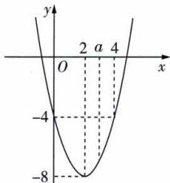

line

| Point | x | y |
|---|---|---|
| 1 | -4 | -8 |
| 2 | 0 | 0 |
| 3 | 2 | -8 |
| 4 | 4 | 0 |

14 BC 方法一 $f(x)=\frac{2x^{2}}{x^{2}+1}=\frac{2(x^{2}+1)-2}{x^{2}+1}=2-\frac{2}{x^{2}+1}$ ，因为 $x^{2}+1\geqslant1$ ，所以 $0<\frac{2}{x^{2}+1}\leqslant2$ ，所以 $0\leqslant f(x)<2$ ，所以 $y=[f(x)]$ 的值域为 $\{0,1\}$ ，故选 BC.

方法二 当 $x = 0$ 时， $f(x) = 0$ ；当 $x \neq 0$ 时， $f(x) = \frac{2x^2}{x^2 + 1} = \frac{2}{1 + \frac{1}{x^2}}$ ，由 $1 + \frac{1}{x^2} > 1$ ，得 $0 < \frac{2}{1 + \frac{1}{x^2}} < 2$ ，此时 $0 < f(x) < 2$ . 综

上, $0 \leqslant f(x) < 2$ ,所以 $y = [f(x)]$ 的值域为 $\{0,1\}$ ,故选BC.

方法三 令 $y = \frac{2x^2}{x^2 + 1}$ ，因为 $x \in \mathbf{R}$ ，所以关于 $x$ 的方程 $(y - 2)x^2 + y = 0$ 有解，故当 $y - 2 = 0$ ，即 $y = 2$ 时， $x$ 无解；当 $y - 2 \neq 0$ 时，需使 $\Delta = 0 - 4(y - 2)y \geqslant 0$ ，解得 $0 \leqslant y < 2$ . 综上，得 $0 \leqslant f(x) < 2$ ，所以 $y = [f(x)]$ 的值域为 $\{0,1\}$ ，故选 BC.

15 321 解析 由 $f(a + b) = f(a)f(b)$ ，令 $b = 1$ ，得 $f(a + 1) = f(a)f(1)$ . 又 $f(1) = 1$ ，所以 $f(a + 1) = f(a)$ . 易知 $f(a)\neq0$ ，则 $\frac{f(a+1)}{f(a)}=1$ 。因为a是任意实数，所以当a取1,2,3,…,321时，得 $\frac{f(2)}{f(1)}=\frac{f(3)}{f(2)}=\frac{f(4)}{f(3)}=\cdots=\frac{f(321)}{f(320)}=\frac{f(322)}{f(321)}=1$ ，所以 $\frac{f(2)}{f(1)}+\frac{f(3)}{f(2)}+\frac{f(4)}{f(3)}+\cdots+\frac{f(321)}{f(320)}+\frac{f(322)}{f(321)}=321.$

# 解题通法

对于像题中所给函数 $f(x)$ 没有明确解析式,只是借用函数符号来表达一些性质的函数,一般称为抽象函数.抽象函数的问题常用赋值法来解决,但需要注意根据题中所求赋合适的值.

16 解析 (1) 因为 $f(-2)=1, f(-1)=0, f(0)=1, f(1)=4, f(2)=9$ ，所以函数 $f(x)$ 的值域为 $\{0,1,4,9\}$ .

(2) 因为 $\frac{2x+1}{x-3}=\frac{2(x-3)+7}{x-3}=2+\frac{7}{x-3}$ ，且 $\frac{7}{x-3}\neq0$ ，

提示一般分离常数将分式转化为反比例函数求解.所以 $\frac{2x+1}{x-3}\neq2$ ,

所以函数的值域为 $(-∞,2)∪(2,+∞)$ .

(3) 因为 $\sqrt{-2x^2 + x + 3} = \sqrt{-2\left(x - \frac{1}{4}\right)^2 + \frac{25}{8}}$

所以 $0 \leqslant \sqrt{-2x^{2} + x + 3} \leqslant \frac{5\sqrt{2}}{4}$ ,

所以函数的值域为 $\left[0,\frac{5\sqrt{2}}{4}\right]$ .

(4) 方法一 因为 $x^{2} \geqslant 0, -x^{2} \leqslant 0$ ，所以 $-x^{2} - 1 \leqslant -1$ ，所以 $-1 \leqslant \frac{1}{-x^{2} - 1} < 0$ ，所以所求函数的值域为 $[-1, 0)$ .

方法二 假设 t 是所求值域中的元素, 则关于 x 的方程 $\frac{1}{-x^{2}-1}=t$ 有解, 即 $-x^{2}=\frac{1}{t}+1$ 有解, 从而 $\frac{1}{t}+1\leqslant0$ , 即 $\frac{t+1}{t}\leqslant0$ , 解得 $-1\leqslant t<0$ , 因此所求值域为 $[-1,0)$ .

(5) 设 $t = \sqrt{1 - 2x}$ ，则 $t \geqslant 0$ 且 $x = -\frac{1}{2}t^{2} + \frac{1}{2}$ ,

避坑换元后注意新元的取值范围.

得 $x - \sqrt{1 - 2x} = -\frac{1}{2}t^{2} - t + \frac{1}{2} = -\frac{1}{2}(t + 1)^{2} + 1.$

因为 $t \geqslant 0$ ，所以 $-\frac{1}{2}(t+1)^{2} + 1 \leqslant \frac{1}{2}$ ，

所以函数的值域为 $(-∞, \frac{1}{2}]$ .

(6) 方法一 令 $y = \frac{x^2 - x + 1}{x^2 + x + 1}$ ，则 $y = \frac{x^2 - x + 1}{x^2 + x + 1} = \frac{x^2 + x + 1 - 2x}{x^2 + x + 1} = 1 - \frac{2x}{x^2 + x + 1}$ .

当 x=0 时, y=1;

当 $x \neq 0$ 时, $y = 1 - \frac{2x}{x^{2} + x + 1} = 1 - \frac{2}{x + \frac{1}{x} + 1}$ .

当 $x > 0$ 时，因为 $x + \frac{1}{x} \geqslant 2$ ，当且仅当 $x = 1$ 时取等号，

所以 $0 < \frac{1}{x + \frac{1}{x} + 1} \leqslant \frac{1}{3}$ , 所以 $\frac{1}{3} \leqslant 1 - \frac{2}{x + \frac{1}{x} + 1} < 1$ ;

当 $x < 0$ 时，因为 $x + \frac{1}{x} \leqslant -2$ ，当且仅当 $x = -1$ 时取等号，

所以 $-1 \leqslant \frac{1}{x + \frac{1}{x} + 1} < 0$ ，所以 $1 < 1 - \frac{2}{x + \frac{1}{x} + 1} \leqslant 3$ .

综上,原函数的值域为 $\left[\frac{1}{3},3\right]$ .

方法二 令 $y = \frac{x^2 - x + 1}{x^2 + x + 1}$ ，得 $(y - 1)x^2 + (y + 1)x + y - 1 = 0$ ，因为 $x \in \mathbf{R}$ ，

所以关于 x 的方程 $(y-1)x^{2}+(y+1)x+y-1=0$ 有解.

故当 y-1=0，即 y=1 时，x=0；

当 $y-1 \neq 0$ 时， $\Delta = (y + 1)^{2} - 4(y - 1)^{2} \geqslant 0$ ，

整理得 $3y^{2}-10y+3\leqslant0$ , 解得 $\frac{1}{3}\leqslant y<1$ 或 $1<y\leqslant3$ .

综上,原函数的值域为 $\left[\frac{1}{3},3\right]$ .

17 B 由题知 y = x + 2 的定义域为 R.

<table><tr><td>A</td><td>×</td><td> $y = \left( {\sqrt{x + 2}}\right) ^{2}$ 的定义域为  $\left\lbrack {-2, + \infty }\right)$ ,与  $y =$   $x + 2$  的定义域不同.</td></tr><tr><td>B</td><td>√</td><td> $y = \sqrt[3]{x^3} + 2 = x + 2$ ,与  $y = x + 2$  的定义域相同,对应关系相同.</td></tr><tr><td>C</td><td>×</td><td> $y = \frac{{x}^{2}}{x} + 2$  的定义域为  $\{ x \mid x \neq 0\}$ ,与  $y = x + 2$  的定义域不同.</td></tr><tr><td>D</td><td>×</td><td> $y = \sqrt{{x}^{2}} + 2 = \left| x\right| + 2$ ,与  $y = x + 2$  的对应关系不同.</td></tr></table>

18 ABD 函数 $f(x) = x^{2} - 2x - 1$ 与 $g(s) = s^{2} - 2s - 1$ 的定义域相同，对应关系也相同，所以是同一个函数，A 正确；函数 $f(x) = \frac{x}{x}$ 与 $g(x) = \frac{1}{x^0}$ 的定义域相同，都是 $(-\infty, 0) \cup (0, +\infty)$ ，化简两个函数解析式得 $f(x) = 1$ ， $g(x) = 1$ ，对应关系也相同，所以是同一个函数，B 正确；要使函数 $f(x) = \sqrt{x^2 - 1}$ 有意义，则 $x^2 - 1 \geqslant 0$ ，解得 $x \leqslant -1$ 或 $x \geqslant 1$ ，所以该函数的定义域为 $(-\infty, -1] \cup [1, +\infty)$ ，要使函数 $g(x) = \sqrt{x - 1} \cdot \sqrt{x + 1}$ 有意义，则 $\begin{cases} x - 1 \geqslant 0, \\ x + 1 \geqslant 0, \end{cases}$ 解得 $x \geqslant 1$ ，所以该函数的定义域为 $[1, +\infty)$ ，所以两个函数定义域不同，不是同一个函数，C 错误： $f(x) = x^2 - 1$ 与 $g(x) = \frac{x^4 - 1}{x^2 + 1}$ 的定义域均为 R， $g(x) = \frac{x^4 - 1}{x^2 + 1} = \frac{(x^2 - 1)(x^2 + 1)}{x^2 + 1} = x^2 - 1$ ，所以两个函数的对应关系相同，是同一个函数，D 正确.

# 归纳总结

判断两个函数是否为同一个函数的关键点：

(1) 定义域相同(解析式化简前求解);   
(2) 对应关系相同(解析式化简后相同),与变量字母无关.

# 过能力 学科关键能力构建

1 B 根据函数的定义知,若题中函数是一对一,则值域C可能为 $\{1,2\},\{1,3\},\{2,3\}$ ,共3种情况;若题中函数是二对一,则值域C可能为 $\{1\},\{2\},\{3\}$ ,共3种情况.综上,值域C的不同情况有6种.  
2 D 因为 $f(\sqrt{2})=2a-\sqrt{2}$ ，所以 $f(f(\sqrt{2}))=a\cdot(2a-\sqrt{2})^{2}-\sqrt{2}=-\sqrt{2}$ ，所以 $a(2a-\sqrt{2})^{2}=0$ 。又 a>0，所以 $2a-\sqrt{2}=0$ ，所以 $a=\frac{\sqrt{2}}{2}$ .  
3 C 因为函数 $f(x+2)$ 的定义域为(-3,4)，所以-3<x<4，-1<x+2<6，所以 $f(x)$ 的定义域为(-1,6).由2x-1>0，得 $x>\frac{1}{2}$ ，所以函数 $g(x)$ 的定义域为( $\frac{1}{2},6$ ).

4 AC 根据题意可知 $A = N^{*}, B = \{0, 1, 2, 3, 4, 5, 6, 7, 8, 9\}$ ，集合 B 为有限集，A 正确；因为 $0 \in B, 0 \notin A$ ，所以值域 B 不是定义域 A 的子集，B 错误；由函数 $b = f(a)$ 的定义，知 $f(6) = 2$ ，C 正确；当 b = 1 时，a 的值可为 1 也可为 3，不符合函数的定义，D 错误.

5 A 依题意, $ax^{2}+bx+c\geqslant0$ 的解集为[0,1],故函数 $y=ax^{2}+bx+c$ 的图象开口向下,a<0,则方程 $ax^{2}+bx+c=0$ 的两根为x=0或1,则c=0, $-\frac{b}{2a}=\frac{0+1}{2}$ ,即a=-b,则 $y=\sqrt{ax^{2}+bx+c}=\sqrt{ax^{2}-ax}=\sqrt{a(x-\frac{1}{2})^{2}-\frac{a}{4}}$ ,当 $x=\frac{1}{2}$ 时, $y=\sqrt{a(x-\frac{1}{2})^{2}-\frac{a}{4}}$ 取得最大值1,即 $\sqrt{-\frac{a}{4}}=1$ ,解得a=-4.

6 BC $f(x)=\frac{3+x}{4-x}=\frac{-(4-x)+7}{4-x}=-1+\frac{7}{4-x}$ ，由于 $\frac{7}{4-x}\neq0$ ，所以 $f(x)\neq-1$ ，所以 $|f(x)|\in[0,+\infty)$ ，故不存在正数 M，使得 $|f(x)|\leqslant M$ 恒成立，A 错误。令 u=4-x²，则 $y=\sqrt{u},u\geqslant0$ ，当 x=0 时，u 取得最大值 4，所以 $u\in[0,4]$ ，所以 $\sqrt{u}\in[0,2]$ ，即 $f(x)\in[0,2]$ ，故存在正数 2，使得 $|f(x)|\leqslant2$ 恒成立，B 正确。令 $n=2x^{2}-4x+3=2(x-1)^{2}+1$ ，则 $y=\frac{5}{n},n\geqslant1$ ，所以 $0<\frac{5}{n}\leqslant5$ ，即 $f(x)\in(0,5]$ ，故存在正数 5，使得 $|f(x)|\leqslant5$ 恒成立，C 正确。令 $t=\sqrt{4-x}$ ，则 $x=4-t^{2},t\geqslant0$ ，则 $y=-t^{2}+t+4=-(t-\frac{1}{2})^{2}+\frac{17}{4}\leqslant\frac{17}{4}$ ，所以 $|f(x)|\in[0,+\infty)$ ，故不存在正数 M，使得 $|f(x)|\leqslant M$ 恒成立，D 错误。

7 $x^{2}, x \in (-1, 1)$ $x^{2}, x \in [0, 1)$ （答案不唯一）解析可取 $f(x) = x^{2}, x \in (-1, 1), g(x) = x^{2}, x \in [0, 1)$ ，函数的对应关系相同，值域都为 $[0, 1)$ ，但函数定义域不同，是不同的函数，故命题为假命题。（注：其他符合题意的答案均可。）

8 $[0,1] \cup [9, +\infty)$ 解析 由题意, 得函数 $y = mx^2 + (m - 3)x + 1$ 的值域包含 $[0, +\infty)$ . 当 $m = 0$ 时, $y = -3x + 1$ 的值域为 $\mathbf{R}$ , 满足题意; 当 $m \neq 0$ 时, 有

$\left\{ \begin{array}{l}m > 0,\\ (m - 3)^2 -4m\geqslant 0, \end{array} \right.$ 得 $0 <   m\leqslant 1$ 或 $m\geqslant 9.$ 综上， $m\in [0,$ $1]\cup [9, + \infty)$

9 (1)16; (2)0; (3) $\frac{9}{2}$ 解析 (1)因为函数 $f(x)$ 满足 $f(x+2)=2f(x)$ ，所以 $f(6)=2f(4)$ ， $f(4)=2f(2)$ ，又 $f(6)=3f(2)+2$ ，所以 $2f(4)=\frac{3}{2}f(4)+2$ ，解得 $f(4)=4$ ，则 $f(8)=2f(6)=4f(4)=16$ .

(2)依题意,取 y=x,有 $f(2x)=f(x^{2})+f(2x)$ , 则 $f(x^{2})=0$ 恒成立, 取 $x=\sqrt{2}$ , 则 $f(2)=0$ .
(3) $f(xy)=f(x)+f(y)$ ，令x=y=3，则 $f(9)=f(3)+f(3)$ ，即 $2f(3)=6$ ，可得 $f(3)=3$ ，令 $x=y=\sqrt{3}$ ，则 $f(\sqrt{3})+f(\sqrt{3})=f(3)$ ，即 $2f(\sqrt{3})=3$ ，可得 $f(\sqrt{3})=\frac{3}{2}$ ，令x=3， $y=\sqrt{3}$ ，得 $f(3\sqrt{3})=f(3)+f(\sqrt{3})=3+\frac{3}{2}=\frac{9}{2}$ .

10 解析 (1) 由 $f(x) = \frac{ax + b}{x^2 + 1} > \frac{2}{5}$ ，得 $5(ax + b) > 2(x^2 + 1)$ ，整理得 $2x^2 - 5ax - 5b + 2 < 0$ .

因为 $f(x) > \frac{2}{5}$ 的解集为 $(\frac{1}{2}, 2)$ ，所以 $2x^{2} - 5ax - 5b + 2 = 0$ 的解为 $\frac{1}{2}, 2$ ，

则 $\left\{\begin{aligned}\frac{1}{2}-\frac{5}{2}a-5b+2=0,\\8-10a-5b+2=0,\end{aligned}\right.$ 解得 $\left\{\begin{aligned}a=1,\\b=0.\end{aligned}\right.$

(2)由(1)知 $f(x)=\frac{x}{x^{2}+1}.$

令 $y=\frac{x}{x^{2}+1}$ ，当 $y\neq0$ ，即 $x\neq0$ 时，由 $y=\frac{x}{x^{2}+1}$ ，得 $yx^{2}-x+y=0$ ，则 $\Delta=1-4y^{2}\geqslant0$ ，得 $-\frac{1}{2}\leqslant y<0$ 或 $0<y\leqslant\frac{1}{2}$ ;

提示 看作关于 x 的一元二次方程, 且方程有解.

当 x=0 时, y=0.

综上, $f(x)$ 的值域为 $\left[-\frac{1}{2},\frac{1}{2}\right]$ .

# 课时 2 ▶ 函数的表示法

# 过基础 教材必备知识精练

1 C 由题意可得 x 与 y 之间的函数关系为 y = 3000 - 2.5x. 由题意可知, 最少买 100 千克, 最多买 $\frac{3000}{2.5} = 1200$ (千克), 所以 x 的取值范围为 [100, 1200], 故 y = 3000 - 2.5x ( $100 \leqslant x \leqslant 1200$ ).

2 D 开始注水时,水注入烧杯中,正方体容器内无水,水面高度不变;烧杯内注满水后,继续注水,正方体容器内水面开始上升,且上升速度较快;当正方体容器内水面和烧杯水面持平以后,继续注水,正方体容器内水面继续上升,且上升速度减慢.故选 D.

3 BC 由题图得 $f(x)$ 的定义域为 $(-3, -1] \cup [0, 2]$ ，A 错误； $f(x)$ 的值域为 $[1, +\infty)$ ，B 正确；由函数定义及图象可知，在 $f(x)$ 的定义域内任取一个值，总有唯一的 $y$ 值与之对应，C 正确；在 $f(x)$ 的值域内任取一个值 $y_0 \in [2, 3]$ 时，有两个 $x$ 值与之对应，D 错误.

4 2或3 2 解析 根据表格可知, $f(1)=3$ , $g(1)=1$ ,

$f(1)>g(1),f(2)=2,g(2)=3,f(2)<g(2),f(3)=1,$ $g(3)=2,f(3)<g(3)$ ，所以满足 $f(x)<g(x)$ 的x的值为2或3.因为 $g(3)=2$ ，所以 $f(g(3))=f(2)=2$ .

5 B 由题意得 $f(-1) = -1 + 4 = 3, f(3) = 9 + 3a$ ，则 $3 = 9 + 3a$ ，解得 a = -2.

6 D 当 $x \in [0,1]$ 时, $f(x) = 2x^{2} \in [0,2]$ , 所以函数 $f(x)$ 的值域为 $[0,2] \cup \{2,3\} = [0,2] \cup \{3\}$ . 故选 D.

7 A 由题意得 $f(a) = -f(1) = -(2 \times 1) = -2$ . 当 $a > 0$ 时, $f(a) = 2a = -2$ , 解得 $a = -1$ , 舍去; 当 $a < 0$ 时, $f(a) = a + 1 = -2$ , 解得 $a = -3$ , 满足题意. 综上, $a = -3$ .

8 A 易知 $f(1)=f(1-1)=f(0)=f(0-1)=f(-1)=f(-1-1)=f(-2)=(-2)^{2}+2\times(-2)-3=-3$ ，所以 $f(f(1))=f(-3)=9-6-3=0.$

9 D 当 $x \geqslant 2$ 时, $f(x) = x + 1 \geqslant 3$ , 当 x < 2 时, $f(x) = x + 4a < 2 + 4a$ . 要使函数 $f(x)$ 的值域为 R, 需满足 $2 + 4a \geqslant 3$ , 解得 $a \geqslant \frac{1}{4}$ , 故实数 a 的取值范围是 $\left[\frac{1}{4}, +\infty\right)$ .

10 解析 (1) 当 $x \geqslant 2$ 时, $f(x) = x^{2} + x - 2$ ,

当 x<2 时， $f(x)=x^{2}-x+2$ ，

所以 $f(x)=\left\{\begin{aligned}x^{2}+x-2,x&\geqslant2,\\ x^{2}-x+2,x&<2.\end{aligned}\right.$

(2) $f(x)$ 的图象如图所示.

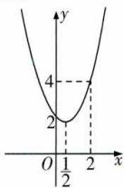

line

| x | y |
|---|---|
| 0 | 4 |
| 2 | 2 |
| 2 | 1 |

因为 $f(\frac{1}{2})=\frac{7}{4}$ ，所以函数 $f(x)$ 的值域为 $\left[\frac{7}{4},+\infty\right)$ .

11 B 方法一（配凑法） $f(1 - x) = \frac{1 - x^2}{x^2} = \frac{1}{(-x)^2} - 1 = \frac{1}{[(1 - x) - 1]^2} - 1$ ，所以 $f(x) = \frac{1}{(x - 1)^2} - 1$ . 因为在 $f(1 - x)$ 中， $x \neq 0$ ，所以 $1 - x \neq 1$ ，所以在 $f(x)$ 中， $x \neq 1$ ，所以 $f(x) = \frac{1}{(x - 1)^2} - 1 (x \neq 1)$ .

$(x-1)^{2}$ 注意取值范围的改变.
方法二(换元法) 令 $1-x=t$ ，则 $x=1-t$ ，由 $x\neq0$ ，得 $t\neq1$ ，所以
以 $f(t)=\frac{1-(1-t)^{2}}{(1-t)^{2}}=\frac{1}{(1-t)^{2}}-1(t\neq1)$ ，所以 $f(x)=\frac{1}{(x-1)^{2}}-1(x\neq1)$ .

12 AD 设 $f(x)=ax+b(a\neq0)$ ，则 $f(f(x))=af(x)+b=a(ax+b)+b=a^{2}x+ab+b=4x+3$ ，所以 $\left\{\begin{aligned}a^{2}&=4,\\ ab+b&=3,\end{aligned}\right.$ 解得 $\left\{\begin{aligned}a&=2,\\ b&=1\end{aligned}\right.$ 或 $\left\{\begin{aligned}a&=-2,\\ b&=-3,\end{aligned}\right.$ 所以 $f(x)=2x+1$ 或 $f(x)=-2x-3$ ，故选 AD.

13 A 由题图知, $ax^{2}+bx+c=0$ 的两根为2,4,且函数 $f(x)$ 的图象过点(3,1)，所以 $\left\{\begin{aligned}&\frac{2}{9a+3b+c}=1,\\&2\times4=\frac{c}{a},\\&2+4=-\frac{b}{a},\end{aligned}\right.$ 解得a=-2,

$b = 12, c = -16$ ，所以 $f(x) = \frac{2}{-2x^{2} + 12x - 16} = \frac{1}{-x^{2} + 6x - 8}$ ，所以 $f(5) = \frac{1}{-25 + 30 - 8} = -\frac{1}{3}$ .

14 {1} 解析 因为 $f(x)=2x-1$ , $g(x)=x^{2}$ , 所以 $f(g(x))=f(x^{2})=2x^{2}-1$ , $g(f(x))=g(2x-1)=(2x-1)^{2}$ . 又 $f(g(x))=g(f(x))$ , 所以 $2x^{2}-1=(2x-1)^{2}$ , 解得 $x_{1}=x_{2}=1$ , 所以方程 $f(g(x))=g(f(x))$ 的解集是 $\{1\}$ .

15 (1) $f(x) = \frac{1}{3} x^2 - 2x$ ; (2) $f(x) = \frac{12x}{5} - \frac{8}{5x}$ ; (3) $f(x) = x + 1$ 解析 (1) 因为 $f(x) + 2f(-x) = x^2 + 2x$ ①, 所以 $f(-x) + 2f(x) = x^2 - 2x$ ②. 由①②得 $f(x) = \frac{1}{3} x^2 - 2x$ .

(2) $3f(x)+2f(\frac{1}{x})=4x$ ③,将x用 $\frac{1}{x}$ 代替,得 $3f(\frac{1}{x})+2f(x)=\frac{4}{x}$ ④,由③④得 $f(x)=\frac{12x}{5}-\frac{8}{5x}$ .

(3) 在 $3f(x)-f(2-x)=4x$ 中，以 2-x 替换 x 得 $3f(2-x)-f(2-(2-x))=4(2-x)$ ，即 $3f(2-x)-f(x)=8-4x$ ，

由 $\left\{\begin{aligned}3f(2-x)-f(x)&=8-4x,\\ 3f(x)-f(2-x)&=4x,\end{aligned}\right.$ 得 $f(x)=x+1$ .

16 $x^{2} + x + 1$ 解析令 $y = x$ ，则 $f(x - x) = f(x) - x(2x - x + 1)$ ，又 $f(0) = 1$ ，所以 $f(x) = x^2 +x + 1.$

# 归纳总结 求函数解析式的常用方法及适用条件

(1) 待定系数法: 先设出含有待定系数的解析式, 再利用恒等式的性质或将已知条件代入, 建立方程(组), 通过解方程(组)求出相应的系数.

(2)代入法:已知 $f(x)$ 的解析式,求 $f(g(x))$ 的解析式时,将 $f(x)$ 中的x都替换成 $g(x)$ ,便得到 $f(g(x))$ 的解析式.

(3) 换元法: 已知 $y = f(g(x))$ 的解析式, 求 $f(x)$ 的解析式时, 可令 $t = g(x)$ , 从中求出 $x = \varphi(t)$ , 然后代入表达式求出 $f(t)$ , 再将 t 换成 x, 得到 $f(x)$ 的解析式, 要注意新元的取值范围.

(4) 配凑法: 已知 $y = f(g(x))$ 的解析式, 求 $y = f(x)$ 的解析式时, 可从 $f(g(x))$ 的解析式中配凑出“ $g(x)$ ”, 然后以 x 替代 $g(x)$ , 便得 $f(x)$ 的解析式.

(5) 解方程组法: 已知关于 $f(x)$ 与 $f(\frac{1}{x})$ 或 $f(x)$ 与 $f(-x)$ 的表达式, 可根据已知条件构造出另外一个关于 $f(x)$ 与 $f(\frac{1}{x})$ 或 $f(x)$ 与 $f(-x)$ 的等式, 通过解方程组求出 $f(x)$ .

(6)赋值法:通过取某些特殊值代入题设中的等式,可使抽象的问题具体化、简单化,从而找到规律,求出解析式.

17 解析 (1)由题意得 $0 \leqslant f(1) \leqslant 0$

所以 $f(1)=0$ ,为定值.

(2) 设 $f(x)=ax^{2}+bx+c$ ，由(1)知 $a+b+c=f(1)=0$ ，
由 $f(0)=-\frac{1}{4}$ ，得 $c=-\frac{1}{4}$ ，则 $b=\frac{1}{4}-a$ ，

所以 $f(x)=ax^{2}+(\frac{1}{4}-a)x-\frac{1}{4}.$

由 $x - 1 \leqslant f(x)$ , 得 $x - 1 \leqslant ax^2 + (\frac{1}{4} - a)x - \frac{1}{4}$ , 即 $ax^2 - (\frac{3}{4} + a)x + \frac{3}{4} \geqslant 0$ ,

依题意,一元二次不等式 $ax^{2}-(\frac{3}{4}+a)x+\frac{3}{4}\geqslant0$ 恒成立,则 $\left\{\begin{aligned}a&>0,\\ \Delta=(a+\frac{3}{4})^{2}-3a\leqslant0,\end{aligned}\right.$ 解得 $a=\frac{3}{4}$ ,

此时 $f(x)=\frac{3}{4}x^{2}-\frac{1}{2}x-\frac{1}{4}$ ，且 $x^{2}-x-f(x)=\frac{1}{4}x^{2}-\frac{1}{2}x+\frac{1}{4}=\frac{1}{4}(x-1)^{2}\geqslant0$ 恒成立，

所以 $f(x)=\frac{3}{4}x^{2}-\frac{1}{2}x-\frac{1}{4}.$

# 过能力 学科关键能力构建

1 B 当 a > 0 时, $1 - a < 1, 1 + 2a > 1$ , 由 $f(1 - a) = f(1 + \text{破题点})$ 对 a 分类讨论判断出 $1 - a, 1 + 2a$ 在分段函数的区间段.

2a), 得 $2(1-a)+a=-(1+2a)-2a$ , 解得 a=-1, 舍去; 当 a<0 时, 1-a>1, $1+2a<1$ , 由 $f(1-a)=f(1+2a)$ , 得 $-(1-a)-2a=2(1+2a)+a$ , 解得 $a=-\frac{1}{2}$ , 满足 a<0. 综上, $a=-\frac{1}{2}$ .

2 ACD 因为 $f(x)=\left\{\begin{aligned}-2x,&,-1\leqslant x<0,\\ \sqrt{x},&0\leqslant x\leqslant1\end{aligned}\right.$ 的图象如 A 中所示，A 符合题意； $y=f(|x|)=f(x),0\leqslant x\leqslant1,\quad f(-x),-1\leqslant x<0,$ （另解）由翻折变换可知， $f(|x|)$ 的图象可由 $f(x)$ 图象 y 轴右侧部分翻折到左侧，且 y 轴上及右侧部分保持不变得到）B 选项不符合题意； $y=f(x)+1$ 的图象可由 $f(x)$ 的图象向上平移 1 个单位长度得到，C 符合题意； $y=f(x-1)$ 的图象可由 $f(x)$ 的图象向右平移 1 个单位长度得到，D 符合题意.

归纳总结 

<table><tr><td rowspan="2">左右平移变换</td><td> $y=f(x)$ 的图象 $\xrightarrow[\text{个单位长度}]{\text{左移 }a(a>0)}y=f(x+a)$ 的图象</td></tr><tr><td> $y=f(x)$ 的图象 $\xrightarrow[\text{个单位长度}]{\text{右移 }a(a>0)}y=f(x-a)$ 的图象</td></tr><tr><td rowspan="2">上下平移变换</td><td> $y=f(x)$ 的图象 $\xrightarrow[\text{个单位长度}]{\text{上移 }h(h>0)}y=f(x)+h$ 的图象</td></tr><tr><td> $y=f(x)$ 的图象 $\xrightarrow[\text{个单位长度}]{\text{下移 }h(h>0)}y=f(x)-h$ 的图象</td></tr><tr><td rowspan="2">翻折变换</td><td> $y=f(x)$ 的图象 $\xrightarrow[\text{x轴上及上方部分不变}]{x\text{轴下方部分翻折到上方,}}y=|f(x)|$ 的图象</td></tr><tr><td> $y=f(x)$ 的图象 $\xrightarrow[\text{y轴上及右侧部分不变}]{y\text{轴右侧部分翻折到左侧,}}y=f(|x|)$ 的图象</td></tr></table>

3 B 在同一平面直角坐标系下分别画出函数 $y = 2x +$

7, $y = x^{2} - 3x + 1$ , $y = 10 - 3x$

的图象,如图所示.解方程组 $\left\{\begin{aligned}y&=2x+7,\\ y&=x^{2}-3x+1,\end{aligned}\right.$ 得 x=-1

或 x=6，所以 $A(-1,5)$ ；解方程组 $\left\{\begin{aligned}y&=10-3x,\\ y&=x^{2}-3x+1,\end{aligned}\right.$ 得 x=-3 或 x=3，所以 $B(3,$

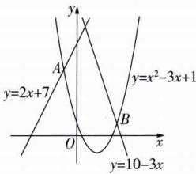

text_image

y
y=2x+7
A
y=x²-3x+1
O
B
x
y=10-3x

1). 由图可知, $\min \{2x + 7, x^2 - 3x + 1, 10 - 3x\} = 2x + 7, x \leqslant -1$ , $\left\{ \begin{array}{l} x^2 - 3x + 1, -1 < x < 3, \\ 10 - 3x, x \geqslant 3, \end{array} \right.$ 所以函数 $f(x) = \min \{2x + 7, x^2 - 3x + 1, 10 - 3x\}$ 的值域为 $(- \infty, 5]$ .

4 AC 对于 $f(x) + f(y) + xy = f(x + y)$ ，令 $x = y = 0$ ，得 $f(0) + f(0) + 0 = f(0)$ ，则 $f(0) = 0$ ，A 正确；令 $y = -x$ ，则 $f(x) + f(-x) - x^2 = f(0) = 0$ ，即 $f(x) + f(-x) = x^2$ ①，所以 $f(x) = x^3 f(\frac{1}{x}) = x^3 [\frac{1}{x^2} - f(-\frac{1}{x})] = x - x^3 f(-\frac{1}{x}) = x + f(-x)$ ，即 $f(x) - f(-x) = x (x \neq 0)$ ②，又 $f(0) = 0$ 也符合上式，所以 $f(x) - f(-x) = x$ ，C 正确；由①②得 $f(x) = \frac{x^2 + x}{2}$ ，D 错误； $f(3) = \frac{9 + 3}{2} = 6$ ，B 错误.

5 B 方法一 当 $a > 2, x > 2$ 时, $f(x) = x \mid x - a \mid -2a^2 =$ 提示 注意分类讨论.

$\left\{ \begin{array}{l} x^{2} - ax - 2a^{2}, x \geqslant a, \\ -x^{2} + ax - 2a^{2}, 2 < x < a, \end{array} \right.$ 当 $2 < x < a$ 时， $f(x) = -x^{2} + ax - 2a^{2}$ ，此时 $\Delta = a^{2} - 4 \times 2a^{2} = -7a^{2} < 0$ ，所以 $f(x) < 0$ ，不符合题意；当 $0 < a \leqslant 2, x > 2$ 时， $f(x) = x|x - a| - 2a^{2} = x^{2} - ax - 2a^{2} = (x - 2a)(x + a) > 0$ ，解得 $x > 2a$ ，由于 $x > 2$ 时， $f(x) > 0$ ，故 $2a \leqslant 2$ ，所以 $0 < a \leqslant 1$ ；当 $a = 0, x > 2$ 时， $f(x) = x^{2} > 0$ 恒成立，符合题意；当 $a < 0, x > 2$ 时， $f(x) = x|x - a| - 2a^{2} = x^{2} - ax - 2a^{2} = (x - 2a)(x + a) > 0$ ，解得 $x > -a$ ，由于 $x > 2$ 时， $f(x) > 0$ ，故 $-a \leqslant 2$ ，所以 $-2 \leqslant a < 0$ . 综上， $a$ 的取值范围为 $[-2, 1]$ .

方法二 当 $x > 2$ 时， $f(x) > 0$ 等价于 $x(x - a) - 2a^2 > 0 (x \geqslant a)$ 或 $x(a - x) - 2a^2 > 0 (x < a)$ . 将不等式看作关于 $a$ 的不等式，

题眼 转换主元是突破点.

由 $x(x - a) - 2a^2 = -2a^2 - ax + x^2 = -(a + x)(2a - x) > 0$ ，即 $(a + x)(2a - x) < 0$ ，及 $x > 2$ ，得 $-x < a < \frac{x}{2}$ 恒成立，因为 $-x < -2, \frac{x}{2} > 1$ ，所以 $-2 \leqslant a \leqslant 1$ . 由 $x(a - x) - 2a^2 = -2a^2 + ax - x^2 = -2(a - \frac{x}{4})^2 - \frac{7}{8}x^2 > 0$ ，得 $a$ 无解. 综上，实数 $a$ 的取值范围是[-2,1].

6 (1)2;(2)(0,1)

解析 函数 $f(x) = |1 - \frac{1}{x}| =$

$$
\left\{ \begin{array}{l} \frac {1}{x} - 1, x \in (0, 1 ], \\ 1 - \frac {1}{x}, x \in (1, + \infty). \end{array} \right.
$$

画出函

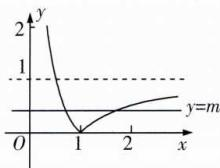

line

| x | y (Line 1) | y (Line 2) |
|---|---|---|
| 0 | 2 | 0 |
| 1 | 0 | 0 |
| 2 | 1 | 1 |

数 $f(x)$ 的图象,如图所示.

(1) 根据函数 $f(x)$ 的图象, 由 0 < a < b 且 $f(a) = f(b)$ , 得 0 < a < 1 < b, 所以 $\frac{1}{a} - 1 = 1 - \frac{1}{b}$ , 所以 $\frac{1}{a} + \frac{1}{b} = 2$ .

(2)作直线 y=m. 由图象, 可知当 0<m<1 时, 直线 y=m 与函数 $f(x)$ 的图象有两个交点, 即方程 $f(x)=m$ 有两个不相等的正根.

7 LOVE 解析 因为 Y=25, B=2, I=9, R=18, 所以当 $f(x)=25$ 时, 得 $x+13=25 \Rightarrow x=12 \Rightarrow 12=L$ , 当 $f(x)=2$ 时, 得 $x-13=2 \Rightarrow x=15 \Rightarrow 15=0$ , 当 $f(x)=9$ 时, 得 $x-13=9 \Rightarrow x=22 \Rightarrow 22=V$ , 当 $f(x)=18$ 时, 得 $x+13=18 \Rightarrow x=5 \Rightarrow 5=E$ , 所以 YBIR 加密前为 LOVE.

8 解析 (1) 如图, 延长 EF 交 AB 于点 G, 则 FG = 2.

当 $0 < x \leqslant 1$ 时， $S(x) = x$ ；

当 $1 < x \leqslant 2$ 时, $S(x) = 1$ ;

当 $2 < x \leqslant 3$ 时, $S(x) = 1 - \frac{1}{2} (x - 2)^2 = -\frac{1}{2} x^2 + 2x - 1$ .

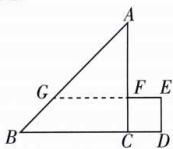

text_image

A
G
F E
B C D

综上, $S(x)=\left\{\begin{aligned}x,0<x&\leqslant1,\\ 1,1<x&\leqslant2,\\ -\frac{1}{2}x^{2}+2x-1,2<x&\leqslant3.\end{aligned}\right.$

(2) 作出 $S(x)$ 的图象, 如图所示.

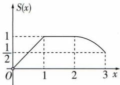

line

| x | S(x) |
|---|---|
| 0 | 0 |
| 1 | 1 |
| 2 | 1 |
| 3 | 0.5 |

由图象可知此函数的值域为 $(0,1]$ .

(3) 在 $(0,1]$ 上，由 $S(a)=a=\frac{7}{8}$ ，知 $a=\frac{7}{8}$ .

在(2,3]上，由 $S(a)=-\frac{a^{2}}{2}+2a-1=\frac{7}{8}$ ，整理得 $4a^{2}-16a+15=(2a-3)(2a-5)=0$ ，解得 $a=\frac{3}{2}$ （舍去）或 $a=\frac{5}{2}$ .

综上, $a=\frac{7}{8}$ 或 $a=\frac{5}{2}$ .

# 易错疑难集训（一）

# 过易错 教材易混易错集训

1 D $1 - x^{2} \geqslant 0 \Rightarrow -1 \leqslant x \leqslant 1$ ，即 $g(x)$ 的定义域为 $[-1, 1]$ ，对于 $g(1 - 2x)$ ，有 $-1 \leqslant 1 - 2x \leqslant 1$ ，则 $0 \leqslant x \leqslant 1$ ，即定义域为 $[0, 1]$ .

2 C 因为函数 $f(\frac{x+1}{x-1})$ 的定义域为(-2,0)，即-2<x<0，所以 $\frac{x+1}{x-1}=\frac{x-1+2}{x-1}=1+\frac{2}{x-1}\in(-1,\frac{1}{3})$ . 由-1<x-1< $\frac{1}{3}$ ，解得0<x< $\frac{2}{3}$ ，所以 $f(2x-1)$ 的定义域为(0, $\frac{2}{3}$ ).

避坑指南 在求以抽象函数表达的复合函数定义域问题时,遵循两个原则:

(1) 定义域总是给定函数中自变量 x 的取值集合；  
(2) 在同一对应关系下的变量的取值范围相同.

3 (1) -1; (2) [-1,0] 解析 (1) 根据题意, $ax + 1 \geqslant 0$ 的解集为 $(-\infty, 1]$ . 当 $a \geqslant 0$ 时, 不符合题意; 当 $a < 0$ 时, $ax + 1 \geqslant 0$ 的解集为 $(-\infty, -\frac{1}{a}]$ , 则 $-\frac{1}{a} = 1$ , 所以 $a = -1$ .

(2)根据题意,当 $x\in(-\infty,1]$ 时, $ax+1\geqslant0$ 恒成立.当a=0时,符合题意;当 $a\neq0$ 时,设函数 $g(x)=ax+1$ ,根据一次函数的性质,得 $\left\{\begin{aligned}a<0,\\ g(1)\geqslant0,\end{aligned}\right.$ 解得 $-1\leqslant a<0$ .综上,实数a的取值范围为 $[-1,0]$ .

4 (1) $f(x)=x^{2}-2(x\leqslant-2$ 或 $x\geqslant2)$ ; (2) $f(x)=x^{2}-2x+2(x\geqslant1)$ 解析 (1) $f(x+\frac{1}{x})=x^{2}+\frac{1}{x^{2}}=(x^{2}+2+\frac{1}{x^{2}})-2=(x+\frac{1}{x})^{2}-2$ , 令 $t=x+\frac{1}{x}$ , 则 $t\leqslant-2$ 或 $t\geqslant2$ , 所

提示不要忽略新元的取值范围.以 $f(t)=t^{2}-2(t\leqslant-2$ 或 $t\geqslant2)$ ，即 $f(x)=x^{2}-2(x\leqslant-2$ 或 $x\geqslant2)$ .

(2) 令 $\sqrt{x} + 1 = t (t \geqslant 1)$ ，则 $x = (t - 1)^{2}$ ，所以 $f(t) = (t - 1)^{2} +$ 提示 不要忽视新元的取值范围.

$$
1 = t ^ {2} - 2 t + 2 (t \geqslant 1) \text {, 即} f (x) = x ^ {2} - 2 x + 2 (x \geqslant 1).
$$

建坑 若函数定义域不为 R, 写解析式时应写出其定义域.

# 避坑指南

已知 $f(g(x))$ 求 $f(x)$ 常用思路:一是将$g(x)$ 视为一个整体, 整体换元求解; 二是将函数解析式的右端凑成只含 $g(x)$ 的形式. 两者都要注意定义域的变化.

5 解析 令 $t = \frac{1}{x + 1}, x > 0$ ，则 $x = \frac{1}{t} - 1, t \in (0,1)$ ，所以提示不要忽略新元的取值范围.

$$
y = \frac {\left(\frac {1}{t} - 1\right) ^ {2}}{\left(\frac {1}{t} - 1 + 1\right) ^ {2}} + t = t ^ {2} - t + 1, t \in (0, 1).
$$

如图, 可知函数 $y = t^{2} - t + 1, t \in (0,1)$ 的值域为 $\left[\frac{3}{4}, 1\right)$ ,

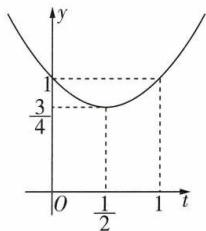

line

| t | y |
|---|---|
| 0 | 1 |
| 1/2 | 3/4 |
| 1 | 1 |

即 $y=\frac{x^{2}}{(x+1)^{2}}+\frac{1}{x+1},x>0$ 的值域为 $\left[\frac{3}{4},1\right)$ .

6 B 当 a=0 时, 不等式显然不成立; 当 a>0 时, 不等式可以化为 $f(a)+f(-a)>0$ , 所以 $a^{2}-a-2a>0$ , 所以 a>3; 当 a<0 时, 不等式可以化为 $f(a)+f(-a)<0$ , 所以 $2a+a^{2}+a<0$ , 所以 -3<a<0. 综上, a>3 或 -3<a<0.

7 $-\frac{\sqrt{6}}{2}$ 或 $\frac{5}{4}$ 解析 先设 $t = f(a)$ ，当 $t \leqslant 0$ 时， $f(t) = 2t^2 + 2 = 20$ ，解得 $t = -3$ 或 $t = 3$ （舍去）；当 $t > 0$ 时， $f(t) = 4t = 20$ ，解得 $t = 5$ 。再根据 $t$ 的值求 $a$ 的值，当 $f(a) = -3$ 时，若 $a \leqslant 0$ ，则 $f(a) = 2a^2 + 2 = -3, 2a^2 = -5$ ，此方程无实数解，若 $a > 0$ ，则 $f(a) = 4a = -3$ ，解得 $a = -\frac{3}{4}$ （舍去）；当 $f(a) = 5$ 时，若 $a \leqslant 0$ ，则 $f(a) = 2a^2 + 2 = 5$ ，解得 $a = -\frac{\sqrt{6}}{2}$ ，若 $a > 0$ ，则 $f(a) = 4a = 5$ ，解得 $a = \frac{5}{4}$ 。综上， $a$ 的值可能为 $-\frac{\sqrt{6}}{2}$ 或 $\frac{5}{4}$ 。

8 解析 (1) 由题意, 得当 $x < 0$ 时, $g(x) = -x > 0$ ,

所以 $f(g(x))=f(-x)=\frac{1}{-x}=-\frac{1}{x}$ ,

即当 x<0 时, 函数 $f(g(x))$ 的解析式为 $f(g(x))=-\frac{1}{x}$ .
(2)由题意,得当 $x\leqslant0$ 时, $f(x)=x\leqslant0$ ,

所以 $g(f(x)) = g(x) = -x$ ,

即当 $x \leqslant 0$ 时，函数 $g(f(x))$ 的解析式为 $g(f(x)) = -x$ .

# 第二节 函数的基本性质

# 课时 1 ▶ 单调性

# 过基础 教材必备知识精练

1 D 

<table><tr><td>A</td><td>×</td><td>存在 $x_{1},x_{2}$ ≠对任意 $x_{1},x_{2}$ .</td></tr><tr><td>B</td><td>×</td><td>无穷多对 $x_{1},x_{2}$ ≠对任意 $x_{1},x_{2}$ .</td></tr><tr><td>C</td><td>×</td><td>函数 $f(x)=-\frac{1}{x}$ 在区间 $(-∞,0)$ 上单调递增,在区间 $(0,+∞)$ 上单调递增,但在区间 $(-∞,0)∪(0,+∞)$ 上不单调.</td></tr><tr><td>D</td><td>√</td><td>由单调性的定义,知说法正确.</td></tr></table>

# 避坑指南

在函数单调性的定义中,应注意以下三点:

(1)“区间 $D \subseteq I$ ”说明函数的单调区间是其定义域的子集, 不一定是定义域.

(2) $x_{1},x_{2}$ 的三个特征：

①同区间性,即 $x_{1},x_{2}\in D;$   
②任意性, 即不可用区间 D 上的两个特殊值代替 $x_{1}, x_{2}$ ;  
③有序性,即需要区分大小,通常规定 $x_{1}<x_{2}$ .

(3) 自变量的大小与函数值的大小关系.

①单调递增： $x_{1}<x_{2}\Leftrightarrow f(x_{1})<f(x_{2})$ ;

②单调递减: $x_{1}<x_{2}\Leftrightarrow f(x_{1})>f(x_{2}).$

2 BC 若函数 $f(x)$ 在区间 $A$ 上单调递增，则对任意两个不相等的实数 $a, b \in A$ ，都有 $a - b$ 与 $f(a) - f(b)$ 同号；若函数 $f(x)$ 在区间 $A$ 上单调递减，则对任意两个不相等的实数 $a, b \in A$ ，都有 $a - b$ 与 $f(a) - f(b)$ 异号，故 B, C 正确，A, D 错误.

# 归纳总结

# 函数单调性的等价结论

(1) 函数 $f(x)$ 在区间 $[a, b]$ 上单调递增 $\Leftrightarrow \forall x_{1}, x_{2} \in [a, b], (x_{1} - x_{2}) [f(x_{1}) - f(x_{2})] > 0 \Leftrightarrow \forall x_{1}, x_{2} \in [a, b], \frac{f(x_{1}) - f(x_{2})}{x_{1} - x_{2}} > 0 (x_{1} \neq x_{2})$ .

(2) 函数 $f(x)$ 在区间 $[a, b]$ 上单调递减 $\Leftrightarrow \forall x_{1}, x_{2} \in [a, b], (x_{1} - x_{2}) [f(x_{1}) - f(x_{2})] < 0 \Leftrightarrow \forall x_{1}, x_{2} \in [a, b], \frac{f(x_{1}) - f(x_{2})}{x_{1} - x_{2}} < 0 (x_{1} \neq x_{2})$ .

3 B 结合题中图象可知 B 说法错误.

4 ABD 对于 $A, f(x) = x^{2} - 4x + 13$ 的图象是开口向上的抛物线，对称轴为直线 x = 2，所以函数 $f(x)$ 在 $(-∞, 2)$ 上单调递减，满足题意；对于 B， $f(x) = |x - 1| = \begin{cases} x - 1, & x \geqslant 1 \\ 1 - x, & x < 1 \end{cases}$ ，在 $(-∞, 1)$ 上单调递减，满

另解可画出函数 $f(x)$ 的图象,根据图象确定函数 $f(x)$ 的单调性.

足题意;对于 C,y=x 与 $y=-\frac{1}{x-1}$ 在 $(-∞,1)$ 上均单调递增,故 $f(x)=x-\frac{1}{x-1}$ 在 $(-∞,1)$ 上单调递增,不满足题意;对于 D, $f(x)=\sqrt{1-x}$ 在 $(-∞,1)$ 上单调递减,满足题意.

5 解析 (1) $\forall x_{1}, x_{2} \in (1, +\infty)$ , 且 $x_{1} < x_{2}$ ,

则 $f(x_{1}) - f(x_{2}) = (x_{1}^{2} + \frac{2}{x_{1}}) - (x_{2}^{2} + \frac{2}{x_{2}}) = (x_{1}^{2} - x_{2}^{2}) +$ $\left(\frac{2}{x_1} -\frac{2}{x_2}\right) = (x_1 + x_2)(x_1 - x_2) + \frac{2(x_2 - x_1)}{x_1x_2} = (x_1 -$

$$
\left. x _ {2}\right) \left(x _ {1} + x _ {2} - \frac {2}{x _ {1} x _ {2}}\right).
$$

方法一 因为 $x_{1} + x_{2} > 2, x_{1}x_{2} > 1$ ,

所以 $0 < \frac{2}{x_{1}x_{2}} < 2$ ，所以 $x_{1} + x_{2} - \frac{2}{x_{1}x_{2}} > 0$ .

又 $x_{1} - x_{2} < 0$ ，所以 $f(x_{1}) - f(x_{2}) < 0$ ，即 $f(x_{1}) < f(x_{2})$ 所以 $f(x)$ 在 $(1, +\infty)$ 上单调递增.

方法二 $f(x_{1}) - f(x_{2}) = (x_{1} - x_{2})(x_{1} + x_{2} - \frac{2}{x_{1}x_{2}}) =$ $\frac{x_1 - x_2}{x_1x_2}[x_1x_2(x_1 + x_2) - 2].$

因为 $x_{1} + x_{2} > 2, x_{1}x_{2} > 1$ ，所以 $x_{1}x_{2}(x_{1} + x_{2}) > 2$ ，即 $x_{1}x_{2}(x_{1} + x_{2}) - 2 > 0$ .

又 $x_{1} - x_{2} < 0$ ，所以 $f(x_{1}) - f(x_{2}) < 0$ ，即 $f(x_{1}) < f(x_{2})$ 所以 $f(x)$ 在 $(1, +\infty)$ 上单调递增.

(2) $f(x)=\frac{x^{2}+2x+a}{x}=x+\frac{a}{x}+2.$

令 $x_{2} > x_{1}\geqslant 1$ ，则 $f(x_{2}) - f(x_{1}) = x_{2} + \frac{a}{x_{2}} +2 - x_{1} - \frac{a}{x_{1}} -$ $2 = (x_{2} - x_{1})(1 - \frac{a}{x_{1}x_{2}}).$

当 $a \leqslant 0$ 时， $1 - \frac{a}{x_1 x_2} > 0$ ，所以 $f(x_2) - f(x_1) > 0$ ，所以 $f(x)$ 在 $[1, +\infty)$ 上单调递增；

当 $0 < a \leqslant 1$ 时， $1 - \frac{a}{x_1 x_2} > 0$ ，所以 $f(x_2) - f(x_1) > 0$ ，所以 $f(x)$ 在 $[1, +\infty)$ 上单调递增；

当 a > 1 时，若 $1 \leqslant x_{1} < x_{2} < \sqrt{a}$ ，则 $1 - \frac{a}{x_{1}x_{2}} < 0$ ，所以 $f(x_{2}) - f(x_{1}) < 0$ ，若 $\sqrt{a} \leqslant x_{1} < x_{2}$ ，则 $1 - \frac{a}{x_{1}x_{2}} > 0$ ，所以 $f(x_{2}) - f(x_{1}) > 0$ ；

所以 $f(x)$ 在 $[1, \sqrt{a})$ 上单调递减，在 $[\sqrt{a}, +\infty)$ 上单调递增. 综上所述，当 $a \leqslant 1$ 时， $f(x)$ 在 $[1, +\infty)$ 上单调递增；当 $a > 1$ 时， $f(x)$ 在 $[1, \sqrt{a})$ 上单调递减，在 $[\sqrt{a}, +\infty)$ 上单调递增.

# 归纳总结

(1) 对勾函数 $y = ax + \frac{b}{x} (a > 0, b > 0)$

的图象如图1所示,函数的单调递增区间为 $(-∞, -\sqrt{\frac{b}{a}}]$ , $[\sqrt{\frac{b}{a}}, +∞)$ ,单调递减区间为 $[-√\frac{b}{a},0)$ , $(0,\sqrt{\frac{b}{a}}]$ .

(2)飘带函数(双刀函数) $y=ax+\frac{b}{x}(a>0,b<0)$ 的图象如图2所示,该函数的单调递增区间为 $(-∞,0)$ , $(0,+∞)$ ,无单调递减区间.

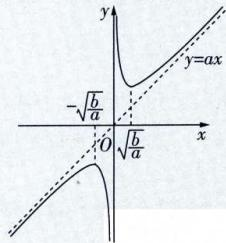

text_image

y
-√(b)/a
O
√(b)/a
x
y=ax

图1

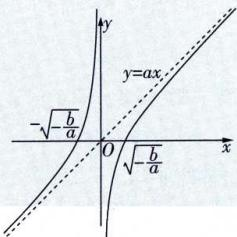

text_image

y=ax
-\sqrt{-\frac{b}{a}}
O \sqrt{-\frac{b}{a}}

图2

6 C 函数 $f(x)=\sqrt{-x^{2}-2x}$ 中，令 $t=-x^{2}-2x\geqslant0$ ，得 $-2\leqslant x\leqslant0$ ，则 $t\in[0,1]$ 。因为抛物提示求函数的单调区间之前先确定定义域。

线 $y = -x^{2} - 2x$ 开口向下，对称轴方程为 $x = -1$ ，所以函数 $y = -x^{2} - 2x$ 在 $[-1,0]$ 上单调递减，在 $[-2, -1]$ 上单调递增。又 $y = \sqrt{t}$ 在 $t \in [0,1]$ 上单调递增，因此函数 $f(x)$ 在 $[-1,0]$ 上单调递减，在 $[-2, -1]$ 上单调递增，所以函数 $f(x)$ 的单调递减区间是 $[-1,0]$ 。

# 解题通法

判断复合函数单调性的依据为“同增异区间的一般步骤为：

(1) 求复合函数的定义域；  
(2) 将复合函数分解为若干个易判断单调性的函数；  
(3) 判断分解后的函数的单调性；  
(4) 写出所求复合函数的单调区间.

7 解析 (1) 先画出函数 $y = -\frac{1}{x}$ 的图象, 再将所得图象向左平移 2 个单位长度, 得到 $f(x) = -\frac{1}{x + 2}$ 的图象, 如图 1 所示, 可得其单调递增区间为 $(- \infty, -2)$ 和 $(-2, +\infty)$ , 无单调递减区间.

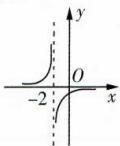  
图1

(2)先画出函数 $y = x^{2} - 3x + 2$ 的图象，再将 $x$ 轴下方的图象翻折至 $x$ 轴上方，即可得到函数 $f(x) = |x^2 - 3x + 2|$ 的图象，如图2所示，由图可知，函数 $f(x)$ 的单调递减区间为 $(-\infty, 1]$ 和 $[\frac{3}{2}, 2]$ ，单调递增区间为 $[1, \frac{3}{2}]$ 和 $[2, +\infty)$ .

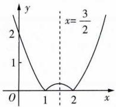

line

| x | y |
|---|---|
| 0 | 2 |
| 1 | 0 |
| 2 | 0 |
| 3/2 | 3 |

图2

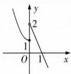

text_image

y
2
1
O
1
x

图3

(3) 画出函数 $f(x) = \begin{cases} x^2 + 1, & x \leqslant 0, \\ -2x + 2, & x > 0 \end{cases}$ 的图象，如图3所示，由图象知函数 $f(x)$ 的单调递减区间是 $(- \infty, 0]$ 和 $(0, +\infty)$ .

避坑不是R,判断分段函数的单调性注意对比区间端点对应函数值的大小.

8 B 由题图可知 $f(x)$ 在 $[-2, -1]$ , $[0, 1]$ 上单调递减, 则 $\left\{ \begin{array}{l} a \geqslant -2, \\ a + \frac{1}{2} \leqslant -1 \end{array} \right.$ 或 $\left\{ \begin{array}{l} a \geqslant 0, \\ a + \frac{1}{2} \leqslant 1, \end{array} \right.$ 得 $-2 \leqslant a \leqslant -\frac{3}{2}$ 或 $0 \leqslant a \leqslant \frac{1}{2}$ .

9 B 因为函数 $f(x)$ 的图象开口向上, 对称轴为直线 $x = -\frac{m}{4}$ , 所以 $f(x)$ 在 $\left[-\frac{m}{4}, +\infty\right)$ 上单调递增, 所以 $-\frac{m}{4} \leqslant -1$ , 解得 $m \geqslant 4$ .

【变式1】 $(- \infty, 4)$ 解析 由题意及函数 $f(x)$ 图象的对称轴为直线 $x = -\frac{m}{4}$ , 知 $-\frac{m}{4} > -1$ , 解得 $m < 4$ .

【变式2】 $(-∞,-2]∪[2,+∞)$ 解析 函数 $f(x)=x^{2}-kx-8$ 在 $[-1,1]$ 上具有单调性，则 $\frac{k}{2}\geqslant1$ 或 $\frac{k}{2}\leqslant-1$ ，解得 $k\geqslant2$ 或 $k\leqslant-2$ .

10 C 由题意得 $f(x)=\frac{mx-2}{x+1}=\frac{m(x+1)-m-2}{x+1}=m+$ 破题点先化简,然后利用反比例函数的单调性解题. $\frac{-m-2}{x+1}$ . 因为函数 $f(x)$ 在区间 $(-∞,-1)$ 上单调递减,

所以 -m-2>0, 解得 m<-2. 故选 C.

11 B 若 $f(x)$ 在 R 上单调递减，则 $\left\{\begin{aligned}-\frac{a}{2}&\geqslant a,\\ a&<0,\\ 2a^{2}&-3\geqslant a^{2}+1,\end{aligned}\right.$ 解得 $a\leqslant-2$ .

12 -6 解析 由 $f(x) = \begin{cases} -2x - a, & x < -\frac{a}{2}, \\ 2x + a, & x \geqslant -\frac{a}{2}, \end{cases}$ 可得函数 $f(x)$ 的单调递增区间为 $[- \frac{a}{2}, +\infty)$ , 故 $-\frac{a}{2} = 3$ , 解得 $a = -6$ .

快招解题 本题也可画出函数 $f(x)$ 的图象,利用图象求出 $a$ 的值;也可根据函数 $f(x)=|2x+a|=2|x+\frac{a}{2}|$ 的图象关于直线 $x=-\frac{a}{2}$ 对称求出 $a$ 的值.

13 $(0, \frac{\sqrt{3}}{2}]$ 解析 由 $2t > t$ ，得 $t > 0$ ，又 $f(x) = x + \frac{3}{x}$ 在 $(- \sqrt{3}, 0)$ 和 $(0, \sqrt{3})$ 上单调递减，所以 $0 < 2t \leqslant \sqrt{3}$ ，解得 $0 < t \leqslant \frac{\sqrt{3}}{2}$ .

14 A 由题意知 m-1>0，所以 m>1，所以 $f(m)>f(1)$ .
15 B 因为函数 $f(x)$ 的图象关于直线 x=1 对称，所以 $a=f(-\frac{1}{2})=f(\frac{5}{2})$ . 又 $f(x)$ 在 $(1, +\infty)$ 上单调递增，所以 $f(2)<f(\frac{5}{2})<f(3)$ ，即 b<a<c.

16 D 易知 $f(x)$ 的定义域为 $(0, +\infty)$ ，又 $y = \frac{1}{\sqrt{x}}$ 在 $(0, +\infty)$ 上单调递减，y = -x 为减函数，所以 $f(x) = \frac{1}{\sqrt{x}} - x$ 在 $(0, +\infty)$ 上单调递减，又 $k^{2} + 2k + 4 = (k + 1)^{2} + 3 \geqslant 3 > 2$ ，所以 $f(2) < f(k^{2} + 2k + 4)$ . 故选 D.

17 解析 (1) $f(x)$ 在 $(0, +\infty)$ 上单调递减, 理由如下: $\forall x_{1}, x_{2} \in (0, +\infty)$ , 且 $x_{1} < x_{2}$ ,

则 $f(x_{1}) - f(x_{2}) = \left(\frac{3}{x_{1}} - x_{1}\right) - \left(\frac{3}{x_{2}} - x_{2}\right) = \left(\frac{3}{x_{1}} - \frac{3}{x_{2}}\right) - (x_{1} - x_{2}) = \frac{3(x_{2} - x_{1})}{x_{1}x_{2}} - (x_{1} - x_{2}) = (x_{2} - x_{1})(\frac{3}{x_{1}x_{2}} + 1).$

因为 $0 < x_{1} < x_{2}$ ，所以 $x_{2} - x_{1} > 0, \frac{3}{x_{1}x_{2}} + 1 > 0$ ，
所以 $f(x_{1})-f(x_{2})>0$ ，所以 $f(x_{1})>f(x_{2})$ 所以 $f(x)$ 在 $(0,+\infty)$ 上单调递减.

(2) 因为 $f(x)$ 在 $(0, +\infty)$ 上单调递减，且 $f(\frac{1-x}{3+x}) > f(1)$ ，所以 $0 < \frac{1-x}{3+x} < 1$ ，解得 -1 < x < 1，即所求不等式的解集

注意 $\frac{1-x}{3+x}$ 要在定义域内.

为 $(-1,1)$ .

# 过能力 学科关键能力构建

1 A 因为 $a + b > 0$ ，所以 a > -b, b > -a。又 $f(x)$ 是 R 上的增函数，所以 $f(a) > f(-b)$ ， $f(b) > f(-a)$ ，所以 $f(a) + f(b) > f(-a) + f(-b)$ 。故选 A。

2 D 因为函数 $f(x)$ 的定义域为 $[-9,9]$ ，所以令 $\left\{\begin{aligned}-9&\leqslant x\leqslant9,\\ -9&\leqslant x^{2}\leqslant9,\end{aligned}\right.$ 得 $-3\leqslant x\leqslant3$ ，即函数 $y=f(x)+f(x^{2})$ 的定义域为 $[-3,3]$ 。令 $t=x^{2},-3\leqslant x\leqslant3$ ，所以 $x\in[0,3]$ 时， $t=x^{2}$ 单调递增， $x\in[-3,0]$ 时， $t=x^{2}$ 单调递减。又 $f(x)$ 为增函数，所以 $f(x^{2})$ 在 $[0,3]$ 上单调递增，在 $[-3,0]$ 上单调递减，所以函数 $y=f(x)+f(x^{2})$ 的单调递增区间为 $[0,3]$ 。

3 B 设 $f(x) = \frac{x^2 + 1}{(x - 1)(x + 1)} = \frac{x^2 + 1}{x^2 - 1} = \frac{x^2 - 1 + 2}{x^2 - 1} = 1 + \frac{2}{x^2 - 1}$ ，当 $x > 1$ 时， $x^2 - 1 > 0, y = \frac{2}{x^2 - 1}$ 在 $(1, +\infty)$ 上单调递减，所以 $f(x)$ 在 $(1, +\infty)$ 上单调递减，所以 $f(2022) > f(2023) > f(2024)$ ，即 $a > b > c$ . 故选 B.

4 C 当 $a = 0$ 时, $f(x) = \sqrt{2x - 1}$ , 则 $f(x)$ 的定义域为 $\left[\frac{1}{2}, +\infty\right)$ , 且 $f(x)$ 在定义域上单调递增, 所以 $f(x)$ 在 $[1, +\infty)$ 上单调递增, 故 $a = 0$ 符合题意. 令 $t = ax^2 + 2x - 1$ , 当 $a > 0$ 时, 二次函数 $t = ax^2 + 2x - 1$ 的图象开口向上, 对称轴方程为 $x = -\frac{1}{a} < 0$ , 所以 $t = ax^2 + 2x - 1$ 在 $x \in [1, +\infty)$ 上单调递增, 且当 $x \in [1, +\infty)$ 时, $t \geqslant a \times 1^2 + 2 \times 1 - 1 = a + 1 > 0$ , 又 $y = \sqrt{t}$ 在 $t \in [a + 1, +\infty)$ 上单调递增, 所以 $f(x)$ 在 $[1, +\infty)$ 上单调递增, 故 $a > 0$ 符合题意; 当 $a < 0$ 时, 二次函数 $t = ax^2 + 2x - 1$ 的图象开口向下, 对称轴方程为 $x = -\frac{1}{a} > 0$ , 则 $t = ax^2 + 2x - 1$ 在 $(- \frac{1}{a}, +\infty)$ 上单调递减, 所以 $t = ax^2 + 2x - 1$ 不可能在 $[1, +\infty)$ 上单调递增, 故 $a < 0$ 不符合题意. 综上, 实数 $a$ 的取值范围是 $[0, +\infty)$ . 故选 C.

5 ABD 不妨设 $x_{1} > x_{2} > 0$ ，则由题意可得 $x_{2}f(x_{1}) > x_{1}f(x_{2})$ ，即 $\frac{f(x_1)}{x_1} > \frac{f(x_2)}{x_2}$ ，由单调性定义可知，函数 $y = \frac{f(x)}{x}$ 在 $(0, +\infty)$ 上单调递增，即若 $y = \frac{f(x)}{x}$ 在 $(0, +\infty)$ 上单调递增，则称函数 $f(x)$ 为“理想函数”。A中 $y = \frac{f(x)}{x} = -\frac{1}{x}$ ，该函数在 $(0, +\infty)$ 上单调递增，符合“理想函数”的定义；B中 $y = \frac{f(x)}{x} = x^2 + 3x - 2$ ，该函数在 $(0, +\infty)$ 上单调递增，符合“理想函数”的定义；C中 $y = \frac{f(x)}{x} = \frac{\sqrt{x}}{x} = \frac{1}{\sqrt{x}}$ ，该函数在 $(0, +\infty)$ 上单调递减，不符合“理想函数”

的定义；D 中 $y=\frac{f(x)}{x}=x+1$ ，该函数在 $(0,+\infty)$ 上单调递增，符合“理想函数”的定义.

6 C 不妨设 $x_{1} > x_{2}$ , 则 $\frac{f(x_{1}) - f(x_{2})}{x_{1} - x_{2}} > 2 \Leftrightarrow f(x_{1}) - f(x_{2}) > 2x_{1} - 2x_{2} \Leftrightarrow f(x_{1}) - 2x_{1} > f(x_{2}) - 2x_{2}$ . 令 $F(x) = f(x) - 2x$ , 则 $F(x_{1}) > F(x_{2})$ , 所以 $F(x) = f(x) - 2x$ 在 $\mathbf{R}$ 上单调递增. 因为 $f(2) = 12$ , 所以 $F(2) = f(2) - 4 = 8$ , 则 $f(m^{2}) \geqslant 2m^{2} + 8 \Leftrightarrow f(m^{2}) - 2m^{2} \geqslant 8 \Leftrightarrow F(m^{2}) \geqslant F(2)$ , 所以 $m^{2} \geqslant 2$ , 解得 $m \in (-\infty, -\sqrt{2}] \cup [\sqrt{2}, +\infty)$ . 故选 C.

7 26 解析 因为函数 $f(x)$ 在定义域 $(0, +\infty)$ 上是单调函数，若对任意 $x \in (0, +\infty)$ ，都有 $f(f(x) - \frac{1}{x}) = 2$ ，则可设 $f(x) - \frac{1}{x} = c$ （ $c$ 为常数， $c > 0$ ），故 $f(x) = c + \frac{1}{x}$ ，

且 $f(c)=c+\frac{1}{c}=2$ ，解得c=1，所以 $f(x)=\frac{1}{x}+1$ ，则 $f(\frac{1}{25})=25+1=26.$

8 解析 (1) 令 $a = b = 0$ ，则 $[f(0)]^2 = f(0)$ .

又 $f(0)\neq0$ ,所以 $f(0)=1$ .

当 x > 0 时，-x < 0，所以 $f(-x) > 1$ .

又 $f(x)f(-x)=f(x-x)=f(0)=1$ ,

所以 $f(x)=\frac{1}{f(-x)}$ ，即0<f(x)<1.

(2) $f(x)$ 在 R 上单调递减. 证明如下:

方法一 设 $x_{1} < x_{2}$ ，则 $f(x_{1}) - f(x_{2}) = f(x_{1} - x_{2} + x_{2}) - f(x_{2}) = f(x_{1} - x_{2})f(x_{2}) - f(x_{2}) = f(x_{2})[f(x_{1} - x_{2}) - 1]$ . 又 $x_{1} < x_{2}$ ，所以 $x_{1} - x_{2} < 0$ ，所以 $f(x_{1} - x_{2}) > 1$ .

又当 x<0 时, $f(x)>1$ , 当 x>0 时, $0<f(x)<1$ , $f(0)=1$ ,
所以 $f(x_{2}) > 0$ ,

所以 $f(x_{1})-f(x_{2})>0$ ，即 $f(x_{1})>f(x_{2})$ ，

所以 $f(x)$ 在R上单调递减.

方法二 设 $x_{1} < x_{2}$ ，则由 $f(x_{2})f(x_{1} - x_{2}) = f(x_{1})$ ，得 $\frac{f(x_1)}{f(x_2)} = f(x_1 - x_2)$ .

因为 $x_{1}<x_{2}$ ，所以 $x_{1}-x_{2}<0$ ，所以 $\frac{f(x_{1})}{f(x_{2})}<1$ ，

又 $f(x)>0$ 恒成立,所以 $f(x_{1})<f(x_{2})$ ,
所以 $f(x)$ 在 R 上单调递减.

(3) 因为 $f(2)=\frac{1}{2}$ ，所以 $f(8)=f(2)f(6)=f(2)f(2)f(4)=$ $[f(2)]^{4}=\frac{1}{16}$ ，所以 $f(5t^{2}-6t)>\frac{1}{16}$ ，即 $f(5t^{2}-6t)>f(8)$ .

又 $f(x)$ 在 R 上单调递减, 所以 $5t^{2}-6t<8$ , 解得 $-\frac{4}{5}<t<2$ , 所以不等式 $f(5t^{2}-6t)>\frac{1}{16}$ 的解集为 $(- \frac{4}{5},2)$ .

# 课时 2 ▶ 最大（小）值

# 过基础 教材必备知识精练

1 B 因为函数 $y = x, y = -\frac{2}{x}$ 在区间 $[1, 2]$ 上均单调递增，所以函数 $f(x)$ 在 $[1, 2]$ 上单调递增，所以函数 $f(x)$ 的

最大值为 $f(2)=2-1=1$ .

2 D $f(x)=\frac{3x-1}{1-x}=-3+\frac{2}{1-x},x\in[-4,-2)$ ，则 $f(x)$ 为增函数，又 $f(-4)=-\frac{13}{5},x$ 取不到-2，所以 $f(x)$ 的最小

值是 $-\frac{13}{5}$ ，无最大值。故选D。

3 D 由 $2x + y = 1$ ，可得 $y = 1 - 2x$ ，因为 $|y| \leqslant 1$ ，所以 $|1 - 2x| \leqslant 1$ ，解得 $0 \leqslant x \leqslant 1$ ，则 $2x^{2} + 16x + 3y^{2} = 2x^{2} + 16x + 3(1 - 2x)^{2} = 14x^{2} + 4x + 3.$ 设 $f(x) = 14x^{2} + 4x + 3$ ， $x \in [0,1]$ ，由 $-\frac{4}{2 \times 14} < 0$ ，可得 $f(x)$ 在 $[0,1]$ 上单调递增，所以当 $x = 0$ 时，函数 $f(x)$ 取得最小值，为 $f(0) = 3$ ，即 $2x^{2} + 16x + 3y^{2}$ 的最小值为3.

4 B 如图,结合题意画出函数 $f(x)$ 的图象(图中实线构成的折线图),则 $f(x)$ 的最大值即为 $f(x)$ 的图象最高点对应的纵坐标. 观察图象知, $f(x)$ 图象的最高点是一次函数 $y = x + 1$ 与 $y = -2x + 4$ 图象的交点,由 $\left\{\begin{aligned}y&=x+1,\\ y&=-2x+4,\end{aligned}\right.$ 得 $\left\{\begin{aligned}x&=1,\\ y&=2,\end{aligned}\right.$ 因此 $f(x)$ 图

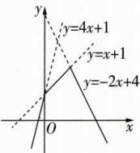

text_image

y
y=4x+1
y=x+1
y=-2x+4
O
x

象的最高点是(1.2)，所以 $f(x)$ 的最大值为2.

5 (1)2; (2) $\frac{3\sqrt{2}}{2}$ 解析 (1)设 $t=\sqrt{1-x}$ ，则 $t\geqslant0, x=1-t^{2}$ ，所以原函数可化为 $y=-t^{2}+2t+1(t\geqslant0)$ 。由二次函数的性质，知当 t=1 时，函数 $y=-t^{2}+2t+1(t\geqslant0)$ 取得最大值 2，即 $f(x)$ 的最大值为 2。

(2) 令 $\sqrt{x^2 + 2} = t, t \geqslant \sqrt{2}$ , 则 $\frac{x^2 + 3}{\sqrt{x^2 + 2}} = \sqrt{x^2 + 2} + \frac{1}{\sqrt{x^2 + 2}} = t + \frac{1}{t}$ , 又函数 $y = t + \frac{1}{t}$ 在 $[\sqrt{2}, +\infty)$ 上单调递增, 所以当 $t = \sqrt{2}$ , 即 $x = 0$ 时, $\frac{x^2 + 3}{\sqrt{x^2 + 2}}$ 取得最小值 $\frac{3\sqrt{2}}{2}$ .

6 D 方法一 依题意, 当 a=0 时, 不符合题意; 当 a>0 时, $f(x)=ax+b$ 在 $[1,2]$ 上单调递增, 所以 $f(2)-f(1)=2a+b-(a+b)=2$ , 得 a=2; 当 a<0 时, $f(x)=ax+b$ 在 $[1,2]$ 上单调递减, 所以 $f(1)-f(2)=a+b-(2a+b)=2$ , 得 a=-2.

方法二 因为 $f(x)=ax+b$ 在区间[1,2]上单调，且 $f(x)$ 在区间[1,2]上的最大值与最小值的差为2，所以 $|f(1)-f(2)|=2$ ，即 $|(a+b)-(2a+b)|=2$ ，解得a=2或-2.

提示 若函数 $f(x)$ 在闭区间 $[a, b]$ 上单调，则 $f(x)$ 在 $[a, b]$ 上的最值必在区间端点处取得.

7 B $f(x)=\frac{2x+m}{x+1}=2+\frac{m-2}{x+1}, x\in[0,1]$ . ①当 m=2 时, $f(x)=2$ , 不符合题意; ②当 m-2>0, 即 m>2 时, 函数 $f(x)$ 在 $[0,1]$ 上单调递减, 则 $f(0)$ 为最大值, 即 $f(0)=m=\frac{5}{2}$ , 符合题意; ③当 m-2<0, 即 m<2 时, 函数 $f(x)$ 在 $[0,1]$ 上单调递增, 则 $f(1)$ 为最大值, 即 $f(1)=\frac{2+m}{2}=\frac{5}{2}$ , 解得 m=3, 舍去. 综上, $m=\frac{5}{2}$ .

8 C 函数 $f(x) = -x^{2} - 2x + 3 = -(x + 1)^{2} + 4$ ，其图象的对称轴方程为 $x = -1$ . 由题可知 $a < 2$ . 若 $a \leqslant -1$ ，则 $x = -1$ 时，函数 $f(x)$ 取得最大值，为 $f(-1) = 4$ ，不满足题意；若 $-1 < a < 2$ ，则函数 $f(x)$ 在区间 $[a, 2]$ 上单调递减，所以当 $x = a$ 时，函数 $f(x)$ 取得最大值，为 $f(a) = -a^{2} - 2a + 3 = \frac{15}{4}$ ，解得 $a = -\frac{1}{2}$ 或 $a = -\frac{3}{2}$ （舍去）.

9 $[-2,2]$ 解析 由题意得 $f(x) = 2|x - 2| + ax = \left\{ \begin{array}{l}(a + 2)x - 4,x\geqslant 2,\\ (a - 2)x + 4,x <   2, \end{array} \right.$ 因为函数 $f(x)$ 有最小值，所以函数 $f(x)$ 在 $(-\infty ,2)$ 上单调递减或为常数，在 $[2, + \infty )$ 上单调递增或为常数，所以 $\left\{ \begin{array}{ll}a + 2\geqslant 0,\\ a - 2\leqslant 0, \end{array} \right.$ 解得 $-2\leqslant a\leqslant 2$ ，故实数 $a$ 的取值范围是[-2,2].

10 $[0, \sqrt{2}]$ 解析 当 $x > 0$ 时, $x + \frac{1}{x} \geqslant 2\sqrt{x \cdot \frac{1}{x}} = 2$ , 当且仅当 $x = \frac{1}{x}$ , 即 $x = 1$ 时等号成立. ① 若 $a < 0$ , 当 $x \leqslant 0$ 时, 由二次函数的性质可知 $f(a) < f(0)$ , 不满足 $f(0)$ 是 $f(x)$ 的最小值, 故舍去. ② 若 $a \geqslant 0$ , 当 $x \leqslant 0$ 时, 由二次函数的性质可知 $f(x) \geqslant f(0) = a^2$ , 所以由 $f(0)$ 是 $f(x)$ 的最小值, 得 $a^2 \leqslant 2$ , 得 $0 \leqslant a \leqslant \sqrt{2}$ .

11 解析 (1) 当 $a = 1$ 时, $f(x) = x \mid x - 1 \mid, f(x) > x$ , 即 $x \mid x - 1 \mid > x$ .

当 x=0 时, 不等式显然不成立;

当 x > 0 时, 不等式可化为 $\left|x - 1\right| > 1$ , 解得 x > 2 或 x < 0, 又 x > 0, 所以 x > 2;

当 x<0 时, 不等式可化为 $\left|x-1\right|<1$ , 解得 0<x<2, 又 x<0, 所以不等式无解.

综上所述， $f(x) > x$ 的解集为 $(2, +\infty)$

(2)由题得 $x\mid x - a\mid \leqslant 4$ 在 $x\in [\frac{1}{2},2]$ 上恒成立，

即 $|x^{2}-ax|\leqslant4$ 在 $x\in\left[\frac{1}{2},2\right]$ 上恒成立，

即 $-4 \leqslant x^{2} - ax \leqslant 4$ 在 $x \in [\frac{1}{2}, 2]$ 上恒成立，

即 $a \geqslant x - \frac{4}{x}$ 与 $a \leqslant x + \frac{4}{x}$ 在 $x \in [\frac{1}{2}, 2]$ 上恒成立.

函数 $y = x - \frac{4}{x}$ 在 $\left[\frac{1}{2}, 2\right]$ 上单调递增，所以当 $x \in \left[\frac{1}{2}, 2\right]$ 时， $(x - \frac{4}{x})_{\max} = 2 - \frac{4}{2} = 0$ ，所以 $a \geqslant 0$ .

函数 $y = x + \frac{4}{x}$ 在 $\left[\frac{1}{2}, 2\right]$ 上单调递减，所以当 $x \in \left[\frac{1}{2}, 2\right]$ 时， $(x + \frac{4}{x})_{\min} = 2 + \frac{4}{2} = 4$ ，所以 $a \leqslant 4$ .

综上所述， $a\in [0,4]$

【变式】由题意得 $x \mid x - a \mid \leqslant 4$ 在 $x \in \left[\frac{1}{2}, 2\right]$ 上有解，即 $\left|x^{2} - ax\right| \leqslant 4$ 在 $x \in \left[\frac{1}{2}, 2\right]$ 上有解，

即 $-4 \leqslant x^{2} - ax \leqslant 4$ 在 $x \in [\frac{1}{2}, 2]$ 上有解，

即 $a \geqslant x - \frac{4}{x}$ 与 $a \leqslant x + \frac{4}{x}$ 在 $x \in [\frac{1}{2}, 2]$ 上有解.

函数 $y = x - \frac{4}{x}$ 在 $[ \frac{1}{2}, 2]$ 上单调递增，所以当 $x \in [\frac{1}{2}, 2]$ 时， $(x - \frac{4}{x})_{\min} = \frac{1}{2} - 8 = -\frac{15}{2}$ ，所以 $a \geqslant -\frac{15}{2}$ .

函数 $y = x + \frac{4}{x}$ 在 $\left[\frac{1}{2}, 2\right]$ 上单调递减，所以当 $x \in \left[\frac{1}{2}, 2\right]$ 时， $(x+\frac{4}{x})_{\max}=\frac{1}{2}+8=\frac{17}{2}$ ，所以 $a\leqslant\frac{17}{2}$ .

综上所述， $a \in [-\frac{15}{2}, \frac{17}{2}]$ .

# 归纳总结 恒成立问题、有解问题与函数最值的等价转化

<table><tr><td>恒成立问题</td><td> $1f(x) \geqslant a$  恒成立 $\Leftrightarrow f(x)_{\min} \geqslant a; f(x) \leqslant a$  恒成立 $\Leftrightarrow f(x)_{\max} \leqslant a.$  $2f(x) \geqslant g(x)$  恒成立 $\Leftrightarrow [f(x) - g(x)]_{\min} \geqslant 0; f(x) \leqslant g(x)$  恒成立 $\Leftrightarrow [f(x) - g(x)]_{\max} \leqslant 0.$ </td></tr><tr><td>有解问题</td><td> $1f(x) \geqslant a$  有解 $\Leftrightarrow f(x)_{\max} \geqslant a; f(x) \leqslant a$  有解 $\Leftrightarrow f(x)_{\min} \leqslant a.$  $2f(x) \geqslant g(x)$  有解 $\Leftrightarrow [f(x) - g(x)]_{\max} \geqslant 0; f(x) \leqslant g(x)$  有解 $\Leftrightarrow [f(x) - g(x)]_{\min} \leqslant 0.$ </td></tr></table>

# 过能力 学科关键能力构建

1 B 因为函数 $f(x)$ 的值域是 $\left[\frac{1}{2},4\right]$ ，所以函数 $f(2x+1)$ 的值域是 $\left[\frac{1}{2},4\right]$ ，令 $t=f(2x+1)\in\left[\frac{1}{2},4\right],g(t)=t+\frac{1}{t}$ ，由对勾函数的性质可知，函数 $g(t)=t+\frac{1}{t}$ 在 $\left[\frac{1}{2},1\right]$ 上单调递减，在(1,4)上单调递增，又 $g(\frac{1}{2})=\frac{5}{2},g(1)=2$ ， $g(4)=\frac{17}{4}$ ，所以当 $t\in\left[\frac{1}{2},4\right]$ 时， $g(t)\in[2,\frac{17}{4}]$ ，即函数 $F(x)$ 的值域是 $[2,\frac{17}{4}]$ . 故选 B.

2 A 函数 $f(x) = x(|x| - 2)$ ，当 $x \geqslant 0$ 时， $f(x) = x^2 - 2x$ ；当 $x < 0$ 时， $f(x) = -2x - x^2$ . 作出 $y = f(x)$ 的图象，如图所示. 当 $x > 0$ 时，令 $x^2 - 2x = 1$ ，解得 $x = 1 + \sqrt{2}$ ；当 $x < 0$ 时，令 $-2x - x^2 = -1$ ，解得 $x = -1 - \sqrt{2}$ ，即 $f(x)$ 在 $[-1 - \sqrt{2}, 1 + \sqrt{2}]$ 内的最大值为 1，最小值为 -1，所以由图象可得， $n - m$ 的最大值为 $1 + \sqrt{2} - (-1 - \sqrt{2}) = 2 + 2\sqrt{2}$ . 故选 A.

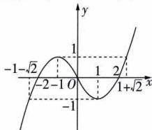

line

| x | y |
|---|---|
| -1 | -√2 |
| -2 | -1 |
| 0 | 0 |
| 1 | 1 |
| 2 | 2 |
| 1 + √2 | √2 |

3 ACD 

<table><tr><td>A</td><td>√</td><td> $f(x)g(x)=\sqrt{x-1}\cdot\sqrt{3-x}=\sqrt{-x^{2}+4x-3}=\sqrt{-(x-2)^{2}+1},x\in[1,3]$ ,所以当x=2时, $f(x)g(x)$ 取最大值1.</td></tr><tr><td>B</td><td>×</td><td> $\frac{f(x)}{g(x)}=\sqrt{\frac{x-1}{3-x}}=\sqrt{\frac{2}{3-x}-1}$ 在(1,3)上单调递增.</td></tr><tr><td>C</td><td>√</td><td>因为当 $a,b\geqslant0$ 时, $(a+b)^{2}=a^{2}+b^{2}+2ab\leqslant2(a^{2}+b^{2})$ ,即 $a+b\leqslant\sqrt{2(a^{2}+b^{2})}$ (当且仅当a=b时取等号),所以 $f(x)+g(x)=\sqrt{x-1}+\sqrt{3-x}\leqslant\sqrt{2[(\sqrt{x-1})^{2}+(\sqrt{3-x})^{2}]}=2$ ,当且仅当 $\sqrt{x-1}=\sqrt{3-x}$ ,即x=2时取等号.</td></tr><tr><td>D</td><td>√</td><td> $2f(x)-g(x)=2\sqrt{x-1}-\sqrt{3-x}$ 在[1,3]上单调递增,故值域为 $[-\sqrt{2},2\sqrt{2}]$ .</td></tr></table>

4 B 因为 $x \in [1,4]$ , $y = x + \frac{4}{x}$ 在 $[1,2]$ 上单调递减，在 $[2,4]$ 上单调递增，且当 x = 1 时，y = 5, x = 2 时，y = 4, x = 4 时，y = 5，所以当 $x \in [1,4]$ 时， $x + \frac{4}{x} \in [4,5]$ . 若 $a \geqslant 5$ ，则 $f(x) = a - x - \frac{4}{x} + a = 2a - (x + \frac{4}{x})$ ，此时 $f(x)$ 的最大值为 2a - 4 = 5，解得 $a = \frac{9}{2}$ ，与 $a \geqslant 5$ 矛盾，舍去；若 $a \leqslant 4$ ，则 $f(x) = x + \frac{4}{x} - a + a = x + \frac{4}{x} \leqslant 5$ ，符合题意；若 4 < a < 5，则 $f(x)_{\max} = \max \left\{ |4 - a| + a, |5 - a| + a \right\}$ ，则 $\left\{\begin{aligned}|4 - a| + a &\geqslant |5 - a| + a, \\|4 - a| + a &=5\end{aligned}\right.$ 或 $\left\{\begin{aligned}|4 - a| + a &< |5 - a| + a, \\|5 - a| + a &=5,\end{aligned}\right.$ ，即 $\left\{\begin{aligned}2a - 4 &\geqslant 5, \\2a - 4 &=5\end{aligned}\right.$ 或 $\left\{\begin{aligned}2a - 4 &< 5, \\5 - a &=5,\end{aligned}\right.$ 解得 $a = \frac{9}{2}$ 或 $4 < a < \frac{9}{2}$ . 综上，实数 a 的取值范围是 $(-∞, \frac{9}{2}]$ . 故选 B.

50 [0,1] 解析 当 $a = 0$ 时， $f(x) = \left\{ \begin{array}{l} 1, x < 0, \\ (x - 2)^2, x \geqslant 0, \end{array} \right.$ 当 $x < 0$ 时， $f(x) = 1$ ；当 $x \geqslant 0$ 时， $f(x) \geqslant f(2) = 0$ ，故当 $a = 0$ 时，函数 $f(x)$ 的最小值为0。由上述可知，当 $a = 0$ 时，函数 $f(x)$ 存在最小值。当 $a < 0$ 时，函数 $y = -ax + 1$ 在 $(- \infty, a)$ 上单调递增，此时函数 $f(x)$ 不存在最小值，不符合题意。当 $a > 0$ 时，函数 $y = -ax + 1$ 在 $(- \infty, a)$ 上单调递减，此时 $y = -ax + 1 > 1 - a^2$ 。若 $0 < a \leqslant 2$ ，则当 $x \geqslant a$ 时， $f(x) \geqslant f(2) = 0$ ，由题意可得 $1 - a^2 \geqslant 0$ ，解得 $-1 \leqslant a \leqslant 1$ ，此时 $0 < a \leqslant 1$ ；若 $a > 2$ ，则当 $x \geqslant a$ 时，函数 $f(x)$ 在 $[a, +\infty)$ 上单调递增，则 $f(x) \geqslant f(a) = a^2 - 4a + 4$ ，由题意可得 $1 - a^2 \geqslant a^2 - 4a + 4$ ，即 $2a^2 - 4a + 3 \leqslant 0$ ，该不等式无解。综上所述，实数 $a$ 的取值范围是[0,1]。

6 $[-2\sqrt{6},0]$ 解析 $f(x)$ 和 $g(x)$ 的公共定义域为 $(- \infty ,0)$ . 若 $f(x) = 2x^{2} - 5x \geqslant -2x + b$ 对 $x < 0$ 恒成立，即 $b \leqslant 2x^{2} - 3x$ 对 $x < 0$ 恒成立，因为函数 $y = 2x^{2} - 3x$ 在 $(- \infty ,0)$ 上单调递减，所以当 $x < 0$ 时， $y > 0$ ，故 $b \leqslant 0$ . 若 $g(x) = \frac{3}{x} \leqslant -2x + b$ 对 $x < 0$ 恒成立，即 $b \geqslant \frac{3}{x} + 2x$ 对 $x < 0$ 恒成立，又当 $x < 0$ 时， $y = \frac{3}{x} + 2x = -(\frac{3}{-x} - 2x) \leqslant -2\sqrt{\frac{3}{-x} \cdot (-2x)} = -2\sqrt{6}$ ，当且仅当 $\frac{3}{-x} = -2x$ ，即 $x = -\frac{\sqrt{6}}{2}$ 时等号成立，故 $b \geqslant -2\sqrt{6}$ . 综上，实数 $b$ 的取值范围是 $[-2\sqrt{6},0]$ .

7 (1) $\left[-\frac{1}{2},+\infty\right)$ ;(2) $\left[0,+\infty\right)$ ;(3) $\left[-\frac{19}{2},+\infty\right)$ ;
(4) $[-9,+\infty)$ ;(5) $[-9,-\frac{1}{2}]$ 解析 当 $x \in [0,3]$ 时， $f(x)_{\min}=f(0)=1,f(x)_{\max}=f(3)=10.$ 当 $x \in [1,2]$ 时， $g(x)_{\min}=g(2)=\frac{1}{2}-m,g(x)_{\max}=g(1)=1-m.$

(1) 由题意得 $f(x)_{\min} \geqslant g(x)_{\min}$ ，则 $1 \geqslant \frac{1}{2} - m$ ，所以 $m \geqslant -\frac{1}{2}$ .  
(2)由题意得 $f(x)_{\min}\geqslant g(x)_{\max}$ ，则 $1\geqslant1-m$ ，所以 $m\geqslant0$ .  
(3)由题意得 $f(x)_{\max} \geqslant g(x)_{\min}$ ，则 $10 \geqslant \frac{1}{2} - m$ ，所以 $m \geqslant -\frac{19}{2}$ .  
(4)由题意得 $f(x)_{\max}\geqslant g(x)_{\max}$ ，则 $10\geqslant1-m$ ，所以 $m\geqslant-9$ .

(5) 若 $\exists x_1 \in [0,3], \forall x_2 \in [1,2]$ , 使得 $f(x_1) = g(x_2)$ , 则 $g(x)(x \in [1,2])$ 的值域是 $f(x)(x \in [0,3])$ 的值域的子集, 所以 $\left\{ \begin{array}{l} f(x)_{\max} \geqslant g(x)_{\max}, \\ f(x)_{\min} \leqslant g(x)_{\min}, \end{array} \right.$ 又当 $x \in [0,3]$ 时, $f(x)_{\min} = f(0) = 1, f(x)_{\max} = f(3) = 10$ , 当 $x \in [1,2]$ 时, $g(x)_{\min} = g(2) = \frac{1}{2} - m, g(x)_{\max} = g(1) = 1 - m$ , 所以 $\left\{ \begin{array}{l} 10 \geqslant 1 - m, \\ 1 \leqslant \frac{1}{2} - m, \end{array} \right.$ 解得 $-9 \leqslant m \leqslant -\frac{1}{2}$ , 即实数 $m$ 的取值范围为 $[-9, -\frac{1}{2}]$ .

# 归纳总结 双变量问题与函数最值的等价转化

① $\forall x_{1} \in M, \forall x_{2} \in N, f(x_{1}) \geqslant g(x_{2}) \Leftrightarrow f(x)_{\min} \geqslant g(x)_{\max};$   
② $\forall x_{1} \in M, \exists x_{2} \in N, f(x_{1}) \geqslant g(x_{2}) \Leftrightarrow f(x)_{\min} \geqslant g(x)_{\min};$   
③ $\exists x_{1} \in M, \exists x_{2} \in N, f(x_{1}) \geqslant g(x_{2}) \Leftrightarrow f(x)_{\max} \geqslant g(x)_{\min};$   
④ $\exists x_{1}\in M,\forall x_{2}\in N,f(x_{1})\geqslant g(x_{2})\Leftrightarrow f(x)_{\max}\geqslant g(x)_{\max};$   
⑤ $\forall x_{1}\in M,\exists x_{2}\in N,f(x_{1})=g(x_{2})\Leftrightarrow g(x)_{\min}\leqslant f(x)_{\min}$ 且 $f(x)_{\max} \leqslant g(x)_{\max}$ .

注：以上 $f(x)$ 的最值是在 $M$ 上的最值， $g(x)$ 的最值是在 $N$ 上的最值.

# 8 解析 方案一 选条件①.

(1) 设 $f(x)=kx+b(k\neq0)$ ，则 $f(x-1)=k(x-1)+b=2x+a$ ，即 $kx-k+b=2x+a$ ，

所以 $k=2, b=k+a=2+a$ ，所以 $f(x)=2x+2+a$ 。

由 $f(a)=2a+2+a=5$ ，得a=1，

所以 $f(x)=2x+3.$

(2) 由(1)可知, $g(x)=x(2x+3)+\lambda(2x+3)+x=2x^{2}+(4+2\lambda)x+3\lambda$ ,

所以 $g(x)$ 的图象开口向上，且对称轴为直线 $x = -\frac{2 + \lambda}{2}$ .
当 $-\frac{2+\lambda}{2}\leqslant1$ ，即 $\lambda\geqslant-4$ 时， $g(x)_{\max}=g(2)=8+4\lambda+3\lambda=7\lambda+16$ ，令 $7\lambda+16=2$ ，解得 $\lambda=-2$ ；

当 $-\frac{2+\lambda}{2}>1$ ，即 $\lambda<-4$ 时， $g(x)_{\max}=g(0)=3\lambda$ ，令 $3\lambda=2$ ，解得 $\lambda=\frac{2}{3}$ （舍去）.

综上, $\lambda = -2$ .

# 方案二 选条件②.

(1) 设 $f(x)=kx+b(k\neq0)$ ，则 $f(x-1)=k(x-1)+b=2x+a$ ，即 $kx-k+b=2x+a$ ，

所以 $k=2, b=k+a=2+a$ ，所以 $f(x)=2x+2+a$ 。

由 $f(\frac{1}{2})=2\times\frac{1}{2}+2+a=4a$ ，得a=1，

所以 $f(x)=2x+3.$

(2) 同方案一.

# 方案三 选条件③.

(1) 设 $f(x)=kx+b(k\neq0)$ ，则 $f(x-1)=k(x-1)+b=2x+a$ ，即 $kx-k+b=2x+a$ ，

所以 $k = 2, b = k + a = 2 + a$ ，所以 $f(x) = 2x + 2 + a$ .

由 $4f(1)-2f(2)=4(2+2+a)-2(4+2+a)=6$ , 得 a=1，
所以 $f(x)=2x+3.$

(2) 同方案一.

# 专项拓展训练1

# 二次函数的最值问题

# 过专项 阶段强化专项训练

1 A 方法一 $y = -2x^{2} + 6x - 3 = -2\left(x - \frac{3}{2}\right)^{2} + \frac{3}{2}$ ，其图象开口向下，对称轴为直线 $x = \frac{3}{2}$ ，所以函数 $f(x)$ 在 $[1, \frac{3}{2}]$ 上单调递增，在 $[\frac{3}{2}, 4]$ 上单调递减，又 $f(1) = 1$ ， $f(\frac{3}{2}) = \frac{3}{2}$ ， $f(4) = -11$ ，所以函数 $f(x)$ 的值域为 $[-11, \frac{3}{2}]$ .

方法二 函数 $y = -2x^{2} + 6x - 3$ 的图象开口向下，对称轴为直线 $x = -\frac{6}{2 \times (-2)} = \frac{3}{2}$ ，因为 $\frac{3}{2} \in [1, 4]$ ，所以 $f(x)_{\max} = f(\frac{3}{2}) = \frac{3}{2}$ ，又 $\left|\frac{3}{2} - 1\right| = \frac{1}{2}$ ， $\left|\frac{3}{2} - 4\right| = \frac{5}{2}$ ， $\frac{1}{2} <$

提示 二次函数图象开口向下时,距离对称轴越远(近),函数值越小(大).

$\frac{5}{2}$ , 所以 $f(x)_{\min} = f(4) = -11$ , 所以函数 $f(x)$ 的值域为 $[-11, \frac{3}{2}]$ .

归纳总结 (1) 函数 $y = ax^2 + bx + c (a > 0)$ 在区间 $(- \infty, -\frac{b}{2a}]$ 上单调递减，在区间 $[- \frac{b}{2a}, + \infty)$ 上单调递增，当 $x = -\frac{b}{2a}$ 时，函数取得最小值；(2) 函数 $y = ax^2 + bx + c (a < 0)$ 在区间 $(- \infty, -\frac{b}{2a}]$ 上单调递增，在区间 $[- \frac{b}{2a}, + \infty)$ 上单调递减，当 $x = -\frac{b}{2a}$ 时，函数取得最大值.

2 $\frac{3}{8}$ 或 -3 解析 当 a=0 时, y=1, 不符合题意, 所以 $a\neq0$ , 函数图象的对称轴方程为 $x=-\frac{2a}{2a}=-1$ . ①当 a>0 时, 其图象开口向上, $|-3-(-1)|=2$ , $|2-(-1)|=$ 提示 二次函数图象开口向上时, 距离对称轴越远 (近), 函数值越大 (小).

3,3>2,所以当x=2时函数在区间 $[-3,2]$ 上取得最大值，最大值为8a+1=4,解得 $a=\frac{3}{8}$ ;②当a<0时,其图象开口向下,则当x=-1时函数在区间 $[-3,2]$ 上取得最大值,最大值为1-a=4,解得a=-3.综上,a的值为 $\frac{3}{8}$ 或-3.

3 $-\frac{1}{4}$ 解析 因为 $f(x) = -(x - m)^2 + m + m^2$ ，所以 $f(x)$ 在 $(- \infty, m]$ 上单调递增，在 $[m, +\infty)$ 上单调递减。当 $m \leqslant -1$ 时， $f(x)$ 在 $[-1, 1]$ 上单调递减，故最大值 $M = f(-1) = -1 - m \geqslant 0$ ；当 $-1 < m < 1$ 时，最大值 $M = f(m) = m + m^2 = (m + \frac{1}{2})^2 - \frac{1}{4} \in [-\frac{1}{4}, 2)$ ；当 $m \geqslant 1$ 时， $f(x)$ 在 $[-1, 1]$ 上单调递增，故最大值 $M = f(1) = 3m - 1 \geqslant 2$ 。综上， $M$ 的最小值为 $-\frac{1}{4}$ 。

4 解析 (1) 当 $a = 2$ 时, $f(x) = \frac{1}{2} x^2 - 2x + 1 = \frac{1}{2}(x - 2)^2 - 1$ ,

当 $x \in [-1, 4]$ 时， $m = f(x)_{\min} = f(2) = -1$

$M = f(x)_{\max} = f(-1) = \frac{7}{2}$ , 且 $-1 \leqslant m < M \leqslant 4$ ,

故函数 $f(x)$ 是 $[-1,4]$ 上的“聚集函数”.

(2) $f(x)=\frac{1}{2}x^{2}-ax+\frac{a^{2}}{4}=\frac{1}{2}(x-a)^{2}-\frac{a^{2}}{4}.$

①若 $a \leqslant -1$ ，则 $m = f(-1) = \frac{1}{2} + a + \frac{1}{4} a^2, M = f(4) = 8 - 4a + \frac{1}{4} a^2$

根据题意得 $-1 \leqslant \frac{1}{2} + a + \frac{1}{4}a^{2} < 8 - 4a + \frac{1}{4}a^{2} \leqslant 4$ ，解得 $8 - 4\sqrt{3} \leqslant a < \frac{3}{2}$ ，与 $a \leqslant -1$ 矛盾，舍去；

②若 $-1 < a \leqslant \frac{3}{2}$ ，则 $m = f(a) = -\frac{1}{4}a^{2}$ ， $M = f(4) = 8 -$

提示 以区间[-1,4]的区间中点为界点,结合二次函数的图象与性质得到最值.

$$
4 a + \frac {1}{4} a ^ {2},
$$

根据题意得 $-1 \leqslant -\frac{1}{4}a^{2} < 8 - 4a + \frac{1}{4}a^{2} \leqslant 4$ ，解得 $8 - 4\sqrt{3} \leqslant a \leqslant 2$ ，又 $-1 < a \leqslant \frac{3}{2}$ ，所以 $8 - 4\sqrt{3} \leqslant a \leqslant \frac{3}{2}$ ;

③若 $\frac{3}{2}<a<4$ ，则 $m=f(a)=-\frac{1}{4}a^{2},M=f(-1)=\frac{1}{2}+a+\frac{1}{4}a^{2}$

根据题意得 $-1 \leqslant -\frac{1}{4}a^{2} < \frac{1}{2} + a + \frac{1}{4}a^{2} \leqslant 4$ ，解得 $-2 \leqslant a < -1$ 或 $-1 < a \leqslant 2$ ，又 $\frac{3}{2} < a < 4$ ，所以 $\frac{3}{2} < a \leqslant 2$ ；

④若 $a \geqslant 4$ ，则 $m = f(4) = 8 - 4a + \frac{1}{4} a^2, M = f(-1) = \frac{1}{2} + a + \frac{1}{4} a^2,$

根据题意得 $-1 \leqslant 8 - 4a + \frac{1}{4}a^{2} < \frac{1}{2} + a + \frac{1}{4}a^{2} \leqslant 4$ ，无解。
综上，实数 a 的取值范围为 $[8-4\sqrt{3},2]$ .

归纳总结 解决动轴定区间的二次函数最值问题时,可以让轴沿x轴正方向移动,分析移动到不同位置时对函数最值有什么影响.

5 B $f(x) = -x^{2} + 4x + 5 = -(x - 2)^{2} + 9, f(x)$ 的图象开口向下，对称轴为直线 $x = 2$ ，画出 $f(x)$ 的图象如图所示. 令 $f(x) = 5$ ，解得 $x = 0$ 或4. 由于 $f(x)$ 在区间 $[0, m]$ 上

的值域为[5,9],由图可知,m的取值范围是[2,4].

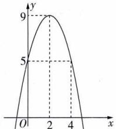

line

| x | y |
|---|---|
| 0 | 5 |
| 2 | 9 |
| 4 | 5 |

6 $\left\{\begin{aligned}t^{2}-t+1,t&\geqslant\frac{1}{2},\\ \frac{3}{4},&-\frac{3}{2}<t<\frac{1}{2},\end{aligned}\right.$ 解析 因为 $f(x)=x^{2}-x+1$ 的 $t^{2}+3t+3,t\leqslant-\frac{3}{2}$

图象开口向上，对称轴方程为 $x = \frac{1}{2}$ ，所以当 $t \geqslant \frac{1}{2}$ 时， $f(x)$ 在 $[t, t + 2]$ 上单调递增，则 $g(t) = f(t) = t^2 - t + 1$ ；当 $t + 2 \leqslant \frac{1}{2}$ ，即 $t \leqslant -\frac{3}{2}$ 时， $f(x)$ 在 $[t, t + 2]$ 上单调递减，则 $g(t) = f(t + 2) = t^2 + 3t + 3$ ；当 $t < \frac{1}{2} < t + 2$ ，即 $-\frac{3}{2} < t < \frac{1}{2}$ 时， $f(x)$ 在 $[t, \frac{1}{2}]$ 上单调递减，在 $[\frac{1}{2}, t + 2]$ 上单调递增，则 $g(t) = f(\frac{1}{2}) = \frac{3}{4}$ . 综上， $g(t) = \begin{cases} t^2 - t + 1, & t \geqslant \frac{1}{2}, \\ \frac{3}{4}, & -\frac{3}{2} < t < \frac{1}{2}, \\ t^2 + 3t + 3, & t \leqslant -\frac{3}{2}. \end{cases}$ .

归纳总结 解决定轴动区间的二次函数最值问题时,可以让区间沿x轴正方向移动,分析移动到不同位置时对函数最值有什么影响.借助图象可以更直观、清晰地解决问题.

7 B 因为 $f(x)$ 的定义域为 $[-1, a]$ ，所以 $a > -1$ . 函数 $y = x^2 - \frac{a}{2}x + 1$ 的图象开口向上，对称轴方程为 $x = \frac{a}{4}$ . 当 $a \leqslant \frac{a}{4}$ ，即 $-1 < a \leqslant 0$ 时， $f(x)$ 在 $[-1, a]$ 上单调递减， $f(x)$ 的最大值为 $f(-1)$ ，最小值为 $f(a)$ ，不合题意；当 $a > \frac{a}{4}$ ，即 $a > 0$ 时， $f(x)$ 在 $[-1, \frac{a}{4}]$ 上单调递减，在 $[\frac{a}{4}, a]$ 上单调递增，又 $f(x)$ 的最大值为 $f(a)$ ，所以 $f(a) \geqslant f(-1)$ ，即 $a^2 - \frac{a}{2} \cdot a + 1 \geqslant 1 + \frac{a}{2} + 1$ ，整理得 $a^2 - a - 2 \geqslant 0$ ，解得 $a \leqslant -1$ 或 $a \geqslant 2$ ，又 $a > 0$ ，所以 $a \geqslant 2$ . 所以实数 $a$ 的取值范围是 $[2, +\infty)$ . 故选 B.

8 解析 因为 $g(x)=\frac{1}{4}x^{2}-\frac{1}{2}x+\frac{1}{4}-mx=\frac{1}{4}x^{2}-(\frac{1}{2}+m)x+\frac{1}{4}$ ，所以 $g(x)$ 的图象是开口向上，对称轴为直线 $x=2m+1$ 的抛物线.

假设存在实数 $m$ ，使函数 $g(x)$ 在区间 $[m, m + 2]$ 上有最小值-5，则

①当 $2m + 1 \leqslant m$ ，即 $m \leqslant -1$ 时，函数 $g(x)$ 在区间 $[m, m + 2]$ 上单调递增，

所以 $g(x)$ 在区间 $[m, m+2]$ 上的最小值为 $g(m) = -5$ ,
即 $\frac{1}{4}m^{2}-\left(\frac{1}{2}+m\right)m+\frac{1}{4}=-5$

化简得 $3m^{2} + 2m - 21 = 0$ ，解得 $m = -3$ 或 $m = \frac{7}{3}$ （舍去）.

②当 $m < 2m + 1 < m + 2$ ，即 $-1 < m < 1$ 时，函数 $g(x)$ 在区

间 $[m,m+2]$ 上的最小值为 $g(2m+1)=-5$ ,

即 $\frac{1}{4}(2m + 1)^2 -\left(\frac{1}{2} +m\right)(2m + 1) + \frac{1}{4} = -5,$

化简得 $m^{2} + m - 5 = 0$ ，解得 $m = \frac{-1 - \sqrt{21}}{2}$ 或 $m = \frac{-1 + \sqrt{21}}{2}$ ，与 -1 < m < 1 矛盾，故都舍去.

③当 $2m+1\geqslant m+2$ ，即 $m\geqslant1$ 时， $g(x)$ 在区间 $[m,m+2]$ 上单调递减，

所以 $g(x)$ 在区间 $[m, m+2]$ 上的最小值为 $g(m+2) = -5$ ,

即 $\frac{1}{4}(m+2)^{2}-\left(\frac{1}{2}+m\right)(m+2)+\frac{1}{4}=-5,$

化简得 $m^{2} + 2m - 7 = 0$ ，解得 $m = -1 + 2\sqrt{2}$ 或 $m = -1 - 2\sqrt{2}$ （舍去）.

综上,存在实数 m, 使得函数 $g(x)=f(x)-mx$ 在区间 $[m, m+2]$ 上有最小值 -5, 此时 m=-3 或 $m=-1+2\sqrt{2}$ .

# 归纳总结

区间的变化与对称轴的变化是相互制

约的,需对它们的制约关系(含参量)进行讨论,讨论的依据为对称轴与x轴交点的横坐标是否在所给区间内.

# 专项拓展训练 2 利用函数的最值解决任意、存在问题

# 过专项 阶段强化专项训练

1 C 由题知 $f(x) \geqslant 0$ 在 $[-1, 1]$ 上有解，即当 $x \in [-1, 1]$ 时， $f(x)_{\max} \geqslant 0$ . 根据复合函数的单调性，知 $f(x)$ 在 $[-1, 0]$ 上单调递增，在 $[0, 1]$ 上单调递减，所以 $f(x)_{\max} = f(0) = 1 + a \geqslant 0$ ，所以 $a \geqslant -1$ .

2 A 方法一 因为 $f(x) \geqslant 2x - m$ 恒成立, 所以 $m \geqslant 2x - f(x)$ 恒成立. 令 $g(x) = 2x - f(x)$ , 则 $g(x) = \left\{\begin{aligned}-x - 6, & x \geqslant -2, \\5x + 6, & x < -2,\end{aligned}\right.$ 结合 $g(x)$ 在 $(-∞, -2)$ 和 $[-2, +∞)$ 上的单调性知, 当 x = -2 时, $g(x)$ 取最大值, 为 $g(x)_{\max} = -(-2) - 6 = -4$ , 所以 $m \geqslant -4$ , 故选 A.

方法二 函数 $f(x) = \begin{cases} 3x + 6, & x \geqslant -2, \\ -6 - 3x, & x < -2 \end{cases}$ 的图象如图所示. 不等式 $f(x) \geqslant 2x - m$ 恒成立，等价于一次函数 $y = 2x - m$ 的图象过点 $(-2,0)$ 或在函数 $f(x)$ 图象的下方，故 $0 \geqslant -4 - m$ ，即 $m \geqslant -4$ ，故选A.

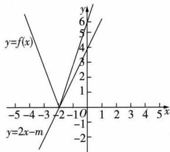

line

| x | y=f(x) | y=2x-m |
|---|---|---|
| -5 | 0 | 0 |
| -3 | 1 | 0 |
| -2 | 0 | 0 |
| -1 | 1 | 0 |
| 0 | 2 | 0 |
| 1 | 3 | 0 |
| 2 | 4 | 0 |
| 3 | 5 | 0 |
| 4 | 6 | 0 |
| 5 | 7 | 0 |

3 AB 因为 $f(x) = x^{2} + bx, |f(x)| \leqslant 1$ 在区间 $(0,1]$ 上恒成立，所以 $-1 \leqslant x^{2} + bx \leqslant 1$ 在 $(0,1]$ 上恒成立，所以 $b \leqslant \frac{1}{x} - x$ 且 $b \geqslant -\frac{1}{x} - x$ 在 $(0,1]$ 上恒成立，所以当 $x \in (0,1]$ 时， $b \leqslant \left(\frac{1}{x} - x\right)_{\min}$ 且 $b \geqslant \left(-\frac{1}{x} - x\right)_{\max}$ . 因为 $y = \frac{1}{x} - x$ 在 $(0,1]$ 上单调递减， $y = -\frac{1}{x} - x = -\left(\frac{1}{x} + x\right)$ 在 $(0,1]$

# 提示

由对勾函数的单调性可得.

上单调递增,所以 $\left(\frac{1}{x}-x\right)_{\min}=1-1=0,\left(-\frac{1}{x}-x\right)_{\max}=-1-1=-2$ ,所以 $-2\leqslant b\leqslant0$ .故选AB.

4 解析 由题意得 $a \neq 0, \exists x \in [\sqrt{6}, +\infty)$ , 使得 $ax - \frac{6}{ax} + ax - \frac{6a}{x} \geqslant 0$ , 即 $\exists x \in [\sqrt{6}, +\infty)$ , 使得 $ax^2 \geqslant 3(a + \frac{1}{a})$ .

当 $a > 0$ 时， $\exists x\in [\sqrt{6}, + \infty)$ ，使得 $x^{2}\geqslant 3(1 + \frac{1}{a^{2}})$ ，由于 $x^{2}\in [6, + \infty)$ ，故 $a > 0$ 时结论能成立；

当 $a < 0$ 时， $\exists x \in [\sqrt{6}, +\infty)$ ，使得 $x^{2} \leqslant 3(1 + \frac{1}{a^{2}})$ ，由于 $x^{2} \in [6, +\infty)$ ，故 $3(1 + \frac{1}{a^{2}}) \geqslant 6$ ，解得 $-1 \leqslant a \leqslant 1$ ，又 $a < 0$ ，所以 $-1 \leqslant a < 0$ .

综上,实数 a 的取值范围为 $[-1,0) \cup (0, +\infty)$ .

5 D 因为函数 $f(x) = x^{2} - 2tx + 1$ 图象的对称轴方程为 $x = t$ ，且函数 $f(x)$ 在 $(- \infty, 1]$ 上单调递减，所以 $t \geqslant 1$ ，且 $f(x)$ 在 $[0, t]$ 上单调递减，在 $(t, t + 1]$ 上单调递增，则 $f(x)_{\min} = f(t) = -t^2 + 1$ . 因为 $t - 0 = t \geqslant 1, t + 1 - t = 1$ ，所以 $f(0) \geqslant f(t + 1)$ ，即当 $x \in [0, t + 1]$ 时 $f(x)_{\max} = f(0) = 1$ . 若对任意的 $x_1, x_2 \in [0, t + 1]$ ，都有 $|f(x_1) - f(x_2)| \leqslant 1$ .

# 破题点

6, 则只需 $f(x)_{\max} - f(x)_{\min} \leqslant 6$ 即可，即 $1 - (-t^{2} + 1) \leqslant 6$ ，解得 $-\sqrt{6} \leqslant t \leqslant \sqrt{6}$ . 又 $t \geqslant 1$ ，故 $t \in [1, \sqrt{6}]$ . 故选 D.

6 $\left[\frac{1}{3}, 3\right]$ 解析 $g(x) = \frac{4x}{x + 1} = 4 - \frac{4}{x + 1}$ 在 $(-1, a)$ 上单调递增，所以当 $x \in (-1, a)$ 时， $g(x)_{\max} < \frac{4a}{a + 1}$ . $f(x) = x(|x| - 2) = \begin{cases} -x(x + 2), & x < 0, \\ x(x - 2), & x \geqslant 0, \end{cases}$ ，所以 $f(x)$ 在 $(-1, 1)$ 上单调递减，在 $(1, +\infty)$ 上单调递增，且 $f(-1) = -1 \times (|-1| - 2) = 1$ ，当 $x \geqslant 0$ 时，由 $x(x - 2) = 1$ ，得 $x = 1 + \sqrt{2}$ 或 $x = 1 - \sqrt{2}$ （舍去）。因此当 $-1 < a \leqslant 1 + \sqrt{2}$ 时， $f(x) < 1$ ，由 $1 \leqslant \frac{4a}{a + 1}$ ，得 $a \geqslant \frac{1}{3}$ ，又 $-1 < a \leqslant 1 + \sqrt{2}$ ，所以 $\frac{1}{3} \leqslant a \leqslant 1 + \sqrt{2}$ ；当 $a > 1 + \sqrt{2}$ 时， $f(x) < f(a) = a(a - 2)$ ，由 $a(a - 2) \leqslant \frac{4a}{a + 1}$ ，得 $-2 \leqslant a \leqslant 3$ ，又 $a > 1 + \sqrt{2}$ ，所以 $1 + \sqrt{2} < a \leqslant 3$ 。综上， $\frac{1}{3} \leqslant a \leqslant 3$ 。

7 解析 (1) 由题意, 得 $f(x) = \begin{cases} -3x + 2, & x \leqslant -1, \\ -x + 4, & -1 < x < \frac{3}{2}, \\ 3x - 2, & x \geqslant \frac{3}{2}, \end{cases}$

所以 $f(x) > 2x + 3$ 等价于 $\left\{\begin{aligned} x &\leqslant -1, \\ -3x + 2 &>2x + 3 \end{aligned}\right.$ 或 $\left\{\begin{aligned}-1<x<\frac{3}{2},\\ -x+4&>2x+3\end{aligned}\right.$ 或 $\left\{\begin{aligned}x&\geqslant\frac{3}{2},\\ 3x&-2>2x+3,\end{aligned}\right.$

解得 $x \leqslant -1$ 或 $-1 < x < \frac{1}{3}$ 或 x > 5，

所以 $x < \frac{1}{3}$ 或 x > 5，

所以不等式 $f(x)>2x+3$ 的解集为 $\{x\mid x<\frac{1}{3}$ 或 $x>5\}$ .

(2) 由 (1) 知 $f(x)$ 在 $(- \infty, \frac{3}{2})$ 上单调递减，在 $\left[\frac{3}{2}, +\infty\right)$ 上单调递增，所以 $f(x)_{\min} = f\left(\frac{3}{2}\right) = \frac{5}{2}$ ，

所以 $f(x)$ 的值域为 $\left[\frac{5}{2}, +\infty\right)$ .

因为 $g(x) = |x - 2| + |x - a| \geqslant |(x - 2) - (x - a)| = |a - 2|$ ，所以 $g(x)$ 的值域为 $[|a - 2|, +\infty)$ .

因为 $\forall x_{1}\in R,\exists x_{2}\in R,$ 使得 $f(x_{1})=g(x_{2})$ ,

所以 $\left[\frac{5}{2}, +\infty\right) \subseteq \left[|a - 2|, +\infty\right)$ ,

所以 $|a-2|\leqslant\frac{5}{2}$ ，即 $-\frac{5}{2}\leqslant a-2\leqslant\frac{5}{2}$ ，解得 $-\frac{1}{2}\leqslant a\leqslant\frac{9}{2}$ ，
即实数 a 的取值范围为 $\left[-\frac{1}{2}, \frac{9}{2}\right]$ .

归纳总结 设 $y=f(x)$ , $x\in[a,b]$ 的值域为 A, $y=g(x)$ , $x\in[c,d]$ 的值域为 B.

①若 $\forall x_{1}\in[a,b],\exists x_{2}\in[c,d]$ ，有 $f(x_{1})=g(x_{2})$ 成立，则 $A\subseteq B$ ; ②若 $\exists x_{1}\in[a,b],\forall x_{2}\in[c,d]$ ，有 $f(x_{1})=g(x_{2})$ 成立，则 $B\subseteq A$ ; ③若 $\exists x_{1}\in[a,b],\exists x_{2}\in[c,d]$ ，有 $f(x_{1})=g(x_{2})$ 成立，则 $A\cap B\neq\varnothing$ .

# 课时 3 ▶ 奇偶性

# 过基础 教材必备知识精练

1 B 由奇函数、偶函数的定义知其定义域必关于原点对称，①正确. 奇函数的图象关于原点对称，但不一定过原点，如 $y = \frac{1}{x}$ ，②错误. 偶函数的图象关于 $y$ 轴对称，但不一定与 $y$ 轴相交，如 $y = \frac{1}{x^2}$ ，③错误. 若函数 $f(x)$ 满足 $\frac{f(-x)}{f(x)} = 1$ ，则 $f(-x) = f(x) \neq 0$ ，则 $f(x)$ 的定义域关于原点对称，故 $f(x)$ 是偶函数；反之则不成立，如 $f(x) = x^2$ 是 R 上的偶函数，但当 $x = 0$ 时， $f(0) = 0, \frac{f(-x)}{f(x)}$ 无意义，故“函数 $f(x)$ 满足 $\frac{f(-x)}{f(x)} = 1$ ”是“函数 $f(x)$ 为偶函数”的充分不必要条件，④错误. 函数 $f(x) = 0, x \in \mathbb{R}$ 既是奇函数又是偶函数，但是当函数的定义域改变时，如定义域为 $[-1, 1], [-2, 2], \cdots$ ，会有无穷多个既是奇函数又是偶函数的函数，⑤错误.

2 B 选项 A 中的图象关于原点或 y 轴均不对称, 故排除; 选项 C, D 中的图象对应的函数的定义域不关于原点对称, 不具有奇偶性, 故排除; 选项 B 中的图象关于 y 轴对称, 其对应的函数是偶函数.

3 解析 (1) 函数 $f(x)$ 的图象如图.

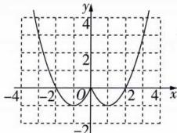

line

| x | y |
|---|---|
| -4 | 4 |
| -2 | 2 |
| 0 | 0 |
| 2 | 2 |
| 4 | 4 |

(2) 关于 x 的方程 $f(x)=t$ 有 4 个不相等的实数根, 等价于函数 $f(x)$ 与 y=t 的图象有 4 个交点.

结合(1)中图象可知, 当 $t \in (-1,0)$ 时, 函数 $f(x)$ 与 y = t 的图象有 4 个交点, 所以实数 t 的取值范围为 $(-1,0)$ .

4 C 函数 $y = \sqrt{x + 5}$ 的定义域为 $[-5, +\infty)$ ，不关于原点对称，所以该函数不是偶函数，A 错误；函数 $y = x + \frac{1}{x}$ 为奇函数，B 错误；函数 $y = \left| \frac{1}{x} \right|$ 的定义域为 $(-∞, 0) ∪ (0, +∞)$ ，关于原点对称，设 $f(x) = \left| \frac{1}{x} \right|$ ，则 $f(-x) = \left| \frac{1}{-x} \right| = \left| \frac{1}{x} \right|$ ，所以 $y = \left| \frac{1}{x} \right|$ 是偶函数，当 $x ∈ (1, 2)$ 时， $y = \left| \frac{1}{x} \right| = \frac{1}{x}$ 在 $(1, 2)$ 上单调递减，C 正确；函数 $y = 2x^{2}$ 是偶函数，但在区间 $(1, 2)$ 上单调递增，D 错误.

5 B 通解 因为 $f(x) = \frac{1 - x}{1 + x}$ ，所以 $f(x - 1) = \frac{1 - (x - 1)}{1 + (x - 1)} = \frac{2 - x}{x}, f(x + 1) = \frac{1 - (x + 1)}{1 + (x + 1)} = \frac{-x}{x + 2}$ . 对于 A，令 $F(x) = f(x - 1) - 1 = \frac{2 - x}{x} - 1 = \frac{2 - 2x}{x}$ ，定义域为 $(-\infty, 0) \cup (0, +\infty)$ ，关于原点对称，但 $F(-x) = \frac{2 - 2(-x)}{-x} = \frac{2 + 2x}{-x}$ ，不满足 $F(x) = -F(-x)$ ，故 $F(x)$ 不是奇函数；对于 B，令 $G(x) = f(x - 1) + 1 = \frac{2 - x}{x} + 1 = \frac{2}{x}$ ，定义域为 $(-\infty, 0) \cup (0, +\infty)$ ，关于原点对称，且 $G(-x) = -\frac{2}{x}$ ，满足 $G(x) = -G(-x)$ ，故 $G(x)$ 为奇函数；对于 C， $f(x + 1) - 1 = \frac{-x}{x + 2} - 1 = -\frac{2x + 2}{x + 2}$ ，定义域为 $(-\infty, -2) \cup (-2, +\infty)$ ，不关于原点对称，不是奇函数；对于 D， $f(x + 1) + 1 = \frac{-x}{x + 2} + 1 = \frac{2}{x + 2}$ ，定义域为 $(-\infty, -2) \cup (-2, +\infty)$ ，不关于原点对称，不是奇函数。故选 B.

秒解 因为 $f(x) = \frac{1 - x}{1 + x} = -1 + \frac{2}{x + 1}$ ，其图象关于点 $(-1, -1)$ 中心对称，将其图象向右平移1个单位长度，再向上平移1个单位长度后关于原点 $(0,0)$ 中心对称，所以 $f(x - 1) + 1$ 为奇函数. 故选B.

6 AC 因为函数 $f(x)$ 是定义在 R 上的奇函数，所以 $f(-x) = -f(x)$ . 对于 A, $f(-x) + (-x)^3 = -f(x) - x^3 = -[f(x) + x^3]$ ，所以 $f(x) + x^3$ 是奇函数，A 正确；对于 B, $f(-x) - |-x| = -f(x) - |x| \neq f(x) - |x|$ ，所以函数 $f(x) - |x|$ 不是偶函数，B 错误；对于 C, $(-x)^2 f(-x) = -x^2 f(x) = -[x^2 f(x)]$ ，所以函数 $x^2 f(x)$ 是奇函数，C 正确；对于 D, $|-x|f(-x) = -|x|f(x) \neq |x|f(x)$ ，所以函数 $|x|f(x)$ 不是偶函数，D 错误.

快招解题 本题可以直接利用函数奇偶性的定义判断,也可以利用奇、偶函数的运算性质判断.奇、偶函数的运算性质一般有:

<table><tr><td>f(x)</td><td>g(x)</td><td>f(x)±g(x)</td><td>f(x)g(x)</td></tr><tr><td>偶</td><td>偶</td><td>偶</td><td>偶</td></tr><tr><td>偶</td><td>奇</td><td rowspan="2">不能确定</td><td>奇</td></tr><tr><td>奇</td><td>偶</td><td>奇</td></tr><tr><td>奇</td><td>奇</td><td>奇</td><td>偶</td></tr></table>

7 解析 (1) 因为 $f(x)$ 的定义域为 $[-1, 1)$ , 不关于原点提示先判断定义域是否关于原点对称. 对称, 所以 $f(x)$ 既不是奇函数也不是偶函数.

(2) 因为 $f(x)$ 的定义域为 $\left\{-\sqrt{3}, \sqrt{3}\right\}$ ,
所以 $f(x)=0$ ，则 $f(x)$ 既是奇函数又是偶函数.

(3)由 $\left\{\begin{aligned}1-x^{2}&\geqslant0,\\ |x+2|-2\neq0,\end{aligned}\right.$ 得 $\left\{\begin{aligned}-1&\leqslant x\leqslant1,\\ x&\neq0,x\neq-4,\end{aligned}\right.$ 故 $f(x)$ 的定义域为 $[-1,0)\cup(0,1]$ ，关于原点对称，且有 $x+2>0$ ，所以 $f(x)=\frac{\sqrt{1-x^{2}}}{x+2-2}=\frac{\sqrt{1-x^{2}}}{x}$ ，此时 $f(-x)=\frac{\sqrt{1-(-x)^{2}}}{-x}=-\frac{\sqrt{1-x^{2}}}{x}=-f(x)$ ，故 $f(x)$ 为奇函数.

(4) 函数 $f(x)$ 的定义域为 $(-∞,0)∪(0,+∞)$ ，关于原点对称。
当 x > 0 时， $f(x) = x^{2} + x, -x < 0$ ，故 $f(-x) = x^{2} + x = f(x)$ ;
当 x < 0 时， $f(x) = x^{2} - x, -x > 0$ ，故 $f(-x) = x^{2} - x = f(x)$ .
故函数 $f(x)$ 是偶函数.

8 B 由偶函数的定义,知 $[a-1,2a]$ 关于原点对称,所以 $a-1+2a=0$ ,解得 $a=\frac{1}{3}$ .又 $f(x)$ 为偶函数,所以 $f(-x)=ax^{2}-bx+2a-b=f(x)=ax^{2}+bx+2a-b$ ,故b=0,所以 $a+b=\frac{1}{3}$ .

9 2 解析 因为 $f(x)$ 为奇函数,且定义域为 R,所以 $f(0)=(a-2)(a-1)=0$ ,解得 a=2 或 a=1. 当 a=2 求参之后注意检验

时, $f(x)=x(x^{2}+1)$ ，则 $f(-x)=-x(x^{2}+1)=-f(x)$ ，满足题意；当a=1时， $f(x)=x^{2}(x-1)$ ， $f(-x)=x^{2}(-x-1)\neq-f(x)$ ，不满足题意。综上，a=2。

10 C 由题意得 $f(2) = -f(-2) = -\left[(-2)^{3} + (-2)^{2}\right] = 4.$

11 A 当 $x < 0$ 时， $-x > 0$ ，则 $f(-x) = (-x)^2 - (-x) - 1 = x^2 + x - 1$ ，因为函数 $f(x)$ 是定义域为 $\mathbf{R}$ 的偶函数，所以 $f(-x) = f(x)$ ，所以 $f(x) = x^2 + x - 1, x < 0$ . 故选A.

12 $3x^{2}+5\quad\frac{22}{3}$ 解析 因为 $f(x)+g(x)=3x^{2}-\frac{4x}{x^{2}+9}+$

5 ①, 所以 $f(-x) + g(-x) = 3x^{2} + \frac{4x}{x^{2} + 9} + 5$ . 因为 $f(x)$ 为偶函数, $g(x)$ 为奇函数, 所以 $f(x) - g(x) = 3x^{2} + \frac{4x}{x^{2} + 9} +$

5 ②, 由①②解得 $f(x) = 3x^{2} + 5$ , $g(x) = -\frac{4x}{x^{2} + 9}$ , 所以 $f(-1) + g(3) = 3 \times (-1)^{2} + 5 - \frac{4 \times 3}{3^{2} + 9} = \frac{22}{3}$ .

13 B 因为 $f(x)$ 为偶函数, 所以 $f(-2)=f(2)$ , $f(-3)=f(3)$ . 又当 $x\in[0,+\infty)$ 时, $f(x)$ 单调递增, 且 $\pi>3>2$ , 所以 $f(\pi)>f(3)>f(2)$ , 即 $f(\pi)>f(-3)>f(-2)$ . 故选 B.

14 A 因为 $f(x)$ 在区间 [3,7] 上单调递增，且最小值为 5，所以 $f(3)=5$ 。由奇函数在对称区间上单调性相同，可知 $f(x)$ 在区间 $[-7,-3]$ 上单调递增，且最大值为 $f(-3)=-f(3)=-5$ 。

# 归纳总结

奇函数的图象关于原点对称，在对称区间上函数的单调性相同,若函数有最值,则在对称区间上的最大值与最小值互为相反数.

15 $(- \infty, 0) \cup (\frac{2}{5}, +\infty)$ 解析 由 $f(3t - 1) - f(2t - 1) < 0$ ，得 $f(3t - 1) < f(2t - 1)$ . 因为 $f(x)$ 是定义在 $\mathbf{R}$ 上的偶函数，所以 $f(|3t - 1|) < f(|2t - 1|)$ . 又 $f(x)$ 在 $[0, +\infty)$ 上单调递减，所以 $|3t - 1| > |2t - 1|$ ，即 $(3t - 1)^2 > (2t - 1)^2$ ，整理得 $5t^2 - 2t > 0$ ，解得 $t < 0$ 或 $t > \frac{2}{5}$ ，所以原不等式的解集为 $(- \infty, 0) \cup (\frac{2}{5}, +\infty)$ .

16 解析 (1) 由题意得 $f(0) = b = 0$ . 又 $f(\frac{1}{2}) = \frac{2}{5}$ , 所以 $\frac{\frac{1}{2}a}{\frac{1}{4} + 1} = \frac{2}{5}$ , 解得 $a = 1$ , 所以 $f(x) = \frac{x}{x^2 + 1}$ .

$f(-x) = \frac{-x}{x^2 + 1} = -f(x)$ , 满足题意,

故 $f(x)=\frac{x}{x^{2}+1},x\in(-1,1)$ .

(2) 函数 $f(x)$ 在 $(-1,1)$ 上单调递增. 证明如下:

任取 $x_{1}, x_{2} \in (-1, 1)$ ，且 $x_{1} < x_{2}$ ，则 $f(x_{2}) - f(x_{1}) = \frac{x_{2}}{x_{2}^{2} + 1} - \frac{x_{1}}{x_{1}^{2} + 1} = \frac{x_{2}(x_{1}^{2} + 1) - x_{1}(x_{2}^{2} + 1)}{(x_{1}^{2} + 1)(x_{2}^{2} + 1)} = \frac{(x_{2} - x_{1})(1 - x_{2}x_{1})}{(x_{1}^{2} + 1)(x_{2}^{2} + 1)}.$

因为 $x_{1}, x_{2} \in (-1, 1)$ , 且 $x_{1} < x_{2}$ ,

所以 $x_{2}-x_{1}>0,1-x_{1}x_{2}>0,$

所以 $f(x_{2})-f(x_{1})>0$ ，即 $f(x_{2})>f(x_{1})$ ，

所以函数 $f(x)$ 在 $(-1,1)$ 上单调递增.

(3) 因为 $f(x)$ 是定义在 $(-1,1)$ 上的奇函数, 所以 $f(t+\frac{1}{2})+f(t-\frac{1}{2})\leqslant0$ 可转化为 $f(t+\frac{1}{2})\leqslant-f(t-\frac{1}{2})=f(-t+\frac{1}{2})$ .

# 破题点

因为函数 $f(x)$ 在 $(-1,1)$ 上单调递增，

所以 $\left\{\begin{aligned}-1<t+\frac{1}{2}<1,\\ -1<-t+\frac{1}{2}<1,\end{aligned}\right.$ 解得 $-\frac{1}{2}<t\leqslant0,$ $\text{避坑不要忽略函数 } f(x) \text{ 的定义域.}$ $t + \frac{1}{2} \leqslant -t + \frac{1}{2},$

所以不等式的解集为 $\left(-\frac{1}{2},0\right]$ .

17 AD 

<table><tr><td>A</td><td>√</td><td>因为 $f(x+1)=f(1-x)$ ,所以函数 $f(x)$ 的图象关于直线 $x=1$ 对称.</td></tr><tr><td>B</td><td>×</td><td>由偶函数在对称区间上的单调性相反,得 $f(x)$ 在[0,1]上单调递减.</td></tr><tr><td>C</td><td>×</td><td>因为函数 $f(x)$ 的图象关于直线 $x=1$ 对称,且 $f(x)$ 在[0,1]上单调递减,所以 $f(x)$ 在[1,2]上单调递增.</td></tr><tr><td>D</td><td>√</td><td>由 $f(x+1)=f(1-x)$ ,得 $f(x+2)=f(-x)=f(x)$ ,所以 $f(1)=f(3)$ , $f(3)=f(5)$ ,所以 $f(1)=f(5)$ .</td></tr></table>

186 解析 因为函数 $f(x)$ 的定义域为 R，且 $f(1 + x) + f(1 - x) = 2$ ，所以函数 $f(x)$ 的图象关于点 (1,1) 对称，且 $f(1) = 1$ . 由 $f(x)$ 在 [0,1] 上单调递减，

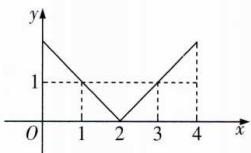

line

| x | y |
|---|---|
| 0 | 1 |
| 1 | 1 |
| 2 | 0 |
| 3 | 1 |
| 4 | 1 |

且 $f(x)$ 的图象关于点(1,1)和直线x=2对称，可画出 $f(x)$ 在[0,4]上的大致图象，如图所示，可得 $f(x)$ 在[0,2]上单调递减，在[2,4]上单调递增.由对称性可得 $f(1)=f(3)=1$ ，所以 $f(x)\leqslant1$ 在[0,4]上的所有整数解为1,2,3，其和为 $1+2+3=6$ .

# 归纳总结

1. 轴对称: 若函数 $f(x)$ 满足 $f(a + x) =$

$f(b-x)$ ，则 $f(x)$ 的图象关于直线 $x=\frac{a+b}{2}$ 对称，如图1所示.

2. 中心对称: 若函数 $f(x)$ 满足 $f(a+x)+f(b-x)=2c$ ,
则 $f(x)$ 的图象关于点 $\left(\frac{a+b}{2},c\right)$ 对称,如图2所示.

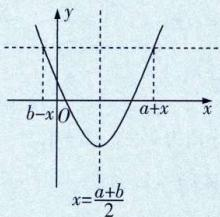

text_image

y
b-x O a+x x
x=(a+b)/2

图1

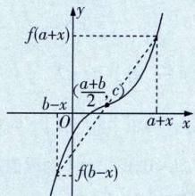

text_image

f(a+x)
b-x
O
a+x
x
y
\frac{a+b}{2},c)
f(b-x)

图 2

# 过能力 学科关键能力构建

1 C 通解 由题图乙知, 图象关于 y 轴对称, 对应的函数是偶函数. 对于 A, 当 x > 0 时, $y = f(|x|) = f(x)$ , 题图甲在 y 轴右侧的图象与题图乙的不相同, 不符合, A 错误; 对于 B, $y = |f(x)|$ 时, $y \geqslant 0$ , 题图乙在 x 轴下方有图象, B 错误; 对于 C, 当 x > 0 时, $y = f(-x)$ , 当 x < 0 时, $y = f(x)$ , 符合, C 正确; 对于 D, 当 x < 0 时, $y = -f(x)$ , 其图象在 y 轴左侧的部分与题图乙的不相同, 不符合, D 错误.

秒解 由题图乙可知,题图甲删去 y 轴右侧的图象,并将 y 轴左侧的图象翻折到右侧,且 y 轴左侧原来的图象保留,即可得到题图乙,故题图乙对应的函数为 $y = \left\{\begin{aligned} f(x), & x \leqslant 0, \\ f(-x), & x > 0, \end{aligned}\right.$ 即 $y = f(-|x|)$ .

2 D 设 $g(x)=f(x)-5=ax^{3}+bx+\frac{c}{x}(x\neq0)$ . 因为 $g(-x)=-ax^{3}-bx-\frac{c}{x}=-g(x)$ ，所以 $g(x)$ 是奇函数，所以 $g(x)$ 在 $[-3,-1]\cup[1,3]$ 上的最大值与最小值的和为 0. 又 $f(x)=g(x)+5$ ，则 $f(x)$ 在 $[-3,-1]\cup[1,3]$ 上的最大值与最小值的和为 10.

3 A 由条件①, 得函数 $y = f(x - 2)$ 的图象关于 $y$ 轴对称, 而函数 $y = f(x)$ 的图象可由函数 $y = f(x - 2)$ 的图象向左平移 2 个单位长度得到, 因此函数 $y = f(x)$ 的图象关于直线 $x = -2$ 对称, 则 $f(-\frac{7}{2}) = f(-\frac{1}{2})$ . 由条件②, 得函数 $y = f(x)$ 在 $[-2, +\infty)$ 上单调递减, 又 $-2 < -1 < -\frac{1}{2} < 0$ , 所以 $f(-1) > f(-\frac{1}{2}) > f(0)$ , 所以 $f(-1) >$

$f(-\frac{7}{2}) > f(0)$ .

4 BD 因为 $g(x)$ 与 $t(x)$ 的图象关于 y 轴对称，且 $t(x) = -x^{3} + 12x$ ，所以 $g(x) = t(-x) = -(-x)^{3} + 12(-x) = x^{3} - 12x$ ，A 错误。 $g(x) = x^{3} - 12x$ ，定义域为 R， $g(-x) = (-x)^{3} - 12(-x) = -x^{3} + 12x = -g(x)$ ，所以 $g(x)$ 是奇函数，（另解）函数 $y = x^{3}$ 与函数 y = -12x 均为定义在 R 上的奇函数，所以 $g(x) = x^{3} - 12x$ 为定义在 R 上的奇函数）B 正确。因为 $g(x) = f(x + 2) + 16$ ，即 $f(x + 2) = g(x) - 16 = x^{3} - 12x - 16$ ，令 m = x + 2，则 x = m - 2，所以 $f(m) = (m - 2)^{3} - 12(m - 2) - 16 = m^{3} - 6m^{2} + 12m - 8 - 12m + 24 - 16 = m^{3} - 6m^{2}$ ， $f(-m) = (-m)^{3} - 6(-m)^{2} = -m^{3} - 6m^{2}$ ， $f(-m) \neq f(m)$ ，所以 $f(x)$ 不是偶函数，C 错误。因为 $g(x) = f(x + 2) + 16$ ，所以 $g(x)$ 的图象可以看作 $f(x)$ 的图象向左平移 2 个单位长度，再向上平移 16 个单位长度得到，逆向推得， $g(x)$ 的图象向右平移 2 个单位长度，再向下平移 16 个单位长度得到 $f(x)$ 的图象，又 $g(x)$ 是奇函数，图象关于原点对称，所以 $f(x)$ 的图象关于点 $(2, -16)$ 对称，（另解）因为 $g(x) = f(x + 2) + 16$ ，且函数 $g(x)$ 是奇函数，所以函数 $y = f(x + 2) + 16$ 是奇函数，所以函数 $y = f(x)$ 的图象关于点 $(2, -16)$ 对称）D 正确。

50 解析 因为 $f(1+x)+f(1-x)=0$ ，所以 $f(1+x)=-f(1-x)$ ，又函数 $f(x)$ 是偶函数，故 $f(1-x)=f(x-1)$ ，则 $f(x+1)=-f(x-1)$ ，则 $f(x)=-f(x-2)$ ，所以 $f(5)=-f(3)$ ， $f(3)=-f(1)$ ，则 $f(5)=f(1)=1-1=0$ 。

6 $f(x)=\frac{2x-3}{x-2}$ (答案不唯一) 解析 由题知“准奇函数” $f(x)$ 的图象关于点 $(a,b)$ 对称. 若 a=2, b=2，则 $f(x)$ 的图象关于点 $(2,2)$ 对称. 由于奇函数的图象关于原点对称，所以可先找一个奇函数，如 $y=\frac{1}{x}$ ，将其图象先向右平移 2 个单位长度，再向上平移 2 个单位长度，得到 $f(x)=2+\frac{1}{x-2}=\frac{2x-3}{x-2}$ 的图象，此时 $f(x)$ 的图象就关于点 $(2,2)$ 对称. （注：按照上述方法找到的其他满足 a=2, b=2 的“准奇函数”均可）

7 (1) $(-∞,-2)∪(2,+∞)$ ;(2) $(-4,1)∪(1,6)$

解析 (1) 不妨设 $x_{2} > x_{1} > 0$ . 由 $\frac{x_{2}f(x_{2}) - x_{1}f(x_{1})}{x_{2} - x_{1}} > 0$ ，得 $x_{2}f(x_{2}) - x_{1}f(x_{1}) > 0$ ，则 $x_{2}f(x_{2}) > x_{1}f(x_{1})$ ，故 $F(x) = xf(x)$ 在 $(0, +\infty)$ 上单调递增. 因为 $f(x)$ 为定义在 $\mathbf{R}$ 上的奇函数，所以 $f(-x) = -f(x)$ ，故 $F(x)$ 的定义域为 $\mathbf{R}$ ，且 $F(-x) = -xf(-x) = xf(x) = F(x)$ ，故 $F(x)$ 为偶函数. 因为 $f(2) = 0$ ，所以 $F(2) = 0$ ，则 $\frac{f(x)}{x} > 0 \Leftrightarrow xf(x) > 0 \Leftrightarrow F(x) > 0 \Leftrightarrow F(|x|) > 0 = F(2)$ ，所以 $|x| > 2$ ，解得 $x > 2$ 或 $x < -2$ ，故所求不等式的解集为 $(- \infty, -2) \cup (2, +\infty)$ . (2) 依题意，不妨令 $0 < x_{1} < x_{2}$ ，则 $x_{1} - x_{2} < 0$ ，因为 $[f(x_{1}) - f(x_{2})](x_{1} - x_{2}) > 0$ ，所以 $f(x_{1}) - f(x_{2}) < 0$ ，即 $f(x_{1}) < f(x_{2})$ ，所以 $f(x)$ 在 $(0, +\infty)$ 上单调递增. 又 $f(x)$ 为定义在 $\mathbf{R}$ 上的奇函数，所以 $f(x)$ 在 $(- \infty, 0)$ 上单调递增. 因为 $f(5) = 0$ ，所以 $f(-5) = -f(5) = 0$ . 因为 $f(x)$ 为奇函数，所以 $f(1 - x) = -f(x - 1)$ ，所以不等式$\frac{f(1-x)-f(x-1)}{x-1}>0$ 可化为 $\frac{-2f(x-1)}{x-1}>0$ , 即 $\frac{f(x-1)}{x-1}<0$ ,

当 $x - 1 > 0$ ，即 $x > 1$ 时， $f(x - 1) < 0 = f(5)$ ，则 $x - 1 < 5$ 解得 $x < 6$ ，故 $1 < x < 6$ ；当 $x - 1 < 0$ ，即 $x < 1$ 时， $f(x - 1) > 0 = f(-5)$ ，则 $x - 1 > -5$ ，解得 $x > -4$ ，故 $-4 < x < 1$ . 综上，所求不等式的解集为 $(-4, 1) \cup (1, 6)$ .

8 解析 (1) 取 $x = 0$ , 得 $f(0 + y) = f(0) + f(y)$ , 即 $f(y) = f(0) + f(y)$ , 所以 $f(0) = 0$ .

因为 $f(3)=f(1+2)=f(1)+f(2)=f(1)+f(1)+f(1)=3f(1)=6$ ，所以 $f(1)=2$ .

(2) 因为函数 $f(x)$ 是定义在 R 上的函数, 所以定义域关于原点对称.

取 y = -x，得 $f(0) = f(x + (-x)) = f(x) + f(-x) = 0$ ，即 $f(-x) = -f(x)$ ，

所以函数 $f(x)$ 是奇函数.

(3)方案一 选条件①.

因为 $f(x)$ 是奇函数，且 $f(kx^{2})+f(2x-1)<0$ 在 $x\in\left[\frac{1}{2},3\right]$ 上恒成立，

所以 $f(kx^{2})<-f(2x-1)=f(1-2x)$ 在 $x\in[\frac{1}{2},3]$ 上恒成立.
因为函数 $f(x)$ 是定义在 R 上的单调函数，且 $f(0)=0<f(1)=2$ ，

所以 $f(x)$ 是R上的增函数，

所以 $kx^{2}<1-2x$ 在 $x\in\left[\frac{1}{2},3\right]$ 上恒成立，

所以 $k < \frac{1}{x^{2}} - \frac{2}{x}$ 在 $x \in [\frac{1}{2}, 3]$ 上恒成立.

令 $t = \frac{1}{x}$ 则 $\frac{1}{3} \leqslant t \leqslant 2, \frac{1}{x^2} - \frac{2}{x} = t^2 - 2t.$

又 $y=t^{2}-2t$ 在 $\left[\frac{1}{3},2\right]$ 上的最小值为 $1^{2}-2\times1=-1$ ,

所以 k < -1，即实数 k 的取值范围为 $(-∞, -1)$ .

方案二 选条件②.

因为 $f(x)$ 是奇函数，且 $f(kx^{2})+f(2x-1)<0$ 在 $x\in\left[\frac{1}{2},3\right]$ 上有解，

所以 $f(kx^{2})<-f(2x-1)=f(1-2x)$ 在 $x\in[\frac{1}{2},3]$ 上有解.
因为函数 $f(x)$ 是定义在R上的单调函数,且 $f(0)=0<f(1)=2$ ,

所以 $f(x)$ 是R上的增函数，

所以 $kx^{2} < 1 - 2x$ 在 $x \in [\frac{1}{2}, 3]$ 上有解，

所以 $k < \frac{1}{x^{2}} - \frac{2}{x}$ 在 $x \in [\frac{1}{2}, 3]$ 上有解，

令 $t = \frac{1}{x}$ ，则 $\frac{1}{3} \leqslant t \leqslant 2, \frac{1}{x^2} - \frac{2}{x} = t^2 - 2t.$

又 $y=t^{2}-2t$ 在 $\left[\frac{1}{3},2\right]$ 上的最大值为 $2^{2}-2\times2=0$ ,

所以 k<0，即实数 k 的取值范围为 $(-∞,0)$ .

# 易错疑难集训（二）

# 过易错 教材易混易错集训

1 C 因为函数 $f(x)=\sqrt{x^{2}-ax+10}$ 在区间 [1,3] 上单调递减，函数 $y=\sqrt{t}$ 在定义域内单调递增，所以函数 $t=x^{2}-ax+10$ 在 [1,3] 上单调递减，且 $t=x^{2}-ax+10\geqslant0$ 在

避坑容易忽略.

区间 $[1,3]$ 上恒成立，则有 $\left\{ \begin{array}{l} \frac{a}{2} \geqslant 3, \\ 3^2 - 3a + 10 \geqslant 0, \end{array} \right.$ 解得 $6 \leqslant a \leqslant \frac{19}{3}$ ，所以实数 $a$ 的取值范围是 $[6, \frac{19}{3}]$ .

2 $[- \frac{1}{2}, 1)$ 解析 由题意得 $\left\{ \begin{array}{l} a + 1 > 2a, \\ -1 \leqslant a + 1 \leqslant 3, \\ -1 \leqslant 2a \leqslant 3, \end{array} \right.$

$$
- \frac {1}{2} \leqslant a <   1.
$$

避坑指南 本题的限制条件为两类,一是由函数的单调性得出的自变量 $a + 1,2a$ 的大小关系,二是要保证 $a + 1,2a$ 位于定义域之内.

3 $\left\{\begin{aligned}x+1,x&>0,\\ 0,x&=0,\\ x-1,x&<0\end{aligned}\right.$ 解析 因为 $f(x)$ 是定义在 R 上的奇函

数,所以 $f(0)=0$ .当 $x\in(0,+\infty)$ 时, $f(x)=x+1$ ,设 $x\in(-\infty,0)$ ,则 $-x\in(0,+\infty)$ ,所以 $f(-x)=-x+1$ ,又 $f(x)$ 是定义在R上的奇函数,所以 $f(-x)=-f(x)$ ,所以

$f(x)=x-1$ , 即当 $x\in(-\infty,0)$ 时, $f(x)=x-1$ . 故 $f(x)=$ $\left\{\begin{aligned}x+1,x&>0,\\ 0,x&=0,\\ x-1,x&<0.\end{aligned}\right.$

# 避坑指南

本题容易写成 $f(x)=\left\{\begin{aligned}x+1,x>0,\\ x-1,x<0,\end{aligned}\right.$ 漏掉

x=0 的情况造成错误.

4 解析 当 $x-1 \geqslant 0$ 且 $x-1 \neq 1$ ，即 $x \geqslant 1$ 且 $x \neq 2$ 时， $f(x) = -x$ ;

当 $x - 1 < 0$ 且 $x - 1 \neq -1$ , 即 $x < 1$ 且 $x \neq 0$ 时, $f(x) = x - 2$ .

所以函数 $f(x)=\left\{\begin{aligned}-x,x&\geqslant1 且 x\neq2,\\x-2,x&<1 且 x\neq0.\end{aligned}\right.$

作出函数 $f(x)$ 的图象,如图所示,

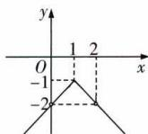

text_image

y
1 2
O
-1
-2 x

所以 $f(x)$ 的单调递增区间为 $(-∞,0),(0,1)$ ;单调递减区间为 $[1,2),(2,+∞)$ .

# 避坑指南

确定定义域之前不要化简函数的解析

式,否则可能导致定义域发生变化.函数的单调区间是函数定义域的子集,所以求解函数的单调区间时,必须先求出函数的定义域.

5 - 3 解析 $f(x) = (x + a) | x - 1| = \begin{cases} (x + a)(x - 1), & x \geqslant 1, \\ -(x + a)(x - 1), & x < 1. \end{cases}$ 当 $a < -1$ 时， $f(x)$ 在区间 $(-\infty, 1)$ 和 $\left(\frac{1 - a}{2}, +\infty\right)$ 上单调递增，在区间 $\left(1, \frac{1 - a}{2}\right)$ 上单调递减。由于 $f(x)$ 的单调递减区间为 $(1, 2)$ ，则 $\frac{1 - a}{2} = 2$ ，得 $a = -3$ ；当 $a > -1$ 时， $f(x)$ 在区间 $(-\infty, \frac{1 - a}{2})$ 和 $(1, +\infty)$ 上单调递增，在区间 $\left(\frac{1 - a}{2}, 1\right)$ 上单调递减，这与 $f(x)$ 的单调递减区间为 $(1, 2)$ 矛盾，故不符合题意；当 $a = -1$ 时， $f(x)$ 在 $\mathbf{R}$ 上单调递增，故不符合题意。综上， $a = -3$ .

6 解析 (1) 因为 $f(x)$ 在 $(-∞,1)$ 上单调递减, $f(x)$ 的图象的对称轴为直线 $x=\frac{a}{2}$ , 所以 $\frac{a}{2} \geqslant 1$ , 即 $a \geqslant 2$ ,

即实数 a 的取值范围为 $[2, +\infty)$ .

(2) 因为 $f(x)$ 的单调递减区间为 $(-∞,1)$ , $f(x)$ 的图象的对称轴为直线 $x=\frac{a}{2}$ ，所以 $\frac{a}{2}=1$ ，即 a=2.

(3) 若 $f(x)$ 在 $(-∞,1)$ 上不单调，则 $f(x)$ 的图象的对称轴在直线 x=1 左侧，即 $x=\frac{a}{2}<1$ ，所以 a<2，

即实数 a 的取值范围为 $(-∞,2)$ .

避坑指南 此类题容易混淆“单调区间”和“在区间上单调”，单调区间是一个整体概念，比如说函数的单调递减区间是 I，指的是函数递减的最大范围为区间 I。而函数在某一区间上单调，则指此区间是相应单调区间的子区间。

# 过疑难 常考疑难问题突破

1 D 因为 $f(2-x)+f(x)=0$ ，所以 $f(x)$ 的图象关于点(1,0)对称。令x=1，得 $f(1)+f(1)=0$ ，得 $f(1)=0$ ，又 $f(x)$ 在 $[1,+\infty)$ 上单调递减，所以 $f(x)$ 在R上单调递减。又 $f(x)=-f(2-x)$ ，所以 $f(2x)=-f(2-2x)$ ，所以由 $f(x^{2}-x)+f(2x)<0$ ，可得 $f(x^{2}-x)-f(2-2x)<0$ ，即 $f(x^{2}-x)<f(2-2x)$ ，所以 $x^{2}-x>2-2x$ ，即 $x^{2}+x-2>0$ ，解得x<-2或x>1。

# 专项拓展训练3

# 过专项 阶段强化专项训练

1 C 因为函数 $f(x)$ 是定义在区间 $[a^2 - 6, a]$ 上的奇函数，所以 $\left\{ \begin{array}{l} a^2 - 6 + a = 0, \\ a^2 - 6 < a, \end{array} \right.$ 解得 $a = 2$ ，所以函数 $f(x)$ 是定义在区间 $[-2, 2]$ 上的奇函数，由题图可知，函数在 $[1, 2]$ 上单调递增，由奇函数的性质可知函数在 $[-2, -1]$ 上单调递增，因此 $f(x)$ 的单调递增区间为 $[-2, -1]$ 和 $[1, 2]$ .

2 B 因为 $f(x)$ 是定义在 R 上的偶函数，且在 $(-∞,0]$ 上单调递减，所以 $f(x)$ 在 $[0,+∞)$ 上单调递增。因为不等式 $f(x^{2}-m)\leqslant f(2x)$ 对于任意 $x\in[2,3]$ 恒成立，所以 $|x^{2}-m|\leqslant|2x|$ 对于任意 $x\in[2,3]$ 恒成立，所以 $-2x\leqslant x^{2}-m\leqslant2x$ 对于任意 $x\in[2,3]$ 恒成立，即 $x^{2}-2x\leqslant m\leqslant x^{2}+2x$ 对于任意 $x\in[2,3]$ 恒成立。设 $g(x)=x^{2}-2x,x\in[2,3]$ ， $h(x)=x^{2}+2x,x\in[2,3]$ ，则 $g(x)_{\max}\leqslant m\leqslant h(x)_{\min}$ 。因为 $g(x)=x^{2}-2x$ 在 $[2,3]$ 上单调递增，所以 $g(x)_{\max}=g(3)=3^{2}-2\times3=3$ ，因为 $h(x)=x^{2}+2x$ 在 $[2,3]$ 上单调递增，所以 $h(x)_{\min}=h(2)=2^{2}+2\times2=8$ ，所以 $3\leqslant m\leqslant8$ 。

2 A 因为 $y=f(x+4)$ 是定义域为 R 的奇函数, 所以 $y=f(x)$ 的图象关于点 $(4,0)$ 对称, 因为 $y=g(x-2)$ 是定义域为 R 的偶函数, 所以 $y=g(x)$ 的图象关于直线 x=-2 对称. 因为 $y=f(x)$ 与 $y=g(x)$ 的图象关于 y 轴对称, 所以 $y=f(x)$ 的图象关于直线 x=2 对称, 又 $y=f(x)$ 的图象关于点 $(4,0)$ 对称, 所以 $y=f(x)$ 的图象关于点 $(0,0)$ 对称, 故 $y=f(x)$ 为奇函数, A 正确; 因为 $y=f(x)$ 为奇函数, 所以 $f(-x)=-f(x)$ , 由 $y=f(x)$ 与 $y=g(x)$ 的图象关于 y 轴对称, 可得 $f(x)=g(-x), g(x)=f(-x)$ , 故 $g(-x)=f(x)=-f(-x)=-g(x)$ , 故 $y=g(x)$ 为奇函数, B 错误; 由 A 的分析可知 $y=f(x)$ 的图象关于直线 x=2 对称, C 错误; 由 A 的分析可知 $y=f(x)$ 的图象关于点 $(4,0)$ 对称, $y=f(x)$ 为奇函数, 则 $y=f(x)$ 的图象也关于点 $(-4,0)$ 对称, 而 $y=f(x)$ 与 $y=g(x)$ 的图象关于 y 轴对称, 所以 $y=g(x)$ 的图象关于点 $(4,0)$ 对称, D 错误.

3 BD 由 $y = xf(x + 1)$ 为奇函数, 得 $xf(x + 1) = -(-x)f(1 - x) = xf(1 - x)$ , 可得 $f(x + 1) = f(1 - x)$ , 即函数 $f(x)$ 的图象关于直线 $x = 1$ 对称, $f(x) = f(2 - x)$ . 由 $y = (x + 1)f(x)$ 的图象关于直线 $x = -1$ 对称, 得 $(x + 1)f(x) = (-x - 1)f(-2 - x)$ , 即 $f(x) = -f(-x - 2)$ , 即 $f(-1 + x) + f(-1 - x) = 0$ , 所以 $f(x)$ 的图象关于点 $(-1,0)$ 对称. 结合条件 $f(x)$ 的图象关于直线 $x = 1$ 对称, 得 $f(-x - 2) = f(x + 4)$ , 则 $f(x) = -f(x + 4)$ , 所以 $f(x + 8) = f(x + 4 + 4) = -f(x + 4) = f(x)$ . 对于 A, 已知条件不足以确定 $f(x)$ 的奇偶性, A 错误; 对于 B, $f(x - 1)$ 的图象可以由 $f(x)$ 的图象向右平移 1 个单位长度得到, 故 $f(x - 1)$ 图象的对称中心为点 $(0,0), f(x - 1)$ 是奇函数, B 正确; 对于 C, 由已知只能得到 $f(2) = f(0)$ , 不能确定 $f(2)$ 的取值, C 错误; 对于 D, $f(x + 4) = -f(x)$ , D 正确.

# 归纳总结

# 对称性的常用结论

(1) 若对于任意 $x \in R$ 都有 $f(2a - x) = f(x)$ 或 $f(-x) = f(2a + x)$ ，则 $y = f(x)$ 的图象关于直线 x = a 对称.  
(2) 若对于任意 $x \in R$ 都有 $f(a + x) + f(a - x) = 2b$ ，则函数 $y = f(x)$ 的图象关于点 $(a, b)$ 对称.  
(3) 若函数 $y = f(x + a)$ 是偶函数, 则函数 $y = f(x)$ 的图象关于直线 x = a 对称.  
(4) 若函数 $y=f(x+a)-b$ 是奇函数，则函数 $y=f(x)$ 的图象关于点 $(a,b)$ 对称.

# 函数性质的综合应用

3 BC 对于 A, 因为 $f(5)=f(1)$ , $f(1)=1^{2}-1=0$ , 所以 $f(5)=0$ , A 错误; 对于 B, 因为 $f(1+x)=f(3-x)$ , 所以 $f(x+2)=f(2-x)$ , 所以 $f(x)$ 的图象关于直线 x=2 对称, B 正确; 对于 C, 当 $0 \leqslant x \leqslant 2$ 时, $f(x)_{\max}=f(2)=2$ , 因为 $f(x)$ 的图象关于直线 x=2 对称, 所以当 $2 \leqslant x \leqslant 4$ 时, $f(x)_{\max}=f(2)=2$ , 综上, 当 $0 \leqslant x \leqslant 4$ 时, $f(x)_{\max}=f(2)=2$ , C 正确; 对于 D, 因为 $f(x+1)=f(x-3)$ , 所以 $f(x)=f(x-4)$ , 所以 $f(x)$ 在 [6,8] 上的最小值, 即为 $f(x)$ 在 [2,4] 上的最小值, 因为当 $0 \leqslant x \leqslant 2$ 时, $f(x)_{\min}=f(\frac{1}{2})=-\frac{1}{4}$ , 且 $f(x)$ 的图象关于直线 x=2 对称, 所以当 $2 \leqslant x \leqslant 4$ 时, $f(x)_{\min}=-\frac{1}{4}$ , 所以 $f(x)$ 在 [6,8] 上的最小值为 $-\frac{1}{4}$ , D 错误.

4 ABD 令 $x = \frac{1}{2}, y = 0$ ，则 $f\left(\frac{1}{2}\right) + f\left(\frac{1}{2}\right) \times f(0) =$ $f(\frac{1}{2})[1+f(0)]=0$ , 又 $f(\frac{1}{2})\neq0$ , 所以 $1+f(0)=0$ , 即 $f(0)=-1$ , 令 $x=\frac{1}{2}, y=-\frac{1}{2}$ , 则 $f(\frac{1}{2}-\frac{1}{2})+f(\frac{1}{2})\times f(-\frac{1}{2})=4\times\frac{1}{2}\times(-\frac{1}{2})$ , 即 $f(0)+f(\frac{1}{2})f(-\frac{1}{2})=-1$ , 由 $f(0)=-1$ , 可得 $f(\frac{1}{2})f(-\frac{1}{2})=0$ , 又 $f(\frac{1}{2})\neq0$ , 所以 $f(-\frac{1}{2})=0$ , A 正确；令 $y=-\frac{1}{2}$ , 则有 $f(x-\frac{1}{2})+f(x)f(-\frac{1}{2})=4x\times(-\frac{1}{2})$ , 即 $f(x-\frac{1}{2})=-2x$ , 故函数 $f(x-\frac{1}{2})$ 是奇函数，C 错误；对于 $f(x-\frac{1}{2})=-2x$ , 令 x=1，则 $f(\frac{1}{2})=-2\times1=-2$ , B 正确； $f(x+\frac{1}{2})=f(x+1-\frac{1}{2})=-2(x+1)=-2x-2$ ，所以函数 $f(x+\frac{1}{2})$ 是减函数，D 正确.

5 A 因为 $f(x-1)$ 的图象关于点(1,0)对称，所以 $f(x)$ 的图象关于点(0,0)对称，所以 $f(x)$ 为奇函数，即 $f(-x)=-f(x)$ ，因为 $g(-x)=f(-x)-(-x)=-f(x)+x=-g(x)$ ，所以 $g(x)$ 为奇函数。因为 $f(2)=3$ ，所以 $g(2)=f(2)-2=3-2=1$ ，则 $g(-2)=-g(2)=-1$ 。由 $f(x+1)<x$ ，得 $f(x+1)-(x+1)<-1$ ，即 $g(x+1)<g(-2)$ 。

破题点将所求不等式向已知单调性的函数 $g(x)$ 转化.

因为 $g(x)=f(x)-x$ 在 $[0,+\infty)$ 上单调递增，且 $g(x)$ 为奇函数，所以 $g(x)$ 在 $(-∞,0)$ 上单调递增，所以 $g(x)$ 在 R 上单调递增，所以 $g(x+1)<g(-2)\Leftrightarrow x+1<-2$ ，得 x<-3，即不等式 $f(x+1)<x$ 的解集为 $(-∞,-3)$ .

6 $(- \infty, -\frac{1}{2}]$ 解析 由 $f(-x) = f(x) + 2x^3$ ，得 $f(-x) - x^3 = f(x) + x^3$ ，设 $g(x) = f(x) + x^3$ ，则 $g(-x) =$

破题点对已知条件变形,构造新函数. $f(-x)+(-x)^{3}=f(-x)-x^{3}=g(x)$ ，即函数 $g(x)$ 为偶

函数. 又函数 $f(x)$ 在区间 $[0, +\infty)$ 上单调递增, 所以 $g(x)$ 在区间 $[0, +\infty)$ 上单调递增, 在区间 $(- \infty, 0)$ 上单调递减. 关于 $t$ 的不等式 $f(t) \geqslant f(t + 1) + 3t^2 + 3t + 1$ 可变形为 $f(t) + t^3 \geqslant f(t + 1) + (t + 1)^3$ , 即 $g(t) \geqslant g(t + 1)$ , 所以 $|t| \geqslant |t + 1|$ , 解得 $t \leqslant -\frac{1}{2}$ , 所以原不等式的解集为 $(- \infty, -\frac{1}{2}]$ .

7 解析 (1) 因为 $f(-x) + f(x) = 0, f(-x) = f(2 + x)$ ，所以 $f(\frac{5}{2}) = f(2 + \frac{1}{2}) = f(-\frac{1}{2}) = -f(\frac{1}{2}) = -[(\frac{1}{2})^2 + \frac{1}{2}] = -\frac{3}{4}$ .

(2) 当 $x \in [-1,0)$ 时， $-x \in (0,1]$ ，则 $f(-x) = x^{2} - x = -f(x)$ ，
所以 $f(x) = -x^{2} + x (x \in [-1,0))$ .

(3)由(2)可知 $f(x)=\left\{\begin{aligned}x^{2}+x,x&\in[0,1],\\ -x^{2}+x,x&\in[-1,0)\end{aligned}\right.$ 由 $f(x)$ 的图象(图略)可知 $f(x)$ 在 $[-1,1]$ 上单调递增，
所以 $f(x)_{\max}=f(1)=2,f(x)_{\min}=f(-1)=-2$ 又 $f(x)$ 是奇函数，且图象关于直线 $x=\frac{0+2}{2}=1$ 对称，

所以 $f(x)$ 在 $\mathbf{R}$ 上的值域为 $[-2, 2]$ ,  
所以 $[2a, 2b] \subseteq [-2, 2]$ , 即 $[a, b] \subseteq [-1, 1]$ ,  
且 $\begin{cases} f(a) = 2a, \\ f(b) = 2b. \end{cases}$

若 $-1 \leqslant a < b \leqslant 0$ ，则 $\left\{ \begin{array}{l} -a^2 + a = 2a, \\ -b^2 + b = 2b, \end{array} \right.$ 得 $\left\{ \begin{array}{l} a = -1, \\ b = 0, \end{array} \right.$ 此时 $a + b = -1$ ;

若 $0 \leqslant a < b \leqslant 1$ ，则 $\left\{ \begin{array}{l} a^2 + a = 2a, \\ b^2 + b = 2b, \end{array} \right.$ 得 $\left\{ \begin{array}{l} a = 0, \\ b = 1, \end{array} \right.$ 此时 $a + b = 1$ ；若 $-1 \leqslant a < 0 < b \leqslant 1$ ，则 $\left\{ \begin{array}{l} -a^2 + a = 2a, \\ b^2 + b = 2b, \end{array} \right.$ 得 $\left\{ \begin{array}{l} a = -1, \\ b = 1, \end{array} \right.$ 此时 $a + b = 0$ .

综上, $a+b$ 的值为-1或1或0.

# 专项拓展训练4 数形结合思想在函数中的应用

# 过专项 阶段强化专项训练

1 C 函数 $f(x)$ 的大致图象如图所示, 因为 $f(f(a)) \leqslant 2$ , 所以 $f(a) \geqslant -2$ , 由函数图象可知 $a \leqslant \sqrt{2}$ . 故选 C.

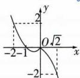

2 D 令 $f(x) = x^{2} - 2x - 3 = 5$ ，解得 $x = -2[- - x]$ -2或 $x = 4$ ，令 $f(x) = x^{2} - 2x - 3 = -4$ ，解得 $x = 1$ ，画出 $f(x) = x^{2} - 2x - 3$ 的图象如图所示，结合图可知当 $f(x) = x^{2} - 2x - 3$ 的定义域为 $[a, b]$ ，值域为 $[-4, 5]$ 时， $(a, b)$ 的可能值为 $(-2, 4), (-2, 1), (1, 4)$ ，不可能为 $(-1, 1)$ ，故选D.

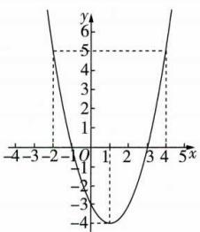

line

| x | y |
|---|---|
| -3 | 6 |
| -2 | 2 |
| -1 | 0 |
| 0 | -1 |
| 1 | -3 |
| 2 | -2 |
| 3 | -1 |
| 4 | 0 |

3 C 当 $x \leqslant 0$ 时, $f(x) = \frac{1}{3} x^2 - \frac{2}{3} x + 1 = \frac{1}{3}(x - 1)^2 + \frac{2}{3}$ , 则 $f(x)$ 在 $(- \infty, 0]$ 上单调递减, 此时 $f(x) \geqslant f(0) = 1$ ; 当 $x > 0$ 时, $f(x) = -x^2 + 2x + 1 = -(x - 1)^2 + 2$ , 则函数 $f(x)$ 在 $(0, 1]$ 上单调递增, 此时 $1 < f(x) \leqslant 2$ , 在 $[1, +\infty)$ 上单调递减, 此时 $f(x) \leqslant 2$ . 当 $x \leqslant 0$ 时, 令 $f(x) = 2$ , 即 $\frac{1}{3} x^2 - \frac{2}{3} x + 1 = 2$ , 得 $x = -1$ , 当 $x > 0$ 时, 令 $f(x) = 1$ , 即 $-x^2 + 2x + 1 = 1$ , 得 $x = 2$ . 画出函数 $f(x)$ 的图象, 如图, 若 $f(x)$ 在区间 $(a, b)$ 上既有最大值, 又有最小值, 则 $-1 \leqslant a < 0, 1 < b \leqslant 2$ , 因此 $1 < b - a \leqslant 3$ , 则 $b - a$ 的最大值为 3.

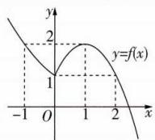

line

| x   | y=f(x) |
| --- | ------ |
| -1  | 2      |
| 0   | 1      |
| 1   | 2      |
| 2   | 1      |

4 ACD 由 $5 + 2x - x^2 = |x - 1|$ ，得 $x = -1$ 和3，所以 $f(x) = (5 + 2x - x^2) \otimes |x - 1| = \begin{cases} 5 + 2x - x^2, & -1 \leqslant x \leqslant 3, \\ |x - 1|, & x < -1 \text{或} x > 3, \end{cases}$ 作出函数 $f(x)$ 的图象如图所示，由图象可知，函数 $f(x)$ 的图象关于直线x=1对称，A正确；函数 $f(x)$ 的图象与直线y=5有四个公共点，B错误；函数$f(x)$ 的单调递减区间是 $(-∞, -1]$ 和 $[1, 3]$ ，C 正确；函数 $f(x)$ 的最小值是 2，D 正确.

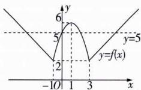

line

| x | y |
|---|---|
| -10 | 2 |
| 0 | 5 |
| 1 | 6 |
| 3 | 2 |
| 4 | 5 |

5 C 函数 $g(x)=f(x-2)$ 的图象由函数 $f(x)$ 的图象向右平移 2 个单位长度得到. 因为 $g(x)$ 为奇函数, 其图象关于原点对称, 所以函数 $f(x)$ 的图象关于点 $(-2,0)$ 对称, 所以函数 $f(x)$ 在 $(-2,+\infty)$ 上单调递减, 且 $f(0)=g(2)=0$ ,$f(-2)=g(0)=0,f(-4)=-f(0)=0.$ 作出 $f(x)$ 的大致图象,如图,则不等式 $xf(x)\leqslant0$ 的解集为 $(-∞,-4]∪[-2,+∞)$ .

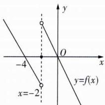

text_image

y
-4
O
x
x=-2
y=f(x)

6 AD 作出 $f(x)$ 的图象如图所示.由题意可知 $x_{3} > x_{2} > 0$ ，且 $x_{2} + x_{3} = 4$ ，则 $x_{2}x_{3}\leqslant \left(\frac{x_{2} + x_{3}}{2}\right)^{2} = 4$ ，当且仅当 $x_{2} = x_{3} = 2$ 时等号成立，因为 $x_{2}\neq x_{3}$ 所以 $x_{2}x_{3} <   4$ ，故A正确，B错误.由图可知 t 的取值范围是 $(-1,2)$ ，故 C 错误。因为 $2 > \frac{1}{x_{1}} + 2 > -1$ ，所以 $x_{1} < -\frac{1}{3}$ ，又 $x_{2} + x_{3} = 4$ ，所以 $x_{1} + x_{2} + x_{3}$ 的取值范围是 $(-∞, \frac{11}{3})$ ，故 D 正确。

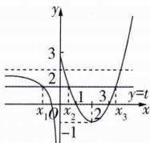

line

| Point | x | y |
|---|---|---|
| 1 | -1 | 3 |
| 2 | 0 | 2 |
| 3 | 1 | -1 |
| 4 | 2 | 0 |
| 5 | 3 | 1 |
| 6 | 4 | 2 |
| 7 | 5 | 3 |
| 8 | 6 | 4 |
| 9 | 7 | 5 |
| 10 | 8 | 6 |
| 11 | 9 | 7 |
| 12 | 10 | 8 |
| 13 | 11 | 9 |
| 14 | 12 | 10 |
| 15 | 13 | 11 |
| 16 | 14 | 12 |
| 17 | 15 | 13 |
| 18 | 16 | 14 |
| 19 | 17 | 15 |
| 20 | 18 | 16 |
| 21 | 19 | 17 |
| 22 | 20 | 18 |
| 23 | 21 | 19 |
| 24 | 22 | 20 |
| 25 | 23 | 21 |
| 26 | 24 | 22 |
| 27 | 25 | 23 |
| 28 | 26 | 24 |
| 29 | 27 | 25 |
| 30 | 28 | 26 |
| 31 | 29 | 27 |
| 32 | 30 | 28 |
| 33 | 31 | 29 |
| 34 | 32 | 30 |
| 35 | 33 | 31 |
| 36 | 34 | 32 |
| 37 | 35 | 33 |
| 38 | 36 | 34 |
| 39 | 37 | 35 |
| 40 | 38 | 36 |
| 41 | 39 | 37 |
| 42 | 40 | 38 |
| 43 | 41 | 39 |
| 44 | 42 | 40 |
| 45 | 43 | 41 |
| 46 | 44 | 42 |
| 47 | 45 | 43 |
| 48 | 46 | 44 |
| 49 | 47 | 45 |
| 50 | 48 | 46 |
| 51 | 49 | 47 |
| 52 | 50 | 48 |
| 53 | 51 | 49 |
| 54 | 52 | 50 |
| 55 | 53 | 51 |
| 56 | 54 | 52 |
| 57 | 55 | 53 |
| 58 | 56 | 54 |
| 59 | 57 | 55 |
| 60 | 58 | 56 |
| 61 | 59 | 57 |
| 62 | 60 | 58 |
| 63 | 61 | 59 |
| 64 | 62 | 60 |
| 65 | 63 | 61 |
| 66 | 64 | 62 |
| 67 | 65 | 63 |
| 68 | 66 | 64 |
| 69 | 67 | 65 |
| 70 | 68 | 66 |
| 71 | 69 | 67 |
| 72 | 70 | -1 |
| ... (repeated) for x > -1, y > -1, and y < -1 for x < -1, y = -1 for x > -1, y = -1 for x < -1, y = -1 for x > -1, y = -1 for x < -1, y = -1 for x > -1, y = -1 for x < -1, y = -1 for x > -1, y = -1 for x < -1, y = -1 for x > -1, y = -1 for x < -1, y = -1 for x > -1, y.

7 D 当 $x \in (0,2]$ 时， $x + 2 \in (2,4]$ ， $f(x) = x(x - 2) \in [-1,0]$ ，则 $f(x + 2) = \frac{1}{2} f(x) = \frac{1}{2} x(x - 2) = \frac{1}{2}(x + 2 - 2)(x + 2 - 4) \in [-\frac{1}{2},0]$ ，即当 $x \in (2,4]$ 时， $f(x) =$

$\frac{1}{2}(x-2)(x-4)\in[-\frac{1}{2},0]$ . 同理当 $x\in(4,6]$ 时， $f(x)=\frac{1}{4}(x-4)(x-6)\in[-\frac{1}{4},0]$ ; 当 $x\in(6,8]$ 时， $f(x)=\frac{1}{8}(x-6)(x-8)\in[-\frac{1}{8},0]$ ，以此类推，当 x>6 时，都有 $f(x)>-\frac{3}{16}$ . 作出函数 $y=f(x),x\in(0,8]$ 和 $y=-\frac{3}{16}$ 的图象如图所示.

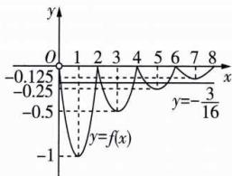

line

| x | y |
|---|---|
| 0 | 0 |
| 1 | -0.125 |
| 2 | -0.25 |
| 3 | -0.5 |
| 4 | -0.75 |
| 5 | -0.5 |
| 6 | -0.25 |
| 7 | 0 |
| 8 | 0 |
y=-3/16

令 $f(x)=\frac{1}{4}(x-4)(x-6)=-\frac{3}{16},x\in(5,6)$ ，解得 $x=\frac{11}{2}$ ，由图可知，对任意 $x\in[\frac{11}{2},+\infty)$ ，都有 $f(x)\geqslant-\frac{3}{16}$ ，即m的取值范围是 $[\frac{11}{2},+\infty)$ .

8 $(0,1)\cup(1,+\infty)$ 解析 将 $f(x)$ 和 $g(x)$ 的图象补全,如图所示.

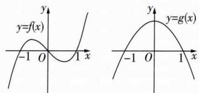

text_image

y
y=f(x)
-1 O 1 x
y
y=g(x)
-1 O 1 x

由图象可得当 $f(x) > 0$ 时， $x \in (-1,0) \cup (1, +\infty)$ ，此时需满足 $g(x) < 0$ ，则 $x \in (1, +\infty)$ ；当 $f(x) < 0$ 时， $x \in (-\infty, -1) \cup (0,1)$ ，此时需满足 $g(x) > 0$ ，则 $x \in (0,1)$ . 综上所述， $x \in (0,1) \cup (1, +\infty)$ .

# 第三节 幂函数

# 过基础 教材必备知识精练

1 B 幂函数满足 $y = x^{\alpha}$ 的形式, 故 $y = x^{3}$ , y = x 满足条件, 共 2 个. 故选 B.

2 C 因为 $f(x)=(a^{2}-a-1)x^{\frac{1}{a-2}}$ 为幂函数, 所以 $a^{2}-a-1=1$ , 即 a=2 或 -1. 又 $a-2\neq0$ , 所以 a=-1.

3 4 解析 设 $f(x)=x^{\alpha}$ ，因为 $f(9)=3f(1)$ ，所以 $9^{\alpha}=3=3^{2\alpha}$ ，所以 $\alpha=\frac{1}{2}$ ，则 $f(x)=x^{\frac{1}{2}}=\sqrt{x}$ ，从而 $f(16)=4$ .

4 C $f(x)=x^{-1}$ 的图象不过点 $(0,0)$ ，A 错误；无论 $\alpha$ 为何值，幂函数 $f(x)$ 的图象一定不过第四象限，B 错误；当 $\alpha=\frac{1}{2}$ 时， $f(x)=x^{\frac{1}{2}}$ 的定义域为 $[0,+\infty)$ ， $f(x)$ 的图象既不关于原点对称也不关于 y 轴对称，C 正确；当 $\alpha=\frac{1}{3}$ 时， $f(x)=x^{\frac{1}{3}}$ 的图象过第一、三象限，D 错误.

5 B 当 x=2 时, $y=x^{3}=8$ , $y=x^{\frac{1}{3}}=\sqrt[3]{2}>1$ , $y=x^{-\frac{1}{3}}=\frac{1}{\sqrt[3]{2}}\in(\frac{1}{2},1)$ , $y=x^{-3}=\frac{1}{8}<\frac{1}{2}$ , 所以图象自上而下所对应的函数的幂指数 n 依次减小, 故选 B.

6 BC 由题意可设函数 $f(x) = x^{\alpha}$ . 对于 A, 若 $f(3) = \frac{1}{3}$ , 则 $\alpha = -1, f(x) = x^{-1} = \frac{1}{x}$ , 此时 $f(x)$ 的图象只过点 $B(1, 1), C(-1, -1)$ , A 错误; 对于 B, 若 $f(3) = \sqrt{3}$ , 则 $\alpha = \frac{1}{2}$ , $f(x) = x^{\frac{1}{2}} = \sqrt{x}$ , 此时 $f(x)$ 的图象过点 $A(0, 0), B(1, 1), D(4, 2)$ , B 正确; 对于 C, 若 $f(3) = 3$ , 则 $\alpha = 1, f(x) = x$ , 此时 $f(x)$ 的图象过点 $A(0, 0), B(1, 1), C(-1, -1)$ , C 正确; 对于 D, 若 $f(3) = 9$ , 则 $\alpha = 2, f(x) = x^{2}$ , 此时 $f(x)$ 的图象只过点 $A(0, 0), B(1, 1)$ , D 错误.

7 $\{-1, \frac{1}{2}\}$ 或 $\{-1, 2\}$ 4 解析 函数 $y = x^{-1}$ 与 $y = x^{\frac{1}{2}}$ , $y = x^{2}$ , $y = x^{3}$ 的图象分别有 1 个, 1 个, 2 个交点; 函数 $y = x^{\frac{1}{2}}$ 与 $y = x^{2}$ , $y = x^{3}$ 的图象都有 2 个交点; 函数 $y = x^{2}$ 与 $y = x^{3}$ 的图象有 2 个交点. 若函数 $f(x) = x^{\alpha}$ 与 $g(x) = x^{\beta}$ 的图象只有 1 个交点, 则 $A = \{-1, \frac{1}{2}\}$ 或 $\{-1, 2\}$ . 若函数 $f(x) = x^{\alpha}$ 与 $g(x) = x^{\beta}$ 的图象有 2 个交点, 则 $A = \{-1, 3\}$ 或 $\{\frac{1}{2}, 2\}$ 或 $\{\frac{1}{2}, 3\}$ 或 $\{2, 3\}$ , 故满足条件的集合 $A$ 有 4 个.

8 D 函数 $y = x^{3}$ 为定义在 R 上的奇函数，在区间 $(0, +\infty)$ 上单调递增，A 错误；函数 $y = x^{2}$ 为定义在 R 上的偶函数，B 错误；函数 $y = x^{-\frac{1}{2}} = \frac{1}{\sqrt{x}}$ 的定义域为 $(0, +\infty)$ ，不关于原点对称，所以 $y = x^{-\frac{1}{2}}$ 为非奇非偶函数，C 错误；函数 $y = x^{-1} = \frac{1}{x}$ 为定义在 $(-∞, 0) ∪ (0, +∞)$ 上的奇函数，且在区间 $(0, +∞)$ 上单调递减，D 正确.

9 ABD 由题意得 $4^{\alpha} = 2$ ，则 $\alpha = \frac{1}{2}, f(x) = x^{\frac{1}{2}}$ ，则函数 $f(x)$ 的定义域、值域均为 $[0, +\infty)$ ，且 $f(x)$ 为非奇非偶函数，故 A, B 正确，C 错误。 $f(x)$ 为增函数，所以当 $x > 1$ 时， $f(x) > f(1) = 1$ ，故 D 正确。

10 $x^{-2}$ （答案不唯一）解析 当 $f(x) = x^{-2}$ 时， $f(x)$ 的定义域为 $\{x | x \neq 0\}$ ，且 $f(x)$ 是偶函数，当 $x > 1$ 时， $x^2 > 1$ ， $0 < f(x) = x^{-2} = \frac{1}{x^2} < 1$ ，故 $f(x) = x^{-2}$ 满足题意。（答案不唯一）

11 解析 （1）因为幂函数 $y = x^{-5}$ 在 $(-∞, 0)$ 上单调递减，且 -2 > -2.5，所以 $(-2)^{-5} < (-2.5)^{-5}$ .

(2) 因为幂函数 $y = x^{\frac{1}{4}}$ 在 $[0, +\infty)$ 上单调递增， $\left(\frac{1}{2}\right)^{\frac{3}{4}} = \left(\frac{1}{8}\right)^{\frac{1}{4}}, \left(\frac{1}{5}\right)^{\frac{3}{4}} = \left(\frac{1}{125}\right)^{\frac{1}{4}}$ ，且 $\frac{1}{125} < \frac{1}{8} < \frac{1}{2}$ ，

所以 $\left(\frac{1}{5}\right)^{\frac{3}{4}}<\left(\frac{1}{2}\right)^{\frac{3}{4}}<\left(\frac{1}{2}\right)^{\frac{1}{4}}.$

(3) 因为幂函数 $y = x^{\frac{2}{3}}$ 在 $(0, +\infty)$ 上单调递增，

所以 $4.1^{\frac{2}{3}}>1.9^{\frac{2}{3}}>(\frac{1}{3.8})^{\frac{2}{3}}$ ,

又 $(1.9)^{\frac{2}{3}}=(-1.9)^{\frac{2}{3}}$ ,

所以 $4.1^{\frac{2}{3}} > (-1.9)^{\frac{2}{3}} > 3.8^{-\frac{2}{3}}.$

# 过能力 学科关键能力构建

1 B 因为 $f(x)$ 是偶函数且在 $(-\infty, 0)$ 上单调递增，所以 $f(x)$ 在 $(0, +\infty)$ 上单调递减，所以 $m^2 + 2m - 3 < 0$ ，解得 $-3 < m < 1$ ，又 $m \in \mathbf{Z}$ ，所以 $m = -2$ 或 $-1$ 或 $0$ . 当 $m = 0$ 或 $m = -2$ 时， $f(x) = x^{-3}$ ，此时 $f(x)$ 为奇函数，不满足题意；当 $m = -1$ 时， $f(x) = x^{-4}$ ，此时 $f(x)$ 为偶函数，满足题意.

2 C 由函数 $f(x) = x^3$ 是 $[a, b]$ 上的“1级矩形”函数，得 $f(x)$ 在 $[a, b]$ 上的值域为 $[a, b]$ . 因为函数 $f(x) = x^3$ 在 $[a, b]$ 上单调递增，所以 $\left\{ \begin{array}{l} a^3 = a, \\ b^3 = b, \end{array} \right.$ 解得 $a, b \in \{0, -1, 1\}$ ，又 $a < b$ ，所以满足条件的常数对 $(a, b)$ 为 $(-1, 0), (-1, 1), (0, 1)$ .

3 A 对于 A, 二次函数 $y = ax^{2} + bx$ 图象的对称轴在 y 轴右侧, 则 $-\frac{b}{2a} > 0$ , 则 $\frac{b}{a} < 0$ , 则函数 $y = x^{\frac{b}{a}} (x > 0)$ 为减函数, 符合题意; 对于 B, 二次函数 $y = ax^{2} + bx$ 图象的对称轴在 y 轴右侧, 则 $-\frac{b}{2a} > 0$ , 则 $\frac{b}{a} < 0$ , 则函数 $y = x^{\frac{b}{a}} (x > 0)$ 为减函数, 不符合题意; 对于 C, 二次函数 $y = ax^{2} + bx$ 图象的对称轴为直线 x = -1, 则 $-\frac{b}{2a} = -1$ , 则 $\frac{b}{a} = 2$ , 则函数 $y = x^{\frac{b}{a}} = x^{2} (x > 0)$ 为增函数, 且其增加得越来越快, 不符合题意; 对于 D, 二次函数 $y = ax^{2} + bx$ 图象的对称轴在 y 轴左侧, 则 $0 > -\frac{b}{2a} > -\frac{1}{2}$ , 则 $0 < \frac{b}{a} < 1$ , 则函数 $y = x^{\frac{b}{a}} (x > 0)$ 为增函数, 且其增加得越来越慢, 不符合题意. 故选 A.

4 B 幂函数 $f(x) = x^{\frac{2}{5}} = \sqrt[5]{x^2}$ 的定义域为 $\mathbf{R}$ ，且在 $[0, +\infty)$ 上单调递增，又 $f(-x) = \sqrt[5]{(-x)^2} = \sqrt[5]{x^2} = f(x)$ ，所以函数 $f(x)$ 是偶函数，所以 $f(-x) = f(x) = f(|x|)$ . 由 $f(3x) < f(4 - 2x)$ 得 $f(|3x|) < f(|4 - 2x|)$ ，则 $|3x| < |4 - 2x|$ ，则 $(3x)^2 < (4 - 2x)^2$ ，即 $(x + 4)(5x - 4) < 0$ ，解得 $-4 < x < \frac{4}{5}$ ，则原不等式的解集为 $(-4, \frac{4}{5})$ .

5 ABC 设 $f(x) = x^{\alpha}$ ，因为幂函数 $f(x)$ 的图象经过点 $(\frac{1}{8}, \frac{\sqrt{2}}{4})$ ，所以 $\frac{\sqrt{2}}{4} = (\frac{1}{8})^{\alpha}$ ，即 $2^{-\frac{3}{2}} = 2^{-3\alpha}$ ，解得 $\alpha = \frac{1}{2}$ ，所以 $f(x) = \sqrt{x}$ ，定义域为 $[0, +\infty)$ . 对于 A，设 $g(x) = xf(x) = x\sqrt{x} = x^{\frac{3}{2}}$ ，定义域为 $[0, +\infty)$ ，因为 $\frac{3}{2} > 0$ ，所以 $g(x)$ 在 $(0, +\infty)$ 上单调递增，又 $0 < x_1 < x_2$ ，所以 $g(x_1) < g(x_2)$ ，即 $x_1f(x_1) < x_2f(x_2)$ ，A 正确；对于 B，设 $h(x) = \frac{f(x)}{x} = \frac{\sqrt{x}}{x} = \frac{1}{\sqrt{x}} = x^{-\frac{1}{2}}$ ，定义域为 $(0, +\infty)$ ，因为 $-\frac{1}{2} < 0$ ，所以 $h(x)$ 在 $(0, +\infty)$ 上单调递减，又 $0 < x_1 < x_2$ ，所以 $h(x_1) > h(x_2)$ ，即 $\frac{f(x_1)}{x_1} > \frac{f(x_2)}{x_2}$ ，B 正确；对于 C，D，

$$
\begin{array}{l} f \left(\frac {x _ {1} + x _ {2}}{2}\right) = \sqrt {\frac {x _ {1} + x _ {2}}{2}}, \frac {f \left(x _ {1}\right) + f \left(x _ {2}\right)}{2} = \frac {\sqrt {x _ {1}} + \sqrt {x _ {2}}}{2}, \\ \left[ f \left(\frac {x _ {1} + x _ {2}}{2}\right) \right] ^ {2} = \quad \frac {x _ {1} + x _ {2}}{2}, \quad \left[ \frac {f (x _ {1}) + f (x _ {2})}{2} \right] ^ {2} = \\ \frac {x _ {1} + x _ {2} + 2 \sqrt {x _ {1} x _ {2}}}{4}, \text {又} \frac {x _ {1} + x _ {2}}{2} = \frac {x _ {1} + x _ {2} + x _ {1} + x _ {2}}{4} > \\ \end{array}
$$

$\frac{x_{1}+x_{2}+2\sqrt{x_{1}x_{2}}}{4}$ ，所以 $\left[f\left(\frac{x_{1}+x_{2}}{2}\right)\right]^{2}>\left[\frac{f(x_{1})+f(x_{2})}{2}\right]^{2}$ ，又 $f\left(\frac{x_{1}+x_{2}}{2}\right)>0,\frac{f(x_{1})+f(x_{2})}{2}>0$ ，所以 $f\left(\frac{x_{1}+x_{2}}{2}\right)>\frac{f(x_{1})+f(x_{2})}{2}$ ，C正确，D错误.

# 名师拆题

判断 C, D 的关键在于对 $f\left(\frac{x_{1}+x_{2}}{2}\right)=$

$\sqrt{\frac{x_{1}+x_{2}}{2}},\frac{f(x_{1})+f(x_{2})}{2}=\frac{\sqrt{x_{1}}+\sqrt{x_{2}}}{2}$ 进行平方,再借助基本不等式比较大小.

6 [2,6] 解析 不妨设 $0 < x_{1} < x_{2}$ , 由函数 $y = x_{1}^{\frac{8}{11}}$ 在 $(0, +\infty)$ 上单调递增, 得 $x_{1}^{\frac{8}{11}} < x_{2}^{\frac{8}{11}}$ , 即 $x_{1}^{\frac{8}{11}} - x_{2}^{\frac{8}{11}} < 0$ , 由 $\frac{\left[f(x_1)\right]^{\frac{2023}{2025}} - \left[f(x_2)\right]^{\frac{2023}{2025}}}{x_1^{\frac{8}{11}} - x_2^{\frac{8}{11}}} < 0$ , 得 $[f(x_1)]^{\frac{2023}{2025}} - [f(x_2)]^{\frac{2023}{2025}} >$

0, 即 $\left[f\left(f_{1}\right)\right]^{\frac{2023}{2025}} > \left[f\left(x_{2}\right)\right]^{\frac{2023}{2025}}$ . 又函数 $y = x^{\frac{2023}{2025}}$ 在 R 上单调递增，因此 $f\left(x_{1}\right) > f\left(x_{2}\right)$ ，于是函数 $f(x)$ 在 $(0, +\infty)$ 上单调递减，又函数 $f(x)$ 是 R 上的奇函数，所以函数 $f(x)$ 在 $(-∞, 0)$ 上单调递减，且 $f(4) = -f(-4) = 0 = f(0)$ .

由 $g(x) = \left[\frac{f(x - 2)}{x + 2}\right]^{1925}$ 及 $g(x)\geqslant 0$ ，得 $\frac{f(x - 2)}{x + 2}\geqslant 0$ ，因此 $\left\{ \begin{array}{l}x + 2 > 0,\\ f(x - 2)\geqslant 0 \end{array} \right.$ 或 $\left\{ \begin{array}{l}x + 2 <   0,\\ f(x - 2)\leqslant 0. \end{array} \right.$ 对于 $\left\{ \begin{array}{l}x + 2 > 0,\\ f(x - 2)\geqslant 0, \end{array} \right.$ 当 $-2< x < 2$ 时， $-4 <   x - 2 <   0,f(x - 2) <   f(-4) = 0$ ，此时不等式组无解，当 $x = 2$ 时， $x - 2 = 0,f(x - 2) = 0$ ，不等式组的解集为 $\{2\}$ ，当 $x > 2$ 时， $x - 2 > 0$ ，由 $f(x - 2)\geqslant f(4) = 0,$ 得 $x - 2\leqslant 4$ ，解得 $x\leqslant 6$ ，所以 $2 <   x\leqslant 6$ ，因此不等式组 $\left\{ \begin{array}{l}x + 2 > 0,\\ f(x - 2)\geqslant 0 \end{array} \right.$ 的解集为 $\{x\mid 2\leqslant x\leqslant 6\}$ .对于 $\left\{ \begin{array}{l}x + 2 <   0,\\ f(x - 2)\leqslant 0, \end{array} \right.$ 由 $x <   - 2$ ，得 $x - 2 <   - 4$ ，则 $f(x - 2)>$ $f(-4) = 0$ ，不等式组无解.综上， $g(x)\geqslant 0$ 的解集是[2,6].

7 解析 (1) 由 $f(x) = (p^2 - 3p + 3)x^{p^2 - \frac{3}{2}p - \frac{1}{2}}$ 是幂函数，可得 $p^2 - 3p + 3 = 1$ ，解得 $p = 1$ 或 $p = 2$ .

当 p=1 时, $f(x)=x^{-1}$ 在 $(0,+\infty)$ 上单调递减, 不满足 $f(3)<f(5)$ ;

当 $p = 2$ 时， $f(x) = x^{\frac{1}{2}}$ 在 $[0, +\infty)$ 上单调递增，满足 $f(3) < f(5)$ ，

故 $f(x)=x^{\frac{1}{2}}$ .

(2) 由 (1) 知 $f(x) = x^{\frac{1}{2}}$ ，则函数 $f(x)$ 的定义域为 $[0, +\infty)$ ，且为增函数.

因为 $f(3-a)>f(2a-1)$ ,

所以 $\left\{\begin{aligned}3-a&\geqslant0,\\ 2a-1&\geqslant0,\\ 3-a&>2a-1,\end{aligned}\right.$ 解得 $\frac{1}{2}\leqslant a<\frac{4}{3},$

所以实数 a 的取值范围是 $\left[\frac{1}{2},\frac{4}{3}\right)$ .

8 解析 (1) 设 $f(x) = x^{\alpha}$ ，则 $f(\sqrt[3]{2}) = (\sqrt[3]{2})^{\alpha} = 2^{\frac{\alpha}{3}}$ ， $f(f(\sqrt[3]{2})) = (2^{\frac{\alpha}{3}})^{\alpha} = 2^{\frac{\alpha^{2}}{3}}$ .

因为 $f(f(\sqrt[3]{2}))=8$ ，所以 $2^{\frac{\alpha^{2}}{3}}=2^{3}$ ，所以 $\frac{\alpha^{2}}{3}=3$ ，即 $\alpha=\pm3$ .

当 $\alpha=3$ 时, $f(x)=x^{3}$ 在 $(-∞,0)$ 上单调递增, 不满足题意, 舍去;

当 $\alpha = -3$ 时, $f(x) = x^{-3}$ 在 $(-∞, 0)$ 上单调递减, 满足题意. 所以函数 $f(x)$ 的解析式为 $f(x) = x^{-3}$ .

(2) 函数 $f(x)$ 为奇函数. 理由如下:

由(1)，知 $f(x)=x^{-3}$ ，其定义域是 $(-∞,0)∪(0,+∞)$ ，关于原点对称.

又 $f(-x) = (-x)^{-3} = -x^{-3} = -f(x)$

所以函数 $f(x) = x^{-3}$ 是奇函数.

(3)由(1)，得 $g(x)=(x^{-3})^{-\frac{2}{3}}-ax=x^{2}-ax=(x-\frac{a}{2})^{2}-\frac{a^{2}}{4}$ ，所以函数 $g(x)$ 的图象的对称轴为直线 $x=\frac{a}{2}$ .

①当 $1 < \frac{a}{2} < 2$ ，即 $2 < a < 4$ 时，

因为 $g(x)$ 在 $[1, \frac{a}{2}]$ 上单调递减，在 $(\frac{a}{2}, 2]$ 上单调递增，

所以 $g(x)_{\min}=g(\frac{a}{2})=-\frac{a^{2}}{4}=-\frac{1}{4}$ ，解得 $a=\pm1$ ，不满足 2<a<4；

②当 $\frac{a}{2}\leqslant1$ ，即 $a\leqslant2$ 时，

因为 $g(x)$ 在[1,2]上单调递增，

所以 $g(x)_{\min}=g(1)=1-a=-\frac{1}{4}$ ，即 $a=\frac{5}{4}$ ，满足 $a\leqslant2$ ，
所以 $a=\frac{5}{4}$ ;

③当 $\frac{a}{2}\geqslant2$ ,即 $a\geqslant4$ 时,

因为 $g(x)$ 在[1,2]上单调递减，

所以 $g(x)_{\min} = g(2) = 4 - 2a = -\frac{1}{4}$ , 即 $a = \frac{17}{8}$ , 不满足 $a \geqslant 4$ .

综上所述, $a=\frac{5}{4}$ .

# 第四节 函数的应用（一）

# 过基础 教材必备知识精练

1 C 设点 A 的横坐标为 a，则 $\frac{1}{3}a + 3 - \left(-\frac{1}{4}a + \frac{11}{2}\right) = 1$ ，解得 a = 6，故点 A 的横坐标为 6.

2 BD 由题意可得 $w(x) = 28x - C(x) = -x^2 + 24x - 16 = -(x - 12)^2 + 128$ ，故当 $x = 12$ 时， $w(x)$ 取得最大值 $128, \frac{w(x)}{x} = \frac{24x - x^2 - 16}{x} = 24 - (x + \frac{16}{x}) \leqslant 24 - 2\sqrt{x \cdot \frac{16}{x}} = 16$ ，当且仅当 $x = 4$ 时等号成立。因此，当生产 12 万件时，当月获得最大

总利润为 128 万元, 当生产 4 万件时, 当月获得最大单件平均利润为 16 元.

37 解析 由题知, 当 AQI 小于等于 200, 即 $y \leqslant 200$ 时, 适宜开展户外活动, 因为 $y = \left\{\begin{aligned}-10t + 290, &0 \leqslant t \leqslant 12, \\56\sqrt{t} - 24, &12 < t \leqslant 24,\end{aligned}\right.$ 所以当 $0 \leqslant t \leqslant 12$ 时, 只需 $-10t +$

$290 \leqslant 200$ ，解得 $9 \leqslant t \leqslant 12$ ；当 $12 < t \leqslant 24$ 时，只需 $56\sqrt{t} - 24 \leqslant 200$ ，解得 $12 < t \leqslant 16.$ 综上， $9 \leqslant t \leqslant 16$ ，故适宜开展户外活动的时长至多为 $16 - 9 = 7$ （小时）.

4 解析 (1) 生产 A 芯片的净收入为 $y = \frac{x}{4} (x > 0)$ .

将点 $(1,1)$ ， $(4,2)$ 的坐标代入 $y=kx^{a}$ ，

得 $\left\{\begin{aligned}k&=1,\\ k&\times4^{a}=2,\end{aligned}\right.$ 解得 $\left\{\begin{aligned}k&=1,\\ a&=\frac{1}{2},\end{aligned}\right.$

所以生产 B 芯片的净收入为 $y=\sqrt{x}(x>0)$ .

(2)由 $\frac{x}{4}>\sqrt{x}$ ，得x>16；由 $\frac{x}{4}=\sqrt{x}$ ，得x=16；

由 $\frac{x}{4}<\sqrt{x}$ ，得0<x<16.

所以当投入资金大于16亿元时,生产A芯片的净收入更大;当投入资金等于16亿元时,生产A,B芯片的净收入相等;当投入资金小于16亿元时,生产B芯片的净收入更大.

(3)由题意知投入 x 亿元生产 B 芯片, 则投入 $(40 - x)$ 亿元生产 A 芯片,

该公司所获净利润 $f(x)=\frac{40-x}{4}+\sqrt{x}-2$ ，

令 $t=\sqrt{x}, x>0$ ，则 t>0，

$$
\frac {4 0 - t ^ {2}}{4} + t - 2 = - \frac {1}{4} (t - 2) ^ {2} + 9,
$$

当 t=2 时， $-\frac{1}{4}(t-2)^{2}+9$ 取得最大值 9，

所以当 x=4 时,该公司所获净利润最大,为 9 亿元.

5 D 根据题意设 $f = \frac{k}{W^{\frac{1}{3}}} (k \neq 0)$ . 当 $W = 2$ 时, $f = 210$ , 则 $k = 210 \times 2^{\frac{1}{3}}$ , 所以当 $f = 70$ 时, $W^{\frac{1}{3}} = \frac{k}{70} = \frac{210 \times 2^{\frac{1}{3}}}{70} = 3 \times 2^{\frac{1}{3}}$ , 所以 $W = 54$ .

6 D 由题意,若把材料全部用完,则禽舍的总长为 $(36-3x)$ m,0<x<12,设所建造的禽舍总面积为 $y\ m^{2}$ ,则 $y=(36-3x)\cdot x=-3x^{2}+36x=-3(x-6)^{2}+108$ ,当x=6时,y取最大值,所以当所建造的禽舍总面积最大时,x的值为6.故选D.

7 A 设该顾客购物总金额为 x 元, 享受的折扣优惠金额为 y 元, 则 $y = \begin{cases} 0, & 0 < x \leqslant 500, \\ 0.1 (x - 500), & 500 < x \leqslant 900, \\ 0.2 (x - 900) + 40, & x > 900, \end{cases}$ 40, 所以 x > 900, 所以令 $0.2(x - 900) + 40 = 60$ , 解得 x = 1000, 故该顾客购物实际所付金额为 1000 - 60 = 940 (元).

8 BD 函数 $y = -\frac{1}{20}x^{2} + 6x$ 图象的对称轴方程为 x = - $\frac{6}{2 \times (-\frac{1}{20})} = 60$ ，所以 $y_{\max} = -\frac{1}{20} \times 60^{2} + 6 \times 60 = 180 >$

100, 超出了范围, A 不符合题意; $y = \frac{1}{2}x + 50, x \in [0, 100]$ 时, $y \in [50, 100]$ , 且 $y = \frac{1}{2}x + 50$ 在 $[0, 100]$ 上单调递增, $y - x = -\frac{1}{2}x + 50 \in [0, 50]$ , 即 $y \geqslant x$ , B 符合题意; 函数 $y = |x - 1|$ 在 $[0, 1]$ 上单调递减, 在 $[1, 100]$ 上单调递增, C 不符合题意; 函数 $y = 10\sqrt{x}$ 为增函数, 且 $x \in [0, 100]$ 时, $y \in [0, 100]$ , 又 $0 \leqslant \sqrt{x} \leqslant 10$ , 所以 $(\sqrt{x})^{2} = x \leqslant 10\sqrt{x}$ , 即

$y \geqslant x, D$ 符合题意.

9 解析 （1）设稳健型与风险型产品的收益与投资额 x 的函数解析式分别为 $f(x)=k_{1}x(x\geqslant0)$ , $g(x)=k_{2}\sqrt{x}(x\geqslant0)$ ，结合已知得 $f(1)=\frac{1}{8}=k_{1}$ , $g(1)=\frac{1}{2}=k_{2}$ ,

所以 $f(x)=\frac{1}{8}x(x\geqslant0)$ , $g(x)=\frac{1}{2}\sqrt{x}(x\geqslant0)$ .

(2) 设投资稳健型产品 x 万元, 则投资风险型产品 $(20 - x)$ 万元,

依题意得获得收益为 $y = f(x) + g(20 - x) = \frac{x}{8} + \frac{1}{2}\sqrt{20 - x} (0 \leqslant x \leqslant 20)$ ,

令 $t = \sqrt{20 - x} (0\leqslant t\leqslant 2\sqrt{5})$ ，则 $x = 20 - t^2$ ，所以 $y = \frac{20 - t^2}{8} +$ $\frac{t}{2} = -\frac{1}{8} (t - 2)^2 +3,$

所以当 t=2，即 x=16 时，y 取得最大值， $y_{max}=3$ .

故当投资稳健型产品16万元,风险型产品4万元时,可使投资获得最大收益,最大收益是3万元.

# 过能力 学科关键能力构建

1 D 甲6元时，即在 $t_{1}$ 时刻，该商人全部买入甲商品，可以买 $6\div6=1$ （万份），在 $t_{2}$ 时刻全部卖出，此时获利 $1\times2=2$ （万元）。乙4元时，即在 $t_{2}$ 至 $t_{3}$ 时刻，该商人全部买入乙商品，可以买 $(6+2)\div4=2$ （万份），在 $t_{4}$ 时刻全部卖出，此时获利 $2\times2=4$ （万元）。共获利 $2+4=6$ （万元）。
2 B 如图，设横断面为等腰梯形 ABCD，过点 B 作 BE⊥ CD 于点 E，∠BAD = ∠ABC = 120°，要使横断面面积最大，则需资金3万元都用完，此时 $100\times(AB+BC+AD)\times100=30\ 000$ ，解得 $AB+BC+AD=3$ 。设 BC=x，则 AB=3-2x，BE= $\frac{\sqrt{3}}{2}x$ ，CE= $\frac{1}{2}x$ ，故 CD=3-x，且 0 <

$x < \frac{3}{2}$ , 梯形 $ABCD$ 的面积 $S = \frac{(3 - 2x + 3 - x) \times \frac{\sqrt{3}}{2}x}{2} = \frac{3\sqrt{3}}{4}(-x^2 + 2x)$ , 当 $x = 1$ 时, 面积 $S$ 取到最大值, 为 $\frac{3\sqrt{3}}{4}$ , 此时 $BE = \frac{\sqrt{3}}{2} \approx 0.87$ , 即水渠的深度约为 $0.87 \mathrm{~m}$ .

3 (1) $\frac{20}{3}$ ; (2) $\frac{6}{5}$ 解析 (1) 因为 $m = 3$ , 所以 $y = \left\{ \begin{array}{l} \frac{30}{4 + x}, 0 \leqslant x < 6, \\ 12 - \frac{3x}{2}, 6 \leqslant x \leqslant 8. \end{array} \right.$ 当 $0 \leqslant x < 6$ 时, $\frac{30}{4 + x} > \frac{30}{4 + 6} = 3 > 2$ ; 当 $6 \leqslant x \leqslant 8$ 时, 令 $12 - \frac{3x}{2} \geqslant 2$ , 解得 $x \leqslant \frac{20}{3}$ . 综上, 若病人一次服用 3 个单位的药剂, 则有效治疗时间可达 $\frac{20}{3} h$ .

(2) 因为 m=2，所以 $y=\left\{\begin{aligned}&\frac{20}{4+x},&0\leqslant x<6,\\ &8-x,6\leqslant x\leqslant8,\end{aligned}\right.$ 此时 $\frac{20}{4+x}>\frac{20}{4+6}=$ 2,8-x≤8-6=2,所以有效治疗时间为6h,因为在6h后再服用n个单位的药剂,所以6≤x≤8,所以y=8-x+$n \times \frac{10}{4 + (x - 6)} = 8 - x + \frac{10n}{x - 2}$ ，所以 $8 - x + \frac{10n}{x - 2} \geqslant 2$ 对任意 $x \in [6, 8]$ 恒成立，所以 $n \geqslant \frac{x^{2} - 8x + 12}{10}$ 对任意 $x \in [6, 8]$ 恒成立。设 $g(x) = \frac{x^{2} - 8x + 12}{10} = \frac{(x - 4)^{2} - 4}{10}, x \in [6, 8], g(x)$ 在 [6, 8] 上单调递增，所以 $g(x)_{\max} = g(8) = \frac{6}{5}$ ，故 $n \geqslant \frac{6}{5}$ ，所以 n 的最小值为 $\frac{6}{5}$ 。

4 解析 (1) 根据表格数据可知, m = 20,

$\left\{ \begin{array}{l} Q(10) = a|10 - 20| + b = 50, \\ Q(15) = a|15 - 20| + b = 55, \end{array} \right.$ 解得 $\left\{ \begin{array}{l} a = -1, \\ b = 60, \end{array} \right.$

所以 $Q(x) = -|x - 20| + 60 = \begin{cases} x + 40, & 1 \leqslant x < 20, \\ -x + 80, & 20 \leqslant x \leqslant 30, \end{cases}$ $x \in N^{*}$ .

(2) $f(x) = P(x) \cdot Q(x) = \left\{ \begin{array}{ll} (x + 40)(10 + \frac{1}{x}), & 1 \leqslant x < 20, \\ (-x + 80)(10 + \frac{1}{x}), & 20 \leqslant x \leqslant 30, \end{array} \right.$ $x \in \mathbf{N}^{*}$ ,

即 $f(x) = \left\{ \begin{array}{ll}401 + 10x + \frac{40}{x}, & 1 \leqslant x < 20,\\ 799 - 10x + \frac{80}{x}, & 20 \leqslant x \leqslant 30, \end{array} \right.$ $x\in \mathbf{N}^{*}$

当 $1 \leqslant x < 20$ 时, $401 + 10x + \frac{40}{x} \geqslant 401 + 2\sqrt{10x \cdot \frac{40}{x}} = 441$ , 当且仅当 $10x = \frac{40}{x}$ , 即 $x = 2$ 时等号成立, 此时 $f(x)$ 的最小值为 441.

当 $1 \leqslant x < 20$ 时, $f(x) = 401 + 10x + \frac{40}{x}$ , 由对勾函数的单调性可知, 当 $x \in [1,2]$ 时, $f(x)$ 单调递减, 当 $x \in [2,20)$ 时, $f(x)$ 单调递增,

其中 $f(1)=401+10+40=451$ ,

$f(19) = 401 + 190 + \frac{40}{19} = 593\frac{2}{19},$

此时 $f(x)$ 的最大值为 $593\frac{2}{19}$ .

当 $20 \leqslant x \leqslant 30$ 时, $f(x) = 799 - 10x + \frac{80}{x}$ 单调递减, 最小值为 $f(30) = 799 - 300 + \frac{80}{30} = 501\frac{2}{3}$ ,

最大值为 $f(20)=799-200+\frac{80}{20}=603.$

$441 < 501 \frac{2}{3}$ , 所以 $f(x)$ 的最小值为 441,

$593 \frac{2}{19} < 603$ , 所以 $f(x)$ 的最大值为 603.

# 章末培优专练

# 过素养 综合素养创新应用

1 D 解析式为 $y = x^{2}$ ，值域是 $\{1, 4\}$ 的函数的定义域可以为 $\{1, 2\}, \{1, -2\}, \{-1, 2\}, \{-1, -2\}, \{1, -1, 2\}, \{1, -1, -2\}, \{1, -2, 2\}, \{-1, -2, 2\}, \{-1, 1, 2, -2\}$ ，共9个，所以“同族函数”的个数为9.  
2 BCD $\forall x_{1},x_{2}\in \mathbf{R},x_{1}\neq x_{2}$ ，对于一次函数 $f(x) = kx+$ $b,f\left(\frac{x_1 + x_2}{2}\right) = \frac{k(x_1 + x_2)}{2} +b,\frac{f(x_1) + f(x_2)}{2} =$ $\frac{kx_1 + b + kx_2 + b}{2} = \frac{k(x_1 + x_2)}{2} +b = f(\frac{x_1 + x_2}{2}),$ A错误；对于二次函数 $f(x) = ax^{2} + bx + c$ ，当 $a > 0$ 时，大致图象如图1，当 $a <   0$ 时，大致图象如图2，由图可知，二次函数 $f(x) = ax^{2}+$ $bx + c$ 为“下凸函数”的充要条件是 $a > 0,\mathrm{B}$ 正确；

text_image

f(x₂)
f(x₁)+f(x₂)/2
f(x₁)
x₁+x₂/2
f(x₂)
O x₁ x₁+x₂/2 x₂ x

图1

line

| x    | f(x₁) | f(x₂) |
| ---- | ----- | ----- |
| 0    | 0     | 0     |
| x₁   | 1/2   | 1/2   |
| x₂   | 1/2   | 1/2   |

图2

对于 $f(x)=x+\frac{k}{x}(x>0)$ ， $\forall x_{1},x_{2}\in(0,+\infty)$ ， $x_{1}\neq x_{2}$

$$
\frac {f (x _ {1}) + f (x _ {2})}{2} - f (\frac {x _ {1} + x _ {2}}{2}) = \frac {x _ {1} + \frac {k}{x _ {1}} + x _ {2} + \frac {k}{x _ {2}}}{2} - \frac {x _ {1} + x _ {2}}{2} -
$$

$\frac{2k}{x_{1}+x_{2}}=\frac{1}{2}\left(\frac{k}{x_{1}}+\frac{k}{x_{2}}\right)-\frac{2k}{x_{1}+x_{2}}=\frac{k}{2}\times\frac{\left(x_{1}-x_{2}\right)^{2}}{x_{1}x_{2}\left(x_{1}+x_{2}\right)}$ ，当函数 $f(x)=x+\frac{k}{x}(x>0)$ 为“下凸函数”时，满足 $f(\frac{x_{1}+x_{2}}{2})<\frac{f(x_{1})+f(x_{2})}{2}$ ，即 $\frac{k}{2}\times\frac{(x_{1}-x_{2})^{2}}{x_{1}x_{2}\left(x_{1}+x_{2}\right)}>0$ ，所以k>0，反之当k>0时， $f(\frac{x_{1}+x_{2}}{2})<\frac{f(x_{1})+f(x_{2})}{2}$ 成立，故函数 $f(x)=x+\frac{k}{x}(x>0)$ 为“下凸函数”的充要条件是k>0，C正确；对于函数 $f(x)=x^{2}+\frac{1}{x}(x>0),\forall x_{1},x_{2}\in(0,+\infty),x_{1}\neq x_{2},$

$$
\frac {f (x _ {1}) + f (x _ {2})}{2} - f (\frac {x _ {1} + x _ {2}}{2}) = \frac {x _ {1} ^ {2} + \frac {1}{x _ {1}} + x _ {2} ^ {2} + \frac {1}{x _ {2}}}{2} - (\frac {x _ {1} + x _ {2}}{2}) ^ {2} -
$$

$$
\frac {2}{x _ {1} + x _ {2}} = \frac {x _ {1} ^ {2} + x _ {2} ^ {2}}{2} - \left(\frac {x _ {1} + x _ {2}}{2}\right) ^ {2} + \frac {1}{2 x _ {1}} + \frac {1}{2 x _ {2}} - \frac {2}{x _ {1} + x _ {2}} = \frac {1}{4} (x _ {1} -
$$

$$
\left. x _ {2}\right) ^ {2} + \frac {1}{2} \left(\frac {x _ {1} + x _ {2}}{x _ {1} x _ {2}} - \frac {4}{x _ {1} + x _ {2}}\right) = \left(x _ {1} - x _ {2}\right) ^ {2} \left[ \frac {1}{4} + \right.
$$

$\left.\frac{1}{2x_{1}x_{2}(x_{1}+x_{2})}\right]>0$ , 故 $\frac{f(x_{1})+f(x_{2})}{2}>f(\frac{x_{1}+x_{2}}{2})$ ，所以函数 $f(x)=x^{2}+\frac{1}{x}(x>0)$ 是“下凸函数”，D 正确.

32 $\frac{1}{2}$ 解析 $f(x) = x^2$ 是 $(-2, -1)$ 上的“ $t-$ 衰减函数”， $f(x)$ 在 $(- \infty, 0]$ 上单调递减，在 $[0, +\infty)$ 上单调递增，所以当 $x \in (-2, -1)$ 时， $x + t \in (-2 + t, -1 + t)$ ， $f(x + t) < f(x)$ ，即 $(x + t)^2 < x^2$ ，即 $2tx + t^2 < 0, t > 0$ 时， $t <$

-2x 恒成立, 而 $-2x \in (2,4)$ , 所以 $t \leqslant 2$ , 即 t 的最大值是 2. $f(x)$ 是偶函数, 当 $x \geqslant 0$ 时, $f(x) = |x - a| - a (a > 0)$ , 作出 $y = f(x)$ 的大致图象, 如图, 把它向左平移 1 个单位长度得 $g(x) = f(x + 1)$ 的图象, 又 $f(x)$ 是 $(-2, -1)$ 上的 “1 - 衰减函数”, 所以在区间 $(-2, -1)$ 上, $g(x)$ 的图象在 $f(x)$ 图象的下方, 因此 $-2a \geqslant -1$ , 解得 $a \leqslant \frac{1}{2}$ , a 的最大值是 $\frac{1}{2}$ .

text_image

y
-2a
O
y=g(x)
-1
2a
x
y=f(x)

4 解析 (1) 函数 $g(x)$ 的定义域为 $(- \infty, 0) \cup (0, +\infty)$ .

设 $0 < x_{1} < x_{2}, g(x_{2}) - g(x_{1}) = x_{2}^{2} + \frac{c}{x_{2}^{2}} - x_{1}^{2} - \frac{c}{x_{1}^{2}} = (x_{2}^{2} -$

$$
\left. x _ {1} ^ {2}\right) \left(1 - \frac {c}{x _ {1} ^ {2} x _ {2} ^ {2}}\right) = \frac {\left(x _ {2} ^ {2} - x _ {1} ^ {2}\right) \left(x _ {1} ^ {2} x _ {2} ^ {2} - c\right)}{x _ {1} ^ {2} x _ {2} ^ {2}}.
$$

当 $\sqrt[4]{c}\leqslant x_{1}<x_{2}$ 时, $g(x_{2})>g(x_{1})$ ,函数 $g(x)=x^{2}+\frac{c}{x^{2}}$ 在 $[\sqrt[4]{c},+\infty)$ 上单调递增；

当 $0 < x_{1} < x_{2} \leqslant \sqrt[4]{c}$ 时， $g(x_{2}) < g(x_{1})$ ，函数 $g(x) = x^{2} + \frac{c}{x^{2}}$ 在 $(0, \sqrt[4]{c}]$ 上单调递减.

又 $g(-x) = (-x)^2 + \frac{c}{(-x)^2} = x^2 + \frac{c}{x^2} = g(x)$ ,

所以 $g(x)$ 是偶函数, 所以函数 $g(x)$ 在 $(-∞, -\sqrt[4]{c}]$ 上单调递减, 在 $[-√\sqrt[4]{c}, 0)$ 上单调递增.

综上，函数 $g(x)$ 在 $(-\infty, -\sqrt[4]{c}],[0,\sqrt[4]{c}]$ 上单调递减，在 $[- \sqrt[4]{c}, 0), [\sqrt[4]{c}, +\infty)$ 上单调递增.

(2) 可以把函数推广为 $y = x^{n} + \frac{a}{x^{n}}$ (常数 a > 0), 其中 $n \in N^{*}$ .

当 n 是奇数时，函数 $y = x^{n} + \frac{a}{x^{n}}$ 在 $(0, \sqrt[2n]{a}]$ ， $[-\sqrt[2n]{a}, 0)$ 上单调递减，在 $[\sqrt[2n]{a}, +\infty)$ ， $(-\infty, -\sqrt[2n]{a}]$ 上单调递增；

当 $n$ 是偶数时，函数 $y = x^n +\frac{a}{x^n}$ 在 $(0,\sqrt[2n]{a}],(-\infty , - \sqrt[2n]{a} ]$

上单调递减，在 $\left[\sqrt[2n]{a}, +\infty\right), \left[-\sqrt[2n]{a}, 0\right)$ 上单调递增.

$$
F (x) = \left(x ^ {2} + \frac {1}{x}\right) ^ {2} + \left(\frac {1}{x ^ {2}} + x\right) ^ {2} = x ^ {4} + \frac {1}{x ^ {4}} + 2 \left(x + \frac {1}{x}\right) +
$$

$x^{2}+\frac{1}{x^{2}}$ ，由推广结论知，函数 $F(x)$ 在 $\left[\frac{1}{2},1\right]$ 上单调递减，在 $[1,2]$ 上单调递增，

又 $F\left(\frac{1}{2}\right) = F(2) = \frac{405}{16}, F(1) = 8,$

所以 $F(x)$ 在 $\left[\frac{1}{2},2\right]$ 上的最小值为 8，最大值为 $\frac{405}{16}$ .

5 D 因为 $f(0)=b, f(1)=a+b$ ，所以 $ab=\left[f(1)-f(0)\right]\cdot f(0)=-f^{2}(0)+f(1)f(0)=-\left[f(0)-\frac{1}{2}f(1)\right]^{2}+$

$\frac{1}{4}f^{2}(1)$ ，故 $ab \leqslant \frac{1}{4}f^{2}(1) \leqslant \frac{1}{4} \times 2^{2} = 1$ ，当 $f(0) = \frac{1}{2}f(1)$ ， $|f(1)| = 2$ ，即 $2b = a + b = 2$ 或 $2b = a + b = -2$ 时，也即 a = b = 1 或 a = b = -1 时等号成立。故选 D.

6 13 解析 按题意,可分为以下三种情形.

情形一: $f(1)=1\Rightarrow\left\{\begin{aligned}f(2)&=2\Rightarrow f(3)=3,\\ f(2)&=3\Rightarrow f(3)=2\text{或}3;\end{aligned}\right.$

情形二: $f(1)=2 \Rightarrow \begin{cases} f(2)=1 \Rightarrow f(3)=3, \\ f(2)=2 \Rightarrow f(3)=3, \\ f(2)=3 \Rightarrow f(3)=2 \text{ 或 } 3; \end{cases}$

情形三: $f(1)=3 \Rightarrow \begin{cases} f(2)=1 \Rightarrow f(3)=1 \text{ 或 } 3, \\ f(2)=2 \Rightarrow f(3)=1 \text{ 或 } 3, \\ f(2)=3 \Rightarrow f(3)=2 \text{ 或 } 3. \end{cases}$

综上,满足题意的f一共有13个.

# 过高考 高考真题同步挑战

1 C 选项 A 中函数的定义域为 $(-∞,0)∪(0,+∞)$ ，选项 B 中函数的定义域为 $(0,+∞)$ ，选项 C 中函数的定义域为 R，选项 D 中函数的定义域为 $[0,+∞)$ ，故选 C.

2 D 由题意知 $f(x)$ 的定义域为 $\{x \mid x \neq 0\}$ ，因为 $f(-x) = \frac{1(-x)^2 - 1}{-x} = -f(x)$ ，所以 $f(x)$ 为奇函数。当 $x > 1$ 时， $f(x) = x - \frac{1}{x}$ ，其在 $(1, +\infty)$ 上单调递增；当 $0 < x < 1$ 时， $f(x) = -x + \frac{1}{x}$ ，其在 $(0, 1)$ 上单调递减。故选 D.

3 B 因为当 x<3 时, $f(x)=x$ , 所以 $f(1)=1$ , $f(2)=2$ .
对于 $f(x)>f(x-1)+f(x-2)$ ，令x=3，得 $f(3)>f(2)+$

# 题眼

$f(1)=2+1=3$ ; 令 x=4, 得 $f(4)>f(3)+f(2)>3+2=5$ ; 依次类推, 得 $f(5)>f(4)+f(3)>5+3=8$ ; $f(6)>f(5)+f(4)>8+5=13$ ; $f(7)>f(6)+f(5)>13+8=21$ ; $f(8)>f(7)+f(6)>21+13=34$ ; $f(9)>f(8)+f(7)>34+21=55$ ; $f(10)>f(9)+f(8)>55+34=89$ ; $f(11)>f(10)+f(9)>89+55=144$ ; $f(12)>f(11)+f(10)>144+89=233$ ; $f(13)>f(12)+f(11)>233+144=377$ ; $f(14)>f(13)+f(12)>377+233=610$ ; $f(15)>f(14)+f(13)>610+377=987$ ; …. 显然 $f(16)>1000$ , 所以 $f(20)>1000$ , 故选 B.

4 $(- \infty, 0) \cup (0, 1]$ 解析 因为 $f(x) = \frac{1}{x} + \sqrt{1 - x}$ , 所以 $x \neq 0, 1 - x \geqslant 0$ , 解得 $x \in (-\infty, 0) \cup (0, 1]$ .

50 解析 通解 因为 $f(x)$ 是奇函数, 所以 $f(-x) = -f(x)$ , 即 $(-x)^{3} + a = -(x^{3} + a)$ , 得 $a = 0$ .

优解 因为 $f(x)$ 是奇函数, 所以 $f(0)=a=0$ .

提示 定义在 R 上的奇函数 $f(x)$ 必有 $f(0)=0$ .

6 $(- \infty, 1]$ 解析 由已知得 $g(x) = \begin{cases} x^2, & x \geqslant 0, \\ -x^2, & x < 0, \end{cases}$ 当 $x \geqslant 0$ 时， $x^2 \leqslant 2 - x$ ，得 $0 \leqslant x \leqslant 1$ ；当 $x < 0$ 时， $-x^2 \leqslant 2 - x$ ，不等式恒成立,因此 x<0. 综上,x 的取值范围为 $(-∞,1]$ .

7 $\frac{37}{28} 3 + \sqrt{3}$ 解析 由题意

知 $f(\frac{1}{2})=-\left(\frac{1}{2}\right)^{2}+2=\frac{7}{4}$ ，则

$$
f (f (\frac {1}{2})) = f (\frac {7}{4}) = \frac {7}{4} + \frac {1}{\frac {7}{4}} -
$$

line

| Point | x | y |
|---|---|---|
| -√2 | 0.5 | 2 |
| 1 | 1 | -1 |

$1=\frac{7}{4}+\frac{4}{7}-1=\frac{37}{28}$ . 作出函数 $f(x)$ 的图象, 如图所示, 结合图象, 令 $-x^{2}+2=1$ , 解得 $x=\pm1$ ; 令 $x+\frac{1}{x}-1=3$ , 解得 $x=2\pm\sqrt{3}$ , 又 x>1, 所以 $x=2+\sqrt{3}$ . 所以 $(b-a)_{\max}=2+\sqrt{3}-(-1)=3+\sqrt{3}$ .

8 0(答案不唯一) 1 解析 当 a=0 时, 函数 $f(x)=$

$\left\{ \begin{array}{l} 1, x < 0, \\ (x - 2)^2, x \geqslant 0, \end{array} \right.$ 存在最小值 $0$ ，所以 $a$ 的一个取值可以为

0. 当 $a < 0$ 时, 若 $x < a$ , 则 $f(x) = -ax + 1$ , 此时函数 $f(x)$ 不可能存在最小值; 当 $0 < a \leqslant 2$ 时, 若 $x < a$ , 则 $f(x) = -ax + 1$ , 此时 $f(x) \in (-a^2 + 1, +\infty)$ , 若 $x \geqslant a$ , 则 $f(x) = (x - 2)^2 \in [0, +\infty)$ , 若函数 $f(x)$ 存在最小值, 则 $-a^2 + 1 \geqslant 0$ , 得 $0 < a \leqslant 1$ ; 当 $a > 2$ 时, 若 $x < a$ , 则 $f(x) = -ax + 1$ , 此时 $f(x) \in (-a^2 + 1, +\infty)$ , 若 $x \geqslant a$ , 则 $f(x) = (x - 2)^2 \in [(a - 2)^2, +\infty)$ , 若函数 $f(x)$ 存在最小值, 则 $-a^2 + 1 \geqslant (a - 2)^2$ , 此时不等式无解. 综上, $0 \leqslant a \leqslant 1$ , 所以 $a$ 的最大值为 1.

9 解析 $M(1)=\{t|t=x^{2}+1-(1+1),x\geqslant1\}=\{t|t=x^{2}-1,x\geqslant1\}=[0,+\infty)$ ，(2分)

$$
\begin{array}{r l} & {L (1) = \{t | t = x ^ {2} + 1 - (1 + 1), x \leqslant 1 \} = \{t | t = x ^ {2} - 1, x \leqslant} \\ & {1 \} = [ - 1, + \infty).} \end{array} \tag {4分}
$$

# 全章综合检测

# 过综合 全章学习成果反馈

1 C 由题知 $\left\{ \begin{array}{l} x - 1 \neq 0, \\ x + 2 \neq 0, \\ \frac{1}{x + 2} \geqslant 0, \end{array} \right.$ 解得 $x > -2$ 且 $x \neq 1$ , 所以函数 $f(x)$ 的定义域为 $(-2, 1) \cup (1, +\infty)$ .

2 D 方法一 因为函数 $f(x)$ 是定义域为 R 的奇函数，所以 $f(\frac{3}{2}) = -f(-\frac{3}{2}) = -\left[3(-\frac{3}{2})^{2} + 2(-\frac{3}{2}) + 2\right] = -\frac{23}{4}$ .

方法二 令 x > 0，则 -x < 0，所以 $f(-x) = 3(-x)^{2} + 2(-x) + 2$ ，又 $f(x)$ 是定义域为 R 的奇函数，所以 $f(x) = -f(-x)$ ，所以当 x > 0 时， $f(x) = -3x^{2} + 2x - 2$ ，所以 $f(\frac{3}{2}) = -\frac{23}{4}$ .

3 A 因为 $f(x)$ 为 $(-2,2)$ 上的偶函数，且在 $[0,2)$ 上单调递增，所以由不等式 $f(m-1)>f(-m)$ 可得 $\left\{\begin{aligned}&|-m|<|m-1|,\\&-2<-m<2,\quad 解得 -1<m<\frac{1}{2},\\&-2<m-1<2,\end{aligned}\right.$ ，故选A.

4 B 当 $x \leqslant 0$ 时, 函数 $f(x) = x + 3$ 是增函数, 当 x > 0 时, 函数 $f(x) = \sqrt{x}$ 也是增函数, 且 $f(0) = 3$ , 作出 $f(x)$ 的

大致图象如图, 因为 $f(a-3)=f(a+2)$ , 且 $a-3<a+2$ , 所以 $a-3\leqslant0<a+2$ , 故 $a-3+3=\sqrt{a+2}$ , 解得 a=2, 则 $f(a)=f(2)=\sqrt{2}$ . 故选 B.

line

| x | y |
|---|---|
| -3 | 3 |
| +2 | 3 |

5 C 方法一(分类讨论) 当 a=0 时, $f(x)=\frac{bx+3}{2}=\frac{b}{2}x+\frac{3}{2}$ , 因为函数 $f(x)$ 在区间 $(-2,+\infty)$ 上单调递增, 所以 b>0, 故 B 错误; 当 $a\neq0$ 时, $f(x)=\frac{bx+3}{ax+2}=$

$\frac{\frac{b}{a}(ax+2)+3-\frac{2b}{a}}{ax+2}=\frac{b}{a}+\frac{3-\frac{2b}{a}}{a(x+\frac{2}{a})}$ ，因为函数 $f(x)$ 在区

间 $(-2,+\infty)$ 上单调递增，结合反比例函数的性质可知， $\left\{\begin{aligned}&3-\frac{2b}{a}\\ &\frac{1}{a}<0,\end{aligned}\right.$ 即 $\left\{\begin{aligned}&2b>3a,\\ &0<a\leqslant1.\end{aligned}\right.$ 故A,D错误,C正确. $-\frac{2}{a}\leqslant-2,$

方法二(代入法) 对于 A, $f(x)=\frac{3}{-x+2}$ ，结合反比例函数的性质知函数 $f(x)$ 在 $(-2,2)$ 和 $(2,+\infty)$ 上单调递增，A 错误；对于 B, $f(x)=\frac{-x+3}{2}=-\frac{1}{2}x+\frac{3}{2}$ ，函数 $f(x)$ 在 $(-2,+\infty)$ 上单调递减，B 错误；对于 C, $f(x)=\frac{2x+3}{x+2}=\frac{2(x+2)-1}{x+2}=2-\frac{1}{x+2}$ ，结合反比例函数的性质知函数 $f(x)$ 在 $(-2,+\infty)$ 上单调递增，C 正确；对于 D, $f(x)=\frac{x+3}{2x+2}=\frac{x+1+2}{2(x+1)}=\frac{1}{2}+\frac{1}{x+1}$ ，结合反比例函数的性质知函数 $f(x)$ 在 $(-2,-1)$ 和 $(-1,+\infty)$ 上单调递减，D 错误.

6 C 由题图可知，“心形”关于 y 轴对称，所以上部分的函数为偶函数，函数 $y = x \sqrt{4 - x^{2}}$ 和 $y = \sqrt{-x^{2} + 2x}$ 都不满足，故排除 B, D; $y = |x| \sqrt{4 - x^{2}}$ 的图象过点 $(0, 0)$ ， $(-2, 0)$ ， $(2, 0)$ ，且 0 < x < 2 时， $y = |x| \sqrt{4 - x^{2}} \leqslant \frac{x^{2} + 4 - x^{2}}{2} = 2$ ，当且仅当 $x = \sqrt{2}$ 时，等号成立，即函数 $y = |x| \sqrt{4 - x^{2}}$ 的最大值为 2，又“心形”函数的最大值为 1，故排除 A; $y = \sqrt{-x^{2} + 2|x|}$ 的图象过点 $(0, 0)$ ， $(-2, 0)$ ， $(2, 0)$ ，且 0 < x < 2 时， $y = \sqrt{-x^{2} + 2|x|} = \sqrt{-x^{2} + 2x} = \sqrt{-(x-1)^{2} + 1} \leqslant 1$ ，当 x = 1 时，等号成立，即函数 $y = \sqrt{-x^{2} + 2|x|}$ 的最大值为 1，满足题意，故选 C.

7 D 由题意可知 $f(-3) = f(3) = f(0) = 0$ ，当 $x \in (-\infty,$ -3) $\cup(0,3)$ 时， $f(x)<0$ ; 当 $x\in(-3,0)\cup(3,+\infty)$ 时， $f(x)>0$ ，故 $xf(x+1)\geqslant0\Leftrightarrow x=0$ 或 $\left\{\begin{aligned}x>0,\\ f(x+1)\geqslant0\end{aligned}\right.$ 或 $\left\{\begin{aligned}x<0,\\ f(x+1)\leqslant0\end{aligned}\right.\Leftrightarrow x=0$ 或 $\left\{\begin{aligned}x>0,\\ -3\leqslant x+1\leqslant0\end{aligned}\right.$ 或 $x+1\geqslant3$ 或 $\left\{\begin{aligned}x<0,\\ x+1\leqslant-3\end{aligned}\right.$ 或 $0\leqslant x+1\leqslant3\Leftrightarrow$ x=0 或 $\left\{\begin{aligned}x>0,\\ -4\leqslant x\leqslant-1\end{aligned}\right.$ 或 $x\geqslant2$ 或 $\left\{\begin{aligned}x<0,\\ x\leqslant-4\end{aligned}\right.$ 或 $-1\leqslant x\leqslant2\Leftrightarrow x\geqslant2$ 或 $x\leqslant-4$ 或 $-1\leqslant x\leqslant0$ ，所以满足 $xf(x+1)\geqslant0$ 的 x 的取值范围是 $(-∞,-4]∪[-1,0]∪[2,+∞)$ 。故选 D.

8 B 设 x<y，且 -1<x<y<1，由 $x+1>0$ ，得 $(x+1)y<x+1$ ，则 xy-1<x-y<0，可得 $1>\frac{x-y}{xy-1}>0$ ，则 $-1<\frac{x-y}{1-xy}<0$ ，因为 $x\in(-1,0)$ 时 $f(x)<0$ ，所以 $f(\frac{x-y}{1-xy})<0$ ，即 $f(x)-f(y)<0$ ，所以 $f(x)<f(y)$ ，故函数 $f(x)$ 在 $(-1,1)$ 上单调递增，因为 $f(x)-f(y)=f(\frac{x-y}{1-xy})$ ，所以 $f(x)=f(y)+f(\frac{x-y}{1-xy})$ ，取 $y=\frac{3}{7},\frac{x-y}{1-xy}=\frac{1}{3}$ ，则 $x=\frac{2}{3}$ ，则 $a=f(\frac{3}{7})+f(\frac{1}{3})=f(\frac{2}{3})$ ，因为 $0<\frac{4}{7}<\frac{2}{3}$ ，所以 $f(0)<f(\frac{4}{7})<f(\frac{2}{3})$ ，即 c<b<a.

9 AC 由题意作出该函数在[-7,7]上的图象,如图所示.由图象可知该函数有两个单调递增区间,两个单调递减区间,在其定义域内有最大值7,最小值-2.故选AC.

line

| x | y |
|---|---|
| -7 | 0 |
| -7/2 | 7 |
| 0 | -2 |
| 7/2 | 7 |
| 7 | 0 |

10 BD 由定义域为 R 的函数 $f(x)$ 满足 $f(x+1)$ 为奇函数，得 $f(-x+1) = -f(x+1)$ ，因此函数 $f(x)$ 的图象关于点 $(1,0)$ 对称。由对任意 $x_{1}, x_{2} \in [1, +\infty)$ ，都有 $\frac{f(x_{2}) - f(x_{1})}{x_{2} - x_{1}} > 0$ ，得 $f(x)$ 在 $[1, +\infty)$ 上单调递增，由函数图象的对称性知， $f(x)$ 在 $(-∞,1]$ 上单调递增，因此 $f(x)$ 在 R 上是增函数，B 正确；由 $f(x)$ 的图象关于点 $(1,0)$ 对称，且 $f(x)$ 在 R 上是增函数，知 $f(x)$ 的图象不关于点 $(-1,0)$ 对称，A 错误；由 $f(x)$ 的图象关于点 $(1,0)$ 对称，得 $f(x) + f(2 - x) = 0$ ，C 错误；因为 $f(1) = 0$ ，且 $f(x)$ 在 R 上是增函数，所以由 $f(x) < 0$ ，得 x < 1，D 正确。

11 CD 在同一平面直角坐标系中分别画出函数 $y = |x - 2|$ , $y = x^{2}$ , $y = |x + 2|$ 的图象, 如图 1 所示, 则由图象可知 $f(x)=\left\{\begin{aligned}&|x+2|,x\leqslant-1,\\&x^{2},-1<x<1,\end{aligned}\right.$ 则有 $f(-x)=f(x)$ ，所以 $f(x)$ 为 $|x-2|$ , $x\geqslant1$ ,

偶函数，A 错误；若  \( x \in [-4, 4] \) ， \( f(-4) = 2 \) ， \( f(-4) - 2 = 0 \) ，则  \( f(-4) > |f(-4) - 2| \) ，即  \( |f(x) - 2| \geqslant f(x) \)  不成立，B 错误；由图1可知，若  \( x \in R \) ， \( f(x) \geqslant 0 \) ，令  \( t = f(x) \) ，则  \( t \geqslant 0 \) ，由  \( y = f(t) \)  的图象和直线  \( y = t (t \geqslant 0) \)  可知，当  \( t \geqslant 0 \)  时，直线 y = t 在曲线  \( y = f(t) \)  的上方或与曲线  \( y = f(t) \)  重合，所以当  \( t \geqslant 0 \)  时，有  \( t \geqslant f(t) \) ，即有  \( f(f(x)) \leqslant f(x) \) ，C 正确； \( f(x - 2) \)  的图象可看作  \( f(x) \)  的图象向右平移2个单位长度得到，如图2，由图可知当  \( x \geqslant 1 \)  时， \( f(x) \)  的图象在  \( f(x -2) 的图象的上方或与 $f(x-2)$ 的图象重合, 所以当 $x \in [1, +\infty)$ 时, 有 $f(x-2) \leqslant f(x)$ , D 正确.

text_image

Two coordinate diagrams showing parabola and line segments with labeled x-axis points at -2, -1, 0, 1, 2, 3, 4.

图 1  
图 2

12 [8,27] 解析 因为函数 $f(x) = (m - 2)x^{m}$ 是幂函数，所以 $m - 2 = 1$ ，解得 $m = 3$ ，所以 $f(x) = x^3$ ，因为点 $(n, 8)$ 在幂函数 $f(x) = x^3$ 的图象上，所以 $f(n) = n^3 = 8$ ，解得 $n = 2$ . 因为 $f(x) = x^3$ 在 $\mathbf{R}$ 上单调递增，所以函数 $f(x) = x^3$ 在[2,3]上的值域为[8,27].

13 9 解析 设出租车行驶 x km 时, 乘客需付费 y 元,
则 $y = \begin{cases} 8 + 1, & 0 < x \leqslant 3, \\ 8 + 2.15 (x - 3) + 1, & 3 < x \leqslant 8, \\ 8 + 2.15 \times 5 + 2.85 (x - 8) + 1, & x > 8, \end{cases}$ 即 y =

$9,0 < x \leqslant 3,$ $2.15x + 2.55, 3 < x \leqslant 8$ ，由 $2.15 \times 8 + 2.55 = 19.75 < 2.85x - 3.05, x > 8.$

22.6, 知 $x > 8$ , 所以 $2.85x - 3.05 = 22.6$ , 解得 $x = 9$ .

14 1 解析 因为 $f(-x) = -x - \frac{a}{x} = -f(x), x \in (-\infty, 0) \cup (0, +\infty)$ ，所以 $f(x) = x + \frac{a}{x} (0 < a \leqslant \sqrt{3})$ 为奇函数，

又 $f(x)$ 在 $[-2, -1]$ 上的最大值比最小值大 $\frac{1}{2}$ , 所以 $f(x)$ 在 $[1, 2]$ 上的最大值比最小值大 $\frac{1}{2}$ . 由对勾函数的性质可得 $f(x)$ 在 $(0, \sqrt{a})$ 上单调递减, 在 $(\sqrt{a}, +\infty)$ 上单调递增. 当 $\sqrt{a} \leqslant 1$ , 即 $0 < a \leqslant 1$ 时, $f(x)$ 在 $[1, 2]$ 上单调递增, 则$f(x)_{\max} - f(x)_{\min} = f(2) - f(1) = 2 + \frac{a}{2} - 1 - a = 1 - \frac{a}{2} = \frac{1}{2}$ , 解得 $a = 1$ . 当 $1 < \sqrt{a} \leqslant \sqrt[4]{3}$ , 即 $1 < a \leqslant \sqrt{3}$ 时, $f(x)$ 在 $[1, \sqrt{a})$ 上单调递减, 在 $(\sqrt{a}, 2]$ 上单调递增, $f(x)_{\min} = f(\sqrt{a}) = 2\sqrt{a}$ , 因为 $f(2) - f(1) = 1 - \frac{a}{2} > 0$ , 所以 $f(2) > f(1)$ , 所以 $f(x)_{\max} - f(x)_{\min} = f(2) - f(\sqrt{a}) = 2 + \frac{a}{2} - 2\sqrt{a} = \frac{1}{2}$ ,

解得 $a = 1$ （舍去）或9（舍去).综上， $a = 1$

15 解析 (1) 设 $f(x)=ax^{2}+bx+c(a\neq0)$ ,

由题意知 $\left\{\begin{aligned}f(1)&=a+b+c=0,\\ f(x+2)&-f(x)=4ax+4a+2b=4x-2,\end{aligned}\right.$ (2分)

整理得 $\left\{\begin{aligned}a+b+c=0,\\ 4a=4,\\ 4a+2b=-2,\end{aligned}\right.$ 解得 $\left\{\begin{aligned}a=1,\\ b=-3,\\ c=2.\end{aligned}\right.$

所以 $f(x)=x^{2}-3x+2.$ (5 分)

(2) 因为 $f(x)=x^{2}-3x+2=(x-\frac{3}{2})^{2}-\frac{1}{4}$ ,

所以其图象的对称轴为直线 $x=\frac{3}{2}$ ，当 $x=\frac{3}{2}$ 时， $f(x)_{\min}=-\frac{1}{4}$ ，当 x=0 时， $f(x)=2.$ (7 分)

结合 $f(x)$ 的图象可知 $\left\{\begin{aligned}m&\geqslant\frac{3}{2},\\ m-\frac{3}{2}&\leqslant\frac{3}{2}-0,\end{aligned}\right.$ 解得 $\frac{3}{2}\leqslant m\leqslant3.$

所以实数 m 的取值范围是 $\left[\frac{3}{2},3\right]$ . (13 分)

16 解析 (1) 取任意的 $x_{1}, x_{2} \in [1, +\infty)$ , 且 $x_{1} < x_{2}$ ,

则 $f(x_{1})-f(x_{2})=2x_{1}+\frac{1}{x_{1}}-2x_{2}-\frac{1}{x_{2}}=2(x_{1}-x_{2})+$

$$
\frac {x _ {2} - x _ {1}}{x _ {1} x _ {2}} = \frac {(x _ {1} - x _ {2}) (2 x _ {1} x _ {2} - 1)}{x _ {1} x _ {2}}, \tag {4分}
$$

由 $1 \leqslant x_{1} < x_{2}$ ，可得 $2x_{1}x_{2} > 1, x_{1} - x_{2} < 0$ ，(6分)

所以 $f(x_{1})-f(x_{2})<0$ ，即 $f(x_{1})<f(x_{2})$ ，

所以 $f(x)$ 为增函数. (7 分)

(2) 由 $f(x)=2x+\frac{1}{x}$ 为增函数，

得 $x \in [1,5]$ 时， $f(x) \in [3,10.2]$ ，(8分)

依题意得， $-t^2 + 2t + 6 \leqslant [f(x) + \frac{9}{f(x)}]_{\min}$

又 $f(x)+\frac{9}{f(x)}\geqslant2\sqrt{f(x)\times\frac{9}{f(x)}}=6$ ，当且仅当 $f(x)=\frac{9}{f(x)}$

即 $f(x)=3$ ，即x=1时取等号，(12分)

所以 $-t^2 + 2t + 6 \leqslant 6$ ，即 $t^2 - 2t \geqslant 0$

解得 $t\in (-\infty ,0]\cup [2, + \infty)$

所以实数 $t$ 的取值范围是 $(- \infty, 0] \cup [2, +\infty)$ . (15分)

17 解析 (1) 由题意, 得 $f(-2)=f(2)=2 \times (3-2)=2.$ (2 分)

(2) 当 x < -3 时, -x > 3,

所以 $f(x)=f(-x)=(-x-3)(a+x)=-(x+3)(a+x)$ ,
(4 分)

所以当 x < -3 时, $f(x)$ 的解析式为 $f(x) = -(x + 3)(a + x)$ .
(5 分)

(3) 因为 $f(x)$ 是偶函数, 所以它在区间 $[-5, 5]$ 上的最大值为它在区间 $[0, 5]$ 上的最大值. (7 分)

因为 $y=(x-3)(a-x)=-x^{2}+(a+3)x-3a$ 的图象恒过点 $(3,0)$ ，对称轴为直线 $x=\frac{a+3}{2}$ ，(9 分)

所以当 $a \leqslant 3$ 时， $f(x)$ 的大致图象如图所示.

由图象可知, $f(x)$ 在 $\left[0,\frac{3}{2}\right]$ 上单调递增,在 $\left[\frac{3}{2},5\right]$ 上单调递减,

所以 $f(x)$ 的最大值为 $f(\frac{3}{2})=\frac{9}{4}$ . (15 分)

18 解析 (1) 由题意得, $y=f(x+1)-1$ 为奇函数,

所以 $f(x+1)-1=-f(-x+1)+1$ ,

得 $f(x+1)+f(1-x)=2$ ，(2分)

令 $x = 1$ ，得 $f(0) + f(2) = 2.$ (3分）

(2)(i) 令 $y = g(x + 2) + 1 = \frac{x + 2}{2 - (x + 2)} + 1 = -\frac{2}{x}$ . (4 分)

因为 $y = -\frac{2}{x}$ 为奇函数, 即 $y = g(x + 2) + 1$ 为奇函数,
(5 分)

所以函数 $g(x)$ 的图象关于点 $(2, -1)$ 中心对称. (6分)

(ii) $g(x) = \frac{x - 2 + 2}{2 - x} = \frac{2}{2 - x} -1$ 在 $(0,2)$ 上单调递增，

所以 $g(x)$ 在 $(0,2)$ 上的值域为 $(0,+\infty)$ . (7 分)
记 $f(x)$ 在 $(0,2)$ 上的值域为B，

由 $\forall x_{1}\in (0,2),\exists x_{2}\in (0,2)$ ，使得 $f(x_{1}) = g(x_{2})$ 成立，知

$B \subseteq (0, +\infty)$ . (8分)

当 $a \leqslant 0$ 时, $f(x)$ 在 $(0,1)$ 上单调递增, 由 $f(1)=1$ 及 $f(x)$ 的图象关于点 $(1,1)$ 中心对称知, $f(x)$ 在 $(0,2)$ 上单调递增,

所以 $B=(f(0),f(2))$ . (10 分)

只需 $f(0)=2a\geqslant0$ 即可,得 $a\geqslant0$ ,

又 $a \leqslant 0$ ，所以 a = 0 满足题意. (11 分)

当 $0 < a < 1$ 时， $f(x)$ 在 $(0, a)$ 上单调递减，在 $(a, 1)$ 上单调递增，由中心对称性知， $f(x)$ 在 $(0, a), (2 - a, 2)$ 上单调递减，在 $(a, 2 - a)$ 上单调递增，

所以 $B = [f(a), f(2 - a)]$ 或 $B = (f(2), f(0))$ . （13 分）
此时 $f(a) = -a^{2} + 2a > 0, f(2) = 2 - f(0) = 2 - 2a > 0$ ，满

提示(1)的结论.

足 $B \subseteq (0, +\infty)$ ,

所以 0 < a < 1 满足题意. (14 分)

当 $a \geqslant 1$ 时， $f(x)$ 在 $(0,1)$ 上单调递减，由对称性知， $f(x)$ 在 $(0,2)$ 上单调递减，所以 $B = (f(2), f(0))$ .

只需 $f(2)=2-2a\geqslant0$ 即可,得 $a\leqslant1$ ,

又 $a \geqslant 1$ ，所以 $a = 1$ 满足题意. (16分)

综上所述,实数a的取值范围为[0,1]. (17分)

19 解析 (1) 当 $f(x)=\frac{x^{2}}{x^{2}+1}$ 时, $f(\frac{1}{x})=\frac{(\frac{1}{x})^{2}}{(\frac{1}{x})^{2}+1}=$

$$
\frac {1}{x ^ {2} + 1}, f (x) + f \left(\frac {1}{x}\right) = 1,
$$

所以 $f(x)=\frac{x^{2}}{x^{2}+1}$ 满足性质 Q. (3 分)

(2)(i)因为 $y=f(x)$ 满足性质 Q，所以 x=1 时， $f(1)+f(\frac{1}{1})=1$ ，即 $f(1)=\frac{1}{2}$ . (4 分)

又 $f(x)$ 在 $(0, +\infty)$ 上单调，且 $\forall x \in (0,1)$ ，恒有 $f(x) > \frac{1}{2} = f(1)$ ，

所以 $f(x)$ 在 $(0, +\infty)$ 上单调递减. (5分)

由 $f(ax^{2}+x-ax)-\frac{1}{2}<0$ 得 $f(ax^{2}+x-ax)<\frac{1}{2}$ ，即 $f(ax^{2}+x-ax)<f(1)$ ,

所以 $ax^{2} + x - ax > 1$ ，即 $ax^{2} + (1 - a)x - 1 > 0$ ，即 $(x - 1) \cdot (ax + 1) > 0.$ (7 分)

①当 $-\frac{1}{a}=1$ ，即a=-1时，不等式为 $(x-1)^{2}<0$ ，不等式解集为 $\varnothing$ ；

②当 $-\frac{1}{a}>1$ ，即-1<a<0时，不等式解集为 $(1,-\frac{1}{a})$ ;

③当 $-\frac{1}{a}<1$ ，即a<-1时，不等式解集为 $(- \frac{1}{a},1)$ .
(10 分)

(ii) 因为 $f(x)$ 满足性质 $Q, x_{1} \in (0, +\infty)$ ,

所以 $f(x_{1}) + f(\frac{1}{x_{1}}) = 1.$

又 $\forall x_{1},x_{2}\in (0, + \infty),x_{1}\neq x_{2},f(x_{1}) + f(x_{2}) = 1,$

所以 $f(x_{2})=f(\frac{1}{x_{1}})$ ，(12 分)

因为 $f(x)$ 在 $(0, +\infty)$ 上单调，所以 $x_{2} = \frac{1}{x_{1}}$ ，即 $x_{1}x_{2} = 1$ ，

所以 $x_{1} + x_{2} \geqslant 2\sqrt{x_{1}x_{2}} = 2$ ，当且仅当 $x_{1} = x_{2} = \frac{1}{x_{1}}$ ，即 $x_{1} = 1$ 时，取等号，

又 $x_{1} \neq x_{2}$ ，所以 $x_{1} + x_{2} > 2.$ (17 分)

# 第四章 指数函数与对数函数

# 第一节 指数

# 过基础 教材必备知识精练

1 C 由指数运算可知 $\frac{16}{81} = \left(\frac{2}{3}\right)^4, \frac{16}{81} = \left(-\frac{2}{3}\right)^4$ ，所以 $\frac{16}{81}$ 的四次方根是 $\frac{2}{3}$ 或 $-\frac{2}{3}$ .  
2 ACD 依题意, $n\in N^{*},a\in R,\sqrt{(-2)^{2n}}=\sqrt{2^{2n}}=2^{n}$ ，A选项正确.对于 $\sqrt[6]{(-2)^{n+2025}}$ ，当n为正偶数时， $(-2)^{n+2025}<0$ ，式子 $\sqrt[6]{(-2)^{n+2025}}$ 没有意义，B选项错误.由于 $n\in N^{*},a\in R$ ，所以 $a^{n},n^{a}$ 有意义，C,D选项正确.  
3 $(- \infty, \frac{1}{2}]$ 解析 因为 $\sqrt{4a^2 - 4a + 1} = \sqrt{(2a - 1)^2} = \sqrt[3]{(1 - 2a)^3}$ , 所以 $|2a - 1| = 1 - 2a$ , 则 $2a - 1 \leqslant 0$ , 解得 $a \leqslant \frac{1}{2}$ .

归纳总结 $\sqrt[n]{a^n}$ 是实数 $a^n$ 的 $n$ 次方根，是一个恒有意义的式子，不受 $n$ 的奇偶性的限制. $\sqrt[n]{a^n} = \left\{ \begin{array}{ll}a, & n\text{为奇数，}\\ |a|, & n\text{为偶数，} \end{array} \right.$ $a\in \mathbf{R}$

4 A $\sqrt[3]{4} \times \sqrt{2} = 4^{\frac{1}{3}} \times 2^{\frac{1}{2}} = (2^{2})^{\frac{1}{3}} \times 2^{\frac{1}{2}} = 2^{\frac{2}{3} + \frac{1}{2}} = 2^{\frac{7}{6}}.$   
5 CD

<table><tr><td>A</td><td>×</td><td> $-\sqrt{x}=-x^{\frac{1}{2}}.$ </td></tr><tr><td>B</td><td>×</td><td> $x^{-\frac{1}{5}}=\frac{1}{x^{\frac{1}{5}}}=\frac{1}{\sqrt[5]{x}}.$ </td></tr><tr><td>C</td><td>√</td><td> $(-x)^{\frac{2}{3}}=\sqrt[3]{(-x)^{2}}=\sqrt[3]{x^{2}}=x^{\frac{2}{3}}.$ </td></tr><tr><td>D</td><td>√</td><td> $(\frac{x}{y})^{-\frac{3}{4}}=(\frac{y}{x})^{\frac{3}{4}}=\sqrt[4]{(\frac{y}{x})^{3}}(xy\neq0).$ </td></tr></table>

6 BD 对于 A, 原式 $=a^{2}b^{-\frac{1}{2}}=2^{2}\times\pi^{-\frac{1}{2}}=\frac{4}{\sqrt{\pi}}\neq3\pi$ ,
A 错误；对于 B，原式 $=b+ab=\pi+2\pi=3\pi$ ，B 正确；对于 C，原式 $=\frac{2-a\sqrt{b}}{a-\sqrt{b}}=\frac{2-2\sqrt{\pi}}{2-\sqrt{\pi}}\neq3\pi$ ，C 错误；对于 D，原式 $=\frac{3}{2}ab=\frac{3}{2}\times2\pi=3\pi,D$ 正确.

7 $\left\{\frac{1}{4}\right\}$ 解析 原方程可化为 $5^{x-1} \cdot 5^{3x} \cdot 2^{3x} = 2^{3x}$ ，即
破题点 对方程两边的式子适当变形.

$5^{4x-1}=1=5^{0}$ ，所以4x-1=0，解得 $x=\frac{1}{4}$ ，所以原方程的解集为 $\left\{\frac{1}{4}\right\}$ .

8 (1) -16; (2) $\frac{1}{a}$ 解析 (1) 原式 $= \left(\frac{3}{4}\right)^{-1} \times \left(\frac{\sqrt{3}}{2}\right)^{\frac{1}{2}} \times \left[(\frac{27}{4})^{\frac{1}{2}}\right]^{\frac{1}{2}} + 10 \times \frac{1}{\sqrt{3} - 2} + \left(\frac{1}{3}\right)^{-\frac{1}{2}} \times \left(\frac{1}{100}\right)^{-\frac{1}{2}} + (2^{4})^{\frac{1}{4}} =$

$\frac{4}{3} \times (\frac{\sqrt{3}}{2})^{\frac{1}{2}} \times (\frac{3\sqrt{3}}{2})^{\frac{1}{2}} + 10 \times \frac{1}{\sqrt{3} - 2} + (\frac{1}{3})^{-\frac{1}{2}} \times 10 + 2 = \frac{4}{3} \times (\frac{\sqrt{3}}{2} \times \frac{3\sqrt{3}}{2})^{\frac{1}{2}} - 10 \times (2 + \sqrt{3}) + 10\sqrt{3} + 2 = \frac{4}{3} \times (\frac{9}{4})^{\frac{1}{2}} - 20 - 10\sqrt{3} + 10\sqrt{3} + 2 = 2 - 20 + 2 = -16.$

(2) 原式 $= \frac{a^{-\frac{1}{3}}b^{\frac{1}{2}}\cdot a^{-\frac{1}{2}}b^{\frac{1}{3}}}{a^{\frac{1}{6}}b^{\frac{5}{6}}} = a^{-\frac{1}{3} -\frac{1}{2} -\frac{1}{6}}\times b^{\frac{1}{2} +\frac{1}{3} -\frac{5}{6}} =$ $a^{-1} = \frac{1}{a}$ .

9 $(\frac{1}{\pi})^{-1}$ 解析 因为 $(- \frac{1}{3})^{-1} = -3 < 0, 0 < 3^{-\pi} = \frac{1}{3^{\pi}} < 1, (\frac{1}{\pi})^{-1} = \pi > 3$ ，所以这三个数中，最大的数是 $(\frac{1}{\pi})^{-1}$ .

10 (1) $-5 - \sqrt{3}$ ; (2) $a^{1 - \frac{5\pi}{3}}$ 解析 (1) 原式 $= 1 - (2^{\sqrt{2}})^{\frac{3\sqrt{2}}{2}} + 2 - \sqrt{3} = -5 - \sqrt{3}$ .

(2) 原式 $= \frac{a^{\frac{\pi}{3}} \cdot \frac{3}{\pi} - \pi}{a^{\frac{2\pi}{3}}} = a^{1 - \pi - \frac{2\pi}{3}} = a^{1 - \frac{5\pi}{3}}.$

11 A 因为 2a - b = 3，所以 $\frac{9^{a}}{\sqrt[3]{27^{b}}} = \frac{3^{2a}}{\sqrt[3]{3^{3b}}} = \frac{3^{2a}}{3^{b}} = 3^{2a - b} = 3^{3} = 27.$ 故选 A.

12 8 72 解析 因为 $3^{x} = 4, 3^{y} = 2$ ，所以 $3^{2x - y} = \frac{3^{2x}}{3^{y}} = \frac{(3^{x})^{2}}{3^{y}} = \frac{4^{2}}{2} = 8.$ 又 $3^{x - y} = \frac{3^{x}}{3^{y}} = \frac{4}{2} = 2$ ，所以 $9^{2x - y} + 27^{x - y} = (3^{2})^{2x - y} + (3^{3})^{x - y} = (3^{2x - y})^{2} + (3^{x - y})^{3} = 8^{2} + 2^{3} = 72.$

13 解析 (1) 由 $2^{a} = 4$ ，得 $a = 2$

则 $\left(\sqrt[4]{a^{2}}-\sqrt{a^{3}}\right)\div\sqrt[4]{a^{4}}=\frac{a^{\frac{1}{2}}-a^{\frac{3}{2}}}{a}=a^{-\frac{1}{2}}-a^{\frac{1}{2}}=\frac{1}{\sqrt{2}}-\sqrt{2}=-\frac{\sqrt{2}}{2}.$

(2) 原式 $= \frac{(a^2 + a)^{\frac{1}{3}} - a^2}{a^4 - 2}$ ,

因为 $a^2 + a - 1 = 0$ ，所以 $a^2 + a = 1, a^2 = 1 - a, a^4 = (1 - a)^2 = a^2 - 2a + 1 = 2 - 3a$

所以原式= $\frac{1-(1-a)}{2-3a-2}=\frac{a}{-3a}=-\frac{1}{3}.$

# 过能力 学科关键能力构建

1 C ① $a^{2}+a^{-2}=(a+a^{-1})^{2}-2=9-2=7$ ，正确；
② $a^{3}+a^{-3}=(a+a^{-1})(a^{2}-1+a^{-2})=3\times(7-1)=18$ 正确；③由 $a+a^{-1}=3$ 可知a>0, $a^{\frac{1}{2}}+a^{-\frac{1}{2}}>0$ , $(a^{\frac{1}{2}}+a^{-\frac{1}{2}})^{2}=a+2+a^{-1}=5$ ，所以 $a^{\frac{1}{2}}+a^{-\frac{1}{2}}=\sqrt{5}$ ，错误；
④ $a\sqrt{a}+\frac{1}{a\sqrt{a}}=a^{\frac{3}{2}}+a^{-\frac{3}{2}}=(a^{\frac{1}{2}}+a^{-\frac{1}{2}})(a-1+a^{-1})=\sqrt{5}(3-1)=2\sqrt{5}$ ，正确.故选C.

2 D 因为 $2^{a}=5^{b}=m$ ，所以 $\sqrt[a]{m}=m^{\frac{1}{a}}=2,\sqrt[b]{m}=m^{\frac{1}{b}}=5$ ，则 $m^{\frac{1}{a}}\cdot m^{\frac{1}{b}}=m^{\frac{1}{a}+\frac{1}{b}}=10$ ，又 $\frac{1}{a}+\frac{1}{b}=2$ ，所以 $m^{2}=10$ ，所以 $(2^{\frac{m}{2}}\sqrt[m]{m^{\frac{m}{2}}})^{2\sqrt{2}}=2^{\frac{m}{2}\times2\sqrt{2}}\cdot m^{\frac{m}{2}\times2\sqrt{2}}=4m^{2}=40.$

3 D $\sqrt[9]{9} \times \sqrt[6]{27} = 3^{\frac{2}{a}} \times 3^{\frac{3}{b}} = 3^{\frac{2}{a} + \frac{3}{b}} = 3$ , 所以 $\frac{2}{a} + \frac{3}{b} = 1$ . 因为 a, b 为正数, 所以 $3a + 2b = (3a + 2b)(\frac{2}{a} + \frac{3}{b}) = 12 + \frac{4b}{a} + \frac{9a}{b} \geqslant 12 + 2\sqrt{\frac{4b}{a} \times \frac{9a}{b}} = 24$ , 当且仅当 $\frac{4b}{a} = \frac{9a}{b}$ , 即 a = 4, b = 6 时等号成立, 所以 $3a + 2b$ 的最小值为 24.

4 B 设该植物原来的高度为 m，由题可得 $m(1+a\%)^{8}=\frac{3}{2}m$ ，即 $(1+a\%)^{8}=\frac{3}{2}$ ，即 $1+a\%=(\frac{3}{2})^{\frac{1}{8}}$ 。28 天后该植物的高度是 $m(1+a\%)^{28}$ ，即为原来的 $(1+a\%)^{28}$ 倍。 $(1+a\%)^{28}=(\frac{3}{2})^{\frac{1}{8}\times28}=(\frac{3}{2})^{\frac{7}{2}}=\frac{27}{8}\times\sqrt{\frac{3}{2}}=\frac{27\sqrt{6}}{16}$ ，即 28 天后该植物的高度是原来的 $\frac{27\sqrt{6}}{16}$ 倍。

5 D 由题意知 $(1 + \frac{2}{n})^{2n} = (1 + \frac{1}{\frac{n}{2}})^{4 \times \frac{n}{2}} = [(1 + \frac{1}{\frac{n}{2}})^{\frac{n}{2}}]^4$ ，因为 $n$ 越来越大时， $(1 + \frac{1}{n})^n$ 会趋向于 $\mathbf{e}$ ，所以 $n$ 越来越大时， $(1 + \frac{1}{\frac{n}{2}})^{\frac{n}{2}}$ 会趋向于 $\mathbf{e}$ ，则 $[(1 + \frac{1}{\frac{n}{2}})^{\frac{n}{2}}]^4$ 会趋向于 $\mathbf{e}^4$ 。

6 $a^{\frac{1}{2}} - a^{\frac{1}{3}}$ 解析 $\sqrt{a^{\frac{2}{3}} + a - 2a^{\frac{5}{6}}} = \sqrt{(a^{\frac{1}{2}} - a^{\frac{1}{3}})^2} = |a^{\frac{1}{2}} - a^{\frac{1}{3}}|$ . 因为 $a > 1, \frac{1}{2} > \frac{1}{3}$ , 所以 $a^{\frac{1}{2}} > a^{\frac{1}{3}}$ , 所以 $\sqrt{a^{\frac{2}{3}} + a - 2a^{\frac{5}{6}}} = a^{\frac{1}{2}} - a^{\frac{1}{3}}$ .

7 75 解析 原方程可化为 $(3^{x})^{2}-9\cdot3^{x}+3=0$ ，由根与系数的关系得 $3^{x_{1}}+3^{x_{2}}=9,3^{x_{1}}\cdot3^{x_{2}}=3$ ，所以 $3^{x_{1}+x_{2}}=3$ ，得 $x_{1}+x_{2}=1.9^{x_{1}}+9^{x_{2}}=(3^{x_{1}}+3^{x_{2}})^{2}-2\cdot3^{x_{1}}\cdot3^{x_{2}}=81-6=75$ ，所以 $\frac{9^{x_{1}}+9^{x_{2}}}{x_{1}+x_{2}}=75.$

8 2,5,7 解析 因为 $a^x = 70^\omega$ ，且 $x, \omega$ 为非零实数，所以 $a^{\frac{1}{\omega}} = 70^{\frac{1}{x}}$ 。同理，可得 $b^{\frac{1}{\omega}} = 70^{\frac{1}{y}}, c^{\frac{1}{\omega}} = 70^{\frac{1}{z}}$ 。所以 $a^{\frac{1}{\omega}} \cdot b^{\frac{1}{\omega}} \cdot c^{\frac{1}{\omega}} = 70^{\frac{1}{x}} \cdot 70^{\frac{1}{y}} \cdot 70^{\frac{1}{z}}$ ，即 $(abc)^{\frac{1}{\omega}} = 70^{\frac{1}{x} + \frac{1}{y} + \frac{1}{z}}$ ，又 $\frac{1}{\omega} = \frac{1}{x} +$

$\frac{1}{y}+\frac{1}{z},a,b,c$ 为正整数,所以 $abc=70=2\times5\times7$ . 因为 $a\leqslant b\leqslant c$ , 所以 a=2, b=5, c=7.

9 解析 (1) 方法一(整体平方)

因为 $\left(\frac{x^{\frac{1}{2}} - y^{\frac{1}{2}}}{x^{\frac{1}{2}} + y^{\frac{1}{2}}}\right)^2 = \frac{x + y - 2\sqrt{xy}}{x + y + 2\sqrt{xy}} = \frac{a - 2\sqrt{b}}{a + 2\sqrt{b}},$

所以 $\frac{x^{\frac{1}{2}} - y^{\frac{1}{2}}}{x^{\frac{1}{2}} + y^{\frac{1}{2}}} = \sqrt{\frac{a - 2\sqrt{b}}{a + 2\sqrt{b}}} = \frac{a - 2\sqrt{b}}{\sqrt{a^2 - 4b}}.$

提示 由 x > y > 0 知开平方取正值.

方法二(分母有理化)

原式 $= \frac{\sqrt{x} - \sqrt{y}}{\sqrt{x} + \sqrt{y}} = \frac{(\sqrt{x} - \sqrt{y})^2}{(\sqrt{x} + \sqrt{y})(\sqrt{x} - \sqrt{y})} = \frac{x + y - 2\sqrt{xy}}{x - y} =$ $\frac{x + y - 2\sqrt{xy}}{\sqrt{(x + y)^2 - 4xy}} = \frac{a - 2\sqrt{b}}{\sqrt{a^2 - 4b}}.$

(2) 原式 $= \frac{a^{\frac{2}{3}} + 3a^{\frac{1}{3}}b^{\frac{1}{3}} + (3b^{\frac{1}{3}})^{2}}{a^{\frac{1}{3}}(a - 27b)} \times \frac{a^{\frac{1}{3}} - 3b^{\frac{1}{3}}}{a^{\frac{1}{3}}} = \frac{(a^{\frac{1}{3}})^{3} - (3b^{\frac{1}{3}})^{3}}{a^{\frac{2}{3}}(a - 27b)} = a^{-\frac{2}{3}} = (\frac{8}{27})^{-\frac{2}{3}} = (\frac{2}{3})^{-2} = \frac{9}{4}.$

10 解析 (1) $\frac{a^{2x} + a^{-2x} - 1}{a^{3x} + a^{-3x}} = \frac{a^{2x} + a^{-2x} - 1}{(a^x + a^{-x})(a^{2x} + a^{-2x} - 1)} = \frac{1}{a^x + a^{-x}} = \pm \sqrt{\frac{1}{(a^x + a^{-x})^2}} = \pm \sqrt{\frac{1}{a^{2x} + a^{-2x} + 2}} = \pm \frac{\sqrt{3}}{4}.$

(2) 因为 a 是 128 的七次方根, 所以 $a = \sqrt[7]{128} = \sqrt[7]{2^{7}} = 2$ .

① 原式 $=\frac{2}{(1+\sqrt[4]{a})(1-\sqrt[4]{a})}+\frac{2}{1+\sqrt{a}}+\frac{4}{1+a}=\frac{2}{1-\sqrt{a}}+\frac{2}{1+\sqrt{a}}+\frac{4}{1+a}=\frac{4}{1+\sqrt{a}}=\frac{4}{1+a}=\frac{4}{1-a}=\frac{4}{1+a}=\frac{8}{1-a^{2}}=-\frac{8}{3}.$ ②原式 $=\frac{a^{6}-a^{-6}}{(a^{4}+a^{-4}+1)(a-a^{-1})}=\frac{(a^{2}-a^{-2})(a^{4}+1+a^{-4})}{(a-a^{-1})(a^{4}+1+a^{-4})}=$ $\frac{(a+a^{-1})(a-a^{-1})}{a-a^{-1}}=a+a^{-1}=2+\frac{1}{2}=\frac{5}{2}.$

# 第二节 指数函数

# 过基础 教材必备知识精练

1 B 根据指数函数的定义,知①⑤中的函数是指数函数,②是幂函数;③中 $4^{x}$ 的系数是-1,所以不是指数函数;④中底数-4<0,所以不是指数函数.

2 ACD 设指数函数 $f(x) = a^{x} (a > 0 \text{ 且 } a \neq 1)$ ，于是 $a^{-\frac{3}{2}} = \frac{\sqrt{5}}{25}$ ，即 $a^{-\frac{3}{2}} = 5^{-\frac{3}{2}}$ ，因此 $a = 5$ ，函数 $f(x) = 5^x$ ，

A 正确, B 错误; $f(-1)=5^{-1}=\frac{1}{5}$ , C 正确; $5f(1)=5\times5=25=5^{2}=f(2)$ , D 正确.

3 C 当 m=1 时, $f(x)=6^{x}$ 为指数函数; 当 $f(x)=6^{mx}$ 为指数函数时, 即 $f(x)=(6^{m})^{x}$ , 只需 $m\neq0$ . 所以 “m=1” 是 “ $f(x)=6^{mx}$ 为指数函数”的充分不必要条件. 故选 C.

4 D $f(2)=a^{0}-\frac{3}{4}=\frac{1}{4}$ ，故 $A(2,\frac{1}{4})$ ，设 $g(x)=x^{b}$ ，则 $2^{b}=\frac{1}{4}$ ，得 b=-2，故 $g(\frac{1}{2})=(\frac{1}{2})^{-2}=4.$

解题通法 指数函数 $y = a^{x} (a > 0 \text{ 且 } a \neq 1)$ 的图象过定点 $(0, 1)$ ，据此，可解决形如 $y = k \cdot a^{x + c} + b (k \neq 0, a > 0 \text{ 且 } a \neq 1)$ 的函数图象过定点的问题，即令 x = -c，得 $y = k + b$ ，故函数图象过定点 $(-c, k + b)$ .

5 C 由两函数的图象关于 y 轴对称, 可知 $\frac{1}{2a-4}$ 与 a 互为倒数, 即 $\frac{a}{2a-4}=1$ , 解得 a=4.

6 B 作直线 x=1，分别交函数①②③④的图象于点 A, B, C, D，其纵坐标分别为 a, b, c, d，如图所示，可知 b<a<1<d<c.

text_image

①
②
③
c
d
a
b
O
x=1
y
C
D
A
B
④

7 BCD 若 $m(a)=h(b)=1$ ，则 a=b=0，故 C 正确。若 $m(a)=h(b)\neq1$ ，则作出 $m(x)=2^{x}$ 和 $h(x)=3^{x}$ 的图象，由图知，若 a,b 均为负数，则 a<b<0（如图 1）；若 a,b 均为正数，则 a>b>0（如图 2），故 A 错误，B,D 正确。

text_image

h(x)=3^x
m(x)=2^x
1
a b O x

图1

text_image

h(x)=3^x
m(x)=2^x
1
O b a x

图2

8 D 函数 $y = a^{x} (0 < a < 1)$ 是 R 上的减函数, 图象过定点 $(0, 1)$ , 在 x 轴上方, 过第一、二象限, 又 b > 1, 则函数 $f(x) = a^{x} - b (0 < a < 1)$ 的图象可由函数 $y = a^{x} (0 < a < 1)$ 的图象向下平移 b 个单位长度得到, 所以函数 $f(x) = a^{x} - b (0 < a < 1)$ 的图象与 y 轴的负半轴相交, 如图, 函数 $f(x) = a^{x} - b (0 < a < 1)$ 的图象一定经过第二、三、四象限.

text_image

y=a^x-b
y=a^x
1
O
x
y

【变式】BD 函数 $f(x)=a^{x}+b$ 的图象是由 $y=a^{x}$ 的图象向上 $(b>0)$ 或向下 $(b<0)$ 平移 $|b|$ 个单位长度得到的，因为 $f(x)$ 的图象过一、三、四象限，所以函数 $f(x)$ 是单调递增的，所以 a>1，故 B 正确。因为 $y=a^{x}$ 的图象过点 $(0,1)$ ，所以 $f(x)=a^{x}+b$ 的图象过点 $(0,1+b)$ ，由题意知 $1+b<0$ ，即 b<-1，故 D 正确。

9 A 因为 $y = \left(\frac{b}{a}\right)^x$ 为指数函数, 所以 $\frac{b}{a} > 0$ , 且 $\frac{b}{a} \neq 1$ , 所以 $-\frac{b}{2a} < 0$ , 因为二次函数 $y = ax^2 + bx + c$ 图象的对称轴为直线 $x = -\frac{b}{2a} < 0$ , 所以排除 B, D. 由 A, C 中指数函数的图象可知 $0 < \frac{b}{a} < 1$ , 所以 $-\frac{1}{2} < -\frac{b}{2a} < 0$ , 所以二次函数图象顶点的横坐标在 $(- \frac{1}{2}, 0)$ 内, 所以 C 错误, 故选 A.

10 (1) $(0,1)$ ; (2) $(0, +\infty)$ ; (3) $[-1, 1]$

解析 （1）先画出 $y=2^{x}$ 的图象，再将该图象向下平移 1 个单位长度，得到 $y=2^{x}-1$ 的图象，然后将 x 轴下方部分翻折至 x 轴上方，得到 $y=|2^{x}-1|$ 的图象，（另解）由 $y=|2^{x}-1|=\left\{\begin{aligned}&2^{x}-1,x\geqslant0,\\ &-2^{x}+1,x<0\end{aligned}\right.$ 画出 $y=|2^{x}-1|$ 的图象）如图 1 所示，则由图象得 $a\in(0,1)$ .

(2) 画出 $y = 2^{x}$ 的图象, 只保留 y 轴上及其右侧部分, 并将 y 轴右侧部分翻折到 y 轴左侧, 得到 $y = 2^{|x|}$ 的图象, 再将 $y = 2^{|x|}$ 的图象向下平移 1 个单位长度, 得到 $y = 2^{|x|} - 1$ 的图象, (另解) 由 $y = \left\{\begin{aligned}&2^{x} - 1, x \geqslant 0, \\ &2^{-x} - 1, x < 0\end{aligned}\right.$ 画出 $y = 2^{|x|} - 1$ 的图象) 如图 2 所示, 则由图象得 $b \in (0, +\infty)$ .

(3)先画出 $y=2^{x}$ 的图象, 将其向上平移 1 个单位, 得到 $y=2^{x}+1$ 的图象, 再作出其关于 x 轴对称的图象, 则所得图象为 $|y|=2^{x}+1$ 的图象, (另解) 当 y>0 时, $y=2^{x}+1$ , 当 y<0 时, $y=-2^{x}-1$ , 画出 $|y|=2^{x}+1$ 的图象) 如图 3 所示, 则由图象得 $c\in[-1,1]$ .

text_image

y
2
1
O
x

图1

text_image

y
O
x

图2

line

| x | y=2^x+1 | y=-2^x-1 |
|---|---|---|
| -2 | 0 | 0 |
| -1 | 0.5 | 0 |
| 0 | 1 | 0 |
| 1 | 1.5 | 0 |
| 2 | 2 | 0 |

图3

11 C 函数 $f(x) = \sqrt{8 - 2^x}$ ，则 $8 - 2^x \geqslant 0$ ，即 $2^x \leqslant 8 = 2^3$ ，所以 $x \leqslant 3$ .

12 BC 由 $y = x^{0.8}$ 在 $(0, +\infty)$ 上单调递增，可得 $0.7^{0.8} < 0.9^{0.8}$ ，故A错误；由 $y = 0.9^x$ 在R上是减函数，可得 $0.81^{0.3} = 0.9^{0.6} > 0.9^{0.8}$ ，故B正确；因为 $0.9^{0.8} < 0.9^0 = 1$ ，所以 $1.01^{0.01} > 1 > 0.9^{0.8}$ ，故C正确；由 $y = x^{0.9}$ 在 $(0, +\infty)$ 上单调递增及 $y = 0.9^x$ 在R上是减函数，得 $0.8^{0.9} < 0.9^{0.9} < 0.9^{0.8}$ ，故D错误。

# 归纳总结 指数幂比较大小的常用方法

(1) 底数相同, 指数不同: 利用指数函数的单调性;  
(2) 底数不同, 指数相同: 利用幂函数的单调性或底数不同的指数函数的图象的变化规律来判断;  
(3)底数不同,指数不同:通过中间量(常利用0和1)来比较.

13 B 令 $u = (2a - 1)x + 3$ ，由于函数 $f(x) = 5^{(2a - 1)x + 3}$ 是 $\mathbf{R}$ 上的减函数，函数 $y = 5^x$ 为 $\mathbf{R}$ 上的增函数，则函数 $u = (2a - 1)x + 3$ 为 $\mathbf{R}$ 上的减函数，所以 $2a - 1 < 0$ ，解得 $a <$ 提示复合函数的单调性“同增异减”.

$\frac{1}{2}$ . 故选 B.

【变式】C 令 $t = x^{2} + ax$ ，则函数 $t = x^{2} + ax$ 的图象开口向上，对称轴为直线 $x = -\frac{a}{2}$ ，又函数 $y = (\frac{1}{5})^{x}$ 为 R 上的减函数，所以要使函数 $f(x) = (\frac{1}{5})^{x^2 + ax}$ 在 [1,2] 上单调递减，则需函数 $t = x^{2} + ax$ 在 [1,2] 上单调递增，即需满足 $-\frac{a}{2} \leqslant 1$ ，得 $a \geqslant -2$ . 故选 C.

14 A 方法一(分类讨论) ①当0<a<1时,函数

提示 由于底数 a 影响指数函数的单调性, 因此当其不确定时, 一般需分 0 < a < 1 和 a > 1 两种情况讨论. $f(x) = a^{x} (a > 0 \text{ 且 } a \neq 1) \text{ 在 } [1, 2] \text{ 上的最大值 } f(x)_{\max} = f(1) = a^{1} = a$ , 最小值 $f(x)_{\min} = f(2) = a^{2}$ , 所以 $a - a^{2} = \frac{a}{2}$ , 解得 $a = \frac{1}{2}$ 或 $a = 0$ (舍去); ② 当 a > 1 时, 函数 $f(x) = a^{x} (a > 0 \text{ 且 } a \neq 1) \text{ 在 } [1, 2] \text{ 上的最大值 } f(x)_{\max} = f(2) = a^{2}$ , 最小值 $f(x)_{\min} = f(1) = a^{1} = a$ , 所以 $a^{2} - a = \frac{a}{2}$ , 解得 $a = \frac{3}{2}$ 或 a = 0 (舍去). 综上所述, $a = \frac{1}{2}$ 或 $a = \frac{3}{2}$ .

方法二（利用指数函数是单调函数）因为 $f(x) = a^x$ 在[1,2]上单调，不论 $a$ 的取值如何，其最大值、最小值分别在区间端点处取得，于是有 $\left|a^2 - a\right| = \frac{a}{2}$ ，解得 $a = \frac{1}{2}$ 或 $a = \frac{3}{2}$ .

15 A 因为 $y = 2^{-x}$ 与 $y = -2^{x}$ 在 R 上单调递减，所以 $f(x)$ 在 R 上单调递减。因为 $f(x)$ 的定义域为 R， $f(-x) = \frac{2^{x} - 2^{-x}}{2} = -f(x)$ ，所以 $f(x)$ 为奇函数，所以 $f(2x - 3) + f(x) \geqslant 0$ 等价于 $f(2x - 3) \geqslant -f(x) = f(-x)$ ，所以 $2x - 3 \leqslant -x$ ，解得 $x \leqslant 1$ 。所以不等式 $f(2x - 3) + f(x) \geqslant 0$ 的解集为 $(-∞, 1]$ 。

16 (1) $(-∞, \frac{1}{2})$ ; (2) $(-∞, +∞)$ 解析 (1) $y = 4^x$ 在 R 上是增函数, 当 $4^x < 4^{2-3x}$ 时, x < 2 - 3x, 解得 $x ∈ (-∞, \frac{1}{2})$ .

(2) 当 0 < a < 1 时, $y = a^{x}$ 在 R 上是减函数, 由 $a^{-5x} > a^{x+7}$ 可得 -5x < x + 7, 解得 $x > -\frac{7}{6}$ . 所以 x 的取值范围为 $(- \frac{7}{6}, +\infty)$ .

17 (1) $(0, \frac{1}{4}]$ ; (2) $[-35, 1)$ 解析 (1) 令 $t = f(x) = x^2 - 2x + 3 = (x - 1)^2 + 2 \geqslant 2$ , 因为函数 $y = (\frac{1}{2})^t$ 在 $[2, +\infty)$ 上单调递减, 所以 $y \in (0, \frac{1}{4}]$ .

(2) 令 $t = 2^x$ ，因为 $x \in (-\infty, 3]$ ，所以 $t \in (0, 8]$ ，则 $4^x - 3 \times 2^{x+2} + 1 = t^2 - 12t + 1$ ，令 $g(t) = t^2 - 12t + 1 = (t - 6)^2 - 35$ ，所以当 $t = 6$ 时， $g(t)$ 取得最小值，且 $g(t)_{\min} = -35$ ，又 $g(0) = 1$ ， $g(8) = -31$ ，所以当 $t \in (0, 8]$ 时， $g(t) \in [-35, 1)$ ，即函数 $y = 4^x - 3 \times 2^{x+2} + 1 (x \in (-\infty, 3])$ 的值域是 $[-35, 1)$ .

18 $(- \infty, -1) \cup (1, +\infty)$ 解析 因为不等式 $(2a^2 - 1)^x < 1$ 可化为 $(2a^2 - 1)^x < (2a^2 - 1)^0$ ，又 $(2a^2 - 1)^x < 1$

破题点形如 $a^x < t$ 的不等式，先将 $t$ 转化为以 $a$ 为底的指数幂的形式，再借助指数函数的单调性求解.的解集为 $(- \infty, 0)$ ，所以 $2a^2 - 1 > 1$ ，解得 $a > 1$ 或 $a < -1$ ，所以实数 $a$ 的取值范围是 $(- \infty, -1) \cup (1, +\infty)$ .

19 解析 (1)由题意,得 $\left\{\begin{aligned}1+b=2,\\ a+b=3,\end{aligned}\right.$ 解得 $\left\{\begin{aligned}a=2,\\ b=1,\end{aligned}\right.$ 所以函数 $f(x)=2^{x}+1>1$ ,

所以 $0 < \frac{1}{2^x + 1} < 1$ . 故函数 $y = \frac{1}{f(x)}$ 的值域为 $(0,1)$ .

(2) 若 a > 1，则函数 $f(x) = a^{x} + b$ 为增函数，

所以 $\left\{\begin{aligned}\frac{1}{a}+b&=-1,\\ 1+b&=0,\end{aligned}\right.$ 方程组无解.

若 $0 < a < 1$ ，则函数 $f(x) = a^{x} + b$ 为减函数，

所以 $\left\{\begin{aligned}\frac{1}{a}+b=0,\\ 1+b&=-1,\end{aligned}\right.$ 解得 $\left\{\begin{aligned}a&=\frac{1}{2},\\ b&=-2.\end{aligned}\right.$

所以 $a + b = -\frac{3}{2}$ .

20 解析 (1) 由 $a^x - 1 \neq 0$ , 得 $x \neq 0$ ,

所以函数 $f(x)$ 的定义域为 $\{x \mid x \neq 0\}$ .

(2) $f(-x)=\frac{1}{a^{-x}-1}+\frac{1}{2}=\frac{a^{x}}{1-a^{x}}+\frac{1}{2}=\frac{a^{x}-1+1}{1-a^{x}}+\frac{1}{2}=$ $-\left(\frac{1}{a^{x}-1}+\frac{1}{2}\right)=-f(x)$

又由(1)知 $f(x)$ 的定义域关于原点对称，所以函数 $f(x)$ 为奇函数.

(3) 因为 $f(x)$ 为奇函数, 所以 $xf(x)$ 为偶函数,
所以 $xf(x)>0$ 在其定义域上恒成立等价于 $f(x)>0$ 在 $(0,+\infty)$ 上恒成立，

即 $\frac{1}{a^x - 1} +\frac{1}{2} >0$ 在 $x\in (0, + \infty)$ 上恒成立，

即 $\frac{a^x + 1}{2(a^x - 1)} > 0$ 在 $(0, +\infty)$ 上恒成立，

所以 $a^{x}>1$ 在 $x\in(0,+\infty)$ 上恒成立，
所以 a>1.

故实数 a 的取值范围是 $(1, +\infty)$ .

# 过能力 学科关键能力构建

1 A 因为 c 是正实数, 且 c < 1, 所以 0 < c < 1, 所以函数 $y = c^{x} (0 < c < 1)$ 单调递减. 由 $c < c^{b} < c^{a} < 1$ , 可得 $c^{1} < c^{b} < c^{a} < c^{0}$ , 所以 0 < a < b < 1.

2 B 由题意可得关于 x 的不等式 $2^{x^{2}-2ax+3}-2\geqslant0$ 恒成立，即关于 x 的不等式 $2^{x^{2}-2ax+3}\geqslant2$ 恒成立，因为 $y=2^{x}$ 是 R 上的增函数，所以 $x^{2}-2ax+3\geqslant1$ 恒成立，所以问题转化为 $x^{2}-2ax+2\geqslant0$ 对任意 $x\in R$ 恒成立，则 $\Delta=4a^{2}-8\leqslant0$ ，解得 $-\sqrt{2}\leqslant a\leqslant\sqrt{2}$ ，所以实数 a 的取值范围为 $[- \sqrt{2},\sqrt{2}]$ .

3 A 由 $a + \frac{1}{a} = 2^a - 2$ 可把 $a$ 看作函数 $y = x + \frac{1}{x}$ 与函数 $y = 2^x - 2$ 的图象在 $(0, +\infty)$ 上交点的横坐标，同理， $b, c$ 可分别看作函数 $y = x + \frac{1}{x}$ 与 $y = 3^x - 3, y = 4^x - 4$ 的图象在 $(0, +\infty)$ 上交点的横坐标。在同一平面直角坐标系中，作出 $y = x + \frac{1}{x} (x > 0), y = 2^x - 2, y = 3^x - 3, y = 4^x - 4$ 的图象，由图象可知 $a > b > c$ 。故选A.

line

| Point | x | y |
|---|---|---|
| a | 0.5 | -2 |
| b | 0.75 | -3 |
| c | 0.9 | -4 |
| d | 1.1 | -2 |
| e | 1.3 | -1 |
| f | 1.5 | 0 |
| g | 1.75 | 1 |
| h | 2.0 | 2 |
| i | 2.25 | 3 |
| j | 2.5 | 4 |
| k | 2.75 | 5 |
| l | 3.0 | 6 |
| m | 3.25 | 7 |
| n | 3.5 | 8 |
| O | 3.75 | 9 |
| P | 4.0 | 10 |
| Q | 4.25 | 11 |
| R | 4.5 | 12 |
| S | 4.75 | 13 |
| T | 5.0 | 14 |
| U | 5.25 | 15 |
| V | 5.5 | 16 |
| W | 5.75 | 17 |
| X | 6.0 | 18 |
| Y | 6.25 | 19 |
| Z | 6.5 | 20 |
| AA | 6.75 | 21 |
| AB | 7.0 | 22 |
| AC | 7.25 | 23 |
| AD | 7.5 | 24 |
| AE | 7.75 | 25 |
| AF | 8.0 | 26 |
| AG | 8.25 | 27 |
| AH | 8.5 | 28 |
| AI | 8.75 | 29 |
| AJ | 9.0 | 30 |
| AK | 9.25 | 31 |
| AL | 9.5 | 32 |
| AM | 9.75 | 33 |
| AN | 10.0 | 34 |
| AO | 10.25 | 35 |
| AP | 10.5 | 36 |
| AQ | 10.75 | 37 |
| AR | 11.0 | 38 |
| AS | 11.25 | 39 |
| AT | 11.5 | 40 |
| AU | 11.75 | 41 |
| AV | 12.0 | 42 |
| AW | 12.25 | 43 |
| AXA | 12.5 | 44 |
| AXB | 12.75 | 45 |
| AXC | 13.0 | 46 |
| AXD | 13.25 | 47 |
| AXE | 13.5 | 48 |
| AXF | 13.75 | 49 |
| AXG | 14.0 | 50 |
| AXH | 14.25 | 51 |
| AXI | 14.5 | 52 |
| AXJ | 14.75 | 53 |
| AXK | 15.0 | 54 |
| AXL | 15.25 | 55 |
| AXM | 15.5 | 56 |
| AXN | 15.75 | 57 |
| AXO | 16.0 | 58 |
| AXP | 16.25 | 59 |
| AXQ | 16.5 | 60 |
| AXR | 16.75 | 61 |
| AXS | 17.0 | 62 |
| AXT | 17.25 | 63 |
| AXU | 17.5 | 64 |
| AXV | 17.75 | 65 |
| AXW | 18.0 | 66 |
| AXX | 18.25 | 67 |
| AXY | 18.5 | 68 |
| AXZ | 18.75 | 69 |
| AXYZ | 19.0 | -2   |
| AZXZ | -         | -2   |
| BAZXZ | -         | -2   |
| BBZXZ | -         | -2   |
| BCZXZ | -         | -2   |
| CCZXZ | -         | -2   |
| CDZXZ | -         | -2   |
| CDZXZ+AXZXZZXZXZZXZZXZZZZZZZZZZZZZZZZZZZZZZZZZZZZZZZZZZZZZZZZZZZZZZZZZZZZZZZZZZZZZZZZZZZZZZZZZZZZZZZZZZZZZZZZ<nl>

4 B 由题知 $f(x)$ 在 R 上是减函数，且 $f(-x) + f(x) = 2^x - 2^{-x} + 3 + 2^{-x} - 2^x + 3 = 6$ ，又对任意的 $x \in (-\infty, 0]$ ， $f(3^x + \frac{9}{3^x}) + f(a) \leqslant 6$ ，则 $f(3^x + \frac{9}{3^x}) + f(a) \leqslant f(-a) + f(a)$ ，即 $f(3^x + \frac{9}{3^x}) \leqslant f(-a)$ ，故 $-a \leqslant 3^x + \frac{9}{3^x}$ 在 $x \in (-\infty, 0]$ 上恒成立，只需 $-a \leqslant (3^x + \frac{9}{3^x})_{\min}$ ，由 $3^x \in (0,1]$ ，及对勾函数的性质，得 $3^x + \frac{9}{3^x} \in [10, +\infty)$ ，所以 $-a \leqslant 10$ ，即 $a \geqslant -10$ . 故选 B.

5 AD

<table><tr><td>A</td><td>√</td><td>由 $4^{x}-4^{y}<5^{-x}-5^{-y}$ ,得 $4^{x}-5^{-x}<4^{y}-5^{-y}$ .令 $f(t)=4^{t}-5^{-t}$ ,则 $f(x)</td></tr><tr><td>B</td><td>×</td><td>当\( x=-2,y=-1$ 时, $y^{-3}</td></tr><tr><td>C</td><td>×</td><td>当\( x<0,y<0$ 时, $\sqrt{x}$ , $\sqrt{y}$ 无意义.</td></tr><tr><td>D</td><td>√</td><td>因为 $y=(\frac{1}{3})^{t}$ 在 $\mathbf{R}$ 上是减函数,且\( x</td></tr></table>

6 A 令 $t = a^{x}$ , 则 $g(t) = t^{2} - 4at$ . 当 $0 < a < 1$ 时, $y = a^{x}$ 在定义域上单调递减, 因为 $x \in (0,1)$ , 所以 $t = a^{x} \in (a,1)$ , 要使 $f(x)$ 在 $(0,1)$ 上单调递增, 则 $g(t) = t^{2} - 4at$ 在 $(a,1)$ 上单调递减, 则 $\left\{ \begin{array}{l} 2a \geqslant 1, \\ 0 < a < 1, \end{array} \right.$ 解得 $\frac{1}{2} \leqslant a < 1$ ; 当 $a > 1$ 时, $y = a^{x}$ 在定义域上单调递增, 因为 $x \in (0,1)$ , 所以 $t = a^{x} \in (1,a)$ , 要使 $f(x)$ 在 $(0,1)$ 上单调递增, 则 $g(t) = t^{2} - 4at$ 在 $(1,a)$ 上单调递增, 则 $\left\{ \begin{array}{l} 2a \leqslant 1, \\ a > 1, \end{array} \right.$ 无解. 综上, $\frac{1}{2} \leqslant a < 1$ .

7 AC 画出 $f(x)$ 的图象, 如图所示. 对于 A, 易知当 x=0 时, $f(x)$ 取得最小值 $f(0)=0$ , 无最大值, A 正确; 对于 B, 由图可知, 函数 $y=f(x)$ 的图象与直线 y=1 只有一个交点, B 错误; 对于 C, 由

text_image

y
1
a O c x

a<c，且 $f(a)>f(c)$ ，可知a,c的大致位置（其中c的位置可在y轴右侧，也可在y轴左侧）如图所示，则 $0<f(c)<f(a)<1$ ，当c>0时，由 $3^{c}-1<1-3^{a}$ ，得 $3^{a}+3^{c}<2$ ，当c<0时， $3^{c}<1,3^{a}<1$ ，所以 $3^{a}+3^{c}<2$ ，C正确；对于D，分析可知a<0,b>0，由 $f(a)=f(b)$ ，得 $1-3^{a}=3^{b}-1$ ，所以 $3^{b}=2-3^{a}$ ，所以 $3^{2a}+3^{b}=3^{2a}-3^{a}+2=(3^{a}-\frac{1}{2})^{2}+\frac{7}{4}$ ，因为a<0，所以 $0<3^{a}<1$ ，所以 $3^{2a}+3^{b}=(3^{a}-\frac{1}{2})^{2}+\frac{7}{4}\in[\frac{7}{4},2)$ ，D错误.

8 $3 \times 2^{x}$ (答案不唯一) 解析 对于函数 $f(x) = 3 \times 2^{x}$ ，因为 $y = 2^{x}$ 在 R 上是增函数，所以 $f(x)$ 在 R 上是增函数. $\frac{f(x_{1})f(x_{2})}{f(x_{1} + x_{2})} = \frac{9 \times 2^{x_{1} + x_{2}}}{3 \times 2^{x_{1} + x_{2}}} = 3 = f(0) = 3 \times 2^{0}. f(0) = 3 > 1.$ 所以 $f(x) = 3 \times 2^{x}$ 满足题意. (注：答案不唯一，形如 $f(x) = m \cdot a^{x} (m > 1, a > 1)$ 即可)

9 $(-1, +\infty)$ 解析 存在正数 $x$ ，使 $3^{x}(x - a) < 1$ 成立，即 $a > x - \left(\frac{1}{3}\right)^{x}$ 成立. 令 $f(x) = x - \left(\frac{1}{3}\right)^{x}, x > 0$ ，显然函数 $f(x)$ 在 $(0, +\infty)$ 上单调递增，所以 $f(x)$ 的值域为 $(-1, +\infty)$ ，所以 $a > -1$ .

10 $\left[\frac{1}{2}, 2\right]$ 解析 由题意可知, 三角形两边之和大于第三边, 得 $f(x_{1}) + f(x_{2}) > f(x_{3})$ 恒成立, 即 $2f(x)_{\min} > f(x)_{\max}. f(x) = \frac{2^{x} + m}{2^{x} + 1} = 1 + \frac{m - 1}{2^{x} + 1}$ , 当 $m = 1$ 时, 满足 $2f(x)_{\min} = 2 > f(x)_{\max} = 1$ ; 当 $m > 1$ 时, $f(x) = 1 + \frac{m - 1}{2^{x} + 1}$ 单调递减, 由 $2f(x)_{\min} > 2, f(x)_{\max} < m$ , 得 $1 < m \leqslant 2$ ; 当 $m < 1$ 时, $f(x) = 1 + \frac{m - 1}{2^{x} + 1}$ 单调递增, 由 $2f(x)_{\min} > 2m, f(x)_{\max} < 1$ , 得 $\frac{1}{2} \leqslant m < 1$ . 因此实数 $m$ 的取值范围是 $\left[\frac{1}{2}, 2\right]$ .

11 解析 (1) 因为 $f(x) - g(x) = 4^{x + \frac{1}{2}}$ ①,

所以 $f(-x)-g(-x)=4^{-x+\frac{1}{2}}$

又 $f(x)$ 为偶函数, $g(x)$ 为奇函数,

所以 $f(x)+g(x)=4^{-x+\frac{1}{2}}$ ②.

联立①②，解得 $f(x)=4^{x}+4^{-x},g(x)=4^{-x}-4^{x}$

(2)由题意知当 $x \in (-\frac{1}{2}, 0)$ 时， $4^{2x} + 4^{-2x} - a(4^{-x} - 4^x) + 1 \geqslant 0$ 恒成立，令 $t = 4^{-x} - 4^x, x \in (-\frac{1}{2}, 0)$ ，又 $t = 4^{-x} - 4^x$ 为减函数，所以 $t \in (0, \frac{3}{2}), 4^{2x} + 4^{-2x} = t^2 + 2$

则 $t^2 - at + 3 \geqslant 0, t \in (0, \frac{3}{2})$ 恒成立.

方法一(分离参数法) $a \leqslant t + \frac{3}{t}, t \in (0, \frac{3}{2})$ 恒成立，

令 $\varphi(t) = t + \frac{3}{t}, t \in (0, \frac{3}{2})$ . 由对勾函数的性质, 知 $\varphi(t) = t + \frac{3}{t}$ 在区间 $(0, \frac{3}{2})$ 上单调递减,

所以 $t + \frac{3}{t} > \frac{7}{2}$ ,

所以实数 $a$ 的取值范围为 $(-\infty, \frac{7}{2}]$ .

方法二(轴动区间定) 令 $h(t)=t^{2}-at+3=(t-\frac{a}{2})^{2}+3-\frac{a^{2}}{4}$ ,

当 $\frac{a}{2} \leqslant 0$ ，即 $a \leqslant 0$ 时， $h(t)$ 在 $(0, \frac{3}{2})$ 上单调递增，

所以 $h(t) > h(0) = 3 \geqslant 0$ ，符合题意。

当 $0 < \frac{a}{2} < \frac{3}{2}$ , 即 $0 < a < 3$ 时, $h(t)_{\min} = h(\frac{a}{2}) = -\frac{a^2}{4} + 3 \geqslant 0$ , 解得 $-2\sqrt{3} \leqslant a \leqslant 2\sqrt{3}$ , 所以 $0 < a < 3$ .

当 $\frac{a}{2} \geqslant \frac{3}{2}$ , 即 $a \geqslant 3$ 时, $h(t)$ 在 $(0, \frac{3}{2})$ 上单调递减,

所以 $h(t) > h(\frac{3}{2}) = \frac{21}{4} -\frac{3}{2} a\geqslant 0$ ，解得 $a\leqslant \frac{7}{2}$

所以 $3 \leqslant a \leqslant \frac{7}{2}$ .

综上,实数 a 的取值范围为 $(-∞, \frac{7}{2}]$ .

# 易错疑难集训（一）

# 过易错 教材易混易错集训

1 $(0,1)\cup[3,+\infty)$ 解析 当 $f(x)$ 在定义域上单调递减时， $\left\{\begin{aligned}&a-1<0,\\ &0<a<1,\\ &2(a-1)+5\geqslant a^{2},\end{aligned}\right.$ 解得0<a<1；当 $f(x)$ 在定义域上单调递增时， $\left\{\begin{aligned}a-1&>0,\\ a&>1,\\ 2(a-1)+5&\leqslant a^{2},\end{aligned}\right.$ 解得 $a\geqslant3$ . 综上，a 的取值范围是 $(0,1)\cup[3,+\infty)$ .

2 $(0, \frac{1}{2}]$ 解析 由题意, 得当 $x > 2$ 时不等式 $4a^{x-1} < 3x - 4$ 恒成立, 即 $a^{x-1} < \frac{3}{4}x - 1$ 恒成立. 令 $f(x) = a^{x-1}$ , $g(x) = \frac{3}{4}x - 1$ , 在同一平面直角坐标系中作出两个函数的图象. 当 $a > 1$ 时, 如图 1, 由图可知, $\forall x \in \mathbf{R}, a^{x-1} > \frac{3}{4}x - 1$ 恒成立, 故不满足题意; 当 $0 < a < 1$ 时, 如图 2, 由图可知, 若 $\forall x > 2, a^{x-1} < \frac{3}{4}x - 1$ 恒成立, 需 $f(2) \leqslant g(2)$ , 即 $a^{2-1} \leqslant \frac{3}{4} \times 2 - 1$ , 解得 $a \leqslant \frac{1}{2}$ , 故 $0 < a \leqslant \frac{1}{2}$ . 综上, $a$ 的取值范围是 $(0, \frac{1}{2}]$ .

text_image

f(x)=a^{x-1}
1
g(x)=\frac{3}{4}x-1

图 1

text_image

f(x)=a^{x-1}
1
O
1
2
x
y
g(x)=\frac{3}{4}x-1

图 2

3 解析 (1) 当 $0 < a < 1$ 时, $y = a^x$ 在 $\mathbf{R}$ 上为减函数. 由 $f(x) < 1$ , 得 $a^{2x^2 - 3x + 1} < a^0$ , 所以 $2x^2 - 3x + 1 > 0$ , 解得 $x < \frac{1}{2}$ 或 $x > 1$ ,故该不等式的解集为 $\{x\mid x<\frac{1}{2}$ 或 $x>1\}$ .

(2) $g(x)=\left(\frac{1}{a}\right)^{-2x^{2}-2x+3}=a^{2x^{2}+2x-3}$

由 $f(x)\geqslant g(x)$ ，得 $a^{2x^{2}-3x+1}\geqslant a^{2x^{2}+2x-3}$

当 $0 < a < 1$ 时，可得 $2x^{2} - 3x + 1 \leqslant 2x^{2} + 2x - 3$ ，解得 $x \geqslant \frac{4}{5}$ 所以不等式的解集为 $\{x \mid x \geqslant \frac{4}{5}\}$ .

当 a > 1 时, 可得 $2x^{2} - 3x + 1 \geqslant 2x^{2} + 2x - 3$ , 解得 $x \leqslant \frac{4}{5}$ ,
所以不等式的解集为 $\left\{x\mid x\leqslant\frac{4}{5}\right\}$ .

综上, 当 0 < a < 1 时, 不等式的解集为 $\{x \mid x \geqslant \frac{4}{5}\}$ ;
当 a > 1 时, 不等式的解集为 $\{x \mid x \leqslant \frac{4}{5}\}$ .

# 避坑指南

求解与指数函数有关的问题时,要注意底数 a > 0，且 $a \neq 1$ 。当指数函数的底数含有参数时，要对底数进行分类讨论。

4 解析 (1) 当 $a = 2$ 时, 函数 $f(x) = (2^x)^2 + 2|2^x - 1|$ . 令 $2^x = t$ , 当 $x \geqslant 0$ 时, $t \geqslant 1$ , 方程 $f(x) = 6$ 可化为 $t^2 + 2t - 8 = 0$ , 解得 $t = 2$ 或 $t = -4$ (舍去), 所以 $x = 1$ ;

当 x<0 时,0<t<1,方程 $f(x)=6$ 可化为 $t^{2}-2t-4=0$ ,
解得 $t=1\pm\sqrt{5}\notin(0,1)$ ，舍去.

综上所述,方程 $f(x)=6$ 的解为x=1.

(2) 因为 $g(x)$ 的定义域为 R, $g(-x) = f(-x) + f(x) = g(x)$ , 所以 $g(x)$ 为偶函数,

则只需考虑函数 $g(x)$ 在 $[0, +\infty)$ 上的最小值.

当 $x \geqslant 0$ 时, $2^{x} \geqslant 1$ , $0 < 2^{-x} \leqslant 1$ , 此时 $g(x) = f(x) + f(-x) = 4^{x} + a|2^{x} - 1| + 4^{-x} + a|2^{-x} - 1| = (4^{x} + 4^{-x}) + a(2^{x} - 2^{-x}) = (2^{x} - 2^{-x})^{2} + a(2^{x} - 2^{-x}) + 2.$

令 $u=2^{x}-2^{-x}$ ，因为函数 $u=2^{x}-2^{-x}$ 在 $[0,+\infty)$ 上单调递增，所以 $u\geqslant0$ ，

避坑忽视新元的取值范围.

令 $h(u)=u^{2}+au+2=(u+\frac{a}{2})^{2}-\frac{a^{2}}{4}+2,u\geqslant0.$

当 $-\frac{a}{2} \leqslant 0$ 即 $a \geqslant 0$ 时, $h(u)$ 在 $[0, +\infty)$ 上单调递增,

所以 $g(x)_{\min}=h(u)_{\min}=h(0)=2>-2$ , 舍去;

当 $-\frac{a}{2} > 0$ 即 $a < 0$ 时, $h(u)$ 在 $[0, -\frac{a}{2}]$ 上单调递减, 在 $[- \frac{a}{2}, +\infty)$ 上单调递增, 所以 $g(x)_{\min} = h(u)_{\min} = h(-\frac{a}{2}) = -\frac{a^2}{4} + 2 = -2$ , 解得 $a = 4$ (舍去) 或 $a = -4$ .

综上所述，a 的值是 -4.

# 过疑难 常考疑难问题突破

1 D $y=(\frac{1}{2})^{|x|}$ 为偶函数, 图象关于 y 轴对称, 在 $(0,+\infty)$ 上单调递减, 且 $y=(\frac{1}{2})^{|x|}$ 的值域为 $(0,1]$ , 而函数 $y=(\frac{1}{2})^{|x|}$ 的图象向右平移 1 个单位长度得到 $f(x)=(\frac{1}{2})^{|x-1|}$ 的图象, 所以函数 $f(x)$ 的定义域为 R, 图象关于直线 x=1 对称, 在 $(1,+\infty)$ 上单调递减, 值域为 $(0,1]$ , 故选 D.

2 BC $f(1)=0, f(0)=|a-1|$ ，且选项图中的虚线对应的直线方程为 y=a。由 A 选项图中虚线知 a=1，不合题意，故 A 不符合；由 B 选项图中虚线知 $a=|a-1|$ ，即 $a=\frac{1}{2}$ ，此时 $f(x)=\left\{\begin{aligned}\left(\frac{1}{2}\right)^x-\frac{1}{2}, & x\leqslant1, \\ \frac{1}{2}-\left(\frac{1}{2}\right)^x, & x>1,\end{aligned}\right.$ 故 B 符合；由 C、D 选项图中虚线知 a=2，则 $f(0)=|a-1|=1, f(x)=\left\{\begin{aligned}2^x-2, & x\geqslant1, \\ 2-2^x, & x<1,\end{aligned}\right.$ 故 C 符合，D 不符合。

3 ABC 由 $f(x)$ 的图象过原点, 可知 $f(0) = a + b = 0$ , 当 $x$ 趋向于无穷时, $\left(\frac{1}{2}\right)^{|x|}$ 趋向于 $0, f(x)$ 趋向于 $b$ , 又 $f(x)$ 的图象无限接近直线 $y = 1$ 但又不与其相交, 所以 $b = 1$ , 则 $a = -1$ , 即 $f(x) = -\left(\frac{1}{2}\right)^{|x|} + 1$ . 令 $f(x) = g(x)$ , 即

$-\left(\frac{1}{2}\right)^{|x|}+1=1-\frac{1}{2}x^{2}$ ，得 $x=\pm1$ 。如图，画出函数 $F(x)=\max\{f(x),g(x)\}$ 的图象及直线 $y=\frac{1}{3}$ 。函数 $F(x)$ 是偶函数，

text_image

y
1
1/3
y=1/3
-1 O 1 x

在区间 $(-∞,-1)$ 上单调递减，当x=0时，函数取得最大值1，方程 $F(x)=\frac{1}{3}$ 无实数根，故A,B,C正确,D错误.

# 专项拓展训练1 与指数函数有关的复合函数

# 过专项 阶段强化专项训练

1 ACD 函数 $y=x^{2}-4x+3=(x-2)^{2}-1$ 在 $[2,+\infty)$ 上单调递增，在 R 上的值域为 $[-1,+\infty)$ ，又函数 $y=2^{x}$ 在 R 上单调递增，所以函数 $f(x)$ 在 $[2,+\infty)$ 上单调递增，且 $f(x)\geqslant2^{-1}=\frac{1}{2}$ ，A 正确，B 错误；不等式 $f(x)<256\Leftrightarrow2^{x^{2}-4x+3}<2^{8}\Leftrightarrow x^{2}-4x+3<8\Leftrightarrow x^{2}-4x-5<0$ ，解得 -1<x<5，C 正确；依题意，得函数 $g(x)=2^{x^{2}-(a+4)x+3}$ ， $y=x^{2}-(a+4)x+3$ 在 $(-∞,\frac{a+4}{2}]$ 上单调递减， $y=2^{x}$ 在 R 上单调递增，所以函数 $g(x)$ 在 $(-∞,\frac{a+4}{2}]$ 上单调递减，因此 $(-∞,1]\subseteq(-∞,\frac{a+4}{2}]$ ，即 $\frac{a+4}{2}\geqslant1$ ，解得 $a\geqslant-2$ ，即实数 a 的取值范围为 $[-2,+\infty)$ ，D 正确.

2 1 0 解析 令 $h(x) = ax^2 - 4x + 3$ ，则 $f(x) = \left(\frac{1}{3}\right)^{h(x)}$ ，因为 $f(x)$ 有最大值3，所以 $h(x)$ 有最小值-1，则 $\left\{ \begin{array}{l} a > 0, \\ h\left(\frac{2}{a}\right) = \frac{3a - 4}{a} = -1, \end{array} \right.$ 解得 $a = 1$ ，所以 $f(x)$ 有最大值3时， $a = 1$ 。由指数函数的性质知，要使 $f(x) = \left(\frac{1}{3}\right)^{h(x)}$ 的值域为 $(0, +\infty)$ ，则应使 $h(x) = ax^2 - 4x + 3$ 的值域为 $\mathbf{R}$ ，所以 $a = 0$ ，故 $f(x)$ 的值域是 $(0, +\infty)$ 时， $a = 0$ 。

3 $(- \infty, -\sqrt{2}) \cup (\sqrt{2}, + \infty)$ 解析 因为 $t = x^2 - 2x + 3$ 在 $[1, + \infty)$ 上单调递增，所以由复合函数的单调性，可知 $y = (a^2 - 1)^t$ 为 $\mathbf{R}$ 上的增函数，故 $a^2 - 1 > 1$ ，得 $a > \sqrt{2}$ 或 $a < -\sqrt{2}$ .

4 3 或 $\frac{1}{3}$ 解析 令 $a^x = t$ ，则 $t > 0$ . 令 $y = t^2 + t + 1 = (t + \frac{1}{2})^2 + \frac{3}{4}$ ，其图象的对称轴为直线 $t = -\frac{1}{2}$ ，所以 $y = t^2 + t + 1$ 在 $(0, +\infty)$ 上单调递增. ① 若 $a > 1$ ，则由 $x \in [-1, 1]$ ，得 $t = a^x \in [\frac{1}{a}, a]$ . 当 $t = a$ ，即 $x = 1$ 时， $y_{\max} = a^2 + a + 1 = 13$ ，解得 $a = 3$ 或 $a = -4$ （舍去）. ② 若 $0 < a < 1$ ，则由 $x \in [-1, 1]$ ，得 $t = a^x \in [a, \frac{1}{a}]$ . 当 $t = \frac{1}{a}$ ，即 $x = -1$ 时， $y_{\max} = (\frac{1}{a})^2 + \frac{1}{a} + 1 = 13$ ，解得 $a = \frac{1}{3}$ 或 $a = -\frac{1}{4}$ （舍去）. 综上， $a = 3$ 或 $\frac{1}{3}$ .

5 解析 (1) 存在 $x \in [0,3]$ , 使得 $f(x) \geqslant 33$ 成立, 等价于当 $x \in [0,3]$ 时, $f(x)_{\max} \geqslant 33$ ,

题眼 此处等价转化是解题关键.

令 $t = 2^{x}, x \in [0,3]$ ，则 $h(t) = t^2 - 4t + a = (t - 2)^2 + a - 4, t \in [1,8]$ ，则 $f(x)_{\max} = h(8) = a + 32 \geqslant 33$ ，解得 $a \geqslant 1$ 。所以实数 $a$ 的取值范围是 $[1, +\infty)$ 。

(2) 因为 a=5，所以 $f(x)=4^{x}-2\times2^{x+1}+5, x\in[0,3]$ .
又 $f(x)\geqslant g(x)$ 恒成立，所以 $4^{x}-2\times2^{x+1}+5\geqslant m\cdot2^{x}$ 在 $x\in[0,3]$ 上恒成立，

令 $t = 2^{x}, x \in [0,3]$ ，则 $t \in [1,8]$ ，则 $t^2 - 4t + 5 \geqslant m \cdot t$ 在$t \in [1,8]$ 上恒成立，即 $m \leqslant t + \frac{5}{t} - 4$ 在 $t \in [1,8]$ 上恒成立。因为 $t + \frac{5}{t} - 4 \geqslant 2\sqrt{t \cdot \frac{5}{t}} - 4 = 2\sqrt{5} - 4$ ，当且仅当 $t = \sqrt{5}$ 时等号成立，

所以实数 m 的取值范围是 $(-∞,2\sqrt{5}-4]$ .

6 A 要使函数有意义, 则 $2^{x}-2^{-x}\neq0$ , 即 $x\neq0$ , 故其定义域为 $\{x|x\neq0\}$ . 因为 $f(-x)=\frac{2^{-x}+2^{x}}{2^{-x}-2^{x}}=-f(x)$ , 所以函数 $f(x)$ 为奇函数, 其图象关于原点对称, 排除 D. $f(x)=\frac{2^{x}+2^{-x}}{2^{x}-2^{-x}}=\frac{2^{2x}+1}{2^{2x}-1}=1+\frac{2}{2^{2x}-1}$ , 当 x>0 时, $f(x)$ 单调递减, 排除 B, C. 故选 A.

7 -1 [2, +∞) 解析 $f(x)$ 是奇函数，且定义域为 $\mathbf{R}$ ，所以 $f(0) = 0$ ，即 $\frac{2a^0}{a^0 + 1} + k = 0$ ，解得 $k = -1$ ，此时 $f(x) = \frac{2a^x}{a^x + 1} - 1 = \frac{a^x - 1}{a^x + 1}, f(-x) = \frac{a^{-x} - 1}{a^{-x} + 1} = \frac{1 - a^x}{a^x + 1} = -f(x)$ ，所以 $f(x)$ 是奇函数，故 $k = -1$ 。因为 $f(x) = \frac{a^x - 1}{a^x + 1}$ ，所以 $f(2x) = \frac{a^{2x} - 1}{a^{2x} + 1}$ ，所以当 $x > 0$ 时， $\frac{a^{2x} - 1}{a^{2x} + 1} \leqslant m \cdot \frac{a^x - 1}{a^x + 1}$ 恒成立，因为 $a > 1$ ，所以 $a^x > 1$ ，则 $a^x - 1 > 0$ ，所以 $m \geqslant \frac{(a^x + 1)^2}{a^{2x} + 1}$ ，设 $h(x) = \frac{(a^x + 1)^2}{a^{2x} + 1} = \frac{a^{2x} + 2a^x + 1}{a^{2x} + 1} = 1 + \frac{2a^x}{a^{2x} + 1} = 1 + \frac{2}{a^x + \frac{1}{a^x}}, a^x + \frac{1}{a^x} \geqslant 2$ ，当且仅当 $a^x = \frac{1}{a^x}$ ，即 $x = 0$ 时，等号成立，又 $x > 0$ ，所以 $a^x + \frac{1}{a^x} > 2$ ，故 $h(x) = 1 + \frac{2}{a^x + \frac{1}{a^x}} < 1 + \frac{2}{2} = 2$ ，所以 $m \geqslant 2$ ，即 $m \in [2, +\infty)$ 。

# 归纳总结

形如 $f(x)=\frac{a^{x}-1}{a^{x}+1}(a>0,a\neq1)$ 的函数的常用性质

(1) 利用函数奇偶性的定义, 知 $f(x)$ 为奇函数.
(2) 由 $f(x)=\frac{a^{x}-1}{a^{x}+1}=1-\frac{2}{a^{x}+1}$ ，知当 a>1 时，函数 $f(x)$ 在 R 上单调递增；当 0<a<1 时，函数 $f(x)$ 在 R 上单调递减.
(3) $f(x)$ 的值域为 $(-1,1)$ .
注：函数 $m(x)=\frac{a^{x}-a^{-x}}{a^{x}+a^{-x}}=\frac{a^{2x}-1}{a^{2x}+1}(a>0,a\neq1)$ ，该函数的奇偶性、单调性、值域与函数 $f(x)$ 相同.

8 解析 (1) 设 $x > 0$ , 则 $-x < 0$ ,

因为 $f(x)$ 是奇函数, 所以 $f(x) = -f(-x) = -(3^{-x} + 3^{x}) = -3^{x} - 3^{-x}$ .

又 $f(x)$ 是定义在R上的奇函数,所以 $f(0)=0$ ,

综上, $f(x)=\left\{\begin{aligned}&-3^{x}-3^{-x},&x>\\ &0,x=0,\\ &3^{x}+3^{-x},&x<0.\end{aligned}\right.$

(2) 当 x > 0 时, $g(x) = 3^{2x} + 3^{-2x} - af(x) = 3^{2x} + 3^{-2x} + a(3^x + 3^{-x}) = (3^x + 3^{-x})^2 + a(3^x + 3^{-x}) - 2.$

令 $t = 3^{x} + 3^{-x}(x > 0)$ ，则 $t = 3^{x} + 3^{-x} > 2.$

避坑 x > 0, t = 2 不能取到.

令 $h(t)=t^{2}+at-2$ ,

则 $h(t)$ 图象的对称轴方程为 $t = -\frac{a}{2}$ .

当 $-\frac{a}{2}\leqslant2$ ，即 $a\geqslant-4$ 时， $h(t)$ 在 $(2,+\infty)$ 上单调递增，
此时 $h(t)$ 在 $(2,+\infty)$ 上不存在最小值，不符合题意.

当 $-\frac{a}{2}>2$ ，即a<-4时， $h(t)$ 在 $(2,-\frac{a}{2}]$ 上单调递减，
在 $\left[-\frac{a}{2},+\infty\right)$ 上单调递增，

此时 $h(t)_{\min} = h(-\frac{a}{2}) = \frac{a^2}{4} -\frac{a^2}{2} -2 = -\frac{a^2}{4} -2.$

综上,实数 a 的取值范围是 $(-∞,-4)$ , $g(x)$ 的最小值为 $-\frac{a^{2}}{4}-2$ .

归纳总结 对于形如 $f(x)=A(a^{2x}+a^{-2x})+B(a^{x}\pm a^{-x})+C(a>0,a\neq1)$ 的函数，一般用换元法，令 $t=a^{x}\pm a^{-x}$ ，则 $t^{2}=(a^{x}\pm a^{-x})^{2}=a^{2x}+a^{-2x}\pm2$ ，所以 $f(x)$ 可以转化为关于 t 的二次函数 $g(t)=At^{2}+Bt\mp2A+C$ ，进而根据二次函数的性质进行求解.

# 第三节 对数

# 过基础 教材必备知识精练

1 D 因为 $\log_{(x-2)}(x^{2}-7x+13)=0$ ，所以 $x^{2}-7x+13=1$ ，解得 x=4 或 x=3。又 x-2>0 且 $x-2\neq1$ ，即 x>2 且 $x\neq3$ ，所以 x=4。

2 AC 

<table><tr><td>A</td><td>√</td><td> $10^{0}=1$ 可转化为 $\lg 1=0.$ </td></tr><tr><td>B</td><td>×</td><td> $9^{\frac{1}{2}}=3$ 可转化为 $\log_{9}3=\frac{1}{2}.$ </td></tr><tr><td>C</td><td>√</td><td> $27^{-\frac{1}{3}}=\frac{1}{3}$ 可转化为 $\log_{27}\frac{1}{3}=-\frac{1}{3}.$ </td></tr><tr><td>D</td><td>×</td><td> $\ln a=3$ 可转化为 $e^{3}=a.$ </td></tr></table>

3 D 根据指数幂运算法则, 可得 $8^{m-\frac{n}{2}}=\frac{8^{m}}{8^{\frac{n}{2}}}$ . 再根据指数幂运算法则, 对 $8^{\frac{n}{2}}$ 进行变形可得 $8^{\frac{n}{2}}=(8^{n})^{\frac{1}{2}}=\sqrt{8^{n}}$ , 所以 $8^{m-\frac{n}{2}}=\frac{8^{m}}{\sqrt{8^{n}}}$ . 由 $m=\log_{8}5$ , 可得 $8^{m}=5$ . 由 $n=\log_{8}6$ , 可得 $8^{n}=6$ . 所以 $\frac{8^{m}}{\sqrt{8^{n}}}=\frac{5}{\sqrt{6}}=\frac{5\sqrt{6}}{6}$ . 故选 D.

4 (1) 5; (2) 1 解析 (1) 因为 $\log_4(\log_5 x) = 0$ ，所以 $\log_5 x = 1$ ，所以 $x = 5$ .

(2)由 $\log_{3}(a+1)=1$ , 得 $a+1=3$ , 即 a=2 , 所以 $\log_{a}2+\log_{2}(a-1)=\log_{2}2+\log_{2}1=1+0=1$ .

5 D $\log_{2}(3\times5)=\log_{2}3+\log_{2}5\neq\log_{2}3\times\log_{2}5$ ，故 A 错误； $\lg3+\lg4=\lg(3\times4)\neq\lg(3+4)$ ，故 B 错误；对数式的真数不能为负数，故 C 错误； $\ln\sqrt[4]{3}=\ln3^{\frac{1}{4}}=\frac{1}{4}\ln3$ ，故 D 正

避坑只有当式子中所有对数都有意义时,对数的运算性质才能成立.
确. 故选 D.

6 AC $a + b = \log_{6}3 + \log_{6}2 = \log_{6}6 = 1$ ，故 A 正确； $b - a = \log_{6}2 - \log_{6}3 = \log_{6}\frac{2}{3} \neq \log_{3}2$ ，故 B 错误； $-2a = -2\log_{6}3 = \log_{6}3^{-2} = \log_{6}\frac{1}{9}$ ，故 C 正确； $\log_{6}24 = \log_{6}(6 \times 4) = \log_{6}6 + \log_{6}4 = 1 + \log_{6}4 = 1 + 2\log_{6}2 = 1 + 2b$ ，故 D 错误.

7 A 方法一 $\ln\left(\frac{x}{2}\right)^{3}-\ln\left(\frac{y}{2}\right)^{3}=3\left(\ln\frac{x}{2}-\ln\frac{y}{2}\right)=3\left[(\ln x-\ln 2)-(\ln y-\ln 2)\right]=3(\ln x-\ln y)=3a.$

方法二 由 $\ln x - \ln y = a$ ，得 $\ln \frac{x}{y} = a, \ln (\frac{x}{2})^3 - \ln (\frac{y}{2})^3 = \ln \frac{\left(\frac{x}{2}\right)^3}{\left(\frac{y}{2}\right)^3} = \ln \left(\frac{x}{y}\right)^3 = 3\ln \frac{x}{y} = 3a.$

8 解析 (1) 原式 $= \log_6 8^{\frac{1}{3}} + 4 + \log_6 (\sqrt{3})^2 - (\frac{1}{4} \log_3 27 - \log_3 3) = \log_6 2 + 4 + \log_6 3 - (\frac{1}{4} \times 3 - 1) = \log_6 6 + 4 - (-\frac{1}{4}) = \frac{21}{4}$ .

(2) 方法一 原式 $= \frac{\lg (4^2 \times \frac{5}{8})}{(\frac{1}{2} \lg 10) \times (-\lg 10)} = \frac{1}{-\frac{1}{2}} = -2.$

方法二 原式 $= \frac{4\lg 2 + \lg 5 - \lg 8}{(\frac{1}{2}\lg 10)\times(-\lg 10)} = \frac{\lg 2 + \lg 5}{-\frac{1}{2}} = -2.$

(3) 原式 $=4+4+2\lg5+\lg2\times(2-\lg2)+(\lg2)^{2}=8+2(\lg2+\lg5)=8+2=10.$

9 B 方法一 原式 $= \log_{3}(2\times 4)\times \log_{16}\frac{15}{5} = 3\log_32\times$ $\log_{16}3 = \frac{3\lg 2}{\lg 3}\times \frac{\lg 3}{\lg 16} = \frac{3\lg 2}{\lg 3}\times \frac{\lg 3}{4\lg 2} = \frac{3}{4}.$

方法二 原式 $= \log_3(2\times 4)\times \log_{16}\frac{15}{5} = \log_32^3\times \log_{2^4}3 =$ $3\log_32\times \frac{1}{4}\times \log_23 = \frac{3}{4}.$

10 B 由 $\log_a M = 6$ ，可得 $\log_M a = \frac{1}{\log_a M} = \frac{1}{6}$ ，同理，可得 $\log_M b = \frac{1}{10}, \log_M c = \frac{1}{15}$ ，所以 $\log_M abc = \log_M a + \log_M b + \log_M c = \frac{1}{6} + \frac{1}{10} + \frac{1}{15} = \frac{1}{3}$ ，所以 $\log_{abc} M = 3$ 。

11 D 由题意,设通过 t 块这样的玻璃以后,光线削弱为原来的 $\frac{1}{5}$ , 则 $\frac{1}{5}k = k \cdot 0.9^{t}$ , 即 $0.9^{t} = \frac{1}{5}$ , 可得 $t = \log_{0.9}\frac{1}{5} = -\log_{0.9}5 = -\frac{\lg 5}{\lg 0.9} = -\frac{\lg \frac{10}{2}}{\lg \frac{9}{10}} = -\frac{1 - \lg 2}{2 \lg 3 - 1} \approx -\frac{1 - 0.301}{2 \times 0.477 - 1} \approx$

15.2,故至少需要通过16块这样的玻璃.

12 1 解析 原方程可变为 $\log_2 x + \log_2 (x + 1) = 1$ ，即 $\log_2[x(x + 1)] = 1$ ，所以 $x(x + 1) = 2$ ，解得 $x = 1$ 或 $x = -2$ . 又 $\left\{ \begin{array}{l} x > 0, \\ x + 1 > 0, \text{即 } x > 0, \\ x + 1 \neq 1, \end{array} \right.$ 所以 $x = 1$ .

提示不要忽略对数式有意义.

# 过能力 学科关键能力构建

1 C $2\log_{\frac{1}{5}}10 + \log_{\frac{1}{3}}0.25 = \log_{\frac{1}{5}}100 + \log_{\frac{1}{5}}0.25 = \log_{\frac{1}{5}}25 = -2$ , A 错误; $\lg 2 + \lg 50 = \lg (2 \times 50) = \lg 100 = 2$ , B 错误; $\log_{9}27 - (\log_{2}\sqrt{2})^{2} = \log_{3}2^{3} - (\log_{2}\sqrt{2})^{2} = \frac{3}{2} - \frac{1}{4} = \frac{5}{4}$ , C 正确; $\log_{4}27 \cdot \log_{25}8 \cdot \log_{9}5 = \log_{2}2^{3} \cdot \log_{5}2^{3} \cdot \log_{3}5 = \frac{3}{2} \times \frac{3}{2} \times \frac{1}{2} \log_{2}3 \cdot \log_{5}2 \cdot \log_{3}5 = \frac{9}{8} \log_{2}3 \times \frac{\log_{2}2}{\log_{2}5} \times \frac{\log_{2}5}{\log_{2}3} = \frac{9}{8}$ ,

提示 $\log_{a}b \cdot \log_{b}c \cdot \log_{c}a = 1.$

D 错误.

2 D 方法一 $x + y - xy = \log_{2}2^{x} + \log_{3}3^{y} - \log_{2}2^{x} \times \log_{3}3^{y} = \log_{2}6 + \log_{3}6 - \log_{2}6 \times \log_{3}6 = \frac{1}{\log_{6}2} + \frac{1}{\log_{6}3} - \frac{1}{\log_{6}2 \times \log_{6}3} = \frac{\log_{6}2 + \log_{6}3 - 1}{\log_{6}2 \times \log_{6}3} = 0.$

方法二 因为 $2^{x}=3^{y}=6$ ，所以 $x=\log_{2}6, y=\log_{3}6$ ，则 $\frac{1}{x}=\log_{6}2, \frac{1}{y}=\log_{6}3$ ，所以 $\frac{1}{x}+\frac{1}{y}=\log_{6}2+\log_{6}3=1$ ，所以 $\frac{x+y}{xy}=1$ ，则 $x+y-xy=0$ 。

3 B 由 $\log_2 3^x + \log_2 9^y = \log_4 81 = \log_2 9$ ，得 $3^x \times 9^y = 9$ ，所以 $x + 2y = 2$ ，所以 $\frac{2}{x} + \frac{1}{4y} = \frac{1}{2}(x + 2y)(\frac{2}{x} + \frac{1}{4y}) = \frac{1}{2}(2 + \frac{1}{2} + \frac{4y}{x} + \frac{x}{4y}) \geqslant \frac{1}{2}(\frac{5}{2} + 2\sqrt{\frac{4y}{x} \times \frac{x}{4y}}) = \frac{9}{4}$ ，当且仅当 $\frac{4y}{x} = \frac{x}{4y}$ ，即 $x = \frac{4}{3}, y = \frac{1}{3}$ 时，等号成立.

4 BCD 对于 A, 由 $a = \lg 2, b = \lg 3$ , 可得 $10^{a} = 2, 10^{b} = 3$ , 则 $10^{2a + b} = 10^{2a} \times 10^{b} = (10^{a})^{2} \times 10^{b} = 2^{2} \times 3 = 12 \neq 7$ , A 错误. 对于 B, $a + 2b = \lg 2 + 2\lg 3 = \lg 2 + \lg 3^{2} = \lg 2 + \lg 9 = \lg (2 \times 9) = \lg 18$ , 所以 $\frac{1}{a + 2b} = \frac{1}{\lg 18} = \log_{18}10$ , B 正确. 对于 C, $\log_{54}12 = \frac{\lg 12}{\lg 54} = \frac{\lg (3 \times 2^{2})}{\lg (2 \times 3^{3})} = \frac{\lg 3 + 2\lg 2}{\lg 2 + 3\lg 3} = \frac{2a + b}{a + 3b}$ , C 正确. 对于 D, $\log_{36}5 = \frac{\sqrt{1g5}}{\lg 36} = \frac{1 - \lg 2}{2\lg 2 + 2\lg 3} = \frac{1 - a}{2a + 2b}$ , D 正确.

提示灵活运用“ $\lg 2 + \lg 5 = 1$ ”.

5 C 因为 $\log_{a}b=\log_{b}a=\frac{5}{2}$ ，所以 $\frac{1}{\log_{b}a}+\log_{b}a=\frac{5}{2}$ ，所以 $2(\log_{b}a)^{2}-5\log_{b}a+2=0$ ，所以 $\log_{b}a=2$ 或 $\log_{b}a=\frac{1}{2}$ （舍去），所以 $a=b^{2}$ ，代入 $a^{b}=b^{a}$ ，得 $b^{2b}=b^{b^{2}}$ ，所以 $2b=b^{2}$ ，又 $b\neq0$ ，所以 b=2，从而 $a=b^{2}=4$ ，故 a=4, b=2，所以 ab=8.

6 A 由题意知 $x_{1} = \log_{3}2 = \frac{\log_{7}2}{\log_{7}3} = \frac{2\log_{7}2}{2\log_{7}3} < \frac{2\log_{7}2 + 1}{2\log_{7}3 + 1} =$

$\frac{\log_728}{\log_763} = \log_{63}28 = x_3$ ，又 $x_{3} = \log_{63}28 = \frac{2\log_72 + 1}{2\log_73 + 1} =$ $\frac{2(\log_72 + 1) - 1}{2(\log_73 + 1) - 1} < \frac{2(\log_72 + 1)}{2(\log_73 + 1)} = \frac{\log_72 + 1}{\log_73 + 1} = \frac{\log_714}{\log_721} =$ $\log_{21}14 = x_2.$ 综上， $x_{1} <   x_{3} <   x_{2}$

7 e 解析 由 $f(\ln 2)f(\ln 4) = 8$ ，可得 $a^{\ln 2} \cdot a^{\ln 4} = 8$ ，即 $a^{\ln 2 + \ln 4} = a^{3\ln 2} = 8$ ，也即 $(a^{\ln 2})^3 = 2^3$ ，又 $a > 0$ 且 $a \neq 1$ ，所以 $a^{\ln 2} = 2$ ，两边取对数得 $\ln 2 \cdot \ln a = \ln 2$ ，解得 $a = e$ .

8 1 解析 依题意, $\log_{2}(4a)=\log_{3}(3b)=\log_{6}(12a+12b)$ ，则 $\log_{6}(12a+12b)=\frac{\log_{6}(4a)}{\log_{6}2}=\frac{\log_{6}(3b)}{\log_{6}3}=\frac{\log_{6}(4a)+\log_{6}(3b)}{\log_{6}2+\log_{6}3}=$ 提示 $\frac{a}{b}=\frac{c}{d}=\frac{a+c}{b+d}$

$\log_{6}(12ab)$ ，因此 $12a + 12b = 12ab$ ，即 $a + b = ab$ ，所以 $\frac{\lg(a+b)}{\lg(ab)}=1.$

9 $\frac{\sqrt{2}}{2}$ 解析 因为 $\log_{a_{1}}b_{1}=\log_{a_{2}}b_{2}=\cdots=\log_{a_{n}}b_{10}=\frac{\sqrt{2}}{2}$ ，所以 $b_{i}=a_{i}^{\frac{\sqrt{2}}{2}}(i=1,2,3,\cdots,10)$ ，所以 $\log_{a_{1}a_{2}\cdots a_{10}}(b_{1}b_{2}\cdots b_{10})=\frac{\lg(b_{1}b_{2}\cdots b_{10})}{\lg(a_{1}a_{2}\cdots a_{10})}=\frac{\lg(a_{1}^{\frac{\sqrt{2}}{2}}a_{2}^{\frac{\sqrt{2}}{2}}\cdots a_{10}^{\frac{\sqrt{2}}{2}})}{\lg(a_{1}a_{2}\cdots a_{10})}=\frac{\lg(a_{1}a_{2}\cdots a_{10})^{\frac{\sqrt{2}}{2}}}{\lg(a_{1}a_{2}\cdots a_{10})}=\frac{\sqrt{2}}{2}.$

10 解析 (1) 由题意可知 $a = \log_3 2$

所以 $\log_{3}4 - \log_{3}6 = \log_{3}\frac{2}{3} = \log_{3}2 - 1 = a - 1.$

(2)由题得 $b=\frac{1}{\log_{3}4}=\log_{4}3$ ,

所以 $9^{a} + 9^{-a} + 4^{b} + 4^{-b} = 9^{\log_{2}2} + 9^{-\log_{2}2} + 4^{\log_{3}3} + 4^{-\log_{3}3} = (3^{\log_{2}2})^{2} + (3^{\log_{2}2})^{-2} + 3 + \frac{1}{3} = 2^{2} + 2^{-2} + 3 + \frac{1}{3} = \frac{91}{12}$ .

11 解析 (1) 因为 $\log_a c, \log_b c$ 是方程 $x^2 - 3x + 1 = 0$ 的两个实数根，

所以由根与系数的关系得 $\left\{\begin{aligned}\log_{a}c+\log_{b}c=3,\\ \log_{a}c\cdot\log_{b}c=1.\end{aligned}\right.$

由 $\log_{a}c\cdot\log_{b}c=1$ 得 $\frac{1}{\log_{c}a\cdot\log_{c}b}=1$ ，则 $\log_{c}a\cdot\log_{c}b=1$ ；
由 $\log_{a}c + \log_{b}c = 3$ 得 $\frac{1}{\log_{c}a} + \frac{1}{\log_{c}b} = 3$ ,

所以 $\frac{\log_c a \cdot \log_c b}{\log_c a} + \frac{\log_c a \cdot \log_c b}{\log_c b} = 3$ ，即 $\log_c a + \log_c b = 3$ ，则 $\log_{ab} c = \frac{1}{\log_c ab} = \frac{1}{\log_c a + \log_c b} = \frac{1}{3}$ .

(2)由 $\log_a(1 + x) = m$ ，得 $a^m = 1 + x$

由 $\log_a\frac{1}{1 - x} = n$ ，得 $a^n = \frac{1}{1 - x}$ 则 $a^{-n} = 1 - x$

所以 $a^m \cdot a^{-n} = (1 + x)(1 - x) = 1 - x^2 = y^2$ ，即 $y^2 = a^{m - n}$ ，故 $\log_a y = \frac{1}{2} \log_a y^2 = \frac{1}{2} \log_a a^{m - n} = \frac{m - n}{2}$ .

# 第四节 对数函数

# 课时 1 ▶ 对数函数的概念、对数函数的图象和性质

# 过基础 教材必备知识精练

1 D 由对数函数的定义,知 D 正确.

2 1 解析 由 $a^2 - a + 1 = 1$ ，得 $a = 0$ 或 1. 又 $a + 1 > 0, a + 1 \neq 1$ ，所以 $a = 1$ .

3 1 解析 由题意得 $\left\{\begin{aligned}m-1&=1,\\ \log_{a}4&=2,\end{aligned}\right.$ 可得 $\left\{\begin{aligned}m&=2,\\ a&=2,\end{aligned}\right.$ 故 $f(x)=\log_{2}x$ ，所以 $f(m)=f(2)=\log_{2}2=1$ .

4 B 令 $4x - 7 = 1$ ，解得 $x = 2$ ，又 $f(2) = \log_a (4 \times 2 - 7) - 3 = -3$ ，所以函数 $f(x) = \log_a (4x - 7) - 3 (a > 0$ 且$a\neq1$ 的图象恒过点 $(2,-3)$ ，即 m=2, n=-3，所以 $m+n=-1$ .

5 B 因为函数 $g(x)=\left(\frac{1}{2}\right)^{x}$ 为减函数,且其图象必过点(0,1),所以排除 A,D. 因为 $f(x)=1+\log_{2}x$ 的图象是由 $y=\log_{2}x$ 的图象上移 1 个单位长度得到的,因此 $f(x)$ 为增函数,且图象必过点(1,1),所以排除 C. 故选 B.

6 A 直线 y=1 与题图中四个函数图象的交点的横坐标从左到右依次为 $\frac{1}{10}, \frac{3}{5}, \frac{4}{3}, \sqrt{3}$ ，所以曲线 $C_{1}, C_{2}, C_{3}, C_{4}$ 对应的 a 的值依次是 $\sqrt{3}, \frac{4}{3}, \frac{3}{5}, \frac{1}{10}$ .

# 归纳总结

如图,由图象知,图象在x轴上方的部 分自左向右底数逐渐增大, 即 0 < c < d < 1 < a < b.

text_image

y=logₐx
y=logₑx
1
O c d 1 b x
y=logc
y=logd x

7 A 在同一平面直角坐标系内作出函数 $y=\log_{3}x, y=\frac{1}{2}(x-1)$ 的图象，如图，观察图象知，当且仅当 $1 \leqslant x \leqslant 3$ 时，函数 $y=\log_{3}x$ 的图象不在直线 $y=\frac{1}{2}(x-1)$ 的下方，所以不等式 $\log_{3}x \geqslant \frac{1}{2}(x-1)$ 的解集是 $\{x \mid 1 \leqslant x \leqslant 3\}$ .

text_image

y
1
O
1
3
x
y=log₃x
y=½(x-1)

8 ABD 在同一平面直角坐标系中画出 $f(x)=\ln x$ 与 $g(x)=\lg x$ 的图象, 如图所示. 当 m=n=1 时, $f(m)=g(n)=0$ , A 正确; 当 0<m<1, 0<n<1 时, 若 $f(m)=g(n)$ , 则 n<m<1, B 正确; 当 0<m<1<n 时, $f(m)<0$ , $g(n)>0$ , $f(m)\neq g(n)$ , C 错误; 当 m>1, n>1 时, 若 $f(m)=g(n)$ , 则 1<m<n, D 正确.

text_image

y
y=f(x)
y=g(x)
O
1
x

9 $[1, +\infty)$ 解析 由 $f(x)$ 的图象不经过第四象限(如图)，知 $f(x)$ 的图象是由 $y = \ln x$ 的图象向左平移 $a (a > 0)$ 个单位长度得到的，所以 $a \geqslant 1$ .

text_image

y
y=ln(x+a)
O
1
x
y=ln x

平移的长度至少为1.

【变式】 $(-∞,-1]$ 解析

函数 $y = \ln |x + a|$ 的图象是由函数 $y = \ln |x|$ 的图象向左或向右平移 $|a|$ 个单位长度得到的. 函数 $y = \ln |x|$ 的图象, 如图. 函数 $y = \ln |x + a|$ 的图象不经过第三象限,则应将 $y=\ln|x|$ 的图象向右至少平移 1 个单位长度,即 $a\leqslant-1$ .

text_image

-1 O 1
x
y

10 解析 (1) $f(x)=|\lg x|$ 的图象可由 $y=\lg x$ 的图象x

轴下方部分翻折到上方，且x轴上及上方部分保持不变得到，（另解 $f(x) = \left\{ \begin{array}{l} -\lg x,0 <   x <   1,\\ \lg x,x\geqslant 1 \end{array} \right.$ 函数图

text_image

y
O
a
1
b
x

象如图所示.

(2)由图可知,要使 $f(a)=f(b)$ 且 $a\neq b$ ,

则 a, b 一个比 1 小, 一个比 1 大,
不妨设 0 < a < 1 < b,

则 $f(a) = -\lg a, f(b) = \lg b,$

所以 $-\lg a=\lg b$ ，即 $\lg ab=0$ ，所以 ab=1。

故 ab 的值为 1.

11 C 若函数 $f(x)$ 有意义, 则 $\left\{\begin{aligned}\log_{2}x-1&>0,\\ x&>0,\end{aligned}\right.$ 即 $\left\{\begin{aligned}\log_{2}x&>1,\\ x&>0,\end{aligned}\right.$ 解得 x>2, 所以函数 $f(x)$ 的定义域为 $(2,+\infty)$ .

12 B 因为对数函数 $y=\log_{2}x$ 是 $(0,+\infty)$ 上的增函数，所以由 $x>\frac{1}{2}$ ，得 $\log_{2}x>\log_{2}\frac{1}{2}=-1$ ，则 $A=\{y\mid y>-1\}$ 。因为指数函数 $y=\frac{1}{2^{x}}=(\frac{1}{2})^{x}$ 是 R 上的减函数，所以由 x>0，得 $0<\frac{1}{2^{x}}<\frac{1}{2^{0}}=1$ ，则 $B=\{y\mid0<y<1\}$ 。故 $A\cap B=\{y\mid0<y<1\}$ 。

13 D 因为 $y=\log_{0.6}x$ 在 $(0,+\infty)$ 上单调递减，所以 $0=\log_{0.6}1>a=\log_{0.6}2>b=\log_{0.6}3$ ，又 $y=\log_{6}x$ 在 $(0,+\infty)$ 上单调递增，所以 $c=\log_{6}2>\log_{6}1=0$ ，所以 b<a<c.

14 B 由 $x^{2}-2x-3>0$ ，可得 x>3 或 x<-1，即函数 $f(x)=\lg(x^{2}-2x-3)$ 的定义域为 $(-∞,-1)∪(3,+∞)$ .

提示不要忽略定义域

由二次函数单调性, 可知函数 $y = x^{2} - 2x - 3$ 在 $(3, +\infty)$ 上单调递增, 在 $(-∞, -1)$ 上单调递减. 由对数函数单调性知函数 $y = \lg x$ 为增函数, 故由复合函数单调性, 可知 $f(x) = \lg(x^{2} - 2x - 3)$ 的单调递减区间是 $(-∞, -1)$ , 故选 B.

【变式】 $[10, +\infty)$ 解析函数 $f(x)$ 的定义域为 $(0, + \infty)$ ，令 $t = \lg x$ ，则函数 $t = \lg x$ 在定义域上为增函数， $(\lg x)^2 -2\lg x = t^2 -2t.$ 因为 $y = t^2 -2t = (t - 1)^2 -1$ 在 $[1, + \infty)$ 上单调递增，所以由复合函数单调性的性质可得，当 $t = \lg x\geqslant 1$ ，即 $x\geqslant 10$ 时，函数 $f(x)$ 单调递增，即函数 $f(x)$ 的单调递增区间为[10， $+ \infty )$

15 BCD 由题知函数 \( f(x) \) 的定义域为 \( \{x \mid x \neq 0\} \)，\( f(-x) = \lg \frac{(-x)^2 + 1}{| -x|} = \lg \frac{x^2 + 1}{|x|} = f(x) \)，即函数 \( f(x) \) 为偶函数。当 \( x > 0 \) 时，\( f(x) = \lg \frac{x^2 + 1}{x} = \lg (x + \frac{1}{x}) \)，因为内层函数 \( u = x + \frac{1}{x} \) 在 \( (0,1) \) 上单调递减，在 \( (1,+\infty) \) 上单调递增，外层函数 \( y = \lg u \) 为增函数，所以由复合函数单调性可知，函数 \( f(x) \) 在 \( (0,1) \) 上单调递减，在 \( (1,+\infty) \) 上单调递增。由于函数 \( f(x) \) 为偶函数，所以函数 \( f(x) \) 在 \( (-1,

0)， $(1, +\infty)$ 上单调递增，在 $(- \infty, -1)$ ， $(0, 1)$ 上单调递减，A 错误；由 A 可知， $f(x)_{\min} = f(-1) = f(1) = \lg 2$ ，B 正确；由 A 可知，函数 $f(x)$ 无最大值，C 正确；由 $f(x) < f(2)$ 可得 $f(|x|) < f(2)$ ，即 $\lg \frac{x^2 + 1}{|x|} < \lg \frac{5}{2}$ ，即 $2x^2 + 2 < 5|x|$ ，即 $2x^2 - 5|x| + 2 = (2|x| - 1)(|x| - 2) < 0$ ，可得 $\frac{1}{2} < |x| < 2$ ，解得 $-2 < x < -\frac{1}{2}$ 或 $\frac{1}{2} < x < 2$ ，因此不等式 $f(x) < f(2)$ 的解集为 $(-2, -\frac{1}{2}) \cup (\frac{1}{2}, 2)$ ，D 正确.

16 $\left(\frac{1}{3},\frac{1}{2}\right)$ 解析 当 $x > 1$ 时，不等式等价于 $0 < 2x^{2} + 1 < 3x < 1$ ，由 $2x^{2} - 3x + 1 < 0$ ，得 $\frac{1}{2} < x < 1$ ，又 $x > 1$ ，所以 $x\in \emptyset$ ；当 $0 <   x <   1$ 时，不等式等价于 $2x^{2} + 1 > 3x > 1$ ，由 $2x^{2} - 3x + 1 > 0,$ 得 $x <   \frac{1}{2}$ 或 $x > 1$ ，由 $3x > 1$ ，得 $x > \frac{1}{3}$ 所以 $\frac{1}{3} <  x <   \frac{1}{2}$ 综上，实数 $x$ 的取值范围为 $(\frac{1}{3},\frac{1}{2})$

17 (1,2] 解析 由题意知 $f(x)$ 在定义域上为增函数，所以 $\left\{\begin{aligned}a&>1,\\ a&>0,\\ \log_{a}1&\geqslant a-2,\end{aligned}\right.$ 解得 $1<a\leqslant2$ ，故a的取值范围是(1,2].

18 解析 (1) 当 $0 < a < 1$ 时, $f(x) = \log_a x$ 在 $\left[\frac{1}{9}, 81\right]$ 上单调递减, 所以在 $\left[\frac{1}{9}, 81\right]$ 上, $f(x)_{\max} = \log_a \frac{1}{9} = 2$ , 解得 $a = \frac{1}{3}$ ; 当 $a > 1$ 时, $f(x) = \log_a x$ 在 $\left[\frac{1}{9}, 81\right]$ 上单调递增,

所以在 $\left[\frac{1}{9},81\right]$ 上, $f(x)_{\max}=\log_{a}81=2$ ,可得a=9.

综上所述, $a=\frac{1}{3}$ 或a=9.

(2) $g(x)=\log_{a}x+b^{x},$

因为 a > 1, b > 1，所以函数 $y = \log_{a} x, y = b^{x}$ 在 $(0, 4]$ 上单调递增，所以函数 $g(x)$ 在 $(0, 4]$ 上单调递增，所以在 $(0, 4]$ 上， $g(x)_{\max} = \log_{a} 4 + b^{4} = 83$ ，

因为 $a > 1, a \in \mathbf{Z}$ , 所以 $0 < \log_a 4 \leqslant \log_2 4 = 2$ ,

所以 $81 \leqslant b^{4} < 83$ ,

又 $b \in \mathbf{Z}$ , 所以 $b = 3$ , 此时 $\log_a 4 = 2$ , 解得 $a = 2$ .

所以 a=2, b=3.

19 C 原函数的图象与它的反函数的图象关于直线 y = x 对称, 点 $(1,5)$ 关于直线 y = x 的对称点为点 $(5,1)$ .

20 A 因为函数 $g(x)$ 与函数 $f(x)=2^{x}+1$ 互为反函数，所以 $x=2^{g(x)}+1$ ，得 $g(x)=\log_{2}(x-1)$ ，它在定义域 $(1,+\infty)$ 内单调递增，且过定点 $(2,0)$ ，对比选项可知 A 符合题意.

21 D 函数 $f(x) = \log_a x$ 的图象过点(4,2)，则 $\log_a 4 = 2$ ，解得 $a = 2$ ，所以 $f(x) = \log_2 x$ . $f(x)$ 的反函数为 $g(x)$ ，则 $g(x) = 2^x$ . 因为 $1 \leqslant f(x) \leqslant 3$ ，所以 $g(x)$ 的定义域为[1,3]，当 $x \in [1,3]$ 时，有 $2^x \in [2,8]$ ，则 $g(x)$ 的值域为[2,8].

# 归纳总结

# 反函数的性质

(1) 反函数的值域是原函数的定义域, 反函数的定义域是原函数的值域.  
(2) 若函数 $y = f(x)$ 的图象上有一点 $(a, b)$ ，则点 $(b, a)$ 必在其反函数的图象上.  
(3) 原函数与反函数具有相同的单调性.

# 过能力 学科关键能力构建

1 A 因为 $y = \log_2 x$ 在 $(0, +\infty)$ 上单调递增，所以 $\log_2 a > \log_2 b \Leftrightarrow a > b > 0$ 。因为 $y = (\frac{1}{2})^x$ 在 $\mathbf{R}$ 上单调递减，所以 $(\frac{1}{2})^a < (\frac{1}{2})^b \Leftrightarrow a > b$ 。所以 $\log_2 a > \log_2 b \Rightarrow (\frac{1}{2})^a < (\frac{1}{2})^b, (\frac{1}{2})^a < (\frac{1}{2})^b \Rightarrow \log_2 a > \log_2 b$ 。故选A.

提示 当 a<0, b<0 时, $\log_{2}a$ 与 $\log_{2}b$ 无意义.

2 A 由题中幂函数的图象可得 $0 < a < 1$ ，函数 $g(x) = \log_a x + \log_a (2 - x) = \log_a (2x - x^2) = \log_a [-(x - 1)^2 + 1]$ ，定义域为 $(0,2)$ .

方法一 因为 $0 < -(x-1)^{2} + 1 \leqslant 1$ ，所以 $g(x) \geqslant 0$ 恒成立，B, C, D 错误，A 正确.

方法二 令 $t = -(x - 1)^2 + 1$ ，则 $t = -(x - 1)^2 + 1$ 在 $(0, 1)$ 上单调递增，在 $(1, 2)$ 上单调递减。因为 $0 < a < 1$ ，所以 $y = \log_a x$ 是减函数，所以函数 $g(x)$ 在 $(0, 1)$ 上单调递减，在 $(1, 2)$ 上单调递增，故选A.

3 C 令 $t = 2x - a$ ，则 $y = \log_a t (t > 0)$ ，因为 $t = 2x - a$ 为增函数，函数 $f(x) = \log_a (2x - a)$ 在 $[1, 2]$ 上单调递增，所以 $y = \log_a t$ 为增函数，故 $a > 1$ . 又 $x \in [1, 2], t = 2x - a \geqslant 2 - a$ ，所以 $2 - a > 0$ ，解得 $a < 2$ . 综上， $a$ 的取值范围为 $(1, 2)$ .

提示真数恒大于0.

4 A $f(x)=\log_{\frac{1}{2}}x^{2}-|x|$ 的定义域为 $(-∞,0)∪(0,+∞)$ ，且 $f(-x)=\log_{\frac{1}{2}}(-x)^{2}-|-x|=\log_{\frac{1}{2}}x^{2}-|x|=f(x)$ ，所以 $f(x)$ 是偶函数。当 $x∈(0,+∞)$ 时， $f(x)=2\log_{\frac{1}{2}}x-x$ 单调递减。 $c=f(\log_{\frac{1}{2}}3)=f(-\log_{2}3)=f(\log_{2}3)$ ，因为 $0<0.7^{0.4}<0.7^{0}=1,1=\log_{2}2<\log_{2}3<\log_{2}\sqrt{10}=\log_{4}10$ ，所以 $0.7^{0.4}<\log_{2}3<\log_{4}10$ ，又 $f(x)$ 在 $(0,+∞)$ 上单调递减，所以 $f(\log_{4}10)<f(\log_{2}3)<f(0.7^{0.4})$ ，即 b<c<a。故选 A.

5 BC 对于 A, 因为 x > 0 且 $x \neq 1$ , 所以函数 $f(x)$ 定义域为 $(0, 1) \cup (1, +\infty)$ , A 错误. 对于 B, 因为 $f(x) = \log_{2}x + \frac{1}{\log_{2}x}$ , 当 0 < x < 1 时, $\log_{2}x < 0$ , 则 $f(x) = \log_{2}x + \frac{1}{\log_{2}x} = -(-\log_{2}x + \frac{1}{-\log_{2}x}) \leqslant -2\sqrt{-\log_{2}x \times \frac{1}{-\log_{2}x}} = -2$ , 当且仅当 $-\log_{2}x = \frac{1}{-\log_{2}x}$ , 即 $x = \frac{1}{2}$ 时, 等号成立; 当 x > 1

时， $\log_2 x > 0$ ，则 $f(x) = \log_2 x + \frac{1}{\log_2 x} \geqslant 2\sqrt{\log_2 x \times \frac{1}{\log_2 x}} = 2$ 当且仅当 $\log_2 x = \frac{1}{\log_2 x}$ ，即 $x = 2$ 时，等号成立，所以 $|f(x)| \geqslant 2$ ，B 正确。对于 C，令 $t = \log_2 x$ ，则 $t = \log_2 x$ 在 (1, 2) 上单调递增，且 $0 < t < 1$ ，又 $y = t + \frac{1}{t}$ 在 (0, 1) 上单调递减，所以 $f(x)$ 在 (1, 2) 上单调递减；因为 $t = \log_2 x$ 在 $(\frac{1}{2},$

1) 上单调递增, 且 -1 < t < 0, 又 $y = t + \frac{1}{t}$ 在 $(-1, 0)$ 上单调递减, 所以 $f(x)$ 在 $(\frac{1}{2}, 1)$ 上单调递减, 所以 $f(x)$ 在 $(1, 2)$ , $(\frac{1}{2}, 1)$ 上单调递减, C 正确. 对于 D, 令 $t = \log_{2} x (t \neq 0)$ .

0)，则 $f(x) \geqslant \frac{5}{2}$ 等价于 $t + \frac{1}{t} \geqslant \frac{5}{2}$ ，当 $t > 0$ 时，解得 $t \geqslant 2$ 或 $0 < t \leqslant \frac{1}{2}$ ，所以 $x \geqslant 4$ 或 $1 < x \leqslant \sqrt{2}$ ，当 $t < 0$ 时， $t + \frac{1}{t} < 0$ ，所以 $t + \frac{1}{t} \geqslant \frac{5}{2}$ 无实数解，所以不等式 $f(x) \geqslant \frac{5}{2}$ 的解集为 $(1, \sqrt{2}] \cup [4, +\infty)$ ，错误.

6 $\frac{2}{3}$ 解析 由 $BC \parallel y$ 轴, 得 $|BC| = 2$ , 又 $\triangle ABC$ 是以 $AC$ 为斜边的等腰直角三角形, 所以 $|AB| = 2$ , 又 $A(m, n)$ , 所以 $B(m + 2, n)$ . 因为点 $A$ 在函数 $g(x) = \log_2 x + 2$ 图象上, 点 $B$ 在函数 $f(x) = \log_2 x$ 图象上, 所以 $\left\{ \begin{array}{l} n = \log_2 m + 2, \\ n = \log_2 (m + 2), \end{array} \right.$ 得 $\left\{ \begin{array}{l} m = 2^{n-2}, \\ m + 2 = 2^n, \end{array} \right.$ 解得 $m = \frac{2}{3}$ .

7 1 解析 依题意, a, b 分别可视为函数 $f(x) = \frac{x}{x - 1} = 1 + \frac{1}{x - 1} (x > 1)$ 与 $g(x) = 2^{x}, h(x) = \log_{2} x$ 图象交点的横坐标.

# 破题点

$y=1+\frac{1}{x-1}$ ，得 $x=1+\frac{1}{y-1}$ ，即 $f(x)$ 与其反函数相同，所以函数 $f(x)$ 的图象自身关于直线y=x对称。又 $g(x)$ ， $h(x)$ 的图象关于直线y=x对称，因此两个交点 $(a,2^{\circ})$ ，

$(b, \log_{2} b)$ 也关于直线 y = x 对称（如图所示），则 $a = \log_{2} b, b = 2^{a}$ ，由 $\frac{a}{a - 1} = 2^{a} = b$ ，得 $a + b = ab$ ，所以 $\frac{1}{a} + \frac{1}{b} = 1$ .

text_image

g(x)=2^x
y=x
2^a
log_2b
h(x)=log_2x
f(x)=\frac{x}{x-1}(x>1)
O a b x

8 $f(x) = 1 - \ln x$ （答案不唯一）解析由题意可知， $(f(x) - 1) + (f(y) - 1) = f(xy) - 1$ ，令 $g(x) = f(x) - 1$ ，则 $g(x)$ 是定

义在 $(0,+\infty)$ 上的减函数，且 $g(x)+g(y)=g(xy)$ ，所以 $g(x)$ 的解析式可以是 $g(x)=-\ln x$ ，所以 $f(x)$ 的解析式可以是 $f(x)=1-\ln x$ 。（答案不唯一）

9 解析 (1) 令 $t = \log_2 x, x \in [4,8]$ , 则 $t \in [2,3]$ ,

设 $m(t)=at^{2}-2at+b-1(a>0)$ ,

因为 $a > 0, m(t)$ 图象的对称轴为直线 t = 1，所以 $m(t)$ 在 [2,3] 上单调递增，

则 $\left\{\begin{aligned}m(2)&=-1,\\ m(3)&=2,\end{aligned}\right.$ 即 $\left\{\begin{aligned}4a-4a+b-1&=-1,\\ 9a-6a+b-1&=2,\end{aligned}\right.$ 解得 $\left\{\begin{aligned}a&=1,\\ b&=0.\end{aligned}\right.$

所以实数 a 的值为 1, b 的值为 0.

(2) 由 (1) 及 $f(x) \leqslant k\log_2 x$ , 得 $(\log_2 x)^2 - 2\log_2 x - 1 \leqslant k\log_2 x$ ,

令 $t = \log_2x, x \in [1,4]$ ，则 $t \in [0,2], t^2 - 2t - 1 \leqslant kt$ .

当 t=0 时， $-1 \leqslant 0$ 恒成立，即 $k \in R$ ;

当 $t \in (0,2]$ 时， $t^2 - 2t - 1 \leqslant kt \Leftrightarrow k \geqslant \frac{t^2 - 2t - 1}{t} = t - \frac{1}{t} - 2$

令 $g(t) = t - \frac{1}{t} - 2, t \in (0,2]$ ，则只需 $k \geqslant g(t)_{\max}$ ，

由于 $y = t, y = -\frac{1}{t}$ 在 $(0,2]$ 上均单调递增，所以 $g(t) = t - \frac{1}{t} - 2$ 在 $(0,2]$ 上单调递增，

所以 $g(t)_{\max}=g(2)=2-\frac{1}{2}-2=-\frac{1}{2}$ ，所以 $k\geqslant-\frac{1}{2}$ .

综上,实数 k 的取值范围为 $\left[-\frac{1}{2}, +\infty\right)$ .

# 课时 2 ▶ 不同函数增长的差异

# 过基础 教材必备知识精练

1 A 指数函数 $y = 1.05^{x}$ 的底数大于 1，其增长速度随着时间的推移会越来越快，比幂函数 $y = x^{2}$ 、对数函数 $y = \lg(x + 1)$ 、一次函数 y = 50x 增长的速度都快，所以从足够长远的角度看，使得公司获益最大的函数模型是 $y = 10 \times 1.05^{x}$ ，故选 A.

2 A 在同一平面直角坐标系中画出 $y_{1}=3^{x}, y_{2}=\log_{3}x, y_{3}=x^{3}$ 的图象，如图所示，结合图象，在 $(0,+\infty)$ 上，函数 $y_{1}=3^{x}, y_{2}=\log_{3}x, y_{3}=x^{3}$ 均单调递增，A 正确；在 $(0,+\infty)$ 上， $y_{2}=\log_{3}x$ 的增长速度不是一直快于

text_image

y
y₁=3ˣ
y₃=x³
O
y₂=log₃x x

$y_{3}=x^{3}$ , B 错误; 在 $(0,+\infty)$ 上, $y_{1}=3^{x}$ 的增长速度不是一直快于 $y_{2}=\log_{3}x$ , C 错误; 在 $(0,+\infty)$ 上, $y_{3}=x^{3}$ 的增长速度不是一直快于 $y_{1}=3^{x}$ , D 错误. 故选 A.

3 B 根据题表中数据可得 y 随着 x 的增长而增长，且增长速度越来越慢，排除 A, C. 当 x=1 时，若 $y=\log_{3}x+1.5$ ，则 $y=\log_{3}1+1.5=1.5$ ，若 $y=2\sqrt{x}$ ，则 y=2；当 x=3 时，若 $y=\log_{3}x+1.5$ ，则 $y=\log_{3}3+1.5=2.5$ ，若 $y=2\sqrt{x}$ ，则 $y=2\sqrt{3}\approx3.464$ 。所以排除 D，故选 B.

4 BCD 在同一直角坐标系中作出这四个函数的图象（图略）. 因为 $f_{1}(2)=2^{2}-1=3$ , $f_{2}(2)=2^{2}=4$ , 所以 $f_{1}(2)<f_{2}(2)$ , 所以当 x=2 时, 乙在甲的前面, A 错误. 当 0<x<1 时, $f_{4}(x)$ 的图象在最上方, 即丁走在最前面; 当 x>1 时, $f_{4}(x)$ 的图象在最下方, 即丁走在最后面, B 正确. 当 0<x<1 时, 丙在甲、乙前面, 在丁后面; 当 x>1 时, 丙在丁前面, 在甲、乙后面; 当 x=1 时, 甲、乙、丙、丁四人并驾齐驱, C 正确. 当 x 充分大时, 指数函数的增长速度越来越

快, $f_{1}(x)$ 的图象必定在 $f_{2}(x)$ , $f_{3}(x)$ , $f_{4}(x)$ 图象的上方，所以最终走在最前面的是甲，D正确.

5 $y_{3}$ $y_{2}$ $y_{1}$ 解析 由题中表格, 可知三个变量 $y_{1}, y_{2}, y_{3}$ 随着 x 的增大都是越来越大的, 其中 $y_{2}$ 的增长速度最快, 符合指数函数模型, $y_{3}$ 的增长速度最慢, 符合对数函数模型, $y_{1}$ 的增长速度位于 $y_{2}, y_{3}$ 之间, 符合幂函数模型.

6 $y=2^{x}$ (1,2)

解析 作出函数 $y = \log_2 x$ , $y = 2x, y = 2^x$ 的图象如图.

在 $\left[2,+\infty\right)$ 上，从增长速度看， $y=\log_{2}x$ 的增长是由快变慢，y=2x是均匀增长， $y=2^{x}$ 是由慢变快，故

line

| x | y=log₂x | y=2x |
|---|---------|------|
| 0 | 0       | 0    |
| 1 | 1       | 2    |
| 2 | 2       | 4    |

在 $[2, +\infty)$ 上增长最快的是 $y = 2^{x}$ . 由图形可得 $\log_2 x < 2^x < 2x$ 成立的 $x$ 的取值范围是(1,2).

7 解析 （1）由指数函数与幂函数的增长速度,知 $C_{1}$ 对应函数 $g(x)=x^{3}, C_{2}$ 对应函数 $f(x)=2^{x}$ .

(2)依题意知 $x_{1}, x_{2}$ 是使两个函数的函数值相等的自变量 $x$ 的值.

当 $x < x_{1}$ 时, $2^{x} > x^{3}$ , 即 $f(x) > g(x)$ ;

当 $x_{1}<x<x_{2}$ 时， $f(x)<g(x)$ ;

当 $x > x_{2}$ 时, $f(x) > g(x)$ .

因为 $f(1)=2, g(1)=1, f(2)=2^{2}=4, g(2)=2^{3}=8$ ，所以 $x_{1}\in[1,2]$ ，即a=1；

因为 $f(8)=2^{8}=256$ , $g(8)=8^{3}=512$ , $f(8)<g(8)$ ,

$$
f (9) = 2 ^ {9} = 5 1 2, g (9) = 9 ^ {3} = 7 2 9, f (9) <   g (9),
$$

$$
f (1 0) = 2 ^ {1 0} = 1 0 2 4, g (1 0) = 1 0 ^ {3} = 1 0 0 0, f (1 0) > g (1 0),
$$

所以 $x_{2} \in [9,10]$ ，即 b = 9。

# 易错疑难集训（二）

# 过易错 教材易混易错集训

1 A 令 $t = 2x + 3 - x^2$ ，则 $y = \log_{\frac{1}{4}} t (t > 0)$ ，由 $t = 2x + 3 - x^2 > 0$ ，得 $-1 < x < 3$ ，故函数 $y = \log_{\frac{1}{4}} (2x + 3 - x^2)$ 的定义域为 $(-1, 3)$ . 因为 $y = \log_{\frac{1}{4}} t$ 在 $(0, +\infty)$ 上单调递减， $t = 2x + 3 - x^2$ 在 $(-1, 1]$ 上单调递增，在 $[1, 3)$ 上单调递减，所以由复合函数的单调性可知，函数 $y = \log_{\frac{1}{4}} (2x + 3 - x^2)$ 的单调递增区间是 $[1, 3)$ .

2 A 对于函数 $g(x) = f(x^{2}) - [f(x)]^{2}$ ，由 $\left\{\begin{aligned}&1\leqslant x\leqslant4,\\ &1\leqslant x^{2}\leqslant4,\end{aligned}\right.$ 解得 $1\leqslant x\leqslant2$ ，即函数 $g(x)$ 的定义域为 [1,2].
提示 先求出函数定义域

$g(x)=f(x^{2})-\left[f(x)\right]^{2}=2\log_{2}x+3-(\log_{2}x+3)^{2}=-(\log_{2}x)^{2}-4\log_{2}x-6=-(\log_{2}x+2)^{2}-2$ ，设 $t=\log_{2}x$ ，则由 $x\in[1,2]$ 可得 $0\leqslant t\leqslant1$ ，而 $h(t)=-(t+2)^{2}-2$ 在区间 $[0,1]$ 上单调递减，故 $h(t)$ 在区间 $[0,1]$ 上的最小值为 $h(1)=-11$ ，即 $g(x)$ 的最小值为-11.

3 C 令 $t = x + \frac{a}{x}$ , 因为 $f(x)$ 在 $[1, +\infty)$ 上单调递减, 且 $y = \log_{\frac{1}{2}} t (t > 0)$ 是减函数, 所以根据复合函数的单调性可得 $t = x + \frac{a}{x}$ 在区间 $[1, +\infty)$ 上单调递增, 且 $t = x + \frac{a}{x} > 0$ 在区间 $[1, +\infty)$ 上恒成立. 当 $a > 0$ 时, $t = x + \frac{a}{x}$ 在 $[\sqrt{a}, +\infty)$

提示真数恒大于0.

上单调递增，则 $\sqrt{a} \leqslant 1$ ，即 $0 < a \leqslant 1$ ，此时 $x + \frac{a}{x} > 0$ 在 $[1, +\infty)$ 上恒成立；当 $a = 0$ 时， $t = x$ 满足题意；当 $a < 0$ 时， $t = x + \frac{a}{x}$ 在 $(0, +\infty)$ 上单调递增，又需满足 $x + \frac{a}{x} > 0$ 在区间 $[1, +\infty)$ 上恒成立，所以 $1 + \frac{a}{1} > 0$ ，即 $a > -1$ ，即 $-1 < a < 0$ 。综上， $-1 < a \leqslant 1$ 。

4 2 解析 因为 $2\log_5(2x - 1) = \log_5(2x - 1)^2 = \log_5(4x + 1)$ , 所以 $\left\{ \begin{array}{l} 2x - 1 > 0, \\ 4x + 1 > 0, \\ (2x - 1)^2 = 4x + 1, \end{array} \right.$ 解得 $x = 2$ .

5 $\frac{1}{4}$ 或 2 解析 当 0 < a < 1 时, 函数 $f(x)$ 单调递减, 由避坑注意分类讨论.

定义域和值域都是 $[1,2]$ ，得 $\left\{ \begin{array}{l} \log_a 1 + b = 2, \\ \log_a 2 + b = 1, \end{array} \right.$ 解得 $\left\{ \begin{array}{l} a = \frac{1}{2}, \\ b = 2, \end{array} \right.$ 此时 $a^b = (\frac{1}{2})^2 = \frac{1}{4}$ . 当 $a > 1$ 时，函数 $f(x)$ 单调递增，由定义域和值域都是 $[1,2]$ ，得 $\left\{ \begin{array}{l} \log_a 1 + b = 1, \\ \log_a 2 + b = 2, \end{array} \right.$ 解得 $\left\{ \begin{array}{l} a = 2, \\ b = 1, \end{array} \right.$ 此时 $a^b = 2^1 = 2$ . 综上， $a^b = \frac{1}{4}$ 或 2.

6 $(0, \frac{\sqrt{2}}{2}) \cup (1, +\infty)$ 解析 令 $y_{1} = \log_{a} x, y_{2} = 4^{x}$ , 则由题意得, 当 $x \in (0, \frac{1}{2}]$ 时, 存在 $y_{2} = 4^{x}$ 的图象在 $y_{1} =$

$\log_a x$ 的图象的上方. 当 $a > 1$ 时, 由图1可知, $y_2 > y_1$ 在 $x \in (0, \frac{1}{2}]$ 时恒成立; 当 $0 < a < 1$ 时, $y_1 = \log_a x$ 是减函数, $y_2 = 4^x$ 是增函数, 由图2可知应满足 $\log_a \frac{1}{2} < 4^{\frac{1}{2}} = 2$ , 解得 $0 < a < \frac{\sqrt{2}}{2}$ . 综上, $a$ 的取值范围为 $(0, \frac{\sqrt{2}}{2}) \cup (1, +\infty)$ .

line

| x    | y₁=logₐx | y₂=4ˣ |
| ---- | -------- | ----- |
| 0    | 1        | 1     |
| 1    | 2        | 4     |

图1

line

| x    | y     |
| ---- | ----- |
| 0    | 1/2   |
| 1    | 1     |
| 10   | 4x    |

图2

7 解析 由题知 $\left\{\begin{aligned}x+3&>0,\\ 3-x&>0,\end{aligned}\right.$ 解得-3<x<3,

所以函数 $f(x)$ 的定义域为(-3,3).

$$
f (x) = \log_ {a} (x + 3) + \log_ {a} (3 - x) = \log_ {a} (9 - x ^ {2}),
$$

当 $x \in [1,2]$ 时, $5 \leqslant 9 - x^{2} \leqslant 8$ .

当0<a<1时,函数 $y=\log_{a}x$ 在 $(0,+\infty)$ 上单调递减,此时 $f(x)$ 在区间 $[1,2]$ 上的最大值为 $\log_{a}5$ ,

所以 $\log_{a}5=2=\log_{a}a^{2}$ ，即 $5=a^{2}$ ，解得 $a=\pm\sqrt{5}$ （舍去）.

当 a > 1 时, 函数 $y = \log_{a} x$ 在 $(0, +\infty)$ 上单调递增, 此时 $f(x)$ 在区间 [1, 2] 上的最大值为 $\log_{a} 8$ ,

所以 $\log_a 8 = 2 = \log_a a^2$ ，即 $8 = a^2$

解得 $a=2\sqrt{2}$ 或 $a=-2\sqrt{2}$ (舍去).

综上,实数 a 的值为 $2\sqrt{2}$ .

# 过疑难 常考疑难问题突破

1 D 方法一 因为 $\log_3 |a(-x)| = \log_3 |ax|$ ，所以函数 $y = \log_3 |ax|$ 是偶函数，其图象关于直线 $x = 0$ 对称，又函数 $f(x) = \log_3 |ax - 1| = \log_3 |a(x - \frac{1}{a})|$ 的图象关于直线 $x = 2$ 对称，所以 $f(x)$ 的图象可由函数 $y = \log_3 |ax|$ 的图象向右平移2个单位而得，所以 $\frac{1}{a} = 2$ ，即 $a = \frac{1}{2}$ . 故选D.

方法二 由题意, 得 $f(1)=f(3)$ , 即 $\log_{3}|a-1|=\log_{3}|3a-1|$ , 即 $|a-1|=|3a-1|>0$ , 解得 $a=\frac{1}{2}$ 或 a=0 (舍去).

2 ACD 方法一 因为 a > 1，所以 $y = \log_{a} x$ 在 $(0, +\infty)$ 上是增函数，且函数 $y = \log_{a} x$ 的图象过定点 $(1, 0)$ ，将 $y = \log_{a} x$ 的图象向左平移 1 个单位，得到 $y = \log_{a} (x + 1)$ 的图象，

将 $y=\log_{a}(x+1)$ 位于x轴下方的图象翻折上去,得到 $f(x)=\left|\log_{a}(x+1)\right|$ 的图象,如图所示.函数 $f(x)$ 在 $(0,+\infty)$ 上单调递增,在 $(-1,0)$ 上单调递减,且过定点 $(0,0)$ ,A正确,

text_image

y
x=-1 O x

B 错误. 由图知 $f(x)$ 在 $\left[-\frac{1}{2},1\right]$ 上的最小值为 $f(0)=0$ ,
C 正确. 由图知 $f(x)$ 在 $[1,2]$ 上单调递增, 所以只需$f(1)>1$ , 即 $\log_{a}2>1$ , 解得 1<a<2, D 正确.

方法二 $f(0) = |\log_a 1| = 0, \mathrm{A}$ 正确；当 $x \in (0, +\infty)$ 时， $x + 1 \in (1, +\infty)$ ，又 $a > 1$ ，所以 $f(x) = \log_a (x + 1)$ ，所以 $f(x)$ 在 $(0, +\infty)$ 上单调递增，B错误；当 $x \in [-\frac{1}{2}, 1]$ 时， $x + 1 \in [\frac{1}{2}, 2]$ ，所以 $f(x) = |\log_a (x + 1)| \geqslant \log_a 1 = 0, \mathrm{C}$ 正确； $x \in [1, 2]$ 时， $f(x) = \log_a (x + 1) > 1$ 恒成立，所以 $\log_a (1 + 1) = \log_a 2 > 1$ ，得 $1 < a < 2, \mathrm{D}$ 正确.

3 [-4,1) 解析 当 $x \geqslant 1$ 时, $f(x)_{\min} = -2a$ . 因为 $f(x)$ 的值域为 $\mathbf{R}$ , 所以当 $x < 1$ 时, $f(x) = (1 - a)x + 3$ 的取值范围需包含 $(- \infty, -2a)$ , 所以 $\left\{ \begin{array}{l} 1 - a > 0, \\ 1 - a + 3 \geqslant -2a, \end{array} \right.$ 解得 $-4 \leqslant a < 1$ .

4 解析 (1) 函数 $f(x)$ 的定义域为 $\mathbf{R}$ , 则关于 $x$ 的不等

式 $\mathrm{e}^x +\frac{1}{\mathrm{e}^x} -a > 0$ 恒成立，则 $a <   \mathrm{e}^{x} + \frac{1}{\mathrm{e}^{x}}$ 恒成立，

令 $t = e^{x}$ ，则 t > 0, $a < t + \frac{1}{t}$ 恒成立，

设 $g(t) = t + \frac{1}{t}, t > 0$ ，由对勾函数的性质知， $g(t)$ 在 $(0, 1]$ 上单调递减，在 $[1, +\infty)$ 上单调递增，

所以 $g(t)_{\min}=g(1)=1+\frac{1}{1}=2$ , 即 $e^{x}+\frac{1}{e^{x}}\geqslant2$

所以 a<2，即实数 a 的取值范围为 $(-∞,2)$ .

(2) 函数 $f(x)$ 的值域为 R，则 $e^{x} + \frac{1}{e^{x}} - a$ 能取遍一切正实数，

由(1)可得 $e^{x}+\frac{1}{e^{x}}-a\geqslant2-a$ , 当 x=0 时取等号,

所以 $2 - a \leqslant 0$ ，所以 $a \geqslant 2$ ，即实数 $a$ 的取值范围为 $[2, +\infty)$ .

# 专项拓展训练2 与对数函数有关的复合函数

# 过专项 阶段强化专项训练

1 ABC $f(0)=\log_{2}2=1$ , A 正确; 若 a=0, 则由复合函数的单调性可知, $f(x)=\log_{2}(3x+2)$ 在定义域内是增函数, B 正确; a>0 时, $y=ax^{2}+3x+2$ 的图象为轴对称图形, 所以 $f(x)$ 的图象为轴对称图形, C 正确; 若 $f(x)$ 的值域为 R, 则 $ax^{2}+3x+2$ 要取遍所有正实数, 所以 a=0 或 $\left\{\begin{aligned}&a>0,\\ &\Delta=9-8a\geqslant0,\end{aligned}\right.$ 解得 $0\leqslant a\leqslant\frac{9}{8}$ , D 错误.

2 解析 (1) 由题意, $kx^{2} - 2x + 6 > 0$ 在 $x \in [2,3]$ 上恒成立, 即 $k > -\frac{6}{x^{2}} + \frac{2}{x}$ 在 $x \in [2,3]$ 上恒成立.

令 $\frac{1}{x} = u$ ，则 $k > -6u^{2} + 2u$ 在 $u\in [\frac{1}{3},\frac{1}{2} ]$ 上恒成立.

令 $h(u) = -6u^2 + 2u, u \in \left[\frac{1}{3}, \frac{1}{2}\right]$ ，则 $h(u)$ 在 $\left[\frac{1}{3}, \frac{1}{2}\right]$ 上单调递减，故 $h(u)_{\max} = h\left(\frac{1}{3}\right) = 0$ ，则 $k > 0$ 。

故 k 的取值范围为 $(0, +\infty)$ .

(2)要使函数 $f(x)$ 在[2,3]上单调递增,首先 $f(x)$ 在区间[2,3]上恒有意义,于是由(1)可得k>0.

①当 a > 1 时, 要使函数 $f(x)$ 在 [2,3] 上单调递增, 则函数 $g(x) = kx^{2} - 2x + 6$ 在 [2,3] 上恒正且单调递增, 故 k > 0 且 $\frac{1}{k} \leqslant 2$ , 即 $k \geqslant \frac{1}{2}$ ,

此时 $f(x)$ 的最大值为 $\log_a(9k) = 2$ ，即 $k = \frac{a^2}{9}$ ，此时 $a \geqslant \frac{3\sqrt{2}}{2}$ ，满足题意.

②当 $0 < a < 1$ 时，要使函数 $f(x)$ 在[2,3]上单调递增，则函数 $g(x) = kx^{2} - 2x + 6$ 在[2,3]上恒正且单调递减，故 $k > 0$ 且 $\frac{1}{k}\geqslant 3$ ，即 $0 < k\leqslant \frac{1}{3}$

此时 $f(x)$ 的最大值为 $\log_a(9k) = 2$ ，即 $k = \frac{a^2}{9} (0 < a < 1)$ ，满足题意.

综上, 当 $a \geqslant \frac{3\sqrt{2}}{2}$ 或 0 < a < 1 时, 存在满足题意的实数 k, $k=\frac{a^{2}}{9}$ ; 当 $1<a<\frac{3\sqrt{2}}{2}$ 时, 不存在满足题意的实数 k.

3 AB 

<table><tr><td>A</td><td>√</td><td>令 $f(x)=0$ ,即 $(\log_{2}x)^{2}-2\log_{2}x-3=0$ ,即 $(\log_{2}x-3)(\log_{2}x+1)=0$ ,解得 $\log_{2}x=3$ 或 $\log_{2}x=-1$ ,即 $x=8$ 或 $x=\frac{1}{2}$ .</td></tr><tr><td>B</td><td>√</td><td rowspan="2">因为 $f(x)=(\log_{2}x-1)^{2}-4\geqslant-4$ ,所以函数 $f(x)$ 的最小值为-4,无最大值.</td></tr><tr><td>C</td><td>×</td></tr><tr><td>D</td><td>×</td><td>因为 $f(1)=-3\neq f(3)$ ,所以函数 $f(x)$ 的图象不关于直线 $x=2$ 对称.</td></tr></table>

4 (3, +∞) 解析 由 $f(x) < m \log_4 x$ , 得 $(\log_2 x - 2) \cdot (\log_2 x - 1) < \frac{m}{2} \log_2 x$ . 令 $t = \log_2 x$ , 由 $x \in [2, 16]$ , 得 $t \in [1, 4]$ . 由题意可知, 对任意的 $t \in [1, 4], (t - 2)(t - 1) < \frac{m}{2} t$ 恒成立, 即 $t + \frac{2}{t} - 3 < \frac{m}{2}$ 恒成立. 令 $h(t) = t + \frac{2}{t} - 3$ , 则 $h(t)_{\max} < \frac{m}{2}, t \in [1, 4]$ . 由对勾函数的单调性可知 $h(t)$ 在 $[1, \sqrt{2}]$ 上单调递减, 在 $[\sqrt{2}, 4]$ 上单调递增, 且 $h(1) = 0, h(4) = \frac{3}{2}$ , 所以当 $t \in [1, 4]$ 时, $h(t)_{\max} = h(4) = \frac{3}{2}$ , 因此 $\frac{3}{2} < \frac{m}{2}$ , 解得 $m > 3$ , 即 $m$ 的取值范围为 $(3, +\infty)$ .

5 解析 (1) 由 $[f(x)]^2 + 3f(x) \geqslant 4$ ，得 $f(x) \geqslant 1$ 或 $f(x) \leqslant -4$ ，即 $\log_2 x \geqslant 1$ 或 $\log_2 x \leqslant -4$ ，

解得 $x \geqslant 2$ 或 $0 < x \leqslant \frac{1}{16}$ ,

所以原不等式的解集为 $\{x \mid x \geqslant 2$ 或 $0 < x \leqslant \frac{1}{16}\}$ .

(2) 关于 $x$ 的方程 $[f(x)]^2 + 3f(x) - m = 0$ 在区间 $[1, 2]$ 上有解，即 $m = (\log_2 x)^2 + 3\log_2 x$ 在 $x \in [1, 2]$ 上有解.

令 $t = \log_2x$ ，由 $x\in [1,2]$ ，得 $t\in [0,1]$

则 $m = t^2 + 3t$ ，其中 $t \in [0,1]$ .

令 $g(t)=t^{2}+3t$ ，则 $g(t)$ 在 $[0,1]$ 上单调递增，

所以 $g(0) \leqslant g(t) \leqslant g(1)$ , 即 $0 \leqslant g(t) \leqslant 4$ ,

所以 $0 \leq m \leq 4$ .

故实数 m 的取值范围为 $[0,4]$ .

6 ACD 由 $\frac{x - 3}{x + 1} >0$ 得 $x < -1$ 或 $x > 3$ ，故 $f(x)$ 的定义域为 $(-\infty , - 1)\cup (3, + \infty)$ ，正确；因为定义域不关于原点对称,所以 $f(x)$ 不是偶函数,B 错误;因为 $f(1-x)+f(1+x)=\log_{3}\frac{-2-x}{2-x}+\log_{3}\frac{-2+x}{2+x}=\log_{3}\frac{2+x}{-2+x}+\log_{3}\frac{-2+x}{2+x}=\log_{3}\left(\frac{2+x}{-2+x}\times\frac{-2+x}{2+x}\right)=\log_{3}1=0$ ,所以 $f(x)$ 的图象关于点(1,0)对称,C 正确; $f(x)=\log_{3}\frac{x-3}{x+1}=\log_{3}(1-\frac{4}{x+1})$ ,因为函数 $t=1-\frac{4}{x+1}$ 在区间 $(3,+\infty)$ 上单调递增,且 $y=\log_{3}x$ 在 $(0,+\infty)$ 上单调递增,所以 $f(x)$ 在 $(3,+\infty)$ 上单调递增,D 正确.

7 $\sqrt{3}$ 或 $\frac{\sqrt{3}}{3}$ 解析 由 $\left\{ \begin{array}{l}1 + x > 0,\\ 1 - x > 0, \end{array} \right.$ 解得 $-1 <   x <   1$ ，故 $f(x)$ 的定义域为（-1,1），又 $f(-x) = \log_a(1 - x) - \log_a(1 + x) =$

$-\left[\log_{a}(1+x)-\log_{a}(1-x)\right]=-f(x)$ ，故 $f(x)$ 是奇函数。由函数 $y=\log_{a}(1+x)$ 和 $y=-\log_{a}(1-x)$ 的单调性可知当a>1时， $f(x)$ 在 $(-1,1)$ 上单调递增，当0<a<1时， $f(x)$ 在 $(-1,1)$ 上单调递减。当a>1时，由 $|f(x)|<2$ 的解集为 $\{x|-\frac{1}{2}<x<\frac{1}{2}\}$ 知 $f(\frac{1}{2})=2$ ，即 $\log_{a}(1+\frac{1}{2})-\log_{a}(1-\frac{1}{2})=\log_{a}3=2$ ，得 $a=\sqrt{3}$ ；当0<a<1时，由 $|f(x)|<2$ 的解集为 $\{x|-\frac{1}{2}<x<\frac{1}{2}\}$ 知 $f(-\frac{1}{2})=2$ ，即 $\log_{a}(1-\frac{1}{2})-\log_{a}(1+\frac{1}{2})=\log_{a}\frac{1}{3}=2$ ，得 $a=\frac{\sqrt{3}}{3}$ 。综上， $a=\sqrt{3}$ 或 $a=\frac{\sqrt{3}}{3}$ 。

# 专项拓展训练3 幂、指、对的比较大小问题

# 过专项 阶段强化专项训练

1 B $b=\log_{0.3}5-\log_{0.3}2=\log_{0.3}\frac{5}{2},c=2\log_{0.3}\sqrt{3}=\log_{0.3}\left(\sqrt{3}\right)^{2}=$

破题点 转化为同一形式

$\log_{0.3}3.$ 因为 $y=\log_{0.3}x$ 是减函数, $\frac{5}{2}<e<3$ , 所以 $\log_{0.3}\frac{5}{2}>\log_{0.3}e>\log_{0.3}3$ , 所以 b>a>c.

2 D 因为指数函数 $y=3^{x}$ 为 R 上的增函数, 所以 $a=3^{0.2}>3^{0.1}=b$ . 又幂函数 $y=x^{0.2}$ 在 $(0,+\infty)$ 上单调递增, 则 $c=5^{0.2}>3^{0.2}=a$ , 故 b<a<c.

3 D 函数 $y=\log_{4}x$ 是增函数,5>3,所以c>a.

方法一（化为同底后利用单调性） 易知0<a<1,0<b<1, $\frac{1}{a}=\log_{3}4>1,\frac{1}{b}=\log_{3}5>1$ ，因为函数 $y=\log_{3}x$ 是增函数，所以 $1<\frac{1}{a}<\frac{1}{b}$ ，所以a>b，所以c>a>b.

方法二(利用函数图象) 画出 $y = \log_{4}x, y = \log_{5}x$ 的图象, 如图所示, 则 $\log_{4}3 > \log_{5}3$ , 即 a > b, 所以 c > a > b.

line

| x    | y=log₄x | y=log₅x |
| ---- | ------- | ------- |
| 0    | 0       | 0       |
| 3    | 2       | 1       |

方法三（作差法） 因为 $a=\frac{\lg3}{\lg4}, b=\frac{\lg3}{\lg5}$ ，所以 $a-b=\frac{\lg3}{\lg4}-\frac{\lg3}{\lg5}=\frac{\lg3\times(\lg5-\lg4)}{\lg4\times\lg5}>0$ ，所以 a>b，所以 c>a>b.

方法四(作商法) 易知 a > 0, b > 0, 因为 $a = \frac{\lg 3}{\lg 4}$ , $b = \frac{\lg 3}{\lg 5}$ , 所以 $\frac{a}{b} = \frac{\lg 3 \times \lg 5}{\lg 4 \times \lg 3} = \frac{\lg 5}{\lg 4} > 1$ , 所以 a > b, 所以 c > a > b.

4 A 因为 $c = \log_{2}0.4 < \log_{2}1 = 0 < 0.4^{0.2} < 0.4^{0} = 1 = \log_{0.4}0.4 < \log_{0.4}0.2 = b$ ，所以 c < a < b.

5 A 因为 $a = 1.2^{0.1} > 1.2^{0} = 1, b = \log_{6}\sqrt{5} < \log_{6}\sqrt{6} = \frac{1}{2}, \frac{1}{2} = \log_{8}\sqrt{8} < \log_{8}3 = c < 1$ ，所以 a > c > b.

6 D 由题意可知 a, b, c 三个数都在 0 和 1 之间，又 $a = \log_{3}2 > \log_{3}\sqrt{3} = \frac{1}{2}$ ， $b = \log_{5}3 > \log_{5}\sqrt{5} = \frac{1}{2}$ （即 $\frac{1}{2}$ 为中间数区分不开），而 $c = \frac{2}{3}$ 在 $\frac{1}{2}$ 和 1 之间，不妨试以 $\frac{2}{3}$ 为中间数区分 a, b。因为 $\frac{2}{3} = \log_{3}3^{\frac{2}{3}} = \log_{3}\sqrt[3]{9} > \log_{3}\sqrt[3]{8} = \log_{3}2$ ， $\frac{2}{3} = \log_{5}5^{\frac{2}{3}} = \log_{5}\sqrt[3]{25} < \log_{5}\sqrt[3]{27} = \log_{5}3$ ，所以 a < c < b。

7 A $a=\log_{16}9=\log_{4}3^{2}=\log_{4}3>0$ , $b=\log_{25}16=\log_{5}4^{2}=\log_{5}4>0$ , $\frac{a}{b}=\frac{\log_{4}3}{\log_{5}4}=\log_{4}3\times\log_{4}5<(\frac{\log_{4}3+\log_{4}5}{2})^{2}=(\frac{\log_{4}15}{2})^{2}<(\frac{\log_{4}16}{2})^{2}=(\frac{\log_{4}4^{2}}{2})^{2}=1$ , 所以 a<b, 又 $a=\log_{4}3>\log_{4}2=\frac{1}{2}>e^{-2}=c$ , 所以 b>a>c.

归纳总结 设 $n \in \mathbf{N}^*$ 且 $n > 1$ , 则 $\log_{(n+1)} n < \log_{(n+2)} (n + 1)$ . 其推导过程如下: 因为 $n > 1$ , 所以 $\log_{(n+1)} n > 0$ , $\log_{(n+2)} (n + 1) > 0$ , 又 $\frac{\log_{(n+1)} n}{\log_{(n+2)} (n + 1)} = \log_{(n+1)} n \cdot \log_{(n+1)} (n + 2) < \left[\frac{\log_{(n+1)} n + \log_{(n+1)} (n + 2)}{2}\right]^2 = \left\{\frac{\log_{(n+1)} [n(n+2)]}{2}\right|^2 < \left[\frac{\log_{(n+1)} (n+1)^2}{2}\right]^2 = 1$ , 所以 $\log_{(n+1)} n < \log_{(n+2)} (n+1)$ .

【变式】D 由 $20^{a} = 22, 22^{b} = 23, a^{c} = b$ ，得 $a = \log_{20} 22 > 1, b = \log_{22} 23 > 1, c = \log_{a} b$ ，则 $\frac{b}{a} = \frac{\log_{22} 23}{\log_{20} 22} = \log_{22} 23 \times \log_{22} 20 < (\frac{\log_{22} 23 + \log_{22} 20}{2})^{2} = (\frac{\log_{22} 460}{2})^{2} < (\frac{\log_{22} 484}{2})^{2} = (\frac{\log_{22} 22^{2}}{2})^{2} = 1$ ，所以 $1 < b < a$ ，（另解） $a - b = \log_{20} 22 - \log_{22} 23 = \frac{\lg 22}{\lg 20} - \frac{\lg 23}{\lg 22} = \frac{(\lg 22)^{2} - \lg 20 \times \lg 23}{\lg 20 \times \lg 22}$ ，由基本不等式，得 $\lg 20 \times \lg 23 < (\frac{\lg 20 + \lg 23}{2})^{2} = (\frac{\lg 460}{2})^{2} < (\frac{\lg 484}{2})^{2} = (\frac{\lg 22^{2}}{2})^{2} = (\lg 22)^{3}$ ，所以 $(\lg 22)^{3} - \lg 20 \times$

$\lg 23 > 0$ ，即 $a - b > 0$ ，所以 $a > b > 1$ )又 $c = \log_a b < \log_a a = 1$ ，所以 $a > b > c.$

8 A 因为 a, c 都是正数, $(3^{0.4})^{10} = 3^{4} = 81$ , $(4^{0.2})^{10} = 4^{2} = 16$ , 所以 $a^{10} > c^{10} > 1$ , 所以 a > c > 1. 又 $b = \log_{0.4} 0.5 < \log_{0.4} 0.4 = 1$ , 所以 b < c < a.  
9 D 方法一 $3a = 3\log_{6}3 = \log_{6}27 < 2, 3b = 3\log_{8}4 = \log_{8}64 = 2, 3c = 3\lg 5 = \lg 125 > 2$ ，故 $3a < 3b < 3c$ ，即 a <

破题点 对于底数、真数均不相同的对数式, 可尝试比较其倍数的大小.

$$
b <   c.
$$

方法二 $a = \log_63 = \log_6\frac{6}{2} = 1 - \log_62 = 1 - \frac{1}{\log_26},b = \log_84 =$

提示分离常数.

$\log_{8}\frac{8}{2}=1-\log_{8}2=1-\frac{1}{\log_{2}8},c=\lg5=\lg\frac{10}{2}=1-\lg2=1-\frac{1}{\log_{2}10}.$ 因为函数 $y=\log_{2}x$ 在 $(0,+\infty)$ 上单调递增，所以 $1<\log_{2}6<\log_{2}8<\log_{2}10$ ，则 $\frac{1}{\log_{2}6}>\frac{1}{\log_{2}8}>\frac{1}{\log_{2}10}$ ，所以 a<b<c.

方法三 $a = \log_63 = \log_6\frac{6}{2} = 1 - \log_62,b = \log_84 = \log_8\frac{8}{2} =$

提示”分离常数.

$1-\log_{8}2,c=\lg5=\lg\frac{10}{2}=1-\lg2.$ 由函数 $f(x)=\log_{6}x$ , $g(x)=\log_{8}x$ , $h(x)=\lg x$ 的图象（如图），知 $\log_{6}2>\log_{8}2>\lg2$ ，所以 a<b<c.

text_image

f(x)=log₆x
g(x)=log₈x
h(x)=lg x

10 B 如图, 在同一直角坐标系中作出 $y = e^{x}$ , $y = e^{-x}$ , $y = \ln x$ , $y = -\ln x$ 的图象, 由图象可知 a < c < b.

text_image

y=e^x
y=e^x
y=ln x
y=-ln x
O a c 1 b x

11 C 由 $a \cdot e^a = b \cdot \ln b = c \cdot \lg c = 1$ ，得 $\frac{1}{a} = e^a, \frac{1}{b} = \ln b, \frac{1}{c} = \lg c$ ，分别作函数 $y = e^x, y = \ln x, y = \lg x$ 的图象，如图所示，它们与函数 $y = \frac{1}{x}$ 图象交点的横坐标分别为 $a, b, c$ ，由图象可得 $a < b < c$ .

text_image

y
y=e^x
y=1/x
y=ln x
y=lg x
O
a
b
c
x

12 BC 方法一(构造函数法) 由题意, 得 $\log_2 x - \log_2 y < (\frac{1}{2})^x - (\frac{1}{2})^y$ , 即 $\log_2 x - (\frac{1}{2})^x < \log_2 y - (\frac{1}{2})^y$ , 设函数 $f(x) = \log_2 x - (\frac{1}{2})^x$ , 显然 $f(x)$ 在区间 $(0, +\infty)$ 上单调递增, 故由 $f(x) < f(y)$ , 得 $0 < x < y$ , 故 $\frac{1}{x} > \frac{1}{y}, x^3 < y^3$ , A 错误, B 正确; 由 $x < y$ , 得 $y - x + 1 > 1$ , 故 $\ln (y - x + 1) > \ln 1 = 0$ , C 正确; $2^{x - y} < 2^0 = 1$ , D 错误.

方法二(分类讨论法) 由题意, 得 $\log_2 x - \log_2 y < (\frac{1}{2})^x - (\frac{1}{2})^y$ , 即 $\log_2 \frac{x}{y} < (\frac{1}{2})^x - (\frac{1}{2})^y$ . 当 $x > y > 0$ , 即 $\frac{x}{y} > 1$ 时, $\log_2 \frac{x}{y} > 0$ , 而 $(\frac{1}{2})^x < (\frac{1}{2})^y$ , 所以 $(\frac{1}{2})^x - (\frac{1}{2})^y < 0$ , 故 $\log_2 \frac{x}{y} < (\frac{1}{2})^x - (\frac{1}{2})^y$ 不成立; 当 $x = y > 0$ 时, $\log_2 \frac{x}{y} = 0, (\frac{1}{2})^x - (\frac{1}{2})^y = 0, \log_2 \frac{x}{y} < (\frac{1}{2})^x - (\frac{1}{2})^y$ 不成立; 当 $y > x > 0$ , 即 $\frac{x}{y} < 1$ 时, $\log_2 \frac{x}{y} < 0, (\frac{1}{2})^x - (\frac{1}{2})^y > 0$ , 故 $\log_2 \frac{x}{y} < (\frac{1}{2})^x - (\frac{1}{2})^y$ 成立, 因此 $y > x > 0$ , 所以 $\frac{1}{x} > \frac{1}{y}, x^3 < y^3$ , A 错误, B 正确. $y - x > 0$ , 则 $y - x + 1 > 1$ , $\ln(y - x + 1) > 0$ , C 正确. $2^{x - y} < 2^0 = 1$ , D 错误.

13 D 由题意得 $2 + 2a + \ln a = 2(1 - b) + \ln (1 - b)$ ，且 $a > 0, b < 1$ ，令 $f(x) = 2x + \ln x$ ，则 $f(x)$ 在 $(0, +\infty)$ 上单调递增，所以 $f(1 - b) - f(a) = 2 > 0$ ，即 $f(1 - b) > f(a)$ ，故 $1 - b > a$ ，故 $a + b < 1$ ，B 错误，D 正确；若 $b < -1$ ，则 $-b > 1$ ，则 $1 - b > 2$ ，存在 $a \in (0, 2]$ 使 $1 - b > a$ 成立，此时 $a - b > 1$ ，A 错误；若 $a^2 > (b - 1)^2$ ，则 $|a| > |b - 1|$ ，即 $a > 1 - b$ ，显然与 $1 - b > a$ 矛盾，C 错误。

14 A

解题思路可视化：

flowchart

由题意得 $e^{x+1} + x + 1 > y + \ln y.$ 构造函数 $f(x) = \ln x + x$ ,

另解 也可构造函数 $f(x) = \mathrm{e}^{x} + x$ 来求解.

则函数 $f(x)$ 在区间 $(0, +\infty)$ 上单调递增，又 $e^{x+1} + x + 1 > y + \ln y$ ，即 $f(e^{x+1}) > f(y)$ ，所以由函数的单调性得 $e^{x+1} > y$ ，所以 $x + 1 > \ln y$ ，故选A.

# 第五节 函数的应用(二)

# 课时 1 ▶ 函数的零点与方程的解

# 过基础 教材必备知识精练

1 B 函数图象与 x 轴无交点即函数没有零点. 故选 B.  
2 A 由 $2x + 1 > 0$ 得 $x > -\frac{1}{2}$ , 所以函数 $f(x) = \frac{x^2 - 1}{\sqrt{2x + 1}}$ 的定义域为 $(- \frac{1}{2}, +\infty)$ . 令 $f(x) = \frac{x^2 - 1}{\sqrt{2x + 1}} = 0$ , 解得 $x =$

# 提示 先求定义域

1 或 x = -1（舍去），所以函数 $f(x)$ 的零点是 1.

避坑函数的零点不是一个点,而是一个数.

3 B 因为 $f(x)$ 在 $(0, +\infty)$ 上单调递减， $f(2) = 0$ ，所以 $f(x)$ 在 $(0, +\infty)$ 上有且仅有一个零点2. 又 $f(x)$ 是偶函数，所以 $f(x)$ 在 $(-\infty, 0)$ 上有且仅有一个零点-2. 故函数 $f(x)$ 只有两个零点-2和2.  
4 C 函数 $f(x)$ 的零点个数可转化为函数 $y = \frac{1}{e^{x}}$ 和 $y = |\lg x|$ 的图象的交点个数. 作出 $y = \frac{1}{e^{x}}$ 和 $y = |\lg x|$ 的图象, 如图所示, 有 2 个交点, 所以 $f(x)$ 的零点个数为 2.

text_image

y=\frac{1}{e^x}\ny=|\lg x|\\
O\n1\nx

第4题解析图

text_image

y
y=1-x
y=2^x
y=x^3
y=log₂x
a O c b x

第5题解析图

5 B 函数 $f(x) = 2^{x} + x - 1$ 的零点为函数 $y = 2^{x}$ 与 $y = 1 - x$ 的图象交点的横坐标，函数 $g(x) = \log_2 x + x - 1$ 的零点为函数 $y = \log_2 x$ 与 $y = 1 - x$ 的图象交点的横坐标，函数 $h(x) = x^3 + x - 1$ 的零点为函数 $y = x^3$ 与 $y = 1 - x$ 的图象交点的横坐标。在同一平面直角坐标系内作出函数 $y = 2^x, y = \log_2 x, y = x^3$ 与 $y = 1 - x$ 的图象，如图所示。由图可知 $a < c < b$ 。  
6 -6 解析 当 $x \leqslant 0$ 时，令 $f(x) - 3 = \sqrt{1 - x} - 3 = 0$ 解得 $x = -8$ ；当 $x > 0$ 时，令 $f(x) - 3 = 2 + \log_2 x - 3 = 0$ ，解得 $x = 2$ ，所以方程 $f(x) - 3 = 0$ 的实数根之和为 $-8 + 2 = -6$ .  
7 C 由题表知, $f(2)>0,f(3)<0,f(4)>0,f(5)<0$ ,因此函数 $f(x)$ 在区间 $(2,3),(3,4),(4,5)$ 上分别至少有1个零点,所以函数 $f(x)$ 的零点至少有3个.  
8 C 因为函数 $f(x)$ 的图象是连续的，函数 $f(x)$ 在 $[0, +\infty)$ 上单调递增，且 $f(0) = -7 < 0, f(\frac{1}{2}) = \frac{\sqrt{2}}{2} + \sqrt{3} - 8 < 0, f(1) = -4 < 0, f(2) = \sqrt{2} + 1 > 0, f(3) = \sqrt{3} + 19 > 0$ ，所以由函数零点存在定理，知函数 $f(x)$ 的零点所在的区间是 $(1, 2)$ .  
9 A 若 $f(2)f(3) < 0$ ，则根据零点存在定理可知 $f(x)$ 在区间(2,3)内至少有一个零点，故充分性成立；若 $f(x)$ 在区间(2,3)内至少有一个零点，则不一定得到 $f(2)f(3) < 0$ ，如 $f(x) = (x - \frac{5}{2})^2$ ，令 $f(x) = 0$ ，即 $(x - \frac{5}{2})^2 = 0$ ，解得 $x_1 = x_2 = \frac{5}{2}$ ，即 $f(x)$ 在区间(2,3)内存在零

点 $\frac{5}{2}$ ，但 $f(2)>0,f(3)>0$ ，故必要性不成立。所以p是q的充分不必要条件。

10 A 由于 $f(a)=(a-b)(a-c)>0$ , $f(b)=(b-c)(b-a)<0$ , $f(c)=(c-a)(c-b)>0$ ,因此 $f(x)$ 的两个零点分别在区间 $(a,b)$ 和 $(b,c)$ 内,故选A.  
11 B 原方程等价于 $\frac{2^x}{4^x} + \frac{3^x}{4^x} = 1$ 即 $(\frac{1}{2})^x + (\frac{3}{4})^x - 1 = 0$ ，设 $f(x) = (\frac{1}{2})^x + (\frac{3}{4})^x - 1$ ，因为 $y = (\frac{1}{2})^x, y = (\frac{3}{4})^x$ 均为 $\mathbf{R}$ 上的减函数，所以 $f(x)$ 为 $\mathbf{R}$ 上的减函数，而 $f(0) = 1 > 0, f(2) = \frac{1}{4} + \frac{9}{16} - 1 = -\frac{3}{16} < 0$ ，所以 $f(x)$ 在 $\mathbf{R}$ 上仅有一个零点即原方程只有一个实数解。故选B.  
12 C 若函数 $f(x)=x^{2}+(m-2)x+5-m$ 的两个零点都大于 2，则其图象与 x 轴的两个交点都在直线 x=2 的右侧，如图所示。根据图象得

$$
\left\{ \begin{array}{l} \Delta = (m - 2) ^ {2} - 4 (5 - m) > 0, \\ f (2) = 4 + 2 (m - 2) + 5 - m > 0, \\ - \frac {m - 2}{2} > 2, \end{array} \right.
$$

解得 -5 < m < -4.

13 (0,4) 解析 方法一 若关于 $x$ 的方程 $2ax^{2} + 8x + a - 4 = 0$ 有一个正根和一个负根，则 $a \neq 0$ ，设函数 $f(x) = 2ax^{2} + 8x + a - 4 (a \neq 0)$ ，则当 $a > 0$ 时， $f(0) < 0$ ，当 $a < 0$ 时， $f(0) > 0$ ，即 $af(0) < 0$ ，所以 $a(a - 4) < 0$ ，解得 $0 < a < 4$ ，所以实数 $a$ 的取值范围为 $(0,4)$ .

方法二 若关于 x 的方程 $2ax^{2} + 8x + a - 4 = 0$ 有一个正根和一个负根，则 $a \neq 0$ ，且 $\Delta=8^{2}-4\times2a\times(a-4)>0,$ $\frac{a-4}{2a}<0,$ 解得 0<a<4, 所以实数 a

的取值范围为(0,4).

14 解析 (1) 令 $f(x) = x^2 + 2mx + 2m + 1$ ，则函数 $f(x)$ 的图象与 $x$ 轴的交点的横坐标分别在区间 $(-1,0)$ 和 $(1,2)$ 内，其大致图象如图所示.

text_image

y
-1 O 1 2 x

由图象,得 $\left\{\begin{aligned}f(0)&=2m+1<0,\\ f(-1)&=2>0,\\ f(1)&=4m+2<0,\\ f(2)&=6m+5>0,\end{aligned}\right.$ 解得-

$$
\frac {5}{6} <   m <   - \frac {1}{2},
$$

所以实数 m 的取值范围是 $\left(-\frac{5}{6}, -\frac{1}{2}\right)$ .

(2)由条件,得 $\left\{\begin{aligned}f(0)&=2m+1>0,\\ f(1)&=4m+2>0,\\ \Delta&=(2m)^{2}-4(2m+1)\geqslant0,\\ 0&<-m<1,\end{aligned}\right.$

解得 $-\frac{1}{2}<m\leqslant1-\sqrt{2}$ ,

所以实数 m 的取值范围是 $\left(-\frac{1}{2},1-\sqrt{2}\right]$ .

15 D 因为函数 $y = \log_{2}x, y = k - \frac{4}{x}$ 在 [1,4) 上均单调递增，所以函数 $f(x) = k - \frac{4}{x} + \log_{2}x$ 在 [1,4) 上单调递增。因为函数 $f(x)$ 在区间 [1,4) 内有零点，所以 $\left\{\begin{aligned}f(1)&=k-4\leqslant0,\\ f(4)&=k+1>0,\end{aligned}\right.$ 解得 $-1<k\leqslant4$ 。因此，实数 k 的取值范围是 $(-1,4]$ 。

16 C 由函数 $f(x) = 4^{x} - (a - 1)2^{x} + a^{2} - 5$ 有两个零点，可知关于 $x$ 的方程 $4^{x} - (a - 1)2^{x} + a^{2} - 5 = 0$ 有两个不相等的实根. 设 $t = 2^{x}$ ，则 $t > 0$ ，依题有关于 $t$ 的方程 $t^{2} - (a - 1)t + a^{2} - 5 = 0$ 有两个不相等的正实根，则 $\left\{ \begin{array}{l} \Delta = (a - 1)^{2} - 4(a^{2} - 5) > 0, \\ a - 1 > 0, \\ a^{2} - 5 > 0, \end{array} \right.$

解得 $\sqrt{5}<a<\frac{7}{3}$ ，即实数a的取值范围为 $(\sqrt{5},\frac{7}{3})$ .

17 C 由函数的解析式可知 a > 2，因为指数函数 $y = a^{x}$ 单调递增，在区间 $(2, a]$ 上无零点，所以函数 $y = \log_{a}(x - 2)$ 在区间 $(a, +\infty)$ 上存在零点。由于 $y = \log_{a}(x - 2)$ 单调递增，故当 x = a 时，有 $\log_{a}(a - 2) < 0 = \log_{a} 1$ ，从而 $a - 2 < 1 \Rightarrow a < 3$ ，所以实数 a 的取值范围是 $(2, 3)$ 。

18 [1,2) 解析 作出 $y = f(x)$ 和 $y = t$ 的图象，如图所示. 因为关于 $x$ 的方程 $f(x) = t$ 有且仅有一个实数根，所以函数 $y = f(x)$ 与 $y = t$ 的图象有且仅有一个交点，由图可知 $1 \leqslant t < 2$ ，则实数 $t$ 的取值范围是[1,2).

line

| x | y=f(x) |
|---|--------|
| 0 | 2      |
| 1 | 1      |
| 2 | 0      |
| 3 | -1     |

19 解析 (1) 当 $n = 1$ 时, $f(x) = 2\ln x - x^2 + 2$ .

因为 $f(1)=1>0,f(e)=4-e^{2}<0$ ，所以 $f(1)f(e)<0$ ，因此 $f(x)$ 在 $(1,e)$ 上有零点.

(2) 当 n=2 时, $f(x)=2\ln x+x^{2}+2$ .

因为当 $x \in [1,2]$ 时， $y = \ln x, y = x^2$ 均单调递增，所以 $f(x)$ 在 $[1,2]$ 上单调递增.

又 $f(1)=3,f(2)=6+2\ln2$ ，故 $f(x)$ 在 $[1,2]$ 上的值域为 $[3,6+2\ln2]$ .

因为关于 $x$ 的方程 $f(x) = m$ 在[1,2]上没有实数解，所以 $m < [f(x)]_{\min}$ 或 $m > [f(x)]_{\max}$ ，即 $m < 3$ 或 $m > 6 + 2\ln 2$ 所以实数 $m$ 的取值范围为 $(-\infty ,3)\cup (6 + 2\ln 2, + \infty)$

# 过能力 学科关键能力构建

1 C 令 $f(x) = \mathrm{e}^{x} - x - 2$ ，则 $f(0) = -1 < 0, f(1) = \mathrm{e} - 3 < 0, f(2) = \mathrm{e}^{2} - 4 > 0, f(3) = \mathrm{e}^{3} - 5 > 0$ ，所以方程 $\mathrm{e}^{x} - x - 2 = 0$ 的一个根必在区间(1,2)内，所以 $k = 1$ .

2 D 函数 $f(x) = x^{2} - [x] - 1$ 的零点即函数 $g(x) = x^{2} - 1$ 与 $h(x) = [x]$ 图象的交点的横坐标，在同一平面直角坐标系中画出 $g(x) = x^{2} - 1$ 与 $h(x) = [x]$ 的图象，如图所示. 显然 $g(x)$ 与 $h(x)$ 的图象只有一个交点 $M$ ，令 $x^{2} - 1 = 1$ ，解得 $x = \sqrt{2}$ 或 $x = -\sqrt{2}$ （舍去），故函数 $f(x) = x^{2} - [x] - 1$ 的零点为 $\sqrt{2}$ .

line

| x    | y (g(x)=x²-1) | y (h(x)=[x]) |
| ---- | ------------- | ------------ |
| -2   | -2            | -2           |
| -1   | -1            | -1           |
| 0    | 0             | 0            |
| 1    | 1             | 1            |
| 2    | 2             | 2            |
| 3    | 3             | 3            |
| 4    | 4             | 4            |

3 B 函数 $f(x)$ 在 $(0, \frac{1}{2}]$ 上无零点，在 $(\frac{1}{2}, 1)$ 上有零点，等价于 $g(x) = \log_{a} x$ 与 $h(x) = 4^{x-1}$ 的图象在 $(0, \frac{1}{2}]$ 上无交点，在 $(\frac{1}{2}, 1)$ 上有交点。若 $a > 1$ ，则对于 $x \in (0, 1)$ ，

$g(x)=\log_{a}x<0$ ，而 $h(x)=4^{x-1}>0$ ，故不满足题意。若0<a<1，如图，只需 $g(\frac{1}{2})>h(\frac{1}{2})$ ，即 $\log_{a}\frac{1}{2}>4^{-\frac{1}{2}}$ ，所以 $\frac{1}{4}<a<1$ 。

line

| x | y = h(x) | y = g(x) |
|---|---|---|
| 0.5 | 0.75 | 0 |
| 1/2 | 1 | 0 |
| 1 | 0 | 0 |

4 ABC 画出函数 $y = f(x) = \begin{cases} x^2 + 2x + 1, & x \leqslant 0, \\ |\lg x|, & x > 0 \end{cases}$ 的图象，如图所示。因为方程 $f(x) - m = 0$ 有四个不同的实数根，所以函数 $y = f(x)$ 与 $y = m$ 的图象有四个不同的交点，由图可知， $0 < m \leqslant 1$ ，所以 $m = 1$ 时，符合题意，A 正确；由题意结合图象可知 $x_1, x_2$ 为方程 $x^2 + 2x + 1 - m = 0$ 的两个负根， $x_1 + x_2 = -2, x_1x_2 = 1 - m, B$ 正确；因为 $f(-3) = (-3)^2 + 2 \times (-3) + 1 = 4$ ，所以 $f(f(-3)) = f(4) = |\lg 4| = \lg 4 = 2\lg 2, C$ 正确；由图象可知 $f(x_3) = -\lg x_3, f(x_4) = \lg x_4$ ，由 $f(x_3) = f(x_4)$ 得 $\lg x_3 + \lg x_4 = 0$ ，即 $\lg (x_3x_4) = 0$ ，解得 $x_3x_4 = 1$ ，又 $0 < f(x_3) = -\lg x_3 \leqslant 1, 0 < f(x_4) = \lg x_4 \leqslant 1$ ，所以 $\frac{1}{10} \leqslant x_3 < 1 < x_4 \leqslant 10$ ，当 $x_3 = \frac{1}{10}$ 时， $x_4 = 10$ ，此时 $x_4 = 100x_3, D$ 错误。

line

| x    | y=f(x) | y=m  |
| ---- | ------ | ---- |
| x₁   | 0      | 0    |
| x₂   | -1     | 0    |
| x₃   | 1      | 1    |
| x₄   | 0      | 0    |

5 $\{-2,0,2\}$ 解析 函数 $f(x) = \begin{cases} x + 1, & x \leqslant 0, \\ (x - 1)^2, & x > 0, \end{cases}$ 令 $f(x) = t$ ，则方程 $f(f(x)) = 0$ 化为 $f(t) = 0$ . 当 $t \leqslant 0$ 时， $t + 1 = 0$ ，解得 $t = -1$ ；当 $t > 0$ 时， $(t - 1)^2 = 0$ ，解得 $t = 1$ ，因此 $t = -1$ 或 $t = 1$ . 当 $t = -1$ 时， $f(x) = -1$ ，显然 $x \leqslant 0$ ，即 $x + 1 = -1$ ，解得 $x = -2$ ；当 $t = 1$ 时， $f(x) = 1$ ，若 $x \leqslant 0$ ，则 $x + 1 = 1$ ，解得 $x = 0$ ，若 $x > 0$ ，则 $(x - 1)^2 = 1$ ，解得 $x = 2$ ，因此 $x = 0$ 或 $x = 2$ . 综上，方程 $f(f(x)) = 0$ 的解集为 $\{-2,0,2\}$ .

6 (1,2) $(- \infty, 2)$ 解析函数 $f(x) = |2^{x} - 2| + b$ 有两个零点，即 $y = |2^{x} - 2|$ 的图象与直线 $y = -b$ 有两个交点，交点的横坐标就是 $x_{1}, x_{2}(x_{1} > x_{2})$ . 在同一平面直角坐标系中画出 $y = |2^{x} - 2|$ 的图象与直线 $y = -b$ ，如图所示，可知 $1 < x_{1} < 2$ ，所以 $x_{1}$ 的取值范围是(1,2). 又 $|2^{x_1} - 2| = |2^{x_2} - 2|$ ，所以 $2^{x_1} - 2 = -(2^{x_2} - 2)$ ，即 $4 = 2^{x_1} + 2^{x_2} >$

$2\sqrt{2^{x_{1}}\times2^{x_{2}}} = 2\sqrt{2^{x_{1}+x_{2}}}$ ，所以 $2^{x_{1}+x_{2}} < 4$ ，所以 $x_{1} + x_{2} < 2$ ，所以 $x_{1} + x_{2}$ 的取值范围是 $(-∞,2)$ .

line

| Point | x | y |
|---|---|---|
| x₁ | 1 | -b |
| x₂ | 0 | 1 |
| y=2 | 2 | -b |
| y=-b | 0 | 1 |
| y=2* - 2| 2 | -b |

7 (0,1) 【解析】函数 $f(x)=(\frac{1}{2})^{|x|}$ 是偶函数，其大致图象如图所示. 方程 $[f(x)]^{2}-(a+1)f(x)+a=0$ 可化为 $[f(x)-1]\cdot[f(x)-a]=0$ ，得 $f(x)=1$ 或 $f(x)=a$ ，由函数 $f(x)$ 的图象可知， $f(x)=1$ 只有 1 个根，所以 $f(x)=a$ 需有 2 个根才满足题意，所以 $0<a<1$ .

text_image

y
1
O
x

【变式】（1,2）【解析】令 $t=f(x)$ ，则方程 $[f(x)]^{2}-af(x)+a-1=0$ 可化为 $t^{2}-at+a-1=0$ ，由函数 $f(x)$ 的图象可知，若关于 x 的方程 $[f(x)]^{2}-af(x)+a-1=0$ 有 3 个不同的实数解，则 $t^{2}-at+a-1=0$ 有 2 个不等的实数根，设为 $t_{1},t_{2}(t_{1}>t_{2})$ ，则 $t_{1}=1$ 且 $0<t_{2}<1$ ，即 $1^{2}-a\times$

提示 此时 $f(x)=t_{1}, f(x)=t_{2}$ 的实根个数分别为 1,2.

$1 + a - 1 = 0$ 且 $\left\{ \begin{array}{ll}0 <   - \frac{-a}{2} <  1,\\ 0^2 -a\times 0 + a - 1 > 0, \end{array} \right.$ 解得 $1 <   a <   2.$

8 解析 (1) 令 $\log_2 x = t, x \in [\frac{1}{8}, 4]$ , 则 $(\log_2 x)^2 + 4\log_2 x + m = t^2 + 4t + m (t \in [-3, 2])$ .

由于函数 $f(x)$ 存在大于1的零点，

所以关于 t 的方程 $t^{2} + 4t + m = 0$ 在 $t \in (0,2]$ 内存在实数根.
由 $t^{2}+4t+m=0$ ，得 $m=-t^{2}-4t,t\in(0,2]$ ，所以 $m\in[-12,0)$ ，

所以实数 m 的取值范围是 $[-12,0)$ .

(2) 令 $g(t)=t^{2}+4t+m(t\in[-3,2])$ .

函数 $f(x)$ 有两个互异的零点 $\alpha, \beta$ ，则函数 $g(t)$ 在 $[-3,2]$ 内有两个互异的零点 $t_{1}, t_{2}$ ，其中 $t_{1} = \log_{2}\alpha, t_{2} = \log_{2}\beta$ ，

所以 $\left\{\begin{aligned}16-4m&>0,\\ g(-3)&\geqslant0,\\ g(2)&\geqslant0,\end{aligned}\right.$ 解得 $3\leqslant m<4,$

所以实数 m 的取值范围是 $[3,4)$ .

根据根与系数的关系, 可知 $t_{1} + t_{2} = -4$ , 即 $\log_{2}\alpha + \log_{2}\beta = -4$ ,
所以 $\log_{2}(\alpha\cdot\beta)=-4$ , 得 $\alpha\cdot\beta=2^{-4}=\frac{1}{16}.$

9 解析 (1) 假设函数 $f(x) = \frac{2}{x}$ 有漂移点 $x_0$ ，则 $\frac{2}{x_0 + 1} = \frac{2}{x_0} + 2$ ，即 $x_0^2 + x_0 + 1 = 0$ ，

因为此方程无实根,与题设矛盾,所以函数 $f(x)=\frac{2}{x}$ 没有漂移点.

(2) 令 $h(x)=f(x+1)-f(x)-f(1)=(x+1)^{2}+3^{x+1}-(x^{2}+3^{x})-4=2\times3^{x}+2x-3$ ,

则 $h(0) = -1, h(1) = 5.$

因为 $h(0)h(1)<0,$

又 $h(x)$ 在 $(0,1)$ 上连续, 所以 $h(x)=0$ 在 $(0,1)$ 上至少有一个实根,

即函数 $f(x)=x^{2}+3^{x}$ 在 $(0,1)$ 上存在漂移点.

(3) 若 $f(x)=\lg\frac{a}{x^{2}}$ 在 $(0,+\infty)$ 上有漂移点 $x_{0}$ ，则 $\lg\frac{a}{(x_{0}+1)^{2}}=\lg\frac{a}{x_{0}^{2}}+\lg a$ 成立，即 $\frac{a}{(x_{0}+1)^{2}}=\frac{a}{x_{0}^{2}}\cdot a,a>0$ ，整理得 $a=\frac{x_{0}^{2}}{(x_{0}+1)^{2}}=(\frac{x_{0}}{x_{0}+1})^{2}$

由 $x_{0}>0$ , 得 $0<\frac{x_{0}}{x_{0}+1}<1$ , 则 0<a<1.

所以实数 a 的取值范围是 $(0,1)$ .

# 课时 2 ▶ 用二分法求方程的近似解

# 过基础 教材必备知识精练

1 C 能用二分法求零点的函数 $f(x)$ 的图象必须在某个区间 $[a, b]$ 上连续不断，并且有 $f(a) \cdot f(b) < 0, A, B$ 中不存在负函数值，D 中函数图象不连续。故选 C.

2 BCD 对于 A, $f(x) = x^{2} - 2x + 1 = (x - 1)^{2} \geqslant 0$ ，在零点 1 左、右两侧 $f(x)$ 的函数值都是正号，故不可以使用二分法；对于 B, $f(x) = \log_{2}x + x$ 在 $(0, +\infty)$ 上单调递增，且 $f(\frac{1}{2}) = -1 + \frac{1}{2} < 0, f(1) = 1 > 0$ ，即在零点两侧 $f(x)$ 的函数值异号，可以使用二分法；对于 C, $f(x) = e^{x} + x$ 在 R 上单调递增，且 $f(0) = 1 > 0, f(-1) = e^{-1} - 1 < 0$ ，即在零点两侧 $f(x)$ 的函数值异号，可以使用二分法；对于 D, $f(x) = \sqrt{x} + \ln x$ 在 $(0, +\infty)$ 上单调递增，且 $f(\frac{1}{e}) = \sqrt{\frac{1}{e}} - 1 < 0, f(1) = 1 > 0$ ，即在零点两侧 $f(x)$ 的函数值异号，可以使用二分法.

3 2 或 -1 解析 由题意, 知 $(a+2)x^{2}+2ax+1=0$ 有

两个相等实根,所以 $\left\{\begin{aligned}a+2&\neq0,\\ \Delta&=4a^{2}-4(a+2)=0,\end{aligned}\right.$ 解得a=2或a=-1.

4 C 因为 $f(1) = -5 < 0, f(2) = -3 < 0, f(2.5) = 2.5^{2} - \log_{2} 2.5 - 6 = 0.25 - \log_{2} 2.5 < 0.25 - 1 < 0, f(3) = 9 - \log_{2} 3 - 6 > 0, f(3.5) = 3.5^{2} - \log_{2} 3.5 - 6 > 6.25 - \log_{2} 4 > 0$ ，所以根据函数零点存在定理，可得 $f(x)$ 的其中一个零点的初始区间可以为 (2.5, 3).

5 D 因为 $f(1) < 0, f(2) > 0, f(1.5) < 0$ ，所以近似解应该落在区间 $(1.5, 2)$ 内，根据二分法的计算步骤，下次应计算的函数值为区间 $(1.5, 2)$ 中点的函数值，即 $f(1.75)$ .

6 B 设 $f(x) = 2^{x} + x - 8$ ，则 $f(1) = 2 + 1 - 8 = -5 < 0$ ， $f(5) = 2^{5} + 5 - 8 = 2^{5} - 3 > 0$ ，第一次取 $x_{1} = \frac{1 + 5}{2} = 3$ ，则 $f(3) = 2^{3} + 3 - 8 = 3 > 0$ ，则近似解在(1,3)内，故第二次取 $x_{2} = \frac{1 + 3}{2} = 2$ ，则 $f(2) = 2^{2} + 2 - 8 = -2 < 0$ ，故此时可确定近似解所在的区间为(2,3).

7 B 根据二分法的定义,最初确定的区间是(1,2),又方程的近似解是1.8,故后4个区间分别是(1.5,2),(1.75,2),(1.75,1.875),(1.75,1.8125),故他取的4个值分别为1.5,1.75,1.875,1.8125,第二个值为1.75.

8 1.3125 解析 $f(x) = x^3 - x - 1$ 在 $\mathbf{R}$ 上的图象连续不断, $f(1.375) > 0, f(1.3125) < 0$ , 且 $1.375 - 1.3125 = 0.0625 < 0.1$ , 而 $1.5 - 1 = 0.5 > 0.1, 1.5 - 1.25 = 0.25 > 0.1, 1.375 - 1.25 = 0.125 > 0.1$ , 均不合要求, 故方程 $x^3 - x - 1 = 0$ 的一个近似解为 $1.3125$ .

97 解析 开区间(0,1)的长度等于1,每经过一次操作,区间长度变为原来的一半,经过n次操作后,区间长度变为 $\frac{1}{2^{n}}$ . 因为要求精确度为0.01,所以 $\frac{1}{2^{n}}\leqslant0.01$ ,则 $n\geqslant\log_{2}100$ ,又 $n\in N^{*}$ ,所以 $n\geqslant7$ ,故所需二分区间的次数最少为7.

10 解析 (1) 函数 $f(x)$ 在区间 $[-1,1]$ 上单调递减，因为 $f(x)$ 在区间 $[-1,1]$ 内存在零点，所以 $\left\{\begin{aligned}f(-1)&\geqslant0,\\ f(1)&\leqslant0,\end{aligned}\right.$

即 $\left\{\begin{aligned}2+8+m+3&\geqslant0,\\ 2-8+m+3&\leqslant0,\end{aligned}\right.$ 所以 $-13\leqslant m\leqslant3$ ,

所以实数 m 的取值范围是 $[-13,3]$ .

(2) 当 m = -4 时, $f(x) = 2x^{2} - 8x - 1$ ,

则 $f(-1)=9,f(1)=-7.$

因为 $f(-1)\cdot f(1)<0,f(x)$ 在区间 $(-1,1)$ 上单调递减，所以函数 $f(x)$ 在 $(-1,1)$ 内的零点个数为1，设为 $x_{0}$ .

因为 $f(0)=-1<0$ ,所以 $f(-1)\cdot f(0)<0$ ,

所以 $x_{0} \in (-1,0)$ .

因为 $f(-\frac{1}{2})=\frac{7}{2}>0$ ,所以 $f(-\frac{1}{2})\cdot f(0)<0$ ,

所以 $x_{0} \in (-\frac{1}{2}, 0)$ .

因为 $f(-\frac{1}{4})=\frac{9}{8}>0$ ，所以 $f(-\frac{1}{4})\cdot f(0)<0$

所以 $x_{0} \in (-\frac{1}{4}, 0)$ .

因为 $f(-\frac{1}{8})=\frac{1}{32}>0$ ,所以 $f(-\frac{1}{8})\cdot f(0)<0$ ,

所以 $x_{0} \in (-\frac{1}{8}, 0)$ .

因为 $\left|-\frac{1}{8}-0\right|=\frac{1}{8}<\frac{1}{5}=0.2,$

所以所求区间为 $\left(-\frac{1}{8},0\right)$ .

# 课时 3 ▶ 函数模型的应用

# 过基础 教材必备知识精练

1 A 设北冰洋每年冬季冰雪覆盖面积为上一年的 $q\%$ . 由题意可知 $(q\%)^{50} = 0.95$ , 所以 $q\% = 0.95^{\frac{1}{50}}$ , 所以从2025年起, $x$ 年后北冰洋冬季冰雪覆盖面积 $y$ 与 $x$ 的函数关系式为 $y = 0.95^{\frac{x}{50}} \cdot m$ .

2 C 因为经过 10 min 后甲桶和乙桶中的溶液量相同，所以 $10 - 10e^{10k} = 10e^{10k}$ ，即 $e^{10k} = \frac{1}{2}$ ，得 $e^{k} = 2^{-\frac{1}{10}}$ ，所以 $h(t) = 10(e^{k})^{t} = 10 \times 2^{-\frac{t}{10}}$ 。设乙桶中的溶液达到 8 L 需要注入的时间为 a min，则有 $10 - 10 \times 2^{-\frac{a}{10}} = 8 \Rightarrow 10 \times 2^{-\frac{a}{10}} = 2 \Rightarrow 2^{1 + \frac{a}{10}} = 10 \Rightarrow 1 + \frac{a}{10} = \frac{\lg 10}{\lg 2} \Rightarrow 1 + \frac{a}{10} \approx \frac{1}{0.3} \Rightarrow a \approx 23.3$ 。

3 AD 由题设, 可得 $2^{4k+6}=16$ , 解得 $k=-\frac{1}{2}$ , 所以 t= $\left\{\begin{aligned}&64,x\leqslant0,\\ &2^{6-\frac{x}{2}},x>0,\end{aligned}\right.$ 所以当 x=6 时, $t=2^{3}=8$ , A 正确. 当 $x\in[-6,0]$ 时, 保鲜时间恒为 $64h,x\in(0,6]$ 时, 保鲜时间 t 随 x 的增大而减少, B 错误. 此日 11 时到 13 时之间温度超过 $10^{\circ}C$ , 其保鲜时间小于 2 h, 所以到 13 时甲所购买的食品不在保鲜时间内, C 错误, D 正确.

4 解析 (1) 由题意知 $\left\{ \begin{array}{l} na^{2} = 24, \\ na^{3} = 64, \end{array} \right.$ 解得 $\left\{ \begin{array}{l} a = \frac{8}{3}, \\ n = \frac{27}{8}, \end{array} \right.$

所以该函数模型的解析式为 $y=\frac{27}{8}\cdot\left(\frac{8}{3}\right)^{x}$ .

(2) 令 $\frac{27}{8} \cdot \left(\frac{8}{3}\right)^x > 240 \times \frac{27}{8}$ , 解得 $x > \log_{\frac{8}{3}} 240$ ,

又 $\log_{\frac{8}{3}}240 = \frac{\lg 240}{\lg \frac{8}{3}} = \frac{1 + 3\lg 2 + \lg 3}{3\lg 2 - \lg 3}\approx 5.67$ ，故 $x\geqslant 6$

所以该水域中水葫芦的生长面积在六月起是元旦开始研

究时其生长面积的 240 倍以上.

5 B 由题意得 $\left\{ \begin{array}{l} 1 = a \log_4 8 + b, \\ 4 = a \log_4 64 + b, \end{array} \right.$ 解得 $\left\{ \begin{array}{l} a = 2, \\ b = -2, \end{array} \right.$ 所以 $y = 2 \log_4 x - 2$ . 由 $2 \log_4 x - 2 = 6$ , 得 $x = 256$ , 所以该业务员的销售额应为 256 万元.

6 A 将 Q=6, T=60 代入 $Q=\frac{T}{\lambda}+1$ , 得 $6=\frac{60}{\lambda}+1$ , 解得 $\lambda=12$ . 设初始累计繁殖数量为 $n_{0}$ , 则累计繁殖数量达到初始累计繁殖数量的 6 倍的时间为 $K(6n_{0})$ , 则 $K(6n_{0})-K(n_{0})=12\log_{3}(6n_{0})-12\log_{3}n_{0}=12\log_{3}6=12\times\frac{\lg2+\lg3}{\lg3}\approx12\times\frac{0.30+0.48}{0.48}=19.5$ (天).

7 解析 (1) 由题知 $v_{1} = 3, M = 50, m = 100$

所以 $v = v_{1} \ln \frac{m + M}{M} = 3 \times \ln \frac{100 + 50}{50} = 3 \ln 3 \approx 3.3$ ,
所以该单级火箭的最大速度约为3.3 km/s.

(2)由题知 $\frac{m}{M}\leqslant9,v_{1}=2$ ，所以 $\frac{m+M}{M}=\frac{m}{M}+1\leqslant10$ ，
所以 $v = v_{1} \ln \frac{m + M}{M} \leqslant 2 \ln 10.$

因为 $e^{7.9}>2^{7.9}>2^{7}=128>100$ ,
所以 $7.9 = \ln e^{7.9} > \ln 100 = 2\ln 10$ ，所以 v < 7.9.
所以该单级火箭的最大速度不能超过7.9 km/s.

8 $Q = 100 \cdot \left(\frac{3}{2}\right)^t$ 2028 解析 由题表中数据知, 年销售数量呈指数型增长, 故选择函数模型 $Q = ka^t$ . 将 (0, 100), (1, 150) 分别代入 $Q = ka^t$ , 得 $\left\{ \begin{array}{l} k = 100, \\ 100a = 150, \end{array} \right.$ 解得 $\left\{ \begin{array}{l} k = 100, \\ a = \frac{3}{2}, \end{array} \right.$ 所以函数解析式为 $Q = 100 \cdot \left(\frac{3}{2}\right)^t$ . 当 $t = 2$ 时, $Q = 225$ ; 当 $t = 3$ 时, $Q = 337.5$ ; 当 $t = 4$ 时, $Q = 506.25$ , 所以该函数解析式符合统计数据. 令 $100 \cdot \left(\frac{3}{2}\right)^t > 2000$ ,即 $(\frac{3}{2})^t > 20$ ，解得 $t > \log_{\frac{3}{2}} 20 = \frac{\lg 20}{\lg \frac{3}{2}} = \frac{\lg 2 + \lg 10}{\lg 3 - \lg 2} \approx$

$\frac{0.301+1}{0.477-0.301}\approx7.39$ ,所以预测该公司芯片的年销售数量在2028年会首次超过2 000万片.

9 解析 （1）因为函数 $y = m \cdot 3^{x}$ 中，y 随 x 的增长而增长，且增长的速度越来越快，而函数 $y = m \log_{3} x + b$ 中，y 随 x 的增长而增长，但增长的速度越来越慢，

根据染料扩散的速度是先快后慢,所以选模型②更合适,即 $y = m \log_{3} x + b$ .

由题意可得 $\left\{\begin{aligned}m\log_{3}1+b=1,\\ m\log_{3}2+b=3,\end{aligned}\right.$ 解得 $\left\{\begin{aligned}b=1,\\ m=2\log_{2}3,\end{aligned}\right.$

则 $y=2\log_{2}3\cdot\log_{3}x+1=2\log_{2}x+1$ ，所以该模型的解析式为 $y=2\log_{2}x+1$ .

(2)由题意知 $y=2\log_{2}x+1\geqslant5$ ，则有 $2\log_{2}x\geqslant4$ ，

所以 $\log_{2}x\geqslant2$ , 所以 $x\geqslant4$ , 所以至少需要 4 s.

# 过能力 学科关键能力构建

1 B 由题意, 将信噪比 $\frac{S}{N}$ 从 2000 提升至 10000, 则最大信息传递速率 C 从 $C_{1} = W \log_{2}(1 + 2000)$ 增加至 $C_{2} = W \log_{2}(1 + 10000)$ , 所以 $\frac{C_{2} - C_{1}}{C_{1}} = \frac{W \log_{2} 10001 - W \log_{2} 2001}{W \log_{2} 2001} = \frac{\log_{2} \frac{10001}{2001}}{\log_{2} 2001} = \frac{\lg \frac{10001}{2001}}{\lg 2001} \approx \frac{\lg \frac{10000}{2000}}{\lg 2000} = \frac{\lg 10 - \lg 2}{\lg 2 + \lg 10^{3}} \approx \frac{1 - 0.301}{0.301 + 3} \approx 0.21$ , 故 C 大约增加了 21%.

2 ABD 依题意, 得 $\left\{\begin{aligned}f(3)-f(4)=2,\\ f(3)-f(5)=3,\end{aligned}\right.$ 解得 $\left\{\begin{aligned}f(3)=6,\\ f(4)=4,\end{aligned}\right.$ 即 $\left\{\begin{aligned}p+\mathrm{e}^{3k+b}=6 &①,\\ p+\mathrm{e}^{4k+b}=4 &②, \\ p+\mathrm{e}^{5k+b}=3 &③.\end{aligned}\right.$

$\mathrm{e}^{4k+b}(1-\mathrm{e}^{k})=1$ ,所以 $e^{-k}=2$ ,所以 $k=-\ln2$ ,A正确;由 $e^{k}=\frac{1}{2},e^{3k+b}(1-e^{k})=2$ ,得 $e^{b}=32$ ,解得 $b=5\ln2$ ,B正确;由
①得 $p+\mathrm{e}^{3k+b}=p+(\mathrm{e}^{k})^{3}\cdot\mathrm{e}^{b}=p+(\frac{1}{2})^{3}\times32=6$ ,解得p=2,

C 错误;由以上分析知 $f(x)=2+32\times\left(\frac{1}{2}\right)^{x}$ ，即 $f(x)=2+2^{5-x}$ ，所以 $f(2)=2+2^{5-2}=10$ ，即二等奖获得的蛇墩墩数为 10，D 正确.

3 ACD 由题意可知 $\left\{ \begin{array}{l}0.9W_{0} = W_{0}\cdot m\mathrm{e}^{-k},\\ 0.6W_{0} = W_{0}\cdot m\mathrm{e}^{-3k}, \end{array} \right.$ 两式相除得

# 专项拓展训练4 嵌套函数的零点问题

$e^{2k}=\frac{3}{2}$ ，则 $e^{k}=\frac{\sqrt{6}}{2}$ ，A正确；当t=5时， $W=W_{0}\cdot me^{-5k}$ ，又 $0.6W_{0}=W_{0}\cdot me^{-3k}$ ，所以两式相除得 $\frac{0.6W_{0}}{W}=e^{2k}=\frac{3}{2}$ ，所以 $W=0.4W_{0}$ ，所以过滤5h后，水中的杂质残留量为原来的40%，B错误；当t=7时， $W=W_{0}\cdot me^{-7k}$ ，又 $0.4W_{0}=W_{0}\cdot me^{-5k}$ ，所以两式相除得 $\frac{0.4W_{0}}{W}=e^{2k}=\frac{3}{2}$ ，得 $\frac{W}{W_{0}}\approx26.7\%$ ，C正确；将 $e^{k}=\frac{\sqrt{6}}{2}$ 代入 $0.9W_{0}=W_{0}\cdot me^{-k}$ ，得 $m=\frac{9\sqrt{6}}{20}$ ，设经过th后，水中的杂质残留量不超过原来的10%，则 $W_{0}\cdot me^{-kt}\leqslant0.1W_{0}$ ，即 $me^{-kt}\leqslant0.1\Leftrightarrow\frac{m}{(e^{k})^{t}}\leqslant0.1$ ， $(e^{k})^{t}\geqslant\frac{9\sqrt{6}}{2}$ ，两边取自然对数得 $t\ln e^{k}\geqslant\ln\frac{9\sqrt{6}}{2}$ ，即 $t\ln\frac{\sqrt{6}}{2}\geqslant\ln9+\ln\frac{\sqrt{6}}{2}$ ，得 $t\geqslant1+\frac{\ln9}{\ln\frac{\sqrt{6}}{2}}=1+\frac{2\ln3}{\frac{1}{2}(\ln2+\ln3)-\ln2}=1+\frac{4\ln3}{\ln3-\ln2}\approx11.73$ ，所以至少需要过滤11.73h，D正确.

4 解析 (1)选择模型③.

根据表格中数据可以看出舆论场指数增长速度非常快，符合指数函数性质,故选③.

（2）将题表中数据代入 $y = m \times n^{x} + s$ ，得 $\left\{\begin{aligned}&m\times n+s=12,\\ &m\times n^{2}+s=48,\\ &m\times n^{3}+s=156,\end{aligned}\right.$ 解得 $\left\{\begin{aligned}&m=6,\\ &n=3,\\ &s=-6,\end{aligned}\right.$

故舆论场指数 y 关于天数 x 的函数解析式为 $y = 6 \times 3^{x} - 6$ ( $x \geqslant 1$ )，

所以第4天的舆论场指数为 $6 \times 3^{4} - 6 = 480$ .

(3) 若本次舆情不是严重的, 则 $6 \times 3^{x} - 6 \leqslant t \times 9^{x}$ 恒成立, 即 $6 \times 3^{x} - 6 \leqslant t \times 3^{2x}$ 恒成立,

两边同时除以 $3^{2x}$ ，得 $\frac{6}{3^{x}} - \frac{6}{3^{2x}} \leqslant t$ ，

不妨设 $k = \frac{1}{3^x} (x\geqslant 1)$ ，则 $k\in (0,\frac{1}{3}],6k - 6k^2\leqslant t$ 整理得 $6k^{2} - 6k + t\geqslant 0$

由于函数 $y=6k^{2}-6k+t$ 在 $k\in(0,\frac{1}{3}]$ 上单调递减，故只需要当 $k=\frac{1}{3}$ 时， $6k^{2}-6k+t\geqslant0$ 成立即可，

所以 $\frac{2}{3}-2+t\geqslant0$ , 解得 $t\geqslant\frac{4}{3}$ ,

故实数 t 的最小值为 $\frac{4}{3}$ .

# 过专项 阶段强化专项训练

1 B 令 $g(x) = [f(x)]^2 + f(x) - x(x + 1) = [f(x) - x] \cdot [f(x) + x + 1] = 0$ ，得 $f(x) = x$ 或 $f(x) = -x - 1$ . 如图，画出 $f(x)$ 在 $[-2, 2]$ 上的大致图象及函数 $y = x, y = -x - 1$ 的图象. 由图可知， $f(x)$ 与 $y = x$ 的图象有 5 个公共点， $f(x)$ 与 $y = -x - 1$ 的图象仅有 1 个公共点，则 $g(x)$ 的零点个数为 $5 + 1 = 6$ .

line

| x | y=-x-1 | y=x |
|---|---|---|
| -2 | 0 | 0 |
| -1 | 0 | 0.5 |
| 0 | 0 | 1 |
| 1 | 0.5 | 1.5 |
| 2 | 1 | 2 |

2 D 关于 x 的方程 $[f(x)]^{2}-(1+m)f(x)+m=0$ 可化为 $[f(x)-1][f(x)-m]=0$ ，解得 $f(x)=1$ 或 $f(x)=m$ 。如

图,作出函数 $y=f(x)$ 的图象和直线 y=1, 观察图象知方程 $f(x)=1$ 只有 1 个解. 要使原方程有 4 个不同的实数根, 则需方程 $f(x)=m$ 有 3 个不同的实数根, 即直线 y = m 与函数 $y = f(x)$ 的图象有 3 个交点, 则 $2 < m \leqslant 3$ , 所以实数 m 的取值范围为 $(2, 3]$ .

text_image

y
y=f(x)
3
2
y=m
y=1
O
1
x

3 B 关于 x 的方程可化为 $\left[f(x)-(a-1)\right]\cdot\left[f(x)-(a+1)\right]=0$ ，所以 $f(x)=a-1$ 或 $f(x)=a+1$ ，由题意知关于 x 的方程 $f(x)=a-1$ 和 $f(x)=a+1$ 共有 8 个不同解。作出函数 $f(x)$ 的图象，如图所示，结合图可知 $\left\{\begin{aligned}&1\leqslant a-1<5,\\ &1\leqslant a+1<5,\end{aligned}\right.$ 解得 $2\leqslant a<4.$

line

| x   | y   |
| --- | --- |
| -2  | 5   |
| 0   | 1   |
| 1   | 0   |

第3题解析图

line

| x | y |
|---|---|
| -2 | 5 |
| 1 | 4 |

第4题解析图

4 C 画出 $y = f(x)$ 的图象, 如图, 设 $f(x) = t$ , 则原方程可化为 $t^2 - 2at + 2 = 0$ . 由图知要使方程 $[f(x)]^2 - 2af(x) + 2 = 0$ 有 8 个不等的实数根, 则需关于 $t$ 的方程 $t^2 - 2at + 2 = 0$ 在 (1,4) 上有两个不等的实数根. 令 $g(t) = t^2 - 2at + 2$ ,

则 $\left\{\begin{aligned}g(4)&=18-8a>0,\\ g(1)&=3-2a>0,\\ 1<a<4,\\ \Delta&=4a^{2}-4\times2>0,\end{aligned}\right.$ 解得 $\sqrt{2}<a<\frac{3}{2}$ ，故选C.

5 $(2, \frac{11}{5}]$ 解析

# 解题思路可视化：

flowchart

画出函数 $f(x)$ 的图象,如图所示.

令 $t = f(x), g(t) = t^2 - 2mt + m + 2$ ，因为方程 $[f(x)]^2 - 2mf(x) + m + 2 = 0$ 有6个不同实数解，所以结合函数 $f(x)$ 的图象，知函数 $g(t)$ 有2个零点 $t_1, t_2$ ，不妨设 $t_1 < t_2$ ，有如下几种情况：

line

| Point | x | y |
|---|---|---|
| -1 | -1 | 3 |
| 0 | 1 | 0 |
| 1 | 1 | 0 |

①若 $0 < t_{1} < 2 < t_{2} \leqslant 3$ ，则 $\left\{\begin{aligned} g(0) &= m + 2 > 0, \\ g(2) &= 6 - 3m < 0, \\ g(3) &= 11 - 5m \geqslant 0, \end{aligned}\right.$

解得 $2 < m \leqslant \frac{11}{5}$ ;

②若 $t_{1}=2, t_{2}>3$ ，则 $g(2)=6-3m=0$ ，解得 m=2，此时 $g(t)=t^{2}-4t+4$ 的零点为 2，不合题意；

③若 $3 < t_{1} < t_{2}$ ，则 $\left\{\begin{aligned}\Delta &= 4m^{2} - 4(m + 2) > 0, \\ m &= 3, \\ g(3) &= 11 - 5m > 0,\end{aligned}\right.$ 无解.

综上所述，m 的取值范围为 $(2,\frac{11}{5}]$ .

# 6 B

# 解题思路可视化：

flowchart

设 $t = f(x)$ ，令 $g(x) = f(f(x)) - a = 0$ ，则 $a = f(t)$ .在同一平面直角坐标系内作 $y = a,y = f(t)$ 的图象，如图所示.当 $a <   - 1$ 时， $y = a$ 与 $y = f(t)$ 的图象

line

| t | y = f(t) |
|---|---|
| -2 | -1 |
| 0 | 1 |
| 2 | -1 |

只有一个交点，设交点的横坐标为 $t_0$ ，则 $t_0 < -1$ ，此时 $t_0 = f(x)$ 有一个解；当 $a\geqslant -1$ 时， $y = a$ 与 $y = f(t)$ 的图象有两个交点，设交点的横坐标分别为 $t_1,t_2$ （不妨设 $t_2>$ $t_1)$ ，则 $t_1 < -1,t_2\geqslant -1$ ，此时， $t_1 = f(x)$ 有一个解， $t_2 =$ $f(x)$ 有两个解，所以 $g(x)$ 有三个不同的零点.综上，实数 $a$ 的取值范围为 $[-1, + \infty)$

7 D 由题意, 知函数 $y = f(g(x))$ 的零点即方程 $f(g(x)) = 0$ 的根. 令 $g(x) = t, t \in [-a, a]$ , 则 $f(g(x)) = f(t) = 0$ , 由题图1可知 $f(x) = 0$ 有3个不同的实数根, 从小到大分别设为 $t_1, t_2, t_3$ , 则 $-a < t_1 < t_2 < 0 < t_3 < a$ . 由题图2知 $g(x) = t_1$ , 有2个不同的实数根, $g(x) = t_2$ 有2个不同的实数根, $g(x) = t_3$ 有2个不同的实数根, 综上可知方程 $f(g(x)) = 0$ 共有6个不同的实数根, 即函数 $y = f(g(x))$ 共有6个零点.

# 章末培优专练

# 过素养 综合素养创新应用

1 C 由题意知 $f(x) = \frac{\sinh x}{\cosh x} = \frac{e^x - e^{-x}}{e^x + e^{-x}}$ ，由 $f(-x) = \frac{e^{-x} - e^x}{e^{-x} + e^x} = -\frac{e^x - e^{-x}}{e^x + e^{-x}} = -f(x)$ ，得函数 $f(x)$ 为奇函数，则 $f(m - 12) + f(m^2) > 0 \Rightarrow f(m^2) > -f(m - 12) = f(-m + 12). f(x) = \frac{e^x - e^{-x}}{e^x + e^{-x}} = \frac{e^{2x} - 1}{e^{2x} + 1} = 1 - \frac{2}{e^{2x} + 1}$ ，由于 $y = e^{2x} + 1$ 为增函数，故 $f(x)$ 为增函数，则 $m^2 > -m + 12$ ，即 $m^2 + m - 12 > 0$ ，解得 $m < -4$ 或 $m > 3$ . 故选C.

2 ABC 由题意得 $L(1, x) = -L(x, 1) = \ln x$ ，所以 $L(x, 1) = -\ln x$ ，当 $v > u > 1$ 时， $L(u, v) = L(1, v) - L(1, u) = \ln v - \ln u$ ；当 $0 < u < v < 1$ 时， $L(u, v) = L(u, 1) - L(v, 1) = L(1, v) - L(1, u) = \ln v - \ln u$ ；当 $0 < u < 1 < v$ 时， $L(u, v) = L(u, 1) + L(1, v) = L(1, v) - L(1, u) = \ln v - \ln u$ ；当 $v = 1$ 或 $u = 1$ 时， $L(u, v) = \ln v - \ln u$ 也成立。综上， $L(u, v) = \ln v - \ln u$ 。

对于 A, $L(\frac{1}{6}, \frac{1}{3}) = \ln \frac{1}{3} - \ln \frac{1}{6} = \ln 2$ , $L(4, 8) = \ln 8 - \ln 4 = \ln 2$ , 所以 $L(\frac{1}{6}, \frac{1}{3}) = L(4, 8)$ , 故 A 正确; 对于 B, $L(4^{50}, 3^{100}) = \ln 3^{100} - \ln 4^{50} = \ln 3^{100} - \ln 2^{100} = 100 (\ln 3 - \ln 2)$ , 且 $L(2, 3) = \ln 3 - \ln 2$ , 所以 $L(4^{50}, 3^{100}) = 100 L(2,$ 3), 故 B 正确; 对于 C, 如图,

因为 $S_{阴影}<S_{梯形ABCD}$ ，所以 $L(u,v)=\ln v-\ln u<\frac{1}{2}(v-u)\cdot$

$$
(\frac {1}{v} + \frac {1}{u}) = \frac {1}{2} \times \frac {v ^ {2} - u ^ {2}}{u v} =
$$

$\frac{1}{2}\left(\frac{v}{u}-\frac{u}{v}\right)$ ，即 $2L(u,v)<\frac{v}{u}-\frac{u}{v}$ ，故 C 正确；对于 D，

取 u=1, v=2，则 $L(u^{u}, v^{u}) = L(1, 2) = \ln 2 < 2 - 1 = 1$ ，故 D 错误.

3 解析 (1) 对任意 $s, t \in (0, +\infty), f_1(s) + f_1(t) = s^2 + t^2, f_1(s + t) = (s + t)^2$

所以 $f_{1}(s+t)-\left[f_{1}(s)+f_{1}(t)\right]=(s+t)^{2}-(s^{2}+t^{2})=2st>0$ ，
即 $f_{1}(s)+f_{1}(t)<f_{1}(s+t)$ 成立，

故 $f_{1}(x)=x^{2}$ 是“H函数”.

对于 $f_{2}(x)=\ln(x+1)$ ,

取 $s = t = 1$ ，则 $f_{2}(s) + f_{2}(t) = 2\ln 2,f_{2}(s + t) = \ln 3.$

因为 $2\ln 2 = \ln 4 > \ln 3$ ，所以 $f_{2}(x) = \ln (x + 1)$ 不是“H 函数”.

(2) 因为函数 $y = 3^{x} + x - 3a$ 是“H 函数”，

所以对于任意的 $s, t \in (0, +\infty)$ ，有 $3^{s+t} + (s+t) - 3a > 3^s + s - 3a + 3^t + t - 3a$ 恒成立，即 $3^{s+t} - 3^s - 3^t > -3a$ 恒成立，所以 $(3^s - 1)(3^t - 1) > 1 - 3a$ 恒成立，

又 $s, t \in (0, +\infty)$ , 故 $3^s, 3^t \in (1, +\infty)$ , 则 $(3^s - 1)(3^t - 1) \in (0, +\infty)$ , 则 $1 - 3a \leqslant 0$ , 即 $a \geqslant \frac{1}{3}$ ,

故实数 a 的取值范围为 $\left[\frac{1}{3}, +\infty\right)$ .

(3)由函数 $f(x)$ 为“H函数”，可知对于任意正数s,t，都有 $f(s)+f(t)<f(s+t)$ ，

令 s=t，可知 $f(2s)>2f(s)$ ，又 $f(s)>0$ ，所以 $\frac{f(2s)}{f(s)}>2$ ，

故对于正整数 k 与正数 s，

都有 $\frac{f(2^{k}s)}{f(s)}=\frac{f(2^{k}s)}{f(2^{k-1}s)}\cdot\frac{f(2^{k-1}s)}{f(2^{k-2}s)}\cdot\cdots\cdot\frac{f(2s)}{f(s)}>2^{k}.$

由 $x \in (2^k, 2^{k+1})(k \in \mathbf{N}^*)$ , 可得 $\frac{1}{x} \in (\frac{1}{2^{k+1}}, \frac{1}{2^k})$ , 又 $f(1) = 1$ , 所以 $f(x) > f(x - 2^k) + f(2^k) > f(2^k) > 2^k f(1) = 2^k = \frac{2^{k+1}}{2} > \frac{x}{2}$ ,

同理 $f\left(\frac{1}{x}\right) < f\left(\frac{1}{2^k}\right) - f\left(\frac{1}{2^k} - \frac{1}{x}\right) < f\left(\frac{1}{2^k}\right) < \frac{f(2^k \times \frac{1}{2^k})}{2^k} = \frac{1}{2^k} = \frac{2}{2^{k+1}} < \frac{2}{x},$

故 $f(x)-f(\frac{1}{x})>\frac{x}{2}-\frac{2}{x}.$

4 ACD 构造 $f(x)=x+\ln x-4$ ，易得 $f(x)$ 在 $(0,+\infty)$ 上单调递增，又 $f(e)=e+\ln e-4=e-3<0, f(3)=3+\ln 3-4=\ln 3-1>0$ ，所以 $f(x)=0$ 有唯一的正根，且该根位于区间 $(e,3)$ 内，因为 $a+e^{a}=b+\ln b=4$ ，所以 $f(e^{a})=f(b)=0$ ，则 $e^{a}=b\in(e,3)$ ，故 $a\in(1,\ln 3), b\in(e,3)$ 。对于 A, B, $\ln a\in(0,\ln(\ln 3)), \ln b\in(1,\ln 3)$ ，从而 $a\ln b+b\ln a>a\ln b>1$ ，A 正确，B 错误；对于 D, ab>1×e=e, D 正确；对于 C, $e^{a}=b, a+e^{a}=4$ ，故 a+b=4，又 b>e> $\ln 3>a$ ，所以 $ab=\frac{1}{4}\left[(a+b)^{2}-(a-b)^{2}\right]<\frac{1}{4}(a+b)^{2}=\frac{1}{4}\times4^{2}=4$ ，C 正确。

5 10 或 $\frac{1}{10}$ 解析 由 $X^{\lg X}Y^{\lg Y}Z^{\lg Z} = 5$ ，得 $(\lg X)^2 + (\lg Y)^2 + (\lg Z)^2 = \lg 5$ ①，同理由 $X^{\lg Y}Y^{\lg Z}Z^{\lg X} = \sqrt{2}$ ，得 $2(\lg X)(\lg Y) + 2(\lg Y)(\lg Z) + 2(\lg X)(\lg Z) = \lg 2$ ②. ① + ②，可得 $(\lg X + \lg Y + \lg Z)^2 = \lg 5 + \lg 2 = 1$ ，则 $\lg XYZ = \pm 1$ ，则 $XYZ = 10$ 或 $\frac{1}{10}$ .

6 $\left[\frac{1}{\ln 2},1 + \frac{1}{2\ln 2}\right)$ 解析 当 $x < -2$ 时， $x + 2 < 0$ ，则 $f(f(x)) = x + 2 + 2 = x + 4$ ；当 $-2 \leqslant x < 0$ 时， $0 \leqslant x + 2 < 2$ ，则 $f(f(x)) = \ln \left[\frac{1}{2}(x + 2) + 1\right] = \ln \left(\frac{1}{2}x + 2\right)$ ；当 $x \geqslant 0$ 时， $f(f(x)) = \ln \left[\frac{1}{2}\ln \left(\frac{1}{2}x + 1\right) + 1\right]$ ，即 $f(f(x)) = \begin{cases} x + 4, & x < -2, \\ \ln \left(\frac{1}{2}x + 2\right), & -2 \leqslant x < 0, \\ \ln \left[\frac{1}{2}\ln \left(\frac{1}{2}x + 1\right) + 1\right], & x \geqslant 0. \end{cases}$ 在同一平面直角坐标系中

作出函数 $f(f(x))$ 的大致图象和直线y=m，如图，方程 $f(f(x))=m$ 恰有三个不相等的实数根等价于函数 $y=f(f(x))$ 的图象与直线y=m有三个不同的交点，因此 $0\leqslant m<\ln2$ .此时 $x_{1}+4=m$ 且 $\ln(\frac{1}{2}x_{2}+2)=m$ ，则 $x_{1}=m-4,\ln(x_{2}+4)=m+\ln2$ ，从而 $\frac{2x_{1}+9}{\ln(x_{2}+4)}=\frac{2m+1}{m+\ln2}=2(1-\frac{\ln2-\frac{1}{2}}{m+\ln2})$ .设 $h(m)=2(1-\frac{\ln2-\frac{1}{2}}{m+\ln2})$ ，则其在 $[0,\ln2)$ 上

单调递增,因此 $\frac{2x_{1}+9}{\ln(x_{2}+4)}$ 的取值范围是 $\left[\frac{1}{\ln2},1+\frac{1}{2\ln2}\right)$ .

text_image

y
2
y=m
ln 2
y=f(f(x))
x₁ -2 x₂ O x₃ x

# 过高考 高考真题同步挑战

1 B 原式 $= (2 \times \frac{1}{2} \log_2 3 + \frac{1}{3} \log_2 3) (\log_3 2 + \frac{1}{2} \log_3 2) = \frac{4}{3} \log_2 3 \times \frac{3}{2} \log_3 2 = 2.$ 故选B.

2 C 由 $2^{a} = 5$ 两边取以2为底的对数，得 $a = \log_25.$ 又 $b = \log_83 = \frac{1}{3}\log_23$ ，所以 $a - 3b = \log_25 - \log_23 = \log_2\frac{5}{3} = \frac{\log_4\frac{5}{3}}{\log_42} = 2\log_4\frac{5}{3} = \log_4\frac{25}{9}$ 所以 $4^{a - 3b} = 4^{\log_a\frac{25}{9}} = \frac{25}{9}.$ 故选C.

3 64 解析 根据题意有 $\frac{1}{\frac{1}{3}\log_2a} -\frac{1}{2\log_a2} = -\frac{5}{2}$ 即 $3\log_a2 - \frac{1}{2\log_a2} = -\frac{5}{2}$ 设 $t = \log_a2(a > 1)$ ，则 $t > 0$ ，故 $3t-$ $\frac{1}{2t} = -\frac{5}{2}$ 得 $t = \frac{1}{6} (t = -1$ 舍去），所以 $\log_a2 = \frac{1}{6}$ 所以 $a^{\frac{1}{6}} = 2$ ，所以 $a = 64.$

4 B 由函数 $y = 4.2^{x}$ 是增函数可知, $0 < a < 1 < b$ , 又 $c = \log_{4}, 0.2 < 0$ , 故 $b > a > c$ .

5 A 函数 $f(x) = \mathrm{e}^{-(x-1)^2}$ 是由函数 $y = \mathrm{e}^u$ 和 $u = -(x-1)^2$ 复合而成的复合函数, $y = \mathrm{e}^u$ 为 R 上的增函数, $u = -(x-1)^2$ 在 $(-∞,1)$ 上单调递增,在 $(1,+∞)$ 上单调递减,所以由复合函数的单调性可知, $f(x)$ 在 $(-∞,1)$ 上单调递增,在 $(1,+∞)$ 上单调递减.又 $f(x)$ 的图象关于直提示 $y = \mathrm{e}^{-(x-1)^2}$ 的图象由 $y = \mathrm{e}^{-x^2}$ 的图象向右平移 1 个单位长度得到.

线 $x = 1$ 对称，所以 $c = f(\frac{\sqrt{6}}{2}) = f(2 - \frac{\sqrt{6}}{2})$ ，又 $\frac{\sqrt{2}}{2} < 2 - \frac{\sqrt{6}}{2} < \frac{\sqrt{3}}{2} < 1$ ，所以 $f(\frac{\sqrt{2}}{2}) < f(2 - \frac{\sqrt{6}}{2}) < f(\frac{\sqrt{3}}{2})$ ，所以 $b > c > a$ ，故选A.

6 A 因为 $9^{m} = 10$ ，所以 $m = \log_{9}10$ ，所以 $a = 10^{m} - 11 = 10^{\log_{9}10} - 11 = 10^{\log_{9}10} - 10^{\log_{9}11}$ . 因为 $\log_910 - \log_{10}11 = \frac{\lg 10}{\lg 9} -$

$$
\frac {\lg 1 1}{\lg 1 0} = \frac {(\lg 1 0) ^ {2} - \lg 9 \cdot \lg 1 1}{\lg 9 \cdot \lg 1 0} > \frac {(\lg 1 0) ^ {2} - (\frac {\lg 9 + \lg 1 1}{2}) ^ {2}}{\lg 9 \cdot \lg 1 0} =
$$

$\frac{1-(\lg\frac{99}{2})^{2}}{\lg9}>0$ , 所以 a>0. $b=8^{\log_{9}10}-9=8^{\log_{9}10}-8^{\log_{9}}$ , 因为 $\log_{9}10-\log_{8}9=\frac{\lg10}{\lg9}-\frac{\lg9}{\lg8}=\frac{\lg10\cdot\lg8-(\lg9)^{2}}{\lg9\cdot\lg8}<$

$\frac{(\lg\frac{10+\lg8}{2})^{2}-(\lg9)^{2}}{\lg9\cdot\lg8}=\frac{(\frac{\lg80}{2})^{2}-(\frac{\lg81}{2})^{2}}{\lg9\cdot\lg8}<0,$ 所以 b<0. 综上，a>0>b. 故选 A.

7 C 由函数 $y = x^3$ 是增函数可知, 若 $a^3 = b^3$ , 则 $a = b$ ; 由函数 $y = 3^x$ 是增函数可知, 若 $3^a = 3^b$ , 则 $a = b$ . 故 “ $a^3 = b^3$ ” 是 “ $3^a = 3^b$ ” 的充要条件, 故选 C.

8 C $y=\ln x$ 在 $(0,+\infty)$ 上单调递增，所以 $f(x)=-\ln x$ 在 $(0,+\infty)$ 上单调递减，所以 A 不符合要求； $f(x)=\frac{1}{2^{x}}=\left(\frac{1}{2}\right)^{x}$ 在 $(0,+\infty)$ 上单调递减，所以 B 不符合要求； $y=\frac{1}{x}$ 在 $(0,+\infty)$ 上单调递减，所以 $f(x)=-\frac{1}{x}$ 在 $(0,+\infty)$ 上单调递增，所以 C 符合要求；当 0<x<1 时， $y=3^{|x-1|}=3^{1-x}$ 在 $(0,1)$ 上单调递减，所以 D 不符合题意。故选 C.

9 B 通解 设 $g(x) = \ln \frac{2x - 1}{2x + 1}$ ，则 $g(x)$ 的定义域为 $(- \infty, -\frac{1}{2}) \cup (\frac{1}{2}, +\infty)$ ，且 $g(-x) = \ln \frac{-2x - 1}{-2x + 1} = \ln \frac{2x + 1}{2x - 1} = -\ln \frac{2x - 1}{2x + 1} = -g(x)$ ，所以 $g(x)$ 为奇函数。若 $f(x) = (x + a)\ln \frac{2x - 1}{2x + 1}$ 为偶函数，则 $y = x + a$ 也应为奇函数，所以 $a = 0$ ，故选 B.

优解 因为 $f(x)=(x+a)\ln\frac{2x-1}{2x+1}$ 为偶函数, $f(-1)=(a-1)\ln3$ , $f(1)=(a+1)\ln\frac{1}{3}=-(a+1)\ln3$ , 所以 $(a-1)\ln3=-(a+1)\ln3$ , 解得 a=0, 故选 B.

10 D 通解 $f(x)$ 的定义域为 $\{x \mid x \neq 0\}$ ，因为 $f(x)$ 是偶函数，所以 $f(x) = f(-x)$ ，即 $\frac{x\mathrm{e}^x}{\mathrm{e}^{ax} - 1} = \frac{-x\mathrm{e}^{-x}}{\mathrm{e}^{-ax} - 1}$ ，即 $\mathrm{e}^{(1 - a)x} - \mathrm{e}^x = -\mathrm{e}^{(a - 1)x} + \mathrm{e}^{-x}$ ，即 $\mathrm{e}^{(1 - a)x} + \mathrm{e}^{(a - 1)x} = \mathrm{e}^x + \mathrm{e}^{-x}$ ，所以 $a - 1 = \pm 1$ ，解得 $a = 0$ （舍去）或 $a = 2$ ，故选D.

光速解 $f(x) = \frac{x\mathrm{e}^x}{\mathrm{e}^{ax} - 1} = \frac{x}{\mathrm{e}^{(a - 1)x} - \mathrm{e}^{-x}}$ ，因为 $f(x)$ 是偶函数，且 $y = x$ 是奇函数，所以 $y = \mathrm{e}^{(a - 1)x} - \mathrm{e}^{-x}$ 是奇函数，故 $a - 1 = 1$ ，即 $a = 2$ ，故选D.

11 D 由题意得 $y = x(x - a)$ 在区间 $(0,1)$ 上单调递减，所以 $x = \frac{a}{2} \geqslant 1$ ，解得 $a \geqslant 2$ 。故选 D.

12 B 因为函数 $f(x)$ 在 R 上单调递增，且当 $x < 0$ 时， $f(x) = -x^2 - 2ax - a$ ，所以 $f(x) = -x^2 - 2ax - a$ 在 $(-\infty, 0)$ 上单调递增，所以 $-a \geqslant 0$ ，即 $a \leqslant 0$ 时，当 $x \geqslant 0$ 时， $f(x) = e^x + \ln (x + 1)$ ，所以函数 $f(x)$ 在 $[0, +\infty)$ 上单调递增。若函数 $f(x)$ 在 R 上单调递增，则 $-a \leqslant f(0) = 1$ ，即 $a \geqslant -1$ 。综上，实数 $a$ 的取值范围是 $[-1, 0]$ 。故选 B.

13 B 因为 $(x_{1},y_{1}),(x_{2},y_{2})$ 为函数 $y = 2^{x}$ 的图象上两个不同的点，所以 $y_{1} = 2^{x_{1}},y_{2} = 2^{x_{2}}$ ，且 $x_{1}\neq x_{2}$ ，则 $2^{x_1}\neq 2^{x_2}$ 所以 $y_{1} + y_{2} = 2^{x_{1}} + 2^{x_{2}} > 2\sqrt{2^{x_{1}}\cdot 2^{x_{2}}} = 2\sqrt{2^{x_{1} + x_{2}}}$ ，所以 $\frac{y_1 + y_2}{2} >\sqrt{2^{x_1 + x_2}} >0$ ，所以 $\log_2\frac{y_1 + y_2}{2} >\log_2\sqrt{2^{x_1 + x_2}} =$ $\frac{x_1 + x_2}{2}$ 故选B.

14 $-\frac{1}{2} \ln 2$ 解析 方法一(定义法) $f(x) = \ln |a + \frac{1}{1 - x}| + b = \ln |\frac{a - ax + 1}{1 - x}| + b = \ln |\frac{ax - a - 1}{1 - x}| + b, f(-x) = \ln |\frac{ax + a + 1}{1 + x}| + b.$ 因为函数 $f(x)$ 为奇函数，所以 $f(x) + f(-x) = \ln |\frac{ax - a - 1}{1 - x}| + \ln |\frac{ax + a + 1}{1 + x}| + 2b = 0$ ，所以 $\ln |\frac{a^2x^2 - (a + 1)^2}{x^2 - 1}| + 2b = 0$ ，所以 $\frac{a^2x^2 - (a + 1)^2}{x^2 - 1}$ 是与 $x$ 无关的常数，所以 $\frac{a^2}{1} = \frac{(a + 1)^2}{1} \Rightarrow 2a + 1 = 0 \Rightarrow a = -\frac{1}{2},$

$-2b=\ln\frac{1}{4}=-2\ln2\Rightarrow b=\ln2$ ,所以 $a=-\frac{1}{2},b=\ln2$ .

方法二（定义域对称 + 特殊值） 因为函数 $f(x)=\ln|a+\frac{1}{1-x}|+b$ 是奇函数，所以其定义域关于原点对称，由 $a+\frac{1}{1-x}\neq0$ 可得， $(1-x)(a+1-ax)\neq0$ ，所以 $\frac{a+1}{a}=-1$ ，解得 $a=-\frac{1}{2}$ ，函数 $f(x)$ 的定义域为 $(-∞,-1)∪(-1,1)∪(1,+∞)$ ，又 $f(0)=0$ ，可得 $b=\ln2$ 。此时 $f(x)=\ln|-\frac{1}{2}+\frac{1}{1-x}|+\ln2=\ln|\frac{1+x}{1-x}|$ ，所以 $f(-x)+f(x)=\ln|\frac{1-x}{1+x}|+\ln|\frac{1+x}{1-x}|=\ln1=0$ ，所以 $f(x)$ 为奇函数。

# 提示 注意检验.

方法三(特殊值法) 因为 $f(x)$ 为奇函数,

所以 $\left\{\begin{aligned}f(0)&=0,\\ f(2)&+f(-2)=0,\end{aligned}\right.$

即 $\left\{\begin{aligned}\ln|a+1|+b&=0,\\ \ln|a-1|+\ln|a+\frac{1}{3}|+2b&=0.\end{aligned}\right.$ ①

由①可得 $-b=\ln|a+1|$ . ③

将③代入②可得 $|(a - 1)(a + \frac{1}{3})| = |a + 1|^2$ ，当 $(a - 1) \cdot (a + \frac{1}{3}) = (a + 1)^2$ 时，解得 $a = -\frac{1}{2}$ ，把 $a = -\frac{1}{2}$ 代入①，可得 $b = \ln 2$ ，此时 $f(x) = \ln |-\frac{1}{2} + \frac{1}{1 - x}| + \ln 2 = \ln |\frac{1 + x}{1 - x}|$ ，所以 $f(-x) + f(x) = \ln |\frac{1 - x}{1 + x}| + \ln |\frac{1 + x}{1 - x}| = \ln 1 = 0$ ，所以 $f(x)$ 为奇函数，且 $f(0), f(2), f(-2)$ 均有意义。当 $(a - 1)(a + \frac{1}{3}) = -(a + 1)^2$ 时，整理可得 $a^2 + \frac{2}{3} a + \frac{1}{3} = 0$ ，此时 $\Delta = \frac{4}{9} - 4 \times \frac{1}{3} < 0$ ，所以 $a$ 无解。

综上可得, $a=-\frac{1}{2},b=\ln2.$

15 C 由题意可知 $f(x)$ 的定义域为 $(-b, +\infty)$ . 令 $x + a = 0$ , 得 $x = -a$ ; 令 $\ln (x + b) = 0$ , 得 $x = 1 - b$ . 若 $-a \leqslant -b$ , 则当 $x \in (-b, 1 - b)$ 时, $x + a > 0$ , $\ln (x + b) < 0$ , 此时 $f(x) < 0$ , 不合题意. 若 $-b < -a < 1 - b$ , 则当 $x \in (-a, 1 - b)$ 时, $x + a > 0$ , $\ln (x + b) < 0$ , 此时 $f(x) < 0$ , 不合题

意. 若 -a = 1 - b，则当 $x \in (-b, 1 - b)$ 时， $x + a < 0$ ， $\ln(x + b) < 0$ ，此时 $f(x) > 0$ ；当 $x \in [1 - b, +\infty)$ 时， $x + a \geqslant 0$ ， $\ln(x + b) \geqslant 0$ ，此时 $f(x) \geqslant 0$ 。所以 -a = 1 - b 符合题意。若 -a > 1 - b，则当 $x \in (1 - b, -a)$ 时， $x + a < 0$ ， $\ln(x + b) > 0$ ，此时 $f(x) < 0$ ，不合题意。综上所述，-a = 1 - b，即 $b = a + 1$ ，则 $a^{2} + b^{2} = a^{2} + (a + 1)^{2} = 2(a + \frac{1}{2})^{2} + \frac{1}{2} \geqslant \frac{1}{2}$ ，当且仅当 $a = -\frac{1}{2}$ ， $b = \frac{1}{2}$ 时，等号成立，所以 $a^{2} + b^{2}$ 的最小值为 $\frac{1}{2}$ 。

16 $x = 3$ 解析 当 $x \geqslant 0$ 时, 由 $g(x) = \log_2(x + 1) = 2$ , 得 $x + 1 = 4$ , 解得 $x = 3$ ; 当 $x < 0$ 时, 由 $g(x) = f(-x) = 2^x + 1 = 2$ , 解得 $x = 0$ (舍去). 综上所述, 方程 $g(x) = 2$ 的解为 $x = 3$ .

17 D 由题意, 得 $\frac{S - 1}{\ln N_1} = 2.1, \frac{S - 1}{\ln N_2} = 3.15$ . 若 $S$ 不变, 则 $2.1 \ln N_1 = 3.15 \ln N_2$ , 即 $2 \ln N_1 = 3 \ln N_2$ , 所以 $N_1^2 = N_2^3$ .

18 D 对于 A 选项, 当 $T = 220, p = 1026$ , 即 $\lg p = \lg 1026 > \lg 10^3 = 3$ 时, 根据题图可知, 二氧化碳处于固态; 对于 B 选项, 当 $T = 270, p = 128$ , 即 $\lg p = \lg 128 \in (\lg 10^2, \lg 10^3)$ , 即 $\lg p \in (2,3)$ 时, 根据题图可知, 二氧化碳处于液态; 对于 C 选项, 当 $T = 300, p = 9987$ , 即 $\lg p = \lg 9987 < \lg 10^4 = 4$ , 且 $\lg 9987$ 与 4 相差不大时, 根据题图可知, 二氧化碳处于固态; 对于 D 选项, 当 $T = 360, p = 729$ , 即 $\lg p = \lg 729 \in (\lg 10^2, \lg 10^3)$ , 即 $\lg p = \lg 729 \in (2,3)$ 时, 根据题图可知, 二氧化碳处于超临界状态. 故选 D.

19 ACD 因为 $L_{p}=20\times\lg\frac{p}{p_{0}}$ 随着 p 的增大而增大，且 $L_{p_{1}}\in[60,90]$ ， $L_{p_{2}}\in[50,60]$ ，所以 $L_{p_{1}}\geqslant L_{p_{2}}$ ，所以 $p_{1}\geqslant p_{2}$ ，故 A 正确；由 $L_{p}=20\times\lg\frac{p}{p_{0}}$ ，得 $p=p_{0}10^{\frac{L_{p_{2}}}{20}}$ ，因为 $L_{p_{3}}=40$ ，所以 $p_{3}=p_{0}10^{\frac{40}{20}}=100p_{0}$ ，故 C 正确；假设 $p_{2}>10p_{3}$ ，则 $p_{0}10^{\frac{L_{p_{2}}}{20}}>10p_{0}10^{\frac{L_{p_{3}}}{20}}$ ，所以 $10^{\frac{L_{p_{2}}}{20}-\frac{L_{p_{3}}}{20}}>10$ ，所以 $L_{p_{2}}-L_{p_{3}}>20$ ，不可能成立，故 B 不正确；因为 $\frac{100p_{2}}{p_{1}}=\frac{100p_{0}10^{\frac{L_{p_{2}}}{20}}}{p_{0}10^{\frac{L_{p_{1}}}{20}}}=\frac{10^{\frac{L_{p_{2}}}{20}-\frac{L_{p_{1}}}{20}+2}}{10^{\frac{L_{p_{2}}}{20}-\frac{L_{p_{1}}}{20}+2}}\geqslant1$ ，所以 $p_{1}\leqslant100p_{2}$ ，故 D 正确.

# 全章综合检测

# 过综合 全章学习成果反馈

1 C $f(2) = \log_3(2^2 - 1) = 1$ ，故 $f(f(2)) = f(1) = 2\mathrm{e}^{1 - 1} = 2.$

2 B 令 3x-2=1, 得 x=1, $f(1)=2^{0+1}-3=-1$ , 所以函数 $f(x)$ 的图象过定点 $(1,-1)$ .

3 A 函数 $f(x) = \frac{\ln |x|}{\mathrm{e}^x - \mathrm{e}^{-x}}$ 的定义域为 $(- \infty, 0) \cup (0, +\infty), f(-x) = \frac{\ln |-x|}{\mathrm{e}^{-x} - \mathrm{e}^x} = -\frac{\ln|x|}{\mathrm{e}^x - \mathrm{e}^{-x}} = -f(x)$ ，则 $f(x)$ 为奇函数，故 B, D 错误。又 $f(1) = 0, f(\frac{1}{2}) = \frac{\ln \frac{1}{2}}{\mathrm{e}^{\frac{1}{2}} - \mathrm{e}^{-\frac{1}{2}}} < 0$ ，则 A 正确，C 错误。故选 A.

4 C $f(x)=\frac{3^{2x}-1}{3^{x}}=3^{x}-\frac{1}{3^{x}}=3^{x}-\left(\frac{1}{3}\right)^{x}$ ，由 $y=3^{x}$ 是增

函数, $y=(\frac{1}{3})^{x}$ 是减函数,可知 $f(x)=3^{x}-(\frac{1}{3})^{x}$ 是增函数,又 $f(1)>f(\ln x)$ ,所以 $1>\ln x$ ,解得0<x<e,故选C.
5 A 方法一 因为函数 $y=2^{x}$ 为增函数, $y=(\frac{1}{2})^{x}$ 为减函数,所以由 $2^{a}=\pi>2^{1}$ ,得 a>1,由 $(\frac{1}{2})^{b}=e>2=(\frac{1}{2})^{-1}$ ,得 b<-1,由 a>1 知 $y=\log_{a}x$ 为增函数,故由 $b=\log_{a}c<-1=\log_{a}a^{-1}$ ,得 $0<c<\frac{1}{a}<1$ ,所以 b<c<a.

方法二 由 $2^{a} = \pi$ ，得 $a = \log_2\pi >\log_22 = 1.$ 由 $(\frac{1}{2})^b = e,$ 得 $b = \log_{\frac{1}{2}}\mathrm{e} <   \log_{\frac{1}{2}}1 = 0.$ 由 $b = \log_a c$ ，得 $c = a^b$ ，因为 $a > 1$ $b <   0$ ，所以 $0 <   a^{b} <   a^{0} = 1$ ，即 $0 <   c <   1$ ，所以 $b <   c <   a.$

6 A 设 $f(x) = x + \frac{4}{x}$ 在[1,3]上的最小值为 $M, g(x) = 2^x + a$ 在[2,3]上的最小值为 $m$ . 由 $\forall x_1 \in [1,3], \exists x_2 \in [2,3]$ , 使得 $f(x_1) \geqslant g(x_2)$ 成立, 可得 $M \geqslant m$ . 因为当 $x > 0$ 时, $x + \frac{4}{x} \geqslant 2\sqrt{x \cdot \frac{4}{x}} = 4$ , 当且仅当 $x = \frac{4}{x}$ , 即 $x = 2$ 时等号成立, 所以 $f(x)$ 在[1,3]上的最小值 $M = 4$ . (理解函数 $f(x)$ 在[1,2]上单调递减, 在[2,3]上单调递增, 所以 $f(x)$ 在[1,3]上的最小值为 $f(2) = 4)g(x) = 2^x + a$ 在[2,3]上单调递增, 所以 $g(x)$ 在[2,3]上的最小值 $m = g(2) = a + 4$ . 所以 $4 \geqslant a + 4$ , 所以 $a \leqslant 0$ .

7 B 因为函数 $y = \log_{3}(x + 2)$ 在定义域上单调递增， $y = e^{1 - x}$ 在定义域上单调递减，所以函数 $f(x) = \log_{3}(x + 2) - e^{1 - x}$ 在定义域上单调递增，又 $f(1) = \log_{3}(1 + 2) - e^{1 - 1} = 0$ ，所以 m = 1，所以 $|n - 1| < 1$ ，即 $n \in (0, 2)$ ，即函数 $g(x) = a \cdot 2^{x} - 4^{x} - 2$ 在 $(0, 2)$ 上存在零点。令 $a \cdot 2^{x} - 4^{x} - 2 = 0$ ，得 $a = 2^{x} + \frac{2}{2^{x}}$ ，令 $t = 2^{x}$ ，当 $x \in (0, 2)$ 时， $t \in (1, 4)$ ，对于函数 $h(t) = t + \frac{2}{t}$ ，由对勾函数的性质可得其在 $(1, \sqrt{2})$ 上单调递减，在 $(\sqrt{2}, 4)$ 上单调递增，又 $h(1) = 1 + \frac{2}{1} = 3$ ， $h(\sqrt{2}) = \sqrt{2} + \frac{2}{\sqrt{2}} = 2\sqrt{2}$ ， $h(4) = 4 + \frac{2}{4} = \frac{9}{2}$ ，所以 $h(t)$ 在 $(1, 4)$ 上的值域为 $[2\sqrt{2}, \frac{9}{2})$ ，所以实数 a 的取值范围是 $[2\sqrt{2}, \frac{9}{2})$ 。

8 D 因为函数 $f(x)$ 的图象与函数 $y = a^{x} (a > 0$ 且 $a \neq 1)$ 的图象关于直线 $y = x$ 对称，所以 $f(x)$ 与 $y = a^{x}$ 互为反函数，所以 $f(x) = \log_{a} x$ ，所以 $g(x) = f(x) [f(x) + f(2) - 1] = (\log_{a} x)^{2} + (\log_{a} 2 - 1) \log_{a} x$ ，令 $t = \log_{a} x, x \in [\frac{1}{2}, 2]$ ，函数可化为 $h(t) = t^{2} + (\log_{a} 2 - 1)t$ ，对称轴为直线 $t = \frac{1 - \log_{a} 2}{2}$ . 当 $a > 1$ 时， $t \in [\log_{a} \frac{1}{2}, \log_{a} 2]$ ， $f(x) = \log_{a} x$ 为增函数，若 $g(x)$ 在区间 $[\frac{1}{2}, 2]$ 上单调递增，则 $h(t)$ 在 $[\log_{a} \frac{1}{2}, \log_{a} 2]$ 上单调递增，所以 $\frac{1 - \log_{a} 2}{2} \leqslant \log_{a} \frac{1}{2}$ ，解得 $0 < a \leqslant \frac{1}{2}$ ，不合题意，舍去。当 $0 < a < 1$ 时， $t \in [\log_{a} 2, \log_{a} \frac{1}{2}]$ ， $f(x) = \log_{a} x$ 为减函数，若 $g(x)$ 在区间 $[\frac{1}{2}, 2]$ 上单调递增，则 $h(t)$ 在 $[\log_{a} 2, \log_{a} \frac{1}{2}]$ 上单调递减，所以 $\frac{1 - \log_{a} 2}{2} \geqslant \log_{a} \frac{1}{2}$ ，解得 $0 < a \leqslant \frac{1}{2}$ . 综上， $a$ 的取值范围是 $(0, \frac{1}{2}]$ . 故选 D.

9 BCD 由 $3^{a} = 12, b = 2\log_{3}2$ ，得 $a = \log_{3}12, b = \log_{3}4, 2b = \log_{3}16$ ，则 $a - b = \log_{3}3 = 1, a < 2b, a + b = \log_{3}48 > \log_{3}27 = 3.$ 故选BCD.

10 ACD 令 $2^{x} - 1 \neq 0$ ，得 $x \neq 0$ ，所以 $f(x)$ 的定义域为 $(- \infty, 0) \cup (0, +\infty)$ ，故 A 正确； $2^{x} > 0$ ，当 $2^{x} - 1 > 0$ 时， $\frac{2}{2^{x} - 1} > 0$ ，所以 $\frac{2}{2^{x} - 1} + a > a$ ，当 $-1 < 2^{x} - 1 < 0$ 时， $\frac{2}{2^{x} - 1} <$

-2, 所以 $\frac{2}{2^x - 1} + a < -2 + a$ , 所以 $f(x)$ 的值域为 $(- \infty, -2 + a) \cup (a, + \infty)$ , 故 B 错误; 当 $a = 1$ 时, 由 A 可知函数 $f(x)$ 的定义域关于原点对称, $f(x) = \frac{2}{2^x - 1} + 1 = \frac{2^x + 1}{2^x - 1}$ , 则 $f(-x) = \frac{2^{-x} + 1}{2^{-x} - 1} = \frac{2^x + 1}{1 - 2^x} = -f(x)$ , 所以 $f(x) = \frac{2}{2^x - 1} + 1$ 为奇函数, 故 C 正确; 当 $a = 2$ 时, $f(x) = \frac{2}{2^x - 1} + 2 = \frac{2 \cdot 2^x}{2^x - 1}$ , 则 $f(-x) + f(x) = \frac{2 \cdot 2^{-x}}{2^{-x} - 1} + \frac{2 \cdot 2^x}{2^x - 1} = \frac{2}{1 - 2^x} + \frac{2 \cdot 2^x}{2^x - 1} = \frac{2 \cdot 2^x - 2}{2^x - 1} = 2$ , 故 D 正确.

11 ABD 对于 A, 要使函数 $f(x)=\left\{\begin{aligned}-x^{2}-ax+2a,x<1,\\ \ln x-a,x&\geqslant1\end{aligned}\right.$ 在 R 上单调递增, 则 $\left\{\begin{aligned}-\frac{-a}{-2}&=-\frac{a}{2}\geqslant1,\\ -a&\geqslant-1+a,\end{aligned}\right.$ 即 $\left\{\begin{aligned}a&\leqslant-2,\\ a&\leqslant\frac{1}{2},\end{aligned}\right.$ 所以 $a\in(-\infty,-2]$ , A 正确. 对于 B, 令 $f(x)=0$ , 当 $x\geqslant1$ 时, 可得 $\ln x=a$ , 若函数 $f(x)$ 有 3 个零点, 则 $\ln x=a$ 需有一个零点, 则 $a\geqslant0$ ; 当 x<1 时, 可得 $-x^{2}-ax+2a=0$ , 若函数 $f(x)$ 有 3 个零点, 则 $x^{2}+ax-2a=0$ 有两个不等的小于 1

的实根, 则满足 $\left\{\begin{aligned}1+a-2a>0,\\ \Delta=a^{2}+4\times2a>0,\\ -\frac{a}{2}<1,\end{aligned}\right.$ 得 0<a<1, 所以若函数 $f(x)$ 有 3 个不同零点, 则实数 a 的取值范围是 $(0,1)$ , B 正确. 对于 C, 由选项 B 可知 $\left\{\begin{aligned}x_{1}+x_{2}&=-a,\\ \ln x_{3}&=a,\end{aligned}\right.$ 可得 $x_{1}+x_{2}-\frac{1}{3}x_{3}=-a-\frac{1}{3}e^{a},$ 令 $g(x)=-x-\frac{1}{3}e^{x}$ , 则 $g(x)$ 在 $(0,1)$ 上单调递减, 所以 $-1-\frac{1}{3}e^{1}<g(x)<-0-\frac{1}{3}e^{0}$ , 即 $-1-\frac{1}{3}e<g(x)<-\frac{1}{3}$ , 即 $x_{1}+x_{2}-\frac{1}{3}x_{3}$ 的取值范围是 $(-1-\frac{1}{3}e,-\frac{1}{3})$ , C 错误. 对于 D, 当 0<x<1 时, 函数 $f_{1}(x)=-x^{2}-ax+2a$ 的图象开口向下, 此时 $f_{1}(x)>\min\left\{f_{1}(0),f_{1}(1)\right.=\min\left\{2a,-1+a\right\}$ . 当 $1\leqslant x<2$ 时, 函数 $f_{2}(x)=\ln x-a$ 单调递增, 所以 $f_{2}(x)_{\min}=f_{2}(1)=-a$ . 要使 $f(x)$ 在 $(0,2)$ 上无最小值, 则 $f_{2}(x)_{\min}>\min\left\{2a,-1+a\right\}$ , 即 $-a>\min\left\{2a,-1+a\right\}$ . 当 $2a>-1+a$ , 即 a>-1 时, -a>-1+a, 得 $-1<a<\frac{1}{2}$ , 当 $2a\leqslant-1+a$ , 即 $a\leqslant-1$ 时, -a>2a, 得 $a\leqslant-1$ , 综上, 得 $a<\frac{1}{2}$ , 所以对任意 $a<\frac{1}{2}$ , 函数 $f(x)$ 在 $(0,2)$ 上无最小值, D 正确.

12 (0, 1) 解析 由题意, 得 $\left\{ \begin{array}{l} 1 - \log_2 x \geqslant 0, \\ 2 - 2^x > 0, \end{array} \right.$ 即 $\left\{ \begin{array}{l} 0 < x \leqslant 2, \\ x < 1, \end{array} \right.$ 所以 $0 < x < 1$ , 即函数 $f(x)$ 的定义域是 $(0, 1)$ .

13 7 或 -14 解析 当 a > 0 时, $f(x) = \left(\frac{1}{2}\right)^{10 - ax} = 2^{ax - 10}$ 是 R 上的增函数, 所以当 $x \in [-1, 2]$ 时, $f(x)_{\max} = f(2) = 2^{2a - 10} = 16$ , 解得 a = 7; 当 a < 0 时, $f(x) = \left(\frac{1}{2}\right)^{10 - ax} = 2^{ax - 10}$ 是 R 上的减函数, 所以当 $x \in [-1, 2]$ 时, $f(x)_{\max} =$ $f(-1) = 2^{-a - 10} = 16$ ，解得 $a = -14.$ 综上， $a = 7$ 或 $a = -14.$

14 $(- \frac{1}{2}, +\infty)$ 解析 $f(x) = \ln \frac{\sqrt{1 + 4x^2} + 2x}{\mathrm{e}} =$

$\ln (\sqrt{1 + 4x^2} +2x) - 1.$ 令 $g(x) = f(x) + 1 = \ln (\sqrt{1 + 4x^2} +$ $2x)$ .由于 $\sqrt{1 + 4x^2} +2x > \sqrt{4x^2} +2x = |2x| + 2x\geqslant 0$ ，所以 $g(x)$ 的定义域为R.又 $g(-x) = \ln (\sqrt{1 + 4x^2} -2x) =$ $\ln (\frac{1}{\sqrt{1 + 4x^2} + 2x}) = -\ln (\sqrt{1 + 4x^2} +2x) = -g(x)$ ，所以

$g(x)$ 是奇函数. 当 $x \geqslant 0$ 时, $y = \sqrt{1 + 4x^2} + 2x, y = \ln x$ 都单调递增, 所以 $g(x)$ 在 $[0, +\infty)$ 上单调递增. 由 $g(x)$ 是奇函数, 可知 $g(x)$ 在 R 上单调递增, 则 $f(a + 1) + f(3a + 1) + 2 > 0$ 等价于 $g(a + 1) + g(3a + 1) > 0$ , 即 $g(3a + 1) > -g(a + 1) = g(-a - 1)$ , 所以 $3a + 1 > -a - 1$ , 解得 $a > -\frac{1}{2}$ , 即实数 $a$ 的取值范围是 $(- \frac{1}{2}, +\infty)$ .

15 解析 (1) 当 $a = 2$ 时, $f(x) = 2^{x^2 - x + 1}$ , (1分)

令 $u = x^{2} - x + 1, x \in [0, 2)$ ,

由二次函数的图象和性质,知 $u \in \left[\frac{3}{4}, 3\right)$ , (3 分)

所以 $2^{u}\in [2^{\frac{3}{4}},8)$ ，即 $f(x)$ 在 $[0,2)$ 上的值域为 $[2^{\frac{3}{4}},8)$ （5分）

(2) 令 $t = x^{2} - \frac{2}{a}x + 1$ ，其图象的对称轴为直线 $x = \frac{1}{a}$ .

当 $a \in (0,1)$ 时， $y = a^{t}$ 为减函数，

要使函数 $f(x)$ 在(2,3)上单调递增，则需满足 $t=x^{2}-\frac{2}{a}x+1$ 在(2,3)上单调递减，即 $\frac{1}{a}\geqslant3$

解得 $a \leqslant \frac{1}{3}$ ，则 $a \in (0, \frac{1}{3}]$ ; (9 分)

当 $a \in (1, +\infty)$ 时， $y = a^{t}$ 为增函数，

要使函数 $f(x)$ 在(2,3)上单调递增，则需满足 $t=x^{2}-\frac{2}{a}x+1$ 在(2,3)上单调递增，即 $\frac{1}{a}\leqslant2$

解得 $a \geqslant \frac{1}{2}$ , 则 $a \in (1, +\infty)$ . (12 分)

综上,实数 a 的取值范围是 $(0,\frac{1}{3}]\cup(1,+\infty)$ . (13 分)

16 解析 （1）由题意，得当锻炼时间从 0 min 增长到 30 min 时，得分从 0 分增长到 3 分，当锻炼时间从 30 min 增长到 90 min 时，得分从 3 分最多增长到 6 分，增长速度先快后慢，故选 $y = k \log_{2} \left( \frac{x}{15} + 2 \right) + n (k > 0)$ . （3 分）

将(0,0)，(30,3)代入解析式得到 $\left\{\begin{aligned}k+n&=0,\\ k\log_{2}4+n&=3,\end{aligned}\right.$ 即 $\left\{\begin{aligned}k+n&=0,\\ 2k+n&=3,\end{aligned}\right.$ 解得 $\left\{\begin{aligned}k&=3,\\ n&=-3,\end{aligned}\right.$ 所以 $y=3\log_{2}\left(\frac{x}{15}+2\right)-3.$ (6分)

经验证，当 $x = 90$ 时， $y = 3\log_2(6 + 2) - 3 = 6$

满足每天得分不超过6分的条件，

所以函数的解析式为 $y=3\log_{2}\left(\frac{x}{15}+2\right)-3.$ (8 分)

(2) 令 $3\log_{2}\left(\frac{x}{15} + 2\right) - 3 \geqslant 4.5$ ，得 $\log_{2}\left(\frac{x}{15} + 2\right) \geqslant 2.5 = \log_{2}2^{\frac{5}{2}}$ ， (11分)

所以 $\frac{x}{15}+2\geqslant2^{\frac{5}{2}}=4\sqrt{2}\approx5.656$ ，解得 $x\geqslant54.84$ ，（14分）

故要使每天得分不少于4.5分,则至少需要锻炼55 min.
(15 分)

17 解析 (1) 当 $a = \frac{1}{2}$ 时, $f(x) = \frac{1}{2} \cdot 4^x - 3 \cdot 2^x - 1$ ,

令 $m = 2^{x}(x\in [0,2])$ ，则 $h(m) = \frac{1}{2} m^2 -3m - 1 = \frac{1}{2} (m-$ $3)^{2} - \frac{11}{2} (m\in [1,4])$

所以 $h(m)$ 在 $[1,3)$ 上单调递减，在 $(3,4]$ 上单调递增，
(2 分)

又 $h(1) = \frac{1}{2} - 3 - 1 = -\frac{7}{2}, h(3) = -\frac{11}{2}, h(4) = \frac{1}{2} \times 4^2 - 3 \times 4 - 1 = -5,$

所以函数 $f(x)$ 在区间 $[0,2]$ 上的值域为 $\left[-\frac{11}{2},-\frac{7}{2}\right]$ .

(4 分)

(2) 令 $t = 2^x$ ，因为 $x > 1$ ，所以 $t > 2$ ，则 $f(x)$ 可转化为 $y = at^2 - 3t - 1 (t > 2)$ .

因为 $t=2^{x}$ 在 $(1,+\infty)$ 上单调递增，

所以要使 $f(x)$ 在 $(1, +\infty)$ 上单调递增，

只需 $y = at^{2} - 3t - 1$ 在 $t \in (2, +\infty)$ 上单调递增. (7 分)

①当 a=0 时, $y=-3t-1$ 在 $t\in(2,+\infty)$ 上单调递减, 不符合题意; (8 分)

②当 a < 0 时, $y = at^{2} - 3t - 1$ 的图象开口向下, 不符合题意; (9 分)

③当 a > 0 时, 需满足 $\frac{3}{2a} \leqslant 2$ , 所以 $a \geqslant \frac{3}{4}$ . (10 分)

综上,实数 a 的取值范围是 $\left[\frac{3}{4},+\infty\right)$ . (11 分)

(3) 方程 $f(x)=(1-a)\cdot2^{x}+3$ 有解，

即 $a \cdot 4^{x} - 3 \cdot 2^{x} - 1 = (1 - a) \cdot 2^{x} + 3$ 有解，

即 $a \cdot (4^{x} + 2^{x}) = 4 \cdot 2^{x} + 4$ 有解，

所以 $a=\frac{4(2^{x}+1)}{4^{x}+2^{x}}=\frac{4(2^{x}+1)}{2^{x}(2^{x}+1)}=\frac{4}{2^{x}}$ 有解， (13 分)

令 $g(x) = \frac{4}{2^x} = \left(\frac{1}{2}\right)^{x - 2}$ , 则 $g(x) \in (0, +\infty)$ ,

所以实数 a 的取值范围为 $(0, +\infty)$ . (15 分)

18 解析 (1) 因为 $f(x) + 2f(-x) = 3x^{2} + 2x + 3$ ，①所以 $f(-x) + 2f(x) = 3x^{2} - 2x + 3$ ，②

由 $\frac{①-②\times2}{-3}$ ，解得 $f(x)=x^{2}-2x+1.$ (3分)

(2) 由(1)知 $f(x)=x^{2}-2x+1$ ，所以 $g(x)=\frac{f(x)}{x}=x+\frac{1}{x}-2$ .
(4 分)

因为不等式 $g(\log_2x) - n\log_2x \leqslant 0$ 在 $x \in [4,8]$ 上恒成立，所以 $\log_2x + \frac{1}{\log_2x} - 2 - n\log_2x \leqslant 0$ 在 $x \in [4,8]$ 上恒成立，

设 $t = \log_2x$ ，则 $t\in [2,3]$ ，所以 $t + \frac{1}{t} -2 - nt\leqslant 0$ 在 $t\in [2,$ 3]上恒成立，

所以 $n \geqslant 1 + \frac{1}{t^{2}} - \frac{2}{t} = \left( \frac{1}{t} - 1 \right)^{2}$ 在 $t \in [2,3]$ 上恒成立，
(6 分)

因为 $t \in [2,3]$ , 所以 $\frac{1}{t} \in [\frac{1}{3}, \frac{1}{2}]$ ,

又 $y=(x-1)^{2}$ 在 $\left[\frac{1}{3},\frac{1}{2}\right]$ 上单调递减，

故当 $\frac{1}{t}=\frac{1}{3}$ 时， $(\frac{1}{t}-1)^{2}$ 取得最大值，最大值为 $(\frac{1}{3}-1)^{2}=\frac{4}{9}$ ，(9分)

所以 $n \geqslant \frac{4}{9}$ ，所以实数 n 的取值范围是 $\left[\frac{4}{9}, +\infty\right)$ .
(10 分)

(3) 令 $k = 2^{|x|} - 2$ ，且 $k \neq 0$ ，

令 $F(x) = 0$ ，则方程 $2g(2^{|x|} - 2) + \frac{6m - 7}{2^{|x|} - 2} -4m - 2 = 0$ 等价于 $2g(k) + \frac{6m - 7}{k} -4m - 2 = 0$ ，即 $2k + \frac{6m - 5}{k} -4m-$ $6 = 0$ ，即 $2k^{2} - (4m + 6)k + 6m - 5 = 0,$ （12分）

由题意可得此方程必有两个不等实根 $k_{1}, k_{2}$ ，且需满足关于 $x$ 的方程 $2^{|x|} - 2 = k_{1}, 2^{|x|} - 2 = k_{2}$ 各有两个实根，则 $k_{1} > -1, k_{2} > -1, k_{1} \neq 0, k_{2} \neq 0$

所以 $\left\{\begin{aligned}\Delta&=(4m+6)^{2}-8(6m-5)>0,\\ \frac{4m+6}{2\times2}&>-1,\\ 2\times(-1)^{2}-(4m+6)\times(-1)+6m-5>0,\\ 6m-5\neq0,\end{aligned}\right.$ 即

$16m^{2} + 76 > 0,$ $2m + 5 > 0,$ 解得 $m > -\frac{3}{10}$ 且 $m\neq \frac{5}{6},$ (16分)

所以实数 m 的取值范围为 $\left(-\frac{3}{10}, \frac{5}{6}\right) \cup \left(\frac{5}{6}, +\infty\right)$ .
(17 分)

19 解析 (1) $f(x)$ 是“1距”减函数,理由如下:

对任意 $x \in (1, +\infty)$ , $f(x + 1) - f(x) = [-x - 1 - \log_{2}(x + 1)] - (-x - \log_{2}x) = -1 + \log_{2}x - \log_{2}(x + 1)$ ,
(2 分)

因为 $\log_{2}x < \log_{2}(x + 1)$ ，所以 $f(x + 1) - f(x) < 0$ ，即 $f(x + 1) < f(x)$ ，
所以 $f(x)$ 是 “1 距” 减函数. (4 分)

(2) 因为 $f(x + a) - f(x) = -(x + a)^3 + 2(x + a) + x^3 -$

$2x = -3ax^{2} - 3a^{2}x - a^{3} + 2a$ ，且 $f(x)$ 是“a 距”减函数，
所以 $-3ax^{2}-3a^{2}x-a^{3}+2a<0$ 恒成立，(6 分)

因为 a > 0，所以 $-3x^{2} - 3ax - a^{2} + 2 < 0$ 恒成立，（7 分）
所以 $\Delta=9a^{2}+12(-a^{2}+2)=24-3a^{2}<0$ ，即 $a^{2}>8$ 得 $a>2\sqrt{2}$

所以实数 a 的取值范围为 $(2\sqrt{2}, +\infty)$ . (9 分)

(3) 因为 $f(x)=\left(\frac{1}{2024}\right)x^{2}+kx, x \in[2,+\infty)$ ，其中 $k \in R$ ，且 $f(x)$ 为“2 距”减函数，

所以当 $x \geqslant 2$ 时, $f(x + 2) < f(x)$ 恒成立. (10分)

因为 $y = \left( \frac{1}{2024} \right)^x$ 是减函数，

所以根据复合函数的单调性可知当 $x \geqslant 2$ 时， $(x + 2)^{2} + k(x + 2) > x^{2} + kx$ 恒成立，即 $4x + 4 + 2k > 0$ 恒成立，则 $(4x + 4 + 2k)_{\min} > 0$ ，即 $12 + 2k > 0$ ，解得 k > -6.

令 $g(x) = x^2 + kx = (x + \frac{k}{2})^2 - \frac{k^2}{4}, x \geqslant 2.$

当 $-\frac{k}{2} \leqslant 2$ ，即 $k \geqslant -4$ 时， $g(x)$ 在 $[2, +\infty)$ 上单调递增，则 $g(x)$ 在 $x = 2$ 时取得最小值，最小值为 $4 + 2k$ ，

此时函数 $f(x)$ 的最大值为 $\left(\frac{1}{2024}\right)^{4+2k}$ ; (14分)

当 $-\frac{k}{2}>2$ ，即k<-4时，结合k>-6，得-6<k<-4， $g(x)$ 在 $[2, -\frac{k}{2})$ 上单调递减，在 $(- \frac{k}{2}, +\infty)$ 上单调递增，

则 $g(x)$ 在 $x = -\frac{k}{2}$ 时取得最小值，最小值为 $-\frac{k^2}{4}$ ，

此时函数 $f(x)$ 的最大值为 $\left(\frac{1}{2024}\right)^{-\frac{k^{2}}{4}}.$ (16分)

综上, $f(x)_{\max}=\left\{\begin{aligned}&\left(\frac{1}{2024}\right)^{-\frac{k^{2}}{4}},-6<k<-4,\\&\left(\frac{1}{2024}\right)^{4+2k},k\geqslant-4.\end{aligned}\right.$ (17分)

# 第五章 三角函数

# 第一节 任意角和弧度制

# 课时 1 ▶ 任意角

正确，D 错误.

# 过基础 教材必备知识精练

1 A 锐角是大于 $0^{\circ}$ 且小于 $90^{\circ}$ 的角, 小于 $90^{\circ}$ 的角不仅包括锐角还包括零角和负角, 所以由“ $\alpha$ 是锐角”可推出“ $\alpha$ 是小于 $90^{\circ}$ 的角”, 但由“ $\alpha$ 是小于 $90^{\circ}$ 的角”不能推出“ $\alpha$ 是锐角”, 故“ $\alpha$ 是锐角”是“ $\alpha$ 是小于 $90^{\circ}$ 的角”的充分不必要条件.

2 ABC 由题意画图,如图所示,由图1可得射线OB绕端点O顺时针旋转270°或逆时针旋转90°都可到达OC的位置,故B,C正确;由图2可得射线OB绕端点O顺时针旋转330°或逆时针旋转30°都可到达OC的位置,故A

text_image

B
120°
O
A
C
150°

图1

text_image

B
C
150°
120°
O
A

图 2

3 180 -150 解析 若将时钟拨慢 $30 \mathrm{~min}$ , 则分针是按逆时针方向旋转的, 则转过 $\frac{30}{60} \times 360^{\circ} = 180^{\circ}$ . 时针从 1 时走到 6 时, 则时针是按顺时针方向旋转的, 则转过 $-\frac{5}{12} \times 360^{\circ} = -150^{\circ}$ .

4 C $420^{\circ}=360^{\circ}+60^{\circ},855^{\circ}=360^{\circ}\times2+135^{\circ},-510^{\circ}=-360^{\circ}-150^{\circ}$ ，如图所示，可知选 C.

text_image

y
420°
x
O
O
-75°
x
y
855°
x
y
-510°
x

5 D 若 $\alpha$ 是第一象限角, 则 $90^{\circ}-\alpha$ 是第一象限角, $90^{\circ}+\alpha$ 是第二象限角, $360^{\circ}-\alpha$ 是第四象限角, $180^{\circ}+\alpha$ 是第三象限角.

6 BD 当 $k=2m+1(m\in\mathbf{Z})$ 时， $\alpha=2m\cdot180^{\circ}+285^{\circ}=m\cdot360^{\circ}+285^{\circ}(m\in\mathbf{Z})$ ，故 $\alpha$ 为第四象限角；当 $k=2m(m\in\mathbf{Z})$ 时， $\alpha=m\cdot360^{\circ}+105^{\circ}(m\in\mathbf{Z})$ ，故 $\alpha$ 为第二象限角。故 $\alpha$ 的终边落在第二或第四象限。

7 C $\alpha=1680^{\circ}=4\times360^{\circ}+240^{\circ}$ ，所以与角 $\alpha$ 终边相同的角为 $\beta=240^{\circ}+k\cdot360^{\circ}, k\in Z.$ 当k=0时, $\beta=240^{\circ}.$ 当k=-1时, $\beta=-120^{\circ}.$ 当k=-2时, $\beta=-480^{\circ}.$ 故选C.

【变式】CD $1680^{\circ}=9\times180^{\circ}+60^{\circ}$ ，所以与角 $\alpha$ 的终边在同一直线上的角为 $\beta=60^{\circ}+k\cdot180^{\circ}, k\in Z$ 。当 k=-2 时， $\beta=-300^{\circ}$ ；当 k=-1 时， $\beta=-120^{\circ}$ ；当 k=0 时， $\beta=60^{\circ}$ ；当 k=1 时， $\beta=240^{\circ}$ 。故选 CD。

归纳总结 若角 $\alpha$ 与角 $\beta$ 的终边相同，则 $\beta = \alpha + k \cdot 360^{\circ}, k \in Z$ ; 若角 $\alpha$ 与角 $\beta$ 的终边在同一条直线上，则 $\beta = \alpha + k \cdot 180^{\circ}, k \in Z$ .

8 B 令 k=0, 得 $45^{\circ} \leqslant \alpha \leqslant 90^{\circ}$ , 故选 B.

9 D 因为 $\alpha = m \cdot 360^{\circ} + 60^{\circ} (m \in \mathbf{Z})$ ，所以 $\alpha$ 与 $60^{\circ}$ 角终边相同。因为 $\beta = k \cdot 360^{\circ} + 120^{\circ} (k \in \mathbf{Z})$ ，所以 $\beta$ 与 $120^{\circ}$ 角终边相同。因为 $60^{\circ} + 120^{\circ} = 180^{\circ}$ ，所以 $60^{\circ}$ 角与 $120^{\circ}$ 角的终边关于 y 轴对称，所以 $\alpha$ 与 $\beta$ 的终边关于 y 轴对称。

10 解析 (1) 集合 M 中的角可以分成四类, 即终边分别与 $-150^{\circ}, -60^{\circ}, 30^{\circ}, 120^{\circ}$ 角的终边相同的角.

(2) 令 $-360^{\circ}<30^{\circ}+k\cdot90^{\circ}<360^{\circ}$ ，得 $-\frac{13}{3}<k<\frac{11}{3}$ .

又 $k \in Z$ ，所以 k = -4, -3, -2, -1, 0, 1, 2, 3，

所以集合 M 中大于 $-360^{\circ}$ 且小于 $360^{\circ}$ 的角共有 8 个，分别是 $-330^{\circ}, -240^{\circ}, -150^{\circ}, -60^{\circ}, 30^{\circ}, 120^{\circ}, 210^{\circ}, 300^{\circ}$ .

# 过能力 学科关键能力构建

1 A 由题意得 $\beta = \alpha + k \cdot 360^{\circ}, k \in Z$ ，故 $\beta - \alpha = k \cdot 360^{\circ}, k \in Z$ ，所以 $\beta - \alpha$ 的终边在 x 轴的非负半轴上.

【变式】C 因为角 $\alpha$ 与角 $\gamma + 45^{\circ}$ 的终边相同，所以 $\alpha = \gamma + 45^{\circ} + k \cdot 360^{\circ}$ ，其中 $k \in Z$ 。同理，得 $\beta = \gamma - 45^{\circ} + k_{1} \cdot 360^{\circ}$ ，其中 $k_{1} \in Z$ 。故 $\alpha - \beta = 90^{\circ} + (k - k_{1}) \cdot 360^{\circ} = 90^{\circ} + n \cdot 360^{\circ}$ ，其中 $n \in Z$ 。故选 C.

2 C 当 $n = 2k (k \in \mathbf{Z})$ 时, $x = n \cdot 180^\circ + (-1)^n \cdot 90^\circ = k \cdot 360^\circ + 90^\circ (k \in \mathbf{Z})$ ; 当 $n = 2k + 1 (k \in \mathbf{Z})$ 时, $x = n \cdot 180^\circ + (-1)^n \cdot 90^\circ = k \cdot 360^\circ + 90^\circ (k \in \mathbf{Z})$ , 所以 $A = \{x \mid x = k \cdot 360^\circ + 90^\circ, k \in \mathbf{Z}\}$ , 则 $A = B$ , 选 C.

3 BCD 120°是第二象限角,390°是第一象限角,120°<390°,A错误.由终边相同的角的表示,知B正确.终边在x轴上的角的集合为 $\{\alpha|\alpha=k\cdot180^{\circ},k\in Z\}$ ,终边在y轴

上的角的集合为 $\{\alpha\mid\alpha=90^{\circ}+k\cdot180^{\circ},k\in Z\}$ ，其并集为 $\{\alpha\mid\alpha=k\cdot90^{\circ},k\in Z\}$ ，故 C, D 正确.

4 BD 由题意,得 $90^{\circ}+k\cdot360^{\circ}<\alpha<180^{\circ}+k\cdot360^{\circ},k\in Z.$

<table><tr><td>A</td><td>×</td><td>-180°-k·360°&lt;-α&lt;-90°-k·360°,k∈Z,-α是第三象限角.</td></tr><tr><td>B</td><td>√</td><td>方法一(分类讨论法)45°+k·180°&lt; $\frac{\alpha}{2}$ &lt;90°+k·180°,k∈Z.当k为偶数时, $\frac{\alpha}{2}$ 是第一象限角;当k为奇数时, $\frac{\alpha}{2}$ 是第三象限角.方法二(等分象限法)如图,将坐标系中的每个象限二等分,标号2所在的区域即为 $\frac{\alpha}{2}$ 的终边所在的区域,所以 $\frac{\alpha}{2}$ 是第一或第三象限角.</td></tr><tr><td>C</td><td>×</td><td>(k+1)·360°&lt;270°+α&lt;90°+(k+1)·360°,k∈Z,270°+α是第一象限角.</td></tr><tr><td>D</td><td>√</td><td>180°+2k·360°&lt;2α&lt;360°+2k·360°,k∈Z,所以2α是第三或第四象限角或终边落在y轴非正半轴上的角.</td></tr></table>

5 (1) $-135^{\circ}$ 或 $225^{\circ}$ ; (2) $18^{\circ}$ 或 $54^{\circ}$ ; (3) $(2k + 1) \cdot 180^{\circ}, k \in \mathbf{N}$ 解析 (1) 由题意得 $\alpha = -135^{\circ} + k \cdot 360^{\circ}$ , $k \in \mathbf{Z}$ . 由 $-360^{\circ} < -135^{\circ} + k \cdot 360^{\circ} < 360^{\circ}$ , 得 $-\frac{5}{8} < k < \frac{11}{8}$ , 又 $k \in \mathbf{Z}$ , 所以 $k = 0$ 或 1, 所以 $\alpha = -135^{\circ}$ 或 $225^{\circ}$ .

(2)由题意得 $9\alpha+k\cdot360^{\circ}=180^{\circ}-\alpha,k\in\mathbf{Z}$ ，且 $0^{\circ}<\alpha<90^{\circ}$ ，所以 $\alpha=18^{\circ}-k\cdot36^{\circ},k\in\mathbf{Z}$ ，故当k=0时， $\alpha=18^{\circ}$ ；当k=-1时， $\alpha=54^{\circ}$ ，所以 $\alpha=18^{\circ}$ 或 $54^{\circ}$ .

(3) 因为 $\alpha$ 与 $\beta$ 的终边关于原点对称, 所以 $\alpha - \beta = (2k + 1) \cdot 180^{\circ}, k \in \mathbf{Z}$ . 又角 $\alpha$ 为正角, 角 $\beta$ 为负角, 所以 $\alpha - \beta = (2k + 1) \cdot 180^{\circ}, k \in \mathbf{N}$ .

# 归纳总结

<table><tr><td>角α与β终边的位置关系</td><td>α,β的关系</td></tr><tr><td>终边关于x轴对称</td><td> $\alpha + \beta = k \cdot {360}^{ \circ },k \in \mathbf{Z}$ </td></tr><tr><td>终边关于y轴对称</td><td> $\alpha + \beta = \left( {{2k} + 1}\right) \cdot {180}^{ \circ },k \in \mathbf{Z}$ </td></tr><tr><td>终边关于原点对称</td><td> $\alpha - \beta = \left( {{2k} + 1}\right) \cdot {180}^{ \circ },k \in \mathbf{Z}$ </td></tr></table>

6 解析 (1) 终边落在射线 OB 上的角的集合为 $S_{1}=\left\{\alpha\mid\alpha=60^{\circ}+k\cdot360^{\circ},k\in\mathbf{Z}\right\}$ .

(2) 终边落在直线 OA 上的角的集合为 $S_{2} = \left\{\alpha \mid \alpha = 30^{\circ} + k \cdot 180^{\circ}, k \in Z\right\}$ .  
(3) 终边落在阴影区域内的角的集合为 $S_{3} = \left\{\alpha \mid 30^{\circ} + k \cdot 180^{\circ} \leqslant \alpha \leqslant 60^{\circ} + k \cdot 180^{\circ}, k \in Z\right\}$ .

7 解析 由题意得 $\left\{ \begin{array}{l}0^{\circ} <   \theta <  180^{\circ},\\ 180^{\circ} <   2\theta <  270^{\circ},\\ 15\theta = k\cdot 360^{\circ}(k\in \mathbf{Z}), \end{array} \right.$

即 $\left\{\begin{aligned}90^{\circ}<\theta<135^{\circ},\\ \theta=k\cdot24^{\circ}(k\in\mathbf{Z}),\end{aligned}\right.$ 解得 $\theta=96^{\circ}$ 或 $120^{\circ}$ .

# 课时 2 ▶ 弧度制

# 过基础 教材必备知识精练

1 B 正角的弧度数是一个正数,负角的弧度数是一个负数,A 错误;周角为 $360^{\circ}$ ,即 $2\pi$ rad,所以 $1^{\circ}$ 的角是周角的 $\frac{1}{360}$ ,1 rad 的角是周角的 $\frac{1}{2\pi}$ ,B 正确;射线绕其端点按顺时针方向旋转一周得到的角是 $-2\pi$ ,按逆时针方向旋转一周得到的角是 $2\pi$ ,C 错误;无论是角度制还是弧度制,角的大小都与圆的半径无关,D 错误.故选 B.

2 C 因为 $4 \approx \pi + 0.86$ ，所以 $\pi < 4 < \pi + \frac{\pi}{2}$ ，故其终边在第三象限.

3 $\frac{7\pi}{60}$ 解析 由题意知1密位= $\frac{2\pi}{6000}$ ，所以350密位对应的弧度数为 $\frac{2\pi}{6000}\times350=\frac{7\pi}{60}$ .

4 CD 弧度和角度不能在同一个表达式中，A, B 错误；与 $\frac{9\pi}{4}$ 终边相同的角的集合是 $\{\alpha | \alpha = 2k\pi + \frac{9\pi}{4}, k \in Z\} = \{\alpha | \alpha = m \cdot 360^\circ + 45^\circ, m \in Z\}$ ，经验证，C, D 正确.

5 B 因为 $150^{\circ}=150\times\frac{\pi}{180}=\frac{5\pi}{6}$ ，所以终边落在阴影部分（包括边界）的角 $\alpha$ 的集合是 $\left\{\alpha\right|\frac{5\pi}{6}+k\pi\leqslant\alpha\leqslant(k+1)\pi, k\in\mathbf{Z}\}$ . 故选 B.

6 (1) $-\frac{7\pi}{8}\text{ rad};(2)-75^{\circ};(3)\alpha<\beta<\gamma<\theta=\varphi$

解析 （1）因为 $1^{\circ}=\frac{\pi}{180}$ rad, 所以 $-157^{\circ}30'=-\frac{\pi}{180}\times157.5$ rad = $-\frac{7\pi}{8}$ rad.

(2) 因为 $1 \, \text{rad} = (\frac{180}{\pi})^{\circ}$ ，所以 $-\frac{5\pi}{12} \, \text{rad} = -(\frac{5\pi}{12} \times \frac{180}{\pi})^{\circ} = -75^{\circ}$ .

(3) 方法一（化为弧度） $\alpha = 15^{\circ} = 15 \times \frac{\pi}{180} \, rad = \frac{\pi}{12} \, rad$ ， $\theta = 105^{\circ} = 105 \times \frac{\pi}{180} \, rad = \frac{7\pi}{12} \, rad$ ，显然 $\frac{\pi}{12} < \frac{\pi}{10} < 1 < \frac{7\pi}{12}$ ，故 $\alpha < \beta < \gamma < \theta = \varphi$ .

方法二（化为角度） $\beta = \frac{\pi}{10}\mathrm{rad} = (\frac{\pi}{10}\times \frac{180}{\pi})^{\circ} = 18^{\circ},\gamma =$ $1\mathrm{rad}\approx 57.3^{\circ},\varphi = (\frac{7\pi}{12}\times \frac{180}{\pi})^{\circ} = 105^{\circ}$ ，显然 $15^{\circ} <   18^{\circ} <$ $57.3^{\circ} <   105^{\circ}$ ，故 $\alpha <  \beta <  \gamma <  \theta = \varphi .$

7 解析 (1) 因为 $\alpha = -920^{\circ} = -3 \times 360^{\circ} + 160^{\circ}, 160^{\circ} = \frac{8\pi}{9}$ , 所以 $\alpha = -3 \times 2\pi + \frac{8\pi}{9}$ .

因为角 $\alpha$ 与 $\frac{8\pi}{9}$ 的终边相同, 所以角 $\alpha$ 的终边在第二象限.
(2) 因为角 $\gamma$ 与 $\alpha$ 的终边相同, 所以设 $\gamma = 2k\pi + \frac{8\pi}{9} (k \in \mathbf{Z})$ .
因为 $\gamma \in (-4\pi, -3\pi)$ ,

所以 $-4\pi < 2k\pi + \frac{8\pi}{9} < -3\pi, k \in Z,$ 所以 k = -2,
所以 $\gamma = -4\pi + \frac{8\pi}{9} = -\frac{28\pi}{9}.$

8 B 根据角度制与弧度制的互化, 可得 $\angle AOB = 60^{\circ}$ , ①错误; 由 $\angle AOB = \frac{\pi}{3}$ , 且 OA = OB = 2, 可得弧 AB 的长为 $\frac{\pi}{3} \times 2 = \frac{2\pi}{3}$ , ②正确; 扇形 OAB 的周长为 $\frac{2\pi}{3} + 2 + 2 = \frac{2\pi}{3} + 4$ , ③正确; 扇形 OAB 的面积为 $S = \frac{1}{2} \times \frac{\pi}{3} \times 2^{2} = \frac{2\pi}{3}$ , (另解) $S = \frac{1}{2} \times \frac{2\pi}{3} \times 2 = \frac{2\pi}{3}$ ) ④错误. 故说法正确的个数为 2.

9 $\frac{1}{2}$ 解析 设扇形圆心角的弧度数为 $\theta(0<\theta<2\pi)$ ，弧长为 l cm，半径为 R cm，依题意有 $\left\{\frac{1}{2}lR=4,\right.$ 整理得 $R^{2}-5R+4=0$ ，解得 R=1 或 R=4。当 R=1 时，l=8，此注意检验。

时, $\theta=8>2\pi$ ,舍去;当R=4时,l=2,此时, $\theta=\frac{2}{4}=\frac{1}{2}$ .
综上,扇形圆心角的弧度数为 $\frac{1}{2}$ .

10 2 解析 设扇形所在圆的半径为 r，弧所对的圆心角为 $\alpha$ ，弧长为 l，面积为 S，由题意得 $4 = 2r + l$ ，则 $4 = 2r + l \geqslant 2\sqrt{2rl}$ ， $rl \leqslant 2$ ，当且仅当 2r = l = 2 时取得等号，此时扇形的面积 $S = \frac{1}{2}lr$ 取得最大值，则 $\alpha = \frac{l}{r} = \frac{2r}{r} = 2$ .

【变式】8 解析 设扇形所在圆的半径为 r，弧所对的圆心角为 $\alpha$ ，弧长为 l，面积为 S，则 $l = \alpha r, S = \frac{1}{2} lr = \frac{1}{2} \alpha r^{2} = 4$ ，即 $\alpha r^{2} = 8$ ，所以扇形的周长 $C = 2r + l = 2r + \alpha r \geqslant 2\sqrt{2\alpha r^{2}} = 8$ ，当且仅当 $\alpha = 2$ 时取等号，所以扇形的周长的最小值为 8 cm.

归纳总结 扇形的面积为 S, 周长为 C, 弧长为 l, 半径为 r, 圆心角的弧度数为 $\alpha$ , 则①C 为定值 $\Rightarrow S$ 有最大值; ②S 为定值 $\Rightarrow C$ 有最小值. 此时都有 $l = 2r, \alpha = 2$ .

# 过能力 学科关键能力构建

1 ACD 设扇形所在圆的半径为 R，弧长为 l。因为扇形的周长与面积的数值相等，所以 $2R + l = \frac{1}{2}lR$ ，所以 $l = \frac{4R}{R - 2}$ ，因为 $0 < l < 2\pi R$ ，所以 $R > 2 + \frac{2}{\pi}$ 。又 $2 < 2 + \frac{2}{\pi} < 3$ ，故选 ACD。

2 D 设 $\odot O$ 的半径为 r，过点 O 作 $OD \perp AB$ 于点 D，如图，则 D 为 AB 的中点。因为 AO = r， $\angle OAD = 30^{\circ}$ ，所以 $AD = r \cdot \cos 30^{\circ} = \frac{\sqrt{3}}{2}r$ ，所以 $AB = 2AD = \sqrt{3}r$ ，所以劣弧 AE 的长为 $\sqrt{3}r$ 。又 $\alpha$ 是负角，所以 $\alpha = -\frac{l}{r} = -\frac{\sqrt{3}r}{r} = -\sqrt{3}$ 。

text_image

C
O
A
B
D
E

3 B 该时钟有12个刻度,相邻两个刻度中间的劣弧所对的圆心角为 $\frac{2\pi}{12}=\frac{\pi}{6}$ ，所以刻度10与刻度2之间的劣弧所对的圆心角为 $4\times\frac{\pi}{6}=\frac{2\pi}{3}$ .又当分针指向刻度2时,实际

上时针由刻度10向刻度11移动了 $\frac{1}{6} \times \frac{\pi}{6} = \frac{\pi}{36}$ , 故该时刻

避坑不要忽略时针的移动.

的时针与分针所成的钝角为 $\frac{2\pi}{3}-\frac{\pi}{36}=\frac{23\pi}{36}$ .

4 AC

<table><tr><td>A</td><td>√</td><td>因为 $S_{1}$ 与 $S_{2}$ 所在扇形的圆心角分别为 $\theta$ rad, $(2\pi-\theta)$ rad,半径为 $R$ ,所以 $\frac{S_{1}}{S_{2}}=\frac{\frac{1}{2}\theta R^{2}}{\frac{1}{2}(2\pi-\theta)R^{2}}=\frac{\theta}{2\pi-\theta}.$ </td></tr><tr><td>B</td><td>×</td><td>因为 $\frac{S_{1}}{S_{2}}=\frac{\theta}{2\pi-\theta}=\frac{1}{2}$ ,所以 $\theta=\frac{2\pi}{3}$ ,所以 $S_{1}=\frac{1}{2}\theta R^{2}=\frac{1}{2}\times\frac{2\pi}{3}\times9=3\pi.$ </td></tr><tr><td>C</td><td>√</td><td>由 $\frac{S_{1}}{S_{2}}=\frac{\theta}{2\pi-\theta}=\frac{\sqrt{5}-1}{2}$ ,得 $\theta=(3-\sqrt{5})\pi.$ </td></tr><tr><td>D</td><td>×</td><td>由C知 $\theta=(3-\sqrt{5})\pi$ ,则 $S_{1}=\frac{1}{2}\theta R^{2}=\frac{1}{2}\times(3-\sqrt{5})\pi\times400=200(3-\sqrt{5})\pi.$ </td></tr></table>

5 $2\pi - 2\sqrt{3}$ 解析 由题意得 $\widehat{AB}, \widehat{BC}, \widehat{AC}$ 所对的圆心角均为 $\frac{\pi}{3}$ , 所以莱洛三角形 $ABC$ 的面积为 $3 \times \frac{1}{2} \times \frac{\pi}{3} \times 2^2 - 2 \times \frac{1}{2} \times \sqrt{3} \times 2 = 2\pi - 2\sqrt{3}$ .

破题点△ABC面积的2倍.

6 解析 （1）利用扇形的面积公式可得 $\frac{1}{2}\theta \times 20^{2} - \frac{1}{2}\theta \times x^{2} = 100$ ,

所以 $\theta=\frac{200}{400-x^{2}}(0<x<20)$ .

(2)依题意可得弧 AD 的长为 $x\theta \, m$ ，弧 BC 的长为 $20\theta \, m$ ，所以 $y = x\theta + 20\theta + 2(20 - x)$ ，

将 $\theta=\frac{200}{400-x^{2}}$ 代入上式, 整理可得 $y=2(20-x)+\frac{200}{20-x}=$

$2(20-x+\frac{100}{20-x})\geqslant4\sqrt{(20-x)\times\frac{100}{20-x}}=40$ ，当且仅当x=10时取等号，

所以当 x=10 时, y 取到最小值, 为 40.

# 第二节 三角函数的概念

# 课时 1 ▶ 三角函数的概念

# 过基础 教材必备知识精练

1 A 由三角函数的定义得 $\cos \alpha = -\frac{\sqrt{5}}{5}, \sin \alpha = -\frac{2\sqrt{5}}{5}$ , 因此 $\sin \alpha - \cos \alpha = -\frac{\sqrt{5}}{5}$ .

2 B 由 $\cos \alpha = \frac{8}{\sqrt{8^2 + (-m)^2}} = \frac{24}{5m}$ , 可知 $m > 0$ , 化简可得 $(5m)^2 = 9(64 + m^2)$ , 解得 $m = 6$ , 故 $\tan \alpha = \frac{-6}{8} = -\frac{3}{4}$ .

3 BD 点 $(-2,\sqrt{3})$ 位于第二象限, 即角 $\theta$ 是第二象限角, 不一定是钝角, A 错误; 点 $(-2,\sqrt{3})$ 到原点的距离 $r=\sqrt{(-2)^{2}+(\sqrt{3})^{2}}=\sqrt{7}$ , 则 $\sin\theta=\frac{\sqrt{3}}{\sqrt{7}}=\frac{\sqrt{21}}{7}$ , B 正确; $\cos\theta=\frac{-2}{\sqrt{7}}=-\frac{2\sqrt{7}}{7}$ , C 错误; $\tan\theta=-\frac{\sqrt{3}}{2}$ , 所以点 $(\tan\theta,\sin\theta)$ 在第二象限, D 正确.

4 $\pm\frac{\sqrt{10}}{10}$ 解析 因为角 $\alpha$ 的终边在直线 y=3x 上，取直线 y=3x 上任一点 $(x,3x)(x\neq0)$ . 当 x>0 时，r=

$\sqrt{x^{2}+(3x)^{2}}=\sqrt{10}x$ ，则 $\cos\alpha=\frac{x}{r}=\frac{x}{\sqrt{10}x}=\frac{\sqrt{10}}{10}$ ;
当x<0时， $r=\sqrt{x^{2}+(3x)^{2}}=-\sqrt{10}x$ ，则 $\cos\alpha=\frac{x}{r}=$ $\frac{x}{-\sqrt{10}x}=-\frac{\sqrt{10}}{10}$ . 综上， $\cos\alpha$ 的值为 $\pm\frac{\sqrt{10}}{10}$ .

5 B 因为点 $P(\sin \alpha, \cos \alpha)$ 是第四象限的点，所以 $\sin \alpha > 0$ 且 $\cos \alpha < 0$ ，所以角 $\alpha$ 的终边位于第二象限.
6 C 若 $\alpha$ 是第一或第四象限角，则 $\cos \alpha > 0$ ; 若 $\cos \alpha > 0$ , 取 $\alpha = 0, \cos \alpha = 1 > 0$ , 此时 $\alpha$ 不是第一或第四象限角. 综上, p 是 q 的充分不必要条件.

7 BCD

<table><tr><td>A</td><td>×</td><td>因为 $-1\ 000^{\circ} = -3 \times 360^{\circ} + 80^{\circ}$ ,所以 $-1\ 000^{\circ}$ 是第一象限角,所以 $\sin(-1\ 000^{\circ}) >0$ .</td></tr><tr><td>B</td><td>√</td><td>因为 $\frac{10\pi}{3} = 2\pi + \frac{4\pi}{3}$ ,所以 $\frac{10\pi}{3}$ 是第三象限角,所以 $\cos\frac{10\pi}{3} < 0$ .</td></tr><tr><td>C</td><td>√</td><td>因为 $\frac{\pi}{2} < 2 < \pi$ ,所以2 rad是第二象限角,所以 $\tan 2 < 0$ .</td></tr><tr><td>D</td><td>√</td><td>因为 $\frac{3\pi}{2} < 5 < 2\pi$ ,所以5 rad是第四象限角,所以 $\sin 5 < 0$ .</td></tr></table>

8 CD 由角 $\alpha$ 的终边在第四象限, 得 $-\frac{\pi}{2} + 2k\pi < \alpha < 2k\pi, k \in \mathbf{Z}$ , 则 $-\frac{\pi}{4} + k\pi < \frac{\alpha}{2} < k\pi, k \in \mathbf{Z}$ , 因此 $\frac{\alpha}{2}$ 是第二象限角或第四象限角. 当 $\frac{\alpha}{2}$ 是第二象限角时, $\frac{3\sin\frac{\alpha}{2}}{|\sin\frac{\alpha}{2}|} - \frac{2\cos\frac{\alpha}{2}}{|\cos\frac{\alpha}{2}|} - \frac{\tan\frac{\alpha}{2}}{|\tan\frac{\alpha}{2}|} = 3 - (-2) - (-1) = 6$ ; 当 $\frac{\alpha}{2}$ 是第四

象限角时， $\frac{3\sin\frac{\alpha}{2}}{|\sin\frac{\alpha}{2}|}-\frac{2\cos\frac{\alpha}{2}}{|\cos\frac{\alpha}{2}|}-\frac{\tan\frac{\alpha}{2}}{|\tan\frac{\alpha}{2}|}=-3-2-$ $(-1) = -4.$ 故选 CD.

9 二或四 解析 由条件知 $\sin \alpha$ 与 $\tan \alpha$ 异号, 则 $\alpha$ 为第二或第三象限角. 又 $\cos \alpha$ 与 $\tan \alpha$ 异号, 则 $\alpha$ 为第三或第四象限角, 所以 $\alpha$ 为第三象限角, 即 $2k\pi + \pi < \alpha < 2k\pi + \frac{3\pi}{2}, k \in \mathbf{Z}$ , 所以 $k\pi + \frac{\pi}{2} < \frac{\alpha}{2} < k\pi + \frac{3\pi}{4}, k \in \mathbf{Z}$ , 所以 $\frac{\alpha}{2}$ 为第二或第四象限角.

10 B 由诱导公式一可得, $\sin (-330^{\circ})\cos 390^{\circ} = \sin (-360^{\circ} + 30^{\circ})\cos (360^{\circ} + 30^{\circ}) = \sin 30^{\circ}\times \cos 30^{\circ} = \frac{1}{2}\times \frac{\sqrt{3}}{2} = \frac{\sqrt{3}}{4}.$

11 B 因为 $\sin 2025^{\circ} = \sin(5 \times 360^{\circ} + 225^{\circ}) = \sin 225^{\circ} < 0$ , $\tan 2025^{\circ} = \tan(5 \times 360^{\circ} + 225^{\circ}) = \tan 225^{\circ} > 0$ , 所以点 $P(\sin 2025^{\circ}, \tan 2025^{\circ})$ 位于第二象限.

12 解析 (1) 原式 $= \sin \left(\frac{3\pi}{2} + 2\pi\right) + \cos \left(\frac{\pi}{2} + 2\pi\right) + \cos \left[\pi + (-3) \times 2\pi\right] + 1 = \sin \frac{3\pi}{2} + \cos \frac{\pi}{2} + \cos \pi + 1 = -1 + 0 - 1 + 1 = -1.$

(2) 原式 = $a^{2}\sin\left(90^{\circ}+2\times360^{\circ}\right)-b^{2}\cos\left(180^{\circ}+2\times360^{\circ}\right)+2ab\tan\left(45^{\circ}+3\times360^{\circ}\right)=a^{2}\sin90^{\circ}-b^{2}\cos180^{\circ}+2ab\tan45^{\circ}=a^{2}+b^{2}+2ab=\left(a+b\right)^{2}.$

# 过能力 学科关键能力构建

1 D 由 $\left(\frac{1}{2}\right)^{\tan\theta}>1$ ，得 $\tan\theta<0$ ，由 $\lg(\cos\theta)$ 有意义，得 $\cos\theta>0$ ，故角 $\theta$ 的终边所在的象限是第四象限。故选D.

2 B 由三角函数的定义, 可得 $\cos\alpha=\frac{-3}{\sqrt{9+4\cos^{2}\alpha}}<0$ , 整理可得 $4\cos^{4}\alpha+9\cos^{2}\alpha-9=0$ , 即 $(4\cos^{2}\alpha-3)(\cos^{2}\alpha+3)=0$ , 可得 $\cos^{2}\alpha=\frac{3}{4}$ , 故 $\cos\alpha=-\frac{\sqrt{3}}{2}$ .

3 AC 当 $n = 2k, k \in \mathbf{Z}$ 时， $\sin 2k\pi + \cos (2k + 1)\pi = 0 - 1 = -1$ ；当 $n = 2k + 1, k \in \mathbf{Z}$ 时， $\sin (2k + 1)\pi + \cos (2k + 1 + 1)\pi = 0 + 1 = 1.$ 所以 $\sin n\pi + \cos (n + 1)\pi$ 的值为-1或1.

4 AB 由题意可知 $y_{1} = y_{2} = \sin x_{0}$ . 若 $x_{0} = \frac{2\pi}{3}$ , 则 $y_{1} = y_{2} = \sin \frac{2\pi}{3} = \frac{\sqrt{3}}{2}$ , 则 $x_{1} = \cos \frac{2\pi}{3} = -\frac{1}{2}$ , A, B 正确; 若 $x_{1} = -\frac{1}{2}$ , 则 $y_{1} = \pm \frac{\sqrt{3}}{2}$ , 即 $\sin x_{0} = \pm \frac{\sqrt{3}}{2}$ , 所以 $\cos x_{0} = \pm \frac{1}{2}$ , C 错误; 若 $x_{2} = \frac{1}{2}$ , 则 $y_{2} = \pm \frac{\sqrt{3}}{2}$ , 即 $\sin x_{0} = \pm \frac{\sqrt{3}}{2}$ , D 错误.

5 ①② 解析 只要终边与 $\frac{\pi}{6}$ 相同的角都同时满足 $\sin\alpha=\frac{1}{2},\cos\alpha=\frac{\sqrt{3}}{2},$ ①是真命题；当 $k=4n(n\in\mathbf{Z})$ 时，

$\cos \frac{k\pi}{2} = \cos (2n\pi) = 1(n\in \mathbf{Z})$ ，当 $k = 4n + 1(n\in \mathbf{Z})$ 时， $\cos \frac{k\pi}{2} = \cos (2n\pi +\frac{\pi}{2}) = \cos \frac{\pi}{2} = 0(n\in \mathbf{Z})$ ，当 $k = 4n + 2$ （ $n\in \mathbf{Z}$ ）时， $\cos \frac{k\pi}{2} = \cos (2n\pi +\pi) = \cos \pi = -1(n\in \mathbf{Z})$ 当 $k = 4n + 3(n\in \mathbf{Z})$ 时， $\cos \frac{k\pi}{2} = \cos (2n\pi +\frac{3\pi}{2}) =$ $\cos \frac{3\pi}{2} = 0(n\in \mathbf{Z}).$ 所以 $U = \{-1,0,1\}$ ，又 $A = \{-1,0\}$ 因此 $\complement_U A = \{1\}$ ，②是真命题；满足 $\sin x = \frac{1}{2}$ 的角 $x$ 的集合为 $\{x|x = \frac{\pi}{6} +2k\pi$ 或 $x = \frac{5\pi}{6} +2k\pi ,k\in \mathbf{Z}\}$ ，③是假命题.

6 解析 (1) $\sin \theta = \frac{3a}{\sqrt{(-4a)^2 + (3a)^2}} = \frac{3a}{5|a|}$ ,

$\cos \theta = \frac{-4a}{\sqrt{(-4a)^2 + (3a)^2}} = \frac{-4a}{5|a|},$

则 $\sin\theta+\cos\theta=\frac{-a}{5|a|},\tan\theta=\frac{3a}{-4a}=-\frac{3}{4}.$

所以当 a > 0 时， $\sin\theta + \cos\theta + \tan\theta = -\frac{1}{5} - \frac{3}{4} = -\frac{19}{20}$ ;
当a<0时, $\sin\theta+\cos\theta+\tan\theta=\frac{1}{5}-\frac{3}{4}=-\frac{11}{20}$ .

(2) 当 a > 0 时， $\sin\theta = \frac{3}{5} \in (0, \frac{\pi}{2})$ ， $\cos\theta = -\frac{4}{5} \in (-\frac{\pi}{2}, 0)$ ,

则 $\cos(\sin\theta)\cdot\sin(\cos\theta)=\cos\frac{3}{5}\cdot\sin(-\frac{4}{5})<0;$

当 $a < 0$ 时， $\sin \theta = -\frac{3}{5} \in (-\frac{\pi}{2}, 0), \cos \theta = \frac{4}{5} \in (0, \frac{\pi}{2})$

则 $\cos(\sin\theta)\cdot\sin(\cos\theta)=\cos(-\frac{3}{5})\cdot\sin\frac{4}{5}>0.$

所以当 a > 0 时, $\cos(\sin\theta) \cdot \sin(\cos\theta)$ 的值为负; 当 a < 0 时, $\cos(\sin\theta) \cdot \sin(\cos\theta)$ 的值为正.

7 解析 （1）设滚珠 P, Q 第一次相遇时所用的时间是 t s，则 $t \times \frac{\pi}{3} + t \times \frac{\pi}{6} = 2\pi$ ，得 t = 4，

即第一次相遇所用的时间是4 s,此时滚珠 P 转过的角度为 $\frac{4\pi}{3}$ .

设第一次相遇点为 C，

则 $x_{c} = \cos \frac{4\pi}{3} = -\frac{1}{2},y_{c} = \sin \frac{4\pi}{3} = -\frac{\sqrt{3}}{2},$

所以点 C 的坐标为 $\left(-\frac{1}{2}, -\frac{\sqrt{3}}{2}\right)$ .

(2)第一次相遇时,滚珠 P 滚动的路程为 $\frac{4\pi}{3}$ , 滚珠 Q 滚动的路程为 $\frac{4\pi}{6} = \frac{2\pi}{3}$ , 故第二次相遇时, 滚珠 P 滚动的路程为 $\frac{4\pi}{3} \times 2 = \frac{8\pi}{3}$ , 滚珠 Q 滚动的路程为 $\frac{2\pi}{3} \times 2 = \frac{4\pi}{3}$ .

# 课时 2 ▶ 同角三角函数的基本关系

# 过基础 教材必备知识精练

1 A 因为 $\tan\alpha=\frac{\sin\alpha}{\cos\alpha}=2$ ，且 $\sin^{2}\alpha+\cos^{2}\alpha=1,\pi<$

$\alpha<\frac{3}{2}\pi$ , 所以 $\sin\alpha=-\frac{2\sqrt{5}}{5}$ , $\cos\alpha=-\frac{\sqrt{5}}{5}$ , 所以 $\cos\alpha-\sin\alpha=-\frac{\sqrt{5}}{5}-\left(-\frac{2\sqrt{5}}{5}\right)=\frac{\sqrt{5}}{5}$ .

2 A 若 $\cos x = \frac{3}{5}, x \in (0, \pi)$ ，则 $\sin x = \sqrt{1 - \cos^{2}x} = \frac{4}{5}$ ，充分性成立；若 $\sin x = \frac{4}{5}, x \in (0, \pi)$ ，则 $\cos x = \pm \sqrt{1 - \sin^{2}x} = \pm \frac{3}{5}$ ，必要性不成立。综上，“ $\cos x = \frac{3}{5}$ ”是“ $\sin x = \frac{4}{5}$ ”的充分不必要条件。

3 B 角 $\alpha$ 的终边落在直线 $y = -\frac{1}{3}x$ 上，所以角 $\alpha$ 的终边在第二或第四象限。当角 $\alpha$ 的终边在第二象限时，取直线上一点 $(-3, 1)$ ，则 $\sin \alpha > 0, \tan \alpha = -\frac{1}{3}$ ，所以 $\frac{\sqrt{1 - \cos^{2} \alpha}}{\cos \alpha} = \frac{|\sin \alpha|}{\cos \alpha} = \frac{\sin \alpha}{\cos \alpha} = \tan \alpha = -\frac{1}{3}$ ；当角 $\alpha$ 的终边在第四象限时，取直线上一点 $(3, -1)$ ，则 $\sin \alpha < 0, \tan \alpha = -\frac{1}{3}$ ，所以 $\frac{\sqrt{1 - \cos^{2} \alpha}}{\cos \alpha} = \frac{|\sin \alpha|}{\cos \alpha} = -\frac{\sin \alpha}{\cos \alpha} = -\tan \alpha = \frac{1}{3}$ 。

4 $\frac{\sqrt{3}}{3}$ 解析 因为 $\frac{\cos\alpha}{1 + \sin\alpha} \cdot \frac{\cos\alpha}{\sin\alpha - 1} = \frac{\cos^2\alpha}{\sin^2\alpha - 1} = \frac{1 - \sin^2\alpha}{\sin^2\alpha - 1} = -1$ ，且 $\frac{\cos\alpha}{1 + \sin\alpha} = -\sqrt{3}$ ，所以 $\frac{\cos\alpha}{\sin\alpha - 1} = \frac{\sqrt{3}}{3}$ .

5 A 由 $\tan\alpha=\frac{\sin\alpha+6\cos\alpha}{\sin\alpha+2\cos\alpha}=\frac{\tan\alpha+6}{\tan\alpha+2}$ ，可得 $\tan^{2}\alpha+\tan\alpha-6=0$ ，解得 $\tan\alpha=-3$ 或 $\tan\alpha=2$ ，因为 $\alpha$ 为第三象限角，所以 $\tan\alpha>0$ ，故 $\tan\alpha=2$ 。

6 $\frac{k}{k^2 + 1}$ 解析 由 $\sin \theta = k\cos \theta$ 可知 $\cos \theta \neq 0$ ，所以 $\sin \theta \cos \theta = \frac{\sin \theta\cos \theta}{\sin^2\theta + \cos^2\theta} = \frac{k\cos^2\theta}{k^2\cos^2\theta + \cos^2\theta} = \frac{k}{k^2 + 1}.$

破题点“1”的妙用,相除将原式化为齐次式.

7 $\frac{1}{2}$ $\frac{1}{2}$ 解析 $\tan \theta = \frac{-1}{-2} = \frac{1}{2},\frac{\sin^3\theta + \sin\theta}{\cos^3\theta + \sin\theta\cos^2\theta} =$ $\frac{\sin^3\theta + \sin\theta(\sin^2\theta + \cos^2\theta)}{\cos^3\theta + \sin\theta\cos^2\theta} = \frac{2\sin^3\theta + \sin\theta\cos^2\theta}{\cos^3\theta + \sin\theta\cos^2\theta} =$

破题点“1”的妙用,相乘将原式化为齐次式.

$$
\frac {2 \tan^ {3} \theta + \tan \theta}{1 + \tan \theta} = \frac {2 \times (\frac {1}{2}) ^ {3} + \frac {1}{2}}{1 + \frac {1}{2}} = \frac {\frac {3}{4}}{\frac {3}{2}} = \frac {1}{2}.
$$

8 C 因为 $\theta\in(0,\frac{\pi}{4})$ ，所以 $\sin\theta<\cos\theta$ ，即 $\sin\theta-\cos\theta<0$ 。由 $(\sin\theta+\cos\theta)^{2}+(\sin\theta-\cos\theta)^{2}=2$ ，得 $(\sin\theta-\cos\theta)^{2}=2-(\frac{4}{3})^{2}=\frac{2}{9}$ ，所以 $\sin\theta-\cos\theta=-\frac{\sqrt{2}}{3}$ 。

9 A 因为 $\tan\theta+\frac{1}{\tan\theta}=\frac{\sin\theta}{\cos\theta}+\frac{\cos\theta}{\sin\theta}=\frac{\sin^{2}\theta+\cos^{2}\theta}{\sin\theta\cos\theta}=\frac{1}{\sin\theta\cos\theta}=6$ ，所以 $\sin\theta\cos\theta=\frac{1}{6}$ ，所以 $(\sin\theta+\cos\theta)^{2}=1+2\sin\theta\cos\theta=\frac{4}{3}$ ，又 $\theta\in(0,\pi)$ ， $\sin\theta\cos\theta=\frac{1}{6}>0$ ，所以 $\sin\theta>0,\cos\theta>0$ ，所以 $\sin\theta+\cos\theta=\frac{2\sqrt{3}}{3}$ .

避坑 注意利用隐含的条件判断出准确的取值范围.

10 AD

<table><tr><td>A</td><td>√</td><td> $(\sin \theta - \cos \theta)^{2} = 1 - 2\sin \theta\cos \theta = \frac{49}{25}$ ,所以  $\sin \theta\cos \theta = -\frac{12}{25}$ .因为  $\theta \in (0, \pi)$ ,所以  $\sin \theta > 0$ ,所以  $\cos \theta < 0$ ,所以  $\theta \in (\frac{\pi}{2}, \pi)$ .</td></tr><tr><td>B</td><td>×</td><td> $(\sin \theta + \cos \theta)^{2} = 1 + 2\sin \theta\cos \theta = \frac{1}{25}$ ,所以  $\sin \theta + \cos \theta = \pm \frac{1}{5}$ ,所以  $\cos \theta = -\frac{3}{5}$ 或  $-\frac{4}{5}$ .</td></tr><tr><td>C</td><td>×</td><td> $\tan \theta = -\frac{4}{3}$ 或  $-\frac{3}{4}$ .</td></tr><tr><td>D</td><td>√</td><td> $\frac{\tan \theta}{1 + \tan^{2} \theta} = \frac{\sin \theta\cos \theta}{\cos^{2} \theta + \sin^{2} \theta} = \sin \theta\cos \theta = -\frac{12}{25}$ .</td></tr></table>

11 (1) $1; (2)\sin \alpha; (3)\left\{ \begin{array}{l} 1, \sin x > 0, \\ -1, \sin x < 0 \end{array} \right.$

解析 (1) 原式 $= \frac{\sin 165^{\circ} - \cos 165^{\circ}}{\sqrt{(\sin 165^{\circ} - \cos 165^{\circ})^{2}}} = \frac{\sin 165^{\circ} - \cos 165^{\circ}}{\sin 165^{\circ} - \cos 165^{\circ}} = 1.$

(2) 原式 = $\left(\frac{1}{\sin\alpha} + \frac{\cos\alpha}{\sin\alpha}\right)$ (1 - $\cos\alpha$ ) = $\frac{(1+\cos\alpha)(1-\cos\alpha)}{\sin\alpha}=\frac{1-\cos^{2}\alpha}{\sin\alpha}=\frac{\sin^{2}\alpha}{\sin\alpha}=\sin\alpha.$

(3) 原式 $= \frac{\sin x}{1 - \cos x} \cdot \sqrt{\frac{\frac{\sin x}{\cos x} - \sin x}{\frac{\sin x}{\cos x} + \sin x}} = \frac{\sin x}{1 - \cos x}$ .

$$
\begin{array}{l} \sqrt {\frac {\sin x (1 - \cos x)}{\sin x (1 + \cos x)}} = \frac {\sin x}{1 - \cos x} \cdot \sqrt {\frac {1 - \cos x}{1 + \cos x}} = \frac {\sin x}{1 - \cos x}. \\ \sqrt {\frac {(1 - \cos x) (1 - \cos x)}{(1 + \cos x) (1 - \cos x)}} = \frac {\sin x}{1 - \cos x} \cdot \frac {1 - \cos x}{| \sin x |} = \frac {\sin x}{| \sin x |} = \\ \left\{ \begin{array}{l} 1, \sin x > 0, \\ - 1, \sin x <   0. \end{array} \right. \\ \end{array}
$$

12 证明 (1) 因为 $2\cos^2\theta + \sin^4\theta - (\cos^4\theta + 1) = 2\cos^2\theta - 1 + (\sin^2\theta - \cos^2\theta)(\sin^2\theta + \cos^2\theta) = 2\cos^2\theta - 1 + \sin^2\theta - \cos^2\theta = \sin^2\theta + \cos^2\theta - 1 = 0$ ，所以 $2\cos^2\theta + \sin^4\theta = \cos^4\theta + 1$ .

(2) 左边 $=\frac{(\sin\alpha-\cos\alpha+1)(\sin\alpha+\cos\alpha+1)}{(\sin\alpha+\cos\alpha-1)(\sin\alpha+\cos\alpha+1)}$ $\frac{(\sin\alpha+1)^{2}-\cos^{2}\alpha}{(\sin\alpha+\cos\alpha)^{2}-1}$ $\frac{\sin^{2}\alpha+2\sin\alpha+1-\cos^{2}\alpha}{2\sin\alpha\cos\alpha}$ $\frac{2\sin^{2}\alpha+2\sin\alpha}{2\sin\alpha\cos\alpha}=\frac{\sin\alpha+1}{\cos\alpha}=$ 右边，

故原式成立.

# 过能力 学科关键能力构建

1 C 由题知, $(\sin A + \cos A)^{2} = \frac{49}{144}$ , 即 $1 + 2\sin A\cos A = \frac{49}{144}$ , 则 $\sin A\cos A = -\frac{95}{288} < 0$ . 因为 $0 < A < \pi$ , 所以 $\sin A > 0, \cos A < 0$ , 所以 A 是钝角, 则 $\triangle ABC$ 是钝角三角形.

2 B $\lg(1+\sin A)=m,\lg(1-\sin A)=-n$ , 所以 $\lg(1-\sin^{2}A)=m-n$ , 所以 $\lg(\cos^{2}A)=m-n$ , 又 A 为锐角, 所以 $\cos A>0$ , 所以 $\lg(\cos A)=\frac{1}{2}(m-n)$ .

3 C 由 $\frac{\sqrt{3}}{\csc\alpha} + \frac{1}{\sec\alpha} = 2$ 得 $\sqrt{3}\sin \alpha + \cos \alpha = 2$ ，两边平方，可得 $3\sin^2\alpha + \cos^2\alpha + 2\sqrt{3}\sin \alpha \cos \alpha = 4$ ，即 $\frac{3\sin^2\alpha + \cos^2\alpha + 2\sqrt{3}\sin \alpha \cos \alpha}{\sin^2\alpha + \cos^2\alpha} = 4$ ，因为 $\alpha \in (0, \frac{\pi}{2})$ ，所以 $\cos \alpha \neq 0$ ，所以 $\frac{3\tan^2\alpha + 1 + 2\sqrt{3}\tan \alpha}{\tan^2\alpha + 1} = 4$ ，可得 $\tan^2\alpha - 2\sqrt{3}\tan \alpha + 3 = 0$ ，得 $\tan \alpha = \sqrt{3}$ .

4 A 因为 $\sin^{2}\alpha + \cos^{2}\alpha = 1$ ，所以 $\left(\frac{1}{\sin^{2}\alpha} + \frac{9}{\cos^{2}\alpha}\right)\left(\sin^{2}\alpha + \cos^{2}\alpha\right) = 10 + \frac{9\sin^{2}\alpha}{\cos^{2}\alpha} + \frac{\cos^{2}\alpha}{\sin^{2}\alpha} \geqslant 10 + 2\sqrt{\frac{9\sin^{2}\alpha}{\cos^{2}\alpha} \cdot \frac{\cos^{2}\alpha}{\sin^{2}\alpha}} = 16.$ 因为 $\alpha \in (0, \frac{\pi}{2})$ ，当且仅当 $\sin\alpha = \frac{\sqrt{3}}{3}\cos\alpha$ ，即 $\sin\alpha = \frac{1}{2}, \cos\alpha = \frac{\sqrt{3}}{2}$ 时，等号成立，所以 $\frac{1}{\sin^{2}\alpha} + \frac{9}{\cos^{2}\alpha}$ 的最小值是 16.

5 AC 因为 $\sin \alpha, \cos \alpha$ 是关于 x 的方程 $x^{2} + mx + n = 0$ 的两个实数根，所以 $\sin \alpha + \cos \alpha = -m, \sin \alpha \cos \alpha = n.$ 因为角 $\alpha$ 是锐角，所以 m < 0, n > 0，则 mn < 0, B 错误； $(\sin \alpha + \cos \alpha)^{2} = 1 + 2 \sin \alpha \cos \alpha = m^{2}$ ，即 $1 + 2n = m^{2}$ ，所以 $m^{2} - 2n - 1 = 0, A$ 正确； $m + n + 1 = m + \frac{m^{2} - 1}{2} + 1 = \frac{(m + 1)^{2}}{2} > 0, C$ 正确；因为方程有两个实根，所以 $m^{2} - 4n \geqslant 0, D$ 错误.

6 $-\frac{7}{25}$ 解析 由题可得直角三角形的长直角边的长为 $\cos \theta$ ，短直角边的长为 $\sin \theta$ ，所以小正方形的边长为 $\cos \theta - \sin \theta$ ，所以 $(\cos \theta - \sin \theta)^2 = \frac{1}{25}$ ，所以 $\cos \theta - \sin \theta = \frac{1}{5}$ . 因为 $(\cos \theta + \sin \theta)^2 + (\sin \theta - \cos \theta)^2 = 2$ ，所以 $\cos \theta + \sin \theta = \sqrt{2 - (\cos \theta - \sin \theta)^2} = \frac{7}{5}$ ，所以 $\sin^2 \theta - \cos^2 \theta = (\sin \theta - \cos \theta)(\sin \theta + \cos \theta) = -\frac{1}{5} \times \frac{7}{5} = -\frac{7}{25}$ .

7 解析 (1) $f(x) = \sqrt{\frac{1 + \sin x}{1 - \sin x}} - \sqrt{\frac{1 - \sin x}{1 + \sin x}} = \sqrt{\frac{(1 + \sin x)^2}{(1 + \sin x)(1 - \sin x)}} - \sqrt{\frac{(1 - \sin x)^2}{(1 + \sin x)(1 - \sin x)}} = \frac{1 + \sin x}{|\cos x|} - \frac{1 - \sin x}{|\cos x|} = \frac{2\sin x}{|\cos x|}.$

因为 $\alpha$ 为第三象限角, 所以 $f(\alpha)=\frac{2\sin\alpha}{-\cos\alpha}=-2\tan\alpha.$ 又 $f(\alpha)=-\frac{2}{3}$ ，故 $\tan\alpha=\frac{1}{3}$ .

所以 $\frac{2\sin\alpha - 3\cos\alpha}{3\sin\alpha + 2\cos\alpha} = \frac{2\tan\alpha - 3}{3\tan\alpha + 2} = \frac{2\times\frac{1}{3} - 3}{3\times\frac{1}{3} + 2} = -\frac{7}{9}.$

(2) 原式 $= \frac{(\cos^2\alpha - \sin^2\alpha)(\cos^2\alpha + \sin^2\alpha) + 2\cos\alpha\sin\alpha}{2\cos^2\alpha + 1} = \frac{\cos^2\alpha - \sin^2\alpha + 2\cos\alpha\sin\alpha}{3\cos^2\alpha + \sin^2\alpha} = \frac{1 - \tan^2\alpha + 2\tan\alpha}{3 + \tan^2\alpha} = \frac{1}{2}.$

8 解析 (1) 当 $t = \frac{1}{2}$ , 即 $\sin x + \cos x = \frac{1}{2}$ 时,

由 $(\sin x + \cos x)^2 = 1 + 2\sin x\cos x = \frac{1}{4}$

得 $\sin x\cos x=-\frac{3}{8}$ ,

所以 $(\sin x - \cos x)^2 = 1 - 2\sin x\cos x = \frac{7}{4}.$

又 $x$ 是第四象限角，所以 $\sin x - \cos x < 0$

所以 $\sin x - \cos x = -\frac{\sqrt{7}}{2}$

所以 $\sin^3 x - \cos^3 x = (\sin x - \cos x)(\sin^2 x + \sin x\cos x + \cos^2 x) = -\frac{\sqrt{7}}{2}\times (1 - \frac{3}{8}) = -\frac{5\sqrt{7}}{16}.$

(2) 由 $(\sin x + \cos x)^2 = 1 + 2\sin x\cos x = t^2$ ，可得 $\sin x\cos x = \frac{1}{2}(t^2 - 1)$ ，则方程 $-\sin x\cos x + a(\sin x + \cos x) = 1$ 可化为 $-\frac{1}{2} t^2 + at - \frac{1}{2} = 0, t \in [0, \sqrt{2}]$ .

若 $t = 0$ 是方程的根，则 $-\frac{1}{2} = 0$ ，显然不成立，

故 $t \neq 0$ ，所以 $a = \frac{1}{2} (t + \frac{1}{t})$ .

又 $t + \frac{1}{t} \geqslant 2\sqrt{t \cdot \frac{1}{t}} = 2$ ，当且仅当 t = 1 时取“=”，所以 $a \geqslant 1$ 。故 a 的最小值是 1。

# 第三节 诱导公式

# 过基础 教材必备知识精练

1 A 方法一 $\sin 600^{\circ} + \tan 240^{\circ} = \sin (720^{\circ} - 120^{\circ}) + \tan (180^{\circ} + 60^{\circ}) = \sin (-120^{\circ}) + \tan 60^{\circ} = -\sin (180^{\circ} -$

$$
6 0 ^ {\circ}) + \tan 6 0 ^ {\circ} = - \sin 6 0 ^ {\circ} + \tan 6 0 ^ {\circ} = - \frac {\sqrt {3}}{2} + \sqrt {3} = \frac {\sqrt {3}}{2}.
$$

方法二 $\sin 600^{\circ} + \tan 240^{\circ} = \sin (360^{\circ} + 240^{\circ}) + \tan (180^{\circ} + 60^{\circ}) = \sin 240^{\circ} + \tan 60^{\circ} = \sin (180^{\circ} + 60^{\circ}) + \tan 60^{\circ} = -\sin 60^{\circ} + \tan 60^{\circ} = -\frac{\sqrt{3}}{2} + \sqrt{3} = \frac{\sqrt{3}}{2}.$

2 BD 因为 $\cos\left(\frac{3\pi}{2}-\theta\right)=-\cos\left(\frac{\pi}{2}-\theta\right)=-\sin\theta,$ $\sin(\pi-\theta)=\sin\theta,\sin(\pi+\theta)=-\sin\theta,\cos(\frac{\pi}{2}-\theta)=$ $\sin\theta,\cos(\frac{\pi}{2}+\theta)=-\sin\theta,$ 所以 B,D 项与 $\cos\left(\frac{3\pi}{2}-\theta\right)$ 的值相等.

3 B 因为 $\tan(5\pi+\alpha)=2$ ，所以 $\tan\alpha=2$ ，又 $\sin(\alpha-3\pi)=-\sin(3\pi-\alpha)=-\sin(\pi-\alpha)=-\sin\alpha$ ，所以原式 $=\frac{-\sin\alpha-\cos\alpha}{-\sin\alpha+\cos\alpha}=\frac{-\tan\alpha-1}{-\tan\alpha+1}=\frac{-2-1}{-2+1}=3.$

4 B 因为 $\cos(-180^{\circ})=\cos180^{\circ}=-1,\tan(-60^{\circ})=-\tan60^{\circ}=-\sqrt{3},\sin(270^{\circ}+\alpha)=\sin(360^{\circ}-90^{\circ}+\alpha)=\sin(-90^{\circ}+\alpha)=-\sin(90^{\circ}-\alpha)=-\cos\alpha,$ 所以 $\left|\begin{matrix}\sin\alpha&\cos(-180^{\circ})\\ \cos\alpha&\tan(-60^{\circ})\end{matrix}\right|=\left|\begin{matrix}\sin\alpha & -1 \\ \cos\alpha & -\sqrt{3}\end{matrix}\right|=-\cos\alpha,$ 即 $\sqrt{-3}\sin\alpha+$ $\cos\alpha=-\cos\alpha,$ 则 $\sqrt{3}\sin\alpha=2\cos\alpha,$ 故 $\tan\alpha=\frac{\sin\alpha}{\cos\alpha}=\frac{2\sqrt{3}}{3}.$

5 $-\frac{2}{3} - \frac{2}{3}$ 解析 方法一 $\cos \left(\frac{2\pi}{3} - \alpha\right) = \cos [\pi - (\alpha + \frac{\pi}{3})] = -\cos (\alpha + \frac{\pi}{3}) = -\frac{2}{3}.\sin (\alpha - \frac{\pi}{6}) = \sin [(\alpha + \frac{\pi}{3}) - \frac{\pi}{2}] = -\cos (\alpha + \frac{\pi}{3}) = -\frac{2}{3}.$

方法二 设 $t = \alpha + \frac{\pi}{3}$ , 则 $\cos t = \frac{2}{3}, \cos\left(\frac{2\pi}{3} - \alpha\right) = \cos\left[\frac{2\pi}{3} - (t - \frac{\pi}{3})\right] = \cos(\pi - t) = -\cos t = -\frac{2}{3}, \sin\left(\alpha - \frac{\pi}{6}\right) = \sin\left[(t - \frac{\pi}{3}) - \frac{\pi}{6}\right] = \sin\left(t - \frac{\pi}{2}\right) = -\cos t = -\frac{2}{3}$ .

# 归纳总结

(1) 已知正(余)弦函数值, 求正(余)弦函数值, 即求同名三角函数值, 若两角的和或差为 $k\pi(k \in \mathbf{N}^{*})$ , 则可用 $k\pi(k \in \mathbf{N}^{*})$ 进行凑角.

(2)已知正(余)弦函数值,求余(正)弦函数值,即求异名三角函数值,若两角的和或差为 $\frac{(2k+1)\pi}{2}(k\in\mathbf{N})$ ,则用 $\frac{(2k+1)\pi}{2}(k\in\mathbf{N})$ 进行凑角.

此类题也可进行换元,再结合诱导公式求解.

6 $-\frac{4}{5} - \frac{3}{5}$ 解析 因为角 $\alpha$ 的终边与单位圆交于点 $(\frac{4}{5}, -\frac{3}{5})$ ，所以 $\sin \alpha = -\frac{3}{5}, \cos \alpha = \frac{4}{5}$ . 由题意得 $\beta = \alpha - \frac{5\pi}{2} + 2k\pi, k \in \mathbf{Z}$ ，所以 $\sin \beta = \sin (\alpha - \frac{5\pi}{2} + 2k\pi) = \sin (\alpha - \frac{5\pi}{2}) = \sin (\alpha - \frac{\pi}{2} - 2\pi) = \sin (\alpha - \frac{\pi}{2}) = -\sin (\frac{\pi}{2} - \alpha) = -\cos \alpha = -\frac{4}{5}, \cos \beta = \cos (\alpha - \frac{5\pi}{2} + 2k\pi) = \cos (\alpha - \frac{5\pi}{2}) = \cos (\alpha - \frac{\pi}{2} - 2\pi) = \cos (\alpha - \frac{\pi}{2}) = \cos (\frac{\pi}{2} - \alpha) = \sin \alpha = -\frac{3}{5}$ .

7 $-\frac{4}{3}$ 解析 因为 $\theta \in (0, \pi)$ , 所以 $\sin \theta > 0$ , 由 $\left\{\begin{aligned}\sin \theta + \cos \theta &= \frac{1}{5}, \\ \sin^{2} \theta + \cos^{2} \theta &= 1, \\ \sin \theta &= 0,\end{aligned}\right.$ 解得 $\left\{\begin{aligned}\sin \theta &= \frac{4}{5}, \\ \cos \theta &= -\frac{3}{5},\end{aligned}\right.$ 所以

$$
\begin{array}{r l} & \frac {\cos (\frac {\pi}{2} + \theta) \sin (- \pi - \theta) \tan (3 \pi - \theta)}{\sin (2 \pi - \theta) \sin (\frac {9 \pi}{2} - \theta) \tan (- \theta)} = \frac {- \sin \theta \times \sin \theta \times (- \tan \theta)}{- \sin \theta \times \cos \theta \times (- \tan \theta)} = \\ & \frac {\sin \theta}{\cos \theta} = \frac {4}{5} \times (- \frac {5}{3}) = - \frac {4}{3}. \end{array}
$$

8 证明 左边 $= \frac{2\cos\theta(-\sin\theta)-1}{1-2\sin^2\theta} = \frac{-2\sin\theta\cos\theta-1}{1-2\sin^2\theta} = \frac{-2\sin\theta\cos\theta-(\sin^2\theta+\cos^2\theta)}{\sin^2\theta+\cos^2\theta-2\sin^2\theta} = \frac{-(\sin\theta+\cos\theta)^2}{(\cos\theta+\sin\theta)(\cos\theta-\sin\theta)} = \frac{\sin\theta+\cos\theta}{\sin\theta-\cos\theta},$

右边 $= \frac{\tan\theta + 1}{\tan\theta - 1} = \frac{\frac{\sin\theta}{\cos\theta} + 1}{\frac{\sin\theta}{\cos\theta} - 1} = \frac{\sin\theta + \cos\theta}{\sin\theta - \cos\theta} =$ 左边，

故原等式成立.

9 证明 (1) 左边 $= \cos (2A + B + C) = \cos [A + (A + B + C)] = \cos (\pi + A) = -\cos A,$ 右边 $= \cos (B + C) = \cos (\pi - A) = -\cos A,$ 所以左边 $=$ 右边，即 $\cos (2A + B + C) = \cos (B + C)$ .

(2) 右边 $= \cos \left(\frac{B + C}{2} - \frac{\pi}{4}\right) = \cos \left[\frac{1}{2} (\pi - A) - \frac{\pi}{4}\right] = \cos \left(\frac{\pi}{2} - \frac{A}{2} - \frac{\pi}{4}\right) = \cos \left[\frac{\pi}{2} - \left(\frac{A}{2} + \frac{\pi}{4}\right)\right] = \sin \left(\frac{A}{2} + \frac{\pi}{4}\right) =$ 左边，所以 $\sin \left(\frac{A}{2} + \frac{\pi}{4}\right) = \cos \left(\frac{B + C}{2} - \frac{\pi}{4}\right).$

(3) $\tan \frac{A + B}{4} + \tan \frac{3\pi + C}{4} = \tan \frac{\pi - C}{4} + \tan \frac{3\pi + C}{4} = \tan (\pi - \frac{3\pi + C}{4}) + \tan \frac{3\pi + C}{4} = -\tan \frac{3\pi + C}{4} + \tan \frac{3\pi + C}{4} = 0.$

(4) 在 $\triangle ABC$ 中, $\cos\left(\frac{\pi}{2}+A\right)\sin\left(\frac{3}{2}\pi+B\right)\tan(C-\pi)<0$ , 所以 $-\sin A(-\cos B)\tan C<0$ , 即 $\sin A\cos B\tan C<0$ , 又 $A,B,C\in(0,\pi)$ , 所以 $\sin A>0$ , 所以 $\cos B\tan C<0$ , 即 $\cos B<0$ 或 $\tan C<0$ , 所以 $B$ 为钝角或 $C$ 为钝角, 所以 $\triangle ABC$ 为钝角三角形.

# 过能力 学科关键能力构建

1 C 因为 $f(2024) = a \sin(2024\pi + \alpha) + b \cos(2024\pi + \beta) = a \sin \alpha + b \cos \beta = 5$ ，所以 $f(2025) = -a \sin \alpha - b \cos \beta = -5$ .

2 B 由题意知 $A + B + C = \pi$ ，所以① $\sin (A + B) + \sin C = \sin (\pi - C) + \sin C = \sin C + \sin C = 2\sin C$ ，不是定值；② $\cos (A + B) + \cos C = \cos (\pi - C) + \cos C = -\cos C + \cos C = 0$ ，是定值；③ $\sin (2A + 2B) + \sin 2C = \sin [2(A + B)] + \sin 2C = \sin [2(\pi - C)] + \sin 2C = \sin (2\pi - 2C) + \sin 2C = -\sin 2C + \sin 2C = 0$ ，是定值；④ $\cos (2A + 2B) + \cos 2C = \cos [2(A + B)] + \cos 2C = \cos [2(\pi - C)] + \cos 2C = \cos (2\pi - 2C) + \cos 2C = \cos 2C + \cos 2C = 2\cos 2C$ ，不是定值。故选 B.

3 A 由 $\sin \left(\frac{\pi}{4} - \alpha\right) = \frac{3}{5}, 0 < \alpha < \frac{\pi}{2}$ , 可得 $-\frac{\pi}{4} < \frac{\pi}{4} - \alpha < \frac{\pi}{4}, \cos \left(\frac{\pi}{4} - \alpha\right) = \sqrt{1 - \sin^2 \left(\frac{\pi}{4} - \alpha\right)} = \frac{4}{5}$ , 所以 $\sin \left(\frac{5\pi}{4} - \alpha\right) - \sin \left(\frac{5\pi}{4} + \alpha\right) = \sin \left[\pi + \left(\frac{\pi}{4} - \alpha\right)\right] - \sin \left[\frac{3\pi}{2} - \left(\frac{\pi}{4} - \alpha\right)\right] = -\sin \left(\frac{\pi}{4} - \alpha\right) + \cos \left(\frac{\pi}{4} - \alpha\right) = -\frac{3}{5} + \frac{4}{5} = \frac{1}{5}$ .

4 B 方法一 当 k 为偶数时, 设 $k = 2n, n \in Z$ , 则原式 = $\frac{\sin\left[(2n+1)\pi+\theta\right]\cos\left[(2n+1)\pi-\theta\right]}{\sin(2n\pi-\theta)\cos(2n\pi+\theta)}=$ $\frac{\sin(\pi+\theta)\cos(\pi-\theta)}{-\sin\theta\cos\theta}=\frac{-\sin\theta(-\cos\theta)}{-\sin\theta\cos\theta}=-1.$ 当 k 为奇数时，设 $k=2n+1,n\in Z$ ，则原式 = $\frac{\sin\left[(2n+2)\pi+\theta\right]\cos\left[(2n+2)\pi-\theta\right]}{\sin\left[(2n+1)\pi-\theta\right]\cos\left[(2n+1)\pi+\theta\right]}=$ $\frac{\sin\theta\cos(-\theta)}{\sin(\pi-\theta)\cos(\pi+\theta)}=\frac{\sin\theta\cos\theta}{\sin\theta(-\cos\theta)}=-1.$ 综上，原式的值为 -1.

方法二 原式 $= \frac{-\sin(k\pi + \theta)[ - \cos(k\pi - \theta)]}{\sin(k\pi - \theta)\cos(k\pi + \theta)} = \frac{\tan(k\pi + \theta)}{\tan(k\pi - \theta)} = \frac{\tan\theta}{\tan(-\theta)} = -1.$

5 ACD 由题知 $\sin (\pi +\alpha) = -\sin \alpha = -\frac{1}{4}$ 所以 $\sin \alpha =$ $\frac{1}{4},\cos \alpha = \pm \frac{\sqrt{15}}{4}.$ 若角 $\beta$ 与角 $\alpha$ “广义互余”，则 $\alpha +\beta =$ $\frac{\pi}{2}$ ，即 $\beta = \frac{\pi}{2} -\alpha$ ，则 $\sin \beta = \sin (\frac{\pi}{2} -\alpha) = \cos \alpha = \pm \frac{\sqrt{15}}{4},$ $\cos \beta = \cos (\frac{\pi}{2} -\alpha) = \sin \alpha = \frac{1}{4},\tan \beta = \pm \sqrt{15}.$ 对于A， $\sin \beta = \frac{\sqrt{15}}{4}$ ，则角 $\beta$ 可能与角 $\alpha$ “广义互余”，故A正确；对于B,cos(π+β)=-cosβ= $\frac{1}{4}$ ，则cosβ=- $\frac{1}{4}$ ，与cosβ= $\frac{1}{4}$ 矛盾，所以角β不可能与角α“广义互余”，故B错误；对于C,tan(π+β)=tanβ= $\sqrt{15}$ ，则角β可能与角α“广义互余”，故C正确；对于D,cos(2π-β)=cosβ= $\frac{1}{4}$ ，则角β可能与角α“广义互余”，故D正确.

6 (1)0; (2) $\frac{91}{2}$ 解析 (1) 原式 = $(\cos\frac{\pi}{7} + \cos\frac{6\pi}{7}) + (\cos\frac{2\pi}{7} + \cos\frac{5\pi}{7}) + (\cos\frac{3\pi}{7} + \cos\frac{4\pi}{7}) = [\cos\frac{\pi}{7} + \cos(\pi - \frac{\pi}{7})] + [\cos\frac{2\pi}{7} + \cos(\pi - \frac{2\pi}{7})] + [\cos\frac{3\pi}{7} + \cos(\pi - \frac{3\pi}{7})] = (\cos\frac{\pi}{7} - \cos\frac{\pi}{7}) + (\cos\frac{2\pi}{7} - \cos\frac{2\pi}{7}) + (\cos\frac{3\pi}{7} - \cos\frac{3\pi}{7}) = 0.$

(2) 因为 $\sin^{2}\alpha + \sin^{2}(90^{\circ} - \alpha) = \sin^{2}\alpha + \cos^{2}\alpha = 1$ ，所以原式 $= (\sin^{2}1^{\circ} + \sin^{2}89^{\circ}) + (\sin^{2}2^{\circ} + \sin^{2}88^{\circ}) + \cdots + (\sin^{2}44^{\circ} + \sin^{2}46^{\circ}) + \sin^{2}90^{\circ} + \sin^{2}45^{\circ} = 44 + 1 + (\frac{\sqrt{2}}{2})^{2} = \frac{91}{2}$ .

归纳总结 对本题中(1)式进行推广,可得到结论: $\cos\frac{\pi}{n}+\cos\frac{2\pi}{n}+\cdots+\cos\frac{(n-2)\pi}{n}+\cos\frac{(n-1)\pi}{n}=0(n\in N^{*})$ .

# 7 解析 方案一 选条件①.

(1)由 $\sin(\pi-\alpha)-\sin(\frac{\pi}{2}-\alpha)=\cos(-\alpha)$ ,
得 $\sin\alpha-\cos\alpha=\cos\alpha$ ，即 $\sin\alpha=2\cos\alpha,\tan\alpha=2$ 所以 $\frac{3\sin\alpha+2\cos\alpha}{\sin\alpha-\cos\alpha}=\frac{3\tan\alpha+2}{\tan\alpha-1}=\frac{3\times2+2}{2-1}=8.$

(2)由(1)知 $\sin\alpha=2\cos\alpha.$ 因为 $\sin^{2}\alpha + \cos^{2}\alpha = 1$ ，所以 $(2\cos\alpha)^{2} + \cos^{2}\alpha = 1$ ，

又 $\alpha$ 为第三象限角，所以 $\cos \alpha = -\frac{\sqrt{5}}{5}, \sin \alpha = -\frac{2\sqrt{5}}{5}$ .

所以 $\sin(-\alpha)-\cos(\pi+\alpha)\tan(\pi-\alpha)-\cos(\frac{\pi}{2}+\alpha)$ $\sin(\alpha-\frac{3\pi}{2})=-\sin\alpha-(-\cos\alpha)(-\tan\alpha)+\sin\alpha\cos\alpha=-2\sin\alpha+\sin\alpha\cos\alpha=(-2)\times(-\frac{2\sqrt{5}}{5})+(-\frac{2\sqrt{5}}{5})\times(-\frac{\sqrt{5}}{5})=\frac{2+4\sqrt{5}}{5}.$

# 方案二 选条件②.

(1)由 $2\sin(\frac{\pi}{2}+\alpha)=\cos(\frac{3\pi}{2}+\alpha)$ ，得 $2\cos\alpha=\sin\alpha$ ，所以 $\tan\alpha=2$ 。

下同方案一.

(2) 同方案一.

8 解析 (1) 因为锐角 $\alpha$ 的终边与单位圆交于点 $A\left(\frac{\sqrt{3}}{2}, m\right)$ , 所以 $m = \frac{1}{2}$ , 所以 $\tan \alpha = \frac{\sqrt{3}}{3}$ ,

$$
\begin{array}{l} = \frac {- \sin \alpha \sin \theta}{\cos \alpha (- \sin \theta) - (- \cos \alpha) \cos \theta} \\ = \frac {- \sin \alpha \sin \theta}{- \cos \alpha \sin \theta + \cos \alpha \cos \theta} \\ = \frac {- \tan \alpha \tan \theta}{- \tan \theta + 1}. \\ \end{array}
$$

所以 $\frac{\cos(\alpha - \frac{3\pi}{2})\sin(\pi - \theta)}{\sin(\frac{\pi}{2} + \alpha)\sin(2\pi - \theta) - \cos(\pi + \alpha)\cos(-\theta)}$

因为 $\tan(-\theta)=3$ , 即 $-\tan\theta=3$ , 所以 $\tan\theta=-3$

将 $\tan\alpha=\frac{\sqrt{3}}{3},\tan\theta=-3$ 代入可得原式 $=\frac{-\frac{\sqrt{3}}{3}\times(-3)}{3+1}=\frac{\sqrt{3}}{4}.$

(2)由三角函数定义得 $f(\theta)=\sin(\alpha+\theta)$ ,

因为 $f(\theta)=\tan\alpha$ ，且 $\tan\alpha=\frac{\sqrt{3}}{3}$ ， $\alpha$ 为锐角，

所以 $\alpha=\frac{\pi}{6}$ ，所以 $\sin\left(\frac{\pi}{6}+\theta\right)=\frac{\sqrt{3}}{3}$ .

又 $\theta \in (\frac{\pi}{3},\frac{5\pi}{3})$ ，所以 $\frac{\pi}{6} +\theta \in (\frac{\pi}{2},\frac{11\pi}{6})$ ，结合 $\sin (\frac{\pi}{6} +\theta)>$ 0可知 $\frac{\pi}{6} +\theta \in (\frac{\pi}{2},\pi),$

所以 $\sin\left(\frac{\pi}{3}-\theta\right)=\sin\left[\frac{\pi}{2}-\left(\frac{\pi}{6}+\theta\right)\right]=\cos\left(\frac{\pi}{6}+\theta\right)=$ $-\sqrt{1-\left(\frac{\sqrt{3}}{3}\right)^{2}}=-\frac{\sqrt{6}}{3}.$

# 易错疑难集训（一）

# 过易错 教材易混易错集训

1 D 因为角 $\alpha$ 的终边与角 $-\frac{\pi}{6}$ 的终边垂直, 所以 $\alpha = \frac{\pi}{2} - \frac{\pi}{6} + 2k\pi = \frac{\pi}{3} + 2k\pi, k \in Z$ 或 $\alpha = -\frac{\pi}{2} - \frac{\pi}{6} + 2k\pi =$

$-\frac{2\pi}{3}+2k\pi,k\in\mathbf{Z},$ 又 $0<\alpha<2\pi,$ 所以 $\alpha=\frac{\pi}{3}$ 或 $\frac{4\pi}{3},$ 故 $\cos\alpha=\frac{1}{2}$ 或 $-\frac{1}{2}.$ 故选 D.

2 $\sqrt{2}$ 或 $-\sqrt{2}$ 解析 因为角 $\alpha$ 的终边落在直线 $y = x$ 上, 所以角 $\alpha$ 为第一或第三象限角. $\sin \left(\frac{3\pi}{2} - \alpha\right) +$ $\cos\left(\frac{\pi}{2}+\alpha\right)=-\cos\alpha-\sin\alpha,$ 所以当角 $\alpha$ 为第一象限角时， $-\cos\alpha-\sin\alpha=-\sqrt{2};$ 当角 $\alpha$ 为第三象限角时， $-\cos\alpha-\sin\alpha=\sqrt{2}.$

3 (1) $\frac{1}{2}$ ; (2) $\pm \sqrt{5}$ 解析 (1) 由角 $\theta$ 的终边过点 $P(t, 2t)$ ( $t \neq 0$ ), 得 $\tan \theta = \frac{2t}{t} = 2$ , 所以 $\tan \left(\frac{\pi}{2} - \theta\right) = \frac{\sin \left(\frac{\pi}{2} - \theta\right)}{\cos \left(\frac{\pi}{2} - \theta\right)} = \frac{\cos \theta}{\sin \theta} = \frac{1}{\tan \theta} = \frac{1}{2}$ .

(2) 当 t > 0 时， $\sin\theta = \frac{2t}{\sqrt{t^{2} + (2t)^{2}}} = \frac{2\sqrt{5}}{5}$ ， $\cos\theta = \frac{t}{\sqrt{t^{2} + (2t)^{2}}} = \frac{\sqrt{5}}{5}$ ，所以 $\cos\theta - 3\sin\theta = \frac{\sqrt{5}}{5} - \frac{6\sqrt{5}}{5} = -\sqrt{5}$ .
当 t < 0 时， $\sin\theta=\frac{2t}{\sqrt{t^{2}+(2t)^{2}}}=-\frac{2\sqrt{5}}{5},\cos\theta=$ $\frac{t}{\sqrt{t^{2}+(2t)^{2}}}=\frac{\sqrt{5}}{5}$ ，所以 $\cos\theta-3\sin\theta=-\frac{\sqrt{5}}{5}-(-\frac{6\sqrt{5}}{5})=\sqrt{5}$ . 综上， $\cos\theta-3\sin\theta=\pm\sqrt{5}$ .

4 解析 由诱导公式, 得 $\sin(\pi - \alpha) + \cos\alpha = \sin\alpha + \cos\alpha = \frac{\sqrt{2}}{3}$ ,

所以 $(\sin \alpha + \cos \alpha)^2 = 1 + 2\sin \alpha \cos \alpha = \frac{2}{9}$ ，则 $2\sin \alpha \cos \alpha = -\frac{7}{9}$ ，

所以 $(\sin\alpha-\cos\alpha)^{2}=1-2\sin\alpha\cos\alpha=\frac{16}{9}.$

又 $\alpha \in (0, \pi), 2\sin \alpha \cos \alpha < 0$

所以 $\sin \alpha > 0, \cos \alpha < 0$ ，即 $\alpha \in (\frac{\pi}{2}, \pi)$ ，

所以 $\sin\alpha-\cos\alpha>0,$

所以 $\sin\alpha-\cos\alpha=\frac{4}{3}.$

避坑指南 有些关于三角函数的条件求值问题,表面上角的取值范围不受条件限制,实际上只要对已知条件稍加变形,就能推出三角函数的限制条件,这种限制条件本身就隐含了角的取值范围.解题时如果忽略了对已知条件中限制条件的挖掘,就很可能出错.

# 过疑难 常考疑难问题突破

1 D 因为 $\alpha + \frac{5\pi}{3} - (\alpha + \frac{\pi}{6}) = \frac{3\pi}{2}, \frac{4\pi}{3} - \alpha + (\alpha + \frac{\pi}{6}) = \frac{3\pi}{2}$ ，所以 $\sin(\alpha + \frac{5\pi}{3}) + \sin(\frac{4\pi}{3} - \alpha) = \sin[(\alpha + \frac{\pi}{6}) + \frac{3\pi}{2}] + \sin[\frac{3\pi}{2} - (\alpha + \frac{\pi}{6})] = -\cos(\alpha + \frac{\pi}{6}) - \cos(\alpha + \frac{\pi}{6}) = -\frac{2}{3}.$

2 BC 因为 $\sin\left(\frac{\pi}{3}+\alpha\right)=\frac{2}{3}$ ，所以 $\cos\left(\frac{\pi}{3}+\alpha\right)=\pm\sqrt{1-\sin^{2}\left(\frac{\pi}{3}+\alpha\right)}=\pm\frac{\sqrt{5}}{3}$ ，A 错误； $\sin\left(\frac{2\pi}{3}-\alpha\right)=\sin\left[\pi-\left(\frac{2\pi}{3}-\alpha\right)\right]=\sin\left(\frac{\pi}{3}+\alpha\right)=\frac{2}{3}$ ，B 正确； $\cos\left(\frac{\pi}{6}-\alpha\right)=\sin\left[\frac{\pi}{2}-\left(\frac{\pi}{6}-\alpha\right)\right]=\sin\left(\frac{\pi}{3}+\alpha\right)=\frac{2}{3}$ ，C 正确； $\sin\left(\frac{4\pi}{3}+\alpha\right)=\sin\left[\pi+\left(\frac{\pi}{3}+\alpha\right)\right]=-\sin\left(\frac{\pi}{3}+\alpha\right)=-\frac{2}{3}$ ，D 错误.

3 $\frac{19}{16}$ 解析 因为 $\sin (x + \frac{5\pi}{12}) = \frac{1}{4}$ , 所以 $\sin (\frac{7\pi}{12} - x) + \sin^2 (\frac{\pi}{12} - x) = \sin [\pi - (\frac{5\pi}{12} + x)] + \sin^2 [\frac{\pi}{2} - (\frac{5\pi}{12} + x)] = \sin (x + \frac{5\pi}{12}) + \cos^2 (x + \frac{5\pi}{12}) = \sin (x + \frac{5\pi}{12}) + 1 - \sin^2 (x + \frac{5\pi}{12}) = \frac{1}{4} + 1 - (\frac{1}{4})^2 = \frac{19}{16}$ .

4 解析 (1) $f(x)=\frac{\cos\left[\frac{\pi}{2}-(2x+\frac{\pi}{3})\right]\cos\left[2\pi-(2x+\frac{\pi}{3})\right]}{-\sin\left[\pi+(2x+\frac{\pi}{3})\right]}=$

$$
\frac {\sin (2 x + \frac {\pi}{3}) \cos (2 x + \frac {\pi}{3})}{\sin (2 x + \frac {\pi}{3})} = \cos (2 x + \frac {\pi}{3}).
$$

(2)由题意及(1)，得 $f(x_{0})=\cos(2x_{0}+\frac{\pi}{3})=\frac{3}{10}.$

因为 $2x_{0}-\frac{\pi}{6}=2x_{0}+\frac{\pi}{3}-\frac{\pi}{2}$ ,

所以 $\sin(2x_{0}-\frac{\pi}{6})=\sin\left[(2x_{0}+\frac{\pi}{3})-\frac{\pi}{2}\right]=-\cos(2x_{0}+\frac{\pi}{3})=-\frac{3}{10}.$

又 $2x_{0}-\frac{2\pi}{3}=2x_{0}+\frac{\pi}{3}-\pi,$

所以 $\cos(2x_{0}-\frac{2\pi}{3})=\cos\left[(2x_{0}+\frac{\pi}{3})-\pi\right]=-\cos(2x_{0}+\frac{\pi}{3})=-\frac{3}{10},$

所以 $\sin(2x_{0}-\frac{\pi}{6})+\cos(2x_{0}-\frac{2\pi}{3})=-\frac{3}{10}-\frac{3}{10}=-\frac{3}{5}.$

# 归纳总结

利用两角和、差为 $\frac{(2k + 1)\pi}{2} (k\in \mathbf{N})$ 或

$k\pi(k\in\mathbf{N}^{*})$ 的关系解决给值求值问题的步骤：

(1) 定关系. 确定已知角与所求角之间的关系, 找到两角的和、差为 $\frac{(2k+1)\pi}{2}(k\in\mathbf{N})$ 或 $k\pi(k\in\mathbf{N}^{*})$ .

(2) 定公式. 依据确定的关系, 选择要使用的诱导公式.

(3) 得结论. 根据选择的诱导公式, 得到已知值和所求值之间的关系, 从而得到结果.

# 第四节 三角函数的图象与性质

# 课时 1 ▶ 正、余弦函数的图象

# 过基础 教材必备知识精练

1 C 由诱导公式一可知函数 $y = \sin x$ 在 $x \in [2k\pi, 2(k + 1)\pi] (k \in \mathbf{Z})$ 上的图象形状相同，只是位置不同，A说法正确；对于正弦函数 $y = \sin x, y_{\min} = -1, y_{\max} = 1$ ，所以 $y = \sin x$ 的图象介于直线 $y = 1$ 与直线 $y = -1$ 之间，B说法正确；画出函数 $y = \sin x$ 的图象，如图所示，可得 $y = \sin x$ 的图象不关于 $x$ 轴对称，C说法错误；函数 $y = \sin x$ 的图象与 $y$ 轴只有一个交点，交点为原点 $O(0,0)$ ，D说法正确.

line

| x | y |
|---|---|
| -3π/2 | -π/2 |
| 0 | 0 |
| π/2 | 3π/2 |
| 2π/2 | 5π/2 |
| sin x | y=sin x |
| sin x = -1 | y=-1 |

2 AB 分别画出函数 $y = \sin x, x \in [0, 2\pi], y = \cos x, x \in [0, 2\pi]$ 的图象如图. 由图象观察可知, $y = \sin x, x \in [0, 2\pi]$ 的图象关于点 $P(\pi, 0)$ 成中心对称, A 正确; $y = \cos x, x \in [0, 2\pi]$ 的图象关于直线 $x = \pi$ 成轴对称, B 正确; 在 $x = \pi$ 时, $y = \sin x, x \in [0, 2\pi]$ 的图象与 $x$ 轴相交, 不是最高点, C 错误; 正弦曲线向左平移 $\frac{\pi}{2}$ 个单位长度得到余弦曲线, D 错误.

line

| x | y=sin x | y=cos x |
|---|---|---|
| 0 | 1 | -1 |
| π/4 | 0 | 0 |
| π/2 | -1 | π |
| π | 0 | 0 |
| 5π/4 | 1 | -1 |
| 3π/2 | 0 | π |
| 2π | -1 | 0 |

3 C 因为 y 轴右侧的图象与函数 $y = \sin x$ 的图象关于 x 轴对称, 所以 y 轴右侧的图象对应的函数解析式为 $y = -\sin x$ . 又整个图象关于 y 轴对称, 则函数解析式应为 $y = -\sin |x|$ . (注: 也可考虑取特殊值求解.)

4 解析 (1) 由题知 $y = 2 - \sin x, x \in [0, 2\pi]$ ,

列表如下：

<table><tr><td>x</td><td>0</td><td> $\frac{\pi}{2}$ </td><td>π</td><td> $\frac{3\pi}{2}$ </td><td>2π</td></tr><tr><td>y</td><td>2</td><td>1</td><td>2</td><td>3</td><td>2</td></tr></table>

根据表格画出图象如下：

line

| x | y |
|---|---|
| 0 | 2 |
| π/2 | 1 |
| π | 2 |
| 3π/2 | 3 |
| 2π | 2 |

(2)由题知 $y=\cos\left(x+\frac{\pi}{6}\right),x\in\left[-\frac{\pi}{6},\frac{11\pi}{6}\right]$ ,

列表如下：

<table><tr><td>x</td><td>-π/6</td><td>π/3</td><td>5π/6</td><td>4π/3</td><td>11π/6</td></tr><tr><td>x+π/6</td><td>0</td><td>π/2</td><td>π</td><td>3π/2</td><td>2π</td></tr><tr><td>y</td><td>1</td><td>0</td><td>-1</td><td>0</td><td>1</td></tr></table>

根据表格画出图象如下：

line

| x | y |
|---|---|
| -π/6 | 1 |
| 0 | 0 |
| π/3 | -1 |
| 5π/6 | 0 |
| 4π/3 | 1 |
| 11π/6 | 1 |

5 D 因为 $2\sin x - 1 \geqslant 0$ ，所以 $\sin x \geqslant \frac{1}{2}$ . 在同一平面直角坐标系下，作出函数 $y = \sin x, x \in [0, 2\pi]$ 的大致图象以及直线 $y = \frac{1}{2}$ ，如图，又 $\sin \frac{\pi}{6} = \sin \frac{5\pi}{6} = \frac{1}{2}$ ，所以根据图象可知， $\sin x \geqslant \frac{1}{2}, x \in [0, 2\pi]$ 的解集为 $[\frac{\pi}{6}, \frac{5\pi}{6}]$ .

line

| x | y |
|---|---|
| 0 | 0 |
| π/6 | 1 |
| π/2 | 1.5 |
| 5π/6 | 0.5 |
| 3π/2 | -0.5 |
| 2π | -1.5 |
The chart displays a smooth curve with a shaded area under the curve y = 1/2.

6 C 在同一平面直角坐标系内，画出函数 $y = \sin x - \frac{1}{2}, x \in [0, 2\pi]$ 的图象和直线 $y = -\frac{2}{3}$ ，如图，由图象知所求交点的个数为2.

line

| x | y=sin x - 1/2 | y=-2/3 |
|---|---|---|
| 0 | 0 | 0 |
| π/2 | ~0.75 | -0.75 |
| π | ~0.5 | -0.5 |
| 3π/2 | ~0.25 | -0.25 |
| 2π | ~0.0 | -0.0 |

【变式】ABC 作出函数 $y = 1 + \sin x, x \in (\frac{\pi}{4}, \pi)$ 的图象与直线 $y = t$ ，如图，则当 $t > 2$ 或 $t \leqslant 1$ 时，两图象的交点个数为0；当 $t = 2$ 或 $1 < t \leqslant 1 + \frac{\sqrt{2}}{2}$ 时，两图象的交点个数为1；当 $1 + \frac{\sqrt{2}}{2} < t < 2$ 时，两图象的交点个数为2。交点可能有0个，1个，2个，故选ABC.

line

| x | y |
|---|---|
| π/4 | 1 + √2 / 2 |
| π/2 | 1 + √2 / 2 |
| π | 1 + √2 / 2 |

7 AC 在同一平面直角坐标系中, 画出正、余弦函数在 $(0,2\pi)$ 上的图象, 如图. 当 $\cos x = \sin x$ 时, $x = \frac{\pi}{4}$ 或 $x = \frac{5\pi}{4}$ . 结合图象, 可知在 $(0,2\pi)$ 上, 满足 $\cos x > \sin x$ 的 x 所在区间是 $(0, \frac{\pi}{4})$ 和 $(\frac{5\pi}{4}, 2\pi)$ .

line

| x | y=sin x | y=cos x |
|---|---|---|
| 0 | 1 | 0 |
| π/4 | sin x | π/4 |
| π | sin x | π |
| π | sin x | 3π/2 |
| 3π/2 | sin x | 2π |
| 2π | sin x | 0 |

8 C 作出函数 $f(x)$ 的图象, 如图所示. 函数 $f(x)$ 的图象与直线 $y = 2$ 围成的封闭平面图形为图中阴影部分. 由图可知, A, B 错误, C 正确. 利用函数 $y = 2\cos x$ 图象的对称性, 可知该阴影部分的面积等于矩形 OABC 的面积. 又 OA = 2, OC = 2π, 故 $S_{\text{阴影部分}} = S_{\text{矩形OABC}} = 2 \times 2\pi = 4\pi$ , 所以 D 错误.

text_image

y
2 A y=2
O π/2 3π/2 2π x
-2

920 解析 作出函数 $y = \cos x$ 与 $y = x^2$ 的图象, 如图所示. 由图可知, 两函数的图象有两个交点, 且两个交点关于 $y$ 轴对称, 故原方程有两个实数解, 且两个实数解之和为 0.

text_image

y
y=x²
1
-π/2 O π/2 y=cos x
x

10 $\sqrt{2}\pi$ 解析 作出 $y = \sin x$ 和 $y = \cos x$ 的图象, 如图所示, 由图知 $\triangle ABC$ 是等腰三角形, 且 $\triangle ABC$ 的底边长为 $\frac{5\pi}{4} - (-\frac{3\pi}{4}) = 2\pi$ , 高为 $\frac{\sqrt{2}}{2} - (-\frac{\sqrt{2}}{2}) = \sqrt{2}$ , 所以 $\triangle ABC$ 的面积为 $\frac{1}{2} \times 2\pi \times \sqrt{2} = \sqrt{2}\pi$ .

# 课时 2 正、余弦函数的周期性、奇偶性与图象的对称性

# 过基础 教材必备知识精练

1 D 函数 $f(x)$ 的最小正周期为 $\frac{2\pi}{1}=2\pi$ .

2 D 对于 A, $y = |\sin x|$ 的图象是由 $y = \sin x$ 的图象把 x 轴下方的图象翻折上去、x 轴上及其上方的图象保持不变得到的，且 $y = \sin x$ 的最小正周期为 $2\pi$ ，则 $y = |\sin x|$ 的最小正周期为 $\pi$ ，A 错误；对于 B, $y = \sin 2x$ 的最小正周期为 $\frac{2\pi}{2} = \pi$ ，B 错误；对于 C, $y = \cos 4x$ 的最小正周期为 $\frac{2\pi}{4} = \frac{\pi}{2}$ ，C 错误；对于 D, $y = |\cos \frac{x}{2}|$ 的图象是由 $y = \cos \frac{x}{2}$ 的图象把 x 轴下方的图象翻折上去、x 轴上及其上方的图象保持不变得到的，且 $y = \cos \frac{x}{2}$ 的最小正周期为 $4\pi$ ，则 $y = |\cos \frac{x}{2}|$ 的最小正周期为 $2\pi$ ，D 正确.

32 解析 设 $f(x)$ 的最小正周期为 T. 由题图可知 $\frac{3}{4}T = \frac{13\pi}{12} - \frac{\pi}{3} = \frac{3\pi}{4}$ ，所以 $T = \pi$ ，所以 $f(\frac{\pi}{12}) = f(\frac{\pi}{12} + \pi) = f(\frac{13\pi}{12}) = 2$ .

4 -1 解析 $f(x)=\cos\frac{\pi}{3}x$ 的最小正周期 $T=\frac{2\pi}{\frac{\pi}{3}}=6.$

又 $f(1)=\cos\frac{\pi}{3}=\frac{1}{2},f(2)=-\frac{1}{2},f(3)=-1,f(4)=-\frac{1}{2},f(5)=\frac{1}{2},f(6)=1$ ，所以 $f(1)+f(2)+\cdots+f(6)=$

0. 又 $2\ 025 = 337 \times 6 + 3$ ，所以 $f(1) + f(2) + \cdots + f(2\ 025) = 337 \times 0 + f(1) + f(2) + f(3) = -1$ .

5 AC 由 $y = |\cos x|$ 的图象知， $y = |\cos x|$ 是最小正周期为 $\pi$ 的偶函数，A 正确；函数 $y = \sin 4x$ 为奇函数，最小正周期 $T = \frac{2\pi}{4} = \frac{\pi}{2}$ ，B 错误；函数 $y = \sin (2x + \frac{\pi}{2}) = \cos 2x$ ，是偶函数，最小正周期 $T = \frac{2\pi}{2} = \pi$ ，C 正确；函数 $y = \cos \frac{1}{2} x$ 为偶函数，最小正周期 $T = \frac{2\pi}{\frac{1}{2}} = 4\pi$ ，D 错误.

6 C 由奇偶性判断可知 $f(x) = \frac{2x\sin x}{x^2 + 1}$ 是偶函数， $f(x) = \frac{2x\cos x}{x^2 + 1}$ 是奇函数， $f(x) = -\frac{2x\sin x}{x^2 + 1}$ 是偶函数， $f(x) = -\frac{2x\cos x}{x^2 + 1}$ 是奇函数，而题图中函数图象关于 $y$ 轴对称，必然是偶函数，所以 B, D 错误；当 $x \in (0, \pi)$ 时， $f(x) = \frac{2x\sin x}{x^2 + 1} > 0, f(x) = -\frac{2x\sin x}{x^2 + 1} < 0, A$ 错误，C 正确。故选 C.

7 C 方法一 因为 $f(m) = 2$ ，所以 $2^{m} - 2^{-m} + a\sin m + 1 = 2$ ，则 $f(-m) = 2^{-m} - 2^{m} - a\sin m + 1 = -(2^{m} - 2^{-m} + a\sin m + 1) + 2 = -2 + 2 = 0$ .

方法二 令 $g(x) = f(x) - 1$ ，则 $g(x) = 2^x - 2^{-x} + a\sin x$ ， $g(-x) = 2^{-x} - 2^x - a\sin x = -g(x)$ ，且 $g(x)$ 定义域为 $\mathbf{R}$ ，所以 $g(x)$ 为奇函数，所以 $g(-m) = -g(m) = -f(m) + 1 = -1$ ，所以 $f(-m) = g(-m) + 1 = 0$ .

8 AB 因为函数 $f(x) = \sin \left( x + \frac{\pi}{4} + \varphi \right)$ 为 $\mathbf{R}$ 上的奇函数, 所以 $\frac{\pi}{4} + \varphi = k\pi, k \in \mathbf{Z}$ , 即 $\varphi = -\frac{\pi}{4} + k\pi, k \in \mathbf{Z}$ , 当 $k = -2$ 时, $\varphi = -\frac{9\pi}{4}$ , 当 $k = 0$ 时, $\varphi = -\frac{\pi}{4}$ , 其他选项均不正确. 故选 AB.

【变式】 C 因为 $y=\sin\left[\omega\left(x+\frac{\pi}{4}\right)+\frac{\pi}{3}\right]$ 为偶函数，所以 $\frac{\pi\omega}{4}+\frac{\pi}{3}=\frac{\pi}{2}+k\pi, k\in Z$ ，即 $\omega=\frac{2}{3}+4k, k\in Z$ 。又 $\omega>0$ ，则当 k=0 时， $\omega=\frac{2}{3}$ 为最小值。

# 9 AC

<table><tr><td>A</td><td>√</td><td> $f(x) = 4\sin \left( {2x + \frac{\pi }{3}}\right) = 4\cos \left( {\frac{\pi }{2} - {2x} - \frac{\pi }{3}}\right) =$   $4\cos \left( {-{2x} + \frac{\pi }{6}}\right) = 4\cos \left( {{2x} - \frac{\pi }{6}}\right) .$ </td></tr><tr><td>B</td><td>×</td><td>最小正周期  $T = \frac{2\pi }{2} = \pi .$ </td></tr><tr><td>C</td><td>√</td><td rowspan="2"> $f\left( {-\frac{\pi }{6}}\right) = 4\sin \left( {-\frac{\pi }{3} + \frac{\pi }{3}}\right) = 0$  ,故  $f\left( x\right)$  的图象关于点  $\left( {-\frac{\pi }{6},0}\right)$  对称,不关于直线  $x =  - \frac{\pi }{6}$  对称.</td></tr><tr><td>D</td><td>×</td></tr></table>

10 A 因为直线 $x = \varphi$ 是函数 $f(x)$ 图象的一条对称轴，所以 $3\varphi = k\pi (k\in \mathbf{Z})$ ，则 $\varphi = \frac{k\pi}{3} (k\in \mathbf{Z})$ ，又 $\frac{\pi}{2} <  \varphi <  \pi$ ，所以 $\varphi = \frac{2\pi}{3}$ .令 $2x + \frac{2\pi}{3} = \frac{\pi}{2} +k\pi (k\in \mathbf{Z})$ ，得 $x = -\frac{\pi}{12} +\frac{k\pi}{2}$ （ $k\in \mathbf{Z})$ ，所以函数 $f(x)$ 图象的一个对称中心为（ $-\frac{\pi}{12},0)$

11 $-\frac{\pi}{3}$ 解析 因为 $f(x)$ 与 $g(x)$ 图象的对称轴完全相同, 所以函数 $f(x)$ 与 $g(x)$ 的周期相同, 所以 $\omega = 2$ , 即 $f(x) = 2\sin \left(2x + \frac{\pi}{6}\right)$ . 令 $2x + \frac{\pi}{6} = \frac{\pi}{2} + k\pi (k \in \mathbf{Z})$ , 得 $f(x)$ 图象的对称轴方程为 $x = \frac{\pi}{6} + \frac{k\pi}{2} (k \in \mathbf{Z})$ , 所以 $g(x) = \cos (2x + \varphi) (|\varphi| < \frac{\pi}{2})$ 图象的对称轴方程为 $x = \frac{\pi}{6} + \frac{k\pi}{2} (k \in \mathbf{Z})$ , 所以 $2(\frac{\pi}{6} + \frac{k\pi}{2}) + \varphi = m\pi (k \in \mathbf{Z}, m \in \mathbf{Z})$ , 所以 $\varphi = -\frac{\pi}{3} + (m - k)\pi (m \in \mathbf{Z}, k \in \mathbf{Z})$ , 又 $|\varphi| < \frac{\pi}{2}$ , 所以 $m - k = 0, \varphi = -\frac{\pi}{3}$ .

# 过能力 学科关键能力构建

1 B 因为函数 $f(x) = \cos (\omega x - \frac{\pi}{6})$ 的最小正周期为 $\frac{\pi}{5}$ ，所以 $\frac{\pi}{5} = \frac{2\pi}{\omega}$ ，解得 $\omega = 10$ ，所以 $f(x) = \cos (10x - \frac{\pi}{6})$ . 令 $10x - \frac{\pi}{6} = k\pi, k \in \mathbf{Z}$ ，得 $x = \frac{\pi}{60} + \frac{k\pi}{10}, k \in \mathbf{Z}$ ，结合选项可知，当 $k = -1$ 时， $x = -\frac{\pi}{12}$ .

2 C 因为 $f(x)g(x) = \sin x\cos x$ 的定义域为 R，且 $f(-x)g(-x) = \sin (-x)\cos (-x) = -\sin x\cos x = -f(x)g(x)$ ，所以 $f(x)g(x)$ 是奇函数，故 A 错误；因为 $|f(x)|g(x) = |\sin x|\cos x$ 的定义域为 R，且 $|f(-x)|\cdot g(-x) = |\sin (-x)|\cos (-x) = |\sin x|\cos x = |f(x)|g(x)$ ，所以 $|f(x)|g(x)$ 是偶函数，故 B 错误；因为 $f(x)\cdot |g(x)| = \sin x|\cos x|$ 的定义域为 R，且 $f(-x)|g(-x)| = \sin (-x)|\cos (-x)| = -\sin x|\cos x| = -f(x)|g(x)|$ ，所以 $f(x)|g(x)$ 是奇函数，故 C 正确；因为 $|f(x)\cdot g(x)| = |\sin x\cos x|$ 的定义域为 R，且 $|f(-x)g(-x)| = |\sin (-x)\cos (-x)| = |\sin x\cos x| = |f(x)g(x)|$ ，所以 $|f(x)g(x)|$ 是偶函数，故 D 错误.

3 C 当 $x \in (0, \pi)$ 时, $\omega x + \frac{\pi}{3} \in (\frac{\pi}{3}, \omega \pi + \frac{\pi}{3})$ , 则 $f(x)$ 在区间 $(0, \pi)$ 内无零点, 等价于 $y = \sin x$ 在 $(\frac{\pi}{3}, \omega \pi + \frac{\pi}{3})$ 内无零点, 得 $\frac{\pi}{3} < \omega \pi + \frac{\pi}{3} \leqslant \pi$ , 解得 $0 < \omega \leqslant \frac{2}{3}$ . 由 $f(x)$ 的图象关于直线 $x = \frac{2\pi}{3}$ 对称, 得 $f(\frac{2\pi}{3}) = \pm 1$ , 即 $\frac{2\pi\omega}{3} + \frac{\pi}{3} = k\pi + \frac{\pi}{2}, k \in \mathbf{Z}$ , 解得 $\omega = \frac{3}{2}k + \frac{1}{4}, k \in \mathbf{Z}$ , 又 $0 < \omega \leqslant \frac{2}{3}$ , 所以 $\omega = \frac{1}{4}$ , 从而 $f(x) = \sin (\frac{1}{4}x + \frac{\pi}{3})$ , 所以 $f(\frac{4\pi}{3}) = \sin (\frac{1}{4} \times \frac{4\pi}{3} + \frac{\pi}{3}) = \sin \frac{2\pi}{3} = \frac{\sqrt{3}}{2}$ .

4 AC 由题意知 $f(x + a) = (x + a - 2)^3 \sin [\omega(x + a)]$ 为奇函数，则 $f(a) = (a - 2)^3 \sin \omega a = 0$ ，得 $a = 2$ 或 $a = 0$ 。经验证， $a = 0$ 时， $f(x)$ 不是奇函数，不符合题意，则 $a = 2$ ， $f(x + 2) = x^3 \sin [\omega(x + 2)]$ ，因为 $y = x^3$ 为奇函数，所以要使 $f(x + 2)$ 为奇函数，则 $y = \sin [\omega(x + 2)]$ 为偶函数，所以 $\sin [\omega(0 + 2)] = \pm 1$ ，可得 $2\omega = \frac{\pi}{2} + k\pi, k \in \mathbf{Z}$ ，所以 $\omega = \frac{\pi}{4} + \frac{k\pi}{2}, k \in \mathbf{Z}$ 。当 $k = -1$ 时， $\omega = -\frac{\pi}{4}$ ，当 $k = 1$ 时， $\omega = \frac{3\pi}{4}$ ，其他选项不符合，故选 AC.

5 AC 对于 A, 因为直线 $x = \frac{\pi}{3}$ 为函数 $f(x) = \cos(2x + \varphi) (0 < \varphi < \pi)$ 图象的一条对称轴, 所以 $f(\frac{\pi}{3}) = \cos(\frac{2\pi}{3} + \varphi) = \pm 1$ , 故 $\frac{2\pi}{3} + \varphi = k\pi, k \in Z$ , 即 $\varphi = -\frac{2\pi}{3} + k\pi, k \in Z$ . 因为 $0 < \varphi < \pi$ , 所以令 k = 1, 得 $\varphi = \frac{\pi}{3}$ , 所以 $f(x) = \cos(2x + \frac{\pi}{3})$ , 其最小正周期 $T = \frac{2\pi}{2} = \pi$ , A 正确; 对于 B, $f(\frac{\pi}{6}) = \cos(\frac{\pi}{3} + \frac{\pi}{3}) \neq 0$ , 即 $f(x)$ 的图象不关于点 $(\frac{\pi}{6}, 0)$ 对称, B 错误; 对于 C, 因为 $f(x)$ 的最小正周期为 $\pi$ , 直线 $x = \frac{\pi}{3}$ 为函数 $f(x)$ 的图象的一条对称轴，所以直线 $x = \frac{\pi}{3} + \pi = \frac{4\pi}{3}$ 也为函数 $f(x)$ 的图象的一条对称轴，C正确；对于D，因为 $f(x) = \cos(2x + \frac{\pi}{3})$ ，所以 $f(x - \frac{\pi}{3}) = \cos[2(x - \frac{\pi}{3}) + \frac{\pi}{3}] = \cos(2x - \frac{\pi}{3})$ ， $x = 0$ 时， $\cos(2x - \frac{\pi}{3}) = \cos(-\frac{\pi}{3}) \neq \pm 1$ ，所以函数 $y = f(x - \frac{\pi}{3})$ 不为偶函数，D错误.

6 B 函数 $f(x) = \sin (\omega x + \frac{\pi}{3})(\omega > 0)$ 的图象关于点 $(\frac{\pi}{3}, 0)$ 对称，所以 $\frac{\omega\pi}{3} + \frac{\pi}{3} = k\pi, k \in \mathbf{Z}$ ，所以 $\omega = -1 + 3k, k \in \mathbf{Z}$ . 又函数 $f(x)$ 的图象在区间 $(\frac{\pi}{4}, \frac{\pi}{2})$ 上有且只有两条对称轴，所以 $\frac{T}{2} < \frac{\pi}{2} - \frac{\pi}{4} \leqslant \frac{3}{2}T$ ，又 $\omega > 0$ ，所以 $\frac{2\pi}{2\omega} < \frac{\pi}{4} \leqslant \frac{3\pi}{\omega}$ ，所以 $4 < \omega \leqslant 12$ ，所以 $\omega = 5$ 或 $\omega = 8$ 或 $\omega = 11$ . 若 $\omega = 5$ ，当 $x \in (\frac{\pi}{4}, \frac{\pi}{2})$ ，即 $5x + \frac{\pi}{3} \in (\pi + \frac{7\pi}{12}, 2\pi + \frac{5\pi}{6})$ 时，函数图象只有一条对称轴，不合题意；若 $\omega = 8$ ，当 $x \in (\frac{\pi}{4}, \frac{\pi}{2})$ ，即 $8x + \frac{\pi}{3} \in (2\pi + \frac{\pi}{3}, 4\pi + \frac{\pi}{3})$ 时，函数图象有且只有两条对称轴，符合题意；若 $\omega = 11$ ，当 $x \in (\frac{\pi}{4}, \frac{\pi}{2})$ ，即 $11x + \frac{\pi}{3} \in (3\pi + \frac{\pi}{12}, 5\pi + \frac{5\pi}{6})$ 时，函数图象有三条对称轴，不符合题意. 所以 $\omega = 8$ .

7 $-\frac{\sqrt{3}+1}{2}$ 解析 因为 $f(x+\pi)-f(x)=\sin x$ ，所以 $f(x+\pi+\pi)=f(x+\pi)+\sin(x+\pi)=f(x+\pi)-\sin x=f(x)+\sin x-\sin x=f(x)$ ，即 $f(x+2\pi)=f(x)$ ，所以函数

$f(x)$ 是以 $2\pi$ 为周期的函数，所以 $f(\frac{61}{3}\pi) = f(20\pi + \frac{\pi}{3}) = f(\frac{\pi}{3})$ 。因为 $f(x + \pi) - f(x) = \sin x$ ，所以令 $x = \frac{\pi}{3}$ ，可得 $f(\frac{\pi}{3} + \pi) - f(\frac{\pi}{3}) = \sin \frac{\pi}{3} = \frac{\sqrt{3}}{2}$ ，且 $f(\frac{4\pi}{3}) = -\frac{1}{2}$ ，所以 $f(\frac{61\pi}{3}) = f(\frac{\pi}{3}) = f(\frac{\pi}{3} + \pi) - \frac{\sqrt{3}}{2} = -\frac{\sqrt{3} + 1}{2}$ .

8 解析 因为 $0 \leqslant x \leqslant 2\pi$ ，所以 $-\frac{\pi}{3} \leqslant 2x - \frac{\pi}{3} \leqslant \frac{11\pi}{3}$ .
作出 $y=2\sin x$ 在 $\left[-\frac{\pi}{3},\frac{11\pi}{3}\right]$ 上的图象，如图所示.

line

| x | y |
|---|---|
| -π/3 | -2 |
| 0 | 1 |
| -1/2 | -2 |
| π/3 | 1 |
| 1π/3 | -2 |

由图象可知, 当 $-\frac{1}{2}<t<1$ 时, 函数 y=t 与 $y=2\sin x$ 在 $\left[-\frac{\pi}{3},\frac{11\pi}{3}\right]$ 上的图象恒有 4 个交点.

根据定义可得 $g(x)=2\sin(2x-\frac{\pi}{3})(0\leqslant x\leqslant2\pi)$ 是集合 A 的“4 重对应函数”，即 n=4.

不妨设 $x_{1}<x_{2}<x_{3}<x_{4}$ .

由 $y=2\sin x$ 图象的对称性, 知 $(2x_{1}-\frac{\pi}{3})+(2x_{2}-\frac{\pi}{3})=\pi,(2x_{3}-\frac{\pi}{3})+(2x_{4}-\frac{\pi}{3})=5\pi,$

则 $x_{1} + x_{2} + x_{3} + x_{4} = \frac{11\pi}{3}$ ,

所以 $g(x)=2\sin(2x-\frac{\pi}{3})(0\leqslant x\leqslant2\pi)$ 是集合 A 的“4 重对应函数”， $n=4,x_{1}+x_{2}+x_{3}+x_{4}=\frac{11\pi}{3}$ .

# 课时 3 ▶ 正、余弦函数的单调性与最值

# 过基础 教材必备知识精练

1 A $y = \sin\left(\frac{\pi}{4} - 2x\right) = -\sin\left(2x - \frac{\pi}{4}\right)$ . 要求函数 $y = \sin\left(\frac{\pi}{4} - 2x\right)$ 的单调递减区间, 即求函数 $y = \sin\left(2x - \frac{\pi}{4}\right)$ 的单调递增区间. 令 $-\frac{\pi}{2} + 2k\pi \leqslant 2x - \frac{\pi}{4} \leqslant \frac{\pi}{2} + 2k\pi, k \in Z$ , 得 $-\frac{\pi}{8} + k\pi \leqslant x \leqslant \frac{3\pi}{8} + k\pi, k \in Z$ , 则函数 $y = \sin\left(\frac{\pi}{4} - 2x\right)$ 的单调递减区间为 $\left[k\pi - \frac{\pi}{8}, k\pi + \frac{3\pi}{8}\right] (k \in \mathbf{Z})$ .

2 A 令 $-\pi + 2k\pi \leqslant x - \frac{\pi}{3} \leqslant 2k\pi, k \in Z$ ，得 $-\frac{2}{3}\pi + 2k\pi \leqslant x \leqslant \frac{\pi}{3} + 2k\pi, k \in Z$ ，则函数 $f(x)$ 的增区间为

$\left[-\frac{2}{3}\pi + 2k\pi, \frac{\pi}{3} + 2k\pi\right] (k \in \mathbf{Z})$ 。又函数 $f(x)$ 在 $[-a, a]$ 上单调递增，所以 $\left\{ \begin{array}{l} -a \geqslant -\frac{2}{3}\pi, \\ a \leqslant \frac{\pi}{3}, \\ a > 0, \end{array} \right.$ 得 $0 < a \leqslant \frac{\pi}{3}$ ，即 $a$ 的最大值为 $\frac{\pi}{3}$ 。故选 A.

3 BD 因为 $y = \sin x$ 在 $\left[-\frac{\pi}{2}, 0\right]$ 上单调递增，又 $-\frac{\pi}{2} < -\frac{\pi}{8} < -\frac{\pi}{10} < 0$ ，所以 $\sin\left(-\frac{\pi}{8}\right) < \sin\left(-\frac{\pi}{10}\right)$ ，故 A 不成立。因为 $y = \cos x$ 在 $\left[0, \frac{\pi}{2}\right]$ 上单调递减，所以 $\cos 400^{\circ} = \cos 40^{\circ} > \cos 50^{\circ} = \cos\left(-50^{\circ}\right)$ ，故 B 成立。因为 $y = \sin x$ 在 $(\frac{\pi}{2},\pi)$ 上单调递减，又 $\frac{\pi}{2} < 2 < 3 < \pi$ ，所以 $\sin 2>$ $\sin 3$ ，故C不成立. $\sin \frac{8\pi}{7} = -\sin \frac{\pi}{7},\cos \frac{7\pi}{8} = -\cos \frac{\pi}{8} =$ $-\sin (\frac{\pi}{2} -\frac{\pi}{8}) = -\sin \frac{3\pi}{8}.$ 因为 $0 <   \frac{\pi}{7} <  \frac{3\pi}{8} <  \frac{\pi}{2}$ ，且 $y =$ $\sin x$ 在 $[0,\frac{\pi}{2} ]$ 上单调递增，所以 $\sin \frac{\pi}{7} <  \sin \frac{3\pi}{8}$ 所以 $\sin \frac{8\pi}{7} >\cos \frac{7\pi}{8}$ ，故D成立.

4 A 对于 A 选项, 周期为 $\pi$ , $\sin(2 \times \frac{\pi}{3} - \frac{\pi}{6}) = \sin \frac{\pi}{2} = 1$ , 所以 $f(x) = \sin(2x - \frac{\pi}{6})$ 的图象关于直线 $x = \frac{\pi}{3}$ 对称; 令 $-\frac{\pi}{2} \leqslant 2x - \frac{\pi}{6} \leqslant \frac{\pi}{2}$ , 得 $-\frac{\pi}{6} \leqslant x \leqslant \frac{\pi}{3}$ , 所以函数 $f(x) = \sin(2x - \frac{\pi}{6})$ 在 $[- \frac{\pi}{6}, \frac{\pi}{3}]$ 上单调递增, 故 A 选项符合题意. 经检验, B, C, D 均不满足题意.

5 $(0, \frac{1}{4}]$ 解析 因为 $x \in (0, \frac{2\pi}{3}), \omega > 0$ ，所以 $\omega x + \frac{\pi}{3} \in (\frac{\pi}{3}, \frac{2\pi}{3}\omega + \frac{\pi}{3})$ 。要使 $f(x)$ 在 $(0, \frac{2\pi}{3})$ 上单调递增，则 $\frac{2\pi}{3}\omega + \frac{\pi}{3} \leqslant \frac{\pi}{2}$ ，解得 $\omega \leqslant \frac{1}{4}$ ，所以 $0 < \omega \leqslant \frac{1}{4}$ 。

6 $\frac{2}{3}$ 或 2 解析 由函数 $f(x) = \cos \omega x (\omega > 0)$ 的图象关于点 $(\frac{3\pi}{4}, 0)$ 对称, 可得 $f(\frac{3\pi}{4}) = \cos \frac{3\omega\pi}{4} = 0$ , 解得 $\frac{3\omega\pi}{4} = \frac{\pi}{2} + k\pi, k \in \mathbf{Z}$ , 可得 $\omega = \frac{2 + 4k}{3}, k \in \mathbf{Z}$ . 又 $f(x)$ 在区间 $[0, \frac{\pi}{3}]$ 上单调, 故 $\frac{1}{2}T \geqslant \frac{\pi}{3}$ , 即 $T \geqslant \frac{2\pi}{3}$ , 即 $\frac{2\pi}{\omega} \geqslant \frac{2\pi}{3}$ , 解得 $0 < \omega \leqslant 3$ . 当 $k = 0$ 时, $\omega = \frac{2}{3}$ ; 当 $k = 1$ 时, $\omega = 2$ . 经验证, 均满足题意, 故 $\omega = \frac{2}{3}$ 或 2.

7 A 因为 $-\frac{\pi}{3} \leqslant x \leqslant \frac{\pi}{2}$ ，所以 $-\frac{\pi}{6} \leqslant x + \frac{\pi}{6} \leqslant \frac{2\pi}{3}$ ，所以 $-\frac{1}{2} \leqslant \cos(x + \frac{\pi}{6}) \leqslant 1$ ，所以最大值与最小值之和为 $-\frac{1}{2} + 1 = \frac{1}{2}$ .

8 C 因为函数 $y = \cos(2x + \varphi) (|\varphi| < \frac{\pi}{2})$ 在 $x = \frac{\pi}{3}$ 处取得最小值，所以 $\frac{2\pi}{3} + \varphi = \pi + 2k\pi, k \in Z.$ 又 $|\varphi| < \frac{\pi}{2}$ ，所以令 k = 0，得 $\varphi = \frac{\pi}{3}.$

9 D 因为 $x \in (0, \frac{\pi}{2})$ ，所以 $\omega x + \frac{\pi}{6} \in (\frac{\pi}{6}, \frac{\omega\pi}{2} + \frac{\pi}{6})$ 。又 $y = \sin(\omega x + \frac{\pi}{6})$ 的图象在 $(0, \frac{\pi}{2})$ 上有且只有一个最高点和一个最低点，则 $\frac{3\pi}{2} < \frac{\omega\pi}{2} + \frac{\pi}{6} \leqslant \frac{5\pi}{2}$ ，解得 $\frac{8}{3} < \omega \leqslant \frac{14}{3}$ .

10 [-1,3] 解析 因为 $\cos^{2}x = 1 - \sin^{2}x$ ，所以 $f(x) = -\sin^{2}x - 2\sin x + 2 = -(\sin x + 1)^{2} + 3$ 。因为 $x \in R$ ，所以 $\sin x \in [-1,1]$ ，当 $\sin x = -1$ 时， $f(x)$ 取得最大值 3，当 $\sin x = 1$ 时， $f(x)$ 取得最小值 -1，所以函数 $f(x)$ 的值域为 [-1,3]。

11 解析 (1) 函数 $f(x)$ 的最小正周期 $T = \frac{2\pi}{2} = \pi$ .

由 $2k\pi + \frac{\pi}{2} \leqslant 2x + \frac{\pi}{6} \leqslant 2k\pi + \frac{3\pi}{2}, k \in \mathbf{Z}$ ,

得 $k\pi + \frac{\pi}{6} \leqslant x \leqslant k\pi + \frac{2\pi}{3}, k \in \mathbf{Z}$ ,

所以 $f(x)$ 的单调递减区间为 $\left[k\pi+\frac{\pi}{6},k\pi+\frac{2\pi}{3}\right],k\in\mathbf{Z}.$

(2) 因为 $x \in [0, \frac{\pi}{2}]$ ，所以 $2x + \frac{\pi}{6} \in [\frac{\pi}{6}, \frac{7\pi}{6}]$ ，

所以 $\sin (2x + \frac{\pi}{6})\in [-\frac{1}{2},1]$ ，所以 $f(x)\in [-1,2]$

当 $2x + \frac{\pi}{6} = \frac{\pi}{2}$ 即 $x = \frac{\pi}{6}$ 时， $f(x)$ 取得最大值2，

当 $2x + \frac{\pi}{6} = \frac{7\pi}{6}$ 即 $x = \frac{\pi}{2}$ 时， $f(x)$ 取得最小值-1，

所以函数 $f(x)$ 在区间 $\left[0, \frac{\pi}{2}\right]$ 上的最大值为 2，此时 $x = \frac{\pi}{6}$ ，最小值为 -1，此时 $x = \frac{\pi}{2}$ .

# 过能力 学科关键能力构建

1 D 当 $x \in [-\frac{\pi}{4}, \frac{a}{6}]$ 时, $2x + \frac{\pi}{6} \in [-\frac{\pi}{3}, \frac{a}{3} + \frac{\pi}{6}]$ . 因为 $y = \sin x$ 在 $[- \frac{\pi}{2}, \frac{\pi}{2}]$ 上单调递增, 所以 $-\frac{\pi}{3} < \frac{a}{3} + \frac{\pi}{6} \leqslant \frac{\pi}{2}$ , 解得 $-\frac{3\pi}{2} < a \leqslant \pi$ . 当 $x \in [\frac{2a}{5}, \frac{7\pi}{12}]$ 时, $2x + \frac{\pi}{6} \in [\frac{4a}{5} + \frac{\pi}{6}, \frac{4\pi}{3}]$ . 因为 $y = \sin x$ 在 $[\frac{\pi}{2}, \frac{3\pi}{2}]$ 上单调递减, 所以 $\frac{\pi}{2} \leqslant \frac{4a}{5} + \frac{\pi}{6} < \frac{4\pi}{3}$ , 解得 $\frac{5\pi}{12} \leqslant a < \frac{35\pi}{24}$ . 综上, 实数 $a$ 的取值范围是 $[\frac{5\pi}{12}, \pi]$ .

2 B 因为 $f(x)$ 的最小正周期为 $\pi$ ，所以 $T = \frac{2\pi}{\omega} = \pi$ ，得 $\omega = 2$ ，则 $f(x) = \sin (2x + \varphi)$ . 又 $f(x)$ 的图象关于点 $(\frac{\pi}{8}, 0)$ 对称，所以 $2 \times \frac{\pi}{8} + \varphi = k\pi, k \in \mathbf{Z}$ ，即 $\varphi = -\frac{\pi}{4} + k\pi, k \in \mathbf{Z}$ . 又 $0 < |\varphi| < \frac{\pi}{2}$ ，所以 $\varphi = -\frac{\pi}{4}$ ，则 $f(x) = \sin (2x - \frac{\pi}{4})$ . $f(0) = \sin (-\frac{\pi}{4}) = -\sin \frac{\pi}{4} < 0, f(1) = \sin (2 - \frac{\pi}{4}) > 0, f(2) = \sin (4 - \frac{\pi}{4}) = -\sin (4 - \frac{5\pi}{4}) < 0.$ 又 $0 < 4 - \frac{5\pi}{4} < \frac{\pi}{4}$ ，所以 $\sin (4 - \frac{5\pi}{4}) < \sin \frac{\pi}{4}$ ，所以 $f(0) < f(2) < f(1)$ .

3 C 函数 $f(x) = 2\cos \left( \omega x + \frac{\pi}{6} \right) + 2(\omega > 0)$ ，当 $x \in [-\frac{\pi}{6}, \frac{\pi}{3}]$ 时， $\omega x + \frac{\pi}{6} \in [-\frac{\pi\omega}{6} + \frac{\pi}{6}, \frac{\pi\omega}{3} + \frac{\pi}{6}]$ ，又余弦

函数 $y = \cos x$ 在 $[0, \pi]$ 上单调递减，且 $-\frac{\pi \omega}{6} + \frac{\pi}{6} < \frac{\pi}{6}$ ， $\frac{\pi \omega}{3} + \frac{\pi}{6} > \frac{\pi}{6}$ ，所以 $[- \frac{\pi \omega}{6} + \frac{\pi}{6}, \frac{\pi \omega}{3} + \frac{\pi}{6}] \subseteq [0, \pi]$ ，得 $0 < \omega \leqslant 1$ 。由 $f(x) = 0$ ，得 $\cos (\omega x + \frac{\pi}{6}) = -1$ ，当 $x \in [0, \pi]$ 时， $\omega x + \frac{\pi}{6} \in [\frac{\pi}{6}, \pi \omega + \frac{\pi}{6}]$ ，又函数 $f(x)$ 在 $[0, \pi]$ 上有且仅有 1 个零点，即 $\cos x = -1$ 在 $[\frac{\pi}{6}, \pi \omega + \frac{\pi}{6}]$ 上有且仅有 1 个根，则 $\pi \leqslant \pi \omega + \frac{\pi}{6} < 3\pi$ ，解得 $\frac{5}{6} \leqslant \omega < \frac{17}{6}$ ，因此 $\frac{5}{6} \leqslant \omega \leqslant 1$ ，结合选项知选 C.

4 B 由题意知, $\frac{\pi}{6}-\left(-\frac{\pi}{6}\right)=(2k+1)\times\frac{T}{4}(k\in\mathbf{N})$ 则 $T=\frac{4\pi}{3(2k+1)}$ , $k\in N$ , 又 $T=\frac{2\pi}{|\omega|}$ , 且 $\omega>0$ , 所以 $\omega=\frac{3(2k+1)}{2}$ , $k\in N$ . 因为 $f(x)$ 在区间 $\left(\frac{\pi}{6},\frac{5\pi}{24}\right)$ 上单调，且 $f(\frac{\pi}{6})=0$ , 所以 $\frac{5\pi}{24}-\frac{\pi}{6}\leqslant\frac{T}{4}$ , 即 $T\geqslant\frac{\pi}{6}$ , 即 $\frac{2\pi}{\omega}\geqslant\frac{\pi}{6}$ , 解得

避坑注意题干条件的限制.

$0 < \omega \leqslant 12$ , 则当 k = 3 时, $\omega$ 取到最大值 $\frac{21}{2}$ .

5 AD $f(x) = \frac{\sin x + \cos x - |\sin x - \cos x|}{2} = \left\{\begin{aligned}\cos x, & \sin x \geqslant \cos x, \\ \sin x, & \sin x < \cos x,\end{aligned}\right.$ 即 $f(x) =$

$\left\{ \begin{array}{l} \sin x, -\frac{3\pi}{4} + 2k\pi \leqslant x \leqslant \frac{\pi}{4} + 2k\pi (k \in \mathbf{Z}), \\ \cos x, \frac{\pi}{4} + 2k\pi < x < \frac{5\pi}{4} + 2k\pi (k \in \mathbf{Z}), \end{array} \right.$ 画出函数 $f(x)$

的图象,如图,由图可知 $f(x)$ 的最小值为-1,A正确;函数 $f(x)$ 的单调递减区间为 $\left[\frac{\pi}{4}+2k\pi,\pi+2k\pi\right],\left[\frac{5\pi}{4}+2k\pi,\frac{3\pi}{2}+2k\pi\right](k\in\mathbf{Z})$ ,B错误; $f(x)$ 是以 $2\pi$ 为最小正周期的周期函数,C错误; $f(x)$ 图象的对称轴方程为 $x=\frac{\pi}{4}+k\pi(k\in\mathbf{Z})$ ,D正确.

line

| x | y |
|---|---|
| -3π/4 | 0 |
| -2π/4 | π/4 |
| -1π/4 | 5π/4 |
| 0 | 0 |
| π/4 | -1 |
| 2π/4 | 0 |
| 4π/4 | 5π/4 |
| π/2 | 0 |
| 3π/4 | -1 |
| 5π/4 | 0 |
| 7π/4 | 5π/4 |
| 9π/4 | 0 |
| 11π/4 | -1 |
| 13π/4 | 0 |
| 15π/4 | 5π/4 |
| 17π/4 | 0 |
| 19π/4 | -1 |
| 21π/4 | 0 |
| 23π/4 | 5π/4 |
| 25π/4 | 0 |
| 27π/4 | -1 |
| 29π/4 | 0 |
| 31π/4 | 5π/4 |
| 33π/4 | 0 |
| 35π/4 | -1 |
| 37π/4 | 0 |
| 39π/4 | 5π/4 |
| 41π/4 | 0 |
| 43π/4 | -1 |
| 45π/4 | 0 |
| 47π/4 | 5π/4 |
| 49π/4 | 0 |
| 51π/4 | -1 |
| 53π/4 | 0 |
| 55π/4 | 5π/4 |
| 57π/4 | 0 |
| 59π/4 | -1 |
| 61π/4 | 0 |
| 63π/4 | 5π/4 |
| 65π/4 | 0 |
| 67π/4 | -1 |
| 69π/4 | 0 |
| 71π/4 | 5π/4 |
| 73π/4 | 0 |
| 75π/4 | -1 |
| 77π/4 | 0 |
| 79π/4 | 5π/4 |
| 81π/4 | 0 |
| 83π/4 | -1 |
| 85π/4 | 0 |
| 87π/4 | 5π/4 |
| 89π/4 | 0 |
| 91π/4 | -1 |
| 93π/4 | 0 |
| 95π/4 | 5π/4 |
| 97π/4 | 0 |
| 99π/4 | -1 |
| 101π/4 | 0 |
| 103π/4 | 5π/4 |
| 105π/4 | 0 |
| 107π/4 | -1 |
| 109π/4 | 0 |
| 111π/4 | 5π/4 |
| 113π/4 | 0 |
| 115π/4 | -1 |
| 117π/4 | 0 |
| 119π/4 | 5π/4 |
| 121π/4 | 0 |
| 123π/4 | -1 |
| 125π/4 | 0 |
| 127π/4 | 5π/4 |
| 129π/4 | 0 |
| 131π/4 | -1 |
| 133π/4 | 0 |
| 135π/4 | 5π/4 |
| 137π/4 | 0 |
| 139π/4 | -1 |
| 141π/4 | 0 |
| 143π/4 | 5π/4 |
| 145π/4 | 0 |
| 147π/4 | -1 |
| 149π/4 | 0 |
| 151π/4 | 5π/4 |
| 153π/4 | 0 |
| 155π/4 | -1 |
| 157π/4 | 0 |
| 159π/4 | 5π/4 |
| 161π/4 | 0 |
| 163π/4 | -1 |
| 165π/4 | 0 |
| 167π/4 | 5π/4 |
| 169π/4 | 0 |
| 171π/4 | -1 |
| 173π/4 | 0 |
| 175π/4 | 5π/4 |
| 177π/4 | 0 |
| 179π/4 | -1 |
| 181π/4 | 0 |
| 183π/4 | 5π/4 |
| 185π/4 | 0 |
| 187π/4 | -1 |
| 189π/4 | 0 |
| 191π/4 | 5π/4 |
| 193π/4 | 0 |
| 195π/4 | -1 |
| 197π/4 | 0 |
| 199π/4 | 5π/4 |
|        |     |

6 $\frac{\pi}{2}$ 解析 因为函数 $f(x) = 2\sin (3x + \varphi)(-\pi < \varphi < 0)$ 的图象的一条对称轴为直线 $x = \frac{\pi}{4}$ , 所以 $3 \times \frac{\pi}{4} + \varphi = \frac{\pi}{2} + k\pi (k \in \mathbf{Z})$ , 得 $\varphi = -\frac{\pi}{4} + k\pi (k \in \mathbf{Z})$ . 又 $-\pi < \varphi < 0$ , 所以 $\varphi = -\frac{\pi}{4}$ , 所以 $f(x) = 2\sin (3x - \frac{\pi}{4})$ . 令 $3x - \frac{\pi}{4} = m$ , 由 $x \in [0, t]$ , 得 $m \in [-\frac{\pi}{4}, 3t - \frac{\pi}{4}]$ , 则由题意知 $m \in$

$[-\frac{\pi}{4}, 3t - \frac{\pi}{4}]$ 时, $y = 2\sin m$ 的最小值为 $-\sqrt{2}$ , 则由 $y = 2\sin m$ 的图象 (如图) 与性质, 知 $-\frac{\pi}{4} < 3t - \frac{\pi}{4} \leqslant \frac{5\pi}{4}$ , 得 $0 < t \leqslant \frac{\pi}{2}$ , 即 $t$ 的最大值为 $\frac{\pi}{2}$ .

line

| x | y |
|---|---|
| -π/4 | -√2 |
| 0 | 0 |
| π/4 | 5π/4 |
y=2sin m

7 -1 解析 因为 $f(x)$ 为奇函数, 所以 $f(0)=\cos\varphi=0$ , 则 $\varphi=\frac{\pi}{2}+k\pi(k\in\mathbf{Z})$ , 所以 $f(x)=\sin\omega x$ 或 $f(x)=-\sin\omega x$ . 由 $f(x)$ 在 $(- \frac{\pi}{12}, \frac{\pi}{12})$ 上单调递减, 得 $f(x)=-\sin\omega x$ 且 $\frac{\omega\pi}{12}\leqslant\frac{\pi}{2}$ . 又 $\omega>0$ , 得 $0<\omega\leqslant6$ . 由 $f(\frac{\pi}{3})=-\sin\frac{\omega\pi}{3}=-\frac{1}{2}$ , 得 $\omega=\frac{1}{2}$ 或 $\omega=\frac{5}{2}$ , 所以 $f(x)=-\sin\frac{1}{2}x$ 或 $f(x)=-\sin\frac{5}{2}x$ . 当 $f(x)=-\sin\frac{1}{2}x$ 时, $f(\pi)=-\sin\frac{\pi}{2}=-1$ ; 当 $f(x)=-\sin\frac{5}{2}x$ 时, $f(\pi)=-\sin\frac{5\pi}{2}=-1$ . 综上, $f(\pi)=-1$ .

8 解析 (1) 因为 $f(x) = 3\cos \left(\frac{\pi}{3} - 2x\right) - 2 = 3\cos \left(2x - \frac{\pi}{3}\right) - 2$ ，所以函数 $f(x)$ 的最小正周期为 $T = \frac{2\pi}{2} = \pi$ .

令 $2k\pi \leqslant 2x - \frac{\pi}{3} \leqslant \pi + 2k\pi, k \in \mathbf{Z}$ , 得 $\frac{\pi}{6} + k\pi \leqslant x \leqslant \frac{2\pi}{3} + k\pi, k \in \mathbf{Z}$ , 故函数 $f(x)$ 的单调递减区间为 $[\frac{\pi}{6} + k\pi, \frac{2\pi}{3} + k\pi], k \in \mathbf{Z}$ .

令 $2x-\frac{\pi}{3}=\frac{\pi}{2}+k\pi,k\in\mathbf{Z}$ ，得 $x=\frac{5\pi}{12}+\frac{k\pi}{2},k\in\mathbf{Z}$ ，所以函数 $f(x)$ 图象的对称中心为点 $\left(\frac{5\pi}{12}+\frac{k\pi}{2},-2\right),k\in\mathbf{Z}$ .

(2) $h(x)=af(x)+b=3a\cos(2x-\frac{\pi}{3})-2a+b,$

又当 $x \in [-\frac{\pi}{6}, \frac{\pi}{4}]$ 时， $2x - \frac{\pi}{3} \in [-\frac{2\pi}{3}, \frac{\pi}{6}]$ ，则 $-\frac{1}{2} \leqslant \cos(2x - \frac{\pi}{3}) \leqslant 1$ .

若 $a > 0$ ，则 $\left\{ \begin{array}{l}3a - 2a + b = 6,\\ -\frac{3a}{2} -2a + b = -3, \end{array} \right.$ 解得 $\left\{ \begin{array}{l}a = 2,\\ b = 4; \end{array} \right.$

若 $a < 0$ ，则 $\left\{ \begin{array}{l}3a - 2a + b = -3,\\ -\frac{3a}{2} -2a + b = 6, \end{array} \right.$ 解得 $\left\{ \begin{array}{l}a = -2,\\ b = -1; \end{array} \right.$

a=0 明显不符合题意.

故 $\left\{\begin{aligned}a=2,\\ b=4\end{aligned}\right.$ 或 $\left\{\begin{aligned}a&=-2,\\ b&=-1.\end{aligned}\right.$

# 课时 4 ▶ 正切函数的性质与图象

# 过基础 教材必备知识精练

1 B 函数 $f(x)$ 为奇函数, 故 $f(a) + f(-a) = 0$ , 则 $f(-a) = -f(a) = -5$ .

2 B 因为 $x \in \left[-\frac{\pi}{4}, \frac{\pi}{4}\right]$ , 所以 $-1 \leqslant \tan x \leqslant 1$ . 令 $\tan x = t$ , 则 $y = -t^2 + 4t + 1 = -(t - 2)^2 + 5, t \in [-1, 1]$ , 又 $y = -t^2 + 4t + 1$ 在 $t \in [-1, 1]$ 上单调递增, 所以当 $t = -1$ , 即 $x = -\frac{\pi}{4}$ 时, $y_{\min} = -4$ ; 当 $t = 1$ , 即 $x = \frac{\pi}{4}$ 时, $y_{\max} = 4$ . 故所求函数的值域为 $[-4, 4]$ .

3 C 正切函数 $y = \tan x$ 在 $(- \frac{\pi}{2}, \frac{\pi}{2})$ 和 $(\frac{\pi}{2}, \frac{3\pi}{2})$ 上单调递增. 因为 $\tan \frac{4}{7}\pi = \tan (\pi - \frac{3}{7}\pi) = \tan (-\frac{3}{7}\pi)$ , 且 $-\frac{\pi}{2} < -\frac{3}{7}\pi < \frac{3}{7}\pi < \frac{\pi}{2}$ , 所以 $\tan \frac{4}{7}\pi < \tan \frac{3}{7}\pi$ , 故 A 错误; 因为 $\tan (-\frac{13}{4}\pi) = \tan (-\frac{\pi}{4} - 3\pi) = \tan (-\frac{\pi}{4})$ , $\tan (-\frac{17}{5}\pi) = \tan (-\frac{2\pi}{5} - 3\pi) = \tan (-\frac{2\pi}{5})$ , 且 $-\frac{\pi}{2} < -\frac{2\pi}{5} < -\frac{\pi}{4} < \frac{\pi}{2}$ , 所以 $\tan (-\frac{13}{4}\pi) > \tan (-\frac{17}{5}\pi)$ , 故 B 错误; 因为 $\frac{\pi}{2} < 3 < \pi < 4 < \frac{3\pi}{2}$ , 所以 $\tan 4 > 0 > \tan 3$ , 故 C 正确; 因为 $\tan 281^\circ = \tan (360^\circ - 79^\circ) = \tan (-79^\circ)$ , $\tan 665^\circ = \tan (720^\circ - 55^\circ) = \tan (-55^\circ)$ , 且 $-90^\circ < -79^\circ < -55^\circ < 0^\circ$ , 所以 $\tan 281^\circ < \tan 665^\circ$ , 故 D 错误.

4 BC 因为 $x \in (\frac{\pi}{2}, \omega)$ , 所以 $x + \frac{\pi}{3} \in (\frac{5\pi}{6}, \frac{\pi}{3} + \omega)$ , 若函数 $f(x) = \tan (x + \frac{\pi}{3})$ 在区间 $(\frac{\pi}{2}, \omega)$ 内单调递增, 则 $\frac{\pi}{3} + \omega \leqslant \frac{3\pi}{2}$ , 所以 $\frac{\pi}{2} < \omega \leqslant \frac{7\pi}{6}$ . 故选 BC.

5 AC 对于 A, $f(x)$ 的最小正周期为 $T = \frac{\pi}{2}$ ，故 A 正确；对于 B，当 $x \in (\frac{\pi}{6}, \frac{\pi}{3})$ 时， $2x - \frac{\pi}{6} \in (\frac{\pi}{6}, \frac{\pi}{2})$ ，因为 $y = \tan z$ 在 $z \in (\frac{\pi}{6}, \frac{\pi}{2})$ 上单调递增，所以 $f(x)$ 在 $(\frac{\pi}{6}, \frac{\pi}{3})$ 上单调递增，故 B 错误；对于 C，因为 $f(x)$ 的最小正周期为 $T = \frac{\pi}{2}$ ，所以 $f(\frac{\pi}{5}) = f(\frac{\pi}{5} - \frac{\pi}{2}) = f(-\frac{3\pi}{10})$ ，故 C 正确；对于 D，令 $2x - \frac{\pi}{6} \neq \frac{\pi}{2} + k\pi, k \in Z$ ，得 $x \neq \frac{\pi}{3} + \frac{k\pi}{2}, k \in Z$ ，所以 $f(x)$ 的定义域为 $|x| x \neq \frac{\pi}{3} + \frac{k\pi}{2}, k \in Z|$ ，故 D 错误.

6 $(- \frac{3\pi}{16}, \frac{3\pi}{16})$ 解析 由 $\frac{\pi}{\omega} = \frac{\pi}{2}$ , 得 $\omega = 2$ , 则 $f(x) = 2\tan (2x + \frac{\pi}{8})$ . 由 $x \in (-\frac{5\pi}{16}, \frac{3\pi}{16})$ , 得 $2x + \frac{\pi}{8} \in (-\frac{\pi}{2}, \frac{\pi}{2})$ , 由 $f(x) = 2\tan (2x + \frac{\pi}{8}) > -2$ , 得 $\tan (2x + \frac{\pi}{8}) > -1$ , 又 $y = \tan x$ 在 $(- \frac{\pi}{2}, \frac{\pi}{2})$ 上单调递增, 所以 $y =$

$\tan (2x + \frac{\pi}{8})$ 在 $(- \frac{5\pi}{16}, \frac{3\pi}{16})$ 上单调递增，所以 $-\frac{\pi}{4} < 2x + \frac{\pi}{8} < \frac{\pi}{2}$ ，得 $-\frac{3\pi}{16} < x < \frac{3\pi}{16}$ ，故不等式 $f(x) > -2$ 在 $(- \frac{5\pi}{16}, \frac{3\pi}{16})$ 上的解集为 $(- \frac{3\pi}{16}, \frac{3\pi}{16})$ 。

7 C 函数 $y = \left| \tan x \right|$ 对应的图象为①, $y = \tan x$ 对应的图象为②, $y = \tan(-x)$ 对应的图象为④, $y = \tan |x|$ 对应的图象为③. 故选 C.

8 ACD 因为 $A, B$ 是函数 $f(x) = \tan (3x + \frac{\pi}{6})$ 的图象与直线 $y = 3$ 的两个交点，所以 $|AB|$ 的最小值为函数 $f(x)$ 的最小正周期，又函数 $f(x)$ 的最小正周期为 $T = \frac{\pi}{3}$ ，所以 $|AB|_{\min} = \frac{\pi}{3}$ ，故A正确；令 $3x + \frac{\pi}{6} \neq \frac{\pi}{2} + k\pi, k \in \mathbf{Z}$ ，得 $x \neq \frac{\pi}{9} + \frac{k\pi}{3}, k \in \mathbf{Z}$ ，所以 $f(x)$ 的定义域为 $\{x | x \neq \frac{\pi}{9} + \frac{k\pi}{3}, k \in \mathbf{Z}\}$ ，故B错误；因为 $x \in (\frac{\pi}{9}, \frac{\pi}{6})$ ，所以 $3x + \frac{\pi}{6} \in (\frac{\pi}{2}, \frac{2\pi}{3})$ ，因为函数 $y = \tan x$ 在 $(\frac{\pi}{2}, \frac{2\pi}{3})$ 上单调递增，所以函数 $f(x)$ 在 $(\frac{\pi}{9}, \frac{\pi}{6})$ 上单调递增，故C正确；令 $3x + \frac{\pi}{6} = \frac{k\pi}{2}, k \in \mathbf{Z}$ ，得 $x = -\frac{\pi}{18} + \frac{k\pi}{6}, k \in \mathbf{Z}$ ，所以 $f(x)$ 的图象的对称中心为点 $(- \frac{\pi}{18} + \frac{k\pi}{6}, 0), k \in \mathbf{Z}$ ，故D正确.

9 $(0, -\frac{\sqrt{3}}{6})$ $[- \frac{\sqrt{3}}{6}, \frac{\sqrt{3}}{6}]$ 解析 由题图可知, $f(x)$ 的最小正周期 $T = \frac{\pi}{3} - (-\frac{\pi}{6}) = \frac{\pi}{2}$ , 又 $\omega > 0$ , 所以 $\frac{\pi}{\omega} = \frac{\pi}{2}$ , 故 $\omega = 2$ . 又由题图可知函数 $f(x)$ 在 $x = \frac{\pi}{3}$ 处无意义, 故 $\frac{2\pi}{3} - \varphi = \frac{\pi}{2} + k\pi, k \in \mathbf{Z}$ , 所以 $\varphi = \frac{\pi}{6} - k\pi, k \in \mathbf{Z}$ , 由 $0 < \varphi < \pi$ , 得 $\varphi = \frac{\pi}{6}$ , 所以 $f(x) = \frac{1}{2} \tan(2x - \frac{\pi}{6})$ , 所以 $f(0) = -\frac{\sqrt{3}}{6}$ , 即 $f(x)$ 的图象与 $y$ 轴的交点坐标为 $(0, -\frac{\sqrt{3}}{6})$ . 结合题图知 $f(x)$ 在区间 $[\frac{\pi}{2}, \frac{2\pi}{3}]$ 上单调递增, 又 $f(\frac{\pi}{2}) = \frac{1}{2} \tan(2 \times \frac{\pi}{2} - \frac{\pi}{6}) = -\frac{\sqrt{3}}{6}, f(\frac{2\pi}{3}) = \frac{1}{2} \tan(2 \times \frac{2\pi}{3} - \frac{\pi}{6}) = \frac{\sqrt{3}}{6}$ , 所以 $f(x)$ 在区间 $[\frac{\pi}{2}, \frac{2\pi}{3}]$ 上的值域为 $[- \frac{\sqrt{3}}{6}, \frac{\sqrt{3}}{6}]$ .

# 过能力 学科关键能力构建

1 C 因为 $-1 \leqslant \cos x \leqslant 1$ ，且函数 $y = \tan x$ 在 $[-1, 1]$ 上单调递增，所以当 $x \in [-1, 1]$ 时 $\tan(-1) \leqslant \tan x \leqslant \tan 1$ ，即 $-\tan 1 \leqslant \tan x \leqslant \tan 1$ .

2 D $a = \tan 29^{\circ} = \frac{\sin 29^{\circ}}{\cos 29^{\circ}} >\sin 29^{\circ} = b.$ 由函数 $y = \tan x$ 在 $(0,\frac{\pi}{2})$ 上单调递增得 $a = \tan 29^{\circ} <   \tan 30^{\circ} = \frac{\sqrt{3}}{3}$ ，由函数

$y = \cos x$ 在 $(0, \frac{\pi}{2})$ 上单调递减得 $c = \cos 29^{\circ} > \cos 30^{\circ} = \frac{\sqrt{3}}{2}$ ，所以 $c > \frac{\sqrt{3}}{2} > \frac{\sqrt{3}}{3} > a > b$ ，即 $c > a > b$ .

3 B 由 $f(x) = |\cos x| - |\tan x| = 0$ ，得 $|\cos x| = |\tan x|$ ，作出 $y = |\cos x|, y = |\tan x|$ 这两个函数在 $x \in [0, \frac{\pi}{2}) \cup (\frac{\pi}{2}, \frac{3\pi}{2}) \cup (\frac{3\pi}{2}, 2\pi]$ 上的图象，如图所示，由图知，两函数的图象交点有4个，则函数 $f(x) = |\cos x| - |\tan x|$ 在 $x \in [0, \frac{\pi}{2}) \cup (\frac{\pi}{2}, \frac{3\pi}{2}) \cup (\frac{3\pi}{2}, 2\pi]$ 上的零点个数为4.

text_image

y
1
y=|tan x|
y=|cos x|
O
π/2
π
3π/2
2π x

4 A 由正切函数图象的性质可知相邻两个零点差的绝对值为 $T$ ，所以 $T = \frac{\pi}{3} - (-\frac{2\pi}{3}) = \pi$ . 由 $T = \frac{\pi}{|\omega|} = \pi$ ，得 $|\omega| = 1$ ，即 $\omega = \pm 1$ . 由 $f(x)$ 在区间 $(\frac{\pi}{3}, \frac{2\pi}{3})$ 上单调递减，可得 $\omega = -1$ ，所以 $f(x) = \tan (-x + \varphi) = -\tan (x - \varphi)$ . 由 $\frac{\pi}{3}$ 是 $f(x)$ 的零点，得 $\frac{\pi}{3} - \varphi = k\pi, k \in \mathbf{Z}$ ，得 $\varphi = \frac{\pi}{3} - k\pi, k \in \mathbf{Z}$ ，又 $|\varphi| < \frac{\pi}{2}$ ，所以 $\varphi = \frac{\pi}{3}$ . 故选 A.

5 ABD 对于 A, $f(x)$ 的最小正周期 $T = \frac{\pi}{\omega} = 2\pi$ ，得 $\omega = \frac{1}{2}$ ，A 正确；对于 B，当 $\omega = 2$ 时， $f(x) = \tan(2x - \frac{\pi}{6})$ ， $f(\frac{2\pi}{5}) = \tan\frac{19\pi}{30} = \tan(-\frac{11\pi}{30}) < \tan(-\frac{\pi}{3}) = f(-\frac{\pi}{12})$ ，B 正确；对于 C，当 $\omega = 1$ 时，函数 $f(x) = \tan(x - \frac{\pi}{6})$ ，令 $x - \frac{\pi}{6} = \frac{k\pi}{2}$ ， $k \in Z$ ，得 $x = \frac{\pi}{6} + \frac{k\pi}{2}$ ， $k \in Z$ ，则 $f(x)$ 的图象的对称中心为点 $(\frac{\pi}{6} + \frac{k\pi}{2}, 0) (k \in Z)$ ，C 错误；对于 D，令 $x \in (0, \frac{\pi}{3})$ ，则 $\omega x - \frac{\pi}{6} \in (-\frac{\pi}{6}, \frac{\omega\pi}{3} - \frac{\pi}{6})$ ，若函数 $f(x)$ 在区间 $(0, \frac{\pi}{3})$ 上单调递增，则 $\frac{\omega\pi}{3} - \frac{\pi}{6} \leqslant \frac{\pi}{2}$ ，得 $\omega \leqslant 2$ ，又 $\omega > 0$ ，所以 $0 < \omega \leqslant 2$ ，D 正确.

6 A 当 $1 \leqslant k \leqslant 1012$ 时, $\frac{k\pi}{2025} \in (0, \frac{\pi}{2})$ , 由正切函数的性质知 $x = \tan \frac{\pi}{2025} + \tan \frac{2\pi}{2025} + \cdots + \tan \frac{k\pi}{2025}$ 单调递增, 则集合 A 中至少有 1012 个元素, 分别为 $\tan \frac{\pi}{2025}$ , $\tan \frac{\pi}{2025} + \tan \frac{2\pi}{2025}$ , $\cdots$ , $\tan \frac{\pi}{2025} + \tan \frac{2\pi}{2025} + \tan \frac{3\pi}{2025} + \cdots + \tan \frac{1012\pi}{2025}$ . 当 $1013 \leqslant k \leqslant 2023$ 时, 由于

正切函数的图象关于点 $\left(\frac{\pi}{2},0\right)$ 对称，则 $\tan\frac{1012\pi}{2025}=$ $-\tan\frac{1013\pi}{2025},\tan\frac{1011\pi}{2025}=-\tan\frac{1014\pi}{2025},\cdots,\tan\frac{2\pi}{2025}=$ $-\tan\frac{2023\pi}{2025}$ ，则当k增加时，元素x与前面的重复.当k=2024时，x=0.当 $k\geqslant2025$ 时，由正切函数的周期性知，元素x与前面的重复，则集合A中的元素个数为1013.

7 $(- \frac{\pi}{2}, -\frac{\pi}{3}] \cup [\frac{\pi}{4}, \frac{\pi}{2})$ 解析 $f(x) = (x + \tan \theta)^2 - 1 - \tan^2 \theta$ 是关于 $x$ 的二次函数，它的图象的对称轴为直线 $x = -\tan \theta$ 。因为 $f(x)$ 在区间 $[-1, \sqrt{3}]$ 上单调，所以 $-\tan \theta \leqslant -1$ 或 $-\tan \theta \geqslant \sqrt{3}$ ，即 $\tan \theta \geqslant 1$ 或 $\tan \theta \leqslant -\sqrt{3}$ 。又 $\theta \in (-\frac{\pi}{2}, \frac{\pi}{2})$ ，所以 $\theta$ 的取值范围是 $(- \frac{\pi}{2}, -\frac{\pi}{3}] \cup [\frac{\pi}{4}, \frac{\pi}{2})$ 。

8 $\frac{\sqrt{3}}{3}$ 解析 设 $f(x)$ 的最小正周期为 $T$ , 由题图可知 $T \times 3 = 6\pi$ , 即 $\frac{\pi}{\omega} \times 3 = 6\pi$ , 所以 $\omega = \frac{1}{2}$ , 则 $f(x) = \tan \left(\frac{1}{2}x + \varphi\right)$ . 又 $f\left(\frac{\pi}{6}\right) = \tan \left(\frac{\pi}{12} + \varphi\right) = -1$ , 且 $-\frac{\pi}{2} < \varphi < \frac{\pi}{2}, -\frac{5\pi}{12} < \frac{\pi}{12} + \varphi < \frac{7\pi}{12}$ , 所以 $\frac{\pi}{12} + \varphi = -\frac{\pi}{4}$ , 即 $\varphi = -\frac{\pi}{3}$ , 所以 $f(x) = \tan \left(\frac{1}{2}x - \frac{\pi}{3}\right)$ , 则 $f\left(\frac{2025\pi}{3}\right) = \tan \left(\frac{2025\pi}{6} - \frac{\pi}{3}\right) = \tan \frac{2023\pi}{6} = \tan \left(337\pi + \frac{\pi}{6}\right) = \tan \frac{\pi}{6} = \frac{\sqrt{3}}{3}$ .

9 解析 (1) 因为 $f(x) = \lg \frac{a\tan x + 1}{1 - \tan x} (a > 0)$ 为奇函数，所以 $f(-x) + f(x) = 0$ ，

即 $\lg\frac{a\tan(-x)+1}{1-\tan(-x)}+\lg\frac{a\tan x+1}{1-\tan x}=0,$

所以 $\lg (\frac{1 - a\tan x}{1 + \tan x}\cdot \frac{1 + a\tan x}{1 - \tan x}) = 0,$

所以 $\frac{1-a^{2}\tan^{2}x}{1-\tan^{2}x}=1$ ，所以 $a^{2}=1$ 。

又 $a > 0$ ，所以 $a = 1$

(2) 由 (1) 知 $f(x) = \lg \frac{1 + \tan x}{1 - \tan x}$ ，则 $g(x) = f(x) + \lg (1 - \tan x) = \lg \frac{1 + \tan x}{1 - \tan x} + \lg (1 - \tan x) = \lg (1 + \tan x)$ ，

由 $\frac{1+\tan x}{1-\tan x}>0$ 且 $1-\tan x>0$ ，得 $-1<\tan x<1$ .

函数 $y = \lg t$ 为增函数, 根据复合函数的单调性, 可知函数 $g(x)$ 的单调递增区间, 即函数 $t = 1 + \tan x (-1 < \tan x < 1)$ 的单调递增区间.

又函数 $t = 1 + \tan x(-1 < \tan x < 1)$ 的单调递增区间为 $(-\frac{\pi}{4} +k\pi ,\frac{\pi}{4} +k\pi),k\in \mathbf{Z},$ 所以函数 $g(x)$ 的单调递增区间为 $(-\frac{\pi}{4} +k\pi ,\frac{\pi}{4} +k\pi ),k\in \mathbf{Z}.$

# 专项拓展训练1 三角函数的图象与性质的综合训练

# 过专项

# 阶段强化专项训练

1 CD $y=2\sin\left(\frac{1}{2}x-\frac{\pi}{3}\right)$ 的最小正周期为 $T=\frac{2\pi}{\frac{1}{2}}=4\pi$ ,

A 错误; $y = 2 \cos \left(2x + \frac{\pi}{3}\right)$ 的最小正周期为 $T = \frac{2\pi}{2} = \pi$ ,  
B 错误; $y = \left| \cos \frac{x}{2} \right|$ 的最小正周期为 $T = \frac{1}{2} \times \frac{2\pi}{\frac{1}{2}} = 2\pi$ ,  
C 正确; $y = \tan\left(\frac{1}{2}x + \frac{\pi}{3}\right)$ 的最小正周期为 $T = \frac{\pi}{\frac{1}{2}} = 2\pi$ ,  
D 正确.

2 A 如图1,由函数图象的翻折得函数 $y = \sin |2x|$ 的图象,由图象得函数 $y = \sin |2x|$ 不是周期函数;如图2,由函数图象的翻折得函数 $y = |\sin 2x|$ 的图象,由图象得函数 $y = |\sin 2x|$ 的最小正周期为 $\frac{\pi}{2}$ ; $y = \cos 2x$ 的最小正周期为 $\frac{2\pi}{2} = \pi$ ,同理由函数图象的翻折知 $y = |\cos 2x|$ 的最小正周期为 $\frac{\pi}{2}$ ;如图3,由函数 $y = \sin (x + \frac{\pi}{3}) - 2$ 与 $y = |\sin (x + \frac{\pi}{3}) - 2|$ 的图象,知函数 $y = |\sin (x + \frac{\pi}{3}) - 2|$ 的最小正周期与 $y = \sin (x + \frac{\pi}{3}) - 2$ 的最小正周期相同,为 $2\pi$ ; 函数 $y = \tan (x + \frac{\pi}{4})$ 的最小正周期是 $\pi$ ,由函数图象的翻折得函数 $y = |\tan (x + \frac{\pi}{4})|$ 的图象,得该函数的最小正周期是 $\pi$ . 故选A.

text_image

y=sin 2x
y=sin|2x|
-2π
3π/2
π/2
O π/2
π 3π/2
2π x

图1

text_image

y=|sin 2x|
-π
-π/2
O
π/2
π
x
y=sin 2x

图2

text_image

y=|sin(x+π/3)-2|
y=sin(x+π/3)-2

图3

# 归纳总结

# 含绝对值的三角函数的最小正周期

借助三角函数的图象,有如下结论:

(1) 函数 $y = |A\sin(\omega x + \varphi)|$ 的最小正周期为 $y = A\sin(\omega x + \varphi)$ 的最小正周期的一半，为 $\frac{\pi}{|\omega|}$ ， $y = |A\cos(\omega x + \varphi)|$ 的最小正周期也为 $\frac{\pi}{|\omega|}$ ， $y = |A\tan(\omega x + \varphi)|$ 的最小正周期与 $y = A\tan(\omega x + \varphi)$ 的最小正周期相同，为 $\frac{\pi}{|\omega|}$ ，注意绝对值对正切型函数周期的影响与前两种不同；(2) 函数 $y = |A\sin(\omega x + \varphi) + b|$ ( $b \neq 0$ ) 的最小正周期与 $y = A\sin(\omega x + \varphi) + b$ 的最小正周期相同，为 $\frac{2\pi}{|\omega|}$ ；(3) 函数 $y = \cos|\omega x + \varphi| = \cos(\omega x + \varphi)$ ，其最小正周期为 $\frac{2\pi}{|\omega|}$ ，而 $y = \sin|\omega x + \varphi| (|\sin\varphi| \neq 1)$ 不是周期函数.

3 BD $f(x-\frac{\pi}{8})=\sin\left[2\left(x-\frac{\pi}{8}\right)+\varphi\right]=\sin(2x+\varphi-\frac{\pi}{4})$ ，因其为偶函数，所以 $\varphi-\frac{\pi}{4}=\frac{\pi}{2}+k\pi,k\in Z$ ，即 $\varphi=\frac{3\pi}{4}+k\pi,k\in Z$ 。当 k=-1 时， $\varphi=-\frac{\pi}{4}$ ；当 k=0 时， $\varphi=\frac{3\pi}{4}$ 。故选 BD.

【变式】A $f(x + \varphi) = \cos (2x + 2\varphi +\frac{\pi}{3})$ ，因其为奇函数，所以 $2\varphi +\frac{\pi}{3} = k\pi +\frac{\pi}{2},k\in \mathbf{Z},$ 所以 $\varphi = \frac{k\pi}{2} +\frac{\pi}{12},k\in \mathbf{Z}.$ 又 $\varphi >0$ ，所以当 $k = 0$ 时， $\varphi$ 取得最小值 $\frac{\pi}{12}$

45 解析 设 $g(x) = \cos \left( x - \frac{\pi}{2} \right) - k \tan \left( x + \pi \right) = \sin x - k \tan x$ ，因为 $g(-x) = -\sin x + k \tan x = -g(x)$ ，所以函数 $g(x)$ 是奇函数. $f\left( \frac{\pi}{3} \right) = -1 \Rightarrow g\left( \frac{\pi}{3} \right) + 2 = -1 \Rightarrow g\left( \frac{\pi}{3} \right) = -3 \Rightarrow f\left( -\frac{\pi}{3} \right) = g\left( -\frac{\pi}{3} \right) + 2 = -g\left( \frac{\pi}{3} \right) + 2 = 3 + 2 = 5.$

5 A 对于A,函数 $f(x)=\sin(3\pi x)$ 的定义域为R,因为 $f(-x)=-\sin(3\pi x)=-f(x)$ ,所以 $f(x)$ 为奇函数,因为 $f(\frac{1}{2})=-1$ ,所以 $x=\frac{1}{2}$ 是 $f(x)=\sin(3\pi x)$ 的图象的一条对称轴,故A符合题意;对于B,函数 $f(x)=\cos(x+\frac{\pi}{4})$ 的定义域为R,因为 $f(\frac{\pi}{4})=0,f(-\frac{\pi}{4})=1$ ,所以函数 $f(x)=\cos(x+\frac{\pi}{4})$ 不是奇函数,故B不符合题意;对于C,函数 $f(x)=\sin(\frac{\pi}{2}x+\frac{\pi}{3})$ 的定义域为R,因为 $f(2)=\sin(\pi+\frac{\pi}{3})=-\frac{\sqrt{3}}{2},f(-2)=\sin(-\pi+\frac{\pi}{3})=-\frac{\sqrt{3}}{2}$ ,所以函数 $f(x)=\sin(\frac{\pi}{2}x+\frac{\pi}{3})$ 不是奇函数,故C不符合题意;

对于 D, 函数 $f(x) = \tan(\pi x)$ 的图象不是轴对称图形, 故 D 不符合题意. 故选 A.

6 ABD 因为函数 $f(x) = 2\cos (\omega x + \varphi) (\omega > 0, |\varphi| < \frac{\pi}{2})$ 在 $(\frac{\pi}{4}, 2\pi)$ 上单调，所以 $f(x)$ 的最小正周期 $T \geqslant 2(2\pi - \frac{\pi}{4}) = \frac{7\pi}{2}$ ，因为 $f(\frac{\pi}{2}) = -f(\frac{11\pi}{6})$ ，所以函数 $f(x)$ 的图象关于点 $(\frac{\frac{\pi}{2} + \frac{11\pi}{6}}{2}, 0)$ ，即点 $(\frac{7\pi}{6}, 0)$ 对称，由 $f(-\frac{\pi}{6}) = f(\frac{\pi}{2})$ 及 $T \geqslant \frac{7\pi}{2}$ ，知 $f(x)$ 的图象关于直线 $x = \frac{-\frac{\pi}{6} + \frac{\pi}{2}}{2} = \frac{\pi}{6}$ 对称，所以 $f(x)$ 的最小正周期 $T = 4(\frac{7\pi}{6} - \frac{\pi}{6}) = 4\pi$ ， $\omega = \frac{2\pi}{T} = \frac{1}{2}$ ，故 A, B 正确；因为函数 $f(x)$ 的图象的一条对称轴为直线 $x = \frac{\pi}{6}$ ，所以 $\frac{\pi}{12} + \varphi = k\pi, k \in \mathbf{Z}$ ，解得 $\varphi = -\frac{\pi}{12} + k\pi, k \in \mathbf{Z}$ ，又 $|\varphi| < \frac{\pi}{2}$ ，所以 $\varphi = -\frac{\pi}{12}$ ，所以 $f(x) = 2\cos (\frac{1}{2}x - \frac{\pi}{12})$ ，所以 $f(\frac{5\pi}{3}) = 2\cos (\frac{5\pi}{6} - \frac{\pi}{12}) = 2\cos \frac{3\pi}{4} \neq 0, f(\frac{2\pi}{3}) = 2\cos (\frac{\pi}{3} - \frac{\pi}{12}) = 2\cos \frac{\pi}{4} = \sqrt{2}$ ，故 C 错误，D 正确.

7 3π 解析 因为 $f(x)=7\tan x$ 的图象的对称中心为点 $\left(\frac{k\pi}{2},0\right), k\in\mathbf{Z}, g(x)=5\sin 2x$ 的图象的对称中心为点 $\left(\frac{k\pi}{2},0\right), k\in\mathbf{Z}$ ，所以两函数图象的交点也关于点 $\left(\frac{k\pi}{2},0\right), k\in\mathbf{Z}$ 对称。因为函数 $f(x)=7\tan x, g(x)=5\sin 2x$ 的最小正周期都为 $\pi$ ，作出两函数在 $x\in\left[-\frac{\pi}{2},\frac{3\pi}{2}\right]$ 上的图象，如图。

text_image

y
y=7tan x
y=5sin 2x
O
-π/2
π/2
π/3π/2
x

由图可得两函数图象共6个交点，设这6个交点的横坐标依次为 $x_{1},x_{2},x_{3},x_{4},x_{5},x_{6}$ ，且 $x_{1}<x_{2}<x_{3}<x_{4}<x_{5}<x_{6}$ ，其中 $x_{1},x_{3}$ 关于点(0,0)对称， $x_{2}=0,x_{4},x_{6}$ 关于点( $\pi,0$ )对称， $x_{5}=\pi$ ，所以 $x_{1}+x_{2}+x_{3}+x_{4}+x_{5}+x_{6}=3\pi$ .

8 D 由题得 $f(\frac{\pi}{9}) = \cos (\frac{\pi}{3} + \varphi) = 1$ ，即 $\frac{\pi}{3} + \varphi = 2k\pi, k \in \mathbf{Z}$ ，解得 $\varphi = 2k\pi - \frac{\pi}{3}, k \in \mathbf{Z}$ ，所以 $f(x) = \cos (3x + 2k\pi - \frac{\pi}{3}) = \cos (3x - \frac{\pi}{3}), k \in \mathbf{Z}$ . 令 $2k\pi - \pi < 3x - \frac{\pi}{3} < 2k\pi, k \in \mathbf{Z}$ ，得 $\frac{2}{3} k\pi - \frac{2\pi}{9} < x < \frac{2}{3} k\pi + \frac{\pi}{9}, k \in \mathbf{Z}$ ，所以 $f(x)$ 在 $(\frac{2}{3} k\pi - \frac{2\pi}{9}, \frac{2}{3} k\pi + \frac{\pi}{9}) (k \in \mathbf{Z})$ 上单调递增，令 $k = 0, 1$ ，可得 $(-\frac{2\pi}{9}, \frac{\pi}{9}), (\frac{4\pi}{9}, \frac{7\pi}{9})$ ，结合选项可知选 D.

9 B 由题知 $A = 2, \frac{\pi}{\omega} = \frac{\pi}{2}, \sin \left(-\frac{\pi}{12}\omega + \varphi\right) = 0$ ，从而 $A = \omega = 2, \sin \left(\varphi - \frac{\pi}{6}\right) = 0$ ，所以 $\varphi - \frac{\pi}{6} = k\pi, k \in \mathbf{Z}$ ，即 $\varphi = k\pi + \frac{\pi}{6}, k \in \mathbf{Z}$ ，又 $|\varphi| < \frac{\pi}{2}$ ，故 $\varphi = \frac{\pi}{6}$ ，故 $f(x) = 2\sin (2x + \frac{\pi}{6})$ 。当 $x \in [0, \frac{\pi}{2}]$ 时， $2x + \frac{\pi}{6} \in [\frac{\pi}{6}, \frac{7\pi}{6}]$ ，令 $t = 2x + \frac{\pi}{6}$ ，则问题转化为求函数 $y = 2\sin t$ 在区间 $[\frac{\pi}{6}, \frac{7\pi}{6}]$ 上的最小值，结合函数 $y = 2\sin t$ 的单调性，知当 $t = \frac{7\pi}{6}$ 时， $y = 2\sin t$ 取得最小值，为 $2\sin \frac{7\pi}{6} = 2 \times (-\frac{1}{2}) = -1$ 。

10 $-\frac{1}{4}$ 解析 因为函数 $y = \tan (\omega x + \frac{\pi}{4})$ 在 $[- \frac{\pi}{3}, \frac{\pi}{3}]$ 上单调递减，所以 $\omega < 0, \frac{\pi}{|\omega|} > \frac{2\pi}{3}$ ，则 $-\frac{3}{2} < \omega < 0.$ 又函数 $y = \tan (\omega x + \frac{\pi}{4})$ 在 $[- \frac{\pi}{3}, \frac{\pi}{3}]$ 上的最大值为 $\sqrt{3}$ ，所以 $-\frac{\pi}{3}\omega + \frac{\pi}{4} = \frac{\pi}{3} + k\pi, k \in \mathbf{Z}$ ，得 $\omega = -\frac{1}{4} - 3k, k \in \mathbf{Z}$ . 因为 $-\frac{3}{2} < \omega < 0$ ，所以 $k = 0, \omega = -\frac{1}{4}$ .

# 第五节 三角恒等变换

# 课时 1 ▶ 两角差的余弦公式

# 过基础 教材必备知识精练

1 B $\cos(-15^{\circ})=\cos15^{\circ}=\cos(45^{\circ}-30^{\circ})=$ $\cos45^{\circ}\cos30^{\circ}+\sin45^{\circ}\sin30^{\circ}=\frac{\sqrt{2}}{2}\times\frac{\sqrt{3}}{2}+\frac{\sqrt{2}}{2}\times\frac{1}{2}=\frac{\sqrt{6}+\sqrt{2}}{4}.$ 2 C $\cos77^{\circ}\cos32^{\circ}+\cos13^{\circ}\sin32^{\circ}=\cos77^{\circ}\cos32^{\circ}+\sin77^{\circ}\sin32^{\circ}=\cos(77^{\circ}-32^{\circ})=\cos45^{\circ}=\frac{\sqrt{2}}{2}.$

3 C 因为 $\sin \alpha = \frac{3}{5}$ ，且 $\alpha$ 是第二象限角，所以 $\cos \alpha = -\frac{4}{5}$ ，所以 $\cos (\alpha - \frac{\pi}{6}) = \cos \alpha \cos \frac{\pi}{6} + \sin \alpha \sin \frac{\pi}{6} = -\frac{4}{5} \times \frac{\sqrt{3}}{2} + \frac{3}{5} \times \frac{1}{2} = \frac{3 - 4\sqrt{3}}{10}$ .

4 A 因为函数 $f(x)$ 的定义域为 R，且 $f(x) = \sin 126^\circ \cdot \sin (x - 36^\circ) + \cos 54^\circ \cos (x - 36^\circ) = \sin 54^\circ \sin (x - 36^\circ) + \cos 54^\circ \cos (x - 36^\circ) = \cos [54^\circ - (x - 36^\circ)] = \cos (90^\circ - x) = \sin x$ ，所以函数 $f(x)$ 为奇函数.

5 D 因为 $\sin\alpha-\sin\beta=1-\frac{\sqrt{3}}{2},\cos\alpha-\cos\beta=-\frac{1}{2}$ ，所以 $(\sin\alpha-\sin\beta)^{2}+(\cos\alpha-\cos\beta)^{2}=(1-\frac{\sqrt{3}}{2})^{2}+(-\frac{1}{2})^{2}$ ，即 $2-2(\cos\alpha\cos\beta+\sin\alpha\sin\beta)=2-\sqrt{3}$ ，所以 $\cos\alpha\cos\beta+\sin\alpha\sin\beta=\frac{\sqrt{3}}{2}$ ，即 $\cos(\alpha-\beta)=\frac{\sqrt{3}}{2}$ .

6 $\frac{\pi}{3}$ 解析 因为 $\alpha, \beta$ 都是锐角，所以 $0 < \alpha + \beta < \pi$ . 因为 $\cos \alpha = \frac{1}{7}, \cos (\alpha + \beta) = -\frac{11}{14}$ ，所以 $\sin \alpha = \sqrt{1 - \cos^2 \alpha} = \frac{4\sqrt{3}}{7}, \sin (\alpha + \beta) = \sqrt{1 - \cos^2 (\alpha + \beta)} = \frac{5\sqrt{3}}{14}$ ，所以 $\cos \beta = \cos [(\alpha + \beta) - \alpha] = \cos (\alpha + \beta) \cos \alpha + \sin (\alpha + \beta) \sin \alpha = -\frac{11}{14} \times \frac{1}{7} + \frac{5\sqrt{3}}{14} \times \frac{4\sqrt{3}}{7} = \frac{1}{2}$ . 因为 $\beta$ 为锐角，所以 $\beta = \frac{\pi}{3}$ .

7 $\frac{7\sqrt{2}}{10}$ 解析 由 $\alpha \in (0, \frac{\pi}{2})$ ，得 $\alpha + \frac{\pi}{3} \in (\frac{\pi}{3}, \frac{5\pi}{6})$ ，因为 $\sin (\alpha + \frac{\pi}{3}) = \frac{3}{5} < \frac{\sqrt{3}}{2}, \sin \frac{\pi}{3} = \sin \frac{2\pi}{3} = \frac{\sqrt{3}}{2}$ ，所以 $\alpha + \frac{\pi}{3} \in (\frac{2\pi}{3}, \frac{5\pi}{6})$ ，则 $\cos (\alpha + \frac{\pi}{3}) = -\frac{4}{5}, \cos (\alpha - \frac{5\pi}{12}) = \cos [(\alpha +$

破题点利用已知条件,缩小 $\alpha + \frac{\pi}{3}$ 的范围,从而确定 $\cos(\alpha + \frac{\pi}{3})$ 的符号.

$$
\begin{array}{r l} & \left. \frac {\pi}{3}\right) - \frac {3 \pi}{4} ] = \cos (\alpha + \frac {\pi}{3}) \cos \frac {3 \pi}{4} + \sin (\alpha + \frac {\pi}{3}) \sin \frac {3 \pi}{4} = \\ & - \frac {4}{5} \times (- \frac {\sqrt {2}}{2}) + \frac {3}{5} \times \frac {\sqrt {2}}{2} = \frac {7 \sqrt {2}}{1 0}. \end{array}
$$

8 解析 (1) 由题意得 $\frac{\pi}{4} < \frac{\pi}{4} + \alpha < \frac{3\pi}{4}, \frac{\pi}{4} < \frac{\pi}{4} - \frac{\beta}{2} < \frac{\pi}{2}$ , 所以 $\sin\left(\frac{\pi}{4} + \alpha\right) = \frac{2\sqrt{2}}{3}, \sin\left(\frac{\pi}{4} - \frac{\beta}{2}\right) = \frac{\sqrt{6}}{3}$ ,

所以 $\cos (\alpha +\frac{\beta}{2}) = \cos [\left(\frac{\pi}{4} +\alpha\right) - (\frac{\pi}{4} -\frac{\beta}{2})] = \cos (\frac{\pi}{4} +$ $\alpha)\cos (\frac{\pi}{4} -\frac{\beta}{2}) + \sin (\frac{\pi}{4} +\alpha)\sin (\frac{\pi}{4} -\frac{\beta}{2}) = \frac{1}{3}\times \frac{\sqrt{3}}{3} +\frac{2\sqrt{2}}{3}\times$ $\frac{\sqrt{6}}{3} = \frac{5\sqrt{3}}{9}.$

(2) 因为 $\cos(\alpha+\beta)=\frac{4}{5}$ ，且 $\frac{3\pi}{2}<\alpha+\beta<2\pi$ ，

所以 $\sin(\alpha+\beta)=-\frac{3}{5}.$

因为 $\sin (\alpha -\beta) = \frac{3}{5}$ 且 $\frac{\pi}{2} <  \alpha -\beta <  \pi$

所以 $\cos (\alpha -\beta) = -\frac{4}{5}.$

所以 $\cos2\beta=\cos[(\alpha+\beta)-(\alpha-\beta)]=\cos(\alpha+\beta)\cos(\alpha-\beta)+\sin(\alpha+\beta)\sin(\alpha-\beta)=\frac{4}{5}\times(-\frac{4}{5})+(-\frac{3}{5})\times\frac{3}{5}=-1.$

9 C 由题图可知 $\cos \alpha = \frac{\sqrt{2}}{2}, \sin \alpha = \frac{\sqrt{2}}{2}, \cos \beta = \frac{\sqrt{2}}{\sqrt{3}} = \frac{\sqrt{6}}{3},$ $\sin \beta = \frac{1}{\sqrt{3}} = \frac{\sqrt{3}}{3}$ , 所以 $\cos (\alpha - \beta) = \cos \alpha \cos \beta + \sin \alpha \sin \beta = \frac{\sqrt{2}}{2} \times \frac{\sqrt{6}}{3} + \frac{\sqrt{2}}{2} \times \frac{\sqrt{3}}{3} = \frac{\sqrt{3}}{3} + \frac{\sqrt{6}}{6}$ .

10 B 由题意知 $\sin C \neq \sin B$ ，则 $C \neq B$ ，又 $\tan A = \frac{\sin A}{\cos A} = \frac{\cos B - \cos C}{\sin C - \sin B}$ ，所以 $\sin A \sin C - \sin A \sin B = \cos A \cos B - \cos A \cos C$ ，所以 $\cos A \cos C + \sin A \sin C = \cos A \cos B + \sin A \sin B$ ，即 $\cos (A - C) = \cos (A - B)$ . 又 $-180^\circ < A - C < 180^\circ, -180^\circ < A - B < 180^\circ$ ，且 $A + B + C = 180^\circ$ ，所以 $A - C = A - B$ 或 $A - C + A - B = 0$ ，所以 $C = B$ （舍去）或 $A = 60^\circ$ ，所以 $\triangle ABC$ 为 $A = 60^\circ$ 的三角形.

# 课时 2 ▶ 两角和与差的正弦、余弦、正切公式

# 过基础 教材必备知识精练

1 C $\cos 63^{\circ} = \cos(18^{\circ} + 45^{\circ}) = \frac{\sqrt{2}}{2} (\cos 18^{\circ} - \sin 18^{\circ}) = \frac{\sqrt{2}}{2} (m - \sqrt{1 - m^{2}})$ .

2 A 由题得 $\cos \alpha = \frac{5}{13}, \sin \alpha = \frac{12}{13}$ , 则 $\cos (\frac{\pi}{6} + \alpha) = \cos \frac{\pi}{6} \cos \alpha - \sin \frac{\pi}{6} \sin \alpha = \frac{\sqrt{3}}{2} \times \frac{5}{13} - \frac{1}{2} \times \frac{12}{13} = \frac{5\sqrt{3} - 12}{26}$ .

3 B 因为在 $\triangle ABC$ 中, $\sin A\sin B < \cos A\cos B$ , 所以 $\cos A\cos B - \sin A\sin B > 0$ , 即 $\cos(A + B) > 0$ , 所以 $\cos C = -\cos(A + B) < 0$ , 则 C 为钝角, 故 $\triangle ABC$ 是钝角三角形.

4 B 因为 $\sin \alpha \sin \beta = \frac{1}{5}, \cos (\alpha - \beta) = \cos \alpha \cos \beta + \sin \alpha \sin \beta = \cos \alpha \cos \beta + \frac{1}{5} = \frac{3}{5}$ , 所以 $\cos \alpha \cos \beta = \frac{2}{5}$ , 所以 $\cos (\alpha + \beta) = \cos \alpha \cos \beta - \sin \alpha \sin \beta = \frac{2}{5} - \frac{1}{5} = \frac{1}{5}$ .

5 $\frac{7\pi}{4}$ 解析 由于 $\alpha, \beta$ 为钝角, $\cos \alpha = -\frac{2\sqrt{5}}{5}, \sin \beta = \frac{\sqrt{10}}{10}$ , 所以 $\sin \alpha = \frac{\sqrt{5}}{5}, \cos \beta = -\frac{3\sqrt{10}}{10}$ , 所以 $\cos (\alpha + \beta) = \cos \alpha \cos \beta - \sin \alpha \sin \beta = (-\frac{2\sqrt{5}}{5}) \times (-\frac{3\sqrt{10}}{10}) - \frac{\sqrt{5}}{5} \times \frac{\sqrt{10}}{10} = \frac{\sqrt{2}}{2}$ , 又 $\alpha \in (\frac{\pi}{2}, \pi), \beta \in (\frac{\pi}{2}, \pi)$ , 所以 $\alpha + \beta \in (\pi, 2\pi)$ , 所以 $\alpha + \beta = \frac{7\pi}{4}$ .

6 解析 由 $\alpha \in (0, \frac{\pi}{4})$ ，可得 $\frac{3\pi}{4} + \alpha \in (\frac{3\pi}{4}, \pi)$ ，

又 $\cos (\frac{3\pi}{4} +\alpha) = -\frac{12}{13}$ 所以 $\sin (\frac{3\pi}{4} +\alpha) = \frac{5}{13}$

由 $\beta \in (\frac{\pi}{4},\frac{3\pi}{4})$ ，可得 $\beta +\frac{\pi}{4}\in (\frac{\pi}{2},\pi),$

又 $\sin (\beta +\frac{\pi}{4}) = \frac{3}{5}$ ，所以 $\cos (\beta +\frac{\pi}{4}) = -\frac{4}{5},$

所以 $\cos (\alpha +\beta) = -\cos \left[\left(\frac{3\pi}{4} +\alpha\right) + \left(\beta +\frac{\pi}{4}\right)\right] =$

$$
- \left[ \cos \left(\frac {3 \pi}{4} + \alpha\right) \cos \left(\beta + \frac {\pi}{4}\right) - \sin \left(\frac {3 \pi}{4} + \alpha\right) \sin \left(\beta + \frac {\pi}{4}\right) \right] = - \left[ (- \frac {1 2}{1 3}) \times (- \frac {4}{5}) - \frac {5}{1 3} \times \frac {3}{5} \right] = - \frac {3 3}{6 5}.
$$

7 C 因为 $\alpha$ 为第一象限角, $\beta$ 为第二象限角, $\sin \alpha = \frac{3}{5}$ , $\cos \beta = -\frac{5}{13}$ , 所以 $\cos \alpha = \frac{4}{5}$ , $\sin \beta = \frac{12}{13}$ , 所以 $\sin (\alpha + \beta) = \sin \alpha \cos \beta + \cos \alpha \sin \beta = \frac{3}{5} \times (-\frac{5}{13}) + \frac{4}{5} \times \frac{12}{13} = \frac{33}{65}$ .

8 A 因为 $\cos B = \frac{\sqrt{10}}{10}$ ，且 $0 < B < \pi$ ，所以 $\sin B = \frac{3\sqrt{10}}{10}$ ，又 $A = \frac{\pi}{4}$ ， $C = \pi - (A + B)$ ，所以 $\sin C = \sin(A + B) = \sin \frac{\pi}{4} \cos B + \cos \frac{\pi}{4} \sin B = \frac{\sqrt{2}}{2} \times \frac{\sqrt{10}}{10} + \frac{\sqrt{2}}{2} \times \frac{3\sqrt{10}}{10} = \frac{2\sqrt{5}}{5}$ .

9 B 因为 $\tan \alpha = 2\tan \beta$ ，所以 $\frac{\sin \alpha}{\cos \alpha} = \frac{2\sin \beta}{\cos \beta}$ ，所以 $\sin \alpha \cos \beta = 2\cos \alpha \sin \beta$ ，又 $\sin (\alpha + \beta) = \sin \alpha \cos \beta + \cos \alpha \sin \beta = \frac{3}{5}$ ，所以 $\sin \alpha \cos \beta = \frac{2}{5}$ ， $\cos \alpha \sin \beta = \frac{1}{5}$ ，所以 $\sin (\alpha - \beta) = \sin \alpha \cos \beta - \cos \alpha \sin \beta = \frac{1}{5}$ 。故选 B.

10 C 由 $\sin \alpha + \cos \beta = \frac{2}{3}$ , 得 $(\sin \alpha + \cos \beta)^2 = \sin^2 \alpha + 2 \sin \alpha \cos \beta + \cos^2 \beta = \frac{4}{9}$ ; 由 $\cos \alpha + \sin \beta = -\frac{1}{3}$ , 得 $(\cos \alpha + \sin \beta)^2 = \cos^2 \alpha + 2 \cos \alpha \sin \beta + \sin^2 \beta = \frac{1}{9}$ . 将两式相加可得 $2 + 2 \sin \alpha \cos \beta + 2 \cos \alpha \sin \beta = \frac{5}{9}$ , 化简得 $\sin \alpha \cos \beta + \cos \alpha \sin \beta = -\frac{13}{18}$ , 所以 $\sin (\alpha + \beta) = -\frac{13}{18}$ .

11 ABC $\frac{1}{2}\sin15^{\circ}-\frac{\sqrt{3}}{2}\cos15^{\circ}=\sin15^{\circ}\cos60^{\circ}-\cos15^{\circ}\sin60^{\circ}=\sin(15^{\circ}-60^{\circ})=\sin(-45^{\circ})=-\frac{\sqrt{2}}{2}$ ，故A正确； $\sin20^{\circ}\cos10^{\circ}-\cos160^{\circ}\sin10^{\circ}=\sin20^{\circ}\cos10^{\circ}+\cos20^{\circ}\sin10^{\circ}=\sin(20^{\circ}+10^{\circ})=\sin30^{\circ}=\frac{1}{2}$ ，故B正确； $\frac{\sqrt{3}}{2}\cos\frac{\pi}{12}-\frac{1}{2}\sin\frac{\pi}{12}=\sin\frac{\pi}{3}\cos\frac{\pi}{12}-\cos\frac{\pi}{3}\sin\frac{\pi}{12}=\sin(\frac{\pi}{3}-\frac{\pi}{12})=\sin\frac{\pi}{4}=\frac{\sqrt{2}}{2}$ ，故C正确； $\sin105^{\circ}=\sin(60^{\circ}+45^{\circ})=\sin60^{\circ}\cos45^{\circ}+\cos60^{\circ}\sin45^{\circ}=\frac{\sqrt{3}}{2}\times\frac{\sqrt{2}}{2}+\frac{1}{2}\times\frac{\sqrt{2}}{2}=\frac{\sqrt{6}+\sqrt{2}}{4}$ ，故D错误.

12 $\frac{11\sqrt{5}}{25}$ 解析 因为 $\alpha$ 为锐角, $\cos \alpha = \frac{\sqrt{5}}{5}$ , 所以 $\sin \alpha = \frac{2\sqrt{5}}{5}$ , 又 $\beta$ 为锐角, 所以 $0 < \alpha + \beta < \pi$ , 所以由 $\sin (\alpha + \beta) = \frac{3}{5}$ , 可得 $\cos (\alpha + \beta) = \frac{4}{5}$ 或 $\cos (\alpha + \beta) = -\frac{4}{5}$ . 当 $\cos (\alpha + \beta) = \frac{4}{5}$ 时, $\sin \beta = \sin [(\alpha + \beta) - \alpha] = \sin (\alpha + \beta) \cdot \cos \alpha - \cos (\alpha + \beta)\sin \alpha = \frac{3}{5} \times \frac{\sqrt{5}}{5} - \frac{4}{5} \times \frac{2\sqrt{5}}{5} = -\frac{\sqrt{5}}{5}$ , 而 $\beta$

为锐角, $\sin\beta>0$ ,矛盾,舍去;当 $\cos(\alpha+\beta)=-\frac{4}{5}$ 时, $\sin\beta=\sin[(\alpha+\beta)-\alpha]=\sin(\alpha+\beta)\cos\alpha-\cos(\alpha+\beta)\cdot$ $\sin\alpha=\frac{3}{5}\times\frac{\sqrt{5}}{5}-(-\frac{4}{5})\times\frac{2\sqrt{5}}{5}=\frac{11\sqrt{5}}{25}.$ 综上,得 $\sin\beta=\frac{11\sqrt{5}}{25}.$

13 解析 方法一 因为 $\alpha \in (\frac{\pi}{4}, \frac{3\pi}{4}), \beta \in (0, \frac{\pi}{4})$

所以 $\frac{\pi}{4}-\alpha\in(-\frac{\pi}{2},0),\frac{5\pi}{4}+\beta\in(\frac{5\pi}{4},\frac{3\pi}{2})$ ,

所以 $\sin\left(\frac{\pi}{4}-\alpha\right)=-\frac{4}{5},\cos\left(\frac{5\pi}{4}+\beta\right)=-\frac{5}{13},$

所以 $\sin\left[\left(\frac{5\pi}{4}+\beta\right)-\left(\frac{\pi}{4}-\alpha\right)\right]=\sin\left(\frac{5\pi}{4}+\beta\right)\cos\left(\frac{\pi}{4}-\alpha\right)-\cos\left(\frac{5\pi}{4}+\beta\right)\sin\left(\frac{\pi}{4}-\alpha\right)=-\frac{12}{13}\times\frac{3}{5}-\left(-\frac{5}{13}\right)\times\left(-\frac{4}{5}\right)=-\frac{56}{65},$

即 $\sin(\alpha+\beta+\pi)=-\frac{56}{65}$ ，所以 $\sin(\alpha+\beta)=\frac{56}{65}$ .

方法二 因为 $\cos\left(\frac{\pi}{4}-\alpha\right)=\frac{3}{5}$ ，所以 $\cos\left(\alpha-\frac{\pi}{4}\right)=\frac{3}{5}$ ，
又 $\alpha\in\left(\frac{\pi}{4},\frac{3\pi}{4}\right)$ ，所以 $\alpha-\frac{\pi}{4}\in(0,\frac{\pi}{2})$

所以 $\sin(\alpha-\frac{\pi}{4})=\frac{4}{5}.$

由 $\sin\left(\frac{5\pi}{4}+\beta\right)=-\frac{12}{13}$ ，得 $\sin\left(\beta+\frac{\pi}{4}\right)=\frac{12}{13}$

又 $\beta \in (0, \frac{\pi}{4})$ ，所以 $\beta + \frac{\pi}{4} \in (\frac{\pi}{4}, \frac{\pi}{2})$

所以 $\cos(\beta+\frac{\pi}{4})=\frac{5}{13}.$

所以 $\sin(\alpha+\beta)=\sin\left[(\alpha-\frac{\pi}{4})+(\beta+\frac{\pi}{4})\right]=\sin(\alpha-\frac{\pi}{4})\cos(\beta+\frac{\pi}{4})+\cos(\alpha-\frac{\pi}{4})\sin(\beta+\frac{\pi}{4})=\frac{4}{5}\times\frac{5}{13}+\frac{3}{5}\times\frac{12}{13}=\frac{56}{65}.$

14 解析 (1) 由角 $\beta$ 的终边过点 $P\left(\frac{7\sqrt{2}}{10}, \frac{\sqrt{2}}{10}\right)$ , 得 $\sin \beta = \frac{\sqrt{2}}{10}, \cos \beta = \frac{7\sqrt{2}}{10}$ ,

所以 $\sin \left(\frac{\pi}{2} +\alpha\right) + \cos (-\beta) = \cos \alpha +\cos \beta = \frac{3}{5} +$ $\frac{7\sqrt{2}}{10} = \frac{6 + 7\sqrt{2}}{10}.$

(2) 由 $\cos\alpha=\frac{3}{5},\alpha\in(0,\frac{\pi}{2})$ ，可得 $\sin\alpha=\sqrt{1-\cos^{2}\alpha}=\frac{4}{5}$ .
由 $0<\beta<\pi$ 且 $\cos\beta>0$ ，可知 $0<\beta<\frac{\pi}{2}$

所以 $-\frac{\pi}{2}<\alpha-\beta<\frac{\pi}{2}$ ,

所以 $\sin(\alpha-\beta)=\sin\alpha\cos\beta-\cos\alpha\sin\beta=\frac{4}{5}\times\frac{7\sqrt{2}}{10}-\frac{3}{5}\times\frac{\sqrt{2}}{10}=\frac{\sqrt{2}}{2}$ ，可得 $\alpha-\beta=\frac{\pi}{4}$ .

15 D 因为 $\sin \alpha = \frac{3}{5}, \alpha \in (\frac{\pi}{2}, \pi)$ , 所以 $\cos \alpha = -\sqrt{1 - \sin^2 \alpha} = -\frac{4}{5}$ , 所以 $\tan \alpha = \frac{\sin \alpha}{\cos \alpha} = -\frac{3}{4}$ , 所以 $\tan (\frac{\pi}{4} - \alpha) = \frac{1 - \tan \alpha}{1 + \tan \alpha} = \frac{1 + \frac{3}{4}}{1 - \frac{3}{4}} = 7$ .

16 A 方法一（直接代入） $\tan(\beta-\alpha)=\frac{\tan\beta-\tan\alpha}{1+\tan\beta\tan\alpha}$ ，即 $\frac{1}{3}=\frac{\tan\beta-\frac{3}{4}}{1+\frac{3}{4}\tan\beta}$ ，解得 $\tan\beta=\frac{13}{9}$ .

方法二（凑角） $\tan \beta = \tan [(\beta -\alpha) + \alpha ] =$ $\frac{\tan(\beta - \alpha) + \tan\alpha}{1 - \tan(\beta - \alpha)\tan\alpha} = \frac{\frac{1}{3} + \frac{3}{4}}{1 - \frac{1}{3}\times\frac{3}{4}} = \frac{13}{9}.$

17 B 由题意知 $\tan \alpha + \tan \beta = 5\sqrt{3}$ , $\tan \alpha \tan \beta = 6$ , 所以 $\tan \alpha > 0, \tan \beta > 0$ , 又 $\alpha, \beta \in (0, \pi)$ , 所以 $\alpha \in (0, \frac{\pi}{2}), \beta \in (0, \frac{\pi}{2})$ , 所以 $\tan (\alpha + \beta) = \frac{\tan \alpha + \tan \beta}{1 - \tan \alpha \tan \beta} = \frac{5\sqrt{3}}{1 - 6} = -\sqrt{3}$ , 又 $\alpha + \beta \in (0, \pi)$ , 所以 $\alpha + \beta = \frac{2\pi}{3}$ .

18 B 方法一 因为 $\tan\alpha=\frac{1}{2}$ ，所以 $\tan\left(\frac{\pi}{4}+\alpha\right)=\frac{\tan\frac{\pi}{4}+\tan\alpha}{1-\tan\frac{\pi}{4}\tan\alpha}=\frac{1+\tan\alpha}{1-\tan\alpha}=3$ ，所以 $\frac{\tan\left(\frac{\pi}{4}+\alpha\right)-1}{1+\tan\left(\frac{\pi}{4}+\alpha\right)}=\frac{3-1}{1+3}=\frac{1}{2}$ . 故选 B.

方法二 $\frac{\tan\left(\frac{\pi}{4}+\alpha\right)-1}{1+\tan\left(\frac{\pi}{4}+\alpha\right)}=\frac{\tan\left(\frac{\pi}{4}+\alpha\right)-\tan\frac{\pi}{4}}{1+\tan\left(\frac{\pi}{4}+\alpha\right)\tan\frac{\pi}{4}}=\tan\left[\left(\frac{\pi}{4}+\alpha\right)-\frac{\pi}{4}\right]=\tan\alpha=\frac{1}{2}.$ 故选 B. 破题点 “1”的代换.

19 B 因为 $\tan A + \tan B + \tan A \tan B = 1$ ，所以 $\tan A + \tan B = 1 - \tan A \tan B$ ，即 $\frac{\tan A + \tan B}{1 - \tan A \tan B} = 1 = \tan (A + B) = \tan (\pi - C) = -\tan C$ ，所以 $\tan C = -1$ ，又 $C \in (0, \pi)$ ，所以 $C = \frac{3\pi}{4}$ ，于是 $\cos C = -\frac{\sqrt{2}}{2}$ ，故选 B.

20 (1) $-\sqrt{3}$ ; (2) $-\frac{4}{3}$ 解析 (1) 方法一 因为 $\frac{\tan 83^\circ + \tan 37^\circ}{1 - \tan 83^\circ \tan 37^\circ} = \tan (83^\circ + 37^\circ) = \tan 120^\circ = -\sqrt{3}$ , 所以 $\tan 83^\circ + \tan 37^\circ - \sqrt{3} \tan 83^\circ \tan 37^\circ = -\sqrt{3}$ .

方法二 由正切恒等式可知, $\sqrt{3}\tan83^{\circ}\tan37^{\circ}=\tan60^{\circ}$ 提示见解析后小栏目.

$\tan 83^{\circ}\tan 37^{\circ} = \tan 60^{\circ} + \tan 83^{\circ} + \tan 37^{\circ}$ , 所以 $\tan 83^{\circ} + \tan 37^{\circ} - \sqrt{3}\tan 83^{\circ}\tan 37^{\circ} = -\tan 60^{\circ} = -\sqrt{3}$ .

(2) 方法一 由 $\sin (\theta + \frac{\pi}{4}) = \frac{3}{5}$ , 得 $\sin \theta \cos \frac{\pi}{4} + \cos \theta \sin \frac{\pi}{4} = \frac{3}{5}$ , 即 $\sin \theta + \cos \theta = \frac{3\sqrt{2}}{5}$ , 所以 ( $\sin \theta +$

$\cos \theta)^2 = \frac{18}{25}$ , 所以 $2\sin \theta \cos \theta = -\frac{7}{25}$ , 所以 $(\sin \theta - \cos \theta)^2 = 1 - 2\sin \theta \cos \theta = \frac{32}{25}$ , 又 $\theta$ 是第四象限角, 所以 $\sin \theta < 0$ , $\cos \theta > 0$ , 所以 $\sin \theta - \cos \theta = -\frac{4\sqrt{2}}{5}$ , 从而 $\tan (\theta - \frac{\pi}{4}) = \frac{\tan \theta - \tan \frac{\pi}{4}}{1 + \tan \theta \tan \frac{\pi}{4}} = \frac{\tan \theta - 1}{1 + \tan \theta} = \frac{\frac{\sin \theta}{\cos \theta} - 1}{1 + \frac{\sin \theta}{\cos \theta}} = \frac{\sin \theta - \cos \theta}{\cos \theta + \sin \theta} = -\frac{4\sqrt{2}}{\frac{5}{3\sqrt{2}}}$ $= -\frac{4}{3}$ .

方法二 因为 $\theta$ 是第四象限角，且 $\sin (\theta +\frac{\pi}{4}) = \frac{3}{5} >0$ 所以 $\cos (\theta +\frac{\pi}{4}) = \sqrt{1 - \sin^2 (\theta +\frac{\pi}{4})} = \frac{4}{5}$ ，所以 $\left\{ \begin{array}{l}\sin \theta \cos \frac{\pi}{4} +\cos \theta \sin \frac{\pi}{4} = \frac{3}{5},\\ \cos \theta \cos \frac{\pi}{4} -\sin \theta \sin \frac{\pi}{4} = \frac{4}{5}, \end{array} \right.$ 解得 $\left\{ \begin{array}{l}\sin \theta = -\frac{1}{5\sqrt{2}},\\ \cos \theta = \frac{7}{5\sqrt{2}}, \end{array} \right.$ 所以

$\tan \theta = \frac{\sin \theta}{\cos \theta} = -\frac{1}{7}, \tan (\theta - \frac{\pi}{4}) = \frac{\tan \theta - \tan \frac{\pi}{4}}{1 + \tan \theta \tan \frac{\pi}{4}} = \frac{-\frac{1}{7} - 1}{1 - \frac{1}{7} \times 1} = -\frac{4}{3}$ .

# 快招解题 正切恒等式

若角 A, B, C 满足 $A + B + C = m\pi (m \in \mathbf{Z})$ ，且 A, B, $C \neq k\pi + \frac{\pi}{2} (k \in \mathbf{Z})$ ，则 $\tan A + \tan B + \tan C = \tan A \tan B \tan C.$

21 解析 由题知 $\left\{ \begin{array}{l}0 < x < \frac{\pi}{2},\\ 0 < y < \frac{\pi}{2},\text{得} 0 < y < \frac{\pi}{4},x = y + \frac{\pi}{4},\\ x - y = \frac{\pi}{4}, \end{array} \right.$

所以 $z = \tan x - \tan y = \tan\left(y + \frac{\pi}{4}\right) - \tan y = \frac{\tan y + 1}{1 - \tan y} - \tan y = \frac{-(1 - \tan y) + 2}{1 - \tan y} - \tan y = \frac{2}{1 - \tan y} - \tan y - 1 = \frac{2}{1 - \tan y} + (1 - \tan y) - 2.$

令 $t=1-\tan y$ ，由 $0<y<\frac{\pi}{4}$ ，得 $t\in(0,1)$ ，

又函数 $f(t) = \frac{2}{t} + t$ 在(0,1)上单调递减，故 $f(t) > f(1) = 3$ ，

则 z > 1，故 z 的取值范围是 $(1, +\infty)$ .

# 过能力 学科关键能力构建

1 B 由题意, 知 $a = \sqrt{2} \left( \frac{\sqrt{2}}{2} \sin 14^{\circ} + \frac{\sqrt{2}}{2} \cos 14^{\circ} \right) = \sqrt{2} \left( \sin 14^{\circ} \cos 45^{\circ} + \cos 14^{\circ} \sin 45^{\circ} \right) = \sqrt{2} \sin \left( 14^{\circ} + 45^{\circ} \right) =$ $\sqrt{2}\sin59^{\circ},b=\sqrt{2}\left(\sin16^{\circ}\cos45^{\circ}+\cos16^{\circ}\sin45^{\circ}\right)=\sqrt{2}\sin(16^{\circ}+45^{\circ})=\sqrt{2}\sin61^{\circ},c=\sqrt{2}\times\frac{\sqrt{3}}{2}=\sqrt{2}\sin60^{\circ}$ ，所以a<c<b.

2 A 因为 $\tan80^{\circ}=\tan(60^{\circ}+20^{\circ})=\frac{\tan60^{\circ}+\tan20^{\circ}}{1-\tan60^{\circ}\tan20^{\circ}}=\frac{\sqrt{3}+\tan20^{\circ}}{1-\sqrt{3}\tan20^{\circ}}$ ，所以 $1+\sqrt{3}\tan80^{\circ}=1+\sqrt{3}\cdot\frac{\sqrt{3}+\tan20^{\circ}}{1-\sqrt{3}\tan20^{\circ}}=\frac{4}{1-\sqrt{3}\tan20^{\circ}}$ ，所以 $a=(1+\sqrt{3}\tan80^{\circ})(1-\sqrt{3}\tan20^{\circ})=4$ 。因为 $\sin18^{\circ}=\cos72^{\circ},\cos48^{\circ}=\sin42^{\circ}$ ，所以 $b=\sin72^{\circ}\cdot\cos42^{\circ}-\cos72^{\circ}\sin42^{\circ}=\sin(72^{\circ}-42^{\circ})=\sin30^{\circ}=\frac{1}{2}$ ，则 $\log_{b}a=\log_{\pm}4=-2$ 。故选 A.

3 C 由 $\frac{\sin(2\alpha + \beta)}{\sin\alpha} - 2\cos (\alpha + \beta) = \frac{\cos\beta}{\cos\alpha}$ , 即 $\frac{\sin[(\alpha + \beta) + \alpha]}{\sin\alpha} - 2\cos (\alpha + \beta) = \frac{\cos\beta}{\cos\alpha}$ , 得 $\frac{\sin(\alpha + \beta)\cos\alpha + \cos(\alpha + \beta)\sin\alpha}{\sin\alpha} - 2\cos (\alpha + \beta) = \frac{\cos\beta}{\cos\alpha}$ , 所以 $\frac{\sin(\alpha + \beta)\cos\alpha - \cos(\alpha + \beta)\sin\alpha}{\sin\alpha} = \frac{\cos\beta}{\cos\alpha}$ , 即 $\frac{\sin[(\alpha + \beta) - \alpha]}{\sin\alpha} = \frac{\cos\beta}{\cos\alpha}$ , 即 $\frac{\sin\beta}{\sin\alpha} = \frac{\cos\beta}{\cos\alpha}$ , 即 $\sin\alpha\cos\beta - \cos\alpha\sin\beta = 0$ , 所以 $\sin(\alpha - \beta) = 0$ . 故选 C.

4 C 由题意知, $\tan(\alpha+\beta)=\tan(\pi-\gamma)=-\tan\gamma=-\frac{4}{3}$ ，即 $\frac{\tan\alpha+\tan\beta}{1-\tan\alpha\tan\beta}=-\frac{4}{3}$ ，所以 $\frac{4}{3}(\tan\alpha\tan\beta-1)=\tan\alpha+\tan\beta\geqslant2\sqrt{\tan\alpha\tan\beta}$ 。令 $t=\sqrt{\tan\alpha\tan\beta}$ ，因为 $\alpha,\beta\in(0,\frac{\pi}{2})$ ，所以t>0，不等式为 $\frac{4}{3}(t^{2}-1)\geqslant2t$ ，即 $2t^{2}-3t-2\geqslant0$ ，解得 $t\leqslant-\frac{1}{2}$ （舍去）或 $t\geqslant2$ ，即 $\tan\alpha\tan\beta\geqslant4$ ，当且仅当 $\tan\alpha=\tan\beta=2$ 时取等号，故 $\tan\alpha\tan\beta$ 的最小值为4。故选C.

5 AC 由题意得 $\cos \theta + \cos (\theta + \frac{\pi}{6}) = 0$ ，即 $\cos \theta + \cos \theta \cdot \cos \frac{\pi}{6} - \sin \theta \sin \frac{\pi}{6} = \frac{2 + \sqrt{3}}{2} \cos \theta - \frac{1}{2} \sin \theta = 0$ ，故 $\tan \theta = 2 + \sqrt{3}$ ，此时 $\sin \theta = \sin (\theta + \frac{\pi}{6})$ 也成立. $\tan (-\frac{7\pi}{12}) = -\tan \frac{7\pi}{12} = -\tan (\frac{\pi}{3} + \frac{\pi}{4}) = -\frac{\tan \frac{\pi}{3} + \tan \frac{\pi}{4}}{1 - \tan \frac{\pi}{3} \tan \frac{\pi}{4}} = -\frac{\sqrt{3} + 1}{1 - \sqrt{3}} =$

$2+\sqrt{3}$ , A 正确; $\tan\left(-\frac{\pi}{12}\right)=\tan\left(\frac{\pi}{4}-\frac{\pi}{3}\right)=\frac{\tan\frac{\pi}{4}-\tan\frac{\pi}{3}}{1+\tan\frac{\pi}{3}\tan\frac{\pi}{4}}=$ $\frac{1-\sqrt{3}}{1+\sqrt{3}}=\sqrt{3}-2$ , B 错误; 结合 A 选项知, $\tan\frac{5\pi}{12}=\tan\left(\pi-\frac{7\pi}{12}\right)=$ $\tan\left(-\frac{7\pi}{12}\right)=2+\sqrt{3}$ , C 正确; 结合 B 选项知, $\tan\frac{11\pi}{12}=\tan\left(\pi-\frac{\pi}{12}\right)=\tan\left(-\frac{\pi}{12}\right)=\sqrt{3}-2$ , D 错误.

6 BC 因为 $\tan(\alpha + \beta) + \tan\alpha + \tan\beta = 0$ ，所以 $\frac{\tan\alpha + \tan\beta}{1 - \tan\alpha\tan\beta} + \tan\alpha + \tan\beta = 0$ ，所以 $(\tan\alpha + \tan\beta) \cdot$

$\frac{2-\tan\alpha\tan\beta}{1-\tan\alpha\tan\beta}=0$ , 又 $\alpha,\beta\in(0,\frac{\pi}{2})$ , 所以 $\tan\alpha>0$ , $\tan\beta>0$ , 所以 $\tan\alpha\tan\beta=2$ , A 错误; $\tan\alpha\tan\beta=\frac{\sin\alpha\sin\beta}{\cos\alpha\cos\beta}=2$ , 所以 $\sin\alpha\sin\beta=2\cos\alpha\cos\beta$ , 又 $\cos(\alpha-\beta)=\cos\alpha\cos\beta+\sin\alpha\sin\beta=\frac{2}{3}$ , 所以 $\cos\alpha\cos\beta=\frac{2}{9}$ , $\sin\alpha\sin\beta=\frac{4}{9}$ , B, C 正确; $\cos(\alpha+\beta)=\cos\alpha\cos\beta-\sin\alpha\sin\beta=-\frac{2}{9}$ , D 错误.

7 $\frac{\sqrt{3}}{2}$ 解析 因为直线 $y = \frac{\sqrt{3}}{3}$ 与函数 $y = \sin x, y = \cos x$ , $y = \tan x$ 的图象在 $(0, \frac{\pi}{2})$ 内交点的横坐标依次为 $x_{1}, x_{2}, x_{3}$ , 所以 $\sin x_{1} = \frac{\sqrt{3}}{3}, \cos x_{2} = \frac{\sqrt{3}}{3}, \tan x_{3} = \frac{\sqrt{3}}{3}$ , 所以 $\cos x_{1} = \frac{\sqrt{6}}{3}, \sin x_{2} = \frac{\sqrt{6}}{3}, x_{3} = \frac{\pi}{6}$ , 所以 $\sin (x_{1} + x_{2}) = \sin x_{1} \cos x_{2} + \cos x_{1} \sin x_{2} = 1, \cos (x_{1} + x_{2}) = 0$ , 所以 $\sin (x_{1} + x_{2} + x_{3}) = \sin [(x_{1} + x_{2}) + \frac{\pi}{6}] = \sin (x_{1} + x_{2}) \cos \frac{\pi}{6} + \cos (x_{1} + x_{2}) \sin \frac{\pi}{6} = \frac{\sqrt{3}}{2}$ .

8 (1)2; (2)23 解析 (1) 因为 $\alpha + \beta = \frac{\pi}{4}$ , 所以 $\tan (\alpha + \beta) = 1$ , 即 $\tan \alpha + \tan \beta = 1 - \tan \alpha \tan \beta$ , 所以 $\tan \alpha + \tan \beta + \tan \alpha \tan \beta = 1$ , 所以 $(\tan \alpha + 1)(\tan \beta + 1) = \tan \alpha + \tan \beta + \tan \alpha \tan \beta + 1 = 2$ .

(2) 由(1)知 $(1+\tan1^{\circ})(1+\tan44^{\circ})=2,(1+\tan2^{\circ})(1+\tan43^{\circ})=2,\cdots,(1+\tan22^{\circ})(1+\tan23^{\circ})=2$ ，故 $\log_{2}(1+\tan1^{\circ})+\log_{2}(1+\tan2^{\circ})+\log_{2}(1+\tan3^{\circ})+\cdots+\log_{2}(1+\tan45^{\circ})=\log_{2}\left[(1+\tan1^{\circ})(1+\tan2^{\circ})\cdots(1+\tan44^{\circ})(1+\tan45^{\circ})\right]=\log_{2}2^{23}=23.$

9 解析 (1) 因为 $\alpha \in (0, \frac{\pi}{2}), \cos \alpha = \frac{7\sqrt{2}}{10}$ ,

所以 $\sin\alpha=\frac{\sqrt{2}}{10}$ ，所以 $\cos\left(\alpha-\frac{\pi}{3}\right)=\cos\alpha\cos\frac{\pi}{3}+\sin\alpha\sin\frac{\pi}{3}=\frac{7\sqrt{2}}{10}\times\frac{1}{2}+\frac{\sqrt{2}}{10}\times\frac{\sqrt{3}}{2}=\frac{7\sqrt{2}+\sqrt{6}}{20}.$

(2) 由(1)可知 $\tan \alpha = \frac{\sin \alpha}{\cos \alpha} = \frac{1}{7}$ , 所以 $\tan \beta = \tan [(\alpha + \beta) - \alpha] = \frac{\tan (\alpha + \beta) - \tan \alpha}{1 + \tan (\alpha + \beta) \tan \alpha} = \frac{\frac{1}{2} - \frac{1}{7}}{1 + \frac{1}{2} \times \frac{1}{7}} = \frac{1}{3}$ .

(3) 因为 $\alpha, \beta \in (0, \frac{\pi}{2})$ ，所以 $\alpha + \beta \in (0, \pi)$ ，

又 $\tan(\alpha+\beta)=\frac{\sin(\alpha+\beta)}{\cos(\alpha+\beta)}=\frac{1}{2}>0$ , 所以 $\alpha+\beta\in(0,\frac{\pi}{2})$ 又 $\sin^{2}(\alpha+\beta)+\cos^{2}(\alpha+\beta)=1$

所以 $\sin(\alpha+\beta)=\frac{\sqrt{5}}{5},\cos(\alpha+\beta)=\frac{2\sqrt{5}}{5}$ ,

所以 $\sin(2\alpha+\beta)=\sin[(\alpha+\beta)+\alpha]=\sin(\alpha+\beta)\cos\alpha+$ $\cos(\alpha+\beta)\sin\alpha=\frac{\sqrt{5}}{5}\times\frac{7\sqrt{2}}{10}+\frac{2\sqrt{5}}{5}\times\frac{\sqrt{2}}{10}=\frac{9\sqrt{10}}{50}.$

10 解析 (1) 由题意知 $OA = OM = 1, A(\cos \alpha, \sin \alpha)$ , 则 $S_{\triangle OAM} = \frac{1}{2} OM \cdot \sin \alpha = \frac{\sqrt{5}}{5}$ , 解得 $\sin \alpha = \frac{2\sqrt{5}}{5}$ .

又 $\alpha$ 为锐角, 所以 $\cos \alpha = \sqrt{1 - \sin^{2} \alpha} = \frac{\sqrt{5}}{5}$ .

因为点 B 的横坐标是 $-\frac{7\sqrt{2}}{10}$ ，所以 $\cos\beta = -\frac{7\sqrt{2}}{10}$ ，则 $\sin\beta = \sqrt{1 - \cos^{2}\beta} = \frac{\sqrt{2}}{10}$ ,

所以 $\cos(\alpha-\beta)=\cos\alpha\cos\beta+\sin\alpha\sin\beta=\frac{\sqrt{5}}{5}\times(-\frac{7\sqrt{2}}{10})+$ $\frac{2\sqrt{5}}{5}\times\frac{\sqrt{2}}{10}=-\frac{\sqrt{10}}{10}.$

(2) 由(1)可得 $\sin (\alpha - \beta) = \sin \alpha \cos \beta - \cos \alpha \sin \beta = \frac{2\sqrt{5}}{5} \times (-\frac{7\sqrt{2}}{10}) - \frac{\sqrt{5}}{5} \times \frac{\sqrt{2}}{10} = -\frac{3\sqrt{10}}{10}$ ,

则 $\sin(2\alpha-\beta)=\sin[\alpha+(\alpha-\beta)]=\sin\alpha\cos(\alpha-\beta)+\cos\alpha\sin(\alpha-\beta)=\frac{2\sqrt{5}}{5}\times(-\frac{\sqrt{10}}{10})+\frac{\sqrt{5}}{5}\times(-\frac{3\sqrt{10}}{10})=-\frac{\sqrt{2}}{2}.$

因为 $\alpha$ 为锐角, $\sin \alpha = \frac{2\sqrt{5}}{5} > \frac{\sqrt{2}}{2}$ , 所以 $\alpha \in (\frac{\pi}{4}, \frac{\pi}{2})$ , 则 $2\alpha \in (\frac{\pi}{2}, \pi)$ .

又 $\beta \in (\frac{\pi}{2},\pi)$ ，所以 $2\alpha -\beta \in (-\frac{\pi}{2},\frac{\pi}{2})$

所以 $2\alpha - \beta = -\frac{\pi}{4}$ .

# 课时 3 ▶ 二倍角的正弦、余弦、正切公式

# 过基础 教材必备知识精练

1 D 方法一 由题意得 $\sin \alpha = -\frac{4}{5}, \cos \alpha = \frac{3}{5}$ , 所以 $\sin 2\alpha = 2\sin \alpha \cos \alpha = 2 \times (-\frac{4}{5}) \times \frac{3}{5} = -\frac{24}{25}$ .

方法二 由题意得 $\tan \alpha = -\frac{4}{3}$ , 则 $\sin 2\alpha = \frac{2\sin \alpha \cos \alpha}{\sin^2 \alpha + \cos^2 \alpha} = \frac{2\tan \alpha}{\tan^2 \alpha + 1} = \frac{2 \times (-\frac{4}{3})}{(-\frac{4}{3})^2 + 1} = -\frac{24}{25}$ .

2 C 由题知 $\tan \alpha + \frac{1}{\tan \alpha} = \frac{\sin \alpha}{\cos \alpha} + \frac{\cos \alpha}{\sin \alpha} = \frac{\sin^2 \alpha + \cos^2 \alpha}{\sin \alpha \cos \alpha} = \frac{1}{\sin \alpha \cos \alpha} = \frac{1}{\frac{1}{2} \sin 2\alpha} = m$ ，可得 $\sin 2\alpha = \frac{2}{m}$ .  
3 D 由 $\sin 2\alpha = \frac{1}{3}$ , 得 $2\sin \alpha \cos \alpha = \frac{1}{3}$ , 则 $(\sin \alpha + \cos \alpha)^2 = 1 + 2\sin \alpha \cos \alpha = \frac{4}{3}$ . 又 $\alpha \in (0, \pi), 2\sin \alpha \cos \alpha > 0$ , 所以 $\sin \alpha > 0, \cos \alpha > 0$ , 所以 $\sin \alpha + \cos \alpha > 0$ , 则 $\sin \alpha + \cos \alpha = \frac{2\sqrt{3}}{3}$ , 所以 $\sin (\alpha + \frac{\pi}{4}) = \sin \alpha \cos \frac{\pi}{4} + \cos \alpha \sin \frac{\pi}{4} = \frac{\sqrt{2}}{2} (\sin \alpha + \cos \alpha) = \frac{\sqrt{2}}{2} \times \frac{2\sqrt{3}}{3} = \frac{\sqrt{6}}{3}$ . 故选 D.

归纳总结 $\sin\alpha\cos\alpha,\sin\alpha\pm\cos\alpha$ 与 $\sin2\alpha$ 的关

系: $\sin 2\alpha = 2\sin \alpha \cos \alpha = (\sin \alpha + \cos \alpha)^{2} - 1 = 1 - (\sin \alpha - \cos \alpha)^{2}$ .

4 $\frac{1}{4}$ 解析 方法一 $\sin \frac{7\pi}{12} \cos \frac{5\pi}{12} = \sin (\pi - \frac{5\pi}{12}) \cos \frac{5\pi}{12} = \sin \frac{5\pi}{12} \cos \frac{5\pi}{12} = \frac{1}{2} \sin \frac{5\pi}{6} = \frac{1}{4}$ .

方法二 $\sin\frac{7\pi}{12}\cos\frac{5\pi}{12}=\sin\left(\frac{\pi}{2}+\frac{\pi}{12}\right)\cos\left(\frac{\pi}{2}-\frac{\pi}{12}\right)=$ $\cos\frac{\pi}{12}\sin\frac{\pi}{12}=\frac{1}{2}\sin\frac{\pi}{6}=\frac{1}{4}.$

5 $-\frac{24}{25}$ 解析 因为 $0 < \alpha < \frac{\pi}{2}$ , 所以 $-\frac{\pi}{12} < \alpha - \frac{\pi}{12} < \frac{5\pi}{12}$ , 所以 $\cos (\alpha - \frac{\pi}{12}) = \frac{4}{5}$ , 所以 $\cos (2\alpha + \frac{\pi}{3}) = \cos [\frac{\pi}{2} + 2(\alpha -$

破题点根据已知角拆角.

$$
\begin{array}{l} \frac {\pi}{1 2}) ] = - \sin [ 2 (\alpha - \frac {\pi}{1 2}) ] = - 2 \sin (\alpha - \frac {\pi}{1 2}) \cos (\alpha - \frac {\pi}{1 2}) = \\ \overbrace {- 2 \times \frac {3}{5} \times \frac {4}{5}} = - \frac {2 4}{2 5}. \end{array}
$$

6 B 原式 $= (\cos^2\frac{\pi}{12} - \sin^2\frac{\pi}{12})(\cos^2\frac{\pi}{12} + \sin^2\frac{\pi}{12}) =$ $\cos^2\frac{\pi}{12} -\sin^2\frac{\pi}{12} = \cos \frac{\pi}{6} = \frac{\sqrt{3}}{2}.$

7 C $f(x)=2\cos x+\cos 2x=2\cos^{2}x+2\cos x-1=2(\cos x+\frac{1}{2})^{2}-\frac{3}{2}$ ，由于 $-1\leqslant\cos x\leqslant1$ ，故当 $\cos x=-\frac{1}{2}$ 时， $f(x)$ 取得最小值 $-\frac{3}{2}$ ，故选 C.

8 D $\cos\alpha+\sqrt{3}\sin\alpha=2\left(\frac{1}{2}\cos\alpha+\frac{\sqrt{3}}{2}\sin\alpha\right)=2\left(\sin\frac{\pi}{6}\cdot\cos\alpha+\cos\frac{\pi}{6}\sin\alpha\right)=2\sin\left(\alpha+\frac{\pi}{6}\right)=\frac{3}{5}$ ，则 $\sin\left(\alpha+\frac{\pi}{6}\right)=\frac{3}{10}$ ，故 $\cos(2\alpha+\frac{\pi}{3})=\cos\left[2\left(\alpha+\frac{\pi}{6}\right)\right]=1-2\sin^{2}\left(\alpha+\frac{\pi}{6}\right)=\frac{41}{50}$ ，故选 D.

9 B 因为 $\alpha\in(0,\frac{\pi}{4})$ ，所以 $\cos\alpha>\sin\alpha>0.\sqrt{2-2\sin2\alpha}-\sqrt{1+\cos2\alpha}=\sqrt{2}\cdot\sqrt{\sin^{2}\alpha-2\sin\alpha\cos\alpha+\cos^{2}\alpha}-\sqrt{1+2\cos^{2}\alpha-1}=\sqrt{2}\cdot\sqrt{(\sin\alpha-\cos\alpha)^{2}}-\sqrt{2}\cos\alpha=\sqrt{2}(\cos\alpha-\sin\alpha)-\sqrt{2}\cos\alpha=-\sqrt{2}\sin\alpha.$

10 $-\frac{3}{5}$ 解析 由 $\frac{\tan \alpha}{\tan(\alpha + \frac{\pi}{4})} = \frac{\tan \alpha}{\frac{\tan \alpha + 1}{1 - \tan \alpha}} = \frac{\tan \alpha(1 - \tan \alpha)}{\tan \alpha + 1} = -\frac{2}{3}$ ，得 $3\tan^{2}\alpha - 5\tan \alpha - 2 = 0$ ，解得 $\tan \alpha = 2$ 或 $\tan \alpha =$

$-\frac{1}{3}$ . 因为 $\alpha$ 为锐角, 所以 $\tan \alpha > 0$ , 故 $\tan \alpha = 2$ . 故 $\sin (2\alpha + \frac{\pi}{2}) = \cos 2\alpha = \frac{\cos 2\alpha}{1} = \frac{\cos^2\alpha - \sin^2\alpha}{\cos^2\alpha + \sin^2\alpha} = \frac{1 - \tan^2\alpha}{1 + \tan^2\alpha} = \frac{1 - 4}{1 + 4} = -\frac{3}{5}$ .

提示万能公式.

11 A 由 $\tan \theta = 3$ ，得 $\tan 2\theta = \frac{2\tan\theta}{1 - \tan^2\theta} = -\frac{3}{4}$ . 但当 $\tan 2\theta = \frac{2\tan\theta}{1 - \tan^2\theta} = -\frac{3}{4}$ 时， $3\tan^2\theta - 8\tan\theta - 3 = 0$ ，解得 $\tan \theta = 3$ 或 $\tan \theta = -\frac{1}{3}$ . 所以“ $\tan \theta = 3$ ”是“ $\tan 2\theta = -\frac{3}{4}$ ”的充分不必要条件.

12 B 由 $\tan \left(\frac{\pi}{6} + \alpha\right) = 2$ ，可得 $\tan \left(2\alpha + \frac{4\pi}{3}\right) = \tan \left(2\alpha + \pi + \frac{\pi}{3}\right) = \tan \left(2\alpha + \frac{\pi}{3}\right) = \tan \left[2\left(\alpha + \frac{\pi}{6}\right)\right] = \frac{2\tan\left(\frac{\pi}{6} + \alpha\right)}{1 - \tan^2\left(\frac{\pi}{6} + \alpha\right)} = \frac{2 \times 2}{1 - 2^2} = -\frac{4}{3}$ .

13 A 由 $\tan \beta = \frac{1}{3}$ , 得 $\tan 2\beta = \frac{2\tan\beta}{1 - \tan^2\beta} = \frac{\frac{2}{3}}{1 - \frac{1}{9}} = \frac{3}{4}$ , 又 $\tan \alpha = \frac{1}{7}$ , 所以 $\tan (\alpha + 2\beta) = \frac{\tan \alpha + \tan 2\beta}{1 - \tan \alpha\tan 2\beta} = \frac{\frac{1}{7} + \frac{3}{4}}{1 - \frac{1}{7} \times \frac{3}{4}} = 1$ . 因为 $0 < \tan 2\beta = \frac{3}{4} < 1$ , 所以 $2\beta \in (0, \frac{\pi}{4})$ , 所以 $\alpha + 2\beta \in (0, \frac{3\pi}{4})$ , 则 $\alpha + 2\beta = \frac{\pi}{4}$ .

14 $-\frac{9}{4}$ 解析 因为 $\tan \alpha = 2$ ，所以 $\frac{\sin (\alpha + \frac{\pi}{4})}{\sin (\alpha - \frac{\pi}{4})} = \frac{\frac{\sqrt{2}}{2} (\sin \alpha + \cos \alpha)}{\frac{\sqrt{2}}{2} (\sin \alpha - \cos \alpha)} = \frac{\sin \alpha + \cos \alpha}{\sin \alpha - \cos \alpha} = \frac{\tan \alpha + 1}{\tan \alpha - 1} = 3$ ，所以 $m \tan 2\alpha = \frac{2m \tan \alpha}{1 - \tan^2 \alpha} = -\frac{4}{3} m = 3$ ，所以 $m = -\frac{9}{4}$ .

# 过能力 学科关键能力构建

1 A $\sin 10^{\circ}\sin 30^{\circ}\sin 50^{\circ}\sin 70^{\circ} = \frac{1}{2}\cos 20^{\circ}\cos 40^{\circ}\cdot$ $\cos 80^{\circ} = \frac{2\sin 20^{\circ}\cos 20^{\circ}\cos 40^{\circ}\cos 80^{\circ}}{4\sin 20^{\circ}} =$ $\frac{2\sin 40^{\circ}\cos 40^{\circ}\cos 80^{\circ}}{8\sin 20^{\circ}} = \frac{2\sin 80^{\circ}\cos 80^{\circ}}{16\sin 20^{\circ}} = \frac{\sin 160^{\circ}}{16\sin 20^{\circ}} = \frac{1}{16}.$

2 C $f(x)=\sin^{4}x+\cos^{4}x+\frac{1}{2}\sin2x=(\sin^{2}x+\cos^{2}x)^{2}-2\sin^{2}x\cos^{2}x+\frac{1}{2}\sin2x=1-\frac{1}{2}\sin^{2}2x+\frac{1}{2}\sin2x.$ 令 $\sin2x=t$ ，则 $t\in[-1,1]$ . 令 $g(t)=-\frac{1}{2}t^{2}+\frac{1}{2}t+1,t\in[-1,1]$ ，则

$f(x)_{\max} = g(t)_{\max} = g(\frac{1}{2}) = -\frac{1}{2}\times (\frac{1}{2})^2 +\frac{1}{2}\times \frac{1}{2} +1 = \frac{9}{8}.$

3 A 由 $\tan \left(\frac{\pi}{4} - \alpha\right) - \tan 2\alpha = -1$ ，得 $\frac{1 - \tan \alpha}{1 + \tan \alpha} - \frac{2\tan \alpha}{1 - \tan^2\alpha} = -1$ ，整理得 $\tan \alpha = \frac{1}{2}$ ，则 $\cos 2\alpha = \cos^2\alpha - \sin^2\alpha = \frac{\cos^2\alpha - \sin^2\alpha}{\cos^2\alpha + \sin^2\alpha} = \frac{1 - \tan^2\alpha}{1 + \tan^2\alpha} = \frac{1 - \frac{1}{4}}{1 + \frac{1}{4}} = \frac{3}{5}$ ，故 $\cos 4\alpha = 2\cos^2 2\alpha - 1 = 2 \times \frac{9}{25} - 1 = -\frac{7}{25}$ .

4 D 由 $\tan 2\theta = -4\tan (\theta +\frac{\pi}{4})$ ，得 $\frac{2\tan\theta}{1 - \tan^2\theta} = -4\times$ $\frac{\tan\theta + 1}{1 - \tan\theta}$ 所以 $-2(\tan \theta +1)^{2} = \tan \theta$ ，即 $2\tan^{2}\theta +5\tan \theta +$ $2 = 0$ ，即 $(\tan \theta +2)(2\tan \theta +1) = 0$ ，由 $\theta \in (\frac{\pi}{2},\frac{3\pi}{4})$ ，得 $\tan \theta <   - 1$ ，所以 $\tan \theta =   - 2$ ，故 $\frac{1 - \sin 2\theta}{2\cos^2\theta - \sin 2\theta} =$ $\frac{\cos^2\theta + \sin^2\theta - 2\sin\theta\cos\theta}{2\cos^2\theta - 2\sin\theta\cos\theta} = \frac{1 + \tan^2\theta - 2\tan\theta}{2 - 2\tan\theta} = \frac{1 + 4 + 4}{2 + 4} =$ $\frac{3}{2}.$ 故选D.

5 BC 由题意可得 $\mu = \frac{\cos^2\left(\frac{\pi}{3} - \theta\right) + \cos^2(0 - \theta)}{2} =$ $\frac{(\cos\frac{\pi}{3}\cos\theta + \sin\frac{\pi}{3}\sin\theta)^2 + \cos^2\theta}{2} = \frac{(\frac{1}{2}\cos\theta + \frac{\sqrt{3}}{2}\sin\theta)^2 + \cos^2\theta}{2} =$ $\frac{\frac{1}{4}\cos^2\theta + \frac{\sqrt{3}}{2}\sin\theta\cos\theta + \frac{3}{4}\sin^2\theta + \cos^2\theta}{2} = \frac{\frac{1}{2}\cos^2\theta + \frac{\sqrt{3}}{2}\sin\theta\cos\theta + \frac{3}{4}}{2} =$ $\frac{\frac{1}{4}\cos 2\theta + \frac{\sqrt{3}}{4}\sin 2\theta + 1}{2} = \frac{1}{4} \cdot (\frac{1}{2}\cos 2\theta + \frac{\sqrt{3}}{2}\sin 2\theta) + \frac{1}{2} =$ $\frac{1}{4}\sin (2\theta + \frac{\pi}{6}) + \frac{1}{2}$ . 因为 $\theta \in [0, \frac{\pi}{2}]$ , 所以 $2\theta + \frac{\pi}{6} \in [\frac{\pi}{6}, \frac{7\pi}{6}]$ , 所以 $\sin (2\theta + \frac{\pi}{6}) \in [-\frac{1}{2}, 1]$ , 所以 $\mu \in [\frac{3}{8}, \frac{3}{4}]$ , 故选BC.

6 $\frac{1}{16}$ 解析 $\frac{\cos 4\theta - 4\cos 2\theta + 3}{\cos 4\theta + 4\cos 2\theta + 3} = \frac{2\cos^2 2\theta - 1 - 4\cos 2\theta + 3}{2\cos^2 2\theta - 1 + 4\cos 2\theta + 3} = \frac{(\cos 2\theta - 1)^2}{(\cos 2\theta + 1)^2} = \frac{(-2\sin^2\theta)^2}{(2\cos^2\theta)^2} = \tan^4\theta = \frac{1}{16}.$

7 $3\sin\alpha-4\sin^{3}\alpha\frac{\sqrt{5}+1}{4}$ 解析 $\sin3\alpha=\sin(2\alpha+\alpha)=\sin2\alpha\cos\alpha+\cos2\alpha\sin\alpha=2\sin\alpha\cos^{2}\alpha+(1-2\sin^{2}\alpha)\sin\alpha=2\sin\alpha(1-\sin^{2}\alpha)+(1-2\sin^{2}\alpha)\sin\alpha=3\sin\alpha-4\sin^{3}\alpha.$ 因为 $\sin72^{\circ}=\sin108^{\circ}$ ，所以 $2\sin36^{\circ}\cos36^{\circ}=3\sin36^{\circ}-4\sin^{3}36^{\circ}$ ，则 $2\cos36^{\circ}=3-4\sin^{2}36^{\circ}=3-4(1-\cos^{2}36^{\circ})$ ，即 $4\cos^{2}36^{\circ}-2\cos36^{\circ}-1=0.$ 令 $\cos36^{\circ}=x>0$ ，则 $4x^{2}-2x-1=0$ ，解得 $x=\frac{\sqrt{5}+1}{4}$ 或 $x=\frac{-\sqrt{5}+1}{4}$ （舍去），所以 $\cos36^{\circ}=\frac{\sqrt{5}+1}{4}.$

8 解析 (1) 因为 $\cos (\alpha - \frac{\beta}{2}) = -\frac{2\sqrt{7}}{7}$ , 且 $\alpha \in (\frac{\pi}{2}, \pi)$ , $\beta \in (0, \frac{\pi}{2})$ , 所以 $\alpha - \frac{\beta}{2} \in (\frac{\pi}{4}, \pi)$ ,

所以 $\sin (\alpha -\frac{\beta}{2}) = \sqrt{1 - \cos^2(\alpha - \frac{\beta}{2})} = \frac{\sqrt{21}}{7}.$

又 $\sin (\frac{\alpha}{2} -\beta) = \frac{1}{2}$ ，且 $\frac{\alpha}{2} -\beta \in (-\frac{\pi}{4},\frac{\pi}{2})$ ，所以 $\cos (\frac{\alpha}{2}-$ $\beta) = \sqrt{1 - \sin^2(\frac{\alpha}{2} - \beta)} = \frac{\sqrt{3}}{2}.$

故 $\cos \frac{\alpha + \beta}{2} = \cos \left[ (\alpha - \frac{\beta}{2}) - (\frac{\alpha}{2} - \beta) \right] = \cos (\alpha - \frac{\beta}{2}) \cdot \cos (\frac{\alpha}{2} - \beta) + \sin (\alpha - \frac{\beta}{2}) \sin (\frac{\alpha}{2} - \beta) = -\frac{2\sqrt{7}}{7} \times \frac{\sqrt{3}}{2} + \frac{\sqrt{21}}{7} \times \frac{1}{2} = -\frac{\sqrt{21}}{14}$ .

(2) 由 $\alpha \in (\frac{\pi}{2}, \pi), \beta \in (0, \frac{\pi}{2})$ ，得 $\frac{\alpha + \beta}{2} \in (\frac{\pi}{4}, \frac{3\pi}{4})$ .

由（1）知 $\cos\frac{\alpha+\beta}{2}=-\frac{\sqrt{21}}{14}$ ，所以 $\sin\frac{\alpha+\beta}{2}=\sqrt{1-\cos^{2}\frac{\alpha+\beta}{2}}=\frac{5\sqrt{7}}{14}$ ,

则 $\tan \frac{\alpha + \beta}{2} = -\frac{5\sqrt{3}}{3}$ , 故 $\tan (\alpha + \beta) = \frac{2\tan\frac{\alpha + \beta}{2}}{1 - \tan^2\frac{\alpha + \beta}{2}} = \frac{2\times (-\frac{5\sqrt{3}}{3})}{1 - (-\frac{5\sqrt{3}}{3})^2} = \frac{5\sqrt{3}}{11}$ . （另解） $\cos (\alpha + \beta) = 2\cos^2\frac{\alpha + \beta}{2} -$

$1 = -\frac{11}{14}, \sin(\alpha + \beta) = 2 \sin \frac{\alpha + \beta}{2} \cos \frac{\alpha + \beta}{2} = -\frac{5\sqrt{3}}{14}$ , 所以 $\tan(\alpha+\beta)=\frac{\sin(\alpha+\beta)}{\cos(\alpha+\beta)}=\frac{5\sqrt{3}}{11})$

9 解析 (1) $f(x) = \frac{\cos 2x}{\sqrt{2}\sin(x + \frac{\pi}{4})} + 2\sin x =$

$$
\frac {\cos 2 x}{\sqrt {2} \left(\frac {\sqrt {2}}{2} \sin x + \frac {\sqrt {2}}{2} \cos x\right)} + 2 \sin x = \frac {\cos^ {2} x - \sin^ {2} x}{\sin x + \cos x} + 2 \sin x =
$$

$\cos x - \sin x + 2\sin x = \sin x + \cos x = \sqrt{2}\sin (x + \frac{\pi}{4})$ ，函数 $f(x)$ 的最小正周期 $T = \frac{2\pi}{1} = 2\pi$ ，定义域为 $\{x\mid x\neq -\frac{\pi}{4} +k\pi ,$ $k\in \mathbf{Z}\}$ ，所以 $x + \frac{\pi}{4}\neq k\pi ,k\in \mathbf{Z},$

由 $-\frac{\pi}{2} + 2k\pi \leqslant x + \frac{\pi}{4} < 2k\pi, k \in \mathbf{Z}$ ,

得 $-\frac{3\pi}{4} + 2k\pi \leqslant x < -\frac{\pi}{4} + 2k\pi, k \in \mathbf{Z}$ ,

由 $2k\pi < x + \frac{\pi}{4} \leqslant \frac{\pi}{2} + 2k\pi, k \in \mathbf{Z}$ ,

得 $-\frac{\pi}{4} + 2k\pi < x \leqslant \frac{\pi}{4} + 2k\pi, k \in \mathbf{Z}$ ,

所以 $f(x)$ 的单调递增区间为 $\left[-\frac{3\pi}{4} + 2k\pi, -\frac{\pi}{4} + 2k\pi\right),$ $(-\frac{\pi}{4} + 2k\pi, \frac{\pi}{4} + 2k\pi], k \in \mathbf{Z}$ .

(2) 因为 $x \in \left[\frac{\pi}{2}, \frac{2\pi}{3}\right]$ ，所以 $x + \frac{\pi}{4} \in \left[\frac{3\pi}{4}, \frac{11\pi}{12}\right]$ ，
所以当 $x=\frac{\pi}{2}$ 时, $f(x)$ 取得最大值, 为 1.

由题意知 $mt^{2}-mt+2\geqslant1$ 对任意的 $t\in R$ 恒成立，即 $mt^{2}-mt+1\geqslant0$ 对任意的 $t\in R$ 恒成立，

①当 m=0 时, 显然成立;

②当 $m \neq 0$ 时，只需 $\left\{\begin{aligned}m &>0,\\ \Delta &=m^{2}-4m \leqslant 0,\end{aligned}\right.$ 所以 $0 < m \leqslant 4$ .
综上, 实数 m 的取值范围是 [0,4].

# 课时 4 ▶ 简单的三角恒等变换

# 过基础 教材必备知识精练

1 D 因为 $\theta \in (\pi, 2\pi)$ , 所以 $\frac{\theta}{2} \in (\frac{\pi}{2}, \pi)$ , 所以 $\sin \frac{\theta}{2} = \sqrt{\frac{1 - \cos \theta}{2}} = \frac{4}{5}, \cos \frac{\theta}{2} = -\sqrt{\frac{1 + \cos \theta}{2}} = -\frac{3}{5}$ , (另解) $\cos \frac{\theta}{2} = -\sqrt{1 - \sin^2 \frac{\theta}{2}} = -\frac{3}{5})$ 所以 $\sin \frac{\theta}{2} + \cos \frac{\theta}{2} = \frac{1}{5}$ , 故选 D.

2 C 方法一 因为 $\alpha$ 是第四象限角, 所以 $\frac{\alpha}{2}$ 是第二或第四象限角, 所以 $\tan \frac{\alpha}{2} = -\sqrt{\frac{1 - \cos \alpha}{1 + \cos \alpha}} = -\frac{1}{3}$ , 所以 $\frac{1 - \tan \frac{\alpha}{2}}{1 + \tan \frac{\alpha}{2}} = 2.$

方法二 因为 $\cos \alpha = \frac{4}{5}, \alpha$ 是第四象限角, 所以 $\sin \alpha =$

$-\sqrt{1-\cos^{2}\alpha}=-\frac{3}{5}$ ，所以 $\tan\frac{\alpha}{2}=\frac{\sin\alpha}{1+\cos\alpha}=\frac{-\frac{3}{5}}{1+\frac{4}{5}}=-\frac{1}{3}$ ，(另解) $\tan\frac{\alpha}{2}=\frac{1-\cos\alpha}{\sin\alpha}=\frac{1-\frac{4}{5}}{-\frac{3}{5}}=-\frac{1}{3}$ 所以 $\frac{1-\tan\frac{\alpha}{2}}{1+\tan\frac{\alpha}{2}}=2.$

方法三 因为 $\cos\alpha=\frac{4}{5},\alpha$ 是第四象限角,所以 $\sin\alpha=-\sqrt{1-\cos^{2}\alpha}=-\frac{3}{5}$ , 所以 $\frac{1-\tan\frac{\alpha}{2}}{1+\tan\frac{\alpha}{2}}=\frac{\cos\frac{\alpha}{2}-\sin\frac{\alpha}{2}}{\cos\frac{\alpha}{2}+\sin\frac{\alpha}{2}}=$

$$
\frac {(\cos \frac {\alpha}{2} - \sin \frac {\alpha}{2}) (\cos \frac {\alpha}{2} + \sin \frac {\alpha}{2})}{(\cos \frac {\alpha}{2} + \sin \frac {\alpha}{2}) ^ {2}} = \frac {\cos \alpha}{1 + \sin \alpha} = \frac {\frac {4}{5}}{1 - \frac {3}{5}} = 2.
$$

3 A 由 $\alpha \in (\frac{\pi}{2},\pi),\sin \alpha = \frac{3}{5}$ 得 $\cos \alpha = -\sqrt{1 - \sin^2\alpha} =$ $-\sqrt{1 - (\frac{3}{5})^2} = -\frac{4}{5}$ . 因为 $\frac{\pi}{2} < \alpha < \pi$ , 所以 $\frac{\pi}{4} < \frac{\alpha}{2} < \frac{\pi}{2}$ , 所以 $\cos \frac{\alpha}{2} >0$ , 所以 $\cos \frac{\alpha}{2} = \sqrt{\frac{1 + \cos\alpha}{2}} = \sqrt{\frac{1 + (-\frac{4}{5})}{2}} =$ $\frac{\sqrt{10}}{10}$ , 所以 $\cos (\pi -\frac{\alpha}{2}) = -\cos \frac{\alpha}{2} = -\frac{\sqrt{10}}{10}$ . 故选A.

4 $\sqrt{\frac{1+a}{2}}$ 解析 因为 $\sin 100^{\circ}=a$ ，所以 $\cos 190^{\circ}=\cos(90^{\circ}+100^{\circ})=-\sin 100^{\circ}=-a$ ，所以 $\sin 95^{\circ}=\sqrt{\frac{1-\cos 190^{\circ}}{2}}=\sqrt{\frac{1+a}{2}}$ .

5 $\frac{2}{\sin\alpha}$ 解析 $f(\cos \alpha) + f(-\cos \alpha) = \sqrt{\frac{1 - \cos\alpha}{1 + \cos\alpha}} +$ $\sqrt{\frac{1 + \cos\alpha}{1 - \cos\alpha}} = |\tan \frac{\alpha}{2}| + |\frac{1}{\tan\frac{\alpha}{2}} |.$ 因为 $\frac{\pi}{2} <  \alpha <  \pi$ ，所以 $\frac{\pi}{4} <   \frac{\alpha}{2} <  \frac{\pi}{2},$ 所以 $\tan \frac{\alpha}{2} >0,$ 故 $f(\cos \alpha) + f(-\cos \alpha) =$ $\tan \frac{\alpha}{2} +\frac{1}{\tan\frac{\alpha}{2}} = \frac{\sin\frac{\alpha}{2}}{\cos\frac{\alpha}{2}} +\frac{\cos\frac{\alpha}{2}}{\sin\frac{\alpha}{2}} = \frac{1}{\cos\frac{\alpha}{2}\sin\frac{\alpha}{2}} = \frac{2}{\sin\alpha}.$

6 B $\sin 20^{\circ}\cos 70^{\circ} + \sin 10^{\circ}\sin 50^{\circ} = \frac{1}{2}\left[\sin(20^{\circ} + 70^{\circ}) + \sin(20^{\circ} - 70^{\circ})\right] - \frac{1}{2}\left[\cos(10^{\circ} + 50^{\circ}) - \cos(10^{\circ} - 50^{\circ})\right] = \frac{1}{2}\left(\sin 90^{\circ} - \sin 50^{\circ}\right) - \frac{1}{2}\left(\cos 60^{\circ} - \cos 40^{\circ}\right) = \frac{1}{4} - \frac{1}{2}\sin 50^{\circ} + \frac{1}{2}\cos 40^{\circ} = \frac{1}{4} - \frac{1}{2}\sin 50^{\circ} + \frac{1}{2}\sin 50^{\circ} = \frac{1}{4}.$

7 A $f(x)=\frac{1}{2}\left[\sin4x+\sin(-\frac{2\pi}{3})\right]=\frac{1}{2}\sin4x-\frac{\sqrt{3}}{4}$ ，所以 $f(x)$ 的最小正周期是 $\frac{2\pi}{4}=\frac{\pi}{2}$ .

8 C 方法一 因为 $\cos\left(\alpha+\frac{\pi}{4}\right)\cos\left(\alpha-\frac{3\pi}{4}\right)=\frac{1}{2}\left[\cos\left(\alpha+\frac{\pi}{4}+\alpha-\frac{3\pi}{4}\right)+\cos\left(\alpha+\frac{\pi}{4}-\alpha+\frac{3\pi}{4}\right)\right]=\frac{1}{2}\left[\cos\left(2\alpha-\frac{\pi}{2}\right)+\cos\pi\right]=\frac{1}{2}\left(\sin2\alpha-1\right)=-\frac{1}{3}$ ，所以 $\sin2\alpha=\frac{1}{3}$ .

方法二 $\cos(\alpha+\frac{\pi}{4})\cos(\alpha-\frac{3\pi}{4})=\cos(\alpha+\frac{\pi}{4})\cdot[-\cos(\alpha-\frac{3\pi}{4}+\pi)]=\cos(\alpha+\frac{\pi}{4})\cdot[-\cos(\alpha+\frac{\pi}{4})]=-\cos^{2}(\alpha+\frac{\pi}{4})=-\frac{\cos(2\alpha+\frac{\pi}{2})+1}{2}=\frac{\sin 2\alpha-1}{2}=-\frac{1}{3}$ ，得 $\sin 2\alpha=\frac{1}{3}$ .

9 $\left[\frac{\sqrt{2} - 2}{4},\frac{\sqrt{2} + 2}{4}\right]$ 解析 在 $\triangle ABC$ 中， $B = 45^{\circ}$ ，所以 $\cos A\sin C = \frac{1}{2}\left[\sin (A + C) - \sin (A - C)\right] = \frac{\sqrt{2}}{4} -\frac{1}{2}\sin (A -$

C). 因为 $-1 \leqslant \sin(A - C) \leqslant 1$ ，所以 $\frac{\sqrt{2} - 2}{4} \leqslant \cos A \sin C \leqslant \frac{\sqrt{2} + 2}{4}$ .

10 A $\frac{\sin 40^{\circ} - \sin 20^{\circ}}{\cos 40^{\circ} - \cos 20^{\circ}} = \frac{2\cos\frac{40^{\circ} + 20^{\circ}}{2}\sin\frac{40^{\circ} - 20^{\circ}}{2}}{-2\sin\frac{40^{\circ} + 20^{\circ}}{2}\sin\frac{40^{\circ} - 20^{\circ}}{2}} =$ $-\frac{\cos 30^{\circ}}{\sin 30^{\circ}} = -\frac{\frac{\sqrt{3}}{2}}{\frac{1}{2}} = -\sqrt{3}.$

11 B 依题意, $\sin\alpha+\sin\beta=2\sin\frac{\alpha+\beta}{2}\cos\frac{\alpha-\beta}{2}=\frac{1}{2}$ ，则 $\sin\frac{\alpha+\beta}{2}\cos\frac{\alpha-\beta}{2}=\frac{1}{4}$ ，又 $\tan\frac{\alpha+\beta}{2}=\frac{\sin\frac{\alpha+\beta}{2}\cos\frac{\alpha-\beta}{2}}{\cos\frac{\alpha+\beta}{2}\cos\frac{\alpha-\beta}{2}}=\frac{3}{2}$ ，故 $\cos\frac{\alpha+\beta}{2}\cos\frac{\alpha-\beta}{2}=\frac{1}{6}$ ，所以 $\cos\alpha+\cos\beta=2\cos\frac{\alpha+\beta}{2}\cos\frac{\alpha-\beta}{2}=\frac{1}{3}$ .

12 $\sqrt{2} -\frac{7\pi}{36} +\frac{2k\pi}{3},k\in \mathbf{Z}$ 解析 $y = \cos (3x + \frac{\pi}{3})-$ $\cos (3x - \frac{\pi}{6}) = -2\sin \frac{(3x + \frac{\pi}{3}) + (3x - \frac{\pi}{6})}{2}\cdot$ $\sin \frac{(3x + \frac{\pi}{3}) - (3x - \frac{\pi}{6})}{2} = -2\sin (3x + \frac{\pi}{12})\cdot \sin \frac{\pi}{4} =$ $-\sqrt{2}\sin (3x + \frac{\pi}{12}),$ 当 $3x + \frac{\pi}{12} = -\frac{\pi}{2} +2k\pi ,k\in \mathbf{Z},$ 即 $x =$ $-\frac{7\pi}{36} +\frac{2k\pi}{3},k\in \mathbf{Z}$ 时， $y = \cos (3x + \frac{\pi}{3}) - \cos (3x - \frac{\pi}{6})$ 取得最大值，为 $\sqrt{2}$

13 B $f(x)=\sqrt{3}\sin4x+(\sin^{2}2x+\cos^{2}2x)(\sin^{2}2x-\cos^{2}2x)=\sqrt{3}\sin4x-\cos4x=2\sin(4x-\frac{\pi}{6})$ ，故 $f(x)$ 的最小正周期为 $\frac{2\pi}{4}=\frac{\pi}{2}$ ，当 $4x-\frac{\pi}{6}=-\frac{\pi}{2}+2k\pi,k\in Z$ ，即 $x=-\frac{\pi}{12}+\frac{1}{2}k\pi,k\in Z$ 时， $f(x)$ 取得最小值，最小值为-2.

14 A $f(x)=\sin x+2\cos x=\sqrt{5}\sin(x+\varphi)$ ，其中 $\sin\varphi=\frac{2\sqrt{5}}{5}$ ， $\cos\varphi=\frac{\sqrt{5}}{5}$ ，当 $x_{0}+\varphi=\frac{\pi}{2}+2k\pi, k\in Z$ ，即 $x_{0}=\frac{\pi}{2}-\varphi+2k\pi, k\in Z$ 时，函数取得最大值，此时 $\sin x_{0}=\sin(\frac{\pi}{2}-\varphi+2k\pi)=\cos\varphi=\frac{\sqrt{5}}{5}$ .

15 C 由题意可得 $a \neq 0, b \neq 0, f(x) = a \sin x + b \cos x = \sqrt{a^2 + b^2} \sin (x + \varphi)$ , 其中 $\tan \varphi = \frac{b}{a}$ . 由函数 $f(x)$ 图象的一条对称轴为直线 $x = \frac{\pi}{6}$ , 得 $\frac{\pi}{6} + \varphi = \frac{\pi}{2} + k\pi (k \in \mathbf{Z})$ , 即 $\varphi = \frac{\pi}{3} + k\pi (k \in \mathbf{Z})$ , 所以 $\frac{a}{b} = \frac{1}{\tan (\frac{\pi}{3} + k\pi)} = \frac{1}{\sqrt{3}} = \frac{\sqrt{3}}{3}$ .

# 过能力 学科关键能力构建

1 D 因为 $3\pi < \theta < 4\pi$ ，所以 $\frac{3\pi}{2} < \frac{\theta}{2} < 2\pi, \frac{3\pi}{4} < \frac{\theta}{4} < \pi.$ 又 $\cos \theta = 2\cos^2 \frac{\theta}{2} - 1$ ，所以 $\cos \frac{\theta}{2} = \sqrt{\frac{1 + \cos \theta}{2}}$ ， $\cos \frac{\theta}{4} = -\sqrt{\frac{1 + \cos \frac{\theta}{2}}{2}}$ ，所以 $\sqrt{\frac{1}{2} + \frac{1}{2}\sqrt{\frac{1}{2} + \frac{1}{2}\cos \theta}} = \sqrt{\frac{1}{2} + \frac{1}{2}\cos \frac{\theta}{2}} = -\cos \frac{\theta}{4}$ . 故选 D.

2 D 方法一 由已知, 得 $2\sin \frac{\alpha + \beta}{2} \cos \frac{\alpha - \beta}{2} = \frac{2\sqrt{3}}{3}\sin \frac{\alpha + \beta}{2} \cdot \sin \frac{\alpha - \beta}{2}$ . 因为 $0 < \alpha < \pi, 0 < \beta < \pi$ , 所以 $0 < \frac{\alpha + \beta}{2} < \pi, -\frac{\pi}{2} < \frac{\alpha - \beta}{2} < \frac{\pi}{2}$ , 所以 $\sin \frac{\alpha + \beta}{2} > 0$ , 所以 $\tan \frac{\alpha - \beta}{2} = \sqrt{3}$ , 所以 $\frac{\alpha - \beta}{2} = \frac{\pi}{3}$ , 所以 $\alpha - \beta = \frac{2\pi}{3}$ .

方法二 原式可化为 $\sin \alpha + \frac{\sqrt{3}}{3} \cos \alpha = \frac{\sqrt{3}}{3} \cos \beta - \sin \beta$ ，即 $\frac{2}{\sqrt{3}} \sin (\alpha + \frac{\pi}{6}) = \frac{2}{\sqrt{3}} \sin (\frac{\pi}{6} - \beta)$ ，即 $\sin (\alpha + \frac{\pi}{6}) = \sin (\frac{\pi}{6} - \beta)$ ，所以 $\alpha + \frac{\pi}{6} = \frac{\pi}{6} - \beta + 2k\pi$ 或 $\alpha + \frac{\pi}{6} + \frac{\pi}{6} - \beta = \pi + 2k\pi, k \in \mathbf{Z}$ . 又 $\alpha \in (0, \pi), \beta \in (0, \pi)$ ，故 $\alpha - \beta = \frac{2\pi}{3}$ .

3 D 因为 $\sin\theta=2\cos10^{\circ}\cdot\cos(20^{\circ}-\theta)=\cos[10^{\circ}-(20^{\circ}-\theta)]+\cos[10^{\circ}+(20^{\circ}-\theta)]=\cos(\theta-10^{\circ})+\cos(30^{\circ}-\theta)=\cos(\theta-10^{\circ})+\frac{\sqrt{3}}{2}\cos\theta+\frac{1}{2}\sin\theta,$ 则 $\cos(\theta-10^{\circ})=-\frac{\sqrt{3}}{2}\cos\theta+\frac{1}{2}\sin\theta=\cos(\theta-150^{\circ}).$ 因为 $0^{\circ}<\theta<180^{\circ},$ 所以 $-10^{\circ}<\theta-10^{\circ}<170^{\circ}, -150^{\circ}<\theta-150^{\circ}<30^{\circ},$ 所以 $\theta-10^{\circ}=-(\theta-150^{\circ}),$ 解得 $\theta=80^{\circ}.$

4 C 因为 $f(2k\pi + \frac{\pi}{2} - x) = f(x) (k \in \mathbf{Z})$ ，所以函数 $f(x)$ 图象的对称轴为直线 $x = k\pi + \frac{\pi}{4} (k \in \mathbf{Z})$ . 当 $a = 0$ 时， $f(x) = \cos 2\omega x$ ，则函数 $f(x)$ 的最小正周期 $T = \frac{2\pi}{2\omega} = 2\pi$ ，则 $\omega = \frac{1}{2}$ ，所以 $f(x) = \cos x$ ，其图象的对称轴为直线 $x = k\pi, k \in \mathbf{Z}$ ，不合题意，舍去；当 $a \neq 0$ 时， $f(x) = a\sin 2\omega x + \cos 2\omega x = \sqrt{a^2 + 1} \cdot \sin (2\omega x + \varphi)$ ，其中 $\sin \varphi = \frac{1}{\sqrt{a^2 + 1}}$ ， $\cos \varphi = \frac{a}{\sqrt{a^2 + 1}}$ ，则 $f(x)$ 的最小正周期 $T = \frac{2\pi}{2\omega} = 2\pi$ ，所以 $\omega = \frac{1}{2}$ ，所以 $f(x) = a\sin x + \cos x$ ，令 $f(2k\pi + \frac{\pi}{2} - x) = f(x) (k \in \mathbf{Z})$ 中的 $x = 0$ ，得 $f(2k\pi + \frac{\pi}{2}) = f(0) (k \in \mathbf{Z})$ ，即 $a\sin (2k\pi + \frac{\pi}{2}) + \cos (2k\pi + \frac{\pi}{2}) = 1 (k \in \mathbf{Z})$ ，得 $a = 1$ ，所以 $f(x) = \sin x + \cos x = \sqrt{2}\sin (x + \frac{\pi}{4})$ ，所以 $f(\frac{5\pi}{4}) = 3.75$

$$
\sqrt {2} \sin \frac {3 \pi}{2} = - \sqrt {2}.
$$

5 C 方法一 由和差化积公式得 $\sin \alpha + \sin 3\alpha = 2\sin 2\alpha \cos \alpha$ ，所以 $\sin \alpha + \sin 2\alpha + \sin 3\alpha = \sin 2\alpha (2\cos \alpha + 1)$ 。因为 $\sin \alpha + \sin 2\alpha + \sin 3\alpha = 0$ ，所以 $\sin 2\alpha = 0$ 或 $\cos \alpha = -\frac{1}{2}$ 。当 $\sin 2\alpha = 0$ 时， $2\alpha = k\pi (k \in \mathbf{Z})$ ，即 $\alpha = \frac{1}{2} k\pi (k \in \mathbf{Z})$ ，因为 $\alpha \in [0, 2\pi]$ ，所以 $\alpha = 0$ 或 $\frac{\pi}{2}$ 或 $\pi$ 或 $\frac{3\pi}{2}$ 或 $2\pi$ ；当 $\cos \alpha = -\frac{1}{2}$ 时，因为 $\alpha \in [0, 2\pi]$ ，所以 $\alpha = \frac{2\pi}{3}$ 或 $\frac{4\pi}{3}$ 。综上，符合题意的 $\alpha$ 共有 7 个。

方法二 $\sin\alpha+\sin2\alpha+\sin3\alpha=\sin(2\alpha-\alpha)+\sin2\alpha+\sin(2\alpha+\alpha)=\sin2\alpha\cos\alpha-\cos2\alpha\sin\alpha+\sin2\alpha+\sin2\alpha\cos\alpha+\cos2\alpha\sin\alpha=2\sin2\alpha\cos\alpha+\sin2\alpha=\sin2\alpha(2\cos\alpha+1)=0$ ，故 $\sin2\alpha=0$ 或 $\cos\alpha=-\frac{1}{2}$ . 以下同方法一.

6 A $S = \sin^{2} \frac{\pi}{7} + \sin^{2} \frac{2\pi}{7} + \sin^{2} \frac{3\pi}{7} = \frac{1}{2}(1 - \cos \frac{2\pi}{7}) + \frac{1}{2}(1 - \cos \frac{4\pi}{7}) + \frac{1}{2}(1 - \cos \frac{6\pi}{7}) = \frac{3}{2} - \frac{1}{2} (\cos \frac{2\pi}{7} + \cos \frac{4\pi}{7} + \cos \frac{6\pi}{7}) = \frac{3}{2} - \frac{1}{2\sin \frac{\pi}{7}} (\sin \frac{\pi}{7} \cos \frac{2\pi}{7} + \sin \frac{\pi}{7} \cos \frac{4\pi}{7} + \sin \frac{\pi}{7} \cos \frac{6\pi}{7}) = \frac{3}{2} - \frac{1}{4\sin \frac{\pi}{7}} (\sin \frac{3\pi}{7} - \sin \frac{\pi}{7} + \sin \frac{5\pi}{7} - \sin \frac{3\pi}{7} + \sin \pi - \sin \frac{5\pi}{7}) = \frac{7}{4}.$

7 $\frac{2\sqrt{5}}{5}$ 解析 因为 $\frac{\pi}{2} \leqslant \theta \leqslant \pi$ ，所以 $\sin \theta \geqslant 0, \cos \theta \leqslant 0$ ，且 $\frac{\pi}{4} \leqslant \frac{\theta}{2} \leqslant \frac{\pi}{2}$ . 又 $\sin \theta + \cos \theta = \frac{1}{5}$ ①，所以 $(\sin \theta + \cos \theta)^2 = \frac{1}{25}$ ，所以 $2\sin \theta \cos \theta = -\frac{24}{25}$ ，所以 $(\cos \theta - \sin \theta)^2 = 1 - 2\sin \theta \cos \theta = \frac{49}{25}$ ，所以 $\cos \theta - \sin \theta = -\frac{7}{5}$ ②. 由 ① ②，得 $\left\{ \begin{array}{l} \sin \theta = \frac{4}{5}, \\ \cos \theta = -\frac{3}{5}, \end{array} \right.$ 所以 $\sin (3\pi - \frac{\theta}{2}) = \sin \frac{\theta}{2} = \sqrt{\frac{1 - \cos \theta}{2}} = \sqrt{\frac{1 - (-\frac{3}{5})}{2}} = \frac{2\sqrt{5}}{5}$ .

8 解析 (1) 依题意, $f(x)=\sqrt{3}\sin(\frac{\pi}{4}+x)\sin[\frac{\pi}{2}-(\frac{\pi}{4}+x)]+\frac{1}{2}\sin 2x=\sqrt{3}\sin(\frac{\pi}{4}+x)\cos(\frac{\pi}{4}+x)+\frac{1}{2}\sin 2x=\frac{\sqrt{3}}{2}\sin(\frac{\pi}{2}+2x)+\frac{1}{2}\sin 2x=\frac{1}{2}\sin 2x+\frac{\sqrt{3}}{2}\cos 2x=\sin(2x+\frac{\pi}{3})$ , 所以函数 $f(x)$ 的最小正周期为 $T=\frac{2\pi}{2}=\pi$ .

(2) 由 (1) 知, $f\left(\frac{A}{2}-\frac{\pi}{12}\right)=\sin\left[2\left(\frac{A}{2}-\frac{\pi}{12}\right)+\frac{\pi}{3}\right]=\sin\left(A+\frac{\pi}{6}\right)=1$ ,

在 $\triangle ABC$ 中， $0<A<\pi$ ，有 $\frac{\pi}{6}<A+\frac{\pi}{6}<\frac{7\pi}{6}$ ，于是 $A+\frac{\pi}{6}=\frac{\pi}{2}$ ，解得 $A=\frac{\pi}{3}$ ，则 $B+C=\frac{2\pi}{3}$ ，

$\sin B + \sin C = \sin B + \sin\left(\frac{2\pi}{3} - B\right) = \sin B + \frac{\sqrt{3}}{2}\cos B + \frac{1}{2}\sin B = \frac{3}{2}\sin B + \frac{\sqrt{3}}{2}\cos B = \sqrt{3}\sin\left(B + \frac{\pi}{6}\right)$ ，显然 $0 < B < \frac{2\pi}{3}, \frac{\pi}{6} < B + \frac{\pi}{6} < \frac{5\pi}{6}$ ，因此当 $B + \frac{\pi}{6} = \frac{\pi}{2}$ ，即 $B = \frac{\pi}{3}$ 时， $\sin B + \sin C$ 取得最大值， $(\sin B + \sin C)_{\max} = \sin \frac{\pi}{3} + \sin \frac{\pi}{3} = \sqrt{3}$ ，

所以 $\sin B + \sin C$ 的最大值为 $\sqrt{3}$ .

9 解析 由题知 $ED \perp OM, FC \perp OM.$

记 ED 与 OM 的交点为 N, FC 与 OM 的交点为 P.

在 Rt△ONE 中，∠EON = φ, φ ∈ (0, $\frac{\pi}{6}$ )，则 EN = 2sin φ，ON = 2cos φ，

结合题意, 得 $ED = 2EN = 4\sin \varphi$ .

又 $PF = EN = 2\sin \varphi, CD = PN = ON - OP = 2\cos \varphi - \frac{PF}{\tan \frac{\pi}{6}} =$

$2\cos\varphi-2\sqrt{3}\sin\varphi,$

所以矩形 CDEF 的面积为 $ED \cdot CD = 4\sin \varphi (2\cos \varphi - 2\sqrt{3}\sin \varphi) = 8\sin \varphi \cos \varphi - 8\sqrt{3} \sin^{2} \varphi = 4\sin 2\varphi + 4\sqrt{3} \cos 2\varphi - 4\sqrt{3} = 8\sin (2\varphi + \frac{\pi}{3}) - 4\sqrt{3}.$

当 $2\varphi + \frac{\pi}{3} = \frac{\pi}{2}$ ，即 $\varphi = \frac{\pi}{12}$ 时，矩形 CDEF 的面积取得最大值，为 $8 - 4\sqrt{3}$ .

# 易错疑难集训（二）

# 过易错 教材易混易错集训

1 C 方法一 因为 $\sin \alpha = \frac{\sqrt{5}}{5} > 0, \cos \alpha = \frac{2\sqrt{5}}{5} > 0$ ，所以 $\alpha$ 的终边落在第一象限， $\frac{\alpha}{2}$ 的终边落在第一或第三象限，

即 $\tan \frac{\alpha}{2} > 0$ ，所以 $\tan \frac{\alpha}{2} = \sqrt{\frac{1 - \cos \alpha}{1 + \cos \alpha}} = \sqrt{\frac{1 - \frac{2\sqrt{5}}{5}}{1 + \frac{2\sqrt{5}}{5}}} = \sqrt{5} - 2.$

方法二 因为 $\sin \alpha = \frac{\sqrt{5}}{5},\cos \alpha = \frac{2\sqrt{5}}{5}$ 所以 $\tan \frac{\alpha}{2} =$ $\frac{\sin\alpha}{1 + \cos\alpha} = \sqrt{5} -2.$

方法三 因为 $\sin \alpha = \frac{\sqrt{5}}{5},\cos \alpha = \frac{2\sqrt{5}}{5}$ 所以 $\tan \frac{\alpha}{2} =$ $\frac{1 - \cos\alpha}{\sin\alpha} = \sqrt{5} -2.$

避坑指南 在利用半角公式求值的过程中,一定要注意半角公式的选取,本题中注意方法一中 $\frac{\alpha}{2}$ 正切值的符号,容易忽视范围而错误地解出两个答案,从而误选D,而方法二、方法三选取的半角公式则可以避免分析角的范围,从而大大降低错误率.

2 BCD 

<table><tr><td>A</td><td>×</td><td>因为 $0<\alpha<\frac{\pi}{2}<\beta<\pi$ ,且 $\sin\alpha=\frac{2\sqrt{5}}{5}$ , $\cos\beta=-\frac{3}{5}$ ,所以 $\cos\alpha=\frac{\sqrt{5}}{5}$ , $\sin\beta=\frac{4}{5}$ , $\frac{\pi}{2}<\alpha+\beta<\frac{3\pi}{2}$ ,又 $\sin(\alpha+\beta)=\frac{2\sqrt{5}}{5}\times(-\frac{3}{5})+\frac{\sqrt{5}}{5}\times\frac{4}{5}=$ 避砼若计算 $\cos(\alpha+\beta)$ 的值,则无法得出 $\alpha+\beta$ 的准确范围. $-\frac{2\sqrt{5}}{25}$ ,所以 $\pi<\alpha+\beta<\frac{3\pi}{2}$ .</td></tr></table>

<table><tr><td>B</td><td>√</td><td>由0&lt;α&lt;π/2&lt;β&lt;π,得0&lt;β-α&lt;π.又cos(β-α)=-3/5×√5/5+4/5×2√5/5=√5/5,所以0&lt;β-α&lt;π/2.避坑若计算sin(β-α)的值,则无法得出β-α的准确范围.</td></tr><tr><td>C</td><td>√</td><td>由0&lt;β-α&lt;π/2,0&lt;α&lt;π/2,得-π/2&lt;β-2α&lt;π/2.又sin(β-α)=√1-cos2(β-α)=2√5/5,所以sin(β-2α)=sin[(β-α)-α]=2√5/5×√5/5-√5/5×2√5/5=0,所以β-2α=0.</td></tr><tr><td>D</td><td>√</td><td>因为tanα=sinα/cosα=2,tanβ=sinβ/cosβ=-4/3,所以tan2α=2tanα/1-tan2α=4/1-4=-4/3,tan2β=2tanβ/1-tan2β=-8/3/1-16/9=24/7,故tan2α+tan2β=-4/3+24/7=44/21&gt;0.</td></tr></table>

3 解析 在 $\triangle ABC$ 中, 因为 $\cos A = \frac{4}{5}, \cos B = \frac{5}{13}$ , 所以 $0 < A < \frac{\pi}{2}, 0 < B < \frac{\pi}{2}$ ,

所以 $\sin A = \frac{3}{5}, \sin B = \frac{12}{13}$ ,

所以 $\cos C = -\cos(A + B) = \sin A \cdot \sin B - \cos A \cdot \cos B = \frac{3}{5} \times \frac{12}{13} - \frac{4}{5} \times \frac{5}{13} = \frac{16}{65}$ ,

所以 $\sin C = \sqrt{1 - \cos^2C} = \frac{63}{65}$

避坑指南 本题若选择先求 $A + B$ 的正弦值（即 $\sin C$ ），再利用平方关系求 $\cos C$ ，则会得到如下的错解：

因为 $\cos A = \frac{4}{5},\cos B = \frac{5}{13}$ 且 $A,B$ 均为三角形的内角，

所以 $\sin A = \frac{3}{5},\sin B = \frac{12}{13}$

所以 $\sin C = \sin (A + B) = \sin A\cdot \cos B + \cos A\cdot \sin B =$ $\frac{3}{5}\times \frac{5}{13} +\frac{4}{5}\times \frac{12}{13} = \frac{63}{65},$ 所以 $\cos C = \pm \sqrt{1 - \sin^2C} = \pm \frac{16}{65}.$

此求解过程中得到的 $\cos C$ 的两个值是否满足条件还需进一步检验, 这就给解题带来了困难, 而且极大可能忽视验证, 得到错解.

4 解析 因为 $\cos\alpha=-\frac{12}{13}<0,\cos(\alpha+\beta)=\frac{17\sqrt{2}}{26}>0,$ 且 $\pi<\alpha<2\pi,\pi<\alpha+\beta<2\pi,$

所以 $\sin \alpha = -\frac{5}{13}, \sin (\alpha + \beta) = -\frac{7\sqrt{2}}{26}$ ,

所以 $\cos\beta=\cos\left[\left(\alpha+\beta\right)-\alpha\right]=\cos\left(\alpha+\beta\right)\cdot\cos\alpha+$ $\sin(\alpha+\beta)\sin\alpha=\frac{17\sqrt{2}}{26}\times\left(-\frac{12}{13}\right)+\left(-\frac{7\sqrt{2}}{26}\right)\times\left(-\frac{5}{13}\right)=-\frac{\sqrt{2}}{2}.$

又 $\pi < \alpha < \alpha + \beta < 2\pi$ ，所以 $0 < \beta < \pi$

所以 $\beta=\frac{3\pi}{4}$ .

# 避坑指南

本题若选择求 $\beta$ 的正弦值，则会得到如下的错解：

因为 $\cos\alpha=-\frac{12}{13},\cos(\alpha+\beta)=\frac{17\sqrt{2}}{26}$ ，且 $\pi<\alpha<2\pi,$ $\pi<\alpha+\beta<2\pi$ ,所以 $\sin\alpha=-\frac{5}{13},\sin(\alpha+\beta)=-\frac{7\sqrt{2}}{26}$

所以 $\sin\beta=\sin\left[\left(\alpha+\beta\right)-\alpha\right]=\sin\left(\alpha+\beta\right)\cos\alpha-\cos\left(\alpha+\beta\right)\sin\alpha=(-\frac{7\sqrt{2}}{26})\times(-\frac{12}{13})-\frac{17\sqrt{2}}{26}\times(-\frac{5}{13})=\frac{\sqrt{2}}{2}$ . 又 $\pi<\alpha<\alpha+\beta<2\pi$ , 所以 $0<\beta<\pi$ , 所以 $\beta=\frac{\pi}{4}$ 或 $\beta=\frac{3\pi}{4}$ .

此求解过程中因为正弦函数在区间 $(0, \pi)$ 上不单调，所以得到了两个角，这两个角是否都满足题意还需进一步验证，这就给解题带来了困难，而且极大可能忽视验证，得到错解.

# 归纳总结

解决此类求限定条件下的三角函数值和角的值的问题时,一定要结合角的范围选择合适的三角函数名称,尽量使该函数在角的范围内单调,如所求角在区间 $(0,\pi)$ 或 $(\pi,2\pi)$ ,则选择余弦函数求解,若在 $\left(\frac{\pi}{2},\frac{3\pi}{2}\right)$ ,则选择正弦函数求解.

5 A 因为 $\alpha\in\left[\frac{\pi}{4},\pi\right]$ ，所以 $2\alpha\in\left[\frac{\pi}{2},2\pi\right]$ . 又 $\sin2\alpha=\frac{\sqrt{5}}{5}$ ，故 $2\alpha\in\left[\frac{\pi}{2},\pi\right]$ ，所以 $\alpha\in\left[\frac{\pi}{4},\frac{\pi}{2}\right]$ ， $\cos2\alpha=-\frac{2\sqrt{5}}{5}$ .

由三角函数值的正负判断角的范围.

又 $\beta \in [\pi, \frac{3\pi}{2}]$ , 所以 $\beta - \alpha \in [\frac{\pi}{2}, \frac{5\pi}{4}]$ , 且 $\alpha + \beta \in [\frac{5\pi}{4}, 2\pi]$ , 于是 $\cos (\beta - \alpha) = -\frac{3\sqrt{10}}{10}$ , 所以 $\cos (\alpha + \beta) = \cos [2\alpha + (\beta - \alpha)] = \cos 2\alpha \cos (\beta - \alpha) - \sin 2\alpha \sin (\beta - \alpha) = -\frac{2\sqrt{5}}{5} \times (-\frac{3\sqrt{10}}{10}) - \frac{\sqrt{5}}{5} \times \frac{\sqrt{10}}{10} = \frac{\sqrt{2}}{2}$ , 故 $\alpha + \beta = \frac{7\pi}{4}$ .

6 D 方法一 因为 $\sin \alpha - \cos \alpha = \frac{\sqrt{10}}{5}$ ，所以 $(\sin \alpha - \cos \alpha)^{2} = (\frac{\sqrt{10}}{5})^{2}$ ，即 $\sin^{2}\alpha - 2\sin\alpha\cos\alpha + \cos^{2}\alpha = \frac{2}{5}$ ，即

$1 - \sin 2\alpha = \frac{2}{5}$ , 所以 $\sin 2\alpha = \frac{3}{5}$ . 因为 $\sin \alpha - \cos \alpha = \sqrt{2} \sin (\alpha - \frac{\pi}{4}) = \frac{\sqrt{10}}{5}$ , 所以 $\sin (\alpha - \frac{\pi}{4}) = \frac{\sqrt{5}}{5} < \frac{\sqrt{2}}{2}$ , 又由

破题点

$0 \leqslant \alpha \leqslant \pi$ 知 $-\frac{\pi}{4} \leqslant \alpha - \frac{\pi}{4} \leqslant \frac{3\pi}{4}$ , 所以 $0 < \alpha - \frac{\pi}{4} < \frac{\pi}{4}$ , 即 $\frac{\pi}{4} < \alpha < \frac{\pi}{2}$ , 所以 $\frac{\pi}{2} < 2\alpha < \pi$ , 所以 $\cos 2\alpha = -\sqrt{1 - \sin^2 2\alpha} = -\frac{4}{5}$ , 所以 $\sin (2\alpha - \frac{\pi}{3}) = \sin 2\alpha \cos \frac{\pi}{3} - \cos 2\alpha \sin \frac{\pi}{3} = \frac{3}{5} \times \frac{1}{2} - (-\frac{4}{5}) \times \frac{\sqrt{3}}{2} = \frac{3 + 4\sqrt{3}}{10}$ .

方法二 因为 $\sin \alpha - \cos \alpha = \frac{\sqrt{10}}{5}$ ①, 所以 $1 - 2\sin \alpha \cos \alpha = \frac{2}{5}$ , 所以 $2\sin \alpha \cos \alpha = \frac{3}{5} > 0$ , 又 $0 \leqslant \alpha \leqslant \pi$ , 所以 $\alpha \in (0, \frac{\pi}{2})$ , 所以 $(\sin \alpha + \cos \alpha)^2 = 1 + 2\sin \alpha \cos \alpha = \frac{8}{5}$ , 所以 $\sin \alpha + \cos \alpha = \frac{2\sqrt{10}}{5}$ ②. 由 ① ② 得 $\left\{ \begin{array}{l} \sin \alpha = \frac{3\sqrt{10}}{10}, \\ \cos \alpha = \frac{\sqrt{10}}{10}, \end{array} \right.$ 所以 $\sin 2\alpha = \frac{3}{5}, \cos 2\alpha = \cos^2\alpha - \sin^2\alpha = -\frac{4}{5}$ , 所以 $\sin (2\alpha - \frac{\pi}{3}) = \sin 2\alpha \cos \frac{\pi}{3} - \cos 2\alpha \sin \frac{\pi}{3} = \frac{3 + 4\sqrt{3}}{10}$ .

7 $\frac{2\sqrt{7} + 3\sqrt{5}}{12}$ 解析 在 $\triangle ABC$ 中, 因为 $\cos B = -\frac{3}{4} < 0$ , $\sin (A + B) = \frac{2}{3}$ , 所以 $\frac{\pi}{2} < B < \pi$ , $\frac{\pi}{2} < A + B < \pi$ , 所以 $\sin B = \sqrt{1 - \cos^2 B} = \sqrt{1 - (-\frac{3}{4})^2} = \frac{\sqrt{7}}{4}$ , $\cos (A + B) = -\sqrt{1 - \sin^2 (A + B)} = -\sqrt{1 - (\frac{2}{3})^2} = -\frac{\sqrt{5}}{3}$ , 所以 $\cos A = \cos [(A + B) - B] = \cos (A + B) \cos B + \sin (A + B) \sin B = (-\frac{\sqrt{5}}{3}) \times (-\frac{3}{4}) + \frac{2}{3} \times \frac{\sqrt{7}}{4} = \frac{2\sqrt{7} + 3\sqrt{5}}{12}$ .

# 避坑指南

错解:由题意,得 $\sin B = \sqrt{1 - \cos^{2} B} =$

$\sqrt{1-(-\frac{3}{4})^{2}}=\frac{\sqrt{7}}{4},\cos(A+B)=\sqrt{1-\sin^{2}(A+B)}=$ $\sqrt{1-(\frac{2}{3})^{2}}=\frac{\sqrt{5}}{3}$ ，所以 $\cos A=\cos[(A+B)-B]=$ $\cos(A+B)\cos B+\sin(A+B)\sin B=\frac{\sqrt{5}}{3}\times(-\frac{3}{4})+$ $\frac{2}{3}\times\frac{\sqrt{7}}{4}=\frac{2\sqrt{7}-3\sqrt{5}}{12}.$

错因分析: 错解忽略了隐含条件, 没有注意角的范围, 导致求值错误. 在解题中应挖掘出 $\frac{\pi}{2} < A + B < \pi$ 这个隐含条件.

8 解析 因为 $\tan \alpha, \tan \beta$ 是方程 $x^{2} + 4ax + 3a + 1 = 0$ 的两个根，

所以 $\tan\alpha+\tan\beta=-4a<0,\tan\alpha\tan\beta=3a+1>0,$

所以 $\tan\alpha<0,\tan\beta<0.$

又 $\alpha, \beta \in (-\frac{\pi}{2}, \frac{\pi}{2})$ ，所以 $\alpha, \beta \in (-\frac{\pi}{2}, 0)$ ，

破题点 缩小角的范围.

则 $-\pi < \alpha + \beta < 0$ ，即 $-\frac{\pi}{2} < \frac{\alpha + \beta}{2} < 0$ ，

所以 $\tan\frac{\alpha+\beta}{2}<0.$

又 $\tan (\alpha +\beta) = \frac{\tan\alpha + \tan\beta}{1 - \tan\alpha\tan\beta} = \frac{-4a}{1 - 3a - 1} = \frac{4}{3},$

所以 $\frac{2\tan\frac{\alpha+\beta}{2}}{1-\tan^2\frac{\alpha+\beta}{2}}=\frac{4}{3}$ , 所以 $\tan\frac{\alpha+\beta}{2}=-2$ .

归纳总结 求角的大小或三角函数值时,需准确判断角的取值范围.常用的技巧:一是根据三角函数值的符号缩小角的范围;二是灵活运用条件中角的取值范围,运用不等式的性质得到角的取值范围;三是把已知三角函数值与特殊角的三角函数值比较,缩到更小的范围.

# 专项拓展训练2 三角恒等变换的常用策略

# 过专项 阶段强化专项训练

1 A $\cos(2\alpha+\frac{2\pi}{3})=\cos\left[\pi+(2\alpha-\frac{\pi}{3})\right]=-\cos(2\alpha-\frac{\pi}{3})=-\left[1-2\sin^{2}\left(\alpha-\frac{\pi}{6}\right)\right]=-1+2\times\frac{1}{9}=-\frac{7}{9}.$

2 D $2\alpha=(\alpha+\beta)+(\alpha-\beta)$ , $2\beta=(\alpha+\beta)-(\alpha-\beta)$ ，则由题意得 $\cos[(\alpha+\beta)+(\alpha-\beta)]+\cos[(\alpha+\beta)-(\alpha-\beta)]+1=2\cos(\alpha-\beta)+\cos(\alpha+\beta)$ ，所以 $2\cos(\alpha+\beta)\cos(\alpha-\beta)-2\cos(\alpha-\beta)-\cos(\alpha+\beta)+1=0$ ，所以 $[\cos(\alpha+\beta)-1][2\cos(\alpha-\beta)-1]=0$ ，即 $\cos(\alpha+\beta)=1$ 或 $\cos(\alpha-\beta)=\frac{1}{2}$ 。又 $0<\alpha<\beta<\frac{\pi}{2}$ ，所以 $0<\alpha+\beta<\pi$ ， $-\frac{\pi}{2}<\alpha-\beta<0$ ，所以 $\cos(\alpha+\beta)\neq1$ ，所以 $\cos(\alpha-\beta)=\frac{1}{2}$ ，则 $\alpha-\beta=-\frac{\pi}{3}$ ，所以 $\beta-\alpha=\frac{\pi}{3}$ 。故选 D.

3 $\frac{1}{3}$ 解析 由 $\tan (\frac{\pi}{12} -\beta) = \frac{1}{2}$ , 得 $\tan (\frac{\pi}{6} -2\beta) = \frac{2\tan(\frac{\pi}{12} - \beta)}{1 - \tan^2(\frac{\pi}{12} - \beta)} = \frac{4}{3}$ , 所以 $\tan (\alpha +2\beta) = \tan [(\alpha +\frac{\pi}{6}) - (\frac{\pi}{6} -2\beta)] = \frac{\tan(\alpha + \frac{\pi}{6}) - \tan(\frac{\pi}{6} -2\beta)}{1 + \tan(\alpha + \frac{\pi}{6})\tan(\frac{\pi}{6} -2\beta)} = \frac{3 - \frac{4}{3}}{1 + 3\times\frac{4}{3}} = \frac{1}{3}$ .

4 $\frac{33}{65}$ 解析 因为 $\sin (\frac{5\pi}{6} +\alpha) = \cos (\alpha +\frac{\pi}{3}) = -\frac{3}{5},$ $\sin (\beta -\frac{\pi}{3}) = \frac{5}{13}$ 所以 $\alpha +\frac{\pi}{3}$ 为第二象限角， $\beta -\frac{\pi}{3}$ 为第一象限角，所以 $\sin (\alpha +\frac{\pi}{3}) = \sqrt{1 - \cos^2(\alpha + \frac{\pi}{3})} = \frac{4}{5},\cos (\beta -$ $\frac{\pi}{3}) = \sqrt{1 - \sin^2(\beta - \frac{\pi}{3})} = \frac{12}{13}$ ，所以 $\sin (\alpha +\beta) = \sin [(\alpha+$ $\frac{\pi}{3}) + (\beta -\frac{\pi}{3})] = \sin (\alpha +\frac{\pi}{3})\cos (\beta -\frac{\pi}{3}) + \cos (\alpha +\frac{\pi}{3})$ $\sin (\beta -\frac{\pi}{3}) = \frac{4}{5}\times \frac{12}{13} +(-\frac{3}{5})\times \frac{5}{13} = \frac{33}{65}.$

5 A 由 $\cos (2\alpha + \frac{\pi}{6}) = 1 - 2\sin^2 (\alpha + \frac{\pi}{12}) = -\frac{7}{8}$ , 得 $\sin^2 (\alpha + \frac{\pi}{12}) = \frac{15}{16}$ . 因为 $\frac{7\pi}{12} < \alpha < \frac{17\pi}{12}$ , 所以 $\frac{2\pi}{3} < \alpha + \frac{\pi}{12} < \frac{3\pi}{2}$ , 所以 $\sin (\alpha + \frac{\pi}{12}) \in (-1, \frac{\sqrt{3}}{2})$ , 所以 $\sin (\alpha + \frac{\pi}{12}) =$

$-\frac{\sqrt{15}}{4}$ ，所以 $\cos\left(\frac{5\pi}{12}-\alpha\right)=\cos\left[\frac{\pi}{2}-\left(\alpha+\frac{\pi}{12}\right)\right]=$ $\sin(\alpha+\frac{\pi}{12})=-\frac{\sqrt{15}}{4}.$

6 B 方法一 因为 $\sin \alpha + \cos \alpha = \frac{3\sqrt{5}}{5}$ , 所以 $\sin^2\alpha + 2\sin \alpha \cos \alpha + \cos^2\alpha = \frac{9}{5}$ , 又 $\sin^2\alpha + \cos^2\alpha = 1$ , 所以 $\sin \alpha \cos \alpha = \frac{2}{5}$ , 则 $\tan \alpha + \frac{1}{\tan \alpha} = \frac{\sin \alpha}{\cos \alpha} + \frac{\cos \alpha}{\sin \alpha} = \frac{\sin^2\alpha + \cos^2\alpha}{\sin \alpha \cos \alpha} = \frac{1}{\sin \alpha \cos \alpha} = \frac{5}{2}$ .

方法二 因为 $\left\{\begin{aligned}\sin\alpha+\cos\alpha&=\frac{3\sqrt{5}}{5},\\ \sin^{2}\alpha+\cos^{2}\alpha&=1,\end{aligned}\right.$ 所以 $\left\{\begin{aligned}\sin\alpha&=\frac{\sqrt{5}}{5},\\ \cos\alpha&=\frac{2\sqrt{5}}{5}\end{aligned}\right.$ 或 $\left\{\begin{aligned}\sin\alpha&=\frac{2\sqrt{5}}{5},\\ \cos\alpha&=\frac{\sqrt{5}}{5},\end{aligned}\right.$ 所以 $\tan\alpha+\frac{1}{\tan\alpha}=\frac{\sin\alpha}{\cos\alpha}+\frac{\cos\alpha}{\sin\alpha}=\frac{5}{2}.$

7 3 $\frac{3}{2}$ 解析 因为 $0 < \alpha < \frac{\pi}{2}, \sin \alpha = \frac{4}{5}$ , 所以 $\cos \alpha = \sqrt{1 - \sin^2 \alpha} = \sqrt{1 - \frac{16}{25}} = \frac{3}{5}$ , 所以 $\tan \alpha = \frac{\sin \alpha}{\cos \alpha} = \frac{4}{3}$ , 又 $\tan (\alpha - \beta) = -\frac{1}{3}$ , 所以 $\tan \beta = \tan [\alpha - (\alpha - \beta)] = \frac{\tan \alpha - \tan (\alpha - \beta)}{1 + \tan \alpha \tan (\alpha - \beta)} = \frac{\frac{4}{3} - (-\frac{1}{3})}{1 + \frac{4}{3} \times (-\frac{1}{3})} = \frac{\frac{5}{3}}{\frac{5}{9}} = 3$ , 所以 $\frac{\sin (\beta + \pi)}{\sqrt{2} \cos (\beta + \frac{\pi}{4})} = \frac{-\sin \beta}{\cos \beta - \sin \beta} = \frac{-\tan \beta}{1 - \tan \beta} = \frac{-3}{1 - 3} = \frac{3}{2}$ .

破题点“将“1”代换为 $\sin^{2}\alpha + \cos^{2}\alpha$ .

8 A 因为 $\frac{1+\sin 2\alpha}{1-2\sin^{2}\alpha}=2$ ，所以 $\left(\frac{1+\sin 2\alpha}{1-2\sin^{2}\alpha}\right)=\frac{\sin^{2}\alpha+2\sin\alpha\cos\alpha+\cos^{2}\alpha}{\cos^{2}\alpha-\sin^{2}\alpha}=\frac{(\sin\alpha+\cos\alpha)^{2}}{(\cos\alpha+\sin\alpha)(\cos\alpha-\sin\alpha)}=\frac{\sin\alpha+\cos\alpha}{\cos\alpha-\sin\alpha}=\frac{\tan\alpha+1}{1-\tan\alpha}=2$ ，解得 $\tan\alpha=\frac{1}{3}$ .

9 (1) $\frac{1}{3}$ ; (2) - 1 解析 (1) $\frac{1 - \tan 15^{\circ}}{\sqrt{3} + \tan 60^{\circ} \tan 15^{\circ}} = \frac{1}{\sqrt{3}} \times \frac{\tan 45^{\circ} - \tan 15^{\circ}}{1 + \tan 45^{\circ} \tan 15^{\circ}} = \frac{1}{\sqrt{3}} \times \tan (45^{\circ} - 15^{\circ}) = \frac{1}{\sqrt{3}} \times \frac{\sqrt{3}}{3} = \frac{1}{3}$ .

破题点 将“ $\sqrt{3}$ ”代换为 tan 60°.

(2) 方法一 $\frac{1 - \sqrt{3} \tan 75^{\circ}}{\sqrt{3} + \tan 75^{\circ}} = \frac{1}{\frac{\sqrt{3} + \tan 75^{\circ}}{1 - \sqrt{3} \tan 75^{\circ}}} = \frac{1}{\frac{\tan 60^{\circ} + \tan 75^{\circ}}{1 - \tan 60^{\circ} \tan 75^{\circ}}} = \frac{1}{\tan (60^{\circ} + 75^{\circ})} = \frac{1}{\tan 135^{\circ}} = -1.$

破题点 将“ $\frac{\sqrt{3}}{3}$ ”代换为 $\tan 30^{\circ}$ .

方法二 $\frac{1 - \sqrt{3}\tan 75^{\circ}}{\sqrt{3} + \tan 75^{\circ}} = \frac{\frac{\sqrt{3}}{3} - \tan 75^{\circ}}{1 + \frac{\sqrt{3}}{3}\tan 75^{\circ}} =$ $\frac{\tan 30^{\circ} - \tan 75^{\circ}}{1 + \tan 30^{\circ}\tan 75^{\circ}} = \tan (30^{\circ} - 75^{\circ}) = -\tan 45^{\circ} = -1.$

10 B 由题意得 $\frac{1}{2}\sin 2A = \sin A\cos A = \cos^2 A - \frac{1}{2} = \frac{1}{2}\cos 2A.$ 因为 $A\in (0,\frac{\pi}{2}),2A\in (0,\pi)$ ，所以 $\sin 2A\neq 0$ ，且 $\sin 2A = \cos 2A>$ 0,所以 $\tan 2A = 1$ ，则 $2A = \frac{\pi}{4}$ 即 $A = \frac{\pi}{8}$

11 D 因为 $-3\pi < \alpha < -\frac{5\pi}{2}$ ，所以 $-\frac{3\pi}{2} < \frac{\alpha}{2} < -\frac{5\pi}{4}$ 。所以 $\sin \frac{\alpha}{2} > 0, \cos \frac{\alpha}{2} < 0, \sqrt{1 + \sin(\alpha - \pi)} = \sqrt{1 - \sin \alpha} = \sqrt{(\sin \frac{\alpha}{2} - \cos \frac{\alpha}{2})^2} = |\sin \frac{\alpha}{2} - \cos \frac{\alpha}{2}| = \sin \frac{\alpha}{2} - \cos \frac{\alpha}{2}$ .

12 $\frac{\pi}{6}, \frac{5\pi}{6}$ 解析 $f(x) = \cos 2x - 3\sin x + 1 = -2\sin^2 x - 3\sin x + 2 = -(2\sin x - 1)(\sin x + 2)$ , 令 $f(x) = 0$ , 得 $\sin x = \frac{1}{2}$ , 又 $0 < x < 2\pi$ , 所以 $x = \frac{\pi}{6}$ 或 $x = \frac{5\pi}{6}$ , 故函数 $f(x)$ 的零点为 $\frac{\pi}{6}, \frac{5\pi}{6}$ .

13 解析 $f(x) = \sin 2\omega x + (\cos^2\omega x + \sin^2\omega x)(\cos^2\omega x - \sin^2\omega x) = \sin 2\omega x + \cos 2\omega x = \sqrt{2}\sin (2\omega x + \frac{\pi}{4})$ ,

依题意, 得 $T=\frac{2\pi}{2\omega}=\pi$ , 所以 $\omega=1$ ,

所以 $f(x)=\sqrt{2}\sin(2x+\frac{\pi}{4})$ .

令 $2x + \frac{\pi}{4} = k\pi$ ，得 $x = \frac{k\pi}{2} -\frac{\pi}{8},k\in \mathbf{Z},$

所以 $f(x)$ 图象的对称中心为点 $\left(\frac{k\pi}{2}-\frac{\pi}{8},0\right),k\in\mathbf{Z}.$

# 第六节 函数 $y = A\sin (\omega x + \varphi)$

# 过基础 教材必备知识精练

1 D 函数 $y=2\sin(2x+\frac{\pi}{6})$ 的最小正周期为 $\pi$ ，所以将函数 $y=2\sin(2x+\frac{\pi}{6})$ 的图象向右平移 $\frac{\pi}{4}$ 个单位长度后，得到函数 $y=2\sin\left[2\left(x-\frac{\pi}{4}\right)+\frac{\pi}{6}\right]=2\sin\left(2x-\frac{\pi}{3}\right)$ 的图象.

2 C 对于函数 $y = A \cos(\omega x + \varphi)$ ，经过如题所示变换后， $\omega$ 缩小到原来的 $\frac{1}{4}$ ，A 扩大到原来的 2 倍，则 $g(x) = 2 \cos\left(\frac{1}{2}x - \frac{\pi}{3}\right)$ 。故选 C.

3 A $f(x)=\sin(x-\frac{\pi}{4})$ 图象上所有点的横坐标伸长到原来的2倍，纵坐标不变，得到 $y=\sin(\frac{1}{2}x-\frac{\pi}{4})$ 的图象，再把所得曲线向右平移 $\frac{\pi}{3}$ 个单位长度，得到函数 $g(x)=\sin[\frac{1}{2}(x-\frac{\pi}{3})-\frac{\pi}{4}]=\sin(\frac{1}{2}x-\frac{5\pi}{12})$ 的图象. 故选 A.

4 AB 对于 A, 向左平移 $\frac{\pi}{4}$ 个单位长度, 再将横坐标变为原来的 $\frac{1}{2}$ (纵坐标不变), 则正弦函数 $y = \sin x$ 的图象变为 $y = \sin(2x + \frac{\pi}{4})$ 的图象; 对于 B, 横坐标变为原来的 $\frac{1}{2}$ (纵

坐标不变), 再向左平移 $\frac{\pi}{8}$ 个单位长度, 则正弦函数 $y = \sin x$ 的图象变为 $y = \sin 2(x + \frac{\pi}{8}) = \sin (2x + \frac{\pi}{4})$ 的图象; 对于 C, 横坐标变为原来的 $\frac{1}{2}$ (纵坐标不变), 再向左平移 $\frac{\pi}{4}$ 个单位长度, 则正弦函数 $y = \sin x$ 的图象变为 $y = \sin 2(x + \frac{\pi}{4}) = \sin (2x + \frac{\pi}{2})$ 的图象; 对于 D, 向左平移 $\frac{\pi}{8}$ 个单位长度, 再将横坐标变为原来的 $\frac{1}{2}$ (纵坐标不变), 则函数 $y = \sin x$ 的图象变为 $y = \sin (2x + \frac{\pi}{8})$ 的图象. 故选 AB.

5 C $y = \sqrt{2}\cos x = \sqrt{2}\sin (x + \frac{\pi}{2})$ ，将 $y = \sqrt{2}\sin (2x + \frac{\pi}{4})$ 图象上所有点的横坐标伸长到原来的 2 倍（纵坐标不变），得到 $y = \sqrt{2}\sin (x + \frac{\pi}{4})$ 的图象；再将 $y = \sqrt{2}\sin (x + \frac{\pi}{4})$ 的图象向左平移 $\frac{\pi}{4}$ 个单位长度，得到 $y = \sqrt{2}\sin (x + \frac{\pi}{2}) = \sqrt{2}\cos x$ 的图象.

6 D 由表中数据知 A=2 且 $T=\frac{3\pi}{4}-\frac{\pi}{12}=\frac{2\pi}{3}$ ，所以 $\frac{2\pi}{\omega}=\frac{2\pi}{3}$ ，得 $\omega=3$ 。又 $3\times\frac{\pi}{4}+\varphi=\frac{\pi}{2}$ ，可得 $\varphi=-\frac{\pi}{4}$ ，所以 $f(x)=2\sin(3x-\frac{\pi}{4})$ 。

7 解析 (1) 方法一(五点法)

按关键点列表：

<table><tr><td> $2x + \frac{\pi}{3}$ </td><td> $\frac{\pi}{3}$ </td><td> $\frac{\pi}{2}$ </td><td> $\pi$ </td><td> $\frac{3\pi}{2}$ </td><td> $2\pi$ </td><td> $\frac{7\pi}{3}$ </td></tr><tr><td> $x$ </td><td>0</td><td> $\frac{\pi}{12}$ </td><td> $\frac{\pi}{3}$ </td><td> $\frac{7\pi}{12}$ </td><td> $\frac{5\pi}{6}$ </td><td> $\pi$ </td></tr><tr><td> $f(x)$ </td><td> $\frac{1}{4}$ </td><td>0</td><td> $-\frac{1}{2}$ </td><td>0</td><td> $\frac{1}{2}$ </td><td> $\frac{1}{4}$ </td></tr></table>

描点并将它们用光滑的曲线连接起来,如图所示.

line

| x | y |
|---|---|
| 0 | 1/4 |
| π/12 | -π/4 |
| π/3 | -π/2 |
| 7π/12 | -π/2 |
| 5π/6 | 1/2 |
| π | 1/2 |

方法二(平移、伸缩变换法) 先画出函数 $y = \cos x$ 的图象；再把余弦曲线向左平移 $\frac{\pi}{3}$ 个单位长度，得到函数 $y = \cos(x + \frac{\pi}{3})$ 的图象，然后使曲线上各点的横坐标变为原来的 $\frac{1}{2}$ ，得到函数 $y = \cos(2x + \frac{\pi}{3})$ 的图象；最后把曲线上各点的纵坐标变为原来的 $\frac{1}{2}$ ，得到函数 $f(x) = \frac{1}{2} \cos(2x + \frac{\pi}{3})$ 的图象，从图象上截出 $x \in [0, \pi]$ 的部分，此图象就是 $f(x)$ 在 $[0, \pi]$ 上的图象，如图所示.

line

| x | y |
|---|---|
| 0 | 1/4 |
| π/12 | -π/4 |
| π/3 | -π/2 |
| 7π/12 | -π/2 |
| 5π/6 | 1/2 |
| π | 1/4 |

(2) 由 $-\frac{\pi}{2} + 2k\pi \leqslant 2x + \frac{\pi}{3} \leqslant \frac{\pi}{2} + 2k\pi, k \in \mathbf{Z}$ ,

得 $-\frac{5\pi}{12} + k\pi \leqslant x \leqslant \frac{\pi}{12} + k\pi, k \in \mathbf{Z}$ ,

故 $f(x)\geqslant0$ 的解集为 $\left[-\frac{5\pi}{12}+k\pi,\frac{\pi}{12}+k\pi\right](k\in\mathbf{Z})$ .

8 A 由题意得 $g(x) = f(x - \frac{\pi}{2}) = \sin (\omega x - \frac{\pi}{3} -\frac{\pi}{2}\omega)$ $(\omega >0)$ 是偶函数，所以 $-\frac{\pi}{3} -\frac{\pi}{2}\omega = \frac{\pi}{2} +k\pi ,k\in \mathbf{Z},$ 解得 $\omega = -\frac{5}{3} -2k,k\in \mathbf{Z},$ 又 $\omega >0$ ，所以当 $k = -1$ 时， $\omega_{\mathrm{min}} = \frac{1}{3}.$

9 ACD 由题图可知 $A = 2$ ，且 $\frac{1}{4} T = \frac{\pi}{6} - (-\frac{\pi}{12}) = \frac{\pi}{4}$ ，故 $T = \pi$ ， $\omega = \frac{2\pi}{T} = 2$ ，由 $f(-\frac{\pi}{12}) = 2\sin [2 \times (-\frac{\pi}{12}) + \varphi] = 2$ ，得 $-\frac{\pi}{6} + \varphi = \frac{\pi}{2} + 2k\pi, k \in \mathbf{Z}$ ，解得 $\varphi = \frac{2\pi}{3} + 2k\pi, k \in \mathbf{Z}$ ，又 $0 < \varphi < \pi$ ，所以 $\varphi = \frac{2\pi}{3}$ ，则 $f(x) = 2\sin (2x + \frac{2\pi}{3})$ 。对于 A，将 $f(x) = 2\sin (2x + \frac{2\pi}{3})$ 的图象向右平移 $\frac{\pi}{12}$ 个单位长度，可得曲线 $y = 2\sin [2(x - \frac{\pi}{12}) + \frac{2\pi}{3}] = 2\sin (2x + \frac{\pi}{2}) = 2\cos 2x$ ，再将横坐标伸长为原来的 2 倍（纵坐标不变）可

得曲线 $y=2\cos x$ ，故 A 正确；对于 B， $f(\frac{7\pi}{12})=2\sin(2\times\frac{7\pi}{12}+\frac{2\pi}{3})=2\sin\frac{11\pi}{6}\neq\pm2$ ，故 B 错误；对于 C， $f(-\frac{\pi}{3})=2\sin[2\times(-\frac{\pi}{3})+\frac{2\pi}{3}]=2\sin0=0$ ，故 C 正确；对于 D，当 $x\in[\frac{\pi}{2},\frac{5\pi}{6}]$ 时， $z=2x+\frac{2\pi}{3}\in[\frac{5\pi}{3},\frac{7\pi}{3}]$ ，而 $y=2\sin z$ 在 $z\in[\frac{5\pi}{3},\frac{7\pi}{3}]$ 上单调递增，故 D 正确.

10 解析 (1) 因为直线 $x = 0$ 与直线 $x = \frac{\pi}{2}$ 是 $f(x)$ 图象的相邻的两条对称轴，

所以 $\frac{T}{2}=\frac{\pi}{2}$ ，则 $T=\frac{2\pi}{\omega}=\pi$ ，所以 $\omega=2$ .

因为 $f(0)=2\sin\varphi=2$ ，所以 $\sin\varphi=1$ ，

所以 $\varphi = 2k\pi +\frac{\pi}{2} (k\in \mathbf{Z}).$

又 $0 < \varphi < \pi$ ，所以 $\varphi = \frac{\pi}{2}$

(2)由(1)得 $f(x)=2\sin(2x+\frac{\pi}{2})=2\cos2x.$

将 $f(x)$ 的图象向右平移 $\frac{\pi}{6}$ 个单位长度后，

得到 $y=2\cos\left[2\left(x-\frac{\pi}{6}\right)\right]=2\cos\left(2x-\frac{\pi}{3}\right)$ 的图象，将 $y=2\cos\left(2x-\frac{\pi}{3}\right)$ 的图象上所有点的横坐标伸长为原来的4倍，纵坐标不变，得到 $g(x)=2\cos\left(\frac{x}{2}-\frac{\pi}{3}\right)$ 的图象.

因为 $0 \leqslant x \leqslant \pi$ ，所以 $-\frac{\pi}{3} \leqslant \frac{x}{2} - \frac{\pi}{3} \leqslant \frac{\pi}{6}$ ，

因为 $y = 2\cos x$ 在 $[- \frac{\pi}{3}, 0]$ 上单调递增，在 $[0, \frac{\pi}{6}]$ 上单调递减，且 $2\cos \left(-\frac{\pi}{3}\right) = 1, 2\cos \frac{\pi}{6} = \sqrt{3} > 1$ ，

所以当 $\frac{x}{2}-\frac{\pi}{3}=-\frac{\pi}{3}$ ，即x=0时， $g(x)$ 取得最小值，为1；
当 $\frac{x}{2}-\frac{\pi}{3}=0$ ，即 $x=\frac{2\pi}{3}$ 时， $g(x)$ 取得最大值，为2.

所以 $g(x)$ 在 $[0,\pi]$ 上的最小值为 1, 最大值为 2.

# 过能力 学科关键能力构建

1 C 方法一 由题知 $\frac{\pi}{3}$ 是 $f(x) = \frac{1}{2}\sin (\omega x + \frac{\pi}{6})(\omega >0)$ 的周期的倍数，设 $\frac{\pi}{3} = k\cdot \frac{2\pi}{\omega},k\in \mathbf{Z},$ 则 $\omega = 6k,k\in \mathbf{Z},$ 因为 $\omega >0$ ，所以当 $k = 1$ 时， $\omega$ 取得最小值6.

方法二 记函数 $f(x)$ 的图象向右平移 $\frac{\pi}{3}$ 个单位长度后所得图象对应的函数为 $g(x)$ ，则 $g(x) = \frac{1}{2}\sin [\omega (x - \frac{\pi}{3}) + \frac{\pi}{6}]$ ，由题意知 $\omega x + \frac{\pi}{6} = \omega (x - \frac{\pi}{3}) + \frac{\pi}{6} + 2k\pi, k \in \mathbf{Z}$ ，所以 $\omega = 6k, k \in \mathbf{Z}$ ，又 $\omega > 0$ ，所以当 $k = 1$ 时， $\omega$ 取得最小值6.

【变式】C 方法一 记函数 $f(x)$ 的图象向右平移 $\frac{\pi}{4}$ 个单位长度后所得图象对应的函数为 $g(x)$ ，则 $g(x) = \sin [\omega (x - \frac{\pi}{4}) + \frac{\pi}{6}]$ ，由题意知 $\sin (\omega x + \frac{\pi}{6}) = -\sin [\omega (x - \frac{\pi}{4}) + \frac{\pi}{6}]$ $\left[\frac{\pi}{6}\right]$ ，即 $\sin (\omega x + \frac{\pi}{6}) = \sin (\omega x - \frac{\omega\pi}{4} +\frac{\pi}{6} +\pi)$ ，所以 $\frac{\pi}{6} =$ $-\frac{\omega\pi}{4} +\frac{\pi}{6} +(2k + 1)\pi ,k\in \mathbf{Z},$ 得 $\omega = 4(2k + 1),k\in \mathbf{Z},$ 又 $\omega >0$ ，所以当 $k = 0$ 时， $\omega$ 取得最小值4.

方法二 结合图象(如图所示)可知 $\frac{\pi}{4}=(k+\frac{1}{2})T=\frac{2k+1}{2}\cdot\frac{2\pi}{\omega}$ ，得 $\omega=4(2k+1), k\in\mathbf{Z}$ ，又 $\omega>0$ ，所以当 k=0 时， $\omega$ 取得最小值 4.

text_image

y
π/4
1
O
-1
x

2 A 由题图中曲线的对称性, 知阴影部分面积为 $\theta \times 4 = \pi$ , 可得 $\theta = \frac{\pi}{4}$ , 又 $\frac{T}{4} = \theta$ , 所以 $T = \pi, \omega = 2$ , 则 $f(x) = 2\cos(2x + \varphi)$ . 由题图知 $f(\frac{\pi}{6}) = 2\cos(\frac{\pi}{3} + \varphi) = 2$ , 则 $\frac{\pi}{3} + \varphi = 2k\pi, k \in \mathbf{Z}$ , 即 $\varphi = -\frac{\pi}{3} + 2k\pi, k \in \mathbf{Z}$ , 又 $|\varphi| < \pi$ , 故 $\varphi = -\frac{\pi}{3}$ .

3 B 将函数 $f(x) = 4\sin x$ 的图象向右平移 $\frac{\pi}{8}$ 个单位长度，所得图象的函数解析式为 $y = 4\sin \left( x - \frac{\pi}{8} \right)$ ，再将所得图象上各点的横坐标扩大为原来的2倍，得到函数 $g(x) = 4\sin \left( \frac{1}{2}x - \frac{\pi}{8} \right)$ 的图象。方程 $g(x) = 3$ ，即 $4\sin \left( \frac{1}{2}x - \frac{\pi}{8} \right) = 3$ ，所以 $\sin \left( \frac{1}{2}x - \frac{\pi}{8} \right) = \frac{3}{4}$ 。因为 $x \in [0, 4\pi]$ ，所以 $-\frac{\pi}{8} \leqslant \frac{1}{2}x - \frac{\pi}{8} \leqslant \frac{15\pi}{8}$ 。令 $t = \frac{1}{2}x - \frac{\pi}{8}$ ，因为方程 $g(x) = 3$ 在 $[0, 4\pi]$ 内有两个不相等的实数根 $\alpha, \beta$ ，所以方程 $\sin t = \frac{3}{4}$ 在 $t \in [-\frac{\pi}{8}, \frac{15\pi}{8}]$ 内有两个不相等的实数根 $\frac{1}{2}\alpha - \frac{\pi}{8}$ ， $\frac{1}{2}\beta - \frac{\pi}{8}$ ，所以 $\frac{\frac{1}{2}\alpha - \frac{\pi}{8} + \frac{1}{2}\beta - \frac{\pi}{8}}{2} = \frac{\pi}{2}$ ，所以 $\alpha + \beta = \frac{5\pi}{2}$ ，所以 $\sin (\alpha + \beta + \frac{\pi}{6}) = \sin (\frac{5\pi}{2} + \frac{\pi}{6}) = \sin (\frac{\pi}{2} + \frac{\pi}{6}) = \cos \frac{\pi}{6} = \frac{\sqrt{3}}{2}$ 。

4 B 将函数 $y = \sin x$ 的图象向右平移 $\frac{\pi}{6}$ 个单位长度，可得 $y = \sin (x - \frac{\pi}{6})$ 的图象，再将所得图象上所有点的横坐标变为原来的 $\frac{1}{\omega} (\omega > 0)$ 得到函数 $f(x) = \sin (\omega x - \frac{\pi}{6})$ 的图象。由 $x \in [0, \frac{\pi}{3}]$ ，得 $\omega x - \frac{\pi}{6} \in [-\frac{\pi}{6}, \frac{\pi}{3}\omega - \frac{\pi}{6}]$ 。当 $\frac{\pi}{3}\omega - \frac{\pi}{6} \geqslant \frac{\pi}{2}$ ，即 $\omega \geqslant 2$ 时， $\frac{\omega}{5} = 1$ ，得 $\omega = 5$ 。当 $-\frac{\pi}{6} < \frac{\pi}{3}\omega - \frac{\pi}{6} < \frac{\pi}{2}$ ，即 $0 < \omega < 2$ 时，由题意可得 $f(x)_{\max} = f(\frac{\pi}{3}) = \sin (\frac{\pi}{3}\omega - \frac{\pi}{6}) = \frac{\omega}{5}$ 。作出函数 $y = \sin (\frac{\pi}{3}x - \frac{\pi}{6})(0 < x < 2)$

2) 与 $y = \frac{x}{5}$ 的图象如图，由图可知，函数 $y = \sin \left( \frac{\pi}{3} x - \frac{\pi}{6} \right)$ (0 < x < 2) 与 $y = \frac{x}{5}$ 的图象在 $x \in (0, 2)$ 上有唯一交点，则 $\sin \left( \frac{\pi}{3} \omega - \frac{\pi}{6} \right) = \frac{\omega}{5}$ 有唯一解. 综上， $\omega$ 的取值个数为 2.

line

| Point | x-axis (x) | y-axis (y) |
|---|---|---|
| 1 | 0 | -1/2 |
| 2 | 1 | 1 |
| 3 | 2 | 1 |
| 4 | 3 | 1 |
| 5 | 4 | 1 |
| 6 | 5 | 1 |
| 7 | 6 | 1 |
| 8 | 7 | 1 |
| 9 | 8 | 1 |
| 10 | 9 | 1 |
| 11 | 10 | 1 |
| 12 | 11 | 1 |
| 13 | 12 | 1 |
| 14 | 13 | 1 |
| 15 | 14 | 1 |
| 16 | 15 | 1 |
| 17 | 16 | 1 |
| 18 | 17 | 1 |
| 19 | 18 | 1 |
| 20 | 19 | 1 |
| 21 | 20 | 1 |
| 22 | 21 | 1 |
| 23 | 22 | 1 |
| 24 | 23 | 1 |
| 25 | 24 | 1 |
| 26 | 25 | 1 |
| 27 | 26 | 1 |
| 28 | 27 | 1 |
| 29 | 28 | 1 |
| 30 | 29 | 1 |
| Note: The chart plots the sine function y=sin(π/3 x-π/6) and the linear approximation y=x/5.

5 ABC 由题意得 $f(x)$ 的最小正周期为 $T = \frac{\pi}{2}$ ，即 $EF = \frac{\pi}{2}$ ，又 $S_{\triangle DEF} = \frac{1}{2} EF \cdot OD = \frac{\pi}{4} \cdot OD = \frac{\pi}{4}$ ，得 $OD = 1$ ，故点 $D$ 的纵坐标为 1，A 正确；由 $OD = 1$ ，得 $f(0) = \sqrt{3} \tan \varphi = 1$ ，解得 $\tan \varphi = \frac{\sqrt{3}}{3}$ ，又 $|\varphi| < \frac{\pi}{2}$ ，则 $\varphi = \frac{\pi}{6}$ ，故 $f(x) = \sqrt{3} \tan (2x + \frac{\pi}{6})$ ，当 $x \in (-\frac{\pi}{6}, \frac{\pi}{6})$ 时， $2x + \frac{\pi}{6} \in (-\frac{\pi}{6}, \frac{\pi}{2})$ ，由于 $y = \tan x$ 在 $(-\frac{\pi}{6}, \frac{\pi}{2})$ 上单调递增，故 B 正确；当 $x = \frac{\pi}{6}$ 时， $2x + \frac{\pi}{6} = \frac{\pi}{2}$ ，故点 $(\frac{\pi}{6}, 0)$ 是 $f(x)$ 图象的一个对称中心，C 正确； $y = \sqrt{3} \tan x$ 的图象上各点的横坐标变为原来的 $\frac{1}{2}$ （纵坐标不变），得到 $y = \sqrt{3} \tan 2x$ 的图象，再向左平移 $\frac{\pi}{6}$ 个单位长度，得到 $y = \sqrt{3} \tan 2(x + \frac{\pi}{6}) = \sqrt{3} \tan (2x + \frac{\pi}{3})$ 的图象，D 错误.

6 CD 若 $g(x) = f(2x - \frac{1}{2})$ ，则 $g(0) = f(-\frac{1}{2}) > 0$ ，与题图2不符合，A错误.将 $f(x)$ 的图象向右平移1个单位长度，得到 $y = \cos \left[\frac{\pi}{2}(x - 1)\right] = \cos \left(\frac{\pi}{2} x - \frac{\pi}{2}\right) = \sin \frac{\pi}{2} x$ 的图象，再将横坐标缩短为原来的 $\frac{1}{2}$ ，得到 $g(x) = \sin \pi x$ 的图象，所以 $g\left(\frac{2025}{3}\right) = \sin \frac{2025}{3}\pi = \sin 675\pi = 0$ ，B错误.由 $g(x) = \log_{\frac{1}{4}}x$ ，得 $\sin \pi x = \log_{\frac{1}{4}}x$ ，画出 $y = g(x)$ 和 $y = h(x) = \log_{\frac{1}{4}}x$ 的图象如图所示， $h(1) = 0, h(4) = \log_{\frac{1}{4}}4 = -1$ ，由图可知，两个图象有5个交点，所以方程 $g(x) = \log_{\frac{1}{4}}x$ 有5个不相等的实数解，C正确.由 $g(x) = \sin \pi x > \frac{1}{2}$ ，得 $2k\pi + \frac{\pi}{6} < \pi x < 2k\pi + \frac{5\pi}{6}, k \in \mathbf{Z}$ ，即 $2k + \frac{1}{6} < x < 2k + \frac{5}{6}, k \in \mathbf{Z}$ ，所以 $g(x) > \frac{1}{2}$ 的解集为 $(\frac{1}{6} + 2k, \frac{5}{6} + 2k), k \in \mathbf{Z}$ ，D正确.

line

| x | y     |
|---|-------|
| 0 | 1     |
| 1 | 0     |
| 2 | -1    |
| 3 | 0     |
| 4 | 1     |

7 $(\frac{25}{6}, \frac{31}{6}]$ 解析 将函数 $f(x) = \sin x$ 的图象上的所有点的横坐标变为原来的 $\frac{1}{\omega} (\omega > 0)$ , 纵坐标不变, 得 $y = \sin \omega x$ 的图象, 再向右平移 $\frac{\pi}{6\omega}$ 个单位长度, 得到 $g(x) = \sin [\omega (x - \frac{\pi}{6\omega})] = \sin (\omega x - \frac{\pi}{6})$ 的图象. 由 $x \in (0, \pi)$ , 得 $\omega x - \frac{\pi}{6} \in (-\frac{\pi}{6}, \omega \pi - \frac{\pi}{6})$ , 因为函数 $g(x)$ 在 $(0, \pi)$ 上恰有 5 个零点, 所以 $4\pi < \omega \pi - \frac{\pi}{6} \leqslant 5\pi$ , 得 $\frac{25}{6} < \omega \leqslant \frac{31}{6}$ , 故 $\omega$ 的取值范围是 $(\frac{25}{6}, \frac{31}{6}]$ .

8 解析 (1) 方案一 选①③.

因为函数 $f(x)$ 的图象关于点 $(- \frac{\pi}{12}, 1)$ 对称，

所以 $2 \times (-\frac{\pi}{12}) + \varphi = k\pi, k \in \mathbf{Z}$ , 解得 $\varphi = k\pi + \frac{\pi}{6}, k \in \mathbf{Z}$ ,

又 $|\varphi|<\frac{\pi}{2}$ ，可知 $k=0,\varphi=\frac{\pi}{6}$ ，则 $f(x)=A\sin(2x+\frac{\pi}{6})+1$ .

当 $x \in [-\frac{\pi}{6}, \frac{\pi}{4}]$ 时, $2x + \frac{\pi}{6} \in [-\frac{\pi}{6}, \frac{2\pi}{3}]$ , 所以 $\sin(2x + \frac{\pi}{6}) \in [-\frac{1}{2}, 1]$ ,

又 A > 0，所以当 $x \in \left[-\frac{\pi}{6}, \frac{\pi}{4}\right]$ 时， $f(x) \in \left[-\frac{A}{2} + 1, A + 1\right]$ ，则 $-\frac{A}{2} + 1 = -1$ ，解得 A = 4，

所以 $f(x)=4\sin(2x+\frac{\pi}{6})+1.$

方案二 选②③.

因为函数 $f(x)$ 的图象关于直线 $x=\frac{\pi}{6}$ 对称，

所以 $2 \times \frac{\pi}{6} + \varphi = k\pi + \frac{\pi}{2}, k \in \mathbf{Z}$ , 解得 $\varphi = k\pi + \frac{\pi}{6}, k \in \mathbf{Z}$ ,

又 $|\varphi|<\frac{\pi}{2}$ ，可知 $k=0,\varphi=\frac{\pi}{6}$ ，则 $f(x)=A\sin(2x+\frac{\pi}{6})+1$ .

当 $x \in [-\frac{\pi}{6}, \frac{\pi}{4}]$ 时， $2x + \frac{\pi}{6} \in [-\frac{\pi}{6}, \frac{2\pi}{3}]$ ，所以 $\sin(2x + \frac{\pi}{6}) \in [-\frac{1}{2}, 1]$ ，

又 $A > 0$ ，所以当 $x\in [-\frac{\pi}{6},\frac{\pi}{4} ]$ 时， $f(x)\in [-\frac{A}{2} +1,A+$ $1]$ ，则 $-\frac{A}{2} +1 = -1$ ，解得 $A = 4$

所以 $f(x)=4\sin\left(2x+\frac{\pi}{6}\right)+1.$

不可选①②. 若选①②, 则函数 $f(x)$ 不能唯一确定, 理由如下:

因为函数 $f(x)$ 的图象关于直线 $x=\frac{\pi}{6}$ 对称，

所以 $2 \times \frac{\pi}{6} + \varphi = k\pi + \frac{\pi}{2}, k \in \mathbf{Z}$ , 解得 $\varphi = k\pi + \frac{\pi}{6}, k \in \mathbf{Z}$ ,

又 $|\varphi|<\frac{\pi}{2}$ ，可知 $k=0,\varphi=\frac{\pi}{6}$ ，则 $f(x)=A\sin(2x+\frac{\pi}{6})+1$ .

因为 $f(-\frac{\pi}{12})=A\sin0+1=1$ ，即函数 $f(x)=A\sin(2x+\frac{\pi}{6})+1$ 的图象恒关于点 $(- \frac{\pi}{12},1)$ 对称，
故不能确定 A 的值, 不合题意.

(2) 函数 $f(x)$ 的图象上所有点的横坐标变为原来的 2 倍（纵坐标不变），可得 $y = 4\sin\left(x + \frac{\pi}{6}\right) + 1$ 的图象，

再向右平移 $\frac{\pi}{3}$ 个单位长度,得到 $g(x)=4\sin(x-\frac{\pi}{3}+\frac{\pi}{6})+1=4\sin(x-\frac{\pi}{6})+1$ 的图象.

因为 $x \in \left[\frac{\pi}{6}, \frac{5\pi}{6}\right]$ , 所以 $x - \frac{\pi}{6} \in [0, \frac{2\pi}{3}]$ ,

当 $x - \frac{\pi}{6} \in [0, \frac{\pi}{2}]$ , 即 $x \in [\frac{\pi}{6}, \frac{2\pi}{3}]$ 时, $g(x)$ 单调递增,

当 $x - \frac{\pi}{6} \in \left[\frac{\pi}{2}, \frac{2\pi}{3}\right]$ , 即 $x \in \left[\frac{2\pi}{3}, \frac{5\pi}{6}\right]$ 时, $g(x)$ 单调递减.

综上所述， $g(x)$ 在 $\left[\frac{\pi}{6},\frac{2\pi}{3}\right]$ 上单调递增，在 $\left[\frac{2\pi}{3},\frac{5\pi}{6}\right]$ 上单调递减.

9 解析 (1) $f(x)=\sqrt{3}\sin(\omega x+\varphi)-2\cos^{2}\frac{\omega x+\varphi}{2}+1=$

$$
\sqrt {3} \sin (\omega x + \varphi) - \cos (\omega x + \varphi) = 2 \sin (\omega x + \varphi - \frac {\pi}{6}).
$$

因为函数 $f(x)$ 图象的相邻两对称轴间的距离为 $\frac{\pi}{2}$ ，所以 $T=\pi$ ，可得 $\omega=\frac{2\pi}{T}=2$ .

又函数 $f(x)$ 为奇函数,所以 $\varphi-\frac{\pi}{6}=k\pi,k\in\mathbf{Z}$ .

因为 $0 < \varphi < \pi$ ，所以 $\varphi = \frac{\pi}{6}$ ，

所以 $f(x)=2\sin2x$ ,

所以 $h(x)=f(x)+\sin x-\cos x=2\sin 2x+\sin x-\cos x,$

令 $t = \sin x - \cos x = \sqrt{2}\sin (x - \frac{\pi}{4})\in [-\sqrt{2},\sqrt{2} ]$

则 $2\sin 2x = 4\sin x\cos x = 2 - 2t^{2}$ ,

故 $h(x)$ 的最小值为 $F(t) = -2t^2 + t + 2$ 在 $[- \sqrt{2}, \sqrt{2}]$ 上的最小值.

又 $F(t) = -2\left(t - \frac{1}{4}\right)^2 + \frac{17}{8},$

所以 $F(t)$ 在 $[- \sqrt{2}, \sqrt{2}]$ 上的最小值为 $F(-\sqrt{2}) = -\sqrt{2} - 2$ ，
所以 $h(x)$ 的最小值为 $-\sqrt{2}-2$ .

(2)由题意得 $g(x)=2\sin\left(4x-\frac{\pi}{3}\right)$ ,

令 $g(x)=\frac{2}{3}$ ，则 $\sin(4x-\frac{\pi}{3})=\frac{1}{3}$ .

因为 $x \in [0, \frac{4\pi}{3}]$ ，所以 $4x - \frac{\pi}{3} \in [-\frac{\pi}{3}, 5\pi]$ .

令 $t = 4x - \frac{\pi}{3}$ ，则 $t\in [-\frac{\pi}{3},5\pi ]$

函数 $y = \sin t$ 在 $[- \frac{\pi}{3}, 5\pi]$ 上的图象如图所示，

line

| t     | y        |
|-------|----------|
| 0     | -π/3     |
| t₁    | π/2      |
| t₂    | 3π/2     |
| t₃    | 5π/2     |
| t₄    | 7π/2     |
| t₅    | 9π/2     |
| t₆    | 5π       |
| t = sin t | y = sin t |
| t = 1/3 | y = 1/3   |

由图可知, $y=\sin t$ 与 $y=\frac{1}{3}$ 的图象共有6个交点,

所以方程 $g(x)=\frac{2}{3}$ 在 $[0,\frac{4\pi}{3}]$ 上共有 6 个根，即 n=6.
因为 $t_{1}+2t_{2}+2t_{3}+2t_{4}+2t_{5}+t_{6}=(t_{1}+t_{6})+2(t_{2}+t_{3})+2(t_{4}+t_{5})=2\times\frac{5\pi}{2}+2\times2\times\frac{3\pi}{2}+2\times2\times\frac{7\pi}{2}=25\pi,$ 又 $x=\frac{1}{4}t+\frac{\pi}{12},$

所以 $x_{1} + 2x_{2} + 2x_{3} + 2x_{4} + 2x_{5} + x_{6} = \frac{1}{4}(t_{1} + 2t_{2} + 2t_{3} + 2t_{4} + 2t_{5} + t_{6}) + 10\times \frac{\pi}{12} = \frac{85\pi}{12}.$

# 专项拓展训练3 三角函数中 $\omega$ 的取值范围问题

# 过专项 阶段强化专项训练

1 B 当 $x \in (\frac{\pi}{3}, \pi)$ 时, $\frac{\omega\pi}{3} - \frac{\pi}{4} < \omega x - \frac{\pi}{4} < \omega\pi - \frac{\pi}{4}$ , 又 $y = -\sin x$ 的单调递减区间为 $[2k\pi - \frac{\pi}{2}, 2k\pi + \frac{\pi}{2}]$ ( $k \in \mathbf{Z}$ ), 所以 $\left\{ \begin{array}{l} \frac{\omega\pi}{3} - \frac{\pi}{4} \geqslant 2k\pi - \frac{\pi}{2}, \\ \omega\pi - \frac{\pi}{4} \leqslant 2k\pi + \frac{\pi}{2}, \end{array} \right.$ , $k \in \mathbf{Z}$ , 解得 $6k - \frac{3}{4} \leqslant \omega \leqslant 2k + \frac{3}{4}, k \in \mathbf{Z}$ , 且 $2k + \frac{3}{4} \geqslant 6k - \frac{3}{4}, k \in \mathbf{Z}$ , 解得 $k \leqslant \frac{3}{8}, k \in \mathbf{Z}$ , 又 $\omega > 0$ , 所以 $k = 0$ , 所以 $\omega$ 的取值范围为 $(0, \frac{3}{4}]$ .

2 $(0, \frac{1}{6})$ 解析 因为 $x \in [0, \pi]$ , 所以 $\omega x + \frac{\pi}{3} \in [\frac{\pi}{3}, \omega \pi + \frac{\pi}{3}]$ , 若函数 $f(x)$ 在 $[0, \pi]$ 上单调递增, 则 $\omega \pi + \frac{\pi}{3} < \frac{\pi}{2}$ , 解得 $\omega < \frac{1}{6}$ , 所以 $\omega$ 的取值范围为 $(0, \frac{1}{6})$ .

3 $(0, \frac{5}{12}]$ 解析 $f(x) = \sin^2 (x - \frac{\pi}{12}) = \frac{1 - \cos(2x - \frac{\pi}{6})}{2} = -\frac{1}{2}\cos(2x - \frac{\pi}{6}) + \frac{1}{2}$ , 其图象向左平移 $\frac{\pi}{6}$ 个单位长度后, 得到 $y = -\frac{1}{2}\cos[2(x + \frac{\pi}{6}) - \frac{\pi}{6}] + \frac{1}{2} = -\frac{1}{2}\cos(2x + \frac{\pi}{6}) + \frac{1}{2}$ 的图象, 再将所得图象上所有点的横坐标变为原来的 $\frac{1}{\omega}$ , 得到 $g(x) = -\frac{1}{2}\cos(2\omega x + \frac{\pi}{6}) + \frac{1}{2}$ 的图象. 由 $g(x)$ 在 $[0, \pi]$ 上单调递增, 得 $y = \cos(2\omega x + \frac{\pi}{6})$ 在 $[0, \pi]$ 上单调递减, 当 $x \in [0, \pi]$ 时, $2\omega x + \frac{\pi}{6} \in [\frac{\pi}{6}, 2\omega \pi + \frac{\pi}{6}]$ , 则 $2\omega \pi + \frac{\pi}{6} \leqslant \pi$ , 即 $\omega \leqslant \frac{5}{12}$ , 所以 $0 < \omega \leqslant \frac{5}{12}$ .

4 A 因为 $x \in (0, 2\pi), \omega > 0$ ，所以 $\omega x - \frac{\pi}{3} \in (-\frac{\pi}{3}, 2\omega\pi - \frac{\pi}{3})$ ，画出 $y = 2\cos z + 1 (z > -\frac{\pi}{3})$ 的图象，如图， $f(x)$ 的图象在区间 $(0, 2\pi)$ 内至多存在3条对称轴，即 $y =$

$2\cos z+1$ 的图象在 $\left(-\frac{\pi}{3},2\omega\pi-\frac{\pi}{3}\right)$ 内至多存在3条对称轴，则 $2\omega\pi-\frac{\pi}{3}\in\left(-\frac{\pi}{3},3\pi\right]$ ，解得 $\omega\in(0,\frac{5}{3}]$ .

5 $\left(\frac{15}{4},\frac{21}{4}\right]$ 解析 $f(x) = \sin \omega x + \cos \omega x = \sqrt{2}\sin (\omega x + \frac{\pi}{4})$ ，当 $x\in (0,\frac{\pi}{3})$ 时， $\omega x + \frac{\pi}{4}\in (\frac{\pi}{4},\frac{\omega}{3}\pi +\frac{\pi}{4})$ ，令 $t = \omega x + \frac{\pi}{4}$ ，则由题意得 $y = \sqrt{2}\sin t$ 的图象在 $t\in (\frac{\pi}{4},\frac{\omega}{3}\pi +$ $\frac{\pi}{4})$ 内有且仅有两条对称轴和一个对称中心，所以结合正弦函数图象得 $\frac{3\pi}{2} <  \frac{\omega}{3}\pi +\frac{\pi}{4}\leqslant 2\pi$ ，解得 $\frac{15}{4} <  \omega \leqslant \frac{21}{4}.$

6 A 由 $f(x) \leqslant f(\frac{\pi}{6})$ 对任意实数 $x$ 都成立, 得函数 $f(x)$ 在 $x = \frac{\pi}{6}$ 时取得最大值, 所以 $f(\frac{\pi}{6}) = \cos(\frac{\pi}{6}\omega - \frac{\pi}{4}) = 1$ , 则 $\frac{\pi}{6}\omega - \frac{\pi}{4} = 2k\pi, k \in \mathbf{Z}$ , 即 $\omega = 12k + \frac{3}{2}, k \in \mathbf{Z}$ , 又 $\omega > 0$ , 所以当 $k = 0$ 时, $\omega$ 取得最小值 $\frac{3}{2}$ .

7 C $f(x)=\sqrt{3}\cdot\frac{1+\cos2\omega x}{2}+\frac{1}{2}\sin2\omega x-\frac{\sqrt{3}}{2}=\frac{\sqrt{3}}{2}\cos2\omega x+\frac{1}{2}\sin2\omega x=\sin(2\omega x+\frac{\pi}{3})$ . 因为 $\omega>0$ , 所以 $x\in[0,\pi)$ 时, $2\omega x+\frac{\pi}{3}\in[\frac{\pi}{3},2\omega\pi+\frac{\pi}{3})$ . 因为函数 $f(x)$ 在区间 $[0,\pi)$ 内有最大值, 无最小值, 令 $t=2\omega x+\frac{\pi}{3}$ , 则函数 $y=\sin t$ 在 $t\in[\frac{\pi}{3},2\omega\pi+\frac{\pi}{3})$ 上有最大值, 无最小值, 所以结合正弦函数图象得 $\frac{2\pi}{3}<2\omega\pi+\frac{\pi}{3}\leqslant\frac{3\pi}{2}$ , 解得 $\frac{1}{6}<\omega\leqslant\frac{7}{12}$ , 故选 C.

8 A $f(x) = \sin^2 (\omega x + \varphi) - \sin (\omega x + \varphi)\cos (\omega x + \varphi) =$ $\frac{1}{2} -\frac{1}{2}\cos 2(\omega x + \varphi) - \frac{1}{2}\sin 2(\omega x + \varphi) = \frac{1}{2} -\frac{\sqrt{2}}{2}\sin (2\omega x +$

$2\varphi+\frac{\pi}{4}$ ，因为 $f(x)$ 为偶函数，所以 $2\varphi+\frac{\pi}{4}=\frac{\pi}{2}+k\pi(k\in\mathbf{Z})$ ，即 $\varphi=\frac{\pi}{8}+\frac{k\pi}{2}(k\in\mathbf{Z})$ ，又 $0<\varphi<\frac{\pi}{2}$ ，则 $\varphi=\frac{\pi}{8}$ ，所以 $g(x)=\sin(\omega x+\frac{\pi}{8})$ 。当 $x\in[0,2\pi]$ 时， $\omega x+\frac{\pi}{8}\in[\frac{\pi}{8},2\pi\omega+\frac{\pi}{8}]$ ，令 $t=\omega x+\frac{\pi}{8}$ ，则 $g(x)=\sin(\omega x+\frac{\pi}{8})$ 在 $[0,2\pi]$ 上有3个零点，即 $y=\sin t$ 在 $t\in[\frac{\pi}{8},2\pi\omega+\frac{\pi}{8}]$ 上有3个零点，所以 $3\pi\leqslant2\pi\omega+\frac{\pi}{8}<4\pi$ ，解得 $\omega\in[\frac{23}{16},\frac{31}{16})$ 。故选A.

9 $(0, \frac{2}{9}] \cup [\frac{2}{3}, \frac{8}{9}]$ 解析 由题意得 $g(x) = 2\cos(2\omega x + \frac{\pi}{6})(\omega > 0)$ , 因为 $g(x)$ 在 $(\frac{\pi}{4}, \frac{3\pi}{4})$ 上没有零

点, 所以 $\frac{T}{2} = \frac{\pi}{2\omega} \geqslant \frac{3\pi}{4} - \frac{\pi}{4} = \frac{\pi}{2}$ , 即 $0 < \omega \leqslant 1$ . 因为 $x \in (\frac{\pi}{4}, \frac{3\pi}{4})$ , 所以 $2\omega x + \frac{\pi}{6} \in (\frac{\pi}{2}\omega + \frac{\pi}{6}, \frac{3\pi}{2}\omega + \frac{\pi}{6})$ , 又 $0 < \omega \leqslant 1$ , 所以 $\frac{\pi}{2}\omega + \frac{\pi}{6} \in (\frac{\pi}{6}, \frac{2\pi}{3}], \frac{3\pi}{2}\omega + \frac{\pi}{6} \in (\frac{\pi}{6}, \frac{5\pi}{3}]$ , 令 $t = 2\omega x + \frac{\pi}{6}$ , 则函数 $y = 2\cos t$ 在 $t \in (\frac{\pi}{2}\omega + \frac{\pi}{6}, \frac{3\pi}{2}\omega + \frac{\pi}{6})$ 上没有零点, 结合余弦函数图象可得 $\left\{ \begin{array}{l} \frac{\pi}{2}\omega + \frac{\pi}{6} > \frac{\pi}{6}, \\ \frac{3\pi}{2}\omega + \frac{\pi}{6} \leqslant \frac{\pi}{2} \end{array} \right.$ 或 $\left\{ \begin{array}{l} \frac{\pi}{2}\omega + \frac{\pi}{6} \geqslant \frac{\pi}{2}, \\ \frac{3\pi}{2}\omega + \frac{\pi}{6} \leqslant \frac{3\pi}{2}, \end{array} \right.$ 解得 $0 < \omega \leqslant \frac{2}{9}$ 或 $\frac{2}{3} \leqslant \omega \leqslant \frac{8}{9}$ , 所以 $\omega$ 的取值范围是 $(0, \frac{2}{9}] \cup [\frac{2}{3}, \frac{8}{9}]$ .

# 第七节 三角函数的应用

# 过基础 教材必备知识精练

1 BCD 由题图可知,运动周期为 $2 \times (0.7 - 0.3) = 0.8(\mathrm{s})$ , A 错误, D 正确; 该简谐运动的振幅为 5 cm, B 正确; 该简谐运动的频率 $f = \frac{1}{T} = \frac{1}{0.8} = 1.25 (\mathrm{Hz})$ , C 正确.

2 C 设角速度 $\omega = k \sin \varphi (k \neq 0)$ ，故旋转一周所用的时间 $t = \frac{2\pi}{k \sin \varphi}$ 。当 $\varphi = 90^{\circ} = \frac{\pi}{2}$ 时，t = 24，故 $k = \frac{\pi}{12}$ ，所以 $t = \frac{24}{\sin \varphi}$ 。故当“傅科摆”处于北纬 $40^{\circ}$ 时， $t = \frac{24}{\sin 40^{\circ}} \approx 37.5$ 。

3 解析 (1) 当 t=0 时, $h=2\sin\left(\frac{\pi}{2}\times0+\frac{\pi}{3}\right)=2\sin\frac{\pi}{3}=\sqrt{3}$ , 所以点 P 在开始运动时的位置在平衡位置上方 $\sqrt{3}$ cm 处. 因为 $T=\frac{2\pi}{\frac{\pi}{2}}=4$ , 所以点 P 每秒钟往复运动 $\frac{1}{4}$ 次.

(2) 取值列表如下:

<table><tr><td> $\frac{\pi}{2}t + \frac{\pi}{3}$ </td><td> $\frac{\pi}{3}$ </td><td> $\frac{\pi}{2}$ </td><td> $\pi$ </td><td> $\frac{3\pi}{2}$ </td><td> $2\pi$ </td><td> $\frac{7\pi}{3}$ </td></tr><tr><td> $t$ </td><td>0</td><td> $\frac{1}{3}$ </td><td> $\frac{4}{3}$ </td><td> $\frac{7}{3}$ </td><td> $\frac{10}{3}$ </td><td>4</td></tr><tr><td> $h$ </td><td> $\sqrt{3}$ </td><td>2</td><td>0</td><td>-2</td><td>0</td><td> $\sqrt{3}$ </td></tr></table>

描点画图, 图象如图所示:

line

| t | h |
|---|---|
| 0 | A |
| 1 | P |
| 2 | B |
| 3 | |
| 4 | |

(3) 点 $P$ 恰好被光束第三次照到的时间 $t_0$ 即为 $h = 2\sin \left(\frac{\pi}{2} t + \frac{\pi}{3}\right)$ 与 $h = 1$ 的图象的第三个交点的横坐标.

由 $2\sin \left(\frac{\pi}{2} t_0 + \frac{\pi}{3}\right) = 1(t_0 \geqslant 0)$ ，得 $\frac{\pi}{2} t_0 + \frac{\pi}{3} = \frac{\pi}{6} + 2k\pi$ 或 $\frac{\pi}{2} t_0 + \frac{\pi}{3} = \frac{5\pi}{6} + 2k\pi (k \in \mathbf{Z})$ ，

解得 $t_{0} = -\frac{1}{3} + 4k$ 或 $t_{0} = 1 + 4k (k \in \mathbf{Z})$ ，且 $t_{0} \geqslant 0$ ，
将根从小到大排列为 $1, \frac{11}{3}, 5, \cdots$ ，所以 $t_{0}=5$ .

4 BCD 由题图知, $T=2\left(\frac{1}{80}-\frac{1}{160}\right)=\frac{1}{80}$ , 所以 $\frac{2\pi}{\omega}=\frac{1}{80}$ , 可得 $\omega=160\pi$ , A 错误; 由 A 知 $p(t)=a+b\sin160\pi t$ , 由题图知 $p(t)$ 在一个周期内最大值为 120, 最小值为 70, 所以收缩压为 120 mmHg, 舒张压为 70 mmHg, B, C 正确; 每分钟心跳次数为频率 $f=\frac{1}{T}=80$ , D 正确.

5 解析 (1) 根据题中数据知 $\left\{ \begin{array}{l} A + b = 26, \\ -A + b = 14, \end{array} \right.$ 解得 $b = 20$ ， $A = 6$ .

由 $\frac{T}{2}=15-3=12$ ，解得T=24，所以 $\omega=\frac{2\pi}{T}=\frac{\pi}{12}$ .

由 t=3 时, y=14, 得 $6\cos\left(\frac{3\pi}{12}+\varphi\right)+20=14$ ,

即 $\cos (\frac{\pi}{4} +\varphi) = -1$ ，即 $\frac{\pi}{4} +\varphi = \pi +2k\pi ,k\in \mathbf{Z},$

所以 $\varphi=\frac{3\pi}{4}+2k\pi,k\in Z.$

由 $0 < \varphi < \pi$ ，解得 $\varphi = \frac{3\pi}{4}$

所以 $y=6\cos\left(\frac{\pi}{12}t+\frac{3\pi}{4}\right)+20, t\in[0,24]$ .

(2) 令 $y = 6\cos \left(\frac{\pi}{12}t + \frac{3\pi}{4}\right) + 20 \geqslant 23$ ，得 $\cos \left(\frac{\pi}{12}t + \frac{3\pi}{4}\right) \geqslant \frac{1}{2}$ ，即 $-\frac{\pi}{3} + 2k\pi \leqslant \frac{\pi}{12}t + \frac{3\pi}{4} \leqslant \frac{\pi}{3} + 2k\pi, k \in \mathbf{Z}$ ，

解得 $-13 + 24k \leqslant t \leqslant -5 + 24k, k \in \mathbf{Z}$ ,

当 k=1 时, $11\leqslant t\leqslant19$ ,

所以一个 $24\mathrm{h}$ 营业的商家想获得最大利润，应在 $t\in [11,$ 19]时间段将该种商品放在室外销售，且单日室外销售时间最长不能超过 $19 - 11 = 8(\mathrm{h})$

6 D 由题意得分针每分转 $\frac{2\pi}{60} = \frac{\pi}{30} (\mathrm{rad})$ ，则 $t$ 分转了 $\frac{\pi}{30} t\mathrm{rad}$ ，则点 $A$ 到 $x$ 轴的距离 $y$ 与时间 $t$ 的关系可设为 $y = 5|\sin (-\frac{\pi}{30} t + \varphi)|$ ，当 $t = 0$ 时，点 $A$ 在钟表的12点处，此时 $y = 5$ ，所以 $5 = 5|\sin (-\frac{\pi}{30}\times 0 + \varphi)|\Rightarrow |\sin \varphi | = 1$ ，所以可以取 $\varphi = \frac{\pi}{2}$ 故 $y = 5|\cos \frac{\pi}{30} t|$ .故选D.

7 解析 (1) 描点如下.

line

| t/h | y/m |
|---|---|
| 3 | 1.4 |
| 6 | 1.4 |
| 9 | 0.6 |
| 12 | 1.4 |
| 15 | 1.4 |
| 18 | 0.9 |
| 21 | 0.6 |
| 24 | 1.4 |

(2)由所描点可知,应选择 $y = A \sin(\omega t + \varphi) + b$ .

令 $A > 0, \omega > 0, |\varphi| < \pi,$

由题意知,最大值为1.4,最小值为0.6,周期T=12,

则 $A = \frac{1.4 - 0.6}{2} = \frac{2}{5}, b = \frac{1.4 + 0.6}{2} = 1, \omega = \frac{2\pi}{12} = \frac{\pi}{6}$ ,

所以 $y=\frac{2}{5}\sin\left(\frac{\pi}{6}t+\varphi\right)+1$ ，将点(3,1.4)代入可得， $\frac{2}{5}\sin\left(\frac{\pi}{6}\times3+\varphi\right)+1=0.4\cos\varphi+1=1.4,$

所以 $\cos\varphi=1$ ，则 $\varphi=2k\pi, k\in Z.$

又 $|\varphi|<\pi$ ,所以 $\varphi=0$ .

所以该模型的解析式为 $y=\frac{2}{5}\sin\frac{\pi}{6}t+1(0\leqslant t\leqslant24)$ .

(3) 令 $y = \frac{2}{5} \sin \frac{\pi}{6} t + 1 \geqslant 0.8$ ，则 $\sin \frac{\pi}{6} t \geqslant -\frac{1}{2}$ ，

由正弦函数图象及其性质可得 $-\frac{\pi}{6} + 2k\pi \leqslant \frac{\pi}{6}t \leqslant \frac{7\pi}{6} + 2k\pi, k \in Z,$

所以 $-1 + 12k \leqslant t \leqslant 7 + 12k, k \in Z$ ，当 k = 0 时， $-1 \leqslant t \leqslant 7$ ；
当 k = 1 时， $11 \leqslant t \leqslant 19$ ; 当 k = 2 时， $23 \leqslant t \leqslant 31$ .

又 $7 \leqslant t \leqslant 19$ ，所以 $11 \leqslant t \leqslant 19$ .

综上,应在11 h到19 h之间训练.

# 过能力 学科关键能力构建

1 D 由旋转滑梯高为 1.5 m 知, 投影到轴截面上后, 游客对应在 x 轴上移动的距离是 1.5 m, 当 x = 0 时, 初相为 $\varphi$ , 且游客一直滑到底部, 则最后的相位为 $1.5\omega + \varphi$ , 故整个运动过程中, 相位的变化量为 $1.5\omega + \varphi - \varphi = \frac{13}{4}\pi$ , 解得 $\omega = \frac{13}{6}\pi$ .

2 A 由题意 f=5，所以 $T=\frac{1}{5}$ ， $\frac{2\pi}{\omega}=\frac{1}{5}$ ，所以 $\omega=10\pi$ ，从而 $I=I_{\max}\sin(10\pi t+\varphi_{0})$ 。因为在 t=0.05 秒与 t=0.2 秒的瞬时电流的比值为 $\sqrt{3}$ ，所以 $I_{\max}\sin(10\pi\times0.05+\varphi_{0})=$

$\sqrt{3}I_{\max}\sin(10\pi\times0.2+\varphi_{0})$ ，所以 $\sin(\frac{\pi}{2}+\varphi_{0})=\sqrt{3}\sin(2\pi+\varphi_{0})$ ，所以 $\cos\varphi_{0}=\sqrt{3}\sin\varphi_{0}$ ，即 $\tan\varphi_{0}=\frac{\sqrt{3}}{3}$ ，因为 $\varphi_{0}\in(0,\frac{\pi}{2})$ ，所以 $\varphi_{0}=\frac{\pi}{6}$ ，从而 $I=I_{\max}\sin(10\pi t+\frac{\pi}{6})$ 。因为在 t=1 秒时的瞬时电流恰好为 1 安培，所以 $1=I_{\max}\sin(10\pi+\frac{\pi}{6})$ ，即 $1=I_{\max}\sin\frac{\pi}{6}$ ，解得 $I_{\max}=2$ 。

3 D 因为曲线 $|y| = (2 - \frac{1}{2}[\frac{2x}{\pi}])|\sin \omega x|(x \geqslant 0)$ 过点 $M(\frac{3\pi}{4}, \frac{3}{2})$ ，所以 $\frac{3}{2} = (2 - \frac{1}{2}[\frac{3}{2}])|\sin \frac{3\pi\omega}{4}| = \frac{3}{2}|\sin \frac{3\pi\omega}{4}|$ ，所以 $|\sin \frac{3\pi\omega}{4}| = 1$ ，则 $\sin \frac{3\pi\omega}{4} = \pm 1$ ，得 $\frac{3\pi\omega}{4} = \frac{\pi}{2} + k\pi, k \in \mathbf{Z}$ ，则 $\omega = \frac{4}{3}k + \frac{2}{3}, k \in \mathbf{Z}$ ，又 $1 < \omega < 3$ ，所以 $\omega = 2$ ，所以 $|y| = (2 - \frac{1}{2}[\frac{2x}{\pi}])|\sin 2x|(x \geqslant 0)$ . 当 $x = \frac{4\pi}{3}$ 时， $|y| = (2 - \frac{1}{2}[\frac{2}{\pi} \times \frac{4\pi}{3}])|\sin (2 \times \frac{4\pi}{3})| = (2 - \frac{1}{2} \times 2)|\sin \frac{8\pi}{3}| = \frac{\sqrt{3}}{2}$ ，所以 $y = \pm \frac{\sqrt{3}}{2}$ ，即点 $N$ 的纵坐标为 $\pm \frac{\sqrt{3}}{2}$ .

4 解析 (1) 如图, 延长 $FG$ 交 $AB$ 于 $H$ ,

text_image

D
F
C
N
G
E
A
H
M
B

则 $GH = 60 \sin \theta, AH = 60 \cos \theta,$

则 GE = HB = 80 - 60cos θ, FG = 80 - 60sin θ,

所以 $S=(80-60\cos\theta)(80-60\sin\theta)=400[16-12(\sin\theta+\cos\theta)+9\sin\theta\cos\theta](0\leqslant\theta\leqslant\frac{\pi}{2})$ .

(2)由(1)得, $S=400\left[16-12(\sin\theta+\cos\theta)+9\sin\theta\cos\theta\right]$ $(0 \leqslant \theta \leqslant \frac{\pi}{2})$ ,

令 $t = \sin \theta + \cos \theta$ ，则 $\sin \theta \cos \theta = \frac{t^{2} - 1}{2}$ ,

因为 $t = \sin \theta + \cos \theta = \sqrt{2} \sin \left( \theta + \frac{\pi}{4} \right) (0 \leqslant \theta \leqslant \frac{\pi}{2})$ ,

所以 $t\in[1,\sqrt{2}]$ .

$$
S = 4 0 0 (1 6 - 1 2 t + \frac {9 t ^ {2} - 9}{2}) = 1 8 0 0 (t - \frac {4}{3}) ^ {2} + 1 4 0 0,
$$

因为 $t \in [1, \sqrt{2}]$ ，所以当 $t = \frac{4}{3}$ 时， $S_{\min} = 1400$

即当 $\sin\theta+\cos\theta=\frac{4}{3}$ 时, 矩形 ECFG 面积 S 的最小值为 1400 平方米.

# 章末培优专练

# 过素养 综合素养创新应用

1 A 如图, 连接 AE, 根据正方形以及窗花的对称性可知, 窗花的一个花瓣 (阴影部分) 的面积 $S = S_{\triangle ACE} - 2S_{扇形OAB} - S_{\triangle BCD}, AE = \sqrt{2}a, AO = \frac{\sqrt{2}}{2}a$ , 则 $CB = a - \frac{\sqrt{2}}{2}a$ , 即 $S = \frac{1}{2}a^{2} - 2 \times \frac{1}{2} \times \frac{\pi}{4} \times (\frac{\sqrt{2}}{2}a)^{2} - \frac{1}{2}(a -$ $\frac{\sqrt{2}}{2}a)^{2}=(\frac{\sqrt{2}}{2}-\frac{1}{4}-\frac{\pi}{8})a^{2}$ ，故窗花的面积为 $4S=(2\sqrt{2}-1-\frac{\pi}{2})a^{2}$ .

text_image

Geometric diagram with labeled points A, B, C, D, E and a shaded region, likely from a math problem or proof.

2 BCD $F(-x) = \sin(-x) + \frac{1}{2}\sin(-2x) + \frac{1}{3}\sin(-3x) + \frac{1}{4}\sin(-4x) + \cdots + \frac{1}{100}\sin(-100x) = -F(x)$ ，所以 $F(x)$ 为奇函数，A 错误； $g(x+2\pi) = \sin(x+2\pi) + \frac{1}{2}\sin[2(x+2\pi)] + \frac{1}{3}\sin[3(x+2\pi)] = \sin x + \frac{1}{2}\sin 2x + \frac{1}{3}\sin 3x = g(x)$ ，B 正确；当 $x \in [-\frac{\pi}{16}, \frac{\pi}{16}]$ 时， $2x \in [-\frac{\pi}{8}, \frac{\pi}{8}]$ ， $3x \in [-\frac{3\pi}{16}, \frac{3\pi}{16}]$ ， $4x \in [-\frac{\pi}{4}, \frac{\pi}{4}]$ ，故 $y = \sin x, y = \sin 2x, y = \sin 3x, y = \sin 4x$ 在 $[-\frac{\pi}{16}, \frac{\pi}{16}]$ 上均单调递增，故 $f(x) = \sin x + \frac{1}{2}\sin 2x + \frac{1}{3}\sin 3x + \frac{1}{4}\sin 4x$ 在区间 $[-\frac{\pi}{16}, \frac{\pi}{16}]$ 上单调递增，C 正确； $h(x) = \frac{1}{2}\sin 2x$ 的振幅为 $\frac{1}{2}, f(\frac{\pi}{2}) = 1 + 0 - \frac{1}{3} + 0 = \frac{2}{3}$ ，则 $f(x)_{\max} \geqslant \frac{2}{3}$ ，所以 $f(x)$ 的振幅大于 $h(x)$ 的振幅，故声音甲的响度一定比纯音 $h(x)$ 的响度大，D 正确.

3 解析 (1) $\cos 3\alpha = 4\cos^{3}\alpha - 3\cos \alpha.$ 证明如下：

$\cos 3\alpha = \cos (2\alpha + \alpha) = \cos 2\alpha \cos \alpha - \sin 2\alpha \sin \alpha = (2\cos^2\alpha - 1)\cos \alpha - 2\sin^2\alpha \cos \alpha = (2\cos^2\alpha - 1)\cos \alpha - 2(1 - \cos^2\alpha) \cos \alpha = 4\cos^3\alpha - 3\cos \alpha.$

(2) 由 (1) 及已知得 $\frac{4\cos^3\alpha - 3\cos\alpha}{\cos\alpha} = 4\cos^2\alpha - 3 = -\frac{1}{2}$ , 解得 $\cos^2\alpha = \frac{5}{8}$ .

又 $\sin 3\alpha = \sin (2\alpha + \alpha) = \sin 2\alpha \cos \alpha + \cos 2\alpha \sin \alpha = 2\cos^2\alpha \sin \alpha + (1 - 2\sin^2\alpha) \sin \alpha = 2(1 - \sin^2\alpha) \sin \alpha + (1 - 2\sin^2\alpha) \sin \alpha = 3\sin \alpha - 4\sin^3\alpha,$

所以 $\frac{\sin3\alpha}{\sin\alpha}=\frac{3\sin\alpha-4\sin^{3}\alpha}{\sin\alpha}=3-4\sin^{2}\alpha.$

由 $\cos^2\alpha = \frac{5}{8}$ ，得 $\sin^2\alpha = 1 - \cos^2\alpha = \frac{3}{8}$

所以 $\frac{\sin3\alpha}{\sin\alpha}=3-4\times\frac{3}{8}=\frac{3}{2}.$

(3) 因为 $\cos 54^{\circ} = \sin 36^{\circ}$ ，即 $\cos(3 \times 18^{\circ}) = \sin(2 \times 18^{\circ})$ ，所以 $4\cos^{3}18^{\circ} - 3\cos 18^{\circ} = 2\sin 18^{\circ}\cos 18^{\circ}$ ，所以 $4\cos^{2}18^{\circ} - 3 = 2\sin 18^{\circ}$ ，即 $4(1 - \sin^{2}18^{\circ}) - 3 = 2\sin 18^{\circ}$ ，

化简得 $4\sin^{2}18^{\circ} + 2\sin 18^{\circ} - 1 = 0$ ，解得 $\sin 18^{\circ} = \frac{\sqrt{5} - 1}{4}$ （负值舍去），由题意知黄金分割值为 $2\sin 18^{\circ} = \frac{\sqrt{5} - 1}{2}$ .

4 B $f(x)=\tan x\sin x-\sin x-\tan x+1=\sin x(\tan x-1)-(\tan x-1)=(\tan x-1)(\sin x-1)$ ，又 $x\in[0,2\pi]$ ，且 $x\neq\frac{\pi}{2},x\neq\frac{3\pi}{2}$ ，因此 $\sin x\neq1$ ，由 $f(x)=0$ ，得 $\tan x=1$ ，解得 $x=\frac{\pi}{4}$ 或 $x=\frac{5\pi}{4}$ ，所以 $f(x)$ 在 $[0,2\pi]$ 上的零点个数是2.故选B.

5 C 因为 $x \in [0, \frac{\pi}{2}]$ , 所以 $0 \leqslant \sin x \leqslant 1, 0 \leqslant \cos x \leqslant 1$ . 设 $y = \sqrt{\sin x} + \sqrt{\cos x}$ , 则 $y^2 = \sin x + 2\sqrt{\sin x \cdot \cos x} + \cos x$ . 令 $t = \sin x + \cos x = \sqrt{2} \sin (x + \frac{\pi}{4})$ , 因为 $x + \frac{\pi}{4} \in [\frac{\pi}{4}, \frac{3\pi}{4}]$ , 所以 $t \in [1, \sqrt{2}]$ , 又 $\sin x \cdot \cos x = \frac{t^2 - 1}{2}$ , 所以 $y^2 = t + 2\sqrt{\frac{t^2 - 1}{2}} = t + \sqrt{2}\sqrt{t^2 - 1}, t \in [1, \sqrt{2}]$ . 因为函数 $y = t$ 和 $y = \sqrt{t^2 - 1}$ 在 $[1, \sqrt{2}]$ 上均单调递增, 所以函数 $g(t) = t + \sqrt{2}\sqrt{t^2 - 1}$ 在 $[1, \sqrt{2}]$ 上单调递增. 当 $t = 1$ 时, $g(t) = 1$ ; 当 $t = \sqrt{2}$ 时, $g(t) = 2\sqrt{2}$ , 所以当 $t \in [1, \sqrt{2}]$ 时, $1 \leqslant g(t) \leqslant 2\sqrt{2}$ , 即 $1 \leqslant y^2 \leqslant 2\sqrt{2}$ , 又 $y > 0$ , 所以 $1 \leqslant y \leqslant \sqrt{2\sqrt{2}} = \sqrt[4]{8}$ . 故选 C.

6 B 因为集合 $\{\sin\theta,\sin2\theta,\sin3\theta\}=\{\cos\theta,\cos2\theta,\cos3\theta\}$ ，所以 $\sin\theta+\sin2\theta+\sin3\theta=\cos\theta+\cos2\theta+\cos3\theta$ ，由和差化积公式得 $\sin\theta+\sin3\theta=2\sin\frac{\theta+3\theta}{2}\cos\frac{\theta-3\theta}{2}=2\sin2\theta\cos(-\theta)=2\sin2\theta\cos\theta,\cos\theta+\cos3\theta=2\cos\frac{\theta+3\theta}{2}\cdot\cos\frac{\theta-3\theta}{2}=2\cos2\theta\cos(-\theta)=2\cos2\theta\cos\theta$ ，所以 $\sin\theta+\sin2\theta+\sin3\theta=2\sin2\theta\cos\theta+\sin2\theta=\sin2\theta(2\cos\theta+1)$ ， $\cos\theta+\cos2\theta+\cos3\theta=2\cos2\theta\cos\theta+\cos2\theta=\cos2\theta(2\cos\theta+1)$ ，所以 $\sin2\theta(2\cos\theta+1)=\cos2\theta(2\cos\theta+1)$ ，所以 $\sin2\theta=\cos2\theta$ 或 $\cos\theta=-\frac{1}{2}$ 。当 $\cos\theta=-\frac{1}{2}$ 时， $\theta=\frac{2\pi}{3}+2k\pi$ 或 $\frac{4\pi}{3}+2k\pi,k\in Z$ ，此时 $\cos\theta=\cos2\theta=-\frac{1}{2}$ ，不满足集合的互异性，故舍去；当 $\sin2\theta=\cos2\theta$ 时， $2\theta=\frac{\pi}{4}+k\pi,k\in Z$ ，所以 $\theta=\frac{\pi}{8}+\frac{k\pi}{2},k\in Z$ ，满足题意。结合选项可知 $-\frac{3\pi}{8}$ 符合，其他都不符合，故选 B.

7 0 或 -1 解析 $f\left(\frac{\pi}{2} + x\right) = \sin \left(\frac{\pi}{2} + x\right) \sin \left[3\left(\frac{\pi}{2} + x\right)\right] = -\cos x \cos 3x, f\left(\frac{\pi}{2} - x\right) = \sin \left(\frac{\pi}{2} - x\right) \sin \left[3\left(\frac{\pi}{2} - x\right)\right] = -\cos x \cos 3x$ ，所以 $f\left(\frac{\pi}{2} + x\right) = f\left(\frac{\pi}{2} - x\right)$ ，所以 $f(x)$ 的图象关于直线 $x = \frac{\pi}{2}$ 对称. $f(0) = f(\pi) = 0, f(\frac{\pi}{2}) = -1$ ，因为关于 $x$ 的方程 $f(x) = a$ 在 $(0, \pi]$ 上有奇数个不同的实数解，所以 $y = f(x), y = a$ 的图象在 $(0, \pi]$ 上有奇数个不同的交点。因为 $f(x)$ 的图象关于直线 $x = \frac{\pi}{2}$ 对称，所以 $a = f\left(\frac{\pi}{2}\right) = -1$ 时， $y = f(x), y = a$ 的图象在 $(0, \pi]$ 上有奇数个不同的交点，因为区间 $(0, \pi]$ 是半开半闭区间，所以

提示区间端点关于直线 $x = \frac{\pi}{2}$ 对称

$a = f(\pi) = 0$ 时， $y = f(x),y = a$ 的图象在 $(0,\pi ]$ 上有奇数个不同的交点.综上， $a$ 的值为0或-1.

# 过高考 高考真题同步挑战

1 B 因为 $f(x)=\sin \omega x \in [-1,1]$ ，且 $f(x_{1})=-1$ ， $f(x_{2})=1$ ， $|x_{1}-x_{2}|_{\min}=\frac{\pi}{2}$ ，所以 $f(x)$ 的最小正周期 $T=2 \times \frac{\pi}{2}=\pi$ ，所以 $\omega=\frac{2\pi}{T}=2$ .

2 B 对于 A, $f(x) = \sin \frac{\pi}{2}x$ 的最小正周期为 $\frac{2\pi}{\frac{\pi}{2}} = 4$ ，因为 $f(2) = \sin \pi = 0$ ，所以函数 $f(x) = \sin \frac{\pi}{2}x$ 的图象不关于直线 x = 2 对称，故排除 A；对于 B, $f(x) = \cos \frac{\pi}{2}x$ 的最小正周期为 $\frac{2\pi}{\frac{\pi}{2}} = 4$ ，因为 $f(2) = \cos \pi = -1$ ，所以函数 $f(x) = \cos \frac{\pi}{2}x$ 的图象关于直线 x = 2 对称，故选项 B 符合题意；对于 C, D，函数 $y = \sin \frac{\pi}{4}x$ 和 $y = \cos \frac{\pi}{4}x$ 的最小正周期均为 $\frac{2\pi}{\frac{\pi}{4}} = 8$ ，均不符合题意，故排除 C, D. 故选 B.

3 C 因为函数 $y=2\sin(3x-\frac{\pi}{6})$ 的最小正周期 $T=\frac{2\pi}{3}$ ，所以函数 $y=2\sin(3x-\frac{\pi}{6})$ 在 $[0,2\pi]$ 上的图象恰好是三个周期的图象，所以作出函数 $y=2\sin(3x-\frac{\pi}{6})$ 与 $y=\sin x$ 在 $[0,2\pi]$ 上的图象如图所示，由图可知，这两个图象共有 6 个交点，故选 C.

line

| x | y |
|---|---|
| 0 | 0 |
| π/3 | 2π/3 |
| π | 0 |
| 4π/3 | 4π/3 |
| 2π | 0 |

4 A 由 $f(x)$ 的最小正周期为 $\pi$ ，可得 $\pi = \frac{2\pi}{3\omega}$ ，所以 $\omega = \frac{2}{3}$ ，所以 $f(x) = \sin(2x + \pi) = -\sin 2x.$ 当 $x \in [-\frac{\pi}{12}, \frac{\pi}{6}]$ 时， $2x \in [-\frac{\pi}{6}, \frac{\pi}{3}]$ ， $\sin 2x \in [-\frac{1}{2}, \frac{\sqrt{3}}{2}]$ ，所以 $f(x)_{\min} = -\frac{\sqrt{3}}{2}$ ，故选A.

5 D 由题意得 $\frac{1}{2} \times \frac{2\pi}{\omega} = \frac{2\pi}{3} - \frac{\pi}{6}$ , 解得 $\omega = 2$ . 易知当 $x = \frac{\pi}{6}$ 时, $f(x)$ 取得最小值, 所以 $\frac{\pi}{6} \times 2 + \varphi = \frac{3\pi}{2} + 2k\pi (k \in \mathbf{Z})$ , 得 $\varphi = \frac{7\pi}{6} + 2k\pi (k \in \mathbf{Z})$ , 于是 $f(x) = \sin (2x + \frac{7\pi}{6} + 2k\pi) = \sin (2x + \frac{7\pi}{6})(k \in \mathbf{Z}), f(-\frac{5\pi}{12}) = \sin (-\frac{5\pi}{12} \times 2 + \frac{7\pi}{6}) = \sin \frac{\pi}{3} = \frac{\sqrt{3}}{2}$ , 故选 D.

6 B 由题知函数 $f(x)$ 的定义域为 R, 关于原点对称, $f(-x) = -(-x)^2 + (e^{-x} - e^x)\sin (-x) = -x^2 + (e^x - e^{-x})\sin x = f(x)$ , 所以函数 $f(x)$ 为偶函数, 函数图象关于 y 轴对称, 排除 A, C; $f(1) = -1 + (\mathrm{e} - \frac{1}{\mathrm{e}})\sin 1 > -1 + (\mathrm{e} - \frac{1}{\mathrm{e}})\sin \frac{\pi}{6} = \frac{\mathrm{e}}{2} - 1 - \frac{1}{2\mathrm{e}} > \frac{1}{4} - \frac{1}{2\mathrm{e}} > 0$ , 排除 D. 故选 B.

7 D 由题意知 $f(x) = g(x)$ ，则 $a(x + 1)^2 - 1 = \cos x + 2ax$ ，即 $\cos x = a(x^2 + 1) - 1$ . 令 $h(x) = \cos x - a(x^2 + 1) + 1$ . 易知 $h(x)$ 为偶函数，由题意知 $h(x)$ 在 $(-1, 1)$ 上有唯一零点，所以 $h(0) = 0$ ，即 $\cos 0 - a(0 + 1) + 1 = 0$ ，得 $a = 2$ . 当 $a = 2$ 时， $h(x) = -2x^2 + \cos x - 1, x \in (-1, 1)$ ，又 $-2x^2 \leqslant 0, \cos x - 1 \leqslant 0$ ，当且仅当 $x = 0$ 时取等号，所以 $h(x) \leqslant 0$ ，当且仅当 $x = 0$ 时取等号，即 $h(x)$ 在 $(-1, 1)$ 上有唯一零点. 故选 D.

【变式】C 令 $f(x) = g(x)$ ，得 $x^{2} + 2x = a\cos (x + 1) - a^{2} - 3a + 7$ ，即 $a\cos (x + 1) = x^{2} + 2x + (a^{2} + 3a - 7)$ ，即 $a\cos (x + 1) = (x + 1)^{2} + (a^{2} + 3a - 8)$ ，令 $h(x) = a\cos (x + 1), m(x) = (x + 1)^{2} + (a^{2} + 3a - 8)$ ，则曲线 $y = h(x)$ 与 $y = m(x)$ 均关于与直线 $x = -1$ 对称，若曲线 $y = h(x)$ 与 $y = m(x)$ 的交点的横坐标不等于-1，则两条曲线的交点必成对出现，不合题意，所以 $h(-1) = m(-1)$ ，即 $a = a^{2} + 3a - 8$ ，解得 $a = -4$ 或2.①当 $a = -4$ 时，作出函数 $h(x) = -4\cos (x + 1)$ 与函数 $m(x) = (x + 1)^{2} - 4$ 的图象如图所示，

line

| x | y |
|---|---|
| -3 | -2 |
| -1 | -1 |
| 0 | 0 |
| 1 | 1 |
| 1 | -2 |
| -4 | -4 |
| -1 | -1 |

此时，曲线 $y = h(x)$ 与 $y = m(x)$ 的交点有三个，不符合题意；②当 $a = 2$ 时，因为 $\cos (x + 1) \leqslant 1$ ，所以 $y = m(x) - h(x) = (x + 1)^2 - 2\cos (x + 1) + 2 \geqslant 0$ ，当且仅当 $x = -1$ 时，等号成立，则曲线 $y = h(x)$ 与 $y = m(x)$ 的交点只有一个。综上所述， $a = 2$ 。

8 BC 对于 A, 令 $f(x)=0$ , 则 $x=\frac{k\pi}{2}, k\in Z$ , 又 $g(\frac{k\pi}{2})\neq0$ , A 错误; 对于 B, $f(x)$ 与 $g(x)$ 的最大值都为 1, B 正确; 对于 C, $f(x)$ 与 $g(x)$ 的最小正周期都为 $\pi$ , C 正确; 对于 D, $f(x)$ 图象的对称轴方程为 $2x=\frac{\pi}{2}+k\pi, k\in Z$ , 即 $x=\frac{\pi}{4}+\frac{k\pi}{2}, k\in Z, g(x)$ 图象的对称轴方程为 $2x-\frac{\pi}{4}=\frac{\pi}{2}+k\pi$ ,$k \in Z$ , 即 $x = \frac{3\pi}{8} + \frac{k\pi}{2}, k \in Z$ , 故 $f(x)$ 与 $g(x)$ 的图象的对称轴不相同, D 错误.

9 D 取 $a = \frac{\pi}{8}$ , 则 $y = \sin x$ 在区间 $[\frac{\pi}{8}, \frac{\pi}{4}]$ 上的最小值 $s = \sin \frac{\pi}{8} > 0$ , 在区间 $[\frac{\pi}{4}, \frac{3\pi}{8}]$ 上的最小值 $t = \sin \frac{\pi}{4} > 0$ , 选项 A 可能成立; 取 $a = \frac{3\pi}{8}$ , 则 $y = \sin x$ 在区间 $[\frac{3\pi}{8}, \frac{3\pi}{4}]$ 上的最小值 $s = \sin \frac{3\pi}{4} > 0$ , 在区间 $[\frac{3\pi}{4}, \frac{9\pi}{8}]$ 上的最小值 $t = \sin \frac{9\pi}{8} = -\sin \frac{\pi}{8} < 0$ , 选项 C 可能成立; 取 $a = \frac{9\pi}{8}$ , 则 $y = \sin x$ 在区间 $[\frac{9\pi}{8}, \frac{9\pi}{4}]$ 上的最小值 $s = -1 < 0$ , 在区间 $[\frac{9\pi}{4}, \frac{27\pi}{8}]$ 上的最小值 $t = \sin \frac{27\pi}{8} = -\sin \frac{3\pi}{8} < 0$ , 选项 B 可能成立. 故选 D.

10 C 依题意可知 $f(x) = \cos^2 x - \sin^2 x = \cos 2x$ ，对于 A，因为 $x \in (-\frac{\pi}{2}, -\frac{\pi}{6})$ ，所以 $2x \in (-\pi, -\frac{\pi}{3})$ ，函数 $f(x) = \cos 2x$ 在 $(-\frac{\pi}{2}, -\frac{\pi}{6})$ 上单调递增，所以 A 选项不正确；对于 B，因为 $x \in (-\frac{\pi}{4}, \frac{\pi}{12})$ ，所以 $2x \in (-\frac{\pi}{2}, \frac{\pi}{6})$ ，函数 $f(x) = \cos 2x$ 在 $(-\frac{\pi}{4}, \frac{\pi}{12})$ 上不单调，所以 B 选项不正确；对于 C，因为 $x \in (0, \frac{\pi}{3})$ ，所以 $2x \in (0, \frac{2\pi}{3})$ ，函数 $f(x) = \cos 2x$ 在 $(0, \frac{\pi}{3})$ 上单调递减，所以 C 选项正确；对于 D，因为 $x \in (\frac{\pi}{4}, \frac{7\pi}{12})$ ，所以 $2x \in (\frac{\pi}{2}, \frac{7\pi}{6})$ ，函数 $f(x) = \cos 2x$ 在 $(\frac{\pi}{4}, \frac{7\pi}{12})$ 上不单调，所以 D 选项不正确.

11 A 因为 $\frac{2\pi}{3} < T < \pi$ ，所以 $\frac{2\pi}{3} < \frac{2\pi}{\omega} < \pi$ ，解得 $2 < \omega < 3$ 。因为 $y = f(x)$ 的图象关于点 $(\frac{3\pi}{2}, 2)$ 中心对称，所以 $b = 2$ ，且 $\sin (\frac{3\pi}{2}\omega + \frac{\pi}{4}) + b = 2$ ，即 $\sin (\frac{3\pi}{2}\omega + \frac{\pi}{4}) = 0$ ，所以 $\frac{3\pi}{2}\omega + \frac{\pi}{4} = k\pi, k \in \mathbf{Z}$ ，又 $2 < \omega < 3$ ，所以 $\frac{13\pi}{4} < \frac{3\pi}{2}\omega + \frac{\pi}{4} < \frac{19\pi}{4}$ ，所以 $\frac{3\pi}{2}\omega + \frac{\pi}{4} = 4\pi$ ，解得 $\omega = \frac{5}{2}$ ，所以 $f(x) = \sin (\frac{5}{2}x + \frac{\pi}{4}) + 2$ ，所以 $f(\frac{\pi}{2}) = \sin (\frac{5}{2} \times \frac{\pi}{2} + \frac{\pi}{4}) + 2 = \sin \frac{3\pi}{2} + 2 = 1$ 。

12 C 记曲线 $C$ 的函数解析式为 $g(x)$ ，则 $g(x) = \sin \left[\omega \left(x + \frac{\pi}{2}\right) + \frac{\pi}{3}\right] = \sin \left[\omega x + \left(\frac{\pi}{2}\omega + \frac{\pi}{3}\right)\right]$ . 因为函数 $g(x)$ 的图象关于 $y$ 轴对称，所以 $\frac{\pi}{2}\omega + \frac{\pi}{3} = k\pi + \frac{\pi}{2}(k \in \mathbf{Z})$ ，得 $\omega = 2k + \frac{1}{3}, k \in \mathbf{Z}$ . 因为 $\omega > 0$ ，所以 $\omega_{\min} = \frac{1}{3}$ .

13 C 把函数 $y = \cos (2x + \frac{\pi}{6})$ 的图象向左平移 $\frac{\pi}{6}$ 个单位长度后得到函数 $f(x) = \cos [2(x + \frac{\pi}{6}) + \frac{\pi}{6}] = \cos (2x + \frac{\pi}{2}) = -\sin 2x$ 的图象. 作出函数 $f(x)$ 的部分图

象和直线 $y=\frac{1}{2}x-\frac{1}{2}$ ，如图所示。观察图象知，共有3个交点。故选C.

line

| x    | y = -sin 2x | y = 1/2 x - 1/2 |
| ---- | ----------- | --------------- |
| -1   | -1          | -1              |
| 0    | 1           | 1               |
| 1    | -1          | 1               |

14 2 解析 由题意知 $f(x) = \sin x - \sqrt{3}\cos x = 2\sin (x - \frac{\pi}{3})$ ，当 $x \in [0, \pi]$ 时， $x - \frac{\pi}{3} \in [-\frac{\pi}{3}, \frac{2\pi}{3}]$ ，所以 $\sin (x - \frac{\pi}{3}) \in [-\frac{\sqrt{3}}{2}, 1]$ ，所以 $f(x) \in [-\sqrt{3}, 2]$ ，故 $f(x)$ 在 $[0, \pi]$ 上的最大值为 2.

15 $\frac{13\pi}{6}$ $\frac{\pi}{4}$ （答案不唯一） 解析 若命题 p 为假命题，则找到一组 $\alpha, \beta$ ，满足 $\alpha > \beta, \tan \alpha \leqslant \tan \beta$ 即可。如取 $\alpha = \frac{13\pi}{6}, \beta = \frac{\pi}{4}$ ，此时，满足 $\alpha, \beta$ 为第一象限角，且 $\alpha > \beta$ ，但 $\tan \alpha = \tan \frac{13\pi}{6} = \tan \frac{\pi}{6} = \frac{\sqrt{3}}{3} < \tan \beta = \tan \frac{\pi}{4} = 1$ ，即此时命题 p 为假命题。

16 [2,3) 解析 函数 $f(x)=\cos \omega x-1$ 在区间 $[0,2\pi]$ 有且仅有3个零点，即 $\cos \omega x=1$ 在区间 $[0,2\pi]$ 有且仅有3个根，因为 $\omega>0,x\in[0,2\pi]$ ，所以 $\omega x\in[0,2\omega\pi]$ ，则由余弦函数的图象可知， $4\pi\leqslant2\omega\pi<6\pi$ ，解得 $2\leqslant\omega<3$ ，即 $\omega$ 的取值范围是 $[2,3)$ .

【变式】 $\left[\frac{7}{5},\frac{19}{10}\right)$ 解析 因为 $x\in[0,2\pi]$ ，所以 $\omega x+\frac{\pi}{5}\in\left[\frac{\pi}{5},(2\omega+\frac{1}{5})\pi\right]$ 。又 $y=\sin x$ 在 $(0,+\infty)$ 上的零点为 $\pi,2\pi,3\pi,4\pi,\cdots$ ，所以只需 $(2\omega+\frac{1}{5})\pi\in[3\pi,4\pi)$ ，解得 $\omega\in\left[\frac{7}{5},\frac{19}{10}\right)$ 。

17 3 解析 因为 $T = \frac{2\pi}{\omega}, f(\frac{2\pi}{\omega}) = \frac{\sqrt{3}}{2}$ , 所以 $\cos(2\pi + \varphi) = \frac{\sqrt{3}}{2}$ , 即 $\cos \varphi = \frac{\sqrt{3}}{2}$ . 又 $0 < \varphi < \pi$ , 所以 $\varphi = \frac{\pi}{6}$ . 又 $x = \frac{\pi}{9}$ 为 $f(x)$ 的零点, 所以 $\frac{\pi}{9}\omega + \frac{\pi}{6} = \frac{\pi}{2} + k\pi, k \in \mathbf{Z}$ , 解得 $\omega = 9k + 3, k \in \mathbf{Z}$ . 又 $\omega > 0$ , 所以当 $k = 0$ 时, $\omega$ 取得最小值, 且最小值为 3.

18 $-\frac{\sqrt{3}}{2}$ 解析 对比正弦函数 $y = \sin x$ 的图象知，点 $(\frac{2\pi}{3}, 0)$ 为“五点（画图）法”中的第五个点，所以 $\frac{2\pi}{3}\omega + \varphi = 2\pi$ ①. 由题知 $AB = x_{B} - x_{A} = \frac{\pi}{6}$ ，且 $\left\{\begin{aligned}\omega x_{A} + \varphi &= \frac{\pi}{6}, \\ \omega x_{B} + \varphi &= \frac{5\pi}{6},\end{aligned}\right.$ 两式相减，得 $\omega(x_{B} - x_{A}) = \frac{4\pi}{6}$ ，即 $\frac{\pi}{6}\omega = \frac{4\pi}{6}$ ，解得 $\omega = 4$ . 代入①，得 $\varphi = -\frac{2\pi}{3}$ ，所以 $f(\pi) = \sin(4\pi - \frac{2\pi}{3}) = -\sin\frac{2\pi}{3} = -\frac{\sqrt{3}}{2}$ .

【变式】 $2\pi$ 解析 由题知 $y=f(x)$ 的图象过点 $(0,1)$ ,

点 $\left(\frac{\pi}{3},2\right)$ ，则 $\left\{\begin{aligned}&2\sin\varphi=1,\\ &2\sin\left(\frac{\omega\pi}{3}+\varphi\right)=2,\end{aligned}\right.$ 即 $\left\{\begin{aligned}\sin\varphi=\frac{1}{2},\\ \sin\left(\frac{\omega\pi}{3}+\varphi\right)=1,\end{aligned}\right.$ 又

$|\varphi|<\frac{\pi}{2}$ ，所以 $\varphi=\frac{\pi}{6}$ ，故 $\frac{\omega\pi}{3}+\varphi=\frac{\omega\pi}{3}+\frac{\pi}{6}=\frac{\pi}{2}+2k\pi,k\in Z$ ，即 $\omega=1+6k,k\in Z$ 。设 $f(x)$ 的最小正周期为 T，则 $\frac{T}{4}>\frac{\pi}{3}$ ，则 $T>\frac{4\pi}{3}$ ，即 $\frac{2\pi}{\omega}>\frac{4\pi}{3}$ ，又 $\omega>0$ ，所以 $0<\omega<\frac{3}{2}$ 。综上，当 k=0 时， $\omega=1\in(0,\frac{3}{2})$ ，所以 $f(x)=2\sin(x+\frac{\pi}{6})$ ，故 AB=T=2 $\pi$ 。

19 解析 (1) $f(x) = \sin \omega x \cos \varphi + \cos \omega x \sin \varphi = \sin (\omega x + \varphi)$ , (2分)

因为 $f(0) = -\frac{\sqrt{3}}{2}$ ，所以 $\sin \varphi = -\frac{\sqrt{3}}{2}$ ， (3分)

又 $|\varphi|<\frac{\pi}{2}$ ，所以 $\varphi=-\frac{\pi}{3}$ . (5分)

(2) 因为 $f(x)$ 在区间 $\left[-\frac{\pi}{3}, \frac{2\pi}{3}\right]$ 上单调递增， $f(\frac{2\pi}{3}) = 1$ ，所以 $f(\frac{\pi}{3}) < 1$ ，所以条件①不满足，故不选条件①. (6 分)

方案一 选条件②.

因为 $f(x)$ 在区间 $\left[-\frac{\pi}{3},\frac{2\pi}{3}\right]$ 上单调递增，且 $f(-\frac{\pi}{3})=-1,f(\frac{2\pi}{3})=1$ ，所以 $\frac{T}{2}=\frac{2\pi}{3}-(-\frac{\pi}{3})=\pi$ （其中T为 $f(x)$ 的最小正周期），即 $T=2\pi.$ (8分)

又 $\omega > 0$ ，所以 $\frac{2\pi}{\omega} = 2\pi$ ，所以 $\omega = 1$ ，即 $f(x) = \sin (x + \varphi)$ . (10分)

因为 $f(\frac{2\pi}{3})=1$ ，所以 $\frac{2\pi}{3}+\varphi=\frac{\pi}{2}+2k\pi,k\in\mathbf{Z}$ ，即 $\varphi=-\frac{\pi}{6}+2k\pi,k\in\mathbf{Z}$ ，又 $|\varphi|<\frac{\pi}{2}$ ，所以 $\varphi=-\frac{\pi}{6}$ 。（13分）

综上, $\omega=1,\varphi=-\frac{\pi}{6}.$ (14分)

方案二 选条件③.

因为 $f(x)$ 在区间 $\left[-\frac{4\pi}{3}, -\frac{\pi}{3}\right]$ 上单调递减， $f(x)$ 在区间 $\left[-\frac{\pi}{3}, \frac{2\pi}{3}\right]$ 上单调递增，所以 $f\left(-\frac{\pi}{3}\right) = -1$ .

以下同方案一.

20 D 方法一 由 $\cos \alpha = \frac{1 + \sqrt{5}}{4} = 1 - 2\sin^2\frac{\alpha}{2}$ 得 $\sin^2\frac{\alpha}{2} = \frac{3 - \sqrt{5}}{8} = \frac{6 - 2\sqrt{5}}{16} = (\frac{\sqrt{5} - 1}{4})^2$ ，又 $\alpha$ 为锐角，所以 $\sin \frac{\alpha}{2} > 0$

所以 $\sin\frac{\alpha}{2}=\frac{-1+\sqrt{5}}{4}$ ，故选 D.

方法二 由 $\cos \alpha = \frac{1 + \sqrt{5}}{4} = 1 - 2\sin^2\frac{\alpha}{2}$ 得 $\sin^2\frac{\alpha}{2} = \frac{3 - \sqrt{5}}{8}$ 将选项逐个代入验证可知D选项满足，故选D.

21 B 根据题意有 $\frac{\cos\alpha - \sin\alpha}{\cos\alpha} = \frac{\sqrt{3}}{3}$ , 即 $1 - \tan \alpha = \frac{\sqrt{3}}{3}$ , 所以 $\tan \alpha = 1 - \frac{\sqrt{3}}{3}$ , 所以 $\tan (\alpha + \frac{\pi}{4}) = \frac{\tan \alpha + 1}{1 - \tan \alpha} = \frac{2 - \frac{\sqrt{3}}{3}}{\frac{\sqrt{3}}{3}} = 2\sqrt{3} - 1$ , 故选 B.

22 A 由 $\cos (\alpha +\beta) = m$ 得 $\cos \alpha \cos \beta -\sin \alpha \sin \beta =$ $m$ ①.由 $\tan \alpha \tan \beta = 2$ 得 $\frac{\sin\alpha\sin\beta}{\cos\alpha\cos\beta} = 2$ ②，由 $①②$ 得 $\left\{ \begin{array}{ll}\cos \alpha \cos \beta = -m,\\ \sin \alpha \sin \beta = -2m, \end{array} \right.$ 所以 $\cos (\alpha -\beta) = \cos \alpha \cos \beta +\sin \alpha \sin \beta =$ $-3m,$ 故选A.

23 B 依题意, 得 $\left\{\begin{aligned}\sin\alpha\cos\beta-\cos\alpha\sin\beta&=\frac{1}{3},\\ \cos\alpha\sin\beta&=\frac{1}{6},\end{aligned}\right.$ 所以 $\sin\alpha\cos\beta=\frac{1}{2}$ ，所以 $\sin(\alpha+\beta)=\sin\alpha\cos\beta+\cos\alpha\cdot\sin\beta=\frac{1}{2}+\frac{1}{6}=\frac{2}{3}$ ，所以 $\cos(2\alpha+2\beta)=1-2\sin^{2}(\alpha+\beta)=1-2\times(\frac{2}{3})^{2}=\frac{1}{9}$ ，故选 B.

24 C 由题意得 $\sin \alpha \cos \beta + \sin \beta \cos \alpha + \cos \alpha \cos \beta - \sin \alpha \sin \beta = 2\sqrt{2} \times \frac{\sqrt{2}}{2} (\cos \alpha - \sin \alpha) \sin \beta$ ，整理得 $\sin \alpha \cos \beta - \sin \beta \cos \alpha + \cos \alpha \cos \beta + \sin \alpha \sin \beta = 0$ ，即 $\sin (\alpha - \beta) + \cos (\alpha - \beta) = 0$ ，所以 $\tan (\alpha - \beta) = -1$ .

25 $\frac{3\sqrt{10}}{10}$ $\frac{4}{5}$ 解析 因为 $\alpha + \beta = \frac{\pi}{2}$ , 所以 $\beta = \frac{\pi}{2} - \alpha$ , 所以 $3\sin \alpha - \sin \beta = 3\sin \alpha - \sin \left(\frac{\pi}{2} - \alpha\right) = 3\sin \alpha - \cos \alpha = \sqrt{10}\sin (\alpha - \varphi) = \sqrt{10}$ , 其中 $\sin \varphi = \frac{\sqrt{10}}{10}, \cos \varphi = \frac{3\sqrt{10}}{10}$ . 所以 $\alpha - \varphi = \frac{\pi}{2} + 2k\pi, k \in \mathbf{Z}$ , 所以 $\alpha = \frac{\pi}{2} + \varphi + 2k\pi, k \in \mathbf{Z}$ , 所以 $\sin \alpha = \sin \left(\frac{\pi}{2} + \varphi + 2k\pi\right) = \cos \varphi = \frac{3\sqrt{10}}{10}, k \in \mathbf{Z}$ . 因为 $\sin \beta = 3\sin \alpha - \sqrt{10} = -\frac{\sqrt{10}}{10}$ , 所以 $\cos 2\beta = 1 - 2\sin^2\beta = 1 - \frac{1}{5} = \frac{4}{5}$ .

# 全章综合检测

# 过综合 全章学习成果反馈

1 B 因为 $-\frac{2\pi}{3}$ 角的终边在第三象限, 则反向延长其终边所得的射线经过第一象限, 故角 $\alpha$ 的终边经过第一、三象限.

2 A 设扇形所在圆的半径为 R cm, 则 $\frac{1}{2} \times 4 \times R^{2} = 8$ , 故 R = 2, 故弧长 $l = 4 \times 2 = 8 \, (\text{cm})$ .

3 B 由题意知角 $\theta$ 为第二或第四象限角. 当角 $\theta$ 为第二象限角时, 不妨取其终边上一点 $(-1, \sqrt{3})$ , 则 $\tan \theta = -\sqrt{3}$ ; 当角 $\theta$ 为第四象限角时, 不妨取其终边上一点

(1, - $\sqrt{3}$ ), 则 $\tan\theta = -\sqrt{3}$ . 所以 $\frac{\sin(\frac{\pi}{2}+\theta)-\sin(\pi+\theta)}{\cos(\frac{\pi}{2}-\theta)+\cos(\pi-\theta)} = \frac{\cos\theta + \sin\theta}{\sin\theta - \cos\theta} = \frac{1 + \tan\theta}{\tan\theta - 1} = \frac{1 - \sqrt{3}}{-\sqrt{3} - 1} = 2 - \sqrt{3}.$

4 A 因为函数 $f(x)=\frac{\cos(x+\pi)}{x-\sin x}=\frac{\cos x}{\sin x-x}$ 的定义域为 $(-∞,0)∪(0,+∞)$ ，关于原点对称，且 $f(-x)=\frac{\cos(-x)}{\sin(-x)+x}=-\frac{\cos x}{\sin x-x}=-f(x)$ ，所以函数 $f(x)$ 为奇函数，图象关于原点对称，排除 B、D。又 $f(1)=\frac{\cos 1}{\sin 1-1}<0$ ，排除 C，故选 A.

5 B 将题中两式分别平方得 $9\sin^{2}\beta + \cos^{2}\alpha - 6\sin\beta\cos\alpha = 3, \sin^{2}\alpha + 9\cos^{2}\beta + 6\sin\alpha\cos\beta = 4$ ，两式相加得 $10 + 6\sin(\alpha - \beta) = 7$ ，即 $\sin(\alpha - \beta) = -\frac{1}{2}$ ，又 $\alpha, \beta \in (0, \frac{\pi}{2})$ ，所以 $-\frac{\pi}{2} < \alpha - \beta < \frac{\pi}{2}$ ，所以 $\alpha - \beta = -\frac{\pi}{6}$ .

6 A 因为 $\cos\left(\frac{5\pi}{12}-\theta\right)=\sin\left[\frac{\pi}{2}-\left(\frac{5\pi}{12}-\theta\right)\right]=\sin\left(\theta+\frac{\pi}{12}\right)$ ，所以 $\sin\left(\theta+\frac{\pi}{12}\right)=\sqrt{3}\cos\left(\theta+\frac{\pi}{12}\right)+\frac{1}{2}$ ，所以 $\frac{1}{2}\sin\left(\theta+\frac{\pi}{12}\right)-\frac{\sqrt{3}}{2}\cos\left(\theta+\frac{\pi}{12}\right)=\frac{1}{4}$ ，即 $\sin\left(\theta+\frac{\pi}{12}-\frac{\pi}{3}\right)=\sin\left(\theta-\frac{\pi}{4}\right)=\frac{1}{4}$ ，所以 $\sin2\theta=\cos(2\theta-\frac{\pi}{2})=\cos2\left(\theta-\frac{\pi}{4}\right)=1-2\sin^{2}\left(\theta-\frac{\pi}{4}\right)=\frac{7}{8}$ 。（另解） $\frac{\sqrt{2}}{2}\left(\sin\theta-\cos\theta\right)=\frac{1}{4}$ ，即 $\sin\theta-\cos\theta=\frac{\sqrt{2}}{4}$ ，两边同时平方并整理得 $1-2\sin\theta\cos\theta=\frac{1}{8}$ ，所以 $\sin2\theta=2\sin\theta\cos\theta=\frac{7}{8}$ ）

7 A 由 $\frac{\pi}{6} \leqslant x \leqslant \frac{\pi}{3}$ , 得 $\frac{\omega\pi}{6} - \frac{\pi}{6} \leqslant \omega x - \frac{\pi}{6} \leqslant \frac{\omega\pi}{3} - \frac{\pi}{6}$ , 因为 $f(x)$ 在 $[\frac{\pi}{6}, \frac{\pi}{3}]$ 上单调递增, 所以 $-\frac{\pi}{2} + 2k\pi \leqslant \frac{\omega\pi}{6} - \frac{\pi}{6} < \frac{\omega\pi}{3} - \frac{\pi}{6} \leqslant \frac{\pi}{2} + 2k\pi, k \in \mathbf{Z}$ , 解得 $-2 + 12k \leqslant \omega \leqslant 2 + 6k$ ( $k \in \mathbf{Z}$ ) 且 $\omega > 0$ (\*). 又 $\frac{\pi}{3} - \frac{\pi}{6} \leqslant \frac{T}{2} = \frac{\pi}{\omega}$ , 所以 $0 < \omega \leqslant 6$ , 故 (\*) 中, $k$ 取 0, 得 $0 < \omega \leqslant 2$ ①. 由 $\frac{\pi}{8} \leqslant x \leqslant \frac{\pi}{4}$ , 得 $\frac{\omega\pi}{8} - \frac{\pi}{6} \leqslant \omega x - \frac{\pi}{6} \leqslant \frac{\omega\pi}{4} - \frac{\pi}{6}$ , 因为对任意 $x \in [\frac{\pi}{8}, \frac{\pi}{4}]$ , 都有 $f(x) \geqslant 0$ , 所以 $2m\pi \leqslant \frac{\omega\pi}{8} - \frac{\pi}{6} < \frac{\omega\pi}{4} - \frac{\pi}{6} \leqslant \pi + 2m\pi$ ( $m \in \mathbf{Z}$ ), 解得 $\frac{4}{3} + 16m \leqslant \omega \leqslant \frac{14}{3} + 8m$ ( $m \in \mathbf{Z}$ ) 且 $\omega > 0$ , 因为 $0 < \omega \leqslant 6$ , 故 $m$ 取 0, 得 $\frac{4}{3} \leqslant \omega \leqslant \frac{14}{3}$ ②. 综合①②, 可得 $\omega$ 的取值范围为 $[\frac{4}{3}, 2]$ .

8 B 由已知条件及三角函数诱导公式得 $g(x) = \cos \left(\frac{5\pi}{6} - \omega x\right) = \sin \left(\frac{\pi}{2} - \frac{5\pi}{6} + \omega x\right) = \sin \left(\omega x - \frac{\pi}{3}\right)$ ，所以函数 $f(x), g(x)$ 的最小正周期都为 $T = \frac{2\pi}{\omega}$ ，在同一直角坐标系中作出函数 $y = f(x), y = g(x)$ 的大致图象，如图所示：

text_image

y
A
D
C
y=g(x)
O
x
y=f(x)

不妨设点 $B$ 在 $x$ 轴下方，记 $D$ 为 $AC$ 的中点，连接 $BD$ ，由对称性知 $\triangle ABC$ 是以 $AC$ 为底边的等腰三角形，所以 $2AD = AC = T = \frac{2\pi}{\omega}$ .由 $\sin \omega x = \sin (\omega x - \frac{\pi}{3})$ 展开整理得 $\sin \omega x = -\sqrt{3}\cos \omega x$ ，又 $\sin^2\omega x + \cos^2\omega x = 1$ ，所以 $\sin \omega x = \pm \frac{\sqrt{3}}{2}$ 设点 $A,B$ 的纵坐标分别为 $y_{A},y_{B}$ ，则 $y_{A} = -y_{B} = \frac{\sqrt{3}}{2}$ ，所以 $BD = 2|y_B| = \sqrt{3}$ .要使△ABC为锐角三角形，则∠BAC+∠BCA> $\frac{\pi}{2}$ 又∠BAC=∠BCA，所以当且仅当 $\frac{\pi}{4} <  \angle BAC <   \frac{\pi}{2}$ 时满足要求，即 $\tan \angle BAC = \frac{BD}{AD} = \frac{\sqrt{3}\omega}{\pi} >1$ ，解得 $\omega >\frac{\sqrt{3}}{3}\pi$ ，所以 $\omega$ 的取值范围是 $(\frac{\sqrt{3}}{3}\pi , + \infty)$

9 ABC 由 $\tan \alpha = -\frac{3}{4}, \alpha$ 为钝角, 得 $\sin \alpha = \frac{3}{5}, \cos \alpha = -\frac{4}{5}$ , 故角 $\alpha$ 的终边与以原点为圆心的单位圆相交于点 $(- \frac{4}{5}, \frac{3}{5})$ , A 正确; 角 $\beta$ 的终边与角 $\alpha$ 的终边关于 $x$ 轴对称, 即角 $\beta$ 为第三象限角, 则 $\sin \beta = -\frac{3}{5}, \cos \beta = -\frac{4}{5}$ , 则 $\sin \beta - \cos \beta = \frac{1}{5}, \tan \beta = \frac{3}{4}$ , B, C 正确; 因为角 $\beta$ 的终边与角 $\alpha$ 的终边关于 $x$ 轴对称, 所以 $\beta = 2k\pi - \alpha, k \in \mathbf{Z}$ , D 错误.

10 ABD 若 $\alpha = \frac{\pi}{4}$ , 则 $\tan \alpha = 1$ , $\tan \beta = \frac{1}{3} \tan \alpha = \frac{1}{3}$ , 所以 $\tan (\alpha + \beta) = \frac{\tan \alpha + \tan \beta}{1 - \tan \alpha \tan \beta} = \frac{1 + \frac{1}{3}}{1 - 1 \times \frac{1}{3}} = 2$ , A 正确; 若 $\alpha = 2\beta$ , 则 $\tan \alpha = \tan 2\beta = \frac{2\tan \beta}{1 - \tan^2\beta} = 3\tan \beta$ , 由 $\beta \in (0, \frac{\pi}{2})$ 得 $\tan \beta > 0$ , 故 $\frac{2}{1 - \tan^2\beta} = 3$ , 所以 $\tan \beta = \frac{\sqrt{3}}{3}$ , 所以 $\beta = \frac{\pi}{6}$ , $\alpha = \frac{\pi}{3}$ , 故 $\alpha + \beta = \frac{\pi}{2}$ , B 正确; $\tan (\alpha - \beta) = \frac{\tan \alpha - \tan \beta}{1 + \tan \alpha \tan \beta} = \frac{2\tan \beta}{1 + 3\tan^2\beta} = \frac{2}{\frac{1}{\tan \beta} + 3\tan \beta} \leqslant \frac{2}{2\sqrt{3}} = \frac{\sqrt{3}}{3}$ , 当且仅当 $\tan \beta = \frac{\sqrt{3}}{3}$ 时等号成立, C 错误; 由 $\tan \alpha = 3\tan \beta$ 得 $\frac{\sin \alpha}{\cos \alpha} = \frac{3\sin \beta}{\cos \beta}$ , 即 $\sin \alpha\cos \beta = 3\sin \beta\cos \alpha$ , 所以 $\frac{\sin (\alpha - \beta)}{\sin (\alpha + \beta)} = \frac{\sin \alpha\cos \beta - \cos \alpha\sin \beta}{\sin \alpha\cos \beta + \cos \alpha\sin \beta} = \frac{2\cos \alpha\sin \beta}{4\cos \alpha\sin \beta} = \frac{1}{2}$ , D 正确.

11 BCD $f(x) = \frac{1}{2}\sin 2x - \frac{1}{2}\cos (2x + \frac{\pi}{2}) = \frac{1}{2}\sin 2x + \frac{1}{2}\sin 2x = \sin 2x$ ，定义域为 $\mathbf{R}, f(-x) = \sin (-2x) =$ $-\sin 2x = -f(x)$ ，所以 $f(x)$ 为奇函数，A错误；由 $2k\pi - \frac{\pi}{2} \leqslant 2x \leqslant 2k\pi + \frac{\pi}{2}(k \in \mathbf{Z})$ ，得 $k\pi - \frac{\pi}{4} \leqslant x \leqslant k\pi + \frac{\pi}{4}(k \in \mathbf{Z})$ ，所以 $f(x)$ 的单调递增区间是 $\left[-\frac{\pi}{4} + k\pi, \frac{\pi}{4} + k\pi\right] (k \in \mathbf{Z})$ ，B正确；由题可知 $g(x) = \sin \left[2\left(x - \frac{\pi}{6}\right)\right] = \sin \left(2x - \frac{\pi}{3}\right)$ ，又 $g(\frac{5\pi}{12}) = \sin \left(2 \times \frac{5\pi}{12} - \frac{\pi}{3}\right) = 1$ ，所以直线 $x = \frac{5\pi}{12}$ 是 $g(x)$ 图象的一条对称轴，C正确； $h(x) = 2\sin 2x + 1$ ， $x \in [-2\pi, 2\pi]$ ，由 $y = \sin 2x$ 是奇函数，知 $h(x)$ 的图象关于点(0,1)对称，又 $y = \frac{x + 1}{x} = 1 + \frac{1}{x}$ 的图象也关于点(0,1)对称，所以 $h(x)$ 与 $y = \frac{x + 1}{x}$ 图象的交点关于点(0,1)对称，作出 $y = h(x)$ 和 $y = \frac{x + 1}{x}$ 在 $[-2\pi, 2\pi]$ 上的图象（如图所示），由图象可知它们在 $[-2\pi, 2\pi]$ 上有8个交点，所以 $\sum_{i=1}^{m}(x_i + y_i) = \sum_{i=1}^{m} x_i + \sum_{i=1}^{m} y_i = 0 + 4 \times 2 = 8$ ，D正确.

line

| x       | y = x + 1/x | y = h(x) |
|---------|-------------|----------|
| -2π     | 0           | 0        |
| -3π/2   | 3           | 0.5      |
| -π      | 0           | 1        |
| -π/2    | -3          | 1.5      |
| 0       | 0           | 2        |
| π/2     | 3           | 1.5      |
| π       | 0           | 1        |
| 3π/2    | -3          | 0.5      |
| 2π      | 0           | 0        |

12 $\frac{\sqrt{6}}{6}$ 解析 因为 $\alpha$ 为钝角, 即 $\alpha \in (\frac{\pi}{2}, \pi)$ , 所以 $\cos \alpha = -\sqrt{1 - \sin^2 \alpha} = -\frac{2}{3}$ , 又 $\frac{\alpha}{2} \in (\frac{\pi}{4}, \frac{\pi}{2})$ , 所以 $\cos \frac{\alpha}{2} = \sqrt{\frac{1 + \cos \alpha}{2}} = \frac{\sqrt{6}}{6}$ .

13 $\frac{2\pi}{3} - \frac{4}{5}$ 解析 因为 $x \in (0, \pi)$ , 所以 $2x - \frac{\pi}{6} \in (-\frac{\pi}{6}, \frac{11\pi}{6})$ . 又方程 $f(x) = \frac{3}{5}$ 的解为 $x_1, x_2$ , 所以 $\frac{2x_1 - \frac{\pi}{6} + 2x_2 - \frac{\pi}{6}}{2} = \frac{\pi}{2}$ , 解得 $x_1 + x_2 = \frac{2\pi}{3}$ , 所以 $x_2 = \frac{2\pi}{3} - x_1$ , 所以 $\sin (x_1 - x_2) = \sin [x_1 - (\frac{2\pi}{3} - x_1)] = \sin (2x_1 - \frac{2\pi}{3}) = -\cos (2x_1 - \frac{\pi}{6})$ . 由 $0 < x_1 < x_2 < \pi, x_2 = \frac{2\pi}{3} - x_1, x_2 - x_1 > 0$ , 得 $0 < x_1 < \frac{\pi}{3}$ , 所以 $2x_1 - \frac{\pi}{6} \in (-\frac{\pi}{6}, \frac{\pi}{2})$ . 又 $\sin (2x_1 - \frac{\pi}{6}) = \frac{3}{5}$ , 所以 $\cos (2x_1 - \frac{\pi}{6}) = \frac{4}{5}$ , 所以 $\sin (x_1 - x_2) = -\cos (2x_1 - \frac{\pi}{6}) = -\frac{4}{5}$ .

14 $\frac{\sqrt{2}}{2}$ 解析 由题意知, 对任意 $m \in \mathbf{R}, x \in [a, b]$ , 不等式 $m^2 - 2m\cos(x - \frac{\pi}{4}) - \sin x\cos x + 1 \geqslant 0$ 恒成立, 则对任

破题点看成关于 m 的一元二次不等式.

意 $x \in [a, b]$ , $\Delta = 4\cos^2(x - \frac{\pi}{4}) + 4\sin x\cos x - 4 = 2\cos(2x -$

$\frac{\pi}{2}$ ) $-2 + 2\sin 2x = 2\sin 2x - 2 + 2\sin 2x = 4\sin 2x - 2 \leqslant 0$ 恒成立，即 $\sin 2x \leqslant \frac{1}{2}$ 对任意 $x \in [a, b]$ 恒成立，则 $2k\pi - \frac{7\pi}{6} \leqslant 2x \leqslant 2k\pi + \frac{\pi}{6}, k \in Z$ ，解得 $k\pi - \frac{7\pi}{12} \leqslant x \leqslant k\pi + \frac{\pi}{12}, k \in Z$ ，所以 $[a, b] \subseteq [k\pi - \frac{7\pi}{12}, k\pi + \frac{\pi}{12}], k \in Z$ ，则 b - a 取得最大值时， $a = k\pi - \frac{7\pi}{12}, b = k\pi + \frac{\pi}{12}, k \in Z$ ，此时 $|\sin \frac{a + b}{2}| = |\sin \frac{k\pi - \frac{7\pi}{12} + k\pi + \frac{\pi}{12}}{2}| = |\sin (k\pi - \frac{\pi}{4})| = \frac{\sqrt{2}}{2}$ .

15 解析 (1) 在 $\triangle ABC$ 中, $A + B + C = \pi$ ,

则 $C = \pi - (A + B)$ ,

所以 $\cos(A+B) = -\cos C.$ (2分)

因为 $\tan C=\frac{5\sqrt{3}}{11}>0,C\in(0,\pi)$ ,

所以 C 为锐角且 $\cos C = \frac{11}{\sqrt{121 + 75}} = \frac{11}{14}$ ，(4 分)

所以 $\cos(A+B)=-\frac{11}{14}.$ (5 分)

(2) 因为 $\cos A = \frac{1}{7}, A \in (0, \pi)$ ,

所以 A 为锐角且 $\tan A = \frac{\sqrt{7^{2} - 1}}{1} = 4\sqrt{3}$ ，(7 分)

故 $\tan(A+C)=\frac{\tan A+\tan C}{1-\tan A\tan C}=\frac{4\sqrt{3}+\frac{5\sqrt{3}}{11}}{1-4\sqrt{3}\times\frac{5\sqrt{3}}{11}}=-\sqrt{3}$ (9 分)

故 $\tan B = \tan\left[\pi - (A + C)\right] = -\tan(A + C) = \sqrt{3}$ ,
(11 分)
又 $B \in (0, \pi)$ ，故 $B = \frac{\pi}{3}$ .
(13 分)

16 解析 (1) $f(x)=\sin 2x-\sqrt{3}(2\cos^{2}x-1)=\sin 2x-\sqrt{3}\cos 2x=2\sin(2x-\frac{\pi}{3}).$ (2分)

由 $2k\pi + \frac{\pi}{2} \leqslant 2x - \frac{\pi}{3} \leqslant 2k\pi + \frac{3\pi}{2}, k \in \mathbf{Z}$ , (4分)

得 $k\pi+\frac{5\pi}{12}\leqslant x\leqslant k\pi+\frac{11\pi}{12},k\in\mathbf{Z},$ (5分)

所以函数 $f(x)$ 的单调递减区间是 $[k\pi + \frac{5\pi}{12}, k\pi + \frac{11\pi}{12}]$ ( $k \in \mathbf{Z}$ ). (6分)

(2)由(1)知,当 $2x-\frac{\pi}{3}=2k\pi+\frac{\pi}{2}(k\in\mathbf{Z})$ ,即 $x=k\pi+\frac{5\pi}{12}$ $(k \in \mathbf{Z})$ 时, $f(x)_{\max}=2.$ (8分)

当 $2x - \frac{\pi}{3} = 2k\pi -\frac{\pi}{2} (k\in \mathbf{Z})$ ，即 $x = k\pi -\frac{\pi}{12} (k\in \mathbf{Z})$ 时， $f(x)_{\min} = -2.$ （10分）

综上, 当 $x = k\pi + \frac{5\pi}{12}$ , $k \in Z$ 时, $f(x)_{\max} = 2$ ; 当 $x = k\pi - \frac{\pi}{12}$ , $k \in Z$ 时, $f(x)_{\min} = -2$ .

(11 分)

(3)由(1)知, $f(x+\theta)=2\sin(2x+2\theta-\frac{\pi}{3})$ .

因为函数 $y = f(x + \theta)(0 < \theta < \frac{\pi}{2})$ 为偶函数，

所以 $2\theta - \frac{\pi}{3} = k\pi + \frac{\pi}{2}, k \in Z,$ (13 分)

化简整理得 $\theta=\frac{k\pi}{2}+\frac{5\pi}{12}, k\in Z.$

又 $0 < \theta < \frac{\pi}{2}$ , 所以 $k = 0, \theta = \frac{5\pi}{12}$ ,

所以 $\theta$ 的值是 $\frac{5\pi}{12}$ . (15 分)

17 解析 (1) 因为 $B(12, 20), D(44, 12)$ , 且 $DEF$ 段与 $MBC$ 段关于直线 $l: x = 34$ 对称, 所以 $C(24, 12)$ . (1 分)

所以 A=20-12=8, $\frac{T}{4}=24-12=12$ , (3 分)

所以 $T=48, \omega=\frac{2\pi}{48}=\frac{\pi}{24}.$ (4 分)

令 $\frac{\pi}{24}\times24+\varphi=\frac{3\pi}{2}+2k\pi(k\in\mathbf{Z})$ ，(5分)

因为 $0 < \varphi < \pi$ ，所以当 $k = 0$ 时， $\varphi = \frac{\pi}{2}$ ，(6分)

所以 MBC 段 y 关于 x 的函数解析式为 $y = 8 \sin \left( \frac{\pi}{24} x + \frac{\pi}{2} \right) + 20 = 8 \cos \frac{\pi}{24} x + 20, x \in [0, 24]$ .
(7 分)

(2)由题意得 DEF 段 y 关于 x 的函数解析式为 $y = 8\cos\left[\frac{\pi}{24}(68 - x)\right] + 20, x \in [44, 68]$ . (10 分)

若股价至少是买入价的两倍,则 $8\cos\left[\frac{\pi}{24}(68-x)\right]+20\geqslant24$ ,

即 $\cos\left[\frac{\pi}{24}(68-x)\right]\geqslant\frac{1}{2}$ ，即 $-\frac{\pi}{3}+2k\pi\leqslant\frac{\pi}{24}(68-x)\leqslant\frac{\pi}{3}+2k\pi,k\in\mathbf{Z}$ ，整理得 $60-48k\leqslant x\leqslant76-48k,k\in\mathbf{Z}$ ，

结合 $x \in [44,68]$ ，得 $60 \leqslant x \leqslant 68$ ，(14 分)

故买入 16 天后股价至少是买入价的两倍. (15 分)

18 解析 (1)由题图可知 $\frac{T}{2} = \frac{2\pi}{3} -\frac{\pi}{6} = \frac{\pi}{2},$ (1分)

所以 $T = \pi$ ，则 $\omega = \frac{2\pi}{T} = 2.$ (2 分)

又 $2 \times \frac{\pi}{6} + \varphi = 2k\pi + \frac{\pi}{2}, k \in \mathbf{Z}$ , 得 $\varphi = 2k\pi + \frac{\pi}{6}, k \in \mathbf{Z}$ . (3分)

又 $|\varphi|<\frac{\pi}{2}$ ，所以 $\varphi=\frac{\pi}{6}$ . (4分)

(2)由(1)知 $f(x)=\sin(2x+\frac{\pi}{6})$ . (5分)

由 $2k\pi - \frac{\pi}{2} \leqslant 2x + \frac{\pi}{6} \leqslant 2k\pi + \frac{\pi}{2}, k \in \mathbf{Z}$ , (6分)

解得 $k\pi - \frac{\pi}{3} \leqslant x \leqslant k\pi + \frac{\pi}{6}, k \in \mathbf{Z}$ . (7分)

令 $k = -1$ ，得 $-\frac{4\pi}{3}\leqslant x\leqslant -\frac{5\pi}{6},$

因为 $-\pi \leqslant x \leqslant \pi$ ，所以 $-\pi \leqslant x \leqslant -\frac{5\pi}{6}$ ，(8 分)

令 $k = 0$ ，得 $-\frac{\pi}{3}\leqslant x\leqslant \frac{\pi}{6},$ (9分)

令 k=1，得 $\frac{2\pi}{3}\leqslant x\leqslant\frac{7\pi}{6}$ ，因为 $-\pi\leqslant x\leqslant\pi$ ，所以 $\frac{2\pi}{3}\leqslant x\leqslant\pi$ ，(10 分)

故 $f(x)$ 在 $[-π, π]$ 上的单调递增区间为 $[-π, -\frac{5π}{6}]$ , $[-\frac{π}{3}, \frac{π}{6}]$ , $[\frac{2π}{3}, π]$ . (11分)

(3) $h(x)=f(x-\frac{\pi}{4})=\sin\left[2\left(x-\frac{\pi}{4}\right)+\frac{\pi}{6}\right]=\sin(2x-$

$\frac{\pi}{3}$ ，则 $g(x)=2\sin^{2}(2x-\frac{\pi}{3})-3\sin(2x-\frac{\pi}{3})+2a-1.$ (12 分)

由函数 $g(x)$ 在 $\left[\frac{\pi}{6},\frac{\pi}{2}\right]$ 上存在零点，得 $2a = -2\sin^2 (2x-$ $\frac{\pi}{3}) + 3\sin (2x - \frac{\pi}{3}) + 1$ 在 $\left[\frac{\pi}{6},\frac{\pi}{2}\right]$ 上有解，（13分）

令 $t=\sin(2x-\frac{\pi}{3})$ ，由 $x\in\left[\frac{\pi}{6},\frac{\pi}{2}\right]$ ，得 $2x-\frac{\pi}{3}\in\left[0,\frac{2\pi}{3}\right]$ ，
即 $t \in [0,1]$ ，(14 分)

令 $y = -2t^{2} + 3t + 1 = -2\left(t - \frac{3}{4}\right)^{2} + \frac{17}{8}, t \in [0,1]$ ，当 $t = 0$

时，y 取得最小值 1，当 $t=\frac{3}{4}$ 时，y 取得最大值 $\frac{17}{8}$ ，

所以当 $t \in [0,1]$ 时， $y = -2t^2 + 3t + 1 \in [1, \frac{17}{8}]$ ，（16分）所以 $1 \leqslant 2a \leqslant \frac{17}{8}$ ，即 $\frac{1}{2} \leqslant a \leqslant \frac{17}{16}$ ，

故 a 的最小值为 $\frac{1}{2}$ ，最大值为 $\frac{17}{16}$ . (17 分)

19 解析 (1) 存在. 当 $a = \frac{\pi}{2}, b = 1$ 时, 函数 $g(x)$ 为 $f(x)$ 的 $(a, b)$ 型“同形”函数. (1 分)

证明如下：

$f(x+\frac{\pi}{2})+1=\sin(x+\frac{\pi}{2})-\cos(x+\frac{\pi}{2})+1=\cos x+\sin x+1=g(x).$ (3 分)

(2) $h(x)=\frac{1}{2}f(x)\cdot[g(x)-1]-m[f(x)+g(x)]=\frac{1}{2}(\sin x-\cos x)(\sin x+\cos x)-2m\sin x-m=\frac{1}{2}(\sin^{2}x-\cos^{2}x)-2m\sin x-m=\sin^{2}x-2m\sin x-\frac{1}{2}-m,$ (6分)

不等式 $h(x)\geqslant 2m - \frac{1}{2}$ 在 $x\in [\frac{\pi}{6},\frac{\pi}{2} ]$ 上恒成立，

即 $\sin^2 x - 2m\sin x - \frac{1}{2} - m \geqslant 2m - \frac{1}{2}$ 在 $x \in [\frac{\pi}{6}, \frac{\pi}{2}]$ 上恒成立，即 $\sin^2 x - 2m\sin x - 3m \geqslant 0$ 在 $x \in [\frac{\pi}{6}, \frac{\pi}{2}]$ 上恒成立.

(8 分)

令 $\sin x = t$ ，由 $x\in [\frac{\pi}{6},\frac{\pi}{2} ]$ ，得 $t\in [\frac{1}{2},1]$

所以 $t^{2}-2mt-3m\geqslant0$ 在 $t\in\left[\frac{1}{2},1\right]$ 上恒成立，（9分）

令 $F(t) = t^2 - 2mt - 3m, t \in [\frac{1}{2}, 1]$ , (10分)

当 $m \leqslant \frac{1}{2}$ 时, $F(t)$ 在 $[\frac{1}{2}, 1]$ 上单调递增,

则 $F(t)_{\min} = F(\frac{1}{2}) = \frac{1}{4} - 4m \geqslant 0$ ，所以 $m \leqslant \frac{1}{16}$ ；（12分）

当 $m \geqslant 1$ 时, $F(t)$ 在 $\left[\frac{1}{2}, 1\right]$ 上单调递减,

则 $F(t)_{\min}=F(1)=1-5m\geqslant0$ , 所以 $m\leqslant\frac{1}{5}$ (舍去); (14分)

当 $m \in (\frac{1}{2}, 1)$ 时， $F(t)$ 在 $[\frac{1}{2}, m]$ 上单调递减，在 $[m, 1]$ 上单调递增，

则 $F(t)_{\min}=F(m)=-m^{2}-3m\geqslant0$ , 所以 $-3\leqslant m\leqslant0$ (舍去). (16分)

综上,实数 m 的取值范围为 $(-∞, \frac{1}{16}]$ . (17 分)

# 学完1课,练透1课!

# 1课1练一遍过

高考

高考提升练习

text_image

天星教育
一遍过
别再盲目刷题!
12.5分英语/英语版/10000000000000000000000000000000000000000000000000000000000000000000000000000000
低语高考英语、英语高考英语
高考英语
中国高考出版社

中考

总复习讲练

text_image

天星教育
贵州中考
一遍过
选题全国新课 校选贵州中考超考
1/4
专为贵州省级考设计！
语文
2020年出版集团

高中

同步练习

text_image

天星教育
一遍过
别再盲目刷题!
3区8次高效率刷题,1排1栋一班过
高中数学

《一遍过》

伴你成长，

助你进步!

初中

同步练习

text_image

天星教育
一遍过
学完1课，练透1课！
1课1练一遍过
初中语文
天星语文上新课

粉到高考，

小学

同步练习

text_image

天星教育
一遍过
学完1课，练选1课！
1课1练一遍过
英语小学老师集体学习辅导！
小学语文
读本式教材

natural_image

Illustration of a smiling boy running with a star, carrying a backpack and red ribbon (no text or symbols)

全科AA+初中教辅资源导航  

text_image

QR code with a blue logo in the center, likely linking to a digital resource or website.

教辅资源更新，关注公众号★全科AA+

text_image

QR code with a central logo featuring a stylized building icon, likely linking to a digital resource or website.

