# 一遍过

# 3 区 8 过高效刷题法

# 6维 答案解析

1维

答案速查

知对错

2维

试题详解

补薄弱

3维

图表分析

明思路

4维

一题多解

拓思维

5维

拉线批注

破关键

6维

归纳总结

快提分

# 高中数学

选择性必修第一册

RJA

南京师范大学出版社

# 第一章

P1 过基础 1.AD 2.C 3.ABC 4.C 5.ACD 8.A 9.C 11.C 12.D 13.ACD

P3 过能力 1.A 2.B 3.AC 4.B 5.BCD

P4 过基础 1.A 2.A 3.ABC 4.C 5.C 6.C 7.D 9.C 10.A

P5 过能力 1.A 2.C 3.BC 4.D [变式]A 5.C

P6 过基础 1.AC 2.C 4.A 5.C 6.C

P7 过能力 1.D 2.A 3.C 4.D

P8 过基础 1.A 2.ABC 3.B 5.A 6.ABC 8.B 9.AC 10.C 11.B 13.C 14.A

P10 过能力 1.ABD 2.CD 3.C

P11 过基础 1.A 2.B 3.BC 4.ABC 5.B 6.A 7.D 8.BD 10.ACD 12.A 13.C 14.AD 16.BC

P13 过能力 1.A 2.B 3.A 4.ACD

P15 过基础 1.A 2.C 4.D 5.B 6.B 7.A

P16 过能力 1.A 2.A 3.D 4.D

P17 过基础 1.A 2.C 3.D 5.A 6.D 7.ABC 8.C 10.C 11.A 12.A 13.AD 14.A

P19 过能力 1.D 2.CD 3.A 4.C 5.C 6.B

P21 过专项 3.D

P23 过专项 1.D 3.D 5.D 6.D

P26 过素养 1.B 2.BD 3.BD 4.BC

P29 过综合 1.C 2.A 3.B 4.C 5.C 6.D 7.D 8.D 9.AC 10.BCD 11.ACD

# 第二章

P33 过基础 1.D 2.BC 4.C 5.A 6.D 7.B

P34 过能力 1.B 2.A 3.B 4.C 5.ABD 6.C

P35 过基础 1.C 2.B 3.B 4.CD 5.D 6.B 7.C 8.D 9.AC

P36 过基础 1.C 2.AD 5.D 6.D 7.BCD 8.C

P37 过能力 1.C 2.C 3.AC 4.D 5.AB

P38 过基础 1.A 2.D 3.A 4.C 5.D 6.D 7.BC 8.A 9.B

P39 过基础 1.C 2.D 3.D 4.C 5.C 6.BD 9.C 10.D 11.ACD

P40 过能力 1.D 2.C 3.ABC 4.ACD

P41 过易错 1.B 3.C 4.C 5.C 6.B

P42 过基础 1.A 2.A 3.C 4.C 5.A [变式]C 6.ACD 9.A 10.BC

P43 过能力 1.D 2.B 3.AB 4.C 5.B

P44 过基础 1.AC 2.A 3.D 4.C 5.ABD 6.D 7.B 9.A 10.D 11.B

P45 过能力 1.A 2.ABD 3.C 4.D

P46 过专项 1.D 4.C 5.A 6.B 7.ABD 8.A 9.B

P47 过基础 1.D 2.A [变式]A 3.B 4.D 7.A

P48 过基础 1.C 2.C 3.C 5.B 6.A 9.D

P49 过能力 1.D 2.C 3.B 4.BD 5.B

P50 过基础 1.A 2.C 3.AC 4.A 6.A 7.AB 8.C 9.B 12.A [变式]BC 13.A 14.A 15.BC

P52 过能力 1.D 2.B 3.C 4.C 5.D 6.B 7.ABD 8.BCD

P54 过基础 1.C 2.D 3.ABC [变式]ABC 5.B 6.B 7.ABC 8.ABD 10.D 11.A 12.ABD

P55 过能力 1.C 2.C 3.C

P56 过易错 1.C 2.C 3.A 4.ABC 5.C 6.D

P57 过专项 1.A 2.C 3.D 4.C 6.BC 8.B 9.C

P58 过专项 1.C 3.C 5.C 8.BCD 9.BC 11.BCD

P60 过素养 4.AB

P61 过高考 1.A 2.D 3.B 4.C [变式]A 5.A

P62 过综合 1.D 2.B 3.D 4.D 5.A 6.B 7.D 8.D 9.ACD 10.ABC 11.ABD

# 第三章

P66 过基础 1.B 2.AC 3.B 4.A 6.AD 8.C 9.B 10.B 11.ABD 13.A 14.B 16.B

P68 过能力 1.D 2.D 3.B 4.B 5.ABC

P69 过基础 1.B 2.A 3.D 4.B 5.B 6.A 7.B 9.A 10.D 11.D 14.C 15.ACD

P71 过能力 1.D 2.C 3.A 4.BC

P72 过基础 1.A 2.C 3.D 5.B 6.BC 8.B 9.BD

P73 过能力 1.D 2.B 3.D 4.BC

P74 过专项 1.A 2.B 3.B 4.C 7.B

P76 过基础 1.A 2.BCD 3.A [变式]B 4.B 7.D 8.BD 10.A [变式]C 11.C 12.A 13.A

P78 过能力 1.B 2.C 3.A 4.ABC

P79 过基础 1.A 2.D [变式]CD 3.C 4.B 5.C 8.A 9.A 10.D 11.AC 14.C

P81 过能力 1.D 2.B 3.D 4.BD

P82 过基础 1.B 2.C 3.D 5.C 6.C 8.A

P83 过能力 1.A 2.D 3.D 4.ACD

P84 过专项 1.A 3.C 4.D 5.A 7.C

P86 过基础 1.C 2.D 3.B 4.A 7.A 9.B 11.C

P87 过能力 1.A 2.A 3.B 4.B 5.C

P88 过基础 1.D 2.D 3.C 4.B 5.BCD 8.C 9.A 10.C 11.AC

P89 过能力 1.C 2.D 3.A 4.ABC

P90 过基础 1.D 2.B 4.ABD 7.D 8.ACD

P91 过能力 1.B 2.C 3.C 4.A 5.AD

P93 过专项 1.B 2.B

P94 过素养 1.C 2.BC 4.A 5.BCD

P95 过高考 1.A 2.A 3.A 4.C 5.B 9.C 10.D 11.C 12.D 13.D 19.B 20.AC 21.ABD

P98 过综合 1.C 2.C 3.C 4.B 5.C 6.B 7.B 8.C 9.AC 10.ABD 11.BD

# 第一章 空间向量与立体几何

# 第一节 空间向量及其运算

# 课时 1 ▶ 空间向量及其线性运算

# 过基础 教材必备知识精练

1 AD 零向量是大小为 0 的向量, 其方向是任意的, A 正确; 空间中任意两个单位向量的方向不一定相同, 故它们不一定相等, B 错误; 若空间向量 a, b 满足 $|a| = |b|$ , 但由于它们的方向不一定相同, 故 a, b 不一定相等, C 错误; 根据正方体的性质, 知向量 $\overrightarrow{AC}$ 与向量 $\overrightarrow{A_{1}C_{1}}$ 的方向相同, 模相等, 则 $\overrightarrow{AC} = \overrightarrow{A_{1}C_{1}}$ , D 正确.

2 C

<table><tr><td>A</td><td>×</td><td>空间向量是可以平移的, $\overrightarrow{AB}=\overrightarrow{CD}$ 的充分不必要条件是A与C重合,B与D重合.</td></tr><tr><td>B</td><td>×</td><td>向量不能比较大小.</td></tr><tr><td>C</td><td>√</td><td>空间向量相等具有传递性.</td></tr><tr><td>D</td><td>×</td><td>空间向量的平行不具有传递性,比如当n为零向量时,零向量与任何向量都平行,但此时m,p不一定平行.</td></tr></table>

3 ABC 由题可知单位向量有 $\overrightarrow{AA_1},\overrightarrow{A_1A},\overrightarrow{BB_1},\overrightarrow{B_1B},\overrightarrow{CC_1},$ $\overrightarrow{C_1C},\overrightarrow{DD_1},\overrightarrow{D_1D}$ ，共8个，A正确；与 $\overrightarrow{AB}$ 相等的向量有 $\overrightarrow{A_1B_1}$ $\overrightarrow{D_1C_1},\overrightarrow{DC}$ ，共3个，B正确；向量 $\overrightarrow{AA_1}$ 的相反向量有 $\overrightarrow{A_1A}$ $\overrightarrow{B_1B},\overrightarrow{C_1C},\overrightarrow{D_1D}$ ，共4个，C正确；模为 $\sqrt{5}$ 的向量有 $\overrightarrow{AD_1}$ $\overrightarrow{D_1A},\overrightarrow{A_1D},\overrightarrow{DA_1},\overrightarrow{BC_1},\overrightarrow{C_1B},\overrightarrow{B_1C},\overrightarrow{CB_1}$ ，共8个，D错误.

4 C 根据题意知 $\overrightarrow{AC} - \overrightarrow{BC} + \overrightarrow{CC_{1}} = \overrightarrow{AC} + \overrightarrow{CB} + \overrightarrow{CC_{1}} = \overrightarrow{AB} + \overrightarrow{BB_{1}} = \overrightarrow{AB_{1}}.$

5 ACD 如图所示, 设 M, N 分别为 AD, $B_{1}C_{1}$ 的中点, $O_{1}, O_{2}$ 分别为上、下底面的中心, 连接 OM, ON, $OO_{1}, OO_{2}$ . 对于 A, $\overrightarrow{OA} + \overrightarrow{OD} = 2\overrightarrow{OM}, \overrightarrow{OB}_{1} + \overrightarrow{OC}_{1} = 2\overrightarrow{ON}$ , 互为相反向量, A 正确; 对于 B, $\overrightarrow{OB} - \overrightarrow{OC} = \overrightarrow{CB}, \overrightarrow{OA}_{1} - \overrightarrow{OD}_{1} = \overrightarrow{D_{1}A_{1}}$ , 互为相等向量, B 错误; 对于 C, $\overrightarrow{OA_{1}} - \overrightarrow{OA} = \overrightarrow{AA_{1}}, \overrightarrow{OC} - \overrightarrow{OC_{1}} = \overrightarrow{C_{1}C}$ , 互为相反向量, C 正确; 对于 D, $\overrightarrow{OA} + \overrightarrow{OB} + \overrightarrow{OC} + \overrightarrow{OD} = (\overrightarrow{OA} + \overrightarrow{OC}) + (\overrightarrow{OB} + \overrightarrow{OD}) = 4\overrightarrow{OO_{2}}, \overrightarrow{OA_{1}} + \overrightarrow{OB_{1}} + \overrightarrow{OC_{1}} + \overrightarrow{OD_{1}} = (\overrightarrow{OA_{1}} + \overrightarrow{OC_{1}}) + (\overrightarrow{OB_{1}} + \overrightarrow{OD_{1}}) = 4\overrightarrow{OO_{1}}$ , 互为相反向量,

D 正确.

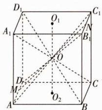

text_image

D₁
O₁
C₁
A₁
N
B₁
O
D
M
O₂
C
A
B

6 (1) $\overrightarrow{AD_1}$ ; (2) $\overrightarrow{BD_1}$ (或 $\overrightarrow{AE_1}$ ) 解析 (1) $\overrightarrow{A_1F_1} - \overrightarrow{EF} - \overrightarrow{BA} + \overrightarrow{FF_1} + \overrightarrow{CD} + \overrightarrow{F_1A_1} = \overrightarrow{AF} + \overrightarrow{FE} + \overrightarrow{AB} + \overrightarrow{BB_1} + \overrightarrow{CD} + \overrightarrow{DC} = \overrightarrow{AE} + \overrightarrow{AB_1} + \mathbf{0} = \overrightarrow{AE} + \overrightarrow{ED_1} = \overrightarrow{AD_1}$ .

(2) $\overrightarrow{DE} + \overrightarrow{E_1F_1} + \overrightarrow{FD} + \overrightarrow{BB_1} + \overrightarrow{A_1E_1} = \overrightarrow{DE} + \overrightarrow{EF} + \overrightarrow{FD} + \overrightarrow{BB_1} +$ $\overrightarrow{B_1D_1} = \overrightarrow{DF} +\overrightarrow{FD} +\overrightarrow{BD_1} = \mathbf{0} + \overrightarrow{BD_1} = \overrightarrow{BD_1} = \overrightarrow{AE_1}.$

7 解析 (1) 与 $\overrightarrow{BC}$ 平行且方向相同的向量有 $\overrightarrow{B_1C_1}, \overrightarrow{AD}, \overrightarrow{A_1D_1}, \overrightarrow{AE}, \overrightarrow{ED}$ .

(2)由向量加法运算得, $\overrightarrow{B_{1}E}=\overrightarrow{B_{1}B}+\overrightarrow{BA}+\overrightarrow{AE}$ ,

$$
\begin{array}{l} \overrightarrow {B _ {1} E} = \overrightarrow {B _ {1} A _ {1}} + \overrightarrow {A _ {1} A} + \overrightarrow {A E}, \\ \overrightarrow {B _ {1} E} = \overrightarrow {B _ {1} D _ {1}} + \overrightarrow {D _ {1} D} + \overrightarrow {D E}. \\ \end{array}
$$

(注:答案不唯一,满足题目条件即可)

8 A 对于 A, $\overrightarrow{AB} + 2\overrightarrow{BC} + 2\overrightarrow{CD} + \overrightarrow{DC} = (\overrightarrow{AB} + \overrightarrow{BC}) + (\overrightarrow{BC} + \overrightarrow{CD}) + (\overrightarrow{CD} + \overrightarrow{DC}) = \overrightarrow{AC} + \overrightarrow{BD}$ ; 对于 B, $2\overrightarrow{AB} + 2\overrightarrow{BC} + 3\overrightarrow{CD} + 3\overrightarrow{DA} + \overrightarrow{AC} = 2(\overrightarrow{AB} + \overrightarrow{BC}) + 3(\overrightarrow{CD} + \overrightarrow{DA}) + \overrightarrow{AC} = 3\overrightarrow{AC} + 3\overrightarrow{CA} = 0$ ; 对于 C, $\overrightarrow{AB} + \overrightarrow{DA} + \overrightarrow{BD} = \overrightarrow{DA} + \overrightarrow{AB} + \overrightarrow{BD} = \overrightarrow{DB} + \overrightarrow{BD} = 0$ ; 对于 D, $\overrightarrow{AB} - \overrightarrow{CB} + \overrightarrow{CD} - \overrightarrow{AD} = \overrightarrow{AB} + \overrightarrow{BC} + \overrightarrow{CD} + \overrightarrow{DA} = 0$ .

9 C 依题意可得 $\overrightarrow{EB} = \overrightarrow{EP} +\overrightarrow{PB} = -\frac{1}{2}\overrightarrow{PD} +\overrightarrow{PB} =$ $-\frac{1}{2} (\overrightarrow{PA} +\overrightarrow{AD}) + \overrightarrow{PB} = -\frac{1}{2} (\overrightarrow{PA} +\overrightarrow{BC}) + \overrightarrow{PB} = -\frac{1}{2} (\overrightarrow{PA}+$ $\overrightarrow{PC} -\overrightarrow{PB}) + \overrightarrow{PB} = -\frac{1}{2}\overrightarrow{PA} +\frac{3}{2}\overrightarrow{PB} -\frac{1}{2}\overrightarrow{PC}.$

10 (1) $\overrightarrow{AF}$ (或 $\overrightarrow{FD}$ ); (2) $\overrightarrow{FH}$ ; (3) $\overrightarrow{AG}$ 解析 (1) 因为点 $G$ 为 $\triangle BCD$ 的重心, $E, F$ 分别为 $CD, AD$ 的中点, 所以 $\overrightarrow{AG} + \frac{1}{3}\overrightarrow{BE} - \frac{1}{2}\overrightarrow{AC} = \overrightarrow{AG} + \overrightarrow{GE} - \frac{1}{2}\overrightarrow{AC} = \overrightarrow{AE} - \frac{1}{2}\overrightarrow{AC} = \overrightarrow{AE} - \overrightarrow{FE} = \overrightarrow{AE} + \overrightarrow{EF} = \overrightarrow{AF} = \overrightarrow{FD}$ .

(2) 因为 E, F, H 分别为 CD, AD, BC 的中点, 所以 $\frac{1}{2}(\overrightarrow{AB} + \overrightarrow{AC} - \overrightarrow{AD}) = \frac{1}{2}(2\overrightarrow{AH} - \overrightarrow{AD}) = \overrightarrow{AH} - \frac{1}{2}\overrightarrow{AD} = \overrightarrow{AH} - \overrightarrow{AF} = \overrightarrow{FH}.$

(3) $\frac{1}{3}\overrightarrow{AB} +\frac{1}{3}\overrightarrow{AC} +\frac{1}{3}\overrightarrow{AD} = \overrightarrow{AB} +\frac{1}{3} (\overrightarrow{AC} -\overrightarrow{AB}) + \frac{1}{3} (\overrightarrow{AD}-$ $\overrightarrow{AB}) = \overrightarrow{AB} +\frac{1}{3} (\overrightarrow{BC} +\overrightarrow{BD}) = \overrightarrow{AB} +\frac{2}{3}\overrightarrow{BE} = \overrightarrow{AB} +\overrightarrow{BG} = \overrightarrow{AG}.$

【归纳总结】 $\triangle BCD$ 的重心为 G，点 A 是平面 BCD 外一点，则 $\overrightarrow{AG}=\frac{1}{3}(\overrightarrow{AB}+\overrightarrow{AC}+\overrightarrow{AD})$ .

11 C 由 $\overrightarrow{AB} = e_1 + e_2 + e_3, \overrightarrow{BC} = e_1 + \lambda e_2 + e_3$ ，得 $\overrightarrow{AC} = \overrightarrow{AB} + \overrightarrow{BC} = 2e_1 + (1 + \lambda)e_2 + 2e_3$ ，因为 $A, C, D$ 三点共线，所以 $\overrightarrow{AC} \parallel \overrightarrow{CD}$ ，则存在唯一的实数 $\mu$ ，使得 $\overrightarrow{AC} = \mu \overrightarrow{CD}$ ，则 $\left\{\begin{aligned}&2=4\mu,\\ &1+\lambda=8\mu,\text{解得}\left\{\begin{aligned}&\mu=\frac{1}{2},\\ &\lambda=3.\end{aligned}\right.\end{aligned}\right.$

12 D 对于 A, $a - b + (b + c) = c + a$ ，所以 $a - b, b + c, c + a$ 是共面向量；对于 B, $-a + c + (-b - c) = -a - b = -(a + b)$ ，所以 $-a + c, -b - c, a + b$ 是共面向量；对于 C, $a + b - (b - c) = a + c$ ，所以 $a + b, b - c, a + c$ 是共面向量；对于 D，令 $a + b = x(a - b) + yc, x, y \in \mathbb{R}$ ，显然 x, y 无解，故不是共面向量。

13 ACD 对于 A, $\overrightarrow{AB}=2\overrightarrow{AC}+3\overrightarrow{AD}$ ，则 $\overrightarrow{AB},\overrightarrow{AC},\overrightarrow{AD}$ 一定共面，且有公共点 A，故 A, B, C, D 四点共面，A 正确；对于 B, $\overrightarrow{OA}=3\overrightarrow{OB}-\overrightarrow{OC}-\overrightarrow{DO}=3\overrightarrow{OB}-\overrightarrow{OC}+\overrightarrow{OD},3-1+1\neq1$ ，故 A, B, C, D 四点不共面，B 错误；对于 C, $\overrightarrow{AB}\parallel\overrightarrow{AC}$ ，可得 A, B, C 三点共线，则 A, B, C, D 四点一定共面，C 正确；对于 D, $\overrightarrow{OC}=\overrightarrow{BO}+3\overrightarrow{AO}-5\overrightarrow{DO}=-\overrightarrow{OB}-3\overrightarrow{OA}+5\overrightarrow{OD},-1-3+5=1$ ，故 A, B, C, D 四点一定共面，D 正确.

【归纳总结】 若点 P 在平面 ABC 内，则 $\overrightarrow{AP} = m \overrightarrow{AB} + n \overrightarrow{AC}$ 或 $\overrightarrow{OP} = x \overrightarrow{OA} + y \overrightarrow{OB} + z \overrightarrow{OC} (x + y + z = 1)$ ，O 为空间中任意一点。反之，也成立。

14 (1) -1; (2) -2 解析 (1) 由 $2\overrightarrow{BD} = x\overrightarrow{OA} + \overrightarrow{OB}$ , 得 $2\overrightarrow{BD} = 2(\overrightarrow{OD} - \overrightarrow{OB}) = x\overrightarrow{OA} + \overrightarrow{OB}$ , 得 $\overrightarrow{OD} = \frac{x}{2}\overrightarrow{OA} + \frac{3}{2}\overrightarrow{OB}$ , 因为 $A, B, D$ 三点共线, 所以 $\frac{x}{2} + \frac{3}{2} = 1$ , 解得 $x = -1$ .

(2) 由 $2\overrightarrow{BD} = 2(\overrightarrow{OD} - \overrightarrow{OB}) = y\overrightarrow{OA} + \overrightarrow{OB} + \overrightarrow{OC}$ , 得 $\overrightarrow{OD} = \frac{y}{2}\overrightarrow{OA} + \frac{3}{2}\overrightarrow{OB} + \frac{1}{2}\overrightarrow{OC}$ , 因为 $A, B, C, D$ 四点共面, 所以 $\frac{y}{2} + \frac{3}{2} + \frac{1}{2} = 1$ , 解得 $y = -2$ .

15 证明 因为 M 在 BD 上, 且 $BM = \frac{1}{3} BD$ ,

所以 $\overrightarrow{MB}=\frac{1}{3}\overrightarrow{DB}=\frac{1}{3}\overrightarrow{DA}+\frac{1}{3}\overrightarrow{AB}$

同理得 $\overrightarrow{AN}=\frac{1}{3}\overrightarrow{AD}+\frac{1}{3}\overrightarrow{DE}$ ,

所以 $\overrightarrow{MN} = \overrightarrow{MB} + \overrightarrow{BA} + \overrightarrow{AN} = (\frac{1}{3}\overrightarrow{DA} + \frac{1}{3}\overrightarrow{AB}) + \overrightarrow{BA} + (\frac{1}{3}\overrightarrow{AD} + \frac{1}{3}\overrightarrow{DE}) = \frac{2}{3}\overrightarrow{BA} + \frac{1}{3}\overrightarrow{DE} = \frac{2}{3}\overrightarrow{CD} + \frac{1}{3}\overrightarrow{DE}.$

又 $\overrightarrow{CD}$ 与 $\overrightarrow{DE}$ 不共线,所以 $\overrightarrow{MN},\overrightarrow{CD},\overrightarrow{DE}$ 共面.

16 证明 连接 EF, FB,

$\overrightarrow{EF} = \overrightarrow{A_1F} -\overrightarrow{A_1E} = \frac{2}{5}\overrightarrow{A_1C} -\frac{2}{3}\overrightarrow{A_1D_1} = \frac{2}{5} (\overrightarrow{A_1A} +\overrightarrow{AB} +\overrightarrow{BC}) -$ $\frac{2}{3}\overrightarrow{A_1D_1} = \frac{2}{5} (\overrightarrow{A_1A} +\overrightarrow{A_1B_1} +\overrightarrow{A_1D_1}) - \frac{2}{3}\overrightarrow{A_1D_1} = \frac{2}{5}\overrightarrow{A_1A}+$ $\frac{2}{5}\overrightarrow{A_1B_1} -\frac{4}{15}\overrightarrow{A_1D_1},$

$\overrightarrow{FB} = \overrightarrow{A_1B} -\overrightarrow{A_1F} = \overrightarrow{A_1B_1} +\overrightarrow{B_1B} -\frac{2}{5}\overrightarrow{A_1C} = \overrightarrow{A_1B_1} +\overrightarrow{A_1A} -$

$$
\frac {2}{5} \left(\overrightarrow {A _ {1} A} + \overrightarrow {A _ {1} B _ {1}} + \overrightarrow {A _ {1} D _ {1}}\right) = \frac {3}{5} \overrightarrow {A _ {1} B _ {1}} + \frac {3}{5} \overrightarrow {A _ {1} A} - \frac {2}{5} \overrightarrow {A _ {1} D _ {1}},
$$

所以 $\overrightarrow{EF}=\frac{2}{3}\overrightarrow{FB}$ ，所以 $\overrightarrow{EF}//\overrightarrow{FB}$ .

又 $EF \cap FB = F$ ，所以 $E, F, B$ 三点共线

# 过能力 学科关键能力构建

1 A 由题意得 O 为四棱柱的中心, 如图, $\overrightarrow{OA_{1}} = \frac{1}{2} \overrightarrow{CA_{1}} = \frac{1}{2} (\overrightarrow{CB} + \overrightarrow{CD} + \overrightarrow{CC_{1}}) = \frac{1}{2} (-\overrightarrow{AD} - \overrightarrow{AB} + \overrightarrow{AA_{1}}) = \frac{1}{2} (-a - b + c)$ .

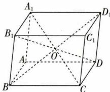

text_image

A₁
B₁
C₁
D₁
A
O
D
B
C

2 B 延长 EA, FB, GC, HD 相交于一点 O（如图），则 $\frac{FB}{FO} = \frac{EA}{EO} = \frac{1}{10}$ . 又 $\frac{DC}{HG} = \frac{9}{10}$ ，且 $\overrightarrow{HG} = \overrightarrow{EF}$ ，所以 $\overrightarrow{HE} + \overrightarrow{FB} + \frac{1}{9}\overrightarrow{DC} = \overrightarrow{HE} + \frac{1}{10}\overrightarrow{FO} + \frac{1}{10}\overrightarrow{HG} = \overrightarrow{HE} + \frac{1}{10}\overrightarrow{FO} + \frac{1}{10}\overrightarrow{EF} = \overrightarrow{HE} + \frac{1}{10}\overrightarrow{EO} = \overrightarrow{HE} + \overrightarrow{EA} = \overrightarrow{HA}.$

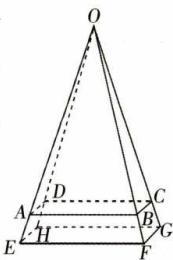

text_image

O
A
D
C
B
H
E
F
G

3 AC 因为 M 是线段 BC 的中点, 所以 $\overrightarrow{NM} = \frac{1}{2} (\overrightarrow{NB} + \overrightarrow{NC})$ , A 正确; 取 CD 的中点 E, 则 $\overrightarrow{NM} = \overrightarrow{NE} + \overrightarrow{EM} = \frac{1}{2} \overrightarrow{AC} + \frac{1}{2} \overrightarrow{DB}$ , B 不正确; $\overrightarrow{NG} = \overrightarrow{NM} + \overrightarrow{MG} = \overrightarrow{NM} + \frac{1}{3} \overrightarrow{MA} = \overrightarrow{NM} + \frac{1}{3} (\overrightarrow{NA} - \overrightarrow{NM}) = \frac{2}{3} \times \frac{1}{2} (\overrightarrow{NB} + \overrightarrow{NC}) + \frac{1}{3} \overrightarrow{NA} = \frac{1}{3} (\overrightarrow{NA} + \overrightarrow{NB} + \overrightarrow{NC})$ , C 正确; 因为 $\overrightarrow{AN} = \frac{1}{2} \overrightarrow{AD}, \overrightarrow{AG} = \frac{2}{3} \overrightarrow{AM}$ , 所以 NG 与平面 DBC 不平行, 即 $\overrightarrow{NG}, \overrightarrow{DB}, \overrightarrow{DC}$ 不共面, 所以不存在实数 x, y, 使得 $\overrightarrow{NG} = x \overrightarrow{DB} + y \overrightarrow{DC}$ , D 不正确.

4 B 因为 $\overrightarrow{PM} = (1 - y - z) \overrightarrow{PA} + y \overrightarrow{PB} + z \overrightarrow{PC} = \overrightarrow{PA} - y \overrightarrow{PA} - z \overrightarrow{PA} + y \overrightarrow{PB} + z \overrightarrow{PC}$ ，所以 $\overrightarrow{PM} - \overrightarrow{PA} = y (\overrightarrow{PB} - \overrightarrow{PA}) + z (\overrightarrow{PC} - \overrightarrow{PA})$ ，所以 $\overrightarrow{AM} = y \overrightarrow{AB} + z \overrightarrow{AC}$ ，因为 $\overrightarrow{AB}, \overrightarrow{AC}$ 不共线，所以 $\overrightarrow{AM}, \overrightarrow{AB}, \overrightarrow{AC}$ 共面，所以点 M 在平面 ABC 内，（【另解】因为点 P 在平面 ABC 外，A, B, C 三点不共线，且 $(1 - y - z) + y + z = 1$ ，所以 M, A, B, C 四点共面）所以当 $PM \perp$ 平面

ABC 时， $|\overrightarrow{PM}|$ 最小. 如图， $PM \perp$ 平面 ABC，取 BC 的中点 D，连接 AD，则点 M 在 AD 上，且 AM = $\frac{2}{3}AD = \frac{2}{3} \times \frac{\sqrt{3}}{2} \times 3 = \sqrt{3}$ ，所以 $PM = \sqrt{PA^{2} - AM^{2}} = \sqrt{9 - 3} = \sqrt{6}$ ，即 $|\overrightarrow{PM}|$ 的最小值为 $\sqrt{6}$ . 故选

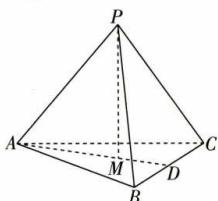

text_image

P
A
M
B
C
D

5 BCD

<table><tr><td>A</td><td>×</td><td>当 $\lambda=1$ 时, $\overrightarrow{BP}=\overrightarrow{BC}+\mu\overrightarrow{BB_{1}}$ ,所以 $\overrightarrow{BP}-\overrightarrow{BC}=\mu\overrightarrow{BB_{1}}$ ,即 $\overrightarrow{CP}=\mu\overrightarrow{BB_{1}}$ ,则 $\overrightarrow{CP}//\overrightarrow{BB_{1}}$ ,又 $\mu\in[0,1]$ ,故点P在棱 $CC_{1}$ 上.</td></tr><tr><td>B</td><td>√</td><td>当 $\mu=1$ 时, $\overrightarrow{BP}=\lambda\overrightarrow{BC}+\overrightarrow{BB_{1}}$ ,即 $\overrightarrow{B_{1}P}=\lambda\overrightarrow{BC}$ ,则 $\overrightarrow{B_{1}P}//\overrightarrow{BC}$ ,又 $\lambda\in[0,1]$ ,故点P在棱 $B_{1}C_{1}$ 上.</td></tr><tr><td>C</td><td>√</td><td>当 $\lambda+\mu=1$ 时,P,C, $B_{1}$ 三点共线,又 $\lambda$ , $\mu\in[0,1]$ ,故点P在线段 $B_{1}C$ 上.</td></tr><tr><td>D</td><td>√</td><td>当 $\lambda=\mu$ 时, $\overrightarrow{BP}=\lambda(\overrightarrow{BC}+\overrightarrow{BB_{1}})=\lambda\overrightarrow{BC_{1}}$ ,又 $\lambda\in[0,1]$ ,故点P在线段 $BC_{1}$ 上.</td></tr></table>

6 $3\sqrt{2}$ 解析 因为 $\overrightarrow{EM}=x\overrightarrow{EF}+y\overrightarrow{EG}(x,y\in\mathbf{R})$ ，所以点 M 在平面 EFG 内。如图，分别取 $A_{1}D_{1}, AB, CC_{1}$ 的中点 N,H,P，则所有点 M 形成的图形是正六边形 EHFPGN。因为

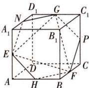

text_image

D₁
G
C₁
N
A₁
B₁
P
E
D
C
A
H
B
F

$EN=\frac{\sqrt{1^{2}+1^{2}}}{2}=\frac{\sqrt{2}}{2}$ ，所以该正六边形的周长为 $6EN=3\sqrt{2}$ .

7 解析 (1) 因为 $\overrightarrow{EH} = \overrightarrow{AH} - \overrightarrow{AE} = \lambda \overrightarrow{AD} - \lambda \overrightarrow{AB} = \lambda \overrightarrow{BD}$ ,

$\overrightarrow{FG} = \overrightarrow{CG} -\overrightarrow{CF} = (1 - \lambda)\overrightarrow{CD} -(1 - \lambda)\overrightarrow{CB} = (1 - \lambda)\overrightarrow{BD},$

所以 $\overrightarrow{EH} = \frac{\lambda}{1 - \lambda}\overrightarrow{FG}$ , 所以 $\overrightarrow{EH} // \overrightarrow{FG}$ ,

所以 E, F, G, H 四点共面.

(2) 当 $\lambda = \frac{1}{3}$ 时, 因为 $\overrightarrow{AE} = \frac{1}{3}\overrightarrow{AB}$ , 即 $\overrightarrow{OE} - \overrightarrow{OA} = \frac{1}{3} (\overrightarrow{OB} - \overrightarrow{OA})$ , 所以 $\overrightarrow{OE} = \frac{2}{3}\overrightarrow{OA} + \frac{1}{3}\overrightarrow{OB}$ .

因为 $\overrightarrow{CG}=\frac{2}{3}\overrightarrow{CD}$ ，即 $\overrightarrow{OG}-\overrightarrow{OC}=\frac{2}{3}(\overrightarrow{OD}-\overrightarrow{OC})$ ，

所以 $\overrightarrow{OG}=\frac{1}{3}\overrightarrow{OC}+\frac{2}{3}\overrightarrow{OD}.$

由(1)知 $\overrightarrow{EH}=\frac{1}{2}\overrightarrow{FG},EH\parallel FG,$

所以 $\frac{EM}{MG}=\frac{EH}{FG}=\frac{1}{2}$ ,

所以 $\overrightarrow{EM} = \frac{1}{2}\overrightarrow{MG}$ 即 $\overrightarrow{OM} -\overrightarrow{OE} = \frac{1}{2} (\overrightarrow{OG} -\overrightarrow{OM})$

所以 $\overrightarrow{OM} = \frac{2}{3}\overrightarrow{OE} +\frac{1}{3}\overrightarrow{OG} = \frac{2}{3}\left(\frac{2}{3}\overrightarrow{OA} +\frac{1}{3}\overrightarrow{OB}\right) + \frac{1}{3}\left(\frac{1}{3}\overrightarrow{OC}+\right.$ $\frac{2}{3}\overrightarrow{OD}) = \frac{4}{9}\overrightarrow{OA} +\frac{2}{9}\overrightarrow{OB} +\frac{1}{9}\overrightarrow{OC} +\frac{2}{9}\overrightarrow{OD}.$

# 课时 2 ▶ 空间向量的数量积运算

# 过基础 教材必备知识精练

1 A 对于 $A, a^2 = a \cdot a = |a|^2 \cos 0 = |a|^2$ , 故 A 正确; 对于 B, 因为向量不能做除法, 即 $\frac{b}{a}$ 无意义, 故 B 错误; 对于 C, $(a \cdot b)^2 = (|a||b|\cos \langle a, b\rangle)^2 = |a|^2 |b|^2 \cos^2 \langle a, b\rangle$ , 当 $\cos^2 \langle a, b\rangle = 1$ 时, 满足 $(a \cdot b)^2 = a^2 b^2$ , 当 $\cos^2 \langle a, b\rangle \neq 1$ 时, 不满足 $(a \cdot b)^2 = a^2 b^2$ , 故 C 错误; 对于 D, 若 $a \cdot b = a \cdot c$ , 则 $a \cdot (b - c) = 0$ , 当 $b - c = 0$ 或 $a \perp (b - c)$ 时等式均成立, 故不一定有 $b = c$ , 故 D 错误.

2 A 方法一(定义法) 连接 $B^{\prime}D^{\prime}$ ，则在 Rt△DB^{\prime}D^{\prime}中， $DB'=\sqrt{3},DD'=1$ ，所以 $\cos\angle B^{\prime}DD^{\prime}=\frac{\sqrt{3}}{3}$ ，所以 $\overrightarrow{AA}\cdot\overrightarrow{DB}=\overrightarrow{DD'}\cdot\overrightarrow{DB'}=\left|\overrightarrow{DD'}\right|\left|\overrightarrow{DB'}\right|\cos\angle B^{\prime}DD^{\prime}=1\times\sqrt{3}\times\frac{\sqrt{3}}{3}=1.$

方法二（运算法）因为 $\overrightarrow{DB'} = \overrightarrow{DB} + \overrightarrow{BB'} = \overrightarrow{AB} - \overrightarrow{AD} + \overrightarrow{BB'} = \overrightarrow{AB} - \overrightarrow{AD} + \overrightarrow{AA'}$ ，且 $\overrightarrow{AA'} \cdot \overrightarrow{AB} = 0, \overrightarrow{AA'} \cdot \overrightarrow{AD} = 0$ ，所以 $\overrightarrow{AA'} \cdot \overrightarrow{DB'} = \overrightarrow{AA'} \cdot (\overrightarrow{AB} - \overrightarrow{AD} + \overrightarrow{AA'}) = \overrightarrow{AA'} \cdot \overrightarrow{AB} - \overrightarrow{AA'} \cdot \overrightarrow{AD} + \overrightarrow{AA'^2} = 1.$

方法三(几何意义法) 连接 $B^{\prime}D^{\prime}$ ，则 $B^{\prime}D^{\prime}\perp DD^{\prime}$ ，所以 $\overrightarrow{DB^{\prime}}$ 在 $\overrightarrow{DD^{\prime}}$ 上的投影向量为 $\overrightarrow{DD^{\prime}}$ ，又 $\overrightarrow{AA^{\prime}}=\overrightarrow{DD^{\prime}}$ ，所以 $\overrightarrow{AA^{\prime}}\cdot\overrightarrow{DB^{\prime}}=|\overrightarrow{DD^{\prime}}|^{2}=1$ .

3 ABC 如图, 因为 E, F 分别是 AB, AD 的中点, 所以 $\overrightarrow{EF} = \frac{1}{2}\overrightarrow{BD}$ , 所以 $\overrightarrow{EF} \cdot \overrightarrow{BA} = \frac{1}{2}\overrightarrow{BD} \cdot \overrightarrow{BA} = \frac{1}{2} |\overrightarrow{BD}| |\overrightarrow{BA}| \cdot$

$$
\cos \langle \overrightarrow {B D}, \overrightarrow {B A} \rangle = \frac {1}{2} \times 1 \times 1 \times \cos 6 0 ^ {\circ} =
$$

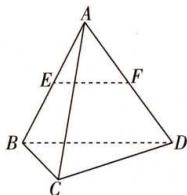

text_image

A
E
F
B
C
D

$\frac{1}{4}$ , A 正确； $\overrightarrow{EF} \cdot \overrightarrow{BD} = \frac{1}{2} \overrightarrow{BD} \cdot \overrightarrow{BD} = \frac{1}{2} |\overrightarrow{BD}|^{2} = \frac{1}{2}$ ,
B 正确； $\overrightarrow{EF} \cdot \overrightarrow{DC} = \frac{1}{2} \overrightarrow{BD} \cdot \overrightarrow{DC} = \frac{1}{2} |\overrightarrow{BD}| |\overrightarrow{DC}| \cos \langle \overrightarrow{BD}, \overrightarrow{DC} \rangle = \frac{1}{2} \times 1 \times 1 \times \cos 120^{\circ} = -\frac{1}{4}$ , C 正确； $\overrightarrow{AB} \cdot \overrightarrow{CD} = \overrightarrow{AB} \cdot$

注意直线夹角与向量夹角的区别.

$(\overrightarrow{AD} - \overrightarrow{AC}) = \overrightarrow{AB} \cdot \overrightarrow{AD} - \overrightarrow{AB} \cdot \overrightarrow{AC} = |\overrightarrow{AB}| |\overrightarrow{AD}| \cos \langle \overrightarrow{AB}, \overrightarrow{AD} \rangle - |\overrightarrow{AB}| |\overrightarrow{AC}| \cos \langle \overrightarrow{AB}, \overrightarrow{AC} \rangle = \cos 60^\circ - \cos 60^\circ = 0$ ，（【另解】由正四面体的性质，知 $AB \perp CD$ ，所以 $\overrightarrow{AB} \perp \overrightarrow{CD}$ ，所以 $\overrightarrow{AB} \cdot \overrightarrow{CD} = 0$ ）D错误.

4 C 如图, 取 $C_{1}$ 在下底面的投影 C, 作 $CD \perp AB$ , 垂足为 D. 连接 CO, $CC_{1}$ , 则 $\angle COD = \frac{\pi}{3}, \overrightarrow{AC_{1}}$ 在 $\overrightarrow{AB}$ 上的

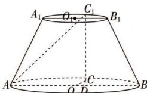

text_image

A₁
O₁
C₁
B₁
A
O
D
C
B

投影向量是 $\overrightarrow{AD}$ . 设上底面的半径为 $r$ , 则 $OD = \frac{1}{2} r, AD = \frac{5}{2} r = \frac{5}{8} AB$ , 故 $\overrightarrow{AC_1}$ 在 $\overrightarrow{AB}$ 上的投影向量是 $\frac{5}{8} \overrightarrow{AB}$ . 故选 C.

5 C 因为 $a \perp b$ ，且 $e_{1}, e_{2}$ 是空间中两个互相垂直的单位向量，所以 $\boldsymbol{a} \cdot \boldsymbol{b} = (2e_{1} + 3e_{2}) \cdot (ke_{1} - 4e_{2}) = 2ke_{1}^{2} + (3k - 8)e_{1} \cdot e_{2} - 12e_{2}^{2} = 2k - 12 = 0$ ，解得 k = 6.

6 C 因为 M 为 BC 的中点, 所以 $\overrightarrow{AM} = \frac{1}{2} (\overrightarrow{AB} + \overrightarrow{AC})$ , 可得 $\overrightarrow{AM} \cdot \overrightarrow{AD} = \frac{1}{2} (\overrightarrow{AB} + \overrightarrow{AC}) \cdot \overrightarrow{AD} = \frac{1}{2} \overrightarrow{AB} \cdot \overrightarrow{AD} + \frac{1}{2} \overrightarrow{AC} \cdot \overrightarrow{AD} = 0$ , 所以 $\overrightarrow{AM} \perp \overrightarrow{AD}$ , 即 $AM \perp AD$ , 所以 $\triangle AMD$ 是直角三角形. 故选 C.

7 D 由 $|a| = \sqrt{2}$ , $|b| = 1$ , 且 $a \perp (a + 2b)$ , 可得 $a \cdot (a + 2b) = a^2 + 2a \cdot b = 0$ , 解得 $a \cdot b = -1$ , 所以 $\cos \langle a, b \rangle = \frac{a \cdot b}{|a||b|} = \frac{-1}{\sqrt{2} \times 1} = -\frac{\sqrt{2}}{2}$ . 又 $\langle a, b \rangle \in [0, \pi]$ , 所以 $\langle a, b \rangle = \frac{3\pi}{4}$ .

8 60° 解析 方法一 因为 $\overrightarrow{AC} \cdot \overrightarrow{BF} = (\overrightarrow{AB} + \overrightarrow{AD}) \cdot (\overrightarrow{BA} + \overrightarrow{BE}) = -\overrightarrow{AB^{2}} = -1, |\overrightarrow{AC}| = \sqrt{2}, |\overrightarrow{BF}| = \sqrt{2}$ ，所以 $|\cos \langle \overrightarrow{AC}, \overrightarrow{BF} \rangle| = \frac{|\overrightarrow{AC} \cdot \overrightarrow{BF}|}{|\overrightarrow{AC}| |\overrightarrow{BF}|} = \frac{1}{2}$ ，所以异面直线 AC 与 BF 所成的角为 60°.

方法二 连接 CF. 因为 $\left|\overrightarrow{CF}\right|=\sqrt{2+1}=\sqrt{3}$ ，所以 $\overrightarrow{AC}\cdot\overrightarrow{BF}=\frac{1}{2}\left(\left|\overrightarrow{AF}\right|^{2}+\left|\overrightarrow{CB}\right|^{2}-\left|\overrightarrow{AB}\right|^{2}-\left|\overrightarrow{CF}\right|^{2}\right)=\frac{1}{2}(1+1-1-3)=-1.$ 又 $\left|\overrightarrow{AC}\right|=\sqrt{2},\left|\overrightarrow{BF}\right|=\sqrt{2}$ ，所以 $\left|\cos\left\langle\overrightarrow{AC},\overrightarrow{BF}\right\rangle\right|=\frac{\left|\overrightarrow{AC}\cdot\overrightarrow{BF}\right|}{\left|\overrightarrow{AC}\right|\left|\overrightarrow{BF}\right|}=\frac{1}{2}$ ，即异面直线 AC 与 BF 所成的角为 $60^{\circ}$ .

# 【二级结论】 对角线向量定理

若 $AC, BD$ 为异面直线，则

$$
\overrightarrow {A C} \cdot \overrightarrow {B D} = \frac {\left| \overrightarrow {A D} \right| ^ {2} + \left| \overrightarrow {C B} \right| ^ {2} - \left| \overrightarrow {A B} \right| ^ {2} - \left| \overrightarrow {C D} \right| ^ {2}}{2}.
$$

记忆方法: $\overrightarrow{AC} \cdot \overrightarrow{BD} = \frac{|\overrightarrow{外外}|^{2} + |\overrightarrow{内内}|^{2} - |\overrightarrow{外内}|^{2} - |\overrightarrow{内外}|^{2}}{2}$ (其中“内”“外”指对应位置的字母).

9 C 因为 $|p|^2 = \left(\frac{a}{|a|} + \frac{b}{|b|} + \frac{c}{|c|}\right)^2 = 3 + 2\left(\frac{a \cdot b}{|a||b|} + \frac{a \cdot c}{|a||c|} + \frac{c \cdot b}{|c||b|}\right) \leqslant 3 + 2 \times 3 = 9$ ，所以 $0 \leqslant |p| \leqslant 3$ .

利用性质 $|a\cdot b|\leqslant|a||b|$ .

10 A 因为 $\overrightarrow{BM} = \overrightarrow{BA} + \overrightarrow{AM} = \overrightarrow{BA} + \frac{1}{2} (\overrightarrow{AP} + \overrightarrow{AC}) = \overrightarrow{BA} + \frac{1}{2} (\overrightarrow{AP} + \overrightarrow{AB} + \overrightarrow{AD}) = -\frac{1}{2}\overrightarrow{AB} + \frac{1}{2}\overrightarrow{AP} + \frac{1}{2}\overrightarrow{AD}$ , 所以 $\overrightarrow{BM}^2 = (-\frac{1}{2}\overrightarrow{AB} + \frac{1}{2}\overrightarrow{AD} + \frac{1}{2}\overrightarrow{AP})^2 = \frac{1}{4} (|\overrightarrow{AB}|^2 + |\overrightarrow{AD}|^2 + |\overrightarrow{AP}|^2) -$

$\frac{1}{2}|\overrightarrow{AB}||\overrightarrow{AP}|\cdot\cos60^{\circ}+\frac{1}{2}|\overrightarrow{AD}||\overrightarrow{AP}|\cos60^{\circ}=\frac{1}{4}\times(1+1+4)-\frac{1}{2}\times1\times2\times\frac{1}{2}+\frac{1}{2}\times1\times2\times\frac{1}{2}=\frac{3}{2},$ 所以 $|\overrightarrow{BM}|=\sqrt{\frac{3}{2}}=\frac{\sqrt{6}}{2}.$

# 过能力 学科关键能力构建

1 A 方法一 由题图可知, $\overrightarrow{AP_{i}}=\overrightarrow{AB}+\overrightarrow{BP_{i}}$ ,则 $\overrightarrow{AB}\cdot\overrightarrow{AP_{i}}=\overrightarrow{AB}\cdot(\overrightarrow{AB}+\overrightarrow{BP_{i}})=\overrightarrow{AB^{2}}+\overrightarrow{AB}\cdot\overrightarrow{BP_{i}}$ . 因为 $AB\perp BP_{i}$ , 所以 $\overrightarrow{AB}\cdot\overrightarrow{BP_{i}}=0$ , 所以 $\overrightarrow{AB}\cdot\overrightarrow{AP_{i}}=\overrightarrow{AB^{2}}=1$ , 故集合 $\{y|y=\overrightarrow{AB}\cdot\overrightarrow{AP_{i}}, i=1,2,3,\cdots,8\}$ 中的元素个数为 1.

方法二 因为 $\overrightarrow{AP_{i}}$ 在 $\overrightarrow{AB}$ 上的投影向量为 $\overrightarrow{AB}, AB=1$ ，所以 $\overrightarrow{AB}\cdot\overrightarrow{AP_{i}}=\overrightarrow{AB^{2}}=1$ ，所以集合 $\{y\mid y=\overrightarrow{AB}\cdot\overrightarrow{AP_{i}}, i=1,2,3,\cdots,8\}$ 中的元素个数为1.

2 C 设 $e_{1}, e_{2}$ 的夹角为 $\theta$ ，则 $\left|2e_{1} + e_{2}\right|^{2} = \left|e_{2}\right|^{2} + 4\left|e_{1}\right|^{2} + 4\left|e_{1}\right|\left|e_{2}\right|\cos\theta = 9$ ，所以 $\left|e_{2}\right|^{2} + 12\left|e_{2}\right|\cos\theta +$ 破题点:遇模平方.

27=0, 得 $\cos\theta=-\frac{|e_{2}|^{2}+27}{12|e_{2}|}$ ，所以 $e_{1}$ 在 $e_{2}$ 上的投影向量的模为 $\left|\left|e_{1}\right|\cos\theta\right|=\frac{\left|e_{2}\right|^{2}+27}{4\left|e_{2}\right|}=\frac{\left|e_{2}\right|}{4}+\frac{27}{4\left|e_{2}\right|}\geqslant2\sqrt{\frac{\left|e_{2}\right|}{4}\times\frac{27}{4\left|e_{2}\right|}}=\frac{3\sqrt{3}}{2}$ ，当且仅当 $\frac{\left|e_{2}\right|}{4}=\frac{27}{4\left|e_{2}\right|}$ ，即 $\left|e_{2}\right|=3\sqrt{3}$ 时等号成立，所以 $e_{1}$ 在 $e_{2}$ 上的投影向量的模的最小值为 $\frac{3\sqrt{3}}{2}$ .

3 BC 因为单位向量 $\overrightarrow{PA}, \overrightarrow{PB}, \overrightarrow{PC}$ 两两夹角均为 $60^{\circ}$ ，所以 $\overrightarrow{PA} \cdot \overrightarrow{PB} = \overrightarrow{PB} \cdot \overrightarrow{PC} = \overrightarrow{PA} \cdot \overrightarrow{PC} = 1 \times 1 \times \cos 60^{\circ} = \frac{1}{2}$ ，A 错误； $\overrightarrow{PA} \cdot (\overrightarrow{BC} + \overrightarrow{AC}) = \overrightarrow{PA} \cdot (\overrightarrow{PC} - \overrightarrow{PB} + \overrightarrow{PC} - \overrightarrow{PA}) = \overrightarrow{PA} \cdot (2\overrightarrow{PC} - \overrightarrow{PB} - \overrightarrow{PA}) = 2\overrightarrow{PA} \cdot \overrightarrow{PC} - \overrightarrow{PA} \cdot \overrightarrow{PB} - \overrightarrow{PA}^{2} = 1 - \frac{1}{2} - 1 = -\frac{1}{2}$ ，B 正确；由 $\overrightarrow{PA} = 2\overrightarrow{PE}$ ，得 $\frac{1}{2}\overrightarrow{PA} = \overrightarrow{PE}$ ，由 $\overrightarrow{BC} = 2\overrightarrow{BF}$ ，得 $\overrightarrow{PC} - \overrightarrow{PB} = 2\overrightarrow{PF} - 2\overrightarrow{PB}$ ，即 $\overrightarrow{PF} = \frac{\overrightarrow{PC} + \overrightarrow{PB}}{2}$ ，所以 $\overrightarrow{EF} = \overrightarrow{PF} - \overrightarrow{PE} = \frac{\overrightarrow{PC} + \overrightarrow{PB} - \overrightarrow{PA}}{2}$ ，则 $|\overrightarrow{EF}| = \frac{|\overrightarrow{PC} + \overrightarrow{PB} - \overrightarrow{PA}|}{2} = \frac{1}{2}\sqrt{(\overrightarrow{PC} + \overrightarrow{PB} - \overrightarrow{PA})^{2}} = \frac{1}{2}\sqrt{\overrightarrow{PC}^{2} + \overrightarrow{PB}^{2} + \overrightarrow{PA}^{2}} + 2\overrightarrow{PC} \cdot \overrightarrow{PB} - 2\overrightarrow{PC} \cdot \overrightarrow{PA} - 2\overrightarrow{PA} \cdot \overrightarrow{PB}} = \frac{1}{2}\sqrt{1 + 1 + 1 + 1 - 1 - 1} = \frac{\sqrt{2}}{2}$ ，C 正确； $\overrightarrow{AF} = \overrightarrow{PF} - \overrightarrow{PA} =$

$\frac{\overrightarrow{PC}+\overrightarrow{PB}-2\overrightarrow{PA}}{2}$ ，所以 $\overrightarrow{AF}\cdot\overrightarrow{CP}=-\frac{(\overrightarrow{PC}+\overrightarrow{PB}-2\overrightarrow{PA})\cdot\overrightarrow{PC}}{2}=$ $-\frac{\overrightarrow{PC}^{2}+\overrightarrow{PB}\cdot\overrightarrow{PC}-2\overrightarrow{PA}\cdot\overrightarrow{PC}}{2}=-\frac{1+\frac{1}{2}-2\times\frac{1}{2}}{2}=-\frac{1}{4}$ 故 $\cos\langle\overrightarrow{AF},\overrightarrow{CP}\rangle<0,D$ 错误.

4 D 不妨设该正方体内切球的球心为 O，由题意得球 O 的半径为 1, $\left|\overrightarrow{AO}\right| = \frac{\sqrt{2^{2} + 2^{2} + 2^{2}}}{2} = \sqrt{3}$ .

方法一 $\overrightarrow{AM} \cdot \overrightarrow{AN} = (\overrightarrow{AO} + \overrightarrow{OM}) \cdot (\overrightarrow{AO} + \overrightarrow{ON}) = |\overrightarrow{AO}|^2 + \overrightarrow{AO} \cdot (\overrightarrow{OM} + \overrightarrow{ON}) + \overrightarrow{OM} \cdot \overrightarrow{ON} = 3 + 0 - 1 = 2.$

方法二 $\overrightarrow{AM} \cdot \overrightarrow{AN} = (\frac{\overrightarrow{AM} + \overrightarrow{AN}}{2})^2 - (\frac{\overrightarrow{AM} - \overrightarrow{AN}}{2})^2 = |\overrightarrow{AO}|^2 -$

极化恒等式.

$\left(\frac{\overrightarrow{NM}}{2}\right)^{2}=2.$

【二级结论】极化恒等式: $\boldsymbol{a}\cdot\boldsymbol{b}=(\frac{\boldsymbol{a}+\boldsymbol{b}}{2})^{2}-(\frac{\boldsymbol{a}-\boldsymbol{b}}{2})^{2}$

【变式】A 如图，设正方体 $ABCD-A_{1}B_{1}C_{1}D_{1}$ 的外接球的球心为 O，球 O 的半径为 R，连接 PO，由 $2R=4\sqrt{3}$ ，得 $R=2\sqrt{3}$ ，则 $OE=OF=2\sqrt{3}$ ， $\overrightarrow{PE}\cdot\overrightarrow{PF}=(\overrightarrow{PO}+\overrightarrow{OE})\cdot(\overrightarrow{PO}+\overrightarrow{OF})=(\overrightarrow{PO}+\overrightarrow{OE})\cdot(\overrightarrow{PO}-\overrightarrow{OE})=|\overrightarrow{PO}|^{2}-|\overrightarrow{OE}|^{2}=PO^{2}-12.$ 当点 P 为正方体 $ABCD-A_{1}B_{1}C_{1}D_{1}$ 的侧面或底面中心时，PO 的长取最小值，即 $PO_{min}=2$ ，当点 P 为正方体 $ABCD-A_{1}B_{1}C_{1}D_{1}$ 的顶点时，PO 的长取最大值，即 $PO_{max}=2\sqrt{3}$ ，即 $2\leqslant PO\leqslant2\sqrt{3}$ ，所以 $\overrightarrow{PE}\cdot\overrightarrow{PF}=PO^{2}-12\in[-8,0]$ 。故选 A.

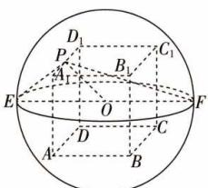

text_image

D₁
P₁
A₁
B₁
C₁
E
O
F
D
C
A
B

5 C 如图, 设过点 P 且平行于底面的截面圆的圆心为 $O_{1}$ , 过点 Q 且平行于底面的截面圆的圆心为 $O_{2}$ , 连接 $PO_{1}, QO_{2}, O_{1}O_{2}$ . 设圆柱底面半径为 r, 则 $2\pi r = 12$ , 即 $r = \frac{6}{\pi}$ , 所以 $\langle \overrightarrow{O_{1}P}, \overrightarrow{O_{2}Q} \rangle =$

解题关键.

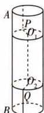

$\frac{2+2}{\frac{6}{\pi}}=\frac{2\pi}{3}$ . 因为 $\overrightarrow{PQ}=\overrightarrow{PO_{1}}+\overrightarrow{O_{1}O_{2}}+\overrightarrow{O_{2}Q}$ ，所以 $\left|\overrightarrow{PQ}\right|^{2}=$ $\overbrace{\overline{PO_{1}}+\overline{O_{1}O_{2}}+\overrightarrow{O_{2}Q}}^{\text{①}}=2r^{2}+\left|\overrightarrow{O_{1}O_{2}}\right|^{2}+2\overrightarrow{PO_{1}}\cdot\overrightarrow{O_{2}Q}=2\times\left(\frac{6}{\pi}\right)^{2}+(12-2\times3)^{2}+2\times\left(\frac{6}{\pi}\right)^{2}\times\cos\frac{\pi}{3}=\frac{36(3+\pi^{2})}{\pi^{2}}$

所以 $PQ=\frac{6\sqrt{3+\pi^{2}}}{\pi}$ .

6 $\frac{\sqrt{6}}{24}$ 解析 如图, 取 $AC$ 中点 $O$ , 连接 $BO, DO$ , 则 $BO \perp AC, DO \perp AC$ , 又 $OB \cap OD = O, OB, OD \subset$ 平面 $BOD$ , 故 $AC \perp$ 平面 $BOD$ . 由 $\overrightarrow{OD} \cdot \overrightarrow{OC} = 0, \overrightarrow{OC} \cdot \overrightarrow{OB} = 0, \overrightarrow{AD} = \overrightarrow{OD} - \overrightarrow{OA} = \overrightarrow{OD} + \overrightarrow{OC}, \overrightarrow{BC} = \overrightarrow{OC} - \overrightarrow{OB}$ , 且 $AC = \sqrt{2}, OC = OB = OD = \frac{\sqrt{2}}{2}$ , 得 $\overrightarrow{AD} \cdot \overrightarrow{BC} = (\overrightarrow{OD} + \overrightarrow{OC}) \cdot (\overrightarrow{OC} - \overrightarrow{OB}) = \overrightarrow{OC^2} - \overrightarrow{OB} \cdot \overrightarrow{OD} = \frac{1}{4}$ , 解得 $\overrightarrow{OB} \cdot \overrightarrow{OD} = \frac{1}{4}$ , 故 $\cos \angle BOD = \frac{\overrightarrow{OB} \cdot \overrightarrow{OD}}{|\overrightarrow{OB}| |\overrightarrow{OD}|} = \frac{1}{2}$ , 又 $0 < \angle BOD < \pi$ , 则 $\angle BOD = \frac{\pi}{3}, S_{\triangle BOD} = \frac{1}{2}OB \cdot OD \cdot \sin \frac{\pi}{3} = \frac{\sqrt{3}}{8}$ , 所以三棱锥 $D - ABC$ 的体积 $V = \frac{1}{3}S_{\triangle BOD} \times AC = \frac{1}{3} \times \frac{\sqrt{3}}{8} \times \sqrt{2} = \frac{\sqrt{6}}{24}$ .

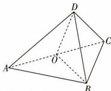

text_image

Geometric diagram of a tetrahedron with labeled vertices A, B, C, D and center O

7 解析 (1) 连接 MD, DN, $NB_{1}$ , $B_{1}M$ ,

因为 $A_{1}M=\frac{1}{3}AA_{1}, CN=\frac{1}{3}CC_{1}$ ,

所以 $\overrightarrow{MB_1} = \overrightarrow{MA_1} +\overrightarrow{A_1B_1} = \frac{1}{3}\overrightarrow{AA_1} +\overrightarrow{A_1B_1} = \frac{1}{3}\overrightarrow{AA_1} +\overrightarrow{AB},$

$$
\overrightarrow {D N} = \overrightarrow {D C} + \overrightarrow {C N} = \overrightarrow {A B} + \frac {1}{3} \overrightarrow {C C _ {1}} = \frac {1}{3} \overrightarrow {A A _ {1}} + \overrightarrow {A B},
$$

所以 $\overrightarrow{DN}=\overrightarrow{MB_{1}}$ ，所以D,M, $B_{1}$ ,N四点共面.

(2) 当 $\frac{AA_{1}}{AB}=1$ 时, $AC_{1} \perp A_{1}B$ , 理由如下.

设 $\overrightarrow{AB}=a,\overrightarrow{AD}=b,\overrightarrow{AA_{1}}=c$ ，则c与b,c与a,b与a的夹角均为60°.

因为底面 ABCD 为菱形, 所以 $|b| = |a|$ .

$$
\overrightarrow {A C _ {1}} = \overrightarrow {A A _ {1}} + \overrightarrow {A _ {1} B _ {1}} + \overrightarrow {B _ {1} C _ {1}} = \overrightarrow {A B} + \overrightarrow {A D} + \overrightarrow {A A _ {1}} = \boldsymbol {a} + \boldsymbol {b} + \boldsymbol {c},
$$

$$
\overrightarrow {A _ {1} B} = \overrightarrow {A _ {1} A} + \overrightarrow {A B} = \boldsymbol {a} - \boldsymbol {c},
$$

若 $AC_{1} \perp A_{1}B$ ，则 $\overrightarrow{AC_1} \cdot \overrightarrow{A_1B} = 0$

即 $\overrightarrow{AC_1} \cdot \overrightarrow{A_1B} = (a + b + c) \cdot (a - c) = a^2 - c^2 + a \cdot b - c \cdot b = |a|^2 - |c|^2 + |a||b|\cos 60^\circ - |c||b|\cos 60^\circ = |a|^2 - |c|^2 + \frac{1}{2}|a|^2 - \frac{1}{2}|c||a| = (|a| - |c|)(\frac{3}{2}|a| + |c|) = 0,$

得 $|a|=|c|$ 或 $3|a|+2|c|=0$ （舍去），

所以当 $\frac{AA_{1}}{AB}=1$ 时, $AC_{1}\perp A_{1}B.$

# 第二节 空间向量基本定理

# 过基础 教材必备知识精练

1 AC 结合图形,如图所示.因为 $\overrightarrow{AC},\overrightarrow{AB_{1}},\overrightarrow{AD_{1}}$ 不共面,所以 $\overrightarrow{AC},\overrightarrow{AB_{1}},\overrightarrow{AD_{1}}$ 可以构成空间的一个基底,A 正确;因为 $\overrightarrow{AB}+\overrightarrow{AA_{1}}=\overrightarrow{AB_{1}}=\overrightarrow{DC_{1}}$ ,所以 $\overrightarrow{AB},\overrightarrow{AA_{1}},\overrightarrow{DC_{1}}$ 共面, 所以 $\overrightarrow{AB}, \overrightarrow{AA_{1}}, \overrightarrow{DC_{1}}$ 不可以构成空间的一个基底, B 错误; 因为 $\overrightarrow{D_{1}A_{1}}, \overrightarrow{D_{1}C_{1}}, \overrightarrow{D_{1}D}$ 不共面, 所以 $\overrightarrow{D_{1}A_{1}}, \overrightarrow{D_{1}C_{1}}, \overrightarrow{D_{1}D}$ 可以构成空间的一个基底, C 正确; 因为 $\overrightarrow{A_{1}C}, \overrightarrow{CC_{1}}, \overrightarrow{AC_{1}}$ 共面, 且 $\overrightarrow{BB_{1}} = \overrightarrow{CC_{1}}$ , 所以 $\overrightarrow{A_{1}C}, \overrightarrow{BB_{1}}, \overrightarrow{AC_{1}}$ 共面, 所以 $\overrightarrow{A_{1}C}, \overrightarrow{BB_{1}}, \overrightarrow{AC_{1}}$ 不可以构成空间的一个基底, D 错误.

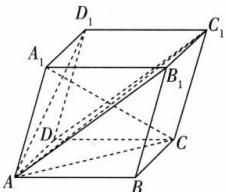

text_image

D₁
A₁
C₁
B₁
D
C
A
B

2 C 方法一 因为 $\{a,b,c\}$ 是空间的一个基底, 所以 a,b,c 两两不共线. $a=\frac{1}{3}\times[2(a+c)+(a-2c)]$ , 故 A 不符合题意; $c=\frac{1}{3}\times[(a+c)-(a-2c)]$ , 故 B 不符合题意; 设 $a+2b=m(a+c)+n(a-2c)$ , 则 $a+2b=(m+n)a+(m-2n)c$ , 显然 m, n 无解, 故 $a+2b$ 可与向量 $a+c,a-2c$ 构成空间的一个基底, 故 C 符合题意; $a+2c=\frac{1}{3}\times[4(a+c)-(a-2c)]$ , 故 D 不符合题意. 故选 C.

方法二（构造图形法）如图，在平行六面体ABCD-A1B1C1D1中，记 $\overrightarrow{AB} = \boldsymbol{a},\overrightarrow{AD} = \boldsymbol{b},\overrightarrow{AA_1} = \boldsymbol{c}$ ，可知向量 $\boldsymbol {a} + \boldsymbol {c}$ 合理借助图形可快速解题.

a-2c 在平面 $ABB_{1}A_{1}$ 内，且不共线，向量 a, c, $a+2c$ 也在平面 $ABB_{1}A_{1}$ 内，所以这三个向量均与向量 $a+c$ , a-2c 共面，不能构成基底， $a+2b$ 在平面 ABCD 内，与向量 $a+c$ , a-2c 不在同一平面内，所以 $a+2b$ 可与向量 $a+c$ , a-2c 构成空间的一个基底，故 C 正确.

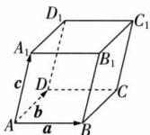

text_image

D₁
A₁
C₁
B₁
c
D
b
A
a
B

# 【归纳总结】 基底的判断思路

(1) 若向量中存在零向量, 则不能作为基底;  
(2) 已知三个向量 a, b, c，可假设 $a = \lambda b + \mu c$ ，运用向量共面的充要条件，建立关于 $\lambda, \mu$ 的方程组，若有解，则不能作为基底，若无解，则能作为基底；  
(3)依托正方体、长方体、平行六面体、四面体等几何体,用它们从同一顶点出发的三条棱对应的向量作为基底,并在此基础上构造其他向量进行相关的判断.

3 2 解析 $d = x(a + 2b) + y(b + 3c) + z(c + a) = (x + z)a + (2x + y)b + (3y + z)c = 3a + 4b + c$ ，所以 $\left\{ \begin{array}{l} x + z = 3, \\ 2x + y = 4, \\ 3y + z = 1, \end{array} \right.$ 解得 $\left\{ \begin{array}{l} x = 2, \\ y = 0, \\ z = 1. \end{array} \right.$

4 A $\overrightarrow{PG}=\overrightarrow{PB}+\overrightarrow{BG}=\overrightarrow{PB}+\frac{2}{3}\overrightarrow{BD}=\overrightarrow{PB}+\frac{2}{3}(\overrightarrow{BA}+\overrightarrow{BC})=\overrightarrow{PB}+\frac{2}{3}(\overrightarrow{PA}-\overrightarrow{PB}+\overrightarrow{PC}-\overrightarrow{PB})=\frac{2}{3}\overrightarrow{PA}-\frac{1}{3}\overrightarrow{PB}+\frac{2}{3}\overrightarrow{PC}=\frac{2}{3}\boldsymbol{a}-\frac{1}{3}\boldsymbol{b}+\frac{2}{3}\boldsymbol{c}.$

5 C 连接 AG, 并延长 AG 交 BC 于点 D, 连接 OD, 则 D 为 BC 的中点, 且 $AG = \frac{2}{3} AD, \overrightarrow{AP} = \overrightarrow{AO} + \overrightarrow{OP} = -\overrightarrow{OA} + \frac{1}{2}\overrightarrow{OG} = -\overrightarrow{OA} + \frac{1}{2} (\overrightarrow{OA} + \overrightarrow{AG}) = -\frac{1}{2}\overrightarrow{OA} + \frac{1}{2} \times \frac{2}{3}\overrightarrow{AD} = -\frac{1}{2}\overrightarrow{OA} + \frac{1}{3} \times \frac{1}{2} (\overrightarrow{AC} +$

$\overrightarrow{AB}) = -\frac{1}{2}\overrightarrow{OA} + \frac{1}{6} (\overrightarrow{OC} - \overrightarrow{OA}) + \frac{1}{6} (\overrightarrow{OB} - \overrightarrow{OA}) = -\frac{5}{6}\overrightarrow{OA} + \frac{1}{6}\overrightarrow{OB} + \frac{1}{6}\overrightarrow{OC} = -\frac{5}{6} a + \frac{1}{6} b + \frac{1}{6} c.$

6 C 如图, 连接 $A_{1}C, A_{1}N. A_{1}B_{1} = 2AB$ , 所以 $\overrightarrow{A_{1}C_{1}} = 2\overrightarrow{AC}$ , 因为 G 是 CN 的中点, 所以 $\overrightarrow{A_{1}G} = \frac{1}{2} (\overrightarrow{A_{1}C} + \overrightarrow{A_{1}N}) = \frac{1}{2} (\overrightarrow{A_{1}A} + \overrightarrow{AC} + \overrightarrow{A_{1}N}) = \frac{1}{2} (\overrightarrow{A_{1}A} + \frac{1}{2}\overrightarrow{A_{1}C_{1}} + \overrightarrow{A_{1}N})$ . 因为 N 是

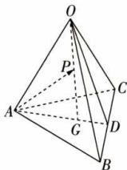

text_image

Geometric diagram of a tetrahedron with labeled vertices and internal points, showing spatial relationships.

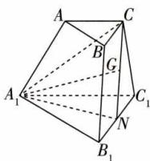

text_image

A
C
B
G
A₁
C₁
N
B₁

$B_{1}C_{1}$ 的中点，所以 $\overrightarrow{A_1N} = \frac{1}{2} (\overrightarrow{A_1C_1} +\overrightarrow{A_1B_1})$ ，所以 $\overrightarrow{A_1G} =$ $\frac{1}{2} [\overrightarrow{A_1A} +\frac{1}{2}\overrightarrow{A_1C_1} +\frac{1}{2} (\overrightarrow{A_1C_1} +\overrightarrow{A_1B_1})] = \frac{1}{2}\overrightarrow{A_1A} +\frac{1}{2}\overrightarrow{A_1C_1} +$ $\frac{1}{4}\overrightarrow{A_1B_1}$ 因为 $\overrightarrow{A_1G} = x\overrightarrow{A_1B_1} +y\overrightarrow{A_1C_1} +z\overrightarrow{A_1A}$ ，所以 $x = \frac{1}{4},$ $y = \frac{1}{2},z = \frac{1}{2}$ ，所以 $x + y + z = \frac{5}{4}.$

7 $\frac{1}{6}$ 解析 设 $\frac{BE}{BB_1} = \lambda$ ，则 $\overrightarrow{EF} = \overrightarrow{EB} + \overrightarrow{BA} + \overrightarrow{AD} + \overrightarrow{DF} = -\lambda \overrightarrow{BB_1} - \overrightarrow{AB} + \overrightarrow{AD} + \frac{1}{2} \overrightarrow{DD_1} = -\lambda \overrightarrow{AA_1} - \overrightarrow{AB} + \overrightarrow{AD} + \frac{1}{2} \overrightarrow{AA_1} = -\overrightarrow{AB} + \overrightarrow{AD} + (\frac{1}{2} - \lambda) \overrightarrow{AA_1}$ ，所以 $x = -1, y = 1, z = \frac{1}{2} - \lambda.$ 又 $x + y + z = \frac{1}{2} - \lambda = \frac{1}{3}$ ，所以 $\lambda = \frac{1}{6}$ .

8 解析 (1) $\overrightarrow{BD} = \overrightarrow{AD} -\overrightarrow{AB} = \boldsymbol {b} - \boldsymbol {a},$ $\overrightarrow{AP} = \overrightarrow{AB} +\overrightarrow{BC} +\overrightarrow{CP} = \overrightarrow{AB} +\overrightarrow{AD} +\overrightarrow{CP} = \boldsymbol {a} + \boldsymbol {b} + \boldsymbol {c}.$

(2) $\overrightarrow{BD} \cdot \overrightarrow{AP} = (\boldsymbol{b} - \boldsymbol{a}) \cdot (\boldsymbol{a} + \boldsymbol{b} + \boldsymbol{c}) = \boldsymbol{b}^2 - \boldsymbol{a}^2 + \boldsymbol{b} \cdot \boldsymbol{c} - \boldsymbol{a} \cdot$

$$
\boldsymbol {c} = 3 ^ {2} - 3 ^ {2} + 3 \times 4 \cos 6 0 ^ {\circ} - 3 \times 4 \cos 6 0 ^ {\circ} = 0,
$$

所以 $\overrightarrow{BD}\perp\overrightarrow{AP}$ ，即 $PA\perp BD.$

(3)由(1)知 $\overrightarrow{AP}=a+b+c$ ,

所以 $\overrightarrow{AP^{2}}=(a+b+c)^{2}=a^{2}+b^{2}+c^{2}+2a\cdot b+2b\cdot c+2a\cdot c=3^{2}+3^{2}+4^{2}+2\times3\times3\cos60^{\circ}+2\times3\times4\cos60^{\circ}+2\times3\times4\cos60^{\circ}=9+9+16+9+12+12=67,$

所以 $AP = |\overrightarrow{AP}| = \sqrt{67}$ .

# 过能力 学科关键能力构建

1 D 由题知 $\overrightarrow{OA},\overrightarrow{OB},\overrightarrow{OC}$ 共面，故存在实数 $x,y$ 使得 $\overrightarrow{OC} = x\overrightarrow{OA} +y\overrightarrow{OB}$ ，即 $k\pmb {e}_1 + 3\pmb {e}_2 + 2\pmb {e}_3 = x(\pmb {e}_1 + \pmb {e}_2 + \pmb {e}_3)+$ $y(\pmb {e}_1 - 2\pmb {e}_2 + 2\pmb {e}_3) = (x + y)\pmb {e}_1 + (x - 2y)\pmb {e}_2 + (x + 2y)\pmb {e}_3,$ 因为 $\{\pmb {e}_1,\pmb {e}_2,\pmb {e}_3\}$ 是空间的一个基底，所以

$$
\left\{ \begin{array}{l} {x + y = k  ,} \\ {x - 2 y = 3  , \text {得}} \\ {x + 2 y = 2  ,} \end{array} \right. \left\{ \begin{array}{l} x = \frac {5}{2}  , \\ y = - \frac {1}{4}  , \\ k = \frac {9}{4}. \end{array} \right.
$$

2 A 由题意, 得 $\overrightarrow{ON} = \frac{1}{2} (\overrightarrow{OB} + \overrightarrow{OC})$ , $\overrightarrow{OM} = \frac{2}{3} \overrightarrow{OA}$ . 若 G, M, N 三点共线, 则存在实数 $\lambda$ 使得 $\overrightarrow{OG} = \lambda \overrightarrow{ON} + (1 - \lambda) \overrightarrow{OM} = \frac{\lambda}{2} (\overrightarrow{OB} + \overrightarrow{OC}) + \frac{2(1 - \lambda)}{3} \overrightarrow{OA} = \frac{2(1 - \lambda)}{3} \overrightarrow{OA} + \frac{\lambda}{2} \overrightarrow{OB} + \frac{\lambda}{2} \overrightarrow{OC}$ , 又 $\overrightarrow{OG} = \frac{1}{3} \overrightarrow{OA} + \frac{x}{4} \overrightarrow{OB} + \frac{x}{4} \overrightarrow{OC}$ , 所以 $\left\{\begin{aligned}\frac{2(1 - \lambda)}{3}&=\frac{1}{3},\\ \frac{\lambda}{2}&=\frac{x}{4},\end{aligned}\right.$ 解得 $\left\{\begin{aligned}x&=1,\\ \lambda&=\frac{1}{2}.\end{aligned}\right.$ 故选 A.

3 C 设 $\angle BAA_{1} = \alpha$ ，则 $\angle DAA_{1} = \frac{2\pi}{3} - \alpha$ ，以 $\{\overrightarrow{AA_1}, \overrightarrow{AB}, \overrightarrow{AD}\}$ 为基底，得 $\overrightarrow{AO} = \overrightarrow{AA_1} + \overrightarrow{A_1O} = \overrightarrow{AA_1} + \frac{1}{2}\overrightarrow{A_1B_1} + \frac{1}{2}\overrightarrow{A_1D_1} = \overrightarrow{AA_1} + \frac{1}{4}\overrightarrow{AB} + \frac{1}{4}\overrightarrow{AD}, \overrightarrow{AC} = \overrightarrow{AB} + \overrightarrow{AD}$ ，所以 $\overrightarrow{AO} \cdot \overrightarrow{AC} = (\overrightarrow{AA_1} + \frac{1}{4}\overrightarrow{AB} + \frac{1}{4}\overrightarrow{AD}) \cdot (\overrightarrow{AB} + \overrightarrow{AD}) = \overrightarrow{AA_1} \cdot \overrightarrow{AB} + \overrightarrow{AA_1} \cdot \overrightarrow{AD} + \frac{1}{4}\overrightarrow{AB^2} + \frac{1}{4}\overrightarrow{AD^2} + \frac{1}{2}\overrightarrow{AB} \cdot \overrightarrow{AD} = 16\cos \alpha + 8\cos (\frac{2\pi}{3} - \alpha) + 4 + 1 = 4\sqrt{3}\sin \alpha + 12\cos \alpha + 5 = 8\sqrt{3}\sin (\alpha + \frac{\pi}{3}) + 5$ ，当 $\angle BAA_{1} = \alpha = \frac{\pi}{6}$ 时， $\overrightarrow{AO} \cdot \overrightarrow{AC}$ 取得最大值，且最大值为 $8\sqrt{3} + 5$ .

4 D 如图,连接 AM,连接 OP 并延长交 AM 于点 D,连接 BD,因为 $PQ \parallel$ 平面 ABC, $PQ \subset$ 平面 OBD, 平面 OBD $\cap$ 平面 ABC = BD, 所以 $PQ \parallel BD$ . 设 $\overrightarrow{OD} = \mu \overrightarrow{OP}, \overrightarrow{AD} = m \overrightarrow{AM}, \mu, m \in R$ . 由 $\overrightarrow{MN} = \frac{1}{2} \overrightarrow{NO}$ , 得 $\overrightarrow{ON} = \frac{2}{3} \overrightarrow{OM}$ , 则 $\overrightarrow{OP} = \overrightarrow{OA} + \overrightarrow{AP} =$

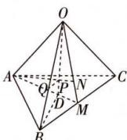

text_image

Geometric diagram of a pyramid with labeled vertices and internal points, used in spatial geometry problems.

$\overrightarrow{OA} + \frac{3}{4}\overrightarrow{AN} = \overrightarrow{OA} + \frac{3}{4} (\overrightarrow{ON} -\overrightarrow{OA}) = \frac{1}{4}\overrightarrow{OA} + \frac{3}{4}\overrightarrow{ON} = \frac{1}{4}\overrightarrow{OA}+$ $\frac{1}{2}\overrightarrow{OM} = \frac{1}{4} (\overrightarrow{OA} +\overrightarrow{OB} +\overrightarrow{OC})$ ，则 $\overrightarrow{AD} = \overrightarrow{OD} -\overrightarrow{OA} = \mu \overrightarrow{OP} -\overrightarrow{OA} =$ $(\frac{1}{4}\mu -1)\overrightarrow{OA} + \frac{1}{4}\mu \overrightarrow{OB} +\frac{1}{4}\mu \overrightarrow{OC},$ 又 $\overrightarrow{AD} = m\overrightarrow{AM} = \frac{1}{2} m(\overrightarrow{AB}+$ $\overrightarrow{AC}) = \frac{1}{2} m(\overrightarrow{OB} -\overrightarrow{OA} +\overrightarrow{OC} -\overrightarrow{OA}) = -m\overrightarrow{OA} +\frac{1}{2} m\overrightarrow{OB}+$

$\frac{1}{2}m\overrightarrow{OC}$ ，根据空间向量基本定理得 $\left\{\begin{aligned}-m&=\frac{1}{4}\mu-1,\\ \frac{1}{2}m&=\frac{1}{4}\mu,\end{aligned}\right.$ 解得

$\left\{ \begin{array}{l} m = \frac{2}{3}, \\ \mu = \frac{4}{3}, \end{array} \right.$ 因为 $PQ \parallel BD$ ，所以 $\triangle OPQ \sim \triangle ODB$ ，所以 $\frac{OQ}{OB} = \frac{OP}{OD} = \frac{1}{\mu} = \frac{3}{4}$ ，所以 $\lambda = \frac{3}{4}$ . 故选D.

5 $(\lambda-1)b+\lambda c \frac{1}{2}$ 解析 由题图知, $\overrightarrow{MN}=\overrightarrow{MD}+\overrightarrow{DA}+\overrightarrow{AN}=\lambda\overrightarrow{BD}-\overrightarrow{AD}+\lambda\overrightarrow{AE}=\lambda(\overrightarrow{AD}-\overrightarrow{AB})-\overrightarrow{AD}+\lambda(\overrightarrow{AB}+\overrightarrow{AF})=(\lambda-1)\overrightarrow{AD}+\lambda\overrightarrow{AF}=(\lambda-1)b+\lambda c.$ 由题意知 $|a|=4$ , $|b|=|c|=3$ , $a\cdot b=a\cdot c=0$ , $c\cdot b=3\times3\cos\frac{\pi}{3}=\frac{9}{2}$ , 所以 $\overrightarrow{MN^{2}}=\left[(\lambda-1)b+\lambda c\right]^{2}=(\lambda-1)^{2}b^{2}+2\lambda(\lambda-1)b\cdot c+\lambda^{2}c^{2}=9(\lambda-1)^{2}+9\lambda(\lambda-1)+9\lambda^{2}=9(3\lambda^{2}-3\lambda+1)=27(\lambda-\frac{1}{2})^{2}+\frac{9}{4}$ , 所以当 $\lambda=\frac{1}{2}$ 时, $\overrightarrow{MN^{2}}$ 有最小值, 即 $|\overrightarrow{MN}|$ 有最小值.

6 4 解析 方法一 因为 G 为 $\triangle ABC$ 的重心, 所以 $\overrightarrow{PG} = \frac{1}{3} (\overrightarrow{PA} + \overrightarrow{PB} + \overrightarrow{PC})$ . 又 $\overrightarrow{PG} = \frac{4}{3} \overrightarrow{PM}, \overrightarrow{PA} = \frac{1}{m} \overrightarrow{PD}, \overrightarrow{PB} = \frac{1}{n} \overrightarrow{PE}, \overrightarrow{PC} = \frac{1}{t} \overrightarrow{PF}$ , 所以 $\frac{4}{3} \overrightarrow{PM} = \frac{1}{3} (\frac{1}{m} \overrightarrow{PD} + \frac{1}{n} \overrightarrow{PE} + \frac{1}{t} \overrightarrow{PF})$ , 即 $\overrightarrow{PM} = \frac{1}{4} (\frac{1}{m} \overrightarrow{PD} + \frac{1}{n} \overrightarrow{PE} + \frac{1}{t} \overrightarrow{PF})$ . 又 M, D, E, F 四点共面, 所以 $\frac{1}{4} (\frac{1}{m} + \frac{1}{n} + \frac{1}{t}) = 1$ , 所以 $\frac{1}{m} + \frac{1}{n} + \frac{1}{t} = 4$ .

方法二 连接 $AG$ 并延长交 $BC$ 于点 $H$ . 由题意, 可令 $\{\overrightarrow{PA}, \overrightarrow{PB}, \overrightarrow{PC}\}$ 为空间的一个基底. $\overrightarrow{PM} = \frac{3}{4}\overrightarrow{PG} = \frac{3}{4} (\overrightarrow{PA} + \overrightarrow{AG}) = \frac{3}{4}\overrightarrow{PA} + \frac{3}{4} \times \frac{2}{3}\overrightarrow{AH} = \frac{3}{4}\overrightarrow{PA} + \frac{1}{2} \times \frac{1}{2} (\overrightarrow{AB} + \overrightarrow{AC}) = \frac{3}{4}\overrightarrow{PA} + \frac{1}{4} (\overrightarrow{PB} - \overrightarrow{PA}) + \frac{1}{4} (\overrightarrow{PC} - \overrightarrow{PA}) = \frac{1}{4}\overrightarrow{PA} + \frac{1}{4}\overrightarrow{PB} + \frac{1}{4}\overrightarrow{PC}$ . 连接 $DM$ . 因为点 $D, E, F, M$ 共面, 所以存在实数 $\lambda, \mu$ , 使得 $\overrightarrow{DM} = \lambda \overrightarrow{DE} + \mu \overrightarrow{DF}$ , 即 $\overrightarrow{PM} - \overrightarrow{PD} = \lambda (\overrightarrow{PE} - \overrightarrow{PD}) + \mu (\overrightarrow{PF} - \overrightarrow{PD})$ , 所以 $\overrightarrow{PM} = (1 - \lambda - \mu)\overrightarrow{PD} + \lambda \overrightarrow{PE} + \mu \overrightarrow{PF} = (1 - \lambda - \mu)m\overrightarrow{PA} + \lambda n\overrightarrow{PB} + \mu t\overrightarrow{PC}$ . 由空间向量基本定理, 知 $\frac{1}{4} = (1 - \lambda - \mu)m, \frac{1}{4} = \lambda n, \frac{1}{4} = \mu t$ , 所以 $\frac{1}{m} + \frac{1}{n} + \frac{1}{t} = 4(1 - \lambda - \mu) + 4\lambda + 4\mu = 4$ .

7 解析 (1) 当 $N$ 为 $B'C'$ 的中点时, $\overrightarrow{EN} = \overrightarrow{EA'} + \overrightarrow{A'N} = \frac{1}{2}\overrightarrow{AA'} + \overrightarrow{A'N} = \frac{1}{2}\overrightarrow{AA'} + \frac{1}{2} (\overrightarrow{A'B'} + \overrightarrow{A'C'}) = \frac{1}{2}\overrightarrow{AA'} + \frac{1}{2} (\overrightarrow{AB} +$

$$
\overrightarrow {A C}) = \frac {1}{2} \boldsymbol {a} + \frac {1}{2} (\boldsymbol {b} + \boldsymbol {c}) = \frac {1}{2} (\boldsymbol {a} + \boldsymbol {b} + \boldsymbol {c}),
$$

$$
\begin{array}{r l} & {\text {又} \overrightarrow {A M} = \overrightarrow {A B} + \overrightarrow {B M} = \overrightarrow {A B} + \frac {1}{2} (\overrightarrow {C C ^ {\prime}} + \overrightarrow {B C}) = \overrightarrow {A B} + \frac {1}{2} (\overrightarrow {A A ^ {\prime}} + \overrightarrow {B C}) =} \\ & {\overrightarrow {A B} + \frac {1}{2} [ \overrightarrow {A A ^ {\prime}} + (\overrightarrow {A C} - \overrightarrow {A B}) ] = \frac {1}{2} (\overrightarrow {A B} + \overrightarrow {A C} + \overrightarrow {A A ^ {\prime}}) = \frac {1}{2} (a +} \\ & {b + c) = \overrightarrow {E N}, \text {所以} A M / / E N.} \end{array}
$$

(2) 设 $\overrightarrow{B'N} = \lambda \overrightarrow{B'C'}$ , $0 \leqslant \lambda \leqslant 1$ , 则 $\overrightarrow{EN} = \overrightarrow{EA'} + \overrightarrow{A'N} = \frac{1}{2} \overrightarrow{AA'} + \overrightarrow{A'B'} + \overrightarrow{B'N} = \frac{1}{2} \overrightarrow{AA'} + \overrightarrow{AB} + \lambda \overrightarrow{B'C'} = \frac{1}{2} \overrightarrow{AA'} + \overrightarrow{AB} + \lambda (\overrightarrow{A'C'} -$

$$
\overrightarrow {A ^ {\prime} B ^ {\prime}}) = \frac {1}{2} \boldsymbol {a} + \boldsymbol {b} + \lambda (\boldsymbol {c} - \boldsymbol {b}) = \frac {1}{2} \boldsymbol {a} + (1 - \lambda) \boldsymbol {b} + \lambda \boldsymbol {c}.
$$

由于 $\angle ACC' = \angle ABB' = 90^\circ$ ，则 $a\cdot b = a\cdot c = 0$

所以 $\overrightarrow{AM} \cdot \overrightarrow{EN} = \frac{1}{2} (\pmb{a} + \pmb{b} + \pmb{c}) \cdot \left[\frac{1}{2}\pmb{a} + (1 - \lambda)\pmb{b} + \lambda\pmb{c}\right] = \frac{1}{4}\pmb{a}^2 + \frac{1}{2}(1 - \lambda)\pmb{b}^2 + \frac{1}{2}\pmb{b} \cdot \pmb{c} + \frac{1}{2}\lambda\pmb{c}^2 = 1 + \frac{1}{2}(1 - \lambda) + \frac{1}{2} \times 1 \times 1 \times \frac{1}{2} + \frac{1}{2}\lambda = \frac{7}{4}$ , 即 $\overrightarrow{AM} \cdot \overrightarrow{EN} \neq 0$ ,

故不存在点 N 使得 $AM \perp EN$ .

# 第三节 空间向量及其运算的坐标表示

# 过基础 教材必备知识精练

1 A 点 $A(1,3,-4)$ 关于原点对称的点为 $B(-1,-3,4)$ , 点 $B$ 关于 $x$ 轴对称的点为 $C(-1,3,-4)$ , 所以 $\overrightarrow{AC} = (-2,0,0)$ .

2 ABC 在等边三角形 ABC 中, AB = 2, BD = 1, 所以 $AD = \sqrt{3}$ , 则 $A(0, \sqrt{3}, 0)$ , $A_{1}(0, \sqrt{3}, 1)$ , $C_{1}(1, 0, 1)$ , $D_{1}(0, 0, 1)$ , $B_{1}(-1, 0, 1)$ , 则 $\overrightarrow{AD_{1}} = (0, -\sqrt{3}, 1)$ , $\overrightarrow{B_{1}A} = (1, \sqrt{3}, -1)$ . 故选 ABC.

3 B 因为 $ABCD-A_{1}B_{1}C_{1}D_{1}$ 是棱长为 1 的正方体，所以 $\{\overrightarrow{AB},\overrightarrow{AD},\overrightarrow{AA_{1}}\}$ ， $\{\overrightarrow{DA},\overrightarrow{DC},\overrightarrow{DD_{1}}\}$ 都是单位正交基底，因为 $a=2\overrightarrow{AB}+\overrightarrow{AD}-3\overrightarrow{AA_{1}}=2\overrightarrow{DC}-\overrightarrow{DA}-3\overrightarrow{DD_{1}}=-\overrightarrow{DA}+2\overrightarrow{DC}-3\overrightarrow{DD_{1}}$ ，所以向量 a 在基底 $\{\overrightarrow{DA},\overrightarrow{DC},\overrightarrow{DD_{1}}\}$ 下的坐标为 $(-1,2,-3)$ .

4 $(- \frac{\sqrt{2}}{2}, 0, \frac{\sqrt{14}}{2})$ $(- \frac{\sqrt{2}}{3}, \frac{\sqrt{2}}{3}, \frac{\sqrt{14}}{3})$ 解析 依题意得 $OD = OA = \frac{\sqrt{2}}{2} AB = \sqrt{2}$ , 则 $D(-\sqrt{2}, 0, 0)$ , $OP = \sqrt{PA^2 - OA^2} = \sqrt{14}$ , 则 $P(0, 0, \sqrt{14})$ , 所以 $PD$ 的中点 $M$ 的坐标为 $(- \frac{\sqrt{2}}{2}, 0, \frac{\sqrt{14}}{2})$ . 因为 $C(0, \sqrt{2}, 0)$ , 所以 $\triangle PCD$ 的重心的坐标为 $(\frac{0 + (-\sqrt{2}) + 0}{3}, \frac{0 + 0 + \sqrt{2}}{3}, \frac{\sqrt{14} + 0 + 0}{3})$ , 即 $(- \frac{\sqrt{2}}{3}, \frac{\sqrt{2}}{3}, \frac{\sqrt{14}}{3})$ .

【归纳总结】（1）已知 $P(x_{1},y_{1},z_{1}),Q(x_{2},y_{2},z_{2})$ ，则线段 $PQ$ 的中点的坐标为 $(\frac{x_1 + x_2}{2},\frac{y_1 + y_2}{2},\frac{z_1 + z_2}{2})$

(2) 已知 $\triangle ABC$ 的三个顶点 $A(x_{1}, y_{1}, z_{1})$ , $B(x_{2}, y_{2}, z_{2})$ , $C(x_{3}, y_{3}, z_{3})$ , 则 $\triangle ABC$ 的重心的坐标为 $\left(\frac{x_{1} + x_{2} + x_{3}}{3}, \frac{y_{1} + y_{2} + y_{3}}{3}, \frac{z_{1} + z_{2} + z_{3}}{3}\right)$ .

5 A $a - b + 2c = (1,0,1) - (-2, -1,1) + 2(3,1,0) = (9,3,0)$ .

6 ABC 

<table><tr><td>A</td><td>√</td><td>因为 $|b|=0$ ,所以 $b=0$ ,所以 $a,b$ 共线.</td></tr><tr><td>B</td><td>√</td><td>因为 $b=-2a$ ,所以 $a,b$ 共线.</td></tr><tr><td>C</td><td>√</td><td>因为 $a=-b+c$ ,所以 $a,b,c$ 共面.</td></tr><tr><td>D</td><td>×</td><td>设 $a=xb+yc(x,y\in\mathbf{R})$ ,则 $\begin{cases}2=-x+3y,\\-1=2x+2y,\text{该方程组无解,故}a,b,c\text{不}\\3=3x-y,\end{cases}$ 共面.</td></tr></table>

7 $(3, \frac{3}{2}, -2)$ (5, $\frac{1}{2}, 0$ ) 解析 由题可得 $\overrightarrow{CB} = (6, 3, -4)$ . 若 $\overrightarrow{OP} = \frac{1}{2} (\overrightarrow{AB} - \overrightarrow{AC}) = \frac{1}{2}\overrightarrow{CB} = (3, \frac{3}{2}, -2)$ , 则 $P(3, \frac{3}{2}, -2)$ . 若 $\overrightarrow{AP} = \frac{1}{2} (\overrightarrow{AB} - \overrightarrow{AC}) = \frac{1}{2}\overrightarrow{CB} = (3, \frac{3}{2}, -2)$ , 则 $\overrightarrow{OP} = \overrightarrow{OA} + \overrightarrow{AP} = (2, -1, 2) + (3, \frac{3}{2}, -2) = (5, \frac{1}{2}, 0)$ , 所以 $P(5, \frac{1}{2}, 0)$ .

8 B 方法一 因为 $\boldsymbol{a}=(-1,2,1)$ , $\boldsymbol{b}=(1,3,2)$ ，所以 $\boldsymbol{a}+\boldsymbol{b}=(0,5,3)$ , $2\boldsymbol{a}-\boldsymbol{b}=(-3,1,0)$ ，则 $(\boldsymbol{a}+\boldsymbol{b})\cdot(2\boldsymbol{a}-\boldsymbol{b})=0\times(-3)+5\times1+3\times0=5.$

方法二 $a^{2}=1+4+1=6, b^{2}=1+9+4=14, a \cdot b=(-1) \times 1+2 \times 3 + 1 \times 2 = 7$ ，所以 $(a+b) \cdot (2a-b) = 2a^{2} + a \cdot b - b^{2} = 2 \times 6 + 7 - 14 = 5$ .

9 AC 由 $A(1,3,-5),B(-2,1,1)$ ，得 $\overrightarrow{AB} = (-3, - 2,$ 6)，则 $|\overrightarrow{AB}| = \sqrt{(-3)^2 + (-2)^2 + 6^2} = 7$ ，A正确； $\overrightarrow{OA}\cdot$ $\overrightarrow{OB} = 1\times (-2) + 3\times 1 + (-5)\times 1 = -4,\mathrm{B}$ 错误；由 $\pmb {n}$ （4,2,t）， $\pmb{n}\bot \overrightarrow{AB}$ ，得 $\pmb {n}\cdot \overrightarrow{AB} = -12 - 4 + 6t = 0$ ，解得 $t = \frac{8}{3},$ C正确；由 $\pmb {m} = (1,1,k)$ 且 $\pmb {m} / /\overrightarrow{AB}$ 得 $\frac{1}{-3} = \frac{1}{-2} = \frac{k}{6}$ ，无解，D错误.

10 C 因为 $a=(1,1,1)$ , $c=(x,-4,2)$ ，且 $a\perp c$ ，所以 $a\cdot c=x-4+2=0$ ，解得 x=2，所以 $c=(2,-4,2)$ 。又 $b=(1,y,z)$ , $c=(2,-4,2)=2(1,-2,1)$ ，且 $b//c$ ，所以 $c=2b$ ，即 y=-2, z=1，所以 $b=(1,-2,1)$ ，所以 $a+b=(2,-1,2)$ ，所以 $|a+b|=\sqrt{2^{2}+(-1)^{2}+2^{2}}=3$ 。

11 B 若 a 与 b 的夹角为锐角，则 $0 < \cos\langle a, b \rangle < 1$ ，即 $\frac{a \cdot b}{|a||b|} = \frac{1 \times 3 + 2 \times 6 + 4 \times (2\lambda - 2)}{\sqrt{21} \times \sqrt{4(\lambda - 1)^2 + 45}} \in (0, 1)$ ，解得 $\lambda > -\frac{7}{8}$ 且 $\lambda \neq 7$ 。因为 $(- \frac{7}{8}, 7) \cup (7, +\infty)$ 是 $(- \frac{7}{8}, +\infty)$ 的真子集，所以“ $\lambda > -\frac{7}{8}$ ”是“a 与 b 的夹角为锐角”的必要不充分条件。

12 2 $\left(\frac{3}{2},\frac{3}{2},\frac{3\sqrt{2}}{2}\right)$ 解析 由 $\left|a+b\right|=\sqrt{3}\left|a-b\right|$ ，得 $a^{2}-4a\cdot b+b^{2}=0$ 。因为 $a=(1,1,\sqrt{2})$ ，所以 $\left|a\right|=\sqrt{1+1+2}=2$ 。又 $\left|b\right|=2$ ，所以 $4-4a\cdot b+4=0$ ，解得 $a\cdot b=2$ 。因为 $(a+b)\cdot a=a^{2}+a\cdot b=4+2=6$ ，所以 $a+b$ 在 a 上的投影向量的坐标为 $\frac{(a+b)\cdot a}{|a|}\cdot\frac{a}{|a|}=\frac{6}{2}\times\frac{(1,1,\sqrt{2})}{2}=\left(\frac{3}{2},\frac{3}{2},\frac{3\sqrt{2}}{2}\right)$ 。

13 C 方法一 因为 $\overrightarrow{AB} = (3,4, - 8),\overrightarrow{AC} = (5,1, - 7)$ $\overrightarrow{BC} = (2, - 3,1)$ ，所以 $|\overrightarrow{AB}| = \sqrt{3^2 + 4^2 + (-8)^2} = \sqrt{89},|\overrightarrow{AC}| =$ $\sqrt{5^2 + 1^2 + (-7)^2} = \sqrt{75},|\overrightarrow{BC}| = \sqrt{2^2 + (-3)^2 + 1^2} =$ $\sqrt{14}$ ，所以 $|\overrightarrow{AC}|^2 +|\overrightarrow{BC}|^2 = |\overrightarrow{AB}|^2$ ，所以△ABC为直角三角形.

方法二 因为 $\overrightarrow{AC} = (5,1, - 7),\overrightarrow{BC} = (2, - 3,1)$ ，且 $\overrightarrow{AC}\cdot$ $\overrightarrow{BC} = 10 - 3 - 7 = 0$ ，所以 $\overrightarrow{AC}\perp \overrightarrow{BC}$ ，即 $\angle ACB = 90^{\circ}$ 又 $|\overrightarrow{AC}| =$ $\sqrt{5^2 + 1^2 + (-7)^2} = \sqrt{75},|\overrightarrow{BC}| = \sqrt{2^2 + (-3)^2 + 1^2} =$ $\sqrt{14}$ ，所以 $|\overrightarrow{AC} |\neq |\overrightarrow{BC} |$ ，所以△ABC为直角三角形.

14 A 方法一 以 D 为原点, 建立如图所示的空间直角坐标系, 则 $A(1,0,0)$ , $O(\frac{1}{2},\frac{1}{2},0)$ , 设 $P(0,1,z)$ , 则 $\overrightarrow{AP}=(-1,1,z)$ , $\overrightarrow{AO}=(-\frac{1}{2},\frac{1}{2},0)$ , 所以 $\overrightarrow{AP}\cdot\overrightarrow{AO}=-1\times(-\frac{1}{2})+1\times\frac{1}{2}+z\times0$

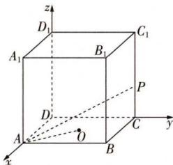

text_image

z
D₁
A₁
B₁
C₁
P
D
A
O
C
y
x
B

方法二 延长 AO 至点 C，由题可知， $AO = \frac{1}{2}AC = \frac{\sqrt{2}}{2}, \overrightarrow{AP}$ 在 $\overrightarrow{AO}$ 上的投影向量为 $\overrightarrow{AC}$ ，所以 $\overrightarrow{AP} \cdot \overrightarrow{AO} = |\overrightarrow{AC}| |\overrightarrow{AO}| = 1.$

15 $\sqrt{5}$ 解析 以点 $A$ 为原点， $\overrightarrow{AB}, \overrightarrow{AC}, \overrightarrow{AA_1}$ 的方向分别为 $x, y, z$ 轴的正方向，建立空间直角坐标系，则 $E(0,4,2)$ ， $F(2,0,0), G(2,0,4), \overrightarrow{EF} = (2, -4, -2)$ ，设 $D(0, t,0)$ ，则 $\overrightarrow{GD} = (-2, t, -4)$ ，因为 $GD \perp EF$ ，所以 $\overrightarrow{GD} \cdot \overrightarrow{EF} = -2 \times 2 - 4t + (-4) \times (-2) = 0$ ，得 $t = 1$ ，即 $D(0,1,0)$ ，所以 $DF = \sqrt{(2 - 0)^2 + (0 - 1)^2 + (0 - 0)^2} = \sqrt{5}$ .

16 解析 (1) 因为 $A(1, -\sqrt{2}, 3), B(0, \sqrt{2}, 5)$ , 所以 $\overrightarrow{AB} = (-1, 2\sqrt{2}, 2)$ ,

由 $m \parallel \overrightarrow{AB}$ ，可设 $m = \lambda \overrightarrow{AB}, \lambda \in R$ ，所以 $m = (-\lambda, 2\sqrt{2}\lambda, 2\lambda)$ ，通过平行设 m 的坐标，只有 1 个参数，若设 $m = (x, y, z)$ ，则有 3 个参数.

因为 $|m|=\sqrt{13}$ ，所以 $\sqrt{\lambda^{2}+8\lambda^{2}+4\lambda^{2}}=\sqrt{13}$ ，
解得 $\lambda = \pm 1$ ,

所以 m 的坐标为 $(-1,2\sqrt{2},2)$ 或 $(1,-2\sqrt{2},-2)$ .

(2) 设点 $D(x,y,z)$ ，则 $\overrightarrow{DC} = (1 - x, \sqrt{2} - y, 4 - z)$ .

由(1)知 $\overrightarrow{AB}=(-1,2\sqrt{2},2)$ ,
因为四边形 ABCD 是平行四边形,所以 $\overrightarrow{DC}=\overrightarrow{AB}$ ,

即 $\left\{\begin{aligned}1-x&=-1,\\ \sqrt{2}-y&=2\sqrt{2},\\ 4-z&=2,\end{aligned}\right.$ 解得 $\left\{\begin{aligned}x&=2,\\ y&=-\sqrt{2},\\ z&=2,\end{aligned}\right.$

即点 D 的坐标为 $(2, -\sqrt{2}, 2)$ .

(3) 由(2)可得 $\overrightarrow{AD} = (1,0,-1)$ , 则 $\overrightarrow{AB} \cdot \overrightarrow{AD} = -1 \times 1 + 2\sqrt{2} \times 0 + 2 \times (-1) = -3$ .

又 $|\overrightarrow{AB}| = \sqrt{(-1)^2 + (2\sqrt{2})^2 + 2^2} = \sqrt{13}, |\overrightarrow{AD}| = \sqrt{1^2 + (-1)^2} = \sqrt{2}$ , 所以 $\cos \langle \overrightarrow{AB}, \overrightarrow{AD} \rangle = \frac{\overrightarrow{AB} \cdot \overrightarrow{AD}}{|\overrightarrow{AB}| |\overrightarrow{AD}|} = -\frac{3}{\sqrt{26}}$ ,

即 $\cos\angle BAD=-\frac{3}{\sqrt{26}}$ ,

又 $\angle BAD\in(0,\pi)$ , 所以 $\sin\angle BAD=\sqrt{1-\cos^2\angle BAD}=\sqrt{\frac{17}{26}}$ , 所以平行四边形 $ABCD$ 的面积为 $|\overrightarrow{AB}||\overrightarrow{AD}|\sin\angle BAD=\sqrt{13}\times\sqrt{2}\times\sqrt{\frac{17}{26}}=\sqrt{17}$ .

17 解析 （1）因为四边形 ABCD 是边长为 2 的菱形，且 $\angle DAB = 60^{\circ}$ ，所以 $OA = OC = \sqrt{3}$ ，OB = OD = 1，

$$
S _ {\text {菱形} A B C D} = \frac {1}{2} \times 2 \times 2 \sqrt {3} = 2 \sqrt {3}.
$$

因为 $PO \perp$ 平面 ABCD, 所以 $\angle PBO$ 为 PB 与平面 ABCD 所成的角, 即 $\angle PBO = 60^{\circ}$ ,

所以 $PO = OB \cdot \tan 60^{\circ} = \sqrt{3}$ ,

所以 $V_{四棱锥P-ABCD}=\frac{1}{3}S_{菱形ABCD}\cdot PO=\frac{1}{3}\times2\sqrt{3}\times\sqrt{3}=2.$

(2) 以 O 为坐标原点, $\overrightarrow{OB}, \overrightarrow{OC}, \overrightarrow{OP}$ 的方向分别为 x 轴、y 轴、z 轴的正方向, 建立空间直角坐标系 Oxyz,
则 $B(1,0,0)$ , $D(-1,0,0)$ , $A(0,-\sqrt{3},0)$ , $P(0,0,\sqrt{3})$ , $E(\frac{1}{2},0,\frac{\sqrt{3}}{2})$

所以 $\overrightarrow{DE}=(\frac{3}{2},0,\frac{\sqrt{3}}{2}),\overrightarrow{PA}=(0,-\sqrt{3},-\sqrt{3})$ ,

所以 $\overrightarrow{DE}\cdot\overrightarrow{PA}=0+0+\frac{\sqrt{3}}{2}\times(-\sqrt{3})=-\frac{3}{2},$ $|\overrightarrow{DE}|=\sqrt{3},|\overrightarrow{PA}|=\sqrt{6},$

所以 $\cos\langle\overrightarrow{DE},\overrightarrow{PA}\rangle=\frac{\overrightarrow{DE}\cdot\overrightarrow{PA}}{|\overrightarrow{DE}||\overrightarrow{PA}|}=\frac{-\frac{3}{2}}{\sqrt{3}\times\sqrt{6}}=-\frac{\sqrt{2}}{4}$

所以异面直线 DE 与 PA 所成角的余弦值为 $\frac{\sqrt{2}}{4}$ .

# 过能力 学科关键能力构建

1 ABD 若四边形 OABC 为菱形, 则对角线 OB 和 AC 互相平分, 由中点坐标公式, 得 $\left(\frac{m}{2}, \frac{1}{2}, \frac{n}{2}\right) = \left(\frac{3 + 2}{2}, \frac{2 + p}{2}, \frac{-1 + q}{2}\right)$ , 解得 m = 5, p = -1, n = q - 1, A, B 正确; $B(5, 1, q - 1)$ , $C(2, -1, q)$ , 由四边形 OABC 为菱形, 可得对角线 OB 和 AC 互相垂直, 因为 $\overrightarrow{OB} = (5, 1, q - 1)$ , $\overrightarrow{AC} = (-1, -3, q + 1)$ , 所以 $\overrightarrow{OB} \cdot \overrightarrow{AC} = -5 - 3 + (q - 1)(q + 1) = 0$ , 解得 $q = \pm 3$ , D 正确; q = 3 时, n = 2, q = -3 时, n = -4, C 错误.

2 CD 对于 A, $D_{1}(0,0,1)$ , $D_{3}(0,0,4)$ ，则 $D_{1}D_{3}$ 的中点坐标为 $(0,0,\frac{5}{2})$ ，A 错误。对于 B, $\overrightarrow{A_{3}C_{1}}=(0,1,1)-(3,0,4)=(-3,1,-3)$ , $\overrightarrow{DC_{2}}=(0,2,0)$ , $|\overrightarrow{DC_{2}}|=2$ ，所以 $\overrightarrow{A_{3}C_{1}}$ 在 $\overrightarrow{DC_{2}}$ 方向上的投影向量的模为 $\frac{\overrightarrow{A_{3}C_{1}}\cdot\overrightarrow{DC_{2}}}{|\overrightarrow{DC_{2}}|}=1$ ，B 错误。对于 C, $B_{1}(1,1,1)$ , $B_{3}(3,2,4)$ , $\overrightarrow{B_{1}B_{3}}=(2,1,3)$ , $B_{1}B_{3}=\left|\overrightarrow{B_{1}B_{3}}\right|=\sqrt{2^{2}+1^{2}+3^{2}}=\sqrt{14}$ ，C 正确。对于 D，点 $B_{3}$ 关于 x 轴的对称点为 $B_{3}^{\prime}(3,-2,-4)$ , $C_{3}(0,2,4)$ ，则 $B_{3}P+C_{3}P$ 的最小值为 $\left|\overrightarrow{B_{3}^{\prime}C_{3}}\right|=\sqrt{(3-0)^{2}+(-2-2)^{2}+(-4-4)^{2}}=\sqrt{89}$ ，D 正确。

3 C 设正方形的边长为 1, AE = a (0 < a < 1), 建立如图所示的空间直角坐标系, 则 A(a, 0, 0), G(0, a, 0), C(0, 1, 1 - a), $\overrightarrow{AG} = (-a, a, 0)$ , $\overrightarrow{GC} = (0, 1 - a, 1 - a)$ , $\mid \cos \angle AGC$

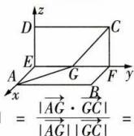

text_image

z
D	C
E	G	F y
A	B
x	=	|AG·GC|
|AG||GC|	=

$\frac{|a(1-a)|}{\sqrt{2}|a|\cdot\sqrt{2}|1-a|}=\frac{1}{2}$ ，又 $\angle AGC$ 为钝角，所以 $\angle AGC=120^{\circ}$ ，即角度不会发生变化，故选C.

4 $-\frac{11}{12}$ 解析 由题可知 $OB, OC, OD$ 两两垂直，以 $O$ 为原点， $\overrightarrow{OB}, \overrightarrow{OC}, \overrightarrow{OD}$ 的方向分别为 $x, y, z$ 轴的正方向，建立空间直角坐标系，设 $OB = OC = OD = 1$ ，可得 $B(1,0,0), C(0,1,0), D(0,0,1)$ ，所以 $\overrightarrow{OB} = (1,0,0), \overrightarrow{OC} = (0,1,0), \overrightarrow{OD} = (0,0,1)$ ，设点 $A(a,b,c)$ ，可得 $\overrightarrow{OA} = (a,b,c)$ ，设 $|\overrightarrow{OA}| = \sqrt{a^2 + b^2 + c^2} = t.$ 由 $\cos \langle \overrightarrow{OA}, \overrightarrow{OC} \rangle = \frac{\overrightarrow{OA} \cdot \overrightarrow{OB}}{|\overrightarrow{OA}| |\overrightarrow{OB}|} = \frac{a}{t} = -\frac{1}{3}$ ，可得 $a = -\frac{1}{3} t$ ，由 $\cos \langle \overrightarrow{OA}, \overrightarrow{OC} \rangle = \frac{\overrightarrow{OA} \cdot \overrightarrow{OC}}{|\overrightarrow{OA}| |\overrightarrow{OC}|} = \frac{b}{t} = -\frac{\sqrt{7}}{12}$ ，可得 $b = -\frac{\sqrt{7}}{12} t.$ 因为 $\cos \langle \overrightarrow{OA}, \overrightarrow{OD} \rangle = \frac{\overrightarrow{OA} \cdot \overrightarrow{OD}}{|\overrightarrow{OA}| |\overrightarrow{OD}|} = \frac{c}{t} < 0$ ，则 $c = -\sqrt{t^2 - a^2 - b^2} = -\frac{11}{12} t$ ，所以 $\cos \langle \overrightarrow{OA}, \overrightarrow{OD} \rangle = -\frac{11}{12}$ .

5 $\frac{3\sqrt{5}}{4}$ 解析 以 $D$ 为坐标原点, $\overrightarrow{DA}, \overrightarrow{DC}, \overrightarrow{DD_1}$ 的方向分别为 $x, y, z$ 轴的正方向, 建立空间直角坐标系. 因为 $AA_1 = 3$ , $AB = AD = 2$ , 所以 $D(0,0,0), E(2,0,\frac{3}{2}), F(0,1,3)$ , $P(1,1,0)$ , 则 $\overrightarrow{EF} = (-2,1,\frac{3}{2})$ . 设 $Q(0,m,n)$ , 则 $\overrightarrow{PQ} = Q$ 在 $Dyz$ 平面上, 其横坐标为 0.

$(-1,m-1,n)$ . 因为 $\overrightarrow{EF} \parallel \overrightarrow{PQ}$ ，所以 $\frac{-2}{-1} = \frac{1}{m-1} = \frac{\frac{3}{2}}{n}$ ，得 $m = \frac{3}{2}, n = \frac{3}{4}$ ，则 $Q(0, \frac{3}{2}, \frac{3}{4})$ ，则 $\overrightarrow{DQ} = (0, \frac{3}{2}, \frac{3}{4})$ ，所以 $|\overrightarrow{DQ}| = \frac{3\sqrt{5}}{4}$ .

# 【归纳总结】 动点类型及常见设法

1. 动点在棱上.

(1) 若动点所在棱与坐标轴平行或重合, 则可直接在点的坐标中引入参数, 设出点的坐标, 一个动点坐标中一般含有一个参数;

(2) 若动点所在棱不满足(1)的情况, 常常通过向量共线引入“ $\lambda$ ”表示出点的坐标.

2. 动点在平面上.

(1) 若动点所在平面与坐标平面平行或重合, 则可直接在点的坐标中引入参数, 设出点的坐标, 一个动点坐标中一般含有两个参数;

(2) 若动点所在平面不满足(1)的情况, 常常通过向量共面引入“ $\lambda$ ”“ $\mu$ ”表示出点的坐标.

注意:以上参数均需考虑参数的取值范围.

6 解析 （1）如图，连接 BD, CE，交于点 O，连接 AF，易得 O 为 AF 的中点，且 OA, OC, OD 两两垂直。以 O 为坐标原点， $\overrightarrow{OC}, \overrightarrow{OD}, \overrightarrow{OA}$ 的方向分别为 x 轴、y 轴、z 轴的正方向，建立空间直角坐标系，

利用自身对称性建立空间直角坐标系.

则 $C(\sqrt{2},0,0)$ , $A(0,0,\sqrt{2})$ , $B(0,-\sqrt{2},0)$ , $D(0,\sqrt{2},0)$ , $F(0,0,-\sqrt{2})$ , 又 P, Q 分别为棱 AB, AD 的中点, 所以 $P(0,-\frac{\sqrt{2}}{2},\frac{\sqrt{2}}{2})$ , $Q(0,\frac{\sqrt{2}}{2},\frac{\sqrt{2}}{2})$ ,

所以 $\overrightarrow{CP} = (-\sqrt{2}, -\frac{\sqrt{2}}{2}, \frac{\sqrt{2}}{2})$ , $\overrightarrow{FQ}=(0,\frac{\sqrt{2}}{2},\frac{3\sqrt{2}}{2})$ ,

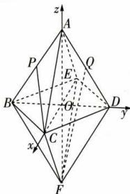

text_image

z
A
P
E
Q
B
O
D
y
x
C
F

所以 $\overrightarrow{CP} \cdot \overrightarrow{FQ} = (-\sqrt{2}) \times 0 + (-\frac{\sqrt{2}}{2}) \times \frac{\sqrt{2}}{2} + \frac{\sqrt{2}}{2} \times \frac{3\sqrt{2}}{2} = 1.$

(2)由(1)知, $\overrightarrow{AB}=(0,-\sqrt{2},-\sqrt{2}),\overrightarrow{AD}=(0,\sqrt{2},-\sqrt{2})$ . 设 $\overrightarrow{AP}=\lambda\overrightarrow{AB}(0\leqslant\lambda\leqslant1),\overrightarrow{AQ}=\mu\overrightarrow{AD}(0\leqslant\mu\leqslant1)$ ，则 $\overrightarrow{AP}=$ 动点在棱上，且不易直接设出动点的坐标时，常用此种设法. $\lambda\overrightarrow{AB}=(0,-\sqrt{2}\lambda,-\sqrt{2}\lambda),\overrightarrow{AQ}=\mu\overrightarrow{AD}=(0,\sqrt{2}\mu,-\sqrt{2}\mu)$ ，所以 $P(0,-\sqrt{2}\lambda,-\sqrt{2}\lambda+\sqrt{2}),Q(0,\sqrt{2}\mu,-\sqrt{2}\mu+\sqrt{2})$ ，所以 $\overrightarrow{CP}=(-\sqrt{2},- \sqrt{2}\lambda,-\sqrt{2}\lambda+\sqrt{2}),\overrightarrow{FQ}=(0,\sqrt{2}\mu,-\sqrt{2}\mu+2\sqrt{2})$ .

所以 $\overrightarrow{CP} \cdot \overrightarrow{FQ} = 0 - 2\mu \lambda + (-\sqrt{2}\lambda + \sqrt{2})(-\sqrt{2}\mu + 2\sqrt{2}) = -4\lambda - 2\mu + 4.$

所以当 $\lambda = \mu = 1$ 时, $\overrightarrow{CP} \cdot \overrightarrow{FQ}$ 取得最小值, 为 -2.

# 第四节 空间向量的应用

# 课时 1 ▶ 用空间向量研究直线、平面的位置关系

# 过基础 教材必备知识精练

1 A 由题知 $\overrightarrow{AB} = (-1,2 - y,z - 3)$ ，且 $\overrightarrow{AB} // m$ ，所以 $\frac{-1}{2} = \frac{2 - y}{-1} = \frac{z - 3}{3}$ 解得 $y = \frac{3}{2},z = \frac{3}{2}$ ，所以 $y - z = 0.$   
2 B 由题得 $n \perp \overrightarrow{OA}$ ，则 $n \cdot \overrightarrow{OA} = (-1, 2, -2) \cdot (2, a, 2) = -2 + 2a - 4 = 0$ ，解得 a = 3.  
3 BC 由题得 $\overrightarrow{AB} = (0,0,1),\overrightarrow{AC} = (1,1,0)$ ，设平面 $\alpha$ 的法向量为 $n = (x,y,z)$ ，则 $\left\{ \begin{array}{l}\overrightarrow{AB}\cdot n = 0,\\ \overrightarrow{AC}\cdot n = 0, \end{array} \right.$ 即 $\left\{ \begin{array}{l}z = 0,\\ x + y = 0, \end{array} \right.$ 故平面 $\alpha$ 的法向量可以为(1，-1,0)，(-1,1,0).

【归纳总结】求平面法向量的步骤：

(1) 设平面的法向量为 $\boldsymbol{n}=(x,y,z)$ ;  
(2) 在平面中选取两个不共线向量 $\overrightarrow{AB}, \overrightarrow{AC}$ ;  
(3) 令 $\left\{\begin{aligned}n & \cdot \overrightarrow{AB} = 0, \\ n & \cdot \overrightarrow{AC} = 0,\end{aligned}\right.$ 取 x, y, z 中的一个为非零数（常取 $\pm 1$ ），得到平面的一个法向量 n.

4 ABC 由题可得 $A(0,0,0), D(0,1,0), B(1,0,0), B_1(1,0,1), C_1(1,1,1), D_1(0,1,1)$ . 因为 $\overrightarrow{DD_1} = (0,0,1)$ , 所以 A 正确; 因为 $\overrightarrow{BC_1} = (0,1,1)$ , 所以 B 正确; 因为 $AD \perp$ 平面 $ABB_1A_1$ , $\overrightarrow{AD} = (0,1,0)$ , 所以 C 正确; 因为 $\overrightarrow{AC_1} = (1,1,1)$ , $\overrightarrow{B_1D} = (-1,1,-1)$ , $\overrightarrow{AC_1} \cdot \overrightarrow{B_1D} = -1 \neq 0$ , 所以 D 错误.

【归纳总结】 平面法向量的求法——直接寻找法

(1) 几何体中有已知或易证得的直线与平面垂直, 该直线的方向向量为平面的法向量.  
(2) 找几何体与坐标轴的交点: 平面与 x, y, z 轴都相交 (如图 1), 则平面的一个法向量为 $\boldsymbol{n} = \left(\frac{1}{a}, \frac{1}{b}, \frac{1}{c}\right)$ ;

平面平行于 $x$ 轴（如图2），则平面的一个法向量为 $\pmb{n} =$

$(0,\frac{1}{b},\frac{1}{c})$ ; 平面平行于 y 轴, 则平面的一个法向量为 $\boldsymbol{n}=(\frac{1}{a},0,\frac{1}{c})$ ; 平面平行于 z 轴, 则平面的一个法向量为 $\boldsymbol{n}=(\frac{1}{a},\frac{1}{b},0)$ .

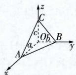

text_image

z
C
c
O
B
A
a
y
x

图 1

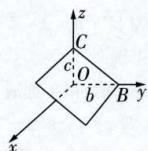

text_image

z
C
c
O
b
B y
x

图 2

5 B 由题意得 $\frac{3}{2}=\frac{x}{4}=\frac{y}{5}$ ，所以x=6, $y=\frac{15}{2}$ ，故 $x+y=6+\frac{15}{2}=\frac{27}{2}$ .

6 A 方法一 建立如图所示的空间直角坐标系, 设正方体的棱长为 3, 则 $E(2,2,0), F(1,3,1), A(3,0,0), C_1(0,3,3), \overrightarrow{AC_1} = (-3,3,3), \overrightarrow{EF} = (-1,1,1)$ , 所以 $\overrightarrow{AC_1} = 3\overrightarrow{EF}$ , 故 $AC_1$ 与 $EF$ 平行.

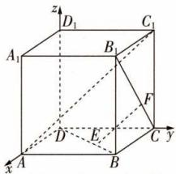

text_image

z
D₁
C₁
A₁
B₁
F
D
E
C
y
A
B

方法二 因为 $\overrightarrow{AC_1} = \overrightarrow{AB} +\overrightarrow{BC} +\overrightarrow{CC_1},\overrightarrow{EF} = \overrightarrow{EB} +\overrightarrow{BC} +\overrightarrow{CF} =$ $\frac{1}{3}\overrightarrow{DB} +\overrightarrow{BC} +\frac{1}{3}\overrightarrow{CB_1} = \frac{1}{3} (\overrightarrow{DA} +\overrightarrow{AB}) + \overrightarrow{BC} +\frac{1}{3} (\overrightarrow{CC_1}+$ $\overline{C_1B_1}) = \frac{1}{3}\overrightarrow{DA} +\frac{1}{3}\overrightarrow{AB} +\overrightarrow{BC} +\frac{1}{3}\overrightarrow{CC_1} +\frac{1}{3}\overrightarrow{DA} = \frac{1}{3}\overrightarrow{AB}+$ $\frac{1}{3}\overrightarrow{BC} +\frac{1}{3}\overrightarrow{CC_1}$ ，所以 $\overrightarrow{AC_1} = 3\overrightarrow{EF}$ ，故 $AC_{1}$ 与 $EF$ 平行.

7 D 设直线 l 的方向向量为 $\boldsymbol{n}=(x,y,z)$ ，则 $m\perp n$ ，即 $m\cdot n=0$ 。对于 A, $m\cdot n=t-1+t+1=2t$ ，不满足题意；对于 B, $m\cdot n=-t+1-t-1=-2t$ ，不满足题意；对于 C, $m\cdot n=-t+1+t+1=2$ ，不满足题意；对于 D, $m\cdot n=t+1-t-1=0$ ，满足题意。  
8 BD 因为 $\boldsymbol{n}=(1,-2,-\frac{1}{2}),\boldsymbol{a}=(2,0,4)$ ，所以 $n\cdot a=1\times2+(-2)\times0+(-\frac{1}{2})\times4=0$ ，所以 $l/\alpha$ 或 $l\subset\alpha$ 。故选 BD.  
9 $\frac{2}{3}$ 解析 以 $A$ 为原点, $\overrightarrow{AB},\overrightarrow{AD},\overrightarrow{AP}$ 的方向分别为 $x$ , $y,z$ 轴的正方向, 建立空间直角坐标系, 由题意可得 $C(2,2,0),O(1,1,0),F(1,0,1),E(0,1,1)$ , 所以 $\overrightarrow{FC} = (1,2,-1),\overrightarrow{FE} = (-1,1,0)$ . 设平面 $EFC$ 的法向量为 $\boldsymbol{n} = (x,y,z)$ , 则 $\left\{ \begin{array}{l} \boldsymbol{n} \cdot \overrightarrow{FC} = 0, \\ \boldsymbol{n} \cdot \overrightarrow{FE} = 0, \end{array} \right.$ 即 $\left\{ \begin{array}{l} x + 2y - z = 0, \\ -x + y = 0, \end{array} \right.$ 令 $x = 1$ , 得平面 $EFC$ 的一个法向量为 $\boldsymbol{n} = (1,1,3)$ . 因为 $OG / /$ 平面 $EFC$ , 所以 $\boldsymbol{n} \cdot \overrightarrow{OG} = 0$ , 设 $G(0,0,a)$ , 则 $\overrightarrow{OG} = (-1,-1,a)$ , 所以 $-1-1+3a=0$ , 解得 $a=\frac{2}{3}$ , 所以 $G(0,0,\frac{2}{3})$ , 即 $AG=\frac{2}{3}$ .

【名师点评】建立空间直角坐标系的关键是找“墙角”（三条两两垂直的直线）.“墙角”的常见类型：①题中直接给出了“墙角”；②通过线面或面面垂直证明可得到“墙角”；③在所给立体图形中添加辅助线（一般找棱的中点）找“墙角”或造“墙角”；④凌空建系造“墙角”，即若只能在几何体中找到两条垂直的直线，则以这两条直线的交点为原点，这两条直线为两条坐标轴，另一条坐标轴“悬空”.

10 ACD 若平面 $\alpha, \beta$ 平行，则两平面的法向量平行。对于 A, $n_{1} = \frac{1}{2} n_{2}$ ，则两个法向量平行，A 正确；对于 B，不存在实数 $\lambda$ 使得 $n_{1} = \lambda n_{2}$ ，则两个法向量不平行，B 错误；对于 C, $n_{1} = -\frac{1}{2} n_{2}$ ，则两个法向量平行，C 正确；对于 D, $n_{1} = -n_{2}$ ，则两个法向量平行，D 正确。

11 证明 (1) 因为 $AB = 4, BC = CD = 2, F$ 是棱 $AB$ 的中点, 所以 $BF = BC = CF$ , 则 $\triangle BCF$ 为正三角形.

因为底面 ABCD 为等腰梯形, 所以 $\angle BAD = \angle ABC = 60^{\circ}$ .
取 AF 的中点 M, 连接 DM, 则 $DM \perp AB$ , 所以 $DM \perp CD$ .

以 D 为原点， $\overrightarrow{DM},\overrightarrow{DC},\overrightarrow{DD_{1}}$ 的方向分别为 x,y,z 轴的正方向，建立空间直角坐标系，如图所示，
则 $F(\sqrt{3},1,0)$ , $C(0,2,0)$ , $C_{1}(0,2,2)$ , $E(\frac{\sqrt{3}}{2}, -\frac{1}{2}, 0)$ , $E_{1}(\sqrt{3}, -1, 1)$ ,

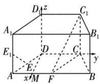

text_image

D
z
C₁
A₁
B₁
E₁
D
C
y
E
A
x′M
F
B

所以 $\overrightarrow{CC_1} = (0,0,2),\overrightarrow{EE_1} = (\frac{\sqrt{3}}{2}, - \frac{1}{2},1),\overrightarrow{CF} = (\sqrt{3}, - 1,0).$

方法一 设平面 $FCC_{1}$ 的法向量为 $\boldsymbol{n}=(x,y,z)$ ,

则 $\left\{\begin{aligned}\boldsymbol{n}\cdot\overrightarrow{CF}&=\sqrt{3}x-y=0,\\ \boldsymbol{n}\cdot\overrightarrow{CC_{1}}&=2z=0,\end{aligned}\right.$

令 $x = 1$ ，可得平面 $FCC_{1}$ 的一个法向量为 $\pmb {n} = (1,\sqrt{3},0)$ 则 $\pmb {n}\cdot \overrightarrow{EE_1} = 1\times \frac{\sqrt{3}}{2} +\sqrt{3}\times (-\frac{1}{2}) + 0\times 1 = 0$ ，所以 $\pmb {n}\bot \overrightarrow{EE_1}$ 又直线 $EE_{1}\not\subset$ 平面 $FCC_{1}$ ，所以直线 $EE_{1} / /$ 平面 $FCC_{1}$

方法二 因为 $\overrightarrow{EE_{1}}=\frac{1}{2}\overrightarrow{CC_{1}}+\frac{1}{2}\overrightarrow{CF},CC_{1},CF\subset$ 平面 $FCC_{1}$ ， $EE_{1}\not\subset$ 平面 $FCC_{1}$ ，所以直线 $EE_{1}//$ 平面 $FCC_{1}$ .

(2) 方法一 分析知 $D(0,0,0)$ , $D_{1}(0,0,2)$ , $A(\sqrt{3}, -1, 0)$ , 所以 $\overrightarrow{DA} = (\sqrt{3}, -1, 0)$ , $\overrightarrow{DD_{1}} = (0, 0, 2)$ .

设平面 $ADD_{1}A_{1}$ 的法向量为 $\boldsymbol{m}=(x_{1},y_{1},z_{1})$ ,

则 $\left\{ \begin{array}{l} m \cdot \overrightarrow{DA} = \sqrt{3} x_1 - y_1 = 0, \\ m \cdot \overrightarrow{DD_1} = 2z_1 = 0, \end{array} \right.$ 令 $x_1 = 1$ ，可得平面 $ADD_{1}A_{1}$ 的一个法向量为 $m = (1,\sqrt{3},0)$ .

结合(1)知 m=n，所以 $m \parallel n$ ，所以平面 $ADD_{1}A_{1} \parallel$ 平面 $FCC_{1}$ .
方法二 分析知 $D(0,0,0)$ , $D_{1}(0,0,2)$ , 则 $\overrightarrow{DD_{1}} = (0,0,2)$ ,

由 $\boldsymbol{n} \cdot \overrightarrow{DD_{1}} = (1, \sqrt{3}, 0) \cdot (0, 0, 2) = 0$ ，得 $n \perp \overrightarrow{DD_{1}}$ ，又 $DD_{1} \not\subset$ 平面 $FCC_{1}$ ，所以 $DD_{1} \parallel$ 平面 $FCC_{1}$ .

由(1)知 $EE_{1}$ //平面 $FCC_{1}$ ,
又 $DD_{1}$ 与 $EE_{1}$ 相交, $DD_{1}, EE_{1} \subset$ 平面 $ADD_{1}A_{1}$ ,
所以平面 $ADD_{1}A_{1}$ // 平面 $FCC_{1}$ .

# 【归纳总结】 用向量证明空间中的平行关系

(1) 设直线 $l_{1}$ 和 $l_{2}$ 的方向向量分别为 $v_{1}$ 和 $v_{2}$ ，则 $l_{1} \parallel l_{2}$ （或 $l_{1}$ 与 $l_{2}$ 重合） $\Leftrightarrow v_{1} \parallel v_{2} \Leftrightarrow v_{1} = \lambda v_{2} (\lambda \neq 0)$ .  
(2) 设直线 l 的方向向量为 v，与平面 $\alpha$ 共面的两个不共线向量为 $v_{1}$ 和 $v_{2}$ ，则 $l \parallel \alpha$ 或 $l \subset \alpha \Leftrightarrow$ 存在两个实数 x, y，使 $v = x v_{1} + y v_{2}$ .  
(3) 设直线 l 的方向向量为 v，平面 $\alpha$ 的法向量为 u，则 $l \parallel \alpha$ 或 $l \subset \alpha \Leftrightarrow v \perp u \Leftrightarrow v \cdot u = 0$ .  
(4) 设平面 $\alpha$ 和 $\beta$ 的法向量分别为 $u_{1}, u_{2}$ ，则 $\alpha \parallel \beta$ （或平面 $\alpha$ 与 $\beta$ 重合） $\Leftrightarrow u_{1} \parallel u_{2} \Leftrightarrow u_{1} = \lambda u_{2} (\lambda \neq 0)$ .

12 A 因为 $\boldsymbol{a} \cdot \boldsymbol{b} = (4, -1, 0) \cdot (1, 4, 5) = 4 - 4 + 0 = 0, \boldsymbol{a} \cdot \boldsymbol{c} = (4, -1, 0) \cdot (-3, 12, -9) = -12 - 12 + 0 = -24 \neq 0, \boldsymbol{b} \cdot \boldsymbol{c} = (1, 4, 5) \cdot (-3, 12, -9) = -3 + 48 - 45 = 0$ ，所以 $a \perp b, a$ 与 c 不垂直， $b \perp c$ ，所以 $l_{1} \perp l_{2}, l_{2} \perp l_{3}$ ，但 $l_{1}$ 不垂直于 $l_{3}$ .  
13 C 在题图 1 中, 因为 $\angle ABC = \frac{\pi}{2}$ , 所以 $AB \perp BC$ , 因为侧棱垂直于底面, 所以 $BB_{1} \perp$ 平面 ABC, 如图, 以 B 为原

点建立空间直角坐标系，设 $AB = BC = AA_{1} = 2$ ，则 $B(0,0,0),E(0,1,0),D(1,0,2),F(1,1,0)$ ，所以 $\overrightarrow{BF} = (1,1,0)$ $\overrightarrow{DE} = (-1,1, - 2)$ ，故 $\overrightarrow{BF}\cdot \overrightarrow{DE} = -1+$ $1 = 0$ ，即 $BF\bot DE.$

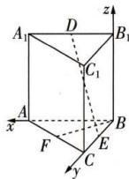

text_image

A₁
D
B₁
C₁
A
x
F
E
C
y
z

对于题图 2, 建立同样的空间直角坐标系, 此时 $B(0,0,0)$ , $E(1,1,0)$ , $D(1,0)$ ,

2), $F(0,2,1)$ ，所以 $\overrightarrow{BF} = (0,2,1)$ ， $\overrightarrow{DE} = (0,1,-2)$ ，故 $\overrightarrow{BF} \cdot \overrightarrow{DE} = 2 - 2 = 0$ ，所以 $BF \perp DE$ .

对于题图3,建立同样的空间直角坐标系,此时 $B(0,0,0),E(1,1,0),D(1,0,0),F(1,1,2)$ ,所以 $\overrightarrow{BF}=(1,1,2)$ , $\overrightarrow{DE}=(0,1,0)$ ,故 $\overrightarrow{BF}\cdot\overrightarrow{DE}=1$ ,所以BF,DE不垂直.

综上,3个题图中满足 $BF \perp DE$ 的有2个,故选C.

14 AD 方法一 对于 A, 设 $M(2,3,3)$ , 则 $\overrightarrow{AM} = (1,4,1)$ , 因为 $\overrightarrow{AM} \cdot n = 2 - 4 + 2 = 0$ , 所以点 $M(2,3,3)$ 在平面 $\alpha$ 内, A 正确; 对于 B, 设 $N(3, -3,4)$ , 则 $\overrightarrow{AN} = (2, -2,2)$ , 因为 $\overrightarrow{AN} \cdot n = 4 + 2 + 4 \neq 0$ , 所以点 $N(3, -3,4)$ 不在平面 $\alpha$ 内, B 错误; 对于 C, 设 $E(-1,2,0)$ , 则 $\overrightarrow{AE} = (-2,3,-2)$ , 因为 $\overrightarrow{AE} \cdot n = -4 - 3 - 4 \neq 0$ , 所以点 $E(-1,2,0)$ 不在平面 $\alpha$ 内, C 错误; 对于 D, 设 $F(2,-1,1)$ , 则 $\overrightarrow{AF} = (1,0,-1)$ , 因为 $\overrightarrow{AF} \cdot n = 2 - 2 = 0$ , 所以点 $F(2,-1,1)$ 在平面 $\alpha$ 内, D 正确.

方法二 根据题意得平面 $\alpha$ 的方程为 $2(x-1)-(y+1)+2(z-2)=0$ ，即 $2x-y+2z=7$ 。对于 A，因为 $2\times2-3+2\times3=7$ ，所以点 $(2,3,3)$ 在平面 $\alpha$ 内，A 正确；对于 B，因为 $2\times3+3+2\times4\neq7$ ，所以点 $(3,-3,4)$ 不在平面 $\alpha$ 内，B 错误；对于 C，因为 $2\times(-1)-2+2\times0\neq7$ ，所以点 $(-1,2,0)$ 不在平面 $\alpha$ 内，C 错误；对于 D，因为 $2\times2+1+2\times1=7$ ，所以点 $(2,-1,1)$ 在平面 $\alpha$ 内，D 正确。

15 (1)(0,0,0)或(0,0,1);(2)(0,- $\frac{1}{2}$ , $\frac{1}{2}$ )

解析 （1）当 $\lambda = \frac{1}{2}$ 时， $\overrightarrow{BP} = \frac{1}{2}\overrightarrow{BC} + \mu\overrightarrow{BB_{1}}$ ，取 $BC, B_{1}C_{1}$ 的中点分别为 Q, H，连接 QH，则 $\overrightarrow{BP} = \overrightarrow{BQ} + \mu\overrightarrow{QH}, \mu \in [0, 1]$ ，所以点 P 的轨迹为线段 QH，如图，以 Q 为原点，建立空间直角坐标系，则 $A_{1}(\frac{\sqrt{3}}{2}, 0, 1), P(0, 0, \mu), B(0, \frac{1}{2}, 0)$ ，则 $\overrightarrow{A_{1}P} = (-\frac{\sqrt{3}}{2}, 0, \mu - 1), \overrightarrow{BP} = (0, -\frac{1}{2}, \mu)$ ，由 $A_{1}P \perp BP$ ，得 $\overrightarrow{A_{1}P} \cdot \overrightarrow{BP} = \mu (\mu - 1) = 0$ ，所以 $\mu = 0$ 或 $\mu = 1$ ，故点 P 的坐标为 $(0, 0, 0)$ 或 $(0, 0, 1)$ .

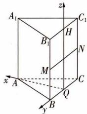

text_image

A₁
B₁
H
N
M
C
x
A
y
B
Q
z
C₁

(2) 当 $\mu = \frac{1}{2}$ 时, $\overrightarrow{BP} = \lambda \overrightarrow{BC} + \frac{1}{2} \overrightarrow{BB_1}$ , 取 $BB_1, CC_1$ 的中点分别为 $M, N$ , 则 $\overrightarrow{BP} = \overrightarrow{BM} + \lambda \overrightarrow{MN}, \lambda \in [0,1]$ , 所以点 $P$ 的轨迹为线段 $MN$ , 设 $P(0, y_0, \frac{1}{2})$ , 因为 $A(\frac{\sqrt{3}}{2}, 0, 0)$ , 所以 $\overrightarrow{AP} = (-\frac{\sqrt{3}}{2}, y_0, \frac{1}{2}), \overrightarrow{A_1B} = (-\frac{\sqrt{3}}{2}, \frac{1}{2}, -1)$ . 由 $A_1B \perp$ 平面 $AB_1P$ , 得 $A_1B \perp AP$ , 所以 $\overrightarrow{A_1B} \cdot \overrightarrow{AP} = \frac{3}{4} + \frac{1}{2} y_0 - \frac{1}{2} = 0$ , 解得 $y_0 = -\frac{1}{2}$ , 故点 $P$ 的坐标为 $(0, -\frac{1}{2}, \frac{1}{2})$ .

16 BC 因为 e 为直线 l 的方向向量, $n_{1},n_{2}$ 分别为平面 $\alpha,\beta$ 的法向量( $\alpha,\beta$ 不重合),所以 $e\perp n_{1}\Rightarrow l//\alpha$ 或 $l\subset\alpha$ , A,D 错误; $n_{1}\perp n_{2}\Leftrightarrow\alpha\perp\beta$ , B 正确; $n_{1}//n_{2}\Leftrightarrow\alpha//\beta$ , C 正确.

17 证明 (1) 以 $D$ 为坐标原点, $\overrightarrow{DA}, \overrightarrow{DC}, \overrightarrow{DD_1}$ 的方向分别为 $x$ 轴、 $y$ 轴、 $z$ 轴的正方向, 建立空间直角坐标系.

设正方体的棱长为 $a$ ，则 $D(0,0,0),B(a,a,0),A_{1}(a,0,$ $a)$ .设 $E(0,a,e)(0\leqslant e\leqslant a)$

则 $\overrightarrow{A_1E} = (-a,a,e - a),\overrightarrow{BD} = (-a, - a,0)$

所以 $\overrightarrow{A_{1}E}\cdot\overrightarrow{BD}=a^{2}-a^{2}+(e-a)\cdot0=0,$

所以 $\overrightarrow{A_{1}E}\perp\overrightarrow{BD}$ ，即 $A_{1}E\perp BD.$

(2)由(1)可得 $\overrightarrow{DB}=(a,a,0),\overrightarrow{DA_{1}}=(a,0,a),\overrightarrow{DE}=(0,a,e)$ .

设平面 $A_{1}BD$ 、平面 EBD 的一个法向量分别为 $\boldsymbol{n}_{1} = (x_{1}, y_{1}, z_{1})$ , $\boldsymbol{n}_{2} = (x_{2}, y_{2}, z_{2})$ ,

则 $\left\{\begin{aligned}\boldsymbol{n}_{1}\cdot\overrightarrow{DB}=ax_{1}+ay_{1}=0,\\ \boldsymbol{n}_{1}\cdot\overrightarrow{DA}_{1}=ax_{1}+az_{1}=0,\end{aligned}\right.\left\{\begin{aligned}\boldsymbol{n}_{2}\cdot\overrightarrow{DB}=ax_{2}+ay_{2}=0,\\ \boldsymbol{n}_{2}\cdot\overrightarrow{DE}=ay_{2}+ez_{2}=0,\end{aligned}\right.$

取 $x_{1}=x_{2}=1$ ，得 $n_{1}=(1,-1,-1)$ ， $n_{2}=(1,-1,\frac{a}{e})$ .

由平面 $A_{1}BD \perp$ 平面 EBD, 得 $n_{1} \perp n_{2}$ ,

所以 $1 \times 1 + (-1) \times (-1) + (-1) \times \frac{a}{e} = 0$ ，即 $e = \frac{a}{2}$ ，
所以 E 为 $CC_{1}$ 的中点.

# 【归纳总结】用向量证明空间中的垂直关系

(1) 设直线 $l_{1}$ 和 $l_{2}$ 的方向向量分别为 $v_{1}$ 和 $v_{2}$ ，则 $l_{1} \perp l_{2} \Leftrightarrow v_{1} \perp v_{2} \Leftrightarrow v_{1} \cdot v_{2} = 0.$   
(2) 设直线 l 的方向向量为 v，平面 $\alpha$ 的法向量为 u，则 $l \perp \alpha \Leftrightarrow v \parallel u \Leftrightarrow v = \lambda u (\lambda \neq 0)$ .  
(3) 设平面 $\alpha$ 和 $\beta$ 的法向量分别为 $u_{1}$ 和 $u_{2}$ ，则 $\alpha \perp \beta \Leftrightarrow u_{1} \perp u_{2} \Leftrightarrow u_{1} \cdot u_{2} = 0.$

# 过能力 学科关键能力构建

1 A 因为 $\boldsymbol{a}=(1,2,x)$ ， $|a|=5$ ，所以 $1+4+x^{2}=25$ ，解得 $x=\pm2\sqrt{5}$ 。当 $x=2\sqrt{5}$ 时， $\boldsymbol{a}=(1,2,2\sqrt{5})$ ，因为 $l_{1}\perp l_{2}$ ，所以 $a\cdot b=\sqrt{5}+2y+2\sqrt{5}=0$ ，解得 $y=-\frac{3\sqrt{5}}{2}$ ， $x+y=\frac{\sqrt{5}}{2}$ 。当 $x=-2\sqrt{5}$ 时， $\boldsymbol{a}=(1,2,-2\sqrt{5})$ ，因为 $l_{1}\perp l_{2}$ ，所以 $a\cdot b=\sqrt{5}+2y-2\sqrt{5}=0$ ，解得 $y=\frac{\sqrt{5}}{2}$ ， $x+y=-\frac{3\sqrt{5}}{2}$ 。综上， $x+y=\frac{\sqrt{5}}{2}$ 或 $-\frac{3\sqrt{5}}{2}$ 。

2 B 因为 $PA \perp$ 平面 $ABCD$ , 底面 $ABCD$ 是矩形, 所以 $AB, AD, AP$ 两两垂直, 以 $A$ 为原点, $\overrightarrow{AB}, \overrightarrow{AD}, \overrightarrow{AP}$ 的方向分别为 $x, y, z$ 轴的正方向, 建立空间直角坐标系. 设 $AD = a (a > 0)$ , 则 $A(0,0,0), P(0,0,2), C(1,a,0), B(1,0,0), D(0, a,0), E(0,\frac{a}{2},1), F(\frac{1}{2},0,1)$ , 所以 $\overrightarrow{EF} = (\frac{1}{2}, -\frac{a}{2},0)$ , $\overrightarrow{EC} = (1,\frac{a}{2}, -1), \overrightarrow{AP} = (0,0,2), \overrightarrow{PC} = (1,a,-2)$ . 设平面 $EFC$ 的一个法向量为 $n = (x,y,z)$ , 则 $\left\{ \begin{array}{l} \overrightarrow{EF} \cdot n = 0, \\ \overrightarrow{EC} \cdot n = 0, \end{array} \right.$ 即

$\left\{ \begin{array}{l} \frac{1}{2} x - \frac{a}{2} y = 0, \\ x + \frac{a}{2} y - z = 0, \end{array} \right.$ 令 $x = a$ ，得 $y = 1, z = \frac{3a}{2}$ ，所以 $\pmb{n} = (a, 1,$

$\frac{3a}{2})$ 设 $\overrightarrow{PG} = \lambda \overrightarrow{PC}, \lambda \in [0,1]$ ，则 $\overrightarrow{AG} = \overrightarrow{AP} + \overrightarrow{PG} = \overrightarrow{AP} + \lambda \overrightarrow{PC} = (\lambda, a\lambda, 2 - 2\lambda)$ ，由 $AG \perp$ 平面 $EFC$ ，得 $\overrightarrow{AG} // n$ ，所以 $\frac{\lambda}{a} = \frac{a\lambda}{1} = \frac{2 - 2\lambda}{\frac{3a}{2}}$ ，解得 $\lambda = \frac{4}{7}$ ，则 $\frac{CG}{CP} = \frac{3}{7}$ .

3 A 连接 $B_{1}C$ ，则 $B_{1}C \perp BC_{1}$ 。因为 $ABCD - A_{1}B_{1}C_{1}D_{1}$ 为正方体，所以 $AB \perp$ 平面 $BCC_{1}B_{1}$ ，又 $B_{1}C \subset$ 平面 $BCC_{1}B_{1}$ ，所以 $AB \perp B_{1}C$ 。又 $AB \cap BC_{1} = B, AB, BC_{1} \subset$ 平面 $ABC_{1}D_{1}$ ，所以 $B_{1}C \perp$ 平面 $ABC_{1}D_{1}$ 。如图，以 $D$ 为原点， $DA, DC, DD_{1}$ 所在直线分别为 x, y, z 轴建立空间直角坐标系，则 $B_{1}(1, 1, 1)$ ， $C(0, 1, 0)$ ，设 $P(0, 1, z)$ ， $Q(x, x, 0)$ ， $R(y, 0, 0)$ ，x，

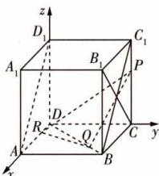

text_image

z
D₁
C₁
A₁
B₁
P
R
D
Q
A
B
C
y
x

设点时,注意点的横、纵、竖坐标是否有固定值.

$z\in(0,1),y\in\mathbf{R}$ ，则 $\overrightarrow{PQ}=(x,x-1,-z),\overrightarrow{RQ}=(x-y,x,0)$ ， $\overrightarrow{B_{1}C}=(-1,0,-1)$ 。因为 $PQ//平面ABC_{1}D_{1}$ ，所以 $\overrightarrow{B_{1}C}\cdot\overrightarrow{PQ}=-x+z=0$ ，即z=x。因为 $PQ\perp RQ$ ，所以 $\overrightarrow{PQ}\cdot\overrightarrow{RQ}=x(x-y)+x(x-1)=0$ ，即2x-y=1， $PR=\sqrt{y^{2}+1+z^{2}}=\sqrt{(2x-1)^{2}+1+x^{2}}=\sqrt{5x^{2}-4x+2}$ ，所以当 $x=\frac{2}{5}$ 时，PR最小，为 $\frac{\sqrt{30}}{5}$ 。

4 ACD 以 D 为原点， $\overrightarrow{DA}, \overrightarrow{DC}, \overrightarrow{DD_{1}}$ 的方向分别为 x, y, z 轴的正方向，建立空间直角坐标系。设 AB = 2，则 $AA_{1} = 2\lambda$ ，则 $D(0,0,0), A(2,0,0), C(0,2,0), E(1,2,0), F(0,1,0), G(0,2,\lambda), \overrightarrow{EF} = (-1,-1,0), \overrightarrow{EG} = (-1,0,\lambda)$ ，设平面 EFG 的法向量为 $n = (x, y, z)$ ，则 $\left\{\begin{aligned}\boldsymbol{n} \cdot \overrightarrow{EF} &= -x - y = 0, \\ \boldsymbol{n} \cdot \overrightarrow{EG} &= -x + \lambda z = 0,\end{aligned}\right.$ 取 z = 1，得平面 EFG 的一个法向量为 $\boldsymbol{n} = (\lambda, -\lambda, 1)$ 。设 $\overrightarrow{DM} = k \overrightarrow{DA_{1}}, k \in [0,1]$ ，因为 $A_{1}(2,0,2\lambda)$ ，所以 $\overrightarrow{DA_{1}} = (2,0,2\lambda), \overrightarrow{DM} = (2k,0,2\lambda k)$ ，所以 $M(2k,0,2\lambda k)$ ，所以 $\overrightarrow{AM} = (2k-2,0,2\lambda k)$ 。对于 A，若 AM // 平面 EFG，则 $\overrightarrow{AM} \perp n$ ，所以 $\overrightarrow{AM} \cdot n = \lambda (2k-2) + 2\lambda k = 0$ ，即 $\lambda (4k-2) = 0$ ，又 $\lambda > 0$ ，所以 $k = \frac{1}{2}$ ，此时 M 为 $A_{1}D$ 的中点，A 正确。对于 B， $\overrightarrow{CM} = (2k, -2,2\lambda k)$ ，若 CM ⊥ 平面 EFG，则 $\overrightarrow{CM} // n$ ，则 $\frac{2k}{\lambda} = \frac{-2}{-\lambda} = \frac{2\lambda k}{1}$ ，解得 $\lambda = k = 1$ ，又 $\lambda > 1$ ，所以不存在这样的点 M，B 错误。对于 C，当 M 与 D 重合时，因为 $EG // BC_{1}, FG // DC_{1}, EG \cap FG = G, BC_{1} \cap DC_{1} = C_{1}$ ，且 $EG, FG \subset$ 平面 EFG， $BC_{1}, DC_{1} \subset$ 平面 $BDC_{1}$ ，所以平面 $MBC_{1} //$ 平面 EFG，C 正确。对于 D， $\overrightarrow{CM} = (2k, -2,2\lambda k)$ ，因为 $B_{1}(2,2,2\lambda)$ ，所以 $\overrightarrow{CB_{1}} = (2,0,2\lambda)$ ，设平面 $MB_{1}C$ 的法向量为 $m = (x_{1}, y_{1}, z_{1})$ ，则 $\left\{\begin{aligned}\boldsymbol{m} \cdot \overrightarrow{CM} &= 2kx_{1} - 2y_{1} + 2k\lambda z_{1} = 0, \\ \boldsymbol{m} \cdot \overrightarrow{CB_{1}} &= 2x_{1} + 2\lambda z_{1} = 0,\end{aligned}\right.$ 取 $z_{1} = 1$ ，得平面 $MB_{1}C$ 的一个法向量为 $m = (-\lambda, 0, 1)$ ，若平面 $MB_{1}C \perp$ 平面 EFG，则 $m \perp n$ ，所以 $m \cdot n = -\lambda^{2} + 1 = 0$ ，解得 $\lambda = 1,D$ 正确。

5 $2 + \sqrt{5}$ 解析 在正方体 $ABCD - A_{1}B_{1}C_{1}D_{1}$ 中，以点 D 为坐标原点，分别以 $\overrightarrow{DA}, \overrightarrow{DC}, \overrightarrow{DD_{1}}$ 的方向为 x 轴、y 轴、z 轴正方向，建立如图所示的空间直角坐标系，则 $B(1,1,0), D_{1}(0,0,1), M(\frac{1}{2},\frac{1}{2},\frac{1}{2}), N(\frac{1}{2},1,1)$ ,

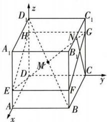

text_image

z
D₁ C₁
H N G
A₁ B₁
M
D C
E F y
A B
x

$C(0,1,0)$ , 所以 $\overrightarrow{CN} = (\frac{1}{2}, 0, 1)$ . 设 $P(x, y, z)$ , 则 $\overrightarrow{MP} = (x - \frac{1}{2},$

$y-\frac{1}{2},z-\frac{1}{2}$ ，因为 $MP\perp CN$ ，所以 $\frac{1}{2}(x-\frac{1}{2})+z-\frac{1}{2}=0$ ，即 $2x+4z-3=0$ 。当x=1时， $z=\frac{1}{4}$ ；当x=0时， $z=\frac{3}{4}$ 。

点 P 在平面 $AA_{1}B_{1}B$ 点 P 在平面 $CC_{1}D_{1}D$ 上满足的条件①. 上满足的条件②.

取 $E(1,0,\frac{1}{4}),F(1,1,\frac{1}{4}),G(0,1,\frac{3}{4}),H(0,0,\frac{3}{4})$ ，连接根据条件①取点E,F.根据条件②取点G,H.

EF, FG, GH, HE, 则 $\overrightarrow{EF} = \overrightarrow{HG} = (0, 1, 0)$ , $\overrightarrow{EH} = \overrightarrow{FG} = (-1, 0, \frac{1}{2})$ , 因为 $\overrightarrow{EF} \cdot \overrightarrow{EH} = 0$ , 所以四边形 EFGH 为矩形, 因为 $\overrightarrow{EF} \cdot \overrightarrow{CN} = 0$ , $\overrightarrow{EH} \cdot \overrightarrow{CN} = 0$ , 所以 $EF \perp CN$ , $EH \perp CN$ , 又 $EF \cap EH = E$ , 且 $EF \subset$ 平面 EFGH, $EH \subset$ 平面 EFGH, 所以 $CN \perp$ 平面 EFGH. 连接 EG, 因为 $\overrightarrow{EM} = (-\frac{1}{2}, \frac{1}{2}, \frac{1}{4})$ , $\overrightarrow{MG} = (-\frac{1}{2}, \frac{1}{2}, \frac{1}{4})$ , 即 $\overrightarrow{EM} = \overrightarrow{MG}$ , 所以 M 为 EG 的中点, 则点 $M \in$ 平面 EFGH, 所以为使 $MP \perp CN$ , 必有点 $P \in$ 平面 EFGH, 又点 P 在正方体的表面上运动, 所以点 P 的轨迹为矩形 EFGH, 又 $|\overrightarrow{EF}| = |\overrightarrow{HG}| = 1$ , $|\overrightarrow{EH}| = |\overrightarrow{FG}| = \frac{\sqrt{5}}{2}$ , 所以矩形 EFGH 的周长为 $2 \times 1 + 2 \times \frac{\sqrt{5}}{2} = 2 + \sqrt{5}$ .

6 证明 (1) 取 BC 的中点 H, 连接 OH, 则 $OH \parallel BD$ ,

又四边形 ABCD 为正方形，
所以 $AC \perp BD$ ，所以 $OH \perp AC$ .

又 $FO \perp$ 平面ABCD，

所以 $FO \perp OA, FO \perp OH,$

所以以 O 为坐标原点, 建立如 $\overrightarrow{x}$ $\overrightarrow{A}$ $\overrightarrow{B}$ $\overrightarrow{h}$ 图所示的空间直角坐标系, 则 $A(3,0,0)$ , $C(-1,0,0)$ , $F(0,0,\sqrt{3})$ , $B(1,2,0)$ ,

所以 $\overrightarrow{BC}=(-2,-2,0)$ , $\overrightarrow{CF}=(1,0,\sqrt{3})$ , $\overrightarrow{BF}=(-1,-2,\sqrt{3})$ .
设平面 BCF 的一个法向量为 $\boldsymbol{n}=(x,y,z)$ ,

则 $\left\{\begin{aligned}\overrightarrow{BC}\cdot n&=0,\\ \overrightarrow{CF}\cdot n&=0,\end{aligned}\right.$ 即 $\left\{\begin{aligned}-2x-2y&=0,\\ x+\sqrt{3}z&=0,\end{aligned}\right.$ 取z=1,得 $\boldsymbol{n}=(-\sqrt{3},\sqrt{3},1)$ .

因为四边形 BDEF 为平行四边形，

所以 $\overrightarrow{DE}=\overrightarrow{BF}=(-1,-2,\sqrt{3})$ ,

所以 $\overrightarrow{AE} = \overrightarrow{AD} +\overrightarrow{DE} = \overrightarrow{BC} +\overrightarrow{DE} = (-3, - 4,\sqrt{3})$

所以 $\overrightarrow{AE}\cdot n=3\sqrt{3}-4\sqrt{3}+\sqrt{3}=0$ ，所以 $\overrightarrow{AE}\perp n$ .

又 $AE \not\subset$ 平面 BCF, 所以 $AE \parallel$ 平面 BCF.

(2) $\overrightarrow{CF}=(1,0,\sqrt{3}),\overrightarrow{AF}=(-3,0,\sqrt{3}),\overrightarrow{AE}=(-3,-4,\sqrt{3})$ 所以 $\overrightarrow{CF}\cdot\overrightarrow{AF}=-3+3=0,\overrightarrow{CF}\cdot\overrightarrow{AE}=-3+3=0,$ 所以 $\overrightarrow{CF}\perp\overrightarrow{AF},\overrightarrow{CF}\perp\overrightarrow{AE}$

又 $AE \cap AF = A$ ，所以 $CF \perp$ 平面 AEF.

7 证明 将正三棱台补形为如图所示的正三棱锥，
设点 P 在底面 ABC 的射影为点 O，
则 O 为正三角形 ABC 的中心.

取 AB 的中点 M, 连接 CM, 则 $CM \perp AB$ ,

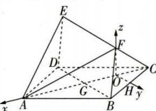

text_image

Geometric diagram with labeled points and coordinate axes, showing spatial relationships in 3D space

故 $CM = 2 \times \frac{\sqrt{3}}{2} = \sqrt{3}, CO = \frac{2}{3} CM = \frac{2\sqrt{3}}{3}$ .

因为 $\triangle PB_{1}C_{1}\sim \triangle PBC$ ，所以 $\frac{PC_1}{PC} = \frac{B_1C_1}{BC} = \frac{1}{2},$

所以 $PC_{1}=CC_{1}=\frac{1}{2}PC$ ，又 $CC_{1}=AA_{1}=1$ ，所以 PC=2。

因为 $PO \perp$ 平面 ABC, $CO \subset$ 平面 ABC, 所以 $PO \perp CO$ ,

所以 $PO = \sqrt{PC^2 - CO^2} = \sqrt{2^2 - (\frac{2\sqrt{3}}{3})^2} = \frac{2\sqrt{6}}{3}$ .

以点 O 为坐标原点, $\overrightarrow{CO}, \overrightarrow{AB}, \overrightarrow{OP}$ 的方向分别为 x, y, z 轴的正方向建立如图所示的空间直角坐标系,

则 $C(-\frac{2\sqrt{3}}{3},0,0)$ , $B(\frac{\sqrt{3}}{3},1,0)$ ,

$A(\frac{\sqrt{3}}{3}, - 1,0),P(0,0,\frac{2\sqrt{6}}{3}),$

因为 $A_{1}, B_{1}, C_{1}$ 分别为 PA, PB, PC

的中点, 所以 $A_{1}\left(\frac{\sqrt{3}}{6}, -\frac{1}{2}, \frac{\sqrt{6}}{3}\right)$ ,

$B_{1}(\frac{\sqrt{3}}{6},\frac{1}{2},\frac{\sqrt{6}}{3}),C_{1}(-\frac{\sqrt{3}}{3},0,\frac{\sqrt{6}}{3})$

又 D, E 分别为 $AA_{1}, B_{1}C_{1}$ 的中点，

所以 $D(\frac{\sqrt{3}}{4}, -\frac{3}{4}, \frac{\sqrt{6}}{6})$ , $E(-\frac{\sqrt{3}}{12}, \frac{1}{4}, \frac{\sqrt{6}}{3})$ .

方法一（利用法向量垂直） $\overrightarrow{CP} = (\frac{2\sqrt{3}}{3}, 0, \frac{2\sqrt{6}}{3}), \overrightarrow{CB} = (\sqrt{3}, 1, 0)$ ，

设平面 $BCC_{1}B_{1}$ 的法向量为 $\boldsymbol{m}=(-1,\sqrt{3},z_{1})$ ,

根据 $\overrightarrow{CB}$ 的坐标设法向量m的坐标.

则 $\overrightarrow{CP}\cdot m=0$ ，即 $-\frac{2\sqrt{3}}{3}+0+\frac{2\sqrt{6}}{3}z_{1}=0$ ，解得 $z_{1}=\frac{\sqrt{2}}{2}$

所以 $\boldsymbol{m}=(-1,\sqrt{3},\frac{\sqrt{2}}{2})$ 是平面 $BCC_{1}B_{1}$ 的一个法向量.

$$
\overrightarrow {D B} = \left(\frac {\sqrt {3}}{1 2}, \frac {7}{4}, - \frac {\sqrt {6}}{6}\right), \overrightarrow {D E} = \left(- \frac {\sqrt {3}}{3}, 1, \frac {\sqrt {6}}{6}\right),
$$

设平面 BDE 的法向量为 $\boldsymbol{n} = (x_{2}, y_{2}, z_{2})$ ，则

$$
\left\{ \begin{array}{l l} {\overrightarrow {D B} \cdot \pmb {n} = \frac {\sqrt {3}}{1 2} x _ {2} + \frac {7}{4} y _ {2} - \frac {\sqrt {6}}{6} z _ {2} = 0,} \\ {\overrightarrow {D E} \cdot \pmb {n} = - \frac {\sqrt {3}}{3} x _ {2} + y _ {2} + \frac {\sqrt {6}}{6} z _ {2} = 0,} \end{array} \right. \text {取} x _ {2} = 1 2, \text {得} \pmb {n} = (1 2,
$$

$\frac{12\sqrt{3}}{11},\frac{96\sqrt{2}}{11}$ 是平面 BDE 的一个法向量.

因为 $\boldsymbol{m} \cdot \boldsymbol{n} = (-1) \times 12 + \sqrt{3} \times \frac{12\sqrt{3}}{11} + \frac{\sqrt{2}}{2} \times \frac{96\sqrt{2}}{11} = 0,$

所以 $m \perp n$ ，所以平面 $BDE \perp$ 平面 $BCC_{1}B_{1}$ .

方法二(利用面面垂直判定定理) $\overrightarrow{DE}=(-\frac{\sqrt{3}}{3},1,\frac{\sqrt{6}}{6})$ ,

$$
\overrightarrow {C P} = \left(\frac {2 \sqrt {3}}{3}, 0, \frac {2 \sqrt {6}}{3}\right), \overrightarrow {C B} = (\sqrt {3}, 1, 0),
$$

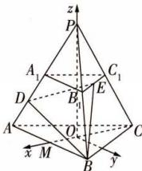

text_image

z
P
A₁
C₁
D
B
E
A
O
C
x M y
B

所以 $\overrightarrow{DE}\cdot\overrightarrow{CP}=-\frac{2}{3}+\frac{2}{3}=0,\overrightarrow{DE}\cdot\overrightarrow{CB}=-1+1=0,$

所以 $DE \perp CP, DE \perp CB,$

因为 $CP \cap CB = C, CP, CB \subset$ 平面 $BCC_{1}B_{1}$ ,

所以 $DE \perp$ 平面 $BCC_{1}B_{1}$ .

又 $DE \subset$ 平面 BDE, 所以平面 $BDE \perp$ 平面 $BCC_{1}B_{1}$ .

8 解析 (1) 在题图 1 中, $DE \perp AB$ , 所以 $DE \perp BE$ .

又 $BE \perp A_{1}D, DE \cap A_{1}D = D, DE \subset$ 平面 $A_{1}DE, A_{1}D \subset$ 平面 $A_{1}DE$ ，所以 $BE \perp$ 平面 $A_{1}DE$ .

因为 $A_{1}E \subset$ 平面 $A_{1}DE$ ，所以 $A_{1}E \perp BE$ 。

又 $A_{1}E \perp DE, BE \cap DE = E, BE \subset$ 平面 BCDE, $DE \subset$ 平面 BCDE, 所以 $A_{1}E \perp$ 平面 BCDE.

(2) 存在, 理由如下:

假设在线段 BD 上存在一点 P, 使平面 $A_{1}EP \perp$ 平面 $A_{1}BD$ . 因为 $A_{1}E \perp$ 平面 BCDE, $BE \perp DE$ ,

所以以 E 为原点, 以 EB, ED, $EA_{1}$ 所在直线分别为 x, y, z 轴建立空间直角坐标系, 如图所示,

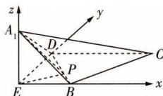

text_image

z
A₁
y
D
P
C
E
B
x

则 $E(0,0,0)$ , $B(1,0,0)$ , $D(0,\sqrt{3},0)$ , $A_{1}(0,0,1)$ , $\overrightarrow{EA_{1}} = (0,0,1)$ .

设 $P(x,y,z),\overrightarrow{BP}=\lambda\overrightarrow{BD}(0\leqslant\lambda\leqslant1)$ ,

则 $(x-1,y,z)=\lambda(-1,\sqrt{3},0)$ ，得 $P(1-\lambda,\sqrt{3}\lambda,0)$ ，

所以 $\overrightarrow{EP}=(1-\lambda,\sqrt{3}\lambda,0)$ .

设平面 $A_{1}EP$ 的法向量为 $\boldsymbol{m}=(x_{1},y_{1},z_{1})$ ,

则 $\left\{\begin{aligned}\boldsymbol{m}\cdot\overrightarrow{EA_{1}}=z_{1}=0,\\\boldsymbol{m}\cdot\overrightarrow{EP}=(1-\lambda)x_{1}+\sqrt{3}\lambda y_{1}=0,\end{aligned}\right.$ 令 $x_{1}=\sqrt{3}\lambda$ ，则m=

$(\sqrt{3}\lambda,\lambda-1,0)$ 是平面 $A_{1}EP$ 的一个法向量.

设平面 $A_{1}BD$ 的法向量为 $\boldsymbol{n}=(x_{2},y_{2},z_{2})$ ,

因为 $\overrightarrow{A_{1}B}=(1,0,-1),\overrightarrow{A_{1}D}=(0,\sqrt{3},-1)$ ,

所以 $\left\{\begin{aligned}\boldsymbol{n}\cdot\overrightarrow{A_{1}B}&=x_{2}-z_{2}=0,\\ \boldsymbol{n}\cdot\overrightarrow{A_{1}D}&=\sqrt{3}y_{2}-z_{2}=0,\end{aligned}\right.$

令 $x_{2}=\sqrt{3}$ ，则 $\boldsymbol{n}=(\sqrt{3},1,\sqrt{3})$ 是平面 $A_{1}BD$ 的一个法向量。因为平面 $A_{1}EP\perp$ 平面 $A_{1}BD$ ，

所以 $m \cdot n = 3\lambda + \lambda - 1 = 0$ ，解得 $\lambda = \frac{1}{4}$ ，

所以在线段 BD 上存在点 P，使平面 $A_{1}EP \perp$ 平面 $A_{1}BD$ ，且 $\frac{BP}{BD} = \frac{1}{4}$ .

# 【归纳总结】 解决点的存在性问题的一般步骤

(1) 假设存在满足条件的点, 在空间直角坐标系中确定点的坐标(或利用向量共线表示与该点有关的向量);

(2) 利用问题中的位置关系或度量关系构建关于变量的方程；

(3)以方程的解判断点的存在性,若方程有解,且其解满足相应的范围,则点存在,若方程无解,或方程的解不满足相应的范围,则点不存在.

# 课时 2 ▶ 用空间向量研究距离问题

# 过基础 教材必备知识精练

1 A 取直线 l 的单位方向向量 $\boldsymbol{\mu} = \frac{\boldsymbol{m}}{|\boldsymbol{m}|} = \frac{\sqrt{2}}{2}(1,0,-1) = (\frac{\sqrt{2}}{2},0,-\frac{\sqrt{2}}{2})$ . 由题可得 $\overrightarrow{PA} = (0,-4,-2)$ , $\overrightarrow{PA} \cdot \boldsymbol{\mu} = (0,-4,-2) \cdot (\frac{\sqrt{2}}{2},0,-\frac{\sqrt{2}}{2}) = \sqrt{2}$ . 因为点 A 在直线外, 所以点 A 到直线 l 的距离 $d = \sqrt{\overrightarrow{PA}^{2} - (\overrightarrow{PA} \cdot \boldsymbol{\mu})^{2}} = \sqrt{20 - 2} = 3\sqrt{2}$ .

2 C 以 A 为原点, AB, AC, AD 所在的直线分别为 x 轴、y 轴、z 轴, 建立如图所示的空间直角坐标系, 则 B(6,0,0), C(0,6,0), D(0,0,6), E(3,0,0), F(0,0,4), 得 O(2,2,2), $\overrightarrow{EF} = (-3,0,4)$ .
方法一 取 $a=\overrightarrow{EO}=(-1,2,2)$ , $u=\frac{\overrightarrow{EF}}{|\overrightarrow{EF}|}=\frac{1}{5}(-3,0,4)=(-\frac{3}{5},0,\frac{4}{5})$

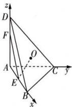

text_image

z
D
F
O
A
C
y
E
B
x

则 $a^{2}=9,a\cdot u=\frac{11}{5}$ ，所以点O到直线EF的距离为 $\sqrt{a^{2}-(a\cdot u)^{2}}=\frac{2\sqrt{26}}{5}.$

方法二 过点 O 作 $OG \perp EF$ 于点 G，设 $\overrightarrow{EG} = \lambda \overrightarrow{EF} = (-3\lambda, 0, 4\lambda)$ ，则 $G(-3\lambda + 3, 0, 4\lambda)$ ， $\overrightarrow{OG} = (-3\lambda + 1, -2, 4\lambda - 2)$ ，由 $\overrightarrow{OG} \cdot \overrightarrow{EF} = -3(-3\lambda + 1) + 4(4\lambda - 2) = 0$ ，解得 $\lambda = \frac{11}{25}$ ，所以 $\overrightarrow{OG} = (-\frac{8}{25}, -2, -\frac{6}{25})$ ，所以点 O 到直线 EF 的距离为 $|\overrightarrow{OG}| = \frac{2\sqrt{26}}{5}$ .

3 $\sqrt{19}$ 解析 以 A 为原点, 建立如图所示的空间直角

坐标系，则 $B(4,0,0),C(4,4,$ 0)， $P(0,1,\sqrt{3})$ ，故 $\overrightarrow{BC} = (0,4,$ $0),\overrightarrow{CP} = (-4, - 3,\sqrt{3})$ .因为 $AD / / BC,AD\subset$ 平面PAD， $BC\not\subset$ 平面PAD，所以 $BC / /$ 平面

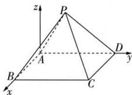

text_image

z
P
A
B
x
C
D
y

PAD, 又平面 PAD 与平面 PBC 的交线为 l，所以 $BC \parallel l$ ，所以点 P 到 BC 的距离即为 l 到 BC 的距离，为 $\sqrt{|\overrightarrow{CP}|^{2} - (\frac{\overrightarrow{BC} \cdot \overrightarrow{CP}}{|\overrightarrow{BC}|})^{2}} = \sqrt{16 + 9 + 3 - [\frac{4 \times (-3)}{4}]^{2}} = \sqrt{19}.$

4 D 由 $\overrightarrow{AP} = (-1, -2, 4)$ , 得点 $P$ 到平面 $\alpha$ 的距离 $d = \frac{|\overrightarrow{AP} \cdot \boldsymbol{n}|}{|\boldsymbol{n}|} = \frac{10}{3}$ .

5 B 不妨设平面 ABC 的法向量 $\boldsymbol{n}=(x,y,z)$ ，因为 $\overrightarrow{AB}=(-2,2,0)$ ， $\overrightarrow{AC}=(-2,0,2)$ ，所以 $\left\{\begin{aligned}\overrightarrow{AB}\cdot n=0,\\ \overrightarrow{AC}\cdot n=0,\end{aligned}\right.$ 即

$\left\{ \begin{array}{l} -2x + 2y = 0, \\ -2x + 2z = 0, \end{array} \right.$ 令 $x = 1$ ，则 $\pmb {n} = (1,1,1)$ 是平面ABC的一个法向量.因为 $\overrightarrow{DA} = (0, - 2, - 2)$ ，所以 $D$ 到平面ABC的距离 $d = \frac{|\overrightarrow{DA}\cdot\pmb{n}|}{|\pmb{n}|} = \frac{| - 4|}{\sqrt{3}} = \frac{4\sqrt{3}}{3}.$ 又 $|\overrightarrow{AB}| = |\overrightarrow{AC}| = |\overrightarrow{BC}| = 2\sqrt{2},$ 所以△ABC为等边三角形，所以 $S_{\triangle ABC} = \frac{1}{2}\times 2\sqrt{2}\times 2\sqrt{2}\times$ $\sin 60^{\circ} = 2\sqrt{3}$ ，所以四面体 $A - BCD$ 的体积 $V = \frac{1}{3} S_{\triangle ABC}d = \frac{8}{3}.$

6 B 连接 OC, 因为 AC = BC, O 为 AB 的中点, 所以 OC ⊥

AB, 由圆锥的性质可知 $SO \perp$ 平面 ABC. 以 $O$ 为原点, 建立如图所示的空间直角坐标系, 则 $\dot{S}(0,0,4)$ , $B(0,-2,0), C(2,0,0), N(0,1,1)$ , $\overrightarrow{BC} = (2,2,0), \overrightarrow{BS} = (0,2,4)$ , 设平面 SBC 的法向量为 $n = (x,y,z)$ , 则 $\left\{ \begin{array}{l} n \cdot \overrightarrow{BC} = 2x + 2y = 0, \\ n \cdot \overrightarrow{BS} = 2y + 4z = 0, \end{array} \right.$ 取 $y = -2$ , 可

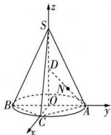

text_image

z
S
D
N
B
O
C
A
y
x

得平面 SBC 的一个法向量为 $\boldsymbol{n}=(2,-2,1)$ . 又 $\overrightarrow{BN}=(0,3,1)$ ，所以点 N 到平面 SBC 的距离 $d=\frac{|\overrightarrow{BN}\cdot\boldsymbol{n}|}{|\boldsymbol{n}|}=\frac{|-6+1|}{\sqrt{4+4+1}}=\frac{5}{3}$ .

7 A 由题得 $\overrightarrow{OA} = (1,2,3)$ . 因为两平行平面 $\alpha, \beta$ 分别经过坐标原点 $O$ 和点 $A(1,2,3)$ , 且两平面的一个法向量为 $n = (-1,0,1)$ , 所以两平面间的距离 $d = \frac{|\boldsymbol{n} \cdot \overrightarrow{OA}|}{|\boldsymbol{n}|} = \frac{|-1+3|}{\sqrt{2}} = \sqrt{2}$ .

8 解析 (1) 以 $D$ 为原点, $\overrightarrow{DA}, \overrightarrow{DC}, \overrightarrow{DD_1}$ 的方向分别为 $x$ , $y$ , $z$ 轴的正方向建立空间直角坐标系, 则 $D(0,0,0), A(2,0,0), D_1(0,0,2), E(2,2,1)$ , 所以 $\overrightarrow{AE} = (0,2,1), \overrightarrow{AD_1} = (-2,0,2)$ .

设平面 $AD_{1}E$ 的法向量为 $\pmb {n} = (x,y,z)$

则 $\left\{\begin{aligned}\boldsymbol{n}\cdot\overrightarrow{AD_{1}}&=-2x+2z=0,\\ \boldsymbol{n}\cdot\overrightarrow{AE}&=2y+z=0,\end{aligned}\right.$ 令z=2，得x=2,y=-1，

所以平面 $AD_{1}E$ 的一个法向量为 $\pmb {n} = (2, - 1,2)$

又 $\overrightarrow{DD_{1}}=(0,0,2)$ ，所以点D到平面 $AD_{1}E$ 的距离为 $\frac{|n\cdot\overrightarrow{DD_{1}}|}{|n|}=\frac{4}{\sqrt{4+1+4}}=\frac{4}{3}.$

(2) 因为 $B(2,2,0)$ , $C_{1}(0,2,2)$ ，所以 $\overrightarrow{BC_{1}}=(-2,0,2)$ ，
所以 $\overrightarrow{BC_{1}}\cdot n=2\times(-2)+(-1)\times0+2\times2=0,$

所以 $\overrightarrow{BC_{1}}\perp n$ ，所以 $BC_{1}\parallel$ 平面 $AD_{1}E$ ，

所以 $BC_{1}$ 到平面 $AD_{1}E$ 的距离可以转化为点 B 到平面 $AD_{1}E$ 的距离.

因为 $\overrightarrow{AB}=(0,2,0)$ ，所以 $BC_{1}$ 到平面 $AD_{1}E$ 的距离为

$$
\frac {| \boldsymbol {n} \cdot \overrightarrow {A B} |}{| \boldsymbol {n} |} = \frac {2}{\sqrt {4 + 1 + 4}} = \frac {2}{3}.
$$

9 $\sqrt{3}$ 解析 以 $P$ 为坐标原点， $\overrightarrow{PA}, \overrightarrow{PB}, \overrightarrow{PC}$ 的方向分别为 $x$ 轴、 $y$ 轴、 $z$ 轴的正方向，建立空间直角坐标系，则 $A(3,0,0), B(0,3,0), C(0,0,3), P(0,0,0)$ ，则 $G(1,1,0)$ ，所以 $\overrightarrow{PG} = (1,1,0), \overrightarrow{BC} = (0,-3,3), \overrightarrow{PC} = (0,0,3)$ . 设与 $\overrightarrow{PG}$ ， $\overrightarrow{BC}$ 都垂直的一个向量为 $\boldsymbol{n} = (x, y, z)$ ，则 $\left\{ \begin{array}{l} \overrightarrow{PG} \cdot \boldsymbol{n} = x + y = 0, \\ \overrightarrow{BC} \cdot \boldsymbol{n} = -3y + 3z = 0, \end{array} \right.$ 令 $x = 1$ ，则 $y = -1, z = -1$ ，即 $\boldsymbol{n} = (1,-1,-1)$ ，则异面直线 $PG$ 与 $BC$ 之间的距离为 $\frac{|\overrightarrow{PC} \cdot \boldsymbol{n}|}{|\boldsymbol{n}|} = \frac{|-3|}{\sqrt{1^2 + (-1)^2 + (-1)^2}} = \sqrt{3}$ .

# 【归纳总结】 求异面直线间的距离

如图, 已知异面直线 a, b, 若点 P 在直线 b 上, 点 Q 在直线 a 上, $PQ \perp a$ 且 $PQ \perp b$ , 则 PQ 的长为异面直线 a, b 间的距离. 在直线 a 上取一点 A, 则 $PQ = \frac{|\overrightarrow{AP} \cdot n|}{|n|}$ (n 为直线 PQ 的一个方向向量).

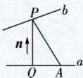

# 过能力 学科关键能力构建

1 A 由已知得 $\overrightarrow{AB} = (1,1,1),\overrightarrow{CD} = (-2,2,1),\overrightarrow{AC} =$ $(1,0,0)$ ，设向量 $\pmb {n} = (x,y,z)$ 与 $\overrightarrow{AB},\overrightarrow{CD}$ 都垂直，则 $\left\{ \begin{array}{l}\pmb {n}\cdot \overrightarrow{AB} = 0,\\ \pmb {n}\cdot \overrightarrow{CD} = 0, \end{array} \right.$ 即 $\left\{ \begin{array}{l}x + y + z = 0,\\ -2x + 2y + z = 0, \end{array} \right.$ 取 $x = 1$ ，则 $\pmb {n} = (1,3,$ -4).又平面 $\alpha //$ 平面 $\beta$ ，所以 $\pmb{n}$ 为平面 $\alpha ,\beta$ 的一个法向量，则平面 $\alpha$ 与平面 $\beta$ 间的距离为 $d = \frac{|\overrightarrow{AC}\cdot\pmb{n}|}{|\pmb{n}|} =$ $\frac{|1\times 1 + 3\times 0 + (-4)\times 0|}{\sqrt{1^2 + 3^2 + (-4)^2}} = \frac{\sqrt{26}}{26}.$

2 A 将展开图还原成正方体, 以 $A$ 为原点建立如图所示的空间直角坐标系, 由图知 $A(0,0,0), M(1,1,1), F(1,1,0), C(0,1,1)$ . 设 $CF$ 的中点为 $G$ , 连接 $GM$ , 则 $G(\frac{1}{2},1,\frac{1}{2}), \overrightarrow{MG} = (-\frac{1}{2},$

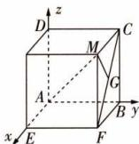

text_image

z
D
C
M
G
A
B y
x
E
F

$0, -\frac{1}{2}$ , 又 $\overrightarrow{AM} = (1, 1, 1)$ , 故点 $G$ 到直线 $AM$ 的距离 $d = \sqrt{|\overrightarrow{MG}|^2 - (\frac{\overrightarrow{MG} \cdot \overrightarrow{AM}}{|\overrightarrow{AM}|})^2} = \frac{\sqrt{6}}{6}$ .

3 D 设正四棱柱的高为 h, 其外接球的半径为 r, 则 $4\pi r^{2} = 17\pi$ , 得 $r = \frac{\sqrt{17}}{2}$ , 所以 $\sqrt{2^{2} + 2^{2} + h^{2}} = \sqrt{17}$ , 得 h = 3. 以 D

为坐标原点， $\overrightarrow{DA}, \overrightarrow{DC}, \overrightarrow{DD_1}$ 的方向分别为 $x, y, z$ 轴的正方向建立空间直角坐标系，如图，则 $A(2,0,0), B_1(2,2,3), M(1,2,0), D_1(0,0,3)$ ，所以 $\overrightarrow{AB_1} = (0,2,3), \overrightarrow{AM} = (-1,2,0), \overrightarrow{AD_1} = (-2,0,3)$ . 设平面 $AB_1M$ 的法向量为 $n = (x,$

$y,z)$ ，则 $\left\{ \begin{array}{l}\overrightarrow{AB_1} \cdot \boldsymbol {n} = 2y + 3z = 0,\\ \overrightarrow{AM} \cdot \boldsymbol {n} = -x + 2y = 0, \end{array} \right.$ 令 $y =$ 3，则 $\pmb {n} = (6,3, - 2)$ 是平面 $AB_{1}M$ 的一个法向量，则点 $D_{1}$ 到平面 $AB_{1}M$ 的距离为 $\frac{| \overrightarrow{AD_1} \cdot \boldsymbol{n}|}{|\boldsymbol{n}|} = \frac{| - 12 - 6|}{\sqrt{36 + 9 + 4}} = \frac{18}{7}.$

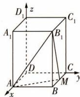

text_image

D₁
z
A₁
B₁
C₁
D
C
A
B
M
y
x

4 D 由题意知 $BA, BC, PA$ 两两垂直，则以 $B$ 为坐标原点， $\overrightarrow{BC}, \overrightarrow{BA}, \overrightarrow{AP}$ 的方向分别为 $x, y, z$ 轴的正方向，建立如图所示的空间直角坐标系，则 $B(0,0,0), A(0,2,0), C(2\sqrt{3},0,0), P(0,2,4), D(0,2,2), E(\sqrt{3},1,2), M(0,2,1), N(\sqrt{3},0,0)$ ，所以 $\overrightarrow{DE} = (\sqrt{3}, -1,0), \overrightarrow{DB} = (0, -2, -2)$ . 设 $\boldsymbol{n} = (x, y, z)$ 为平面 $BDE$ 的法向量，则 $\left\{ \begin{array}{l} \boldsymbol{n} \cdot \overrightarrow{DE} = \sqrt{3} x - y = 0, \\ \boldsymbol{n} \cdot \overrightarrow{DB} = -2y - 2z = 0, \end{array} \right.$ 令 $x = 1$ ，得 $\boldsymbol{n} = (1, \sqrt{3}, -\sqrt{3})$ 是平面 $BDE$ 的一个法向量. 又 $\overrightarrow{MN} = (\sqrt{3}, -2, -1)$ ，所以 $\overrightarrow{MN} \cdot \boldsymbol{n} = 0$ ，又 $MN \notin$ 平面 $BDE$ ，所以 $MN //$ 平面 $BDE$ ，所以直线 $MN$ 到平面 $BDE$ 的距离为点 $M$ 到平面 $BDE$ 的距离，设为 $d$ ，因为 $\overrightarrow{MD} = (0,0,1)$ ，所以 $d = \frac{|\overrightarrow{MD} \cdot \boldsymbol{n}|}{|\boldsymbol{n}|} = \frac{\sqrt{3}}{\sqrt{7}} = \frac{\sqrt{21}}{7}$ .

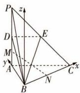

text_image

P
z
D
E
M
y
A
B
N
C
x

5 $\frac{3\sqrt{5}}{5}$ 解析 因为 $S_{\triangle D_1EP} = \frac{1}{2} D_1E\cdot h,h$ 为点 $P$ 到直线 $D_{1}E$ 的距离，当 $h$ 最小时 $\triangle D_1EP$ 的面积取最小值，而点 $P$ 在线段 $CC_{1}$ 上，直线 $D_{1}E$ 与 $CC_{1}$ 为异面直线，因此点 $P$ 到直线 $D_{1}E$ 距离的最小值等于异面直线 $D_{1}E$ 与 $CC_{1}$ 间的距离.以 $D$ 为原点， $\overrightarrow{DA},\overrightarrow{DC},\overrightarrow{DD_1}$ 的方向分别为 $x,y,z$ 轴的正方向，建立空间直角坐标系，则 $E(1,2,0),D_1(0,0,2)$ $C(0,2,0),C_1(0,2,2),\overrightarrow{ED_1} = (-1, - 2,2),\overrightarrow{CC_1} = (0,0,$ 2）， $\overrightarrow{CE} = (1,0,0)$ .设与异面直线 $D_{1}E$ 和 $CC_{1}$ 均垂直的一个向量为 $\pmb {u} = (x,y,z)$ ，则 $\left\{ \begin{array}{l}\pmb {u}\cdot \overrightarrow{CC_1} = 2z = 0,\\ \pmb {u}\cdot \overrightarrow{ED_1} = -x - 2y + 2z = 0, \end{array} \right.$ 得 $\left\{ \begin{array}{ll}z = 0,\\ x = -2y, \end{array} \right.$ 令 $x = 2$ ，则 $y = -1$ ，此时 $\pmb {u} = (2, - 1,0)$ ，故异面直线 $D_{1}E$ 与 $CC_{1}$ 间的距离为 $\frac{|u\cdot\overrightarrow{CE}|}{|u|} = \frac{2}{\sqrt{4 + 1 + 0}} =$ $\frac{2\sqrt{5}}{5}$ . 又 $D_{1}E = |\overrightarrow{ED_{1}}| = \sqrt{1 + 4 + 4} = 3$ ，所以 $\triangle D_{1}EP$ 面积的最小值为 $\frac{1}{2} \times 3 \times \frac{2\sqrt{5}}{5} = \frac{3\sqrt{5}}{5}$ .

6 $(\frac{1}{3}, \frac{1}{2})$ 解析 方法一 以 $D$

为原点,分别以 DA, DC, $DD_{1}$ 所在直线为 x, y, z 轴建立空间直角坐标系,如图所示,则 $D(0,0,0)$ , $A_{1}(1,0,2)$ , $\overrightarrow{DA_{1}} = (1,0,2)$ . 设 $E(1,m,0)$ (0 < m < 1), 则 $F(0,1,m)$ , $\overrightarrow{DE} = (1,m,0)$ , $\overrightarrow{DF} = (0,1,m)$ , 设平面 DEF 的法向量为 n = (x, y, z), 则 $\left\{\begin{aligned}\overrightarrow{DE} \cdot n &= 0, \\ \overrightarrow{DF} \cdot n &= 0\end{aligned}\right. \Rightarrow \left\{\begin{aligned}x + my &= 0, \\ y + mz &= 0,\end{aligned}\right.$ 令 z = -1,

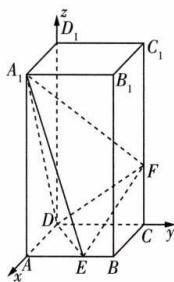

text_image

z
D₁
A₁
B₁
C₁
F
D
A
E
B
C
y
x

则 $y = m, x = -m^2$ ，所以平面 $DEF$ 的一个法向量为 $\pmb{n} = (-m^2, m, -1)$ ，点 $A_1$ 到平面 $DEF$ 的距离 $d = \frac{|\overrightarrow{DA_1} \cdot \pmb{n}|}{|\pmb{n}|} = \frac{m^2 + 2}{\sqrt{m^4 + m^2 + 1}}$ 。设 $\triangle DEF$ 中的 $EF$ 边上的高为 $h$ ，因为 $DE = DF = \sqrt{1 + m^2}$ ， $EF = \sqrt{2(m^2 - m + 1)}$ ，所以 $h = \sqrt{DE^2 - (\frac{EF}{2})^2} = \sqrt{\frac{m^2 + m + 1}{2}}$ ， $S_{\triangle DEF} = \frac{1}{2} \times EF \times h = \frac{1}{2} \sqrt{2(m^2 - m + 1)} \times \sqrt{\frac{m^2 + m + 1}{2}} = \frac{1}{2} \sqrt{m^4 + m^2 + 1}$ ，所以 $V_{A_1 - DEF} = \frac{1}{3} S_{\triangle DEF} \times d = \frac{m^2 + 2}{6} (0 < m < 1)$ ，所以三棱锥 $A_1 - DEF$ 的体积的取值范围是 $(\frac{1}{3}, \frac{1}{2})$ 。

方法二（几何法）设 $AE = CF = x(0 < x < 1)$ ，延长 $BC$ 到 $G$ ，使得 $CG = \frac{x}{2}$ ，连接 $FG, EG, B_1C, A_1D$ ，则 $\tan \angle CFG = \frac{CG}{CF} = \frac{1}{2}, \tan \angle C_1CB_1 = \frac{B_1C_1}{CC_1} = \frac{1}{2}$ ，则 $\angle CFG = \angle C_1CB_1$ ，于是 $FG // B_1C.$ 而长方体 $ABCD - A_1B_1C_1D_1$ 的对角面 $A_1B_1CD$ 是矩形，则有 $A_1D // B_1C // FG$ ，又 $A_1D \subset$ 平面 $A_1DE, FG \not\subset$ 平面 $A_1DE$ ，于是 $FG //$ 平面 $A_1DE$ ，所以 $F$ 到平面 $A_1DE$ 的距离等于 $G$ 到平面 $A_1DE$ 的距离。由等体积法可知 $V_{A_1-DEF} = V_{F-A_1DE} = V_{G-A_1DE} = V_{A_1-DEG} = \frac{1}{3} AA_1 \cdot S_{\triangle DEG} = \frac{2}{3} S_{\triangle DEG}$ ，又

$$
\begin{array}{r l} & {S _ {\triangle D E G} = S _ {\text {梯形} A B G D} - S _ {\triangle A D E} - S _ {\triangle B E G} = \frac {(1 + 1 + \frac {x}{2}) \times 1}{2} - \frac {1 \times x}{2} -} \\ & {\frac {(1 - x) (1 + \frac {x}{2})}{2} = \frac {1}{2} + \frac {x ^ {2}}{4}, \text {故} \frac {1}{2} <   S _ {\triangle D E G} <   \frac {3}{4}, \text {所以}} \\ & {V _ {A _ {1} - D E F} \in (\frac {1}{3}, \frac {1}{2}).} \end{array}
$$

7 ①② 解析 在题图1中,由 $f(x)=\sin(\pi x+\frac{5\pi}{6})$ ,得 $A(-\frac{1}{3},1),B(\frac{2}{3},-1),D(\frac{2}{3},0),M(0,\frac{1}{2})$ .在题图2中,建立如图所示的空间直角坐标系 $Ox'y'z'$ ,则A(0,

$-\frac{1}{3},1),B(1,\frac{2}{3},0),M(0,0,\frac{1}{2}),D(0,\frac{2}{3},0)$ ，则 $\overrightarrow{AB}=(1,1,-1)$ ，得 $|\overrightarrow{AB}|=\sqrt{3}$ ，①正确。设平面ABM的法向量为 $n=(x,y,z),\overrightarrow{AM}=(0,\frac{1}{3},-\frac{1}{2})$ ，则 $\left\{\begin{aligned}\boldsymbol{n}\cdot\overrightarrow{AB}&=x+y-z=0,\\ \boldsymbol{n}\cdot\overrightarrow{AM}&=\frac{1}{3}y-\frac{1}{2}z=0,\end{aligned}\right.$ 取y=3，则z=2,x=-1，所以平面ABM的一个法向量为 $n=(-1,3,2)$ ，又 $\overrightarrow{DB}=(1,0,0)$ ，所以点D到平面ABM的距离为 $\frac{|\overrightarrow{DB}\cdot\boldsymbol{n}|}{|\boldsymbol{n}|}=\frac{1}{\sqrt{14}}=\frac{\sqrt{14}}{14}$ ，②正确。取 $a=\overrightarrow{DB}=(1,0,0),u=\frac{\overrightarrow{AB}}{|\overrightarrow{AB}|}=\frac{\sqrt{3}}{3}(1,1,-1)=(\frac{\sqrt{3}}{3},\frac{\sqrt{3}}{3},-\frac{\sqrt{3}}{3})$ ，则 $a^{2}=1,a\cdot u=\frac{\sqrt{3}}{3}$ ，所以点D到直线AB的距离为 $\sqrt{a^{2}-(a\cdot u)^{2}}=\frac{\sqrt{6}}{3}$ ，③错误。

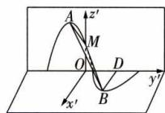

text_image

A
z'
M
O
D
B
x'
y'

8 解析 （1）取 $A_{1}C_{1}$ 的中点 O，连接 $B_{1}O, OD$ ，可得 $OA_{1}, OD, OB_{1}$ 两两垂直。如图，以 O 为原点， $OA_{1}, OD, OB_{1}$ 所在直线分别为 x 轴、y 轴、z 轴建立空间直角坐标系，

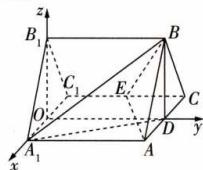

text_image

z
B₁
C₁
E
O
A₁
x
y
A
B
C

则 $A(1,2,0),B(0,2,\sqrt{3}),D(0,$

$$
\begin{array}{l} 2, 0), A _ {1} (1, 0, 0), E (- 1, 1, 0), \overrightarrow {A _ {1} D} = (- 1, 2, 0), \overrightarrow {A _ {1} B} = \\ (- 1, 2, \sqrt {3}), \overrightarrow {B A} = (1, 0, - \sqrt {3}), \overrightarrow {B E} = (- 1, - 1, - \sqrt {3}). \end{array}
$$

设 $\boldsymbol{n}_{1}=(x_{1},y_{1},z_{1}),\boldsymbol{n}_{2}=(x_{2},y_{2},z_{2})$ 分别为平面 $A_{1}BD$ 和平面 BAE 的法向量.

由 $\left\{\begin{aligned}\overrightarrow{A_{1}D}\cdot\boldsymbol{n}_{1}&=0,\\\overrightarrow{A_{1}B}\cdot\boldsymbol{n}_{1}&=0,\end{aligned}\right.$ 得 $\left\{\begin{aligned}-x_{1}+2y_{1}&=0,\\-x_{1}+2y_{1}+\sqrt{3}z_{1}&=0,\end{aligned}\right.$

取 $y_{1}=1$ ，则 $x_{1}=2,z_{1}=0$ ，

所以 $\boldsymbol{n}_{1}=(2,1,0)$ 是平面 $A_{1}BD$ 的一个法向量.

由 $\left\{\begin{aligned}\overrightarrow{BA}\cdot\boldsymbol{n}_{2}&=0,\\\overrightarrow{BE}\cdot\boldsymbol{n}_{2}&=0,\end{aligned}\right.$ 得 $\left\{\begin{aligned}x_{2}-\sqrt{3}z_{2}&=0,\\ -x_{2}-y_{2}-\sqrt{3}z_{2}&=0,\end{aligned}\right.$

取 $z_{2} = 1$ ，则 $x_{2} = \sqrt{3},y_{2} = -2\sqrt{3}$

所以 $\boldsymbol{n}_{2}=(\sqrt{3},-2\sqrt{3},1)$ 是平面 BAE 的一个法向量.

因为 $n_{1} \cdot n_{2} = 0$ ，所以平面 BAE ⊥ 平面 $A_{1}BD$ .

(2) 假设在线段 $B_{1}B$ 上存在点 M，使点 M 到平面 $A_{1}BD$ 的距离为 $\frac{2\sqrt{5}}{5}$ .

设 $M(0,a,\sqrt{3})(0\leqslant a\leqslant2)$ ，则 $\overrightarrow{BM}=(0,a-2,0)$ ，
由 $\frac{2\sqrt{5}}{5}=\frac{|\overrightarrow{BM}\cdot n_{1}|}{|n_{1}|}=\frac{|a-2|}{\sqrt{5}}$

解得 a=4(舍去)或 a=0.

故在线段 $B_{1}B$ 上存在点 M，且点 M 与点 $B_{1}$ 重合时，点 M 到平面 $A_{1}BD$ 的距离为 $\frac{2\sqrt{5}}{5}$ .

# 课时 3 ▶ 用空间向量研究夹角问题

# 过基础 教材必备知识精练

1 A 由题意, 可得 $\left|n_{1}\right|=\sqrt{2},\left|n_{2}\right|=\sqrt{2},n_{1}\cdot n_{2}=-1$ , $\cos\left\langle n_{1},n_{2}\right\rangle=\frac{n_{1}\cdot n_{2}}{\left|n_{1}\right|\left|n_{2}\right|}=-\frac{1}{2}$ . 设异面直线 $l_{1}$ 与 $l_{2}$ 所成的角为 $\theta$ , 则 $\cos\theta=\left|\cos\left\langle n_{1},n_{2}\right\rangle\right|=\frac{1}{2}$ . 又 $0^{\circ}<\theta\leqslant90^{\circ}$ , 所注意异面直线所成角与向量夹角的关系.

以 $\theta=60^{\circ}$ ，即异面直线 $l_{1}$ 与 $l_{2}$ 所成的角为 $60^{\circ}$ .

2 C 方法一(建系法) 如图,取AB的中点O,连接OD,CO,则 $CO\perp$ 平面BOD,又D为弧AB的中点,所以 $DO\perp AB$ .以O为原点,建立如图所示的空间直角坐标系,设AB=2,则 $A(0,-1,0),B(0,1,0),D(1,0,$

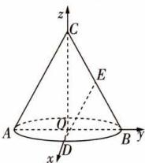

text_image

z
C
E
A
O
D
B
y
x

0), $E(0, \frac{1}{2}, \frac{\sqrt{3}}{2})$ , 所以 $\overrightarrow{AB} = (0, 2, 0)$ , $\overrightarrow{DE} = (-1, \frac{1}{2}, \frac{\sqrt{3}}{2})$ . 记异面直线 AB 和 DE 所成角为 $\theta$ , 则 $\cos \theta = \frac{|\overrightarrow{AB} \cdot \overrightarrow{DE}|}{|\overrightarrow{AB}| |\overrightarrow{DE}|} = \frac{\sqrt{2}}{4}$ .

方法二（基向量法）取 $AB$ 的中点 $O$ ，连接 $OC,OD,OE$ ，则 $\overrightarrow{DE} = \overrightarrow{DO} +\overrightarrow{OE} = \overrightarrow{DO} +\frac{1}{2} (\overrightarrow{OB} +\overrightarrow{OC}) = -\overrightarrow{OD} +\frac{1}{2}\overrightarrow{OB} +\frac{1}{2}\overrightarrow{OC},$ $\overrightarrow{AB}\cdot \overrightarrow{DE} = (2\overrightarrow{OB})\cdot (-\overrightarrow{OD} +\frac{1}{2}\overrightarrow{OB} +\frac{1}{2}\overrightarrow{OC}) = -2\overrightarrow{OB}\cdot \overrightarrow{OD}+$ $\overrightarrow{OB^2} +\overrightarrow{OB}\cdot \overrightarrow{OC} = \overrightarrow{OB^2}$ ，又 $|\overrightarrow{AB}| = 2|\overrightarrow{OB}|,|\overrightarrow{DE}| =$ $\sqrt{(-\overrightarrow{OD} + \frac{1}{2}\overrightarrow{OB} + \frac{1}{2}\overrightarrow{OC})^2} = \sqrt{\overrightarrow{OD^2} + \frac{1}{4}\overrightarrow{OB^2} + \frac{1}{4}\overrightarrow{OC^2}} =$ $\sqrt{\overrightarrow{OB^2} + \frac{1}{4}\overrightarrow{OB^2} + \frac{1}{4}\times 3\overrightarrow{OB^2}} = \sqrt{2} |\overrightarrow{OB} |,$ 所以 $|\cos \langle \overrightarrow { AB },\overrightarrow { DE }\rangle | =$ $\frac{| \overrightarrow { AB } \cdot \overrightarrow { DE } |}{| \overrightarrow { AB } || \overrightarrow { DE } |} = \frac{\overrightarrow{OB}^2}{2|\overrightarrow{OB}|\times\sqrt{2}|\overrightarrow{OB}|} = \frac{\sqrt{2}}{4},$ 所以异面直线 $AB$ 和 $DE$ 所成角的余弦值为 $\frac{\sqrt{2}}{4}.$

方法三（几何法）如图，取 $AC$ 的中点 $F$ ，连接 $EF,DF,$ 在 $\triangle ABC$ 中，因为 $E,F$ 分别为 $CB,CA$ 的中点，所以 $EF / /$ $AB$ ，则 $\angle DEF$ 或其补角为异面直线 $AB$ 和 $DE$ 所成的角.取 $AB$ 的中点 $O$ ，连接 $OD,OC,OE,OF$ ，则 $OC\bot$ 平面 $BOD$ ，所以

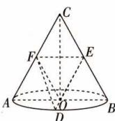

text_image

Geometric diagram of a cone with labeled points and dashed lines indicating hidden edges or projections

$OC \perp DO, D$ 为弧 $AB$ 的中点，所以 $DO \perp AB$ ，又 $CO \cap AB = O$ 所以 $DO \perp$ 平面 $ABC$ . 因为 $OE, OF \subset$ 平面 $ABC$ ，所以 $DO \perp OE, DO \perp OF$ . 设底面圆的半径为1，则 $EF = 1, DE = DF = \sqrt{DO^2 + OE^2} = \sqrt{2}$ . 在 $\triangle DEF$ 中， $\cos \angle DEF = \frac{DE^2 + EF^2 - DF^2}{2DE \cdot EF} = \frac{2 + 1 - 2}{2 \times \sqrt{2} \times 1} = \frac{\sqrt{2}}{4}$ .

# 【归纳总结】 异面直线所成的角的计算方法

(1) 向量法. 可分为两种方法: ① 建立空间直角坐标系, 运用向量的坐标并结合向量的夹角公式求解; ② 选取基向量, 运用向量的线性运算并结合向量的夹角公式求解.
(2) 几何法. 将异面直线通过平移转化成共面直线, 结合三角形知识求解.

3 D 如图, 在棱长为 2 的正方体内的三棱锥 A-BCD 即为满足题意的鳖臑 A-BCD, 以 B 为原点, 建立空间直角坐标系, 则 $B(0,0,0)$ , $A(0,0,2)$ , $C(0,2,0)$ , $M(1,1,1)$ , 则 $\overrightarrow{CM} = (1, -1, 1)$ , $\overrightarrow{BA} = (0, 0, 2)$ , 所以 $\cos\langle\overrightarrow{CM}, \overrightarrow{BA}\rangle = \frac{\overrightarrow{CM} \cdot \overrightarrow{BA}}{|\overrightarrow{CM}| |\overrightarrow{BA}|} = \frac{2}{\sqrt{3} \times 2} = \frac{\sqrt{3}}{3}$ , 则异面直线 CM 与 AB 所成角的余弦值为 $\frac{\sqrt{3}}{3}$ .

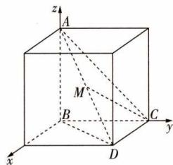

text_image

z
A
M
B
C
y
x
D

4 $\frac{2}{3}$ 解析 连接 AC, BD 交于点 O, 则 $AC \perp BD$ . 连接 VO, 因为四棱锥 V-ABCD 为正四棱锥, 所以 $VO \perp$ 底面 ABCD. 以点 O 为坐标原点, $\overrightarrow{OA}, \overrightarrow{OB}, \overrightarrow{OV}$ 的方向分别

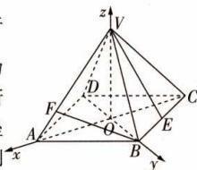

text_image

z
V
D
F
A
O
C
E
B
x
y

为 $x, y, z$ 轴的正方向，建立如图所示的空间直角坐标系，则 $A(\sqrt{2}, 0, 0), E(-\frac{\sqrt{2}}{2}, \frac{\sqrt{2}}{2}, 0), V(0, 0, \sqrt{2}), B(0, \sqrt{2}, 0)$ ，则 $\overrightarrow{VA} = (\sqrt{2}, 0, -\sqrt{2}), \overrightarrow{BV} = (0, -\sqrt{2}, \sqrt{2})$ 。设 $\overrightarrow{VF} = \lambda \overrightarrow{VA} = (\sqrt{2}\lambda, 0, -\sqrt{2}\lambda)$ ，其中 $0 \leqslant \lambda \leqslant 1$ ，则 $\overrightarrow{BF} = \overrightarrow{BV} + \overrightarrow{VF} = (\sqrt{2}\lambda, -\sqrt{2}, \sqrt{2}(1 - \lambda))$ ，又 $\overrightarrow{VE} = (-\frac{\sqrt{2}}{2}, \frac{\sqrt{2}}{2}, -\sqrt{2})$ ，所以 $|\cos \langle \overrightarrow{BF}, \overrightarrow{VE} \rangle| = \frac{|\overrightarrow{BF} \cdot \overrightarrow{VE}|}{|\overrightarrow{BF}| |\overrightarrow{VE}|} = \frac{|\lambda - 3|}{2\sqrt{\lambda^2 - \lambda + 1} \times \sqrt{3}} = \frac{\sqrt{21}}{6}$ ，整理可得 $6\lambda^2 - \lambda - 2 = 0$ ，又 $0 \leqslant \lambda \leqslant 1$ ，所以 $\lambda = \frac{2}{3}$ ，即 $\frac{VF}{VA} = \frac{2}{3}$ 。

5 A 直线 AB 与平面 $\alpha$ 所成角的正弦值为 $\sin\theta = |\cos\langle\overrightarrow{AB}, n\rangle| = \frac{|\overrightarrow{AB} \cdot n|}{|\overrightarrow{AB}| |n|} = \frac{1}{\sqrt{2} \times \sqrt{2}} = \frac{1}{2}$ ，又 $\theta \in [0, \frac{\pi}{2}]$ ，所以直线 AB 与平面 $\alpha$ 所成的角为 $\frac{\pi}{6}$ .

6 D 由题意,知圆柱底面半径为1, 所以 $\angle AOC = \frac{5\pi}{6}$ , $\angle A_{1}O_{1}B_{1} = \frac{\pi}{3}$ ,
如图所示, 建立空间直角坐标系, 则 $B_{1}\left(\frac{\sqrt{3}}{2},\frac{1}{2},1\right),C\left(\frac{1}{2},-\frac{\sqrt{3}}{2},0\right)$ ，所以 $\overrightarrow{B_{1}C}=(\frac{1-\sqrt{3}}{2},\frac{-\sqrt{3}-1}{2},-1)$ . 平面 $AA_{1}O_{1}O$ 的一个法向量为 $\boldsymbol{n}=(1,0,0)$ ，设直线 $B_{1}C$ 与平面 $AA_{1}O_{1}O$ 所成的角为 $\theta$ ，则 $\sin\theta=\frac{|\overrightarrow{B_{1}C}\cdot\boldsymbol{n}|}{|\overrightarrow{B_{1}C}||\boldsymbol{n}|}=\frac{\sqrt{3}-1}{\sqrt{3}\times1}=\frac{3-\sqrt{3}}{6}$ . 故选 D.

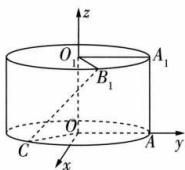

text_image

z
O₁
A₁
B₁
O
C
x
A
y

7 ABC 如图, 取 BD 的中点 O, 连接 OA, OC, 则 $OA \perp BD, OC \perp BD$ , 故 $\angle AOC$ 为二面角 A - BD - C 的平面角. 由题得 $\angle AOC = 90^{\circ}$ , 即 $OA \perp OC$ . 以 O 为原点, 建立空间直角坐标系，令 BD=2，则 OA=OC=1, A(0,0,1), B(0,-1,0), C(1,0,0), D(0,1,0)，所以 $\overrightarrow{AB}=(0,-1,-1)$ , $\overrightarrow{BD}=(0,2,0)$ , $\overrightarrow{AC}=(1,0,-1)$ , $\overrightarrow{CD}=(-1,1,0)$ . 对于 A, $\overrightarrow{AC}\cdot\overrightarrow{BD}=0$ , 则 $\overrightarrow{AC}\perp$ $\overrightarrow{BD}$ ，即 $AC \perp BD$ ，A 正确；对于 B， $|\overrightarrow{AB}| = \sqrt{2} = |\overrightarrow{AC}|$ ，B 正确；对于 C， $|\cos\langle\overrightarrow{AB}, \overrightarrow{CD}\rangle| = \frac{|\overrightarrow{AB} \cdot \overrightarrow{CD}|}{|\overrightarrow{AB}| |\overrightarrow{CD}|} = \frac{1}{\sqrt{2} \times \sqrt{2}} = \frac{1}{2}$ ，因此 AB 与 CD 所成的角为 $60^{\circ}$ ，C 正确；对于 D，平面 BCD 的一个法向量为 $\boldsymbol{n} = (0, 0, 1)$ ，则 $|\cos\langle\overrightarrow{AB}, \boldsymbol{n}\rangle| = \frac{|\overrightarrow{AB} \cdot \boldsymbol{n}|}{|\overrightarrow{AB}| |\boldsymbol{n}|} = \frac{1}{\sqrt{2} \times 1} = \frac{\sqrt{2}}{2}$ ，因此 AB 与平面 BCD 所成的角为 $45^{\circ}$ ，D 错误.

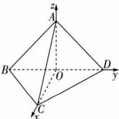

text_image

z
A
B
O
D
y
x
C

8 C 以 D 为原点, $\overrightarrow{DA}, \overrightarrow{DC}, \overrightarrow{DD_{1}}$ 的方向分别为 x, y, z 轴的正方向, 建立空间直角坐标系, 设正方体 ABCD - $A_{1}B_{1}C_{1}D_{1}$ 的棱长为 1, 则 $D(0,0,0), M(\frac{1}{2},0,1), N(1,0, \frac{1}{2}), C(0,1,0), B_{1}(1,1,1), D_{1}(0,0,1)$ , 所以 $\overrightarrow{MN} = (\frac{1}{2}, 0, -\frac{1}{2}), \overrightarrow{DD_{1}} = (0,0,1), \overrightarrow{B_{1}E} = \lambda \overrightarrow{B_{1}C} = \lambda (-1,0,-1)$ ,则 $E(1-\lambda,1,1-\lambda),\overrightarrow{ME}=(\frac{1}{2}-\lambda,1,-\lambda)$ . 设平面 MNE 的法向量为 $m=(x,y,z)$ ，则 $\left\{\begin{aligned}\boldsymbol{m}\cdot\overrightarrow{MN}&=0,\\ \boldsymbol{m}\cdot\overrightarrow{ME}&=0,\end{aligned}\right.$ 即 $\left\{\begin{aligned}\frac{1}{2}x-\frac{1}{2}z&=0,\\ (\frac{1}{2}-\lambda)x+y-\lambda z&=0,\end{aligned}\right.$ 令 x=1，则 $\boldsymbol{m}=(1,2\lambda-\frac{1}{2},1)$ 是

平面 MNE 的一个法向量. 设直线 $DD_{1}$ 与平面 MNE 所成的角为 $\alpha$ ，则 $\sin \alpha = |\cos \langle m, \overrightarrow{DD_{1}} \rangle| = |\frac{m \cdot \overrightarrow{DD_{1}}}{|m||\overrightarrow{DD_{1}}}|| =$

$\frac{1}{\sqrt{(2\lambda - \frac{1}{2})^2 + 2}} = \frac{1}{\sqrt{4(\lambda - \frac{1}{4})^2 + 2}},$ 又 $0 \leqslant \lambda \leqslant 1, \alpha \in [0,$

$\left.\frac{\pi}{2}\right]$ ，所以当 $\lambda=\frac{1}{4}$ 时， $\sin\alpha$ 有最大值，此时直线 $DD_{1}$ 与平面 MNE 所成的角最大.

9 解析 （1）因为平面 CDEF ⊥ 平面 ABCD，平面 CDEF ∩ 平面 ABCD = CD, DE ⊥ DC, DE ⊂ 平面 CDEF，

所以 $DE \perp$ 平面 ABCD，

又 $BC \subset$ 平面 ABCD, 所以 $DE \perp BC$ .

(2)如图,过 F 作 $FO \parallel ED$ 交 DC 于点 O,作 $OP \perp AB$ 于点 P,则 O,P 分别为 CD,AB 的中点.

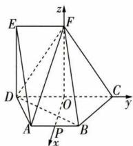

text_image

E
F
z
D
O
C
y
A
P
B
x

由(1)得 $DE \perp$ 平面 ABCD，则 $FO \perp$ 平面 ABCD，
所以 OP, OC, OF 两两互相垂直，

故以 O 为原点, 建立空间直角坐标系.

在等腰梯形 ABCD 中, $OP = \sqrt{2^{2} - \left(\frac{4 - 2}{2}\right)^{2}} = \sqrt{3}$ ,

在 Rt△FOC 中, $OF = \sqrt{(2\sqrt{3})^{2} - 2^{2}} = 2\sqrt{2}$ ,

则 $A(\sqrt{3}, -1, 0)$ , $B(\sqrt{3}, 1, 0)$ , $D(0, -2, 0)$ , $F(0, 0, 2\sqrt{2})$ ,
所以 $\overrightarrow{AF}=(-\sqrt{3},1,2\sqrt{2}),\overrightarrow{DB}=(\sqrt{3},3,0),\overrightarrow{DF}=(0,2,2\sqrt{2}).$

设平面 BDF 的法向量为 $\boldsymbol{n}=(x,y,z)$ ,

则 $\left\{\begin{aligned}\boldsymbol{n}\cdot\overrightarrow{DB}&=\sqrt{3}x+3y=0,\\ \boldsymbol{n}\cdot\overrightarrow{DF}&=2y+2\sqrt{2}z=0,\end{aligned}\right.$ 令z=1，得 $y=-\sqrt{2},x=\sqrt{6}$

所以平面 BDF 的一个法向量为 $\boldsymbol{n} = (\sqrt{6}, -\sqrt{2}, 1)$ .
设直线 AF 与平面 BDF 所成的角为 $\theta$ ,

则 $\sin\theta=|\cos\langle\overrightarrow{AF},n\rangle|=\frac{|\overrightarrow{AF}\cdot n|}{|\overrightarrow{AF}||n|}=\frac{|-3\sqrt{2}-\sqrt{2}+2\sqrt{2}|}{\sqrt{12}\times3}=\frac{\sqrt{6}}{9}$

即直线 AF 与平面 BDF 所成角的正弦值为 $\frac{\sqrt{6}}{9}$ .

10 C 因为法向量 a, b 的夹角与两平面所成的角相等或互补，所以 $\cos\langle a, b\rangle = \frac{a \cdot b}{|a||b|} = \frac{(1, 1, 0) \cdot (t, 0, 1)}{\sqrt{2} \cdot \sqrt{1 + t^{2}}} = \pm \frac{1}{2}$ ，解得 $t = \pm 1$ .

11 A 以 C 为原点，在平面 ABC 中，过 C 作 BC 的垂线为 x 轴，CB 所在直线为 y 轴， $CC_{1}$ 所在直线为 z 轴，建立空间直角坐标系，如图，则 $A(\sqrt{3},1,0)$ ， $B_{1}(0,2,1)$ ， $C_{1}(0,0,1)$ ，则 $\overrightarrow{AB_{1}}=(-\sqrt{3},1,1)$ ， $\overrightarrow{AC_{1}}=(-\sqrt{3},-1,1)$ ，设平面 $AB_{1}C_{1}$ 的法向量为 $n=(x,y,z)$ ，则$\left\{ \begin{array}{l} n \cdot \overrightarrow{AB_1} = -\sqrt{3} x + y + z = 0, \\ n \cdot \overrightarrow{AC_1} = -\sqrt{3} x - y + z = 0, \end{array} \right.$ 得

$\left\{\begin{aligned}z&=\sqrt{3}x,\\ y&=0,\end{aligned}\right.$ 令 x=1，得 $\boldsymbol{n}=(1,0,$

$\sqrt{3}$ ) 为平面 $AB_{1}C_{1}$ 的一个法向量. 平面 ABC 的一个法向量为 m =

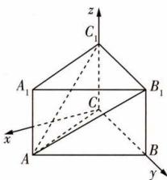

text_image

z
C₁
A₁
B₁
C
A
B
y
x

(0,0,1)，所以 $|\cos \langle m,n\rangle | = \frac{|m\cdot n|}{|m||n|} = \frac{\sqrt{3}}{2}$ 设平面ABC与平面 $AB_{1}C_{1}$ 的夹角为 $\theta$ ，则 $\cos \theta = \frac{\sqrt{3}}{2}$ 所以 $\theta = \frac{\pi}{6}$

12 A 以 D 为原点, $\overrightarrow{DA}, \overrightarrow{DC}, \overrightarrow{DD_{1}}$ 的方向分别为 x, y, z 轴的正方向, 建立空间直角坐标系. 设 AD = 1, 则 $A_{1}(1,0,2), B(1,2,0)$ . 因为 E 为 $C_{1}D_{1}$ 的中点, 所以 $E(0,1,2)$ , 所以 $\overrightarrow{A_{1}E} = (-1,1,0), \overrightarrow{A_{1}B} = (0,2,-2)$ . 设 $\boldsymbol{m} = (x, y, z)$ 是平面 $A_{1}BE$ 的法向量, 则 $\left\{\begin{aligned}\overrightarrow{A_{1}E} \cdot \boldsymbol{m} &= 0, \\ \overrightarrow{A_{1}B} \cdot \boldsymbol{m} &= 0,\end{aligned}\right.$ 所以 $\left\{\begin{aligned}-x + y &= 0, \\ 2y - 2z &= 0,\end{aligned}\right.$ 取 x = 1, 则 y = z = 1, 所以平面 $A_{1}BE$ 的一个法向量为 $\boldsymbol{m} = (1,1,1)$ . 又 $DA \perp$ 平面 $AA_{1}B$ , 所以 $\overrightarrow{DA} = (1,0,0)$ 是平面 $AA_{1}B$ 的一个法向量. 因为 $\cos\langle\boldsymbol{m}, \overrightarrow{DA}\rangle = \frac{\boldsymbol{m} \cdot \overrightarrow{DA}}{|\boldsymbol{m}| |\overrightarrow{DA}|} = \frac{1}{\sqrt{3}} = \frac{\sqrt{3}}{3}$ , 二面角 E - A₁B - A 为钝角, 所以二面角 E - A₁B - A 的余弦值为 $-\frac{\sqrt{3}}{3}$ .

13 AD 在四面体 ABCD 中, $AB \perp BD$ , $CD \perp BD$ , 则 $\langle\overrightarrow{BA}, \overrightarrow{DC}\rangle$ 是二面角 A - BD - C 的平面角. $\overrightarrow{AC} = \overrightarrow{AB} + \overrightarrow{BD} + \overrightarrow{DC} = -\overrightarrow{BA} + \overrightarrow{BD} + \overrightarrow{DC}$ , AB = 3, BD = 2, CD = 4, 所以 $|\overrightarrow{AC}|^{2} = |\overrightarrow{BA}|^{2} + |\overrightarrow{BD}|^{2} + |\overrightarrow{DC}|^{2} - 2\overrightarrow{BA} \cdot \overrightarrow{DC} = 9 + 4 + 16 - 2 \times 3 \times 4\cos\langle\overrightarrow{BA}, \overrightarrow{DC}\rangle = 29 - 24\cos\langle\overrightarrow{BA}, \overrightarrow{DC}\rangle$ . 因为平面 ABD 与平面 BCD 的夹角为 $\frac{\pi}{3}$ , 所以当 $\langle\overrightarrow{BA}, \overrightarrow{DC}\rangle = \frac{\pi}{3}$ 时, $|\overrightarrow{AC}| = \sqrt{17}$ , 当 $\langle\overrightarrow{BA}, \overrightarrow{DC}\rangle = \frac{2\pi}{3}$ 时, $|\overrightarrow{AC}| = \sqrt{41}$ , 所以 AC 的长度可能为 $\sqrt{17}$ 或 $\sqrt{41}$ .

14 A 如图, 平面 ABCD 和平面 $ADD_{1}A_{1}$ 的夹角为 $90^{\circ}$ . 平面 $BDD_{1}B_{1}$ 和平面 $ADD_{1}A_{1}$ 的夹角为 $45^{\circ}$ . 设正方体的棱长为 1, 建立空间直角坐标系, 则 $A(1,0,0)$ , $B(1,1,0)$ , $C(0,1,0)$ , $D_{1}(0,0,1)$ , $\overrightarrow{AB} = (0,1,0)$ , $\overrightarrow{BD_{1}} = (-1, -1,$

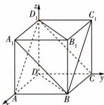

text_image

z
D₁
C₁
A₁
B₁
D′
A
B
C
y
x

1), $\overrightarrow{CB} = (1,0,0)$ . 设平面 $ABC_{1}D_{1}$ 的法向量为 $\boldsymbol{m} = (x_{1}, y_{1}, z_{1})$ ，则 $\left\{\begin{aligned}\boldsymbol{m} \cdot \overrightarrow{AB} &= y_{1} = 0, \\ \boldsymbol{m} \cdot \overrightarrow{BD_{1}} &= -x_{1} - y_{1} + z_{1} = 0,\end{aligned}\right.$ 令 $x_{1} = 1$ ，得 $\boldsymbol{m} = (1,0,1)$ 为平面 $ABC_{1}D_{1}$ 的一个法向量. （【另解】连接 $A_{1}D$ ，则 $A_{1}D \perp$ 平面 $ABC_{1}D_{1}$ ，则 $\overrightarrow{DA_{1}} = (1,0,1)$ 为平面

$ABC_{1}D_{1}$ 的一个法向量)设平面 $A_{1}BCD_{1}$ 的法向量为 $\boldsymbol{n} = (x_{2}, y_{2}, z_{2})$ ，则 $\left\{\begin{aligned}\boldsymbol{n} & \cdot \overrightarrow{CB} = x_{2} = 0, \\ \boldsymbol{n} & \cdot \overrightarrow{BD_{1}} = -x_{2} - y_{2} + z_{2} = 0,\end{aligned}\right.$ 令 $y_{2} = 1$ ，得 $\boldsymbol{n} = (0, 1, 1)$ 为平面 $A_{1}BCD_{1}$ 的一个法向量。（【另解】连接 $DC_{1}$ ，则 $DC_{1} \perp$ 平面 $A_{1}BCD_{1}$ ，则 $\overrightarrow{DC_{1}} = (0, 1, 1)$ 为平面 $A_{1}BCD_{1}$ 的一个法向量）设平面 $ABC_{1}D_{1}$ 与平面 $A_{1}BCD_{1}$ 的夹角为 $\theta$ ，则 $\cos \theta = |\frac{\boldsymbol{m} \cdot \boldsymbol{n}}{|\boldsymbol{m}| | \boldsymbol{n}|}| = \frac{1}{\sqrt{2} \times \sqrt{2}} = \frac{1}{2}$ ，由于 $0^{\circ} \leqslant \theta \leqslant 90^{\circ}$ ，所以 $\theta = 60^{\circ}$ 。故选 A.

15 解析 （1）因为 $AA_{1} \perp$ 平面 ABCD, AB, AD ⊂ 平面 ABCD, 所以 $AA_{1} \perp AB, AA_{1} \perp AD$ ,

又底面 ABCD 是正方形, $AB \perp AD$ , 故 AB, AD, $AA_{1}$ 两两互相垂直.

以 A 为原点, $\overrightarrow{AB}, \overrightarrow{AD}, \overrightarrow{AA_{1}}$ 的方向分别为 x, y, z 轴的正方向, 建立空间直角坐标系,

则 $A(0,0,0),B(6,0,0),B_{1}(3,0,2),C(6,6,0),D(0,6,$ $0),D_1(0,3,2)$

所以 $\overrightarrow{BC}=(0,6,0)$ , $\overrightarrow{BB_{1}}=(-3,0,2)$ , $\overrightarrow{DD_{1}}=(0,-3,2)$ .

设平面 $BCC_{1}B_{1}$ 的法向量为 $\boldsymbol{m}=(x_{1},y_{1},z_{1})$ ,

则 $\left\{\begin{aligned}\boldsymbol{m}\cdot\overrightarrow{BC}&=6y_{1}=0,\\ \boldsymbol{m}\cdot\overrightarrow{BB_{1}}&=-3x_{1}+2z_{1}=0,\end{aligned}\right.$ 令 $x_{1}=2$ ，则 $y_{1}=0,z_{1}=3$ ，故

平面 $BCC_{1}B_{1}$ 的一个法向量为 $\boldsymbol{m}=(2,0,3)$ .

设直线 $DD_{1}$ 与平面 $BCC_{1}B_{1}$ 所成的角为 $\theta$ ,

则 $\sin\theta=|\cos\langle\overrightarrow{DD_{1}},\boldsymbol{m}\rangle|=\frac{|\overrightarrow{DD_{1}}\cdot\boldsymbol{m}|}{|\overrightarrow{DD_{1}}||\boldsymbol{m}|}=\frac{6}{\sqrt{9+4}\times\sqrt{4+9}}=\frac{6}{13}$

故直线 $DD_{1}$ 与平面 $BCC_{1}B_{1}$ 所成角的正弦值为 $\frac{6}{13}$ .

(2) 设点 $P(6, \lambda, 0)$ , $\lambda \in [0, 6]$ ,

则 $\overrightarrow{AP}=(6,\lambda,0),\overrightarrow{AD_{1}}=(0,3,2)$ .

设平面 $AD_{1}P$ 的法向量为 $\boldsymbol{n}=(x_{2},y_{2},z_{2})$ ,

则 $\left\{\begin{aligned}\boldsymbol{n}\cdot\overrightarrow{AP}&=6x_{2}+\lambda y_{2}=0,\\ \boldsymbol{n}\cdot\overrightarrow{AD_{1}}&=3y_{2}+2z_{2}=0,\end{aligned}\right.$ 令 $y_{2}=-6$ ，得 $z_{2}=9,x_{2}=\lambda$ ，

故平面 $AD_{1}P$ 的一个法向量为 $\boldsymbol{n}=(\lambda,-6,9)$ .

平面 $ADD_{1}$ 的一个法向量为 $\nu=(1,0,0)$ ,

所以 $|\cos \langle n, v\rangle| = \frac{|n \cdot v|}{|n||v|} = \frac{|\lambda|}{\sqrt{\lambda^2 + 36 + 81}} = \frac{2}{11}$ ,

解得 $\lambda=2$ 或 -2（舍去），

故 BP = 2.

# 过能力 学科关键能力构建

1 D 以 A 为坐标原点, 分别以 AB, AD,  \( AA\_{1} \)  所在直线为 x, y, z 轴建立空间直角坐标系, 如图, 设 AB = AD = 1,  \( AA\_{1} = a \) , 则  \( B(1,0,0) \) ,  \( B\_{1}(1,0,a) \) ,  \( C(1,1,0) \) ,  \( D(0,1,0) \) ,  \( C\_{1}(1,

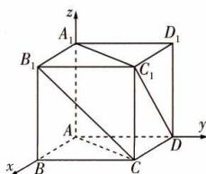

text_image

z
A₁
D₁
B₁
C₁
A
B
C
D
y
x

1, a), 其中平面 $ACC_{1}A_{1}$ 的一个法向量为 $\overrightarrow{BD}=(-1,1,0)$ , $\overrightarrow{B_{1}C}=(0,1,-a)$ . 设 $B_{1}C$ 与平面 $ACC_{1}A_{1}$ 所成的角为 $\theta$ , 则 $\sin\theta=|\cos\langle\overrightarrow{BD},\overrightarrow{B_{1}C}\rangle|=\frac{|\overrightarrow{BD}\cdot\overrightarrow{B_{1}C}|}{|\overrightarrow{BD}||\overrightarrow{B_{1}C}|}=\frac{1}{\sqrt{2}\times\sqrt{1+a^{2}}}=\frac{\sqrt{2}}{4}$ , 解得 $a=\sqrt{3}$ 或 $a=-\sqrt{3}$ (舍去), 所以 $\overrightarrow{B_{1}C}=(0,1,-\sqrt{3})$ , $\overrightarrow{DC_{1}}=(1,0,\sqrt{3})$ . 设异面直线 $B_{1}C$ 与 $DC_{1}$ 所成角为 $\alpha$ , 则 $\cos\alpha=\frac{|\overrightarrow{B_{1}C}\cdot\overrightarrow{DC_{1}}|}{|\overrightarrow{B_{1}C}||\overrightarrow{DC_{1}}|}=\frac{3}{2\times2}=\frac{3}{4}$ .

2 CD 以 C 为原点， $\overrightarrow{CA},\overrightarrow{CB},\overrightarrow{CC_{1}}$ 的方向分别为 x,y,z 轴的正方向，建立空间直角坐标系，则 $D(1,0,0),E(2,0,1),F(1,1,0),\overrightarrow{DE}=(1,0,1),\overrightarrow{EF}=(-1,1,-1)$ ，设平面 DEF 的法向量为 $n=(x,y,z)$ ，则 $\left\{\begin{aligned}\boldsymbol{n}\cdot\overrightarrow{EF}&=-x+y-z=0,\\ \boldsymbol{n}\cdot\overrightarrow{DE}&=x+z=0,\end{aligned}\right.$ 令 x=1，得 y=0,z=-1，故平面 DEF 的一个法向量为 $\boldsymbol{n}=(1,0,-1)$ 。对于 A, A(2,0,0)， $C_{1}(0,0,2),\overrightarrow{AC_{1}}=(-2,0,2)$ ，所以 $\overrightarrow{EF}\cdot\overrightarrow{AC_{1}}=(-1)\times(-2)+0+(-1)\times2=0$ ，所以 $EF\perp AC_{1}$ ，A 错误。对于 B, $B_{1}(0,2,2),C(0,0,0),\overrightarrow{B_{1}C}=(0,-2,-2)$ ，设直线 $B_{1}C$ 与平面 DEF 所成的角为 $\theta$ ，则 $\sin\theta=|\cos\langle\overrightarrow{B_{1}C},\boldsymbol{n}\rangle|=|\overrightarrow{B_{1}C}\cdot\boldsymbol{n}|/\overrightarrow{B_{1}C}||\boldsymbol{n}|=\frac{2}{2\sqrt{2}\times\sqrt{2}}=\frac{1}{2}$ ，所以 $\theta=30^{\circ}$ ，B 错误。对于 C，由题可知平面 ABC 的一个法向量为 $m=(0,0,1)$ ，设平面 DEF 与平面 ABC 的夹角为 $\beta$ ，则 $\cos\beta=|\cos\langle\boldsymbol{m},\boldsymbol{n}\rangle|=|\boldsymbol{m}\cdot\boldsymbol{n}|/\overline{\boldsymbol{m}}|=\frac{\sqrt{2}}{2}$ ，所以 $\beta=45^{\circ}$ ，C 正确。对于 D, $\overrightarrow{C_{1}D}=(1,0,-2)$ ，因为 $B_{1}C_{1}//$ 平面 DEF，所以点 $C_{1}$ 到平面 DEF 的距离即为直线 $B_{1}C_{1}$ 到平面 DEF 的距离，为 $|\frac{n\cdot\overrightarrow{C_{1}D}}{|n|}=|\frac{1+0+2|}{\sqrt{2}}=\frac{3\sqrt{2}}{2}$ ，D 正确。

3 A 如图, 以 A 为坐标原点, 建立空间直角坐标系. 由二面角 Q-PD-A 的大小为 $30^{\circ}$ , 可知 Q 的轨迹是过点 D 的一条直线, 又 Q 是底面 ABCD 内 (包括边界) 一点, 所以 Q 的轨迹是过点 D 的一条线段. 设 Q 的轨迹所在直线与 y 轴的交点为 $G(0, b, 0)$ (0 <$b \leqslant 2$ ). 由题意可知 $A(0,0,0), D(2,0,0), P(0,0,1)$ ，所以设直线 AB 与 DC 交于点 M，则 AM = 2，此处的 2 即为 AM 的长。 $\overrightarrow{DP} = (-2,0,1), \overrightarrow{DG} = (-2,b,0), \overrightarrow{AD} = (2,0,0)$ 。由题知平面 APD 的一个法向量为 $\boldsymbol{n}_{1} = (0,1,0)$ 。设平面 PDG 的法向量为 $\boldsymbol{n}_{2} = (x, y, z)$ ，则 $\left\{\begin{aligned}\boldsymbol{n}_{2} & \cdot \overrightarrow{DP} = 0, \\ \boldsymbol{n}_{2} & \cdot \overrightarrow{DG} = 0,\end{aligned}\right.$ 即 $\left\{\begin{aligned}-2x + z &= 0, \\ -2x + by &= 0,\end{aligned}\right.$ 令 z = 2，则 $\boldsymbol{n}_{2} = (1, \frac{2}{b}, 2)$ 是平面 PDG 的

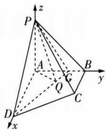

text_image

z
P
A
G
B
y
Q
C
D
x

一个法向量, 则 $\left|\cos\left\langle n_{1}, n_{2}\right\rangle\right|=\frac{\left|n_{1} \cdot n_{2}\right|}{\left|n_{1}\right|\left|n_{2}\right|}=\frac{\left|\frac{2}{b}\right|}{\sqrt{5+\frac{4}{b^{2}}}}=\frac{\sqrt{3}}{2}$ , 解得 $b=\frac{2\sqrt{15}}{15}$ 或 $b=-\frac{2\sqrt{15}}{15}$ (舍去), 所以 Q 在 DG 上运动, 故当点 Q 与点 G 重合时, $\triangle ADQ$ 面积取得最大值, 是 $\frac{1}{2} \times 2 \times \frac{2\sqrt{15}}{15} = \frac{2\sqrt{15}}{15}$ .

4 C 连接 GB, GA, 则 $V_{A-BEF} = V_{E-ABG} + V_{F-ABG}$ ，因为 $S_{\triangle ABG}$ 为定值，所以当 EF 垂直 CD 时，三棱锥 A-BEF 的体积最大。取 AB 的中点 O，以 O 为原点，建立如图所示的空间直角坐标系，则 $A(0, -1, 0)$ , $B(0, 1, 0)$ , $C(0, 1, 2)$ , $E(-1, 0, 2)$ , $F(1, 0, 2)$ , $\overrightarrow{AC} = (0, 2, 2)$ , $\overrightarrow{EF} =$ (2,0,0), $\overrightarrow{EB}=(1,1,-2)$ . 设平面 BEF 的法向量 $\boldsymbol{n}=(x,y,z)$ ，则 $\left\{\begin{aligned}\overrightarrow{EB}\cdot n=0,\\ \overrightarrow{EF}\cdot n=0,\end{aligned}\right.$ 可得 $\left\{\begin{aligned}x+y-2z=0,\\ 2x=0,\end{aligned}\right.$ 令 z=1，则 $\boldsymbol{n}=(0,2,1)$ 为平面 BEF 的一个法向量. 设直线 AC 与平面 BEF 所成的角为 $\theta$ ，则 $\sin\theta=\frac{|\overrightarrow{AC}\cdot\boldsymbol{n}|}{|\overrightarrow{AC}||\boldsymbol{n}|}=\frac{6}{2\sqrt{2}\times\sqrt{5}}=\frac{3\sqrt{10}}{10}$ .

text_image

z
E
G
D
C
F
A
O
B
y
x

5 C 如图, 平面 $\alpha$ 对应平面 OBC, 平面 $\beta$ 对应平面 OAC, 平面 $\gamma$ 对应平面 ABC, 直线 m 对应直线 OC, 令 $OA \perp OC$ , $OB \perp OC$ , 则由 $\alpha \perp \beta$ , 得 $OA \perp OB$ . 以 O 为原点, 建立如图所示的空间直角坐标系, 则 $O(0,0,0)$ , 不妨设 $A(0,0,1)$ ,

text_image

z
A
O
B
C
y
x

$B(b,0,0),C(0,c,0),b > 0,c > 0$ ，所以 $\overrightarrow{AB} = (b,0, - 1)$ $\overrightarrow{AC} = (0,c, - 1),\overrightarrow{OC} = (0,c,0).$ 设平面 $\gamma$ 即平面 $ABC$ 的一个法向量为 $\pmb {d} = (x,y,z)$ ，则 $\left\{ \begin{array}{l}\pmb {d}\cdot \overrightarrow{AB} = bx - z = 0,\\ \pmb {d}\cdot \overrightarrow{AC} = cy - z = 0, \end{array} \right.$ 取 $z =$ bc，得 $\pmb {d} = (c,b,bc).$ 易知平面 $\alpha$ 即平面 $OBC$ 的一个法向量为 $\pmb {m} = (0,0,1)$ ，平面 $\beta$ 即平面 $OAC$ 的一个法向量为 $\pmb {n} = (1,0,0).$ 由 $\alpha$ 与 $\gamma$ 的夹角的余弦值为 $\frac{\sqrt{2}}{3}$ 得 $\frac{|m\cdot d|}{|m||d|} =$ $\frac{bc}{\sqrt{b^2 + c^2 + b^2c^2}} = \frac{\sqrt{2}}{3}$ 整理得 $7b^{2}c^{2} = 2b^{2} + 2c^{2}$ .由 $m$ 与 $\gamma$ 的夹角的正弦值为 $\frac{\sqrt{3}}{3}$ 得 $\frac{|\overrightarrow{OC}\cdot d|}{|\overrightarrow{OC}||d|} = \frac{bc}{c\cdot\sqrt{b^2 + c^2 + b^2c^2}} =$ $\frac{\sqrt{3}}{3},$ 整理得 $b^{2}c^{2} = 2b^{2} - c^{2}.$ 由 $\left\{ \begin{array}{ll}7b^{2}c^{2} = 2b^{2} + 2c^{2},\\ b^{2}c^{2} = 2b^{2} - c^{2}, \end{array} \right.$ 得 $\left\{ \begin{array}{ll}c^2 = \frac{2}{3},\\ b^2 = \frac{1}{2}. \end{array} \right.$ 所以 $\beta$ 与 $\gamma$ 的夹角的余弦值为 $\frac{|n\cdot d|}{|n||d|} =$ $\frac{c}{\sqrt{c^2 + b^2 + c^2b^2}} = \frac{2}{3}.$

6 B 由题知 $\triangle ABD$ 是边长为4的等边三角形， $\triangle BCD$ 是以 $\angle BCD$ 为直角的等腰直角三角形.设 $BD$ 的中点为 $O$ ，连接 $OA$ $OC$ ，则 $OA\bot BD,OC\bot BD$ ，二面角 $A - BD - C$ 的平面角为 $\angle AOC.$ 以 $O$ 为原点，建立如图所示的空间

text_image

z
A
x
B
O
D
C
y

直角坐标系,则 $B(2,0,0)$ . 设 $\angle AOC = \theta, \theta \in [\frac{\pi}{3}, \frac{2\pi}{3}]$ , 则 $A(0,OA \cdot \cos \theta, OA \cdot \sin \theta)$ , 即 $A(0,2\sqrt{3} \cos \theta, 2\sqrt{3} \sin \theta)$ , $\overrightarrow{BA} = (-2, 2\sqrt{3} \cos \theta, 2\sqrt{3} \sin \theta)$ . 又平面 BCD 的一个法向量为 $n = (0, 0, 1)$ , 直线 AB 与平面 BCD 所成的角 $\alpha \in [0, \frac{\pi}{2}]$ , 则 $\sin \alpha = |\frac{n \cdot \overrightarrow{BA}}{|n||\overrightarrow{BA}|}| = \frac{\sqrt{3}}{2} \sin \theta, \cos \alpha = \sqrt{1 - \sin^{2} \alpha} = \sqrt{1 - \frac{3}{4} \sin^{2} \theta}$ . 因为 $\sin \theta \in [\frac{\sqrt{3}}{2}, 1]$ , 所以 $1 - \frac{3}{4} \sin^{2} \theta \in [\frac{1}{4}, \frac{7}{16}]$ , 所以 $\cos \alpha \in [\frac{1}{2}, \frac{\sqrt{7}}{4}]$ .

7 解析 (1) 因为 $\frac{\sin\angle BAC + \sin B}{c} = \frac{\sin B + \sin C}{a - b}$ , 所以结合正弦定理得 $\frac{a + b}{c} = \frac{b + c}{a - b}$ , 化简得 $b^2 + c^2 - a^2 = -bc$ . 由余弦定理得, $\cos \angle BAC = \frac{b^2 + c^2 - a^2}{2bc} = -\frac{1}{2}$ , 又 $\angle BAC \in (0, \pi)$ , 故 $\angle BAC = \frac{2\pi}{3}$ .

(2) 设 BD = x，因为 $\overrightarrow{BC} = 3 \overrightarrow{BD}$ ，所以 CD = 2x，
在 $\triangle ACD$ 中， $\angle DAC = \angle BAC - \angle BAD = \frac{2\pi}{3} - \frac{\pi}{2} = \frac{\pi}{6}$ ，由 $\frac{CD}{\sin\angle DAC}=\frac{AD}{\sin C}$ 得 $\frac{2x}{\sin\frac{\pi}{6}}=\frac{2}{\sin C}$ ，解得 $\sin C=\frac{1}{2x}$ . ①

在 $\triangle ABD$ 中， $\angle BAD=\frac{\pi}{2}$ ， $\sin B=\frac{AD}{BD}=\frac{2}{x}=\sin(\frac{\pi}{3}-C)$ 。②由①②得 $x=\sqrt{7}$ ，

所以 $BD = \sqrt{7}$ , $CD = 2\sqrt{7}$ , 从而 $AB = \sqrt{3}$ .

又 $\frac{AC}{\sin B}=\frac{BC}{\sin\frac{2\pi}{3}}$ ，所以 $AC=4\sqrt{3}$ .

因为二面角 $B' - AD - C$ 为直二面角, $AB' \perp AD$ , 平面 $AB'D \cap$ 平面 $ACD = AD, AB' \subset$ 平面 $AB'D$ ,
所以 $AB' \perp$ 平面 ACD.

建立如图所示的空间直角坐标系,则 $A(0,0,0)$ , $D(1,\sqrt{3},0)$ , $C(0,4\sqrt{3},0)$ , $B'(0,0,\sqrt{3})$ , 所以 $\overrightarrow{AB'}=(0,0,\sqrt{3})$ ,

text_image

z
B'
A
x
D
C
y

$\overrightarrow{B^{\prime}C} = (0,4\sqrt{3}, - \sqrt{3}),\overrightarrow{B^{\prime}D} = (1,\sqrt{3}, - \sqrt{3}).$

设平面 $B^{\prime}CD$ 的一个法向量为 $\pmb {n} = (x,y,z)$ ，则 $\left\{ \begin{array}{l}\pmb {n}\cdot \overrightarrow{B^{\prime}C} = 0,\\ \pmb {n}\cdot \overrightarrow{B^{\prime}D} = 0, \end{array} \right.$ 即 $\left\{ \begin{array}{l}4\sqrt{3} y - \sqrt{3} z = 0,\\ x + \sqrt{3} y - \sqrt{3} z = 0, \end{array} \right.$ 令 $y = 1$ ，解得 $\pmb {n} =$ $(3\sqrt{3},1,4)$

所以 $|\cos \langle n, \overrightarrow{AB'}\rangle| = \frac{|\boldsymbol{n} \cdot \overrightarrow{AB'}|}{|\boldsymbol{n}| |\overrightarrow{AB'}|} = \frac{2\sqrt{11}}{11}$ ,

故直线 $AB'$ 与平面 $B'CD$ 所成角的正弦值为 $\frac{2\sqrt{11}}{11}$ .

8 解析 (1) 如图, 取 $A_{1}B_{1}$ 的中点 $D$ , 连接 $DB, DE$ , 则 $DE \parallel B_{1}C_{1} \parallel BC, DE = \frac{1}{2}B_{1}C_{1} = BF$ ,

所以四边形 DEFB 为平行四边形, 故 $EF \parallel DB$ ,
又 $EF \not\subset$ 平面 $ABB_{1}A_{1}, DB \subset$ 平面 $ABB_{1}A_{1}$ ,
所以 $EF \parallel$ 平面 $ABB_{1}A_{1}$ .

text_image

A₁
E
z
C₁
D
B₁
G
O
C
y
A
B
F
x

(2) 取 AC 的中点 O，连接 OB, $OC_{1}$ . 因为 $BB_{1} \parallel AA_{1}$ ，所以 $\angle A_{1}AE$ 即为异面直线 $BB_{1}$ 与 AE 所成的角，即 $\angle A_{1}AE = 30^{\circ}$ ，又 $AA_{1} = 4, A_{1}E = 2$ ，所以 $\angle AEA_{1} = 90^{\circ}, \angle AA_{1}E = 60^{\circ}$ ，所以 $\angle C_{1}CO = 60^{\circ}$ .

以 O 为原点, OB, OC, $OC_{1}$ 所在直线分别为 x, y, z 轴, 建立空间直角坐标系, 如图, 则 $A(0, -2, 0)$ , $B(2\sqrt{3}, 0, 0)$ , $A_{1}(0, -4, 2\sqrt{3})$ , $E(0, -2, 2\sqrt{3})$ , $F(\sqrt{3}, 1, 0)$ , $C(0, 2, 0)$ , $C_{1}(0, 0, 2\sqrt{3})$ , 则 $G(0, \frac{4}{3}, \frac{2\sqrt{3}}{3})$ ,

$$
\begin{array}{l} \overrightarrow {A B} = (2 \sqrt {3}, 2, 0), \overrightarrow {A A _ {1}} = (0, - 2, 2 \sqrt {3}), \overrightarrow {E F} = (\sqrt {3}, 3, \\ - 2 \sqrt {3}), \overrightarrow {E G} = (0, \frac {1 0}{3}, - \frac {4 \sqrt {3}}{3}). \end{array}
$$

设平面 $ABB_{1}A_{1}$ 的法向量为 $\boldsymbol{u}=(x_{1},y_{1},z_{1})$ ,

则 $\left\{\begin{aligned}\boldsymbol{u}\cdot\overrightarrow{AB}&=0,\\ \boldsymbol{u}\cdot\overrightarrow{AA_{1}}&=0,\end{aligned}\right.$ 即 $\left\{\begin{aligned}\sqrt{3}x_{1}&+y_{1}&=0,\\ -y_{1}&+\sqrt{3}z_{1}&=0,\end{aligned}\right.$ 令 $x_{1}=1$ ，则 $\boldsymbol{u}=(1,-\sqrt{3},-1)$ 为平面 $ABB_{1}A_{1}$ 的一个法向量.

设平面 EFG 的法向量为 $\boldsymbol{v}=(x_{2},y_{2},z_{2})$ ,

则 $\left\{\begin{aligned}\boldsymbol{v}\cdot\overrightarrow{EF}=0,\\ \boldsymbol{v}\cdot\overrightarrow{EG}=0,\end{aligned}\right.$ 即 $\left\{\begin{aligned}x_{2}+\sqrt{3}y_{2}-2z_{2}=0,\\ 10y_{2}-4\sqrt{3}z_{2}=0,\end{aligned}\right.$ 令 $y_{2}=\sqrt{3}$ ，则 $\boldsymbol{v}=(2,\sqrt{3},\frac{5}{2})$ 为平面 EFG 的一个法向量.

$\cos \langle u, v \rangle = \frac{2 - 3 - \frac{5}{2}}{\sqrt{5} \times \frac{\sqrt{53}}{2}} = -\frac{7\sqrt{265}}{265}$ , 所以平面 $EFG$ 与平面 $ABB_{1}A_{1}$ 的夹角的余弦值为 $\frac{7\sqrt{265}}{265}$ .

9 解析 (1) 如图①, 延长 FM, EA 交于点 O, 连接 AD,

text_image

Geometric diagram of a parallelepiped with labeled vertices and internal points, including dashed lines for hidden edges.

图①

因为 $EA \subset$ 平面 ADE, 所以 $O \in$ 平面 ADE,
又 $O \in MF$ , 所以点 O 即为所求.

因为 $AM \parallel EF$ ，且 $AM = \frac{1}{2} AB = \frac{1}{2} EF$ ，

所以点 A 为线段 EO 的中点, M 为线段 FO 的中点.

连接 DF 交 CE 于点 N, 连接 MN,

在矩形 CDEF 中, N 是线段 DF 的中点,

所以在 $\triangle FDO$ 中, $MN\parallel OD$ ,

又 $MN \subset$ 平面 EMC, $OD \not\subset$ 平面 EMC,

所以 $OD \parallel$ 平面EMC.

(2) 连接 AD, 依题意, 知 $EF \perp AE, EF \perp DE, AE \cap DE = E, AE, DE \subset$ 平面 ADE, 则 $EF \perp$ 平面 ADE, 且 $\angle AED$ 为二面角 C - EF - M 的平面角,

即 $\angle AED = 60^{\circ}$ ，则 $\triangle ADE$ 为正三角形.

取 AE 的中点 H, 连接 DH, 则 $DH \perp AE$ ,

由 $EF \perp$ 平面 ADE, 知 $DH \perp EF$ , 则 $DH \perp HG$ ,

取 BF 的中点 G, 连接 HG, 由矩形 ABFE 得 $HG \perp AE$ ,

即 HA, HG, HD 两两互相垂直.

以 H 为原点, 建立空间直角坐标系, 如图②,

text_image

z
D
C
E
H
A
M
B
G
y
x

图②

则 $E(-1,0,0)$ , $D(0,0,\sqrt{3})$ , $C(0,4,\sqrt{3})$ ,

$$
\overrightarrow {E D} = (1, 0, \sqrt {3}), \overrightarrow {E C} = (1, 4, \sqrt {3}).
$$

假设存在点 M 满足条件, 设 $M(1, t, 0)$ , $0 \leqslant t \leqslant 4$ ,
则 $\overrightarrow{EM}=(2,t,0)$ .

设平面 EMC 的法向量为 $\boldsymbol{n}=(x_{1},y_{1},z_{1})$ ,

则 $\left\{\begin{aligned}\boldsymbol{n}\cdot\overrightarrow{EC}&=x_{1}+4y_{1}+\sqrt{3}z_{1}=0,\\ \boldsymbol{n}\cdot\overrightarrow{EM}&=2x_{1}+ty_{1}=0,\end{aligned}\right.$

令 $y_{1}=2\sqrt{3}$ ，得 $x_{1}=-\sqrt{3}t, z_{1}=t-8$ ，

故平面 EMC 的一个法向量为 $\boldsymbol{n}=(-\sqrt{3}t,2\sqrt{3},t-8)$ .

直线 DE 与平面 EMC 所成的角为 $60^{\circ}$ ,

则 $\sin 60^{\circ} = |\cos \langle n, \overrightarrow{ED} \rangle| = \frac{|\boldsymbol{n} \cdot \overrightarrow{ED}|}{|\boldsymbol{n}| |\overrightarrow{ED}|} =$

$\frac{8\sqrt{3}}{\sqrt{3t^{2}+12+(t-8)^{2}}\times2}=\frac{\sqrt{3}}{2}$ ，解得 t=1 或 t=3，

即存在点 M 使得直线 DE 与平面 EMC 所成的角为 $60^{\circ}$ ，此时点 M 为线段 AB 上靠近点 A 或 B 的四等分点.

设平面 ECF(即平面 CDEF) 的法向量为 $\boldsymbol{m}=(x_{2},y_{2},z_{2})$ ,

则 $\left\{\begin{aligned}m\cdot\overrightarrow{ED}&=x_{2}+\sqrt{3}z_{2}=0,\\ m\cdot\overrightarrow{EC}&=x_{2}+4y_{2}+\sqrt{3}z_{2}=0,\end{aligned}\right.$ 令 $z_{2}=-1$ ，得 $x_{2}=\sqrt{3}$

$y_{2}=0$ , 故平面 ECF 的一个法向量为 $\boldsymbol{m}=(\sqrt{3},0,-1)$ ,

则 $\boldsymbol{m} \cdot \boldsymbol{n} = (\sqrt{3}, 0, -1) \cdot (-\sqrt{3}t, 2\sqrt{3}, t-8) = -3t - t + 8 = -4t + 8.$

设平面 EMC 与平面 ECF 的夹角为 $\theta$ ,

则 $\cos\theta=|\cos\langle m,n\rangle|=\frac{|m\cdot n|}{|m||n|}=$

$$
\frac {| - 4 t + 8 |}{2 \times \sqrt {3 t ^ {2} + 1 2 + (t - 8) ^ {2}}} = \frac {| t - 2 |}{\sqrt {(t - 2) ^ {2} + 1 5}},
$$

当 t=1 或 t=3 时, $\cos\theta=\frac{1}{4}$ .

所以平面 EMC 与平面 ECF 夹角的余弦值为 $\frac{1}{4}$ .

# 专项拓展训练1 空间直角坐标系的构建

# 过专项 阶段强化专项训练

1 解析 (1)由题知 $CA, CB, CC_{1}$ 两两互相垂直，

以 C 为原点, 以 $\overrightarrow{CA}, \overrightarrow{CB}, \overrightarrow{CC_{1}}$ 的方向分别为 x, y, z 轴的正方向建立空间直角坐标系,

则 $B(0,1,0)$ , $A_{1}(1,0,2)$ , $C(0,0,0)$ , $B_{1}(0,1,2)$ ,

所以 $\overrightarrow{BA_{1}}=(1,-1,2),\overrightarrow{CB_{1}}=(0,1,2)$ ,

所以 $\overrightarrow{BA_{1}}\cdot\overrightarrow{CB_{1}}=1\times0+(-1)\times1+2\times2=3.$

又 $|\overrightarrow{BA}_1| = \sqrt{6}, |\overrightarrow{CB}_1| = \sqrt{5}$

所以 $\cos\langle\overrightarrow{BA_{1}},\overrightarrow{CB_{1}}\rangle=\frac{\overrightarrow{BA_{1}}\cdot\overrightarrow{CB_{1}}}{|\overrightarrow{BA_{1}}||\overrightarrow{CB_{1}}|}=\frac{\sqrt{30}}{10},$

故直线 $BA_{1}$ 与 $CB_{1}$ 所成角的余弦值为 $\frac{\sqrt{30}}{10}$ .

(2)依题意得 $N(1,0,1),M(\frac{1}{2},\frac{1}{2},2),C_{1}(0,0,2)$ ,

所以 $\overrightarrow{C_1M} = (\frac{1}{2},\frac{1}{2},0),\overrightarrow{C_1N} = (1,0, - 1),\overrightarrow{BN} = (1, - 1,1)$

所以 $\overrightarrow{C_{1}M}\cdot\overrightarrow{BN}=\frac{1}{2}\times1+\frac{1}{2}\times(-1)+0\times1=0,$

$$
\overrightarrow {C _ {1} N} \cdot \overrightarrow {B N} = 1 \times 1 + 0 \times (- 1) + (- 1) \times 1 = 0,
$$

所以 $\overrightarrow{C_{1}M}\perp\overrightarrow{BN},\overrightarrow{C_{1}N}\perp\overrightarrow{BN}$ ，即 $BN\perp C_{1}M,BN\perp C_{1}N.$

又 $C_{1}M \cap C_{1}N = C_{1}, C_{1}M \subset$ 平面 $C_{1}MN, C_{1}N \subset$ 平面 $C_{1}MN$ ，所以 $BN \perp$ 平面 $C_{1}MN$ .

2 解析 (1) 由题意知 $PO \perp OA, PO \perp OB, OA \cap OB = O$ , $OA \subset$ 平面 $AOB, OB \subset$ 平面 $AOB$ , 所以 $PO \perp$ 平面 $AOB$ .

又 $PO = 2OA = 4$ ，所以 $PA = PB = 2\sqrt{5}, AB = 2\sqrt{2}$ ，所以

$$
S _ {\triangle P A B} = \frac {1}{2} \times 2 \sqrt {2} \times \sqrt {(2 \sqrt {5}) ^ {2} - (\sqrt {2}) ^ {2}} = 6.
$$

设点 O 到平面 PAB 的距离为 d，

由 $V_{O-PAB}=V_{P-OAB}$ ，得 $\frac{1}{3}\times d\times6=\frac{1}{3}\times4\times\frac{1}{2}\times2\times2$

# 等体积法.

解得 $d=\frac{4}{3}$ .

(2)以 O 为原点, $\overrightarrow{OA},\overrightarrow{OB},\overrightarrow{OP}$ 的方向分别为 x,y,z 轴的正方向,建立空间直角坐标系,

则 $A(2,0,0)$ , $B(0,2,0)$ , $P(0,0,4)$ .

由题意知 $\angle AOC = \frac{\pi}{6}$ ，则 $C(\sqrt{3}, 1, 0)$ ，所以 $\overrightarrow{AB} = (-2, 2,$

0), $\overrightarrow{AP} = (-2,0,4)$ , $\overrightarrow{PC} = (\sqrt{3},1,-4)$ .

设平面 PAB 的法向量为 $\boldsymbol{n}=(a,b,c)$ ,

则 $\left\{\begin{aligned}\boldsymbol{n}\cdot\overrightarrow{AB}&=-2a+2b=0,\\ \boldsymbol{n}\cdot\overrightarrow{AP}&=-2a+4c=0,\end{aligned}\right.$ 取c=1，则a=b=2，

可得平面 PAB 的一个法向量为 $\boldsymbol{n}=(2,2,1)$ ,

所以 $\sin\varphi=|\cos\langle\boldsymbol{n},\overrightarrow{PC}\rangle|=\frac{|\boldsymbol{n}\cdot\overrightarrow{PC}|}{|\boldsymbol{n}||\overrightarrow{PC}|}=\frac{|2\sqrt{3}-2|}{3\times2\sqrt{5}}=\frac{\sqrt{15}-\sqrt{5}}{15}.$

3 D 以 A 为原点, 分别以 $AB, AA_{1}$ 所在直线为 x, z 轴,
借助等边三角形 ACD 建系.

过点 A 及 CD 中点的直线为 y 轴, 建立如图所示的空间直

角坐标系, 因为 $AA_{1}=A_{1}B_{1}=$

$\frac{1}{2}AB=1,\angle ABC=\frac{\pi}{3}$ 且四边

形ABCD是菱形,所以B(2,0,

0), $A_{1}(0,0,1),D(-2\sin \frac{\pi}{6},$

text_image

A₁
B₁
C₁
D₁
A
B
C
D
y
x
z

$2\cos\frac{\pi}{6},0)$ ，即 $D(-1,\sqrt{3},0)$ ，所以 $\overrightarrow{A_{1}D}=(-1,\sqrt{3},-1)$ ， $\overrightarrow{A_{1}B}=(2,0,-1)$ 。设点B到直线 $A_{1}D$ 的距离为d，则d=

$$
\sqrt {\overrightarrow {A _ {1} B ^ {2}} - \left(\frac {\overrightarrow {A _ {1} B} \cdot \overrightarrow {A _ {1} D}}{| \overrightarrow {A _ {1} D} |}\right) ^ {2}} = \sqrt {5 - \left(\frac {- 1}{\sqrt {5}}\right) ^ {2}} = \frac {2 \sqrt {3 0}}{5}.
$$

4 解析 (1) 因为 $PA \perp$ 平面 $ABC, BC \subset$ 平面 $ABC$ , 所以 $PA \perp BC$ ,

又 $AC \perp BC, PA \cap AC = A, PA, AC \subset$ 平面 PAC,

所以 BC⊥平面 PAC.

又 $BC \subset$ 平面 $PBC$ , 所以平面 $PAC \perp$ 平面 $PBC$ .

(2) 因为 AC = 5, BC = 12, AC ⊥ BC,

所以 $S_{\triangle ABC}=\frac{1}{2}\times12\times5=30$

又三棱锥 P-ABC 的体积为 100.

所以 $100 = \frac{1}{3} \times PA \times 30$ ，得 PA = 10。

以A为原点,分别以平行于BC的直线,及AC,AP所在的直线为 x, y, z 轴建立空间直角坐标系，如图，则 $A(0,0,0)$ , $B(12,5,0)$ , $C(0,5,0)$ , $P(0,0,10)$ ,

所以 $\overrightarrow{AP}=(0,0,10)$ ， $\overrightarrow{CB}=(12,0,0)$ ， $\overrightarrow{PB}=(12,5,-10)$ .

text_image

z
P
y
C
A
B
x

设平面 APB 的法向量为 $\boldsymbol{n}=(x,y,z)$ ,

则 $\left\{\begin{aligned}\boldsymbol{n}\cdot\overrightarrow{PB}=12x+5y-10z=0,\\ \boldsymbol{n}\cdot\overrightarrow{AP}=10z=0,\end{aligned}\right.$ 令x=-5,得y=12,z=0,

则 $\boldsymbol{n}=(-5,12,0)$ 是平面 APB 的一个法向量.

设平面 PBC 的法向量为 $\boldsymbol{m}=(a,b,c)$ ,

则 $\left\{\begin{aligned}m\cdot\overrightarrow{PB}&=12a+5b-10c=0,\\ m\cdot\overrightarrow{CB}&=12a=0,\end{aligned}\right.$ 令b=2，得a=0,c=1，

则 $m=(0,2,1)$ 是平面 PBC 的一个法向量.

则 $|\cos \langle n, m\rangle| = \frac{|m \cdot n|}{|m||n|} = \frac{2 \times 12}{\sqrt{5} \times 13} = \frac{24\sqrt{5}}{65}$ .

由图知二面角 A-PB-C 为锐角，

所以二面角 A-PB-C 的余弦值为 $\frac{24\sqrt{5}}{65}$ .

【名师点评】本题也可以 C 为坐标原点, 分别以 CA, CB 所在直线为 x 轴、y 轴, 过点 C 且平行于 AP 的直线为 z 轴建立如图所示的空间直角坐标系.

text_image

P
z
C
A
B
x
y

5 解析 (1) 连接 OB, 由 $OD \perp BC, AD \perp CD$ ,

知四边形 OBCD 是正方形, 所以 $\angle BOC = 45^{\circ}$ .

因为 OA = OB, $\angle AOB = 90^{\circ}$ , G 是 AB 的中点, 所以 $\angle BOG = 45^{\circ}$ , 所以 $\angle GOC = \angle BOC + \angle BOG = 90^{\circ}$ , 即 $OG \perp OC$ .

因为 PA = PD, O 是 AD 的中点, 所以 $OP \perp AD$ ,

又平面 $PAD \perp$ 平面 ABCD, 平面 $PAD \cap$ 平面 ABCD = AD, $OP \subset$ 平面 PAD, 所以 $OP \perp$ 平面 ABCD,

又 $OG \subset$ 平面 ABCD, 所以 $OP \perp OG$ .

因为 $OP \cap OC = O, OP, OC \subset$ 平面 POC, 所以 $OG \perp$ 平面 POC.

(2)由(1)可知 OB, OD, OP 两两相互垂直,且 OP =

$$
\sqrt {P A ^ {2} - O A ^ {2}} = \sqrt {8 - 4} = 2.
$$

以 O 为原点, 建立如图所示的空间直角坐标系,

则 $O(0,0,0)$ , $G(1,-1,0)$ , $C(2,2,0)$ , $P(0,0,2)$ , $D(0,2,0)$ ,

所以 $\overrightarrow{DG}=(1,-3,0)$ , $\overrightarrow{PG}=(1,-1,-2)$ .

设平面 DPG 的法向量为 $\boldsymbol{n}=(x,y,z)$ ,则 $\left\{\begin{aligned}\boldsymbol{n}\cdot\overrightarrow{DG}=0,\\\boldsymbol{n}\cdot\overrightarrow{PG}=0,\end{aligned}\right.$ 即 $\left\{\begin{aligned}x-3y=0,\\ x-y-2z=0,\end{aligned}\right.$ 取y=1，得平面DPG的一个法向量为 $\boldsymbol{n}=(3,1,1)$ .

text_image

z
P
A
O
G
B
C
D
y
x

由(1)知 $OP \perp$ 平面ABCD,又 $OC \subset$ 平面ABCD,所以 $OP \perp OC$ .因为 $OG \cap OP = O,OG,OP \subset$ 平面OPG,所以 $OC \perp$ 平面OPG,故平面OPG的一个法向量为 $\overrightarrow{OC} = (2,2,0)$ .

则 $\cos \langle \overrightarrow{OC},\pmb {n}\rangle = \frac{\overrightarrow{OC}\cdot\pmb{n}}{|\overrightarrow{OC}||\pmb{n}|} = \frac{8}{2\sqrt{2}\times\sqrt{11}} = \frac{2\sqrt{22}}{11},$

故平面 DPG 与平面 OPG 夹角的余弦值为 $\frac{2\sqrt{22}}{11}$ .

6 解析 (1)如图所示,连接 $A_{1}E,B_{1}E$ ,

等边三角形 $AA_{1}C$ 中，E 是 AC 的中点，则 $A_{1}E \perp AC$ ，

又平面 $ABC \perp$ 平面 $A_{1}ACC_{1}$ , 平面 $ABC \cap$ 平面 $A_{1}ACC_{1} = AC, A_{1}E \subset$ 平面 $A_{1}ACC_{1}$ , 所以 $A_{1}E \perp$ 平面 $ABC$ , 故 $A_{1}E \perp BC$ . 由三棱柱的性质可知 $A_{1}B_{1} // AB$ , 而 $AB \perp BC$ ,

故 $A_{1}B_{1}\perp BC$ ，且 $A_{1}B_{1}\cap A_{1}E = A_{1},A_{1}B_{1},A_{1}E\subset$ 平面 $A_{1}B_{1}E$ 所以 $BC\perp$ 平面 $A_{1}B_{1}E$

结合 $EF \subset$ 平面 $A_{1}B_{1}E$ , 故 $EF \perp BC$ .

text_image

z
A₁
F
B₁
C₁
E
H
A
B
C
y
x

(2) 在底面 ABC 内作 $EH \perp AC$ ，交 AB 于点 H，

以 E 为原点, 建立如图所示的空间直角坐标系.

设 EH=1，则 $AE=EC=\sqrt{3}$ ， $AA_{1}=CA_{1}=2\sqrt{3}$ ， $BC=\sqrt{3}$ ，

可得 $A(0, -\sqrt{3}, 0)$ , $B(\frac{3}{2}, \frac{\sqrt{3}}{2}, 0)$ , $A_{1}(0, 0, 3)$ , $C(0, \sqrt{3}$ , 0), $E(0, 0, 0)$ ,

则 $\overrightarrow{A_{1}B}=(\frac{3}{2},\frac{\sqrt{3}}{2},-3),\overrightarrow{BC}=(-\frac{3}{2},\frac{\sqrt{3}}{2},0)$ ,

由 $\overrightarrow{AB} = \overrightarrow{A_1B_1} = (\frac{3}{2},\frac{3\sqrt{3}}{2},0)$ ，可得 $B_{1}(\frac{3}{2},\frac{3\sqrt{3}}{2},3)$

利用中点坐标公式可得 $F(\frac{3}{4}, \frac{3\sqrt{3}}{4}, 3)$ ,

故直线 EF 的一个方向向量为 $\overrightarrow{EF} = \left( \frac{3}{4}, \frac{3\sqrt{3}}{4}, 3 \right)$ .

设平面 $A_{1}BC$ 的法向量为 $\boldsymbol{m}=(x,y,z)$ ,

则 $\left\{\begin{aligned}\boldsymbol{m}\cdot\overrightarrow{A_{1}B}&=\frac{3}{2}x+\frac{\sqrt{3}}{2}y-3z=0,\\ \boldsymbol{m}\cdot\overrightarrow{BC}&=-\frac{3}{2}x+\frac{\sqrt{3}}{2}y=0,\end{aligned}\right.$ 取 x=1，则 $y=\sqrt{3},z=1$

可得平面 $A_{1}BC$ 的一个法向量为 $\boldsymbol{m}=(1,\sqrt{3},1)$ ,

此时 $\cos\langle\overrightarrow{EF},m\rangle=\frac{\overrightarrow{EF}\cdot m}{|\overrightarrow{EF}||m|}=\frac{6}{\frac{3\sqrt{5}}{2}\times\sqrt{5}}=\frac{4}{5}$

故直线 EF 与平面 $A_{1}BC$ 所成角的正弦值为 $\frac{4}{5}$ ，余弦值为 $\frac{3}{5}$ .

【名师点评】本题(2)中也可以E为坐标原点,分别作BC,AB的平行线作为x,y轴,建立如图所示的空间直角坐标系.

text_image

A₁
z
F
B₁
C₁
A
E
C
B
x
y

7 $\frac{\sqrt{57}}{4}$ 解析 以 $O$ 为原点, $OB$ 所在直线为 $y$ 轴, $OS$ 所在直线为 $z$ 轴, 在底面上过点 $O$ 且垂直于 $AB$ 的直线为 $x$ 轴, 建立如图所示的空间直角坐标系, 则 $A(0, -1, 0)$ ,

$S(0,0,\sqrt{3}), M(0,0,\frac{\sqrt{3}}{2})$ . 设

$P(x,y,0)$ ，则 $\overrightarrow{AM}=(0,1,\frac{\sqrt{3}}{2})$

$\overrightarrow{MP} = (x,y, - \frac{\sqrt{3}}{2}),\overrightarrow{SP} = (x,y,$

$-\sqrt{3}$ ). 因为 $AM \perp MP$ , 所以 $\overrightarrow{AM} \cdot \overrightarrow{MP} = y - \frac{3}{4} = 0$ , 解得 $y = \frac{3}{4}$ , 所

text_image

z
S
M
A
O
P
B
y
x

以 $|\overrightarrow{SP}|=\sqrt{x^{2}+\left(\frac{3}{4}\right)^{2}+(-\sqrt{3})^{2}}=\sqrt{x^{2}+\frac{57}{16}}$ . 当 x=0 时， $|\overrightarrow{SP}|$ 最小，为 $\frac{\sqrt{57}}{4}$ .

8 解析 （1）因为 $A_{1}$ 在下底面上的射影是 $\triangle ABC$ 的中心 O，所以 $A_{1}O \perp$ 底面 ABC，所以 $A_{1}O \perp BC$ .

因为 O 为 $\triangle ABC$ 的中心, 且 $\triangle ABC$ 为等边三角形, 所以 $AO \perp BC$ .

因为 $A_{1}O, AO \subset$ 平面 $A_{1}AO, A_{1}O \cap AO = O$ ,

所以 $BC \perp$ 平面 $A_{1}AO$ ,

因为 $BC \subset$ 平面 $BCC_{1}B_{1}$ ，所以平面 $A_{1}AO \perp$ 平面 $BCC_{1}B_{1}$ .

(2) 取 AB 的中点 E, 连接 CE.

因为 O 为 $\triangle ABC$ 的中心, 且 $\triangle ABC$ 为等边三角形,

所以 $CE \perp AB.$

以 O 为原点, OE 所在直线为 x 轴,
过点 O 作平行于 AB 的直线为 y

text_image

A₁
z
C₁
B₁
A
O
C
x
E
B
y

轴, $OA_{1}$ 所在直线为z轴,建立如图所示的空间直角坐标系,则 $O(0,0,0)$ ,

在 $\triangle ABC$ 中, $AB=AC=BC=\sqrt{3}$ ,

则 $CE=\frac{3}{2}, OE=\frac{1}{3}CE=\frac{1}{2}, OA=\frac{2}{3}CE=1,$

在 Rt△A₁OA 中， $A_{1}O = \sqrt{AA_{1}^{2} - AO^{2}} = \sqrt{3}$ ，则 $A(\frac{1}{2}, -\frac{\sqrt{3}}{2})$

0), $B(\frac{1}{2}, \frac{\sqrt{3}}{2}, 0)$ , $A_{1}(0, 0, \sqrt{3})$ , $C(-1, 0, 0)$ ,

由 $\overrightarrow{CC_1} = \overrightarrow{AA_1} = (-\frac{1}{2},\frac{\sqrt{3}}{2},\sqrt{3})$ ，得 $C_1(-\frac{3}{2},\frac{\sqrt{3}}{2},\sqrt{3})$

所以 $\overrightarrow{C_{1}A}=(2,-\sqrt{3},-\sqrt{3}),\overrightarrow{AB}=(0,\sqrt{3},0)$ .

设平面 $C_{1}AB$ 的法向量为 $\boldsymbol{n}=(x,y,z)$ ,

则 $\left\{\begin{aligned}\boldsymbol{n}\cdot\overrightarrow{C_{1}A}=0,\\ \boldsymbol{n}\cdot\overrightarrow{AB}=0,\end{aligned}\right.$ 即 $\left\{\begin{aligned}2x-\sqrt{3}y-\sqrt{3}z=0,\\\sqrt{3}y=0,\end{aligned}\right.$

令 $x=\sqrt{3}$ ，则 y=0, z=2，

所以 $\boldsymbol{n}=(\sqrt{3},0,2)$ 是平面 $C_{1}AB$ 的一个法向量.

$\overrightarrow{OA_{1}}=(0,0,\sqrt{3})$ 为平面ABC的一个法向量.

由题知二面角 $C_{1}-AB-C$ 为锐角，

所以 $|\cos \langle n, \overrightarrow{OA_1} \rangle| = |\frac{n \cdot \overrightarrow{OA_1}}{|n||\overrightarrow{OA_1}|}| = \frac{2\sqrt{7}}{7}$ .

所以二面角 $C_{1}-AB-C$ 的余弦值为 $\frac{2\sqrt{7}}{7}$ .

【名师点评】建立空间直角坐标系时,要使尽可能多的点落在坐标轴上,这样建成的坐标系,能快速写出各点的坐标,且坐标轴上的点的坐标含有0,可为后续的运算带来方便.建系时常用到的垂直关系:等腰三角形的底边和对应中线、菱形的两条对角线、圆的直径对应的圆周角为90°等.

# 专项拓展训练2 利用空间向量解决动点问题

# 过专项 阶段强化专项训练

1 D 以 $A_{1}$ 为原点, 建立如图所示的空间直角坐标系, 不妨令 $Q(t,2,1), P(0,2t,0), 0 \leqslant t \leqslant 1$ , 因为点 $P$ 到平面 $ABCD$ 的距离恒为 1, 且在平面 $ABCD$ 上的射影为 $P'(0,2t,1)$ , 连接

text_image

z
A P' B
D Q
C
A₁ P B₁
D₁ C₁
y
x

$PP', P'Q$ ，所以 $\theta = \angle PQP'$ 。又 $\overrightarrow{P'Q} = (t, 2 - 2t, 0)$ ，则 $|\overrightarrow{P'Q}| = \sqrt{t^{2} + 4(1 - t)^{2} + 0} = \sqrt{5t^{2} - 8t + 4}$ ，所以 $\tan \theta = \tan \angle PQP' = \frac{PP'}{|\overrightarrow{P'Q}|} = \frac{1}{\sqrt{5(t - \frac{4}{5})^{2} + \frac{4}{5}}} \in [\frac{1}{2}, \frac{\sqrt{5}}{2}]$ .

2 解析 (1)由题意得 $BB_{1}\perp$ 平面ABC,且 $AB\perp BC$ ,故以

B 为坐标原点, 建立如图所示的空间直角坐标系, 则 $B(0,0,0)$ , $F(0,2,1)$ , $A(2,0,0)$ , $C(0,2,0)$ , $E(1,1,0)$ , 所以 $\overrightarrow{BF} = (0,2,1)$ .

设 $B_{1}D = m, m \in [0,2]$ , 则 $D(m,0,2), \overrightarrow{DE} = (1 - m,1, -2)$ ,

因为 $\overrightarrow{BF}\cdot\overrightarrow{DE}=(0,2,1)\cdot(1-m,1,-2)=2-2=0$ ,所以 $BF\perp DE.$

text_image

A₁
D
B₁
C₁
F
B
E
C
x
y
z

(2) 假设存在一点 M 满足题意.

设 $B_{1}M = n, n \in [0,2]$ , 则 $M(n,0,2), \overrightarrow{MF} = (-n,2,-1)$ , $\overrightarrow{AC} = (-2,2,0)$ .

因为异面直线 MF 与 AC 所成的角为 $30^{\circ}$ ,

所以 $|\cos \langle \overrightarrow{MF},\overrightarrow{AC}\rangle | = \frac{|2n + 4|}{\sqrt{n^2 + 5}\times 2\sqrt{2}} = \frac{\sqrt{3}}{2},$

整理得 $n^{2}-8n+7=0$ ，即n=1或n=7（舍去），

所以假设成立,即存在点 M 使得异面直线 MF 与 AC 所成的角为 $30^{\circ}$ ,此时 M 是 $A_{1}B_{1}$ 的中点.

3 D 如图,以点 D 为原点,建立空间直角坐标系. 设正方体棱长为 1, $M(0,0,a)$ , $0 \leqslant a \leqslant 1$ , 则 $A(1,0,0)$ , $D_{1}(0,0,1)$ , $\overrightarrow{AD_{1}} = (-1,0,1)$ .

方法一 $B(1,1,0)$ , $C_{1}(0,1,1)$ , 则

text_image

D
z
A₁
M
B₁
N
C₁
A
D
B
C
y
x

$\overrightarrow{BC_{1}}=(-1,0,1)$ . 设 $\overrightarrow{BN}=\lambda\overrightarrow{BC_{1}}=(-\lambda,0,\lambda),0\leqslant\lambda\leqslant1$ ，则 $N(1-\lambda,1,\lambda),\overrightarrow{MN}=(1-\lambda,1,\lambda-a)$ . 若 $AD_{1}\perp MN$ ，则 $\overrightarrow{AD_{1}}\cdot\overrightarrow{MN}=(-1,0,1)\cdot(1-\lambda,1,\lambda-a)=2\lambda-1-a=0$ ，即 $2\lambda=1+a$ ，方程有无数组解，即满足与 $AD_{1}$ 垂直的直线 MN 有无数条.

方法二 设 $N(x,1,1-x),0\leqslant x\leqslant1$ ,所以 $\overrightarrow{MN}=(x,1,1-x-$ 对于正方体面对角线上的点,也可以用一个参数直接设出其坐标.

a), 若 $AD_{1} \perp MN$ , 则 $\overrightarrow{MN} \cdot \overrightarrow{AD_{1}} = -x + 1 - x - a = 0$ , 即 $2x = 1 - a$ , 方程有无数组解, 即满足与 $AD_{1}$ 垂直的直线 MN 有无数条.

4 解析 (1) 取 DE 的中点 M, 连接 MF, MC.

因为 $AF = \frac{1}{2}DE$ ，所以 AF = DM，

又 $AF \parallel DM$ ,

所以四边形 ADMF 是平行四边形, 所以 $MF \perp AD$ .

又 $AD \perp BC$ ，所以 $MF \perp BC$ ，所以四边形 BCMF 是平行四边形，所以 $BF \parallel CM$ .

因为 $BF \not\subset$ 平面 CDE, $CM \subset$ 平面 CDE,

所以 BF // 平面 CDE.

(2) 连接 DB.

因为平面 ADEF⊥平面 ABCD, 平面 ADEF∩平面 ABCD = AD, DE⊥AD, DE⊂平面 ADEF, 所以 DE⊥平面 ABCD.

因为 $DB \subset$ 平面 ABCD, 所以 $DE \perp DB$ .

因为 $DE \perp AD, AD \perp BE, DE \cap BE = E, DE, BE \subset$ 平面 BDE，
所以 $AD \perp$ 平面 BDE，

又 $DB \subset$ 平面 BDE, 所以 $AD \perp DB$ , 故 DA, DB, DE 两两垂直, 所以以 D 为原点, DA, DB, DE 所在直线分别为 x 轴、y 轴

和 z 轴, 建立如图所示的空间直角坐标系, 则 $D(0,0,0)$ , $B(0,1,0)$ , $C(-1,1,0)$ , $E(0,0,2)$ , $F(1,0,1)$ , 所以 $\overrightarrow{BE} = (0, -1, 2)$ , $\overrightarrow{EF} = (1, 0, -1)$ . 由图可知 $\overrightarrow{DB} = (0, 1, 0)$ 为平面 DEF 的一个法向量.

设平面 BEF 的法向量为 $\boldsymbol{n}=(x,y,z)$ ,

text_image

E
z
F
D
A
B
C
x
y

则 $\left\{\begin{aligned}\boldsymbol{n}\cdot\overrightarrow{BE}&=0,\\ \boldsymbol{n}\cdot\overrightarrow{EF}&=0,\end{aligned}\right.$ 即 $\left\{\begin{aligned}-y+2z&=0,\\ x-z&=0,\end{aligned}\right.$

令 z=1，得 $\boldsymbol{n}=(1,2,1)$ 为平面 BEF 的一个法向量。由图可得二面角 B-EF-D 为锐角，

又 $\cos\langle\overrightarrow{DB},n\rangle=\frac{\overrightarrow{DB}\cdot n}{|\overrightarrow{DB}||n|}=\frac{2}{\sqrt{6}}=\frac{\sqrt{6}}{3},$

所以二面角 B-EF-D 的余弦值为 $\frac{\sqrt{6}}{3}$ .

(3) 线段 BE 上存在点 Q, 使得平面 $CDQ \perp$ 平面 BEF. 证明如下:

设 $\overrightarrow{BQ}=\lambda\overrightarrow{BE}=(0,-\lambda,2\lambda),\lambda\in[0,1]$ ,

则 $\overrightarrow{DQ}=\overrightarrow{DB}+\overrightarrow{BQ}=(0,1-\lambda,2\lambda)$ .

由(2)可得 $\overrightarrow{DC}=(-1,1,0)$ .

设平面 CDQ 的法向量为 $\boldsymbol{m}=(a,b,c)$ ,

则 $\left\{\begin{aligned}\boldsymbol{m}\cdot\overrightarrow{DQ}&=0,\\ \boldsymbol{m}\cdot\overrightarrow{DC}&=0,\end{aligned}\right.$ 即 $\left\{\begin{aligned}(1-\lambda)b+2\lambda c&=0\\ -a+b&=0\end{aligned}\right.$ ①，

若平面 $CDQ \perp$ 平面 $BEF$ , 则 $\boldsymbol{n} \cdot \boldsymbol{m} = 0$ , 即 $a + 2b + c = 0$ ③, 由①②③, 解得 $\lambda = \frac{1}{7} \in [0,1]$ .

所以线段 BE 上存在点 Q，使得平面 $CDQ \perp$ 平面 BEF，此时 $\frac{BQ}{BE} = \frac{1}{7}$ .

5 D 以 $D$ 为原点，建立如图所示的空间直角坐标系，则 $F(\frac{1}{3},1,\frac{2}{3}),H(1,0,\frac{2}{3})$ .设 $P(x,1,z),0\leqslant x\leqslant 1,0\leqslant z\leqslant$ 1，因为点 $P$ 到平面 $CDD_{1}C_{1}$ 的距离等于线段 $PF$ 的长，所以 $x = \sqrt{(x - \frac{1}{3})^2 + (z - \frac{2}{3})^2}$ ，化简得 $\frac{6x - 1}{9} = (z - \frac{2}{3})^2$ 则 $6x - 1\geqslant 0$ ，即 $x\geqslant \frac{1}{6}$ 又 $(z - \frac{2}{3})^2\leqslant \frac{4}{9}$ 即 $\frac{6x - 1}{9}\leqslant \frac{4}{9}$ 得 $x\leqslant \frac{5}{6}$ 故 $\frac{1}{6}\leqslant x\leqslant \frac{5}{6} .HP = \sqrt{(x - 1)^2 + 1 + (z - \frac{2}{3})^2} =$ $\sqrt{(x - \frac{2}{3})^2 + \frac{13}}$ ，所以当 $x = \frac{2}{3}$ 时， $HP$ 取得最小值，为 $\frac{\sqrt{13}}{3}$

text_image

D₁
z
A₁
E
C₁
B₁
G
H
F
P
C
y
D
x
A
B

第5题解析图

text_image

z
P
A
M
B
C
D
y
x

第6题解析图

6 D 如图, 连接 AM, 由 $PA \perp$ 平面 ABCD, 得 $PA \perp AM$ , 则 $AM = \sqrt{PM^{2} - PA^{2}} = 1$ , 四边形 ABCD 为矩形, 则 AB, AD, AP 两两互相垂直. 以 A 为原点, 建立如图所示的空间直角坐标系, 则 $B(2,0,0)$ , $P(0,0,2)$ , 设 $M(\cos \theta, \sin \theta, 0)$ , $\theta \in [0, \frac{\pi}{2}]$ , 则 $\overrightarrow{PM} = (\cos \theta, \sin \theta, -2)$ , $\overrightarrow{BM} = (\cos \theta - 2, \sin \theta, 0)$ , 所以 $\overrightarrow{PM} \cdot \overrightarrow{BM} = \cos \theta (\cos \theta - 2) + \sin^{2} \theta = \cos^{2} \theta + \sin^{2} \theta - 2\cos \theta = 1 - 2\cos \theta.$ 因为 $\theta \in [0, \frac{\pi}{2}]$ , 所以 $\cos \theta \in$

[0,1], 则 $1 - 2 \cos \theta \in [-1,1]$ ，所以 $\overrightarrow{PM} \cdot \overrightarrow{BM} \in [-1,1]$ .

7 解析 （1）以 D 为坐标原点，DA, DC, DP 所在直线分别为 x 轴、y 轴、z 轴，建立如图所示的空间直角坐标系.

设 $AD = a$ ，则 $D(0,0,0),B(a,a,0)$ $C(0,a,0),E(a,\frac{a}{2},0),P(0,0,a),$

$$
F (\frac {a}{2}, \frac {a}{2}, \frac {a}{2}),
$$

text_image

z
P
F
D
C
y
A
E
B
x

所以 $\overrightarrow{EF} = (-\frac{a}{2}, 0, \frac{a}{2}), \overrightarrow{DC} = (0, a, 0)$ ,

因为 $\overrightarrow{EF}\cdot\overrightarrow{DC}=(-\frac{a}{2},0,\frac{a}{2})\cdot(0,a,0)=0,$

所以 $EF \perp CD.$

(2) 因为 $G \in$ 平面 PAD, 设 $G(x,0,z)$ ,

所以 $\overrightarrow{FG}=(x-\frac{a}{2},-\frac{a}{2},z-\frac{a}{2})$ .

由(1)，知 $\overrightarrow{CB}=(a,0,0)$ ， $\overrightarrow{CP}=(0,-a,a)$ .

因为 $GF \perp$ 平面 PCB，

所以 $\overrightarrow{FG} \cdot \overrightarrow{CB} = (x - \frac{a}{2}, -\frac{a}{2}, z - \frac{a}{2}) \cdot (a, 0, 0) = a(x - \frac{a}{2}) = 0, \overrightarrow{FG} \cdot \overrightarrow{CP} = (x - \frac{a}{2}, -\frac{a}{2}, z - \frac{a}{2}) \cdot (0, -a, a) = \frac{a^2}{2} + a(z - \frac{a}{2}) = 0,$

所以 $x=\frac{a}{2}, z=0.$

所以点 G 的坐标为 $\left(\frac{a}{2},0,0\right)$ ，即点 G 为 AD 的中点.

8 $\frac{\pi}{4}$ 解析 以 $D$ 为坐标原点， $\overrightarrow{DA}, \overrightarrow{DC}, \overrightarrow{DD_1}$ 的方向分别为 $x, y, z$ 轴的正方向，建立空间直角坐标系，则 $D(0,0,0), A(1,0,0), B(1,1,0), B_1(1,1,1), C_1(0,1,1), D_1(0,0,1)$ ，则 $\overrightarrow{AB} = (0,1,0), \overrightarrow{AD_1} = (-1,0,1)$ ，连接 $AP$ ，由 $\overrightarrow{AP}, \overrightarrow{AD_1}, \overrightarrow{AB}$ 共面，可设 $\overrightarrow{AP} = \lambda \overrightarrow{AD_1} + \mu \overrightarrow{AB}, \lambda, \mu \in [0,1]$ ，所以 $\overrightarrow{AP} = (-\lambda, \mu, \lambda)$ ，所以点 $P$ 的坐标为 $(1 - \lambda, \mu, \lambda)$ ，所以 $\overrightarrow{DP} = (1 - \lambda, \mu, \lambda)$ ，又 $\overrightarrow{BC_1} = (-1,0,1)$ ，且 $BC_1 \perp DP$ ，所以 $\overrightarrow{DP} \cdot \overrightarrow{BC_1} = -1 + 2\lambda = 0$ ，所以 $\lambda = \frac{1}{2}$ ，所以 $P\left(\frac{1}{2}, \mu, \frac{1}{2}\right)$ ，所以 $\overrightarrow{B_1P} = (-\frac{1}{2}, \mu - 1, -\frac{1}{2})$ 。因为平面 $ABCD$ 的一个法向量为 $m = (0,0,1)$ ，所以 $\sin \theta = |\cos \langle \overrightarrow{B_1P}, m\rangle| = \frac{|\overrightarrow{B_1P} \cdot m|}{|\overrightarrow{B_1P}| |m|} = \frac{\frac{1}{2}}{\sqrt{\frac{1}{2} + (\mu - 1)^2}}$ ，因为 $\mu \in$

[0,1], 所以 $\frac{1}{2} \leqslant \frac{1}{2} + (\mu - 1)^{2} \leqslant \frac{3}{2}$ ，所以当 $\mu = 1$ 时， $\sin \theta$ 取得最大值 $\frac{\sqrt{2}}{2}$ ，此时 $\theta = \frac{\pi}{4}$ .

9 解析 （1）由四边形 ABCD 是直角梯形， $AB = \sqrt{3}$ ，BC = 2AD = 2， $AB \perp BC$ ，

得 $CD = 2, BD = 2, \angle BCD = \frac{\pi}{3}, \angle ADC = \frac{2\pi}{3}$ ,

所以 $\triangle BCD$ 是等边三角形,且 $\angle CDB=\angle BDA=\frac{\pi}{3}$ .

因为 E 为 CD 的中点, 所以 $DE = \frac{1}{2}CD = AD = 1$ ,

所以 $\triangle ADE$ 为等腰三角形,且 $\angle AED=\frac{\pi}{6}$ .

记 AE 与 BD 的交点为 M，则在 $\triangle DME$ 中， $\angle DME = \frac{\pi}{2}$ ，所以 $BD \perp AE$ .

又 $PB \perp AE, PB \cap BD = B$ ，所以 $AE \perp$ 平面 PBD.

因为 $AE \subset$ 平面 ABCD,

所以平面 $PBD \perp$ 平面 ABCD.

(2) 取 BD 的中点 O, 连接 OC, OP, 则 $OC \perp BD$ .

因为 PB = PD，所以 $PO \perp BD$ .

又平面 $PBD \perp$ 平面ABCD，平面 $PBD \cap$ 平面 $ABCD = BD$ ， $PO \subset$ 平面 $PBD$ ，所以 $PO \perp$ 平面ABCD，

所以 $\angle PCO$ 为 PC 与平面 ABCD 所成的角, 所以 $\angle PCO = \frac{\pi}{4}$ , 所以 $PO = OC = \sqrt{3}$ .

以 O 为坐标原点, OB, OC, OP 所在的直线分别为 x, y, z

轴,建立如图所示的空间直角坐标系,

则 $B(1,0,0)$ , $C(0,\sqrt{3},0)$ , $D(-1,0,0)$ , $P(0,0,\sqrt{3})$ ,

所以 $\overrightarrow{PD} = (-1,0, - \sqrt{3}),\overrightarrow{PC} = (0,$ $\sqrt{3}, - \sqrt{3}),\overrightarrow{BP} = (-1,0,\sqrt{3}).$

text_image

P
z
A D
x O E y
B C

假设在侧面 PCD 内存在点 N，使得 $BN \perp$ 平面 PCD 成立，且 $\overrightarrow{PN} = \lambda \overrightarrow{PD} + \mu \overrightarrow{PC} (\lambda, \mu \geqslant 0, \lambda + \mu \leqslant 1)$ ，则 $\overrightarrow{PN} = (-\lambda,$

由平面向量的等和线可以得到.

$$
\sqrt {3} \mu , - \sqrt {3} \lambda - \sqrt {3} \mu),
$$

所以 $\overrightarrow{BN}=\overrightarrow{BP}+\overrightarrow{PN}=(-\lambda-1,\sqrt{3}\mu,-\sqrt{3}(\lambda+\mu-1))$ .

由 $\left\{\begin{aligned}\overrightarrow{BN}\cdot\overrightarrow{PC}&=0,\\\overrightarrow{BN}\cdot\overrightarrow{PD}&=0,\end{aligned}\right.$ 即 $\left\{\begin{aligned}3\mu+3(\lambda+\mu-1)&=0,\\\lambda+1+3(\lambda+\mu-1)&=0,\end{aligned}\right.$

得 $\left\{\begin{aligned}\lambda&=\frac{1}{5},\\ \mu&=\frac{2}{5},\end{aligned}\right.$ 满足题意.

所以存在满足条件的点 N，且点 N 到平面 ABCD 的距离为 $\left|-\sqrt{3}(\lambda+\mu-1)\right|=\frac{2\sqrt{3}}{5}$ .

# 专项拓展训练3 利用空间向量解决翻折问题

# 过专项 阶段强化专项训练

1 $\frac{1}{2}$ 解析 如图所

示,在菱形 ABCD 中,令 $AC \cap BD = O$ . 因为 $AC \perp OB, AC \perp OD', OB \cap OD' = O, OB, OD' \subset$ 平面

$BOD'$ ，所以 $AC \perp$ 平面 $BOD'$ ， $AC \subset$ 平面 ABC，所以平面 $BOD' \perp$ 平面 ABC。以点 O 为原点，分别以 $\overrightarrow{OA}$ ， $\overrightarrow{OB}$ 为 x 轴、y 轴的正方向，建立空间直角坐标系。过 $D'$ 作 $D'M \parallel Oz$ 交 BD 于 M，则 $D'M \perp$ 平面 ABC，所以直线 $BD'$ 与平面 ABC 所成的角为 $\angle OBD'$ ，即 $\angle OBD' = 22.5^\circ$ 。又 $OD' = OB = 1$ ，所以 $\angle MOD' = 45^\circ$ ，所以 $OM = D'M = \frac{\sqrt{2}}{2}$ ，则 $O(0,0,0)$ ， $A(\frac{1}{2},0,0)$ ， $D'(0,-\frac{\sqrt{2}}{2},\frac{\sqrt{2}}{2})$ ， $E(\frac{1}{4},\frac{1}{2},0)$ ， $C(-\frac{1}{2},0,$

0), 所以 $\overrightarrow{CA} = (1, 0, 0), \overrightarrow{OD'} = (0, -\frac{\sqrt{2}}{2}, \frac{\sqrt{2}}{2})$ . 设平面 $AD'C$ 的一个法向量为 $n = (x, y, z)$ , 则 $\left\{ \begin{array}{l} n \cdot \overrightarrow{CA} = x = 0, \\ n \cdot \overrightarrow{OD'} = -\frac{\sqrt{2}}{2}y + \frac{\sqrt{2}}{2}z = 0, \end{array} \right.$ 令 $y = 1$ , 得 $n = (0, 1, 1)$ . 设 $F(-\frac{1}{2}, 0, h)$ , 则 $\overrightarrow{EF} = (-\frac{3}{4}, -\frac{1}{2}, h)$ , 又 $EF //$ 平面 $AD'C$ ,

text_image

z
l
F
C
D'
M
O
E
B
y
A
x

所以 $\boldsymbol{n} \cdot \overrightarrow{EF} = (-\frac{3}{4}) \times 0 + (-\frac{1}{2}) \times 1 + h \times 1 = 0$ ，解得 $h = \frac{1}{2}$ ，所以 CF 的长为 $\frac{1}{2}$ .

2 解析 (1) 在正方形 ABCD 中, $PD \perp AD$ , $PC \perp BC$ ,

所以在三棱锥 P-OAB 中， $PO \perp OA, PO \perp OB,$

因为 $OA \cap OB = O$ ，所以 $PO \perp$ 平面 OAB.

又 $AB \subset$ 平面 OAB, 所以 $PO \perp AB$ .

(2) 方法一 取 AB 的中点 F, 连接 OF.

因为 $PO \perp$ 平面 OAB, 所以 $PO \perp OF, PO \perp AB.$

因为 OA = OB, F 为 AB 的中点,
所以 $OF \perp AB$ .

如图所示,以 O 为原点,以平行于 AB 的直线为 x 轴,OF 所在直

text_image

P
z
O
E
x
A
F
y
B

线为 y 轴, OP 所在直线为 z 轴, 建立空间直角坐标系 Oxyz,
则 $O(0,0,0)$ , $A(1,\sqrt{3},0)$ , $B(-1,\sqrt{3},0)$ , $P(0,0,1)$ , 所以 $\overrightarrow{OA} = (1, \sqrt{3}, 0)$ , $\overrightarrow{OP} = (0, 0, 1)$ , $\overrightarrow{BP} = (1, -\sqrt{3}, 1)$ .

设平面 POA 的一个法向量为 $\boldsymbol{m}=(a,b,c)$ ,

则 $\left\{\begin{aligned}\overrightarrow{OA}\cdot m=0,\\\overrightarrow{OP}\cdot m=0,\end{aligned}\right.$ 即 $\left\{\begin{aligned}a+\sqrt{3}b=0,\\c=0,\end{aligned}\right.$ 令 $a=\sqrt{3}$ ，则b=-1,c=0，

所以 $\boldsymbol{m}=(\sqrt{3},-1,0)$ .

设直线 $BP$ 与平面 $POA$ 所成角为 $\alpha$ ，则 $\sin \alpha = |\cos \langle m,$

$$
\overrightarrow {B P} \rangle | = \frac {| \boldsymbol {m} \cdot \overrightarrow {B P} |}{| \boldsymbol {m} | | \overrightarrow {B P} |} = \frac {\sqrt {1 5}}{5}.
$$

所以直线 BP 与平面 POA 所成角的正弦值为 $\frac{\sqrt{15}}{5}$ .

方法二 取 AB 的中点 F, 连接 OF,

取 AO 的中点 M, 连接 BM, PM.

因为 BO = BA，且 M 为 OA 的中点，所以 $BM \perp OA$ .

因为 $PO \perp$ 平面 OAB, BM ⊂ 平面 AOB, 所以 $PO \perp BM$ .

又 $PO \cap OA = O, PO, OA \subset$ 平面 POA, 所以 $BM \perp$ 平面 POA.

所以直线 BP 与平面 POA 所成角为 $\angle MPB$ .

在 Rt△POB 中, $BP=\sqrt{OB^{2}+OP^{2}}=\sqrt{5}$ ,

在 Rt△OMB 中, $BM=\sqrt{OB^{2}-OM^{2}}=\sqrt{3}$ ,

所以 $\sin\angle MPB=\frac{BM}{BP}=\frac{\sqrt{3}}{\sqrt{5}}=\frac{\sqrt{15}}{5}$ ,

所以直线 BP 与平面 POA 所成角的正弦值为 $\frac{\sqrt{15}}{5}$ .

(3)由(2)知 $E(-\frac{1}{2},\frac{\sqrt{3}}{2},\frac{1}{2}),\overrightarrow{OE} = (-\frac{1}{2},\frac{\sqrt{3}}{2},\frac{1}{2}),$ $\overrightarrow{OA} = (1,\sqrt{3},0).$

设平面 OAE 的一个法向量为 $\boldsymbol{n}=(x,y,z)$ ,

则 $\left\{\begin{aligned}\overrightarrow{OA}\cdot n&=0,\\ \overrightarrow{OE}\cdot n&=0,\end{aligned}\right.$ 即 $\left\{\begin{aligned}x+\sqrt{3}y&=0,\\ -\frac{1}{2}x+\frac{\sqrt{3}}{2}y+\frac{1}{2}z&=0,\end{aligned}\right.$

令 y = -1，则 $x = \sqrt{3}$ ， $z = 2\sqrt{3}$ ，所以 $\boldsymbol{n} = (\sqrt{3}, -1, 2\sqrt{3})$ .

所以 $\cos\langle m,n\rangle=\frac{m\cdot n}{|m||n|}=\frac{4}{2\times4}=\frac{1}{2}.$

又由图可知二面角 P-AO-E 为锐角，

所以二面角 P-AO-E 的大小为 $\frac{\pi}{3}$ .

3 解析 (1) 不平行, 理由如下.

若二面角 P-AD-B 为 $90^{\circ}$ ,

则平面 PAD⊥平面 ABCD.

因为平面 $PAD \cap$ 平面 ABCD = AD, $PD \perp AD$ ,

所以 $PD \perp$ 平面 ABCD.

取 BC 的中点 E, 连接 DE, 则 $DE \perp AD$ ,

所以 AD, DE, PD 两两相互垂直.

如图 1, 以 D 为原点, 建立空间直角坐标系,

则 $D(0,0,0)$ , $P(0,0,2)$ , $B(1,\sqrt{3},0)$ , $A(2,0,0)$ ,

因为 $PD \parallel QC$ ，所以 $QC \perp$ 平面 ABCD，所以 $Q(-1, \sqrt{3}, 1)$ .

设平面 PAB 的一个法向量为 $\boldsymbol{n}=(x,y,z)$ ,

因为 $\overrightarrow{BP}=(-1,-\sqrt{3},2),\overrightarrow{BA}=(1,-\sqrt{3},0)$ ,

所以 $\left\{\begin{aligned}\boldsymbol{n}\cdot\overrightarrow{BP}&=-x-\sqrt{3}y+2z=0,\\ \boldsymbol{n}\cdot\overrightarrow{BA}&=x-\sqrt{3}y=0,\end{aligned}\right.$

令 x=3 , 得 $\boldsymbol{n}=(3,\sqrt{3},3)$ .

因为 $\overrightarrow{DQ}=(-1,\sqrt{3},1)$ ，所以 $\overrightarrow{DQ}\cdot n=-1\times3+\sqrt{3}\times\sqrt{3}+1\times3=3\neq0$

所以 DQ 不与平面 PAB 平行.

text_image

P
z
Q
D
C
E
y
A
B
x

图1

text_image

P
z
Q
C
P'
D
A
B
E
y
x

图2

(2)不垂直,理由如下.

取 BC 的中点 E, 连接 DE, 则 $DE \perp AD$ ,

因为 $AD \perp PD$ ，所以二面角 P - AD - B 的平面角为 $\angle PDE$ ，即 $\angle PDE = 120^{\circ}$ .

如图2,以D为原点,建立空间直角坐标系,则 $D(0,0,0)$ , $B(1,\sqrt{3},0),C(-1,\sqrt{3},0).$

过 P 作 $PP' \perp$ 平面 ABCD 于点 $P'$ ，则点 $P'$ 在 y 轴上，由 $\angle PDE = 120^{\circ}$ ，即 $\angle PDP' = 60^{\circ}$ ，得 $PP' = \sqrt{3}$ ， $DP' = 1$ ，所以 $P(0, -1, \sqrt{3})$ .

由 $PD \parallel QC, PD = 2QC$ ，得 $\overrightarrow{CQ} = \frac{1}{2}\overrightarrow{DP} = (0, -\frac{1}{2}, \frac{\sqrt{3}}{2})$ ，所以 $Q(-1, \sqrt{3} - \frac{1}{2}, \frac{\sqrt{3}}{2})$ .

设平面 PBD 的一个法向量为 $\boldsymbol{m}=(x_{1},y_{1},z_{1})$ ,

因为 $\overrightarrow{DB}=(1,\sqrt{3},0),\overrightarrow{DP}=(0,-1,\sqrt{3})$ ,

所以 $\left\{\begin{aligned}\boldsymbol{m}\cdot\overrightarrow{DB}&=x_{1}+\sqrt{3}y_{1}=0,\\ \boldsymbol{m}\cdot\overrightarrow{DP}&=-y_{1}+\sqrt{3}z_{1}=0,\end{aligned}\right.$

令 $z_{1}=1$ , 得 $m=(-3,\sqrt{3},1)$ .

设平面 PBQ 的一个法向量为 $\boldsymbol{d}=(x_{2},y_{2},z_{2})$ ,

因为 $\overrightarrow{BP}=(-1,-\sqrt{3}-1,\sqrt{3}),\overrightarrow{BQ}=(-2,-\frac{1}{2},\frac{\sqrt{3}}{2})$ ,

所以 $\left\{\begin{aligned}\boldsymbol{d}\cdot\overrightarrow{BP}&=-x_{2}-(\sqrt{3}+1)y_{2}+\sqrt{3}z_{2}=0,\\ \boldsymbol{d}\cdot\overrightarrow{BQ}&=-2x_{2}-\frac{1}{2}y_{2}+\frac{\sqrt{3}}{2}z_{2}=0,\end{aligned}\right.$

令 $x_{2}=\sqrt{3}$ ，得 $\boldsymbol{d}=(\sqrt{3},3,4+\sqrt{3})$ .

因为 $m \cdot d = 4 + \sqrt{3} \neq 0$ ，所以 m, d 不垂直，

所以平面 PBQ 不与平面 PBD 垂直.

(3) 设平面 QBC 的一个法向量为 $\boldsymbol{p} = (x_{3}, y_{3}, z_{3})$ ,

由(2)知 $\overrightarrow{BC}=(-2,0,0)$ ， $\overrightarrow{BQ}=(-2,-\frac{1}{2},\frac{\sqrt{3}}{2})$

所以 $\left\{\begin{aligned}p\cdot\overrightarrow{BC}&=-2x_{3}=0,\\ p\cdot\overrightarrow{BQ}&=-2x_{3}-\frac{1}{2}y_{3}+\frac{\sqrt{3}}{2}z_{3}=0,\end{aligned}\right.$

令 $z_{3}=1$ , 得 $\boldsymbol{p}=(0,\sqrt{3},1)$

则 $|\cos \langle m,p\rangle | = \frac{|m\cdot p|}{|m||p|} = \frac{4}{2\sqrt{13}} = \frac{2\sqrt{13}}{13},$

所以平面 PBD 与平面 QBC 的夹角的余弦值为 $\frac{2\sqrt{13}}{13}$ .

# 章末培优专练

# 过素养 综合素养创新应用

1 B 以 A 为原点, AB, AD, $AA_{1}$ 所在直线分别为 x, y, z

轴,建立如图所示的空间直角坐标系,则 $A(0,0,0)$ , $B(2,0,0)$ , $D(0,2,0)$ , $A_{1}(0,0,4)$ , 所以 $\overrightarrow{AB} = (2,0,0)$ , $\overrightarrow{AD} = (0,2,0)$ , $\overrightarrow{AA_{1}} = (0,0,4)$ . 设平面 $\alpha$ 的一个法向量为 $n = (x, y, z)$ ,

text_image

C₁
B₁
D₁
A₁
z
y
x
C
D
B
A
α

由题 意 得 $\left\{\begin{aligned}\frac{|\overrightarrow{AD}\cdot n|}{|n|}&=\frac{|2y|}{\sqrt{x^{2}+y^{2}+z^{2}}}=\frac{\sqrt{2}}{2},\\ \frac{|\overrightarrow{AB}\cdot n|}{|n|}&=\frac{|2x|}{\sqrt{x^{2}+y^{2}+z^{2}}}=\frac{1}{2},\end{aligned}\right.$ 解 得

$\left\{ \begin{array}{l} |y| = \sqrt{2} |x|, \\ |z| = \sqrt{13} |x|, \end{array} \right.$ 所以顶点 $A_{1}$ 到平面 $\alpha$ 的距离是 $\frac{|\overrightarrow{AA_1} \cdot \boldsymbol{n}|}{|\boldsymbol{n}|} = \frac{|4z|}{\sqrt{x^2 + y^2 + z^2}} = \sqrt{13}.$

2 BD 由题意得 E 是四面体 ABCD 外接球的球心. 设 O 是顶点 A 在底面 BCD 内的射影, 则 A, E, O 三点共线, 连接 AO, OB, 则 AO 是该四面体的高, OB 是 $\triangle BCD$ 的外接圆半径, 则 $OB = \frac{2\sqrt{3}}{3}$ , $AO = \sqrt{AB^{2} - OB^{2}} = \frac{2\sqrt{6}}{3}$ . 在 Rt $\triangle BOE$ 中, $BE^{2} = (AO - AE)^{2} + OB^{2}$ , 且 BE = AE, 解得 $AE = BE = \frac{\sqrt{6}}{2}$ , 则 OE = AO - AE = $\frac{\sqrt{6}}{6}$ , A 错误. 由题意得 $\overrightarrow{EA} + \overrightarrow{EB} + \overrightarrow{EC} + \overrightarrow{ED} = 0$ , 所以 $|\overrightarrow{EA} + \overrightarrow{EB} + \overrightarrow{EC}| = |\overrightarrow{ED}| = |\overrightarrow{BE}| = \frac{\sqrt{6}}{2}$ , B 正确. $\cos\langle\overrightarrow{EC}, \overrightarrow{EB}\rangle = \cos\langle\overrightarrow{EA}, \overrightarrow{EB}\rangle = -\cos\angle BEO = -\frac{OE}{BE} = -\frac{1}{3}$ , C 错误. $\overrightarrow{AE} \cdot \overrightarrow{AB} = \frac{1}{2}\overrightarrow{AB^{2}} = 2$ , D 正确.

数量积的几何意义.

3 BD 对于 A, 若向量 $\boldsymbol{a}=(-1,3,-7)_{\theta}=-\boldsymbol{e}_{1}+3\boldsymbol{e}_{2}-7\boldsymbol{e}_{3}$ ，向量 $\boldsymbol{b}=(3,-2,4)_{\theta}=3\boldsymbol{e}_{1}-2\boldsymbol{e}_{2}+4\boldsymbol{e}_{3}$ ，则 $a+b=2e_{1}+e_{2}-3e_{3}=(2,1,-3)_{\theta}$ ，A 错误；对于 B，若向量 $\boldsymbol{a}=(2,6,-3)_{\frac{\pi}{2}}$ ，向量 $\boldsymbol{b}=(3,-1,0)_{\frac{\pi}{2}}$ ，此时在空间直角坐标系中， $\boldsymbol{a}\cdot\boldsymbol{b}=2\times3+6\times(-1)=0$ ，B 正确；对于 C，若向量 $\boldsymbol{a}=(x,y,0)_{\theta}=xe_{1}+ye_{2}$ ，向量 $\boldsymbol{b}=(1,2,0)_{\theta}=e_{1}+2e_{2}$ ，当 x:y=1:2 时，y=2x，则 $\boldsymbol{a}=(x,y,0)_{\theta}=xe_{1}+2xe_{2}=x(e_{1}+2e_{2})=xb$ ，此时 $a//b$ ，与 $\theta$ 的值无关，C 错误；对于 D，若向量 $\overrightarrow{OA}=(1,0,0)_{\frac{\pi}{3}}$ ，向量 $\overrightarrow{OB}=(0,1,0)_{\frac{\pi}{3}}$ ，向量 $\overrightarrow{OC}=(0,0,$

1) $\frac{\pi}{3}$ , 则三棱锥 $O - ABC$ 是棱长为 1 的正四面体, 如图所示, 取 $AB$ 的中点 $H$ , 连接 $OH, HC$ , 则 $OH \perp AB, HC \perp AB, OH = HC = \frac{\sqrt{3}}{2}$ , 则 $\angle OHC$ 为二面角 O-AB-C 的平面角，在 $\triangle OHC$ 中，由余弦定理得， $\cos\angle OHC=\frac{OH^{2}+HC^{2}-OC^{2}}{2OH\times HC}=\frac{\frac{3}{4}+\frac{3}{4}-1}{2\times\frac{3}{4}}=\frac{1}{3}$ ，所以二面角 O-AB-C 的余弦值为 $\frac{1}{3}$ ，D 正确.

text_image

O
B
H
A
C

4 BC 设 AB 的中点为 O，则 $\overrightarrow{PO} = \frac{1}{2} \overrightarrow{PA} + \frac{1}{2} \overrightarrow{PB}$ ，即 $2 |\overrightarrow{PO}| = |\overrightarrow{PA} + \overrightarrow{PB}|$ ，又 $|\overrightarrow{PA} + \overrightarrow{PB}| = 2$ ，所以 $|\overrightarrow{PO}| = 1$ ，即点 P 在以 O 为球心，1 为半径的球上。因为 $\overrightarrow{AP} = \overrightarrow{AO} + \overrightarrow{OP}$ ，所以 $\overrightarrow{AP} \cdot \overrightarrow{AD} = (\overrightarrow{AO} + \overrightarrow{OP}) \cdot \overrightarrow{AD} = \overrightarrow{AO} \cdot \overrightarrow{AD} + \overrightarrow{OP} \cdot \overrightarrow{AD}$ 。由正四面体 ABCD 的棱长为 $2\sqrt{2}$ ，得 $AO = \sqrt{2}$ ，所以 $\overrightarrow{AO} \cdot \overrightarrow{AD} = |\overrightarrow{AO}| |\overrightarrow{AD}| \cos 60^\circ = \sqrt{2} \times 2\sqrt{2} \times \frac{1}{2} = 2$ 。设 $\langle \overrightarrow{OP}, \overrightarrow{AD} \rangle = \theta$ ，则 $\overrightarrow{AP} \cdot \overrightarrow{AD} = 2 + |\overrightarrow{OP}| |\overrightarrow{AD}| \cos \theta = 2 + 2\sqrt{2} \cos \theta$ ，又 $-1 \leqslant \cos \theta \leqslant 1$ ，所以 $2 - 2\sqrt{2} \leqslant 2 + 2\sqrt{2} \cos \theta \leqslant 2 + 2\sqrt{2}$ ，即 $\overrightarrow{AP} \cdot \overrightarrow{AD}$ 的最大值为 $2 + 2\sqrt{2}$ ，最小值为 $2 - 2\sqrt{2}$ 。

5 解析 如图1, 设 $CA$ 与 $VB$ 所成角为 $\theta, \theta \in (0, \frac{\pi}{2}]$ , 因为 $\overrightarrow{AC} \cdot \overrightarrow{VB} = \overrightarrow{AC} \cdot (\overrightarrow{CB} - \overrightarrow{CV}) = \overrightarrow{CB} \cdot \overrightarrow{AC} - \overrightarrow{CV} \cdot \overrightarrow{AC} = 4 \times 4 \times \cos (\pi - \angle BCA) - 3 \times 4 \times \cos (\pi - \angle VCA) = -16\cos \angle BCA + 12\cos \angle VCA = -16\cos \angle BCA + 12 \times \frac{3^2 + 4^2 - (2\sqrt{2})^2}{2 \times 3 \times 4} = -16\cos \angle BCA + \frac{17}{2}$ , 所以 $\cos \theta = \frac{|\overrightarrow{AC} \cdot \overrightarrow{VB}|}{|\overrightarrow{AC}| |\overrightarrow{VB}|} = \frac{| -16\cos \angle BCA + \frac{17}{2}|}{4 \times 2\sqrt{2}} = | -\sqrt{2}\cos \angle BCA + \frac{17\sqrt{2}}{32}|$ . 在 $\triangle BCA$ 中, $\cos \angle BCA = \frac{4^2 + 4^2 - AB^2}{2 \times 4 \times 4} = \frac{32 - AB^2}{32} = 1 - \frac{AB^2}{32}$ .

text_image

V
A
C
B

图1

text_image

2√2 V 2√2
A B
4 3 4
C

图 2

当 $A, B$ 重合时， $AB = 0$ ；当 $V, A, B, C$ 四点共面时，如图2，连接 $AB$ ，则 $AB \perp VC$ ，在 $\triangle AVC$ 中， $\cos \angle AVC =$

$\frac{(2\sqrt{2})^{2}+3^{2}-4^{2}}{2\times2\sqrt{2}\times3}=\frac{\sqrt{2}}{24},\sin\angle AVC=\frac{\sqrt{574}}{24},$ 所以 $S_{四边形VACB}=2S_{\triangle AVC}=2\times\frac{1}{2}\times2\sqrt{2}\times3\times\frac{\sqrt{574}}{24}=\frac{1}{2}\times AB\times VC=\frac{3}{2}AB,$ 得 $AB=\frac{\sqrt{287}}{3}.$

综上， $0 < AB < \frac{\sqrt{287}}{3}$ ，所以 $\frac{1}{288} < \cos \angle BCA < 1$ ，即 $-\sqrt{2}\cos \angle BCA + \frac{17\sqrt{2}}{32} \in (-\frac{15\sqrt{2}}{32}, \frac{19\sqrt{2}}{36})$ ，所以 $\cos \theta \in [0, \frac{19\sqrt{2}}{36})$ 。因此 $CA$ 与 $VB$ 所成角的余弦值的取值范围为 $[0, \frac{19\sqrt{2}}{36})$ 。

# 过高考 高考真题同步挑战

1 解析 （1）以 A 为坐标原点，以 AB, AD, $AA_{1}$ 所在直线分别为 x 轴、y 轴、z 轴，建立如图所示的空间直角坐标系，

依题意得, $B(2,0,0)$ , $C(1,1,0)$ , $D(0,1,0)$ , $B_{1}(2,0,2)$ , $C_{1}(1,1,2)$ , $D_{1}(0,1,2)$ ,

则 $M(0,1,1)$ , $N(\frac{3}{2},\frac{1}{2},2)$ ,

所以 $\overrightarrow{D_{1}N}=\left(\frac{3}{2},-\frac{1}{2},0\right),\overrightarrow{CB_{1}}=(1,-1,2),\overrightarrow{CM}=(-1,0,1).$

text_image

z
A₁
D₁
B₁
N
C
M
A
D
y
B
C
x

设平面 $CB_{1}M$ 的法向量为 $\boldsymbol{n}=(x_{1},y_{1},z_{1})$ ,

则 $\left\{\begin{aligned}\boldsymbol{n}\cdot\overrightarrow{CB_{1}}&=0,\\ \boldsymbol{n}\cdot\overrightarrow{CM}&=0,\end{aligned}\right.$ 即 $\left\{\begin{aligned}x_{1}-y_{1}+2z_{1}&=0,\\ -x_{1}+z_{1}&=0,\end{aligned}\right.$

取 $x_{1}=1$ ，得 $z_{1}=1, y_{1}=3$ ，则 $\boldsymbol{n}=(1,3,1)$ 为平面 $CB_{1}M$ 的一个法向量. (4 分)

$$
\overrightarrow {D _ {1} N} \cdot \boldsymbol {n} = (\frac {3}{2}, - \frac {1}{2}, 0) \cdot (1, 3, 1) = \frac {3}{2} - \frac {3}{2} = 0,
$$

所以 $\overrightarrow{D_{1}N}\perp n$ ，显然 $D_{1}N\not\subset$ 平面 $CB_{1}M$ ，所以 $D_{1}N\parallel$ 平面 $CB_{1}M$ 。（【另解】取 $B_{1}C$ 的中点E，连接NE，ME，因为N，E分别为 $B_{1}C_{1},B_{1}C$ 的中点，所以 $NE\parallel CC_{1}$ ，且 $NE=\frac{1}{2}CC_{1}$ ，又 $D_{1}M\parallel CC_{1},D_{1}M=\frac{1}{2}CC_{1}$ ，所以 $NE\parallel D_{1}M$ 且 $NE=D_{1}M$ ，所以四边形 $NEMD_{1}$ 为平行四边形，所以 $D_{1}N\parallel ME$ ，又 $D_{1}N\not\subset$ 平面 $CB_{1}M,ME\subset$ 平面 $CB_{1}M$ ，所以 $D_{1}N\parallel$ 平面 $CB_{1}M$ ）(5分)

(2)由(1)知 $\overrightarrow{CB_{1}}=(1,-1,2),\overrightarrow{BC}=(-1,1,0)$ .

设平面 $BB_{1}C_{1}C$ 的法向量为 $\boldsymbol{m}=(x_{2},y_{2},z_{2})$ ,

则 $\left\{\begin{aligned}\boldsymbol{m}\cdot\overrightarrow{CB_{1}}&=0,\\ \boldsymbol{m}\cdot\overrightarrow{BC}&=0,\end{aligned}\right.$ 即 $\left\{\begin{aligned}x_{2}-y_{2}+2z_{2}&=0,\\ -x_{2}+y_{2}&=0,\end{aligned}\right.$

取 $x_{2} = 1$ ，得 $y_{2} = 1, z_{2} = 0$ ，则 $\pmb {m} = (1,1,0)$ 为平面 $BB_{1}C_{1}C$

的一个法向量. (7 分)

设平面 $CB_{1}M$ 与平面 $BB_{1}C_{1}C$ 的夹角为 $\theta$ ,

则 $\cos \theta = |\cos \langle n, m\rangle| = \frac{|n \cdot m|}{|n||m|} = \frac{4}{\sqrt{11} \times \sqrt{2}} = \frac{2\sqrt{22}}{11}$ ,

所以平面 $CB_{1}M$ 与平面 $BB_{1}C_{1}C$ 夹角的余弦值为 $\frac{2\sqrt{22}}{11}$ .

(10 分)

(3)由(1)知 $\overrightarrow{BB_{1}}=(0,0,2)$ . (12分)

设点 B 到平面 $CB_{1}M$ 的距离为 d，则 $d=\frac{|\overrightarrow{BB_{1}}\cdot n|}{|n|}=\frac{2}{\sqrt{11}}=\frac{2\sqrt{11}}{11}$ ,

所以点 B 到平面 $CB_{1}M$ 的距离为 $\frac{2\sqrt{11}}{11}$ . (15 分)

2 解析 (1)如图,连接 $DE, AE$ ,

因为 DC = DB，且 E 为 BC 的中点，所以 $DE \perp BC$ . (1 分)

因为 $\angle ADB = \angle ADC = 60^{\circ}, DA = DA, DC = DB,$

所以 $\triangle ADB \cong \triangle ADC,$ (2 分)

可得 AC = AB，故 $AE \perp BC.$ (3 分)

因为 $DE \cap AE = E, DE, AE \subset$ 平面 ADE,

所以 $BC \perp$ 平面 ADE. (4 分)

又 $DA \subset$ 平面 ADE, 所以 $BC \perp DA.$ (5 分)

(2)由(1)知 $DE \perp BC, AE \perp BC.$

不妨设 DA = DB = DC = 2，

因为 $\angle ADB = \angle ADC = 60^{\circ}$ ,

所以 AB = AC = 2.

由题可知 $\triangle DBC$ 为等腰直角三角形，

text_image

3D geometric diagram of a tetrahedron with labeled vertices and coordinate axes (x, y, z)

故 DE = EB = EC = $\sqrt{2}$ . (6 分)

因为 $AE \perp BC$ ，所以 $AE = \sqrt{AB^{2} - EB^{2}} = \sqrt{2}$ .

在 $\triangle ADE$ 中, $AE^{2}+DE^{2}=AD^{2}$ ,所以 $AE\perp ED.$ (7分)

以 E 为坐标原点, ED, EB, EA 所在直线分别为 x, y, z 轴建立空间直角坐标系, 如图, 则 $D(\sqrt{2}, 0, 0)$ , $B(0, \sqrt{2}, 0)$ , $A(0, 0, \sqrt{2})$ ,

所以 $\overrightarrow{DA} = (-\sqrt{2}, 0, \sqrt{2}), \overrightarrow{BA} = (0, -\sqrt{2}, \sqrt{2})$ .

设 $F(x_{F},y_{F},z_{F})$ ，因为 $\overrightarrow{EF} = \overrightarrow{DA}$ ，所以 $(x_{F},y_{F},z_{F}) = (-\sqrt{2},$ $0,\sqrt{2})$ ，可得 $F(-\sqrt{2},0,\sqrt{2})$ ，所以 $\overrightarrow{FA} = (\sqrt{2},0,0)$ .（【另解】因为 $\overrightarrow{EF} = \overrightarrow{DA}$ ，所以四边形EDAF为平行四边形，所以 $\overrightarrow{FA} = \overrightarrow{ED} = (\sqrt{2},0,0)$ ） (8分)

设平面 DAB 的法向量为 $\boldsymbol{m}=(x_{1},y_{1},z_{1})$ ,

则 $\left\{\begin{aligned}\overrightarrow{DA}\cdot\boldsymbol{m}&=0,\\\overrightarrow{BA}\cdot\boldsymbol{m}&=0,\end{aligned}\right.$ 即 $\left\{\begin{aligned}-\sqrt{2}x_{1}+\sqrt{2}z_{1}&=0,\\-\sqrt{2}y_{1}+\sqrt{2}z_{1}&=0,\end{aligned}\right.$

取 $x_{1} = 1$ ，则 $y_{1} = z_{1} = 1$ ，所以 $\pmb {m} = (1,1,1)$ 是平面DAB的一个法向量. (9分）

设平面 ABF 的法向量为 $\boldsymbol{n}=(x_{2},y_{2},z_{2})$ ,

则 $\left\{\begin{aligned}\overrightarrow{FA}\cdot n&=0,\\ \overrightarrow{BA}\cdot n&=0,\end{aligned}\right.$ 即 $\left\{\begin{aligned}\sqrt{2}x_{2}&=0,\\ -\sqrt{2}y_{2}+\sqrt{2}z_{2}&=0,\end{aligned}\right.$ 得 $x_{2}=0$ ，取 $y_{2}=1$ ，则

$z_{2}=1$ , 所以 $\boldsymbol{n}=(0,1,1)$ 是平面 ABF 的一个法向量. (10 分)

所以 $\cos\langle m,n\rangle=\frac{m\cdot n}{|m||n|}=\frac{2}{\sqrt{3}\times\sqrt{2}}=\frac{\sqrt{6}}{3}.$ (11 分)

记二面角 $D - AB - F$ 的大小为 $\theta$ ，则 $\sin \theta =$

$$
\sqrt {1 - \cos^ {2} \langle \boldsymbol {m} , \boldsymbol {n} \rangle} = \sqrt {1 - (\frac {\sqrt {6}}{3}) ^ {2}} = \frac {\sqrt {3}}{3},
$$

故二面角 D-AB-F 的正弦值为 $\frac{\sqrt{3}}{3}$ . (12 分)

3 解析 (1) 由于 $PA \perp$ 底面 $ABCD, AD \subset$ 底面 $ABCD$ ,

所以 $PA \perp AD,$ (1 分)

又 $AD \perp PB, PA \cap PB = P, PA, PB \subset$ 平面 PAB,

所以 $AD \perp$ 平面 PAB，(2 分)

又 $AB \subset$ 平面 PAB, 所以 $AD \perp AB$ . (3 分)

因为 $AB^{2} + BC^{2} = AC^{2}$ ,

所以 $AB \perp BC$ ，所以 $BC \parallel AD.$ (5 分)

因为 $AD \not\subset$ 平面 PBC, $BC \subset$ 平面 PBC,

所以 AD// 平面 PBC. (6 分)

(2)由题意知 DC, AD, AP 两两垂直, 以 D 为坐标原点, AD 所在直线为 x 轴, DC 所在直线为 y 轴, 过点 D 且平行于

AP 的直线为 z 轴, 建立如图所

示的空间直角坐标系, 则

$D(0,0,0)$ ，设 $A(a,0,0)$ ，a>

0, 则 $CD = \sqrt{4 - a^2}$ , $C(0,$

$\sqrt{4-a^{2}},0),P(a,0,2),\overrightarrow{CD}=$

$(0, -\sqrt{4 - a^2}, 0), \overrightarrow{AC} = (-a, \sqrt{4 - a^2}, 0), \overrightarrow{CP} = (a,$

$-\sqrt{4-a^{2}},2)$ . (8分)

设平面 CPD 的法向量为 $\boldsymbol{n}=(x,y,z)$ ,

则 $\left\{\begin{aligned}\overrightarrow{CD}\cdot n&=0,\\ \overrightarrow{CP}\cdot n&=0,\end{aligned}\right.$ 即 $\left\{\begin{aligned}-\sqrt{4-a^{2}}y&=0,\\ ax-\sqrt{4-a^{2}}y+2z&=0,\end{aligned}\right.$ 取x=2，得n=

$(2,0,-a)$ 为平面CPD的一个法向量. (9分)

设平面 ACP 的法向量为 $\boldsymbol{m}=(x_{1},y_{1},z_{1})$ ,

则 $\left\{ \begin{array}{l} m \cdot \overrightarrow{CP} = 0, \\ m \cdot \overrightarrow{AC} = 0, \end{array} \right.$ 即 $\left\{ \begin{array}{l} ax_{1} - \sqrt{4 - a^{2}} y_{1} + 2z_{1} = 0, \\ -ax_{1} + \sqrt{4 - a^{2}} y_{1} = 0, \end{array} \right.$ 取 $y_{1} = a$ ，得

$m=(\sqrt{4-a^{2}},a,0)$ 为平面ACP的一个法向量. (10分)

因为二面角 A - CP - D 的正弦值为 $\frac{\sqrt{42}}{7}$ ,

所以余弦值的绝对值为 $\frac{\sqrt{7}}{7}$ ，(11分)

故 $|\cos \langle m, n\rangle| = \frac{|m \cdot n|}{|m||n|} = \frac{2\sqrt{4 - a^2}}{\sqrt{4 - a^2 + a^2} \cdot \sqrt{4 + a^2}} = \frac{\sqrt{7}}{7}$ ,

(13 分)

又 a > 0，所以 $a = \sqrt{3}$ ，即 $AD = \sqrt{3}$ . (15 分)

4 解析 （1）因为 AD = CD, $\angle ADB = \angle CDB$ , DB = DB,
所以 $\triangle ADB \cong \triangle CDB$ , 所以 AB = BC. (2 分)

因为 E 为 AC 的中点, 所以 $AC \perp BE, AC \perp DE,$ (4 分)

又 $BE \cap DE = E, BE, DE \subset$ 平面 BED,

所以 $AC \perp$ 平面 BED，(5 分)

又 $AC \subset$ 平面 ACD, 所以平面 $BED \perp$ 平面 ACD. (6 分)

(2) 因为 AB = BC = 2, $\angle ACB = 60^{\circ}$ , 所以 $\triangle ABC$ 为正三角形, 则 AC = 2, $BE = \sqrt{3}$ , AE = 1.

因为 $AD = CD, AD \perp CD$ ，所以 $\triangle ADC$ 为等腰直角三角形，所以DE = 1.

所以 $DE^{2} + BE^{2} = BD^{2}$ ，则 $DE \perp BE.$ (7 分)

由(1)可知, $AC \perp$ 平面 BED.

连接 EF, 因为 $EF \subset$ 平面 BED, 所以 $AC \perp EF$ , 当 $\triangle AFC$ 的面积最小时, 点 F 到直线 AC 的距离最小, 即 EF 的长度最小. 在 Rt $\triangle BED$ 中, 当 EF 的长度最小时, $EF \perp BD$ , $EF = \frac{DE \cdot BE}{BD} = \frac{\sqrt{3}}{2}$ . (8 分)

方法一 因为 $DE \perp AC, BE \perp AC,$ 所以 EA, EB, ED 两两垂直，

以 E 为坐标原点, EA, EB, ED 所在的直线分别为 x, y, z 轴, 建立如图所示的空间直角坐标

text_image

z
D
F
C
E
A
x
y
B

系,则 $A(1,0,0)$ , $B(0,\sqrt{3},0)$ , $D(0,0,1)$ , $C(-1,0,0)$ , $\overrightarrow{AB}=(-\overline{1},\overline{\sqrt{3}},0),\overrightarrow{DB}=(0,\sqrt{3},-1).$ (9分)

在 Rt△DEF 中, $DF=\sqrt{DE^{2}-EF^{2}}=\frac{1}{2}$ ,则 $FB=\frac{3}{2}$ ,所以
3 $\overrightarrow{DF} = \overrightarrow{FB}.$

设 $F(0,y,z)$ ，则 $\overrightarrow{DF}=(0,y,z-1)$ ， $\overrightarrow{FB}=(0,\sqrt{3}-y,-z)$ ，
所以 $3(0,y,z-1)=(0,\sqrt{3}-y,-z)$ ，得 $y=\frac{\sqrt{3}}{4},z=\frac{3}{4}$ ，即 $F(0,\frac{\sqrt{3}}{4},\frac{3}{4})$ ，所以 $\overrightarrow{CF}=(1,\frac{\sqrt{3}}{4},\frac{3}{4})$ . (10 分)

设平面 ABD 的法向量为 $\boldsymbol{n}=(x_{1},y_{1},z_{1})$ ,

则 $\left\{\begin{aligned}\boldsymbol{n}\cdot\overrightarrow{AB}&=-x_{1}+\sqrt{3}y_{1}=0,\\ \boldsymbol{n}\cdot\overrightarrow{DB}&=\sqrt{3}y_{1}-z_{1}=0,\end{aligned}\right.$

不妨取 $y_{1}=1$ ，则 $x_{1}=\sqrt{3}, z_{1}=\sqrt{3}$ ，所以 $\boldsymbol{n}=(\sqrt{3},1,\sqrt{3})$ 是平面 ABD 的一个法向量. (11 分)

记 CF 与平面 ABD 所成的角为 $\alpha$ ,

则 $\sin\alpha=|\cos\langle\overrightarrow{CF},n\rangle|=\frac{|\overrightarrow{CF}\cdot n|}{|\overrightarrow{CF}||n|}=\frac{4\sqrt{3}}{7}.$ (12 分)

方法二 因为 E 为 AC 的中点, 所以点 C 到平面 ABD 的距离等于点 E 到平面 ABD 的距离的 2 倍.

因为 $DE \perp AC, DE \perp BE, AC \cap BE = E, AC, BE \subset$ 平面 ABC，
所以 $DE \perp$ 平面 ABC.

因为 $V_{D-AEB} = V_{E-ADB}$ ，所以 $\frac{1}{3} \times \frac{1}{2} AE \times BE \times DE = \frac{1}{3} \times S_{\triangle ABD} \times \frac{d}{2}$ ，其中 d 为点 C 到平面 ABD 的距离。（9 分）

在 $\triangle ABD$ 中， $BA = BD = 2,AD = \sqrt{2}$ ，所以 $S_{\triangle ABD} = \frac{\sqrt{7}}{2},$

所以 $d=\frac{2\sqrt{21}}{7}$ . (10 分)

因为 $AC \perp$ 平面 BED, EF ⊂ 平面 BED, 所以 $AC \perp EF$ , 所以 $FC = \sqrt{FE^{2} + EC^{2}} = \frac{\sqrt{7}}{2}$ . (11 分)

记 CF 与平面 ABD 所成的角为 $\alpha$ ，则 $\sin \alpha = \frac{d}{CF} = \frac{4\sqrt{3}}{7}$ .
(12 分)

方法三 如图, 过点 E 作 $EM \perp AB$ , 交 AB 于点 M, 连接 DM, 过点 E 作 $EG \perp DM$ , 交 DM 于点 G.

因为 $DE \perp AC, DE \perp BE, AC \cap BE = E,$ AC,BE⊂平面ABC,

所以 $DE \perp$ 平面 ABC.

又 $AB \subset$ 平面 ABC, 所以 $DE \perp AB$ .

又 $EM \cap DE = E, EM, DE \subset$ 平面 DEM, 所以 $AB \perp$ 平面 DEM, 又 $EG \subset$ 平面 DEM, 所以 $AB \perp EG$ ,

又 $AB \cap DM = M, AB, DM \subset$ 平面ABD，所以 $EG \perp$ 平面ABD，则EG的长度等于点E到平面ABD的距离. (9分)

因为 E 为 AC 的中点, 所以 EG 的长度等于点 C 到平面 ABD 的距离的 $\frac{1}{2}$ .

因为 $EM = AE \cdot \sin 60^{\circ} = \frac{\sqrt{3}}{2}$ ,

所以 $EG=\frac{DE\cdot EM}{DM}=\frac{DE\cdot EM}{\sqrt{DE^{2}+EM^{2}}}=\frac{\sqrt{21}}{7}$ ,

所以点 C 到平面 ABD 的距离 $d=\frac{2\sqrt{21}}{7}$ ，(10 分)

所以 $FC = \sqrt{FE^{2} + EC^{2}} = \frac{\sqrt{7}}{2}.$ (11 分)

记 CF 与平面 ABD 所成的角为 $\alpha$ ,

则 $\sin\alpha=\frac{d}{CF}=\frac{4\sqrt{3}}{7}.$ (12 分)

5 解析 (1) 由题意得, $AE = \frac{2}{5} AD = 2\sqrt{3}, AF = \frac{1}{2} AB = 4.$

又 $\angle BAD=30^{\circ}$ ,所以由余弦定理得 $EF^{2}=AE^{2}+AF^{2}-2AE\cdot AF\cdot\cos30^{\circ}=4$ ,故 $EF=2$ . (2分)

又 $EF^{2} + AE^{2} = AF^{2}$ ，所以 $EF \perp AE$ . (3 分)

由 $EF \perp AE$ 及翻折的性质知 $EF \perp PE, EF \perp ED,$

又 $ED \cap PE = E, ED, PE \subset$ 平面 PED,

所以 $EF \perp$ 平面 PED. (5 分)

又 $PD \subset$ 平面 PED, 所以 $EF \perp PD.$ (6 分)

(2)如图,连接CE.

由 $DE = AD - AE = 3\sqrt{3}, CD = 3, \angle CDE = 90^{\circ}$ , 得 $CE = \sqrt{DE^{2} + CD^{2}} = 6$ .

又 $PE = AE = 2\sqrt{3}, PC = 4\sqrt{3}$ , 所以 $PE^2 + CE^2 = PC^2$ , 故 $PE \perp CE$ .

又 $PE \perp EF, CE \cap EF = E, CE, EF \subset$ 平面 ABCD,

所以 $PE \perp$ 平面 ABCD. (8 分)

EF, ED, PE 两两垂直, 故以 E 为原点, EF, ED, PE 所在直线分别为 x, y, z 轴, 建立空间直角坐标系, 则 $P(0, 0, 2\sqrt{3})$ , $D(0, 3\sqrt{3}, 0)$ , $F(2, 0, 0)$ , $A(0, -2\sqrt{3}, 0)$ , $C(3, 3\sqrt{3}, 0)$ .

text_image

z
P
E
A
F
x
B
C
D
y

连接 PA，则 $\overrightarrow{PD} = (0, 3\sqrt{3}, -2\sqrt{3})$ ， $\overrightarrow{DC} = (3, 0, 0)$ ， $\overrightarrow{AP} = (0, 2\sqrt{3}, 2\sqrt{3})$ ， $\overrightarrow{AF} = (2, 2\sqrt{3}, 0)$ . (10 分)

设平面 PCD 的法向量为 $\boldsymbol{n}_{1}=(x_{1},y_{1},z_{1})$ ,

则 $\left\{\begin{aligned}\boldsymbol{n}_{1}\cdot\overrightarrow{PD}=3\sqrt{3}y_{1}-2\sqrt{3}z_{1}=0,\\ \boldsymbol{n}_{1}\cdot\overrightarrow{DC}=3x_{1}=0,\end{aligned}\right.$ 取 $y_{1}=2$ ，得 $\boldsymbol{n}_{1}=(0,2,$

3) 是平面 PCD 的一个法向量. (11 分)

设平面 PBF 即平面 PAF 的法向量为 $\boldsymbol{n}_{2}=(x_{2},y_{2},z_{2})$ ,

则 $\left\{\begin{aligned}n_{2}\cdot\overrightarrow{AP}&=2\sqrt{3}y_{2}+2\sqrt{3}z_{2}=0,\\ n_{2}\cdot\overrightarrow{AF}&=2x_{2}+2\sqrt{3}y_{2}=0,\end{aligned}\right.$ 取 $x_{2}=\sqrt{3}$ ，得 $n_{2}=(\sqrt{3},-1,1)$ 是平面 PBF 的一个法向量. (12 分)

$\left|\cos\left\langle\boldsymbol{n}_{1},\boldsymbol{n}_{2}\right\rangle\right|=\frac{\left|\boldsymbol{n}_{1}\cdot\boldsymbol{n}_{2}\right|}{\left|\boldsymbol{n}_{1}\right|\left|\boldsymbol{n}_{2}\right|}=\frac{1}{\sqrt{65}},$ (14分)

故平面 PCD 与平面 PBF 所成二面角的正弦值为 $\sqrt{1-\frac{1}{65}}=\frac{8\sqrt{65}}{65}$ . (15 分)

6 解析 (1) 如图, 设点 P 为 AB 的中点, 连接 PN, PM.

因为 N 为 AC 的中点，

所以 PN 为 $\triangle ABC$ 的中位线，
所以 $PN \parallel BC$ .

text_image

B₁ M A₁
C₁ B P
C N A

又 M 为 $A_{1}B_{1}$ 的中点, 所以 $PM \parallel BB_{1}$ . (2 分)

因为 $BB_{1} \cap BC = B, PM \cap PN = P, BB_{1}, BC \subset$ 平面 $BCC_{1}B_{1}, PM, PN \subset$ 平面 MPN，所以平面 $BCC_{1}B_{1} //$ 平面 MPN. （4 分）

又 $MN \subset$ 平面 MPN, 所以 $MN \parallel$ 平面 $BCC_{1}B_{1}$ . (6 分)

(2) 因为侧面 $BCC_{1}B_{1}$ 为正方形, 所以 $BC \perp BB_{1}$ ,又平面 $BCC_{1}B_{1}\perp$ 平面 $ABB_{1}A_{1}$ ，且平面 $BCC_{1}B_{1}\cap$ 平面 $ABB_{1}A_{1} = BB_{1},BC\subset$ 平面 $BCC_{1}B_{1}$ 所以 $BC\bot$ 平面 $ABB_{1}A_{1}$ 又 $AB\subset$ 平面 $ABB_{1}A_{1}$ ，所以 $BC\bot AB.$ （8分）

方案一 选择条件①.

因为 $NP \parallel BC, BC \perp$ 平面 $ABB_{1}A_{1}$ ,

所以 $NP \perp$ 平面 $ABB_{1}A_{1}$ ，则 $NP \perp AB$ .

又 $AB \perp MN, MN \cap NP = N, MN, NP \subset$ 平面 MNP, 所以 $AB \perp$ 平面 MNP, 所以 $AB \perp MP$ .

又 $BB_{1} \parallel MP$ ，所以 $AB \perp BB_{1}$ . (9 分)

在三棱柱 $ABC - A_{1}B_{1}C_{1}$ 中，BA, BC, $BB_{1}$ 两两垂直，故以 B 为坐标原点，以 BC, BA, $BB_{1}$ 所在直线分别为 x, y, z 轴，建立如图所示的空间直角坐标系.

text_image

B₁
z
M
A₁
C₁
B
P
C
N
A
y
x

因为 $AB = BC = BB_{1} = 2$ ,

所以 $B(0,0,0)$ , $N(1,1,0)$ , $M(0,1,2)$ , $A(0,2,0)$ ,

所以 $\overrightarrow{BN}=(1,1,0)$ , $\overrightarrow{BM}=(0,1,2)$ , $\overrightarrow{AB}=(0,-2,0)$ . (10分)
设平面 BMN 的法向量为 $\boldsymbol{n}=(x,y,z)$ ,

由 $\left\{\begin{aligned}\overrightarrow{BN}\cdot n&=0,\\\overrightarrow{BM}\cdot n&=0,\end{aligned}\right.$ 得 $\left\{\begin{aligned}x+y&=0,\\ y+2z&=0,\end{aligned}\right.$ 取x=2，则 $\boldsymbol{n}=(2,-2,1)$ 为平面BMN的一个法向量. (12分)

设直线 AB 与平面 BMN 所成的角为 $\theta$ ,

则 $\sin\theta=|\cos\langle n,\overrightarrow{AB}\rangle|=\frac{|n\cdot\overrightarrow{AB}|}{|n||\overrightarrow{AB}|}=\frac{4}{3\times2}=\frac{2}{3}$ ，(13分)

所以直线 AB 与平面 BMN 所成角的正弦值为 $\frac{2}{3}$ . (14 分)
方案二 选择条件②.

由(1)知 $B_{1}B \parallel MP, BC \parallel NP$ ，又 $BC \perp BB_{1}$ ，故 $NP \perp MP$ .

又 AB = BC = 2，所以 NP = BP = 1。

在 $\triangle MPB$ 和 $\triangle MPN$ 中, BM = MN, BP = NP, MP = MP, 则 $\triangle MPB \cong \triangle MPN$ ,

因此 $\angle MPN=\angle MPB=90^{\circ}$ ,即 $MP\perp AB$ ,故 $B_{1}B\perp AB$ . (9分)

在三棱柱 $ABC - A_{1}B_{1}C_{1}$ 中，BA, BC, $BB_{1}$ 两两垂直，故以 B 为坐标原点，以 BC, BA, $BB_{1}$ 所在直线分别为 x, y, z 轴，建立如图所示的空间直角坐标系，则 $B(0,0,0)$ , $N(1,1,0)$ , $M(0,1,2)$ , $A(0,2,0)$ ,

text_image

B₁
z
M
A₁
C₁
B′
P
C
N
A
y
x

所以 $\overrightarrow{BN}=(1,1,0)$ , $\overrightarrow{BM}=(0,1,2)$ , $\overrightarrow{AB}=(0,-2,0)$ . (10分)
设平面 BMN 的法向量为 $\boldsymbol{n}=(x,y,z)$ ,

由 $\left\{\begin{aligned}\overrightarrow{BN}\cdot n&=0,\\ \overrightarrow{BM}\cdot n&=0,\end{aligned}\right.$ 得 $\left\{\begin{aligned}x+y&=0,\\ y+2z&=0,\end{aligned}\right.$ 取x=2，则 $\boldsymbol{n}=(2,-2,1)$ 为平面BMN的一个法向量. (12分)

设直线 AB 与平面 BMN 所成的角为 $\theta$ ,

则 $\sin\theta=|\cos\langle n,\overrightarrow{AB}\rangle|=\frac{|n\cdot\overrightarrow{AB}|}{|n||\overrightarrow{AB}|}=\frac{4}{3\times2}=\frac{2}{3},$ (13分)

所以直线 AB 与平面 BMN 所成角的正弦值为 $\frac{2}{3}$ . (14 分)

7 解析 (1) 如图, 过 $A_{1}$ 作 $A_{1}D \perp CC_{1}$ , 垂足为 $D$ , (1 分) 因为 $A_{1}C \perp$ 平面 $ABC, BC \subset$ 平面 $ABC$ , 所以 $A_{1}C \perp BC$ , (2 分) 又 $\angle ACB = 90^{\circ}$ , 所以 $AC \perp BC$ , 因为 $A_{1}C, AC \subset$ 平面 $ACC_{1}A_{1}$ , 且 $A_{1}C \cap AC = C$ ,

text_image

C₁
A₁
D
C
A
B₁
B

所以 $BC \perp$ 平面 $ACC_{1}A_{1}$ ,

因为 $A_{1}D \subset$ 平面 $ACC_{1}A_{1}$ ，所以 $BC \perp A_{1}D$ ，(3 分)

又 $CC_{1}, BC \subset$ 平面 $BCC_{1}B_{1}$ ，且 $CC_{1} \cap BC = C$ ，所以 $A_{1}D \perp$ 平面 $BCC_{1}B_{1}$ ，所以 $A_{1}D = 1$ .
(4 分)

易知 $\triangle CA_{1}C_{1}$ 是直角三角形.

又 $CC_{1}=AA_{1}=2, A_{1}D=1$ , 所以 D 为 $CC_{1}$ 的中点.

又 $A_{1}D \perp CC_{1}$ ，所以 $A_{1}C = A_{1}C_{1}$ ，

又在三棱柱 $ABC-A_{1}B_{1}C_{1}$ 中, $AC=A_{1}C_{1}$ ,

所以 $A_{1}C = AC.$ (5 分)

(2)如图,连接 $A_{1}B$ ,由(1)可证 $A_{1}B=A_{1}B_{1}$ ,故取 $BB_{1}$ 的中点F,连接 $A_{1}F$ .

因为 $AA_{1}$ 与 $BB_{1}$ 的距离为 2，所以 $A_{1}F=2$ ，又 $B_{1}F=1$ ，所以 $AB=A_{1}B_{1}=\sqrt{5}$ .

在等腰直角三角形 $CA_{1}C_{1}$ 中， $CC_{1}=2$ ，

所以 $A_{1}C=A_{1}C_{1}=AC=\sqrt{2}$ ，所以 $BC=\sqrt{3}$ . (6 分)

建立如图所示的空间直角坐标系， (7 分)

则 $C(0,0,0)$ , $A(\sqrt{2},0,0)$ , $B(0, \sqrt{3},0)$ , $B_{1}(-\sqrt{2},\sqrt{3},\sqrt{2})$ , $C_{1}(-\sqrt{2},0,\sqrt{2})$ ,

text_image

C₁
A₁
z
B₁
F
C
A
B
y
x

所以 $\overrightarrow{CB}=(0,\sqrt{3},0),\overrightarrow{CC_{1}}=(-\sqrt{2},0,\sqrt{2}),\overrightarrow{AB_{1}}=(-2\sqrt{2},\sqrt{3},\sqrt{2})$ ，(8分)

设平面 $BCC_{1}B_{1}$ 的法向量为 $\boldsymbol{n}=(x,y,z)$ ,

则 $\left\{\begin{aligned}\boldsymbol{n} & \cdot \overrightarrow{CB} = 0, \\ \boldsymbol{n} & \cdot \overrightarrow{CC_{1}} = 0,\end{aligned}\right.$ 即 $\left\{\begin{aligned}\sqrt{3}y &= 0, \\ -\sqrt{2}x + \sqrt{2}z &= 0,\end{aligned}\right.$ 取 x = 1，则平面 $BCC_{1}B_{1}$ 的一个法向量为 $\boldsymbol{n} = (1,0,1)$ .

(9 分)

设 $AB_{1}$ 与平面 $BCC_{1}B_{1}$ 所成角为 $\theta$ ,

则 $\sin\theta=|\cos\langle n,\overrightarrow{AB_{1}}\rangle|=\frac{|n\cdot\overrightarrow{AB_{1}}|}{|n||\overrightarrow{AB_{1}}|}=\frac{\sqrt{13}}{13},$ (11分)

所以 $AB_{1}$ 与平面 $BCC_{1}B_{1}$ 所成角的正弦值为 $\frac{\sqrt{13}}{13}$ . (12 分)

8 解析 (1) 如图, 在 $\triangle ABC$ 中, 因为 $AB \perp BC$ , $AB = 2$ , $BC = 2\sqrt{2}$ , $O$ 是 $BC$ 的中点, 所以 $\frac{AB}{BC} = \frac{OB}{AB} = \frac{\sqrt{2}}{2}$ , 所以 $\triangle OBA \sim \triangle ABC$ .

text_image

Geometric diagram of triangle ABC with perpendicular lines and labeled points O, F, H

记 BF 与 AO 的交点为 H，则 $\angle BHA = 90^{\circ}$ .
又 $\angle ABC = 90^{\circ}$ ， $\angle BAH = \angle OAB$ ，所以 $\triangle BHA \sim \triangle OBA$

所以 $\triangle BHA \sim \triangle ABC$ ，所以 $\angle HBA = \angle CAB$ .

又 $\angle C + \angle CAB = 90^{\circ},\angle CBF + \angle HBA = 90^{\circ}$ ，所以 $\angle C =$ $\angle CBF$ ，所以 $CF = BF.$

同理可得BF=FA,所以F是AC的中点. (1分)

因为 E, F 分别是 AP, AC 的中点, 所以 $EF \parallel PC$ .

同理可得 $OD \parallel PC$ ，所以 $EF \parallel OD$ ，

又 $OD \subset$ 平面 ADO, $EF \not\subset$ 平面 ADO, 所以 $EF \parallel$ 平面 ADO.

(3 分)

(2) $AO = \sqrt{AB^2 + BO^2} = \sqrt{6}, OD = \frac{1}{2} PC = \frac{\sqrt{6}}{2},$

又 $AD = \sqrt{5} OD = \frac{\sqrt{30}}{2}$ ,

所以 $AD^{2}=AO^{2}+OD^{2}$ ，所以 $AO\perp OD.$ (5 分)

由于 $EF \parallel OD$ ，所以 $AO \perp EF$ ，

又 $BF \perp AO, BF \cap EF = F, BF, EF \subset$ 平面 BEF,

所以 $AO \perp$ 平面 BEF. (6 分)

又 $AO \subset$ 平面 ADO, 所以平面 $ADO \perp$ 平面 BEF. (7 分)

(3)如图,以 B 为坐标原点,BA,BC 所在直线分别为 x,y 轴,建立空间直角坐标系,则 $B(0,0,0)$ , $A(2,0,0)$ , $O(0,\sqrt{2},0)$ , $\overrightarrow{AO}=(-2,\sqrt{2},0)$ .

因为 PB = PC, BC = $2\sqrt{2}$ ，所以设 $P(x,\sqrt{2},z),z>0,$

则 $\overrightarrow{BE} = \overrightarrow{BA} +\overrightarrow{AE} = \overrightarrow{BA} +\frac{1}{2}\overrightarrow{AP} = (2,0,0) + \frac{1}{2} (x - 2,\sqrt{2},z) =$

text_image

z
P
D
E
B
O
A
F
C
y
x

$\left(\frac{x+2}{2},\frac{\sqrt{2}}{2},\frac{z}{2}\right).$ (8分)

由(2)知 $AO \perp BE$ , 所以 $\overrightarrow{AO} \cdot \overrightarrow{BE} = (-2, \sqrt{2}, 0) \cdot (\frac{x+2}{2}, \frac{\sqrt{2}}{2}, \frac{z}{2}) = 0$ , 所以 $x = -1$ .

又 $PB=\sqrt{6},\overrightarrow{BP}=(x,\sqrt{2},z)$ ，所以 $x^{2}+2+z^{2}=6$ ，所以 $z=\sqrt{3}$ ，则 $P(-1,\sqrt{2},\sqrt{3})$ . (9 分)

由 D 为 BP 的中点, 得 $D(-\frac{1}{2}, \frac{\sqrt{2}}{2}, \frac{\sqrt{3}}{2})$ , 则 $\overrightarrow{AD} = (-\frac{5}{2}, \frac{\sqrt{2}}{2}, \frac{\sqrt{3}}{2})$ .

设平面 DAO 的法向量为 $\boldsymbol{n}_{1}=(a,b,c)$ ,

则 $\left\{\begin{aligned}\boldsymbol{n}_{1}\cdot\overrightarrow{AD}=0,\\ \boldsymbol{n}_{1}\cdot\overrightarrow{AO}=0,\end{aligned}\right.$ 即 $\left\{\begin{aligned}-\frac{5}{2}a+\frac{\sqrt{2}}{2}b+\frac{\sqrt{3}}{2}c=0,\\ -2a+\sqrt{2}b=0,\end{aligned}\right.$

取 a=1，则 $\boldsymbol{n}_{1}=(1,\sqrt{2},\sqrt{3})$ 是平面 DAO 的一个法向量.
(10 分)

易知平面 CAO 的一个法向量为 $\boldsymbol{n}_{2}=(0,0,1)$ ,

设二面角 D-AO-C 的大小为 $\theta$ ,

则 $|\cos \theta| = |\cos \langle \pmb{n}_1, \pmb{n}_2\rangle| = \frac{|\pmb{n}_1 \cdot \pmb{n}_2|}{|\pmb{n}_1||\pmb{n}_2|} = \frac{\sqrt{3}}{\sqrt{6}} = \frac{\sqrt{2}}{2}$ ，（11分）

所以 $\sin\theta=\sqrt{1-\frac{1}{2}}=\frac{\sqrt{2}}{2}$ ，故二面角 D-AO-C 的正弦值为 $\frac{\sqrt{2}}{2}$ . (12 分)

# 全章综合检测

# 过综合 全章学习成果反馈

1 C 因为 $\overrightarrow{OA} = (0, 0, 90)$ , $\overrightarrow{AB} = (120, 0, 0)$ , 所以 $\overrightarrow{OB} = \overrightarrow{OA} + \overrightarrow{AB} = (120, 0, 90)$ , 所以 $|\overrightarrow{OB}| = \sqrt{120^{2} + 0^{2} + 90^{2}} = 150$ . 故选 C.

2 A 由 $a \perp c$ , 得 $2x - 2 + 2 = 0$ , 解得 $x = 0$ . 由 $b // c$ , 得 $\frac{1}{2} = \frac{y}{-2} = \frac{1}{2}$ , 解得 $y = -1$ , 则 $x + y = -1$ . 故选 A.

3 B 因为 P, Q 分别是 CF, AB 的中点, 所以 $\overrightarrow{PQ} = \overrightarrow{PC} + \overrightarrow{CQ} = \frac{1}{2}\overrightarrow{FC} + \frac{1}{2} (\overrightarrow{CA} + \overrightarrow{CB}) = -\frac{1}{2}\overrightarrow{AD} + \frac{1}{2} (-\overrightarrow{AC} + \overrightarrow{AB} - \overrightarrow{AC}) = \frac{1}{2}\overrightarrow{AB} - \overrightarrow{AC} - \frac{1}{2}\overrightarrow{AD}$ , 所以 $a = \frac{1}{2}, b = -1, c = -\frac{1}{2}$ , 所以 $a + b + c = -1$ .

4 C 以 D 为原点，以 $\overrightarrow{DA}, \overrightarrow{DC}, \overrightarrow{DD_{1}}$ 的方向分别为 x, y, z 轴的正方向，建立空间直角坐标系。设正方体的棱长为 1， $P(x, y, z)$ ，则 $A(1, 0, 0), B(1, 1, 0), C(0, 1, 0), D_{1}(0, 0, 1)$ ，由 $\frac{D_{1}P}{D_{1}B} = \lambda$ ，得 $\overrightarrow{D_{1}P} = \lambda \overrightarrow{D_{1}B}$ ，即 $(x, y, z - 1) = \lambda (1, 1, -1)$ ，故 $P(\lambda, \lambda, 1 - \lambda)$ ，则 $\overrightarrow{AP} \cdot \overrightarrow{CP} = (\lambda - 1, \lambda, 1 - \lambda) \cdot$

$(\lambda,\lambda-1,1-\lambda)=3\lambda^{2}-4\lambda+1<0$ , 解得 $\frac{1}{3}<\lambda<1$ , 此时 $\overrightarrow{AP},\overrightarrow{CP}$ 不共线, 故 $\frac{1}{3}<\lambda<1$ .

5 C 以点 A 为坐标原点, 建立如图所示的空间直角坐

标系，则 $A(0,0,0),B(1,0,0)$ ， $D(0,1,0)$ ，不妨设 $A_{1}(x,y,z)(x,$ $y,z > 0)$ ，则 $\overrightarrow{AA_1} = (x,y,z),\overrightarrow{AB} =$ $(1,0,0),\overrightarrow{AD} = (0,1,0).$ 由 $\overrightarrow{AA_1}\cdot$ $\overrightarrow{AB} = x = 1\times 1\times \cos 60^{\circ} = \frac{1}{2}$ 得

text_image

z
D₁
C₁
A₁
B₁
y
D
C
A
B
x

$x=\frac{1}{2}$ . 由 $\overrightarrow{AA_{1}}\cdot\overrightarrow{AD}=y=1\times1\times\cos45^{\circ}$ ，得 $y=\frac{\sqrt{2}}{2}$ ，所以 $\overrightarrow{AA_{1}}=(\frac{1}{2},\frac{\sqrt{2}}{2},z)$ ，由 $|\overrightarrow{AA_{1}}|=1$ ，可得 $\sqrt{\frac{1}{4}+\frac{2}{4}+z^{2}}=1$ ，得 $z=\frac{1}{2}$ ，所以 $\overrightarrow{AA_{1}}=(\frac{1}{2},\frac{\sqrt{2}}{2},\frac{1}{2})$ 。取平面ABCD的一个法向量 $n=(0,0,1)$ ，所以点 $A_{1}$ 到平面ABCD的距离为d= $\frac{|\overrightarrow{AA_{1}}\cdot n|}{|n|}=\frac{\frac{1}{2}}{1}=\frac{1}{2}$ 。

6 D 在三棱柱 $ABC-A_{1}B_{1}C_{1}$ 中， $AA_{1}\perp$ 平面 ABC, $\angle ABC=90^{\circ}$ ，所以 BA, BC, $BB_{1}$ 两两垂直。以 B 为原点，建立如图所示的空间直角坐标系。

设 $AA_{1} = 2\sqrt{2}$ ，则 $AB = BC = 2$ ，则 $A(2,0,0),B(0,0,0),C(0,2,0)$ $D(0,0,\sqrt{2}),A_1(2,0,2\sqrt{2}),C_1(0,$ $2,2\sqrt{2})$ ，则 $\overrightarrow{BA} = (2,0,0),\overrightarrow{BC_1} =$

text_image

z
B₁
C₁
A₁
D
B′
C
y
A
x

$(0,2,2\sqrt{2}), \overrightarrow{AA_{1}} = (0,0,2\sqrt{2}), \overrightarrow{AC} = (-2,2,0), \overrightarrow{BC} = (0,2,0), \overrightarrow{BA_{1}} = (2,0,2\sqrt{2})$ . 设平面 $ABC_{1}$ 的法向量为 $n = (x_{1},y_{1},z_{1})$ ，则 $\left\{\begin{aligned}\boldsymbol{n} & \cdot \overrightarrow{BA} = 2x_{1} = 0,\\ \boldsymbol{n} & \cdot \overrightarrow{BC_{1}} = 2y_{1} + 2\sqrt{2}z_{1} = 0,\end{aligned}\right.$ 取 $y_{1} = \sqrt{2}$ ，则$\boldsymbol{n}=(0,\sqrt{2},-1)$ 是平面 $ABC_{1}$ 的一个法向量. 设平面 $ACC_{1}A_{1}$ 的法向量为 $\boldsymbol{m}=(x_{2},y_{2},z_{2})$ ，则 $\left\{\begin{aligned}\boldsymbol{m}\cdot\overrightarrow{AA_{1}}&=2\sqrt{2}z_{2}=0,\\ \boldsymbol{m}\cdot\overrightarrow{AC}&=-2x_{2}+2y_{2}=0,\end{aligned}\right.$ 取 $x_{2}=1$ ，可得 $\boldsymbol{m}=(1,1,0)$ 是平面 $ACC_{1}A_{1}$ 的一个法向量. 设平面 $A_{1}BC$ 的法向量为 $\boldsymbol{u}=(x_{3},y_{3},z_{3})$ ，则 $\left\{\begin{aligned}\boldsymbol{u}\cdot\overrightarrow{BC}&=2y_{3}=0,\\ \boldsymbol{u}\cdot\overrightarrow{BA_{1}}&=2x_{3}+2\sqrt{2}z_{3}=0,\end{aligned}\right.$ 取 $x_{3}=\sqrt{2}$ ，可得$u=(\sqrt{2},0,-1)$ 是平面 $A_{1}BC$ 的一个法向量. 对于A, 因为 $m\cdot n=0+\sqrt{2}+0=\sqrt{2}\neq0$ , 所以平面 $ABC_{1}$ 与平面 $ACC_{1}A_{1}$ 不垂直,A 错误; 对于B, 因为 $u\cdot n=1\neq0$ , 所以平面 $A_{1}BC$ 与平面 $ABC_{1}$ 不垂直,B 错误; 对于C, $\overrightarrow{A_{1}D}=(-2,0,-\sqrt{2})$ , 因为 $\overrightarrow{A_{1}D}\cdot n=\sqrt{2}\neq0$ , 所以 $A_{1}D$ 与平面 $ABC_{1}$ 不平行,C 错误; 对于D, $\overrightarrow{AC_{1}}=(-2,2,\sqrt{2})$ , 因为 $\overrightarrow{AC_{1}}\cdot\overrightarrow{A_{1}D}=4-4=0$ , 所以 $A_{1}D\perp AC_{1}$ , D 正确.

7 D 以点 A 为原点, 建立如图所示的空间直角坐标系, 则 $A(0,0,0)$ , $C(0,3,0)$ , $D(0,1,0)$ , $A_{1}(0,0,3)$ , $B_{1}(0,4,3)$ , 又 E 为 $\widehat{A_{1}B_{1}}$ 的中点, 所以 $E(2,2,3)$ , $\overrightarrow{B_{1}E} = (2, -2,0)$ , $\overrightarrow{B_{1}D} =$ $(0, -3, -3), \overrightarrow{CE} = (2, -1, 3)$ . 设平面 $DEB_{1}$ 的法向量为 $\pmb{n} = (x, y, z)$ , 则 $\left\{ \begin{array}{l} \overrightarrow{B_{1}E} \cdot \pmb{n} = 2x - 2y = 0, \\ \overrightarrow{B_{1}D} \cdot \pmb{n} = -3y - 3z = 0, \end{array} \right.$ 令 $x = 1$ , 得 $\pmb{n} = (1, 1, -1)$ 是平面 $DEB_{1}$ 的一个法向量. 设直线 $CE$ 与平面 $DEB_{1}$ 所成角为 $\theta$ , 则 $\sin \theta = |\cos \langle \overrightarrow{CE}, \pmb{n} \rangle| = \frac{|\overrightarrow{CE} \cdot \pmb{n}|}{|\overrightarrow{CE}| |\pmb{n}|} = \frac{|2 - 1 - 3|}{\sqrt{2^{2} + (-1)^{2} + 3^{2}} \times \sqrt{1^{2} + 1^{2} + (-1)^{2}}} = \frac{2}{\sqrt{14} \times \sqrt{3}} =$

text_image

z
A₁ D₁ C₁ B₁
E
A D C B y
x

$\frac{\sqrt{42}}{21}$ ，所以直线 CE 与平面 $DEB_{1}$ 所成角的正弦值为 $\frac{\sqrt{42}}{21}$ .

8 D 如图，以 $D$ 为原点，建立空间直角坐标系，则 $D(0,0,0)$ ， $B(1,1,0),C(0,1,0),A_1(1,0,\sqrt{3})$ ， $D_1(0,0,\sqrt{3}),\overrightarrow{DB} = (1,1,0),\overrightarrow{A_1D_1} = (-1,0,0),\overrightarrow{A_1D} = (-1,0,-\sqrt{3})$ ， $\overrightarrow{D_1C} = (0,1,-\sqrt{3})$ 。在长方体 $ABCD - A_1B_1C_1D_1$ 中，连接 $BD$ ，因为 $AB = BC = 1$ ，所以 $ABCD$ 是正

text_image

z
D₁
A₁
B₁
C₁
N
M
D
C
y
A
B
x

方形，所以 $BD \perp AC$ ，又 $BD \perp AA_{1}, AC \cap AA_{1} = A$ ，所以 $BD \perp$ 平面 $ACC_{1}A_{1}$ ，所以 $\overrightarrow{DB} = (1, 1, 0)$ 是平面 $ACC_{1}A_{1}$ 的一个法向量。由题意设 $\overrightarrow{A_{1}M} = \lambda \overrightarrow{A_{1}D} = (-\lambda, 0, -\sqrt{3}\lambda), 0 \leqslant \lambda \leqslant 1$ ， $\overrightarrow{D_{1}N} = \mu \overrightarrow{D_{1}C} = (0, \mu, -\sqrt{3}\mu), 0 \leqslant \mu \leqslant 1$ ，则 $\overrightarrow{MN} = \overrightarrow{MA_{1}} + \overrightarrow{A_{1}D_{1}} + \overrightarrow{D_{1}N} = (\lambda, 0, \sqrt{3}\lambda) + (-1, 0, 0) + (0, \mu, -\sqrt{3}\mu) = (\lambda - 1, \mu, \sqrt{3}\lambda - \sqrt{3}\mu)$ 。因为 $MN //$ 平面 $ACC_{1}A_{1}$ ，所以 $\overrightarrow{MN} \cdot \overrightarrow{DB} = 0$ ，即 $\lambda + \mu = 1$ ，所以 $|\overrightarrow{MN}|^{2} = (\lambda - 1)^{2} + \mu^{2} + (\sqrt{3}\lambda - \sqrt{3}\mu)^{2} = 4\lambda^{2} + 4\mu^{2} - 6\lambda\mu - 2\lambda + 1 = 4(1 - \mu)^{2} + 4\mu^{2} - 6(1 - \mu)\mu - 2(1 - \mu) + 1 = 14\mu^{2} - 12\mu + 3 = 14(\mu - \frac{3}{7})^{2} + \frac{3}{7}$ ，当 $\mu = \frac{3}{7}$ 时， $|\overrightarrow{MN}|^{2}$ 取得最小值 $\frac{3}{7}$ ，即 $MN$ 长度的最小值为 $\frac{\sqrt{21}}{7}$ 。

9 AC a 在 b 上的投影向量为 $\frac{a \cdot b}{|b|} \cdot \frac{b}{|b|} = \frac{(0,1,1) \cdot (0,0,-1)}{1} \cdot \frac{(0,0,-1)}{1} = (0,0,1)$ ，A 正确；

$\cos \langle a, b \rangle = \frac{a \cdot b}{|a||b|} = \frac{(1, \lambda, 1) \cdot (2, -1, -2)}{\sqrt{1 + \lambda^2 + 1} \cdot \sqrt{4 + 1 + 4}} = \frac{-\lambda}{3\sqrt{\lambda^2 + 2}} = \frac{\sqrt{2}}{6}$ , 显然 $\lambda < 0$ , 等式两边平方后化简得 $2\lambda^2 = \lambda^2 + 2$ , 得 $\lambda = -\sqrt{2}$ , B 错误; 点 $P$ 为平面 $ABC$ 内的一点, 设 $\overrightarrow{AP} = s\overrightarrow{AC} + t\overrightarrow{AB}$ , 即 $\overrightarrow{OP} - \overrightarrow{OA} = s\overrightarrow{OC} - s\overrightarrow{OA} + t\overrightarrow{OB} - t\overrightarrow{OA}$ , 所以 $\overrightarrow{OP} = (1 - s - t)\overrightarrow{OA} + t\overrightarrow{OB} + s\overrightarrow{OC}$ , 又 $\overrightarrow{OP} = \frac{1}{2}\overrightarrow{OA} + m\overrightarrow{OB} - n\overrightarrow{OC}$ , 故 $\left\{ \begin{array}{l} 1 - s - t = \frac{1}{2}, \\ t = m, \\ s = -n, \end{array} \right.$ 故 $m - n = t + s = 1 - \frac{1}{2} = \frac{1}{2}$ ,

【另解】根据向量共面的判定方法,只需 $\frac{1}{2}+m-n=1$ ,即 $m-n=\frac{1}{2}$ )C正确;已知向量u,v不共线,设 $c=\lambda a+\mu b=\lambda(u+v)+\mu(3u+2v)=(\lambda+3\mu)u+(\lambda+2\mu)v$ ,则 $\left\{\begin{aligned}\lambda+3\mu=2,\\ \lambda+2\mu=-3,\end{aligned}\right.$ 解得 $\left\{\begin{aligned}\lambda&=-13,\\ \mu&=5,\end{aligned}\right.$ 所以 $c=-13a+5b$ ,所以a,b,c共面,所以a,b,c不能构成空间的一个基底,D错误.

10 BCD 以 $\{\overrightarrow{OA},\overrightarrow{OB},\overrightarrow{OC}\}$ 为基底，则 $|\overrightarrow{OA}|=3,|\overrightarrow{OB}|=|\overrightarrow{OC}|=4,\overrightarrow{OA}\cdot\overrightarrow{OB}=\overrightarrow{OA}\cdot\overrightarrow{OC}=3\times4\times\cos60^{\circ}=6.$ 对于 A，因为 $\overrightarrow{AD}=\overrightarrow{AC}+\overrightarrow{CD}=\overrightarrow{AC}+\frac{2}{3}\overrightarrow{CB}=\overrightarrow{AC}+\frac{2}{3}(\overrightarrow{AB}-\overrightarrow{AC})=$ $\frac{2}{3}\overrightarrow{AB} + \frac{1}{3}\overrightarrow{AC} = \frac{2}{3} (\overrightarrow{OB} - \overrightarrow{OA}) + \frac{1}{3} (\overrightarrow{OC} - \overrightarrow{OA}) = -\overrightarrow{OA} + \frac{2}{3}\overrightarrow{OB} + \frac{1}{3}\overrightarrow{OC}$ , 所以 $\overrightarrow{OG} = \overrightarrow{OA} + \overrightarrow{AG} = \overrightarrow{OA} + \frac{1}{2}\overrightarrow{AD} = \overrightarrow{OA} + \frac{1}{2} (-\overrightarrow{OA} + \frac{2}{3}\overrightarrow{OB} + \frac{1}{3}\overrightarrow{OC}) = \frac{1}{2}\overrightarrow{OA} + \frac{1}{3}\overrightarrow{OB} + \frac{1}{6}\overrightarrow{OC}$ , A 错误; 对于 B, 当 H 是靠近点 A 的三等分点, 即 $\overrightarrow{OH} = \frac{2}{3}\overrightarrow{OA}$ 时, $\overrightarrow{DH} = \overrightarrow{AH} - \overrightarrow{AD} = -\frac{1}{3}\overrightarrow{OA} - (-\overrightarrow{OA} + \frac{2}{3}\overrightarrow{OB} + \frac{1}{3}\overrightarrow{OC}) = \frac{2}{3}\overrightarrow{OA} - \frac{2}{3}\overrightarrow{OB} - \frac{1}{3}\overrightarrow{OC} = \frac{2}{3} (\overrightarrow{OA} - \overrightarrow{OB}) - \frac{1}{3}\overrightarrow{OC} = -\frac{2}{3}\overrightarrow{AB} - \frac{1}{3}\overrightarrow{OC}$ , 所以 $\overrightarrow{DH}, \overrightarrow{AB}, \overrightarrow{OC}$ 共面, B 正确; 对于 C, 因为 $\overrightarrow{HG} = \overrightarrow{OG} - \overrightarrow{OH} = \frac{1}{2}\overrightarrow{OA} + \frac{1}{3}\overrightarrow{OB} + \frac{1}{6}\overrightarrow{OC} - \frac{5}{6}\overrightarrow{OA} = -\frac{1}{3}\overrightarrow{OA} + \frac{1}{3}\overrightarrow{OB} + \frac{1}{6}\overrightarrow{OC}$ , 所以 $\overrightarrow{HG} \cdot \overrightarrow{OA} = -\frac{1}{3}\overrightarrow{OA^2} + \frac{1}{3}\overrightarrow{OB} \cdot \overrightarrow{OA} + \frac{1}{6}\overrightarrow{OC} \cdot \overrightarrow{OA} = -\frac{1}{3} \times 9 + \frac{1}{3} \times 6 + \frac{1}{6} \times 6 = 0$ , 所以 $\overrightarrow{HG} \perp \overrightarrow{OA}$ , 即 $GH \perp OA, C$ 正确; 对于 D, 设 $\overrightarrow{OH} = \lambda \overrightarrow{OA}(0 \leqslant \lambda \leqslant 1)$ , 则 $\overrightarrow{DH} = \overrightarrow{OH} - \overrightarrow{OD} = \lambda \overrightarrow{OA} - (\overrightarrow{OA} + \overrightarrow{AD}) = \lambda \overrightarrow{OA} - (\overrightarrow{OA} - \overrightarrow{OA} + \frac{2}{3}\overrightarrow{OB} + \frac{1}{3}\overrightarrow{OC}) = \lambda \overrightarrow{OA} - \frac{2}{3}\overrightarrow{OB} - \frac{1}{3}\overrightarrow{OC}$ , 所以 $\overrightarrow{DH} \cdot \overrightarrow{OH} = (\lambda \overrightarrow{OA} - \frac{2}{3}\overrightarrow{OB} - \frac{1}{3}\overrightarrow{OC}) \cdot \lambda \overrightarrow{OA} = \lambda^2\overrightarrow{OA^2} - \frac{2\lambda}{3}\overrightarrow{OA} \cdot \overrightarrow{OB} - \frac{\lambda}{3}\overrightarrow{OA} \cdot \overrightarrow{OC} = 9\lambda^2 - 6\lambda, 0 \leqslant \lambda \leqslant 1$ , 当 $\lambda = \frac{1}{3}$ 时, $\overrightarrow{DH} \cdot \overrightarrow{OH}$ 取到最小值, 为 $9 \times \frac{1}{9} - 6 \times \frac{1}{3} = -1, D$ 正确.

11 ACD 因为 $SA \perp$ 平面 $ABCD$ , 四边形 $ABCD$ 是正方形, 所以以 $A$ 为原点, 以 $\overrightarrow{AB}, \overrightarrow{AD}, \overrightarrow{AS}$ 的方向分别为 $x, y, z$ 轴的正方向, 建立空间直角坐标系, 由 $SA = AB = 2$ , 得 $A(0, 0, 0), B(2, 0, 0), C(2, 2, 0), S(0, 0, 2), N(1, 0, 1), M(2, 1, 0)$ . 对于 A, 假设存在点 $Q(m, 2, 0) (0 \leqslant m \leqslant 2)$ , 使得 $NQ \perp SB$ , 因为 $\overrightarrow{NQ} = (m - 1, 2, -1), \overrightarrow{SB} = (2, 0, -2)$ , 所以 $\overrightarrow{NQ} \cdot \overrightarrow{SB} = 2(m - 1) + 2 = 0$ , 解得 $m = 0$ , 即点 $Q$ 与 $D$ 重合时, $NQ \perp SB$ , A 正确. 对于 B, 假设存在点 $Q(m, 2, 0) (0 \leqslant m \leqslant 2)$ , 使得直线 $NQ$ 与 $SA$ 所成角为 $60^\circ$ , 因为 $\overrightarrow{NQ} = (m - 1, 2, -1), \overrightarrow{SA} = (0, 0, -2)$ , 所以 $|\cos \langle \overrightarrow{NQ}, \overrightarrow{SA} \rangle| = |\overrightarrow{NQ} \cdot \overrightarrow{SA}| / |\overrightarrow{SA}| = \frac{1}{\sqrt{(m - 1)^2 + 5}} = \frac{1}{2}$ , 方程无解, 所以不存在点 $Q$ , B 错误. 对于 C, 设 $DQ = m (0 \leqslant m \leqslant 2)$ , 因为 $S_{\triangle AMQ} = S_{\text {正方形} ABCD} - S_{\triangle ABM} - S_{\triangle QCM} - S_{\triangle ADQ} = 2 - \frac{m}{2}$ , 所以当 $m = 0$ , 即点 $Q$ 与点 $D$ 重合时, $S_{\triangle AMQ}$ 取得最大值 2. 又点 $N$ 到平面 $AMQ$ 的距离 $d = \frac{1}{2} SA = 1$ , 所以 $(V_{Q-AMN})_{\max} = (V_{N-AMQ})_{\max} = \frac{1}{3} \times 2 \times 1 = \frac{2}{3}$ , C 正确. 对于 D, 设 $Q(m, 2, 0) (0 \leqslant m \leqslant 2)$ , $\overrightarrow{NQ} = (m - 1, 2, -1), \overrightarrow{NM} = (1, 1, -1)$ , 设 $m = (x, y, z)$ 是平

面 NMQ 的法向量, 则 $\left\{\begin{aligned}\boldsymbol{m} \cdot \overrightarrow{NQ} &= (m-1)x + 2y - z = 0, \\ \boldsymbol{m} \cdot \overrightarrow{NM} &= x + y - z = 0,\end{aligned}\right.$ 令 x = 1, 则 $\boldsymbol{m} = (1, 2 - m, 3 - m)$ 是平面 NMQ 的一个法向量. 平面 AMQ 的一个法向量为 $\boldsymbol{n} = (0, 0, 1)$ , 所以 $\cos\langle\boldsymbol{m}, \boldsymbol{n}\rangle = \frac{\boldsymbol{m} \cdot \boldsymbol{n}}{|\boldsymbol{m}| |\boldsymbol{n}|} = \frac{3 - m}{\sqrt{1 + (2 - m)^2 + (3 - m)^2}}$ . 令 $t = 3 - m \in [1, 3]$ , 则 $\cos\langle\boldsymbol{m}, \boldsymbol{n}\rangle = \frac{t}{\sqrt{1 + (t - 1)^2 + t^2}} = \frac{1}{\sqrt{2} \cdot \sqrt{\left(\frac{1}{t} - \frac{1}{2}\right)^2 + \frac{3}{4}}}$ , 又 $\frac{1}{t} \in [\frac{1}{3}, 1]$ , 当 Q 自 D 向 C 运动时, m 由小变大, 则 t 由大变小, 即 $\frac{1}{t}$ 由小变大, 所以 $\cos\langle\boldsymbol{m}, \boldsymbol{n}\rangle$ 先变大后变小, 由题图知二面角 N - MQ - A 的平面角恒为锐角, 故所求平面角先变小后变大, D 正确.

12 0 解析 由题意可得, $a+b=(\sin\alpha+\cos\alpha,0,\sin\alpha-\cos\alpha)$ ,a-b= $(\cos\alpha-\sin\alpha,-2,\sin\alpha+\cos\alpha)$ ，则 $(a+b)\cdot(a-b)=\cos^{2}\alpha-\sin^{2}\alpha+0+\sin^{2}\alpha-\cos^{2}\alpha=0.$ （【另解】 $|a|=\sqrt{2}$ , $|b|=\sqrt{2}$ , $(a+b)\cdot(a-b)=a^{2}-b^{2}=|a|^{2}-|b|^{2}=0$ ）

13 (6,0,9) 解析 由题知 $D(0,0,0), E(2,2,0)$ , $F(1,3,1), B_1(3,3,3)$ , 则 $\overrightarrow{DE} = (2,2,0), \overrightarrow{DF} = (1,3,1)$ , 设平面 $DEF$ 的法向量为 $\boldsymbol{n} = (x,y,z)$ , 则 $\left\{ \begin{array}{l} \overrightarrow{DE} \cdot \boldsymbol{n} = 0, \\ \overrightarrow{DF} \cdot \boldsymbol{n} = 0, \end{array} \right.$ 即 $\left\{ \begin{array}{l} 2x + 2y = 0, \\ x + 3y + z = 0, \end{array} \right.$ 令 $x = 1$ , 则 $\boldsymbol{n} = (1, -1,2)$ 是平面 $DEF$ 的一个法向量. 设 $G(a,0,b)$ , 则 $\overrightarrow{B_1G} = (a - 3, -3, b - 3)$ , 因为 $B_1G \perp$ 平面 $DEF$ , 所以 $\boldsymbol{n} // \overrightarrow{B_1G}$ , 即 $\frac{a - 3}{1} = \frac{-3}{-1} = \frac{b - 3}{2}$ , 则 $a = 6, b = 9$ , 故满足条件的点 $G$ 的坐标为 $(6,0,9)$ .

14 $\frac{\sqrt{3}}{2}$ $\frac{1}{6}$ 解析 过点 C 作 $CO \perp$ 平面 ABDE，垂足为 O，取 AB 的中点 F，连接 CF, OF, OA, OB，则 $\angle CFO$ 为二面角 C - AB - D 的平面角， $\uparrow z$

所以 $\cos\angle CFO=\frac{\sqrt{3}}{3}$ . 因为 AB=1,
所以 $CF=\frac{\sqrt{3}}{2}, OF=\frac{1}{2}, OC=\frac{\sqrt{2}}{2},$

text_image

3D geometric diagram with labeled points and coordinate axes, showing spatial relationships in a 3D plane.

所以 O 为正方形 ABDE 的中心, 所以 $OA \perp OB$ . 如图, 建立空间直角坐标系, 则 $E(0, -\frac{\sqrt{2}}{2}, 0)$ , $A(\frac{\sqrt{2}}{2}, 0, 0)$ , $B(0, \frac{\sqrt{2}}{2}, 0)$ , $C(0, 0, \frac{\sqrt{2}}{2})$ , $M(\frac{\sqrt{2}}{4}, 0, \frac{\sqrt{2}}{4})$ , $N(0, \frac{\sqrt{2}}{4}, \frac{\sqrt{2}}{4})$ , 所以 $\overrightarrow{EM} = (\frac{\sqrt{2}}{4}, \frac{\sqrt{2}}{2}, \frac{\sqrt{2}}{4})$ , $\overrightarrow{AN} = (-\frac{\sqrt{2}}{2}, \frac{\sqrt{2}}{4}, \frac{\sqrt{2}}{4})$ , 所以 $EM = |\overrightarrow{EM}| = \frac{\sqrt{3}}{2}$ ,$|\cos\langle\overrightarrow{EM},\overrightarrow{AN}\rangle|=\frac{|\overrightarrow{EM}\cdot\overrightarrow{AN}|}{|\overrightarrow{EM}||\overrightarrow{AN}|}=\frac{1}{6}$ ，即 EM 与 AN 所成角的余弦值为 $\frac{1}{6}$ .

15 证明 （1）以 $D_{1}$ 为原点，以 $\overrightarrow{D_{1}A_{1}}, \overrightarrow{D_{1}C_{1}}, \overrightarrow{D_{1}D}$ 的方向分别为 x, y, z 轴的正方向建立空间直角坐标系，
设正方体棱长为2，

则 $E(2,0,1)$ , $F(1,0,0)$ , $M(2,1,2)$ , $P(1,2,1)$ ,

则 $\overrightarrow{EF}=(-1,0,-1),\overrightarrow{EM}=(0,1,1),\overrightarrow{EP}=(-1,2,0)$ ,
(2 分)

假设 E, F, M, P 四点共面，则 $\overrightarrow{EP} = \lambda \overrightarrow{EF} + \mu \overrightarrow{EM} = (-\lambda, 0, -\lambda) + (0, \mu, \mu) = (-\lambda, \mu, -\lambda + \mu)$ ,

则 $\left\{\begin{aligned}\lambda&=1,\\ \mu&=2,\\ -\lambda&+\mu&=0,\end{aligned}\right.$ 方程组无解，故 $\overrightarrow{EP},\overrightarrow{EF},\overrightarrow{EM}$ 不共面，即点E,F,M,P不共面. (5分)

(2) 设平面 MEF 的法向量为 $\boldsymbol{n} = (x, y, z)$ ，则 $\left\{\begin{aligned}\boldsymbol{n}\cdot\overrightarrow{EF}&=-x-z=0,\\ \boldsymbol{n}\cdot\overrightarrow{EM}&=y+z=0,\end{aligned}\right.$ 令 x=1，则 y=1,z=-1，

可得 $\boldsymbol{n}=(1,1,-1)$ 为平面 MEF 的一个法向量. （8 分） $N(0,1,2), \overrightarrow{NM} = (2,0,0), \overrightarrow{NP} = (1,1,-1)$ ,

设平面 PMN 的法向量为 $\boldsymbol{m}=(a,b,c)$ ,

则 $\left\{\begin{aligned}\boldsymbol{m}\cdot\overrightarrow{NM}=2a=0,\\\boldsymbol{m}\cdot\overrightarrow{NP}=a+b-c=0,\end{aligned}\right.$ 令b=1，则a=0,c=1，

可得 $\boldsymbol{m}=(0,1,1)$ 为平面 PMN 的一个法向量. （11 分）
则 $m \cdot n = 0$ ，即 $m \perp n$ ，

所以平面 $MEF \perp$ 平面 PMN. (13 分)

16 解析 （1）由 $ABC - A_{1}B_{1}C_{1}$ 是直三棱柱，得 $AB \parallel A_{1}B_{1}, AB = A_{1}B_{1}$ ,

又点 E, F 分别为棱 $AB, A_{1}B_{1}$ 的中点，

所以 $AE \parallel B_{1}F, AE = B_{1}F,$

则四边形 $AEB_{1}F$ 是平行四边形, 所以 $AF \parallel B_{1}E$ . (3 分)
又 $AF \not\subset$ 平面 $B_{1}CE, B_{1}E \subset$ 平面 $B_{1}CE$ ,

故 $AF \parallel$ 平面 $B_{1}CE.$ (5 分)

(2) 直三棱柱 $ABC - A_{1}B_{1}C_{1}$ 中 $AB \perp AC$ ，故可以 A 为原点，以 $\overrightarrow{AB}, \overrightarrow{AC}, \overrightarrow{AA_{1}}$ 的方向分别为 x, y, z 轴的正方向，建立空间直角坐标系.

则 $A(0,0,0)$ , $C_{1}(0,2,2)$ , $E(1,0,0)$ , $F(1,0,2)$ ,

于是 $\overrightarrow{C_{1}E}=(1,-2,-2),\overrightarrow{AF}=(1,0,2)$ . (7分)

设直线 $C_{1}E$ 与直线 AF 所成角为 $\theta$ ,

则 $\cos\theta=|\cos\langle\overrightarrow{C_{1}E},\overrightarrow{AF}\rangle|=\frac{|\overrightarrow{C_{1}E}\cdot\overrightarrow{AF}|}{|\overrightarrow{C_{1}E}||\overrightarrow{AF}|}=\frac{\sqrt{5}}{5}$

故直线 $C_{1}E$ 与直线 AF 所成角的余弦值为 $\frac{\sqrt{5}}{5}$ . (9 分)

(3) $B_{1}(2,0,2)$ ，则 $\overrightarrow{B_{1}C_{1}}=(-2,2,0)$ ， $\overrightarrow{EF}=(0,0,2)$ ，

设平面 $B_{1}C_{1}E$ 的法向量为 $\boldsymbol{n}=(x,y,z)$ ,

则 $\left\{\begin{aligned}\overrightarrow{B_{1}C_{1}}\cdot\boldsymbol{n}&=-2x+2y=0,\\\overrightarrow{C_{1}E}\cdot\boldsymbol{n}&=x-2y-2z=0,\end{aligned}\right.$ 令z=1，则 $\boldsymbol{n}=(-2,-2,1)$

为平面 $B_{1}C_{1}E$ 的一个法向量，(13 分)

则点 F 到平面 $B_{1}C_{1}E$ 的距离 $d=\frac{|\overrightarrow{EF}\cdot n|}{|n|}=\frac{2}{3}$ . (15 分)

17 解析 （1）以 A 为原点，以 $\overrightarrow{AB}, \overrightarrow{AD}, \overrightarrow{AA_{1}}$ 的方向分别为 x, y, z 轴的正方向，建立空间直角坐标系，（1 分）

则 $A(0,0,0)$ , $B_{1}(2,0,4)$ , $D(0,4,0)$ , $D_{1}(0,2,4)$ ，则 $\overrightarrow{AB_{1}}=(2,0,4)$ . (2分)

设 $Q(4,m,0)$ , $0 \leqslant m \leqslant 4$ .

若 P 是 $DD_{1}$ 的中点, 则 $P(0,3,2)$ ,

则 $\overrightarrow{PQ}=(4,m-3,-2)$ ，(3分)

于是 $\overrightarrow{AB_{1}}\cdot\overrightarrow{PQ}=0$ ，所以 $\overrightarrow{AB_{1}}\perp\overrightarrow{PQ}$ ，即 $AB_{1}\perp PQ.$ (4分)

(2) 由(1)知 $\overrightarrow{DQ}=(4,m-4,0),\overrightarrow{DD_{1}}=(0,-2,4)$ ，(5分)

设 $\boldsymbol{n}_{1}=(x,y,z)$ 是平面 PDQ 的法向量，

则 $\left\{\begin{aligned}\boldsymbol{n}_{1}\cdot\overrightarrow{DQ}&=0,\\ \boldsymbol{n}_{1}\cdot\overrightarrow{DD_{1}}&=0,\end{aligned}\right.$ 即 $\left\{\begin{aligned}4x+(m-4)y&=0,\\ -2y+4z&=0,\end{aligned}\right.$ 取y=4，得 $n_{1}=$ (4-m,4,2)是平面PDQ的一个法向量. (7分)

平面 AQD 的一个法向量是 $\boldsymbol{n}_{2}=(0,0,1)$ ,

二面角 P - QD - A 的余弦值为 $\frac{4}{9}$ ,

所以 $\cos \langle \pmb{n}_1, \pmb{n}_2 \rangle = \frac{\pmb{n}_1 \cdot \pmb{n}_2}{|\pmb{n}_1| \cdot |\pmb{n}_2|} = \frac{2}{\sqrt{(4 - m)^2 + 4^2 + 2^2}} =$

$\frac{2}{\sqrt{(4-m)^{2}+20}}=\frac{4}{9},$ (9分)

解得 $m=\frac{7}{2}$ 或 $m=\frac{9}{2}$ (舍去)，此时 $Q(4,\frac{7}{2},0)$ . (10 分)
设 $\overrightarrow{DP}=\lambda\overrightarrow{DD_{1}}(0<\lambda\leqslant1)$ ,

则 $P(0,4-2\lambda,4\lambda), \overrightarrow{PQ} = (4,2\lambda - \frac{1}{2}, -4\lambda)$ . (11 分)

因为 $PQ \parallel$ 平面 $ABB_{1}A_{1}$ ，且平面 $ABB_{1}A_{1}$ 的一个法向量是 $\boldsymbol{n}_{3} = (0, 1, 0)$ ，

所以 $\overrightarrow{PQ}\cdot n_{3}=0$ ，即 $2\lambda-\frac{1}{2}=0$ ，

解得 $\lambda=\frac{1}{4}$ ，从而 $P(0,\frac{7}{2},1)$ . (13 分)

将三棱锥 A-DPQ 看作以 $\triangle ADQ$ 为底面的三棱锥 P-ADQ，
则其高 h=1，

故三棱锥 A-DPQ 的体积 $V=\frac{1}{3}S_{\triangle ADQ} \cdot h=\frac{1}{3} \times \frac{1}{2} \times 4 \times 4 \times 1 = \frac{8}{3}.$ (15 分)

18 解析 （1）由题意得 $BE^{2}=AB^{2}+AE^{2}$ ，所以 $AB\perp AE$ ，同理可得 $AD\perp AF.$ （2分）

在翻折的过程中,垂直关系保持不变,

所以 $PA \perp AB, PA \perp AD,$

又 $AB \cap AD = A$ ，所以 $PA \perp$ 平面 ABCD. (4 分)

(2) 因为 $PA \perp$ 平面 ABCD, $AT \subset$ 平面 ABCD, 所以 $PA \perp AT$ . 又 $PA \perp AB$ , 所以 $\angle BAT$ 为二面角 B - PA - T 的平面角. 因为 $\sin \angle BAT = \frac{\sqrt{21}}{14}$ , 所以 $\cos \angle BAT = \frac{5\sqrt{7}}{14}$ . (7 分)

在 $\triangle BAT$ 中， $\angle ABT = 60^{\circ}$ ，所以 $\sin \angle ATB = \sin (\angle BAT + 60^{\circ}) = \sin \angle BAT \cos 60^{\circ} + \cos \angle BAT \sin 60^{\circ} = \frac{3\sqrt{21}}{14}$ ，由正弦定理 $\frac{AB}{\sin \angle ATB} = \frac{BT}{\sin \angle BAT}$ ，得 $BT = 1$ . (9分)

如图,以 A 为原点,建立空间直角坐标系,

则 $P(0,0,\sqrt{3})$ , $A(0,0,0)$ , $B(3,0,0), T(\frac{5}{2},\frac{\sqrt{3}}{2},0)$ ,

所以 $\overrightarrow{AP} = (0,0,\sqrt{3}),\overrightarrow{AT} = (\frac{5}{2},$

$\frac{\sqrt{3}}{2},0),\overrightarrow{PB}=(3,0,-\sqrt{3}).$ (12分)

text_image

z
P
B
A
T
C
D
y

设平面 PAT 的法向量为 $\boldsymbol{m} = (x, y, z)$ ，则有 $\left\{\begin{aligned}\boldsymbol{m}\cdot\overrightarrow{AP}&=0,\\ \boldsymbol{m}\cdot\overrightarrow{AT}&=0,\end{aligned}\right.$ 即 $\left\{\begin{aligned}\sqrt{3}z&=0,\\ \frac{5}{2}x+\frac{\sqrt{3}}{2}y&=0,\end{aligned}\right.$ 取 $x=\sqrt{3}$ ，则 $\boldsymbol{m}=(\sqrt{3},$

-5,0)是平面PAT的一个法向量， (15分)设PB与平面PAT所成角为 $\theta$ ，则 $\sin \theta = |\cos \langle m,\overrightarrow{PB}\rangle | =$ $\frac{|\overrightarrow{PB}\cdot\boldsymbol{m}|}{|\overrightarrow{PB}||\boldsymbol{m}|} = \frac{3\sqrt{7}}{28},$ (17分）

所以 $PB$ 与平面 $PAT$ 所成角的正弦值为 $\frac{3\sqrt{7}}{28}$ .

【练后反思】求解平面图形的翻折问题时,注意翻折前后的变化,弄清楚变化的量与不变的量,再立足于不变的量的位置关系与数量关系去探究变化的量在空间图形中的位置关系与数量关系.核心是“折线”,一条折线把平面图形分成两部分,将平面图形沿折线翻折,与折线平行或垂直的线段,翻折后平行关系或垂直关系不变.

19 解析 (1) 因为平面 OAB, 平面 OAC, 平面 OBC 两两垂直, 所以 $\alpha = \beta = \gamma = \frac{\pi}{2}$ , (1 分)

所以球面三角形 ABC 的面积 $S_{\text{球面三角形}ABC} = (\alpha + \beta + \gamma - \pi) R^{2} = \frac{\pi}{2} R^{2}.$ (3 分)

(2) ① 由余弦定理可得 $\left\{\begin{aligned} AC^{2}&=R^{2}+R^{2}-2R^{2}\cos\theta_{1},\\ BC^{2}&=R^{2}+R^{2}-2R^{2}\cos\theta_{2},\\ AB^{2}&=R^{2}+R^{2}-2R^{2}\cos\theta_{3},\end{aligned}\right.$ $AC^{2}+BC^{2}=AB^{2}$ ，(5分)

所以 $4R^{2}-2R^{2}\left(\cos\theta_{1}+\cos\theta_{2}\right)=2R^{2}-2R^{2}\cos\theta_{3}$ ,
即 $\cos\theta_{1}+\cos\theta_{2}-\cos\theta_{3}=1.$ (7 分)

②由题意可知 AD 是球的直径, 则 $AB \perp BD, AC \perp CD$ ,
又 $AC \perp BC, BC \cap CD = C, BC, CD \subset$ 平面 BCD,
所以 $AC \perp$ 平面 BCD,

因为 $BD \subset$ 平面 BCD, 所以 $AC \perp BD$ ,
又 $AC \cap AB = A, AC, AB \subset$ 平面 ABC, 所以 $BD \perp$ 平面 ABC,
因为 $BC \subset$ 平面 ABC, 所以 $BD \perp BC.$ (8 分)

又直线 DA, DC 与平面 ABC 所成的角分别为 $\frac{\pi}{4}$ , $\frac{\pi}{3}$ ,

所以 $\angle DAB = \frac{\pi}{4}, \angle DCB = \frac{\pi}{3}.$

不妨令 $R=\sqrt{3}$ ,

则 $AD = 2\sqrt{3}$ , AB = BD = $\sqrt{6}$ , BC = $\sqrt{2}$ , AC = 2. (10 分)

又 $AC \perp BC, AC \perp BD, BC \perp BD,$

故以 C 为原点, CB, CA 所在直线分别为 x, y 轴, 过点 C 作 BD 的平行线为 z 轴, 建立如图所示的空间直角坐标系.

text_image

3D geometric diagram with labeled points and axes, showing a tetrahedron structure with coordinate axes x, y, z.

设 $BE = t, t \in (0, \sqrt{6}]$ ,

则 $C(0,0,0)$ , $A(0,2,0)$ , $B(\sqrt{2},0,0)$ , $D(\sqrt{2},0,\sqrt{6})$ , $S(0,1,0)$ , $T(\frac{\sqrt{2}}{2},0,0)$ , $E(\sqrt{2},0,t)$ , $O(\frac{\sqrt{2}}{2},1,\frac{\sqrt{6}}{2})$ ,

则 $\overrightarrow{CB}=(\sqrt{2},0,0)$ ， $\overrightarrow{CO}=(\frac{\sqrt{2}}{2},1,\frac{\sqrt{6}}{2})$ ， $\overrightarrow{ST}=(\frac{\sqrt{2}}{2},-1,0)$ ， $\overrightarrow{TE}=(\frac{\sqrt{2}}{2},0,t).$ (12分)

设平面 OBC 的法向量为 $\boldsymbol{m}=(x,y,z)$ ,

则 $\left\{\begin{aligned}m\cdot\overrightarrow{CB}&=\sqrt{2}x=0,\\ m\cdot\overrightarrow{CO}&=\frac{\sqrt{2}}{2}x+y+\frac{\sqrt{6}}{2}z=0,\end{aligned}\right.$ 取 z=-2，则 $y=\sqrt{6},x=0,$

所以 $\boldsymbol{m}=(0,\sqrt{6},-2)$ 是平面 OBC 的一个法向量. (13 分)
设平面 EST 的法向量为 $\boldsymbol{n}=(a,b,c)$ ,

则 $\left\{\begin{aligned}\boldsymbol{n}\cdot\overrightarrow{ST}&=\frac{\sqrt{2}}{2}a-b=0,\\ \boldsymbol{n}\cdot\overrightarrow{TE}&=\frac{\sqrt{2}}{2}a+tc=0,\end{aligned}\right.$ 取 $a=\sqrt{2}t$ ，则 b=t, c=-1，

所以 $\boldsymbol{n}=(\sqrt{2}t,t,-1)$ 是平面 EST 的一个法向量.（14 分）要使 $\sin\theta$ 取最小值，则 $\left|\cos\theta\right|$ 取最大值.

因为 $|\cos \theta| = |\cos \langle m, n\rangle| = \frac{|m \cdot n|}{|m||n|} = \frac{|\sqrt{6}t + 2|}{\sqrt{10} \cdot \sqrt{3t^2 + 1}} =$

$$
\frac {1}{\sqrt {5}} \cdot \frac {| \sqrt {3} t + \sqrt {2} |}{\sqrt {3 t ^ {2} + 1}} = \frac {1}{\sqrt {5}} \cdot \sqrt {\frac {(\sqrt {3} t + \sqrt {2}) ^ {2}}{3 t ^ {2} + 1}} = \frac {1}{\sqrt {5}} \cdot \sqrt {1 + \frac {2 \sqrt {6} t + 1}{3 t ^ {2} + 1}},
$$

令 $m=2\sqrt{6}t+1, t\in(0,\sqrt{6}]$ ，则 $m\in(1,13]$ ，

$t = \frac{m - 1}{2\sqrt{6}},3t^2 = \frac{(m - 1)^2}{8},$

所以 $\frac{2\sqrt{6}t + 1}{3t^2 + 1} = \frac{m}{\frac{(m - 1)^2}{8} + 1} = \frac{8m}{m^2 - 2m + 9} = \frac{8}{m + \frac{9}{m} - 2}\leqslant$

$\frac{8}{6-2}=2$ , 当且仅当 m=3, 即 $t=\frac{\sqrt{6}}{6}$ 时等号成立,

则 $\left|\cos\theta\right|$ 的最大值为 $\frac{\sqrt{3}}{\sqrt{5}}$ ,

所以 $\sin\theta$ 的最小值为 $\sqrt{1-\cos^{2}\theta}=\sqrt{1-\frac{3}{5}}=\frac{\sqrt{10}}{5}$ . (17 分)

# 第二章 直线和圆的方程

# 第一节 直线的倾斜角与斜率

# 课时 1 ▶ 倾斜角与斜率

# 过基础 教材必备知识精练

1 D 因为直线 $M^{\prime}N^{\prime}$ 的斜率为 1，所以直线 $M^{\prime}N^{\prime}$ 的倾斜角是 $45^{\circ}$ . 若将直线 $M^{\prime}N^{\prime}$ 绕点 A 沿逆时针方向旋转 $60^{\circ}$ 得到直线 MN，则直线 MN 的倾斜角是 $45^{\circ} + 60^{\circ} = 105^{\circ}$ ; 若将直线 $M^{\prime}N^{\prime}$ 绕点 A 沿顺时针方向旋转 $60^{\circ}$ 得到直线 MN，则直线 MN 的倾斜角是 $45^{\circ} - 60^{\circ} + 180^{\circ} = 165^{\circ}$ .

2 BC 由题图知 $k_{4} > k_{1} > 0 = k_{2} > k_{3}, \alpha_{3} > \alpha_{4} > \alpha_{1} > 0 = \alpha_{2}$ ，故选 BC.

3 $(- \sqrt{3}, -1]$ $[0, \frac{\pi}{6}) \cup (\frac{2\pi}{3}, \pi)$ 解析 因为 $k = \tan \alpha, \alpha \in (\frac{2\pi}{3}, \frac{3\pi}{4}], \tan \frac{2\pi}{3} = -\sqrt{3}, \tan \frac{3\pi}{4} = -1$ ，所以 $k \in (-\sqrt{3}, -1]$ ; 当 $k \in (-\sqrt{3}, \frac{\sqrt{3}}{3})$ 时，若 $k \in [0, \frac{\sqrt{3}}{3})$ ，则 $\alpha \in [0, \frac{\pi}{6})$ ，若 $k \in (-\sqrt{3}, 0)$ ，则 $\alpha \in (\frac{2\pi}{3}, \pi)$ ，所以 $\alpha \in [0, \frac{\pi}{6}) \cup (\frac{2\pi}{3}, \pi)$ .

4 C 直线 l 的斜率 $k=\frac{8-7}{2-3}=-1$ . 设直线 l 的倾斜角为 $\alpha,0^{\circ}\leqslant\alpha<180^{\circ}$ ，由斜率与倾斜角之间的关系可得 $\tan\alpha=-1$ ，故 $\alpha=135^{\circ}$ .

5 A 由题意得 $k_{AB}=k_{AC}$ ，即 $\frac{3+2}{-2-3}=\frac{m-3}{\frac{1}{2}+2}$ ，得 $m=\frac{1}{2}$ .
也可得 $k_{AB}=k_{BC}$ ，进而得出m的值.

6 D 由题意得 $k = \tan 45^{\circ} = \frac{m^{2} - 3 - 2m}{m + 1} = 1$ ，化简得 $m^{2} -$ 注意化简前的等式中分母不等于零 $3m-4=0(m+1\neq0)$ ，解得 m=4.

7 B 因为点 $A(\cos \theta, \sin^2 \theta), B(0,1)$ 是相异两点，所以 $\cos \theta \neq 0$ ，所以 $k_{AB} = \frac{\sin^2\theta - 1}{\cos\theta} = \frac{-\cos^2\theta}{\cos\theta} = -\cos \theta$ ，所以 $k_{AB} \in [-1,0) \cup (0,1]$ . 设直线 $AB$ 的倾斜角为 $\alpha$ ，则 $\tan \alpha \in [-1,0) \cup (0,1]$ ，当 $0 < \tan \alpha \leqslant 1$ 时，倾斜角 $\alpha$ 的取值范围为 $0 < \alpha \leqslant \frac{\pi}{4}$ ；当 $-1 \leqslant \tan \alpha < 0$ 时，倾斜角 $\alpha$ 的取值范围为 $\frac{3\pi}{4} \leqslant \alpha < \pi$ . 综上可得 $\alpha \in (0, \frac{\pi}{4}] \cup [\frac{3\pi}{4}, \pi)$ . 故选 B.

8 $[-4, -\frac{1}{5}]$ 解析 由题

意得 $k_{PB} = \frac{-3 - (-2)}{2 - (-3)} =$

$-\frac{1}{5}, k_{PA} = \frac{1 - (-3)}{1 - 2} = -4.$ 如

text_image

y
A(1,1)
O
x
B(-3,-2)
P(2,-3)

图所示, 直线 l 的斜率 k 应满足 $k_{PA} \leqslant k \leqslant k_{PB}$ , 所以 $-4 \leqslant$

$$
k \leqslant - \frac {1}{5}.
$$

【变式】 $(-∞,-4]∪[\frac{3}{4},+∞)$ 解析 由题意得 $k_{AB}=$ $\frac{-2-1}{-3-1}=\frac{3}{4},k_{PA}=\frac{-3-1}{2-1}=-4.$ 结合图(图略)知斜率k应

斜率临界值.

满足 $k \leqslant k_{PA}$ 或 $k \geqslant k_{AB}$ , 所以 $k \geqslant \frac{3}{4}$ 或 $k \leqslant -4$ .

# 【名师点评】 直线 $l$ 与线段相交问题求直线 $l$ 斜率取值范围的一般解法

第一步：求斜率临界值 $k_{1}, k_{2} (k_{1} < k_{2})$ ；

第二步:结合图象确定斜率的取值范围.

画图判断直线 l 与线段相交时, 直线 l 是否有斜率不存在的情况:

若有，则 $k \leqslant k_{1}$ 或 $k \geqslant k_{2}$ ;

若没有，则 $k_{1} \leqslant k \leqslant k_{2}$

9 $\frac{\sqrt{3}}{3}, -\sqrt{3}$ 解析 在菱形 ABCD 中, 因为 $\angle ADC = 120^{\circ}$ , 所以 $\angle BAD = 60^{\circ}$ , $\angle ABC = 120^{\circ}$ , 所以 $\angle BAC = 30^{\circ}$ , $\angle DBA = 60^{\circ}$ , $\angle DBx = 120^{\circ}$ , 所以直线 AC 的斜率 $k_{AC} = \tan 30^{\circ} = \frac{\sqrt{3}}{3}$ , 直线 BD 的斜率 $k_{BD} = \tan 120^{\circ} = -\sqrt{3}$ .

10 解析 (1) 因为倾斜角为锐角，

所以直线 MN 的斜率 k > 0，

即 $k=\frac{3m+5-1}{m+3-(2m-1)}=\frac{3m+4}{-m+4}>0$ ,

即 $(3m+4)(m-4)<0$ , 解得 $-\frac{4}{3}<m<4$ ,

所以 m 的取值范围为 $\left(-\frac{4}{3},4\right)$ .

(2) 因为直线 MN 的一个方向向量为 $\boldsymbol{a} = (1, -2025)$ ,

所以 $k = \frac{3m + 5 - 1}{m + 3 - (2m - 1)} = \frac{3m + 4}{-m + 4} = -2025$ ，解得 $m=\frac{4\ 052}{1\ 011}.$

# 过能力 学科关键能力构建

1 B 方法一 （数形结合）

如图,在平面直角坐标系中标出点 $A(1,1)$ , $B(2,3)$ , $C(4,-2)$ ，由图及直线倾斜角的定义知直线AC的倾斜角最大,其斜率为 $k_{AC}=\frac{-2-1}{4-1}=-1$ .

line

| Point | x | y |
|---|---|---|
| A | 1 | 1 |
| B | 2 | 3 |
| C | 4 | -2 |

方法二 $k_{AB} = \frac{3 - 1}{2 - 1} = 2, k_{AC} = \frac{-2 - 1}{4 - 1} = -1, k_{BC} = \frac{3 - (-2)}{2 - 4} = -\frac{5}{2}$ , 又 $k = \tan \alpha$ 在 $[0, \frac{\pi}{2})$ 上单调递增, 且 $k > 0$ , 在 $(\frac{\pi}{2}, \pi)$ 上单调递增, 且 $k < 0, -1 > -\frac{5}{2}$ , 所以连接两点的所有直线中倾斜角最大的直线为直线 $AC$ , 其斜率为 $-1$ .

2 A 设 $A(x, \log_{4}x)$ ，则有 $B(x, \log_{2}x)$ ， $C(\sqrt{x}, \log_{4}x)$ ，由直线 BC 经过原点得 $\frac{\log_{2}x}{x} = \frac{\log_{4}x}{\sqrt{x}} = \frac{\frac{1}{2}\log_{2}x}{\sqrt{x}}$ ，且 $x \neq 1$ ，解得 x = 4，则 $B(4, 2)$ ， $C(2, 1)$ ，则直线 BC 的斜率为 $\frac{2 - 1}{4 - 2} = \frac{1}{2}$ .

3 B 当直线 l 的斜率存在时, 设为 k, 则 k < -1 或 k > 1.
又 $k = \frac{3 - 1}{m - 2} = \frac{2}{m - 2}$ ，所以 $\frac{2}{m - 2} < -1$ 或 $\frac{2}{m - 2} > 1$ ，解得 0 < m < 2 或 2 < m < 4. 当直线 l 的斜率不存在时，m = 2 符合容易忽略斜率不存在而错选 D.
题意. 综上, 实数 m 的取值范围是 (0,4).

4 C 由题可知 $k_{OA} = \frac{|AA_1| + |BB_1| + |CC_1| + |DD_1|}{|OD_1| + |DC_1| + |CB_1| + |BA_1|}$ , 因为 $|OD_1| = |DC_1| = |CB_1| = |BA_1|$ , 所以 $k_{OA} = \frac{1}{4} (\frac{|DD_1|}{|OD_1|} + \frac{|CC_1|}{|DC_1|} + \frac{|BB_1|}{|CB_1|} + \frac{|AA_1|}{|BA_1|}) = \frac{1}{4} (1 + k_1 + k_2 + k_3) = 0.565$ , 又 $k_2 - k_1 = k_3 - k_2$ , 所以 $k_1 + k_3 = 2k_2$ , 所以 $\frac{1}{4}(1 + 3k_2) = 0.565$ , 解得 $k_2 = 0.42$ .

5 ABD 当 $\alpha, \beta, \gamma$ 都为锐角或都是钝角时， $k_{1} < k_{2} < k_{3}$ ; 当 $\alpha, \beta$ 为锐角， $\gamma$ 是钝角时， $k_{3} < k_{1} < k_{2}$ ; 当 $\alpha$ 为锐角， $\beta, \gamma$ 是钝角时， $k_{2} < k_{3} < k_{1}$ . 故选 ABD.

6 C 因为 $|AB|=2,|PA|+|PB|=2$ ，所以点P在线段AB上，所以直线l与线段AB有交点。如图，数形结合可知点P在A处时， $\alpha$ 最小，点P在B处时， $\alpha$ 最大，又 $k_{AM}=\sqrt{3},k_{BM}=-\frac{\sqrt{3}}{3}$ ，故倾斜角 $\alpha\in[\frac{\pi}{3},\frac{5\pi}{6}]$ ，故选C.

7 $-\frac{3}{2}$ 解析 设 $A(a,b)$ 是直线 l 上任意一点，则平移后得点 $A'(a+2,b-3)$ ，所以直线 l 的斜率 $k=k_{AA'}=\frac{b-3-b}{a+2-a}=-\frac{3}{2}$ .

8 $\left[\frac{1}{2},\frac{3}{2}\right]$ 解析 如图,由题意知

顶点 C 的坐标为 $(1 + \sqrt{3}, 2)$ , $\frac{y}{x + 1} = \frac{y - 0}{x - (-1)}$ 可看作点 P 与点 $(-1, 0)$

text_image

y
3
B
2
A
C
-1
O 1 2 3 x
-2 -1

的连线所在直线的斜率, 当 P 运动到点 $B(1,3)$ 时, 直线的斜率最大, 此时 $\frac{y}{x+1} = \frac{3}{1+1} = \frac{3}{2}$ , 当 P 运动到点 A(1, 1) 时, 直线的斜率最小, 此时 $\frac{y}{x+1} = \frac{1}{1+1} = \frac{1}{2}$ .

【变式】 $[- \frac{1}{5}, \frac{5}{3}]$ 解析 $\frac{y + 1}{x + 1} = \frac{y - (-1)}{x - (-1)}$ 的几何意义是过 $M(x, y), N(-1, -1)$ 两点的直线的斜率. 取函数 $y = x^2 - 9x + 18$ 图象上的两点 $A(2,4), B(4, -2)$ , 因为点 $M$ 在函数 $y = x^2 - 9x + 18$ 的图象上, 且 $x \in [2,4]$ , 所以点 $M$ 在函数 $y = x^2 - 9x + 18$ 图象的 $AB$ 段上. 又函数 $y = x^2 - 9x + 18$ 在 $[2,4]$ 上单调递减, 且 $k_{NA} = \frac{5}{3}, k_{NB} = -\frac{1}{5}$ , 所以 $-\frac{1}{5} \leqslant \frac{y + 1}{x + 1} \leqslant \frac{5}{3}$ .

9 解析 设点 $A(a, a^{2})$ , $B(b, b^{2})$ , $C(c, c^{2})$ , a, b, c 互不相等，则 $k_{AB} = \frac{a^{2} - b^{2}}{a - b} = a + b$ , $k_{BC} = \frac{b^{2} - c^{2}}{b - c} = b + c$ , $k_{AC} = \frac{a^{2} - c^{2}}{a - c} = a + c$ .

如图,不妨设 $k_{AB}=\sqrt{2}$ , 且直线 AB 的倾斜角为 $\alpha$ .

因为 $\triangle ABC$ 是等边三角形,所以 $k_{BC}=\tan(\alpha+\frac{\pi}{3}),k_{AC}=\tan(\alpha-\frac{\pi}{3})$ ,

text_image

C
y
A
B
O
x

所以 $a + b + c = \frac{1}{2} (k_{AB} + k_{BC} + k_{AC}) = \frac{1}{2} [\sqrt{2} +\tan (\alpha +\frac{\pi}{3}) +$ $\tan (\alpha -\frac{\pi}{3})] = \frac{\sqrt{2}}{2} +\frac{1}{2}\times \frac{\tan\alpha + \tan\frac{\pi}{3}}{1 - \tan\alpha\tan\frac{\pi}{3}} +\frac{1}{2}\times$

$$
\frac {\tan \alpha - \tan \frac {\pi}{3}}{1 + \tan \alpha \tan \frac {\pi}{3}} = \frac {\sqrt {2}}{2} + \frac {1}{2} \times \frac {\sqrt {2} + \sqrt {3}}{1 - \sqrt {6}} + \frac {1}{2} \times \frac {\sqrt {2} - \sqrt {3}}{1 + \sqrt {6}} = - \frac {3 \sqrt {2}}{1 0}.
$$

综上, $\triangle ABC$ 的三个顶点的横坐标之和为 $-\frac{3\sqrt{2}}{10}$ .

# 课时 2 ▶ 两条直线平行和垂直的判定

# 过基础 教材必备知识精练

1 C 因为 E, F 分别为边 AC, BC 的中点, 所以由三角形中位线可得 $EF \parallel AB$ , 所以 $k_{EF} = k_{AB} = \frac{-1 - 3}{2 - 0} = -2$ .

2 B 因为 $l_{1} \parallel l_{2}$ ，所以 $a_{1} \parallel a_{2}$ ，所以 $k^{2}-2(1-\frac{k}{2})=0$ ，解得 k=1 或 k=-2。当 k=1 时，两直线的斜率均为 2，此时 $k_{AB}=-1$ ，满足题意；当 k=-2 时，两直线的斜率均为 -1，此时 $k_{AB}=-1$ ，即两直线重合，故舍去。故选 B.

3 B 当 m=0 时, 直线 AB 与直线 CD 的斜率均不存在, 不要忽略两直线斜率均不存在的情况.

此时直线 $AB$ 的方程为 $x = 0$ ，直线 $CD$ 的方程为 $x = 1$ ，故 $AB / / CD$ ；当 $m\neq 0$ 时， $k_{AB} = \frac{(m + 4) - 3}{2m - m} = 1 + \frac{1}{m},k_{CD} =$ $\frac{2 - 0}{(m + 1) - 1} = \frac{2}{m}$ 因为 $AB / / CD$ ，所以 $k_{AB} = k_{CD}$ ，即 $1 + \frac{1}{m} =$ $\frac{2}{m}$ 解得 $m = 1.$ 综上， $m = 0$ 或1.故选B.

4 CD 因为直线 $l_{2}$ 经过点 $A(1, \sqrt{3})$ , $B(-2, -2\sqrt{3})$ ，所以直线 $l_{2}$ 的斜率为 $k_{2} = \frac{\sqrt{3} - (-2\sqrt{3})}{1 - (-2)} = \sqrt{3}$ ，又直线 $l_{1}$ 的倾斜角为 $60^{\circ}$ ，所以直线 $l_{1}$ 的斜率为 $k_{1} = \tan 60^{\circ} = \sqrt{3}$ ，故直线 $l_{1}$ 与直线 $l_{2}$ 平行或重合，A 错误；直线 $l_{1}$ 的斜率为 $k_{1} = \frac{3}{2}$ ，直线 $l_{2}$ 的斜率为 $k_{2} = \frac{-2 - 1}{-1 - 2} = 1 \neq k_{1}$ ，所以直线 $l_{1}$ 与 $l_{2}$ 不平行，B 错误； $k_{AB} = \frac{0 - 1}{1 - 0} = -1$ , $k_{MN} = \frac{0 - 3}{2 - (-1)} = -1$ ，则 $k_{AB} = k_{MN}$ ，又 $k_{AM} = \frac{3 - 1}{-1 - 0} = -2 \neq -1$ ，所以 A, B, M 不共线，故 $l_{1} // l_{2}$ ，C 正确；由题得 $l_{1}$ 与 $l_{2}$ 均与 x 轴垂直且 $l_{1}$ 与 $l_{2}$ 不重合，故 $l_{1} // l_{2}$ ，D 正确.

5 D 因为直线 l 的倾斜角为 $\frac{3\pi}{4}$ ，所以直线 l 的斜率为 $\tan\frac{3\pi}{4}=-1$ ，因为 l 与 $l_{1}$ 垂直，所以直线 $l_{1}$ 的斜率存在且为 1，又直线 $l_{1}$ 经过点 A(3,2) 和 B(a,-1)，所以 $\frac{-1-2}{a-3}=1$ ，解得 a=0.

6 B 直线 PQ 的斜率 $k_{PQ} = \frac{b - a - 1}{a - b + 1} = -1$ . 由题意, 可知直线 PQ 与直线 l 垂直, 所以直线 l 的斜率为 1, 故直线 l 的倾斜角为 $45^{\circ}$ .

7 C 将直线 $l_{1}$ 绕其上一点顺时针或逆时针旋转 $90^{\circ}$ ，所得直线与 $l_{1}$ 垂直，则 $\alpha_{2} = \alpha_{1} \pm 90^{\circ}$ ，即 $|\alpha_{2} - \alpha_{1}| = 90^{\circ}$ .

8 D 方法一 由题意可知 $k_{AB} = \frac{2 + 1}{2 - 1} = 3, k_{CB} = \frac{2 - 0}{2 - 3} = -2$ ，且直线 $CD, AD$ 的斜率均存在。设 $D(x, y)$ ，则 $k_{CD} = \frac{y}{x - 3}, k_{AD} = \frac{y + 1}{x - 1}$ ，因为 $CD \perp AB, CB \parallel AD$ ，所以 $\left\{ \begin{array}{l} k_{CD} \cdot k_{AB} = -1, \\ k_{AD} = k_{CB}, \end{array} \right.$ 即 $\left\{ \begin{array}{l} \frac{y}{x - 3} \times 3 = -1, \\ \frac{y + 1}{x - 1} = -2, \end{array} \right.$ 解得 $\left\{ \begin{array}{l} x = 0, \\ y = 1, \end{array} \right.$ 即 $D(0,$

1). 故选 D.

方法二 设 $D(x,y)$ ，则 $\overrightarrow{CD} = (x - 3,y),\overrightarrow{AB} = (1,3),\overrightarrow{CB} = (-1,2),\overrightarrow{AD} = (x - 1,y + 1)$ . 因为 $CD \perp AB, CB \parallel AD$ ，所

以 $\left\{\begin{aligned}\overrightarrow{CD}\cdot\overrightarrow{AB}&=x-3+3y=0,\\ \frac{x-1}{-1}&=\frac{y+1}{2},\end{aligned}\right.$ 解得 $\left\{\begin{aligned}x&=0,\\ y&=1,\end{aligned}\right.$ 即 $D(0,1)$ .故选D.

9 AC 对于 A, 直线 $l_{1}$ 的斜率为 $k_{1} = \tan \frac{2\pi}{3} = -\sqrt{3}$ ，直线 $l_{2}$ 的斜率为 $k_{2} = \frac{2\sqrt{3} - (-\sqrt{3})}{5 - (-4)} = \frac{\sqrt{3}}{3}$ ，因为 $k_{1}k_{2} = -\sqrt{3} \times \frac{\sqrt{3}}{3} = -1$ ，所以 $l_{1} \perp l_{2}$ ，A 正确。对于 B，直线 $l_{2}$ 的斜率为 $k_{2} = \frac{4 - (-2)}{-6 - 3} = -\frac{2}{3}$ ，直线 $l_{1}$ 的斜率为 $k_{1} = -\frac{3}{2}$ ，而 $k_{1}k_{2} = -\frac{3}{2} \times (-\frac{2}{3}) = 1 \neq -1$ ，所以 $l_{1}$ 与 $l_{2}$ 不垂直，B 错误。对于 C，直线 $l_{2}$ 的斜率为 $k_{2} = \tan \alpha$ ，因为 $\tan 2\alpha = -\frac{3}{4}$ ，所以 $\frac{2k_{2}}{1-k_{2}^{2}} = -\frac{3}{4}$ ，解得 $k_{2} = 3$ 或 $k_{2} = -\frac{1}{3}$ ，又 $\alpha$ 为锐角，所以 $k_{2} = 3$ 。因为 $l_{1}$ 的斜率为 $k_{1} = -\frac{1}{3}$ ，且 $k_{1}k_{2} = (-\frac{1}{3}) \times 3 = -1$ ，所以 $l_{1} \perp l_{2}$ ，C 正确。对于 D，由题意，直线 $l_{2}$ 的斜率 $k_{2}$ 一定存在，直线 $l_{1}$ 的斜率可能存在也可能不存在。①当直线 $l_{1}$ 的斜率 $k_{1}$ 不存在时，3 = a - 2，即 a = 5，此时 $k_{2} = 0$ ，满足 $l_{1} \perp l_{2}$ 。②当直线 $l_{1}$ 的斜率 $k_{1}$ 存在时， $a \neq 5$ ，由斜率公式，得 $k_{1} = \frac{3 - a}{a - 2 - 3} = \frac{3 - a}{a - 5}, k_{2} = \frac{a - 2 - 3}{-1 - 2} = \frac{a - 5}{-3}$ ，若 $l_{1} \perp l_{2}$ ，则 $k_{1}k_{2} = -1$ ，即 $\frac{3 - a}{a - 5} \cdot \frac{a - 5}{-3} = -1$ ，解得 a = 0。综上所述，当 a = 0 或 a = 5 时，直线 $l_{1} \perp l_{2}$ ，当 $a \neq 0$ 且 $a \neq 5$ 时， $l_{1}$ 与 $l_{2}$ 不垂直，D 错误。

10 $-\frac{3}{2}$ $(\frac{29}{13},\frac{15}{13})$ 解析 因为 $B(-1, - 1),C(2,1)$ ，所以 $k_{BC} = \frac{1 + 1}{2 + 1} = \frac{2}{3}$ ，所以 $BC$ 边上的高 $AD$ 的斜率 $k_{AD} = -\frac{3}{2}$ 设 $D(x,y)$ ，则 $k_{AD} = \frac{y - 3}{x - 1} = -\frac{3}{2}$ ，又 $k_{BD} = \frac{y + 1}{x + 1} = k_{BC} = \frac{2}{3}$ 所以 $x = \frac{29}{13},y = \frac{15}{13}$ ，则点 $D$ 的坐标为 $(\frac{29}{13},\frac{15}{13})$

11 解析 （1）由题意可得 $k_{AB}=\frac{5-3}{2+4}=\frac{1}{3}, k_{CD}=\frac{0-3}{-3-6}=$ $\frac{1}{3}$ ，又 $k_{AC}=0\neq k_{AB}$ ，所以 A, B, C, D 四点不共线，
所以直线 AB // CD.

(2) 因为 $k_{AD} = \frac{0 - 3}{-3 + 4} = -3, k_{BC} = \frac{3 - 5}{6 - 2} = -\frac{1}{2}$ ,
所以 $k_{AD} \neq k_{BC}$ ，即 AD 与 BC 不平行，
又 $k_{AB} \cdot k_{AD} = -1$ ，所以 $AB \perp AD$ ，
所以四边形 ABCD 为直角梯形.

# 第二节 直线的方程

# 课时 1 ▶ 直线的点斜式方程

# 过基础 教材必备知识精练

1 C 由题可得 $k_{l}=\frac{2}{-1}=-2$ ，又直线 l 过点 $(4,5)$ ，代入点斜式方程得 $y-5=-2(x-4)$ .

2 AD A 选项, 因为倾斜角为 $90^{\circ}$ , 所以直线斜率不存在, 又直线过点 $P(-1,4)$ , 所以其方程是 $x = -1$ , A 正确; B 选项, 方程 $k = \frac{y - 2}{x + 1}$ 与方程 $y - 2 = k(x + 1)$ 相比, 不含点 $(-1,2)$ , B 错误; C 选项, 因为直线斜率为 0 , 所以直线形式为 $y = c$ , 又 $l$ 过点 $P(-1,-4)$ , 所以其方程是 $y = -4$ , 与 $y$ 轴的交点为 $(0,-4)$ , 所以直线在 $y$ 轴上的截距为 $-4$ , C 错误; D 选项, 对于斜率不存在的直线, 不存在相应的点斜式方程, D 正确.

3 $y=\frac{\sqrt{3}}{3}(x-1)$ 或 x=1 解析 因为直线 $y=\sqrt{3}(x-1)$ 的斜率为 $\sqrt{3}$ ，所以其倾斜角为 $60^{\circ}$ ，且过点 $(1,0)$ ，又直线 l 与直线 $y=\sqrt{3}(x-1)$ 的夹角为 $30^{\circ}$ ，且过点 $(1,0)$ ，如图所示，所以直线 l 的倾斜角为 $30^{\circ}$ 或 $90^{\circ}$ ，故直线 l 的方程为 $y=\frac{\sqrt{3}}{3}(x-1)$ 或 x=1.

text_image

y
y=√3 (x-1)
30°
30°
60°
1
O
x

4 $y-0=\sqrt{3}(x-2)$ 解析 由题图可知, 直线 $l_{2}$ 的倾斜角为 $\frac{\pi}{2}-\frac{\pi}{6}=\frac{\pi}{3}$ , 故斜率为 $\sqrt{3}$ . 又直线 $l_{2}$ 过点 (2,0), 所以直线 $l_{2}$ 的点斜式方程为 $y-0=\sqrt{3}(x-2)$ .

5 D 由条件可知所求直线的斜率为 $-\frac{1}{2}$ . 又所求直线在 y 轴上的截距为 4, 所以所求直线的方程为 $y = -\frac{1}{2}x + 4$ .

6 D 方法一 设直线 l 的斜率为 k，则其方程为 $y-1=k(x-1)$ ，可化为 $y=kx+1-k$ ，由 l 在 y 轴上的截距的取值范围为 $(0,2)$ ，可得 0<1-k<2，解得 -1<k<1.

方法二 设 $O(0,0)$ , $B(0,2)$ . 由题并结合如图所示的图象知, $k_{AB} < k < k_{OA}$ . 又 $A(1,1)$ , 所以 $k_{AB} = \frac{2 - 1}{0 - 1} = -1$ , $k_{OA} = \frac{1 - 0}{1 - 0} = 1$ , 所以 -1 < k < 1.

text_image

y
B
A
O
x

7 BCD 

<table><tr><td>A</td><td>×</td><td>由斜截式可知直线l在y轴上的截距为-4.</td></tr><tr><td>B</td><td>√</td><td>当m=0时,直线l的方程为y=-4,故直线l的倾斜角为0.</td></tr><tr><td>C</td><td>√</td><td>因为直线l在y轴上的截距为-4,斜率m≥0,所以结合图象可得直线l不经过第二象限.</td></tr><tr><td>D</td><td>√</td><td>当m=1时,直线l为y=x-4.如图,直线l与两坐标轴围成的三角形为直角三角形,且两条直角边的长度都为4,故 $S=\frac{1}{2}\times 4\times4=8$ .</td></tr></table>

8 C A, B 中, 直线 y = ax 的斜率 a > 0, 所以直线 y = x + a 在 y 轴上的截距大于 0, 排除 A, B; C, D 中, 直线 y = ax 的斜率 a < 0, 所以直线 y = x + a 在 y 轴上的截距小于 0, 又直线 y = x + a 的斜率为 1, 所以排除 D. 故选 C.

9 $y=\frac{5}{12}x+5$ 解析 依题意, 设直线 l 与 y 轴交于点 $B(0,b)(b>0)$ ，与 x 轴交于点 A，由题意知直线 l 的方程为 $y=\frac{5}{12}x+b$ ，令 y=0，得 $x=-\frac{12}{5}b$ ，则 $A(-\frac{12}{5}b,0)$ ，则 $|AB|=\sqrt{(-\frac{12}{5}b)^{2}+b^{2}}=\frac{13}{5}b$ ，则有 $\frac{12}{5}b+b+\frac{13}{5}b=30$ ，解得 b=5，所以直线 l 的斜截式方程为 $y=\frac{5}{12}x+5$ .

10 解析 (1) 直线 $l$ 的斜率 $k = \frac{-2 - 1}{6 - 2} = -\frac{3}{4}$ ,

故直线 l 的点斜式方程为 $y-1=-\frac{3}{4}(x-2)$ （或 $y+2=-\frac{3}{4}(x-6)$ ）.

(2) 由 $y - 1 = -\frac{3}{4}(x - 2)$ (或 $y + 2 = -\frac{3}{4}(x - 6)$ ), 得 $y = -\frac{3}{4} x + \frac{5}{2}$ ,

所以直线 l 的斜截式方程为 $y = -\frac{3}{4}x + \frac{5}{2}$ .

当 x=0 时, $y=\frac{5}{2}$ ,所以直线 l 在 y 轴上的截距为 $\frac{5}{2}$ .

# 过能力 学科关键能力构建

1 C 因为直线 $y = kx + b$ 总在直线 y = 2x - 3 的上方，所以直线 $y = kx + b$ 与直线 y = 2x - 3 平行，且直线 $y = kx + b$ 在 y 轴上的截距必大于直线 y = 2x - 3 在 y 轴上的截距，所以 k = 2, b > -3.

2 C 设直线方程为 $y = kx + b$ ，因为 k = b，所以 $y = kx + k = k(x + 1)$ ，当 x = -1 时，y = 0，所以直线一定经过点 $(-1, 0)$ .

3 AC 对于 A, 由题图可知直线 $l_{1}$ 的斜率 $a > 0$ , 在 $y$ 轴上的截距 $b < 0$ , 直线 $l_{2}$ 的斜率 $b < 0$ , 在 $y$ 轴上的截距 $-a < 0$ , 即 $a > 0$ , A 符合情况; 对于 B, 由题图可知直线 $l_{1}$ 的斜率 $a > 0$ , 在 $y$ 轴上的截距 $b > 0$ , 直线 $l_{2}$ 的斜率 $b < 0$ , 在 $y$ 轴上的截距 $-a < 0$ , 即 $a > 0$ , B 不符合情况; 对于 C, 由题图可知直线 $l_{1}$ 的斜率 $a < 0$ , 在 $y$ 轴上的截距 $b > 0$ , 直线 $l_{2}$ 的斜率 $b > 0$ , 在 $y$ 轴上的截距 $-a > 0$ , 即 $a < 0$ , C 符合情况; 对于 D, 由题图可知直线 $l_{1}$ 的斜率 $a < 0$ , 在 $y$ 轴上的截距 $b < 0$ , 直线 $l_{2}$ 的斜率 $b > 0$ , 在 $y$ 轴上的截距 $-a > 0$ , 即 $a < 0$ , D 不符合情况.

4 D 设直线 $l_{1}$ 的倾斜角为 $\theta$ ，则 $\tan\theta=\frac{1}{2}$ 。又直线 $l_{2}$ 是直线 $l_{1}$ 绕点 $P(-2,1)$ 沿逆时针方向旋转 $45^{\circ}$ 得到的直线，所以直线 $l_{2}$ 的倾斜角为 $\theta+45^{\circ}$ ，故直线 $l_{2}$ 的斜率为 $\tan(\theta+45^{\circ})=\frac{\tan\theta+\tan45^{\circ}}{1-\tan\theta\cdot\tan45^{\circ}}=\frac{\frac{1}{2}+1}{1-\frac{1}{2}\times1}=3$ ，故直线

$l_{2}$ 的方程是 $y-1=3(x+2)$ ，即 $y=3x+7$ 。

5 AB 

<table><tr><td>A</td><td>√</td><td rowspan="2">因为直线l与l1及x轴围成一个底边在x轴上的等腰三角形,所以l与l1的倾斜角互补,斜率互为相反数.</td></tr><tr><td>B</td><td>√</td></tr><tr><td>C</td><td>×</td><td>由直线y=2x+3的斜率为2,知直线l的斜率为-2,可得直线l的方程为y-1=-2(x+1),即y=-2x-1,所以直线l在y轴上的截距为-1.</td></tr><tr><td>D</td><td>×</td><td>过P(-1,1)且斜率为-2的直线只有一条.</td></tr></table>

6 $y = \pm \frac{4}{3} x - 6$ 解析 设所求直线的斜率为 $k$ ，倾斜角为 $\alpha$ ，则 $\sin \alpha = \frac{4}{5}$ . 当 $\alpha$ 为锐角时， $\cos \alpha = \frac{3}{5}$ ，则 $k = \tan \alpha = \frac{4}{3}$ ；当 $\alpha$ 为钝角时， $\cos \alpha = -\frac{3}{5}$ ，则 $k = \tan \alpha = -\frac{4}{3}$ . 又直线在 $y$ 轴上的截距是 -6，所以所求直线的方程为 $y = \pm \frac{4}{3} x - 6$ .

7 $[0, \frac{\sqrt{3}}{3}]$ 解析 直线 $l: y - 1 = k(x - \sqrt{3})$ 经过定点 $(\sqrt{3}, 1)$ . 当 $k = 0$ 时, 直线 $l: y = 1$ , 符合要求; 当 $k \neq 0$ 时, 直线 $l: y = kx + 1 - \sqrt{3}k$ , 若直线 $l$ 不经过第四象限, 则需 $\left\{ \begin{array}{l} k > 0, \\ 1 - \sqrt{3}k \geqslant 0, \end{array} \right.$ 解得 $0 < k \leqslant \frac{\sqrt{3}}{3}$ . 综上, $0 \leqslant k \leqslant \frac{\sqrt{3}}{3}$ .

8 解析 (1) 设 $AB$ 边的垂直平分线为 $l$ .

由题意知 $k_{AB}=\frac{5-3}{2-1}=2$ ，所以 $k_{l}=-\frac{1}{2}$ .

又线段 AB 的中点为 $\left(\frac{3}{2},4\right)$ ,

所以 l 的方程为 $y - 4 = -\frac{1}{2}(x - \frac{3}{2})$ ,

即 $y = -\frac{1}{2}x + \frac{19}{4}.$

(2) 设点 B 关于直线 $y = x + 3$ 的对称点为 $M(a, b)$ ,

则 $\left\{\begin{aligned}&\frac{b-3}{a-1}=-1,\\&\frac{3+b}{2}=\frac{1+a}{2}+3,\end{aligned}\right.$ 解得 $\left\{\begin{aligned}&a=0,\\&b=4,\end{aligned}\right.$ 所以 $M(0,4)$ .

BM 的中点在直线 $y = x + 3$ 上.

由题意知点 A, M 都在直线 AC 上，

所以直线 AC 的斜率为 $\frac{5-4}{2-0}=\frac{1}{2}$ ，所以直线 AC 的方程为 $y-4=\frac{1}{2}(x-0)$ ，即 $y=\frac{1}{2}x+4$ .

9 解析 (1) 因为点 Q 在直线 y=4x 上, 所以 n=4m.

①当 $\angle QRO=90^{\circ}$ 时,直线QR的方程为x=6,
所以点Q的坐标为(6,24);

②当 $\angle RQO=90^{\circ}$ 时，由 $k_{l}\cdot k_{QR}=-1$ ，得 $k_{QR}=-\frac{1}{4}$ ，

由 $k_{QR}=k_{QP}=\frac{4-n}{6-m}=\frac{4-4m}{6-m}=-\frac{1}{4}$ ，解得 $m=\frac{22}{17}$ ，

所以点 Q 的坐标为 $\left(\frac{22}{17},\frac{88}{17}\right)$ .

综上,点 Q 的坐标为(6,24)或 $\left(\frac{22}{17},\frac{88}{17}\right)$ .

(2)由题意知 n > 4, 所以 m > 1.

当 m=6 时, 直线 PQ 的斜率不存在, 此时 $Q(6,24)$ , $S_{\triangle QOR}= \frac{1}{2}\times6\times24=72$ .

当 $m \neq 6$ 时， $k_{QR} = k_{QP} = \frac{4m - 4}{m - 6}$ ，

所以直线 QR 的方程为 $y-4=\frac{4m-4}{m-6}(x-6)$ ,

令 y=0，得 $x_{R}=\frac{5m}{m-1}$ ，所以 $S_{\triangle QOR}=\frac{1}{2}x_{R}\cdot y_{Q}=\frac{1}{2}\cdot\frac{5m}{m-1}\cdot4m=\frac{10m^{2}}{m-1}$ .

因为 $\frac{m^2}{m - 1} = \frac{m^2 - 1}{m - 1} +\frac{1}{m - 1} = m + 1 + \frac{1}{m - 1} = m - 1 + \frac{1}{m - 1} +$ $2\geqslant 2\sqrt{(m - 1)\cdot\frac{1}{m - 1}} +2 = 4$ （当且仅当 $m = 2$ 时取等号），

【另解】 $\frac{m^{2}}{m-1}=\frac{1}{\frac{1}{m}-\frac{1}{m^{2}}}$ ，因为 $\frac{1}{m}\in(0,1)$ ，所以 $\frac{1}{m}-\frac{1}{m^{2}}\in(0,$

$\frac{1}{4}]$ , 所以 $\frac{m^2}{m-1} \geqslant 4$ , 当且仅当 $\frac{1}{m} = \frac{1}{2}$ , 即 $m = 2$ 时取等号)

所以 $S_{\triangle QOR} \geqslant 40.$

综上，当 $S_{\triangle QOR}$ 取得最小值时， $m = 2,n = 8$

所以点 Q 的坐标为 $(2,8)$ .

# 课时 2 · 直线的两点式方程

# 过基础 教材必备知识精练

1 A 方法一 由题可知直线 l 的斜截式方程为 $y = -\frac{3}{8}x - \frac{15}{8}$ ，则直线 l 的斜率为 $-\frac{3}{8}$ .

方法二 由两点式方程 $\frac{y - 0}{-3 - 0} = \frac{x - (-5)}{3 - (-5)}$ ，知直线 $l$ 过点 $(-5,0), (3, -3)$ ，所以直线 $l$ 的斜率为 $\frac{0 - (-3)}{-5 - 3} = -\frac{3}{8}$ .

2 D 直线 l 的方程为 $\frac{y-(-2)}{2-(-2)}=\frac{x-(-3)}{1-(-3)}$ ，即 $x-y+1=0$ 。将选项中点的坐标代入直线 l 的方程，可知点 $(-2,-1),(-1,0),(0,1)$ 都在直线 l 上，点 $(2,1)$ 不在直线 l 上。

3 A 因为直线 $l_{1}$ 过点 $A(-2, b)$ ，所以 $b = 2 \times (-2) - 1 = -5$ ，即 $A(-2, -5)$ ，则点 A 关于坐标原点的对称点为 $A'(2, 5)$ 。又直线 $l_{2}$ 过 B, $A'$ 两点，所以直线 $l_{2}$ 的方程为 $\frac{y - 3}{5 - 3} = \frac{x - 6}{2 - 6}$ ，即 $x + 2y - 12 = 0$ 。故选 A.

4 C 当经过两点 $(x_{1},y_{1}),(x_{2},y_{2})$ 的直线不与x,y轴平行时,所有直线均可以用 $\frac{y-y_{1}}{y_{2}-y_{1}}=\frac{x-x_{1}}{x_{2}-x_{1}}$ 表示,化为 $(y-y_{1})(x_{2}-x_{1})=(x-x_{1})(y_{2}-y_{1})$ ,当 $x_{1}=x_{2}$ 或 $y_{1}=y_{2}$ 时上述方程也成立,故经过两点 $(x_{1},y_{1}),(x_{2},y_{2})$ 的直线方程可表示为 $(y-y_{1})(x_{2}-x_{1})=(x-x_{1})(y_{2}-y_{1})$ .

可记为结论.

5 D 如图,由题可得 $B(3,1)$ 关于 x 轴的对称点为 $B'(3,-1)$ , 则直线 $AB'$ 的方程为 $\frac{y-3}{-1-3}=\frac{x-(-1)}{3-(-1)}$ , 即

line

| Point | x | y |
|---|---|---|
| A(-1,3) | -1 | 3 |
| B(3,1) | 3 | 1 |
| B'(3,-1) | 3 | -1 |

$$
y = - x + 2.
$$

6 D 方法一 因为直线 $\frac{x}{4}-\frac{y}{5}=2$ ，令 x=0，可得 y=-10，所以直线 $\frac{x}{4}-\frac{y}{5}=2$ 在 y 轴上的截距是 -10.

方法二 直线 $\frac{x}{4}-\frac{y}{5}=2$ 化为截距式为 $\frac{x}{8}+\frac{y}{-10}=1$ ，所以其在y轴上的截距为-10.

7 BC 若直线在两坐标轴上的截距都为0,则设直线方程为 y = kx, 将点(4, -3)的坐标代入可得 -3 = 4k, 解得 $k = -\frac{3}{4}$ , 所以直线方程为 $y = -\frac{3}{4}x$ , 即 $3x + 4y = 0$ . 若直线在两坐标轴上的截距都不为0, 设截距为 a, 则直线方程为 $\frac{x}{a} +$

设截距式方程的前提是截距不为0.

$\frac{y}{a}=1$ , 将点 $(4, -3)$ 的坐标代入可得 $\frac{4}{a} + \frac{-3}{a} = 1$ , 解得 a = 1,
所以直线方程为 $\frac{x}{1}+\frac{y}{1}=1$ , 即 $x+y-1=0$ . 故选 BC.

【变式】x-y-7=0 或 $3x+4y=0$ 解析 若直线在两坐标轴上的截距都为 0，则直线过坐标原点，所以直线方程为 $y=-\frac{3}{4}x$ ，即 $3x+4y=0$ ；当截距都不为 0 时，设直线方程为 $\frac{x}{a}+\frac{y}{-a}=1(a\neq0)$ ，将点 $(4,-3)$ 的坐标代入可得 a=7，故直线方程为 x-y-7=0。综上，直线方程为 x-y-7=0 或 $3x+4y=0$ 。

8 A 由题意可得直线 $l_{1}$ 在 $x$ 轴、 $y$ 轴上的截距分别为 $a, -b$ , 直线 $l_{2}$ 在 $x$ 轴、 $y$ 轴上的截距分别为 $b, -a$ . 对选项 A 和选项 B, 由 $l_{1}$ 的图象可得 $a < 0, b > 0$ , 此时直线 $l_{2}$ 的截距均为正数, 故 A 正确, B 错误; 对选项 C, 由 $l_{1}$ 的图象可得 $a < 0, b < 0$ , 此时直线 $l_{2}$ 在 $x$ 轴上的截距为负数, 在 $y$ 轴上的截距为正数, 与图象不对应, 故 C 错误; 对选项 D, 由 $l_{1}$ 的图象可得 $a > 0, b > 0$ , 此时直线 $l_{2}$ 在 $x$ 轴上的截距为正数, 在 $y$ 轴上的截距为负数, 与图象不对应, 故 D 错误. 故选 A.

9 B 因为 a, b 均为正整数, 所以可设直线 $l: \frac{x}{a} + \frac{y}{b} = 1$ , 将 $P(1,3)$ 的坐标代入直线方程得 $\frac{1}{a} + \frac{3}{b} = 1$ . 当 b = 3 时, $\frac{1}{a} = 0$ , 方程无解; 当 $b \neq 3$ 时, $a = \frac{b}{b - 3} = \frac{b - 3 + 3}{b - 3} = 1 + \frac{3}{b - 3}$ . 因为 $a \in N^{*}, \frac{3}{b - 3} \neq 0$ , 所以 $\frac{3}{b - 3} \in N^{*}$ , 所以 b - 3 = 1 或 b - 3 = 3, 所以 $\left\{\begin{aligned} b &= 4 \\ a &= 4 \end{aligned}\right.$ 或 $\left\{\begin{aligned} b &= 6 \\ a &= 2 \end{aligned}\right.$ , 即满足题意的直线 l 有 2 条.

10 解析 (1) 依题意设 $A(a,0)(a > 0), B(0,b)(b > 0)$ ,

设直线 l 的方程为 $\frac{x}{a} + \frac{y}{b} = 1$ ，将点 $P(2,1)$ 代入得 $\frac{2}{a} + \frac{1}{b} = 1$ ，

所以 $1=\frac{2}{a}+\frac{1}{b}\geqslant2\sqrt{\frac{2}{ab}}$ ，则 $ab\geqslant8$ ，当且仅当 $\frac{2}{a}=\frac{1}{b}$ ，即 a=4, b=2 时取等号，

所以 $S_{\triangle AOB}=\frac{1}{2}ab\geqslant4$ ，当且仅当 a=4, b=2 时取等号，此时直线 l 的方程为 $\frac{x}{4}+\frac{y}{2}=1$ ，即 $x+2y-4=0$ ，

所以 $\triangle AOB$ 面积的最小值为 4, 此时直线 l 的方程为 $x + 2y - 4 = 0$ .

(2)由(1)可得 $\frac{2}{a}+\frac{1}{b}=1(a,b>0)$ ,

所以 $|OA|+|OB|=a+b=(a+b)(\frac{2}{a}+\frac{1}{b})=3+\frac{a}{b}+\frac{2b}{a}\geqslant3+2\sqrt{\frac{a}{b}\cdot\frac{2b}{a}}=3+2\sqrt{2}$ ，当且仅当 $\frac{a}{b}=\frac{2b}{a}$ ，即 $a=2+\sqrt{2},b=\sqrt{2}+1$ 时取等号，此时直线l的方程为 $\frac{x}{2+\sqrt{2}}+$

$\frac{y}{\sqrt{2}+1}=1$ , 即 $x+\sqrt{2}y-2-\sqrt{2}=0$ ,

所以当 $|OA|+|OB|$ 取最小值时,直线l的方程为 $x+\sqrt{2}y-2-\sqrt{2}=0$ .

(3)依题意知直线 l 的斜率 k 存在且 k < 0, 设直线 $l: y - 1 = k(x - 2)$ ,

令 y=0，得 $x=2-\frac{1}{k}$ ，令 x=0，得 y=1-2k，所以 $A(2-\frac{1}{k},0)$ ， $B(0,1-2k)$ ，

则 $|PA| \cdot |PB| = \sqrt{(1 + \frac{1}{k^2})(4 + 4k^2)} = \sqrt{8 + 4(k^2 + \frac{1}{k^2})} \geqslant \sqrt{8 + 4 \times 2\sqrt{k^2 \cdot \frac{1}{k^2}}} = 4,$

当且仅当 $k^{2}=\frac{1}{k^{2}}$ ，即 k=-1 时，等号成立，此时直线 l 的方程为 $x+y-3=0$ ，

所以当 $|PA|\cdot|PB|$ 取最小值时,直线l的方程为 $x+y-3=0$ .

# 课时 3 ▶ 直线的一般式方程

# 过基础 教材必备知识精练

1 C 当 $-2 + a = 0$ ，即 a = 2 时，直线 $ax + y - 2 + a = 0$ 即为 $2x + y = 0$ ，它在两坐标轴上的截距都为 0，满足题意；当 $-2 + a \neq 0$ ，即 $a \neq 2$ 时，直线 $ax + y - 2 + a = 0$ 可化为 $\frac{ax}{2 - a} + \frac{y}{2 - a} = 1$ ，因为直线在两坐标轴上的截距相等，所以 $a \neq 0$ ，且 $\frac{2 - a}{a} = 2 - a$ ，解得 a = 1。综上所述，实数 a = 2 或 1。

2 D 由 $|AB|=|AC|$ ，可知 BC 边上的中线所在的直线即为 BC 边上的垂直平分线，由 B(1,3)，C(5,1)，可得线段 BC 的中点为 (3,2)，又 $k_{BC}=\frac{1-3}{5-1}=-\frac{1}{2}$ ，所以 BC 边上的中线所在直线的斜率为 2，所以 BC 边上的中线所在直线的方程为 $y-2=2(x-3)$ ，即 2x-y-4=0。故选 D.

3 D 由题意,知直线 l 的斜率为 $k = -\frac{1}{m}$ , 在 y 轴上的截距为 $b = -\frac{n}{m}$ . 又 mn < 0, 则当 m > 0, n < 0 时, k < 0, b >

确定直线经过的象限,关键是确定斜率和截距的正负0,直线l经过第一、二、四象限(如图1);当m<0,n>0时,k>0,b>0,直线l经过第一、二、三象限(如图2).故直线l不会同时经过第三、四象限,故选D.

text_image

l
O
x
y

图1

text_image

y
l
O
x

图 2

4 C 由 $\frac{x}{a} + \frac{y}{b} = 1$ ，得 $y = -\frac{b}{a} x + b$ ，即 $bx + ay - ab = 0$ ，所以 $\left\{ \begin{array}{l} a > 0, \\ -\frac{b}{a} = -2, \\ -ab = -8, \end{array} \right.$ 解得 $\left\{ \begin{array}{l} a = 2, \\ b = 4, \end{array} \right.$ 所以 $a + b = 6$ .

5 C 当 $\sin \alpha = 0$ 时, 直线 $l$ 的倾斜角为 $\frac{\pi}{2}$ . 当 $\sin \alpha \neq 0$ 时, 直线 $l$ 的斜率为 $k = -\frac{\sqrt{3}}{\sin \alpha} \in (-\infty, -\sqrt{3}] \cup [\sqrt{3},$

$+\infty)$ ，所以直线 l 的倾斜角的取值范围为 $\left[\frac{\pi}{3}, \frac{\pi}{2}\right) \cup \left(\frac{\pi}{2}, \frac{2\pi}{3}\right]$ . 综上，直线 l 的倾斜角的取值范围为 $\left[\frac{\pi}{3}, \frac{2\pi}{3}\right]$ .

6 BD 若 $m \neq 0$ ，则直线 l 的斜率存在，且斜率 $k = \frac{1}{m}$ ，不可能为 0，A 错误；若 m = 0，则直线 l 的斜率不存在，B 正确；将点 $(2,1)$ 代入直线 l 的方程，得 $2 - m + m - 1 = 1 \neq 0$ ，C 错误；当 m = 0 时，直线 l 的方程为 x = 1，不符合题意，当 $m \neq 0$ 时，令 x = 0，得 $y = \frac{m - 1}{m}$ ，令 y = 0，得 x = 1 - m，由 $\frac{m - 1}{m} = 1 - m$ ，得 $m = \pm 1$ ，此时直线 l 在两坐标轴上的截距相等，D 正确.

7 -2 解析 由直线 l 的斜率为 1, 得 $m^{2}-2m-3=2m^{2}+m-1 \neq 0$ , 解得 m = -2.

易错:忽略直线l的方程中x,y的系数不为0.

8 解析 (1)依题意,得 AC 边的中点的坐标为 $(0,4)$ , 则 AC 边上的中线所在直线的斜率 $k=\frac{4-(-2)}{0-(-4)}=\frac{3}{2}$ ,

所以 AC 边上的中线所在直线的方程为 $y = \frac{3}{2}x + 4$ ，即 $3x - 2y + 8 = 0$ .

(2) 直线 AC 的斜率 $k_{AC} = \frac{6 - 2}{-2 - 2} = -1$ ，则 AC 边上的高所在直线的斜率 $k' = -\frac{1}{k_{AC}} = 1$ ，所以 AC 边上的高所在直线的方程为 $y - (-2) = 1 \times (x + 4)$ ，即 $x - y + 2 = 0$ .

(3)由(2)知,AC边上的垂直平分线所在直线的斜率为1,由(1)知,AC边的中点的坐标为(0,4),所以AC边上的垂直平分线所在直线的方程为 $y=x+4$ ,即 $x-y+4=0$ .
(4)由(1)知,AC边的中点的坐标为(0,4),所以所求直线在y轴上的截距为4,又该直线在x轴上的截距为3,所以直线方程为 $\frac{x}{3}+\frac{y}{4}=1$ ,即 $4x+3y-12=0$ .

9 C 方法一 直线 $x + 2y - 9 = 0$ 的斜率为 $-\frac{1}{2}$ ，又所求直线过点 $(1, 2)$ ，所以其方程为 $y - 2 = -\frac{1}{2}(x - 1)$ ，即 $x + 2y - 5 = 0$ .

方法二 因为所求直线与直线 $x + 2y - 9 = 0$ 平行, 所以可设所求直线方程为 $x + 2y + m = 0 (m \neq -9)$ . 又所求直平行于直线 $Ax + By + C = 0 (A, B$ 不同时为 0) 的

直线系方程为 $Ax + By + \lambda = 0 (\lambda \neq C)$ .

线过点(1,2)，所以 $1+2\times2+m=0$ ，解得m=-5，因此所求直线方程为 $x+2y-5=0$ 。

【归纳总结】结论:过点 $P(x_{0},y_{0})$ 且平行于直线 $Ax + By + C = 0 (A, B$ 不同时为 0) 的直线方程为 $A(x - x_{0}) + B(y - y_{0}) = 0$ .

使用结论可得本题中所求直线方程为 $(x-1)+2(y-2)=0$ ，即 $x+2y-5=0$ 。

【变式】 $2x - y = 0$ 解析方法一直线 $x + 2y - 9 = 0$ 的斜率为 $-\frac{1}{2}$ ，所以所求直线的斜率为2，故所求直线方程为 $y - 2 = 2(x - 1)$ ，即 $2x - y = 0$

方法二 设所求直线方程为 $2x - y + C = 0$ ，因为直线过点垂直于直线 $Ax + By + C = 0 (A, B \text{ 不同时为 } 0)$

的直线系方程为 $Bx - Ay + \lambda = 0$

(1,2)，所以 $2 \times 1 - 2 + C = 0$ ，则 C = 0，即所求直线方程为 2x - y = 0.

【归纳总结】结论: 过点 $P(x_{0}, y_{0})$ 且垂直于直线 $Ax + By + C = 0 (A, B$ 不同时为 0) 的直线方程为 $B(x - x_{0}) - A(y - y_{0}) = 0$ .

使用结论可得本题【变式】中所求直线方程为 $2(x-1)-(y-2)=0$ ，即 2x-y=0。

10 D 因为直线 $ax - 4y + 2 = 0$ 与 $2x + 5y + c = 0$ 垂直，故 $\frac{a}{4} \cdot \left(-\frac{2}{5}\right) = -1$ ，解得 a = 10。因为垂足为点 $(1, b)$ ，故 $\left\{\begin{aligned}&10 \times 1 - 4 \times b + 2 = 0,\\ &2 \times 1 + 5 \times b + c = 0,\end{aligned}\right.$ 解得 $\left\{\begin{aligned}&b = 3,\\ &c = -17,\end{aligned}\right.$ 故 $a + b + c = -4$ 。

11 ACD 

<table><tr><td>A</td><td>√</td><td>直线 $l_2$ 的倾斜角为 $135^\circ$ ,则其斜率为-1,即 $\frac{a}{2a-3}=-1$ ,得a=1.</td></tr><tr><td>B</td><td>×</td><td>当a=1时, $l_1,l_2$ 重合.</td></tr><tr><td>C</td><td>√</td><td>由 $1\times a+a\times(3-2a)=0$ ,得a=0或2.</td></tr><tr><td>D</td><td>√</td><td> $l_1:y=-\frac{1}{a}x+1$ 始终过点(0,1),斜率为负,不会过第三象限.</td></tr></table>

【归纳总结】已知直线 $l_{1}:A_{1}x+B_{1}y+C_{1}=0(A_{1},B_{1})$ 不同时为0）， $l_{2}:A_{2}x+B_{2}y+C_{2}=0(A_{2},B_{2}$ 不同时为0），
则 $l_{1}\perp l_{2}\Leftrightarrow A_{1}A_{2}+B_{1}B_{2}=0, l_{1}\parallel l_{2}\Leftrightarrow A_{1}B_{2}-A_{2}B_{1}=0$ 且 $A_{1}C_{2}-A_{2}C_{1}\neq0.$

# 过能力 学科关键能力构建

1 D 因为直线 $2x - (b - 3)y + 6 = 0$ 与直线 $bx + ay - 5 = 0$ 互相垂直，所以 $2b - a(b - 3) = 0$ ，即 $2b + 3a = ab$ ，所以 $\frac{2}{a} + \frac{3}{b} = 1$ ，又 a, b 都是正实数，所以 $2a + 3b = (2a + 3b)(\frac{2}{a} + \frac{3}{b}) = 4 + \frac{6a}{b} + \frac{6b}{a} + 9 \geqslant 2\sqrt{36} + 13 = 25$ ，当且仅当 a = b = 5 时， $2a + 3b$ 取最小值 25。故选 D.

2 C 由题图, 可知直线 $l_{1}$ 的斜率大于 0, 其在 y 轴上的截距小于 0, 所以 $\left\{\begin{aligned}-\frac{1}{a}>0,\\-\frac{b}{a}<0,\end{aligned}\right.$ 即 $\left\{\begin{aligned}a<0,\\b<0;\end{aligned}\right.$ 直线 $l_{2}$ 的斜率大于 0, 其在

y 轴上的截距大于 0, 所以 $\left\{\begin{aligned}-\frac{1}{c}>0,\\-\frac{d}{c}>0,\end{aligned}\right.$ 即 $\left\{\begin{aligned}c<0,\\ d>0.\end{aligned}\right.$ 又直线 $l_{1}$ 的斜率大于直线 $l_{2}$ 的斜率, 即 $-\frac{1}{a}>-\frac{1}{c}>0$ , 所以 a>c.

3 ABC 因为 $l_{1}: x - my + m - 2 = 0$ 可化为 $m(1 - y) + x - 2 = 0$ ，所以直线 $l_{1}$ 恒过定点 $A(2, 1)$ ，A 正确；因为 $l_{2}: mx + y + 2m - 4 = 0$ 可化为 $y - 4 = -m(x + 2)$ ，故直线 $l_{2}$ 恒过定点 $B(-2, 4)$ ，因为 $l_{1}: x - my + m - 2 = 0$ 和 $l_{2}: mx + y + 2m - 4 = 0$ ，满足 $1 \times m + (-m) \times 1 = 0$ ，所以 $l_{1} \perp l_{2}$ ，可得 $PA \perp PB$ ，B 正确； $|PA|^{2} + |PB|^{2} = |AB|^{2} = (2 + 2)^{2} + (1 - 4)^{2} = 25$ ，C 正确；因为 $PA \perp PB$ ，设 $\angle PAB = \theta$ ， $\theta \in (0, \frac{\pi}{2})$ ，则 $|PA| = 5\cos \theta, |PB| = 5\sin \theta$ ，所以 $2|PA| + |PB| = 5(2\cos \theta + \sin \theta) = 5\sqrt{5}\sin (\theta + \varphi)$ ，其中 $\sin \varphi = \frac{2\sqrt{5}}{5}, \cos \varphi = \frac{\sqrt{5}}{5}$ ，所以当 $\sin (\theta + \varphi) = 1$ 时， $2|PA| + |PB|$ 取最大值 $5\sqrt{5}$ ，D 错误.

4 ACD 对于 A, 直线 $l_{2}: x \cos \theta - y \sin \theta = 1$ , 直线 $l_{3}: x \sin \theta + y \cos \theta = 1$ , 因为 $\cos \theta \sin \theta + (-\sin \theta \cos \theta) = 0$ , $\theta \in R$ , 所以 $l_{2} \perp l_{3}$ 恒成立, A 正确; 对于 B, 直线 $l_{1}: x \cos \theta + y \sin \theta = 1$ , $l_{4}: x \sin \theta - y \cos \theta = 1$ , 因为 $\cos \theta (-\cos \theta) - \sin \theta \sin \theta = -1 \neq 0$ , $\theta \in R$ , 所以 $l_{1} // l_{4}$ 不成立, B 错误; 对于 C, 直线 $l_{1}: x \cos \theta + y \sin \theta = 1$ , $l_{3}: x \sin \theta + y \cos \theta = 1$ , 当 $\theta = \frac{\pi}{2}$ 时, $\cos \theta \sin \theta + \sin \theta \cos \theta = 0$ , 此时 $l_{1} \perp l_{3}$ 成立, C 正确; 对于 D, 直线 $l_{2}: x \cos \theta - y \sin \theta = 1$ , $l_{4}: x \sin \theta - y \cos \theta = 1$ , 当 $\theta = \frac{3\pi}{4}$ 时, $\cos \theta (-\cos \theta) - (-\sin \theta) \sin \theta = \sin^{2} \theta - \cos^{2} \theta = 0$ , 且 $-1 \times (-\sin \frac{3\pi}{4}) - (-\cos \frac{3\pi}{4}) \times (-1) = \sqrt{2} \neq 0$ , 此时 $l_{2} // l_{4}$ 成立, D 正确.

5 $[0, \frac{\pi}{4}) \cup (\frac{3\pi}{4}, \pi)$ 解析 方法一 若 $A, B$ 位于直线 $l$ 的两侧，则 $(-a + 2a - 1)(3 + 2a - 1) < 0$ ，即 $(a - 1)(2a + 2) < 0$ ，所以 $-1 < a < 1$ ，直线 $ax + y + 2a - 1 = 0$ 的斜率为 $-a$ ，即 $-1 < -a < 1$ ，所以倾斜角的取值范围为 $[0, \frac{\pi}{4}) \cup (\frac{3\pi}{4}, \pi)$ .

方法二 直线 l 的方程 $ax + y + 2a - 1 = 0$ 可变形为 $y - 1 = -a(x + 2)$ ，故其恒过定点 $M(-2, 1)$ 。若点 A, B 位于直线 l 的两侧，则只需直线 l 与线段 AB（不包括端点）有交点. 如图, 当直线 l 过点 B 时, 其斜率取得最大值, 此时 $k_{l}=1$ , 对应的倾斜角为 $\frac{\pi}{4}$ ; 当直线 l 过点 A 时, 其斜率取得最小值, 此时 $k_{l}=-1$ , 对应的倾斜角为 $\frac{3\pi}{4}$ . 根据斜率和倾斜角的关系,知直线 l 的倾斜角的取值范围为 $\left[0,\frac{\pi}{4}\right)\cup\left(\frac{3\pi}{4},\pi\right)$ .

text_image

y
B
M
l
A
O
x

6 2 或 4 解析 由 $\frac{y - 3}{x - 2} = 4$ 整理可得 $4x - y - 5 = 0 (x \neq 2)$ , 即方程 $\frac{y - 3}{x - 2} = 4$ 表示直线 $4x - y - 5 = 0$ (除去点 (2, 3)). ① 若直线 $ax - y - 1 = 0$ 过点 (2, 3), 则 $2a - 3 - 1 = 0$ , 解得 $a = 2$ ; ② 若直线 $4x - y - 5 = 0$ 与 $ax - y - 1 = 0$ 平行, 则 $\frac{4}{a} = \frac{-1}{-1} \neq \frac{-5}{-1}$ , 即 $\left\{ \begin{array}{l} -a = -4, \\ -5a \neq -4, \end{array} \right.$ 解得 $a = 4$ . 综上, $a = 2$ 或 4.

7 解析 (1) 平行四边形 OABC 中, 点 A(3,0), 点 C(1,3), AB // OC,

所以 AB 所在直线的斜率 $k_{AB} = k_{OC} = \frac{3 - 0}{1 - 0} = 3$ ,

所以 AB 所在直线的方程为 $y-0=3(x-3)$ ，即 y=3x-9.

(2) 因为 $CD \perp AB, k_{AB} = 3$ ，所以 $k_{CD} = -\frac{1}{3}$ ，

所以 CD 所在直线的方程为 $y - 3 = -\frac{1}{3}(x - 1)$ ,

即 $x + 3y - 10 = 0$ .

8 解析 (1) 因为 $ax + y + a + 1 = 0$ 可变形为 $y = -a(x + 1) - 1$ , 所以直线 $l_1$ 过定点, 定点的坐标为 $(-1, -1)$ .

(2) 因为 $l_{1}, l_{2}$ 不重合，且垂直于同一条直线，所以 $l_{1} // l_{2}$ ，
所以 $\left\{\begin{aligned}a(a-1)&=2\times1,\\ a\times3&\neq2\times(a+1),\end{aligned}\right.$ 所以a=-1.

(3)方案一 选条件①.

因为 a=0，所以直线 $l_{2}:2x-y+3=0$ ，其斜率为 2，
又 $l \perp l_{2}$ ，所以直线 l 的斜率为 $-\frac{1}{2}$ .

因为直线 l 过坐标原点，

所以直线 l 的方程为 $y = -\frac{1}{2}x$ ，即 $x + 2y = 0$ .

方案二 选条件②.

因为 a=0，所以直线 $l_{2}:2x-y+3=0$ .

因为 $l \perp l_{2}$ ，所以可设直线 $l: x + 2y + c = 0$ ，

令 $x = 0$ ，得 $y = -\frac{c}{2}$ 所以 $-\frac{c}{2} = 2$ ，得 $c = -4$

所以直线 l 的方程为 $x + 2y - 4 = 0$ .

方案三 选条件③.

因为 a=0，所以直线 $l_{2}:2x-y+3=0$ .

因为 $l \perp l_{2}$ ，所以可设直线 $l: x + 2y + c = 0$ ，

令 $x = 0$ ，得 $y = -\frac{c}{2}$ ，令 $y = 0$ ，得 $x = -c$

所以 $\frac{1}{2}\times\left|-\frac{c}{2}\right|\times\left|-c\right|=1$ ，解得 $c=\pm2$ ，

所以直线 l 的方程为 $x + 2y \pm 2 = 0$ .

# 易错疑难集训（一）

# 过易错 教材易混易错集训

1 B 由 $x \sin \alpha + \sqrt{3} y - 1 = 0$ ，得直线 $l$ 的斜率 $k = -\frac{\sqrt{3}}{3} \sin \alpha \in \left[-\frac{\sqrt{3}}{3}, \frac{\sqrt{3}}{3}\right]$ ，设直线 $l$ 的倾斜角为 $\theta (0 \leqslant \theta < \pi, \theta \neq \frac{\pi}{2})$ ，故 $\tan \theta = k \in \left[-\frac{\sqrt{3}}{3}, \frac{\sqrt{3}}{3}\right]$ . 当 $k \in [0, \frac{\sqrt{3}}{3}]$ 时，直线 $l$ 的倾斜角 $\theta \in [0, \frac{\pi}{6}]$ ；当 $k \in [-\frac{\sqrt{3}}{3}, 0)$ 时，直线 $l$ 的倾斜角 $\theta \in [\frac{5\pi}{6}, \pi)$ . 综上，直线 $l$ 的倾斜角 $\theta \in [0, \frac{\pi}{6}] \cup [\frac{5\pi}{6}, \pi)$ .

【易错警示】直线的斜率是倾斜角的正切值,所有直线都有倾斜角,但不是所有直线都有斜率,倾斜角为90°的直线没有斜率.

2 $(- \infty, -3] \cup [2, +\infty)$ 解析 设 $M(1,3), N(4,1)$ , 则 $2x + 3y - 11 = 0 (1 \leqslant x \leqslant 4)$ 表示线段 $MN$ 上的动点 $P(x,y)$ 的集合, 而 $\frac{x + y - 1}{x - 2} = 1 + \frac{y + 1}{x - 2}$ , 将 $\frac{y + 1}{x - 2}$ 看作动点 $P(x,y)$ 与定点 $Q(2, -1)$ 连线的斜率 $k$ . 直线 $MQ$ 的斜率 $k_{MQ} = -4$ , 直线 $NQ$ 的斜率 $k_{NQ} = 1$ . 结合正切函数的单调性, 可知 $k \in (-\infty, -4] \cup [1, +\infty)$ , 故 $\frac{x + y - 1}{x - 2} \in (-\infty, -3] \cup [2, +\infty)$ .

【易错警示】本题如果没有正确理解直线斜率与倾斜角 $\theta$ 的关系，误认为斜率随着倾斜角 $\theta$ 的变化是单调的，则很容易得出 $k\in [-4,1]$ 这一错误结果.

由斜率的定义 $k = \tan \theta, \theta \in [0, \pi)$ 且 $\theta \neq \frac{\pi}{2}$ 可知：

当 $\theta \in [0, \frac{\pi}{2})$ 且由0增大到 $\frac{\pi}{2} (\theta \neq \frac{\pi}{2})$ 时， $k$ 的值由0增大到 $+\infty$ ；

当 $\theta\in(\frac{\pi}{2},\pi)$ 且由 $\frac{\pi}{2}(\theta\neq\frac{\pi}{2})$ 增大到 $\pi(\theta\neq\pi)$ 时，k 的值由 $-\infty$ 增大到趋近于 $0(k\neq0)$ .

3 C 因为 A, B 两点纵坐标不等, 所以 AB 与 x 轴不平行. 因为 $AB \perp CD$ , 所以 CD 与 x 轴不垂直, 故 $m \neq -3$ . 当 AB 与 x 轴垂直时, -m - 3 = -2m - 4, 解得 m = -1. 而 m = -1 时, C, D 纵坐标均为 -1, 所以 $CD \parallel x$ 轴, 此时 $AB \perp CD$ , 满足题意. 当 AB 与 x 轴不垂直时, 由斜率公式得 $k_{AB} = \frac{4 - 2}{-2m - 4 - (-m - 3)} = \frac{2}{-(m + 1)}$ , $k_{CD} = \frac{3m + 2 - m}{3 - (-m)} = \frac{2(m + 1)}{m + 3}$ . 因为 $AB \perp CD$ , 所以 $k_{AB} \cdot k_{CD} = -1$ , 解得 m = 1. 综上, m 的值为 1 或 -1.

【易错警示】两条直线垂直 $\Leftrightarrow k_{1} \cdot k_{2} = -1$ 的前提条件是 $k_{1}, k_{2}$ 均存在且不为0，错解忽视了前提条件，对于这类问题的解决方式应分斜率存在和不存在两种情况讨论.

4 C 方法一 当直线 $l_{1}$ 斜率不存在, 即 a=0 时, 有 $l_{1}: 3x-5=0, l_{2}: -x-2=0$ , 此时 $l_{2}$ 的斜率也不存在, 满足 $l_{1}//l_{2}$ . 当直线 $l_{1}$ 斜率存在时, 由 $l_{1}//l_{2}$ , 得 $-\frac{3}{2a}=\frac{3a-1}{a}$ , 解得 $a=-\frac{1}{6}$ , 符合题意. 故满足 $l_{1}//l_{2}$ 的 a 的值为 $-\frac{1}{6}$ 或 0.

方法二 $l_{1} / / l_{2}\Leftrightarrow \left\{ \begin{array}{ll}3\times (-2) - (-5)\times (3a - 1)\neq 0,\\ 3\times (-a) - (3a - 1)\times 2a = 0, \end{array} \right.$ 解得 $a = 0$ 或 $a = -\frac{1}{6}$ ，故满足 $l_{1} / / l_{2}$ 的 $a$ 的值为0或 $-\frac{1}{6}$

【易错警示】讨论两条直线的位置关系时,应注意先对斜率是否存在进行讨论,再对系数是否为零进行讨论.本题方法一容易只考虑直线斜率存在的情况,而忽略直线斜率不存在的情况,即忽略a=0,而利用方法二可减少失误的可能性.

【变式】 $\frac{1}{6}$ 解析 若 $l_{1} / / l_{2}$ , 则 $2a(3a - 1) - 1 \times (-a) = a(6a - 1) = 0$ , 解得 $a = \frac{1}{6}$ 或 $a = 0$ . 当 $a = \frac{1}{6}$ 时, $l_{1}: 3x + y - 3 = 0, l_{2}: 3x + y - 6 = 0$ , 满足 $l_{1} / / l_{2}$ , 符合题意; 当 $a = 0$ 时, $l_{1}: x - 1 = 0, l_{2}: x - 1 = 0$ , 两直线重合, 不符合题意. 综上, $a = \frac{1}{6}$ .

【易错警示】已知 $l_{1}: A_{1}x + B_{1}y + C_{1} = 0$ , $l_{2}: A_{2}x + B_{2}y + C_{2} = 0$ , 则 $A_{1}B_{2} - A_{2}B_{1} = 0$ 是 $l_{1} // l_{2}$ 的必要条件, 而非充分条件. 所以一定要检验并排除两直线重合的情况.

5 C 若 $a - 2 = 0$ ，即 $a = 2$ ，则直线 $l$ 的方程为 $x = \frac{1}{5}$ ，该直线不经过第二象限，满足题意；若 $a - 2 \neq 0$ ，即 $a \neq 2$ ，则直线 $l$ 的斜截式方程为 $y = \frac{3a - 1}{a - 2} x - \frac{1}{a - 2}$ ，由直线 $l$ 不经过第二象限，得 $\left\{ \begin{array}{l} \frac{3a - 1}{a - 2} \geqslant 0, \\ -\frac{1}{a - 2} < 0, \end{array} \right.$ 解得 $a > 2$ . 综上， $a \geqslant 2$ .

6 B 令 x=0, 得 $y=-b^{2}$ , 所以直线 $\frac{x}{a^{2}}-\frac{y}{b^{2}}=1$ 在 y 轴上的截距为 $-b^{2}$ . 故选 B.

7 3 或 -3 解析 设直线 l 的方程为 $4x + 3y + d = 0$ . 分别令 y = 0 和 x = 0, 得直线 l 在 x 轴、y 轴上的截距分别是 $-\frac{d}{4}, -\frac{d}{3}$ , 所以 $6 = \frac{1}{2} \times \left| -\frac{d}{4} \right| \times \left| -\frac{d}{3} \right| = \frac{d^{2}}{24}$ , 所以 $d = \pm 12$ , 则直线 l 在 x 轴上的截距为 3 或 -3.

【练后反思】“截距”与“距离”是两个不同的概念，在x轴上的截距是指直线与x轴交点的横坐标，在y轴上的截距是指直线与y轴交点的纵坐标.截距可以为任意实数，而距离是非负实数.

8 解析 (1) 当直线经过原点时, 直线斜率 $k=2$ , 所求的本题易错之处: 忽略截距为 0.

直线方程为 y=2x，即 2x-y=0。

当直线不过原点时,设所求的直线方程为 $x\pm y=b$ ,
把点 A(1,2) 代入可得 1-2=b 或 $1+2=b$ ,
得 b = -1 或 b = 3，

所求的直线方程为 $x - y + 1 = 0$ 或 $x + y - 3 = 0$ .

综上,所求直线方程为2x-y=0或 $x-y+1=0$ 或 $x+y-3=0$ .

(2)①当在 x 轴、y 轴上的截距都是 0 时，
设所求直线方程为 y = kx，

将 $(-5,2)$ 代入y=kx中，得 $k=-\frac{2}{5}$ ，

此时直线方程为 $y = -\frac{2}{5}x$ ，即 $2x + 5y = 0$ .

②当在 x 轴、y 轴上的截距都不是 0 时，

设所求直线方程为 $\frac{x}{a}+\frac{y}{2a}=1(a\neq0)$ ,

将 $(-5,2)$ 代入 $\frac{x}{a}+\frac{y}{2a}=1$ 中，得a=-4，

此时直线方程为 $2x + y + 8 = 0$ .

综上所述,所求直线方程为 $2x + y + 8 = 0$ 或 $2x + 5y = 0$ .

【练后反思】 当题目中出现直线在两坐标轴上的截距相等或截距互为相反数、在一坐标轴上的截距是另一坐标轴上的截距的 m 倍等条件时, 若采用截距式方程解决, 则应当对截距是否为零进行讨论.

9 $(-2, -1) \cup (-1, 3)$ 解析 当 $x, y$ 的系数不同时为零时，方程才表示一条直线。由 $\left\{ \begin{array}{l} m^2 - 2m - 3 = 0, \\ 2m^2 + m - 1 = 0, \end{array} \right.$ 解得 $m = -1$ ，所以 $m \neq -1$ 。又 $P(1, 1), Q(-2, 0)$ 在直线 $l$ 的同一侧，故 $(3m^2 - 3m + 2)(-2m^2 + 2m + 12) > 0$ ，又 $3m^2 - 3m + 2 > 0$ 恒成立，所以 $-2m^2 + 2m + 12 > 0$ ，解得 $-2 < m < 3$ 。综上，实数 $m$ 的取值范围是 $(-2, -1) \cup (-1, 3)$ 。

【易错警示】若方程 $Ax + By + C = 0$ 表示直线，则系数 A, B 不能同时为 0。一般地，任何二元一次方程 $Ax + By + C = 0 (A^{2} + B^{2} \neq 0)$ 均表示一条直线；反之，任何一条直线，其方程均为关于 x, y 的二元一次方程 $Ax + By + C = 0 (A^{2} + B^{2} \neq 0)$ 。

本题若仅由 $(3m^{2}-3m+2)(-2m^{2}+2m+12)>0$ 解得-2<m<3，则忽略了二元一次方程 $Ax+By+C=0$ 表示直线，即 $A^{2}+B^{2}\neq0$ 这一大前提.

# 第三节 直线的交点坐标与距离公式

# 课时 1 ▶ 两条直线的交点坐标

# 过基础 教材必备知识精练

1 A 由 $\left\{ \begin{array}{l} x + y + 1 = 0, \\ 2x - y - 4 = 0, \end{array} \right.$ 解得 $\left\{ \begin{array}{l} x = 1, \\ y = -2, \end{array} \right.$ 即直线 $x + y + 1 = 0$ 与 $2x - y - 4 = 0$ 的交点坐标为 $(1, -2)$ ，又由题意知该直线的斜率为 $-3$ ，所以所求直线的方程为 $y + 2 = -3(x - 1)$ ，即 $3x + y - 1 = 0$ .

2 A 方法一 由直线 MN 与直线 $x + 2y - 3 = 0$ 垂直，可设直线 MN 的方程为 $2x - y + m = 0$ ，将点 $M(0, -1)$ 代入，得 m = -1，所以直线 MN 的方程为 2x - y - 1 = 0。由 $\left\{\begin{aligned}&2x - y - 1 = 0,\\ &x - y + 1 = 0,\end{aligned}\right.$ 解得 $\left\{\begin{aligned}&x = 2,\\ &y = 3,\end{aligned}\right.$ 即 $N(2,3)$ .

方法二 设 $N(x_0, x_0 + 1)$ . 因为直线 $MN$ 垂直于直线 $x + 2y - 3 = 0$ , 所以 $k_{MN} \cdot (-\frac{1}{2}) = -1$ , 即 $\frac{x_0 + 2}{x_0} \cdot (-\frac{1}{2}) = -1$ , 得 $x_0 = 2$ , 则 $N(2, 3)$ .

3 C 方法一 由直线 $l_{1}, l_{2}$ 有交点, 得 $k \neq -2$ . 由 $\left\{ \begin{array}{l} y = kx + k + 2, \\ y = -2x + 4, \end{array} \right.$ 得 $\left\{ \begin{array}{l} x = \frac{2 - k}{k + 2}, \\ y = \frac{6k + 4}{k + 2}, \end{array} \right.$ 即交点坐标为 $(\frac{2 - k}{k + 2},$ $\frac{6k + 4}{k + 2})$ .又交点在第一象限内，所以 $\left\{ \begin{array}{ll}\frac{2 - k}{k + 2} >0,\\ \frac{6k + 4}{k + 2} >0, \end{array} \right.$ 解得 $-\frac{2}{3} < k < 2.$

方法二 由题意知, 直线 $l_{1}$ 过定点 $P(-1,2)$ , 斜率为 k, 直线 $l_{2}$ 与 x 轴、y 轴分别交于点 $A(2,0)$ , $B(0,4)$ . 若直线 $l_{1}$ 与 $l_{2}$ 的交点在第一象限内, 则 $l_{1}$ 必过线段 AB 上的点 (不包括点 A, B). 因为 $k_{PA} = -\frac{2}{3}$ , $k_{PB} = 2$ , 所以 $-\frac{2}{3} < k < 2$ .

4 C 方法一直线 $l_{1}: a_{1}x + b_{1}y - 10 = 0$ 与直线 $l_{2}: a_{2}x + b_{2}y - 10 = 0$ 的方程相减可得， $(a_{1} - a_{2})x + (b_{1} - b_{2})y = 0$ ，把点 $P(3,1)$ 的坐标代入可得 $3(a_{1} - a_{2}) + (b_{1} - b_{2}) = 0$ ，所以 $k_{AB} = \frac{b_{1} - b_{2}}{a_{1} - a_{2}} = -3$ ，所以线段 AB 的垂直平分线的方

程是 $y-1=\frac{1}{3}(x-3)$ ，即 x-3y=0.

方法二 因为点 $P(3,1)$ 是直线 $l_{1}$ 与 $l_{2}$ 的交点，所以 $\left\{\begin{aligned}&3a_{1}+b_{1}-10=0,\\ &3a_{2}+b_{2}-10=0,\end{aligned}\right.$ 即 $A(a_{1},b_{1}),B(a_{2},b_{2})$ 所在的直线方程为 $3x+y-10=0$ ，所以线段 AB 的垂直平分线的方程可设为 $3y-x+m=0$ ，又点 $P(3,1)$ 为 AB 的中点，所以 $3\times1-3+m=0$ ，即 m=0，所以所求方程为 x-3y=0。

5 A 方法一 由于直线 l 与直线 $3x - 2y + 4 = 0$ 垂直，所以直线 l 的斜率为 $-\frac{2}{3}$ . 由 $\left\{\begin{aligned}&2x - 3y + 10 = 0,\\ &x + 2y - 2 = 0,\end{aligned}\right.$ 得 $\left\{\begin{aligned}&x = -2,\\ &y = 2,\end{aligned}\right.$ 即直线 l 过点 $(-2,2)$ ，则直线 l 的方程为 y - $2 = -\frac{2}{3}(x + 2)$ ，即 $2x + 3y - 2 = 0$ .

方法二 由 $\left\{ \begin{array}{l}2x - 3y + 10 = 0,\\ x + 2y - 2 = 0, \end{array} \right.$ 得 $\left\{ \begin{array}{l}x = -2,\\ y = 2, \end{array} \right.$ 即交点坐标为(-2,2).因为直线 $l$ 垂直于直线 $3x - 2y + 4 = 0$ ，所以设直线 $l$ 的方程为 $2x + 3y + m = 0.$ 又直线 $l$ 过点（-2，2)，所以 $2\times (-2) + 3\times 2 + m = 0,$ 所以 $m = -2$ ，所以直线 $l$ 的方程为 $2x+$ $3y - 2 = 0.$

方法三 设所求直线方程为 $2x - 3y + 10 + \lambda (x + 2y - 2) = 0$ ，化简得 $(2 + \lambda)x + (2\lambda - 3)y + 10 - 2\lambda = 0$ 。因为该直线垂直于直线 $3x - 2y + 4 = 0$ ，所以 $3(2 + \lambda) - 2(2\lambda - 3) = 0$ ，解得 $\lambda = 12$ ，故所求直线方程为 $14x + 21y - 14 = 0$ ，即 $2x + 3y - 2 = 0$ 。

【变式】C 方法一 由 $\left\{ \begin{array}{l} x + y - 3 = 0, \\ 2x - y = 0, \end{array} \right.$ 得 $\left\{ \begin{array}{l} x = 1, \\ y = 2, \end{array} \right.$ 则交点坐标为(1,2). 又直线 $y = \frac{1}{3} x$ 的斜率为 $\frac{1}{3}$ , 则所求直线方程为 $y - 2 = \frac{1}{3}(x - 1)$ , 整理得 $x - 3y + 5 = 0$ .

方法二 由于所求直线与直线 $y = \frac{1}{3} x$ 平行，所以设所求直线方程为 $x - 3y + m = 0 (m \neq 0)$ . 由 $\left\{ \begin{array}{l} x + y - 3 = 0, \\ 2x - y = 0, \end{array} \right.$ 得

$\left\{ \begin{array}{l} x = 1, \\ y = 2, \end{array} \right.$ 则交点坐标为(1,2)，又直线 $x - 3y + m = 0$ 过点(1,2)，所以 $1 - 6 + m = 0$ ，解得 $m = 5$ ，所以所求直线方程为 $x - 3y + 5 = 0$

方法三 设所求直线方程为 $x + y - 3 + \lambda (2x - y) = 0$ ，即 $(1 + 2\lambda)x + (1 - \lambda)y - 3 = 0.$ 又直线 $y = \frac{1}{3} x$ 的斜率为 $\frac{1}{3}$ ，所以 $\frac{2\lambda + 1}{\lambda - 1} = \frac{1}{3}$ ，解得 $\lambda = -\frac{4}{5}$ ，所以所求直线方程为 $x + y - 3 - \frac{4}{5} (2x - y) = 0,$ 整理得 $x - 3y + 5 = 0.$

【名师点评】过两条已知直线 $l_{1}:A_{1}x+B_{1}y+C_{1}=0$ 和 $l_{2}:A_{2}x+B_{2}y+C_{2}=0$ 交点的直线系方程为 $A_{1}x+B_{1}y+C_{1}+\lambda(A_{2}x+B_{2}y+C_{2})=0(\lambda\in\mathbf{R})$ ，其不包括直线 $l_{2}:A_{2}x+B_{2}y+C_{2}=0$ ，解题时注意检验 $l_{2}$ 是否满足题意.

6 ACD 当三条直线交于一点或至少有两条直线平行时才能满足题意. 当三条直线交于一点时, 由 $\left\{ \begin{array}{l} 4x + y - 4 = 0, \\ mx + y = 0, \end{array} \right.$ 解得直线 $l_{1}$ 和直线 $l_{2}$ 的交点 $A$ 的坐标为 $(\frac{4}{4 - m}, \frac{-4m}{4 - m})$ , 由点 $A$ 在直线 $l_{3}$ 上可得 $2 \times \frac{4}{4 - m} - 3m \times (\frac{-4m}{4 - m}) = 4$ , 解得 $m = \frac{2}{3}$ 或 $m = -1$ , A, C 正确. 至少有两条直线平行或重合时, $l_{1}, l_{2}, l_{3}$ 中至少有两条直线的斜率相等, 当 $m = 4$ 时, $l_{1} // l_{2}$ ; 当 $m = -\frac{1}{6}$ 时, $l_{1} // l_{3}$ ; 若 $l_{2} // l_{3}$ , 则需 $\frac{m}{2} = \frac{1}{-3m}$ , 即 $m^{2} = -\frac{2}{3}$ , 此时 $m$ 无解, D 正确.

7 $x - 3y = 0$ 或 $5x + 5y + 4 = 0$ 解析方法一由 $\left\{ \begin{array}{l}x + 2y + 1 = 0,\\ 2x - y + 1 = 0, \end{array} \right.$ 得交点 $P(-\frac{3}{5}, - \frac{1}{5})$ .①当截距为0时，设直线方程为 $y = kx$ ，将点 $P$ 坐标代入，得 $k = \frac{1}{3}$ ，此时所求直线方程为 $x - 3y = 0.$ ②当截距不等于0时，设直线方程为 $\frac{x}{a} +\frac{y}{a} = 1$ ，将点 $P$ 坐标代入，得 $a = -\frac{4}{5}$ ，此时所求直线方程为 $5x + 5y + 4 = 0.$ 综上所述，所求直线方程为 $x - 3y = 0$ 或 $5x + 5y + 4 = 0.$

方法二 设所求直线方程为 $x + 2y + 1 + \lambda(2x - y + 1) = 0$ (\*). ①当直线过原点时, $1 + \lambda = 0$ , 则 $\lambda = -1$ , 此时所求直线方程为 x - 3y = 0. ②当直线不过原点时, 令 x = 0, 得 $y = \frac{\lambda + 1}{\lambda - 2}$ , 令 y = 0, 得 $x = -\frac{\lambda + 1}{2\lambda + 1}$ . 由题意得 $\frac{\lambda + 1}{\lambda - 2} = -\frac{\lambda + 1}{2\lambda + 1}$ , 解得 $\lambda = \frac{1}{3}$ 或 $\lambda = -1$ (舍去), 此时所求直线方程为 $5x + 5y + 4 = 0$ . (\*) 中不包括直线 $2x - y + 1 = 0$ , 而该直线不满足题意. 综上所述, 所求直线方程为 x - 3y = 0 或 $5x + 5y + 4 = 0$ .

8 (6,4) 解析 因为 $AC \perp BH$ , 高 $BH$ 所在的直线方程为 $2x + 3y - 2 = 0$ , 所以设直线 $AC$ 的方程为 $3x - 2y + t = 0$ , 将 $A(4,1)$ 代入 $3x - 2y + t = 0$ , 得 $12 - 2 + t = 0$ , 解得 $t = -10$ , 故直线 $AC$ 的方程为 $3x - 2y - 10 = 0$ , 联立 $x - 2y + 2 = 0$ 与 $3x - 2y - 10 = 0$ , 得 $\left\{ \begin{array}{l} x = 6, \\ y = 4, \end{array} \right.$ 故 $C(6,4)$ .

9 A 由 $(2\lambda+3)x+(\lambda+4)y+2(\lambda-1)=0$ ，得 $\lambda(2x+y+2)+(3x+4y-2)=0$ ，由 $\left\{\begin{aligned}&2x+y+2=0,\\ &3x+4y-2=0,\end{aligned}\right.$ 得 $\left\{\begin{aligned}x=-2,\\ y=2,\end{aligned}\right.$ 所以直线 $(2\lambda+3)x+(\lambda+4)y+2(\lambda-1)=0$ 恒过定点 $(-2,2)$ .

10 BC 由方程 $(2a-3)x+(1-a)y+1=0$ ，可得直线l的一个方向向量为 $n=(a-1,2a-3)$ ，A错误；由 $(2a-3)x+(1-a)y+1=0$ ，得 $(2x-y)a=3x-y-1$ ，所以 $\left\{\begin{aligned}&2x-y=0,\\ &3x-y-1=0,\end{aligned}\right.$ 解得 $\left\{\begin{aligned}&x=1,\\ &y=2,\end{aligned}\right.$ 则直线l过定点 $(1,2)$ ，B正确；由B可知直线l过定点 $(1,2)$ ，且点 $(1,2)$ 在第一象限，所以直线l一定过第一象限，C正确；若a=1，则直线 $l:-x+1=0$ ，此时直线不过第二象限，若 $a\neq1$ ，要使得直线不过第二象限，则 $k=\frac{2a-3}{a-1}\geqslant\frac{2-0}{1-0}=2$ ，解得a<1，所以若直线l不经过第二象限，则 $a\leqslant1$ ，D错误.

11 (1,2) 解析 由题得 $a(x - y + 1) + 2b(x + y - 3) = 0$ ，所以 $\left\{ \begin{array}{l} x - y + 1 = 0, \\ x + y - 3 = 0, \end{array} \right.$ 解得 $\left\{ \begin{array}{l} x = 1, \\ y = 2, \end{array} \right.$ 即直线 $(a + 2b)x + (2b - a)y + a - 6b = 0$ 恒过定点 $(1,2)$ .

# 过能力 学科关键能力构建

1 D 设点 $A(2,4)$ 关于直线 $x + y - 1 = 0$ 的对称点为 $A'(a,b)$ ，则 $\left\{\begin{aligned}\frac{b-4}{a-2}&=1,\\ \frac{a+2}{2}+\frac{b+4}{2}&-1=0,\end{aligned}\right.$ 解得 $\left\{\begin{aligned}a&=-3,\\ b&=-1,\end{aligned}\right.$ 故反射光线过点 $A'(-3,-1)$ 与点 $B(5,0)$ ，于是反射光线所在直线的方程为 $\frac{y-(-1)}{0-(-1)}=\frac{x-(-3)}{5-(-3)}$ ，即x-8y-5=0。由 $\left\{\begin{aligned}x-8y-5&=0,\\ x+y&-1=0,\end{aligned}\right.$ 得 $\left\{\begin{aligned}x&=\frac{13}{9},\\ y&=-\frac{4}{9},\end{aligned}\right.$ 即所求交点坐标为 $(\frac{13}{9},-\frac{4}{9})$ 。

2 B 直线 $y = kx + 3$ 的斜率存在，所以 $x_{1} \neq x_{2}$ ，由题意得 $\left\{\begin{aligned}y_{1}&=kx_{1}+3,\\ y_{2}&=kx_{2}+3,\end{aligned}\right.$ 则 $x_{1}y_{2}-x_{2}y_{1}=x_{1}(kx_{2}+3)-x_{2}(kx_{1}+3)=3(x_{1}-x_{2})\neq0$ ，故 $l_{1}:x_{1}x+y_{1}y=1$ 与 $l_{2}:x_{2}x+y_{2}y=1$ 相交，所以方程组总有唯一解，A，D 错误，B 正确；若 $\left\{\begin{aligned}x&=1,\\ y&=2\end{aligned}\right.$ 是方程组的一组解，则 $\left\{\begin{aligned}x_{1}+2y_{1}&=1,\\ x_{2}+2y_{2}&=1,\end{aligned}\right.$ 则点 $P_{1}(x_{1},y_{1}),P_{2}(x_{2},y_{2})$

$y_{2}$ ) 在直线 $x + 2y = 1$ ，即 $y = -\frac{1}{2}x + \frac{1}{2}$ 上，但已知这两个点在直线 $y = kx + 3$ 上，而这两条直线不是同一条直线，所以 $\left\{\begin{aligned}x &= 1,\\ y &= 2\end{aligned}\right.$ 不可能是方程组的一组解，C 错误.

3 AB 方程  \( x + ay + 2a = 0 \)  表示过定点  \( (0, -2) \) ，且斜率不为 0 的直线，可知  \( A = \{(x, y) | x + ay + 2a = 0\} \)  表示直线  \( x + ay + 2a = 0 \)  上所有的点，所以  \( \forall a \in R, A \neq \varnothing, A \)  正确；当 a = -1 时， \( A = \{(x, y) | x - y - 2 = 0\} \) ， \( B = \{(x, y) | x +$y + 1 = 0 \}$ ，由 $\left\{\begin{aligned}x-y-2&=0,\\ x+y+1&=0,\end{aligned}\right.$ 得 $\left\{\begin{aligned}x&=\frac{1}{2},\\ y&=-\frac{3}{2},\end{aligned}\right.$ 所以 $A\cap B=$ $\left\{\left(\frac{1}{2},-\frac{3}{2}\right)\right\}$ ，B正确；当 $A\cap B=\varnothing$ 时，若 $B=\varnothing$ ，则a=0，若 $B\neq\varnothing$ ，则直线 $x+ay+2a=0$ 与直线 $ax+ay-1=0$ 平行，且 $a\neq0$ ，可得 $\frac{1}{a}=\frac{a}{a}\neq\frac{2a}{-1}$ ，解得a=1，故a=0或a=1，C错误；若A=B，由选项C可知 $a\neq0$ ，且 $\frac{1}{a}=\frac{a}{a}=\frac{2a}{-1}$ ，无解，D错误.

4 C 直线 l 的方程可化为 $(x+y-1)m+(3x-2y-2)=0$ ，由 $\left\{\begin{aligned}x+y-1=0,\\ 3x-2y-2=0,\end{aligned}\right.$ 得 $\left\{\begin{aligned}x&=\frac{4}{5},\\ y&=\frac{1}{5},\end{aligned}\right.$ 所以直线 l 恒过点 $C(\frac{4}{5},$ $\frac{1}{5}$ ). $k_{AC}=\frac{\frac{1}{5}+1}{\frac{4}{5}+2}=\frac{3}{7}$ , $k_{BC}=\frac{\frac{1}{5}+2}{\frac{4}{5}-2}=-\frac{11}{6}$ . 当 $m\neq2$ 时, 直

线 l 的斜率 k 存在, 如图, 直线 l 与线段 AB 有交点时, $k \leqslant -\frac{11}{6}$ 或 $k \geqslant \frac{3}{7}$ , 又 $k = -\frac{m + 3}{m - 2}$ ,所以 $-\frac{m + 3}{m - 2} \leqslant -\frac{11}{6}$ 或 $-\frac{m + 3}{m - 2} \geqslant \frac{3}{7}$ , 即 $2 < m \leqslant 8$ 或 $-\frac{3}{2} \leqslant m <$

text_image

y
2
1
O
C
-2 -1 1 2 3 x
A
-1
B

2. 当 $m = 2$ 时, 直线 $l$ 的斜率不存在, 其方程为 $x = \frac{4}{5}$ , 仍与线段 $AB$ 相交. 综上, 实数 $m$ 的取值范围为 $[- \frac{3}{2}, 8]$ .

5 B 由题意知直线 OA: y = 2x. 设 MN 与 x 轴交点的横坐标为 a. 当 a = 4 时, 直线 MN 与 x 轴垂直, 直线 MN 与直线 OA 的交点的坐标为 (4,8), 此时 $S = \frac{1}{2} \times 4 \times 8 = 16$ . 当 $a \neq 4$ 时, 直线 MN: $y = \frac{2}{4 - a} (x - a)$ , 由 $\left\{\begin{aligned}y &= 2x,\\ y &= \frac{2}{4 - a}(x - a),\end{aligned}\right.$ 得 $N(\frac{a}{a - 3}, \frac{2a}{a - 3})(a > 3)$ , 所以 $S = \frac{1}{2} \cdot$

由 N 在线段 OA 的延长线上得到.

$a \cdot \frac{2a}{a-3} = \frac{a^{2}-9+9}{a-3} = a-3 + \frac{9}{a-3} + 6 \geqslant 2\sqrt{9} + 6 = 12$ ，当且仅当 $a-3 = \frac{9}{a-3}$ ，即 a = 6 时取等号。综上，S 的最小值为 12.

6 (1,3) 解析 如图, 因为 A, B, C, O 四点在同一个圆上, 所以 $\angle AOB$ 和 $\angle ACB$ 互补, 则 $\angle ACB = 90^{\circ}$ , 即直线 $x +$ 圆内接四边形的对角互补.

$y - 4 = 0$ 和直线 $kx + y - 2 = 0$ 垂直，即 $k + 1 = 0$ ，得 $k = -1.$ 由 $\left\{ \begin{array}{l}x + y - 4 = 0,\\ -x + y - 2 = 0, \end{array} \right.$ 解得 $\left\{ \begin{array}{l}x = 1,\\ y = 3, \end{array} \right.$ 即 $C(1,3)$

text_image

kx+y-2=0
B
C
O
A
x
x+y-4=0

7（2，-3）解析如图，作出点 $A$ 关于直线 $l$ 的对称点 $A^{\prime}$ ，连接 $MA^{\prime},A^{\prime}B$ ，则 $\vert MA\vert = \vert MA^{\prime}\vert$ ，所以 $\vert MA\vert +\vert MB\vert =$ $\vert MA^{\prime}\vert +\vert MB\vert \geqslant \vert A^{\prime}B\vert$ ，当 $A^{\prime},B,M$ 三点共线时取等号，即 $A^{\prime},B,M$ 三点共线时 $\vert MA\vert +\vert MB\vert$ 最小.设 $A^{\prime}(a,b)$ ，则

$\left\{ \begin{array}{l} \frac{b}{a + 2} \times \frac{1}{2} = -1, \\ \frac{a - 2}{2} - 2 \times \frac{b}{2} - 8 = 0, \end{array} \right.$ 解得 $\left\{ \begin{array}{l} a = 2, \\ b = -8, \end{array} \right.$ 即 $A'(2, -8)$ . 因为$B(2,4)$ , 所以直线 $A'B$ 的方程为 $x = 2$ , 由 $\left\{ \begin{array}{l} x = 2, \\ x - 2y - 8 = 0, \end{array} \right.$ 得 $\left\{ \begin{array}{l} x = 2, \\ y = -3, \end{array} \right.$ 即 $M(2, -3)$ .

text_image

y
B
x-2y-8=0
A O x
M
A'

8 解析 因为直线 l 过点 $A(1, a)$ ，且斜率为 k，所以直线 l 的方程为 $y = k(x - 1) + a$ ，

因为直线 l 与 $l_{1}, l_{2}$ 分别交于点 M, N, 所以 $k \neq \frac{3}{4}$ .

由 $\left\{\begin{aligned}x&=0,\\ y&=k(x-1)+a,\end{aligned}\right.$ 得 $\left\{\begin{aligned}x&=0,\\ y&=a-k,\end{aligned}\right.$ 即 $M(0,a-k)$ .

由 $\left\{\begin{aligned}3x-4y=0,\\ y=k(x-1)+a,\end{aligned}\right.$ 得 $\left\{\begin{aligned}x=\frac{4k-4a}{4k-3},\\ y=\frac{3k-3a}{4k-3},\end{aligned}\right.$ 即 N ( $\frac{4k-4a}{4k-3}$ ,$\frac{3k-3a}{4k-3}$ .

又 M, N 的纵坐标均为正数，

所以 $\left\{\begin{aligned}a-k&>0,\\ \frac{3k-3a}{4k-3}&>0,\end{aligned}\right.$ 即 $\left\{\begin{aligned}a-k&>0,\\ 4k-3&<0,\end{aligned}\right.$

因为 $a > \frac{3}{4}$ ，所以 $k < \frac{3}{4}$ .

(1) 当 $a = \frac{5}{2}$ 时, 可得 $A(1, \frac{5}{2})$ , $M(0, \frac{5}{2} - k)$ , $N(\frac{4k - 10}{4k - 3})$ , $\frac{6k - 15}{2(4k - 3)}$ .

因为点 A 为线段 MN 的中点，

所以 $\left\{\begin{aligned}\frac{4k-10}{4k-3}&=2,\\ \frac{5}{2}-k+\frac{6k-15}{2(4k-3)}&=5,\end{aligned}\right.$ 解得k=-1，符合题意，

所以 $M(0,\frac{7}{2})$ , $N(2,\frac{3}{2})$ ,

则 $\triangle AON$ 的面积 $S_{\triangle AON} = \frac{1}{2} S_{\triangle MON} = \frac{1}{2}\times \frac{1}{2} |OM|\cdot |x_N| =$

$\frac{1}{2} \times \frac{1}{2} \times \frac{7}{2} \times 2 = \frac{7}{4}$ .

(2) 因为 $M(0, a - k)$ , $N(\frac{4k - 4a}{4k - 3}, \frac{3k - 3a}{4k - 3})$ ，且 $\left\{\begin{aligned}a - k &>0, \\ 4k &-3 < 0,\end{aligned}\right.$ 所以 $|OM|=a-k,|ON|=\frac{5a-5k}{3-4k}$

所以 $\frac{1}{|OM|} +\frac{1}{|ON|} = \frac{1}{a - k} +\frac{3 - 4k}{5(a - k)} = \frac{4(2 - k)}{5(a - k)},$

则 2-k>0, 所以当 a=2 时, $\frac{1}{|OM|}+\frac{1}{|ON|}=\frac{4}{5}$ , 为定值, 所以存在实数 a=2, 使得 $\frac{1}{|OM|}+\frac{1}{|ON|}$ 的值与 k 无关.

# 课时 2▶ 两点间的距离公式、点到直线的距离公式、两条平行直线间的距离

# 过基础 教材必备知识精练

1 AC 设 B (x, y)，由题意可得

$\left\{ \begin{array}{l} \frac{y - 3}{x - 3} \times \frac{4 - 3}{0 - 3} = -1, \\ \text{由 } AC \perp BC \text{ 可得.} \\ \sqrt{(x - 3)^2 + (y - 3)^2} = \sqrt{(0 - 3)^2 + (4 - 3)^2}, \end{array} \right.$ 可化为

由 $|AC|=|BC|$ 可得.

$\left\{ \begin{array}{l}3x - y - 6 = 0,\\ (x - 3)^2 +(y - 3)^2 = 10, \end{array} \right.$ 解得 $\left\{ \begin{array}{l}x = 2,\\ y = 0 \end{array} \right.$ 或 $\left\{ \begin{array}{l}x = 4,\\ y = 6, \end{array} \right.$ 所以 $B(2,0)$ 或 $B(4,6)$

2 A 因为四边形 ABCD 为菱形, $BD \parallel x$ 轴, 所以 $AC \perp x$ 轴, 所以可设 $C(-1, t), t \neq 0$ . 因为 $|AD| = |CD|$ , 所以 $\sqrt{(-3 + 1)^{2} + (1 - 0)^{2}} = \sqrt{(-3 + 1)^{2} + (1 - t)^{2}}$ , 解得 t = 0 (舍) 或 t = 2, 所以 $C(-1, 2)$ .

3 D 由题意得 $\frac{|-2a - 4 + 1|}{\sqrt{a^2 + 1}} = \frac{|a + 5 + 1|}{\sqrt{a^2 + 1}}$ ，解得 $a = -3$ 或3.

4 C 当直线经过原点时，直线方程为 $y = kx (k \neq 0)$ ，此时点 $P(3,4)$ 到直线 l 的距离为 $\frac{|3k - 4|}{\sqrt{1 + k^2}} = 5$ ，化简得 $(4k + 3)^2 = 0$ ，解得 $k = -\frac{3}{4}$ ；当直线不经过原点时，设直线方程为 $\frac{x}{a} + \frac{y}{a} = 1$ ，即 $x + y - a = 0$ ，此时点 $P(3,4)$ 到直线 l 的距离为 $\frac{|7 - a|}{\sqrt{2}} = 5$ ，解得 $a = 7 \pm 5\sqrt{2}$ 。故符合条件的直线有 3 条。

5 ABD 由题意,知点 M 的“2 域直线”应满足点 M 到该直线的距离 $d \leqslant 2$ .

<table><tr><td>A</td><td>√</td><td> $d = \frac{|4 \times 3 - 3 \times 4|}{\sqrt{4^2 + (-3)^2}} = 0.$ </td></tr><tr><td>B</td><td>√</td><td> $d = 2.$ </td></tr><tr><td>C</td><td>×</td><td> $d = \frac{|3 - 4 \times 4|}{\sqrt{17}} = \frac{13}{\sqrt{17}} > 2.$ </td></tr><tr><td>D</td><td>√</td><td> $d = 2.$ </td></tr></table>

6 D $(2a-1)x+(-a+3)y-5=0$ 可化为 $a(2x-y)-x+3y-5=0$ ，令 $\left\{\begin{aligned}&2x-y=0,\\ &-x+3y-5=0,\end{aligned}\right.$ 得 $\left\{\begin{aligned}&x=1,\\ &y=2,\end{aligned}\right.$ 所以 $M(1,2)$ . 设直线 $2x-y+3=0$ 关于点 M 的对称直线的方程为 $2x-y+b=0(b\neq3)$ ，则点 $M(1,2)$ 到直线 $2x-y+3=0$ 与直线 $2x-y+b=0$ 的距离相等，所以 $\frac{|2-2+3|}{\sqrt{5}}=\frac{|2-2+b|}{\sqrt{5}}$ ，解得 $|b|=3$ ，又 $b\neq3$ ，所以 b=-3，故直线 $2x-y+3=0$ 关于点 M 的对称直线的方程为 $2x-y-3=0$ .

7 B 方法一 如图, $(a,b)$ 是线段 $3x+4y-10=0(-2\leqslant x\leqslant6)$ 上的一点,且 $a^{2}+b^{2}$ 为原点到该线段上点的距离的平方.该线段

text_image

3x+4y-10=0
6
x
y
-2 O

解题关键.

端点分别为 $(-2,4),(6,-2)$ ，到原点距离的平方分别为20,40.由图知原点到线段的距离 $d=\frac{|-10|}{\sqrt{3^{2}+4^{2}}}=2$ ，则 $d^{2}=4$ .综上， $a^{2}+b^{2}\in[4,40]$ ，故 $a^{2}+b^{2}-2\in[2,38]$ .

方法二 由点 $(a,b)$ 在线段上得 $3a+4b-10=0$ ，即 $b=\frac{1}{4}(10-3a)$ ，所以 $a^{2}+b^{2}-2=a^{2}+\frac{1}{16}(9a^{2}-60a+100)-2=\frac{25}{16}a^{2}-\frac{15}{4}a+\frac{17}{4}(-2\leqslant a\leqslant6)$ 。当 $a=\frac{6}{5}$ 时， $a^{2}+b^{2}-2$ 取得最小值，为2。当a=6时， $a^{2}+b^{2}-2$ 取得最大值，为38。故 $a^{2}+b^{2}-2$ 的取值范围为[2,38]。

8 解析 设与已知边平行的边所在直线的方程为 $3x + y + C_{1} = 0$ ，与已知边垂直的边所在直线的方程为 $x - 3y + C = 0$ .

点 $G(1,0)$ 到直线 $3x + y - 5 = 0$ 的距离 $d = \frac{|3 + 0 - 5|}{\sqrt{3^2 + 1}} = \frac{2}{\sqrt{10}}$ ，则点 $G(1,0)$ 到另外三条边所在直线的距离也为 $d$

得 $\frac{2}{\sqrt{10}}=\frac{|3+0+C_{1}|}{\sqrt{10}},\frac{2}{\sqrt{10}}=\frac{|1+C|}{\sqrt{10}}$ 解得 $C_{1} = -1$ 或 $C_{1} = -5$ (舍去), C = -3 或 1,

所以另外三条边所在直线的方程为 $3x + y - 1 = 0, x - 3y + 1 = 0, x - 3y - 3 = 0.$

9 A 直线 $x+3y+\lambda=0$ 可化为 $2x+6y+2\lambda=0$ ，所以 $\frac{|2\lambda-1|}{\sqrt{2^{2}+6^{2}}}=\frac{\sqrt{10}}{2}$ ，解得 $\lambda=-\frac{9}{2}$ 或 $\lambda=\frac{11}{2}$ . 故选 A.

10 D 因为直线 $l_{1}: ax - y + 1 = 0$ 与直线 $l_{2}: (a + 2)x - ay - 1 = 0$ 平行，所以 $a \times (-a) - (a + 2) \times (-1) = 0$ ，解得 a = -1 或 a = 2。当 a = -1 时， $l_{1}: -x - y + 1 = 0$ 与 $l_{2}: x + y - 1 = 0$ 重合，不符合题意；当 a = 2 时， $l_{1}: 2x - y + 1 = 0$ 与 $l_{2}: 4x - 2y - 1 = 0$ 平行，符合题意，此时， $l_{1}: 2x - y + 1 = 0$ 可化为 $4x - 2y + 2 = 0$ ，则 $l_{1}$ 与 $l_{2}$ 之间的距离 d = $\frac{|2 + 1|}{\sqrt{4^{2} + (-2)^{2}}} = \frac{3\sqrt{5}}{10}$ 。

11 B 直线 $x-2y+1=0$ 和 $x-2y+3=0$ 之间的距离为 $\frac{|1-3|}{\sqrt{1^{2}+(-2)^{2}}}=\frac{2}{\sqrt{5}}$ , $3x+4y+c_{1}=0$ 和 $3x+4y+c_{2}=0$ 之间的距离为 $\frac{|c_{1}-c_{2}|}{\sqrt{3^{2}+4^{2}}}=\frac{|c_{1}-c_{2}|}{5}$ ，所以 $\frac{|c_{1}-c_{2}|}{5}=\frac{2}{\sqrt{5}}$ ，即 $|c_{1}-c_{2}|=2\sqrt{5}$ .

12 $12x - 5y + 5 = 0$ 或 x = 0 解析 若 $l_{1}, l_{2}$ 的斜率不存在，注意直线斜率不存在时是否满足题意.

则 $l_{1}$ 的方程为 x=0, $l_{2}$ 的方程为 x=5，它们之间的距离为 5，满足条件。若 $l_{1}, l_{2}$ 的斜率存在，因为 $l_{1} \parallel l_{2}$ ，所以设两直线的斜率为 k。由斜截式得 $l_{1}$ 的方程为 $y = kx + 1$ ，即 $kx - y + 1 = 0$ 。由点斜式得 $l_{2}$ 的方程为 $y = k(x - 5)$ ，即 $kx - y - 5k = 0$ 。由两平行直线间的距离公式得 $\frac{|-5k - 1|}{\sqrt{k^{2} + (-1)^{2}}} = 5$ ，解得 $k = \frac{12}{5}$ ，所以 $l_{1}$ 的方程为 $12x - 5y + 5 = 0, l_{2}$ 的方程为 $12x - 5y - 60 = 0$ 。综上，满足条件的直线 $l_{1}$ 的方程为 $12x - 5y + 5 = 0$ 或 x = 0。

13 $\frac{3\sqrt{5}}{20}$ 解析 因为 $l_{1}: kx - 3y + 9b = 0$ 与 $l_{2}: 2x + y + b^{2} + 3 = 0$ ，且 $l_{1} // l_{2}$ ，所以 $\frac{k}{3} = -2$ ，得 $k = -6$ ，所以直线 $l_{1}: -6x - 3y + 9b = 0$ ，即 $2x + y - 3b = 0$ ，所以 $l_{1}$ 与 $l_{2}$ 间的距离 $d = \frac{|b^{2} + 3 + 3b|}{\sqrt{2^{2} + 1^{2}}} = \frac{|(b + \frac{3}{2})^{2} + \frac{3}{4}|}{\sqrt{5}}$ ，所以当 $b = -\frac{3}{2}$ 时， $d$ 取得最小值，为 $\frac{\frac{3}{4}}{\sqrt{5}} = \frac{3\sqrt{5}}{20}$ .

# 过能力 学科关键能力构建

1 A 直线 $x + my - m = 0$ 可变形为 $x + m(y - 1) = 0$ ，所以经过定点 $A(0,1)$ 。直线 $mx - y - m + 3 = 0$ 可变形为 $m(x -$

1) $-y + 3 = 0$ , 所以经过定点 $B(1, 3)$ . 因为 $m + m \times (-1) = 0$ , 所以两直线垂直, 因此 $\triangle APB$ 为直角三角形, $\angle APB = 90^{\circ}$ , 所以 $|PQ| = \frac{1}{2}|AB| = \frac{1}{2}\sqrt{(1-0)^{2} + (3-1)^{2}} = \frac{\sqrt{5}}{2}$ .

2 ABD 由题知 $MN$ 的中点坐标为 $(0,4)$ , 所以 $\left\{ \begin{array}{l} \frac{6 - 2}{-1 - 1} \cdot k = -1, \\ 4 = k \times 0 + b, \end{array} \right.$ 解得 $\left\{ \begin{array}{l} k = \frac{1}{2}, \\ b = 4, \end{array} \right.$ 所以 $kb = 2, A$ 正确; 直线 $l$ 的方程为 $y = \frac{1}{2} x + 4$ , 当 $y = 0$ 时, $x = -8$ , 所以 $l$ 在 $x$ 轴上的截距是 $-8, B$ 正确; 将 $y = \frac{1}{2} x + 4$ 化成一般式为 $x - 2y + 8 = 0$ , 则点 $M$ 到直线 $l$ 的距离为 $\frac{|1 - 2 \times 2 + 8|}{\sqrt{1^2 + (-2)^2}} = \sqrt{5}$ , C 错误; 当 $m // l$ 时, 直线 $m$ 的斜率为 $\frac{1}{2}$ , 又直线 $m$ 过点 $M$ , 所以直线 $m$ 的方程为 $y - 2 = \frac{1}{2}(x - 1)$ , 即 $x - 2y + 3 = 0$ , 此时直线 $m$ 与 $l$ 间的距离为 $\frac{|8 - 3|}{\sqrt{1^2 + (-2)^2}} = \sqrt{5}$ , (【另解】两平行直线间的距离可转化为点到直线的距离, 直线 $m$ 过点 $M$ , 点 $M$ 到直线 $l$ 的距离为 $\sqrt{5}$ , 故直线 $m$ 与 $l$ 间的距离为 $\sqrt{5})D$ 正确.

3 C 因为点 $P(x,y)$ 在直线 $x+y=12$ 上，所以 y=12-x，所以 $\sqrt{x^{2}+1}+\sqrt{y^{2}+16}=\sqrt{x^{2}+1}+\sqrt{(12-x)^{2}+16}=\sqrt{(x-0)^{2}+[0-(-1)]^{2}}+\sqrt{(x-12)^{2}+(0-4)^{2}}$ ，它表示 x 轴上一点 $Q(x,0)$ 到两定点 $A(0,-1)$ ， $B(12,4)$ 的距离之和。结合图形（如图所示）可知当 Q, A, B 三点共线时， $|QA|+|QB|$ 取得最小值，为 $|AB|$ ，即 $\sqrt{x^{2}+1}+\sqrt{y^{2}+16}$ 的最小值为 $|AB|=\sqrt{(0-12)^{2}+(-1-4)^{2}}=13$ 。

line

| Point | x | y |
|---|---|---|
| A(0,-1) | -1 | -1 |
| Q(x,0) | 0 | 0 |
| B(12,4) | 12 | 4 |

4 D 如图, $\triangle AOB$ 为等腰三角形且三个内角都小于 $120^{\circ}$ , 过点 B 作 $BC \perp x$ 轴于点 C, 则 C 是 AO 的中点. 由题意知点 P 在线段 BC 上, 连接 PO, PA, 则 $\angle OPC = \angle APC =$

text_image

y
B
P
O C A x

$60^{\circ}$ . 又 $|OC| = \frac{1}{2} |OA| = 1$ , 所以 $|PC| = \frac{\sqrt{3}}{3}$ , 故 $P(1, \frac{\sqrt{3}}{3})$ , $k_{AP} = -\frac{\sqrt{3}}{3}$ , 直线 $AP$ 的方程为 $y = -\frac{\sqrt{3}}{3}(x - 2)$ , 即 $x + \sqrt{3} y - 2 = 0$ , 故点 $B$ 到直线 $PA$ 的距离为 $\frac{|1 + 2\sqrt{3} - 2|}{\sqrt{1 + 3}} = \frac{2\sqrt{3} - 1}{2}$ .

5 15°或75° 解析 由题意得两平行直线 $l_{1}, l_{2}$ 之间的距离为 $\frac{|1-3|}{\sqrt{2}} = \sqrt{2}$ . 画示意图(图略), 可知要使直线 l 被 $l_{1}, l_{2}$ 截得的线段长为 $2\sqrt{2}$ , 必须使直线 l 与直线 $l_{1}, l_{2}$ 成 30° 的夹角. 因为直线 $l_{1}, l_{2}$ 的倾斜角为 45°, 所以直线 l 的倾斜角为 $45^{\circ} - 30^{\circ} = 15^{\circ}$ 或 $45^{\circ} + 30^{\circ} = 75^{\circ}$ .

6 $\sqrt{13}$ 解析 将 $l$ 的方程整理得 $x + y - 2 + \lambda (3x + y - 4) = 0$ ，令 $\left\{ \begin{array}{l} x + y - 2 = 0, \\ 3x + y - 4 = 0, \end{array} \right.$ 解得 $\left\{ \begin{array}{l} x = 1, \\ y = 1, \end{array} \right.$ 即直线 $l$ 过定点 $Q(1,1)$ . 若要点 $P(-2, - 1)$ 到直线 $l$ 的距离最大，只需 $PQ \perp l$ ，所以点 $P(-2, - 1)$ 到直线 $l$ 的最大距离为线段 $PQ$ 的长度，即 $|PQ| = \sqrt{(-2 - 1)^2 + (-1 - 1)^2} = \sqrt{13}$ .

【变式】5 解析 由题意得 $l_{1}:\lambda(x-y+2)+2x+y-5=0$ ，由 $\left\{\begin{aligned}x-y+2&=0,\\ 2x+y&-5=0,\end{aligned}\right.$ 解得 $\left\{\begin{aligned}x&=1,\\ y&=3,\end{aligned}\right.$ 故 $l_{1}$ 过定点 $A(1,3)$ . $l_{2}:k(x-2y+1)+x+y-5=0$ ，由 $\left\{\begin{aligned}x-2y+1&=0,\\ x+y&-5=0,\end{aligned}\right.$ 解得 $\left\{\begin{aligned}x&=3,\\ y&=2,\end{aligned}\right.$ 故 $l_{2}$ 过定点 $B(3,2)$ . 当两平行线垂直于直线AB解题关键.

时，两平行线间距离最大，即 $l_{1}, l_{2}$ 间距离的最大值为 $|AB| = \sqrt{5}$ ，此时，直线 $l_{1}$ 的斜率为 $-\frac{\lambda + 2}{1 - \lambda} = -\frac{1}{k_{AB}} = 2$ ，解得 $\lambda = 4$ ，直线 $l_{2}$ 的斜率为 $-\frac{k + 1}{1 - 2k} = -\frac{1}{k_{AB}} = 2$ ，解得 $k = 1$ ，故 $\lambda + k = 5$ .

7 解析 (1) $l_{2}$ 的方程可化为 $2x - y - \frac{1}{2} = 0$

所以 $l_{1}$ 和 $l_{2}$ 间的距离 $d=\frac{|a-(-\frac{1}{2})|}{\sqrt{2^{2}+(-1)^{2}}}=\frac{7\sqrt{5}}{10}$ ,
所以 $|a+\frac{1}{2}|=\frac{7}{2}$ ，因为a>0，所以a=3。

(2)设点 $P(x_0,y_0)$ ，若点 $P$ 满足条件②，则点 $P$ 在与 $l_{1}$ 和 $l_{2}$ 平行的直线 $l^{\prime}:2x - y + c = 0$ 上，且 $\frac{|c - 3|}{\sqrt{5}} = \frac{1}{2}\frac{|c + \frac{1}{2}|}{\sqrt{5}},$

得 $c=\frac{13}{2}$ 或 $c=\frac{11}{6}$ ,

所以 $2x_{0} - y_{0} + \frac{13}{2} = 0$ 或 $2x_{0} - y_{0} + \frac{11}{6} = 0.$

若点 P 满足条件③，则 $\frac{|2x_{0}-y_{0}+3|}{\sqrt{5}}=\frac{\sqrt{2}}{\sqrt{5}}$ $\frac{|x_{0}+y_{0}-1|}{\sqrt{2}}$ ，所以 $x_{0}-2y_{0}+4=0$ 或 $3x_{0}+2=0$ .

若点 P 也满足条件①, 则 $3x_{0} + 2 = 0$ 不合题意.

由 $\left\{\begin{aligned}2x_{0}-y_{0}+\frac{13}{2}=0,\\ x_{0}-2y_{0}+4=0,\end{aligned}\right.$ 解得 $\left\{\begin{aligned}x_{0}&=-3,\\ y_{0}&=\frac{1}{2},\end{aligned}\right.$

此时点 P 不满足条件①, 应舍去.

由 $\left\{\begin{aligned}2x_{0}-y_{0}+\frac{11}{6}=0,\\ x_{0}-2y_{0}+4=0,\end{aligned}\right.$ 解得 $\left\{\begin{aligned}x_{0}&=\frac{1}{9},\\ y_{0}&=\frac{37}{18},\end{aligned}\right.$

此时点 P 满足条件①.

所以 $P(\frac{1}{9},\frac{37}{18})$ 为同时满足三个条件的点.

8 (-1,1) 解析 由题意得 $a = \sqrt{9x^2 + 3x + 1} - \sqrt{9x^2 - 3x + 1} = \sqrt{(3x + \frac{1}{2})^2 + (0 - \frac{\sqrt{3}}{2})^2} -$

$\sqrt{(3x-\frac{1}{2})^{2}+(0-\frac{\sqrt{3}}{2})^{2}}$ ，其中 $\sqrt{(3x+\frac{1}{2})^{2}+(0-\frac{\sqrt{3}}{2})^{2}}$ 表示点 $A\left(-\frac{1}{2},\frac{\sqrt{3}}{2}\right)$ 与点 $C(3x,0)$ 间的距离， $\sqrt{(3x-\frac{1}{2})^{2}+(0-\frac{\sqrt{3}}{2})^{2}}$ 表示点 $B(\frac{1}{2},\frac{\sqrt{3}}{2})$ 与点 $C(3x,$

0) 间的距离, 如图, 结合图象可得, $a = |CA| - |CB|$ , 且 $A, B, C$ 三点不可能共线, 所以 $-|AB| < a < |AB|$ , 即 $-1 < a < 1$ , 故实数 $a$ 的取值范围是 $(-1, 1)$ .

text_image

y
1
A
B
C
-1 O 1 2 x

# 专项拓展训练1 与直线有关的对称问题

# 过专项 阶段强化专项训练

1 D 因为点 A, B 关于直线 $4x + 3y - 11 = 0$ 对称, 所以 $k_{AB} = \frac{3}{4}$ , 即 $\frac{b + 2 - (-b)}{a + 2 - (b - a)} = \frac{3}{4}$ ①. 又 AB 的中点 $\left(\frac{b + 2}{2}, 1\right)$ 在直线 $4x + 3y - 11 = 0$ 上, 所以 $2(b + 2) + 3 = 11$ ②. 由①②, 得 $\left\{\begin{aligned}a &= 4, \\ b &= 2.\end{aligned}\right.$

【名师点评】解决点关于直线的对称问题要注意两点:(1)已知点与对称点的连线与对称轴垂直;(2)以已知点与对称点为端点的线段的中点在对称轴上.

2 解析 (1) 设点 $P$ 关于直线 $l$ 的对称点为 $P'(x', y')$ ,

则 $\left\{\begin{aligned}\frac{y'+5}{2}&=3\times\frac{x'+4}{2}+3,\\ \frac{y'-5}{x'-4}&\times3=-1,\end{aligned}\right.$ 解得 $\left\{\begin{aligned}x'= &-2,\\ y'= &7,\end{aligned}\right.$ 所以 $P'(-2,7)$ .

(2) 方法一 在直线 $l$ 上取两点 $E(0,3), F(-1,0)$ ，则点 $E, F$ 关于点 $A(3,2)$ 的对称点分别为 $E'(6,1), F'(7,4)$ . 因为点 $E', F'$ 在所求直线上，

所以所求直线方程为 $\frac{y-1}{4-1}=\frac{x-6}{7-6}$ ，即3x-y-17=0.

方法二 取直线 l 上一点 $(x,3x+3)$ ,

设点 $(x,3x+3)$ 关于A的对称点为 $(x_{1},y_{1})$ ,

则 $\left\{\begin{aligned}\frac{x+x_{1}}{2}&=3,\\ \frac{3x+3+y_{1}}{2}&=2,\end{aligned}\right.$ 得 $\left\{\begin{aligned}x&=6-x_{1},\\ x&=\frac{1-y_{1}}{3},\end{aligned}\right.$

即 $3x_{1}-y_{1}-17=0$ ，故所求直线方程为 3x-y-17=0。

方法三 易知直线 l 关于点 A 的对称直线与直线 l 平行，故设为 $3x - y + C = 0 (C \neq 3)$ . 由点 $A(3,2)$ 到这两条直线的距离相等，得 $\frac{|3 \times 3 - 2 + 3|}{\sqrt{3^{2} + (-1)^{2}}} = \frac{|3 \times 3 - 2 + C|}{\sqrt{3^{2} + (-1)^{2}}}$ ，解得 C = 3（舍去）或 C = -17，故所求直线的方程为 $3x - y - 17 = 0$ .

【归纳总结】已知直线 $l: Ax + By + C = 0$ 与直线 m 关于点 $P(a, b)$ 对称，求直线 m 的方程的方法如下.

方法一:转化为点关于点对称的问题,在直线 l 上任取不同的两点,分别求出这两点关于点 P 的对称点,再求出过这两点的直线方程,即得直线 m 的方程.

方法二:设直线 m 上的点 $M(x,y)$ ，点 M 关于点 P 对称的点 N 必在直线 l 上，结合点 P 的坐标，将 N 的坐标代入直线 l 的方程即可得到点 M 的坐标满足的方程，即为直线 m 的方程.

方法三:根据对称的几何关系可知 $l \parallel m$ ，设出直线 m 的方程，再根据点 P 到直线 l 和 m 的距离相等，求出直线 m 的方程.

3 解析 （1）因为直线 $l_{1}: x - 2y + m = 0 (m > 0)$ 与 $l_{2}: 2x + ny - 6 = 0$ 平行，所以 $n = -2 \times 2 = -4$ ，

又 $l_{1}: x - 2y + m = 0 (m > 0)$ 与 $l_{2}: x - 2y - 3 = 0$ 之间的距离是 $2\sqrt{5}$ ,

所以 $\frac{|m+3|}{\sqrt{1+4}}=2\sqrt{5}$ ，解得m=7或-13（舍去），

即直线 $l_{1}: x - 2y + 7 = 0$ .

方法一 设直线 $l_{1}$ 关于直线 $l_{2}$ 对称的直线 l 的方程为 $x - 2y + c = 0, c \neq 7$ ,

则 l 与 $l_{2}$ 间的距离为 $\frac{|-3-c|}{\sqrt{5}} = 2\sqrt{5}$ ，解得 c = -13 或 7 （舍去），

故所求直线方程为 x - 2y - 13 = 0.

方法二 设直线 $l_{1}$ 关于直线 $l_{2}$ 对称的直线 l 的方程为 $x - 2y + c = 0$ ,

在直线 $l_{1}$ 上取点 $M(1,4)$ ，设点 M 关于直线 $l_{2}$ 的对称点为点 $M'(a,b)$ ，

则 $\left\{\begin{aligned}\frac{b-4}{a-1}&=-2,\\\frac{a+1}{2}&-2\times\frac{b+4}{2}-3=0,\end{aligned}\right.$ 解得 $\left\{\begin{aligned}a&=5,\\ b&=-4,\end{aligned}\right.$ 即 $M'(5,-4)$ ,

将点 $M'$ 的坐标代入直线 l 的方程得 c = -13，

故所求直线方程为 x-2y-13=0.

(2) 设直线 $l_{1}$ 关于直线 $l_{3}$ 对称的直线为 $l_{4}$ ,

由 $\left\{\begin{aligned}x-2y+7&=0,\\ 3x-y&=4&=0,\end{aligned}\right.$ 解得 $\left\{\begin{aligned}x&=3,\\ y&=5,\end{aligned}\right.$ 所以直线 $l_{4}$ 经过点(3,5).

方法一 在 $l_{1}$ 上取一点 $A(-7,0)$ ，其关于 $l_{3}$ 对称的点设

为 $A'(m,n)$ ，则 $\left\{\begin{aligned}\frac{n}{m+7}&=-\frac{1}{3},\\ 3\times\frac{m-7}{2}-\frac{n}{2}&-4=0,\end{aligned}\right.$ 解得 $\left\{\begin{aligned}m&=8,\\ n&=-5,\end{aligned}\right.$

所以直线 $l_{4}$ 经过点 $(8, -5)$ ,

所以直线 $l_{4}$ 的斜率为 $\frac{5+5}{3-8}=-2$ ,

所以直线 $l_{4}$ 的方程为 $y-5=-2(x-3)$ ，即 $2x+y-11=0$ .

方法二 设直线 $l_{4}$ 的斜率为 k，

又直线 $l_{1}$ 的斜率为 $\frac{1}{2}$ ，直线 $l_{3}$ 的斜率为 3，

所以 $\frac{\frac{1}{2}-3}{1+\frac{1}{2}\times3}=\frac{3-k}{1+3k}$ ，解得k=-2，

所以直线 $l_{4}$ 的方程为 $y-5=-2(x-3)$ ，即 $2x+y-11=0$ .

【名师点评】已知直线 $l_{1}: A_{1}x + B_{1}y + C_{1} = 0, l_{2}: A_{2}x + B_{2}y + C_{2} = 0$ ，求直线 $l_{1}$ 关于 $l_{2}$ 的对称直线 l 的方程.

(1) 若 $l_{1} \parallel l_{2}$ ，将 $A_{2}x + B_{2}y + C_{2} = 0$ 化为 $A_{1}x + B_{1}y + C_{2}' = 0$ ，则设所求直线方程为 $A_{1}x + B_{1}y + m = 0 (m \neq C_{1}, \text{且 } m \neq C_{2}')$ ，然后

方法一:根据直线 $l_{1}$ 与 $l_{2}$ 及所求直线与 $l_{2}$ 之间的距离相等,直接求出 m;

方法二: 在 $l_{1}$ 上找一点 P, 求出点 P 关于直线 $l_{2}$ 的对称点 $P'(x', y')$ , 将其代入 $A_{1}x + B_{1}y + m = 0$ 中, 解出 m.

(2) 若 $l_{1}$ 与 $l_{2}$ 不平行，则先找出 $l_{1}$ 与 $l_{2}$ 的交点 P，然后方法一：在 $l_{1}$ 上确定一点 Q（不同于交点 P），找出点 Q 关于 $l_{2}$ 的对称点 $Q'$ ，则直线 $PQ'$ 的方程为所求直线 l 的方程.

方法二: 直线 $l_{1}$ 到直线 $l_{2}$ 的角与直线 $l_{2}$ 到直线 l 的角相等, 由到角公式得 $\frac{k_{l_{2}} - k_{l_{1}}}{1 + k_{l_{1}}k_{l_{2}}} = \frac{k_{l} - k_{l_{2}}}{1 + k_{l_{2}}k_{l}}$ , 解出 $k_{l}$ , 由点斜式可得直线 l 的方程.

注：到角公式 $\tan\alpha=\frac{k_{2}-k_{1}}{1+k_{1}k_{2}}$ ，其中 $k_{1}, k_{2}$ 分别为直线 $l_{1}$ ， $l_{2}$ 的斜率， $\alpha$ 为直线 $l_{1}$ 绕着与 $l_{2}$ 的交点逆时针旋转到与 $l_{2}$ 第一次重合时所转的角.

4 C $\sqrt{x^{2}+y^{2}-4x+4}+\sqrt{x^{2}+y^{2}+4x+4}=$ $\sqrt{(x-2)^{2}+y^{2}}+\sqrt{(x+2)^{2}+y^{2}}$ ，设 $A(2,0)$ ， $B(-2,0)$ ，
则 $\sqrt{x^{2}+y^{2}-4x+4}+\sqrt{x^{2}+y^{2}+4x+4}$ 表示点 $P(x,y)$ 到点 $A(2,0)$ ， $B(-2,0)$ 的距离之和。设点 $A(2,0)$ 关于直线$x - 2y + 8 = 0$ 的对称点为 $A'(m, n)$ ，则

$\left\{ \begin{array}{l} \frac{m + 2}{2} - 2 \times \frac{n}{2} + 8 = 0, \\ \frac{n}{m - 2} \times \frac{1}{2} = -1, \end{array} \right.$ 解得

text_image

A'
x-2y+8=0
P
B O A x

$\left\{\begin{aligned}m&=-2,\\ n&=8,\end{aligned}\right.$ 则 $A^{\prime}(-2,8)$ . 如图所示, 连接 $A^{\prime}P, A^{\prime}A$ . 因为点 $P(x,y)$ 在直线 $x-2y+8=0$ 上, 所以

$|PA|+|PB|=|PA'|+|PB|\geqslant|A'B|=8$ ，当P为 $A'B$ 与直线x-2y+8=0的交点时，等号成立，所以 $\sqrt{x^{2}+y^{2}-4x+4}+\sqrt{x^{2}+y^{2}+4x+4}$ 的最小值为8.

5 A 设点 $P(x,x+1)$ ，因为直线 $l: x-y+1=0$ 的倾斜角为 $45^{\circ}$ ，且 $|PQ|=\sqrt{2}$ ，所以点 Q 的坐标为 $(x+1,x+2)$ ，则 $|AP|+|PQ|+|QB|=\sqrt{2}+\sqrt{(x+4)^{2}+(x-5)^{2}}+\sqrt{(x+1)^{2}+(x-4)^{2}}$ 。记 $d=\sqrt{(x+4)^{2}+(x-5)^{2}}+\sqrt{(x+1)^{2}+(x-4)^{2}}$ ，则可将 d 理解为点 $N(x,x)$ 到 D(-4,

5), $C(-1,4)$ 的距离之和，即 $d = |CN| + |DN|$ . 如图，作出点 $C(-1,4)$ 关于直线 $y = x$ 的对称点 $C'$ ，则 $C'(4,-1)$ ，连接 $C'N$ ，则 $|CN| = |C'N|$ ，连接 $DC'$ ，则 $|CN| + |DN| = |DN| + |C'N| \geqslant |DC'| =$

text_image

y
D
C
4
y=x
N
2
-4 -2 O 2 4 x
C'

$\sqrt{(4+4)^{2}+(-1-5)^{2}}=10$ , 当且仅当 N 为直线 $D^{\prime}C$ 与直线 y=x 的交点时等号成立, 故 $\left|AP\right|+\left|PQ\right|+\left|QB\right|$ 的最小值为 $10+\sqrt{2}$ .

6 B 设 A 关于直线 $l_{1}$ 的对称点为 B ( $x_{1}$ , $y_{1}$ ), 则

text_image

y
B
l₁
M
A
N
l₂
O
C
x

$\left\{ \begin{array}{l} \frac{y_1 - 3}{x_1 - 4} = -1, \\ \frac{x_1 + 4}{2} - \frac{y_1 + 3}{2} + 1 = 0, \end{array} \right.$

$\left\{\begin{aligned}x_{1}&=2,\\ y_{1}&=5,\end{aligned}\right.$ 即 $B(2,5)$ . 设 A 关于直线 $l_{2}$ 的对称点为 $C(x_{2},$

$y_{2}$ ，则 $\left\{\begin{aligned}\frac{y_{2}-3}{x_{2}-4}&=2,\\ \frac{x_{2}+4}{2}&+2\times\frac{y_{2}+3}{2}-5=0,\end{aligned}\right.$ 解得 $\left\{\begin{aligned}x_{2}&=2,\\ y_{2}&=-1,\end{aligned}\right.$ 即 $C(2,$

-1), 结合图形(如图所示), 连接 $MB, NC, BC$ , 知 $|BM| = |AM|, |CN| = |AN|$ , 所以 $|AM| + |MN| + |AN| = |BM| + |MN| + |CN| \geqslant |BC| = 6$ , 当且仅当 $B, M, N, C$ 共线时取等号.

7 ABD 设点 B 关于直线 l 的对称点为 $C(m,n)$ ，则 $\left\{\begin{aligned}\frac{n+4}{2}&=2\times\frac{m+0}{2}-1,\\ \frac{n-4}{m-0}&\times2=-1,\end{aligned}\right.$ 解得 $\left\{\begin{aligned}m&=4,\\ n&=2,\end{aligned}\right.$ 所以 $C(4,2)$ ，所以 $|PA|+$

$|PB|\geqslant|AC|$ ，当且仅当P为直线AC与直线l的交点时满足题意，又直线AC的方程为 $y-2=\frac{-1-2}{-5-4}(x-4)$ ，即 $y=\frac{1}{3}x+\frac{2}{3}$ ，所以 $\left\{\begin{aligned}y&=\frac{1}{3}x+\frac{2}{3},\\ y&=2x-1,\end{aligned}\right.$ 所以 $\left\{\begin{aligned}x&=1,\\ y&=1,\end{aligned}\right.$ 所以 $P(1,1)$ ，

A 正确; 设 $P(x,2x-1)$ ，则 $\left|PA\right|^{2}+\left|PB\right|^{2}=(x+5)^{2}+(2x-1+1)^{2}+x^{2}+(2x-1-4)^{2}=10\left[(x-\frac{1}{2})^{2}+\frac{19}{4}\right]$ ，当且仅当 $x=\frac{1}{2}$ 时， $\left|PA\right|^{2}+\left|PB\right|^{2}$ 有最小值，此时 $2x-1=0$ ，所以 $P(\frac{1}{2},0)$ ，B 正确；如图，根据 A, B 与 l 的位置

关系可判断出 $|PA| - |PB|$ 有最大值，无最小值，C错误； $|PA| - |PB| \geqslant 0$ ，当且仅当 $|PA| = |PB|$ 时等号成立，此时P为线段AB的垂直平分线与l的交点，因为线段AB的垂直平分线的方程为y-

$$
\frac {- 1 + 4}{2} = - \frac {1}{\frac {4 - (- 1)}{0 - (- 5)}} (x -
$$

text_image

y
B
y=2x-1
A
O
x
P

$\frac{-5+0}{2}$ ), 即 y = -x - 1, 由 $\left\{\begin{aligned}y &= -x - 1, \\ y &= 2x - 1,\end{aligned}\right.$ 解得 $\left\{\begin{aligned}x &= 0, \\ y &= -1,\end{aligned}\right.$ 所以 $P(0,-1)$ , D 正确.

8 A 方法一 由题意得入射光线与反射光线所在直线的斜率互为相反数, 入射光线所在直线的斜率为 $\frac{4}{8} = \frac{1}{2}$ , 故反射光线所在直线的斜率为 $-\frac{1}{2}$ , 故选 A.

方法二 由入射光线所在直线 $l_{1}$ 与向量 $\pmb{a} = (8,4)$ 平行，知 $l_{1}$ 的斜率 $k = \frac{1}{2}$ ，所以 $l_{1}$ 的方程为 $y - 3 = \frac{1}{2}(x - 2)$ ，其与 $y$ 轴的交点为 $(0,2)$ . 又点 $(2,3)$ 关于 $y$ 轴的对称点为 $(-2,3)$ ，所以反射光线所在的直线过点 $(-2,3)$ 与 $(0,2)$ ，所以其方程为 $\frac{y - 2}{3 - 2} = \frac{x - 0}{-2 - 0}$ ，即 $x + 2y - 4 = 0$ .

9 B 直线 AB 的方程为 $y = -x + 4$ . 设点 $P(2,0)$ 关于直线 AB 的对称点为 $P_{1}(a,b)$ ，则 $\left\{\begin{aligned}\frac{b}{a-2}&=1,\\ \frac{b}{2}&=-\frac{a+2}{2}+4,\end{aligned}\right.$ 解得

$\left\{ \begin{array}{l} a = 4, \\ b = 2, \end{array} \right.$ 即 $P_{1}(4,2)$ . 点 $P(2,0)$ 关于 $y$ 轴的对称点为 $P_{2}(-2,0)$ . 由光的反射定律可知，点 $M,N,P_{1}$ 共线，点 $M,N,P_{2}$ 共线，从而点 $M,N,P_{1},P_{2}$ 共线，所以 $|PM| + |MN| + |NP| = |P_{1}M| + |MN| + |NP_{2}| = |P_{1}P_{2}| = \sqrt{(4 + 2)^{2} + 2^{2}} = 2\sqrt{10}$ .

# 第四节 圆的方程

# 课时 1 ▶ 圆的标准方程

# 过基础 教材必备知识精练

1 D 方法一 因为 $M(2,0)$ , $N(6,4)$ ，所以线段 MN 的中点的坐标为 $(4,2)$ , $|MN| = \sqrt{(6-2)^{2} + (4-0)^{2}} = 4\sqrt{2}$ ，所以以线段 MN 为直径的圆的圆心坐标为 $(4,2)$ ，半径 $r = 2\sqrt{2}$ ，则以线段 MN 为直径的圆的方程为 $(x-4)^{2} + (y-2)^{2} = 8$ .

方法二 设 $P(x,y)$ 是圆上除点 M, N 外的任意一点，则由已知可得 $PM \perp PN$ ，即 $\overrightarrow{PM} \cdot \overrightarrow{PN} = 0$ ，又 $\overrightarrow{PM} = (2 - x, -y)$ ， $\overrightarrow{PN} = (6 - x, 4 - y)$ ，所以 $(2 - x)(6 - x) + (0 - y)(4 - y) = 0$ ，化简得 $(x - 4)^{2} + (y - 2)^{2} = 8$ .

【名师点评】设 $M(x_{1},y_{1}), N(x_{2},y_{2})$ ，则以 MN 为直径的圆的方程为 $(x-x_{1})(x-x_{2})+(y-y_{1})(y-y_{2})=0$ ，此即圆的“直径式”方程，在做选择或填空题时使用，可减少计算.

2 A 圆 $C:(x - 1)^{2} + (y - 3)^{2} = 1$ 的圆心为 $C(1,3)$ ，半径为1.设 $C(1,3)$ 关于点 $(-3,1)$ 对称的点为 $C'(m,n)$ ，则 $\left\{ \begin{array}{l} \frac{m + 1}{2} = -3, \\ \frac{n + 3}{2} = 1, \end{array} \right.$ 解得 $\left\{ \begin{array}{l} m = -7, \\ n = -1, \end{array} \right.$ 故所求圆的圆心为 $C'(-7, -1)$ ，半径为1，故所求圆的标准方程为 $(x + 7)^{2} + (y + 1)^{2} = 1$ .

【变式】A 由题意可得，圆 $C_1$ 的圆心为 $C_1(0,0)$ ，圆 $C_1$ 和圆 $C_2$ 的半径均为2.设 $C_1(0,0)$ 关于直线 $2x + y + 5 = 0$ 的对称点为 $C_2(a,b)$ ，则 $\left\{ \begin{array}{l} \frac{b}{a} \times (-2) = -1, \\ 2 \times \frac{a}{2} + \frac{b}{2} + 5 = 0, \end{array} \right.$ 解得 $\left\{ \begin{array}{l} a = -4, \\ b = -2, \end{array} \right.$ 所以圆 $C_2$ 的标准方程为 $(x + 4)^2 + (y + 2)^2 = 4.$

3 B 曲线的方程可化为 $y^{2}=4-(x+1)^{2}(y\geqslant0)$ ，即 $(x+1)^{2}+y^{2}=4(y\geqslant0)$ ，所以这条曲线与 x 轴围成的区域是一个半径 r=2 的半圆，其面积为 $S=\frac{1}{2}\pi r^{2}=2\pi$ .

4 D 方法一(几何法) 由题意可知, 圆心在线段 AB 的垂直平分线上, 即 y 轴上, 所以设圆心为 $M(0, m)$ . 又 $|MA| = |MC|$ , 所以 $\sqrt{(\sqrt{3})^{2} + m^{2}} = |3 - m|$ , 解得 m = 1, 即 $M(0, 1), |MA| = 2$ , 所以 $\triangle ABC$ 外接圆的标准方程为 $x^{2} + (y - 1)^{2} = 4$ .

方法二(待定系数法) 设 $\triangle ABC$ 外接圆的标准方程为 $(x - a)^{2} + (y - b)^{2} = r^{2}$ （r > 0），则 $\left\{\begin{aligned}&(-\sqrt{3}-a)^{2}+(0-b)^{2}=r^{2},\\&(\sqrt{3}-a)^{2}+(0-b)^{2}=r^{2},\\&(0-a)^{2}+(3-b)^{2}=r^{2},\end{aligned}\right.$ 解得 $\left\{\begin{aligned}a=0,\\b=1,\text{所以}\triangle ABC\text{外接}\\r=2,\end{aligned}\right.$

圆的标准方程为 $x^{2}+(y-1)^{2}=4$ .

方法三(排除法) 将 $(0,3)$ 代入各选项中验证,知选项A,B,C均不满足题意,故选D.

5 $(x-2)^{2}+y^{2}=1$ （答案不唯一） 解析 由题可知圆心 C 在直线 2x-y-4=0 上，不妨取 x=2, y=0，则当圆心为 C(2,0) 时，圆 C 的标准方程为 $(x-2)^{2}+y^{2}=1$ 。（注：答案不唯一，圆心 C 在直线 2x-y-4=0 上，半径为 1 的圆的标准方程均可。）

6 解析 (1) 过点 $(2, -3)$ , 点 $(-3, 7)$ 的直线的两点式方程为 $\frac{y + 3}{7 + 3} = \frac{x - 2}{-3 - 2}$ , 整理得 $2x + y - 1 = 0$ ,

所以直线 l 的方程为 $2x + y - 1 = 0$ .

(2) 方法一 设圆 M 的标准方程为 $(x-a)^{2}+(y-b)^{2}=$ $r^{2}(r>0)$ ，则 $\left\{\begin{aligned}&2a+b-1=0,\\ &(3-a)^{2}+b^{2}=r^{2},\\ &a^{2}+(1-b)^{2}=r^{2},\end{aligned}\right.$ 解得 $\left\{\begin{aligned}&a=1,\\ &b=-1,\\ &r^{2}=5,\end{aligned}\right.$

所以圆 M 的标准方程为 $(x-1)^{2}+(y+1)^{2}=5$ .

方法二 由圆心在直线 l 上, 可设圆心 $M(a,1-2a)$ ,
则圆 M 的标准方程为 $(x-a)^{2}+(y-1+2a)^{2}=r^{2}(r>0)$ ,
则 $\left\{\begin{aligned}&(3-a)^{2}+(0-1+2a)^{2}=r^{2},\\ &(0-a)^{2}+(1-1+2a)^{2}=r^{2},\end{aligned}\right.$ 解得 $\left\{\begin{aligned}&a=1,\\ &r^{2}=5,\end{aligned}\right.$

所以圆 M 的标准方程为 $(x-1)^{2}+(y+1)^{2}=5$ .

方法三 设 $A(3,0)$ , $B(0,1)$ ，圆 M 的半径为 r，则 $k_{AB} = \frac{1 - 0}{0 - 3} = -\frac{1}{3}$ , AB 的中点坐标为 $\left(\frac{3}{2}, \frac{1}{2}\right)$ ,

所以 AB 的垂直平分线方程为 $y - \frac{1}{2} = 3(x - \frac{3}{2})$ ，即 $3x - y - 4 = 0$ .

由 $\left\{\begin{aligned}3x-y-4=0,\\ 2x+y-1=0,\end{aligned}\right.$ 解得 $\left\{\begin{aligned}x=1,\\ y=-1,\end{aligned}\right.$ 所以 $M(1,-1)$ ，
所以 $r^{2}=|MA|^{2}=(3-1)^{2}+[0-(-1)]^{2}=5$ ,
所以圆 M 的标准方程为 $(x-1)^{2}+(y+1)^{2}=5$ .

7 A 点 $P(1,m)$ 在圆 $x^{2}+y^{2}=5$ 外 $\Leftrightarrow1+m^{2}>5\Leftrightarrow m>2$ 或 m<-2，故条件 q:m>2 或 m<-2，所以 p 是 q 的充分不必要条件。故选 A.
8 $(5,+\infty)$ 解析 方法一 由题意，得 $(a+1-a)^{2}+(3-1)^{2}<m$ ，解得 m>5.

方法二 圆 C 的圆心 $C(a,1)$ ，半径 $r=\sqrt{m}$ 。因为点 A 在圆 C 内部，所以 $\left|AC\right|=\sqrt{(a+1-a)^{2}+(3-1)^{2}}<r=\sqrt{m}$ ，解得 m>5。

9 解析 (1) 因为点 $M(6,9)$ 在圆 $N$ 上, 所以 $(6 - 5)^2 + (9 - 6)^2 = a^2$ , 即 $a^2 = 10$ , 又 $a > 0$ , 所以 $a = \sqrt{10}$ .

(2) 方法一 因为 $N(5,6)$ ,

所以 $|PN|=\sqrt{(5-3)^{2}+(6-3)^{2}}=\sqrt{13}$ ,

$$
\mid Q N \mid = \sqrt {(5 - 5) ^ {2} + (6 - 3) ^ {2}} = 3,
$$

所以 $|PN|>|QN|$ ，故点P在圆N外，点Q在圆N内，
所以 $3 < a < \sqrt{13}$ ,

故实数 a 的取值范围是 $(3, \sqrt{13})$ .

方法二 由题意可知 $\left[(3 - 5)^2 +(3 - 6)^2 -a^2\right]\cdot \left[(5-\right.$ $5)^{2} + (3 - 6)^{2} - a^{2}]$ $<  0$ ，即 $(13 - a^{2})(9 - a^{2}) <   0,$

所以 $9 < a^{2} < 13$ ，又 a > 0，所以 $3 < a < \sqrt{13}$ ，

故实数 a 的取值范围是 $(3, \sqrt{13})$ .

# 课时 2 ▶ 圆的一般方程

# 过基础 教材必备知识精练

1 C 因为 $x^{2} + y^{2} - mx + 3y + 3 = 0$ 表示圆，所以 $m^{2} + 9 - 12 > 0$ ，解得 $m < -\sqrt{3}$ 或 $m > \sqrt{3}$ 。又圆 $C: x^{2} + y^{2} - mx + 3y + 3 = 0$ 的圆心为 $C\left(\frac{m}{2}, -\frac{3}{2}\right)$ ，且圆 C 关于直线 l 对称，所以 $\frac{m^{2}}{2} - \frac{3}{2} - m = 0$ ，即 $m^{2} - 2m - 3 = 0$ ，解得 m = -1（舍去）或 m = 3，故选 C.

2 C 若方程 $k^{2}x^{2}+(k+2)y^{2}+2ky+k=0$ 表示圆，则 $k^{2}=k+2$ ，解得k=2或k=-1。当k=2时，原方程为 $4x^{2}+4y^{2}+x^{2}$ 前的系数与 $y^{2}$ 前的系数要相等。

$4y+2=0$ , 即 $x^{2}+y^{2}+y+\frac{1}{2}=0$ , 因为 $0^{2}+1^{2}-4\times\frac{1}{2}=-1<0$ , 所以方程 $x^{2}+y^{2}+y+\frac{1}{2}=0$ 不表示任何图形; 当 k=-1 时, 原方程为 $x^{2}+y^{2}-2y-1=0$ , 因为 $0^{2}+(-2)^{2}-4\times(-1)=8>0$ , 所以方程 $x^{2}+y^{2}-2y-1=0$ 表示圆. 故 “k=-1” 是“方程 $k^{2}x^{2}+(k+2)y^{2}+2ky+k=0$ 表示圆”的充要条件.

【名师点评】对于二元二次方程 $Ax^{2} + By^{2} + Cxy + Dx + Ey + F = 0$ 而言，圆的一般方程突出了二元二次方程表示圆时，其在代数结构上的典型特征：

(1) $x^{2},y^{2}$ 的系数相同,且不等于0,即 $A=B\neq0$ ;

(2) 不含 $xy$ 这样的二次项, 即 $C = 0$ ;

(3)再看它能否表示圆,此时有两个途径:①A=B=1,看 $D^{2}+E^{2}-4F>0$ 是否成立,②直接配方变形,看等式右端是否大于零.

3 C 由题意得 $\left\{\begin{aligned}1+1+1-1+k&>0,\\ 1+1-4k&>0,\end{aligned}\right.$ 解得 $-2<k<\frac{1}{2}.$

易忽略方程表示圆的条件.

4 9π 解析 圆的方程可化为 $(x-m)^{2}+(y-2)^{2}=-m^{2}+4m+5$ ，则 $-m^{2}+4m+5>0$ ，解得-1<m<5。又圆的半径 $r=\sqrt{-m^{2}+4m+5}=\sqrt{-(m-2)^{2}+9}\leqslant3$ ，当且仅当m=2时，等号成立，即圆的半径最大为3，所以圆的最大面积为9π。

5 B 方法一 $x^{2}+y^{2}-2x+4y+3=0$ 可化为 $(x-1)^{2}+(y+2)^{2}=2$ ，其圆心的坐标为 $(1,-2)$ ，所以其同心圆的方程可设为 $(x-1)^{2}+(y+2)^{2}=r^{2}(r>0)$ ，将点 $(1,-1)$ 代入得 $(1-1)^{2}+(-1+2)^{2}=1$ ，所以同心圆的方程为 $(x-1)^{2}+(y+2)^{2}=1$ ，即 $x^{2}+y^{2}-2x+4y+4=0$ 。

方法二 设所求圆的方程为 $x^{2} + y^{2} - 2x + 4y + m = 0$ ，由同心圆的方程的设法.

该圆过点 $(1,-1)$ ，得m=4，所以所求圆的方程为 $x^{2}+y^{2}-2x+4y+4=0$ .

6 A 设圆的方程为 $x^{2} + y^{2} + Dx + Ey + F = 0 (D^{2} + E^{2} - 4F > 0)$ ，由题意知，圆过点 $(0, 0)$ ， $(2, 0)$ 和 $(0, 3)$ ，所以 $\left\{\begin{aligned}&F=0,\\ &4+2D+F=0,\text{解得}\left\{\begin{aligned}&D=-2,\\ &E=-3,\text{所以所求圆的方程为}x^{2}+\\ &F=0,\end{aligned}\right.\end{aligned}\right.$ $y^{2}-2x-3y=0.$ 故选 A.

7 $x^{2}+y^{2}-2x+4y+4=0$ 解析 将圆 C 的方程化为标准方程，得 $\left(x+\frac{m}{2}\right)^{2}+\left(y+\frac{n}{2}\right)^{2}=\frac{m^{2}+n^{2}-16}{4}$ ，所以圆心为 $C\left(-\frac{m}{2},-\frac{n}{2}\right)$ ，半径 $r=\frac{\sqrt{m^{2}+n^{2}-16}}{2}$ 。由题意得 $\left\{\begin{aligned}&-\frac{m}{2}-\frac{n}{2}+1=0,\\&\frac{\sqrt{m^{2}+n^{2}-16}}{2}=1,\end{aligned}\right.$ 解得 $\left\{\begin{aligned}&m=-2,\\ &n=4\end{aligned}\right.$ 或 $\left\{\begin{aligned}&m=4,\\ &n=-2,\end{aligned}\right.$ 又圆心C

在第四象限,所以 m = -2, n = 4, 所以圆 C 的一般方程为 $x^{2} + y^{2} - 2x + 4y + 4 = 0$ .

8 解析 方法一 设经过 $A(-1,5)$ , $B(5,5)$ , $C(-3,1)$ 三点的圆的方程为 $x^{2} + y^{2} + Dx + Ey + F = 0$ ,

则 $\left\{\begin{aligned}1+25-D+5E+F=0,\\ 25+25+5D+5E+F=0,\\ 9+1-3D+E+F=0,\end{aligned}\right.$ 解得 $\left\{\begin{aligned}D&=-4,\\ E&=-2,\\ F&=-20,\end{aligned}\right.$

所以过 A, B, C 三点的圆的方程为 $x^{2} + y^{2} - 4x - 2y - 20 = 0$ ，把点 $D(6, -2)$ 代入圆的方程，得 $6^{2} + (-2)^{2} - 4 \times 6 - 2 \times (-2) - 20 = 0$ ，即点 D 的坐标满足圆的方程，
所以点 D 在该圆上，

所以这四点在同一个圆上.

方法二 易知线段 AB 的垂直平分线的方程为 x=2，线段 AC 的中点为 $(-2,3)$ ，直线 AC 的斜率为 $\frac{5-1}{-1-(-3)}=2$ ，所以线段 AC 的垂直平分线的方程为 $y-3=-\frac{1}{2}(x+2)$ ，即 $x+2y-4=0$ 。

由 $\left\{\begin{aligned}x=2,\\ x+2y-4=0,\end{aligned}\right.$ 得 $\left\{\begin{aligned}x=2,\\ y=1,\end{aligned}\right.$

所以 $\triangle ABC$ 的外接圆圆心为 $P(2,1)$ ,

半径为 $|AP|=\sqrt{(-1-2)^{2}+(5-1)^{2}}=5$

所以 $\triangle ABC$ 的外接圆方程为 $(x-2)^{2}+(y-1)^{2}=25$ .

把点 D 的坐标代入方程的左边得 $(6-2)^{2}+(-2-1)^{2}=$ 25，所以点 D 也在圆上，

所以 A, B, C, D 四点在同一个圆上.

9 D 以点 A 为坐标原点, 射线 AB 为 x 轴的非负半轴建立平面直角坐标系, 则 $A(0,0)$ , $B(3,0)$ . 设点 $M(x,y)$ , 则 $\sqrt{x^{2}+y^{2}} = 2\sqrt{(x-3)^{2}+y^{2}}$ , 化简并整理得 $(x-4)^{2} + y^{2} = 4$ , 于是得点 M 的轨迹是以点 $(4,0)$ 为圆心, 2 为半径的圆, 其面积为 $4\pi$ , 故选 D.

【温馨提示】平面内到两个定点 A, B 的距离之比为定值 $\lambda (\lambda > 0, \lambda \neq 1)$ 的点的轨迹是圆，这个圆称为阿波罗尼斯圆，本题中所得到的圆就是阿波罗尼斯圆.

10 $(x - 4)^2 + (y - 2)^2 = 10$ ( $\left\{ \begin{array}{l} x \neq 3, \\ y \neq 5, \end{array} \right.$ 且 $\left\{ \begin{array}{l} x \neq 5, \\ y \neq -1 \end{array} \right.$ )

解析 设 $C(x,y)$ . 由题意知, $|AB|=\sqrt{(3-4)^{2}+(5-2)^{2}}=\sqrt{10}$ . 因为△ABC 是以 BC 为底边的等腰三角形, 所以 $|CA|=|AB|=\sqrt{10}$ , 即点 C 的轨迹是以 A 为圆心, $\sqrt{10}$ 为半径的圆. 又点 A, B, C 构成三角形, 即三点不共线, 则轨迹中需去掉点 B(3,5) 及点 B 关于点 A 的对称点 (5,-1),

注意轨迹中是否有取不到的点.

所以点 C 的轨迹方程为 $(x-4)^{2}+(y-2)^{2}=10$ $\left\{\begin{aligned}x&\neq3,\\ y&\neq5,\end{aligned}\right.$ 且 $\left\{\begin{aligned}x&\neq5,\\ y&\neq-1\end{aligned}\right.$ .

11 $(x-6)^{2}+y^{2}=\frac{10}{9}$ 解析 由题意知圆 C 的标准方程为 $(x-2)^{2}+y^{2}=10$ . 设 $P(x_{0},y_{0})$ , $Q(x,y)$ , 由 $\overrightarrow{PM}=3\overrightarrow{QM}$ , 得 $(8-x_{0},-y_{0})=3(8-x,-y)$ , 所以 $\left\{\begin{aligned}x_{0}&=3x-16,\\ y_{0}&=3y.\end{aligned}\right.$

相关点法求轨迹方程.

又点 P 在圆 C 上，故 $(x_{0}-2)^{2}+y_{0}^{2}=10$ ，所以 $(3x-16-2)^{2}+(3y)^{2}=10$ ，化简得点 Q 的轨迹方程为 $(x-6)^{2}+y^{2}=\frac{10}{9}$ .

# 过能力 学科关键能力构建

1 D 由 $x^{2} + y^{2} + 2ax - 4ay + 5a^{2} - 4 = 0$ 得 $(x + a)^{2} + (y - 2a)^{2} = 4$ ，其圆心坐标为 $(-a, 2a)$ ，半径为2，由题意知 $\left\{ \begin{array}{l} -a < 0, \\ 2a > 0, \\ | -a| > 2, \\ |2a| > 2, \end{array} \right.$ 解得 $a > 2$ .

2 C 由题意知圆 C 的标准方程为 $(x-2)^{2}+(y-2)^{2}=9$ ，故圆 C 的圆心为 $C(2,2)$ ，半径为 3。因为点 $P(m,n)$ 在圆 C 上，所以 $(m+2)^{2}+(n+1)^{2}$ 表示圆 C 上的点 $P(m,n)$ 到点 $(-2,-1)$ 的距离的平方，圆心 $C(2,2)$ 到点 $(-2,-1)$ 的距离为 $\sqrt{[2-(-2)]^{2}+[2-(-1)]^{2}}=5>3$ ，故点 $(-2,-1)$ 在圆外，所以点 $P(m,n)$ 到点 $(-2,-1)$ 的最大距离为 $5+3=8$ ，最小距离为5-3=2。故 $(m+2)^{2}+(n+1)^{2}$ 的取值范围为[4,64]。

3 B 如图, 以 C 为原点, BC 和 CM 所在直线分别为 x 轴、y 轴建立平面直角坐标系, 则 A(-12, -11), B(-12, 0), M(0, 5). 设圆 $\Gamma$ 的一般方程为 $x^{2} + y^{2} + Dx + Ey + F =$

0, 则 $\left\{\begin{aligned}144+121-12D-11E+F=0,\\ 144-12D+F=0,\\ 25+5E+F=0,\end{aligned}\right.$ 解得 $\left\{\begin{aligned}D&=\frac{16}{3},\\ E&=11,\\ F&=-80,\end{aligned}\right.$ 所以

圆 $\Gamma$ 的半径 $r=\frac{1}{2}\sqrt{\left(\frac{16}{3}\right)^{2}+11^{2}-4\times(-80)}=\frac{65}{6}$ ，所以
圆 $\Gamma$ 的周长为 $2\pi r = 2\pi \times \frac{65}{6} = \frac{65}{3}\pi.$

4 BD 以线段 AB 所在直线为 x 轴, 线段 AB 的垂直平分线为 y 轴建立平面直角坐标系, 则 A(-2,0), B(2,0), 设 $P(x,y)$ . 对于 A, 若 $\angle APB = 90^{\circ}$ , 则点 $P(x,y)$ 的轨迹是以 AB 为直径的圆 (不包含 A, B 两点), A 错误; 对于 B, 若

在 A, B 两点时, $\angle APB$ 不存在.

$|PA|^{2}+|PB|^{2}=10$ ，则 $(x+2)^{2}+y^{2}+(x-2)^{2}+y^{2}=10$ ，即 $x^{2}+y^{2}=1$ ，所以点P的轨迹为圆，B正确；对于C， $\overrightarrow{PA}=(-2-x,-y)$ ， $\overrightarrow{PB}=(2-x,-y)$ ，所以 $\overrightarrow{PA}\cdot\overrightarrow{PB}=x^{2}+y^{2}-4=-6$ ，即 $x^{2}+y^{2}=-2$ ，显然不存在，C错误；对于D，由 $|PA|=3|PB|$ ，得 $|PA|^{2}=9|PB|^{2}$ ，即 $(x+2)^{2}+y^{2}=9[(x-2)^{2}+y^{2}]$ ，整理得 $x^{2}+y^{2}-5x+4=0$ ，它表示以 $(\frac{5}{2},0)$ 为圆心， $\frac{3}{2}$ 为半径的圆，D正确.

5 B 由题意可知圆 $C_1$ 的标准方程为 $(x - 2)^2 + (y - 2)^2 = 1$ ，圆心为 $C_1(2,2)$ ，半径 $r_1 = 1$ ，圆 $C_2$ 的标准方程为 $(x + 3)^2 + (y - 4)^2 = 9$ ，圆心为 $C_2(-3,4)$ ，半径 $r_2 = 3$ ， $(|PM| + |PN|)_{\min} = (|PC_1| + |PC_2|)_{\min} - (r_1 + r_2) = (|PC_1| + |PC_2|)_{\min} - 4.$ 因为 $C_1(2,2)$ 关于 $x$ 轴的对称点为 $D(2, - 2)$ ，所以 $|PC_1| + |PC_2| = |PD| + |PC_2| \geqslant |DC_2| = \sqrt{61}$ ，因此 $|PM| + |PN|$ 的最小值为 $\sqrt{61} - 4$ ，当且仅当 $P$ 为直线 $DC_2$ 与 $x$ 轴的交点时取等号.

6 (1) $\left[-\frac{1}{2},\frac{1}{2}\right]$ ;(2)20 解析 (1)由 $x+\sqrt{1-y^{2}}=0$ , 得

$x^{2}+y^{2}=1(x\leqslant0)$ ，其图象是如图所示的半圆. $\frac{y}{x-2}$ 的几何意义是过点 $(x,y)$ 与点 $(2,0)$ 的直线的斜率. $A(0,1),B(0,-1),P(2,0)$ ，则 $k_{PA}=\frac{1-0}{0-2}=-\frac{1}{2},k_{PB}=$

text_image

y
A
O
P
x
B

$\frac{-1 - 0}{0 - 2} = \frac{1}{2}$ , 所以 $\frac{y}{x - 2}$ 的取值范围为 $[- \frac{1}{2}, \frac{1}{2}]$ .

(2) 由 $y = \sqrt{-x^2 - 2x}$ ，得 $y^2 + x^2 + 2x = 0 (y \geqslant 0)$ ，即 $(x + 1)^2 + y^2 = 1 (y \geqslant 0)$ ，所以函数 $y = \sqrt{-x^2 - 2x}$ 的图象是半圆，圆心为 $C(-1, 0)$ ，半径 $r = 1$ . 圆心 $C$ 到直线 $4x + 3y - 21 = 0$ 的距离 $d = \frac{|-4 + 0 - 21|}{\sqrt{4^2 + 3^2}} = 5$ ，点 $P(m, n)$ 到直线 $4x + 3y - 21 = 0$ 的距离 $d' = \frac{|4m + 3n - 21|}{5}$ ，所以 $|4m + 3n - 21|$ 的最小值为 $(5d')_{\min} = 5 \times (d - r) = 5 \times (5 - 1) = 20$ .

7 12π 解析 $x^{2}+y^{2}-2x\cos\theta-2y\sin\theta-8=0$ 可化为 $(x-\cos\theta)^{2}+(y-\sin\theta)^{2}=9$ ，表示以点 $(\cos\theta,\sin\theta)$ 为圆心，3 为半径的圆。又点 $(\cos\theta,\sin\theta)$ 在以点 $(0,0)$ 为圆心，1 为半径的圆上，所以该平面点集所构成的区域为图中阴影部分，面积为 $(4^{2}-2^{2})\pi=12\pi$ 。

text_image

y
-4 -2 -1 O 1 2 4 x

8 解析 （1）由题意可得圆 C 的方程为 $(x-t)^{2}+(y-\frac{2}{t})^{2}=t^{2}+\frac{4}{t^{2}}$ ，即 $x^{2}-2tx+y^{2}-\frac{4}{t}y=0$ ，

则 $A(2t,0)$ , $B(0,\frac{4}{t})$ ,

又 t > 0，所以 $S_{\triangle AOB} = \frac{1}{2} \times 2t \times \frac{4}{t} = 4$ ，为定值.

(2) 因为 $\left|OM\right| = \left|ON\right|$ ,

所以原点 O 在线段 MN 的垂直平分线上，

设线段 MN 的中点为 H，则 C, H, O 三点共线，

又直线 OC 的斜率 $k=\frac{2}{t^{2}}$ ，直线 $2x+y-4=0$ 的斜率为 -2，

所以 $\frac{2}{t^{2}}\times(-2)=-1$ , 解得 $t=\pm2$ ,

又 t > 0，所以 t = 2，可得圆心 $C(2,1)$ ，半径 $r = |OC| = \sqrt{5}$ ，所以圆 C 的方程为 $(x - 2)^{2} + (y - 1)^{2} = 5$ ，即 $x^{2} + y^{2} - 4x - 2y = 0$ 。

(3)如图所示,由(2)可知,圆心 $C(2,1)$ ,半径 $r=\sqrt{5}$ , $B(0,2)$ .

设点 B 关于直线 $x + y + 2 = 0$ 的对称点为 $B'(x_{0}, y_{0})$ ,

则 $BB'$ 的中点的坐标为 $(\frac{x_0}{2}, \frac{2 + y_0}{2})$

text_image

l
y
B
C
O
x
P
Q
B'

所以 $\left\{\begin{aligned}\frac{y_{0}-2}{x_{0}}&\times(-1)=-1,\\ \frac{x_{0}}{2}&+\frac{2+y_{0}}{2}+2=0,\end{aligned}\right.$ 解得 $\left\{\begin{aligned}x_{0}&=-4,\\ y_{0}&=-2,\end{aligned}\right.$ 即 $B^{\prime}(-4,-2)$ ,

则 $|PB|+|PQ|=|PB'|+|PQ|\geqslant|B'Q|$ ，当且仅当 $B',P,$ Q三点共线时等号成立.

又点 $B'$ 到点 Q 的最短距离为 $\left|B'C\right| - r = \sqrt{(2+4)^{2} + (1+2)^{2}} - \sqrt{5} = 2\sqrt{5}$ ,

所以 $|PB|+|PQ|$ 的最小值为 $2\sqrt{5}$ ，此时P,Q均在线段

$B^{\prime}C$ 上, 即点 P 为直线 $B^{\prime}C$ 与直线 l 的交点.

直线 $B^{\prime}C$ 的方程为 $y+2=\frac{1+2}{2+4}(x+4)$ ，即 $y=\frac{x}{2}$ ，

由 $\left\{\begin{aligned}y&=\frac{x}{2},\\ x+y&+2=0,\end{aligned}\right.$ 解得 $\left\{\begin{aligned}x&=-\frac{4}{3},\\ y&=-\frac{2}{3},\end{aligned}\right.$ 故点 $P(-\frac{4}{3},-\frac{2}{3}).$

9 $\frac{\sqrt{145}}{3}$ 解析 设一定点 $N'(m,n)$ , 且 $|PN'| = \frac{1}{3} |PN|$ , 则求 $|PM| + \frac{1}{3} |PN|$ 的最小值等价于求 $|PM| + |PN'|$ 的最小值. 设 $P(x,y)$ , 由 $|PN'| = \frac{1}{3} |PN|$ , 得 $\sqrt{(x - m)^2 + (y - n)^2} = \frac{1}{3}\sqrt{(x - 3)^2 + y^2}$ , 整理得 $x^2 + y^2 - \frac{9m - 3}{4} x - \frac{9n}{4} y + \frac{9m^2 + 9n^2 - 9}{8} = 0$ . 又点 $P$ 在圆 $O: x^2 + y^2 = 1$ 上, 所以 $-\frac{9m - 3}{4} x - \frac{9n}{4} y + \frac{9m^2 + 9n^2 - 9}{8} = -1$ , 要使

对任意 x, y，该等式恒成立，则 $\left\{\begin{aligned}-\frac{9m-3}{4}&=0,\\-\frac{9n}{4}&=0,\end{aligned}\right.$ 解得 $\frac{9m^{2}+9n^{2}-9}{8}=-1,$

$\left\{ \begin{array}{l} m = \frac{1}{3}, \\ n = 0, \end{array} \right.$ 所以 $N^{\prime}\left(\frac{1}{3},0\right)$ , 所以 $|PM| + |PN^{\prime}| \geqslant |MN^{\prime}| =$

$\sqrt{(3-\frac{1}{3})^{2}+(-3)^{2}}=\frac{\sqrt{145}}{3}$ ，当且仅当点P为线段 $MN'$ 与圆O的交点时取等号，故 $|PM|+\frac{1}{3}|PN|$ 的最小值为 $\frac{\sqrt{145}}{3}$ .

10 $\frac{4\pi}{9}$ 解析 连接 $PA, PB$ . 在正方体 $ABCD - A_1B_1C_1D_1$ 中, 可得 $BB_1 \perp$ 平面 $ABCD$ , 因为 $PB \subset$ 平面 $ABCD$ , 所以 $BB_1 \perp PB$ , 则点 $P$ 到 $BB_1$ 的距离等于点 $P$ 到点 $B$ 的距离, 即 $|PA| = 2|PB|$ . 在底面 $ABCD$ 中, 以 $A$ 为原点, $AB, AD$ 所在直线分别为 $x$ 轴和 $y$ 轴, 建立平面直角坐标系, 如图所

示, 可得 $A(0,0)$ , $B(2,0)$ , 设 $P(x,y)$ ,
由 $\left|PA\right|=2\left|PB\right|$ ，可得 $\sqrt{x^{2}+y^{2}}=2\sqrt{(x-2)^{2}+y^{2}}$ ，整理得 $(x-\frac{8}{3})^{2}+y^{2}=\frac{16}{9}$ ，即点 P 的轨迹是以 $M(\frac{8}{3},$

text_image

y
D	C
P
A	E	B	M x

0)为圆心，半径为 $r = \frac{4}{3}$ 的圆弧 $\widehat{EF}$ ，又 $|BM| = |AM| - |AB| = \frac{8}{3} -2 = \frac{2}{3}$ 所以 $\cos \angle BMF = \frac{|BM|}{|MF|} = \frac{1}{2}$ ，所以 $\angle BMF = \frac{\pi}{3}$ 即 $\widehat{EF}$ 所对的圆心角为 $\frac{\pi}{3}$ ，所以点 $P$ 的轨迹的长度为 $\frac{\pi}{3}\times$ $\frac{4}{3} = \frac{4\pi}{9}.$

# 第五节 直线与圆、圆与圆的位置关系

# 课时 1 ▶ 直线与圆的位置关系

# 过基础 教材必备知识精练

1 A 圆 $(x-1)^{2}+(y+1)^{2}=9$ 的圆心为 $(1,-1)$ ，半径r=3，因为 $\frac{|3\times1+4\times(-1)+1|}{\sqrt{3^{2}+4^{2}}}$ =0，所以圆心在直线 $3x+4y+1=0$ 上，所以直线与圆相交且过圆心.

2 C 方法一 直线 l 过定点 $A(0,1)$ ，圆的标准方程为 $(x-1)^{2}+(y-2)^{2}=4$ ，因为 $(0-1)^{2}+(1-2)^{2}=2<4$ ，即定点 A 在圆 C 内，所以直线 l 与圆 C 相交.

方法二 圆的标准方程为 $(x - 1)^2 +(y - 2)^2 = 4$ ，圆心为 $C(1,2)$ ，半径为 $r = 2$ ，圆心到直线的距离 $d = \frac{|k - 1|}{\sqrt{k^2 + 1}} =$ $\sqrt{1 - \frac{2k}{k^2 + 1}}.$ 因为 $k^2 +2k + 1\geqslant 0$ ，即 $k^2 +1\geqslant -2k$ ，所以 $\frac{-2k}{k^2 + 1}\leqslant 1$ ，所以 $d\leqslant \sqrt{2} < 2 = r$ ，所以直线与圆相交.

方法三 由 $\left\{ \begin{array}{l} x^{2} + y^{2} - 2x - 4y + 1 = 0, \\ y = kx + 1, \end{array} \right.$ 得 $(k^{2} + 1)x^{2} - 2(k + 1)x - 2 = 0, \Delta = 4(k + 1)^{2} + 8(k^{2} + 1) > 0$ ，则直线与圆有两个交点，即直线与圆相交.

3 AC 由圆 C 的方程知其圆心 $C(2,1)$ ，半径为 $\sqrt{2}$ 。因为直线 l 与圆 C 相切，所以 $\frac{|2k-1+1|}{\sqrt{k^{2}+1}}=\sqrt{2}$ ，解得 $k=\pm1$ 。由圆 D 的方程知其圆心 $D(2,0)$ ，半径 r=1，圆心 D 到直线 l 的距离 $d=\frac{|2k+1|}{\sqrt{k^{2}+1}}$ 。当 k=1 时， $d=\frac{3\sqrt{2}}{2}>1$ ，即 d>r，此时直线 l 与圆 D 相离；当 k=-1 时， $d=\frac{\sqrt{2}}{2}<1$ ，即 d<r，此时直线 l 与圆 D 相交。综上所述，直线 l 与圆 D 相交或相离。

4 A 因为圆 C 的方程可化为 $(x-a)^{2}+(y-b)^{2}=a^{2}+b^{2}$ ，所以圆心 $C(a,b)$ ，半径 $r=\sqrt{a^{2}+b^{2}}$ 。直线 l 的方程可化为 $y=-\frac{a}{b}x$ 。题中四个选项中圆心 C 都在第三象限，所以 a<0, b<0，所以 $-\frac{a}{b}<0$ ，即直线 l 的斜率小于 0，所以排除 C, D。又圆心 C 到直线 l 的距离 $d=\frac{a^{2}+b^{2}}{\sqrt{a^{2}+b^{2}}}=\sqrt{a^{2}+b^{2}}=r$ ，所以直线 l 与圆 C 相切，排除 B，故选 A.

5 1 解析 因为圆 C 的半径为 2，圆心 $C(5, -1)$ 到直线 $l: 4x + 3y - 2 = 0$ 的距离为 $\frac{|4 \times 5 + 3 \times (-1) - 2|}{\sqrt{4^{2} + 3^{2}}} = 3 > 2$ ，所以直线 l 与圆 C 相离，又 $3 = 2 + 1$ ，所以圆 C 上到直线 l 距离为 1 的点有 1 个.

【变式1】3 解析 因为圆 C 的半径为 2，圆心 $C(0,0)$ 到直线 $l: x - y + \sqrt{2} = 0$ 的距离为 $\frac{|0 - 0 + \sqrt{2}|}{\sqrt{1^{2} + (-1)^{2}}} = 1 < 2$ ，所

以直线 l 与圆 C 相交，又圆 C 的半径为 2，所以到直线 l 的距离为 1 的直线有 2 条，一条与圆相切，一条与圆相交，因此圆 C 上有 3 个点到直线 $l: x - y + \sqrt{2} = 0$ 的距离等于 1.

【变式 2】2 解析 因为圆 C 的半径为 2，圆心 $C(3, -4)$ 到直线 $l: x + y - 1 = 0$ 的距离为 $\frac{|3 - 4 - 1|}{\sqrt{1^{2} + 1^{2}}} = \sqrt{2} < 2$ ，所以直线 l 与圆 C 相交，又 $2 - \sqrt{2} < 1$ ，即劣弧一侧不存在到直线距离为 1 的点，所以圆 C 上到直线 l 距离为 1 的点有 2 个.

【归纳总结】圆 O 上的点到直线 l 的距离为定值 $d_{0}$ 的点的个数, 如下表:

<table><tr><td>点的个数</td><td>满足条件</td><td colspan="2">图示</td></tr><tr><td>1</td><td> $d - r = {d}_{0}$ </td><td></td><td></td></tr><tr><td>2</td><td> $\left| d - r\right| < {d}_{0}$ </td><td></td><td></td></tr><tr><td>3</td><td> $r - d = {d}_{0}$ </td><td></td><td></td></tr><tr><td>4</td><td> $r - d >{d}_{0}$ </td><td></td><td></td></tr></table>

注：d 为圆心 O 到直线 l 的距离，r 为圆 O 的半径.

6 A 方法一 $x^{2} + y^{2} - 6x + 2y + 4 = 0$ 可化为 $(x - 3)^{2} + (y + 1)^{2} = 6$ ，则圆心为 $(3, -1)$ ，半径为 $\sqrt{6}$ 。又圆心 $(3, -1)$ 到直线 $x + y = 0$ 的距离 $d = \frac{|3 - 1|}{\sqrt{2}} = \sqrt{2}$ ，所以直线 $x + y = 0$ 被圆 $x^{2} + y^{2} - 6x + 2y + 4 = 0$ 截得的弦长为 $2\sqrt{(\sqrt{6})^{2} - (\sqrt{2})^{2}} = 4$ 。

方法二 设直线与圆交于 $A(x_{1},y_{1}),B(x_{2},y_{2})$ 两点.由$\left\{ \begin{array}{l} x + y = 0, \\ x^2 + y^2 - 6x + 2y + 4 = 0, \end{array} \right.$ 消去 $y$ ，得 $x^2 - 4x + 2 = 0$ ，所以 $x_1 + x_2 = 4, x_1 x_2 = 2$ ，所以弦长 $|AB| = \sqrt{1 + (-1)^2} \times \sqrt{4^2 - 4 \times 2} = 4.$

# 【解题通法】 求圆的弦长的方法

(1) 几何法. 设圆的半径为 r, 弦心距为 d, 弦长为 L, 则 $L = 2\sqrt{r^{2} - d^{2}}$ .  
(2)代数法.

当直线斜率存在时，设直线与圆相交于 $A(x_{1},y_{1})$ ， $B(x_{2},y_{2})$ ，由 $\left\{\begin{aligned} y=kx+m,\\ (x-a)^{2}+(y-b)^{2}=r^{2},\end{aligned}\right.$ 若消去 y，则得到一个关于 x 的一元二次方程，求出 $x_{1}+x_{2},x_{1}x_{2}$ ，根据弦长公式得 $\left|AB\right|=\sqrt{1+k^{2}}\cdot\sqrt{(x_{1}+x_{2})^{2}-4x_{1}x_{2}}$ ;

若消去 $x$ ，则得到一个关于 $y$ 的一元二次方程，求出 $y_{1}+$ $y_{2},y_{1}y_{2}$ ，根据弦长公式得 $\mid AB\mid = \sqrt{1 + \frac{1}{k^2}}\cdot$ $\sqrt{(y_1 + y_2)^2 - 4y_1y_2}.$

当直线斜率不存在时，设直线与圆相交于 $A(x_{1},y_{1})$ ， $B(x_{2},y_{2})$ ，则 $|AB| = |y_1 - y_2| = \sqrt{(y_1 + y_2)^2 - 4y_1y_2}$ .

7 AB 由圆的方程可知圆心坐标为 $(a,0)$ ，半径r=2。又直线被圆截得的弦长为 $2\sqrt{2}$ ，所以圆心到直线的距离 $d=\sqrt{2^{2}-(\frac{2\sqrt{2}}{2})^{2}}=\sqrt{2}$ 。又 $d=\frac{|a-2|}{\sqrt{2}}$ ，所以 $|a-2|=2$ ，解得a=4或a=0。

8 C 因为圆 $x^{2} + y^{2} - 6x = 0$ 的圆心坐标为 $(3, 0)$ ，所以所求直线的斜率 $k = -\frac{1}{\frac{2-0}{4-3}} = -\frac{1}{2}$ ，所以所求直线的方程为 $y - 2 = -\frac{1}{2}(x - 4)$ ，即 $x + 2y - 8 = 0$ .

9 B $x^{2} + y^{2} - 4x + 2y - 4 = 0$ 化为 $(x - 2)^{2} + (y + 1)^{2} = 9$ ，可得圆心 $M(2, -1)$ ，半径为 3. 如图，由圆的性质可得，最长的弦即圆的直径，即 $|AC| = 6$ . 因为 $O(0, 0)$ ，所以 $|MO| = \sqrt{5}$ . 弦最

text_image

y
D
A
O
x
B
M
C
时点 O. 此时 |BD| =

短时, 弦 BD 与 MO 垂直, 且经过点 O, 此时 $\left|BD\right| = 2\sqrt{9 - 5} = 4$ . 故四边形 ABCD 的面积为 $\frac{1}{2}\left|AC\right| \cdot \left|BD\right| = \frac{1}{2} \times 6 \times 4 = 12$ . 故选 B.

10 $y = 1$ 或 $3x + 4y - 10 = 0$ 解析圆 $C$ 的圆心为 $C(-1,2)$ ，半径 $r = 3$ 。当直线 $l$ 的斜率不存在时，方程为 $x = 2$ ，此时直线 $l$ 与圆 $C$ 相切，不合题意。设直线 $l$ 的方程为 $y - 1 = k(x - 2)$ ，即 $kx - y - 2k + 1 = 0$ ，由 $|AB| = 4\sqrt{2}$ ，得圆心 $C(-1,2)$ 到直线 $l$ 的距离 $d = \sqrt{r^2 - (\frac{1}{2}|AB|)^2} = 1$ ，于是

$d=\frac{|-3k-1|}{\sqrt{k^{2}+1}}=1$ , 解得 k=0 或 $k=-\frac{3}{4}$ , 所以直线 l 的方程为 y=1 或 $3x+4y-10=0$ .

11 解析 (1) 设圆心 $C(a,0)$ , 半径为 $r(r > 0)$ ,

因为圆 C 经过点 $D(3,0)$ 和 $E(2,\sqrt{3})$ ，所以 $|CD|=|CE|$ ，
即 $\sqrt{(a-3)^{2}+(0-0)^{2}}=\sqrt{(a-2)^{2}+(\sqrt{3})^{2}}$ 解得 a = 1，所以 $r = |CE| = 2$ ，

所以圆 C 的标准方程为 $(x-1)^{2}+y^{2}=4$ .

(2) 方法一 当直线 l 的斜率不存在时, l 的方程为 x = 0,
可得 $|AB|=2\sqrt{r^{2}-1}=2\sqrt{3}$ ,

此时 $S_{\triangle ABD} = \frac{1}{2} \times 2\sqrt{3} \times 3 = 3\sqrt{3}$ ，不符合题意，舍去。

当直线 l 的斜率存在时, 设直线 l 的方程为 $y = kx$ , 其中 $k \neq 0$ ,
可得圆心 $C(1,0)$ 到直线 l 的距离为 $d_{1}=\frac{|k|}{\sqrt{k^{2}+1}}$ .

则 $|AB|=2\sqrt{r^{2}-d_{1}^{2}}=2\sqrt{4-\left(\frac{|k|}{\sqrt{k^{2}+1}}\right)^{2}}=2\sqrt{\frac{3k^{2}+4}{k^{2}+1}}.$

又点 D 到直线 l 的距离为 $d_{2}=\frac{3|k|}{\sqrt{k^{2}+1}}$ ,

所以 $S_{\triangle ABD}=\frac{1}{2}\times2\sqrt{\frac{3k^{2}+4}{k^{2}+1}}\times\frac{3|k|}{\sqrt{k^{2}+1}}=\sqrt{11}$

整理得 $16k^{4} + 14k^{2} - 11 = 0$ ，解得 $k^{2} = \frac{1}{2}$ 或 $k^{2} = -\frac{11}{8}$ （舍去），所以 $k = \pm \frac{\sqrt{2}}{2}$ ，所以直线 l 的方程为 $y = \pm \frac{\sqrt{2}}{2}x$ .

综上, 直线 l 的方程为 $y = \pm \frac{\sqrt{2}}{2} x$ .

方法二 由题知直线 l 的斜率不为 0, 设直线 l 的方程为 $x = my, A(x_{1}, y_{1}), B(x_{2}, y_{2})$ ,

由 $\left\{\begin{aligned}(x-1)^{2}+y^{2}&=4,\\ x&=my,\end{aligned}\right.$ 得 $(m^{2}+1)y^{2}-2my-3=0,$

$$
\Delta = 4 m ^ {2} + 1 2 (m ^ {2} + 1) > 0,
$$

则 $y_{1} + y_{2} = \frac{2m}{m^{2} + 1}, y_{1}y_{2} = -\frac{3}{m^{2} + 1},$

故 $|y_{1}-y_{2}|=\sqrt{(y_{1}+y_{2})^{2}-4y_{1}y_{2}}=\sqrt{(\frac{2m}{m^{2}+1})^{2}+\frac{12}{m^{2}+1}}=$ $\frac{2\sqrt{4m^{2}+3}}{m^{2}+1}$

故 $S_{\triangle ABD} = \frac{1}{2}\times |y_1 - y_2|\times |OD| = \frac{1}{2}\times \frac{2\sqrt{4m^2 + 3}}{m^2 + 1}\times$ $3 = \sqrt{11},$

化简得 $11m^{4}-14m^{2}-16=0$ ，解得 $m^{2}=2$ 或 $m^{2}=-\frac{8}{11}$ （舍去），所以 $m=\pm\sqrt{2}$ ，

故直线 l 的方程为 $x \pm \sqrt{2}y = 0$ .

12 A 方法一 因为 $\left(\frac{2}{5}\right)^{2}+\left(\frac{4}{5}\right)^{2}-2\times\frac{2}{5}=0$ ，所以 $P\left(\frac{2}{5},\frac{4}{5}\right)$ 在圆 $x^{2}+y^{2}-2x=0$ 上。圆 $x^{2}+y^{2}-2x=0$ 的圆心为 $A(1,0)$ ，故 $k_{AP}=-\frac{4}{3}$ 。设圆 $x^{2}+y^{2}-2x=0$ 在点 $P\left(\frac{2}{5},\frac{4}{5}\right)$ 处的切线斜率为 k，则 $k\cdot k_{AP}=-1$ ，解得 $k=\frac{3}{4}$ ，所以切线方程为 $y-\frac{4}{5}=\frac{3}{4}(x-\frac{2}{5})$ ，即 $3x-4y+2=0$ 。

方法二 因为 $\left(\frac{2}{5}\right)^{2}+\left(\frac{4}{5}\right)^{2}-2\times\frac{2}{5}=0$ ，所以 $P\left(\frac{2}{5},\frac{4}{5}\right)$ 在圆 $x^{2}+y^{2}-2x=0$ 上，所以过点 P 的切线方程为 $\frac{2}{5}x+\frac{4}{5}y-2\times\frac{x+\frac{2}{5}}{2}=0$ ，化简得 $3x-4y+2=0$ 。

方法三 设 $M(x,y)$ 是所求切线上任意一点, C 为圆心, 则 $C(1,0)$ , $\overrightarrow{PM} \cdot \overrightarrow{PC} = 0$ , 即 $(x - \frac{2}{5})(1 - \frac{2}{5}) + (y - \frac{4}{5})(0 - \frac{4}{5}) = 0$ , 即 $3x - 4y + 2 = 0$ .

【变式】 BC 圆的方程可化为 $(x-1)^{2}+y^{2}=1$ ，则圆心为 $(1,0)$ ，半径为1，则点 $(0,2)$ 在圆外，显然x=0是其中

易错:忽略斜率不存在的情况.一条切线. 当切线斜率存在时, 设切线方程为 $kx - y + 2 = 0$ , 则 $\frac{|k + 2|}{\sqrt{1 + k^{2}}} = 1$ , 得 $k = -\frac{3}{4}$ , 所以切线方程为 $3x + 4y - 8 = 0$ . 综上, 切线方程为 x = 0 或 $3x + 4y - 8 = 0$ . 故选 BC.

【归纳总结】（1）过圆 $x^{2} + y^{2} = r^{2}$ 上一点 $P(x_0, y_0)$ 的圆的切线方程为 $x_0x + y_0y = r^2$ .

(2) 过圆 $(x-a)^{2}+(y-b)^{2}=r^{2}$ 上一点 $P(x_{0},y_{0})$ 的圆的切线方程为 $(x-x_{0})(x_{0}-a)+(y-y_{0})(y_{0}-b)=0$ ，可化简为 $(x_{0}-a)(x-a)+(y_{0}-b)(y-b)=r^{2}$ ;  
(3) 过圆 $x^{2} + y^{2} + Dx + Ey + F = 0$ 上一点 $P(x_{0}, y_{0})$ 的圆的切线方程为 $x_{0}x + y_{0}y + D \cdot \frac{x + x_{0}}{2} + E \cdot \frac{y + y_{0}}{2} + F = 0.$

13 A 由圆 C 的半径为 1，且圆 C 与 x 轴相切，可设 $C(a, 1)$ ，其中 a > 0，因为圆 C 与直线 4x - 3y = 0 相切，所以 $\frac{|4a - 3|}{\sqrt{4^{2} + (-3)^{2}}} = 1$ ，得 a = 2 或 $a = -\frac{1}{2}$ （舍去），故圆 C 的标准方程为 $(x - 2)^{2} + (y - 1)^{2} = 1$ .

14 A 圆 C 的圆心为 $C(3,2)$ ，半径为 1，点 A 关于 x 轴的对称点为 $A_{1}(-2,-3)$ ，则点 $A_{1}$ 在反射光线所在的直线上。设反射光线所在直线的方程为 $y+3=k(x+2)$ ，即 $kx-y+2k-3=0$ ，因为反射光线所在直线与圆 C 相切，所以点 C 到直线的距离 $d=\frac{|3k-2+2k-3|}{\sqrt{k^{2}+1}}=1$ ，化简得

$12k^{2}-25k+12=0$ , 解得 $k=\frac{4}{3}$ 或 $\frac{3}{4}$ . 故选 A.

【名师点评】求过圆外一点 $P(x_0, y_0)$ 的切线方程时，应注意：

(1)所求切线一定有两条.
(2)设直线方程之前,应对所求直线的斜率是否存在加以讨论.设切线方程为 $y-y_{0}=k(x-x_{0})$ ,利用圆心到切线的距离等于半径,列出关于k的方程,求出k的值.
若求出的k值有两个,则说明斜率不存在的情形不符合题意;若求出的k值只有一个,则说明斜率不存在的情形符合题意.
此时需注意不要少写一条切线.

15 BC 如图, 圆 $x^{2} + y^{2} = 1$ 的圆心为 O, 则 $|OA| = 1, |OP| = 2$ , 又 PA 与圆 O 相切, 所以 $OA \perp PA$ , 所以在 Rt $\triangle OAP$ 中, $|AP| = \sqrt{|OP|^{2} - |OA|^{2}} = \sqrt{3}$ , 且 $\angle APO =$

text_image

y
P
A
B
x
Q

$30^{\circ}$ , 同理, $|BP| = \sqrt{3}$ , $\angle BPO = 30^{\circ}$ , 所以 $|AP| = |BP| = \sqrt{3}$ , $\angle APB = 60^{\circ}$ , A 错误, B 正确; 因为 $|AP| = |BP| = \sqrt{3}$ , $\angle APB = 60^{\circ}$ , 所以 $|AB| = \sqrt{3}$ , C 正确; 由 $\angle APO = 30^{\circ}$ , 得 $\angle AOP = 60^{\circ}$ , 点 O 到 AB 的距离为 $d = |OA| \cos \angle AOP = \frac{1}{2}$ , 又圆 $x^{2} + y^{2} = \frac{1}{4}$ 的半径为 $\frac{1}{2}$ , 所以直线 AB 与圆 $x^{2} + y^{2} = \frac{1}{4}$ 相切, D 错误.

16 $x^{2} + (y - 1)^{2} = 2$ 解析 直线的方程可化为 $y - 2 = m(x - 1)$ ，则该直线恒过定点 $P(1,2)$ . 设圆的半径为 $r$ ，其与直线 $mx - y - m + 2 = 0$ 相切的所有圆中，当切点为点 $P$ 时，半径最大，此时 $r^{2} = |CP|^{2} = (1 - 0)^{2} + (2 - 1)^{2} = 2$ ，则所求圆的标准方程为 $x^{2} + (y - 1)^{2} = 2$ .

17 解析 (1) 方法一 设圆 $M$ 的方程为 $(x - a)^2 + (y - b)^2 = r^2 (r > 0)$ , 则

$$
\left\{ \begin{array}{l} (1 - a) ^ {2} + (- 1 - b) ^ {2} = r ^ {2}, \\ (- 1 - a) ^ {2} + (1 - b) ^ {2} = r ^ {2}, \text {解得} \\ a + b - 2 = 0, \end{array} \right. \left\{ \begin{array}{l} a = 1, \\ b = 1, \\ r = 2, \end{array} \right.
$$

故圆 M 的方程为 $(x-1)^{2}+(y-1)^{2}=4$ .

方法二 因为圆 M 过 C, D 两点,

所以圆心 M 在 CD 的垂直平分线上.

因为 $C(1,-1)$ , $D(-1,1)$ ，所以 CD 的中点坐标为 $(0,0)$ , $k_{CD} = -1$ ，所以 CD 的垂直平分线的方程为 x-y=0.

又圆心 M 在直线 $x + y - 2 = 0$ 上，

所以由 $\left\{\begin{aligned}x-y=0,\\ x+y-2=0,\end{aligned}\right.$ 得 $\left\{\begin{aligned}x=1,\\ y=1,\end{aligned}\right.$ 所以 $M(1,1)$ .

半径为 $|MC|=2$ ，

所以圆 M 的方程为 $(x-1)^{2}+(y-1)^{2}=4$ .

(2)如图,可知四边形PAMB的面积 $S=S_{\triangle PAM}+S_{\triangle PBM}$ ,

即 $S=\frac{1}{2}(|AM||PA|+|BM||PB|)$ .

又 $|AM|=|BM|=2,|PA|=|PB|$ ,
所以 $S=2|PA|$ .

又 $|PA| = \sqrt{|PM|^2 - 4}$ ，所以 $S = 2\sqrt{|PM|^2 - 4}$ ，

text_image

y
A
M
O
x
P
B

所以当 $|PM|$ 取得最小值时,S最小,

而 $|PM|$ 的最小值为点 $M(1,1)$ 到直线 $3x+4y+8=0$ 的距离，即 $|PM|_{\min}=\frac{|3+4+8|}{\sqrt{3^{2}+4^{2}}}=3$ ，

所以四边形 PAMB 面积的最小值为 $2\sqrt{3^{2}-4}=2\sqrt{5}$ .

18 1.22 解析 以水位未涨前的水面 AB 的中点为原点, 建立平面直角坐标系, 如图所示.

设圆拱桥所在圆的方程为 $x^{2}+(y-b)^{2}=r^{2}(r>0)$ . 因为该圆经过点 $B(10,0)$ ，C（0，4），所以 $\left\{\begin{aligned}&100+b^{2}=r^{2},\\ &(4-b)^{2}=r^{2},\end{aligned}\right.$ 解得 $\left\{\begin{aligned}&b=-10.5,\\ &r=14.5,\end{aligned}\right.$ 所

以圆的方程是 $x^{2}+(y+10.5)^{2}=14.5^{2}$ . 当 $0 \leqslant y \leqslant 4$ 时, 令 $x=\frac{9}{2}=4.5$ , 得 $y \approx 3.28$ , 故当水位暴涨 1.5 m 后, 船身至少应降低 $1.5-(3.28-3)=1.22(m)$ , 船才能安全通过桥洞.

19 解析 （1）因为 A 在 O 的北偏东 $45^{\circ}$ 方向 $20\sqrt{2}$ km 处，B 在 O 的正东方向 10 km 处，所以 A(20,20)，B(10,0)， $|AB| = \sqrt{(20 - 10)^{2} + 20^{2}} = 10\sqrt{5}$ (km).

(2) 设过 O, A, B 三点的圆的方程为 $x^{2} + y^{2} + Dx + Ey + F = 0$ . 将 $O(0,0)$ , $A(20,20)$ , $B(10,0)$ 代入上式, 得

$$
\left\{ \begin{array}{l l} F = 0, \\ 2 0 ^ {2} + 2 0 ^ {2} + 2 0 D + 2 0 E + F = 0, \\ 1 0 ^ {2} + 1 0 D + F = 0, \end{array} \right. \text {解得} \left\{ \begin{array}{l l} D = - 1 0, \\ E = - 3 0, \\ F = 0. \end{array} \right.
$$

所以圆的方程为 $x^{2} + y^{2} - 10x - 30y = 0$ ,

则该圆的圆心为(5,15)，半径 $r=5\sqrt{10}$ .

设船起初所在的点为 C，则 $C(-10, -10\sqrt{3})$ ，

又该船航线所在直线的斜率为1，

所以该船航线所在的直线方程为 $x - y + 10 - 10\sqrt{3} = 0$ ，所以圆心到此直线的距离 $d = \frac{|5 - 15 + 10 - 10\sqrt{3}|}{\sqrt{2}} = 5\sqrt{6} < 5\sqrt{10}$

所以若不改变方向,该船有触礁的危险.

# 过能力 学科关键能力构建

1 D 因为直线 $kx + y - 1 = 0$ 上存在点 P，满足 $\angle APB = 90^{\circ}$ ，所以直线 $kx + y - 1 = 0$ 与以 AB 为直径的圆 $(x - \frac{1}{2})^{2} + y^{2} = 1$ 有交点，则 $\frac{|k|}{\sqrt{k^{2} + 1}} \leqslant 1$ ，解得 $k \leqslant -\frac{4}{3}$ 或 $k \geqslant 0$ .

2 B 直线 OP 的斜率为 $\frac{b}{a}$ ，由 P 为所在弦的中点可知， $m \perp OP$ ，所以直线 m 的方程为 $y - b = -\frac{a}{b}(x - a)$ ，即 $ax + by = a^{2} + b^{2}$ ，直线 $n: ax + by = r^{2}$ ，又点 P 是圆 O 内一点，则 $a^{2} + b^{2} < r^{2}$ ，所以 $m \parallel n$ 。圆心 O 到直线 n 的距离为 $\frac{r^{2}}{\sqrt{a^{2} + b^{2}}} > \frac{r^{2}}{r} = r$ ，因此直线 n 与圆 O 相离。

3 C 记 $A(2,0)$ ，则 $k=\frac{y}{x-2}$ 为直线 AP 的斜率，故当直线 AP 与半圆 $x^{2}+(y-1)^{2}=1(x>0)$ 相切时，斜率 k 最小，此时圆心 $(0,1)$ 到直线 AP 的距离为 1。设 $l_{AP}: y=k(x-2)$ ，则 $\frac{|-1-2k|}{\sqrt{k^{2}+1}}=1$ ，解得 $k=-\frac{4}{3}$ 或 k=0（舍去），即 $\frac{y}{x-2}$ 的最小值为 $-\frac{4}{3}$ 。

4 C 由题意, 可设圆心为 $(a, a)$ , 则半径为 $a$ , 故 $a > 1$ , 则圆的方程为 $(x - a)^2 + (y - a)^2 = a^2$ . 又圆经过点 $(1, 2)$ , 所以 $(1 - a)^2 + (2 - a)^2 = a^2$ , 化简得 $a^2 - 6a + 5 = 0$ , 解得 $a = 1$ (舍去) 或 $a = 5$ , 所以圆的方程为 $(x - 5)^2 + (y - 5)^2 = 25$ . 因为该圆上至少有三个不同的点到直线 $x - y + c = 0$ 的距离等于 $\frac{5}{2}$ , 所以圆心到直线 $x - y + c = 0$ 的距离 $d \leqslant \frac{5}{2}$ , 即 $\frac{|5 - 5 + c|}{\sqrt{1 + 1}} \leqslant \frac{5}{2}$ , 解得 $c \in [-\frac{5\sqrt{2}}{2}, \frac{5\sqrt{2}}{2}]$ .

5 D 取 AB 的中点为 M，连接 OM，因为 AB 是圆 O 的一条动弦，且 $\left|AB\right|=2\sqrt{2}$ ，所以 $\left|OM\right|=\sqrt{3-\left(\sqrt{2}\right)^{2}}=1$ ，即 M 点的轨迹是圆心为 O，半径 r=1 的圆。因为 $\left|\overrightarrow{PA}+\overrightarrow{PB}\right|=2\left|\overrightarrow{PM}\right|$ ，所以 $\left|\overrightarrow{PA}+\overrightarrow{PB}\right|$ 取最小值，即 $\left|\overrightarrow{PM}\right|$ 取最小值。又圆心 O 到直线 $x+2y-8=0$ 的距离 $d=\frac{-8}{\sqrt{1^{2}+2^{2}}}=\frac{8\sqrt{5}}{5}>1=r$ ，所以点 M 的轨迹与直线 $x+2y-8=0$ 相离，所以 $\left|\overrightarrow{PM}\right|_{\min}=d-r=\frac{8\sqrt{5}}{5}-1$ ，所以 $\left|\overrightarrow{PA}+\overrightarrow{PB}\right|_{\min}=2\left|\overrightarrow{PM}\right|_{\min}=\frac{16\sqrt{5}}{5}-2$ 。

6 B $x^{2}+y^{2}-2x-6y=0$ , 即 $(x-1)^{2}+(y-3)^{2}=10$ , 所以圆心 $M(1,3)$ , 半径 $r=\sqrt{10}$ . $x+my-2-m=0$ , 即 $x-2+m(y-1)=0$ , 则 $l_{1}$ 过定点 $E(2,1)$ . $mx-y-2m+1=0$ , 即 $m(x-2)-y+1=0$ , 则 $l_{2}$ 过定点 $E(2,1)$ , 且 $l_{1}\perp l_{2}$ .

如图, 设 AC 和 BD 的中点分别为 F, G, 连接 MF, MG, ME, 则四边形 EFMG 为矩形. 设 $\left|MF\right|=d, 0 \leqslant d \leqslant \left|ME\right|=$ $\sqrt{5}$ ，则 $\left|MG\right|=\sqrt{\left|ME\right|^{2}-\left|EG\right|^{2}}=\sqrt{\left|ME\right|^{2}-\left|MF\right|^{2}}=\sqrt{5-d^{2}}$ ，故$|AC| + |BD| = 2\sqrt{r^2 - d^2} + 2\sqrt{r^2 - |MG|^2} = 2\sqrt{10 - d^2} + 2\sqrt{10 - (5 - d^2)} = 2(\sqrt{10 - d^2} + \sqrt{5 + d^2}) \leqslant$

$\frac{a+b}{2}\leqslant\sqrt{\frac{a^{2}+b^{2}}{2}}\quad(a>0,b>0)$ ，当且仅当a=b时取等.

$2\sqrt{2(10-d^{2}+5+d^{2})}=2\sqrt{30}$ ，当且仅当 $10-d^{2}=5+d^{2}$ ，
即 $d=\frac{\sqrt{10}}{2}$ 时取等号.

7 ABD 圆 C 的圆心 $C(1,1)$ ，半径 r=2。点 C 到直线 l 的距离 $d=\frac{|1+1-6|}{\sqrt{1+1}}=2\sqrt{2}>2=r$ ，点 Q 在圆 C 上，则 $\left|PQ\right|_{\min}=d-r=2\sqrt{2}-2$ ，A 正确； $S_{\triangle PAC}=\frac{1}{2}\left|PA\right|\cdot\left|AC\right|=\left|PA\right|=\sqrt{\left|PC\right|^{2}-\left|AC\right|^{2}}\geqslant\sqrt{d^{2}-r^{2}}=2$ ，当且仅当 $PC\perp l$ 时取等号，B 正确；由题知， $\angle APB=2\angle APC$ ，且 $\sin\angle APC=\frac{\left|AC\right|}{\left|PC\right|}=\frac{2}{\left|PC\right|}\leqslant\frac{2}{d}=\frac{\sqrt{2}}{2}$ ，又 $\angle APC$ 是锐角，所以 $\angle APC$ 的最大值为 $\frac{\pi}{4}$ ，当且仅当 $PC\perp l$ 时取等号，因此 $\angle APB$ 的最大值为 $\frac{\pi}{2}$ ，C 错误； $|AB|=2|AC|\sin\angle ACP=2|AC|\cos\angle APC=4\cos\angle APC$ ，由 C 知 $\angle APC$ 的最大值为 $\frac{\pi}{4}$ ，所以 $|AB|$ 的最小值为 $4\cos\frac{\pi}{4}=2\sqrt{2}$ ，D 正确。

【归纳总结】如图,动点 $P(x_{0},y_{0})$ 在定直线 l 上,过点 P 作定圆 C 的两条切线,切点分别为 A,B,其中直线 l 与圆 C 相离,则有以下结论:

(1) Rt△PAC≌Rt△PBC.   
(2) $|PA|,|PB|,|PC|,|AB|,S_{四边形PACB}$ 有最小值， $\angle APB$ 有最大值，且上述最值均在 $PC\perp l$ 时取得.

text_image

l
A
P
C
B

8 BCD 圆 C 的圆心为 $C(\cos \theta, \sin \theta)$ ，半径为 r=2。对于 A，因为 $(0 - \cos \theta)^{2} + (0 - \sin \theta)^{2} = 1 < 4$ ，所以圆 C 不经过坐标原点，A 错误；对于 B，当 $\theta = \frac{\pi}{6}$ 时，圆心 $C(\frac{\sqrt{3}}{2}, \frac{1}{2})$ ，因为 $\sqrt{3} \times \frac{\sqrt{3}}{2} - \frac{1}{2} - 1 = 0$ ，此时直线 l 过圆心 C，所以 l 被 C 所截得的弦长为 2r = 4，B 正确；对于 C，因为圆心 C 到直线 l 的距离为 $d = \frac{|\sqrt{3} \cos \theta - \sin \theta - 1|}{\sqrt{3 + 1}} = \frac{|1 + (\sin \theta - \sqrt{3} \cos \theta)|}{2} = \frac{|1 + 2 \sin (\theta - \frac{\pi}{3})|}{2} \in [0, \frac{3}{2}]$ ，所以 d < 2，故直线 l 与圆 C 必相交，C 正确；对于 D，由 C 可知，d 的最大值为 $\frac{3}{2}$ ，故直线 l 被圆 C 所截得的弦长的最小值为 $2\sqrt{2^{2} - (\frac{3}{2})^{2}} = \sqrt{7}$ ，D 正确。

9 $x + y - 2 = 0$ 解析 当直线 $l$ 的斜率不存在时，直线 $l$ 的方程为 $x = 1$ ，则由 $1 + y^{2} = 4$ ，得 $y = \pm \sqrt{3}$ ，不妨令 $A(1, \sqrt{3}), B(1, -\sqrt{3})$ ，则 $|AB| = 2\sqrt{3}$ ，此时 $S_{\triangle AOB} = \frac{1}{2} \times 2\sqrt{3} \times 1 = \sqrt{3}$ . 当直线 $l$ 的斜率存在时，设直线 $l$ 的方程为 $y - 1 = k(x - 1)$ ，则圆心 $O$ 到直线 $l$ 的距离 $d = \frac{|k - 1|}{\sqrt{1 + k^2}}$ ， $|AB| = 2\sqrt{4 - d^2}, S_{\triangle AOB} = \frac{1}{2} |AB| \cdot d = d\sqrt{4 - d^2} = \sqrt{d^2(4 - d^2)} \leqslant \frac{d^2 + (4 - d^2)}{2} = 2$ ，当且仅当 $d^2 = 4 - d^2$ ，即 $d = \sqrt{2}$ 时取等号. 由 $d = \frac{|k - 1|}{\sqrt{1 + k^2}} = \sqrt{2}$ ，解得 $k = -1$ . 因为 $2 > \sqrt{3}$ ，所以 $\triangle AOB$ 面积的最大值为 2，此时直线 $l$ 的方程为 $y - 1 = -(x - 1)$ ，即 $x + y - 2 = 0$ .

10 $(x + \frac{3}{5})^2 + (y - \frac{9}{5})^2 = \frac{19}{5}$ 解析 方法一（代数法）分析知，当所求圆的直径是已知圆与直线的相交弦时，所求圆的面积最小. 设两个交点分别为 $A(x_1, y_1), B(x_2, y_2)$ ，由 $\left\{ \begin{array}{l} x^2 + y^2 + 2x - 4y + 1 = 0, \\ 2x - y + 3 = 0, \end{array} \right.$ 得 $5x^2 + 6x - 2 = 0$ ，所以 $x_1 + x_2 = -\frac{6}{5}, x_1x_2 = -\frac{2}{5}$ . 设 $AB$ 中点的坐标为 $(x_0, y_0)$ ，则 $x_0 = \frac{x_1 + x_2}{2} = -\frac{3}{5}, y_0 = 2x_0 + 3 = \frac{9}{5}$ ，即 $AB$ 的中点坐标为 $(- \frac{3}{5}, \frac{9}{5})$ . $|AB| = \sqrt{1 + 4} \times \sqrt{(x_1 + x_2)^2 - 4x_1x_2} = \sqrt{5} \times \sqrt{(-\frac{6}{5})^2 - 4 \times (-\frac{2}{5})} = \frac{2\sqrt{19}}{\sqrt{5}}$ ，所以所求圆的方程为 $(x + \frac{3}{5})^2 + (y - \frac{9}{5})^2 = \frac{19}{5}$ .

方法二（几何法） 分析知，当所求圆的直径是已知圆与直线的相交弦时，所求圆的面积最小 $x^{2} + y^{2} + 2x - 4y + 1 = 0$ 可化为 $(x + 1)^{2} + (y - 2)^{2} = 4$ ，所以圆心坐标为（-1,2)，半径为2，所以圆心（-1,2)到直线 $2x - y + 3 = 0$ 的距离 $d = \frac{| - 2 - 2 + 3|}{\sqrt{2^2 + (-1)^2}} = \frac{\sqrt{5}}{5}$ ，弦长为 $2\sqrt{2^2 - (\frac{\sqrt{5}}{5})^2} = \frac{2\sqrt{19}}{\sqrt{5}}$ 故所求圆的半径的平方为 $\frac{19}{5}$ . 过圆心（-1,2）和直线 $2x - y + 3 = 0$ 垂直的直线方程为 $y - 2 = -\frac{1}{2}(x + 1)$ ，即 $x + 2y - 3 = 0.$ 故面积最小圆的圆心为直线 $2x - y + 3 = 0$ 与 $x + 2y - 3 = 0$ 的交点，由 $\left\{ \begin{array}{l}2x - y + 3 = 0,\\ x + 2y - 3 = 0, \end{array} \right.$ 得交点坐标为 $(- \frac{3}{5},\frac{9}{5})$ ，所以所求圆的方程为 $(x + \frac{3}{5})^2 +(y-$ $\frac{9}{5})^2 = \frac{19}{5}.$

方法三(圆系方程) 设所求圆的方程为 $x^{2} + y^{2} + 2x - 4y + 1 + \lambda(2x - y + 3) = 0$ ，半径为 r，则其圆心的坐标为过直线与圆交点的圆系方程.

$(-(\lambda+1),\frac{4+\lambda}{2}),r^{2}=\frac{5\lambda^{2}+4\lambda+16}{4}.$ 当 $\lambda=-\frac{2}{5}$ 时， $r^{2}$ 取得最小值 $\frac{19}{5}$ ，圆的面积最小，此时圆心的坐标为 $(- \frac{3}{5}, \frac{9}{5})$ ，故所求圆的方程为 $(x+\frac{3}{5})^{2}+(y-\frac{9}{5})^{2}=\frac{19}{5}.$

11 解析 （1）设圆 M 的圆心为 $M(a, -a)$ ，半径为 r，因为圆 M 与直线 x = 2 相切，所以 $r = |a - 2|$ .

又直线 x-y-2=0 被圆 M 截得的弦长为 $2\sqrt{2}$ ,

所以 $\frac{|a+a-2|}{\sqrt{2}}=\sqrt{r^{2}-(\frac{2\sqrt{2}}{2})^{2}}$ ，解得 $\left\{\begin{aligned}a&=0,\\ r&=2,\end{aligned}\right.$

即圆心坐标为 $(0,0)$ ,

所以圆 M 的方程为 $x^{2} + y^{2} = 4$ .

(2) 存在.

设 $l: x = my - 1 (m \neq 0), A(x_1, y_1), B(x_2, y_2)$

由 $\left\{\begin{aligned}x&=my-1,\\ x^{2}&+y^{2}=4,\end{aligned}\right.$ 得 $(m^{2}+1)y^{2}-2my-3=0,$

$$
y _ {1} + y _ {2} = \frac {2 m}{m ^ {2} + 1}, y _ {1} y _ {2} = \frac {- 3}{m ^ {2} + 1}.
$$

假设存在 $Q(t,0)$ 满足条件，则 $k_{AQ}=\frac{y_{1}}{x_{1}-t}=\frac{y_{1}}{my_{1}-1-t},$ $k_{BQ}=\frac{y_{2}}{x_{2}-t}=\frac{y_{2}}{my_{2}-1-t}.$

由 $k_{AQ} + k_{BQ} = 0$ ，得 $\frac{y_1}{my_1 - 1 - t} +\frac{y_2}{my_2 - 1 - t} = 0,$

即 $\frac{y_{1}(my_{2}-1-t)+y_{2}(my_{1}-1-t)}{(my_{1}-1-t)(my_{2}-1-t)}=0,$

即 $\frac{2my_{1}y_{2}-(1+t)(y_{1}+y_{2})}{(my_{1}-1-t)(my_{2}-1-t)}=0,$

即 $2my_{1}y_{2}-(1+t)(y_{1}+y_{2})=0$ ,

即 $2m \cdot \frac{-3}{m^{2} + 1} - (1 + t) \cdot \frac{2m}{m^{2} + 1} = 0$ ,

即 $2m(t+4)=0$ ，又 $m\neq0$ ，所以 t=-4。

所以存在 $Q(-4,0)$ 满足条件.

12 解析 (1) 设圆 $C$ 的圆心为 $C(a, b)$ , 方程为 $(x - a)^2 + (y - b)^2 = r^2 (r > 0)$ .

因为圆 C 与 y 轴正半轴相切, 所以 $r^{2}=a^{2}, b>0$ .

将点 $A(1,1), B(2,0)$ 的坐标代入圆的方程得 $\left\{ \begin{array}{l} (1 - a)^2 + (1 - b)^2 = a^2, \\ (2 - a)^2 + b^2 = a^2, \end{array} \right.$ 解得 $\left\{ \begin{array}{l} a = 5, \\ b = 4 \end{array} \right.$ 或 $\left\{ \begin{array}{l} a = 1, \\ b = 0 \end{array} \right.$ （舍去），所以圆 $C$ 的标准方程为 $(x - 5)^2 + (y - 4)^2 = 25$ .

(2) 存在两个点 P, 使得 $\left|PB\right|^{2}-\left|PA\right|^{2}=10$ . 理由如下: 设点 $P(x,y)$ , 则 $(x-5)^{2}+(y-4)^{2}=25$ .

因为 $|PB|^{2}-|PA|^{2}=10$ ，所以 $(x-2)^{2}+y^{2}-(x-1)^{2}-(y-1)^{2}=10$ ，整理得 $x-y+4=0$ ，

所以圆 C 上存在几个点 P，使 $\left|PB\right|^{2}-\left|PA\right|^{2}=10$ 可转化为直线 $x-y+4=0$ 与圆 C 有几个交点.

圆心(5,4)到直线 $x-y+4=0$ 的距离 $d=\frac{|5-4+4|}{\sqrt{1+1}}=\frac{5\sqrt{2}}{2}<5,$

所以直线 $x - y + 4 = 0$ 与圆 $(x - 5)^{2} + (y - 4)^{2} = 25$ 相交，有两个交点，

所以存在两个点 P, 使 $\left|PB\right|^{2}-\left|PA\right|^{2}=10.$

13 解析 (1)由题意可知 $E(0,2)$ , $F(0,4)$ .

设 $M(x, y)$ ，可得 $\frac{|MF|}{2v} = \frac{|ME|}{v}$ ，即 $\frac{\sqrt{x^{2} + (y - 4)^{2}}}{2v} = \frac{\sqrt{x^{2} + (y - 2)^{2}}}{v}$ ，化简得 $x^{2} + \left(y - \frac{4}{3}\right)^{2} = \frac{16}{9}$ .

因为点 M 需在矩形场地内, 所以 $0 \leqslant x \leqslant \frac{4}{3}$ ,

故所求轨迹方程为 $x^{2}+(y-\frac{4}{3})^{2}=\frac{16}{9}(0\leqslant x\leqslant\frac{4}{3})$ .

(2) 当线段 FP 与 (1) 中点 M 的轨迹相切时, 设切点为 N,

$$
\sin \angle A F P = \sin \angle E F N = \frac {\frac {4}{3}}{4 - \frac {4}{3}} = \frac {1}{2},
$$

又 $\angle AFP\in [0,\frac{\pi}{2})$ ，所以 $\angle AFP = \frac{\pi}{6}$

所以 $\left|AP\right|=\left|AF\right|\tan\frac{\pi}{6}=\frac{4\sqrt{3}}{3}$ ,

所以若电子狗在线段 FP 上都能逃脱, 则 P 点的横坐标的取值范围是 $\left(\frac{4\sqrt{3}}{3}, 10\right]$ .

# 课时 2 ▶ 圆与圆的位置关系

# 过基础 教材必备知识精练

1 C 圆 $C_1$ 的方程可化为 $(x + 1)^2 + (y - 3)^2 = 36$ ，其圆心为 $C_1(-1,3)$ ，半径 $r_1 = 6$ . 圆 $C_2$ 的方程可化为 $(x - 2)^2 + (y + 1)^2 = 1$ ，其圆心为 $C_2(2, -1)$ ，半径 $r_2 = 1$ . 因为 $|C_1C_2| = \sqrt{(-1 - 2)^2 + (3 + 1)^2} = 5 = r_1 - r_2$ ，所以圆 $C_1$ 与圆 $C_2$ 内切. 故选 C.

2 D 圆 M 的圆心为 $M(0, -2)$ ，半径为 3。圆 N 的方程化为标准方程为 $x^{2} + (y - 3)^{2} = 13 - a$ ，则 a < 13，圆 N 的

不要漏.

圆心为 $N(0,3)$ ，半径为 $\sqrt{13-a}$ 。因为圆 M 与圆 N 外离，所以两圆圆心距大于两圆半径之和，即 $5 > 3 + \sqrt{13-a}$ ，解得 9 < a < 13，故选 D。

3 ABC 圆 $C_{1}$ 的圆心为 $C_{1}(0,0)$ ，半径 $r_{1}=1$ ，圆 $C_{2}$ 的圆心为 $C_2(m,1)$ ，半径 $r_2 = 2$ ，则 $\left|C_1C_2\right| = \sqrt{m^2 + 1} \geqslant 1$ ， $\left|r_1 - r_2\right| = 1, r_1 + r_2 = 3.$ 因为 $\left|C_1C_2\right| = \sqrt{m^2 + 1} \geqslant 1$ ，所以当 $\left|C_1C_2\right| = 1$ 时，两圆内切；当 $1 < \left|C_1C_2\right| < 3$ 时，两圆相交；当 $\left|C_1C_2\right| = 3$ 时，两圆外切；当 $\left|C_1C_2\right| > 3$ 时，两圆外离。所以两圆的位置关系可能是相切、外离、相交。故选ABC.

方法二(数形结合) 如图所示, 圆 $C_{1}$ 的圆心为 $C_{1}(0,0)$ , 半径为 1, 圆 $C_{2}$ 的半径为 2, 圆心在直线 y=1 上移动, 所以两圆的位置关系可能为外离、相切、相交.

text_image

y
O(O₁)
C₂
y=1
x
y=-1

【变式】ABC 方法一 由题意得圆 $M: (x + 2)^{2} + y^{2} = 1$ ，所以圆心 $M(-2,0)$ ，半径 $r = 1$ ，圆 $N$ 的圆心为 $N(\cos \theta, \sin \theta)$ ，半径为 $\frac{1}{2}$ ，所以两圆的圆心距为 $|MN| = \sqrt{(\cos \theta + 2)^{2} + \sin^{2} \theta} = \sqrt{5 + 4\cos \theta}$ ，由 $-1 \leqslant \cos \theta \leqslant 1$ ，得 $1 \leqslant |MN| \leqslant 3$ 。当 $\frac{3}{2} < |MN| \leqslant 3$ 时，两圆外离；当 $|MN| = \frac{3}{2}$ 时，两圆外切；当 $1 \leqslant |MN| < \frac{3}{2}$ 时，两圆相交。故选 ABC.

方法二(数形结合) 由题意得圆 M 的圆心为 $M(-2,0)$ ，半径 r=1，圆 N 的圆心 $N(\cos\theta,\sin\theta)$ 在单位圆上运动，如图所示。当圆心 N 在单位圆上移动时，两圆的位置关系可能为外离、相切、相交。故选 ABC.

text_image

y
M
O
x
N

4 外切 $\left(\frac{4}{5},\frac{3}{5}\right)$ 解析 圆 $O:x^{2}+y^{2}=1$ ，圆心为 $O(0,0)$ ，半径 $r_{1}=1$ ，圆 $C:(x-4)^{2}+(y-3)^{2}=16$ ，圆心为 $C(4,3)$ ，半径 $r_{2}=4$ ，所以圆心距 $|OC|=5=r_{1}+r_{2}$ ，从而两圆外切.

方法一 由 $\left\{ \begin{array}{l} x^{2} + y^{2} = 1 \\ x^{2} + y^{2} - 8x - 6y + 9 = 0 \end{array} \right.$ ①，得 $4x + 3y - 5 = 0$ ③，将③代入①得 $x^{2} + \frac{(4x - 5)^{2}}{9} = 1$ ，解得 $x = \frac{4}{5}$ ，所以 $y = \frac{3}{5}$ ，故切点坐标为 $(\frac{4}{5}, \frac{3}{5})$

方法二 直线 OC 的方程为 3x - 4y = 0，由题意知，切点必在这条直线上，由 $\left\{\begin{aligned} x^{2} + y^{2} &= 1, \\ x^{2} + y^{2} & = -8x - 6y + 9 = 0, \end{aligned}\right.$ 得 $4x + 3y - 5 = 0$ ，切点必在此直线上，令 $\left\{\begin{aligned} 3x - 4y &= 0, \\ 4x + 3y - 5 &= 0, \end{aligned}\right.$ 得 $\left\{\begin{aligned} x &= \frac{4}{5}, \\ y &= \frac{3}{5}, \end{aligned}\right.$ 故切

点坐标为 $\left(\frac{4}{5},\frac{3}{5}\right)$ .

方法三 由题分析知切点在线段 OC 上, 设切点为 P, 则 OP = 1, PC = 4, 即 $\overrightarrow{PC} = 4 \overrightarrow{OP}$ , 设 $P(x_{0}, y_{0})$ , 则 $\overrightarrow{PC} = (4 - x_{0}, 3 - y_{0})$ , $\overrightarrow{OP} = (x_{0}, y_{0})$ , 所以 $\left\{\begin{aligned}&4 - x_{0} = 4x_{0},\\ &3 - y_{0} = 4y_{0},\end{aligned}\right.$ 解得 $\left\{\begin{aligned}x_{0} &= \frac{4}{5},\\ y_{0} &= \frac{3}{5},\end{aligned}\right.$ 故切点坐标为 $(\frac{4}{5}, \frac{3}{5})$ .

5 B 由题意可知, 圆 $x^{2} + y^{2} - 2x + 4y - 20 = 0$ , 即 $(x - 1)^{2} + (y + 2)^{2} = 25$ , 可知其圆心为 $M(1, -2)$ , 半径 R = 5. 圆 $x^{2} + y^{2} + 4x - 4y - 1 = 0$ , 即 $(x + 2)^{2} + (y - 2)^{2} = 9$ , 可知其圆心为 N(-2, 2), 半径 r = 3. 因为 $|MN| = 5 \in (2, 8)$ , 即 R - r < |MN| < R + r, 所以两圆相交, 公切线有 2 条.

【归纳总结】若两圆的半径分别为 $r_1, r_2$ ，两圆的圆心距为 $d$ ，则两圆的公切线的条数的判断方法如下：

<table><tr><td>位置关系</td><td>图示</td><td> $d$ 与 ${r}_{1},{r}_{2}$ 的关系</td><td>公切线条数</td></tr><tr><td>外离</td><td></td><td> $d >{r}_{1} + {r}_{2}$ </td><td>4</td></tr><tr><td>外切</td><td>—</td><td> $d = {r}_{1} + {r}_{2}$ </td><td>3</td></tr><tr><td>相交</td><td></td><td> $\left| {{r}_{1} - {r}_{2}}\right| < d < {r}_{1} + {r}_{2}$ </td><td>2</td></tr><tr><td>内切</td><td></td><td> $d = \left| {{r}_{1} - {r}_{2}}\right|$ </td><td>1</td></tr><tr><td>内含</td><td></td><td> $0 \leqslant d < \left| {{r}_{1} - {r}_{2}}\right|$ </td><td>0</td></tr></table>

6 B 圆 $M: x^2 + y^2 - 2x - 3 = 0$ 可化为 $(x - 1)^2 + y^2 = 4$ ，圆心为 $M(1,0)$ ，半径为 $r_1 = 2$ 。圆 $C: x^2 + y^2 - 2x - 6y - a = 0$ 可化为 $(x - 1)^2 + (y - 3)^2 = 10 + a$ ，圆心为 $C(1,3)$ ，半径为 $r_2 = \sqrt{10 + a}, a > -10$ 。若圆 $M$ 与圆 $C$ 恰有三条公切线，则两圆外切，所以 $|MC| = r_1 + r_2$ ，所以 $\sqrt{(1 - 1)^2 + (0 - 3)^2} = 2 + \sqrt{10 + a}$ ，解得 $a = -9$ 。

7 ABC 由题知 $O_{1}(4,2\sqrt{3}), O_{2}(2,0), r_{1} = r_{2} = 2$ ，连接 $O_{1}O_{2}, |O_{1}O_{2}| = 4$ ，则 $|O_{1}O_{2}| = r_{1} + r_{2}$ ，故圆 $O_{1}$ 与 $O_{2}$ 外切，则两圆有三条公切线，如图。线段 $O_{1}O_{2}$ 的中点为两圆外切切点 $G(3,\sqrt{3})$ ，直线 $l$ 过线段 $O_{1}O_{2}$ 的中点，且与直线 $O_{1}O_{2}$ 垂直，因为 $k_{O_1O_2} = \frac{2\sqrt{3}}{4 - 2} = \sqrt{3}$ ，所以 $k_l = -\frac{\sqrt{3}}{3}$ ，所以直线 $l$ 的

方程为 $y - \sqrt{3} = -\frac{\sqrt{3}}{3}(x - 3)$ ，即 $x + \sqrt{3}y - 6 = 0$ 。【另解】两圆方程相减并整理得 $x + \sqrt{3}y - 6 = 0$ 因为两圆的半径相等，所以直线 l 与 $O_{1}O_{2}$ 平行， $O_{2}$ 到 l 的距离为 2，设直线关键：两圆半径相等时，存在切线与圆心连线平行。

$l$ 的方程为 $\sqrt{3} x - y + m = 0$ ，则 $\frac{|2\sqrt{3} + m|}{\sqrt{3 + 1}} = 2$ ，解得 $m = 4 - 2\sqrt{3}$ 或 $-4 - 2\sqrt{3}$ ，所以直线 $l$ 的方程为 $\sqrt{3} x - y + 4 - 2\sqrt{3} = 0$ 或 $\sqrt{3} x - y - 4 - 2\sqrt{3} = 0.$

text_image

y
O₁
G
O
O₂
x

【变式】 $x-\sqrt{3}y+2=0$ 或 $x+\sqrt{3}y+2=0$ 解析 圆 $O_{1}:x^{2}+y^{2}=1$ ，则圆心 $O_{1}(0,0)$ ，半径为 $r_{1}=1$ ，圆 $O_{2}:(x-2)^{2}+y^{2}=4$ ，则圆心 $O_{2}(2,0)$ ，半径为 $r_{2}=2$ ，因为 $|O_{1}O_{2}|=2$ ，所以 $r_{2}-r_{1}<|O_{1}O_{2}|<r_{1}+r_{2}$ ，所以两圆相交，故公切线有两条，如图。由图知公切线的斜率存在，可设公切线方程为 y=$kx + b$ , 即 $kx - y + b = 0$ , 则 $\left\{ \begin{array}{l} \frac{|b|}{\sqrt{1 + k^2}} = 1, \\ \frac{|2k + b|}{\sqrt{1 + k^2}} = 2, \end{array} \right.$ 整理得 $2|b| =$ $|2k+b|$ ，所以 b=2k 或 $b=-\frac{2}{3}k$ 。当 b=2k 时， $\frac{|2k|}{\sqrt{1+k^{2}}}=\frac{1}{3}k$ 1, 解得 $\left\{\begin{aligned}k&=\frac{\sqrt{3}}{3},\\ b&=\frac{2\sqrt{3}}{3}\end{aligned}\right.$ 或 $\left\{\begin{aligned}k&=-\frac{\sqrt{3}}{3},\\ b&=-\frac{2\sqrt{3}}{3};\end{aligned}\right.$ 当 $b=-\frac{2}{3}k$ 时， $\frac{|-\frac{2}{3}k|}{\sqrt{1+k^{2}}}=$ 1, 无解. 故两圆的公切线方程为 $\frac{\sqrt{3}}{3} x - y + \frac{2\sqrt{3}}{3} = 0$ 或 $-\frac{\sqrt{3}}{3} x - y - \frac{2\sqrt{3}}{3} = 0$ , 即 $x - \sqrt{3} y + 2 = 0$ 或 $x + \sqrt{3} y + 2 = 0$ .

text_image

y
O(O₁)
O₂
x

【名师点评】两圆半径不相等时,一般设出切线方程,依据直线与圆相切列方程组求解参数.

8 ABD 圆 $O_{1}$ 与圆 $O_{2}$ 有且仅有一条公切线 l，两圆内切，A 正确。圆 $O_{1}: x^{2} + y^{2} = 1$ 的圆心为 $O_{1}(0,0)$ ，半径为r=1，圆 $O_{2}:x^{2}+y^{2}-2\sqrt{3}ax-2ay-5=0(a>0)$ ，即 $(x-\sqrt{3}a)^{2}+(y-a)^{2}=4a^{2}+5$ ，圆心为 $O_{2}(\sqrt{3}a,a)$ ，半径为 $R=\sqrt{4a^{2}+5}>r$ 。由圆 $O_{1}$ 与 $O_{2}$ 内切，得 $\left|O_{1}O_{2}\right|=\sqrt{3a^{2}+a^{2}}=\sqrt{4a^{2}+5}-1$ ，又 a>0，所以 $2a+1=\sqrt{4a^{2}+5}$ ，解得 a=1，B 正确。如图， $O_{1}(0,0),O_{2}(\sqrt{3},1)$ ，得 $k_{O_{1}O_{2}}=\frac{1}{\sqrt{3}}=\frac{\sqrt{3}}{3}$ ，则公切线的斜率为 $-\sqrt{3}.O_{1}:x^{2}+y^{2}-1=0$ ①， $O_{2}:x^{2}+y^{2}-2\sqrt{3}x-2y-5=0$ ②，两圆方程作差，得 $2\sqrt{3}x+2y+4=0$ ，即 $\sqrt{3}x+y+2=0$ 。设两圆的切点为 $P(x_{0},y_{0})$ ，则点 P 在直线 $\sqrt{3}x+y+2=0$ 上，又直线 $\sqrt{3}x+y+2=0$ 的斜率为 $-\sqrt{3}$ ，即与两圆圆心连线 $O_{1}O_{2}$ 垂直，故直线 $\sqrt{3}x+y+2=0$ 是过点 P 且垂直于 $O_{1}O_{2}$ 的直线，即为两圆的公切线，C 错误，D 正确。

text_image

y
O₂
P
O(O₁)
x

【名师点评】若两圆内切，则其公切线方程可直接由两圆方程相减得到，即若圆 $C_1: x^2 + y^2 + D_1x + E_1y + F_1 = 0$ ，圆 $C_2: x^2 + y^2 + D_2x + E_2y + F_2 = 0$ ，则其公切线方程为 $(D_1 - D_2)x + (E_1 - E_2)y + (F_1 - F_2) = 0$ .

9 $\sqrt{19} \sqrt{11}$ 解析 圆 $C$ 的圆心 $C(4,2)$ , 半径为 $R = 2$ , 圆 $O$ 的圆心 $O(0,0)$ , 半径为 $r = 1$ , 故 $|OC| = \sqrt{4^2 + 2^2} = 2\sqrt{5}$ , 所以外公切线长为 $\sqrt{|OC|^2 - (R - r)^2} = \sqrt{20 - 1} = \sqrt{19}$ , 内公切线长为 $\sqrt{|OC|^2 - (R + r)^2} = \sqrt{20 - 9} = \sqrt{11}$ .

10 D 将两圆的方程相减得到两个圆公共弦所在直线方程为 $3x - y + 2 = 0$ .

【名师点评】设 $P_{1}(x_{1},y_{1})$ , $P_{2}(x_{2},y_{2})$ 是两圆的交点，则 $(x_{1},y_{1})$ , $(x_{2},y_{2})$ 满足方程 $(x^{2}+y^{2}+D_{2}x+E_{2}y+F_{2})-(x^{2}+y^{2}+D_{1}x+E_{1}y+F_{1})=0$ ，即 $(D_{1}-D_{2})x+(E_{1}-E_{2})y+F_{1}-F_{2}=0$ ，所以该直线表示两圆相交弦所在的直线.

11 A 由圆 $C_1: x^2 + y^2 - 2\sqrt{3}x + a = 0$ 与圆 $C_2: x^2 + (y - 1)^2 = 4$ 的方程相减可得相交弦 $AB$ 的直线方程为 $-2\sqrt{3}x + 2y + a + 3 = 0$ . 圆 $C_1$ 的圆心坐标为 $(\sqrt{3}, 0)$ , 半径为 $\sqrt{3 - a}$ , 则 $a < 3$ . 圆 $C_2$ 的圆心坐标为 $(0, 1)$ , 半径为 2, 弦长 $|AB| = 2\sqrt{3}$ , 所以圆心 $C_2$ 到相交弦 $AB$ 的距离为 $\sqrt{2^2 - (\sqrt{3})^2} = 1$ , 则 $\frac{|a + 5|}{\sqrt{12 + 4}} = 1$ , 化简得 $|a + 5| = 4$ , 解得 $a = -1$ 或 $-9$ .

12 ABD 由题可知圆 O 的圆心为 $O(0,0)$ ，半径 $r_{1}=2$ ，圆 $M:x^{2}+y^{2}+4x-2y+1=0$ 的方程可化为 $(x+2)^{2}+(y-1)^{2}=4$ ，即圆心为 $M(-2,1)$ ，半径 $r_{2}=2$ 。

<table><tr><td>A</td><td>√</td><td>圆心距 $|MO|=\sqrt{5}$ , $r_{1}-r_{2}<\sqrt{5}故两圆相交,圆O与圆M有两条公切线.</td></tr><tr><td>B</td><td>√</td><td>两圆半径相等,故关于相交弦AB所在直线对称.</td></tr><tr><td>C</td><td>×</td><td>两圆方程作差可得\( l_{AB}:4x-2y+5=0$ ,则圆心O到AB的距离 $d=\frac{5}{\sqrt{4^{2}+2^{2}}}=\frac{\sqrt{5}}{2}$ ,所以 $|AB|=2\sqrt{2^{2}-(\frac{\sqrt{5}}{2})^{2}}=\sqrt{11}.$ </td></tr><tr><td>D</td><td>√</td><td>当E,F两点的连线恰好过圆心O和圆心M时, $|EF|$ 最大,所以 $|EF|_{max}=|MO|+r_{1}+r_{2}=4+\sqrt{5}.$ </td></tr></table>

13 13π 解析 方法一 由 $\left\{\begin{aligned}x^{2}+y^{2}-2x=0,\\ x^{2}+y^{2}+2x-4y=0,\end{aligned}\right.$ 得 $\left\{\begin{aligned}x=0,\\ y=0\end{aligned}\right.$ 或 $\left\{\begin{aligned}x=1,\\ y=1,\end{aligned}\right.$ 故两圆交点分别为 $A(0,0), B(1,1)$ . 设圆 C 的方程为 $x^{2}+y^{2}+Dx+Ey+F=0$ ，则 $F=0,$ $D+E+F+2=0,$ 解得 $\left\{\begin{aligned}D&=-6,\\ E&=4,\end{aligned}\right.$ 所以圆 C 的方程为 $-\frac{D}{2}+\frac{E}{2}-5=0,$ $x^{2}+y^{2}-6x+4y=0$ , 即 $(x-3)^{2}+(y+2)^{2}=13$ , 因此圆 C 的半径 $R=\sqrt{13}$ , 所以圆 C 的面积是 $13\pi$ .

方法二(圆系方程) 设圆 C 的方程为 $\lambda(x^{2}+y^{2}-2x)+x^{2}+y^{2}+2x-4y=0$ ，即 $x^{2}+y^{2}+\frac{2(1-\lambda)}{\lambda+1}x-\frac{4}{\lambda+1}y=0$ ，则圆心为 $C(\frac{\lambda-1}{\lambda+1},\frac{2}{\lambda+1})$ ，由已知得 $\frac{\lambda-1}{\lambda+1}-\frac{2}{\lambda+1}-5=0$ ，解得 $\lambda=-2$ ，所以 $x^{2}+y^{2}-6x+4y=0$ ，即 $(x-3)^{2}+(y+2)^{2}=13$ ，因此圆 C 的半径 $R=\sqrt{13}$ ，所以圆 C 的面积是 $13\pi$ .

方法三 圆 $O_{1}:(x - 1)^{2} + y^{2} = 1$ 的圆心 $O_{1}(1,0)$ ，半径 $r_1 = 1$ ，圆 $O_{2}:(x + 1)^{2} + (y - 2)^{2} = 5$ 的圆心 $O_{2}(-1,2)$ 半径 $r_2 = \sqrt{5}$ ，直线 $O_{1}O_{2}$ 的方程为 $y - 0 = \frac{2 - 0}{-1 - 1} (x - 1)$ 即 $x + y - 1 = 0.$ 由 $\left\{ \begin{array}{ll}x + y - 1 = 0,\\ x - y - 5 = 0, \end{array} \right.$ 得 $\left\{ \begin{array}{ll}x = 3,\\ y = -2, \end{array} \right.$ 即圆 $C$ 的圆心 $C(3, - 2)$ .将方程 $x^{2} + y^{2} - 2x = 0$ 与 $x^{2} + y^{2} + 2x - 4y =$ 0相减，得公共弦AB所在直线的方程为 $4x - 4y = 0$ ，即 $x-$ $y = 0$ ，点 $O_{1}(1,0)$ 到直线AB的距离 $d = \frac{1}{\sqrt{2}}$ ，于是 $|AB| =$ $2\sqrt{r_1^2 - d^2} = 2\sqrt{1 - (\frac{1}{\sqrt{2}})^2} = \sqrt{2}$ ，点 $C$ 到直线AB的距离$d_{0}=\frac{5}{\sqrt{2}}$ ，因此圆 C 的半径 $R=\sqrt{d_{0}^{2}+\left(\frac{1}{2}|AB|\right)^{2}}=\sqrt{13}$ ，
所以圆 C 的面积是 $13\pi$ .

【名师点评】过两圆 $C_{1}: x^{2} + y^{2} + D_{1}x + E_{1}y + F_{1} = 0$ 和圆 $C_{2}: x^{2} + y^{2} + D_{2}x + E_{2}y + F_{2} = 0$ 的交点的圆系方程为 $x^{2} + y^{2} + D_{1}x + E_{1}y + F_{1} + \lambda(x^{2} + y^{2} + D_{2}x + E_{2}y + F_{2}) = 0 (\lambda \neq -1)$ ，其中不包含圆 $C_{2}$ ，因此注意检验圆 $C_{2}$ 是否满足题意，以防漏解。当 $\lambda = -1$ 时，圆系方程表示直线 $l: (D_{1} - D_{2})x + (E_{1} - E_{2})y + (F_{1} - F_{2}) = 0$ （当两圆是同心圆时，此直线不存在）。

# 过能力 学科关键能力构建

1 C 集合 $M = \{(x, y) | x^{2} + y^{2} \leqslant 4\}$ 表示以点 $(0, 0)$ 为圆心，2 为半径的圆 M 及其内部，集合 $N = \{(x, y) | (x - 1)^{2} + (y - 1)^{2} \leqslant r^{2} (r > 0)\}$ 表示以点 $(1, 1)$ 为圆心，r 为半径的圆 N 及其内部，因为 $M \cap N = N$ ，所以圆 M 与圆 N 内切或内含，且圆 N 在圆 M 内部，所以 $|MN| = \sqrt{(1 - 0)^{2} + (1 - 0)^{2}} = \sqrt{2} \leqslant 2 - r$ ，解得 $r \leqslant 2 - \sqrt{2}$ ，又 r > 0，所以 $0 < r \leqslant 2 - \sqrt{2}$ .

2 C 由题可知圆 $C_1$ 的圆心 $C_1(1,2)$ ，半径为2，圆 $C_2$ 的圆心 $C_2(2,1)$ ，半径为 $\sqrt{2}$ . 将两圆方程作差可得直线 $AB: x - y - 1 = 0$ ，所以可设 $l: x - y + c = 0 (c \neq -1)$ . 由直线 $l$ 与圆 $C_2$ 相切，得 $\frac{|2 - 1 + c|}{\sqrt{2}} = \sqrt{2}$ ，解得 $c = 1$ 或-3. 当 $c = 1$ 时， $l: x - y + 1 = 0$ ，圆心 $C_1$ 在直线 $l$ 上，所以 $|MN| = 4$ . 当 $c = -3$ 时， $l: x - y - 3 = 0$ ，圆心 $C_1$ 到直线 $l$ 的距离 $\frac{|1 - 2 - 3|}{\sqrt{2}} > 2$ ，此时直线 $l$ 与圆 $C_1$ 相离，不合题意. 综上， $|MN| = 4$ .

3 C 由题意, 可知圆 $C_1$ 的圆心为 $\dot{C}_1(0,0)$ , 半径 $r_1 = 1$ , 圆 $C_2$ 的圆心为 $C_2(m,2m)$ , 半径 $r_2 = 2$ , 可得 $|C_1C_2| = \sqrt{5} m$ . 对于 A, 若 $m \in [0, \frac{\sqrt{5}}{5})$ , 则 $|C_1C_2| = \sqrt{5} m < 1 = r_2 - r_1$ , 可知圆 $C_1$ 和圆 $C_2$ 内含, 所以圆 $C_1$ 和圆 $C_2$ 没有公切线, A 说法正确; 对于 B, 若圆 $C_1$ 和圆 $C_2$ 有三条公切线, 则两圆外切, 则 $|C_1C_2| = r_1 + r_2$ , 即 $\sqrt{5} m = 3$ , 可得 $m = \frac{3\sqrt{5}}{5}$ , 此时两圆是确定的, 则公切线方程也是确定的, 所以公切线的倾斜角的和为定值, B 说法正确; 对于 C, 若 $\angle MPN = \frac{\pi}{2}$ , 则点 P 的轨迹方程为圆 $C_1: x^2 + y^2 = 1$ , 由此可知, 圆 $C_2$ 存在点 P 在圆 $C_1$ 内, 又 $r_1 < r_2$ , 所以圆 $C_1$ 与圆 $C_2$ 相交, 可得 $r_2 - r_1 < |C_1C_2| < r_1 + r_2$ , 即 $1 < \sqrt{5} m < 3$ , 解得 $\frac{\sqrt{5}}{5} < m < \frac{3\sqrt{5}}{5}$ , C 说法错误; 对于 D, 若圆 $C_1$ 和 $C_2$ 外离, 则 $|C_1C_2| > r_1 + r_2$ , 即 $\sqrt{5} m > 3$ , 解得 $m > \frac{3\sqrt{5}}{5}, S_{QGC,H} = 2S_{\triangle QGC_i} = 2 \times \frac{1}{2} r_1 \cdot$ $|QG|=\sqrt{|QC_{1}|^{2}-1}=2\sqrt{2}$ ，所以 $|QC_{1}|=3$ ，又 $|C_{1}C_{2}|-r_{2}\leqslant|QC_{1}|\leqslant|C_{1}C_{2}|+r_{2}$ ，即 $\sqrt{5}m-2\leqslant3\leqslant\sqrt{5}m+2$ ，解得 $\frac{\sqrt{5}}{5}\leqslant m\leqslant\sqrt{5}$ ，综上， $\frac{3\sqrt{5}}{5}<m\leqslant\sqrt{5}$ ，D说法正确.

4 $(- \infty, -\frac{\sqrt{5}}{2}] \cup [\frac{\sqrt{5}}{2}, + \infty)$ 解析 方法一 圆 $C$ 的方程化为标准方程为 $x^{2} + (y - 2)^{2} = 1$ ，所以圆 $C$ 是以点 $(0,2)$ 为圆心，1 为半径的圆. 设 $P(x_{0}, kx_{0} - 1)$ ，由以点 $P$ 为圆心，1 为半径的圆与圆 $C$ 有公共点，得关于 $x_{0}$ 的不等式 $1 - 1 \leqslant \sqrt{x_{0}^{2} + (kx_{0} - 3)^{2}} \leqslant 1 + 1$ 有解，即 $(k^{2} + 1)x_{0}^{2} - 6kx_{0} + 5 \leqslant 0$ 有解，所以 $\Delta = (-6k)^{2} - 20(k^{2} + 1) \geqslant 0$ ，解得 $k \leqslant -\frac{\sqrt{5}}{2}$ 或 $k \geqslant \frac{\sqrt{5}}{2}$ .

方法二 圆 C 的方程化为标准方程为 $x^{2}+(y-2)^{2}=1$ ，所以圆 C 是以点 $(0,2)$ 为圆心，1 为半径的圆。又直线 y=kx-1 上存在点 P，使以该点为圆心，1 为半径的圆与圆 C 有公共点，所以只需圆 $C^{\prime}:x^{2}+(y-2)^{2}=4$ 与直线 y=kx-1 有公共点即可，所以 $\frac{|-2-1|}{\sqrt{k^{2}+1}}\leqslant2$ ，解得 $k\leqslant-\frac{\sqrt{5}}{2}$ 或 $k\geqslant\frac{\sqrt{5}}{2}$ 。

5 (0,1) 解析 如图, 设 $P(x_{0}, 4 - x_{0}), C(-1,0)$ , 连接 PC, 以线段 PC 为直径的圆的方程为 $(x + 1)(x - x_{0}) + y(y - 4 + x_{0}) = 0$ , 整理得 $x^{2} + y^{2} + (1 - x_{0})x + (x_{0} - 4)y - x_{0} = 0$ , 则该圆与圆 C 的两

text_image

y
l
P
A
C O B
x

个交点即为 A, B，此时 $\angle PAC = \angle PBC = \frac{\pi}{2}$ ，直线 PA, PB 为圆 C 的切线，两圆方程相减，消去 $x^{2}, y^{2}$ ，得公共弦 AB 的方程为 $(x_{0} + 1)x + (4 - x_{0})y + x_{0} - 4 = 0$ ，即 $x_{0}(x - y + 1) + x + 4y - 4 = 0$ ，令 $\left\{\begin{aligned}x - y + 1 &= 0, \\ x + 4y - 4 &= 0,\end{aligned}\right.$ 得 $\left\{\begin{aligned}x &= 0, \\ y &= 1,\end{aligned}\right.$ 所以直线 AB 恒过定点 $(0,1)$ .

6 解析 (1) 设点 $M(x, y)$ , 连接 $CM$ .

当点 M 不与点 P 重合, 即当 $x \neq 2$ 且 $y \neq 2$ 时,

$CM \perp AB$ , 即 $CM \perp PM$ ,

又圆 C 的圆心为 $C(8,0)$ , $P(2,2)$ ,

所以 $\overrightarrow{CM}=(x-8,y),\overrightarrow{PM}=(x-2,y-2)$ ,

所以 $\overrightarrow{CM}\cdot\overrightarrow{PM}=(x-8)(x-2)+y(y-2)=0,$

即 $(x-5)^{2}+(y-1)^{2}=10.$

当点 M 与点 P 重合时, 点 P 的坐标也满足方程 $(x-5)^{2}+(y-1)^{2}=10$ .

故点 M 的轨迹为圆, 轨迹方程为 $(x-5)^{2}+(y-1)^{2}=10$ .

(2) 方法一 当 $\left|OM\right| = \left|OP\right| = 2\sqrt{2}$ 时，点 M 与点 P 在圆 $O: x^{2} + y^{2} = 8$ 上，

又点 M 与点 P 在圆 $N:(x-5)^{2}+(y-1)^{2}=10$ 上，

所以线段 $MP$ 为圆 $O$ 和圆 $N$ 的公共弦，圆 $O$ 与圆 $N$ 的方程相减得直线 $MP$ 的方程，为 $(x^{2} + y^{2}) - [(x - 5)^{2} + (y - 1)^{2}] = 8 - 10$ ，即 $5x + y - 12 = 0$

所以 l 的方程为 $5x + y - 12 = 0$ .

点 O 到直线 MP 的距离 $d=\frac{|-12|}{\sqrt{5^{2}+1}}=\frac{12}{\sqrt{26}}$ ,

又圆 O 的半径 $r=2\sqrt{2}$ ,

所以弦长 $|MP|=2\sqrt{r^{2}-d^{2}}=2\sqrt{8-\frac{144}{26}}=\frac{16}{\sqrt{26}}$ ,

所以 $\triangle POM$ 的面积 $S = \frac{1}{2} |MP| d = \frac{1}{2} \times \frac{16}{\sqrt{26}} \times \frac{12}{\sqrt{26}} = \frac{48}{13}.$

方法二 设 $M(m,n)$

由题意可得 $\left\{\begin{aligned}m^{2}+n^{2}&=8,\\ (m-5)^{2}+(n-1)^{2}&=10,\end{aligned}\right.$ 解得 $\left\{\begin{aligned}m&=\frac{34}{13},\\ n&=-\frac{14}{13},\end{aligned}\right.$ 即

点 $M(\frac{34}{13}, -\frac{14}{13})$ ,

又 $k_{PM} = \frac{-\frac{14}{13} - 2}{\frac{34}{13} - 2} = -5$ ，所以直线 $l$ 的方程为 $y - 2 = -5(x -$

2），即 $5x + y - 12 = 0$ .

因为 $k_{OP}=1$ ，所以直线 OP 的方程为 x-y=0，

所以点 M 到直线 OP 的距离为 $d=\frac{\frac{48}{13}}{\sqrt{2}}=\frac{48}{13\sqrt{2}}$ ,

又 $|OP|=2\sqrt{2}$ ,

故 $\triangle POM$ 的面积 $S = \frac{1}{2} |OP| \cdot d = \frac{1}{2} \times 2\sqrt{2} \times \frac{48}{13\sqrt{2}} = \frac{48}{13}$ .

7 解析 (1)由题意知,圆N的圆心N在直线x=-1上,

圆心 N 在线段 OA 的垂直平分线上.

设 $N(-1,b)$ ，圆N的半径为r.

因为圆 N 与圆 M 外切，且圆 M 的圆心 $M(2,4)$ ，半径为 $2\sqrt{2}$ ，所以 $\left|MN\right| = \sqrt{(2+1)^{2} + (4-b)^{2}} = r + 2\sqrt{2}$ ，

即 $9 + (4 - b)^{2} = (r + 2\sqrt{2})^{2}$ ，①

又 $ON = \sqrt{(-1)^2 + b^2} = r$ ，即 $1 + b^{2} = r^{2}$ ，②

由①②得 $b^{2}-8b+7=0$ ，

解得 b=1 或 b=7（舍去），所以 $r=\sqrt{2}$ .

故所求圆 N 的标准方程为 $(x+1)^{2}+(y-1)^{2}=2$ .

(2) 设 $B(x, y)$ ，由 $|BQ| = 2|BP|$ 可知 $|BQ|^2 = 4|BP|^2$ ，所以 $|BN|^2 - 2 = 4(|BM|^2 - 8)$ ，即 $|BN|^2 = 4|BM|^2 - 30$ ，即 $(x + 1)^2 + (y - 1)^2 = 4[(x - 2)^2 + (y - 4)^2] - 30$ ，

整理得 $(x-3)^{2}+(y-5)^{2}=18.$ ①

又直线 MN 的方程为 $x - y + 2 = 0$ ，②

所以由①②解得 x=0, y=2 或 x=6, y=8,

由于 P, Q 两点不重合, 故 x = 0, y = 2 不合题意, 舍去.

故存在点 $B(6,8)$ 符合题意.

# 易错疑难集训（二）

# 过易错 教材易混易错集训

1 C 因为原方程表示圆, 所以 $\left[-2(m-1)\right]^{2} + \left[2(m-1)\right]^{2} - 4(2m^{2} - 6m + 4) > 0$ , 所以 m > 1. 又圆 C 过原点, 所以 $2m^{2} - 6m + 4 = 0$ , 所以 m = 2 或 m = 1 (舍去), 所以 m = 2.

【练后反思】并不是所有形如 $x^{2} + y^{2} + Dx + Ey + F = 0$ 的方程都表示圆，只有在 $D^{2} + E^{2} - 4F > 0$ 的情况下才表示圆.在解决这类问题时，要注意这一隐含条件.

2 C 由题意得点(1,1)在圆外,所以 $1^{2}+1^{2}+2a-2+2>0$ ,得a>-1.又方程 $x^{2}+y^{2}+2ax-2y+2=0$ 表示圆,所以 $4a^{2}+4-8>0$ ,解得a>1或a<-1.综上,a的取值范围是 $(1,+\infty)$ .

3 A 若两圆外切,则 a = -3 或 a = 3;若两圆内切,则 a = 1 或 a = -1. 所以“ $a = \pm 3$ ”是“圆 $x^{2} + y^{2} = 1$ 与圆 $(x + a)^{2} + y^{2} = 4$ 相切”的充分不必要条件.

4 ABC 设 $M(x,y)$ ，因为动点 M 满足 $|MA|=2|MO|$ ，所以 $\sqrt{x^{2}+(y-3)^{2}}=2\sqrt{x^{2}+y^{2}}$ ，化简得 $x^{2}+(y+1)^{2}=4$ 。又动点 M 在圆 C 上，所以圆 $x^{2}+(y+1)^{2}=4$ 与圆 C 有公共点，所以 $r-2\leqslant\sqrt{3^{2}+(3+1)^{2}}\leqslant r+2$ ，解得 $3\leqslant r\leqslant7$ 。分三种情况：内切、外切和相交。

5 C 由 $C_1: x^2 + y^2 - tx + \frac{t^2}{4} - 1 = 0$ ，得 $C_1: (x - \frac{t}{2})^2 + y^2 = 1$ ，知圆心 $C_1(\frac{t}{2}, 0)$ ，半径 $r_1 = 1$ 。由 $C_2: x^2 + y^2 - 2y - 8 = 0$ ，得 $C_2: x^2 + (y - 1)^2 = 9$ ，知圆心 $C_2(0, 1)$ ，半径 $r_2 = 3$ 。 $|C_1C_2| = \sqrt{\left(\frac{t}{2}\right)^2 + 1}$ 。当两圆外离时， $\sqrt{\left(\frac{t}{2}\right)^2 + 1} > 4$ ，解得 $t < -2\sqrt{15}$ 或 $t > 2\sqrt{15}$ ；当两圆内含时， $\sqrt{\left(\frac{t}{2}\right)^2 + 1} < 2$ ，解得 $-2\sqrt{3} < t < 2\sqrt{3}$ 。综上， $t$ 的取值范围为 $(- \infty, -2\sqrt{15}) \cup (-2\sqrt{3}, 2\sqrt{3}) \cup (2\sqrt{5}, +\infty)$ 。

6 D 由题意,知直线 $y = kx + 2$ 与半圆 $x^{2} + y^{2} = 1 (y \geqslant 0)$ 只有一个交点. 结合如图所示的图形, 得 k < -2 或 k > 2 或 $k = \pm \sqrt{3}$ .

text_image

y
2
1
-1 O 1 x

【易错警示】本题在利用数形结合求参数的取值范围时,要注意 $y=\sqrt{1-x^{2}}$ 中 $y\geqslant0$ ,该曲线表示的是半圆而不是一个圆.

7 $(-4, -\frac{8\sqrt{2}}{3}] \cup [\frac{8\sqrt{2}}{3}, 4)$ 解析 设圆的半径为 $r$ ，直线被圆截得的弦长为 $l$ 。圆心 $(0,0)$ 到直线 $y = x + t$ 的距离 $d = \frac{|t|}{\sqrt{2}}$ ，由题意得 $d < r = 2\sqrt{2}$ ，所以 $-4 < t < 4$ 。又 $\left(\frac{l}{2}\right)^2 + d^2 = r^2 = 8$ ，所以 $l^2 = 32 - 2t^2 \leqslant \left(\frac{4\sqrt{2}}{3}\right)^2$ ，所以 $t \leqslant -\frac{8\sqrt{2}}{3}$ 或 $t \geqslant \frac{8\sqrt{2}}{3}$ ，结合 $-4 < t < 4$ ，可知 $-4 < t \leqslant -\frac{8\sqrt{2}}{3}$ 或 $\frac{8\sqrt{2}}{3} \leqslant t < 4$ 。综上，实数 $t$ 的取值范围为 $(-4, -\frac{8\sqrt{2}}{3}] \cup [\frac{8\sqrt{2}}{3}, 4)$ 。

82 解析 圆 $C$ 的方程可化为 $x^{2} + y^{2} - 2ax - \frac{4}{a} y = 0$ 即 $(x - a)^{2} + (y - \frac{2}{a})^{2} = a^{2} + \frac{4}{a^{2}}$ ，故圆 $C$ 的圆心为 $C(a, \frac{2}{a})$ ，半径为 $\sqrt{a^2 + \frac{4}{a^2}}$ .连接 $MN, OC,$ 因为圆 $C$ 过坐标原点，且 $|OM| = |ON|$ ，所以 $OC \perp MN$ ，所以 $\frac{2}{a^2} = \frac{1}{2}$ ，所以 $a = \pm 2.$ 当 $a = -2$ 时，圆心为 $C(-2, -1)$ ，半径为 $\sqrt{5}$ ，则圆心 $C(-2, -1)$ 到直线 $l: y = -2x + 4$ 的距离 $d = \frac{|(-2) \times (-2) - (-1) + 4|}{\sqrt{5}} = \frac{9}{\sqrt{5}} > \sqrt{5}$ ，此时直线 $l$ 与圆 $C$ 相离，不合题意，舍去.检验可知当 $a = 2$ 时符合题意

【易错警示】已知直线与圆的位置关系求曲线方程时,需检验所得结果是否符合已知直线与圆的位置关系.

9 解析 (1) 设圆 $C$ 的方程为 $x^{2} + y^{2} + Dx + Ey + F = 0$ ,

则有 $\left\{\begin{aligned}-\frac{D}{2}-E+1&=0,\\4-2E+F&=0,\\10+3D+E+F&=0,\end{aligned}\right.$ 解得 $\left\{\begin{aligned}D&=-6,\\ E&=4,\\ F&=4,\end{aligned}\right.$

所以圆 C 的方程为 $x^{2} + y^{2} - 6x + 4y + 4 = 0$ ，化为标准方程，得 $(x - 3)^{2} + (y + 2)^{2} = 9$ .

(2) 假设存在符合条件的实数 a. 由于直线 l 垂直平分弦 AB, 故圆心 $C(3, -2)$ 必在直线 l 上,

所以直线 l 的斜率 $k_{PC} = -2$ ，

又 $k_{AB} = a = -\frac{1}{k_{PC}}$ ，所以 $a = \frac{1}{2}$

由 $\left\{\begin{aligned}ax-y+1&=0,\\ (x-3)^{2}+(y+2)^{2}&=9,\end{aligned}\right.$ 得 $(a^{2}+1)x^{2}+6(a-1)x+9=0.$

由于直线 $ax - y + 1 = 0$ 交圆 C 于 A, B 两点，

故 $\Delta=36(a-1)^{2}-36(a^{2}+1)>0$ ，解得a<0，与 $a=\frac{1}{2}$ 矛注意考虑直线与圆有两个交点需满足的条件.
盾,故不存在实数a,使得过点 $P(2,0)$ 的直线l垂直平分弦AB.

# 专项拓展训练2 隐圆问题

# 过专项 阶段强化专项训练

1 A 将圆 C 的方程化为标准方程得 $(x+3)^{2}+(y-4)^{2}=25-a$ ，所以 a<25。到原点 O 的距离为 2 的点的轨迹方程解题关键：找出隐圆，将问题转化为已知圆与圆相交求参。为 $x^{2}+y^{2}=4$ ，因为圆 C 上有 2 个点到 O 的距离为 2，所以圆 C 与圆 $x^{2}+y^{2}=4$ 相交，所以 $\left|\sqrt{25-a}-2\right|<\left|OC\right|<\sqrt{25-a}+2$ ，又 $\left|OC\right|=\sqrt{(-3)^{2}+4^{2}}=5$ ，所以 -24<a<16，即实数 a 的取值范围为 (-24,16)。故选 A.

2 C 构造以 $A(-1,2)$ 为圆心， $r_{1}=1$ 为半径的圆 A，以 $B(3,-1)$ 为圆心， $r_{2}=4$ 为半径的圆 B，则问题可转化为求圆 A 与圆 B 的公切线条数。因为两圆的圆心距为 $d=|AB|=\sqrt{(-1-3)^{2}+(2+1)^{2}}=5$ ，且两圆的半径之和 $r_{1}+r_{2}=5$ ，即 $d=r_{1}+r_{2}$ ，所以两圆外切，此时两圆有 3 条公切线，所以满足题意的直线共有 3 条。故选 C.

3 D 圆 $C: x^{2} + y^{2} + 2x - 4y + 1 = 0$ 的圆心 $C(-1,2)$ ，半径 $r = 2$ ，连接 $CM, CA, CB$ ，因为点 $M$ 为线段 $AB$ 的中点， $|CA| = |CB|$ ，所以 $CM \perp AB$ ，此时， $|CM| = \sqrt{r^2 - (\frac{|AB|}{2})^2} = 1$ ，于是得点 $M$ 的轨迹是以点 $C$ 为圆心，1 为半径的圆，又点 $M$ 在直线 $2x + y + k = 0$ 上，因此直线 $2x + y + k = 0$ 与点 $M$ 的轨迹有公共点，从而得 $\frac{|k|}{\sqrt{2^2 + 1^2}} \leqslant 1$ ，解得 $-\sqrt{5} \leqslant k \leqslant \sqrt{5}$ ，所以实数 $k$ 的取值范围是 $[- \sqrt{5}, \sqrt{5}]$ .

4 C 设 $P(x, y)$ , 因为 $|PA| = \sqrt{3} |PB|$ , 所以 $\sqrt{(x - 4)^2 + (y - 2)^2} = \sqrt{3} \cdot \sqrt{(x - 2)^2 + y^2}$ , 整理得 $(x - 1)^2 + (y + 1)^2 = 6$ , 即点 $P$ 在以点 $(1, -1)$ 为圆心, $\sqrt{6}$ 为半径的圆上. 又点 $P$ 的轨迹关于直线 $mx - ny - 3 = 0 (m > 0, n > 0)$ 对称, 所以该直线过圆心, 故 $m + n - 3 = 0$ , 即 $m + n = 3$ , 所以 $\frac{4}{m} + \frac{1}{n} = \frac{1}{3} (\frac{4}{m} + \frac{1}{n})(m + n) = \frac{1}{3} (\frac{4n}{m} + \frac{m}{n} + 5) \geqslant \frac{1}{3} (2\sqrt{\frac{4n}{m} \cdot \frac{m}{n}} + 5) = 3$ , 当且仅当 $\frac{4n}{m} = \frac{m}{n}$ , 即 $m = 2$ , $n = 1$ 时取等号, 所以 $\frac{4}{m} + \frac{1}{n}$ 的最小值是 3, 故选 C.

5 $\frac{1}{3}$ 解析 取 $BC$ 的中点 $O$ , 以 $O$ 为坐标原点建立如图所示的平面直角坐标系. 因为 $|BC| = 1$ , 所以 $B(-\frac{1}{2}, 0), C(\frac{1}{2}, 0)$ . 设 $A(x,$

text_image

y
A
B O C x

$y), |AC| = 2 |AB|$ ，则 $\sqrt{(x - \frac{1}{2})^2 + y^2} = 2\sqrt{(x + \frac{1}{2})^2 + y^2}$ ，整理得 $(x + \frac{5}{6})^2 + y^2 = \frac{4}{9}$ ，故点 $A$ 的轨迹是以 $(- \frac{5}{6}, 0)$ 为圆心， $\frac{2}{3}$ 为半径的圆（除去点 $(- \frac{3}{2}, 0)$ ，点 $(- \frac{1}{6}, 0)$ ），则 $S_{\triangle ABC} = \frac{1}{2} |BC| \cdot |y_A|$ ，故当 $|y_A| = \frac{2}{3}$ 时， $\triangle ABC$ 的面积取得最大值，为 $S_{\triangle ABC} = \frac{1}{2} \times 1 \times \frac{2}{3} = \frac{1}{3}$ .

6 BC 设 $M(x, y)$ , 由 $|MA|^2 + |MB|^2 = 12$ , 得 $(x - 2)^2 + y^2 + x^2 + (y - 2)^2 = 12$ , 整理得 $(x - 1)^2 + (y - 1)^2 = 4$ , 所以点 $M$ 在以 $D(1, 1)$ 为圆心, $r_1 = 2$ 为半径的圆上. 由题知圆 $C$ 的圆心为 $C(a, 0)$ , 半径 $r_2 = 1$ , 又点 $M$ 也在圆 $C$ 上, 所以两圆有公共点, 所以 $|r_1 - r_2| \leqslant |CD| \leqslant r_1 + r_2$ , 即 $1 \leqslant \sqrt{(a - 1)^2 + 1} \leqslant 3$ , 解得 $1 - 2\sqrt{2} \leqslant a \leqslant 1 + 2\sqrt{2}$ , 结合选项知 BC 正确.

7 $(- \infty, -\frac{\sqrt{5}}{2}] \cup [\frac{\sqrt{5}}{2}, + \infty)$ 解析 设 $P(x, y)$ , 因为 $|PA|^2 + |PB|^2 = 16$ , 所以 $(x + 3)^2 + y^2 + (x - 1)^2 + y^2 = 16$ , 化简得 $(x + 1)^2 + y^2 = 4$ , 即点 $P$ 在以点 $(-1, 0)$ 为圆心, 2 为半径的圆上. 又点 $P$ 在直线 $l$ 上, 所以直线 $l$ 与圆有公共点, 即直线 $l$ 与圆相切或相交, 所以 $\frac{|-1+0-2|}{\sqrt{1+a^2}} = \frac{3}{\sqrt{1+a^2}} \leqslant 2$ , 解得 $a \leqslant -\frac{\sqrt{5}}{2}$ 或 $a \geqslant \frac{\sqrt{5}}{2}$ .

8 B 由 $\overrightarrow{PA}\cdot\overrightarrow{PB}=0$ ，可知点P的轨迹是以AB为直径的圆，设为圆M，如图，因为A(-6,0)， $B(0,8)$ ，所以 $M(-3,4)$ ，故圆 $M:(x+3)^{2}+(y-4)^{2}=25$ 。依题意知圆M与圆C至少有一个

text_image

y
B
M
P
A
O
x
C

公共点，因为 $C(5, -2), M(-3, 4)$ ，所以 $|CM| = \sqrt{(5 + 3)^2 + (-2 - 4)^2} = 10$ ，由 $|r - 5| \leqslant |CM| \leqslant 5 + r$ 解得 $5 \leqslant r \leqslant 15$ . 故选 B.

9 C 设 $M(x,y)$ ，则 $\overrightarrow{MA}=(-1-x,-y)$ ， $\overrightarrow{MB}=(1-x,-y)$ ，若 $\overrightarrow{MA}\cdot\overrightarrow{MB}=3$ ，则 $x^{2}-1+y^{2}=3$ ，即 $x^{2}+y^{2}=4$ ，所以点 M 在以原点为圆心，2 为半径的圆上。又 $(x-2a+1)^{2}+(y+2a+2)^{2}=1$ 上存在 2 个点 M 满足 $\overrightarrow{MA}\cdot\overrightarrow{MB}=3$ ，所以圆 $x^{2}+y^{2}=4$ 和圆 $(x-2a+1)^{2}+(y+2a+2)^{2}=1$ 相交，所以 $1<\sqrt{(2a-1)^{2}+(2a+2)^{2}}<3$ ，解得 $-1<a<\frac{1}{2}$ 所以实数 a 的取值范围是 $(-1, \frac{1}{2})$ .

10 -4 解析 设 $P(x,y)$ , 则 $\overrightarrow{AP} = (x - 2, y - 3), \overrightarrow{BP} = (x - 6, y + 3)$ , 因为 $\overrightarrow{AP} \cdot \overrightarrow{BP} = \lambda$ , 所以 $(x - 2)(x - 6) + (y - 3)(y + 3) = \lambda$ , 化简得 $(x - 4)^2 + y^2 = 13 + \lambda$ , 又 $\lambda > -13$ , 所以 $13 + \lambda > 0$ , 所以点 $P$ 在以点 $(4,0)$ 为圆心, $\sqrt{13 + \lambda}$ 为半径的圆上. 又点 $P$ 在直线 $3x - 4y + 3 = 0$ 上, 且满足条件的点 $P$ 有且只有 1 个, 所以直线与圆相切. 又圆心到直线的距离 $d = \frac{|12 - 0 + 3|}{5} = 3$ , 所以 $\sqrt{13 + \lambda} = 3$ , 解得 $\lambda = -4$ .

11 $4-\sqrt{5}$ 解析 由 $(m+2)x-(m+1)y+2m-1=0$ 可得 $m(x-y+2)+2x-y-1=0$ ，令 $\left\{\begin{aligned}x-y+2&=0,\\ 2x-y&=1=0,\end{aligned}\right.$ 解得

# 专项拓展训练3 与圆有关的最值问题

# 过专项 阶段强化专项训练

1 C 由 $\overrightarrow{PA}\cdot\overrightarrow{PB}=0$ ，知点P在以AB为直径的圆上。令 $P(x,y)$ ，则 $x^{2}+y^{2}=4$ ，所以 $|PC|$ 的取值范围为点 $C(4,3)$ 到圆 $x^{2}+y^{2}=4$ 上点的距离的取值范围。又圆心 $(0,0)$ 与点C的距离 $d=\sqrt{(4-0)^{2}+(3-0)^{2}}=5$ ，圆的半径r=2，所以点C在圆外，所以 $|PC|$ 的取值范围为 $[d-r,d+r]$ ，即 $[3,7]$ 。

2 3 $2\sqrt{10}$ 解析 设 $P(x,y)$ , 由 $|PB| = 2|PA|$ , 得 $\sqrt{(x - 4)^2 + y^2} = 2\sqrt{(x - 1)^2 + y^2}$ , 化简得 $x^2 + y^2 = 4$ , 所以点 $P$ 的轨迹是以原点为圆心, 2 为半径的圆, 又 $1^2 + 0^2 = 1 < 4$ , 所以点 $A$ 在圆 $x^2 + y^2 = 4$ 内, 所以 $|PA|$ 的最大值为

$|AO|+2=3.2|PD|+|PB|=2|PD|+2|PA|=2(|PD|+|PA|)$ ，如图，显然当P是线段AD与圆的交点时， $|PD|+|PA|$ 取到最小值，为 $|AD|=\sqrt{10}$ ，所以 $2|PD|+|PB|$ 的最小值为 $2\sqrt{10}$ .

text_image

y
D
O A B x
P

3 C 对于 $x + y - 2 = 0$ ，当 x = 0 时，y = 2，当 y = 0 时，x = 2，所以 $A(2, 0)$ ， $B(0, 2)$ ，所以 $\left|AB\right| = \sqrt{2^{2} + 2^{2}} = 2\sqrt{2}$ 。圆 $(x + 2)^{2} + (y - 1)^{2} = \frac{1}{2}$ 的圆心 $C(-2, 1)$ ，半径 $r = \frac{\sqrt{2}}{2}$ ，圆心 $C(-2, 1)$ 到直线 $x + y - 2 = 0$ 的距离为 $d = \frac{|-2 + 1 - 2|}{\sqrt{2}} = \frac{3\sqrt{2}}{2} > \frac{\sqrt{2}}{2}$ ，即直线与圆相离，所以点 P 到直线的距离的最大值为 $d + r = \frac{3\sqrt{2}}{2} + \frac{\sqrt{2}}{2} = 2\sqrt{2}$ ，点 P 到直线

$\left\{ \begin{array}{l} x = 3, \\ y = 5, \end{array} \right.$ 即直线 $l$ 过定点 $M(3,5)$ ，如图，连接 $AM$ ，记 $AM$ 的中点为 $G$ ，则 $G(1,4), |AG| = \sqrt{(1 + 1)^2 + (4 - 3)^2} = \sqrt{5}$ . 因为 $AB \perp l$ ，所以点 $B$ 在以点 $G$ 为圆心，半径为 $|AG| = \sqrt{5}$ 的圆上，该圆的方程为 $(x - 1)^2 + (y - 4)^2 = 5$ ，则圆心到 $x$ 轴的距离 $d = 4$ ，所以点 $B$ 到 $x$ 轴的距离的最小值为 $4 - \sqrt{5}$ .

text_image

y
G
A
B
O
x
l
M

的距离的最小值为 $d - r = \frac{3\sqrt{2}}{2} - \frac{\sqrt{2}}{2} = \sqrt{2}$ ，所以 $\triangle ABP$ 面转化为圆心到直线的距离与半径的和、差问题.

积的最大值为 $\frac{1}{2}|AB|\cdot(d+r)=\frac{1}{2}\times2\sqrt{2}\times2\sqrt{2}=4$ ，最小值为 $\frac{1}{2}|AB|\cdot(d-r)=\frac{1}{2}\times2\sqrt{2}\times\sqrt{2}=2$ ，所以 $\triangle ABP$ 面积的取值范围是[2,4].

4 $\frac{\sqrt{2}}{2}$ 解析 $\sqrt{2y-y^{2}}=-x\Rightarrow\left\{\begin{aligned}-x&\geqslant0,\\ x^{2}+y^{2}-2y&=0\end{aligned}\right.\Rightarrow x^{2}+(y-1)^{2}=1(x\leqslant0)$ ，如图所示，则当P运动到坐标原点时， $|PQ|$ 有最小值，最小值为原点到直线x-y-1=0的该曲线是半圆，不能直接转化为圆心到直线的距离与半径的和、差问题，需要画图分析出取最值时点P的位置，进而求解。距离，即 $|PQ|_{\min}=\frac{|-1|}{\sqrt{1^{2}+(-1)^{2}}}=\frac{\sqrt{2}}{2}$ .

text_image

y
3
2
1
-1
O
1
2
3 x
-1

5 C 由 $\left\{ \begin{array}{l} kx + y = 0, \\ x - ky + 2k - 2 = 0, \end{array} \right.$ 消去参数 $k$ ，得 $(x - 1)^2 + (y - 1)^2 = 2$ ，所以 $A$ 在以 $C(1,1)$ 为圆心， $\sqrt{2}$ 为半径的圆上，又点 $B$ 是圆 $D$ 上的动点，圆心 $D(-2, -3)$ ，半径为 $\sqrt{2}, |CD| = \sqrt{(1 + 2)^2 + (1 + 3)^2} = 5 > \sqrt{2} + \sqrt{2}$ ，所以两圆外离，所以 $|AB|$ 的最大值为 $|CD| + \sqrt{2} + \sqrt{2} = 5 + 2\sqrt{2}$ .

一圆上的动点到另一圆上动点的最值问题常转化为两圆心距离与半径的和、差问题.

6 $3\sqrt{5}-3$ 解析 曲线 $C_{1}:x^{2}+y^{2}+2x-4y+1=0$ 是以 $C_{1}(-1,2)$ 为圆心，2 为半径的圆， $C_{2}:x^{2}+y^{2}-6x-2y+9=0$ 是以 $C_{2}(3,1)$ 为圆心，1 为半径的圆，连接 $PC_{1},PC_{2}$ ，则 $|PM|+|PN|\geqslant|PC_{1}|-2+|PC_{2}|-1=|PC_{1}|+|PC_{2}|-3.$ 作点 $C_{1}$ 关于直线 $x+2y+2=0$ 的对称点 $C_{3}$ ，设其坐标借助对称解决最值问题.

为 $(m, n)$ ，可得 $\left\{\begin{aligned}\frac{n-2}{m+1}&=2,\\ \frac{m-1}{2}&+2\times\frac{n+2}{2}+2=0,\end{aligned}\right.$ 解得

$\left\{\begin{aligned}m&=-3,\\ n&=-2,\end{aligned}\right.$ 即 $C_{3}(-3,$

-2). 如图, 连接 $C_{2}C_{3}$ , 分别交直线 $x + 2y + 2 = 0$ 、圆 $C_{2}$ 于点 P, N, $PC_{1}$ 交圆 $C_{1}$ 于点 M, 此时 $|PC_{1}| + |PC_{2}|$ 取得最小

text_image

C₁
M
O
N
C₂
x
P
C₃

值，为 $\left|PC_{1}\right|+\left|PC_{2}\right|=\left|PC_{3}\right|+\left|PC_{2}\right|=\left|C_{2}C_{3}\right|=\sqrt{(3+3)^{2}+(1+2)^{2}}=3\sqrt{5}$ ，则 $\left|PM\right|+\left|PN\right|$ 的最小值为 $3\sqrt{5}-3$ .

7 $\sqrt{2}$ 解析 圆 $C_1$ 的圆心为 $C_1(-1,0)$ ，半径 $r_1 = 1$ ；圆 $C_2$ 的圆心为 $C_2(3,4)$ ，半径 $r_2 = 3$ 。设点 $P(x,y)$ 为圆 $C_1$ 与圆 $C_2$ 的根轴 $l$ 上的任意一点，则 $\left|PC_1\right|^2 - r_1^2 = \left|PC_2\right|^2 -$

$r_{2}^{2}$ ，所以 $(x+1)^{2}+y^{2}-1^{2}=(x-3)^{2}+$

$(y-4)^{2}-3^{2}$ ，整理得 $x+y-2=0$ ，即圆 $C_{1}$ 与圆 $C_{2}$ 的根轴l为直线 $x+y-2=0$ 。如图，取 $C_{1}$ 关于l对称的点 $C_{1}^{\prime}$ ，连接 $PC_{1}^{\prime}$ ，则 $|PC_{1}|=|PC_{1}^{\prime}|$ 。因为$k_{C_{1}C_{2}}\cdot k_{l}=1\times(-1)=-1$ ，所以 $C_{1}C_{2}\perp l$ ，所以 $C_{1}^{\prime}$ 在 $C_{1}C_{2}$ 上，所以 $|PC_{2}|-|PC_{1}|=|PC_{2}|-|PC_{1}^{\prime}|$ ，当 $P,C_{1}^{\prime},C_{2}$ 三点共线时， $|PC_{2}|-|PC_{1}^{\prime}|$ 取得最大值 $|C_{1}^{\prime}C_{2}|$ 。因为点 $C_{1}$ 到l的距离为 $\frac{3\sqrt{2}}{2}$ ，点 $C_{2}$ 到l的距离为 $\frac{5\sqrt{2}}{2}$ ，所以 $|C_{1}^{\prime}C_{2}|=\sqrt{2}$ ，即 $|PC_{2}|-|PC_{1}|$ 的最大值为 $\sqrt{2}$ 。

text_image

y
P
C₂
C₁'
C₁
O
x

【归纳总结】根轴方程为两圆方程相减所得的直线方程.

若两圆内切，则根轴为两圆公切线；

若两圆外切，则根轴为两圆内公切线.

对任意两圆,根轴与圆心连线所在直线垂直,且过根轴上任意一点向两圆作切线,切线长相等.

8 BCD 直线 l 的方程可化为 $k(x+\sqrt{3})-(y-1)=0$ ，故直线 l 过定点 $P(-\sqrt{3},1)$ ，因为 $(- \sqrt{3})^{2}+1^{2}=4<9$ ，所

以点 P 在圆 O 内, 所以直线 l 与圆 O 一定相交, 与 k 无关, A 错误; 连接 OP, 因为直线 l 过定点 $P(-\sqrt{3},1)$ , 所以当 $OP \perp l$ 时, 圆心 O 到直线 l 的距离最大, 为 $|OP| = \sqrt{(-\sqrt{3})^2 + 1^2} = 2$ , B 正确; 由弦长公式可知, 若圆 O 截直线 l 所得弦长最短, 则圆心 O 到直线 l 的距离最大, 即 $OP \perp l$ , 此时 $k_{OP} = \frac{1 - 0}{-\sqrt{3} - 0} = -\frac{\sqrt{3}}{3}$ , $k \cdot k_{OP} = -1$ , 解得 $k = \sqrt{3}$ , 所以直线 l 的方程是 $\sqrt{3}x - y + 4 = 0$ , C 正确; 由 B, C 选项知弦长最短为 $2 \times \sqrt{9 - 2^2} = 2\sqrt{5}$ , 当直线 l 过圆 O 的圆心时, 圆 O 截直线 l 所得弦长最长, 此时圆 O 截直线 l 所得弦长为圆的直径 6, 故圆 O 截直线 l 所得弦长的范围是 $[2\sqrt{5},6]$ , D 正确.

9 BC 圆 C 的圆心为 $C(4,4)$ ，半径 r=3，因为 $A(4,0)$ ， $B(0,2)$ ，所以直线 AB 的方程为 $\frac{x}{4}+\frac{y}{2}=1$ ，即 $x+2y-4=0$ ，则圆心 C 到直线 AB 的距离 $d=\frac{|4+4\times2-4|}{\sqrt{1^{2}+2^{2}}}=\frac{8}{\sqrt{5}}=\frac{8\sqrt{5}}{5}$ ，所以点 P 到直线 AB 的距离的最小值为 $d-r=\frac{8\sqrt{5}}{5}-3$ ，A 错误；在 Rt $\triangle DPC$ 中， $|PD|=\sqrt{|CD|^{2}-r^{2}}=\sqrt{|CD|^{2}-9}$ ，当 $|CD|$ 最小时， $|PD|$ 最小，由选项 A 可知， $|CD|$ 的最小值为 $d=\frac{8\sqrt{5}}{5}$ ，则 $|PD|_{\min}=\sqrt{\left(\frac{8\sqrt{5}}{5}\right)^{2}-9}=$

$\frac{\sqrt{95}}{5}$ , B 正确; 如图所示, 当直线 BP 与圆相切时, $\angle PBA$ 取到最大值, 连接 BC, CP, 此时, 切线长$|BP| = \sqrt{|BC|^2 - r^2} = \sqrt{20 - 9} =$ $\sqrt{11}$ , C 正确; 连接 MC, $S_{四边形MSCT} = 2S_{\triangle MCT} = \frac{1}{2} |MT| \cdot r = \frac{3}{2}|MT| = \frac{3}{2}\sqrt{|MC|^{2} - 9}$ , 当 $MC \perp AB$ 时, $|MC|$ 取最小值 $\frac{8\sqrt{5}}{5}$ , 此时 $S_{四边形MSCT}$ 最小, 为 $\frac{3}{2} \times \frac{\sqrt{95}}{5} = \frac{3\sqrt{95}}{10}$ , D 错误.

text_image

y
P
C
B
O
A
x

10 $\frac{\pi}{3}$ 解析 如图, 过点 P 作圆 C 的两条切线, 切点分别为 A, B, 则 $\angle MPN \leqslant \angle APB$ . 连接 AC, BC, PC, 因为 $\angle APB = 2 \angle APC =$

text_image

3x+4y-4=0
y
A
M
C
P
B
N
O
x

$2\angle BPC$ ，所以只需求 $\sin \angle APC$ 的最大值，又 $\sin \angle APC = \frac{|AC|}{|PC|} = \frac{1}{|PC|}$ ，且 $|PC|_{\min}$ 为点 $C$ 到直线 $3x + 4y - 4 = 0$ 的距

离,为 $\frac{|3\times2+4\times2-4|}{\sqrt{3^{2}+4^{2}}}$ =2,所以 $\sin\angle APC$ 的最大值为 $\frac{1}{2}$ ,此时 $\angle APC=\frac{\pi}{6}$ ,即 $\angle APB=\frac{\pi}{3}$ ,所以 $\angle MPN$ 的最大值是 $\frac{\pi}{3}$ .

11 BCD 实数 $x, y$ 满足方程 $(x - 2)^2 + (y - 1)^2 = 1$ ，所以点 $(x, y)$ 在以 $(2, 1)$ 为圆心， $1$ 为半径的圆上。对于 A，原点到圆心的距离 $d = \sqrt{5} > 1$ ，所以圆上的点到原点的距离的范围为 $[\sqrt{5} - 1, \sqrt{5} + 1]$ ，所以 $\sqrt{x^2 + y^2} \leqslant \sqrt{5} + 1$ ，即 $x^2 + y^2 \leqslant 6 + 2\sqrt{5}$ ，所以 $x^2 + y^2$ 的最大值为 $6 + 2\sqrt{5}$ ，A 错误。对于 B，令 $y = kx$ ，若直线与圆有公共点，则 $\frac{|2k - 1|}{\sqrt{k^2 + 1}} \leqslant 1$ ，解得 $0 \leqslant k \leqslant \frac{4}{3}$ ，所以 $\frac{y}{x} = k$ 的最大值为 $\frac{4}{3}$ ，B 正确。对于 C，圆心 $(2, 1)$ 到直线 $x - y + 1 = 0$ 的距离为 $\frac{|2 - 1 + 1|}{\sqrt{2}} = \sqrt{2}$ ，所

以圆上的点到直线 $x - y + 1 = 0$ 的距离的最大值为 $\sqrt{2} + 1$ ，即 $\frac{|x - y + 1|}{\sqrt{2}}$ 的最大值为 $\sqrt{2} + 1, C$ 正确。对于 D，令 $x + y = a$ ，若直线与圆有公共点，则 $\frac{|2 + 1 - a|}{\sqrt{2}} \leqslant 1$ ，解得 $3 - \sqrt{2} \leqslant a \leqslant 3 + \sqrt{2}$ ，所以 $x + y$ 的最大值为 $3 + \sqrt{2}, D$ 正确。

12 $(- \infty, -\sqrt{3}]$ 解析 设 $a = \sqrt{1 - x}, b = \sqrt{x}$ , 则 $a^2 + b^2 = 1 (0 < a \leqslant 1, 0 \leqslant b < 1)$ , 则 $\frac{\sqrt{x} - 2}{\sqrt{1 - x}} = \frac{b - 2}{a}$ 表示圆弧 $a^2 + b^2 = 1 (0 < a \leqslant 1, 0 \leqslant b < 1)$ 上的点与点

text_image

b
Q
P
M
O
a

$Q(0,2)$ 连线的斜率. 如图, 当过点 $Q(0,2)$ 的直线与圆弧相切时斜率最大, 此时, $|OP|=1, |OQ|=2, OP\perp PQ$ , 可得 $\angle OQP=30^{\circ}$ , 记直线 QP 与 a 轴的交点为 M, 则 $\angle PMO=60^{\circ}$ , 所以 $k_{QP}=\tan120^{\circ}=-\sqrt{3}$ , 即斜率最大值为 $-\sqrt{3}$ , 可得 $f(x)=\frac{\sqrt{x}-2}{\sqrt{1-x}}$ 的值域为 $(-∞,-\sqrt{3}]$ .

# 专项拓展训练 4 与圆有关的定点、定值、定直线问题

# 过专项 阶段强化专项训练

1 解析 (1) 设 $A(x, y)$ , $M(x_{0}, y_{0})$ ,

由中点坐标公式得 $\left\{\begin{aligned}x_{0}&=\frac{x+6}{2},\\ y_{0}&=\frac{y+4}{2}.\end{aligned}\right.$

因为点 M 为圆 $(x-4)^{2}+(y-2)^{2}=1$ 上的动点，

所以 $(x_{0}-4)^{2}+(y_{0}-2)^{2}=1$ ，

所以 $\left(\frac{x+6}{2}-4\right)^{2}+\left(\frac{y+4}{2}-2\right)^{2}=1$

整理得,曲线 C 的方程为 $(x-2)^{2}+y^{2}=4$ .

(2) 分析知直线 l 的斜率存在, 则设直线 l 的方程为 $y = k(x + 1)$ , $E(x_{1}, y_{1})$ , $F(x_{2}, y_{2})$ ,

由 $\left\{\begin{aligned}y&=kx+k,\\ (x-2)^{2}+y^{2}&=4,\end{aligned}\right.$

消去 y, 得 $(1 + k^{2})x^{2} + (2k^{2} - 4)x + k^{2} = 0$ .

(i) 由题得 $\left\{ \begin{array}{l} \Delta = (2k^2 - 4)^2 - 4k^2(1 + k^2) = 4(4 - 5k^2) > 0 \\ k \neq 0, \end{array} \right.$

解得 $k \in (-\frac{2\sqrt{5}}{5}, 0) \cup (0, \frac{2\sqrt{5}}{5})$ .

(ii) $x_{1} + x_{2} = \frac{4 - 2k^{2}}{1 + k^{2}}, x_{1}x_{2} = \frac{k^{2}}{1 + k^{2}}\neq 0,$

$$
k _ {1} k _ {2} = \frac {y _ {1} y _ {2}}{x _ {1} x _ {2}} = \frac {k ^ {2} (x _ {1} + 1) (x _ {2} + 1)}{x _ {1} x _ {2}} = k ^ {2} \cdot \frac {x _ {1} x _ {2} + x _ {1} + x _ {2} + 1}{x _ {1} x _ {2}} =
$$

$$
k ^ {2} \cdot \frac {\frac {k ^ {2}}{1 + k ^ {2}} + \frac {4 - 2 k ^ {2}}{1 + k ^ {2}} + 1}{\frac {k ^ {2}}{1 + k ^ {2}}} = k ^ {2} \cdot \frac {5}{k ^ {2}} = 5,
$$

所以 $k_{1}k_{2}$ 是定值 5.

2 解析 （1）因为圆心 C 在 x 轴上，故可设 $C(a,0)$ ，由 $|QN| = |QM|$ ，故点 Q，点 C 都在线段 MN 的垂直平分线上，所以 $QC \perp l$ ，

则 $\frac{\sqrt{3}}{3} k_{QC} = -1$ ，即 $k_{QC} = -\sqrt{3} = \frac{-\sqrt{3} - 0}{1 - a}$ 解得 $a = 0$

则 $r = |CQ| = \sqrt{1 + 3} = 2$ ，故圆 C 的方程为 $x^{2} + y^{2} = 4$ .

(2)如图,由圆 C 的方程为 $x^{2} + y^{2} = 4$ , 令 x = 0, 则 $y = \pm 2$ , 不妨设 $A(0, -2)$ , $B(0, 2)$ ,

设 $P(x_{0},4)$ , $R(x_{1},y_{1})$ , $S(x_{2},y_{2})$ ,

则直线 PA 的斜率 $k_{PA}=\frac{6}{x_{0}}$ ,

直线 PB 的斜率 $k_{PB}=\frac{2}{x_{0}}$ ,

设 $k_{PB}=\frac{2}{x_{0}}=m\neq0$ , 则 $k_{PA}=\frac{6}{x_{0}}=3m$

直线 PA 的方程为 y = 3mx - 2，

代入圆 C 的方程, 消去 y 得 $(1 + 9m^{2})x^{2} - 12mx = 0, \Delta_{1} > 0$ , 则 $x_{1} = \frac{12m}{1 + 9m^{2}}, y_{1} = \frac{18m^{2} - 2}{1 + 9m^{2}}$ .

直线 PB 的方程为 $y = mx + 2$ ,

代入圆 C 的方程, 消去 y 得 $(1 + m^{2})x^{2} + 4mx = 0, \Delta_{2} > 0$ ,

则 $x_{2}=\frac{-4m}{1+m^{2}},y_{2}=\frac{-2m^{2}+2}{1+m^{2}}$ ,

由图形的对称性可知,若直线 RS 过定点,则定点必在 y 轴上,不妨设直线 RS 过定点 $H(0,t)$ ,则直线 RS 斜率为

$$
\frac {y _ {1} - t}{x _ {1}} = \frac {y _ {2} - t}{x _ {2}},
$$

即有 $\frac{\frac{18m^{2}-2}{1+9m^{2}}-t}{\frac{12m}{1+9m^{2}}}=\frac{\frac{-2m^{2}+2}{1+m^{2}}-t}{\frac{-4m}{1+m^{2}}}$ ,整理得 $(12m^{2}+4)(t-1)=0$ ,

text_image

y
P
B
S
R
O
x
A

所以 t=1，故直线 RS 过定点 $H(0,1)$ .

3 解析 (1) 圆 O 的圆心为 $O(0,0)$ ，半径为 2.

因为直线 $l_{1}: y = x + b$ 与圆 O 交于 A, B 两点，

所以 $O$ 到直线 $l_{1}$ 的距离为 $d = \frac{|b|}{\sqrt{1^2 + (-1)^2}} < 2,$

解得 $-2\sqrt{2} < b < 2\sqrt{2}$

所以实数 b 的取值范围为 $(-2\sqrt{2}, 2\sqrt{2})$ .

(2) 设 $A(x_{1}, y_{1})$ , $B(x_{2}, y_{2})$ ，则 $C(m, y_{1})$ , $D(m, y_{2})$ ，且直线 AD, BC 的斜率存在.

当 b = m - 1 时，由 $\left\{\begin{aligned}x^{2} + y^{2} &= 4, \\ y &= x + m - 1,\end{aligned}\right.$ 得 $2x^{2} + 2(m - 1)x + m^{2} - 2m - 3 = 0$ ,

所以 $x_{1} + x_{2} = 1 - m, x_{1}x_{2} = \frac{m^{2} - 2m - 3}{2}$ .

直线 AD 的方程为 $\frac{y-y_{2}}{y_{1}-y_{2}}=\frac{x-m}{x_{1}-m}$ ，①

直线 BC 的方程为 $\frac{y-y_{1}}{y_{2}-y_{1}}=\frac{x-m}{x_{2}-m}$ ，②

因为直线 AD, BC 相交, 所以 $k_{AD} \neq k_{BC}$ ,

即 $\frac{y_1 - y_2}{x_1 - m} \neq \frac{y_2 - y_1}{x_2 - m}$ , 即 $x_1 + x_2 \neq 2m$ ,

所以 $1 - m \neq 2m$ ，解得 $m \neq \frac{1}{3}$ .

$$
\begin{array}{l} = \frac {\left(x _ {2} + m - 1\right) \left(x _ {1} - m\right) + \left(x _ {2} - m\right) \left(x _ {1} + m - 1\right)}{x _ {1} + x _ {2} - 2 m} \\ = \frac {2 x _ {1} x _ {2} - \left(x _ {1} + x _ {2}\right) - 2 m (m - 1)}{x _ {1} + x _ {2} - 2 m} \\ = \frac {m ^ {2} - 2 m - 3 - 1 + m - 2 m (m - 1)}{1 - m - 2 m} \\ = \frac {m ^ {2} - m + 4}{3 m - 1}, \\ \end{array}
$$

由①②，消去 $x$ ，得 $y = \frac{y_2x_1 + x_2y_1 - my_1 - my_2}{x_1 + x_2 - 2m}$

由①②，消去 $y$ ，得 $x = \frac{x_1x_2 - m(x_1 + x_2) + m^2}{x_1 + x_2 - 2m} +m$

$$
= \frac {x _ {1} x _ {2} - m ^ {2}}{x _ {1} + x _ {2} - 2 m}
$$

$$
= \frac {\frac {m ^ {2} - 2 m - 3}{2} - m ^ {2}}{1 - m - 2 m}
$$

$$
= \frac {m ^ {2} + 2 m + 3}{2 (3 m - 1)},
$$

所以 $2x - y = \frac{3m - 1}{3m - 1} = 1$

所以点 E 在定直线 2x - y - 1 = 0 上运动.

# 章末培优专练

# 过素养 综合素养创新应用

1 $(x-\frac{1}{2})^{2}+(y-1)^{2}=\frac{25}{4}$ （答案不唯一）解析 如图，由图可得 $B(1,0)$ , $A(0,2)$ , $M(-2,2)$ , $N(-2,0)$ , $Q(0,-1)$ , $P(1,-1)$ ，所以 $D(\frac{1}{2},1)$ , $|AB|=\sqrt{5}$ ，所以

text_image

Geometric diagram with labeled points and coordinate axes, showing a 3D shape with dashed lines and vertices.

$|AD|=|DB|=|DC|=\frac{\sqrt{5}}{2},|DE|=|DF|=\sqrt{|AD|^{2}+|AE|^{2}}=\frac{5}{2},|DM|=|DN|=\sqrt{(\frac{1}{2}+2)^{2}+1^{2}}=\frac{\sqrt{29}}{2},|DQ|=|DP|= \sqrt{(\frac{1}{2})^{2}+(1+1)^{2}}=\frac{\sqrt{17}}{2}$ ，所以点D到三个正方形顶点的距离从小到大分别为 $\frac{\sqrt{5}}{2},\frac{\sqrt{5}}{2},\frac{\sqrt{5}}{2},\frac{\sqrt{17}}{2},\frac{\sqrt{17}}{2},\frac{5}{2},\frac{5}{2},\frac{\sqrt{29}}{2},\frac{\sqrt{29}}{2}$ ，所以圆D的标准方程可以为 $(x-\frac{1}{2})^{2}+(y-1)^{2}=\frac{25}{4}$ 。（注：满足 $(x-\frac{1}{2})^{2}+(y-1)^{2}=r^{2}(\frac{5}{2}\leqslant r<\frac{\sqrt{29}}{2})$ 的方程均可。）

2 $\frac{4}{5}$ 解析 如图1所示,在平面直角坐标系中, $P_{1}(x_{1},$

$y_{1}$ , $P_{2}(x_{2},y_{2})$ , 作出直角三角形 $P_{1}RP_{2}$ , 则由极距的定义可知, $d_{P_{1}P_{2}}$ 就是直角三角形中较小的直角边的大小. 因为点 P 是直线 $l:2x+y-9=0$ 上的动点, Q 是圆 $O:x^{2}+y^{2}=5$ 上的动点, 要使得 $|PQ|$ 最小, 则 $OP\perp l$ , 此时 $|PQ|=|OP|-\sqrt{5}=\frac{|0+0-9|}{\sqrt{2^{2}+1^{2}}}-\sqrt{5}=\frac{4\sqrt{5}}{5}$ . 如图 2 所示, 过点 P 作 PR 平行于 x 轴, 过点 Q 作 QR 平行于 y 轴交 PR 于 R, 由直线 l 斜率为 -2, 知 $\frac{|RQ|}{|RP|}=\frac{1}{2}$ , 所以 P, Q 两点之间的极距即为 $|RQ|$ . 设 $|RQ|=t$ , 则 $|RP|=2t$ , 所以 $t^{2}+(2t)^{2}=(\frac{4\sqrt{5}}{5})^{2}$ , 解得 $t=\frac{4}{5}$ , 即 P, Q 两点之间距离最小时, 其极距为 $\frac{4}{5}$ .

text_image

P₁(x₁,y₁)
R
P₂(x₂,y₂)
O
x
y
l:2x+y-9=0
R
P
O
x²+y²=5

图1  
图2

3 解析 (1) 直线 $AB$ 与圆 $C_2$ 相切, 证明如下.

由题知直线 $PA$ 的斜率存在，设为 $k_{0}$

则直线 PA 的方程为 $y = k_{0}(x - 2)$ .

因为直线 PA 与圆 $C_{2}$ 相切，

所以圆心 $C_{2}(1,0)$ 到直线 PA 的距离为 $d=r_{2}=\frac{3}{4}$ ,

即 $\frac{|k_{0}|}{\sqrt{k_{0}^{2}+1}}=\frac{3}{4}$ ，解得 $k_{0}=\pm\frac{3\sqrt{7}}{7}$ .

不妨取 $k_{0}=\frac{3\sqrt{7}}{7}(k_{0}=-\frac{3\sqrt{7}}{7}$ 为切线 PB 的斜率），

由 $\left\{\begin{aligned}y&=\frac{3\sqrt{7}}{7}(x-2),\\ x^{2}+y^{2}&=4,\end{aligned}\right.$ 消去y,得 $4x^{2}-9x+2=0$ ,

即 $(4x-1)(x-2)=0$ , 解得 $x=\frac{1}{4}$ 或 x=2,

则点 $A(\frac{1}{4}, -\frac{3\sqrt{7}}{4})$ .

由对称性知点 B 与点 A 关于 x 轴对称，则点 $B(\frac{1}{4}, \frac{3\sqrt{7}}{4})$ ，所以直线 AB 的方程为 $x = \frac{1}{4}$ ,

点 $C_{2}$ 到直线 AB 的距离为 $1 - \frac{1}{4} = \frac{3}{4} = r_{2}$ ,

所以直线 AB 与圆 $C_{2}$ 相切.

(2)(i)显然两条切线斜率均存在，

不妨设直线 QM 的斜率为 k，则直线 QN 的斜率为 $-\frac{1}{k}$ ，直线 QM: $kx - y - kx_{0} + y_{0} = 0$ .

因为直线 QM 与圆 $C_{2}$ 相切, 所以 $\frac{|k - kx_{0} + y_{0}|}{\sqrt{k^{2} + 1}} = \frac{3}{4}$ , ①

由直线 QN 与圆 $C_{2}$ 相切，同理可得 $\frac{|1-x_{0}-ky_{0}|}{\sqrt{k^{2}+1}}=\frac{3}{4}$ ，② 将①式中的 k 替换成 $-\frac{1}{k}$ .

由①②可得 $|k - kx_{0} + y_{0}| = |1 - x_{0} - ky_{0}|$ .

当 $k - kx_{0} + y_{0} = 1 - x_{0} - ky_{0}$ 时， $k = \frac{1 - x_{0} - y_{0}}{1 - x_{0} + y_{0}}$ ，③

点 Q 在 $C_{1}$ 上, 则 $x_{0}^{2} + y_{0}^{2} = 4$ ,

将③代入①, 得 $\frac{\left|\frac{(1-x_{0}-y_{0})(1-x_{0})+y_{0}(1-x_{0}+y_{0})}{1-x_{0}+y_{0}}\right|}{\sqrt{\frac{(1-x_{0}-y_{0})^{2}+(1-x_{0}+y_{0})^{2}}{(1-x_{0}+y_{0})^{2}}}}=$

$\frac{|x_0^2 + y_0^2 + 1 - 2x_0|}{\sqrt{2(x_0^2 + y_0^2 + 1 - 2x_0)}} = \frac{|5 - 2x_0|}{\sqrt{2(5 - 2x_0)}} = \sqrt{\frac{5 - 2x_0}{2}} = \frac{3}{4},$

解得 $x_{0}=\frac{31}{16}$ ，则点 $Q(\frac{31}{16},\frac{3\sqrt{7}}{16})$ 或 $Q(\frac{31}{16},-\frac{3\sqrt{7}}{16})$ .

当 $k - kx_{0} + y_{0} = -(1 - x_{0} - ky_{0})$ 时，同理可得 $x_{0} = \frac{31}{16}$ .

综上,点 Q 的坐标为 $\left(\frac{31}{16},\pm\frac{3\sqrt{7}}{16}\right)$ .

(ii)由(1)知过圆 $C_1$ 上的点 $P(2,0)$ 作圆 $C_2$ 的两条切线 $PA,PB$ ，直线 $AB$ 与圆 $C_2$ 相切.

由彭塞列定理可知,过圆 $C_{1}$ 上任意点 R 作圆 $C_{2}$ 的两条切线,与圆 $C_{1}$ 分别交于点 S,T,

则直线 ST 与圆 $C_{2}$ 相切.

故过点 Q 作圆 $C_{2}$ 的两条切线与 $C_{1}$ 分别交于点 M, N, 直线 MN 与圆 $C_{2}$ 相切.

4 AB 若 m > 1，则 $ax_{1} + by_{1} + c > ax_{2} + by_{2} + c > 0$ 或 $ax_{1} + by_{1} + c < ax_{2} + by_{2} + c < 0$ ，即点 P, Q 在直线 l 的同侧，且直线 l 与线段 PQ 不平行，且点 Q 离直线 l 更近，A 正确；若 m = 1，则 $ax_{1} + by_{1} + c = ax_{2} + by_{2} + c \neq 0$ ，即 $a(x_{2} - x_{1}) + b(y_{2} - y_{1}) = 0$ ，若 $b = 0, a \neq 0$ ，则 $x_{1} = x_{2}$ ，过 P, Q 两点的直线与直线 l 的斜率都不存在，故平行，若 $b \neq 0$ ，则 $\frac{y_{2} - y_{1}}{x_{2} - x_{1}} = -\frac{a}{b}$ ，所以 $k_{PQ} = k_{l}$ ，即过 P, Q 两点的直线与直线 l 平行，

B 正确; 因为 $\left|m\right|=\frac{\left|ax_{1}+by_{1}+c\right|}{\left|ax_{2}+by_{2}+c\right|}=\frac{\frac{\left|ax_{1}+by_{1}+c\right|}{\sqrt{a^{2}+b^{2}}}}{\frac{\left|x_{2}+by_{2}+c\right|}{\sqrt{a^{2}+b^{2}}}}$ ，即 $\left|m\right|$

为 P, Q 两点到直线 l 的距离的比值, 若 m = -1, 则 $\left|m\right| = 1$ , 即 P, Q 两点到直线 l 的距离相等, 且在直线 l 两侧, 但 l 与射线 PQ 不一定垂直, 即 C 错误; 若点 Q 在直线 l 上, 则 $ax_{2} + by_{2} + c = 0$ , 结合题设及分母不为 0, 故不存在实数 m, 使点 Q 在直线 l 上, D 错误.

5 10 解析 设 $a = \sqrt{2x - y}$ , $b = \sqrt{y}$ ，则 $a^{2} + b^{2} = 2x$ , x = a + 2b，所以 $a^{2} + b^{2} = 2a + 4b$ ，即 $(a - 1)^{2} + (b - 2)^{2} = 5$ ，故 $(2x)_{\max} = (a^{2} + b^{2})_{\max} = (\sqrt{1^{2} + 2^{2}} + \sqrt{5})^{2} = 20$ ，所以 x 的最大值为 10.

# 过高考 高考真题同步挑战

1 A 依题意可知圆心坐标为 $(a,0)$ . 又直线 $2x+y-1=0$ 是圆的一条对称轴, 所以 $2a+0-1=0$ , 所以 $a=\frac{1}{2}$ , 故选 A.

2 D 化圆的方程为标准方程, 得 $(x-1)^{2}+(y+3)^{2}=10$ , 所以该圆的圆心 $(1,-3)$ 到直线 x-y+2=0 的距离为 $\frac{|1-(-3)+2|}{\sqrt{1^{2}+(-1)^{2}}}=\frac{6}{\sqrt{2}}=3\sqrt{2}$ .

3 B 由 $x^{2} + y^{2} - 4x - 1 = 0$ ，得 $(x - 2)^{2} + y^{2} = 5$ ，所以圆心坐标为 $(2, 0)$ ，半径 $r = \sqrt{5}$ ，所以圆心到点 $(0, -2)$ 的距离为 $\sqrt{(2 - 0)^{2} + (0 + 2)^{2}} = 2\sqrt{2}$ 。如图，由于圆心与点 $(0, -2)$ 的连线平分

text_image

y
O
2
x
-2

角 $\alpha$ ，所以 $\sin\frac{\alpha}{2}=\frac{r}{2\sqrt{2}}=\frac{\sqrt{5}}{2\sqrt{2}}=\frac{\sqrt{10}}{4}$ ，所以 $\cos\frac{\alpha}{2}=\frac{\sqrt{6}}{4}$ ，所以 $\sin\alpha=2\sin\frac{\alpha}{2}\cos\frac{\alpha}{2}=2\times\frac{\sqrt{10}}{4}\times\frac{\sqrt{6}}{4}=\frac{\sqrt{15}}{4}$ 。故选 B.

4 C 将方程 $x^{2} + y^{2} - 4x - 2y - 4 = 0$ 化为 $(x - 2)^{2} + (y - 1)^{2} = 9$ ，其表示圆心为 $(2, 1)$ ，半径为 3 的圆。设 z =x-y, 数形结合知, 只有当直线 x-y-z=0 与圆相切时, z 才能取到最值, 此时 $\frac{|2-1-z|}{\sqrt{2}}=3$ , 解得 $z=1\pm3\sqrt{2}$ , 故 x-y 的最大值为 $1+3\sqrt{2}$ , 故选 C.

【变式】A 由题意, 知 $\frac{y}{x}$ 的几何意义是圆上的点与原点连线所在直线的斜率, 令 $\frac{y}{x} = k$ , 当直线 kx - y = 0 与圆相切时, 直线 kx - y = 0 的斜率取到最值, 此时 $\frac{|2k|}{\sqrt{1 + k^2}} = 1$ , 即 $4k^2 = 1 + k^2$ , 解得 $k = \pm \frac{\sqrt{3}}{3}$ , 所以 k 的取值范围为 $-\frac{\sqrt{3}}{3} \leqslant k \leqslant \frac{\sqrt{3}}{3}$ , 即 $\frac{y}{x} \in [-\frac{\sqrt{3}}{3}, \frac{\sqrt{3}}{3}]$ . 故选 A.

5 A 方法一 连接 OA，由题可知 $\left|OA\right|=1, OA\perp PA$ ，因为 $\left|OP\right|=\sqrt{2}$ ，所以由勾股定理可得 $\left|PA\right|=1$ ，则 $\angle POA=\frac{\pi}{4}$ 。设直线 OP 绕点 P 按逆时针方向旋转 $\theta$ 角后与直线 PD 重合，则 $-\frac{\pi}{4}<\theta<\frac{\pi}{4}, \angle APD=\frac{\pi}{4}+\theta$ ，且 $\left|PD\right|=\sqrt{2}\cos\theta$ 。所以 $\overrightarrow{PA}\cdot\overrightarrow{PD}=|\overrightarrow{PA}||\overrightarrow{PD}|\cos(\frac{\pi}{4}+\theta)=\sqrt{2}\cos\theta\cos(\frac{\pi}{4}+\theta)=\sqrt{2}\cos\theta(\frac{\sqrt{2}}{2}\cos\theta-\frac{\sqrt{2}}{2}\sin\theta)=\cos^{2}\theta-\sin\theta\cos\theta=\frac{1}{2}+\frac{1}{2}\cos2\theta-\frac{1}{2}\sin2\theta=\frac{1}{2}+\frac{\sqrt{2}}{2}\cos(2\theta+\frac{\pi}{4})\leqslant\frac{1}{2}+\frac{\sqrt{2}}{2}$ ，故选 A.

方法二 以圆心 O 为坐标原点建立平面直角坐标系，则圆 $O: x^{2} + y^{2} = 1$ ，设点 $P(\sqrt{2}, 0)$ ，因为 $|OA| = 1$ ，且 $OA \perp PA$ ，所以 $\angle POA = \frac{\pi}{4}$ ，不妨设 $A(\frac{\sqrt{2}}{2}, \frac{\sqrt{2}}{2})$ 。设直线 PD 的方程为 $y = k(x - \sqrt{2})$ ， $B(x_{1}, y_{1})$ ， $C(x_{2}, y_{2})$ ，由 $\left\{\begin{aligned}y &= k(x - \sqrt{2}), \\ x^{2} &= y^{2}=1,\end{aligned}\right.$ 得 $(k^{2}+1)x^{2}-2\sqrt{2}k^{2}x+2k^{2}-1=0$ ，由 $\Delta = 8k^{4}-4(k^{2}+1)(2k^{2}-1)=4-4k^{2}>0$ ，解得 -1<k<1，则 $x_{1}+x_{2}=\frac{2\sqrt{2}k^{2}}{k^{2}+1}$ ， $y_{1}+y_{2}=k(x_{1}+x_{2}-2\sqrt{2})=-\frac{2\sqrt{2}k}{k^{2}+1}$ ，所以 $D(\frac{\sqrt{2}k^{2}}{k^{2}+1}, -\frac{\sqrt{2}k}{k^{2}+1})$ 。因为 $\overrightarrow{PA}=(-\frac{\sqrt{2}}{2}, \frac{\sqrt{2}}{2})$ ， $\overrightarrow{PD}=(-\frac{\sqrt{2}}{k^{2}+1}, -\frac{\sqrt{2}k}{k^{2}+1})$ ，所以 $\overrightarrow{PA} \cdot \overrightarrow{PD} = \frac{1-k}{k^{2}+1}$ 。设 t=1-k，则 0<t<2， $\overrightarrow{PA} \cdot \overrightarrow{PD} = \frac{t}{(1-t)^{2}+1} = \frac{t}{t^{2}-2t+2} = \frac{1}{t+\frac{2}{t}-2} \leqslant \frac{1}{2\sqrt{2}-2} = \frac{1}{2} + \frac{\sqrt{2}}{2}$ ，当且仅当 $t=\sqrt{2}$ 时等号成立，故选 A。

6 -3 解析 由 $x^{2} + y^{2} - 4y - m = 0$ 得 $x^{2} + (y - 2)^{2} =$ $m + 4$ ，故半径 $r = \sqrt{m + 4}$ ，所以 $\pi (m + 4) = \pi$ ，解得 $m = -3$

7 $(x - 1)^2 +(y + 1)^2 = 5$ 解析 方法一 设圆 $M$ 的方

程为 $(x-a)^{2}+(y-b)^{2}=r^{2}$ ，则 $\left\{\begin{aligned}&2a+b-1=0,\\ &(3-a)^{2}+b^{2}=r^{2},\\ &a^{2}+(1-b)^{2}=r^{2},\end{aligned}\right.$ 解得 $\left\{\begin{aligned}a&=1,\\ b&=-1,\\ r^{2}&=5,\end{aligned}\right.$ 所以圆 M 的方程为 $(x-1)^{2}+(y+1)^{2}=5.$

方法二 设圆 M 的方程为 $x^{2} + y^{2} + Dx + Ey + F = 0 (D^{2} + E^{2} - 4F > 0)$ ，则 $M \left( -\frac{D}{2}, -\frac{E}{2} \right)$ ，所以 $\left\{\begin{aligned}&2\times\left(-\frac{D}{2}\right)+\left(-\frac{E}{2}\right)-1=0,\\ &9+3D+F=0,\\ &1+E+F=0,\end{aligned}\right.$ 解得 $\left\{\begin{aligned}&D=-2,\\ &E=2,\\ &F=-3,\end{aligned}\right.$ 所以圆 M 的

方程为 $x^{2} + y^{2} - 2x + 2y - 3 = 0$ ，即 $(x - 1)^{2} + (y + 1)^{2} = 5.$

方法三 设 $A(3,0)$ , $B(0,1)$ ，圆 M 的半径为 r，则 $k_{AB} = \frac{1 - 0}{0 - 3} = -\frac{1}{3}$ , AB 的中点坐标为 $\left(\frac{3}{2}, \frac{1}{2}\right)$ ，所以 AB 的垂直平分线方程为 $y - \frac{1}{2} = 3(x - \frac{3}{2})$ ，即 3x - y - 4 = 0。由 $\left\{\begin{aligned}&3x - y - 4 = 0,\\ &2x + y - 1 = 0,\end{aligned}\right.$ 解得 $M(1, -1)$ ，所以 $r^{2} = |MA|^{2} = (3 - 1)^{2} + [0 - (-1)]^{2} = 5$ ，所以圆 M 的方程为 $(x - 1)^{2} + (y + 1)^{2} = 5$ 。

8 $(x-2)^{2}+(y-3)^{2}=13$ 或 $(x-2)^{2}+(y-1)^{2}=5$ 或 $(x-\frac{4}{3})^{2}+(y-\frac{7}{3})^{2}=\frac{65}{9}$ 或 $(x-\frac{8}{5})^{2}+(y-1)^{2}=\frac{169}{25}$ （填写一个即可） 解析 ①若圆过 $(0,0),(4,0),(-1,1)$ 三点，设过这三点的圆的一般方程为 $x^{2}+y^{2}+Dx+Ey+F=0$ 分别将三点的坐标代入,可得 $\left\{\begin{aligned}&F=0,\\ &16+4D+F=0,\\ &2-D+E+F=0,\end{aligned}\right.$

$\left\{\begin{aligned}D&=-4,\\ E&=-6,\text{且}D^{2}+E^{2}-4F>0,\\ F&=0,\end{aligned}\right.$ 所以过这三点的圆的方程为 $x^{2}+y^{2}-4x-6y=0$ ，即 $(x-2)^{2}+(y-3)^{2}=13$

②若圆过 $(0,0)$ ， $(4,0)$ ， $(4,2)$ 三点，通解 设过这三点的圆的一般方程为 $x^{2}+y^{2}+Dx+Ey+F=0$ ，分别将三点的坐标代入，可得 $\left\{\begin{aligned}F&=0,\\ 16+4D+F&=0,\\ 20+4D+2E+F&=0,\end{aligned}\right.$ 解得 $\left\{\begin{aligned}D&=-4,\\ E&=-2,\\ F&=0,\end{aligned}\right.$ 且 $D^{2}+E^{2}-4F>0$ ，所以过这三点的圆的方程为 $x^{2}+y^{2}-4x-2y=0$ ，即 $(x-2)^{2}+(y-1)^{2}=5$ .

光速解 在平面直角坐标系中作出这三个点,则由这三个点的连线组成的三角形为直角三角形,该直角三角形的外接圆的圆心为点(0,0)和点(4,2)连线段的中点,即(2,

1), 直径 $2R$ 等于点 $(0,0)$ 和点 $(4,2)$ 连线段的长, 即 $2R = \sqrt{(4 - 0)^2 + (2 - 0)^2}$ , 可得 $R = \sqrt{5}$ , 所以圆的方程为 $(x - 2)^2 + (y - 1)^2 = 5$ .

③若圆过 $(0,0)$ ， $(-1,1)$ ， $(4,2)$ 三点，设过这三点的圆的一般方程为 $x^{2}+y^{2}+Dx+Ey+F=0$ ，分别将三点的坐标代入，

可得 $\left\{\begin{aligned}F&=0,\\ 2-D+E+F&=0,\\ 20+4D+2E+F&=0,\end{aligned}\right.$ 解得 $\left\{\begin{aligned}D&=-\frac{8}{3},\\ E&=-\frac{14}{3},\\ F&=0,\end{aligned}\right.$ 且 $D^{2}+E^{2}-$

4F>0,所以过这三点的圆的方程为 $x^{2}+y^{2}-\frac{8}{3}x-\frac{14}{3}y=0$ ,即 $(x-\frac{4}{3})^{2}+(y-\frac{7}{3})^{2}=\frac{65}{9}$ .

④若圆过 $(4,0)$ ， $(-1,1)$ ， $(4,2)$ 三点，设过这三点的圆的一般方程为 $x^{2}+y^{2}+Dx+Ey+F=0$ ，分别将三点的坐标代入，

可得 $\left\{\begin{aligned}16+4D+F=0,\\ 2-D+E+F=0,\\ 20+4D+2E+F=0,\end{aligned}\right.$ 解得 $\left\{\begin{aligned}D&=-\frac{16}{5},\\ E&=-2,\\ F&=-\frac{16}{5},\end{aligned}\right.$ 且 $D^{2}+E^{2}-$

4F>0,所以过这三点的圆的方程为 $x^{2}+y^{2}-\frac{16}{5}x-2y-\frac{16}{5}=0$ ,即 $(x-\frac{8}{5})^{2}+(y-1)^{2}=\frac{169}{25}$ .

9 x = -1 或 7x - 24y - 25 = 0 或 $3x + 4y - 5 = 0$ (填写一

个即可）解析 通解 如图，因为圆 $x^{2}+y^{2}=1$ 的圆心为 $O(0,0)$ ，半径 $r_{1}=1$ ，圆 $(x-3)^{2}+(y-4)^{2}=16$ 的圆心为A(3,4)，半径 $r_{2}=4$ ，所以 $|OA|=5$ ， $r_{1}+r_{2}=5$ ，所以 $|OA|=r_{1}+r_{2}$ ，所以两圆外切，公切线有三条。①公切线 $l_{1}$ 的方程为x=

text_image

l₁
y
7
6
5
4
3
2
1
O
1
2
3
4
5
6
7
x
-2
-1
-2
l₂
A
l₃

-1. ②另一条公切线 $l_{2}$ 与公切线 $l_{1}$ 关于过两圆圆心的直线 $l$ 对称. 过两圆圆心的直线 $l$ 的方程为 $y = \frac{4}{3} x$ , 由 $\left\{ \begin{array}{l} x = -1, \\ y = \frac{4}{3} x, \end{array} \right.$ 得 $\left\{ \begin{array}{l} x = -1, \\ y = -\frac{4}{3}, \end{array} \right.$ 由对称性可知公切线 $l_{2}$ 过点 $(-1, -\frac{4}{3})$ , 设公切线 $l_{2}$ 的方程为 $y + \frac{4}{3} = k(x + 1)$ , 则

点 $O(0,0)$ 到 $l_{2}$ 的距离为1，所以 $1 = \frac{|k - \frac{4}{3}|}{\sqrt{k^2 + 1}}$ ，解得 $k = \frac{7}{24}$ 所以公切线 $l_{2}$ 的方程为 $y + \frac{4}{3} = \frac{7}{24} (x + 1)$ 即 $7x - 24y - 25 = 0.$ ③还有一条公切线 $l_{3}$ 与直线 $l:y = \frac{4}{3} x$ 垂直，设公切线 $l_{3}$ 的方程为 $y = -\frac{3}{4} x + t$ ，由图知 $t > 0$ ，则点 $O(0,0)$

到 $l_{3}$ 的距离为1，所以 $1 = \frac{|t|}{\sqrt{(-\frac{3}{4})^2 + (-1)^2}}$ ，解得 $t =$

$\frac{5}{4}$ 或 $t = -\frac{5}{4}$ （舍去），所以公切线 $l_{3}$ 的方程为 $y = -\frac{3}{4} x + \frac{5}{4}$ ，即 $3x + 4y - 5 = 0$

光速解一 根据题意,精确作出两圆(需用到尺规),由图形可直观快速看出直线 x = -1 是两圆的一条公切线,经验证符合题意,故可填 x = -1.

光速解二 由通解知,两圆外切,故两圆方程相减得 $3x + 4y - 5 = 0$ , 即为两圆的一条公切线的方程.

【解题关键】 破解此题的关键:一是定位置,即能判断两圆的位置关系,一般先把两圆的圆心距求出,再与两圆的半径和、差进行比较,即可判断两圆的位置关系;二是会用几何法,即会利用圆心到直线的距离等于半径,求切线方程;三是“草图不草”,在作圆时,若用尺规作图,就能很快找到解题的通路.

10 $\left[\frac{1}{3},\frac{3}{2}\right]$ 解析 方法一 由题意知点 A(-2,3) 关于直线 y=a 的对称点为 $A'(-2,2a-3)$ ，所以 $k_{A'B}=\frac{3-a}{2}$ ，所以直线 $A'B$ 的方程为 $y=\frac{3-a}{2}x+a$ ，即 $(3-a)x-2y+2a=0$ 。由题意知直线 $A'B$ 与圆 $(x+3)^{2}+(y+2)^{2}=1$ 有公共点，而圆心为 $(-3,-2)$ ，半径为 1，所以

$\frac{|-3(3-a)+(-2)\times(-2)+2a|}{\sqrt{(3-a)^{2}+(-2)^{2}}}\leqslant1,$ 整理得 $6a^{2}-11a+$

直线与圆有公共点,可能有一个交点,也可能有两个交点,此处易漏取等号.

$3 \leqslant 0$ , 解得 $\frac{1}{3} \leqslant a \leqslant \frac{3}{2}$ , 所以实数 $a$ 的取值范围是 $[\frac{1}{3}, \frac{3}{2}]$ .

方法二 根据对称性可得 $(x+3)^{2}+(y+2)^{2}=1$ 关于y轴对称的圆的方程为 $(x-3)^{2}+(y+2)^{2}=1$ ，由题意知该对称圆与直线AB有公共点。直线AB的方程为 $y=\frac{a-3}{2}x+a$ ，即 $(a-3)x-2y+2a=0$ ，又对称圆的圆心为 $(3,-2)$ ，半径为1，所以 $\frac{|3(a-3)+(-2)\times(-2)+2a|}{\sqrt{(a-3)^{2}+(-2)^{2}}}\leqslant1$ ，整理得 $6a^{2}-11a+3\leqslant0$ ，解得 $\frac{1}{3}\leqslant a\leqslant\frac{3}{2}$ ，所以实数a的取值范围是 $\left[\frac{1}{3},\frac{3}{2}\right]$ 。

方法三 根据对称性可得 $(x+3)^{2}+(y+2)^{2}=1$ 关于y轴对称的圆的方程为 $(x-3)^{2}+(y+2)^{2}=1$ ，由题意知该对称圆与直线AB有公共点。设直线AB的方程为 $y-3=k(x+2)$ ，即 $kx-y+3+2k=0$ 。因为对称圆的圆心为(3,-2)，半径为1，所以 $\frac{|5k+5|}{\sqrt{k^{2}+(-1)^{2}}}\leqslant1$ ，解得 $-\frac{4}{3}\leqslant k\leqslant$ $-\frac{3}{4}$ . 又 $k=\frac{a-3}{2}$ ，所以 $-\frac{4}{3}\leqslant\frac{a-3}{2}\leqslant-\frac{3}{4}$ ，解得 $\frac{1}{3}\leqslant a\leqslant\frac{3}{2}$ ，所以实数 a 的取值范围是 $\left[\frac{1}{3},\frac{3}{2}\right]$ .

【常用结论】一般地，求直线 $ax + by + c = 0$ 关于直线 $y = b_0$ 对称的直线方程，先将直线写成 $ax + b(y - b_0) + c + bb_0 = 0$ 的形式，再用 $b_{0} - y$ 代替 $y - b_{0}$ ，得 $ax + b(b_0 - y) + c + bb_0 = 0$ ，化简后即得所求方程.

11 2(答案不唯一,可以是± $\frac{1}{2}$ ,±2中任意一个)

解析 设直线 $x - my + 1 = 0$ 为直线 $l$ ，由条件知 $\odot C$ 的圆心 $C(1,0)$ ，半径 $R = 2, C$ 到直线 $l$ 的距离 $d = \frac{2}{\sqrt{1 + m^2}}$ ， $|AB| = 2\sqrt{R^2 - d^2} = 2\sqrt{4 - (\frac{2}{\sqrt{1 + m^2}})^2} = \frac{4|m|}{\sqrt{1 + m^2}}$ 。由 $S_{\triangle ABC} = \frac{8}{5}$ ，得 $\frac{1}{2} \times \frac{4|m|}{\sqrt{1 + m^2}} \times \frac{2}{\sqrt{1 + m^2}} = \frac{8}{5}$ ，整理得 $2m^2 - 5|m| + 2 = 0$ ，解得 $m = \pm 2$ 或 $m = \pm \frac{1}{2}$ ，故答案可以为 2.

# 全章综合检测

# 过综合 全章学习成果反馈

1 D 当斜率 k > 0 时, 倾斜角 $\theta \in (0, \frac{\pi}{2})$ , 当斜率 k < 0 时, 倾斜角 $\theta \in (\frac{\pi}{2}, \pi)$ , 故排除 A, C. B 选项中直线斜率为 $\frac{4}{3}$ , D 选项中直线斜率为 $\frac{3}{4}$ , 由正切函数在 $(0, \frac{\pi}{2})$ 上的单调性及 $\frac{3}{4} < \frac{4}{3}$ , 得直线 3x - 4y - 5 = 0 的倾斜角最小.

2 B 由题意, 得 $1 \times (a - 2) + 3a = 0$ , 解得 $a = \frac{1}{2}$ .

3 D 由题可设与该串糖葫芦的山楂都相切的直线方程为 $2x + y + c = 0$ ，则 $\frac{|0 - c|}{\sqrt{2^2 + 1^2}} = 2$ ，解得 $c = \pm 2\sqrt{5}$ ，所以与该串糖葫芦的山楂都相切的直线方程为 $2x + y \pm 2\sqrt{5} = 0$ .

4 D 由题意可得直线 y=kx-2 与圆 $x^{2}+y^{2}=1$ 相切或相离，则圆心 $(0,0)$ 到直线的距离 $d=\frac{|-2|}{\sqrt{k^{2}+1}}\geqslant1$ ，解得 $k^{2}\leqslant3$ ，即 $-\sqrt{3}\leqslant k\leqslant\sqrt{3}$ ，所以 k 的最小值为 $-\sqrt{3}$ .

5 A 直线 $x + y + 1 = 0$ 与直线 x - y - 1 = 0 的交点为 $(0, -1)$ ，所以圆心为 $C(0, -1)$ ，设半径为 r，则 $r^{2} = \left(\frac{|0 - 4 - 11|}{\sqrt{3^{2} + 4^{2}}}\right)^{2} + 3^{2} = 18$ ，故圆 $C: x^{2} + (y + 1)^{2} = 18$ .

6 B 设 $P(x,y)$ ，由 $\overrightarrow{PO} \cdot \overrightarrow{PA} = 3$ ，得 $(-x, -y) \cdot (2 - x, 4 - y) = 3$ ，即 $x(x - 2) + y(y - 4) = 3$ ，即 $(x - 1)^{2} + (y - 2)^{2} = 8$ ，故点 P 的轨迹是圆心为 $M(1, 2)$ ，半径为 $2\sqrt{2}$ 的圆。 $|MC| = \sqrt{(5 - 1)^{2} + (6 - 2)^{2}} = 4\sqrt{2}$ ，由于过点 P 总可以向以点 $C(5, 6)$ 为圆心的圆作两条切线，故圆 M 与圆 C 外离，所以 $|MC| > r + 2\sqrt{2}$ ，即 0 < r < $2\sqrt{2}$ ，故 r 的取值范围为 $(0, 2\sqrt{2})$ .

7 D 方法一 因为点 $A(-1,-1)$ 与点 B 关于直线 $x + y - 1 = 0$ 对称，所以过 A, B, C 三点的圆的圆心在直线 $x + y - 1 = 0$ 上，又点 $A(-1,-1)$ 与点 C 关于 x 轴对称，所以过 A, B, C 三点的圆的圆心在直线 y = 0 上。由

$\left\{ \begin{array}{l} x + y - 1 = 0, \\ y = 0, \end{array} \right.$ 得 $\left\{ \begin{array}{l} x = 1, \\ y = 0, \end{array} \right.$ 所以圆心为 $P(1,0)$ ，圆的半径为 $|AP| = \sqrt{(-1 - 1)^2 + (-1 - 0)^2} = \sqrt{5}$ ，故圆的方程为 $(x - 1)^2 + y^2 = 5$ 。由题意知四边形为矩形，由 $\left\{ \begin{array}{l} (x - 1)^2 + y^2 = 5, \\ x + y - 1 = 0, \end{array} \right.$ 解得 $y = \pm \frac{\sqrt{10}}{2}$ ，故该四边形的面积为 $2\sqrt{5} \times \frac{\sqrt{10}}{2} = 5\sqrt{2}$ 。

方法二 因为点 $A(-1, -1)$ 与点 $B$ 关于直线 $x + y - 1 = 0$ 对称，设 $B(x, y)$ ，则 $\left\{ \begin{array}{l} \frac{x - 1}{2} + \frac{y - 1}{2} - 1 = 0, \\ \frac{y + 1}{x + 1} \times (-1) = -1, \end{array} \right.$ 解得

$\left\{ \begin{array}{l} x = 2, \\ y = 2, \end{array} \right.$ 故 $B(2,2)$ . 又点 $A(-1, -1)$ 与点 $C$ 关于 $x$ 轴对称，所以 $C(-1,1)$ . 设过 $A, B, C$ 三点的圆的方程为 $x^2 + y^2 + Dx + Ey + F = 0$ ，则 $\left\{ \begin{array}{l} 2 - D - E + F = 0, \\ 8 + 2D + 2E + F = 0, \\ 2 - D + E + F = 0, \end{array} \right.$ 解得

$D = -2,$ $E = 0$ ，因此圆的方程为 $x^{2} + y^{2} - 2x - 4 = 0$ ，即 $(x - 1)^{2}+$ $F = -4,$ $y^{2} = 5.$ 由题意知四边形为矩形，由 $\left\{ \begin{array}{l}(x - 1)^2 +y^2 = 5,\\ x + y - 1 = 0, \end{array} \right.$ 解得 $y =$ $\pm \frac{\sqrt{10}}{2}$ 故该四边形的面积为 $2\sqrt{5}\times \frac{\sqrt{10}}{2} = 5\sqrt{2}.$

8 D 由题知圆 $C_1$ 的圆心为 $C_1(1, -4)$ ，半径 $r_1 = \sqrt{7}$ ，圆 $C_2$ 的圆心为 $C_2(2,5)$ ，半径 $r_2 = 3$ 。设 $P(x_0,0)$ ，则 $d_1 + d_2 = \sqrt{(x_0 - 1)^2 + (0 + 4)^2 - 7} + \sqrt{(x_0 - 2)^2 + (0 - 5)^2 - 9} = \sqrt{(x_0 - 1)^2 + 9} + \sqrt{(x_0 - 2)^2 + 16} = \sqrt{(x_0 - 1)^2 + (0 + 3)^2} + \sqrt{(x_0 - 2)^2 + (0 - 4)^2}$ ，即 $d_1 + d_2$ 的最小值为 $(x_0,0)$ 到 $(1, -3)$ 与 $(2,4)$ 两点距离之和的最小值。所以当 $(x_0,0), (1, -3), (2,4)$ 三点共线时， $d_1 + d_2$ 最小，即 $d_1 + d_2$ 的最小值为 $\sqrt{(1 - 2)^2 + (-3 - 4)^2} = \sqrt{50} = 5\sqrt{2}$ 。

# 9 ACD

<table><tr><td>A</td><td>√</td><td>因为直线 $l:\sqrt{3}x-y+1=0$ 的斜率为 $\sqrt{3}$ ,所以直线 $l$ 的倾斜角为 $\frac{\pi}{3}$ .</td></tr><tr><td>B</td><td>×</td><td>令 $x=0$ ,则 $y=1$ ;令 $y=0$ ,则 $x=-\frac{\sqrt{3}}{3}$ ,所以直线 $l$ 与两坐标轴围成的三角形面积为 $\frac{1}{2}\times1\times\frac{\sqrt{3}}{3}=\frac{\sqrt{3}}{6}$ .</td></tr><tr><td>C</td><td>√</td><td>点 $(\sqrt{3},0)$ 到直线 $l$ 的距离为 $\frac{|\sqrt{3}\times\sqrt{3}-0+1|}{\sqrt{3+1}}=2$ .</td></tr><tr><td>D</td><td>√</td><td>设所求直线为 $l_1$ ,则 $l_1$ 的斜率为 $-\sqrt{3}$ ,且过直线 $l$ 与 $y$ 轴的交点(0,1),所以 $l_1$ 的方程为 $\sqrt{3}x+y-1=0$ .</td></tr></table>

10 ABC 圆 O 的圆心为 $O(0,0)$ ，半径为 1，圆 C 的圆心为 $C(3,4)$ ，半径为 r。对于 A， $|OC| = \sqrt{3^{2} + 4^{2}} = 5$ ，若两圆相交，则 $|r - 1| < |OC| < r + 1$ ，即 $|r - 1| < 5 < r + 1$ ，且 r > 0，解得 4 < r < 6，A 正确；对于 B，O 到直线 x = -1 的距离为 1，则直线 x = -1 与圆 O 相切，若直线 x = -1 与圆 C 相切，则 $r = 3 + 1 = 4$ ，即当 r = 4 时，直线 x = -1 是两圆的公切线，B 正确；对于 C，两圆的公共弦为圆 O 的一条直径时，弦长最大，为 2，C 正确；对于 D，将两圆方程作差可得 $6x + 8y + r^{2} - 26 = 0$ ，若两圆的公共弦方程为 $3x + 4y - 11 = 0$ ，则有 $\frac{6}{3} = \frac{8}{4} = \frac{r^{2} - 26}{-11}$ ，又 r > 0，故解得 $r = 2 \notin (4,6)$ ，D 错误。

11 ABD 由 $|x| - 1 = \sqrt{1 - y^2}, 0 \leqslant \sqrt{1 - y^2} \leqslant 1$ ，得 $1 \leqslant |x| \leqslant 2$ ，即 $-2 \leqslant x \leqslant -1$ 或 $1 \leqslant x \leqslant 2$ . 当 $1 \leqslant x \leqslant 2$ 时， $x - 1 = \sqrt{1 - y^2} \Rightarrow (x - 1)^2 + y^2 = 1$ ，该方程表示圆心为 $(1,0)$ 且半径为 1 的右半圆；当 $-2 \leqslant x \leqslant -1$ 时， $-x - 1 = \sqrt{1 - y^2} \Rightarrow (x + 1)^2 + y^2 = 1$ ，该方程表示圆心为 $(-1,0)$ 且半径为 1 的左半圆. 同理得 $-2 \leqslant y \leqslant -1$ 或 $1 \leqslant y \leqslant 2, E$ 的其他部分，分别表示圆心为 $(0,1)$ 且半径为 1 的上半圆、圆心为 $(0,-1)$ 且半径为 1 的下半圆. 作曲线 $E$ 如图 1，图中虚线部分 $ABCD$ 是边长为 2 的正方形.

text_image

y
2
A 1 B
-2 -1 O 1 2 x
D -1 C
-2

图 1

曲线 E 关于直线 y = x 对称, A 正确; 曲线 E 围成的图形的面积为 $2 \times 2 + 4 \times \frac{1^{2} \times \pi}{2} = 2\pi + 4 > 7$ , B 正确. $\frac{y - 2}{x - 3}$ 的最大值为点 $P(x, y)$ 与点 (3, 2) 连线斜率的最大值, 设过点 (3, 2) 的直线为 $y = k(x - 3) + 2$ , 如图 2, 由图知当直线与圆心为(1,0)，半径为1的半圆相切时，k最大，所以 $\frac{|-2k+2|}{\sqrt{1+k^{2}}}=1$ ，解得 $k=\frac{4+\sqrt{7}}{3}$ 或 $k=\frac{4-\sqrt{7}}{3}$ （舍去），C错误.

text_image

y
2
1
A
B
-2 -1 O 1 2 x
-2
D -1 C
(3,2)

图 2

当直线 $y = x + m$ 与 $(x - 1)^2 + y^2 = 1 (1 \leqslant x \leqslant 2)$ 相切时， $\frac{|1 + m|}{\sqrt{2}} = 1$ ，解得 $m = -1 - \sqrt{2}$ 或 $m = \sqrt{2} - 1$ （舍去），此时直线 $y = x + m$ 与 $E$ 有 2 个公共点；当直线 $y = x + m$ 过点 $C(1, -1)$ 时， $m = -2$ ，此时直线 $y = x - 2$ 与 $E$ 有 3 个公共点。由曲线 $E$ 的对称性，知要使曲线 $E$ 与直线 $y = x + m$ 有 4 个公共点，则 $-\sqrt{2} - 1 < m < -2$ 或 $2 < m < \sqrt{2} + 1$ ，D 正确。

12 $4x - 3y - 9 = 0$ 解析 直线 $l_{1}$ 的斜率为 $\frac{1}{2}$ , 即 $\tan \theta = \frac{1}{2}$ , 则直线 $l_{2}$ 的斜率 $k = \tan 2\theta = \frac{2\tan\theta}{1 - \tan^2\theta} = \frac{2\times\frac{1}{2}}{1 - (\frac{1}{2})^2} = \frac{4}{3}$ , 所以直线 $l_{2}$ 的方程为 $y = \frac{4}{3} x - 3$ , 即 $4x - 3y - 9 = 0$ .

13 (1)3; (2) $(-∞,-8]$ 解析 (1) 圆 $(x-1)^{2}+y^{2}=1$ 的圆心坐标为(1,0)，半径为1，圆心(1,0)到直线 $l_{1}$ 的距离为 $d=\frac{|3×1-4×0+7|}{\sqrt{3^{2}+(-4)^{2}}}=2>1$ ，所以 $(d_{1})_{\max}=d+1=3$ .

(2) 当 m=7 时，两直线重合， $d_{1}+d_{2}=2d_{1}$ 不是定值。当 $m\neq7$ 时，直线 $l_{1},l_{2}$ 平行，若 $d_{1}+d_{2}$ 为定值，则圆在两平行线之间，且直线 $l_{2}$ 与圆相切或相离，所以圆心 (1,0) 到直线 $l_{2}$ 的距离为 $\frac{|3\times1-4\times0+m|}{\sqrt{3^{2}+(-4)^{2}}}\geqslant1$ ，解得 $m\geqslant2$ 或 $m\leqslant-8$ 。当 $m\geqslant2$ 时，直线 $l_{1},l_{2}$ 在圆同侧，舍去，所以 $m\leqslant-8$ 。综上，实数 m 的取值范围是 $(-∞,-8]$ 。

14 $2\sqrt{2} + 1$ 解析 如图, 连接 $AO$ , 取线段 $AO, AP$ 的中点分别为 $M, N$ , 连接 $MN, OP$ . 由 $A(-2\sqrt{2}, 2\sqrt{2})$ , 得 $M(-\sqrt{2}, \sqrt{2}), |MN| = \frac{1}{2} |OP| = 1$ , 故点 $N$ 的轨迹是以点 $M$ 为圆心, 半径为 1 的圆, 其轨迹方程为 $(x + \sqrt{2})^2 + (y - \sqrt{2})^2 = 1$ , 则 $\frac{1}{2} |PA| + d_0 = |PN| + d_0$ . 设点 $M$ 到直线 $l: x - y - 4 = 0$ 的距离为 $d$ ，则 $d = \frac{|-\sqrt{2} - \sqrt{2} - 4|}{\sqrt{2}} = 2 + 2\sqrt{2}$ ，则 $|PN| + d_0$ 的最小值为 $d - r = 2 + 2\sqrt{2} - 1 = 2\sqrt{2} + 1$ ，即 $\frac{1}{2}|PA| + d_0$ 的最小值为 $2\sqrt{2} + 1$

text_image

A
N
M
O
P
l
x
y

15 解析 （1）由题可知直线 l 在 x, y 轴上的截距均不为 0，故可设直线 l 的方程为 $\frac{x}{a} + \frac{y}{b} = 1$ ，（2 分）

因此 $\left\{\begin{aligned}a+b=6,\\ \frac{1}{a}+\frac{2}{b}=1,\end{aligned}\right.$ 解得 $\left\{\begin{aligned}a=2,\\ b=4\end{aligned}\right.$ 或 $\left\{\begin{aligned}a=3,\\ b=3,\end{aligned}\right.$ (4分)

故直线 l 的方程为 $\frac{x}{2} + \frac{y}{4} = 1$ 或 $\frac{x}{3} + \frac{y}{3} = 1$ ,

即 $2x + y - 4 = 0$ 或 $x + y - 3 = 0$ . (6 分)

(2) 设直线 AB 的方程为 $y = kx + t, C(0, m)$ ,

则 $\left\{\begin{aligned}2&=k+t,\\ 4&=3k+t,\end{aligned}\right.$ 解得 $\left\{\begin{aligned}k&=1,\\ t&=1,\end{aligned}\right.$ (8分)

所以直线 AB 的方程为 $y = x + 1$ ，即 $x - y + 1 = 0$ ，(9 分)

则点 C 到直线 AB 的距离为 $\frac{|-m+1|}{\sqrt{1+(-1)^{2}}} = 5\sqrt{2}$ ,

解得m=11或m=-9，(12分)

故 $C(0,11)$ 或 $C(0,-9)$ . (13 分)

16 解析 (1) 直线 $l:(3m+1)x+(1-m)y-4=0$ 化为 $(3x-y)m+x+y-4=0$ , (1分)

由 $\left\{\begin{aligned}3x-y=0,\\ x+y-4=0,\end{aligned}\right.$ 解得 $\left\{\begin{aligned}x=1,\\ y=3,\end{aligned}\right.$ (3分)

所以直线 l 过定点(1,3). (4 分)

又 $1 + 9 - 24 + 12 = -2 < 0$ ，所以定点 $M(1,3)$ 在圆 C 内，所以直线 l 与圆 C 相交，

即直线 l 与圆 C 总有两个不同的交点. (6 分)

(2) 将圆的方程化为标准方程 $x^{2} + (y - 4)^{2} = 4$ ,

则 $C(0,4)$ ，半径 r=2. (8 分)

方案一 选条件①.

因为 $\overrightarrow{CA}\cdot\overrightarrow{CB}=0$ ，所以 $CA\perp CB$ ，

所以在 Rt△ACB 中， $|AB|=2\sqrt{2}$ ，(10 分)

所以圆心 C 到直线 $l:(3m+1)x+(1-m)y-4=0$ 的距

离 $d=\sqrt{r^{2}-\left(\frac{|AB|}{2}\right)^{2}}=\sqrt{2}$ ，(12 分)

即 $\frac{|4(1-m)-4|}{\sqrt{(3m+1)^{2}+(1-m)^{2}}}=\sqrt{2}$ ，解得m=-1，（13分）

所以直线 $l: x - y + 2 = 0.$ (15 分)

方案二 选条件②.

当直线 l 所过定点 $M(1,3)$ 为弦 AB 的中点时， $|\overrightarrow{AB}|$ 最小，此时 $CM \perp AB$ ，(10 分)

又 $k_{CM}=\frac{3-4}{1-0}=-1$ ,所以 $k_{l}=1$

即 $-\frac{3m+1}{1-m}=1$ , 解得 m=-1, (13 分)

所以直线 $l: x - y + 2 = 0.$ (15 分)

方案三 选条件③.

因为过 A, B 两点分别作圆 C 的切线, 切线交于点 P(2, 2), 所以 $CP \perp AB$ , (10 分)

又 $k_{CP}=\frac{2-4}{2-0}=-1$ ,所以 $k_{l}=1$

即 $-\frac{3m+1}{1-m}=1$ , 解得 m=-1, (13 分)

所以直线 $l: x - y + 2 = 0.$ (15 分)

17 解析 (1) 因为分别以 A, B 为圆心的两个圆都与直线 CD 相切, 所以这两个圆的半径分别为 20 m 和 40 m. (2 分)

又两个圆外切,所以两个圆心A,B之间的距离为 $|AB|=40+20=60(m)$ ,

故 A, B 两点之间的距离为 60 m. (4 分)

(2) 以 $C(O)$ 为原点, $CD$ 所在直线为 $x$ 轴, $CB$ 所在直线为 $y$ 轴, 建立平面直角坐标系, 如图所示.

text_image

y
B
A
C(O) P D x

(5 分)

则 $B(0,40)$ ，设 $A(x,20)(x>0)$ ，由 $|AB|=20\sqrt{2}$ ，得 $|AB|=\sqrt{(x-0)^{2}+(20-40)^{2}}=\sqrt{x^{2}+400}=20\sqrt{2}$ ，解得 x=20。所以 $A(20,20)$ . (8 分)

因为观景台 P 在过 A, B 两点的圆与直线 CD 相切的切点处，所以设过 A, B 两点的圆的方程为 $(x - a)^{2} + (y - b)^{2} = b^{2}$ ，则此圆与线段 CD 切于点 $P(a, 0), 0 \leqslant a \leqslant 20,$ （10 分）
将 A, B 两点坐标代入得 $\left\{\begin{aligned}(20-a)^{2}+(20-b)^{2}&=b^{2},\\ a^{2}+(40-b)^{2}&=b^{2},\end{aligned}\right.$

解得 $\left\{\begin{aligned}a=0,\\ b=20\end{aligned}\right.$ 或 $\left\{\begin{aligned}a=80,\\ b=100\end{aligned}\right.$ （舍去），(13分)

所以圆的方程为 $x^{2}+(y-20)^{2}=400$ ，(14 分)

所以切点为(0,0)，即观景台P应设在梯形的顶点C处.所以观景台P设在C处时，观赏和拍摄的效果最佳.(15分)

18 (1)由题意可知直线 m 的斜率 $k_{m} = -\frac{1}{3}$ ,

由 l 与 m 垂直, 得直线 l 的斜率 k=3,

所以直线 l 的方程为 $y=3(x+1)$ ，(2 分)

圆心 $C(0,3)$ 满足上述方程，

所以 l 过圆心 C. (3 分)

(2) 当直线 l 与 x 轴垂直时, 直线 l 的方程为 x = -1,
将 x = -1 代入圆 C 的方程 $x^{2} + (y - 3)^{2} = 4$ 中, 得 $y = 3 \pm \sqrt{3}$ ,
此时 $|PQ|=2\sqrt{3}$ ，符合题意. (5分)

当直线 l 与 x 轴不垂直时, 设直线 l 的方程为 $y = k(x + 1)$ ,
连接 CP, CM, 则 $\left|CM\right|=\sqrt{\left|CP\right|^{2}-\left(\frac{|PQ|}{2}\right)^{2}}=\sqrt{4-3}=1$ (6 分)

所以 $|CM|=\frac{|-k+3|}{\sqrt{k^{2}+1}}=1$ ，解得 $k=\frac{4}{3}$ ，故直线l的方程为 $4x-3y+4=0.$ (8分)

综上, 直线 l 的方程为 x = -1 或 $4x - 3y + 4 = 0$ . (9 分)

(3)①当l的斜率不存在,即l与x轴垂直时,得M(-1,讨论斜率是否存在.

3), $N(-1, -\frac{5}{3})$ ,

则 $|AM|=3,|AN|=\frac{5}{3}$ ，此时 $t=|AM|\cdot|AN|=5.$ （11分）

②当 l 的斜率存在时, 设直线 l 的方程为 $y = k(x + 1)$ , $M(x_{M}, y_{M})$ , $P(x_{1}, y_{1})$ , $Q(x_{2}, y_{2})$ .

由 $\left\{\begin{aligned}y&=k(x+1),\\ x^{2}&+(y-3)^{2}=4,\end{aligned}\right.$ 消去 y 得 $(1+k^{2})x^{2}+(2k^{2}-6k)x+$ $k^{2}-6k+5=0,$ (12分)

则 $x_{M} = \frac{x_{1} + x_{2}}{2} = \frac{-k^{2} + 3k}{1 + k^{2}}, y_{M} = k(x_{M} + 1) = \frac{3k^{2} + k}{1 + k^{2}}$ ，即 $M\left(\frac{-k^{2} + 3k}{1 + k^{2}}, \frac{3k^{2} + k}{1 + k^{2}}\right)$ ，所以 $\overrightarrow{AM} = \left(\frac{3k + 1}{1 + k^{2}}, \frac{3k^{2} + k}{1 + k^{2}}\right)$ .（13分）

由 $\left\{\begin{aligned}y&=k(x+1),\\ x&+3y+6=0,\end{aligned}\right.$ 得 $N(\frac{-3k-6}{1+3k},\frac{-5k}{1+3k})$ ，则 $\overrightarrow{AN}=(\frac{-5}{1+3k},\frac{-5k}{1+3k})$ ，(14分)

则 $t = |AM| \cdot |AN| = -\overrightarrow{AM} \cdot \overrightarrow{AN} = -\left[\frac{-15k - 5}{(1 + k^2)(1 + 3k)} + \frac{-5k(3k^2 + k)}{(1 + k^2)(1 + 3k)}\right] = \frac{5(1 + 3k)(1 + k^2)}{(1 + 3k)(1 + k^2)} = 5.$

综上,t 为定值 5. (17 分)

19 解析 （1）因为圆 A 的圆心为 $A(-1, -1)$ ，半径为 $\frac{\sqrt{3}}{3}$ ，点 P 为圆 A 的“黄金点”，

所以 $|PA|+\frac{\sqrt{3}}{3}=2(|PA|-\frac{\sqrt{3}}{3})$ ，得 $|PA|=\sqrt{3}$

所以点 P 在以 A 为圆心, $\sqrt{3}$ 为半径的圆上,

故点 P 所在曲线的方程为 $(x+1)^{2}+(y+1)^{2}=3$ . (3 分)
(2) (i) 因为圆 B 的圆心为 $B(2,2)$ ，半径为 1, P 为圆 B 的“黄金点”，

所以 $|PB|+1=2(|PB|-1)$ ,

所以 $|PB|=3$ ，即点P在圆 $(x-2)^{2}+(y-2)^{2}=9$ 上，（4分）则P是圆 $(x+1)^{2}+(y+1)^{2}=3$ 和 $(x-2)^{2}+(y-2)^{2}=9$ 的交点.

因为 P, Q 均为圆“A-B”的“钻石点”，

所以直线 PQ 即为圆 $(x+1)^{2}+(y+1)^{2}=3$ 和圆 $(x-2)^{2}+(y-2)^{2}=9$ 的公共弦所在直线，(6 分)

两圆方程相减,得 $x + y = 0$ ,

故直线 PQ 的方程为 $x + y = 0$ . (7 分)

(ii) 圆 $(x+1)^{2}+(y+1)^{2}=3$ 的圆心为 $S(-1,-1)$ ，半径为 $\sqrt{3}$ ，

$(x-2)^{2}+(y-2)^{2}=9$ 的圆心为 $T(2,2)$ ，半径为3.

直线 ST 的方程为 y = x，

由 $\left\{\begin{aligned}x+y=0,\\ x-y=0,\end{aligned}\right.$ 得PQ的中点坐标为(0,0).

点 S 到直线 $PQ: x + y = 0$ 的距离为 $\frac{|-1-1|}{\sqrt{2}} = \sqrt{2}$ ,

则 $\frac{|PQ|}{2} = \sqrt{(\sqrt{3})^2 - (\sqrt{2})^2} = 1$

所以圆 H 的方程为 $x^{2} + y^{2} = 1$ . (10 分)

假设 y 轴上存在点 $W(0, t)$ 满足题意.

设 $I(x_{1},y_{1}),J(x_{2},y_{2}),x_{1}x_{2}\neq0.$

若 y 轴平分 $\angle IWJ$ ，则 $k_{IW} + k_{JW} = 0$ ，

即 $\frac{y_{1}-t}{x_{1}}+\frac{y_{2}-t}{x_{2}}=0$ ,

整理得 $x_{2}(y_{1}-t)+x_{1}(y_{2}-t)=0.$ (12分)

又 $y_{1}=kx_{1}+\frac{1}{3},y_{2}=kx_{2}+\frac{1}{3},$

所以 $x_{2}(kx_{1}+\frac{1}{3}-t)+x_{1}(kx_{2}+\frac{1}{3}-t)=0$ ,

整理得 $2kx_{1}x_{2}+\left(\frac{1}{3}-t\right)\left(x_{1}+x_{2}\right)=0.$ ① (14 分)

由 $\left\{\begin{aligned}y&=kx+\frac{1}{3},\\ x^{2}&+y^{2}=1,\end{aligned}\right.$ 得 $(k^{2}+1)x^{2}+\frac{2}{3}kx-\frac{8}{9}=0,$

所以 $x_{1}+x_{2}=-\frac{\frac{2}{3}k}{k^{2}+1},x_{1}x_{2}=-\frac{\frac{8}{9}}{k^{2}+1},$ (15 分)

代入①, 得 $\frac{-\frac{16}{9}k}{k^{2}+1}+\frac{-\frac{2}{3}k}{k^{2}+1}\left(\frac{1}{3}-t\right)=0$ ,

化简得 $k(t-3)=0$ ,

要使此式对任意的 k 都成立, 只需 t = 3.

故 y 轴上存在点 W(0,3)，使得 y 轴平分 ∠IWJ. (17 分)

# 第三章 圆锥曲线的方程

# 第一节 椭圆

# 课时 1 ▶ 椭圆及其标准方程

# 过基础 教材必备知识精练

1 B 若 $\left|MF_{1}\right|+\left|MF_{2}\right|>\left|F_{1}F_{2}\right|$ ，则点M的轨迹是以 $F_{1},F_{2}$ 为焦点的椭圆，若 $\left|MF_{1}\right|+\left|MF_{2}\right|=\left|F_{1}F_{2}\right|$ ，则点M的轨迹是线段 $F_{1}F_{2}$ 。所以“ $\left|MF_{1}\right|+\left|MF_{2}\right|$ 为定值”是“点M的轨迹是以 $F_{1},F_{2}$ 为焦点的椭圆”的必要不充分条件。

2 AC 

<table><tr><td>A</td><td>√</td><td>2a=4&lt;|AB|,故点P的轨迹不存在.</td></tr><tr><td>B</td><td>×</td><td rowspan="2">2a=8&gt;|AB|,故点P的轨迹是椭圆,且焦距为|AB|=6.</td></tr><tr><td>C</td><td>√</td></tr><tr><td>D</td><td>×</td><td>2a=6=|AB|,故点P的轨迹为线段AB.</td></tr></table>

【归纳总结】已知平面内动点 P 到两定点 $F_{1}, F_{2}$ 的距离之和等于常数 2a.

若 $2a > |F_{1}F_{2}|$ ，则动点 $P$ 的轨迹是椭圆.

若 $2a = \left|F_{1}F_{2}\right|$ ，则动点 P 的轨迹是线段 $F_{1}F_{2}$ .

若 $2a < |F_{1}F_{2}|$ ，则动点 $P$ 的轨迹不存在.

3 B 方法一(定义法) 由题意知椭圆的焦点在 y 轴上, 所以设椭圆的标准方程为 $\frac{y^{2}}{a^{2}} + \frac{x^{2}}{b^{2}} = 1 (a > b > 0)$ . 由椭圆的定义知 c = 1. 因为 $P(\frac{3}{2}, 1)$ 在椭圆上, 所以 $2a = |PF_{1}| + |PF_{2}| = \sqrt{(\frac{3}{2} - 0)^{2} + (1 + 1)^{2}} + \sqrt{(\frac{3}{2} - 0)^{2} + (1 - 1)^{2}} = 4$ , 所以 a = 2, 所以 $b^{2} = a^{2} - c^{2} = 3$ , 故椭圆的标准方程为 $\frac{y^{2}}{4} + \frac{x^{2}}{3} = 1$ .

方法二(待定系数法) 由题意知椭圆的焦点在 y 轴上, 且 c=1, 所以设椭圆的标准方程为 $\frac{y^{2}}{a^{2}}+\frac{x^{2}}{a^{2}-1}=1(a>1)$ ,又椭圆经过点 $P\left(\frac{3}{2},1\right)$ ，所以 $\frac{1}{a^2} +\frac{\frac{9}{4}}{a^2 - 1} = 1$ ，化简得 $4a^{4} - 17a^{2} + 4 = 0$ ，即 $(4a^{2} - 1)(a^{2} - 4) = 0$ ，所以 $a^2 = 4$ 或 $a^2 = \frac{1}{4}$ （舍去），故椭圆的标准方程为 $\frac{y^2}{4} +\frac{x^2}{3} = 1.$

方法三(结合选项分析) 由题意知椭圆的焦点在 y 轴上, 故排除 A, C, 又点 $P(\frac{3}{2}, 1)$ 在椭圆上, $\frac{1^{2}}{4} + \frac{(\frac{3}{2})^{2}}{3} = 1$ , $\frac{1^{2}}{3} + \frac{(\frac{3}{2})^{2}}{2} = \frac{35}{24} \neq 1$ , 故排除 D, 选 B.

【名师点评】在求椭圆的标准方程时应该“先定位，再定量”.教材3.1.1例1中椭圆的焦点在x轴上,本题中椭圆的焦点在y轴上,因此椭圆的标准方程中 $x^{2},y^{2}$ 所在分式的分母对应的量不同.

4 A 方法一(定义法) 由题意知椭圆 C 的焦点在 x 轴上, 所以设椭圆 C 的标准方 $\uparrow^{y}$

程为 $\frac{x^{2}}{a^{2}}+\frac{y^{2}}{b^{2}}=1(a>b>0)$ ,
连接 $AF_{1}$ ，如图所示，则 $\left|AF_{2}\right|=\frac{1}{2}\left|AB\right|=2,\left|F_{1}F_{2}\right|=$

text_image

y
A
F₁ O F₂ x
B

$4\sqrt{2}$ , 在 Rt $\triangle F_1 A F_2$ 中, $|AF_1| = \sqrt{|F_1F_2|^2 + |AF_2|^2} = \sqrt{(4\sqrt{2})^2 + 2^2} = 6$ , 所以 $2a = |AF_1| + |AF_2| = 6 + 2 = 8$ , 得 $a = 4$ , 所以 $b^2 = a^2 - c^2 = 16 - 8 = 8$ , 故椭圆 $C$ 的标准方程为 $\frac{x^2}{16} + \frac{y^2}{8} = 1$ .

方法二(利用二级结论“通径”) 由题意设椭圆 C 的标准方程为 $\frac{x^{2}}{a^{2}} + \frac{y^{2}}{b^{2}} = 1 (a > b > 0)$ ，则 $|AB| = \frac{2b^{2}}{a} = 4$ ，所以

$b^{2}=2a$ ，又 $c^{2}=a^{2}-b^{2}=(2\sqrt{2})^{2}=8$ ，所以 $a^{2}-2a-8=0$ ，解得a=4或 $a=-2$ （舍去），故 $a^{2}=16,b^{2}=8$ ，所以椭圆C的标准方程为 $\frac{x^{2}}{16}+\frac{y^{2}}{8}=1$ .

【二级结论】若椭圆的标准方程为 $\frac{x^{2}}{a^{2}}+\frac{y^{2}}{b^{2}}=1(a>b>0)$ ，则过焦点且垂直于x轴的直线与椭圆相交所得线段长为 $\frac{2b^{2}}{a}$ .

5 解析 (1) 方法一 设所求椭圆的方程为 $\frac{x^2}{a^2} + \frac{y^2}{b^2} = 1$ ( $a > b > 0$ ),

由 $\frac{x^{2}}{9}+\frac{y^{2}}{4}=1$ ，得 $c^{2}=5$ ，即 $a^{2}-b^{2}=5$ 。①

又点 $Q(2,1)$ 在所求椭圆上，所以 $\frac{4}{a^{2}} + \frac{1}{b^{2}} = 1$ ，②

由①②得 $a^{2}=\sqrt{5}+5, b^{2}=\sqrt{5}$ ,

即所求椭圆的标准方程是 $\frac{x^{2}}{\sqrt{5}+5}+\frac{y^{2}}{\sqrt{5}}=1.$

方法二 设所求椭圆的方程为 $\frac{x^{2}}{9+\lambda}+\frac{y^{2}}{4+\lambda}=1(\lambda>-4)$ .

$(a^{2}+\lambda)-(b^{2}+\lambda)=a^{2}-b^{2}$ ，所以相同焦点(在x轴上)的椭圆的方程可设为 $\frac{x^{2}}{a^{2}+\lambda}+\frac{y^{2}}{b^{2}+\lambda}=1(\lambda>-b^{2})$ .

因为点 $Q(2,1)$ 在所求椭圆上，

所以 $\frac{4}{9 + \lambda} +\frac{1}{4 + \lambda} = 1$ ，所以 $\lambda = -4 + \sqrt{5}$

所以所求椭圆的标准方程为 $\frac{x^{2}}{\sqrt{5}+5}+\frac{y^{2}}{\sqrt{5}}=1.$

(2) 方法一 当椭圆的焦点在 x 轴上时, 可设椭圆的标准方程为 $\frac{x^{2}}{a^{2}} + \frac{y^{2}}{b^{2}} = 1 (a > b > 0)$ .

依题意有 $\left\{\begin{aligned}&\frac{\left(\frac{1}{3}\right)^{2}}{a^{2}}+\frac{\left(\frac{1}{3}\right)^{2}}{b^{2}}=1,\\ &0+\frac{\left(-\frac{1}{2}\right)^{2}}{b^{2}}=1,\end{aligned}\right.$ 得 $\left\{\begin{aligned}a^{2}&=\frac{1}{5},\\ b^{2}&=\frac{1}{4}.\end{aligned}\right.$

由 a > b > 0, 知不符合题意, 故舍去.

注意检验.

当椭圆的焦点在 y 轴上时, 可设椭圆的标准方程为 $\frac{y^{2}}{a^{2}} + \frac{x^{2}}{b^{2}} = 1 (a > b > 0)$ .

依题意有 $\left\{\begin{aligned} & \frac{\left(\frac{1}{3}\right)^{2}}{a^{2}}+\frac{\left(\frac{1}{3}\right)^{2}}{b^{2}}=1,\\ & \frac{\left(-\frac{1}{2}\right)^{2}}{a^{2}}+0=1,\end{aligned}\right.$ 得 $\left\{\begin{aligned}a^{2}&=\frac{1}{4},\\ b^{2}&=\frac{1}{5},\end{aligned}\right.$

所以所求椭圆的标准方程为 $\frac{y^{2}}{\frac{1}{4}}+\frac{x^{2}}{\frac{1}{5}}=1.$

方法二 设椭圆的方程为 $mx^{2} + ny^{2} = 1 (m > 0, n > 0, m \neq n)$ .

依题意有 $\left\{\begin{aligned}\frac{1}{9}m+\frac{1}{9}n=1,\\ \frac{1}{4}n=1,\end{aligned}\right.$ 解得 $\left\{\begin{aligned}m=5,\\ n=4.\end{aligned}\right.$

所以所求椭圆的方程为 $5x^{2} + 4y^{2} = 1$ ，

故椭圆的标准方程为 $\frac{y^{2}}{\frac{1}{4}}+\frac{x^{2}}{\frac{1}{5}}=1.$

【名师点评】椭圆的标准方程有两种形式： $\frac{x^{2}}{a^{2}}+\frac{y^{2}}{b^{2}}=1(a>b>0)$ 与 $\frac{y^{2}}{a^{2}}+\frac{x^{2}}{b^{2}}=1(a>b>0)$ . 当不能确定椭圆焦点的位置时，可进行分类讨论，也可设椭圆的方程为 $mx^{2}+ny^{2}=1(m>0,n>0,m\neq n)$ .

6 AD

<table><tr><td>A</td><td>√</td><td>当 $3-t=t-1>0$ ,即 $t=2$ 时,原方程化为 $x^{2}+y^{2}=1$ ,此时曲线 $C$ 是圆.</td></tr><tr><td>B</td><td>×</td><td>当 $\begin{cases}3-t>0,\\t-1>0,\quad\text{即}1C为\\3-t\neq t-1,\end{cases}$ 椭圆.</td></tr><tr><td>C</td><td>×</td><td>若 $C$ 为椭圆,且焦点在 $x$ 轴上,则 $3-t>t-1>0$ ,解得 $1</td></tr><tr><td>D</td><td>√</td><td>若\( C$ 为椭圆,且焦点在 $y$ 轴上,则 $t-1>3-t>0$ ,解得\( 2</td></tr></table>

7 7 或 11 解析 由题意可得 $2c = 4$ , 解得 $c = 2$ . 若椭圆椭圆焦点位置不确定时, 注意分类讨论.

的焦点在 x 轴上，则 $\left\{\begin{aligned}16-m&>0,\\ m-2&>0,\\ (16-m)-(m-2)&=4,\end{aligned}\right.$ 解得 m=7;

若椭圆的焦点在 y 轴上，则 $\left\{\begin{aligned}16-m&>0,\\ m-2&>0,\\ (m-2)-(16-m)&=4,\end{aligned}\right.$ 解得

m=11. 因此 m 的值为 7 或 11.

8 C 记椭圆的另一个焦点为 $F_{2}$ ，如图，连接 $MF_{2}$ ，由椭圆方程可得 $a^{2}=81$ ，则 a=9，由椭圆定义可得 $\left|MF_{1}\right|+\left|MF_{2}\right|=2a=18$ ，

所以 $\left|MF_{2}\right|=18-\left|MF_{1}\right|=18-2=16$ ，因为O是 $F_{1}F_{2}$ 的中点，N是 $MF_{1}$ 的中点，所以 $\left|ON\right|=\frac{1}{2}\left|MF_{2}\right|=8.$

9 B 由题知 a=5，根据椭圆定义知 $\left|MF_{1}\right|+\left|MF_{2}\right|=2a=10$ ，所以 $\left|MF_{1}\right|\cdot\left|MF_{2}\right|\leqslant\left(\frac{\left|MF_{1}\right|+\left|MF_{2}\right|}{2}\right)^{2}=25$ （当且仅当 $\left|MF_{1}\right|=\left|MF_{2}\right|=5$ 时取等号），所以 $\left|MF_{1}\right|\cdot\left|MF_{2}\right|$ 的最大值为 25.

text_image

M
F₁ O F₂ x
y

10 B 方法一 由 $|PF_1| + |PF_2| = 2a$ ，得 $(|PF_1| + |PF_2|)^2 = |PF_1|^2 + |PF_2|^2 + 2|PF_1| \cdot |PF_2| = 4a^2$ . 因为 $PF_1 \perp PF_2$ ，所以 $|PF_1|^2 + |PF_2|^2 = (2c)^2 = 20$ ，所以 $4a^2 = 20 + 16 = 36$ ，所以 $a^2 = 9$ ，即 $a = 3$ ，又 $c = \sqrt{5}$ ，所以 $b = 2$ . 因为椭圆的焦点在 $y$ 轴上，所以椭圆的方程是 $\frac{x^2}{4} + \frac{y^2}{9} = 1$ . 故选B.

方法二 由题意得椭圆的焦点在 y 轴上, 所以可设椭圆的标准方程为 $\frac{y^{2}}{a^{2}} + \frac{x^{2}}{b^{2}} = 1 (a > b > 0)$ , 因为 $\angle F_{1}PF_{2} = 90^{\circ}$ , 所以 $S_{\triangle F_{1}PF_{2}} = b^{2}\tan 45^{\circ} = \frac{1}{2}|PF_{1}| \cdot |PF_{2}|$ , 即 $b^{2} = \frac{1}{2} \times 8 = 4$ , 又 $c^{2} = 5$ , 所以 $a^{2} = b^{2} + c^{2} = 9$ , 所以椭圆的标准方程为 $\frac{x^{2}}{4} + \frac{y^{2}}{9} = 1$ .

11 ABD 对于 A, 由椭圆 $C: \frac{x^2}{9} + \frac{y^2}{8} = 1$ , 可得 $\triangle PF_1F_2$ 的周长为 $|PF_1| + |PF_2| + |F_1F_2| = 2 \times 3 + 2\sqrt{9 - 8} = 8$ , A 正确; 对于 B, 当点 $P$ 为椭圆短轴端点时, $\triangle PF_1F_2$ 的面积最大, 为 $\frac{1}{2} \times 2 \times 2\sqrt{2} = 2\sqrt{2}$ , B 正确; 对于 C, 当点 $P$ 为椭圆短轴端点时, $\angle F_1PF_2$ 最大, 此时 $\cos \angle F_1PF_2 = \frac{|PF_1|^2 + |PF_2|^2 - |F_1F_2|^2}{2|PF_1| \cdot |PF_2|} = \frac{9 + 9 - 4}{2 \times 3 \times 3} = \frac{7}{9} > 0$ , 即 $\angle F_1PF_2$ 为锐角, 所以不存在点 $P$ 使得 $PF_1 \perp PF_2$ , C 错误; 对于 D, 设 $\triangle PF_1F_2$ 的内切圆半径为 $r$ , 则 $S_{\triangle PF_1F_2} = \frac{1}{2}(2a + 2c)r = \frac{1}{2}|F_1F_2| \cdot |y_P|$ , 则 $r = \frac{1}{4}|y_P|$ , 若 $r$ 最大, 则 $|y_P|$ 最大, 当点 $P$ 位于椭圆与 $y$ 轴的交点位置时, $|y_P|$ 最大, 为 $2\sqrt{2}$ , 所以 $r$ 的最大值为 $\frac{\sqrt{2}}{2}$ , D 正确.

# 【归纳总结】椭圆的焦点三角形的常用结论

设椭圆 $\frac{x^{2}}{a^{2}}+\frac{y^{2}}{b^{2}}=1(a>b>0)$ 上任一点 $M(x_{M},y_{M}),F_{1},F_{2}$ 分别为椭圆的左、右焦点.

(1) 焦点三角形 $MF_{1}F_{2}$ 的周长 $L=2a+2c$ .  
(2) 在焦点三角形 $MF_{1}F_{2}$ 中，由余弦定理可得 $\left|F_{1}F_{2}\right|^{2}=\left|MF_{1}\right|^{2}+\left|MF_{2}\right|^{2}-2\left|MF_{1}\right|\cdot\left|MF_{2}\right|\cdot\cos\angle F_{1}MF_{2}.$

(3)焦点三角形 $MF_{1}F_{2}$ 的面积 $S=c|y_{M}|=\frac{1}{2}|MF_{1}|\cdot |MF_{2}|\cdot\sin\angle F_{1}MF_{2}=b^{2}\tan\frac{\angle F_{1}MF_{2}}{2}$ ，当 $|y_{M}|=b$ 时，即 M 为椭圆与 y 轴的交点时，S 取最大值.

(4) $|MF_{1}|\cdot|MF_{2}|$ 的最大值为 $a^{2}$ （当且仅当 $x_{M}=0$ 时得到），最小值为 $b^{2}$ （当且仅当 $x_{M}=\pm a$ 时取得）. $\overrightarrow{MF_{1}}\cdot\overrightarrow{MF_{2}}$ 的最大值为 $b^{2}$ （当且仅当 $x_{M}=\pm a$ 时取得），最小值为 $b^{2}-c^{2}$ （当且仅当 $x_{M}=0$ 时取得）.

12 解析 （1）设椭圆的标准方程为 $\frac{x^{2}}{a^{2}} + \frac{y^{2}}{b^{2}} = 1 (a > b > 0)$ ，焦距为 2c，则由已知得 c = 1, $|F_{1}F_{2}| = 2$ ,

所以 $4 = |PF_{1}| + |PF_{2}| = 2a$ ，所以 a = 2，

所以 $b^{2}=a^{2}-c^{2}=4-1=3$

所以椭圆的标准方程为 $\frac{x^{2}}{4}+\frac{y^{2}}{3}=1.$

(2) 在 $\triangle PF_{1}F_{2}$ 中， $|PF_{2}|=2a-|PF_{1}|=4-|PF_{1}|$ .

由余弦定理，得 $\left|PF_{2}\right|^{2}=\left|PF_{1}\right|^{2}+\left|F_{1}F_{2}\right|^{2}-2\left|PF_{1}\right|\cdot\left|F_{1}F_{2}\right|\cdot\cos120^{\circ}$ ，即 $(4-\left|PF_{1}\right|)^{2}=\left|PF_{1}\right|^{2}+4+2\left|PF_{1}\right|$ ，所以 $\left|PF_{1}\right|=\frac{6}{5}$

所以 $S_{\triangle PF_{1}F_{2}}=\frac{1}{2}|F_{1}F_{2}|\cdot|PF_{1}|\cdot\sin120^{\circ}=\frac{1}{2}\times2\times\frac{6}{5}\times$ $\frac{\sqrt{3}}{2}=\frac{3\sqrt{3}}{5}.$

13 A 由 $\sqrt{(x - 1)^2 + y^2} +\sqrt{(x + 1)^2 + y^2} = 8$ ，可知 $M(x,y)$ 到 $F_{1}(1,0)$ 和 $F_{2}(-1,0)$ 的距离之和为8，又 $|F_1F_2| = 2,8 > 2$ ，故 $M(x,y)$ 的轨迹为以 $F_{1}(1,0)$ 和 $F_{2}(-1,0)$ 为焦点的椭圆，其中 $2a = 8,c = 1$ ，故 $a = 4,b^{2} = a^{2} - c^{2} = 15$ ，所以 $M$ 的轨迹方程为 $\frac{x^2}{16} +\frac{y^2}{15} = 1.$ 故选A.

14 B 设点 $P(x_{0},y_{0})$ , $M(x,y)$ ，则 $P'(x_{0},0)$ , $\overrightarrow{PM} = (x - x_{0}, y - y_{0})$ , $\overrightarrow{MP'} = (x_{0} - x, -y)$ ，因为 $\overrightarrow{PM} = 2 \overrightarrow{MP'}$ ，所以 $\left\{\begin{aligned} x - x_{0} &= 2(x_{0} - x), \\ y - y_{0} &= -2y,\end{aligned}\right.$ 解得 $\left\{\begin{aligned} x_{0} &= x, \\ y_{0} &= 3y,\end{aligned}\right.$ 因为点 P 在曲线 C: $x^{2} + y^{2} = 9(y > 0)$ 上，所以 $x^{2} + (3y)^{2} = 9(y > 0)$ ，即 $\frac{x^{2}}{9} + y^{2} = 1(y > 0)$ ，故选 B.

15 $\frac{x^2}{4} +\frac{y^2}{3} = 1(x\neq -2)$ 解析 设圆 $M$ 的半径为 $r$ ，则 $|MO_1| = r + 1,|MO_2| = 3 - r,|MO_1| + |MO_2| = 4 > |O_1O_2| =$ 2，故圆心 $M$ 的轨迹为以 $O_{1},O_{2}$ 为焦点的椭圆，所以 $2a =$ $4,2c = 2$ ，即 $a = 2,c = 1$ ，所以 $b^{2} = 3$ ，故圆心 $M$ 的轨迹方程为 $\frac{x^2}{4} +\frac{y^2}{3} = 1(x\neq -2).$

当 x = -2 时, 不存在圆 M.

【名师点评】根据已知条件证明动点与两个定点(即焦点)的距离之和为定值(大于两个定点间的距离),从而利用椭圆的定义求解.在求轨迹时,一定要注意是否有限制条件.

16 B 因为椭圆 $C:\frac{x^{2}}{4}+\frac{y^{2}}{3}=$

1, 所以 $a = 2, b = \sqrt{3}, c = 1$ , $F(-1,0)$ , 设椭圆的右焦点为 $F'(1,0)$ , 易知点 $Q$ 在椭圆内, 连接 $PF', QF'$ , 延长 $QF'$ 交椭圆于点 $P'$ , 如图. 由椭圆的定义得

text_image

P
Q
F O F'
x
y
P'

$|PQ| + \boxed{|PF|} = |PQ| + \boxed{2a - |PF'|} \leqslant |QF'| + 2a = 5$ , 当
点 P 在点 $P'$ 处时取等号, 所以 $|PQ| + |PF|$ 的最大值为 5.

17 解析 (1) 设 $P(x, y) (x \neq \pm 2)$ ，则 $k_{PA} \cdot k_{PB} = -\frac{3}{4}$ ，即 $\frac{y}{x - 2} \cdot \frac{y}{x + 2} = -\frac{3}{4}$ ，化简得 $\frac{x^{2}}{4} + \frac{y^{2}}{3} = 1$ ，

故点 P 的轨迹方程为 $\frac{x^{2}}{4} + \frac{y^{2}}{3} = 1 (x \neq \pm 2)$ .

(2)由(1)知点 P 的轨迹为除去椭圆与 x 轴交点的椭圆, 且点 $F(-1,0)$ 为椭圆的左焦点, 设椭圆的右焦点为 $F'(1,0)$ . 因为点 Q 在椭圆外, 所以由椭圆的定义得, $|PQ| - |PF| = |PQ| - 2a + |PF'| \geqslant |QF'| - 2a = \sqrt{2} - 4$ , 当 P, Q, $F'$ 三点共线 (P 在线段 $QF'$ 上) 时取等号,

所以 $|PQ|-|PF|$ 的最小值为 $\sqrt{2}-4$ .

【名师点评】定义法求解与椭圆有关的最值问题的关键是将动点与一个焦点的距离转化为到另一个焦点的距离,然后利用三角形三边关系求解最值.

# 过能力 学科关键能力构建

1 D 由题意可知, a=5, b=3, 所以 c=4. 又 $\triangle ABC$ 的顶点 B, C 分别是椭圆的焦点, 所以 $|AB|+|AC|=2a=10$ , $|BC|=2c=8$ , 由正弦定理可得 $\frac{\sin B+\sin C+\sin A}{\sin B+\sin C-\sin A}=\frac{|AC|+|AB|+|BC|}{|AC|+|AB|-|BC|}=\frac{10+8}{10-8}=9$ , 故选 D.

2 D 因为 t > 0，所以 $t + \frac{4}{t} \geqslant 2\sqrt{t \cdot \frac{4}{t}} = 4$ ，当且仅当 t = 2 时等号成立，又 $\sqrt{x^{2} + y^{2} - 4x + 4} + \sqrt{(x + 2)^{2} + y^{2}} = t + \frac{4}{t}(t > 0)$ ，即 $\sqrt{(x - 2)^{2} + y^{2}} + \sqrt{(x + 2)^{2} + y^{2}} = t + \frac{4}{t}(t > 0)$ 。令 $F_{1}(-2,0)$ ， $F_{2}(2,0)$ ，则 $\sqrt{(x - 2)^{2} + y^{2}} = |PF_{2}|$ ， $\sqrt{(x + 2)^{2} + y^{2}} = |PF_{1}|$ ，即 $|PF_{1}| + |PF_{2}| = t + \frac{4}{t}(t > 0)$ 。当 t = 2 时， $|PF_{1}| + |PF_{2}| = 4$ ，而 $|F_{1}F_{2}| = 4$ ，此时 P 的轨迹是线段 $F_{1}F_{2}$ ；当 t > 0 且 $t \neq 2$ 时， $|PF_{1}| + |PF_{2}| > 4 = |F_{1}F_{2}|$ ，此时点 P 的轨迹是以 $F_{1}, F_{2}$ 为焦点的椭圆。综上所述，点 P 的轨迹是椭圆或线段。

3 B 设椭圆 C 的标准方程为 $\frac{x^{2}}{a^{2}} + \frac{y^{2}}{b^{2}} = 1 (a > b > 0)$ ， $|F_{2}B| = n$ ，则 $|AF_{2}| = 2n, |BF_{1}| = |AB| = |AF_{2}| + |F_{2}B| = 3n$ ，结合椭圆的定义，得 $|AF_{1}| + |AF_{2}| = |BF_{1}| + |BF_{2}| = 2a = 4n$ ，所以 $|AF_{1}| = 4n - 2n = 2n = |AF_{2}|$ ，所以 A 为椭圆

与y轴的交点.如图，不妨设 $A(0,$ b)，又 $F_{2}(1,0),\overrightarrow{AF_{2}} = 2\overrightarrow{F_{2}B}$ ，所以 $B(\frac{3}{2}, - \frac{b}{2})$ ，将 $B$ 点坐标代入椭圆方程中，得 $\frac{9}{4a^2} +\frac{b^2}{4b^2} = 1$ ，解得 $a^2 =$

text_image

A
O
F₁
F₂
B
x
y

$3, b^{2} = a^{2} - c^{2} = 3 - 1 = 2$ , 所以椭圆 C 的方程为 $\frac{x^{2}}{3} + \frac{y^{2}}{2} = 1$ . 故选 B.

4 B 不妨设 $m = |PF_1|, n = |PF_2|(m > 0, n > 0), \theta = \angle F_1PF_2$ ，则 $\overrightarrow{PF_1} \cdot \overrightarrow{PF_2} = mn\cos \theta = -2, S_{\triangle PF_1F_2} = \frac{1}{2} mn\sin \theta = \sqrt{3}$ ，两式相除可得 $\tan \theta = -\sqrt{3}$ ，又 $\theta \in (0, \pi)$ ，所以 $\theta = \frac{2\pi}{3}$ ，所以 $mn = 4 (m > 0, n > 0)$ 。由椭圆的定义，得 $2a = m + n \geqslant 2\sqrt{mn} = 4$ （当且仅当 $m = n = 2$ 时等号成立），所以 $a \geqslant 2$ 。

5 ABC 因为椭圆 M 的方程为 $\frac{x^{2}}{4} + y^{2} = 1$ ，所以 a = 2, b = 1，从而 $c = \sqrt{3}$ ，且 $\left|F_{1}F_{2}\right| = 2\sqrt{3}$ 。对于 A，当 $\left|PF_{1}\right| = \left|PF_{2}\right|$ 时， $\left|PF_{1}\right| = \left|PF_{2}\right| = a = 2$ ，由余弦定理可得 $\cos\angle PF_{1}F_{2} = \frac{\left|PF_{1}\right|^{2} + \left|F_{1}F_{2}\right|^{2} - \left|PF_{2}\right|^{2}}{2\left|PF_{1}\right| \cdot \left|F_{1}F_{2}\right|} = \frac{\sqrt{3}}{2}$ ，所以 $\angle PF_{1}F_{2} = 30^{\circ}$ ，A 正确。对于 B，因为 $\cos\angle F_{1}PF_{2} = \frac{\left|PF_{1}\right|^{2} + \left|PF_{2}\right|^{2} - \left|F_{1}F_{2}\right|^{2}}{2\left|PF_{1}\right|\left|PF_{2}\right|} = \frac{\left(\left|PF_{1}\right| + \left|PF_{2}\right|\right)^{2} - 2\left|PF_{1}\right|\left|PF_{2}\right| - \left|F_{1}F_{2}\right|^{2}}{2\left|PF_{1}\right|\left|PF_{2}\right|} =$

$\frac{(2a)^2 - (2c)^2}{2|PF_1||PF_2|} - 1 \geqslant \frac{2a^2 - 2c^2}{a^2} - 1 = 1 - \frac{2c^2}{a^2}$ , 当且仅当 $|PF_1| = |PF_2|$ 时等号成立, 此时 $\angle F_1PF_2$ 最大, 由 A 知此时 $\angle PF_1F_2 = \angle PF_2F_1 = 30^\circ$ , 所以 $\angle F_1PF_2$ 的最大值为 $180^\circ - 2 \times 30^\circ = 120^\circ$ , B 正确. 对于 C, $\triangle PF_1F_2$ 的周长为 $2a + 2c$ , 小于 $4a$ , C 正确. 对于 D, 当 $PF_1 \perp F_1F_2$ 或 $PF_2 \perp F_1F_2$ 时, $\triangle PF_1F_2$ 为直角三角形, 此时满足条件的点 $P$ 有 4 个; 当 $P$ 为直角顶点时, 设点 $P(x_0, y_0)$ , 则 $x_0^2 = 4 - 4y_0^2$ , $\overrightarrow{F_1P} = (x_0 + \sqrt{3}, y_0)$ , $\overrightarrow{F_2P} = (x_0 - \sqrt{3}, y_0)$ , $\overrightarrow{F_1P} \cdot \overrightarrow{F_2P} = x_0^2 - 3 + y_0^2 = 1 - 3y_0^2 = 0$ , 所以 $y_0 = \pm \frac{\sqrt{3}}{3}$ , $x_0 = \pm \frac{2\sqrt{6}}{3}$ , 此时, 满足条件的点 $P$ 有 4 个. 综上所述, 满足 $\triangle F_1PF_2$ 是直角三角形的点 $P$ 有 8 个, D 错误.

6 $\frac{x^2}{36} +\frac{y^2}{16} = 1$ 解析设椭圆 $C$ 的标准方程为 $\frac{x^2}{a^2} +\frac{y^2}{b^2} =$ $1(a > b > 0)$ ，焦距为 $2c$ ，右焦点为 $F^{\prime}$ ，连接 $PF^{\prime}$ .因为 $F(-2\sqrt{5},0)$ 为 $C$ 的左焦点，所以 $c = 2\sqrt{5}$ .由 $|OP| = |OF| =$ $|OF^{\prime}|$ ，知 $FP\bot PF^{\prime}$ .在Rt△PFF'中， $|PF^{\prime}| =$ $\sqrt{|FF^{\prime}|^{2} - |PF|^{2}} = \sqrt{(4\sqrt{5})^{2} - 4^{2}} = 8.$ 由椭圆的定义，得 $|PF| + |PF'| = 2a = 4 + 8 = 12$ ，即 $a = 6$ ，所以 $b^{2} = a^{2} - c^{2} =$ $36 - (2\sqrt{5})^{2} = 16$ ，所以椭圆 $C$ 的标准方程为 $\frac{x^2}{36} +\frac{y^2}{16} = 1.$

7 [7,13] 解析 如图， $F_{1}, F_{2}$ 分别是椭圆的左、右焦点，在 $\triangle PMF_{1}$ 中可得 $\left|PF_{1}\right| - 1 \leqslant \left|PM\right| \leqslant \left|PF_{1}\right| + 1$ ①，当且仅当 P, M, $F_{1}$ 三点共线时，等号成立。在 $\triangle PNF_{2}$ 中可得， $\left|PF_{2}\right| - 2 \leqslant \left|PN\right| \leqslant \left|PF_{2}\right| + 2$ ②，当且仅当 P, N, $F_{2}$ 三点共线时，等号成立。由① + ②得， $\left|PF_{1}\right| + \left|PF_{2}\right| - 3 \leqslant \left|PM\right| + \left|PN\right| \leqslant \left|PF_{1}\right| + \left|PF_{2}\right| + 3$ 。由椭圆方程 $\frac{x^{2}}{25} + \frac{y^{2}}{16} = 1$ ，可得 $\left|PF_{1}\right| + \left|PF_{2}\right| = 2a = 10$ ，所以 $7 \leqslant \left|PM\right| + \left|PN\right| \leqslant 13$ 。

text_image

y
P
M
2
N
-5
E₁
O
-2
F₂
x

8 解析 (1) 由已知, $|MB| + |MC| = \frac{2}{3} |BD| + \frac{2}{3} |CE| = \frac{2}{3} (|BD| + |CE|) = \frac{2}{3} \times 39 = 26 > 24 = |BC|$ , 所以 $\triangle ABC$ 的重心 $M$ 的轨迹是以 $B, C$ 为焦点的椭圆. 以 $BC$ 所在直线 $x$ 轴, 线段 $BC$ 的垂直平分线为 $y$ 轴, 建立平面直角坐标系, 如图,

text_image

y
A
E
M
D
B
O
C
x

设这个椭圆的方程为 $\frac{x^{2}}{a^{2}}+\frac{y^{2}}{b^{2}}=1(a>b>0)$ ,

则 2a = 26, 2c = 24, 即 a = 13, c = 12,

所以 $b^{2}=a^{2}-c^{2}=13^{2}-12^{2}=25$

所以 $\triangle ABC$ 的重心 M 的轨迹方程为 $\frac{x^{2}}{169} + \frac{y^{2}}{25} = 1 (y \neq 0)$ .

(2)由(1)知,B,C是椭圆的两个焦点,由椭圆定义及余弦

定理, 得 $\left\{\begin{aligned}|MB|+|MC|=26,\\ |MB|^{2}+|MC|^{2}-2|MB|\times|MC|\cos60^{\circ}=24^{2},\end{aligned}\right.$

即 $\left\{\begin{aligned}|MB|^{2}+|MC|^{2}+2|MB|\times|MC|=676,\\ |MB|^{2}+|MC|^{2}-|MB|\times|MC|=576,\end{aligned}\right.$

可得 $|MB|\times|MC|=\frac{100}{3}$ ,

所以 $\triangle BMC$ 的面积为 $\frac{1}{2} |MB| \times |MC| \sin 60^\circ = \frac{1}{2} \times \frac{100}{3} \times \frac{\sqrt{3}}{2} = \frac{25\sqrt{3}}{3}$ .

# 课时 2 ▶ 椭圆的简单几何性质

# 过基础 教材必备知识精练

1 B 由题得 $a^2 = 80, b^2 = 35$ ，所以 $a = 4\sqrt{5}, c = \sqrt{a^2 - b^2} = 3\sqrt{5}$ ，所以长轴长 $2a = 8\sqrt{5}$ ，焦距 $2c = 6\sqrt{5}$ ，所以长轴长与焦距之差等于 $2a - 2c = 2\sqrt{5}$ . 故选 B.

2 A 化简 $36x^{2} + 25y^{2} = 1$ 可得 $\frac{x^{2}}{\frac{1}{36}} + \frac{y^{2}}{\frac{1}{25}} = 1$ ，作出椭圆的

大致图象如图所示, 则 $A(0, \frac{1}{5})$ , $B(\frac{1}{6},0)$ ，所以 $\tan\angle ABO=\frac{|AO|}{|BO|}=\frac{\frac{1}{5}}{\frac{1}{6}}=$ $\frac{6}{5}$ . 故选 A.

3 D 当椭圆 C 的焦点在 x 轴上时, m > 4, 椭圆 C 的短轴长为 4; 当椭圆 C 的焦点在 y 轴上时, $4 > m > 0$ , $e^{2} = \frac{4 - m}{4} = 1 - \frac{m}{4} = \frac{1}{2}$ , 解得 m = 2, 所以椭圆 C 的短轴长为 $2\sqrt{2}$ . 综上, 椭圆 C 的短轴长为 4 或 $2\sqrt{2}$ .

4 B 曲线 $\frac{x^{2}}{25}+\frac{y^{2}}{9}=1$ 是焦点在x轴上的椭圆,其长轴长为10,短轴长为6,焦距为8,离心率为 $\frac{4}{5}$ .由k<9得9-k>0,25-k>0,且25-k>9-k,故曲线 $\frac{x^{2}}{25-k}+\frac{y^{2}}{9-k}=1(k<9)$ 也是焦点在x轴上的椭圆,所以 $a=\sqrt{25-k},b=\sqrt{9-k},c=4$ ,故其长轴长、短轴长、离心率均与k有关,不一定与曲线 $\frac{x^{2}}{25}+\frac{y^{2}}{9}=1$ 的相同,而其焦距为8,故选B.

5 B 设圆 $x^{2} + (y - 1)^{2} = 1$ 的圆心为 $C(0,1)$ ，则 $|MN| \leqslant |MC| + r = |MC| + 1$ 。设 $M(x_0, y_0)$ ，则 $\frac{x_0^2}{18} + \frac{y_0^2}{9} = 1$ ，所以 $x_0^2 = 18 - 2y_0^2$ ，所以 $|MC| = \sqrt{x_0^2 + (y_0 - 1)^2} = \sqrt{x_0^2 + y_0^2 - 2y_0 + 1} = \sqrt{18 - 2y_0^2 + y_0^2 - 2y_0 + 1} = \sqrt{-y_0^2 - 2y_0 + 19} = \sqrt{-(y_0 + 1)^2 + 20} \leqslant 2\sqrt{5}$ ，当且仅当 $y_0 = -1$ 时取得最大值，所以 $|MN| \leqslant |MC| + 1 \leqslant 2\sqrt{5} + 1$ 。故选B.

6 A 方法一 设椭圆的右焦点为 $F'$ ，由椭圆的对称性，知 $\left|P_{1}F\right|=\left|P_{7}F'\right|$ ， $\left|P_{2}F\right|=\left|P_{6}F'\right|$ ， $\left|P_{3}F\right|=\left|P_{5}F'\right|$ ，所以 $\left|P_{1}F\right|+\left|P_{2}F\right|+\cdots+\left|P_{7}F\right|=\left(\left|P_{7}F\right|+\left|P_{7}F'\right|\right)+\left(\left|P_{6}F\right|+\left|P_{6}F'\right|\right)+\left(\left|P_{5}F\right|+\left|P_{5}F'\right|\right)+\left|P_{4}F\right|=7a=35.$

方法二 设点 $P_{1}, P_{2}, P_{3}, P_{4}, P_{5}, P_{6}, P_{7}$ 的横坐标分别为 $x_{1}, x_{2}, x_{3}, x_{4}, x_{5}, x_{6}, x_{7}$ ，则由椭圆的对称性，知 $x_{1} = -x_{7}$ ， $x_{2} = -x_{6}$ ， $x_{3} = -x_{5}$ ， $x_{4} = 0$ ，所以 $x_{1} + x_{2} + x_{3} + x_{4} + x_{5} + x_{6} + x_{7} = 0$ 。由焦半径公式，知 $\left|P_{1}F\right| + \left|P_{2}F\right| + \cdots + \left|P_{7}F\right| = (a + ex_{1}) + (a + ex_{2}) + \cdots + (a + ex_{7}) = 7a = 35$ 。

7 B 设点 $P(x,y)$ , 则 $\overrightarrow{PF_1} \cdot \overrightarrow{PF_2} = (-c - x, -y) \cdot (c - x, -y) = x^2 - c^2 + y^2 = x^2 - c^2 + b^2 - \frac{b^2}{a^2} x^2 = \frac{c^2}{a^2} x^2 - c^2 + b^2$ . 因为 $0 \leqslant x^2 \leqslant a^2$ , 所以 $b^2 - c^2 \leqslant \overrightarrow{PF_1} \cdot \overrightarrow{PF_2} \leqslant b^2$ , 即 $b^2 - c^2 \leqslant c^2 \leqslant b^2$ , 结合 $b^2 = a^2 - c^2$ 可得 $\frac{a^2}{3} \leqslant c^2 \leqslant \frac{a^2}{2}$ , 即 $\frac{1}{3} \leqslant \frac{c^2}{a^2} = e^2 \leqslant \frac{1}{2}$ , 所以 $e \in [\frac{\sqrt{3}}{3}, \frac{\sqrt{2}}{2}]$ .

8 1 解析 因为椭圆的离心率 $e = \frac{c}{a} = \sqrt{\frac{c^2}{a^2}} = \sqrt{\frac{a^2 - b^2}{a^2}} = \sqrt{1 - \frac{b^2}{a^2}} = \sqrt{1 - (\frac{2b}{2a})^2}$ ，所以椭圆的长轴长与短轴长的比值越大，离心率越大。又 $\frac{13}{9} > \frac{10}{7} > \frac{56}{45}$ ，设题图1、图2、图3中椭圆的离心率分别为 $e_1, e_2, e_3$ ，则 $e_1 > e_3 > e_2$ 。故题图1中对应的椭圆盘最扁。

【名师点评】椭圆离心率的取值范围是(0,1). 离心率越大, 椭圆越扁平; 离心率越小, 椭圆越接近于圆.

9 A 由题意可知直线 $2x + 3y - 6 = 0$ 与坐标轴分别交于点 $(0, 2)$ ， $(3, 0)$ ，所以椭圆的上顶点为 $(0, 2)$ ，右焦点为 $(3, 0)$ ，即 b = 2, c = 3，所以 $a^{2} = b^{2} + c^{2} = 13$ ，所以椭圆 C 的标准方程为 $\frac{x^{2}}{13} + \frac{y^{2}}{4} = 1$ ，故选 A.

10 D 根据椭圆的对称性可知点 $P_{3}(-1, \frac{\sqrt{10}}{2})$ , $P_{4}(1, -\frac{\sqrt{10}}{2})$ 在椭圆上, 所以 $P_{1}(1, \frac{3}{2})$ 不在椭圆上, $P_{2}(0, \sqrt{3})$ 重点是分析出哪三个点在椭圆上.

在椭圆上. 将 $P_{2}(0, \sqrt{3})$ , $P_{3}(-1, \frac{\sqrt{10}}{2})$ 代入椭圆方程, 得 $\left\{\begin{aligned}&\frac{\left(\sqrt{3}\right)^{2}}{b^{2}}=1,\\&\frac{1}{a^{2}}+\frac{\left(\frac{\sqrt{10}}{2}\right)^{2}}{b^{2}}=1,\end{aligned}\right.$ 解得 $\left\{\begin{aligned}a^{2}&=6,\\ b^{2}&=3,\end{aligned}\right.$ 故椭圆 C 的标准方程为

$$
\frac {x ^ {2}}{6} + \frac {y ^ {2}}{3} = 1.
$$

11 D 设椭圆 C 的标准方程为 $\frac{y^{2}}{a^{2}} + \frac{x^{2}}{b^{2}} = 1 (a > b > 0)$ ，则椭圆 C 的面积为 $S = \pi ab = 20\pi$ ，又 $e = \frac{c}{a} = \sqrt{1 - \frac{b^{2}}{a^{2}}} = \frac{3}{5}$ ，由 $\left\{\begin{aligned}\pi ab &= 20\pi,\\ \sqrt{1 - \frac{b^{2}}{a^{2}}} &= \frac{3}{5},\end{aligned}\right.$ 解得 $\left\{\begin{aligned}a^{2} &= 25,\\ b^{2} &= 16,\end{aligned}\right.$ 所以椭圆 C 的标准方程为 $\frac{y^{2}}{25} + \frac{x^{2}}{16} = 1.$ 故选 D.

12 $\frac{x^{2}}{9}+\frac{y^{2}}{7}=1$ （答案不唯一） 解析 设点 P 到椭圆两个焦点的距离分别为 m 和 2m，则 $2m+m=2a$ ，即 $m=\frac{2a}{3}$ .

因为 $a-c\leqslant m<2m\leqslant a+c$ ，所以 $a\leqslant3c$ 。又a=3，所以 $c\geqslant$ 利用焦半径（椭圆上的点到焦点的距离）的范围 $[a-c,a+c]$ 得到a与c的关系。

$1,0<b^{2}\leqslant8$ ,故所求椭圆的标准方程可为 $\frac{x^{2}}{9}+\frac{y^{2}}{7}=1$ .（答案不唯一）

13 (1) $\frac{x^2}{36} + \frac{y^2}{20} = 1$ ; (2) $\frac{x^2}{32} + \frac{y^2}{16} = 1$ ; (3) $\frac{x^2}{9} + \frac{y^2}{3} = 1$ 或 $\frac{y^2}{27} + \frac{x^2}{9} = 1$ 解析 (1)由题意, 可知 $2a = 12, e = \frac{c}{a} = \frac{2}{3}$ ,

得 a=6, c=4，从而 $b^{2}=a^{2}-c^{2}=20$ .

又长轴在 $x$ 轴上，

故所求椭圆的标准方程为 $\frac{x^{2}}{36}+\frac{y^{2}}{20}=1.$

(2) 分析知 c=b=4, $a^{2}=b^{2}+c^{2}=32$ , 故椭圆的标准方程为 $\frac{x^{2}}{32}+\frac{y^{2}}{16}=1$ .

(3) 若焦点在 x 轴上, 则 a = 3,

焦点位置不确定时,注意分类讨论.

由 $e = \frac{c}{a} = \frac{\sqrt{6}}{3}$ ，得 $c = \sqrt{6}$ ，所以 $b^{2} = a^{2} - c^{2} = 3$

此时椭圆的标准方程为 $\frac{x^{2}}{9}+\frac{y^{2}}{3}=1$ .

若焦点在 y 轴上, 则 b = 3,

由 $e = \frac{c}{a} = \sqrt{1 - \frac{b^2}{a^2}} = \sqrt{1 - \frac{9}{a^2}} = \frac{\sqrt{6}}{3}$ , 得 $a^2 = 27$ ,

此时椭圆的标准方程为 $\frac{y^{2}}{27}+\frac{x^{2}}{9}=1$ .

故椭圆的标准方程为 $\frac{x^{2}}{9}+\frac{y^{2}}{3}=1$ 或 $\frac{y^{2}}{27}+\frac{x^{2}}{9}=1$ .

14 C 设椭圆的方程为 $\frac{x^2}{a^2} + \frac{y^2}{b^2} = 1 (a > b > 0)$ , 则有

$a - c = 2$ $\left\{ \begin{array}{l}2b^{2}\\ a \end{array} \right.$ $= 6.4$ ，解得 $\left\{ \begin{array}{l}a = 5,\\ b = 4,\\ c = 3, \end{array} \right.$ 由椭圆的光学性质可知左焦点

为光线最强处,所以片门应离灯丝 $2c = 6 \, (\text{cm})$ , 故选 C.

15 ACD 

<table><tr><td>A</td><td>√</td><td>根据椭圆的定义知,人造卫星向径的取值范围是[a-c,a+c].</td></tr><tr><td>B</td><td>×</td><td>因为(a-c/a+c)=1-e/1+e=2/1+e-1,所以比值越大,e越小,椭圆轨道越圆.</td></tr><tr><td>C</td><td>√</td><td>根据面积守恒规律,人造卫星在近地点时向径最小,故运行速度最大,在远地点时向径最大,故运行速度最小.</td></tr><tr><td>D</td><td>√</td><td>当人造卫星在左半椭圆轨道上运行时,向径扫过的面积更大,根据面积守恒规律,知在左半椭圆轨道的运行时间大于其在右半椭圆轨道的运行时间.</td></tr></table>

# 过能力 学科关键能力构建

1 D 由题意可知椭圆的短轴长为圆柱的底面直径,即突破点.

$2b=2\sqrt{2}$ ，椭圆的长轴长为 $2a=\frac{2b}{\cos45^{\circ}}=4$ ，所以 $2c=\sqrt{4a^{2}-4b^{2}}=2\sqrt{2}$ ，所以椭圆的离心率 $e=\frac{c}{a}=\frac{\sqrt{2}}{2}$ .

2 C 方法一 由题可得 $a = 3, c = \sqrt{5}$ , 所以 $|MF_1| + |MF_2| = 6$ , 则 $|MF_1|(|MF_2| - 2) = |MF_1|(6 - |MF_1| - 2) = |MF_1|(4 - |MF_1|) = -(|MF_1| - 2)^2 + 4$ , 又 $|MF_1| \in [3 - \sqrt{5}, 3 + \sqrt{5}]$ , 所以当 $|MF_1| = 2$ 时, $|MF_1|(|MF_2| - 2)$ 取最大值, 为 4.

方法二 由题可得 $a = 3, b = 2, c = \sqrt{5}$ . 设点 $M(x_0, y_0)$ , 则 $|MF_1| = 3 + \frac{\sqrt{5}}{3} x_0$ , $|MF_2| = 3 - \frac{\sqrt{5}}{3} x_0$ . 所以 $|MF_1| \cdot (|MF_2| - 2) = (3 + \frac{\sqrt{5}}{3} x_0)(1 - \frac{\sqrt{5}}{3} x_0) = 3 - \frac{2\sqrt{5}}{3} x_0 - \frac{5}{9} x_0^2 = -\frac{5}{9}(x_0 + \frac{3\sqrt{5}}{5})^2 + 4$ , 又 $-3 \leqslant x_0 \leqslant 3$ , 故当 $x_0 = -\frac{3\sqrt{5}}{5}$ 时, $|MF_1| \cdot (|MF_2| - 2)$ 取得最大值, 为 4.

3 A 依题意得 $\frac{9}{a^{2}}+\frac{1}{b^{2}}=1$ ，椭圆的四个顶点为 $(\pm a,0),(0,\pm b)$ ，顺次连接这四个点所得四边形为菱形，其周长为 $4\sqrt{a^{2}+b^{2}}$ ，则 $4\sqrt{a^{2}+b^{2}}=4\sqrt{(a^{2}+b^{2})(\frac{9}{a^{2}}+\frac{1}{b^{2}})}=$ 利用基本不等式求最值时“1”的妙用.

$4\sqrt{10+\frac{9b^{2}}{a^{2}}+\frac{a^{2}}{b^{2}}}\geqslant4\sqrt{10+2\sqrt{\frac{9b^{2}}{a^{2}}\cdot\frac{a^{2}}{b^{2}}}}=16$ ，当且仅当 $\frac{9b^{2}}{a^{2}}=\frac{a^{2}}{b^{2}}$ ，即 $a^{2}=3b^{2}$ 时取等号，所以 $\left\{\begin{aligned}\frac{9}{a^{2}}+\frac{1}{b^{2}}=1,\\ a^{2}=3b^{2},\end{aligned}\right.$ 解得 $a^{2}=12,b^{2}=4$ ，因此所求标准方程为 $\frac{x^{2}}{12}+\frac{y^{2}}{4}=1$ 。故选A.

4 BC 设椭圆方程为 $\frac{y^{2}}{a^{2}}+\frac{x^{2}}{b^{2}}=1(a>b>0)$ .

<table><tr><td>A</td><td>×</td><td>分析知 $b=c=2$ ,则 $a=\sqrt{b^{2}+c^{2}}=2\sqrt{2},2a=4\sqrt{2}$ .</td></tr><tr><td>B</td><td>√</td><td>分析知G为椭圆的另一个焦点,所以 $|AF|+ |AG|=2a=4\sqrt{2}$ ,所以 $\triangle AFG$ 的周长 $L=|FG|+ 4\sqrt{2}=4+4\sqrt{2}$ .</td></tr><tr><td>C</td><td>√</td><td> $|AB|=|OB|+|OA|=2+|OA|$ ,由椭圆的性质可知 $2\leqslant|OA|\leqslant2\sqrt{2}$ ,所以 $4\leqslant|AB|\leqslant2+2\sqrt{2}$ .</td></tr><tr><td>D</td><td>×</td><td>过点A作 $AA'\perp x$ 轴于点 $A'$ ,过点B作 $BB'\perp x$ 轴于点 $B'$ ,则 $S_{\triangle ABF}=S_{\triangle AOF}+S_{\triangle BOF}=\frac{1}{2}|OF|(OA'|+ |OB'|)=|OA'|+|OB'|$ ,由题图知,当 $A',B'$ 为椭圆短轴端点时, $|OA'|+|OB'|$ 最大,即 $\triangle ABF$ 的面积最大,为4.</td></tr></table>

5 $\frac{\sqrt{5} - 1}{2}, \frac{\sqrt{13} - 1}{3}$ 解析 在题图1中，连接 $QF_{1}$ ，设 $|F_{1}F_{2}| = 2c_{1}$ ，由题意知 $|QF_{2}| = c_{1}, F_{1}F_{2} \perp QF_{2}$ ，所以 $|QF_{1}| = \sqrt{5}c_{1}$ ，又 $|QF_{1}| + |QF_{2}| = 2a_{1}$ ，所以 $2a_{1} = c_{1} + \sqrt{5}c_{1}$ ，所以离心率 $e_{1} = \frac{c_{1}}{a_{1}} = \frac{\sqrt{5} - 1}{2}$ .（【另解】设题图1中椭圆的方程为 $\frac{x^{2}}{a_{1}^{2}} + \frac{y^{2}}{b_{1}^{2}} = 1 (a_{1} > b_{1} > 0)$ ， $|F_{1}F_{2}| = 2c_{1}$ ，则 $|QF_{2}| = c_{1} = \frac{1}{2} \times \frac{2b_{1}^{2}}{a_{1}}$ ，所以 $a_{1}c_{1} = a_{1}^{2} - c_{1}^{2}$ ，所以 $e_{1} = 1 - e_{1}^{2}$ ，解得 $e_{1} = \frac{-\sqrt{5} - 1}{2}$ （舍去）或 $e = \frac{\sqrt{5} - 1}{2}$ ）在题图2中，连接 $QF_{1}$ ，设 $|F_{1}F_{2}| = 2c_{2}$ ，由题意知 $|QF_{2}| = \frac{c_{2}}{2}$ ， $\angle F_{1}F_{2}Q = \frac{\pi}{3}$ ，所以 $|QF_{1}| = \sqrt{|F_{1}F_{2}|^{2} + |QF_{2}|^{2} - 2|F_{1}F_{2}||QF_{2}| \cos \angle F_{1}F_{2}Q} = \frac{\sqrt{13}c_{2}}{2}$ ，又 $|QF_{1}| + |QF_{2}| = 2a_{2}$ ，所以 $2a_{2} = \frac{c_{2}}{2} + \frac{\sqrt{13}c_{2}}{2}$ ，所以离心率 $e_{2} = \frac{c_{2}}{a_{2}} = \frac{\sqrt{13} - 1}{3}$ .

6 3 $(\frac{2\sqrt{6}}{3}, -1)$ 解析 如图，设 $M$ 在定直线 $l: x = \frac{a^2}{c}$ 上的射影为 $M_1$ ，由椭圆的方程，可知 $a = 2, b = \sqrt{3}, c = 1, e = \frac{1}{2}$ . 根据椭圆的第二定

text_image

x=\frac{a^2}{c}
y
F
O
P
M
x
M_1

义, 知 $\frac{|MF|}{|MM_{1}|} = \frac{1}{2}$ ，即 $2|MF| = |MM_{1}|$ ，所以 $|MP| + 2|MF| = |MP| + |MM_{1}|$ 。显然，当 P, M, $M_{1}$ 三点共线时， $|MP| + |MM_{1}|$ 有最小值，为 $\frac{a^{2}}{c} - x_{P} = 3$ 。此时 $y_{M} = y_{P} = -1$ ，将 $y_{M} = -1$ 代入椭圆的方程得 $x_{M} = \frac{2\sqrt{6}}{3}$ ，所以 $M\left(\frac{2\sqrt{6}}{3}, -1\right)$ 。

【教材拓展】椭圆的第二定义: 若点 $M(x_{0}, y_{0})$ 与定点 $F(c, 0)$ （或 $F'(-c, 0)$ ）的距离和它到定直线 $l: x = \frac{a^{2}}{c}$ （或 $l': x = -\frac{a^{2}}{c}$ ）的距离的比是常数 $\frac{c}{a} (0 < c < a)$ ，则点 M 的轨迹是一个椭圆（如图）。这里定点 $F(c, 0)$ 是椭圆的一个焦点，直线 $l: x = \frac{a^{2}}{c}$ 称为相应于焦点 F 的准线；定点 $F'(-c, 0)$ 是椭圆的另一个焦点，直线 $l': x = -\frac{a^{2}}{c}$ 称为相应于焦点 $F'$ 的准线。

text_image

l'
y
M
H
F'
O
F
x
l

7 $(0, \frac{\sqrt{6}}{3})$ 解析 由题知 $A_{1}(-a,0), A_{2}(a,0)$ , $B_{1}(0,b), B_{2}(0,-b)$ . 设 $M(x,y), x \neq \pm a$ 且 $x \neq 0$ , 则 $\frac{x^{2}}{a^{2}} + \frac{y^{2}}{b^{2}} = 1$ , 所以 $k_{MA_{1}} \cdot k_{MA_{2}} \cdot k_{MB_{1}} \cdot k_{MB_{2}} = \frac{y}{x+a} \cdot \frac{y}{x-a} \cdot \frac{y-b}{x}$ . $\frac{y+b}{x} = \frac{y^{2}(y^{2}-b^{2})}{x^{2}(x^{2}-a^{2})} = \frac{b^{2}(1-\frac{x^{2}}{a^{2}})(-\frac{b^{2}}{a^{2}}x^{2})}{x^{2}(x^{2}-a^{2})} = \frac{b^{4}}{a^{4}} > \frac{1}{9}$ , 所以 $\frac{b^{2}}{a^{2}} > \frac{1}{3}$ , 则离心率 $e = \frac{c}{a} = \sqrt{1 - \frac{b^{2}}{a^{2}}} < \sqrt{1 - \frac{1}{3}} = \frac{\sqrt{6}}{3}$ , 又椭圆的离心率 $e \in (0,1)$ , 所以椭圆 $C$ 的离心率的取值范围是 $(0, \frac{\sqrt{6}}{3})$ .

【教材拓展】椭圆的第三定义：

已知 $A(-a,0), B(a,0)$ 两定点，动点 $P(x,y) (x \neq \pm a)$ ，若 $k_{PA} \cdot k_{PB} = m$ （定值 $m$ 大于 $-1$ 小于 $0$ ），则点 $P$ 的轨迹为焦点在 $x$ 轴上的椭圆（除去点 $A,B)$ ，定值 $m = -\frac{b^2}{a^2} = e^2 - 1 (a,b,e$ 分别为该椭圆的长半轴长、短半轴长和离心率）；

已知 $C(0,-a)$ , $D(0,a)$ 两定点，动点 $P(x,y)(x\neq0)$ ，若 $k_{PC} \cdot k_{PD} = n$ （定值 n 小于 -1），则点 P 的轨迹为焦点在 y 轴上的椭圆（除去点 C, D），定值 $n = -\frac{a^{2}}{b^{2}} = \frac{1}{e^{2} - 1} (a, b, e$ 分别为该椭圆的长半轴长、短半轴长和离心率）.

椭圆第三定义的推广：

根据椭圆的第三定义可知,如果关于原点对称的点 $A(x_{0},y_{0}),B(-x_{0},-y_{0})$ 在椭圆 $C:\frac{x^{2}}{a^{2}}+\frac{y^{2}}{b^{2}}=1(a>b>0)$ 上, $P(x,y)$ 是椭圆上满足 $x\neq\pm x_{0}$ 的任意一点,则 $k_{PA}\cdot k_{PB}=-\frac{b^{2}}{a^{2}}=e^{2}-1$ .

8 解析 (1) 设 $F_{1}(-c,0), F_{2}(c,0)$ .

分析知 $M(c,\frac{b^{2}}{a})$ ，则 $k_{MN}=\frac{|MF_{2}|}{|F_{1}F_{2}|}=\frac{\frac{b^{2}}{a}}{2c}=\frac{3}{4}$ ，即 $2b^{2}=3ac$ .

可将 x=c 代入计算,也可结合通径快速求解.

将 $b^{2}=a^{2}-c^{2}$ 代入 $2b^{2}=3ac$ 中，解得 $\frac{c}{a}=\frac{1}{2}$ 或 $\frac{c}{a}=-2$ （舍去）。故椭圆 C 的离心率为 $\frac{1}{2}$ 。

(2) 设直线 MN 与 y 轴的交点为 D.

由题意,知原点 O 为 $F_{1}F_{2}$ 的中点, $MF_{2} \parallel y$ 轴,

所以直线 $MF_{1}$ 与 y 轴的交点 $D(0,2)$ 是线段 $MF_{1}$ 的中点，故 $\frac{b^{2}}{a}=4$ ，即 $b^{2}=4a.$ ①

由 $|MN|=5|F_{1}N|$ ，得 $|DF_{1}|=2|F_{1}N|$ ，所以 $\overrightarrow{DF_{1}}=2\overrightarrow{F_{1}N}$ 。设 $N(x_{1},y_{1})$ ，由题意知 $y_{1}<0,\overrightarrow{F_{1}N}=(x_{1}+c,y_{1}),\overrightarrow{DF_{1}}=(-c,-2)$ ，

则 $\left\{\begin{aligned}2(x_{1}+c)&=-c,\\ 2y_{1}&=-2,\end{aligned}\right.$ 即 $\left\{\begin{aligned}x_{1}&=-\frac{3}{2}c,\\ y_{1}&=-1,\end{aligned}\right.$

代入椭圆 C 的方程, 得 $\frac{9c^{2}}{4a^{2}} + \frac{1}{b^{2}} = 1.$ ②

将①及 $c = \sqrt{a^{2} - b^{2}}$ 代入②中，得 $\frac{9(a^{2} - 4a)}{4a^{2}} + \frac{1}{4a} = 1$ ，解得 a = 7，故 $b^{2} = 4a = 28$ ，

所以椭圆 C 的标准方程为 $\frac{x^{2}}{49} + \frac{y^{2}}{28} = 1$ .

# 课时 3 ▶ 直线与椭圆的位置关系

# 过基础 教材必备知识精练

1 A 通解 由 $\left\{ \begin{array}{l} x - 2y + \sqrt{2} = 0, \\ \frac{x^2}{4} + y^2 = 1 \end{array} \right.$ 消去 $x$ 并整理，得 $4y^{2} - 2\sqrt{2}y - 1 = 0$ ，因为 $\Delta = (-2\sqrt{2})^{2} - 4\times 4\times (-1) = 24 > 0$ ，所以方程组 $\left\{ \begin{array}{l} x - 2y + \sqrt{2} = 0, \\ \frac{x^2}{4} + y^2 = 1 \end{array} \right.$ 有两个不同的解，所以 $l$ 与 $C$ 相交.

秒解 在平面直角坐标系中画出示意图(如图所示),由图象知,l与C相交.

2 C 因为直线 $\frac{x}{a} + \frac{y}{b} = 1$ 过点 $(a,0)$ , $(0,b)$ ，且 $(a,0)$ ， $(0,b)$ 分别为椭圆 $\frac{x^{2}}{a^{2}} + \frac{y^{2}}{b^{2}} = 1 (a > b > 0)$ 的右端点和上端点，故直线 $\frac{x}{a} + \frac{y}{b} = 1$ 与椭圆 $\frac{x^{2}}{a^{2}} + \frac{y^{2}}{b^{2}} = 1 (a > b > 0)$ 相交.

3 D 由题意,知直线 $y = kx + 1 (k \in \mathbb{R})$ 恒过定点 $M(0, 1)$ , 要使直线 $y = kx + 1$ 与椭圆 $\frac{x^{2}}{4} + \frac{y^{2}}{b^{2}} = 1 (b > 0)$ 总有公共点, 则只需点 $M(0, 1)$ 在椭圆上或椭圆内, 则 $b \geqslant 1$ . 又 $b^{2} < 4$ , 所以 $1 \leqslant b < 2$ .

不要忽略题干中焦点在 x 轴上.

# 【归纳总结】 判断直线与椭圆位置关系的方法

方法一:转化为研究直线方程与椭圆方程组成的方程组解的个数,如第1题中通解.

方法二:画出直线与椭圆,由图象判断位置关系,如第1题中秒解.

方法三:对于过定点的直线,可以通过定点与椭圆的位置关系判断,如第3题.

4 $\sqrt{2}$ $3\sqrt{2}$ 解析 方法一(切线法) 设与直线 $x + y - 4 = 0$ 平行且与椭圆相切的直线方程为 $x + y + m = 0$ ，由 $\left\{\begin{aligned}&x+y+m=0,\\ &x^{2}+\frac{y^{2}}{3}=1,\end{aligned}\right.$ 得 $4x^{2}+2mx+m^{2}-3=0$ ，令 $\Delta=4m^{2}-$

$16(m^{2} - 3) = 0$ ，得 $m = 2$ 或 $m = -2.$ 当 $m = 2$ 时，两平行线间的距离为 $\frac{|2 + 4|}{\sqrt{1^2 + 1^2}} = 3\sqrt{2}$ ；当 $m = -2$ 时，两平行线间

的距离为 $\frac{|-2+4|}{\sqrt{1^{2}+1^{2}}}=\sqrt{2}$ . 所以椭圆上的点到直线 $x+y-4=0$ 的距离的最小值为 $\sqrt{2}$ , 最大值为 $3\sqrt{2}$ .

方法二(设参数方程) 设椭圆上的动点 $P(\cos \theta, \sqrt{3} \sin \theta)$ ， $\theta \in [0, 2\pi)$ ，则点 P 到直线 $x + y - 4 = 0$ 的距离 d = $\frac{|\cos \theta + \sqrt{3} \sin \theta - 4|}{\sqrt{1^{2} + 1^{2}}} = \frac{|2 \sin (\theta + \frac{\pi}{6}) - 4|}{\sqrt{2}}$ ，所以当 $\theta = \frac{\pi}{3}$ 时， $d_{\min} = \sqrt{2}$ ，当 $\theta = \frac{4\pi}{3}$ 时， $d_{\max} = 3\sqrt{2}$ .

【归纳总结】求椭圆上的动点到直线的距离的最值问题时,可以转化为研究直线与椭圆的位置关系,找直线与椭圆相切的情况,再求两直线间的距离即可;也可以引入参数,利用点到直线的距离公式以及辅助角公式求解.

5 B 方法一 由 $\left\{ \begin{array}{l} y = x, \\ x^2 + \frac{y^2}{2} = 1, \end{array} \right.$ 解得 $\left\{ \begin{array}{l} x = \frac{\sqrt{6}}{3}, \\ y = \frac{\sqrt{6}}{3} \end{array} \right.$ 或

$\left\{ \begin{array}{l} x = -\frac{\sqrt{6}}{3}, \\ y = -\frac{\sqrt{6}}{3}, \end{array} \right.$ 所以直线 $y = x$ 交椭圆于点 $A\left(\frac{\sqrt{6}}{3}, \frac{\sqrt{6}}{3}\right)$ ,

$B(-\frac{\sqrt{6}}{3}, - \frac{\sqrt{6}}{3})$ ，所以 $|AB| = \sqrt{(\frac{2\sqrt{6}}{3})^2\times 2} = \frac{4\sqrt{3}}{3}.$

方法二 设直线 y = x 与椭圆的交点为 $A(x_{1}, y_{1})$ , $B(x_{2}, y_{2})$ ，由 $\left\{\begin{aligned}y &= x, \\ x^{2} + \frac{y^{2}}{2} &= 1,\end{aligned}\right.$ 得 $3x^{2} - 2 = 0$ ，则 $x_{1} + x_{2} = 0, x_{1}x_{2} = -\frac{2}{3}$ ，所以 $|AB| = \sqrt{(1 + 1^{2})[(x_{1} + x_{2})^{2} - 4x_{1}x_{2}]} = \sqrt{(1 + 1^{2})[0^{2} - 4 \times (-\frac{2}{3})]} = \frac{4\sqrt{3}}{3}.$

# 【归纳总结】 求弦长的方法

(1)交点法:将直线的方程与椭圆的方程联立,求出两交点的坐标,然后运用两点间的距离公式来求.

(2) 公式法: 如果直线的斜率为 k, 被椭圆截得弦 AB 两端点坐标分别为 $(x_{1}, y_{1})$ , $(x_{2}, y_{2})$ , 则弦长公式为 $|AB| = \sqrt{1 + k^{2}}\sqrt{(x_{1} + x_{2})^{2} - 4x_{1}x_{2}} = \sqrt{1 + \frac{1}{k^{2}}} \cdot \sqrt{(y_{1} + y_{2})^{2} - 4y_{1}y_{2}}$ .

6 BC 令 y = c，得 $\frac{c^{2}}{a^{2}} + \frac{x^{2}}{b^{2}} = 1$ ，解得 $x = \pm \frac{b^{2}}{a}$ ，则 $\left\{\begin{aligned}&c^{2}=a^{2}-b^{2}=3,\\&\frac{2b^{2}}{a}=1,\end{aligned}\right.$ 解得 $\left\{\begin{aligned}&a^{2}=4,\\&b^{2}=1,\end{aligned}\right.$ 因此椭圆的方程为 $x^{2}+\frac{y^{2}}{4}=1$ 椭圆的通径长为 $\frac{2b^{2}}{a}$ .

# A 错误, B 正确.

方法一 分析知过焦点 $F$ 且长度为3的弦所在直线 $l$ 的斜率存在，且不为0，所以设直线 $l$ 的方程为 $y = kx + \sqrt{3}$ 直线 $l$ 与椭圆交于点 $A(x_{1},y_{1}),B(x_{2},y_{2})$ ，则 $|AB| = 3.$ 由 $\left\{ \begin{array}{ll}y = kx + \sqrt{3},\\ x^2 +\frac{y^2}{4} = 1, \end{array} \right.$ 得 $(4 + k^2)x^2 +2\sqrt{3} kx - 1 = 0,\Delta = (2\sqrt{3} k)^2+$ $4(4 + k^{2}) = 16(k^{2} + 1) > 0,x_{1} + x_{2} = \frac{-2\sqrt{3}k}{4 + k^{2}},x_{1}x_{2} = \frac{-1}{4 + k^{2}},$

则 $|AB|=\sqrt{1+k^{2}}\left|x_{1}-x_{2}\right|=\sqrt{1+k^{2}}\sqrt{\left(x_{1}+x_{2}\right)^{2}-4x_{1}x_{2}}=\sqrt{1+k^{2}}\sqrt{\left(\frac{-2\sqrt{3}k}{4+k^{2}}\right)^{2}+\frac{4}{4+k^{2}}}=\frac{4(1+k^{2})}{4+k^{2}}=3$ ，解得 $k=\pm2\sqrt{2}$ ，即直线l的方程为 $y=\pm2\sqrt{2}x+\sqrt{3}$ ，C正确。因为椭圆 $x^{2}+\frac{y^{2}}{4}=1$ 的长轴长为4，而 $\frac{9}{2}>4$ ，所以过焦点且长度为 $\frac{9}{2}$ 的弦不存在，D错误。

方法二 过椭圆焦点的弦中,通径最短,长轴最长,故过椭圆焦点的弦长的取值范围为 $[1,4]$ , $3 \in [1,4]$ , 结合椭圆的对称性可知, 过焦点 F 且长度为 3 的弦有 2 条, C 正确. $\frac{9}{2} \notin [1,4]$ , 所以不存在过焦点 F 且长度为 $\frac{9}{2}$ 的弦, D 错误.

7 解析 (1) 设椭圆 C 的标准方程为 $\frac{x^{2}}{a^{2}} + \frac{y^{2}}{b^{2}} = 1 (a > b > 0)$ .

由题意得 $\left\{\begin{aligned}a&=2,\\ \frac{c}{a}&=\frac{1}{2},\end{aligned}\right.$ 解得c=1，所以 $b^{2}=a^{2}-c^{2}=3$ ，

所以椭圆 C 的标准方程为 $\frac{x^{2}}{4} + \frac{y^{2}}{3} = 1$ .

(2) 设 $P(x_{1}, y_{1})$ , $Q(x_{2}, y_{2})$ , 直线 l 的方程为 $y = x + t$ .

由 $\left\{\begin{aligned}\frac{x^{2}}{4}+\frac{y^{2}}{3}&=1,\\ y&=x+t,\end{aligned}\right.$ 得 $7x^{2}+8tx+4(t^{2}-3)=0,$

由 $\Delta=(8t)^{2}-112(t^{2}-3)>0$ , 得 $0\leqslant t^{2}<7$

则 $x_{1} + x_{2} = -\frac{8}{7}t, x_{1}x_{2} = \frac{4(t^{2} - 3)}{7},$

所以 $|PQ|=\sqrt{1+1^{2}|x_{1}-x_{2}|}=\sqrt{2}\times\sqrt{(x_{1}+x_{2})^{2}-4x_{1}x_{2}}=$ $\sqrt{2}\times\sqrt{\left(-\frac{8}{7}t\right)^{2}-4\times\frac{4(t^{2}-3)}{7}}=\frac{4\sqrt{6}}{7}\times\sqrt{7-t^{2}}$

又 $0 \leqslant t^2 < 7$ ，所以当 $t = 0$ 时， $|PQ|$ 取到最大值，为 $\frac{4\sqrt{42}}{7}$ .

8 B 通解(点差法) 设 $A(x_{1},y_{1})$ , $B(x_{2},y_{2})$ , 因为 AB

的中点为 $M(-1, \frac{1}{2})$ ，所以 $x_1 + x_2 = -2, y_1 + y_2 = 1$ . 因为 $A, B$ 在椭圆 $C$ 上，所以 $\frac{x_1^2}{a^2} + \frac{y_1^2}{b^2} = 1, \frac{x_2^2}{a^2} + \frac{y_2^2}{b^2} = 1$ ，两式相减，得 $\frac{x_1^2 - x_2^2}{a^2} + \frac{y_1^2 - y_2^2}{b^2} = \frac{(x_1 + x_2)(x_1 - x_2)}{a^2} + \frac{(y_1 + y_2)(y_1 - y_2)}{b^2} = 0$ ，即 $\frac{-2(x_1 - x_2)}{a^2} + \frac{y_1 - y_2}{b^2} = 0$ ，整理得 $\frac{y_1 - y_2}{x_1 - x_2} = \frac{2b^2}{a^2}$ ，又 $\frac{y_1 - y_2}{x_1 - x_2} = k_{AB} = \frac{1}{2}$ ，所以 $\frac{2b^2}{a^2} = \frac{1}{2}$ ，即 $\frac{b^2}{a^2} = \frac{1}{4}$ ，所以 $e = \frac{c}{a} = \sqrt{\frac{a^2 - b^2}{a^2}} = \sqrt{1 - \frac{b^2}{a^2}} = \frac{\sqrt{3}}{2}$ . 故选 B.

秒解(椭圆的垂径定理) 设 O 为坐标原点, 则 $k_{AB} \cdot k_{OM} = -\frac{b^{2}}{a^{2}} = e^{2} - 1$ , 又 $k_{AB} = \frac{1}{2}$ , $k_{OM} = -\frac{1}{2}$ , 所以 $\frac{1}{2} \times (-\frac{1}{2}) = e^{2} - 1$ , 所以 $e^{2} = \frac{3}{4}$ , 则 $e = \frac{\sqrt{3}}{2}$ , 所以椭圆 C 的离心率 $e = \frac{\sqrt{3}}{2}$ .

# 【二级结论】 椭圆的垂径定理

若 A, B 为椭圆 $\frac{x^{2}}{m^{2}} + \frac{y^{2}}{n^{2}} = 1 (m > 0, n > 0, m \neq n)$ 上的两

不管焦点位置.

点，M 为线段 AB 的中点，直线 AB 不经过坐标原点 O，且直线 AB 不与坐标轴平行，则有 $k_{AB} \cdot k_{OM} =$

$$
- \frac {\boxed {n ^ {2}}}{\boxed {m ^ {2}}} \xrightarrow {\text {对应} y ^ {2}}.
$$

9 BD

<table><tr><td>A</td><td>×</td><td>设 $A(x_1,y_1)$ , $B(x_2,y_2)$ , $M(x_0,y_0)$ ,则 $\begin{cases} \frac{x_1^2}{2}+\frac{y_1^2}{4}=1, \\ \frac{x_2^2}{2}+\frac{y_2^2}{4}=1, \end{cases}$ 两式相减,得 $\frac{x_1^2-x_2^2}{2}+\frac{y_1^2-y_2^2}{4}=0$ ,即 $\frac{y_1-y_2}{x_1-x_2}\cdot\frac{y_1+y_2}{x_1+x_2}=-2$ ,即 $k_{AB}\cdot k_{OM}=-2$ .(【另解】由椭圆的垂径定理知 $k_{AB}\cdot k_{OM}=-\frac{4}{2}=-2$ )</td></tr><tr><td>B</td><td>√</td><td>由 $k_{AB}\cdot k_{OM}=-2,M(1,1)$ ,得 $k_{AB}=-2$ ,所以直线 $l$ 的方程为 $y-1=-2(x-1)$ ,即 $2x+y-3=0$ .</td></tr><tr><td>C</td><td>×</td><td>若直线 $l$ 的方程为 $y=x+1,M(\frac{1}{3},\frac{4}{3})$ ,则 $k_{AB}\cdot k_{OM}=1\times4=4\neq-2$ .</td></tr><tr><td>D</td><td>√</td><td>由 $\begin{cases} y=x+2, \\ \frac{x^2}{2}+\frac{y^2}{4}=1, \end{cases}$ 得 $3x^2+4x=0$ ,解得 $x=0$ 或 $x=-\frac{4}{3}$ ,所以 $|AB|=\sqrt{1+1^2}\times|-\frac{4}{3}-0|=\frac{4\sqrt{2}}{3}$ .</td></tr></table>

# 过能力 学科关键能力构建

1 D 直线 l 的方程可整理为 $a(x-y-1)+(2x+y-5)=0$ ，令 $\left\{\begin{aligned} x-y-1=0,\\ 2x+y-5=0,\end{aligned}\right.$ 解得 $\left\{\begin{aligned} x=2,\\ y=1,\end{aligned}\right.$ ，所以直线 l 恒过定点 (2,1). 因为 $\frac{2^{2}}{6}+\frac{1^{2}}{3}=1$ ，所以点 (2,1) 在椭圆 C 上，则直线 l 与椭圆 C 相交或相切. 故选 D.

2 B 方法一 由题可设椭圆方程为 $\frac{x^2}{a^2} +\frac{y^2}{b^2} = 1(a > b>$ 0), 直线 $AB$ 的方程为 $y = x + c, A(x_1,y_1),B(x_2,y_2)$ ，则 $y_{1} <   0,y_{2} > 0.$ 由 $\left\{\frac{y = x + c}{\frac{x^2}{a^2} + \frac{y^2}{b^2}} = 1,\right.$ 得 $(a^{2} + b^{2})y^{2} - 2b^{2}cy - b^{4} =$ $0,\Delta = 4b^{4}c^{2} + 4b^{4}(a^{2} + b^{2}) = 8a^{2}b^{4} > 0,$ 解得 $y_{1} =$ $\frac{b^{2}c - \sqrt{2}ab^{2}}{a^{2} + b^{2}},y_{2} = \frac{b^{2}c + \sqrt{2}ab^{2}}{a^{2} + b^{2}}.$ 因为 $3|AF| = 2|BF|$ ，所以 $3y_{1} = -2y_{2}$ ，即 $3(b^{2}c - \sqrt{2}ab^{2}) = -2(b^{2}c + \sqrt{2}ab^{2})$ ，化简得 $5c = \sqrt{2} a$ ，故 $e = \frac{c}{a} = \frac{\sqrt{2}}{5}.$

方法二 设椭圆的右焦点为 $F_{1}$ ，连接 $AF_{1}, BF_{1}$ ，由题意知点 A 在 x 轴下方，点 B 在 x 轴上方。设 $|BF| = t$ ，则 $|BF_{1}| = 2a - t$ ，在 $\triangle BFF_{1}$ 中，由余弦定理可得 $\cos \frac{\pi}{4} = \frac{t^{2} + 4c^{2} - (2a - t)^{2}}{4ct} = \frac{\sqrt{2}}{2}$ ，整理可得 $t = \frac{2c^{2} - 2a^{2}}{\sqrt{2}c - 2a}$ ，即 $|BF| = \frac{2c^{2} - 2a^{2}}{\sqrt{2}c - 2a}$ 。在 $\triangle AFF_{1}$ 中，同理可得 $|AF| = \frac{2a^{2} - 2c^{2}}{\sqrt{2}c + 2a}$ ，故 $\frac{|AF|}{|BF|} = \frac{2a - \sqrt{2}c}{2a + \sqrt{2}c} = \frac{2 - \sqrt{2}e}{2 + \sqrt{2}e} = \frac{2}{3}$ ，解得 $e = \frac{\sqrt{2}}{5}$ 。

方法三 如图所示,设椭圆的准线 l 与 x 轴的交点为 M, 过点 A, B 作准线的垂线, 垂足分别为 C, D, 过点 A 作 $AH \perp BD$ , 垂足为 H, 交 x 轴于点 E. 设 $|AB| = 5t$ , 因为 $|AF| : |BF| = 2 : 3$ , 所以

text_image

l
D
H
B
M
E
F
O
x
C
A

$|AF|=2t,|BF|=3t.$ 又直线 AB 的倾斜角为 $\frac{\pi}{4}$ ，所以 $\angle BAH=\frac{\pi}{4}$ ，则 $|BH|=\frac{\sqrt{2}}{2}|AB|=\frac{5\sqrt{2}}{2}t.$ 由椭圆的第二定义，可得 $|BH|=|BD|-|DH|=|BD|-|AC|=\frac{|BF|}{e}-\frac{|AF|}{e}=\frac{3t}{e}-\frac{2t}{e}=\frac{t}{e}$ ，所以 $\frac{t}{e}=\frac{5\sqrt{2}}{2}t$ ，解得 $e=\frac{\sqrt{2}}{5}$ ，即椭圆的离心率为 $\frac{\sqrt{2}}{5}$ 。故选 B.

方法四（椭圆的焦比定理）由题意得 $\overrightarrow{AF} = \frac{2}{3}\overrightarrow{FB}$ ，则 $|e\cos \frac{\pi}{4}| = |\frac{\frac{2}{3} - 1}{\frac{2}{3} + 1}| = \frac{1}{5},$ 所以 $e = \frac{\sqrt{2}}{5}.$

【二级结论】 焦比定理(焦点弦定比分点问题)
已知椭圆 $\frac{x^{2}}{a^{2}}+\frac{y^{2}}{b^{2}}=1(a>b>0)$ ，其离心率为e，倾斜角为 $\alpha$ 的直线AB过椭圆的一个焦点F，若 $\overrightarrow{AF}=\lambda\overrightarrow{FB}(\lambda>0)$ ，则 $|e\cos\alpha|=|\frac{\lambda-1}{\lambda+1}|$ .

3 D 设内层椭圆方程为 $\frac{x^2}{a^2} + \frac{y^2}{b^2} = 1 (a > b > 0)$ . 因为内外椭圆离心率相同, 所以外层椭圆的方程可设为 $\frac{x^2}{(ma)^2} + \frac{y^2}{(mb)^2} = 1 (m > 1)$ . 设切线 $AC$ 的方程为 $y = k_1(x + ma)$ , 代入 $\frac{x^2}{a^2} + \frac{y^2}{b^2} = 1$ , 得 $(b^2 + a^2 k_1^2)x^2 + 2ma^3 k_1^2x + m^2 a^4 k_1^2 - a^2 b^2 = 0$ , 由 $\Delta = 0$ , 得 $k_1^2 = \frac{b^2}{a^2} \cdot \frac{1}{m^2 - 1}$ . 设切线 $BD$ 的斜率为 $k_2$ , 同理可得 $k_2^2 = \frac{b^2}{a^2} \cdot (m^2 - 1)$ , 所以 $k_1^2 \cdot k_2^2 = \frac{b^4}{a^4} = (-\frac{5}{8})^2$ , 则 $\frac{b^2}{a^2} = \frac{5}{8}$ , 故 $e = \frac{c}{a} = \sqrt{1 - \frac{b^2}{a^2}} = \frac{\sqrt{6}}{4}$ . 故选 D.

4 BC 由题知 b=1，由椭圆的定义可知 $\left|AB\right|+\left|AF_{2}\right|+\left|BF_{2}\right|=4a$ ，因为 $\left|AF_{2}\right|+\left|BF_{2}\right|$ 的最大值为 7，所以 $\left|AB\right|$ 的最小值为 4a-7，当 $AB\perp x$ 轴，即 AB 为通径时， $\left|AB\right|$ 最小，所以 $\left|AB\right|_{\min}=\frac{2}{a}=4a-7$ ，解得 a=2 或 $a=-\frac{1}{4}$ （舍去），A 错误；椭圆方程为 $\frac{x^{2}}{4}+y^{2}=1$ ，则 $c=\sqrt{3}$ ，所以离心率 $e=\frac{c}{a}=\frac{\sqrt{3}}{2}$ ，B 正确；当 AB 为长轴时， $\left|AB\right|$ 最大，此时 $\left|AB\right|=2a=4$ ，由选项 A 知 $\left|AB\right|_{\min}=1$ ，所以 $\left|AB\right|\in[1,4]$ ，C 正确；因为 $F_{1}(-\sqrt{3},0)$ ，可设直线 AB 的方程为 $x=my-\sqrt{3}$ ， $A(x_{1},y_{1})$ ， $B(x_{2},y_{2})$ ，由 $\left\{\begin{aligned}x&=my-\sqrt{3},\\ \frac{x^{2}}{4}+y^{2}&=1,\end{aligned}\right.$ 得 $(m^{2}+4)y^{2}-2\sqrt{3}my-1=0$ ，因此 $y_{1}+y_{2}=\frac{2\sqrt{3}m}{m^{2}+4}$ ， $y_{1}y_{2}=-\frac{1}{m^{2}+4}$ ，若 $OA\perp OB$ ，则 $\overrightarrow{OA}\cdot\overrightarrow{OB}=0$ ，即 $x_{1}x_{2}+y_{1}y_{2}=0$ ，所以 $(my_{1}-\sqrt{3})(my_{2}-\sqrt{3})+y_{1}y_{2}=(m^{2}+1)y_{1}y_{2}-\sqrt{3}m(y_{1}+y_{2})+3=0$ ，即 $-\frac{m^{2}+1}{m^{2}+4}-\frac{\sqrt{3}m\times2\sqrt{3}m}{m^{2}+4}+3=0$ ，整理得 $4m^{2}-11=0$ ，得 $m^{2}=\frac{11}{4}$ ，故 $\left|OA\right|^{2}+\left|OB\right|^{2}=\left|AB\right|^{2}=(m^{2}+1)\left|y_{1}-y_{2}\right|^{2}=(m^{2}+1)\left[(y_{1}+y_{2})^{2}-4y_{1}y_{2}\right]=\frac{15}{4}\times\left[\frac{(2\sqrt{3})^{2}\times\frac{11}{4}}{(\frac{11}{4}+4)^{2}}+\frac{4}{\frac{11}{4}+4}\right]=\frac{400}{81}$ ，D 错误.

5 $(- \frac{\sqrt{6}}{3}, \frac{\sqrt{6}}{3})$ 解析 方法一 设 $A(x_{1}, y_{1}), B(x_{2}, y_{2})$ ，线段 $AB$ 的中点为 $M(x_{0}, y_{0})$ ，直线 $AB$ 的方程为 $y = -\frac{1}{2} x + t.$ 由 $\left\{ \begin{array}{l} y = -\frac{1}{2} x + t, \\ \frac{x^{2}}{2} + y^{2} = 1, \end{array} \right.$ 得 $3x^{2} - 4tx + 4t^{2} - 4 = 0$ ，则 $\Delta = 16t^{2} - 12(4t^{2} - 4) > 0$ ，解得 $t^{2} < \frac{3}{2}$ ①，所以 $x_{1} + x_{2} = \frac{4}{3} t$ ，所以 $x_{0} = \frac{x_{1} + x_{2}}{2} = \frac{2}{3} t, y_{0} = \frac{y_{1} + y_{2}}{2} = -\frac{1}{4}(x_{1} + x_{2}) + t = -\frac{1}{3} t +$

$t=\frac{2}{3}t$ ，所以 $M(\frac{2}{3}t,\frac{2}{3}t)$ 。将 M 点坐标代入直线 $y=2x+m$ ，得 $\frac{2}{3}t=\frac{4}{3}t+m$ ，解得 $t=-\frac{3m}{2}$ ，代入①式可得， $(- \frac{3m}{2})^{2}<\frac{3}{2}$ ，解得 $-\frac{\sqrt{6}}{3}<m<\frac{\sqrt{6}}{3}$ ，所以 m 的取值范围是 $(- \frac{\sqrt{6}}{3}, \frac{\sqrt{6}}{3})$ 。

方法二 设 $A(x_{1},y_{1}),B(x_{2},y_{2})$ ，线段 $AB$ 的中点为 $M(x_0,$ $y_{0}$ ，则 $k_{AB} = \frac{y_{1} - y_{2}}{x_{1} - x_{2}} = -\frac{1}{2}$ . 由 $\left\{\begin{aligned}\frac{x_{1}^{2}}{2} + y_{1}^{2} &= 1, \\ \frac{x_{2}^{2}}{2} + y_{2}^{2} &= 1,\end{aligned}\right.$ 得 $\frac{(x_{1} + x_{2})(x_{1} - x_{2})}{2} + (y_{1} + y_{2})(y_{1} - y_{2}) = 0$ ，即 $\frac{x_{1} + x_{2}}{y_{1} + y_{2}} = -2 \times \frac{y_{1} - y_{2}}{x_{1} - x_{2}} = 1$ . 又 $x_{0} = \frac{x_{1} + x_{2}}{2}, y_{0} = \frac{y_{1} + y_{2}}{2}$ ，所以 $\frac{x_{0}}{y_{0}} = 1$ .

因为 M 在直线 $y = 2x + m$ 上，所以 $y_{0} = 2x_{0} + m$ ，所以 $x_{0} = -m, y_{0} = -m$ ，即 $M(-m, -m)$ . 又点 M 在椭圆内部，所以 $\frac{m^{2}}{2} + m^{2} < 1$ ，得 $-\frac{\sqrt{6}}{3} < m < \frac{\sqrt{6}}{3}$ ，所以 m 的取值范围是 $(- \frac{\sqrt{6}}{3}, \frac{\sqrt{6}}{3})$ .

6 (2, -1) 解析 由题意知 $P(0,1)$ , 设 $M(x_1, y_1)$ , $N(x_2, y_2)$ , 则 $k_{PM} = \frac{y_1 - 1}{x_1}, k_{PN} = \frac{y_2 - 1}{x_2}$ . 依题意知直线 $MN$ 的斜率存在, 设直线 $MN$ 的方程为 $y = kx + m$ , 由 $\left\{ \begin{array}{l} y = kx + m, \\ \frac{x^2}{4} + y^2 = 1, \end{array} \right.$ 得 $(1 + 4k^2)x^2 + 8mkx + 4m^2 - 4 = 0$ , 所以 $x_1 + x_2 = -\frac{8mk}{1 + 4k^2}, x_1x_2 = \frac{4m^2 - 4}{1 + 4k^2}$ , 所以 $k_{PM} + k_{PN} = \frac{(y_1 - 1)x_2 + (y_2 - 1)x_1}{x_1x_2} = \frac{(kx_1 + m - 1)x_2 + (kx_2 + m - 1)x_1}{x_1x_2} = \frac{2kx_1x_2 + (m - 1)(x_1 + x_2)}{x_1x_2} = -1$ , 代入整理, 得 $(m - 1)(2k + m + 1) = 0$ . 由题知直线 $MN$ 不过点 $P(0,1)$ , 所以 $m \neq 1$ , 所以 $m = -2k - 1$ , 所以直线 $MN$ 的方程为 $y = k(x - 2) - 1$ , 所以直线 $MN$ 恒过定点 $(2, -1)$ .

【变式】 $(0,-\frac{3}{5})$ 解析 由第8题解析知 $y_{1}+y_{2}=k(x_{1}+x_{2})+2m=-\frac{8mk^{2}}{1+4k^{2}}+2m=\frac{2m}{1+4k^{2}},y_{1}y_{2}=k^{2}x_{1}x_{2}+km(x_{1}+x_{2})+m^{2}=\frac{m^{2}-4k^{2}}{1+4k^{2}}$ ，所以 $k_{PM}k_{PN}=\frac{(y_{1}-1)(y_{2}-1)}{x_{1}x_{2}}=\frac{y_{1}y_{2}-(y_{1}+y_{2})+1}{x_{1}x_{2}}=-1$ ，代入整理，得 $5m^{2}-2m-3=0$ ，解得 $m=-\frac{3}{5}$ 或m=1（舍去），则直线MN的方程为 $y=kx-\frac{3}{5}$ ，所以直线MN恒过定点 $(0,-\frac{3}{5})$ .

【名师点评】 原题及变式题均考查直线过定点问题，解决此类问题一般是根据题意直接推理、计算，找出参数之间的关系，并在计算过程中消去部分参数，将直线方程化为点斜式方程，从而得到定点.

7 解析 （1）因为椭圆 C 的左、右焦点分别为 $F_{1}(-1,0)$ , $F_{2}(1,0)$ ，所以 c=1，

又椭圆 C 的离心率为 $\frac{1}{2}$ ，所以 a = 2，所以 $b^{2} = 3$ ，

所以椭圆 C 的标准方程为 $\frac{x^{2}}{4} + \frac{y^{2}}{3} = 1$ .

(2)由 $M_0(1,4), F_1(-1,0)$ 得直线 $F_1M_0$ 的斜率 $k = \frac{4 - 0}{1 - (-1)} = 2$ ，线段 $F_1M_0$ 的中点坐标为 $(0,2)$ ，

所以线段 $F_{1}M_{0}$ 的垂直平分线方程为 $y = -\frac{1}{2}x + 2$ .

由 $\left\{\begin{aligned}\frac{x^{2}}{4}+\frac{y^{2}}{3}=1,\\ y&=-\frac{1}{2}x+2,\end{aligned}\right.$ 得 $x^{2}-2x+1=0$ ，所以 $x=1,y=\frac{3}{2}$ .

因为 $\Delta = 4 - 4 = 0$ ，所以直线与椭圆相切，

线段 $F_{1}M_{0}$ 的垂直平分线与 C 恰有一个公共点 $(1, \frac{3}{2})$ .

(3) 设 $M(x_{0}, y_{0})$ ,

当 $y_{0}=0$ 时, 线段 $F_{1}M$ 的垂直平分线方程为 $x=\frac{x_{0}-1}{2}$ ,
此时 $\frac{x_{0}-1}{2}=\pm2$ ，即 $x_{0}=5$ 或-3；

当 $y_{0}\neq0$ 时,线段 $F_{1}M$ 的垂直平分线方程为 $y=-\frac{x_{0}+1}{y_{0}}$ $(x-\frac{x_{0}-1}{2})+\frac{y_{0}}{2}=-\frac{x_{0}+1}{y_{0}}x+\frac{x_{0}^{2}+y_{0}^{2}-1}{2y_{0}}$

由 $\left\{\begin{aligned}y&=-\frac{x_{0}+1}{y_{0}}x+\frac{x_{0}^{2}+y_{0}^{2}-1}{2y_{0}},\\ 3x^{2}+4y^{2}&=12,\end{aligned}\right.$

得 $[3 + \frac{4(x_0 + 1)^2}{y_0^2} ]x^2 -\frac{4(x_0 + 1)(x_0^2 + y_0^2 - 1)}{y_0^2} x +$ $\frac{(x_0^2 + y_0^2 - 1)^2}{y_0^2} -12 = 0,$

因为线段 $F_{1}M$ 的垂直平分线与 C 恰有一个公共点，

所以 $\Delta=\frac{16(x_{0}+1)^{2}(x_{0}^{2}+y_{0}^{2}-1)^{2}}{y_{0}^{4}}-4\left[3+\frac{4(x_{0}+1)^{2}}{y_{0}^{2}}\right]\cdot\left[\frac{(x_{0}^{2}+y_{0}^{2}-1)^{2}}{y_{0}^{2}}-12\right]=0,$

即 $\frac{3(x_{0}^{2}+y_{0}^{2}-1)^{2}}{y_{0}^{2}}-36-\frac{48(x_{0}+1)^{2}}{y_{0}^{2}}=0,$

则 $y_{0}^{4}+(2x_{0}^{2}-14)y_{0}^{2}+x_{0}^{4}-18x_{0}^{2}-32x_{0}-15=0$

即 $y_{0}^{4}+(2x_{0}^{2}-14)y_{0}^{2}+(x_{0}+1)^{2}(x_{0}+3)(x_{0}-5)=0$

$y_0^4 + (2x_0^2 - 14)y_0^2 + (x_0^2 + 2x_0 + 1)(x_0^2 - 2x_0 - 15) = 0,$

即 $\left(y_{0}^{2}+x_{0}^{2}+2x_{0}+1\right)\left(y_{0}^{2}+x_{0}^{2}-2x_{0}-15\right)=0,$

因为 $x_{0}^{2} + y_{0}^{2} + 2x_{0} + 1 = (x_{0} + 1)^{2} + y_{0}^{2} > 0$ ,

所以 $x_{0}^{2} + y_{0}^{2} - 2x_{0} - 15 = 0$ ,

又 $(5,0)$ ， $(-3,0)$ 也满足该式，

故点 M 的轨迹是圆,该圆的方程为 $x^{2} + y^{2} - 2x - 15 = 0$ ,
即 $(x-1)^{2}+y^{2}=16.$

# 专项拓展训练 1 椭圆的离心率

# 过专项 阶段强化专项训练

1 A 由题意得入射光线的方程为 $y - 1 = -\frac{5}{2}(x + 3)$ ，因为点 $P(-3,1)$ 关于直线 $y = -2$ 对称的点为 $(-3, -5)$ ，所以反射光线的方程为 $y + 5 = \frac{5}{2}(x + 3)$ ，即 $5x - 2y + 5 = 0$ ，则 $\left\{ \begin{array}{l} -\frac{a^2}{c} = -3, \\ -5c + 5 = 0, \end{array} \right.$ 得 $a = \sqrt{3}, c = 1$ ，所以 $e = \frac{c}{a} = \frac{\sqrt{3}}{3}$ .

2 B 设椭圆 E 的左焦点为 $F_{1}$ ，连接 $AF_{1}, BF_{1}$ ，则四边形 $AF_{1}BF$ 为平行四边形，所以 $\left|AF_{1}\right| + \left|BF_{1}\right| = \left|AF\right| + \left|BF\right| = 4$ 。根据椭圆的定义，有 $\left|AF_{1}\right| + \left|AF\right| + \left|BF_{1}\right| + \left|BF\right| = 4a$ ，所以 8 = 4a，解得 a = 2。因为点 M 到直线 l:3x - 4y = 0 的距离为 $\frac{4}{5}$ ，即 $\frac{4b}{5} = \frac{4}{5}$ ，b = 1，所以 $c = \sqrt{3}$ ，故椭圆 E 的离心率为 $\frac{c}{a} = \frac{\sqrt{3}}{2}$ 。

3 B 设 $AF_{2}$ 与椭圆交于点 M，连接 $MF_{1}$ ，由题意可知， $\triangle AF_{1}F_{2}$ 的边长为 2c，点 M 是 $AF_{2}$ 的中点，所以 $\left|MF_{1}\right|=\sqrt{3}c$ ， $\left|MF_{2}\right|=c$ ， $\left|MF_{1}\right|+\left|MF_{2}\right|=\sqrt{3}c+c=2a$ ，所以 $\frac{c}{a}=\frac{2}{\sqrt{3}+1}=\sqrt{3}-1$ 。故选 B.

4 C 设点 $Q(x_{0},y_{0})$ ，则 $\left\{\begin{aligned}\frac{y_{0}}{2}&=\frac{x_{0}+c}{2},\\ \frac{y_{0}}{x_{0}-c}&=-1,\end{aligned}\right.$ 得 $\left\{\begin{aligned}x_{0}&=0,\\ y_{0}&=c,\end{aligned}\right.$ 所以点 Q 的坐标是 $(0,c)$ . 因为点 Q 在椭圆上，所以 $\frac{0}{a^{2}}+\frac{c^{2}}{b^{2}}=1$ ，得 b=c，又 $a^{2}=b^{2}+c^{2}=2c^{2}$ ，即 $a=\sqrt{2}c$ ，所以 $e=\frac{c}{a}=\frac{\sqrt{2}}{2}$ ，所以该椭圆的离心率是 $\frac{\sqrt{2}}{2}$ .

5 $\left[\frac{1}{3}, 1\right)$ 解析 根据题意可知 $|PF_1| = 2a - |PF_2|$ ，则 $\frac{|PF_2|}{|PF_1|^2 + 8|PF_2|^2} = \frac{|PF_2|}{(2a - |PF_2|)^2 + 8|PF_2|^2} = \frac{1}{9|PF_2| + \frac{4a^2}{|PF_2|} - 4a} \leqslant \frac{1}{8a}$ ，当且仅当 $|PF_2| = \frac{2}{3} a$ 时等号成立。又 $|PF_2| \in [a - c, a + c]$ ，所以 $a - c \leqslant \frac{2}{3} a \leqslant a + c$ ，得

$\frac{c}{a}\geqslant\frac{1}{3}$ ，又 $\frac{c}{a}<1$ ，所以 $\frac{1}{3}\leqslant e<1$ .

6 $\frac{\sqrt{2}}{2}$ 解析 设 $P(x_0, y_0), M(x_1, y_1)$ ，则 $Q(-x_0, -y_0), A(x_0, 0)$ ，所以 $k_{PQ} = \frac{y_0}{x_0}, k_{MQ} = k_{AQ} = \frac{0 - (-y_0)}{x_0 - (-x_0)} = \frac{y_0}{2x_0} = \frac{1}{2} k_{PQ}$ . 因为 $PQ \perp PM$ ，所以 $k_{PQ} \cdot k_{PM} = -1$ ，所以 $2k_{MQ} \cdot k_{PM} = -1$ ，即 $k_{MQ} \cdot k_{PM} = -\frac{1}{2}$ . 又 $k_{MQ} \cdot k_{PM} = \frac{y_1 + y_0}{x_1 + x_0} \cdot \frac{y_1 - y_0}{x_1 - x_0} = \frac{y_1^2 - y_0^2}{x_1^2 - x_0^2} = \frac{b^2(1 - \frac{x_1^2}{a^2}) - b^2(1 - \frac{x_0^2}{a^2})}{x_1^2 - x_0^2} = -\frac{b^2}{a^2}$ ，所以 $-\frac{b^2}{a^2} = -\frac{1}{2}$ ，故椭圆 $C$ 的离心率 $e = \sqrt{1 - \frac{b^2}{a^2}} = \sqrt{1 - \frac{1}{2}} = \frac{\sqrt{2}}{2}$ . （【另解】 $\frac{a^2 - c^2}{a^2} = 1 - \frac{c^2}{a^2} = \frac{1}{2}$ ，解得 $\frac{c}{a} = \frac{\sqrt{2}}{2}$ ，即椭圆 $C$ 的离心率为 $\frac{\sqrt{2}}{2}$ ）

7 B 如图所示, 连接 $OQ$ , 由 $AB$ 的中点为坐标原点 $O, AP$ 的中点为点 $Q$ , 可知 $OQ \parallel PB$ , 所以直线 $OQ$ 的斜率为 $-2$ , 直线 $OQ: y = -2x$ , 又 $QF \perp AB$ , 所以 $Q$ 的横坐标 $x_Q = -c$ , 故 $Q(-c, 2c)$ , 代入椭圆 $C$ 的方程得 $\frac{c^2}{a^2} + \frac{4c^2}{b^2} = 1$ , 结合 $a^2 = b^2 + c^2$ , 化简

text_image

y
P
Q
A F O B x
x

得 $c^4 - 6a^2c^2 + a^4 = 0$ ，两边同时除以 $a^4$ ，得 $e^4 - 6e^2 + 1 = 0$ ，解得 $e^2 = 3 - 2\sqrt{2}$ 或 $e^2 = 3 + 2\sqrt{2}$ （舍去），所以 $e = \sqrt{2} - 1$ .

8 $(0, \frac{3}{5}]$ 解析 由题意得 $S_{\triangle MF_1F_2} = \frac{1}{2}|F_1F_2| \cdot |y_{M_n}|$ . 因为 $\triangle MF_1F_2$ 的内切圆半径为 $\frac{c}{2}$ , 所以 $S_{\triangle MF_1F_2} = \frac{1}{2}(2a + 2c) \cdot \frac{c}{2}$ , 所以 $\frac{1}{2}|F_1F_2| \cdot |y_M| = \frac{1}{2}(2a + 2c) \cdot \frac{c}{2}$ , 所以 $|y_M| = \frac{a + c}{2}$ . 因为 $|y_M| \leqslant b$ , 所以 $\frac{a + c}{2} \leqslant b$ , 两边同时平方得

由椭圆上点的纵坐标的取值范围列不等式. $(\frac{a + c}{2})^2 \leqslant b^2$ ，又 $b^2 = a^2 - c^2$ ，所以 $5c^2 + 2ac - 3a^2 \leqslant 0$ ，即 $5e^2 + 2e - 3 \leqslant 0$ ，又 $e \in (0,1)$ ，所以 $0 < e \leqslant \frac{3}{5}$ .

# 专项拓展训练 2 与椭圆有关的定点、定值、定直线问题

# 过专项 阶段强化专项训练

1 解析 (1) 由椭圆 $C$ 经过点 $M(\sqrt{2}, \frac{\sqrt{2}}{2})$ , 且右焦点 $F$ 的坐标为 $(\sqrt{3}, 0)$ , 可得 $\left\{ \begin{array}{l} \frac{2}{a^2} + \frac{1}{2b^2} = 1, \\ a^2 - b^2 = 3, \end{array} \right.$ 解得 $\left\{ \begin{array}{l} a^2 = 4, \\ b^2 = 1, \end{array} \right.$

故 C 的方程为 $\frac{x^{2}}{4} + y^{2} = 1$ .

(2) 设 $A(x_{1}, y_{1})$ , $B(x_{2}, y_{2})$ , 则 $B'(x_{2}, -y_{2})$ .

由 $\left\{\begin{aligned}x&=my+1,\\ \frac{x^{2}}{4}&+y^{2}=1,\end{aligned}\right.$ 得 $(m^{2}+4)y^{2}+2my-3=0,\Delta=4m^{2}+$

$$
1 2 (m ^ {2} + 4) > 0, y _ {1} + y _ {2} = - \frac {2 m}{m ^ {2} + 4}, y _ {1} y _ {2} = - \frac {3}{m ^ {2} + 4},
$$

所以 $\frac{y_1 + y_2}{y_1y_2} = \frac{2m}{3}$ 即 $m = \frac{3(y_1 + y_2)}{2y_1y_2}$ 则 $my_{1} = \frac{3y_{1}}{2y_{2}} +\frac{3}{2},$

故直线 $AB'$ 的方程为 $y - y_{1} = \frac{y_{1} + y_{2}}{x_{1} - x_{2}} (x - x_{1})$ ，即 $y - y_{1} = \frac{y_{1} + y_{2}}{m(y_{1} - y_{2})} (x - x_{1})$ ，即 $y - y_{1} = \frac{2y_{1}y_{2}}{3(y_{1} - y_{2})} (x - my_{1} - 1)$ ，即 $y - y_{1} = \frac{2y_{1}y_{2}}{3(y_{1} - y_{2})} [x - (\frac{3y_{1}}{2y_{2}} + \frac{3}{2}) - 1]$ ，

整理得 $y=\frac{2y_{1}y_{2}}{3(y_{1}-y_{2})}(x-4)$ ，所以直线 $AB'$ 过定点 $(4,0)$ .

2 解析 (1) 设 $A(x_{1}, \frac{1}{2} x_{1}), B(x_{2}, -\frac{1}{2} x_{2}), P(x, y)$ ,

则 $|\overrightarrow{AB}| = \sqrt{(x_1 - x_2)^2 + (\frac{1}{2}x_1 + \frac{1}{2}x_2)^2} = 2$ ，即 $(x_{1} - x_{2})^{2} + \frac{1}{4}(x_{1} + x_{2})^{2} = 4$

又 $\overrightarrow{OP}=\overrightarrow{OA}+\overrightarrow{OB}$ ，所以 $(x,y)=(x_{1},\frac{1}{2}x_{1})+(x_{2},-\frac{1}{2}x_{2})$ 所以 $\left\{\begin{aligned}x&=x_{1}+x_{2},\\ y&=\frac{1}{2}(x_{1}-x_{2}),\end{aligned}\right.$

所以 $\frac{x^{2}}{4}+4y^{2}=4$ ，即 $\frac{x^{2}}{16}+y^{2}=1$ ，

所以动点 P 的轨迹方程为 $\frac{x^{2}}{16} + y^{2} = 1$ .

(2)①当直线 OE, OF 的斜率一个为 0, 一个不存在时, $\frac{1}{|OE|^{2}} + \frac{1}{|OF|^{2}} = \frac{1}{16} + 1 = \frac{17}{16}.$

②当直线 OE, OF 的斜率都存在且不为 0 时，

设直线 $l_{OE}:y=kx$ ，因为 $OE\perp OF$ ，所以直线 $l_{OF}:y=-\frac{1}{k}x$ ，
设 $E(x_{3}, y_{3}), F(x_{4}, y_{4})$ ,

由 $\left\{\begin{aligned}y&=kx,\\ \frac{x^{2}}{16}+y^{2}&=1,\end{aligned}\right.$ 得 $(16k^{2}+1)x^{2}=16$ ，则 $x_{3}^{2}=\frac{16}{16k^{2}+1},y_{3}^{2}=k^{2}x_{3}^{2}=\frac{16k^{2}}{16k^{2}+1}.$

同理得 $x_{4}^{2} = \frac{16k^{2}}{16 + k^{2}},y_{4}^{2} = \frac{1}{k^{2}} x_{4}^{2} = \frac{16}{16 + k^{2}}.$

故 $\frac{1}{|OE|^{2}}+\frac{1}{|OF|^{2}}=\frac{1}{x_{3}^{2}+y_{3}^{2}}+\frac{1}{x_{4}^{2}+y_{4}^{2}}=\frac{17k^{2}+17}{16k^{2}+16}=\frac{17}{16}.$

综上可得 $\frac{1}{|OE|^2} +\frac{1}{|OF|^2}$ 为定值 $\frac{17}{16}$

3 解析 （1）根据题意可得, b=1, 2c=2，即 c=1，则 $a^{2}=2$ ，所以椭圆 E 的标准方程为 $\frac{x^{2}}{2} + y^{2} = 1$ .

(2) 设过点 B 的直线为 $y = kx - \frac{1}{2}$ , $P(x_{1}, y_{1})$ , $Q(x_{2}, y_{2})$ ,

由 $\left\{\begin{aligned}y&=kx-\frac{1}{2},\\ &\frac{x^{2}}{2}+y^{2}&=1,\end{aligned}\right.$ 得 $2(1+2k^{2})x^{2}-4kx-3=0,\Delta=16k^{2}+24(1+2k^{2})>0,$

则 $x_{1} + x_{2} = \frac{2k}{1 + 2k^{2}}, x_{1}x_{2} = -\frac{3}{2(1 + 2k^{2})}$

所以 $k_{AP} \cdot k_{AQ} = \frac{y_1 - 1}{x_1} \cdot \frac{y_2 - 1}{x_2} = \frac{(kx_1 - \frac{1}{2} - 1)(kx_2 - \frac{1}{2} - 1)}{x_1x_2} = \frac{k^2x_1x_2 - \frac{3}{2}k(x_1 + x_2) + \frac{9}{4}}{x_1x_2} = k^2 + 2k^2 - \frac{3}{2}(1 + 2k^2) = -\frac{3}{2}.$

所以直线 AP 与直线 AQ 的斜率之积为定值 $-\frac{3}{2}$ .

(3)由题意可知, $A_{1}(-\sqrt{2},0)$ , $A_{2}(\sqrt{2},0)$ ，直线l的斜率不为0，设直线l的方程为 $x=my+1$ , $C(x_{3},y_{3})$ , $D(x_{4},y_{4})$ ，
由 $\left\{\begin{aligned}x&=my+1,\\ \frac{x^{2}}{2}&+y^{2}=1,\end{aligned}\right.$ 得 $(m^{2}+2)y^{2}+2my-1=0,\Delta=4m^{2}+4(m^{2}+2)>0,$

则 $y_{3} + y_{4} = -\frac{2m}{m^{2} + 2}, y_{3}y_{4} = -\frac{1}{m^{2} + 2}$ ，故 $2my_{3}y_{4} = y_{3} + y_{4}$ .
直线 $A_{2}C: y=\frac{y_{3}}{x_{3}-\sqrt{2}}(x-\sqrt{2})$ ,

直线 $A_{1}D: y = \frac{y_{4}}{x_{4} + \sqrt{2}} (x + \sqrt{2})$ ,

联立上述两方程消去 y 可得 $\frac{y_{3}}{x_{3}-\sqrt{2}}(x-\sqrt{2})=\frac{y_{4}}{x_{4}+\sqrt{2}}(x+\sqrt{2})$ ，整理得 $\left[y_{3}(x_{4}+\sqrt{2})-y_{4}(x_{3}-\sqrt{2})\right]x=\sqrt{2}y_{3}(x_{4}+\sqrt{2})+\sqrt{2}y_{4}(x_{3}-\sqrt{2})$ ，所以 $x=\frac{\sqrt{2}y_{3}(x_{4}+\sqrt{2})+\sqrt{2}y_{4}(x_{3}-\sqrt{2})}{y_{3}(x_{4}+\sqrt{2})-y_{4}(x_{3}-\sqrt{2})}$ .

又点 C, D 在直线 $l: x = my + 1$ 上，所以 $x_{3} = my_{3} + 1, x_{4} = my_{4} + 1$ ,

所以 $x=\frac{2\sqrt{2}my_{3}y_{4}+(\sqrt{2}+2)y_{3}+(\sqrt{2}-2)y_{4}}{(\sqrt{2}+1)y_{3}+(\sqrt{2}-1)y_{4}}$ ,

又 $2my_{3}y_{4} = y_{3} + y_{4}$ 所以 $x = \frac{\sqrt{2}(y_3 + y_4) + (\sqrt{2} + 2)y_3 + (\sqrt{2} - 2)y_4}{(\sqrt{2} + 1)y_3 + (\sqrt{2} - 1)y_4}$

$\frac{(2\sqrt{2} + 2)y_3 + (2\sqrt{2} - 2)y_4}{(\sqrt{2} + 1)y_3 + (\sqrt{2} - 1)y_4} = 2,$

故动点 G 在定直线 x=2 上.

【名师点评】 圆锥曲线中,针对非对称韦达定理问题,一般思路为设出直线方程,与圆锥曲线方程联立,得到两根之和、两根之积,然后两者相除,得到两者的关系,再代入后续的计算中,达到化简的目的.

# 第二节 双曲线

# 课时 1 ▶ 双曲线及其标准方程

# 过基础 教材必备知识精练

1 A 定点 $A(0, -5), B(0, 5)$ 在 $y$ 轴上，且 $|AB| = 10$ ，因为 $|PA| - |PB| = 4 < |AB| = 10$ ，所以根据双曲线的定义得，点 $P$ 的轨迹为双曲线的上支.

2 BCD 当 a=0 时，点 M 的轨迹为 $F_{1}F_{2}$ 的垂直平分线；当 $2a=|F_{1}F_{2}|=6$ 时，点 M 的轨迹为两条射线；当 $0<2a<|F_{1}F_{2}|=6$ 时，点 M 的轨迹为双曲线；当 $2a>|F_{1}F_{2}|=6$ 时，点 M 不存在。故选 BCD.

3 A 方法一 设双曲线的标准方程为 $\frac{x^{2}}{a^{2}} - \frac{y^{2}}{b^{2}} = 1 (a > 0, b > 0)$ . 由题意, 知 $c = 2\sqrt{5}$ . 因为双曲线过点 $(3\sqrt{2}, 2)$ , 所以 $\frac{18}{a^{2}} - \frac{4}{b^{2}} = 1$ . 又 $a^{2} + b^{2} = (2\sqrt{5})^{2}$ , 所以 $a^{2} = 12, b^{2} = 8$ , 所以双曲线的标准方程为 $\frac{x^{2}}{12} - \frac{y^{2}}{8} = 1$ .

方法二 设双曲线的标准方程为 $\frac{x^2}{16 - k} -\frac{y^2}{4 + k} = 1(-4 < k < 16)$ . 因为双曲线过点 $(3\sqrt{2},2)$ , 所以 $\frac{18}{16 - k} -\frac{4}{4 + k} = 1$ , 所以 $k = 4$ ( $k = -14$ 舍去), 所以双曲线的标准方程为 $\frac{x^2}{12} -\frac{y^2}{8} = 1$ .

【变式】B 方法一 由题意得椭圆 C 的焦点坐标为 $(0, \pm2)$ . 设双曲线的标准方程为 $\frac{y^{2}}{a^{2}} - \frac{x^{2}}{b^{2}} = 1 (a > 0, b > 0)$ . 因为双曲线过点 $(1, \sqrt{3})$ ，所以 $\frac{3}{a^{2}} - \frac{1}{b^{2}} = 1$ . 又 $a^{2} + b^{2} = 4$ ，所以 $a^{2} = 2, b^{2} = 2$ ，所以双曲线的标准方程为 $\frac{y^{2}}{2} - \frac{x^{2}}{2} = 1$ .

方法二 设所求双曲线的方程为 $\frac{y^2}{16 - \lambda} +\frac{x^2}{12 - \lambda} = 1(12<$ $\lambda <  16)$ .因为双曲线过点 $(1,\sqrt{3})$ ，所以 $\frac{3}{16 - \lambda} +\frac{1}{12 - \lambda} =$ $1$ ，即 $\lambda^2 -24\lambda +140 = 0$ ，所以 $\lambda = 14(\lambda = 10$ 舍去），所以双曲线的标准方程为 $\frac{y^2}{2} -\frac{x^2}{2} = 1.$

方法三 由题可知椭圆 C 的焦点坐标为 $(0, \pm2)$ ，设双曲线的标准方程为 $\frac{y^{2}}{a^{2}} - \frac{x^{2}}{b^{2}} = 1 (a > 0, b > 0)$ 。由双曲线的定义可得 $2a = \left| \sqrt{1^{2} + (\sqrt{3} + 2)^{2}} - \sqrt{1^{2} + (\sqrt{3} - 2)^{2}} \right| = (\sqrt{6} + \sqrt{2}) - (\sqrt{6} - \sqrt{2}) = 2\sqrt{2}$ ，即 $a = \sqrt{2}$ 。又 c = 2，所以 $b = \sqrt{c^{2} - a^{2}} = \sqrt{2}$ ，所以双曲线的方程为 $\frac{y^{2}}{2} - \frac{x^{2}}{2} = 1$ 。

【归纳总结】（1）与双曲线 $\frac{x^{2}}{a^{2}}-\frac{y^{2}}{b^{2}}=1(a>0,b>0)$ 共焦点的双曲线的标准方程可设为 $\frac{x^{2}}{a^{2}-\lambda}-\frac{y^{2}}{b^{2}+\lambda}=1(-b^{2}<\lambda<a^{2})$ ，与双曲线 $\frac{y^{2}}{a^{2}}-\frac{x^{2}}{b^{2}}=1(a>0,b>0)$ 共焦点的双曲线的标准方程可设为 $\frac{y^{2}}{a^{2}-\lambda}-\frac{x^{2}}{b^{2}+\lambda}=1(-b^{2}<\lambda<a^{2})$ .

(2)与椭圆 $\frac{x^2}{a^2} +\frac{y^2}{b^2} = 1(a > b > 0)$ 共焦点的双曲线方程可设为 $\frac{x^2}{a^2 - \lambda} +\frac{y^2}{b^2 - \lambda} = 1(b^2 <  \lambda <  a^2)$ ，与椭圆 $\frac{y^2}{a^2} +\frac{x^2}{b^2} =$ $1(a > b > 0)$ 共焦点的双曲线方程可设为 $\frac{y^2}{a^2 - \lambda} +\frac{x^2}{b^2 - \lambda} = 1$ $(b^{2} <   \lambda <  a^{2})$

4 B 因为双曲线的焦点位置不确定,所以设双曲线的

常用方法.

方程为 $mx^{2} + ny^{2} = 1 (mn < 0)$ . 因为点 $P_{1}(-2, \frac{3\sqrt{5}}{2})$ , $P_{2}\left(\frac{4\sqrt{7}}{3},4\right)$ 在双曲线上，所以 $\left\{\begin{aligned}&4m+\frac{45}{4}n=1,\\ &\frac{112}{9}m+16n=1,\end{aligned}\right.$ 解得 $\left\{\begin{aligned}m&=-\frac{1}{16},\\ n&=\frac{1}{9},\end{aligned}\right.$ 于是所求双曲线的标准方程为 $\frac{\gamma^{2}}{9}-\frac{x^{2}}{16}=1$ .

5 $\frac{x^2}{2} -\frac{y^2}{2} = 1$ 解析设 $F_{1}(-c,0),F_{2}(c,0)$ ，因为 $A(\sqrt{3},1)$ ，所以 $\overrightarrow{AF_1} = (-c - \sqrt{3}, - 1),\overrightarrow{AF_2} = (c - \sqrt{3}, - 1)$ 因为 $\overrightarrow{AF_1}\cdot \overrightarrow{AF_2} = 0$ ，所以 $\overrightarrow{AF_1}\cdot \overrightarrow{AF_2} = 3 - c^2 +1 = 0$ ，得 $c=$ 2，因为 $\left\{ \begin{array}{ll}\frac{3}{a^2} -\frac{1}{b^2} = 1,\\ b^2 +a^2 = c^2 = 4, \end{array} \right.$ 解得 $a^2 = b^2 = 2$ ，所以双曲线 $C$ 的标准方程为 $\frac{x^2}{2} -\frac{y^2}{2} = 1.$

6 解析 (1) 因为半焦距为 $\sqrt{6}$ , 且焦点在 $x$ 轴上, 所以可设双曲线的标准方程为 $\frac{x^2}{a^2} - \frac{y^2}{6 - a^2} = 1 (0 < a < \sqrt{6})$ .

因为双曲线经过点 $(-5,2)$ ，所以 $\frac{25}{a^{2}}-\frac{4}{6-a^{2}}=1$ ，

解得 $a^{2}=5$ 或 $a^{2}=30$ (舍去).

于是双曲线的标准方程为 $\frac{x^{2}}{5}-y^{2}=1$ .

(2) 因为双曲线的焦点在 y 轴上，

所以设双曲线的标准方程为 $\frac{y^{2}}{a^{2}}-\frac{x^{2}}{b^{2}}=1(a>0,b>0)$ ,

由 $a = 2\sqrt{5}$ ，且点 A（2，-5）在双曲线上，得 $\left\{\begin{aligned}&a=2\sqrt{5},\\ &\frac{25}{a^{2}}-\frac{4}{b^{2}}=1,\end{aligned}\right.$ 解得 $\left\{\begin{aligned}a^{2}&=20,\\ b^{2}&=16.\end{aligned}\right.$

所以双曲线的标准方程为 $\frac{y^{2}}{20}-\frac{x^{2}}{16}=1.$

7 D 因为双曲线 $\frac{x^2}{m} + \frac{y^2}{n} = 1$ 的上焦点为 $F(0,1)$ , 所以 $\frac{x^2}{m} + \frac{y^2}{n} = 1$ 可化为 $\frac{y^2}{n} - \frac{x^2}{-m} = 1$ , 故 $n - m = c^2 = 1$ .

8 BD 当 $4 - t = t - 1$ ，即 $t = \frac{5}{2}$ 时，曲线 $C$ 是圆，A为假命题.若曲线 $C$ 是焦点在 $x$ 轴上的双曲线，则 $\left\{ \begin{array}{l}4 - t > 0,\\ t - 1 <   0, \end{array} \right.$ 解得 $t <   1$ ，若曲线 $C$ 是焦点在 $y$ 轴上的双曲线，则 $\left\{ \begin{array}{ll}4 - t <   0,\\ t - 1 > 0, \end{array} \right.$ 解得 $t > 4$ ，所以B,D为真命题,C为假命题

9 3 或 -3 解析 当双曲线的焦点在 x 轴上时， $\left\{\begin{aligned}m+1&>0,\\ 2m-1&>0,\end{aligned}\right.$ 即 $m>\frac{1}{2},m+1+2m-1=9$ ，所以 m=3；当双曲线的焦点在 y 轴上时， $\left\{\begin{aligned}2m-1&<0,\\ m+1&<0,\end{aligned}\right.$ 即 $m<-1,-(m+1)-(2m-1)=9$ ，所以 m=-3.

10 A 由题意得 $a = \sqrt{3}, c = \sqrt{a^2 + b^2} = 2$ ，则 $|PF_1| - |PF_2| = 2\sqrt{3}$ ，所以 $|PF_1|^2 - |PF_2|^2 = (|PF_1| + |PF_2|) \cdot (|PF_1| - |PF_2|) = 2\sqrt{3}(|PF_1| + |PF_2|) = 4\sqrt{15}$ ，解得 $|PF_1| + |PF_2| = 2\sqrt{5}$ ，所以 $\triangle PF_1F_2$ 的周长为 $|PF_1| + |PF_2| + |F_1F_2| = 2\sqrt{5} + 4.$

【变式】C 由题意,知双曲线 C 的左焦点为 $F(-\sqrt{13},0)$ , 所以点 $A(\sqrt{13},0)$ 是双曲线 C 的右焦点. 不妨设 P, Q 两点在右支上, 作出双曲线 C, 如图所示. 由双曲线的定义, 知 $|PF| - |PA| = 2a = 4$ . ①, $|QF| - |QA| = 2a = 4$ . ②. 由

text_image

y
P
A
F
O
x
Q

$|PQ| = |PA| + |QA| = 12$ 及①②，得 $|PF| + |QF| = 20$ ，所以 $\triangle PQF$ 的周长为 $|PF| + |QF| + |PQ| = 32$ .

11 C 方法一 由条件可知, $a^{2}=64,b^{2}=36,c^{2}=a^{2}+b^{2}=100$ ,则 $\left|F_{1}F_{2}\right|=2c=20,\left|\left|PF_{1}\right|-\left|PF_{2}\right|\right|=2a=16$ . 在 $\triangle PF_{1}PF_{2}$ 中,由余弦定理得 $\left|F_{1}F_{2}\right|^{2}=\left|PF_{1}\right|^{2}+\left|PF_{2}\right|^{2}-2\left|PF_{1}\right|\left|PF_{2}\right|\cos\angle F_{1}PF_{2}=\left(\left|PF_{1}\right|-\left|PF_{2}\right|\right)^{2}+\left|PF_{1}\right|\left|PF_{2}\right|$ ,

# 解题关键.

即 $400 = 16^{2} + |PF_{1}| |PF_{2}|$ ，解得 $|PF_{1}| |PF_{2}| = 144$ ，所以 $S_{\triangle F_1PF_2} = \frac{1}{2} |PF_{1}| |PF_{2}| \sin \angle F_{1}PF_{2} = \frac{1}{2} \times 144 \times \frac{\sqrt{3}}{2} = 36\sqrt{3}$ .

方法二（二级结论） $S_{\triangle F_1PF_2} = \frac{b^2}{\tan\frac{\angle F_1PF_2}{2}} = \frac{36}{\tan 30^\circ} =$ $36\sqrt{3}.$

【归纳总结】如图，点 $P(x_0,y_0)$ 在双曲线上， $F_{1},F_{2}$ 分别是双曲线的左、右焦点，在焦点三角形 $F_{1}PF_{2}$ 中，令 $|PF_{1}| = r_{1},|PF_{2}| = r_{2},\angle F_{1}PF_{2} = \theta$ ，则 $S_{\triangle F_1PF_2} = \frac{1}{2} r_1r_2\sin \theta = \frac{b^2}{\tan\frac{\angle F_1PF_2}{2}} = c|y_0|$ .

text_image

y
P
F₁ O F₂ x

12 A 根据 $\left|\sqrt{(x+\sqrt{6})^{2}+y^{2}}-\sqrt{(x-\sqrt{6})^{2}+y^{2}}\right|=4$ ，可得点 $M(x,y)$ 到点 $F_{1}(-\sqrt{6},0)$ ， $F_{2}(\sqrt{6},0)$ 的距离之差的绝对值等于 $4<2\sqrt{6}$ ，结合双曲线的定义知，点 $M(x,y)$ 的轨迹是以 $F_{1}(-\sqrt{6},0)$ ， $F_{2}(\sqrt{6},0)$ 为焦点的双曲线，且 a=2, $c=\sqrt{6}$ ，所以 $b^{2}=c^{2}-a^{2}=2$ ，故所求方程为 $\frac{x^{2}}{4}-\frac{y^{2}}{2}=1$ .

13 A 如图, 设 $\triangle ABC$ 与其内切圆的切点分别为 D, E, F, 则 $E(2,0)$ , 所以 $|AD| = |AE| = 5$ , $|BF| = |BE| = 1$ , $|CD| = |CF|$ , 所以 $|CA| - |CB| = |AD| - |BF| = 4$ . 根据

双曲线定义, 可知所求轨迹是以 A, B 为焦点的双曲线的右支(右顶点除求轨迹方程时注意限制条件外), 且 c = 3, a = 2, 则 $b^{2} = c^{2} - a^{2} = 5$ , 所以点 C 的轨迹方程为 $\frac{x^{2}}{4} - \frac{y^{2}}{5} = 1 (x > 2)$ .

text_image

y
D
C
F
A O E B x
x=2

14 $x^{2} - \frac{y^{2}}{3} = 1 (x \geqslant 1)$ 解析 设圆 $M$ 的半径为 $r$ . 因为圆 $M$ 与圆 $C_{1}$ 外切, 与圆 $C_{2}$ 内切, 且圆 $C_{1}$ 与圆 $C_{2}$ 外离, 所以 $|MC_{1}| = r + 1, |MC_{2}| = r - 1$ , 所以 $|MC_{1}| - |MC_{2}| = 2 < |C_{1}C_{2}| = 4$ , 所以点 $M$ 的轨迹是以 $C_{1}(-2,0), C_{2}(2,0)$ 为焦点的双曲线的右支, 所以点 $M$ 的轨迹方程是 $x^{2} - \frac{y^{2}}{3} = 1 (x \geqslant 1)$ .

【名师点评】解题时注意以下两点:(1)充分利用双曲线的定义以及圆与圆相切的条件;(2)所求的轨迹并不是整支双曲线,只是双曲线的一支.

15 $\sqrt{5}-1$ 解析 由题意知点 B 的轨迹是以 A 为圆心,1

为半径的圆(如图). 设双曲线的左焦点为 $F_{1}(-2,0)$ ，连接 $AF_{1}$ ，则 $\left|PF_{1}\right|-\left|PF\right|=2,\left|PF\right|=\left|PF_{1}\right|-2$ ，所以 $\left|PF\right|-\left|PB\right|=\left|PF_{1}\right|-\left|PB\right|-2\leqslant\left|BF_{1}\right|-2$ ，又当且仅当 B,A, $F_{1}$ 三点共线，且点 B 在线段 $F_{1}A$ 的延长线上时， $|BF_{1}|$ 取最大值，为 $|AF_{1}| + 1 = \sqrt{5} + 1$ ，所以 $|PF| - |PB|$ 的最大值为 $\sqrt{5} - 1$ .

text_image

y
A
B
P
F₁
O
F
x

16 解析 由题知 $a = 3, b = \sqrt{7}, c = \sqrt{9 + 7} = 4.$

如图,要使 $|PF|+|PA|$ 最小,则点P应在双曲线的右支上.设双曲线的左焦点为 $F_{1}$ ,连接 $PF_{1},AF_{1}$ .

text_image

y
P
A
F₁ O F x

根据双曲线的定义可得， $\left|PF_{1}\right|-\left|PF\right|=2a=6$ ，所以 $\left|PF\right|=\left|PF_{1}\right|-6$

所以 $|PF| + |PA| = |PF_{1}| + |PA| - 6 \geqslant |AF_{1}| - 6$ ，当 $A, P, F_{1}$ 三点共线且 $P$ 在线段 $AF_{1}$ 上时取等号.

又 $F_{1}(-4,0),A(5,1)$

所以 $|AF_{1}|=\sqrt{(-4-5)^{2}+(0-1)^{2}}=\sqrt{82}$

所以 $|PF|+|PA|$ 的最小值是 $\sqrt{82}-6$ .

# 过能力 学科关键能力构建

1 B 由题意得 $|PF_{1}| + |PF_{2}| = 2\sqrt{m}$ , $|PF_{1}| - |PF_{2}| = \pm 2\sqrt{n}$ , 两式平方相加除以 2 可得 $|PF_{1}|^{2} + |PF_{2}|^{2} = 2m + 2n$ , 又椭圆与双曲线的焦点相同, 所以 $m - 1 = n + 1$ , 故 $|PF_{1}|^{2} + |PF_{2}|^{2} = 2m + 2n = 4m - 4 = 4(m - 1) = |F_{1}F_{2}|^{2}$ , 所以 $\triangle F_{1}PF_{2}$ 是直角三角形.

2 C 根据双曲线的定义,有 $|AF_{2}|-|AF_{1}|=2a$ ①, $|BF_{1}|-|BF_{2}|=2a$ ②.又 $\triangle ABF_{2}$ 为等边三角形,所以 $|AF_{2}|=|AB|=|BF_{2}|$ ,由①+②,得 $|BF_{1}|-|AF_{1}|=4a$ ,则 $|AB|=|AF_{2}|=|BF_{2}|=4a,|BF_{1}|=6a$ .又 $\angle F_{1}BF_{2}=60^{\circ}$ ,所以在 $\triangle F_{1}BF_{2}$ 中, $(2c)^{2}=(6a)^{2}+(4a)^{2}-2\times6a\times4a\times\cos60^{\circ}$ ,即 $7a^{2}=c^{2}=7$ ,解得 $a^{2}=1$ ,则 $b^{2}=c^{2}-a^{2}=6$ ,所以双曲线的方程为 $x^{2}-\frac{y^{2}}{6}=1$ .

3 A 由双曲线 $C: \frac{x^2}{16} - \frac{y^2}{25} = 1$ ，可得 $a^2 = 16, b^2 = 25$ ，则 $a = 4, b = 5$ 且 $c = \sqrt{a^2 + b^2} = \sqrt{41}$ ，设 $F'$ 是双曲线 $C$ 的右焦点，连接 $PF'$ ，因为 $M, O$ 分别为 $FP, FF'$ 的中点，所以 $|MO| = \frac{1}{2} |PF'|$ . 连接 $OT$ ，在 Rt $\triangle OTF$ 中， $|FT| = \sqrt{|OF|^2 - |OT|^2} = 5$ ，又由双曲线的定义，可得 $|PF| - |PF'| = 2a = 8$ ，所以 $|MO| - |MT| = \frac{1}{2} |PF'| - |MF| + |FT| = \frac{1}{2} (|PF'| - |PF|) + |FT| = -4 + 5 = 1$ .

# 4 ABC

<table><tr><td>A</td><td>√</td><td>设点 $P(x_{P},y_{P})$ .因为双曲线 $C:\frac{x^{2}}{16}-\frac{y^{2}}{9}=1$ ,所以 $c=\sqrt{16+9}=5$ .又 $S_{\triangle PF,F_{2}}=\frac{1}{2}\times2c|y_{P}|=\frac{1}{2}\times10|y_{P}|=20$ ,所以 $|y_{P}|=4$ ,将 $|y_{P}|=4$ 代入 $\frac{x^{2}}{16}-\frac{y^{2}}{9}=1$ 中,可得 $|x_{P}|=\frac{20}{3}$ ,即点 $P$ 到 $y$ 轴的距离为 $\frac{20}{3}$ .</td></tr></table>

<table><tr><td>B</td><td>√</td><td>将 $|y_{P}| = 4$ 代入 $\frac{x^{2}}{16} - \frac{y^{2}}{9} = 1$ ,得 $\frac{x_{P}^{2}}{16} - \frac{4^{2}}{9} = 1$ ,得 $|x_{P}| = \frac{20}{3}$ .由双曲线的对称性,不妨取点 $P$ 的坐标为 $(\frac{20}{3}, 4)$ , $F_{2}(5, 0)$ ,可知 $|PF_{2}| = \sqrt{(\frac{20}{3} - 5)^{2} + 4^{2}} = \frac{13}{3}$ .由双曲线的定义可知 $|PF_{1}| = |PF_{2}| + 2a = \frac{13}{3} + 8 = \frac{37}{3}$ ,所以 $|PF_{1}| + |PF_{2}| = \frac{37}{3} + \frac{13}{3} = \frac{50}{3}$ .</td></tr><tr><td>C</td><td>√</td><td>在 $\triangle PF_{1}F_{2}$ 中, $|PF_{1}| = \frac{37}{3} > 2c = 10 > |PF_{2}| = \frac{13}{3}$ ,且 $\cos\angle PF_{2}F_{1} = \frac{|PF_{2}|^{2} + |F_{1}F_{2}|^{2} - |PF_{1}|^{2}}{2|PF_{2}| \cdot |F_{1}F_{2}|} = -\frac{5}{13} < 0$ ,则 $\angle PF_{2}F_{1}$ 为钝角,所以 $\triangle PF_{1}F_{2}$ 为钝角三角形.</td></tr><tr><td>D</td><td>×</td><td>由余弦定理得 $\cos\angle F_{1}PF_{2} = \frac{|PF_{1}|^{2} + |PF_{2}|^{2} - |F_{1}F_{2}|^{2}}{2|PF_{1}| \cdot |PF_{2}|} = \frac{319}{481} \neq \frac{1}{2}$ ,所以 $\angle F_{1}PF_{2} \neq \frac{\pi}{3}$ .</td></tr></table>

5 $x^{2} - \frac{y^{2}}{24} = 1$ 解析 因为 $\left|F_{1}F_{2}\right| = 10$ ，所以 $2c = 10$ ，即 $c = 5.$ 因为 $\mid OM\mid = \sqrt{a^2 + b^2} = c = 5, \left|F_1F_2\right| = 2c = 10$ ，所以 $MF_{1}\bot MF_{2}$ .设 $\left|MF_1\right| = 3k,\left|MF_2\right| = 4k,k > 0$ ，则 $(3k)^{2}+$ 点 $M$ 在以 $F_{1}F_{2}$ 为直径的圆上.

$(4k)^{2}=|F_{1}F_{2}|^{2}=100$ ，解得 k=2 或 -2（舍去），所以 $|MF_{1}|=6,|MF_{2}|=8$ 。由双曲线的定义，知 $2a=|MF_{2}|-|MF_{1}|=8-6=2$ ，即 a=1，所以 $b^{2}=c^{2}-a^{2}=24$ ，所以双曲线的标准方程为 $x^{2}-\frac{y^{2}}{24}=1$ 。

62 解析 如图, 延长 $F_{2}P$ , 交 $F_{1}M$ 于点 $Q$ , 因为 $\angle PMF_{2} = \angle PMQ$ , $\angle MPF_{2} = \angle MPQ$ , $|MP| = |MP|$ , 所以 $\triangle MPF_{2} \cong \triangle MPQ$ , 所以 $|MF_{2}| = |MQ|$ , 所以 $|QF_{1}| = |MF_{1}| - |MQ| = |MF_{1}| - |MF_{2}| = 2a = 4$ . 因为 $P$ 是 $QF_{2}$ 的中点, $O$ 是 $F_{1}F_{2}$ 的中点, 所以 $|PO| = \frac{1}{2} |QF_{1}| = 2$ .

text_image

y
Q
M
P
F₁ O l F₂ x

7 9 -9 解析 设双曲线 $\frac{x^2}{9} - \frac{y^2}{16} = 1$ 的左、右焦点分别为 $F_1, F_2$ ，则点 $F_1(-5,0)$ 为圆 $(x + 5)^2 + y^2 = 1$ 的圆心，点 $F_2$ 为圆 $(x - 5)^2 + y^2 = 4$ 的圆心，连接

$PF_{1},PF_{2}$ . 当点 P 在双曲线的左支上时（如图），由双曲线的定义，可得 $\left|PF_{2}\right|-\left|PF_{1}\right|=6$ . 由圆的几何性质，得 $\left|PF_{2}\right|-2\leqslant\left|PM\right|\leqslant\left|PF_{2}\right|+2,\left|PF_{1}\right|+1\geqslant\left|PN\right|\geqslant\left|PF_{1}\right|-1$ ，所以 $\left|PF_{2}\right|-\left|PF_{1}\right|-3\leqslant\left|PM\right|-\left|PN\right|\leqslant\left|PF_{2}\right|-\left|PF_{1}\right|+3$ ，即 $3\leqslant\left|PM\right|-\left|PN\right|\leqslant9$ ，此时 $\left|PM\right|-\left|PN\right|$ 的最大值为 9，最小值为 3. 同理可得，当点 P 在双曲线的右支上时， $\left|PM\right|-\left|PN\right|$ 的最大值为 -3，最小值为 -9. 综上， $\left|PM\right|-\left|PN\right|$ 的最大值为 9，最小值为 -9.

8 解析 （1）如图，设 $PF_{1}, PF_{2}, F_{1}F_{2}$ 分别与圆 I 相切于点 A, B, C,

则 $|PA|=|PB|,|AF_{1}|=|CF_{1}|,|BF_{2}|=|CF_{2}|$ .

由双曲线的定义，可得 $|PF_{1}| - |PF_{2}| = (|PA| + |AF_{1}|) - (|PB| + |BF_{2}|) = |AF_{1}| - |BF_{2}| = |CF_{1}| - |CF_{2}| = 2a = 2$ .

设点 I 的横坐标为 t，则点 $C(t,0)$ ，

所以 $\left|CF_{1}\right|-\left|CF_{2}\right|=(t+2)-(2-t)=2t=2$ ，解得t=

1,所以点I的横坐标为1.

结论:双曲线焦点三角形的内切圆与坐标轴相切于双曲线的顶点.

text_image

y
A
P
I
B
F₁
O
C
F₂
x

(2) 设圆 I 的半径为 r.

由 $S_{\triangle PIF_{1}} = S_{\triangle PIF_{2}} + \lambda S_{\triangle F_{1}IF_{2}}$ ,

得 $\frac{1}{2} r\cdot |PF_1| = \frac{1}{2} r\cdot |PF_2| + \frac{1}{2}\lambda r\cdot |F_1F_2|$

所以 $\left|PF_{1}\right|-\left|PF_{2}\right|=\lambda\left|F_{1}F_{2}\right|$ ,

即 $4\lambda = 2$ , 解得 $\lambda = \frac{1}{2}$ .

# 课时 2 ▶ 双曲线的简单几何性质

# 过基础 教材必备知识精练

1 A 由双曲线 $C: \frac{x^{2}}{16} - \frac{y^{2}}{36} = 1$ ，得 $a^{2} = 16, b^{2} = 36$ ，即 a = 4, b = 6，所以实轴长为 2a = 8，虚轴长为 2b = 12，所以实轴长比虚轴长短 4.

2 D 双曲线 $C_{1}$ 的焦点坐标为 $(\pm\sqrt{6},0)$ ，顶点坐标为 $(\pm2,0)$ ，渐近线方程为 $y=\pm\frac{\sqrt{2}}{2}x$ ，离心率为 $\frac{\sqrt{6}}{2}$ ；双曲线 $C_{2}$ 的焦点坐标为 $(0,\pm\sqrt{6})$ ，顶点坐标为 $(0,\pm2)$ ，渐近线方程为 $y=\pm\sqrt{2}x$ ，离心率为 $\frac{\sqrt{6}}{2}$ 。故离心率相同，选 D.

【变式】CD 对于双曲线 $\frac{x^{2}}{4}-y^{2}=1, a=2, b=1, c=\sqrt{5}$ ; 对于双曲线 $\frac{x^{2}}{4}-y^{2}=\lambda, a'=2\sqrt{\lambda}, b'=\sqrt{\lambda}, c'=\sqrt{5\lambda}$ , 显然 $a', b', c'$ 分别是 a, b, c 的 $\sqrt{\lambda}$ 倍, 因此这两个方程表示的双曲线有相同的离心率和渐近线.

3 C 如图, 连接 $PF_{2}$ , PQ, 由双曲线的对称性可知点 Q 在双曲线的左支上, 且 $\left|PF_{2}\right|=\left|QF_{1}\right|$ , 由 $\frac{x^{2}}{9}-\frac{y^{2}}{5}=1$ , 可知 a=3, 所以 $\left|PF_{1}\right|-\left|QF_{1}\right|=\left|PF_{1}\right|-\left|PF_{2}\right|=2a=6$ .

text_image

F₁
Q
O
P
F₂
x
y

4 B 设点 $M(x,y)$ ，则 $x \leqslant -2$ 或 $x \geqslant 2$ ，由 $\frac{x^{2}}{4} - y^{2} = 1$ ，可得 $y^{2} = \frac{x^{2}}{4} - 1$ ，又 $\overrightarrow{AM} = (x - 3, y)$ ， $\overrightarrow{OM} = (x, y)$ ，所以 $\overrightarrow{OM} \cdot \overrightarrow{AM} = x(x - 3) + y^{2} = x^{2} - 3x + \frac{x^{2}}{4} - 1 = \frac{5x^{2}}{4} - 3x - 1 = \frac{5}{4}(x -$

$\frac{6}{5})^{2}-\frac{14}{5}$ ，结合二次函数图象可知x=2时， $\overrightarrow{OM}\cdot\overrightarrow{AM}$ 取得
不要忽略 x 的取值范围.
最小值,为-2.

5 C 根据椭圆越扁离心率越大, 可得 $0 < e_{1} < e_{2} < 1$ , 根据双曲线开口越大离心率越大, 可得 $1 < e_{4} < e_{3}$ , 故可得 $e_{1} < e_{2} < e_{4} < e_{3}$ .

6 $\frac{1+\sqrt{5}}{2}$ 解析 如图所示, 设点 A 为实轴的一个端点, 点 B 为虚轴的一个端点, 则 $\angle ABF = 90^{\circ}$ , 所以

$\cos\angle FAB=\frac{|OA|}{|AB|}=\frac{|AB|}{|AF|}$ ，得 $\frac{a}{c}=\frac{c}{a+c}$ ，所以 $c^{2}=a^{2}+ac$ ，
即 $e^{2}-e-1=0$ ，解得 $e=\frac{1+\sqrt{5}}{2}(e=\frac{1-\sqrt{5}}{2}$ 舍去).

7 解析 （1）由题意得左焦点 $F_{1}(-5,0)$ .
由 $PF_{1}$ 垂直于 x 轴，可设 $P(-5, y_{p})$ ，

则 $\frac{25}{9}-\frac{y_{p}^{2}}{16}=1$ ，解得 $y_{p}=\pm\frac{16}{3}$

所以 $\left|PF_{1}\right|=\frac{16}{3}.$

(2) 设 $P(x_{0}, y_{0})$ ，则 $\frac{x_{0}^{2}}{9} - \frac{y_{0}^{2}}{16} = 1, |PF_{1}| = \sqrt{(x_{0} + 5)^{2} + y_{0}^{2}} = \sqrt{(x_{0} + 5)^{2} + 16(\frac{x_{0}^{2}}{9} - 1)} = \sqrt{\frac{25}{9} x_{0}^{2} + 10 x_{0} + 9} = \frac{5}{3} |x_{0} + \frac{9}{5}|$ ，又 $x_{0} \geqslant 3$ 或 $x_{0} \leqslant -3$ ，所以当 $x_{0} = -3$ 时， $|PF_{1}|$ 取得最小值 2，所以 $|PF_{1}|$ 的最小值为 2.

(3)由题意,知 a=3 ,所以 $\left|\left|PF_{1}\right|-\left|PF_{2}\right|\right|=6$ ,即 $\left|7-\left|PF_{2}\right|\right|=6$ ,解得 $\left|PF_{2}\right|=13$ 或 $\left|PF_{2}\right|=1$ ,
又由(2)知， $\left|PF_{2}\right|$ 的最小值为 2，所以 $\left|PF_{2}\right|=1$ 不可能成立，所以 $\left|PF_{2}\right|=13.$

【归纳总结】（1）过焦点且垂直于实轴的直线与双曲线相交所得的线段长为 $\frac{2b^{2}}{a}$ ，此线段为双曲线的通径.

(2) 若点 P 在双曲线上, F 为双曲线的一个焦点, 则 $\left|PF\right| \geqslant c - a.$

8 A 设双曲线 $\Gamma$ 的方程为 $x^{2}-y^{2}=\lambda(\lambda\neq0)$ ，则 $\lambda=9-4=5$ ，故 $\Gamma$ 的标准方程为 $\frac{x^{2}}{5}-\frac{y^{2}}{5}=1$ .

9 A 因为双曲线 C 的实轴长为 $2\sqrt{3}$ ，所以 $2a = 2\sqrt{3}$ ，所以 $a = \sqrt{3}$ ，又双曲线 C 的一条渐近线方程是 $y = -\frac{\sqrt{3}}{3}x$ ，所以 $-\frac{b}{a} = -\frac{\sqrt{3}}{3}$ ，解得 b = 1，故双曲线 C 的标准方程为 $\frac{x^{2}}{3} - y^{2} = 1$ ，故选 A.

10 D 设双曲线 C 的实半轴长、虚半轴长分别为 a, b，
半焦距为 c，则 $\left\{\begin{aligned}&2b=2\sqrt{7},\\ &a^{2}+b^{2}=c^{2},\\ &\frac{c}{a}=\frac{4}{3},\end{aligned}\right.$ 解得 $\left\{\begin{aligned}a^{2}&=9,\\ b^{2}&=7,\end{aligned}\right.$ 所以当焦点在 x

轴上时, 双曲线 C 的标准方程为 $\frac{x^{2}}{9}-\frac{y^{2}}{7}=1$ ; 当焦点在 y 轴上时, 双曲线 C 的标准方程为 $\frac{y^{2}}{9}-\frac{x^{2}}{7}=1$ . 故选 D.

11 AC 当双曲线 C 的焦点在 x 轴上时, 设其方程为 $\frac{x^{2}}{a^{2}} - \frac{y^{2}}{b^{2}} = 1 (a > 0, b > 0)$ , 则渐近线方程为 $y = \pm \frac{b}{a} x$ , 又 C 的一条渐近线经过点 $(-1, 2)$ , 所以 b = 2a. 由焦点到该渐近线

双曲线的焦点到渐近线的距离为 b. 的距离为 2, 得 $\frac{bc}{\sqrt{a^{2}+b^{2}}}=2$ , 解得 b=2, 则 a=1, 所以双曲线 C 的标准方程为 $x^{2}-\frac{y^{2}}{4}=1$ . 当双曲线 C 的焦点在 y 轴上时, 设其方程为 $\frac{y^{2}}{a^{2}}-\frac{x^{2}}{b^{2}}=1(a>0,b>0)$ , 则渐近线方程为 $y=\pm\frac{a}{b}x$ , 又 C 的一条渐近线经过点 $(-1,2)$ , 所以 a=2b. 由焦点到该渐近线的距离为 2, 得 $\frac{bc}{\sqrt{a^{2}+b^{2}}}=2$ , 解得 b=2, 则 a=4, 所以双曲线 C 的标准方程为 $\frac{y^{2}}{16}-\frac{x^{2}}{4}=1$ .

【变式】 $\frac{x^2}{5} -\frac{y^2}{20} = 1$ 或 $\frac{y^2}{20} -\frac{x^2}{5} = 1$ 解析当双曲线 $C$ 的焦点在 $x$ 轴上时，设其方程为 $\frac{x^2}{a^2} -\frac{y^2}{b^2} = 1(a > 0,b > 0)$

则渐近线方程为 $y = \pm \frac{b}{a} x$ ，因为双曲线 C 的一条渐近线经过点 $(-1, 2)$ ，所以 b = 2a ①，又双曲线 C 的顶点到该渐近线的距离为2，所以 $\frac{ab}{\sqrt{a^2 + b^2}} = \frac{ab}{c} = 2$ ，所以 $ab = 2c$ ②，所以由②及 $a^2 +b^2 = c^2$ ，得 $a^2 b^2 = 4c^2 = 4(a^2 +b^2)$ 将①代入，得 $a^2\times 4a^2 = 4(a^2 +4a^2)$ ，解得 $a^2 = 5$ ，所以 $b^{2} = 20$ ，所以双曲线 $C$ 的标准方程为 $\frac{x^2}{5} -\frac{y^2}{20} = 1.$

当双曲线 C 的焦点在 y 轴上时，设其方程为 $\frac{y^{2}}{a^{2}} - \frac{x^{2}}{b^{2}} = 1 (a > 0, b > 0)$ ，则渐近线方程为 $y = \pm \frac{a}{b} x$ ，因为双曲线 C 的一条渐近线经过点 $(-1, 2)$ ，所以 a = 2b ①，又双曲线 C 的顶点到该渐近线的距离为 2，所以 $\frac{ab}{\sqrt{a^{2} + b^{2}}} = \frac{ab}{c} = 2$ ，所以 ab = 2c ②，所以由②及 $a^{2} + b^{2} = c^{2}$ ，得 $a^{2} b^{2} = 4 c^{2} = 4 (a^{2} + b^{2})$ ，将①代入，得 $4 b^{2} \times b^{2} = 4 (4 b^{2} + b^{2})$ ，解得 $b^{2} = 5$ ，所以 $a^{2} = 20$ ，所以双曲线 C 的标准方程为 $\frac{y^{2}}{20} - \frac{x^{2}}{5} = 1$ 。

【归纳总结】双曲线的焦点到渐近线的距离为b,双曲线的顶点到渐近线的距离为 $\frac{ab}{c}$ .

12 $\frac{x^{2}}{8}-\frac{y^{2}}{4}=1$ 解析 根据双曲线的对称性可知, 点 $(-2,2)$ , $(4,-2)$ 中只有一个在双曲线 C 上. 若点 $(-2,2)$ 在双曲线 C 上, 则点 $(-2\sqrt{2},0)$ 不在双曲线上, 所以点

$(-2\sqrt{2},0),(4,-2)$ 在双曲线上，所以 $\left\{\begin{aligned}\frac{8}{a^{2}}&=1,\\ \frac{16}{a^{2}}&-\frac{4}{b^{2}}=1,\end{aligned}\right.$ 解得

$\left\{\begin{aligned}a^{2}&=8,\\ b^{2}&=4,\end{aligned}\right.$ 所以双曲线 C 的标准方程为 $\frac{x^{2}}{8}-\frac{y^{2}}{4}=1.$

13 解析 (1) 因为双曲线与椭圆 $\frac{x^2}{49} + \frac{y^2}{24} = 1$ 共焦点,

所以双曲线的焦点在 x 轴上, 且 $c = \sqrt{49 - 24} = 5$ .

设双曲线的方程为 $\frac{x^{2}}{a^{2}}-\frac{y^{2}}{b^{2}}=1(a>0,b>0)$ .

由左顶点为 $(-3,0)$ ，得a=3，

所以 $b^{2}=c^{2}-a^{2}=25-9=16$ ，

所以所求双曲线的标准方程为 $\frac{x^{2}}{9}-\frac{y^{2}}{16}=1$ .

(2) 方法一 设所求双曲线的方程为 $x^{2}-\frac{y^{2}}{2}=m(m\neq0)$ ,

根据双曲线方程与渐近线方程的关联设出所求方程. 将点 $P(4,6)$ 的坐标代入方程, 得 m = -2,

所以所求双曲线的标准方程为 $\frac{y^{2}}{4}-\frac{x^{2}}{2}=1$ .

方法二 由题知所求双曲线的焦点在 y 轴上, 可设其方程为 $\frac{y^{2}}{a^{2}} - \frac{x^{2}}{b^{2}} = 1 (a > 0, b > 0)$ . 因为 $\frac{a}{b} = \sqrt{2}$ , 所以 $a = \sqrt{2}b$ .

将点 $P(4,6)$ 的坐标代入方程，得 $\frac{36}{a^{2}} - \frac{16}{b^{2}} = 1$ ，解得 $b^{2} = 2$ ， $a^{2} = 4$ ，故所求方程为 $\frac{y^{2}}{4} - \frac{x^{2}}{2} = 1$ .

14 C 该塔筒的轴截面如图所示，以喉部的中点 O 为原点，建立平面直角坐标系，设 A 与 B 分别为上、下底直径的一端。设双曲线的方程为 $\frac{x^{2}}{a^{2}} - \frac{y^{2}}{b^{2}} = 1 (a > 0, b > 0)$ ，因为双曲线的离心率为 $\sqrt{10} = \sqrt{1 + (\frac{b}{a})^2}$

text_image

y
6√2
A
O
x
9√2
B

所以 $b^{2}=9a^{2}$ . 又喉部(中间最细处)的直径为 8 cm, 所以 2a=8, a=4, 所以 $b^{2}=144$ , 所以双曲线的方程为 $\frac{x^{2}}{16}-\frac{y^{2}}{144}=$ 1. 由题意可知 $x_{A}=3\sqrt{2}, x_{B}=\frac{9\sqrt{2}}{2}$ ，代入双曲线方程，得 $y_{A}=3\sqrt{2}, y_{B}=-\frac{21\sqrt{2}}{2}$ ，所以该塔筒的高为 $y_{A}-y_{B}=\frac{27\sqrt{2}}{2}$ （cm）.

15 解析 如图所示,以 AB 所在的直线为 x 轴,AB 的中点 O 为原点,建立平面直角坐标系 xOy,则 $C(3,\sqrt{3}),A(-2,0)$ .

text_image

北
东
y
P
C
A O Q B x

连接 AM, AC, 因为 $\left|MA\right| - \left|MB\right| = 2 < 4 = \left|AB\right|$ ,所以点 M 的轨迹是双曲线 $x^{2}-\frac{y^{2}}{3}=1$ 的右支.

又 $|MB|+|MC|=|MA|-2+|MC|\geqslant|AC|-2=2\sqrt{7}-2$ 当 M, A, C 三点共线时等号成立，

所以总费用为 $(a|MB|+a|MC|)$ 万元，且 $a|MB|+a|MC|=a(|MB|+|MC|)\geqslant(2\sqrt{7}-2)a,$

所以修建这两条公路的最低总费用为 $(2\sqrt{7}-2)a$ 万元.

# 过能力 学科关键能力构建

1 D 如图, 设双曲线的焦距为 2c, 右焦点为 $F_{2}$ , 直线 OQ 交 $F_{1}P$ 于点 M, 连接 $PF_{2}$ , 因为 $\triangle PF_{1}Q$ 为正三角形, $OQ \perp F_{1}P$ , 所以 M 为 $F_{1}P$ 的中点, 所以 $OM \parallel F_{2}P$ , 故 $\angle F_{1}PF_{2} = \frac{\pi}{2}$ , 易知 $\angle F_{2}F_{1}P = \frac{\pi}{6}$ , 所以 $|PF_{2}| = c, |PF_{1}| = \sqrt{3}c$ , 由双曲线的定义知 $|PF_{1}| - |PF_{2}2a$ , 得 $e = \frac{c}{a} = \frac{2}{\sqrt{3} - 1} = 1 + \sqrt{3}$ .

text_image

y
Q
F₁ O F₂ x
M P

2 B 方法一 由题得 $\left\{ \begin{array}{l} |MF_1| + |MF_2| = 2a_1, \\ |MF_1| - |MF_2| = 2a_2; \end{array} \right.$ 所以 $\left\{ \begin{array}{l} |MF_1| = a_1 + a_2, \\ |MF_2| = a_1 - a_2. \end{array} \right.$ 在 $\triangle F_1MF_2$ 中， $\angle F_1MF_2 = 60^\circ$ ，则 $4c^2 =$

$(a_{1}+a_{2})^{2}+(a_{1}-a_{2})^{2}-2(a_{1}+a_{2})(a_{1}-a_{2})\cos60^{\circ}=a_{1}^{2}+3a_{2}^{2}$ ，两边同时除以 $c^{2}$ ，得 $\frac{1}{e_{1}^{2}}+\frac{3}{e_{2}^{2}}=4$ 。因为 $e_{1}\in[\frac{\sqrt{3}}{3},1)$ ，所以 $\frac{1}{e_{1}^{2}}\in(1,3]$ ，所以 $\frac{3}{e_{2}^{2}}=4-\frac{1}{e_{1}^{2}}\in[1,3)$ ，所以 $e_{2}\in(1,\sqrt{3}]$ 。

方法二 因为椭圆 $C_1$ 与双曲线 $C_2$ 共焦点，且 $\angle F_{1}MF_{2} = 60^{\circ}$ ，所以 $(\frac{\sin 30^{\circ}}{e_1})^2 + (\frac{\cos 30^{\circ}}{e_2})^2 = 1$ ，即 $\frac{1}{4e_1^2} + \frac{3}{4e_2^2} = 1$ ，又 $e_1 \in [\frac{\sqrt{3}}{3}, 1)$ ，所以 $\frac{1}{4e_1^2} \in (\frac{1}{4}, \frac{3}{4}]$ ，所以 $\frac{3}{4e_2^2} \in [\frac{1}{4}, \frac{3}{4})$ ，所以 $e_2^2 \in (1, 3]$ ，所以 $e_2 \in (1, \sqrt{3}]$ .

# 【归纳总结】 共焦点的椭圆和双曲线的离心率

已知椭圆 $C_{1}:\frac{x^{2}}{a_{1}^{2}}+\frac{y^{2}}{b_{1}^{2}}=1(a_{1}>b_{1}>0)$ 与双曲线 $C_{2}:\frac{x^{2}}{a_{2}^{2}}-\frac{y^{2}}{b_{2}^{2}}=1(a_{2}>0,b_{2}>0)$ 共焦点， $e_{1},e_{2}$ 分别是椭圆 $C_{1}$ 和双曲线 $C_{2}$ 的离心率，如图， $\triangle PF_{1}F_{2}$ 是它们的共焦点三角形，

若 $\angle F_{1}PF_{2} = \theta$ ，则 $(\frac{\sin\frac{\theta}{2}}{e_1})^2 +(\frac{\cos\frac{\theta}{2}}{e_2})^2 = 1.$

text_image

P
F₁ O F₂
x
y

3 D 如图, 设 $F_{1}(-c,0)$ , $F_{2}(c,0)$ , 其中一条渐近线方程为 $y = -\frac{b}{a}x$ , 即 $bx + ay = 0$ . 不妨设点 M 为 $F_{1}$ 关于该渐近线的对称点, 则该渐近线与 $F_{1}M$ 垂直, 记垂足为点 A, 故 $\left|F_{1}A\right| = \frac{\left|-bc\right|}{\sqrt{a^{2} + b^{2}}} = b$ , 又 $\left|F_{1}O\right| =$

text_image

y=-\frac{b}{a}x
y
A
M
F₁ O F₂ x

c, 所以 $\left|AO\right|=a$ . 由已知得 A 是 $F_{1}M$ 的中点，故 $\left|MF_{1}\right|=2b$ ，又 O 是 $F_{1}F_{2}$ 的中点，故 OA 是 $\triangle MF_{1}F_{2}$ 的中位线，故 $\left|MF_{2}\right|=2\left|OA\right|=2a$ ，又 $\frac{\left|MF_{1}\right|}{\left|MF_{2}\right|}=2$ ，故 $\left|MF_{1}\right|=4a$ ，故 $2b=4a$ 。又由 $OA\perp F_{1}M, OA\parallel MF_{2}$ ，知 $\triangle F_{1}MF_{2}$ 为直角三角形，且 $\triangle MF_{1}F_{2}$ 的面积为 16，所以 $\frac{1}{2}\times2a\times4a=16$ ，结合 $a^{2}+b^{2}=c^{2}$ ，解得 $a^{2}=4, b^{2}=16$ ，则 C 的方程为 $\frac{x^{2}}{4}-\frac{y^{2}}{16}=1$ 。

4 BD 设点 $P(x,y)$ ，则 $y^{2}=b^{2}\left(\frac{x^{2}}{a^{2}}-1\right)$ ，因为 $A_{1}(-a,0)$ ， $A_{2}(a,0)$ ，所以 $k_{P_{A_{1}}}k_{P_{A_{2}}}=\frac{y}{x+a}\cdot\frac{y}{x-a}=\frac{y^{2}}{x^{2}-a^{2}}=\frac{b^{2}}{a^{2}}$ ，又

$k_{PA_{1}}k_{PA_{2}}=3$ ，得 $\frac{b^{2}}{a^{2}}=3$ ，所以 $\frac{b}{a}=\sqrt{3}$ ，所以双曲线C的渐近线方程为 $y=\pm\sqrt{3}x$ ，A错误；因为 $\frac{c}{a}=\sqrt{1+\frac{b^{2}}{a^{2}}}=2$ ，所以双曲线C的离心率为2，B正确；因为 $PF_{1}\perp PF_{2}$ ，所以 $|PF_{1}|^{2}+|PF_{2}|^{2}=|F_{1}F_{2}|^{2}$ ，又 $|PF_{1}|-|PF_{2}||=2a$ ，所以 $(|PF_{1}|-|PF_{2}|)=2+2|PF_{1}||PF_{2}|=|F_{1}F_{2}|^{2}$ ，所以 $(2a)^{2}+2|PF_{1}||PF_{2}|=(2c)^{2}$ ，所以 $|PF_{1}||PF_{2}|=2b^{2}$ ，所以 $S_{\triangle PF_{1}F_{2}}=\frac{1}{2}|PF_{1}||PF_{2}|=b^{2}$ ，C错误；由B选项可知c=2a， $F_{1}(-c,0)$ 到渐近线 $y=\pm\sqrt{3}x$ 的距离为 $d=\frac{|\pm\sqrt{3}c-0|}{\sqrt{1+(\sqrt{3})^{2}}}=\frac{\sqrt{3}c}{2}=\frac{\sqrt{3}\times2a}{2}=\sqrt{3}a$ ，（【另解】焦点 $F_{1}$ 到渐近线的距离为b，又由选项A知 $b=\sqrt{3}a$ ，所以 $F_{1}$ 到渐近线的距离为 $\sqrt{3}a$ )所以以 $F_{1}$ 为圆心， $\sqrt{3}a$ 为半径的圆与渐近线相切，D正确.

【教材拓展】 双曲线的第三定义：

已知 $A(-a,0), B(a,0)$ 两定点，动点 $P(x,y) (x \neq \pm a)$ ，若 $k_{PA} \cdot k_{PB} = m$ （定值 $m$ 大于0），则点 $P$ 的轨迹为焦点在 $x$ 轴上的双曲线（除去点 $A,B$ ），定值 $m = \frac{b^2}{a^2} = e^2 - 1 (a,b,e$ 分别为该双曲线的半实轴长、半虚轴长和离心率）；

已知 $C(0, -a), D(0, a)$ 两定点，动点 $P(x, y) (x \neq 0)$ ，若 $k_{PC} \cdot k_{PD} = n$ （定值 $n$ 大于 0），则点 $P$ 的轨迹为焦点在 $y$ 轴上的双曲线（除去点 $C, D$ ），定值 $n = \frac{a^2}{b^2} = \frac{1}{e^2 - 1}(a, b, e$ 分别为该双曲线的半实轴长、半虚轴长和离心率）. 双曲线的第三定义的推广：

根据双曲线的第三定义可知,如果关于原点对称的点 $A(x_{0},y_{0}),B(-x_{0},-y_{0})$ 在双曲线 $C:\frac{x^{2}}{a^{2}}-\frac{y^{2}}{b^{2}}=1(a>0,b>0)$ 上， $P(x,y)$ 是双曲线上满足 $x\neq\pm x_{0}$ 的任意一点，则 $k_{PA}\cdot k_{PB}=\frac{b^{2}}{a^{2}}=e^{2}-1.$

5 $\frac{36}{5}$ 解析 由题意, 得 $a = 3, b = 4$ , 则 $c = \sqrt{a^2 + b^2} = \sqrt{3^2 + 4^2} = 5$ , 所以 $e = \frac{c}{a} = \frac{5}{3}$ . 过点 $M$ 作 $MN$ 垂直于定直线 $x = \frac{a^2}{c}$ , 垂足为 $N$ , 设 $|MN| = d$ , 则 $\frac{|MF_2|}{d} = e = \frac{5}{3}$ , 即 $|MF_2| = \frac{5}{3} d$ , 所以 $|MA| + \frac{3}{5} |MF_2| = |MA| + d$ . 显然, 当 $M, N, A$ 三点共线时, $|MA| + \frac{3}{5} |MF_2|$ 取得最小值, 为 $x_A - \frac{a^2}{c} = 9 - \frac{9}{5} = \frac{36}{5}$ .

【归纳总结】双曲线的第二定义: 若点 $M(x_{0}, y_{0})$ 与定点 $F(c, 0)$ （或 $F'(-c, 0)$ ）的距离和它到定直线 l: $x = \frac{a^{2}}{c}$ （或 $l': x = -\frac{a^{2}}{c}$ ）的距离的比是常数 $\frac{c}{a} (c > a > 0)$ ，则点 M 的轨迹是一个双曲线（如图）。这里定点 $F(c, 0)$ 是双曲线的一个焦点，直线 $l: x = \frac{a^{2}}{c}$ 称为相应于焦点 F 的准线；定点 $F'(-c, 0)$ 是双曲线的另一个焦点，直线 $l': x = -\frac{a^{2}}{c}$ 称为相应于焦点 $F'$ 的准线。

text_image

F'
O
l'
l
M
F
x
y

6 $\frac{x^2}{16} -\frac{y^2}{2484} = 1(x > 4,y > 0)$ 解析设点 $P(x,y)$ ，连接 $PA,PB$ ，由已知得 $|CA| + |PA| = |CB| + |PB|$ ，可得 $|PA| - |PB| = |CB| - |CA| = 8 <   |AB| = 100$ ，所以点 $P$ 所有可能的位置是以 $A,B$ 为焦点的双曲线的右支并且在苗圃内的部分.设双曲线的方程为 $\frac{x^2}{a^2} -\frac{y^2}{b^2} = 1(a > 0,b>$ 0)，则 $2a = 8$ ，即 $a = 4$ ，又 $c = 50,b^{2} = c^{2} - a^{2} = 2500 - 16=$ 2484，所以点 $P$ 所有可能的位置是曲线 $\frac{x^2}{16} -\frac{y^2}{2484} = 1$ $(x > 4,y > 0)$ 所对应的点.

7 解析 （1）设所求双曲线的标准方程为 $\frac{x^{2}}{a^{2}}-\frac{y^{2}}{b^{2}}=1(a>0,b>0)$ ，则 $e=\frac{c}{a}=2,c=2$ ，所以a=1，

又 $c^2 = a^2 + b^2$ ，所以 $b = \sqrt{3}$ ，

所以双曲线的标准方程为 $x^{2}-\frac{y^{2}}{3}=1$ .

(2)由题意知 l 的斜率存在, 设 $l: y = k(x + 2)$ ,

令 x=0，则 y=2k，即 $M(0,2k)$ .

因为 $|\overrightarrow{MQ}|=2|\overrightarrow{QF}|$ ，且M,Q,F共线，

所以 $\overrightarrow{MQ}=2\overrightarrow{QF}$ 或 $\overrightarrow{MQ}=-2\overrightarrow{QF}.$

当 $\overrightarrow{MQ}=2\overrightarrow{QF}$ 时， $(x_{Q},y_{Q}-2k)=2(-2-x_{Q},-y_{Q})$ ，得 $x_{Q}=-\frac{4}{3},y_{Q}=\frac{2}{3}k$ ，所以 $Q(-\frac{4}{3},\frac{2}{3}k)$ ，

因为 Q 在双曲线上, 所以 $\frac{16}{9}-\frac{4k^{2}}{27}=1$ , 解得 $k=\pm\frac{\sqrt{21}}{2}$ .

当 $\overrightarrow{MQ}=-2\overrightarrow{QF}$ 时，同理可得 $Q(-4,-2k)$ ，代入双曲线方程可得， $16-\frac{4k^{2}}{3}=1$ ，解得 $k=\pm\frac{3\sqrt{5}}{2}$ .

综上,所求直线 l 的方程为 $y = \pm \frac{\sqrt{21}}{2}(x + 2)$ 或 $y = \pm \frac{3\sqrt{5}}{2}(x + 2)$ .

# 课时 3 ▶ 直线与双曲线的位置关系

# 过基础 教材必备知识精练

1 B 方法一（代数法）由 $\left\{\begin{aligned}y&=2x+1,\\ x^{2}&-\frac{y^{2}}{4}=1,\end{aligned}\right.$ 解得 $\left\{\begin{aligned}x&=-\frac{5}{4},\\ y&=-\frac{3}{2},\end{aligned}\right.$ 所以直线与双曲线只有一个交点，故 $A\cap B$ 所含元素个数为 1.

方法二(几何法) 双曲线 $x^{2}-\frac{y^{2}}{4}=1$ 的渐近线方程为 $y=\pm2x$ ，则直线 $y=2x+1$ 与双曲线的一条渐近线平行，所以直线与双曲线仅有一个公共点，故 $A\cap B$ 所含元素个数为 1.

2 C 直线 $l: x + my - m - 2 = 0$ ，即 $m(y - 1) + x - 2 = 0$ ，恒过点 $(2, 1)$ 。因为双曲线的渐近线方程为 $y = \pm \frac{1}{2}x$ ，所以点 $(2, 1)$ 在其中一条渐近线 $y = \frac{1}{2}x$ 上。又直线 l 与双曲

注意点的位置.

线只有一个交点,所以直线 l 过点(2,1)且平行于直线 $y = -\frac{1}{2}x$ 或过点(2,1)且与双曲线的右支相切,即满足条件的直线 l 有 2 条.

【归纳总结】 若定义双曲线的含焦点的区域为双曲线内,不含焦点的区域为双曲线外,则有:(1)过双曲线外但不在渐近线上的一点,有四条直线与双曲线有且只有一个交点,即两条切线、两条与渐近线平行的直线;(2)过双曲线上一点,有三条直线与双曲线有且只有一个交点,即一条切线、两条与渐近线平行的直线;(3)过双曲线内一点,有两条直线与双曲线有且只有一个交点,即两条与渐近线平行的直线.

3 D 方法一 由 $\left\{ \begin{array}{l} y = k(x - 2), \\ x^2 - y^2 = 2, \end{array} \right.$ 得 $(1 - k^2)x^2 + 4k^2x - 4k^2 - 2 = 0.$ 因为直线 $l$ 与双曲线 $C$ 的左、右两支各有一个交点，所以关于 $x$ 的方程 $(1 - k^2)x^2 + 4k^2x - 4k^2 - 2 = 0$ 有一正根和一负根，所以 $\left\{ \begin{array}{l} 1 - k^2 \neq 0, \\ \frac{-4k^2 - 2}{1 - k^2} < 0, \end{array} \right.$ 所以 $1 - k^2 > 0$ ，解得 $-1 < k < 1.$

方法二 双曲线 C 的渐近线方程为 $y = \pm x$ ，直线 l 过定点 $(2,0)$ ，过点 $(2,0)$ 作两条分别与双曲线两条渐近线平行的直线 $l_{1}, l_{2}$ ，若直线 l 与双曲线 C 的左、右两支各有一个交点，则直线 l 应位于阴影区域（如图），故 -1 < k < 1.

text_image

l₁
y
l
O
2
x
l₂

4 (0,16] 解析 依题意可得 m > 0，双曲线 C 的渐近线方程为 $y = \pm \frac{\sqrt{m}}{2}x$ 。因为双曲线 C 与直线 y = 2x 无交点，所以 $\frac{\sqrt{m}}{2} \leqslant 2$ ，解得 $0 < m \leqslant 16$ 。

5 C 方法一(方程组法) 由双曲线的方程得 $F(2,0)$ ，直线 AB 的方程为 y = x - 2，将其代入双曲线方程消去 y 得， $2x^{2} + 4x - 7 = 0$ ，解得 $x_{1} + x_{2} = -2, x_{1}x_{2} = -\frac{7}{2}$ ，因此 $|AB| = \sqrt{1 + 1^{2}} \cdot \sqrt{(x_{1} + x_{2})^{2} - 4x_{1}x_{2}} = 6$ 。故选 C.

方法二(焦点弦的弦长公式) 由题意知弦 AB 为过焦点 F 的弦,且直线 AB 的倾斜角为 $45^{\circ}$ , 双曲线中 a=1, b= $\sqrt{3}$ , 离心率 $e=\sqrt{1+\frac{b^{2}}{a^{2}}}=2$ , 所以由焦点弦的弦长公式得

$$
\vert A B \vert = \frac {\frac {2 b ^ {2}}{a}}{\vert 1 - e ^ {2} \cos^ {2} 4 5 ^ {\circ} \vert} = \frac {2 \times 3}{\vert 1 - 4 \times (\frac {\sqrt {2}}{2}) ^ {2} \vert} = 6.
$$

# 【归纳总结】 双曲线弦长问题的求解方法

(1) 方程组法: 联立直线与双曲线的方程, 得到方程组, 消元得到关于变量 x 或 y 的方程, 再选以下两种方式之一求解.

①求出两个交点的坐标,利用两点间距离公式求弦长;
②结合根与系数的关系,直线方程为 $y=kx+b$ 时,利用 $|AB|=\sqrt{1+k^{2}}\cdot|x_{1}-x_{2}|=\sqrt{1+k^{2}}\cdot\sqrt{(x_{1}+x_{2})^{2}-4x_{1}x_{2}}$ 或 $|AB|=\sqrt{1+\frac{1}{k^{2}}}\cdot|y_{1}-y_{2}|=\sqrt{1+\frac{1}{k^{2}}}\cdot\sqrt{(y_{1}+y_{2})^{2}-4y_{1}y_{2}}(k\neq0)$ 求解.

(2)焦点弦弦长公式:已知双曲线的离心率为e,倾斜角为 $\alpha$ 的直线AB过双曲线的焦点F,则 $|AB|=$ $\frac{\frac{2b^{2}}{a}}{|1-e^{2}\cos^{2}\alpha|}$ （双曲线方程为 $\frac{x^{2}}{a^{2}}-\frac{y^{2}}{b^{2}}=1(a>0,b>0)$ ）, $\frac{\frac{2b^{2}}{a}}{|1-e^{2}\sin^{2}\alpha|}$ （双曲线方程为 $\frac{y^{2}}{a^{2}}-\frac{x^{2}}{b^{2}}=1(a>0,b>0)$ ）.

特别地,当倾斜角为 $90^{\circ}$ 时,焦点弦即为双曲线的通径,通径长为 $\frac{2b^{2}}{a}$ .

6 C 设双曲线的方程为 $y^{2}-x^{2}=m, m>0$ . 由 $\left\{\begin{aligned}y^{2}-x^{2}&=m,\\ 2x+y&=0,\end{aligned}\right.$ 得 $3x^{2}=m$ ，则 $x=\pm\sqrt{\frac{m}{3}}$ .

方法一 不妨设 $x_{A} = \sqrt{\frac{m}{3}}, x_{B} = -\sqrt{\frac{m}{3}}$ ，则 $|AB| = \sqrt{1 + (-2)^{2}} |x_{A} - x_{B}| = \sqrt{5} \times 2\sqrt{\frac{m}{3}} = 2\sqrt{15}$ ，解得 $m = 9$ ，故双曲线的方程为 $y^{2} - x^{2} = 9$ 。

方法二 不妨设 $x_{A} = \sqrt{\frac{m}{3}}$ ，则 $y_{A} = -2\sqrt{\frac{m}{3}}, |OA| = \sqrt{\frac{5m}{3}}$ ，由双曲线的对称性得 $|AB| = 2|OA| = 2\sqrt{\frac{5m}{3}} = 2\sqrt{15}$ ，解得 $m = 9$ ，故双曲线的方程为 $y^{2} - x^{2} = 9$ 。

7 解析 (1) 双曲线 $E$ 的渐近线方程为 $y = \pm \frac{b}{a} x$ , $F_{1}(-c,0), F_{2}(c,0)$ .

不妨取渐近线 $y = -\frac{b}{a}x$ ，即 $bx + ay = 0$ ，

则 $\frac{|-bc|}{\sqrt{a^{2}+b^{2}}} = b = 1.$

将 x = -c 代入 $\frac{x^{2}}{a^{2}} - \frac{y^{2}}{b^{2}} = 1 (a > 0, b > 0)$ 中，得 $y = \pm \frac{b^{2}}{a}$ ，故 $|AB| = \frac{2b^{2}}{a} = 1$ ，所以 a = 2，

故 E 的标准方程为 $\frac{x^{2}}{4}-y^{2}=1$ .

(2) 若直线 l 的斜率不存在, 则其方程为 x = 4,

代入 $\frac{x^{2}}{4}-y^{2}=1$ ，得 $y=\pm\sqrt{3}$ ，即 $|MN|=2\sqrt{3}$ ，不符合题意.
故直线 l 的斜率存在, 设其方程为 $y = k(x - 4)$ .

由 $\left\{\begin{aligned}\frac{x^{2}}{4}-y^{2}=1,\\ y=k(x-4),\end{aligned}\right.$ 得 $(4k^{2}-1)x^{2}-32k^{2}x+64k^{2}+4=0,$

则 $4k^{2} - 1 \neq 0$ ，且 $\Delta = (-32k^{2})^{2} - 4(4k^{2} - 1)(64k^{2} + 4) = 16(12k^{2} + 1) > 0.$

设 $M(x_{1},y_{1}),N(x_{2},y_{2})$ ,

则 $x_{1} + x_{2} = \frac{32k^{2}}{4k^{2} - 1}, x_{1}x_{2} = \frac{64k^{2} + 4}{4k^{2} - 1}$

所以 $|MN| = \sqrt{1 + k^2} \cdot \sqrt{(x_1 + x_2)^2 - 4x_1x_2} = \sqrt{1 + k^2} \cdot$

$$
\sqrt {\left(\frac {3 2 k ^ {2}}{4 k ^ {2} - 1}\right) ^ {2} - \frac {4 (6 4 k ^ {2} + 4)}{4 k ^ {2} - 1}} = \frac {4 \sqrt {1 + k ^ {2}} \cdot \sqrt {1 2 k ^ {2} + 1}}{| 4 k ^ {2} - 1 |} = 4,
$$

即 $4k^{4} - 21k^{2} = 0$ ，解得 $k = 0$ 或 $k = \pm \frac{\sqrt{21}}{2}$

故直线 l 的方程为 y=0 或 $y=\pm\frac{\sqrt{21}}{2}(x-4)$ .

8 A 通解(点差法) 设 $A(x_{1},y_{1}), B(x_{2},y_{2})$ ，则 $\frac{x_1^2}{a^2} - \frac{y_1^2}{b^2} = 1$ ，且 $\frac{x_2^2}{a^2} - \frac{y_2^2}{b^2} = 1$ ，两式相减得 $\frac{x_1^2 - x_2^2}{a^2} - \frac{y_1^2 - y_2^2}{b^2} = 0$ ，整理得 $\frac{(x_1 - x_2)(x_1 + x_2)}{a^2} = \frac{(y_1 - y_2)(y_1 + y_2)}{b^2}$ ，因为 $M(1,$

3) 是弦 $AB$ 的中点, 所以 $x_{1} + x_{2} = 2, y_{1} + y_{2} = 6$ , 又 $\frac{y_{1} - y_{2}}{x_{1} - x_{2}} = k_{AB} =$

$k_{l}=1$ ，所以 $\frac{2}{a^{2}}=\frac{6}{b^{2}}$ ，即 $\frac{b^{2}}{a^{2}}=3$ ，所以离心率 $e=\sqrt{1+\frac{b^{2}}{a^{2}}}=2$ 。
秒解（双曲线的垂径定理）设 O 为坐标原点，则 $k_{AB}\cdot k_{OM}=\frac{b^{2}}{a^{2}}=e^{2}-1$ ，即 $1\times3=e^{2}-1$ ，所以 $e^{2}=4$ ，所以椭圆 C 的离心率 e=2。

【归纳总结】本题采用了点差法,设出了A,B两点的坐标,但却未求其具体值,体现了“设而不求”和“整体思想”的应用.由点差法可以得到双曲线的垂径定理:

设 A, B 为双曲线 $\frac{x^{2}}{a^{2}} - \frac{y^{2}}{b^{2}} = 1$ (或 $\frac{y^{2}}{a^{2}} - \frac{x^{2}}{b^{2}} = 1$ ) (a > 0, b > 0)

上的两点, M 为 AB 的中点, O 为坐标原点, 若 AB 不过点 O 且不与坐标轴平行, 则有 $k_{OM} \cdot k_{AB} = \frac{b^{2}}{a^{2}}$ (或 $k_{OM} \cdot k_{AB} = \frac{a^{2}}{b^{2}}$ ).

9 $(- \frac{3}{5}, -\frac{4}{5})$ 解析 由题意可知直线 $AB$ 的斜率 $k_{AB} = 3$ , 设 $A(x_1, y_1), B(x_2, y_2)$ , 则 $AB$ 的中点为 $M(\frac{x_1 + x_2}{2}, \frac{y_1 + y_2}{2}), k_{AB} = \frac{y_1 - y_2}{x_1 - x_2} = 3$ , 则 $k_{OM} = \frac{\frac{y_1 + y_2}{2}}{\frac{x_1 + x_2}{2}} = \frac{y_1 + y_2}{x_1 + x_2}$ ( $O$ 为坐标原点). 因为 $A, B$ 为双曲线 $C: \frac{y^2}{4} - x^2 = 1$ 上的两点, 所以 $\left\{ \begin{array}{l} \frac{y_1^2}{4} - x_1^2 = 1, \\ \frac{y_2^2}{4} - x_2^2 = 1, \end{array} \right.$ 两式相减并整理得 $\frac{y_1 - y_2}{x_1 - x_2} \cdot \frac{y_1 + y_2}{x_1 + x_2} = 4$ , 即 $k_{AB} \cdot k_{OM} = 3k_{OM} = 4$ , 解得 $k_{OM} = \frac{4}{3}$ , 即直线 $OM: y = \frac{4}{3}x$ . 由也可由双曲线的垂径定理及 $k_{AB} = 3$ 直接得出.

$\left\{ \begin{array}{l} y = \frac{4}{3} x, \\ y = -\frac{1}{3} x - 1, \end{array} \right.$ 解得 $\left\{ \begin{array}{l} x = -\frac{3}{5}, \\ y = -\frac{4}{5}, \end{array} \right.$ 故 $AB$ 中点的坐标为 $(- \frac{3}{5}, - \frac{4}{5})$ .

# 过能力 学科关键能力构建

1 A 若 $A, B$ 两点均在双曲线的右支上，则 $l \perp x$ 轴时，线段 $AB$ 的长度取最小值，即为通径长，最小值为 $\frac{2b^2}{a}$ . 若 $A, B$ 两点分别在双曲线的两支上，则直线 $l$ 与 $x$ 轴重合时，线段 $AB$ 的长度取最小值，即为实轴长，最小值为 $2a$ . 若线段 $AB$ 的长度取最小值时，直线 $l$ 恰有两条，则 $\frac{2b^2}{a} = 2a$ ，即 $a = b$ ，则双曲线 $C$ 的离心率 $e = \frac{c}{a} = \sqrt{1 + \left(\frac{b}{a}\right)^2} = \sqrt{2}$ .

2 D 通解 易得 $F(-2,0)$ . 由 $A, B$ 在 $C$ 的同一支上，知过点 $F$ 的直线斜率不为 0，则设其方程为 $x = my - 2$ ，由 $\left\{ \begin{array}{l} x = my - 2, \\ x^2 - \frac{y^2}{3} = 1, \end{array} \right.$ 可得 $(3m^2 - 1)y^2 - 12my + 9 = 0$ . 设 $A(x_1, x_2) = 0$

$y_{1}$ ， $B(x_{2},y_{2})$ ，则 $y_{1}+y_{2}=\frac{12m}{3m^{2}-1}$ ①， $y_{1}y_{2}=\frac{9}{3m^{2}-1}$ . 由 $|BF|=2|AF|$ ，得 $\overrightarrow{BF}=2\overrightarrow{FA}$ ，又 $\overrightarrow{BF}=(-2-x_{2},-y_{2})$ ， $\overrightarrow{FA}=(x_{1}+2,y_{1})$ ，所以 $-y_{2}=2y_{1}$ ②. 由①②可得 $y_{1}=-\frac{12m}{3m^{2}-1}$ ， $y_{2}=\frac{24m}{3m^{2}-1}$ ，所以 $-\frac{12m}{3m^{2}-1}\times\frac{24m}{3m^{2}-1}=\frac{9}{3m^{2}-1}$ ，解得 $m=\pm\frac{\sqrt{35}}{35}$ . 根据双曲线的对称性，不妨取 $m=\frac{\sqrt{35}}{35}$ ，则 $y_{1}=\frac{3\sqrt{35}}{8}$ ，所以 $|AB|=\sqrt{1+m^{2}}\cdot|y_{1}-y_{2}|=\frac{6}{\sqrt{35}}\times3|y_{1}|=\frac{6}{\sqrt{35}}\times\frac{9\sqrt{35}}{8}=\frac{27}{4}$ .

秒解(二级结论) 由题意得 $a^{2}=1,b^{2}=3,\overrightarrow{AF}=\frac{1}{2}\overrightarrow{FB}$ . 设直线AB的倾斜角为 $\alpha$ ,则由双曲线的焦比定理得 $|e\cos\alpha|=$ $\left|\frac{\frac{1}{2}-1}{\frac{1}{2}+1}\right|=\frac{1}{3}$ ,结合双曲线的焦点弦的弦长公式得 $|AB|=$

$$
\frac {\frac {2 b ^ {2}}{a}}{| 1 - e ^ {2} \cos^ {2} \alpha |} = \frac {6}{| 1 - \frac {1}{9} |} = \frac {2 7}{4}.
$$

# 【二级结论】 焦比定理

已知双曲线的离心率为 e，倾斜角为 $\alpha$ 的直线 AB 过双曲线的一个焦点 $F, \overrightarrow{AF} = \lambda \overrightarrow{FB}$ .

若焦点在 $x$ 轴上，则

①当 $\lambda > 0$ 时， $|e\cos\alpha| = |\frac{\lambda - 1}{\lambda + 1}|$ ;  
②当 $\lambda < 0$ 时， $|e\cos\alpha| = |\frac{\lambda + 1}{\lambda - 1}|$ .

若焦点在 y 轴上, 将上式的 $\cos \alpha$ 换成 $\sin \alpha$ 即可.

3 D 方法一 因为双曲线 C 的渐近线方程为 $y = \pm\sqrt{2}x$ ，所以 $b = \sqrt{2}a, c = \sqrt{3}a$ ，则 $C: \frac{x^{2}}{a^{2}} - \frac{y^{2}}{2a^{2}} = 1 (a > 0), F_{1}(-\sqrt{3}a, 0), F_{2}(\sqrt{3}a, 0)$ 。设直线 $l: y = \sqrt{3}(x - \sqrt{3}a), M(x_{1}, y_{1})$ ， $N(x_{2}, y_{2})$ ，由 $\left\{\begin{aligned}\frac{x^{2}}{a^{2}} - \frac{y^{2}}{2a^{2}} &= 1, \\ y = \sqrt{3}(x - \sqrt{3}a)\end{aligned}\right.$ 得 $x^{2} - 6\sqrt{3}ax + 11a^{2} = 0$ ，

$$
\begin{array}{l} \Delta = (- 6 \sqrt {3} a) ^ {2} - 4 \times 1 1 a ^ {2} = 6 4 a ^ {2} > 0, x _ {1} + x _ {2} = 6 \sqrt {3} a, \\ x _ {1} x _ {2} = 1 1 a ^ {2}. \end{array}
$$

$|MN| = \sqrt{1 + 3} \cdot \sqrt{(x_1 + x_2)^2 - 4x_1x_2} = 2\sqrt{108a^2 - 44a^2} = 16a.$ 因为 $|MF_1| = |MF_2| + 2a, |NF_1| = |NF_2| + 2a$ ，所以 $|MF_1| + |NF_1| = |MF_2| + |NF_2| + 4a = |MN| + 4a = 20a.$ 因为 $\triangle MNF_1$ 的周长为 36，所以 $|MF_1| + |NF_1| + |MN| = 36$ ，即 $20a + 16a = 36$ ，得 $a = 1$ ，所以双曲线 C 的标准方程为 $x^2 - \frac{y^2}{2} = 1$ .

方法二（双曲线的第二定义）由双曲线的第二定义得， $\left|MF_{1}\right|=e\left(x_{1}+\frac{a^{2}}{c}\right),\left|MF_{2}\right|=e\left(x_{1}-\frac{a^{2}}{c}\right),\left|NF_{1}\right|=e\left(x_{2}+\frac{a^{2}}{c}\right),\left|NF_{2}\right|=e\left(x_{2}-\frac{a^{2}}{c}\right)$ ，所以结合方法一中 $x_{1}+x_{2}=6\sqrt{3}a$ 可知 $\triangle MNF_{1}$ 的周长为 $2e\left(x_{1}+x_{2}\right)=\frac{2c}{a}\times6\sqrt{3}a=12\sqrt{3}c=36$ ，所以 $c=\sqrt{3}$ .结合 $b=\sqrt{2}a,c=\sqrt{3}a$ ，可得 $a^{2}=1,b^{2}=2$ ，所以双曲线的标准方程为 $x^{2}-\frac{y^{2}}{2}=1$ .

方法三(利用焦点弦的弦长公式) 由题意得 $\frac{b}{a}=\sqrt{2}$ ，故双曲线C的离心率 $e=\sqrt{1+\frac{b^{2}}{a^{2}}}=\sqrt{3}$ 。因为直线l的斜率为 $\sqrt{3}$ ，所以其倾斜角为 $60^{\circ}$ ，又直线l过双曲线C的右焦点 $F_{2}$ ，所以 $|MN|=\frac{\frac{2b^{2}}{a}}{|1-(\sqrt{3})^{2}\times\cos^{2}60^{\circ}|}=\frac{8b^{2}}{a}$ 。又 $\left\{\begin{aligned}&|MF_{1}|-|MF_{2}|=2a&①,\\ &|NF_{1}|-|NF_{2}|=2a&②,\\ &|MF_{1}|+|NF_{1}|+|MN|=36&③,\end{aligned}\right.$ $|NF_{1}|-|MN|=4a$ ④，由③-④得2 $|MN|=36-4a$ ，即 $2\times\frac{8b^{2}}{a}=36-4a$ ，结合 $b=\sqrt{2}a$ ，得a=1，则 $b=\sqrt{2}a=\sqrt{2}$ ，故双曲线C的标准方程为 $x^{2}-\frac{y^{2}}{2}=1$ 。

4 ACD 因为 $|MN|=10,|PM|-|PN|=6<10$ ，所以点P在以M,N为焦点的双曲线的右支上，且a=3,c=5, $b^{2}=c^{2}-a^{2}=16$ ，所以点P的轨迹方程是 $\frac{x^{2}}{9}-\frac{y^{2}}{16}=1(x\geqslant3)$ ，则“B型直线”即与双曲线 $\frac{x^{2}}{9}-\frac{y^{2}}{16}=1$ 的右支有交点的直线。双曲线 $\frac{x^{2}}{9}-\frac{y^{2}}{16}=1$ 的渐近线方程为 $y=\pm\frac{4}{3}x$ 。

<table><tr><td>A</td><td>√</td><td>直线 $y = x + 1$ 的斜率为 $1 \in (-\frac{4}{3}, \frac{4}{3})$ ,所以直线与双曲线的右支有交点,所以 $y = x + 1$ 是“ $B$ 型直线”.</td></tr><tr><td>B</td><td>×</td><td>直线 $y = \frac{4}{3}x$ 是双曲线的一条渐近线,所以该直线和双曲线没有交点,即 $y = \frac{4}{3}x$ 不是“ $B$ 型直线”.</td></tr><tr><td>C</td><td>√</td><td>直线 $y = 2$ 与曲线 $\frac{x^{2}}{9} - \frac{y^{2}}{16} = 1 (x \geqslant 3)$ 有交点,即 $y = 2$ 是“ $B$ 型直线”.</td></tr><tr><td>D</td><td>√</td><td>直线 $y = x$ 与直线 $y = x + 1$ 平行,结合A知,直线 $y = x$ 也是“ $B$ 型直线”.</td></tr></table>

5 $(-1, -\frac{\sqrt{3}}{3}) \cup (\frac{\sqrt{3}}{3}, 1)$ 解析 由 $\left\{ \begin{array}{l} y = kx + \sqrt{2}, \\ x^2 - 3y^2 = 3, \end{array} \right.$ 得 $(1 - 3k^2)x^2 - 6\sqrt{2}kx - 9 = 0$ ，显然 $1 - 3k^2 \neq 0$ ，且 $\Delta = 72k^2 - 36(3k^2 - 1) > 0$ ，解得 $k^2 < 1$ 且 $k^2 \neq \frac{1}{3}$ . 设 $A(x_A)$ ，不要忽略判别式大于0.

$y_{A}$ , $B(x_{B}, y_{B})$ ，则 $x_{A} + x_{B} = \frac{6\sqrt{2}k}{1 - 3k^{2}}$ , $x_{A}x_{B} = \frac{-9}{1 - 3k^{2}}$ , $y_{A}y_{B} = (kx_{A} + \sqrt{2})(kx_{B} + \sqrt{2}) = k^{2}x_{A}x_{B} + \sqrt{2}k(x_{A} + x_{B}) + 2 = -\frac{9k^{2}}{1 - 3k^{2}} + \frac{12k^{2}}{1 - 3k^{2}} + 2 = \frac{2 - 3k^{2}}{1 - 3k^{2}}$ ，所以 $\overrightarrow{OA} \cdot \overrightarrow{OB} = x_{A}x_{B} + y_{A}y_{B} = -\frac{9}{1 - 3k^{2}} + \frac{2 - 3k^{2}}{1 - 3k^{2}} = -\frac{7 + 3k^{2}}{1 - 3k^{2}}$ ，令 $-\frac{7 + 3k^{2}}{1 - 3k^{2}} > 2$ ，解得 $\frac{1}{3} < k^{2} < 3$ ，又 $k^{2} < 1$ 且 $k^{2} \neq \frac{1}{3}$ ，所以 $\frac{1}{3} < k^{2} < 1$ ，解得 $-1 < k < -\frac{\sqrt{3}}{3}$ 或 $\frac{\sqrt{3}}{3} < k < 1$ ，所以 k 的取值范围为 $(-1, -\frac{\sqrt{3}}{3}) \cup (\frac{\sqrt{3}}{3}, 1)$ .

6 解析 （1）由题意得 $k_{AM}k_{BM}=\frac{y}{x+1}\cdot\frac{y}{x-1}=2$ ，显然 $x\neq1$ 且 $x\neq-1$ ，

所以 C 的方程为 $x^{2}-\frac{y^{2}}{2}=1(x\neq1$ 且 $x\neq-1$ .

(2) 设 $P(x_{1}, y_{1})$ , $Q(x_{2}, y_{2})(x_{1} \neq x_{2})$ ,

则 $x_{1}^{2}-\frac{y_{1}^{2}}{2}=1(x_{1}\neq1$ 且 $x_{1}\neq-1)$ , $x_{2}^{2}-\frac{y_{2}^{2}}{2}=1(x_{2}\neq1$ 且 $x_{2}\neq-1)$ ,

又线段 PQ 的中点为 $N(-1,2)$ ,

所以 $x_{1}^{2}-x_{2}^{2}=\frac{y_{1}^{2}-y_{2}^{2}}{2}\Rightarrow k_{PQ}=\frac{y_{1}-y_{2}}{x_{1}-x_{2}}=\frac{2(x_{1}+x_{2})}{y_{1}+y_{2}}=\frac{4x_{N}}{2y_{N}}=$ $\frac{4\times(-1)}{2\times2}=-1.$

所以直线 PQ 的方程为 $y - 2 = -(x + 1)$ ，即 $y = -x + 1$ ，

由 $\left\{\begin{aligned}y&=-x+1,\\ x^{2}&-\frac{y^{2}}{2}=1,\end{aligned}\right.$ 整理得， $x^{2}+2x-3=0$ ，解得x=1或x=-3，但这与 $x_{1},x_{2}\neq1$ 且 $x_{1},x_{2}\neq-1$ 矛盾，

故 $y = -x + 1$ 不符合题意.

设 $P(x_{1},y_{1}),Q(x_{2},y_{2})(x_{1}=x_{2})$ ,

根据双曲线的对称性可知,线段 PQ 的中点应该为 $(x_{1}, 0)$ , 这与线段 PQ 的中点为 $N(-1, 2)$ 矛盾.

综上所述,不存在满足题意的P,Q两点.

7 解析 (1) 双曲线 $C: \frac{x^2}{a^2} - \frac{y^2}{b^2} = 1 (a > 0, b > 0)$ 的渐近线方程为 $y = \pm \frac{b}{a} x$ ,

又双曲线的一条渐近线方程为 x-4y=0，即 $\frac{b}{a}=\frac{1}{4}$ ，
又2b=2,所以b=1,a=4,

则双曲线 C 的标准方程为 $\frac{x^{2}}{16}-y^{2}=1$ .

(2) 当直线 l 的斜率不存在时, 若动直线 l 与双曲线 C 恰有 1 个公共点, 则直线 l 经过双曲线的顶点, 由双曲线的对称性不妨设 l: x = 4,

又渐近线方程为 $y = \pm \frac{1}{4} x$ ,

将 x=4 代入 $y=\frac{1}{4}x$ ，得 y=1，将 x=4 代入 $y=-\frac{1}{4}x$ ，得 y=-1，

则 $|PQ|=2,S_{\triangle OPQ}=\frac{1}{2}\times4\times2=4.$

当直线 l 的斜率存在时, 设直线 $l: y = kx + t$ , 且 $k \neq \pm \frac{1}{4}$ , $k = \pm \frac{1}{4}$ 时直线 l 平行于其中一条渐近线, 不可能与两条渐近线都有交点.

联立 $\left\{\begin{aligned}y&=kx+t,\\ \frac{x^{2}}{16}-y^{2}&=1,\end{aligned}\right.$ 消去 y 并整理得 $(1-16k^{2})x^{2}-32ktx-16t^{2}-16=0,$

因为动直线 l 与双曲线 C 恰有 1 个公共点，

所以 $\left\{\begin{aligned}1-16k^{2}\neq0,\\ \Delta=(-32kt)^{2}+4(1-16k^{2})(16t^{2}+16)=0,\end{aligned}\right.$ 得 $16k^{2}=t^{2}+1.$

设动直线 l 与直线 $y=\frac{1}{4}x$ 的交点为 P，与直线 $y=-\frac{1}{4}x$ 的交点为 Q，

联立 $\left\{\begin{aligned}y&=kx+t,\\ y&=\frac{1}{4}x,\end{aligned}\right.$ 得 $x_{P}=-\frac{4t}{4k-1}$ ，同理得 $x_{Q}=-\frac{4t}{4k+1}$

则 $|PQ| = \sqrt{1 + k^2} |x_P - x_Q| = \sqrt{1 + k^2} | - \frac{4t}{4k - 1} + \frac{4t}{4k + 1}| = \frac{8|t|\sqrt{k^2 + 1}}{|16k^2 - 1|}$ .

因为原点 O 到直线 l 的距离为 $d=\frac{|t|}{\sqrt{k^{2}+1}}$ ,

所以 $S_{\triangle OPQ} = \frac{1}{2} |PQ| d = \frac{1}{2} \cdot \frac{8|t| \sqrt{k^{2} + 1}}{|16k^{2} - 1|} \cdot \frac{|t|}{\sqrt{k^{2} + 1}} = \frac{4t^{2}}{|16k^{2} - 1|}$ ,

又 $16k^{2} = t^{2} + 1$ ，所以 $\frac{4t^2}{|16k^2 - 1|} = \frac{4t^2}{t^2} = 4$ ，即 $S_{\triangle OPQ} = 4.$

综上， $\triangle OPQ$ 的面积为定值，且定值为4.

# 专项拓展训练3 双曲线的离心率

# 过专项 阶段强化专项训练

1 A 由 $|F_{1}F_{2}| = 2c = 6$ ，得 $c = 3$ .设 $PF_{1}$ 与 $F_{2}M$ 交于点 $N$ ，如图，由直线 $PM$ 平分 $\angle F_1PF_2$ ，且 $F_{2}M\bot PM$ ，可得 $\triangle PF_2N$ 为等腰三角形，则 $M$ 为线段 $F_{2}N$ 的中点，可得 $|F_1N| = 2|OM| = 2\sqrt{3}$ ，又 $|PF_2| = |PN| = |PF_1| + |F_1N| =$ $|PF_1| + 2\sqrt{3}$ ，所以 $|PF_2| - |PF_1| = 2a = 2\sqrt{3}$ ，即 $a = \sqrt{3}$ ，所以双曲线 $E$ 的离心率为 $e = \frac{c}{a} = \sqrt{3}$

text_image

P
F₁
N
M
O
F₂
x
y

2 $\sqrt{5}$ 解析 由双曲线 $C$ 的实轴长为 2, 知 $2a = 2$ , 所以 $a = 1$ , 双曲线 $C$ 的方程为 $x^{2} - \frac{y^{2}}{b^{2}} = 1$ . 如图, 不妨取双曲线 $C$ 的一条渐近线 $y = bx$ , 则 $l: x = -by$ , 由 $\left\{ \begin{array}{l} x = -by, \\ x^{2} - \frac{y^{2}}{b^{2}} = 1, \end{array} \right.$ 得 $y^{2} = \frac{b^{2}}{b^{4} - 1} = \frac{b^{2}}{(b^{2} + 1)(b^{2} - 1)} = \frac{b^{2}}{c^{2}(b^{2} - 1)}$ , 所以 $|y| = \frac{b}{c\sqrt{b^{2} - 1}}$ , 由对称性可知, 点 $O$ 为线段 $AB$ 的中点, 则 $S_{\triangle ABF} = 2S_{\triangle AOF} = 2 \times \frac{1}{2} \times c \times \frac{b}{c\sqrt{b^{2} - 1}} = \frac{2\sqrt{3}}{3}$ , 即 $\frac{b}{\sqrt{b^{2} - 1}} = \frac{2\sqrt{3}}{3}$ , 解得 $b = 2$ , 则双曲线 $C$ 的离心率 $e = \sqrt{1 + \frac{b^2}{a^2}} = \sqrt{1 + 4} = \sqrt{5}$ .

text_image

y=bx
l
A
O
F
B
x
y

3 C 由题意知 $|PF| = b$ ，所以在 Rt $\triangle OPF$ 中， $\angle OPF = \frac{\pi}{2}$ ， $|FP| = b$ ， $|OF| = c$ ，所以 $|OP| = a$ ，则 $S_{\triangle OPF} = \frac{1}{2} ab = \frac{\sqrt{3}}{4} ac$ ，即 $2b = \sqrt{3}c$ ，所以 $4b^2 = 3c^2$ ，即 $4(c^2 - a^2) = 3c^2$ ，所以 $4a^2 = c^2$ ，故 $e = \frac{c}{a} = 2$ .

4 D 设 $|AB|=12t$ ，则 $|BF_{2}|=5t,|AF_{2}|=13t$ ，因为 $|AB|^{2}+|BF_{2}|^{2}=|AF_{2}|^{2}$ ，所以 $AB\perp BF_{2}$ 。由双曲线定义，知 $|AF_{2}|-|AF_{1}|=13t-|AF_{1}|=2a$ ，所以 $|AF_{1}|=13t-2a$

所以 $\left|BF_{1}\right|-\left|BF_{2}\right|=\left|AF_{1}\right|+\left|AB\right|-\left|BF_{2}\right|=\left|AF_{1}\right|+7t=20t-2a=2a$ ，所以 $t=\frac{1}{5}a$ ，所以 $\left|BF_{2}\right|=a,\left|BF_{1}\right|=2a+\left|BF_{2}\right|=2a+a=3a.$ 因为 $\left|BF_{1}\right|^{2}+\left|BF_{2}\right|^{2}=\left|F_{1}F_{2}\right|^{2}$ ，所以 $9a^{2}+a^{2}=4c^{2}$ ，所以 $e=\sqrt{\frac{c^{2}}{a^{2}}}=\frac{\sqrt{10}}{2}.$

5 A 由题意知直线 AB 的方程为 $y=\frac{6}{2-(-4)}(x+4)$ ，即 $y=x+4$ 。设 $A(x_{1},y_{1}), B(x_{2},y_{2})$ ，由 $\left\{\begin{aligned}\frac{y^{2}}{a^{2}}-\frac{x^{2}}{b^{2}}=1,\\ y=x+4,\end{aligned}\right.$ 得 $(b^{2}-a^{2})x^{2}+8b^{2}x+16b^{2}-a^{2}b^{2}=0$ ，则 $\Delta=64b^{4}-4(b^{2}-a^{2})(16b^{2}-a^{2}b^{2})=4a^{2}b^{2}(b^{2}-a^{2}+16)>0$ ，即 $a^{2}<b^{2}+16$ ，则 $x_{1}+x_{2}=\frac{8b^{2}}{a^{2}-b^{2}}$ ，又线段 AB 的中点是 M(2,6)，则 $x_{1}+x_{2}=\frac{8b^{2}}{a^{2}-b^{2}}=2\times2$ ，所以 $a^{2}=3b^{2}$ ，所以 $e=\sqrt{1+\frac{b^{2}}{a^{2}}}=\frac{2\sqrt{3}}{3}$ .

6 (1, $\frac{7}{5}$ ] 解析 由双曲线的定义可知 $|PF_{1}|-|PF_{2}|=2a$ ，又 $|PF_{1}|=6|PF_{2}|$ ，所以 $|PF_{1}|=\frac{12}{5}a,|PF_{2}|=\frac{2}{5}a$ ，则 $|PF_{1}|+|PF_{2}|\geqslant|F_{1}F_{2}|$ ，即 $\frac{12a}{5}+\frac{2a}{5}\geqslant2c$ ，则 $e=\frac{c}{a}\leqslant\frac{7}{5}$ . 又e>1，所以 $e\in(1,\frac{7}{5}]$ .

7 C 设焦距为 2c，在椭圆 M 中，长轴长为 $2a_{1}$ ，短轴长为 $2b_{1}$ ，在双曲线 N 中，实轴长为 $2a_{2}$ ，虚轴长为 $2b_{2}$ 。对于椭圆 M，有 $2c = \frac{b_{1}^{2}}{a_{1}}$ ，即 $2ca_{1} = b_{1}^{2} = a_{1}^{2} - c^{2}$ ，故 $e_{1}^{2} + 2e_{1} - 1 =$ 椭圆通径长度的一半.

0, 得 $e_{1}=\sqrt{2}-1$ . 对于双曲线 N, 有 $2c=\frac{b_{2}^{2}}{a_{2}}$ , 即 $2ca_{2}=b_{2}^{2}=$ 双曲线通径长度的一半.

$c^{2}-a_{2}^{2}$ ，故 $e_{2}^{2}-2e_{2}-1=0$ ，得 $e_{2}=\sqrt{2}+1$ ，所以 $e_{1}e_{2}=(\sqrt{2}-1)(\sqrt{2}+1)=1$ ，故选C.

8 $\frac{\sqrt{7} + 1}{3}$ 解析 如图所示，连接 $MF$ ，因为直线 $l:y = \frac{\sqrt{3}}{3} x,OM$ 的垂直平分线经过 $C$ 的右焦点，

text_image

y
M
F
O
x
l

所以 $\angle MOF = \angle OMF = 30^{\circ}$ ，所以 $|OF| = |MF| = c$ ，所以 $M(\frac{3}{2} c,\frac{\sqrt{3}}{2} c)$ ，所以 $\frac{9c^2}{4a^2} -\frac{3c^2}{4b^2} = 1$ ，结合 $c^2 = a^2 +b^2$ ，可得 $9c^{4} - 16a^{2}c^{2} + 4a^{4} = 0$ ，所以 $9e^{4} - 16e^{2} + 4 = 0\Rightarrow e^{2} =$

$\frac{8+2\sqrt{7}}{9}$ ，则 $e=\frac{\sqrt{7}+1}{3}$ .

9 (1, $\sqrt{2} + 1$ ) 解析 由题意可得点 $P$ 不是双曲线的顶点，否则 $\frac{a}{\sin \angle PF_1F_2} = \frac{c}{\sin \angle PF_2F_1}$ 无意义. 在 $\triangle PF_1F_2$ 中，由正弦定理，得 $\frac{|PF_1|}{\sin \angle PF_2F_1} = \frac{|PF_2|}{\sin \angle PF_1F_2}$ ，因为 $\frac{a}{\sin \angle PF_1F_2} = \frac{c}{\sin \angle PF_2F_1}$ ，所以 $\frac{|PF_1|}{|PF_2|} = \frac{c}{a}$ ，所以 $|PF_1| = \frac{c}{a} |PF_2|$ . 因为

点 P 在双曲线右支上, 所以 $\left|PF_{1}\right| - \left|PF_{2}\right| = 2a$ , 所以 $\frac{c}{a} \left|PF_{2}\right| - \left|PF_{2}\right| = 2a$ , 得 $\left|PF_{2}\right| = \frac{2a^{2}}{c - a}$ , 又 $\left|PF_{2}\right| > c - a$ , 由双曲线的几何性质列不等式.

所以 $\frac{2a^2}{c - a} > c - a$ ，化简得 $c^2 - 2ac - a^2 < 0$ ，所以 $e^2 - 2e - 1 < 0$ ，解得 $-\sqrt{2} + 1 < e < \sqrt{2} + 1.$ 因为 $e > 1$ ，所以 $1 < e < \sqrt{2} + 1$ ，即双曲线离心率的取值范围为 $(1, \sqrt{2} + 1)$ .

# 专项拓展训练4 与双曲线有关的定点、定值、定直线问题

# 过专项 阶段强化专项训练

1 解析 (1) 设 $P(x, y)$ ,

由题意可得 $\frac{\sqrt{(x-2)^{2}+y^{2}}}{|x-\frac{3}{2}|}=\frac{2\sqrt{3}}{3}$ ，化简得 $\frac{x^{2}}{3}-y^{2}=1$ ，

所以曲线 E 的方程为 $\frac{x^{2}}{3}-y^{2}=1$ .

(2) 当直线 MN 的斜率不存在时, 不妨设点 M 在 x 轴上方,

则直线 AM, AN 的方程分别为 $y = x - \sqrt{3}$ , $y = -x + \sqrt{3}$ .

由 $\left\{\begin{aligned}\frac{x^{2}}{3}-y^{2}&=1,\\ y&=x-\sqrt{3},\end{aligned}\right.$ 解得 $M(2\sqrt{3},\sqrt{3})$ ,

同理可得 $N(2\sqrt{3}, -\sqrt{3})$ ,

此时直线 MN 的方程为 $x = 2\sqrt{3}$ ，过点 $(2\sqrt{3}, 0)$ .

当直线 MN 的斜率存在时, 设其方程为 $y = kx + m (k \neq \pm \frac{\sqrt{3}}{3})$ .

设 $M(x_{1},y_{1}),N(x_{2},y_{2})$ .

渐近线的斜率.

由 $\left\{\begin{aligned}\frac{x^{2}}{3}-y^{2}&=1,\\ y=kx+m,\end{aligned}\right.$ 得 $(1-3k^{2})x^{2}-6kmx-3m^{2}-3=0,$

所以 $\Delta=(-6km)^{2}-4(1-3k^{2})(-3m^{2}-3)>0$ , 即 $m^{2}+1-3k^{2}>0$

$$
x _ {1} + x _ {2} = \frac {6 k m}{1 - 3 k ^ {2}}, x _ {1} x _ {2} = \frac {- 3 m ^ {2} - 3}{1 - 3 k ^ {2}}.
$$

因为 $AM \perp AN$ ，所以 $k_{AM} \cdot k_{AN} = \frac{y_1}{x_1 - \sqrt{3}} \cdot \frac{y_2}{x_2 - \sqrt{3}} = -1$

即 $y_{1}y_{2} = -(x_{1}-\sqrt{3})(x_{2}-\sqrt{3})$ ,

即 $(kx_{1} + m)(kx_{2} + m) = -(x_{1} - \sqrt{3})(x_{2} - \sqrt{3})$

即 $k^2 x_1x_2 + km(x_1 + x_2) + m^2 = -x_1x_2 + \sqrt{3}(x_1 + x_2) - 3,$

将 $x_{1} + x_{2} = \frac{6km}{1 - 3k^{2}}, x_{1}x_{2} = \frac{-3m^{2} - 3}{1 - 3k^{2}}$ 代入，化简得 $m^2 + 3\sqrt{3}km + 6k^2 = 0$ ，所以 $m = -\sqrt{3}k$ 或 $-2\sqrt{3}k.$

当 $m = -\sqrt{3}k$ 时, 直线 MN 的方程为 $y = kx - \sqrt{3}k$ (不符合题意舍去);

当 $m = -2\sqrt{3}k$ 时, 直线 MN 的方程为 $y = k(x - 2\sqrt{3})$ , 过定点 $(2\sqrt{3}, 0)$ .

综上所述，直线 MN 过定点 $(2\sqrt{3},0)$ .

2 解析 (1) 由题意得 $\left\{ \begin{array}{l} c = 3, \\ \frac{b}{a} = \frac{\sqrt{5}}{2}, \\ c^2 = a^2 + b^2, \end{array} \right.$ 解得 $\left\{ \begin{array}{l} a = 2, \\ b = \sqrt{5}, \end{array} \right.$

所以双曲线 C 的标准方程为 $\frac{x^{2}}{4}-\frac{y^{2}}{5}=1$ .

(2) 方法一 由(1)知 A(-2,0), B(2,0).

当直线 l 的斜率不存在时, l 的方程为 x = 3, 此时 $P(3)$ , 注意要分情况讨论.

注意要分情况讨论. $\left.\frac{5}{2}\right),Q\left(3,-\frac{5}{2}\right)$ ，所以 $k_{1}=\frac{\frac{5}{2}-0}{3-(-2)}=\frac{1}{2},k_{2}=\frac{-\frac{5}{2}-0}{3-2}=$ $-\frac{5}{2},\frac{k_{1}}{k_{2}}=-\frac{1}{5}.$

当直线 l 的斜率存在时, 设直线 $l: y = k(x - 3), k \neq 0$ , $P(x_{1}, y_{1}), Q(x_{2}, y_{2})$ .

由 $\left\{\begin{aligned}y&=k(x-3),\\ \frac{x^{2}}{4}-\frac{y^{2}}{5}&=1,\end{aligned}\right.$ 得 $(5-4k^{2})x^{2}+24k^{2}x-36k^{2}-20=0,$

$\left\{ \begin{array}{l} \Delta > 0, \\ 5 - 4k^2 \neq 0, \end{array} \right.$ 则 $x_{1} + x_{2} = \frac{24k^{2}}{4k^{2} - 5} > 0, x_{1}x_{2} = \frac{36k^{2} + 20}{4k^{2} - 5} > 0.$

因为 $k_{1} = \frac{y_{1}}{x_{1} + 2}, k_{2} = \frac{y_{2}}{x_{2} - 2}$ , 所以 $\frac{k_1}{k_2} = \frac{y_1(x_2 - 2)}{y_2(x_1 + 2)} =$

$$
\frac {(x _ {1} - 3) (x _ {2} - 2)}{(x _ {2} - 3) (x _ {1} + 2)} \quad = \quad \frac {x _ {1} x _ {2} - 2 x _ {1} - 3 x _ {2} + 6}{x _ {1} x _ {2} - 3 x _ {1} + 2 x _ {2} - 6} \quad =
$$

$$
\frac {x _ {1} x _ {2} - 2 \left(x _ {1} + x _ {2}\right) - x _ {2} + 6}{x _ {1} x _ {2} - 3 \left(x _ {1} + x _ {2}\right) + 5 x _ {2} - 6} = \frac {\frac {3 6 k ^ {2} + 2 0}{4 k ^ {2} - 5} - \frac {2 \times 2 4 k ^ {2}}{4 k ^ {2} - 5} - x _ {2} + 6}{\frac {3 6 k ^ {2} + 2 0}{4 k ^ {2} - 5} - \frac {3 \times 2 4 k ^ {2}}{4 k ^ {2} - 5} + 5 x _ {2} - 6} =
$$

$$
\frac {\frac {1 2 k ^ {2} - 1 0}{4 k ^ {2} - 5} - x _ {2}}{\frac {5 0 - 6 0 k ^ {2}}{4 k ^ {2} - 5} + 5 x _ {2}} = \frac {\frac {1 2 k ^ {2} - 1 0}{4 k ^ {2} - 5} - x _ {2}}{- 5 (\frac {1 2 k ^ {2} - 1 0}{4 k ^ {2} - 5} - x _ {2})} = - \frac {1}{5}.
$$

综上, $\frac{k_{1}}{k_{2}}$ 为定值.

方法二 由题意知直线 PQ 的斜率不为 0, 设直线 PQ 的采用此种设法, 避免讨论斜率是否存在.

方程为 $x = my + 3, P(x_{1}, y_{1}), Q(x_{2}, y_{2})$ .

由 $\left\{\begin{aligned}x&=my+3,\\ \frac{x^{2}}{4}-\frac{y^{2}}{5}&=1,\end{aligned}\right.$ 整理得 $(5m^{2}-4)y^{2}+30my+25=0,$

则 $5m^{2} - 4 \neq 0, \Delta = (30m)^{2} - 4 \times 25 \times (5m^{2} - 4) > 0$

所以 $y_{1} + y_{2} = \frac{-30m}{5m^{2} - 4}, y_{1}y_{2} = \frac{25}{5m^{2} - 4}$ ,

所以 $my_{1}y_{2} = -\frac{5}{6}(y_{1} + y_{2})$ .

由双曲线方程可得 $A(-2,0), B(2,0), k_1 = \frac{y_1}{x_1 + 2}, k_2 = \frac{y_2}{x_2 - 2}$ ,

所以 $\frac{k_1}{k_2} = \frac{y_1(x_2 - 2)}{y_2(x_1 + 2)} = \frac{y_1(my_2 + 1)}{y_2(my_1 + 5)} = \frac{my_1y_2 + y_1}{my_1y_2 + 5y_2} =$

$$
\frac {- \frac {5}{6} (y _ {1} + y _ {2}) + y _ {1}}{- \frac {5}{6} (y _ {1} + y _ {2}) + 5 y _ {2}} = \frac {\frac {1}{6} y _ {1} - \frac {5}{6} y _ {2}}{- \frac {5}{6} y _ {1} + \frac {2 5}{6} y _ {2}} = - \frac {1}{5}.
$$

故 $\frac{k_{1}}{k_{2}}$ 为定值.

方法三 设直线 PQ 的方程为 $x = my + 3, P(x_{1}, y_{1}), Q(x_{2}, y_{2})$ .

由 $\left\{\begin{aligned}x&=my+3,\\ \frac{x^{2}}{4}-\frac{y^{2}}{5}&=1,\end{aligned}\right.$ 得 $(5m^{2}-4)y^{2}+30my+25=0,$

则 $5m^{2}-4\neq0,\Delta=(30m)^{2}-4\times25\times(5m^{2}-4)>0,$

所以 $y_{1} + y_{2} = \frac{-30m}{5m^{2} - 4}, y_{1}y_{2} = \frac{25}{5m^{2} - 4}$ ,

由双曲线方程可得 $A(-2,0)$ , $B(2,0)$ ,

则 $k_{1} \cdot k_{PB} = \frac{y_{1}}{x_{1} + 2} \times \frac{y_{1}}{x_{1} - 2} = \frac{y_{1}^{2}}{x_{1}^{2} - 4} = \frac{\frac{5}{4}(x_{1}^{2} - 4)}{x_{1}^{2} - 4} = \frac{5}{4}$ ,

所以 $k_{1}=\frac{5}{4k_{PB}},\frac{k_{1}}{k_{2}}=\frac{5}{4k_{PB}\cdot k_{2}}.$

又 $k_{PB} \cdot k_2 = \frac{y_1}{x_1 - 2} \cdot \frac{y_2}{x_2 - 2} = \frac{y_1 y_2}{(my_1 + 1)(my_2 + 1)} =$

$$
\frac {y _ {1} y _ {2}}{m ^ {2} y _ {1} y _ {2} + m \left(y _ {1} + y _ {2}\right) + 1} = \frac {\frac {2 5}{5 m ^ {2} - 4}}{m ^ {2} \cdot \frac {2 5}{5 m ^ {2} - 4} + m \cdot \frac {- 3 0 m}{5 m ^ {2} - 4} + 1} =
$$

$$
\frac {2 5}{2 5 m ^ {2} - 3 0 m ^ {2} + 5 m ^ {2} - 4} = - \frac {2 5}{4},
$$

所以 $\frac{k_{1}}{k_{2}}=\frac{5}{4}\times(-\frac{4}{25})=-\frac{1}{5}$ ，即 $\frac{k_{1}}{k_{2}}$ 为定值.

3 解析 （1）由双曲线的焦距为 4 可得, c = 2, 即 $a^{2} + b^{2} = 4$ , ①

故右焦点为 $F(2,0)$ .

令 x=c ，得 $y=\pm\frac{b^{2}}{a}$ ，则 $\left|BD\right|=\frac{2b^{2}}{a}=2\sqrt{2}$ ，②

联立①②解得, $a=b=\sqrt{2}$ .

故双曲线 E 的标准方程为 $\frac{x^{2}}{2}-\frac{y^{2}}{2}=1$ .

(2)由题意知,过右焦点的动直线与双曲线的左、右两支都相交,

故直线斜率存在,可设方程为 $y=k(x-2)$ ,

由 $\left\{\begin{aligned}x^{2}-y^{2}&=2,\\ y=k(x-2)\end{aligned}\right.$ 消去y得 $(1-k^{2})x^{2}+4k^{2}x-2(2k^{2}+1)=0$ ,

则由题意,知 $k^{2} \neq 1$ 且 $\Delta = (4k^{2})^{2} + 8(1 - k^{2})(2k^{2} + 1) = 8(1 + k^{2}) > 0$ ,

设 $A(x_{1},y_{1}),C(x_{2},y_{2})$ ，则 $\left\{ \begin{array}{l}x_{1} + x_{2} = -\frac{4k^{2}}{1 - k^{2}},\\ x_{1}x_{2} = \frac{-2(2k^{2} + 1)}{1 - k^{2}}, \end{array} \right.$

由直线与左、右两支都相交，得 $x_{1}x_{2} < 0$ ，得 $1 - k^2 >0$ ，即 $k^2 < 1.$ 又 $B(2,\sqrt{2}),D(2, - \sqrt{2})$

所以直线 AB 的方程为 $y - \sqrt{2} = \frac{y_{1} - \sqrt{2}}{x_{1} - 2}(x - 2)$ ，③

直线 $CD$ 的方程为 $y + \sqrt{2} = \frac{y_2 + \sqrt{2}}{x_2 - 2} (x - 2)$ ，④

④-③得, $2\sqrt{2}=(x-2)\left(\frac{y_{2}+\sqrt{2}}{x_{2}-2}-\frac{y_{1}-\sqrt{2}}{x_{1}-2}\right)$ ,

由 $\frac{y_2 + \sqrt{2}}{x_2 - 2} -\frac{y_1 - \sqrt{2}}{x_1 - 2} = \frac{k(x_2 - 2) + \sqrt{2}}{x_2 - 2} -\frac{k(x_1 - 2) - \sqrt{2}}{x_1 - 2} =$

$\sqrt{2}\left(\frac{1}{x_2 - 2} +\frac{1}{x_1 - 2}\right) = \sqrt{2}\cdot \frac{x_1 + x_2 - 4}{(x_2 - 2)(x_1 - 2)} = \sqrt{2}\cdot$

$\frac{x_1 + x_2 - 4}{x_1x_2 - 2(x_1 + x_2) + 4} = \sqrt{2}\cdot \frac{-\frac{4k^2}{1 - k^2} - 4}{\frac{-2(2k^2 + 1)}{1 - k^2} - 2(-\frac{4k^2}{1 - k^2}) + 4} =$

$\sqrt{2} \cdot \frac{-\frac{4k^2}{1-k^2}-4}{\frac{2}{1-k^2}} = \sqrt{2} \cdot \frac{\frac{-4}{1-k^2}}{\frac{2}{1-k^2}} = -2\sqrt{2}$ ,

故 $2\sqrt{2} = -2\sqrt{2}(x - 2)$ ，解得 x = 1，

当 $k \in (-1, 1)$ 时，不论 $k$ 取何值，点 $M$ 的横坐标均为常数1，即直线 $AB$ 和 $CD$ 的交点 $M$ 在定直线上，该定直线的方程为 $x = 1$ .

# 第三节 抛物线

# 课时 1 ▶ 抛物线及其标准方程

# 过基础 教材必备知识精练

1 C 由题可得该动点到定点和到定直线距离相等. 当定点不在定直线上时, 根据抛物线的定义, 可知动点的轨迹是抛物线; 当定点在定直线上时, 动点的轨迹是经过该定点且垂直于定直线的直线.

2 D 连接 $MF$ . 由垂直平分线性质知 $|MB| = |MF|$ , 即点 $M$ 到定点 $F$ 的距离与它到直线 $l$ 的距离相等, 因此, 点 $M$ 的轨迹是抛物线. 故选 D.

3 B 因为抛物线 $x^{2}=2py$ 过点 $M(4,1)$ ，所以 16=2p，解得 p=8，所以抛物线的方程为 $x^{2}=16y$ ，其焦点坐标为 $(0,4)$ 。故选 B.

4 A 由 $\left\{ \begin{array}{l}3^{2} = 2px_{0},\\ x_{0} + \frac{p}{2} = 3, \end{array} \right.$ 解得 $\left\{ \begin{array}{l}x_0 = \frac{3}{2},\\ p = 3, \end{array} \right.$ 故抛物线 $C$ 的准线方程为 $x = -\frac{p}{2} = -\frac{3}{2}$

5 $2\sqrt{2}$ 解析 由题意得, $\vert MF\vert = y_{M} + \frac{p}{2} = 3, p = 2$ , 所以 $y_{M} = 2$ , 所以所求距离为 $\vert x_{M}\vert = \sqrt{4y_{M}} = 2\sqrt{2}$ .

6 $4\sqrt{3}$ 解析 由题意, 得抛物线 C 的焦点为 $F(2,0)$ , 准线方程为 x = -2, 设 $P(x_{0}, y_{0}), x_{0} > 0$ , 因为 $|PF| = x_{0} + 2 = 8$ , 所以 $x_{0} = 6$ , 则 $y_{0}^{2} = 48$ , 即 $|y_{0}| = 4\sqrt{3}$ , 则 $\triangle POF$ 的面积为 $S = \frac{1}{2} \times 2 \times 4\sqrt{3} = 4\sqrt{3}$ .

7 A 抛物线 $y^{2}=mx$ 的焦点坐标为 $(\frac{m}{4},0)$ ，抛物线 $y=2x^{2}$ 的标准方程为 $x^{2}=\frac{1}{2}y$ ，其焦点坐标为 $(0,\frac{1}{8})$ ，由题意知点 $(\frac{m}{4},0)$ 绕坐标原点顺时针旋转 $90^{\circ}$ 之后得到点 $(0,\frac{1}{8})$ ，故 $\frac{m}{4}=-\frac{1}{8}$ ，解得 $m=-\frac{1}{2}$ .

8 $(2, +\infty)$ 解析 由题意得 $|FM| = y_{0} + 2 > 4$ ，所以 $y_{0} > 2$ ，即 $y_{0}$ 的取值范围为 $(2, +\infty)$ .

9 B 设点 $F(-4,0)$ ，直线 l: x = 4，则动点 M 到点 $F(-4,0)$ 的距离为 $\sqrt{(x+4)^{2} + y^{2}}$ ，动点 M 到直线 l: x = 4 的距离为 $|x - 4|$ ，又 $\sqrt{(x+4)^{2} + y^{2}} = |x - 4|$ ，所以动点 M 的轨迹是以 $F(-4,0)$ 为焦点，直线 l: x = 4 为准线的抛物线，其轨迹方程为 $y^{2} = -16x$ .

【名师点评】本题考查对抛物线定义的理解,若对此掌握不好,也可以将式子两边同时平方化简得出正确答案.

10 $y^{2}=8x$ 解析 由点 P 到点 $(2,0)$ 的距离比它到直线 $x+3=0$ 的距离小 1，知点 P 到点 $(2,0)$ 的距离与到直线 $x + 2 = 0$ 的距离相等，故点 $P$ 是在以(2,0)为焦点，直线 $x = -2$ 为准线的抛物线上，故点 $P$ 的轨迹方程为 $y^{2} = 8x.$

11 C 抛物线 $x^{2}=4y$ 的焦点为 $F(0,1)$ ，准线的方程为 y=-1。抛物线 $x^{2}=4y$ 中，当 y=3 时， $|x|=2\sqrt{3}<4$ ，如图，过 P 作直线 y=-1 的垂线，垂足为 Q，连接 PF，BF，则 $|PQ|=|PF|$ ，于是 $|PB|+|PQ|=|PB|+|PF|\geqslant|BF|=\sqrt{4^{2}+(3-1)^{2}}=2\sqrt{5}$ ，当且仅当点 P 在线段 BF 与抛物线 $x^{2}=4y$ 的交点 $P_{1}$ 位置时取等号，所以点 P 到点 $B(4,3)$ 的距离与点 P 到该抛物线的准线的距离之和的最小值为 $2\sqrt{5}$ 。

text_image

y
P₁ B
F
P
O
y=-1 x
-1 Q

【变式】6 解析 抛物线 $x^{2}=4y$ 的准线方程为 y=-1。抛物线 $x^{2}=4y$ 中，当 y=5 时， $|x|=2\sqrt{5}>4$ ，如图，过点 P 作直线 y=-1 的垂线，垂足为 $P'$ ，过点 B 作直线 y=-1 的垂线，垂足为 $B'$ ，则 $\left|PP'\right|+\left|PB\right|\geqslant\left|BB'\right|=5+1=6$ ，当且仅当点 P 在 $P_{1}$ 的位置时等号成立，所以点 P 到点 $B(4,5)$ 的距离与点 P 到该抛物线的准线的距离之和的最小值为 6。

text_image

y
B(4,5)
P₁
P
O
y=-1 -1 P' B'
x

# 【归纳总结】 距离之和的最值的常见结论

已知 F 为抛物线 C 的焦点, P 为抛物线 C 上的动点, A 为定点, 记抛物线的焦点所在区域为抛物线的内部, 则 ( | PA | + | PF | ) $_{min}$ = {点 A 到准线的距离, 点 A 在抛物线内部, |AF|, 点 A 在抛物线外部.

12 $\sqrt{5}$ - $\sqrt{5}$ 解析 由题意得点 $F(1,0)$ . 当 y=2 时,

x=1<2,如图所示,连接AF并延长交抛物线C于点 $P_{1}$ ,则 $|PA|-|PF|\leqslant|AF|=\sqrt{(2-1)^{2}+(2-0)^{2}}=\sqrt{5}$ ,当且仅当点P在 $P_{1}$ 的位置时等号成立,所以 $|PA|-|PF|$ 的最大值为 $\sqrt{5}$ . $|PA|-|PF|=-(|PF|-|PA|)$ ,要求 $|PA|-|PF|$ 的最小值,只需求 $|PF|-|PA|$ 的最大值,延长 FA 交抛物线 C 于点 $P_{2}$ , 则 $\left|PF\right| - \left|PA\right| \leqslant \left|AF\right| = \sqrt{5}$ , 当且仅当点 P 在 $P_{2}$ 的位置时等号成立, 所以 $\left|PA\right| - \left|PF\right| \geqslant -\sqrt{5}$ , 即 $\left|PA\right| - \left|PF\right|$ 的最小值为 $-\sqrt{5}$ .

text_image

y
P₂
P
A(2,2)
O
F(1,0) x
P₁

【变式】 $2\sqrt{5}$ -4 解析 由题意得 $F(1,0)$ ，抛物线的准线 l 的方程为 x = -1。令 y = 4，得 x = 4 > 3，如图所示，连接 BF 并延长交抛物线 C 于点 $P_{3}(P_{3}$ 在第四象限），则 $|PB| - |PF| \leqslant |BF| = \sqrt{(3-1)^{2} + (4-0)^{2}} = 2\sqrt{5}$ ，当且仅当点 P 在 $P_{3}$ 的位置时等号成立，所以 $|PB| - |PF|$ 的最大值为 $2\sqrt{5}$ 。 $|PB| - |PF| = -(|PF| - |PB|)$ ，要求 $|PB| - |PF|$ 的最小值，只需求 $|PF| - |PB|$ 的最大值。过点 B 作准线 l 的垂线，垂足为 $B'$ ，延长 $B'B$ 交抛物线 C 于点 $P_{4}$ ，过点 P 作准线 l 的垂线，垂足为 $P'$ ，则 $|PF| - |PB| = |PP'| - |PB| \leqslant |BB'| = 3 + 1 = 4$ ，当且仅当点 P 在 $P_{4}$ 的位置时等号成立，所以 $|PB| - |PF| \geqslant -4$ ，即 $|PB| - |PF|$ 的最小值为 -4。

text_image

B(3,4)
P
P'
P
O
F(1,0)
x
y
l:x=-1
P₃
P₄

# 【归纳总结】 距离之差的最值的常见结论

已知 F 为抛物线 C 的焦点, P 为抛物线 C 上的动点, A 为定点, 记抛物线的焦点所在区域为抛物线的内部, 则 ( $|PA| - |PF|$ ) $_{min} = \left\{ \begin{aligned} -|AF|, & \text{点 } A \text{ 在抛物线内部,} \\ & \text{点 } A \text{ 到准线距离的相反数, 点 } A \text{ 在抛物线外部.} \end{aligned} \right.$

# 过能力 学科关键能力构建

1 A 由题意, 当 n > m > 0 时, 不妨取 m = 1, n = 2, 方程 $x^{2} + 2y^{2} = 1$ 表示焦点在 x 轴上的椭圆, 方程 $x + 2y^{2} = 0$ 可化为 $y^{2} = -\frac{1}{2}x$ , 表示开口向左的抛物线, 故排除 C, D; 当 m < 0, n > 0 时, 不妨取 m = -1, n = 1, 方程 $y^{2} - x^{2} = 1$ 表示焦点在 y 轴上的双曲线, 方程 $-x + y^{2} = 0$ 可化为 $y^{2} = x$ , 表示开口向右的抛物线, 故 A 符合, B 不符合, 故选 A.

2 A 设动圆的圆心为 $M(x,y)$ ，由题意可得点 M 到点 $C(0,-3)$ 的距离与到直线 y=3 的距离相等，故由抛物线的定义可知，动圆圆心 M 的轨迹是以 $C(0,-3)$ 为焦点，以直线 y=3 为准线的一条抛物线，所以 $\frac{p}{2}=3,2p=12$ ，所以动圆圆心 M 的轨迹方程为 $x^{2}=-12y$ .

3 B 由题意知焦点 $F(0,1)$ ，准线 $l:y = -1$ 。如图，过点 $N$ 作 $NP \perp l$ ，垂足为 $P$ ，过点 $F$ 作 $EF \perp NP$ ，垂足为 $E$ ，设 $|FN| = m$ ，则由抛物线定义可知 $|EN| = m - 2$ ，又 $\angle NFy =$

$60^{\circ}$ , 所以 $\angle NFE = 30^{\circ}$ , 所以在直角三角形 $EFN$ 中, $|EN| = m - 2 = \frac{1}{2}m$ , 解得 $m = 4$ .

text_image

N
E
F(1,0)
O
P
-1
l:y=-1
x
y

4 B 抛物线 $y^{2} = -4x$ 的焦点为 $F(-1,0)$ ，准线 l: x = 1，如图，连接 PF，过点 P 作 $PB \perp l$ 于点 B，PA 垂直于直线 $3x + 4y - 12 = 0$ 于点 A，显然 $|PB| = |FP|$ ，点 F 到直线 $3x + 4y - 12 = 0$ 的距离 $d = \frac{|-1 \times 3 - 12|}{\sqrt{3^{2} + 4^{2}}} = 3$ ，则 $d_{1} + d_{2} = |PB| - 1 + |PA| = |FP| + |PA| - 1 \geqslant d - 1 = 2$ ，当且仅当点 P 是线段 FA 与抛物线的交点时取等号，所以 $d_{1} + d_{2}$ 的最小值为 2。故选 B.

text_image

y
l:x=1
A
P
B
F
O
x
3x+4y-12=0
y²=-4x

5 C 设光线第一次交抛物线于点 $A'$ ，第二次交抛物线于点 $B'$ ，如图所示。抛物线的准线方程为 $x = -2, A'B'$ 过焦点 $F(2,0)$ ，作 $A'A''$ 垂直准线于点 $A''$ ，作 $B'B''$ 垂直准线于点 $B''$ ，则 $A, A', A''$ 共线， $B, B', B''$ 共线，则 $\vert AA' \vert + \vert A'B' \vert + \vert B'B \vert = \vert AA' \vert + \vert A'F \vert + \vert B'F \vert + \vert B'B \vert = \vert AA' \vert + \vert A'A'' \vert + \vert B'B'' \vert + \vert B'B \vert = \vert AA'' \vert + \vert BB'' \vert = 6 + 6 = 12$ .

text_image

A"
A'
O
F
x
B"
B'
y

6 12 解析 设 $P(x_{P},y_{P})$ ，如图，过点 $P$ 作 $PM\bot F_1F_2$ 于点 $M$ ，因为 $\vert PF_1\vert = 2\vert PQ\vert = 8$ ，所以 $\vert PQ\vert = 4,\vert OM\vert =$ $\frac{1}{2}\vert PQ\vert = 2$ ，则 $x_{P} = -2$ ，又抛物线 $C_1$ 的准线方程为 $x=$ $\frac{p}{2},\vert PF_1\vert = 8$ ，所以 $2 + \frac{p}{2} = 8$ ，解得 $p = 12.$

text_image

y
P
Q
F₁ M O F₂ x

7 解析 (1)由题意可得直线 $l: y = \frac{1}{2} x + \frac{5}{4}$ , ①

过原点且垂直于 l 的直线方程为 y = -2x，②

由①②, 得 $x = -\frac{1}{2}$ . 因为抛物线上的点 $(0,0)$ 关于直线 l 的对称点在该抛物线的准线上, 所以 $-\frac{p}{2} = -\frac{1}{2} \times 2$ , 所以 p = 2, 所以抛物线 C 的方程为 $y^{2} = 4x$ .

(2) 设 $A(x_{1}, y_{1})$ , $B(x_{2}, y_{2})$ , $N(x, y)$ .

由 $\overrightarrow{OA} \cdot \overrightarrow{OB} + p^2 = 0$ ，得 $x_1 x_2 + y_1 y_2 + 4 = 0$ .

又 $y_{1}^{2}=4x_{1},y_{2}^{2}=4x_{2}$ ，代入上式，得 $y_{1}y_{2}=-8$ ，③

又直线 ON: $y = \frac{y_{2}}{x_{2}}x$ ，即 $y = \frac{4}{y_{2}}x.$ ④

由③④及 $y = y_{1}$ ，得点 N 的轨迹方程为 $x = -2 (y \neq 0)$ .

【易错点拨】本题中由于直线 m 与 x 轴平行而不重合, 故点 N 不可能在 x 轴上, 求得轨迹方程后需排除轨迹与 x 轴的交点.

# 课时 2 ▶ 抛物线的简单几何性质

# 过基础 教材必备知识精练

1 D 由题意可设抛物线的标准方程为 $x^{2} = \pm 2py (p > 0)$ . 由顶点到准线的距离为4, 知 $p = 8$ , 故所求的抛物线的标准方程为 $x^{2} = \pm 16y$ .

2 D 抛物线 $y = ax^{2}$ 的标准方程为 $x^{2} = \frac{1}{a}y$ . 当 a > 0 时, 开口向上, 准线方程为 $y = -\frac{1}{4a}$ , 则点 M 到准线的距离为 $3 + \frac{1}{4a} = 6$ , 解得 $a = \frac{1}{12}$ , 此时抛物线方程为 $y = \frac{1}{12}x^{2}$ . 当 a < 0 时, 开口向下, 准线方程为 $y = -\frac{1}{4a}$ , 则点 M 到准线的距离为 $\left|3 + \frac{1}{4a}\right| = 6$ , 解得 $a = -\frac{1}{36}$ , 此时抛物线方程为 $y = -\frac{1}{36}x^{2}$ . 故选 D.

3 C 因为点 M 到对称轴的距离为 3, 所以不妨设 $M(x_{0}, 3)$ . 因为点 M 到准线的距离为 5, 所以 $\left\{\begin{aligned}3^{2}&=2px_{0},\\ x_{0}+\frac{p}{2}&=5,\end{aligned}\right.$ 所以 $\frac{9}{2p}+\frac{p}{2}=5$ , 解得 p=1 或 p=9, 均满足题设. 故选 C.

4 B 设正三角形的边长为 $a(a>0)$ ，则由正三角形和抛物线的对称性可得正三角形一个顶点的坐标为 $\left(-\frac{\sqrt{3}a}{2},\frac{a}{2}\right)$ ，代入抛物线方程得 $\left(\frac{a}{2}\right)^{2}=(-4)\times\left(-\frac{\sqrt{3}a}{2}\right)$ ，解得 $a=8\sqrt{3}$ .

5 BCD 抛物线 $C: x^{2} = 2py (p > 0)$ 的焦点到准线的距离为 p = 2，则 $C: x^{2} = 4y$ ，焦点 $F(0, 1)$ ，A 错误； $M(3, 5)$ ， $F(0, 1)$ ，所以 $|MF| = \sqrt{3^{2} + 4^{2}} = 5$ ，设 Q 到准线 y = -1 的距离为 d，M 到准线 y = -1 的距离为 $d' = 5 - (-1) =$

6, 则 $\triangle QMF$ 的周长为 $|MF| + |FQ| + |QM| = 5 + d + |QM| \geqslant 5 + d' = 5 + 6 = 11$ , B 正确; 设 $Q(x_0, \frac{x_0^2}{4})$ , 则 $|QN| = \sqrt{x_0^2 + (\frac{x_0^2}{4} - 4)^2} = \frac{1}{4}\sqrt{x_0^4 - 16x_0^2 + 256} = \frac{1}{4}\sqrt{(x_0^2 - 8)^2 + 192}$ , 当 $x_0^2 = 8$ 时, $|QN|$ 取得最小值, 为 $2\sqrt{3}$ , C 正确; 设 $E(t, 0)$ , 因为 $Q(x_0, \frac{x_0^2}{4})$ , $F(0, 1)$ , 所以 $\overrightarrow{EF} = (-t, 1)$ , $\overrightarrow{EQ} = (x_0 - t, \frac{x_0^2}{4})$ , 所以 $\overrightarrow{EF} \cdot \overrightarrow{EQ} = -tx_0 + t^2 + \frac{x_0^2}{4} = (t - \frac{x_0}{2})^2 \geqslant 0$ , 所以 $\cos \angle QEF = \frac{\overrightarrow{EF} \cdot \overrightarrow{EQ}}{|\overrightarrow{EF}| |\overrightarrow{EQ}|} \geqslant 0$ , 故 $\angle QEF$ 不可能为钝角, D 正确.

6 $x^{2} = -8y$ 解析 由 e = 1 ，得焦点坐标为 $(0, -2)$ ，所以抛物线的标准方程为 $x^{2} = -8y$ .

7 $y^{2}=6x$ (答案不唯一) 解析 由题意可设抛物线的标准方程为 $y^{2}=2px(p>0)$ ，因为抛物线开口比抛物线 $y^{2}=$ 标准方程中，一次项系数的绝对值越大，抛物线开口越大。4x 的开口大，所以 2p>4，所以 p>2，满足条件的一个抛物线的标准方程为 $y^{2}=6x$ 。(注：答案不唯一，满足 $y^{2}=2px$ ，且 p>2 均可)

8 C 方法一 设点 $A(x_{1},y_{1}), B(x_{2},y_{2})$ . 因为 $F(\frac{3}{2},0)$ ，且直线 l 的倾斜角为 $60^{\circ}$ ，所以直线 l 的方程为 $y=\sqrt{3}(x-\frac{3}{2})$ . 由 $\left\{\begin{aligned}y&=\sqrt{3}(x-\frac{3}{2}),\\ y^{2}&=6x,\end{aligned}\right.$ 得 $x^{2}-5x+\frac{9}{4}=0,\Delta=25-4\times\frac{9}{4}=16>0,x_{1}+x_{2}=5$ ，故 $|AB|=x_{1}+x_{2}+3=5+3=8$ .

方法二 由题知直线 l 的倾斜角 $\alpha = 60^{\circ}, p = 3$ ，所以 $\left|AB\right| = \frac{2p}{\sin^{2}\alpha} = \frac{2 \times 3}{\sin^{2}60^{\circ}} = 8.$

方法三 不妨设直线 l 与抛物线在第一象限的交点为 A，第四象限的交点为 B，因为直线 l 的倾斜角为 $60^{\circ}$ ，所以 $\left|AF\right|=\frac{3}{1-\cos60^{\circ}}=6,\left|BF\right|=\frac{3}{1+\cos60^{\circ}}=2$ ，所以 $\left|AB\right|=\left|AF\right|+\left|BF\right|=8.$

【二级结论】已知抛物线 $y^{2}=2px(p>0)$ ，过焦点F的直线与抛物线交于A,B两点，直线AB的倾斜角为 $\theta$ .

(1) 焦点弦的弦长公式: $\left|AB\right|=\frac{2p}{\sin^{2}\theta}$ .  
(2) $|AF|=\frac{p}{1-\cos\theta},|BF|=\frac{p}{1+\cos\theta}$ .（实际使用时需根据图形得到 $|AF|$ 与 $|BF|$ 的长度关系，比较长的等于 $\frac{p}{1\pm\cos\theta}$ 中的较大值.）

9 A 因为抛物线 $y^{2}=2px(p>0)$ 的焦点坐标为 $\left(\frac{1}{2},0\right)$ ，所以 p=1，抛物线的方程为 $y^{2}=2x$ 。设 $A(x_{1},y_{1})$ ， $B(x_{2},y_{2})$ 。由抛物线的定义，得 $\left|AB\right|=x_{1}+x_{2}+p$ ，所以 $4=x_{1}+x_{2}+1$ ，即 $x_{1}+x_{2}=3$ ，所以弦 AB 的中点到 y 轴的距离为 $d=\frac{x_{1}+x_{2}}{2}=\frac{3}{2}$ 。

10 C 通解 抛物线 $y^{2} = 4x$ 的焦点为 $F(1,0)$ ，准线方程为 $x = -1$ ，设 $A(x_{1},y_{1}), B(x_{2},y_{2})$ ，则 $y_{1}^{2} = 4x_{1}, y_{2}^{2} = 4x_{2}$ ，由 $|AF| = 3|BF|$ ，得 $|y_{1}| = 3|y_{2}|$ ，则 $x_{1} = 9x_{2}$ ①，由 $|AF| = 3|BF|$ ，得 $x_{1} + 1 = 3(x_{2} + 1)$ ，得 $x_{1} = 3x_{2} + 2$ ②，联立①②解得 $x_{1} = 3, x_{2} = \frac{1}{3}$ ，所以 $|AB| = x_{1} + 1 + x_{2} + 1 = x_{1} + x_{2} + 2 = \frac{16}{3}$ .

秒解 1(利用 $\frac{1}{|AF|}+\frac{1}{|BF|}=\frac{2}{p}$ ) 因为 $|AF|=3|BF|$ ，所以 $\frac{1}{|AF|}+\frac{1}{|BF|}=\frac{1}{3|BF|}+\frac{1}{|BF|}=\frac{4}{3|BF|}=\frac{2}{p}=1$ ，所以 $|BF|=\frac{4}{3},|AF|=4$ ，所以 $|AB|=|AF|+|BF|=\frac{16}{3}$ .

秒解2(焦比定理+焦点弦的弦长公式) 由题意得 $\overrightarrow{AF}=3\overrightarrow{FB}$ ，设直线l的倾斜角为 $\theta$ ，则由焦比定理得 $|\cos\theta|=\frac{3-1}{3+1}=\frac{1}{2}$ ，所以 $\cos^{2}\theta=\frac{1}{4}$ ，所以 $\sin^{2}\theta=\frac{3}{4}$ ，由焦点弦的弦长公式得 $|AB|=\frac{2p}{\sin^{2}\theta}=\frac{4}{\frac{3}{4}}=\frac{16}{3}$ .

【二级结论】已知抛物线 $y^{2}=2px(p>0)$ ，过焦点F的直线与抛物线交于A,B两点.

(1) 抛物线焦半径的倒数和为定值, 即 $\frac{1}{|AF|} + \frac{1}{|BF|} = \frac{2}{p}$ .   
(2) 焦比定理: 若直线 AB 的倾斜角为 $\theta, \overrightarrow{AF} = \lambda \overrightarrow{FB} (\lambda >$   
0），则 $|\cos \theta| = |\frac{\lambda - 1}{\lambda + 1}|$ .

# 11 AC

<table><tr><td>A</td><td>√</td><td>直线AB过焦点F,则当直线AB垂直于x轴时,|AB|取最小值,为2p=8.抛物线的焦点弦中,通径最短,为2p.</td></tr><tr><td>B</td><td>×</td><td>设直线AB的倾斜角为θ.当θ=60°时,|AF|= $\frac{p}{1-\cos 60^{\circ}}$ =8,|BF|=  $\frac{p}{1+\cos 60^{\circ}}$  =  $\frac{8}{3}$ ,所以|AF|≠2|BF|. (【另解】(焦比定理)由题意可设 $\overrightarrow{AF}=\lambda\overrightarrow{FB}(\lambda>1)$ ,则|cos 60°|=  $\frac{\lambda-1}{\lambda+1}$ =  $\frac{1}{2}$ ,解得λ=3或λ=  $\frac{1}{3}$ (舍去),故 $\overrightarrow{AF}$ =3  $\overrightarrow{FB}$ ,即|  $\overrightarrow{AF}$ =3 |  $\overrightarrow{FB}$  |,所以|AF|≠2|BF|)</td></tr><tr><td>C</td><td>√</td><td>|AB|≤|AF|+|BF|=  $x_{A}$ +  $x_{B}$ + p=2×3+4=10,当且仅当直线AB过焦点F时等号成立.</td></tr><tr><td>D</td><td>×</td><td> $F(2,0)$ , $k_{AF}=\frac{4}{3}=\frac{y_{A}-y_{D}}{x_{A}-x_{D}}=\frac{y_{A}-y_{D}}{\frac{y_{A}^{2}}{8}-\frac{y_{D}^{2}}{8}}=\frac{8}{y_{A}+y_{D}}=\frac{8}{8+y_{D}}$ ,故 $y_{D}=-2$ ,即 $D(\frac{1}{2},-2)$ .由题意,得 $k_{AB}=0-k_{AF}=-\frac{4}{3}$ ,同理可得 $k_{AB}=\frac{8}{y_{A}+y_{B}}=\frac{8}{8+y_{B}}=-\frac{4}{3}$ ,故 $y_{B}=-14$ ,即 $B(\frac{49}{2},-14)$ ,故直线BD的方程为 $x+2y+\frac{7}{2}=0$ .</td></tr></table>

12 50 解析 设点 P 到桥面的距离为 h m, 以 P 为坐标原点, 建立如图所示的平面直角坐标系, 依题意可知 $B(275, -100)$ , $D(\frac{275}{\sqrt{2}}, -h)$ , 设抛物线方程为 $x^{2} = -2py$

$(p>0)$ , 则 $\left\{\begin{aligned}275^{2}&=-2\times(-100)\times p,\\ (\frac{275}{\sqrt{2}})^{2}&=-2\times(-h)\times p,\end{aligned}\right.$ 解得 h=50.

text_image

y
P
C D x
桥面
江面
A B

# 过能力 学科关键能力构建

1 C 不妨设抛物线方程为 $y^{2}=2px\left(p>0\right)$ . 如图所示, 因为当 $x=\frac{p}{2}$ 时, $|y|=p$ , 所以 $p=\frac{|AB|}{2}=\frac{12}{2}=6$ . 又 P 到 AB 的距离始终为 p, 所以 $S_{\triangle ABP}=\frac{1}{2}\times12\times6=36$ .

text_image

y
P
A
l
O
F
x
B

2 D 因为四边形 ABCD 是矩形, 所以由抛物线与圆的对称性, 知弦 AB 为抛物线 $y^{2}=2px (p>0)$ 的通径, 因为圆的半径为 1, 抛物线的通径为 2p, 所以 $\left(\frac{p}{2}\right)^{2}+p^{2}=1$ , 解得 $p=\frac{2\sqrt{5}}{5}$ .

3 A 设抛物线的焦点为 F，由题意可知，抛物线 $y^{2}=4x$ 的焦点为 $F(1,0)$ ，准线方程为 x=-1，由 $\triangle PAB$ 为“阿基米德三角形”，且线段 AB 经过抛物线 $y^{2}=4x$ 的焦点，可得点 P 必在抛物线的准线上，所以点 $P(-1,4)$ ，所以直线 PF 的斜率为 $\frac{4-0}{-1-1}=-2$ 。又 $PF\perp AB$ ，所以直线 AB 的斜率为 $\frac{1}{2}$ ，所以直线 AB 的方程为 $y-0=\frac{1}{2}(x-1)$ ，即 x-2y-1=0，故选 A.

4 ABC 因为 $F(2,0)$ 是抛物线 $C: y^{2} = 2px$ 的焦点，所以 $\frac{p}{2} = 2$ ，所以 p = 4，A 正确；设 $M(x_{0}, y_{0})$ ，因为点 M 在抛物线 C 上，所以 $x_{0} \geqslant 0$ ，所以 $|MF| = x_{0} + \frac{p}{2} \geqslant \frac{p}{2} = |OF|$ ，B 正确；以 M 为圆心且过 F 的圆的半径为 $|MF|$ ，因为 $|MF|$ 等于点 M 到抛物线 C 的准线的距离，所以以 M 为圆心且过 F 的圆与 C 的准线相切，C 正确；由抛物线的对称性，不妨设点 M 在第一象限，则当 $\angle OFM = 120^{\circ}$ 时， $x_{0} > 2$ ， $y_{0} > 0$ ， $\frac{y_{0}}{x_{0} - 2} = \tan 60^{\circ} = \sqrt{3}$ ，故 $x_{0} = \frac{\sqrt{3}}{3} y_{0} + 2$ ，又 $y_{0}^{2} = 8x_{0}$ ，所以 $\sqrt{3} y_{0}^{2} - 8y_{0} - 16\sqrt{3} = 0$ ，解得 $y_{0} = 4\sqrt{3}$ 或 $y_{0} = -\frac{4\sqrt{3}}{3}$ （舍去），又 $|OF| = 2$ ，所以 $S_{\triangle OFM} = \frac{1}{2} |OF| \times y_{0} = 4\sqrt{3}$ ，D 错误.

5 18 解析 因为焦点 F 到准线 l 的距离为 4, 所以 p =

4. 由抛物线焦点弦的性质, 知 $\frac{1}{|AF|} + \frac{1}{|BF|} = \frac{2}{p} = \frac{1}{2}$ , 所以 $4|AF| + |BF| = 2(4|AF| + |BF|) \cdot \left(\frac{1}{|AF|} + \frac{1}{|BF|}\right) = 2(5 + \frac{|BF|}{|AF|} + \frac{4|AF|}{|BF|}) \geqslant 18$ , 当且仅当 $\frac{|BF|}{|AF|} = \frac{4|AF|}{|BF|}$ , 即 $|BF| = 2|AF|$ 时等号成立.

6 60 解析 如图,以安全抛物线达到的最大高度点为坐标原点,平行于地面的直线为 x 轴,和地面垂直的直线为 y 轴,建立平面直角坐标系,则 $x^{2} = -2py (p > 0)$ ,由题意可知 $A(60, -(p > 0)$ , 得 $60^{2} = -2 \times p \times (-30)$ , 解物线的焦点到其准线的距离为 60 米.

text_image

y
O
x
A
地面

7 20 解析 方法一 设 $M(x_{1},y_{1}),N(x_{2},y_{2})$ ，弦MN的中点为 $M^{\prime}(x_0,y_0),H(x_H,0)$ ，则 $\left\{ \begin{array}{l}y_1^2 = 2px_1,\\ y_2^2 = 2px_2, \end{array} \right.$ 所以 $\frac{y_1^2 - y_2^2}{x_1 - x_2} =$ $2p$ ，所以 $\frac{(y_1 - y_2)(y_1 + y_2)}{x_1 - x_2} = 2p,$ 则 $k_{MN} = \frac{y_1 - y_2}{x_1 - x_2} = \frac{2p}{y_1 + y_2} =$ $\frac{2p}{2y_0} = \frac{p}{y_0}$ ，所以弦MN的垂直平分线为 $y - y_0 = -\frac{y_0}{p} (x-$ $x_0)$ ，令 $y = 0$ ，则 $x_{H} = x_{0} + p$ ，所以 $\vert HF\vert = x_0 + \frac{p}{2}$ 又 $\vert MN\vert = x_1 + x_2 + p = 2x_0 + p = 40$ ，所以 $\vert HF\vert = 20.$

方法二 如图, 设 MN 的中点为 B, 过 M 作 x 轴的垂线, 过 N 作 x 轴的平行线, 两直线交于点 A. 设 $\left|MF\right|=m, \left|NF\right|=n$ , 不妨取 m>n, 则 $\left|BF\right|=\left|MF\right|-\left|BM\right|=m-\frac{m+n}{2}=\frac{m-n}{2}.$

text_image

y
M
B
O F H x
A
N

由抛物线的定义知 $|AN|=m-n$ 。又 $\triangle NMA\sim\triangle FHB$ ，所以 $\frac{|MN|}{|FH|}=\frac{|AN|}{|BF|}=2$ ，所以 $|FH|=\frac{1}{2}|MN|=20$ 。

8 解析 (1) 圆 $M$ 的方程 $x^{2} + y^{2} + 2x - 4y + 4 = 0$ 可化为 $(x + 1)^{2} + (y - 2)^{2} = 1$ ,

则圆心 $M(-1,2)$ .

由题意知, 直线 $2ax - by + 2 = 0 (a > 0, b > 0)$ 过圆心 M,
则 $-2a-2b+2=0$ ，即 $a+b=1, a>0, b>0$

所以 $\frac{1}{a} +\frac{1}{b} = (\frac{1}{a} +\frac{1}{b})(a + b) = 2 + \frac{b}{a} +\frac{a}{b}\geqslant 2+$ $2\sqrt{\frac{b}{a}\cdot\frac{a}{b}} = 4$ ，当且仅当 $a = b = \frac{1}{2}$ 时等号成立，

所以 $\frac{1}{a}+\frac{1}{b}$ 的最小值是4.

(2)如图,由题意,抛物线的准线为直线 l:x=-2,所以抛物线方程为 $y^{2}=8x$ ,焦点 $F(2,0)$ .

text_image

l
y
M
A
B
O
F
x

设 $A(x_0, y_0)$ ，当 $x_0 > 0$ 时， $|AF| = x_0 + 2, |AB| = \sqrt{(x_0 + 1)^2 + y_0^2}$ ，其中 $y_0^2 = 8x_0$

所以 $\frac{|AB|}{|AF| - 1} = \frac{\sqrt{(x_0 + 1)^2 + y_0^2}}{x_0 + 1} = \frac{\sqrt{(x_0 + 1)^2 + 8x_0}}{x_0 + 1} =$

$$
\sqrt {1 + \frac {8 x _ {0}}{x _ {0} ^ {2} + 2 x _ {0} + 1}} = \sqrt {1 + \frac {8}{x _ {0} + 2 + \frac {1}{x _ {0}}}} \leqslant
$$

$$
\sqrt {1 + \frac {8}{2 \sqrt {x _ {0} \cdot \frac {1}{x _ {0}}} + 2}} = \sqrt {3},
$$

当且仅当 $x_0 = \frac{1}{x_0}$ ，即 $x_0 = 1$ 时等号成立；

当 $x_0 = 0$ 时， $|AB| = 1, |AF| = 2$ ，则 $\frac{|AB|}{|AF| - 1} = 1$ .

综上, $\frac{|AB|}{|AF|-1}$ 的最大值是 $\sqrt{3}$ .

# 课时3▶直线与抛物线的位置关系

# 过基础 教材必备知识精练

1 D 由题意知切线的斜率存在,不妨设切线的斜率为 k, 则切线的方程为 y = kx - 2, 由 $\left\{\begin{aligned}y &= \frac{1}{4}x^{2}, \\ y &= kx - 2,\end{aligned}\right.$ 得 $\frac{1}{4}x^{2} - kx + 2 = 0$ , 故 $\Delta = k^{2} - 2 = 0$ , 解得 $k = \pm\sqrt{2}$ , 故切线方程为 $y = \pm\sqrt{2}x - 2$ .

2 B 设 $A(x_{1},y_{1}),B(x_{2},y_{2})$ .由 $\left\{ \begin{array}{l}y = x - 2,\\ y^2 = 2px, \end{array} \right.$ 得 $x^{2} - (2p+$ $4)x + 4 = 0$ ，所以 $x_{1} + x_{2} = 2p + 4,x_{1}x_{2} = 4.$ 又 $OA\bot OB$ ，所以 $\overrightarrow{OA}\cdot \overrightarrow{OB} = x_1x_2 + y_1y_2 = x_1x_2 + (x_1 - 2)(x_2 - 2) = 2x_1x_2-$ $2(x_{1} + x_{2}) + 4 = 8 - 2(2p + 4) + 4 = 4 - 4p = 0,$ 所以 $p = 1.$

【名师点评】抛物线的两垂直弦的性质:抛物线 $y^{2}=2px(p>0)$ 中,若过坐标原点 O 作互相垂直的两弦 OA, OB, 则直线 AB 恒过定点 $(2p,0)$ . 本题用此结论可快速求解: 因为直线 y=x-2 过定点 $(2,0)$ , 所以 2p=2, p=1.

3 解析 由题意, 得直线 l 的方程为 $y = k(x + 2) + 1$ , 代入抛物线方程整理, 得 $k^{2}x^{2} + (4k^{2} + 2k - 4)x + 4k^{2} + 4k + 1 = 0$ (\*).

直线与抛物线只有一个公共点等价于 $(\ast)$ 式只有一个根, 需分析直线与抛物线相切, 直线与 $x$ 轴平行这两种情况.

①k=0 时，y=1 符合题意；
② $k\neq0$ 时，令 $\Delta=(4k^{2}+2k-4)^{2}-4k^{2}(4k^{2}+4k+1)=0$ 整理,得 $2k^{2}+k-1=0$ ,解得 $k=\frac{1}{2}$ 或k=-1.

综上, $k=\frac{1}{2}$ 或k=-1或k=0时,直线与抛物线只有一个公共点.

直线与抛物线有两个公共点等价于 $(*)$ 式有两个根，

由 $\Delta >0$ , 得 $2k^{2} + k - 1 < 0$ 且 $k \neq 0$ , 解得 $-1 < k < \frac{1}{2}$ 且 $k \neq 0$ ,
此时直线与抛物线有两个交点.

直线与抛物线没有公共点等价于 $(\ast)$ 式没有根.

由 $\Delta < 0$ ，得 $2k^{2} + k - 1 > 0$ 且 $k \neq 0$ ，解得 $k > \frac{1}{2}$ 或 k < -1，
此时直线与抛物线没有公共点.

【名师点评】在涉及直线与抛物线只有一个交点的问题时,应注意两点:一是直线与抛物线的对称轴平行时,直线与抛物线只有一个交点,这是由 $\Delta=0$ 无法得到的;二是若由 $\Delta=0$ 仅得到一条直线,则意味着斜率不存在时对应的直线可能与抛物线相切(仅有一个交点),应检验斜率不存在时对应的直线是否满足条件.

4 ABD 因为抛物线 $y^{2}=2px(p>0)$ 经过点 $M(1,2)$ ，所以 $2^{2}=2p$ ，解得 p=2，A 正确；由选项 A 知抛物线方程为 $y^{2}=4x$ ，则焦点为 $F(1,0)$ ，由题知直线 l 的斜率不为 0，可设直线 l 的方程为 $x=my+1$ ，由 $\left\{\begin{aligned}y^{2}&=4x,\\ x&=my+1,\end{aligned}\right.$ 得 $y^{2}-4my-4=0$ ，则 $\Delta=16m^{2}+16>0$ ，所以 $y_{1}+y_{2}=4m,y_{1}y_{2}=-4$ ，则 $x_{1}+x_{2}=m(y_{1}+y_{2})+2=4m^{2}+2$ ，所以 $|AB|=x_{1}+x_{2}+2=4m^{2}+4\geqslant4$ ，（【另解】焦点弦中通径最短，所以 $|AB|\geqslant2p=4$ ）B 正确； $\overrightarrow{OA}=(x_{1},y_{1}),\overrightarrow{OB}=(x_{2},y_{2})$ ， $x_{1}x_{2}=(my_{1}+1)(my_{2}+1)=m^{2}y_{1}y_{2}+m(y_{1}+y_{2})+1=1$ ，所以 $\overrightarrow{OA}\cdot\overrightarrow{OB}=x_{1}x_{2}+y_{1}y_{2}=1-4=-3$ ，C 错误； $k_{1}k_{2}=\frac{y_{1}}{x_{1}}\cdot\frac{y_{2}}{x_{2}}=\frac{-4}{1}=-4$ ，D 正确.

【二级结论】若抛物线方程为 $y^{2}=2px(p>0)$ ，过焦点 $F(\frac{p}{2},0)$ 的直线 l 与抛物线相交于 $A(x_{1},y_{1}), B(x_{2},y_{2})$ 两点，则 $x_{1}x_{2}=\frac{p^{2}}{4}, y_{1}y_{2}=-p^{2}$ .

5 1 解析 由题意知抛物线的焦点为 $F(0, \frac{p}{2})$ ，直线 $l$

的方程为 $y = kx + \frac{p}{2}$ ，由 $\left\{\begin{aligned}y &= kx + \frac{p}{2}, \\ x^{2} &= 2py,\end{aligned}\right.$ 得 $x^{2} - 2pkx - p^{2} = 0.$

设 $A(x_{1},y_{1}),B(x_{2},y_{2})$ ，则 $x_{1}+x_{2}=2pk,y_{1}+y_{2}=k(x_{1}+x_{2})+p=2pk^{2}+p$ ，所以 $|AB|=y_{1}+y_{2}+p=2pk^{2}+2p$ 。因为圆 $x^{2}+(y-\frac{p}{2})^{2}=p^{2}$ 的圆心为 $F(0,\frac{p}{2})$ ，半径为p，所以 $|CD|=2p$ ，因为 $|AB|=2|CD|$ ，所以 $2pk^{2}+2p=2\times2p$ ，解得 $k=\pm1$ ，因为k>0，所以k=1。

6 解析 方案一 选择条件①.

(1)由抛物线的定义可得 $|PF|=x_{0}+\frac{p}{2}$ .

因为 $|PF|=x_{0}+1$ ，所以 $x_{0}+\frac{p}{2}=x_{0}+1$ ，解得p=2。

故抛物线 C 的标准方程为 $y^{2}=4x$ .

(2) 设 $A(x_{1}, y_{1})$ , $B(x_{2}, y_{2})$ , 由(1)知 $F(1, 0)$ .

由 $\left\{\begin{aligned}x-y-2&=0,\\ y^{2}&=4x,\end{aligned}\right.$ 得 $y^{2}-4y-8=0,$

则 $y_{1} + y_{2} = 4, y_{1}y_{2} = -8,$

所以 $|y_{1} - y_{2}| = \sqrt{(y_{1} + y_{2})^{2} - 4y_{1}y_{2}} = \sqrt{16 + 32} = 4\sqrt{3}$

故 $|AB|=\sqrt{1+\frac{1}{1^{2}}}|y_{1}-y_{2}|=\sqrt{2}\times4\sqrt{3}=4\sqrt{6}.$

因为点 F 到直线 l 的距离 $d=\frac{|1-2|}{\sqrt{1+1}}=\frac{\sqrt{2}}{2}$ ,

所以 $\triangle ABF$ 的面积为 $\frac{1}{2} |AB| \cdot d = \frac{1}{2} \times 4\sqrt{6} \times \frac{\sqrt{2}}{2} = 2\sqrt{3}$ .

方案二 选择条件②.

(1) 因为 $y_{0}=2x_{0}=2$ ，所以 $y_{0}=2, x_{0}=1$ ，

因为点 $P(x_{0}, y_{0})$ 在抛物线 C 上，

所以 $y_{0}^{2}=2px_{0}$ ，即2p=4，解得 p=2，

所以抛物线 C 的标准方程为 $y^{2}=4x$ .

(2) 同方案一.

方案三 选择条件③.

(1) 当 $PF \perp x$ 轴时, $|PF| = \frac{p}{2} + \frac{p}{2} = 2$ , 所以 p = 2.

故抛物线 C 的标准方程为 $y^{2}=4x$ .

(2) 同方案一.

【归纳总结】 解决直线与圆锥曲线相交问题的常用步骤：

(1) 得出直线方程, 设交点为 $A(x_{1}, y_{1})$ , $B(x_{2}, y_{2})$ ;  
(2)联立直线与曲线方程,得到方程组,再消去y(或x),得到关于x(或y)的一元二次方程;  
(3) 写出根与系数的关系；  
(4) 将所求问题或题中关系转化为含 $x_{1} + x_{2}, x_{1}x_{2}$ （或 $y_{1} + y_{2}, y_{1}y_{2}$ ）的形式；  
(5) 将根与系数的关系代入求解.

7 D 由题意知直线 l 的斜率存在, 设直线 l 的斜率为 k, $M(x_{1},y_{1}),N(x_{2},y_{2})$ ，则 $\left\{\begin{aligned}x_{1}^{2}&=-18y_{1},\\ x_{2}^{2}&=-18y_{2}\end{aligned}\right.$ 两式相减得 $x_{1}^{2}-x_{2}^{2}=-18(y_{1}-y_{2})$ ，整理得 $\frac{y_{1}-y_{2}}{x_{1}-x_{2}}=-\frac{x_{1}+x_{2}}{18}$ ，因为线段 MN 的中点的坐标为 $(3,-2)$ ，所以 $x_{1}+x_{2}=2\times3=6$ ，所以 $k=\frac{y_{1}-y_{2}}{x_{1}-x_{2}}=-\frac{6}{18}=-\frac{1}{3}$ ，即直线 l 的斜率为 $-\frac{1}{3}$ .

8 ACD 因为焦点 $F$ 到准线的距离为 4 , 所以根据抛物线的定义可知 $p = 4$ , A 正确. 由 A 知抛物线的方程为 $y^{2} = 8x$ , B 错误. 焦点 $F(2,0)$ , $y_{1}^{2} = 8x_{1}$ , $y_{2}^{2} = 8x_{2}$ , 又 $M(m,2)$ 是 $AB$ 的中点, 则 $y_{1} + y_{2} = 4$ , 所以 $y_{1}^{2} - y_{2}^{2} = 8x_{1} - 8x_{2}$ , 即 $\frac{y_1 - y_2}{x_1 - x_2} = \frac{8}{y_1 + y_2} = 2$ , 所以直线 $l$ 的方程为 $y = 2x - 4$ , C 正确. 由 $\left\{ \begin{array}{l} y^{2} = 8x, \\ y = 2x - 4, \end{array} \right.$ 得 $x^{2} - 6x + 4 = 0, \Delta > 0$ , 所以 $x_{1} + x_{2} = 6$ , 所以 $|AB| = |AF| + |BF| = x_{1} + x_{2} + 4 = 10$ , D 正确.

【二级结论】已知 A, B 为抛物线 $y^{2} = 2px (p > 0)$ 上的两点, $M(x_{0}, y_{0})$ 为线段 AB 的中点, 若直线 AB 不与坐标轴平行, 则 $k_{AB} = \frac{p}{y_{0}}$ . 本题用此结论可快速求出直线 l 的斜率为 2.

9 $4x - y - 15 = 0$ 解析通解因为弦 $AB$ 不垂直于 $x$ 轴，所以可设弦 $AB$ 所在直线的方程为 $y - 1 = k(x - 4)$ .由 $\left\{ \begin{array}{ll}y - 1 = k(x - 4),\\ y^2 = 8x, \end{array} \right.$ 得 $ky^{2} - 8y - 32k + 8 = 0,\Delta >0$ 恒成立.设 $A(x_{1},y_{1}),B(x_{2},y_{2})$ ，则 $y_{1} + y_{2} = \frac{8}{k}$ 因为点 $Q$ 是弦 $AB$ 的中点，所以 $y_{1} + y_{2} = 2$ ，所以 $k = 4$ ，所以弦 $AB$ 所在直线的方程为 $y - 1 = 4(x - 4)$ ，即 $4x - y - 15 = 0.$

秒解 由题意可知 $k_{AB} = \frac{p}{y_Q} = 4$ ，所以弦 $AB$ 所在直线的方程为 $y - 1 = 4(x - 4)$ ，即 $4x - y - 15 = 0$ . 经检验符合题意.

# 过能力 学科关键能力构建

1 B 方法一 由题意知抛物线 C 的焦点为 $(1,0)$ ，设 $A(x_{1},y_{1}), B(x_{2},y_{2})$ ，则过 C 的焦点且斜率为 k 的直线方程为 $y=k(x-1)(k\neq0)$ ，由 $\left\{\begin{aligned}y&=k(x-1),\\ y^{2}&=4x,\end{aligned}\right.$ 得 $k^{2}x^{2}-(2k^{2}+4)x+k^{2}=0$ ，所以 $x_{1}+x_{2}=\frac{2k^{2}+4}{k^{2}},x_{1}x_{2}=1,y_{1}+y_{2}=k(x_{1}+x_{2}-2)=k\times(\frac{2k^{2}+4}{k^{2}}-2)=\frac{4}{k},(y_{1}y_{2})^{2}=16x_{1}x_{2}=16$ ，则 $y_{1}y_{2}=-4$ ，因为 $\angle AMB=90^{\circ}$ ，所以 $\overrightarrow{MA}\cdot\overrightarrow{MB}=0$ ，所以 $\overrightarrow{MA}\cdot\overrightarrow{MB}=(x_{1}+1,y_{1}-1)\cdot(x_{2}+1,y_{2}-1)=(x_{1}+1)(x_{2}+1)+(y_{1}-1)(y_{2}-1)=x_{1}x_{2}+(x_{1}+x_{2})+1+y_{1}y_{2}-(y_{1}+y_{2})+1=\frac{k^{2}-4k+4}{k^{2}}=0$ ，解得 k=2。

方法二 设 $A(x_{1},y_{1}),B(x_{2},y_{2})$ ，则 $\left\{ \begin{array}{l}y_1^2 = 4x_1,\\ y_2^2 = 4x_2, \end{array} \right.$ 所以 $y_{1}^{2}-$ $y_{2}^{2} = 4(x_{1} - x_{2})$ ，所以 $k = \frac{y_1 - y_2}{x_1 - x_2} = \frac{4}{y_1 + y_2}$ .设线段AB的中点为 $M^{\prime}(x_0,y_0)$ ，连接MM'，分别过点A，B作准线 $x = -1$ 的垂线，垂足分别为 $A^{\prime},B^{\prime}$ ，因为△ABM是直角三角形，所以 $|MM^{\prime}| = \frac{1}{2}|AB| = \frac{1}{2} (|AF| + |BF|) = \frac{1}{2} (|AA^{\prime}| + |BB^{\prime}|)$ .因为 $M^{\prime}(x_0,y_0)$ 为线段AB的中点，所以M为 $A'B'$ 的中点，所以MM'平行于 $x$ 轴，所以 $y_{0} = 1$ ，所以 $y_{1}+$ $y_{2} = 2y_{0} = 2$ ，所以 $k = 2$

方法三 抛物线 C 的焦点为 $F(1,0)$ ，准线方程为 x = -1。由题意知以 AB 为直径的圆与准线相切于点 M(-1, 1)，故线段 AB 的中点的纵坐标为 $y_{0} = 1$ 。设直线 AB: $x = my + 1$ , $A(x_{1}, y_{1})$ , $B(x_{2}, y_{2})$ 。由 $\left\{\begin{aligned}x &= my + 1, \\ y^{2} &= 4x,\end{aligned}\right.$ 得 $y^{2} - 4my - 4 = 0$ ，所以 $y_{1} + y_{2} = 4m = 2y_{0} = 2$ ，解得 $m = \frac{1}{2}$ ，故直线 AB 的斜率 $k = \frac{1}{m} = 2$ 。

方法四（结论解法）抛物线 C 的焦点为 $F(1,0)$ ， $M(-1,1)$ 在准线 x = -1 上，连接 MF，根据抛物线的阿基米德三角形的性质有 $MF \perp AB$ ，所以 $k = -\frac{1}{k_{MF}} = -\frac{1 - (-1)}{0 - 1} = 2$ .

2 C 如图, 过点 $M$ 作 $MM_{1}$ 与准线垂直, 垂足为 $M_{1}$ , 则 $\frac{|AM|}{|FM|} = \frac{|AM|}{|MM_{1}|} = \frac{1}{\cos \angle AMM_{1}} = \frac{1}{\cos \angle MAF}$ . 当 $\frac{|AM|}{|FM|}$ 最大时, $\angle MAF$ 取最大值, 此时 $AM$ 与抛物线相切. 因为抛物线的焦点 $F(1,0)$ , 所以 $y^{2} = 4x$ , 又 $A(-1,0)$ , 所以设切线方程为 $y = k(x + 1)$ , 则 $\left\{ \begin{array}{l} y = k(x + 1), \\ y^{2} = 4x, \end{array} \right.$ 消去 $y$ 得 $k^{2}x^{2} + (2k^{2} - 4)x + k^{2} = 0$ , 由 $\left\{ \begin{array}{l} k^{2} \neq 0, \\ \Delta = (2k^{2} - 4)^{2} - 4k^{4} = 0, \end{array} \right.$ 解得 $k^{2} = 1, k = \pm 1$ . 又点 $M$ 在第一象限内, 所以 $k = 1$ , 故直线方程为 $y = x + 1$ .

text_image

y
M₁
M
A
O
F
x

3 C 由题意知直线 AB 的斜率存在, 设其方程为 $y = kx + 3$ , $A(x_{1}, y_{1})$ , $B(x_{2}, y_{2})$ , 由 $\left\{\begin{aligned}y &= kx + 3, \\ x^{2} &= 2py,\end{aligned}\right.$ 得 $x^{2} - 2pkx - 6p = 0$ , 所以 $x_{1} + x_{2} = 2pk$ , $x_{1}x_{2} = -6p$ , 则 $y_{1}y_{2} = \frac{x_{1}^{2}x_{2}^{2}}{4p^{2}} = 9$ . 因为 $|AF| = 2$ , $|BF| = 10$ , 所以 $y_{1} = 2 - \frac{p}{2}$ , $y_{2} = 10 - \frac{p}{2}$ , 则 $(2 - \frac{p}{2}) \times (10 - \frac{p}{2}) = 9$ , 解得 p = 2 或 p = 22. 因为 $2 - \frac{p}{2} > 0$ , $10 - \frac{p}{2} > 0$ , 所以 p = 2.

4 A 不妨设抛物线的方程为 $y^{2}=2px(p>0)$ ，则 l 就是

x 轴, 焦点为 $F(\frac{p}{2}, 0)$ . 如图, 直线 AB 过焦点 F, 不妨设其倾斜角为 $\frac{\pi}{3}$ , 则直线 AB 的方程为 $y = \sqrt{3} (x - \frac{p}{2})$ , 代入抛物线方程, 消去 y, 得

text_image

y
A
M
O F D x
B

$3(x-\frac{p}{2})^{2}=2px$ , 整理得 $3x^{2}-5px+\frac{3}{4}p^{2}=0$ . 设 $A(x_{1},y_{1})$ , $B(x_{2},y_{2})$ , 则 $x_{1}+x_{2}=\frac{5p}{3}$ , 所以 $y_{1}+y_{2}=\sqrt{3}(x_{1}+x_{2})-\sqrt{3}p=\frac{2\sqrt{3}p}{3}$ , 所以 $M(\frac{5p}{6},\frac{\sqrt{3}p}{3})$ , 所以直线 MD 的方程为 y- $\frac{\sqrt{3}p}{3}=-\frac{\sqrt{3}}{3}(x-\frac{5p}{6})$ . 令 y=0, 得 $x=\frac{11p}{6}$ , 故 $D(\frac{11p}{6},0)$ , 所以 $S_{\triangle FMD}=\frac{1}{2}\times(\frac{11p}{6}-\frac{p}{2})\times\frac{\sqrt{3}p}{3}=\frac{\sqrt{3}}{2}$ , 解得 $p=\frac{3}{2}$ , 所以

$$
\vert A B \vert = x _ {1} + x _ {2} + p = \frac {5 p}{3} + p = \frac {8}{3} \times \frac {3}{2} = 4.
$$

5 AD 将 $A(1, -4)$ 代入 C 的方程中，得 p = 8，则 C: $y^{2} = 16x$ ，所以 C 的准线方程是 x = -4，A 正确；过 C 的焦点的最短弦长为通径长，为 2p = 16，B 错误；设 $M\left(\frac{y_{1}^{2}}{16}, y_{1}\right)$ ，$N(\frac{y_{2}^{2}}{16},y_{2})$ ，由题意知直线MN不与x轴平行，所以可设直线MN的方程为 $x=my+n$ ，代入抛物线的方程 $y^{2}=16x$ 中，得 $y^{2}-16my-16n=0$ ，所以 $y_{1}+y_{2}=16m,y_{1}y_{2}=-16n$ ，又 $AM\perp AN$ ，所以 $\overrightarrow{AM}\cdot\overrightarrow{AN}=(\frac{y_{1}^{2}}{16}-1,y_{1}+4)\cdot$

$$
\left(\frac {y _ {2} ^ {2}}{1 6} - 1, y _ {2} + 4\right) = \frac {\left(y _ {1} ^ {2} - 1 6\right) \left(y _ {2} ^ {2} - 1 6\right)}{2 5 6} + \left(y _ {1} + 4\right) \left(y _ {2} + \right.
$$

4) = 0, 因为 $y_{1} \neq -4, y_{2} \neq -4$ , 即 $(y_{1} + 4)(y_{2} + 4) \neq 0$ , 所以 $\frac{(y_{1} - 4)(y_{2} - 4)}{256} + 1 = 0$ , 整理得 $y_{1}y_{2} - 4(y_{1} + y_{2}) +$ 272=0, 故 -16n-64m+272=0, 得 n=-4m+17, 所以直线 MN 的方程为 $x=m(y-4)+17$ , 所以直线 MN 过定点 $P(17,4)$ , C 错误; 当 $MN \perp AP$ 时, A 到直线 MN 的距离最大, 此时 $k_{AP}=\frac{4-(-4)}{17-1}=\frac{1}{2}$ , 所以 $k_{MN}=-2$ , 所以直线 MN 的方程为 $2x+y-38=0$ , D 正确.

68 解析 如图所示, 抛物线 $E_{1}$ 的焦点为 $F(1,0)$ . 设直线 l 的方程为 $x = my + 1 (m > 0)$ , 由 $\left\{\begin{aligned}x &= my + 1, \\ y^{2} &= -4x,\end{aligned}\right.$ 可得 $y^{2} + 4my + 4 = 0$ , 因为直线 l 与抛物线 $E_{2}$ 相切, 所以 $\Delta_{1} = 16m^{2} - 16 = 0$ , 解得 m = 1 或 m = -1 (舍去). 设点 $A(x_{1}, y_{1}), B(x_{2}, y_{2})$ , 由 $\left\{\begin{aligned}x &= y + 1, \\ y^{2} &= 4x,\end{aligned}\right.$ 可得 $x^{2} - 6x + 1 = 0, \Delta_{2} = 36 - 4 > 0$ , 所以 $x_{1} + x_{2} = 6$ , 则 $|AB| = x_{1} + x_{2} + 2 = 8$ .

text_image

E₂
y
A
E₁
F
O
B
x
C

7 解析 (1) 抛物线 $C: y^{2} = 2px (p > 0)$ 的焦点 $F\left(\frac{p}{2}, 0\right)$ , 准线方程为 $x = -\frac{p}{2}$ ,

所以焦点到准线的距离为 $\frac{p}{2}-\left(-\frac{p}{2}\right)=p=2$ ，

所以抛物线 C 的方程为 $y^{2}=4x$ .

(2) 方法一 由(1)得 $F(1,0)$ .

设 $Q(x_0,y_0)$ ，则 $\overrightarrow{PQ} = 3\overrightarrow{QF} = (3 - 3x_0, - 3y_0)$

所以 $P(4x_{0}-3,4y_{0})$ ,

又点 P 在抛物线 C 上, 所以 $(4y_{0})^{2}=4(4x_{0}-3)$ ,

即 $x_{0}=\frac{4y_{0}^{2}+3}{4}$ ,

所以直线 OQ 的斜率为 $\frac{4y_{0}}{4y_{0}^{2}+3}$ .

当 $y_{0}=0$ 时, $k_{OQ}=0$ ;

当 $y_{0}<0$ 时, $k_{OQ}<0$ ;

当 $y_0 > 0$ 时， $k_{OQ} = \frac{4y_0}{4y_0^2 + 3} = \frac{4}{4y_0 + \frac{3}{y_0}} \leqslant \frac{4}{2\sqrt{4y_0 \cdot \frac{3}{y_0}}} = \frac{\sqrt{3}}{3}$ ，

当且仅当 $4y_{0}=\frac{3}{y_{0}}$ ，即 $y_{0}=\frac{\sqrt{3}}{2}$ 时，等号成立.

综上, 直线 OQ 的斜率的最大值为 $\frac{\sqrt{3}}{3}$ .

方法二 由(1)得 $F(1,0)$ .

设 $Q(x_{0},y_{0})$ ，则 $\overrightarrow{PQ}=3\overrightarrow{QF}=(3-3x_{0},-3y_{0})$

所以 $P(4x_{0}-3,4y_{0})$ ,

又点 P 在抛物线 C 上, 所以 $(4y_{0})^{2}=4(4x_{0}-3)$ ,

所以点 Q 的轨迹方程为 $4y^{2}=4x-3$ .

设直线 $OQ$ 的方程为 $y = kx$ ，则当直线 $OQ$ 与抛物线 $4y^{2} = 4x - 3$ 相切时，其斜率 $k(k > 0)$ 取到最值.

由 $\left\{\begin{aligned}4y^{2}&=4x-3,\\ y&=kx,\end{aligned}\right.$ 得 $y^{2}-\frac{y}{k}+\frac{3}{4}=0,$

令 $\Delta=\frac{1}{k^{2}}-3=0$ , 得 $k=\frac{\sqrt{3}}{3}$

所以直线 OQ 斜率的最大值为 $\frac{\sqrt{3}}{3}$ .

8 解析 （1）由题意得 $F(1,0)$ ，直线 AB 不垂直于 y 轴，设其方程为 $x=my+1, A(x_{1},y_{1}), B(x_{2},y_{2})$ .

由 $\left\{\begin{aligned}x&=my+1,\\ y^{2}&=4x,\end{aligned}\right.$ 得 $y^{2}-4my-4=0$ ，则 $\Delta=16m^{2}+16>0$ ，

$$
y _ {1} + y _ {2} = 4 m, y _ {1} y _ {2} = - 4.
$$

由题图得 $S_{1} = |x_{1}y_{1}| = \frac{|y_{1}^{3}|}{4}, S_{2} = |x_{2}y_{2}| = \frac{|y_{2}^{3}|}{4}$ ,

所以 $S_{1}S_{2}=\frac{|y_{1}^{3}|}{4}\cdot\frac{|y_{2}^{3}|}{4}=\frac{|(-4)^{3}|}{16}=4.$

(2)由(1)得 $M(x_{1},0),N(0,y_{1}),C(x_{2},0),D(0,y_{2})$ ,

于是得直线 MN 的方程为 $y = -\frac{y_{1}}{x_{1}}x + y_{1}$ ，直线 CD 的方程为 $y = -\frac{y_{2}}{x_{2}}x + y_{2}$ .

由 $\left\{\begin{aligned}y&=-\frac{y_{1}}{x_{1}}x+y_{1},\\ y&=-\frac{y_{2}}{x_{2}}x+y_{2},\end{aligned}\right.$ 得 $\left(\frac{y_{1}}{x_{1}}-\frac{y_{2}}{x_{2}}\right)x=y_{1}-y_{2},$

又 $\frac{y_1}{x_1} -\frac{y_2}{x_2} = \frac{y_1}{\frac{y_1^2}{4}} -\frac{y_2}{\frac{y_2^2}{4}} = \frac{4(y_2 - y_1)}{y_1y_2} = y_1 - y_2$ ，且 $y_{1} - y_{2}\neq 0$

所以 x = 1，

故直线 MN 与直线 CD 的交点在定直线 x=1 上.

# 专项拓展训练5 与抛物线有关的定点、定值、定直线问题

# 过专项 阶段强化专项训练

1 证明 (1) 设 $M_{n}(x, y)$ .

依题意,得直线 $OP_{n}$ 的方程为 $y=\frac{n}{8}x$ ,

由 $\left\{\begin{aligned}y&=\frac{n}{8}x,\\ x&=n,\end{aligned}\right.$ 消去 n，得 $y=\frac{1}{8}x^{2}$ ，即 $x^{2}=8y$ ，

所以点 $M_{n}$ 在抛物线 $x^{2}=8y$ 上.

(2) 设 $A(x_{1}, y_{1})$ , $B(x_{2}, y_{2})$ , 则有 $x_{1}^{2} = 8y_{1}$ , $x_{2}^{2} = 8y_{2}$ ,

所以 $k_{1}=\frac{y_{1}}{x_{1}}=\frac{1}{8}x_{1}, k_{2}=\frac{y_{2}}{x_{2}}=\frac{1}{8}x_{2}.$

由 $(k_{1} + 1)(k_{2} + 1) = 2$ ，得 $\left(\frac{1}{8} x_1 + 1\right)\left(\frac{1}{8} x_2 + 1\right) = 2,$

所以 $x_{1}x_{2}+8(x_{1}+x_{2})-64=0.$ ①

又直线 $AB$ 的方程为 $y - y_{1} = \frac{y_{1} - y_{2}}{x_{1} - x_{2}} (x - x_{1})$ ，即 $y - \frac{1}{8} x_1^2 = \frac{1}{8} (x_1 + x_2)(x - x_1)$ ，即 $y = \frac{1}{8} (x_1 + x_2)x - \frac{1}{8} x_1x_2.$ ②

由①得 $x_{1}x_{2} = -8(x_{1} + x_{2}) + 64$ ,

代入②, 得 $y = \frac{1}{8}(x_{1} + x_{2})(x + 8) - 8.$

故直线 AB 经过定点 $(-8, -8)$ .

2 解析 (1)由题意得 $F(\frac{p}{2},0)$ ,

设 $A_{1}(x_{1},y_{1}),B_{1}(x_{2},y_{2})$ ，则 $x_{1} = \frac{y_{1}^{2}}{4},x_{2} = \frac{y_{2}^{2}}{4}.$

设直线 $A_{1}B_{1}$ 的方程为 $x=ty+\frac{p}{2}$ ，代入 $y^{2}=4x$ 中，

得 $y^{2}-4ty-2p=0,\Delta=(-4t)^{2}+8p>0,$

所以 $y_{1}y_{2} = -2p.$

因为 $OA_{1} \perp OB_{1}$ ，所以 $\overrightarrow{OA_{1}} \cdot \overrightarrow{OB_{1}} = x_{1}x_{2} + y_{1}y_{2} = \frac{y_{1}^{2}y_{2}^{2}}{16} + y_{1}y_{2} = \frac{p^{2}}{4} - 2p = 0$ ，解得 p = 8 或 p = 0（舍去），

所以 $C_{2}$ 的方程为 $y^{2}=16x$ .

(2) 设 $A_{2}(x_{3}, y_{3}), B_{2}(x_{4}, y_{4})$ ，则 $x_{3} = \frac{y_{3}^{2}}{16}, x_{4} = \frac{y_{4}^{2}}{16}$ .

由(1)知, $F(4,0)$ ，直线 $A_{2}B_{2}$ 的方程为 $x=ty+4$ ，

代入 $y^{2}=16x$ 中, 得 $y^{2}-16ty-64=0$ ,

$$
\Delta = (- 1 6 t) ^ {2} - 4 \times (- 6 4) > 0, y _ {3} + y _ {4} = 1 6 t, y _ {3} y _ {4} = - 6 4,
$$

所以 $y_{3}^{2} + y_{4}^{2} = (y_{3} + y_{4})^{2} - 2y_{3}y_{4} = 256t^{2} + 128.$

抛物线 $C_{2}$ 的准线方程为 x = -4，

故 $\left|FA_{2}\right|\left|FB_{2}\right|=\left(x_{3}+4\right)\left(x_{4}+4\right)=\left(\frac{y_{3}^{2}}{16}+4\right)\left(\frac{y_{4}^{2}}{16}+4\right)=$

$\frac{(y_3y_4)^2}{256} + \frac{y_3^2 + y_4^2}{4} + 16 = 64t^2 + 64.$

设 $M(x_{0},y_{0})$ ，则 $x_{0}=\frac{x_{3}+x_{4}}{2}=\frac{y_{3}^{2}+y_{4}^{2}}{32}=8t^{2}+4$ ，

$$
y _ {0} = \frac {y _ {3} + y _ {4}}{2} = 8 t,
$$

所以 $M(8t^{2}+4,8t)$ ，所以 $N(-4,8t)$ ，

所以 $|FN|^{2}=64t^{2}+64=|FA_{2}||FB_{2}|$ ,

所以 $\frac{|FA_{2}||FB_{2}|}{|FN|^{2}}$ 为定值1.

3 解析 (1)由题意得, $F(\frac{p}{2},0)$ ,

MF 的直线方程为 $y = -(x - \frac{p}{2}) = \frac{p}{2} - x$ ,

令 $x = -\frac{p}{2}$ ，得 y = p，故 $M(-\frac{p}{2}, p)$ ，

所以 $S_{\triangle OFM}=\frac{1}{2}\times\frac{p}{2}\times p=1$ ，解得 p=2 或 p=-2（舍去），故抛物线 C 的方程为 $y^{2}=4x$ .

(2) 假设存在满足条件的点 N.

由(1)得 $F(1,0)$ ，设直线 $l_{0}$ 的方程为 $x=ty+1, A(x_{1},y_{1}), B(x_{2},y_{2}), N(-1,n)$ ，

由题意得 $k_{NA} + k_{NB} = k_{NF}^{2}$ ,

即 $\frac{y_{1}-n}{x_{1}+1}+\frac{y_{2}-n}{x_{2}+1}=\left(\frac{n-0}{-1-1}\right)^{2}=\frac{n^{2}}{4},$ ①

因为点 A, B 在直线 $l_{0}$ 上, 所以 $x_{1}=ty_{1}+1, x_{2}=ty_{2}+1$ ,

所以①式转化为 $\frac{y_{1}-n}{ty_{1}+2}+\frac{y_{2}-n}{ty_{2}+2}=\frac{n^{2}}{4}$ ,

通分可得 $\frac{2ty_1y_2 - 4n + (2 - nt)(y_1 + y_2)}{t^2y_1y_2 + 2t(y_1 + y_2) + 4} = \frac{n^2}{4}$ . ②

由 $\left\{\begin{aligned}x&=ty+1,\\ y^{2}&=4x,\end{aligned}\right.$ 得 $y^{2}-4ty-4=0,\Delta=16t^{2}+16>0,$

所以 $y_{1} + y_{2} = 4t, y_{1}y_{2} = -4$ ，代入②式可得 $\frac{-8t-4n+(2-nt)\times4t}{-4t^{2}+2t\times4t+4}=\frac{n^{2}}{4}$

整理得 $(t^{2}+1)(n^{2}+4n)=0$ ，解得n=0或n=-4，

故假设成立,即存在定点 $N(-1,0)$ , $N(-1,-4)$ 满足题意.

(3)由题意知 $t\neq0$ ，即直线 $l_{0}$ 与直线 $l_{1}$ 不重合.

在抛物线方程 $y^{2}=4x$ 中，令 x=1 ，得 $y=\pm2$ ，不妨取 $P(1,2)$ , $Q(1,-2)$ , $A(x_{1},y_{1})$ , $B(x_{2},y_{2})$ ,

所以直线 $AP$ 的方程为 $y - 2 = \frac{y_1 - 2}{x_1 - 1} (x - 1)$

直线 BQ 的方程为 $y+2=\frac{y_{2}+2}{x_{1}-1}(x-1)$ ,

两直线方程相减得 $-4=\left(\frac{y_{1}-2}{x_{1}-1}-\frac{y_{2}+2}{x_{2}-1}\right)(x-1)$ ，③

因为 A, B 两点在直线 $l_{0}: x = ty + 1$ 上，

所以 $x_{1}=ty_{1}+1, x_{2}=ty_{2}+1$ ,

所以③式可化为 $-4=\left(\frac{y_{1}-2}{ty_{1}}-\frac{y_{2}+2}{ty_{2}}\right)(x-1)$ ,

即 $-4=\left(\frac{-2}{ty_{1}}-\frac{2}{ty_{2}}\right)(x-1)$ ,

即 $2t = \left(\frac{1}{y_1} +\frac{1}{y_2}\right)(x - 1)$ ，即 $2t = \frac{y_1 + y_2}{y_1y_2} (x - 1)$

由(2)知 $y_{1} + y_{2} = 4t, y_{1}y_{2} = -4$ ,

所以 $2t=\frac{4t}{-4}(x-1)$ ，即 x=-1，

故直线 AP 与 BQ 的交点在定直线 x = -1 上.

# 专项拓展训练6 与圆锥曲线有关的最值或取值范围问题

# 过专项 阶段强化专项训练

1 B 因为 $F_{1}, F_{2}$ 分别是椭圆 $\frac{x^{2}}{4} + \frac{y^{2}}{3} = 1$ 的左、右焦点，点 P 在椭圆上运动，所以 $\left|PF_{1}\right| + \left|PF_{2}\right| = 4$ ，所以 $4 = \left|PF_{1}\right| + \left|PF_{2}\right| \geqslant 2\sqrt{\left|PF_{1}\right| \cdot \left|PF_{2}\right|}$ ，所以 $\left|PF_{1}\right| \cdot \left|PF_{2}\right| \leqslant 4$ （当且仅当 $\left|PF_{1}\right| = \left|PF_{2}\right| = 2$ 时等号成立），所以 $\frac{1}{\left|PF_{1}\right|} + \frac{1}{\left|PF_{2}\right|} = \frac{\left|PF_{1}\right| + \left|PF_{2}\right|}{\left|PF_{1}\right| \cdot \left|PF_{2}\right|} \geqslant \frac{4}{4} = 1$ ，即 $\frac{1}{\left|PF_{1}\right|} + \frac{1}{\left|PF_{2}\right|}$ 的最小值为 1.

2 B 如图,由实轴长为 8 得 $2a = 8$ , 所以 $a = 4$ , 由渐近线方程为 $y = \pm \frac{1}{4} x$ 得 $\frac{b}{a} = \frac{1}{4}$ , 所以 $b = 1$ , 所以双曲线方程为 $\frac{x^2}{16} - y^2 = 1$ . 由 $c^2 = a^2 + b^2 = 16 + 1 = 17$ , 得左、右焦点分别为 $F_1(-\sqrt{17}, 0), F_2(\sqrt{17}, 0)$ . 由题意及双曲线的定义得 $|MF_2| = 2a + |MF_1| = 8 + |MF_1|$ . 因为点 $N$ 在圆 $E: x^2 + (y + 2\sqrt{2})^2 = 1$ 上, 圆心 $E(0, -2\sqrt{2})$ , 半径 $r = 1$ , 所以 $|MN| \geqslant |ME| - r = |ME| - 1$ , 故 $|MN| + |MF_2| = |MN| + |MF_1| + 8 \geqslant |ME| + |MF_1| + 7 \geqslant |EF_1| + 7$ , 当 $N, M$ 分别为线段 $EF_1$ 与圆 $E$ 、双曲线 $C$ 的交点时, 等号成立. 又 $|EF_1| = \sqrt{17 + 8} = 5$ , 所以 $|MN| + |MF_2|$ 的最小值为 12.

text_image

F₁
M
O
N
E
F₂
x
y

3 $(3 - 2\sqrt{3}, 3 + 2\sqrt{3})$ 解析 由题意, 知 $\frac{a}{4} = 1$ , 解得 $a = 4$ , 所以抛物线 $C$ 的方程为 $y^{2} = 4x$ . 设直线 $AB$ 的方程为 $y = x - m$ , 代入 $y^{2} = 4x$ , 得 $y^{2} - 4y - 4m = 0$ , 由 $\Delta = 16 + 16m > 0$ , 得 $m > -1$ . 设 $A(x_{1}, y_{1}), B(x_{2}, y_{2})$ , 则 $y_{1} + y_{1} = 4, y_{2}y_{2} = -4m$ . 又 $F(1, 0)$ , 所以 $\overrightarrow{FA} = (x_{1} - 1, y_{1}), \overrightarrow{FB} = (x_{2} - 1, y_{2})$ . 因为点 $F$ 在以 $AB$ 为直径的圆内, 所以 $\overrightarrow{FA} \cdot$

$\overrightarrow{FB} < 0$ ，得 $(x_{1} - 1)(x_{2} - 1) + y_{1}y_{2} < 0$ ，得 $x_{1}x_{2} - (x_{1}+$ $x_{2}) + 1 - 4m <   0$ ，所以 $\frac{y_1^2y_2^2}{16} -[(y_1 + y_2) + 2m] + 1 - 4m<$ 0，得 $m^2 -6m - 3 <   0$ ，解得 $3 - 2\sqrt{3} < m <   3 + 2\sqrt{3}$ ，满足 $m>$ -1，所以实数 $m$ 的取值范围为 $(3 - 2\sqrt{3},3 + 2\sqrt{3})$

4 解析 (1) 抛物线 $E: y^{2} = 2px (p > 0)$ 的焦点为 $F(\frac{p}{2}, 0)$ , 准线的方程为 $x = -\frac{p}{2}$ .

因为点 M 到焦点 F 的距离比 M 到 y 轴的距离大 1, 所以准线到 y 轴的距离为 1, 即 $\frac{p}{2} = 1, p = 2$ ,

所以抛物线 E 的方程为 $y^{2}=4x$ .

(2)由(1)可得焦点 $F(1,0)$ .

由题意知直线 $l_{1}, l_{2}$ 的斜率均存在, 且不为 0, 如图.

text_image

y
A
l₁
B F
O C x
l₂
D

设直线 $l_{1}$ 的方程为 $x = my + 1 (m \neq 0)$ , $A(x_{1}, y_{1})$ , $C(x_{2}, y_{2})$ ，由 $\left\{\begin{aligned}x &= my + 1, \\ y^{2} &= 4x,\end{aligned}\right.$ 整理得 $y^{2} - 4my - 4 = 0, \Delta = (-4m)^{2} - 4 \times (-4) > 0$ ,

则 $y_{1} + y_{2} = 4m, x_{1} + x_{2} = m(y_{1} + y_{2}) + 2 = 4m^{2} + 2$ ,

由抛物线的性质可得 $|AC|=x_{1}+x_{2}+p=4m^{2}+4.$

同理可得 $|BD|=\frac{4}{m^{2}}+4$ ,

所以 $S_{四边形ABCD}=\frac{1}{2}|AC||BD|=\frac{1}{2}(4m^{2}+4)(\frac{4}{m^{2}}+4)=$

$8(2+m^{2}+\frac{1}{m^{2}})\geqslant8(2+2\sqrt{m^{2}\cdot\frac{1}{m^{2}}})=32$ ，当且仅当 $m^{2}=\frac{1}{m^{2}}$ ，即 $m=\pm1$ 时，取等号，

所以四边形ABCD面积的最小值为32.

5 解析 (1) 直线 $l: y = \frac{\sqrt{3}}{3} x - \frac{2\sqrt{3}}{3}$ 过 $x$ 轴上一点 $(2,0)$ .

由题意可得 c=2，即 $a^{2}+b^{2}=4.$ ①

又双曲线的渐近线方程为 $y = \pm \frac{b}{a} x$ ,

由两直线平行的条件可得 $\frac{b}{a}=\frac{\sqrt{3}}{3}.$ ②

由①②得 $a=\sqrt{3}$ , b=1,

所以双曲线的方程为 $\frac{x^{2}}{3}-y^{2}=1$ .

(2)由(1)知 $B(0,1)$ ，设直线MN的方程为 $y=kx+1(k\neq0)$ ，

代入 $\frac{x^{2}}{3}-y^{2}=1$ ，可得 $(1-3k^{2})x^{2}-6kx-6=0$ .

由 $\left\{\begin{aligned}1-3k^{2}\neq0,\\ \Delta=36k^{2}+24(1-3k^{2})>0,\end{aligned}\right.$ 得 $0<k^{2}<\frac{2}{3}$ 且 $k^{2}\neq\frac{1}{3}.$

设 $M(x_{1},y_{1}), N(x_{2},y_{2})$ ,

则 $x_{1} + x_{2} = \frac{6k}{1 - 3k^{2}},y_{1} + y_{2} = k(x_{1} + x_{2}) + 2 = \frac{2}{1 - 3k^{2}},$

可得 MN 的中点为 $\left(\frac{3k}{1-3k^{2}},\frac{1}{1-3k^{2}}\right)$ ,

则直线 m 的方程为 $y - \frac{1}{1 - 3k^{2}} = -\frac{1}{k}(x - \frac{3k}{1 - 3k^{2}})$ ,

令 x=0，可得 $y=\frac{4}{1-3k^{2}}\in(-\infty,-4)\cup(4,+\infty)$ ，

即直线 m 在 y 轴上的截距的取值范围为 $(-∞, -4) ∪ (4, +∞)$ .

6 解析 (1) 由题意可知, 点 $(c,0)$ 到直线 $\sqrt{2} x + y + 2 = 0$ 的距离 $d = \frac{| \sqrt{2} c + 2|}{\sqrt{3}} = 2\sqrt{3}$ , 所以 $c = 2\sqrt{2}$ .

又 $e = \frac{c}{a} = \frac{\sqrt{6}}{3}$ 所以 $a = 2\sqrt{3}$ 所以 $b = \sqrt{a^2 - c^2} = 2$

所以椭圆 C 的标准方程为 $\frac{x^{2}}{12} + \frac{y^{2}}{4} = 1$ .

(2)由(1)知点 $A(0,2)$ ，设直线l的方程为 $y=kx+m$ ，点 $M(x_{1},y_{1}),N(x_{2},y_{2})$ .

由 $\left\{\begin{aligned}y&=kx+m,\\ \frac{x^{2}}{12}&=\frac{y^{2}}{4}=1,\end{aligned}\right.$ 可得 $(3k^{2}+1)x^{2}+6kmx+3m^{2}-12=0$ ，由

$\Delta=36k^{2}m^{2}-12(3k^{2}+1)(m^{2}-4)>0,$ 可得 $m^{2}<12k^{2}+4,$ 则 $x_{1} + x_{2} = -\frac{6km}{3k^{2} + 1}, x_{1}x_{2} = \frac{3m^{2} - 12}{3k^{2} + 1}.$

若 $k = 0$ ，则 $l\bot y$ 轴，此时 $M,N$ 关于 $y$ 轴对称，则 $\vert AM\vert = \vert AN\vert .$

若 $k \neq 0$ ，因为 $\frac{x_{1} + x_{2}}{2} = -\frac{3km}{3k^{2} + 1}, \frac{y_{1} + y_{2}}{2} = \frac{k(x_{1} + x_{2})}{2} + m = \frac{m}{3k^{2} + 1}$ ,

所以线段 MN 的中点 $E(-\frac{3km}{3k^{2}+1},\frac{m}{3k^{2}+1})$ .

若 $|AM|=|AN|$ ，则 $AE\perp MN$ ，所以 $k_{AE}\cdot k=-1$ ，则 $k_{AE}=2-\frac{m}{3k^{2}+1}=\frac{6k^{2}+2-m}{3km}=-\frac{1}{k}$ ，所以 $3k^{2}+1=-m$ 。

又 $m^2 < 12k^2 + 4$

所以 $(3k^{2} + 1)^{2} < 4(3k^{2} + 1)$ ，所以 $-1 < k < 1$ 且 $k\neq 0$

综上所述,存在斜率为 k 的直线 l 使得 $\left|AM\right| = \left|AN\right|$ , 且实数 k 的取值范围是 $(-1, 1)$ .

# 章末培优专练

# 过素养 综合素养创新应用

1 C 旋转后两条渐近线的方程分别为 $y=\frac{\sqrt{3}}{3}x$ 和 x=0，夹角为 $60^{\circ}$ ，旋转前后两条渐近线的夹角不变，实轴所在直线是两条渐近线所夹角的平分线，所以旋转后，双曲线的实轴所在直线的倾斜角为 $60^{\circ}$ ，斜率为 $\sqrt{3}$ ，方程为 y=

$\sqrt{3}x$ ，由 $\left\{\begin{aligned}y&=\sqrt{3}x,\\ y&=\frac{\sqrt{3}}{3}x+\frac{\sqrt{3}}{x},\end{aligned}\right.$ 解得 $\left\{\begin{aligned}x&=\frac{\sqrt{6}}{2},\\ y&=\frac{3\sqrt{2}}{2}\end{aligned}\right.$ 或 $\left\{\begin{aligned}x&=-\frac{\sqrt{6}}{2},\\ y&=-\frac{3\sqrt{2}}{2},\end{aligned}\right.$ 所以旋

转后的双曲线的两个顶点为 $(\frac{\sqrt{6}}{2}, \frac{3\sqrt{2}}{2})$ 和 $(- \frac{\sqrt{6}}{2}, -\frac{3\sqrt{2}}{2})$ 所以实轴长为 $\sqrt{(\frac{\sqrt{6}}{2} + \frac{\sqrt{6}}{2})^2 + (\frac{3\sqrt{2}}{2} + \frac{3\sqrt{2}}{2})^2} = 2\sqrt{6}$ .

2 BC 设点 $P(x,y)$ ，因为点 P 到定点 $F(0,5)$ 的距离与到定直线 y=1 的距离之和为 6，所以 $\sqrt{x^{2}+(y-5)^{2}}+|y-1|=6$ ，当 $y\geqslant1$ 时，得 $\sqrt{x^{2}+(y-5)^{2}}=7-y$ ，两边平方得 $x^{2}=-4y+24(1\leqslant y\leqslant6)$ ；当 $y\leqslant1$ 时，得 $\sqrt{x^{2}+(y-5)^{2}}=5+y$ ，两边平方得 $x^{2}=20y(0\leqslant y\leqslant1)$ .

对于A,如图,曲线C由两段抛物线弧组成,在 $x^{2}=-4y+24(1\leqslant y\leqslant6)$ 中,令x=3,得 $y=\frac{15}{4}<4$ ,故点(3,4)不在曲

线 C 的内部, A 错误; 对于 B, 由图易知, 两段抛物线弧均关于 y 轴对称, 故曲线 C 关于 y 轴对称, B 正

text_image

y
O
x

确；对于 C，若点 $(x_{0},y_{0})$ 在 $x^{2}=\frac{1}{O}\left|\frac{1}{x}\right|$ $-4y+24(1\leqslant y\leqslant6)$ 上，则 $x_{0}^{2}=-4y_{0}+24\leqslant20$ ，所以-2 $\sqrt{5}\leqslant x_{0}\leqslant2\sqrt{5}$ ，若点 $(x_{0},y_{0})$ 在 $x^{2}=20y(0\leqslant y\leqslant1)$ 上，同理得 $-2\sqrt{5}\leqslant x_{0}\leqslant2\sqrt{5}$ ，C正确；对于D，由 $\left\{\begin{aligned}x^{2}&=-4y+24(1\leqslant y\leqslant6),\\ y&=x+3,\end{aligned}\right.$ 解得 $\left\{\begin{aligned}x&=2,\\ y&=5\end{aligned}\right.$ 或 $\left\{\begin{aligned}x&=-6,\\ y&=-3\end{aligned}\right.$ （舍

去），由 $\left\{ \begin{array}{l}x^{2} = 20y(0\leqslant y\leqslant 1),\\ y = x + 3, \end{array} \right.$ 解得 $\left\{ \begin{array}{l}x = 10 - 4\sqrt{10},\\ y = 13 - 4\sqrt{10} \end{array} \right.$ 或 $\left\{ \begin{array}{l}x = 10 + 4\sqrt{10},\\ y = 13 + 4\sqrt{10} \end{array} \right.$ （舍去），故 $y = x + 3$ 与曲线 $C$ 交于 $M(2,$

5), $N(10-4\sqrt{10},13-4\sqrt{10})$ ，所以 $|MN|=\sqrt{1+k_{MN}^{2}}|x_{M}-x_{N}|=8(\sqrt{5}-\sqrt{2})\neq8\sqrt{2}$ ，（【另解】 $|MN|=\sqrt{(10-4\sqrt{10}-2)^{2}+(13-4\sqrt{10}-5)^{2}}=8(\sqrt{5}-\sqrt{2})\neq8$

$\sqrt{2}$ ) D 错误.

3 2 $\frac{1}{2}$ 解析 设伞沿是半径为 $x$ 的圆, 伞柄与地面的夹角为 $\theta$ , 则 $\theta = 60^{\circ}$ . 因为圆心到伞柄底端的距离为 $\frac{2\sqrt{3}}{3}$ , 且光线与伞柄平行, 所以 $\tan \theta = \frac{x}{\frac{2\sqrt{3}}{3}} = \sqrt{3}$ , 所以 $x = 2$ , 即短半轴长 $b = 2$ . 又长半轴长 $a = \frac{2}{\sin 60^{\circ}} = \frac{4\sqrt{3}}{3}$ , 所以 $e =$ 短半轴长与伞沿半径相等.

$$
\sqrt {\frac {c ^ {2}}{a ^ {2}}} = \sqrt {\frac {a ^ {2} - b ^ {2}}{a ^ {2}}} = \frac {1}{2}.
$$

4 A 因为 $n^2 = 1 - \frac{m^2}{5}$ , 所以 $\frac{m^2}{5} + n^2 = 1$ , 所以可设 $P(\sqrt{5} \cos \theta, \sin \theta)$ . 因为 $PQ \perp l$ , 所以 $|PQ|$ 为点 $P$ 到直线 $l$ 的距离 $d$ , 由点到直线的距离公式得 $d = \frac{|\sqrt{5} \cos \theta + \sin \theta - 8|}{\sqrt{1 + 1}} = \frac{|\sqrt{6} \sin (\theta + \varphi) - 8|}{\sqrt{2}}$ , 其中 $\tan \varphi = \sqrt{5}$ , 当 $\sin (\theta + \varphi) = -1$ 时, $d$ 最大, 此时 $d = \frac{|-\sqrt{6} - 8|}{\sqrt{2}} = \frac{\sqrt{6} + 8}{\sqrt{2}} = 4\sqrt{2} + \sqrt{3}$ , 故选 A.

5 BCD 由题意作出图形如图所示. 对于 A, 抛物线在点 A 处的切线方程为 $x_{1}x = 2(y + y_{1})$ , 斜率为 $\frac{x_{1}}{2}$ , 所以直线 l

的方程为 $y = \frac{x_1}{2}(x - x_2) + y_2$ ，代入 $x^2 = 4y$ ，化简得 $x^2 - 2x_1x + 2x_1x_2 - 4y_2 = 0$ ，该方程的解为 $x_2, x_3$ ，由根与系数的关系可知 $x_2 + x_3 = 2x_1$ ，A 错误；对于 B，设 $E(0, y_0)$ ，代入 $y = \frac{x_1}{2}(x - x_2) + y_2$ 可得 $y_0 = -\frac{x_1x_2}{2} + y_2$ ，因为 $k_{AB} = \frac{y_2 - y_1}{x_2 - x_1} = \frac{\frac{x_2^2}{4} - \frac{x_1^2}{4}}{x_2 - x_1} = \frac{x_2 + x_1}{4}$ ，所以直线 AB 的方程为 $y - \frac{x_1^2}{4} = \frac{x_2 + x_1}{4}(x - x_1)$ ，化简得 $4y - (x_1 + x_2)x + x_1x_2 = 0$ ，又该直线过焦点 $F(0, 1)$ ，所以 $x_1x_2 = -4$ ，所以 $y_0 = 2 + y_2$ ，又 $|FE| = y_0 - 1 = y_2 + 1, |FB| = y_2 + 1$ ，所以 $|FB| = |FE|$ ，B 正确；对于 C，直线 l 的方程可化为 $y = \frac{x_1x}{2} + 2 + y_2 = \frac{x_1x}{2} + 2 + \frac{x_2^2}{4} = \frac{x_1x}{2} + 2 + \frac{4}{x_1^2}$ ，即 $x_1x - 2y + 4 + \frac{8}{x_1^2} = 0$ ，设点 A 到直线 l 的距离为 h，则 $\triangle ABD$ 的面积 $S = \frac{1}{2}|BD| \cdot h = \frac{1}{2}\sqrt{1 + (\frac{x_1}{2})^2} |x_2 - x_3| \cdot \frac{|x_1^2 - 2y_1 + 4 + \frac{8}{x_1^2}|}{\sqrt{x_1^2 + 4}} = \frac{1}{4}|x_2 - x_3| \cdot |2y_1 + 4 + \frac{2}{y_1}| = |x_1 - x_2| \cdot |y_1 + 2 + \frac{1}{y_1}| = |x_1 + \frac{4}{x_1}| \cdot |y_1 + 2 + \frac{1}{y_1}| = |\frac{(x_1^2 + 4)(y_1 + 1)^2}{x_1y_1}| = |\frac{(4y_1 + 4)(y_1 + 1)^2}{2y_1\sqrt{y_1}}| = \frac{2(y_1 + 1)^3}{y_1\sqrt{y_1}} = 2(\sqrt{y_1} + \frac{1}{\sqrt{y_1}})^3 \geqslant 2(2\sqrt{\sqrt{y_1} \cdot \frac{1}{\sqrt{y_1}}})^3 = 16$ ，当且仅当 $y_1 = 1$ 时取等号，C 正确；对于 D， $y_1y_2 = \frac{x_1^2}{4} \cdot \frac{x_2^2}{4} = (\frac{x_1x_2}{4})^2 = 1$ ，D 正确.

text_image

Mathematical diagram showing a parabola intersecting with labeled points and coordinate axes

6 解析 设直线 $MN: x = my + x_0, x_0 > 2, M(x_1, y_1), N(x_2, y_2)$ . 由题意得 $a^2 = 4$ , 则 $A(-2, 0), B(2, 0)$ .

由 $\left\{\begin{aligned}b^{2}x^{2}-4y^{2}&=4b^{2},\\ x&=my+x_{0},\end{aligned}\right.$ 得 $(b^{2}m^{2}-4)y^{2}+2m b^{2}x_{0}y+(x_{0}^{2}-4)b^{2}=0$ ，则 $y_{1}+y_{2}=\frac{-2m b^{2}x_{0}}{b^{2}m^{2}-4},y_{1}y_{2}=\frac{b^{2}(x_{0}^{2}-4)}{b^{2}m^{2}-4}$

从而 $m y_{1}y_{2} = \frac{m b^{2}(x_{0}^{2} - 4)}{b^{2}m^{2} - 4} = \frac{4 - x_{0}^{2}}{2x_{0}} (y_{1} + y_{2})$

又 $k_{BN}+2k_{AM}=0$ ，即 $\frac{k_{BN}}{k_{AM}}=-2$ ，所以 $-2=\frac{y_{2}}{x_{2}-2}\cdot\frac{x_{1}+2}{y_{1}}=$

$$
\frac {y _ {2} x _ {1} + 2 y _ {2}}{y _ {1} x _ {2} - 2 y _ {1}} = \frac {m y _ {1} y _ {2} + (x _ {0} + 2) y _ {2}}{m y _ {1} y _ {2} + (x _ {0} - 2) y _ {1}} =
$$

$$
\frac {\frac {4 - x _ {0} ^ {2}}{2 x _ {0}} \left(y _ {1} + y _ {2}\right) + \left(x _ {0} + 2\right) y _ {2}}{\frac {4 - x _ {0} ^ {2}}{2 x _ {0}} \left(y _ {1} + y _ {2}\right) + \left(x _ {0} - 2\right) y _ {1}} = \frac {\left(4 - x _ {0} ^ {2}\right) y _ {1} + \left(2 + x _ {0}\right) ^ {2} y _ {2}}{\left(2 - x _ {0}\right) ^ {2} y _ {1} + \left(4 - x _ {0} ^ {2}\right) y _ {2}} =
$$

$$
\frac {(2 + x _ {0}) [ (2 - x _ {0}) y _ {1} + (2 + x _ {0}) y _ {2} ]}{(2 - x _ {0}) [ (2 - x _ {0}) y _ {1} + (2 + x _ {0}) y _ {2} ]},
$$

因为 $y_{1}y_{2}<0,(2-x_{0})y_{1}\cdot(2+x_{0})y_{2}>0$ ，所以 $(2-x_{0})y_{1}+(2+x_{0})y_{2}\neq0$

所以 $-2=\frac{2+x_{0}}{2-x_{0}}$ ，解得 $x_{0}=6$ ，所以直线 MN 过定点 $(6,0)$ .

# 过高考 高考真题同步挑战

1 A 由已知得 $e_1 = \frac{\sqrt{a^2 - 1}}{a}, e_2 = \frac{\sqrt{4 - 1}}{2} = \frac{\sqrt{3}}{2}$ , 因为 $e_2 = \sqrt{3} e_1$ , 所以 $\frac{\sqrt{3}}{2} = \sqrt{3} \times \frac{\sqrt{a^2 - 1}}{a}$ , 又 $a > 1$ , 所以 $a = \frac{2\sqrt{3}}{3}$ .

2 A 通解(代入法) 设 $M(x_0, y_0)$ , 则 $P(x_0, 2y_0)$ , 因为点 $P$ 在曲线 $C$ 上, 所以 $x_0^2 + (2y_0)^2 = 16(y_0 > 0)$ , 即 $\frac{x_0^2}{16} + \frac{y_0^2}{4} = 1(y_0 > 0)$ , 所以线段 $PP'$ 的中点 $M$ 的轨迹方程为 $\frac{x^2}{16} + \frac{y^2}{4} = 1(y > 0)$ , 故选 A.

优解(数形结合法) 由题意可知把曲线 C 上所有点的纵坐标缩短至原来的一半, 横坐标不变, 即可得到点 M 的轨迹. 曲线 C 为半圆, 则点 M 的轨迹为椭圆 (x 轴上方部分), 其中长半轴长为 4, 短半轴长为 2, 故选 A.

3 A 方法一 设 $P(m,n)$ ( $n \neq 0$ )，则 $Q(-m,n)$ ，易知 $A(-a,0)$ ，所以 $k_{AP} \cdot k_{AQ} = \frac{n}{m + a} \cdot \frac{n}{-m + a} = \frac{n^{2}}{a^{2} - m^{2}} = \frac{1}{4}$ ①。因为点 P 在椭圆 C 上，所以 $\frac{m^{2}}{a^{2}} + \frac{n^{2}}{b^{2}} = 1$ ，得 $n^{2} = \frac{b^{2}}{a^{2}} (a^{2} - m^{2})$ ，代入①式，得 $\frac{b^{2}}{a^{2}} = \frac{1}{4}$ ，结合 $b^{2} = a^{2} - c^{2}$ ，得 $3a^{2} = 4c^{2}$ ，所以 $e = \frac{c}{a} = \frac{\sqrt{3}}{2}$ 。故选 A.

方法二 设椭圆 C 的右顶点为 B，则直线 BP 与直线 AQ 关于 y 轴对称，所以 $k_{AQ} = -k_{BP}$ ，所以 $k_{AP} \cdot k_{BP} = -k_{AP} \cdot k_{AQ} = -\frac{1}{4} = e^{2} - 1$ ，所以 $e = \frac{\sqrt{3}}{2}$ 。故选 A.

【二级结论】若点 P 为椭圆 $\frac{x^{2}}{a^{2}} + \frac{y^{2}}{b^{2}} = 1 (a > b > 0)$ 上异于长轴端点 A, B 的一点，则 $k_{AP} \cdot k_{BP} = e^{2} - 1$ .

4 C 由题意, 知 $F_{1}(-\sqrt{2},0), F_{2}(\sqrt{2},0)$ . 由 $\left\{\begin{aligned} & y = x + m, \\ & \frac{x^{2}}{3} + y^{2} = 1, \end{aligned}\right.$ 得 $4x^{2} + 6mx + 3m^{2} - 3 = 0$ , 因为直线与椭圆交于两点, 所以 $\Delta = (6m)^{2} - 4 \times 4 \times (3m^{2} - 3) > 0$ , 解得 $m^{2} < 4$ , 即 $-2 < m < 2$ . 因为 $\triangle F_{1}AB$ 面积是 $\triangle F_{2}AB$ 面积的 2 倍, 所以点 $F_{1}$ 到直线 $AB$ 的距离是点 $F_{2}$ 到直线 $AB$ 的距离的 2 倍, 即 $\frac{|\sqrt{-\sqrt{2}} + m|}{\sqrt{2}} = 2 \times \frac{|\sqrt{2} + m|}{\sqrt{2}}$ , 解得 $m = -\frac{\sqrt{2}}{3}$ 或解题关键. $m = -3\sqrt{2}$ (舍去), 故选 C.

5 B 方法一 由题意, 得 a=3, $b=\sqrt{6}$ , $c=\sqrt{a^{2}-b^{2}}=\sqrt{3}$ . 如图, 不妨令 $F_{1}(-\sqrt{3},0)$ , $F_{2}(\sqrt{3},0)$ . 设 $\left|PF_{1}\right|=m$ , $\left|PF_{2}\right|=n$ , 在 $\triangle F_{1}PF_{2}$

text_image

y
P
F₁ O F₂ x

中， $\cos \angle F_{1}PF_{2} = \frac{m^{2} + n^{2} - 12}{2mn} = \frac{3}{5}$ ①，由椭圆的定义可得 $m + n = 2a = 6$ ②. 由①②，得 $mn = \frac{15}{2}$ . 设 $|OP| = x$ . 在 $\triangle F_{1}OP$ 和 $\triangle F_{2}OP$ 中， $\angle F_{1}OP + \angle F_{2}OP = \pi$ ，由余弦定理得 $\frac{x^{2} + 3 - m^{2}}{2\sqrt{3}x} = -\frac{x^{2} + 3 - n^{2}}{2\sqrt{3}x}$ ，得 $x^{2} = \frac{m^{2} + n^{2} - 6}{2} = \frac{(m + n)^{2} - 2mn - 6}{2} = \frac{15}{2}$ ，所以 $|OP| = \frac{\sqrt{30}}{2}$ . （【另解】因为 $\overrightarrow{PO} = \frac{1}{2} (\overrightarrow{PF_1} + \overrightarrow{PF_2})$ ，所以 $|\overrightarrow{PO}|^{2} = \frac{1}{4}(m^{2} + n^{2} + 2mn\cos \angle F_{1}PF_{2}) = \frac{1}{4} [(m + n)^{2} - \frac{4}{5} mn] = \frac{15}{2}$ ，所以 $|PO| = \frac{\sqrt{30}}{2}$ ）

方法二 由题意, 得 $a = 3$ , $b = \sqrt{6}$ , $c = \sqrt{a^2 - b^2} = \sqrt{3}$ . 如图 (图同方法一), 设点 $P$ 的坐标为 $(x_0, y_0)$ , $\alpha = \angle F_1PF_2$ , 则 $\cos \angle F_1PF_2 = \cos \alpha = \frac{3}{5}$ , 故 $\sin \angle F_1PF_2 = \sin \alpha = \frac{2\sin \frac{\alpha}{2}\cos \frac{\alpha}{2}}{\sin^2 \frac{\alpha}{2} + \cos^2 \frac{\alpha}{2}} = \frac{2\tan \frac{\alpha}{2}}{1 + \tan^2 \frac{\alpha}{2}} = \frac{4}{5}$ , 则 $\tan \frac{\alpha}{2} = \frac{1}{2}$ 或 $\tan \frac{\alpha}{2} = 2$ (舍去). 故 $\triangle F_1PF_2$ 的面积 $S_{\triangle F_1PF_2} = b^2\tan \frac{\alpha}{2} = 6 \times \frac{1}{2} = 3$ . 又 $S_{\triangle F_1PF_2} = \frac{1}{2} \times 2c|y_0| = \sqrt{3}|y_0|$ , 故 $|y_0| = \sqrt{3}, y_0^2 = 3$ , 又 $\frac{x_0^2}{9} + \frac{y_0^2}{6} = 1$ , 所以 $x_0^2 = \frac{9}{2}, |OP|^2 = x_0^2 + y_0^2 = \frac{15}{2}, |OP| = \frac{\sqrt{30}}{2}$ .

6 解析 (1) 由题知 $\left\{ \begin{array}{l} \frac{9}{b^2} = 1, \\ \frac{9}{a^2} + \frac{9}{4b^2} = 1, \end{array} \right.$ 解得 $\left\{ \begin{array}{l} a = 2\sqrt{3}, \\ b = 3, \end{array} \right.$ (3分)

所以 $c = \sqrt{a^{2} - b^{2}} = \sqrt{3}$ ，所以 C 的离心率 $e = \frac{c}{a} = \frac{1}{2}$ .
(5 分)

(2) $|PA|=\sqrt{3^{2}+(-\frac{3}{2})^{2}}=\frac{3\sqrt{5}}{2}.$ (7分)

设点 B 到直线 PA 的距离为 h，则 $\triangle ABP$ 的面积为 S = $\frac{1}{2} |PA| \cdot h = 9$ ，解得 $h = \frac{12\sqrt{5}}{5}$ . (8 分)

直线 PA 的方程为 $y - 3 = \frac{3 - \frac{3}{2}}{0 - 3}x$ ，即 $x + 2y - 6 = 0$ .
(10 分)

设 $B(x_0, y_0)$ ，则 $\left\{ \begin{array}{l} \frac{|x_0 + 2y_0 - 6|}{\sqrt{5}} = \frac{12\sqrt{5}}{5}, \\ \frac{x_0^2}{12} + \frac{y_0^2}{9} = 1, \end{array} \right.$ (11分)

解得 $\left\{\begin{aligned}x_{0}&=0,\\ y_{0}&=-3\end{aligned}\right.$ 或 $\left\{\begin{aligned}x_{0}&=-3,\\ y_{0}&=-\frac{3}{2},\end{aligned}\right.$ 所以 $B(0,-3)$ 或 $B(-3,-\frac{3}{2})$ ，(13分)

故 $l: y = \frac{3}{2}x - 3$ 或 $y = \frac{1}{2}x.$ (15 分)

7 解析 (1) 因为点 A(-2,0) 在 C 上，

所以 $\frac{4}{b^{2}}=1$ ，即 $b^{2}=4.$ (1分)

因为椭圆的离心率 $e=\frac{c}{a}=\frac{\sqrt{5}}{3}$ ，所以 $c^{2}=\frac{5}{9}a^{2}$ ，

又 $a^2 = b^2 + c^2 = 4 + \frac{5}{9} a^2$ ，所以 $a^2 = 9, c^2 = 5$ ，（3分）

故椭圆 C 的方程为 $\frac{y^{2}}{9} + \frac{x^{2}}{4} = 1.$ (4 分)

(2)由题意知,直线PQ的斜率存在且不为0,设 $l_{PQ}:y-3=k(x+2),P(x_{1},y_{1}),Q(x_{2},y_{2}),M(0,y_{M}),N(0,y_{N})$ .

由 $\left\{\begin{aligned}y-3&=k(x+2),\\ \frac{y^{2}}{9}&+\frac{x^{2}}{4}=1,\end{aligned}\right.$ 得 $(4k^{2}+9)x^{2}+(16k^{2}+24k)x+$

$16k^{2}+48k=0$ ，则 $\Delta=(16k^{2}+24k)^{2}-4(4k^{2}+9)(16k^{2}+48k)=-1728k>0$

故 $x_{1} + x_{2} = -\frac{16k^{2} + 24k}{4k^{2} + 9}, x_{1}x_{2} = \frac{16k^{2} + 48k}{4k^{2} + 9}$ . (6分)

直线 $AP: y = \frac{y_{1}}{x_{1} + 2}(x + 2)$ ，令 x = 0，得 $y_{M} = \frac{2y_{1}}{x_{1} + 2}$ ，

同理得 $y_{N}=\frac{2y_{2}}{x_{2}+2}$ ，(8 分)

则 $y_{M} + y_{N} = 2\frac{y_{1}(x_{2} + 2) + y_{2}(x_{1} + 2)}{(x_{1} + 2)(x_{2} + 2)} =$

2 $\frac{(kx_{1} + 2k + 3)(x_{2} + 2) + (kx_{2} + 2k + 3)(x_{1} + 2)}{(x_{1} + 2)(x_{2} + 2)}$

$2\frac{2k x_{1}x_{2} + (4k + 3)(x_{1} + x_{2}) + 8k + 12}{x_{1}x_{2} + 2(x_{1} + x_{2}) + 4} =$ $2\frac{2k(16k^2 + 48k) + (4k + 3)(-16k^2 - 24k) + (8k + 12)(4k^2 + 9)}{16k^2 + 48k + 2(-16k^2 - 24k) + 4(4k^2 + 9)} =$ $2\times \frac{108}{36} = 6.$ (11分）

所以线段 MN 的中点的纵坐标为 $\frac{y_{M} + y_{N}}{2} = 3$ ，所以线段 MN 的中点为定点 $(0,3)$ . (12 分)

8 解析 (1) 因为 $e = \frac{c}{a} = \frac{1}{2}$ ，所以 a = 2c, $b = \sqrt{a^{2} - c^{2}} = \sqrt{3}c.$ (1 分)

由题知 $A(-a,0),B(0,-b),C(0,-\frac{b}{2})$

所以 $S_{\triangle ABC}=\frac{1}{2}\cdot|BC|\cdot|OA|=\frac{1}{2}\cdot\frac{b}{2}\cdot a=\frac{1}{2}\cdot\frac{\sqrt{3}c}{2}\cdot2c=\frac{3\sqrt{3}}{2}$ ，解得 $c=\sqrt{3}$ ，

所以 $a=2\sqrt{3}, b=3,$ (3 分)

故椭圆的方程为 $\frac{x^{2}}{12}+\frac{y^{2}}{9}=1.$ (4分)

(2) 设 $P(x_{1}, y_{1}), Q(x_{2}, y_{2}), T(0, t)$ .

当直线 PQ 的斜率不存在时, 不妨设 $P(0,3)$ , $Q(0,-3)$ , 则 $\overrightarrow{TP} \cdot \overrightarrow{TQ} = (0,3-t) \cdot (0,-3-t) = t^{2} - 9 \leqslant 0$ , 解得 $-3 \leqslant t \leqslant 3$ . (6 分)

当直线 PQ 的斜率存在时, 设其方程为 $y = kx - \frac{3}{2}$ ,

由 $\left\{\begin{aligned}y&=kx-\frac{3}{2},\\ &\frac{x^{2}}{12}+\frac{y^{2}}{9}&=1,\end{aligned}\right.$ 可得 $(3+4k^{2})x^{2}-12kx-27=0,$

所以 $\Delta=144k^{2}+4\times27(3+4k^{2})>0,x_{1}+x_{2}=\frac{12k}{3+4k^{2}},x_{1}x_{2}=$ $-\frac{27}{3+4k^{2}}.$ (8分)

因为 $\overrightarrow{TP} \cdot \overrightarrow{TQ} = (x_1, y_1 - t) \cdot (x_2, y_2 - t) = x_1x_2 + (y_1 - t)(y_2 - t) = x_1x_2 + (kx_1 - \frac{3}{2} - t)(kx_2 - \frac{3}{2} - t) = (1 + k^2)x_1x_2 - k\left(\frac{3}{2} + t\right)(x_1 + x_2) + \left(\frac{3}{2} + t\right)^2 = -\frac{27(1 + k^2)}{3 + 4k^2} - \frac{12k^2\left(\frac{3}{2} + t\right)}{3 + 4k^2} + \left(\frac{3}{2} + t\right)^2 = -27 - 27k^2 - 18k^2 - 12k^2t + \frac{27}{4} + 3t^2 + 9t + 9k^2 + 4k^2t^2 + 12k^2t / 3 + 4k^2 =$

$\frac{4k^{2}t^{2}-36k^{2}+3t^{2}+9t-\frac{81}{4}}{3+4k^{2}}\leqslant0,$ (11分)

所以 $4k^{2}t^{2}-36k^{2}+3t^{2}+9t-\frac{81}{4}\leqslant0$ 对 $k\in R$ 恒成立，
(12 分)

则有 $\left\{\begin{aligned}&4t^{2}-36\leqslant0,\\ &3t^{2}+9t-\frac{81}{4}\leqslant0,\end{aligned}\right.$ 解得 $-3\leqslant t\leqslant\frac{3}{2}.$ (14分)

综上可得,存在点 T 使得 $\overrightarrow{TP} \cdot \overrightarrow{TQ} \leqslant 0$ , 且点 T 的纵坐标的取值范围是 $[-3, \frac{3}{2}]$ . (15 分)

9 C 方法一(方程组法) 根据焦点坐标可知 c=4，根据焦点在 y 轴上，可设双曲线的方程为 $\frac{y^{2}}{a^{2}} - \frac{x^{2}}{b^{2}} = 1 (a > 0, b > 0)$ ，则 $\left\{\begin{aligned}\frac{16}{a^{2}} - \frac{36}{b^{2}} &= 1, \\ a^{2} + b^{2} &= 16,\end{aligned}\right.$ 解得 $\left\{\begin{aligned}a &= 2, \\ b &= 2\sqrt{3},\end{aligned}\right.$ 所以离心率 $e = \frac{c}{a} = 2.$

方法二（定义法）根据双曲线的定义，得 $2a = |\sqrt{(-6 - 0)^2 + (4 - 4)^2} - \sqrt{(-6 - 0)^2 + (4 + 4)^2}| = |6 - 10| = 4$ ，根据焦点坐标可知 $c = 4$ ，所以离心率 $e = \frac{2c}{2a} = \frac{8}{4} = 2.$

10 D 根据双曲线的离心率 $e=\sqrt{5}=\frac{c}{a}$ ，得 $c=\sqrt{5}a$ ，即 $c^{2}=5a^{2}$ ，即 $a^{2}+b^{2}=5a^{2}$ ，所以 $b^{2}=4a^{2},\frac{b^{2}}{a^{2}}=4$ ，所以双曲线的渐近线方程为 $y=\pm2x$ ，易知渐近线 y=2x 与圆相交.

通解 由 $\left\{ \begin{array}{l} y = 2x, \\ (x - 2)^2 + (y - 3)^2 = 1, \end{array} \right.$ 得 $5x^{2} - 16x + 12 = 0.$ 设 $A(x_{1},y_{1}), B(x_{2},y_{2})$ ，则 $x_{1} + x_{2} = \frac{16}{5}, x_{1}x_{2} = \frac{12}{5}$ ，所以 $|AB| = \sqrt{1 + 2^{2}} |x_{1} - x_{2}| = \sqrt{5} \times \sqrt{\left(\frac{16}{5}\right)^{2} - 4 \times \frac{12}{5}} = \frac{4\sqrt{5}}{5}$ .

优解 圆心（2，3）到渐近线 $y = 2x$ 的距离 $d = \frac{|2\times 2 - 3|}{\sqrt{2^2 + (-1)^2}} = \frac{\sqrt{5}}{5}$ 故 $|AB| = 2\sqrt{1 - d^2} = 2\sqrt{1 - (\frac{\sqrt{5}}{5})^2} = \frac{4\sqrt{5}}{5}.$

11 C 由题意可知， $\angle F_{1}PF_{2}=90^{\circ}$ ，又直线 $PF_{2}$ 的斜率为 2，所以 $\tan \angle PF_{2}F_{1}=\frac{|PF_{1}|}{|PF_{2}|}=2$ ，根据双曲线的定义得 $|PF_{1}|-|PF_{2}|=2a$ ，所以 $|PF_{1}|=4a, |PF_{2}|=2a, S_{\triangle PF_{1}F_{2}}=\frac{1}{2}|PF_{1}||PF_{2}|=\frac{1}{2} \times 4a \times 2a = 4a^{2}$ ，又 $S_{\triangle PF_{1}F_{2}}=8$ ，所以 $a^{2}=2$ ，所以 $|F_{1}F_{2}|^{2}=|PF_{1}|^{2}+|PF_{2}|^{2}=(4a)^{2}+(2a)^{2}=20a^{2}=40$ 。又 $|F_{1}F_{2}|^{2}=4c^{2}$ ，所以 $c^{2}=10$ ，又 $a^{2}+b^{2}=c^{2}$ ，所以 $b^{2}=8$ ，所以双曲线的方程为 $\frac{x^{2}}{2}-\frac{y^{2}}{8}=1$ ，故选 C.

12 D 不妨取渐近线 $y=\frac{b}{a}x$ ，此时直线 $PF_{2}$ 的方程为 y=

$-\frac{a}{b}(x-c)$ ，与 $y=\frac{b}{a}x$ 联立并解得 $\left\{\begin{aligned}x&=\frac{a^{2}}{c},\\ y&=\frac{ab}{c},\end{aligned}\right.$ 即 $P(\frac{a^{2}}{c},\frac{ab}{c})$ .因

为直线 $PF_{2}$ 与渐近线 $y=\frac{b}{a}x$ 垂直，所以 $PF_{2}$ 的长度即为点 $F_{2}(c,0)$ 到直线 $y=\frac{b}{a}x$ （即 bx-ay=0）的距离，由点到直线的距离公式得 $\left|PF_{2}\right|=\frac{bc}{\sqrt{a^{2}+b^{2}}}=\frac{bc}{c}=b$ ，所以 b=2.

可直接利用二级结论: 双曲线中焦点到渐近线的距离为 b.
因为 $F_{1}(-c,0)$ , $P\left(\frac{a^{2}}{c},\frac{ab}{c}\right)$ ，且直线 $PF_{1}$ 的斜率为 $\frac{\sqrt{2}}{4}$ ，所以 $\frac{\frac{ab}{c}}{\frac{a^{2}}{c}+c}=\frac{\sqrt{2}}{4}$ ，化简得 $\frac{ab}{a^{2}+c^{2}}=\frac{\sqrt{2}}{4}$ ，又 $b=2, c^{2}=a^{2}+b^{2}$ ，所以 $\frac{2a}{2a^{2}+4}=\frac{\sqrt{2}}{4}$ ，整理得 $a^{2}-2\sqrt{2}a+2=0$ ，即 $(a-\sqrt{2})^{2}=0$ ，解得 $a=\sqrt{2}$ ，所以双曲线的方程为 $\frac{x^{2}}{2}-\frac{y^{2}}{4}=1$ ，故选 D.

13 D 设 $A(x_{1},y_{1}), B(x_{2},y_{2}), AB$ 的中点为 $M(x_{0},y_{0})$ ，可得 $k_{AB} = \frac{y_{1} - y_{2}}{x_{1} - x_{2}}, k_{OM} = \frac{y_{0}}{x_{0}} = \frac{y_{1} + y_{2}}{x_{1} + x_{2}}$ ，因为 A, B 在双曲线上，则 $\left\{\begin{aligned} x_{1}^{2} - \frac{y_{1}^{2}}{9} &= 1, \\ x_{2}^{2} - \frac{y_{2}^{2}}{9} &= 1, \end{aligned}\right.$ 两式相减得 $(x_{1}^{2} - x_{2}^{2}) - \frac{y_{1}^{2} - y_{2}^{2}}{9} = 0$ ，所以 $k_{AB} \cdot k_{OM} = \frac{y_{1}^{2} - y_{2}^{2}}{x_{1}^{2} - x_{2}^{2}} = 9.$

方法一 如图,选项中的点均位于双曲线两支之间,故 A,B 分别在双曲线的两支上且不关于原点对称,又双曲线的渐近线方程为 $y = \pm 3x$ , 所以 $-3 < k_{AB} < 3$ , 又 $k_{AB} = \frac{9}{k_{OM}} = \frac{9x_0}{y_0}$ , 所以 $-3 < \frac{9x_0}{y_0} < 3$ , 即 $-\frac{1}{3} < \frac{x_0}{y_0} < \frac{1}{3}$ , 结合选项可知选 D.

text_image

(-1,2)
(1,3)
(1,1)
O
x
y
(-1,-4)

方法二 对于 A, $k_{OM}=1$ , $k_{AB}=9$ , 则直线 AB: y=9x-8, 由 $\left\{\begin{aligned}y&=9x-8,\\ x^{2}&-\frac{y^{2}}{9}=1,\end{aligned}\right.$ 得 $72x^{2}-144x+73=72(x-1)^{2}+1=0$ ，此

方程没有解,所以直线 AB 与双曲线没有交点,故 A 错误;
对于 B, $k_{OM}=-2$ , $k_{AB}=-\frac{9}{2}$ ,则直线 AB: $y=-\frac{9}{2}x-\frac{5}{2}$ ,
由 $\left\{\begin{aligned}y&=-\frac{9}{2}x-\frac{5}{2},\\ x^{2}&-\frac{y^{2}}{9}=1,\end{aligned}\right.$ 得 $45x^{2}+90x+61=45(x+1)^{2}+16=$

0, 此方程没有解, 所以直线 AB 与双曲线没有交点, 故 B 错误; 对于 C, $k_{OM} = 3$ , $k_{AB} = 3$ , 则直线 AB: y = 3x, 由双曲线方程可得直线 y = 3x 为双曲线的渐近线, 所以直线 AB 与双曲线没有交点, 故 C 错误; 对于 D, $k_{OM} = 4$ , $k_{AB} = \frac{9}{4}$ , 则直线 AB: $y = \frac{9}{4}x - \frac{7}{4}$ , 由 $\left\{\begin{aligned}y &= \frac{9}{4}x - \frac{7}{4}, \\ x^2 - \frac{y^2}{9} &= 1,\end{aligned}\right.$ 得 $63x^2 + 126x - 193 = 63(x + 1)^2 - 256 = 0$ , 此方程有两个不同解, 故直线 AB 与双曲线有两个交点, 故 D 正确. 故选 D.

14 $\frac{1}{2}$ (答案不唯一) 解析 由题意, 知该双曲线的渐近线方程为 $y = \pm \frac{1}{2} x$ , 直线 $y = k(x - 3)$ 过定点 $(3,0)$ , 由点 $(3,0)$ 与双曲线的位置关系可知要使过该点的直线与双曲线只有一个公共点, 则该直线与双曲线的渐近线平行, 所以 $k = \pm \frac{1}{2}$ , 所以 $k$ 的一个取值为 $\frac{1}{2}$ . (答案不唯一, $\frac{1}{2}$ 或 $-\frac{1}{2}$ 均可)

15 $\frac{3}{2}$ 解析 方法一（直接法） 由 $|AB| = 10$ 及双曲线的对称性得 $|AF_2| = \frac{|AB|}{2} = 5$ ，因为 $|AF_1| = 13$ ，所以 $2a = |AF_{1}| - |AF_{2}| = 13 - 5 = 8,2c = |F_{1}F_{2}| =$ $\sqrt{|AF_1|^2 - |AF_2|^2} = \sqrt{13^2 - 5^2} = 12$ ，所以 $a = 4,c = 6$ ，则 $C$ 的离心率 $e = \frac{c}{a} = \frac{6}{4} = \frac{3}{2}.$

方法二(二级结论) 因为 $|AB|=10$ , 所以 $\frac{2b^{2}}{a}=10$ , 所以
二级结论: 双曲线的通径长为 $\frac{2b^{2}}{a}$ .

$\frac{b^{2}}{a}=\frac{c^{2}-a^{2}}{a}=5$ ，又 $|AF_{1}|=13$ ，所以 $|F_{1}F_{2}|=2c=\sqrt{|AF_{1}|^{2}-(\frac{|AB|}{2})^{2}}=12,c=6$ ，所以 $a^{2}+5a-36=0$ ，解得a=4或a=-9（舍去），所以C的离心率 $e=\frac{c}{a}=\frac{6}{4}=\frac{3}{2}$ .

16 $\frac{3\sqrt{5}}{5}$ 解析 方法一 由题意可知, $F_{1}(-c,0), F_{2}(c,0)$ , 设 $A(x_{1},y_{1}), B(0,y_{0})$ , 所以 $\overrightarrow{F_{2}A} = (x_{1} - c,y_{1}), \overrightarrow{F_{2}B} = (-c, y_{0})$ . 因为 $\overrightarrow{F_{2}A} = -\frac{2}{3}\overrightarrow{F_{2}B}$ , 所以 $\left\{ \begin{array}{l} x_{1} - c = \frac{2}{3}c, \\ y_{1} = -\frac{2}{3}y_{0}, \end{array} \right.$ 即

$\left\{ \begin{array}{l} x_{1} = \frac{5}{3} c, \\ y_{1} = -\frac{2}{3} y_{0}, \end{array} \right.$ 所以 $A\left(\frac{5}{3} c, -\frac{2}{3} y_{0}\right)$ , 所以 $\overrightarrow{F_1A} = \left(\frac{8}{3} c, \right.$

$-\frac{2}{3}y_0)$ ，又 $\overrightarrow{F_1B} = (c,y_0),\overrightarrow{F_1A}\perp \overrightarrow{F_1B}$ ，所以 $\overrightarrow{F_1A}\cdot \overrightarrow{F_1B} = 0$ 即 $\frac{8}{3} c^2 -\frac{2}{3} y_0^2 = 0$ ，解得 $y_{0}^{2} = 4c^{2}$ .因为点 $A(\frac{5}{3} c, - \frac{2}{3} y_0)$ 在双曲线 $C$ 上，所以 $\frac{25c^2}{9a^2} -\frac{4y_0^2}{9b^2} = 1$ ，又 $y_0^2 = 4c^2$ ，所以 $\frac{25c^2}{9a^2} -\frac{16c^2}{9b^2} = 1$ ，即 $\frac{25(a^2 + b^2)}{9a^2} -\frac{16(a^2 + b^2)}{9b^2} = 1$ ，化简得 $\frac{b^2}{a^2} = \frac{4}{5}$ ，所以 $e^2 = 1 + \frac{b^2}{a^2} = \frac{9}{5}$ 所以 $e = \frac{3\sqrt{5}}{5}$

方法二 由方法一得 $A\left(\frac{5}{3} c, -\frac{2}{3} y_0\right), y_0^2 = 4c^2$ ，所以 $|AF_1| = \sqrt{\left(\frac{5}{3} c + c\right)^2 + \left(-\frac{2}{3} y_0\right)^2} = \sqrt{\frac{64c^2}{9} + \frac{4y_0^2}{9}} = \sqrt{\frac{64c^2}{9} + \frac{16c^2}{9}} = \frac{4\sqrt{5}c}{3}, |AF_2| = \sqrt{\left(\frac{5}{3}c - c\right)^2 + \left(-\frac{2}{3}y_0\right)^2} = \sqrt{\frac{4c^2}{9} + \frac{4y_0^2}{9}} = \sqrt{\frac{4c^2}{9} + \frac{16c^2}{9}} = \frac{2\sqrt{5}c}{3}$ ，由双曲线的定义可得 $|AF_1| - |AF_2| = 2a$ ，即 $\frac{4\sqrt{5}c}{3} - \frac{2\sqrt{5}c}{3} = 2a$ ，即 $\frac{\sqrt{5}}{3} c = a$ ，所以双曲线的离心率 $e = \frac{c}{a} = \frac{3}{\sqrt{5}} = \frac{3\sqrt{5}}{5}$ .

方法三 由 $\overrightarrow{F_2A} = -\frac{2}{3}\overrightarrow{F_2B}$ 可得 $A, B, F_2$ 三点共线，且 $F_2$ 在线段 $AB$ 上，不妨令点 $A$ 在第一象限，则点 $B$ 在 $y$ 轴负半轴上，易得 $|F_2A| = \frac{2}{3}|F_2B|$ . 设 $|F_2B| = 3m (m > 0)$ ，则 $|F_2A| = 2m$ ，所以 $|F_1B| = |F_2B| = 3m, |AB| = 5m$ ，由 $\overrightarrow{F_1A} \perp \overrightarrow{F_1B}$ 可得 $\angle AF_1B = 90^\circ$ ，所以 $|AF_1| = \sqrt{|AB|^2 - |BF_1|^2} = 4m$ ，所以 $2a = |AF_1| - |AF_2| = 2m$ ，即 $a = m$ . 过 $F_1$ 作 $F_1D \perp AB$ ，垂足为 $D$ ，则 $\frac{1}{2}|AB| \cdot |F_1D| = \frac{1}{2}|F_1A| \cdot |F_1B|$ ，即 $\frac{1}{2} \times 5m \times |F_1D| = \frac{1}{2} \times 4m \times 3m$ ，所以 $|F_1D| = \frac{12}{5}m$ ，所以 $|BD| = \sqrt{|BF_1|^2 - |F_1D|^2} = \frac{9}{5}m$ ，所以 $|F_2D| = \frac{6}{5}m$ ，则 $|F_1F_2| = \sqrt{|F_1D|^2 + |F_2D|^2} = \frac{6\sqrt{5}}{5}m = 2c$ ，即 $c = \frac{3\sqrt{5}}{5}m$ ，所以 $e = \frac{c}{a} = \frac{3\sqrt{5}}{5}$ .

17 解析 （1）设双曲线 C 的方程为 $\frac{x^{2}}{a^{2}} - \frac{y^{2}}{b^{2}} = 1 (a > 0, b > 0)$ ，c 为双曲线 C 的半焦距，（1 分）

由题意可得 $\left\{\begin{aligned}c&=2\sqrt{5},\\ \frac{c}{a}&=\sqrt{5},\\ c^{2}&=a^{2}+b^{2},\end{aligned}\right.$ 解得 $\left\{\begin{aligned}c&=2\sqrt{5},\\ a&=2,\\ b&=4.\end{aligned}\right.$ (3分)

所以双曲线 C 的方程为 $\frac{x^{2}}{4}-\frac{y^{2}}{16}=1.$ (4 分)

(2) 方法一(根与系数的关系) 设 $M(x_{1}, y_{1}), N(x_{2}, y_{2})$ ,

直线MN的方程为x=my-4，则 $x_{1}=my_{1}-4,x_{2}=my_{2}-4.$

可避免对直线 MN 的斜率是否存在进行讨论.

由 $\left\{\begin{aligned}x&=my-4,\\ \frac{x^{2}}{4}-\frac{y^{2}}{16}&=1,\end{aligned}\right.$ 得 $(4m^{2}-1)y^{2}-32my+48=0.$ (5分)

因为直线 MN 与双曲线 C 的左支交于 M, N 两点, 所以 $4m^{2} - 1 \neq 0$ , 且 $\Delta > 0$ .

由根与系数的关系得 $\left\{\begin{aligned}y_{1}+y_{2}&=\frac{32m}{4m^{2}-1},\\ y_{1}y_{2}&=\frac{48}{4m^{2}-1},\end{aligned}\right.$

所以 $y_{1} + y_{2} = \frac{2m}{3}y_{1}y_{2}.$ (6 分)

因为 $A_{1}, A_{2}$ 分别为双曲线 C 的左、右顶点，

所以 $A_{1}(-2,0)$ , $A_{2}(2,0)$ .

直线 $MA_{1}$ 的方程为 $\frac{y_{1}}{x_{1}+2}=\frac{y}{x+2}$ ,

直线 $NA_{2}$ 的方程为 $\frac{y_{2}}{x_{2}-2}=\frac{y}{x-2}$ ，(7 分)

所以 $\frac{\frac{y_1}{x_1 + 2}}{\frac{y_2}{x_2 - 2}} = \frac{\frac{y}{x + 2}}{\frac{y}{x - 2}}$ ，得 $\frac{(x_2 - 2)y_1}{(x_1 + 2)y_2} = \frac{x - 2}{x + 2},$

即 $\frac{(my_{2}-6)y_{1}}{(my_{1}-2)y_{2}}=\frac{my_{1}y_{2}-6y_{1}}{my_{1}y_{2}-2y_{2}}=\frac{x-2}{x+2}.$ (8分)

构造 $-6(y_{1}+y_{2})$ 的巧妙之处是可以和 $y_{1}+y_{2}=\frac{2m}{3}y_{1}y_{2}$ 联系.

因为 $\frac{my_{1}y_{2}-6y_{1}}{my_{1}y_{2}-2y_{2}}=\frac{my_{1}y_{2}\boxed{-6(y_{1}+y_{2})}+6y_{2}}{my_{1}y_{2}-2y_{2}}=$

$\frac{my_{1}y_{2}-6\cdot\frac{2m}{3}y_{1}y_{2}+6y_{2}}{my_{1}y_{2}-2y_{2}}=\frac{-3my_{1}y_{2}+6y_{2}}{my_{1}y_{2}-2y_{2}}=-3,$ (10分)

所以 $\frac{x-2}{x+2}=-3$ , 解得 x=-1, (11 分)

所以点 P 在定直线 x = -1 上.
(12 分)

方法二(齐次化) 由题意得 $A_{1}(-2,0)$ , $A_{2}(2,0)$ .

设 $M(x_{1},y_{1}),N(x_{2},y_{2})$ ，直线MN的方程为 $x = my - 4$

则 $\frac{x_{1}^{2}}{4}-\frac{y_{1}^{2}}{16}=1$ ，即 $4x_{1}^{2}-y_{1}^{2}=16$ .

如图, 连接 $MA_{2}$ ,

$$
k _ {M A _ {1}} \cdot k _ {M A _ {2}} = \frac {y _ {1}}{x _ {1} + 2} \cdot \frac {y _ {1}}{x _ {1} - 2} = \frac {y _ {1} ^ {2}}{x _ {1} ^ {2} - 4} =
$$

$$
\frac {4 x _ {1} ^ {2} - 1 6}{x _ {1} ^ {2} - 4} = 4 \quad \textcircled {1}. \tag {5分}
$$

由 $\frac{x^{2}}{4}-\frac{y^{2}}{16}=1$ ,得 $4x^{2}-y^{2}=16$ ,

text_image

M
y
A₁
O
A₂
x
P
N

$4\left[\boxed{(x-2)}+2\right]^{2}-y^{2}=16,$ (6分)

构造 $(\stackrel{\rightharpoonup}{x}-2)$ 是为了下一步得到关于 $\frac{y}{x-2}$ 的齐次式.

$$
4 (x - 2) ^ {2} + 1 6 (x - 2) + 1 6 - y ^ {2} = 1 6,
$$

$$
4 (x - 2) ^ {2} + 1 6 (x - 2) - y ^ {2} = 0.
$$

由 $x = my - 4$ ，得 $x - 2 = my - 6$

$$
m y - (x - 2) = 6, \frac {1}{6} [ m y - (x - 2) ] = 1.
$$

$$
4 (x - 2) ^ {2} + 1 6 (x - 2) \cdot \frac {1}{6} [ m y - (x - 2) ] - y ^ {2} = 0,
$$

$$
4 (x - 2) ^ {2} + \frac {8}{3} (x - 2) m y - \frac {8}{3} (x - 2) ^ {2} - y ^ {2} = 0,
$$

两边同时除以 $(x-2)^{2}$ ，得 $\frac{4}{3}+\frac{8m}{3}\cdot\frac{y}{x-2}-\left(\frac{y}{x-2}\right)^{2}=0$ ，

即 $\left(\frac{y}{x-2}\right)^{2}-\frac{8m}{3}\cdot\frac{y}{x-2}-\frac{4}{3}=0.$ (8分)

因为 $k_{MA_{2}}=\frac{y_{1}}{x_{1}-2}, k_{NA_{2}}=\frac{y_{2}}{x_{2}-2}$ ,

所以由根与系数的关系得 $k_{MA_{2}} \cdot k_{NA_{2}} = -\frac{4}{3}$ ②.

由①②可得 $k_{MA_{1}} = -3k_{NA_{2}}$ . (9 分)

$$
l _ {M A _ {1}}: y = k _ {M A _ {1}} (x + 2) = - 3 k _ {N A _ {2}} (x + 2), l _ {N A _ {2}}: y = k _ {N A _ {2}} (x - 2).
$$

由 $\left\{\begin{aligned}y&=-3k_{NA_{2}}(x+2),\\ y&=k_{NA_{2}}(x-2),\end{aligned}\right.$ 解得x=-1. (11分)

所以点 P 在定直线 x = -1 上. (12 分)

【名师点评】第(2)问方法一求解的关键是对几何条件的翻译和化简运算,由根与系数的关系得到 $y_{1}+y_{2}$ 与 $y_{1}y_{2}$ 的关系,在接下来的求解过程中具有巧妙的作用;方法二是设而不联立、构造齐次化的方法,以直线的斜率式为构造思路,对圆锥曲线方程转化,得到齐次式,从而得到过同一个点的两条直线斜率之间的关系,是另一种不错的思路.

18 解析 (1)由题意得 c=2 ①. (1分)

因为双曲线的渐近线方程为 $y = \pm \frac{b}{a} x = \pm \sqrt{3} x$ ,

所以 $\frac{b}{a}=\sqrt{3}$ ②. (2分)

又 $c^{2}=a^{2}+b^{2}$ ③, 所以由①②③得 $a=1, b=\sqrt{3}$ ，(3 分)

所以双曲线 C 的方程为 $x^{2}-\frac{y^{2}}{3}=1$ . (4 分)

(2)由题意知直线 PQ 的斜率存在且不为 0, 设直线 PQ 的方程为 $y = kx + t (k \neq 0)$ , 将直线 PQ 的方程代入 C 的方程, 整理得 $(3 - k^{2})x^{2} - 2ktx - t^{2} - 3 = 0$ ,

则 $x_{1} + x_{2} = \frac{2kt}{3 - k^{2}}, x_{1}x_{2} = -\frac{t^{2} + 3}{3 - k^{2}} >0$ ，所以 $3 - k^2 < 0$ 所以 $x_{1}-x_{2}=\sqrt{(x_{1}+x_{2})^{2}-4x_{1}x_{2}}=\frac{2\sqrt{3(t^{2}+3-k^{2})}}{k^{2}-3}.$ (5 分)

设点 $M$ 的坐标为 $(x_{M},y_{M})$ ，则 $\left\{ \begin{array}{l}y_{M} - y_{1} = -\sqrt{3}(x_{M} - x_{1}),\\ y_{M} - y_{2} = \sqrt{3} (x_{M} - x_{2}). \end{array} \right.$

两式相减，得 $y_{1}-y_{2}=2\sqrt{3}x_{M}-\sqrt{3}(x_{1}+x_{2})$

又 $y_{1}-y_{2}=(kx_{1}+t)-(kx_{2}+t)=k(x_{1}-x_{2})$

所以 $2\sqrt{3}x_{M}=k(x_{1}-x_{2})+\sqrt{3}(x_{1}+x_{2})$ ,

解得 $x_{M}=\frac{k\sqrt{t^{2}+3-k^{2}}-kt}{k^{2}-3}$ ; (6分)

两式相加，得 $2y_{M} - (y_{1} + y_{2}) = \sqrt{3}(x_{1} - x_{2})$

又 $y_{1} + y_{2} = (kx_{1} + t) + (kx_{2} + t) = k(x_{1} + x_{2}) + 2t,$

所以 $2y_{M}=k(x_{1}+x_{2})+\sqrt{3}(x_{1}-x_{2})+2t$

解得 $y_{M}=\frac{3\sqrt{t^{2}+3-k^{2}}-3t}{k^{2}-3}=\frac{3}{k}x_{M}.$ (7 分)

因此, 点 M 的轨迹为直线 $y = \frac{3}{k}x$ , 其中 k 为直线 PQ 的斜率.
(8 分)

# 方案一 选择①②.

因为 $PQ \parallel AB$ ，所以直线 AB 的方程为 $y = k(x - 2)$ ，

设 $A(x_{A},y_{A}),B(x_{B},y_{B})$ ,

不妨令点 A 在直线 $y=\sqrt{3}x$ 上，

则由 $\left\{\begin{aligned}y_{A}&=k(x_{A}-2),\\ y_{A}&=\sqrt{3}x_{A},\end{aligned}\right.$ 解得 $x_{A}=\frac{2k}{k-\sqrt{3}},y_{A}=\frac{2\sqrt{3}k}{k-\sqrt{3}}$ ，(9分)

同理可得 $x_{B}=\frac{2k}{k+\sqrt{3}},y_{B}=-\frac{2\sqrt{3}k}{k+\sqrt{3}}$ ,

所以 $x_{A} + x_{B} = \frac{4k^{2}}{k^{2}-3}, y_{A} + y_{B} = \frac{12k}{k^{2}-3}.$ (10 分)

点 M 的坐标满足 $\left\{\begin{aligned}y_{M}&=k(x_{M}-2),\\ y_{M}&=\frac{3}{k}x_{M},\end{aligned}\right.$

得 $x_{M} = \frac{2k^{2}}{k^{2} - 3} = \frac{x_{A} + x_{B}}{2}, y_{M} = \frac{6k}{k^{2} - 3} = \frac{y_{A} + y_{B}}{2},$ (11分)

故 M 为 AB 的中点, 即 $\left|MA\right| = \left|MB\right|$ . (12 分)

# 方案二 选择①③.

当直线 AB 的斜率不存在时, 点 M 即为点 $F(2,0)$ ,

此时 M 不在直线 $y=\frac{3}{k}x$ 上, 矛盾. (9 分)

当直线 AB 的斜率存在时, 直线 AB 的斜率不为 0, 设直线 AB 的方程为 $y = m(x - 2) (m \neq 0)$ , $A(x_{A}, y_{A})$ , $B(x_{B}, y_{B})$ ,

不妨令点 A 在直线 $y=\sqrt{3}x$ 上，

则由 $\left\{\begin{aligned}y_{A}&=m(x_{A}-2),\\ y_{A}&=\sqrt{3}x_{A},\end{aligned}\right.$ 解得 $x_{A}=\frac{2m}{m-\sqrt{3}},y_{A}=\frac{2\sqrt{3}m}{m-\sqrt{3}}$ ，(10分)

同理可得 $x_{B} = \frac{2m}{m + \sqrt{3}},y_{B} = -\frac{2\sqrt{3} m}{m + \sqrt{3}},$

因为 M 在 AB 上, 且 $\left|MA\right| = \left|MB\right|$ ,

所以 $x_{M}=\frac{x_{A}+x_{B}}{2}=\frac{2m^{2}}{m^{2}-3},y_{M}=\frac{y_{A}+y_{B}}{2}=\frac{6m}{m^{2}-3},$ (11 分)

又点 M 在直线 $y=\frac{3}{k}x$ 上，所以 $\frac{6m}{m^{2}-3}=\frac{3}{k}\cdot\frac{2m^{2}}{m^{2}-3}$

解得 k = m，因此 $PQ \parallel AB.$ (12 分)

# 方案三 选择②③.

因为 $PQ \parallel AB$ ，所以直线 AB 的方程为 $y = k(x - 2)$ ，设 $A(x_{A}, y_{A})$ ， $B(x_{B}, y_{B})$ ，

不妨令点 A 在直线 $y=\sqrt{3}x$ 上，

则由 $\left\{\begin{aligned}y_{A}&=k(x_{A}-2),\\ y_{A}&=\sqrt{3}x_{A},\end{aligned}\right.$ 解得 $x_{A}=\frac{2k}{k-\sqrt{3}},y_{A}=\frac{2\sqrt{3}k}{k-\sqrt{3}}$ ，(9分)

同理可得 $x_{B} = \frac{2k}{k + \sqrt{3}}, y_{B} = -\frac{2\sqrt{3}k}{k + \sqrt{3}}.$

设 AB 的中点为 $D(x_{D}, y_{D})$ ,

则 $x_{D} = \frac{x_{A} + x_{B}}{2} = \frac{2k^{2}}{k^{2} - 3},y_{D} = \frac{y_{A} + y_{B}}{2} = \frac{6k}{k^{2} - 3}.$ (10分)

因为 $|MA|=|MB|$ ，所以M在AB的垂直平分线上，

即点 M 在直线 $y - y_{D} = -\frac{1}{k}(x - x_{D})$ ,

即 $y - \frac{6k}{k^{2} - 3} = -\frac{1}{k}(x - \frac{2k^{2}}{k^{2} - 3})$ 上，

与 $y=\frac{3}{k}x$ 联立，得 $x_{M}=\frac{2k^{2}}{k^{2}-3}=x_{D},y_{M}=\frac{6k}{k^{2}-3}=y_{D}$ ，(11分)
即点 M 恰为 AB 的中点，故点 M 在直线 AB 上. (12 分)

19 B 方法一 由题意可知 $F(1,0)$ , 设 $A(\frac{y_0^2}{4}, y_0)$ , 则由抛物线的定义可知 $|AF| = \frac{y_0^2}{4} + 1$ . 因为 $|BF| = 3 - 1 = 2$ , 所以由 $|AF| = |BF|$ , 可得 $\frac{y_0^2}{4} + 1 = 2$ , 解得 $y_0 = \pm 2$ , 所以 $A(1,2)$ 或 $A(1,-2)$ . 不妨取 $A(1,2)$ , 则 $|AB| = \sqrt{(1-3)^2 + (2-0)^2} = \sqrt{8} = 2\sqrt{2}$ .

方法二 由题意可知 $F(1,0), |BF| = 2$ ，所以 $|AF| = 2$ . 因为抛物线的通径长为 $2p = 4$ ，所以 $AF$ 的长为通径长的一半，所以 $AF \perp x$ 轴，所以 $|AB| = \sqrt{2^2 + 2^2} = \sqrt{8} = 2\sqrt{2}$ .

20 AC 直线 $y = -\sqrt{3}(x - 1)$ 与 x 轴的交点坐标为 $(1, 0)$ . 对于 A, 因为直线经过抛物线 C 的焦点, 且焦点在 x 轴上, 所以焦点坐标为 $(1, 0)$ , 所以 $\frac{p}{2} = 1$ , 即 p = 2, A 正确. 对于 B, 不妨设 $M(x_{1}, y_{1})$ , $N(x_{2}, y_{2})$ , $x_{1} < x_{2}$ , 由 $\left\{\begin{aligned}y &= -\sqrt{3}(x - 1), \\ y^{2} &= 4x,\end{aligned}\right.$ 消去 y 并整理得 $3x^{2} - 10x + 3 = 0$ , 解得

$x_{1} = \frac{1}{3}, x_{2} = 3$ ，所以 $M\left(\frac{1}{3}, \frac{2\sqrt{3}}{3}\right), N(3, -2\sqrt{3})$ ，所以 $|MN| = \sqrt{(3 - \frac{1}{3})^2 + (-2\sqrt{3} - \frac{2\sqrt{3}}{3})^2} = \frac{16}{3}$ ，（【另解1】由抛物线的定义得， $|MN| = x_1 + x_2 + p = \frac{10}{3} + 2 = \frac{16}{3}$ .【另解2】由弦长公式得 $|MN| = \sqrt{1 + 3} \times \sqrt{\left(\frac{10}{3}\right)^2 - 4 \times 1} = \frac{16}{3}$ .

【另解3】由二级结论“抛物线 $y^{2}=2px(p>0)$ 的焦点弦弦长 $|MN|=\frac{2p}{\sin^{2}\alpha}(\alpha$ 为弦MN所在直线的倾斜角）”及直线 $y=-\sqrt{3}(x-1)$ 的倾斜角为 $\frac{2\pi}{3}$ ，得 $|MN|=\frac{2\times2}{\sin^{2}\frac{2\pi}{3}}=\frac{16}{3}$

B 错误. 对于 C, 由以上分析易知, l 的方程为 x = -1, 以 MN 为直径的圆的圆心坐标为 $\left(\frac{5}{3}, -\frac{2\sqrt{3}}{3}\right)$ , 半径 $r = \frac{1}{2} |MN| = \frac{8}{3} = \frac{5}{3} + 1$ , 所以以 MN 为直径的圆与 l 相切, (【另解】由二级结论“以抛物线焦点弦为直径的圆与抛物线的准线相切”, 知以 MN 为直径的圆与 l 相切) C 正确. 对于 D, $|MN| = \frac{16}{3}$ , 由两点间距离公式可得 $|OM| = \frac{\sqrt{13}}{3}$ , $|ON| = \sqrt{21}$ , D 错误.

21 ABD 由题意知 $A(0,4), \odot A$ 的半径 $r = 1$ . 对于 A, 易知 $l: x = -1$ , 故 $l$ 与 $\odot A$ 相切, A 正确; 对于 B, 当 $P, A, B$ 三点共线时, $P(4,4)$ , 所以 $|PA| = 4$ , $|PQ| = \sqrt{|PA|^2 - r^2} = \sqrt{4^2 - 1^2} = \sqrt{15}$ , B 正确; 对于 C, 当 $|PB| = 2$ 时, $P(1,2)$ , $B(-1,2)$ 或 $P(1,-2)$ , $B(-1,-2)$ , 易知 PA 与 AB 不垂直, C 错误; 对于 D, 记抛物线 C 的焦点为 F, 连接 AF, PF, 易知 $F(1,0)$ , 由抛物线定义可知 $|PF| = |PB|$ , 因为 $|PA| = |PB|$ , 所以 $|PA| = |PF|$ , 所以点 P 在线段 AF 的垂直平分线上, 又直线 AF 的斜率为 $\frac{4 - 0}{0 - 1} = -4$ , 线段 AF 中点的坐标为 $(\frac{1}{2}, 2)$ , 所以线段 AF 的垂直平分线的方程为 $y - 2 = \frac{1}{4}(x - \frac{1}{2})$ , 即 $y = \frac{1}{4}x + \frac{15}{8}$ , 故 $x = 4y - \frac{15}{2}$ , 代入 $y^2 = 4x$ 可得 $y^2 - 16y + 30 = 0$ , 解得 $y = 8 \pm \sqrt{34}$ , 易知满足条件的点 P 有且仅有两个, D 正确.

22 6 解析 由题意得直线 OP 的斜率存在. 设直线 OP 的方程为 y = kx，因为该直线与圆 C 相切，所以 $\frac{|-2k|}{\sqrt{1+k^{2}}} = \sqrt{3}$ ，解得 $k^{2} = 3$ . 由 $\left\{\begin{aligned}y &= kx, \\ y^{2} &= 2px,\end{aligned}\right.$ 得 $k^{2}x^{2} - 2px = 0$ . 因为 $k^{2} = 3$ ，所以 $3x^{2} - 2px = 0$ ，解得 x = 0 或 $\frac{2p}{3}$ . 设 $P(x_{1}, y_{1})$ ，则 $x_{1} =$

$\frac{2p}{3}$ ，又 $O(0,0)$ ，所以 $|OP| = \sqrt{1 + k^{2}} |x_{1} - 0| = 2 \times \frac{2p}{3} = 8$ ，
解得 p = 6.

23 解析 (1) 设 $A(x_{1}, y_{1}), B(x_{2}, y_{2})$

把 x=2y-1 代入 $y^{2}=2px$ ，得 $y^{2}-4py+2p=0$ ，（1 分）
由 $\Delta_{1}=16p^{2}-8p>0$ , 得 $p>\frac{1}{2}$ .

由根与系数的关系,可得 $y_{1} + y_{2} = 4p$ , $y_{1}y_{2} = 2p$ , (2 分)

所以 $|AB| = \sqrt{1 + \frac{1}{\left(\frac{1}{2}\right)^2}} \cdot \sqrt{(y_1 + y_2)^2 - 4y_1y_2} = \sqrt{5} \cdot \sqrt{16p^2 - 8p} = 4\sqrt{15}$ , 解得 $p = 2$ 或 $p = -\frac{3}{2}$ (舍去), (3分) 故 $p = 2$ . (4分)

(2) 设 $M(x_{3}, y_{3})$ , $N(x_{4}, y_{4})$ , 由 (1) 知抛物线 $C: y^{2} = 4x$ , 则点 $F(1, 0)$ .

因为 $\overrightarrow{FM} \cdot \overrightarrow{FN} = 0$ ，所以 $\angle MFN = 90^{\circ}$ ，则 $S_{\triangle MFN} = \frac{1}{2} |MF| |NF| = \frac{1}{2}(x_{3} + 1)(x_{4} + 1) = \frac{1}{2}(x_{3}x_{4} + x_{3} + x_{4} + 1)$ （\*）. (5 分)

当直线 MN 的斜率不存在时, 点 M 与点 N 关于 x 轴对称, 因为 $\angle MFN = 90^{\circ}$ ,

所以直线 MF 与直线 NF 的斜率一个是 1, 另一个是 -1.
不妨设直线 MF 的斜率为 1, 则 MF: y = x - 1, (6 分)

由 $\left\{\begin{aligned}y&=x-1,\\ y^{2}&=4x,\end{aligned}\right.$ 得 $x^{2}-6x+1=0$ ,

得 $\left\{\begin{aligned}x_{3}&=3-2\sqrt{2},\\ x_{4}&=3-2\sqrt{2}\end{aligned}\right.$ 或 $\left\{\begin{aligned}x_{3}&=3+2\sqrt{2},\\ x_{4}&=3+2\sqrt{2}.\end{aligned}\right.$

代入 $(*)$ 式计算易得, 当 $x_{3}=x_{4}=3-2\sqrt{2}$ 时, $\triangle MFN$ 的面积取得最小值, 为 $4(3-2\sqrt{2})$ . (7分)

当直线 MN 的斜率存在时, 设直线 MN 的方程为 $y = kx + m$ .

由 $\left\{\begin{aligned}y&=kx+m,\\ y^{2}&=4x,\end{aligned}\right.$ 得 $k^{2}x^{2}-(4-2km)x+m^{2}=0,\Delta_{2}=(4-$

$2km)^{2} - 4m^{2}k^{2} > 0$ ，则 $\left\{ \begin{array}{l}x_{3} + x_{4} = \frac{4 - 2km}{k^{2}},\\ x_{3}x_{4} = \frac{m^{2}}{k^{2}}, \end{array} \right.$ (8分)

$$
y _ {3} y _ {4} = \left(k x _ {3} + m\right) \left(k x _ {4} + m\right) = k ^ {2} x _ {3} x _ {4} + m k \left(x _ {3} + x _ {4}\right) + m ^ {2} = \frac {4 m}{k}.
$$

又 $\overrightarrow{FM}\cdot\overrightarrow{FN}=(x_{3}-1,y_{3})\cdot(x_{4}-1,y_{4})=x_{3}x_{4}-(x_{3}+x_{4})+1+y_{3}y_{4}=0,$

所以 $\frac{m^{2}}{k^{2}}-\frac{4-2km}{k^{2}}+1+\frac{4m}{k}=0$ ，化简得 $m^{2}+k^{2}+6km=4$ ，(9分)

所以 $S_{\triangle MFN} = \frac{1}{2} |FM| \cdot |FN| = \frac{1}{2}(x_3 + 1)(x_4 + 1) = \frac{1}{2}(x_3 x_4 + x_3 + x_4 + 1) = \frac{m^2 + k^2 - 2km + 4}{2k^2} =$

$$
\begin{array}{r l r} {\frac {m ^ {2} + k ^ {2} - 2 k m + (m ^ {2} + k ^ {2} + 6 k m)}{2 k ^ {2}}} & {=} & {\frac {m ^ {2} + k ^ {2} + 2 k m}{k ^ {2}}} \\ {(\frac {m}{k}) ^ {2} + 2 \frac {m}{k} + 1.} & & {(1 0 \text {分})} \end{array}
$$

令 $t=\frac{m}{k}$ ，则 $S_{\triangle MFN}=t^{2}+2t+1$ ，

因为 $m^{2} + k^{2} + 6km = 4$ ,

所以 $\left(\frac{m}{k}\right)^{2}+6\left(\frac{m}{k}\right)+1=\frac{4}{k^{2}}>0$ ，即 $t^{2}+6t+1>0$ ，得t>-3+2 $\sqrt{2}$ 或 $t<-3-2\sqrt{2}$ ，(11分)

从而得 $S_{\triangle MFN} = t^2 + 2t + 1 > 12 - 8\sqrt{2} = 4(3 - 2\sqrt{2})$

故 $\triangle MFN$ 面积的最小值为 $4(3-2\sqrt{2})$ . (12分)

# 全章综合检测

# 过综合 全章学习成果反馈

1 C 设椭圆的半焦距为 c，长半轴长为 a，短半轴长为 b，则 $c=2, a^{2}=m-2, b^{2}=10-m$ ，则 $c^{2}=a^{2}-b^{2}=2m-12=4$ ，可得 m=8，故 $b^{2}=2$ ，即 $b=\sqrt{2}$ ，所以短轴长为 $2b=2\sqrt{2}$ .

2 C 由题意得 a=2，由双曲线的定义知 $\left|F_{1}P\right|-\left|PF_{2}\right|=2a=4,\left|F_{1}Q\right|-\left|QF_{2}\right|=2a=4$ ，又 $\left|PQ\right|=\left|PF_{2}\right|+\left|QF_{2}\right|$ ，所以 $\left|F_{1}P\right|+\left|F_{1}Q\right|-\left|PQ\right|=\left|F_{1}P\right|+\left|F_{1}Q\right|-(\left|PF_{2}\right|+\left|QF_{2}\right|)=\left|F_{1}P\right|-\left|PF_{2}\right|+\left|F_{1}Q\right|-\left|QF_{2}\right|=8.$

3 C 如图, 设准线 l 与 x 轴的交点为 D, 过点 A 作 $AM \perp l$ 于点 M, 则 $|AM| = |AF| = 2$ , 因为 $|AF| = 2, |BF| = 6$ , 所以 $|AB| = 4$ , 由 $AM \parallel DF$ 可得 $\frac{|AM|}{|DF|} = \frac{|AB|}{|BF|}$ , 即 $\frac{2}{p} = \frac{4}{6}$ , 解得 p = 3.

text_image

l
y
B
M
A
F
D
O
x

4 B 因为双曲线的离心率为 2, 所以 $\frac{\sqrt{m+3}}{\sqrt{m}} = 2$ , 解得 $m=1$ , 则左焦点 $F_{1}(-2,0)$ . 由双曲线的定义得 $|PF| - |PA| = |PF_{1}| - 2a - |PA| = |PF_{1}| - |PA| - 2$ . 因为 $||PF_{1}| - |PA|| \leqslant |AF_{1}|$ , 且当 $F_{1}, A, P$ 三点共线时取等号, 所以 $|PF| - |PA| \leqslant |AF_{1}| - 2 = \sqrt{(-2-0)^{2} + (0-1)^{2}} - 2 = \sqrt{5} - 2$ .

5 C 在大椭圆中, a = 20, b = 10, 则 $c = \sqrt{a^{2} - b^{2}} = 10\sqrt{3}$ , 则大椭圆离心率为 $e = \frac{c}{a} = \frac{\sqrt{3}}{2}$ . 因为两椭圆扁平程度相同, 所以离心率相等, 所以小椭圆的离心率 $e' = \frac{\sqrt{3}}{2}$ , 结合题意知 $b' = 5$ , 得 $(e')^{2} = \frac{(a')^{2} - (b')^{2}}{(a')^{2}} = \frac{3}{4}$ , 所以 $a' = 10$ , 所以小椭圆的长轴长为 20 cm.

6 B 由题知直线 AB 和直线 $y = x + b$ 垂直，所以 $k_{AB} = \frac{y_{1} - y_{2}}{x_{1} - x_{2}} = -1$ ，即 $\frac{y_{1} - y_{2}}{y_{1}^{2} - y_{2}^{2}} = \frac{1}{y_{1} + y_{2}} = -1$ ，故 $y_{1} + y_{2} = -1$ 。又 $y_{1}y_{2} = -1$ ，所以 $x_{1} + x_{2} = y_{1}^{2} + y_{2}^{2} = (y_{1} + y_{2})^{2} - 2y_{1}y_{2} = 3$ ，故 AB 的中点坐标是 $\left(\frac{x_{1} + x_{2}}{2}, \frac{y_{1} + y_{2}}{2}\right)$ ，即 $\left(\frac{3}{2}, -\frac{1}{2}\right)$ 。

7 B 如图, 曲线 $\left|y\right|=x+2$ 表示起点为 A(-2,0) 的两条斜率分别为 1 和 -1 的射线.

text_image

y
A
O
x

当曲线 $C: \frac{x^{2}}{4\lambda} + \frac{y^{2}}{4} = 1$ 为圆，即 $\lambda = 1$ 时，曲线 $|y| = x + 2$ 与曲线 $C: x^{2} + y^{2} = 4$ 有三个交点，不符合题意；当曲线 C: $\frac{x^{2}}{4\lambda} + \frac{y^{2}}{4} = 1$ 为椭圆，即 $\lambda > 0$ 且 $\lambda \neq 1$ 时，只需点 A(-2, 0) 在椭圆内，即 $\frac{4}{4\lambda} + \frac{0^{2}}{4} < 1$ ，解得 $\lambda > 1$ ；当曲线 $C: \frac{x^{2}}{4\lambda} + \frac{y^{2}}{4} = 1$ 为双曲线，即 $\lambda < 0$ 时，渐近线方程为 $y = \pm \sqrt{-\frac{1}{\lambda}}x$ ，要使曲线 $|y| = x + 2$ 与曲线 $C: \frac{x^{2}}{4\lambda} + \frac{y^{2}}{4} = 1$ 恰有两个不同的交点，只需 $\sqrt{-\frac{1}{\lambda}} \leqslant 1$ ，解得 $\lambda \leqslant -1$ 。综上，实数 $\lambda$ 的取值范围是 $(-∞, -1] ∪ (1, +∞)$ 。

8 C 直线 OP 的方程为 $y = \frac{b}{a}x$ ，由 $\left\{\begin{aligned}\frac{x^{2}}{a^{2}} + \frac{y^{2}}{b^{2}} &= 1, \\ y &= \frac{b}{a}x,\end{aligned}\right.$ 解得

$\left\{ \begin{array}{l}x = \frac{\sqrt{2}}{2} a,\\ y = \frac{\sqrt{2}}{2} b \end{array} \right.$ 或 $\left\{ \begin{array}{ll}x = -\frac{\sqrt{2}}{2} a,\\ y = -\frac{\sqrt{2}}{2} b, \end{array} \right.$ 又点 $M$ 在线段 $OP$ 上，所以点

$M(\frac{\sqrt{2}}{2}a,\frac{\sqrt{2}}{2}b)$ . 设点 $Q(\lambda a,\lambda b),\lambda\in(0,\frac{\sqrt{2}}{2})$ ，由 $|OM|^{2}=|OP|\cdot|OQ|$ ，得 $\frac{a^{2}+b^{2}}{2}=\sqrt{a^{2}+b^{2}}\cdot\lambda\sqrt{a^{2}+b^{2}}$ ，解得 $\lambda=\frac{1}{2}$ ，故 $Q(\frac{a}{2},\frac{b}{2})$ 。又 $B(0,b)$ ，故直线 BQ 的方程为 $bx+ay-ab=0$ 。若直线 BQ 与圆 $x^{2}+y^{2}=a^{2}-b^{2}$ 相交，则 $\frac{ab}{\sqrt{a^{2}+b^{2}}}<\sqrt{a^{2}-b^{2}}$ ，故 $a^{4}-b^{4}-a^{2}b^{2}>0$ ，即 $b^{4}<a^{2}(a^{2}-b^{2})$ 。

$b^{2}$ ). 因为 $a^{2}-b^{2}=c^{2}$ ，所以 $(a^{2}-c^{2})^{2}<a^{2}c^{2}$ ，即 $a^{2}-c^{2}<ac$ ，即 $1-e^{2}<e$ ，又 0<e<1，解得 $\frac{\sqrt{5}-1}{2}<e<1$ .

9 AC 由题意得焦点 $F(0,1)$ ，则直线 $y = x + 1$ 过焦点 $F$ ，由 $\left\{ \begin{array}{l} y = x + 1, \\ x^2 = 4y, \end{array} \right.$ 得 $y^2 - 6y + 1 = 0$ ，显然 $\Delta > 0$ ，设 $A(x_1, y_1), B(x_2, y_2)$ ，则 $y_1 + y_2 = 6, y_1y_2 = 1$ 。对于 A，由抛物线的定义，可得 $|AB| = y_1 + y_2 + p = 6 + 2 = 8$ ，A 正确；对于 B，由 $\overrightarrow{OA} \cdot \overrightarrow{OB} = x_1x_2 + y_1y_2 = (y_1 - 1)(y_2 - 1) + y_1y_2 = 2y_1y_2 - (y_1 + y_2) + 1 = -3 \neq 0$ ，所以 OA 与 OB 不垂直，B 错误；对于 C，不妨设点 A 在 $y$ 轴右侧，则由 $y^2 - 6y + 1 = 0$ ，可得 $y_1 = 3 + 2\sqrt{2}, y_2 = 3 - 2\sqrt{2}$ ，由抛物线定义，可得 $|AF| = 4 + 2\sqrt{2}, |BF| = 4 - 2\sqrt{2}$ ，则 $\frac{1}{|AF|} + \frac{1}{|BF|} = \frac{1}{4 + 2\sqrt{2}} + \frac{1}{4 - 2\sqrt{2}} = 1$ ，（【另解】 $\frac{1}{|AF|} + \frac{1}{|BF|} = \frac{2}{p} = 1$ ）C 正确；对于 D，线段 AB 的中点到 $x$ 轴的距离为 $\frac{y_1 + y_2}{2} = 3$ ，D 错误。

10 ABD 由题意得 $c = \sqrt{2} a = \sqrt{2} b$ ，则 $W$ 的渐近线方程为 $y = \pm \frac{b}{a} x = \pm x$ ，A 正确。如图，设 $A$ 在第一象限，则 $\left\{ \begin{array}{l} |AF_1| - |AF_2| = 2a, \\ |AF_1|^2 + |AF_2|^2 = 4c^2 = 8a^2, \end{array} \right.$ 将 $|AF_1| - |AF_2| = 2a$ 两边平方，得 $|AF_1|^2 - 2|AF_1||AF_2| + |AF_2|^2 = 8a^2 - 2|AF_1|\cdot |AF_2| = 4a^2$ ，则 $|AF_1||AF_2| = 2a^2, |AF_1| + |AF_2| = \sqrt{|AF_1|^2 + |AF_2|^2 + 2|AF_1||AF_2|} = 2\sqrt{3} a$ ，B 正确，C 错误。设 $A(x,y)$ ，由 $\left\{ \begin{array}{l} x^2 + y^2 = c^2 = 2a^2, \\ x^2 - y^2 = a^2, \end{array} \right.$ 得 $x^2 = \frac{3}{2} a^2, y^2 = \frac{1}{2} a^2$ 则矩形ABCD的面积为 $4|xy| = 2\sqrt{3} a^2$ ，D 正确。

text_image

y
B
A
F₁ O F₂ x
C D

11 BD 由题意得 $\frac{x^2}{n^2} + \frac{y^2}{\frac{n^2}{k}} = 1$ ，当 $0 < k < 1$ 时， $n^2 < \frac{n^2}{k}$ ，椭圆的焦点在 $y$ 轴上；当 $k > 1$ 时， $n^2 > \frac{n^2}{k}$ ，椭圆的焦点在 $x$ 轴上，A 错误。设 $P(x, y)$ ，不妨设椭圆的长轴在 $x$ 轴上，则 $y \neq 0$ ， $|PQ|^2 = y^2$ ， $|AQ||BQ| = (x + n)(n - x) = n^2 - x^2$ ，所以 $M = \frac{|PQ|^2}{|AQ||BQ|} = \frac{y^2}{n^2 - x^2} = \frac{y^2}{ky^2} = \frac{1}{k}$ （常数），所以 $M$

的值与点 $P$ 在椭圆上的位置无关，B正确.由选项B知，当焦点在 $x$ 轴上时， $M = \frac{1}{k} = \frac{\frac{n^2}{k}}{n^2}$ ，同理可得当焦点在 $y$ 轴上时， $M = k = \frac{n^2}{\frac{n^2}{k}}$ ，即 $M = (\frac{b}{a})^2$ ，所以离心率 $e =$ $\sqrt{1 - (\frac{b}{a})^2} = \sqrt{1 - M},C$ 错误.由选项C知， $M$ 的值越小，椭圆的离心率越大，椭圆越扁，D正确.

12 $(\frac{1}{4},0)$ （答案不唯一）解析因为题中的四个点均在第一象限，所以抛物线的方程为 $y^{2} = 2p_{1}x(p_{1} > 0)$ 或 $x^{2} = 2p_{2}y(p_{2} > 0)$ .若抛物线的方程为 $y^{2} = 2p_{1}x(p_{1} > 0)$ 将(1,1)代入得 $p_1 = \frac{1}{2}$ ，则 $y^{2} = x$ ，此时点(4,2)在抛物线上，符合题意，所以抛物线的焦点坐标可以为 $(\frac{1}{4},0)$ （注：答案不唯一，满足题意均可.）

13 $\frac{\sqrt{6}}{2}$ 解析 通解 设 $|AF_1| = x, |AF_2| = y$ ，则 $y > x$ . 由点 $A$ 为椭圆 $C_1$ 上的点，得 $|AF_1| + |AF_2| = 4$ ，即 $x + y = 4$ . 又四边形 $AF_1BF_2$ 为矩形，所以 $|AF_1|^2 + |AF_2|^2 = |F_1F_2|^2$ ，即 $x^2 + y^2 = (2\sqrt{3})^2 = 12$ . 由 $\left\{ \begin{array}{l} x + y = 4, \\ x^2 + y^2 = 12, \end{array} \right.$ 解得 $\left\{ \begin{array}{l} x = 2 - \sqrt{2}, \\ y = 2 + \sqrt{2}. \end{array} \right.$ 设双曲线 $C_2$ 的实轴长为 $2a$ ，则 $2a = |AF_2| - |AF_1| = y - x = 2\sqrt{2}$ ，即 $a = \sqrt{2}$ ，所以双曲线 $C_2$ 的离心率为 $e = \frac{\sqrt{3}}{\sqrt{2}} = \frac{\sqrt{6}}{2}$ .

秒解(利用共焦点的椭圆和双曲线离心率的二级结论)
因为椭圆 $C_{1}$ 与双曲线 $C_{2}$ 共焦点,且 $\angle F_{1}AF_{2}=90^{\circ}$ ,所以 $\left(\frac{\sin45^{\circ}}{e_{1}}\right)^{2}+\left(\frac{\cos45^{\circ}}{e_{2}}\right)^{2}=1$ ,即 $\frac{1}{2e_{1}^{2}}+\frac{1}{2e_{2}^{2}}=1$ ,又 $e_{1}^{2}=1-\frac{b^{2}}{a^{2}}=1-\frac{1}{4}=\frac{3}{4}$ ,所以 $e_{2}^{2}=\frac{3}{2}$ ,所以 $e_{2}=\frac{\sqrt{6}}{2}$ .

14 3 + 2 $\sqrt{2}$ 解析 $\sqrt{(x + 1)^2 + y^2} = \sqrt{(x + 1)^2 + (y - 0)^2}$ 表示点 $M(x,y)$ 到点 $Q(-1,0)$ 的距离，同理 $\sqrt{(x - 1)^2 + y^2}$ 表示点 $M(x,y)$ 到点 $P(1,0)$ 的距离，所以 $\sqrt{(x + 1)^2 + y^2} + \sqrt{(x - 1)^2 + y^2} = 2\sqrt{2}$ 表示点 $M(x,y)$ 到定点 $Q(-1,0)$ 和 $P(1,0)$ 的距离之和为 $2\sqrt{2}$ ，又 $2\sqrt{2} > 2$ ，所以点 $M(x,y)$ 在以点 $Q(-1,0)$ 和 $P(1,0)$ 为焦点的椭圆上，则 $2a = 2\sqrt{2}, 2c = 2$ ，即 $a = \sqrt{2}, c = 1$ ，所以 $b^{2}=1$ ，所以曲线 $C:\frac{x^{2}}{2}+y^{2}=1$ 。
圆 $A: x^{2} + (y - 2)^{2} = 8$ 的圆心为 $A(0,2)$ ，半径为 $2\sqrt{2}$ ，如图，结合图知 $|MN|_{\max} = |AM|_{\max} + 2\sqrt{2}$ 。又点 $M(x,y)$ 在曲线 $C:\frac{x^{2}}{2}+y^{2}=1$ 上，

text_image

y
N
A(0,2)
M(x,y)
1
O
2
x

故 $x^{2} = 2 - 2y^{2}, - 1\leqslant y\leqslant 1$ ，所以 $\vert AM\vert = \sqrt{x^2 + (y - 2)^2} =$ $\sqrt{2 - 2y^2 + y^2 - 4y + 4}$ $= \sqrt{-y^2 - 4y + 6}$ $= \sqrt{-(y + 2)^2 + 10}$ ，当 $y = -1$ 时， $\vert AM\vert_{\max} = 3$ ，所以 $M,N$ 两点间的最大距离是 $3 + 2\sqrt{2}$

15 解析 (1) 由题意知 $\left\{ \begin{array}{l} \frac{b}{a} = 1, \\ \frac{2^2}{a^2} - \frac{1^2}{b^2} = 1, \end{array} \right.$ 解得 $\left\{ \begin{array}{l} a = \sqrt{3}, \\ b = \sqrt{3}, \end{array} \right.$ (4分)

所以双曲线 C 的标准方程为 $\frac{x^{2}}{3}-\frac{y^{2}}{3}=1.$ (5 分)

(2) 令 $|PF_{1}| = m, |PF_{2}| = n$ ，则 $|m - n| = 2a = 2\sqrt{3}$ . (7 分) 在 $\triangle PF_{1}F_{2}$ 中， $\cos 60^{\circ} = \frac{m^{2} + n^{2} - (2\sqrt{6})^{2}}{2mn} = \frac{(m - n)^{2} + 2mn - 24}{2mn} = \frac{1}{2}$ ，

所以 mn = 12，
(10 分)
所以 $\triangle PF_{1}F_{2}$ 的面积为 $\frac{1}{2}mn\sin\angle F_{1}PF_{2}=\frac{1}{2}\times12\times\frac{\sqrt{3}}{2}=3\sqrt{3}.$ (13 分)

16 解析 (1)依题意得,2a=4,则 a=2.
(1 分)
因为 $\triangle PF_{1}F_{2}$ 为正三角形,所以 $a=|PF_{1}|=|F_{1}F_{2}|=2c$ ,
故 c=1.
(2 分)
于是 $b^{2}=a^{2}-c^{2}=3$ ,
(3 分)
故椭圆 C 的标准方程为 $\frac{x^{2}}{4}+\frac{y^{2}}{3}=1$ .
(4 分)

(2)由题知直线 AB 的斜率存在.

由 $F_{1}(-1,0)$ ，可设直线 AB 的方程为 $y=k(x+1)$ ， $A(x_{1},y_{1})$ ， $B(x_{2},y_{2})$ .

由 $\left\{\begin{aligned}y&=k(x+1),\\ \frac{x^{2}}{4}&=\frac{y^{2}}{3}=1,\end{aligned}\right.$ 得 $(4k^{2}+3)x^{2}+8k^{2}x+4k^{2}-12=0,$ （6分） $\Delta=64k^{4}-4(4k^{2}+3)(4k^{2}-12)=144(k^{2}+1)>0,$ (7分)

$x_{1} + x_{2} = -\frac{8k^{2}}{4k^{2} + 3}, x_{1}x_{2} = \frac{4k^{2} - 12}{4k^{2} + 3}.$ (8分)

因为 $\overrightarrow{AF_{1}}=2\overrightarrow{F_{1}B}$ ，即 $(-1-x_{1},-y_{1})=2(x_{2}+1,y_{2})$ ，
所以 $x_{1} + 2x_{2} = -3.$ (10 分)

于是 $x_{2}=-\frac{4k^{2}+9}{4k^{2}+3},x_{1}=-\frac{4k^{2}-9}{4k^{2}+3},$ (11 分)

故 $x_{1}x_{2} = \frac{(4k^{2} + 9)(4k^{2} - 9)}{(4k^{2} + 3)^{2}} = \frac{4k^{2} - 12}{4k^{2} + 3},$ (12分)

即 $16k^{4}-81=(4k^{2}+3)(4k^{2}-12)$ ,

化简可得 $4k^{2}=5$ ，解得 $k=\pm\frac{\sqrt{5}}{2}$ . (13 分)

故直线 AB 的方程为 $y = \pm \frac{\sqrt{5}}{2}(x + 1)$ . (15 分)

17 解析 (1) 设双曲线 $C$ 的半焦距为 $c$ , 则 $F(c,0)$ . (1 分) 当 $BF \perp AF$ 时, $B(c, \pm \frac{b^2}{a})$ . (2 分)

因为 $|AF|=|BF|$ ，所以 $a+c=\frac{b^{2}}{a}$

即 $c^{2}-ac-2a^{2}=0$ ，(3 分)

则 $e^{2}-e-2=0$ , 解得 e=2 或 e=-1 (舍去),

故 C 的离心率为 2. (5 分)

(2) 设 $B(x_{0}, y_{0})$ ，其中 $x_{0} > a, y_{0} > 0$ .

因为 e=2，所以 c=2a, $b=\sqrt{3}a$ ,

故双曲线 C 的渐近线方程为 $y = \pm \sqrt{3} x$ ，(6 分)

所以 $\angle BAF \in (0, \frac{\pi}{3})$ , $\angle BFA \in (0, \frac{2\pi}{3})$ . (7 分)

当 $x_0 \neq 2a$ 时, $\tan \angle BFA = -\frac{y_0}{x_0 - c} = -\frac{y_0}{x_0 - 2a}, \tan \angle BAF = \frac{y_0}{x_0 + a}$ , (8分)

所以 $\tan 2 \angle BAF = \frac{\frac{2y_{0}}{x_{0} + a}}{1 - \left(\frac{y_{0}}{x_{0} + a}\right)^{2}} = \frac{2y_{0}(x_{0} + a)}{(x_{0} + a)^{2} - y_{0}^{2}} =$

$\frac{2y_0(x_0 + a)}{(x_0 + a)^2 - b^2(\frac{x_0^2}{a^2} - 1)} = \frac{2y_0(x_0 + a)}{(x_0 + a)^2 - 3a^2(\frac{x_0^2}{a^2} - 1)} =$

$\frac{2y_0(x_0 + a)}{(x_0 + a)^2 - 3(x_0^2 - a^2)} = \frac{2y_0}{(x_0 + a) - 3(x_0 - a)} = -\frac{y_0}{x_0 - 2a} =$ $\tan \angle BFA,$ (11分）

又 $2\angle BAF \in (0, \frac{2\pi}{3})$ ，所以 $\angle BFA = 2\angle BAF.$ （12 分）

当 $x_{0}=2a$ 时, 可得 $\angle BFA=\frac{\pi}{2}, \angle BAF=\frac{\pi}{4}$ , (13 分)

故 $\angle BFA=2\angle BAF.$ (14分)

综上， $\angle BFA=2\angle BAF.$ (15分)

18 解析 (1) 抛物线 $C: y^{2} = 2px (p > 0)$ 的准线方程为 $x = -\frac{p}{2}$ , 依题意, 得 $-\frac{p}{2} = -2$ , 所以 $p = 4$ , (2分)

所以抛物线 C 的标准方程为 $y^{2}=8x$ . (3 分)

(2) 设 $A(x_{1}, y_{1})$ , $B(x_{2}, y_{2})$ , $C(x_{3}, y_{3})$ ,

显然 AB 不垂直于 y 轴, 设直线 $l: x + 2 = m(y - 2)$ , (4 分)
由 $\left\{\begin{aligned}x+2=m(y-2),\\ y^{2}&=8x,\end{aligned}\right.$ 得 $y^{2}-8my+16(m+1)=0$ ,

由 $\Delta=64m^{2}-64(m+1)>0$ , 得 $m<\frac{1-\sqrt{5}}{2}$ 或 $m>\frac{1+\sqrt{5}}{2}$ $y_{1} + y_{2} = 8m, y_{1}y_{2} = 16(m + 1)$ ,

即 $y_{1} + y_{2} = \frac{1}{2}y_{1}y_{2} - 8.$ (6 分)

直线 $AC$ 的斜率 $k_{AC} = \frac{y_3 - y_1}{x_3 - x_1} = \frac{y_3 - y_1}{\frac{1}{8}y_3^2 - \frac{1}{8}y_1^2} = \frac{8}{y_3 + y_1} = 2,$

所以 $y_{1} + y_{3} = 4.$ (7 分)

直线 $BC$ 的方程为 $(x_{2} - x_{3})(y - y_{2}) = (y_{2} - y_{3})(x - x_{2})$

因为 $x_{2} - x_{3} = \frac{1}{8} (y_{2}^{2} - y_{3}^{2}) = \frac{1}{8} (y_{2} + y_{3})(y_{2} - y_{3})$

所以直线 $BC$ 的方程可化为 $(y_{2} + y_{3})(y - y_{2}) = 8(x - x_{2})$

整理得 $(y_{2}+y_{3})y=8(x-x_{2})+y_{2}(y_{2}+y_{3})$ ,

即 $(y_{2}+y_{3})y=8x-8x_{2}+y_{2}^{2}+y_{2}y_{3}$

又 $y_{2}^{2}=8x_{2}$ ，所以 $(y_{2}+y_{3})y=8x+y_{2}y_{3}$ ，(9分)

由 $y_{1} + y_{3} = 4$ 及 $2y_{1} + 2y_{2} = y_{1}y_{2} - 16$ ,

得 $y_{2}y_{3}=2(y_{2}+y_{3})-24$

则 $(y_{2}+y_{3})y=8x+2(y_{2}+y_{3})-24,$

即直线 $BC:(y_{2}+y_{3})(y-2)=8(x-3)$ ,

所以直线 BC 过定点 $N(3,2)$ . (11 分)

(3)如图,连接MN,则 $MN \parallel x$ 轴,

则 $S_{\triangle ABN}=S_{\triangle BNM}-S_{\triangle ANM}=\frac{1}{2}|MN||y_{1}-y_{2}|=\frac{5}{2}|y_{1}-y_{2}|$ (13 分)

由（2）知 $S_{\triangle ABN} = \frac{5}{2}\sqrt{(y_1 + y_2)^2 - 4y_1y_2} = \frac{5}{2}\sqrt{64m^2 - 64(m + 1)} = 20\sqrt{m^2 - m - 1}\leqslant 20\sqrt{5}$ ，则 $0 < m^{2} - m - 1\leqslant 5$

解得 $-2 \leqslant m < \frac{1 - \sqrt{5}}{2}$ 或 $\frac{1 + \sqrt{5}}{2} < m \leqslant 3$ ，(15 分)

直线 l 的斜率 $k=\frac{1}{m}$ ,

则 $-\frac{\sqrt{5} + 1}{2} < k \leqslant -\frac{1}{2}$ 或 $\frac{1}{3} \leqslant k < \frac{\sqrt{5} - 1}{2}$ ,

所以直线 l 斜率的取值范围是 $\left(-\frac{\sqrt{5}+1}{2}, -\frac{1}{2}\right] \cup \left[\frac{1}{3}, \frac{\sqrt{5}-1}{2}\right)$ .
(17 分)

text_image

y
M
O
A
x
C
N
l
B

19 解析 (1) 椭圆 $C_1, C_2$ 是“相似椭圆”，相似比为 1: 2. 理由如下：

如图， $F(1,0)$ ， $D(2,0)$ ， $C(0,\sqrt{3})$ ， $\triangle FDC$ 为椭圆 $C_{1}$ 的“焦顶三角形”， $|DF|=2-1=1$ ， $|CF|=\sqrt{1+3}=2$ ， $|CD|=\sqrt{4+3}=\sqrt{7}$ ，(1分)

$F'(2,0)$ , $D'(4,0)$ , $C'(0,2\sqrt{3})$ , $\triangle F'D'C'$ 为椭圆 $C_{2}$ 的“焦顶三角形”, $|D'F'| = 4 - 2 = 2$ , $|C'F'| = \sqrt{4 + 12} = 4$ ,

$|C'D'|=\sqrt{16+12}=2\sqrt{7}$ ，(2分)

则 $\frac{|DF|}{|D'F'|} = \frac{|CF|}{|C'F'|} = \frac{|CD|}{|C'D'|} = \frac{1}{2}$

所以 $\triangle FDC\sim \triangle F^{\prime}D^{\prime}C^{\prime}$

则椭圆 $C_{1}, C_{2}$ 是“相似椭圆”，且相似比为 1:2. (3 分)

text_image

y
C'
C
O F D(F')D' x

(2)(i)证明必要性.

若椭圆 $E_{1}, E_{2}$ 是“相似椭圆”，则其“焦顶三角形”的三个对应角相等.

由题图知, 若 $\angle ABO = \angle A'B'O$ , 则 $\tan \angle ABO = \frac{|AO|}{|BO|} = \frac{b}{a}$ , $\tan\angle A^{\prime}B^{\prime}O=\frac{|A^{\prime}O|}{|B^{\prime}O|}=\frac{b^{\prime}}{a^{\prime}}$

所以 $\frac{b}{a}=\frac{b'}{a'}$ , (5分)

又 $e = \frac{c}{a} = \sqrt{1 - \frac{b^2}{a^2}}, e' = \frac{c'}{a'} = \sqrt{1 - \frac{b'^2}{a'^2}} = \sqrt{1 - \frac{b^2}{a^2}}$

所以 $e = e'$ . (7 分)

证明充分性.

若椭圆 $E_{1}$ 与 $E_{2}$ 的离心率相等，则 $\frac{c}{a} = \frac{c'}{a'}$ ，所以 $\frac{b}{a} = \frac{b'}{a'}$

则 $\tan\angle ABO=\frac{|AO|}{|BO|}=\frac{b}{a},\tan\angle A^{\prime}B^{\prime}O=\frac{|A^{\prime}O|}{|B^{\prime}O|}=\frac{b^{\prime}}{a^{\prime}}=\frac{b}{a},$ 则 $\angle ABO = \angle A^{\prime}B^{\prime}O.$ (9 分)

同理, 得 $\tan\angle AF_{2}O=\frac{|AO|}{|F_{2}O|}=\frac{b}{c},\tan\angle A^{\prime}F_{2}^{\prime}O=\frac{|A^{\prime}O|}{|F_{2}^{\prime}O|}=$ $\frac{b'}{c'}=\frac{b}{c}$ ，则 $\angle AF_{2}O=\angle A^{\prime}F_{2}^{\prime}O$ ，

所以 $\angle AF_{2}B = \angle A'F'_{2}B'$ ,

所以 $\triangle AF_2B\sim \triangle A'F_2'B'$ ，所以椭圆 $E_{1},E_{2}$ 是“相似椭圆”.故椭圆 $E_{1},E_{2}$ 是“相似椭圆”的充要条件是离心率相等

(11 分)

(ii)由椭圆 $E_{1}$ 与 $E_{2}$ 是“相似椭圆”，知 $e=e'$ . (12分)

连接 $AF_{1}$ ，则 $S_{\triangle AF_{2}F_{1}}=\frac{1}{2}\cdot2c\cdot b=bc$ ，又 $\triangle AF_{2}B$ 的面积为 S，
所以 $S=\frac{1}{2}ab-\frac{1}{2}bc=\frac{1}{2}(a-c)b,$

所以 $\frac{S_{\triangle AF_{2}F_{1}}}{S_{\triangle AF_{2}B}}=\frac{2c}{a-c}$ ，即 $S_{\triangle AF_{2}F_{1}}=\frac{2cS}{a-c}$ . (14分)

因为 $E_{1}$ 与 $E_{2}$ 的相似比为 k:1，所以 $\frac{S_{\triangle AF_{2}F_{1}}}{S_{\triangle A^{\prime}F_{2}^{\prime}F_{1}^{\prime}}} = k^{2}$ ，（15 分）

所以 $S_{\triangle A^{\prime}F_{1}^{\prime}F_{1}^{\prime}}=\frac{2cS}{(a-c)k^{2}}=\frac{2\cdot\frac{c}{a}\cdot S}{(1-\frac{c}{a})k^{2}}=\frac{2e^{\prime}S}{(1-e^{\prime})k^{2}}$ (17分)

# 学完1课,练透1课!

# 1课1练一遍过

natural_image

Illustration of a boy carrying a yellow star-shaped object, carrying a backpack and blue jeans (no text or symbols)

高中

同步练习  

text_image

天星教育
一遍过
别再盲目刷题！
302.8高效刷题法，1课1练一遍过
高中数学

高考  
高考提升练习  

text_image

天星教育
一遍过
别再盲目刷题!
“100万”高考英语版，2005年1月
只读“大课堂”以来是新课图片
高考英语
高考英语
高考英语

中考  
总复习讲练  

text_image

天星教育
贵州中考
一遍过
英语全国新版 标准贵州中考题评
1/4
专为贵州省语文设计！
语文
2023年出版

初中

同步练习  

text_image

天原教育
一遍过
学完1课，练透1课！
1课练一遍过
初中语文
大秦语文出版社

《一遍过》

“两高考，

小学  
同步练习  

text_image

天星教育
一遍过
学完1课，练进1课！
1课1练一遍过
小学语文
选读一册

全科AA+初中教辅资源导航  

text_image

QR code with a blue logo in the center, likely linking to a digital resource or website.

教辅资源更新，关注公众号★全科AA+

text_image

QR code with a central logo containing a stylized 'A' symbol, likely linking to a digital resource or website.

